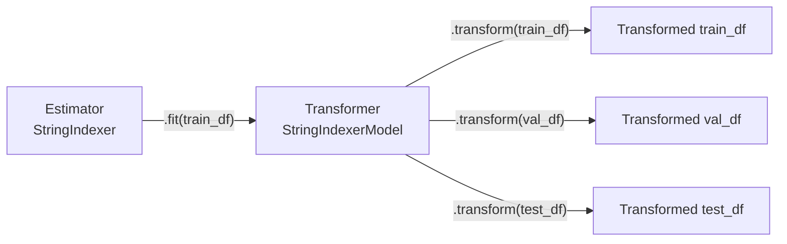

# Module 8 — Feature Engineering Techniques

> **Goal of this module:** Master the Spark ML feature-engineering primitives the exam tests — `StringIndexer`, `OneHotEncoder`, `VectorAssembler`, `Imputer`, `StandardScaler`, `MinMaxScaler` — plus the one-hot-encoding-is-not-always-needed nuance and the log-transformation scenarios.
>
> **Maps to exam objectives:** *Use one-hot encoding for categorical features · Identify and explain the model types or data sets for which one-hot encoding is or is not appropriate · Identify scenarios where log scale transformation is appropriate · Compare estimators and transformers · Develop a training pipeline* (Domains 2 + 3).

---

## Coverage map (verbatim exam objectives → where taught here)

| Verbatim objective | Taught in section |
|---|---|
| Use one-hot encoding for categorical features | "OneHotEncoder — integer → sparse vector" |
| Identify model types for which OHE is or is not appropriate | "When NOT to one-hot encode" table |
| Identify scenarios where log scale transformation is appropriate | "Log scale transformation" |
| Identify the need to exponentiate log-transformed variables | "CRITICAL — exponentiate predictions before computing metrics" |
| Compare estimators and transformers | "Estimators vs Transformers — the foundation" |
| Develop a training pipeline | "Putting it together — a Pipeline" |

---

## Look-alike API comparison — feature engineering edition

| Pair | Difference | Exam tell |
|------|------------|-----------|
| `StringIndexer` vs `IndexToString` | string → int (fit on labels) vs int → string (reverse, for predictions) | "convert prediction back to label name" → IndexToString |
| `OneHotEncoder(dropLast=True)` vs `dropLast=False` | K-1 columns (linear-safe) vs K columns | Linear/regression models → `dropLast=True`. Tree → either (doesn't matter) |
| `StandardScaler` (z-score) vs `MinMaxScaler` ([0,1]) vs `MaxAbsScaler` ([-1,1]) vs `RobustScaler` (median/IQR) | mean/stddev vs min/max vs |max| vs median/IQR | Outlier-robust scaling → RobustScaler |
| `VectorAssembler(inputCols=["a","b"])` vs same with reversed order | Output Vector order MATTERS for interpretation — coefficient at index 0 vs 1 | If you later access `coefficients[0]`, it's the FIRST inputCol |
| `Imputer(strategy="median")` vs `Imputer(strategy="mode")` | works on numeric vs works on numeric+string | Categorical column → must be "mode" |
| `Bucketizer(splits=[...])` vs `QuantileDiscretizer(numBuckets=K)` | user-defined boundaries vs equal-frequency K buckets | "5 equal-population buckets" → QuantileDiscretizer |
| `HashingTF` vs `CountVectorizer` | hash-trick (fixed dim, collisions) vs vocab-learning (exact, larger) | "fixed-size feature vector" → HashingTF. "interpretable vocab" → CountVectorizer |
| `StringIndexer(handleInvalid="error")` vs `"skip"` vs `"keep"` | throw / drop row / assign new index | Robust to unseen labels → "keep" |

---

## Estimators vs Transformers — the foundation

Every Spark ML stage is one of two things:

| Type | Has method | Returns | Examples |
|------|-----------|---------|----------|
| **Estimator** | `.fit(df)` → Transformer | a fitted Transformer | `StringIndexer`, `OneHotEncoder` (since 3.x), `Imputer`, `StandardScaler`, `RandomForestClassifier`, `LogisticRegression` |
| **Transformer** | `.transform(df)` → DataFrame | a DataFrame | `VectorAssembler`, `Tokenizer`, `HashingTF`, any `*Model` (e.g., `StringIndexerModel`) |



The pattern: **fit on train, transform on all three**. Fitting on val/test leaks information.

> ⚠️ **Exam trap — `OneHotEncoder` is an Estimator (since Spark 3.0):** In Spark 2.x, `OneHotEncoder` was a Transformer. In Spark 3.x+ it became an Estimator (it learns the category vocabulary at `.fit` time). The exam's current scope assumes Spark 3.x+. If a question says "OneHotEncoder doesn't need `.fit`," that's the legacy behavior and the wrong answer for the current exam.

### `VectorAssembler` is the exception — Transformer-only

`VectorAssembler` just concatenates columns into a Vector column. No learned state, no `.fit`. Pure Transformer.

```python
from pyspark.ml.feature import VectorAssembler

assembler = VectorAssembler(
    inputCols=["age", "income", "city_ohe"],
    outputCol="features",
)
df_with_features = assembler.transform(df)
```

---

## StringIndexer — categorical → integer

Maps a string column to an integer index based on label frequency (most-frequent label → 0, next → 1, etc.).

```python
from pyspark.ml.feature import StringIndexer

indexer = StringIndexer(
    inputCol="city",
    outputCol="city_idx",
    handleInvalid="keep",   # "error" | "skip" | "keep"
).fit(train_df)

train_indexed = indexer.transform(train_df)
val_indexed = indexer.transform(val_df)
```

### `handleInvalid` options

| Value | Behavior |
|-------|----------|
| `"error"` (default) | Throw an exception when an unseen label appears at transform time |
| `"skip"` | Drop rows with unseen labels |
| `"keep"` | Assign a new index (`numLabels`) to all unseen labels |

> ⚠️ **Exam trap — `handleInvalid="keep"`:** In production, val/test data often has categories not seen in train. Default behavior throws. `"keep"` is the safe choice for most pipelines. The exam will phrase this as "robust to unseen categorical values."

### Multiple columns at once (since Spark 3.0)

```python
indexer = StringIndexer(
    inputCols=["city", "gender", "device"],
    outputCols=["city_idx", "gender_idx", "device_idx"],
    handleInvalid="keep",
).fit(train_df)
```

---

## OneHotEncoder — integer → sparse vector

Converts integer category indices into a sparse binary vector. **Operates on the integer-indexed column**, not the raw string column.

```python
from pyspark.ml.feature import OneHotEncoder

ohe = OneHotEncoder(
    inputCols=["city_idx", "gender_idx"],
    outputCols=["city_ohe", "gender_ohe"],
    handleInvalid="keep",
    dropLast=True,   # drop one category to avoid collinearity in linear models
).fit(train_indexed)

train_ohe = ohe.transform(train_indexed)
```

### `dropLast` — collinearity guard

For linear models, having all `K` one-hot columns introduces perfect multicollinearity (one column is determinable from the rest). `dropLast=True` drops the last category, giving `K-1` columns — standard "dummy variable" encoding from regression.

For tree models, `dropLast` doesn't matter (trees aren't sensitive to collinearity). Keep `True` for safety.

### Output is sparse

OHE output is a Spark `SparseVector` — efficient storage even with 1000+ categories. Doesn't bloat memory.

---

## When NOT to one-hot encode

This is the most-tested "trick" in Domain 2.

| Model family | Need OHE? | Why |
|--------------|-----------|-----|
| **Linear regression / logistic regression** | YES | Models additively; needs each category as a separate feature |
| **SVM** | YES | Distance-based; integer encoding implies false ordinality |
| **k-Nearest Neighbors** | YES | Distance-based |
| **k-Means** | YES | Distance-based |
| **Neural networks** | YES (or embed) | Otherwise the network treats the integer as ordinal |
| **Decision Tree** | NO | Splits on integer thresholds; no false ordinality concern |
| **Random Forest** | NO | Same |
| **Gradient Boosting (GBT, XGBoost, LightGBM)** | NO | Same |

> ⚠️ **Exam trap — "always OHE":** Wrong. The exam tests whether you recognize that tree-based models handle integer-indexed categoricals fine. OHE on trees has no benefit and explodes feature count — sometimes hurts performance by spreading the signal across many sparse columns.

### Why trees don't need OHE

A decision tree splits on `city_idx <= 3.5`. The split point is just a threshold; the integer ordering doesn't carry meaning because every possible split is evaluated. For OHE columns, the tree would split on `city_is_NYC <= 0.5` — semantically equivalent but with `K` times as many candidate splits.

LightGBM goes further: it natively handles categorical features via the `categorical_feature` parameter, doing optimal partitioning internally.

### Cardinality matters

For very high-cardinality categoricals (10K+ distinct values), OHE is often impractical (sparse but still many columns). Alternatives:

- **Target encoding** (replace category with mean target per category) — exam-out-of-scope but production-common
- **Hashing** (`HashingTF` / `FeatureHasher`) — fixed-size output via hash collisions
- **Frequency encoding** (replace category with its count)
- **Embeddings** (for NNs)

---

## Log scale transformation

The exam asks when log transform is appropriate. Pattern recognition:

| Use log transform when… | Why |
|------------------------|-----|
| The variable is **right-skewed** with a long right tail | Log compresses the tail, makes distribution more normal-looking |
| The variable spans **multiple orders of magnitude** | Linear models / distance metrics weigh large values disproportionately |
| **Multiplicative effects** matter more than additive | log(a*b) = log(a) + log(b) — turns multiplicative into additive |
| The target variable shows **constant percent error**, not constant absolute error | RMSE on log-target = approximately RMSPE on original |
| You want **interpretability as elasticities** | A 1-unit change in log(x) ≈ 100% change in x |

### Common candidates for log transform

- **Income, wages, prices** — right-skewed, span orders of magnitude
- **Counts and ratios** — counts often skew right
- **Time durations** — minutes-to-days range
- **Sizes and quantities** — gene expression, biological measurements

### log1p (log of 1+x) for zero-inclusive data

```python
from pyspark.sql import functions as F

df_log = df.withColumn("log_income", F.log1p("income"))
```

`log(0)` is undefined; `log1p(x) = log(1+x)` handles zero gracefully.

### CRITICAL — exponentiate predictions before computing metrics

If you trained on `log(y)`, your model predicts `log(y_hat)`. RMSE in log-space is **not** the same as RMSE in original-space:

```python
# WRONG: comparing log-space RMSE to a regression baseline
y_pred_log = model.predict(X_test)
rmse_log = sqrt(mean((y_pred_log - y_test_log) ** 2))   # log-space RMSE

# CORRECT: exponentiate before computing on original scale
y_pred = np.expm1(y_pred_log)   # inverse of log1p
y_test_orig = np.expm1(y_test_log)
rmse_original = sqrt(mean((y_pred - y_test_orig) ** 2))
```

> ⚠️ **Exam trap — forgetting to exponentiate:** Section 3 has an explicit objective: "Identify the need to exponentiate log-transformed variables before calculating evaluation metrics or interpreting predictions." This shows up as a "what's wrong with this evaluation code?" question. The answer: missing `np.exp()` / `np.expm1()`.

---

## Scaling — StandardScaler and MinMaxScaler

### StandardScaler — zero-mean, unit-variance

```python
from pyspark.ml.feature import StandardScaler

scaler = StandardScaler(
    inputCol="features",
    outputCol="scaled_features",
    withMean=True,    # subtract mean (requires dense vector)
    withStd=True,     # divide by stddev
).fit(train_df)

train_scaled = scaler.transform(train_df)
```

- `withMean=True` requires a dense vector and produces a dense result (every value changes). For sparse vectors, leave `withMean=False` and only scale variance.

### MinMaxScaler — map to [0, 1]

```python
from pyspark.ml.feature import MinMaxScaler

scaler = MinMaxScaler(
    inputCol="features",
    outputCol="scaled_features",
).fit(train_df)
```

### When to scale

- **Required for:** SVM, k-NN, k-Means, neural networks, regularized linear models (Ridge, Lasso)
- **Not needed for:** Decision trees, Random Forest, GBT (splits are scale-invariant)

> ⚠️ **Exam trap — scaling and trees:** Like OHE, scaling has no effect on tree-based models. Don't waste a pipeline stage on it for tree models.

---

## Putting it together — a Pipeline

The `Pipeline` chains stages. Each stage is fit (if Estimator) or applied (if Transformer) in order. The whole Pipeline is itself an Estimator — fitting it returns a `PipelineModel` Transformer.

```python
from pyspark.ml import Pipeline
from pyspark.ml.feature import Imputer, StringIndexer, OneHotEncoder, VectorAssembler
from pyspark.ml.classification import RandomForestClassifier

imputer = Imputer(
    inputCols=["age", "income"],
    outputCols=["age_imp", "income_imp"],
    strategy="median",
)

indexer = StringIndexer(
    inputCols=["city", "gender"],
    outputCols=["city_idx", "gender_idx"],
    handleInvalid="keep",
)

ohe = OneHotEncoder(
    inputCols=["city_idx", "gender_idx"],
    outputCols=["city_ohe", "gender_ohe"],
    handleInvalid="keep",
)

assembler = VectorAssembler(
    inputCols=["age_imp", "income_imp", "city_ohe", "gender_ohe"],
    outputCol="features",
)

rf = RandomForestClassifier(
    featuresCol="features",
    labelCol="churned",
    numTrees=100,
    maxDepth=10,
    seed=42,
)

pipeline = Pipeline(stages=[imputer, indexer, ohe, assembler, rf])
pipeline_model = pipeline.fit(train_df)   # fits each Estimator stage in order

# Inference — single call
predictions = pipeline_model.transform(test_df)
```

### Why Pipelines matter

1. **Atomic fit + transform.** No risk of "forgot to apply the indexer to test data."
2. **Reusable.** Save the `PipelineModel` to MLflow, load it later, run end-to-end inference with one `.transform`.
3. **CrossValidator-compatible.** Pass the Pipeline as `estimator` to `CrossValidator` — the whole pipeline gets re-fit per fold, no leakage.
4. **Serializable.** `pipeline_model.save("/path")` / `PipelineModel.load("/path")`.

> ⚠️ **Exam trap — note the RF stage at the end:** OneHotEncoder is in the pipeline before a Random Forest. As discussed, RF doesn't need OHE. In a textbook this would be a question: "Is the pipeline correct?" — technically yes (won't break), but it's wasteful. The exam may phrase as "what would you remove?" Answer: OHE if the downstream is purely tree-based.

---

## Other Spark ML feature transformers worth knowing

| Class | What it does |
|-------|--------------|
| `Imputer` | Fill missing with mean/median/mode |
| `StringIndexer` | String → integer |
| `IndexToString` | Reverse of StringIndexer (post-prediction) |
| `OneHotEncoder` | Integer → sparse OHE vector |
| `VectorAssembler` | Concat columns → single Vector column |
| `StandardScaler` | Zero-mean, unit-variance |
| `MinMaxScaler` | Scale to [0, 1] |
| `MaxAbsScaler` | Scale to [-1, 1] |
| `RobustScaler` | Median-and-IQR-based scaling (outlier-robust) |
| `Tokenizer` / `RegexTokenizer` | Split text into tokens |
| `HashingTF` / `IDF` | TF-IDF for text |
| `CountVectorizer` | Count-based vectorization |
| `PCA` | Principal Component Analysis dimensionality reduction |
| `Bucketizer` | Numeric → discrete buckets via boundaries |
| `QuantileDiscretizer` | Numeric → equal-frequency buckets |
| `PolynomialExpansion` | Generate polynomial feature interactions |

You don't need to memorize all signatures; recognize the names so you can match "feature interactions" → `PolynomialExpansion`, "discrete buckets" → `Bucketizer`/`QuantileDiscretizer`, etc.

---

## Common pitfalls

### Fitting transformers on the full DataFrame

Train → val → test split should happen **before** any `.fit()`. Otherwise validation/test statistics leak into the fitted state.

### Using `OneHotEncoderEstimator` (the legacy name)

The class was renamed from `OneHotEncoderEstimator` to `OneHotEncoder` in Spark 3.0. Old tutorials may use the legacy name. The current `OneHotEncoder` IS the estimator; there's no longer a separate Transformer-only class.

### Forgetting `handleInvalid="keep"`

Default `"error"` throws when an unseen category appears at transform time. Production pipelines almost always want `"keep"` for `StringIndexer` and `OneHotEncoder`.

### Scaling tree-input features unnecessarily

Doesn't break anything but adds a stage that does no work. Strip it from tree pipelines.

### Computing RMSE on log-scale predictions

If you trained on log-target, exponentiate predictions before metrics. Otherwise your "RMSE" is in log-units and not comparable to other models.

---

## Worked exam-question walkthroughs

### Worked example: "Pipeline has OHE before RandomForest — improve it"

**Pattern:** Pipeline with StringIndexer → OneHotEncoder → VectorAssembler → RandomForestClassifier.

**Reasoning:** RF doesn't benefit from OHE. OHE inflates feature count, dilutes signal.

**Improvement:** Drop OneHotEncoder. Feed `city_idx` directly into VectorAssembler.

### Worked example: "Log-transform an RMSE evaluation"

**Pattern:** Code trains on `np.log1p(price)` and reports `RMSE(y_pred_log, y_test_log) = 0.42`.

**Bug:** RMSE is in log-units, not dollars.

**Fix:** `y_pred = np.expm1(y_pred_log); y_test = np.expm1(y_test_log); rmse = sqrt(mean((y_pred - y_test)**2))`.

### Worked example: "Estimator vs Transformer for VectorAssembler"

**Pattern:** Question shows `VectorAssembler(...).fit(df)`.

**Reasoning:** VectorAssembler has no learned state — it just concatenates columns. It's a Transformer only.

**Answer:** `.fit()` is invalid; just `.transform(df)` directly. (Spark accepts `.fit` on a Transformer as a no-op in some versions but it's bad form.)

### Worked example: "Unseen city in test data crashes pipeline"

**Pattern:** Default `StringIndexer(handleInvalid="error")` throws when a new city appears at test time.

**Fix:** `StringIndexer(..., handleInvalid="keep")`. Unseen labels get `numLabels` index.

---

## Output prediction drills

### Drill 1
```python
si = StringIndexer(inputCol="city", outputCol="city_idx").fit(train_df)
# train cities: NYC, LA, SF (in frequency order)
si.labels   # ?
```
**Q:** What's stored?
**A:** `['NYC', 'LA', 'SF']` — sorted by frequency descending. So NYC→0, LA→1, SF→2.

### Drill 2
```python
ohe = OneHotEncoder(inputCol="city_idx", outputCol="city_ohe", dropLast=True).fit(df)
# 5 distinct cities → city_idx in {0,1,2,3,4}
```
**Q:** Output Vector dimension?
**A:** 4 (dropLast=True drops the last category). With dropLast=False, it would be 5.

### Drill 3
```python
df.withColumn("log_x", F.log("x"))   # x contains 0
```
**Q:** Result for x=0 row?
**A:** `null` (log(0) = -inf, but Spark logs of 0 give null/NaN). Use `F.log1p("x")` for zero-inclusive data.

### Drill 4
```python
assembler = VectorAssembler(inputCols=["a","b","c"], outputCol="features")
result = assembler.transform(df)
# row with a=null
```
**Q:** What happens?
**A:** **Error** by default — VectorAssembler throws on nulls. Set `handleInvalid="skip"` or impute first.

---

## What the exam tests on this module

> 🎯 **Exam tests here:**
> - Estimator vs Transformer — `.fit` returns a Transformer
> - `OneHotEncoder` is an Estimator (since Spark 3.0)
> - `VectorAssembler` is Transformer-only
> - When OHE is NOT needed (tree-based models)
> - Log transformation when: right-skewed, orders of magnitude, multiplicative effects
> - Must exponentiate predictions before computing RMSE on original scale
> - `Imputer.strategy="mean"/"median"/"mode"`
> - `handleInvalid="keep"` for robustness to unseen categories
> - `Pipeline(stages=[...])` chains stages, fits in order

---

## Mini quiz

1. Your pipeline has `StringIndexer → OneHotEncoder → VectorAssembler → RandomForest`. The pipeline runs but feels wasteful. What would you change?
2. You trained on `np.log1p(price)`. You compute `RMSE(y_pred, y_test_log)` and report it as the model's RMSE. What's wrong?
3. Customer city has 50,000 distinct values. Should you OHE it for a logistic regression?
4. You're scaling features before a Random Forest. Is scaling necessary?
5. `StringIndexer` throws an exception in production when a new city appears. How do you fix it?
6. Name the only Spark ML feature class that is purely a Transformer with no Estimator counterpart.

### Answers

1. **Remove the `OneHotEncoder` stage.** Random Forest splits on integer thresholds; OHE adds feature count without benefit. Keep `StringIndexer` (need integer encoding), drop OHE, feed `city_idx` directly to `VectorAssembler`.
2. The RMSE is in **log space**, not original space. Reverse with `y_pred = np.expm1(y_pred_log)` and then compute RMSE on `expm1(y_test_log)` vs `expm1(y_pred_log)`. Otherwise the metric is uncomparable to other models.
3. Probably not. 50K-way OHE is unwieldy. Consider feature hashing, target encoding, or grouping rare categories before encoding. If you must encode for a linear model, hashing is more tractable than full OHE.
4. **No.** Tree splits are scale-invariant. Scaling has no effect on tree models. Skip the stage.
5. Set `handleInvalid="keep"` on the `StringIndexer`. Unseen labels get a new index instead of raising.
6. `VectorAssembler` — it only concatenates columns; no learned state.
