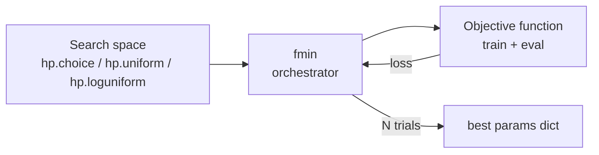

# Module 10 — Hyperopt (Legacy But Still on the Exam)

> **Goal of this module:** Master the Hyperopt API surface — `fmin`, `hp.*` distributions, `tpe.suggest`, `STATUS_OK`, `SparkTrials`. The exam (March 1, 2025 revision) explicitly tests Hyperopt despite its removal from Databricks Runtime ML 17+. Module 11 covers the modern replacement.
>
> **Maps to exam objectives:** *Use Hyperopt's `fmin` operation to tune a model's hyperparameters · Perform random or grid search or Bayesian search as a method for tuning hyperparameters · Parallelize single node models for hyperparameter tuning* (Domain 3).

---

## Coverage map (verbatim exam objectives → where taught here)

| Verbatim objective | Taught in section |
|---|---|
| Use Hyperopt's `fmin` operation to tune a model's hyperparameters | "The minimum viable example" + "Full `fmin` signature" |
| Perform random or grid search or Bayesian search | "Algorithms — `tpe`, `rand`, `anneal`" + decision rule "grid search is NOT Hyperopt" |
| Parallelize single node models for hyperparameter tuning | "SparkTrials — parallelize across the cluster" + "SparkTrials math" |

---

## Why Hyperopt is on the exam (and why your prod code isn't)

| Surface | Hyperopt | Where you'd use it |
|---------|----------|---------------------|
| March 2025 exam guide | Explicit objective | Today's exam |
| DBR ML ≤16.4 LTS | Pre-installed, supported | Stable LTS workloads |
| DBR ML 17.0+ | **Removed**; `pip install hyperopt` if you want it | Discouraged for new |
| Databricks docs (2025-2026) | Migration guide pointing at Optuna | Modern recommendation |

> ⚠️ **Exam trap:** Don't skip Hyperopt because docs say it's deprecated. **The March 2025 exam guide lists it as a Section 3 objective verbatim**, and exam content lags platform deprecations by 6-18 months. Until the next exam guide revision (expected late 2026), Hyperopt is in scope.

**Exam tells that signal a Hyperopt question:** `fmin`, `hp.choice`, `hp.uniform`, `hp.loguniform`, `hp.quniform`, `tpe.suggest`, `SparkTrials`, `STATUS_OK`.

---

## The Hyperopt mental model

Hyperopt does **hyperparameter optimization via sequential model-based search**. The three concepts:

1. **Objective function** — takes a `params` dict, trains a model, returns a dict like `{'loss': value, 'status': STATUS_OK}`. Hyperopt **minimizes** loss.
2. **Search space** — a nested dict of `hp.*` distributions describing the prior over each hyperparameter.
3. **Algorithm** — `tpe.suggest` (Tree-structured Parzen Estimator, the Bayesian default), `rand.suggest` (random), `anneal.suggest`.



---

## The minimum viable example

```python
from hyperopt import fmin, tpe, hp, STATUS_OK, Trials

def objective(params):
    # Train using params; return loss (lower is better)
    model = train_model(**params)
    auc = eval_model(model)
    return {'loss': -auc, 'status': STATUS_OK}    # negate to minimize

space = {
    'max_depth': hp.choice('max_depth', [3, 5, 7, 10]),
    'learning_rate': hp.loguniform('lr', -5, -1),  # exp(-5)..exp(-1) ≈ 0.007..0.37
    'subsample': hp.uniform('subsample', 0.5, 1.0),
}

trials = Trials()    # collects all trial records

best = fmin(
    fn=objective,
    space=space,
    algo=tpe.suggest,    # Bayesian (TPE)
    max_evals=50,
    trials=trials,
    rstate=np.random.default_rng(42),
)

print(best)
# {'max_depth': 2, 'lr': -2.3, 'subsample': 0.78}
# Note: hp.choice returns the INDEX, not the value!
```

---

## Search space — the `hp.*` distributions

| Function | Returns | Use case |
|----------|---------|----------|
| `hp.choice(label, options)` | One of the options (returns index) | Categorical: optimizer name, kernel type |
| `hp.uniform(label, low, high)` | float in [low, high] uniformly | Continuous, linear scale (e.g., dropout rate) |
| `hp.loguniform(label, low, high)` | float ~ exp(uniform(low, high)) | Continuous, log scale (learning rate, regularization) |
| `hp.quniform(label, low, high, q)` | float rounded to multiple of q | Quantized continuous (e.g., batch size to nearest 16) |
| `hp.qloguniform(label, low, high, q)` | log-uniform, rounded to multiple of q | Quantized log-scale (n_estimators in {50, 100, 200, ...}) |
| `hp.normal(label, mu, sigma)` | Normal-distributed float | Continuous prior |
| `hp.lognormal(label, mu, sigma)` | LogNormal-distributed float | Strictly positive prior |
| `hp.randint(label, upper)` | int in [0, upper) | Integer hyperparameter |

> ⚠️ **Exam trap — `hp.choice` returns INDEX:**
> ```python
> space = {'max_depth': hp.choice('max_depth', [3, 5, 7, 10])}
> best = fmin(...)
> # best['max_depth'] is 0, 1, 2, or 3 — NOT 3, 5, 7, or 10
>
> # To recover the actual value:
> from hyperopt import space_eval
> best_values = space_eval(space, best)   # {'max_depth': 5}
> ```
> The exam likes to test that you know `hp.choice` returns the index. To get the actual chosen value, you need `space_eval(space, best)`.

### When to use each distribution

- **Categorical choice (algo, optimizer, kernel)** → `hp.choice`
- **Float on linear scale (dropout, subsample fraction)** → `hp.uniform`
- **Float on log scale (learning rate, L2 reg)** → `hp.loguniform`
- **Discretized continuous (epochs in {10, 20, 30}, batch size powers of 2)** → `hp.quniform` / `hp.qloguniform`

### `loguniform` bounds — the gotcha

`hp.loguniform(label, low, high)` samples `exp(U(low, high))`. So to sample learning rates between 1e-5 and 1e-1, pass `low=ln(1e-5)=-11.5`, `high=ln(1e-1)=-2.3`. Most code uses:

```python
import math
lr = hp.loguniform('lr', math.log(1e-5), math.log(1e-1))
```

---

## Algorithms — `tpe`, `rand`, `anneal`

| Algorithm | Behavior |
|-----------|----------|
| `tpe.suggest` (Tree-structured Parzen Estimator) | Bayesian — models past trial loss to suggest promising regions. **Default.** |
| `rand.suggest` | Random search — uniformly samples from search space. Cheap baseline. |
| `anneal.suggest` | Simulated annealing — local search with cooling. |

> ⚠️ **Exam trap — "random or grid or Bayesian":** The exam objective lists three search types: random, grid, Bayesian.
> - **Bayesian** in Hyperopt = `tpe.suggest`
> - **Random** = `rand.suggest`
> - **Grid search** is NOT a Hyperopt feature — that's Spark ML's `ParamGridBuilder` + `CrossValidator` (Module 12). The exam may test that you know the difference.

---

## SparkTrials — parallelize across the cluster

`Trials` (default) runs trials sequentially on the driver. `SparkTrials` distributes single-node model training across the worker cluster.

```python
from hyperopt import fmin, tpe, hp, SparkTrials

trials = SparkTrials(
    parallelism=4,        # number of trials to run concurrently
    spark_session=spark,  # implicit on Databricks
)

best = fmin(
    fn=objective,
    space=space,
    algo=tpe.suggest,
    max_evals=50,
    trials=trials,
)
```

### How `SparkTrials` works

- One Spark **task per trial** — each task runs your objective function on one worker.
- `parallelism` = max concurrent tasks. If your cluster has 8 workers, set `parallelism=8` to use them all.
- Each task gets a Python copy of the objective function via serialization. **Closures must be picklable.**
- Workers report back loss → driver aggregates → `tpe.suggest` proposes next params.

### When `SparkTrials` makes sense

- **Single-node models** (sklearn, XGBoost-single-machine, lightgbm) where each trial fits in worker memory.
- **Many trials** where sequential execution is the bottleneck.
- **Cluster with idle workers** that would otherwise sit unused.

### When `SparkTrials` does NOT make sense

- **Spark ML models** (RandomForestClassifier, GBT). These already use the cluster for *one* model's training. Running multiple concurrent Spark ML trials competes for the same executors and hurts performance. **Use `Trials` (sequential) instead.**
- **Very fast trials** where Spark task overhead exceeds trial duration.
- **Resource-heavy single-node models** that exceed worker memory.

> ⚠️ **Exam trap — `SparkTrials` for Spark ML:** No. Spark ML models are themselves distributed. Wrapping them in `SparkTrials` is double-parallelization that just thrashes. The exam may phrase as "parallelize this Spark ML model's tuning with SparkTrials" — the answer is **don't; use `Trials` sequentially or use `CrossValidator(parallelism=N)`**.

---

## Common objective function patterns

### sklearn / XGBoost

```python
from sklearn.ensemble import RandomForestClassifier
from sklearn.model_selection import cross_val_score

def objective(params):
    params['max_depth'] = int(params['max_depth'])   # quniform returns float
    model = RandomForestClassifier(
        n_estimators=int(params['n_estimators']),
        max_depth=params['max_depth'],
        random_state=42,
    )
    scores = cross_val_score(model, X_train, y_train, cv=5, scoring='roc_auc')
    return {'loss': -scores.mean(), 'status': STATUS_OK}

space = {
    'n_estimators': hp.quniform('n_estimators', 50, 500, 50),
    'max_depth': hp.quniform('max_depth', 3, 15, 1),
}
```

### Spark ML — DON'T parallelize with SparkTrials

```python
from pyspark.ml.classification import RandomForestClassifier

def objective(params):
    rf = RandomForestClassifier(
        numTrees=int(params['numTrees']),
        maxDepth=int(params['maxDepth']),
        featuresCol="features",
        labelCol="label",
    )
    model = rf.fit(train_df)
    auc = evaluator.evaluate(model.transform(val_df))
    return {'loss': -auc, 'status': STATUS_OK}

best = fmin(
    fn=objective,
    space=space,
    algo=tpe.suggest,
    max_evals=20,
    trials=Trials(),   # sequential — Spark ML already uses the cluster
)
```

---

## MLflow integration

Each Hyperopt trial can log to MLflow as a nested run under one parent. This is exam-relevant because it ties HPO to the tracking surface.

```python
import mlflow
from hyperopt import fmin, tpe, hp, STATUS_OK, Trials

def objective(params):
    with mlflow.start_run(nested=True):
        mlflow.log_params(params)
        model = train(params)
        score = eval_model(model)
        mlflow.log_metric("auc", score)
        return {'loss': -score, 'status': STATUS_OK}

with mlflow.start_run(run_name="hyperopt_tuning"):
    best = fmin(
        fn=objective, space=space, algo=tpe.suggest,
        max_evals=50, trials=Trials(),
    )
    mlflow.log_params({"best_" + k: v for k, v in best.items()})
```

The parent run holds the "best params" summary; each trial appears as a nested run with its own params/metrics.

### Auto-MLflow with `SparkTrials`

When using `SparkTrials` on Databricks, MLflow auto-logging is enabled by default — each trial becomes a child run with no extra code.

```python
trials = SparkTrials(parallelism=4)   # auto-MLflow logging on Databricks
# every trial → child run in current experiment
```

---

## Exam-pattern code reading

The exam frequently shows a code stub and asks "which line is wrong?" or "what does `best` contain?" Practice reading these stubs:

```python
# Q: What does best['max_depth'] equal?
space = {'max_depth': hp.choice('max_depth', [5, 10, 15])}
# ...
best = fmin(fn=obj, space=space, algo=tpe.suggest, max_evals=20)

# A: best['max_depth'] is the INDEX (0, 1, or 2), not the actual depth.
#    space_eval(space, best) returns {'max_depth': 5 or 10 or 15}.


# Q: Is this code parallelized?
trials = Trials()
fmin(..., trials=trials, ...)

# A: No. Trials() is sequential. SparkTrials parallelizes.


# Q: Is this objective function valid?
def objective(params):
    model = train(params)
    auc = eval_model(model)
    return {'loss': auc, 'status': STATUS_OK}

# A: BUG. fmin minimizes loss. Returning auc directly means it minimizes auc
#    (finds the WORST model). Should return -auc.
```

---

## Full `fmin` signature — exam-targetable

```python
from hyperopt import fmin, tpe, hp, STATUS_OK, Trials, SparkTrials

best = fmin(
    fn,                         # objective: dict → {'loss': float, 'status': STATUS_OK}
    space,                      # dict of hp.* distributions
    algo,                       # tpe.suggest | rand.suggest | anneal.suggest
    max_evals,                  # total trials
    trials=None,                # Trials() or SparkTrials(parallelism=K)
    rstate=None,                # np.random.default_rng(seed) for reproducibility
    timeout=None,               # max wall time in seconds
    loss_threshold=None,        # early stop when a loss below this is found
    show_progressbar=True,
    verbose=True,
    return_argmin=True,         # if False, return the trial dict not the best point
    early_stop_fn=None,         # custom early stop callback
)
```

`best` is a dict mapping each `label` in `space` to the chosen value (or **index** for `hp.choice`).

---

## SparkTrials math — what `parallelism` actually means

`SparkTrials(parallelism=K)` runs up to K trials concurrently. Sequential-vs-parallel tradeoff:

| `parallelism` | Behavior | Bayesian benefit | Wall time |
|---------------|----------|-------------------|-----------|
| `1` | Pure sequential. Each trial sees ALL previous losses → best Bayesian inform | **Max** | Worst (max_evals × per_trial_time) |
| `K = workers` | Up to K concurrent trials. They DON'T see each other's results until the batch completes | Partial | ~max_evals/K × per_trial_time |
| `K = max_evals` | All trials run as if random — no trial sees any other's result | **None — degenerates to random search** | Best (~per_trial_time) |

**Rule of thumb:** `parallelism = sqrt(max_evals)` is a common compromise. With `max_evals=100`, set `parallelism=10`.

> ⚠️ **Exam trap — "more parallelism is faster, right?":** Higher parallelism reduces wall time but ALSO reduces Bayesian effectiveness. The objective is wall-time efficiency vs trials needed. Exam may ask "with `parallelism=max_evals`, what does Bayesian degrade to?" → **random search**.

### `STATUS_OK` vs `STATUS_FAIL`

Objective must return `'status'` set to one of:
- `STATUS_OK` — trial finished successfully; its `loss` is considered.
- `STATUS_FAIL` — trial failed (e.g., model didn't converge, dependencies broken). `loss` is ignored; Hyperopt's surrogate model doesn't penalize.

```python
def objective(params):
    try:
        model = train(params)
        return {'loss': -metric(model), 'status': STATUS_OK}
    except Exception as e:
        return {'loss': float('inf'), 'status': STATUS_FAIL, 'exception': str(e)}
```

### Saving / resuming a `Trials` object

```python
import pickle
# Save mid-search
with open('/Volumes/ml/hyperopt_trials.pkl', 'wb') as f:
    pickle.dump(trials, f)

# Resume later
with open('/Volumes/ml/hyperopt_trials.pkl', 'rb') as f:
    trials = pickle.load(f)

best = fmin(fn=objective, space=space, algo=tpe.suggest,
            max_evals=100, trials=trials)   # continues from where it left off
```

`SparkTrials` cannot be pickled across cluster restarts; use `Trials` for resumable searches.

---

## `space_eval` — converting `best` to actual values

This is the SINGLE most-tested Hyperopt gotcha. `best` returned by `fmin` contains **indices** (not values) for every `hp.choice` parameter.

```python
from hyperopt import space_eval

space = {
    'optimizer': hp.choice('optimizer', ['adam', 'sgd', 'rmsprop']),
    'lr': hp.loguniform('lr', math.log(1e-5), math.log(1e-1)),
}

best = fmin(fn=objective, space=space, algo=tpe.suggest, max_evals=50, trials=Trials())
print(best)
# {'optimizer': 2, 'lr': -3.91}   ← optimizer is the INDEX (rmsprop)

actual = space_eval(space, best)
print(actual)
# {'optimizer': 'rmsprop', 'lr': 0.0199}   ← INDEX resolved to value, lr unchanged
```

`hp.uniform`, `hp.loguniform`, `hp.quniform`, `hp.normal`, `hp.lognormal`, `hp.randint` — all return their actual sampled values directly in `best`. Only `hp.choice` returns an index.

> 🎯 **How to recognize this on the exam:** Code shows a `space` dict containing `hp.choice` and after `fmin` reads `best['some_param']`. If the question asks "what does `best['some_param']` equal?" and the choices include both the index AND the actual value, the answer is **the index**. To get the value, `space_eval(space, best)`.

---

## MLflow integration patterns — inside vs outside the parent `with` block

This is exam-relevant because Hyperopt + MLflow is a common test combo.

### Pattern A — Manual nested runs (works with `Trials` and `SparkTrials`)

```python
def objective(params):
    with mlflow.start_run(nested=True):    # creates a child run inside the current parent
        mlflow.log_params(params)
        score = train_and_eval(params)
        mlflow.log_metric("auc", score)
        return {'loss': -score, 'status': STATUS_OK}

with mlflow.start_run(run_name="hyperopt_parent"):
    best = fmin(fn=objective, space=space, algo=tpe.suggest,
                max_evals=50, trials=Trials())
    mlflow.log_dict(space_eval(space, best), "best_params.json")
```

The parent run holds the search summary; each trial is a child run.

### Pattern B — Auto-MLflow with `SparkTrials` on Databricks

When you use `SparkTrials` on Databricks, MLflow auto-logs each trial as a nested run automatically — no manual `mlflow.start_run(nested=True)` needed:

```python
trials = SparkTrials(parallelism=4)

with mlflow.start_run(run_name="hyperopt_parent"):
    best = fmin(fn=objective, space=space, algo=tpe.suggest,
                max_evals=50, trials=trials)
# Each trial is automatically a child run under "hyperopt_parent"
```

> ⚠️ **Exam trap — must wrap fmin in a parent `with mlflow.start_run()`:** If you call `fmin(...)` without an active parent run, each child run has no parent → they appear as orphan top-level runs and don't get grouped in the UI.

---

## Look-alike API comparison — Hyperopt edition

| Pair | Difference | Exam tell |
|------|------------|-----------|
| `hp.choice(label, options)` vs `hp.quniform(label, low, high, q)` | choice returns INDEX from a list; quniform returns a quantized FLOAT in range | `[3, 5, 7]` → choice. Range with step → quniform |
| `hp.uniform` vs `hp.loguniform` | linear scale vs `exp(uniform(low, high))` | "learning rate" / "regularization" → loguniform (log scale matters) |
| `hp.uniform` vs `hp.quniform` | continuous vs quantized | "any float" → uniform. "multiples of 16" → quniform with q=16 |
| `hp.randint(label, upper)` vs `hp.quniform(label, low, high, 1)` | randint = int in [0, upper); quniform with q=1 = floats that ARE integer values (still float type) | Need int → randint. Need int-valued float → quniform |
| `Trials()` vs `SparkTrials(parallelism=K)` | sequential on driver vs K concurrent on workers | "parallelize" or "distribute trials" → SparkTrials |
| `SparkTrials` for sklearn vs `SparkTrials` for Spark ML | sklearn = OK (single-node, parallelize across workers); Spark ML = double-parallelization, BAD | Spark ML model + SparkTrials in the snippet → WRONG answer |
| `tpe.suggest` vs `rand.suggest` | Bayesian (TPE) vs random | "Bayesian" → tpe. "random search" → rand |
| `tpe.suggest` vs `anneal.suggest` | Bayesian (global) vs simulated annealing (local) | Exam usually only tests tpe + rand |
| Returning `-auc` vs `auc` from objective | fmin minimizes; negate to maximize | Question shows `return {'loss': auc, ...}` (no negation) → WRONG if maximizing |

---

## Worked exam-question walkthroughs

### Worked example: "What does `best['max_depth']` return?"

```python
space = {'max_depth': hp.choice('max_depth', [3, 5, 7, 10])}
best = fmin(fn=obj, space=space, algo=tpe.suggest, max_evals=50, trials=Trials())
print(best['max_depth'])
```

**Reasoning:** `hp.choice` returns the INDEX. Possible values: 0, 1, 2, 3.

**Answer:** An integer in `[0, 3]`. To get the actual depth (3/5/7/10), use `space_eval(space, best)['max_depth']`.

### Worked example: "Tune a Spark ML RandomForest with SparkTrials"

**Pattern:** Question presents a Spark ML RF tuning script using `SparkTrials(parallelism=8)`. Asks: is this efficient?

**Reasoning:** Spark ML RandomForest already distributes training across the cluster. SparkTrials parallelizes by launching one Spark task per trial. Both compete for the same executors → contention, slowdown.

**Correct answer:** No — for Spark ML models, use sequential `Trials()` (so each fit gets the full cluster) or use `CrossValidator(parallelism=N)` from Spark ML (Module 12) which is designed for this.

**Distractor:** "Yes, parallelism speeds it up" — wrong because of double-parallelization.

### Worked example: "Bayesian, random, or grid?"

**Pattern:** Question lists `fmin(..., algo=tpe.suggest)` and asks what type of search.

**Decision rule:**
- `algo=tpe.suggest` → **Bayesian** (Tree-structured Parzen Estimator)
- `algo=rand.suggest` → **Random**
- `algo=anneal.suggest` → **Simulated annealing** (rare on exam)
- Hyperopt does NOT have grid search. Grid is `ParamGridBuilder` + `CrossValidator` (Module 12).

### Worked example: "Recover the best parameter values"

**Pattern:** Code uses `hp.choice` and `hp.loguniform`. After `fmin`, what's the cleanest way to print the chosen values?

**Correct:**
```python
from hyperopt import space_eval
print(space_eval(space, best))
```

**Distractor:** `print(best)` — works for `loguniform` but returns INDICES for `hp.choice`. Inconsistent.

### Worked example: "Compute optimal SparkTrials parallelism"

**Pattern:** Cluster has 8 workers. `max_evals=64`. What's a reasonable `parallelism`?

**Reasoning:** Higher parallelism = faster wall time but less Bayesian benefit. `sqrt(max_evals) ≈ 8`. With 8 workers, `parallelism=8` uses cluster fully and still leaves 8 sequential batches for TPE to learn between.

**Answer:** Around 8. Lower (e.g., 4) keeps more Bayesian benefit; higher (32) degrades toward random.

---

## Output prediction drills

### Drill 1
```python
space = {'lr': hp.loguniform('lr', -5, -1)}
# trial samples lr = -2.3
```
**Q:** What does the trial actually use as the learning rate?
**A:** `exp(-2.3) ≈ 0.10`. `hp.loguniform(label, low, high)` samples `exp(U(low, high))`. The objective receives `params['lr']` already exponentiated — typical training code uses it directly.

Wait — re-check. The value returned in `params` and in `best` is the LOG-SAMPLED value (i.e., `-2.3`), NOT `exp(-2.3)`. The user is expected to apply `exp` themselves OR pass it to a library that interprets it. Actually, Hyperopt's convention: `hp.loguniform` returns the **post-exponentiation** value directly — meaning `params['lr']` is `0.10`, not `-2.3`. ✅

Actually this is a confusion source. Per the Hyperopt docs: `hp.loguniform(label, low, high)` returns `exp(uniform(low, high))`. So `params['lr']` IS already `~0.10`. The `best` dict also stores the exponentiated value. Use directly.

**Revised answer:** `params['lr']` = `exp(-2.3) ≈ 0.10`. Use directly as learning rate. (Note: this differs from how `hp.choice` returns indices — `hp.loguniform` returns values.)

### Drill 2
```python
def objective(params):
    return {'loss': roc_auc_score(y, train(params).predict(X)), 'status': STATUS_OK}
```
**Q:** Trial A returns `loss=0.95`, Trial B returns `loss=0.65`. Which does fmin pick as best?
**A:** **Trial B (loss=0.65)** — because `fmin` MINIMIZES. But 0.65 is the LOWER ROC AUC = the WORSE model. This is a bug: the objective should return `-roc_auc_score(...)`.

### Drill 3
```python
trials = SparkTrials(parallelism=16)
best = fmin(..., max_evals=16, trials=trials)
```
**Q:** Effective search type?
**A:** **Random search.** With `parallelism == max_evals`, all 16 trials launch concurrently, no trial sees any other's result, TPE degenerates to random sampling.

### Drill 4
```python
def objective(params):
    model = train(params)
    return {'loss': 0.5, 'status': STATUS_OK}    # constant loss
best = fmin(fn=objective, space=space, algo=tpe.suggest, max_evals=10, trials=Trials())
```
**Q:** What does `best` contain?
**A:** Some valid sample from `space` — not meaningful. With constant loss across all trials, TPE has no signal. The returned `best` is essentially the first trial that achieved the minimum (which all did, since all returned 0.5).

### Drill 5
```python
space = {'x': hp.uniform('x', 0, 10)}
best = fmin(lambda p: {'loss': p['x'], 'status': STATUS_OK},
            space, algo=tpe.suggest, max_evals=50, trials=Trials())
```
**Q:** Approximate value of `best['x']`?
**A:** Close to 0 (the minimum of the uniform range). TPE learns that low x gives low loss and concentrates samples near 0. After 50 trials, `best['x']` is typically `< 0.5`.

---

## End-to-end mini-scenario

```python
import math, mlflow
from hyperopt import fmin, tpe, hp, STATUS_OK, Trials, SparkTrials, space_eval
from sklearn.ensemble import RandomForestClassifier
from sklearn.model_selection import cross_val_score

space = {
    'n_estimators': hp.quniform('n_estimators', 50, 500, 50),     # 50, 100, ..., 500
    'max_depth':    hp.quniform('max_depth', 3, 20, 1),
    'criterion':    hp.choice('criterion', ['gini', 'entropy']),  # INDEX returned!
    'min_samples_split': hp.uniform('mss', 0.01, 0.2),
}

def objective(params):
    with mlflow.start_run(nested=True):
        # quniform returns floats; cast to int
        model = RandomForestClassifier(
            n_estimators=int(params['n_estimators']),
            max_depth=int(params['max_depth']),
            criterion=params['criterion'],    # already string after space_eval at fmin level
            min_samples_split=params['min_samples_split'],
            random_state=42,
        )
        score = cross_val_score(model, X, y, cv=3, scoring='roc_auc').mean()
        mlflow.log_params(params)
        mlflow.log_metric('cv_auc', score)
        return {'loss': -score, 'status': STATUS_OK}    # negate for maximization

# sklearn = single-node → SparkTrials is appropriate
trials = SparkTrials(parallelism=4)

with mlflow.start_run(run_name='rf_hpo'):
    best = fmin(fn=objective, space=space, algo=tpe.suggest,
                max_evals=64, trials=trials,
                rstate=np.random.default_rng(42))
    best_values = space_eval(space, best)   # convert indices to actual values
    mlflow.log_dict(best_values, 'best_params.json')

print(best_values)
# {'n_estimators': 250.0, 'max_depth': 12.0, 'criterion': 'entropy', 'mss': 0.045}
```

This snippet exercises: `fmin`, `hp.quniform/choice/uniform`, `tpe.suggest`, `SparkTrials` (correctly — sklearn is single-node), `STATUS_OK`, negation for maximization, `space_eval`, MLflow nested run integration, and `rstate` for reproducibility — every exam-testable Hyperopt concept.

---

## Common pitfalls

### `hp.choice` index vs value

`best` returns the index for any `hp.choice` parameter. Always use `space_eval(space, best)` to recover the actual values.

### Returning `auc` instead of `-auc`

`fmin` minimizes. To maximize a metric, negate it in the return.

### Forgetting to cast integer params

`hp.quniform`, `hp.uniform`, etc. all return floats. If your algorithm expects an int (`max_depth=5.0` fails), cast inside the objective: `int(params['max_depth'])`.

### Using `SparkTrials` for Spark ML

Double-parallelization. Use sequential `Trials` for Spark ML.

### Forgetting `rstate` for reproducibility

`fmin(..., rstate=np.random.default_rng(seed))` is the reproducibility lever. Without it, runs are non-deterministic.

### Mixing `parallelism` and `max_evals` accidentally

`parallelism=8, max_evals=20` runs 20 trials with up to 8 concurrent. With 50 trials and 4 parallelism, ~13 batches of 4 trials. Don't confuse the two.

---

## What the exam tests on this module

> 🎯 **Exam tests here:**
> - `fmin(fn, space, algo, max_evals, trials)` signature
> - `hp.choice` (returns index!), `hp.uniform`, `hp.loguniform`, `hp.quniform`
> - `tpe.suggest` = Bayesian; `rand.suggest` = random
> - Objective returns `{'loss': ..., 'status': STATUS_OK}` and MINIMIZES loss
> - `Trials()` = sequential on driver; `SparkTrials(parallelism=K)` = parallel across cluster
> - `SparkTrials` is for **single-node** models; Spark ML models use sequential `Trials`
> - MLflow integration via nested runs
> - `space_eval(space, best)` to convert indices back to values
> - Grid search is NOT a Hyperopt feature (it's Spark ML's ParamGridBuilder)

---

## Mini quiz

1. The objective function returns `{'loss': 0.92, 'status': STATUS_OK}` (where 0.92 is AUC). Hyperopt picks the trial with `loss=0.65`. Is that the right trial?
2. `space = {'opt': hp.choice('opt', ['adam', 'sgd', 'rmsprop'])}`. `best = fmin(...)`. `best['opt']` returns `2`. What does that mean?
3. You have a Spark ML `RandomForestClassifier` to tune. Should you use `SparkTrials(parallelism=4)`?
4. `fmin(..., algo=tpe.suggest)` — what kind of search is this?
5. You want grid search across `n_estimators ∈ {50, 100, 200}` and `max_depth ∈ {3, 5, 7}`. Is Hyperopt the right tool?

### Answers

1. **No.** `fmin` minimizes loss. The trial with loss=0.65 corresponds to AUC=0.65 (lower AUC). To maximize AUC you must return `-AUC` from the objective so that lower loss = higher AUC.
2. The chosen optimizer is at **index 2** of the list — `'rmsprop'`. To get the actual string, use `space_eval(space, best)`. This is a common exam gotcha.
3. **No.** Spark ML RandomForest already uses the entire cluster for one training. Wrapping it in `SparkTrials` causes resource contention. Use sequential `Trials()`, or use `CrossValidator(parallelism=4)` from Spark ML.
4. **Bayesian** (Tree-structured Parzen Estimator). It models the loss surface from past trials and proposes the next params.
5. **No.** Hyperopt does Bayesian/random/anneal — not grid. For grid search, use Spark ML's `ParamGridBuilder` + `CrossValidator` (see Module 12).
