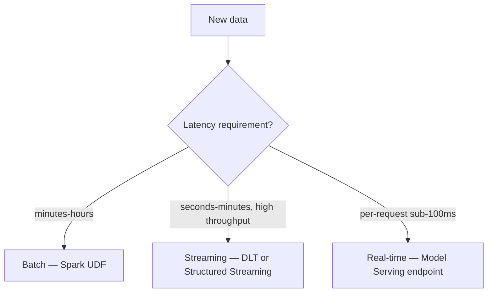

# Module 13 — Batch & Streaming Inference

> **Goal of this module:** Master the three inference patterns the exam contrasts — batch (Spark UDF / `fe.score_batch`), streaming (DLT / Structured Streaming with a model-wrapping UDF), and the distinction between "inference loaded into Spark via pyfunc" vs "Spark ML model's native `.transform`."
>
> **Maps to exam objectives:** *Identify the differences and advantages of model serving approaches: batch, realtime, and streaming · Use pandas to perform batch inference · Identify how streaming inference is performed with Delta Live Tables* (Domain 4, 12%).

---

## Coverage map (verbatim exam objectives → where taught here)

| Verbatim objective | Taught in section |
|---|---|
| Identify differences/advantages of batch, realtime, streaming approaches | "The three inference patterns — recognize and choose" + comparison tables |
| Use pandas to perform batch inference | "Pandas UDF for batch inference — Pattern 4" + `mlflow.pyfunc.spark_udf` (which uses pandas under the hood) |
| Identify how streaming inference is performed with Delta Live Tables | "Delta Live Tables (DLT) — the Databricks-blessed path" |

---

## Look-alike API comparison — inference edition

| Pair | Difference | Exam tell |
|------|------------|-----------|
| `mlflow.pyfunc.spark_udf` vs `mlflow.<flavor>.load_model` directly | wraps as Spark UDF for distributed batch vs returns native Python object (only usable on driver) | Spark DataFrame as input → `spark_udf`. Pandas DataFrame on driver → flavor load |
| `mlflow.pyfunc.load_model` vs `mlflow.sklearn.load_model` | generic wrapper (only `.predict`) vs native sklearn estimator (`.predict_proba`, `.coef_`, etc.) | Need sklearn-specific methods → flavor load |
| `mlflow.spark.load_model` vs `mlflow.pyfunc.spark_udf` | Spark ML native (uses Spark internals) vs Python flavor wrapped as UDF | Spark ML model → native `.transform`. Single-node model → spark_udf |
| `fe.score_batch` vs `mlflow.pyfunc.spark_udf` | auto-joins UC features (only if logged via `fe.log_model`) vs no auto-join | Model logged via `fe.log_model` → score_batch is cleanest |
| `@dlt.table` vs Structured Streaming `.writeStream` | declarative pipeline (DLT manages) vs imperative streaming query | "DLT pipeline" → @dlt.table. Manual control → Structured Streaming |
| `outputMode("append")` vs `"complete"` vs `"update"` | new rows only / full state / changed rows | Most ML streaming uses `"append"` |
| `foreachBatch(func)` vs UDF inside the streaming DataFrame | per-micro-batch custom Python (full pd.DataFrame) vs row-level Spark expression | "load model once per micro-batch" → foreachBatch |
| `env_manager="virtualenv"` vs `"local"` | isolated env from model's logged deps vs cluster's existing env | Reproducible predictions → virtualenv. Trusting cluster → local |

---

## The three inference patterns — recognize and choose

| Pattern | Latency | Throughput | Compute | Use case |
|---------|---------|------------|---------|----------|
| **Batch** | minutes-to-hours | Billions of rows | Spark job (transient cluster) | Daily scoring, dashboards, downstream feature tables |
| **Streaming** | seconds-to-minutes (micro-batch) | Tens of thousands of events/sec | DLT pipeline or Structured Streaming on a cluster | Real-time data products, fraud detection, IoT |
| **Real-time** | sub-100ms per request | Per-request scaling | Model Serving endpoint (managed) | API responses, app integrations |



> ⚠️ **Exam trap — "tens of thousands of events per second":** This phrasing in a scenario points to **streaming via DLT**, NOT Model Serving. Model Serving is request/response per query; it doesn't elastic-scale to event-streams that pour in continuously. For high-throughput elastic event processing, the right design is a DLT pipeline applying the model as a UDF.

---

## Pattern 1: Batch inference with `mlflow.pyfunc.spark_udf`

The universal batch-inference pattern: load any flavor of MLflow model as a Spark UDF, apply to a DataFrame.

```python
import mlflow
from pyspark.sql.functions import struct

# Load model as a Spark UDF
predict_udf = mlflow.pyfunc.spark_udf(
    spark,
    model_uri="models:/retail.models.churn@champion",
    env_manager="virtualenv",     # isolated env on each worker
    result_type="double",         # or other Spark type matching model output
)

# Apply
scored = df.withColumn(
    "prediction",
    predict_udf(struct(*feature_cols)),
)

# Write to Delta
scored.write.mode("overwrite").saveAsTable("retail.gold.churn_predictions")
```

### What `spark_udf` does under the hood

1. Loads the model artifact in the **driver** to get the schema.
2. Returns a Spark UDF that, on each task, **loads the model on the worker** (once per task, cached) and runs predictions over the batch.
3. Each batch is sent to the model's `predict()` as a pandas DataFrame (Arrow serialization).
4. The result column is materialized in Spark.

### `env_manager` options

| Value | Behavior |
|-------|----------|
| `"virtualenv"` | Create an isolated venv on each worker matching the model's logged dependencies (safest) |
| `"conda"` | Same idea with conda |
| `"local"` | Use the cluster's existing Python environment (fastest, but you're on your own for dependencies) |

> ⚠️ **Exam trap — env_manager:** "local" is fast but breaks if the model needs library versions different from the cluster. "virtualenv" is the safe default. The exam may test "which env_manager reproduces the model's training environment?"

### Column passing — `struct` for multi-column features

If your model expects multiple input features:
```python
scored = df.withColumn("prediction", predict_udf(struct("feat1", "feat2", "feat3")))
```

If your model expects one input (e.g., a single text column):
```python
scored = df.withColumn("prediction", predict_udf("text"))
```

The model's input schema (logged with `signature=` or `input_example=`) tells Spark how to pack the inputs.

---

## Pattern 2: Batch inference with `fe.score_batch` (Feature Store models)

When the model was logged via `fe.log_model(... training_set=training_set, ...)` (Module 3), use `fe.score_batch` instead. It automatically performs feature lookups:

```python
from databricks.feature_engineering import FeatureEngineeringClient

fe = FeatureEngineeringClient()

# Scoring DF needs only the lookup keys (e.g., customer_id) — features are looked up automatically
lookup_df = spark.table("retail.silver.new_customers").select("customer_id")

predictions = fe.score_batch(
    model_uri="models:/retail.models.churn@champion",
    df=lookup_df,
)
# predictions has: customer_id + looked-up features + prediction column

predictions.write.mode("overwrite").saveAsTable("retail.gold.churn_predictions")
```

This is **the cleanest path** when features are in UC feature tables: the scoring code doesn't need to know feature names, schemas, or where they live.

> ⚠️ **Exam trap — `pyfunc.spark_udf` vs `fe.score_batch`:**
> - Model logged with `mlflow.<flavor>.log_model` only → use `pyfunc.spark_udf` (you must join features manually before applying).
> - Model logged with `fe.log_model(... training_set=...)` → use `fe.score_batch` (automatic lookups).

---

## Pattern 3: Batch with Spark ML native `.transform`

If the model is a **Spark ML `PipelineModel`** (not a non-Spark flavor), you can use its native `.transform()` — no UDF needed, no pandas conversion:

```python
import mlflow

# Spark ML model logged via mlflow.spark.log_model
model = mlflow.spark.load_model("models:/retail.models.churn@champion")

predictions = model.transform(df)   # native Spark transform
```

### When this is faster than `pyfunc.spark_udf`

- Spark ML models run natively in Spark — no Arrow serialization, no Python boundary, no model-load-per-worker overhead.
- Single-machine model flavors (sklearn, XGBoost) MUST go through pyfunc + UDF because the model itself lives in Python on each worker.

### When this is the wrong tool

- The model isn't Spark ML (don't try to `.transform` a sklearn model).
- The model needs pre-prediction transformations not in its pipeline (you'd add them before `.transform`).

| Model type | Best inference call |
|------------|--------------------|
| Spark ML `PipelineModel` | `model.transform(df)` |
| sklearn / XGBoost / LightGBM / PyTorch / TensorFlow | `mlflow.pyfunc.spark_udf` |
| Any model logged with `fe.log_model(...)` (UC FE) | `fe.score_batch(...)` |

---

## Pandas UDF for batch inference — Pattern 4 (manual)

When you want explicit control over per-batch behavior (e.g., custom batching, post-processing), write a pandas UDF manually:

```python
from pyspark.sql.functions import pandas_udf
import pandas as pd
import mlflow

# Broadcast the model loaded on driver
model_uri = "models:/retail.models.churn@champion"

@pandas_udf("double")
def predict_udf(features_pdf: pd.DataFrame) -> pd.Series:
    # Lazy-load per executor (the iterator UDF form does this more efficiently)
    model = mlflow.pyfunc.load_model(model_uri)
    preds = model.predict(features_pdf)
    return pd.Series(preds)

scored = df.withColumn("prediction", predict_udf(struct("age", "income", "city_idx")))
```

In practice, you'd use the **iterator pandas UDF** to load the model once per executor (not per batch):

```python
from typing import Iterator
from pyspark.sql.functions import pandas_udf
import pandas as pd

@pandas_udf("double")
def predict_iter_udf(batch_iter: Iterator[pd.DataFrame]) -> Iterator[pd.Series]:
    model = mlflow.pyfunc.load_model("models:/retail.models.churn@champion")
    for batch in batch_iter:
        yield pd.Series(model.predict(batch))
```

`mlflow.pyfunc.spark_udf` handles this efficiently for you — that's why it's usually preferred over hand-written pandas UDFs.

---

## Streaming inference

### Structured Streaming with the same UDF

The same `predict_udf` works on a streaming DataFrame:

```python
stream_df = (
    spark.readStream
        .format("delta")
        .table("retail.silver.events")
)

predictions_stream = stream_df.withColumn(
    "prediction",
    predict_udf(struct("feat1", "feat2")),
)

(predictions_stream
    .writeStream
    .format("delta")
    .outputMode("append")
    .option("checkpointLocation", "/Volumes/retail/ml/checkpoints/churn-stream")
    .toTable("retail.gold.churn_predictions_stream")
)
```

The model is loaded once per executor and reused across micro-batches.

### Delta Live Tables (DLT) — the Databricks-blessed path

DLT (now branded "Lakeflow Declarative Pipelines") wraps streaming inference in a managed pipeline with autoscaling, checkpointing, and lineage:

```python
import dlt

@dlt.table(
    name="churn_predictions_stream",
    comment="Real-time churn predictions from the bronze events stream",
)
def churn_predictions():
    events = dlt.read_stream("silver.events")
    return events.withColumn(
        "prediction",
        predict_udf(struct("feat1", "feat2")),
    )
```

DLT manages the cluster lifecycle, autoscaling, retries, and pipeline graph. The model UDF is the same as the batch case.

> ⚠️ **Exam trap — "elastic throughput for streaming inference":** The exam objective is "*identify how streaming inference is performed with Delta Live Tables*." If the scenario is event-streams at high throughput, the answer is **DLT pipeline + Spark UDF wrapping the model**, NOT Model Serving (which is for request/response).

---

## Comparison table — recap

| | Batch via `pyfunc.spark_udf` | Spark ML `.transform` | `fe.score_batch` | Streaming via DLT | Model Serving |
|---|---|---|---|---|---|
| Model flavor | Any | Spark ML only | Any logged via `fe.log_model` | Any (via UDF) | Any |
| Latency | Job-scoped | Job-scoped | Job-scoped | Micro-batch (seconds) | Per-request (<100ms) |
| Feature lookup | Manual | Manual | **Automatic** | Manual | **Automatic** (from online table) |
| Throughput | Massive | Massive | Massive | Elastic | Per-request |
| Best use | Daily scoring, dashboards | Spark ML pipeline | UC FE models, daily scoring | Real-time data products | API responses |

---

## Common pitfalls

### Trying to call `model.predict(spark_df)` directly

You can't pass a Spark DataFrame to sklearn's `model.predict`. You either need `pyfunc.spark_udf` (wraps the model in a Spark UDF) or `collect()` to pandas first (only for tiny data).

### Forgetting `env_manager` and getting library-version errors

If the cluster's Python has sklearn 1.3 but the model was trained with sklearn 1.5, `env_manager="local"` silently produces wrong predictions or errors. Use `"virtualenv"`.

### Using Model Serving for batch / streaming

Model Serving is request/response. Throwing 100M rows at it via HTTP loops is wrong and expensive. Batch should use a Spark UDF; streaming should use DLT or Structured Streaming with the model wrapped in a UDF.

### Mixing `fe.score_batch` and `pyfunc.spark_udf` on the same model

If you `fe.log_model(...)`, the model carries feature lookup metadata. `fe.score_batch` understands this. `pyfunc.spark_udf` doesn't — it'll try to apply the model directly without the lookups, and either fail or produce wrong predictions if you don't manually pre-join features.

### Forgetting checkpointLocation on streaming inference

Structured Streaming queries require a checkpoint location. Without it, the query fails. DLT manages this for you; raw Structured Streaming you must specify.

---

## End-to-end example — batch scoring with feature lookups

```python
import mlflow
from databricks.feature_engineering import FeatureEngineeringClient

mlflow.set_registry_uri("databricks-uc")
fe = FeatureEngineeringClient()

# Daily scoring job
def score_daily(date_str):
    # 1. Read today's lookup keys (customers active today)
    new_keys = spark.table("retail.silver.daily_active").filter(f"date = '{date_str}'").select("customer_id")

    # 2. Score with automatic feature lookups
    predictions = fe.score_batch(
        model_uri="models:/retail.models.churn@champion",
        df=new_keys,
    )

    # 3. Write to Delta
    (predictions
        .withColumn("scored_at", current_timestamp())
        .write.mode("append")
        .saveAsTable("retail.gold.daily_churn_predictions"))

score_daily("2026-05-23")
```

This is the production-grade batch scoring pattern: lookup keys in, predictions out, features looked up automatically from UC.

---

## Worked exam-question walkthroughs

### Worked example (verbatim official Q5): "Tens of thousands of events per second, elastic compute"

**Options:**
A. DLT pipeline applying the algorithm as Spark UDF — **CORRECT**
B. Structured Streaming Job applying algorithm as UDF — works but doesn't autoscale as well as DLT
C. Model serving endpoint + DLT calling it via UDF — wrong; endpoint isn't designed for stream throughput
D. Model serving endpoint + Structured Streaming calling it via UDF — same problem

**Answer:** A (matches official). DLT autoscales compute elastically to match event volume.

### Worked example: "Score 100M rows nightly — batch or serving?"

**Reasoning:** 100M rows via REST = 100M HTTP requests = wrong tool. Use Spark UDF over a Delta table.

**Answer:** `mlflow.pyfunc.spark_udf` over the Spark DataFrame, write to Delta.

### Worked example: "App needs <200ms predictions per request"

**Reasoning:** Per-request, low latency → Model Serving endpoint. DLT's micro-batch latency (seconds) exceeds 200ms.

**Answer:** Model Serving endpoint.

### Worked example: "Library version mismatch produces silent wrong predictions"

**Diagnosis:** `env_manager="local"` uses cluster Python; model trained with different lib versions.

**Fix:** `env_manager="virtualenv"` to recreate the logged dependency set.

---

## Output prediction drills

### Drill 1
```python
udf = mlflow.pyfunc.spark_udf(spark, "models:/cat.sch.model@champion")
df.withColumn("pred", udf(struct("a","b","c"))).show()
```
**Q:** What format does the model receive on each worker batch?
**A:** A pandas DataFrame with columns `a, b, c` (from the struct). Spark serializes each Arrow batch to pandas before the model's `predict()` call.

### Drill 2
```python
# Spark ML PipelineModel
model = mlflow.spark.load_model("models:/cat.sch.churn@champion")
df.toPandas().pipe(model.predict)
```
**Q:** Does this work?
**A:** **No.** Spark ML's `PipelineModel` doesn't have `.predict()`. Use `model.transform(spark_df)` instead. Spark ML never expects pandas.

### Drill 3
```python
@dlt.table
def predictions():
    return dlt.read_stream("events").withColumn("pred", udf(struct("a","b")))
```
**Q:** Does DLT autoscale this?
**A:** Yes, if the DLT pipeline is configured for autoscaling (enhanced or standard). DLT manages the cluster lifecycle.

---

## What the exam tests on this module

> 🎯 **Exam tests here:**
> - The three patterns: batch (Spark UDF), streaming (DLT), real-time (Model Serving)
> - `mlflow.pyfunc.spark_udf(spark, model_uri, env_manager=...)` for loading any flavor
> - `fe.score_batch(model_uri, df)` for UC-Feature-Engineered models
> - Spark ML models can use native `.transform` directly
> - Streaming via DLT pipelines wrapping a model UDF
> - "Tens of thousands of events/sec" → DLT, NOT Model Serving
> - `env_manager` choice for dependency isolation
> - Pandas UDFs as the underlying mechanism for `spark_udf`

---

## Mini quiz

1. You have a Spark ML `PipelineModel` registered as `models:/retail.churn@champion`. What's the most efficient way to score a Spark DataFrame?
2. Your model was logged with `mlflow.sklearn.log_model(model, "model")` (NOT `fe.log_model`). The model uses 8 features from a UC feature table. How do you batch-score new records?
3. The scenario: "20,000 events/sec from IoT sensors; need predictions within 30 seconds of arrival." Which pattern?
4. The scenario: "Mobile app calls our API to get a personalized recommendation; needs <200ms response time." Which pattern?
5. Why does `env_manager="local"` sometimes silently produce wrong predictions?

### Answers

1. **`model.transform(df)` using the Spark ML native API.** Load with `mlflow.spark.load_model(...)`. No UDF overhead, no Arrow serialization, no Python boundary.
2. Either: (a) Join the feature table to the input DataFrame manually, then apply `mlflow.pyfunc.spark_udf` over the joined DataFrame. (b) Re-train and re-log the model using `fe.log_model(... training_set=...)` so future scoring can use `fe.score_batch` automatically.
3. **Streaming via DLT (or Structured Streaming) with the model wrapped in a Spark UDF.** Elastic throughput at micro-batch latency. Model Serving is wrong (request/response, not stream).
4. **Model Serving endpoint.** Per-request, sub-100ms latency, REST API. DLT is wrong (micro-batch latency would miss the 200ms target).
5. The cluster's Python environment may have library versions different from what the model was trained with (e.g., sklearn 1.3 vs 1.5). `env_manager="local"` just uses whatever's installed. `env_manager="virtualenv"` creates an isolated environment matching the model's logged dependencies, producing reproducible predictions.
