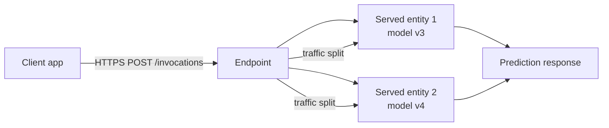

# Module 14 — Real-Time Serving Basics

> **Goal of this module:** Cover just enough Mosaic AI Model Serving to clear Domain 4 (12%) — endpoints, served entities, deploying a custom model, querying, and traffic splits for A/B. The Associate exam tests recognition and basic deployment, not endpoint admin.
>
> **Maps to exam objectives:** *Deploy a custom model to a model endpoint · Deploy and query a model for realtime inference · Split data between endpoints for realtime inference* (Domain 4).

---

## Coverage map (verbatim exam objectives → where taught here)

| Verbatim objective | Taught in section |
|---|---|
| Deploy a custom model to a model endpoint | "Creating an endpoint" + "Deploying a custom model" |
| Deploy and query a model for realtime inference | "Querying an endpoint" — REST and Python SDK |
| Split data between endpoints for realtime inference | "Traffic splits — A/B and canary" |

---

## Look-alike API comparison — serving edition

| Pair | Difference | Exam tell |
|------|------------|-----------|
| `served_entities` (current) vs `served_models` (legacy) | UC-aware (uses catalog.schema.model) vs workspace-registry compatible | New code → `served_entities`. Old tutorials → `served_models` |
| `workload_size="Small"` (4 conc) / `"Medium"` (16) / `"Large"` (64) | provisioned concurrency steps | Bigger size = more provisioned, more cost |
| `scale_to_zero_enabled=True` vs `False` | scales to 0 after ~30 min idle vs always-on | Cost-sensitive dev → True. Latency-critical prod → False |
| `dataframe_records` vs `dataframe_split` payload format | list of dicts vs columns+data lists | dataframe_records is most common |
| `instances` vs `inputs` payload | TF-Serving compat (flat list) vs named-tensor dict | TF/Keras model with named inputs → inputs |
| Custom model (UC) vs Foundation Model API (FMAPI) | your model vs hosted LLM | FMAPI out of scope for Associate exam |

---

## What Mosaic AI Model Serving is

A managed HTTPS REST endpoint that hosts your registered model(s) and serves predictions on demand. Key properties:

- **Managed** — Databricks runs the cluster behind the endpoint; you don't operate servers.
- **Autoscaling** — concurrent requests get more workers; idle scales to zero.
- **UC-native** — endpoints reference models by UC name + version/alias (`catalog.schema.model@champion`).
- **Standard auth** — Databricks personal access token (PAT) or service principal OAuth.



---

## Endpoints and served entities

| Concept | Description |
|---------|-------------|
| **Endpoint** | A named HTTPS resource that hosts one or more served entities |
| **Served entity** | A specific model version + workload spec (size, scale-to-zero, concurrency) |
| **Traffic split** | Per-endpoint percentage allocations across served entities (must sum to 100) |

One endpoint can host **multiple model versions simultaneously** — that's the foundation of A/B testing and canary deploys.

---

## Creating an endpoint

### Via UI

`Serving` sidebar → `Create serving endpoint` → fill in:
- **Endpoint name** (unique in the workspace)
- **Served entity** — choose model + version or alias
- **Workload size** — Small / Medium / Large
- **Scale to zero** — yes / no (after N min idle)
- **Compute scaling** — min/max concurrent requests

### Via Python SDK / REST

```python
from databricks.sdk import WorkspaceClient
from databricks.sdk.service.serving import (
    EndpointCoreConfigInput,
    ServedEntityInput,
    TrafficConfig,
    Route,
)

w = WorkspaceClient()

w.serving_endpoints.create(
    name="churn-prod",
    config=EndpointCoreConfigInput(
        served_entities=[
            ServedEntityInput(
                entity_name="retail.models.churn",
                entity_version="3",
                workload_size="Small",
                scale_to_zero_enabled=True,
                name="churn-v3",
            ),
        ],
        traffic_config=TrafficConfig(
            routes=[Route(served_model_name="churn-v3", traffic_percentage=100)],
        ),
    ),
)
```

### Via REST directly

```bash
POST /api/2.0/serving-endpoints
{
  "name": "churn-prod",
  "config": {
    "served_entities": [
      {
        "name": "churn-v3",
        "entity_name": "retail.models.churn",
        "entity_version": "3",
        "workload_size": "Small",
        "scale_to_zero_enabled": true
      }
    ],
    "traffic_config": {
      "routes": [
        {"served_model_name": "churn-v3", "traffic_percentage": 100}
      ]
    }
  }
}
```

---

## Querying an endpoint

### REST call

```bash
POST /serving-endpoints/{endpoint_name}/invocations
Authorization: Bearer <PAT>
Content-Type: application/json

{
  "dataframe_records": [
    {"age": 35, "income": 50000, "city_idx": 2},
    {"age": 42, "income": 75000, "city_idx": 5}
  ]
}
```

### Response

```json
{
  "predictions": [0.12, 0.87]
}
```

### Two request formats

| Format | Shape | When |
|--------|-------|------|
| `dataframe_records` | List of dicts, one per row | Tabular, sklearn / Spark ML |
| `dataframe_split` | `{"columns": [...], "data": [[...], ...]}` | Tabular, compact |
| `instances` | List of values | TensorFlow Serving compatibility |
| `inputs` | Tensor-shaped dict | Custom signatures, named tensors |

`dataframe_records` is the most common.

### Python client

```python
from databricks.sdk import WorkspaceClient

w = WorkspaceClient()

response = w.serving_endpoints.query(
    name="churn-prod",
    dataframe_records=[
        {"age": 35, "income": 50000, "city_idx": 2},
        {"age": 42, "income": 75000, "city_idx": 5},
    ],
)
print(response.predictions)
```

Or via raw HTTP with the `requests` library, hitting `https://<workspace>/serving-endpoints/{name}/invocations` with a PAT.

---

## Traffic splits — A/B and canary

The "split data between endpoints" exam objective is about multiple served entities under **one** endpoint with traffic percentages.

```python
w.serving_endpoints.update_config(
    name="churn-prod",
    served_entities=[
        ServedEntityInput(
            entity_name="retail.models.churn",
            entity_version="3",
            workload_size="Small",
            name="churn-v3",
        ),
        ServedEntityInput(
            entity_name="retail.models.churn",
            entity_version="4",
            workload_size="Small",
            name="churn-v4",
        ),
    ],
    traffic_config=TrafficConfig(
        routes=[
            Route(served_model_name="churn-v3", traffic_percentage=80),
            Route(served_model_name="churn-v4", traffic_percentage=20),   # canary
        ],
    ),
)
```

> ⚠️ **Exam trap — traffic percentages sum to 100:**
> Endpoint config validation requires the sum of `traffic_percentage` across all routes to equal **exactly 100**. Not 99, not 101. The exam may test this constraint.

### Patterns

| Pattern | Traffic config |
|---------|---------------|
| Single version (production) | `{ v3: 100% }` |
| 50/50 A/B | `{ v3: 50%, v4: 50% }` |
| Canary (small slice to new) | `{ v3: 95%, v4: 5% }` |
| Shadow (logged but not served) | Not exam-tested; uses separate "inference table" feature |

### Promoting a canary

```python
# Move all traffic to v4 after canary success
w.serving_endpoints.update_config(
    name="churn-prod",
    traffic_config=TrafficConfig(
        routes=[
            Route(served_model_name="churn-v3", traffic_percentage=0),
            Route(served_model_name="churn-v4", traffic_percentage=100),
        ],
    ),
)
```

---

## Workload sizes and scaling

| Size | Provisioned concurrency | Auto-scaling |
|------|-------------------------|--------------|
| **Small** | 4 concurrent requests | Up to next size |
| **Medium** | 16 | Up to next size |
| **Large** | 64 | — |

Scale-to-zero behavior:
- After ~30 minutes of inactivity (default), scales to 0 workers.
- Next request triggers a cold start (~30-60 sec for non-LLM models).
- Toggle via `scale_to_zero_enabled=True/False`.

> ⚠️ **Exam trap — cold start:** Scale-to-zero saves cost but adds cold-start latency. For high-availability customer-facing apps, disable scale-to-zero on a Production endpoint. For internal/dev endpoints, enable it.

---

## Deploying a custom model

For most exam scenarios, "custom model" = a model logged via `mlflow.<flavor>.log_model` and registered to UC. The deploy flow:

1. Register the model: `mlflow.<flavor>.log_model(model, "model", registered_model_name="catalog.schema.model")`.
2. Optionally set an alias: `client.set_registered_model_alias(name, "champion", version=N)`.
3. Create / update an endpoint referencing the alias or version (as shown above).

### What "custom" usually doesn't mean

It does **not** mean writing a custom PyFunc wrapper class with bespoke `predict` logic. That's a "Custom Model" in MLflow terminology and is more advanced. The Associate exam treats "deploy a custom model" as "deploy a model you trained yourself" — distinguished from "deploy a foundation model from the FMAPI catalog" (which is out of scope for the Associate exam).

### Foundation Model APIs (FMAPI) vs your model

Mosaic AI Model Serving also hosts foundation models (Llama, Claude, GPT-OSS) via the **Foundation Model APIs**. These are out of Associate exam scope but you should recognize the distinction:
- **Custom model endpoint** = your trained model from UC registry
- **FMAPI / external model endpoint** = a hosted LLM (out of scope for Associate)

---

## Endpoint lifecycle states

| State | Meaning |
|-------|---------|
| `NOT_READY` | Just created; provisioning |
| `READY` | Serving traffic |
| `UPDATING` | Config change in progress |
| `FAILED` | Failed to launch / serve; check logs |

The UI shows the state with color coding. Programmatically:
```python
w.serving_endpoints.get("churn-prod").state.ready
```

---

## Querying and the `Authorization` header

All requests need a token:
```bash
Authorization: Bearer <DATABRICKS_TOKEN>
```

The token can be:
- A user **Personal Access Token (PAT)** — generated from User Settings → Developer
- A **service principal OAuth token** — preferred for production apps
- A **Databricks SDK** auto-resolved token — when running inside a Databricks notebook

For exam purposes, recognize that the endpoint requires authentication; the exam won't deep-quiz token mechanics.

---

## Comparison — Model Serving vs the other inference patterns

| | Model Serving | Batch (Spark UDF) | Streaming (DLT) |
|---|---|---|---|
| Latency | <100ms per request | Job-scoped (minutes) | Micro-batch (seconds) |
| Throughput | Per-request scaling | Massive | Elastic |
| Cost model | Always-on (or scale-to-zero) | Job-duration only | Pipeline-duration |
| Input source | HTTP request body | Spark DataFrame | Streaming source |
| Output destination | HTTP response | Delta table | Delta table |
| Feature lookups | Auto from online table | Manual or `fe.score_batch` | Manual |
| Best for | App backends, APIs | Daily scoring, dashboards | Real-time data products |

---

## Common pitfalls

### Picking Model Serving for high-throughput streaming

The exam loves this trap. "Tens of thousands of events per second" → DLT, not Model Serving. Model Serving is per-request; pumping a stream through HTTP loops is wrong.

### Traffic percentages that don't sum to 100

Endpoint config validation rejects sums like 99 or 101. Always check.

### Forgetting to enable scale-to-zero (or accidentally enabling it on a Prod endpoint)

Scale-to-zero off → always-on cost. Scale-to-zero on with a 30-min idle window → cold starts for off-hours traffic.

### Using batch payload sizes that exceed limits

`dataframe_records` payloads have size limits (~16 MB per request by default). Batching 100,000 rows in one call may fail. For large batches, use a batch inference job (Module 13), not the serving endpoint.

### Forgetting that endpoints don't pull features automatically by default

If the model was logged via `fe.log_model(..., training_set=...)` and the feature table is **online**, the endpoint can do automatic lookups. If features are only offline, you must pass them in the request body. Module 3 covers this.

---

## Worked exam-question walkthroughs

### Worked example: "Deploy v4 of a UC model as canary"

**Pattern:** Endpoint currently serves v3 at 100%. Add v4 at 5% canary.

**Correct config:**
```python
traffic_config=TrafficConfig(routes=[
    Route(served_model_name="churn-v3", traffic_percentage=95),
    Route(served_model_name="churn-v4", traffic_percentage=5),
])
```
With `served_entities` containing both v3 and v4.

### Worked example: "Traffic percentages 60 + 50 = 110"

**Reasoning:** Validation requires sum == 100 exactly.

**Answer:** Error. Reject the config.

### Worked example: "Endpoint took 45s to first response after 2 hours idle"

**Diagnosis:** Cold start. `scale_to_zero_enabled=True` shed workers; the next request boots a new one (~30-60s for non-LLM models).

**Fix (if latency-critical):** Set `scale_to_zero_enabled=False` to keep workers warm.

### Worked example: "Query payload — single prediction"

**Correct:**
```json
POST /serving-endpoints/churn-prod/invocations
{ "dataframe_records": [{"age": 35, "income": 50000, "city_idx": 2}] }
```

Response:
```json
{ "predictions": [0.87] }
```

---

## Output prediction drills

### Drill 1
```python
traffic_config=TrafficConfig(routes=[
    Route(served_model_name="v1", traffic_percentage=80),
    Route(served_model_name="v2", traffic_percentage=30),
])
```
**Q:** Validation result?
**A:** **Error.** Sum = 110 ≠ 100.

### Drill 2
```python
# Endpoint with scale_to_zero_enabled=True, idle 60 min, then 1 request
```
**Q:** Latency for that request?
**A:** Cold start: ~30-60s for the model to load on a freshly-spun worker. Subsequent requests are normal latency.

### Drill 3
```python
# Endpoint serves model logged with fe.log_model + UC online feature table linked
# Request body contains only customer_id
```
**Q:** Does it work?
**A:** Yes. The endpoint auto-looks-up features from the online table using `customer_id`. This is the "Automatic feature lookup at serving time" path (requires online publication).

---

## What the exam tests on this module

> 🎯 **Exam tests here:**
> - Endpoints host one or more served entities
> - Served entity = model version + workload spec
> - Traffic split percentages must sum to 100 across served entities
> - Endpoint query format: `POST /serving-endpoints/{name}/invocations` with `{"dataframe_records": [...]}`
> - Scale-to-zero behavior — cold start tradeoff
> - Model Serving is the right choice for request/response real-time, NOT for high-throughput streaming
> - The contrast across batch (UDF) / streaming (DLT) / real-time (endpoint)

---

## Mini quiz

1. You configure an endpoint with `routes=[{v3: 60}, {v4: 50}]`. What happens?
2. You're hosting a churn model at `/serving-endpoints/churn-prod/invocations`. Construct a sample POST body for a single prediction with features age=35, income=50000, city_idx=2.
3. The product team wants 5% of traffic to flow to a new model version for canary testing. Sketch the traffic config.
4. Your endpoint has `scale_to_zero_enabled=True`. The first request after 2 hours of idle takes 45 seconds. Why?
5. Scenario: "Score 10 million customers nightly." Endpoint or batch UDF?

### Answers

1. **Validation error.** Traffic percentages must sum to exactly 100. 60+50=110 fails.
2. ```json
   {
     "dataframe_records": [
       {"age": 35, "income": 50000, "city_idx": 2}
     ]
   }
   ```
3. ```python
   TrafficConfig(routes=[
       Route(served_model_name="churn-v3", traffic_percentage=95),
       Route(served_model_name="churn-v4", traffic_percentage=5),
   ])
   ```
4. **Cold start.** Scale-to-zero turned off all workers during idle. The next request must spin up a worker, load the model, and warm caches — typically 30-60s for a non-LLM model. To avoid this in production, disable scale-to-zero.
5. **Batch UDF** (or `fe.score_batch`). Real-time serving is for per-request workloads; pumping 10M rows through HTTP is wasteful and slower. Use `mlflow.pyfunc.spark_udf` over the Spark DataFrame, write results to Delta.
