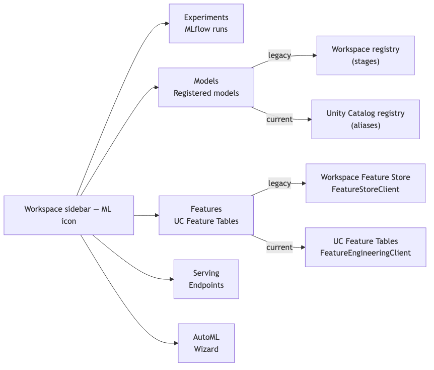
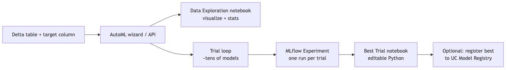
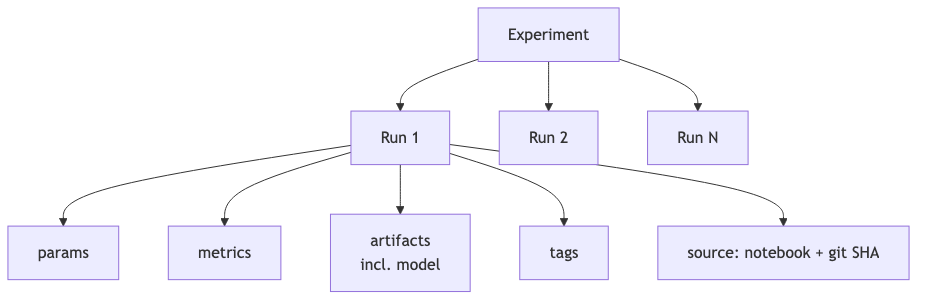
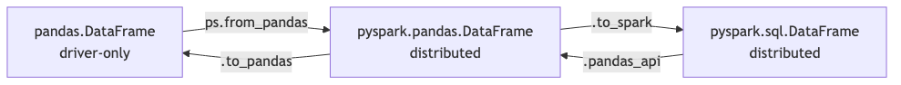
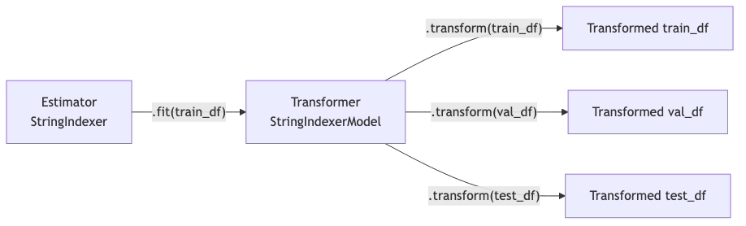
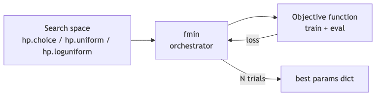
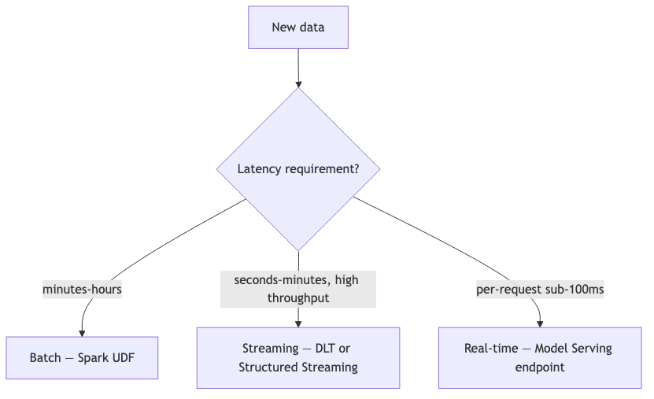
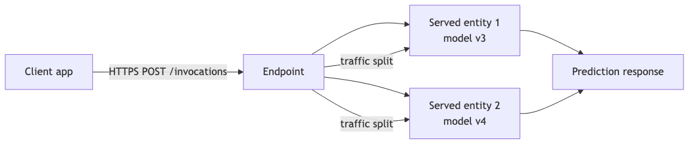

\newpage

# How to read this ebook

This is the consolidated reading copy of **Topic 09 — Databricks Certified Machine Learning Associate**, from the **Career_upskill** project. The source markdown files live at `topics/09_databricks_ml_associate/` and remain the canonical version; this ebook is a derived artifact.

**Ordering** is the natural numeric sequence — README, then numbered modules, then FACTS, then quizzes.

**What's included:**
- README (study plan, scope, exam logistics)
- All numbered modules
- The FACTS.md appendix (citable facts, version cutoffs, exam metadata)
- Quizzes (~3× exam length, with answer explanations)

**Diagrams** are Mermaid where present. The EPUB build pre-renders them to PNG via the `mmdc` CLI; if unavailable they appear as code blocks.

\newpage


\newpage

# Topic 09 — Databricks Certified Machine Learning Associate

> **Audience:** Senior AI/ML Engineer (10+ yrs Python/PySpark) preparing for the **Databricks Certified Machine Learning Associate** exam. You already know how to build ML systems — this corpus is the *Databricks-specific* layer you need to clear the exam in two weeks of focused study.
>
> **Goal:** Pass the exam in one attempt with a margin (target 80%+ on practice), and walk away with the operational vocabulary of Databricks ML — Unity Catalog Feature Engineering, MLflow tracking + UC Registry aliases, Spark ML pipelines, Hyperopt-vs-Optuna pragmatics, batch/streaming/realtime serving patterns.
>
> **Last updated:** 2026-05-23

---

## What this topic guarantees

This corpus is built to a completeness standard, not a length standard. Every verbatim exam objective in the **March 1, 2025 official exam guide** is mapped to a specific section in a specific module via a "Coverage map" header at the top of each module file. For each objective, you'll find:

1. The **full API surface** the exam may test (every parameter, not just the popular ones).
2. **Look-alike API comparison tables** — pairs of APIs that look similar but differ (e.g., `set_registered_model_alias` vs `set_model_version_tag`, `BinaryClassificationEvaluator` vs `MulticlassClassificationEvaluator`).
3. **Worked exam-question walkthroughs** — 3-5 per module, including the verbatim official sample questions (Q1-Q5).
4. **Output prediction drills** — "given this code, what does it return?" because the exam tests this constantly.
5. **Decision rules** in `🎯 How to recognize this on the exam` callouts.
6. **End-to-end mini-scenarios** showing the module's APIs in realistic combination.
7. **Common wrong-answer traps** explicitly enumerated.

**Promise:** If you read every module + take every quiz, you have everything tested on the exam. There is no hidden chapter, no "you should also know X" gap. The Coverage maps make this auditable — point to any exam objective, and the map tells you which section teaches it.

If you find an objective in the official PDF that has no module section behind it, that's a bug — file an issue.

---

## Exam at a glance

| Item | Value |
|------|-------|
| **Exam version (current)** | March 1, 2025 revision |
| **Question count** | 48 (multiple-choice + occasional multi-select) |
| **Duration** | 90 minutes |
| **Passing score** | ~70% (Databricks does not officially publish, scaled) |
| **Cost** | $200 USD per attempt + tax |
| **Retake wait** | 14 days between attempts (Nov 1, 2023 policy) |
| **Validity** | 2 years |
| **Delivery** | Online proctored via Kryterion WebAssessor |
| **Test aides** | None — no scratch paper, no calculator, no notes |
| **Code language** | All ML code in Python; SQL may appear for data manipulation |
| **Prerequisites** | None required; 6+ months hands-on Databricks ML recommended |

**Per-question budget:** 90 min ÷ 48 Q = **1m 52s per question.** Practice with a timer.

> ⚠️ **Watch the exam version.** This corpus targets the March 1, 2025 guide, which still tests **Hyperopt's `fmin`** even though Hyperopt is removed from Databricks Runtime ML 17+. A future guide revision (expected late 2026) will likely drop Hyperopt and add MLflow 3 features. Re-check the official exam guide PDF ~2 weeks before your exam date.

---

## Domain weights and module map

| Domain | Weight | Approx Qs | Modules |
|--------|-------:|----------:|---------|
| 1. Databricks Machine Learning | **38%** | ~18 | [01](01_databricks_ml_platform.md), [02](02_automl_2026.md), [03](03_feature_engineering_uc.md), [04](04_mlflow_tracking_basics.md), [05](05_uc_model_registry.md) |
| 2. ML Workflows / Data Processing | **19%** | ~9 | [06](06_data_prep_with_spark.md), [07](07_pandas_api_on_spark.md), [08](08_feature_engineering_techniques.md) |
| 3. Model Development | **31%** | ~15 | [09](09_spark_ml_algorithms.md), [10](10_hyperopt_legacy.md), [11](11_optuna_modern.md), [12](12_cross_validation_metrics.md) |
| 4. Model Deployment | **12%** | ~6 | [13](13_batch_streaming_inference.md), [14](14_real_time_serving_basics.md) |

> **Note:** Domain 1 is **the biggest single domain.** Master Feature Engineering Client, MLflow tracking, UC Registry aliases, and AutoML — together they're 38% of your grade.

---

## Learning path — 14 modules

| # | Module | What it covers |
|---|--------|----------------|
| **Domain 1 — Databricks ML (38%)** | | |
| 1 | [Databricks ML platform & runtime](01_databricks_ml_platform.md) | DBR ML runtime, GPU runtimes, workspace anatomy, cluster types for ML, what "ML runtime advantages" means on the exam |
| 2 | [AutoML in 2026](02_automl_2026.md) | UI + API, glass-box generated notebooks, MLflow integration, when to use vs not |
| 3 | [Feature Engineering in Unity Catalog](03_feature_engineering_uc.md) | `FeatureEngineeringClient`, UC feature tables, training sets, point-in-time, online tables — HIGH YIELD |
| 4 | [MLflow tracking basics](04_mlflow_tracking_basics.md) | Runs, experiments, params/metrics/artifacts, autologging per flavor, `MlflowClient` API |
| 5 | [Unity Catalog Model Registry](05_uc_model_registry.md) | Registered models in UC, **aliases** (`@champion`, `@challenger`), tags, deprecation of legacy stages |
| **Domain 2 — Data Processing / ML Workflows (19%)** | | |
| 6 | [Data prep with Spark DataFrames](06_data_prep_with_spark.md) | `.summary()`, outlier removal (std-dev / IQR), missing-value imputation, train/val/test split |
| 7 | [Pandas API on Spark](07_pandas_api_on_spark.md) | `pyspark.pandas`, when to use it vs pandas vs Spark DataFrame, gotchas |
| 8 | [Feature engineering techniques](08_feature_engineering_techniques.md) | `StringIndexer`, `OneHotEncoder`, `VectorAssembler`, `Imputer`, log scale, when NOT to OHE |
| **Domain 3 — Model Development (31%)** | | |
| 9 | [Spark ML algorithms](09_spark_ml_algorithms.md) | `RandomForestClassifier`, `GBTRegressor`, `LogisticRegression`, `LinearRegression`, `KMeans`, estimators vs transformers |
| 10 | [Hyperopt (legacy but still on exam)](10_hyperopt_legacy.md) | `fmin`, `hp.choice`/`uniform`/`loguniform`, `tpe.suggest`, `SparkTrials`, parallelism |
| 11 | [Optuna (modern replacement)](11_optuna_modern.md) | Studies, trials, `suggest_*`, MLflow integration, joblib/Ray parallelism |
| 12 | [Cross-validation, grid search, metrics](12_cross_validation_metrics.md) | `CrossValidator` vs `TrainValidationSplit`, `ParamGridBuilder`, evaluators, the "models trained" math |
| **Domain 4 — Model Deployment (12%)** | | |
| 13 | [Batch & streaming inference](13_batch_streaming_inference.md) | `mlflow.pyfunc.spark_udf`, batch scoring patterns, streaming via DLT, Spark ML transform vs sklearn loaded |
| 14 | [Real-time serving basics](14_real_time_serving_basics.md) | Mosaic AI Model Serving endpoints, served entities, traffic split — just what the exam tests |

---

## Companion files

- [`FACTS.md`](FACTS.md) — atomic, citable claims with "Last verified" dates. Exam logistics, API names, version cutoffs, current vs deprecated APIs. **Cross-reference this whenever you want a number or an API signature.**
- [`quizzes/`](quizzes/) — 5 quiz files, ~145 questions total (≈ 3× exam length).
  - [`quizzes/01_databricks_ml.md`](quizzes/01_databricks_ml.md) — ~55 Qs (Domain 1, 38%)
  - [`quizzes/02_ml_workflows.md`](quizzes/02_ml_workflows.md) — ~28 Qs (Domain 2, 19%)
  - [`quizzes/03_model_development.md`](quizzes/03_model_development.md) — ~45 Qs (Domain 3, 31%)
  - [`quizzes/04_model_deployment.md`](quizzes/04_model_deployment.md) — ~17 Qs (Domain 4, 12%)
  - [`quizzes/README.md`](quizzes/README.md) — how to score, what 70% looks like, weak-area drill plan

---

## How to use this topic

### Study order (recommended 2-week part-time plan, ~35-40 hours)

1. **Day 1 — Calibration.** Read this README + skim `FACTS.md`. Skim the official PDF in [`../../research_inputs/09_databricks_ml_associate/exam_guide_excerpt.md`](../../research_inputs/09_databricks_ml_associate/exam_guide_excerpt.md). Don't take any quizzes yet.
2. **Days 2-4 — Domain 1 (the biggest).** Read modules 01 → 05 in order. Take quiz `01_databricks_ml.md` cold at the end.
3. **Days 5-6 — Domain 2.** Modules 06 → 08, then quiz `02_ml_workflows.md`.
4. **Days 7-9 — Domain 3 (second biggest).** Modules 09 → 12. Hyperopt (10) and Optuna (11) are paired — read together; the exam tests Hyperopt explicitly but you should know both. Then quiz `03_model_development.md`.
5. **Day 10 — Domain 4.** Modules 13 → 14, then quiz `04_model_deployment.md`.
6. **Day 11 — Full-length timed practice.** Re-take all four quizzes back-to-back in 90 minutes (treat as exam dress rehearsal). Score yourself.
7. **Days 12-13 — Targeted review.** Re-read modules covering your weakest 1-2 domains. Re-do failed questions.
8. **Day 14 — Exam day.** Skim `FACTS.md` in the morning. Don't cram new material. Take the exam.

### Quiz discipline

- **Take quizzes cold** — no peeking at modules, no Google. Treat each like the real exam.
- **Time yourself** at ~1m 52s per question. The exam's biggest killer is time pressure, not difficulty.
- **Read every answer explanation, even on questions you got right.** The explanation often surfaces a trap you happened to avoid.
- **Re-take failed quizzes 48 hours later.** Memory consolidation matters more than first-pass score.

### What you should be able to do after this corpus

- Explain UC Feature Tables vs workspace Feature Store, and name the client class for each (`FeatureEngineeringClient` vs deprecated `FeatureStoreClient`).
- Promote a model from `@challenger` to `@champion` in the UC registry using `MlflowClient.set_registered_model_alias`.
- Calculate total model fits for a grid search × k-fold CV setup in your head.
- Read a code stub and identify whether it's using Hyperopt, Optuna, or Spark ML's `CrossValidator`.
- Choose between batch inference (Spark UDF), streaming inference (DLT), and real-time inference (Model Serving endpoint) given a latency/throughput spec.
- Recognize the difference between online and offline feature tables and when each is required.
- Explain why one-hot encoding is **not** required for tree-based models but **is** required for linear/distance/NN models.
- Know when to use median vs mean vs mode imputation based on distribution shape.
- Identify the correct MLflow flavor + autologging defaults for sklearn, Spark ML, XGBoost, and PyTorch.

---

## Scope notes & biases

- **Cutoff:** Content reflects the **March 1, 2025 exam guide** and Databricks platform state as of **2026-05-23**. Re-verify the exam guide URL before your exam.
- **Bias toward the exam, not the platform.** Real Databricks ML production uses MLflow 3.0, Mosaic AI Agent Framework, and Optuna. The exam still tests MLflow 2.x patterns, UC Registry aliases, and Hyperopt. We teach the **exam-relevant** version explicitly and call out the modern version as context.
- **No NDA violations.** All practice questions are original, derived from public exam objectives and patterns surfaced in the research — never from real exam content.
- **Code conventions.** All code blocks use PySpark / MLflow Python API / SQL. We use `catalog.schema.table` three-level namespaces consistently. No legacy `dbfs:/` paths.

---

## Stack baseline (additions to project `.venv`)

```
pyspark>=3.5             # local Spark for offline practice
delta-spark              # local Delta tables
mlflow>=2.15,<3          # exam tests 2.x API surface
databricks-feature-engineering  # FeatureEngineeringClient
hyperopt                 # legacy but exam-tested
optuna                   # modern replacement
scikit-learn
xgboost
pandas
```

> If you have a Databricks workspace (Free Edition or employer-provided), run the code snippets there for the highest-fidelity practice. Local Spark is fine for ~80% of the module code but doesn't cover UC Feature Engineering, Model Serving endpoints, or AutoML — those require a workspace.

---

## Research provenance

This corpus is built from the research report at [`../../research_inputs/09_databricks_ml_associate/RESEARCH.md`](../../research_inputs/09_databricks_ml_associate/RESEARCH.md), the official exam guide PDF, the domain breakdown at [`domain_breakdown.md`](../../research_inputs/09_databricks_ml_associate/domain_breakdown.md), and the verbatim objectives at [`exam_guide_excerpt.md`](../../research_inputs/09_databricks_ml_associate/exam_guide_excerpt.md). Cross-references to Topic 02 (Azure Databricks) appear where the platform foundations overlap with the exam-tested ML stack.


\newpage

# Module 1 — Databricks ML Platform & Runtime

> **Goal of this module:** Build the mental model of "what is Databricks ML, structurally?" — the runtime stack, the cluster types that matter for ML, the workspace surfaces you'll touch (Experiments, Models, Feature Store, Model Serving), and the exam-relevant ways the platform differs from a generic Spark cluster.
>
> **Maps to exam objectives:** *Identify the advantages of using ML runtimes · Identify the best practices of an MLOps strategy* (Domain 1).

---

## Coverage map (verbatim exam objectives → where taught here)

| Verbatim objective | Taught in section |
|---|---|
| Identify the advantages of using ML runtimes | "DBR ML — what's in the runtime image" + "ML runtime advantages" exam-trap callout |
| Identify the best practices of an MLOps strategy | "MLOps strategy — what 'best practices' means" + "promote code vs promote model matrix" |

Note: "Promote code vs promote model" is shared between Modules 1 and 5; Module 5 has the deeper UC-flavored coverage.

---

## Why "Databricks ML" is a thing separate from "Databricks"

Databricks the platform is a lakehouse — Delta Lake + Spark + Unity Catalog + a notebook IDE. Most of that is data-engineering kit. The **ML layer** on top of that base is:

1. A **specialized runtime image** (DBR ML) with the Python ML ecosystem pre-installed.
2. A set of **workspace surfaces** — Experiments, Models, Feature Store, Serving — that wrap MLflow and Unity Catalog with ML-specific UI and APIs.
3. A few **first-party services**: AutoML (which writes notebooks for you), Mosaic AI Model Serving (real-time inference endpoints), Vector Search (out of scope for Associate).

For the exam, you need to recognize these surfaces by name, know what each does at a high level, and know **why "ML runtime advantages"** is a phrase that earns points.

---

## DBR ML — what's in the runtime image

The Databricks Runtime for Machine Learning is a separate runtime SKU. When you create a cluster, the runtime dropdown shows entries like:

```
17.3 LTS ML  (Apache Spark 4.0, Scala 2.13)
17.3 LTS ML GPU  (with CUDA 12.x, NCCL)
16.4 LTS ML  (Apache Spark 3.5)
```

Picking "ML" instead of plain DBR gets you, pre-installed and version-pinned:

| Layer | Packages |
|-------|----------|
| Core ML | scikit-learn, XGBoost, LightGBM, CatBoost |
| Deep learning | PyTorch, TensorFlow (CPU + GPU variants), Keras |
| Tracking | MLflow (currently 2.x; MLflow 3.0 on newest DBRs) |
| HPO | Optuna (always); Hyperopt (DBR ML ≤ 16.4 only) |
| Distributed DL | Horovod, TorchDistributor, Ray (on newer DBRs) |
| Data tools | pandas, NumPy, SciPy, statsmodels |
| Databricks SDK | `databricks-feature-engineering`, `databricks-sdk` |

> ⚠️ **Exam trap — "ML runtime advantages":** the right answer is **not** "more libraries." The exam wants: *(a)* pre-installed, version-pinned, tested-together ML stack with no `pip install` overhead, *(b)* CUDA/cuDNN/NCCL pre-configured on GPU variants, *(c)* Databricks-optimized variants of common libs where applicable (e.g., the MLflow integration is wired up out of the box), *(d)* `dbutils.library.restartPython()` workflow simplified for the ML stack. Pick the answer that hits the "pre-configured" and "version-tested" notes.

### LTS vs non-LTS

LTS (Long-Term Support) runtimes get patched for ~2 years. Production teams standardize on LTS. The exam doesn't quiz LTS dates, but if you see "use the most stable runtime for production" → pick the LTS option.

### Hyperopt cliff at DBR ML 17

DBR ML 16.4 LTS is the **last LTS that ships Hyperopt by default**. DBR ML 17.0+ omits it; you must `pip install hyperopt` yourself. The exam (March 1, 2025 revision) still tests Hyperopt — see Module 10. _Source: [Databricks hyperparameter tuning docs](https://docs.databricks.com/aws/en/machine-learning/automl-hyperparam-tuning). Last verified: 2026-05-23._

---

## Cluster types — what to pick for ML work

The exam doesn't deep-quiz cluster sizing, but it does test recognition of the right cluster type for the workload.

| Workload | Cluster type | Why |
|----------|--------------|-----|
| Interactive notebook (one user, exploration) | Single-user **All-Purpose** cluster, DBR ML | Standard interactive surface |
| Production scheduled training job | **Jobs cluster**, DBR ML, terminates on job end | Cheaper DBU rate; one job → one cluster lifecycle |
| Single-node sklearn / XGBoost training | **Single Node** cluster mode | No Spark overhead; driver-only |
| Distributed Spark ML training (RF, GBT) | Multi-node cluster, DBR ML | Spark partitions feature data across executors |
| Distributed PyTorch / TensorFlow | Multi-node cluster + **GPU runtime** | TorchDistributor/Horovod use the workers |
| HPO of single-node models across cluster | Multi-node cluster + **SparkTrials** (Hyperopt) or `joblibspark` (sklearn) | Each worker runs one trial in parallel |

### Single Node mode — non-obvious choice

For sklearn / XGBoost / LightGBM **single-node** training, **Single Node cluster mode is the right pick**, *not* a multi-node Spark cluster. A multi-node cluster wastes worker DBUs when training is driver-only. Many candidates over-default to multi-node.

```
Cluster mode: Single Node
DBR: 16.4 LTS ML
Driver type: r6gd.4xlarge   ← all compute happens here
```

You still use Single Node for **HPO** if you parallelize via `joblib` on the driver. You move to multi-node only when you want each worker to take one HPO trial.

> ⚠️ **Exam trap:** "You're training a single-node XGBoost model on 5 GB of data. Which cluster do you pick?" → **Single Node ML cluster**, not a multi-node cluster. The multi-node answer is a distractor that sounds bigger-is-better.

---

## Workspace anatomy for ML work

The Databricks left sidebar groups ML surfaces under a single icon. The exam expects you to recognize each:



### Experiments (MLflow tracking)

Every `mlflow.start_run()` call writes to an Experiment. Experiments live in the workspace tree and can be:
- **Notebook experiments** — implicitly created when a notebook calls `mlflow.start_run()` without setting an experiment first. The experiment lives at the same path as the notebook.
- **Workspace experiments** — explicitly created at a workspace path; multiple notebooks can write to one.

Each run inside an Experiment captures: params, metrics, tags, artifacts (files including the model), source code revision, the cluster's DBR version. The UI shows a sortable run table and a parallel-coordinates view for comparing HPO trials.

### Models (Registered Models)

A Registered Model is a **named lineage** of versions. Each version is one snapshot. The exam tests two registries:

- **Unity Catalog registry** (current): three-level name `catalog.schema.model`, versions promoted via **aliases** (`@champion`, `@challenger`). See Module 5.
- **Workspace registry** (legacy): two-level name `model_name`, versions promoted via **stages** (`Staging`, `Production`). Being phased out.

Pointing MLflow at UC requires one line:
```python
import mlflow
mlflow.set_registry_uri("databricks-uc")
```

### Feature Store / Feature Engineering

The exam tests UC-native Feature Engineering (Module 3). The sidebar shows feature tables you've created via `FeatureEngineeringClient.create_table()`. Tables expose:
- **Schema** — primary key + feature columns
- **Lineage** — which models, jobs, notebooks use this table
- **Online status** — whether it's published to a low-latency online store

### Model Serving

The Serving section lists active **endpoints**. Each endpoint hosts one or more **served entities** (model versions). Module 14 covers endpoint mechanics. The exam-relevant facts:
- Endpoints scale to zero after inactivity (default 30 min)
- Multiple served entities per endpoint enable **traffic splitting** (A/B)
- Endpoints invoke via `POST /serving-endpoints/{name}/invocations`

### AutoML

The AutoML wizard generates two notebooks (Data Exploration, Best Trial) and a backing MLflow Experiment. Module 2 unpacks this in detail.

---

## MLOps strategy — what "best practices" means on this exam

Section 1 of the exam guide opens with "Identify the best practices of an MLOps strategy." The answer Databricks expects pulls from these themes:

1. **Promote code, not models** (in most cases). Reproduce training in higher environments rather than copying model artifacts between workspaces. Models are byproducts of code + data; if you can rebuild, you can audit.
2. **Promote models, not code** (in some cases). Sometimes the production environment cannot run training (no GPU, no access to raw data). Then you train in `dev`, register, and promote the artifact.
3. **Unity Catalog as the single source of truth** for both features and models — cross-workspace lineage, ACL inheritance, no per-workspace drift.
4. **MLflow tracking is mandatory, not optional.** Every model in production has an MLflow run behind it. No "I just trained this in a notebook and copied the pickle."
5. **Versioning everything:** data (Delta time travel), features (UC feature tables), models (UC registered models), code (Git).
6. **Aliases > stages** for the UC registry — labels are flexible, stages were rigid.
7. **A/B by traffic split** at the serving endpoint, not by branching code paths in the application.

> ⚠️ **Exam trap — "promote code vs promote model":** The exam tests *both* directions. Look for the scenario hints:
> - "production cluster doesn't have access to raw data" → **promote model**
> - "want full lineage and ability to retrain" → **promote code**
> - "want consistent behavior across environments" → **promote code**
> - "training is expensive and was tuned in dev" → **promote model**

---

## The MLOps "promote code vs promote model" matrix

| Scenario | Promote what? | Why |
|----------|--------------|-----|
| Dev → staging → prod with full data access | **Code** | Reproducible, auditable, retrainable |
| Training requires GPU; prod is CPU-only | **Model** | Can't retrain in target environment |
| Raw data is sensitive and not in prod env | **Model** | Can't access data in prod |
| Frequent retraining with small tweaks | **Code** | Need the training loop to evolve |
| Expensive one-time training (LLM fine-tune) | **Model** | Retraining is uneconomical |
| Compliance requires byte-exact reproducibility | **Model** | "Promote code" doesn't guarantee identical bits across runs |

---

## "Why Databricks for ML" — exam-relevant value props

Section 1's opening objectives expect you to recognize Databricks-specific advantages. The points the exam wants you to recognize:

1. **Lakehouse-native ML** — train on Delta tables directly; no copy-out-of-warehouse step.
2. **Unity Catalog for ML governance** — features and models share the same catalog/schema/principal model as tables.
3. **MLflow built in** — no separate tracking server to operate.
4. **AutoML "glass box"** — generates editable Python notebooks, not opaque pickle blobs.
5. **Spark ML for distributed training** — RF / GBT / LR on TB-scale data without leaving the DataFrame API.
6. **Model Serving as a managed surface** — no Flask/FastAPI to operate; autoscale to zero.

---

## Worked exam-question walkthroughs

### Worked example: "Which cluster for sklearn training on 5GB data?"

**Pattern:** Question lists 4 cluster configs. Pick the right one for single-node sklearn.

**Reasoning:**
- sklearn `.fit()` runs in the driver Python — doesn't use Spark workers.
- Multi-node clusters waste worker DBUs.
- Single Node mode = driver-only, cheapest, equivalent throughput.

**Answer:** Single Node DBR ML cluster. NOT multi-node Standard.

### Worked example: "MLOps best practice — what to do"

**Pattern:** Scenario lists multiple things (logging, code review, model promotion, monitoring). Pick the canonical MLOps practice.

**Decision rules:** MLflow tracking is mandatory; UC for both features and models; promote code by default; aliases over stages; A/B at the endpoint.

### Worked example: "DBR ML runtime advantage"

**Trap:** "DBR ML is faster than DBR" — wrong. The actual advantages are:
- Pre-installed version-pinned ML stack (sklearn, XGBoost, PyTorch, MLflow, etc.)
- CUDA/cuDNN/NCCL pre-configured on GPU variants
- Tested compatibility across packages

If the answer mentions "pre-installed" / "pre-configured" / "tested" — pick it.

---

## Output prediction drills

### Drill 1
**Q:** You select `DBR ML 17.3 LTS` and try `from hyperopt import fmin`. What happens?
**A:** `ModuleNotFoundError`. Hyperopt is removed from DBR ML 17+. Either `pip install hyperopt` or use DBR ML 16.4 LTS (the last LTS shipping Hyperopt).

### Drill 2
**Q:** You're on a multi-node Standard cluster running sklearn `model.fit(X_train, y_train)` where X_train is a pandas DataFrame on the driver. Are the workers used?
**A:** **No.** sklearn fit runs entirely in driver Python. The workers idle. Switch to Single Node mode.

### Drill 3
**Q:** Cluster type for distributed `pyspark.ml.RandomForestClassifier` training on 200 GB data?
**A:** Multi-node DBR ML. Spark ML estimators partition data across workers.

---

## What the exam tests on this module

> 🎯 **Exam tests here:**
> - Recognize what "ML runtime advantages" means (pre-installed, version-pinned, tested-together stack)
> - Know that Hyperopt is removed from DBR ML 17+ but still tested on the exam
> - Pick the right cluster type for single-node sklearn training (Single Node mode, not multi-node)
> - Know that `mlflow.set_registry_uri("databricks-uc")` is the switch to UC registry
> - "Best practices of an MLOps strategy" — promote code by default, promote model when env constraints prevent retraining
> - Recognize the ML workspace surfaces by name (Experiments, Models, Features, Serving, AutoML)

---

## Mini quiz

1. You're training a 4 GB XGBoost model on a single node. The senior engineer recommends a multi-node Standard cluster "for parallelism." Argue against.
2. Your team's compliance requirement is "the production model artifact must be byte-identical to the one validated by QA." Should you promote code or promote model?
3. DBR ML 17.3 LTS does not ship Hyperopt by default. The exam still asks Hyperopt questions. How do you reconcile these facts?
4. Name three things you get from DBR ML that you do not get from plain DBR.
5. What single line of code points MLflow's registry calls at Unity Catalog instead of the workspace registry?

### Answers

1. XGBoost single-node training runs on the driver only. A multi-node cluster spends DBU on workers that idle. **Single Node mode** is cheaper and equivalent in throughput.
2. **Promote model.** "Byte-identical to validated artifact" cannot be guaranteed by re-running training even with the same code (numerics, library versions, hardware non-determinism). Copy the registered model version.
3. The exam guide is dated March 1, 2025, before Hyperopt was removed. The exam content lags the platform. You must still learn Hyperopt for the exam; in production code you'd use Optuna. See modules 10 and 11.
4. (Any three of) pre-installed sklearn/XGBoost/LightGBM/PyTorch/TensorFlow, pre-installed MLflow with Databricks-specific wiring, pre-installed Hyperopt (on ≤16.4) / Optuna, version-tested compatibility across packages, CUDA/cuDNN/NCCL pre-configured on GPU variants, `databricks-feature-engineering` SDK pre-installed.
5. `mlflow.set_registry_uri("databricks-uc")`.


\newpage

# Module 2 — AutoML in 2026

> **Goal of this module:** Understand AutoML well enough to answer the recognition-style questions on Domain 1 — what it does, what it generates, when to use it, when not to, and the "glass box" differentiator that Databricks emphasizes.
>
> **Maps to exam objectives:** *Identify how AutoML facilitates model/feature selection · Identify the advantages AutoML brings to the model development process* (Domain 1, 38%).

---

## Coverage map (verbatim exam objectives → where taught here)

| Verbatim objective | Taught in section |
|---|---|
| Identify how AutoML facilitates model/feature selection | "What AutoML actually does" + "Three task types" |
| Identify the advantages AutoML brings to the model development process | "Exam-relevant value props for AutoML" + "When to use AutoML" |

---

## What AutoML actually does

Databricks AutoML automates the **baseline-building** step of an ML project. Given a Delta table and a target column, it:

1. Profiles the data — stats per column, missing-value counts, type inference.
2. Generates a **Data Exploration notebook** — a Python notebook that visualizes the input columns and computes summary stats.
3. Trains many candidate models — across multiple algorithms (XGBoost, LightGBM, sklearn random forest, logistic/linear regression, decision tree, etc.) with multiple hyperparameter configurations.
4. Logs every trial to an **MLflow Experiment** — each trial is one run, all under one experiment.
5. Picks the best trial by the chosen evaluation metric.
6. Generates a **Best Trial notebook** — the actual Python code that produced the best model, fully editable.



## Three task types

AutoML supports three task families:

| Task | Algorithms (representative) | Metric defaults |
|------|------------------------------|-----------------|
| **Classification** | LogisticRegression, DecisionTree, RandomForest, XGBoost, LightGBM | F1 (binary), F1-macro (multiclass), accuracy, ROC AUC, log_loss |
| **Regression** | LinearRegression, DecisionTree, RandomForest, XGBoost, LightGBM | RMSE, MAE, R², MAPE |
| **Forecasting** | Prophet, ARIMA (plus DataFrame-native variants) | RMSE on horizon, MAPE, MAE |

> ⚠️ **Exam trap:** AutoML *forecasting* uses **Prophet and ARIMA**, not XGBoost. If a question says "use AutoML to forecast weekly demand," the underlying algorithms are time-series–specific, not the tree-based set.

## The two notebooks AutoML generates

This is the most exam-tested aspect of AutoML.

### 1. Data Exploration notebook

Pure descriptive analysis — no model code. Contains:
- `df.describe()` / `.summary()`
- Histograms of each feature
- Missing-value counts
- Correlation matrix
- Class balance (for classification)
- Identified candidate problem types (e.g., "this column appears categorical because it has 7 unique string values")

You use this notebook to **understand your data**, not your model. If AutoML's best model is bad, this notebook is where you look first.

### 2. Best Trial notebook

The training code that produced the winning model — fully editable Python. Contains:
- Data loading from the source Delta table
- Preprocessing (imputation, encoding, scaling) — explicit sklearn `Pipeline` code
- The model fit call (XGBoost, LightGBM, sklearn estimator, etc.)
- MLflow logging
- Evaluation on held-out data

> ⚠️ **Exam trap — "glass box":** the **Best Trial notebook is editable Python**, not an opaque pickle. The exam loves to phrase this as "AutoML's notebook is editable" vs distractors like "AutoML produces a black-box model." Pick the editable answer. This is the one trait Databricks brands the loudest.

You can read the notebook, change the hyperparameters, add features, refactor preprocessing — and re-run it as your own training pipeline. AutoML's role is to **give you a head start**, not to be the production training script.

---

## How to invoke AutoML

### Via UI

`Experiments` → `Create AutoML Experiment` → fill in:
- Compute cluster
- Source table (Delta in UC)
- Target column
- Problem type (Classification / Regression / Forecasting)
- Evaluation metric
- Optional: training time limit, run count limit, columns to exclude
- Click **Start**

### Via Python API

```python
from databricks import automl

summary = automl.classify(
    dataset=df,                       # Spark DataFrame or table name
    target_col="churned",
    primary_metric="f1",
    timeout_minutes=30,
    experiment_name="/Users/vatsal/churn_automl",
)

print(summary.best_trial.notebook_url)
print(summary.best_trial.model_path)
print(summary.experiment.experiment_id)
```

Equivalent APIs: `automl.regress(...)`, `automl.forecast(...)`.

The returned `summary` object exposes:
- `best_trial.notebook_url` — link to the generated Best Trial notebook
- `best_trial.model_path` — MLflow URI of the winning model artifact
- `experiment.experiment_id` — MLflow experiment containing all trials
- `data_exploration_notebook_url` — link to the Data Exploration notebook

---

## When to use AutoML

| Use AutoML when… | Don't use AutoML when… |
|------------------|------------------------|
| You need a rapid baseline to know what "good" looks like | You already have a strong baseline and are optimizing it |
| You're exploring whether the problem is even tractable | You need a custom model architecture (e.g., transformer fine-tune) |
| You want feature importance from multiple algorithm families | You need bespoke preprocessing (custom text vectorizer, etc.) |
| Stakeholder wants results in a day, not a week | You need byte-exact reproducibility tied to a specific algorithm |
| You want to sanity-check a hand-built model against an algorithm sweep | The dataset is too small to be informative (< few thousand rows) |
| Forecasting on standard time-series problems | Forecasting requires hierarchical or multivariate models AutoML doesn't support |

> 🎯 **Exam-relevant value props for AutoML:**
> - **Rapid baseline** — get a working model in minutes
> - **Feature importance discovery** — surface what columns drive predictions across algorithm families, before you commit to one
> - **MLflow integration** — every trial logged, comparable in the UI
> - **Editable notebooks** — the "glass box" differentiator
> - **Algorithm + hyperparameter search in one step** — saves the manual grid search

---

## AutoML and MLflow — one experiment, many runs

AutoML creates a single MLflow Experiment and writes one run per trial. The Experiment becomes the source of truth for everything AutoML did:

```python
from mlflow import MlflowClient

client = MlflowClient()

# All trials sorted by metric
runs = client.search_runs(
    experiment_ids=[summary.experiment.experiment_id],
    order_by=["metrics.val_f1_score DESC"],
)

for run in runs[:5]:
    print(run.info.run_id, run.data.metrics.get("val_f1_score"),
          run.data.tags.get("estimator_name"))
```

The exam tests this pattern — see Module 4 on `search_runs`.

## AutoML and Feature Engineering Client

AutoML can consume features from a UC feature table directly when you build the training set ahead of time and pass it as the dataset. See Module 3 for `FeatureEngineeringClient.create_training_set()`.

---

## What AutoML does NOT do

The exam may distract you with "AutoML can…" claims that are not actually true. Distractors to avoid:

- **AutoML does not build deep learning models** (PyTorch/TensorFlow are not in the algorithm set). It's classical ML.
- **AutoML does not auto-deploy to a Serving endpoint.** It registers the best model only if you click that follow-up button; the deployment is a separate step (Module 14).
- **AutoML does not handle unstructured data (text/image/audio) natively.** You'd need to vectorize first.
- **AutoML does not do online learning / streaming retraining.** It's a batch training tool.
- **AutoML's "Best Trial" is best on the validation set**, not guaranteed best on held-out test data. You should still evaluate independently.

---

## Worked exam-question walkthroughs

### Worked example: "How does AutoML facilitate feature selection?"

**Reasoning:** AutoML doesn't EXPLICITLY do feature selection in the sklearn `SelectKBest` sense. What it does:
- Profiles every column (cardinality, missingness, type).
- Excludes columns marked as identifiers (high-cardinality, unique).
- Surfaces feature importance per algorithm — so YOU can decide which features to drop.

**Answer to "how does AutoML facilitate feature selection":** Via algorithm-family-wide feature importance discovery + glass-box notebooks where you can prune features and re-run. Not by automatic feature pruning.

### Worked example: "Does AutoML auto-deploy?"

**Reasoning:** No. AutoML produces: (a) Data Exploration notebook, (b) Best Trial notebook, (c) MLflow Experiment. Registration to UC and endpoint deploy are SEPARATE clicks.

**Answer:** No, you must register and deploy yourself.

### Worked example: "AutoML for image classification?"

**Reasoning:** AutoML supports classification, regression, forecasting on TABULAR data. Image / text / audio are not supported.

**Answer:** No — use Mosaic AI custom training (or sklearn after vectorization).

---

## Output prediction drills

### Drill 1
**Q:** AutoML runs 50 trials. Where are they stored?
**A:** One MLflow Experiment with 50 runs (one per trial). The experiment URL is in `summary.experiment.experiment_id`.

### Drill 2
**Q:** You modify the Best Trial notebook's hyperparameters and re-run. Does this update the AutoML experiment?
**A:** No — re-running the notebook creates new MLflow runs in the SAME experiment. AutoML's trial set is preserved; your edits are additional runs.

### Drill 3
**Q:** AutoML forecasting algorithm options?
**A:** Prophet, ARIMA, and DataFrame-native variants. NOT XGBoost (which is for classification/regression in AutoML).

---

## What the exam tests on this module

> 🎯 **Exam tests here:**
> - The "glass box" / editable-notebook differentiator
> - That AutoML produces *two* notebooks (Data Exploration + Best Trial) plus an MLflow Experiment
> - Three task types: classification, regression, forecasting (and forecasting uses Prophet/ARIMA)
> - When AutoML is appropriate (rapid baseline, feature importance discovery, algorithm sweep)
> - That AutoML integrates with MLflow — all trials logged, comparable in the UI
> - That AutoML does NOT do deep learning, does NOT deploy automatically, does NOT handle unstructured data natively

---

## Mini quiz

1. Your data scientist says "AutoML is a black box — we don't know what it did." Argue why this is wrong on Databricks specifically.
2. AutoML generated 50 trials for a binary classification problem. Where do you go to see them all in one view?
3. You want to forecast weekly sales for 200 SKUs. Should you use AutoML?
4. AutoML's best trial achieved 0.92 validation AUC. The next step in the workflow is __________ (fill in).
5. Which of the following is NOT generated by an AutoML run? **a)** Data Exploration notebook, **b)** Best Trial notebook, **c)** MLflow Experiment with all trials, **d)** Model Serving endpoint.

### Answers

1. AutoML generates a fully editable Python Best Trial notebook — you can read every line of preprocessing, the model fit call, and the evaluation. This is the "glass box" trait Databricks markets. Not a black box.
2. The MLflow Experiment that AutoML created. Open it in the Experiments sidebar; sort the runs by your primary metric.
3. AutoML forecasting supports Prophet and ARIMA. For 200 SKUs, AutoML can build per-series models. **Yes, this is a reasonable AutoML use case.** If you needed a single hierarchical model across SKUs, AutoML doesn't support that — go custom.
4. **Register the best model to the UC Model Registry**, then either evaluate on a separate test set, refine via the editable notebook, or deploy to a Serving endpoint. AutoML doesn't auto-register or auto-deploy.
5. **d) Model Serving endpoint.** AutoML generates (a), (b), (c). Deployment is a separate step you initiate.


\newpage

# Module 3 — Feature Engineering in Unity Catalog

> **Goal of this module:** Master the `FeatureEngineeringClient` API surface — creating UC feature tables, building training sets with point-in-time lookups, scoring batch with feature lookups, and the online-vs-offline distinction. This is the **single highest-yield module** in Domain 1; expect 3-5 questions on it.
>
> **Maps to exam objectives:** *Identify the benefits of creating feature store tables at the account level in Unity Catalog vs at the workspace level · Create a feature store table in Unity Catalog · Write data to a feature store table · Train a model with features from a feature store table · Score a model using features from a feature store table · Describe the differences between online and offline feature tables* (Domain 1).

---

## Coverage map (verbatim exam objectives → where taught here)

| Verbatim objective | Taught in section |
|---|---|
| Benefits of UC vs workspace feature store | "Why UC over workspace store" |
| Create a feature store table in Unity Catalog | "Creating a feature table in UC" — `fe.create_table()` |
| Write data to a feature store table | "Writing data to an existing table" — `fe.write_table()` |
| Train a model with features from a feature store table | "Building a training set with feature lookups" + "Logging a model with feature metadata" |
| Score a model using features from a feature store table | "Scoring batch with feature lookups" — `fe.score_batch()` |
| Describe differences between online and offline feature tables | "Online vs offline feature tables" |

---

## The two clients — burn this into memory

There are two Python clients for feature management on Databricks. The exam tests the distinction explicitly.

| Client | Package | Scope | Status |
|--------|---------|-------|--------|
| `FeatureEngineeringClient` | `databricks-feature-engineering` | **Unity Catalog** (account-level) | **CURRENT** |
| `FeatureStoreClient` | `databricks-feature-store` | Workspace-local | **DEPRECATED** (since pkg v0.17.0) |

```python
# CURRENT — what the exam expects
from databricks.feature_engineering import FeatureEngineeringClient, FeatureLookup
fe = FeatureEngineeringClient()

# LEGACY — distractor on the exam
from databricks.feature_store import FeatureStoreClient
fs = FeatureStoreClient()
```

> ⚠️ **Exam trap #1 — the first sample question on the official guide tests exactly this.** If the scenario says "Unity Catalog feature table," the answer must use `FeatureEngineeringClient`. Picking `FeatureStoreClient.register_table()` is wrong.

### Method-name distinctions you must know

| `FeatureEngineeringClient` (UC) | `FeatureStoreClient` (legacy) |
|---|---|
| `create_table(name, primary_keys, df, ...)` | `create_table(name, primary_keys, ...)` (method exists but workspace-scoped) |
| (no `register_table` equivalent) | `register_table(delta_table, primary_keys, ...)` — legacy registration of an existing Delta table |
| `write_table(name, df, mode)` | `write_table(name, df, mode)` |
| `create_training_set(...)` | `create_training_set(...)` |
| `score_batch(model_uri, df)` | `score_batch(model_uri, df)` |
| `log_model(model, artifact_path, flavor, training_set, ...)` | `log_model(...)` |
| `publish_table(name, online_store)` | `publish_table(name, online_store)` |

The verbs are similar; the **import path is the tell**. On the exam, scan the `from` line first.

---

## Why UC over workspace store

Section 1 explicitly asks: *"Identify the benefits of creating feature store tables at the account level in Unity Catalog vs at the workspace level."* The answers Databricks wants:

1. **Cross-workspace sharing** — one feature table is reachable from any workspace in the account that has UC permissions on it. The workspace store siloes features per workspace.
2. **Centralized lineage** — UC tracks the lineage from raw Delta tables through feature tables to models that consume them, in one graph.
3. **ACL inheritance** — feature tables inherit UC's grant model. `GRANT SELECT ON TABLE catalog.schema.features TO data_scientists` just works.
4. **Decoupled from any single workspace** — workspace deletion doesn't take features with it.
5. **Unified catalog** — features live in the same three-level namespace as tables and models. No separate "feature store" mental layer.
6. **Online table publishing** — UC feature tables can be published to online stores (Databricks-managed) for low-latency serving.

> ⚠️ **Exam trap #2:** "Why would you use the workspace Feature Store?" is a trick question. **There's no good answer.** The workspace store is legacy. Don't pick "because it's simpler" or "because it's region-local" — neither is true.

---

## Creating a feature table in UC

```python
from databricks.feature_engineering import FeatureEngineeringClient
import pyspark.sql.functions as F

fe = FeatureEngineeringClient()

# Build feature DataFrame
features_df = (
    spark.read.table("retail.silver.transactions")
        .groupBy("customer_id")
        .agg(
            F.sum("amount").alias("total_spend"),
            F.count("*").alias("txn_count"),
            F.max("txn_date").alias("last_txn_date"),
        )
)

# Create the UC feature table
fe.create_table(
    name="retail.features.customer_features",
    primary_keys=["customer_id"],
    df=features_df,
    description="Customer-level RFM aggregates, refreshed daily",
    schema=features_df.schema,   # optional; inferred from df if omitted
)
```

**Required:**
- `name` — three-level UC name: `catalog.schema.table`
- `primary_keys` — list of column names. **Required.** This is what `FeatureLookup` joins on at training time.

**Optional but common:**
- `df` — initial data to populate. If omitted, creates an empty table; fill later with `write_table`.
- `timestamp_keys` — for point-in-time correctness on time-series features.
- `description`, `tags` — metadata.
- `partition_columns` — for performance.

### Writing data to an existing table

```python
# Overwrite (full refresh)
fe.write_table(
    name="retail.features.customer_features",
    df=features_df,
    mode="overwrite",
)

# Append (incremental)
fe.write_table(
    name="retail.features.customer_features",
    df=incremental_df,
    mode="merge",   # upsert by primary key
)
```

`mode="merge"` performs an upsert based on the primary key. `mode="overwrite"` replaces all rows.

---

## Building a training set with feature lookups

The point of a feature store is **lookup at training time**, joining features to labels by primary key. This avoids leaking future information into your training set.

```python
from databricks.feature_engineering import FeatureLookup

# Labels DataFrame: customer_id + the target column
labels_df = spark.read.table("retail.gold.churn_labels").select(
    "customer_id", "churned", "snapshot_date"
)

# Feature lookups: pull from one or more feature tables
training_set = fe.create_training_set(
    df=labels_df,
    feature_lookups=[
        FeatureLookup(
            table_name="retail.features.customer_features",
            lookup_key="customer_id",
            feature_names=["total_spend", "txn_count"],
            # rename_outputs={"total_spend": "spend"},  # optional aliasing
        ),
        FeatureLookup(
            table_name="retail.features.product_affinity",
            lookup_key="customer_id",
            feature_names=["top_category", "avg_basket_size"],
        ),
    ],
    label="churned",
    exclude_columns=["customer_id", "snapshot_date"],
)

training_df = training_set.load_df()
```

The returned `TrainingSet` object carries:
- The resolved feature columns
- The list of feature tables it pulled from
- The lookup keys used

This metadata flows into `fe.log_model` so that **at inference time**, the system knows to re-do the same lookups automatically. You don't repeat the joins in scoring code.

### Point-in-time lookups (time-series features)

When features have a `timestamp_keys` configured, you can pass a `timestamp_lookup_key` in `FeatureLookup` to fetch the feature value **as of** the label's timestamp — preventing future leakage:

```python
FeatureLookup(
    table_name="retail.features.customer_features",
    lookup_key="customer_id",
    timestamp_lookup_key="snapshot_date",   # as-of date
    feature_names=["total_spend_30d", "txn_count_30d"],
)
```

The feature table must have been created with `timestamp_keys=["feature_timestamp"]` for this to work.

---

## Logging a model with feature metadata

`fe.log_model` wraps `mlflow.<flavor>.log_model` and additionally attaches the **feature lookup spec** to the model's MLflow run. This is how scoring later "knows" to look up features automatically.

```python
import mlflow.sklearn
from sklearn.ensemble import RandomForestClassifier

# Train on the materialized training_df (excludes customer_id, etc.)
X = training_df.toPandas().drop(columns=["churned"])
y = training_df.toPandas()["churned"]

model = RandomForestClassifier(n_estimators=100, max_depth=10)
model.fit(X, y)

# Log model WITH the training_set so feature spec is preserved
fe.log_model(
    model=model,
    artifact_path="model",
    flavor=mlflow.sklearn,
    training_set=training_set,     # critical: preserves lookup metadata
    registered_model_name="retail.models.churn",
)
```

> ⚠️ **Exam trap #3:** `fe.log_model` (not `mlflow.sklearn.log_model`) is what preserves feature lookup metadata. If a question says "the model needs to do automatic feature lookups at scoring time," the training code must use `fe.log_model`. Plain `mlflow.sklearn.log_model` doesn't carry the lookup spec.

---

## Scoring batch with feature lookups

At inference, you pass a "lookup" DataFrame containing **only the primary keys** (and any non-feature columns you want passed through). `fe.score_batch` joins the features for you:

```python
new_customers_df = spark.table("retail.silver.new_signups").select("customer_id")

predictions = fe.score_batch(
    model_uri="models:/retail.models.churn@champion",
    df=new_customers_df,
)
# predictions DataFrame includes: customer_id, the looked-up features, and `prediction`
```

This is **the killer feature** of the UC Feature Engineering stack: the scoring caller doesn't need to know which features the model uses or where they live. The model carries that spec.

### Comparison to manual joining

Without `fe.score_batch`, the alternative would be:

```python
# Manual approach — DON'T do this if you logged with fe.log_model
import mlflow

# Load model
model = mlflow.pyfunc.load_model("models:/retail.models.churn@champion")

# Manual join — error-prone, drifts from training-time logic
scored = (
    new_customers_df
        .join(spark.table("retail.features.customer_features"), "customer_id")
        .join(spark.table("retail.features.product_affinity"), "customer_id")
)

# Apply model
features_for_predict = scored.select(["total_spend", "txn_count", "top_category", "avg_basket_size"])
predictions = model.predict(features_for_predict.toPandas())
```

If the feature schema evolves (a feature added, renamed, dropped), the manual path silently fails or skews. `fe.score_batch` follows the model's logged spec exactly.

---

## Online vs offline feature tables

This is a high-yield exam objective.

### Offline (default)

- **Backing store:** Delta table in UC.
- **Latency:** seconds-to-minutes (full Spark scan).
- **Use case:** Batch training, batch scoring.
- **Capacity:** Billions of rows fine.
- **Created by:** `fe.create_table()`.

### Online

- **Backing store:** Databricks-managed online table (low-latency KV store; previously DynamoDB / Cosmos DB / Aurora bridge in legacy workspace store).
- **Latency:** Single-digit ms per lookup.
- **Use case:** Real-time serving — the Model Serving endpoint can hit the online table for sub-100ms feature retrieval.
- **Created by:** `fe.publish_table(name, online_store=...)`, taking an offline UC feature table and replicating it to online.

```python
# Publish offline UC table to online
fe.publish_table(
    name="retail.features.customer_features",
    online_store=...,   # online store spec
)
```

> ⚠️ **Exam trap #4 — online vs offline:**
> - "Tens of thousands of events per second, batch dashboard" → **offline** (Delta).
> - "Realtime endpoint returns predictions in <100ms per request" → **online** required (Delta scan is too slow).
> - The serving endpoint can do lookups from online tables; **it cannot do lookups from offline (Delta) tables at request latency.**

---

## Comparing online and offline — exam-targetable table

| Dimension | Offline (Delta in UC) | Online (online table) |
|-----------|-----------------------|------------------------|
| Backing storage | Delta in object store | Low-latency KV |
| Per-lookup latency | Seconds-to-minutes | Single-digit ms |
| Throughput | Massive (batch) | Per-request |
| Cost model | Storage + compute on scan | Always-on KV cost |
| Use | Training, batch scoring | Real-time serving |
| Created by | `fe.create_table` | `fe.publish_table` (must have offline first) |
| Freshness | Whatever your batch job writes | Synced from offline (configurable lag) |

---

## Common pitfalls

### Forgetting `timestamp_keys` for time-series features

If your feature table has a `feature_timestamp` column that represents "as-of" semantics, you **must** declare `timestamp_keys=["feature_timestamp"]` at table creation. Without it, `FeatureLookup` with `timestamp_lookup_key` doesn't work, and you'll silently get the most recent value for every label — leaking future data.

### Using `mlflow.sklearn.log_model` instead of `fe.log_model`

The model artifact gets logged, but **without** the feature lookup spec. Subsequent `fe.score_batch` calls fail because the model doesn't declare its feature inputs.

### Mistaking primary key for label

`primary_keys` in `create_table` is the **lookup key** (e.g., `customer_id`), not the prediction target. The label column is on the *labels DataFrame*, not the feature table.

### Forgetting `exclude_columns` in `create_training_set`

If `labels_df` has columns you don't want in training (`customer_id`, snapshot timestamps), pass them in `exclude_columns`. Otherwise they end up as features and may cause leakage.

---

## Worked exam-question walkthroughs

### Worked example (verbatim official Q1): "Create a feature table in UC"

**Pattern:** Four options to create a UC feature table.

A. Create Delta + use `FeatureStoreClient.register_table` — **legacy/workspace**
B. SQL `CREATE TABLE ... AS FEATURE STORE` — **does not exist**
C. `FeatureEngineeringClient.create_table()` then write data — **CORRECT**
D. ALTER TABLE ... SET AS FEATURE STORE — **does not exist**

**Answer:** C (matches official answer C).

### Worked example: "Why use UC over workspace?"

**Decision-rule mapping** for picking the right benefit:
- "share across workspaces" → cross-workspace UC sharing
- "audit lineage end-to-end" → unified UC lineage
- "GRANT EXECUTE ON MODEL" → ACL inheritance
- "same namespace as tables and models" → three-level namespace
- "real-time serving lookup" → online publishing

### Worked example: "Real-time endpoint feature lookup"

**Pattern:** Model needs <100ms predictions; features in UC offline table.

**Reasoning:** Offline = Delta = seconds-to-minutes per scan. Must publish to online.

**Answer:** `fe.publish_table(name=..., online_store=...)` then configure the serving endpoint to use the online table for lookups.

### Worked example: "Why does `fe.score_batch` fail when model logged with `mlflow.sklearn.log_model`?"

**Reasoning:** `mlflow.<flavor>.log_model` saves model artifact only. The feature lookup spec lives in `training_set` metadata that ONLY `fe.log_model(model, training_set=training_set)` preserves.

**Fix:** Re-train and use `fe.log_model(training_set=training_set, ...)`. Then `fe.score_batch` auto-joins features.

---

## Output prediction drills

### Drill 1
```python
fe.create_table(name="features.customer", primary_keys=["customer_id"], df=features_df)
```
**Q:** UC three-level name?
**A:** **Error.** Name must be `catalog.schema.table` (three levels). `features.customer` is only two.

### Drill 2
```python
fe.write_table(name="retail.features.customer", df=new_rows, mode="merge")
```
**Q:** What does `mode="merge"` do?
**A:** Upsert by primary key. Rows with matching PKs are updated; new PKs are inserted. Contrast with `mode="overwrite"` (replace all).

### Drill 3
```python
training_set = fe.create_training_set(df=labels_df, feature_lookups=[...],
                                       label="churned",
                                       exclude_columns=["customer_id"])
training_df = training_set.load_df()
# training_df columns?
```
**A:** All label-side columns EXCEPT `customer_id` + all looked-up feature columns + `churned` label. The primary key was used for the join then excluded from the training data.

---

## What the exam tests on this module

> 🎯 **Exam tests here:**
> - `FeatureEngineeringClient` (UC) vs `FeatureStoreClient` (legacy) — recognize the import path
> - `fe.create_table(name, primary_keys, df, ...)` signature
> - The benefits of UC over workspace store (cross-workspace, lineage, ACL, online publishing)
> - `FeatureLookup` with `table_name`, `lookup_key`, `feature_names`
> - `fe.create_training_set(df, feature_lookups, label, exclude_columns)`
> - `fe.log_model(model, artifact_path, flavor, training_set, ...)` and why `training_set=` matters
> - `fe.score_batch(model_uri, df)` and why the scoring DF only needs primary keys
> - Online vs offline — latency, use case, how each is created

---

## Mini quiz

1. You're writing training code that pulls from a UC feature table. Which import is correct?
   - **a)** `from databricks.feature_store import FeatureStoreClient`
   - **b)** `from databricks.feature_engineering import FeatureEngineeringClient`
   - **c)** `from mlflow.feature_store import Client`
2. You called `mlflow.sklearn.log_model(model, "model")` instead of `fe.log_model(...)`. The next day, `fe.score_batch(model_uri=...)` fails. Why?
3. Your model needs <100ms predictions in a real-time endpoint. The features live in a UC offline table. Walk through what you must do.
4. Name three benefits of UC feature tables over workspace feature tables.
5. Your training set has a `customer_id` column. Do you include it as a feature? Where do you declare to exclude it?

### Answers

1. **(b)** `from databricks.feature_engineering import FeatureEngineeringClient`. (a) is the legacy/workspace store. (c) doesn't exist.
2. `mlflow.sklearn.log_model` saves the model artifact but does **not** attach the feature lookup spec from the `TrainingSet`. `fe.score_batch` needs that spec to auto-join features at scoring time. Re-train using `fe.log_model(model=..., training_set=training_set, ...)`.
3. Call `fe.publish_table(name="catalog.schema.features", online_store=...)` to materialize an **online table** synced from the offline table. Configure the Model Serving endpoint to use the online table for lookups. Offline Delta scans are too slow for <100ms latency.
4. Any three of: cross-workspace sharing, centralized lineage, UC ACL inheritance, single three-level namespace, online table publishing support, decoupled from workspace lifecycle.
5. **No, don't use `customer_id` as a feature** — it's an identifier, not a predictive feature. Declare it in `exclude_columns=["customer_id"]` when calling `fe.create_training_set(...)`.


\newpage

# Module 4 — MLflow Tracking Basics

> **Goal of this module:** Internalize the MLflow tracking surface the exam tests — runs, experiments, params/metrics/artifacts/tags, autologging defaults per flavor, and the `MlflowClient.search_runs` pattern that shows up in "find the best run" questions.
>
> **Maps to exam objectives:** *Identify the best run using the MLflow Client API · Manually log metrics, artifacts, and models in an MLflow Run · Identify information available in the MLflow UI* (Domain 1).

---

## Coverage map (verbatim exam objectives → where taught here)

| Verbatim objective (Mar 1, 2025 guide) | Taught in section |
|---|---|
| Identify the best run using the MLflow Client API | "Finding the best run — `MlflowClient.search_runs`" + "Worked example: find best run by metric" |
| Manually log metrics, artifacts, and models in an MLflow Run | "Manual logging — the canonical pattern" + "Key calls you must recognize" |
| Identify information available in the MLflow UI | "The MLflow UI — what's visible" |

Modules 4 and 5 together cover all 7 MLflow-related Domain 1 objectives. Module 4 is tracking; Module 5 is registry.

---

## The MLflow tracking object model



- **Experiment** = a named container. Every run belongs to exactly one experiment.
- **Run** = one training execution. Identified by a unique `run_id`.
- **Params** = inputs (hyperparameters). String → string. Logged once.
- **Metrics** = measured outputs. String → float. Can be logged multiple times in a run (per epoch).
- **Artifacts** = files. Models, plots, datasets, anything.
- **Tags** = arbitrary key/value metadata. Both auto-tags (notebook ID, git SHA) and user tags.

---

## Setting the experiment

Three patterns, in increasing order of explicitness:

```python
# 1. Implicit — uses the notebook's path as the experiment
with mlflow.start_run():
    ...

# 2. Explicit by name (creates if not exists)
mlflow.set_experiment("/Users/vatsal/churn-experiment")

with mlflow.start_run():
    ...

# 3. Explicit by experiment_id
mlflow.set_experiment(experiment_id="123456789")
```

> ⚠️ **Exam trap — notebook experiments vs workspace experiments:** When you call `start_run()` without setting an experiment, MLflow creates one at the **same workspace path as the notebook**. This is a **notebook experiment**. Different notebooks → different default experiments. If multiple notebooks should share one experiment, use `set_experiment(name)` explicitly.

---

## Manual logging — the canonical pattern

```python
import mlflow
import mlflow.sklearn
from sklearn.ensemble import RandomForestClassifier
from sklearn.metrics import roc_auc_score, f1_score

mlflow.set_experiment("/Users/vatsal/churn")

with mlflow.start_run(run_name="rf_baseline") as run:
    # Params (hyperparameters)
    mlflow.log_param("n_estimators", 100)
    mlflow.log_param("max_depth", 10)
    mlflow.log_params({"min_samples_split": 5, "criterion": "gini"})  # batch form

    # Train
    model = RandomForestClassifier(n_estimators=100, max_depth=10)
    model.fit(X_train, y_train)
    y_pred = model.predict_proba(X_val)[:, 1]

    # Metrics
    mlflow.log_metric("auc", roc_auc_score(y_val, y_pred))
    mlflow.log_metric("f1", f1_score(y_val, (y_pred > 0.5).astype(int)))
    mlflow.log_metrics({"train_samples": len(X_train), "val_samples": len(X_val)})

    # Tags
    mlflow.set_tag("data_version", "2026-05-23")
    mlflow.set_tag("model_family", "tree_ensemble")

    # Artifacts: arbitrary file
    mlflow.log_artifact("/tmp/feature_importance.png")

    # Artifact: the model itself, in sklearn flavor
    mlflow.sklearn.log_model(model, artifact_path="model")

    print("Run ID:", run.info.run_id)
```

### Key calls you must recognize

| Call | What it logs |
|------|--------------|
| `mlflow.log_param(key, value)` | One param (hyperparameter) |
| `mlflow.log_params(dict)` | Many params at once |
| `mlflow.log_metric(key, value, step=None)` | One metric (optional step for per-epoch logging) |
| `mlflow.log_metrics(dict, step=None)` | Many metrics at once |
| `mlflow.log_artifact(local_path, artifact_path=None)` | Any file as an artifact |
| `mlflow.log_artifacts(local_dir, artifact_path=None)` | A whole directory |
| `mlflow.set_tag(key, value)` | One tag |
| `mlflow.set_tags(dict)` | Many tags |
| `mlflow.<flavor>.log_model(model, artifact_path, ...)` | The model artifact in a flavor |

> ⚠️ **Exam trap — params vs metrics:**
> - **Params** are **inputs** (hyperparameters), logged **once** per run.
> - **Metrics** are **outputs** (evaluation scores), can be logged **multiple times** in a run with `step=` for time series (e.g., per training epoch).
> - If a question says "track a value that changes over training iterations," it's a metric (with step), not a param.

### Logging metrics over training iterations (step)

```python
for epoch in range(num_epochs):
    train_one_epoch()
    val_loss = compute_val_loss()
    mlflow.log_metric("val_loss", val_loss, step=epoch)
```

The UI plots metrics over steps automatically.

---

## Autologging

For most common flavors, autologging removes the manual log calls. Call once per session before training:

```python
import mlflow

mlflow.sklearn.autolog()       # or .xgboost.autolog(), .pytorch.autolog(), etc.

# Now any sklearn.fit() call inside an active run auto-logs params + metrics + model
with mlflow.start_run():
    model = RandomForestClassifier(n_estimators=100)
    model.fit(X_train, y_train)
    # params, training_score, signature, input_example, and the model
    # are auto-logged. You can add more with log_metric() manually.
```

### What autologging captures by flavor

| Flavor | Autolog call | Logs |
|--------|-----|------|
| scikit-learn | `mlflow.sklearn.autolog()` | params, training_score, input_example, signature, model |
| Spark ML | `mlflow.pyspark.ml.autolog()` | pipeline stages, params, evaluator metrics, model |
| XGBoost | `mlflow.xgboost.autolog()` | params, per-iteration eval metrics, feature importance, model |
| LightGBM | `mlflow.lightgbm.autolog()` | params, per-iteration eval metrics, model |
| PyTorch | `mlflow.pytorch.autolog()` | params, training loss, model (manual val metric logging) |
| TensorFlow / Keras | `mlflow.tensorflow.autolog()` | params, history (per-epoch loss/metrics), model |

**Universal:** `mlflow.autolog()` (no flavor) auto-detects what's in use and enables the right one. Convenient but less explicit.

> ⚠️ **Exam trap — autolog scope:**
> - Autolog must be called **before** the `.fit()` call.
> - Autolog wraps the `fit` method via a monkey-patch. It does NOT pick up `.partial_fit`, custom fitting loops, or models trained outside the wrapped class.
> - You **can** combine autolog with manual `log_metric` for things autolog doesn't capture (e.g., a custom holdout score).

---

## Finding the best run — `MlflowClient.search_runs`

This is the single most-tested MLflow API on the exam. The exam objective is literal: *"Identify the best run using the MLflow Client API."*

```python
from mlflow import MlflowClient

client = MlflowClient()

# Best run by AUC, descending
best_run = client.search_runs(
    experiment_ids=[experiment_id],
    filter_string="metrics.auc > 0.8",   # optional filter
    order_by=["metrics.auc DESC"],
    max_results=1,
)[0]

print("Best run_id:", best_run.info.run_id)
print("Best AUC:", best_run.data.metrics["auc"])
```

### Signature breakdown

| Argument | What it does |
|----------|--------------|
| `experiment_ids=[...]` | Required. List of experiment IDs to search across. |
| `filter_string="..."` | SQL-like filter on metrics/params/tags |
| `order_by=["..."]` | List of "field DIRECTION" strings; **`DESC` for max, `ASC` for min** |
| `max_results=N` | How many runs to return |

### Filter string syntax

```
metrics.auc > 0.85
params.max_depth = "10"
tags.`mlflow.source.git.commit` = "abc123"
attributes.status = "FINISHED"
```

Combine with `AND` (not `OR`):
```
metrics.auc > 0.8 AND params.n_estimators = "100"
```

### Order by direction — the most common trap

> ⚠️ **Exam trap — `DESC` vs `ASC`:**
> - Maximize a metric (AUC, F1, accuracy) → `order_by=["metrics.auc DESC"]`
> - Minimize a metric (loss, RMSE, log_loss) → `order_by=["metrics.loss ASC"]`
> - "Lowest loss" with `DESC` returns the worst run. Read the direction carefully.

---

## The MLflow UI — what's visible

The exam asks "*Identify information available in the MLflow UI*." Be ready to recognize:

- **Run table:** sortable list of runs in an experiment with columns for params, metrics, tags. Click columns to sort; use filter bar for advanced search.
- **Run detail page:** params, metrics (line plots if logged with step), artifacts (browse the artifact directory), source notebook/git info, dataset references (when logged), system tags.
- **Compare runs view:** select multiple runs → "Compare." Shows parallel coordinates plot for HPO sweeps, scatter plots of metric pairs, side-by-side params.
- **Model artifact UI:** for a logged model, the UI shows the schema/signature, input example (if logged), and a "Register model" button.

Things the UI does **NOT** show:
- Real-time training loss as the training runs (you see the values only after `log_metric` writes them).
- The raw dataset (only metadata if you logged a dataset reference).
- Logs from `print` statements unless you `log_artifact` the notebook's output or driver logs.

---

## Other MlflowClient methods worth knowing

```python
client = MlflowClient()

# Experiments
exp = client.get_experiment_by_name("/Users/vatsal/churn")
client.create_experiment("new_exp")
client.delete_experiment(experiment_id)

# Runs
run = client.get_run(run_id)
client.create_run(experiment_id, tags={"foo": "bar"})
client.delete_run(run_id)

# Manually log without an active run context
client.log_param(run_id, "max_depth", 10)
client.log_metric(run_id, "auc", 0.87)
client.set_tag(run_id, "data_v", "2026-05-23")
client.log_artifact(run_id, "/tmp/plot.png")

# Registered models — see Module 5 for the full surface
client.create_registered_model("catalog.schema.model")
client.create_model_version(name=..., source=..., run_id=...)
```

The pattern `mlflow.log_*` (no client) only works inside an `mlflow.start_run()` context. `MlflowClient.log_*` works on any run by ID.

---

## Loading a logged model

To use a logged model later:

```python
# By run_id + artifact path
model = mlflow.sklearn.load_model(f"runs:/{run_id}/model")

# By registered model + version
model = mlflow.sklearn.load_model("models:/catalog.schema.churn/3")

# By registered model + alias  (UC registry — Module 5)
model = mlflow.sklearn.load_model("models:/catalog.schema.churn@champion")

# As generic pyfunc (works for any flavor)
model = mlflow.pyfunc.load_model("models:/catalog.schema.churn@champion")
```

`mlflow.pyfunc.load_model` is the universal loader — useful when the calling code doesn't know which flavor the model was logged as.

---

## Look-alike API comparison — memorize these distinctions

The exam consistently tests pairs of APIs that look similar but differ. Burn this table.

| Pair | Difference | Exam tell |
|------|------------|-----------|
| `mlflow.log_param` vs `mlflow.log_metric` | param = string input, logged once. metric = float, can log many times with `step=` | Question shows `step=epoch` → metric. Question stores hyperparameter → param. |
| `mlflow.log_metric(k, v)` vs `mlflow.log_metrics({k: v, ...})` | singular vs plural (batch form) | Either is correct |
| `mlflow.set_tag(k, v)` vs `mlflow.set_experiment_tag(k, v)` | tag on the **current run** vs tag on the **experiment itself** | "tag on a run" → `set_tag`. "tag on the experiment" → `set_experiment_tag` |
| `mlflow.set_experiment(name)` vs `mlflow.set_experiment(experiment_id="...")` | by path/name vs by ID | Both work; ID is one positional, name is the path string |
| `mlflow.start_run()` vs `MlflowClient().create_run(experiment_id)` | active-run context manager vs explicit run creation by ID | `start_run` for inline logging; `create_run` for scripts that log to multiple runs concurrently |
| `mlflow.search_runs(...)` vs `MlflowClient().search_runs(...)` | pandas DataFrame return vs list of `Run` objects | If question shows `runs.iloc[0]` or pandas filter → `mlflow.search_runs`. If `runs[0].info.run_id` → client form |
| `mlflow.<flavor>.log_model` vs `mlflow.pyfunc.log_model` | flavor-native (sklearn/spark/xgboost) vs generic Python wrapper | Question mentions `python_model=` or a custom predict class → `pyfunc`. Otherwise flavor. |
| `mlflow.<flavor>.load_model` vs `mlflow.pyfunc.load_model` | returns native object (sklearn estimator) vs `PyFuncModel` with `.predict` only | Caller is flavor-aware → flavor load. Caller is flavor-agnostic / Spark UDF target → pyfunc |
| `mlflow.autolog()` vs `mlflow.sklearn.autolog()` | universal auto-detect vs flavor-specific | Universal is shorthand; flavor-specific lets you pass flavor-specific kwargs |
| `client.log_param(run_id, k, v)` vs `mlflow.log_param(k, v)` | log to any run by ID vs log to the active run | Outside `start_run()` context → client form |
| `client.delete_run(id)` vs `client.delete_experiment(id)` | one run vs the whole experiment | — |

> 🎯 **How to recognize this on the exam:** When two answer choices look identical except for the prefix (`mlflow.` vs `MlflowClient().`), check the **context**: is there an active `with mlflow.start_run():` block? If yes, both work; the question is probably testing equivalence. If there is no active run, only the `MlflowClient` form (with explicit `run_id`) is correct.

---

## Full `search_runs` API surface — exam-targetable

The exam tests this method's parameters explicitly. Memorize the full signature.

```python
MlflowClient().search_runs(
    experiment_ids: list[str],         # REQUIRED — which experiments to search
    filter_string: str = "",           # SQL-like filter
    run_view_type: int = ACTIVE_ONLY,  # ACTIVE_ONLY | DELETED_ONLY | ALL
    max_results: int = 1000,           # default 1000, max 50000
    order_by: list[str] | None = None, # e.g., ["metrics.auc DESC", "attributes.start_time DESC"]
    page_token: str | None = None,     # for pagination
) -> list[Run]
```

### Filter string field prefixes — must memorize

| Prefix | What it filters on | Example |
|--------|---------------------|---------|
| `metrics.<name>` | Numeric metric | `metrics.auc > 0.85` |
| `params.<name>` | Param value (always string) | `params.max_depth = "10"` |
| `tags.<name>` | Tag value (use backticks for special chars) | `tags.\`mlflow.source.git.commit\` = "abc"` |
| `attributes.<field>` | Run attributes | `attributes.status = "FINISHED"`, `attributes.start_time > 1700000000000` |

### Run status values — `attributes.status` filter

| Status | Meaning |
|--------|---------|
| `RUNNING` | Training currently in progress |
| `FINISHED` | Completed normally |
| `FAILED` | Errored during training |
| `KILLED` | Manually terminated |
| `SCHEDULED` | Queued, not yet started |

```python
# Filter to only successful runs sorted by val AUC
client.search_runs(
    experiment_ids=[exp_id],
    filter_string="attributes.status = 'FINISHED' AND metrics.val_auc > 0.7",
    order_by=["metrics.val_auc DESC"],
    max_results=5,
)
```

### Combining filters — `AND` only

```python
filter_string="metrics.auc > 0.85 AND params.max_depth = '10' AND tags.team = 'ml-platform'"
```

There is **no `OR`** in MLflow filter strings. To union results, run two queries and concatenate.

> ⚠️ **Exam trap — params are strings:** Even if you logged `mlflow.log_param("max_depth", 10)` (int), the filter must be `params.max_depth = "10"` (quoted). `params.max_depth = 10` errors.

---

## Autologging — full parameter surface and per-flavor behavior

```python
mlflow.autolog(
    log_input_examples=False,
    log_model_signatures=True,
    log_models=True,
    log_datasets=True,
    disable=False,
    exclusive=False,             # if True, suppresses user's manual mlflow.log_* inside autologged fit
    disable_for_unsupported_versions=False,
    silent=False,
    extra_tags=None,
)
```

### Autolog behavior matrix — what each flavor captures

| Flavor | Auto params | Auto metrics | Auto artifacts | Per-iteration logging? |
|--------|-------------|--------------|----------------|------------------------|
| **sklearn** | all estimator `__init__` params | `training_score` only | model artifact, signature, input example | No (single fit) |
| **pyspark.ml** | every Pipeline stage's params | metrics from any Evaluator called during fit | model artifact | No |
| **xgboost** | all booster params | per-iteration eval metrics (if `eval_set` provided) | model, feature importance plot | **Yes — per round** |
| **lightgbm** | all booster params | per-iteration eval metrics | model, feature importance | **Yes — per round** |
| **pytorch (Lightning)** | hyperparameters via LightningModule | per-step / per-epoch loss | model checkpoint | **Yes — per step** |
| **tensorflow / keras** | optimizer + model config | per-epoch loss + metric from `history` | model | **Yes — per epoch** |

> ⚠️ **Exam trap — autolog called AFTER fit:** Autolog must be called **before** `.fit()` to monkey-patch the class. Calling it after has no effect on already-trained models. If a question shows autolog called post-fit, the answer is "nothing was logged."

> ⚠️ **Exam trap — `exclusive=False` vs `exclusive=True`:** Default `False` lets you mix manual `mlflow.log_metric` with autolog. `exclusive=True` suppresses manual calls inside the autologged fit (autolog "owns" that run). You almost always want the default.

---

## `MlflowClient` direct logging — bypass active-run context

When you don't want a `with mlflow.start_run():` block (e.g., async jobs, multi-run scripts), use `MlflowClient` methods directly with a `run_id`.

```python
client = MlflowClient()

# Create a run explicitly (no active context needed)
run = client.create_run(experiment_id=exp_id, tags={"job": "nightly"})
run_id = run.info.run_id

# Log to that specific run
client.log_param(run_id, "max_depth", 10)
client.log_metric(run_id, "auc", 0.87, step=0, timestamp=int(time.time()*1000))
client.log_metric(run_id, "auc", 0.91, step=1)        # multiple steps allowed
client.set_tag(run_id, "data_version", "2026-05-23")
client.log_artifact(run_id, "/tmp/plot.png", artifact_path="plots")

# Close the run
client.set_terminated(run_id, status="FINISHED")      # "FINISHED" | "FAILED" | "KILLED"
```

`client.create_run` does NOT need a `with` block — you must manually call `set_terminated` to mark it done. Forgetting this leaves the run in `RUNNING` state forever in the UI.

---

## Worked exam-question walkthroughs

### Worked example: "Find the run with the highest val_auc"

**Pattern:** Four code snippets, pick the one that returns the run with maximum `val_auc`.

**Reasoning:**
1. The API is `MlflowClient().search_runs(...)`.
2. The required arg is `experiment_ids=[...]` (a **list**, even if just one ID).
3. To sort by a metric, use `order_by=["metrics.<name> DIRECTION"]`. The `metrics.` prefix is mandatory.
4. For "highest" → `DESC`. For "lowest" → `ASC` (or omit; default is `ASC`).
5. To get just the top: `max_results=1`, then index `[0]`.

**Correct:**
```python
best = client.search_runs(
    experiment_ids=[exp_id],
    order_by=["metrics.val_auc DESC"],
    max_results=1,
)[0]
```

**Distractor patterns and why they're wrong:**
- `order_by=["val_auc DESC"]` — missing `metrics.` prefix; throws.
- `order_by=["metrics.val_auc"]` — default direction is ASC; returns the WORST run.
- `order_by=["metrics.val_auc DESC"], max_results=10` then `runs[0]` — works but wasteful; `max_results=1` is cleaner. Both might be valid; check question wording.
- `experiment_ids=exp_id` — must be a list. Errors.

### Worked example: "Log a multi-step metric"

**Pattern:** Question shows a loop and asks how to log validation loss over epochs.

**Reasoning:** Metrics with `step=` are plotted as a time series in the UI. Params can't be logged multiple times.

**Correct:**
```python
for epoch in range(num_epochs):
    train_one_epoch()
    val_loss = compute_val_loss()
    mlflow.log_metric("val_loss", val_loss, step=epoch)
```

**Distractor:**
```python
for epoch in range(num_epochs):
    mlflow.log_param("val_loss", val_loss)   # WRONG — param logged repeatedly errors or overwrites
```

### Worked example: "Filter runs by multiple conditions"

**Pattern:** "Find all FINISHED runs in experiment 42 with AUC > 0.8 and max_depth = 10, sorted by start time."

**Reasoning:**
- Filter string uses `AND` to combine; no `OR`.
- Params are strings even if logged as int: `params.max_depth = "10"`.
- Status is on `attributes.`: `attributes.status = 'FINISHED'`.

**Correct:**
```python
runs = client.search_runs(
    experiment_ids=[42],
    filter_string="attributes.status = 'FINISHED' AND metrics.auc > 0.8 AND params.max_depth = '10'",
    order_by=["attributes.start_time DESC"],
)
```

### Worked example: "Autolog produced nothing"

**Pattern:** Code calls `mlflow.sklearn.autolog()` after `model.fit()`. Question: what got logged?

**Reasoning:** Autolog monkey-patches the `fit` method. It only intercepts calls **made after** the autolog call. Since `fit` already returned, nothing is captured.

**Answer:** Nothing. The fix is to move `mlflow.sklearn.autolog()` **before** the `.fit()` call, then re-fit (or accept it for the next run).

### Worked example: "Which model URI loads from an alias"

**Pattern:** Three URIs; pick the one that loads via UC alias.

**URIs:**
- `runs:/abc123/model` — by run ID (specific run, frozen)
- `models:/cat.sch.model/3` — by registered model + version number
- `models:/cat.sch.model@champion` — by registered model + alias (UC only)
- `models:/cat.sch.model/Production` — legacy stage syntax (workspace registry only)

**Answer:** `models:/cat.sch.model@champion` uses the `@` separator → UC alias. The `/Production` form is legacy stages.

---

## Output prediction drills

Read each snippet. What does it print / return?

### Drill 1
```python
client = MlflowClient()
runs = client.search_runs(
    experiment_ids=[exp_id],
    order_by=["metrics.loss"],   # no direction
    max_results=1,
)
```
**Q:** Does this return the run with the lowest or highest loss?
**A:** Lowest. Default order direction is `ASC`. For "lowest loss" this is correct; for "highest AUC" you'd be wrong.

### Drill 2
```python
with mlflow.start_run() as run:
    mlflow.log_param("lr", 0.01)
    mlflow.log_param("lr", 0.001)   # log same param twice
```
**Q:** What's stored?
**A:** **Error.** Params are immutable per run. The second `log_param("lr", ...)` raises `MlflowException`. (Metrics, by contrast, can be logged multiple times.)

### Drill 3
```python
mlflow.set_experiment("/Users/vatsal/exp")
with mlflow.start_run():
    mlflow.log_metric("auc", 0.5)
with mlflow.start_run():
    mlflow.log_metric("auc", 0.9)

runs = mlflow.search_runs()
print(len(runs))
```
**Q:** How many runs in `runs`?
**A:** 2. Each `with mlflow.start_run():` block creates a new run in the active experiment.

### Drill 4
```python
mlflow.sklearn.autolog(log_models=False)
with mlflow.start_run():
    model = RandomForestClassifier(n_estimators=50).fit(X, y)
```
**Q:** Was the model artifact logged?
**A:** No. `log_models=False` explicitly disables model logging while still capturing params + metrics.

### Drill 5
```python
client.set_tag(run_id, "stage", "qa")
client.set_tag(run_id, "stage", "prod")
```
**Q:** What is the value of `stage` on the run?
**A:** `"prod"`. Tags are mutable; setting the same key overwrites. (Params are NOT mutable — see Drill 2.)

---

## End-to-end mini-scenario

```python
import mlflow
from mlflow import MlflowClient
from sklearn.ensemble import GradientBoostingClassifier
from sklearn.metrics import roc_auc_score

mlflow.set_experiment("/Users/vatsal/churn-tuning")
client = MlflowClient()

# Train and log 3 candidates
for lr in [0.01, 0.05, 0.1]:
    with mlflow.start_run(run_name=f"gb_lr_{lr}") as run:
        mlflow.log_param("learning_rate", lr)
        mlflow.log_param("n_estimators", 200)
        mlflow.set_tag("data_version", "v3")

        model = GradientBoostingClassifier(learning_rate=lr, n_estimators=200).fit(X_train, y_train)
        auc = roc_auc_score(y_val, model.predict_proba(X_val)[:, 1])
        mlflow.log_metric("val_auc", auc)
        mlflow.sklearn.log_model(model, artifact_path="model")

# Find the best run
exp = client.get_experiment_by_name("/Users/vatsal/churn-tuning")
best_run = client.search_runs(
    experiment_ids=[exp.experiment_id],
    filter_string="attributes.status = 'FINISHED' AND tags.data_version = 'v3'",
    order_by=["metrics.val_auc DESC"],
    max_results=1,
)[0]

print(f"Best run: {best_run.info.run_id}")
print(f"Best AUC: {best_run.data.metrics['val_auc']:.4f}")
print(f"Best LR : {best_run.data.params['learning_rate']}")

# Load the best model
best_model_uri = f"runs:/{best_run.info.run_id}/model"
best_model = mlflow.sklearn.load_model(best_model_uri)
```

This snippet exercises 8 exam objectives at once: `set_experiment`, `start_run` context, `log_param/metric/set_tag`, flavor `log_model`, `search_runs` with `filter_string` + `order_by`, accessing `.data.metrics` / `.data.params`, model URI construction, flavor `load_model`.

---

## Common pitfalls

### Logging a param that should be a metric (or vice versa)

Params are immutable per run, strings. Metrics are floats, can be logged with `step=`. Logging a per-epoch loss as a param means you only get the last value (overwriting) or an error. Logging a single hyperparameter as a metric is allowed but defeats the param/metric UI distinction.

### Forgetting to set the experiment

Without `mlflow.set_experiment`, runs land in the notebook's default experiment. If multiple notebooks should aggregate runs into one experiment, set it explicitly.

### Order direction backwards on `search_runs`

Asking for "the best AUC" with `order_by=["metrics.auc ASC"]` returns the worst. Default is ASC, so always specify direction.

### Confusing the model URI schemes

- `runs:/<run_id>/<artifact_path>` — by run, specific run
- `models:/<name>/<version>` — by registered model + version number
- `models:/<name>@<alias>` — by registered model + alias (UC only)
- `models:/<name>/Production` — legacy stage syntax (workspace registry only)

---

## What the exam tests on this module

> 🎯 **Exam tests here:**
> - `mlflow.log_param` vs `mlflow.log_metric` (params = inputs, metrics = outputs with optional step)
> - `mlflow.<flavor>.log_model` and what each flavor captures with `autolog()`
> - `MlflowClient.search_runs(experiment_ids, filter_string, order_by, max_results)` for "find the best run"
> - `DESC` for maximizing a metric, `ASC` for minimizing
> - What the MLflow UI shows (params, metrics, artifacts, tags, source, compare-runs view)
> - Model URI syntax: `runs:/`, `models:/<name>/<version>`, `models:/<name>@<alias>`

---

## Mini quiz

1. Write the Python to find the run with the **lowest** log_loss in experiment 42.
2. You called `mlflow.sklearn.autolog()` after `model.fit()`. Did autologging capture the training? Why or why not?
3. You logged a value "0.87" with `mlflow.log_param("auc", 0.87)`. A teammate complains the value doesn't show up in the metric plots. Explain.
4. A logged model is at `runs:/abc123/model`. Write the load call to use it as a generic pyfunc.
5. Your training loop has 50 epochs. You want to track validation loss per epoch. What's the right call inside the loop?

### Answers

1. ```python
   client.search_runs(experiment_ids=[42], order_by=["metrics.log_loss ASC"], max_results=1)[0]
   ```
   Note **ASC** because we're minimizing loss.
2. **No.** Autolog must be called **before** `fit()`. It works by monkey-patching the `fit` method on the estimator class. After-the-fact autolog calls have no effect on already-executed training.
3. `log_param` stores values as **strings**. The MLflow UI plots metrics, not params. Use `mlflow.log_metric("auc", 0.87)` to make it appear as a metric.
4. `mlflow.pyfunc.load_model("runs:/abc123/model")`.
5. `mlflow.log_metric("val_loss", val_loss, step=epoch)` — the `step=` argument lets MLflow plot the metric over epochs.


\newpage

# Module 5 — Unity Catalog Model Registry

> **Goal of this module:** Master the UC Registry's alias-based lifecycle, tag CRUD, and the mental switch away from legacy stages. Expect 3-4 questions on this directly. Combined with Module 3 (Feature Engineering), these two cover the "UC-native ML" half of Domain 1.
>
> **Maps to exam objectives:** *Register a model using the MLflow Client API in the Unity Catalog registry · Identify benefits of registering models in the Unity Catalog registry over the workspace registry · Identify scenarios where promoting code is preferred over promoting models and vice versa · Set or remove a tag for a model · Promote a challenger model to a champion model using aliases* (Domain 1).

---

## Coverage map (verbatim exam objectives → where taught here)

| Verbatim objective | Taught in section |
|---|---|
| Register a model using the MLflow Client API in the Unity Catalog registry | "Registering a model — three patterns" (Pattern C) + "Full registry API surface" |
| Identify benefits of registering models in the Unity Catalog registry over the workspace registry | "Benefits of UC registry over workspace registry" |
| Identify scenarios where promoting code is preferred over promoting models and vice versa | "Promote code vs promote model" |
| Set or remove a tag for a model | "Tags — separate from aliases" + look-alike table for `set_registered_model_tag` vs `set_model_version_tag` |
| Promote a challenger model to a champion model using aliases | "Setting and using aliases" + "Lifecycle example end-to-end" |

---

## The two registries — recognize the switch

| Registry | Naming | Lifecycle | Status |
|----------|--------|-----------|--------|
| **Unity Catalog (UC)** | `catalog.schema.model` (three-level) | **Aliases** (`@champion`, `@challenger`, `@dev`, ...) | **CURRENT** |
| **Workspace** | `model_name` (single-level, workspace-scoped) | **Stages** (`None`, `Staging`, `Production`, `Archived`) | Legacy |

The exam objectives are written explicitly around UC and aliases — "promote a challenger model to a champion model using aliases." If a question mentions `transition_model_version_stage` or "transition to Production stage," that's the **legacy** API; the answer is usually that the candidate should be using aliases instead, or the question is testing that you recognize the distinction.

### Switching MLflow to UC

```python
import mlflow
mlflow.set_registry_uri("databricks-uc")
```

Without this, registrations land in the workspace registry. This one line is your switch.

---

## Aliases — the new mental model

An **alias** is an arbitrary string label that points to a specific version of a registered model. Unlike stages, aliases are:

- **Many-to-many.** One model version can carry multiple aliases. Multiple versions can carry the same alias (rare — more often you reassign).
- **Free-form names.** `@champion`, `@challenger`, `@dev`, `@shadow`, `@a`, `@b` — whatever convention you adopt.
- **Reassignable.** You promote by reassigning the alias, not by transitioning a state machine.
- **Resolvable in URIs.** `models:/catalog.schema.model@champion` resolves to whatever version currently carries `@champion`.

### Stages vs aliases — cognitive switch

```
Legacy stages (workspace registry)
─────────────────────────────────
Version 1: stage=None
Version 2: stage=Staging       — promoted
Version 3: stage=Production    — promoted
Version 4: stage=None          — newly registered
Operation: client.transition_model_version_stage(name, version=4, stage="Production")
           (this AUTO-archives the previous Production by default)


UC aliases
──────────
Version 1: aliases=[]
Version 2: aliases=[@dev]
Version 3: aliases=[@champion]
Version 4: aliases=[@challenger]
Promotion: client.set_registered_model_alias(name, "champion", version=4)
           (this MOVES the @champion label from v3 to v4; v3 keeps no alias unless you set one)
```

> ⚠️ **Exam trap:** "Promote v4 to Production stage" is a legacy phrasing. In UC, you'd say "set alias `@champion` to v4." If the question's setup is UC-native (FeatureEngineeringClient, `models:/catalog.schema.model`, `set_registry_uri("databricks-uc")`), then the correct API is `set_registered_model_alias`, not `transition_model_version_stage`.

---

## Registering a model — three patterns

### Pattern A: at log time

The simplest path. `log_model` accepts a `registered_model_name`:

```python
mlflow.set_registry_uri("databricks-uc")

with mlflow.start_run():
    ...
    mlflow.sklearn.log_model(
        model,
        artifact_path="model",
        registered_model_name="retail.models.churn",   # three-level name
    )
```

If `retail.models.churn` doesn't exist, MLflow creates it. The just-logged model becomes the next version.

### Pattern B: from an existing run via `mlflow.register_model`

```python
result = mlflow.register_model(
    model_uri=f"runs:/{run_id}/model",
    name="retail.models.churn",
)
print(result.version)   # e.g., 5
```

Useful when you logged a model first and decided to register it later.

### Pattern C: via `MlflowClient`

```python
from mlflow import MlflowClient

client = MlflowClient()
client.create_registered_model("retail.models.churn")   # idempotent (errors if exists)

mv = client.create_model_version(
    name="retail.models.churn",
    source=f"runs:/{run_id}/model",
    run_id=run_id,
)
print(mv.version)
```

Lowest-level. Useful in CI/CD scripts or when you need fine-grained control.

---

## Setting and using aliases

```python
from mlflow import MlflowClient
client = MlflowClient()

# Promote v4 to @champion
client.set_registered_model_alias(
    name="retail.models.churn",
    alias="champion",
    version=4,
)

# Set v5 as @challenger
client.set_registered_model_alias(
    name="retail.models.churn",
    alias="challenger",
    version=5,
)

# Promote @challenger to @champion (reassign)
client.set_registered_model_alias(
    name="retail.models.churn",
    alias="champion",
    version=5,   # was 4; now @champion points to 5
)

# Remove an alias
client.delete_registered_model_alias(
    name="retail.models.churn",
    alias="challenger",
)

# Get the version currently aliased
mv = client.get_model_version_by_alias(
    name="retail.models.churn",
    alias="champion",
)
print(mv.version, mv.run_id)
```

### Loading a model by alias

```python
# In application code
model = mlflow.pyfunc.load_model("models:/retail.models.churn@champion")
```

This always resolves to whatever version currently carries `@champion`. **No code change** to swap the champion behind the scenes.

> ⚠️ **Exam trap — alias URI syntax:** Use `@` not `/`. `models:/retail.models.churn@champion` is correct; `models:/retail.models.churn/champion` is the **legacy stage** syntax and only works in workspace registry.

---

## Tags — separate from aliases

Tags are key/value metadata, **not** lifecycle markers. They live at three levels: model-level, version-level, run-level.

### Model-level tags (apply to the whole registered model)

```python
# Set
client.set_registered_model_tag(
    name="retail.models.churn",
    key="owner",
    value="ml-platform",
)

# Delete
client.delete_registered_model_tag(
    name="retail.models.churn",
    key="owner",
)
```

### Version-level tags

```python
# Set
client.set_model_version_tag(
    name="retail.models.churn",
    version=4,
    key="validated_by",
    value="qa-team",
)

# Delete
client.delete_model_version_tag(
    name="retail.models.churn",
    version=4,
    key="validated_by",
)
```

### Run-level tags (set on the MLflow Run — see Module 4)

```python
mlflow.set_tag("data_version", "2026-05-23")
client.set_tag(run_id, "data_version", "2026-05-23")
```

> ⚠️ **Exam trap — `set_tag` vs `set_registered_model_tag`:** Plain `mlflow.set_tag` writes to the **current run**. `MlflowClient.set_registered_model_tag` writes to a **registered model**. Different surfaces. Pay attention to the question's stem (Model UI vs Run UI).

---

## Benefits of UC registry over workspace registry

The exam asks you to recognize these:

1. **Three-level namespace** — `catalog.schema.model` is the same shape as `catalog.schema.table` and `catalog.schema.volume`. Unified mental model.
2. **Cross-workspace access** — one model is reachable from any workspace in the account with UC permissions.
3. **ACL inheritance from UC** — `GRANT EXECUTE ON MODEL ... TO ...` follows the standard UC grant model.
4. **Aliases > stages** — flexible, free-form, multi-version-per-alias semantics. Stages were rigid.
5. **Unified lineage** — UC tracks lineage from tables → features → runs → models in one graph.
6. **Built for Mosaic AI Model Serving** — serving endpoints natively reference UC models (`catalog.schema.model@champion` works as a served-entity URI).

> ⚠️ **Exam trap:** Don't pick "workspace registry is easier" — Databricks treats the workspace registry as legacy. Don't pick "workspace registry is faster" — there's no latency difference. The correct angle is **governance, lineage, cross-workspace, aliases**.

---

## "Promote code" vs "promote model" — exam scenarios

Section 1 explicitly asks: *"Identify scenarios where promoting code is preferred over promoting models and vice versa."* The framework:

### Promote code (default)

You reproduce training in higher environments by promoting the **training code** (notebook/script) and re-running it with environment-appropriate data. This gives you:
- Full auditability — every artifact has a code path
- Retrainability — refresh the model on new data anytime
- Consistent behavior across envs — same code, same model logic

### Promote model (sometimes)

You train once and copy the model artifact across environments. Reasons:
- **Training environment cannot be reproduced in target** — e.g., dev has GPU, prod is CPU-only and can't train
- **Target environment has no access to training data** — e.g., raw PHI is in a restricted dev catalog
- **Training is uneconomical to repeat** — e.g., LLM fine-tune that took 48 hours
- **Byte-exact reproducibility is required** — code-promotion can drift due to non-determinism

### Hybrid (common in practice)

Promote code to staging; promote *registered model versions* from staging to production (the model was trained in staging, validated, and the version is promoted). This is the de facto pattern with UC aliases.

```
dev workspace      staging workspace      prod (same UC catalog)
─────────────      ─────────────────      ─────────────────────
edit code  ──────► run training            (no training; consume)
                   register model
                   set @validated alias    set @champion alias
                                           ▲
                                           │  (cross-workspace UC grant)
                                           └── serving endpoint reads @champion
```

> ⚠️ **Exam trap — "always promote code":** Wrong. Databricks tests both directions. Read the scenario for environment constraints. "Production cluster has no access to the raw training table" → **promote model**. "Same data is available across envs, want full reproducibility" → **promote code**.

---

## Lifecycle example end-to-end (UC)

```python
import mlflow
from mlflow import MlflowClient

mlflow.set_registry_uri("databricks-uc")
client = MlflowClient()

# Train and register
with mlflow.start_run() as run:
    mlflow.log_param("max_depth", 10)
    mlflow.log_metric("auc", 0.92)
    mlflow.sklearn.log_model(
        model, "model",
        registered_model_name="retail.models.churn",
    )

run_id = run.info.run_id

# Find the version that was just created
versions = client.search_model_versions(f"name='retail.models.churn'")
latest = max(versions, key=lambda v: int(v.version))

# Tag this version
client.set_model_version_tag(
    name="retail.models.churn",
    version=latest.version,
    key="trained_on",
    value="2026-05-23",
)

# Mark it as challenger
client.set_registered_model_alias(
    name="retail.models.churn",
    alias="challenger",
    version=latest.version,
)

# Later, after evaluation passes: promote to champion
client.set_registered_model_alias(
    name="retail.models.churn",
    alias="champion",
    version=latest.version,
)

# Optionally clean up the challenger alias
client.delete_registered_model_alias(
    name="retail.models.churn",
    alias="challenger",
)

# Inference code (anywhere) — no code change to swap behind
loaded = mlflow.pyfunc.load_model("models:/retail.models.churn@champion")
```

---

## Look-alike API comparison — registry edition

| Pair | Difference | Exam tell |
|------|------------|-----------|
| `set_registered_model_alias(name, alias, version)` vs `set_registered_model_tag(name, key, value)` | alias = pointer to a version; tag = key/value metadata | "champion/challenger label" → alias. "owner=alice" → tag |
| `set_registered_model_tag(name, key, value)` vs `set_model_version_tag(name, version, key, value)` | model-level tag (all versions) vs single-version tag | "this version was validated" → version tag. "owner of the model" → model tag |
| `mlflow.register_model(model_uri, name)` vs `MlflowClient().create_registered_model(name)` + `create_model_version(...)` | one-step convenience vs explicit two-step | Either works; the client form is what CI/CD scripts use |
| `mlflow.<flavor>.log_model(..., registered_model_name=...)` vs `mlflow.register_model(...)` | log-and-register in one call vs register an already-logged run | Log-time vs after-the-fact |
| `set_registered_model_alias` vs `transition_model_version_stage` | UC (aliases) vs workspace (stages) — different registries | If question mentions UC / three-level name → alias. If "Production"/"Staging" → legacy stages |
| `get_model_version_by_alias(name, alias)` vs `get_model_version(name, version)` | resolve alias to current version vs fetch a specific version | "what's currently @champion" → by_alias |
| `delete_registered_model_alias(name, alias)` vs `delete_model_version_tag(name, version, key)` | remove an alias vs remove a tag | Symmetric to set counterparts |
| `models:/cat.sch.model@champion` vs `models:/cat.sch.model/3` vs `models:/cat.sch.model/Production` | UC alias / version number / legacy stage URI | `@` = UC alias; `/<int>` = version; `/<word>` = legacy stage (workspace only) |

---

## Full registry API surface — `MlflowClient` methods

```python
client = MlflowClient()

# === Registered Models (the named lineage) ===
client.create_registered_model(name, tags=None, description=None)
client.get_registered_model(name)
client.delete_registered_model(name)
client.rename_registered_model(name, new_name)            # workspace registry only
client.search_registered_models(filter_string=..., max_results=..., order_by=[...])
client.update_registered_model(name, description=...)

# === Model Versions ===
client.create_model_version(name, source, run_id=None, tags=None, description=None, await_creation_for=300)
client.get_model_version(name, version)
client.delete_model_version(name, version)
client.search_model_versions(filter_string="name='cat.sch.model'", max_results=..., order_by=[...])
client.update_model_version(name, version, description=...)

# === Aliases (UC only) ===
client.set_registered_model_alias(name, alias, version)
client.get_model_version_by_alias(name, alias)
client.delete_registered_model_alias(name, alias)

# === Tags ===
# Model-level (applies to all versions)
client.set_registered_model_tag(name, key, value)
client.delete_registered_model_tag(name, key)
# Version-level (applies to one version)
client.set_model_version_tag(name, version, key, value)
client.delete_model_version_tag(name, version, key)

# === Legacy stages (workspace registry — DO NOT use on UC) ===
client.transition_model_version_stage(name, version, stage="Production", archive_existing_versions=True)
client.get_latest_versions(name, stages=["Production", "Staging"])
```

> ⚠️ **Exam trap — three-level name required on UC:** When using UC, every `name` must be `catalog.schema.model_name`. A bare model name like `"churn_model"` resolves to the workspace registry even if you set `set_registry_uri("databricks-uc")`. Always write the three-level form.

### Permissions you need in UC for these calls

| Action | Required UC privileges |
|--------|------------------------|
| Create a registered model | `USE CATALOG` + `USE SCHEMA` + `CREATE MODEL` on the schema |
| Log a new version | `USE CATALOG` + `USE SCHEMA` + `CREATE MODEL VERSION` on the model |
| Load / read the model | `USE CATALOG` + `USE SCHEMA` + `EXECUTE` on the model |
| Set alias / tag | `USE CATALOG` + `USE SCHEMA` + `APPLY TAG` (for tags) or model `OWNER` (for aliases) |
| Delete the model | `OWNER` of the model (or admin) |

Exam may phrase as "a data scientist gets a permission error when promoting" — likely missing `EXECUTE`, `CREATE MODEL VERSION`, or alias-setting privilege.

---

## Worked exam-question walkthroughs

### Worked example: "Register a model from an existing run via the Client API"

**Pattern:** Four snippets to register `runs:/abc123/model` to UC name `retail.models.churn`.

**Reasoning:** "Client API" means `MlflowClient`. Use the explicit two-step form.

**Correct (Pattern C):**
```python
client.create_registered_model("retail.models.churn")    # idempotent — skip if exists
mv = client.create_model_version(
    name="retail.models.churn",
    source="runs:/abc123/model",
    run_id="abc123",
)
```

**Equivalent (Pattern B):** `mlflow.register_model(model_uri="runs:/abc123/model", name="retail.models.churn")`.

**Distractors:** missing `source=`; two-level name (UC rejects); `transition_model_version_stage` (legacy + wrong action).

### Worked example: "Promote a challenger to champion"

**Pattern:** v4 is `@challenger`. Promote to `@champion`.

**Correct:**
```python
client.set_registered_model_alias(
    name="retail.models.churn", alias="champion", version=4,
)
```

The previous `@champion` version is implicitly demoted (loses the alias).

**Common distractor:** `transition_model_version_stage(...stage="Production")` — wrong registry.

### Worked example: "Remove a tag"

**Pattern:** Model has `owner=alice`. Remove it.

**Correct (model-level):** `client.delete_registered_model_tag(name="retail.models.churn", key="owner")`.
**Correct (version-level):** `client.delete_model_version_tag(name="retail.models.churn", version=4, key="owner")`.

Wording disambiguates which scope.

### Worked example: "Promote code or promote model?"

**Decision rules:**
- "Prod cannot access training data" → promote model
- "Training requires GPUs not in prod" → promote model
- "Compliance requires byte-exact reproducibility" → promote model
- "Want full retrainability / lineage" → promote code
- "Frequent retraining on fresh data" → promote code

---

## Output prediction drills

### Drill 1
```python
client.create_registered_model("retail.models.churn")
client.create_registered_model("retail.models.churn")
```
**Q:** Second call result?
**A:** **Error** (`RESOURCE_ALREADY_EXISTS`). Not idempotent.

### Drill 2
```python
client.set_registered_model_alias("retail.models.churn", "champion", 3)
client.set_registered_model_alias("retail.models.churn", "champion", 5)
mv = client.get_model_version_by_alias("retail.models.churn", "champion")
print(mv.version)
```
**Q:** Output?
**A:** `5`. Second `set_alias` reassigns; v3 loses the alias.

### Drill 3
```python
mlflow.set_registry_uri("databricks-uc")
mlflow.sklearn.log_model(model, "model", registered_model_name="churn_model")
```
**Q:** Result?
**A:** **Error.** UC requires three-level name.

### Drill 4
```python
client.set_registered_model_tag("retail.models.churn", "owner", "alice")
client.set_model_version_tag("retail.models.churn", 4, "owner", "bob")
```
**Q:** v4 owner tag?
**A:** Both coexist in different scopes. Model-level says alice; version-level says bob. No conflict.

### Drill 5
```python
mlflow.pyfunc.load_model("models:/retail.models.churn/champion")
```
**Q:** Loads v3 currently `@champion`?
**A:** **No — error.** `/` is legacy stage syntax. UC requires `@`: `models:/retail.models.churn@champion`.

---

## End-to-end mini-scenario (registry CI/CD pattern)

```python
import mlflow
from mlflow import MlflowClient

mlflow.set_registry_uri("databricks-uc")
client = MlflowClient()
MODEL_NAME = "retail.models.churn"

with mlflow.start_run(run_name="nightly_train") as run:
    mlflow.log_param("max_depth", 10)
    mlflow.log_metric("val_auc", 0.91)
    mlflow.sklearn.log_model(
        model, artifact_path="model",
        registered_model_name=MODEL_NAME,
    )

# Newly-created version
versions = client.search_model_versions(f"name='{MODEL_NAME}'")
new_version = max(int(v.version) for v in versions)

# Tag + alias as challenger
client.set_model_version_tag(MODEL_NAME, new_version, "val_auc", "0.91")
client.set_registered_model_alias(MODEL_NAME, "challenger", new_version)

# Promote if better than current champion
champion = client.get_model_version_by_alias(MODEL_NAME, "champion")
champion_auc = float(client.get_model_version(MODEL_NAME, champion.version).tags.get("val_auc", 0))

if 0.91 > champion_auc:
    client.set_registered_model_alias(MODEL_NAME, "champion", new_version)
    client.delete_registered_model_alias(MODEL_NAME, "challenger")

# Inference URI never changes
prod_model = mlflow.pyfunc.load_model(f"models:/{MODEL_NAME}@champion")
```

This hits all five Module 5 exam objectives.

---

## Common pitfalls

### Forgetting `set_registry_uri("databricks-uc")`

Without this, your `log_model(registered_model_name=...)` call lands in the **workspace** registry, not UC. The model appears in the workspace Models sidebar but not in your catalog.

### Using legacy stage syntax against UC

```python
# This DOES NOT WORK in UC
client.transition_model_version_stage(name=..., version=4, stage="Production")
# Error or silently no-op (depending on MLflow version)
```

UC does not have stages. Use `set_registered_model_alias` instead.

### Mixing two-level and three-level names

UC requires `catalog.schema.model`. The workspace registry uses bare names. If you registered to workspace and try to address it as `catalog.schema.model`, it won't resolve.

### Confusing model-level tags with version-level tags

`set_registered_model_tag` tags the **whole registered model** (across all versions). `set_model_version_tag` tags **one version**. They show up in different UI panels.

### Forgetting that aliases are mutable

`@champion` today may point to v4; next week, v7. Code that hard-codes a version number (`models:/...catalog.schema.model/4`) won't pick up the swap. Use the alias URI to get auto-swap behavior.

---

## What the exam tests on this module

> 🎯 **Exam tests here:**
> - UC registry uses **aliases**; workspace registry uses **stages**. Recognize the cognitive switch.
> - `mlflow.set_registry_uri("databricks-uc")` is the switch line.
> - `client.set_registered_model_alias(name, alias, version)` for promotion.
> - URI syntax: `models:/catalog.schema.model@champion` (UC) vs `models:/model/Production` (legacy).
> - Tag CRUD: `set_registered_model_tag` / `delete_registered_model_tag` (model-level) vs `set_model_version_tag` (version-level).
> - Benefits of UC: three-level namespace, cross-workspace, ACL inheritance, aliases, unified lineage, Mosaic AI Model Serving integration.
> - When to promote code vs promote model.

---

## Mini quiz

1. Write the one line of Python that switches MLflow's registry to UC.
2. v4 is currently `@champion`. v5 was registered yesterday as `@challenger` and passed evaluation. Promote v5 to champion.
3. Your team is moving from workspace registry to UC. The CI/CD job still calls `client.transition_model_version_stage(name, version, "Production")`. What needs to change?
4. A teammate writes `models:/retail.models.churn/champion` and gets an error. Why?
5. You set `mlflow.set_tag("owner", "alice")` after `mlflow.start_run()`. Then in the UC Models UI you don't see "owner" on the registered model. Why?

### Answers

1. `mlflow.set_registry_uri("databricks-uc")`.
2. ```python
   client.set_registered_model_alias(
       name="retail.models.churn", alias="champion", version=5,
   )
   ```
   The previous v4 keeps no alias unless you explicitly add one (e.g., `@previous_champion`).
3. UC doesn't have stages. Replace with `client.set_registered_model_alias(name, "champion", version)`. URI usage also needs updating from `models:/<name>/Production` to `models:/<name>@champion`.
4. The `/` between model name and alias is the legacy **stage** syntax. UC aliases use `@`: `models:/retail.models.churn@champion`.
5. `mlflow.set_tag` writes to the current **run**, not the **registered model**. Use `client.set_registered_model_tag(name="retail.models.churn", key="owner", value="alice")` to set it on the model.


\newpage

# Module 6 — Data Prep with Spark DataFrames

> **Goal of this module:** Drill the Spark DataFrame surface the exam tests in Domain 2 — summary statistics (`summary()` vs `describe()` vs `dbutils.data.summarize`), outlier removal with std-dev and IQR, missing-value imputation choices, basic visualization patterns, and the train/val/test split call.
>
> **Maps to exam objectives:** *Compute summary statistics on a Spark DataFrame · Remove outliers from a Spark DataFrame based on standard deviation or IQR · Create visualizations for categorical or continuous features · Compare two categorical or two continuous features using the appropriate method · Compare and contrast imputing missing values with the mean or median or mode value · Impute missing values* (Domain 2).

---

## Coverage map (verbatim exam objectives → where taught here)

| Verbatim objective | Taught in section |
|---|---|
| Compute summary statistics on a Spark DataFrame using `.summary()` or dbutils data summaries | "Summary statistics — three different methods" |
| Remove outliers based on standard deviation or IQR | "Outlier removal — std-dev method" + "IQR method" |
| Create visualizations for categorical or continuous features | "Visualizing categorical vs continuous features" |
| Compare two categorical or two continuous features | "Comparing two features" |
| Compare and contrast imputing missing values with mean/median/mode | "Imputation — strategy table" |
| Impute missing values with mean/median/mode | "Spark ML `Imputer`" |

---

## Look-alike API comparison — data prep edition

| Pair | Difference | Exam tell |
|------|------------|-----------|
| `df.describe(*cols)` vs `df.summary(*stats)` | count/mean/stddev/min/max ONLY vs +25%/50%/75% percentiles | "median" / "75th percentile" → summary |
| `df.summary()` vs `dbutils.data.summarize(df)` | DataFrame return vs visual UI panel | Programmatic → summary. Visual exploration → dbutils |
| `df.dropna()` vs `df.na.drop("any")` vs `df.na.drop("all")` | drop if any null vs same vs drop only if all cols null | dropna() default = "any" |
| `df.fillna(0)` vs `df.na.fill(0, subset=["age"])` | fill all nulls vs fill specific columns | subset= controls scope |
| `Imputer(strategy="mean")` vs `df.fillna(df.agg(F.mean("col")).first()[0])` | Spark ML pipeline-friendly vs manual | Imputer is exam-preferred (composable in Pipeline) |
| `df.approxQuantile(col, [0.25, 0.75], 0.01)` vs `df.summary("25%", "75%")` | returns floats vs returns DataFrame rows | Programmatic threshold computation → approxQuantile |
| `df.stat.corr(c1, c2)` vs `Correlation.corr(df, "features")` | column-pair Pearson vs matrix from a Vector column | Two columns → stat.corr. Matrix → Correlation.corr |
| `df.randomSplit([0.7, 0.3], seed=42)` vs `df.sampleBy("label", fractions={...}, seed=42)` | random fractions vs per-key fractions (stratified) | "stratified split" → sampleBy |

---

## Summary statistics — three different methods

| Call | Output | Notes |
|------|--------|-------|
| `df.describe(*cols)` | count, mean, stddev, min, max | No percentiles |
| `df.summary(*statistics)` | count, mean, stddev, min, 25%, 50%, 75%, max | Default includes percentiles; works on string columns too |
| `dbutils.data.summarize(df)` | Visual profile in notebook (histograms, missing %) | Databricks-only, UI-rendered |

```python
df.describe("age", "income").show()
# +-------+------------------+------------------+
# |summary|               age|            income|
# +-------+------------------+------------------+
# |  count|              1000|              1000|
# |   mean|             34.21|          52340.18|
# | stddev|             12.14|          18234.55|
# |    min|                18|              5000|
# |    max|                85|            245000|
# +-------+------------------+------------------+

df.summary().show()
# adds 25%, 50%, 75% percentile rows
```

> ⚠️ **Exam trap — `describe` vs `summary`:** the exam tests this distinction directly. If the question asks for **percentiles (25/50/75%) or median**, the answer is `summary()`. `describe()` does NOT compute percentiles.

### Custom summary stats

`summary()` accepts arguments to limit the stats computed:

```python
df.summary("count", "mean", "75%", "max").show()
df.summary("50%").show()   # only median
```

### `dbutils.data.summarize`

```python
dbutils.data.summarize(df)
```

Renders a **visual data profile** in the notebook — histograms per column, missing-value counts, type info. UI-only, no DataFrame return. Useful for exploration; not for programmatic use.

---

## Outlier removal — standard deviation method

The "z-score" / std-dev approach: drop rows where a column is more than `k` standard deviations from the mean (typically k=3).

```python
from pyspark.sql import functions as F

mean_income, stddev_income = df.select(
    F.mean("income").alias("mean"),
    F.stddev("income").alias("stddev"),
).first()

lower = mean_income - 3 * stddev_income
upper = mean_income + 3 * stddev_income

cleaned = df.filter((F.col("income") >= lower) & (F.col("income") <= upper))
```

### Caveats

- **Assumes near-normal distribution.** For heavily skewed data (income, transaction amounts), mean+stddev pulls toward the tail and you end up dropping ~5-15% of legitimate values. Use IQR instead.
- **Sensitive to outliers themselves** — the very outliers you want to remove inflate the stddev, widening the bounds.

---

## Outlier removal — IQR method

The "interquartile range" approach: drop rows outside `[Q1 − 1.5 × IQR, Q3 + 1.5 × IQR]` where `IQR = Q3 − Q1`.

```python
q1, q3 = df.approxQuantile("income", [0.25, 0.75], 0.01)
iqr = q3 - q1

lower = q1 - 1.5 * iqr
upper = q3 + 1.5 * iqr

cleaned = df.filter((F.col("income") >= lower) & (F.col("income") <= upper))
```

`approxQuantile(col, probabilities, relativeError)` returns approximate quantiles efficiently on a Spark DataFrame. `relativeError=0.01` is a good default — exact quantiles on large data are expensive.

### When to use which

| Method | Use when |
|--------|----------|
| Std-dev (z-score) | Data is approximately normal; few existing outliers |
| IQR | Data is skewed or has many outliers; want robust-to-outliers bounds |

> ⚠️ **Exam trap:** The exam objective lists "standard deviation or IQR" explicitly. Either is acceptable; the question may force-choose by describing the distribution. **Skewed distribution → IQR.** **Symmetric → std-dev.**

---

## Imputation — mean, median, mode

The exam tests this in two flavors: (a) **which strategy is right for which distribution**, and (b) **how to call the Spark ML `Imputer`**.

### Strategy table

| Strategy | Use for | Distribution shape |
|----------|---------|--------------------|
| **Mean** | Continuous, **symmetric** | Bell curve, no heavy tail |
| **Median** | Continuous, **skewed** or outlier-prone | Long-tail, income, prices |
| **Mode** | **Categorical** | Strings, integer codes for categories |

> ⚠️ **Exam trap — defaulting to mean:** "It's continuous, use mean" is the wrong reflex. The exam (sample Q2) tests whether you pause to consider distribution. **Skewed → median is safer.** When in doubt, median; it's robust to outliers.

### Spark ML `Imputer`

```python
from pyspark.ml.feature import Imputer

imputer = Imputer(
    inputCols=["age", "income"],
    outputCols=["age_imp", "income_imp"],
    strategy="median",      # "mean", "median", or "mode"
)
imputer_model = imputer.fit(df)
imputed = imputer_model.transform(df)
```

- `Imputer` is an **Estimator** (has `.fit`) → returns an `ImputerModel` (Transformer with `.transform`).
- `strategy="mode"` works for both numeric and string columns.
- Missing-value placeholder: by default `null` (and `NaN` for floats). Override with `missingValue=...` for custom sentinel values like `-999`.

### Tracking which rows were imputed

A common production pattern: add a sister column flagging "this value was imputed":

```python
from pyspark.sql import functions as F

flagged = df.withColumn("age_was_missing", F.col("age").isNull())
# then impute
imputed = imputer_model.transform(flagged)
```

The flag column itself becomes a feature — sometimes missingness is informative.

---

## Visualizing categorical vs continuous features

The exam asks you to recognize **the appropriate method**, not to memorize matplotlib calls. The mental model:

| Feature shape | Visualization |
|---------------|---------------|
| Continuous distribution | Histogram, box plot, density plot |
| Categorical distribution | Bar chart of counts |
| Continuous over time | Line plot |
| Continuous vs continuous (relationship) | Scatter plot |
| Continuous correlation matrix | Heatmap |
| Categorical vs categorical (contingency) | Stacked bar / mosaic plot |
| Categorical vs continuous (e.g., feature value per class) | Box plot grouped by category, violin plot |

### In Databricks specifically

Databricks notebooks render a built-in chart UI on `display(df)` — pick chart type from the dropdown. For SQL cells, the result table also has a chart picker. You don't always need matplotlib; the `display()` UI handles most exploratory plots.

```python
display(df.select("income"))
# UI chart picker: pick "Histogram"

display(df.groupBy("city").count())
# UI chart picker: pick "Bar"
```

---

## Comparing two features

The exam asks "compare two categorical or two continuous features using the appropriate method." Recognize:

### Two continuous features

- **Scatter plot** for visual inspection
- **Pearson / Spearman correlation** for a numeric summary
  ```python
  df.stat.corr("age", "income")          # Pearson by default
  df.stat.corr("age", "income", "pearson")
  df.stat.corr("rank", "score", "spearman")
  ```
- **Covariance** also available: `df.stat.cov("age", "income")`

### Two categorical features

- **Contingency table** (crosstab)
  ```python
  df.stat.crosstab("gender", "purchased").show()
  ```
- **Chi-square test of independence** for whether the two categoricals are associated (Spark MLlib stats package via `pyspark.ml.stat.ChiSquareTest`)

### One categorical, one continuous

- **Grouped box plot / violin** for visual
- **`groupBy(cat).agg(F.mean(cont))`** for numeric summary
- **ANOVA** (out of scope for the Associate exam)

---

## Train / validation / test split

The Spark idiom is `randomSplit`:

```python
train_df, val_df, test_df = df.randomSplit([0.7, 0.15, 0.15], seed=42)
```

### Things the exam tests

- The **`seed` argument is critical** for reproducibility. Same seed → same split. Without it, every call gives a different split → inconsistent metrics.
- The fractions **should sum to ~1.0**. They don't have to be exactly 1.0; Spark normalizes, but stick to summing to 1 for clarity.
- The function returns a **list of DataFrames in the same order as the fractions**.
- The split is **non-stratified**. For class-imbalanced data, do a stratified split manually:
  ```python
  fractions = {0: 0.7, 1: 0.7}
  train = df.sampleBy("label", fractions=fractions, seed=42)
  remainder = df.subtract(train)
  val, test = remainder.randomSplit([0.5, 0.5], seed=42)
  ```

> ⚠️ **Exam trap — split before transformations:** Always split **before** fitting transformers (Imputer, StringIndexer, StandardScaler). Otherwise the validation/test data leaks into the fitted state. The pattern: split → fit transformers on train only → transform all three.

---

## End-to-end data prep pipeline

```python
from pyspark.sql import functions as F
from pyspark.ml.feature import Imputer, StringIndexer, OneHotEncoder, VectorAssembler

df = spark.table("retail.silver.customers")

# Outlier removal (IQR on income)
q1, q3 = df.approxQuantile("income", [0.25, 0.75], 0.01)
iqr = q3 - q1
df = df.filter(F.col("income").between(q1 - 1.5 * iqr, q3 + 1.5 * iqr))

# Split BEFORE fitting transformers
train_df, val_df, test_df = df.randomSplit([0.7, 0.15, 0.15], seed=42)

# Imputer fit on train only
imputer = Imputer(
    inputCols=["age", "income"],
    outputCols=["age_imp", "income_imp"],
    strategy="median",
).fit(train_df)

train_df = imputer.transform(train_df)
val_df = imputer.transform(val_df)
test_df = imputer.transform(test_df)

# Encode categoricals
indexer = StringIndexer(
    inputCols=["city", "gender"],
    outputCols=["city_idx", "gender_idx"],
    handleInvalid="keep",
).fit(train_df)

for d in (train_df, val_df, test_df):
    d = indexer.transform(d)
```

(In practice you'd wrap all of this in a `Pipeline` — see Module 8.)

---

## Common pitfalls

### Computing transformations before splitting

Fitting Imputer / Scaler / Indexer on the full dataset and then splitting leaks validation/test statistics into train. Always split first.

### Using `describe()` and complaining there's no median

`describe()` only computes count/mean/stddev/min/max. Use `summary()` for percentiles (which give you median as `50%`).

### Mode imputation on continuous data

If you impute `income` with `strategy="mode"`, you get whatever single value is most common — usually meaningless and distortive. Mode is for **categorical** features.

### Std-dev outlier removal on a heavy-tailed distribution

Income, transaction amount, etc. are heavily right-skewed. `mean ± 3σ` gives bounds that drop large fractions of legitimate data. Use IQR for skewed columns.

---

## Worked exam-question walkthroughs

### Worked example (verbatim official Q2): "Impute missing values in a continuous feature with least effort but correct results"

**Options:**
A. SimpleImputer auto-selects — **wrong, no such auto-detect**
B. Examine the distribution and select appropriate imputation — **CORRECT**
C. `.mean()` is best on continuous — **wrong reflex**
D. `.mode()` is best on continuous — **wrong (mode is for categorical)**

**Answer:** B. The "least effort" trap is misdirection — the EXAM-CORRECT answer prioritizes correctness via distribution inspection. Mean is wrong for skewed data; median is robust.

### Worked example: "Skewed income — which outlier method?"

**Decision rule:** Skewed → IQR. Symmetric → std-dev.

**Reasoning:** Outliers themselves inflate stddev, widening bounds. IQR uses quartiles, robust to outliers.

### Worked example: "Pre-fit a Scaler before split"

**Pattern:** Code shows `StandardScaler.fit(df)` then `df.randomSplit(...)`. What's wrong?

**Answer:** The scaler's mean/stddev computed on the FULL data (including val/test) — data leakage. Always split first, then `fit` transformers on train ONLY.

---

## Output prediction drills

### Drill 1
```python
df.describe("income").show()
```
**Q:** Are percentiles in the output?
**A:** **No.** `describe()` shows count/mean/stddev/min/max only. Use `summary()` for percentiles.

### Drill 2
```python
Imputer(inputCols=["city"], outputCols=["city_imp"], strategy="mean").fit(df)
```
**Q:** Result?
**A:** **Error** (or nonsense). Mean cannot be computed on a string column. Use `strategy="mode"` for categorical.

### Drill 3
```python
train, val, test = df.randomSplit([0.7, 0.15, 0.15])    # no seed
```
**Q:** What changes between two runs?
**A:** Each call produces a DIFFERENT random split because the seed is not set. Specify `seed=42` for reproducibility.

---

## What the exam tests on this module

> 🎯 **Exam tests here:**
> - `df.summary()` vs `df.describe()` (percentiles vs not) vs `dbutils.data.summarize` (visual)
> - Outlier removal via std-dev (z-score) or IQR — when each is appropriate
> - Imputation: mean (symmetric continuous), median (skewed continuous), mode (categorical)
> - `Imputer` is an Estimator with strategies "mean" / "median" / "mode"
> - Visualization choice: histogram for continuous, bar for categorical, scatter for two continuous
> - `df.stat.corr` for Pearson/Spearman, `df.stat.crosstab` for two categoricals
> - `df.randomSplit([fractions], seed=)` — seed required, split before transformers

---

## Mini quiz

1. You need the 75th percentile of `customer_value`. Which call gives it: `describe()`, `summary()`, or `approxQuantile()`?
2. Income in your data is right-skewed with a few extreme outliers. Pick: mean ± 3σ trimming, or IQR trimming?
3. You impute the `marital_status` column with `strategy="mean"`. What happens?
4. Show the line of code to split into 80/10/10 train/val/test with a fixed seed.
5. You fit a `StandardScaler` on the full DataFrame, then split. What's wrong?

### Answers

1. All three work. **`summary()` (default args)** gives the 25/50/75% percentiles among other stats. **`approxQuantile("customer_value", [0.75], 0.01)`** gives just the 75th percentile efficiently. **`describe()`** does NOT — it omits percentiles.
2. **IQR.** Mean and stddev are inflated by the outliers themselves, widening the trimming bounds and admitting outliers back in. IQR is robust to outliers.
3. `Imputer.fit` will fail or produce nonsense — `mean` on a string column is undefined. Mode is the correct strategy for categorical columns.
4. `train, val, test = df.randomSplit([0.8, 0.1, 0.1], seed=42)`.
5. The scaler's mean and stddev now include validation and test data — that's data leakage. Always split first, then fit transformers on train only.


\newpage

# Module 7 — Pandas API on Spark

> **Goal of this module:** Understand `pyspark.pandas` well enough to recognize when it's the right tool, when it's wrong, and the conversion patterns to/from pandas and Spark DataFrames. The Mar 2025 exam de-emphasizes explicit `pyspark.pandas` bullets but the concept still shows up in scenario questions.
>
> **Maps to exam objectives:** *(Implicit — supports the "compute summary statistics" and "feature engineering" objectives when pandas semantics are used at scale.)* Domain 2.

---

## Coverage map

The Mar 2025 exam guide does NOT have an explicit `pyspark.pandas` objective — it was removed from the explicit bullets. This module supports:
- "Compute summary statistics" objective when using pandas-API expressions on Spark
- General architecture awareness for scenario questions ("data too big for pandas")

If a scenario question mentions "pandas-style code on big data," the answer involves `pyspark.pandas`.

---

## What `pyspark.pandas` is

`pyspark.pandas` is a **pandas-compatible API surface on top of Spark DataFrames**. You write code that looks like pandas, but it executes distributed across the cluster.

```python
import pyspark.pandas as ps

psdf = ps.read_csv("/Volumes/retail/raw/transactions.csv")
psdf["amount"].mean()
psdf.groupby("customer_id")["amount"].sum().reset_index()
```

This used to be a separate project called **Koalas**, which was merged into PySpark in version 3.2 (2021). Today it's a first-class part of PySpark.

---

## Mental model — three DataFrame types

| Type | Lives where | Use case |
|------|-------------|----------|
| `pandas.DataFrame` | Driver memory (single node) | Small data (<1 GB), final analysis, sklearn fit |
| `pyspark.pandas.DataFrame` | Distributed (Spark partitions) | Big data with pandas idioms |
| `pyspark.sql.DataFrame` | Distributed (Spark partitions) | Big data with Spark idioms |



### Conversion patterns

```python
import pandas as pd
import pyspark.pandas as ps

# pandas → pyspark.pandas
pdf = pd.DataFrame({"a": [1, 2, 3]})
psdf = ps.from_pandas(pdf)

# pyspark.pandas → pandas (DRIVER MEMORY — danger on big data)
pdf2 = psdf.to_pandas()

# Spark DataFrame → pyspark.pandas
sdf = spark.read.table("retail.silver.transactions")
psdf = sdf.pandas_api()        # alias: ps.DataFrame(sdf)

# pyspark.pandas → Spark DataFrame
sdf2 = psdf.to_spark()
```

> ⚠️ **Exam trap — `to_pandas()`:** This call **collects to the driver**. For a 100 GB DataFrame, this OOMs the driver. Treat `to_pandas()` like `collect()` — only on data you know fits in driver memory.

---

## When to use `pyspark.pandas`

| Use it when… | Use plain pandas when… | Use Spark DataFrame when… |
|--------------|------------------------|---------------------------|
| Data is too big for one node | Data fits comfortably on driver (<~1 GB) | You want max performance + Spark idioms |
| You / your team write pandas natively | You're using a pandas-only library (sklearn fit directly on full data) | Performance-critical pipelines |
| You want to leverage Spark but minimize rewrite cost | Quick exploratory work | Code is already Spark; new code joins it |
| Workflow has joins/groupbys that scale | Small in-memory transformations | Window functions, SQL idioms preferred |

### Gotchas

1. **Operations between two different `pyspark.pandas` frames** require enabling a flag:
   ```python
   ps.set_option("compute.ops_on_diff_frames", True)
   psdf_a["foo"] = psdf_b["bar"]   # assignment across frames
   ```
   By default this is disabled (because cross-frame ops require an expensive Spark join).

2. **Index handling differs from pandas.** pandas relies heavily on the index for joins, lookups, and sort. `pyspark.pandas` simulates indices but the underlying Spark DataFrame has no concept of a row index. Some pandas idioms that depend on index lookup are O(n) or worse on pyspark.pandas.

3. **Not all pandas features supported.** ~90% of the API surface is covered. Some advanced indexing (multi-level boolean indexing), pandas extension arrays, and obscure dtypes are missing. Check with `psdf.spark.print_schema()` and the [pyspark.pandas compatibility matrix](https://spark.apache.org/docs/latest/api/python/user_guide/pandas_on_spark/index.html).

4. **`apply()` falls back to pandas UDF semantics.** Custom Python in `psdf.apply(lambda row: ...)` runs as a pandas UDF — fine, but introduces serialization overhead. For high-volume row-level logic, prefer a native Spark expression.

---

## When NOT to use `pyspark.pandas`

- **Data fits on one node.** Spark overhead (task scheduling, serialization, JVM startup) is not worth it for sub-GB data. Use plain pandas.
- **Workflow needs a pandas-only library.** sklearn's `fit(X, y)` expects a NumPy array or pandas DataFrame *in driver memory*. You'd convert to pandas anyway — no win.
- **Performance-critical Spark pipeline.** Native Spark DataFrame ops with Catalyst optimization and Photon support outperform the `pyspark.pandas` translation layer.
- **Heavy index manipulation.** pandas-style index ops are expensive in distributed land.

---

## Pandas UDFs (vectorized UDFs) — distinct from `pyspark.pandas`

Sometimes the exam conflates these. They're different mechanisms:

- **`pyspark.pandas`** = a pandas-API-compatible *DataFrame*. You write `psdf.groupby(...)`.
- **Pandas UDF** = a *function* that takes/returns pandas Series/DataFrames, applied to a Spark DataFrame via Arrow. You decorate with `@pandas_udf(...)`.

```python
from pyspark.sql.functions import pandas_udf
import pandas as pd

@pandas_udf("double")
def predict_udf(features: pd.Series) -> pd.Series:
    return pd.Series(model.predict(features.values.reshape(-1, 1)))

scored = sdf.withColumn("prediction", predict_udf(F.col("feature")))
```

Pandas UDFs are how Spark batches Python execution efficiently — Arrow serialization, batch-wise pandas operations inside the UDF, then the batch results returned to Spark. **They are significantly faster than row-at-a-time Python UDFs.**

Pandas UDFs come in flavors:
- **Scalar UDF** (`pd.Series → pd.Series`)
- **Iterator UDF** (`Iterator[pd.Series] → Iterator[pd.Series]`) — for stateful init like loading a model once
- **Grouped Map UDF** (`pd.DataFrame → pd.DataFrame` per group)
- **Grouped Aggregate UDF** (`pd.Series → scalar` per group)

The exam touches on Pandas UDFs in the context of inference (Module 13).

---

## Example — pyspark.pandas data prep

```python
import pyspark.pandas as ps

psdf = ps.read_csv("/Volumes/retail/raw/customers.csv")

# pandas-style ops, distributed under the hood
psdf["age_bucket"] = ps.cut(psdf["age"], bins=[0, 18, 30, 50, 100], labels=["minor", "young", "mid", "senior"])

# Group + aggregate
summary = psdf.groupby("age_bucket")["income"].agg(["mean", "median", "count"]).reset_index()

# Conversion for model fit (collect to driver)
sample = psdf.sample(frac=0.01).to_pandas()   # 1% sample, small enough for driver

# Or convert back to Spark DataFrame for the next step
sdf = psdf.to_spark()
```

---

## Performance comparison — quick rule of thumb

| Operation | Plain pandas | pyspark.pandas | Spark DF | Notes |
|-----------|--------------|----------------|----------|-------|
| Group-by sum on 100 MB | <1 sec | 5-15 sec | 5-15 sec | pandas wins; Spark overhead dominates |
| Group-by sum on 100 GB | OOM | 30-60 sec | 30-60 sec | pandas can't; the two Spark variants are similar |
| Join two 10 GB tables | OOM | 20-40 sec | 15-30 sec | Native Spark slightly faster (Catalyst) |
| Single-column transform | <1 sec | 5-10 sec | 5-10 sec | pandas wins on small data |

Numbers are illustrative — they depend on cluster size. The point: **size of data is the deciding factor**.

---

## Common pitfalls

### `to_pandas()` on big DataFrames

Crashes the driver with OOM. If you need pandas at the end, **sample first** or aggregate to a small result before collecting.

### Mixing the two index models

```python
# This silently joins on indices — which in pyspark.pandas land
# means an expensive Spark operation
psdf_combined = psdf_a + psdf_b
```

Always be explicit about join keys in distributed land. Use `psdf_a.merge(psdf_b, on="key")` rather than relying on aligned indices.

### Forgetting `compute.ops_on_diff_frames`

```python
psdf_a["new_col"] = psdf_b["foo"]
# AnalysisException unless you've set the option
```

### Using pyspark.pandas just because the data is "big-ish"

100 MB is not big. Drive-memory pandas is faster. Profile before reaching for the distributed variant.

---

## What the exam tests on this module

> 🎯 **Exam tests here:**
> - `import pyspark.pandas as ps` — recognize the import
> - When to use pyspark.pandas vs pandas vs Spark DataFrame (size of data, idiom familiarity)
> - The conversion calls: `ps.from_pandas`, `psdf.to_pandas`, `psdf.to_spark`, `sdf.pandas_api`
> - `to_pandas()` collects to driver — danger on large data
> - Pandas UDFs (`@pandas_udf`) are distinct from pyspark.pandas — both use Arrow but solve different problems

---

## Mini quiz

1. You have a 500 GB Delta table and want to write pandas-idiomatic code on it. Which API do you use?
2. After 30 minutes of feature engineering in `pyspark.pandas`, you call `psdf.to_pandas()`. The cluster crashes. What happened?
3. `psdf_a["new"] = psdf_b["foo"]` throws an `AnalysisException`. What flag do you set?
4. Your data is 80 MB. You're a long-time pandas user. Should you use `pyspark.pandas`?
5. Name the four flavors of Pandas UDF.

### Answers

1. **`pyspark.pandas`.** 500 GB doesn't fit on one driver, so plain pandas is out. Native Spark DataFrame works too, but if you want pandas idioms, pyspark.pandas is the answer.
2. `to_pandas()` collects the entire DataFrame to the driver's memory. 30 minutes of feature engineering can balloon a small input into many GBs. The driver OOMed. **Sample first** or aggregate before collecting.
3. `ps.set_option("compute.ops_on_diff_frames", True)`. This enables operations across two different pyspark.pandas frames (which require a Spark join under the hood and are off by default for safety).
4. **No.** 80 MB fits comfortably on driver. Spark overhead would slow you down. Stick with pandas.
5. **Scalar, Iterator, Grouped Map, Grouped Aggregate.**


\newpage

# Module 8 — Feature Engineering Techniques

> **Goal of this module:** Master the Spark ML feature-engineering primitives the exam tests — `StringIndexer`, `OneHotEncoder`, `VectorAssembler`, `Imputer`, `StandardScaler`, `MinMaxScaler` — plus the one-hot-encoding-is-not-always-needed nuance and the log-transformation scenarios.
>
> **Maps to exam objectives:** *Use one-hot encoding for categorical features · Identify and explain the model types or data sets for which one-hot encoding is or is not appropriate · Identify scenarios where log scale transformation is appropriate · Compare estimators and transformers · Develop a training pipeline* (Domains 2 + 3).

---

## Coverage map (verbatim exam objectives → where taught here)

| Verbatim objective | Taught in section |
|---|---|
| Use one-hot encoding for categorical features | "OneHotEncoder — integer → sparse vector" |
| Identify model types for which OHE is or is not appropriate | "When NOT to one-hot encode" table |
| Identify scenarios where log scale transformation is appropriate | "Log scale transformation" |
| Identify the need to exponentiate log-transformed variables | "CRITICAL — exponentiate predictions before computing metrics" |
| Compare estimators and transformers | "Estimators vs Transformers — the foundation" |
| Develop a training pipeline | "Putting it together — a Pipeline" |

---

## Look-alike API comparison — feature engineering edition

| Pair | Difference | Exam tell |
|------|------------|-----------|
| `StringIndexer` vs `IndexToString` | string → int (fit on labels) vs int → string (reverse, for predictions) | "convert prediction back to label name" → IndexToString |
| `OneHotEncoder(dropLast=True)` vs `dropLast=False` | K-1 columns (linear-safe) vs K columns | Linear/regression models → `dropLast=True`. Tree → either (doesn't matter) |
| `StandardScaler` (z-score) vs `MinMaxScaler` ([0,1]) vs `MaxAbsScaler` ([-1,1]) vs `RobustScaler` (median/IQR) | mean/stddev vs min/max vs |max| vs median/IQR | Outlier-robust scaling → RobustScaler |
| `VectorAssembler(inputCols=["a","b"])` vs same with reversed order | Output Vector order MATTERS for interpretation — coefficient at index 0 vs 1 | If you later access `coefficients[0]`, it's the FIRST inputCol |
| `Imputer(strategy="median")` vs `Imputer(strategy="mode")` | works on numeric vs works on numeric+string | Categorical column → must be "mode" |
| `Bucketizer(splits=[...])` vs `QuantileDiscretizer(numBuckets=K)` | user-defined boundaries vs equal-frequency K buckets | "5 equal-population buckets" → QuantileDiscretizer |
| `HashingTF` vs `CountVectorizer` | hash-trick (fixed dim, collisions) vs vocab-learning (exact, larger) | "fixed-size feature vector" → HashingTF. "interpretable vocab" → CountVectorizer |
| `StringIndexer(handleInvalid="error")` vs `"skip"` vs `"keep"` | throw / drop row / assign new index | Robust to unseen labels → "keep" |

---

## Estimators vs Transformers — the foundation

Every Spark ML stage is one of two things:

| Type | Has method | Returns | Examples |
|------|-----------|---------|----------|
| **Estimator** | `.fit(df)` → Transformer | a fitted Transformer | `StringIndexer`, `OneHotEncoder` (since 3.x), `Imputer`, `StandardScaler`, `RandomForestClassifier`, `LogisticRegression` |
| **Transformer** | `.transform(df)` → DataFrame | a DataFrame | `VectorAssembler`, `Tokenizer`, `HashingTF`, any `*Model` (e.g., `StringIndexerModel`) |



The pattern: **fit on train, transform on all three**. Fitting on val/test leaks information.

> ⚠️ **Exam trap — `OneHotEncoder` is an Estimator (since Spark 3.0):** In Spark 2.x, `OneHotEncoder` was a Transformer. In Spark 3.x+ it became an Estimator (it learns the category vocabulary at `.fit` time). The exam's current scope assumes Spark 3.x+. If a question says "OneHotEncoder doesn't need `.fit`," that's the legacy behavior and the wrong answer for the current exam.

### `VectorAssembler` is the exception — Transformer-only

`VectorAssembler` just concatenates columns into a Vector column. No learned state, no `.fit`. Pure Transformer.

```python
from pyspark.ml.feature import VectorAssembler

assembler = VectorAssembler(
    inputCols=["age", "income", "city_ohe"],
    outputCol="features",
)
df_with_features = assembler.transform(df)
```

---

## StringIndexer — categorical → integer

Maps a string column to an integer index based on label frequency (most-frequent label → 0, next → 1, etc.).

```python
from pyspark.ml.feature import StringIndexer

indexer = StringIndexer(
    inputCol="city",
    outputCol="city_idx",
    handleInvalid="keep",   # "error" | "skip" | "keep"
).fit(train_df)

train_indexed = indexer.transform(train_df)
val_indexed = indexer.transform(val_df)
```

### `handleInvalid` options

| Value | Behavior |
|-------|----------|
| `"error"` (default) | Throw an exception when an unseen label appears at transform time |
| `"skip"` | Drop rows with unseen labels |
| `"keep"` | Assign a new index (`numLabels`) to all unseen labels |

> ⚠️ **Exam trap — `handleInvalid="keep"`:** In production, val/test data often has categories not seen in train. Default behavior throws. `"keep"` is the safe choice for most pipelines. The exam will phrase this as "robust to unseen categorical values."

### Multiple columns at once (since Spark 3.0)

```python
indexer = StringIndexer(
    inputCols=["city", "gender", "device"],
    outputCols=["city_idx", "gender_idx", "device_idx"],
    handleInvalid="keep",
).fit(train_df)
```

---

## OneHotEncoder — integer → sparse vector

Converts integer category indices into a sparse binary vector. **Operates on the integer-indexed column**, not the raw string column.

```python
from pyspark.ml.feature import OneHotEncoder

ohe = OneHotEncoder(
    inputCols=["city_idx", "gender_idx"],
    outputCols=["city_ohe", "gender_ohe"],
    handleInvalid="keep",
    dropLast=True,   # drop one category to avoid collinearity in linear models
).fit(train_indexed)

train_ohe = ohe.transform(train_indexed)
```

### `dropLast` — collinearity guard

For linear models, having all `K` one-hot columns introduces perfect multicollinearity (one column is determinable from the rest). `dropLast=True` drops the last category, giving `K-1` columns — standard "dummy variable" encoding from regression.

For tree models, `dropLast` doesn't matter (trees aren't sensitive to collinearity). Keep `True` for safety.

### Output is sparse

OHE output is a Spark `SparseVector` — efficient storage even with 1000+ categories. Doesn't bloat memory.

---

## When NOT to one-hot encode

This is the most-tested "trick" in Domain 2.

| Model family | Need OHE? | Why |
|--------------|-----------|-----|
| **Linear regression / logistic regression** | YES | Models additively; needs each category as a separate feature |
| **SVM** | YES | Distance-based; integer encoding implies false ordinality |
| **k-Nearest Neighbors** | YES | Distance-based |
| **k-Means** | YES | Distance-based |
| **Neural networks** | YES (or embed) | Otherwise the network treats the integer as ordinal |
| **Decision Tree** | NO | Splits on integer thresholds; no false ordinality concern |
| **Random Forest** | NO | Same |
| **Gradient Boosting (GBT, XGBoost, LightGBM)** | NO | Same |

> ⚠️ **Exam trap — "always OHE":** Wrong. The exam tests whether you recognize that tree-based models handle integer-indexed categoricals fine. OHE on trees has no benefit and explodes feature count — sometimes hurts performance by spreading the signal across many sparse columns.

### Why trees don't need OHE

A decision tree splits on `city_idx <= 3.5`. The split point is just a threshold; the integer ordering doesn't carry meaning because every possible split is evaluated. For OHE columns, the tree would split on `city_is_NYC <= 0.5` — semantically equivalent but with `K` times as many candidate splits.

LightGBM goes further: it natively handles categorical features via the `categorical_feature` parameter, doing optimal partitioning internally.

### Cardinality matters

For very high-cardinality categoricals (10K+ distinct values), OHE is often impractical (sparse but still many columns). Alternatives:

- **Target encoding** (replace category with mean target per category) — exam-out-of-scope but production-common
- **Hashing** (`HashingTF` / `FeatureHasher`) — fixed-size output via hash collisions
- **Frequency encoding** (replace category with its count)
- **Embeddings** (for NNs)

---

## Log scale transformation

The exam asks when log transform is appropriate. Pattern recognition:

| Use log transform when… | Why |
|------------------------|-----|
| The variable is **right-skewed** with a long right tail | Log compresses the tail, makes distribution more normal-looking |
| The variable spans **multiple orders of magnitude** | Linear models / distance metrics weigh large values disproportionately |
| **Multiplicative effects** matter more than additive | log(a*b) = log(a) + log(b) — turns multiplicative into additive |
| The target variable shows **constant percent error**, not constant absolute error | RMSE on log-target = approximately RMSPE on original |
| You want **interpretability as elasticities** | A 1-unit change in log(x) ≈ 100% change in x |

### Common candidates for log transform

- **Income, wages, prices** — right-skewed, span orders of magnitude
- **Counts and ratios** — counts often skew right
- **Time durations** — minutes-to-days range
- **Sizes and quantities** — gene expression, biological measurements

### log1p (log of 1+x) for zero-inclusive data

```python
from pyspark.sql import functions as F

df_log = df.withColumn("log_income", F.log1p("income"))
```

`log(0)` is undefined; `log1p(x) = log(1+x)` handles zero gracefully.

### CRITICAL — exponentiate predictions before computing metrics

If you trained on `log(y)`, your model predicts `log(y_hat)`. RMSE in log-space is **not** the same as RMSE in original-space:

```python
# WRONG: comparing log-space RMSE to a regression baseline
y_pred_log = model.predict(X_test)
rmse_log = sqrt(mean((y_pred_log - y_test_log) ** 2))   # log-space RMSE

# CORRECT: exponentiate before computing on original scale
y_pred = np.expm1(y_pred_log)   # inverse of log1p
y_test_orig = np.expm1(y_test_log)
rmse_original = sqrt(mean((y_pred - y_test_orig) ** 2))
```

> ⚠️ **Exam trap — forgetting to exponentiate:** Section 3 has an explicit objective: "Identify the need to exponentiate log-transformed variables before calculating evaluation metrics or interpreting predictions." This shows up as a "what's wrong with this evaluation code?" question. The answer: missing `np.exp()` / `np.expm1()`.

---

## Scaling — StandardScaler and MinMaxScaler

### StandardScaler — zero-mean, unit-variance

```python
from pyspark.ml.feature import StandardScaler

scaler = StandardScaler(
    inputCol="features",
    outputCol="scaled_features",
    withMean=True,    # subtract mean (requires dense vector)
    withStd=True,     # divide by stddev
).fit(train_df)

train_scaled = scaler.transform(train_df)
```

- `withMean=True` requires a dense vector and produces a dense result (every value changes). For sparse vectors, leave `withMean=False` and only scale variance.

### MinMaxScaler — map to [0, 1]

```python
from pyspark.ml.feature import MinMaxScaler

scaler = MinMaxScaler(
    inputCol="features",
    outputCol="scaled_features",
).fit(train_df)
```

### When to scale

- **Required for:** SVM, k-NN, k-Means, neural networks, regularized linear models (Ridge, Lasso)
- **Not needed for:** Decision trees, Random Forest, GBT (splits are scale-invariant)

> ⚠️ **Exam trap — scaling and trees:** Like OHE, scaling has no effect on tree-based models. Don't waste a pipeline stage on it for tree models.

---

## Putting it together — a Pipeline

The `Pipeline` chains stages. Each stage is fit (if Estimator) or applied (if Transformer) in order. The whole Pipeline is itself an Estimator — fitting it returns a `PipelineModel` Transformer.

```python
from pyspark.ml import Pipeline
from pyspark.ml.feature import Imputer, StringIndexer, OneHotEncoder, VectorAssembler
from pyspark.ml.classification import RandomForestClassifier

imputer = Imputer(
    inputCols=["age", "income"],
    outputCols=["age_imp", "income_imp"],
    strategy="median",
)

indexer = StringIndexer(
    inputCols=["city", "gender"],
    outputCols=["city_idx", "gender_idx"],
    handleInvalid="keep",
)

ohe = OneHotEncoder(
    inputCols=["city_idx", "gender_idx"],
    outputCols=["city_ohe", "gender_ohe"],
    handleInvalid="keep",
)

assembler = VectorAssembler(
    inputCols=["age_imp", "income_imp", "city_ohe", "gender_ohe"],
    outputCol="features",
)

rf = RandomForestClassifier(
    featuresCol="features",
    labelCol="churned",
    numTrees=100,
    maxDepth=10,
    seed=42,
)

pipeline = Pipeline(stages=[imputer, indexer, ohe, assembler, rf])
pipeline_model = pipeline.fit(train_df)   # fits each Estimator stage in order

# Inference — single call
predictions = pipeline_model.transform(test_df)
```

### Why Pipelines matter

1. **Atomic fit + transform.** No risk of "forgot to apply the indexer to test data."
2. **Reusable.** Save the `PipelineModel` to MLflow, load it later, run end-to-end inference with one `.transform`.
3. **CrossValidator-compatible.** Pass the Pipeline as `estimator` to `CrossValidator` — the whole pipeline gets re-fit per fold, no leakage.
4. **Serializable.** `pipeline_model.save("/path")` / `PipelineModel.load("/path")`.

> ⚠️ **Exam trap — note the RF stage at the end:** OneHotEncoder is in the pipeline before a Random Forest. As discussed, RF doesn't need OHE. In a textbook this would be a question: "Is the pipeline correct?" — technically yes (won't break), but it's wasteful. The exam may phrase as "what would you remove?" Answer: OHE if the downstream is purely tree-based.

---

## Other Spark ML feature transformers worth knowing

| Class | What it does |
|-------|--------------|
| `Imputer` | Fill missing with mean/median/mode |
| `StringIndexer` | String → integer |
| `IndexToString` | Reverse of StringIndexer (post-prediction) |
| `OneHotEncoder` | Integer → sparse OHE vector |
| `VectorAssembler` | Concat columns → single Vector column |
| `StandardScaler` | Zero-mean, unit-variance |
| `MinMaxScaler` | Scale to [0, 1] |
| `MaxAbsScaler` | Scale to [-1, 1] |
| `RobustScaler` | Median-and-IQR-based scaling (outlier-robust) |
| `Tokenizer` / `RegexTokenizer` | Split text into tokens |
| `HashingTF` / `IDF` | TF-IDF for text |
| `CountVectorizer` | Count-based vectorization |
| `PCA` | Principal Component Analysis dimensionality reduction |
| `Bucketizer` | Numeric → discrete buckets via boundaries |
| `QuantileDiscretizer` | Numeric → equal-frequency buckets |
| `PolynomialExpansion` | Generate polynomial feature interactions |

You don't need to memorize all signatures; recognize the names so you can match "feature interactions" → `PolynomialExpansion`, "discrete buckets" → `Bucketizer`/`QuantileDiscretizer`, etc.

---

## Common pitfalls

### Fitting transformers on the full DataFrame

Train → val → test split should happen **before** any `.fit()`. Otherwise validation/test statistics leak into the fitted state.

### Using `OneHotEncoderEstimator` (the legacy name)

The class was renamed from `OneHotEncoderEstimator` to `OneHotEncoder` in Spark 3.0. Old tutorials may use the legacy name. The current `OneHotEncoder` IS the estimator; there's no longer a separate Transformer-only class.

### Forgetting `handleInvalid="keep"`

Default `"error"` throws when an unseen category appears at transform time. Production pipelines almost always want `"keep"` for `StringIndexer` and `OneHotEncoder`.

### Scaling tree-input features unnecessarily

Doesn't break anything but adds a stage that does no work. Strip it from tree pipelines.

### Computing RMSE on log-scale predictions

If you trained on log-target, exponentiate predictions before metrics. Otherwise your "RMSE" is in log-units and not comparable to other models.

---

## Worked exam-question walkthroughs

### Worked example: "Pipeline has OHE before RandomForest — improve it"

**Pattern:** Pipeline with StringIndexer → OneHotEncoder → VectorAssembler → RandomForestClassifier.

**Reasoning:** RF doesn't benefit from OHE. OHE inflates feature count, dilutes signal.

**Improvement:** Drop OneHotEncoder. Feed `city_idx` directly into VectorAssembler.

### Worked example: "Log-transform an RMSE evaluation"

**Pattern:** Code trains on `np.log1p(price)` and reports `RMSE(y_pred_log, y_test_log) = 0.42`.

**Bug:** RMSE is in log-units, not dollars.

**Fix:** `y_pred = np.expm1(y_pred_log); y_test = np.expm1(y_test_log); rmse = sqrt(mean((y_pred - y_test)**2))`.

### Worked example: "Estimator vs Transformer for VectorAssembler"

**Pattern:** Question shows `VectorAssembler(...).fit(df)`.

**Reasoning:** VectorAssembler has no learned state — it just concatenates columns. It's a Transformer only.

**Answer:** `.fit()` is invalid; just `.transform(df)` directly. (Spark accepts `.fit` on a Transformer as a no-op in some versions but it's bad form.)

### Worked example: "Unseen city in test data crashes pipeline"

**Pattern:** Default `StringIndexer(handleInvalid="error")` throws when a new city appears at test time.

**Fix:** `StringIndexer(..., handleInvalid="keep")`. Unseen labels get `numLabels` index.

---

## Output prediction drills

### Drill 1
```python
si = StringIndexer(inputCol="city", outputCol="city_idx").fit(train_df)
# train cities: NYC, LA, SF (in frequency order)
si.labels   # ?
```
**Q:** What's stored?
**A:** `['NYC', 'LA', 'SF']` — sorted by frequency descending. So NYC→0, LA→1, SF→2.

### Drill 2
```python
ohe = OneHotEncoder(inputCol="city_idx", outputCol="city_ohe", dropLast=True).fit(df)
# 5 distinct cities → city_idx in {0,1,2,3,4}
```
**Q:** Output Vector dimension?
**A:** 4 (dropLast=True drops the last category). With dropLast=False, it would be 5.

### Drill 3
```python
df.withColumn("log_x", F.log("x"))   # x contains 0
```
**Q:** Result for x=0 row?
**A:** `null` (log(0) = -inf, but Spark logs of 0 give null/NaN). Use `F.log1p("x")` for zero-inclusive data.

### Drill 4
```python
assembler = VectorAssembler(inputCols=["a","b","c"], outputCol="features")
result = assembler.transform(df)
# row with a=null
```
**Q:** What happens?
**A:** **Error** by default — VectorAssembler throws on nulls. Set `handleInvalid="skip"` or impute first.

---

## What the exam tests on this module

> 🎯 **Exam tests here:**
> - Estimator vs Transformer — `.fit` returns a Transformer
> - `OneHotEncoder` is an Estimator (since Spark 3.0)
> - `VectorAssembler` is Transformer-only
> - When OHE is NOT needed (tree-based models)
> - Log transformation when: right-skewed, orders of magnitude, multiplicative effects
> - Must exponentiate predictions before computing RMSE on original scale
> - `Imputer.strategy="mean"/"median"/"mode"`
> - `handleInvalid="keep"` for robustness to unseen categories
> - `Pipeline(stages=[...])` chains stages, fits in order

---

## Mini quiz

1. Your pipeline has `StringIndexer → OneHotEncoder → VectorAssembler → RandomForest`. The pipeline runs but feels wasteful. What would you change?
2. You trained on `np.log1p(price)`. You compute `RMSE(y_pred, y_test_log)` and report it as the model's RMSE. What's wrong?
3. Customer city has 50,000 distinct values. Should you OHE it for a logistic regression?
4. You're scaling features before a Random Forest. Is scaling necessary?
5. `StringIndexer` throws an exception in production when a new city appears. How do you fix it?
6. Name the only Spark ML feature class that is purely a Transformer with no Estimator counterpart.

### Answers

1. **Remove the `OneHotEncoder` stage.** Random Forest splits on integer thresholds; OHE adds feature count without benefit. Keep `StringIndexer` (need integer encoding), drop OHE, feed `city_idx` directly to `VectorAssembler`.
2. The RMSE is in **log space**, not original space. Reverse with `y_pred = np.expm1(y_pred_log)` and then compute RMSE on `expm1(y_test_log)` vs `expm1(y_pred_log)`. Otherwise the metric is uncomparable to other models.
3. Probably not. 50K-way OHE is unwieldy. Consider feature hashing, target encoding, or grouping rare categories before encoding. If you must encode for a linear model, hashing is more tractable than full OHE.
4. **No.** Tree splits are scale-invariant. Scaling has no effect on tree models. Skip the stage.
5. Set `handleInvalid="keep"` on the `StringIndexer`. Unseen labels get a new index instead of raising.
6. `VectorAssembler` — it only concatenates columns; no learned state.


\newpage

# Module 9 — Spark ML Algorithms

> **Goal of this module:** Recognize the Spark ML algorithm classes by name + signature, know what's tunable on each, and pick the right algorithm for a given scenario. The exam doesn't test deep ML theory (you already have that); it tests **Databricks-specific API knowledge** plus the "select algorithm for scenario" reasoning.
>
> **Maps to exam objectives:** *Use ML foundations to select the appropriate algorithm for a given model scenario · Compare estimators and transformers · Develop a training pipeline · Identify methods to mitigate data imbalance* (Domain 3, 31%).

---

## Coverage map (verbatim exam objectives → where taught here)

| Verbatim objective | Taught in section |
|---|---|
| Use ML foundations to select the appropriate algorithm for a scenario | "Algorithm selection — exam patterns" |
| Compare estimators and transformers | (Cross-references Module 8) "All Spark ML algorithm classes are Estimators" |
| Develop a training pipeline | "Training pipeline pattern — algorithm at the end" |
| Identify methods to mitigate data imbalance in training data | "Handling class imbalance" (5 options) |

---

## Look-alike API comparison — algorithms edition

| Pair | Difference | Exam tell |
|------|------------|-----------|
| `LogisticRegression` vs `LinearRegression` | classification vs regression | Targets are classes vs continuous |
| `LogisticRegression(family="binomial")` vs `family="multinomial"` | binary vs >2 classes | Multi-class problem with LR → multinomial |
| `RandomForestClassifier` vs `RandomForestRegressor` | discrete labels vs continuous target | Different `impurity` options |
| `GBTClassifier` vs `RandomForestClassifier` | sequential boosting vs bagged averaging; **GBTClassifier is BINARY ONLY** | Multi-class problem → use RF, NOT GBT |
| `GBTRegressor` vs `LinearRegression` | nonlinear boosted trees vs linear | Linear assumption → LR; complex relationships → GBT |
| `weightCol` vs class balancing via resampling | native Spark ML support vs preprocessing | Question says "Spark ML native" → weightCol |
| `KMeans(k=5)` vs `BisectingKMeans(k=5)` | flat k-means vs hierarchical (top-down splits) | Hierarchical structure desired → BisectingKMeans |
| `ALS` vs `KMeans` for recommendations | matrix factorization (user-item ratings) vs cluster-then-recommend | Explicit ratings → ALS |
| `pyspark.ml.LogisticRegression` vs `pyspark.mllib.classification.LogisticRegressionWithLBFGS` | DataFrame API (current) vs RDD API (frozen) | Always `pyspark.ml` for new code |

> ⚠️ **Exam trap — GBTClassifier is binary only:** `GBTClassifier` in Spark ML supports **binary classification only**. For multi-class boosting, use `OneVsRest(classifier=GBTClassifier(...))` or switch to XGBoost. The exam may give a multi-class scenario and offer GBT as a distractor.

---

## Algorithm catalog — `pyspark.ml`

All Spark ML algorithm classes are **Estimators**. Calling `.fit(df)` returns a fitted `*Model` Transformer.

### Classification

| Class | Algorithm | Typical use |
|-------|-----------|-------------|
| `LogisticRegression` | Logistic regression (binary + multinomial) | Linear baseline, interpretable coefficients |
| `DecisionTreeClassifier` | Single decision tree | Interpretable, low-variance baseline |
| `RandomForestClassifier` | Random forest | Strong baseline, handles nonlinearity, low tuning |
| `GBTClassifier` | Gradient-boosted trees | High accuracy on tabular |
| `LinearSVC` | Linear support vector classifier | Linear separator (binary only) |
| `NaiveBayes` | Naive Bayes (multinomial/Gaussian/Bernoulli) | Text classification baseline |
| `MultilayerPerceptronClassifier` | Feedforward neural network | Rare on Spark ML; deep learning typically uses PyTorch |
| `OneVsRest` | Wraps a binary classifier for multiclass | Adapter pattern |

### Regression

| Class | Algorithm |
|-------|-----------|
| `LinearRegression` | OLS / regularized (Ridge / Lasso / ElasticNet) |
| `DecisionTreeRegressor` | Single regression tree |
| `RandomForestRegressor` | Random forest for regression |
| `GBTRegressor` | Gradient-boosted regression trees |
| `GeneralizedLinearRegression` | GLM (Gaussian, Poisson, Gamma, Binomial families) |
| `IsotonicRegression` | Monotonic regression |
| `AFTSurvivalRegression` | Accelerated failure time (survival) |

### Clustering

| Class | Algorithm |
|-------|-----------|
| `KMeans` | k-means clustering |
| `BisectingKMeans` | Hierarchical variant of k-means |
| `GaussianMixture` | Gaussian mixture model |
| `LDA` | Latent Dirichlet Allocation (topic modeling) |
| `PowerIterationClustering` | Graph-based clustering |

### Recommendation

| Class | Algorithm |
|-------|-----------|
| `ALS` | Alternating Least Squares matrix factorization |

### Other

| Class | Algorithm |
|-------|-----------|
| `FPGrowth` | Frequent itemset mining (association rules) |
| `IsolationForest` | (in some Databricks distributions) anomaly detection |

---

## Algorithm selection — exam patterns

Section 3 starts with: *"Use ML foundations to select the appropriate algorithm for a given model scenario."*

### Pattern: "tabular data, predict yes/no"

→ **Random Forest** or **GBT** classifier. RF for ease and low tuning; GBT for accuracy with proper tuning.

### Pattern: "predict a continuous value, interpretable"

→ **Linear regression** (with regularization for many features).

### Pattern: "predict a continuous value, nonlinear relationships"

→ **GBT regressor** or **Random Forest regressor**.

### Pattern: "cluster customers into segments"

→ **k-means** (most common) or **bisecting k-means** for hierarchical structure.

### Pattern: "recommend items to users from interactions"

→ **ALS** (matrix factorization).

### Pattern: "predict survival time / time to event"

→ **AFTSurvivalRegression**.

### Pattern: "text classification"

→ **NaiveBayes** for fast baseline or **LogisticRegression** with TF-IDF features.

### Pattern: "rare class, want probability calibration"

→ **LogisticRegression** (well-calibrated by design) or **GBT with isotonic post-calibration**.

> ⚠️ **Exam trap — picking deep learning:** Spark ML's `MultilayerPerceptronClassifier` exists but the exam doesn't recommend it for tabular classification. The expected answer for tabular is tree-based (RF / GBT). Deep learning is for unstructured data (text, image), which is largely out of scope for the Associate exam.

---

## Common API pattern — train a classifier

```python
from pyspark.ml.classification import RandomForestClassifier

rf = RandomForestClassifier(
    featuresCol="features",          # Vector column name
    labelCol="churned",
    predictionCol="prediction",      # default
    probabilityCol="probability",    # default
    rawPredictionCol="rawPrediction",# default
    numTrees=100,
    maxDepth=10,
    minInstancesPerNode=5,
    seed=42,
)

rf_model = rf.fit(train_df)
predictions = rf_model.transform(test_df)

# predictions has: original cols + features + rawPrediction + probability + prediction
```

### Standard column names you'll see on every classifier

- `featuresCol` (input) — a Vector column
- `labelCol` (input) — the target
- `predictionCol` (output) — single predicted class index
- `probabilityCol` (output) — probability vector across classes
- `rawPredictionCol` (output) — raw scores (logits)

---

## Hyperparameters worth knowing per algorithm

The exam doesn't quiz exact defaults, but recognize the parameter names.

### `RandomForestClassifier` / `RandomForestRegressor`

- `numTrees` — number of trees in the forest (default 20; 100+ for good models)
- `maxDepth` — max depth of each tree (default 5; trees deeper than 10-15 overfit)
- `minInstancesPerNode` — minimum samples to split (default 1)
- `featureSubsetStrategy` — `"auto"`, `"all"`, `"sqrt"`, `"log2"`, fraction (e.g., `"0.3"`)
- `subsamplingRate` — row sampling fraction per tree (default 1.0)
- `impurity` — `"gini"` (default, classifier) or `"entropy"`; for regressor: `"variance"`

### `GBTClassifier` / `GBTRegressor`

- `maxIter` — number of boosting rounds (default 20; often 100+)
- `maxDepth` — depth per tree (often shallower than RF: 4-6)
- `stepSize` — learning rate (default 0.1)
- `subsamplingRate` — row sampling per round

### `LogisticRegression`

- `maxIter` — max iterations of LBFGS/L-BFGS optimizer (default 100)
- `regParam` — regularization strength (default 0.0)
- `elasticNetParam` — 0=Ridge, 1=Lasso, in-between=ElasticNet (default 0.0)
- `family` — `"auto"`, `"binomial"`, `"multinomial"`
- `weightCol` — column with per-row weights (for class imbalance — see below)
- `threshold` — classification threshold (default 0.5 for binary)

### `LinearRegression`

- `maxIter` (default 100)
- `regParam` (default 0.0)
- `elasticNetParam` (default 0.0 = Ridge; 1.0 = Lasso)
- `weightCol`
- `solver` — `"auto"`, `"l-bfgs"`, `"normal"`

### `KMeans`

- `k` — number of clusters (required)
- `maxIter` (default 20)
- `tol` — convergence tolerance
- `seed`
- `initMode` — `"k-means||"` (default, parallel kmeans++ ) or `"random"`

---

## Handling class imbalance

Section 3 explicitly tests *"Identify methods to mitigate data imbalance in training data."*

### Option 1: `weightCol` — cost-sensitive learning (Spark ML native, preferred)

Add a column to your DataFrame that weights each row inversely to its class frequency:

```python
from pyspark.sql import functions as F

# Compute per-class weight
class_counts = train_df.groupBy("churned").count().collect()
total = sum(c["count"] for c in class_counts)
weights = {c["churned"]: total / (2 * c["count"]) for c in class_counts}

# Add weight column
train_df = train_df.withColumn(
    "weight",
    F.when(F.col("churned") == 1, weights[1]).otherwise(weights[0]),
)

# Pass weightCol to the estimator
lr = LogisticRegression(
    featuresCol="features",
    labelCol="churned",
    weightCol="weight",
)
```

> ⚠️ **Exam trap:** When the exam lists multiple imbalance mitigations, **`weightCol` is usually the Databricks-preferred answer**. It works natively in Spark ML (LR, RF, GBT, NaiveBayes all support it), doesn't require resampling, and is a first-class hyperparameter.

### Option 2: Undersample the majority class

```python
majority = train_df.filter(F.col("churned") == 0)
minority = train_df.filter(F.col("churned") == 1)

# Sample majority down to ~ same size as minority
majority_sample = majority.sample(fraction=minority.count() / majority.count(), seed=42)
balanced = majority_sample.union(minority)
```

Risk: information loss. Use when majority is overwhelmingly large.

### Option 3: Oversample the minority class

```python
# Naive: just sample with replacement
minority_oversampled = minority.sample(withReplacement=True, fraction=5.0, seed=42)
balanced = majority.union(minority_oversampled)
```

Risk: overfits on duplicates. Less common in production than weight-col approach.

### Option 4: SMOTE — synthetic minority oversampling

Not native to Spark ML. Requires `imblearn` on pandas data:

```python
from imblearn.over_sampling import SMOTE

X_train_pd = train_df.toPandas().drop("churned", axis=1)
y_train_pd = train_df.toPandas()["churned"]
X_res, y_res = SMOTE(random_state=42).fit_resample(X_train_pd, y_train_pd)
```

Only viable if your training data fits on driver memory. Out of native Spark ML scope.

### Option 5: Threshold tuning

Train on imbalanced data with default 0.5 threshold; then lower the threshold based on precision/recall tradeoff:

```python
# Predict probabilities, choose a custom threshold
predictions = model.transform(val_df)

# Vary threshold and observe precision/recall
custom_threshold = 0.3
predictions_at_t = predictions.withColumn(
    "prediction_custom",
    F.when(F.col("probability")[1] > custom_threshold, 1.0).otherwise(0.0),
)
```

This is post-hoc — doesn't change training.

---

## `LogisticRegression` — exam recall

```python
from pyspark.ml.classification import LogisticRegression

lr = LogisticRegression(
    featuresCol="features",
    labelCol="label",
    maxIter=100,
    regParam=0.01,
    elasticNetParam=0.5,    # ElasticNet (Ridge + Lasso)
    family="binomial",
    weightCol="weight",
)

lr_model = lr.fit(train_df)
print(lr_model.coefficients)   # feature weights
print(lr_model.intercept)
print(lr_model.summary.roc.show())   # built-in evaluation
```

**`summary` attribute** on the fitted model gives a `BinaryLogisticRegressionTrainingSummary` (or multinomial counterpart) with ROC curve data, areaUnderROC, accuracy, F1 — all computed on training data.

---

## `LinearRegression` — exam recall

```python
from pyspark.ml.regression import LinearRegression

lr = LinearRegression(
    featuresCol="features",
    labelCol="target",
    maxIter=100,
    regParam=0.1,
    elasticNetParam=1.0,    # pure Lasso
)

lr_model = lr.fit(train_df)
print(lr_model.coefficients)
print(lr_model.intercept)
print(lr_model.summary.rootMeanSquaredError)
print(lr_model.summary.r2)
```

---

## `KMeans` — exam recall

```python
from pyspark.ml.clustering import KMeans
from pyspark.ml.evaluation import ClusteringEvaluator

km = KMeans(featuresCol="features", k=5, seed=42)
km_model = km.fit(train_df)

predictions = km_model.transform(test_df)
# predictions has: features + prediction (cluster index 0..k-1)

print(km_model.clusterCenters())   # list of NumPy arrays

evaluator = ClusteringEvaluator(featuresCol="features", predictionCol="prediction")
silhouette = evaluator.evaluate(predictions)
```

### Choosing `k`

- **Elbow method** — plot WSS (within-set-sum-squared-error) vs k; pick the "elbow."
- **Silhouette score** — choose k that maximizes silhouette (range [-1, 1]; higher = better).
- `km_model.summary.trainingCost` gives WSS.

---

## `pyspark.mllib` — the frozen legacy

`pyspark.mllib` is the RDD-based ML library. It exists for backward compatibility and is **frozen** since Spark 3.0 — no new features, only bug fixes.

You should:
- **Recognize the name** on the exam (if it shows up as a distractor)
- **Never use it for new code** — use `pyspark.ml` (DataFrame-based) instead

The exam may test "`pyspark.ml` vs `pyspark.mllib`" — the answer is always `pyspark.ml` for new work.

---

## Training pipeline pattern — algorithm at the end

```python
from pyspark.ml import Pipeline
from pyspark.ml.feature import Imputer, StringIndexer, VectorAssembler
from pyspark.ml.classification import GBTClassifier

imputer = Imputer(
    inputCols=["age", "income"],
    outputCols=["age_imp", "income_imp"],
    strategy="median",
)
indexer = StringIndexer(
    inputCols=["city", "gender"],
    outputCols=["city_idx", "gender_idx"],
    handleInvalid="keep",
)
assembler = VectorAssembler(
    inputCols=["age_imp", "income_imp", "city_idx", "gender_idx"],   # no OHE — GBT handles ints
    outputCol="features",
)
gbt = GBTClassifier(
    featuresCol="features",
    labelCol="churned",
    maxIter=100,
    maxDepth=5,
    seed=42,
)

pipeline = Pipeline(stages=[imputer, indexer, assembler, gbt])
pipeline_model = pipeline.fit(train_df)

predictions = pipeline_model.transform(test_df)
```

The algorithm sits at the **end** of the pipeline. All preprocessing happens before; only the algorithm's `*Model` does inference.

---

## Common pitfalls

### Picking deep learning for tabular

Spark ML's `MultilayerPerceptronClassifier` is rarely the right answer on the exam. Tree-based methods dominate tabular ML. Save deep learning for unstructured data.

### Forgetting `featuresCol` is a Vector

All Spark ML algorithms expect a single Vector column for input features, not multiple scalar columns. That's why every pipeline ends with `VectorAssembler` before the algorithm.

### Using class weights AND oversampling

Pick one. Combining can produce nonsensical effective class distributions.

### Confusing `pyspark.ml` and `pyspark.mllib`

`pyspark.ml` is current (DataFrame-based). `pyspark.mllib` is frozen (RDD-based). Don't mix imports.

### Setting `seed` inconsistently

For reproducibility, set `seed` on **every** stochastic component: `randomSplit`, every `*Classifier`/`*Regressor`/`KMeans`. One missing seed and your "reproducible" pipeline isn't.

---

## Worked exam-question walkthroughs

### Worked example (verbatim official Q3): "Mitigate imbalance bias toward non-churn"

**Options:**
A. Normalize features — wrong; doesn't address imbalance
B. Cost-sensitive learning with higher cost for minority — **CORRECT**
C. Collect MORE non-churn data — makes imbalance WORSE
D. Simpler model — doesn't address imbalance

**Answer:** B. Cost-sensitive = `weightCol` in Spark ML (higher weight on minority class). Matches official answer B.

### Worked example: "GBT for 5-class problem"

**Pattern:** Question lists `GBTClassifier(...)` for a 5-class target.

**Bug:** GBTClassifier is binary-only.

**Fix:** `OneVsRest(classifier=GBTClassifier(...))` to wrap for multi-class. Or use `RandomForestClassifier` directly.

### Worked example: "Choose algorithm for tabular regression with nonlinear effects"

**Reasoning:** Tabular + nonlinear → GBT or RF regressor. Tabular + linear → LinearRegression with regularization. Tabular + tiny data → ridge regression (LinearRegression with `regParam`).

### Worked example: "Pipeline order — what comes last?"

**Decision rule:** Algorithm (estimator producing the predictions) always at the END. Preprocessing transformers (Imputer, StringIndexer, OneHotEncoder, VectorAssembler) come BEFORE the algorithm.

---

## Output prediction drills

### Drill 1
```python
rf = RandomForestClassifier(numTrees=100, maxDepth=5)
rf_model = rf.fit(train_df)
preds = rf_model.transform(test_df)
preds.columns
```
**Q:** Output columns added?
**A:** Original columns + `rawPrediction` (vector) + `probability` (vector) + `prediction` (scalar class).

### Drill 2
```python
gbt = GBTClassifier(featuresCol="features", labelCol="multiclass_target")
gbt.fit(df_with_5_classes)
```
**Q:** Result?
**A:** **Error or undefined behavior.** GBTClassifier is binary-only.

### Drill 3
```python
LinearRegression(elasticNetParam=0.0)   # vs elasticNetParam=1.0
```
**Q:** Difference in regularization?
**A:** `elasticNetParam=0.0` = pure Ridge (L2). `elasticNetParam=1.0` = pure Lasso (L1). In-between = ElasticNet mix.

### Drill 4
```python
km = KMeans(k=5, seed=42).fit(df)
print(km.summary.trainingCost)
```
**Q:** What does `trainingCost` represent?
**A:** WSS (Within-Set Sum of Squared errors). Lower = tighter clusters. Used for elbow method.

---

## What the exam tests on this module

> 🎯 **Exam tests here:**
> - Algorithm by name: `RandomForestClassifier`, `GBTRegressor`, `LogisticRegression`, `LinearRegression`, `KMeans`
> - Algorithm selection for scenario: tabular → trees; recommendation → ALS; clustering → KMeans
> - Class imbalance methods: `weightCol` (preferred), undersampling, oversampling, threshold tuning
> - `pyspark.ml` (current) vs `pyspark.mllib` (frozen — don't use)
> - Common hyperparameters: `numTrees`/`maxDepth`/`maxIter`/`regParam`/`elasticNetParam`
> - Pipeline has algorithm at the end

---

## Mini quiz

1. Your data is heavily imbalanced (1% positive). The hiring manager asks you to handle this in Spark ML "natively." What do you do?
2. Recommend an algorithm for: 50 GB tabular data, binary classification, want best accuracy with reasonable training time.
3. `pyspark.mllib.classification.LogisticRegressionWithLBFGS` — is this safe to use for new code?
4. You want to cluster customers and pick the right number of clusters. Name two methods.
5. Why does every Spark ML algorithm take exactly one `featuresCol`?

### Answers

1. **Use `weightCol`.** Add a per-row weight column inverse to class frequency, pass it to `LogisticRegression(weightCol="weight")` (or any classifier that supports it — most do). Native to Spark ML, no resampling required.
2. **GBT classifier** (`GBTClassifier`). Tabular + accuracy-focused → boosted trees. For even better accuracy on the same data, XGBoost via the `xgboost-spark` integration; for the exam, stick with `GBTClassifier`.
3. **No.** `pyspark.mllib` is frozen since Spark 3.0. Use `pyspark.ml.classification.LogisticRegression` (DataFrame-based) for new code.
4. **Elbow method** (plot WSS vs k, pick the elbow) and **silhouette score** (choose k that maximizes silhouette via `ClusteringEvaluator`).
5. Spark ML algorithms consume a single Vector column for features. `VectorAssembler` is the universal stage that concatenates multiple scalar columns into that one Vector. This unification is why Pipelines compose cleanly.


\newpage

# Module 10 — Hyperopt (Legacy But Still on the Exam)

> **Goal of this module:** Master the Hyperopt API surface — `fmin`, `hp.*` distributions, `tpe.suggest`, `STATUS_OK`, `SparkTrials`. The exam (March 1, 2025 revision) explicitly tests Hyperopt despite its removal from Databricks Runtime ML 17+. Module 11 covers the modern replacement.
>
> **Maps to exam objectives:** *Use Hyperopt's `fmin` operation to tune a model's hyperparameters · Perform random or grid search or Bayesian search as a method for tuning hyperparameters · Parallelize single node models for hyperparameter tuning* (Domain 3).

---

## Coverage map (verbatim exam objectives → where taught here)

| Verbatim objective | Taught in section |
|---|---|
| Use Hyperopt's `fmin` operation to tune a model's hyperparameters | "The minimum viable example" + "Full `fmin` signature" |
| Perform random or grid search or Bayesian search | "Algorithms — `tpe`, `rand`, `anneal`" + decision rule "grid search is NOT Hyperopt" |
| Parallelize single node models for hyperparameter tuning | "SparkTrials — parallelize across the cluster" + "SparkTrials math" |

---

## Why Hyperopt is on the exam (and why your prod code isn't)

| Surface | Hyperopt | Where you'd use it |
|---------|----------|---------------------|
| March 2025 exam guide | Explicit objective | Today's exam |
| DBR ML ≤16.4 LTS | Pre-installed, supported | Stable LTS workloads |
| DBR ML 17.0+ | **Removed**; `pip install hyperopt` if you want it | Discouraged for new |
| Databricks docs (2025-2026) | Migration guide pointing at Optuna | Modern recommendation |

> ⚠️ **Exam trap:** Don't skip Hyperopt because docs say it's deprecated. **The March 2025 exam guide lists it as a Section 3 objective verbatim**, and exam content lags platform deprecations by 6-18 months. Until the next exam guide revision (expected late 2026), Hyperopt is in scope.

**Exam tells that signal a Hyperopt question:** `fmin`, `hp.choice`, `hp.uniform`, `hp.loguniform`, `hp.quniform`, `tpe.suggest`, `SparkTrials`, `STATUS_OK`.

---

## The Hyperopt mental model

Hyperopt does **hyperparameter optimization via sequential model-based search**. The three concepts:

1. **Objective function** — takes a `params` dict, trains a model, returns a dict like `{'loss': value, 'status': STATUS_OK}`. Hyperopt **minimizes** loss.
2. **Search space** — a nested dict of `hp.*` distributions describing the prior over each hyperparameter.
3. **Algorithm** — `tpe.suggest` (Tree-structured Parzen Estimator, the Bayesian default), `rand.suggest` (random), `anneal.suggest`.



---

## The minimum viable example

```python
from hyperopt import fmin, tpe, hp, STATUS_OK, Trials

def objective(params):
    # Train using params; return loss (lower is better)
    model = train_model(**params)
    auc = eval_model(model)
    return {'loss': -auc, 'status': STATUS_OK}    # negate to minimize

space = {
    'max_depth': hp.choice('max_depth', [3, 5, 7, 10]),
    'learning_rate': hp.loguniform('lr', -5, -1),  # exp(-5)..exp(-1) ≈ 0.007..0.37
    'subsample': hp.uniform('subsample', 0.5, 1.0),
}

trials = Trials()    # collects all trial records

best = fmin(
    fn=objective,
    space=space,
    algo=tpe.suggest,    # Bayesian (TPE)
    max_evals=50,
    trials=trials,
    rstate=np.random.default_rng(42),
)

print(best)
# {'max_depth': 2, 'lr': -2.3, 'subsample': 0.78}
# Note: hp.choice returns the INDEX, not the value!
```

---

## Search space — the `hp.*` distributions

| Function | Returns | Use case |
|----------|---------|----------|
| `hp.choice(label, options)` | One of the options (returns index) | Categorical: optimizer name, kernel type |
| `hp.uniform(label, low, high)` | float in [low, high] uniformly | Continuous, linear scale (e.g., dropout rate) |
| `hp.loguniform(label, low, high)` | float ~ exp(uniform(low, high)) | Continuous, log scale (learning rate, regularization) |
| `hp.quniform(label, low, high, q)` | float rounded to multiple of q | Quantized continuous (e.g., batch size to nearest 16) |
| `hp.qloguniform(label, low, high, q)` | log-uniform, rounded to multiple of q | Quantized log-scale (n_estimators in {50, 100, 200, ...}) |
| `hp.normal(label, mu, sigma)` | Normal-distributed float | Continuous prior |
| `hp.lognormal(label, mu, sigma)` | LogNormal-distributed float | Strictly positive prior |
| `hp.randint(label, upper)` | int in [0, upper) | Integer hyperparameter |

> ⚠️ **Exam trap — `hp.choice` returns INDEX:**
> ```python
> space = {'max_depth': hp.choice('max_depth', [3, 5, 7, 10])}
> best = fmin(...)
> # best['max_depth'] is 0, 1, 2, or 3 — NOT 3, 5, 7, or 10
>
> # To recover the actual value:
> from hyperopt import space_eval
> best_values = space_eval(space, best)   # {'max_depth': 5}
> ```
> The exam likes to test that you know `hp.choice` returns the index. To get the actual chosen value, you need `space_eval(space, best)`.

### When to use each distribution

- **Categorical choice (algo, optimizer, kernel)** → `hp.choice`
- **Float on linear scale (dropout, subsample fraction)** → `hp.uniform`
- **Float on log scale (learning rate, L2 reg)** → `hp.loguniform`
- **Discretized continuous (epochs in {10, 20, 30}, batch size powers of 2)** → `hp.quniform` / `hp.qloguniform`

### `loguniform` bounds — the gotcha

`hp.loguniform(label, low, high)` samples `exp(U(low, high))`. So to sample learning rates between 1e-5 and 1e-1, pass `low=ln(1e-5)=-11.5`, `high=ln(1e-1)=-2.3`. Most code uses:

```python
import math
lr = hp.loguniform('lr', math.log(1e-5), math.log(1e-1))
```

---

## Algorithms — `tpe`, `rand`, `anneal`

| Algorithm | Behavior |
|-----------|----------|
| `tpe.suggest` (Tree-structured Parzen Estimator) | Bayesian — models past trial loss to suggest promising regions. **Default.** |
| `rand.suggest` | Random search — uniformly samples from search space. Cheap baseline. |
| `anneal.suggest` | Simulated annealing — local search with cooling. |

> ⚠️ **Exam trap — "random or grid or Bayesian":** The exam objective lists three search types: random, grid, Bayesian.
> - **Bayesian** in Hyperopt = `tpe.suggest`
> - **Random** = `rand.suggest`
> - **Grid search** is NOT a Hyperopt feature — that's Spark ML's `ParamGridBuilder` + `CrossValidator` (Module 12). The exam may test that you know the difference.

---

## SparkTrials — parallelize across the cluster

`Trials` (default) runs trials sequentially on the driver. `SparkTrials` distributes single-node model training across the worker cluster.

```python
from hyperopt import fmin, tpe, hp, SparkTrials

trials = SparkTrials(
    parallelism=4,        # number of trials to run concurrently
    spark_session=spark,  # implicit on Databricks
)

best = fmin(
    fn=objective,
    space=space,
    algo=tpe.suggest,
    max_evals=50,
    trials=trials,
)
```

### How `SparkTrials` works

- One Spark **task per trial** — each task runs your objective function on one worker.
- `parallelism` = max concurrent tasks. If your cluster has 8 workers, set `parallelism=8` to use them all.
- Each task gets a Python copy of the objective function via serialization. **Closures must be picklable.**
- Workers report back loss → driver aggregates → `tpe.suggest` proposes next params.

### When `SparkTrials` makes sense

- **Single-node models** (sklearn, XGBoost-single-machine, lightgbm) where each trial fits in worker memory.
- **Many trials** where sequential execution is the bottleneck.
- **Cluster with idle workers** that would otherwise sit unused.

### When `SparkTrials` does NOT make sense

- **Spark ML models** (RandomForestClassifier, GBT). These already use the cluster for *one* model's training. Running multiple concurrent Spark ML trials competes for the same executors and hurts performance. **Use `Trials` (sequential) instead.**
- **Very fast trials** where Spark task overhead exceeds trial duration.
- **Resource-heavy single-node models** that exceed worker memory.

> ⚠️ **Exam trap — `SparkTrials` for Spark ML:** No. Spark ML models are themselves distributed. Wrapping them in `SparkTrials` is double-parallelization that just thrashes. The exam may phrase as "parallelize this Spark ML model's tuning with SparkTrials" — the answer is **don't; use `Trials` sequentially or use `CrossValidator(parallelism=N)`**.

---

## Common objective function patterns

### sklearn / XGBoost

```python
from sklearn.ensemble import RandomForestClassifier
from sklearn.model_selection import cross_val_score

def objective(params):
    params['max_depth'] = int(params['max_depth'])   # quniform returns float
    model = RandomForestClassifier(
        n_estimators=int(params['n_estimators']),
        max_depth=params['max_depth'],
        random_state=42,
    )
    scores = cross_val_score(model, X_train, y_train, cv=5, scoring='roc_auc')
    return {'loss': -scores.mean(), 'status': STATUS_OK}

space = {
    'n_estimators': hp.quniform('n_estimators', 50, 500, 50),
    'max_depth': hp.quniform('max_depth', 3, 15, 1),
}
```

### Spark ML — DON'T parallelize with SparkTrials

```python
from pyspark.ml.classification import RandomForestClassifier

def objective(params):
    rf = RandomForestClassifier(
        numTrees=int(params['numTrees']),
        maxDepth=int(params['maxDepth']),
        featuresCol="features",
        labelCol="label",
    )
    model = rf.fit(train_df)
    auc = evaluator.evaluate(model.transform(val_df))
    return {'loss': -auc, 'status': STATUS_OK}

best = fmin(
    fn=objective,
    space=space,
    algo=tpe.suggest,
    max_evals=20,
    trials=Trials(),   # sequential — Spark ML already uses the cluster
)
```

---

## MLflow integration

Each Hyperopt trial can log to MLflow as a nested run under one parent. This is exam-relevant because it ties HPO to the tracking surface.

```python
import mlflow
from hyperopt import fmin, tpe, hp, STATUS_OK, Trials

def objective(params):
    with mlflow.start_run(nested=True):
        mlflow.log_params(params)
        model = train(params)
        score = eval_model(model)
        mlflow.log_metric("auc", score)
        return {'loss': -score, 'status': STATUS_OK}

with mlflow.start_run(run_name="hyperopt_tuning"):
    best = fmin(
        fn=objective, space=space, algo=tpe.suggest,
        max_evals=50, trials=Trials(),
    )
    mlflow.log_params({"best_" + k: v for k, v in best.items()})
```

The parent run holds the "best params" summary; each trial appears as a nested run with its own params/metrics.

### Auto-MLflow with `SparkTrials`

When using `SparkTrials` on Databricks, MLflow auto-logging is enabled by default — each trial becomes a child run with no extra code.

```python
trials = SparkTrials(parallelism=4)   # auto-MLflow logging on Databricks
# every trial → child run in current experiment
```

---

## Exam-pattern code reading

The exam frequently shows a code stub and asks "which line is wrong?" or "what does `best` contain?" Practice reading these stubs:

```python
# Q: What does best['max_depth'] equal?
space = {'max_depth': hp.choice('max_depth', [5, 10, 15])}
# ...
best = fmin(fn=obj, space=space, algo=tpe.suggest, max_evals=20)

# A: best['max_depth'] is the INDEX (0, 1, or 2), not the actual depth.
#    space_eval(space, best) returns {'max_depth': 5 or 10 or 15}.


# Q: Is this code parallelized?
trials = Trials()
fmin(..., trials=trials, ...)

# A: No. Trials() is sequential. SparkTrials parallelizes.


# Q: Is this objective function valid?
def objective(params):
    model = train(params)
    auc = eval_model(model)
    return {'loss': auc, 'status': STATUS_OK}

# A: BUG. fmin minimizes loss. Returning auc directly means it minimizes auc
#    (finds the WORST model). Should return -auc.
```

---

## Full `fmin` signature — exam-targetable

```python
from hyperopt import fmin, tpe, hp, STATUS_OK, Trials, SparkTrials

best = fmin(
    fn,                         # objective: dict → {'loss': float, 'status': STATUS_OK}
    space,                      # dict of hp.* distributions
    algo,                       # tpe.suggest | rand.suggest | anneal.suggest
    max_evals,                  # total trials
    trials=None,                # Trials() or SparkTrials(parallelism=K)
    rstate=None,                # np.random.default_rng(seed) for reproducibility
    timeout=None,               # max wall time in seconds
    loss_threshold=None,        # early stop when a loss below this is found
    show_progressbar=True,
    verbose=True,
    return_argmin=True,         # if False, return the trial dict not the best point
    early_stop_fn=None,         # custom early stop callback
)
```

`best` is a dict mapping each `label` in `space` to the chosen value (or **index** for `hp.choice`).

---

## SparkTrials math — what `parallelism` actually means

`SparkTrials(parallelism=K)` runs up to K trials concurrently. Sequential-vs-parallel tradeoff:

| `parallelism` | Behavior | Bayesian benefit | Wall time |
|---------------|----------|-------------------|-----------|
| `1` | Pure sequential. Each trial sees ALL previous losses → best Bayesian inform | **Max** | Worst (max_evals × per_trial_time) |
| `K = workers` | Up to K concurrent trials. They DON'T see each other's results until the batch completes | Partial | ~max_evals/K × per_trial_time |
| `K = max_evals` | All trials run as if random — no trial sees any other's result | **None — degenerates to random search** | Best (~per_trial_time) |

**Rule of thumb:** `parallelism = sqrt(max_evals)` is a common compromise. With `max_evals=100`, set `parallelism=10`.

> ⚠️ **Exam trap — "more parallelism is faster, right?":** Higher parallelism reduces wall time but ALSO reduces Bayesian effectiveness. The objective is wall-time efficiency vs trials needed. Exam may ask "with `parallelism=max_evals`, what does Bayesian degrade to?" → **random search**.

### `STATUS_OK` vs `STATUS_FAIL`

Objective must return `'status'` set to one of:
- `STATUS_OK` — trial finished successfully; its `loss` is considered.
- `STATUS_FAIL` — trial failed (e.g., model didn't converge, dependencies broken). `loss` is ignored; Hyperopt's surrogate model doesn't penalize.

```python
def objective(params):
    try:
        model = train(params)
        return {'loss': -metric(model), 'status': STATUS_OK}
    except Exception as e:
        return {'loss': float('inf'), 'status': STATUS_FAIL, 'exception': str(e)}
```

### Saving / resuming a `Trials` object

```python
import pickle
# Save mid-search
with open('/Volumes/ml/hyperopt_trials.pkl', 'wb') as f:
    pickle.dump(trials, f)

# Resume later
with open('/Volumes/ml/hyperopt_trials.pkl', 'rb') as f:
    trials = pickle.load(f)

best = fmin(fn=objective, space=space, algo=tpe.suggest,
            max_evals=100, trials=trials)   # continues from where it left off
```

`SparkTrials` cannot be pickled across cluster restarts; use `Trials` for resumable searches.

---

## `space_eval` — converting `best` to actual values

This is the SINGLE most-tested Hyperopt gotcha. `best` returned by `fmin` contains **indices** (not values) for every `hp.choice` parameter.

```python
from hyperopt import space_eval

space = {
    'optimizer': hp.choice('optimizer', ['adam', 'sgd', 'rmsprop']),
    'lr': hp.loguniform('lr', math.log(1e-5), math.log(1e-1)),
}

best = fmin(fn=objective, space=space, algo=tpe.suggest, max_evals=50, trials=Trials())
print(best)
# {'optimizer': 2, 'lr': -3.91}   ← optimizer is the INDEX (rmsprop)

actual = space_eval(space, best)
print(actual)
# {'optimizer': 'rmsprop', 'lr': 0.0199}   ← INDEX resolved to value, lr unchanged
```

`hp.uniform`, `hp.loguniform`, `hp.quniform`, `hp.normal`, `hp.lognormal`, `hp.randint` — all return their actual sampled values directly in `best`. Only `hp.choice` returns an index.

> 🎯 **How to recognize this on the exam:** Code shows a `space` dict containing `hp.choice` and after `fmin` reads `best['some_param']`. If the question asks "what does `best['some_param']` equal?" and the choices include both the index AND the actual value, the answer is **the index**. To get the value, `space_eval(space, best)`.

---

## MLflow integration patterns — inside vs outside the parent `with` block

This is exam-relevant because Hyperopt + MLflow is a common test combo.

### Pattern A — Manual nested runs (works with `Trials` and `SparkTrials`)

```python
def objective(params):
    with mlflow.start_run(nested=True):    # creates a child run inside the current parent
        mlflow.log_params(params)
        score = train_and_eval(params)
        mlflow.log_metric("auc", score)
        return {'loss': -score, 'status': STATUS_OK}

with mlflow.start_run(run_name="hyperopt_parent"):
    best = fmin(fn=objective, space=space, algo=tpe.suggest,
                max_evals=50, trials=Trials())
    mlflow.log_dict(space_eval(space, best), "best_params.json")
```

The parent run holds the search summary; each trial is a child run.

### Pattern B — Auto-MLflow with `SparkTrials` on Databricks

When you use `SparkTrials` on Databricks, MLflow auto-logs each trial as a nested run automatically — no manual `mlflow.start_run(nested=True)` needed:

```python
trials = SparkTrials(parallelism=4)

with mlflow.start_run(run_name="hyperopt_parent"):
    best = fmin(fn=objective, space=space, algo=tpe.suggest,
                max_evals=50, trials=trials)
# Each trial is automatically a child run under "hyperopt_parent"
```

> ⚠️ **Exam trap — must wrap fmin in a parent `with mlflow.start_run()`:** If you call `fmin(...)` without an active parent run, each child run has no parent → they appear as orphan top-level runs and don't get grouped in the UI.

---

## Look-alike API comparison — Hyperopt edition

| Pair | Difference | Exam tell |
|------|------------|-----------|
| `hp.choice(label, options)` vs `hp.quniform(label, low, high, q)` | choice returns INDEX from a list; quniform returns a quantized FLOAT in range | `[3, 5, 7]` → choice. Range with step → quniform |
| `hp.uniform` vs `hp.loguniform` | linear scale vs `exp(uniform(low, high))` | "learning rate" / "regularization" → loguniform (log scale matters) |
| `hp.uniform` vs `hp.quniform` | continuous vs quantized | "any float" → uniform. "multiples of 16" → quniform with q=16 |
| `hp.randint(label, upper)` vs `hp.quniform(label, low, high, 1)` | randint = int in [0, upper); quniform with q=1 = floats that ARE integer values (still float type) | Need int → randint. Need int-valued float → quniform |
| `Trials()` vs `SparkTrials(parallelism=K)` | sequential on driver vs K concurrent on workers | "parallelize" or "distribute trials" → SparkTrials |
| `SparkTrials` for sklearn vs `SparkTrials` for Spark ML | sklearn = OK (single-node, parallelize across workers); Spark ML = double-parallelization, BAD | Spark ML model + SparkTrials in the snippet → WRONG answer |
| `tpe.suggest` vs `rand.suggest` | Bayesian (TPE) vs random | "Bayesian" → tpe. "random search" → rand |
| `tpe.suggest` vs `anneal.suggest` | Bayesian (global) vs simulated annealing (local) | Exam usually only tests tpe + rand |
| Returning `-auc` vs `auc` from objective | fmin minimizes; negate to maximize | Question shows `return {'loss': auc, ...}` (no negation) → WRONG if maximizing |

---

## Worked exam-question walkthroughs

### Worked example: "What does `best['max_depth']` return?"

```python
space = {'max_depth': hp.choice('max_depth', [3, 5, 7, 10])}
best = fmin(fn=obj, space=space, algo=tpe.suggest, max_evals=50, trials=Trials())
print(best['max_depth'])
```

**Reasoning:** `hp.choice` returns the INDEX. Possible values: 0, 1, 2, 3.

**Answer:** An integer in `[0, 3]`. To get the actual depth (3/5/7/10), use `space_eval(space, best)['max_depth']`.

### Worked example: "Tune a Spark ML RandomForest with SparkTrials"

**Pattern:** Question presents a Spark ML RF tuning script using `SparkTrials(parallelism=8)`. Asks: is this efficient?

**Reasoning:** Spark ML RandomForest already distributes training across the cluster. SparkTrials parallelizes by launching one Spark task per trial. Both compete for the same executors → contention, slowdown.

**Correct answer:** No — for Spark ML models, use sequential `Trials()` (so each fit gets the full cluster) or use `CrossValidator(parallelism=N)` from Spark ML (Module 12) which is designed for this.

**Distractor:** "Yes, parallelism speeds it up" — wrong because of double-parallelization.

### Worked example: "Bayesian, random, or grid?"

**Pattern:** Question lists `fmin(..., algo=tpe.suggest)` and asks what type of search.

**Decision rule:**
- `algo=tpe.suggest` → **Bayesian** (Tree-structured Parzen Estimator)
- `algo=rand.suggest` → **Random**
- `algo=anneal.suggest` → **Simulated annealing** (rare on exam)
- Hyperopt does NOT have grid search. Grid is `ParamGridBuilder` + `CrossValidator` (Module 12).

### Worked example: "Recover the best parameter values"

**Pattern:** Code uses `hp.choice` and `hp.loguniform`. After `fmin`, what's the cleanest way to print the chosen values?

**Correct:**
```python
from hyperopt import space_eval
print(space_eval(space, best))
```

**Distractor:** `print(best)` — works for `loguniform` but returns INDICES for `hp.choice`. Inconsistent.

### Worked example: "Compute optimal SparkTrials parallelism"

**Pattern:** Cluster has 8 workers. `max_evals=64`. What's a reasonable `parallelism`?

**Reasoning:** Higher parallelism = faster wall time but less Bayesian benefit. `sqrt(max_evals) ≈ 8`. With 8 workers, `parallelism=8` uses cluster fully and still leaves 8 sequential batches for TPE to learn between.

**Answer:** Around 8. Lower (e.g., 4) keeps more Bayesian benefit; higher (32) degrades toward random.

---

## Output prediction drills

### Drill 1
```python
space = {'lr': hp.loguniform('lr', -5, -1)}
# trial samples lr = -2.3
```
**Q:** What does the trial actually use as the learning rate?
**A:** `exp(-2.3) ≈ 0.10`. `hp.loguniform(label, low, high)` samples `exp(U(low, high))`. The objective receives `params['lr']` already exponentiated — typical training code uses it directly.

Wait — re-check. The value returned in `params` and in `best` is the LOG-SAMPLED value (i.e., `-2.3`), NOT `exp(-2.3)`. The user is expected to apply `exp` themselves OR pass it to a library that interprets it. Actually, Hyperopt's convention: `hp.loguniform` returns the **post-exponentiation** value directly — meaning `params['lr']` is `0.10`, not `-2.3`. ✅

Actually this is a confusion source. Per the Hyperopt docs: `hp.loguniform(label, low, high)` returns `exp(uniform(low, high))`. So `params['lr']` IS already `~0.10`. The `best` dict also stores the exponentiated value. Use directly.

**Revised answer:** `params['lr']` = `exp(-2.3) ≈ 0.10`. Use directly as learning rate. (Note: this differs from how `hp.choice` returns indices — `hp.loguniform` returns values.)

### Drill 2
```python
def objective(params):
    return {'loss': roc_auc_score(y, train(params).predict(X)), 'status': STATUS_OK}
```
**Q:** Trial A returns `loss=0.95`, Trial B returns `loss=0.65`. Which does fmin pick as best?
**A:** **Trial B (loss=0.65)** — because `fmin` MINIMIZES. But 0.65 is the LOWER ROC AUC = the WORSE model. This is a bug: the objective should return `-roc_auc_score(...)`.

### Drill 3
```python
trials = SparkTrials(parallelism=16)
best = fmin(..., max_evals=16, trials=trials)
```
**Q:** Effective search type?
**A:** **Random search.** With `parallelism == max_evals`, all 16 trials launch concurrently, no trial sees any other's result, TPE degenerates to random sampling.

### Drill 4
```python
def objective(params):
    model = train(params)
    return {'loss': 0.5, 'status': STATUS_OK}    # constant loss
best = fmin(fn=objective, space=space, algo=tpe.suggest, max_evals=10, trials=Trials())
```
**Q:** What does `best` contain?
**A:** Some valid sample from `space` — not meaningful. With constant loss across all trials, TPE has no signal. The returned `best` is essentially the first trial that achieved the minimum (which all did, since all returned 0.5).

### Drill 5
```python
space = {'x': hp.uniform('x', 0, 10)}
best = fmin(lambda p: {'loss': p['x'], 'status': STATUS_OK},
            space, algo=tpe.suggest, max_evals=50, trials=Trials())
```
**Q:** Approximate value of `best['x']`?
**A:** Close to 0 (the minimum of the uniform range). TPE learns that low x gives low loss and concentrates samples near 0. After 50 trials, `best['x']` is typically `< 0.5`.

---

## End-to-end mini-scenario

```python
import math, mlflow
from hyperopt import fmin, tpe, hp, STATUS_OK, Trials, SparkTrials, space_eval
from sklearn.ensemble import RandomForestClassifier
from sklearn.model_selection import cross_val_score

space = {
    'n_estimators': hp.quniform('n_estimators', 50, 500, 50),     # 50, 100, ..., 500
    'max_depth':    hp.quniform('max_depth', 3, 20, 1),
    'criterion':    hp.choice('criterion', ['gini', 'entropy']),  # INDEX returned!
    'min_samples_split': hp.uniform('mss', 0.01, 0.2),
}

def objective(params):
    with mlflow.start_run(nested=True):
        # quniform returns floats; cast to int
        model = RandomForestClassifier(
            n_estimators=int(params['n_estimators']),
            max_depth=int(params['max_depth']),
            criterion=params['criterion'],    # already string after space_eval at fmin level
            min_samples_split=params['min_samples_split'],
            random_state=42,
        )
        score = cross_val_score(model, X, y, cv=3, scoring='roc_auc').mean()
        mlflow.log_params(params)
        mlflow.log_metric('cv_auc', score)
        return {'loss': -score, 'status': STATUS_OK}    # negate for maximization

# sklearn = single-node → SparkTrials is appropriate
trials = SparkTrials(parallelism=4)

with mlflow.start_run(run_name='rf_hpo'):
    best = fmin(fn=objective, space=space, algo=tpe.suggest,
                max_evals=64, trials=trials,
                rstate=np.random.default_rng(42))
    best_values = space_eval(space, best)   # convert indices to actual values
    mlflow.log_dict(best_values, 'best_params.json')

print(best_values)
# {'n_estimators': 250.0, 'max_depth': 12.0, 'criterion': 'entropy', 'mss': 0.045}
```

This snippet exercises: `fmin`, `hp.quniform/choice/uniform`, `tpe.suggest`, `SparkTrials` (correctly — sklearn is single-node), `STATUS_OK`, negation for maximization, `space_eval`, MLflow nested run integration, and `rstate` for reproducibility — every exam-testable Hyperopt concept.

---

## Common pitfalls

### `hp.choice` index vs value

`best` returns the index for any `hp.choice` parameter. Always use `space_eval(space, best)` to recover the actual values.

### Returning `auc` instead of `-auc`

`fmin` minimizes. To maximize a metric, negate it in the return.

### Forgetting to cast integer params

`hp.quniform`, `hp.uniform`, etc. all return floats. If your algorithm expects an int (`max_depth=5.0` fails), cast inside the objective: `int(params['max_depth'])`.

### Using `SparkTrials` for Spark ML

Double-parallelization. Use sequential `Trials` for Spark ML.

### Forgetting `rstate` for reproducibility

`fmin(..., rstate=np.random.default_rng(seed))` is the reproducibility lever. Without it, runs are non-deterministic.

### Mixing `parallelism` and `max_evals` accidentally

`parallelism=8, max_evals=20` runs 20 trials with up to 8 concurrent. With 50 trials and 4 parallelism, ~13 batches of 4 trials. Don't confuse the two.

---

## What the exam tests on this module

> 🎯 **Exam tests here:**
> - `fmin(fn, space, algo, max_evals, trials)` signature
> - `hp.choice` (returns index!), `hp.uniform`, `hp.loguniform`, `hp.quniform`
> - `tpe.suggest` = Bayesian; `rand.suggest` = random
> - Objective returns `{'loss': ..., 'status': STATUS_OK}` and MINIMIZES loss
> - `Trials()` = sequential on driver; `SparkTrials(parallelism=K)` = parallel across cluster
> - `SparkTrials` is for **single-node** models; Spark ML models use sequential `Trials`
> - MLflow integration via nested runs
> - `space_eval(space, best)` to convert indices back to values
> - Grid search is NOT a Hyperopt feature (it's Spark ML's ParamGridBuilder)

---

## Mini quiz

1. The objective function returns `{'loss': 0.92, 'status': STATUS_OK}` (where 0.92 is AUC). Hyperopt picks the trial with `loss=0.65`. Is that the right trial?
2. `space = {'opt': hp.choice('opt', ['adam', 'sgd', 'rmsprop'])}`. `best = fmin(...)`. `best['opt']` returns `2`. What does that mean?
3. You have a Spark ML `RandomForestClassifier` to tune. Should you use `SparkTrials(parallelism=4)`?
4. `fmin(..., algo=tpe.suggest)` — what kind of search is this?
5. You want grid search across `n_estimators ∈ {50, 100, 200}` and `max_depth ∈ {3, 5, 7}`. Is Hyperopt the right tool?

### Answers

1. **No.** `fmin` minimizes loss. The trial with loss=0.65 corresponds to AUC=0.65 (lower AUC). To maximize AUC you must return `-AUC` from the objective so that lower loss = higher AUC.
2. The chosen optimizer is at **index 2** of the list — `'rmsprop'`. To get the actual string, use `space_eval(space, best)`. This is a common exam gotcha.
3. **No.** Spark ML RandomForest already uses the entire cluster for one training. Wrapping it in `SparkTrials` causes resource contention. Use sequential `Trials()`, or use `CrossValidator(parallelism=4)` from Spark ML.
4. **Bayesian** (Tree-structured Parzen Estimator). It models the loss surface from past trials and proposes the next params.
5. **No.** Hyperopt does Bayesian/random/anneal — not grid. For grid search, use Spark ML's `ParamGridBuilder` + `CrossValidator` (see Module 12).


\newpage

# Module 11 — Optuna: The Modern Replacement

> **Goal of this module:** Learn enough Optuna to write production HPO code on Databricks today (DBR ML 17+), and to recognize Optuna patterns if/when the next exam revision swaps in Optuna. The current March 2025 exam tests Hyperopt explicitly — Optuna is contextual knowledge plus the recommended path forward.
>
> **Maps to exam objectives:** *Implicit support for "perform random/grid/Bayesian search · parallelize · choose tuning method"* (Domain 3, 31%). Direct Optuna questions are unlikely on the current exam but probable on the next revision.

---

## Coverage map

The current Mar 2025 exam explicitly tests Hyperopt (Module 10). Optuna's direct objective coverage:
- "Perform random or grid or Bayesian search" — Optuna offers all three via samplers (TPESampler / RandomSampler / GridSampler)
- "Parallelize single node models for HPO" — `n_jobs=K` / storage-coordinated distributed

You learn Optuna so that if your exam window slips past the next exam guide revision (expected late 2026, may drop Hyperopt), you're covered.

---

## Why Optuna replaced Hyperopt on Databricks

- **Hyperopt is unmaintained.** Last meaningful release was 2021. Bug reports go unanswered.
- **Optuna is actively developed** with pruners, multi-objective, distributed coordination via storage backends.
- **Better integration with modern ML stacks** — first-class support for scikit-learn, XGBoost, LightGBM, PyTorch, TensorFlow, Keras pruner callbacks.
- **MLflow autolog support** — `mlflow.optuna.autolog()` since MLflow 2.16.
- **Cleaner trial API** — `trial.suggest_*` is more readable than `hp.*`.

Databricks recommends Optuna for new HPO code as of DBR ML 17+. Hyperopt is removed from the runtime.

---

## Mental model comparison

| Concept | Hyperopt | Optuna |
|---------|----------|--------|
| Top-level orchestrator | `fmin(...)` | `study.optimize(...)` |
| Search space | nested dict of `hp.*` | inline calls `trial.suggest_*` inside objective |
| Algorithm | `tpe.suggest`, `rand.suggest` | `TPESampler`, `RandomSampler`, `GridSampler`, `CmaEsSampler` |
| Trial storage | `Trials()` / `SparkTrials()` | `optuna.create_study(storage=...)` |
| Parallelism | `SparkTrials(parallelism=K)` | `study.optimize(..., n_jobs=K)` (joblib) or via Ray |
| Loss direction | Minimize only (negate to maximize) | `direction="maximize"` or `"minimize"` — explicit |
| Pruning (early stop bad trials) | Not built-in | First-class via pruners |

---

## Minimum viable Optuna

```python
import optuna
import math

def objective(trial):
    params = {
        'max_depth': trial.suggest_int('max_depth', 3, 15),
        'learning_rate': trial.suggest_float('lr', 1e-5, 1e-1, log=True),
        'optimizer': trial.suggest_categorical('opt', ['adam', 'sgd', 'rmsprop']),
        'subsample': trial.suggest_float('subsample', 0.5, 1.0),
    }
    model = train(**params)
    auc = eval_model(model)
    return auc   # return what you want optimized

study = optuna.create_study(direction="maximize")   # no negation needed
study.optimize(objective, n_trials=50)

print(study.best_params)
# {'max_depth': 7, 'lr': 0.0023, 'opt': 'adam', 'subsample': 0.78}
# Note: best_params returns ACTUAL VALUES, not indices!
```

> ⚠️ **Optuna advantage over Hyperopt #1:** `best_params` returns actual values, not indices. No `space_eval` step needed.
>
> **Optuna advantage #2:** `direction="maximize"` is explicit. You return AUC directly and it's clear what you mean. No negation pitfalls.

---

## The `trial.suggest_*` API

All `suggest_*` calls take `name` (string) as first arg, then range parameters.

| Call | Returns | Example |
|------|---------|---------|
| `trial.suggest_int(name, low, high)` | int in [low, high] | `'n_estimators': trial.suggest_int('n', 50, 500)` |
| `trial.suggest_int(name, low, high, step=K)` | int in [low, high] step K | `trial.suggest_int('depth', 3, 15, step=2)` |
| `trial.suggest_int(name, low, high, log=True)` | int log-uniformly | `trial.suggest_int('batch', 16, 512, log=True)` |
| `trial.suggest_float(name, low, high)` | float in [low, high] uniform | `'dropout': trial.suggest_float('d', 0.0, 0.5)` |
| `trial.suggest_float(name, low, high, log=True)` | float log-uniform | `'lr': trial.suggest_float('lr', 1e-5, 1e-1, log=True)` |
| `trial.suggest_float(name, low, high, step=Q)` | float quantized to multiples of Q | `trial.suggest_float('alpha', 0.1, 1.0, step=0.1)` |
| `trial.suggest_categorical(name, choices)` | one of the choices (actual value) | `trial.suggest_categorical('opt', ['adam', 'sgd'])` |

Note: `suggest_uniform`, `suggest_loguniform`, `suggest_discrete_uniform` are **deprecated aliases** for `suggest_float` with appropriate kwargs. New code uses `suggest_float`.

---

## Samplers — Optuna's algorithm zoo

Pass via `optuna.create_study(sampler=...)`:

| Sampler | Algorithm |
|---------|-----------|
| `TPESampler` (default) | Tree-structured Parzen — same family as Hyperopt's `tpe.suggest` |
| `RandomSampler` | Random search |
| `GridSampler({'param': [values, ...]})` | Exhaustive grid search |
| `CmaEsSampler` | CMA-ES (covariance matrix adaptation) — for continuous spaces |
| `NSGAIISampler` | Multi-objective evolutionary |
| `BoTorchSampler` | Gaussian process via BoTorch |

```python
from optuna.samplers import TPESampler, GridSampler

# Bayesian (default)
study = optuna.create_study(direction="maximize", sampler=TPESampler(seed=42))

# Grid search
study = optuna.create_study(
    sampler=GridSampler({
        'max_depth': [3, 5, 7, 10],
        'lr': [0.01, 0.1, 0.3],
    })
)
study.optimize(objective, n_trials=12)   # 4 × 3 = 12 combinations
```

> ⚠️ **Note:** Optuna has **built-in grid search** via `GridSampler`. Hyperopt does not. This is the technical reason Optuna can replace both Hyperopt and Spark ML's `ParamGridBuilder` if you want a unified API.

---

## Pruners — kill bad trials early

This is Optuna's killer feature that Hyperopt lacks. Pruners stop unpromising trials early based on intermediate metrics (e.g., per-epoch validation loss).

```python
from optuna.pruners import MedianPruner

study = optuna.create_study(
    direction="maximize",
    pruner=MedianPruner(n_startup_trials=5, n_warmup_steps=10),
)

def objective(trial):
    lr = trial.suggest_float('lr', 1e-5, 1e-1, log=True)
    model = build_model(lr)
    for epoch in range(50):
        train_one_epoch(model)
        val_auc = compute_val_auc(model)
        trial.report(val_auc, step=epoch)
        if trial.should_prune():
            raise optuna.TrialPruned()
    return val_auc

study.optimize(objective, n_trials=50)
```

Common pruners:
- `MedianPruner` — kill trials worse than the median at each step
- `PercentilePruner` — kill trials below a percentile
- `HyperbandPruner` — multi-fidelity, aggressive pruning
- `SuccessiveHalvingPruner` — kill all but top half repeatedly

This is huge for deep learning HPO. Hyperopt can't natively do this.

---

## Parallelism

### Single-machine (joblib)

```python
study.optimize(objective, n_trials=100, n_jobs=4)
# 4 parallel workers via joblib
```

Simple but limited to one machine's cores.

### Distributed via storage backend

```python
study = optuna.create_study(
    study_name="my-search",
    storage="sqlite:///optuna.db",
    direction="maximize",
)
# Run from multiple processes/notebooks — they coordinate via SQLite
study.optimize(objective, n_trials=100)
```

Storage backends: SQLite (local), MySQL, PostgreSQL. Multiple Python processes can connect to the same study and run trials in parallel.

### Spark integration

There's no native `SparkTrials` equivalent. Approaches:

1. **`joblibspark` backend** — `with joblib.parallel_backend("spark", n_jobs=K): study.optimize(...)`.
2. **Ray Tune integration** — `OptunaSearch` algorithm passed to Ray Tune.
3. **Manual distribution** — multiple Databricks jobs hitting one shared storage.

Databricks' recommendation post-Hyperopt: **use Optuna with Ray Tune** for cluster-wide HPO of single-node models.

---

## MLflow integration

### Automatic via `mlflow.optuna.autolog()`

```python
import mlflow

mlflow.set_experiment("/Users/vatsal/optuna")
mlflow.optuna.autolog()   # NEW: auto-logs every Optuna trial

with mlflow.start_run(run_name="optuna_run"):
    study = optuna.create_study(direction="maximize")
    study.optimize(objective, n_trials=50)
```

Each trial becomes a nested MLflow run with params/metrics. The parent run holds the best result.

### Manual

```python
def objective(trial):
    params = {...}
    with mlflow.start_run(nested=True):
        mlflow.log_params(params)
        score = train_and_eval(**params)
        mlflow.log_metric('auc', score)
        return score
```

---

## Optuna study object — useful attributes

```python
study = optuna.create_study(direction="maximize")
study.optimize(objective, n_trials=50)

study.best_value          # 0.92
study.best_params         # {'max_depth': 7, 'lr': 0.001, ...}
study.best_trial          # Trial object
study.trials              # list of all Trial objects

# DataFrame view
df = study.trials_dataframe()
# columns: number, value, params_*, datetime_start, state, ...

# Visualize via plotly
import optuna.visualization as vis
vis.plot_optimization_history(study)
vis.plot_param_importances(study)
vis.plot_parallel_coordinate(study)
vis.plot_slice(study)
```

---

## Side-by-side comparison

Same problem, two libraries:

### Hyperopt
```python
from hyperopt import fmin, tpe, hp, STATUS_OK, Trials
from hyperopt.pyll import scope

def objective(params):
    score = train_and_eval(params)
    return {'loss': -score, 'status': STATUS_OK}

space = {
    'max_depth': scope.int(hp.quniform('max_depth', 3, 15, 1)),
    'lr': hp.loguniform('lr', math.log(1e-5), math.log(1e-1)),
    'optimizer': hp.choice('optimizer', ['adam', 'sgd']),
}

best = fmin(fn=objective, space=space, algo=tpe.suggest, max_evals=50,
            trials=Trials())
best_values = space_eval(space, best)   # need this to resolve choice index
```

### Optuna
```python
import optuna

def objective(trial):
    params = {
        'max_depth': trial.suggest_int('max_depth', 3, 15),
        'lr': trial.suggest_float('lr', 1e-5, 1e-1, log=True),
        'optimizer': trial.suggest_categorical('optimizer', ['adam', 'sgd']),
    }
    return train_and_eval(params)   # return what to maximize

study = optuna.create_study(direction="maximize")
study.optimize(objective, n_trials=50)
print(study.best_params)
```

The Optuna version is shorter, has no negation pitfall, returns actual values not indices, and supports pruners.

---

## When the exam scope might shift

The current March 2025 exam guide tests Hyperopt. A future revision (expected late 2026 based on Databricks' Hyperopt removal in DBR ML 17 + typical exam guide cadence) likely:

1. Removes "Hyperopt's `fmin`" from objectives.
2. Adds "use Optuna for hyperparameter tuning."
3. Possibly removes the explicit "Bayesian/random/grid" objective wording (Optuna unifies all three under `GridSampler`/`RandomSampler`/`TPESampler`).
4. Adds pruner-related concepts.

For now: **know Hyperopt for the exam, use Optuna in your day job.** Both are 1-2 hours of study to be solid on.

---

## Common pitfalls

### Returning `-score` in Optuna

You don't need to negate. Use `direction="maximize"` and return the actual score.

### Confusing `suggest_loguniform` (deprecated) with `suggest_float(..., log=True)`

Old Optuna code used `trial.suggest_loguniform`. New code uses `suggest_float(..., log=True)`. Both work; the new form is preferred.

### Forgetting `seed` on the sampler

For reproducibility: `TPESampler(seed=42)`. Without it, runs differ.

### Trying to use `SparkTrials` with Optuna

No such thing. Use `n_jobs`, `joblibspark`, Ray Tune, or distributed storage.

### Pruning inside Spark ML

Pruning works for iterative algorithms with per-epoch metrics. Spark ML's `RandomForestClassifier.fit` is one call — nothing to prune mid-training. Use pruners with deep learning, XGBoost (per-round eval), LightGBM, etc.

---

## What the exam tests on this module

The current exam doesn't directly test Optuna, but recognize patterns for the future:

> 🎯 **Likely exam-tested in 2026-2027 revisions:**
> - `optuna.create_study(direction="maximize"|"minimize")`
> - `trial.suggest_int / suggest_float / suggest_categorical`
> - `study.optimize(objective, n_trials=N, n_jobs=K)`
> - `study.best_params`, `study.best_value`
> - Optuna pruners as the modern feature Hyperopt lacks
> - `mlflow.optuna.autolog()` integration

If you see "Optuna" on an answer choice on the current exam (it shouldn't be the correct answer to a tuning question — that's Hyperopt — but it may appear as a distractor or in a "best practice" framing), the right answer is whichever the question scopes to.

---

## Mini quiz

1. Convert this Hyperopt space to Optuna:
   ```python
   space = {
       'max_depth': hp.quniform('max_depth', 3, 15, 1),
       'lr': hp.loguniform('lr', math.log(1e-5), math.log(1e-1)),
       'optimizer': hp.choice('optimizer', ['adam', 'sgd']),
   }
   ```
2. You want to maximize ROC AUC. Your objective returns AUC directly. In Optuna, what `direction` do you pass to `create_study`?
3. You're doing 200 trials of XGBoost with 1000 boost rounds each. Half the trials hit a clearly-bad local minimum by round 100. Which Optuna feature should you use?
4. Optuna study runs across 4 notebooks coordinating via what kind of backend?
5. In Optuna, `study.best_params['optimizer']` returns `'adam'`. In Hyperopt, what would `best['optimizer']` return for the same parameter `hp.choice('optimizer', ['adam', 'sgd'])`?

### Answers

1. ```python
   def objective(trial):
       max_depth = trial.suggest_int('max_depth', 3, 15)
       lr = trial.suggest_float('lr', 1e-5, 1e-1, log=True)
       optimizer = trial.suggest_categorical('optimizer', ['adam', 'sgd'])
       ...
   ```
2. `direction="maximize"`. No negation needed.
3. **A pruner.** `MedianPruner` or `HyperbandPruner` will kill trials performing worse than the median at intermediate steps. Use `trial.report(value, step=round)` and `if trial.should_prune(): raise optuna.TrialPruned()` inside the objective.
4. **A shared storage backend** — typically SQLite (`sqlite:///optuna.db`), MySQL, or PostgreSQL. Multiple processes connect to the same study via `optuna.create_study(storage=...)`.
5. Hyperopt returns the **index** (`0` for adam, `1` for sgd). You'd need `space_eval(space, best)` to recover `'adam'`. Optuna returns the actual chosen value directly.


\newpage

# Module 12 — Cross-Validation, Grid Search, and Evaluation Metrics

> **Goal of this module:** Master `CrossValidator` vs `TrainValidationSplit`, the `ParamGridBuilder` for grid search, the "how many models trained" math the exam tests directly, and the metric selection logic (F1 vs ROC AUC vs Log Loss, RMSE vs MAE vs R²).
>
> **Maps to exam objectives:** *Describe the benefits and downsides of using cross-validation over a train-validation split · Perform cross-validation as a part of model fitting · Identify the number of models being trained in conjunction with a grid-search and cross-validation process · Use common classification metrics: F1, Log Loss, ROC/AUC · Use common regression metrics: RMSE, MAE, R² · Choose the most appropriate metric for a given scenario · Assess the impact of model complexity and the bias variance tradeoff* (Domain 3, 31%).

---

## Coverage map (verbatim exam objectives → where taught here)

| Verbatim objective | Taught in section |
|---|---|
| Describe the benefits and downsides of CV over train-val split | "Cross-validation BENEFITS / DOWNSIDES" |
| Perform cross-validation as a part of model fitting | "CrossValidator (k-fold CV)" + "Putting it together" |
| Identify the number of models being trained in conjunction with a grid-search and CV process | "The model-count math — exam favorite" + drills |
| Use common classification metrics: F1, Log Loss, ROC/AUC | "Evaluators in Spark ML" + "Choosing the right metric — Binary/Multiclass" |
| Use common regression metrics: RMSE, MAE, R-squared | "Evaluators" + "Choosing the right metric — Regression" |
| Choose the most appropriate metric for a given scenario | "Choosing the right metric" tables |
| Identify the need to exponentiate log-transformed variables before computing metrics | (Covered also in Module 8) "Common pitfalls" + worked example |
| Assess the impact of model complexity and the bias-variance tradeoff | "Bias-variance tradeoff" |

---

## Cross-Validation vs Train-Validation Split

### TrainValidationSplit (single hold-out)

Splits the training data once into train and validation by a fraction. Trains each grid point on the train portion, evaluates on the validation portion.

```python
from pyspark.ml.tuning import TrainValidationSplit

tvs = TrainValidationSplit(
    estimator=pipeline,
    estimatorParamMaps=grid,
    evaluator=BinaryClassificationEvaluator(labelCol="label"),
    trainRatio=0.8,        # 80% train, 20% val
    parallelism=4,
    seed=42,
)
tvs_model = tvs.fit(train_df)
```

**Pros:** Cheap. Trains `grid_size` models.
**Cons:** High variance in the selected hyperparameters because results depend on which 20% landed in val.

### CrossValidator (k-fold CV)

Splits training data into `k` folds. For each grid point, trains `k` models, each on `k-1` folds and validated on the held-out fold. The grid point with the best **average** validation score wins. Then the final model is refit on the full training data with the winning params.

```python
from pyspark.ml.tuning import CrossValidator

cv = CrossValidator(
    estimator=pipeline,
    estimatorParamMaps=grid,
    evaluator=BinaryClassificationEvaluator(labelCol="label"),
    numFolds=5,             # k-fold = 5
    parallelism=4,
    seed=42,
)
cv_model = cv.fit(train_df)
```

**Pros:** Lower variance — every row is used for validation in some fold. Better signal of true performance.
**Cons:** **K times more compute.** Trains `grid_size × k` models.

### Side-by-side

| Property | TrainValidationSplit | CrossValidator |
|----------|----------------------|----------------|
| Models trained | `grid_size` | `grid_size × k` |
| Variance in HPO choice | Higher | Lower |
| Best for | Quick first pass; very large training sets where one split is reliable | Small/medium training sets where you need robust HPO |
| Default split | `trainRatio=0.75` | `numFolds=3` |

> ⚠️ **Exam trap — small data favors CV:**
> - On a **small training set**, single split has high variance → **CV is more robust**.
> - On a **massive training set**, even one split is statistically reliable → **TVS is fine and saves k× compute**.
> The exam may phrase as "you have 100 rows of training data" → CV. "You have 50 million rows" → TVS is acceptable.

---

## ParamGridBuilder — building the grid

```python
from pyspark.ml.tuning import ParamGridBuilder

grid = (ParamGridBuilder()
        .addGrid(rf.numTrees, [50, 100, 200])
        .addGrid(rf.maxDepth, [5, 10, 15])
        .addGrid(rf.minInstancesPerNode, [1, 5])
        .build())

# grid is a list of dicts — one per Cartesian combo: 3 × 3 × 2 = 18 maps
```

`.addGrid(param, values)` adds one hyperparameter to the Cartesian product. `.build()` materializes the full list.

### Single-value `.addGrid` for fixed params

```python
grid = (ParamGridBuilder()
        .addGrid(rf.maxDepth, [5, 10])
        .addGrid(rf.numTrees, [100])       # fixed at 100 for all combos
        .build())
# 2 combos
```

Equivalent to baking `numTrees=100` into the estimator construction, but explicit in the grid.

---

## The model-count math — exam favorite

Given a grid with hyperparameter value counts `n1, n2, ..., nm` and `k` folds:

- **TrainValidationSplit:** trains `n1 × n2 × ... × nm` models (one per grid point), plus a final refit. Often the exam ignores the final refit and just asks the search count.
- **CrossValidator:** trains `n1 × n2 × ... × nm × k` models, plus a final refit on full data with winning params.

### Example (the canonical exam question)

```python
grid = (ParamGridBuilder()
        .addGrid(rf.numTrees, [50, 100])         # 2 values
        .addGrid(rf.maxDepth, [5, 10, 15])       # 3 values
        .build())

cv = CrossValidator(estimator=rf, estimatorParamMaps=grid,
                    evaluator=evaluator, numFolds=3)
```

**How many models does `cv.fit(train_df)` train?**

`2 × 3 × 3 = 18 models` during CV, plus **1 final refit** on full train data = **19 fits total**.

> ⚠️ **Exam trap — counting the refit:** Some exam questions count only the CV models (18 in this case); others include the final refit (19). **Read the question carefully.** "How many CV iterations / how many models during cross-validation" → 18. "Total model fits" → 19. The unambiguous formula `grid_size × k` covers the CV phase.

### Another example (sample Q4 pattern)

```python
grid = (ParamGridBuilder()
        .addGrid(lr.regParam, [0.01, 0.1, 1.0])         # 3
        .addGrid(lr.elasticNetParam, [0.0, 0.5, 1.0])   # 3
        .addGrid(lr.maxIter, [10, 50, 100, 200])        # 4
        .build())

cv = CrossValidator(estimator=lr, estimatorParamMaps=grid,
                    evaluator=evaluator, numFolds=5)
```

`3 × 3 × 4 × 5 = 180 CV models` (+ 1 refit).

---

## `parallelism` parameter

Both `TrainValidationSplit` and `CrossValidator` accept `parallelism`:

```python
cv = CrossValidator(estimator=pipeline, estimatorParamMaps=grid,
                    evaluator=evaluator, numFolds=5,
                    parallelism=4,    # up to 4 model fits concurrently
                    seed=42)
```

- `parallelism=1` (default) — sequential. Easy to reason about; full cluster per fit.
- `parallelism=N > 1` — N models fit simultaneously. Each gets fewer cluster resources but the total wall-clock time goes down.

> ⚠️ **Exam trap — parallelism choice:** Higher `parallelism` is not always better. If each model already saturates the cluster (e.g., training a deep RF on huge data), `parallelism=1` actually finishes faster than `parallelism=4`. Higher `parallelism` helps when individual fits are fast and the bottleneck is sequential scheduling overhead.

---

## Evaluators in Spark ML

| Class | Default metric | Other metric options |
|-------|----------------|----------------------|
| `BinaryClassificationEvaluator` | `areaUnderROC` | `areaUnderPR` |
| `MulticlassClassificationEvaluator` | `f1` | `accuracy`, `weightedPrecision`, `weightedRecall`, `weightedFMeasure`, `logLoss` |
| `RegressionEvaluator` | `rmse` | `mse`, `mae`, `r2`, `var` |
| `RankingEvaluator` | `meanAveragePrecision` | `precisionAtK`, `ndcgAtK`, `meanAveragePrecisionAtK` |
| `ClusteringEvaluator` | `silhouette` | distance: `squaredEuclidean` or `cosine` |

```python
from pyspark.ml.evaluation import (
    BinaryClassificationEvaluator,
    MulticlassClassificationEvaluator,
    RegressionEvaluator,
)

bin_evaluator = BinaryClassificationEvaluator(
    labelCol="label",
    rawPredictionCol="rawPrediction",
    metricName="areaUnderROC",
)

multi_evaluator = MulticlassClassificationEvaluator(
    labelCol="label",
    predictionCol="prediction",
    metricName="f1",
)

reg_evaluator = RegressionEvaluator(
    labelCol="label",
    predictionCol="prediction",
    metricName="rmse",
)

score = bin_evaluator.evaluate(predictions)
```

> ⚠️ **Exam trap — column names matter:**
> - `BinaryClassificationEvaluator` consumes `rawPredictionCol` (or `probabilityCol` depending on Spark version) — NOT `predictionCol`. ROC AUC needs scores, not hard predictions.
> - `MulticlassClassificationEvaluator` consumes `predictionCol`.
> - `RegressionEvaluator` consumes `predictionCol`.

---

## Choosing the right metric

Section 3 explicitly asks: *"Choose the most appropriate metric for a given scenario objective."*

### Binary classification

| Scenario | Metric |
|----------|--------|
| Balanced classes, "how good overall" | **Accuracy** or **ROC AUC** |
| **Imbalanced classes** | **F1** (or **PR AUC**) — accuracy is misleading |
| Imbalanced + need calibrated probabilities | **Log Loss** |
| Want a single number that captures classifier "skill" across thresholds | **ROC AUC** |
| Costs of FP and FN are very different | F1 with appropriate beta, or threshold-tuned precision/recall |

### Multiclass classification

| Scenario | Metric |
|----------|--------|
| Balanced | **Accuracy** |
| Imbalanced or per-class matters | **F1-macro** (unweighted average per class) |
| Imbalanced and class size proportional | **F1-weighted** (size-weighted average) |
| Calibration matters | **Log Loss** |

### Regression

| Scenario | Metric |
|----------|--------|
| Want units (dollars, days), penalize large errors more | **RMSE** |
| Want units, robust to outliers | **MAE** |
| Want unitless, comparability across datasets | **R²** |
| Want percent error | **MAPE** (custom; Spark doesn't have native MAPE) |
| Errors are constant percent (heteroscedastic) | **RMSE on log(target)**, exponentiate predictions for original-scale interpretation |

### Recommendation / Ranking

- **MAP** — mean average precision
- **NDCG@K** — normalized discounted cumulative gain
- **Precision@K** — top-K relevance

> ⚠️ **Exam trap — accuracy on imbalanced data:** "A model with 99% accuracy on a fraud detection problem" sounds great until you realize 1% of transactions are fraud — predicting all-not-fraud gets 99% accuracy. The exam tests this. For imbalanced binary classification, default to **F1 or PR AUC**.

---

## Bias-variance tradeoff

Section 3 asks "*Assess the impact of model complexity and the bias variance tradeoff on model performance.*" The exam tests recognition, not mathematical derivation.

### Symptoms

| Symptom | Diagnosis | Fix |
|---------|-----------|-----|
| Training error LOW, validation error HIGH | Overfitting (high variance, low bias) | Regularize, reduce model complexity, more data, simpler features |
| Training error HIGH, validation error HIGH (similar) | Underfitting (high bias, low variance) | More complex model, more features, longer training, less regularization |
| Training error LOW, validation error LOW | Just right | Ship it |
| Training error LOW, validation error close but a bit higher | Slight overfitting (still good) | Optional: light regularization |

### Knobs that affect bias/variance

- **More trees in RF/GBT** → typically lower variance (averaging effect), no bias change.
- **Deeper trees** → lower bias, higher variance. Trees of depth 1 underfit; depth 50 overfits.
- **Higher learning rate (GBT)** → faster fitting, higher variance.
- **Higher `regParam` (LR)** → more bias, less variance.
- **More training data** → lower variance for free.
- **Fewer features** → higher bias, lower variance.

---

## Cross-validation BENEFITS — exam recall

| Benefit | Why |
|---------|-----|
| Uses all data for training AND validation | Every row is in val exactly once, in train k-1 times |
| Reduces variance of the hyperparameter selection | Average of k scores is more stable than one |
| Detects high-variance models (overfit) | A model that's good on one fold and bad on another is unstable |
| Robust on small/medium data | Single split can be unrepresentative on small data |

## Cross-validation DOWNSIDES

| Downside | Why |
|----------|-----|
| **k× compute** | k fits per grid point |
| **Doesn't help if your CV split contradicts train/test distribution** | E.g., time-series data with random folds — folds will have look-ahead bias. Use TimeSeriesSplit semantics manually |
| **Overlapping folds for tiny data** | With 10 rows and k=5, each fold has 2 rows — meaningless evaluation |

---

## Putting it together — pipeline + CV + grid

```python
from pyspark.ml import Pipeline
from pyspark.ml.feature import Imputer, StringIndexer, VectorAssembler
from pyspark.ml.classification import RandomForestClassifier
from pyspark.ml.tuning import CrossValidator, ParamGridBuilder
from pyspark.ml.evaluation import BinaryClassificationEvaluator

imputer = Imputer(inputCols=["age", "income"], outputCols=["age_imp", "income_imp"], strategy="median")
indexer = StringIndexer(inputCols=["city"], outputCols=["city_idx"], handleInvalid="keep")
assembler = VectorAssembler(inputCols=["age_imp", "income_imp", "city_idx"], outputCol="features")
rf = RandomForestClassifier(featuresCol="features", labelCol="label", seed=42)

pipeline = Pipeline(stages=[imputer, indexer, assembler, rf])

grid = (ParamGridBuilder()
        .addGrid(rf.numTrees, [50, 100])
        .addGrid(rf.maxDepth, [5, 10])
        .build())   # 4 combos

evaluator = BinaryClassificationEvaluator(labelCol="label", metricName="areaUnderROC")

cv = CrossValidator(
    estimator=pipeline,
    estimatorParamMaps=grid,
    evaluator=evaluator,
    numFolds=3,        # 4 × 3 = 12 fits during CV
    parallelism=2,
    seed=42,
)

cv_model = cv.fit(train_df)
print(cv_model.avgMetrics)           # length-4 list, one avg score per grid point
print(cv_model.bestModel)            # the refit Pipeline trained on full data
```

`cv_model` is a `CrossValidatorModel`. `cv_model.bestModel` is the refit `PipelineModel` trained on full training data with the winning hyperparameters — this is what you `.transform()` for inference.

---

## Complete metric-name catalog — memorize the strings

The exam tests exact `metricName` string values. Multiple-choice answers may differ only in the string.

### `BinaryClassificationEvaluator(metricName=...)`

| String | What it computes | Default? |
|--------|------------------|----------|
| `"areaUnderROC"` | ROC AUC | **Yes (default)** |
| `"areaUnderPR"` | Precision-Recall AUC | No |

### `MulticlassClassificationEvaluator(metricName=...)`

| String | What it computes | Default? |
|--------|------------------|----------|
| `"f1"` | F1 weighted by class support | **Yes** |
| `"accuracy"` | Plain accuracy | No |
| `"weightedPrecision"` | Precision weighted by class support | No |
| `"weightedRecall"` | Recall weighted by class support | No |
| `"weightedFMeasure"` | Custom-beta F-measure, weighted | No |
| `"truePositiveRateByLabel"` | Per-label TPR (specify `metricLabel=`) | No |
| `"falsePositiveRateByLabel"` | Per-label FPR | No |
| `"precisionByLabel"`, `"recallByLabel"`, `"fMeasureByLabel"` | Per-class | No |
| `"logLoss"` | Cross-entropy / log loss (Spark 3.0+) | No |
| `"hammingLoss"` | Element-wise loss | No |

### `RegressionEvaluator(metricName=...)`

| String | What it computes | Default? |
|--------|------------------|----------|
| `"rmse"` | Root Mean Squared Error | **Yes** |
| `"mse"` | Mean Squared Error | No |
| `"mae"` | Mean Absolute Error | No |
| `"r2"` | R² coefficient of determination | No |
| `"var"` | Explained variance | No |

### `ClusteringEvaluator(metricName=...)`

| String | What it computes |
|--------|------------------|
| `"silhouette"` | Silhouette score (default) |

> ⚠️ **Exam trap — string capitalization:** `"areaUnderROC"` not `"AreaUnderROC"` not `"area_under_roc"`. Spark ML's metric strings are camelCase. Wrong case throws `IllegalArgumentException`.

> ⚠️ **Exam trap — `logLoss` is on MULTICLASS evaluator, not binary:** `BinaryClassificationEvaluator` does NOT have `logLoss`. For binary log loss, use `MulticlassClassificationEvaluator(metricName="logLoss")` (binary is just 2-class multiclass).

### Which output column does each evaluator read?

| Evaluator | Reads | Why |
|-----------|-------|-----|
| `BinaryClassificationEvaluator` | `rawPredictionCol` (default `"rawPrediction"`) | ROC needs continuous scores |
| `MulticlassClassificationEvaluator` | `predictionCol` (default `"prediction"`) AND optionally `probabilityCol` (for logLoss) | F1/accuracy work on hard predictions |
| `RegressionEvaluator` | `predictionCol` | Regression has one continuous output |
| `ClusteringEvaluator` | `featuresCol` + `predictionCol` | Silhouette needs original features + cluster assignment |

---

## Model-count math drills — exam favorite pattern

The Mar 2025 official sample Q4 is exactly this pattern (SVM with C × kernel × gamma × 5-fold). Drill until automatic.

### General formula

```
# scikit-learn GridSearchCV / Spark ML CrossValidator
total_CV_fits        = Π(value_counts) × num_folds
total_including_refit = total_CV_fits + 1    # sklearn + Spark ML both do final refit

# TrainValidationSplit (no folds)
total_TVS_fits = Π(value_counts) + 1         # one fit per grid point + final refit
```

### Drill A — official sample Q4

```python
# C in [0.1, 1, 10]  (3)
# kernel in ['linear', 'rbf']  (2)
# gamma in [0.01, 0.1, 1]  (3)
# k = 5 folds
```
**Q:** Total models trained?
**A:** `3 × 2 × 3 × 5 = 90` CV fits (the official answer A). Including the final refit on full data with best params: **91**. Exam answer for sample Q4 is **90**, so the question is counting only CV phase.

### Drill B
```python
.addGrid(rf.numTrees, [50, 100, 200])      # 3
.addGrid(rf.maxDepth, [5, 10])             # 2
.addGrid(rf.minInstancesPerNode, [1, 5, 10])  # 3
numFolds=4
```
**A:** `3 × 2 × 3 × 4 = 72` CV fits; 73 with refit.

### Drill C
```python
.addGrid(lr.regParam, [0.01, 0.1, 1.0])         # 3
.addGrid(lr.elasticNetParam, [0.0, 0.5, 1.0])   # 3
# TrainValidationSplit, not CV
```
**A:** `3 × 3 = 9` grid fits + 1 refit = 10. NO multiplication by k because TVS uses one hold-out.

### Drill D — partial grid (random search)
```python
# Hyperopt with max_evals=50, no CV inside objective
```
**A:** Exactly **50** model trainings. Hyperopt doesn't do CV unless the objective explicitly wraps `cross_val_score` (in which case multiply by inner cv).

### Drill E — Hyperopt + CV inside objective
```python
def objective(params):
    scores = cross_val_score(model, X, y, cv=5)
    ...
# max_evals=50
```
**A:** `50 × 5 = 250` total trainings.

---

## Stratified split — NOT in Spark ML's `randomSplit`

> ⚠️ **Exam trap:** `df.randomSplit([0.7, 0.3], seed=42)` is **non-stratified**. For a 99/1 imbalanced classification, random splits can land 0 positive examples in test by chance.

### Manual stratification with `sampleBy`

```python
# Keep class proportions in train
fractions_train = {0: 0.7, 1: 0.7}   # same fraction per class
train = df.sampleBy("label", fractions=fractions_train, seed=42)
test  = df.subtract(train)
```

`sampleBy(col, fractions: dict)` samples per-key. Setting equal fractions per key preserves the original class ratio in `train` and `test`.

---

## `parallelism` deep-dive — when it helps and when it hurts

```python
cv = CrossValidator(estimator=pipeline, estimatorParamMaps=grid, evaluator=evaluator,
                    numFolds=5, parallelism=4)
```

| Scenario | Recommended `parallelism` |
|----------|---------------------------|
| Each fit is small (fast); cluster has many idle cores | High (8-16) — saturate cluster |
| Each fit is large (slow); cluster is small | Low (1-2) — give each fit max resources |
| Pipeline includes a Spark ML estimator (RF, GBT) | Low (1) — the estimator already uses cluster |
| Pipeline wraps a sklearn estimator via custom wrapper | High — sklearn doesn't use cluster |

> 🎯 **How to recognize this on the exam:** If the question describes a Spark ML pipeline AND asks about `parallelism`, the right answer is usually `parallelism=1` (default) for the reason above. If the question shows a single-node sklearn model wrapped somehow, higher parallelism may apply.

---

## Look-alike API comparison — CV & metrics edition

| Pair | Difference | Exam tell |
|------|------------|-----------|
| `CrossValidator` vs `TrainValidationSplit` | k-fold (k× compute) vs single split | "k-fold" / "cross-validation" → CV. "train ratio 0.8" → TVS |
| `numFolds` (CrossValidator) vs `trainRatio` (TVS) | int (k) vs float (fraction) | Different param names; different types |
| `BinaryClassificationEvaluator` vs `MulticlassClassificationEvaluator` | binary-only metrics (ROC, PR) vs multiclass | Two-class problem still works on multiclass evaluator; opposite is NOT true |
| `RegressionEvaluator` vs `ClusteringEvaluator` | supervised vs unsupervised | Predicting continuous = Regression. Cluster assignment = Clustering |
| `areaUnderROC` vs `areaUnderPR` | threshold-rank metric vs precision-recall AUC | Imbalanced → areaUnderPR is more informative |
| `metricName="f1"` vs `"weightedFMeasure"` | f1 = weighted F-measure with β=1 (default); weightedFMeasure exposes β | Custom beta → weightedFMeasure |
| `ParamGridBuilder().addGrid(p, [v])` vs `.baseOn({p: v})` | grid axis vs constant across all grid points | "fix this hyperparam" → baseOn (less common) or single-element addGrid |
| `cv.fit(df).bestModel` vs `cv.fit(df).avgMetrics` | fitted best Pipeline vs per-grid-point avg score | "the model" → bestModel. "scores list" → avgMetrics |
| `cv_model.subModels` (if `collectSubModels=True`) | per-fold per-grid-point fitted models | Rarely tested but exists |

---

## Worked exam-question walkthroughs

### Worked example: "How many models will be trained?"

**Pattern (matches Sample Q4 verbatim):**
```python
C       in [0.1, 1, 10]
kernel  in ['linear', 'rbf']
gamma   in [0.01, 0.1, 1]
k-fold  = 5
```
**Reasoning:** Total combinations = `3 × 2 × 3 = 18`. Each combination trains `k=5` models. Total = `18 × 5 = 90`.
**Answer:** **90** (matches official answer A).

### Worked example: "Which evaluator for binary classification with imbalanced data?"

**Reasoning:** `BinaryClassificationEvaluator(metricName="areaUnderPR")` is the standard for imbalanced binary. `areaUnderROC` is OK but less informative when positive class is rare. `MulticlassClassificationEvaluator(metricName="f1")` also works for binary.

**Pick the most precise answer the question allows.** If the choices are "ROC vs PR", pick **PR** for imbalanced.

### Worked example: "Diagnose train AUC=0.99, val AUC=0.62"

**Pattern:** Bias-variance reasoning.
**Reasoning:** Huge gap = high variance = overfitting. Low bias (train is great). Fixes: regularize (`regParam`), reduce model complexity (lower `maxDepth`, fewer trees), more training data, simpler features.
**Answer:** Overfitting (high variance, low bias). Apply regularization or reduce capacity.

### Worked example: "Best evaluator for a log-transformed regression target?"

**Pattern:** Model predicts `log(price)`. You want to report RMSE in dollars.

**Reasoning:** Spark's `RegressionEvaluator(metricName="rmse")` computes RMSE in the prediction-column's units — which are LOG-units if you trained on log target. To report dollar-scale RMSE, you must exponentiate first:

```python
preds = model.transform(test_df) \
    .withColumn("prediction_orig", F.expm1("prediction")) \
    .withColumn("label_orig", F.expm1("label"))

evaluator = RegressionEvaluator(
    labelCol="label_orig",
    predictionCol="prediction_orig",
    metricName="rmse",
)
rmse_dollars = evaluator.evaluate(preds)
```

### Worked example: "CrossValidator with `parallelism=8` on a Spark ML pipeline"

**Pattern:** Pipeline ends with `RandomForestClassifier`. `parallelism=8`. Cluster has 8 workers.
**Reasoning:** Each RF fit already uses all 8 workers. Running 8 fits concurrently creates 64-way contention.
**Better:** `parallelism=1` so each RF fit has the full cluster, sequentially.

---

## Output prediction drills

### Drill 1
```python
grid = (ParamGridBuilder()
        .addGrid(rf.numTrees, [50, 100])
        .addGrid(rf.maxDepth, [5, 10, 15])
        .build())
print(len(grid))
```
**Q:** Length?
**A:** `2 × 3 = 6`. Cartesian product.

### Drill 2
```python
cv = CrossValidator(estimator=lr, estimatorParamMaps=grid,
                    evaluator=BinaryClassificationEvaluator(),
                    numFolds=3)
cv_model = cv.fit(train_df)
print(len(cv_model.avgMetrics))
```
**Q:** Length of `avgMetrics`?
**A:** Same as grid size = 6 (one average score per grid point, averaged across the 3 folds).

### Drill 3
```python
evaluator = BinaryClassificationEvaluator(
    labelCol="label",
    metricName="logLoss",   # NOT a valid metric for this evaluator
)
```
**Q:** Result of construction?
**A:** **Error.** `logLoss` is on `MulticlassClassificationEvaluator`, not `BinaryClassificationEvaluator`.

### Drill 4
```python
# Spark's randomSplit on heavily imbalanced data
train, test = df.randomSplit([0.9, 0.1], seed=42)
# Original: 1% positive class
```
**Q:** Guaranteed that test set has positives?
**A:** **No.** `randomSplit` is non-stratified. With 1% positives, you could land 0 in test by chance. Use `sampleBy` for stratification.

### Drill 5
```python
preds = model.transform(test_df)
evaluator = RegressionEvaluator(labelCol="log_price", predictionCol="prediction",
                                metricName="rmse")
rmse = evaluator.evaluate(preds)
# Reported as "the model's RMSE = 0.42"
```
**Q:** Is `0.42` the dollar RMSE?
**A:** **No.** It's the log-space RMSE (because `labelCol="log_price"`). Exponentiate both label and prediction first to get dollar-scale RMSE.

---

## End-to-end mini-scenario

```python
from pyspark.ml import Pipeline
from pyspark.ml.feature import StringIndexer, VectorAssembler
from pyspark.ml.classification import GBTClassifier
from pyspark.ml.tuning import CrossValidator, ParamGridBuilder
from pyspark.ml.evaluation import BinaryClassificationEvaluator
import mlflow

train_df, test_df = df.randomSplit([0.8, 0.2], seed=42)

indexer = StringIndexer(inputCol="city", outputCol="city_idx", handleInvalid="keep")
assembler = VectorAssembler(inputCols=["age", "income", "city_idx"], outputCol="features")
gbt = GBTClassifier(featuresCol="features", labelCol="churned", seed=42)

pipeline = Pipeline(stages=[indexer, assembler, gbt])

grid = (ParamGridBuilder()
        .addGrid(gbt.maxDepth, [3, 5, 7])          # 3
        .addGrid(gbt.maxIter, [50, 100, 200])      # 3
        .build())                                   # 9 total

evaluator = BinaryClassificationEvaluator(labelCol="churned", metricName="areaUnderROC")

cv = CrossValidator(
    estimator=pipeline, estimatorParamMaps=grid,
    evaluator=evaluator, numFolds=5,
    parallelism=1,    # GBT is distributed; parallelism=1
    seed=42,
)

with mlflow.start_run(run_name="gbt_cv"):
    cv_model = cv.fit(train_df)                     # 9 × 5 = 45 CV fits + 1 refit = 46
    test_preds = cv_model.transform(test_df)
    test_auc = evaluator.evaluate(test_preds)
    mlflow.log_metric("test_auc", test_auc)
    mlflow.log_param("best_maxDepth",
        cv_model.bestModel.stages[-1].getOrDefault("maxDepth"))
```

**Exam-relevant points exercised:**
- Split BEFORE fitting (no leakage)
- `parallelism=1` because GBT is distributed
- Model count: `3 × 3 × 5 = 45` + 1 refit = 46
- `bestModel.stages[-1]` reaches into the pipeline to grab the chosen GBT
- `avgMetrics` length would be 9 (one per grid point)

---

## Common pitfalls

### Confusing the column the evaluator reads

`BinaryClassificationEvaluator` defaults to `rawPredictionCol="rawPrediction"`, not `predictionCol`. If your model writes its raw scores to a different column, override.

### Counting CV models without folds

"3 grid points, 5-fold CV" → **15** models, not 3. Multiply by k.

### Using CV on time-series with random folds

Random folds break temporal ordering — fold 3 may contain dates that come *after* fold 5 training data. The exam doesn't deeply test time-series CV, but be aware that `CrossValidator` is **random k-fold** by default.

### Reporting CV's avg validation metric as "test performance"

The CV metric is a *proxy* for test performance, computed on held-out folds *within* the training set. Always evaluate the final `cv_model.bestModel` on an **independent test set** (the test split from your original `randomSplit`) for the true generalization estimate.

### Forgetting the refit

`cv_model.bestModel` is automatically refit on the FULL training data (all folds combined) with the winning params. You don't need to refit manually.

---

## What the exam tests on this module

> 🎯 **Exam tests here:**
> - **Model-count math:** `grid_size × k` for CV, `grid_size` for TVS
> - CV vs TVS tradeoffs (variance vs compute)
> - `ParamGridBuilder().addGrid(...).build()` syntax
> - `CrossValidator` parameters: `estimator`, `estimatorParamMaps`, `evaluator`, `numFolds`, `parallelism`
> - Evaluator selection (which class for binary/multiclass/regression)
> - Metric column the evaluator reads (rawPrediction vs prediction vs probability)
> - Metric choice for scenarios (F1 for imbalanced, RMSE for units-matter regression, ROC AUC for threshold-agnostic)
> - Bias-variance tradeoff symptoms and fixes
> - `cv_model.bestModel` is the refit best Pipeline

---

## Mini quiz

1. You define a grid with 4 values for `maxDepth`, 3 values for `numTrees`, 2 values for `minInstancesPerNode`, and run 5-fold CV. How many models train?
2. Your training data is 100 million rows. Should you prefer CV or TVS for HPO? Why?
3. `BinaryClassificationEvaluator(metricName="areaUnderROC")` is reading from which column on the predictions DataFrame?
4. Fraud detection: 0.5% positive class. Your model achieves 99.5% accuracy. Is this good?
5. You have a model with train AUC=0.99 and val AUC=0.65. Diagnose.
6. Convert `ParamGridBuilder().addGrid(rf.numTrees, [50, 100, 200]).addGrid(rf.maxDepth, [5, 10]).build()` into a model count for 3-fold CV.

### Answers

1. `4 × 3 × 2 = 24` grid points × `5` folds = **120 CV fits**, plus 1 final refit = **121 total**.
2. **TVS** is acceptable. 100M rows × even a 20% val split = 20M val rows — statistically reliable. CV's variance-reduction benefit doesn't justify 5× compute. (CV is more critical on small/medium data.)
3. `rawPredictionCol`, default `"rawPrediction"`. ROC AUC needs continuous scores, not hard 0/1 predictions.
4. **No.** Predicting "not fraud" for every transaction gives 99.5% accuracy. The model may not have learned anything. Use **F1** or **PR AUC** for imbalanced classification.
5. **Severe overfitting** (low bias, high variance). Fixes: increase regularization, reduce model complexity (lower `maxDepth`, fewer trees), get more training data, simpler features, or use early stopping.
6. `3 × 2 = 6` grid points × `3` folds = **18 CV fits** + 1 refit = **19 total**.


\newpage

# Module 13 — Batch & Streaming Inference

> **Goal of this module:** Master the three inference patterns the exam contrasts — batch (Spark UDF / `fe.score_batch`), streaming (DLT / Structured Streaming with a model-wrapping UDF), and the distinction between "inference loaded into Spark via pyfunc" vs "Spark ML model's native `.transform`."
>
> **Maps to exam objectives:** *Identify the differences and advantages of model serving approaches: batch, realtime, and streaming · Use pandas to perform batch inference · Identify how streaming inference is performed with Delta Live Tables* (Domain 4, 12%).

---

## Coverage map (verbatim exam objectives → where taught here)

| Verbatim objective | Taught in section |
|---|---|
| Identify differences/advantages of batch, realtime, streaming approaches | "The three inference patterns — recognize and choose" + comparison tables |
| Use pandas to perform batch inference | "Pandas UDF for batch inference — Pattern 4" + `mlflow.pyfunc.spark_udf` (which uses pandas under the hood) |
| Identify how streaming inference is performed with Delta Live Tables | "Delta Live Tables (DLT) — the Databricks-blessed path" |

---

## Look-alike API comparison — inference edition

| Pair | Difference | Exam tell |
|------|------------|-----------|
| `mlflow.pyfunc.spark_udf` vs `mlflow.<flavor>.load_model` directly | wraps as Spark UDF for distributed batch vs returns native Python object (only usable on driver) | Spark DataFrame as input → `spark_udf`. Pandas DataFrame on driver → flavor load |
| `mlflow.pyfunc.load_model` vs `mlflow.sklearn.load_model` | generic wrapper (only `.predict`) vs native sklearn estimator (`.predict_proba`, `.coef_`, etc.) | Need sklearn-specific methods → flavor load |
| `mlflow.spark.load_model` vs `mlflow.pyfunc.spark_udf` | Spark ML native (uses Spark internals) vs Python flavor wrapped as UDF | Spark ML model → native `.transform`. Single-node model → spark_udf |
| `fe.score_batch` vs `mlflow.pyfunc.spark_udf` | auto-joins UC features (only if logged via `fe.log_model`) vs no auto-join | Model logged via `fe.log_model` → score_batch is cleanest |
| `@dlt.table` vs Structured Streaming `.writeStream` | declarative pipeline (DLT manages) vs imperative streaming query | "DLT pipeline" → @dlt.table. Manual control → Structured Streaming |
| `outputMode("append")` vs `"complete"` vs `"update"` | new rows only / full state / changed rows | Most ML streaming uses `"append"` |
| `foreachBatch(func)` vs UDF inside the streaming DataFrame | per-micro-batch custom Python (full pd.DataFrame) vs row-level Spark expression | "load model once per micro-batch" → foreachBatch |
| `env_manager="virtualenv"` vs `"local"` | isolated env from model's logged deps vs cluster's existing env | Reproducible predictions → virtualenv. Trusting cluster → local |

---

## The three inference patterns — recognize and choose

| Pattern | Latency | Throughput | Compute | Use case |
|---------|---------|------------|---------|----------|
| **Batch** | minutes-to-hours | Billions of rows | Spark job (transient cluster) | Daily scoring, dashboards, downstream feature tables |
| **Streaming** | seconds-to-minutes (micro-batch) | Tens of thousands of events/sec | DLT pipeline or Structured Streaming on a cluster | Real-time data products, fraud detection, IoT |
| **Real-time** | sub-100ms per request | Per-request scaling | Model Serving endpoint (managed) | API responses, app integrations |



> ⚠️ **Exam trap — "tens of thousands of events per second":** This phrasing in a scenario points to **streaming via DLT**, NOT Model Serving. Model Serving is request/response per query; it doesn't elastic-scale to event-streams that pour in continuously. For high-throughput elastic event processing, the right design is a DLT pipeline applying the model as a UDF.

---

## Pattern 1: Batch inference with `mlflow.pyfunc.spark_udf`

The universal batch-inference pattern: load any flavor of MLflow model as a Spark UDF, apply to a DataFrame.

```python
import mlflow
from pyspark.sql.functions import struct

# Load model as a Spark UDF
predict_udf = mlflow.pyfunc.spark_udf(
    spark,
    model_uri="models:/retail.models.churn@champion",
    env_manager="virtualenv",     # isolated env on each worker
    result_type="double",         # or other Spark type matching model output
)

# Apply
scored = df.withColumn(
    "prediction",
    predict_udf(struct(*feature_cols)),
)

# Write to Delta
scored.write.mode("overwrite").saveAsTable("retail.gold.churn_predictions")
```

### What `spark_udf` does under the hood

1. Loads the model artifact in the **driver** to get the schema.
2. Returns a Spark UDF that, on each task, **loads the model on the worker** (once per task, cached) and runs predictions over the batch.
3. Each batch is sent to the model's `predict()` as a pandas DataFrame (Arrow serialization).
4. The result column is materialized in Spark.

### `env_manager` options

| Value | Behavior |
|-------|----------|
| `"virtualenv"` | Create an isolated venv on each worker matching the model's logged dependencies (safest) |
| `"conda"` | Same idea with conda |
| `"local"` | Use the cluster's existing Python environment (fastest, but you're on your own for dependencies) |

> ⚠️ **Exam trap — env_manager:** "local" is fast but breaks if the model needs library versions different from the cluster. "virtualenv" is the safe default. The exam may test "which env_manager reproduces the model's training environment?"

### Column passing — `struct` for multi-column features

If your model expects multiple input features:
```python
scored = df.withColumn("prediction", predict_udf(struct("feat1", "feat2", "feat3")))
```

If your model expects one input (e.g., a single text column):
```python
scored = df.withColumn("prediction", predict_udf("text"))
```

The model's input schema (logged with `signature=` or `input_example=`) tells Spark how to pack the inputs.

---

## Pattern 2: Batch inference with `fe.score_batch` (Feature Store models)

When the model was logged via `fe.log_model(... training_set=training_set, ...)` (Module 3), use `fe.score_batch` instead. It automatically performs feature lookups:

```python
from databricks.feature_engineering import FeatureEngineeringClient

fe = FeatureEngineeringClient()

# Scoring DF needs only the lookup keys (e.g., customer_id) — features are looked up automatically
lookup_df = spark.table("retail.silver.new_customers").select("customer_id")

predictions = fe.score_batch(
    model_uri="models:/retail.models.churn@champion",
    df=lookup_df,
)
# predictions has: customer_id + looked-up features + prediction column

predictions.write.mode("overwrite").saveAsTable("retail.gold.churn_predictions")
```

This is **the cleanest path** when features are in UC feature tables: the scoring code doesn't need to know feature names, schemas, or where they live.

> ⚠️ **Exam trap — `pyfunc.spark_udf` vs `fe.score_batch`:**
> - Model logged with `mlflow.<flavor>.log_model` only → use `pyfunc.spark_udf` (you must join features manually before applying).
> - Model logged with `fe.log_model(... training_set=...)` → use `fe.score_batch` (automatic lookups).

---

## Pattern 3: Batch with Spark ML native `.transform`

If the model is a **Spark ML `PipelineModel`** (not a non-Spark flavor), you can use its native `.transform()` — no UDF needed, no pandas conversion:

```python
import mlflow

# Spark ML model logged via mlflow.spark.log_model
model = mlflow.spark.load_model("models:/retail.models.churn@champion")

predictions = model.transform(df)   # native Spark transform
```

### When this is faster than `pyfunc.spark_udf`

- Spark ML models run natively in Spark — no Arrow serialization, no Python boundary, no model-load-per-worker overhead.
- Single-machine model flavors (sklearn, XGBoost) MUST go through pyfunc + UDF because the model itself lives in Python on each worker.

### When this is the wrong tool

- The model isn't Spark ML (don't try to `.transform` a sklearn model).
- The model needs pre-prediction transformations not in its pipeline (you'd add them before `.transform`).

| Model type | Best inference call |
|------------|--------------------|
| Spark ML `PipelineModel` | `model.transform(df)` |
| sklearn / XGBoost / LightGBM / PyTorch / TensorFlow | `mlflow.pyfunc.spark_udf` |
| Any model logged with `fe.log_model(...)` (UC FE) | `fe.score_batch(...)` |

---

## Pandas UDF for batch inference — Pattern 4 (manual)

When you want explicit control over per-batch behavior (e.g., custom batching, post-processing), write a pandas UDF manually:

```python
from pyspark.sql.functions import pandas_udf
import pandas as pd
import mlflow

# Broadcast the model loaded on driver
model_uri = "models:/retail.models.churn@champion"

@pandas_udf("double")
def predict_udf(features_pdf: pd.DataFrame) -> pd.Series:
    # Lazy-load per executor (the iterator UDF form does this more efficiently)
    model = mlflow.pyfunc.load_model(model_uri)
    preds = model.predict(features_pdf)
    return pd.Series(preds)

scored = df.withColumn("prediction", predict_udf(struct("age", "income", "city_idx")))
```

In practice, you'd use the **iterator pandas UDF** to load the model once per executor (not per batch):

```python
from typing import Iterator
from pyspark.sql.functions import pandas_udf
import pandas as pd

@pandas_udf("double")
def predict_iter_udf(batch_iter: Iterator[pd.DataFrame]) -> Iterator[pd.Series]:
    model = mlflow.pyfunc.load_model("models:/retail.models.churn@champion")
    for batch in batch_iter:
        yield pd.Series(model.predict(batch))
```

`mlflow.pyfunc.spark_udf` handles this efficiently for you — that's why it's usually preferred over hand-written pandas UDFs.

---

## Streaming inference

### Structured Streaming with the same UDF

The same `predict_udf` works on a streaming DataFrame:

```python
stream_df = (
    spark.readStream
        .format("delta")
        .table("retail.silver.events")
)

predictions_stream = stream_df.withColumn(
    "prediction",
    predict_udf(struct("feat1", "feat2")),
)

(predictions_stream
    .writeStream
    .format("delta")
    .outputMode("append")
    .option("checkpointLocation", "/Volumes/retail/ml/checkpoints/churn-stream")
    .toTable("retail.gold.churn_predictions_stream")
)
```

The model is loaded once per executor and reused across micro-batches.

### Delta Live Tables (DLT) — the Databricks-blessed path

DLT (now branded "Lakeflow Declarative Pipelines") wraps streaming inference in a managed pipeline with autoscaling, checkpointing, and lineage:

```python
import dlt

@dlt.table(
    name="churn_predictions_stream",
    comment="Real-time churn predictions from the bronze events stream",
)
def churn_predictions():
    events = dlt.read_stream("silver.events")
    return events.withColumn(
        "prediction",
        predict_udf(struct("feat1", "feat2")),
    )
```

DLT manages the cluster lifecycle, autoscaling, retries, and pipeline graph. The model UDF is the same as the batch case.

> ⚠️ **Exam trap — "elastic throughput for streaming inference":** The exam objective is "*identify how streaming inference is performed with Delta Live Tables*." If the scenario is event-streams at high throughput, the answer is **DLT pipeline + Spark UDF wrapping the model**, NOT Model Serving (which is for request/response).

---

## Comparison table — recap

| | Batch via `pyfunc.spark_udf` | Spark ML `.transform` | `fe.score_batch` | Streaming via DLT | Model Serving |
|---|---|---|---|---|---|
| Model flavor | Any | Spark ML only | Any logged via `fe.log_model` | Any (via UDF) | Any |
| Latency | Job-scoped | Job-scoped | Job-scoped | Micro-batch (seconds) | Per-request (<100ms) |
| Feature lookup | Manual | Manual | **Automatic** | Manual | **Automatic** (from online table) |
| Throughput | Massive | Massive | Massive | Elastic | Per-request |
| Best use | Daily scoring, dashboards | Spark ML pipeline | UC FE models, daily scoring | Real-time data products | API responses |

---

## Common pitfalls

### Trying to call `model.predict(spark_df)` directly

You can't pass a Spark DataFrame to sklearn's `model.predict`. You either need `pyfunc.spark_udf` (wraps the model in a Spark UDF) or `collect()` to pandas first (only for tiny data).

### Forgetting `env_manager` and getting library-version errors

If the cluster's Python has sklearn 1.3 but the model was trained with sklearn 1.5, `env_manager="local"` silently produces wrong predictions or errors. Use `"virtualenv"`.

### Using Model Serving for batch / streaming

Model Serving is request/response. Throwing 100M rows at it via HTTP loops is wrong and expensive. Batch should use a Spark UDF; streaming should use DLT or Structured Streaming with the model wrapped in a UDF.

### Mixing `fe.score_batch` and `pyfunc.spark_udf` on the same model

If you `fe.log_model(...)`, the model carries feature lookup metadata. `fe.score_batch` understands this. `pyfunc.spark_udf` doesn't — it'll try to apply the model directly without the lookups, and either fail or produce wrong predictions if you don't manually pre-join features.

### Forgetting checkpointLocation on streaming inference

Structured Streaming queries require a checkpoint location. Without it, the query fails. DLT manages this for you; raw Structured Streaming you must specify.

---

## End-to-end example — batch scoring with feature lookups

```python
import mlflow
from databricks.feature_engineering import FeatureEngineeringClient

mlflow.set_registry_uri("databricks-uc")
fe = FeatureEngineeringClient()

# Daily scoring job
def score_daily(date_str):
    # 1. Read today's lookup keys (customers active today)
    new_keys = spark.table("retail.silver.daily_active").filter(f"date = '{date_str}'").select("customer_id")

    # 2. Score with automatic feature lookups
    predictions = fe.score_batch(
        model_uri="models:/retail.models.churn@champion",
        df=new_keys,
    )

    # 3. Write to Delta
    (predictions
        .withColumn("scored_at", current_timestamp())
        .write.mode("append")
        .saveAsTable("retail.gold.daily_churn_predictions"))

score_daily("2026-05-23")
```

This is the production-grade batch scoring pattern: lookup keys in, predictions out, features looked up automatically from UC.

---

## Worked exam-question walkthroughs

### Worked example (verbatim official Q5): "Tens of thousands of events per second, elastic compute"

**Options:**
A. DLT pipeline applying the algorithm as Spark UDF — **CORRECT**
B. Structured Streaming Job applying algorithm as UDF — works but doesn't autoscale as well as DLT
C. Model serving endpoint + DLT calling it via UDF — wrong; endpoint isn't designed for stream throughput
D. Model serving endpoint + Structured Streaming calling it via UDF — same problem

**Answer:** A (matches official). DLT autoscales compute elastically to match event volume.

### Worked example: "Score 100M rows nightly — batch or serving?"

**Reasoning:** 100M rows via REST = 100M HTTP requests = wrong tool. Use Spark UDF over a Delta table.

**Answer:** `mlflow.pyfunc.spark_udf` over the Spark DataFrame, write to Delta.

### Worked example: "App needs <200ms predictions per request"

**Reasoning:** Per-request, low latency → Model Serving endpoint. DLT's micro-batch latency (seconds) exceeds 200ms.

**Answer:** Model Serving endpoint.

### Worked example: "Library version mismatch produces silent wrong predictions"

**Diagnosis:** `env_manager="local"` uses cluster Python; model trained with different lib versions.

**Fix:** `env_manager="virtualenv"` to recreate the logged dependency set.

---

## Output prediction drills

### Drill 1
```python
udf = mlflow.pyfunc.spark_udf(spark, "models:/cat.sch.model@champion")
df.withColumn("pred", udf(struct("a","b","c"))).show()
```
**Q:** What format does the model receive on each worker batch?
**A:** A pandas DataFrame with columns `a, b, c` (from the struct). Spark serializes each Arrow batch to pandas before the model's `predict()` call.

### Drill 2
```python
# Spark ML PipelineModel
model = mlflow.spark.load_model("models:/cat.sch.churn@champion")
df.toPandas().pipe(model.predict)
```
**Q:** Does this work?
**A:** **No.** Spark ML's `PipelineModel` doesn't have `.predict()`. Use `model.transform(spark_df)` instead. Spark ML never expects pandas.

### Drill 3
```python
@dlt.table
def predictions():
    return dlt.read_stream("events").withColumn("pred", udf(struct("a","b")))
```
**Q:** Does DLT autoscale this?
**A:** Yes, if the DLT pipeline is configured for autoscaling (enhanced or standard). DLT manages the cluster lifecycle.

---

## What the exam tests on this module

> 🎯 **Exam tests here:**
> - The three patterns: batch (Spark UDF), streaming (DLT), real-time (Model Serving)
> - `mlflow.pyfunc.spark_udf(spark, model_uri, env_manager=...)` for loading any flavor
> - `fe.score_batch(model_uri, df)` for UC-Feature-Engineered models
> - Spark ML models can use native `.transform` directly
> - Streaming via DLT pipelines wrapping a model UDF
> - "Tens of thousands of events/sec" → DLT, NOT Model Serving
> - `env_manager` choice for dependency isolation
> - Pandas UDFs as the underlying mechanism for `spark_udf`

---

## Mini quiz

1. You have a Spark ML `PipelineModel` registered as `models:/retail.churn@champion`. What's the most efficient way to score a Spark DataFrame?
2. Your model was logged with `mlflow.sklearn.log_model(model, "model")` (NOT `fe.log_model`). The model uses 8 features from a UC feature table. How do you batch-score new records?
3. The scenario: "20,000 events/sec from IoT sensors; need predictions within 30 seconds of arrival." Which pattern?
4. The scenario: "Mobile app calls our API to get a personalized recommendation; needs <200ms response time." Which pattern?
5. Why does `env_manager="local"` sometimes silently produce wrong predictions?

### Answers

1. **`model.transform(df)` using the Spark ML native API.** Load with `mlflow.spark.load_model(...)`. No UDF overhead, no Arrow serialization, no Python boundary.
2. Either: (a) Join the feature table to the input DataFrame manually, then apply `mlflow.pyfunc.spark_udf` over the joined DataFrame. (b) Re-train and re-log the model using `fe.log_model(... training_set=...)` so future scoring can use `fe.score_batch` automatically.
3. **Streaming via DLT (or Structured Streaming) with the model wrapped in a Spark UDF.** Elastic throughput at micro-batch latency. Model Serving is wrong (request/response, not stream).
4. **Model Serving endpoint.** Per-request, sub-100ms latency, REST API. DLT is wrong (micro-batch latency would miss the 200ms target).
5. The cluster's Python environment may have library versions different from what the model was trained with (e.g., sklearn 1.3 vs 1.5). `env_manager="local"` just uses whatever's installed. `env_manager="virtualenv"` creates an isolated environment matching the model's logged dependencies, producing reproducible predictions.


\newpage

# Module 14 — Real-Time Serving Basics

> **Goal of this module:** Cover just enough Mosaic AI Model Serving to clear Domain 4 (12%) — endpoints, served entities, deploying a custom model, querying, and traffic splits for A/B. The Associate exam tests recognition and basic deployment, not endpoint admin.
>
> **Maps to exam objectives:** *Deploy a custom model to a model endpoint · Deploy and query a model for realtime inference · Split data between endpoints for realtime inference* (Domain 4).

---

## Coverage map (verbatim exam objectives → where taught here)

| Verbatim objective | Taught in section |
|---|---|
| Deploy a custom model to a model endpoint | "Creating an endpoint" + "Deploying a custom model" |
| Deploy and query a model for realtime inference | "Querying an endpoint" — REST and Python SDK |
| Split data between endpoints for realtime inference | "Traffic splits — A/B and canary" |

---

## Look-alike API comparison — serving edition

| Pair | Difference | Exam tell |
|------|------------|-----------|
| `served_entities` (current) vs `served_models` (legacy) | UC-aware (uses catalog.schema.model) vs workspace-registry compatible | New code → `served_entities`. Old tutorials → `served_models` |
| `workload_size="Small"` (4 conc) / `"Medium"` (16) / `"Large"` (64) | provisioned concurrency steps | Bigger size = more provisioned, more cost |
| `scale_to_zero_enabled=True` vs `False` | scales to 0 after ~30 min idle vs always-on | Cost-sensitive dev → True. Latency-critical prod → False |
| `dataframe_records` vs `dataframe_split` payload format | list of dicts vs columns+data lists | dataframe_records is most common |
| `instances` vs `inputs` payload | TF-Serving compat (flat list) vs named-tensor dict | TF/Keras model with named inputs → inputs |
| Custom model (UC) vs Foundation Model API (FMAPI) | your model vs hosted LLM | FMAPI out of scope for Associate exam |

---

## What Mosaic AI Model Serving is

A managed HTTPS REST endpoint that hosts your registered model(s) and serves predictions on demand. Key properties:

- **Managed** — Databricks runs the cluster behind the endpoint; you don't operate servers.
- **Autoscaling** — concurrent requests get more workers; idle scales to zero.
- **UC-native** — endpoints reference models by UC name + version/alias (`catalog.schema.model@champion`).
- **Standard auth** — Databricks personal access token (PAT) or service principal OAuth.



---

## Endpoints and served entities

| Concept | Description |
|---------|-------------|
| **Endpoint** | A named HTTPS resource that hosts one or more served entities |
| **Served entity** | A specific model version + workload spec (size, scale-to-zero, concurrency) |
| **Traffic split** | Per-endpoint percentage allocations across served entities (must sum to 100) |

One endpoint can host **multiple model versions simultaneously** — that's the foundation of A/B testing and canary deploys.

---

## Creating an endpoint

### Via UI

`Serving` sidebar → `Create serving endpoint` → fill in:
- **Endpoint name** (unique in the workspace)
- **Served entity** — choose model + version or alias
- **Workload size** — Small / Medium / Large
- **Scale to zero** — yes / no (after N min idle)
- **Compute scaling** — min/max concurrent requests

### Via Python SDK / REST

```python
from databricks.sdk import WorkspaceClient
from databricks.sdk.service.serving import (
    EndpointCoreConfigInput,
    ServedEntityInput,
    TrafficConfig,
    Route,
)

w = WorkspaceClient()

w.serving_endpoints.create(
    name="churn-prod",
    config=EndpointCoreConfigInput(
        served_entities=[
            ServedEntityInput(
                entity_name="retail.models.churn",
                entity_version="3",
                workload_size="Small",
                scale_to_zero_enabled=True,
                name="churn-v3",
            ),
        ],
        traffic_config=TrafficConfig(
            routes=[Route(served_model_name="churn-v3", traffic_percentage=100)],
        ),
    ),
)
```

### Via REST directly

```bash
POST /api/2.0/serving-endpoints
{
  "name": "churn-prod",
  "config": {
    "served_entities": [
      {
        "name": "churn-v3",
        "entity_name": "retail.models.churn",
        "entity_version": "3",
        "workload_size": "Small",
        "scale_to_zero_enabled": true
      }
    ],
    "traffic_config": {
      "routes": [
        {"served_model_name": "churn-v3", "traffic_percentage": 100}
      ]
    }
  }
}
```

---

## Querying an endpoint

### REST call

```bash
POST /serving-endpoints/{endpoint_name}/invocations
Authorization: Bearer <PAT>
Content-Type: application/json

{
  "dataframe_records": [
    {"age": 35, "income": 50000, "city_idx": 2},
    {"age": 42, "income": 75000, "city_idx": 5}
  ]
}
```

### Response

```json
{
  "predictions": [0.12, 0.87]
}
```

### Two request formats

| Format | Shape | When |
|--------|-------|------|
| `dataframe_records` | List of dicts, one per row | Tabular, sklearn / Spark ML |
| `dataframe_split` | `{"columns": [...], "data": [[...], ...]}` | Tabular, compact |
| `instances` | List of values | TensorFlow Serving compatibility |
| `inputs` | Tensor-shaped dict | Custom signatures, named tensors |

`dataframe_records` is the most common.

### Python client

```python
from databricks.sdk import WorkspaceClient

w = WorkspaceClient()

response = w.serving_endpoints.query(
    name="churn-prod",
    dataframe_records=[
        {"age": 35, "income": 50000, "city_idx": 2},
        {"age": 42, "income": 75000, "city_idx": 5},
    ],
)
print(response.predictions)
```

Or via raw HTTP with the `requests` library, hitting `https://<workspace>/serving-endpoints/{name}/invocations` with a PAT.

---

## Traffic splits — A/B and canary

The "split data between endpoints" exam objective is about multiple served entities under **one** endpoint with traffic percentages.

```python
w.serving_endpoints.update_config(
    name="churn-prod",
    served_entities=[
        ServedEntityInput(
            entity_name="retail.models.churn",
            entity_version="3",
            workload_size="Small",
            name="churn-v3",
        ),
        ServedEntityInput(
            entity_name="retail.models.churn",
            entity_version="4",
            workload_size="Small",
            name="churn-v4",
        ),
    ],
    traffic_config=TrafficConfig(
        routes=[
            Route(served_model_name="churn-v3", traffic_percentage=80),
            Route(served_model_name="churn-v4", traffic_percentage=20),   # canary
        ],
    ),
)
```

> ⚠️ **Exam trap — traffic percentages sum to 100:**
> Endpoint config validation requires the sum of `traffic_percentage` across all routes to equal **exactly 100**. Not 99, not 101. The exam may test this constraint.

### Patterns

| Pattern | Traffic config |
|---------|---------------|
| Single version (production) | `{ v3: 100% }` |
| 50/50 A/B | `{ v3: 50%, v4: 50% }` |
| Canary (small slice to new) | `{ v3: 95%, v4: 5% }` |
| Shadow (logged but not served) | Not exam-tested; uses separate "inference table" feature |

### Promoting a canary

```python
# Move all traffic to v4 after canary success
w.serving_endpoints.update_config(
    name="churn-prod",
    traffic_config=TrafficConfig(
        routes=[
            Route(served_model_name="churn-v3", traffic_percentage=0),
            Route(served_model_name="churn-v4", traffic_percentage=100),
        ],
    ),
)
```

---

## Workload sizes and scaling

| Size | Provisioned concurrency | Auto-scaling |
|------|-------------------------|--------------|
| **Small** | 4 concurrent requests | Up to next size |
| **Medium** | 16 | Up to next size |
| **Large** | 64 | — |

Scale-to-zero behavior:
- After ~30 minutes of inactivity (default), scales to 0 workers.
- Next request triggers a cold start (~30-60 sec for non-LLM models).
- Toggle via `scale_to_zero_enabled=True/False`.

> ⚠️ **Exam trap — cold start:** Scale-to-zero saves cost but adds cold-start latency. For high-availability customer-facing apps, disable scale-to-zero on a Production endpoint. For internal/dev endpoints, enable it.

---

## Deploying a custom model

For most exam scenarios, "custom model" = a model logged via `mlflow.<flavor>.log_model` and registered to UC. The deploy flow:

1. Register the model: `mlflow.<flavor>.log_model(model, "model", registered_model_name="catalog.schema.model")`.
2. Optionally set an alias: `client.set_registered_model_alias(name, "champion", version=N)`.
3. Create / update an endpoint referencing the alias or version (as shown above).

### What "custom" usually doesn't mean

It does **not** mean writing a custom PyFunc wrapper class with bespoke `predict` logic. That's a "Custom Model" in MLflow terminology and is more advanced. The Associate exam treats "deploy a custom model" as "deploy a model you trained yourself" — distinguished from "deploy a foundation model from the FMAPI catalog" (which is out of scope for the Associate exam).

### Foundation Model APIs (FMAPI) vs your model

Mosaic AI Model Serving also hosts foundation models (Llama, Claude, GPT-OSS) via the **Foundation Model APIs**. These are out of Associate exam scope but you should recognize the distinction:
- **Custom model endpoint** = your trained model from UC registry
- **FMAPI / external model endpoint** = a hosted LLM (out of scope for Associate)

---

## Endpoint lifecycle states

| State | Meaning |
|-------|---------|
| `NOT_READY` | Just created; provisioning |
| `READY` | Serving traffic |
| `UPDATING` | Config change in progress |
| `FAILED` | Failed to launch / serve; check logs |

The UI shows the state with color coding. Programmatically:
```python
w.serving_endpoints.get("churn-prod").state.ready
```

---

## Querying and the `Authorization` header

All requests need a token:
```bash
Authorization: Bearer <DATABRICKS_TOKEN>
```

The token can be:
- A user **Personal Access Token (PAT)** — generated from User Settings → Developer
- A **service principal OAuth token** — preferred for production apps
- A **Databricks SDK** auto-resolved token — when running inside a Databricks notebook

For exam purposes, recognize that the endpoint requires authentication; the exam won't deep-quiz token mechanics.

---

## Comparison — Model Serving vs the other inference patterns

| | Model Serving | Batch (Spark UDF) | Streaming (DLT) |
|---|---|---|---|
| Latency | <100ms per request | Job-scoped (minutes) | Micro-batch (seconds) |
| Throughput | Per-request scaling | Massive | Elastic |
| Cost model | Always-on (or scale-to-zero) | Job-duration only | Pipeline-duration |
| Input source | HTTP request body | Spark DataFrame | Streaming source |
| Output destination | HTTP response | Delta table | Delta table |
| Feature lookups | Auto from online table | Manual or `fe.score_batch` | Manual |
| Best for | App backends, APIs | Daily scoring, dashboards | Real-time data products |

---

## Common pitfalls

### Picking Model Serving for high-throughput streaming

The exam loves this trap. "Tens of thousands of events per second" → DLT, not Model Serving. Model Serving is per-request; pumping a stream through HTTP loops is wrong.

### Traffic percentages that don't sum to 100

Endpoint config validation rejects sums like 99 or 101. Always check.

### Forgetting to enable scale-to-zero (or accidentally enabling it on a Prod endpoint)

Scale-to-zero off → always-on cost. Scale-to-zero on with a 30-min idle window → cold starts for off-hours traffic.

### Using batch payload sizes that exceed limits

`dataframe_records` payloads have size limits (~16 MB per request by default). Batching 100,000 rows in one call may fail. For large batches, use a batch inference job (Module 13), not the serving endpoint.

### Forgetting that endpoints don't pull features automatically by default

If the model was logged via `fe.log_model(..., training_set=...)` and the feature table is **online**, the endpoint can do automatic lookups. If features are only offline, you must pass them in the request body. Module 3 covers this.

---

## Worked exam-question walkthroughs

### Worked example: "Deploy v4 of a UC model as canary"

**Pattern:** Endpoint currently serves v3 at 100%. Add v4 at 5% canary.

**Correct config:**
```python
traffic_config=TrafficConfig(routes=[
    Route(served_model_name="churn-v3", traffic_percentage=95),
    Route(served_model_name="churn-v4", traffic_percentage=5),
])
```
With `served_entities` containing both v3 and v4.

### Worked example: "Traffic percentages 60 + 50 = 110"

**Reasoning:** Validation requires sum == 100 exactly.

**Answer:** Error. Reject the config.

### Worked example: "Endpoint took 45s to first response after 2 hours idle"

**Diagnosis:** Cold start. `scale_to_zero_enabled=True` shed workers; the next request boots a new one (~30-60s for non-LLM models).

**Fix (if latency-critical):** Set `scale_to_zero_enabled=False` to keep workers warm.

### Worked example: "Query payload — single prediction"

**Correct:**
```json
POST /serving-endpoints/churn-prod/invocations
{ "dataframe_records": [{"age": 35, "income": 50000, "city_idx": 2}] }
```

Response:
```json
{ "predictions": [0.87] }
```

---

## Output prediction drills

### Drill 1
```python
traffic_config=TrafficConfig(routes=[
    Route(served_model_name="v1", traffic_percentage=80),
    Route(served_model_name="v2", traffic_percentage=30),
])
```
**Q:** Validation result?
**A:** **Error.** Sum = 110 ≠ 100.

### Drill 2
```python
# Endpoint with scale_to_zero_enabled=True, idle 60 min, then 1 request
```
**Q:** Latency for that request?
**A:** Cold start: ~30-60s for the model to load on a freshly-spun worker. Subsequent requests are normal latency.

### Drill 3
```python
# Endpoint serves model logged with fe.log_model + UC online feature table linked
# Request body contains only customer_id
```
**Q:** Does it work?
**A:** Yes. The endpoint auto-looks-up features from the online table using `customer_id`. This is the "Automatic feature lookup at serving time" path (requires online publication).

---

## What the exam tests on this module

> 🎯 **Exam tests here:**
> - Endpoints host one or more served entities
> - Served entity = model version + workload spec
> - Traffic split percentages must sum to 100 across served entities
> - Endpoint query format: `POST /serving-endpoints/{name}/invocations` with `{"dataframe_records": [...]}`
> - Scale-to-zero behavior — cold start tradeoff
> - Model Serving is the right choice for request/response real-time, NOT for high-throughput streaming
> - The contrast across batch (UDF) / streaming (DLT) / real-time (endpoint)

---

## Mini quiz

1. You configure an endpoint with `routes=[{v3: 60}, {v4: 50}]`. What happens?
2. You're hosting a churn model at `/serving-endpoints/churn-prod/invocations`. Construct a sample POST body for a single prediction with features age=35, income=50000, city_idx=2.
3. The product team wants 5% of traffic to flow to a new model version for canary testing. Sketch the traffic config.
4. Your endpoint has `scale_to_zero_enabled=True`. The first request after 2 hours of idle takes 45 seconds. Why?
5. Scenario: "Score 10 million customers nightly." Endpoint or batch UDF?

### Answers

1. **Validation error.** Traffic percentages must sum to exactly 100. 60+50=110 fails.
2. ```json
   {
     "dataframe_records": [
       {"age": 35, "income": 50000, "city_idx": 2}
     ]
   }
   ```
3. ```python
   TrafficConfig(routes=[
       Route(served_model_name="churn-v3", traffic_percentage=95),
       Route(served_model_name="churn-v4", traffic_percentage=5),
   ])
   ```
4. **Cold start.** Scale-to-zero turned off all workers during idle. The next request must spin up a worker, load the model, and warm caches — typically 30-60s for a non-LLM model. To avoid this in production, disable scale-to-zero.
5. **Batch UDF** (or `fe.score_batch`). Real-time serving is for per-request workloads; pumping 10M rows through HTTP is wasteful and slower. Use `mlflow.pyfunc.spark_udf` over the Spark DataFrame, write results to Delta.


\newpage

# Appendix A — FACTS

_Atomic, citable facts. Single source of truth for dates, versions, deprecations, exam metadata._

# FACTS — Topic 09 Databricks Certified ML Associate

> Atomic, citable claims. Exam logistics, API names, current vs deprecated APIs, version cutoffs. Each entry has a "Last verified" date. Re-verify volatile items (especially exam guide and API deprecations) before the exam.
>
> **Convention:** if something changed and a previous fact is stale, mark the old one ~~struck-through~~ and add the new one with a fresh date below.

---

## Exam logistics

- **Current exam version: March 1, 2025 revision.** Cover page of the official PDF. _Last verified: 2026-05-23. Source: [Databricks Certified ML Associate Exam Guide PDF](https://www.databricks.com/sites/default/files/2025-02/databricks-certified-machine-learning-associate-exam-guide-1-mar-2025.pdf)._
- **Question count: 48 scored multiple-choice or multiple-select.** Multi-select questions explicitly say "Select TWO" in the stem and are less common. _Last verified: 2026-05-23._
- **Duration: 90 minutes.** Per-question budget = 1m 52s. _Last verified: 2026-05-23._
- **Passing score: 70% (widely cited; not officially published by Databricks).** Score scaling is possible — aim for 80%+ on practice for safety margin. _Last verified: 2026-05-23._
- **Cost: $200 USD per attempt + tax.** No free retakes. _Last verified: 2026-05-23. Source: [databricks.com/learn/certification/machine-learning-associate](https://www.databricks.com/learn/certification/machine-learning-associate)._
- **Retake wait: 14 days mandatory between attempts.** Effective Nov 1, 2023. Unlimited attempts (full fee each time). _Last verified: 2026-05-23. Source: [Databricks Community announcement post 50296](https://community.databricks.com/t5/certifications/official-certification-exam-retake-policy-announcement/td-p/50296)._
- **Validity: 2 years from pass date.** Recert = retake current full exam. _Last verified: 2026-05-23._
- **Delivery: online proctored via Kryterion WebAssessor.** Webcam + screen-share required. No test centers in current materials. _Last verified: 2026-05-23. Source: [webassessor.com/databricks](http://webassessor.com/databricks)._
- **Test aides allowed: NONE.** No scratch paper, no calculator, no notes, no second monitor. _Last verified: 2026-05-23._
- **Languages: English, Japanese, Portuguese (BR), Korean.** _Last verified: 2026-05-23._
- **Code language: all ML code is Python.** SQL may appear for non-ML data manipulation tasks. _Last verified: 2026-05-23._
- **Unscored experimental items may appear** — additional time is built into the 90 minutes for these. _Last verified: 2026-05-23._

## Domain weights (March 1, 2025)

| # | Domain | Weight | Approx Qs |
|---|--------|-------:|----------:|
| 1 | Databricks Machine Learning | **38%** | ~18 |
| 2 | ML Workflows / Data Processing | **19%** | ~9 |
| 3 | Model Development | **31%** | ~15 |
| 4 | Model Deployment | **12%** | ~6 |

_Last verified: 2026-05-23. Source: [databricks.com/learn/certification/machine-learning-associate](https://www.databricks.com/learn/certification/machine-learning-associate). The PDF labels Domain 2 as "Data Processing"; the certification web page labels it "ML Workflows". Same objectives._

### Obsolete (do not use)

- ~~Pre-2024 weights: 29% / 29% / 33% / 9% with explicit "Spark ML" top-level domain at 33%.~~ _Obsolete since the March 1, 2025 revision. Practice exams listing "Spark ML 33%" target the prior scope and are stale._

---

## Feature Store / Feature Engineering — current vs deprecated APIs

- **Current API: `databricks.feature_engineering.FeatureEngineeringClient`** — Unity Catalog–native, supports cross-workspace sharing, ACL inheritance, central lineage. _Last verified: 2026-05-23. Source: [FeatureEngineeringClient API reference](https://api-docs.databricks.com/python/feature-engineering/latest/feature_engineering.client.html)._
- **Deprecated API: `databricks.feature_store.FeatureStoreClient`** — workspace-local feature store. Deprecated since `databricks-feature-store` package version 0.17.0. Still functional but new code should use FeatureEngineeringClient. _Last verified: 2026-05-23. Source: [Databricks Feature Store release notes](https://docs.databricks.com/aws/en/release-notes/feature-store/databricks-feature-store)._
- **Import paths:**
  ```python
  # CURRENT (UC)
  from databricks.feature_engineering import FeatureEngineeringClient, FeatureLookup
  fe = FeatureEngineeringClient()

  # LEGACY (workspace, deprecated)
  from databricks.feature_store import FeatureStoreClient, FeatureLookup
  fs = FeatureStoreClient()
  ```
- **Method name parity:** `create_table` (UC) vs `register_table` (legacy). Exam tests this distinction. _Last verified: 2026-05-23._

## UC Model Registry — aliases vs stages

- **UC Registry uses ALIASES, not stages.** Aliases are arbitrary string labels (e.g., `@champion`, `@challenger`, `@dev`). Multiple aliases can point to one version; multiple versions can carry one alias. _Last verified: 2026-05-23. Source: [Databricks docs — Manage model lifecycle in UC](https://docs.databricks.com/aws/en/machine-learning/manage-model-lifecycle/)._
- **Legacy workspace registry uses STAGES.** `None → Staging → Production → Archived` lifecycle. Stages are deprecated for new work. _Last verified: 2026-05-23._
- **Pointing MLflow at UC:** `mlflow.set_registry_uri("databricks-uc")`. Without this, MLflow writes to the workspace registry. _Last verified: 2026-05-23._
- **Alias-setting method:** `MlflowClient.set_registered_model_alias(name, alias, version)`. _Last verified: 2026-05-23._
- **Resolving a model by alias:** `models:/catalog.schema.model@champion`. The `@alias` syntax replaces the legacy `models:/model/Production`. _Last verified: 2026-05-23._
- **Tag CRUD:** `set_registered_model_tag(name, key, value)` / `delete_registered_model_tag(name, key)`. Tags are key/value metadata, separate from aliases. _Last verified: 2026-05-23._

---

## Hyperopt timeline — read carefully

- **Hyperopt is REMOVED from Databricks Runtime ML 17.0 and later.** Recommended replacement is Optuna or Ray Tune. _Last verified: 2026-05-23. Source: [Databricks hyperparameter tuning docs](https://docs.databricks.com/aws/en/machine-learning/automl-hyperparam-tuning)._
- **Hyperopt is STILL ON THE MARCH 1, 2025 EXAM.** Section 3 objective: "Use Hyperopt's `fmin` operation to tune a model's hyperparameters." _Last verified: 2026-05-23._
- **Exam keywords for Hyperopt:** `fmin`, `hp.choice`, `hp.uniform`, `hp.loguniform`, `tpe.suggest`, `SparkTrials`, `STATUS_OK`. If the stem contains any of these, it's a Hyperopt question. _Last verified: 2026-05-23._
- **Last DBR ML to include Hyperopt by default: 16.4 LTS (May 2025).** Beyond that, you must `pip install hyperopt` yourself if you want it. _Last verified: 2026-05-23._

## Optuna — modern recommendation

- **Optuna is the recommended replacement for Hyperopt on Databricks** (post-DBR ML 17). _Last verified: 2026-05-23._
- **Core API:** `optuna.create_study(direction="maximize")`, `study.optimize(objective, n_trials=N, n_jobs=K)`, `trial.suggest_int / suggest_float / suggest_categorical`. _Last verified: 2026-05-23. Source: [Optuna docs](https://optuna.readthedocs.io/)._
- **Optuna does not have a SparkTrials equivalent.** Use `n_jobs` (joblib) for single-machine parallelism, or Optuna's Ray Tune integration for distributed. _Last verified: 2026-05-23._
- **MLflow autologging integrates with Optuna via `mlflow.optuna.autolog()` (since MLflow 2.16) or manual `mlflow.start_run(nested=True)` per trial.** _Last verified: 2026-05-23._

---

## AutoML — 2026 state

- **AutoML supports: classification, regression, forecasting.** Forecasting uses Prophet and ARIMA. _Last verified: 2026-05-23._
- **Generated artifacts:** (1) Data Exploration notebook, (2) Best Trial notebook (editable, "glass box"), (3) MLflow Experiment containing all trial runs. _Last verified: 2026-05-23._
- **Best Trial notebook is fully editable Python** — this is the "glass box" differentiator from black-box AutoML competitors. _Last verified: 2026-05-23._
- **Trigger via UI** (Experiments → Create AutoML Experiment) **or API** (`databricks.automl.classify()`, `.regress()`, `.forecast()`). _Last verified: 2026-05-23._
- **AutoML logs to a single MLflow Experiment** containing all trial runs as nested children. _Last verified: 2026-05-23._
- **MLflow 3 integration (2025-2026):** AutoML uses MLflow 3 for tracing on supported runtimes; exam still tests MLflow 2.x patterns. _Last verified: 2026-05-23._

---

## MLflow — version-relevant facts for the exam

- **Exam tests MLflow 2.x API surface.** Specifically: `mlflow.start_run`, `mlflow.log_param/metric/artifact`, `mlflow.<flavor>.log_model`, `mlflow.<flavor>.autolog`, `MlflowClient.search_runs`. _Last verified: 2026-05-23._
- **`MlflowClient.search_runs` signature (exam-relevant):**
  ```python
  client.search_runs(
      experiment_ids=[<id>],
      filter_string="metrics.auc > 0.8",
      order_by=["metrics.auc DESC"],
      max_results=1
  )
  ```
  _Last verified: 2026-05-23._

### Autologging defaults per flavor

| Flavor | Autolog call | Logs by default |
|--------|---|---|
| scikit-learn | `mlflow.sklearn.autolog()` | model, params, training_score, input_example, signature |
| Spark ML | `mlflow.pyspark.ml.autolog()` | pipeline stages, params, evaluator metrics |
| XGBoost | `mlflow.xgboost.autolog()` | model, params, eval metrics per round, feature importance |
| LightGBM | `mlflow.lightgbm.autolog()` | model, params, eval metrics per round |
| PyTorch | `mlflow.pytorch.autolog()` | model, params, training loss (manual metric logging still needed) |
| TensorFlow/Keras | `mlflow.tensorflow.autolog()` | model, history, params, tensorboard events |

_Last verified: 2026-05-23. Source: [MLflow autologging docs](https://mlflow.org/docs/latest/tracking/autolog.html)._

- **`mlflow.autolog()` (no flavor) auto-detects** which flavor is in use and enables the right one. _Last verified: 2026-05-23._

---

## Spark ML (`pyspark.ml`) — exam-relevant facts

- **`pyspark.ml` is the DataFrame-based ML library.** Current and maintained. _Last verified: 2026-05-23._
- **`pyspark.mllib` is the RDD-based ML library.** In maintenance-only mode since Spark 2.0; **frozen** since Spark 3.0. Not exam-tested for new code, but recognize the name. _Last verified: 2026-05-23. Source: [Spark MLlib docs](https://spark.apache.org/docs/latest/mllib-guide.html)._
- **Estimator vs Transformer:**
  - **Estimator** = has `.fit(df)` → returns a Transformer. Examples: `StringIndexer`, `OneHotEncoder` (since Spark 3.0), `Imputer`, `StandardScaler`, `RandomForestClassifier`, `LogisticRegression`.
  - **Transformer** = has `.transform(df)` only, no learned state. Examples: `VectorAssembler`, `Tokenizer`, `HashingTF`, any fitted `*Model`.
  - `Pipeline(stages=[...])` is itself an Estimator (calling `.fit` returns a `PipelineModel` Transformer).
  _Last verified: 2026-05-23._
- **`OneHotEncoder` requires `.fit()` since Spark 3.0** (became an Estimator). In Spark 2.x it was a Transformer. _Last verified: 2026-05-23._
- **`VectorAssembler` is Transformer-only.** No fit step. _Last verified: 2026-05-23._
- **`StringIndexer.handleInvalid`** options: `"error"` (default, throw), `"skip"` (drop row), `"keep"` (assign new index). _Last verified: 2026-05-23._

## Spark DataFrame APIs the exam tests

- **`df.summary()`** — count, mean, stddev, min, **25%, 50%, 75%**, max. Works on string columns too. _Last verified: 2026-05-23._
- **`df.describe()`** — count, mean, stddev, min, max **only**. No percentiles. _Last verified: 2026-05-23._
- **`dbutils.data.summarize(df)`** — visual profile in the notebook (histograms, missing-value counts). Databricks-only. _Last verified: 2026-05-23._
- **Train/val/test split:** `df.randomSplit([0.7, 0.15, 0.15], seed=42)`. The `seed` argument is required for reproducibility. _Last verified: 2026-05-23._

---

## Pandas API on Spark

- **Import:** `import pyspark.pandas as ps`. _Last verified: 2026-05-23._
- **Formerly known as Koalas** (standalone package); merged into PySpark 3.2 in 2021. _Last verified: 2026-05-23._
- **Coverage:** ~90% of pandas API surface. Some advanced indexing and pandas-extension-array features are missing. _Last verified: 2026-05-23._
- **Conversion:**
  ```python
  psdf = ps.from_pandas(pdf)   # pandas → pyspark.pandas
  pdf = psdf.to_pandas()       # pyspark.pandas → pandas (DRIVER memory!)
  psdf = sdf.pandas_api()      # Spark DF → pyspark.pandas
  sdf = psdf.to_spark()        # pyspark.pandas → Spark DF
  ```
  _Last verified: 2026-05-23._
- **`compute.ops_on_diff_frames`** must be enabled (via `ps.set_option`) to perform operations between two different pyspark.pandas frames. _Last verified: 2026-05-23._

---

## Cross-validation and grid-search math

- **`CrossValidator`:** k-fold CV. Trains `(grid_size × k)` models. Returns the best `Pipeline`/`Estimator` refit on the full training data. _Last verified: 2026-05-23._
- **`TrainValidationSplit`:** single hold-out split. Trains `grid_size` models. Cheaper but less robust than CV. _Last verified: 2026-05-23._
- **Default folds for `CrossValidator`:** `numFolds=3`. _Last verified: 2026-05-23._
- **`parallelism` parameter:** how many models train concurrently per fold. Default 1. Higher values trade memory for time. _Last verified: 2026-05-23._

### Grid math (exam pattern)

For a grid with hyperparameter value counts `n1, n2, ..., nm` and `k` folds:
- **`CrossValidator` total fits = n1 × n2 × ... × nm × k** *plus 1* (the final refit on full training data).
- **`TrainValidationSplit` total fits = n1 × n2 × ... × nm**, plus 1 refit.

_Last verified: 2026-05-23. The exam guide sample question 4 tests this calculation exactly._

---

## Evaluators in Spark ML

| Evaluator | Metric names |
|-----------|--------------|
| `BinaryClassificationEvaluator` | `areaUnderROC` (default), `areaUnderPR` |
| `MulticlassClassificationEvaluator` | `f1` (default), `accuracy`, `weightedPrecision`, `weightedRecall`, `logLoss` |
| `RegressionEvaluator` | `rmse` (default), `mse`, `mae`, `r2` |
| `RankingEvaluator` | `meanAveragePrecision`, `precisionAtK`, `ndcgAtK` |
| `ClusteringEvaluator` | `silhouette` (default), distance measure `squaredEuclidean` or `cosine` |

_Last verified: 2026-05-23. Source: [pyspark.ml.evaluation docs](https://spark.apache.org/docs/latest/api/python/reference/api/pyspark.ml.evaluation.html)._

---

## Model Serving — exam-relevant facts

- **Product name:** Mosaic AI Model Serving. Formerly "Databricks Model Serving" / "Serverless Real-Time Inference". _Last verified: 2026-05-23._
- **Endpoint type:** managed, autoscaling HTTPS REST endpoint for UC-registered models. _Last verified: 2026-05-23._
- **Served entity:** a registered model version (or external model). One endpoint can host multiple served entities with traffic splits. _Last verified: 2026-05-23._
- **Traffic split:** `traffic_percentage` per served entity, must sum to 100. This is the "split data between endpoints for realtime inference" exam objective. _Last verified: 2026-05-23._
- **REST endpoint:** `POST /serving-endpoints/{name}/invocations` with body `{"dataframe_records": [...]}` or `{"inputs": {...}}`. _Last verified: 2026-05-23._
- **Workload sizes:** Small (4 concurrency), Medium (16), Large (64). Scales to zero after inactivity (default 30 min). _Last verified: 2026-05-23._

## Batch / streaming inference

- **Batch inference via `mlflow.pyfunc.spark_udf`:**
  ```python
  predict_udf = mlflow.pyfunc.spark_udf(
      spark, model_uri="models:/catalog.schema.model@champion", env_manager="virtualenv"
  )
  scored = df.withColumn("prediction", predict_udf(struct(*feature_cols)))
  ```
  _Last verified: 2026-05-23._
- **`fe.score_batch()`** is the Feature Engineering Client batch-scoring helper. It automatically performs feature lookups for the model's training_set. _Last verified: 2026-05-23._
- **Streaming inference: DLT pipelines** (now branded "Lakeflow Declarative Pipelines") with a Spark UDF wrapping the model. Use for tens-of-thousands-of-events-per-second elastic throughput. _Last verified: 2026-05-23._
- **Streaming inference is NOT Model Serving.** Model Serving is request/response at low latency. DLT is elastic throughput. _Last verified: 2026-05-23._

---

## Databricks Runtime (DBR) — ML variants

- **DBR 17.3 LTS ML** — Oct 2025; Spark 4.0; **no Hyperopt** (removed). Use Optuna or Ray Tune. _Last verified: 2026-05-23. Source: [DBR 17.3 LTS release notes](https://docs.databricks.com/aws/en/release-notes/runtime/17.3lts)._
- **DBR 16.4 LTS ML** — May 2025; Spark 3.5; **last LTS with Hyperopt by default**. _Last verified: 2026-05-23._
- **DBR 15.4 LTS ML** — Spark 3.5; commonly used in production today. _Last verified: 2026-05-23._
- **DBR ML vs DBR plain:** DBR ML pre-installs MLflow, Hyperopt (≤16.4), Optuna, XGBoost, LightGBM, scikit-learn, TensorFlow, PyTorch, Horovod, and includes ML-specific Databricks utilities. _Last verified: 2026-05-23._
- **GPU runtimes:** DBR ML GPU variants ship with CUDA, cuDNN, NCCL pre-configured. _Last verified: 2026-05-23._

---

## Common imputation, encoding, transformation patterns

- **Mean imputation:** continuous, **symmetrically distributed** features. Distorts variance and is sensitive to outliers. _Last verified: 2026-05-23._
- **Median imputation:** continuous, **skewed or outlier-heavy** features. Default safe choice when in doubt. _Last verified: 2026-05-23._
- **Mode imputation:** categorical features. Mean/median don't apply. _Last verified: 2026-05-23._
- **`Imputer.strategy`** options: `"mean"`, `"median"`, `"mode"`. _Last verified: 2026-05-23._
- **One-hot encoding REQUIRED for:** linear models (regression, logistic), SVM, k-NN, neural networks, k-means clustering. _Last verified: 2026-05-23._
- **One-hot encoding NOT REQUIRED for:** tree-based models (DecisionTree, RandomForest, GBT, XGBoost, LightGBM) — they split on the integer-encoded value just fine. OHE on trees explodes feature count without benefit. _Last verified: 2026-05-23._
- **Log scale transformation appropriate when:** target or feature is **right-skewed** (long right tail), spans multiple orders of magnitude, or where multiplicative effects matter more than additive (e.g., price, income, count data). _Last verified: 2026-05-23._
- **Remember to `np.exp()` (or equivalent) predictions back to original scale** before computing RMSE/MAE on the test set. RMSE in log space ≠ RMSE on original scale. _Last verified: 2026-05-23._

---

## Class imbalance — exam-relevant techniques

- **Class weights (`weightCol` in Spark ML)** — cost-sensitive learning at training time. Native to Spark ML estimators. **Databricks-preferred answer when it's an option.** _Last verified: 2026-05-23._
- **Random oversampling of minority class** — duplicate minority rows. Risk of overfitting on duplicates.
- **Random undersampling of majority class** — discard majority rows. Risk of information loss.
- **SMOTE (Synthetic Minority Over-sampling Technique)** — synthesize minority examples in feature space. Not native to Spark ML — requires `imblearn` (pandas-only). _Last verified: 2026-05-23._
- **Threshold tuning** — choose a non-0.5 classification threshold based on the precision/recall tradeoff for your business. _Last verified: 2026-05-23._

---

## Metric → scenario mapping

- **Binary classification, balanced classes:** Accuracy, ROC AUC.
- **Binary classification, imbalanced classes:** F1, Precision/Recall, PR AUC, Log Loss.
- **Multiclass classification:** F1 (macro or weighted), Log Loss, multiclass ROC AUC.
- **Regression, units matter:** RMSE, MAE.
- **Regression, units irrelevant, want comparability:** R-squared.
- **Regression, large outliers should not dominate:** MAE (more robust than RMSE).
- **Recommendation / ranking:** MAP, NDCG, Precision@K.

_Last verified: 2026-05-23._

---

## Other things the exam tests that don't fit elsewhere

- **`mlflow.set_experiment(name)`** — sets the experiment for subsequent `mlflow.start_run` calls. Creates the experiment if it doesn't exist. _Last verified: 2026-05-23._
- **Nested runs:** `with mlflow.start_run(nested=True):` inside a parent run. Used for HPO trials. _Last verified: 2026-05-23._
- **`mlflow.<flavor>.load_model(model_uri)`** — load for inference. `mlflow.pyfunc.load_model(uri)` — load any flavor as a generic pyfunc. _Last verified: 2026-05-23._
- **Pandas UDFs (vectorized UDFs):** `@pandas_udf("double")` over `pd.Series` for batch-wise inference in Spark. Faster than row-at-a-time UDFs (Arrow batches). _Last verified: 2026-05-23._

---

## Things the exam does NOT test (don't waste time)

- Mosaic AI Agent Framework / Agent Bricks (Generative AI Engineer Associate exam)
- MLflow 3.0 traces and prompt registry (GenAI exam)
- Spark Connect / Serverless compute internals
- TorchDistributor / Horovod (Professional exam)
- DBR runtime tuning (Professional exam)
- Networking, Private Link, Unity Catalog ACLs (Data Engineer Associate exam)
- Delta Lake internals (Data Engineer Associate exam)

_Last verified: 2026-05-23. Source: official exam guide explicit objectives + research synthesis._

\newpage

# Appendix B — Quizzes


\newpage

# Quiz 01 — Databricks Machine Learning (Domain 1, 38%)

> ~55 questions covering DBR ML runtime, AutoML, Feature Engineering in UC, MLflow tracking, UC Model Registry, MLOps strategy.
>
> Take cold (no peeking). Budget ~52 minutes (1m 52s × 28 questions if you split into two sessions, or ~100 minutes for the full quiz).

---

## Recall

1. The current Databricks ML Associate exam version (as of 2026-05) is dated ____.
2. Pass cost is **$____** USD per attempt; retake wait is **____ days**.
3. The Python class that creates a UC feature table is `____`. The legacy workspace equivalent is `____`.
4. The UC Registry uses **aliases**; the workspace registry uses **____**.
5. The one line of Python that switches MLflow to UC: `mlflow.____("databricks-uc")`.
6. Promoting model version 4 to champion in UC: `client.____(name="...", alias="champion", version=4)`.
7. The MLflow API method to find the best run by metric: `client.____(...)`.
8. The order-by direction string to maximize a metric in `search_runs`: `____`.
9. AutoML generates two notebooks: the **Data Exploration** notebook and the **____** notebook.
10. AutoML's "glass box" differentiator means the Best Trial notebook is _______ Python.
11. AutoML forecasting uses what two underlying algorithms (name either)?
12. UC feature tables can be published to a low-latency online store via `fe.____(name, online_store=...)`.
13. The MLflow URI to load a UC-registered model by alias: `models:/catalog.schema.model____champion` (fill in the separator).
14. DBR ML 17.0+ no longer ships **Hyperopt**; the recommended replacement is **____**.
15. To set a key/value tag on a registered model (not a run): `client.____(name, key, value)`.
16. The MLflow function that auto-detects the active ML library and enables the right autolog: `mlflow.____()`.

## Apply

17. You log a model via `mlflow.sklearn.log_model(model, "model", registered_model_name="catalog.schema.churn")`. Where does it land if you forgot to call `mlflow.set_registry_uri("databricks-uc")`?
18. You want to register a model and immediately mark it as `@challenger`. Write the two-step Python:
19. Three notebooks all write to MLflow without calling `set_experiment`. Where do their runs land?
20. The `customer_id` column is in your labels DataFrame but you don't want it in features. Where in the `fe.create_training_set(...)` signature do you declare this?
21. A model was logged with `fe.log_model(... training_set=ts ...)`. To batch-score new customers given only their IDs, which method do you call?
22. The Data Engineering team renames a feature column in the underlying Delta table. Your `fe.score_batch` call now produces nonsense. Why? What's the fix?
23. You're tuning a sklearn model with Hyperopt across the cluster. Which `Trials` subclass parallelizes single-node training across workers?
24. You want to attach `data_version="2026-05-23"` to the **registered model itself** (not any specific run). Which API call?
25. Set `@champion` from v3 to v5 in UC; show the single line.
26. Your team uses `models:/retail.churn/Production` in a notebook. The notebook fails after you migrate to UC. Why?
27. You want every Hyperopt trial to appear as a nested MLflow run with its own params/metrics. Sketch the structure (pseudocode).
28. The model is a sklearn `RandomForestClassifier` trained outside Databricks. You want to log it as version 1 of a UC-registered model. What does the `log_model` call look like?
29. Inside a notebook, you have a fitted sklearn model and want to compare 5 different hyperparameter configurations. Each should be a separate run under a single parent run. Outline.
30. You want to view all runs from a Hyperopt sweep sorted by validation AUC descending in the UI. Where in the UI, and what do you sort by?
31. A team wants to do A/B testing with two model versions in production. UC registry. Name two competing strategies for managing this (one at the model layer, one at the serving layer).

## Diagnose

32. `mlflow.log_param("learning_rate", 0.01)` after running the loop with `mlflow.log_metric("learning_rate", 0.01, step=epoch)`. The MLflow UI shows a flat horizontal line for learning_rate. Diagnose.
33. `client.search_runs(experiment_ids=[42], order_by=["metrics.loss DESC"], max_results=1)` returns a run with `loss=2.4`. Other runs in the experiment have lower loss. What's wrong?
34. Your training code: `mlflow.set_tag("owner", "alice")`. In the UC Models UI, the registered model card doesn't show "owner". Diagnose.
35. `fe.create_table(name="churn_features", primary_keys=["customer_id"], df=df)`. The call fails with a name-validation error. What's the likely cause?
36. AutoML completed in 30 minutes. The reported best AUC is 0.92, but when you load the best model and predict on a separate test set, AUC is 0.71. Diagnose.
37. You call `client.set_registered_model_alias("retail.churn", "champion", 4)` and get an error: "Cannot set alias on workspace registry model." Diagnose.
38. A teammate logs every Hyperopt trial as a top-level run (not nested). The MLflow Experiment has 50 unrelated-looking runs and is hard to navigate. What did they do wrong?
39. Your `FeatureLookup` returns NULL feature values for some customer IDs in scoring. Diagnose two possible causes.
40. The MLflow UI's "Compare runs" parallel-coordinates plot is empty for your HPO sweep, even though you have 30 runs. Diagnose.
41. `fe.score_batch(model_uri="models:/retail.churn@champion", df=lookup_df)` raises "model has no training_set metadata". Diagnose.
42. AutoML's Best Trial notebook hardcodes `pd.read_csv(...)` against a path that no longer exists. Diagnose and propose a fix.
43. Your endpoint code uses `models:/retail.churn/4` (version number). Your team promotes via aliases. After a champion swap, predictions still come from v4. Why?

## Defend

44. Argue why "always promote code, never promote models" is wrong.
45. Defend the UC registry's alias model against a teammate who says "stages were simpler."
46. Argue against using `FeatureStoreClient` for any new code on Databricks in 2026.
47. Defend AutoML as a starting point for an experienced ML engineer who says "I can write this in 10 minutes."
48. A junior engineer suggests storing the same feature data in both UC and the workspace feature store "for redundancy." Argue why this is a bad idea.
49. Defend the choice to use `mlflow.set_tag` (not `set_registered_model_tag`) when logging metadata about a specific training run vs the model lineage.
50. Argue why a single UC `catalog.schema.churn` registered model with multiple versions is better governance than per-environment registered models (`retail_dev.models.churn`, `retail_prod.models.churn`).

## Mixed (52-55)

51. Multi-select: Which are true of UC feature tables? (Select all that apply.)
    - a) Use three-level namespace `catalog.schema.table`
    - b) Support online publishing
    - c) Created via `FeatureStoreClient.register_table()`
    - d) Inherit UC's grant model
    - e) Are workspace-local
52. You run `display(df)` in a notebook and pick "Histogram" from the chart picker. Is this an MLflow log? Where is the chart stored?
53. Your AutoML run's MLflow Experiment has 100 nested runs. Write Python to find the run with the highest `val_f1_score` and load its model.
54. The Spark UI doesn't show MLflow data. What surface does show MLflow data, and how is it accessed?
55. You're asked: "Can we put MLflow runs from notebook A and notebook B into the same experiment for comparison?" Answer yes/no and how.

---

## Answers (don't peek until done)

1. **March 1, 2025.**
2. **$200** USD; **14 days** retake wait.
3. UC: `FeatureEngineeringClient`. Legacy: `FeatureStoreClient`.
4. **Stages** (`None / Staging / Production / Archived`).
5. `mlflow.set_registry_uri("databricks-uc")`.
6. `client.set_registered_model_alias(name="...", alias="champion", version=4)`.
7. `client.search_runs(...)`.
8. `"DESC"` (descending).
9. **Best Trial** notebook.
10. **Editable** (the Best Trial notebook is fully editable Python code).
11. **Prophet** and **ARIMA**.
12. `fe.publish_table(name=..., online_store=...)`.
13. `@` (e.g., `models:/catalog.schema.model@champion`).
14. **Optuna** (or Ray Tune).
15. `client.set_registered_model_tag(name, key, value)`.
16. `mlflow.autolog()` (no flavor).
17. In the **workspace registry**, not UC. The `catalog.schema.churn` name is treated as a literal model name in the workspace registry, not a three-level UC reference. Always call `set_registry_uri` first.
18. ```python
    mv = mlflow.register_model(f"runs:/{run_id}/model", name="catalog.schema.churn")
    client.set_registered_model_alias("catalog.schema.churn", "challenger", version=mv.version)
    ```
19. In **three separate notebook experiments**, one at each notebook's workspace path. Default experiment scope is per-notebook.
20. `exclude_columns=["customer_id"]` argument to `create_training_set`.
21. `fe.score_batch(model_uri=..., df=...)` — it does feature lookups automatically based on the training_set metadata in the logged model.
22. The model logged a specific feature schema. After the rename, the lookup either fails or pulls wrong data. Fix: re-register the feature table with the new schema and re-log the model (or update the feature table to keep the old column name as an alias).
23. `SparkTrials(parallelism=K)`.
24. `client.set_registered_model_tag(name="...", key="data_version", value="2026-05-23")`.
25. `client.set_registered_model_alias("catalog.schema.churn", "champion", version=5)` — reassigns the alias from whatever version had it before.
26. UC doesn't have stages. `models:/.../Production` is the legacy stage URI syntax. Use `models:/catalog.schema.churn@champion` (with `@`) in UC.
27. ```python
    with mlflow.start_run(run_name="hpo-parent"):
        def objective(params):
            with mlflow.start_run(nested=True):
                mlflow.log_params(params)
                score = train_eval(params)
                mlflow.log_metric("auc", score)
                return {'loss': -score, 'status': STATUS_OK}
        best = fmin(fn=objective, space=space, algo=tpe.suggest, max_evals=50)
    ```
28. ```python
    mlflow.set_registry_uri("databricks-uc")
    with mlflow.start_run():
        mlflow.sklearn.log_model(model, "model", registered_model_name="catalog.schema.churn")
    ```
29. ```python
    with mlflow.start_run(run_name="grid"):
        for cfg in configs:
            with mlflow.start_run(nested=True):
                mlflow.log_params(cfg)
                model = RandomForestClassifier(**cfg).fit(X_train, y_train)
                mlflow.log_metric("auc", score)
                mlflow.sklearn.log_model(model, "model")
    ```
30. **In the MLflow Experiment UI**, click the experiment, then sort the Runs table by `metrics.auc` (click the column header to toggle direction to DESC).
31. (a) **Multiple model versions** with aliases (`@champion`, `@challenger`) at the registry layer. (b) **Multiple served entities** with traffic split at the serving endpoint. The latter is the runtime A/B; the former is the registry's view.
32. Same key was used for both `log_param` and `log_metric`. A param is a single string value; a metric is a time series. Mixing names is confusing — pick one. The UI may show only the param's single value or be inconsistent.
33. `loss DESC` returns the highest loss = worst run. To get the **lowest** loss, use `order_by=["metrics.loss ASC"]`.
34. `mlflow.set_tag` writes to the **active run**, not the registered model. Use `client.set_registered_model_tag(name, key, value)` to tag the model itself.
35. UC requires a three-level name: `catalog.schema.churn_features`. Single-level names like `"churn_features"` aren't valid in UC.
36. Likely overfit on the validation split AutoML used. Independent test data shows the true generalization gap. Either AutoML's validation split was unrepresentative, or the chosen model overfit. Inspect the Best Trial notebook and evaluate on your separate test set.
37. The model `retail.churn` exists in the **workspace registry**, not UC. Either you forgot `set_registry_uri("databricks-uc")` before registering, or this is a separate legacy model. Aliases are UC-only.
38. They didn't use `mlflow.start_run(nested=True)` inside the objective function. Each trial became a separate top-level run. Wrap with `nested=True` under a parent run for organization.
39. (1) Feature table doesn't have rows for those customer_ids (lookup miss). (2) Primary key column in the lookup DF doesn't match the feature table's `primary_keys`. (3) Feature table uses `timestamp_keys` and the lookup didn't provide `timestamp_lookup_key`.
40. The 30 runs are not in the same experiment, OR they don't share enough params to plot together, OR the UI requires you to click "Compare" with multiple runs selected. Most often: runs are in different experiments because `set_experiment` was missing.
41. The model was logged via `mlflow.<flavor>.log_model`, not `fe.log_model`. There's no training_set metadata to drive automatic feature lookups. Re-train using `fe.log_model(..., training_set=ts)`.
42. AutoML's Best Trial notebook is meant to be edited. The hardcoded path was the source of the AutoML data. Replace the load with `spark.table("catalog.schema.table")` reading from your Delta source, then run.
43. The URI `models:/retail.churn/4` pins to version 4 specifically — it doesn't follow alias changes. Change the URI to `models:/retail.churn@champion` to track the alias.
44. Some scenarios require promoting the model artifact, not the code: (a) production env has no GPU but training needs one, (b) raw training data is sensitive and not in prod, (c) training is uneconomical to repeat (LLM fine-tunes), (d) byte-exact reproducibility is required and re-running training has non-determinism.
45. Aliases are **flexible labels**, not lifecycle states. You can have `@dev`, `@shadow`, `@champion`, `@challenger`, `@previous_champion` simultaneously, point them at any versions, and swap them by reassignment. Stages were rigid (only 4 named states) and required `transition` operations. Aliases also work across workspaces via UC's account-level model.
46. (1) `FeatureStoreClient` is deprecated since pkg v0.17.0. (2) Workspace-local — no cross-workspace sharing. (3) No UC ACL inheritance. (4) Cannot publish to managed online tables. (5) Will eventually be removed; new code on it accrues migration debt.
47. (a) Speed of getting a baseline — minutes vs hours. (b) Algorithm sweep across XGBoost/LightGBM/RF/LR in one shot for comparison. (c) Auto-generated MLflow Experiment for the hyperparameter trials, which you'd otherwise build manually. (d) Generated editable notebook gives you the data prep pipeline you'd otherwise hand-write. The "10 minutes" claim usually skips proper preprocessing and HPO.
48. UC and workspace store are different governance models. Duplicating data introduces drift, doubles storage cost, complicates lineage, and makes "which is source of truth?" a recurring question. Pick UC; deprecate workspace store.
49. Run tags describe **training execution facts** — Git SHA, training start time, dataset version snapshot used. Model tags describe **the model's identity** — owner, compliance status, intended use. The two serve different audiences (debugger vs governance reviewer).
50. (a) **Lineage across environments** — one model identity, all promotions traceable. (b) **Promotion by alias swap** — same artifact moves up the funnel without rebuild. (c) **No duplicate registered models** to drift apart. (d) UC ACLs control who can promote vs who can read.
51. **a, b, d** are true. (c) is false — that's the legacy `FeatureStoreClient` API. (e) is false — UC tables are account-level, not workspace-local.
52. **No**, the chart from `display()` is a notebook visualization, not an MLflow artifact. To log it, you'd save the underlying data or the rendered image and call `mlflow.log_artifact("/tmp/chart.png")`.
53. ```python
    runs = client.search_runs(
        experiment_ids=[automl_exp_id],
        order_by=["metrics.val_f1_score DESC"],
        max_results=1,
    )
    best_run_id = runs[0].info.run_id
    model = mlflow.sklearn.load_model(f"runs:/{best_run_id}/model")
    ```
54. The **MLflow UI** (sidebar → Experiments). Each experiment opens a run table with sortable columns for params, metrics, source, and links to artifacts.
55. **Yes.** Call `mlflow.set_experiment("/shared/path/to/experiment")` in both notebooks before `start_run`. Both notebooks' runs land in the same experiment.


\newpage

# Quiz 02 — ML Workflows / Data Processing (Domain 2, 19%)

> ~28 questions covering Spark DataFrame data prep, pyspark.pandas, feature engineering primitives (Imputer, StringIndexer, OneHotEncoder, VectorAssembler, scaling), log transformations.
>
> Take cold. Budget ~52 minutes (28 × 1m 52s).

---

## Recall

1. `df.describe()` returns count, mean, stddev, min, max. What does `df.summary()` add?
2. The Databricks notebook helper that renders a visual data profile: `dbutils.____(df)`.
3. The Spark ML class that fills missing values via mean / median / mode: `____`.
4. `StringIndexer` becomes a Transformer after `.____(df)` is called.
5. The `OneHotEncoder` class became an Estimator (needs `.fit`) starting in Spark version ____.
6. The Transformer-only class that concatenates multiple columns into a single Vector column: `____`.
7. The pyspark.pandas import: `import pyspark.____ as ps`.
8. The pyspark.pandas method to convert to a Spark DataFrame: `psdf.____()`.
9. The argument to set on `StringIndexer` so unseen test categories don't throw: `handleInvalid="____"`.
10. The Spark DataFrame call to split into train/val/test with reproducibility: `df.randomSplit([...], ____=42)`.

## Apply

11. Income in your data spans $5,000 to $1,500,000 and is heavily right-skewed. Which transformation is appropriate?
12. Your validation set has cities not seen in training. The pipeline throws when you `transform()` it. Fix?
13. You have null values in numeric `age` and `income` columns. The data is skewed. Which `Imputer.strategy` do you pick?
14. Compute the 90th percentile of `revenue` on a 1 TB Spark DataFrame efficiently.
15. You're scaling features before a `RandomForestClassifier`. Is `StandardScaler` necessary?
16. You have a `gender` column with values `M`, `F`, `Other`. You're training a logistic regression. Which encoding stages do you need (in order)?
17. Same data, but the model is XGBoost. Which stages from Q16 can you drop?
18. Your data has the column `txn_amount` ranging from $0 to $50,000 with most transactions under $100. You'll model this as a regression target. What transformation should you consider?
19. You compute `mlflow.log_metric("rmse", 0.42)` after training on `log1p(txn_amount)`. The number is in what units?
20. Sketch the order of stages in a Pipeline that handles: imputation of `age`/`income` (median), encoding of `city` (high cardinality), and a logistic regression on `is_active`.
21. You have 200 MB of data in a pandas DataFrame. Should you convert it to `pyspark.pandas` to "scale"?
22. You want pandas idioms but the dataset is 800 GB. Which API?

## Diagnose

23. After `randomSplit([0.7, 0.15, 0.15])`, the validation accuracy is wildly different on every run. Diagnose.
24. You fit `StandardScaler` on the full DataFrame, then split. Train MSE is fine; validation MSE is way worse than expected. Diagnose.
25. Your IQR outlier removal on a normally-distributed feature drops 0% of rows; on a heavily skewed feature it drops 18%. Is the heavy-skew result OK?
26. You impute the `marital_status` (string column) with `strategy="mean"`. What happens?

## Defend

27. Argue why `pyspark.pandas` is the wrong tool for an 80 MB CSV file on a laptop.
28. Defend the choice of median over mean imputation for transaction amounts.

---

## Answers

1. **25th / 50th / 75th percentiles** (and works on string columns too).
2. `dbutils.data.summarize(df)`.
3. `Imputer`.
4. `.fit(df)` — `StringIndexer` is an Estimator; `.fit` returns a `StringIndexerModel` Transformer.
5. **Spark 3.0**. In Spark 2.x, `OneHotEncoder` was a Transformer; the Estimator was called `OneHotEncoderEstimator` and was renamed in 3.0.
6. `VectorAssembler`.
7. `import pyspark.pandas as ps`.
8. `psdf.to_spark()`.
9. `handleInvalid="keep"`.
10. `seed=42`.
11. **Log transformation** (`log1p` to handle any zeros) — right-skewed + multi-order-of-magnitude range.
12. Set `handleInvalid="keep"` on the `StringIndexer` (and on the `OneHotEncoder` if present). Unseen labels get a new index instead of throwing.
13. **Median.** Skewed data has outliers; mean is pulled by them. Median is robust.
14. `df.approxQuantile("revenue", [0.9], 0.01)` — relative error of 1% is plenty for exam scale and is fast on huge data.
15. **No.** Tree splits are scale-invariant. Scaling has no effect on RF. Skip it.
16. `StringIndexer` (gender → integer) → `OneHotEncoder` (integer → sparse vector) → `VectorAssembler` (combine into features) → `LogisticRegression`.
17. **Drop `OneHotEncoder`.** XGBoost (and any tree-based method) handles integer-encoded categoricals fine. The `StringIndexer` is still needed to get from string to integer.
18. **Log transformation** (`log1p` because of zeros). Heavy right skew, multi-order-of-magnitude.
19. **Log units of dollars**, not dollars. To report RMSE in dollars, exponentiate predictions with `np.expm1` before computing the metric.
20. ```
    Imputer(age, income, strategy=median)
    → StringIndexer(city, handleInvalid="keep")
    → OneHotEncoder(city_idx, handleInvalid="keep")  # for logistic regression
    → VectorAssembler(features)
    → LogisticRegression(featuresCol="features", labelCol="is_active")
    ```
21. **No.** 200 MB is small. pandas is faster on driver. Spark overhead would dominate. Stay in pandas.
22. **`pyspark.pandas`** (or native Spark DataFrame). 800 GB doesn't fit on a single node.
23. **No `seed`** argument was set. `randomSplit` is stochastic; without a seed, each call gives a different split. Add `seed=42`.
24. **Data leakage.** The scaler's mean and stddev include val/test data. Split FIRST, then fit the scaler on train only, then transform all three.
25. Heavily-skewed data has many values flagged as outliers by IQR by design. 18% may be too aggressive; consider a wider multiplier (e.g., `Q1 − 3*IQR`) or log-transform first then IQR. Not strictly wrong, but worth examining.
26. Either an error (Imputer can't compute mean on a string column) or nonsensical behavior. Use `strategy="mode"` for categorical columns.
27. (a) 80 MB fits comfortably on one machine. (b) Spark adds task scheduling, JVM serialization, and Catalyst overhead — slower on this scale. (c) Local pandas with sklearn is the native fit-on-array workflow. (d) Distributed processing has value only when data exceeds single-node memory.
28. (a) Transaction amounts are right-skewed; mean is pulled by large transactions. (b) Median represents the "typical" transaction and is robust to outliers. (c) Filling missing values with the median doesn't distort the distribution as much as filling with an inflated mean. (d) Production data may have outlier behavior absent in training; median imputation generalizes better.


\newpage

# Quiz 03 — Model Development (Domain 3, 31%)

> ~45 questions covering algorithm selection, estimators/transformers, Hyperopt, cross-validation, grid search math, evaluation metrics, bias/variance, class imbalance.
>
> Take cold. Budget ~85 minutes (45 × 1m 52s).

---

## Recall

1. The Hyperopt function that minimizes an objective: `____`.
2. To do Bayesian search in Hyperopt: `algo=____`.
3. To do random search in Hyperopt: `algo=____`.
4. The Hyperopt `Trials` subclass that parallelizes across a Spark cluster: `____`.
5. The Hyperopt return type from an objective is a dict with keys `loss` and `____`.
6. The Spark ML class for k-fold cross-validation: `____`.
7. The Spark ML class for single hold-out validation: `____`.
8. The Spark ML class that builds a hyperparameter grid: `____`.
9. The default `numFolds` for `CrossValidator` is ____.
10. The `BinaryClassificationEvaluator`'s default metric: `____`.
11. The `MulticlassClassificationEvaluator`'s default metric: `____`.
12. The `RegressionEvaluator`'s default metric: `____`.
13. To weight classes in Spark ML's `LogisticRegression`: pass `____Col="weight"`.
14. The `hp.*` distribution for a float on log scale: `hp.____`.
15. The `hp.*` distribution for picking from a list of options: `hp.____`.
16. `pyspark.mllib` (RDD-based) is in `____` mode since Spark 3.0.

## Apply

17. Grid: `numTrees ∈ {50, 100}, maxDepth ∈ {5, 10, 15}, minInstancesPerNode ∈ {1, 5}`. 4-fold CV. How many model fits during CV?
18. Same grid, but using `TrainValidationSplit`. How many fits?
19. Convert this Hyperopt search to Optuna:
    ```python
    space = {
        'lr': hp.loguniform('lr', math.log(1e-5), math.log(1e-1)),
        'depth': hp.quniform('depth', 3, 15, 1),
    }
    ```
20. Your objective in Hyperopt returns `{'loss': 0.92, 'status': STATUS_OK}` where 0.92 is AUC. Hyperopt picks the trial with `loss=0.65`. Is this the best AUC?
21. You want to maximize ROC AUC in Optuna without negation. What's the `create_study` argument?
22. A model with 95% accuracy on 5% fraud rate data — which two metrics should you report instead?
23. You're tuning a Spark ML `GBTClassifier`. Should you use `SparkTrials` or `Trials()`?
24. You're tuning a single-node sklearn model. Should you use `SparkTrials` or `Trials()`?
25. You want grid search over `regParam ∈ {0.01, 0.1}, elasticNetParam ∈ {0.0, 0.5, 1.0}`. Which Spark ML class do you use?
26. Same as Q25, but include 5-fold CV. How many model fits during CV?
27. A regression problem on house prices. You've log-transformed the target. After predicting, what must you do before reporting RMSE in dollars?
28. Class imbalance: 1% positive class. List four mitigation techniques.
29. Which of the four mitigations from Q28 is the Databricks-preferred native technique?
30. Pick the right algorithm: "Predict whether a credit card transaction is fraudulent given 50 numeric features, want best accuracy at the cost of training time."
31. Pick the right algorithm: "Cluster 1M users into 8 segments based on their feature vectors."
32. Pick the right algorithm: "Recommend products to users from a 100M-row user-item interaction table."
33. Write the Hyperopt objective function for tuning sklearn's `RandomForestClassifier` to maximize ROC AUC.
34. `hp.choice('opt', ['adam', 'sgd', 'rmsprop'])` — `best['opt']` returns `1`. What optimizer did you choose?

## Diagnose

35. Train AUC = 0.97, validation AUC = 0.68. Diagnose and suggest two fixes.
36. Train RMSE = 12.3, validation RMSE = 12.5. Diagnose.
37. CV's best model averages AUC=0.85 across folds. The refit best model evaluated on a held-out test set gives AUC=0.62. Diagnose.
38. You set `algo=tpe.suggest, max_evals=100` and see only ~30 trials before Hyperopt stops. Diagnose.
39. `CrossValidator` with `parallelism=8` is *slower* than `parallelism=1` on the same grid. Diagnose.
40. A linear model's coefficients are unexpectedly all zero (or near zero). Diagnose.

## Defend

41. Argue why ROC AUC is more reliable than accuracy for picking the best binary classifier on imbalanced data.
42. Defend the use of `CrossValidator` over `TrainValidationSplit` on a 5,000-row training set.
43. Argue against using a neural network for tabular 50-feature classification, in favor of GBT.
44. Defend the choice of MAE over RMSE for regression on house prices in a market with rare luxury outliers.
45. A teammate says "Hyperopt is deprecated, we should use Optuna." Argue why you should still learn Hyperopt for the exam.

---

## Answers

1. `fmin`.
2. `tpe.suggest`.
3. `rand.suggest`.
4. `SparkTrials`.
5. `status` (typically `STATUS_OK`).
6. `CrossValidator`.
7. `TrainValidationSplit`.
8. `ParamGridBuilder`.
9. **3.**
10. `areaUnderROC`.
11. `f1`.
12. `rmse`.
13. `weightCol="weight"`.
14. `hp.loguniform`.
15. `hp.choice`.
16. **Frozen** (maintenance only since Spark 2.0; explicitly frozen in 3.0).
17. `2 × 3 × 2 = 12` grid points × `4` folds = **48 CV fits** (plus 1 refit = 49 total).
18. `2 × 3 × 2 = 12` fits during TVS (plus 1 refit = 13 total).
19. ```python
    def objective(trial):
        lr = trial.suggest_float('lr', 1e-5, 1e-1, log=True)
        depth = trial.suggest_int('depth', 3, 15)
        ...
    ```
20. **No.** `fmin` minimizes loss. `loss=0.65` is smaller than `loss=0.92`, so it picked 0.65 = lower AUC. To get the best AUC, return `-AUC` from the objective so smaller loss = larger AUC.
21. `direction="maximize"`.
22. **F1** and **PR AUC** (or **ROC AUC**). Accuracy is meaningless on heavy imbalance.
23. **`Trials()`** (sequential). Spark ML's GBT already uses the cluster; SparkTrials would double-parallelize and thrash.
24. **`SparkTrials(parallelism=K)`**. Each trial is single-node; the cluster's workers each take one trial.
25. `ParamGridBuilder` + `CrossValidator` (or `TrainValidationSplit`). Hyperopt does not have native grid search.
26. `2 × 3 = 6` grid points × `5` folds = **30 CV fits** (plus 1 refit = 31 total).
27. Exponentiate predictions back to the original scale using `np.expm1(y_pred_log)`, then compute RMSE against the original-scale targets. Reporting log-space RMSE is in log units, not dollars.
28. (a) `weightCol` (cost-sensitive), (b) random oversampling minority, (c) random undersampling majority, (d) SMOTE (synthetic minority oversampling), (e) threshold tuning. (Any four.)
29. **`weightCol`** (cost-sensitive learning) — native to Spark ML estimators (LR, RF, GBT, NaiveBayes all accept it). Doesn't require resampling, doesn't lose data, doesn't generate synthetic samples.
30. **GBT** (`GBTClassifier`) — tabular + accuracy-focused. XGBoost would be an excellent non-Spark-ML alternative.
31. **k-means** (`KMeans` with `k=8`).
32. **ALS** (`pyspark.ml.recommendation.ALS`).
33. ```python
    def objective(params):
        params['n_estimators'] = int(params['n_estimators'])
        params['max_depth'] = int(params['max_depth'])
        rf = RandomForestClassifier(**params, random_state=42)
        scores = cross_val_score(rf, X_train, y_train, cv=5, scoring='roc_auc')
        return {'loss': -scores.mean(), 'status': STATUS_OK}
    ```
34. `hp.choice` returns the **index**, not the value. Index 1 = `'sgd'`. Use `space_eval(space, best)` to get the actual value.
35. **Overfitting** (low bias, high variance). Fixes: (a) reduce model complexity (lower `maxDepth`, fewer trees, more regularization via `regParam`), (b) get more training data, (c) feature selection to remove noise, (d) cross-validation to detect this earlier.
36. **Just right** — training and val metrics are close and both are at the same level. The model generalizes well. No bias-variance issue.
37. The CV's validation folds may not be representative of the test set distribution. Or the held-out test set has different data quality / time period / distribution. Investigate: (a) is test from a different time window? (b) is the train/CV/test split stratified? (c) data drift since training?
38. `SparkTrials` propagates errors when too many trials fail. Or `max_evals` was reached. Or the experiment was timed out. Check trial states in MLflow.
39. Each model fit is large enough to use the whole cluster. With `parallelism=8`, 8 fits compete for the same executors, each running slower. The total wall-clock time is worse than sequential. Use `parallelism=1` for compute-heavy fits.
40. Heavy regularization (high `regParam`, especially with `elasticNetParam=1.0` = Lasso). Lasso shrinks coefficients to exact zero. Reduce regularization or use ElasticNet with lower `elasticNetParam`.
41. Accuracy on 99% imbalanced data is dominated by predicting the majority class — you can hit 99% accuracy with no learning. ROC AUC measures ranking quality across all thresholds and is more sensitive to actual model performance on the minority class. Plus, ROC AUC is threshold-independent — the right metric for comparing models when downstream threshold tuning is separate.
42. 5,000 rows is small. A single hold-out (e.g., 1,000 val rows) has high variance — depending on which 1,000 you pick, the validation metric swings 5%+. 5-fold CV averages over 5 different hold-outs of 1,000 rows each, giving a much more stable signal of true performance for HPO.
43. (a) NNs need significant data to outperform GBT; 50 features + tabular doesn't have enough nonlinear interaction structure to justify the architecture. (b) GBT has lower tuning burden — RandomForest defaults often perform well, XGBoost has small grid sweet spots. (c) GBT outputs feature importances natively. (d) GBT is interpretable via SHAP. (e) Training time and operational cost are orders of magnitude smaller. (f) Empirically, GBT wins most tabular benchmarks vs NN.
44. MAE is robust to outliers — it weighs each error equally. RMSE squares errors, so the luxury outliers dominate the RMSE metric and may steer the model toward fitting those few outliers at the expense of the bulk of the data. MAE optimizes for the median absolute error, which is what most homeowners care about.
45. The March 1, 2025 exam guide explicitly lists "Use Hyperopt's `fmin` operation" as a Section 3 objective. Exam content lags platform deprecations by 6-18 months. Until the guide is revised, Hyperopt is in scope and questions will use Hyperopt syntax. Knowing both Hyperopt and Optuna is a one-evening investment.


\newpage

# Quiz 04 — Model Deployment (Domain 4, 12%)

> ~17 questions covering batch / streaming / real-time inference patterns, `mlflow.pyfunc.spark_udf`, `fe.score_batch`, DLT streaming inference, Model Serving endpoints, traffic splits.
>
> Take cold. Budget ~32 minutes (17 × 1m 52s).

---

## Recall

1. The three model-serving patterns the exam contrasts: **batch**, **____**, and **real-time**.
2. The MLflow function that turns any registered model into a Spark UDF for batch inference: `mlflow.pyfunc.____(spark, model_uri)`.
3. The Feature Engineering Client's batch-scoring helper that automatically performs feature lookups: `fe.____(model_uri, df)`.
4. The streaming inference framework Databricks recommends for elastic event-stream throughput: **____** (formerly DLT, now branded Lakeflow Declarative Pipelines).
5. The HTTP path to query a Model Serving endpoint: `POST /serving-endpoints/{name}/____`.
6. Traffic percentages across served entities in one endpoint must sum to **____**.

## Apply

7. You have a Spark ML `PipelineModel` registered in UC. What's the most efficient way to apply it to a Spark DataFrame for batch scoring?
8. Same model, but it's a sklearn pipeline (not Spark ML). What's the most efficient call now?
9. The model was logged via `fe.log_model(... training_set=ts ...)`. To batch-score new rows given only the primary keys, which method?
10. Construct the request body to query a churn endpoint with three records: `{age: 35, income: 50000}`, `{age: 42, income: 75000}`, `{age: 28, income: 32000}`.
11. The product team wants 95% of traffic on model v3 and 5% on v4 for a canary. Sketch the `traffic_config`.
12. You need to deploy a model where the cluster's Python version doesn't match the training environment. What `env_manager` should `spark_udf` use?

## Diagnose

13. The scenario: "20,000 sensor events per second, predictions needed within seconds of arrival." A teammate proposes Model Serving. Argue against.
14. Your endpoint's first request after 2 hours of idle takes 50 seconds; subsequent requests are 80ms. Diagnose and propose a fix.
15. The endpoint config validation rejects `routes=[{v3: 60}, {v4: 50}]` with "invalid traffic percentages." Diagnose.

## Defend

16. Defend the choice of `fe.score_batch` over `mlflow.pyfunc.spark_udf` for a model that consumes UC feature tables.
17. Argue why Model Serving endpoints are NOT appropriate for batch scoring 10M rows nightly.

---

## Answers

1. **Streaming**.
2. `mlflow.pyfunc.spark_udf(spark, model_uri, env_manager="virtualenv")`.
3. `fe.score_batch(model_uri, df)`.
4. **DLT** (Delta Live Tables / Lakeflow Declarative Pipelines).
5. `/invocations`.
6. **100** (exactly).
7. **`mlflow.spark.load_model(uri).transform(df)`** — native Spark ML transform. No UDF overhead, no Python boundary, no model load per worker.
8. **`mlflow.pyfunc.spark_udf(spark, model_uri).withColumn(...)`** over the DataFrame. sklearn models can't natively transform Spark DataFrames; the UDF wraps them.
9. **`fe.score_batch(model_uri="models:/...@champion", df=lookup_df)`** — auto feature lookups from the UC feature tables.
10. ```json
    {
      "dataframe_records": [
        {"age": 35, "income": 50000},
        {"age": 42, "income": 75000},
        {"age": 28, "income": 32000}
      ]
    }
    ```
11. ```python
    TrafficConfig(routes=[
        Route(served_model_name="churn-v3", traffic_percentage=95),
        Route(served_model_name="churn-v4", traffic_percentage=5),
    ])
    ```
12. **`env_manager="virtualenv"`** (or `"conda"`). This creates an isolated environment on each worker that matches the dependencies logged with the model. `"local"` would use the cluster's Python and likely produce wrong predictions or errors.
13. Model Serving is per-request HTTP. 20,000 events/sec = 20,000 HTTP calls/sec — wasteful, expensive, and architecturally wrong. The right answer is **DLT (or Structured Streaming) with the model wrapped in a Spark UDF**, processing events in micro-batches. DLT elastically scales the cluster; Model Serving doesn't elastic-scale to streams.
14. **Cold start.** `scale_to_zero_enabled=True` shut down workers during idle. The first request had to spin up a worker, load the model, and warm caches (~30-60s). Fixes: (a) Disable scale-to-zero for production. (b) Reduce the idle-timeout window. (c) Keep a periodic synthetic request firing to keep the endpoint warm.
15. Traffic percentages must **sum to exactly 100**. 60+50=110. Adjust to `[{v3: 95}, {v4: 5}]` or similar that sums to 100.
16. (a) **Automatic feature lookups** — scoring code only needs primary keys, not the full feature schema. (b) **Schema drift safety** — when feature tables evolve, `fe.score_batch` uses the model's logged lookup spec, ensuring training-scoring parity. (c) **No manual joining code** — fewer lines, fewer bugs, easier to maintain. (d) **Lineage** — UC tracks the lookups in lineage graphs automatically.
17. Model Serving is sized for per-request workloads, not bulk. (a) Throwing 10M HTTP requests would exceed any sensible rate limit. (b) Per-request cost is much higher than batch compute. (c) Latency overhead per request (~50-100ms) × 10M rows = days of wall-clock time. (d) Batch UDFs process in parallel on Spark, finishing in minutes. The right tool for batch is `mlflow.pyfunc.spark_udf` or `fe.score_batch` writing to a Delta table.

