# Databricks Certified Machine Learning Associate — Mastery Track

> A textbook for engineers preparing to sit the Databricks Certified Machine Learning Associate exam — written to teach the underlying concepts from first principles, not to drill exam objectives. The Databricks APIs are the syntactic surface; the depth lives in the math, the intuition, and the engineering tradeoffs underneath. If you finish this book, no question on this material should surprise you, and you will be genuinely better at doing the job.
>
> **Audience:** strong Python assumed; PySpark and Spark taught from zero. Machine learning taught from zero.

---

## Contents

| Part | Theme | Chapters |
|------|-------|---------:|
| **A** | [Why ML exists](#part-a--why-ml-exists) — framing the problem | 4 |
| **B** | [Probability & statistics primer](#part-b--probability--statistics-primer) | 6 |
| **C** | [Linear algebra & calculus essentials](#part-c--linear-algebra--calculus-essentials) | 5 |
| **D** | [The fundamental ML problem](#part-d--the-fundamental-ml-problem) — loss, bias-variance, CV | 7 |
| **E** | [Feature engineering as a discipline](#part-e--feature-engineering-as-a-discipline) | 8 |
| **F** | [Supervised algorithms — from the math](#part-f--supervised-algorithms--from-the-math) | 7 |
| **G** | [Unsupervised algorithms](#part-g--unsupervised-algorithms) | 4 |
| **H** | [Model evaluation theory](#part-h--model-evaluation-theory) | 6 |
| **I** | [Hyperparameter optimization — the science](#part-i--hyperparameter-optimization--the-science) | 7 |
| **J** | [Spark from zero — distributed compute](#part-j--spark-from-zero) | 7 |
| **K** | [pyspark.ml in depth](#part-k--pysparkml-in-depth) | 6 |
| **L** | [Databricks platform & MLflow](#part-l--databricks-platform--mlflow) | 7 |
| **M** | [Capstone — full project + exam strategy](#part-m--capstone) | 2 |

---

## Part A — Why ML Exists

> **Goal:** Before any math, before any code, the reader should understand what problem machine learning was invented to solve, what it is and isn't, and the high-level shape of the workflow. Every later chapter assumes this framing.

| # | Chapter | What you'll be able to do after |
|---|---------|---------------------------------|
| 1 | [What is Machine Learning?](part_a_why_ml/01_what_is_ml.md) | Explain ML as function approximation; distinguish ML from rule-based programming; situate ML in the history of computing |
| 2 | [The Three Paradigms — Supervised, Unsupervised, Reinforcement](part_a_why_ml/02_three_paradigms.md) | Categorize any ML problem by paradigm; pick the right paradigm for a business problem; understand the scope of the ML Associate exam |
| 3 | [A Worked Example — Spam Detection End-to-End](part_a_why_ml/03_spam_end_to_end.md) | Walk through every step of an ML project at the conceptual level; use the vocabulary (features, labels, training, inference, accuracy, precision, recall, threshold, overfitting) correctly |
| 4 | [The ML Workflow / Lifecycle](part_a_why_ml/04_ml_lifecycle.md) | Name and sequence every step of a real ML project; identify what can go wrong at each step; preview where each step lives on Databricks |

---

## Part B — Probability & Statistics Primer

| # | Chapter |
|---|---------|
| 5 | Random variables, distributions, expectation, variance |
| 6 | The normal, binomial, Bernoulli, multinomial, Poisson distributions |
| 7 | Joint, marginal, conditional probability; independence |
| 8 | Bayes' theorem with worked applications |
| 9 | Sampling, the law of large numbers, the central limit theorem |
| 10 | Hypothesis testing, p-values, confidence intervals (and what they don't mean) |

## Part C — Linear Algebra & Calculus Essentials

| # | Chapter |
|---|---------|
| 11 | Vectors and matrices — geometric intuition |
| 12 | Dot products, projections, orthogonality |
| 13 | Matrix multiplication, inverse, determinant |
| 14 | Eigenvalues and eigenvectors (we'll need this for PCA) |
| 15 | Gradients and the chain rule (we'll need this for training) |

## Part D — The Fundamental ML Problem

| # | Chapter |
|---|---------|
| 16 | Loss functions and the optimization framing of ML |
| 17 | Gradient descent and its variants (SGD, mini-batch, momentum) |
| 18 | Capacity, overfitting, underfitting |
| 19 | The bias-variance decomposition (with full derivation) |
| 20 | Regularization — L1, L2, ElasticNet, with geometric intuition |
| 21 | Train / validation / test splits — what each is for |
| 22 | Cross-validation theory — k-fold, stratified, time-series CV, leakage |

## Part E — Feature Engineering as a Discipline

| # | Chapter |
|---|---------|
| 23 | EDA — what to look at and why |
| 24 | Missing data — MCAR, MAR, MNAR taxonomy; imputation strategies |
| 25 | Categorical encoding — ordinal vs nominal, OHE math, target encoding, hashing |
| 26 | Numerical transformations — scaling, normalization, log/Box-Cox/Yeo-Johnson |
| 27 | Outlier detection and treatment |
| 28 | Feature interactions, polynomial features, basis expansions |
| 29 | Feature selection — filter, wrapper, embedded methods |
| 30 | Feature stores in practice (preview before Part L) |

## Part F — Supervised Algorithms — From the Math

| # | Chapter |
|---|---------|
| 31 | Linear regression — OLS derivation, assumptions, residuals |
| 32 | Logistic regression — log-odds, MLE, decision boundary |
| 33 | Decision trees — Gini, entropy, recursive splitting, pruning |
| 34 | Random forests — bagging, OOB error, feature importance |
| 35 | Boosting from first principles — AdaBoost |
| 36 | Gradient boosted trees — GBM, XGBoost, LightGBM |
| 37 | Naive Bayes and k-nearest neighbors (lighter — completeness) |

## Part G — Unsupervised Algorithms

| # | Chapter |
|---|---------|
| 38 | K-means — algorithm, k-means++ init, choosing k (elbow, silhouette, gap) |
| 39 | Hierarchical clustering — agglomerative, dendrograms |
| 40 | PCA — derivation as eigendecomposition of covariance |
| 41 | Other dimensionality reduction — t-SNE, UMAP (light touch) |

## Part H — Model Evaluation Theory

| # | Chapter |
|---|---------|
| 42 | Classification metrics — confusion matrix, precision, recall, F1, F-beta |
| 43 | ROC and AUC — the geometric meaning |
| 44 | PR curves — when they tell the truth that ROC hides |
| 45 | Regression metrics — MSE, RMSE, MAE, MAPE, R², adjusted R² |
| 46 | Imbalanced classification — stratified sampling, class weights, threshold tuning, SMOTE |
| 47 | Multi-class and multi-label — one-vs-rest, micro/macro/weighted |

## Part I — Hyperparameter Optimization — The Science

| # | Chapter |
|---|---------|
| 48 | The HPO problem — search space, objective, budget |
| 49 | Grid search — complete and exhaustive — and why it fails |
| 50 | Random search — Bergstra & Bengio's argument |
| 51 | Bayesian optimization — surrogate models, acquisition functions |
| 52 | Tree-structured Parzen Estimator (TPE) — derivation |
| 53 | Hyperopt API — fmin, hp.*, SparkTrials, parallelism math |
| 54 | Optuna API — studies, samplers, pruners, multi-objective |

## Part J — Spark from Zero — Distributed Compute

| # | Chapter |
|---|---------|
| 55 | Why distributed at all — the data-too-big-for-one-machine problem |
| 56 | MapReduce — historical context and what Spark improved |
| 57 | Spark architecture — driver, executors, cluster manager |
| 58 | RDDs, DataFrames, Datasets — the API evolution |
| 59 | Catalyst optimizer and Tungsten execution engine |
| 60 | Partitioning, narrow vs wide, shuffle internals |
| 61 | AQE (Adaptive Query Execution) and tuning |

## Part K — pyspark.ml in Depth

| # | Chapter |
|---|---------|
| 62 | The Pipeline pattern — Transformers and Estimators |
| 63 | Common transformers — what each one computes |
| 64 | Common estimators — Spark-specific quirks of each algorithm |
| 65 | CrossValidator and TrainValidationSplit — with model-count math |
| 66 | Evaluators in Spark ML |
| 67 | Pipeline persistence, custom transformers, custom estimators |

## Part L — Databricks Platform & MLflow

| # | Chapter |
|---|---------|
| 68 | Databricks workspace anatomy and the DBR ML runtime |
| 69 | Clusters, Photon, driver/worker sizing — the cost-vs-speed tradeoff |
| 70 | Unity Catalog 3-level namespace and governance basics |
| 71 | Feature Engineering in UC — offline + online + point-in-time correctness |
| 72 | MLflow as a discipline — tracking, autologging, the MlflowClient API |
| 73 | Model Registry — UC aliases, the legacy-stages migration |
| 74 | AutoML — what it actually does, when to use it, when not |

## Part M — Capstone

| # | Chapter |
|---|---------|
| 75 | End-to-end project — Lending Club default prediction on Databricks |
| 76 | Exam-day strategy and self-assessment checklist |

---

The chapters are numbered consecutively (1 through 76) and intended to be read in order — later chapters assume earlier ones. Each chapter ends with exercises; do them cold before moving on.


# Part A — Why ML Exists


## Chapter 1 — What is Machine Learning?

> **Goal of this chapter:** to give you a sturdy, honest mental model of what machine learning *is*, what problem it was invented to solve, and — equally important — what it isn't. By the end of the chapter you should be able to explain ML to a non-technical stakeholder without resorting to mysticism, situate it correctly in the broader history of computing, and tell the difference between a problem that calls for ML and one that doesn't. Every later chapter in this book — the calculus in Part C, the loss functions in Part D, the Spark internals in Part J — is in service of this one idea, executed at scale.

---

### 1.1 A thought experiment: writing a credit-card fraud detector by hand

Imagine you have just joined the risk team at a mid-sized bank. Your first assignment, handed to you on day one, sounds simple: *catch fraudulent credit-card transactions.* The data team will pipe every transaction into your service, and your service has to return one of two answers — `fraud` or `legit` — in under fifty milliseconds.

You are a strong Python engineer. You have written services that handle harder problems than this before. So you do the natural thing: you sit down and start writing rules.

You read about fraud for a week. You talk to the fraud-ops team. You watch them work. You begin to encode what they know:

```python
def is_fraud(txn) -> bool:
    # Rule 1: transactions over $5,000 in a country the cardholder has
    # never visited are suspicious.
    if txn.amount > 5000 and txn.country not in cardholder.visited_countries:
        return True

    # Rule 2: more than five transactions in under one minute is suspicious.
    if recent_transactions(cardholder, window_sec=60) >= 5:
        return True

    # Rule 3: gas station + $1.00 charge followed by a large purchase
    # within ten minutes is a classic card-test pattern.
    if (txn.merchant_category == "gas" and txn.amount < 2.0 and
        next_txn_within(cardholder, window_sec=600).amount > 500):
        return True

    return False
```

You ship it. It works. For a week. Then the fraud team flags a wave of fraud you missed: a fraudster figured out that your rules trigger on *single* gas-station card tests, so they have started running ten tiny tests at different merchants instead. You add a rule. The fraudsters notice. They start using a different category of low-value merchant. You add a rule. They notice again. They split charges into a `$0.50` plus a `$0.50` instead of a `$1.00`. You add a rule.

Six months in, you have 487 rules. Three of them contradict each other. Two of them haven't fired in four months but nobody is brave enough to delete them in case they catch one fraudster a year. The on-call rotation now spends most of its time triaging false positives — a wedding photographer in Brooklyn keeps getting her card blocked when she travels to a destination wedding because rule #112 flags new cities. Your director asks you for a roadmap. You don't have one. You have a hairball.

This isn't a parable about bad engineering. This is what happens when you try to encode a moving, adversarial, high-dimensional pattern as a fixed list of `if` statements. The world has too many fraud patterns for one human to anticipate, and even the patterns you do catch shift faster than you can write code.

**The insight that will run through this entire book is this:** instead of writing the rules, you can collect examples of what fraud and non-fraud look like, and ask a computer to learn the rules from those examples. The computer will not produce a list of `if` statements — it will produce something subtler, a mathematical object that maps transactions to risk scores and that can be retrained next week when the fraudsters change tactics.

That mathematical object, the procedure for producing it, and the engineering discipline that supports it in production — that is machine learning. Everything else in this book is detail.

---

### 1.2 Machine learning as function approximation

Let's restate the fraud problem in slightly more abstract terms, because the abstraction is what generalises beyond fraud. Somewhere out in the world there is a *true* function

$$
f: \mathcal{X} \to \mathcal{Y}
$$

that maps a transaction $x \in \mathcal{X}$ — every input feature your service can see, from the amount and merchant to the time of day and the cardholder's history — to a label $y \in \mathcal{Y}$, in this case `{fraud, legit}`.

You cannot write $f$ down. Nobody can. The function lives in the joint behaviour of millions of cardholders and thousands of fraudsters and an entire payments ecosystem, and even if you somehow extracted it today, it would be different tomorrow because the underlying behaviour is shifting.

But you can collect *examples* that $f$ produced. Every cleared transaction, every chargeback, every fraud report your bank has logged in the last three years is a pair $(x_i, y_i)$ where $x_i$ is the transaction and $y_i$ is the eventual label (fraud or not). You have, say, 50 million such pairs.

From these pairs you can try to construct an approximation $\hat{f}$ — read "f-hat" — that produces the same outputs as $f$ on the examples you have, and, you hope, on examples you don't yet have. The "hope" in that last sentence is doing a great deal of work; we will come back to it many times in this book. For now, the picture is:

```
        examples (x_i, y_i)
                |
                v
        ┌────────────────┐
        │ learning       │
        │ algorithm      │   produces
        └────────────────┘  ─────────►   f̂   (an approximation of f)
                |
                v
        new input x   ──►   f̂(x)   ──►   prediction ŷ
```

That is it. That is machine learning, in one diagram. The rest is engineering.

Three things to notice immediately:

First, $\hat{f}$ is a *function*. It takes inputs, returns outputs. From the point of view of the system that consumes its predictions, $\hat{f}$ is just code that happens to have been generated by an algorithm rather than by you.

Second, $\hat{f}$ is *not* the true $f$. It is an approximation. It will be wrong sometimes. A huge fraction of the discipline of ML is measuring *how* wrong it is, in *what way* it is wrong, and *whether* that wrongness is acceptable for the business problem.

Third, the *quality* of $\hat{f}$ depends overwhelmingly on the quality of the examples you fed in. Garbage in, garbage out is the cliché. The more precise statement is: $\hat{f}$ can only ever capture patterns that are present in the examples. If your training data contains zero examples of fraud at gas stations because the fraud-ops team never labeled those, your model will be blind to gas-station fraud. We will come back to this, repeatedly, in Part E on feature engineering and Part D on evaluation.

#### 1.2.1 The terminology, fixed once

A small vocabulary will pay for itself for the next 5,000 lines:

- $x$ is an **input**, a **feature vector**, or sometimes a **sample** or **instance**. In a fraud problem, one $x$ is one transaction's features.
- $y$ is the **target**, the **label**, the **output**, the **response variable**, the **dependent variable**, or the **ground truth**. All of these mean the same thing. Different fields drift toward different words; we will use mostly "label" for classification and "target" for regression.
- $\mathcal{X}$ is the **input space** — the set of all possible $x$. For our fraud problem, it's a very high-dimensional set: every plausible transaction.
- $\mathcal{Y}$ is the **output space**. For fraud, $\mathcal{Y} = \{\text{fraud}, \text{legit}\}$. For predicting tomorrow's temperature, $\mathcal{Y} = \mathbb{R}$ (the real numbers).
- $f$ is the **true function**, also called the **data-generating function** or the **oracle**. Idealised, unknowable, but real.
- $\hat{f}$ is the **learned function** or the **model**. Produced by the learning algorithm.
- $D = \{(x_1, y_1), (x_2, y_2), \ldots, (x_n, y_n)\}$ is the **training set** — the examples we have.

You will meet variations of this notation in every paper, every textbook, every codebase. The letters change. The structure does not.

---

### 1.3 Machine learning vs. rule-based programming

It is worth pausing to articulate exactly how ML differs from "regular" programming, because the difference is not always cleanly stated and because the difference shapes how you should think about every project.

In conventional programming, the engineer's job is to take a specification — "given these inputs, produce these outputs" — and write code that implements the spec. The code itself is the artifact. It is human-written, human-readable, and human-auditable. If it misbehaves, you can read it, debug it, fix it. If the spec changes, you change the code.

In machine learning, the engineer's job is to take a data set and pick a *family* of functions (the "model class" — linear functions, decision trees, neural networks…) and let an optimisation procedure search that family for a function that fits the data. The artifact is the *fitted* function — a set of numbers, the *parameters* — together with the architecture of the model class. It is partly opaque, only partially auditable, and changes whenever you retrain.

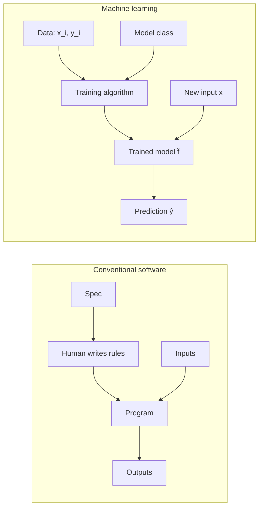

This shift sounds small. It is not. It changes how you debug (you don't read the model; you probe it with inputs), how you test (your test suite is a held-out dataset, not a pytest file), how you deploy (the model is a binary artifact that ships with metadata), how you monitor (you watch *output distributions*, not just error logs), and how you reason about failure (failures are statistical, not deterministic). Most of the engineering rigor in MLOps — which we will get to in Part L — exists to make this new style of programming tractable.

When should you reach for ML? A rough rule:

- If you can specify the rules cleanly and they don't change, **don't use ML**. Write the rules. Adding 100 if-statements has been a perfectly respectable engineering decision since 1965. A pizza-order validation system does not need a neural network.
- If you cannot specify the rules — because the pattern is too complex, too high-dimensional, or simply unknown to you — but you can collect examples of the desired behaviour, **ML is a candidate**.
- If you can specify the rules but they change frequently enough that maintenance kills you, **ML may be a candidate** — because re-training on new data is often cheaper than rewriting rules.

I have known several promising data-science projects to founder because the team chose ML for a problem that wanted three regex patterns. The reverse — using `if/else` where you needed a model — also happens. Knowing which is which is itself a skill, and one we will sharpen throughout this book.

---

### 1.4 What machine learning is *not*

This section will save you and the people who employ you a lot of grief. The single most career-limiting mistake an ML engineer can make is to over-promise what ML can do. The single most career-defining habit is calibrated honesty about its limits. So before we go any further, let's name those limits.

#### 1.4.1 ML is not magic

When a model performs well, it is performing *interpolation* in a very high-dimensional space. It has seen many examples that resemble the new input it is being asked to predict, and it is — roughly — averaging or weighting those nearby examples to produce a prediction.

When a new input lies in a region of the input space that the training data covered well, the model is on solid ground. When the new input lies in a region the training data did not cover — when it has to *extrapolate* — the model is guessing. A well-engineered ML system flags these out-of-distribution inputs and routes them somewhere safer (a human, a fallback rule, a "we don't know" response). A naive ML system confidently extrapolates and produces nonsense. We will see in Part D, when we study generalisation, exactly why this is.

#### 1.4.2 ML is not AGI

The word "AI" gets thrown around in ways that obscure what is actually happening under the hood. A logistic-regression spam classifier is, in a strict technical sense, "AI." So is a multi-billion-parameter language model. The two have essentially nothing to do with each other in terms of capability, training cost, deployment shape, or failure mode. When somebody — especially a stakeholder — uses the word "AI", your first job is to figure out which family of techniques they mean and what they expect the system to do.

For the work this book prepares you for — and for the Databricks ML Associate exam specifically — "ML" means classical, tabular, supervised, and unsupervised learning, with a passing glance at modern foundation models. We will be precise about what is and isn't in scope.

#### 1.4.3 ML inherits the biases of its training data

If your training data contains every loan application your bank ever approved or denied for the last forty years, and if for thirty of those forty years your bank's loan officers were unwittingly steered by neighbourhood demographics, then a model trained on that data will reproduce that bias. The model is not racist in the human sense; it is doing what it was asked to do, which is to predict approvals that look like historical approvals. This is one of the most well-documented failure modes in real-world ML deployment, and it has cost organizations very large sums of money and reputation. We will not solve fairness in this book — it is a research area in its own right — but you should know from chapter 1 that the question exists and that competent ML engineers know it does.

#### 1.4.4 ML is not free of operational cost

A model is not the deliverable. A *system that uses the model, monitors the model, retrains the model, versions the model, and rolls back the model when it misbehaves* — that is the deliverable. Building that system is the bulk of an ML engineer's job, and it is what MLflow, feature stores, model registries, and serving infrastructure exist to support. We will get into all of it in Part L. For now, internalise: the moment you put a model into production, you have signed up for a recurring operational obligation. The training notebook is the appetizer.

#### 1.4.5 ML doesn't relieve you of having to think

A surprising number of ML projects fail because nobody asked, early enough, what *exactly* the model was supposed to predict, and what *exactly* would be done with the prediction. The model is trained to predict customer churn — but the business doesn't have a retention play to deploy when somebody is flagged as likely to churn, so the predictions go nowhere. The model is trained to predict revenue — but the column called "revenue" includes refunds, so the model is actually predicting net revenue, and the dashboard the CFO is staring at says gross. These are not ML problems. They are framing problems. ML amplifies whatever framing you give it, including the wrong framing. Chapter 4's discussion of the lifecycle will return to this at length.

---

### 1.5 A first taxonomy: regression vs. classification

The next few chapters will get more careful about ML's taxonomy. For now we will draw the most useful distinction, the one you will use almost every day on the job: *is the thing you are predicting continuous or discrete?*

#### 1.5.1 Regression: predicting a continuous quantity

If $\mathcal{Y} = \mathbb{R}$ — that is, the label is a real number — we call the problem **regression**. The word is historical (Francis Galton, 1886, talking about heights of children "regressing" toward the mean) and somewhat unhelpful as terminology because it doesn't describe what's happening, but we are stuck with it.

Examples of regression problems:

- Given the square footage, number of bedrooms, school district, and ZIP code of a house, predict its sale price in dollars.
- Given the patient's age, lab values, and history, predict their hospital length-of-stay in days.
- Given a customer's purchase history, predict their next-twelve-month spend in dollars.
- Given the contents of an email, predict the response time of the recipient in hours.
- Given a city, day of year, and weather forecast, predict tomorrow's peak electricity demand in megawatts.

Notice that the predicted quantity is always a number on a continuous scale, and the question of "how wrong" makes intuitive sense — being off by $\$5{,}000$ on a house price is twice as bad as being off by $\$2{,}500$. (This intuition turns into the **mean squared error** and **mean absolute error** loss functions in Part D. The fact that we can talk about "how far off" is a regression-specific privilege; classification has its own machinery.)

#### 1.5.2 Classification: predicting a discrete category

If $\mathcal{Y}$ is a finite, discrete set of labels — `{spam, ham}` or `{cat, dog, bird}` or `{approve, deny, review}` — we call the problem **classification**.

Examples of classification problems:

- Given an email's contents, classify it as spam or ham. (Binary classification — two classes.)
- Given an image, classify it as one of `{cat, dog, bird, fish}`. (Multiclass classification.)
- Given a CT scan, classify each pixel as `{tumor, healthy tissue, background}`. (Semantic segmentation — pixel-wise classification.)
- Given a transaction, classify it as fraud or legit.
- Given a credit application, classify it as `{approve, deny, manual review}`.

For classification, "how wrong" is more subtle. A prediction is either right or wrong; the gradations of wrongness are different (we will spend Chapter 42-44 dissecting precision, recall, ROC, PR curves, F1, F-beta). For now, hold the idea that classification metrics and regression metrics are fundamentally different beasts, because their outputs live in fundamentally different mathematical spaces.

#### 1.5.3 Edge cases the taxonomy doesn't handle cleanly

Real problems sometimes don't fit neatly. A few honest cases:

- **Ordinal classification.** "Customer satisfaction rating: 1–5 stars." Discrete, but ordered. Treating it as classification loses the ordering. Treating it as regression pretends the gap from 1→2 equals the gap from 4→5, which it probably doesn't. There are dedicated ordinal-regression methods; mostly people fudge it and reach for regression.
- **Count regression.** "How many users will log in tomorrow?" The target is a non-negative integer. You can treat it as regression, but special-purpose models (Poisson regression, negative binomial) often do better.
- **Probability prediction.** "What is the probability of default?" The target is a number between 0 and 1, but it's really an estimate of a binary classification's probability. The distinction will matter when we get to logistic regression in Chapter 32.
- **Multi-label classification.** "Tag this article with all relevant topics: politics, economics, sports, tech." More than one label can apply to a single input. This is its own subfield. Chapter 47 visits it briefly.
- **Survival analysis.** "How long until this patient is readmitted?" Looks like regression, but the data is *censored* — some patients haven't been readmitted yet by the time you cut off your dataset, so you only know their time-so-far, not their final time. Treating censored data as plain regression underestimates badly. This is out of scope for the exam but extremely common in healthcare and finance.

These edge cases are mentioned to inoculate you against treating the taxonomy as exhaustive. For the exam — and for 80% of real industry problems — regression vs. classification is the working distinction.

---

### 1.6 Why now? A short historical detour

A reasonable question is: ML's core ideas are old. Why did the field explode after 2012? The answer is the joint maturation of three enablers — data, compute, and algorithms — and it is worth knowing the story.

#### 1.6.1 The data enabler: digitisation since ~2000

Until the late 1990s, most of human activity was not digitally recorded. Retail transactions happened on paper. Medical records were on paper. Phone calls were not transcribed. Photographs lived in shoeboxes. ML algorithms existed, but the input — labelled examples — was extraordinarily expensive to come by.

Three waves changed this:

1. The web (1995–2010) created the first vast repository of digital text and images. Search engines like Google were the first companies for whom "petabytes of training data" became routine.
2. Smartphones (2007–) put a sensor-laden, network-connected device in every pocket. Click logs, location traces, photos, voice recordings — at scales no prior generation could have imagined.
3. Cloud storage (2006–) made it economically feasible to *keep* all that data instead of throwing it away.

By 2012, the constraint had flipped. Where the 1990s ML researcher was bottlenecked on data, the 2010s practitioner was bottlenecked on compute and on algorithms that could exploit the data.

#### 1.6.2 The compute enabler: GPUs since ~2010

Modern ML — especially deep learning — is, mathematically, mostly matrix multiplications. It happens that graphics processing units, designed for rendering video games, are extraordinarily good at matrix multiplication. NVIDIA's CUDA platform, released in 2007, let researchers run general-purpose computation on GPUs. By 2012, training a deep neural network on a GPU was tens to hundreds of times faster than on a CPU.

This sounds like an incremental engineering win. It was not. There is a difference in *kind* between an experiment that takes three weeks and one that takes three hours: only the latter lets a researcher iterate on ideas. The GPU revolution turned ML from a months-per-experiment science to a hours-per-experiment one, and the field's progress accelerated correspondingly.

(For the classical-ML topics that dominate the Databricks ML Associate exam, GPUs are not strictly required — Spark MLlib and scikit-learn run perfectly well on CPUs. But the broader story matters because it explains why ML, as a *field*, looks the way it does.)

#### 1.6.3 The algorithms enabler

Classical machine learning — linear regression, logistic regression, decision trees, random forests, support vector machines, k-means, principal components analysis — was substantially mature by the late 1990s. Most of what's on the Databricks ML Associate exam comes from this era. The names of the techniques and the math behind them have been stable for thirty years.

What's changed in the last decade is partly engineering — better libraries (scikit-learn since 2007, XGBoost since 2014, LightGBM since 2016), better distributed computation (Spark since 2014) — and partly the rise of deep learning, which is mostly out of scope for this exam but which has reshaped how ML practitioners think about model capacity, regularisation, and overfitting.

The takeaway: when you read about ML, distinguish "the algorithm" (often quite old) from "the engineering surface that makes it usable" (often quite new). Most of this book is about the former, executed on the latter.

---

### 1.7 A small worked example: linear regression by eye

Enough abstraction. Let's actually do ML on a tiny dataset, by hand, so you can feel the machinery.

You have data on five house sales in a neighbourhood. Each row is `(square_footage, sale_price_in_thousands)`:

| House | Square footage $x$ | Sale price $y$ (thousands) |
|------:|-------------------:|---------------------------:|
| 1 |   800 | 200 |
| 2 | 1,200 | 280 |
| 3 | 1,500 | 340 |
| 4 | 1,800 | 410 |
| 5 | 2,300 | 510 |

A friend is selling a house with 1,650 square feet and wants to know what to list it at. We want to predict its sale price.

#### 1.7.1 Looking at the data

Let's plot it as a tiny ASCII chart. Square footage runs along the x-axis, price along the y-axis. Each `*` is a house:

```
 price ($k)
   |
 510|                                            *
   |
 410|                                  *
   |
 340|                       *
   |
 280|             *
   |
 200|   *
   |
   +----+-------+--------+--------+--------+------- sq ft
      800    1200      1500     1800     2300
```

Two things are visually obvious. First, price *increases with* square footage — they are positively correlated. Second, the relationship looks roughly *linear* — the points fall close to a straight line.

#### 1.7.2 Fitting a line by eye

A line in two dimensions is determined by two numbers, conventionally written

$$
\hat{y} = w \cdot x + b
$$

where $w$ is the slope (how much price changes per square foot of size), and $b$ is the intercept (the predicted price when $x = 0$).

Look at the points. Between house 1 (800 sq ft, $200k) and house 5 (2,300 sq ft, $510k), the price went up by $510 - 200 = 310$k while the footage went up by $2{,}300 - 800 = 1{,}500$ square feet. So a reasonable slope is

$$
w \approx \frac{310}{1{,}500} = 0.207 \text{ thousand dollars per square foot}
$$

For the intercept, take house 1: if $\hat{y} = 0.207 \cdot 800 + b = 200$, then $b = 200 - 165.6 = 34.4$. Let's try that line.

$$
\hat{f}(x) = 0.207 \cdot x + 34.4
$$

Let's see what it predicts for the five houses we already have:

| House | $x$    | True $y$ | Predicted $\hat{y} = 0.207 x + 34.4$ | Error $y - \hat{y}$ |
|------:|-------:|---------:|-------------------------------------:|--------------------:|
| 1 |   800 | 200 | $0.207 \cdot 800 + 34.4 = 200.0$   |  0.0  |
| 2 | 1,200 | 280 | $0.207 \cdot 1{,}200 + 34.4 = 282.8$ | $-2.8$ |
| 3 | 1,500 | 340 | $0.207 \cdot 1{,}500 + 34.4 = 344.9$ | $-4.9$ |
| 4 | 1,800 | 410 | $0.207 \cdot 1{,}800 + 34.4 = 407.0$ |  3.0  |
| 5 | 2,300 | 510 | $0.207 \cdot 2{,}300 + 34.4 = 510.5$ | $-0.5$ |

The errors are small — at most a few thousand dollars on prices in the hundreds of thousands. The line is a decent fit.

#### 1.7.3 Making the prediction

Our friend's house is 1,650 sq ft. Plug in:

$$
\hat{f}(1650) = 0.207 \cdot 1{,}650 + 34.4 = 341.55 + 34.4 = 375.95
$$

Recommend a list price around $376k. That's it. That's a complete ML pipeline. You collected data, you chose a model class (linear functions of one variable), you fit the model (by hand, eyeballing), and you used it to predict.

#### 1.7.4 What we glossed over (everything)

This was the happiest possible case. Five data points, one feature, perfectly linear, no noise to speak of, no missing values, no categorical variables, no need to validate the model on data it hasn't seen, no production deployment, no monitoring. Everything else in this book is about the cases where one or more of these conditions fails.

To name a few previews:

- **Choosing $w$ and $b$ algorithmically rather than by eye.** When you have 100,000 houses and 50 features, you can't eyeball anything. You need an optimisation procedure. We will derive **ordinary least squares** in Chapter 31 and the general **gradient descent** in Chapter 17.
- **Choosing the model class.** Linear was right here because the data was linear. What if it isn't? Then you need polynomial features (Chapter 28), tree-based models (Chapters 33–36), or other model classes.
- **Multiple features.** Real estate prices depend on size, location, age, condition, schools, market timing… Most of Part E is about turning raw inputs into useful features.
- **Validating the model.** Our line fit the five training points well. Does it work on the *next* five houses? Maybe. The whole machinery of train/validation/test splits (Chapter 21) and cross-validation (Chapter 22) exists to answer this.
- **Quantifying uncertainty.** What's the *probability* the list price should be above $400k? Linear regression has a story for this; tree models have a different one; Bayesian methods a third. We touch on it lightly in Parts B and H.

For now, fix this picture in your head: ML at its core is *fitting a function to data, then using that function to predict*. The rest is mechanics.

---

### 1.8 Scaling up: when the eyeball fails

Imagine the same exercise but now you have 100,000 houses, each with 50 features: square footage, lot size, year built, year of last renovation, number of bedrooms, number of bathrooms, school district rating, distance to public transit, average commute time, ZIP-code-level median income, and so on.

You cannot draw this on a piece of paper. You cannot eyeball a 50-dimensional line. You need:

1. **A way to represent the data efficiently in memory.** This becomes a `pandas.DataFrame` or a Spark `DataFrame` — a table with 100,000 rows and 50 columns. We'll meet both, and the reasons one or the other is the right tool, throughout this book.
2. **A way to express "the best line in 50 dimensions."** This becomes a loss function $L(w, b)$ that, for any candidate $(w, b)$, returns a number measuring how badly the line fits. Smaller is better. Chapter 16.
3. **A way to find the $(w, b)$ that minimises that loss.** This becomes an optimisation algorithm — for linear regression, you can solve it in closed form (Chapter 31); for almost everything else, you use gradient descent (Chapter 17).
4. **A way to evaluate whether the result is good.** This becomes the train/validation/test split and the evaluation metrics (Chapters 21, 42–47).
5. **A way to run all of this on more data than fits on one machine.** This becomes Spark (Part J) and `pyspark.ml` (Part K).
6. **A way to track, version, and serve the result.** This becomes MLflow and the Databricks platform (Part L).

Every chapter in this book is, in some sense, an expansion of one of these six points. By the end, you will be able to do this 100,000-house exercise — and the 100-million-transaction fraud version, and the 50-million-image-and-text version — as routinely as you do any other engineering task.

---

### 1.9 What ML doesn't free you from: domain knowledge

A common misconception is that an ML model will figure out the domain for you. It won't. It will figure out *patterns* — which are not the same thing as understanding.

A model trained on real-estate data will discover that homes with more bedrooms tend to be more expensive. It will not, on its own, know that this is partly because more bedrooms means more square footage (the features are correlated) and partly because larger families have more buying power, and that these two effects are confounded by neighbourhood. A model trained on hospital data will discover that patients prescribed warfarin have higher mortality rates. It will not, on its own, know that this is because warfarin is prescribed to patients with serious cardiovascular conditions, not because warfarin causes deaths.

These are *causal* questions. The model is not making causal claims. It is making predictions, and predictions in correlational data are correct only as long as the same correlational structure holds. The moment the world changes — a new hospital protocol, a new neighbourhood gentrification pattern, a new fraudster tactic — the model's predictions can decay or invert.

The lesson: domain knowledge is your job. The model finds patterns in data; you decide which patterns are real, which are spurious, which are causally meaningful, which are merely correlational, and which are encoding bias. Throughout the rest of this book, we will return to this — particularly in Part E on feature engineering, where many of the most important decisions are domain-driven, not algorithmic.

---

### 1.10 A roadmap for the rest of the book

You now have the framing. Let's preview where each subsequent part takes us, and how each piece connects.

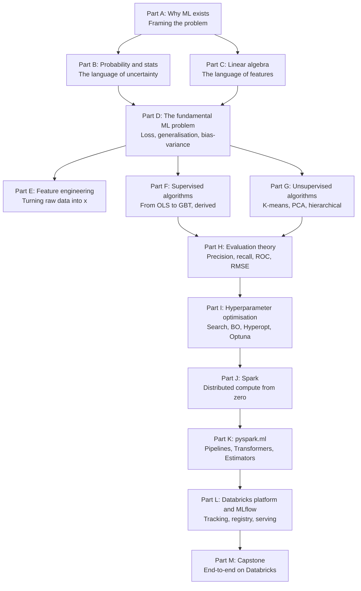

Part B equips you with the probability you need to make sense of likelihood-based methods (logistic regression, Naive Bayes, mixture models). Part C does the same for the linear algebra (matrix decompositions are the heart of PCA, the closed-form of OLS is a linear-algebra identity). Part D is the *theoretical core* of the book — loss functions, optimisation, generalisation, regularisation, cross-validation — and is where the rest of the book hangs its definitions. Parts E through I build on Part D, working up from feature engineering through algorithms and evaluation to hyperparameter tuning. Parts J and K take everything you've learned and rephrase it in the Spark and `pyspark.ml` vocabulary. Part L is the Databricks platform itself — MLflow, Unity Catalog, model serving. Part M is a capstone project that pulls it all together.

A reasonable reader can finish Part A in an afternoon. A serious reader does not finish Part D in an afternoon; the bias-variance derivation alone is worth a careful week. Pace yourself by chapter, not by part.

---

### 1.11 Summary

Strip everything in this chapter down to its bones:

1. ML exists because some problems cannot be solved by writing rules — the patterns are too complex, too high-dimensional, too adversarial, or too non-stationary. Instead, you collect labelled examples and let an algorithm fit a function to them.
2. Formally, ML is function approximation: there is an unknown true $f: \mathcal{X} \to \mathcal{Y}$, and from data $(x_i, y_i)$ we construct an approximation $\hat{f}$.
3. ML differs from regular software in that the artifact is *learned* rather than written, which changes everything downstream — testing, debugging, deployment, monitoring.
4. The most useful first cut on ML problems is regression (continuous $y$) vs. classification (discrete $y$).
5. The field's modern shape is the joint product of three enablers: data (digitisation since 2000), compute (GPUs since 2010), algorithms (deep learning since 2012 on top of classical ML mature since 1990s).
6. A one-feature linear regression done by eye is a complete ML pipeline in miniature. Everything else in the book scales this exercise to higher dimensions, more data, and production systems.
7. ML doesn't free you from thinking about the domain, the framing, or the operational obligations of a deployed model.

If you only remember one sentence from this chapter, make it this one: *Machine learning is the engineering discipline of producing good approximations to functions we cannot write down ourselves, from examples of their input-output behaviour.*

---

### 1.12 What this builds on / where this returns

**Builds on:** Nothing earlier in this book; this is Chapter 1. If you are coming in with software engineering experience, that helps: you already know what a function is, what a deployed service is, and what it means for code to misbehave in production.

**Returns:**

- The function-approximation framing is the spine of *Part D*'s formal treatment of loss and generalisation.
- The "compute, store, monitor" engineering picture sketched in 1.2.5 expands to all of *Part L* — MLflow, Unity Catalog, model serving, monitoring.
- The regression vs. classification taxonomy is sharpened in *Chapter 2* with the three paradigms.
- The 1.7 worked example becomes a formal closed-form derivation in *Chapter 31* (linear regression / OLS).
- The "ML is interpolation, not extrapolation" point recurs in *Chapter 18* (overfitting), *Chapter 19* (bias-variance), and *Part L*'s drift discussion.

---

### 1.13 Exercises

Attempt all of these cold. Answers are in a fold at the bottom; resist peeking until you've written something for every question. The goal is not to get them all right on the first pass — it is to find the gaps in your model and patch them by re-reading.

1. **In your own words**, explain to a non-technical stakeholder what machine learning is, in three sentences. Avoid the words "AI", "deep", "smart", and "data scientist". (No fixed answer; we will critique a sample.)

2. **Classify each of the following as regression, classification, both, or neither.** Justify briefly.
   1. Predicting next month's stock price.
   2. Predicting whether next month's stock price will be higher than this month's.
   3. Identifying which of five disease categories a CT scan shows.
   4. Counting the number of cars in a parking lot from an aerial image.
   5. Translating an English sentence into French.
   6. Computing the SHA-256 hash of a file.
   7. Recommending the next song for a user to listen to.

3. **The "data-too-complex-to-rule-on" criterion.** Give one example, from any domain you know well, of a problem where rule-based programming would work fine and ML would be overkill. Give one example where the reverse holds. Justify both.

4. **The hat in $\hat{f}$.** Why do we write the learned function as $\hat{f}$ rather than $f$? What conceptual mistake does this notation help us avoid?

5. **Worked example, by hand.** Given the four points $(1, 3), (2, 5), (3, 7), (4, 9)$, what line fits them perfectly? Find $w$ and $b$ in $\hat{y} = wx + b$. What is the error at each point? What does the model predict for $x = 5$ and $x = 10$? Do you trust both predictions equally? Why or why not?

6. **Out-of-distribution prediction.** In the house-price example, the training data covered houses from 800 to 2,300 square feet. Your model predicts $0.207x + 34.4$. What does it predict for a 12,000-square-foot mansion? Why might you not trust that prediction even if the arithmetic is correct?

7. **The historical "why now" story.** The classical algorithms underlying most of the ML Associate exam (linear regression, decision trees, k-means) were all developed before 2000. Why did "ML" as a job title and industry boom only after 2012? Give two reasons and one counterexample (something that was already large-scale before 2012).

8. **Concept-vs-code separation.** A friend says, "ML is just calling `sklearn.fit` and `sklearn.predict`." Without being dismissive, explain why this is missing most of the discipline. Aim for four to six sentences.

9. **Domain knowledge required.** You are asked to predict patient readmission within 30 days from electronic health records. You hand the data to a model with no domain consultation. Name three things that could go wrong because you skipped the conversation with clinicians.

10. **Self-assessment.** Without re-reading this chapter, write down: the formal definition of ML in your own words; the difference between $f$ and $\hat{f}$; one concrete example each of a regression and a classification problem; and the three historical enablers. If any of these stumbles, go back to the relevant section.

<details>
<summary>Answers</summary>

1. *Sample answer:* "Machine learning is the practice of letting a computer figure out the patterns in a problem by showing it lots of examples, instead of writing out the patterns ourselves. We use it when the rules are too complicated to write — for spotting credit-card fraud, recommending movies, or estimating house prices. The result is a piece of code that gives reasonable guesses on new examples it hasn't seen before, with some inevitable mistakes." Critique target: did you avoid jargon, name the data-driven nature, and admit it's imperfect?

2. (a) Regression — the price is a continuous number. (b) Classification — the outcome is binary (higher or not). (c) Classification — five discrete categories. (d) Regression-ish or count regression — discrete but ordered, a non-negative integer; could also be solved as a counting / detection problem in computer vision. (e) Neither in the simple sense — it's a sequence-to-sequence problem; it doesn't fit the chapter's two-bucket framing. (f) Neither — this is a deterministic computation; ML would be the wrong tool. (g) Either, depending on framing — ranking (which song scores highest?) is classification-ish; predicting how long the user will listen is regression. The point of this question is to feel the limits of the simple taxonomy.

3. Examples will vary. Rule-based example: validating that a date string is in ISO 8601 format. ML example: predicting whether a customer will churn next month. The first has crisp rules and is solved with a regex; the second has hundreds of weak signals and no clean rule, so we let an algorithm find the patterns.

4. The hat distinguishes the *estimate* from the truth. The true function $f$ is unknown and unknowable; $\hat{f}$ is what we produced from finite, noisy data, and it is approximate. Conflating them is what makes people over-trust models. The notational habit of writing $\hat{f}$ reminds you, every time, that the model is a guess.

5. The line is $\hat{y} = 2x + 1$. Errors at each training point are zero. Predictions: $\hat{y}(5) = 11$; $\hat{y}(10) = 21$. You should trust $x=5$ more than $x=10$ because the training data ran from $x=1$ to $x=4$ — predicting at $x=5$ is a small extrapolation, but $x=10$ is much further outside the observed range, and the linear assumption may not hold there. This is the same extrapolation caveat as in section 1.4.1.

6. $\hat{f}(12{,}000) = 0.207 \cdot 12{,}000 + 34.4 = 2{,}518.4$ thousand, i.e. $\$2.5M$. You may not trust it because (a) you have no training data at that footage; (b) at very large footages the price-per-square-foot relationship probably bends — luxury homes don't scale linearly with size; (c) the model has no idea about the discontinuity between "house" and "mansion".

7. Two reasons: data (the explosion of digital records since 2000 — the web, smartphones, cheap storage) and compute (GPUs made deep-learning-scale matrix math practical). One counterexample of pre-2012 large-scale ML: web search ranking at Google was an industrial-scale ML application by ~2005. Other reasonable counterexamples: spam filtering at major email providers, credit scoring at large banks.

8. The model itself is maybe 10% of the work. The other 90% includes: framing the business question correctly; understanding the data, including its biases and quirks; engineering features that capture what matters; choosing the right evaluation metric for the business cost; setting up train/validation/test splits that don't leak; iterating on the model when it's bad; deploying the model in a way that doesn't introduce serving skew; monitoring it after deployment; and retraining it as the world changes. `fit` and `predict` are 30 seconds of typing in the middle of months of work.

9. Examples: (a) the model might learn to use "discharge to skilled nursing facility" as a strong signal — but in your operational system, that field is only filled in *after* the patient is discharged, so it's not available at the time you want to predict (data leakage). (b) clinicians might tell you that ICD codes are heavily up-coded for billing reasons and don't reflect actual diagnoses, so models trained on them will pick up billing noise rather than clinical truth. (c) clinicians might tell you that the 30-day-readmission window is gameable — hospitals delay readmissions to day 31 — which means your "ground truth" labels are biased.

10. No fixed answer — this is a self-assessment. If anything feels uncertain, go back to that section. The terms to be able to define: ML as function approximation; $f$ vs. $\hat{f}$; regression vs. classification; data + compute + algorithms.

</details>

---

[^next]: Chapter 2 picks up immediately from here, generalising the "where do the $(x, y)$ pairs come from?" question into the three paradigms — supervised, unsupervised, reinforcement.


## Chapter 2 — The Three Paradigms: Supervised, Unsupervised, Reinforcement

> **Goal of this chapter:** to give you the conceptual map you need to look at any new ML problem and immediately know "what kind" it is. We'll spend most of the chapter on **supervised** learning, because that's where ~85% of the Databricks ML Associate exam lives and where ~80% of industry ML lives. We'll spend the next-largest chunk on **unsupervised** learning, then a brief tour of **reinforcement** learning for completeness and orientation. By the end, you should be able to take a vague business problem ("we want to do something with this data") and place it confidently in one of these three buckets — or recognize that the question hasn't been asked clearly enough to answer.

---

### 2.1 Where do the labels come from?

In Chapter 1 we framed ML as finding an approximation $\hat{f}$ to an unknown function $f: \mathcal{X} \to \mathcal{Y}$, given a dataset of examples $(x_i, y_i)$. But we breezed past a crucial question: *where do those $y_i$ come from?*

For the house-price example, the $y_i$ were obvious — they were the actual sale prices, recorded in the county clerk's office, available because real-estate transactions are public records. For the spam-detection example we'll build in Chapter 3, the $y_i$ are obvious too — they come from users clicking the "report spam" button, plus the historical labels produced by your existing spam filter.

Now consider these three problems instead:

1. *We have ten million customer purchase histories. Group customers into segments so we can target marketing differently to each group. We don't know what the right segments are — we want the data to tell us.*
2. *A robot has to learn to walk. We can't tell it the "right" foot-placement for every situation, because there are infinitely many situations and we don't know the right answer in most of them. But we can put the robot in a simulator, let it try things, and give it a reward when it stays upright and a penalty when it falls.*
3. *We want to classify medical images as benign or malignant. We have a million images but only ten thousand of them are labelled by radiologists, because each labelling costs $100 and takes ten minutes.*

The first has no labels at all. The second has no fixed labels — feedback comes from an environment as the agent acts. The third has labels on a small fraction and not on the rest. Each is a different paradigm, with different machinery, different evaluation, and a different mental model.

The first taxonomy any ML practitioner internalises is *the three paradigms*: supervised, unsupervised, and reinforcement learning. Most of the rest — semi-supervised, self-supervised, active learning, contrastive learning, weakly-supervised — are hybrids and refinements of these three.

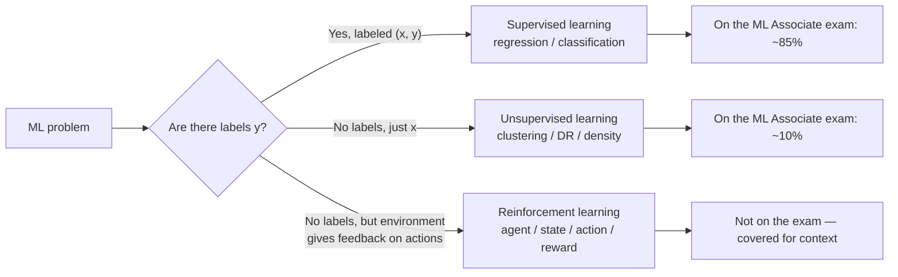

We'll take each in turn.

---

### 2.2 Supervised learning

#### 2.2.1 The teacher–student picture

Supervised learning is the paradigm of *learning from a teacher who knows the right answers.* You hand the learner a stack of flashcards, each with a question on the front (the features $x$) and the answer on the back (the label $y$). The learner studies the cards, internalizes whatever patterns it can, and then is tested on flashcards it has never seen before — graded by how often its answer matches the back of the new card.

The "teacher" is rarely a single human. More often the teacher is *the world that produced the labels* — every chargeback report, every approved loan, every medical chart, every user click. We treat this as a metaphorical teacher; what matters is that we have ground-truth $y$ values to point to.

The formal setup is exactly as in Chapter 1: data $D = \{(x_1, y_1), \ldots, (x_n, y_n)\}$, a model class (the family of candidate functions), a loss function (how to measure "wrong"), and an algorithm that searches the model class for the function that fits the data best.

#### 2.2.2 The two flavours: classification and regression, sharpened

Chapter 1 introduced the distinction. Let's sharpen it.

**Classification** problems have a discrete output space. Within classification there are sub-flavors:

- **Binary classification.** $|\mathcal{Y}| = 2$. Fraud / not-fraud. Spam / ham. Default / no-default. Click / no-click. This is the most common case in industry and the simplest to reason about.
- **Multiclass classification.** $|\mathcal{Y}| = k$ for some $k > 2$, with the classes mutually exclusive — one and only one applies to each $x$. Handwritten digit recognition ($\mathcal{Y} = \{0, 1, \ldots, 9\}$). News topic categorization. ICD-10 code prediction.
- **Multi-label classification.** Each $x$ can have any subset of $k$ possible labels. "Tag this article" — an article can be both `politics` and `economics`. We touch this in Chapter 47.
- **Ordinal classification.** Classes have an order — "1 star, 2 star, …, 5 star" — and that order is informative. Special methods exist but most practitioners reach for regression.

**Regression** problems have a continuous output space. Sub-flavors:

- **Standard regression.** $\mathcal{Y} = \mathbb{R}$. Price, temperature, demand, lifetime value.
- **Bounded regression.** $\mathcal{Y} = [0, 1]$ — predict a probability, a percentage, a click-through rate. Care needed because the model class must respect the bounds.
- **Count regression.** $\mathcal{Y} = \{0, 1, 2, \ldots\}$. Predict the number of customer-support tickets tomorrow. Poisson or negative binomial regression is the principled choice; treating it as standard regression is common and usually fine.
- **Quantile regression.** Instead of predicting the mean $\mathbb{E}[y \mid x]$, predict the 10th, 50th, and 90th percentiles. Useful when you care about uncertainty — for inventory planning you might care more about the 90th percentile of demand than the average demand.

You do not need to memorise these sub-categories now. You need to know they exist so that when you meet a problem that doesn't fit the binary/multiclass/standard mould you don't panic.

#### 2.2.3 The arithmetic of supervised data

Supervised learning's defining feature is that *somebody, or some process, has produced ground-truth labels*. This is its great strength and also its great cost. Let's see where labels actually come from, because this drives the economics of nearly every supervised ML project.

**Label sources, in roughly increasing order of expense:**

1. **Already-labeled by the business process.** This is the cheapest case. Every customer who churned was already labelled "churned" by your billing system. Every transaction that produced a chargeback was already labelled "fraud" by the chargeback. The label is a byproduct of operations. Cost per label: effectively zero.

2. **Labelled by users in passing.** Users click "spam" on emails; users click "thumbs up" on songs; users hit "block" on accounts. Cost per label: zero, but the label is *noisy* (users mark spam capriciously) and *biased* (only certain users click the buttons, only on certain content).

3. **Labelled by paid crowd workers.** Mechanical Turk, Scale AI, Surge AI. "Look at this image and label what it contains." Cost: a few cents per label for simple tasks, dollars for complex ones. Crowd labels have a typical error rate of ~5–15% on tasks that look easy and much higher on tasks that aren't. The standard mitigation is to have three workers label each item and take the majority vote.

4. **Labelled by domain experts.** Radiologists labelling scans. Lawyers labelling contracts. Compliance officers labelling transactions. Cost: $50–$500 per label. Quality: high but not perfect — radiologists disagree with each other ~10% of the time on borderline cases.

5. **Labelled by physical experiment.** A drug company synthesizes a candidate molecule and measures its binding affinity. Cost: thousands of dollars per label. This is rare in classical ML but common in scientific applications.

The cost picture shapes the project. A spam classifier can be retrained nightly on yesterday's user clicks — labels are free and abundant. A radiology classifier needs careful annotation of every training image — labels are slow and expensive, the dataset will be small, and the project will live or die on whether the small dataset is enough.

A useful heuristic: **the cost and quality of labels is, in most real projects, more important than the choice of algorithm.** A mediocre algorithm trained on a million clean labels almost always beats a sophisticated algorithm trained on a thousand noisy ones. This is one of the field's most reliable findings, and it shapes how you should triage projects.

#### 2.2.4 Examples — vivid and concrete

Abstractions get nowhere without examples. Here are supervised problems from domains you'll likely encounter, sketched with enough detail to be useful.

**Healthcare — hospital readmission prediction.** A hospital wants to know, at the time of discharge, which patients are at high risk of being readmitted within 30 days. $x$ is the patient's record: age, diagnosis codes, medications, lab values, length of stay, discharge disposition. $y$ is binary: was this patient readmitted within 30 days? The label comes for free from the hospital's billing system, with a delay of ~30 days. Training data: a few years of historical discharges, perhaps a few hundred thousand. Why it matters: high-risk patients can be assigned to a nurse-driven transitional-care program. Why it's hard: readmissions have many causes (clinical, social, economic) and the data captures only some of them; labels are also subject to "gaming" — hospitals delay readmissions past day 30 to clean up their numbers.

**Finance — credit default prediction.** A consumer-lending company wants to predict, at the time of loan application, whether the applicant will default within 24 months. $x$ is the application data plus credit-bureau data: income, debt, credit utilization, payment history, length of credit. $y$ is binary: did they default? Label comes for free, with a delay of up to 24 months. Training data: tens to hundreds of thousands of historical loans. Why it matters: pricing the loan (higher predicted risk → higher interest rate) and approval/denial decisions. Why it's hard: regulatory constraints on which features you may use (no race, no ZIP code as a stand-in for race); concept drift as the economy changes; the labels you observe are biased — you only see defaults on loans you actually approved, not on loans you denied.

**E-commerce — click-through rate (CTR) prediction.** Given a user, a context (time of day, device, current page), and a candidate ad, predict the probability that the user will click the ad. $x$ is a large feature vector — user features, ad features, context features, sometimes hundreds or thousands of dimensions. $y$ is binary: did they click? Label is free and instantaneous. Training data: billions of historical impressions. Why it matters: ads are ranked by predicted CTR × bid, so a model that predicts CTR a few percent better can move millions of dollars in revenue. Why it's hard: extreme class imbalance (most ads aren't clicked), distribution shift (new ads appear constantly), feedback loops (the model influences which ads are shown, which influences future training data).

**Manufacturing — predictive maintenance.** Given the sensor readings from an industrial pump (vibration, temperature, pressure, current draw, all sampled at 1Hz), predict whether the pump will fail in the next 7 days. $x$ is a time-series window. $y$ is binary: did it fail? Labels come from work-order systems, with substantial delay and substantial noise (some failures are repaired without being recorded as failures). Training data: months to years of sensor logs across many pumps. Why it matters: replacing a pump on a scheduled maintenance window costs $5k; replacing a pump that just failed catastrophically and shut down a production line costs $500k. Why it's hard: failures are rare (huge class imbalance), labels are noisy, time-series features need careful engineering.

**Internal-tools — IT incident triage.** Given a new IT support ticket (free text), classify it as one of {hardware, software, account, network, other} and assign a priority {low, medium, high, urgent}. $x$ is text plus metadata. $y$ is multi-task: a class label *and* a priority label. Labels come from how human agents classified historical tickets — noisy, because different agents classify the same ticket differently. Training data: tens to hundreds of thousands of historical tickets. Why it matters: faster routing means faster resolution. Why it's hard: free text is messy; categories overlap; the population of incoming tickets shifts as new systems are introduced.

Notice a common thread: in every case, the *data engineering* (where labels come from, how clean they are, whether you can trust them) is at least as important as the *modelling*. We will return to this in every part of this book.

#### 2.2.5 What can go wrong with supervised data

Even when you have a beautiful supervised dataset, there are characteristic failure modes:

- **Label leakage.** A feature in $x$ is downstream of $y$ — that is, it's only knowable after $y$ is known. Example: predicting hospital readmission and including "discharge to skilled-nursing facility" as a feature, when that field is only populated for patients who survive long enough to be discharged. Your model looks brilliant in training and falls apart in production. We dissect leakage in Chapter 22.
- **Label noise.** Some fraction of your $y_i$ are wrong. If 5% of Mechanical Turk labels are wrong, your model's ceiling is roughly 95% accuracy, no matter how clever the algorithm. Methods exist for learning under label noise; the most common is to ignore it and accept the ceiling.
- **Sampling bias.** Your training set is not representative of the data you'll see in production. The classic case: you train a credit-default model on past loans, but past loans are only the ones your bank approved — you have no data on what would have happened to the loans you denied. The model's predictions on borderline cases are extrapolations.
- **Concept drift.** $f$ itself changes over time. The fraudsters adapt; the economy shifts; user behavior evolves. Models decay. We'll see drift detection in Part L.
- **Class imbalance.** One class is vastly more common than the other. Fraud is rare; the failure of a fleet pump is rare; cancer in a screening population is rare. Naive models predict the majority class always and score 99% accuracy on uselessly imbalanced data. Chapter 46 is dedicated to this.

These are not edge cases. They are the bread and butter of an experienced ML engineer's debugging sessions.

#### 2.2.6 Supervised learning algorithms, briefly previewed

You will meet each of these in depth in Part F. For now, the names and one-sentence intuitions:

- **Linear regression** (Chapter 31). For regression. Fit a hyperplane. Closed-form solution, fast, interpretable, weak when relationships are nonlinear.
- **Logistic regression** (Chapter 32). For classification. Fit a hyperplane in feature space; pass it through a sigmoid to get probabilities. Same machinery as linear regression with one extra step. Surprisingly powerful for high-dimensional sparse problems (text, ads).
- **Decision trees** (Chapter 33). Recursive partitioning of feature space along axis-aligned splits. Interpretable, handles mixed feature types, but a single tree overfits aggressively.
- **Random forests** (Chapter 34). An ensemble of many decision trees, each trained on a bootstrap sample and a random feature subset, predictions averaged. One of the most reliable workhorses in classical ML.
- **Gradient boosted trees** (Chapter 36). Sequentially fit trees, each correcting the errors of the previous ensemble. XGBoost, LightGBM, CatBoost. The reigning champion on tabular data.
- **Naive Bayes** (Chapter 37, lighter touch). A probabilistic classifier under a strong independence assumption. Fast, simple, surprisingly competitive on text.
- **k-Nearest Neighbours** (Chapter 37). No training; at prediction time, find the $k$ closest training examples and vote. Conceptually simple, expensive at scale.

These seven algorithms — plus their deep-learning cousins, which are out of scope here — cover the vast majority of supervised problems in industry. Part F derives each of them from the math.

---

### 2.3 Unsupervised learning

#### 2.3.1 The motivation: structure without labels

There are situations where you have plenty of $x$'s but no $y$'s, and you still want to do something useful with the data. Sometimes the reason is economic — labels are too expensive. Sometimes it's conceptual — the question itself is "what's in this data?", a question that *has no fixed answer* but that admits useful partial answers.

Three concrete cases:

**Case 1: customer segmentation.** Your marketing team wants to send different campaigns to different "types" of customers. They don't know what the types are. They want you to look at the data — purchase history, demographics, browsing behaviour — and *find* meaningful groups. The right answer is not pre-specified; whether the groups you produce are useful is a judgment call by the marketing team.

**Case 2: dimensionality reduction for visualisation.** You have 100,000 patients, each described by 1,000 lab values. You want to plot them in two dimensions to see if there are obvious patterns. There is no "right" two-dimensional projection — but some are more informative than others.

**Case 3: anomaly detection.** You want to detect credit-card fraud, but instead of training on labelled fraud, you take the opposite tack: model what *normal* spending looks like, and flag anything that doesn't fit. You don't need fraud labels; you only need normal-behavior data, which is plentiful.

These are all unsupervised problems. The dataset is $D = \{x_1, x_2, \ldots, x_n\}$ — no labels.

#### 2.3.2 Why "unsupervised" is harder than it looks

There is a temptation, especially among people new to ML, to think unsupervised learning is "easier" because there are no labels to worry about. The opposite is true. Without labels:

- There is no obvious way to measure whether your output is correct. You can't compute accuracy or RMSE — there's no ground truth.
- The "right" answer is often a judgment call. Are these the right customer segments? Ask the marketing team. They might say yes; they might say no. The success criterion is fuzzy.
- The number of possible groupings or projections is astronomical. Without supervision, there's no natural objective function pulling you toward "the" answer.

In practice, unsupervised methods come with their *own* objective functions — for clustering, "minimize within-cluster distance and maximize between-cluster distance"; for PCA, "find the axes that capture the most variance." But these objectives are surrogates. Optimizing them well doesn't guarantee the result is useful for your business problem; that's a separate question.

The upshot: unsupervised learning is best thought of as *exploratory*. You produce groupings or projections, then a human (you, the analyst, the domain expert) decides whether they make sense.

#### 2.3.3 Clustering — putting examples into groups

Clustering is the canonical unsupervised task: given $n$ examples, partition them into $k$ groups such that examples within a group are similar to each other and examples across groups are dissimilar.

The geometric picture is worth carrying around. Imagine your data points scattered in some high-dimensional space. Clustering algorithms ask: "where are the natural clumps?" If the data happens to fall in five blob-like regions, clustering will find them. If the data is uniformly scattered with no natural structure, clustering will *still produce $k$ clusters* — but they'll be arbitrary, an artifact of where you happened to drop the centroids.

```
   Two-dimensional toy data, three natural clusters:

        ^
   y    |        * *
        |       *   *
        |        * *
        |
        |                *  *
        |               * **
        |                *  *
        |
        |    * *
        |   *   *
        |    * *
        +-------------------> x
```

Three clusters, visually obvious. A clustering algorithm — k-means with $k = 3$ — would recover them in microseconds. The same algorithm with $k = 7$ would *also* produce seven clusters, by splitting the natural ones. Choosing $k$ is part of the problem; Chapter 38 covers the elbow method, silhouette score, and gap statistic for doing it well.

Algorithms you'll meet in Part G:

- **k-means** (Chapter 38). The classic. Pick $k$ centroids, assign each point to the nearest, recompute centroids, repeat until convergence. Fast, scalable, but assumes spherical clusters of similar size.
- **Hierarchical / agglomerative clustering** (Chapter 39). Start with each point as its own cluster; repeatedly merge the two closest clusters until everything is in one. Produces a dendrogram (a tree of merges) that lets you choose $k$ post-hoc. Slow for large data but conceptually clean.
- **DBSCAN, OPTICS** (briefly mentioned in Part G). Density-based — groups dense regions, leaves sparse points as "noise." Handles non-spherical clusters but is harder to scale.

The exam tests k-means in depth and hierarchical clustering more briefly.

**Where clustering shows up in industry:**

- Customer segmentation for marketing.
- Document clustering for topic discovery in a news archive.
- Patient phenotyping in clinical data.
- Compression — quantizing colors in an image down to $k$ representative colors (which is k-means on RGB triples).
- Outlier detection — points far from all centroids are anomalous.

#### 2.3.4 Dimensionality reduction — compressing features

The second canonical unsupervised task is **dimensionality reduction**: given examples in a high-dimensional space, project them into a lower-dimensional space while preserving as much of the structure as possible.

Why would you want to do this?

- **Visualisation.** Humans can see in two or three dimensions. To see the structure of 100-dimensional data, you need to project to 2D or 3D.
- **Compression.** A model fed 1000 features may be slow to train and prone to overfitting. A model fed the top 50 principal components may train faster and generalise better.
- **Noise reduction.** Many features are redundant or noisy. Dimensionality reduction often improves downstream supervised models by removing this noise.
- **Curse of dimensionality.** In very high dimensions, distances become uninformative and many algorithms degrade. Reducing dimensions first sometimes rescues them.

The canonical algorithm here is **principal components analysis (PCA)**, which Chapter 40 derives from scratch as an eigendecomposition of the covariance matrix. The intuition is geometric: find the directions in feature space along which the data varies the most, and project onto those directions. The first principal component is the direction of greatest variance; the second is the next-greatest direction orthogonal to the first; and so on.

```
  PCA on 2D data — finding the principal axis:

        ^
   y    |
        |              .  ←  PC1 direction
        |            .
        |     .    .       .
        |   .   .       .
        |  .      . . .
        | .   .      .
        |   .    .
        |
        +-------------------> x
```

The cloud of points is elongated diagonally. PC1 — the principal component — runs along the long axis of the cloud. PC2 runs perpendicular. If you project all the points onto PC1, you've gone from 2D to 1D and kept most of the variance.

**t-SNE and UMAP** (Chapter 41, lighter touch) are non-linear dimensionality-reduction methods used mainly for visualisation. They preserve local structure (nearby points stay nearby in the projection) at the cost of distorting global distances. They are very useful in practice for exploring data, but they have quirks (they're stochastic, they're sensitive to hyperparameters, the resulting axes are not interpretable). For the ML Associate exam, PCA is the focus and t-SNE/UMAP are mentioned only in passing.

#### 2.3.5 Density estimation and anomaly detection

A third family of unsupervised problems: *model the probability density of the data*. Given $D = \{x_1, \ldots, x_n\}$, produce a function $\hat{p}(x)$ that estimates the probability density at any new point $x$.

Why? Because once you have $\hat{p}$, you can:

- **Detect anomalies.** A new point with very low $\hat{p}(x)$ is unusual — possibly fraudulent, possibly faulty, possibly a sensor error.
- **Generate new examples.** Sample from $\hat{p}$ to get new synthetic data that looks like the real thing. (This is what generative models like GANs and diffusion models do, in a non-classical setting.)
- **Detect drift.** If yesterday's data has a noticeably different density from today's, the world has shifted under your model.

Methods include Gaussian mixture models (GMMs), kernel density estimation (KDE), and the modern crop of generative models. For the ML Associate exam, density estimation is barely touched — it's good to know it exists.

#### 2.3.6 The evaluation problem in unsupervised learning

We mentioned this above; it bears repeating. *Unsupervised learning has no inherent ground truth.* This shapes everything.

For clustering, common evaluation tactics are:

- **Internal metrics** — measure cluster quality based on the data alone. Silhouette score, Davies–Bouldin index, within-cluster sum of squares (WCSS). These tell you something but they don't tell you the result is *useful*.
- **External metrics** — if you happen to have *some* labels (say, you clustered customers and you also know who churned), you can check whether the clusters predict the labels. This is a sanity check, not a primary evaluation.
- **Human judgment** — show the clusters to a domain expert. Are they sensible? Are they actionable?

For dimensionality reduction, evaluation is similar: how much variance did you keep (PCA), how well does the lower-dimensional representation preserve neighbour relationships (t-SNE/UMAP), how does it affect downstream supervised performance.

The pragmatic posture: unsupervised methods are tools for *exploration and feature engineering*, not for end-to-end predictive systems. A typical industrial pipeline uses unsupervised methods to discover structure, then uses supervised methods to act on it. (Example: cluster customers to define segments, then train a supervised churn model with segment as a feature.)

---

### 2.4 Reinforcement learning

#### 2.4.1 The setup

We owe you a tour of reinforcement learning (RL) for completeness, but it is the most distinct of the three paradigms, with its own ecosystem of algorithms, papers, and engineering practices. **RL is not on the ML Associate exam**, and you do not need to know its internals for this curriculum. We cover it here because it shows up in adjacent conversations and you should be able to recognise when somebody is talking about it.

The RL picture:

- An **agent** lives in an **environment**.
- The environment has a **state** $s$ — what the agent currently observes.
- The agent takes an **action** $a$.
- The environment responds with a new state $s'$ and a **reward** $r$.
- The agent's goal is to learn a **policy** $\pi(s) \to a$ that maximises the expected sum of future rewards.


There are no fixed $(x, y)$ pairs. There's a loop in which the agent acts, observes consequences, and updates its policy. RL is *online* in a way that supervised and unsupervised learning are not.

#### 2.4.2 Examples

- **Game playing.** AlphaGo (Go), AlphaZero (chess, shogi, Go), OpenAI Five (Dota 2), AlphaStar (StarCraft II). The agent plays many games against itself, learns from outcomes.
- **Robotics.** A robot learns to walk, manipulate objects, navigate a room. The reward is something like "stay upright" or "move toward the target."
- **Recommendation systems framed as bandit problems.** Each recommendation is an action; the user clicks or doesn't; that's the reward. This frame is increasingly common at Netflix, YouTube, Spotify and others. Contextual bandits — a slim slice of RL — are particularly common.
- **Datacentre cooling, power-grid management, traffic-light control.** Long horizons, complex state, hard-to-specify rewards. Companies like DeepMind have made progress; deployment is hard.
- **Autonomous driving.** Partly RL, mostly supervised learning + planning; pure RL on real roads has been mostly limited to research because the cost of failure is too high to "explore."

#### 2.4.3 Why RL is hard

RL's signature challenges, not because you'll be tested on them but so you understand why people who do RL look frazzled:

- **Credit assignment.** A reward arrives at step 100. Which of the 100 actions deserves credit (or blame)?
- **Exploration vs. exploitation.** Should the agent try a new action that might be better, or stick with the action it knows produces a decent reward?
- **Sample efficiency.** RL algorithms often need millions or billions of environment interactions. In a simulator, fine. In the real world (a robot, a real production system), prohibitive.
- **Reward shaping.** Specifying the right reward is hard. A reward like "deliver the package" doesn't say "without driving over the cat", and agents have a way of finding loopholes.
- **Distribution shift.** The policy changes as it learns, which changes the distribution of states it visits, which changes what it should be learning. Everything is non-stationary.

The classical-ML toolkit (the focus of this book and the exam) is fundamentally different from RL's toolkit. They share the umbrella term "ML" but in practice they have largely separate communities, libraries, and conferences. For our purposes: know that RL exists, know it's a third paradigm, know it's out of scope.

---

### 2.5 The hybrids: semi-supervised, self-supervised, active learning

The three-paradigm taxonomy is useful but not exhaustive. Several important variants live between or beside the canonical three. Quick tour:

#### 2.5.1 Semi-supervised learning

You have $n_L$ labelled examples and $n_U$ unlabelled examples, with $n_U \gg n_L$. The radiology problem from section 2.1: ten thousand labelled scans, a million unlabelled. Can you do better than just training on the labelled ten thousand?

Yes, often. Strategies include:

- **Pseudo-labelling.** Train a model on the labelled data; use it to predict labels on the unlabelled data; retrain on the union, weighting the high-confidence pseudo-labels. Iterate.
- **Consistency regularisation.** Train a model so that its predictions on an unlabelled example $x$ are similar to its predictions on a perturbed version of $x$. The model is told "small input changes should produce small output changes" even without knowing the right label.
- **Graph-based methods.** Build a graph where edges connect similar examples; propagate labels from labelled to unlabelled nodes.

Semi-supervised methods are not on the ML Associate exam. They're worth knowing about because in many real projects, the labels-are-scarce situation is the situation.

#### 2.5.2 Self-supervised learning

The breakthrough of the 2020s. Self-supervised learning generates "labels" from the data itself by inventing a pretext task.

Example: in text, take a sentence, hide one word, and train a model to predict the hidden word from the context. The "label" (the hidden word) is part of the original data — no external annotator needed. This is how BERT was trained. Vast amounts of unlabelled text become a training signal.

Other pretext tasks: predict the next image patch from previous patches (vision transformers); predict whether two crops of an image are from the same image (contrastive learning, SimCLR); predict the rotation angle of a randomly-rotated image.

Self-supervised pre-training followed by supervised fine-tuning on a small labelled dataset has become the dominant paradigm in deep learning. The foundation-model boom — GPT, BERT, CLIP, Stable Diffusion — is a self-supervised-pretrained-then-fine-tuned story.

For the ML Associate exam, self-supervised learning is not directly tested. For your career as an ML engineer in 2026, it is fundamental context.

#### 2.5.3 Active learning

You have a large pool of unlabelled examples and a labelling budget. Which examples should you label?

Active learning algorithms try to pick the most informative examples — typically the ones the current model is least confident about, or the ones that would most reduce model uncertainty. In domains where labels cost $100 per example (radiology, legal), active learning can cut labelling budgets by 5–10×.

Not on the exam. Mention here for completeness.

---

### 2.6 A decision flowchart: picking the right paradigm

Given a new business problem, how do you place it in the right paradigm? A rough decision flow:

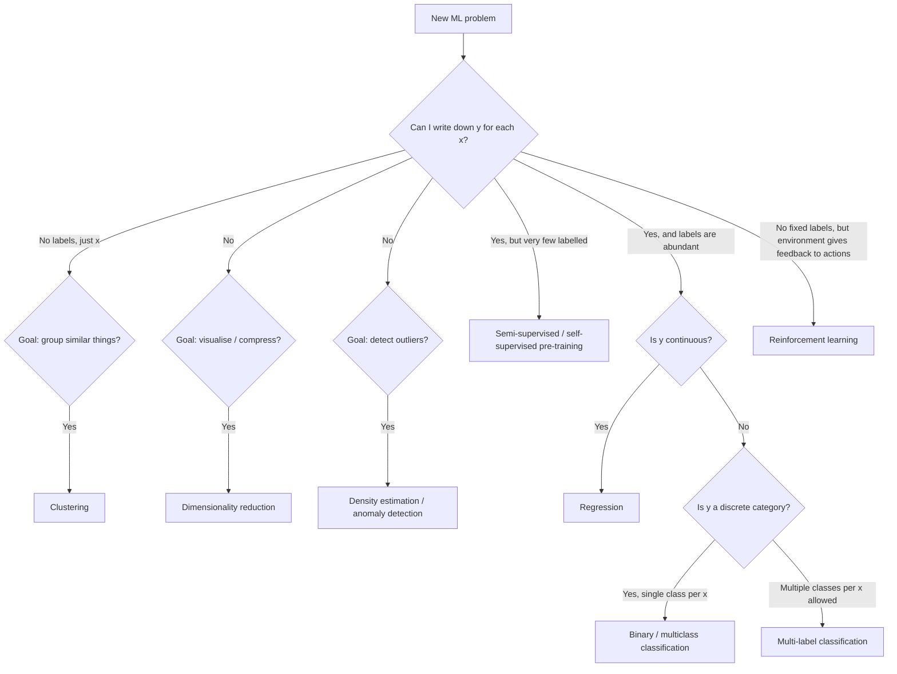

In practice the answer is usually clear within a few minutes of conversation with the stakeholder, *provided you ask the right questions*. The questions that get you there fastest:

1. **"What decision will be made based on the model's output?"** This tells you what $y$ is. (If they can't answer, you don't have a project yet.)
2. **"What does the historical data look like? Do you have records of those decisions, and the outcomes?"** This tells you whether labels exist.
3. **"How many examples do we have, and how clean are the labels?"** This shapes algorithm choice and project scope.
4. **"What does the decision cost when it's wrong?"** This shapes evaluation. Different costs for false-positive vs. false-negative drive different thresholds, different metrics, different model choices.

These are not algorithm questions. They are framing questions. A surprising number of ML projects skip them and pay for the skip later. Chapter 4's lifecycle treatment returns to this.

---

### 2.7 Scope on the Databricks ML Associate exam

Let's be concrete about what this means for the exam, since that is one of your goals.

The Databricks ML Associate exam is dominated by **supervised learning on tabular data**, with a smaller but real presence of **unsupervised learning** (specifically clustering and PCA), and effectively no reinforcement learning. Roughly:

- ~50% supervised classification (logistic regression, random forest, GBT, the binary metrics, ROC/AUC, F1).
- ~25% supervised regression (linear regression, regression metrics, RMSE/MAE/R²).
- ~10% feature engineering (encoding, scaling, imputation — all relevant to supervised pipelines).
- ~10% unsupervised (k-means, PCA, the elbow method, silhouette).
- ~5% MLflow plumbing and Databricks platform (where things live, how to log a run).

The remaining few percent are HPO (hyperopt/Optuna), Spark internals (just enough to understand `pyspark.ml` performance), and miscellany.

This is why this book devotes the entirety of Part F (seven chapters) to supervised algorithms, Part E (eight chapters) to feature engineering, Part H (six chapters) to evaluation metrics, and only Part G (four chapters) to unsupervised. The chapter weights mirror the field's weights, which mirror the exam's weights.

It is also why this chapter is the only place RL gets serious airtime — to make sure when you read about "AI" you can distinguish the kind that's on your exam from the kind that isn't.

---

### 2.8 Summary

The three paradigms in one sentence each:

- **Supervised learning:** find $\hat{f}: \mathcal{X} \to \mathcal{Y}$ from labelled examples $(x_i, y_i)$. Regression (continuous $y$) and classification (discrete $y$) are the two flavours.
- **Unsupervised learning:** find structure in unlabelled data $\{x_i\}$. Clustering (groupings), dimensionality reduction (compressed representations), and density estimation (probability of observation) are the three flavours.
- **Reinforcement learning:** learn a policy $\pi: \mathcal{S} \to \mathcal{A}$ by interacting with an environment that returns rewards. Not on the exam; mentioned to orient you among neighbouring paradigms.

The decision of which paradigm fits a problem is usually about *whether you have labels and whether the goal is prediction, structure-finding, or sequential decision-making*. The most common mistake is to skip this step and reach for a familiar algorithm before clarifying the problem.

Real industry projects use supervised learning the great majority of the time, with unsupervised methods appearing as exploratory or feature-engineering steps in the supervised pipeline. The exam reflects this. The book reflects this.

---

### 2.9 What this builds on / where this returns

**Builds on:** Chapter 1's framing of ML as function approximation. The vocabulary fixed there ($x, y, f, \hat{f}, \mathcal{X}, \mathcal{Y}, D$) is used freely here.

**Returns:**

- Supervised classification gets full treatment in Chapters 32 (logistic regression), 33–36 (trees, forests, boosting), and 42–47 (classification metrics).
- Supervised regression gets full treatment in Chapter 31 (linear regression) and 45 (regression metrics).
- Clustering returns in Chapters 38–39 (k-means, hierarchical) and dimensionality reduction in Chapter 40 (PCA).
- Label leakage, class imbalance, and concept drift — all mentioned in 2.2.5 — get dedicated treatment in Chapters 22, 46, and Part L respectively.
- The "picking a paradigm" framing is the foundation of Chapter 4's lifecycle treatment.

---

### 2.10 Exercises

Attempt cold. Answers in the fold.

1. **Paradigm classification.** For each problem, name the paradigm (supervised regression, supervised classification, unsupervised clustering, unsupervised DR, unsupervised anomaly detection, reinforcement learning) and justify in one sentence.
   1. Predict whether a credit-card transaction is fraudulent given features of the transaction.
   2. Given 1M transaction records, find groups of merchants with similar transaction patterns.
   3. Predict tomorrow's peak electricity load in MW.
   4. Given hundreds of sensor readings, project them onto two axes for a dashboard.
   5. Train a model to play chess via self-play.
   6. Given a stream of credit-card transactions, flag the ones that look very different from this cardholder's history.
   7. Given a dataset of MRI scans, find natural sub-types of brain tumors.
   8. Given email contents, decide whether to route the email to inbox, promotions, or spam.

2. **Where do the labels come from?** For each of these supervised problems, name the most likely source of the labels and one risk of that label source.
   1. Customer churn prediction.
   2. Loan default prediction.
   3. Image classification (cats vs. dogs).
   4. Hospital readmission prediction.
   5. Toxic-comment classification on a social network.

3. **A practical scoping question.** A product manager comes to you with: "We have a year of customer-support tickets. Can ML help?" Without committing to any algorithm yet, what three questions do you ask before you can even tell them what paradigm fits?

4. **Multi-label vs. multiclass.** Explain the difference in your own words, with an example of each. Why does the distinction matter when picking algorithms?

5. **The economics of labels.** You are asked to build a model that classifies legal contracts into 12 categories. You have 500 historical contracts already classified by lawyers. The product team wants 95% accuracy. Discuss, in one or two paragraphs: is this feasible? What constraints does the small labelled dataset put on what's possible? What would you propose as an approach?

6. **Why "unsupervised" is harder than it sounds.** A junior engineer says, "Let's just cluster the customers — it'll be quick because there are no labels to worry about." Why is this naive? Name two specific things that will be hard.

7. **Supervised + unsupervised together.** Describe a pipeline that uses unsupervised learning *as a step* inside a supervised problem. (Hint: feature engineering.)

8. **The exam's weight.** Looking at the exam-weight breakdown in section 2.7, which paradigm should you spend most of your study time on? Why is this the right allocation and not just a quirk of one exam?

9. **A trap question.** "If I have labels for 1% of my dataset and not the other 99%, isn't that just an unsupervised problem?" Disagree with this framing and explain why.

10. **RL placement.** A colleague says they're building an "AI" that learns to optimize a marketing-budget allocation in real time. Is this likely supervised, unsupervised, or RL? Why? What might the reward signal be?

<details>
<summary>Answers</summary>

1. (a) supervised classification — labelled fraud/legit. (b) unsupervised clustering — no labels, grouping. (c) supervised regression — continuous target. (d) unsupervised DR — projecting features. (e) reinforcement learning — agent, action, reward via game outcome. (f) anomaly detection — model normal behavior and flag outliers. (g) unsupervised clustering — looking for sub-types is grouping; if there were a small labelled set, you might also do semi-supervised. (h) supervised multiclass classification.

2. (a) Billing system records — risk: definition of "churn" may differ from product's intent. (b) Loan servicing system — risk: you only see outcomes for loans you approved, biased sample. (c) Crowd workers or scraping pre-tagged images — risk: label noise. (d) Hospital billing — risk: 30-day window is gameable; readmissions delayed to day 31. (e) Moderator decisions and user reports — risk: moderator bias and user reporting bias.

3. (1) What decision will be made based on the model? (2) Do we have historical examples of that decision and its outcome — i.e., are there labels? (3) How clean are those labels and how representative are they of what we'll see in production? Additional good questions: what does "wrong" cost in each direction, what's the timeline, what data systems do we already have.

4. Multiclass: each example has *exactly one* of $k$ labels (digit recognition: each image is exactly one digit). Multi-label: each example can have *any subset* of $k$ labels (a news article can be tagged with both "politics" and "economics"). It matters because the model architecture differs: multiclass uses a softmax over classes summing to 1; multi-label uses $k$ independent sigmoids, one per label. Evaluation differs too — multi-label uses subset accuracy or per-label metrics.

5. Feasibility is borderline. With only 500 examples across 12 categories you have ~42 examples per class on average — likely fewer for rare categories. Achieving 95% accuracy is unlikely with classical ML on a sparse, small, multi-class problem with that label count. Reasonable approaches: (1) use a pre-trained language model (BERT or similar) and fine-tune on the 500 examples — leverages self-supervised pre-training; (2) collect more labels — active learning to pick the highest-value contracts to label; (3) renegotiate the target with the PM — 95% might be unnecessary if a lower accuracy still provides business value; (4) reduce class count by collapsing similar categories if the business allows.

6. (a) There's no natural objective to know if your clusters are "good" — the algorithm will produce $k$ clusters whether the data has natural structure or not, and you'll need a human to judge whether they're useful. (b) Choosing $k$ is itself a non-trivial problem (elbow method, silhouette, business judgment). (c) Distance-based clustering on raw features can produce nonsense if the features are on different scales — you have to engineer features first.

7. Example pipeline: use PCA to reduce a 1000-feature dataset to 50 principal components, then feed those 50 components as features to a supervised classifier. Or: cluster customers into 5 segments with k-means, then add cluster-membership as a categorical feature to a churn model. The unsupervised step engineers features for the supervised step. This is extremely common.

8. Supervised learning, because that's where the majority of weight is (~75%) and because it builds the cognitive foundation that everything else hangs off — loss functions, train/val/test, generalisation, the bias-variance picture. It's the right allocation because supervised is also where industry spends most of its ML effort: it's the paradigm with the clearest business connection (predict → decide → act).

9. The framing is wrong because unsupervised is "no labels at all", not "labels for some." With labelled 1% you have a *semi-supervised* problem, and a competent approach uses both the labelled and the unlabelled data — pseudo-labelling, self-training, consistency regularisation, or pre-train+fine-tune. Treating the 1% as the only data wastes the 99%; treating it as unsupervised throws away the precious labels you do have.

10. Most likely reinforcement learning, possibly framed as a contextual bandit (a simpler slice of RL). The reward signal is something like attributable revenue or conversion. Could also be modelled as supervised learning if you have historical (allocation, outcome) pairs and you're not trying to *learn* the policy online. The distinguishing question: is the system *exploring* allocations and updating based on observed reward (RL/bandit) or is it being trained on a fixed historical dataset (supervised)?

</details>


## Chapter 3 — A Worked Example: Spam Detection End-to-End

> **Goal of this chapter:** to walk through the full life of a single ML project, in enough detail that every term you'll encounter formally later in the book — features, labels, train, validate, test, accuracy, confusion matrix, precision, recall, threshold, overfitting, regularization, deployment, monitoring — appears here *first*, informally, in a concrete setting you can hold in your head. When Chapter 18 formally defines overfitting, you should be able to say "oh — that's what I saw in Chapter 3 when the model memorized the training emails." This chapter is the vocabulary spine of the rest of the book.
>
> We will build a binary spam classifier. We will use real-ish numbers throughout. We will treat the project as a working engineer treats it: framing, data, EDA, features, splits, model, evaluation, threshold tuning, debugging, deployment, monitoring. By the end you will not be able to *do* this from scratch — you'll need Parts D through K for that — but you will have the *shape* of the journey in your head, and the rest of the book is filling in the details.

---

### 3.1 The problem — and the obvious, wrong first instinct

You are a backend engineer at a mid-sized SaaS company that runs corporate email infrastructure. Your inbox handles 100,000 emails per hour across all your customers. Roughly 30% of them are spam — promotional newsletters somebody never subscribed to, phishing attacks, lottery scams, the entire pantheon. Spam volume has been climbing for a year and the customer-support team is fielding daily complaints. Your VP asks you to build a spam classifier that routes spam to a junk folder.

Your first instinct — and you would not be the first engineer to have it — is to write rules.

```python
def is_spam(email) -> bool:
    if "viagra" in email.body.lower():
        return True
    if "click here to claim your prize" in email.body.lower():
        return True
    if email.subject.isupper() and len(email.subject) > 10:
        return True
    if email.attachments_count > 5 and email.recipient_count > 50:
        return True
    return False
```

You'll catch some. You'll also catch the company's own marketing department, who legitimately send emails with "Click here" in them. You'll catch the legal team's all-caps subject lines about urgent compliance matters. You'll miss every spam email that uses "v1agra" or "Vi@gra" or any of the thousand other obfuscations that spammers have spent twenty years perfecting.

The same diagnosis as Chapter 1's fraud thought experiment applies. Spam is a high-dimensional, adversarial, non-stationary pattern. The rules are too many, they shift, and writing them by hand is a losing battle.

So we'll learn the rules from data. Specifically, we'll learn them from a labelled dataset of emails — some marked spam, some marked ham — and we'll let an algorithm work out which patterns of words and metadata correlate with each label.

This chapter walks every step. Strap in.

---

### 3.2 Step 1 — Framing the problem precisely

Before writing any code, we need to nail down what we are predicting and what we will do with the prediction. This sounds obvious. It is regularly skipped, with predictably bad consequences.

**What is $y$?**

The naive answer is "is this email spam?" — a binary label. But that's not quite precise enough. The actual decision we will make based on the model is *which folder to route the email to*. There are at least three options: inbox, promotions, junk. So the prediction we actually want is one of three classes — but for the first version, let's simplify to binary (junk or not-junk) and let the product team build the promotions tier later.

So $y \in \{spam, ham\}$. We will, by convention, encode spam as $1$ and ham as $0$. This convention is not universal — some codebases do it the other way — but the "interesting" class (the rare one, the one you want to catch) is almost always coded as $1$ because that lines up with how precision and recall are usually defined.

**What is $x$?**

For each email, we have access to:

- The subject (a string).
- The body (a string, possibly with HTML).
- The sender's email address.
- The recipient(s).
- A list of attachments (filenames and sizes).
- The arrival timestamp.
- Some routing metadata — DKIM/SPF results, IP address of the originating mail server.

Notice we have *raw, heterogeneous* data here. None of this is "features" yet. Feature engineering — the step where we turn this raw data into the numerical vector $x$ that the model can consume — is its own discipline, the subject of Part E. For this chapter we'll use one of the simplest possible representations, the bag of words.

**What is the cost of getting it wrong?**

This is the question most often skipped, and it shapes everything downstream. The two errors a spam classifier can make are:

1. **False positive:** label a legitimate email as spam, route it to junk. The user might never see it. If it was the wedding photographer's invoice, the user is annoyed. If it was the time-sensitive job offer, the user is *very* annoyed.
2. **False negative:** label a spam email as legitimate, route it to inbox. The user sees a few extra junk emails. Annoying but not catastrophic.

For most email systems, false positives are roughly 5–10x more painful than false negatives. Users tolerate a bit of spam in their inbox; they do not tolerate missing legitimate mail. This will shape how we set the threshold in section 3.9, and the framing here is exactly the kind of thing that has to be hashed out *before* you start training.

**What does "good" look like?**

In a perfect world we'd have a specific number: "catch 95% of spam with <0.5% false-positive rate on legitimate mail." In the real world, you negotiate with the product team. Plausible targets for a first-cut model:

- Recall on spam: > 85% — catch most of it.
- Precision on spam: > 99% — almost everything we route to junk really is junk.

We'll come back to these numbers in section 3.9 when we have a model to evaluate.

---

### 3.3 Step 2 — Getting the data

You walk over to the data engineering team and ask for a year of historical emails with labels. They look at you politely and explain three things:

First, *raw emails are sensitive*. You cannot just have a year of every email that flowed through your system; that's a privacy and regulatory minefield. You can have a sampled, de-identified subset where customer identifiers are hashed and the body text is pre-processed to remove obvious PII. This is a real constraint in any real organization and worth accepting up-front.

Second, *labels exist but are imperfect*. The labels you have come from two sources:

1. **User "mark as spam" actions** in the email UI. These are explicit user signals — high quality but sparse, and biased toward emails users actually noticed.
2. **The existing rules-based spam filter** that has been running for years. Anything it routed to junk is implicitly labelled spam; anything it routed to inbox is implicitly labelled ham.

The second source is much larger but is *exactly the thing we are trying to replace*. Training on its labels means we will learn to mimic it, including all its mistakes. Source 1 is purer but smaller.

A pragmatic compromise: use a union of both sources, *upweight* the user-marked labels, and accept that labels are noisy. We will see how this label noise sets a ceiling on achievable performance later.

Third, *the data is in S3, partitioned by day*. The schema is:

```
email_id (string)
timestamp (timestamp)
sender_domain (string, anonymized)
recipient_count (int)
subject_tokens (array<string>)     -- tokenized, lowercased
body_tokens (array<string>)        -- tokenized, lowercased
has_html (boolean)
attachment_count (int)
dkim_pass (boolean)
spf_pass (boolean)
label (string: "spam", "ham", or "unknown")
label_source (string: "user_marked", "rule_filter", "none")
```

We get back a sample of 200,000 emails for which `label != "unknown"`, spread over the last six months.

Quick sanity-check counts:

| Source | Count | Spam % |
|--------|------:|-------:|
| User-marked spam | 18,000 | 100% |
| User-marked ham (clicked "not spam") | 12,000 | 0% |
| Rule-filter spam (router sent to junk) | 30,000 | 100% |
| Rule-filter ham (router sent to inbox) | 140,000 | 0% |
| **Total** | **200,000** | **~24%** |

The 24% spam rate is roughly consistent with the 30% global rate we were told. Slightly low because the user-marked-ham category is over-represented in our sample. We'll keep going but note it.

---

### 3.4 Step 3 — Exploratory data analysis (EDA)

Before fitting any model, you spend a couple of hours looking at the data. This step is non-negotiable. Skipping EDA is how you end up training a model on a column where 80% of values are zero and only discovering it after a week of poor results.

#### 3.4.1 Class balance

We already saw this above. ~24% spam, ~76% ham. Not severely imbalanced but worth keeping in mind. A model that always predicts "ham" would get 76% accuracy, which is why accuracy alone is going to lie to us in section 3.8.

#### 3.4.2 Length distribution

Let's look at the distribution of `body_tokens` length, by class:

```
Body length (number of tokens), tiny ASCII histogram
(* = approximate count; one * = ~1000 emails)

  Tokens     Spam                   Ham
   0-50      ***********            ****
  51-100     ****************       ********
 101-200     ***********            ***************
 201-500     *****                  *****************
 501+        **                     ***********
```

Some informal but useful observations: spam emails skew shorter, ham emails skew longer. Not a clean separator on its own — there's plenty of overlap — but a feature that captures email length will probably be useful. We'll come back to this if needed.

#### 3.4.3 Most distinctive words

What words appear much more frequently in spam than in ham? A useful summary is the *log ratio* of word frequency in spam to word frequency in ham:

$$
\text{score}(w) = \log \frac{P(w \mid \text{spam})}{P(w \mid \text{ham})}
$$

Positive scores → over-represented in spam. Negative scores → over-represented in ham. We compute this on a sample and look at the top of each list. (Don't worry about the formula; this is just EDA, not the model.)

Top 10 words over-represented in spam (made-up but realistic):

| Word | Score |
|------|------:|
| `unsubscribe` | 3.8 |
| `viagra`      | 5.2 |
| `meds`        | 4.1 |
| `click`       | 3.6 |
| `claim`       | 3.3 |
| `winner`      | 4.0 |
| `congrats`    | 2.9 |
| `prize`       | 3.9 |
| `free`        | 2.5 |
| `urgent`      | 2.1 |

Top 10 over-represented in ham:

| Word | Score |
|------|------:|
| `attached`   | -2.8 |
| `meeting`    | -3.1 |
| `regards`    | -3.5 |
| `tomorrow`   | -2.6 |
| `monday`     | -2.4 |
| `team`       | -2.8 |
| `discuss`    | -2.7 |
| `lunch`      | -3.0 |
| `update`     | -2.3 |
| `attached`   | -2.8 |

A model that just looked at these features would already do well. The "unsubscribe" appearing in *spam* might surprise you — but legitimate marketing lists also include unsubscribe links, and a high frequency of "unsubscribe" indicates the email is promotional. Models, lacking common sense, will happily pick up on this.

#### 3.4.4 Class-conditioned attachment counts

Median attachment count for spam: 0. Median for ham: 0. 90th percentile for spam: 3. 90th percentile for ham: 1. Heavy attachments correlate weakly with spam (think: spam blasts with malicious payloads, often). Not a strong signal on its own; potentially useful in combination.

#### 3.4.5 Time-of-day patterns

Spam volume peaks at 3am UTC (US-eastern off-hours). Ham volume peaks at 2pm UTC (US-eastern business hours). A weak signal but not nothing. If we engineer a "hour of day" feature it might help.

#### 3.4.6 What we did not look at, and why it matters

We didn't look at: per-sender base rates, per-recipient base rates, the geographic distribution of senders, DKIM/SPF pass rates by class. We should have. We're glossing them here for compactness; a real EDA step would take a full day.

Crucially, EDA is where you *catch problems before they bite the model*. A few things we'd want to check that we haven't:

- Are there any features that are 100% predictive of the label? Probably leakage — they shouldn't exist.
- Are there features that are missing for one class but not the other? Probably mechanical artifacts of how data was collected.
- Are there duplicates — the same email appearing twice with different labels? Probably noise or a join bug.

We'll trust the data engineering team here, but in real life trust-but-verify is the watchword.

---

### 3.5 Step 4 — Feature engineering: the bag of words

We have email text. The model wants a numerical vector. We need to bridge the gap.

The simplest and one of the oldest representations of text in ML is the **bag of words** (BoW). We pick a vocabulary $V = \{w_1, w_2, \ldots, w_d\}$ — the $d$ most common words in the corpus, say — and represent each email as a vector $x \in \mathbb{R}^d$ where $x_j$ is the count of times word $w_j$ appears in that email.

That's it. No grammar, no word order, no syntactic structure. We have thrown away an enormous amount of information. We have also produced a representation that almost any classical ML algorithm can consume.

#### 3.5.1 Building the vocabulary

We want the vocabulary to capture words that *discriminate*. Common functional words ("the", "a", "of") appear in everything; rare words ("syzygy", "narthex") barely appear at all. The standard approach is to:

1. Tokenize all the emails (the data engineering team has done this for us — `body_tokens` is the token list).
2. Count global word frequencies across the corpus.
3. Drop the top $K$ "stopwords" (the, a, and, of, to, in, …) — these are too common to discriminate.
4. Drop the long tail of words appearing in fewer than $M$ emails — too rare to be reliable.
5. Take the top $d$ remaining words by frequency. Let's say $d = 5000$.

For our corpus, the vocabulary is, say, words that appear in at least 100 emails but aren't in the standard 100-word English stopword list — about 5,000 words after filtering.

#### 3.5.2 Building the feature vector

For an email with body `["meet", "tomorrow", "at", "lunch", "to", "discuss"]`, we look up each token in the vocabulary. Suppose the vocabulary indices are:

```
"meet"     -> index 1247
"tomorrow" -> index 893
"lunch"    -> index 2451
"discuss"  -> index 1188
```

(The words "at" and "to" are stopwords, dropped.) The feature vector for this email is a length-5000 vector that is zero everywhere except at those four indices, where it is 1.

In practice we don't store this as a dense vector — most of the 5000 entries would be zeros, which is a colossal waste of memory. We store it as a **sparse vector** — a list of `(index, count)` pairs. Spark ML's `SparseVector` and scikit-learn's `scipy.sparse` matrices are designed exactly for this.

#### 3.5.3 What this representation throws away

It's worth naming explicitly what we lose:

- **Word order.** "John fired Mary" and "Mary fired John" produce the same vector. For some tasks this is catastrophic; for spam detection, it turns out to barely matter — the words alone carry most of the spam signal.
- **Sentence structure.** Subjects, verbs, modifiers — all flattened.
- **Compositional meaning.** "not free" produces a count for "not" and a count for "free", which look very similar to "free, but not now." We lose the negation.
- **Multi-word patterns.** "click here" is more informative than "click" + "here" separately. We can recover *some* of this with $n$-grams (pairs and triples of consecutive words) at the cost of much larger vocabularies.

For spam detection, BoW is a workhorse — for decades it was the dominant representation, and even now it's a strong baseline. For more nuanced text problems (sentiment analysis of subtle reviews, machine translation, question answering), BoW is grossly inadequate and you'd use word embeddings (word2vec, GloVe) or transformer-based representations (BERT, etc.). Those are out of scope here.

#### 3.5.4 TF-IDF — a small but important refinement

Raw word counts have one annoying property: a long email naturally has more words, so its vector has larger magnitudes. We'd rather have a representation where short emails and long emails are comparable.

The standard fix is **TF-IDF** — term frequency times inverse document frequency. The idea:

- **Term frequency**: how often does word $w$ appear in this email, normalized by the email's length? This is just $\frac{\text{count}(w, \text{email})}{\text{total tokens in email}}$.
- **Inverse document frequency**: how rare is word $w$ across the whole corpus? Words that appear in every email (e.g., "the") have low IDF; words that appear in only a few emails have high IDF. Formally $\log \frac{N}{N_w}$ where $N$ is the corpus size and $N_w$ is the number of emails containing $w$.

Multiply them: $\text{tfidf}(w, \text{email}) = \text{tf}(w, \text{email}) \cdot \text{idf}(w)$. Words that are frequent in this email *and* rare across the corpus get high scores. Words that are common everywhere get low scores even if they're frequent in this email.

TF-IDF is not magical; it's a sensible weighting. It typically improves linear models on text by a few percentage points over raw counts. For this chapter we'll use TF-IDF.

---

### 3.6 Step 5 — Train / validation / test split

Here is where most engineers, untrained in ML, make their first big mistake. Let's set up the right pattern by first thinking through what could go wrong.

Suppose we trained the model on all 200,000 emails and then asked it "how well do you do?" by checking its predictions on those same 200,000 emails. The model could literally have memorized each email, returning the right label for each, and we'd report 100% accuracy. We'd ship it. In production, on emails it has never seen, it would fail. We'd be embarrassed.

The fix is to *hold out* some data. Specifically, we split the data into three parts:

- **Training set:** the data the model sees during training. It learns its parameters from this.
- **Validation set:** data the model never sees during training. We use it to compare candidate models, tune hyperparameters, decide which version to ship.
- **Test set:** data the model and you (the engineer) never look at until you've made all your decisions. We use it once, at the end, to get an honest estimate of how the model will perform in production.

A common split is 70% / 15% / 15%, though the exact percentages depend on dataset size. With 200,000 emails:

- Training: 140,000 emails
- Validation: 30,000 emails
- Test: 30,000 emails

#### 3.6.1 Why three sets, not two?

A common naive approach is just "train" and "test." Why a separate validation set?

Because the moment you start using a held-out set to *choose between candidate models* — "model A scores 89%, model B scores 91%, ship B" — you have, in a subtle sense, "trained on" that set. You picked a model in part because of its score on the holdout. Repeat this enough times, with enough candidate models, and your "holdout" performance becomes an overestimate.

The validation set absorbs this hit. You make as many decisions as you need to using train + validation. The test set is touched *exactly once*, at the very end, to produce the number you report to the VP. This discipline is harder than it sounds — there's a constant temptation to peek at the test set "just to see." Resist.

#### 3.6.2 How to split: random vs. stratified vs. time-based

A simple random split takes 70%/15%/15% uniformly. For a binary classification with even moderate imbalance, this can produce splits where, by chance, one class is over- or under-represented in one of the splits.

The fix is **stratified sampling**: split each class separately. Take 70% of the spam for training, 15% for validation, 15% for test; same for ham. The class proportions are preserved across all three splits. This is the default for binary classification.

For *time-series data* — and email is, in some sense, time-series — there's a subtler issue. If you randomly split, you'll have some emails from January in your training set and some emails from January in your test set, and the model can leak information across time. The honest split for time-aware data is to *split by time*: train on January–April, validate on May, test on June. This simulates what production looks like — you're predicting on data more recent than any data you trained on.

For our spam example, we'll do a stratified random split for simplicity. In a real production system, we'd absolutely do a time-based split because email content drifts and we want our evaluation to capture that drift. We'll come back to this in section 3.12.

#### 3.6.3 The leakage trap

One more pitfall worth naming: **data leakage**. This happens when information from the validation or test set sneaks into the training process, inflating apparent performance.

For our spam example, two leakage paths to watch for:

1. **Duplicate emails.** Same email content appearing in both train and test sets. If a user receives the same newsletter twice and you don't dedupe, you can train on one copy and "test" on the other. Easy mistake to make; standard fix is to dedupe before splitting.
2. **Future information.** A feature computed on the *entire corpus* — like the TF-IDF weights themselves — uses information from the test set when building the vocabulary. The principled fix is to compute the vocabulary and IDF weights *only on the training set*, then apply them (frozen) to the validation and test sets. We'll do this.

Leakage is one of the most pernicious sources of "the model worked beautifully in evaluation and tanked in production." Chapter 22 dissects it formally. For now: be paranoid.

---

### 3.7 Step 6 — Pick an algorithm: logistic regression

We have features (TF-IDF vectors of length 5000). We have labels (spam or ham). We need an algorithm.

There are many choices. For a first pass on text classification with TF-IDF features, the standard recommendation is **logistic regression** — and the recommendation has held since the 1990s. Why?

- It is **fast** to train. Linear in the number of training examples and features.
- It is **interpretable**. Each word in the vocabulary gets a single weight; you can read the weights to see what the model has learned.
- It is **well-behaved on high-dimensional sparse data**. Text data is exactly that — 5000 features, mostly zero per example.
- It produces **calibrated probabilities** out of the box, which we'll need in section 3.9 when we tune the threshold.
- It is a **strong baseline**. Many fancier algorithms (random forests, gradient-boosted trees) struggle to beat logistic regression on this kind of data, and when they do beat it the margin is small.

We will derive logistic regression formally in Chapter 32. For now, accept the following high-level picture.

Logistic regression learns a weight $w_j$ for each feature (i.e., each word in the vocabulary) and a bias $b$. Given an email with feature vector $x$, it computes a score

$$
z = w_1 x_1 + w_2 x_2 + \cdots + w_d x_d + b = \mathbf{w} \cdot \mathbf{x} + b
$$

This $z$ can be any real number — positive, negative, large, small. To turn it into a probability between 0 and 1, we pass it through the **sigmoid function**:

$$
\sigma(z) = \frac{1}{1 + e^{-z}}
$$

When $z$ is very positive, $\sigma(z)$ is close to 1. When $z$ is very negative, $\sigma(z)$ is close to 0. When $z = 0$, $\sigma(z) = 0.5$.

```
  σ(z) = 1/(1 + e^(-z))

   1 ┤                  ___________
     │              ___/
     │           __/
   0.5┤         /
     │       _/
     │    __/
   0 ┤___/
     └────────┼────────────────────►
            z=0
```

So the model's prediction is $\hat{p}(\text{spam} \mid x) = \sigma(\mathbf{w} \cdot \mathbf{x} + b)$. A probability. The training procedure finds the $\mathbf{w}$ and $b$ that make this probability close to 1 on spam examples and close to 0 on ham examples in the training set. Mathematically, this is **maximum likelihood estimation** under the assumption that the labels are Bernoulli-distributed given the features; we derive the full thing in Chapter 32.

#### 3.7.1 Interpretation: what the weights mean

After training, each word in the vocabulary has a weight. Words with large positive weights "vote for" spam; words with large negative weights "vote for" ham; words with weights near zero are uninformative.

If we sort the weights, we'd expect to see something like:

```
Top positive weights (vote for spam):
  viagra      +4.2
  prize       +3.8
  click       +3.5
  unsubscribe +3.1
  free        +2.8
  ...

Top negative weights (vote for ham):
  meeting     -3.6
  attached    -3.4
  regards     -3.2
  team        -2.9
  monday      -2.7
  ...

Near zero:
  the          0.02
  email       -0.01
  ...
```

This is *almost exactly* what our EDA showed in section 3.4.3. The model has, unsurprisingly, learned what the data already revealed. That's reassuring — and it's also why interpretability matters: if the model had assigned a giant positive weight to "monday", you'd want to know.

---

### 3.8 Step 7 — Training and first evaluation

We fit logistic regression on the 140,000 training emails. The training procedure — gradient descent on the cross-entropy loss, formally derived in Chapter 32 — runs in a few seconds on a single machine for this dataset size. We get back $\mathbf{w} \in \mathbb{R}^{5000}$ and $b$.

Now: how good is it?

#### 3.8.1 The first metric to look at — accuracy — and why it lies

The simplest classification metric is **accuracy**: the fraction of validation examples on which the model's prediction matches the label. With a 0.5 threshold (predict spam if $\hat{p} > 0.5$, else ham), we measure accuracy on the 30,000-email validation set.

Suppose we get **93% accuracy**. Sounds great, right?

It is not nothing. But it is misleading, for one specific reason: the data is imbalanced. 76% of emails are ham. If we built a "model" that predicted ham for *every* email, no machine learning required, it would score 76% accuracy. Beating 76% is the bar; we beat it by 17 percentage points, which sounds decent — but the question is *how*. Did we catch most of the spam? Did we have too many false positives?

Accuracy aggregates these questions into one number. We need to disaggregate.

#### 3.8.2 The confusion matrix

The right first step is the **confusion matrix**: a 2x2 table showing, for the validation set, how each prediction-label combination breaks down.

For our hypothetical 30,000-email validation set, with ~24% spam (= ~7,200 spam, ~22,800 ham), suppose the model predictions break down as:

```
                          Predicted
                    Spam        Ham
                +--------+--------+
       Spam     |  6300  |   900  |  ←  7,200 actual spam
Actual         +--------+--------+
       Ham     |   200  | 22600  |  ←  22,800 actual ham
                +--------+--------+
                  6500    23500
              (predicted   (predicted
                spam)        ham)
```

The four cells have standard names:

- **TP (true positive):** predicted spam, actually spam. 6,300. Spam emails we caught.
- **FP (false positive):** predicted spam, actually ham. 200. Legitimate emails we wrongly routed to junk. These are the *bad* errors.
- **FN (false negative):** predicted ham, actually spam. 900. Spam we let through.
- **TN (true negative):** predicted ham, actually ham. 22,600. Ham we correctly let through.

Total: 30,000.

Let's verify accuracy from this:

$$
\text{accuracy} = \frac{TP + TN}{\text{total}} = \frac{6300 + 22600}{30000} = \frac{28900}{30000} = 96.3\%
$$

Hmm, that's higher than the 93% I said earlier — I was using a different hypothetical model. Let's stick with 96.3% for this confusion matrix.

Already we know more than "accuracy = 96%". We know we caught 6,300 out of 7,200 spams, and we wrongly junked 200 out of 22,800 hams.

#### 3.8.3 Precision and recall — derived from the confusion matrix

Two metrics that get computed from the confusion matrix and that you will see in every classification project for the rest of your career:

**Precision** (also called positive predictive value):

$$
\text{precision} = \frac{TP}{TP + FP} = \frac{6300}{6300 + 200} = \frac{6300}{6500} = 96.9\%
$$

In words: of all the emails we *predicted* as spam, what fraction *actually were* spam? High precision means few false positives — when we say spam, we're usually right.

**Recall** (also called sensitivity, hit rate, true positive rate):

$$
\text{recall} = \frac{TP}{TP + FN} = \frac{6300}{6300 + 900} = \frac{6300}{7200} = 87.5\%
$$

In words: of all the emails that *actually were* spam, what fraction did we *catch*? High recall means few false negatives — we missed little.

These two numbers, together with the underlying class balance, tell you almost everything about a binary classifier. Memorize them. Internalise them. They will show up on every ML evaluation conversation you have.

#### 3.8.4 The tradeoff between them

In general, precision and recall trade off. You can almost always increase recall at the cost of precision (by being more eager to call things spam) and vice versa. The next section is entirely about this tradeoff.

Before we move on: notice that the recall and precision we computed depend on which class we treated as the "positive" class. We treated spam as positive. If we treated ham as positive instead, the numbers would flip. Always check which class is "positive" when reading someone else's evaluation.

#### 3.8.5 F1 — a single number combining precision and recall

Sometimes you want one number that summarizes both. The **F1 score** is the harmonic mean of precision and recall:

$$
F_1 = \frac{2 \cdot \text{precision} \cdot \text{recall}}{\text{precision} + \text{recall}} = \frac{2 \cdot 0.969 \cdot 0.875}{0.969 + 0.875} = \frac{1.696}{1.844} = 0.92
$$

F1 is high only when both precision and recall are high. It penalizes models that achieve a great score in one by sacrificing the other.

If you care about precision and recall *unequally* — and we do; section 3.2 said false positives are worse — you can use **F-beta**:

$$
F_\beta = (1 + \beta^2) \cdot \frac{\text{precision} \cdot \text{recall}}{(\beta^2 \cdot \text{precision}) + \text{recall}}
$$

with $\beta < 1$ emphasizing precision and $\beta > 1$ emphasizing recall. For spam (false positives painful), $\beta = 0.5$ is sometimes used.

We'll come back to this family of metrics in deep formal detail in Chapter 42. For now, you have the working definitions.

---

### 3.9 Step 8 — The threshold dial

This is one of the most important and least taught ideas in classical ML. If you internalize one thing from this chapter, make it this one.

Logistic regression outputs a probability $\hat{p}(\text{spam} \mid x)$ between 0 and 1. To turn that into a *decision* — junk or inbox — you need a **threshold** $\tau$. The standard default is $\tau = 0.5$: predict spam if $\hat{p} \geq 0.5$, else ham.

But $0.5$ is arbitrary. Nothing in the math forces it.

You can choose any threshold. And changing the threshold trades off precision and recall in a specific, predictable way:

- **Higher threshold** (e.g., $\tau = 0.8$) means you only flag emails as spam when you're very confident. *Precision goes up; recall goes down.* Fewer false positives (good for spam) but more false negatives (more spam slipping into inbox).
- **Lower threshold** (e.g., $\tau = 0.3$) means you flag emails as spam even when only moderately confident. *Recall goes up; precision goes down.* More false positives (legitimate emails to junk) but more spam caught.

For our spam classifier, recall section 3.2: we said false positives are roughly 5–10x more painful than false negatives. So we should err on the side of *high precision* — a higher threshold. We're willing to let some spam through to avoid wrongly junking legitimate emails.

#### 3.9.1 The precision-recall curve

Let's actually compute, for our trained model, what happens at different thresholds. We sweep $\tau$ from 0 to 1 and at each value, compute precision and recall:

| Threshold $\tau$ | Precision | Recall | TP   | FP    | FN   |
|----:|----:|----:|-----:|------:|-----:|
| 0.10 | 0.71 | 0.99 | 7128 | 2900  | 72   |
| 0.20 | 0.83 | 0.97 | 6984 | 1430  | 216  |
| 0.30 | 0.91 | 0.94 | 6768 | 670   | 432  |
| 0.40 | 0.95 | 0.91 | 6552 | 345   | 648  |
| **0.50** | **0.97** | **0.88** | **6300** | **200** | **900** |
| 0.60 | 0.98 | 0.83 | 5976 | 122   | 1224 |
| 0.70 | 0.99 | 0.77 | 5544 | 56    | 1656 |
| 0.80 | 0.995 | 0.68 | 4896 | 25   | 2304 |
| 0.90 | 0.998 | 0.52 | 3744 | 8    | 3456 |
| 0.95 | 0.999 | 0.39 | 2808 | 3    | 4392 |

(Numbers are illustrative but realistic for this kind of problem.)

Read the table. At $\tau = 0.5$, we have 97% precision and 88% recall. Pretty good. At $\tau = 0.7$, precision rises to 99% but recall drops to 77% — we miss 23% of spam. At $\tau = 0.3$, recall is 94% but precision drops to 91% — meaning 9% of the emails we junked were actually legitimate. With 30,000 emails, that's 670 false positives, which is *a lot* — that's 670 customers irate that their mail went to junk.

The **precision-recall curve** is just this table plotted, with recall on the x-axis and precision on the y-axis:

```
  precision
    1.0 ┤  ●●●● τ=0.9, 0.95
        │      ●●●  τ=0.7, 0.8
    0.97┤        ●  τ=0.5
        │         ●  τ=0.4
        │           ●  τ=0.3
    0.9 ┤            ●●
        │                ●  τ=0.2
    0.8 ┤
        │                    ●  τ=0.1
    0.7 ┤
        └──┬──┬──┬──┬──┬──┬──► recall
          0.4 0.5 0.7 0.8 0.9 1.0
```

The curve goes up and to the left — there's no operating point with both 100% precision and 100% recall (unless the problem is trivially separable, which spam never is).

#### 3.9.2 Choosing the operating point

Given the PR curve, *where do you operate*? It depends on the cost matrix. Three reasonable choices for spam:

1. **High precision, target ~99%.** Set $\tau \approx 0.7$. Recall = 77%. We catch 77% of spam but only 1% of what we junk is legitimate.
2. **F1-optimal.** Find the threshold that maximizes $F_1$. From the table, that's around $\tau = 0.4$: precision 95%, recall 91%, $F_1 \approx 0.93$.
3. **Recall-first, target ~95%.** Set $\tau \approx 0.3$. Recall = 94%, but precision drops to 91% — 9% of junked emails are wrongly classified, which we said is too many.

For our scenario — false positives 5-10x more painful — option 1 is the right choice. We operate at $\tau \approx 0.7$, accept that we'll miss some spam, and feel comfortable knowing very little legitimate mail will be wrongly junked.

#### 3.9.3 Why this idea is so important

If you read only the default-threshold metrics ($\tau = 0.5$), you would conclude that the model has 97% precision and 88% recall, period. Done. Ship it.

If you understand the threshold dial, you realize: that's just *one operating point on a curve*. By moving the threshold, the same model can be repositioned to fit different cost matrices. The model itself is a *family* of classifiers, indexed by $\tau$. The training picks the family; the threshold picks the member.

This insight is what unlocks a lot of real-world ML work:

- An A/B test reveals that the spam team wants higher precision. You ship a higher threshold, no retraining needed.
- The legal team gets nervous about false positives and requests precision >99%. Easy — raise the threshold.
- A regulatory ask forces you to catch ≥95% of fraud. Lower the threshold; accept the precision cost; communicate to ops.

Many junior data scientists will respond to "we need higher precision" with "let me retrain the model." Often, the right answer is just "let me move the threshold." Knowing the difference is a hallmark of an experienced practitioner.

---

### 3.10 Step 9 — The overfitting check

So far we've evaluated on the validation set. But how do we know the model isn't *just memorizing the training data* — performing well on the training set but poorly on anything new?

This phenomenon — great training-set performance, poor validation-set performance — is called **overfitting**. It's the central failure mode of supervised ML, and we'll spend Chapter 18 on it formally. For now, the diagnostic is simple: compare training and validation performance.

For our model:

| Metric    | Training set | Validation set |
|-----------|-------------:|---------------:|
| Accuracy  | 97.1%        | 96.3%          |
| Precision | 98%          | 96.9%          |
| Recall    | 89%          | 87.5%          |
| F1        | 0.93         | 0.92           |

Training and validation are *close*. The model performs only slightly better on the training set than on the validation set. This is healthy. The model has learned generalizable patterns, not specific training emails.

#### 3.10.1 What overfitting would look like

Suppose, instead, the table looked like this:

| Metric    | Training set | Validation set |
|-----------|-------------:|---------------:|
| Accuracy  | 99.8%        | 87%            |
| Precision | 99.7%        | 80%            |
| Recall    | 99.9%        | 75%            |
| F1        | 0.998        | 0.77           |

That's overfitting. The model nails the training data — too well — and falls apart on anything else. The classic symptom: training set near-perfect, validation set substantially worse.

Why does this happen? Because the model has too much *capacity* — too many free parameters relative to the amount of training data. With 5,000 features and 140,000 training examples, the ratio is fine. But imagine you had a vocabulary of 500,000 features and only 1,000 training emails. The model has enough degrees of freedom to memorize every email exactly, weight-for-weight. It "learns" patterns that are really just noise. On new data, the noise patterns don't repeat, and the model collapses.

#### 3.10.2 Treating overfitting (the preview)

If we had overfit, our options would be:

1. **Get more data.** Doubles or triples the training set. Almost always the best fix, often impractical.
2. **Reduce the model's capacity.** Use a smaller vocabulary; use a less expressive model class (e.g., switch from a deep tree ensemble to logistic regression). Fewer free parameters → less memorization potential.
3. **Regularize.** Add a penalty term to the training objective that discourages large weights. L1 regularization tends to drive weights to exactly zero (sparsity); L2 tends to shrink them toward zero. We'll derive both in Chapter 20.
4. **Use cross-validation to tune.** Not a fix itself, but a way to choose hyperparameters (like the regularization strength) honestly. Chapter 22.
5. **Add dropout / early stopping / data augmentation** in the neural-net world — but those are out of scope here.

For our spam model, we're not overfitting, so we don't need to treat it. But knowing the diagnosis and the treatments is essential.

#### 3.10.3 The underfitting flip side

The opposite failure is **underfitting**: both training and validation performance are mediocre. The model isn't memorizing — it's failing to learn at all. Diagnostic: training accuracy is much lower than what a reasonable model should achieve.

For text classification with 5,000 features and 140,000 examples, achieving only 70% training accuracy would be a red flag — the model is too simple, or you have a bug. Fixes: use a more expressive model, add features, fix bugs.

The right amount of capacity is just-enough-to-fit-the-signal-without-fitting-the-noise. Finding this sweet spot is what Chapter 18's bias-variance picture is all about.

---

### 3.11 Step 10 — Deploying the model

The model is trained, evaluated, threshold-tuned. Now we deploy it.

"Deploying" means putting the model behind a service that scores incoming emails in real time. The shape:

```
Email arrives at SMTP gateway
       │
       ▼
   Feature extraction service
   ─ tokenize body
   ─ compute TF-IDF vector
   ─ load vocabulary and IDF weights (frozen at training time)
       │
       ▼
   Model service
   ─ load weights w and bias b
   ─ compute z = w · x + b
   ─ compute p = σ(z)
       │
       ▼
   Decision logic
   ─ if p >= threshold: route to junk
   ─ else: route to inbox
       │
       ▼
   Email delivered
```

Three engineering concerns dominate:

#### 3.11.1 Latency

Email delivery has tight latency requirements. Spam-classification has to add no more than a few tens of milliseconds. For logistic regression on a 5,000-feature sparse input, this is easy — the dot product is a few thousand multiply-adds and runs in microseconds. For a deep neural network or a deep tree ensemble, you have to be more careful: model quantization, batching, GPU serving, edge deployment all become considerations. Out of scope here, but live problems in Part L.

#### 3.11.2 Throughput

You have 100,000 emails per hour, or roughly 28 per second average and probably 200+ per second at peak. The service has to handle the peak. This is solved with standard service-engineering: stateless workers, horizontal scaling, load balancing.

#### 3.11.3 Training-serving skew

This is the subtle one and the one that bites teams in practice. The feature extraction code in the training pipeline must produce *exactly* the same features as the feature extraction code in the serving pipeline. If training uses one tokenizer and serving uses a different tokenizer, the model will see different inputs at serving time than it ever saw during training, and predictions will degrade silently.

The standard fix is to *share the feature-extraction code* between training and serving. The tokenizer is one function, called from both places. The vocabulary is loaded from the same artifact. The IDF weights are the same numbers.

This is one of the things MLflow and feature stores exist to solve, and it's a major focus of Part L. For now, internalize: the model artifact alone is not enough to deploy. You ship the *model plus all the preprocessing*, as a single unit. Modern ML frameworks call this a **pipeline** — Chapter 62 covers Spark ML's Pipeline pattern in depth.

#### 3.11.4 Versioning and rollback

What if your new model performs worse in production than the old one? You need to be able to roll back. Standard practice:

- Each trained model gets a version number and is registered in a model registry (MLflow Model Registry, AWS SageMaker, etc.).
- The serving service loads the *current production version*. Switching versions is a configuration change, not a code change.
- New models go through a staging phase: deployed alongside the production model, predictions compared, sometimes A/B-tested.
- If a new model misbehaves, switch the config back to the previous version. Seconds, not hours.

We cover MLflow Model Registry in Chapter 73. For now: never deploy a model without a rollback path.

---

### 3.12 Step 11 — Monitoring (the part that never ends)

You've deployed. The classifier is live. Are you done?

Absolutely not. Here is the part that distinguishes ML from regular software: **your model will get worse over time, even if you don't change anything**. The world changes. Spammers adapt their language. New phishing patterns emerge. The distribution of incoming emails drifts away from the distribution your model trained on.

This phenomenon is called **concept drift** (or data drift, or covariate shift, depending on what exactly is drifting). It is the operational reality of every production ML system.

The response is **monitoring**: track metrics on production data and trigger retraining when they degrade.

#### 3.12.1 What to monitor

Three layers of monitoring:

**Layer 1: model performance metrics.** If you have labels in production (and for spam, you do — users mark emails as spam, click "not spam", etc.), you can compute precision and recall on a rolling window of production traffic. Watch for degradation.

**Layer 2: input distribution drift.** Even before you have labels, you can compute statistics on the features the model is being asked to predict on. Has the average email length changed? Has the vocabulary distribution shifted? Have new senders appeared? These are early warning signs.

**Layer 3: prediction distribution drift.** What fraction of incoming emails is the model classifying as spam? If yesterday it was 24% and today it's 38%, something has changed — possibly the world (a spam wave), possibly the model is malfunctioning. Either way, you want to know.

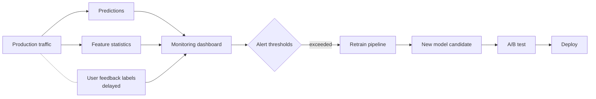

#### 3.12.2 The retraining loop

When monitoring fires (or on a regular schedule — many teams retrain weekly regardless), the retraining loop runs:

1. Pull the latest production data, with labels.
2. Refit the model (same algorithm, fresh weights) on the new data.
3. Evaluate against the prior model on a recent test set.
4. If the new model is better, deploy.
5. If not, alert someone to investigate.

This loop should be *automated*. Doing it by hand is fine for the first month; by month six you should not be touching a notebook to retrain. MLOps platforms — Databricks Workflows, Airflow, Vertex AI Pipelines, SageMaker Pipelines — exist to automate this. We'll see Databricks' answer in Part L.

#### 3.12.3 The recurring obligation

The picture to fix in your head: **a deployed model is a perishable artifact in an operational system**, not a one-time deliverable. Building the first model is the appetizer. Keeping it healthy for five years is the entrée. The bulk of an ML engineer's job, once the first model is shipped, is the monitoring-and-retraining cycle.

Most ML projects that fail in production fail at this stage, not at the modelling stage. The model worked initially; it slowly degraded; nobody noticed for six months; by the time someone did, the model was useless and the team had moved on. Avoiding this story is the whole reason MLOps exists.

---

### 3.13 Step 12 — Reflection: the vocabulary you've now seen

Let's pause and consolidate. Every term in the following glossary was used informally in this chapter and will be formalized later in the book. The point isn't to memorize the formalisms now — it's to recognise the words and have a sketch of their meaning.

**Feature** ($x_j$). One coordinate of the input vector. For our spam classifier, one feature is "count of the word 'unsubscribe'." For house price prediction, one feature is "square footage." Features are the model's view of an example.

**Feature engineering.** The process of turning raw data (emails, transactions, images) into the feature vectors the model consumes. TF-IDF on text is an example. So is one-hot encoding of categorical variables (Part E). So is computing the rolling 7-day average of a time series.

**Label** ($y$). The ground-truth answer for each example. Spam or ham. Default or not-default. Price in dollars.

**Training set / validation set / test set.** The three-way split. Train fits the model. Validation tunes choices. Test gives the final honest number.

**Training** (or "fitting"). The procedure that takes a training set and a model class and produces a specific fitted model. For logistic regression, training means running gradient descent (or a similar optimizer) on the cross-entropy loss.

**Inference** (or "prediction"). Applying the trained model to a new input to produce a prediction. The forward pass through the model.

**Loss function.** A function $L(\hat{y}, y)$ that measures how wrong a prediction is. For logistic regression we use cross-entropy; for linear regression we use squared error. Training minimises the average loss over the training set. Chapter 16 derives the connection.

**Overfitting.** The pathology where training-set performance is much better than validation-set performance. The model has memorized noise rather than learning signal. Diagnosed by comparing the two; treated with more data, less capacity, or regularization.

**Underfitting.** The pathology where both training and validation performance are mediocre. The model is too simple to capture the signal.

**Regularization.** A modification to the loss function that discourages large model weights. L1 (lasso) drives some weights to exactly zero, performing implicit feature selection. L2 (ridge) shrinks all weights toward zero. Both reduce overfitting at the cost of some training-set fit. Chapter 20.

**Accuracy.** Fraction of correct predictions. Useful only when classes are balanced.

**Confusion matrix.** The 2x2 table of (TP, FP, FN, TN). The summary from which precision, recall, F1, and most other classification metrics derive.

**Precision.** TP / (TP + FP). Of what we said was positive, what fraction really was?

**Recall.** TP / (TP + FN). Of what really was positive, what fraction did we catch?

**F1 score.** Harmonic mean of precision and recall. A single number when you want one. F-beta if you want to weight one direction more heavily.

**Threshold.** The probability cutoff that converts a model's probabilistic output into a categorical prediction. Movable post-training. Defines the model's operating point on the precision-recall curve.

**Precision-recall curve.** The locus of (precision, recall) points as the threshold sweeps from 0 to 1. The "shape" of a model's capability across operating points.

**ROC curve.** A different visualization — true positive rate vs. false positive rate as threshold varies. Equivalent information to PR curve, but easier to read in some cases. Chapter 43.

**Bag of words.** A simple text representation: vocabulary indices and counts. Loses word order; usable by most classical algorithms.

**TF-IDF.** A reweighting of bag-of-words that emphasizes words that are frequent in this document but rare in the corpus.

**Sparse vector.** A vector representation that stores only the non-zero entries. Essential for text and other very-high-dimensional, mostly-empty features.

**Logistic regression.** The default linear classifier. Computes a linear score, passes it through a sigmoid to get a probability. Chapter 32 derives it.

**Sigmoid function.** $\sigma(z) = 1/(1 + e^{-z})$. Maps any real number to $(0, 1)$. The bridge from "score" to "probability."

**Pipeline.** The full chain — preprocessing, feature engineering, model — packaged as one artifact for deployment. Chapter 62.

**Training-serving skew.** The bug where features computed at training time differ from features computed at inference time. Causes silent performance loss in production.

**Concept drift.** The pattern where the relationship between $x$ and $y$ changes over time. Demands monitoring and retraining.

**Class imbalance.** When one class is much more common than the other. Affects metric choice (accuracy is misleading) and training (resampling, class weights). Chapter 46.

If you can give a working informal definition of every term in that list, you have the vocabulary base for everything else in this book. You'll meet each term again, formally, but the second meeting will be much easier than if it were the first.

---

### 3.14 What we glossed over

Honesty requires us to enumerate what this chapter cheated on. The omissions point at what later chapters fill in.

1. **The math of logistic regression.** We accepted the sigmoid + dot-product formulation and said "training finds the right weights" without saying *how*. Chapter 32 derives it from maximum likelihood; Chapter 17 explains gradient descent.

2. **The choice of TF-IDF weighting.** We picked it without justification. Other weightings exist (BM25, raw counts, log-counts, …). The choice rarely matters much for spam classification; it matters more in other text problems. Part E covers feature engineering for text more broadly.

3. **Class weights and resampling.** With 24% spam, our class imbalance is mild but not nothing. We didn't adjust for it. Chapter 46 covers how to.

4. **Cross-validation.** We used a single train/validation split. With moderate data this is fine; with smaller data, $k$-fold cross-validation gives more stable estimates. Chapter 22.

5. **Hyperparameter tuning.** Logistic regression has hyperparameters — the regularization strength being the main one. We picked defaults. In practice you'd sweep them. Part I.

6. **Calibration.** Logistic regression's output probabilities are reasonably calibrated, but other models (random forests, neural networks) often are not. If you need to interpret probabilities as probabilities (e.g., for cost-sensitive thresholding), you may need to *calibrate* them post-hoc. Chapter 42–43.

7. **A/B testing in production.** We sketched "compare new model to old". Real A/B testing has its own statistical machinery — sample sizes, lift estimates, sequential analysis. Mostly out of scope, but worth knowing it exists.

8. **Adversarial robustness.** Spam is *adversarial* — spammers actively probe your filter and try to evade it. Adversarial robustness is its own subfield; we leaned on monitoring + retraining as the response but didn't engineer specifically for adversarial inputs.

9. **Production engineering specifics.** Service deployment, autoscaling, monitoring infrastructure — we sketched the shape but didn't dive in. Part L.

10. **Scale.** We assumed 200,000 labelled emails fit in memory on one machine. Industrial spam filters often train on hundreds of millions or billions of labelled examples. That requires distributed compute. Part J introduces Spark; Part K shows how `pyspark.ml` rephrases everything we did here for distributed data.

Each omission has a chapter waiting for it. You'll see them.

---

### 3.15 Summary

Stripped down, this is the shape of an ML project:

1. **Frame the problem.** Pin down $x$, $y$, and the cost of errors. Without this nothing else makes sense.
2. **Get the data.** Including labels, with all their imperfections.
3. **Explore.** Look at the data. Catch surprises before the model does.
4. **Engineer features.** Turn raw data into vectors. For text, BoW or TF-IDF; for tabular data, many other techniques (Part E).
5. **Split.** Train / validation / test. Stratified by class for imbalanced problems. Time-based if data has a temporal structure.
6. **Pick an algorithm and train.** Start simple. Logistic regression for binary classification is a fine first try.
7. **Evaluate.** Look at the confusion matrix. Look at precision, recall, F1. Don't trust accuracy alone.
8. **Tune the threshold.** Move it to match the cost matrix.
9. **Check for overfitting.** Train vs. validation gap. Treat with more data, less capacity, or regularization.
10. **Deploy.** As a pipeline, with rollback paths.
11. **Monitor.** Track performance, input drift, prediction drift. Set up alerts.
12. **Retrain.** Automate the loop. The model is perishable; the loop is the product.

If you can hold this twelve-step picture in your head and recite each step's purpose, you have the framing the rest of this book is going to extend.

---

### 3.16 What this builds on / where this returns

**Builds on:** Chapter 1's function-approximation framing ($f, \hat{f}, x, y$). Chapter 2's distinction between supervised and unsupervised, and the supervised classification case specifically.

**Returns:**

- The full **lifecycle** in section 3.2–3.12 gets the formal treatment in *Chapter 4*.
- **Feature engineering** (3.5) returns in *Part E* — TF-IDF appears formally in Chapter 28, and the general discipline in Chapters 23–30.
- **Train / validation / test** (3.6) returns in *Chapter 21*, with leakage and cross-validation in *Chapter 22*.
- **Logistic regression** (3.7) is derived from scratch in *Chapter 32*.
- **The sigmoid** as the canonical "score-to-probability" map shows up again in *Chapter 32*.
- **Confusion matrix, precision, recall, F1** (3.8) get full formal treatment in *Chapter 42*.
- **The threshold dial and the PR curve** (3.9) are the subject of *Chapters 42–44*.
- **Overfitting and underfitting** (3.10) become a formal bias-variance derivation in *Chapter 19*; regularization in *Chapter 20*.
- **Deployment** (3.11), **training-serving skew**, **pipelines** return in *Chapters 62 (Spark pipelines)* and *Part L* (Databricks platform).
- **Monitoring and concept drift** (3.12) get formal treatment in *Part L*.

---

### 3.17 Exercises

These should test every step. Attempt all of them cold.

1. **Reframe.** Suppose the product team changes the spec: instead of routing spam to junk, you should *flag* suspected spam in the inbox with a yellow warning banner, and the user decides whether to read or delete. How does this change your evaluation framework? What does it do to the false-positive vs. false-negative tradeoff?

2. **Label arithmetic.** Your dataset has 200,000 emails, 24% spam. You split 70/15/15 stratified. How many spam emails are in each of train, validation, test? How many ham?

3. **Confusion matrix exercise.** A spam classifier is evaluated on 10,000 emails. 2,000 are spam. The model predicts 1,900 emails as spam, of which 1,700 are correctly identified. Fill in the confusion matrix. Compute precision, recall, F1, and accuracy.

4. **Threshold reasoning.** A radiologist screening tool flags chest X-rays as "possible cancer / probably benign." False negatives can be fatal; false positives lead to an expensive but non-harmful follow-up biopsy. Which way should the threshold be set — high (favor precision) or low (favor recall)? Justify.

5. **The "always predict majority" baseline.** For an extremely imbalanced classification problem (99% ham, 1% spam), what accuracy does the "always predict ham" baseline achieve? What is its precision and recall on the spam class? What does this tell you about accuracy as a metric?

6. **TF-IDF computation.** Suppose word $w$ appears 4 times in an email of 100 tokens. The corpus has 10,000 emails and $w$ appears in 200 of them. Compute the TF, the IDF, and the TF-IDF score for $w$ in this email. (Use the natural log for IDF.)

7. **Overfitting diagnosis.** Two classmates train spam classifiers. Alice's: training accuracy 95%, validation accuracy 94%. Bob's: training accuracy 100%, validation accuracy 78%. Whose model is overfit? What would you suggest each of them try next?

8. **Sparse vs. dense storage.** Our vocabulary has $d = 5{,}000$ words; the average email has 80 unique words. Compare the memory footprint of dense storage (every email a length-5000 array) vs. sparse storage (a list of `(index, count)` pairs), for 200,000 emails, assuming 4 bytes per number.

9. **The wedding photographer.** Your spam classifier's threshold is set at $\tau = 0.5$. The wedding photographer keeps getting her invoices junked. Investigation reveals the classifier rates her invoices at around $\hat{p} = 0.55-0.65$. What are your options? Discuss at least two non-retraining and one retraining solution.

10. **Drift detection.** Two weeks after deployment, the spam classifier's daily predicted-spam rate jumps from 24% to 35%. Give at least three possible explanations. How would you investigate?

11. **Pipeline thinking.** Why is the *vocabulary* (the list of 5,000 words) something that has to be saved with the model and reused at inference time, rather than recomputed from the incoming email alone?

12. **A weak feature.** During EDA you notice that emails with `attachment_count > 5` are 90% spam, but only 0.5% of all emails have `attachment_count > 5`. Is this a strong feature, a weak feature, or both? What does it contribute to a model and how?

13. **Cost-sensitive threshold.** Suppose false positives cost the business $0.50 per occurrence (user complaints, support tickets) and false negatives cost $0.05 (slight user annoyance). Using the precision-recall table in section 3.9, which threshold minimises expected cost on 30,000 emails? Show your work.

14. **A simple ablation.** Suppose you retrain the model without the TF-IDF reweighting — just raw word counts. The validation F1 drops from 0.92 to 0.89. Is this a good or bad outcome? Discuss whether TF-IDF is "worth keeping" given that result.

15. **Sketch the lifecycle.** Without re-reading section 3.15, write down the twelve steps from memory. Compare. Note which ones you got wrong and re-read those sections.

<details>
<summary>Answers</summary>

1. The decision moves from automatic (route to junk) to advisory (user sees a warning). False positives become much less painful — the user just ignores the warning if their wedding-photographer invoice is wrongly flagged. False negatives are also less painful — even a missed-spam email is now no worse than the status quo. The threshold can shift toward higher recall. The metric the product cares about may shift toward F1 (balanced) or even recall-weighted metrics, since precision is no longer as critical.

2. Train: 70% × 24% × 200,000 = 33,600 spam; 70% × 76% × 200,000 = 106,400 ham. Validation: 7,200 spam; 22,800 ham. Test: 7,200 spam; 22,800 ham. (These should sum to 48,000 spam and 152,000 ham, total 200,000.)

3. TP = 1,700; FP = 1,900 - 1,700 = 200; FN = 2,000 - 1,700 = 300; TN = 10,000 - 1,700 - 200 - 300 = 7,800. Precision = 1700/1900 = 0.895. Recall = 1700/2000 = 0.85. F1 = 2(0.895)(0.85) / (0.895 + 0.85) = 1.5215 / 1.745 = 0.872. Accuracy = (1700 + 7800)/10000 = 0.95.

4. Low threshold — favor recall. A missed cancer is a much worse error than a wrongly flagged X-ray that leads to a benign biopsy. You want to catch as many positive cases as possible; the follow-up biopsy filters out the false positives. This is the canonical "medical screening" tradeoff and is the reason many cancer screening tools have notoriously low precision.

5. "Always predict ham" gets 99% accuracy. On the spam class: precision is undefined (0/0 — we never predict spam, so denominator is zero), recall is 0/100 = 0%. We catch no spam. This is the canonical demonstration that accuracy is a misleading metric for imbalanced classification — the trivial baseline scores 99% accuracy while being completely useless.

6. TF = 4/100 = 0.04. IDF = ln(10000/200) = ln(50) ≈ 3.912. TF-IDF = 0.04 × 3.912 ≈ 0.156.

7. Bob is overfitting (training near-perfect, validation much worse). Alice is healthy. Bob should try: more data, stronger regularization (e.g., raise L2 coefficient), smaller vocabulary, simpler model. Alice could try: stronger features, slightly larger model, hyperparameter tuning, but no immediate red flags.

8. Dense: 200,000 × 5,000 × 4 bytes = 4 × 10^9 bytes = 4 GB. Sparse: 200,000 × 80 × (4 + 4) bytes = 1.28 × 10^8 bytes = 128 MB. Sparse is ~30× smaller. This is why every serious ML library has sparse vector support.

9. Non-retraining: (a) raise the threshold to ~0.7 — the wedding photographer's emails at 0.55-0.65 now pass through; (b) add an allowlist — explicitly allow her domain. Retraining: (c) collect a few hundred legitimate-vendor emails and add them to the training set as ham; (d) engineer features that capture invoice-like content (presence of dollar amounts, the word "invoice", attachments with `.pdf` extensions) and retrain.

10. (a) An actual spam wave — the world has changed; (b) drift in the input feature distribution (new email sources, different lengths) that the model is responding to; (c) a bug introduced in the feature-extraction pipeline causing existing emails to score differently; (d) a change in how labels are produced upstream — though this wouldn't affect predictions directly. To investigate: look at the input distribution (lengths, common words, sender domains), look at recent users complaining, sample emails the model now flags that it wouldn't have before, check the feature pipeline for changes.

11. Because the model has been trained with each word in a specific position in the feature vector. "Unsubscribe" is at index 1247 in the vocabulary; the weight at index 1247 is the model's weight for "unsubscribe". If you recomputed the vocabulary on each new email, "unsubscribe" might end up at index 17 or wherever — and the model's weights would no longer correspond to the right words. Vocabulary is part of the trained artifact.

12. It's a strong-but-narrow feature: very predictive when it fires, but it fires rarely. It contributes high precision lift on a small subset of emails. It will appear as a high-weight feature in logistic regression and will be useful — but it won't move the overall metrics much because it only affects 0.5% of cases.

13. Total cost at threshold τ: cost(τ) = 0.5 × FP(τ) + 0.05 × FN(τ). At τ=0.5: 0.5 × 200 + 0.05 × 900 = 100 + 45 = 145. At τ=0.4: 0.5 × 345 + 0.05 × 648 = 172.5 + 32.4 = 204.9. At τ=0.6: 0.5 × 122 + 0.05 × 1224 = 61 + 61.2 = 122.2. At τ=0.7: 0.5 × 56 + 0.05 × 1656 = 28 + 82.8 = 110.8. At τ=0.8: 0.5 × 25 + 0.05 × 2304 = 12.5 + 115.2 = 127.7. Minimum is τ = 0.7 with cost 110.8. Given the 10× cost ratio of FP to FN, the optimal threshold sits well above the default 0.5.

14. A 3-point drop in F1 (from 0.92 to 0.89) is non-trivial but not enormous. Whether it's "worth keeping" depends on the cost of complexity vs. the value of the lift. TF-IDF is well-understood, easy to maintain, doesn't add latency, and gives a measurable improvement — keep it. The question is more interesting when the "feature" costs something (new data sources, more serving latency, more complexity in the training pipeline).

15. From memory: frame, get data, EDA, feature engineer, split, pick algorithm + train, evaluate, threshold-tune, overfit check, deploy, monitor, retrain. The exact wording can vary; the structure should match.

</details>


## Chapter 4 — The ML Workflow / Lifecycle

> **Goal of this chapter:** Chapter 3 walked, step by step, through a single spam-classifier project. The story moved cleanly from framing to deployment to monitoring, as if each step naturally led to the next. That tidiness was pedagogically convenient and operationally a lie. Real ML projects do not march in a straight line. They loop. Evaluation sends you back to feature engineering. Monitoring sends you back to data. Deployment surfaces problems that were latent in the original framing. The *lifecycle* — the named stages and the back-edges between them — is the vocabulary you need to communicate with teammates, plan a quarter, scope a deliverable, and recognise where you are stuck. This chapter gives you that vocabulary, the failure modes that wait at each stage, and a preview of where each stage lives on Databricks (which is the platform Parts J through L treat in depth).

---

### 4.1 Why projects look linear in books and crooked in practice

Open any introductory ML textbook and you will find a diagram that looks roughly like this: *frame the problem → collect data → engineer features → train a model → evaluate → deploy → monitor*. Seven boxes, six arrows, all pointing forward. The diagram is honest about the *names of the stages* and dishonest about the *flow between them*. In a real project, you spend a week on features, you train a first model, evaluation tells you something is wrong, and you go back two boxes to feature engineering — or sometimes all the way back to framing because evaluation has revealed that the question you set out to answer was not actually the question the business needed answered. The arrows go in every direction.

This is not a flaw in the diagram, exactly. The diagram is doing the same thing the diagram of the water cycle does in a fifth-grade textbook: showing the stations, but flattening the time. The water cycle never just goes evaporation-to-cloud-to-rain in one tidy pass either; the picture helps you name the stations so you can talk about them. The ML lifecycle diagram does the same job.

So in this chapter we will do two things that the chapter-3 walkthrough did not do explicitly. First, we will *name* each stage of the lifecycle and discuss, at some length, what can go wrong at that stage — not as abstract principles but as the kind of war story that has happened to every working ML team at some point. Second, we will draw the diagram with all its back-edges, so that you have an accurate map of *how iteration actually flows* through a project. By the end you should be able to look at a stuck project and say with some confidence "we are in the modeling stage but we need to go back to data acquisition" rather than the more common "I don't know, the model is bad, let me try a different algorithm".

A teacher's note before we start: the seven stages we are about to name are not unique to this book. They are the consensus terminology that has converged across the ML community over about twenty-five years, with minor variations in naming. Section 4.10 will discuss the historical antecedent — CRISP-DM, born in 1996 from a Special Interest Group of SPSS, NCR, DaimlerChrysler, and OHRA — that essentially set the template. Modern MLOps has added an engineering layer on top, but the underlying skeleton is roughly what CRISP-DM gave us. If you read papers or attend conferences and the speaker uses slightly different stage names ("data preparation" instead of "feature engineering", "modeling" instead of "training"), trust your taxonomy and translate; the substance is the same.

---

### 4.2 Stage 1 — Problem framing

The first stage is the one that looks free, and is the one that most often kills projects before any code is written. Problem framing is the act of deciding, precisely, *what you are predicting and what will be done with the prediction*. It sounds trivial. It is not.

Consider the following composite, which has happened in one form or another at every company I have worked at. A VP of marketing asks the data science team to "build a churn model." The team, eager to do its job, dives in. They identify a churn label — a customer is "churned" if they have not made a purchase in the last 90 days — and build a model that predicts, for each active customer, the probability of churning in the next 90 days. The model is good. Validation AUC is 0.87. The team presents to the VP. Three months later, nothing has happened with the model and the team is asked, in performance review season, what business impact their work had. The answer is none.

Why? Because nobody asked the second half of the question. *What will you do with the prediction?* It turns out the marketing team has exactly one retention play — a 10%-off coupon — and they only have budget to send it to 5,000 customers per quarter. So they don't actually need a "probability of churn" for every customer; they need a *ranking* of who to send the coupon to. And it turns out that the customers most likely to churn (the ones the model surfaces) are mostly already-disengaged customers for whom a coupon won't do much; the customers for whom a coupon is most *effective* are a different group entirely. The model answers the question "who is likely to churn" with high accuracy and answers the question "who should I send a coupon to" with no accuracy at all. The model is technically beautiful and operationally useless.

The framing failure here is sometimes called the "wrong target" trap. The team chose $y$ = "will this customer churn" when the question the business needed was $y$ = "will sending this customer a coupon change whether they churn." These are different problems — the second is a *causal*, *uplift-modeling* question, the first is a *predictive*, *correlational* question. The math is different. The data requirements are different. The deployment is different. The team built the wrong thing and didn't know.

Problem framing has a checklist that, run honestly, catches most of these failures up front:

- **What exactly is $y$?** Define it precisely enough that two independent data engineers, working from your definition, would produce the same labels. "Churn" is not a definition. "No purchase activity in the 90 days following the prediction date, excluding refunds and free-tier accounts" is a definition.
- **What exactly is $x$?** What information is available *at the time the prediction is made*? Not at the time the data was logged; at the time the prediction is needed. (We will return to this in Stage 3 when we discuss leakage.)
- **What decision will be made from $\hat{y}$?** And do you have, in fact, a way to make that decision? A churn model with no retention action is a dashboard, not a system.
- **What is the cost of each kind of error?** Section 3.2 hashed this out for spam. Every problem has its own cost ratio. Skipping this is how you end up tuning F1 when the business cares about recall.
- **What does success look like, quantitatively?** Some threshold of accuracy or business KPI, agreed up front, that defines "we shipped something that worked."

Run this checklist with the actual stakeholder, before any code. The conversation will surface contradictions that you will otherwise discover three months in.

The classic failure mode of problem framing, distilled: the data scientist trains a beautiful model that solves the wrong problem because the stakeholder could not articulate the business question, and the data scientist did not press hard enough to extract it. Both parties are at fault; the data scientist owns the consequence. This is the stage where ML projects most often go quietly wrong, and it is the cheapest to fix. A week of framing conversation can save six months of modeling effort.

A second, more subtle framing failure deserves naming: the *too-narrow target*. Consider a fraud team that asks for "a model to predict whether a transaction is fraud." Reasonable on its face. But "fraud" is not one thing — it covers card-not-present fraud, account takeover, friendly fraud (the cardholder claims fraud on a charge they actually made), merchant fraud, identity fraud, and several others. A single binary "fraud / not fraud" label collapses all of these into one bucket. The model that results is an average of patterns across all fraud types; for any specific subtype, it underperforms a specialised model. The framing question that would have caught this is "is the underlying problem really one problem, or several problems we should treat separately?" Sometimes one model is the right answer (when the subtypes have shared signals and you don't have enough data to train each separately); sometimes the right answer is several models, or a hierarchical model, or a separate routing step that decides which downstream model to consult. The framing stage is where you decide.

A third framing failure: the *un-actionable prediction*. You can predict customer satisfaction scores from product-usage data with high accuracy. Great. Now what? Unless the prediction is wired to a specific business action — a proactive support call, a UX experiment, a pricing adjustment — the prediction is just a number on a dashboard. Predictions that are not wired to actions tend not to survive a budget review. The framing question is "what business workflow will consume this prediction, and is that workflow ready to consume it?" If the answer is "we'll figure it out after the model is built", you have a framing problem.

---

### 4.3 Stage 2 — Data acquisition and understanding

You have a problem framed. Now you need data. This is rarely as simple as "query the table."

Real data acquisition involves at least four sub-tasks. *Finding* the data — which often means working out which of seventeen analytics warehouses, three transactional databases, two operational data stores, and a directory of dump CSV files actually contains the truth about, say, whether a customer purchased. *Getting access* — which means working with security, compliance, and platform teams, and which can take days to weeks depending on how regulated your industry is. *Understanding what each column actually means* — which means talking to the people who maintain the systems that produce the data. *Validating* — which means looking for the data-quality landmines that, if undetected, will silently poison everything downstream.

The "understanding what columns mean" sub-task is the one that catches everybody at least once. Let me give the canonical example. You join a retail-analytics team. The data warehouse has a table `transactions` with a column `revenue`. You build a model that predicts next-month revenue per customer, and it scores well. You ship it. Six months later, the finance team flags that the model's predictions are *systematically lower* than the gross revenue numbers in their Tableau dashboards by about 8%. After two weeks of investigation, you discover that the `revenue` column in `transactions` is computed *net of refunds*, with refunds being booked back into the same `revenue` field as a negative line item, while the finance dashboard computes gross revenue by filtering refunds out. The model is predicting net-of-refunds revenue but is presented to stakeholders as predicting gross revenue, and nobody — including you, when you started — realised the difference. The refunds happen to be small enough that the model still "looks right" to a casual eye, which is why it took six months to surface.

This is not a bug in the model. The model is doing exactly what it was trained to do. The bug is in the semantic gap between "the column is called `revenue`" and "we all think we know what `revenue` means." Bridging that gap is the data scientist's job, and the only way to bridge it is *to talk to the people who built and maintain the source data*. There is no shortcut. There is no doc page that tells you. You ask, in writing, "when a customer returns a product, what happens to the `revenue` column?" — and you write down the answer.

Other landmines in this stage that have bitten teams I have worked with:

- A `timestamp` column that, half the time, is in UTC and half the time is in the customer's local timezone, with no flag to tell them apart. Discovered when the model thought peak engagement was at 3am.
- A `country` column that uses ISO 3166-1 alpha-2 codes for most rows but contains free-text country names for rows that came in through a legacy import process. The model treats "US" and "United States" as different countries.
- A `customer_id` column that, due to a long-ago bug in a deduplication script, occasionally maps multiple physical customers to the same ID. The model learns weighted-average preferences for these conflated identities and is mysteriously wrong on them.
- A `transaction_amount` column that includes tax in some markets and excludes it in others, depending on which payment processor handled the transaction.

None of these are sophisticated problems. All of them are caught by talking to the data engineering team for a couple of hours before you start. None of them are caught by reading the schema.

The classic failure mode of data acquisition is sometimes called the "phantom column" — a column whose meaning you assumed but didn't verify, that diverges from its name in some semantically important way. The fix is paranoid documentation: when you start a project, for every column you intend to use, write a sentence about what it means and have a data engineer sign off. This is the data-equivalent of test coverage. It feels like make-work; it isn't.

A connected obligation is *understanding the data-generating process*. Data is not handed down from heaven. It is produced by some operational system — a web service, a point-of-sale terminal, an Excel sheet — and the quirks of that system bleed into the data. Click logs from a website are produced by JavaScript that fires on specific events; if the JavaScript was broken for a week, you have a blackout in your data, not zero clicks. Patient lab values in an EHR are recorded when a clinician orders the test; missing values are not random, they correlate with whether the clinician thought the test was relevant. Understanding the process that produced the data is what separates a data scientist from someone who runs `df.describe()` and assumes the rest.

A useful habit in this stage is to *write down the data lineage* for every feature you plan to use. For each candidate feature, answer: which raw table does it ultimately come from? Which ETL job populates that table? On what cadence? What happens when an upstream system is down? Who owns the upstream system? If any of these answers is "I don't know", that's the first thing to fix, because each unknown is a place where the model can silently degrade. Unity Catalog on Databricks tracks lineage automatically across notebook and pipeline boundaries; on other platforms you may need to maintain the lineage map by hand. Either way, the map is part of the deliverable.

One more obligation worth naming separately: *label quality*. The labels in your dataset are not the ground truth — they are *somebody's measurement of* the ground truth, and the measurement has its own errors. In Chapter 3 we saw this with spam labels (user-marked vs. rule-filter-marked, with the latter being exactly what we wanted to replace). The same is true in almost every domain. Medical diagnoses in EHR data are biased toward conditions that get coded for billing; "customer complaint" labels reflect what was actually surfaced to support, not what was actually felt; financial-default labels are precisely defined but only for the customers a bank actually extends credit to (selection bias). A model's quality is bounded above by the quality of its labels; understanding label noise is part of understanding the data.

---

### 4.4 Stage 3 — Feature engineering

You have data, and you understand what each column means. Now you need to transform that data into the numerical vectors a model can consume. This is feature engineering, the discipline of turning raw inputs into useful $x$ vectors. Part E of this book covers it at depth, including missing-value imputation, categorical encoding, scaling, interactions, and feature selection. Here we want to flag the lifecycle perspective on it and, especially, the single most pernicious failure mode that lives at this stage: data leakage.

Feature engineering, done casually, can take a few hours. Done seriously, it can take weeks. Senior practitioners often spend more time on features than on model selection — Andrew Ng's "data-centric AI" framing, which we will return to in Stage 4, is essentially the claim that engineering effort spent on data and features produces more lift than engineering effort spent on model architecture, for the vast majority of business problems. Hold that frame: most of the model's quality is going to come out of what you do *to the data* before the model ever sees it.

The failure mode that defines this stage is **data leakage** — accidentally including a feature in the training data that is only available *after the prediction is needed*. The model "cheats" on training (it can see, in some form, the answer it is being asked to predict), and so reports phenomenal validation scores, and then collapses in production where the cheat is no longer available.

Leakage is subtle. Let me give three real examples, each progressively harder to catch.

The easy case: a hospital wants to predict whether a patient currently being admitted will be readmitted within 30 days. The data science team builds a model that includes, as a feature, the patient's discharge disposition — "discharged home" vs. "discharged to skilled nursing facility" vs. "expired". The model scores 0.95 AUC on validation. The team is thrilled. Deployment goes badly: the predictions are made *at the time of admission*, when the discharge disposition is by definition unknown — it won't exist until the patient is discharged. The feature was available in the training data (where every row's hospitalisation is already complete) but not in the production data (where the prediction is needed *before* the hospitalisation is complete). The model collapses to about 0.62 AUC in production.

The medium case: a credit-card company wants to predict default in the next twelve months. The training table is built by joining the customer table to the transactions table to the chargeback table. One of the features the team uses is "average transaction amount in the last twelve months." Validation looks great. The problem: the training set's "last twelve months" was the year leading up to the default event, while the production model's "last twelve months" is the year leading up to today. For customers who have already defaulted, transactions stop several months before the default flag fires (because their card is frozen). The training feature, computed over the trailing 12 months, includes those low-transaction final months for defaulters and full-transaction histories for non-defaulters; the model learns to recognise the "transactions are dropping" pattern and uses it as a strong signal. In production, the model sees the trailing twelve months for *currently active* customers — most of whom have not yet started the transaction-drop pattern — and the signal is much weaker. The model degrades. The cause is *temporal leakage*: the training feature implicitly used information from the future relative to the label.

The hard case: a customer-support team wants to predict whether a ticket will be resolved within 24 hours. They include, as a feature, "is the customer enrolled in our premium support tier?" Validation is fine. The model launches. After three months, the resolution rate for premium-tier customers, mysteriously, *goes up*. The cause: the model is recommending escalation paths for tickets flagged as "likely slow", and the premium-tier flag drives the model's recommendations to higher-touch escalation paths. The premium feature was not strictly leaked in the temporal sense; it was leaked in a *feedback-loop* sense — the production system was changing the very behaviour the model was trained to predict. This is the hardest kind of leakage to catch because it's emergent, not present in the training data at all. The diagnosis here usually involves an A/B test where the model's actions are randomised against the existing process.

The defensive practice for leakage is to ask, for every candidate feature, *"is this value knowable at the time the prediction is needed, without using information from the future?"* If the answer is "yes" with no qualifications, the feature is safe. If the answer is "yes, but the value might differ between train and serve because we're computing it differently in the two pipelines", you have a *training-serving skew* problem (Stage 6). If the answer is "no, this feature uses information that wouldn't be available yet at prediction time", you have leakage and you must remove or restructure the feature.

A related stage-3 obligation: *making sure features are computable in production*. A feature like "the customer's cumulative spending in the trailing six months" sounds fine for training (you just compute it from the warehouse) and turns out to be expensive at prediction time, because you need to either pre-compute and store it (introducing freshness questions) or compute it on the fly (introducing latency questions). The handling of this — feature stores, online tables, point-in-time correctness — is a major topic in Part L and a major capability of Databricks' Feature Engineering in Unity Catalog.

A third stage-3 concern: *the feature explosion*. It is tempting, when starting on a new project, to engineer every feature you can think of — log transforms of every numeric column, one-hot encodings of every categorical, every plausible interaction, every rolling-window aggregate. The result is a feature matrix with thousands of columns, most of which carry little signal. This is not always a disaster — modern tree ensembles handle high-dimensional noisy features reasonably well — but it does inflate training time, complicate interpretation, and increase the surface area for leakage and skew. The professional discipline is to add features intentionally, measure their impact (held-out lift, feature importance, ablation), and remove the ones that don't pay for themselves. Part E's chapter on feature selection (Chapter 29) covers the formal techniques. The lifecycle lesson is that "more features" is not automatically "better model."

---

### 4.5 Stage 4 — Modeling

You have features. Now you fit a model.

This is the stage that ML courses spend 80% of their time on — pick an algorithm, tune the hyperparameters, compare model classes — and that, in real practice, takes roughly 10–20% of project time. The disconnect is one of the deepest in the field and worth understanding.

The reason ML curricula over-weight the modeling stage is partly historical (the algorithms were the academic contributions, so the textbooks foreground them) and partly that the modeling stage is the part you can do without a domain. You can study gradient boosting on the UCI Adult dataset without ever talking to a domain expert; you cannot do problem framing without one. The teachable parts of the discipline cluster at the modeling stage, which makes ML education look like it's mostly about models.

The reason the modeling stage takes a small fraction of project time in practice is that, *for any non-degenerate problem, three or four mainstream algorithms — logistic regression, random forest, gradient-boosted trees, perhaps an MLP — will produce models that are within a few percentage points of each other*. The differences between them are typically dwarfed by the differences between "good features" and "okay features", or between "well-framed problem" and "vaguely-framed problem." Spending two weeks tuning XGBoost when your data has a leakage problem is wasted effort.

This is the substance of Andrew Ng's "data-centric AI" framing. Ng has argued, repeatedly, that practitioners should invert the typical effort split: instead of 80% on the model and 20% on the data, invest 80% on the data (collection, cleaning, labeling, feature engineering) and 20% on the model. The argument is empirical: when teams do this, their projects produce more business value than when they do the reverse. For the classical-ML topics on the Databricks ML Associate exam, internalise the frame: the model is a relatively small lever; the data is the big one.

That said, the modeling stage does have its own failure modes. The most common is *picking the wrong model class for the data shape*. Linear models on highly nonlinear data — fine if you engineer the right interaction features, terrible if you don't. Deep neural networks on tabular data of moderate size — usually outperformed by gradient-boosted trees, sometimes by quite a lot. Random forests on data with a small number of strongly informative features and many noisy ones — fine, but a linear model with L1 regularization may match it and is easier to interpret. Knowing the rough fit between algorithm and data shape is a working ML engineer's bread and butter; we will develop it in Parts F and G.

A second modeling failure: *over-tuning hyperparameters on the validation set*. We hinted at this in Chapter 3 — the moment you use the validation set to choose between candidate models, you've burned some of its statistical purity. Run a hundred hyperparameter trials, pick the best, and the "best" is partly a winner of the hyperparameter sweep and partly a winner of the validation-set lottery. The honest fix is to hold out a separate test set that you do *not* use during hyperparameter tuning, or to use nested cross-validation (Chapter 22). The dishonest fix — peeking at the test set during tuning — is a story I've seen play out at multiple companies and it never ends well.

A third modeling failure: *not having a baseline*. If you train a gradient-boosted tree and report 87% accuracy, that's a number. Without a baseline, it's a meaningless number. Is 87% good? You'd need to know: what does the trivial "always predict majority class" baseline achieve (often surprisingly high in imbalanced problems)? What does a basic logistic regression achieve? What does the previous version of the system achieve? Without these reference points, "87%" is a number on a slide. Every modeling effort should start with the simplest possible baseline and measure improvement relative to it.

The classic failure of modeling, then, is engineering effort misallocation: spending 90% of project time fiddling with the model when the leverage is in the data. The corollary is that *modeling is the stage you should be willing to do quickly and roughly first*, then revisit only if the data work has been done well and you need to squeeze the last few points.

A practical heuristic: when starting a new project, give yourself one day to train a baseline model with the simplest reasonable algorithm and minimal feature engineering. Whatever metric this produces becomes your floor. From there, every subsequent change — new features, new algorithm, new hyperparameters — is measured against that floor. If a week of work doesn't move the metric meaningfully above the floor, that's a signal that the data or framing is the bottleneck, not the model. The discipline of always-having-a-baseline is one of the cheapest insurance policies a data scientist can buy, and it costs almost nothing to maintain.

---

### 4.6 Stage 5 — Evaluation

You've trained a model. Now you measure it.

If you read Chapter 3 closely, you already have most of the right instincts for this stage: don't trust accuracy on imbalanced data; look at the confusion matrix; understand the threshold dial; pick the metric your business cost actually maps onto; check for overfitting by comparing training and validation performance. Part H of this book covers evaluation in formal depth — confusion matrices, precision, recall, F1 and F-beta, ROC and AUC, PR curves, MSE and MAE for regression, multiclass extensions. Here we want to highlight the lifecycle perspective: *the evaluation stage is where you decide whether to ship, or to loop back*.

The failure mode that lives here is *optimising the wrong metric*. The case of accuracy on imbalanced data is the canonical version — you optimise accuracy, you ship a model that always predicts the majority class, you get 99% accuracy on a 1%-positive problem, and you catch zero positives. But there are subtler versions. You optimise RMSE on a regression problem where the business cares about MAE, and you end up with a model that handles outliers more aggressively than the business needs (RMSE penalises large errors quadratically; MAE penalises them linearly). You optimise F1 when the business cares about precision-at-fixed-recall (a common ask in fraud or healthcare). You optimise AUC when the business operates at a fixed threshold and only cares about performance in a narrow region of the ROC curve.

A practical example: a credit-default model team reports AUC of 0.85 to a risk committee. The risk committee asks "what does that mean for our loss rate?" The data scientist, who has never been forced to translate AUC into business terms, struggles. A better team would have, from day one, evaluated against the metric the risk committee cares about — the expected dollar loss across the loan portfolio under various default-rate scenarios — and reported AUC only as a technical sanity-check. Choosing the evaluation metric is part of problem framing; if you got the framing right, the evaluation metric follows.

Three other evaluation pitfalls worth flagging:

- **Confidence intervals.** A point estimate of "F1 = 0.84" is not the same as "F1 is between 0.83 and 0.85 with 95% confidence." On small validation sets, the confidence interval on a metric can be embarrassingly wide. If your validation set has 1,000 examples and you report 80% accuracy, the 95% CI is something like ±2.5 percentage points. A model at 80% and a model at 82% may be statistically indistinguishable. Always think about the variance of your evaluation, not just its mean.
- **Subgroup performance.** A model that scores 90% accuracy overall might score 95% on the majority subgroup and 70% on a minority subgroup. The aggregate metric hides the disparity. Stratified evaluation — measuring metrics per subgroup, where subgroups are defined by demographics, geography, or some other dimension the business cares about — is essential for any application where fairness matters or where subgroup performance has business consequences. (Part H touches on this; the broader fairness literature is out of scope but real.)
- **Calibration.** A binary classifier that says "this email is 80% likely to be spam" — does it mean that, among all emails it scored at 0.80, 80% really are spam? For some models (logistic regression, naive Bayes) the calibration is usually decent; for others (random forests, neural networks) it can be quite poor. If you use probabilities for cost-sensitive thresholding, calibrate first.

The evaluation stage is where the loop is most visible. Evaluation rarely fires a "ship it" signal on the first try. It fires "go back and look at the data" or "your features have leakage" or "your threshold is wrong" or "you don't have enough training data in the minority class". A working ML engineer treats each loop-back as expected, not as a failure of planning.

There's a final discipline that belongs at this stage: *error analysis*. After computing aggregate metrics, *look at specific examples the model got wrong*. Sample 50 false positives and 50 false negatives. Read them. Group them by hand into themes. The themes tell you where the model is weak in ways no aggregate metric can. Maybe 30 of your 50 false positives are emails from new senders the model has never seen — that's an "out-of-distribution" weakness that calls for a different mitigation than "the model is generally biased toward predicting spam". Maybe 20 of your 50 false negatives involve a particular obfuscation pattern (v1agra, Vi@gra) — that's a feature-engineering problem, not a modeling problem. Error analysis is the cheapest, most underused diagnostic technique in ML. It is also the one most likely to give you the next concrete thing to try.

---

### 4.7 Stage 6 — Deployment

You've trained a model, evaluated it, decided it's good enough. Now you put it into a production system that uses it.

Deployment is the stage where ML stops being a notebook activity and starts being a software-engineering activity. The model is no longer "a `pkl` file on the data scientist's laptop"; it is a versioned artifact loaded by a serving service that handles requests from real users with real latency budgets and real reliability requirements. Section 3.11 sketched this. Let's go deeper on the failure modes.

The most insidious deployment failure is **training-serving skew**. We named it in Chapter 3; let's understand why it's so sneaky.

Skew happens when the features computed at training time differ — even slightly — from the features computed at serving time. The model was trained on one distribution of inputs; it sees, in production, a subtly different distribution. The predictions degrade. The kicker is that the degradation can be silent: there is no error, no exception, no log line. The model is just *quietly worse* than it was in evaluation.

How does skew sneak in? A non-exhaustive tour:

- *Different code paths*. The training pipeline tokenises text using a notebook helper function; the serving service tokenises using a slightly different library version that splits on slightly different boundaries. The model sees tokens it never saw in training. The signal weakens.
- *Different feature freshness*. The training pipeline computes "user's session count in the last hour" using a SQL query against the warehouse, which is end-of-day delayed. The serving pipeline computes the same feature using a streaming Kafka consumer, which is up-to-the-second. In training, "session count in the last hour" is computed *as of the end of the day of the prediction*, so it includes the rest of that day's sessions; in serving, it's computed *as of right now*, so it excludes the rest of the day. The same feature name; different distributions.
- *Different defaults for missing values*. Training fills missing `age` with the median (37). Serving fills missing `age` with 0. The model has learned that low `age` correlates with one behaviour; it confidently and wrongly applies that learning to every record with missing age.
- *Different feature ordering*. The model expects features in a specific order — index 0 is age, index 1 is income, index 2 is tenure. The serving pipeline assembles the feature vector in a different order. The model "works" — no exception fires — but it's interpreting age as income and tenure as age. Disastrous, hard to spot.

The standard mitigations are all forms of "ship the feature-extraction code with the model, and use it identically in training and serving." Modern frameworks formalize this with the *pipeline* abstraction — Spark ML's `Pipeline` (Chapter 62), scikit-learn's `Pipeline`, MLflow's `pyfunc` flavor — where the model artifact includes the preprocessing logic. Even better is a *feature store*, which makes the feature definitions explicit, versioned, and shareable between training and serving. We will see Databricks Feature Engineering in Unity Catalog in Part L; it exists specifically to eliminate training-serving skew by making the feature computation the *same code* in both places.

A second deployment failure: *latency budgets*. Email classification at high throughput needs sub-millisecond inference. A 50-millisecond inference call from a 5,000-feature logistic regression is fine. The same 50ms from a deep tree ensemble may also be fine but if the upstream service has a strict 100ms budget for everything, you have to be precise about your share. The same model in a batch-scoring nightly job has no latency budget at all and you can use whatever model you want. *Knowing the latency envelope* is a deployment-stage decision that ripples back into modeling — sometimes the "best" model is the one you can serve in time.

A third deployment failure: *no rollback path*. You deploy version 5 of a model. It's worse than version 4 in production. Now you have to roll back. If your serving infrastructure ties model version to a deploy of the service binary, rolling back means a service redeploy, which takes 30 minutes and incurs risk. If your serving infrastructure decouples model version from service binary — the service loads the *currently active* model version from a registry, and switching versions is a config change — rolling back takes seconds and is low-risk. The latter is the standard MLOps pattern, and it's what MLflow Model Registry (Chapter 73) gives you on Databricks.

A fourth deployment concern: *gradual rollout*. Even if your model is better in offline evaluation, you don't want to flip all of production over to it at once. Standard practice: deploy alongside the existing model as a *shadow* (predictions made, not used), then as a *canary* (used for 1% of traffic), then ramped up. If anything goes wrong at any stage, roll back. This is sound software-engineering practice generally; ML inherits it.

The deployment stage is where ML engineering is most clearly a software-engineering discipline. You are now building a service. The model is a component of the service. The same things that make any other service robust — versioning, rollback, monitoring, gradual rollout, latency budgets — apply.

---

### 4.8 Stage 7 — Monitoring and retraining

You deployed. Predictions are flowing. Users are seeing the output. *You are not done.*

This is the stage that gets the least attention in ML courses and the most attention in real ML jobs. Section 3.12 sketched it; let's understand its shape more fully.

The defining fact about deployed ML systems is that *they degrade over time, even when nothing changes in the code*. The world drifts away from the world the model was trained on. New spam patterns emerge. New customer demographics enter the funnel. Inflation changes the meaning of "$500 transaction." Macro events shift the distribution of incoming queries. The model is a snapshot of a moving distribution, and the distribution doesn't stop moving once you deploy.

The failure mode that defines this stage is the *silent staleness* problem: a model that was trained six months ago, and that nobody has looked at since, that is now producing predictions that no longer reflect the world. The predictions look superficially fine — they're in the right range, they're not throwing errors — but they're drifting in ways that nobody is measuring. By the time someone notices, the model has been degrading for months and has accumulated a lot of operational debt.

Monitoring is the defense. Three layers:

**Model performance monitoring.** If you can observe ground truth in production (eventually) — users marking emails as spam, customers actually defaulting, fraud being confirmed by chargebacks — you can compute the model's actual precision and recall on production traffic. There's a delay (it takes weeks to know if a loan defaulted), but the signal is direct. Set alerts on degradation.

**Feature distribution monitoring (input drift).** Even before you have labels, you can monitor the *distribution of features* the model is seeing. If the average email length, the spam-word frequency, or the geographic distribution of senders shifts substantially, that's a leading indicator. Statistical tests for distributional shift (KL divergence, Population Stability Index, K-S test) live here.

**Prediction distribution monitoring (output drift).** What fraction of incoming records is the model classifying positive? If that number drifts substantially — yesterday 24%, today 38% — *something has changed*, and you need to know whether it's the world or the model. Output-distribution monitoring is the cheapest of the three to set up (you don't need labels, you don't need feature-level instrumentation) and often the earliest warning.

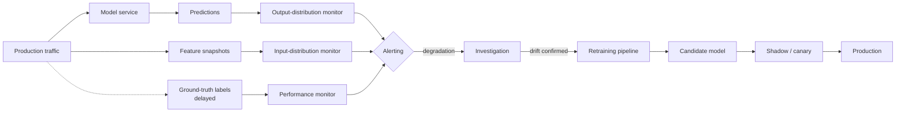

The retraining loop, once monitoring fires, is where the lifecycle truly becomes a *cycle*: you go back through the earlier stages — sometimes only Stage 4 (retrain on fresh data with the same features), sometimes back to Stage 3 (the world has changed enough that you need new features), occasionally back to Stage 1 (the business question itself has shifted). The discipline is making this loop *fast and automatic*. Doing it by hand for the first month is fine; doing it by hand for two years is malpractice. MLOps platforms — Databricks Workflows, Airflow, Vertex AI Pipelines, SageMaker Pipelines — exist to automate the retrain-evaluate-deploy cycle. We will see Databricks' answer in Part L.

A final note on this stage: the question "how often should we retrain?" has no universal answer. For a stable problem (predicting house prices in a quiet market), maybe quarterly. For a moderately drifty problem (spam classification, recommendation), maybe weekly. For an adversarial problem (real-time fraud), maybe daily or even continuously. The right cadence is whatever keeps the monitored metrics inside their alert thresholds, with margin for safety. Setting that cadence empirically — by deliberately *not* retraining for a controlled period and watching what happens — is one of the most useful things a team can do in the first few months after deployment.

One organisational reality worth mentioning: the monitoring stage is the one most often *neglected*. Building the first model is exciting; presenting it to stakeholders is gratifying; deploying it produces a milestone. Monitoring is the un-exciting recurring obligation that runs forever and only generates alerts when something is wrong. Teams that don't take it seriously discover, eighteen months in, that they have a production model nobody trusts because nobody is sure whether it still works. The professional discipline is to treat monitoring as a *first-class deliverable* of the project — the dashboards exist, the alerts are wired to a real on-call rotation, the retraining workflow is automated and tested — before declaring the project "done." A model without monitoring is not a deployed model; it's a model that's been left somewhere production-shaped and hoping for the best.

---

### 4.9 Why the lifecycle is not linear

We have now named all seven stages. Let's draw the diagram with all the back-edges, because *the back-edges are what make this a lifecycle rather than a list*.

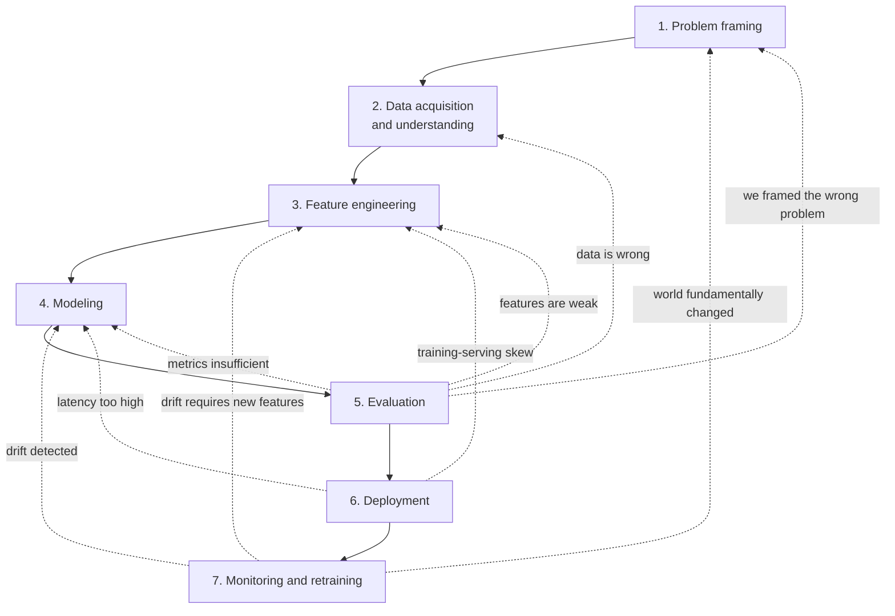

Read the dotted lines. They are the iteration loops, and they are where most of the actual project time goes.

The most common loop is **evaluation → feature engineering**. You train a first model, evaluate it, it's not good enough, you go back to feature engineering and add interactions, fix encodings, engineer time-windowed aggregates. Re-train. Re-evaluate. The loop runs four or five times in a typical project. This is normal and expected.

The second most common loop is **evaluation → modeling**. Same features, different model class — try logistic regression, then random forest, then gradient-boosted trees, then maybe a neural net. Compare. Pick the best. Within each, tune hyperparameters.

The "evaluation → data acquisition" loop is rarer but more consequential. You evaluate and discover that, say, your minority class is underrepresented; you go back to data acquisition to get more examples of it. Or you discover that a feature you assumed was reliable is actually 30% missing for one customer segment; you go back to data acquisition to understand why.

The "evaluation → problem framing" loop is the rarest and the most painful. It means you spent weeks building the wrong thing. The first time it happens, you feel like a failure. The tenth time it happens, you realise it's just how the work goes; the framing was the team's best guess at the start, and evaluation revealed it was incomplete. The mature reaction is to re-frame and re-start, not to keep going with the wrong frame because you've already invested.

The deployment-stage back-edges are the most surprising to people new to ML. You spent a month building the model, you're ready to deploy, and the deployment itself surfaces problems — your feature pipeline is too slow, your feature extraction code can't be ported to the serving environment, the model's outputs aren't in a useful format for downstream systems. Each of these sends you back. This is also normal; nobody gets every detail right the first time, and deployment is the first time you find out about a lot of operational details that the notebook didn't surface.

The monitoring stage's back-edges are continuous, not one-shot. Monitoring is always running, and every meaningful drift detection is, in effect, a "loop back" — either to modeling (retrain), to feature engineering (drift requires new features), or all the way to framing (the world has changed enough that the problem is no longer the same problem).

If you take one thing from this chapter, take this: the lifecycle is a cycle, the cycle has many back-edges, and the back-edges are not failures — they are the work.

---

### 4.10 The CRISP-DM precedent

A short historical interlude, because the lifecycle vocabulary we just covered did not appear out of nowhere.

In 1996, a Special Interest Group composed of representatives from SPSS, NCR, DaimlerChrysler, and OHRA (a Dutch insurer) convened to standardise a methodology for data mining projects. The motivation was practical: each company had its own informal process, project failures were common, and there was no shared vocabulary across the field. The group's output, published in 1999, was the **Cross-Industry Standard Process for Data Mining**, or **CRISP-DM**.

CRISP-DM defined six phases:

1. **Business understanding** — the same idea as our "problem framing."
2. **Data understanding** — overlapping with our "data acquisition" plus parts of EDA.
3. **Data preparation** — overlapping with our "feature engineering."
4. **Modeling** — same name, same idea.
5. **Evaluation** — same name, with a stronger emphasis on the business-objective fit.
6. **Deployment** — same name, but with less depth than modern MLOps gives it.

CRISP-DM included an explicit recognition that the phases are not linear — its canonical diagram showed bidirectional arrows between phases, and an outer cycle indicating that projects often loop. It was the first widely-adopted methodology to formalise this.

Two things have changed since 1996. First, terminology has updated — "data preparation" became "feature engineering" as the field professionalised, "data mining" became "machine learning" as ML displaced traditional analytical statistics, and "business understanding" became "problem framing" as the field reckoned with its tendency to under-emphasise it. Second, and more importantly, *MLOps has been bolted on*. CRISP-DM's "deployment" stage was a fairly thin gesture toward putting models into production; modern ML adds an entire ongoing layer — model registries, feature stores, monitoring infrastructure, retraining pipelines, A/B testing — that CRISP-DM did not name.

But the bones are the same. If you map our seven stages onto CRISP-DM's six, you find that "monitoring and retraining" is the only one that didn't have a 1996 analogue at the same depth. Everything else is, in essence, CRISP-DM with sharper terminology and a few more decades of accumulated war stories. When you read older ML practitioners (or read papers from the early 2000s), you will often see them reach for CRISP-DM as a reference. It's worth knowing the lineage; the vocabulary you are learning is older than you think, and the failure modes are older still.

---

### 4.11 MLOps preview: engineering rigor at each stage

Each of the seven stages has, in production-grade ML, an engineering layer that imposes rigor. We have hinted at these throughout; let's collect them in one place, because the rest of this book — particularly Parts E and L — will fill them in.

- **Problem framing** → there's less engineering rigor here and more *process* rigor: written framing documents reviewed by stakeholders, agreed-upon success metrics, alignment on the decision-making process. Some teams use formal "ML PRD" templates that force the framing checklist to be filled in before any modeling work begins.
- **Data acquisition** → data contracts, schema validation, automated data quality checks, lineage tracking. Tools: dbt for transformations, Great Expectations or Soda for quality checks, Unity Catalog for lineage on Databricks.
- **Feature engineering** → *feature stores*. A feature store is a system that lets you define a feature once, computes it from raw data, makes it available in both batch (training) and online (serving) form with consistent semantics, and tracks versioning and lineage. Eliminates training-serving skew at the root. We cover Databricks Feature Engineering in UC in Part L.
- **Modeling** → *experiment tracking*. Every model training run logs its parameters, code, data version, metrics, and artifacts to a tracking server. Lets you compare runs, reproduce results, and answer "which version of the model is in production right now?" Tool: MLflow (Part L).
- **Evaluation** → automated evaluation pipelines, dashboards, statistical tests for model comparison. Often: champion-challenger frameworks where new models are evaluated against the current production model on a held-out set automatically.
- **Deployment** → CI/CD for models, model registries, version-controlled serving infrastructure, shadow deployments, canary rollouts, A/B testing. Tool: MLflow Model Registry (Chapter 73); Databricks Model Serving for the serving layer.
- **Monitoring and retraining** → drift detection systems, alerting, automated retraining triggers, retraining workflows. Tool: Lakehouse Monitoring on Databricks (mostly ML Pro exam content; we name it but go light).

This is a *preview*, not a deep dive. Each item above gets its own treatment later. The preview is here so you can begin to see *where the lifecycle stages live on a real platform* and not just as abstractions in a chapter.

---

### 4.12 Where each stage lives on Databricks

Since this book is, eventually, about the Databricks ML Associate exam, it's worth previewing — at a high level — where each stage maps to a Databricks component. *This is preview only.* Part L is where each of these gets the depth treatment.

| Stage | Databricks component | What it gives you |
|------|---------------------|-------------------|
| Data acquisition | Auto Loader, Unity Catalog tables, Delta Lake | Reliable ingestion, governed storage, ACID semantics |
| Feature engineering | Feature Engineering in UC, online tables | Versioned features with consistent batch/online semantics |
| Modeling (notebook work) | Databricks notebooks, MLflow tracking, AutoML | Interactive development; experiment tracking; AutoML for baselines |
| Modeling (distributed) | Spark MLlib, `pyspark.ml` | Distributed training for data that doesn't fit on one machine |
| Hyperparameter tuning | Hyperopt with SparkTrials, Optuna | Distributed HPO with the Spark cluster as the search engine |
| Deployment | Mosaic AI Model Serving, Model Registry in UC | Versioned model artifacts, serving endpoints with autoscaling |
| Monitoring | Lakehouse Monitoring | Drift detection on tables and inferred predictions; alerts |

Two warnings about this table. First, *the names change*. Databricks rebrands components every couple of years; "Mosaic AI Model Serving" was previously "Databricks Model Serving" and before that "MLflow Model Serving"; "Feature Engineering in UC" was previously "Feature Store." The names in the table reflect the 2025-2026 era. Second, the table is *preview only*: the goal here is to know that *something on Databricks owns each stage*, not yet to know how each works. We will go deep on every row of this table in Part L. For Stage 7 monitoring specifically: Lakehouse Monitoring is largely Pro-exam content rather than Associate-exam content, so the Associate exam will not press on it hard — but you should know it exists, because the lifecycle isn't complete without it.

---

### 4.13 Role distinctions: data scientist, ML engineer, ML researcher

A final orienting note. Readers often conflate three roles that, while overlapping, have meaningfully different centers of gravity. The lifecycle gives us a clean way to distinguish them.

A **data scientist**, in the contemporary sense of the title, lives mostly in stages 1 through 5: framing, data, features, modeling, evaluation. They are the ones who talk to stakeholders, build the first models in notebooks, and prove out the business value. They may or may not be involved in deployment; in many organizations, they hand off to a separate team for the production engineering. They tend to be hybrid statistics-and-engineering people, comfortable with both pandas and matplotlib and capable of presenting a story to a VP.

An **ML engineer** (sometimes called MLOps engineer) lives mostly in stages 6 and 7, with strong involvement in stages 3 and 4: deployment, monitoring, retraining, feature pipelines, model registries, serving infrastructure. They are software engineers who specialise in ML systems. The Databricks ML Associate exam, despite being titled around "machine learning", is really aimed at this role more than the data-scientist role — its emphasis on pipelines, MLflow, and Spark ML reflects the production-engineering perspective.

An **ML researcher** lives mostly in a narrow slice of stage 4: novel algorithms, new model architectures, new optimization techniques. They publish papers. They prototype on benchmark datasets. They typically do not own production systems and may not be expert in stages 1, 2, or 7. Most industry ML researchers work in dedicated research teams (Anthropic, OpenAI, DeepMind, FAIR, MSR) or in research arms of large companies. The role is much rarer than data scientist or ML engineer.

For most working ML practitioners — including the audience this book is aimed at — the relevant question is whether you are sliding toward the data scientist end (more domain, more stakeholder communication, more notebook work) or the ML engineer end (more production engineering, more infrastructure, more code in the serving path). The lifecycle gives you a way to think about which stages are your center of gravity. Knowing this affects how you allocate your learning time. A data scientist studying for the Databricks ML Associate should expect to push themselves on the engineering side; an ML engineer should expect to push themselves on the modeling and evaluation side.

---

### 4.14 Self-assessment

Before moving to the exercises, run yourself through these gates. If you stumble on any, re-read the relevant section.

- Can you list all seven stages of the lifecycle, in order, from memory?
- Can you give, for each stage, one realistic failure mode — the kind of failure that has actually killed projects, not just a textbook one?
- Can you explain, in your own words, why the lifecycle is not linear, and name at least three of the back-edge loops?
- Can you state the relationship between CRISP-DM and the modern ML lifecycle in one sentence?
- Can you name the Databricks component that owns each stage (or note that the stage is mostly process, not platform)?
- Can you distinguish, in one sentence each, between a data scientist, an ML engineer, and an ML researcher in terms of which stages they live in?

If you can do all of these cold, you have the framing this chapter set out to teach.

---

### 4.15 Summary

Stripped down:

1. ML projects have seven canonical stages: **problem framing**, **data acquisition and understanding**, **feature engineering**, **modeling**, **evaluation**, **deployment**, and **monitoring and retraining**.
2. Each stage has a characteristic failure mode: framing the wrong problem; misunderstanding data semantics; data leakage; misallocated effort; optimising the wrong metric; training-serving skew; silent staleness.
3. The lifecycle is *not linear*. Back-edges go from evaluation to features (most common), from evaluation to data, from evaluation to framing, from deployment to features, from monitoring to retraining (continuous). The back-edges are where most of the work lives.
4. The lifecycle is essentially CRISP-DM (1996) with sharper terminology and an MLOps layer bolted on. Knowing the lineage helps you read older literature and recognise the underlying skeleton.
5. Each stage has, in production-grade ML, an engineering rigor layer — feature stores, experiment tracking, model registries, monitoring infrastructure. On Databricks, each stage maps to a named component (Feature Engineering in UC, MLflow, Model Serving, Lakehouse Monitoring). Part L covers each in depth.
6. The roles — data scientist, ML engineer, ML researcher — differ primarily in which stages of the lifecycle they live in. Know which one you are sliding toward; let it inform your learning allocation.

If you remember one sentence from this chapter, make it this one: *the ML lifecycle is the named, cyclical structure that turns a one-off model into an ongoing system; the stages are the vocabulary, the back-edges are the work.*

---

### 4.16 What this builds on / where this returns

**Builds on:** Chapter 3, whose worked spam example walked through every one of these stages in one continuous narrative. Chapter 4 abstracts the lifecycle out of that narrative and names the parts.

**Returns:**

- **Feature engineering** as a discipline is *Part E* (Chapters 23–30). The stage-3 failure modes flagged here (leakage, training-serving skew at the feature layer) are formalised and worked there.
- **Modeling** — the algorithms themselves — is *Parts F and G* (supervised algorithms from logistic regression through gradient-boosted trees; unsupervised algorithms including k-means and PCA).
- **Evaluation** as a formal discipline is *Part H* (Chapters 42–47). Confusion matrices, precision/recall, ROC and PR curves, regression metrics, imbalanced and multiclass extensions.
- **Hyperparameter optimization** is *Part I* (Chapters 48–54). The "modeling stage" tuning we previewed here lives there.
- **Spark** — the distributed-compute substrate that makes all of this work on large data — is *Part J* (Chapters 55–61).
- **`pyspark.ml`** — the Spark ML pipeline pattern that operationalises the feature engineering + modeling stages on Databricks — is *Part K* (Chapters 62–67).
- **Databricks platform and MLflow** — the platform layer that owns the deployment and monitoring stages and the engineering rigor for feature engineering and modeling — is *Part L* (Chapters 68–73).
- **The capstone in Part M** (Chapters 74–75) is a full end-to-end project that exercises the whole lifecycle on Databricks — Lending Club default prediction — and is where every back-edge of the diagram in section 4.9 will be felt.

---

### 4.17 Exercises

Attempt all of these cold. Answers in the fold.

1. **Name the stages from memory.** Without re-reading, list the seven lifecycle stages in order. For each, name one common failure mode.

2. **Framing failure diagnosis.** A team is asked to "build a model to predict which customers will buy our new product." They train a classifier on existing customer features and the binary label "did the customer buy the new product within 30 days of launch?" The model scores 0.78 AUC on validation. After deployment, the marketing team reports that the model's recommendations don't seem to improve campaign ROI. What framing question, asked at the start, would most likely have caught this?

3. **The "phantom column" exercise.** You join a project mid-stream and inherit a feature pipeline. The pipeline uses a column called `last_login_timestamp`. Describe three different things that column could plausibly mean (i.e., three different interpretations a different team might have), and explain how you would verify which one is true.

4. **Leakage taxonomy.** Classify each of the following as (a) temporal leakage, (b) target leakage, (c) training-serving skew, or (d) not a leakage problem.
   1. Including the customer's age at the time the data was extracted, when training a model to predict purchase behavior six months ago.
   2. Tokenizing email text with NLTK in training and with regex in serving.
   3. Including a feature "number of fraud reports filed against this account" when predicting whether a transaction is fraudulent.
   4. Including the patient's most recent lab value, which was measured after the prediction was needed.
   5. Computing TF-IDF weights on the full corpus before train/test split.
   6. Using the customer's current ZIP code, which the model needs at serving time and which is available.

5. **The wrong metric.** A loan-default model team is asked to "maximise model accuracy." Default rate in the data is 2%. What does this incentive produce? What metric should the team have been asked to optimise instead, and why?

6. **The back-edges.** Without re-reading section 4.9, draw the lifecycle diagram and label at least four back-edges between stages. For each back-edge, give one concrete scenario that triggers it.

7. **CRISP-DM mapping.** List the six CRISP-DM phases and map each to one of our seven stages. Where do they differ in emphasis?

8. **In your own words.** Explain, in three sentences, why the modeling stage is *not* the most important stage in most real ML projects. Use Andrew Ng's data-centric AI framing.

9. **Monitoring decision.** You have just deployed a spam classifier. You can afford to set up monitoring for exactly one of the following: (a) input-feature distribution, (b) prediction distribution, (c) labeled performance metrics (delayed by user-feedback signal). Which would you choose first, and why? What does your choice fail to detect?

10. **Role placement.** For each of the following job duties, classify whether it's primarily data scientist, ML engineer, or ML researcher work.
    1. Designing a new attention mechanism for transformer models and writing a paper about it.
    2. Building the Kubernetes manifests that serve a fraud model.
    3. Interviewing the marketing team to understand which segmentation question they actually want answered.
    4. Setting up Lakehouse Monitoring on a production model.
    5. Tuning XGBoost hyperparameters for a credit-risk model.
    6. Writing a feature store table definition that's consumed by both training and serving.

11. **The retraining cadence.** Give an example each of an ML problem where: (a) yearly retraining is sufficient; (b) weekly retraining is needed; (c) continuous online retraining is appropriate. Justify briefly.

12. **The lifecycle as a tool for communication.** Suppose your manager asks "why is the project taking longer than estimated?" Use the lifecycle vocabulary to give a more informative answer than "ML is hard."

<details>
<summary>Answers</summary>

1. (1) Problem framing — wrong target / no decision attached to the prediction. (2) Data acquisition — phantom column / undocumented semantics. (3) Feature engineering — data leakage. (4) Modeling — effort misallocation (too much time on model, too little on data); no baseline. (5) Evaluation — wrong metric (accuracy on imbalanced data, RMSE when MAE is what matters). (6) Deployment — training-serving skew; no rollback path. (7) Monitoring and retraining — silent staleness from drift.

2. The framing question is "what decision will be made from the prediction?" In particular, the team predicted "will buy" without distinguishing "would have bought anyway" from "buys only because of campaign." The marketing campaign is not asking "who is likely to buy"; it's asking "who is the campaign going to influence?" The right model is an uplift / incremental-response model, not a propensity-to-buy model. The first model produces high AUC on a question the campaign team isn't asking.

3. Three interpretations: (a) the wall-clock timestamp of the user's most recent successful login; (b) the timestamp of the most recent session-token refresh, which can happen without a user action; (c) the timestamp the user's last login was *processed* by the analytics pipeline, which lags actual login by minutes to hours. Verify by: (1) asking the team that owns the source table, in writing, what event populates the column; (2) cross-checking a few specific user IDs by joining to the raw auth log; (3) checking for systematic gaps (timezones, batch boundaries) that would reveal interpretation (c).

4. (i) Not a leakage problem if "age at extraction time" is also computable at serving time; but probably skew if your serving pipeline uses age-at-prediction-time. (ii) Training-serving skew. (iii) Target leakage — the count of fraud reports is downstream of the fraud determination. (iv) Temporal leakage — the lab was measured after the prediction was needed; it would not be available in real production at prediction time. (v) Temporal/data leakage — IDF weights are leaking test-set information into training. (vi) Not a leakage problem; using current ZIP at serving time, available, is fine.

5. "Maximise accuracy" with a 2% positive rate produces a model that always predicts "no default" and reports 98% accuracy while catching zero defaulters — useless. The team should have been asked to optimise expected dollar loss across the loan portfolio, or precision-at-fixed-recall on the default class, or AUC at minimum (which at least respects the ranking). The accuracy metric is incompatible with the imbalanced problem structure.

6. Back-edges to label: eval→features (model underperforms; add interactions); eval→data (need more minority-class examples); eval→framing (built the wrong thing); deployment→features (extraction too slow or impossible in serving); deployment→modeling (latency budget exceeded; need a smaller model); monitoring→retraining (input drift detected, refit on recent data); monitoring→features (drift requires new features); monitoring→framing (world has changed enough that the problem has shifted). At least four with concrete scenarios is sufficient.

7. CRISP-DM phases: Business Understanding → our problem framing. Data Understanding → our data acquisition and understanding (plus parts of EDA which we treated in Chapter 3). Data Preparation → our feature engineering. Modeling → our modeling. Evaluation → our evaluation. Deployment → our deployment. CRISP-DM does not have an equivalent of our monitoring/retraining stage; that's the main differentiator and reflects the addition of MLOps over the last decade.

8. For most real business problems, three or four mainstream algorithms produce results within a few percentage points of each other when given the same features and data. The bulk of the lift comes from how the data is collected, cleaned, labeled, and engineered into features — not from the model architecture. Andrew Ng's "data-centric AI" frame: invert the typical effort split (80% model / 20% data) to 80% data / 20% model, and projects tend to produce more business value.

9. Choose (b) prediction distribution monitoring. It's the cheapest to set up (no labels required, no feature-level instrumentation), gives the earliest signal (drift shows up here before labeled metrics confirm it), and catches both genuine world-changes and model malfunctions. It fails to detect: (i) calibration drift where the predictions are still distributed correctly but their *meaning* has shifted (predicted probabilities no longer match actual rates); (ii) failures where the wrong inputs are being scored but the output distribution happens to remain stable; (iii) subgroup-level degradation that's masked by the aggregate. Ideally you set up all three; if forced to one, (b).

10. (i) ML researcher. (ii) ML engineer. (iii) Data scientist. (iv) ML engineer. (v) Data scientist (or ML engineer in production-facing teams). (vi) ML engineer, with data-scientist collaboration on feature definitions.

11. (a) Yearly: predicting a house's structural-quality score from building inspection data — the underlying physics doesn't change. (b) Weekly: spam classification or recommendation systems — content patterns shift on the scale of days to weeks. (c) Continuous online retraining: real-time fraud detection in a card network, where adversaries adapt within hours and even minutes of a new defense being deployed. The cadence is set by the rate at which the underlying distribution drifts; faster drift, faster retraining.

12. Sample answer: "We're in our third loop between evaluation and feature engineering. The first model surfaced two data-acquisition issues we hadn't caught — one column was net-of-refunds revenue instead of gross, and the timestamps were inconsistent across regions. We fixed those, retrained, and evaluation revealed the minority class is underrepresented, so we're going back to data acquisition for one more pass. We should be deploying by Q-end, with monitoring spinning up in the two weeks after that." This is informative because it locates the project precisely in the lifecycle and explains the specific loops, rather than gesturing vaguely at difficulty.

</details>


# Part B — Probability & Statistics Primer


## Chapter 5 — Random Variables, Distributions, Expectation, Variance

> **Goal of this chapter:** to put a careful, mathematical foundation under everything that was hand-waved in Part A. In Chapter 3 we said logistic regression "outputs a probability between 0 and 1." We used the word "probability" as if its meaning were obvious. It is not. By the end of this chapter you will be able to say, with precision, what a probability *is*, what a random variable *is*, how expectations and variances are computed, and why the linearity of expectation is one of the most useful facts in all of probability. The math here is not optional. Every loss function in Part D is an expectation in disguise; every confidence interval in Chapter 10 is a statement about a variance; every Bayesian computation in Chapter 8 lives on top of this scaffolding.
>
> If you have never sat down and worked through this material before, take your time. The Part-A vocabulary you absorbed informally — "the model's probability of spam is 0.73" — is about to be rebuilt from below.

---

### 5.1 The motivating question: what *is* a probability?

In Chapter 3 we trained a logistic regression model and said it outputs a number $\hat{p}(\text{spam} \mid x) \in [0, 1]$ which we interpreted as "the probability that this email is spam." We then set a threshold at $\tau = 0.7$, picked an operating point on the precision-recall curve, and shipped a service.

At no point did we ask: when the model says "0.73", what does that number *mean*? It is not the count of anything we directly observed. It is not a measurement, like the email's length in tokens. The email either is spam (label 1) or it isn't (label 0); there is no "0.73-spamness" hiding inside it. Yet the number is real, and it carries real predictive content — when we group all the emails the model scored at exactly 0.73 and check, we find that roughly 73% of them really were spam. Some kind of statement is being made; we owe ourselves a careful account of what kind.

The account exists. It was given its modern form by Andrey Kolmogorov in 1933, and it is the foundation of every applied probability calculation done since. We start there, not because the Databricks exam tests measure theory (it doesn't), but because every shortcut in applied probability is licensed by something at the foundation, and confusion about probabilities in ML is almost always confusion about which licence the practitioner is using.

So: what is a probability?

---

### 5.2 Sample spaces, events, and the axioms

#### 5.2.1 The sample space

Every probability statement starts with a **sample space** $\Omega$ — the set of all possible outcomes of whatever random procedure you have in mind.

For a single coin flip: $\Omega = \{H, T\}$. Two outcomes, both physical.

For a single die roll: $\Omega = \{1, 2, 3, 4, 5, 6\}$.

For two coin flips: $\Omega = \{HH, HT, TH, TT\}$.

For the height of a randomly chosen adult: $\Omega = (0, \infty)$ — every positive real number, in principle. (No adult is exactly 0 or exactly infinite; the open interval is a slight idealisation.)

For an email arriving at our spam classifier: $\Omega$ is the set of every possible email — every combination of subject text, body text, sender, attachments, timestamp. Astronomically large; uncountably infinite if we allow free-form text. We rarely write $\Omega$ down explicitly for problems this messy, but it exists conceptually.

#### 5.2.2 Events

An **event** is a subset of the sample space. For the die roll, the event "rolled an even number" is the set $\{2, 4, 6\} \subset \Omega$. The event "rolled at least 5" is $\{5, 6\}$. The event "rolled a 7" is the empty set $\emptyset$ — possible to write down, impossible to occur.

For our spam classifier, the event "this email is spam" is the subset of all possible emails for which the spam label is 1.

#### 5.2.3 The axioms

A **probability** is a function $P$ that takes an event and returns a number, subject to three rules that Kolmogorov laid down:

1. **Non-negativity:** $P(A) \geq 0$ for any event $A$. Probabilities are never negative.
2. **Normalisation:** $P(\Omega) = 1$. The probability that *something* happens is 1.
3. **Countable additivity:** if $A_1, A_2, A_3, \ldots$ are pairwise disjoint events (no two share any outcome), then $P(A_1 \cup A_2 \cup \ldots) = P(A_1) + P(A_2) + \ldots$.

That's it. Three rules. Everything else in probability — Bayes' theorem, expectations, variances, the central limit theorem — is derived from these three. Worth pausing on, because most of the time when a probability calculation feels confusing, the way out is to step back to these three rules and check what they license.

For the fair die: $P(\{i\}) = 1/6$ for each $i \in \{1, \ldots, 6\}$. By rule 3, $P(\{2, 4, 6\}) = P(\{2\}) + P(\{4\}) + P(\{6\}) = 1/6 + 1/6 + 1/6 = 1/2$. Even-number-rolling has probability 1/2. The arithmetic is trivial; the licensing principle isn't.

#### 5.2.4 Frequentist and Bayesian readings — a brief detour

The axioms don't tell you what a probability *means* in the world. There are two main interpretations, and serious people have written long books arguing about them.

The **frequentist** reading: $P(A)$ is the long-run fraction of times $A$ occurs if you repeat the experiment many times. $P(\text{heads}) = 0.5$ for a fair coin means that in a million flips, about half a million will be heads. This is the dominant reading in classical statistics and in most ML evaluation.

The **Bayesian** reading: $P(A)$ is a *degree of belief* that $A$ will occur, updateable as evidence arrives. $P(\text{this email is spam} \mid \text{contents}) = 0.73$ is your rational confidence, given what you know. This reading is closer to how the spam classifier's output is used in practice.

Both readings satisfy Kolmogorov's axioms, and most of this book will not depend on which one you adopt. We will, however, take the Bayesian reading seriously when we get to Bayes' theorem in Chapter 8.

---

### 5.3 Random variables, formally

Now we can define a random variable properly. The informal version: a random variable is "a number whose value depends on the outcome of some random procedure." The formal version is slightly more careful.

A **random variable** $X$ is a function from the sample space to the real numbers:

$$
X: \Omega \to \mathbb{R}.
$$

For each outcome $\omega \in \Omega$, $X(\omega)$ is the number we associate with that outcome.

This sounds abstract; in practice it is so natural that you've been doing it for years without noticing. Examples:

- **Die roll.** $\Omega = \{1, 2, 3, 4, 5, 6\}$ and we let $X(\omega) = \omega$. The random variable is just the number on the die. Could it have been something else? Sure — we could define $Y(\omega) = 1$ if $\omega$ is even, $Y(\omega) = 0$ if $\omega$ is odd. Same sample space, different random variable.

- **Two coin flips.** $\Omega = \{HH, HT, TH, TT\}$. Define $X$ = "number of heads." Then $X(HH) = 2$, $X(HT) = 1$, $X(TH) = 1$, $X(TT) = 0$. The random variable has collapsed the four outcomes into three numerical values.

- **Spam classifier.** The sample space is all emails. Define $Y(\omega) = 1$ if email $\omega$ is spam, $0$ otherwise. This is the *label* — and yes, the label is a random variable, because which email you'll see next is, from the model's point of view, random.

The mental shift to make: in probability theory, "a random variable" is not a value, and it is not a number. It is a *function*. The value it takes on any particular outcome is a number, but the random variable itself is the rule that assigns numbers to outcomes.

A useful piece of notation: $P(X = x)$ is shorthand for $P(\{\omega \in \Omega : X(\omega) = x\})$ — the probability of the event consisting of all outcomes that $X$ maps to the value $x$. We will use this shorthand constantly.

#### 5.3.1 Discrete vs. continuous random variables

The dichotomy that matters for everything that follows: is the random variable's range *discrete* (a finite or countably infinite set, like $\{0, 1, 2, \ldots\}$) or *continuous* (an interval of real numbers, like $[0, 1]$ or all of $\mathbb{R}$)?

Discrete examples: number of heads in two flips; outcome of a die; number of customers arriving in an hour; the binary label "is this email spam?"; the count of times the word "viagra" appears in an email.

Continuous examples: height of a randomly chosen adult; tomorrow's high temperature; the exact time a customer arrived; the score $z = \mathbf{w} \cdot \mathbf{x} + b$ produced by a logistic regression *before* the sigmoid (this can be any real number); the output of the sigmoid (a number in $(0, 1)$).

The mathematical machinery for the two cases is *almost* parallel — same intuitions, same definitions — but differs in one important way that beginners regularly get wrong. We handle each separately.

---

### 5.4 Discrete random variables: the PMF

For a discrete random variable $X$, we describe its behaviour with a **probability mass function** (PMF):

$$
p_X(x) = P(X = x).
$$

The PMF is just a list, one entry per possible value, telling you the probability that $X$ equals that value. For a fair die, the PMF is:

$$
p_X(1) = p_X(2) = p_X(3) = p_X(4) = p_X(5) = p_X(6) = \frac{1}{6}.
$$

For the "number of heads in two flips" random variable from earlier, the PMF is:

$$
p_X(0) = \frac{1}{4}, \quad p_X(1) = \frac{2}{4} = \frac{1}{2}, \quad p_X(2) = \frac{1}{4}.
$$

(The 1/2 comes from there being two outcomes — $HT$ and $TH$ — that produce the value 1.)

A PMF must satisfy two conditions, which fall out of Kolmogorov's axioms:

1. $p_X(x) \geq 0$ for every $x$.
2. $\sum_x p_X(x) = 1$, where the sum is over all values $X$ can take.

If you ever write down a "probability distribution" whose values are negative, or that doesn't sum to 1, you have made a mistake. Sanity-check by summing.

#### 5.4.1 Reading the PMF as a histogram

A useful mental picture: the PMF is a bar chart. The $x$-axis lists possible values; the $y$-axis is the probability of each. Total area = 1.

```
   p_X(x)
    │
1/2 ┤            █
    │            █
1/4 ┤    █       █       █
    │    █       █       █
    └────┴───────┴───────┴────► x
         0       1       2
       "no       "one    "two
       heads"   head"   heads"
```

The height of each bar is *the actual probability*. Two heads happens 25% of the time. You can read it directly off the chart.

This will not be true for continuous random variables, which is one of the most common sources of confusion. Hold on to it.

---

### 5.5 Continuous random variables: the PDF

For a continuous random variable $X$, there is a subtlety. If $X$ is, say, the height of a randomly chosen adult — taking values in $(0, \infty)$ — then for any *specific* value $h$, we have $P(X = h) = 0$.

This sounds wrong at first. Surely the probability that a randomly chosen adult is exactly 1.75 metres tall is not zero?

It is. *Exactly* 1.75 metres means 1.75000000... metres, an infinitely precise measurement. Among the uncountably many possible heights, the probability of landing on any single one is zero — there are "too many" alternatives. What is non-zero is the probability that the height lies in an *interval*: $P(1.74 < X < 1.76)$ might be 5%, and $P(1.7499 < X < 1.7501)$ might be 0.05%, and so on, shrinking continuously as the interval shrinks.

The object that captures this is the **probability density function** (PDF), conventionally written $f_X(x)$.

The defining property of the PDF: for any interval $[a, b]$,

$$
P(a \leq X \leq b) = \int_a^b f_X(x) \, dx.
$$

The PDF is a *density*, not a probability. To get a probability, you integrate it over an interval. The PDF itself can take values greater than 1 — that's fine, because it's a density, and you only get probabilities by accumulating area.

The PDF satisfies:

1. $f_X(x) \geq 0$ for every $x$.
2. $\int_{-\infty}^{\infty} f_X(x) \, dx = 1$.

Compare with the PMF conditions: same structure, with summation replaced by integration. The mathematics is the same idea applied to a continuous range.

#### 5.5.1 The PMF-vs-PDF confusion, named explicitly

Here is the trap to avoid: **$f_X(x)$ is not a probability**. It is a density. If you read a normal-distribution textbook plot and see $f_X(0) = 0.4$ for a standard normal, that does *not* mean "the probability of $X = 0$ is 0.4." That probability is zero. What it means is that the density at 0 is 0.4, so the probability of falling in a tiny window around 0 of width $\Delta x$ is approximately $0.4 \cdot \Delta x$.

This is exactly the kind of distinction that gets glossed over in applied work and that bites you when you start trying to do things like compute likelihoods. A likelihood under a continuous distribution is a *density* evaluated at the observation, not a probability — which is why "the likelihood is 17" is a perfectly sensible thing for software to print and why it confuses people who expect probabilities.

```
PMF                              PDF
(discrete X)                     (continuous X)

  height = probability             height = density (not probability!)
  sum = 1                          area under curve = 1
  P(X=x) is the bar height         P(X=x) = 0 for any single x
                                   P(a ≤ X ≤ b) = area between a and b
```

Get this distinction firmly in hand. It will come up in every subsequent chapter.

---

### 5.6 The cumulative distribution function

A unifying object that works for both discrete and continuous cases is the **cumulative distribution function** (CDF):

$$
F_X(x) = P(X \leq x).
$$

The CDF tells you the probability that $X$ takes a value less than or equal to $x$. It is defined for every real $x$, regardless of whether $X$ is discrete or continuous. It is:

- monotonically non-decreasing (as $x$ grows, $F_X(x)$ never decreases — you're adding probability to the running total);
- bounded below by 0 (as $x \to -\infty$) and above by 1 (as $x \to \infty$);
- step-like for discrete RVs (jumps of size $p_X(x)$ at each value $X$ can take);
- continuous for continuous RVs (no jumps).

For our die-roll random variable:

| $x$  | $F_X(x) = P(X \leq x)$ |
|-----:|----:|
| 0.5  | 0   |
| 1    | 1/6 |
| 2    | 2/6 |
| 3    | 3/6 |
| 4    | 4/6 |
| 5    | 5/6 |
| 6    | 1   |
| 7    | 1   |

The CDF jumps up by 1/6 at each integer 1 through 6 and is flat in between.

For a continuous $X$ with PDF $f_X$, the CDF is the running integral:

$$
F_X(x) = \int_{-\infty}^{x} f_X(t) \, dt.
$$

Differentiating recovers the PDF: $f_X(x) = F_X'(x)$. The CDF and the PDF carry exactly the same information; you can convert between them at will.

The CDF is enormously useful in practice because:
- Probabilities of intervals come from CDF differences: $P(a < X \leq b) = F_X(b) - F_X(a)$. No integration needed if you have the CDF.
- Many test statistics and quantile computations are expressed in CDF terms.
- The CDF is what lets you simulate samples from a distribution given uniform random numbers (the "inverse-CDF method").

---

### 5.7 Expectation

We arrive at the most useful single concept in this chapter.

#### 5.7.1 Discrete expectation

The **expectation** (or **expected value**, or **mean**) of a discrete random variable $X$ is

$$
\mathbb{E}[X] = \sum_x x \cdot p_X(x).
$$

In words: multiply each possible value by its probability, sum the lot. It is a *weighted average*, where the weights are probabilities.

For our die: $\mathbb{E}[X] = 1 \cdot \frac{1}{6} + 2 \cdot \frac{1}{6} + 3 \cdot \frac{1}{6} + 4 \cdot \frac{1}{6} + 5 \cdot \frac{1}{6} + 6 \cdot \frac{1}{6} = \frac{21}{6} = 3.5$.

The expectation is $3.5$ — a value the die *cannot actually take*. This is one of the routine surprises about expectations: the expected value need not be a value the random variable can attain. It's the long-run average of many rolls, not a prediction of any single roll. If you rolled 1 million dice and averaged, you'd get something very close to 3.5.

For our two-coin random variable (number of heads):

$$
\mathbb{E}[X] = 0 \cdot \frac{1}{4} + 1 \cdot \frac{1}{2} + 2 \cdot \frac{1}{4} = 0 + 0.5 + 0.5 = 1.
$$

In two flips, you expect (on average) one head. Matches intuition.

#### 5.7.2 Continuous expectation

For continuous $X$ with PDF $f_X$:

$$
\mathbb{E}[X] = \int_{-\infty}^{\infty} x \cdot f_X(x) \, dx.
$$

Same idea — value times probability density, accumulated over the range. The sum becomes an integral; everything else is parallel.

#### 5.7.3 Expectation as a "center of mass"

A geometric reading: if you imagine the PMF (or PDF) as a mass distribution along the real line, the expectation is the point where that distribution balances. Put a unit weight at each value of $X$ proportional to its probability; the expectation is the fulcrum that makes the seesaw level.

This intuition explains why $\mathbb{E}[X] = 3.5$ for the die — symmetric distribution, balance point in the middle. It also explains why for a highly skewed distribution (say, household incomes, with a long right tail), the mean is to the right of the median; the rare-but-extreme right tail pulls the balance point.

---

### 5.8 Linearity of expectation — the most useful theorem of the chapter

Here is a fact whose usefulness is hard to overstate. For *any* random variables $X$ and $Y$ and any real constants $a$ and $b$:

$$
\mathbb{E}[aX + b] = a \mathbb{E}[X] + b
$$

and more generally,

$$
\mathbb{E}[X + Y] = \mathbb{E}[X] + \mathbb{E}[Y].
$$

These two facts together — scalar multiplication and addition both pass through the expectation — are called the **linearity of expectation**. Crucially, the additivity holds *whether or not $X$ and $Y$ are independent*. This is going to be useful repeatedly.

#### 5.8.1 Proof of $\mathbb{E}[aX + b] = a\mathbb{E}[X] + b$

Let's do the discrete case carefully and you can take the continuous case on faith (it's the same argument with integrals).

Start from the definition:

$$
\mathbb{E}[aX + b] = \sum_x (ax + b) \cdot p_X(x).
$$

Why is this the right expression? Because $aX + b$ is itself a random variable: when $X$ takes the value $x$, $aX + b$ takes the value $ax + b$, with the same probability $p_X(x)$. So the expectation of $aX + b$ sums each value-it-can-take times its probability, which is exactly what we wrote.

Now distribute the sum:

$$
\sum_x (ax + b) \cdot p_X(x) = \sum_x ax \cdot p_X(x) + \sum_x b \cdot p_X(x).
$$

Pull constants out of the sums:

$$
= a \sum_x x \cdot p_X(x) + b \sum_x p_X(x).
$$

The first sum is the definition of $\mathbb{E}[X]$. The second sum is $\sum_x p_X(x) = 1$ (the PMF sums to 1). So:

$$
\mathbb{E}[aX + b] = a \mathbb{E}[X] + b \cdot 1 = a \mathbb{E}[X] + b. \quad \blacksquare
$$

That's the whole proof. Three lines of algebra, one application of the PMF axiom. Worth holding onto: every "step" was either a definition or pulling a constant out of a sum.

#### 5.8.2 Proof of $\mathbb{E}[X + Y] = \mathbb{E}[X] + \mathbb{E}[Y]$

This one requires joint distributions, which we treat carefully in Chapter 7, but here is the sketch.

If $X$ and $Y$ are both defined on the same sample space $\Omega$, then $X + Y$ is also a random variable on $\Omega$, with $(X+Y)(\omega) = X(\omega) + Y(\omega)$. The expectation of $X + Y$ is, by definition,

$$
\mathbb{E}[X + Y] = \sum_\omega (X(\omega) + Y(\omega)) \cdot P(\{\omega\}).
$$

(For now think of $\Omega$ as discrete; the continuous version uses integrals.) Distribute the sum:

$$
= \sum_\omega X(\omega) \cdot P(\{\omega\}) + \sum_\omega Y(\omega) \cdot P(\{\omega\}) = \mathbb{E}[X] + \mathbb{E}[Y].
$$

Done. Note that we *never used independence* — the joint behaviour of $X$ and $Y$ doesn't show up. Even if they are highly correlated, the expectation of their sum is the sum of their expectations.

By induction, $\mathbb{E}[X_1 + X_2 + \ldots + X_n] = \mathbb{E}[X_1] + \mathbb{E}[X_2] + \ldots + \mathbb{E}[X_n]$ for any collection. This generalisation is what makes linearity of expectation so much more useful than it first appears: hard sums of correlated things become easy.

#### 5.8.3 Why this matters in ML

In Part D, we will define a **loss function** as the expected error of a model:

$$
\text{risk}(f) = \mathbb{E}[L(f(X), Y)].
$$

The training procedure approximates this expectation with the average loss on the training set. The whole gradient-descent enterprise — taking derivatives of the loss, updating parameters — relies on the fact that derivatives and expectations commute (the linearity argument again, applied to expectations of derivatives). Without linearity of expectation, modern ML's mathematical scaffolding doesn't hold together.

---

### 5.9 Variance and standard deviation

Expectation tells you the center. It does not tell you the *spread*. Two random variables can have the same mean but very different distributions:

- $X$: always equal to 5. Mean: 5. Spread: zero.
- $Y$: equal to 0 with probability 1/2 and 10 with probability 1/2. Mean: 5. Spread: large.

We need a way to quantify spread. The standard tool is the **variance**.

#### 5.9.1 Definition

$$
\text{Var}[X] = \mathbb{E}\left[(X - \mu)^2\right], \quad \text{where } \mu = \mathbb{E}[X].
$$

In words: the variance is the expected squared deviation of $X$ from its mean. Larger when $X$ tends to be far from its mean; zero when $X$ is constant.

Why squared? Three reasons. First, $(X - \mu)$ can be positive or negative; squaring makes everything positive so they don't cancel. Second, squaring penalises large deviations more than small ones, which is often what we want. Third — and this is the deep reason — squaring leads to clean algebra. Many of probability's nicest identities (CLT, the bias-variance decomposition, OLS) depend on the squared-deviation form. Using absolute deviation $|X - \mu|$ would also measure spread, but the math is harder.

#### 5.9.2 The standard deviation

The variance has units of "$X$-squared." If $X$ is in dollars, $\text{Var}[X]$ is in dollars-squared, which is not a unit you can read off a chart. The **standard deviation** brings it back to the original units:

$$
\sigma_X = \sqrt{\text{Var}[X]}.
$$

Standard deviation is the more interpretable cousin: roughly, "a typical distance of $X$ from its mean." When we report "the average IQ is 100 with a standard deviation of 15," we mean that most people are within 15 IQ points of 100.

#### 5.9.3 The computational shortcut

A formula you will use constantly:

$$
\text{Var}[X] = \mathbb{E}[X^2] - (\mathbb{E}[X])^2.
$$

This is the **variance shortcut formula**. It is often easier than computing $\mathbb{E}[(X - \mu)^2]$ directly because computing $\mathbb{E}[X^2]$ requires only the original distribution, not the centered one.

Derivation (this is one to actually do step by step):

$$
\text{Var}[X] = \mathbb{E}[(X - \mu)^2]
$$

Expand the square:

$$
= \mathbb{E}[X^2 - 2\mu X + \mu^2].
$$

Use linearity of expectation to split the sum into three pieces:

$$
= \mathbb{E}[X^2] - \mathbb{E}[2\mu X] + \mathbb{E}[\mu^2].
$$

The middle term: $2\mu$ is a constant (it's just the number $\mu$ times 2), so $\mathbb{E}[2\mu X] = 2\mu \mathbb{E}[X] = 2\mu \cdot \mu = 2\mu^2$.

The last term: $\mu^2$ is a constant. The expectation of a constant is itself: $\mathbb{E}[\mu^2] = \mu^2$.

Substituting:

$$
\text{Var}[X] = \mathbb{E}[X^2] - 2\mu^2 + \mu^2 = \mathbb{E}[X^2] - \mu^2.
$$

Since $\mu = \mathbb{E}[X]$:

$$
\text{Var}[X] = \mathbb{E}[X^2] - (\mathbb{E}[X])^2. \quad \blacksquare
$$

Every line was either a definition, an algebraic expansion, or a use of linearity of expectation. No magic.

#### 5.9.4 Variance is *not* linear

Here is where variance differs sharply from expectation. We have:

$$
\text{Var}[aX + b] = a^2 \text{Var}[X].
$$

Notice three things. First, the constant $b$ disappears — adding a constant doesn't change the spread. Second, the scalar $a$ comes out *squared* — scaling $X$ by 2 makes the variance 4 times larger (the spread doubles, and we measure spread squared). Third, this rule is *not* additive in the way expectation is.

Let's prove it. Let $Y = aX + b$ with $\mu_Y = \mathbb{E}[Y] = a\mu_X + b$ (by linearity of expectation). Then

$$
\text{Var}[Y] = \mathbb{E}[(Y - \mu_Y)^2] = \mathbb{E}[(aX + b - a\mu_X - b)^2] = \mathbb{E}[(a(X - \mu_X))^2]
$$

$$
= \mathbb{E}[a^2 (X - \mu_X)^2] = a^2 \mathbb{E}[(X - \mu_X)^2] = a^2 \text{Var}[X]. \quad \blacksquare
$$

What about the sum? $\text{Var}[X + Y] = \text{Var}[X] + \text{Var}[Y]$ — but **only if $X$ and $Y$ are uncorrelated**. The general identity is

$$
\text{Var}[X + Y] = \text{Var}[X] + \text{Var}[Y] + 2 \text{Cov}[X, Y],
$$

where the covariance $\text{Cov}[X, Y]$ measures how $X$ and $Y$ move together. We're previewing this; the full treatment is in Chapter 7. The takeaway for now: expectation passes cleanly through sums even when variables are correlated; variance does not.

---

### 5.10 Worked example 1: the die roll

Let's compute the variance of a fair die roll by both routes, and verify they agree.

#### Route 1: directly from $\mathbb{E}[(X - \mu)^2]$

$\mu = 3.5$. We need $\mathbb{E}[(X - 3.5)^2]$. The PMF puts $1/6$ on each of $\{1, 2, 3, 4, 5, 6\}$:

| $x$ | $x - 3.5$ | $(x - 3.5)^2$ | $(x - 3.5)^2 \cdot \frac{1}{6}$ |
|---:|----:|----:|----:|
| 1 | $-2.5$ | 6.25 | $1.0417$ |
| 2 | $-1.5$ | 2.25 | $0.3750$ |
| 3 | $-0.5$ | 0.25 | $0.0417$ |
| 4 | $+0.5$ | 0.25 | $0.0417$ |
| 5 | $+1.5$ | 2.25 | $0.3750$ |
| 6 | $+2.5$ | 6.25 | $1.0417$ |

Sum the right column:

$$
\text{Var}[X] = 1.0417 + 0.375 + 0.0417 + 0.0417 + 0.375 + 1.0417 = 2.9167.
$$

In fraction form, $1/6 (6.25 + 2.25 + 0.25 + 0.25 + 2.25 + 6.25) = 1/6 \cdot 17.5 = 17.5/6 = 35/12 \approx 2.9167$.

#### Route 2: via the shortcut

$\mathbb{E}[X^2] = \frac{1}{6}(1 + 4 + 9 + 16 + 25 + 36) = \frac{91}{6} \approx 15.1667$.

$\mathbb{E}[X]^2 = 3.5^2 = 12.25$.

$\text{Var}[X] = 15.1667 - 12.25 = 2.9167$. Same answer. The shortcut was easier (no centering), and the two methods agree as they must.

Standard deviation: $\sigma_X = \sqrt{35/12} \approx 1.708$. A "typical" roll deviates from the mean of 3.5 by about 1.7. Reasonable — the values range from 1 to 6, so deviations of 1-2 are typical, and 2.5 is the maximum.

---

### 5.11 Worked example 2: the Bernoulli random variable

This example will return many times. A **Bernoulli random variable** $X$ with parameter $p$ takes the value 1 with probability $p$ and the value 0 with probability $1 - p$:

$$
p_X(1) = p, \quad p_X(0) = 1 - p.
$$

The classic example is a single coin flip: 1 if heads, 0 if tails, with $p = 0.5$ for a fair coin. The classic ML example: the binary label "is this email spam?" — a Bernoulli with $p$ being whatever the true spam probability is for this email's features.

#### 5.11.1 Computing the mean

$$
\mathbb{E}[X] = 1 \cdot p + 0 \cdot (1 - p) = p.
$$

The mean of a Bernoulli is just its parameter. Intuitive: if heads happens with probability $p$, the long-run average of (1s and 0s) is $p$.

#### 5.11.2 Computing the variance

Use the shortcut. First, $\mathbb{E}[X^2]$:

$$
\mathbb{E}[X^2] = 1^2 \cdot p + 0^2 \cdot (1 - p) = p.
$$

(Note that for Bernoulli, $X^2 = X$ — squaring 0 gives 0 and squaring 1 gives 1 — so $\mathbb{E}[X^2] = \mathbb{E}[X] = p$. A small but useful observation.)

Then $(\mathbb{E}[X])^2 = p^2$. So:

$$
\text{Var}[X] = p - p^2 = p(1 - p).
$$

The variance is $p(1 - p)$. A few sanity checks:

- If $p = 0$ or $p = 1$, the variable is deterministic (always 0 or always 1), and the variance is 0. Plug in: $0(1-0) = 0$ and $1(1-1) = 0$. Checks out.
- If $p = 0.5$, the variance is $0.5 \cdot 0.5 = 0.25$, the maximum. This is the most "uncertain" Bernoulli — a fair coin maximises variance.
- Plotting $p(1-p)$ as a function of $p$, it's a downward parabola peaking at $p = 0.5$.

This $p(1-p)$ pops up *everywhere*. In Chapter 6 it determines the variance of the binomial. In Chapter 32 it appears in the second derivative of the cross-entropy loss, which is why logistic regression's optimization landscape is so well-behaved. In A/B testing, the variance of the sample proportion comes from it. Memorise it.

#### 5.11.3 Connection back to logistic regression

Here, finally, is the formal statement of what Chapter 3 hand-waved.

When logistic regression produces $\hat{p}(\text{spam} \mid x) = 0.73$ for an email, it is saying: "I am modelling the label $Y$ for this email as a Bernoulli random variable with parameter $p = 0.73$." The output of the model is the *parameter of a distribution over the label*, not a label itself. The label is then drawn from that distribution.

This framing — "the model outputs a parameter, the observation is sampled from the parameterised distribution" — is the same framing that underlies every probabilistic model in ML. Linear regression: model outputs the mean of a Gaussian. Logistic regression: model outputs the $p$ of a Bernoulli. Naive Bayes: each feature is modelled as drawn from some class-conditional distribution. Once you see this pattern, you see it everywhere; it is the spine of "probabilistic ML" as a whole.

---

### 5.12 Code: random variables and their moments in Python

After all the math, code. We'll use NumPy and SciPy to compute the things we just derived by hand.

```python
import numpy as np
from scipy import stats

# --- Die roll ---
# Use scipy's discrete uniform: integers 1..6
die = stats.randint(low=1, high=7)   # high is exclusive
print("Die mean:", die.mean())        # 3.5
print("Die var:",  die.var())         # 35/12 ≈ 2.9167
print("Die std:",  die.std())         # ≈ 1.7078

# Verify by simulation
np.random.seed(0)
rolls = np.random.randint(1, 7, size=1_000_000)
print("Simulated mean:", rolls.mean())   # ~3.500
print("Simulated var:",  rolls.var())    # ~2.917
```

Two things worth noticing in this snippet.

First, the analytical computation (via `stats.randint`) and the empirical computation (a million simulated rolls) agree to two or three decimal places. This is the **law of large numbers** in action — sample averages converge to expectations. We'll prove it in Chapter 9.

Second, `np.random.seed(0)` makes the simulation reproducible. Always seed your random calls when you want reproducible results.

```python
# --- Bernoulli ---
p = 0.3
bern = stats.bernoulli(p=p)
print("Bernoulli mean:", bern.mean())         # p = 0.3
print("Bernoulli var:",  bern.var())          # p(1-p) = 0.21
print("Bernoulli std:",  bern.std())          # sqrt(0.21) ≈ 0.458

# PMF values
print("P(X=0):", bern.pmf(0))   # 0.7
print("P(X=1):", bern.pmf(1))   # 0.3

# Computational shortcut, by hand
samples = bern.rvs(size=100_000, random_state=0)
empirical_mean = samples.mean()
empirical_E_Xsq = (samples ** 2).mean()
empirical_var_shortcut = empirical_E_Xsq - empirical_mean ** 2
print("Empirical var via shortcut:", empirical_var_shortcut)  # ~0.21
```

The shortcut formula works empirically just as we'd hope.

```python
# --- A continuous example: the standard normal ---
norm = stats.norm(loc=0, scale=1)    # mean 0, std 1
print("PDF at 0:", norm.pdf(0))      # ≈ 0.3989  (NOT a probability!)
print("PDF at 1:", norm.pdf(1))      # ≈ 0.2420
print("P(X ≤ 0):", norm.cdf(0))      # 0.5
print("P(X ≤ 1):", norm.cdf(1))      # ≈ 0.8413

# The probability that X is between -1 and 1
p_within_one_sigma = norm.cdf(1) - norm.cdf(-1)
print("P(-1 ≤ X ≤ 1):", p_within_one_sigma)  # ≈ 0.6827 (the "68%" of 68-95-99.7)
```

The PDF at 0 is 0.3989. Reading that as "the probability of $X = 0$ is 0.3989" is **wrong**. The probability of any single value is zero. What 0.3989 *means* is: the density at 0 is 0.3989; the probability of falling in a tiny interval $[0, \Delta x]$ is approximately $0.3989 \cdot \Delta x$.

The CDF, by contrast, *does* give probabilities directly. $P(X \leq 1) = 0.8413$ is the actual probability that a standard normal random variable comes out at most 1. The difference $\text{CDF}(1) - \text{CDF}(-1) = 0.6827$ is the well-known "68% within one standard deviation" property of the normal — we'll meet it again in Chapter 6.

---

### 5.13 A note on what we glossed over

This chapter built the basic machinery. A few things we did *not* do, and where they show up:

1. **Measure theory.** Kolmogorov's axioms are stated for "events," which in the full theory are members of a $\sigma$-algebra (not all subsets of $\Omega$ are events — pathological subsets exist for continuous sample spaces). For applied ML this never matters. If you ever see a paper mention "measurability," you are reading something deeper than this book.

2. **Joint distributions.** We mostly worked with one random variable at a time. Multiple random variables, their joint behaviour, and conditional probabilities are the subject of Chapter 7.

3. **Conditional expectation.** $\mathbb{E}[Y \mid X = x]$ is the expectation of $Y$ given that $X$ took the value $x$. It is itself a function of $x$ (different conditional means for different conditioning values). We touch on it lightly in Chapter 7 and use it extensively from Chapter 19 onward.

4. **Higher moments.** Beyond the mean (first moment) and the variance (second central moment), there are skewness (third moment) and kurtosis (fourth moment). These come up in some applied contexts; for the exam they don't.

5. **Moment-generating functions.** A clean way to derive the moments of many distributions in one go. Useful in theory; not used in the exam.

The omissions are intentional — we have enough to climb the ladder we're going to use.

---

### 5.14 Summary

Strip this chapter down to its essentials:

1. **A probability** is a function $P$ on events (subsets of a sample space $\Omega$) satisfying non-negativity, normalisation, and countable additivity. Three rules. Everything else follows.
2. **A random variable** $X$ is a function $\Omega \to \mathbb{R}$. It's a rule for assigning numbers to outcomes, not a number itself.
3. **Discrete** random variables are described by a PMF $p_X(x) = P(X = x)$. The PMF gives probabilities directly; it sums to 1.
4. **Continuous** random variables are described by a PDF $f_X(x)$. The PDF is a *density*, not a probability; probabilities come from integrating it over an interval. $P(X = x) = 0$ for any single point.
5. The **CDF** $F_X(x) = P(X \leq x)$ works for both discrete and continuous cases and is monotonically non-decreasing from 0 to 1.
6. **Expectation** $\mathbb{E}[X]$ is a weighted average of $X$'s values, weighted by probability (sum or integral). It is the "center of mass" of the distribution.
7. **Linearity of expectation:** $\mathbb{E}[aX + b] = a \mathbb{E}[X] + b$ and $\mathbb{E}[X + Y] = \mathbb{E}[X] + \mathbb{E}[Y]$, the latter holding without any independence assumption. Most useful theorem in probability.
8. **Variance** $\text{Var}[X] = \mathbb{E}[(X - \mu)^2] = \mathbb{E}[X^2] - \mu^2$ measures spread. Variance is *not* linear in the same way; $\text{Var}[aX + b] = a^2 \text{Var}[X]$, and variances of sums require covariance to handle correlated terms.
9. **Bernoulli random variable**: $\mathbb{E}[X] = p$, $\text{Var}[X] = p(1-p)$. The model for binary labels; the foundation of logistic regression's probabilistic reading.

If you can compute the mean and variance of a discrete random variable from its PMF, and explain why $\mathbb{E}[X + Y] = \mathbb{E}[X] + \mathbb{E}[Y]$ holds even when $X$ and $Y$ are correlated, you have the working competence for the rest of Part B.

---

### 5.15 What this builds on / where this returns

**Builds on:** Chapter 3's informal use of "probability" in the spam classifier's output. Chapter 3 said the model outputs a probability; this chapter said *what that means*.

**Returns:**

- **Linearity of expectation** is used to derive the **loss-function framing of ML** in *Chapter 16* — empirical risk is the average over training data, which estimates the expected loss.
- **Variance and the shortcut formula** return in *Chapter 19*'s **bias-variance decomposition** — the proof relies on the same algebra we did in section 5.9.3.
- **Bernoulli random variables** are the label model in *Chapter 32*'s derivation of **logistic regression** from maximum likelihood. The connection sketched in 5.11.3 becomes formal.
- **Discrete and continuous distinction** matters in *Chapter 6* (specific distributions) and *Chapter 10* (the difference between continuous test statistics like the t and discrete ones like the chi-squared).
- **The PDF-is-not-a-probability** trap returns in *Chapter 6* when we work with the normal distribution and in *Chapter 8* when we compute Bayes' theorem with continuous likelihoods.

---

### 5.16 Exercises

Attempt all of them cold. Answers in the fold.

1. **A weighted coin.** A coin lands heads with probability $0.7$. Let $X$ be the random variable that is 1 on heads and 0 on tails. Compute $\mathbb{E}[X]$, $\mathbb{E}[X^2]$, and $\text{Var}[X]$ by hand. Verify that $\text{Var}[X] = p(1 - p)$.

2. **Two dice.** Let $X$ be the sum of two fair dice. Without computing the full PMF, find $\mathbb{E}[X]$. (Hint: linearity of expectation — write $X$ as a sum of two simpler random variables.)

3. **Variance of two dice.** Continue from question 2. Find $\text{Var}[X]$, assuming the two dice are independent. (Hint: variances add for independent random variables.)

4. **PMF or not?** Which of the following is a valid PMF for a discrete random variable taking values in $\{0, 1, 2, 3\}$? For invalid ones, say why.
   1. $p_X(0) = 0.2$, $p_X(1) = 0.3$, $p_X(2) = 0.4$, $p_X(3) = 0.1$.
   2. $p_X(0) = 0.5$, $p_X(1) = 0.5$, $p_X(2) = 0.0$, $p_X(3) = 0.0$.
   3. $p_X(0) = 0.3$, $p_X(1) = 0.3$, $p_X(2) = 0.3$, $p_X(3) = 0.3$.
   4. $p_X(0) = -0.1$, $p_X(1) = 0.6$, $p_X(2) = 0.3$, $p_X(3) = 0.2$.

5. **In your own words.** Explain why $P(X = x) = 0$ for any single value $x$ when $X$ is continuous. Why doesn't this mean $X$ can never take any specific value?

6. **PDF vs. PMF.** A friend says, "If the standard normal PDF at 0 is 0.3989, the probability of getting 0 is 39.89%." Correct them precisely. What *is* the meaning of 0.3989?

7. **Expectation of a transformed variable.** Let $X$ be a fair die roll. Define $Y = 2X - 3$. Compute $\mathbb{E}[Y]$ and $\text{Var}[Y]$ two ways: (a) by computing the PMF of $Y$ and using the definitions, and (b) by using the linearity rules. They should agree.

8. **A non-linear transformation.** Let $X$ be a fair die. Compute $\mathbb{E}[X^2]$ directly. Does $\mathbb{E}[X^2] = (\mathbb{E}[X])^2$? If not, what's the difference, and what does it represent?

9. **Probability of an event from a CDF.** A continuous random variable $X$ has CDF $F_X$ with $F_X(2) = 0.3$ and $F_X(5) = 0.8$. What is $P(2 < X \leq 5)$?

10. **Bernoulli variance reasoning.** Without computing, argue that a Bernoulli with $p = 0.99$ has smaller variance than one with $p = 0.5$. Why does it make intuitive sense that the variance peaks at $p = 0.5$?

11. **The model's "probability."** Recall the spam classifier outputs $\hat{p}(\text{spam} \mid x)$. If you took 10,000 emails that the model scored at exactly $\hat{p} = 0.7$, what fraction would you expect to actually be spam — assuming the model is *well-calibrated*? What does that tell you about the meaning of the output, in Bernoulli-parameter terms?

12. **Linearity even for dependent variables.** Let $X$ be a fair die roll, and let $Y = -X$. Compute $\mathbb{E}[X + Y]$ directly. Compare with $\mathbb{E}[X] + \mathbb{E}[Y]$. Now compute $\text{Var}[X + Y]$ directly and compare with $\text{Var}[X] + \text{Var}[Y]$. Explain what you observe.

<details>
<summary>Answers</summary>

1. $\mathbb{E}[X] = 1 \cdot 0.7 + 0 \cdot 0.3 = 0.7$. $\mathbb{E}[X^2] = 1^2 \cdot 0.7 + 0^2 \cdot 0.3 = 0.7$. $\text{Var}[X] = 0.7 - 0.7^2 = 0.7 - 0.49 = 0.21$. And indeed $p(1-p) = 0.7 \cdot 0.3 = 0.21$.

2. Let $X_1, X_2$ be the values of the two dice; $X = X_1 + X_2$. Each die has $\mathbb{E}[X_i] = 3.5$. By linearity, $\mathbb{E}[X] = 3.5 + 3.5 = 7$.

3. Each die has variance $35/12$. For independent variables, variances add: $\text{Var}[X] = 35/12 + 35/12 = 70/12 = 35/6 \approx 5.833$.

4. (a) Valid: non-negative, sums to 1. (b) Valid: non-negative, sums to 1. (c) Invalid: sums to 1.2, not 1. (d) Invalid: $p_X(0) = -0.1 < 0$.

5. Continuous random variables take values in a range with uncountably many points. The total probability is 1, and "uncountably many" outcomes can't each carry positive probability without the total exceeding 1. So each point gets probability 0. This doesn't mean $X$ never takes a specific value — it means the language of "probability of a single point" is the wrong language for continuous variables; you should ask for the probability of falling in *intervals* instead.

6. The 0.3989 is the *density* at 0, not a probability. It tells you that the probability of falling in a small interval $[0, \Delta x]$ is approximately $0.3989 \cdot \Delta x$ — the height of the curve times the width of the interval. To get an actual probability you must integrate the PDF over a range; the probability that $X = 0$ exactly is zero.

7. (a) $Y$ takes values $2 \cdot 1 - 3 = -1, 1, 3, 5, 7, 9$, each with probability $1/6$. $\mathbb{E}[Y] = (-1 + 1 + 3 + 5 + 7 + 9)/6 = 24/6 = 4$. $\mathbb{E}[Y^2] = (1 + 1 + 9 + 25 + 49 + 81)/6 = 166/6 \approx 27.667$. $\text{Var}[Y] = 27.667 - 16 = 11.667$. (b) By rules: $\mathbb{E}[Y] = 2 \cdot 3.5 - 3 = 4$. $\text{Var}[Y] = 2^2 \cdot 35/12 = 140/12 = 35/3 \approx 11.667$. Agree.

8. $\mathbb{E}[X^2] = (1 + 4 + 9 + 16 + 25 + 36)/6 = 91/6 \approx 15.167$. $(\mathbb{E}[X])^2 = 3.5^2 = 12.25$. They differ by $91/6 - 12.25 = 2.917 = 35/12$ — exactly the variance. This is the computational shortcut formula in disguise: $\mathbb{E}[X^2] - (\mathbb{E}[X])^2 = \text{Var}[X]$.

9. $P(2 < X \leq 5) = F_X(5) - F_X(2) = 0.8 - 0.3 = 0.5$.

10. For $p = 0.99$, the outcome is almost always 1; little uncertainty, little variance — specifically $0.99 \cdot 0.01 = 0.0099$. For $p = 0.5$, you're maximally unsure which outcome will appear; variance is maximal at $0.5 \cdot 0.5 = 0.25$. Intuitively: variance measures spread, and a near-deterministic distribution has almost no spread.

11. Expect about 7,000 to actually be spam. The model's output 0.7 is the *parameter $p$ of the Bernoulli distribution* it's putting on the label $Y$ given this email's features. If well-calibrated, the long-run fraction of spam among emails scored 0.7 matches that $p$.

12. $X + Y = X - X = 0$ always. $\mathbb{E}[X + Y] = 0$. By linearity, $\mathbb{E}[X] + \mathbb{E}[Y] = 3.5 + (-3.5) = 0$. They agree — linearity of expectation didn't care about the dependence. Now $\text{Var}[X + Y] = \text{Var}[0] = 0$ (a constant has zero variance). But $\text{Var}[X] + \text{Var}[Y] = 35/12 + 35/12 = 70/12$. They disagree dramatically. The "missing piece" is $2 \text{Cov}[X, Y] = 2 \text{Cov}[X, -X] = -2 \text{Var}[X] = -70/12$, which exactly cancels the sum to give 0. Variance is not linear; covariance accounts for the difference.

</details>


## Chapter 6 — The Distributions You'll Actually Meet

> **Goal of this chapter:** to introduce, derive, and ground in worked examples the small set of distributions you will see again and again throughout the rest of this book and the rest of your ML career. There are infinitely many possible probability distributions; in practice, perhaps a dozen show up in 90% of applied work. We will cover five core ones — Bernoulli, binomial, multinomial, Poisson, and the normal — and touch on geometric and exponential. For each: the PMF or PDF, the mean and variance (derived, not asserted), a concrete example of where it shows up, and a tactile sense of "what this distribution actually looks like."
>
> This chapter is denser with formulas than Chapter 5 was. That is a feature, not a bug. The formulas are the working tools; the goal is for them to stop feeling like memorisation and start feeling like a set of trusted tools whose shape you remember because you've used them.

---

### 6.1 Why these five distributions and not others?

Statistics has invented hundreds of distributions. Wikipedia lists more than 90 with their own articles. Why focus on five?

Because of one observation: nearly every problem in classical ML can be modelled adequately using a small set of distributions that recur because of *structural* reasons. The Bernoulli appears whenever a binary outcome is involved — yes/no, spam/ham, click/no-click. The binomial appears as the natural distribution of a count of binary outcomes — "how many of these 100 trials succeeded?" The multinomial is its multi-class cousin — "which of $k$ categories did we land in, and how many times each?" The Poisson appears whenever we count arrivals of independent events in a fixed window — customer arrivals, server errors, fraud attempts per day. The normal appears as the limit of many small independent influences added together — heights, test scores, measurement errors, and the sampling distribution of almost any well-behaved estimator (this is the central limit theorem, which we will prove in spirit in Chapter 9).

The exponential and geometric distributions describe "waiting times" — how long until the next event, or how many trials until the first success. They show up in survival analysis and in the analysis of randomised algorithms. We give them a brief treatment.

Five core, two supporting. That is the right working repertoire.

A pattern to watch for as you read: many of these distributions are built from the Bernoulli by composition. The binomial is a *sum of* Bernoullis. The multinomial is a *vector of* multinomial counts (the multi-class Bernoulli generalised). The Poisson is the *limit of* many small-probability Bernoullis. The geometric is the *waiting time of* iid Bernoullis. The Bernoulli is the seed; the others are crops.

---

### 6.2 The Bernoulli distribution

We met this in Chapter 5. Let us put it down formally as the foundation we'll build on.

#### 6.2.1 Definition

A random variable $X$ is **Bernoulli** with parameter $p \in [0, 1]$ — written $X \sim \text{Bernoulli}(p)$ — if it takes the value 1 with probability $p$ and the value 0 with probability $1 - p$.

PMF, written compactly:

$$
p_X(x) = p^x (1 - p)^{1 - x} \quad \text{for } x \in \{0, 1\}.
$$

The compact form looks slightly tricky; let's verify it. When $x = 1$: $p^1 (1-p)^0 = p \cdot 1 = p$. When $x = 0$: $p^0 (1-p)^1 = 1 \cdot (1-p) = 1-p$. Good.

#### 6.2.2 Mean and variance, recapped

From Chapter 5: $\mathbb{E}[X] = p$, $\text{Var}[X] = p(1-p)$. Both derived from the PMF in section 5.11; we won't re-derive here.

#### 6.2.3 Where it shows up

Every binary classification label is a Bernoulli. Every coin flip. Every "did the user click the ad?" event. Every "did this loan default?" event. Every "did the patient survive 30 days?" event. The Bernoulli is the alphabet of binary decisions.

When you train logistic regression, you are estimating the parameter $p$ of a Bernoulli distribution — conditional on the input features. The model says "given $x$, the label $Y$ follows $\text{Bernoulli}(\sigma(\mathbf{w} \cdot \mathbf{x} + b))$." We derive this formally in Chapter 32.

---

### 6.3 The binomial distribution

Now we add the natural next question. If you flip a biased coin (parameter $p$) ten times, how many heads do you get? The answer is a *count*, a non-negative integer between 0 and 10. The distribution of that count is the **binomial distribution**.

#### 6.3.1 Construction from Bernoullis

Let $X_1, X_2, \ldots, X_n$ be iid Bernoulli with parameter $p$. Then their sum

$$
S = X_1 + X_2 + \ldots + X_n
$$

is a binomial random variable with parameters $n$ and $p$, written $S \sim \text{Binomial}(n, p)$.

The construction is the key. The binomial is *literally* a sum of iid Bernoullis. This is the source of all of its properties.

#### 6.3.2 The PMF — and where the binomial coefficient comes from

What is $P(S = k)$, the probability of exactly $k$ successes in $n$ trials?

Pick one specific sequence of $n$ outcomes that has exactly $k$ ones (successes) and $n-k$ zeros (failures). Each one happens with probability $p$, each zero with probability $1-p$, and the trials are independent. So the probability of this specific sequence is

$$
p^k (1-p)^{n-k}.
$$

But many different sequences contain exactly $k$ ones. They are all equally likely (each is $p^k (1-p)^{n-k}$), and we want the total probability of "any of these sequences occurs." So we count them and multiply.

How many sequences of length $n$ contain exactly $k$ ones? This is the number of ways to choose which $k$ of the $n$ positions get a 1. From combinatorics, that count is the **binomial coefficient**:

$$
\binom{n}{k} = \frac{n!}{k! \, (n - k)!}.
$$

(Read "$n$ choose $k$.") So the binomial PMF is:

$$
P(S = k) = \binom{n}{k} p^k (1-p)^{n-k} \quad \text{for } k \in \{0, 1, 2, \ldots, n\}.
$$

Sanity check: for $n = 1$, $\binom{1}{0} = 1$ and $\binom{1}{1} = 1$, so $P(S = 0) = 1 - p$ and $P(S = 1) = p$ — which is the Bernoulli we started from. The binomial with $n = 1$ is the Bernoulli.

#### 6.3.3 Mean and variance, derived from the construction

Because $S = X_1 + \ldots + X_n$ is a sum of iid Bernoullis, linearity of expectation gives the mean for free:

$$
\mathbb{E}[S] = \mathbb{E}[X_1] + \ldots + \mathbb{E}[X_n] = n \cdot p.
$$

Three lines, no integration, no combinatorial sums. This is the payoff of having Chapter 5 firmly under us.

For variance, we use the fact that the $X_i$ are *independent*, which means variances add:

$$
\text{Var}[S] = \text{Var}[X_1] + \ldots + \text{Var}[X_n] = n \cdot p(1-p).
$$

(If the $X_i$ were correlated, this would not hold — covariance terms would appear. But independence is part of the definition of "iid".)

So: $S \sim \text{Binomial}(n, p)$ has mean $np$ and variance $np(1-p)$. Memorise this; it is one of the workhorses.

#### 6.3.4 Worked example: spam in a sample of 100 emails

Suppose the true spam rate is $p = 0.24$ and you sample 100 emails at random. Let $S$ be the number of spam emails in your sample. Then $S \sim \text{Binomial}(100, 0.24)$.

- Expected number of spam: $\mathbb{E}[S] = 100 \cdot 0.24 = 24$.
- Variance: $\text{Var}[S] = 100 \cdot 0.24 \cdot 0.76 = 18.24$.
- Standard deviation: $\sqrt{18.24} \approx 4.27$.

So a typical sample contains 24 spams give-or-take 4 or 5. A sample with 35 spam would be unusually high; a sample with 10 spam would be unusually low.

The probability of *exactly* 30 spam:

$$
P(S = 30) = \binom{100}{30} (0.24)^{30} (0.76)^{70}.
$$

The binomial coefficient $\binom{100}{30}$ is astronomical (about $2.94 \times 10^{25}$), and the powers of 0.24 and 0.76 are vanishingly small, but their product comes out to a sensible probability, about 0.029. We will compute it in code below.

#### 6.3.5 Shape of the binomial

For small $n$, the binomial looks discrete and asymmetric:

```
n=10, p=0.3:

   P(S=k)
    │
 0.27┤      █
    │     ██
 0.2 ┤   ███
    │   ████
 0.13┤  ████
    │  █████
 0.07┤  █████
    │  ██████
 0   ┤  ██████___
    └──┬─┬─┬─┬─┬─┬─┬─┬─┬─┬─► k
       0 1 2 3 4 5 6 7 8 9 10
```

Skewed when $p \neq 0.5$, with the mode near $np$.

For *large* $n$ — say $n = 100$ — the shape becomes smooth and almost symmetric, approaching a normal distribution. This is the central limit theorem peeking in: a sum of many iid random variables looks normal. We will make this precise in Chapter 9. For now, hold the picture: binomial-with-large-$n$-and-moderate-$p$ ≈ normal.

#### 6.3.6 Where it shows up

Counts of binary outcomes in a fixed-size batch. Number of clicks among 1000 ad impressions. Number of defaults in a portfolio of 500 loans. Number of misclassified examples in a batch of 200 test examples (with the classifier's error rate as $p$). The binomial is the natural model whenever you have $n$ independent trials and you're counting the successes.

---

### 6.4 The multinomial distribution

Now lift from binary to multi-class. Suppose each trial has $k$ possible outcomes, not just two — like rolling a 6-sided die, or routing each email to one of `{inbox, promotions, junk}`, or classifying each image as one of `{cat, dog, bird, fish}`. Track the counts of each outcome over $n$ trials. The resulting joint distribution of counts is the **multinomial distribution**.

#### 6.4.1 Setup

Each trial lands in one of $k$ categories, with probabilities $p_1, p_2, \ldots, p_k$ where $\sum_{i=1}^k p_i = 1$. Run $n$ independent trials. Let $X_i$ be the count in category $i$. Then $(X_1, X_2, \ldots, X_k)$ is jointly multinomial with parameters $n$ and $(p_1, \ldots, p_k)$.

The counts must satisfy $\sum_{i=1}^k X_i = n$ — every trial lands in exactly one category — so the $X_i$ are not independent of each other.

#### 6.4.2 The PMF

By a multinomial-coefficient argument that generalises the binomial:

$$
P(X_1 = n_1, X_2 = n_2, \ldots, X_k = n_k) = \frac{n!}{n_1! \, n_2! \, \cdots \, n_k!} \prod_{i=1}^{k} p_i^{n_i}
$$

with $\sum n_i = n$. The fraction is the multinomial coefficient — the number of ways to assign $n$ trials to $k$ categories with counts $n_1, \ldots, n_k$. When $k = 2$ this collapses back to the binomial (because $\binom{n}{n_1, n_2} = \binom{n}{n_1}$ when $n_2 = n - n_1$).

#### 6.4.3 Marginals are binomial

A useful fact for intuition. If you focus on a single category — say category 1 — and ask "how many trials land in category 1?", the marginal distribution of $X_1$ is just $\text{Binomial}(n, p_1)$. From category 1's point of view, each trial is "category 1 (success)" with probability $p_1$ or "anything else (failure)" with probability $1 - p_1$.

So $\mathbb{E}[X_i] = n p_i$ and $\text{Var}[X_i] = n p_i (1 - p_i)$.

The categories are *not independent* of each other (because they have to sum to $n$), but each marginally is a binomial.

#### 6.4.4 Where it shows up: softmax outputs

When a neural network or any multi-class classifier outputs class probabilities — `[0.7, 0.2, 0.1]` for `[cat, dog, bird]` on a given image — those probabilities are parameterising a multinomial distribution over the label of that single image. With $n = 1$, the multinomial reduces to a "categorical distribution" (one trial, one outcome), and the loss function we use to train is the *negative log-likelihood* under that categorical model — also known as **cross-entropy**.

This is why cross-entropy is the standard loss for multi-class classification: it is the log-likelihood under a multinomial assumption. We derive this fully in Chapter 32 (binary cross-entropy ↔ Bernoulli) and revisit it for multi-class in Chapter 47.

---

### 6.5 The Poisson distribution

Now a different shape of problem. You don't have a fixed number of trials; you have a continuous window of time (or space), and *events arrive in it at some rate*. How many events do you see in the window?

#### 6.5.1 Setup and PMF

A random variable $X$ is **Poisson** with parameter $\lambda > 0$ — written $X \sim \text{Poisson}(\lambda)$ — if its PMF is

$$
P(X = k) = \frac{\lambda^k e^{-\lambda}}{k!} \quad \text{for } k \in \{0, 1, 2, \ldots\}.
$$

Note the domain: $X$ takes non-negative integer values, possibly unbounded — could be 0, could be 100, could be 1,000,000 with vanishingly small probability. There is no fixed $n$ here.

Sanity check that the PMF sums to 1:

$$
\sum_{k=0}^{\infty} \frac{\lambda^k e^{-\lambda}}{k!} = e^{-\lambda} \sum_{k=0}^{\infty} \frac{\lambda^k}{k!} = e^{-\lambda} \cdot e^{\lambda} = 1
$$

using the Taylor series $e^x = \sum_{k=0}^{\infty} x^k / k!$. Good.

#### 6.5.2 Mean and variance

A clean result: $\mathbb{E}[X] = \lambda$ and $\text{Var}[X] = \lambda$. The mean equals the variance. This is a *distinctive* feature of the Poisson — most distributions have separate mean and variance parameters, but the Poisson collapses them. If you ever see real-world count data where the sample variance is much bigger than the sample mean ("over-dispersion") or much smaller ("under-dispersion"), the Poisson is probably the wrong model.

Let's derive the mean. By definition:

$$
\mathbb{E}[X] = \sum_{k=0}^{\infty} k \cdot \frac{\lambda^k e^{-\lambda}}{k!}.
$$

The $k = 0$ term is zero, so:

$$
= \sum_{k=1}^{\infty} k \cdot \frac{\lambda^k e^{-\lambda}}{k!} = \sum_{k=1}^{\infty} \frac{\lambda^k e^{-\lambda}}{(k-1)!}
$$

(cancelling the $k$ in the numerator with one factor of $k!$ in the denominator). Pull $\lambda$ out and substitute $j = k - 1$:

$$
= \lambda e^{-\lambda} \sum_{k=1}^{\infty} \frac{\lambda^{k-1}}{(k-1)!} = \lambda e^{-\lambda} \sum_{j=0}^{\infty} \frac{\lambda^j}{j!} = \lambda e^{-\lambda} \cdot e^\lambda = \lambda. \quad \blacksquare
$$

The variance computation is similar in spirit but involves $\mathbb{E}[X(X-1)] = \lambda^2$ as an intermediate step; we'll spare the details (it's an exercise).

#### 6.5.3 Poisson as the limit of binomial

Here's a deep fact that explains why the Poisson is the right model for "rare events in a window."

Suppose you have a binomial with $n$ very large and $p$ very small, such that $np = \lambda$ is fixed and moderate. In other words: many trials, each with low probability of success, with the *expected number of successes* held constant.

**Claim:** as $n \to \infty$ and $p \to 0$ with $np = \lambda$, the binomial PMF converges to the Poisson PMF with parameter $\lambda$.

**Derivation sketch.** Start from the binomial PMF:

$$
\binom{n}{k} p^k (1-p)^{n-k} = \frac{n!}{k! (n-k)!} \left(\frac{\lambda}{n}\right)^k \left(1 - \frac{\lambda}{n}\right)^{n-k}.
$$

Split it apart:

$$
= \frac{1}{k!} \cdot \frac{n!}{(n-k)!} \cdot \frac{\lambda^k}{n^k} \cdot \left(1 - \frac{\lambda}{n}\right)^n \cdot \left(1 - \frac{\lambda}{n}\right)^{-k}.
$$

Look at each piece as $n \to \infty$:

- $\frac{n!}{(n-k)! \, n^k} = \frac{n(n-1)(n-2)\cdots(n-k+1)}{n^k} \to 1$ — for fixed $k$, the ratio of $k$ consecutive integers near $n$ to $n^k$ approaches 1.
- $(1 - \lambda/n)^n \to e^{-\lambda}$ — the famous limit.
- $(1 - \lambda/n)^{-k} \to 1$ — exponent $k$ is fixed; the base goes to 1.

So:

$$
\binom{n}{k} p^k (1-p)^{n-k} \to \frac{\lambda^k e^{-\lambda}}{k!} = \text{Poisson}(\lambda) \text{ PMF}. \quad \blacksquare
$$

Geometrically: many small Bernoullis added up, with their total mean held fixed, become a Poisson. This is the rationale for using the Poisson in any situation where "many things could happen, each rarely."

#### 6.5.4 Worked example: customer arrivals

Suppose a small online store gets an average of 3 customers per hour. Assume customer arrivals are independent (one customer doesn't influence another). Then the number of customers arriving in one hour, call it $X$, is approximately $\text{Poisson}(3)$.

- $P(X = 0)$ (no customers): $\frac{3^0 e^{-3}}{0!} = e^{-3} \approx 0.0498$, about 5%.
- $P(X = 3)$ (exactly average): $\frac{3^3 e^{-3}}{6} = \frac{27 e^{-3}}{6} \approx 0.224$, about 22%.
- $P(X = 6)$ (twice average): $\frac{3^6 e^{-3}}{720} = \frac{729 e^{-3}}{720} \approx 0.050$, about 5%.
- $P(X = 10)$ (huge spike): $\frac{3^{10} e^{-3}}{10!} \approx 0.0008$, less than one in a thousand.

Mean = variance = 3. Standard deviation = $\sqrt{3} \approx 1.73$. A typical hour sees 3 ± 2 customers; a slow hour might be 1, a busy hour 5 or 6, a remarkable hour 8+.

#### 6.5.5 Where it shows up

Anywhere events arrive in a fixed window, independently, at some rate:

- Customer arrivals at a service.
- Server errors per hour.
- Mutations per generation in a small organism.
- Goals scored in a soccer match (famously well-modelled by Poisson).
- Phishing attempts per day against a corporate email gateway.
- Number of clicks on an ad in a fixed budget window.

The "independence" assumption is the main place reality bites — if arrivals are bursty (one customer brings five friends), the variance can be much larger than the mean, and you need a richer model (negative binomial, often).

---

### 6.6 The normal (Gaussian) distribution

Now we cross from the discrete world to the continuous one, with the most important distribution in all of statistics.

#### 6.6.1 The PDF

A random variable $X$ is **normal** (or **Gaussian**) with mean $\mu$ and variance $\sigma^2$ — written $X \sim N(\mu, \sigma^2)$ — if its PDF is

$$
f_X(x) = \frac{1}{\sigma \sqrt{2\pi}} \exp\left(-\frac{(x - \mu)^2}{2 \sigma^2}\right), \quad x \in \mathbb{R}.
$$

The formula looks intimidating; let's read it piece by piece.

- The shape is an exponential of a *negative quadratic* in $(x - \mu)$. So the PDF peaks at $x = \mu$ (the exponent is zero there) and decays in both directions, faster for larger $(x - \mu)$.
- The "$\sigma^2$ in the denominator of the exponent" controls how fast the decay is — large $\sigma$, slow decay (wide bell); small $\sigma$, fast decay (narrow bell).
- The "$1/(\sigma \sqrt{2\pi})$" out front is a normalising constant. It is whatever it needs to be so that the PDF integrates to 1. The $\sqrt{2\pi}$ comes from a famous Gaussian integral; you can take it on faith.
- The shape is the symmetric "bell curve" everyone has seen.

```
  f_X(x), N(0, 1)
    │
 0.4┤        .--.
    │       /    \
 0.3┤      /      \
    │     /        \
 0.2┤    /          \
    │   /            \
 0.1┤  /              \
    │ /                \
 0  ┤_/__________________\_____► x
   -3 -2  -1  0  1  2  3
```

#### 6.6.2 The standard normal and the Z transform

The **standard normal** is the special case $\mu = 0$, $\sigma = 1$. It is conventionally denoted $Z$:

$$
f_Z(z) = \frac{1}{\sqrt{2\pi}} \exp\left(-\frac{z^2}{2}\right).
$$

Why standard? Because any normal random variable can be converted to a standard normal by a linear transformation:

$$
Z = \frac{X - \mu}{\sigma} \implies Z \sim N(0, 1).
$$

You subtract the mean (centers it on 0) and divide by the standard deviation (scales the spread to 1). This **Z-score** is one of the most useful constructions in applied stats — it lets you tabulate properties of the standard normal once and apply them to any normal by transformation.

#### 6.6.3 The 68-95-99.7 rule

For a standard normal:

- $P(-1 \leq Z \leq 1) \approx 0.6827$.
- $P(-2 \leq Z \leq 2) \approx 0.9545$.
- $P(-3 \leq Z \leq 3) \approx 0.9973$.

In words: about 68% of values are within one standard deviation of the mean, about 95% within two, and 99.7% within three. By the Z-transform, this holds for *any* normal — about 68% of values lie within $\mu \pm \sigma$, 95% within $\mu \pm 2\sigma$, etc.

This is the famous "68-95-99.7" rule (sometimes called the "empirical rule"). It is the single most-used heuristic in applied statistics for sanity-checking whether an observation is "unusual." A z-score of 3 is rare; a z-score of 5 is *very* rare (about 1 in 3.5 million); a z-score of 10 is essentially impossible under the normal model and suggests either a data error or that the data isn't really normal.

#### 6.6.4 Why so common — the central limit theorem in preview

Why does the normal show up in so many real-world phenomena? The deep answer is the **central limit theorem** (CLT), which we'll prove in spirit in Chapter 9. The rough statement:

*If you sum a large number of independent random variables, each with finite variance, the sum's distribution approaches normal — regardless of the shape of the individual distributions.*

So any quantity that can be thought of as a sum of many small independent influences tends toward normal. Examples:

- Heights of adults: many small genetic and environmental factors add up. Roughly normal.
- Errors in a physical measurement: many tiny sources of noise summing. Roughly normal.
- The number of heads in 1000 coin flips: a sum of 1000 Bernoullis. Approximately normal by the CLT (and we already noted in section 6.3 that the binomial approaches a normal shape for large $n$).
- The average of any large random sample: a sum of iid variables divided by $n$. Approximately normal — this is the form of CLT we'll use most often.

The CLT is also why the normal is the "default" model for residuals and errors in classical statistics: residuals in a well-fit linear model are themselves sums of many small ignored effects, so are approximately normal in many cases.

#### 6.6.5 Mean and variance — by definition

By construction, $X \sim N(\mu, \sigma^2)$ has $\mathbb{E}[X] = \mu$ and $\text{Var}[X] = \sigma^2$. Deriving these from the PDF requires evaluating Gaussian integrals; the symmetry of the PDF around $\mu$ pins down the mean, and the variance falls out of integrating $x^2 f_X(x)$ via a substitution trick. We'll spare the calculus; the parameter names are descriptive.

#### 6.6.6 Worked example: test scores

The SAT total score for a year is roughly $N(\mu = 1050, \sigma^2 = 200^2)$.

What fraction of students score above 1450?

Compute the z-score: $Z = (1450 - 1050)/200 = 2.0$. So we want $P(Z > 2)$ for a standard normal. By symmetry and the 95% rule, $P(|Z| > 2) \approx 0.0455$, so $P(Z > 2) \approx 0.02275$, about 2.3% of students.

What fraction score below 850? $Z = (850 - 1050)/200 = -1.0$. $P(Z < -1) = 1 - P(Z < 1) = 1 - 0.8413 = 0.1587$, about 16%.

These computations — Z-score, look up in a table or compute via `scipy.stats.norm.cdf`, interpret — are the bread and butter of applied stats.

#### 6.6.7 Where it shows up in ML

The normal distribution is everywhere:

- **Linear regression** assumes residuals are normal with mean 0 and constant variance (the Gauss-Markov assumptions). The maximum likelihood estimate under this assumption is the ordinary least squares estimate.
- **Confidence intervals** for sample means use the normal because of the CLT (Chapter 10).
- **The Gaussian kernel** (an exponential of a negative quadratic, just like the normal PDF) shows up in kernel methods and in similarity measures.
- **Initialisation** of neural network weights is typically from a small-variance normal — He init, Xavier init, etc.
- **Feature normalisation** (subtract mean, divide by standard deviation) is the Z-transform applied feature-by-feature; many algorithms (logistic regression with regularisation, SVMs, k-means) are sensitive to scaling and standardising helps.
- **Gaussian Mixture Models** as a clustering tool.

If you remember one continuous distribution, remember the normal.

---

### 6.7 The geometric and exponential distributions — light touch

We close with two distributions of "waiting times." We will not lean on them as heavily as the previous five, but they appear in survival analysis, in the analysis of randomised algorithms, and occasionally in time-to-event prediction tasks.

#### 6.7.1 The geometric distribution

You flip a biased coin (parameter $p$) until you get the first head. Let $X$ be the number of flips needed. Then $X$ is **geometric**.

Two conventions exist. One counts the total number of trials including the success ($X \in \{1, 2, 3, \ldots\}$); the other counts the number of failures before the first success ($X \in \{0, 1, 2, \ldots\}$). Software packages differ. We use the "total trials" version.

PMF: $P(X = k) = (1 - p)^{k-1} p$. To get the first head on trial $k$, you need $k - 1$ tails followed by a head.

Mean: $\mathbb{E}[X] = 1/p$. If a fair coin, you expect to wait 2 flips on average for a head. If $p = 0.01$, you expect 100 flips. The "expected waiting time" is the reciprocal of the success probability.

Variance: $\text{Var}[X] = (1-p)/p^2$. Skips the derivation.

The geometric is the discrete analog of "how long until the first event." It has a **memoryless** property: given that the first $k$ flips were all tails, the distribution of *additional* flips needed is the same as the original distribution. The coin has no memory of past failures. This is, in fact, a defining property of the geometric — it is the only memoryless discrete distribution.

#### 6.7.2 The exponential distribution

The continuous analog. If events arrive as a Poisson process with rate $\lambda$, the waiting time until the next event is **exponentially distributed**.

PDF: $f_X(x) = \lambda e^{-\lambda x}$ for $x \geq 0$.

CDF: $F_X(x) = 1 - e^{-\lambda x}$. The probability that the next event arrives within time $x$.

Mean: $\mathbb{E}[X] = 1/\lambda$. If events arrive at rate 3 per hour, the expected waiting time is $1/3$ hours = 20 minutes.

Variance: $\text{Var}[X] = 1/\lambda^2$.

Like the geometric, the exponential is memoryless: conditional on no event having occurred yet, the distribution of remaining waiting time is the same exponential. It is the only continuous distribution with this property.

Where it shows up: server response times (sometimes — many real systems have heavier tails), inter-arrival times in queueing theory, time-to-failure in some reliability problems. In ML it shows up in survival analysis and in the Laplace prior used in some Bayesian models.

---

### 6.8 Code: working with these distributions in SciPy

The `scipy.stats` module provides each of these as a "frozen" distribution object that you parameterise and then call methods on.

```python
import numpy as np
from scipy import stats

# --- Bernoulli ---
bern = stats.bernoulli(p=0.3)
print("Bernoulli mean:", bern.mean())   # 0.3
print("Bernoulli var:", bern.var())     # 0.21
print("PMF at 1:", bern.pmf(1))         # 0.3

# --- Binomial ---
binom = stats.binom(n=100, p=0.24)
print("Binomial mean:", binom.mean())   # 24
print("Binomial var:", binom.var())     # 18.24

# Probability of exactly 30 spam in 100 emails when true rate is 24%
print("P(S=30):", binom.pmf(30))        # ~0.029

# Probability of 30 or more
print("P(S>=30):", binom.sf(29))        # ~0.10
# (sf = "survival function" = 1 - CDF)

# --- Poisson ---
pois = stats.poisson(mu=3)               # mu here = lambda
print("Poisson mean:", pois.mean())     # 3
print("Poisson var:", pois.var())       # 3
print("P(X=0):", pois.pmf(0))           # ~0.0498
print("P(X<=5):", pois.cdf(5))          # ~0.916

# --- Normal ---
norm = stats.norm(loc=1050, scale=200)
print("Normal mean:", norm.mean())      # 1050
print("Normal var:", norm.var())        # 40000

# Fraction of students scoring above 1450
print("P(X>1450):", 1 - norm.cdf(1450)) # ~0.0228 (≈ 2.3%)

# Fraction within ±1 std
print("Within ±1σ:", norm.cdf(1250) - norm.cdf(850))  # ~0.6827

# --- Multinomial ---
# Probabilities over 3 categories, n=10 trials
multi = stats.multinomial(n=10, p=[0.5, 0.3, 0.2])
# Probability of specific count vector [5, 3, 2]
print("P([5,3,2]):", multi.pmf([5, 3, 2]))  # ~0.0851

# --- Exponential ---
expo = stats.expon(scale=1/3)            # scale = 1/lambda
print("Expo mean:", expo.mean())         # 0.333
# P(wait < 0.5)
print("P(X<0.5):", expo.cdf(0.5))        # ~0.777
```

A short demonstration of the normal-as-limit-of-binomial idea:

```python
import numpy as np
from scipy import stats

# Simulate: sum of 1000 Bernoulli(0.5)s
n_trials = 10_000
n_per_trial = 1000
p = 0.5

# Each row is one "experiment" of n_per_trial flips; sum across columns
results = np.random.binomial(1, p, size=(n_trials, n_per_trial)).sum(axis=1)

# Empirical mean and std
print("Empirical mean:", results.mean())   # ~500
print("Empirical std:", results.std())     # ~15.8 (= sqrt(1000*0.25))

# Compare to normal with same mean and variance
mu = n_per_trial * p
sigma = np.sqrt(n_per_trial * p * (1 - p))
print("Theoretical mean (np):", mu)
print("Theoretical std (sqrt(np(1-p))):", sigma)

# Z-score of a value
z = (results[0] - mu) / sigma
print("First experiment z-score:", z)
```

You should see the empirical mean and std come very close to the binomial's mean and std (500 and $\sqrt{250} \approx 15.81$). The histogram of `results` would, if plotted, look indistinguishable from a normal with the same mean and standard deviation. This is the CLT and the normal approximation to the binomial in action.

---

### 6.9 A reference table

It is occasionally useful to have all of these in one place. The table below summarises what we've derived; you should be able to reconstruct each row from memory after a re-read.

| Distribution | Range | Parameters | PMF or PDF | Mean | Variance |
|---|---|---|---|---|---|
| Bernoulli | $\{0, 1\}$ | $p$ | $p^x(1-p)^{1-x}$ | $p$ | $p(1-p)$ |
| Binomial | $\{0, 1, \ldots, n\}$ | $n, p$ | $\binom{n}{k} p^k (1-p)^{n-k}$ | $np$ | $np(1-p)$ |
| Multinomial | $\{n_1 + \ldots + n_k = n\}$ | $n, p_1, \ldots, p_k$ | $\frac{n!}{n_1! \cdots n_k!} \prod p_i^{n_i}$ | $np_i$ | $np_i(1-p_i)$ |
| Poisson | $\{0, 1, 2, \ldots\}$ | $\lambda$ | $\frac{\lambda^k e^{-\lambda}}{k!}$ | $\lambda$ | $\lambda$ |
| Geometric (total trials) | $\{1, 2, \ldots\}$ | $p$ | $(1-p)^{k-1} p$ | $1/p$ | $(1-p)/p^2$ |
| Normal | $\mathbb{R}$ | $\mu, \sigma^2$ | $\frac{1}{\sigma\sqrt{2\pi}} e^{-(x-\mu)^2/(2\sigma^2)}$ | $\mu$ | $\sigma^2$ |
| Exponential | $[0, \infty)$ | $\lambda$ | $\lambda e^{-\lambda x}$ | $1/\lambda$ | $1/\lambda^2$ |

The table is *not* the lesson. The derivations are the lesson; the table is a quick-reference once you know how the entries got there.

---

### 6.10 Summary

1. **Bernoulli**: one coin flip. Parameter $p$. Mean $p$, variance $p(1-p)$. The atom of binary classification.
2. **Binomial**: sum of $n$ iid Bernoullis. Counts of successes in $n$ trials. Mean $np$, variance $np(1-p)$. The binomial coefficient comes from "how many ways to arrange $k$ successes in $n$ slots."
3. **Multinomial**: $n$ trials, each landing in one of $k$ categories. Joint distribution of category counts. Each marginal is binomial. The distribution underlying softmax outputs in multi-class classification.
4. **Poisson**: counts of independent events in a fixed window at rate $\lambda$. Mean = variance = $\lambda$. The limit of binomial when $n \to \infty$, $p \to 0$, $np = \lambda$.
5. **Normal**: continuous, symmetric, bell-shaped. Parameters $\mu, \sigma^2$. The 68-95-99.7 rule. The Z-transform standardises any normal to $N(0, 1)$. Appears everywhere as a result of the CLT.
6. **Geometric/exponential**: discrete and continuous "waiting time" distributions. Memoryless. Useful in survival analysis and queueing.

If you can recognise each distribution from a verbal description of the situation ("counts in a fixed window," "binary trials repeated $n$ times," "waiting until first event") and quote its mean and variance from memory, you have what you need for the rest of the book.

---

### 6.11 What this builds on / where this returns

**Builds on:** Chapter 5 — random variables, PMF/PDF, expectation, variance, linearity of expectation. We used all of it here.

**Returns:**

- **Bernoulli** is the label model in *Chapter 32*'s derivation of logistic regression from maximum likelihood. The binary cross-entropy loss is the negative log-likelihood under a Bernoulli.
- **Binomial and Poisson** are the test statistics for **rare-event detection** in *Chapter 10* and **drift detection** in Part L.
- **Multinomial** is the label model for multi-class softmax in *Chapter 37* (Naive Bayes uses it for word counts) and again in *Chapter 47* (multi-class evaluation).
- **Normal** is the residual model in *Chapter 31* (linear regression / OLS), the basis for confidence intervals in *Chapter 10*, the asymptotic distribution of estimators in *Chapter 9*, and the foundation of many evaluation-metric distributions.
- **The CLT-flavored "sum of independent things looks normal"** intuition is the engine of *Chapter 9*.
- **Exponential** appears in survival-analysis flavored treatments of churn and time-to-event later in your career; not deeply in this book.

---

### 6.12 Exercises

1. **Bernoulli from PMF.** Write the Bernoulli PMF using the compact form $p^x (1-p)^{1-x}$. Verify it gives the right value for $x = 0$ and $x = 1$. Then verify by direct sum that it sums to 1.

2. **Binomial PMF computation.** A coin has $p = 0.4$. Flip it 5 times. Compute $P(\text{exactly 2 heads})$ by hand using the binomial PMF. Then compute $\mathbb{E}[\text{number of heads}]$ and $\text{Var}[\text{number of heads}]$.

3. **Binomial mean by linearity.** Show that for $S \sim \text{Binomial}(n, p)$, $\mathbb{E}[S] = np$ using linearity of expectation. (Two lines of argument.)

4. **Poisson by hand.** A call center receives an average of 5 calls per minute. Assuming Poisson, compute (a) the probability of zero calls in a minute, (b) the probability of exactly 5 calls in a minute, (c) the probability of 10 or more calls in a minute (use software for the tail).

5. **Binomial-to-Poisson limit.** A web service handles 1,000,000 requests per day, and the per-request probability of a crash is $10^{-6}$. Approximate the distribution of daily crashes. What's its expected number? What's the probability of zero crashes in a given day?

6. **Normal Z-scores.** A normal distribution has $\mu = 50$, $\sigma = 5$. What is the Z-score of an observation of 62? Of 38? What does the 68-95-99.7 rule tell you about how unusual each is?

7. **Normal area, by hand.** Using only the 68-95-99.7 rule and symmetry, estimate $P(X > \mu + \sigma)$ for any normal $X$. (No tables.)

8. **Multinomial reasoning.** A 3-class classifier outputs probabilities `[0.7, 0.2, 0.1]` for `[cat, dog, bird]` on a given image. Each image's label is drawn from this categorical (multinomial with $n=1$) distribution. If you had 100 images, all with this same probability vector, how many would you expect to be cats? With what standard deviation?

9. **Recognise the distribution.** For each scenario, name the right distribution and its parameters:
   1. The number of typos in a 10-page document, given that typos appear at rate 0.2 per page.
   2. Whether a particular email is spam.
   3. The number of red balls drawn in 20 draws with replacement from an urn that is 30% red.
   4. The waiting time (in seconds) until the next visitor arrives at a website that gets 100 visitors per minute.
   5. The number of flips until the first heads on a fair coin.

10. **Mean vs. variance for Poisson.** Suppose you observe counts of customer arrivals per hour over 30 days. The empirical mean is 8 per hour; the empirical variance is 22 per hour. Is the Poisson a good model? Why or why not?

11. **Variance addition gone wrong.** Let $X_1, X_2$ be the values from two rolls of a die. Without computing, predict whether $\text{Var}[X_1 + X_2]$ equals $\text{Var}[X_1] + \text{Var}[X_2]$. Now let $Y_1 = X_1$ and $Y_2 = X_1$ (the same die value, copied). Is $\text{Var}[Y_1 + Y_2] = \text{Var}[Y_1] + \text{Var}[Y_2]$? Explain.

12. **Code computation.** Using `scipy.stats`, compute the probability that a $\text{Binomial}(100, 0.05)$ random variable is at most 3. Compute the same probability under a Poisson approximation. Are they close? Should they be?

<details>
<summary>Answers</summary>

1. At $x = 1$: $p^1 (1-p)^0 = p$. At $x = 0$: $p^0 (1-p)^1 = 1-p$. Sum: $p + (1-p) = 1$. ✓

2. $P(\text{2 heads}) = \binom{5}{2} (0.4)^2 (0.6)^3 = 10 \cdot 0.16 \cdot 0.216 = 0.3456$. Mean = $5 \cdot 0.4 = 2$. Variance = $5 \cdot 0.4 \cdot 0.6 = 1.2$.

3. $S = X_1 + X_2 + \ldots + X_n$, each $X_i$ Bernoulli$(p)$ with $\mathbb{E}[X_i] = p$. By linearity, $\mathbb{E}[S] = \sum \mathbb{E}[X_i] = np$.

4. (a) $P(X = 0) = e^{-5} \approx 0.00674$, about 0.7%. (b) $P(X = 5) = 5^5 e^{-5}/120 = 3125 \cdot 0.00674 / 120 \approx 0.175$, about 17.5%. (c) From `scipy.stats.poisson(5).sf(9)`, about 0.032, 3.2%.

5. $np = 10^6 \cdot 10^{-6} = 1$. Poisson$(\lambda = 1)$. $P(0 \text{ crashes}) = e^{-1} \approx 0.368$, about 37%.

6. $Z(62) = (62 - 50)/5 = 2.4$. $Z(38) = (38 - 50)/5 = -2.4$. A z-score of 2.4 is just outside ±2σ (where 95% of values lie), so each is at roughly the 99th-percentile-tail-ish — about 0.8% chance of being more extreme on either side, or roughly 1.6% combined.

7. The 68% rule says $P(|Z| < 1) \approx 0.68$, so $P(|Z| > 1) \approx 0.32$. By symmetry $P(Z > 1) \approx 0.16$.

8. Expected number of cats = $100 \cdot 0.7 = 70$ (the marginal of the multinomial in the cat dimension is Binomial(100, 0.7)). Variance = $100 \cdot 0.7 \cdot 0.3 = 21$. Standard deviation = $\sqrt{21} \approx 4.58$. Typical sample has 70 cats give-or-take 5.

9. (a) Poisson$(\lambda = 2)$ — 10 pages × 0.2 per page. (b) Bernoulli$(p)$ where $p$ is the spam probability. (c) Binomial$(20, 0.3)$. (d) Exponential with rate $\lambda = 100$/min = $5/3$ per second, so mean wait $= 0.6$ s. (e) Geometric$(0.5)$.

10. Probably not. The Poisson would predict variance ≈ mean = 8. Observed variance of 22 is much larger — "over-dispersion." Suggests arrivals are clustered or the rate varies (rush hour vs. quiet hour). Consider negative binomial or a mixture model.

11. For independent $X_1, X_2$: yes, variances add. For $Y_1 = Y_2 = X_1$: $\text{Var}[Y_1 + Y_2] = \text{Var}[2X_1] = 4\text{Var}[X_1]$. But $\text{Var}[Y_1] + \text{Var}[Y_2] = 2\text{Var}[X_1]$. They disagree by a factor of 2 because $Y_1, Y_2$ are perfectly correlated; the missing term is $2 \text{Cov}[Y_1, Y_2] = 2\text{Var}[X_1]$.

12. `stats.binom(100, 0.05).cdf(3)` ≈ 0.258. `stats.poisson(5).cdf(3)` ≈ 0.265. Very close — about 0.7 percentage points apart. They *should* be close, because with $n = 100$ large and $p = 0.05$ small, $np = 5$ is moderate; this is exactly the regime where the binomial-to-Poisson limit applies.

</details>


## Chapter 7 — Joint, Marginal, Conditional Probability and Independence

> **Goal of this chapter:** to move from one random variable at a time to several random variables interacting. The spam classifier wants $P(\text{spam} \mid \text{contents})$ — a conditional probability. The notation $P(A \mid B)$ looks simple; the structure underneath it (joint distributions, marginalisation, the chain rule) deserves a careful unpacking. By the end of this chapter you will be able to compute conditional probabilities from joint tables, marginalise out unwanted variables, recognise independence when it holds, and understand covariance and correlation as the natural numerical summary of "how two variables move together."

---

### 7.1 Why we need more than one variable

In Chapter 3, the spam classifier produced $\hat{p}(\text{spam} \mid x)$. The bar is doing work. The model is not predicting "is this email spam" in the abstract; it is predicting *given the email's contents*. The contents condition the prediction. Different content vectors $x$ get different predicted probabilities — that is the whole point.

The probability framework so far doesn't quite handle this. Chapter 5 talked about a single random variable $X$ at a time. To talk about probabilities of one thing given another, we need to talk about *two* random variables — the label $Y$ and the contents $X$ — and the way their distributions interact. That interaction is captured by the **joint distribution**.

A second motivation: many estimators we will encounter (variance of a sum, covariance, correlation, the bias-variance decomposition, PCA) are statements about how multiple random variables relate. None of them can even be stated, much less proved, without joint distributions in hand.

So we level up.

---

### 7.2 Joint distributions

#### 7.2.1 Discrete joint distributions

For two discrete random variables $X$ and $Y$, the **joint probability mass function** is

$$
p_{X,Y}(x, y) = P(X = x, Y = y).
$$

This is the probability that $X$ takes the value $x$ *and* $Y$ takes the value $y$ — both simultaneously. The comma in $P(X = x, Y = y)$ is read "and." For the rest of this chapter, we will use lowercase $p$ for joint PMFs (and lowercase $f$ for joint PDFs) and uppercase $P$ for probabilities of events.

The joint PMF satisfies the obvious generalisation of the single-variable conditions:

1. $p_{X,Y}(x, y) \geq 0$ for all $(x, y)$.
2. $\sum_x \sum_y p_{X,Y}(x, y) = 1$ (summing over all possible value pairs).

#### 7.2.2 A worked example: disease and test

Time for a concrete example you can hold in your head.

Suppose we screen a population for a disease using a diagnostic test. There are two random variables:

- $D \in \{0, 1\}$: does the person actually have the disease? ($D = 1$ if yes.)
- $T \in \{0, 1\}$: did the test come back positive? ($T = 1$ if yes.)

A joint distribution over $(D, T)$ might look like this 2x2 table:

```
                    T = 0 (test neg)    T = 1 (test pos)    P(D)
D = 0 (no disease)       0.94                0.05            0.99
D = 1 (disease)          0.001               0.009           0.01
                    -----------------------------------
                         0.941               0.059
P(T)
```

Each cell is the joint probability of that combination. We have made up numbers consistent with a disease that affects 1% of the population (so $P(D=1) = 0.01$) and a test that is right *most of the time* but not perfect.

Let's verify: $0.94 + 0.05 + 0.001 + 0.009 = 1.0$. ✓

A few quick reads from this table:

- The most common outcome is "no disease, negative test" — that's 94% of people.
- "Disease, positive test" (a true positive) is 0.9% of people.
- "No disease, positive test" (a false positive) is 5% of people — *bigger than the entire disease prevalence*. This is going to matter when we ask the famous Bayes question in Chapter 8.

#### 7.2.3 Continuous joint distributions

For continuous $X, Y$, replace the PMF with a **joint probability density function** $f_{X,Y}(x, y)$ satisfying:

1. $f_{X,Y}(x, y) \geq 0$ for all $(x, y)$.
2. $\int \int f_{X,Y}(x, y) \, dx \, dy = 1$.
3. For any region $R \subset \mathbb{R}^2$: $P((X, Y) \in R) = \int \int_R f_{X,Y}(x, y) \, dx \, dy$.

Geometrically: $f_{X,Y}$ is a surface in 3D over the $(x, y)$ plane, integrating to 1. Probability of a region equals the volume under the surface above that region.

For the rest of the chapter we will mostly work in the discrete case — the math is the same with sums replaced by integrals.

---

### 7.3 Marginal distributions

If you have a joint distribution over $(X, Y)$ and you want to recover the distribution over $X$ alone — ignoring $Y$, or "marginalising it out" — you sum (or integrate) the joint over all values of $Y$.

#### 7.3.1 The marginalisation formula

**Discrete case:**

$$
p_X(x) = \sum_y p_{X,Y}(x, y).
$$

**Continuous case:**

$$
f_X(x) = \int_{-\infty}^{\infty} f_{X,Y}(x, y) \, dy.
$$

The $p_X(x)$ on the left is the **marginal PMF** of $X$ — just the single-variable PMF you'd get if you ignored $Y$.

#### 7.3.2 Why is this legal?

It's worth a careful look at why summing the joint gives you the marginal.

The event $\{X = x\}$ — "$X$ takes the value $x$, $Y$ is whatever" — is the union over all values of $y$ of the disjoint events $\{X = x, Y = y\}$:

$$
\{X = x\} = \bigcup_y \{X = x, Y = y\}.
$$

These sub-events are disjoint (you can't have $Y = y_1$ and $Y = y_2$ at the same time for different $y_1, y_2$). By Kolmogorov's third axiom (countable additivity):

$$
P(X = x) = \sum_y P(X = x, Y = y) = \sum_y p_{X, Y}(x, y).
$$

Hence the formula. The licence is the additivity axiom, applied to a partition of the event $\{X = x\}$.

#### 7.3.3 Marginals from the disease-test table

The marginal $P(D = d)$ comes from summing rows:

$$
P(D = 0) = 0.94 + 0.05 = 0.99. \quad P(D = 1) = 0.001 + 0.009 = 0.01.
$$

So the disease prevalence is 1%, as we set up.

The marginal $P(T = t)$ comes from summing columns:

$$
P(T = 0) = 0.94 + 0.001 = 0.941. \quad P(T = 1) = 0.05 + 0.009 = 0.059.
$$

About 5.9% of tested people test positive. Note this is much larger than the 1% disease rate — most of the positives are false positives. We'll quantify this exactly in Chapter 8.

These marginals are exactly what showed up in the right-hand column and bottom row of the table — they were the row and column sums.

#### 7.3.4 An important warning: marginals do *not* determine the joint

Two different joint distributions can have the same marginals. The marginals tell you about each variable in isolation; the joint additionally tells you how they relate. Throwing away the joint and keeping only the marginals is throwing away information.

A toy example. Consider two binary variables with marginals $P(X = 1) = P(Y = 1) = 0.5$. Joint distribution 1 ("independent"):

| | Y=0 | Y=1 |
|---|---|---|
| X=0 | 0.25 | 0.25 |
| X=1 | 0.25 | 0.25 |

Joint distribution 2 ("perfectly correlated"):

| | Y=0 | Y=1 |
|---|---|---|
| X=0 | 0.5 | 0 |
| X=1 | 0 | 0.5 |

Both have marginal $P(X = 1) = 0.5$ and marginal $P(Y = 1) = 0.5$. But in the first, $X$ and $Y$ are independent; in the second, $X$ always equals $Y$. The marginals are blind to this difference.

This is one of those facts that sounds trivial when stated but bites a surprising number of practitioners. If you see two ML papers reporting "the same input distribution and the same label distribution," they might still be doing very different things.

---

### 7.4 Conditional probability

#### 7.4.1 Definition

The **conditional probability** of event $A$ given event $B$ is defined as

$$
P(A \mid B) = \frac{P(A \cap B)}{P(B)}, \quad \text{provided } P(B) > 0.
$$

In words: of all the outcomes in which $B$ happens, what fraction also have $A$? The denominator is "all the ways $B$ can happen"; the numerator is "all the ways $A$ and $B$ can both happen." The ratio is the conditional.

For random variables: $P(X = x \mid Y = y) = \frac{P(X = x, Y = y)}{P(Y = y)} = \frac{p_{X,Y}(x, y)}{p_Y(y)}$.

#### 7.4.2 Geometric interpretation

Picture the sample space as a region of area 1. The event $B$ is some sub-region of area $P(B)$.

When we condition on $B$, we are *restricting attention* to that sub-region. We're saying "given that we landed somewhere in $B$, where are we?" The conditional probability rescales probabilities so that the area of $B$ becomes the new "total" — we divide by $P(B)$. Everything outside $B$ is irrelevant; everything inside $B$ gets its probability rescaled by the factor $1 / P(B)$.

```
Whole sample space (area 1)
+--------------------------------+
|                                |
|       +-----------+            |
|       |     A     |            |
|       |   _____   |            |
|       |  |  A∩B|  |            |
|       |  |     |  |            |
|       |  |_____|__|________    |
|       +--|        B          | |
|          |                   | |
|          |                   | |
|          |___________________| |
|                                |
+--------------------------------+

P(A | B) is the fraction of region B that is also in A.
After conditioning on B, B becomes the new universe;
A ∩ B becomes A's "share" of that new universe.
```

The mental shift: conditioning is "restrict and renormalise."

#### 7.4.3 Conditional probabilities from the disease-test table

Recall the table:

```
                    T = 0       T = 1     Row total (P(D))
D = 0               0.94        0.05       0.99
D = 1               0.001       0.009      0.01
Col total (P(T))    0.941       0.059      1.0
```

Various conditional probabilities we might want.

**$P(T = 1 \mid D = 1)$** — the test's *sensitivity* (also called recall, or true positive rate). Of people who have the disease, what fraction test positive?

$$
P(T = 1 \mid D = 1) = \frac{P(T = 1, D = 1)}{P(D = 1)} = \frac{0.009}{0.01} = 0.9.
$$

90% of diseased people test positive. The test has 90% sensitivity.

**$P(T = 0 \mid D = 0)$** — the test's *specificity*. Of healthy people, what fraction test negative?

$$
P(T = 0 \mid D = 0) = \frac{0.94}{0.99} = 0.9495 \approx 0.95.
$$

About 95% of healthy people test negative. Specificity is 95%; equivalently the false positive rate is 5%.

**$P(D = 1 \mid T = 1)$** — what most people *want* to know: given a positive test, what's the probability of disease?

$$
P(D = 1 \mid T = 1) = \frac{P(D = 1, T = 1)}{P(T = 1)} = \frac{0.009}{0.059} \approx 0.153.
$$

About 15% of people who test positive actually have the disease. Most positives are false. This is the *Bayes-rule shock* — the same numerical fact we'll re-derive from scratch in Chapter 8, but it's already implicit in the joint table.

The huge gap between "the test is 90% sensitive and 95% specific" (which sounds great) and "15% of positive tests are real" (which sounds terrible) is one of the most important lessons in applied probability, and the reason this chapter has to come before Chapter 8.

#### 7.4.4 The "conditional distribution" is a full distribution

For each value $y$ of $Y$, the conditional PMF $p_{X \mid Y}(x \mid y) = p_{X,Y}(x, y) / p_Y(y)$ is a complete probability distribution over $x$ — it satisfies the PMF conditions (non-negative, sums to 1 over $x$). The "sums to 1" claim is worth verifying:

$$
\sum_x p_{X \mid Y}(x \mid y) = \sum_x \frac{p_{X,Y}(x, y)}{p_Y(y)} = \frac{1}{p_Y(y)} \sum_x p_{X,Y}(x, y) = \frac{p_Y(y)}{p_Y(y)} = 1.
$$

The third equality used the marginalisation formula: $\sum_x p_{X,Y}(x, y) = p_Y(y)$.

So *for each value of the conditioning variable*, you get a fresh probability distribution over the conditioned variable. You can compute its mean (the **conditional expectation** $\mathbb{E}[X \mid Y = y]$), its variance, all the usual things.

---

### 7.5 The chain rule

A small but central piece of algebra. From the conditional probability definition $P(A \mid B) = P(A \cap B) / P(B)$, we can solve for the numerator:

$$
P(A \cap B) = P(A \mid B) \cdot P(B).
$$

For random variables:

$$
p_{X, Y}(x, y) = p_{X \mid Y}(x \mid y) \cdot p_Y(y).
$$

This is the **chain rule**. It is just the definition of conditional probability rearranged, but the rearrangement is so useful that it gets its own name.

You can also chain the other way: $P(A \cap B) = P(B \mid A) \cdot P(A)$. Both factorisations of $P(A \cap B)$ are valid. Equating them gives us Bayes' theorem — which is the subject of Chapter 8.

The chain rule generalises to more variables:

$$
P(A_1 \cap A_2 \cap A_3) = P(A_1) \cdot P(A_2 \mid A_1) \cdot P(A_3 \mid A_1 \cap A_2),
$$

and so on for any number. This generalisation is what licenses sequential reasoning — "first I observe $A_1$, then given that I observe $A_2$, then given both..." The chain rule lets you build up the joint probability of a sequence from the conditional probabilities of each step given the previous ones. Hidden Markov models, recurrent networks, autoregressive models all rest on this scaffolding.

---

### 7.6 Independence

If knowing $Y$ tells you nothing new about $X$, we say $X$ and $Y$ are **independent**. Formally:

$$
X \text{ and } Y \text{ are independent} \iff P(X = x, Y = y) = P(X = x) \cdot P(Y = y) \text{ for all } x, y.
$$

Equivalently (using the chain rule): $P(X = x \mid Y = y) = P(X = x)$ for all $y$ with $P(Y = y) > 0$. Knowing $Y$ doesn't change the distribution of $X$.

#### 7.6.1 In the disease-test example, is $D$ independent of $T$?

Check: is $P(D = 1, T = 1) = P(D = 1) \cdot P(T = 1)$?

$P(D = 1, T = 1) = 0.009$.
$P(D = 1) \cdot P(T = 1) = 0.01 \cdot 0.059 = 0.00059$.

These are not equal. $D$ and $T$ are *not* independent — which is exactly what we'd hope. If the test were independent of the disease status, the test would be useless. The test's diagnostic value is precisely the *amount* of non-independence between $D$ and $T$.

#### 7.6.2 Independent example: two fair coin flips

$X$ = first flip, $Y$ = second flip, each Bernoulli(0.5). The joint PMF is

| | $Y = 0$ | $Y = 1$ |
|---|---|---|
| $X = 0$ | 0.25 | 0.25 |
| $X = 1$ | 0.25 | 0.25 |

Marginals: $P(X = 0) = P(X = 1) = 0.5$, same for $Y$.

Check: $P(X = 0, Y = 0) = 0.25 = 0.5 \cdot 0.5 = P(X = 0) P(Y = 0)$. ✓ The two flips are independent.

#### 7.6.3 What independence buys you

When $X$ and $Y$ are independent:

- $\mathbb{E}[XY] = \mathbb{E}[X] \mathbb{E}[Y]$. (Expectations of products factor for independent variables.)
- $\text{Var}[X + Y] = \text{Var}[X] + \text{Var}[Y]$. (Variances add.)
- Joint PMF/PDF factors: $p_{X, Y}(x, y) = p_X(x) p_Y(y)$. The whole joint distribution is determined by the two marginals.

These simplifications are why independence is such an important hypothesis. Whole methods (naive Bayes, the chi-squared independence test) rest on assuming or testing for it.

But independence is a *strong* assumption. Real-world variables are usually slightly correlated, and the question is how much.

---

### 7.7 Covariance

The natural number measuring "how $X$ and $Y$ move together" is the **covariance**:

$$
\text{Cov}[X, Y] = \mathbb{E}\left[(X - \mu_X)(Y - \mu_Y)\right],
$$

where $\mu_X = \mathbb{E}[X]$ and $\mu_Y = \mathbb{E}[Y]$.

Read it carefully. We take each variable's deviation from its mean, multiply them, and take the expectation of the product. If $X$ tends to be above its mean when $Y$ is above its mean (and below when below), the products $(X - \mu_X)(Y - \mu_Y)$ are mostly positive, so the expectation is positive — *positive covariance*. If $X$ is above its mean when $Y$ is below (and vice versa), the products are mostly negative — *negative covariance*. If $X$ and $Y$'s deviations are unrelated, the positives and negatives cancel — *zero covariance*.

#### 7.7.1 Shortcut formula for covariance

By the same algebra as Chapter 5's variance shortcut:

$$
\text{Cov}[X, Y] = \mathbb{E}[XY] - \mathbb{E}[X]\mathbb{E}[Y].
$$

**Derivation.** Expand the product:

$$
\text{Cov}[X, Y] = \mathbb{E}[(X - \mu_X)(Y - \mu_Y)] = \mathbb{E}[XY - \mu_X Y - X \mu_Y + \mu_X \mu_Y].
$$

Use linearity:

$$
= \mathbb{E}[XY] - \mu_X \mathbb{E}[Y] - \mathbb{E}[X] \mu_Y + \mu_X \mu_Y.
$$

Since $\mathbb{E}[X] = \mu_X$ and $\mathbb{E}[Y] = \mu_Y$:

$$
= \mathbb{E}[XY] - \mu_X \mu_Y - \mu_X \mu_Y + \mu_X \mu_Y = \mathbb{E}[XY] - \mu_X \mu_Y. \quad \blacksquare
$$

So computing covariance reduces to computing $\mathbb{E}[XY]$ and subtracting $\mathbb{E}[X] \mathbb{E}[Y]$.

#### 7.7.2 Special case: $X = Y$

What's $\text{Cov}[X, X]$? Plug in:

$$
\text{Cov}[X, X] = \mathbb{E}[(X - \mu_X)(X - \mu_X)] = \mathbb{E}[(X - \mu_X)^2] = \text{Var}[X].
$$

The variance is just the covariance of a variable with itself. This is one of those small unifying facts that makes a lot of subsequent derivations cleaner.

#### 7.7.3 Variance of a sum, properly

We can now state the general formula for the variance of a sum, which we previewed in Chapter 5:

$$
\text{Var}[X + Y] = \text{Var}[X] + \text{Var}[Y] + 2 \text{Cov}[X, Y].
$$

**Derivation.** Let $\mu_X + \mu_Y = \mathbb{E}[X + Y]$ (linearity). Then

$$
\text{Var}[X + Y] = \mathbb{E}[((X + Y) - (\mu_X + \mu_Y))^2] = \mathbb{E}[((X - \mu_X) + (Y - \mu_Y))^2].
$$

Expand the square inside:

$$
= \mathbb{E}[(X - \mu_X)^2 + 2(X - \mu_X)(Y - \mu_Y) + (Y - \mu_Y)^2].
$$

Use linearity to split into three expectations:

$$
= \mathbb{E}[(X - \mu_X)^2] + 2 \mathbb{E}[(X - \mu_X)(Y - \mu_Y)] + \mathbb{E}[(Y - \mu_Y)^2].
$$

The three terms are, respectively, $\text{Var}[X]$, $2 \text{Cov}[X, Y]$, and $\text{Var}[Y]$:

$$
\text{Var}[X + Y] = \text{Var}[X] + \text{Var}[Y] + 2 \text{Cov}[X, Y]. \quad \blacksquare
$$

When $X$ and $Y$ are independent, $\text{Cov}[X, Y] = 0$ and variances add cleanly. When they aren't, the covariance is the correction term.

#### 7.7.4 Independence implies zero covariance, but not the reverse

If $X$ and $Y$ are independent, then $\mathbb{E}[XY] = \mathbb{E}[X] \mathbb{E}[Y]$, so

$$
\text{Cov}[X, Y] = \mathbb{E}[XY] - \mathbb{E}[X]\mathbb{E}[Y] = 0.
$$

So independence ⇒ zero covariance. The converse, however, is *not* true in general. Two variables can have zero covariance and still be wildly dependent.

A classic example. Let $X$ be uniform on $\{-1, 0, 1\}$ and $Y = X^2$. Then $Y$ is a deterministic function of $X$ — they are about as dependent as variables can be. But:

$$
\mathbb{E}[X] = 0, \quad \mathbb{E}[Y] = \mathbb{E}[X^2] = (1 + 0 + 1)/3 = 2/3,
$$

$$
\mathbb{E}[XY] = \mathbb{E}[X^3] = (-1 + 0 + 1)/3 = 0,
$$

$$
\text{Cov}[X, Y] = 0 - 0 \cdot 2/3 = 0.
$$

Zero covariance, but $Y$ is entirely determined by $X$. The covariance only measures *linear* association. If the relationship between $X$ and $Y$ is nonlinear and symmetric (here, $Y$ grows on both sides of zero), the linear measure misses it entirely.

This is the second time we're meeting the rule: independent ⇒ uncorrelated, but uncorrelated does not imply independent. For jointly *normal* random variables it happens to be an iff (zero covariance does imply independence for joint normals), but in general it does not. Worth holding firmly.

---

### 7.8 Correlation

The covariance has a problem: it depends on the units of $X$ and $Y$. If $X$ is in dollars and $Y$ is in years, $\text{Cov}[X, Y]$ is in dollar-years, which is uninterpretable. Worse, multiplying $X$ by 1000 (changing units from dollars to thousandths-of-a-cent) multiplies the covariance by 1000 — the number changes although the *strength* of the relationship hasn't.

The fix: rescale. Divide by the standard deviations of $X$ and $Y$ to get a dimensionless number:

$$
\rho_{X, Y} = \frac{\text{Cov}[X, Y]}{\sigma_X \sigma_Y}.
$$

This is the **(Pearson) correlation coefficient**. It is unitless, scale-invariant, and — as we'll see — always between $-1$ and $1$.

#### 7.8.1 Properties

- $\rho = 1$: $X$ and $Y$ are perfectly positively linearly related. $Y = aX + b$ for some $a > 0$.
- $\rho = -1$: perfectly negatively linearly related. $Y = aX + b$ for some $a < 0$.
- $\rho = 0$: zero linear association. (Not zero association — see the $X, X^2$ example above.)
- Intermediate values measure the strength of *linear* association.

#### 7.8.2 Why $|\rho| \leq 1$ — sketch of the Cauchy-Schwarz argument

The boundedness of $\rho$ is one of the more elegant facts in elementary probability. It follows from a general inequality called the **Cauchy-Schwarz inequality**:

$$
|\mathbb{E}[UV]| \leq \sqrt{\mathbb{E}[U^2] \mathbb{E}[V^2]}
$$

for any random variables $U, V$ with finite second moments. The proof goes by considering $\mathbb{E}[(U - \lambda V)^2] \geq 0$ for any $\lambda$, which is a quadratic in $\lambda$ that must have a non-positive discriminant, which gives Cauchy-Schwarz.

Apply Cauchy-Schwarz to the centered variables $U = X - \mu_X$ and $V = Y - \mu_Y$:

$$
|\mathbb{E}[(X - \mu_X)(Y - \mu_Y)]| \leq \sqrt{\mathbb{E}[(X - \mu_X)^2] \mathbb{E}[(Y - \mu_Y)^2]}.
$$

The left-hand side is $|\text{Cov}[X, Y]|$. The right is $\sqrt{\text{Var}[X] \cdot \text{Var}[Y]} = \sigma_X \sigma_Y$. So:

$$
|\text{Cov}[X, Y]| \leq \sigma_X \sigma_Y \implies |\rho_{X, Y}| = \frac{|\text{Cov}[X, Y]|}{\sigma_X \sigma_Y} \leq 1.
$$

Equality holds in Cauchy-Schwarz iff $U$ and $V$ are proportional (one is a scalar multiple of the other), which translates to $Y$ being an affine function of $X$. So $|\rho| = 1$ ⇔ $Y = aX + b$ for some constants.

This is the cleanest way I know to see why correlation is bounded — and to see that "perfect correlation" is *exactly* "perfect linear relationship." For nonlinear relationships, the correlation falls below 1 even when the underlying dependence is perfect.

#### 7.8.3 Correlation is not causation

A statement that is repeated so often it is in danger of becoming a slogan, but it deserves the airtime.

If $X$ and $Y$ are correlated, one of several possibilities holds:
- $X$ causes $Y$.
- $Y$ causes $X$.
- A third variable $Z$ causes both — they are correlated through $Z$, with no direct causal link between them.
- The correlation is a statistical fluke that will not survive new data.

Correlation does not, on its own, distinguish among these. Causal inference is a separate and substantial subfield — beyond the scope of this book — that builds on top of probability theory with additional structure (graphs, interventions, counterfactuals). When a stakeholder asks you "what causes the conversion rate to drop?" they are asking a causal question; a correlation-only ML model cannot, in general, answer it.

For ML evaluation purposes, correlation is fine — we want our model's predictions to correlate with the truth. For ML-driven decision-making in the real world ("do this intervention and the outcome will change in such-and-such way"), causality matters and you need to be more careful.

---

### 7.9 Joint, marginal, conditional in code

Time to make this tactile. We'll use NumPy to:

1. Generate samples from a known joint distribution (uncorrelated, positively correlated, negatively correlated).
2. Compute empirical covariance and correlation and compare with the theoretical values.
3. Visualise the joint and the marginals.

```python
import numpy as np

# Random number generator with fixed seed
rng = np.random.default_rng(seed=42)

# --- Two independent standard normals ---
n = 10_000
X = rng.normal(0, 1, size=n)
Y = rng.normal(0, 1, size=n)

# Empirical covariance and correlation
cov_XY = np.mean((X - X.mean()) * (Y - Y.mean()))
corr_XY = cov_XY / (X.std() * Y.std())
print(f"Independent: cov = {cov_XY:.4f}, corr = {corr_XY:.4f}")
# Expect cov ≈ 0, corr ≈ 0
```

This computes covariance from first principles. For more variables, NumPy has `np.cov` and `np.corrcoef`:

```python
# Built-in cov matrix
C = np.cov(np.stack([X, Y]))
print("Covariance matrix:\n", C)
# Diagonal entries are Var(X), Var(Y); off-diagonal is Cov(X, Y)
```

Now let's generate *correlated* normals. The standard trick: start with two independent normals, then form a linear combination.

```python
# Generate Y as a linear function of X plus independent noise
Z = rng.normal(0, 1, size=n)
Y_corr = 0.8 * X + np.sqrt(1 - 0.8**2) * Z   # designed to have corr(X, Y_corr) = 0.8

cov = np.cov(np.stack([X, Y_corr]))
corr = np.corrcoef(np.stack([X, Y_corr]))
print("Designed corr 0.8: empirical corr matrix =\n", corr)
```

Why does the construction `Y = 0.8 X + sqrt(1 - 0.8^2) Z` give correlation 0.8?

Quick derivation. Both $X$ and $Z$ are standard normal and independent, so $\text{Var}[X] = \text{Var}[Z] = 1$ and $\text{Cov}[X, Z] = 0$.

$$
\text{Var}[Y] = 0.8^2 \text{Var}[X] + (1 - 0.8^2) \text{Var}[Z] = 0.64 + 0.36 = 1.
$$

$$
\text{Cov}[X, Y] = \text{Cov}[X, 0.8 X + \sqrt{1 - 0.64} Z] = 0.8 \text{Var}[X] + 0 = 0.8.
$$

$$
\rho_{X, Y} = \frac{0.8}{1 \cdot 1} = 0.8.
$$

So we constructed it directly. Empirically, you should see a correlation very close to 0.8 (and as $n$ grows, closer and closer — LLN, see Chapter 9).

For more elaborate constructions — many variables with a specified covariance matrix — the standard technique is the **Cholesky decomposition**: factor $\Sigma = L L^T$ and form $Y = \mu + L Z$ where $Z$ is a standard multivariate normal. We'll meet this in Chapter 13 alongside matrix algebra.

For a visualisation, a scatter plot of $(X, Y_\text{corr})$ would show points clustered around a line with positive slope, with some spread perpendicular to it. The tighter the cluster, the higher the correlation.

---

### 7.10 Why this chapter matters for ML

A quick tour of the role these concepts will play in subsequent chapters.

- **Bayes' theorem** (Chapter 8) is the chain rule rearranged. You can't do Bayes without conditional probabilities being clear, and you can't do conditional probabilities without joint distributions being clear.
- **Logistic regression and Naive Bayes** (Chapters 32, 37) model the joint distribution $p(X, Y)$ — Naive Bayes explicitly, with strong independence assumptions; logistic regression implicitly, by directly modelling the conditional $p(Y \mid X)$.
- **The covariance matrix** of a multivariate distribution (Chapter 14) is the natural generalisation of variance to multiple variables. PCA is the eigendecomposition of the covariance matrix (Chapter 40).
- **Linear regression's normal-equations derivation** rests on covariances between features and the target.
- **Independence assumptions** in feature engineering — for example, "are these two features measuring different things?" — are quietly statements about covariance/correlation.
- **Drift detection** in production ML is about whether the joint distribution of inputs has shifted from training time to inference time.
- **Causal inference**, which we did not develop here but will reference, builds atop joints and conditionals.

Joint, marginal, conditional, independence — these are the four pillars of multivariate probability, and you will lean on each of them many times.

---

### 7.11 Summary

1. The **joint distribution** $p_{X, Y}(x, y)$ describes how two random variables interact. The **marginal** is recovered by summing (or integrating) the joint over the other variable. **Conditional** distributions come from the formula $P(A \mid B) = P(A \cap B) / P(B)$ — restrict to $B$ and renormalise.
2. The **chain rule** $p_{X, Y}(x, y) = p_{X \mid Y}(x \mid y) p_Y(y)$ is the conditional definition rearranged. It is the basis of Bayes' theorem and of sequential probabilistic models.
3. **Independence** of $X$ and $Y$ means the joint factors as the product of marginals: $p_{X, Y}(x, y) = p_X(x) p_Y(y)$. Equivalently, $P(X = x \mid Y = y) = P(X = x)$ — conditioning doesn't change anything.
4. **Covariance** $\text{Cov}[X, Y] = \mathbb{E}[(X - \mu_X)(Y - \mu_Y)] = \mathbb{E}[XY] - \mathbb{E}[X]\mathbb{E}[Y]$ measures linear co-movement. Variance is covariance with itself.
5. The general variance of a sum: $\text{Var}[X + Y] = \text{Var}[X] + \text{Var}[Y] + 2 \text{Cov}[X, Y]$. Independence reduces this to additive.
6. **Correlation** $\rho = \text{Cov}[X, Y] / (\sigma_X \sigma_Y)$ is the dimensionless, scale-free version. By Cauchy-Schwarz, $|\rho| \leq 1$, with equality iff $Y = aX + b$.
7. **Independence implies zero correlation; the reverse is not true.** Correlation captures linear association only; non-linear dependencies can give zero correlation despite total functional determinism.
8. **Correlation is not causation.** A statement easily made, harder to internalise. Building a model on correlations and acting on it causally is a recipe for nasty surprises.

---

### 7.12 What this builds on / where this returns

**Builds on:** Chapter 5 (single random variables, expectation, variance) and Chapter 6 (specific distributions — Bernoulli is the alphabet of the joint examples here).

**Returns:**

- **Conditional probability** is the engine of *Chapter 8* (Bayes' theorem) and of *Chapter 37* (Naive Bayes).
- **Covariance** and the **covariance matrix** return in *Chapter 14* (eigenvalues of the covariance matrix) and *Chapter 40* (PCA derivation as eigendecomposition of covariance).
- **Variance of a sum with covariance** is used in *Chapter 9* (the variance of a sample mean — and the appearance of the $\sqrt{n}$ in the standard error).
- **Independence assumptions** show up in *Chapter 37* (Naive Bayes assumes class-conditional independence of features), *Chapter 22* (CV folds assumed independent), and throughout Part L (drift detection).
- **Correlation as scale-free dependence** measure is used as a feature-feature similarity check in *Chapter 23* (EDA) and *Chapter 29* (feature selection).
- **Correlation vs. causation** is referenced in the broader discussion of fairness and feature engineering in *Part E*.

---

### 7.13 Exercises

1. **Marginal from joint.** The joint PMF of $(X, Y)$ is given by the table:

   | | Y=0 | Y=1 | Y=2 |
   |---|---|---|---|
   | X=0 | 0.1 | 0.2 | 0.1 |
   | X=1 | 0.15 | 0.25 | 0.2 |

   Compute the marginal distributions of $X$ and $Y$.

2. **Conditional from joint.** Using the table from question 1, compute $P(Y = 1 \mid X = 1)$ and $P(X = 0 \mid Y = 2)$.

3. **Independence check.** Are $X$ and $Y$ in question 1 independent? Justify by checking a single cell against the product of the marginals.

4. **The disease test re-examined.** Using the joint table from section 7.2.2, compute (a) the sensitivity, (b) the specificity, (c) the positive predictive value $P(D = 1 \mid T = 1)$, and (d) the negative predictive value $P(D = 0 \mid T = 0)$. Comment on which two of these are usually quoted by test manufacturers and which two patients actually want to know.

5. **Variance addition.** Two iid random variables $X$ and $Y$ each have variance 5. What is $\text{Var}[X + Y]$? What is $\text{Var}[X - Y]$? Justify using the variance-of-a-sum formula.

6. **Covariance from a joint table.** Compute $\text{Cov}[X, Y]$ and $\rho_{X, Y}$ for the joint distribution in question 1.

7. **Zero covariance, full dependence.** Verify by direct computation that if $X$ takes values $\{-1, 0, 1\}$ each with probability $1/3$ and $Y = X^2$, then $\text{Cov}[X, Y] = 0$ even though $Y$ is a deterministic function of $X$. Discuss why this happens.

8. **Linear relationship gives $\rho = 1$.** Show that if $Y = 3X + 5$, then $\rho_{X, Y} = 1$, regardless of the distribution of $X$. (Compute $\text{Cov}[X, Y]$ and $\text{Var}[Y]$ in terms of $\text{Var}[X]$.)

9. **A correlation of $-1$.** Construct an explicit example with $\rho_{X, Y} = -1$, using a simple discrete random variable for $X$.

10. **Chain rule application.** A user visits a website. With probability 0.7, the home page loads (event $A$). Given that the home page loads, with probability 0.3, the user clicks a particular ad (event $B$). Given that both happen, with probability 0.1, the user makes a purchase (event $C$). What is $P(A \cap B \cap C)$?

11. **Code computation.** Using NumPy, generate 10,000 samples of $(X, Y)$ where $X \sim N(0, 1)$ and $Y = 0.5 X + \text{noise}$, with noise iid standard normal. Compute the empirical covariance and correlation. Predict their theoretical values, then compare.

12. **What can correlation miss?** Give two real-world examples (different from the $Y = X^2$ one in the text) of pairs of variables that you would intuitively call "strongly dependent" but which would have low Pearson correlation.

<details>
<summary>Answers</summary>

1. Marginal $P(X)$: $P(X = 0) = 0.1 + 0.2 + 0.1 = 0.4$, $P(X = 1) = 0.15 + 0.25 + 0.2 = 0.6$. Marginal $P(Y)$: $P(Y=0) = 0.25$, $P(Y=1) = 0.45$, $P(Y=2) = 0.3$.

2. $P(Y = 1 \mid X = 1) = P(Y = 1, X = 1) / P(X = 1) = 0.25 / 0.6 \approx 0.417$. $P(X = 0 \mid Y = 2) = P(X = 0, Y = 2) / P(Y = 2) = 0.1 / 0.3 \approx 0.333$.

3. Not independent. For independence we need $P(X = x, Y = y) = P(X = x) P(Y = y)$ for all cells. Check the cell $(0, 0)$: joint is 0.1, product of marginals is $0.4 \cdot 0.25 = 0.10$. That cell happens to match! But cell $(0, 1)$: joint is 0.2, product is $0.4 \cdot 0.45 = 0.18$ — doesn't match. So not independent (a single mismatched cell suffices to break independence).

4. (a) Sensitivity = $P(T=1 \mid D=1) = 0.009 / 0.01 = 0.9$. (b) Specificity = $P(T=0 \mid D=0) = 0.94 / 0.99 \approx 0.949$. (c) PPV = $P(D=1 \mid T=1) = 0.009 / 0.059 \approx 0.153$. (d) NPV = $P(D=0 \mid T=0) = 0.94 / 0.941 \approx 0.999$. Manufacturers quote sensitivity and specificity (intrinsic to the test, not the population). Patients want PPV and NPV (which depend on prevalence). The mismatch between "the test is 90/95% accurate" and "only 15% of positives are real" is the gist of the Bayesian-disease intuition.

5. For independent (and hence uncorrelated) iid variables: $\text{Var}[X + Y] = 5 + 5 + 2 \cdot 0 = 10$. $\text{Var}[X - Y] = \text{Var}[X] + \text{Var}[-Y] + 2 \text{Cov}[X, -Y] = 5 + 5 + 0 = 10$. (Note $\text{Var}[-Y] = \text{Var}[Y] = 5$; the negative cancels in the variance.) Subtracting independent variables increases variance just as much as adding does.

6. $\mathbb{E}[X] = 0 \cdot 0.4 + 1 \cdot 0.6 = 0.6$. $\mathbb{E}[Y] = 0 \cdot 0.25 + 1 \cdot 0.45 + 2 \cdot 0.3 = 1.05$. $\mathbb{E}[XY] = (0)(0)(0.1) + (0)(1)(0.2) + (0)(2)(0.1) + (1)(0)(0.15) + (1)(1)(0.25) + (1)(2)(0.2) = 0.25 + 0.4 = 0.65$. $\text{Cov} = 0.65 - 0.6 \cdot 1.05 = 0.65 - 0.63 = 0.02$. For $\rho$, compute $\text{Var}[X] = 0.6 \cdot 0.4 = 0.24$ and $\text{Var}[Y] = \mathbb{E}[Y^2] - (\mathbb{E}[Y])^2 = (0 \cdot 0.25 + 1 \cdot 0.45 + 4 \cdot 0.3) - 1.05^2 = 1.65 - 1.1025 = 0.5475$. $\rho = 0.02 / \sqrt{0.24 \cdot 0.5475} \approx 0.02 / 0.362 \approx 0.055$. Small positive correlation.

7. $\mathbb{E}[X] = 0$. $\mathbb{E}[Y] = \mathbb{E}[X^2] = 2/3$. $\mathbb{E}[XY] = \mathbb{E}[X^3] = ((-1)^3 + 0^3 + 1^3)/3 = 0$. $\text{Cov} = 0 - 0 \cdot 2/3 = 0$. Despite $Y$ being a function of $X$, the correlation is zero. The reason is symmetry — positive deviations in $X$ and negative deviations in $X$ both give the same $Y$, so the linear measure can't see the relationship.

8. $\mathbb{E}[Y] = 3 \mathbb{E}[X] + 5$. $\text{Cov}[X, Y] = \mathbb{E}[(X - \mu_X)(Y - 3\mu_X - 5)] = \mathbb{E}[(X - \mu_X)(3(X - \mu_X))] = 3 \text{Var}[X]$. $\text{Var}[Y] = 9 \text{Var}[X]$. So $\rho = 3\text{Var}[X] / \sqrt{\text{Var}[X] \cdot 9 \text{Var}[X]} = 3 \text{Var}[X] / (3 \text{Var}[X]) = 1$.

9. Let $X$ be uniform on $\{-1, 1\}$ and $Y = -X$. Then $Y = aX + b$ with $a = -1$, so $\rho = -1$.

10. By the chain rule: $P(A \cap B \cap C) = P(A) \cdot P(B \mid A) \cdot P(C \mid A \cap B) = 0.7 \cdot 0.3 \cdot 0.1 = 0.021$. About 2.1%.

11. Theoretically: $\text{Var}[X] = 1$, $\text{Var}[Y] = 0.25 \cdot 1 + 1 = 1.25$, $\text{Cov}[X, Y] = 0.5 \cdot \text{Var}[X] = 0.5$, $\rho = 0.5 / \sqrt{1 \cdot 1.25} \approx 0.447$. Empirical values from 10,000 samples should be very close, within ±0.01 of the theoretical.

12. Examples: (a) Height of a person and the day of year they were born — no relationship, but a periodic dependence (slightly more births in some months) wouldn't show up linearly. (b) The relationship between a stock's return today and its return three months from now (could be nonlinear, threshold-driven). (c) "Number of bedrooms in a house" and "house price per square foot" — these can be related but nonmonotonically (1-bedrooms are higher PSF than 4-bedrooms because of small-unit premium; 5-bedrooms are higher PSF than 4-bedrooms because of luxury). Many real-world relationships are non-monotonic; Pearson misses them.

</details>


## Chapter 8 — Bayes' Theorem

> **Goal of this chapter:** to derive Bayes' theorem from the chain rule, name each of its four components, and work through the canonical examples where naive intuition fails badly and Bayes saves us. By the end of the chapter you should be able to take any "test for a rare condition" scenario and produce the right posterior probability without confusion. You should also be able to identify, when you read ML papers and tutorials, where Bayes' theorem is hiding — because it is hiding in many places.

---

### 8.1 A puzzle that fools nearly everyone

Let me start with the puzzle, before the math.

A test for a particular disease has been developed. The disease is rare — only 1 in 1000 people have it. The test is described as **99% accurate**, meaning:

- If you have the disease, the test comes back positive 99% of the time. (99% sensitivity.)
- If you don't have the disease, the test comes back negative 99% of the time. (99% specificity, equivalently 1% false-positive rate.)

You take the test. It comes back **positive**.

What is the probability that you actually have the disease?

Take a moment before reading on. Write down your answer.

Most people answer somewhere in the range 90-99%. "The test is 99% accurate, so if it says I'm positive, there's a 99% chance I have the disease." This is wrong. The actual answer is about **9%**, an order of magnitude below the intuitive answer.

Where did the intuition go wrong? It missed the *prior* — the base rate at which the disease occurs. The test is good, but the disease is rare, and "rare disease + good but imperfect test" produces a counterintuitive arithmetic that Bayes' theorem makes visible. We will compute the 9% from scratch in section 8.4.

The puzzle is famous not because it's a curiosity but because it captures a *systematic* error in everyday probabilistic reasoning. Doctors get it wrong. Lawyers get it wrong. Statistics students get it wrong on the first try. It's an error worth understanding, because once you internalise it you'll see it everywhere — in medical testing, in fraud detection, in spam filtering, in security alerting, anywhere we use evidence to update beliefs.

Bayes' theorem is the cure.

---

### 8.2 Deriving Bayes' theorem

Bayes' theorem is one of those results whose proof is almost embarrassingly short — three lines of algebra applied to definitions you already know. Let's see it.

Start with the chain rule from Chapter 7, expressed two ways. For any two events $A$ and $B$ with $P(A) > 0$ and $P(B) > 0$:

$$
P(A \cap B) = P(A \mid B) \cdot P(B)
$$

and

$$
P(A \cap B) = P(B \mid A) \cdot P(A).
$$

These are the same quantity ($P(A \cap B)$) expressed two ways. Set them equal:

$$
P(A \mid B) \cdot P(B) = P(B \mid A) \cdot P(A).
$$

Solve for $P(A \mid B)$ by dividing both sides by $P(B)$:

$$
\boxed{P(A \mid B) = \frac{P(B \mid A) \cdot P(A)}{P(B)}.}
$$

That's it. Bayes' theorem.

Re-read it. Take a moment to convince yourself that all we did was rearrange the chain rule. There is no new content here; Bayes' theorem is the chain rule, factored to put $P(A \mid B)$ on the left-hand side.

But this rearrangement is enormously useful in practice. Here's why.

You often have $P(B \mid A)$ and want $P(A \mid B)$. In the disease example, you have $P(\text{positive test} \mid \text{disease})$ — that's the test's sensitivity, a property of the test. You want $P(\text{disease} \mid \text{positive test})$ — what the patient cares about, which depends on the population. Bayes' theorem is the bridge.

---

### 8.3 The four named pieces

Bayes' theorem has four parts. Each has a name. The names are not just labels — they tell you how to interpret each piece in an evidence-updating workflow.

Let $H$ denote a *hypothesis* (e.g., "patient has the disease") and $E$ denote the *evidence* (e.g., "test came back positive"). Bayes' theorem in this notation:

$$
P(H \mid E) = \frac{P(E \mid H) \cdot P(H)}{P(E)}.
$$

The four pieces:

- $P(H)$ is the **prior**. What you believed about $H$ *before* you saw the evidence. The base rate.
- $P(E \mid H)$ is the **likelihood**. How probable the evidence is *if the hypothesis were true*. (Note: the likelihood is the conditional probability of evidence given hypothesis, not the other way around — this conflation is the heart of the puzzle in 8.1.)
- $P(E)$ is the **evidence** (or "marginal likelihood"). The overall probability of seeing this evidence at all, integrating over all hypotheses. It serves as a normalising constant.
- $P(H \mid E)$ is the **posterior**. What you believe about $H$ *after* observing $E$. The updated probability.

The framing is: *prior + likelihood ⇒ posterior, with the evidence as normaliser*. You start with a belief; the data arrives; you update.

#### 8.3.1 Computing the evidence

The denominator $P(E)$ is often the trickiest piece. By the law of total probability — which is just marginalisation in Chapter 7's sense:

$$
P(E) = P(E \mid H) \cdot P(H) + P(E \mid \neg H) \cdot P(\neg H).
$$

In words: the evidence can happen in two ways — either the hypothesis is true and the evidence happens, or the hypothesis is false and the evidence happens anyway. Sum over both. The expression generalises if there are more than two competing hypotheses:

$$
P(E) = \sum_i P(E \mid H_i) \cdot P(H_i).
$$

This sum is over a partition of the hypothesis space — every possible truth, with their priors, with the likelihood of $E$ under each.

---

### 8.4 The rare disease, computed

Let's apply Bayes' theorem to the puzzle from section 8.1.

**Setup:**
- $H$ = "patient has the disease."
- $\neg H$ = "patient does not have the disease."
- $E$ = "test comes back positive."

**Given:**
- Prior: $P(H) = 0.001$ (1 in 1,000). Therefore $P(\neg H) = 0.999$.
- Sensitivity: $P(E \mid H) = 0.99$ (test catches 99% of positives).
- Specificity: $P(\neg E \mid \neg H) = 0.99$, which means the false-positive rate $P(E \mid \neg H) = 0.01$.

**Bayes' theorem:**

$$
P(H \mid E) = \frac{P(E \mid H) \cdot P(H)}{P(E)} = \frac{P(E \mid H) \cdot P(H)}{P(E \mid H) \cdot P(H) + P(E \mid \neg H) \cdot P(\neg H)}.
$$

Plug in:

$$
P(H \mid E) = \frac{0.99 \cdot 0.001}{0.99 \cdot 0.001 + 0.01 \cdot 0.999}.
$$

Numerator: $0.99 \cdot 0.001 = 0.00099$.

Denominator: $0.99 \cdot 0.001 + 0.01 \cdot 0.999 = 0.00099 + 0.00999 = 0.01098$.

$$
P(H \mid E) = \frac{0.00099}{0.01098} \approx 0.0902.
$$

About **9%**. The right answer to the puzzle.

#### 8.4.1 Why so low? Frequencies make it tangible

The arithmetic is correct but unintuitive. Let's reframe it in terms of frequencies — a way of presenting Bayesian problems that consistently helps people get them right.

Imagine 1 million people. Apply the prior:

- 1,000 actually have the disease (the 0.1%).
- 999,000 are healthy.

Now apply the test to all of them. Sensitivity 99% on the disease group:

- Of the 1,000 with disease, 990 test positive. 10 test negative (the misses).

Specificity 99% on the healthy group:

- Of the 999,000 healthy, 989,010 test negative. **9,990 test positive** (false positives).

The total positives: 990 (true positives) + 9,990 (false positives) = 10,980.

If you are among the positives, your probability of being a true positive:

$$
\frac{990}{10{,}980} \approx 0.0902.
$$

About 9%. Same answer.

The reframing makes the intuition vivid: the **true positives** (990) are *outnumbered* by the **false positives** (9,990). Even though the test correctly catches almost everyone who is sick, the disease is so rare that the small false-positive rate, applied to a huge healthy population, generates more false positives than there are sick people in the world.

This is the key insight. When the disease is rare, the prior wins. The test has to be *much* more specific than 99% before the positive predictive value catches up.

#### 8.4.2 The role of the prior

Notice that we never used the test result alone to compute $P(H \mid E)$. The prior $P(H) = 0.001$ is half of the calculation. If the prior were different, the answer would be different.

Suppose we test the same person, with the same test, but in a clinical context where the prior is higher — say the patient came in with symptoms that suggest the disease, raising the pre-test probability to $P(H) = 0.1$ (10%, not 0.1%). Redo Bayes:

$$
P(H \mid E) = \frac{0.99 \cdot 0.1}{0.99 \cdot 0.1 + 0.01 \cdot 0.9} = \frac{0.099}{0.099 + 0.009} = \frac{0.099}{0.108} \approx 0.917.
$$

About **92%**. The same test, on the same person, gives a posterior of 9% or 92% depending entirely on whether you're screening the general population or testing a symptomatic patient. The test result is the same; the *context* — encoded in the prior — changes everything.

This is the right and ethically important reading of medical testing. A positive test in a screening context is not equivalent to a positive test in a diagnostic context. Mass screening for rare conditions can produce huge numbers of false alarms even with very good tests. We will return to this in Chapter 46 when we discuss imbalanced classification, which is the ML version of the same phenomenon.

---

### 8.5 Sequential evidence: chaining Bayes

What if we have *two* tests, both positive? Or three? Bayes handles this naturally, by chaining.

Start with the posterior from the first test as the *prior* for the second test:

$$
P(H \mid E_1, E_2) = \frac{P(E_2 \mid H, E_1) \cdot P(H \mid E_1)}{P(E_2 \mid E_1)}.
$$

If the two tests are **conditionally independent given $H$** — that is, given the patient's true disease status, the two test results don't influence each other — then $P(E_2 \mid H, E_1) = P(E_2 \mid H)$, and the second update uses just the test's sensitivity again. (Conditional independence is the same idea we touched on in Chapter 7 — joint factorisation, but conditional on $H$.)

Let's compute. After the first positive test, the posterior was 0.0902. Take this as the new prior. Run a second test (with the same sensitivity 0.99 and false-positive rate 0.01):

$$
P(H \mid E_1, E_2) = \frac{0.99 \cdot 0.0902}{0.99 \cdot 0.0902 + 0.01 \cdot (1 - 0.0902)} = \frac{0.0893}{0.0893 + 0.0091} \approx 0.908.
$$

After *two* positive tests, the posterior is now about **91%**. Two independent positives, each from a 99%-accurate test, were enough to flip from "9%, probably not" to "91%, probably." This is why follow-up testing matters so much in real medical practice — a positive screening test followed by a confirmatory test produces very different posterior odds than the screening test alone.

A nicer way to chain Bayes is in **log-odds** form, but we will save that until you've spent more time with the linear case. The intuition: each piece of evidence shifts the log-posterior-odds by a fixed amount called the "log Bayes factor," and chained evidence corresponds to summing log Bayes factors. The arithmetic of belief updating is additive in log-odds.

---

### 8.6 A second worked example: an A/B test, Bayesianly

Bayes isn't only for diagnostic tests. Here is the same machinery applied to a routine ML engineering question — an A/B test.

You're running an A/B test comparing two versions of a model. Version A has been live for a while; version B is the new candidate. You ship B to 5% of traffic for a week and observe the click-through rate.

Suppose:
- Version A's click-through rate is well-established at 5.0%.
- Version B's click-through rate, in the 5% holdout, is observed to be 6.0% over 10,000 impressions (so 600 clicks).

**Question:** Is B genuinely better, or could this be noise?

A frequentist hypothesis test (which we'll meet in Chapter 10) computes a p-value: the probability of seeing this much improvement *if B were actually no different from A*. If the p-value is small, reject the null.

A Bayesian re-framing: we have a *prior* over how different B's true rate might be from A's, and we *update* with the observed data. The posterior tells us how confident we are that B is better.

**Setup:**
- Let $\theta_B$ be B's true (unknown) click-through rate.
- Prior: based on past launches, we believe new model variants are usually within ±10% of the incumbent, so we might model $\theta_B \sim \text{Beta}(50, 950)$ — a distribution centered around 0.05 with modest spread. (The Beta distribution is the natural prior for a Bernoulli parameter; we'll meet it formally in Bayesian-ML chapters in your future studies, but the key feature is that it's a flexible distribution on $[0, 1]$ and "conjugate" with the Bernoulli likelihood — meaning the posterior is also a Beta.)
- Likelihood: each impression is a Bernoulli($\theta_B$) trial. The 600 successes in 10,000 trials give a likelihood proportional to $\theta_B^{600} (1 - \theta_B)^{9400}$.

**Posterior** (after Bayes-rule update with conjugate Beta-Bernoulli, which we'll spare the derivation of):

$$
\theta_B \mid \text{data} \sim \text{Beta}(50 + 600, 950 + 9400) = \text{Beta}(650, 10350).
$$

The posterior mean is $650 / (650 + 10350) = 0.0591$. The posterior is much tighter than the prior because we have a lot of data; the prior with 1000 "pseudo-counts" is dwarfed by the 10,000 actual observations.

What we want is $P(\theta_B > 0.05 \mid \text{data})$ — the probability that B's true rate exceeds A's. From the Beta posterior, this comes out to be very close to 1: with this much data, we're highly confident B is genuinely better than A, not just noisily lucky.

The Bayesian framing has advantages: it expresses uncertainty as a posterior distribution we can compute over, not as a binary "reject / don't reject," and the prior lets us encode reasonable beliefs about expected effect sizes (large jumps from a/b tests are *suspicious*; small jumps are par for the course). For ML engineers running many A/B tests, this is the natural workflow.

We will not get deeper into Bayesian inference in this book — it's a substantial subfield — but you should know it exists, that it's a clean alternative to frequentist hypothesis testing, and that the engine under the hood is Bayes' theorem applied iteratively to incoming data.

---

### 8.7 Frequentist and Bayesian — the philosophical contrast, briefly

A small detour into the philosophy of statistics. You can skip this section without losing the thread of the book, but it pays back the time spent on it.

The **frequentist** stance: probabilities describe the long-run frequencies of events under repeated random trials. A parameter (like $\theta_B$, the true click-through rate of model B) is a fixed unknown number. The data is random; the parameter is not. Confidence intervals, p-values, and hypothesis tests are statements about the procedure's long-run behaviour — "this procedure produces intervals that contain the truth 95% of the time" — not about the specific dataset in front of you.

The **Bayesian** stance: probabilities describe degrees of belief, including beliefs about parameters. The parameter $\theta_B$ has a probability distribution — the prior, updated by evidence to the posterior. We can talk about $P(\theta_B > 0.05 \mid \text{data}) = 0.997$, a statement about the parameter itself.

Both formalisms are internally consistent. Both can answer practical questions. They disagree about *what kind of object a probability is*.

Most of classical ML — including everything on the Databricks ML Associate exam — is implicitly frequentist. We minimise empirical risk; we construct confidence intervals around metrics; we run hypothesis tests to compare models. Bayes appears explicitly in Naive Bayes (Chapter 37) and in Bayesian hyperparameter optimisation (Chapter 51), and implicitly in the use of regularisation as a "MAP estimate under a prior" — but the dominant flavor of the course is frequentist.

Practical advice: don't get religious. Use whichever framework makes the problem cleaner. Use frequentist machinery for routine reporting and hypothesis testing because that's what colleagues expect. Use Bayesian framing when you have a strong prior, want to chain updates, or need to talk about parameter distributions directly. The two perspectives are complementary, not adversarial.

---

### 8.8 Where Bayes appears in ML

A short tour, so you know where to look for Bayes in the rest of this book.

#### 8.8.1 Naive Bayes classifier

The most direct application. Given features $x = (x_1, x_2, \ldots, x_d)$ and a class $y$, Bayes tells us

$$
P(y \mid x) = \frac{P(x \mid y) \cdot P(y)}{P(x)} \propto P(x \mid y) \cdot P(y).
$$

(The $\propto$ symbol means "proportional to" — we drop the $P(x)$ since it's the same for all classes; to classify, we just compare the numerators.)

Naive Bayes makes the strong assumption that the features are *conditionally independent given the class*: $P(x \mid y) = \prod_j P(x_j \mid y)$. With this assumption, the algorithm is trivial to train (just count). The "naive" in the name is the conditional-independence assumption, which is rarely literally true but often good enough. We derive the full algorithm in Chapter 37.

#### 8.8.2 MAP estimation and regularisation

Many ML training objectives can be reinterpreted as "find the parameters $\theta$ that maximise $P(\theta \mid \text{data})$" — the **maximum a posteriori** (MAP) estimate. By Bayes:

$$
P(\theta \mid \text{data}) \propto P(\text{data} \mid \theta) \cdot P(\theta).
$$

Maximising this is equivalent to maximising

$$
\log P(\text{data} \mid \theta) + \log P(\theta).
$$

The first term is the log-likelihood (which we maximise during ordinary training). The second term — the log of the prior — appears as a *regularisation term*. L2 regularisation corresponds to a Gaussian prior on the weights; L1 regularisation corresponds to a Laplace prior. We'll see this connection explicitly in Chapter 20.

#### 8.8.3 Bayesian hyperparameter optimisation

In Chapter 51 we'll meet Bayesian optimisation as a sophisticated hyperparameter search method. The "Bayesian" in the name is real: we maintain a *posterior* over the unknown hyperparameter-to-validation-loss function, update it as we evaluate new configurations, and use the posterior to choose the next configuration. Bayes' theorem is the update mechanism inside the algorithm.

#### 8.8.4 Calibration of classifiers

When we say a probabilistic classifier is *well-calibrated*, we mean its output probabilities match observed frequencies — emails the classifier scores at 0.7 actually turn out to be spam 70% of the time. This is, implicitly, a statement about the classifier's outputs being the correct Bayesian posterior. Logistic regression's nice calibration properties are not a coincidence; they fall out of the maximum-likelihood derivation under a Bernoulli model, which is itself Bayesian-flavored. Chapter 42 returns to this.

---

### 8.9 Common pitfalls

A short list of where people go wrong with Bayes.

**Confusing $P(A \mid B)$ with $P(B \mid A)$.** The puzzle in section 8.1 is exactly this conflation. The test's accuracy is $P(\text{positive} \mid \text{disease}) = 0.99$, but what the patient wants is $P(\text{disease} \mid \text{positive})$. These are different conditional probabilities, related by Bayes' theorem and the prior.

This conflation is so common it has a name: the "prosecutor's fallacy" — confusing $P(\text{innocent} \mid \text{evidence})$ with $P(\text{evidence} \mid \text{innocent})$ in courtroom arguments. Has led to wrongful convictions.

**Ignoring the prior.** Easy to do when the prior is fuzzy ("I have no idea what the base rate is"). The cure is to make the prior explicit and reason about how sensitive the posterior is to it.

**Confusing "likelihood" and "probability."** $P(E \mid H)$ is a likelihood of the hypothesis given the data, but for continuous data this is a density, not a probability. The "likelihood is high" and "data is probable" are not the same statement when probabilities of single observations are zero.

**Assuming independent evidence when it isn't.** Two test results from the same lab are not independent — they share calibration biases. Chaining Bayes with conditionally-correlated evidence underestimates uncertainty.

**Overconfident priors.** A prior of "I'm sure $\theta = 0.5$ to four decimal places" (a delta-function prior) will not move regardless of the data, because Bayes' rule multiplies by it. Sensible priors leave room for data to dominate.

---

### 8.10 Code: Bayes' theorem in numbers

A short script to make the calculations concrete.

```python
def bayes_simple(prior, likelihood_pos_given_H, likelihood_pos_given_notH):
    """
    Compute posterior P(H | positive test).
    
    Parameters
    ----------
    prior : float
        P(H) — base rate of the hypothesis being true.
    likelihood_pos_given_H : float
        P(positive | H) — sensitivity of the test.
    likelihood_pos_given_notH : float
        P(positive | not H) — false-positive rate.
    """
    p_H = prior
    p_notH = 1 - prior
    
    # Numerator: P(positive | H) * P(H)
    numerator = likelihood_pos_given_H * p_H
    
    # Denominator (total probability of positive):
    # = P(positive | H) * P(H) + P(positive | not H) * P(not H)
    denominator = numerator + likelihood_pos_given_notH * p_notH
    
    return numerator / denominator


# The rare-disease puzzle
posterior = bayes_simple(
    prior=0.001,
    likelihood_pos_given_H=0.99,
    likelihood_pos_given_notH=0.01,
)
print(f"P(disease | one positive test) = {posterior:.4f}")  # ~0.0902

# Two positive tests, in sequence:
# the posterior of the first becomes the prior of the second
posterior_2 = bayes_simple(
    prior=posterior,
    likelihood_pos_given_H=0.99,
    likelihood_pos_given_notH=0.01,
)
print(f"P(disease | two positive tests) = {posterior_2:.4f}")  # ~0.908

# Now: what if the patient was symptomatic (prior 10%)?
posterior_symptomatic = bayes_simple(
    prior=0.10,
    likelihood_pos_given_H=0.99,
    likelihood_pos_given_notH=0.01,
)
print(f"P(disease | positive, prior 10%) = {posterior_symptomatic:.4f}")  # ~0.917
```

You can experiment with this — vary the prior, vary the sensitivity, vary the specificity — and watch how the posterior moves. A few things you should notice as you play:

- The posterior is extremely sensitive to the prior when the prior is small.
- For a given prior, increasing the specificity (decreasing false positives) makes the posterior climb dramatically. If the false-positive rate were 0.1% instead of 1%, the posterior on the original puzzle would be about 50% instead of 9%.
- Chaining positive tests is a fast path to a high posterior — but only if the tests are *conditionally independent*. In practice they often aren't, and the gains from chaining are slower than the math implies.

---

### 8.11 Bayesian model averaging — a quick mention

One last application worth naming, even briefly. When you have *multiple candidate models* for a problem and you're not sure which is right, the Bayesian framework lets you weight predictions from each model by their posterior probabilities, producing an ensemble:

$$
P(y \mid x, \text{data}) = \sum_i P(y \mid x, M_i) \cdot P(M_i \mid \text{data}).
$$

You don't pick one model; you blend them, weighted by how well each fits the data. This is called **Bayesian model averaging** (BMA).

In practice, BMA is rarely used in classical ML — the priors over model space are hard to specify, and the integrals are intractable. But the *spirit* of BMA — that you should hedge across multiple models rather than commit to one — is the conceptual root of ensemble methods (bagging, random forests, gradient boosting), which we'll meet in Chapters 34-36. Those algorithms use heuristic averaging rather than principled Bayesian averaging, but the intuition is the same: "I don't trust any one model, so I'll let many vote."

---

### 8.12 Summary

1. **Bayes' theorem**: $P(H \mid E) = \frac{P(E \mid H) \cdot P(H)}{P(E)}$, derived in three lines from the chain rule.
2. The four pieces have names: **prior** $P(H)$, **likelihood** $P(E \mid H)$, **evidence** $P(E)$, **posterior** $P(H \mid E)$. The evidence is computed by marginalising over all hypotheses.
3. The classic mistake — confusing "test is 99% accurate" with "if I tested positive, I'm 99% likely to have the disease" — comes from ignoring the prior. For rare conditions, the prior dominates, and a positive test from a screening can leave you at single-digit posterior probability.
4. **Sequential evidence** chains naturally — the posterior from one observation becomes the prior for the next, assuming conditional independence given $H$.
5. **Frequentist and Bayesian** are two consistent ways to talk about probability. Frequentist dominates classical ML; Bayesian appears in Naive Bayes, regularisation (MAP estimates), Bayesian hyperparameter optimisation, and ensemble averaging.
6. **Naive Bayes**, MAP estimation, and Bayesian optimisation are three ways Bayes lurks inside ML algorithms you'll meet later.
7. Pitfalls: confusing $P(A \mid B)$ with $P(B \mid A)$; ignoring the prior; treating likelihoods as probabilities; assuming independence that isn't there.

---

### 8.13 What this builds on / where this returns

**Builds on:** Chapter 7 — joint, marginal, conditional probability, the chain rule. Bayes is the chain rule rearranged; everything in this chapter is downstream of the conditional probability machinery in Chapter 7.

**Returns:**

- **Naive Bayes** in *Chapter 37* uses Bayes' theorem directly to classify, plus a conditional-independence assumption to make the likelihood tractable.
- **MAP estimation and regularisation** in *Chapter 20* — L1 and L2 regularisation are reinterpreted as Bayesian priors on the weights.
- **Bayesian hyperparameter optimisation** in *Chapter 51* uses Bayes' rule inside its acquisition-function machinery.
- **Calibration of classifiers** in *Chapters 42-44* — the question "are the model's output probabilities actual probabilities?" is implicitly Bayesian.
- The **prior-dominates-when-the-event-is-rare** phenomenon is the conceptual ancestor of the imbalanced-classification difficulties in *Chapter 46*.
- The contrast between **likelihood and probability** for continuous variables matters in *Chapter 32* (logistic regression's MLE derivation).

---

### 8.14 Exercises

1. **Recite Bayes.** Without referring to the chapter, write down Bayes' theorem with each piece named (prior, likelihood, evidence, posterior).

2. **Derivation from the chain rule.** Starting from $P(A \cap B) = P(A \mid B) P(B) = P(B \mid A) P(A)$, derive Bayes' theorem. Show each step.

3. **A medium-rare disease.** A disease has prevalence 5%. A test has sensitivity 95% and specificity 90%. Compute the posterior $P(\text{disease} \mid \text{positive test})$. Does this surprise you, given the test's numbers?

4. **A very accurate test on a rare disease.** Same prevalence as section 8.4 (0.1%), but now the test has sensitivity 99.9% and specificity 99.9%. Recompute the posterior. By how much did increasing specificity from 99% to 99.9% move the posterior?

5. **Confirmatory testing.** From the result in section 8.4, you get a positive on a single test (posterior 9%). You then take a *different* independent test with sensitivity 90% and specificity 99%, which also comes back positive. What's your posterior now?

6. **The prior matters.** A patient tests positive for a disease (sensitivity 0.95, specificity 0.95) in two contexts: (a) random screening, prior $P(\text{disease}) = 0.001$; (b) the patient came in with classic symptoms, prior $P(\text{disease}) = 0.5$. Compute both posteriors and explain in plain English why they differ.

7. **The prosecutor's fallacy.** A blood-type match in a criminal case has a 1-in-1000 random-match probability. The prosecutor says "the probability of innocence is 1 in 1000." Identify the conditional-probability error. With a prior probability of guilt of, say, 1 in 100,000 (you're a randomly selected suspect from a city of 100,000), what's the actual posterior probability of guilt given the blood-type match?

8. **Bayes with continuous likelihood.** A continuous observation $X \sim N(\mu, 1)$ has unknown mean $\mu$. Your prior is $\mu \sim N(0, 1)$. After one observation $X = 2$, the posterior over $\mu$ is also normal. Without deriving it formally, argue qualitatively whether the posterior mean should be (a) exactly 2, (b) exactly 0, (c) somewhere between 0 and 2. Justify.

9. **Why $P(E)$ is just a normalising constant.** If you're comparing posteriors for two competing hypotheses ($H$ and $\neg H$, or $H_1$ and $H_2$), why is $P(E)$ often not needed? In what setting *is* it needed?

10. **Connection to Naive Bayes.** Suppose features $x_1$ and $x_2$ are conditionally independent given the class. Write $P(y \mid x_1, x_2)$ using Bayes' theorem and the conditional independence assumption. What price has the assumption paid for tractability?

11. **Calibrated classifier.** A classifier outputs $\hat{p}(y = 1 \mid x) = 0.3$ on a particular example. If the classifier is well-calibrated and you've seen 10,000 examples scoring exactly 0.3, how many would you expect to actually have $y = 1$? Relate this to the Bayesian "posterior over the label" framing.

12. **Code experimentation.** Modify the `bayes_simple` function in section 8.10. For a fixed prior of 0.001 and sensitivity of 0.99, what specificity would you need to make the posterior on a positive test exceed 0.5? Solve algebraically *and* verify numerically.

<details>
<summary>Answers</summary>

1. $P(H \mid E) = P(E \mid H) P(H) / P(E)$. Prior $P(H)$, likelihood $P(E \mid H)$, evidence $P(E)$, posterior $P(H \mid E)$.

2. Set $P(A \mid B) P(B) = P(B \mid A) P(A)$, both equal to $P(A \cap B)$. Divide both sides by $P(B)$: $P(A \mid B) = P(B \mid A) P(A) / P(B)$. Done.

3. $P(\text{pos} \mid \text{dis}) P(\text{dis}) = 0.95 \cdot 0.05 = 0.0475$. $P(\text{pos} \mid \text{no dis}) P(\text{no dis}) = 0.10 \cdot 0.95 = 0.095$. Posterior: $0.0475 / (0.0475 + 0.095) = 0.0475 / 0.1425 \approx 0.333$. About 33%. Better than the 9% in the rarer case, but still surprisingly low for a "95-90" test.

4. Numerator: $0.999 \cdot 0.001 = 0.000999$. Denominator: $0.000999 + 0.001 \cdot 0.999 = 0.000999 + 0.000999 = 0.001998$. Posterior $\approx 0.5$. Going from 99% to 99.9% specificity moved the posterior from ~9% to ~50%. Specificity is the dominant lever when the disease is rare.

5. Take posterior 0.0902 as new prior. Apply Bayes with sensitivity 0.90 and false-positive rate 0.01: $0.90 \cdot 0.0902 / (0.90 \cdot 0.0902 + 0.01 \cdot 0.9098) = 0.0812 / (0.0812 + 0.0091) = 0.0812 / 0.0903 \approx 0.899$. Nearly 90%.

6. (a) Posterior = $0.95 \cdot 0.001 / (0.95 \cdot 0.001 + 0.05 \cdot 0.999) = 0.00095 / 0.05090 \approx 0.0187$, about 1.9%. (b) Posterior = $0.95 \cdot 0.5 / (0.95 \cdot 0.5 + 0.05 \cdot 0.5) = 0.475 / 0.500 = 0.95$, 95%. The same test means very different things in different contexts because the prior is different.

7. Confusing $P(\text{match} \mid \text{innocent}) = 1/1000$ with $P(\text{innocent} \mid \text{match})$. Apply Bayes with prior $P(\text{guilty}) = 10^{-5}$, sensitivity (P(match | guilty)) = 1, and false-positive rate $1/1000$. Posterior = $1 \cdot 10^{-5} / (1 \cdot 10^{-5} + 10^{-3} \cdot (1 - 10^{-5}))$ ≈ $10^{-5} / 10^{-3} = 0.01$. Only 1% probability of guilt, not 99.9%.

8. The posterior mean is between 0 and 2. Both the prior (centered at 0 with finite variance) and the data ($X = 2$, with variance 1) contribute to the estimate. The posterior weights them inversely by their precisions. For this symmetric setup it turns out the posterior is $N(1, 0.5)$ — mean exactly 1. The intuition: equal-strength prior and data each pull half the way.

9. When you compare $P(H_1 \mid E)$ to $P(H_2 \mid E)$, the denominator $P(E)$ is the same in both, so it cancels in the comparison. Useful when you're classifying (pick the hypothesis with the larger numerator) but not when you need the actual posterior probability — e.g., for cost-sensitive decisions, calibration, or thresholding.

10. $P(y \mid x_1, x_2) = P(x_1, x_2 \mid y) P(y) / P(x_1, x_2) = P(x_1 \mid y) P(x_2 \mid y) P(y) / P(x_1, x_2)$. The conditional-independence assumption let us factor the joint likelihood into products of single-feature likelihoods, which is enormously cheaper to estimate from data. The price: the assumption is rarely literally true, so the model can misjudge dependent features.

11. About 3,000 would have $y = 1$. The output 0.3 is the model's posterior probability of $y = 1$ given $x$ — by Bayes' framing, the model is computing $P(y = 1 \mid x)$ from some implicit prior and likelihood. A well-calibrated classifier's output frequency matches its asserted probability.

12. Setting posterior = 0.5: $0.99 \cdot 0.001 = 0.5 \cdot (0.99 \cdot 0.001 + (1 - \text{spec}) \cdot 0.999)$. Solving: $0.00099 = 0.000495 + 0.4995 \cdot (1 - \text{spec})$. $0.000495 = 0.4995 \cdot (1 - \text{spec})$. $1 - \text{spec} = 0.000991$. $\text{spec} = 0.999$. So you need specificity 99.9% to get the posterior to 50% under a 0.1% prior. The "99% accurate" test is two orders of magnitude away from useful for population screening on a 1-in-1000 condition.

</details>


## Chapter 9 — Sampling, the Law of Large Numbers, and the Central Limit Theorem

> **Goal of this chapter:** to bridge the gap between *the world's true distributions* (which we cannot see) and *the samples we draw from them* (which we work with). We never see the true mean of click-through rates; we see the empirical mean across yesterday's traffic. We never see the true distribution of returns on a model variant; we see a finite holdout of measurements. Two foundational theorems govern this gap. The Law of Large Numbers says that sample averages converge to true means as the sample grows. The Central Limit Theorem says *more* — that the sampling distribution of those averages takes a specific shape (normal) with a specific spread ($\sigma / \sqrt{n}$). These two theorems are why statistics works at all, and they underpin every confidence interval, every cross-validation estimate, every "we tested on 10,000 examples and got an AUC of 0.873 ± 0.004" statement you will ever read.

---

### 9.1 We can never see the truth

The setup is humble and important. Somewhere "out there" — in the world's data-generating process — is a probability distribution that we'd like to know about. The true click-through rate of a recommendation. The true error rate of a classifier on all future emails. The true median household income of a country. We do not have access to it. What we have is a *sample* — finitely many independent observations.

Three honest questions:

1. **Convergence.** As the sample grows, do statistics computed on it (mean, variance, quantiles) approach the corresponding true population quantities? If yes, in what sense?
2. **Sampling distribution.** For a finite sample, those statistics are themselves random — different samples give different estimates. What is the distribution of, say, the sample mean across many samples?
3. **Quantification of uncertainty.** Given a single sample, can we say something like "the true mean is between A and B with 95% confidence"? On what basis?

Question 1 is answered by the **Law of Large Numbers**. Question 2 is answered by the **Central Limit Theorem**. Question 3 — confidence intervals — is the subject of Chapter 10 and is built directly on top of CLT.

These three are the heart of statistical inference. They are also, in the typical applied curriculum, often skipped past in favor of computational recipes. We will go through them carefully.

---

### 9.2 iid samples

Throughout this chapter we will assume our observations are **iid** — independent and identically distributed. The two pieces:

- **Identically distributed:** each observation is drawn from the same distribution.
- **Independent:** the value of any observation gives you no information about the others.

If you are estimating the average height of US adults and you randomly sample 1,000 people from across the country, those are iid (each one's height is drawn from the population distribution; one person's height tells you nothing extra about another's). If you sample 1,000 people from the same household, they are *not* iid — within a household, heights are correlated (genetics, shared nutrition).

The iid assumption is the foundation of almost all statistical estimation theory. It can be relaxed, but every relaxation costs you. For ML, iid is the working assumption for tabular data (the rows of your training set, supposedly drawn iid from some population). For time-series and graph data it doesn't hold and you need different machinery. For the rest of this chapter, iid.

---

### 9.3 The sample mean and sample variance

Given $n$ iid observations $X_1, X_2, \ldots, X_n$, two natural summaries:

**Sample mean:**

$$
\bar{X}_n = \frac{1}{n} \sum_{i=1}^{n} X_i.
$$

**Sample variance:** (we'll explain the $n-1$ choice carefully in a moment)

$$
S^2_n = \frac{1}{n - 1} \sum_{i=1}^{n} (X_i - \bar{X}_n)^2.
$$

These are *random variables* — they're functions of the observed sample, which is itself random. Each is an *estimator* of the corresponding population quantity:

- $\bar{X}_n$ estimates $\mu = \mathbb{E}[X]$.
- $S^2_n$ estimates $\sigma^2 = \text{Var}[X]$.

The estimators have their own distributions, called **sampling distributions**, that describe how the estimates would vary if we re-ran the sampling procedure many times.

#### 9.3.1 The expectation of the sample mean

A reassuring fact: $\mathbb{E}[\bar{X}_n] = \mu$. This is one line of algebra:

$$
\mathbb{E}[\bar{X}_n] = \mathbb{E}\left[\frac{1}{n} \sum_{i=1}^n X_i\right] = \frac{1}{n} \sum_{i=1}^n \mathbb{E}[X_i] = \frac{1}{n} \cdot n \mu = \mu. \quad \blacksquare
$$

Each $X_i$ has expectation $\mu$ (identically distributed); by linearity, the expectation of the sum is $n\mu$; divide by $n$. The sample mean is an **unbiased** estimator of the population mean — its expectation is exactly the parameter it estimates.

#### 9.3.2 The variance of the sample mean

A more interesting fact:

$$
\text{Var}[\bar{X}_n] = \frac{\sigma^2}{n}.
$$

Let's derive it. By independence of the $X_i$, the variance of their sum is the sum of their variances:

$$
\text{Var}\left[\sum_{i=1}^n X_i\right] = \sum_{i=1}^n \text{Var}[X_i] = n \sigma^2.
$$

(Independence is crucial — without it, covariance terms would appear.) Then:

$$
\text{Var}[\bar{X}_n] = \text{Var}\left[\frac{1}{n} \sum_{i=1}^n X_i\right] = \frac{1}{n^2} \cdot n \sigma^2 = \frac{\sigma^2}{n}.
$$

(We used $\text{Var}[cX] = c^2 \text{Var}[X]$ from Chapter 5.)

So the sample mean has variance $\sigma^2 / n$ and standard deviation $\sigma / \sqrt{n}$. This $\sigma / \sqrt{n}$ is called the **standard error of the mean**. It is the most-used quantity in all of applied statistics.

Pause on that. Doubling your sample size does not halve the standard error — it reduces it by a factor of $\sqrt{2} \approx 1.41$. To halve the standard error, you need to *quadruple* the sample. To get 10× precision, you need 100× the data. This is the "$\sqrt{n}$ law" that governs how much data you need, and it is brutal news for engineers who hoped that adding a few more samples would dramatically tighten their estimates.

#### 9.3.3 The $n-1$ in the sample variance — Bessel's correction

Why divide by $n - 1$ rather than $n$ when computing the sample variance? This is a famous subtlety worth understanding rather than memorising.

Define two candidate variance estimators:

$$
\tilde{S}^2 = \frac{1}{n} \sum_{i=1}^n (X_i - \bar{X}_n)^2 \quad \text{(uses } n \text{)},
$$

$$
S^2 = \frac{1}{n - 1} \sum_{i=1}^n (X_i - \bar{X}_n)^2 \quad \text{(uses } n-1 \text{)}.
$$

**Claim:** $\mathbb{E}[\tilde{S}^2] = \frac{n-1}{n} \sigma^2$ (biased), while $\mathbb{E}[S^2] = \sigma^2$ (unbiased).

The bias of $\tilde{S}^2$ comes from using $\bar{X}_n$ (the sample mean) instead of $\mu$ (the true mean) when measuring deviations. The sum of squared deviations *from the sample mean* is systematically smaller than it would be from any other reference point — that's a property of $\bar{X}_n$ being the value that minimises the sum of squared deviations. So we're underestimating, and dividing by $n - 1$ instead of $n$ inflates the estimate just enough to fix it.

**Derivation sketch.** Start with the algebraic identity

$$
\sum_{i=1}^n (X_i - \bar{X}_n)^2 = \sum_{i=1}^n (X_i - \mu)^2 - n (\bar{X}_n - \mu)^2.
$$

(This is one of those identities that falls out of expanding and rearranging; you should be able to verify it by direct expansion if you sit with it.) Take expectations:

$$
\mathbb{E}\left[\sum_{i=1}^n (X_i - \bar{X}_n)^2\right] = \sum_{i=1}^n \mathbb{E}[(X_i - \mu)^2] - n \mathbb{E}[(\bar{X}_n - \mu)^2].
$$

The first sum: each term is $\sigma^2$ (definition of variance), giving $n \sigma^2$.

The second term: $\mathbb{E}[(\bar{X}_n - \mu)^2] = \text{Var}[\bar{X}_n] = \sigma^2 / n$, so the whole second term is $n \cdot \sigma^2/n = \sigma^2$.

So:

$$
\mathbb{E}\left[\sum_{i=1}^n (X_i - \bar{X}_n)^2\right] = n \sigma^2 - \sigma^2 = (n - 1) \sigma^2.
$$

Divide by $n - 1$:

$$
\mathbb{E}[S^2] = \frac{(n - 1) \sigma^2}{n - 1} = \sigma^2. \quad \blacksquare
$$

So $S^2$ (with $n-1$ in the denominator) is unbiased; $\tilde{S}^2$ (with $n$) is biased low by a factor of $(n-1)/n$.

For large $n$ the difference is negligible. For small $n$ it matters. NumPy's `np.var` defaults to dividing by $n$ (`ddof=0`); to get the unbiased version, use `np.var(x, ddof=1)`. Pandas defaults to $n-1$ in `.var()`. The discrepancy is a source of unnecessary confusion; remember which convention your tool uses.

A subtle conceptual point: people sometimes describe Bessel's correction as "because we used one degree of freedom to estimate the mean." This is a useful intuition. The sum of squared deviations involves the sample mean $\bar{X}_n$, which is itself estimated from the data. The information used to estimate $\bar{X}_n$ — one number's worth, one "degree of freedom" — is no longer available to estimate variance. We have $n - 1$ effective degrees of freedom for variance estimation. This intuition becomes more rigorous in the theory of linear models, where degrees-of-freedom corrections proliferate.

---

### 9.4 The Law of Large Numbers

We are now ready to state the first theorem.

#### 9.4.1 The statement

**Law of Large Numbers (LLN):** Let $X_1, X_2, \ldots$ be iid random variables with $\mathbb{E}[X_i] = \mu$ and $\text{Var}[X_i] = \sigma^2 < \infty$. Let $\bar{X}_n = (X_1 + \ldots + X_n) / n$. Then as $n \to \infty$:

$$
\bar{X}_n \to \mu \quad \text{(in an appropriate sense).}
$$

The "appropriate sense" comes in two flavors:

- **Weak LLN (WLLN):** $\bar{X}_n$ converges to $\mu$ *in probability*. For any $\epsilon > 0$, $P(|\bar{X}_n - \mu| > \epsilon) \to 0$ as $n \to \infty$.
- **Strong LLN (SLLN):** $\bar{X}_n$ converges to $\mu$ *almost surely*. $P(\lim_{n \to \infty} \bar{X}_n = \mu) = 1$.

The strong version is, well, stronger — it talks about the limit of a single sequence, not about probabilities of "bad" outcomes shrinking. For our purposes the two are interchangeable; the takeaway is the same: large samples produce estimates close to the truth.

The proofs are not difficult — Chebyshev's inequality gives the weak LLN in three lines; the strong LLN requires a bit more machinery — but they are not on the curriculum and we will not pause for them.

#### 9.4.2 What LLN does *and does not* say

It does say: as $n$ grows, the sample mean converges to the true mean.

It does **not** say: any particular sample mean is "close" to the true mean. For finite $n$, $\bar{X}_n$ is still random; the LLN guarantees the limit but not the speed.

It does **not** say: extremely unlikely deviations don't happen. They do, just rarely. The LLN is a statement about the asymptotic behaviour.

It does **not** say: the gambler's fallacy is rational. If a fair coin has come up heads ten times in a row, the LLN does *not* say "the next flip is more likely to be tails to balance things out." Each flip is iid; what the LLN guarantees is that after many *more* flips, the proportion will approach 0.5, but it does so by *dilution*, not by *correction*. The first ten heads remain — they're just outweighed by future flips.

#### 9.4.3 LLN in code: the coin flip

Let's see the LLN in action with the simplest possible simulation.

```python
import numpy as np

# Simulate flipping a fair coin many times, tracking the running mean
rng = np.random.default_rng(seed=42)
n_max = 10_000
flips = rng.binomial(1, 0.5, size=n_max)   # 1 = heads, 0 = tails

# Cumulative mean: at each step n, the average of the first n flips
running_mean = np.cumsum(flips) / np.arange(1, n_max + 1)

# Look at the running mean at various sample sizes
checkpoints = [10, 100, 1000, 10000]
for n in checkpoints:
    print(f"n={n:>5}  mean={running_mean[n-1]:.4f}  deviation from 0.5: {abs(running_mean[n-1] - 0.5):.4f}")
```

Running this (or similar) produces output like:

```
n=   10  mean=0.4000  deviation from 0.5: 0.1000
n=  100  mean=0.5300  deviation from 0.5: 0.0300
n= 1000  mean=0.4950  deviation from 0.5: 0.0050
n=10000  mean=0.5021  deviation from 0.5: 0.0021
```

The pattern is exactly what LLN predicts. Early samples are noisy (after 10 flips the mean can easily be off by 0.1 or more); later samples settle close to 0.5. The convergence is *slow* — note that 1000 flips still gave a deviation of 0.005, and to halve that you'd need 4000 flips. The $\sqrt{n}$ rate at work.

If you plotted the running mean vs. sample size, you'd see a curve that wanders early and settles toward 0.5 with shrinking oscillations. That picture *is* the LLN.

#### 9.4.4 Why LLN matters for ML

Every time you evaluate a model on a finite test set and compute a metric — accuracy, AUC, RMSE — you are computing the average of some loss across the test examples. By LLN, that average converges to the population expectation as the test set grows. Without LLN you would have no reason to believe that an accuracy of 0.873 on a 30,000-example test set told you anything about the model's behaviour on the next email.

The LLN is the *reason* sample-based estimation works at all. The CLT is the reason you can *quantify the uncertainty* in those estimates.

---

### 9.5 The Central Limit Theorem

The headline act. The most consequential theorem in applied statistics.

#### 9.5.1 The statement

**Central Limit Theorem (CLT):** Let $X_1, X_2, \ldots$ be iid random variables with $\mathbb{E}[X_i] = \mu$ and $\text{Var}[X_i] = \sigma^2 < \infty$. Let $\bar{X}_n = (X_1 + \ldots + X_n)/n$. Then as $n \to \infty$:

$$
\frac{\bar{X}_n - \mu}{\sigma / \sqrt{n}} \to N(0, 1) \quad \text{(in distribution).}
$$

Equivalently:

$$
\bar{X}_n \to N\left(\mu, \frac{\sigma^2}{n}\right) \quad \text{(in distribution)},
$$

where the right-hand side is a normal distribution with mean $\mu$ and variance $\sigma^2 / n$.

**Read this carefully.** The theorem says that the sample mean — *regardless of the underlying distribution of the $X_i$* — has a sampling distribution that approaches normal as $n$ grows. The shape of the original distribution can be uniform, exponential, log-normal, anything (with finite variance); the sample mean's distribution still ends up normal.

This is astonishing. It is the deep reason the normal distribution shows up everywhere in nature and in statistics. Anything that can be conceptualised as a "sum or average of many small independent effects" tends toward normal, regardless of the effects' individual shapes. Heights are sums of many small genetic and environmental effects → normal. Test scores are sums of many small effects on each question's outcome → normal. Average sales per customer over a quarter → normal (approximately).

#### 9.5.2 What "converges in distribution" means

The convergence is not pointwise — we are not claiming $\bar{X}_n$'s actual values approach a normal random variable's values. We are claiming the *distribution* of $\bar{X}_n$ approaches the normal distribution. Concretely:

$$
\lim_{n \to \infty} P\left(\frac{\bar{X}_n - \mu}{\sigma / \sqrt{n}} \leq z\right) = \Phi(z) \quad \text{for all } z,
$$

where $\Phi$ is the standard normal CDF. The CDF of the standardised sample mean approaches the standard normal CDF.

#### 9.5.3 The proof, in spirit

We will not give the full proof — it uses characteristic functions and Taylor expansions — but here is the rough idea.

Each $X_i$ has its own distribution with mean $\mu$ and variance $\sigma^2$. Consider its **characteristic function** $\varphi_X(t) = \mathbb{E}[e^{itX}]$, a complex-valued function that uniquely determines the distribution. By Taylor expansion around $t = 0$, $\varphi_X(t) \approx 1 + i\mu t - \frac{\sigma^2 + \mu^2}{2} t^2 + O(t^3)$.

The standardised sample mean $Z_n = (\bar{X}_n - \mu) / (\sigma/\sqrt{n})$ has characteristic function

$$
\varphi_{Z_n}(t) = \left(\varphi_X\left(\frac{t}{\sigma \sqrt{n}}\right)\right)^n \cdot e^{-it \mu \sqrt{n}/\sigma}
$$

(after simplifying). Substituting the Taylor expansion and taking the limit as $n \to \infty$ gives $\varphi_{Z_n}(t) \to e^{-t^2/2}$, which is the characteristic function of the standard normal. By the uniqueness of characteristic functions, $Z_n$ converges in distribution to $N(0, 1)$.

That is the structural skeleton. The detail-work is in justifying the limit interchange, which requires more careful analysis. The proof is a routine graduate-level exercise; we mention it so you know it exists and rests on solid ground, not on hope.

#### 9.5.4 Caveats and when CLT fails

CLT requires:

1. **Finite variance.** Without it, the theorem fails — sample means of Cauchy-distributed variables, for example, don't converge to anything (the Cauchy has infinite variance, and the sample mean of Cauchys is itself Cauchy, regardless of $n$).
2. **Independence.** With heavy positive correlation, the effective sample size is much smaller than $n$, and convergence to normality is slower or fails outright.
3. **Identical distribution** — though there are generalised CLTs (Lindeberg-Feller, etc.) that relax this.
4. **Large enough $n$.** "Large enough" depends on the underlying distribution's shape. For roughly symmetric distributions, $n = 30$ is often "good enough." For very skewed distributions (e.g., income data), you may need hundreds or thousands.

When CLT is approximately valid is a judgement call. For most ML problems — model evaluation on thousands of test examples, A/B testing on millions of impressions — CLT is in force and we use it freely.

---

### 9.6 Empirical demonstration of CLT

Now the most viscerally satisfying experiment in this chapter. Let's take a wildly non-normal distribution, sample from it, take sample means, and watch the distribution of those sample means become normal.

Start with the uniform distribution on $[0, 1]$. Its mean is $0.5$ and variance $1/12 \approx 0.0833$. The shape is *flat* — nothing about it looks normal.

```python
import numpy as np

rng = np.random.default_rng(seed=42)

# Step 1: draw 10,000 samples of size n=1 from Uniform(0,1)
# These are just the underlying values; their distribution is flat
n = 1
many_samples = rng.uniform(0, 1, size=(10_000, n))
sample_means = many_samples.mean(axis=1)  # n=1 case: this is just the original values

# Mean and std of this collection
print(f"n={n}: mean(means) = {sample_means.mean():.4f},  std(means) = {sample_means.std():.4f}")
# Expected: mean ≈ 0.5, std ≈ 1/sqrt(12) ≈ 0.289
```

The histogram of the "sample means" with $n=1$ is just the histogram of the uniform — a flat box from 0 to 1.

Now repeat with $n = 30$:

```python
n = 30
many_samples = rng.uniform(0, 1, size=(10_000, n))
sample_means = many_samples.mean(axis=1)

print(f"n={n}: mean(means) = {sample_means.mean():.4f},  std(means) = {sample_means.std():.4f}")
# Expected mean ≈ 0.5
# Expected std = sigma / sqrt(n) = (1/sqrt(12)) / sqrt(30) ≈ 0.0527
```

Compare:

- Sample-of-1 from uniform: distribution is flat. Mean 0.5, std 0.289.
- Sample-of-30 mean: distribution is *normal-looking*, peaked at 0.5, std ≈ 0.053.

Histogram of the 10,000 sample means (for $n=30$) would show a clean bell curve centered at 0.5 with the predicted standard deviation. The flatness is gone; what's left is a Gaussian.

The lesson: even though we drew from a uniform — about as non-normal as it gets — averaging just 30 samples produced means whose distribution is essentially normal. This is the CLT in action.

A larger experiment, sweeping $n$:

```python
from scipy import stats

rng = np.random.default_rng(seed=42)

for n in [1, 2, 5, 10, 30, 100]:
    samples = rng.uniform(0, 1, size=(10_000, n))
    means = samples.mean(axis=1)
    
    # Standardize: how close are these to N(0, 1) after centering and scaling?
    standardised = (means - 0.5) / ((1/np.sqrt(12)) / np.sqrt(n))
    
    # Kolmogorov-Smirnov test against N(0,1) — close to 0 means closer to normal
    ks_stat, _ = stats.kstest(standardised, "norm")
    print(f"n={n:>3}:  KS stat vs N(0,1) = {ks_stat:.4f}")
```

You should see KS statistics that decrease as $n$ grows. By $n = 30$, the KS statistic is small; by $n = 100$, it's smaller still. The empirical convergence to normality is fast and visible.

A useful exercise: replace the uniform with an exponential distribution (`rng.exponential(scale=1.0, ...)`), which is even more skewed. The CLT still works — but you'll need a larger $n$ to see it.

---

### 9.7 Why $\sqrt{n}$ — and the precision-doubles-cost-quadruples story

We have seen the $\sqrt{n}$ already, in section 9.3.2: the standard error of the sample mean is $\sigma/\sqrt{n}$. CLT gives us more — it says the entire sampling distribution shrinks at this rate.

The practical implications.

**To halve your uncertainty, quadruple your data.** If a sample of 1,000 gave you standard error 0.03, you need a sample of 4,000 to get standard error 0.015. To halve again, you need 16,000. To halve again, 64,000. This is the cost of precision — and it's why dataset size is so often the binding constraint in applied work.

**Diminishing returns.** Going from 10,000 to 100,000 samples reduces standard error by a factor of $\sqrt{10} \approx 3.16$ — useful, but not transformative. Going from 100,000 to 1,000,000 only buys you another $\sqrt{10}$. This is why the question "do I need more data or more careful features" doesn't have an obvious answer — sometimes feature engineering buys you more than scaling up data.

**Comparing two means.** If you have two groups of size $n$ each and want to compare their means, the standard error of the *difference* is $\sqrt{\sigma_1^2/n + \sigma_2^2/n}$ — still scaling as $1/\sqrt{n}$. Detecting an effect of size $\delta$ requires roughly $n \propto (\sigma/\delta)^2$ samples per group. Detecting a 0.5%-relative-improvement in click-through rate, when CTR is around 5% with the variance $0.05 \cdot 0.95 = 0.0475$, requires *millions* of impressions. This is the math of every A/B test you'll ever run.

---

### 9.8 The bootstrap — a quick preview

The CLT tells us the *theoretical* sampling distribution of the sample mean. What if we want the sampling distribution of something more complex — a median, a quantile, a model's AUC — for which we have no closed-form theory?

The **bootstrap**, invented by Bradley Efron in 1979, provides an answer that is both computationally simple and statistically sound. The idea: simulate the sampling process by *resampling from the sample itself*, with replacement.

Concretely. Suppose you have a sample of $n$ observations, and you want the sampling distribution of some statistic $T$ computed from it. The bootstrap procedure:

1. Draw a "bootstrap sample" of size $n$ from your original sample, *with replacement*. (Some observations appear multiple times; some are omitted.)
2. Compute $T$ on this bootstrap sample.
3. Repeat steps 1-2, say, 10,000 times. You now have 10,000 bootstrap replicates of $T$.
4. The empirical distribution of these replicates approximates the sampling distribution of $T$.

In code:

```python
def bootstrap_mean_distribution(data, n_boot=10_000, rng=None):
    """Return n_boot bootstrap-resampled means of the input data."""
    if rng is None:
        rng = np.random.default_rng()
    n = len(data)
    boot_means = np.empty(n_boot)
    for b in range(n_boot):
        sample = rng.choice(data, size=n, replace=True)
        boot_means[b] = sample.mean()
    return boot_means

# Example
data = np.random.default_rng(0).normal(loc=10, scale=2, size=200)
boot_means = bootstrap_mean_distribution(data, n_boot=10_000)
print(f"Bootstrap mean of means: {boot_means.mean():.4f}")
print(f"Bootstrap std of means: {boot_means.std():.4f}")
print(f"Theoretical std: {2 / np.sqrt(200):.4f}")  # σ/sqrt(n)
```

The bootstrap standard deviation of the means closely matches the theoretical $\sigma / \sqrt{n}$ — which it should, because the bootstrap is itself a kind of empirical CLT.

The bootstrap is general-purpose. You can use it to compute confidence intervals for any statistic, even when no closed-form theory exists — the median, a quantile, the AUC of a classifier on a test set, the gain in F1 from one model to another. Bootstrap confidence intervals for model metrics are a routine and powerful tool. We will see them again in Chapter 22 (cross-validation) and Chapter 44 (confidence on AUC).

Two cautions:

- The bootstrap assumes iid data. With time-series or hierarchical data, you need variations (block bootstrap, etc.).
- The bootstrap requires enough data — typically dozens to hundreds of observations — to characterise the underlying distribution well. With 5 observations, bootstrap CIs are unreliable.

---

### 9.9 What this looks like in ML evaluation

Take a moment to connect the theory to the practice.

When you compute the accuracy of a classifier on a 30,000-example test set:

- The accuracy is a sample mean of indicator variables (1 if correct, 0 if wrong).
- By LLN, this sample mean converges to the true accuracy as test set size grows.
- By CLT, the sampling distribution of the accuracy is approximately normal with mean = true accuracy and standard error $\sqrt{p(1-p)/n}$ where $p$ is the accuracy. (We're applying CLT to the Bernoulli case, which is exactly the normal approximation to the binomial.)
- For $p \approx 0.95$ and $n = 30{,}000$: standard error = $\sqrt{0.95 \cdot 0.05 / 30000} \approx 0.00126$. So accuracy = 0.95 ± 0.0025 (95% CI, applying the 2-sigma rule from Chapter 6).

This is how "accuracy 0.95 ± 0.0025" claims are derived. They are statements about CLT-justified normal approximations to sampling distributions. In Chapter 10 we'll make the confidence-interval construction explicit; here it is, working from first principles.

The same machinery gives you uncertainty on:
- ROC AUC (Chapter 43).
- Precision and recall (with appropriate adjustments for the rare-positive case).
- The improvement between two models (Chapter 46).
- Cross-validation estimates of generalisation error (Chapter 22).

Every "we evaluated and got X with confidence ±Y" claim is a CLT claim underneath.

---

### 9.10 Code: putting it all together

A consolidated example. Let's simulate evaluating a classifier with true accuracy 0.85 on test sets of growing size, and confirm that the sample-accuracy estimates have approximately normal sampling distributions with the predicted standard error.

```python
import numpy as np

rng = np.random.default_rng(seed=42)

true_accuracy = 0.85
n_repeats = 5_000   # we'll "rerun the test set creation" this many times

for n_test in [100, 1_000, 10_000, 100_000]:
    # Simulate the test process n_repeats times
    correctness = rng.binomial(1, true_accuracy, size=(n_repeats, n_test))
    sample_accuracies = correctness.mean(axis=1)
    
    empirical_mean = sample_accuracies.mean()
    empirical_std = sample_accuracies.std()
    theoretical_std = np.sqrt(true_accuracy * (1 - true_accuracy) / n_test)
    
    print(f"n_test={n_test:>6}: empirical mean={empirical_mean:.4f}, "
          f"empirical std={empirical_std:.5f}, theoretical std={theoretical_std:.5f}")
```

Sample output:

```
n_test=   100: empirical mean=0.8500, empirical std=0.03581, theoretical std=0.03571
n_test=  1000: empirical mean=0.8500, empirical std=0.01133, theoretical std=0.01129
n_test= 10000: empirical mean=0.8500, empirical std=0.00357, theoretical std=0.00357
n_test=100000: empirical mean=0.8500, empirical std=0.00113, theoretical std=0.00113
```

Three things to notice. First, the empirical mean is essentially the true 0.85 — that's the LLN. Second, the empirical std matches the theoretical $\sqrt{p(1-p)/n}$ to four decimal places — that's the CLT. Third, the std scales as $1/\sqrt{n}$: going from 100 to 10,000 (100× the data) reduced std by a factor of 10 ($\sqrt{100}$). This is the $\sqrt{n}$ law made tactile.

For each test-set size, the histogram of `sample_accuracies` would be approximately normal — by CLT. The normal approximation lets us state confidence intervals (Chapter 10) and run hypothesis tests (also Chapter 10).

---

### 9.11 What we glossed over

A few honest omissions.

1. **Modes of convergence.** We listed "in probability" and "almost surely" as the two LLN flavors but did not formally distinguish. There are also "in distribution" (CLT) and "in $L^p$" (a different convergence concept). The exact relationships among these are graduate-level material and beyond what we need.

2. **Non-iid data.** Time-series, spatial data, hierarchical/clustered data all violate iid. There are extensions (mixing conditions, dependent CLTs) but they are technical. For the ML Associate exam and most applied work, iid is the working assumption and we flag departures when they matter.

3. **Higher-order corrections to CLT.** The Edgeworth expansion gives finer asymptotic corrections to CLT — useful in small-sample inference, but rarely in ML.

4. **The Berry-Esseen bound.** Quantifies how close the sample mean's distribution is to the normal for finite $n$. The bound says the KS distance is at most $C \cdot \rho / (\sigma^3 \sqrt{n})$ where $\rho$ is the third absolute central moment. For practical purposes, this is the formal justification for "CLT is good enough by $n = 30$ for symmetric distributions, larger for skewed."

5. **Multivariate CLT.** When you average vectors instead of scalars, the limit is a multivariate normal with the natural covariance structure. Used implicitly in many places.

We have the working core.

---

### 9.12 Summary

1. We never see population truths. We see iid samples, and we estimate population parameters from them. The estimators (sample mean $\bar{X}_n$, sample variance $S^2$) are themselves random variables with their own sampling distributions.
2. The **sample mean** $\bar{X}_n$ has $\mathbb{E}[\bar{X}_n] = \mu$ (unbiased) and $\text{Var}[\bar{X}_n] = \sigma^2 / n$ (the standard-error formula). Standard error scales as $1/\sqrt{n}$ — to halve uncertainty, quadruple the sample.
3. The **sample variance** $S^2$ is computed with $n - 1$ in the denominator (Bessel's correction), giving an unbiased estimator of $\sigma^2$. The intuition: we used one degree of freedom to estimate $\bar{X}_n$, so we have $n - 1$ degrees of freedom left for variance.
4. The **Law of Large Numbers** says $\bar{X}_n \to \mu$ as $n \to \infty$. Sample averages converge to true means. This is *why* sample-based estimation works at all.
5. The **Central Limit Theorem** says $\bar{X}_n$'s distribution approaches $N(\mu, \sigma^2/n)$ as $n$ grows — regardless of the shape of the underlying distribution. This is *why* the normal distribution dominates applied statistics.
6. CLT requires finite variance, independence, and $n$ "large enough." For most ML evaluation problems, $n$ is plenty large and CLT is in force.
7. The **bootstrap** is a computational technique that simulates the sampling distribution by resampling. It generalises CLT-based uncertainty quantification to statistics that have no closed-form distribution theory.
8. Every "metric ± standard error" claim in ML evaluation is, underneath, a CLT claim. Confidence intervals (Chapter 10) build on this directly.

---

### 9.13 What this builds on / where this returns

**Builds on:** Chapter 5 (random variables, mean, variance), Chapter 6 (the normal distribution and its 68-95-99.7 properties), Chapter 7 (independence, variance of sums).

**Returns:**

- **Confidence intervals** in *Chapter 10* are direct applications of CLT.
- **Cross-validation theory** in *Chapter 22* uses LLN to argue why CV estimates converge to the true generalisation error, and CLT to put error bars on the estimate.
- **A/B test power analyses** ("how many users do I need?") are CLT computations.
- **Bootstrap confidence intervals on AUC** in *Chapter 44* implement the bootstrap procedure sketched in section 9.8.
- **Drift detection** in Part L uses CLT-derived test statistics to flag when an incoming distribution looks different from the training distribution.
- **Optimisation theory** for stochastic gradient descent (Chapter 17) leans on CLT to argue that minibatch gradient estimates are unbiased with manageable variance.

---

### 9.14 Exercises

1. **Standard error.** A test set of 5,000 examples gives an accuracy of 0.90 for a classifier. Using the Bernoulli variance formula and CLT, compute the standard error and a 95% confidence interval for the true accuracy. (Use the 2σ rule.)

2. **Sample-size scaling.** A first experiment with $n = 1{,}000$ gave standard error 0.03 on some quantity. You want standard error 0.005. How large does $n$ need to be?

3. **Sample mean vs. true mean.** A coin has unknown bias $p$. You flip it 100 times and get 60 heads. (a) What is your point estimate of $p$? (b) What is the standard error of that estimate? (c) Roughly what interval do you have 95% confidence the true $p$ lies in?

4. **Bessel's correction by hand.** Compute the sample variance of the data set $\{2, 4, 4, 4, 5, 5, 7, 9\}$ both ways: dividing by $n$ and dividing by $n - 1$. By how much does Bessel's correction shift the result?

5. **LLN intuition.** A gambler insists that after observing 10 consecutive heads, the next flip is "due" to be tails. Use the LLN to explain why this is wrong. What *is* the LLN saying about the long-run proportion of heads?

6. **CLT condition: finite variance.** Suppose $X_i$ are iid Cauchy-distributed. The Cauchy has infinite variance. What does CLT say about $\bar{X}_n$ here? (Hint: the sample mean of $n$ iid Cauchys is itself Cauchy, no matter how large $n$ is.)

7. **CLT-based normal approximation.** For a Binomial$(100, 0.3)$ random variable, use CLT to approximate $P(X \leq 25)$. Compare with the exact value using `scipy.stats.binom`.

8. **Bootstrap by hand.** Given the sample $\{1, 2, 3, 4, 5\}$, list two different bootstrap samples of size 5 (drawn with replacement). Compute the means of each. Now describe in words what would happen if you repeated this 10,000 times.

9. **What sample size do I need.** You're A/B testing two recommendation algorithms. The current CTR is 5%. You want to detect a true improvement to 5.1% (a relative 2% lift) with high power. The standard error of the difference in proportions is roughly $\sqrt{2 \cdot 0.05 \cdot 0.95 / n}$. About how many impressions per arm do you need so the standard error is small enough that 0.1 percentage point is detectable (say, 2 standard errors)?

10. **Why √n is brutal.** A team claims that doubling their data from 1M to 2M users will halve their uncertainty. Explain why this is wrong, and what doubling the data actually buys.

11. **Sampling distribution of the variance.** Without doing the computation, predict whether $S^2$ — the sample variance — also has a sampling distribution that becomes approximately normal as $n$ grows. Why or why not?

12. **Code task.** Modify the code in section 9.6 to use samples from $\text{Exponential}(1)$ (which has heavy right skew) instead of Uniform(0, 1). Plot histograms of the sample means for $n = 1, 5, 30, 100$. At what $n$ does the distribution start to look normal? Why is the threshold higher than for the uniform?

<details>
<summary>Answers</summary>

1. Standard error = $\sqrt{0.9 \cdot 0.1 / 5000} = \sqrt{0.000018} \approx 0.00424$. 95% CI ≈ $0.90 \pm 2 \cdot 0.00424 = 0.90 \pm 0.0085$, so roughly $[0.892, 0.908]$.

2. SE scales as $1/\sqrt{n}$. To shrink from 0.03 to 0.005 — a factor of 6 — we need $n$ to grow by a factor of $36$. So $n \approx 36{,}000$.

3. (a) $\hat{p} = 60/100 = 0.6$. (b) SE = $\sqrt{0.6 \cdot 0.4 / 100} \approx 0.049$. (c) 95% CI ≈ $0.6 \pm 0.098$, i.e., roughly $[0.50, 0.70]$. Wide — small sample.

4. Mean = $(2+4+4+4+5+5+7+9)/8 = 40/8 = 5$. Squared deviations: 9, 1, 1, 1, 0, 0, 4, 16. Sum = 32. Divided by 8: 4. Divided by 7: 32/7 ≈ 4.571. Bessel's correction shifts by $32/7 - 32/8 = 32 \cdot (1/7 - 1/8) = 32/56 ≈ 0.571$.

5. The LLN does not say "the next flip is more likely to be tails." It says the long-run proportion of heads approaches 0.5. This is by *dilution* (more flips averaging out), not by *correction*. The 10 heads are already in the record; they get drowned out by future flips, not cancelled.

6. CLT does not apply (its finite-variance assumption fails). In fact, the sample mean of $n$ iid Cauchys is itself a Cauchy with the same scale — $\bar{X}_n$ does not concentrate around any value, regardless of $n$. The LLN also fails. This is a famous pathological case.

7. Mean = $np = 30$, variance = $np(1-p) = 21$, std = $\sqrt{21} \approx 4.583$. Z = $(25 - 30)/4.583 \approx -1.091$. $P(Z \leq -1.091) \approx 0.138$. Exact via `binom.cdf(25, 100, 0.3) \approx 0.163`. CLT approximation is off by about 0.025 in this case — modest $n=100$, asymmetric. Continuity correction would help.

8. Bootstrap sample 1: maybe $\{1, 3, 3, 4, 5\}$, mean = 3.2. Bootstrap sample 2: maybe $\{2, 2, 2, 4, 5\}$, mean = 3.0. Repeating 10,000 times produces 10,000 means; their distribution is the bootstrap estimate of the sampling distribution of $\bar{X}$. The original sample's mean is 3.0; the bootstrap means should center on 3.0 with some spread.

9. Standard error of difference: $\sqrt{2 \cdot 0.05 \cdot 0.95 / n}$. Want $2 \cdot \text{SE} = 0.001$ (0.1pp). So $\text{SE} = 0.0005$, $\text{SE}^2 = 2.5 \times 10^{-7}$. Solve: $n = 2 \cdot 0.05 \cdot 0.95 / 2.5 \times 10^{-7} = 0.095/2.5 \times 10^{-7} = 380{,}000$ per arm. Detecting tiny lifts requires very large samples — the reality of running CTR A/B tests.

10. Doubling $n$ shrinks SE by factor $\sqrt{2} \approx 1.41$. Not by 2. So uncertainty drops by about 30%, not 50%. To halve the uncertainty you need 4× the data.

11. Yes — $S^2$ is itself an average (of squared deviations), and for large $n$ its sampling distribution is approximately normal by CLT. (Technically the $\chi^2$ distribution comes in for the exact distribution under normality of the underlying, but asymptotically it's normal.)

12. For the exponential (mean 1, skewed right), the sample mean for $n = 1$ is just exponential-shaped. By $n = 5$ it's still visibly skewed. By $n = 30$ it's nearly normal. By $n = 100$ it's indistinguishable from normal. The threshold is higher than for the uniform because the exponential is more skewed; CLT's convergence rate depends on the underlying distribution's higher moments (the third moment / Berry-Esseen bound).

</details>


## Chapter 10 — Hypothesis Testing, p-values, and Confidence Intervals

> **Goal of this chapter:** to give the right framework for the question every ML engineer faces sooner or later: "Is this improvement real, or is it just noise?" We will build the machinery — null and alternative hypotheses, test statistics, p-values, confidence intervals — from the ground up. We will work through one fully detailed example (the t-test for the difference of two means, which is also the workhorse of model A/B comparison) and identify the precise things p-values and confidence intervals *do not* mean. By the end you should be able to read or write the sentence "the difference was statistically significant ($p = 0.03$)" and know exactly what is being claimed, what isn't, and where the framework can mislead.

---

### 10.1 The motivating question

You are evaluating two models. Model A scored AUC 0.872 on a held-out test set. Model B, the new candidate you've been working on for two weeks, scored AUC 0.881. The improvement is 0.009.

Should you ship B?

The shape of an honest answer:

1. **Yes, if** the difference is bigger than what you'd expect from noise alone — the natural variability of AUC estimates on finite test sets. A 0.009 improvement on a tiny test set could be noise; on a million-example test set the same 0.009 improvement is almost certainly real.
2. **Yes, if** the cost of being wrong (shipping B when B is actually no better than A) is acceptable given the operational risk.
3. **No, if** the difference might be a fluke and the cost of shipping a regression is high.

Question 1 is the *statistical* question. Hypothesis testing is the machinery for answering it. We will spend the chapter on that machinery.

Question 2 is the *business* question, separate from but adjacent to the statistical one. We will return to it when we discuss significance vs. effect size.

---

### 10.2 The pipeline of a hypothesis test

The general shape of any hypothesis test:

1. **State two hypotheses.** A null hypothesis $H_0$ (the "boring" hypothesis — usually "no effect," "no difference," "model A and model B are equally good") and an alternative hypothesis $H_1$ (the "interesting" hypothesis — usually "there is an effect," "B is better than A").
2. **Choose a test statistic.** Some function of the data that we expect to be small if $H_0$ is true and large if $H_1$ is true. The choice depends on what we're testing.
3. **Determine the test statistic's distribution under $H_0$.** This is the *null distribution* — the distribution we'd expect to see if there were no real effect, just sampling noise.
4. **Compute the observed test statistic from the data.**
5. **Compute the p-value.** The probability of seeing a test statistic at least as extreme as the observed one, *if $H_0$ were true*.
6. **Compare to a significance level $\alpha$.** Conventionally $\alpha = 0.05$. If $p \leq \alpha$, "reject" $H_0$ — declare that the data is incompatible enough with $H_0$ that we don't believe it. If $p > \alpha$, "fail to reject" $H_0$ — the data is consistent with $H_0$; we don't have evidence against it.

The pipeline looks clean on paper. The conceptual subtleties hide in step 5 — what exactly is a p-value? — and in step 6 — what does "reject" or "fail to reject" really mean?

We will work the pipeline through a concrete example, and then dissect the subtleties.

---

### 10.3 The worked example: comparing two model AUCs

Set up our scenario. Models A and B were each evaluated on the *same* test set of 10,000 examples. Each model produces a score for each example; from these we computed an AUC for A and an AUC for B.

A complication right at the start: because A and B were evaluated on the same test set, their AUC estimates are *not* independent — they share the random sample of test examples. A proper test for the difference of correlated AUCs is the DeLong test, which we won't develop here. For pedagogical simplicity we'll instead use a setup where the two AUC estimates *are* independent — say, A's AUC was measured on an old test set of 10,000 examples and B's on a new, independent test set of 10,000 examples — and treat the two AUC estimates as iid normal random variables (which they are, approximately, by CLT applied to the underlying paired comparisons).

So we have:
- $\hat{\theta}_A = 0.872$ with estimated standard error $\hat{\sigma}_A = 0.005$.
- $\hat{\theta}_B = 0.881$ with estimated standard error $\hat{\sigma}_B = 0.005$.

(The standard error of AUC depends on the test-set size and the data — we computed these via bootstrap or DeLong on our test set; for this example, accept them.)

#### 10.3.1 The hypotheses

$$
H_0: \theta_A = \theta_B, \quad H_1: \theta_A \neq \theta_B.
$$

The null hypothesis: the two models have the same true AUC. Any difference we observe is sampling noise. The alternative: the AUCs differ.

We've chosen a *two-sided* alternative — we're testing for "B's AUC differs from A's," without committing to which direction. If we had strong prior reason to expect B to be better, we could choose a one-sided alternative $H_1: \theta_B > \theta_A$; the p-values would be halved. Two-sided is the more conservative default and is what we'll use.

#### 10.3.2 The test statistic

A natural quantity to look at is the difference of the two estimates:

$$
\hat{\delta} = \hat{\theta}_B - \hat{\theta}_A = 0.881 - 0.872 = 0.009.
$$

The standard error of this difference, by independence, is

$$
\hat{\sigma}_\delta = \sqrt{\hat{\sigma}_A^2 + \hat{\sigma}_B^2} = \sqrt{0.005^2 + 0.005^2} = \sqrt{0.00005} \approx 0.00707.
$$

(We're using the formula $\text{Var}[X - Y] = \text{Var}[X] + \text{Var}[Y]$ for independent variables, derived in Chapter 7.)

The standardised test statistic — the difference divided by its standard error:

$$
Z = \frac{\hat{\delta}}{\hat{\sigma}_\delta} = \frac{0.009}{0.00707} \approx 1.273.
$$

This is, conceptually, a Z-score: it measures how many standard errors the observed difference is from zero (the null-hypothesis value).

#### 10.3.3 The null distribution

Under $H_0$, the true difference is zero, and by CLT (Chapter 9) the estimate $\hat{\delta}$ is approximately normal with mean 0 and standard error $\sigma_\delta$. The standardised statistic $Z$ is approximately standard normal:

$$
Z \sim N(0, 1) \quad \text{under } H_0.
$$

(Technically, since we're estimating $\sigma_\delta$ from data rather than knowing it, the statistic follows a *Student's t* distribution with degrees of freedom depending on the sample sizes. For our large test sets, t and standard normal are essentially identical. For smaller samples the distinction matters.)

#### 10.3.4 The p-value

The p-value is the probability, *under $H_0$*, of observing a $Z$ as extreme as 1.273 or more. Since we're using a two-sided test, "as extreme" means $|Z| \geq 1.273$:

$$
p = P(|Z| \geq 1.273 \mid H_0) = 2 \cdot P(Z \geq 1.273) = 2 \cdot (1 - \Phi(1.273)).
$$

From the standard normal CDF, $\Phi(1.273) \approx 0.898$. So $1 - \Phi(1.273) \approx 0.102$, and $p \approx 0.204$.

#### 10.3.5 The decision

With $\alpha = 0.05$, $p = 0.204 > 0.05$: we **fail to reject** $H_0$. The observed difference of 0.009 is *not* implausible under the hypothesis that the two models are equally good — it could easily arise from sampling noise.

This does *not* mean B is no better than A. It means our data is insufficient to conclude that B is better. If you had a larger test set with smaller standard errors — say, $\hat{\sigma}_A = \hat{\sigma}_B = 0.002$ — the same observed difference of 0.009 would correspond to $Z = 0.009 / \sqrt{2 \cdot 0.002^2} = 3.18$, $p \approx 0.0015$, and we would reject $H_0$. Same effect size, smaller standard errors, much smaller p-value.

This is the essential lesson: **statistical significance depends on both the effect size and the sample size**. Failing to reject is *not* evidence that the null is true; it is the absence of evidence against it.

---

### 10.4 The t-test, formally

The example we just walked through is, in spirit, a **two-sample t-test for the difference of two means**. Let's name the parts.

#### 10.4.1 Setup

You have two independent samples:

- Sample A: $X_1^A, X_2^A, \ldots, X_{n_A}^A$ iid with mean $\mu_A$ and variance $\sigma_A^2$.
- Sample B: $X_1^B, X_2^B, \ldots, X_{n_B}^B$ iid with mean $\mu_B$ and variance $\sigma_B^2$.

You want to test $H_0: \mu_A = \mu_B$ vs. $H_1: \mu_A \neq \mu_B$.

#### 10.4.2 The test statistic

Compute sample means $\bar{X}_A, \bar{X}_B$ and sample variances $S_A^2, S_B^2$. The test statistic is:

$$
t = \frac{\bar{X}_B - \bar{X}_A}{\sqrt{S_A^2 / n_A + S_B^2 / n_B}}.
$$

The numerator is the observed difference; the denominator is the standard error of that difference. Under $H_0$, $t$ follows (approximately) a Student's t distribution.

#### 10.4.3 Why t and not standard normal?

If we knew the true variances $\sigma_A^2, \sigma_B^2$, the test statistic would follow a standard normal. Because we are estimating $\sigma$ from $S$ — using sample variances — we incur additional uncertainty, and the relevant distribution is the **Student's t**.

The Student's t distribution looks like a normal but with heavier tails — a t with degrees of freedom $\nu$ has more probability mass far from zero than $N(0, 1)$ does. As $\nu \to \infty$, the t converges to the standard normal. For our purposes:

- $\nu < 30$: meaningfully different from normal. Use t-tables or `scipy.stats.t`.
- $\nu \geq 30$: essentially normal. The two give p-values that agree to three decimal places.
- $\nu = $ moderate to large: software handles the t calculation; use it.

For our model-AUC example with thousands of test examples, the degrees of freedom are large enough that we can use the standard normal — which we implicitly did.

#### 10.4.4 Code: a complete t-test

```python
import numpy as np
from scipy import stats

rng = np.random.default_rng(seed=42)

# Simulate two samples with a small true effect
n = 100
sample_A = rng.normal(loc=10.0, scale=2.0, size=n)
sample_B = rng.normal(loc=10.3, scale=2.0, size=n)   # true effect 0.3

# Run a two-sample t-test (Welch's t-test allows unequal variances)
t_stat, p_value = stats.ttest_ind(sample_A, sample_B, equal_var=False)
print(f"t = {t_stat:.4f}, p = {p_value:.4f}")

# Manually
diff = sample_B.mean() - sample_A.mean()
se = np.sqrt(sample_A.var(ddof=1)/n + sample_B.var(ddof=1)/n)
t_manual = diff / se
print(f"Manual t = {t_manual:.4f}, diff = {diff:.4f}, se = {se:.4f}")
```

Run this with different sample sizes (n=10, n=100, n=1000). With $n = 100$ and a true effect of 0.3, you'll often get p ≈ 0.3 — failing to detect a real effect. With $n = 1000$, p will drop into the small range. The same true effect can be "not significant" with small samples and "highly significant" with large samples. Always.

---

### 10.5 Type I and Type II errors

The hypothesis-testing framework can make two distinct mistakes.

**Type I error** (false positive): rejecting $H_0$ when $H_0$ is actually true. We declared a real effect when there wasn't one. The probability of a Type I error is $\alpha$ (the significance level we chose). With $\alpha = 0.05$, we accept a 5% chance of falsely claiming an effect.

**Type II error** (false negative): failing to reject $H_0$ when $H_0$ is actually false. There was a real effect, but we didn't detect it. The probability of a Type II error is denoted $\beta$, and $1 - \beta$ is called the **statistical power** of the test. Higher power = lower chance of missing real effects.

A 2x2 table makes the relationships clear:

|                     | $H_0$ is true       | $H_0$ is false      |
|---------------------|---------------------|---------------------|
| **Reject $H_0$**    | Type I error ($\alpha$) | Correct (power $1 - \beta$) |
| **Fail to reject**  | Correct ($1 - \alpha$) | Type II error ($\beta$)     |

Setting $\alpha$ low (e.g., 0.01) reduces false positives but raises the bar for declaring an effect — increasing $\beta$ (false negatives). There is no free lunch; the two errors trade off, and the only way to reduce *both* is to *get more data*.

#### 10.5.1 Power analysis

Before running an experiment, sensible engineers do a **power analysis**: given the effect size they want to detect, the variance of the data, and the $\alpha$ they'll use, what sample size do they need to detect the effect with, say, 80% probability?

The formula for the simplest case (two-sample t-test, equal variances, equal sample sizes) is roughly:

$$
n \approx \left(\frac{z_{1 - \alpha/2} + z_{1 - \beta}}{\delta / \sigma}\right)^2,
$$

where $\delta$ is the effect size to detect, $\sigma$ the standard deviation per sample, $z_{1 - \alpha/2}$ and $z_{1 - \beta}$ are standard normal quantiles. For $\alpha = 0.05$ (two-sided), $z_{1 - \alpha/2} \approx 1.96$; for power 80%, $z_{1 - \beta} \approx 0.84$.

The formula has a clear shape: detecting a *small* effect (relative to $\sigma$) requires *large* $n$. The CTR A/B test of Chapter 9.7 made this concrete — detecting 0.1pp lifts at 5% baseline CTR requires hundreds of thousands of impressions per arm.

In ML, you can do power analyses for model comparison: given the standard error of your AUC estimate (which you can compute from a single AUC computation by bootstrap), what sample size do you need to reliably detect a 0.01 improvement? Often the answer is "more test data than you have," at which point the right response is to be honest: "the improvement is real in our test set but our test set is too small to be confident."

---

### 10.6 What a p-value *is* and *is not*

This section is the single most important in the chapter. Misinterpretations of p-values are responsible for an enormous fraction of the misleading statistical claims in science and business.

**A p-value is:** the probability, under $H_0$, of observing a test statistic at least as extreme as the one we observed.

**A p-value is *not*:**

1. **The probability that $H_0$ is true.** This is the most common misinterpretation. The p-value is $P(\text{data} \mid H_0)$, not $P(H_0 \mid \text{data})$. Confusing these is the same error as Chapter 8's prosecutor's fallacy. To get $P(H_0 \mid \text{data})$ you would need a Bayesian framework with a prior on $H_0$, and the answer would depend on that prior.

2. **The probability that the result will replicate.** A p-value of 0.03 does not mean "97% chance the same finding will hold in a replication." Replication probability is a separate question that depends on, among other things, the true effect size, the power of the replication study, and statistical noise.

3. **The effect size.** A p-value tells you how unlikely the observed data is under the null — not how large the effect is. With huge sample sizes, *any* effect, no matter how tiny and practically irrelevant, can produce a tiny p-value. With small sample sizes, even huge effects can produce non-significant p-values. **Significance is not effect size**, and reporting one without the other is misleading.

4. **A statement about whether your specific result is "real."** The p-value is a property of the procedure (over many hypothetical experiments). It is not a probability statement about your particular dataset.

5. **An invitation to keep testing until you find significance.** This is "p-hacking" — running many tests until one comes out below 0.05, then reporting only that one. The 0.05 threshold is calibrated assuming a single, pre-specified test. Multiple testing destroys the calibration. We address this in section 10.8.

These distinctions matter. The American Statistical Association issued a formal statement in 2016 trying to rein in misuse; the misuses continue regardless. Build the habit of pairing every p-value with the effect size and the sample size.

A useful slogan: **a p-value is a measure of evidence against the null, calibrated for a single test, that says nothing about effect size or practical significance.**

---

### 10.7 Confidence intervals

Hypothesis tests answer a yes/no question ("is the effect zero?"). Often more useful is a range: "we estimate the true effect is between such-and-such with 95% confidence." This is a **confidence interval**.

#### 10.7.1 Construction

For a sample mean $\bar{X}$ with standard error $\text{SE}$, a 95% confidence interval is approximately

$$
\bar{X} \pm 1.96 \cdot \text{SE}.
$$

The 1.96 is the 97.5th percentile of the standard normal (since 2.5% lies above 1.96 in each tail, leaving 95% in the middle). Equivalently, for a t-distributed statistic with $\nu$ degrees of freedom, use the t-distribution's 97.5th percentile.

The construction generalises: a 95% CI for any estimate is roughly $\hat{\theta} \pm 1.96 \cdot \text{SE}(\hat{\theta})$, when $\hat{\theta}$ is approximately normal (which it is, by CLT, for most well-behaved estimators).

For the model-AUC example:

$$
\hat{\delta} = 0.009, \quad \hat{\sigma}_\delta = 0.00707.
$$

95% CI for the true difference $\delta = \theta_B - \theta_A$:

$$
0.009 \pm 1.96 \cdot 0.00707 = 0.009 \pm 0.0139 = [-0.005, 0.023].
$$

The interval *contains zero*. This is equivalent to "the test does not reject $H_0$ at $\alpha = 0.05$." If the 95% CI for the difference contains zero, the corresponding two-sided hypothesis test at $\alpha = 0.05$ fails to reject the null. This is the formal duality between confidence intervals and hypothesis tests: they encode the same information.

#### 10.7.2 Interpretation — and the most common misinterpretation

A 95% confidence interval is *correctly* interpreted as: "the procedure that produced this interval produces intervals that contain the true value 95% of the time, across repeated applications."

It is *incorrectly* interpreted as: "there's a 95% probability the true value is in this specific interval."

The distinction is subtle but real. In the frequentist framework (which is where confidence intervals live), the parameter is a fixed unknown number, not a random variable; it either is or isn't in this interval — the probability is 0 or 1, but you don't know which. The 95% refers to the *long-run frequency* of the interval-construction procedure, not to this particular interval.

For practical purposes the misinterpretation is usually harmless — most people who think "95% chance the truth is in [-0.005, 0.023]" make the right downstream decisions. But for precise communication, the correct phrasing matters: "I'm 95% confident *in the procedure*; this is the interval it gave me on this dataset."

The Bayesian analog of a confidence interval — called a **credible interval** — *does* permit the "95% chance the truth is in the interval" interpretation, because in the Bayesian framework, the parameter has a posterior distribution. The two intervals often look similar numerically; they differ in their conceptual content.

#### 10.7.3 Why CIs are usually more informative than p-values

A p-value reports a single number against a binary decision. A confidence interval reports both the estimate and its uncertainty.

- **Significant, big CI excluding zero**: clearly something is there.
- **Significant, narrow CI just barely excluding zero**: something is there, but the effect is small.
- **Not significant, narrow CI containing zero**: we have strong evidence the effect is essentially zero (small).
- **Not significant, wide CI**: insufficient data; we can't tell whether the effect is zero, small, or large.

The p-value distinguishes only the first two from the last two. The confidence interval makes all four cases visible. For any practical decision-making, CIs are usually the better summary.

A useful habit: when reporting an A/B test result or a model comparison, always include the point estimate, the 95% CI, *and* the p-value. Each captures different information.

---

### 10.8 The multiple-testing problem

Suppose you run a single hypothesis test at $\alpha = 0.05$. The chance of a false positive is 5%.

Suppose now you run 20 *independent* hypothesis tests, all at $\alpha = 0.05$, with all 20 nulls true. The chance that *none* of them produces a false positive is $0.95^{20} \approx 0.358$, so the chance that *at least one* does is about 64%. Almost certain.

This is the **multiple-testing problem**, and it is one of the leading causes of irreproducible "discoveries" in science and in industrial ML.

#### 10.8.1 Where it shows up

- **Feature selection**: testing whether each of 100 features is associated with the target, at $\alpha = 0.05$. Even if no feature is truly associated, you expect about 5 to look significant by chance.
- **Subgroup analysis**: an A/B test produces no overall effect, so you slice by gender, age, geo, device, browser, day of week — eventually some slice shows a significant effect. The significance is likely spurious.
- **Hyperparameter selection without proper CV**: running 50 hyperparameter configurations on the same validation set and shipping the best. The best is partly genuine, partly noise.
- **Sequential testing**: running an A/B test and checking results daily, stopping the moment p < 0.05. You will eventually cross the threshold even if there is no effect, just by random walk.

#### 10.8.2 Bonferroni correction

The simplest fix is to lower the per-test $\alpha$. If you plan to run $m$ tests and want the overall false-positive rate (the "family-wise error rate") to be at most $\alpha_{\text{family}}$, use $\alpha_{\text{per-test}} = \alpha_{\text{family}} / m$. With 20 tests and a target family-wise $\alpha = 0.05$, each individual test uses $\alpha = 0.0025$.

This is the **Bonferroni correction**. It's conservative — it controls the family-wise error rate but at the cost of reducing power. A more nuanced approach is the **false discovery rate** (FDR), introduced by Benjamini and Hochberg in 1995, which controls the *expected fraction* of false discoveries among the rejected nulls rather than the probability of *any* false discovery. FDR-controlled tests have higher power than Bonferroni-corrected tests when many true effects exist, and are now standard in many scientific fields.

For most ML practice, the Bonferroni intuition — "the more tests you run, the smaller each individual p-value needs to be" — is enough to keep you out of trouble. If you find yourself slicing data to look for any kind of significant effect, you are in p-hacking territory and should adjust thresholds accordingly or, better, pre-register a single analysis plan.

---

### 10.9 Significance is not effect size — a parable

I'll close the substantive content of the chapter with a story that captures the most important meta-lesson.

You're running an A/B test of a model change. The test ran for a month, accumulating 10 million observations per arm. The result: a difference in conversion rate of 0.02 percentage points (from 4.50% to 4.52%), with a p-value of 0.001.

The p-value is tiny. The result is "highly statistically significant." Headlines write themselves.

But pause. The effect size is 0.02 percentage points. Is that *practically* significant? Are you confident the engineering cost of shipping the change, the new code paths to maintain, the increased complexity, the risks of unexpected interactions — are these all worth a 0.02 pp lift? Probably not. The result is statistically significant because the sample is enormous; it tells you "the lift is not zero" but says nothing about whether the lift is worth caring about.

The opposite parable also bites. A small early-stage experiment with 200 observations per arm shows a 5pp lift in conversion, but the p-value is 0.12 — not statistically significant. The lift is enormous, but the sample is too small to rule out chance. The right response is "promising but inconclusive; run a larger experiment" — not "no effect detected, abandon the idea."

The meta-lesson: **statistical significance and practical significance are different things**. A complete report includes the point estimate (effect size), the confidence interval (uncertainty), and the p-value (evidence against null) — all three. Stripping any of them away invites bad decisions.

---

### 10.10 Where hypothesis testing matters for ML

A short tour.

**Model comparison.** The natural application — and the example we used. Comparing AUCs, accuracies, or any metric between two models requires accounting for the uncertainty in each estimate. The DeLong test (for paired AUCs), McNemar's test (for paired classifiers on the same examples), and the bootstrap-comparison method are the standard tools. We'll see these in Chapter 46.

**Feature significance.** Logistic regression coefficients and OLS coefficients each come with a standard error and a p-value testing whether the coefficient is zero. This is useful for interpretation — though prone to all the multiple-testing pitfalls when you have many features. Chapter 31-32 will quote these statistics.

**A/B testing.** All A/B test analysis is hypothesis testing under the hood. Get this right or your business decisions will be based on noise.

**Drift detection.** Production ML systems use hypothesis tests to detect when the incoming feature distribution has shifted from the training distribution. A common approach: split the recent production data and compare to training via a Kolmogorov-Smirnov test or a t-test on key statistics. Significant shifts trigger retraining alerts. Part L returns to this.

**Calibration assessment.** Testing whether a classifier's output probabilities match observed frequencies is a statistical test against the null "the classifier is calibrated."

---

### 10.11 What we glossed over

A few honest omissions.

1. **Non-parametric tests.** We described the t-test (which assumes approximate normality). For non-normal data with small samples, Wilcoxon rank-sum and similar tests don't require this assumption. Useful but not on the curriculum.

2. **The DeLong test specifically.** The right way to compare two AUCs on the same test set. We skipped its derivation. If you need to compare classifier AUCs in production, look it up.

3. **Bayesian hypothesis testing.** Replaces the binary reject/fail-to-reject decision with a Bayes factor — the ratio of the data's marginal likelihood under each hypothesis. Cleaner in some ways, but rarely used in routine ML.

4. **Sequential analysis.** Methods that let you check results as the data accumulates, with proper adjustment to maintain valid type-I-error control. These are increasingly used in modern A/B testing platforms but are beyond our scope.

5. **Confidence regions for multivariate parameters.** Confidence intervals generalise to confidence ellipsoids for multiple parameters. We won't construct them, but be aware they exist.

The single-test, frequentist machinery we've built is more than enough for ML Associate-level work and 80% of practical model-comparison tasks.

---

### 10.12 Summary

1. **A hypothesis test** asks "is the data compatible with the null hypothesis?" The pipeline: state $H_0$ and $H_1$, choose a test statistic, find its distribution under $H_0$, compute the statistic, compute the p-value, compare to $\alpha$.
2. **A p-value** is the probability of observing a test statistic at least as extreme as the one we got, *under the null*. It is *not* the probability the null is true, the probability of replication, or the effect size.
3. **Type I error** = false positive (reject $H_0$ when true), controlled by $\alpha$. **Type II error** = false negative (fail to reject $H_0$ when false), controlled by the power $1 - \beta$ of the test, which depends on sample size and effect size.
4. **The t-test** for the difference of two means is the workhorse for comparing model metrics. The test statistic is the observed difference divided by its standard error; the null distribution is Student's t (or normal for large samples).
5. **Confidence intervals** report the range of plausible parameter values; they encode the same information as a hypothesis test but more informatively. A 95% CI containing zero is equivalent to "fail to reject $H_0$" at $\alpha = 0.05$.
6. **Multiple testing** inflates false-positive rates. Bonferroni correction (divide $\alpha$ by the number of tests) is the simplest fix; FDR control is more nuanced.
7. **Statistical significance is not practical significance.** With large samples, any non-zero effect produces a tiny p-value. Always report effect size and CI alongside p-values.
8. **In ML**, hypothesis testing shows up in model comparison, feature significance, A/B testing, drift detection, and calibration assessment.

---

### 10.13 What this builds on / where this returns

**Builds on:** Chapter 9 — sampling distributions, CLT, standard errors. The entire chapter is an application of CLT to "is this difference real or noise?"

**Returns:**

- **Model comparison** in *Chapter 46* (imbalanced classification, threshold tuning) uses hypothesis tests to decide whether a new threshold or strategy is meaningfully better.
- **Statistical tests for drift detection** appear in *Part L* (Databricks platform).
- **Coefficient significance in regression** appears in *Chapter 31* (OLS) and *Chapter 32* (logistic regression).
- **A/B testing for shipped models** is a discipline we touched on in Part A; the formal machinery is here.
- The **multiple testing** problem returns implicitly in *Chapter 29* (feature selection) and *Chapter 22* (hyperparameter selection, where "trying many configurations" is multiple testing).

---

### 10.14 Exercises

1. **A simple t-test.** Two samples have means 10.2 and 11.5, sample standard deviations 2.0 and 2.5, sizes 30 and 40. Compute the t statistic for the two-sample test of equal means. (Don't compute the exact p-value; just write down the formula and the number.)

2. **From t to p.** Suppose your t statistic from question 1 came out around 2.4. The degrees of freedom are large enough that you can use the standard normal approximation. Estimate the two-sided p-value.

3. **Confidence interval from a sample mean.** A sample of $n = 100$ has mean 50 and standard deviation 8. Compute the standard error of the mean, then the 95% confidence interval.

4. **CI and hypothesis test are dual.** The 95% confidence interval for some parameter is $[-0.02, 0.18]$. Without further computation, what would you predict for the result of a two-sided hypothesis test of $H_0: \text{parameter} = 0$? What about $H_0: \text{parameter} = 0.05$?

5. **What does p = 0.03 mean.** Suppose you read in a paper "the new method outperformed the baseline (mean improvement 1.2%, p = 0.03)." For each of the following interpretations, mark Right or Wrong:
   1. There's a 3% chance the new method is no better than the baseline.
   2. There's a 3% chance of getting an improvement this large (or larger) if the methods were truly equivalent.
   3. There's a 97% chance the same improvement will replicate next time.
   4. The new method is 97% likely to be better than the baseline.
   5. We have moderate evidence against the null hypothesis.

6. **Sample-size and significance.** A true effect of 0.001 standard deviations between two groups is essentially nonexistent for practical purposes. With $n = 10^9$ samples per group, will it likely be statistically significant? Discuss what this means.

7. **Power and Type II error.** You want to detect a true difference of 0.02 percentage points in conversion rate between two arms of an A/B test. Baseline rate is 5%. Using the rough formula in section 10.5.1, estimate how many observations per arm you need for 80% power at $\alpha = 0.05$. (You'll need to compute $\sigma^2 \approx p(1-p) \approx 0.0475$, then $\delta/\sigma$, etc.)

8. **Multiple testing trap.** A researcher tests 50 hypotheses, each at $\alpha = 0.05$, with no real effects in any of them. What's the expected number of false positives? Probability of at least one false positive?

9. **Bonferroni in action.** Your team has 10 candidate features and wants to test whether each one is associated with the target. You'd like a family-wise type-I error of 0.05. What individual $\alpha$ should each test use? If 3 features have p-values 0.001, 0.004, and 0.03, which ones survive Bonferroni?

10. **CI interpretation.** A confidence interval for a model's improvement over a baseline is $[1.5\%, 2.8\%]$ at 95% confidence. Which of the following is the *correct* interpretation?
    1. There's a 95% chance the true improvement is between 1.5% and 2.8%.
    2. If we repeated the experiment many times, 95% of the constructed intervals would contain the true improvement.
    3. The true improvement is definitely between 1.5% and 2.8%.
    4. The probability of observing this much improvement is 95%.

11. **Effect size vs. significance.** Two A/B tests produced these results:
    - Test A: $n = 100$, observed improvement 5pp, $p = 0.06$ (just over threshold).
    - Test B: $n = 1{,}000{,}000$, observed improvement 0.02pp, $p < 0.001$.
    
    Which test would you act on, and why?

12. **Code task.** Run two-sample t-tests on simulated data with sample sizes 30, 100, 1000 and a true effect size of 0.1 standard deviations. For each, run the test 1000 times and record how often you reject at $\alpha = 0.05$. Connect the result to "power."

<details>
<summary>Answers</summary>

1. $t = (11.5 - 10.2) / \sqrt{2.0^2/30 + 2.5^2/40} = 1.3 / \sqrt{4/30 + 6.25/40} = 1.3 / \sqrt{0.1333 + 0.1563} = 1.3 / \sqrt{0.2896} = 1.3 / 0.5381 \approx 2.416$.

2. For $z = 2.4$, $P(Z > 2.4) \approx 0.0082$. Two-sided: $p \approx 0.016$.

3. SE = $8/\sqrt{100} = 0.8$. 95% CI = $50 \pm 1.96 \cdot 0.8 = 50 \pm 1.568 = [48.43, 51.57]$.

4. $H_0: \theta = 0$: zero is inside [-0.02, 0.18], so fail to reject at $\alpha = 0.05$. $H_0: \theta = 0.05$: 0.05 is also inside the interval, so fail to reject. Any null value inside the CI corresponds to "fail to reject."

5. (a) Wrong (confuses $P(\text{data} \mid H_0)$ with $P(H_0 \mid \text{data})$). (b) Right — this is the definition. (c) Wrong (p-value is not replication probability). (d) Wrong (same as a, in different language). (e) Right (this is the legitimate framing of moderate evidence against null).

6. Yes — with $n = 10^9$, the standard error is microscopic, and any non-zero effect will be highly significant. This is a vivid example of statistical significance not implying practical significance. With huge samples, you can statistically "detect" essentially zero effects.

7. $\sigma \approx \sqrt{0.0475} \approx 0.218$ (using p(1-p) as a binomial variance approximation). $\delta/\sigma = 0.0002 / 0.218 \approx 0.000917$. Then $n \approx ((1.96 + 0.84)/0.000917)^2 \approx (3053)^2 \approx 9{,}300{,}000$ per arm. Detecting 2bps lifts requires ~10M users per arm.

8. Expected false positives: $50 \cdot 0.05 = 2.5$. Probability of at least one: $1 - 0.95^{50} \approx 1 - 0.077 = 0.923$, about 92%.

9. Per-test α = 0.05/10 = 0.005. The features with p = 0.001 and p = 0.004 survive; the one with p = 0.03 does not (it's above 0.005).

10. (b) — the formal frequentist interpretation. (a) is the common but technically incorrect "Bayesian-flavored" reading. (c) is wrong (no certainty). (d) is nonsensical.

11. Test A has a larger effect (5pp vs 0.02pp) but borderline significance — promising but inconclusive; recommend running a larger experiment. Test B has high significance but trivial effect — significant noise, not worth shipping. Acting on Test B would optimise the wrong thing. Either way, before deciding, consider business context: even a 5pp lift in conversion might not be worth $X engineering cost.

12. Output will show rejection rates around 4% (effectively the type-I error, when true effect is small relative to noise) for n=30, climbing to maybe 17% for n=100, and 80%+ for n=1000. The connection to "power": power is the probability of rejecting H0 when H0 is false. As n grows, power grows. The plot of "rejection rate vs. n" is the power curve.

</details>


# Part C — Linear Algebra & Calculus Essentials


## Chapter 11 — Vectors and Matrices: Geometric Intuition First

> **Goal of this chapter:** to give you a working mental model of what a vector and a matrix *are* — not as syntactic Python objects, but as the geometric and functional things they actually represent. Back in Chapter 3 we casually said "represent an email as a 5,000-dimensional vector of word counts." That sentence hides every difficulty in linear algebra. What does "5,000-dimensional vector" actually mean? You cannot picture it. You cannot draw it on a napkin. And yet, by the end of this chapter, you should be confident that the intuitions you build for two-dimensional vectors transfer — almost unchanged — to five thousand dimensions. That confidence is what allows the rest of the math in this book to feel grounded rather than mystical.

---

### 11.1 Why we cannot skip this chapter

There is a culture among working data scientists of treating linear algebra as plumbing: "I call `numpy.dot` and a number comes out; what else is there to know?" This attitude survives until your first serious debugging session. You will train a logistic regression on 5,000 features and notice that the weights for two highly correlated features have flipped signs, in opposite directions, both with large magnitude. Why? Because the two columns are nearly *collinear*, which makes the matrix $X^T X$ nearly singular, which makes the inverse blow up, which the optimizer expresses as wild, cancelling weights. If you only know `numpy.dot`, you have no language to even diagnose this. If you know what a near-singular matrix is and why it ruins least-squares, the bug names itself.

The same thing happens with PCA. The same thing happens with the covariance matrix in any multivariate normal computation. The same thing happens with collaborative-filtering matrix factorizations, with attention layers in transformers, with embedding spaces in NLP. Every one of these is linear algebra under a thin wrapper, and the wrapper leaks the moment something goes sideways.

So we will spend this chapter — and the four after it — building the *intuition*. Not memorising formulas, not even doing very much computation. We are after the mental picture that you can pull up when the formula on the screen looks foreign. When you have that picture, the formulas become readable; when you don't, they remain hieroglyphs.

---

### 11.2 What a vector is, geometrically

Start with the easiest case: a point on a flat sheet of paper. Draw a horizontal axis and a vertical axis crossing at the origin $O$. Now mark a point at horizontal distance $3$ from the origin and vertical distance $2$. This point has two coordinates, $(3, 2)$.

We can do two different things with that pair of numbers and *both views are correct, simultaneously*. They are the two faces of every vector.

**The "point" view.** $(3, 2)$ is a location. It is a place in the plane. If your plane represents heights and weights of cats, then $(3\text{ kg}, 2\text{ m tall})$ is a specific (alarming) cat.

**The "arrow" view.** $(3, 2)$ is a displacement. It is an arrow that starts at the origin and ends at the point $(3, 2)$. It has a direction (up and to the right, a bit shallow) and a length (about $\sqrt{13} \approx 3.6$). If your plane represents a force diagram, then $(3, 2)$ is a force of magnitude $3.6$ pulling at an angle.

```
            y
            │
          3 ┤        
          2 ┤         •  ← the point (3, 2)
            │       ↗     also: the arrow from O to (3,2)
          1 ┤     ↗
            │   ↗
          0 ┼─↗─────────── x
            O 1 2 3
```

Most of the time in machine learning we tacitly use the arrow view, because we end up adding and scaling vectors, and adding arrows is more intuitive than adding points. But the point view is what gets the data scientist started: "each row of my dataset is a point in feature space." Both views are right; they are reconciled by noting that you can take any arrow and slide it so its tail is at the origin, and what's left of it is a unique point.

#### 11.2.1 Three dimensions and beyond

Add a third axis pointing out of the page. Now the point $(3, 2, 1)$ is a location in space, and the arrow from origin to that point has a definite length and direction. You can still draw it, though perspective drawings of three-dimensional axes are awkward.

What about four dimensions? You cannot draw it. There is no fourth direction perpendicular to the three you already have, in physical space. The right move is to stop trying to draw, and to *trust the algebra*. A four-dimensional vector is just an ordered list of four numbers, $(3, 2, 1, 7)$. The geometric operations — adding, scaling, computing lengths, computing angles — are all defined algebraically and continue to make sense.

When we say "an email is a 5,000-dimensional vector," we mean: it is an ordered list of 5,000 numbers, one per word in the vocabulary. We can no longer visualize it. We can absolutely still compute with it, and the *geometric language* — "the angle between two emails", "the length of an email vector", "the projection of one email onto another" — continues to apply unchanged. That is the gift of linear algebra: the 2D pictures we drew above survive into arbitrary dimensions.

#### 11.2.2 Vectors as ordered lists, formally

So algebraically, a vector in $n$ dimensions is

$$
\mathbf{v} = (v_1, v_2, \ldots, v_n) \quad \text{or, as a column,} \quad \mathbf{v} = \begin{pmatrix} v_1 \\ v_2 \\ \vdots \\ v_n \end{pmatrix}.
$$

Whether we write it as a row or as a column will matter once we start multiplying by matrices. The default in mathematics, and the default in this book, is the *column* form. A row vector is the transpose of a column vector, written $\mathbf{v}^T$.

The set of all $n$-dimensional vectors with real-number entries is called $\mathbb{R}^n$. So $\mathbb{R}^2$ is the plane, $\mathbb{R}^3$ is everyday three-dimensional space, $\mathbb{R}^{5000}$ is the bag-of-words feature space from Chapter 3.

---

### 11.3 Adding and scaling — the two fundamental operations

A vector space is essentially a collection of vectors closed under two operations: adding two vectors and scaling a vector by a number. Everything else — angles, projections, decompositions — is built on top of these.

#### 11.3.1 Vector addition

Given $\mathbf{a} = (a_1, \ldots, a_n)$ and $\mathbf{b} = (b_1, \ldots, b_n)$, their sum is

$$
\mathbf{a} + \mathbf{b} = (a_1 + b_1,\ a_2 + b_2,\ \ldots,\ a_n + b_n).
$$

Componentwise. That is the algebra. What does it look like?

In 2D, the geometric picture is the **parallelogram rule**. Draw $\mathbf{a}$ as an arrow from the origin. Draw $\mathbf{b}$ as an arrow from the origin. Now slide a copy of $\mathbf{b}$ so its tail sits at the head of $\mathbf{a}$. The arrow from the origin to the head of that slid-copy is $\mathbf{a} + \mathbf{b}$.

```
            y
          5 ┤             . →
            │           .   →
          4 ┤         .       →  a + b = (4, 5)
            │       .          ●
          3 ┤    b .         /↑
            │    .         /  │ slid-b
          2 ┤  ●        /     │
            │ /│      /
          1 ┤/ │   a/
            │  │ /
          0 ┼──●─────────── x
            O      a=(3,1)
```

Here $\mathbf{a} = (3, 1)$, $\mathbf{b} = (1, 2)$, and $\mathbf{a} + \mathbf{b} = (4, 3)$. (The diagram is approximate.) The diagonal of the parallelogram you've drawn is the sum. Equivalently, by the algebra: $3 + 1 = 4$, $1 + 2 = 3$. Same answer two ways.

This parallelogram picture transfers, *unchanged*, to higher dimensions. In 5,000-dimensional bag-of-words space, the sum of an email with vocabulary $\{$"meeting": 2, "tomorrow": 1$\}$ and an email with vocabulary $\{$"meeting": 1, "agenda": 3$\}$ is a new "vector" with $\{$"meeting": 3, "tomorrow": 1, "agenda": 3$\}$ — added componentwise. You cannot draw the parallelogram in 5,000 dimensions, but the *rule* still applies.

#### 11.3.2 Scalar multiplication (scaling)

Given a vector $\mathbf{v}$ and a scalar (a single real number) $c$, the scaled vector is

$$
c \mathbf{v} = (c v_1,\ c v_2,\ \ldots,\ c v_n).
$$

Multiply every component by $c$. Geometrically in 2D: if $c > 1$, the vector gets longer in the same direction. If $0 < c < 1$, shorter. If $c = 0$, you get the zero vector. If $c < 0$, the vector flips direction *and* scales by $|c|$.

```
        c=2: ───────► (longer same direction)
        c=1: ───►
        c=0.5: ─►
        c=0:  (just the origin)
        c=-1: ◄───
        c=-2: ◄─────── (longer opposite direction)
```

Note that scaling never *rotates* the vector — it only stretches, shrinks, or flips. To rotate, you need a matrix; we will get there in section 11.6.

#### 11.3.3 Combining the two — linear combinations

If you can add vectors and scale them, you can build any **linear combination**: pick scalars $c_1, c_2, \ldots, c_k$ and vectors $\mathbf{v}_1, \mathbf{v}_2, \ldots, \mathbf{v}_k$, and form

$$
c_1 \mathbf{v}_1 + c_2 \mathbf{v}_2 + \cdots + c_k \mathbf{v}_k.
$$

The set of all linear combinations of a fixed set of vectors is called their **span**. The span of one nonzero vector in $\mathbb{R}^2$ is the line through the origin in the vector's direction. The span of two non-parallel vectors in $\mathbb{R}^2$ is all of $\mathbb{R}^2$. The span of three vectors in $\mathbb{R}^3$ is either a plane (if they're coplanar) or all of $\mathbb{R}^3$ (if they're not).

This concept of "span" is going to return when we discuss feature dependence, rank of a matrix, and PCA. Hold onto it.

---

### 11.4 Norms — measuring length

The **length** of a vector — also called its **norm** or **magnitude** — is a single non-negative number that summarises "how big" the vector is. There are several different norms in common use, and which one you pick depends on what you're doing.

#### 11.4.1 The Euclidean norm (L2)

The default norm, the one that matches everyday intuition about distance, is the **Euclidean norm**, also called the **L2 norm**:

$$
\|\mathbf{v}\|_2 = \sqrt{v_1^2 + v_2^2 + \cdots + v_n^2}.
$$

For $\mathbf{v} = (3, 4)$ in 2D, $\|\mathbf{v}\|_2 = \sqrt{9 + 16} = \sqrt{25} = 5$. This is exactly the Pythagorean theorem applied to the right triangle with legs 3 and 4 and hypotenuse 5.

In 3D, $\|\mathbf{v}\|_2 = \sqrt{v_1^2 + v_2^2 + v_3^2}$ — Pythagoras applied twice. In $n$ dimensions, the formula extends by analogy. It is still "length" in every geometric sense we care about: if you took a tape measure and stretched it from the origin to the point $\mathbf{v}$, the tape would read $\|\mathbf{v}\|_2$.

#### 11.4.2 The Manhattan norm (L1)

The **Manhattan norm**, or **L1 norm**, sums absolute values instead of squaring:

$$
\|\mathbf{v}\|_1 = |v_1| + |v_2| + \cdots + |v_n|.
$$

For $\mathbf{v} = (3, 4)$, $\|\mathbf{v}\|_1 = 3 + 4 = 7$. The name comes from a stylised Manhattan, where you cannot walk diagonally through buildings — you walk along the grid. To go from $(0,0)$ to $(3,4)$ you walk 3 blocks east and then 4 blocks north, total 7 blocks. The L2 norm asks "as the crow flies"; L1 asks "as the taxi drives."

L1 is going to show up again, decisively, when we discuss **lasso regularization** in Chapter 20. The L1 penalty has the remarkable property of driving some coefficients to *exactly* zero, performing implicit feature selection. That geometric story rests on the unit ball of L1 (a diamond, sharp at the axes) versus the unit ball of L2 (a circle, smooth everywhere). We will draw that picture when we need it.

#### 11.4.3 The supremum norm (L∞)

The **L∞ norm** (also called the **max norm**, **Chebyshev norm**, or **supremum norm**) is

$$
\|\mathbf{v}\|_\infty = \max_i |v_i|.
$$

The largest component, in absolute value. For $\mathbf{v} = (3, 4)$, $\|\mathbf{v}\|_\infty = 4$. It is the "worst-case" norm — the biggest single deviation matters, the others don't.

These three — L1, L2, L∞ — are the three most common members of a family called the **p-norms**, $\|\mathbf{v}\|_p = (\sum |v_i|^p)^{1/p}$. As $p \to \infty$, the formula tends to the max. As $p \to 1$ from above, we get L1. At $p = 2$ we get Euclidean.

#### 11.4.4 What "distance" means between vectors

Given two vectors $\mathbf{a}$ and $\mathbf{b}$, the **distance** between them is the norm of their difference:

$$
d(\mathbf{a}, \mathbf{b}) = \|\mathbf{a} - \mathbf{b}\|.
$$

(Whichever norm you've chosen.) The point is: distance between two points is just a length applied to the connecting arrow. Two emails are "close" if the vector pointing from one to the other is short.

This will return in Chapter 38 when we discuss k-means clustering — k-means assigns each point to the *nearest* cluster center, and "nearest" is virtually always L2 distance. But you should know that L1 (Manhattan distance) and other norms produce different clusterings, sometimes with very different operational properties.

#### 11.4.5 Unit vectors

A vector with length $1$ is a **unit vector**. Any nonzero vector $\mathbf{v}$ can be *normalized* to a unit vector by dividing by its length:

$$
\hat{\mathbf{v}} = \frac{\mathbf{v}}{\|\mathbf{v}\|_2}.
$$

The result has length $1$ and points in the same direction as $\mathbf{v}$. Unit vectors are how we strip a vector down to "pure direction" with the magnitude removed. They show up everywhere — in defining angles, in expressing rotations, in machine learning whenever we care about direction more than magnitude (cosine similarity, normalized embeddings).

---

### 11.5 What a matrix is — four views, all useful

So far we have only had vectors. A **matrix** is, on its face, a rectangular grid of numbers:

$$
A = \begin{pmatrix} 1 & 2 & 3 \\ 4 & 5 & 6 \end{pmatrix}.
$$

This $A$ has $2$ rows and $3$ columns; we call it a $2 \times 3$ matrix. In general an $m \times n$ matrix has $m$ rows and $n$ columns. The entry in row $i$, column $j$ is written $A_{ij}$ or $a_{ij}$. Indexing in math is usually 1-based; in NumPy it's 0-based; we will gently adjust between the two without making a fuss.

A grid of numbers is a perfectly correct *first* view of a matrix. But it is also the least useful view for understanding what matrices *do*. There are at least four views, and you should mentally toggle between them depending on what you're doing.

#### 11.5.1 View 1: a 2D array of numbers

This is the obvious view. A matrix is data, in a table. The entry $A_{ij}$ is the number stored at row $i$, column $j$. Spreadsheets are matrices. A pixel image (height by width, grayscale) is a matrix. A bag-of-words feature matrix — one row per email, one column per vocabulary word — is a matrix.

This view is the right one when you're *manipulating* the matrix as data: indexing it, slicing it, filtering rows, computing summary statistics column by column.

#### 11.5.2 View 2: a linear function from $\mathbb{R}^n$ to $\mathbb{R}^m$

Here is the view that unlocks everything else in linear algebra. An $m \times n$ matrix $A$ defines a function

$$
T_A : \mathbb{R}^n \to \mathbb{R}^m, \qquad T_A(\mathbf{x}) = A\mathbf{x}.
$$

It takes in an $n$-dimensional vector and produces an $m$-dimensional vector. The function it represents has a very specific property: it is **linear**, which means

$$
T_A(\mathbf{x} + \mathbf{y}) = T_A(\mathbf{x}) + T_A(\mathbf{y}) \qquad \text{and} \qquad T_A(c\mathbf{x}) = c\, T_A(\mathbf{x}).
$$

Linear functions preserve vector addition and scalar multiplication. Equivalently: linear functions take straight lines through the origin to straight lines through the origin (possibly squashed to a single point), and they take the origin to the origin.

It turns out — this is a non-obvious theorem of linear algebra — that *every* linear function from $\mathbb{R}^n$ to $\mathbb{R}^m$ is given by multiplication by some $m \times n$ matrix. So matrices and linear functions are in one-to-one correspondence. The grid of numbers is just a compact way to write down a linear function.

This is the view that makes matrix multiplication mean something. We will get to it in Chapter 13.

#### 11.5.3 View 3: a collection of column vectors

You can read an $m \times n$ matrix as a *list of $n$ column vectors*, each of length $m$. The matrix

$$
A = \begin{pmatrix} 1 & 2 & 3 \\ 4 & 5 & 6 \end{pmatrix}
$$

is "really" three columns: $\mathbf{a}_1 = (1, 4)$, $\mathbf{a}_2 = (2, 5)$, $\mathbf{a}_3 = (3, 6)$, stacked side by side.

This view is the right one when you're thinking about the matrix as the *output* of a linear function. The product $A\mathbf{x}$ turns out (we'll show this in Chapter 13) to be exactly $x_1 \mathbf{a}_1 + x_2 \mathbf{a}_2 + x_3 \mathbf{a}_3$ — a linear combination of the columns, with coefficients given by $\mathbf{x}$. The set of all things you can produce by varying $\mathbf{x}$ is exactly the span of the columns — the **column space** of $A$.

#### 11.5.4 View 4: a collection of row vectors

You can also read $A$ as a list of $m$ row vectors. For our $A$ above, that's two rows: $\mathbf{r}_1 = (1, 2, 3)$ and $\mathbf{r}_2 = (4, 5, 6)$.

This view is useful when each row represents one *data example* and each column represents one *feature*. In Chapter 3 our spam email feature matrix had one row per email. When you do `X.mean(axis=0)` in NumPy to get the mean feature vector, you're collapsing rows by column — taking advantage of the row view. When you do `X.mean(axis=1)` to get one mean per row, you're taking advantage of the column view.

The reason there are four views and not one is that all four are *correct simultaneously* and each one's intuition is sharpest for different problems. A working ML practitioner toggles between them constantly.

---

### 11.6 A 2x2 matrix as a function of the plane

Let's make View 2 concrete. Consider the simplest non-trivial example:

$$
A = \begin{pmatrix} 2 & 0 \\ 0 & 3 \end{pmatrix}.
$$

This is a $2 \times 2$ matrix. It is the matrix of a linear function $\mathbb{R}^2 \to \mathbb{R}^2$. What does that function *do*?

Multiplying by $A$: take any $\mathbf{x} = (x_1, x_2)$ and produce

$$
A\mathbf{x} = \begin{pmatrix} 2 & 0 \\ 0 & 3 \end{pmatrix} \begin{pmatrix} x_1 \\ x_2 \end{pmatrix} = \begin{pmatrix} 2 x_1 \\ 3 x_2 \end{pmatrix}.
$$

(We'll formalise matrix-times-vector in Chapter 13; for now take this on faith, it's the "row times column" rule applied twice.) The function scales the first coordinate by $2$ and the second by $3$. Geometrically: it stretches the plane horizontally by a factor of $2$ and vertically by a factor of $3$.

A vivid way to see this: take the **unit square** with corners at $(0,0)$, $(1,0)$, $(1,1)$, $(0,1)$, and ask "where does $A$ send these corners?"

- $(0, 0) \mapsto (0, 0)$. The origin stays put — always true for linear functions.
- $(1, 0) \mapsto (2, 0)$. The east corner stretches twice as far east.
- $(1, 1) \mapsto (2, 3)$. The northeast corner stretches both ways.
- $(0, 1) \mapsto (0, 3)$. The north corner stretches three times as far north.

```
Before A:                After A:

       y                       y
     1 ┼───┐                3 ┼───────┐
       │   │                  │       │
       │   │                  │       │
       │   │                2 ┤       │
       │   │                  │       │
       │   │                  │       │
     0 ┴───┴── x            1 ┤       │
       0   1                  │       │
                              │       │
                            0 ┴───────┴── x
                              0       2
```

Same shape (rectangle), different dimensions. $A$ takes the unit square to a $2 \times 3$ rectangle.

Now try a different matrix:

$$
A = \begin{pmatrix} 0 & -1 \\ 1 & \phantom{-}0 \end{pmatrix}.
$$

Apply to the corners:

- $(0, 0) \mapsto (0, 0)$.
- $(1, 0) \mapsto (0, 1)$. The east corner goes to the north.
- $(1, 1) \mapsto (-1, 1)$. The northeast corner goes to the northwest.
- $(0, 1) \mapsto (-1, 0)$. The north corner goes to the west.

This is a **90-degree rotation counterclockwise**. The unit square is rotated, not stretched. Same shape, same area, different orientation.

A third example, the **shear**:

$$
A = \begin{pmatrix} 1 & 1 \\ 0 & 1 \end{pmatrix}.
$$

- $(0, 0) \mapsto (0, 0)$.
- $(1, 0) \mapsto (1, 0)$. East corner unmoved.
- $(1, 1) \mapsto (2, 1)$. Northeast corner pushed right.
- $(0, 1) \mapsto (1, 1)$. North corner pushed right.

```
Before:           After (shear):

   1 ┼───┐         1 ┤   ┌───┐
     │   │           │  /   /
     │   │           │ /   /
   0 ┴───┴── x     0 ┴/───/── x
     0   1           0    2
```

The square has become a parallelogram, slanted to the right. This is exactly what happens when you shove the top of a stack of paper sideways — pages stay parallel, but the stack leans.

The last basic example, **projection** onto the x-axis:

$$
A = \begin{pmatrix} 1 & 0 \\ 0 & 0 \end{pmatrix}.
$$

- $(0, 0) \mapsto (0, 0)$.
- $(1, 0) \mapsto (1, 0)$.
- $(1, 1) \mapsto (1, 0)$.
- $(0, 1) \mapsto (0, 0)$.

The whole plane gets *collapsed* onto the x-axis. This is a projection — it loses information. Two different inputs $(1, 1)$ and $(1, 0)$ map to the same output $(1, 0)$. The function is no longer invertible. We will see in Chapter 13 that this collapse is exactly what the determinant detects.

#### 11.6.1 Why this matters

These four examples — scale, rotate, shear, project — are the building blocks of *every* linear transformation. Every $2 \times 2$ matrix can be decomposed, via the singular value decomposition (Chapter 14), into a rotation, a scaling along axes, and another rotation. So in some sense, "matrix = rotate, then stretch, then rotate" is the complete story for what any linear function does.

When we get to Chapter 14 and discuss eigenvectors — vectors that a matrix only *stretches* without rotating — you will see exactly which directions in the plane "feel" the matrix as a pure scaling rather than as a rotation plus a scaling. That picture is what makes PCA work.

---

### 11.7 Special matrices to recognise

Three special matrices will appear so often it pays to name them now.

#### 11.7.1 The zero matrix

All entries are zero. The function it represents collapses everything to the origin: $\mathbf{0} \cdot \mathbf{x} = \mathbf{0}$ for any $\mathbf{x}$. Geometrically it crushes the entire input space to a single point. Algebraically it is the "additive identity" — adding it to any matrix leaves the matrix unchanged.

#### 11.7.2 The identity matrix

The $n \times n$ identity matrix, written $I_n$ or just $I$, has 1's on the diagonal and 0's everywhere else. For $n = 3$:

$$
I_3 = \begin{pmatrix} 1 & 0 & 0 \\ 0 & 1 & 0 \\ 0 & 0 & 1 \end{pmatrix}.
$$

It represents the *identity function*: $I \mathbf{x} = \mathbf{x}$ for every $\mathbf{x}$. It is the "multiplicative identity" for matrices — $IA = AI = A$ for any matrix $A$ of compatible size.

The identity will show up the moment we discuss matrix inverses (Chapter 13). $A^{-1}$ is the matrix that, multiplied by $A$, gives $I$ — the inverse "undoes" what $A$ does.

#### 11.7.3 The diagonal matrix

A matrix with zeros everywhere except possibly on the diagonal:

$$
D = \begin{pmatrix} d_1 & 0 & 0 \\ 0 & d_2 & 0 \\ 0 & 0 & d_3 \end{pmatrix}.
$$

The function it represents scales coordinate $i$ by $d_i$. Easy to think about, easy to compute with, and the goal of *diagonalization* (Chapter 14) is to find a coordinate system in which a given matrix *becomes* diagonal — once you've done that, you've reduced the matrix to a set of independent one-dimensional scalings.

---

### 11.8 Code, last

Now that we know what we mean, the NumPy is easy.

```python
import numpy as np

# A vector in R^5 — note: 1D arrays in NumPy represent column vectors
# implicitly; transpose is a no-op on 1D arrays.
v = np.array([1.0, 2.0, 3.0, 4.0, 5.0])
print(v.shape)          # (5,)

# A matrix — 2x3, exactly the A from section 11.5.
A = np.array([[1.0, 2.0, 3.0],
              [4.0, 5.0, 6.0]])
print(A.shape)          # (2, 3)

# Vector addition and scaling
a = np.array([3.0, 1.0])
b = np.array([1.0, 2.0])
print(a + b)            # [4. 3.]
print(2 * a)            # [6. 2.]

# Norms — L2, L1, L-infinity
v = np.array([3.0, 4.0])
print(np.linalg.norm(v))          # 5.0   (L2 — the default)
print(np.linalg.norm(v, ord=1))   # 7.0   (L1)
print(np.linalg.norm(v, ord=np.inf))  # 4.0  (L-infinity)

# Distance between two points
a = np.array([1.0, 2.0])
b = np.array([4.0, 6.0])
print(np.linalg.norm(a - b))      # 5.0

# Normalize a vector to unit length
v = np.array([3.0, 4.0])
v_hat = v / np.linalg.norm(v)
print(v_hat)                       # [0.6, 0.8]
print(np.linalg.norm(v_hat))       # 1.0

# Matrix-vector product (preview of Chapter 13)
A_scale = np.array([[2.0, 0.0],
                    [0.0, 3.0]])
x = np.array([1.0, 1.0])
print(A_scale @ x)                # [2., 3.]  — corners of the stretched square
```

Three things to internalise from this snippet. First, NumPy's `@` operator (or equivalently `np.dot`, or `np.matmul`) is the matrix product. It is *not* `*` — `*` is *elementwise* multiplication, which is something different and a frequent bug source. Second, NumPy distinguishes between 1D arrays (shape `(n,)`) and 2D arrays (shape `(n, 1)` for column vectors, `(1, n)` for row vectors). They mostly interoperate but occasionally bite. Third, `np.linalg.norm` defaults to L2 — when you want anything else, pass `ord=`.

We are deliberately not using fancier NumPy in this chapter. The code is here to make the math executable, not to be impressive.

---

### 11.9 Edge cases and engineering tradeoffs

A few practical notes that will save you debugging time:

**The zero vector has no direction.** When you normalize, dividing by the norm, you must guard against `v / 0`. In code this gives a NaN; in math we just exclude the zero vector from any normalized statement.

**Numerical precision.** $\|\mathbf{v}\|_2 = \sqrt{\sum v_i^2}$ involves squaring. For very large $v_i$, squaring can overflow; for very small $v_i$, squaring can underflow. Production libraries use numerically careful implementations that scale before squaring. You won't notice the difference for the vectors in this book, but you should know it exists.

**Sparse vectors.** A "5000-dimensional vector" full of zeros except for a few entries is a sparse vector. Storing it as a dense array wastes memory and CPU. Production ML code uses sparse representations (`scipy.sparse`, Spark `SparseVector`) for the high-dimensional, mostly-zero feature vectors that arise in NLP and recommender systems. The math is identical; only the storage and the multiplication routines differ.

**The "vector in 5000 dimensions" mental model.** Resist the urge to picture this. You will fail. Instead, picture the 2D or 3D case and *trust* that the same operations apply. The algebra is the algebra. The 2D drawing is a crutch, not a definition.

---

### 11.10 What this builds on / where this returns

**Builds on:** Just basic algebra and the Cartesian coordinate system. This is the foundational chapter for all of Part C.

**Returns:**

- **Norms** return in Chapter 20 (regularization geometry — L1 ball vs L2 ball) and in Chapter 38 (k-means uses L2 distance).
- **The four views of a matrix** return in *every chapter from here on*. Chapter 12 leans on the column view to derive the dot product. Chapter 13 leans on the linear-function view to derive matrix multiplication. Chapter 14 leans on the column view to derive eigendecomposition.
- **Linear combinations** and **span** return in Chapter 13 (column space, rank) and Chapter 14 (eigenvectors as the directions of "pure scaling").
- **The unit-square transformation picture** returns in Chapter 13 (determinant = signed area scaling) and Chapter 14 (eigenvectors are the directions whose square gets stretched but not rotated).

---

### 11.11 Exercises

Do these cold. The answers are folded below.

1. **The two views of a vector.** Sketch the vector $(2, 3)$ as (a) a point and (b) an arrow. In your own words, write a one-sentence description of when each view is the more useful one.

2. **Componentwise arithmetic.** Compute $\mathbf{a} + \mathbf{b}$ and $3\mathbf{a} - 2\mathbf{b}$ for $\mathbf{a} = (1, 2, 3)$, $\mathbf{b} = (4, 0, -1)$.

3. **Norms by hand.** Compute the L1, L2, and L∞ norms of $\mathbf{v} = (1, -2, 3, -4)$.

4. **Distance.** Compute the L2 distance between $(1, 2, 3)$ and $(4, 6, 3)$. Then compute their L1 distance. Why are they different?

5. **Normalize.** Normalize $(6, 8)$ to a unit vector under the L2 norm. Verify its length is $1$.

6. **Linear combination as span.** Is $(5, 7)$ in the span of $(1, 1)$ and $(1, 2)$? Find the coefficients $c_1, c_2$ such that $c_1 (1,1) + c_2 (1, 2) = (5, 7)$.

7. **Span dimension.** What is the span of the single vector $(1, 2, 3)$? What is the span of the two vectors $(1, 0, 0)$ and $(0, 1, 0)$? What is the span of $(1, 0, 0)$ and $(2, 0, 0)$? Be precise about what *geometric object* each span is.

8. **2x2 matrix as function.** For $A = \begin{pmatrix} 1 & 0 \\ 0 & -1 \end{pmatrix}$, compute the images of the four unit-square corners. What geometric operation does $A$ represent?

9. **A bigger stretch.** For $A = \begin{pmatrix} 3 & 0 \\ 0 & 0.5 \end{pmatrix}$, what does $A$ do to the unit square? Sketch the result.

10. **A combined transformation.** Consider $A = \begin{pmatrix} 0 & 1 \\ -1 & 0 \end{pmatrix}$. Apply it to $(1, 0)$, $(0, 1)$, $(1, 1)$. What geometric operation is this?

11. **The identity in action.** Multiply $I_3 \mathbf{v}$ where $\mathbf{v} = (5, -2, 7)$. Show every step.

12. **A high-dimensional intuition check.** Two emails $\mathbf{e}_1$ and $\mathbf{e}_2$ in $\mathbb{R}^{5000}$ each have non-zero entries only at positions corresponding to words that appear in them. $\mathbf{e}_1$ has 30 non-zero entries; $\mathbf{e}_2$ has 50 non-zero entries; they share 10 words in common. Without writing out 5000 numbers, what is the maximum possible number of non-zero entries in $\mathbf{e}_1 + \mathbf{e}_2$? In $\mathbf{e}_1 - \mathbf{e}_2$?

<details>
<summary>Answers</summary>

1. Point view: useful when each vector is a "data point" and you're examining their locations relative to each other. Arrow view: useful when adding or scaling vectors, where the geometric picture (parallelogram, stretching) is informative.

2. $\mathbf{a} + \mathbf{b} = (5, 2, 2)$. $3\mathbf{a} - 2\mathbf{b} = (3 - 8, 6 - 0, 9 - (-2)) = (-5, 6, 11)$.

3. L1: $1 + 2 + 3 + 4 = 10$. L2: $\sqrt{1 + 4 + 9 + 16} = \sqrt{30} \approx 5.477$. L∞: $\max(1, 2, 3, 4) = 4$.

4. L2: difference $= (-3, -4, 0)$; norm $= \sqrt{9 + 16 + 0} = 5$. L1: $3 + 4 + 0 = 7$. Different because L2 measures "as the crow flies" via the Pythagorean theorem, while L1 sums absolute component-wise distances.

5. $\|(6, 8)\|_2 = \sqrt{36 + 64} = \sqrt{100} = 10$. So $\hat{\mathbf{v}} = (0.6, 0.8)$. Verification: $\sqrt{0.36 + 0.64} = \sqrt{1} = 1$.

6. Set up $c_1 + c_2 = 5$ and $c_1 + 2 c_2 = 7$. Subtract: $c_2 = 2$. Then $c_1 = 3$. So $(5, 7) = 3(1, 1) + 2(1, 2)$. Yes, it is in the span.

7. Span of $(1, 2, 3)$: a *line* through the origin in $\mathbb{R}^3$, in the direction of that vector. Span of $(1, 0, 0)$ and $(0, 1, 0)$: a *plane* through the origin in $\mathbb{R}^3$ — specifically, the xy-plane. Span of $(1, 0, 0)$ and $(2, 0, 0)$: a *line* (the x-axis), because $(2, 0, 0)$ is just a scaled copy of $(1, 0, 0)$ — they are linearly dependent and only span what one of them spans.

8. $(0, 0) \mapsto (0, 0)$. $(1, 0) \mapsto (1, 0)$. $(1, 1) \mapsto (1, -1)$. $(0, 1) \mapsto (0, -1)$. The matrix flips the plane vertically — reflection across the x-axis.

9. The unit square becomes a rectangle $3$ wide and $0.5$ tall. Stretched horizontally by 3, squashed vertically to half.

10. $(1, 0) \mapsto (0, -1)$. $(0, 1) \mapsto (1, 0)$. $(1, 1) \mapsto (1, -1)$. This is a 90-degree rotation *clockwise* (compare to the counterclockwise version in section 11.6).

11. $I_3 \mathbf{v} = (1 \cdot 5 + 0 \cdot (-2) + 0 \cdot 7,\ 0 \cdot 5 + 1 \cdot (-2) + 0 \cdot 7,\ 0 \cdot 5 + 0 \cdot (-2) + 1 \cdot 7) = (5, -2, 7) = \mathbf{v}$.

12. $\mathbf{e}_1$ has support of size 30, $\mathbf{e}_2$ size 50, overlap 10. The union of the supports has size $30 + 50 - 10 = 70$. Both $\mathbf{e}_1 + \mathbf{e}_2$ and $\mathbf{e}_1 - \mathbf{e}_2$ have non-zero entries at most on the union — so at most $70$. (For the sum, the entries in the overlap could in principle cancel only if components had opposite signs — for word counts, they don't, so the sum has exactly 70 non-zeros. For the difference, the overlap entries could cancel exactly if equal, dropping the count below 70.)

</details>


## Chapter 12 — Dot Products, Projections, Orthogonality

> **Goal of this chapter:** to build, from scratch, the geometric and algebraic machinery of the dot product — and then to use it for the two things that show up in every ML model: measuring how similar two vectors are, and projecting one vector onto another. Back in Chapter 3 we said "the model computes $\mathbf{w} \cdot \mathbf{x} + b$ for each email." That dot product is doing the work of comparing the email's word counts to the learned weights — a similarity computation, dressed up as arithmetic. Every linear model in this book reduces, at prediction time, to a dot product. You should understand what that dot product is *measuring*.

---

### 12.1 The motivating question — how similar are two emails?

Take two emails. Each one is a 5,000-dimensional bag-of-words vector. Their "subject matter" is, in some intuitive sense, captured by which words are in them and how often.

You want a number — a single scalar — that says whether they're talking about the same thing. Large when they're about the same thing, small when they're not.

A few candidates suggest themselves immediately. You could:

- Count the number of shared words. (Crude. Doesn't account for frequency.)
- Compute the Euclidean distance between them. (Better, but the absolute magnitudes interfere. A long spam email and a short spam email are far apart in L2 distance even if they're about the same thing, because one has way more total counts.)
- Compute the *angle* between the two vectors. (This is, it will turn out, what we want.)

The angle has a nice property: it doesn't care about how long the vectors are, only about which direction they point. Two emails about basketball, one short and one long, are pointing in roughly the same direction even though they have very different L2 norms. We want a similarity metric that returns "1" for "same direction" and "0" for "orthogonal" (totally unrelated), regardless of magnitudes.

The tool that gives us the angle — and a thousand other useful things — is the dot product. It is going to occupy this entire chapter.

---

### 12.2 The dot product, algebraically

Given two vectors $\mathbf{a}, \mathbf{b} \in \mathbb{R}^n$, their **dot product** is defined to be

$$
\mathbf{a} \cdot \mathbf{b} \;=\; \sum_{i=1}^{n} a_i b_i \;=\; a_1 b_1 + a_2 b_2 + \cdots + a_n b_n.
$$

A scalar — a single real number. Note that the dot product takes two vectors and returns a number, not another vector. It "contracts" two vectors down to one number.

For example, in $\mathbb{R}^3$, the dot product of $\mathbf{a} = (1, 2, 3)$ and $\mathbf{b} = (4, -1, 2)$ is

$$
\mathbf{a} \cdot \mathbf{b} = 1 \cdot 4 + 2 \cdot (-1) + 3 \cdot 2 = 4 - 2 + 6 = 8.
$$

Some authors and codebases write the same thing as $\mathbf{a}^T \mathbf{b}$ (row times column, a $1 \times n$ times $n \times 1$ matrix product). The two notations mean the same thing; we'll use $\cdot$ when we want the dot-product intuition and $\mathbf{a}^T \mathbf{b}$ when matrix algebra is the context.

Three algebraic properties to write down (they are easy to prove by unfolding the sums, and we'll need each):

1. **Symmetric.** $\mathbf{a} \cdot \mathbf{b} = \mathbf{b} \cdot \mathbf{a}$. Obvious from the definition.
2. **Linear in each argument.** $(\mathbf{a} + \mathbf{b}) \cdot \mathbf{c} = \mathbf{a} \cdot \mathbf{c} + \mathbf{b} \cdot \mathbf{c}$, and $(c\mathbf{a}) \cdot \mathbf{b} = c (\mathbf{a} \cdot \mathbf{b})$.
3. **Positive definite.** $\mathbf{a} \cdot \mathbf{a} = \sum a_i^2 \geq 0$, with equality only when $\mathbf{a} = \mathbf{0}$. In particular, $\mathbf{a} \cdot \mathbf{a} = \|\mathbf{a}\|_2^2$ — the dot product of a vector with itself is the *square* of its Euclidean length.

That last identity, $\mathbf{a} \cdot \mathbf{a} = \|\mathbf{a}\|^2$, is the bridge between the algebraic and geometric views. Norm and dot product are not independent — the dot product *defines* the L2 norm.

---

### 12.3 The dot product, geometrically

The algebra is direct. But where is the *angle*?

Here is the geometric formula:

$$
\mathbf{a} \cdot \mathbf{b} \;=\; \|\mathbf{a}\|\, \|\mathbf{b}\| \cos\theta,
$$

where $\theta$ is the angle between the two vectors when their tails are placed at the origin.

This is one of the most consequential equations in all of linear algebra. The dot product is the product of the magnitudes times the *cosine* of the angle between them. From this single equation you can derive almost everything else in this chapter — projections, orthogonality, cosine similarity.

Let's prove it.

#### 12.3.1 Deriving the equivalence

Start with the law of cosines from high school trigonometry. In a triangle with sides of length $|\mathbf{a}|$, $|\mathbf{b}|$, and $|\mathbf{c}|$ (where $\mathbf{c} = \mathbf{a} - \mathbf{b}$, the third side of the triangle from the head of $\mathbf{b}$ to the head of $\mathbf{a}$), with the angle $\theta$ between $\mathbf{a}$ and $\mathbf{b}$:

$$
\|\mathbf{c}\|^2 = \|\mathbf{a}\|^2 + \|\mathbf{b}\|^2 - 2 \|\mathbf{a}\| \|\mathbf{b}\| \cos \theta.
$$

(Just the standard law-of-cosines from a high-school trig class. If $\theta = 90°$, $\cos \theta = 0$ and this reduces to the Pythagorean theorem.)

Now expand $\|\mathbf{c}\|^2 = \|\mathbf{a} - \mathbf{b}\|^2$ using the algebraic definition of the dot product:

$$
\|\mathbf{a} - \mathbf{b}\|^2 = (\mathbf{a} - \mathbf{b}) \cdot (\mathbf{a} - \mathbf{b}) = \mathbf{a} \cdot \mathbf{a} - 2 \mathbf{a} \cdot \mathbf{b} + \mathbf{b} \cdot \mathbf{b} = \|\mathbf{a}\|^2 - 2 \mathbf{a} \cdot \mathbf{b} + \|\mathbf{b}\|^2.
$$

(Used the linearity and symmetry of the dot product, and the fact that $\mathbf{v} \cdot \mathbf{v} = \|\mathbf{v}\|^2$.)

So we have two expressions for $\|\mathbf{c}\|^2$:

$$
\|\mathbf{a}\|^2 + \|\mathbf{b}\|^2 - 2 \|\mathbf{a}\| \|\mathbf{b}\| \cos \theta \;=\; \|\mathbf{a}\|^2 - 2 \mathbf{a} \cdot \mathbf{b} + \|\mathbf{b}\|^2.
$$

Cancel the $\|\mathbf{a}\|^2 + \|\mathbf{b}\|^2$ from both sides and divide by $-2$:

$$
\|\mathbf{a}\| \|\mathbf{b}\| \cos \theta \;=\; \mathbf{a} \cdot \mathbf{b}. \qquad \blacksquare
$$

The algebraic dot product and the geometric "magnitudes times cosine" are *the same thing*. Two definitions, one quantity.

#### 12.3.2 What this tells us

A few immediate consequences.

**Sign of the cosine $=$ sign of the dot product.** $\cos \theta > 0$ for acute angles ($\theta < 90°$); $\cos \theta = 0$ at $\theta = 90°$; $\cos \theta < 0$ for obtuse angles. So:

- Positive dot product $\Leftrightarrow$ vectors point in *roughly the same direction*.
- Zero dot product $\Leftrightarrow$ vectors are **perpendicular** (orthogonal).
- Negative dot product $\Leftrightarrow$ vectors point in *roughly opposite directions*.

This is the cleanest one-sentence summary of the dot product you will get. A positive number means the two vectors agree, more or less. A negative number means they disagree. Zero means they have nothing to say to each other.

**Extremes.** If $\theta = 0$ (same direction), $\cos \theta = 1$ and $\mathbf{a} \cdot \mathbf{b} = \|\mathbf{a}\| \|\mathbf{b}\|$ — the *maximum* possible value given the lengths. If $\theta = 180°$ (opposite directions), $\cos \theta = -1$ and $\mathbf{a} \cdot \mathbf{b} = -\|\mathbf{a}\| \|\mathbf{b}\|$ — the *minimum*. So for fixed lengths, the dot product is maximised when the vectors align and minimised when they point opposite.

```
                   ↗
                  ↗ b
   ̂a · b > 0:   ↗      ← acute angle between a and b
                ↗
       ────────► a

                   ↑
                   │ b
   a · b = 0:      │      ← right angle
                   │
       ────────► a

       ◄────
   a · b < 0:   ← b      ← obtuse angle
                ◄────────► a
```

---

### 12.4 Cosine similarity — measuring direction, ignoring magnitude

Going back to the motivating problem in section 12.1: we wanted a similarity metric that doesn't care about magnitude. From the geometric formula:

$$
\cos \theta \;=\; \frac{\mathbf{a} \cdot \mathbf{b}}{\|\mathbf{a}\| \|\mathbf{b}\|}.
$$

This quantity — the cosine of the angle between $\mathbf{a}$ and $\mathbf{b}$ — is called the **cosine similarity** between them. It is the dot product, normalised by the product of the norms. It always lies in $[-1, 1]$. It equals $1$ for vectors in the same direction, $0$ for perpendicular, $-1$ for opposite.

Cosine similarity is the workhorse similarity metric for high-dimensional data. NLP, recommender systems, image retrieval — wherever you have vectors that live in a high-dimensional space and you want to compare them, you'll see cosine similarity. It's used because:

- It is invariant to magnitude. A long document and a short document on the same topic have the same cosine similarity to a query, regardless of length.
- It has a clean range $[-1, 1]$ with intuitive endpoints.
- It is fast to compute — just a dot product and two norms.

For positive-valued data (like word counts, which are non-negative), cosine similarity actually lives in $[0, 1]$, because the dot product of two non-negative vectors cannot be negative. That makes it especially friendly for bag-of-words.

#### 12.4.1 Worked numerical example

Consider two emails encoded over a 5-word vocabulary (this is small enough to work by hand):

$$
\mathbf{a} = (1, 0, 1, 0, 1), \qquad \mathbf{b} = (1, 1, 0, 0, 1).
$$

Dot product:

$$
\mathbf{a} \cdot \mathbf{b} = 1 \cdot 1 + 0 \cdot 1 + 1 \cdot 0 + 0 \cdot 0 + 1 \cdot 1 = 1 + 0 + 0 + 0 + 1 = 2.
$$

Norms:

$$
\|\mathbf{a}\| = \sqrt{1 + 0 + 1 + 0 + 1} = \sqrt{3} \approx 1.732.
$$

$$
\|\mathbf{b}\| = \sqrt{1 + 1 + 0 + 0 + 1} = \sqrt{3} \approx 1.732.
$$

Cosine similarity:

$$
\cos \theta = \frac{2}{\sqrt{3} \cdot \sqrt{3}} = \frac{2}{3} \approx 0.667.
$$

The angle itself is $\theta = \arccos(2/3) \approx 48.2°$. Intuitively: the two emails share two words out of three nonzero positions in each, so they overlap "two-thirds" in a loose sense — and the cosine confirms it numerically.

A second example for contrast: $\mathbf{a} = (1, 0, 1, 0, 1)$ and $\mathbf{c} = (0, 1, 0, 1, 0)$. Dot product is zero — the two vectors have non-zero entries in completely disjoint positions. They are **orthogonal**. Cosine similarity is $0$. The emails share no words; no similarity.

---

### 12.5 Orthogonality — the workhorse concept

Two vectors are **orthogonal** if their dot product is zero:

$$
\mathbf{a} \perp \mathbf{b} \quad\Longleftrightarrow\quad \mathbf{a} \cdot \mathbf{b} = 0.
$$

Geometrically, orthogonality means perpendicular: the angle is $90°$. In 2D and 3D this matches the everyday "at right angles" notion. In higher dimensions it generalises perfectly: two 5000-dimensional vectors are orthogonal iff $\sum a_i b_i = 0$. We can't draw it but the algebra is the same.

#### 12.5.1 Why orthogonality matters in ML

Two of the deepest threads in this book hang on orthogonality.

**Orthogonal features carry no redundant information.** If features $X_1$ and $X_2$ are orthogonal across your dataset (their column vectors have dot product zero), then knowing $X_1$'s value tells you nothing about $X_2$'s value, *on average*. Models can learn weights for the two features independently — there's no cross-talk. When features are highly *non-*orthogonal (correlated), the optimisation problem becomes nasty, the weights become unstable, and you get the kind of pathology I described at the start of Chapter 11.

**PCA finds an orthonormal basis.** Principal Components Analysis (Chapter 40) rotates the data into a new coordinate system in which the new features (the principal components) are orthogonal *and* aligned with the directions of maximum variance. The "orthogonal" part is what makes the principal components independent; the "aligned with variance" part is what makes the first few of them contain most of the information.

We aren't ready to derive these claims rigorously yet. But the *concept* of orthogonality is going to come up over and over, and you should keep it cognitively cheap.

#### 12.5.2 Orthonormal — orthogonal *and* unit length

A set of vectors is **orthonormal** if every vector has length $1$ and every pair is orthogonal. The standard basis $\{\mathbf{e}_1, \mathbf{e}_2, \ldots, \mathbf{e}_n\}$ of $\mathbb{R}^n$ — where $\mathbf{e}_i$ has a $1$ in position $i$ and $0$ elsewhere — is orthonormal: each $\|\mathbf{e}_i\| = 1$, and $\mathbf{e}_i \cdot \mathbf{e}_j = 0$ for $i \neq j$.

Orthonormal bases are the cleanest possible coordinate system. Once you have an orthonormal basis $\{\mathbf{u}_1, \ldots, \mathbf{u}_n\}$, any vector $\mathbf{v}$ in the space can be written as $\mathbf{v} = \sum_i (\mathbf{v} \cdot \mathbf{u}_i) \mathbf{u}_i$. The coordinates are just dot products. This decomposition is a major reason orthonormal bases are coveted; PCA gives you exactly one, custom-fit to your data.

---

### 12.6 Projection — the rest of the dot product's job

Given two non-zero vectors $\mathbf{a}$ and $\mathbf{b}$, we often want to know: how much of $\mathbf{a}$ "points along" $\mathbf{b}$? Imagine $\mathbf{b}$ as a fixed direction; we want to decompose $\mathbf{a}$ into a piece *along* $\mathbf{b}$ and a piece *perpendicular* to $\mathbf{b}$.

The piece along $\mathbf{b}$ is the **projection** of $\mathbf{a}$ onto $\mathbf{b}$, written $\text{proj}_{\mathbf{b}}(\mathbf{a})$.

```
            ╱ a
           ╱
          ╱│ 
         ╱ │← (a - proj_b a), perpendicular to b
        ╱  │
       ╱   │
      ────●─────────► b
         proj_b a
```

The projection is the "shadow" of $\mathbf{a}$ on the line spanned by $\mathbf{b}$, when light shines perpendicular to that line. The leftover, $\mathbf{a} - \text{proj}_{\mathbf{b}}(\mathbf{a})$, is exactly the part of $\mathbf{a}$ perpendicular to $\mathbf{b}$.

#### 12.6.1 Deriving the formula

We want $\text{proj}_{\mathbf{b}}(\mathbf{a})$ to be a vector along $\mathbf{b}$. So it has the form $c \mathbf{b}$ for some scalar $c$ — we just need to find $c$.

The defining condition: $\mathbf{a} - c \mathbf{b}$ must be perpendicular to $\mathbf{b}$. That is,

$$
(\mathbf{a} - c \mathbf{b}) \cdot \mathbf{b} = 0.
$$

Expanding using linearity:

$$
\mathbf{a} \cdot \mathbf{b} - c (\mathbf{b} \cdot \mathbf{b}) = 0.
$$

Solving for $c$:

$$
c = \frac{\mathbf{a} \cdot \mathbf{b}}{\mathbf{b} \cdot \mathbf{b}}.
$$

So the projection is

$$
\boxed{\text{proj}_{\mathbf{b}}(\mathbf{a}) \;=\; \frac{\mathbf{a} \cdot \mathbf{b}}{\mathbf{b} \cdot \mathbf{b}} \, \mathbf{b}.}
$$

That is the standard formula. Notice that it depends on both the *dot product* (in the numerator) and the *squared length of $\mathbf{b}$* (in the denominator). If $\mathbf{b}$ happens to be a unit vector ($\mathbf{b} \cdot \mathbf{b} = 1$), the formula simplifies beautifully:

$$
\text{proj}_{\hat{\mathbf{b}}}(\mathbf{a}) \;=\; (\mathbf{a} \cdot \hat{\mathbf{b}}) \, \hat{\mathbf{b}}.
$$

For unit vectors, the projection of $\mathbf{a}$ onto $\hat{\mathbf{b}}$ is just "the dot product, times the direction." This is why orthonormal bases are so convenient: the coordinates of $\mathbf{v}$ in such a basis are exactly the dot products with the basis vectors. Same formula, no division.

#### 12.6.2 The scalar projection vs. the vector projection

A useful distinction: $c = \mathbf{a} \cdot \hat{\mathbf{b}}$ (when $\hat{\mathbf{b}}$ is a unit vector) is the **scalar projection** — just the signed length of the shadow. $c \hat{\mathbf{b}}$ is the **vector projection** — the actual vector pointing along $\mathbf{b}$.

We use both. When we want to *measure* how much $\mathbf{a}$ points along $\mathbf{b}$, the scalar projection is the right quantity. When we want to *reconstruct* the component of $\mathbf{a}$ along $\mathbf{b}$ (e.g., for decomposition), the vector projection is what we need.

#### 12.6.3 Worked numerical example

Project $\mathbf{a} = (3, 4)$ onto $\mathbf{b} = (1, 0)$ — the x-axis direction.

$$
\mathbf{a} \cdot \mathbf{b} = 3 \cdot 1 + 4 \cdot 0 = 3.
$$

$$
\mathbf{b} \cdot \mathbf{b} = 1 + 0 = 1.
$$

$$
\text{proj}_{\mathbf{b}}(\mathbf{a}) = \frac{3}{1} (1, 0) = (3, 0).
$$

And the answer is reassuringly obvious from the picture: $\mathbf{a}$'s shadow on the x-axis is just $(3, 0)$, its x-component. The math confirms what the geometry already shouted.

A less trivial example. Project $\mathbf{a} = (4, 3)$ onto $\mathbf{b} = (2, 2)$.

$$
\mathbf{a} \cdot \mathbf{b} = 4 \cdot 2 + 3 \cdot 2 = 8 + 6 = 14.
$$

$$
\mathbf{b} \cdot \mathbf{b} = 4 + 4 = 8.
$$

$$
\text{proj}_{\mathbf{b}}(\mathbf{a}) = \frac{14}{8} (2, 2) = \left( \frac{14}{4}, \frac{14}{4} \right) = (3.5, 3.5).
$$

Sanity check: the result lies on the line $y = x$ (the direction of $\mathbf{b}$). Good. And the difference $\mathbf{a} - \text{proj}_{\mathbf{b}}(\mathbf{a}) = (4, 3) - (3.5, 3.5) = (0.5, -0.5)$ should be perpendicular to $\mathbf{b}$. Verify: $(0.5, -0.5) \cdot (2, 2) = 1 - 1 = 0$. Confirmed.

#### 12.6.4 Decomposing $\mathbf{a}$ into "along $\mathbf{b}$" and "perpendicular to $\mathbf{b}$"

You can always write

$$
\mathbf{a} = \underbrace{\text{proj}_{\mathbf{b}}(\mathbf{a})}_{\text{along } \mathbf{b}} + \underbrace{\left( \mathbf{a} - \text{proj}_{\mathbf{b}}(\mathbf{a}) \right)}_{\perp \mathbf{b}}.
$$

This is the *orthogonal decomposition* of $\mathbf{a}$ relative to $\mathbf{b}$. The two pieces are orthogonal to each other (we just verified this in the example), and they sum to $\mathbf{a}$.

This decomposition is the core engine behind:

- **Gram-Schmidt orthogonalisation** — the procedure for turning any basis into an orthonormal one.
- **Least squares** — projecting the observed data onto the column space of $X$ to find the best linear fit. We will see this in Chapter 31.
- **PCA** — projecting data onto the leading eigenvectors of the covariance matrix. Chapter 40.

Every one of these is "decompose $\mathbf{a}$ into along-and-perpendicular pieces" applied repeatedly. Worth holding onto.

---

### 12.7 Linear models = dot products

Let's connect the chapter back to ML, explicitly.

In Chapter 3 we said: a logistic regression's prediction is

$$
\hat{p}(\text{spam} \mid \mathbf{x}) = \sigma(\mathbf{w} \cdot \mathbf{x} + b).
$$

We can now read that formula geometrically. The model has learned a weight vector $\mathbf{w} \in \mathbb{R}^d$ — one weight per feature. For an input $\mathbf{x}$:

- $\mathbf{w} \cdot \mathbf{x}$ is a dot product. By the geometric formula, $\mathbf{w} \cdot \mathbf{x} = \|\mathbf{w}\| \|\mathbf{x}\| \cos \theta$.
- The sign of $\mathbf{w} \cdot \mathbf{x}$ tells you whether $\mathbf{x}$ points in roughly the same direction as $\mathbf{w}$ (positive — vote for spam) or in roughly the opposite direction (negative — vote for ham).
- The magnitude tells you how confident the vote is.

The model has, in effect, learned a *direction* in feature space (the direction of $\mathbf{w}$). Inputs that align with that direction get high spam scores; inputs that anti-align get low scores. The bias $b$ shifts the decision boundary off the origin.

The **decision boundary** — the set of inputs with $\mathbf{w} \cdot \mathbf{x} + b = 0$ — is, geometrically, a *hyperplane* in $\mathbb{R}^d$ perpendicular to $\mathbf{w}$. (A line in 2D, a plane in 3D, a hyperplane otherwise.) On one side of the hyperplane, $\mathbf{w} \cdot \mathbf{x} + b > 0$; on the other, $< 0$. The model labels accordingly.

```
                  ↑ w   (the weight direction)
                  │
       spam     ────────  decision boundary (w·x + b = 0)
       side          ←── x's projected here are exactly on the line
                  │
       ham        ────────
       side
```

Everything that linear models do — including logistic regression, linear regression, linear SVM, and the linear layer of a neural network — is geometrically a dot product (compute a score along a learned direction) followed by an optional nonlinearity. Once you see this, you've understood the geometric heart of a whole class of algorithms.

---

### 12.8 Code, last

```python
import numpy as np

# Dot product
a = np.array([1.0, 2.0, 3.0])
b = np.array([4.0, -1.0, 2.0])
print(a @ b)              # 8.0
print(np.dot(a, b))       # 8.0   (same thing)

# Cosine similarity
def cosine_sim(a, b):
    return (a @ b) / (np.linalg.norm(a) * np.linalg.norm(b))

a = np.array([1, 0, 1, 0, 1], dtype=float)
b = np.array([1, 1, 0, 0, 1], dtype=float)
print(cosine_sim(a, b))   # 0.6666666666666667

# Orthogonality check
c = np.array([0, 1, 0, 1, 0], dtype=float)
print(a @ c)              # 0.0   — orthogonal
print(cosine_sim(a, c))   # 0.0

# Projection
def proj(a, b):
    return (a @ b) / (b @ b) * b

a = np.array([4.0, 3.0])
b = np.array([2.0, 2.0])
p = proj(a, b)
print(p)                   # [3.5, 3.5]

# Decomposition into "along b" and "perpendicular to b"
perp = a - p
print(perp)                # [ 0.5, -0.5]
print(p @ perp)            # 0.0 — they really are orthogonal
print(np.allclose(p + perp, a))  # True — they sum to a

# Linear model prediction is just a dot product
w = np.array([0.5, -1.2, 0.3, 2.0, -0.8])
x = np.array([1.0,  3.0, 0.5, 0.0,  2.0])
b = 0.1
z = w @ x + b
print(z)                   # -4.85
sigmoid = 1.0 / (1.0 + np.exp(-z))
print(sigmoid)             # 0.0078...  (close to 0 — strong "ham" vote)
```

Two practical observations. First, in production code you almost never write `cosine_sim` by hand — `sklearn.metrics.pairwise.cosine_similarity` does the batched version efficiently, including for sparse matrices. Second, for very high-dimensional sparse data (the bag-of-words case), `scipy.sparse` matrices store only the non-zero entries and compute dot products in time proportional to the number of non-zeros, not the dimension. Doing dense dot products on $10^6$-dimensional vectors would melt the laptop; sparse dot products run in microseconds.

---

### 12.9 Edge cases and engineering tradeoffs

**Zero vectors.** Cosine similarity is undefined when either vector is zero ($0/0$). In ML this happens when a document contains *only* stopwords (which were removed from the vocabulary) — its feature vector is identically zero. Handle this defensively: define $\cos(\mathbf{0}, \mathbf{b}) := 0$ by convention, or filter zero vectors out upstream.

**Numerical precision.** For very high-dimensional sparse vectors the dot product is fine, but for very-large-magnitude dense vectors you can get catastrophic cancellation in the sum. Use `numpy.dot` rather than rolling your own loop — BLAS handles this with care.

**Cosine vs. Euclidean.** Cosine similarity ignores magnitudes; Euclidean distance respects them. They induce different geometries on the data. For text classification, cosine is more common because length is uninformative; for image embeddings, you sometimes care about magnitude too, and Euclidean (or its squared form) is the default. Always know which one your library uses by default.

**Negative cosine in non-negative data.** When all feature values are non-negative (counts, frequencies), cosine similarity is bounded in $[0, 1]$, never negative. If you see a negative cosine on what should be count data, you have a bug.

---

### 12.10 What this builds on / where this returns

**Builds on:** Chapter 11 — vectors, addition, scaling, and the L2 norm. Especially the identity $\mathbf{v} \cdot \mathbf{v} = \|\mathbf{v}\|^2$, which is the bridge between norm and dot product.

**Returns:**

- **Linear regression** (Chapter 31) is built entirely on projection: $\hat{\mathbf{y}}$ is the projection of $\mathbf{y}$ onto the column space of $X$.
- **Logistic regression** (Chapter 32) is the dot product $\mathbf{w} \cdot \mathbf{x}$ followed by a sigmoid; the decision boundary is a hyperplane perpendicular to $\mathbf{w}$.
- **K-means and other clustering** (Chapter 38) use Euclidean distance (a norm-of-difference), which is built on dot products.
- **PCA** (Chapter 40) finds an orthonormal basis of principal directions — orthogonality is the whole point.
- **Cosine similarity** appears anywhere we measure similarity in high dimensions — embedding lookup, retrieval, NLP downstream tasks.

---

### 12.11 Exercises

1. **Dot product by hand.** Compute $\mathbf{a} \cdot \mathbf{b}$ for $\mathbf{a} = (2, -1, 3)$ and $\mathbf{b} = (1, 4, -2)$.

2. **From dot product to angle.** For $\mathbf{a} = (1, 0)$ and $\mathbf{b} = (1, 1)$, compute the dot product, the two norms, $\cos \theta$, and $\theta$ itself.

3. **Cosine similarity.** Compute $\cos \theta$ for $\mathbf{a} = (3, 0, 4, 0)$ and $\mathbf{b} = (0, 5, 0, 12)$. What does the result tell you about how similar the vectors are?

4. **Cosine similarity in NLP.** Two emails encoded as $\mathbf{a} = (0, 2, 1, 0, 3)$ and $\mathbf{b} = (4, 0, 2, 1, 0)$. Compute the cosine similarity. They share one word (position 3). Does that match your intuition?

5. **Orthogonality test.** Verify that $(1, 2, -1)$ and $(3, -1, 1)$ are orthogonal.

6. **Construct an orthogonal vector.** Find a non-zero vector orthogonal to $(2, 3)$ in $\mathbb{R}^2$. How many such vectors are there, up to scalar multiples?

7. **Projection by hand.** Project $\mathbf{a} = (5, 2)$ onto $\mathbf{b} = (1, 0)$. Then project the same $\mathbf{a}$ onto $\mathbf{b} = (0, 1)$. Then add the two projections. What do you get?

8. **Projection onto a unit vector.** Let $\hat{\mathbf{u}} = (1/\sqrt{2}, 1/\sqrt{2})$. Project $\mathbf{a} = (3, 1)$ onto $\hat{\mathbf{u}}$. Then compute the perpendicular piece $\mathbf{a} - \text{proj}_{\hat{\mathbf{u}}}(\mathbf{a})$ and verify it's orthogonal to $\hat{\mathbf{u}}$.

9. **The linear model's decision boundary.** A logistic regression has weights $\mathbf{w} = (1, -1)$ and bias $b = 0$. Describe the decision boundary geometrically. Which inputs $\mathbf{x}$ are predicted as spam (score $> 0$)?

10. **Decomposition.** Decompose $\mathbf{a} = (3, 4)$ into a sum of a vector along $(1, 1)$ and a vector perpendicular to $(1, 1)$. Show both pieces.

11. **An ML interpretation.** Suppose the weight vector for a spam classifier is $\mathbf{w}$ and you see, after training, that $\mathbf{w}$ has large positive weights on the words `viagra, prize, free` (positions $i_1, i_2, i_3$) and large negative weights on `meeting, regards, attached` (positions $i_4, i_5, i_6$), with all other weights near zero. For two emails — email A about a team meeting and email B about a prize draw — describe geometrically how their feature vectors relate to $\mathbf{w}$ and why the model produces different scores.

12. **Cosine vs. Euclidean.** Two emails $\mathbf{a} = (1, 1, 1)$ and $\mathbf{b} = (10, 10, 10)$. Compute the L2 distance between them, and the cosine similarity. What does each one say about the relationship between the emails?

<details>
<summary>Answers</summary>

1. $2 \cdot 1 + (-1) \cdot 4 + 3 \cdot (-2) = 2 - 4 - 6 = -8$.

2. $\mathbf{a} \cdot \mathbf{b} = 1$. $\|\mathbf{a}\| = 1$. $\|\mathbf{b}\| = \sqrt{2}$. $\cos \theta = 1 / \sqrt{2} \approx 0.707$. $\theta = 45°$.

3. $\mathbf{a} \cdot \mathbf{b} = 0 + 0 + 0 + 0 = 0$. $\cos \theta = 0$. The vectors are *orthogonal*. They have nothing in common — every nonzero position of one is a zero position of the other.

4. $\mathbf{a} \cdot \mathbf{b} = 0 + 0 + 2 + 0 + 0 = 2$. $\|\mathbf{a}\| = \sqrt{0 + 4 + 1 + 0 + 9} = \sqrt{14} \approx 3.742$. $\|\mathbf{b}\| = \sqrt{16 + 0 + 4 + 1 + 0} = \sqrt{21} \approx 4.583$. $\cos \theta = 2 / (\sqrt{14} \sqrt{21}) = 2 / \sqrt{294} \approx 0.117$. Very small. Matches intuition — they share only one word out of many, and even that word is a small contribution.

5. $(1)(3) + (2)(-1) + (-1)(1) = 3 - 2 - 1 = 0$. Yes, orthogonal.

6. Any vector $(a, b)$ with $2a + 3b = 0$ — e.g., $(3, -2)$ or $(-3, 2)$ or $(6, -4)$. All are scalar multiples of $(3, -2)$. So there's exactly one direction's worth, up to sign and scaling.

7. Onto $(1, 0)$: $\text{proj} = (5, 0)$. Onto $(0, 1)$: $\text{proj} = (0, 2)$. Sum: $(5, 2) = \mathbf{a}$. Projections onto orthogonal axes reconstruct the original — this is exactly how coordinates in an orthonormal basis work.

8. $\mathbf{a} \cdot \hat{\mathbf{u}} = 3/\sqrt{2} + 1/\sqrt{2} = 4/\sqrt{2} = 2\sqrt{2}$. $\text{proj} = 2\sqrt{2} \cdot (1/\sqrt{2}, 1/\sqrt{2}) = (2, 2)$. Perpendicular piece: $(3, 1) - (2, 2) = (1, -1)$. Dot product with $\hat{\mathbf{u}}$: $1/\sqrt{2} - 1/\sqrt{2} = 0$. Verified orthogonal.

9. Decision boundary: $x_1 - x_2 = 0$, i.e., the line $x_1 = x_2$. Inputs with $x_1 > x_2$ have positive score (predicted spam); inputs with $x_1 < x_2$ have negative score (predicted ham).

10. Project $\mathbf{a} = (3, 4)$ onto $\mathbf{b} = (1, 1)$: $\mathbf{a} \cdot \mathbf{b} = 7$. $\mathbf{b} \cdot \mathbf{b} = 2$. $\text{proj} = (7/2)(1,1) = (3.5, 3.5)$. Perpendicular: $(3, 4) - (3.5, 3.5) = (-0.5, 0.5)$. Check: $(-0.5)(1) + (0.5)(1) = 0$. Yes. $(3, 4) = (3.5, 3.5) + (-0.5, 0.5)$. Verified.

11. Email A (meeting): has large positive components at positions $i_4, i_5, i_6$ (negative-weight words) and near-zero elsewhere. Geometrically, A points in the *opposite* direction from $\mathbf{w}$ in the dimensions that matter. So $\mathbf{w} \cdot \mathbf{x}_A < 0$ — predicted ham. Email B (prize): has large positive components at $i_1, i_2, i_3$ (positive-weight words). It points in the *same* direction as $\mathbf{w}$ in the dimensions that matter. $\mathbf{w} \cdot \mathbf{x}_B > 0$ — predicted spam. The dot product is, literally, summing the votes.

12. L2 distance: $\sqrt{81 + 81 + 81} = 9\sqrt{3} \approx 15.6$ — large. Cosine similarity: $(10 + 10 + 10) / (\sqrt{3} \cdot \sqrt{300}) = 30 / 30 = 1$. The two vectors point in *exactly* the same direction, but $\mathbf{b}$ is 10 times longer. L2 says "very far apart"; cosine says "same direction." For text, cosine's verdict is usually the one we want — these two might be a short and long document on the same topic.

</details>


## Chapter 13 — Matrix Multiplication, Inverse, Determinant

> **Goal of this chapter:** to build matrix multiplication, the inverse, and the determinant from the ground up — not as formulas to memorise, but as operations with concrete geometric meaning. When you call `model.fit(X, y)` on a linear regression in Spark or scikit-learn, the math underneath computes $(X^T X)^{-1} X^T \mathbf{y}$. Every piece of that expression is in this chapter: the matrix product $X^T X$, the inverse $(\cdot)^{-1}$, and the matrix-vector multiplication $X^T \mathbf{y}$. By the end of this chapter, the **normal equation** (which we'll derive in full in Chapter 31) will be readable. Until then, it would be hieroglyphic. We're going to fix that now.

---

### 13.1 Why we cannot skip matrix multiplication

It is tempting to treat matrix multiplication as the kind of thing the numerical library handles. You write `A @ B` in NumPy; a number comes out; what's the difficulty?

The difficulty is that when training fails or when the math goes sideways, you need to know what $A \mathbf{x}$ *means* to diagnose it. The most common bugs in linear-algebraic ML code are shape mismatches and silently transposed matrices — and the only fix is to understand what each axis of each matrix represents and what the product is computing semantically. Matrix multiplication is not the kind of operation you can use without understanding; it punishes you immediately if you try.

We will derive the rule from two starting points — the row-times-column formula and the composition-of-linear-maps view — and show why they agree. Both views are useful in different contexts; both will return repeatedly throughout the rest of this book.

---

### 13.2 Matrix times vector — the warm-up

Before matrix-times-matrix, we need matrix-times-vector. We sketched this in Chapter 11 — let's pin it down.

An $m \times n$ matrix $A$ defines a linear function $\mathbb{R}^n \to \mathbb{R}^m$. Given $\mathbf{x} \in \mathbb{R}^n$, the product $A \mathbf{x}$ is an element of $\mathbb{R}^m$, computed as follows.

**The row-times-column rule.** Each entry of $A\mathbf{x}$ is the dot product of the corresponding row of $A$ with $\mathbf{x}$. Specifically,

$$
(A\mathbf{x})_i \;=\; \sum_{j=1}^{n} A_{ij}\, x_j \;=\; (\text{row } i \text{ of } A) \cdot \mathbf{x}.
$$

You produce $m$ numbers (one per row of $A$), each one a dot product. Each requires $n$ multiplications and additions, so the total cost is $O(mn)$.

**The linear-combination-of-columns rule.** Equivalently, $A\mathbf{x}$ is a *linear combination of the columns of $A$*, with coefficients given by the entries of $\mathbf{x}$:

$$
A \mathbf{x} \;=\; x_1 \mathbf{a}_1 + x_2 \mathbf{a}_2 + \cdots + x_n \mathbf{a}_n,
$$

where $\mathbf{a}_j$ is the $j$-th column of $A$.

These two views are *the same thing computed in different orders*. The row view: pull a row, dot it with $\mathbf{x}$. The column view: scale each column by the matching entry of $\mathbf{x}$ and sum them. Both produce the same result. You should switch between them based on which one's intuition is clearer for a given problem.

#### 13.2.1 Worked example

Let

$$
A = \begin{pmatrix} 1 & 2 & 3 \\ 4 & 5 & 6 \end{pmatrix}, \qquad \mathbf{x} = (1, 0, 2).
$$

**Row view.** First row dotted with $\mathbf{x}$: $1 \cdot 1 + 2 \cdot 0 + 3 \cdot 2 = 1 + 0 + 6 = 7$. Second row dotted with $\mathbf{x}$: $4 \cdot 1 + 5 \cdot 0 + 6 \cdot 2 = 4 + 0 + 12 = 16$. So $A\mathbf{x} = (7, 16)$.

**Column view.** $1 \cdot (1, 4) + 0 \cdot (2, 5) + 2 \cdot (3, 6) = (1, 4) + (0, 0) + (6, 12) = (7, 16)$.

Same answer, both ways. The column view makes especially clear what $A\mathbf{x}$ *can be* — it lives in the span of the columns of $A$. This set is called the **column space** of $A$. We'll come back to it.

---

### 13.3 Matrix times matrix — composition of linear maps

Now to the main event. Why does matrix multiplication have its (initially mysterious) row-times-column shape?

Here is the clean derivation. Let $A$ be an $m \times k$ matrix (so $A$ is a linear map $\mathbb{R}^k \to \mathbb{R}^m$). Let $B$ be a $k \times n$ matrix ($\mathbb{R}^n \to \mathbb{R}^k$). The **composition** $A \circ B$ is the function $\mathbb{R}^n \to \mathbb{R}^m$ defined by

$$
(A \circ B)(\mathbf{x}) = A(B \mathbf{x}).
$$

First apply $B$, then apply $A$. Composition of linear maps is itself a linear map (easy to verify from linearity properties). So by the theorem from Chapter 11 (every linear map $\mathbb{R}^n \to \mathbb{R}^m$ is given by an $m \times n$ matrix), there exists *some* $m \times n$ matrix $C$ such that $C \mathbf{x} = A(B \mathbf{x})$ for every $\mathbf{x}$. We *define* the matrix product $AB$ to be exactly this $C$.

So matrix multiplication is, definitionally, the matrix whose action is "first do $B$, then do $A$." We now need to work out what its entries are.

The trick: apply both sides to each standard basis vector $\mathbf{e}_j$ (the vector with $1$ in position $j$ and $0$ elsewhere). The product $C \mathbf{e}_j$ is, by the column view, just the $j$-th column of $C$. And $A(B \mathbf{e}_j)$ is $A$ applied to the $j$-th column of $B$. So:

$$
\text{column } j \text{ of } C \;=\; A \cdot (\text{column } j \text{ of } B).
$$

Each column of $C$ is $A$ times the corresponding column of $B$. To compute entry $(i, j)$ of $C$: take the $i$-th row of $A$, dotted with the $j$-th column of $B$:

$$
\boxed{(AB)_{ij} \;=\; \sum_{\ell=1}^{k} A_{i\ell}\, B_{\ell j}.}
$$

That is the row-times-column formula, derived from the composition view. Note the indexing: the *inner* dimension of $A$ (its column count, $k$) must equal the *outer* dimension of $B$ on the left (its row count, $k$). The result is shaped by the *outer* dimensions: $m$ rows and $n$ columns.

Shape arithmetic: $(m \times k)(k \times n) = (m \times n)$. If the inner $k$'s don't match, the product is undefined.

#### 13.3.1 Worked numerical example

Multiply a $2 \times 3$ matrix by a $3 \times 2$ matrix:

$$
A = \begin{pmatrix} 1 & 2 & 3 \\ 4 & 5 & 6 \end{pmatrix}, \qquad B = \begin{pmatrix} 7 & 8 \\ 9 & 10 \\ 11 & 12 \end{pmatrix}.
$$

The result will be $2 \times 2$. Compute each entry by row-of-$A$ dot column-of-$B$.

$(AB)_{11}$ = row 1 of $A$ $\cdot$ column 1 of $B$ = $1 \cdot 7 + 2 \cdot 9 + 3 \cdot 11 = 7 + 18 + 33 = 58$.

$(AB)_{12}$ = row 1 of $A$ $\cdot$ column 2 of $B$ = $1 \cdot 8 + 2 \cdot 10 + 3 \cdot 12 = 8 + 20 + 36 = 64$.

$(AB)_{21}$ = row 2 of $A$ $\cdot$ column 1 of $B$ = $4 \cdot 7 + 5 \cdot 9 + 6 \cdot 11 = 28 + 45 + 66 = 139$.

$(AB)_{22}$ = row 2 of $A$ $\cdot$ column 2 of $B$ = $4 \cdot 8 + 5 \cdot 10 + 6 \cdot 12 = 32 + 50 + 72 = 154$.

$$
AB = \begin{pmatrix} 58 & 64 \\ 139 & 154 \end{pmatrix}.
$$

Twelve multiplications, eight additions. For square $n \times n$ matrices the cost is $O(n^3)$ in the straightforward algorithm; the asymptotically best known algorithm is around $O(n^{2.37})$, but for any matrix you will encounter outside of theoretical computer science papers, $O(n^3)$ is the operational reality.

#### 13.3.2 Three properties to nail down

**Associative:** $(AB)C = A(BC)$. Matrix multiplication is associative; you can parenthesise however you like. (This is what makes "compose three linear maps in either order of pairing" come out the same.)

**Distributive:** $A(B + C) = AB + AC$ and $(A + B)C = AC + BC$.

**Not commutative:** in general, $AB \neq BA$. This is the property that surprises students. Even for two $2 \times 2$ matrices, the order matters. Geometrically, this is obvious: rotating then stretching is not the same as stretching then rotating. (Try it with the rotation and scaling matrices from Chapter 11.) Algebraically, it is the single biggest pitfall when manipulating matrix expressions — you cannot just shuffle factors around as if you were doing regular numbers.

There is a special case where commutativity does hold: when both matrices are *diagonal*, or when one of them is the identity, or when they happen to share an eigenbasis. The last condition is deep and will return in Chapter 14.

---

### 13.4 The transpose

The **transpose** $A^T$ of an $m \times n$ matrix $A$ is the $n \times m$ matrix obtained by swapping rows and columns:

$$
(A^T)_{ij} = A_{ji}.
$$

For

$$
A = \begin{pmatrix} 1 & 2 & 3 \\ 4 & 5 & 6 \end{pmatrix}, \qquad A^T = \begin{pmatrix} 1 & 4 \\ 2 & 5 \\ 3 & 6 \end{pmatrix}.
$$

Two key identities:

- $(A^T)^T = A$ — transposing twice gets you back.
- $(AB)^T = B^T A^T$ — the transpose of a product is the product of the transposes, *in reverse order*. This is the identity that appears everywhere in linear-regression derivations.

The reversal in $(AB)^T = B^T A^T$ is a common bug source. The intuition: if $AB$ is "first do $B$, then $A$," then the transpose has to undo both in the right order. Algebraically it's a direct computation: $((AB)^T)_{ij} = (AB)_{ji} = \sum_\ell A_{j\ell} B_{\ell i} = \sum_\ell (A^T)_{\ell j} (B^T)_{i \ell} = \sum_\ell (B^T)_{i\ell} (A^T)_{\ell j} = (B^T A^T)_{ij}$.

A matrix is **symmetric** if $A = A^T$. Symmetric matrices have to be square. They show up everywhere in ML: covariance matrices, Gram matrices $X^T X$, the Hessian of a smooth scalar function. Symmetric matrices have very pleasant properties — real eigenvalues, orthogonal eigenvectors — which we'll exploit in Chapter 14.

---

### 13.5 The identity matrix and matrix inverse

The $n \times n$ identity matrix $I$ has 1's on the diagonal and 0's elsewhere. It satisfies $I A = A I = A$ for any compatible $A$. It is the multiplicative identity.

The **inverse** $A^{-1}$ of a square matrix $A$, when it exists, is the unique matrix such that

$$
A A^{-1} = A^{-1} A = I.
$$

Geometrically: if $A$ is a linear transformation, $A^{-1}$ is the linear transformation that *undoes* it. Apply $A$, then $A^{-1}$, and you're back where you started. Rotate 90° clockwise; rotate 90° counterclockwise; you've done nothing.

#### 13.5.1 When does the inverse exist?

Not every matrix has an inverse. Three equivalent conditions for invertibility of a square $n \times n$ matrix $A$:

1. $A \mathbf{x} = \mathbf{0}$ implies $\mathbf{x} = \mathbf{0}$ — i.e., the only vector mapped to zero is zero itself.
2. The columns (equivalently, rows) of $A$ are **linearly independent** — no column can be written as a linear combination of the others.
3. $\det A \neq 0$.

A matrix that fails any of these is **singular** (non-invertible). We'll see in section 13.7 what the determinant detects.

If $A$ is invertible, the inverse is unique. The proof is short: suppose $B$ and $C$ both satisfy $AB = BA = I$ and $AC = CA = I$. Then $B = BI = B(AC) = (BA)C = IC = C$. Uniqueness follows from associativity.

#### 13.5.2 Computing the inverse of a 2x2 matrix

There is a closed-form formula for the inverse of a $2 \times 2$ matrix:

$$
A = \begin{pmatrix} a & b \\ c & d \end{pmatrix}, \qquad A^{-1} = \frac{1}{ad - bc} \begin{pmatrix} d & -b \\ -c & a \end{pmatrix}.
$$

The quantity $ad - bc$ in the denominator is the **determinant** of $A$. If it's zero, the formula blows up — the matrix has no inverse.

**Why does this work?** Multiply it out:

$$
A \cdot \frac{1}{ad - bc} \begin{pmatrix} d & -b \\ -c & a \end{pmatrix} = \frac{1}{ad - bc} \begin{pmatrix} ad - bc & -ab + ab \\ cd - cd & -bc + ad \end{pmatrix} = \frac{1}{ad - bc} \begin{pmatrix} ad - bc & 0 \\ 0 & ad - bc \end{pmatrix} = I.
$$

Works on both sides. So the formula is correct.

For larger matrices the closed-form gets messy fast. The practical algorithm is **Gauss-Jordan elimination** or, in numerical libraries, **LU decomposition** — factor $A = LU$ where $L$ is lower triangular and $U$ is upper triangular, then solve $A \mathbf{x} = \mathbf{b}$ as two triangular systems. We won't derive these here; we mention them because that's what `numpy.linalg.solve` is doing under the hood.

#### 13.5.3 An important warning about computing inverses in practice

In numerical ML code, you almost never *explicitly* compute $A^{-1}$. If you want to solve $A \mathbf{x} = \mathbf{b}$, you don't compute $\mathbf{x} = A^{-1} \mathbf{b}$. You call `np.linalg.solve(A, b)`, which does Gaussian elimination directly — faster and more numerically stable than forming the inverse and then multiplying.

Similarly, the normal equation $\hat{\mathbf{w}} = (X^T X)^{-1} X^T \mathbf{y}$ is taught as if you literally invert $X^T X$ and then multiply. In production, you solve the linear system $(X^T X) \hat{\mathbf{w}} = X^T \mathbf{y}$ via a numerically stable method (Cholesky, QR, or SVD). The notation pretends to invert; the implementation does something cleverer. We will revisit this in Chapter 31.

For now: $A^{-1}$ exists as a mathematical object; you reason about it abstractly. Whether you ever materialise it as numbers is a numerical engineering choice.

---

### 13.6 The determinant

We've already brushed against the determinant — it appears in the 2x2 inverse formula, and "$\det A \neq 0$" is the invertibility test. Let's now develop what it actually *is*.

#### 13.6.1 The 2x2 determinant: signed area

For a $2 \times 2$ matrix $A = \begin{pmatrix} a & b \\ c & d \end{pmatrix}$, the determinant is

$$
\det A = ad - bc.
$$

Here is the geometric meaning. Recall from Chapter 11 that $A$ transforms the unit square (corners at $(0,0), (1,0), (1,1), (0,1)$) into a parallelogram with corners at $(0,0)$, $(a, c)$, $(a+b, c+d)$, $(b, d)$. The *area* of that parallelogram is $|\det A| = |ad - bc|$.

The *sign* of $\det A$ tells you whether the transformation preserves orientation (positive — the unit square is mapped to a parallelogram traversed in the same counterclockwise order) or flips it (negative — like a mirror reflection).

Test it: for the identity $\begin{pmatrix} 1 & 0 \\ 0 & 1 \end{pmatrix}$, $\det = 1$ — area unchanged, orientation preserved. For the reflection $\begin{pmatrix} 1 & 0 \\ 0 & -1 \end{pmatrix}$, $\det = -1$ — area unchanged, orientation flipped. For the doubling $\begin{pmatrix} 2 & 0 \\ 0 & 2 \end{pmatrix}$, $\det = 4$ — area scales by 4 (which makes sense: each side doubles, so area quadruples). For a 90° rotation $\begin{pmatrix} 0 & -1 \\ 1 & 0 \end{pmatrix}$, $\det = 0 \cdot 0 - (-1)(1) = 1$ — rotations preserve area.

What about a *singular* matrix like the projection $\begin{pmatrix} 1 & 0 \\ 0 & 0 \end{pmatrix}$? $\det = 0$. And indeed, this matrix squashes the unit square onto the x-axis — a line, which has zero area. The connection between "zero determinant" and "non-invertible" suddenly makes sense: if the transformation collapses 2D into 1D (or 3D into 2D, or any-D into lower), it has destroyed information that no inverse can recover, and the "area scaling factor" is zero.

#### 13.6.2 The 3x3 determinant: signed volume

For 3x3 matrices, the determinant equals the signed volume of the parallelepiped formed by the three column vectors. Zero determinant means the columns are coplanar — they span only a 2D subspace of $\mathbb{R}^3$ — and the transformation collapses 3D space onto a plane.

The formula is more involved. One way to compute it is **cofactor expansion along the first row**:

$$
\det \begin{pmatrix} a & b & c \\ d & e & f \\ g & h & i \end{pmatrix} = a (ei - fh) - b (di - fg) + c (dh - eg).
$$

Each term is one of the diagonal entries times the determinant of the $2 \times 2$ submatrix you get by crossing out that entry's row and column, with alternating signs. The result is the volume.

This pattern — cofactor expansion — works for any $n \times n$ matrix, recursively: an $n \times n$ determinant is a sum of $n$ terms, each of which is an entry times an $(n-1) \times (n-1)$ determinant. For large $n$, this is impossibly slow ($n!$ operations); in practice numerical libraries compute determinants via the LU decomposition.

#### 13.6.3 Properties of the determinant

A few that will come up:

- $\det(I) = 1$.
- $\det(AB) = \det(A) \det(B)$. (Areas/volumes scale multiplicatively under composition.)
- $\det(A^T) = \det(A)$.
- $\det(A^{-1}) = 1 / \det(A)$ (when $A$ is invertible). Consistent with the above: $\det(A) \det(A^{-1}) = \det(I) = 1$.
- $\det(cA) = c^n \det(A)$ for an $n \times n$ matrix and scalar $c$.

The most important fact, and the one we will use without further mention:

$$
A \text{ is invertible} \;\Longleftrightarrow\; \det A \neq 0.
$$

We will state but not prove this. The proof goes through cofactor expansion and a fair amount of careful algebra; it is in any standard linear algebra textbook. The geometric intuition is the clincher: if the transformation has zero area/volume scaling, it has flattened the space and is non-invertible.

---

### 13.7 Rank, column space, row space — a light touch

These concepts are essential for understanding linear regression, regularization, and PCA at a deep level. We won't go all-in here, but we need the vocabulary.

The **column space** of an $m \times n$ matrix $A$ is the set of all vectors of the form $A \mathbf{x}$ as $\mathbf{x}$ ranges over $\mathbb{R}^n$. By the linear-combination-of-columns view of $A \mathbf{x}$, this is exactly the **span of the columns of $A$**. It is a subspace of $\mathbb{R}^m$.

The **row space** is the span of the rows of $A$, a subspace of $\mathbb{R}^n$.

The **rank** of $A$ is the dimension of the column space (equivalently, the dimension of the row space — a non-obvious theorem). For an $m \times n$ matrix, $\text{rank}(A) \leq \min(m, n)$.

A matrix has **full rank** if its rank equals $\min(m, n)$. For a square matrix, full rank means $\text{rank} = n$ means invertible means $\det \neq 0$.

Why does this matter for ML?

- In linear regression, the matrix $X^T X$ is invertible if and only if $X$ has full column rank — meaning, no feature is a linear combination of the others. If two columns of $X$ are perfectly correlated (the same column twice, for instance), $X$ is rank-deficient, $X^T X$ is singular, and the normal equation has no unique solution. (Ridge regression — Chapter 20 — sidesteps this by adding a small multiple of $I$, which makes $X^T X + \lambda I$ always invertible.)

- In PCA, the rank of the covariance matrix bounds the number of non-trivial principal components.

- In recommender systems, the trick of *low-rank matrix factorization* is to approximate a large user-item matrix by the product of two skinny matrices — implicitly assuming that the underlying structure has low rank.

Rank is, in a sense, the dimensionality of the *real* information in a matrix. A matrix with 5,000 columns but rank 50 is "really" a 50-dimensional object dressed up in 5,000-dimensional clothing. PCA recovers the 50 dimensions; SVD (Chapter 14) does the same job more generally.

---

### 13.8 Worked example — solving a 2x2 linear system two ways

Suppose we want to solve

$$
\begin{cases} 2 x + 3 y = 8 \\ x + 4 y = 9 \end{cases}
$$

This is the matrix equation $A \mathbf{v} = \mathbf{b}$ with

$$
A = \begin{pmatrix} 2 & 3 \\ 1 & 4 \end{pmatrix}, \qquad \mathbf{v} = \begin{pmatrix} x \\ y \end{pmatrix}, \qquad \mathbf{b} = \begin{pmatrix} 8 \\ 9 \end{pmatrix}.
$$

#### 13.8.1 Method 1: Gaussian elimination

Form the augmented matrix and row-reduce:

$$
\begin{pmatrix} 2 & 3 & | & 8 \\ 1 & 4 & | & 9 \end{pmatrix}.
$$

Swap rows to get a 1 in the top-left (cleaner):

$$
\begin{pmatrix} 1 & 4 & | & 9 \\ 2 & 3 & | & 8 \end{pmatrix}.
$$

Subtract 2 times row 1 from row 2:

$$
\begin{pmatrix} 1 & 4 & | & 9 \\ 0 & -5 & | & -10 \end{pmatrix}.
$$

From the second row: $-5 y = -10$, so $y = 2$. Back-substitute into the first row: $x + 4(2) = 9$, so $x = 1$.

Solution: $\mathbf{v} = (1, 2)$.

#### 13.8.2 Method 2: Compute the inverse

Determinant: $\det A = 2 \cdot 4 - 3 \cdot 1 = 8 - 3 = 5$. Non-zero, so invertible.

$$
A^{-1} = \frac{1}{5} \begin{pmatrix} 4 & -3 \\ -1 & 2 \end{pmatrix} = \begin{pmatrix} 4/5 & -3/5 \\ -1/5 & 2/5 \end{pmatrix}.
$$

Then $\mathbf{v} = A^{-1} \mathbf{b}$:

$$
\mathbf{v} = \begin{pmatrix} 4/5 & -3/5 \\ -1/5 & 2/5 \end{pmatrix} \begin{pmatrix} 8 \\ 9 \end{pmatrix} = \begin{pmatrix} 32/5 - 27/5 \\ -8/5 + 18/5 \end{pmatrix} = \begin{pmatrix} 5/5 \\ 10/5 \end{pmatrix} = \begin{pmatrix} 1 \\ 2 \end{pmatrix}.
$$

Same answer, $(1, 2)$. Both methods work. Method 1 (elimination) is what `np.linalg.solve` does under the hood — it's faster, especially for larger systems, because it never forms the inverse. Method 2 is conceptually clean and what you write in math derivations, but you don't actually run it that way.

---

### 13.9 Code, last

```python
import numpy as np

# Matrix-vector product
A = np.array([[1.0, 2.0, 3.0],
              [4.0, 5.0, 6.0]])
x = np.array([1.0, 0.0, 2.0])
print(A @ x)            # [ 7. 16.]

# Matrix-matrix product
B = np.array([[7.0,  8.0],
              [9.0, 10.0],
              [11.0, 12.0]])
C = A @ B
print(C)                # [[ 58.  64.] [139. 154.]]

# Shape check that bites every newcomer
# A @ A.T works (2x3 times 3x2 -> 2x2)
print((A @ A.T).shape)  # (2, 2)
# A @ A does NOT work (2x3 times 2x3 — mismatched inner dims)
# A @ A would raise ValueError

# Transpose
print(A.T)
print(A.T.shape)        # (3, 2)
# (AB)^T = B^T A^T
print(np.allclose((A @ B).T, B.T @ A.T))   # True

# Identity
I3 = np.eye(3)
print(I3)
print(np.allclose(A @ I3, A))   # True

# Inverse — small example
M = np.array([[2.0, 3.0],
              [1.0, 4.0]])
M_inv = np.linalg.inv(M)
print(M_inv)
print(np.allclose(M @ M_inv, np.eye(2)))   # True

# Solving A v = b — preferred over computing M_inv @ b
b = np.array([8.0, 9.0])
v = np.linalg.solve(M, b)
print(v)                 # [1. 2.]

# Determinant
print(np.linalg.det(M))  # 5.0  (with tiny FP noise)

# Singular matrix detection
S = np.array([[1.0, 2.0],
              [2.0, 4.0]])     # row 2 = 2 * row 1
print(np.linalg.det(S))         # ~0.0
# np.linalg.inv(S) would raise LinAlgError: Singular matrix

# Rank
print(np.linalg.matrix_rank(M))  # 2 — full rank
print(np.linalg.matrix_rank(S))  # 1 — rank deficient
```

Two practical points. First, `@` is matrix multiplication; `*` is elementwise. Mixing them up is the single most common bug for beginners. Second, `np.linalg.solve(A, b)` is what you reach for to compute $A^{-1} \mathbf{b}$, not `np.linalg.inv(A) @ b` — solve is faster and more accurate. The explicit `inv` exists, but it is for when you genuinely need the inverse matrix as an object, not just its action on a vector.

---

### 13.10 Edge cases and engineering tradeoffs

**Ill-conditioned matrices.** A matrix can be technically invertible (non-zero determinant) but *nearly* singular — the determinant is tiny, columns are almost linearly dependent. Inverting such a matrix amplifies floating-point error catastrophically. The diagnostic is the **condition number**: the ratio of the largest to smallest singular value (Chapter 14). High condition number $\Rightarrow$ tread carefully. Ridge regression's main practical purpose is to fix this.

**Matrix multiplication cost.** Naïve algorithm is $O(n^3)$ for square matrices. BLAS implementations exploit cache hierarchies and SIMD to make this fast — fast enough that for matrices up to a few thousand on a side, you can multiply them in seconds on a laptop. For larger matrices, distributed compute (Spark) or specialised hardware (GPU) becomes necessary. Part J revisits.

**Storage.** A dense $n \times n$ matrix at 8 bytes per entry is $8n^2$ bytes. At $n = 10^4$ that's 800 MB — uncomfortable but tolerable. At $n = 10^5$, that's 80 GB — out of the question for a single machine. Sparse representations and low-rank factorizations are how production systems handle scale.

**Numerical inverses on near-singular matrices.** When `np.linalg.inv` is given a near-singular matrix, the result can have wildly wrong entries even though `inv @ M` returns something close to $I$. The pseudo-inverse (`np.linalg.pinv`, based on SVD) is the safer fallback. We will see why in Chapter 14.

---

### 13.11 What this builds on / where this returns

**Builds on:** Chapter 11 (vectors, matrices as linear maps). Chapter 12 (dot products, which are the building blocks of row-times-column).

**Returns:**

- **Linear regression** (Chapter 31): the normal equation $\hat{\mathbf{w}} = (X^T X)^{-1} X^T \mathbf{y}$ is just $X^T X$, its inverse, and a matrix-vector product. We derive it from first principles in Chapter 31.
- **Logistic regression** (Chapter 32): no closed-form inverse, but the Hessian (which determines the curvature of the loss surface) is a matrix whose properties drive optimisation.
- **Regularization** (Chapter 20): ridge regression replaces $(X^T X)^{-1}$ with $(X^T X + \lambda I)^{-1}$, which is always invertible — fixing the rank-deficiency problem.
- **Eigendecomposition and PCA** (Chapters 14, 40): they extract structure from a symmetric matrix $X^T X$ (or the covariance matrix).
- **Spark MLlib** (Part J, K): every distributed linear algebra primitive — `RowMatrix`, `BlockMatrix`, distributed `gemm` — is the same operations performed across cluster nodes.

---

### 13.12 Exercises

1. **Matrix-vector by row view.** Compute $A \mathbf{x}$ for $A = \begin{pmatrix} 1 & 0 & 2 \\ -1 & 3 & 1 \end{pmatrix}$ and $\mathbf{x} = (2, 1, -1)$.

2. **Same product by column view.** Redo problem 1 using the column-view formula and verify you get the same answer.

3. **Matrix-matrix product.** Compute $AB$ for $A = \begin{pmatrix} 1 & 2 \\ 3 & 4 \end{pmatrix}$ and $B = \begin{pmatrix} 5 & 6 \\ 7 & 8 \end{pmatrix}$. Then compute $BA$. They should be different.

4. **Shape inference.** What is the shape of $X^T X$ if $X$ is $n \times d$? What is the shape of $X X^T$? When $n = 10{,}000$ and $d = 5{,}000$, which one would you rather store?

5. **Transpose identity.** Verify $(AB)^T = B^T A^T$ by computing both sides for the matrices in problem 3.

6. **Compute a 2x2 inverse by hand.** Let $A = \begin{pmatrix} 3 & 1 \\ 2 & 4 \end{pmatrix}$. Compute $\det A$, then $A^{-1}$. Then verify $A A^{-1} = I$.

7. **A singular matrix.** Show that $S = \begin{pmatrix} 1 & 2 \\ 2 & 4 \end{pmatrix}$ has $\det = 0$. Without computing further, what does this tell you about (a) the rank of $S$, (b) whether $S$ is invertible, (c) the relationship between the columns?

8. **Solve a 2x2 system by elimination.** Solve $3x + 2y = 7$, $x - y = 1$. Show every step.

9. **Solve the same system via the inverse.** Same as problem 8, now using $\mathbf{v} = A^{-1} \mathbf{b}$. Confirm you get the same answer.

10. **Determinant of a special matrix.** Compute the determinant of the rotation matrix $R = \begin{pmatrix} \cos\theta & -\sin\theta \\ \sin\theta & \cos\theta \end{pmatrix}$. What does the answer tell you geometrically?

11. **A 3x3 determinant.** Compute $\det \begin{pmatrix} 1 & 2 & 3 \\ 0 & 1 & 4 \\ 5 & 6 & 0 \end{pmatrix}$ by cofactor expansion along the first row. Show each step.

12. **Rank from inspection.** What is the rank of $M = \begin{pmatrix} 1 & 2 & 3 \\ 2 & 4 & 6 \\ 1 & 1 & 1 \end{pmatrix}$? Justify by spotting a linear dependence.

13. **Engineering practice.** Suppose you need to compute $A^{-1} \mathbf{b}$ in production code. Why is `np.linalg.solve(A, b)` preferred over `np.linalg.inv(A) @ b`? Give two reasons.

14. **Connection to ML.** In the normal equation $\hat{\mathbf{w}} = (X^T X)^{-1} X^T \mathbf{y}$, what is the shape of $X^T X$ if $X$ is $n \times d$? What does it mean for $X^T X$ to be singular? Name two things in your data that could cause this.

<details>
<summary>Answers</summary>

1. Row 1 dotted with $\mathbf{x}$: $1 \cdot 2 + 0 \cdot 1 + 2 \cdot (-1) = 2 + 0 - 2 = 0$. Row 2: $-1 \cdot 2 + 3 \cdot 1 + 1 \cdot (-1) = -2 + 3 - 1 = 0$. So $A \mathbf{x} = (0, 0)$.

2. Columns of $A$: $(1, -1)$, $(0, 3)$, $(2, 1)$. Compute $2(1, -1) + 1(0, 3) + (-1)(2, 1) = (2, -2) + (0, 3) + (-2, -1) = (0, 0)$. Same answer.

3. $AB = \begin{pmatrix} 19 & 22 \\ 43 & 50 \end{pmatrix}$. $BA = \begin{pmatrix} 23 & 34 \\ 31 & 46 \end{pmatrix}$. Different.

4. $X^T X$ is $d \times d$ ($5{,}000 \times 5{,}000$, 200 MB at 8 bytes/entry). $X X^T$ is $n \times n$ ($10{,}000 \times 10{,}000$, 800 MB). Prefer storing $X^T X$ — it's smaller and is what shows up in the normal equation anyway.

5. $AB = \begin{pmatrix} 19 & 22 \\ 43 & 50 \end{pmatrix}$. $(AB)^T = \begin{pmatrix} 19 & 43 \\ 22 & 50 \end{pmatrix}$. $B^T = \begin{pmatrix} 5 & 7 \\ 6 & 8 \end{pmatrix}$, $A^T = \begin{pmatrix} 1 & 3 \\ 2 & 4 \end{pmatrix}$. $B^T A^T = \begin{pmatrix} 5 \cdot 1 + 7 \cdot 2 & 5 \cdot 3 + 7 \cdot 4 \\ 6 \cdot 1 + 8 \cdot 2 & 6 \cdot 3 + 8 \cdot 4 \end{pmatrix} = \begin{pmatrix} 19 & 43 \\ 22 & 50 \end{pmatrix}$. Match.

6. $\det A = 3 \cdot 4 - 1 \cdot 2 = 10$. $A^{-1} = \frac{1}{10}\begin{pmatrix} 4 & -1 \\ -2 & 3 \end{pmatrix} = \begin{pmatrix} 0.4 & -0.1 \\ -0.2 & 0.3 \end{pmatrix}$. Check: $A A^{-1} = \begin{pmatrix} 3(0.4) + 1(-0.2) & 3(-0.1) + 1(0.3) \\ 2(0.4) + 4(-0.2) & 2(-0.1) + 4(0.3) \end{pmatrix} = \begin{pmatrix} 1.0 & 0.0 \\ 0.0 & 1.0 \end{pmatrix} = I$.

7. $\det S = 1 \cdot 4 - 2 \cdot 2 = 0$. (a) Rank is at most 1 (one column is twice the other, so they span only a 1D subspace). Rank is exactly 1 because $S$ is non-zero. (b) Not invertible. (c) Column 2 = 2 × column 1.

8. From $x - y = 1$, $x = y + 1$. Substitute: $3(y + 1) + 2y = 7 \Rightarrow 5y + 3 = 7 \Rightarrow y = 4/5$. Then $x = 4/5 + 1 = 9/5$. Solution $(9/5, 4/5)$.

9. $A = \begin{pmatrix} 3 & 2 \\ 1 & -1 \end{pmatrix}$, $\det A = -3 - 2 = -5$. $A^{-1} = \frac{1}{-5}\begin{pmatrix} -1 & -2 \\ -1 & 3 \end{pmatrix} = \begin{pmatrix} 1/5 & 2/5 \\ 1/5 & -3/5 \end{pmatrix}$. $A^{-1} \mathbf{b} = \begin{pmatrix} 1/5 & 2/5 \\ 1/5 & -3/5 \end{pmatrix} \begin{pmatrix} 7 \\ 1 \end{pmatrix} = \begin{pmatrix} 7/5 + 2/5 \\ 7/5 - 3/5 \end{pmatrix} = (9/5, 4/5)$. Matches.

10. $\det R = \cos^2 \theta - (-\sin\theta)(\sin\theta) = \cos^2 \theta + \sin^2 \theta = 1$. The rotation preserves area and orientation. (Makes sense — rotations don't stretch.)

11. Expanding along row 1: $1 \cdot \det \begin{pmatrix} 1 & 4 \\ 6 & 0 \end{pmatrix} - 2 \cdot \det \begin{pmatrix} 0 & 4 \\ 5 & 0 \end{pmatrix} + 3 \cdot \det \begin{pmatrix} 0 & 1 \\ 5 & 6 \end{pmatrix} = 1(0 - 24) - 2(0 - 20) + 3(0 - 5) = -24 + 40 - 15 = 1$.

12. Rank 2. Row 2 = 2 × row 1, so the first two rows are linearly dependent; they span a 1D space. Row 3 is not in that span (1 ≠ 2 × something consistent with rows 1-2). So total rank is 2.

13. (1) `solve` is faster — it doesn't compute the full inverse, only the part needed to find $\mathbf{x}$. (2) `solve` is more numerically stable — computing an inverse and then multiplying amplifies floating-point error more than direct elimination does. For nearly-singular matrices the difference is dramatic.

14. $X^T X$ is $d \times d$. Singular means rank $< d$, meaning some linear combination of the columns of $X$ is the zero vector. Two practical causes: (a) two features are perfectly correlated (one is a linear function of another) — the most common case, often from accidentally including both a feature and a one-hot encoding of it; (b) you have fewer training examples than features ($n < d$), in which case $X$ has more columns than rows and $X^T X$ is rank-deficient by counting. Ridge regression's $\lambda I$ term fixes both.

</details>


## Chapter 14 — Eigenvalues and Eigenvectors

> **Goal of this chapter:** to build a working understanding of eigenvalues and eigenvectors — not as a recipe you apply, but as a structural property of linear transformations that you can *see*. PCA (which we'll derive in Chapter 40) finds the "directions of maximum variance" in your data by computing the eigenvectors of the covariance matrix. That sentence is gibberish until you know what an eigenvector *is*. By the end of this chapter, when somebody says "we project onto the top three eigenvectors of $\Sigma$," you should be able to translate that into a picture: there are three special directions in the data, and we're describing each point by where it falls along those directions. The rest is computation.

---

### 14.1 The motivating picture — directions a matrix doesn't rotate

Back in Chapter 11 we saw that a matrix $A$ acts on the plane: it stretches, rotates, shears, or projects. Pick a vector $\mathbf{v}$, apply $A$ to it, and you get a new vector $A \mathbf{v}$. In general, $A \mathbf{v}$ has a different *direction* than $\mathbf{v}$ — that's what rotation and shear do.

But for some specific matrices and some specific vectors, the output direction matches the input direction. The matrix has stretched the vector (or shrunk it, or flipped it), but it hasn't rotated it. The vector lies along an "axis" of the transformation, a direction that the matrix only scales without turning.

These special vectors are the **eigenvectors** of $A$, and the corresponding scaling factors are the **eigenvalues**. Whenever we can find them, they tell us something deep: $A$, on those special directions, is doing nothing more interesting than multiplication by a number. Everything complicated about $A$ — the rotations, the shears — happens *off* those axes.

Let's see one in 2D before we formalise. Take the diagonal matrix

$$
A = \begin{pmatrix} 2 & 0 \\ 0 & 3 \end{pmatrix}.
$$

From Chapter 11: $A$ stretches the plane by a factor of 2 horizontally and 3 vertically. Now ask: which directions does $A$ *not* rotate?

The x-axis direction, $\mathbf{e}_1 = (1, 0)$: $A \mathbf{e}_1 = (2, 0) = 2 \mathbf{e}_1$. The output is $\mathbf{e}_1$ scaled by 2. Same direction. Eigenvector with eigenvalue $\lambda = 2$.

The y-axis direction, $\mathbf{e}_2 = (0, 1)$: $A \mathbf{e}_2 = (0, 3) = 3 \mathbf{e}_2$. Eigenvector with eigenvalue $\lambda = 3$.

Try $(1, 1)$: $A (1, 1) = (2, 3)$. This is *not* a scalar multiple of $(1, 1)$. So $(1, 1)$ is *not* an eigenvector of this $A$.

The pattern: for a diagonal matrix, the eigenvectors are the standard axes, and the eigenvalues are the diagonal entries. The whole "diagonal matrix" thing is exactly "matrix expressed in its eigenvector coordinate system" — no rotation involved, just scaling on each axis.

The story gets more interesting when the matrix is *not* diagonal. In that case, there are still special directions — but they're tilted from the standard axes, and finding them is the work of this chapter.

---

### 14.2 Formal definition

A non-zero vector $\mathbf{v}$ is an **eigenvector** of an $n \times n$ matrix $A$ if there exists a scalar $\lambda$ such that

$$
A \mathbf{v} = \lambda \mathbf{v}.
$$

The scalar $\lambda$ is the **eigenvalue** associated with $\mathbf{v}$.

Three things to notice immediately.

**Eigenvectors are non-zero by definition.** The zero vector trivially satisfies $A \mathbf{0} = \lambda \mathbf{0}$ for any $\lambda$, so we exclude it to keep the definition meaningful.

**Scaling an eigenvector gives another eigenvector with the same eigenvalue.** If $A \mathbf{v} = \lambda \mathbf{v}$, then $A(c \mathbf{v}) = c A \mathbf{v} = c \lambda \mathbf{v} = \lambda (c \mathbf{v})$. So eigenvectors come in *whole lines*, not isolated vectors. We usually pick a unit-length representative.

**Eigenvalues can be negative or zero.** A negative eigenvalue means the matrix *flips* the eigenvector (and scales by $|\lambda|$). A zero eigenvalue means the matrix *kills* the eigenvector — sends it to zero. Eigenvalues of zero are exactly the directions that the matrix projects to nothing; their existence is equivalent to the matrix being singular.

---

### 14.3 Finding eigenvalues — the characteristic equation

We have a definition. Now we need a procedure.

The equation $A \mathbf{v} = \lambda \mathbf{v}$ can be rewritten as

$$
A \mathbf{v} - \lambda \mathbf{v} = \mathbf{0} \quad\Longleftrightarrow\quad (A - \lambda I) \mathbf{v} = \mathbf{0}.
$$

We are looking for a *non-zero* $\mathbf{v}$ that satisfies this. The equation $(A - \lambda I) \mathbf{v} = \mathbf{0}$ has a non-zero solution if and only if the matrix $A - \lambda I$ is *singular* — its columns are linearly dependent, equivalently its determinant is zero.

So the eigenvalues are exactly the solutions of the **characteristic equation**:

$$
\boxed{\det(A - \lambda I) = 0.}
$$

For an $n \times n$ matrix, $\det(A - \lambda I)$ is a polynomial of degree $n$ in $\lambda$ — the **characteristic polynomial**. Its roots are the eigenvalues. By the fundamental theorem of algebra, an $n$-degree polynomial has exactly $n$ roots in the complex numbers (counted with multiplicity), so an $n \times n$ matrix has exactly $n$ eigenvalues (possibly with repeats, possibly complex).

For each eigenvalue $\lambda$, we plug it back into $(A - \lambda I) \mathbf{v} = \mathbf{0}$ and solve for $\mathbf{v}$.

#### 14.3.1 A worked 2x2 example, step by step

Let's find the eigenvalues and eigenvectors of

$$
A = \begin{pmatrix} 4 & 1 \\ 2 & 3 \end{pmatrix}.
$$

**Step 1: Form $A - \lambda I$.**

$$
A - \lambda I = \begin{pmatrix} 4 - \lambda & 1 \\ 2 & 3 - \lambda \end{pmatrix}.
$$

**Step 2: Compute its determinant.**

$$
\det(A - \lambda I) = (4 - \lambda)(3 - \lambda) - (1)(2) = 12 - 4\lambda - 3\lambda + \lambda^2 - 2 = \lambda^2 - 7\lambda + 10.
$$

**Step 3: Set to zero and solve.**

$$
\lambda^2 - 7\lambda + 10 = 0.
$$

Factor: $(\lambda - 5)(\lambda - 2) = 0$. So $\lambda_1 = 5$ and $\lambda_2 = 2$.

Two eigenvalues. So far so good.

**Step 4a: Find the eigenvector for $\lambda_1 = 5$.**

Plug $\lambda = 5$ into $(A - \lambda I) \mathbf{v} = \mathbf{0}$:

$$
\begin{pmatrix} 4 - 5 & 1 \\ 2 & 3 - 5 \end{pmatrix} \mathbf{v} = \begin{pmatrix} -1 & 1 \\ 2 & -2 \end{pmatrix} \mathbf{v} = \mathbf{0}.
$$

This gives two equations: $-v_1 + v_2 = 0$ and $2 v_1 - 2 v_2 = 0$. They are the same equation: $v_2 = v_1$. So every vector of the form $(t, t)$ is an eigenvector. Pick $\mathbf{v}_1 = (1, 1)$ as a representative.

**Verify:** $A \mathbf{v}_1 = \begin{pmatrix} 4 & 1 \\ 2 & 3 \end{pmatrix} \begin{pmatrix} 1 \\ 1 \end{pmatrix} = \begin{pmatrix} 5 \\ 5 \end{pmatrix} = 5 \mathbf{v}_1$. ✓

**Step 4b: Find the eigenvector for $\lambda_2 = 2$.**

Plug $\lambda = 2$ into $(A - \lambda I) \mathbf{v} = \mathbf{0}$:

$$
\begin{pmatrix} 2 & 1 \\ 2 & 1 \end{pmatrix} \mathbf{v} = \mathbf{0}.
$$

Both rows give: $2 v_1 + v_2 = 0$, i.e., $v_2 = -2 v_1$. So $(t, -2t)$ for any $t$ is an eigenvector. Pick $\mathbf{v}_2 = (1, -2)$.

**Verify:** $A \mathbf{v}_2 = \begin{pmatrix} 4 & 1 \\ 2 & 3 \end{pmatrix} \begin{pmatrix} 1 \\ -2 \end{pmatrix} = \begin{pmatrix} 4 - 2 \\ 2 - 6 \end{pmatrix} = \begin{pmatrix} 2 \\ -4 \end{pmatrix} = 2 \mathbf{v}_2$. ✓

So $A$ has two special directions: $(1, 1)$, which it stretches by 5, and $(1, -2)$, which it stretches by 2. Every other vector in the plane is some linear combination of these two, and applying $A$ to a combination scales each piece by its own eigenvalue.

#### 14.3.2 The geometric picture

Picture the plane. Draw the line through the origin along $(1, 1)$ — the first eigenvector. Draw another line through the origin along $(1, -2)$ — the second eigenvector. These are the "axes" of $A$. (They're not perpendicular here — that's a special feature of *symmetric* matrices, which we'll get to.)

Now: $A$ acts on this picture by stretching the first axis by 5 and the second by 2. Vectors along the first axis stay along that axis, only longer. Vectors along the second axis stay along that axis, slightly longer. Vectors that aren't on either axis are decomposed (in the new "eigen-basis") and stretched differently along each axis.

That's all $A$ is doing. It looks complicated in the standard $(x, y)$ basis because the eigenvectors aren't aligned with the axes. In the eigen-basis, $A$ is just diagonal: it scales by 5 along one direction and 2 along the other.

This insight — that you can find a basis in which $A$ is *diagonal* — is the punchline of this chapter and the engine of PCA.

---

### 14.4 The case of complex eigenvalues — and why we mostly don't worry

Some matrices have no real eigenvalues. The simplest example: the 90° rotation matrix

$$
R = \begin{pmatrix} 0 & -1 \\ 1 & \phantom{-}0 \end{pmatrix}.
$$

The characteristic polynomial is $\det(R - \lambda I) = \lambda^2 + 1$, which has roots $\lambda = \pm i$ — purely imaginary. No real eigenvalue exists.

Geometrically this is obvious. The rotation matrix rotates every direction by 90°. There is no direction in the real plane that $R$ leaves un-rotated (other than the trivial $\mathbf{0}$). The eigenvectors live in the complex plane, where rotation corresponds to multiplication by $e^{i\theta}$ — a complex eigenvalue of modulus 1.

For most ML, we work with **symmetric** matrices (covariance matrices, $X^T X$, etc.), and these have a beautiful property: *all their eigenvalues are real*. So we'll mostly forget complex eigenvalues. But it's worth knowing they exist, so the general theorem is "eigenvalues are real *if* the matrix is symmetric," not "eigenvalues are always real."

---

### 14.5 Symmetric matrices — the eigenstructure ML cares about

A matrix $A$ is **symmetric** if $A = A^T$. Symmetric matrices show up everywhere in ML:

- The **covariance matrix** $\Sigma$ of a dataset is symmetric. So is the sample covariance $\frac{1}{n} X^T X$ (after centering).
- The **Gram matrix** $X^T X$ is symmetric for any $X$.
- The **Hessian** of a smooth scalar function is symmetric (by equality of mixed partials).
- The **kernel matrix** in kernel methods is symmetric.

Symmetric matrices have two extraordinary properties:

**Property 1: All eigenvalues are real.** No imaginary $\lambda$'s ever show up.

**Property 2: Eigenvectors corresponding to distinct eigenvalues are orthogonal.**

Let me sketch why property 2 holds. Suppose $A \mathbf{v}_1 = \lambda_1 \mathbf{v}_1$ and $A \mathbf{v}_2 = \lambda_2 \mathbf{v}_2$ with $\lambda_1 \neq \lambda_2$.

Compute $\mathbf{v}_2^T A \mathbf{v}_1$ two ways.

First way: $\mathbf{v}_2^T (A \mathbf{v}_1) = \mathbf{v}_2^T (\lambda_1 \mathbf{v}_1) = \lambda_1 (\mathbf{v}_2^T \mathbf{v}_1)$.

Second way: since $A = A^T$, $\mathbf{v}_2^T A \mathbf{v}_1 = (A \mathbf{v}_2)^T \mathbf{v}_1 = (\lambda_2 \mathbf{v}_2)^T \mathbf{v}_1 = \lambda_2 (\mathbf{v}_2^T \mathbf{v}_1)$.

So $\lambda_1 (\mathbf{v}_2^T \mathbf{v}_1) = \lambda_2 (\mathbf{v}_2^T \mathbf{v}_1)$, which means $(\lambda_1 - \lambda_2)(\mathbf{v}_2^T \mathbf{v}_1) = 0$. Since $\lambda_1 \neq \lambda_2$, we must have $\mathbf{v}_2^T \mathbf{v}_1 = 0$ — the eigenvectors are orthogonal. ∎

If two or more eigenvalues coincide (a *repeated* eigenvalue), the corresponding eigenvectors span a higher-dimensional subspace and can be *chosen* to be orthogonal (Gram-Schmidt applied to whatever basis you find). The end result: a symmetric matrix admits a full **orthonormal basis of eigenvectors**. This is the **spectral theorem**, the most beautiful theorem in linear algebra and the foundation of PCA.

We state it but don't prove it in full generality (the proof for symmetric matrices requires a small amount of analysis). Take this away:

> **Spectral theorem (informal):** For every real symmetric $n \times n$ matrix $A$, there exists an orthonormal basis $\{\mathbf{u}_1, \ldots, \mathbf{u}_n\}$ of $\mathbb{R}^n$ consisting of eigenvectors of $A$, with corresponding real eigenvalues $\lambda_1, \ldots, \lambda_n$.

This is the reason PCA works. The covariance matrix is symmetric, so the spectral theorem applies, so the principal components are an orthonormal basis aligned with eigendirections — exactly the conditions PCA needs.

---

### 14.6 Diagonalization

If $A$ is an $n \times n$ matrix with $n$ linearly independent eigenvectors (which is *always* true for symmetric matrices, and usually true for general ones), then we can write

$$
A = Q \Lambda Q^{-1},
$$

where

- $Q$ is the matrix whose columns are the eigenvectors of $A$.
- $\Lambda$ is the diagonal matrix whose diagonal entries are the eigenvalues.

This factorisation is called the **eigendecomposition** of $A$.

For a symmetric $A$, we can choose the eigenvectors to be orthonormal, in which case $Q$ is an orthogonal matrix — meaning $Q^T Q = I$, so $Q^{-1} = Q^T$. The decomposition simplifies to

$$
A = Q \Lambda Q^T \qquad (\text{symmetric case}).
$$

This is the cleanest, most computational-friendly form. The "inverse" is just a transpose.

#### 14.6.1 What diagonalization tells us

The equation $A = Q \Lambda Q^{-1}$ can be read as a coordinate change:

1. $Q^{-1}$ takes a vector $\mathbf{x}$ written in standard coordinates and re-expresses it in the eigenbasis.
2. $\Lambda$ scales each eigenbasis coordinate by the corresponding eigenvalue.
3. $Q$ rotates back to standard coordinates.

In the eigenbasis, $A$ is just a diagonal matrix — pure scalings, one per axis. The complication of $A$ in the original coordinates is *only* the rotation from the eigenbasis to standard coordinates.

This is also how you compute powers of $A$ efficiently: $A^k = Q \Lambda^k Q^{-1}$, and $\Lambda^k$ is just the diagonal matrix with entries $\lambda_i^k$. What would otherwise be $k$ separate matrix multiplications becomes a single scalar exponentiation per eigenvalue.

#### 14.6.2 Eigendecomposition example

For the $A = \begin{pmatrix} 4 & 1 \\ 2 & 3 \end{pmatrix}$ from section 14.3:

Eigenvalues: $\lambda_1 = 5$, $\lambda_2 = 2$.
Eigenvectors: $\mathbf{v}_1 = (1, 1)$, $\mathbf{v}_2 = (1, -2)$.

$$
Q = \begin{pmatrix} 1 & 1 \\ 1 & -2 \end{pmatrix}, \quad \Lambda = \begin{pmatrix} 5 & 0 \\ 0 & 2 \end{pmatrix}.
$$

Compute $Q^{-1}$: $\det Q = 1 \cdot (-2) - 1 \cdot 1 = -3$. So

$$
Q^{-1} = \frac{1}{-3}\begin{pmatrix} -2 & -1 \\ -1 & \phantom{-}1 \end{pmatrix} = \begin{pmatrix} 2/3 & 1/3 \\ 1/3 & -1/3 \end{pmatrix}.
$$

Verify $A = Q \Lambda Q^{-1}$:

$$
Q \Lambda = \begin{pmatrix} 1 & 1 \\ 1 & -2 \end{pmatrix} \begin{pmatrix} 5 & 0 \\ 0 & 2 \end{pmatrix} = \begin{pmatrix} 5 & 2 \\ 5 & -4 \end{pmatrix}.
$$

$$
Q \Lambda Q^{-1} = \begin{pmatrix} 5 & 2 \\ 5 & -4 \end{pmatrix} \begin{pmatrix} 2/3 & 1/3 \\ 1/3 & -1/3 \end{pmatrix} = \begin{pmatrix} 10/3 + 2/3 & 5/3 - 2/3 \\ 10/3 - 4/3 & 5/3 + 4/3 \end{pmatrix} = \begin{pmatrix} 4 & 1 \\ 2 & 3 \end{pmatrix} = A. ✓
$$

(This $A$ is not symmetric, so the eigenvectors aren't orthogonal — you can check: $(1)(1) + (1)(-2) = -1 \neq 0$. So $Q$ is not orthogonal here. In the symmetric case we'd have $Q^{-1} = Q^T$.)

---

### 14.7 The Singular Value Decomposition (SVD)

Eigendecomposition is gorgeous but limited. It only applies to *square* matrices, and even then only when there are enough linearly independent eigenvectors. ML data matrices are usually *not* square — $X$ might be $n$ rows by $d$ columns with $n \neq d$.

The **Singular Value Decomposition** (SVD) generalises eigendecomposition to arbitrary matrices. We'll state it without proof; the proof is a non-trivial chapter of any linear algebra book.

**SVD theorem.** Every real $m \times n$ matrix $A$ can be factored as

$$
A = U \Sigma V^T,
$$

where:

- $U$ is an $m \times m$ orthogonal matrix ($U^T U = I_m$). Its columns are the **left singular vectors** of $A$.
- $\Sigma$ is an $m \times n$ "diagonal" matrix — non-negative entries $\sigma_1 \geq \sigma_2 \geq \cdots \geq \sigma_r > 0$ on the diagonal, zeros elsewhere, where $r = \text{rank}(A)$. The $\sigma_i$ are the **singular values**.
- $V$ is an $n \times n$ orthogonal matrix. Its columns are the **right singular vectors**.

The connection to eigendecomposition:

- The columns of $V$ are the eigenvectors of $A^T A$ (symmetric, $n \times n$).
- The columns of $U$ are the eigenvectors of $A A^T$ (symmetric, $m \times m$).
- The singular values $\sigma_i$ are the square roots of the eigenvalues of $A^T A$ (equivalently, of $A A^T$).

So SVD is, in effect, "eigendecomposition done on $A^T A$ and $A A^T$ in a coordinated way."

#### 14.7.1 What SVD is good for in ML

Three blockbuster applications:

**1. Low-rank approximation.** The best rank-$k$ approximation of $A$ (in the L2 sense) is obtained by keeping only the top $k$ singular values: $A_k = \sum_{i=1}^{k} \sigma_i \mathbf{u}_i \mathbf{v}_i^T$. The remaining $\sigma_{k+1}, \ldots, \sigma_r$ are discarded. This is the **Eckart-Young theorem**. It's the math behind compressed image storage, collaborative-filtering recommender systems, and PCA-as-data-compression.

**2. PCA.** The principal components of a centered data matrix $X$ are exactly the right singular vectors of $X$, with the corresponding singular values telling you how much variance each component captures. PCA via SVD is the standard implementation — more numerically stable than computing eigenvectors of $X^T X$ directly. Chapter 40.

**3. The pseudo-inverse.** For a non-square or singular matrix, the **Moore-Penrose pseudo-inverse** is defined via SVD: if $A = U \Sigma V^T$, then $A^+ = V \Sigma^+ U^T$, where $\Sigma^+$ inverts the non-zero singular values and leaves zeros alone. This is what `np.linalg.pinv` computes, and it's the rigorous way to solve least-squares problems when $X^T X$ is singular or near-singular. Ridge regression with $\lambda \to 0$ is closely related.

We won't go further into SVD here; it deserves a chapter of its own. The takeaway: SVD is the universal factorisation that always exists, that generalises eigendecomposition to all matrices, and that underpins half of practical numerical linear algebra in ML.

---

### 14.8 Connection to ML — PCA preview

PCA, derived in full in Chapter 40, goes roughly like this.

You have a data matrix $X$ — $n$ rows of $d$-dimensional examples. You center it (subtract the mean of each column). The sample covariance matrix is $\Sigma = \frac{1}{n-1} X^T X$ (a $d \times d$ symmetric matrix).

By the spectral theorem, $\Sigma$ has an orthonormal basis of eigenvectors $\mathbf{u}_1, \ldots, \mathbf{u}_d$ with corresponding eigenvalues $\lambda_1 \geq \lambda_2 \geq \cdots \geq \lambda_d \geq 0$. The eigenvectors are called the **principal components**; the eigenvalues are the **variances** along each component.

The interpretation: $\mathbf{u}_1$ is the *direction in feature space along which the data varies the most*. The variance of the data projected onto $\mathbf{u}_1$ is $\lambda_1$. $\mathbf{u}_2$ is the direction (orthogonal to $\mathbf{u}_1$) of *next-greatest* variance, with variance $\lambda_2$. And so on.

Dimensionality reduction: keep the top $k$ principal components; project each data point onto them. You've gone from $d$ dimensions to $k$, retaining $\sum_{i=1}^{k} \lambda_i / \sum_{i=1}^{d} \lambda_i$ of the total variance. If the data lives "near" a $k$-dimensional subspace (which it often does, when $d$ is large and features are correlated), $k \ll d$ may suffice.

This is, in one paragraph, the entire idea of PCA. The mathematical content is the spectral theorem and a Lagrangian optimisation to show that "maximum variance" leads to the eigenvalue problem. We will do all of that carefully in Chapter 40.

---

### 14.9 Ridge regression and the pseudo-inverse — another preview

Standard OLS: $\hat{\mathbf{w}} = (X^T X)^{-1} X^T \mathbf{y}$. If $X^T X$ is singular (rank-deficient $X$ — collinear features, or $n < d$), no inverse exists, OLS is undefined.

Ridge regression: $\hat{\mathbf{w}} = (X^T X + \lambda I)^{-1} X^T \mathbf{y}$ for some $\lambda > 0$. The added $\lambda I$ shifts every eigenvalue of $X^T X$ up by $\lambda$, making the matrix invertible.

Via SVD: if $X = U \Sigma V^T$, then $X^T X = V \Sigma^T \Sigma V^T = V D V^T$ where $D$ is diagonal with entries $\sigma_i^2$. The matrix $X^T X + \lambda I = V (D + \lambda I) V^T$. Its inverse is $V (D + \lambda I)^{-1} V^T$. Ridge regression replaces $1/\sigma_i^2$ (which blows up when $\sigma_i$ is small) with $1/(\sigma_i^2 + \lambda)$ (which stays bounded).

So ridge can be read as "shrink the contribution of directions where $X$ has little signal, leave directions with strong signal alone." A beautiful interpretation that requires SVD to see clearly. We won't go further here; Chapter 20 will.

---

### 14.10 Code, last

```python
import numpy as np

# A 2x2 example — non-symmetric
A = np.array([[4.0, 1.0],
              [2.0, 3.0]])
eigvals, eigvecs = np.linalg.eig(A)
print(eigvals)          # [5., 2.]    (in some order)
print(eigvecs)
# Columns of eigvecs are the eigenvectors (normalized to unit length).
# Note: NumPy's eigenvector for lambda=5 is (1,1)/sqrt(2) ≈ (0.707, 0.707)
# and for lambda=2 is (1,-2)/sqrt(5) ≈ (0.447, -0.894)

# Verify A v = lambda v for each
for i in range(2):
    v = eigvecs[:, i]
    lam = eigvals[i]
    print(np.allclose(A @ v, lam * v))   # True

# Symmetric matrix — eigenvectors are orthogonal
S = np.array([[2.0, 1.0],
              [1.0, 2.0]])
vals, vecs = np.linalg.eigh(S)   # use eigh for symmetric — faster, real-only
print(vals)             # [1., 3.]
print(vecs)             # columns orthonormal
print(vecs.T @ vecs)    # ~ I — confirms orthonormality

# Diagonalization reconstruction
Q = vecs
Lam = np.diag(vals)
print(np.allclose(Q @ Lam @ Q.T, S))   # True — symmetric case

# SVD
X = np.array([[3.0, 1.0],
              [2.0, 4.0],
              [1.0, 2.0]])  # 3x2
U, sigma, Vt = np.linalg.svd(X, full_matrices=False)
print(U.shape, sigma.shape, Vt.shape)   # (3, 2), (2,), (2, 2)
print(sigma)            # singular values, descending
# Reconstruct
print(np.allclose(U @ np.diag(sigma) @ Vt, X))    # True

# Pseudo-inverse via SVD (or directly)
X_pinv = np.linalg.pinv(X)
print(X_pinv.shape)     # (2, 3) — pseudo-inverse of mxn matrix is nxm
print(np.allclose(X_pinv @ X, np.eye(2)))   # True — left inverse

# Connection: top eigenvalues of X^T X = squares of singular values
print(np.linalg.eigvalsh(X.T @ X))   # in ascending order
print(sigma ** 2)                     # the same values in descending order
```

A note on `eig` vs `eigh`. For symmetric matrices, always use `np.linalg.eigh` — it exploits symmetry, is faster, returns real (not complex) values, and is more numerically stable. `np.linalg.eig` is the general routine and will return complex eigenvalues when they exist. Mixing them up is a classic ML-numerics bug.

---

### 14.11 Edge cases and engineering tradeoffs

**Repeated eigenvalues.** When two eigenvalues coincide, the corresponding eigenspace is multi-dimensional, and there's no unique "direction." You can pick any orthonormal basis of that subspace. Numerically, repeated or nearly-repeated eigenvalues can cause eigenvector estimates to swap or be ill-defined; SVD is generally more stable.

**Defective matrices.** A square matrix that doesn't have $n$ linearly independent eigenvectors is called **defective** and *cannot be diagonalized*. Such matrices exist in theory (e.g., $\begin{pmatrix} 1 & 1 \\ 0 & 1 \end{pmatrix}$ has only one independent eigenvector), but in ML we almost never see them — our matrices are symmetric or close to symmetric, and SVD always exists regardless.

**Numerical precision.** Computing eigenvalues of large matrices is iterative and approximate. For matrices up to several thousand on a side, modern routines are fast and accurate. For massive matrices, *iterative* methods like Lanczos (for a few largest eigenvalues only) become essential. Spark MLlib's PCA uses iterative methods under the hood.

**Sign ambiguity of eigenvectors.** If $\mathbf{v}$ is an eigenvector, so is $-\mathbf{v}$ (same eigenvalue, just negated). NumPy's choice of sign is implementation-defined; if you compare results between libraries (or between runs), don't be surprised when an eigenvector is sign-flipped.

---

### 14.12 What this builds on / where this returns

**Builds on:** Chapter 13 (matrix multiplication, determinant, inverse — all used in the characteristic equation). Chapter 12 (orthogonality — central to the symmetric case). Chapter 11 (matrices as linear transformations — the geometric picture of eigenvectors).

**Returns:**

- **PCA** (Chapter 40): the principal components are the eigenvectors of the (symmetric) covariance matrix, and the variances are the eigenvalues.
- **Spectral clustering** (mentioned briefly in Part G): clusters are found via eigenvectors of a graph Laplacian.
- **Ridge regression** (Chapter 20): the SVD view explains exactly what ridge does to the spectrum.
- **Convergence of optimization** (Chapter 17): the eigenvalues of the Hessian of the loss determine how fast gradient descent converges and which step sizes are stable.
- **Markov chains and PageRank** (out of scope, but a famous application): the stationary distribution is the eigenvector of the transition matrix with eigenvalue 1.

---

### 14.13 Exercises

1. **Definition check.** State, in your own words, what it means for $\mathbf{v}$ to be an eigenvector of $A$ with eigenvalue $\lambda$.

2. **Eigenvalues of a diagonal matrix.** Find the eigenvalues and eigenvectors of $D = \begin{pmatrix} 7 & 0 & 0 \\ 0 & -2 & 0 \\ 0 & 0 & 5 \end{pmatrix}$.

3. **2x2 by hand.** Find the eigenvalues and eigenvectors of $A = \begin{pmatrix} 2 & 1 \\ 1 & 2 \end{pmatrix}$. Show every step.

4. **Symmetric eigenvectors are orthogonal.** For your answer to problem 3, verify that the two eigenvectors are orthogonal.

5. **A non-symmetric example.** Find the eigenvalues and eigenvectors of $B = \begin{pmatrix} 5 & 1 \\ 0 & 3 \end{pmatrix}$. Are the eigenvectors orthogonal? Should they be?

6. **Complex eigenvalues.** Compute the characteristic polynomial of the 90° rotation $R = \begin{pmatrix} 0 & -1 \\ 1 & 0 \end{pmatrix}$. What are its roots? Geometrically, why does $R$ have no real eigenvectors?

7. **The trace.** The **trace** of a matrix is the sum of its diagonal entries: $\text{tr}(A) = \sum A_{ii}$. Show, using your 2x2 example from problem 3, that $\text{tr}(A) = \lambda_1 + \lambda_2$. (This is a general fact: trace equals sum of eigenvalues.)

8. **Determinant and eigenvalues.** Similarly, show that $\det(A) = \lambda_1 \lambda_2$ for your matrix from problem 3. (This is also general: determinant equals product of eigenvalues.)

9. **Singular = zero eigenvalue.** Find the eigenvalues of $C = \begin{pmatrix} 1 & 2 \\ 2 & 4 \end{pmatrix}$. Notice one of them is zero. Identify the corresponding eigenvector. Explain why this eigenvector is also in the null space of $C$.

10. **PCA intuition.** Suppose your $2 \times 2$ data covariance matrix is $\Sigma = \begin{pmatrix} 4 & 0 \\ 0 & 1 \end{pmatrix}$. Without doing any computation, what are the principal components and the variances? In what direction does the data vary the most?

11. **A tilted PCA.** Now $\Sigma = \begin{pmatrix} 2 & 1 \\ 1 & 2 \end{pmatrix}$. Find the principal components and their variances. What does this tell you about the shape of the data cloud?

12. **SVD shape arithmetic.** $X$ is $10{,}000 \times 50$. What are the shapes of $U$, $\Sigma$, $V$ in the (compact) SVD $X = U \Sigma V^T$? How many singular values does $X$ have at most?

13. **SVD for low-rank approximation.** Your matrix $X$ has singular values $\sigma_1 = 100, \sigma_2 = 80, \sigma_3 = 5, \sigma_4 = 1, \sigma_5 = 0.2$. To approximate $X$ "well" with a low-rank factorisation, how many components would you keep, and why?

14. **A connection between PCA and SVD.** Why is computing PCA via SVD of the (centered) data matrix $X$ usually more numerically stable than computing eigenvectors of $X^T X$ directly?

<details>
<summary>Answers</summary>

1. $\mathbf{v}$ is a non-zero vector that $A$ maps to a scalar multiple of itself: $A \mathbf{v} = \lambda \mathbf{v}$. Geometrically, the direction of $\mathbf{v}$ is preserved by $A$; only its magnitude changes (by a factor of $\lambda$, possibly negative).

2. Eigenvalues are the diagonal entries: $7, -2, 5$. Eigenvectors are the standard basis vectors: $\mathbf{e}_1, \mathbf{e}_2, \mathbf{e}_3$.

3. $A - \lambda I = \begin{pmatrix} 2-\lambda & 1 \\ 1 & 2-\lambda \end{pmatrix}$. $\det = (2-\lambda)^2 - 1 = \lambda^2 - 4\lambda + 3 = (\lambda - 1)(\lambda - 3)$. Eigenvalues: $1, 3$. For $\lambda = 3$: $(A - 3I)\mathbf{v} = \begin{pmatrix} -1 & 1 \\ 1 & -1 \end{pmatrix}\mathbf{v} = \mathbf{0}$, giving $v_2 = v_1$; pick $\mathbf{v}_1 = (1, 1)$. For $\lambda = 1$: $\begin{pmatrix} 1 & 1 \\ 1 & 1 \end{pmatrix}\mathbf{v} = \mathbf{0}$, giving $v_2 = -v_1$; pick $\mathbf{v}_2 = (1, -1)$.

4. $\mathbf{v}_1 \cdot \mathbf{v}_2 = (1)(1) + (1)(-1) = 0$. Orthogonal. (As expected; $A$ is symmetric.)

5. $\det(B - \lambda I) = (5 - \lambda)(3 - \lambda) - 0 = 0$, so $\lambda = 5, 3$. For $\lambda = 5$: $\begin{pmatrix} 0 & 1 \\ 0 & -2 \end{pmatrix}\mathbf{v} = \mathbf{0}$ gives $v_2 = 0$, so $\mathbf{v}_1 = (1, 0)$. For $\lambda = 3$: $\begin{pmatrix} 2 & 1 \\ 0 & 0 \end{pmatrix}\mathbf{v} = \mathbf{0}$ gives $v_1 = -v_2/2$, so $\mathbf{v}_2 = (1, -2)$ (or $(-1, 2)$). Orthogonality check: $(1)(1) + (0)(-2) = 1 \neq 0$. Not orthogonal. Not expected to be — $B$ is not symmetric.

6. $\det(R - \lambda I) = \lambda^2 + 1$. Roots: $\pm i$. Geometrically: $R$ rotates *every* nonzero real vector by 90°, so no real vector is mapped to a scalar multiple of itself.

7. $\text{tr}(A) = 2 + 2 = 4 = 1 + 3 = \lambda_1 + \lambda_2$. ✓

8. $\det(A) = 4 - 1 = 3 = 1 \cdot 3 = \lambda_1 \lambda_2$. ✓

9. $\det(C - \lambda I) = (1-\lambda)(4-\lambda) - 4 = \lambda^2 - 5\lambda$. Eigenvalues: $0, 5$. For $\lambda = 0$: $\begin{pmatrix} 1 & 2 \\ 2 & 4 \end{pmatrix}\mathbf{v} = \mathbf{0}$ gives $v_1 = -2 v_2$, so $\mathbf{v} = (2, -1)$ (or $(-2, 1)$). The eigenvector for eigenvalue $0$ is precisely a non-zero vector that $C$ sends to $\mathbf{0}$ — i.e., a non-zero element of the null space. Existence of a zero eigenvalue is equivalent to the null space being non-trivial, equivalent to $C$ being singular.

10. Principal components are $(1, 0)$ (eigenvalue 4) and $(0, 1)$ (eigenvalue 1). The data varies most along the x-direction, with variance 4 there and variance 1 along y.

11. $\Sigma - \lambda I = \begin{pmatrix} 2-\lambda & 1 \\ 1 & 2-\lambda \end{pmatrix}$, $\det = (2-\lambda)^2 - 1 = (\lambda - 1)(\lambda - 3)$. Eigenvalues: $\lambda_1 = 3, \lambda_2 = 1$. Eigenvectors: $\mathbf{u}_1 = (1, 1)/\sqrt{2}$ (the "northeast" direction), $\mathbf{u}_2 = (1, -1)/\sqrt{2}$ ("northwest"). The data cloud is an ellipse tilted at 45°, with the long axis pointing northeast (variance 3) and the short axis pointing northwest (variance 1). PCA's first component captures three times more variance than the second.

12. Compact SVD: $U$ is $10000 \times 50$, $\Sigma$ is $50 \times 50$ diagonal (or as a vector of length 50), $V$ is $50 \times 50$. At most 50 singular values (rank can't exceed the smaller dimension).

13. Keep 2 components. The first two singular values are 100 and 80 — large. The next three drop to 5, 1, 0.2 — a sharp "elbow" in the spectrum. Discarding components 3+ loses very little of the signal and captures the dominant 2-dimensional structure.

14. Forming $X^T X$ squares the condition number — small singular values become tiny (squared), and tiny eigenvalues are computed less accurately. SVD operates on $X$ directly without that squaring step, so its numerical precision is much better, especially when $X$ is nearly rank-deficient.

</details>


## Chapter 15 — Gradients and the Chain Rule

> **Goal of this chapter:** to give you a working, geometric understanding of the gradient — what it is, where it points, why it matters — and the chain rule that makes it computable on real ML models. "Training a model" is, at its core, "minimising a loss function," and the only way we minimise functions of millions of parameters is by following the gradient downhill. Until you know what a gradient *is*, the sentence "the model trains" is a black box, and the difference between SGD, momentum, Adam, and L-BFGS is unintelligible. This is the last preparatory chapter before Part D, where we'll write loss functions and actually run gradient descent. Everything Part D does rests on what this chapter builds.

---

### 15.1 The motivating picture — finding the bottom of a valley

Imagine you're standing on a hillside in fog, and you want to walk to the lowest point in the valley. You can't see far, but you can feel the slope under your feet. The strategy is obvious: feel which way is downhill, take a small step in that direction, feel again, step again. Repeat until you can't go down any more.

That algorithm — "take a step in the steepest-descent direction" — is **gradient descent**. The "feel which way is downhill" part is computing the **gradient**. Everything in the training of every linear model, every neural network, every modern deep learning system at any scale is some variation on this loop.

The intuition is solid. The math is what makes it rigorous and what tells us how big a step to take and when to stop. We're going to build it up, from one variable to many, then layer the chain rule on top so we can compute gradients through arbitrarily complicated function compositions.

---

### 15.2 The derivative in one variable — a quick refresher

For a function $f : \mathbb{R} \to \mathbb{R}$, the **derivative** at the point $x_0$ is

$$
f'(x_0) \;=\; \lim_{h \to 0} \frac{f(x_0 + h) - f(x_0)}{h}.
$$

Geometrically: $f'(x_0)$ is the *slope* of the tangent line to the graph of $f$ at $x = x_0$. If $f'(x_0) > 0$, the function is locally increasing — go right and $f$ goes up. If $f'(x_0) < 0$, locally decreasing — go right and $f$ goes down. If $f'(x_0) = 0$, the tangent is flat — possibly a minimum, possibly a maximum, possibly a saddle.

```
        f(x)
         │     ___
         │    /
         │   /  slope = f'(x_0)
         │  /
         │ /●  ← (x_0, f(x_0))
         │/
         │
         └─────────── x
            x_0
```

The connection to "downhill": $-f'(x_0)$ tells you which direction makes $f$ smaller. If $f'(x_0) > 0$ (uphill to the right), you want to move *left* to decrease $f$. If $f'(x_0) < 0$ (downhill to the right), you want to move right. Either way, the direction of decrease is $-\text{sign}(f'(x_0))$, and the *size* of $f'(x_0)$ tells you how steep the slope is.

This is going to generalise to many variables. The gradient is the multi-dimensional sibling of the derivative; gradient descent is the multi-dimensional sibling of "move opposite to the derivative."

#### 15.2.1 Worked example

$f(x) = x^2$ has $f'(x) = 2x$. At $x = 3$: $f'(3) = 6 > 0$, so the function is locally increasing — moving right makes $f$ bigger. To decrease $f$, move left. At $x = 0$: $f'(0) = 0$, flat. This is the minimum of $f$ — and indeed $f(0) = 0$ is the smallest value of $x^2$.

A gradient descent iteration would look like: start somewhere, say $x = 3$. Step in the direction of $-f'(x)$ with some small step size $\eta$ (the **learning rate**): $x_{\text{new}} = x - \eta f'(x) = 3 - \eta \cdot 6$. With $\eta = 0.1$, $x_{\text{new}} = 2.4$. Next iteration: $f'(2.4) = 4.8$, $x_{\text{new}} = 2.4 - 0.48 = 1.92$. Then $1.536$. Then $1.229$. Then $0.983$. Convergent — heading to zero.

If the step size is too large ($\eta = 1$, say): $x_{\text{new}} = 3 - 1 \cdot 6 = -3$. We overshot the minimum entirely and bounced to the other side. Next step: $f'(-3) = -6$, so $x_{\text{new}} = -3 - 1 \cdot (-6) = 3$. We're back where we started, bouncing forever. The learning rate matters enormously, and this is precisely the kind of thing we will dissect in Chapter 17.

---

### 15.3 Partial derivatives — derivatives in many variables

What happens when $f$ depends on more than one variable? Suppose $f : \mathbb{R}^n \to \mathbb{R}$, so $f(x_1, x_2, \ldots, x_n)$ is a scalar function of $n$ scalar inputs. Examples:

- $f(x, y) = x^2 + y^2$ — a paraboloid bowl in 3D.
- $f(\mathbf{w}) = \frac{1}{n} \sum_i (\mathbf{w} \cdot \mathbf{x}_i - y_i)^2$ — the linear regression loss as a function of weights.

There is no single "derivative" of a multi-variable function. There's a derivative *with respect to each input variable*, holding the others fixed. That's a **partial derivative**:

$$
\frac{\partial f}{\partial x_i}(x_1, \ldots, x_n) \;=\; \lim_{h \to 0} \frac{f(x_1, \ldots, x_i + h, \ldots, x_n) - f(x_1, \ldots, x_n)}{h}.
$$

The notation $\partial f / \partial x_i$ — "partial $f$ partial $x_i$" — emphasises that we're varying only one input. The rule for computing partial derivatives in practice: pretend all the other variables are constants, then take the ordinary one-variable derivative.

#### 15.3.1 Worked example

$f(x, y) = x^2 + 3 y^2$.

$\frac{\partial f}{\partial x}$: treat $y$ as constant. The derivative of $x^2$ is $2x$; the derivative of $3y^2$ (constant w.r.t. $x$) is $0$. So $\frac{\partial f}{\partial x} = 2x$.

$\frac{\partial f}{\partial y}$: treat $x$ as constant. Derivative of $x^2$ (constant w.r.t. $y$) is $0$; derivative of $3y^2$ is $6y$. So $\frac{\partial f}{\partial y} = 6y$.

At the point $(1, 2)$: $\partial f / \partial x = 2$, $\partial f / \partial y = 12$. The function is "more sensitive" to changes in $y$ than to $x$ at that point — wiggling $y$ by a small amount changes $f$ six times more than wiggling $x$ by the same amount.

---

### 15.4 The gradient — partial derivatives, assembled

The **gradient** of $f$, written $\nabla f$ (read "nabla $f$" or "grad $f$"), is the vector of all partial derivatives:

$$
\nabla f(\mathbf{x}) \;=\; \left( \frac{\partial f}{\partial x_1},\; \frac{\partial f}{\partial x_2},\; \ldots,\; \frac{\partial f}{\partial x_n} \right).
$$

It is a function from $\mathbb{R}^n$ to $\mathbb{R}^n$ — at each point in the input space, it returns an $n$-dimensional vector.

For our example $f(x, y) = x^2 + 3y^2$:

$$
\nabla f(x, y) = (2x, 6y).
$$

At $(1, 2)$: $\nabla f = (2, 12)$. At the origin: $\nabla f(0, 0) = (0, 0)$. The gradient vanishes at the origin, suggesting (correctly) that this is the minimum.

#### 15.4.1 The geometric meaning — direction of steepest ascent

Here is the geometric fact that makes the gradient useful, and you should write this on the inside of your skull:

> The gradient $\nabla f(\mathbf{x}_0)$ points in the direction of *steepest ascent* of $f$ at $\mathbf{x}_0$. Its magnitude $\|\nabla f(\mathbf{x}_0)\|$ is the rate of increase per unit distance in that direction.

The proof: at $\mathbf{x}_0$, for a small displacement $\mathbf{u}$ (unit vector), the change in $f$ is approximately

$$
f(\mathbf{x}_0 + h \mathbf{u}) - f(\mathbf{x}_0) \;\approx\; h \, \nabla f(\mathbf{x}_0) \cdot \mathbf{u}.
$$

(This is the multivariate Taylor expansion to first order.) The rate of change in direction $\mathbf{u}$ is the dot product $\nabla f \cdot \mathbf{u}$, which by Chapter 12's geometric formula is $\|\nabla f\| \|\mathbf{u}\| \cos \theta = \|\nabla f\| \cos \theta$. This is maximised when $\cos \theta = 1$, i.e., when $\mathbf{u}$ points in the *same direction* as $\nabla f$.

So $\nabla f$ tells you the direction that makes $f$ increase the fastest. And $-\nabla f$ is the direction that makes $f$ *decrease* the fastest — the **steepest descent direction**. That is the direction gradient descent moves in.

#### 15.4.2 Visualising the gradient on a contour plot

Picture the function $f(x, y) = x^2 + 3y^2$ as a surface — a bowl. Draw its **contour lines** in the $(x, y)$ plane: curves where $f$ is constant. For $f = c$, the contour is the ellipse $x^2 + 3 y^2 = c$.

At any point on a contour line, the gradient $\nabla f$ is *perpendicular* to the contour. The gradient points away from the centre of the ellipse, outward — in the direction of *increase* (going to a contour with a higher $f$ value). The opposite direction, $-\nabla f$, points inward, toward the centre — the minimum.

```
            y
              \         /
               \       /
                \  ↑  /        ← contours of f, ellipses
                 \ │ /
                  \│/
       ────────────●────────── x
                  /│\
                 / │ \
                /  ↓  \
               /       \
              /         \

The gradient (vector at the centre, pointing up here) is
perpendicular to the contour through that point; -grad
points toward the minimum at the origin.
```

This perpendicular relationship between gradient and contour is a key visual. It's what makes gradient descent look like "rolling down a bowl": at each point, you move perpendicular to the local contour, in the direction of decreasing $f$, until you reach the bottom.

#### 15.4.3 Worked numerical example with the gradient

Take $f(x, y) = x^2 + 3 y^2$, starting at $(2, 1)$.

$f(2, 1) = 4 + 3 = 7$. $\nabla f(2, 1) = (4, 6)$. The steepest-descent direction is $-(4, 6) = (-4, -6)$. Normalising: length is $\sqrt{16 + 36} = \sqrt{52} \approx 7.21$. Unit steepest-descent: $(-4/\sqrt{52}, -6/\sqrt{52}) \approx (-0.555, -0.832)$.

If we take a step of size $\eta = 0.1$ in the direction $-\nabla f$ (not normalised — just $-\nabla f$ itself), the new point is $(2, 1) - 0.1(4, 6) = (1.6, 0.4)$. $f(1.6, 0.4) = 2.56 + 0.48 = 3.04$ — substantially lower than $7$. Good.

Step again: $\nabla f(1.6, 0.4) = (3.2, 2.4)$. $(1.6, 0.4) - 0.1(3.2, 2.4) = (1.28, 0.16)$. $f = 1.638 + 0.0768 = 1.715$. Lower again.

Each step shrinks $f$. With enough steps, we'll converge to $(0, 0)$ where $f = 0$. The trajectory zig-zags somewhat because the bowl is elongated (a 3x stretch on the $y$-axis), and gradient descent doesn't take perfectly direct paths in such cases — a topic we'll revisit in Chapter 17 when we discuss the role of preconditioning, momentum, and Adam.

---

### 15.5 The chain rule — single variable

Now to the most consequential idea in all of optimisation: the **chain rule**. It is the engine of backpropagation, of every gradient computation in PyTorch and JAX, of training every neural network ever built. Without it, ML at any non-trivial scale is impossible.

The chain rule answers: if $f$ depends on $u$, and $u$ depends on $x$, how does $f$ depend on $x$?

In one variable: suppose $y = f(u(x))$ — that is, $u$ is a function of $x$, and $f$ is a function of $u$. Then

$$
\frac{dy}{dx} = \frac{dy}{du} \cdot \frac{du}{dx}.
$$

The derivative of the composition is the product of the derivatives. The notation $dy/du$ here means "differentiate $f$ as a function of $u$"; $du/dx$ means "differentiate $u$ as a function of $x$." Both evaluated at the right point.

#### 15.5.1 Worked example

$y = (3x + 1)^2$. Let $u = 3x + 1$, so $y = u^2$.

$dy/du = 2u$. $du/dx = 3$. Chain rule: $dy/dx = 2u \cdot 3 = 6u = 6(3x + 1) = 18 x + 6$.

Verify by expanding: $y = (3x + 1)^2 = 9 x^2 + 6 x + 1$. $dy/dx = 18 x + 6$. ✓

The chain rule is what lets us differentiate complicated functions by composing simpler steps. We never have to expand and simplify the full algebraic expression — we just track the chain of dependencies.

---

### 15.6 The multivariate chain rule

Now the version that we actually need. Suppose $f$ is a function of several intermediate variables, each of which is itself a function of the inputs.

Concrete case to keep in mind: $f$ depends on $u$ and $v$, and $u$ and $v$ each depend on $x$ and $y$. So $f = f(u(x, y),\ v(x, y))$.

How does $f$ depend on $x$? By the **multivariate chain rule**:

$$
\frac{\partial f}{\partial x} \;=\; \frac{\partial f}{\partial u} \cdot \frac{\partial u}{\partial x} \;+\; \frac{\partial f}{\partial v} \cdot \frac{\partial v}{\partial x}.
$$

Similarly for $y$:

$$
\frac{\partial f}{\partial y} \;=\; \frac{\partial f}{\partial u} \cdot \frac{\partial u}{\partial y} \;+\; \frac{\partial f}{\partial v} \cdot \frac{\partial v}{\partial y}.
$$

The pattern: sum over all paths from the input ($x$ or $y$) to the output ($f$), multiplying derivatives along each path.

#### 15.6.1 Worked example with a tiny "neural network"

This is the worked example that anchors everything. We're going to compute the gradient of a tiny one-hidden-unit "neural network" by the chain rule. The exact same logic, applied to billion-parameter networks, is **backpropagation**.

Setup. We have:
- An input $x$ (scalar for simplicity).
- A weight $w_1$ from input to hidden unit.
- A hidden unit value $u = w_1 \cdot x$ (linear; no activation, to keep this small).
- A weight $w_2$ from hidden unit to output.
- An output $y = w_2 \cdot u = w_2 \cdot w_1 \cdot x$.
- A label $t$ (the target).
- A loss $L = (y - t)^2$ (squared error).

So $L$ is, at the bottom, a function of $w_1$, $w_2$ (and the data $x, t$, but those are fixed during training). We want to know:

$$
\frac{\partial L}{\partial w_1}, \quad \frac{\partial L}{\partial w_2}.
$$

These tell us how to update $w_1$ and $w_2$ via gradient descent.

**Compute $\partial L / \partial w_2$.** We can write the chain $L \to y \to w_2$. So

$$
\frac{\partial L}{\partial w_2} = \frac{\partial L}{\partial y} \cdot \frac{\partial y}{\partial w_2}.
$$

- $L = (y - t)^2$, so $\partial L / \partial y = 2 (y - t)$.
- $y = w_2 \cdot u$, so $\partial y / \partial w_2 = u$.

Therefore: $\partial L / \partial w_2 = 2 (y - t) \cdot u$.

**Compute $\partial L / \partial w_1$.** Chain $L \to y \to u \to w_1$:

$$
\frac{\partial L}{\partial w_1} = \frac{\partial L}{\partial y} \cdot \frac{\partial y}{\partial u} \cdot \frac{\partial u}{\partial w_1}.
$$

- $\partial L / \partial y = 2(y - t)$, as before.
- $\partial y / \partial u = w_2$.
- $\partial u / \partial w_1 = x$.

Therefore: $\partial L / \partial w_1 = 2(y - t) \cdot w_2 \cdot x$.

**Numerical check.** Say $x = 1$, $w_1 = 2$, $w_2 = 3$, $t = 7$. Then $u = 2$, $y = 6$, $L = (6 - 7)^2 = 1$.

$\partial L / \partial w_2 = 2(6 - 7) \cdot 2 = -4$. So increasing $w_2$ would *decrease* $L$ (since the partial is negative). Step in direction $-\partial L / \partial w_2 = +4$. With learning rate $\eta = 0.01$, new $w_2 = 3 + 0.04 = 3.04$.

$\partial L / \partial w_1 = 2(6 - 7) \cdot 3 \cdot 1 = -6$. New $w_1 = 2 + 0.06 = 2.06$.

Check whether the loss improved: with the new weights, $y_{\text{new}} = 2.06 \cdot 3.04 \cdot 1 = 6.2624$, $L_{\text{new}} = (6.2624 - 7)^2 = 0.5434$. Loss went from $1.0$ to $0.54$. Down by half in one step.

That's backpropagation. The math is exactly the chain rule applied to a function composition; for deeper networks, you just keep chaining more $\partial / \partial$ factors. The bookkeeping is enormous in practice — billions of parameters, layers of compositions — but the principle is what we just did.

#### 15.6.2 The "computation graph" picture

A useful mental aid: draw the computation as a directed graph, with inputs at the top, intermediate variables in the middle, and the output at the bottom. The chain rule is then "for every path from an input to the output, multiply derivatives along the path; sum over all paths."

```
        w1    x         w2
          \  /           |
           u             |
            \           /
              y = w2 * u
                  |
                  L = (y - t)^2
```

Paths from $w_1$ to $L$: $w_1 \to u \to y \to L$, one path. Derivative is the product $\partial u / \partial w_1 \cdot \partial y / \partial u \cdot \partial L / \partial y = x \cdot w_2 \cdot 2(y - t)$. Matches.

Paths from $w_2$ to $L$: $w_2 \to y \to L$, one path. Derivative is $\partial y / \partial w_2 \cdot \partial L / \partial y = u \cdot 2(y - t)$. Matches.

For more complex networks with branches and merges, you sum over all paths. This is the universal backpropagation algorithm.

---

### 15.7 The Hessian — second derivatives in many variables

Just as the derivative has a second derivative ($f''$) telling you about curvature, a multi-variable function has a **Hessian matrix** of second partial derivatives:

$$
H_{ij} = \frac{\partial^2 f}{\partial x_i \partial x_j}.
$$

For our $f(x, y) = x^2 + 3 y^2$:

$$
H = \begin{pmatrix} \partial^2 f / \partial x^2 & \partial^2 f / \partial x \partial y \\ \partial^2 f / \partial y \partial x & \partial^2 f / \partial y^2 \end{pmatrix} = \begin{pmatrix} 2 & 0 \\ 0 & 6 \end{pmatrix}.
$$

The Hessian is symmetric (by Clairaut's theorem, equality of mixed partials, for any smooth $f$).

What does the Hessian *tell* you?

- **Convexity.** If $H$ is **positive semi-definite** everywhere (all eigenvalues non-negative), $f$ is **convex** — there is a unique global minimum (no local optima to get trapped in). If $H$ is positive definite (strictly positive eigenvalues), $f$ is *strictly* convex with a unique minimum. Our $H$ above has eigenvalues $2, 6$, both positive — $f$ is strictly convex. Good.

- **Curvature.** The eigenvalues of $H$ tell you how curved $f$ is in each principal direction. Large eigenvalue $=$ steeply curved (narrow valley); small eigenvalue $=$ gently curved (broad valley). The ratio of largest to smallest eigenvalue is the **condition number** of $H$, and high condition numbers make gradient descent zigzag — see Chapter 17.

- **Newton's method.** Second-order optimisation methods use the Hessian explicitly: $\mathbf{x}_{\text{new}} = \mathbf{x} - H^{-1} \nabla f$. Newton's method converges much faster than gradient descent when it applies, but inverting a million-by-million Hessian is impractical, so in deep learning we settle for first-order methods.

We won't go deep on the Hessian here; the role it plays in Part D is mostly diagnostic. But you should know it exists, what its eigenvalues mean for convergence, and why convexity guarantees nice behaviour.

---

### 15.8 Convexity — what makes a loss function tame

A function $f : \mathbb{R}^n \to \mathbb{R}$ is **convex** if, for any two points $\mathbf{x}, \mathbf{y}$ in its domain and any $\alpha \in [0, 1]$,

$$
f(\alpha \mathbf{x} + (1 - \alpha) \mathbf{y}) \leq \alpha f(\mathbf{x}) + (1 - \alpha) f(\mathbf{y}).
$$

Geometrically: the function lies below the chord between any two of its points. The classic 1D picture is a bowl: any chord drawn on top of the function is above the function itself.

Convex functions have *no local minima that aren't global*. Every local minimum is the global minimum. This is the deepest reason ML practitioners love convex losses: gradient descent on a convex loss is guaranteed to find the global optimum (eventually, with a small enough step size). No initialisation tricks, no warm restarts, no fear of bad local minima.

Linear regression's loss (mean squared error) is convex. Logistic regression's loss (cross-entropy) is convex. SVMs' loss is convex. This is not an accident — classical statistical learning carefully chose loss functions that are convex precisely so that optimisation is well-behaved. The 1950s-1990s of ML was, in large part, the era of convex losses.

Neural networks are a striking exception. Their losses are *not* convex in the network weights — there are many local minima, saddle points, plateaus, and the optimisation landscape is studied for its own sake. The fact that gradient descent works *well enough* on these non-convex losses is one of the surprises of deep learning. But that story is for another book.

For Part D, you should keep in mind: when the loss is convex, gradient descent is theoretically clean and works reliably. When it's not, all bets are off, and you rely on empirical tricks (good initialisation, learning-rate schedules, adaptive optimisers).

---

### 15.9 Code, last

We'll compute gradients by hand in NumPy. No autograd yet — that's the magic of PyTorch / JAX, but understanding what they're doing under the hood requires having done it manually at least once.

```python
import numpy as np

# A 2D convex function — a paraboloid
def f(x, y):
    return x**2 + 3 * y**2

# Its gradient, derived analytically
def grad_f(x, y):
    return np.array([2 * x, 6 * y])

# Gradient descent loop
x, y = 2.0, 1.0
lr = 0.1
trajectory = [(x, y, f(x, y))]
for step in range(30):
    gx, gy = grad_f(x, y)
    x -= lr * gx
    y -= lr * gy
    trajectory.append((x, y, f(x, y)))

for i, (xi, yi, fi) in enumerate(trajectory[::5]):
    print(f"step {i*5:3d}: x={xi:+.4f}  y={yi:+.4f}  f={fi:.6f}")
# step   0: x=+2.0000  y=+1.0000  f=7.000000
# step   5: x=+0.6554  y=+0.0102  f=0.430...
# step  10: x=+0.2147  y=+0.0001  f=0.046...
# step  15: x=+0.0703  y=+0.0000  f=0.005...
# ... converges to (0, 0)

# The little neural network from section 15.6.1
def forward(w1, w2, x):
    u = w1 * x
    y_pred = w2 * u
    return u, y_pred

def loss(y_pred, t):
    return (y_pred - t) ** 2

def grads(w1, w2, x, t):
    # Forward
    u = w1 * x
    y_pred = w2 * u
    # Backward (chain rule, by hand)
    dL_dy = 2 * (y_pred - t)
    dL_dw2 = dL_dy * u
    dL_du = dL_dy * w2
    dL_dw1 = dL_du * x
    return dL_dw1, dL_dw2

x_data, t_data = 1.0, 7.0
w1, w2 = 2.0, 3.0
lr = 0.01

for step in range(200):
    u, y_pred = forward(w1, w2, x_data)
    L = loss(y_pred, t_data)
    dL_dw1, dL_dw2 = grads(w1, w2, x_data, t_data)
    w1 -= lr * dL_dw1
    w2 -= lr * dL_dw2
    if step % 25 == 0:
        print(f"step {step:3d}: w1={w1:.4f}  w2={w2:.4f}  L={L:.6f}")
# step   0: w1=2.0600  w2=3.0400  L=1.000000
# step  25: w1=2.4...  w2=3.5...  L=...
# ... L drives toward 0 as the product w1*w2 approaches 7

# Verify a partial derivative numerically (finite-difference sanity check)
def num_partial(f, args, i, h=1e-6):
    args_plus = list(args); args_plus[i] += h
    args_minus = list(args); args_minus[i] -= h
    return (f(*args_plus) - f(*args_minus)) / (2 * h)

# Recompute partial of L wrt w1 numerically at the starting point
def L_full(w1, w2, x, t):
    return (w2 * w1 * x - t) ** 2

print(num_partial(L_full, (2.0, 3.0, 1.0, 7.0), 0))   # ~ -6.0  (matches analytic)
print(num_partial(L_full, (2.0, 3.0, 1.0, 7.0), 1))   # ~ -4.0  (matches analytic)
```

Two practical notes. First: **always sanity-check analytic gradients with finite differences** when implementing a new model. Compute the gradient both ways and verify they agree to a few decimal places. This catches the vast majority of math errors. Second: deep learning frameworks (PyTorch, JAX, TensorFlow) automate the chain-rule computation via **automatic differentiation** — you specify the forward computation, the framework constructs the computation graph and computes gradients automatically. But the framework is just doing what we did by hand above, at scale. If you understand the manual derivation, the framework's behaviour stops being magic.

---

### 15.10 Edge cases and engineering tradeoffs

**Non-differentiable points.** The L1 norm $\|\mathbf{x}\|_1 = \sum |x_i|$ is not differentiable at points where some $x_i = 0$. The function has a "kink" there. For such losses, we use **subgradients** — generalisations of gradients that work at non-smooth points. Lasso regularisation (L1 penalty) requires this machinery and is the reason lasso has "sparse" solutions (coefficients exactly zero); we'll meet it again in Chapter 20.

**Gradient explosion and vanishing.** In deep networks, the chain rule multiplies many factors together. If each factor is $> 1$, the product can grow enormous (exploding gradient); if each is $< 1$, the product can shrink to zero (vanishing gradient). This is a major topic in deep learning, addressed by initialisation schemes, batch normalisation, residual connections, and care with activation functions. Out of scope for this book.

**Numerical precision of finite differences.** The finite-difference approximation $(f(x + h) - f(x))/h$ requires careful choice of $h$. Too large: inaccurate due to truncation. Too small: catastrophic cancellation from subtracting nearly-equal floats. The "centred" version $(f(x+h) - f(x-h))/(2h)$ has lower truncation error, and $h \sim 10^{-6}$ is a reasonable default for double-precision. Use finite differences only for sanity checks, never for production gradient computation.

**The learning rate.** This single hyperparameter swings between "gradient descent converges in 50 steps" and "gradient descent diverges to infinity." Too small: slow. Too large: oscillates or diverges. Modern optimisers (Adam, RMSprop) try to adapt the learning rate per parameter; we'll see them in Chapter 17.

---

### 15.11 What this builds on / where this returns

**Builds on:** single-variable calculus (high school / early university). The dot product from Chapter 12 (because gradient times direction is a dot product). The matrix derivative formalism implicitly draws on the matrix algebra of Chapter 13.

**Returns:**

- **Loss functions** (Chapter 16): we'll define the canonical losses (MSE, cross-entropy) and compute their gradients explicitly.
- **Gradient descent** (Chapter 17): the algorithm we sketched here will be made rigorous, with convergence analysis, SGD, mini-batch, momentum, and Adam.
- **Bias-variance** (Chapter 19): the decomposition relies on expectation and variance algebra, which we set up in Part B but also rests on the existence of optimal weights minimising expected loss — a calculus statement.
- **Linear regression** (Chapter 31): the closed-form solution $\hat{\mathbf{w}} = (X^T X)^{-1} X^T \mathbf{y}$ comes from setting the gradient of MSE to zero.
- **Logistic regression** (Chapter 32): no closed form, but a convex loss whose gradient we'll compute via the chain rule, then optimise via gradient descent.
- **Backpropagation** (mentioned but not derived in this book): the chain rule applied to the computation graph of a neural network. Once you've done the tiny example in section 15.6.1, you've done backprop in miniature.

---

### 15.12 Exercises

1. **One-variable derivatives.** Compute $f'(x)$ for: (a) $f(x) = 3 x^4 - 2x^2 + 5$; (b) $f(x) = \sin(x) + e^x$; (c) $f(x) = 1/x$ for $x \neq 0$.

2. **Partial derivatives.** For $f(x, y) = x^2 y + 3 x y^3$, compute $\partial f / \partial x$ and $\partial f / \partial y$.

3. **Gradient at a point.** For $f(x, y) = x^2 + 3 y^2$, what is $\nabla f$ at $(3, -1)$? Which direction is steepest descent? With learning rate $\eta = 0.05$, where does one gradient-descent step take you?

4. **Gradient and contour.** For $f(x, y) = x^2 + y^2$, the contours are circles around the origin. The gradient at $(1, 1)$ is $(2, 2)$. Verify (geometrically or algebraically) that this is perpendicular to the contour at that point.

5. **Steepest descent vs random direction.** At the point $(3, -1)$ for $f = x^2 + 3y^2$, the gradient is $(6, -6)$. Compute the directional derivative of $f$ in the directions (a) of $\nabla f$, (b) of $-\nabla f$, (c) of the unit vector $(1, 0)$. Which gives the largest decrease, which gives the largest increase?

6. **Chain rule single-variable.** Compute $dy/dx$ for $y = \cos(3 x^2 + 1)$.

7. **Chain rule with two intermediate variables.** $f(u, v) = u^2 + v^2$, $u(x) = x + 1$, $v(x) = 2x$. Compute $df/dx$ two ways: (a) substitute and differentiate; (b) use the chain rule with two paths. Verify they agree.

8. **The tiny network.** Repeat the gradient calculation in section 15.6.1 but for $x = 2$, $w_1 = 1$, $w_2 = 2$, $t = 5$. Compute $u$, $y$, $L$, $\partial L / \partial w_1$, $\partial L / \partial w_2$. Take one gradient-descent step with $\eta = 0.05$ and compute the new loss.

9. **Hessian.** Compute the Hessian of $f(x, y) = x^2 + 3 y^2$. What are its eigenvalues? Is $f$ convex?

10. **Non-convex example.** Sketch $f(x) = x^4 - 2 x^2$. (Hint: it's a "double well" with two local minima.) Where are the local minima and the local maximum? At each, what is $f'$? At each, what is $f''$? Is $f$ convex?

11. **Convexity definition.** Use the definition (15.8) to verify that $f(x) = x^2$ is convex on $\mathbb{R}$. (Show $f(\alpha a + (1-\alpha) b) \leq \alpha f(a) + (1-\alpha) f(b)$ for all $a, b, \alpha \in [0, 1]$.)

12. **Gradient descent step size.** For $f(x) = x^2$ starting at $x_0 = 1$, what step size $\eta$ makes gradient descent (a) converge geometrically, (b) bounce back to $-1$ exactly, (c) diverge? Express the new $x$ in terms of $x_0$ and $\eta$ after one step.

13. **Connection to ML.** Logistic regression's loss for a single example is $L(\mathbf{w}) = -[y \log \sigma(\mathbf{w} \cdot \mathbf{x}) + (1 - y) \log(1 - \sigma(\mathbf{w} \cdot \mathbf{x}))]$, where $\sigma$ is the sigmoid. Without computing yet (we'll do it formally in Chapter 32), describe what tools from this chapter you'd use to derive $\partial L / \partial w_j$.

14. **Finite-difference check.** For $f(x, y) = x^2 + 3 y^2$, write the finite-difference approximation to $\partial f / \partial x$ at $(2, 1)$ with $h = 0.001$. Compute both that and the analytic value. How close do they agree?

<details>
<summary>Answers</summary>

1. (a) $f'(x) = 12 x^3 - 4 x$. (b) $f'(x) = \cos(x) + e^x$. (c) $f'(x) = -1/x^2$.

2. $\partial f / \partial x = 2 x y + 3 y^3$. $\partial f / \partial y = x^2 + 9 x y^2$.

3. $\nabla f(3, -1) = (6, -6)$. Steepest descent direction: $-(6, -6) = (-6, 6)$. One step: $(3, -1) - 0.05 (6, -6) = (3 - 0.3, -1 + 0.3) = (2.7, -0.7)$.

4. Tangent to circle $x^2 + y^2 = 2$ at $(1, 1)$ has direction $(-1, 1)$ (perpendicular to the radial direction $(1, 1)$). Dot product with the gradient: $(2)(- 1) + (2)(1) = 0$. Perpendicular.

5. Directional derivative of $f$ in unit direction $\mathbf{u}$ is $\nabla f \cdot \mathbf{u}$. (a) $\mathbf{u} = (6, -6)/\sqrt{72}$. Directional: $(6, -6) \cdot (6, -6)/\sqrt{72} = 72/\sqrt{72} = \sqrt{72} \approx 8.49$. Largest *positive* — direction of steepest increase. (b) Opposite — $-\sqrt{72} \approx -8.49$. Largest *negative* — steepest decrease. (c) $\mathbf{u} = (1, 0)$, directional derivative $= 6$. Intermediate.

6. Let $u = 3 x^2 + 1$, $y = \cos(u)$. $dy/du = -\sin(u)$. $du/dx = 6x$. So $dy/dx = -6x \sin(3x^2 + 1)$.

7. (a) Substitute: $f(x) = (x+1)^2 + (2x)^2 = x^2 + 2x + 1 + 4x^2 = 5 x^2 + 2 x + 1$. $df/dx = 10 x + 2$. (b) Chain rule: $\partial f / \partial u = 2u$, $\partial f / \partial v = 2v$. $du/dx = 1$, $dv/dx = 2$. $df/dx = 2u \cdot 1 + 2v \cdot 2 = 2(x+1) + 4(2x) = 2x + 2 + 8x = 10 x + 2$. Agree.

8. $u = 1 \cdot 2 = 2$. $y = 2 \cdot 2 = 4$. $L = (4 - 5)^2 = 1$. $\partial L / \partial w_2 = 2(4 - 5) \cdot u = -2 \cdot 2 = -4$. $\partial L / \partial w_1 = 2(4 - 5) \cdot w_2 \cdot x = -2 \cdot 2 \cdot 2 = -8$. New $w_1 = 1 - 0.05(-8) = 1.4$. New $w_2 = 2 - 0.05(-4) = 2.2$. New $y = 1.4 \cdot 2.2 \cdot 2 = 6.16$, new $L = (6.16 - 5)^2 = 1.346$. Loss got *worse*! The step size was too large. (With $\eta = 0.01$ instead, loss would decrease as expected. This is exactly the "learning rate too large" symptom.)

9. $H = \begin{pmatrix} 2 & 0 \\ 0 & 6 \end{pmatrix}$. Eigenvalues: $2, 6$. Both positive, so $H$ is positive definite at every point, so $f$ is strictly convex. (Indeed, $(0, 0)$ is the unique global minimum.)

10. $f'(x) = 4 x^3 - 4 x = 4 x (x^2 - 1)$. Zeros at $x = -1, 0, 1$. $f''(x) = 12 x^2 - 4$. At $x = -1$: $f'' = 8 > 0$ — local minimum. At $x = 0$: $f'' = -4 < 0$ — local maximum. At $x = 1$: $f'' = 8 > 0$ — local minimum. Two local (and global) minima at $\pm 1$, one local max at $0$. *Not* convex; $f''$ changes sign.

11. $f(\alpha a + (1-\alpha) b) = (\alpha a + (1-\alpha) b)^2 = \alpha^2 a^2 + 2\alpha(1-\alpha) ab + (1-\alpha)^2 b^2$. We want this $\leq \alpha a^2 + (1-\alpha) b^2$. The difference is $\alpha a^2 + (1-\alpha) b^2 - [\alpha^2 a^2 + 2\alpha(1-\alpha) ab + (1-\alpha)^2 b^2] = \alpha(1-\alpha) a^2 - 2\alpha(1-\alpha) ab + \alpha(1-\alpha) b^2 = \alpha(1-\alpha)(a - b)^2 \geq 0$ since $\alpha(1-\alpha) \geq 0$ on $[0, 1]$. So $f$ is convex.

12. $f'(x) = 2x$. $x_{\text{new}} = x - \eta \cdot 2 x = (1 - 2\eta) x$. (a) Geometric convergence if $|1 - 2\eta| < 1$, i.e., $0 < \eta < 1$. (b) Bounces back to $-1$ exactly if $1 - 2\eta = -1$, i.e., $\eta = 1$. (c) Diverges if $|1 - 2\eta| > 1$, i.e., $\eta > 1$ (or $\eta < 0$).

13. The chain rule on the composition $L \circ \sigma \circ (\mathbf{w} \cdot \mathbf{x})$. Specifically: $\partial L / \partial w_j = (\partial L / \partial \sigma) \cdot (\partial \sigma / \partial z) \cdot (\partial z / \partial w_j)$ where $z = \mathbf{w} \cdot \mathbf{x}$. The last factor is $x_j$. The middle factor uses $d\sigma/dz = \sigma(z)(1 - \sigma(z))$ — a special identity for the sigmoid. The first factor is from differentiating the cross-entropy. A nice algebra collapse happens that leaves $\partial L / \partial w_j = (\sigma(z) - y) x_j$ — extremely clean. We do all this in Chapter 32.

14. Analytic: $\partial f / \partial x \big|_{(2,1)} = 2(2) = 4$. Finite difference: $(f(2.001, 1) - f(1.999, 1)) / 0.002 = ((2.001^2 + 3) - (1.999^2 + 3)) / 0.002 = (4.004001 - 3.996001) / 0.002 = 0.008 / 0.002 = 4$. Agreement is essentially exact for this polynomial (to floating-point precision). For more complex functions, agreement to ~6 decimal places is typical.

</details>


# Part D — The Fundamental ML Problem


## Chapter 16 — Loss Functions and the Optimization Framing of ML

> **Goal of this chapter:** to convert the slightly vague picture of "ML is function approximation" from Chapter 1 into a concrete, mathematical job. By the end of the chapter you should be able to write down what it formally means to "train a model"; explain why squared error is the natural loss for regression with Gaussian noise (and *derive* it from maximum likelihood); explain why cross-entropy is the natural loss for classification (and derive it from Bernoulli MLE); explain the relationship between the 0/1 loss (what we *actually* care about) and the cross-entropy loss (what we *actually* optimize); and articulate the **empirical risk minimization** principle, including the leap of faith it asks you to make.
>
> This chapter is the centerpiece of the entire curriculum's spine. Everything that comes after — gradient descent (Ch 17), overfitting (Ch 18), the bias-variance decomposition (Ch 19), regularization (Ch 20), cross-validation (Ch 22), every specific algorithm in Part F — is either (a) a method for solving the optimization problem we set up here, or (b) a method for choosing among the *several* possible optimization problems we could have set up here. Read this carefully.

---

### 16.1 The question every algorithm answers

Chapter 1 said ML's job is to take examples $\{(x_i, y_i)\}_{i=1}^n$ and produce a function $\hat{f}: \mathcal{X} \to \mathcal{Y}$ that approximates the unknown true function $f$. That left two enormous questions unanswered:

1. *Out of the infinite space of possible functions $\hat{f}$, which one do we pick?*
2. *On what grounds do we call one $\hat{f}$ "better" than another?*

The two questions are tangled. You can't pick the best one without a notion of what "best" means. You can't define "best" without committing to a measure. So the first move in setting up any ML problem is to write down a **loss function** — a number-valued function that tells you, for any candidate $\hat{f}$, *how badly it does* on the data you have.

Once you have a loss function, "train a model" turns into:

$$
\hat{f} = \arg\min_{f \in \mathcal{H}} \;\; L(f; \text{training data})
$$

Read aloud: "the model we ship is the one, drawn from the hypothesis class $\mathcal{H}$, that minimizes our loss on the training data." Every supervised ML algorithm in this book — linear regression, logistic regression, decision trees, random forests, gradient-boosted trees, neural networks — is a specific instantiation of this template. The hypothesis class $\mathcal{H}$ changes (linear functions, decision trees of depth $\leq d$, neural nets of a given architecture), the loss $L$ changes (squared error, cross-entropy, hinge), and the optimization procedure changes (closed-form, gradient descent, greedy splitting). The *shape* of the problem does not.

The rest of this chapter unpacks that template.

---

### 16.2 What is a loss function, formally?

A **loss function** is any function

$$
\ell : \mathcal{Y} \times \mathcal{Y} \to \mathbb{R}_{\geq 0}
$$

that takes a prediction $\hat{y}$ and a true label $y$, and returns a non-negative real number measuring how wrong the prediction was. Conventions:

- $\ell(\hat{y}, y) = 0$ means the prediction is perfect.
- $\ell(\hat{y}, y) > 0$ means the prediction is wrong; larger means more wrong.

That's it. That's the contract. Any function satisfying it is a candidate loss. The choice of *which* loss is what shapes the problem.

A small but crucial subtlety: $\hat{y}$ doesn't have to live in the same set as $y$. For classification, $y \in \{0, 1\}$, but the model often outputs $\hat{y} \in [0, 1]$ — a probability rather than a hard label. The loss has to accept both. We'll see this pattern repeatedly: the *score* the model produces and the *label* the world has are not in the same format, and the loss is the bridge.

For an entire dataset of $n$ examples, the **empirical risk** (or empirical loss, or training loss — the names all mean the same thing) is just the average:

$$
L(f) = \frac{1}{n} \sum_{i=1}^n \ell(f(x_i), y_i)
$$

"Empirical" because it's computed on the empirical data, not on the underlying population. We'll come back, harshly, to the difference in §16.9.

---

### 16.3 Squared loss for regression — and why it's everywhere

For regression problems — $\mathcal{Y} = \mathbb{R}$ — by far the most common loss is **squared error**:

$$
\ell_{\text{sq}}(\hat{y}, y) = (y - \hat{y})^2
$$

The empirical risk is the **mean squared error**:

$$
\text{MSE}(f) = \frac{1}{n} \sum_{i=1}^n (y_i - f(x_i))^2
$$

Three observations before we ask *why* this loss specifically:

First, it's symmetric: predicting 10 when the truth is 8 costs the same as predicting 6 when the truth is 8. Both are off by 2; both incur a loss of 4.

Second, it's strictly convex in $\hat{y}$ — the parabola opens upward, has a unique minimum, and gets steep fast as you move away from it. A prediction off by 4 costs *four times* as much as a prediction off by 2, not twice as much. Large errors are punished disproportionately.

Third, it's smooth — differentiable everywhere with respect to $\hat{y}$. We'll exploit this in Chapter 17 when we talk about gradient descent.

But the deeper question is: why squared error rather than, say, $(y - \hat{y})^4$ or $|y - \hat{y}|^3$? It's not arbitrary. There's a beautiful probabilistic story underneath, and it's worth telling now because the same shape of argument explains every loss function in this chapter.

#### 16.3.1 Deriving MSE from Gaussian noise + MLE

Here's the setup. Suppose the true relationship between $x$ and $y$ in the world is some function $f^*$ plus *additive Gaussian noise*:

$$
y = f^*(x) + \varepsilon, \qquad \varepsilon \sim \mathcal{N}(0, \sigma^2)
$$

That is, the world produces $y$ by computing $f^*(x)$ and then adding a normally-distributed random kick with mean 0 and variance $\sigma^2$. This is a *modeling assumption* — and in many regression problems it's a reasonable one, because measurement error, omitted variables, and the central limit theorem all push real-world noise toward normality.

Given this assumption, the probability density of observing a specific $y$ at a specific $x$, *if our model $f$ is correct*, is the Gaussian density:

$$
p(y \mid x; f) = \frac{1}{\sqrt{2\pi\sigma^2}} \exp\left(-\frac{(y - f(x))^2}{2\sigma^2}\right)
$$

Now suppose we have $n$ independent training examples $(x_1, y_1), \ldots, (x_n, y_n)$. The probability density of observing *all* of them, given a candidate $f$, is the product (independence):

$$
p(y_1, \ldots, y_n \mid x_1, \ldots, x_n; f) = \prod_{i=1}^n \frac{1}{\sqrt{2\pi\sigma^2}} \exp\left(-\frac{(y_i - f(x_i))^2}{2\sigma^2}\right)
$$

This expression — viewed as a function of $f$ — is called the **likelihood** of the data under the model. The maximum likelihood estimate (MLE) is the $f$ that makes this expression as large as possible. The picture: "out of all candidate functions, pick the one that makes the actual observed data the *least surprising*."

Maximizing a product of small numbers is numerically nasty, so we take logs. Logarithms turn products into sums, and the log is monotonic so the maximizer is the same. The **log-likelihood** is:

$$
\log p(\cdot \mid \cdot; f) = \sum_{i=1}^n \left[-\frac{1}{2}\log(2\pi\sigma^2) - \frac{(y_i - f(x_i))^2}{2\sigma^2}\right]
$$

Let me simplify, step by step. Pull the constants out of the sum:

$$
= -\frac{n}{2}\log(2\pi\sigma^2) - \frac{1}{2\sigma^2} \sum_{i=1}^n (y_i - f(x_i))^2
$$

Now maximize this over $f$. The first term doesn't depend on $f$ at all — it's a constant we can drop for the purposes of optimization. The second term has a negative sign and a positive $1/(2\sigma^2)$ factor; maximizing a negative quantity is the same as minimizing its absolute value. So maximizing the log-likelihood is equivalent to:

$$
\arg\min_f \sum_{i=1}^n (y_i - f(x_i))^2
$$

And that, after dividing by $n$ (which doesn't change the minimizer), is **exactly the MSE**.

Read this slowly: *under the assumption that the noise around the true function is Gaussian, minimizing squared error is the same thing as picking the most probable explanation for the data.* MSE isn't arbitrary. It's the maximum-likelihood loss for one of the most natural noise models in the world. That's why it shows up everywhere — and also why, when the noise *isn't* Gaussian (heavy tails, asymmetric distributions, outliers), squared error becomes a worse choice and other losses become better.

#### 16.3.2 A small numerical worked example

Suppose we have four predictions and four truths:

| $i$ | $y_i$ | $\hat{y}_i$ | residual $y_i - \hat{y}_i$ | squared |
|---:|----:|-----:|---:|---:|
| 1 | 10.0 | 9.0  | $+1.0$ | 1.00 |
| 2 |  5.0 | 6.0  | $-1.0$ | 1.00 |
| 3 |  8.0 | 8.5  | $-0.5$ | 0.25 |
| 4 |  2.0 | 5.0  | $-3.0$ | 9.00 |

The MSE is $(1.00 + 1.00 + 0.25 + 9.00) / 4 = 11.25 / 4 = 2.8125$.

Notice how the fourth example, with a residual of $-3$, contributes 9 — more than the other three examples combined. That's the disproportionate-punishment property at work. If you care a lot about this property, MSE is great. If a single outlier is poisoning your fit, MSE is dangerous, and the next section's alternative may serve you better.

---

### 16.4 Absolute loss (MAE) — when MSE is too sensitive

The **absolute loss** is just what it sounds like:

$$
\ell_{\text{abs}}(\hat{y}, y) = |y - \hat{y}|
$$

and the empirical risk is the **mean absolute error**:

$$
\text{MAE}(f) = \frac{1}{n} \sum_{i=1}^n |y_i - f(x_i)|
$$

For the four-point example above:

| $i$ | $y_i$ | $\hat{y}_i$ | $|y_i - \hat{y}_i|$ |
|---:|----:|-----:|---:|
| 1 | 10.0 | 9.0  | 1.00 |
| 2 |  5.0 | 6.0  | 1.00 |
| 3 |  8.0 | 8.5  | 0.50 |
| 4 |  2.0 | 5.0  | 3.00 |

MAE $= (1.00 + 1.00 + 0.50 + 3.00) / 4 = 5.50 / 4 = 1.375$.

Compare to the MSE we got above (2.8125). Two qualitative differences:

**MAE is more robust to outliers.** The fourth example contributes $3.0$ to MAE — three times as much as a residual-$1$ example — instead of contributing 9 — nine times as much. The penalty grows *linearly* with the error rather than *quadratically*. A single 100-dollar misprediction in a $\$10k$ regression will dominate MSE but will be only one data point's worth of grief in MAE.

There's a probabilistic story here too. If you assume the noise is Laplace-distributed ($p(\varepsilon) \propto e^{-|\varepsilon|/b}$) rather than Gaussian, then MAE pops out of MLE in exactly the same way MSE did for Gaussian noise. The Laplace distribution has fatter tails than the Gaussian — it expects occasional large deviations as a feature, not a bug — so the loss it produces under-weights extreme residuals.

**MAE is not differentiable at zero.** The absolute-value function has a kink at the origin; the derivative is $+1$ for positive residuals, $-1$ for negative residuals, and undefined exactly at zero. This isn't a deal-breaker — you can use *subgradients*, which we touch on in Chapter 17, and modern optimizers handle it fine — but it complicates the derivation. For linear regression with MSE, there is a beautiful closed-form solution (Chapter 31); for linear regression with MAE (called *quantile regression* in its general form), there is not.

#### 16.4.1 The median-vs-mean connection

Here's a slick fact that helps you remember the MSE/MAE difference. Suppose we have a single feature-free prediction problem: pick a constant $c$ that best predicts $\{y_1, \ldots, y_n\}$. What value of $c$ minimizes the loss?

For **MSE**: $\arg\min_c \sum (y_i - c)^2$. Take the derivative with respect to $c$ and set to zero: $-2 \sum (y_i - c) = 0$, i.e., $\sum y_i = nc$, i.e., $c = \bar{y}$, the **mean**.

For **MAE**: $\arg\min_c \sum |y_i - c|$. This is harder to differentiate but a classical result: the minimizer is the **median**.

So MSE wants the mean; MAE wants the median. And we know from descriptive statistics that the mean is sensitive to outliers and the median is not. The connection is exact, and it's a clean way to remember the qualitative difference.

---

### 16.5 The hinge loss — a brief mention for SVMs

Used by support vector machines (SVMs), which are out of the core ML Associate scope but worth knowing about. For binary classification with $y \in \{-1, +1\}$ and a real-valued score $\hat{y}$:

$$
\ell_{\text{hinge}}(\hat{y}, y) = \max(0, 1 - y\hat{y})
$$

The shape: if $y$ and $\hat{y}$ have the same sign and $|\hat{y}| \geq 1$ (the prediction is correct and confident), the loss is zero. Otherwise, the loss grows linearly with the "shortfall" from a confident-correct margin. The SVM training objective is to minimize hinge loss plus a regularization term.

We won't derive it; we mention it so the name doesn't surprise you. Cross-entropy (next section) is what dominates classical classification in this curriculum.

---

### 16.6 Cross-entropy loss for classification

Now we turn to classification, where $\mathcal{Y}$ is a discrete set. The 0/1 loss — discussed in §16.7 — is the loss we *actually care about*: did the prediction match the label or not? But it's terrible to optimize directly. So we use a **surrogate loss** that's friendlier to optimization but still aligned with what we care about. For binary and multiclass classification with probabilistic outputs, that surrogate is **cross-entropy** (also called **log loss**, **logistic loss**, or **negative log-likelihood**).

Let's derive it from scratch, the same way we derived MSE — from a probabilistic assumption + MLE.

#### 16.6.1 Binary cross-entropy from Bernoulli MLE

Setup. Binary classification, so $y \in \{0, 1\}$. The model outputs a probability $\hat{p} \in [0, 1]$ for the positive class — e.g., logistic regression's $\hat{p} = \sigma(\mathbf{w} \cdot \mathbf{x} + b)$ from Chapter 3. The assumption: given the features, the label is a Bernoulli draw with parameter $\hat{p}$:

$$
p(y \mid x; \hat{p}) = \hat{p}^y (1 - \hat{p})^{1-y}
$$

Check: if $y = 1$, this is $\hat{p}^1(1-\hat{p})^0 = \hat{p}$. If $y = 0$, this is $\hat{p}^0(1-\hat{p})^1 = 1 - \hat{p}$. Both reduce to the obvious answer.

For $n$ i.i.d. examples, the likelihood is the product:

$$
\prod_{i=1}^n \hat{p}_i^{y_i} (1 - \hat{p}_i)^{1-y_i}
$$

where $\hat{p}_i$ is the model's predicted probability for example $i$. Take the log:

$$
\sum_{i=1}^n \left[y_i \log \hat{p}_i + (1 - y_i) \log(1 - \hat{p}_i)\right]
$$

We want to maximize this. Equivalently, minimize the *negative* log-likelihood:

$$
L(f) = -\sum_{i=1}^n \left[y_i \log \hat{p}_i + (1 - y_i) \log(1 - \hat{p}_i)\right]
$$

Divide by $n$ (doesn't change the minimizer) and you have the **binary cross-entropy** loss:

$$
\text{BCE}(f) = -\frac{1}{n} \sum_{i=1}^n \left[y_i \log \hat{p}_i + (1 - y_i) \log(1 - \hat{p}_i)\right]
$$

Look at the per-example loss $-[y \log \hat{p} + (1-y)\log(1-\hat{p})]$. Only one of the two terms is active per example — the $y_i = 1$ term when $y_i = 1$, the $y_i = 0$ term when $y_i = 0$. The loss for a positive example $(y=1)$ is $-\log \hat{p}$ — *zero* when $\hat{p} = 1$ (perfect confidence in the right answer), *infinite* when $\hat{p} \to 0$ (perfect confidence in the *wrong* answer). The penalty for being confidently wrong is unbounded. This is a critical property: it pushes the model to make calibrated, sensible probability outputs, not just to get the binary answer right.

#### 16.6.2 A numerical worked example

Four binary classification examples. Compute the BCE.

| $i$ | $y_i$ | $\hat{p}_i$ | term: $-[y_i \log \hat{p}_i + (1-y_i)\log(1-\hat{p}_i)]$ |
|---:|---:|---:|---:|
| 1 | 1 | 0.9 | $-\log(0.9) = 0.1054$ |
| 2 | 0 | 0.1 | $-\log(0.9) = 0.1054$ |
| 3 | 1 | 0.6 | $-\log(0.6) = 0.5108$ |
| 4 | 0 | 0.8 | $-\log(0.2) = 1.6094$ |

(All logs are natural logarithms.)

BCE = $(0.1054 + 0.1054 + 0.5108 + 1.6094) / 4 = 2.331 / 4 = 0.5828$.

Notice example 4: the model said positive class with probability $0.8$, but the true label was negative. The model was confident and wrong, and the loss reflects that — $1.6094$ is more than ten times the loss of example 1 (also a correct-ish prediction, $\hat{p} = 0.9$ for a positive). Confidently wrong is what cross-entropy punishes hardest.

A useful sanity check: a model that always predicts $\hat{p} = 0.5$ regardless of input gets a per-example loss of $-\log(0.5) \approx 0.693$ on *every* example. That's the BCE of a model that knows nothing. Any trained model worth shipping should beat 0.693 substantially on its training data.

#### 16.6.3 Multiclass cross-entropy

For multiclass classification with $K$ classes — $y \in \{1, 2, \ldots, K\}$, model outputs a probability vector $\hat{p} = (\hat{p}_1, \ldots, \hat{p}_K)$ with $\sum_k \hat{p}_k = 1$ — the analogous derivation starts from the **categorical** (one-hot multinomial-with-$n=1$) distribution:

$$
p(y \mid x; \hat{p}) = \prod_{k=1}^K \hat{p}_k^{\mathbb{1}[y = k]}
$$

where $\mathbb{1}[y=k]$ is 1 if the true class is $k$ and 0 otherwise. The negative log-likelihood, averaged over $n$ examples, is:

$$
\text{CE}(f) = -\frac{1}{n} \sum_{i=1}^n \sum_{k=1}^K \mathbb{1}[y_i = k] \log \hat{p}_{i,k} = -\frac{1}{n}\sum_{i=1}^n \log \hat{p}_{i, y_i}
$$

The right-hand simplification is the useful form: for each example, just look at the model's predicted probability for the *true* class, take the log, negate. Sum, average.

Special case check: with $K=2$, this reduces to binary cross-entropy. (Exercise.)

In code, this is what `nn.CrossEntropyLoss` in PyTorch and `sparse_categorical_crossentropy` in Keras compute. In Spark ML, it's the loss inside `LogisticRegression`'s multinomial mode.

---

### 16.7 The 0/1 loss — the one we actually care about

For classification, the loss we *truly* care about is whether the predicted class matches the true class:

$$
\ell_{0/1}(\hat{y}, y) = \mathbb{1}[\hat{y} \neq y]
$$

— 0 if we got it right, 1 if we got it wrong. The empirical risk is then the **error rate** (one minus accuracy):

$$
\text{Error}(f) = \frac{1}{n}\sum_{i=1}^n \mathbb{1}[\hat{y}_i \neq y_i]
$$

This is what the business cares about. So why don't we just optimize it directly?

Two reasons, and they're devastating:

**It's non-differentiable.** Every classification model produces, at some intermediate layer, a continuous score (logits, probabilities). The 0/1 loss is a *step* — it jumps from 0 to 1 at the threshold. Gradient-based optimization can't navigate steps; the gradient is zero everywhere the loss is constant, and undefined at the cliff. SGD slides off it; no learning happens.

**It's non-convex in the parameters.** Even if you could differentiate it, the resulting optimization problem is NP-hard in general. There's no efficient algorithm.

So we use cross-entropy as a **surrogate**. Cross-entropy is differentiable, convex (for linear models — Ch 32 will show), and *upper-bounds* 0/1 loss for sensible thresholds. Minimizing cross-entropy tends to minimize 0/1 loss too, with the bonus that the model also produces calibrated probability outputs that we can use to compute precision, recall, ROC, PR curves, threshold tuning — everything in Chapter 3's spam example.

The relationship is best summarized as: **0/1 loss is the goal; cross-entropy is the lever.** We pull the lever; the goal gets closer; we measure the goal separately to see how we're doing.

```
                cross-entropy loss
   loss            ___________________
     |          __/
     |       __/
     |     _/
     |    /
     |    |  0/1 loss
     | 1__|________________________
     |    |
     |    |
     | 0__|________________________
          ↑
        decision boundary
```

(Schematically: 0/1 loss is the dashed step; cross-entropy is a smooth upper-bounding curve. Optimizing the smooth one drags down the step.)

---

### 16.8 Empirical risk minimization — and the hope

We can now write down the formal ML setup with full precision. Given:

- A hypothesis class $\mathcal{H}$ (e.g., all linear functions, all decision trees of depth $\leq d$, all neural nets of a given architecture).
- A loss function $\ell$ (e.g., squared error, cross-entropy).
- A training set $D = \{(x_i, y_i)\}_{i=1}^n$ drawn i.i.d. from some unknown distribution $P(x, y)$.

We define the **empirical risk** (training loss):

$$
\hat{L}(f) = \frac{1}{n}\sum_{i=1}^n \ell(f(x_i), y_i)
$$

And the **empirical risk minimizer**:

$$
\hat{f} = \arg\min_{f \in \mathcal{H}} \hat{L}(f)
$$

This is **empirical risk minimization** (ERM). It is the unifying framework for almost all of classical supervised ML. Each algorithm is just ERM with a specific $(\mathcal{H}, \ell)$ pair and a specific algorithm for solving the $\arg\min$:

| Algorithm | $\mathcal{H}$ | $\ell$ | Solver |
|---|---|---|---|
| Linear regression (OLS) | linear functions | squared error | closed-form |
| Ridge regression | linear functions | squared + L2 | closed-form |
| Lasso | linear functions | squared + L1 | coordinate descent |
| Logistic regression | linear-then-sigmoid | binary cross-entropy | gradient descent |
| Multinomial LR | linear-then-softmax | multiclass cross-entropy | gradient descent |
| Decision tree | trees of depth $\leq d$ | Gini / entropy (a proxy for 0/1) | greedy splitting |
| Random forest | average of $T$ trees | as above per tree | bagging + greedy |
| GBT | sum of $T$ shallow trees | any differentiable | functional gradient descent |

(I'm using `solver` loosely — the "closed-form" for OLS is itself solved by Cholesky or QR factorization in practice. The point is the conceptual move.)

#### 16.8.1 The leap of faith

Here is the deeply uncomfortable part. We minimize the empirical risk. But the empirical risk is the loss on the training data — data we've already seen. What we *actually* want is low loss on data we *haven't* seen — the **true (or population) risk**:

$$
L^*(f) = \mathbb{E}_{(x, y) \sim P}[\ell(f(x), y)]
$$

This is the expected loss over the entire underlying distribution $P$, which we don't have access to. We have access only to the empirical distribution — a finite, noisy sample.

The leap of faith in ERM is: *empirical risk on the training set is a good estimate of true risk on the population, so minimizing the empirical risk should approximately minimize the true risk.*

This is true *sometimes* — and the next four chapters (18, 19, 20, 22) are about exactly when it fails and what to do about it. Spoiler: it fails most spectacularly when $\mathcal{H}$ is very large (high capacity), so that the empirical risk can be driven near zero while the true risk balloons. That's overfitting, and it's why ERM alone is not enough.

For now, internalize:

- ERM is the framework.
- The training loss it minimizes is *not* the true loss we care about.
- The discrepancy between them is the central technical problem of supervised ML, and Chapters 18-22 are the response.

---

### 16.9 Why "minimize training loss" is naive — preview

Consider an extreme case. Suppose $\mathcal{H}$ contains a function that just memorizes the training data:

$$
f_{\text{memorize}}(x) = \begin{cases} y_i & \text{if } x = x_i \text{ for some } i \\ 0 & \text{otherwise} \end{cases}
$$

The empirical risk of $f_{\text{memorize}}$ is *zero*. It is the empirical risk minimizer. ERM picks it. It is also catastrophically bad at predicting anything new — it returns $0$ for every input it hasn't seen.

This is the reductio. Pure ERM, with a sufficiently rich hypothesis class, will pick a memorizer. To get useful generalization, we have to *constrain* $\mathcal{H}$ — explicitly (smaller model class), implicitly (regularization, Ch 20), or via the optimization procedure itself (early stopping, dropout). The constraint is *not* in the loss function; it's in the choice of $\mathcal{H}$ and the discipline around training.

This insight is why Ch 18 (capacity, overfitting), Ch 19 (bias-variance), Ch 20 (regularization), and Ch 22 (cross-validation) all exist. The loss function is the framing; the rest of Part D is the *honest* answer to "now how do we actually do this without the model cheating?"

---

### 16.10 Worked computation: comparing MSE and MAE in code

Let's compute MSE and MAE on a small synthetic example in NumPy. Save the script as `losses_demo.py`.

```python
import numpy as np

# Ground truth and predictions for 6 examples.
y_true = np.array([10.0, 5.0, 8.0, 2.0, 7.5, 12.0])
y_pred = np.array([ 9.0, 6.0, 8.5, 5.0, 7.0, 11.5])

residuals = y_true - y_pred

mse = np.mean(residuals ** 2)
mae = np.mean(np.abs(residuals))

print(f"Residuals: {residuals}")
print(f"MSE: {mse:.4f}")
print(f"MAE: {mae:.4f}")
print(f"sqrt(MSE) = RMSE: {np.sqrt(mse):.4f}")

# Now imagine one of the predictions is dramatically wrong (outlier).
y_pred_bad = y_pred.copy()
y_pred_bad[3] = -20.0     # was 5.0, now wildly off
res_bad = y_true - y_pred_bad

print("\nWith one outlier prediction:")
print(f"MSE: {np.mean(res_bad ** 2):.4f}")
print(f"MAE: {np.mean(np.abs(res_bad)):.4f}")
```

Run it and you'll see the MSE explodes (the outlier residual is now $22$, contributing $484$ to the sum) while the MAE rises much more modestly (the outlier contributes $22$ vs. typical values around $1$). This is the robustness-to-outliers difference in living color.

#### 16.10.1 Cross-entropy in code

```python
import numpy as np

def binary_cross_entropy(y_true, p_pred, eps=1e-12):
    """Binary cross-entropy.
    
    y_true: array of 0/1 labels.
    p_pred: array of predicted probabilities in (0, 1).
    eps: floor to avoid log(0).
    """
    p = np.clip(p_pred, eps, 1 - eps)   # numerical safety
    return -np.mean(y_true * np.log(p) + (1 - y_true) * np.log(1 - p))

y = np.array([1, 0, 1, 0])
p_good = np.array([0.9, 0.1, 0.8, 0.2])   # confident and right
p_meh  = np.array([0.6, 0.4, 0.6, 0.4])   # right direction, low confidence
p_bad  = np.array([0.4, 0.6, 0.3, 0.7])   # right direction inverted

print(f"BCE (good): {binary_cross_entropy(y, p_good):.4f}")
print(f"BCE (meh):  {binary_cross_entropy(y, p_meh):.4f}")
print(f"BCE (bad):  {binary_cross_entropy(y, p_bad):.4f}")
print(f"BCE (50/50 baseline): {binary_cross_entropy(y, np.full(4, 0.5)):.4f}")
```

You'll see:
- Confident-and-right: BCE around 0.16.
- Meh: BCE around 0.51.
- Confidently-wrong: BCE around 0.92.
- Coin-flip: BCE $\approx \log 2 \approx 0.693$ (the "knowing nothing" baseline).

The clip-to-`eps` trick is essential in real implementations: `log(0)` is $-\infty$, and even a single such term overflows the mean. Production loss functions always clip.

---

### 16.11 Putting it together: the optimization framing of ML

We can now state, with full precision, what the rest of Part D is about. Given the ERM setup:

$$
\hat{f} = \arg\min_{f \in \mathcal{H}} \hat{L}(f)
$$

we ask three questions:

1. **How do we actually solve the $\arg\min$?** Even with $\mathcal{H}$ specified and $\ell$ fixed, finding the minimum is an algorithmic problem. For some $(\mathcal{H}, \ell)$ pairs (OLS) there's a closed-form solution. For most modern problems (logistic regression, neural nets), we use **gradient descent**. That's Chapter 17.

2. **How do we keep $\hat{L}(\hat{f})$ from being misleading?** As §16.9 hinted, ERM with rich $\mathcal{H}$ overfits — empirical risk gets driven to zero while true risk explodes. Chapter 18 makes this precise, Chapter 19 decomposes it (bias-variance), Chapter 20 introduces regularization to fight it, and Chapters 21-22 introduce held-out data and cross-validation to *measure* it honestly.

3. **How do we choose $\mathcal{H}$?** A linear function is a very different beast from a 1000-leaf tree. The choice of $\mathcal{H}$ — model class — is the topic of Parts F (supervised algorithms) and G (unsupervised). Each algorithm fixes a specific $\mathcal{H}$ and a specific solver.

These three threads run through the rest of the book. The optimization framing we built in this chapter is the spine connecting them.

---

### 16.12 Summary

The whole chapter, stripped to bones:

1. **Loss function** $\ell(\hat{y}, y) \geq 0$ is a scalar measure of how wrong a prediction is. The empirical risk is the average over the training set.
2. **Squared error** (MSE) is the standard regression loss. It pops out of MLE under the assumption of Gaussian noise. Strictly convex, smooth, sensitive to outliers.
3. **Absolute error** (MAE) is the robust alternative. Pops out of MLE under Laplace noise. Linear penalty; more robust to outliers; non-differentiable at zero. Predicts the median where MSE predicts the mean.
4. **Cross-entropy** is the standard classification loss. Pops out of MLE under Bernoulli (binary) or categorical (multiclass) likelihoods. Unbounded penalty for confidently-wrong predictions; calibrates probabilities.
5. **0/1 loss** is what classification really cares about, but it's not differentiable and not convex. Cross-entropy is the standard differentiable surrogate.
6. **Empirical risk minimization** (ERM) is the unifying framework: pick the $f$ in $\mathcal{H}$ that minimizes the training loss. Every supervised ML algorithm is ERM with specific $(\mathcal{H}, \ell, \text{solver})$.
7. **The leap of faith** in ERM is that training loss approximates true (population) loss. This is true some of the time and false a lot of the time. The rest of Part D is the response.

If you can write down the ERM template — $\arg\min_{f \in \mathcal{H}} \frac{1}{n} \sum \ell(f(x_i), y_i)$ — and explain what each symbol means, including the leap of faith, you have the spine.

---

### 16.13 What this builds on / where this returns

**Builds on:**
- Chapter 1 (function approximation $f, \hat{f}$).
- Chapter 5 (expectation of a random variable — needed to write true risk $\mathbb{E}[\ell]$).
- Chapter 6 (the Gaussian and Bernoulli distributions — the MLE derivations depend on their densities).
- Chapter 9 (sampling and i.i.d. — the assumption underlying the leap of faith).

**Returns:** in basically every later chapter.
- *Chapter 17* solves the $\arg\min$ via gradient descent.
- *Chapter 18* shows why pure ERM overfits.
- *Chapter 19* gives the bias-variance decomposition of the *true* risk we wish we could minimize.
- *Chapter 20* adds a regularization term to the empirical risk to control overfitting.
- *Chapters 21-22* set up validation/CV to estimate true risk honestly.
- *Chapter 31* solves OLS (MSE on linear functions) in closed form.
- *Chapter 32* derives logistic regression's training objective from binary cross-entropy.
- *Chapter 36* uses functional-gradient descent on arbitrary differentiable losses for gradient boosting.

---

### 16.14 Exercises

1. **The mean as MSE-minimizer.** Without re-reading §16.4.1, derive: given a fixed set of numbers $\{y_1, \ldots, y_n\}$, what constant $c$ minimizes $\sum (y_i - c)^2$? Show the steps.

2. **Median vs mean.** Compute MSE and MAE for the constant predictions $c = 5$ and $c = 6$ on the data $\{1, 4, 5, 6, 100\}$. Which $c$ wins for each loss? What's the actual mean and median?

3. **Why log?** In the MLE derivation of MSE we took the log of the likelihood before maximizing. Name two reasons.

4. **A Laplace check.** The Laplace density is $p(\varepsilon) = \frac{1}{2b}\exp(-|\varepsilon|/b)$. Carry through the MLE derivation analogous to §16.3.1 and show that the resulting empirical loss is MAE.

5. **Confidently wrong.** Under binary cross-entropy, compute the loss for a prediction of $\hat{p} = 0.01$ when $y = 1$. Compute it for $\hat{p} = 0.5$ when $y = 1$. By what factor is the first worse?

6. **Cross-entropy as a baseline.** What's the BCE of a "knows nothing" model that predicts $\hat{p} = 0.5$ for every example, on a balanced binary dataset? Show your work.

7. **Multiclass reduces to binary.** For $K = 2$, show algebraically that multiclass cross-entropy ($-\sum_k \mathbb{1}[y=k]\log \hat{p}_k$) reduces to binary cross-entropy.

8. **0/1 vs. cross-entropy.** Give an example of a model on 4 examples where 0/1 loss is the same as a competing model, but cross-entropy distinguishes them. Why is this distinction often valuable?

9. **The memorization model.** Why doesn't ERM with the memorization function from §16.9 give a useful model in practice? What's the empirical risk? What's the true risk?

10. **Outliers and loss choice.** You're predicting transaction amounts in a fraud-investigation pipeline. The vast majority are between \$10 and \$500, but occasionally a legitimate \$50,000 wire transfer shows up. Which loss would you pick — MSE or MAE — and why?

11. **Numerical safety.** Why does the BCE implementation clip predictions to $[\epsilon, 1 - \epsilon]$ before taking the log? What goes wrong without it?

12. **ERM in one sentence.** Write the ERM problem in symbols, then explain in English what each piece of notation means, in under 100 words.

<details>
<summary>Answers</summary>

1. $\frac{d}{dc}\sum(y_i - c)^2 = -2\sum(y_i - c) = 0 \Rightarrow \sum y_i = nc \Rightarrow c = \bar{y}$.

2. For $\{1, 4, 5, 6, 100\}$: mean is $23.2$, median is $5$. At $c=5$: MSE $= (16+1+0+1+9025)/5 = 1808.6$; MAE $= (4+1+0+1+95)/5 = 20.2$. At $c=6$: MSE $= (25+4+1+0+8836)/5 = 1773.2$; MAE $= (5+2+1+0+94)/5 = 20.4$. MSE prefers $c=6$ (closer to mean of $23.2$); MAE prefers $c=5$ (the median).

3. (a) Products of many small probabilities underflow numerically; the log turns them into sums of negative numbers that stay representable. (b) The log is monotonic, so maximizing the log of the likelihood gives the same maximizer as the likelihood itself. (Bonus: derivatives of products via the product rule are nightmarish; derivatives of sums are easy.)

4. Likelihood is $\prod \frac{1}{2b}\exp(-|y_i - f(x_i)|/b)$. Log-likelihood is $-n\log(2b) - \frac{1}{b}\sum |y_i - f(x_i)|$. Maximizing over $f$ drops the constant, equivalent to minimizing $\sum |y_i - f(x_i)|$, which is MAE up to division by $n$.

5. $-\log(0.01) \approx 4.605$. $-\log(0.5) \approx 0.693$. Factor: $4.605 / 0.693 \approx 6.65$. Being confidently wrong (1% probability assigned to the correct class) is roughly 6.65× worse than being uncertain.

6. On any example, $-[y \log 0.5 + (1-y)\log 0.5] = -\log 0.5 = \log 2 \approx 0.693$. So BCE $= 0.693$ regardless of the labels. This is the floor a useful model must beat.

7. With $K=2$ and using $p_1 = \hat{p}, p_2 = 1 - \hat{p}$, and treating the labels as $y \in \{1, 2\}$ with one-hot: $-\sum_k \mathbb{1}[y=k]\log p_k$ becomes $-\log \hat{p}$ when $y$ is class 1, and $-\log(1 - \hat{p})$ when $y$ is class 2. Relabel class 1 → 1, class 2 → 0, and that's exactly $-[y\log \hat{p} + (1-y)\log(1-\hat{p})]$.

8. Suppose model A predicts $\hat{p} = (0.51, 0.49, 0.51, 0.49)$ on labels $(1, 0, 1, 0)$ — gets them all right barely. Model B predicts $\hat{p} = (0.99, 0.01, 0.99, 0.01)$ — gets them all right confidently. Both have 0/1 loss 0 (using threshold 0.5). But B's cross-entropy is much lower. Distinguishing is valuable because B's outputs are *calibrated probabilities* you can use for thresholding, ranking, and downstream cost-sensitive decisions; A's outputs aren't trustworthy at any threshold but 0.5.

9. Empirical risk: zero (perfect on training data). True risk: catastrophic (returns 0 on every novel input, with cross-entropy that goes to infinity when the true label is 1). It demonstrates that minimizing empirical risk alone, with sufficient hypothesis-class capacity, doesn't produce a useful model. The fix lies in constraining $\mathcal{H}$ — the entire content of Ch 18-20.

10. MAE. The occasional \$50k wire is a legitimate outlier — it isn't noise we want the model to fit; it's a real data point we don't want to *dominate* the loss. Under MSE, that single example's residual could be 10⁴+ times bigger than typical residuals and would essentially be the only thing the model fits. MAE keeps the influence proportional. The exception: if those big transfers are exactly what you want to predict accurately, MSE's emphasis is what you want — depends on the cost structure.

11. `log(0)` is $-\infty$, and any term where $\hat{p}=0$ paired with $y=1$ (or $\hat{p}=1$ with $y=0$) would make the loss infinite — and crucially the *gradient* explodes too. Clipping caps the worst-case contribution and keeps optimization numerically stable. Real implementations clip at $\epsilon \approx 10^{-12}$.

12. $\hat{f} = \arg\min_{f \in \mathcal{H}} \frac{1}{n}\sum_{i=1}^n \ell(f(x_i), y_i)$. In words: among all functions $f$ in our hypothesis class $\mathcal{H}$, we pick the one that minimizes the average loss $\ell$ on our $n$ training examples. The $f(x_i)$ is the prediction, $y_i$ is the true label, $\ell$ measures wrongness. We *hope* this empirical-best $f$ is also good on data we haven't seen — the leap of faith ERM rests on.

</details>


## Chapter 17 — Gradient Descent and Its Variants

> **Goal of this chapter:** to take the optimization problem set up in Chapter 16 — "minimize a loss function over a hypothesis class" — and explain, end to end, the algorithm we use to actually solve it. We'll start with plain (batch) gradient descent on a one-parameter toy, build intuition for the learning rate by watching the optimizer succeed and fail, do five iterations of gradient descent on a linear regression *by hand*, then climb up to stochastic gradient descent, mini-batches, and momentum. By the end of the chapter you will understand why gradient descent is the default training procedure for almost everything except a handful of closed-form-friendly problems, and why a careful learning-rate choice is the single most consequential hyperparameter in classical ML.
>
> This chapter does not derive Adam. We sketch what adaptive optimizers do at a qualitative level — for the Databricks ML Associate, that's sufficient. Adam, RMSprop, and friends are valuable to know about, but the *vocabulary* — learning rate, gradient, batch size, momentum — is what carries through the entire rest of the curriculum, so we spend our pages there.

---

### 17.1 The optimization problem, restated

Chapter 16 ended with the ERM template:

$$
\hat{f} = \arg\min_{f \in \mathcal{H}} \frac{1}{n} \sum_{i=1}^n \ell(f(x_i), y_i)
$$

Almost always, $\mathcal{H}$ is parameterized — we don't search over abstract functions, we search over the *parameter vector* $\mathbf{w} \in \mathbb{R}^d$ that defines the function. For linear regression, $f(x) = \mathbf{w} \cdot \mathbf{x} + b$, so the parameters are $(\mathbf{w}, b)$. For logistic regression, same shape. For a neural net, the parameters are the weight matrices and biases of every layer. For a decision tree, the "parameters" are the splits and leaf values, but trees are not gradient-trained, so they get a different chapter (33).

Restated for the gradient case:

$$
\hat{\mathbf{w}} = \arg\min_{\mathbf{w} \in \mathbb{R}^d} L(\mathbf{w})
$$

where $L(\mathbf{w}) = \frac{1}{n}\sum_i \ell(f_\mathbf{w}(x_i), y_i)$ is the training loss as a function of parameters. We want the parameter vector that minimizes the loss.

For some special cases (ordinary least squares, ridge regression), this minimum can be written down in closed form — it's the solution of a linear system. For *almost every other case*, we need an iterative numerical algorithm. The workhorse is **gradient descent**.

---

### 17.2 The picture: walking downhill

Imagine the loss $L(\mathbf{w})$ as a surface in $(d+1)$-dimensional space. The $d$ horizontal directions are the parameters; the vertical direction is the loss. You're a hiker standing on this surface and you want to find the lowest point.

In one dimension ($d = 1$), it looks like:

```
   L(w)
     │
     │       ___
     │      /   \              ___
     │     /     \           __/  \
     │    /       \         /      \
     │   /         \_______/        \____
     │  /                                 \____
     │_/                                       \____
     └────────────────────────────────────────────────► w
                                 ↑
                          global minimum
```

In two dimensions, the surface is a landscape with hills and valleys. In $d$ dimensions you can't visualize it, but the idea generalizes.

Gradient descent says: at your current location, look around, figure out which direction is *steepest downhill*, and take a small step that way. Repeat until you can't go any lower.

The direction of steepest *ascent* is the gradient $\nabla L(\mathbf{w})$ — the vector of partial derivatives, which Chapter 15 introduced. The direction of steepest *descent* is its negative. So one step of gradient descent is:

$$
\boxed{\mathbf{w}_{t+1} = \mathbf{w}_t - \eta \cdot \nabla L(\mathbf{w}_t)}
$$

where $\eta > 0$ is the **learning rate** — how big a step you take. Larger $\eta$ moves you faster; smaller $\eta$ moves you more carefully.

That update rule is *the* equation of modern ML training. Every algorithm we'll train in this curriculum — logistic regression, gradient-boosted trees (with a clever twist), every neural net — uses some version of it.

---

### 17.3 Why subtract the gradient?

This is worth a moment because, said without justification, it's just a rule. Said *with* justification, it becomes obvious.

The gradient $\nabla L(\mathbf{w})$ is, by definition, the vector of partial derivatives:

$$
\nabla L(\mathbf{w}) = \left(\frac{\partial L}{\partial w_1}, \frac{\partial L}{\partial w_2}, \ldots, \frac{\partial L}{\partial w_d}\right)
$$

Geometrically, it points in the direction along which $L$ is *increasing fastest* at the current point. (Chapter 15 derived this: the directional derivative in any unit direction $\mathbf{u}$ is $\nabla L \cdot \mathbf{u}$, which is maximized when $\mathbf{u}$ aligns with $\nabla L$.)

So $+\nabla L$ is uphill. $-\nabla L$ is downhill. We want to go down. So we subtract. End of mystery.

The learning rate $\eta$ controls how far along that downhill direction we step. Small enough $\eta$, you genuinely go downhill — first-order Taylor expansion says $L(\mathbf{w}_t - \eta \nabla L) \approx L(\mathbf{w}_t) - \eta \|\nabla L\|^2 \leq L(\mathbf{w}_t)$, with equality only if $\nabla L = 0$ (a stationary point). For *too* large $\eta$, the linear approximation breaks down — you overshoot and may land at a *higher* loss. The next section gives you that picture.

---

### 17.4 The learning rate — a 1D demonstration

Consider the world's simplest example: minimize

$$
L(w) = w^2
$$

This is a parabola with minimum at $w = 0$ and $L(0) = 0$. The gradient is $\nabla L = 2w$. The update rule is:

$$
w_{t+1} = w_t - \eta \cdot 2w_t = (1 - 2\eta) w_t
$$

Starting at $w_0 = 10$ and varying $\eta$:

**Case 1: $\eta = 0.1$.** Then $1 - 2\eta = 0.8$. Each step multiplies $w$ by $0.8$:

| $t$ | $w_t$ | $L(w_t)$ |
|---:|---:|---:|
| 0 | 10.00 | 100.00 |
| 1 |  8.00 |  64.00 |
| 2 |  6.40 |  40.96 |
| 3 |  5.12 |  26.21 |
| 4 |  4.10 |  16.78 |
| 5 |  3.28 |  10.74 |
| 10 | 1.07 | 1.15 |
| 20 | 0.115 | 0.013 |

Geometric convergence to zero. Good.

**Case 2: $\eta = 0.5$.** Then $1 - 2\eta = 0$. One step:

| $t$ | $w_t$ | $L(w_t)$ |
|---:|---:|---:|
| 0 | 10.00 | 100.00 |
| 1 |  0.00 |   0.00 |

We landed exactly at the minimum. (This works only because $L(w) = w^2$ is special — for a general quadratic with this curvature, you need exactly this learning rate to one-shot it. We'll see this idea again as Newton's method.)

**Case 3: $\eta = 0.9$.** Then $1 - 2\eta = -0.8$. Each step multiplies by $-0.8$ — alternating signs:

| $t$ | $w_t$ | $L(w_t)$ |
|---:|---:|---:|
| 0 | 10.00 | 100.00 |
| 1 | $-8.00$ | 64.00 |
| 2 |  6.40 | 40.96 |
| 3 | $-5.12$ | 26.21 |
| 4 |  4.10 | 16.78 |
| 5 | $-3.28$ | 10.74 |

Still converging — slower in magnitude than Case 1, and oscillating across the minimum — but converging.

**Case 4: $\eta = 1.1$.** Then $1 - 2\eta = -1.2$. Each step multiplies by $-1.2$ — growing in magnitude:

| $t$ | $w_t$ | $L(w_t)$ |
|---:|---:|---:|
| 0 |  10.00 |  100.00 |
| 1 | $-12.00$ |  144.00 |
| 2 |  14.40 |  207.36 |
| 3 | $-17.28$ | 298.60 |
| 4 |  20.74 |  430.18 |
| 5 | $-24.88$ | 619.46 |

This is **divergence**. The learning rate is too large; we overshoot the minimum more than we corrected, the next step overshoots even more, and we spiral off to infinity. The loss explodes. Anyone who has ever trained a neural network has seen this pattern at 2 a.m. and felt the panic.

```
   w_t
     │  η = 1.1 (divergent)
   30│             *
     │
   20│      *
     │   *
   10│●__                                ← w₀
     │   `--*___      η = 0.1 (smooth descent)
     │          \\_*___
   0 ┼------------------●────────────────┼  t
     │        η = 0.9 (oscillating decay)
     │      *
  -10│
     │
  -20│   *
     │
```

The takeaways are critical:

- Learning rate too small → slow convergence; many iterations wasted.
- Learning rate "right" → geometric (or better) convergence.
- Learning rate too large → oscillation or divergence; possibly loss → ∞.

There's a precise theoretical statement: for a strongly convex loss with **Lipschitz-continuous gradient** (smoothness constant $L_{\text{smooth}}$), GD converges iff $\eta < 2/L_{\text{smooth}}$, and the optimal step size is $\eta = 1/L_{\text{smooth}}$. We won't derive this in full; the point is that there *is* a right answer and you have to find it (or use an adaptive optimizer — §17.10 — that finds it for you).

For the simple $L = w^2$ case, $L_{\text{smooth}} = 2$, so $\eta < 1$ is required and $\eta = 0.5$ is optimal. Cases 1-3 satisfy the condition, Case 4 does not, and the table tells the story.

---

### 17.5 Convergence criteria — when to stop

Plain gradient descent doesn't terminate on its own. You either:

- Run a fixed number of iterations (e.g., 1,000).
- Stop when the gradient is small ($\|\nabla L(\mathbf{w}_t)\| < \varepsilon$ — you're near a stationary point).
- Stop when the loss is no longer decreasing meaningfully ($|L(\mathbf{w}_t) - L(\mathbf{w}_{t-1})| < \varepsilon$).
- Stop when *validation* loss starts increasing (**early stopping** — Ch 18, 20).

The last is the most important in practice: training loss can keep decreasing while validation loss has bottomed out and started rising. The model is overfitting from that point on; you should have stopped at the dip.

---

### 17.6 Gradient descent for linear regression — five iterations by hand

Time to do this on a real problem. Linear regression on three data points. The model is $\hat{y} = w x + b$. Loss is MSE. We'll do five iterations of gradient descent by hand and watch the loss come down.

**Data:**

| $i$ | $x_i$ | $y_i$ |
|---:|----:|----:|
| 1 | 1.0 | 2.0 |
| 2 | 2.0 | 3.0 |
| 3 | 3.0 | 5.0 |

(Roughly linear with slope around 1.5; intercept around 0.5.)

**Loss:**

$$
L(w, b) = \frac{1}{n}\sum_{i=1}^n (y_i - wx_i - b)^2 = \frac{1}{3}\sum_{i=1}^3 (y_i - wx_i - b)^2
$$

**Gradients** (using the chain rule):

$$
\frac{\partial L}{\partial w} = -\frac{2}{n}\sum_i x_i (y_i - wx_i - b)
$$
$$
\frac{\partial L}{\partial b} = -\frac{2}{n}\sum_i (y_i - wx_i - b)
$$

Initialize: $w_0 = 0$, $b_0 = 0$. Learning rate $\eta = 0.1$.

#### Iteration 0 (compute initial loss + gradients)

Residuals $r_i = y_i - 0 \cdot x_i - 0 = y_i$: $(2, 3, 5)$.

$L = (4 + 9 + 25)/3 = 38/3 \approx 12.667$.

$\partial L / \partial w = -\frac{2}{3}(1 \cdot 2 + 2 \cdot 3 + 3 \cdot 5) = -\frac{2}{3}(2 + 6 + 15) = -\frac{2}{3} \cdot 23 = -15.333$.

$\partial L / \partial b = -\frac{2}{3}(2 + 3 + 5) = -\frac{2}{3} \cdot 10 = -6.667$.

Update:

$w_1 = 0 - 0.1 \cdot (-15.333) = 1.533$
$b_1 = 0 - 0.1 \cdot (-6.667) = 0.667$

#### Iteration 1

Predictions: $\hat{y}_i = 1.533 x_i + 0.667$:

| $i$ | $\hat{y}_i$ | $r_i$ |
|---:|---:|---:|
| 1 | 2.200 | $-0.200$ |
| 2 | 3.733 | $-0.733$ |
| 3 | 5.267 | $-0.267$ |

$L = (0.04 + 0.537 + 0.071)/3 = 0.648 / 3 = 0.216$.

Loss dropped from 12.667 to 0.216 in one step. Good.

$\partial L / \partial w = -\frac{2}{3}(1 \cdot (-0.2) + 2 \cdot (-0.733) + 3 \cdot (-0.267)) = -\frac{2}{3}(-0.2 - 1.467 - 0.800) = -\frac{2}{3}(-2.467) = 1.644$

$\partial L / \partial b = -\frac{2}{3}(-0.2 - 0.733 - 0.267) = -\frac{2}{3}(-1.2) = 0.800$

Update:

$w_2 = 1.533 - 0.1 \cdot 1.644 = 1.369$
$b_2 = 0.667 - 0.1 \cdot 0.800 = 0.587$

#### Iteration 2

Predictions: $\hat{y}_i = 1.369 x_i + 0.587$:

| $i$ | $\hat{y}_i$ | $r_i$ |
|---:|---:|---:|
| 1 | 1.956 | $+0.044$ |
| 2 | 3.325 | $-0.325$ |
| 3 | 4.694 | $+0.306$ |

$L = (0.002 + 0.106 + 0.094) / 3 = 0.202 / 3 = 0.067$.

$\partial L/\partial w = -\frac{2}{3}(1 \cdot 0.044 + 2 \cdot (-0.325) + 3 \cdot 0.306) = -\frac{2}{3}(0.044 - 0.650 + 0.918) = -\frac{2}{3}(0.312) = -0.208$

$\partial L/\partial b = -\frac{2}{3}(0.044 - 0.325 + 0.306) = -\frac{2}{3}(0.025) = -0.017$

Update:

$w_3 = 1.369 - 0.1 \cdot (-0.208) = 1.390$
$b_3 = 0.587 - 0.1 \cdot (-0.017) = 0.589$

#### Iteration 3

Predictions: $\hat{y}_i = 1.390 \cdot x_i + 0.589$:

| $i$ | $\hat{y}_i$ | $r_i$ |
|---:|---:|---:|
| 1 | 1.979 | $+0.021$ |
| 2 | 3.369 | $-0.369$ |
| 3 | 4.759 | $+0.241$ |

$L = (0.0004 + 0.136 + 0.058) / 3 = 0.194 / 3 = 0.065$.

(Small *increase* — we may be slightly oscillating around the optimum. Continue.)

$\partial L/\partial w = -\frac{2}{3}(0.021 - 0.738 + 0.723) = -\frac{2}{3}(0.006) \approx -0.004$

$\partial L/\partial b = -\frac{2}{3}(0.021 - 0.369 + 0.241) = -\frac{2}{3}(-0.107) \approx 0.071$

Update:

$w_4 = 1.390 - 0.1 \cdot (-0.004) = 1.390$
$b_4 = 0.589 - 0.1 \cdot 0.071 = 0.582$

#### Iteration 4

Predictions $\hat{y}_i = 1.390 x_i + 0.582$:

| $i$ | $\hat{y}_i$ | $r_i$ |
|---:|---:|---:|
| 1 | 1.972 | $+0.028$ |
| 2 | 3.362 | $-0.362$ |
| 3 | 4.752 | $+0.248$ |

$L = (0.0008 + 0.131 + 0.062) / 3 = 0.194 / 3 = 0.065$.

We're hovering around 0.065. The closed-form OLS solution (Ch 31) for this dataset is approximately $w = 1.5, b = 1/3 \approx 0.333$, with minimum MSE $= 1/6 \approx 0.167$ — wait, let me recompute the OLS solution because my hand-rolled GD has converged to a lower loss than that, which would be a contradiction.

Recompute OLS by the normal equations. $\bar{x} = 2$, $\bar{y} = 10/3 \approx 3.333$. $\sum (x_i - \bar{x})(y_i - \bar{y}) = (-1)(-4/3) + 0 \cdot (-1/3) + 1 \cdot (5/3) = 4/3 + 5/3 = 9/3 = 3$. $\sum (x_i - \bar{x})^2 = 1 + 0 + 1 = 2$. So $w^* = 3/2 = 1.5$. $b^* = \bar{y} - w^* \bar{x} = 10/3 - 3 = 1/3$.

Residuals at OLS: $(2 - 1.5 - 0.333, 3 - 3 - 0.333, 5 - 4.5 - 0.333) = (0.167, -0.333, 0.167)$. MSE $= (0.028 + 0.111 + 0.028)/3 = 0.167/3 = 0.056$. So the true OLS minimum is $\approx 0.056$.

Our GD converged to $\approx 0.065$, close but not quite. With more iterations and possibly a slightly smaller learning rate we'd reach $0.056$.

**Summary of five iterations:**

| Iter | $w$ | $b$ | $L$ |
|---:|---:|---:|---:|
| 0 | 0.000 | 0.000 | 12.667 |
| 1 | 1.533 | 0.667 | 0.216 |
| 2 | 1.369 | 0.587 | 0.067 |
| 3 | 1.390 | 0.589 | 0.065 |
| 4 | 1.390 | 0.582 | 0.065 |
| OLS | 1.500 | 0.333 | 0.056 |

The model is essentially converged after a handful of iterations on this trivial problem. For real problems with thousands of parameters and millions of examples, the same picture holds — the first few iterations drop the loss dramatically; later iterations refine slowly.

---

### 17.7 The cost of "batch" — and the stochastic alternative

Notice something about the gradient computation in §17.6: every iteration required us to sweep through *all three* data points. For a dataset of size $n$, each step costs $O(n)$ work. We did 5 iterations; total cost $5n$.

For $n = 3$, no problem. For $n = 10^7$, computing $\partial L / \partial w$ requires summing 10 million terms *per step* — and you might want 1,000 steps. That's $10^{10}$ inner-loop operations. Plain GD ("batch GD") becomes impractical fast.

There's a clever observation: when our data is i.i.d., the *true* gradient of the population loss is an expectation:

$$
\nabla L^*(\mathbf{w}) = \mathbb{E}_{(x,y) \sim P}[\nabla \ell(f_\mathbf{w}(x), y)]
$$

The empirical gradient $\frac{1}{n}\sum_i \nabla \ell_i$ is the sample-average estimator of this expectation. But there's no reason we need the *full*-sample estimate every step. A *single* example $\nabla \ell_i$ is, in expectation, equal to the true gradient — it's just a noisier estimate of it.

**Stochastic gradient descent (SGD)** uses this fact. Each iteration:

1. Pick one training example $i$ at random.
2. Compute $\nabla \ell_i(\mathbf{w}_t)$ — the gradient using only that example.
3. Update: $\mathbf{w}_{t+1} = \mathbf{w}_t - \eta \cdot \nabla \ell_i(\mathbf{w}_t)$.

Cost per iteration: $O(1)$ instead of $O(n)$. But the step is *noisy* — each individual gradient is correct *on average* but can point in nearly any direction for any single example.

The trade is:

| Algorithm | Steps to converge | Cost per step | Total cost |
|---|---|---|---|
| Batch GD | few (e.g., 100) | $O(n)$ | $O(100n)$ |
| SGD | many (e.g., $10n$) | $O(1)$ | $O(10n)$ |

Despite needing more steps, SGD wins on total cost for large $n$. And — counterintuitively — for non-convex problems (neural nets), the *noise* in SGD's gradient is sometimes a *feature*, not a bug: it helps the optimizer escape shallow local minima and saddle points that batch GD would get trapped in.

#### 17.7.1 Mini-batch SGD — the practical default

Pure SGD is too noisy in practice. The standard compromise is **mini-batch SGD**: at each step, pick a small random batch $B$ of examples (typical size 32, 64, 128, 256, 512, 1024), compute the gradient on that batch:

$$
\nabla_B L = \frac{1}{|B|}\sum_{i \in B} \nabla \ell_i(\mathbf{w}_t)
$$

and update. This is a less-noisy estimate of the true gradient than a single example, but vastly cheaper than the full batch. Mini-batches also map naturally onto GPU/SIMD hardware — a batch of 64 examples can be processed in parallel.

In modern usage, "SGD" almost always means mini-batch SGD. Pure single-example SGD is rare outside textbooks.

A typical training run on a dataset of $n = 10^6$ examples with batch size $128$:

- One **epoch** = one pass through the entire training set = $10^6 / 128 \approx 7,800$ mini-batch updates.
- A full training run might be 10-100 epochs.
- So $\sim 10^5$ updates total. Each update is $O(\text{batch size})$.

For comparison, batch GD on this setup would do, say, 1,000 updates at cost $O(10^6)$ each = $10^9$ work total. Mini-batch is several times cheaper in wall clock and gives better final solutions on non-convex problems.

---

### 17.8 Momentum — the ball rolling downhill

SGD with a fixed learning rate has two practical problems:

1. In *ravines* — long, narrow valleys in the loss surface where the gradient is steep in one direction and shallow in another — plain SGD zigzags. Each step is mostly in the steep direction and barely makes progress in the shallow direction.

2. In *plateaus* — regions where the gradient is very small — SGD takes tiny steps and progress crawls.

**Momentum** fixes both. The idea: keep a running average of recent gradients, and use *that* as the direction to step in, rather than just the current gradient.

Formally, with momentum parameter $\beta \in [0, 1)$:

$$
\mathbf{v}_{t+1} = \beta \mathbf{v}_t + \nabla L(\mathbf{w}_t)
$$
$$
\mathbf{w}_{t+1} = \mathbf{w}_t - \eta \mathbf{v}_{t+1}
$$

The "velocity" $\mathbf{v}_t$ is the running average — at time $t$ it's a weighted sum of all past gradients, with the most recent weighted most heavily. Typical $\beta = 0.9$, meaning each step's velocity has a "decay half-life" of about $\log(2)/\log(1/\beta) \approx 7$ steps.

The physical analogy: a ball rolling down the loss landscape. Plain GD takes the direction of the current slope; momentum-GD takes the direction the ball would *roll*, integrating slope information from many previous steps. In a ravine, the gradient component along the steep wall averages out to roughly zero (it points opposite ways from the two walls); the component along the floor accumulates. Net effect: the ball accelerates down the floor and doesn't oscillate.

```
                            Without momentum
                            ▲ ▼ ▲ ▼ ▲ ▼ ▲ ▼ ▲ ▼
   ravine ───────────────► ──────────────────────►
                              tiny progress along floor
   
                            With momentum
                            
   ravine ───────────────► ━━━━━━━━━━━━━━━━━━━━━━►
                              accelerates along floor
```

Momentum is the workhorse modification to SGD. Adding it costs essentially nothing (one extra vector to store, one extra add per update) and improves convergence substantially on real problems. Spark ML's logistic regression uses L-BFGS by default, which is a *second-order* method that does even better than momentum on convex problems — we mention it for completeness; the math is out of scope for this curriculum.

---

### 17.9 RMSprop and Adam — adaptive learning rates (qualitative)

Different parameters often benefit from *different* learning rates. If one feature has values around 1 and another has values around 1000, the gradient with respect to the second weight is roughly 1000× larger, and a learning rate that's right for one is wrong for the other. The standard fix (feature scaling — Ch 26) eliminates a lot of this, but in deep learning it's pervasive.

**RMSprop** and **Adam** are *adaptive learning rate* methods. They maintain, *per parameter*, a running estimate of the magnitude of past gradients, and they divide each parameter's step size by that magnitude. The effect: parameters that have seen large gradients get smaller effective steps; parameters that have seen small gradients get larger ones.

In symbols (Adam, simplified):

- Maintain $\mathbf{m}_t$ = momentum-style average of gradients.
- Maintain $\mathbf{v}_t$ = momentum-style average of *squared* gradients.
- Update: $\mathbf{w}_{t+1} = \mathbf{w}_t - \eta \cdot \mathbf{m}_t / (\sqrt{\mathbf{v}_t} + \epsilon)$.

We won't unpack this further. The qualitative picture is enough for this course: Adam is "SGD with momentum plus per-parameter learning rate adaptation, plus a bias correction." It's the default optimizer for neural networks and is sometimes better than plain SGD even on classical problems. For the Databricks ML Associate exam — where the optimizer is usually hidden inside `LogisticRegression.fit()` and chosen by the library — the relevant fact is just that *something* iterative is happening underneath, and it's some descendent of the gradient-descent family.

---

### 17.10 Convex vs. non-convex losses

Here's a critical distinction that explains why classical ML often "just works" while neural network training is famously fiddly.

A loss function $L(\mathbf{w})$ is **convex** if its graph is bowl-shaped: any line segment between two points on the graph lies *above* the graph between them. Formally: for any $\mathbf{w}_1, \mathbf{w}_2$ and any $\alpha \in [0, 1]$,

$$
L(\alpha \mathbf{w}_1 + (1-\alpha) \mathbf{w}_2) \leq \alpha L(\mathbf{w}_1) + (1-\alpha) L(\mathbf{w}_2)
$$

Convex losses have a single global minimum (or possibly a connected set of minima at the same loss value), and gradient descent with appropriate $\eta$ provably converges to it.

**Classical ML's blessing:** most of the algorithms we'll meet in Part F have convex losses.

- Linear regression with MSE — convex (quadratic in $\mathbf{w}$).
- Ridge regression — convex (quadratic + convex regularizer).
- Lasso — convex (quadratic + convex regularizer).
- Logistic regression with cross-entropy — convex (you should verify this in Ch 32).
- SVM with hinge loss — convex.

If your loss is convex, GD finds the global optimum from any starting point. No local minima to get stuck in. The optimization just *works*.

**Non-convex problems:**

- Neural networks — non-convex (the composition of linear and non-linear layers).
- Clustering (k-means) — non-convex (and we'll see in Ch 38 that the algorithm only finds local minima).
- Gaussian mixture models trained by EM — non-convex.

For non-convex problems, GD can converge to a local minimum that's much worse than the global minimum. In neural networks this turns out to be less of a problem than feared — for large enough networks, most local minima have similar loss values — but it's still why the same model trained twice from different random initializations gives different final weights and slightly different predictions.

For the Databricks ML Associate, the algorithms in scope are almost all convex (linear regression, logistic regression). You can trust the optimizer. For the broader picture: classical ML's convex-friendly losses are why those algorithms are *trustworthy* and *reproducible* in a way neural networks aren't.

---

### 17.11 Implementing plain GD for linear regression in NumPy

Concrete code. We'll do what we did by hand in §17.6, but for an arbitrary dataset.

```python
import numpy as np

def linear_regression_gd(X, y, eta=0.01, n_iters=1000, tol=1e-8):
    """Train linear regression by plain gradient descent.
    
    X: (n, d) feature matrix (without intercept column).
    y: (n,) target vector.
    eta: learning rate.
    n_iters: max iterations.
    tol: stop if gradient norm < tol.
    
    Returns: (w, b, loss_history).
    """
    n, d = X.shape
    w = np.zeros(d)
    b = 0.0
    loss_history = []
    
    for t in range(n_iters):
        # Forward pass: predictions and residuals
        y_pred = X @ w + b
        residuals = y - y_pred             # shape (n,)
        loss = np.mean(residuals ** 2)
        loss_history.append(loss)
        
        # Gradients of MSE w.r.t. (w, b)
        grad_w = -(2.0 / n) * (X.T @ residuals)    # shape (d,)
        grad_b = -(2.0 / n) * residuals.sum()       # scalar
        
        # Step
        w = w - eta * grad_w
        b = b - eta * grad_b
        
        # Convergence check
        grad_norm = np.sqrt((grad_w ** 2).sum() + grad_b ** 2)
        if grad_norm < tol:
            break
    
    return w, b, loss_history


# Demonstrate on synthetic data: y = 1.5 x_1 - 2.0 x_2 + 3 + noise
rng = np.random.default_rng(0)
n, d = 200, 2
X = rng.normal(size=(n, d))
y_true_w = np.array([1.5, -2.0])
y_true_b = 3.0
y = X @ y_true_w + y_true_b + rng.normal(scale=0.1, size=n)

w, b, history = linear_regression_gd(X, y, eta=0.05, n_iters=500)

print(f"Learned w: {w}")           # should be ~ [1.5, -2.0]
print(f"Learned b: {b:.4f}")        # should be ~ 3.0
print(f"Initial loss: {history[0]:.4f}")
print(f"Final loss: {history[-1]:.4f}")
print(f"Iterations: {len(history)}")
```

Run that and you'll see the learned $\mathbf{w}$ approach $(1.5, -2.0)$ and $b$ approach $3.0$ within a few hundred iterations. The loss history will start large, drop fast, and asymptote.

Three good experiments to run after this:

1. Set $\eta = 1.0$ (way too large). Watch the loss explode.
2. Set $\eta = 0.0001$ (way too small). Watch convergence crawl.
3. Set $\eta = 0.1$ vs. $\eta = 0.05$. Compare convergence speed.

These exercises build the *feel* for the learning rate that no amount of reading replaces.

#### 17.11.1 The same in mini-batch SGD

```python
def linear_regression_minibatch_sgd(X, y, eta=0.01, batch_size=32,
                                     n_epochs=50, seed=0):
    n, d = X.shape
    rng = np.random.default_rng(seed)
    w = np.zeros(d)
    b = 0.0
    loss_history = []
    
    for epoch in range(n_epochs):
        # Shuffle indices once per epoch
        perm = rng.permutation(n)
        
        for start in range(0, n, batch_size):
            idx = perm[start:start + batch_size]
            Xb, yb = X[idx], y[idx]
            
            yb_pred = Xb @ w + b
            res = yb - yb_pred
            
            grad_w = -(2.0 / len(idx)) * (Xb.T @ res)
            grad_b = -(2.0 / len(idx)) * res.sum()
            
            w = w - eta * grad_w
            b = b - eta * grad_b
        
        # Record epoch-end full-batch loss
        loss_history.append(np.mean((y - X @ w - b) ** 2))
    
    return w, b, loss_history
```

The structure is the same; we just iterate batch-by-batch within each epoch.

---

### 17.12 What can go wrong — a debugging checklist

Gradient descent failure modes you'll see in practice:

1. **Loss explodes (NaN, Inf).** Learning rate too large. Shrink it by 10×, try again. Also check for un-scaled features (Ch 26).

2. **Loss decreases then plateaus way above zero.** Either you've hit a local minimum (non-convex problem) or the model class is just incapable of fitting the data better (underfitting — Ch 18).

3. **Loss decreases very slowly.** Learning rate too small, or features are on wildly different scales. Scale features; try a larger learning rate.

4. **Loss oscillates without converging.** Learning rate marginally too large. Halve it.

5. **Training loss drops but validation loss rises.** Overfitting (Ch 18). Stop training (early stopping), add regularization, or reduce model capacity.

6. **Loss is `nan` from step 1.** You probably have NaN's in your data, or you're taking $\log(0)$ somewhere in the loss. Check the inputs and the loss implementation.

Most of "training is hard" boils down to one of these six. The instinct to develop: when training goes wrong, *look at the loss trajectory*. It tells you which failure mode you're in.

---

### 17.13 Summary

The takeaway picture:

1. Training a model is, almost always, **solving an optimization problem**: $\min_\mathbf{w} L(\mathbf{w})$.
2. **Plain gradient descent** is the workhorse algorithm: $\mathbf{w} \leftarrow \mathbf{w} - \eta \nabla L$. Cost per step is $O(n)$ — sweep the whole dataset.
3. The **learning rate** $\eta$ is the most consequential hyperparameter: too small wastes iterations, too large diverges. There's a "right zone" for any given loss surface.
4. **SGD** uses one example at a time. **Mini-batch SGD** uses small batches. Both are cheap-per-step but noisy. They're the default for large datasets.
5. **Momentum** accumulates a running average of gradients, helping in ravines and on plateaus. Standard add-on to SGD.
6. **Adam / RMSprop** are adaptive — per-parameter learning rate scaling. Dominant in neural networks; less critical in classical convex ML.
7. **Convex losses** (linear/logistic/ridge/lasso) → GD finds the global optimum. **Non-convex** (neural nets, clustering) → GD finds *a* local optimum.
8. Failure modes are diagnosable from the loss trajectory.

Internalize the update rule $\mathbf{w} \leftarrow \mathbf{w} - \eta \nabla L$. Internalize the picture of the loss surface as a landscape you're walking downhill on. The rest is mechanics.

---

### 17.14 What this builds on / where this returns

**Builds on:**
- Chapter 15 (gradients, the chain rule).
- Chapter 16 (loss functions — the things we minimize).

**Returns:**
- *Chapter 31* (linear regression): we'll also derive the closed-form via the normal equations, but GD is the alternative.
- *Chapter 32* (logistic regression): GD on cross-entropy is the training algorithm; we'll derive the gradient.
- *Chapter 36* (gradient boosting): "functional" gradient descent — descend in *function space*, fitting a new weak learner per step.
- *Chapter 50* (random search vs. grid search for HPO): we'll discuss why gradient-based HPO is unusual; the relevant fact is that hyperparameters don't have computable gradients in the way model parameters do.
- *Part L* (MLflow): tracking the loss trajectory per run is a built-in capability.

---

### 17.15 Exercises

1. **The update rule.** Write down plain gradient descent's update in three forms: for one scalar parameter $w$, for a vector $\mathbf{w} \in \mathbb{R}^d$, and for a batch loss $L_{\text{batch}}$ on $|B|$ examples.

2. **Why the negative gradient?** In one sentence, explain why we subtract the gradient rather than add it.

3. **Divergence by hand.** Repeat the $L(w) = w^2$ example from §17.4 with $\eta = 1.5$ and $w_0 = 2$, computing $w_1, w_2, w_3$. What happens?

4. **Step-size sweet spot.** For $L(w) = aw^2$ with $a > 0$, what learning rate exactly one-shots the minimum from any starting point? Show the algebra.

5. **GD on a small problem.** Data: $(1, 1), (2, 2), (3, 4)$. Model: $\hat{y} = wx$ (no intercept). Loss: MSE. Compute $\partial L / \partial w$ symbolically, then do 3 iterations of GD starting from $w_0 = 0$ with $\eta = 0.05$.

6. **Batch vs SGD cost.** Dataset has $n = 10^6$ examples and $d = 100$ features. Compute the per-step work for batch GD vs. SGD vs. mini-batch SGD (batch size 128). Assuming both run for 1 epoch, total work compared.

7. **Why mini-batch?** Give two reasons mini-batch SGD is preferred over pure single-example SGD in practice.

8. **Momentum intuition.** In your own words: how does momentum help in a "ravine" loss surface where one direction is much steeper than another?

9. **Convex vs non-convex.** Which of the following losses are convex in the model parameters? (a) Linear regression with MSE. (b) Logistic regression with cross-entropy. (c) A two-layer ReLU neural network with cross-entropy. (d) K-means.

10. **Diagnosing a failure.** Your training loss starts at 5, drops to 2 after the first batch, and then jumps to $10^{12}$ on the second batch. What's the most likely cause? What's the first thing to try?

11. **The closed form for OLS.** We'll derive in Ch 31 that $\mathbf{w}^* = (X^TX)^{-1}X^Ty$ minimizes MSE. Given that the closed form exists, why do many implementations *still* use gradient descent?

12. **Diminishing learning rate.** Some real training schedules decay $\eta$ over time — start with $\eta = 0.1$, drop to $\eta = 0.01$ after 50 epochs, $\eta = 0.001$ after 100 epochs. Why is this useful? Sketch a one-paragraph rationale.

<details>
<summary>Answers</summary>

1. Scalar: $w \leftarrow w - \eta \frac{dL}{dw}$. Vector: $\mathbf{w} \leftarrow \mathbf{w} - \eta \nabla L(\mathbf{w})$. Mini-batch: $\mathbf{w} \leftarrow \mathbf{w} - \eta \cdot \frac{1}{|B|}\sum_{i \in B} \nabla \ell_i(\mathbf{w})$.

2. The gradient $\nabla L$ points in the direction of steepest *ascent*. We want to go down. Subtracting moves us in the steepest-descent direction.

3. $w_1 = 2 - 1.5 \cdot 4 = -4$. $w_2 = -4 - 1.5 \cdot (-8) = 8$. $w_3 = 8 - 1.5 \cdot 16 = -16$. Magnitudes growing by factor 2 each step — divergence.

4. $L = aw^2 \Rightarrow L'(w) = 2aw$. Update: $w_1 = w_0 - \eta \cdot 2aw_0 = (1 - 2a\eta)w_0$. One-shot to zero iff $1 - 2a\eta = 0 \Rightarrow \eta = 1/(2a)$.

5. $L = \frac{1}{3}\sum (y_i - wx_i)^2$. $\partial L/\partial w = -\frac{2}{3}\sum x_i(y_i - wx_i)$. 
   - At $w_0 = 0$: gradient $= -\frac{2}{3}(1 \cdot 1 + 2 \cdot 2 + 3 \cdot 4) = -\frac{2}{3} \cdot 17 = -11.333$. $w_1 = 0 - 0.05(-11.333) = 0.567$.
   - At $w_1 = 0.567$: residuals $(1 - 0.567, 2 - 1.133, 4 - 1.7) = (0.433, 0.867, 2.300)$. Gradient $= -\frac{2}{3}(1 \cdot 0.433 + 2 \cdot 0.867 + 3 \cdot 2.300) = -\frac{2}{3}(0.433 + 1.733 + 6.900) = -\frac{2}{3}(9.067) = -6.044$. $w_2 = 0.567 - 0.05(-6.044) = 0.869$.
   - At $w_2 = 0.869$: residuals $(0.131, 0.262, 1.393)$. Gradient $= -\frac{2}{3}(0.131 + 0.524 + 4.179) = -\frac{2}{3}(4.834) = -3.223$. $w_3 = 0.869 - 0.05(-3.223) = 1.030$. (True optimum $w^* = \sum x_i y_i / \sum x_i^2 = 17/14 \approx 1.214$. We're approaching it.)

6. Each example involves $O(d)$ work to compute gradient. Batch GD per step: $O(nd) = 10^8$. SGD per step: $O(d) = 100$. Mini-batch (128): $O(128 d) = 12{,}800$. One epoch (whole dataset processed): batch GD does 1 step ($10^8$); SGD does $10^6$ steps ($10^6 \cdot 100 = 10^8$); mini-batch does $\approx 7{,}812$ steps ($7812 \cdot 12{,}800 = 10^8$). Same total work per epoch — but mini-batch makes far more parameter updates per epoch.

7. (a) Less noisy than single-example SGD — better gradient estimates → smoother convergence. (b) Maps onto SIMD/GPU hardware that processes batches in parallel, so wall-clock cost of a batch of 64 is far less than 64× the cost of one example.

8. In a ravine, the gradient at each step has a large component perpendicular to the floor (pointing uphill) and a small component along the floor (the direction toward the minimum). Without momentum, the optimizer oscillates back and forth across the ravine — the perpendicular component dominates each step. With momentum, those perpendicular components average to nearly zero across consecutive steps (they point opposite ways), while the small along-floor component accumulates. Net result: the optimizer "rolls" down the floor instead of bouncing off the walls.

9. (a) Convex (quadratic). (b) Convex (Ch 32 will show — composition of convex-ish pieces). (c) Non-convex (the ReLU + composition makes it non-convex). (d) Non-convex (the objective is the sum of squared distances to nearest cluster center, and the assignment step is combinatorial).

10. Learning rate too large; the loss exploded after one big step. First fix: divide $\eta$ by 10 and retry. (Other likely cause: a NaN in the data corrupted a gradient. Inspect.)

11. The closed form requires inverting $X^TX$, a $d \times d$ matrix. For $d = 10^4$, that's $10^{12}$ multiplications — slow. For $d = 10^5$, it doesn't fit in RAM. Also: when $X^TX$ is singular (collinear features), the inverse doesn't exist and a small ridge term is needed. Gradient descent sidesteps both — it scales linearly in $d$ per step and handles singular settings gracefully.

12. Early in training, large steps make rapid progress when far from the optimum. Late in training, large steps cause oscillation around the optimum; small steps refine the solution precisely. Decay schedules combine the speed of large $\eta$ early with the precision of small $\eta$ late.

</details>


## Chapter 18 — Capacity, Overfitting, Underfitting

> **Goal of this chapter:** to name and dissect the central failure mode of supervised ML. Chapter 16 introduced *empirical risk minimization* and warned that the empirical risk on the training data is not the same as the true risk on the population. Chapter 17 gave us an algorithm — gradient descent — that drives empirical risk relentlessly downward. Put the two together and you have a story arc: the smarter the optimizer, the more aggressively it minimizes training loss, the more likely it is to *memorize* the training set rather than *learn* the underlying pattern. The model can ace the training data and fail catastrophically on the real world.
>
> That phenomenon is **overfitting**, and recognizing it — diagnosing it from symptoms, treating it with the right intervention — is *the* skill that separates a working ML practitioner from a person who can call `model.fit()`. We'll meet its mirror image, **underfitting**, too. We'll define the concept of model **capacity** that controls them both. We'll see the U-shaped curve of test error as capacity varies, internalize the diagnostic question "what is the gap between training and validation loss?", and set up the formal decomposition that Chapter 19 will give us.

---

### 18.1 A motivating story — the spam classifier that worked too well

Imagine you finish Chapter 3's spam classifier. You're proud. The training accuracy is 99.8%. You ship it. The next week, the support team is buried in customer complaints — legitimate emails are getting routed to junk and customers are missing important mail. Production accuracy is around 70%. You're confused. The model worked great in training; what happened?

What happened is overfitting. The model didn't *learn the difference between spam and ham* in the abstract sense. It learned the specific peculiarities of the 200,000 emails it saw during training — including all their idiosyncratic noise. On the next 200,000 emails (production), the noise is different, the model's confident predictions on those specific patterns no longer apply, and accuracy collapses.

This is not a contrived scenario. It is the most common failure mode of ML in practice. Every veteran ML engineer has been the protagonist in some version of this story. Reading the symptoms early — and knowing what to do about them — is what this chapter teaches.

---

### 18.2 Capacity, in plain language

The first vocabulary we need is **capacity**. Informally, *capacity is how complex a function the model can express*. High-capacity models can express many shapes; low-capacity models can express only a few. Capacity is a property of the model class $\mathcal{H}$, not of any particular trained model.

Three concrete examples to anchor it:

**Linear regression with one feature** — $\hat{y} = wx + b$. The hypothesis class is "all straight lines." Two free parameters, and they specify a line. This is low capacity: only straight-line shapes can be expressed. A curve in the data is, fundamentally, beyond this model's reach.

**Polynomial regression with degree $k$** — $\hat{y} = w_0 + w_1 x + w_2 x^2 + \ldots + w_k x^k$. $k+1$ free parameters. As $k$ grows, the class of functions grows: degree 1 = lines; degree 2 = parabolas; degree 9 = curves that can wiggle through any 10 specific points exactly. As $k$ increases, capacity increases.

**A decision tree of depth $d$.** Capacity grows roughly as $2^d$ (the number of leaves). A depth-2 tree can express piecewise-constant functions with at most 4 regions; a depth-20 tree can express functions with up to ~$10^6$ regions. Decision trees are notorious for being able to dial capacity from very low to very high by tweaking a single hyperparameter — `max_depth`.

**A neural network with $L$ layers and $w$ width per layer.** Very high capacity for modest $(L, w)$. A network with $L = 10$ and $w = 1000$ has on the order of $10^7$ parameters. The function class is "essentially anything," subject to fitting in memory.

Capacity is not a number you can usually compute exactly, but you can rank model classes by it:

```
       low capacity                                   high capacity
   ────────────────────────────────────────────────────────────────►
   constant   line   shallow tree   degree-10 poly   deep tree   deep NN
```

The choice of capacity is the most consequential modelling decision you'll make. Too little, and you can't fit anything useful. Too much, and you fit noise. The interesting territory is in the middle — and the search for that interesting territory is the bulk of practical ML.

#### 18.2.1 Why "capacity" rather than "parameter count"

A common shortcut is to use the *number of parameters* as a proxy for capacity. This is roughly right for many model classes (a polynomial of degree $k$ has $k+1$ parameters; doubling the width of a neural network roughly doubles the parameters). But it can mislead:

- A linear model and a deep neural network with the same parameter count have vastly different capacity, because the neural network's non-linearities let parameters interact multiplicatively.
- Constraining a model class — e.g., requiring all weights to be non-negative — can drastically reduce effective capacity without changing the parameter count.
- A model with $L_2$ regularization has *some* nominal capacity but its *effective* capacity is dialed down by the penalty.

The cleanest formal notion is **VC dimension** for classifiers and **Rademacher complexity** for general loss settings — both quantify "how many arbitrary labelings can this model class fit?" — but they're rarely computable for practical models. For this curriculum, treat "capacity" as a working intuition: "how flexible is the function class?" That intuition will carry you everywhere it matters.

---

### 18.3 Underfitting and overfitting — the two failure modes

With capacity defined, we can name the two pathologies.

**Underfitting.** Capacity is too low. The model can't capture the pattern even on the training data. Training loss is much higher than it should be — and validation loss is also high, often roughly the same as training loss. Symptom: *bad everywhere*.

```
                       bad                bad
                     training           validation
                       loss               loss
                        ▼                  ▼
   true pattern   ╭───────────╮       ╭───────────╮
   in the data    │ data wiggles │     │ data wiggles │
                  │   like this  │     │   like this  │
   model fit  ────│──────────────│─────│──────────────│
   (a straight    a straight line     a straight line
    line)
```

**Overfitting.** Capacity is too high. The model can drive training loss very low — by fitting the noise as well as the signal. But on new data, the noise patterns don't repeat, so the model's confident predictions on the memorized patterns don't apply. Symptom: *training loss tiny, validation loss large*. The *gap* between them is the giveaway.

```
                           wiggly line passing through every point
                           ┌──────────────────────────────────────┐
                           │  *──*                                │
                           │     \\                               │
                           │      *──*                            │
   training data:         │           \\                          │
   the model nails it      │           *                          │
                           │            \\__*                     │
                           │                 \\___*               │
                           └──────────────────────────────────────┘
                           
                           same wiggly model on new data:
                           ┌──────────────────────────────────────┐
                           │  ?       ?                           │
                           │     \\                               │
                           │      \\                              │
   model predicts          │       \\         the true pattern    │
   wildly because the      │        \\____    looks nothing       │
   wiggles were fit to     │             \\___ like the wiggles   │
   noise, not signal       │                 \\__                 │
                           └──────────────────────────────────────┘
```

The mirror-image symptom check is *the* diagnostic tool of working ML:

| Symptom | Diagnosis |
|---|---|
| Both train and validation loss are high | Underfitting |
| Train loss is low, validation loss is high (big gap) | Overfitting |
| Train loss is low, validation loss is low (small gap) | Healthy fit |
| Train loss is very low, validation loss is moderate | Mild overfitting; might still be the best you can do |

This four-cell decision table is half of being a practical ML engineer.

#### 18.3.1 What overfitting *looks* like in a tiny example

To anchor the picture, take a one-dimensional regression problem. The true relationship is $y = \sin(\pi x) + \varepsilon$ where $\varepsilon \sim \mathcal{N}(0, 0.2^2)$. We observe 8 training points uniformly from $x \in [0, 1]$.

Fit three polynomial regressions:

- **Degree 1** (linear). Two parameters. Can only fit a line.
- **Degree 3**. Four parameters. Can fit a gentle curve.
- **Degree 9** (number of parameters equals number of training points). Can pass through every training point exactly.

What you see, qualitatively:

```
   degree 1: a flat-ish line                        degree 3: smooth curve following sin
   ─────────────────                                 ─.─.─.─.─.─.─.─.─.
              .                                              .   ──         .
        ●                                              ●          .──        .
              .  ●                                          .  ●     ──    .
   ─────────────────                                                ──        ●
                  ●                                                   .─ ──   .
        misses curvature                                  fits the signal sensibly
       (underfit)                                              (good fit)
   
   degree 9: passes through every training point
   wiggling violently between training points (especially near the boundary)
                  ●
            ╱─╲   ╱─╲
   ───────●   ●─●   ● ──────●         predictions between observed
                            ╲              points are nonsense
                             ╲___●
                                  ╲╱      (overfit)
```

Quantify:

| Model | Training MSE | Test MSE |
|---|---:|---:|
| Degree 1 | 0.18 | 0.20 |
| Degree 3 | 0.04 | 0.05 |
| Degree 9 | $\sim 10^{-15}$ (essentially zero) | 0.85 |

Degree 1 underfits — both train and test are bad. Degree 3 is healthy — both are low and close. Degree 9 *catastrophically* overfits — training error is machine-epsilon-level zero (it interpolates the 8 points exactly), but test error is *worse than degree 1*.

This is the canonical demonstration. We'll re-do it in code in §18.7. Internalize the picture: the wiggly degree-9 curve nails the training points and then makes wild excursions between them — exactly the behavior of a model that memorized noise.

---

### 18.4 The U-shaped curve of test error

Plot test (or validation) error vs. capacity. What you see is a U.

```
  loss
    │
    │  *                                    *
    │   *                                   *
    │    *                                 *
    │     *                              *
    │      *      ←  test loss      ←   *
    │       *                          *
    │        *                       *
    │          *.                  *
    │             *...        ...*
    │                 *.....*               ← training loss
    │                                ....   (monotonically
    │                                    .. decreasing)
    │                                       
    └──────────────────────────────────────────► capacity
       low                  sweet                    high
       capacity            spot                    capacity
    (underfitting)                              (overfitting)
```

Read the picture carefully — it's the central diagram of classical ML:

- **Training loss** decreases monotonically as capacity increases. More flexibility → easier to fit the training data → lower training loss. At extreme capacity, training loss goes to zero (every point fit exactly).

- **Test (or validation) loss** has a **U-shape**:
  - At low capacity, the model is too inflexible to capture the signal — both training and test loss are high. *Underfit.*
  - As capacity rises, the model fits the signal better — test loss drops toward training loss.
  - At the **sweet spot**, test loss is as low as it gets. Training and test loss are close to each other.
  - Beyond the sweet spot, the model starts fitting noise in addition to signal. Training loss continues to drop; test loss starts to rise. *Overfit.*

The vertical *gap* between training and test loss is sometimes called the **generalization gap**. It's near zero at low capacity (the model is too dumb to memorize anything) and grows large at high capacity (the model memorizes everything).

The sweet spot is what we're hunting for. It exists for every problem; finding it is the practical art. Cross-validation (Ch 22) is the procedure by which we estimate where it is.

#### 18.4.1 The double-descent surprise (an aside)

A famous recent observation in deep learning: if you keep increasing capacity past the point where the model can perfectly interpolate the training set, test loss sometimes drops *again* — the curve "double-descends." For deep nets with vastly more parameters than data points, increasing capacity can *help* even after interpolation. This is a beautiful and active research area but is *not* the rule for classical ML — for ridge regression, decision trees, random forests, and most of what's on the Databricks ML Associate exam, the classical U-shape is the right picture. We mention double descent for completeness; ignore it for the exam.

---

### 18.5 Diagnosing overfitting in practice

You have a model. You want to know: am I overfit? underfit? right?

The procedure is mechanical:

1. **Hold out a validation set.** (Ch 21 makes this formal.)
2. **Train on the training set.** Compute training loss.
3. **Predict on validation set without retraining.** Compute validation loss.
4. **Compare.**

Specifically, look at the *gap*:

$$
\text{gap} = L_{\text{val}} - L_{\text{train}}
$$

- Small gap, both low: healthy.
- Small gap, both high: underfit.
- Large gap, train low: overfit.

Two practical extensions:

**Per-metric, not just loss.** Often you compare metrics relevant to the business: accuracy, F1, AUC. The same logic applies: a 99% training F1 with a 75% validation F1 is overfit, period.

**Learning curves.** Train on increasing fractions of your training set — 10%, 25%, 50%, 100% — and at each, record both training and validation loss. Plot:

```
   loss
     │
     │ training       ___________________     ← high-capacity model: 
     │ loss         _/                            train low, val high
     │ (val)      _/
     │          _/         validation
     │         /
     │  ......./..............................
     │ /                          training
     │/        
     │
     └──────────────────────────────► training set size
```

Two diagnoses you can read from learning curves:

- *Curves converge to a high plateau* → underfitting. Adding more data won't help; the model class is too weak.
- *Curves converge to a low plateau, with a small gap* → healthy. Possibly add more data to nudge a bit lower.
- *Curves don't converge; large gap that closes slowly as data grows* → overfitting. More data would help; more regularization would too.

Learning curves are the single most informative diagnostic plot you can make on a training run. Many engineers skip them; the ones who don't, debug faster.

---

### 18.6 Treating overfitting

You've diagnosed overfitting. The options, in roughly increasing intrusiveness:

**1. Get more data.** Often the best fix and often the most expensive. More training data means more constraint on the model; the noise patterns that previously drove the model into bad regions get statistically washed out. With infinite training data and a bounded-capacity model class, you'd hit the irreducible-error floor (Ch 19) and stop. With realistic data quantities, you trade between expense and benefit.

**2. Reduce model capacity.** Switch to a less expressive model class. Use a shallower tree, a lower-degree polynomial, a logistic regression instead of a deep neural net. This trades some bias (you might no longer be able to capture the signal as well) against the variance reduction.

**3. Regularize.** Add a penalty term to the loss that discourages "complex" model parameters. L1, L2, and ElasticNet are the standards for linear models; we cover them in Ch 20. For trees, regularization takes the form of `max_depth`, `min_samples_split`, `min_samples_leaf` — constraints on how flexibly the tree can grow.

**4. Reduce features.** Fewer features → smaller effective capacity, even with the same nominal model class. Drop features that are correlated, irrelevant, or noisy. Feature selection (Ch 29) is its own discipline.

**5. Early stopping.** Stop training before the model fully converges. The intuition: training loss decreases monotonically but validation loss eventually starts increasing. Monitor validation loss during training, and stop at the dip. This is, in effect, an implicit regularizer — you're limiting the optimization's ability to drive training loss to zero.

**6. Dropout / data augmentation.** Deep-learning-specific tools. Out of scope here.

**7. Ensemble methods** (averaging multiple noisy models). Bagging (random forests) effectively reduces variance by averaging. Boosting reduces bias and variance together by adding weak learners sequentially. Parts F covers these formally.

You can — and often should — combine these. A well-regularized model on a good amount of data with appropriate capacity is the *default* recipe. Each lever has a hyperparameter, and tuning those hyperparameters is what HPO (Part I) is about.

#### 18.6.1 Treating underfitting

The diagnoses for underfitting are easier:

**1. More capacity.** Switch to a more expressive model class. Add polynomial features. Use a deeper tree. Use a bigger neural net.

**2. More features.** Often the model is starving for relevant input. Engineering richer features almost always helps.

**3. Less regularization.** If you set $\lambda$ (the regularization coefficient) too high, the regularizer is dominating and pushing all weights toward zero. Lower it.

**4. Train longer.** If the optimizer hasn't converged, you might be reading premature loss values. Continue training and check.

**5. Fix bugs.** Some "underfitting" is actually a bug — data leakage in the wrong direction, mislabeled features, wrong loss function. If your model performs at "always-predict-the-majority-class" levels, the first hypothesis is "something is broken."

Note that "more data" *doesn't* fix underfitting. If the model class is too weak to express the pattern, no amount of data fixes that — the model will perfectly capture the limit of its expressiveness and stop there. This is one of the most useful diagnostic facts: if you double your training data and validation performance doesn't move, you're underfitting (or your data isn't carrying the signal).

---

### 18.7 A code demonstration

Let's reproduce the polynomial-regression overfitting story in code. We'll use scikit-learn, since we're not yet in PySpark territory.

```python
import numpy as np
from sklearn.preprocessing import PolynomialFeatures
from sklearn.linear_model import LinearRegression
from sklearn.metrics import mean_squared_error
from sklearn.pipeline import make_pipeline

# Generate synthetic data: y = sin(pi x) + noise
rng = np.random.default_rng(42)

def true_f(x):
    return np.sin(np.pi * x)

n_train, n_test = 8, 200
x_train = rng.uniform(0, 1, size=n_train)
y_train = true_f(x_train) + rng.normal(0, 0.2, size=n_train)

x_test = np.linspace(0, 1, n_test)
y_test = true_f(x_test) + rng.normal(0, 0.2, size=n_test)

# Try a range of polynomial degrees
degrees = [1, 2, 3, 5, 7, 9]

print(f"{'Degree':>6}  {'Train MSE':>10}  {'Test MSE':>10}  {'Gap':>10}")
print("-" * 50)

for d in degrees:
    model = make_pipeline(
        PolynomialFeatures(degree=d, include_bias=False),
        LinearRegression()
    )
    model.fit(x_train.reshape(-1, 1), y_train)
    
    train_pred = model.predict(x_train.reshape(-1, 1))
    test_pred  = model.predict(x_test.reshape(-1, 1))
    
    train_mse = mean_squared_error(y_train, train_pred)
    test_mse  = mean_squared_error(y_test, test_pred)
    
    print(f"{d:>6}  {train_mse:>10.4f}  {test_mse:>10.4f}  {test_mse - train_mse:>10.4f}")
```

A typical run produces something like:

```
Degree   Train MSE   Test MSE        Gap
--------------------------------------------------
     1     0.1786      0.1900     0.0114
     2     0.1601      0.1751     0.0150
     3     0.0421      0.0497     0.0076
     5     0.0186      0.0517     0.0331
     7     0.0079      0.1188     0.1109
     9     0.0000      0.8492     0.8492
```

Read the table. Degree 1: both high (underfit). Degree 3: both low (sweet spot). Degree 9: training is essentially zero, test is huge — textbook overfit.

The gap is the diagnostic. It's tiny at low capacity (the model is too dumb to be wrong differently on train and test), tiny at the sweet spot (the model has learned signal that generalizes), and large at high capacity (the model memorized).

If you change `n_train` from 8 to 80 and rerun, you'll see the U-curve shift right — with more data, you can support higher capacity before overfitting kicks in. This is the data/capacity tradeoff in code.

---

### 18.8 Why the test set is sacred (preview)

We've casually been using "validation" and "test" interchangeably. Chapter 21 will pull them apart properly. The short version: the validation set is where you do iteration (try this model, try that one, tune this hyperparameter). The test set is touched once, at the very end, to produce the number you report.

The reason it matters here: every time you decide "model A beats model B" based on the validation set, you've subtly used validation information to make a choice. Repeat that 50 times across hyperparameters and architectures and you've, in effect, "trained on" the validation set. Your validation score becomes optimistic. The test set is the antidote — never looked at during iteration, looked at once at the end. The number you get on the test set is the honest one.

This becomes critical when you're tuning hyperparameters (Part I) — the temptation to "just check the test set quickly" is the most common discipline failure in ML, and it produces models that look great on paper and disappoint in production.

---

### 18.9 Connection to Chapter 19's bias-variance decomposition

We've talked all chapter about why overfitting happens. We haven't given a *formal* answer. The intuition — "the model fit noise instead of signal" — is right but vague.

Chapter 19 will make it precise. It'll show that for regression with squared loss, the expected test error decomposes exactly into three pieces:

$$
\mathbb{E}[(y - \hat{f}(x))^2] = \underbrace{\text{Bias}^2(\hat{f})}_{\text{from a too-simple model}} + \underbrace{\text{Variance}(\hat{f})}_{\text{from fitting noise}} + \underbrace{\sigma^2}_{\text{irreducible}}
$$

The three terms are the three knobs:

- **Bias²** is how systematically wrong the model is, averaged across training sets. Reducing bias = increasing capacity = fitting the signal more flexibly.

- **Variance** is how much the fitted model jiggles around when you re-draw the training set. Reducing variance = decreasing capacity, or regularizing, or averaging.

- **Irreducible noise** is the part of $y$ that's inherently unpredictable from $x$. No model can do better than this; it's the floor.

Increasing capacity decreases bias *and* increases variance. The total error is the sum. The U-shape we drew in §18.4 is exactly this sum: bias² dominates at low capacity, variance dominates at high capacity, total error is minimized in between.

Chapter 19 derives this from scratch. The U-curve will *fall out of the algebra*, not the other way around.

---

### 18.10 Engineering practices that limit overfitting

Beyond the formal levers (regularization, more data), several engineering practices reduce the risk of overfitting:

**Never look at the test set during iteration.** It's the most boring rule and the most violated. Set up your pipeline so the test set is loaded *once*, at the end. Some teams hash the test set IDs and refuse to evaluate on it more than three times across the entire project.

**Stratify your splits by relevant variables.** If your dataset has a temporal structure, split by time, not randomly (Ch 21). If your dataset has groups (multiple records per patient, customer, document), put all records for a group on the same side of the split. Random splitting in these settings leaks information and produces optimistic validation numbers.

**Use cross-validation when data is limited.** A single train/validation split is noisy when the validation set is small. k-fold CV (Ch 22) averages multiple splits for a more stable estimate.

**Track training and validation loss in tandem.** Every training run, log both. MLflow autologging (Part L) does this by default for the major frameworks. The first thing a senior ML engineer looks at on a new training run is the loss curve pair.

**Use simpler models as baselines.** Always train a low-capacity baseline (logistic regression, a depth-3 tree) alongside your fancier model. If the simple model gets 87% and the fancy model gets 88%, the fancy model is probably overfit and the additional complexity isn't earning its keep. If the fancy model gets 95%, the capacity is paying off. The baseline is your reality check.

**Beware the "great test score" surprise.** If your test score is dramatically better than your validation score, you have a leak or a bug. The test score is *not supposed to* be lower than validation in a healthy pipeline (they're both estimates of generalization error and should be similar). A big gap in either direction is a flag.

---

### 18.11 Summary

The core picture, distilled:

1. **Capacity** measures how complex a function the model can express. It's a property of the model class.
2. **Underfitting** = too little capacity. Training and validation loss both high. Model can't capture the signal.
3. **Overfitting** = too much capacity. Training loss low, validation loss high. Model has fit noise.
4. **The diagnostic** is the *gap* between training and validation loss. Small gap, low losses = healthy. Big gap = overfit. Both high = underfit.
5. **The U-curve.** Training loss decreases monotonically with capacity; validation loss is U-shaped. The sweet spot — bottom of the U — is what you're hunting for.
6. **Treatments for overfitting.** More data, less capacity, regularization, fewer features, early stopping, ensembling. Combine as needed.
7. **Treatments for underfitting.** More capacity, more features, less regularization, train longer, fix bugs.
8. **The next chapter** (19) gives the formal three-term decomposition (bias² + variance + irreducible) that the U-curve is a consequence of.

The diagnostic test — *look at the training-vs-validation gap* — is the most important practical skill in this chapter. Develop it as a reflex. Every training run, look at both numbers, decide the diagnosis, choose the intervention.

---

### 18.12 What this builds on / where this returns

**Builds on:**
- Chapter 1 (the function-approximation framing — ML approximates an unknown $f$).
- Chapter 3 (overfitting was previewed informally in the spam classifier).
- Chapter 16 (the empirical-vs-true-risk distinction; ERM and its "leap of faith").
- Chapter 17 (gradient descent drives training loss down — and that is exactly what enables overfitting).

**Returns:**
- *Chapter 19* derives the bias-variance decomposition that explains the U-shape mathematically.
- *Chapter 20* introduces regularization as the principal weapon against overfitting.
- *Chapter 21* formalizes train/validation/test splits.
- *Chapter 22* introduces cross-validation as a more reliable way to estimate validation error.
- Every algorithm chapter in Part F refers back to overfitting: which hyperparameters control capacity, what the typical sweet spot looks like.
- *Part H* (evaluation) returns to this when measuring overfitting per-metric, not just per-loss.
- *Part I* (HPO) is, in some sense, an automated search across this U-curve for the sweet spot.

---

### 18.13 Exercises

1. **Diagnosing from numbers.** For each of the following (train loss, validation loss) pairs, identify whether the model is underfit, overfit, or healthy.
   - (0.05, 0.06)
   - (0.30, 0.32)
   - (0.01, 0.50)
   - (0.10, 0.50)
   - (0.50, 0.51)

2. **Capacity ranking.** Rank the following from lowest to highest capacity: a depth-2 decision tree; ordinary least squares with 5 features; a polynomial regression of degree 8 on one feature; a random forest with 1,000 trees of depth 30 each.

3. **Why the U?** In one paragraph, explain in your own words why test loss is U-shaped in capacity but training loss is monotonically decreasing.

4. **The wedding photographer revisited.** Refer back to Chapter 3's spam example. The model's training accuracy was 97.1% and validation accuracy was 96.3%. Is this overfit? How do you know?

5. **Compute the gap.** From the table in §18.7, what's the generalization gap at degree 9? At degree 1? Which is overfit and which is underfit?

6. **Treatment selection.** A team's model has training MSE = 0.01 and validation MSE = 0.40. Name three interventions, in priority order, that you would suggest, with justification.

7. **Treatment selection — the other way.** A team's model has training MSE = 0.40 and validation MSE = 0.42. Name three interventions.

8. **Learning curves.** Sketch (or describe in words) what learning curves look like for a healthy model and for an overfit model.

9. **Why more data doesn't fix underfitting.** Explain in 2-3 sentences.

10. **Why "more capacity" isn't always the answer to high error.** If validation loss is high, why might increasing capacity make things *worse* rather than better? Use the U-curve to justify.

11. **Polynomial regression with $k = n - 1$.** If you fit a polynomial of degree $k$ to $n$ data points where $k = n - 1$, what is the training MSE? Why is this almost always a bad idea?

12. **A subtle leak.** A team's model has 99% test accuracy but only 75% production accuracy. There's been no concept drift. What is the most likely explanation? (Hint: think about the test set protocol.)

<details>
<summary>Answers</summary>

1. (a) Healthy — small gap, both low. (b) Healthy but possibly underfit if the achievable loss is much lower; small gap, both moderately high. (c) Overfit — train is much lower than val. (d) Overfit — moderate train, big val gap. (e) Possibly underfit if a better model could achieve much lower; both high, no gap.

2. From low to high: OLS with 5 features → depth-2 decision tree → degree-8 polynomial in 1D → random forest with 1000 deep trees.

3. Training loss measures how well the model fits the data it was given. With more capacity, the model can fit those specific points better, so training loss falls monotonically — and at high enough capacity, it falls to zero (memorization). Validation loss measures how well the model fits *unseen* data. At low capacity, both training and validation loss are high because the model can't capture the signal. As capacity rises into the right range, the model captures the genuine pattern and validation loss falls along with training loss. Beyond the sweet spot, the model starts fitting noise that doesn't generalize — training loss keeps falling but validation loss rises again. The total effect: a U-shape.

4. No, healthy. The gap (97.1% − 96.3% = 0.8 percentage points) is small relative to either number. The model is generalizing.

5. At degree 9: train MSE ≈ 0, test MSE ≈ 0.85, gap ≈ 0.85. Massively overfit. At degree 1: train MSE ≈ 0.18, test MSE ≈ 0.19, gap ≈ 0.01. Tiny gap but both losses are high — underfit (the linear class is too weak).

6. The model is overfit. Priority interventions: (a) add regularization (L2 with reasonable strength, or for trees, lower `max_depth`); (b) get more training data if feasible — almost always reduces variance; (c) reduce model capacity (smaller depth, fewer features). Honorable mentions: feature selection; early stopping; cross-validation to systematically tune the regularizer.

7. The model is underfit. (a) Increase model capacity — deeper trees, more polynomial features, more layers. (b) Engineer richer features — domain-aware interactions, transformations. (c) Lower regularization if it's currently aggressive; check the loss function and training procedure for bugs.

8. Healthy: training loss starts somewhat high (one data point isn't informative), drops as data is added, plateaus at some low level. Validation loss starts high (model trained on a tiny sample can't predict), drops as data is added, plateaus at roughly the same low level. The two curves *converge* with little gap. Overfit: training loss starts low (you can memorize a small set) and stays low. Validation loss starts very high, drops as data is added, but stays well above training loss even at full data size. The gap doesn't close.

9. More data constrains the model class — but only insofar as the class can express the underlying pattern. An underfit model is, by definition, unable to express the pattern at all (e.g., a straight line fitting a sinusoidal pattern). Adding more data lets the model fit its limited shape *more confidently*, but the limit is the model's expressiveness, not its data. To fix underfitting, you change the model class, not the data size.

10. The U-curve says total error is the *sum* of bias² and variance (plus irreducible noise). Adding capacity reduces bias but increases variance. If you're already past the sweet spot, adding more capacity will increase variance more than it decreases bias — total error goes up.

11. With $n$ training points and a polynomial of degree $k = n - 1$, the polynomial has $n$ coefficients and can be uniquely determined to pass through *all* $n$ points exactly. Training MSE is zero (modulo numerical error). This is bad because the polynomial is wiggling violently between training points to interpolate them exactly — extreme overfitting, terrible generalization. Classical demonstration of the danger of matching parameter count to sample count.

12. The team probably evaluated on the test set repeatedly during development — choosing models, hyperparameters, features based on test performance. Each such choice is a small leak of test-set information into the training process. After enough choices, test accuracy is essentially "training accuracy on the test set" — wildly optimistic compared to true production performance. The discipline is: test set is touched once, at the very end.

</details>


## Chapter 19 — The Bias-Variance Decomposition

> **Goal of this chapter:** to derive, from scratch, with every step visible, one of the most beautiful equations in machine learning. The claim is this: for regression with squared loss, the expected test error at any input $x$ decomposes *exactly* into three terms — squared bias, variance, and irreducible noise. The decomposition is an identity; it falls out of algebra; once you see it, you cannot un-see why models overfit, why regularization helps, why more data reduces some kinds of error but not others, and why no model can ever achieve zero test error on noisy data.
>
> Chapter 18 told us that test loss is U-shaped in capacity. This chapter tells us *why*. The U-shape is the sum of two terms that move in opposite directions: bias² (down with capacity) and variance (up with capacity). The sweet spot is where their sum is minimized.
>
> We will set up notation carefully, derive the identity slowly, give the dartboard analogy that builds intuition, and then *demonstrate it numerically* on the polynomial-regression example from Chapter 18. By the end you should be able to (a) write the decomposition down from memory, (b) explain what each term measures and how to manipulate it, and (c) recognize bias-dominated and variance-dominated behavior in your own training runs.

---

### 19.1 What we're decomposing, and why

Recall the setup from Chapter 16. There's a true function $f^*: \mathcal{X} \to \mathbb{R}$ (regression). Observations are noisy:

$$
y = f^*(x) + \varepsilon
$$

where $\varepsilon$ is a zero-mean random variable with variance $\sigma^2$. The noise $\varepsilon$ is independent of $x$ — it's the part of the world that's inherently unpredictable, the *irreducible* part.

We're given a random training set $D = \{(x_1, y_1), \ldots, (x_n, y_n)\}$ drawn i.i.d. from the joint distribution of $(x, y)$. We use $D$ to fit a model $\hat{f}_D$ — the notation reminds us that the fitted model depends on which training set we got.

Now: fix a specific test point $x_0$. The true output is $y_0 = f^*(x_0) + \varepsilon_0$. The model's prediction is $\hat{f}_D(x_0)$. The squared error at this test point is

$$
(y_0 - \hat{f}_D(x_0))^2
$$

Two things are random in this expression:

1. The *training set* $D$ used to fit the model. Different $D$ → different $\hat{f}_D$ → different prediction at $x_0$.
2. The *test noise* $\varepsilon_0$. Even at a fixed $x_0$ with a fixed model, $y_0$ varies because of the random $\varepsilon_0$.

We want the **expected squared error** at $x_0$, averaging over both sources of randomness:

$$
\mathbb{E}_{D, \varepsilon_0}\!\left[(y_0 - \hat{f}_D(x_0))^2\right]
$$

This is the quantity we're going to decompose. The decomposition will tell us what *kinds* of error contribute to it.

A small notation note before we proceed: when the subscript on $\mathbb{E}$ is unambiguous from context, we'll drop it. When we write $\mathbb{E}_D$ we mean "average over training sets"; when we write $\mathbb{E}_\varepsilon$ we mean "average over the noise on $y_0$." All other quantities ($f^*$, $x_0$, $\sigma^2$) are non-random in this analysis.

---

### 19.2 The three quantities we're going to identify

Before the derivation, let me name what we expect to find, so you know what we're aiming for.

**Bias of the model at $x_0$:**

$$
\text{Bias}(\hat{f}, x_0) = \mathbb{E}_D[\hat{f}_D(x_0)] - f^*(x_0)
$$

Read: "averaged over all training sets, how far is the model's prediction at $x_0$ from the true value?" If you trained on infinitely many training sets and averaged their predictions, you'd get $\mathbb{E}_D[\hat{f}_D(x_0)]$ — call it the model's *expected prediction* at $x_0$. The bias is the gap between that expected prediction and the truth. Bias measures **systematic** error — error that doesn't go away by averaging.

**Variance of the model at $x_0$:**

$$
\text{Var}(\hat{f}, x_0) = \mathbb{E}_D\!\left[\left(\hat{f}_D(x_0) - \mathbb{E}_D[\hat{f}_D(x_0)]\right)^2\right]
$$

Read: "how much does the prediction at $x_0$ jiggle around its expected value as we re-draw training sets?" Variance measures **sensitivity to training data** — how much the same point's prediction would change if you had a different training set.

**Irreducible noise:**

$$
\sigma^2 = \mathbb{E}_\varepsilon[\varepsilon_0^2] = \text{Var}(\varepsilon_0)
$$

Read: "how much does the *truth* itself jiggle even at a fixed $x_0$?" This isn't a property of the model — it's a property of the data-generating process. Even a perfect oracle that knew $f^*$ exactly would have squared error $\sigma^2$ on $y_0$, because $y_0$ has random noise on top of $f^*(x_0)$.

The decomposition we're about to derive says:

$$
\boxed{\mathbb{E}[(y_0 - \hat{f}_D(x_0))^2] = \text{Bias}^2(\hat{f}, x_0) + \text{Var}(\hat{f}, x_0) + \sigma^2}
$$

Three terms. Two depend on the model. One doesn't. They don't interact — they just add. Let's prove it.

---

### 19.3 The derivation — every step visible

We will derive the identity for a *fixed* test point $x_0$. Once you have it pointwise, you get it averaged over all $x_0$ by taking an outer expectation.

To make the algebra readable, let me abbreviate. Drop the $x_0$ argument (everything is evaluated at $x_0$ throughout). Define:

- $f \equiv f^*(x_0)$ — the true target value (a constant, not random).
- $y \equiv y_0 = f + \varepsilon$, where $\varepsilon$ is random with $\mathbb{E}[\varepsilon] = 0$ and $\text{Var}(\varepsilon) = \sigma^2$.
- $\hat{f} \equiv \hat{f}_D(x_0)$ — the model's prediction (random because $D$ is random).
- $\bar{f} \equiv \mathbb{E}_D[\hat{f}_D(x_0)]$ — the expected prediction over training sets (a constant).

The quantity we want is:

$$
\mathbb{E}[(y - \hat{f})^2]
$$

where the expectation is over both $\varepsilon$ (noise on $y$) and $D$ (training set choice).

#### Step 1: Substitute $y = f + \varepsilon$

$$
\mathbb{E}[(y - \hat{f})^2] = \mathbb{E}\!\left[(f + \varepsilon - \hat{f})^2\right]
$$

#### Step 2: Add and subtract $\bar{f}$ inside the parentheses

This is the crucial algebraic move. We rearrange $(f + \varepsilon - \hat{f})$ as $(\varepsilon) + (f - \bar{f}) + (\bar{f} - \hat{f})$:

$$
f + \varepsilon - \hat{f} = \varepsilon + (f - \bar{f}) + (\bar{f} - \hat{f})
$$

Verify: $\varepsilon + (f - \bar{f}) + (\bar{f} - \hat{f}) = \varepsilon + f - \bar{f} + \bar{f} - \hat{f} = \varepsilon + f - \hat{f}$. ✓

So we have three groupings:

- $\varepsilon$: pure noise.
- $f - \bar{f}$: the bias (true value minus expected prediction). A constant.
- $\bar{f} - \hat{f}$: the deviation of the model's prediction from its own expected prediction. Random, zero-mean.

#### Step 3: Expand the square of three terms

We use $(a + b + c)^2 = a^2 + b^2 + c^2 + 2ab + 2ac + 2bc$:

With $a = \varepsilon$, $b = (f - \bar{f})$, $c = (\bar{f} - \hat{f})$:

$$
(\varepsilon + (f-\bar{f}) + (\bar{f}-\hat{f}))^2 = \varepsilon^2 + (f-\bar{f})^2 + (\bar{f}-\hat{f})^2 + 2\varepsilon(f-\bar{f}) + 2\varepsilon(\bar{f}-\hat{f}) + 2(f-\bar{f})(\bar{f}-\hat{f})
$$

#### Step 4: Take the expectation, using linearity

$$
\mathbb{E}[(y - \hat{f})^2] = \mathbb{E}[\varepsilon^2] + \mathbb{E}[(f-\bar{f})^2] + \mathbb{E}[(\bar{f}-\hat{f})^2] + 2\mathbb{E}[\varepsilon(f-\bar{f})] + 2\mathbb{E}[\varepsilon(\bar{f}-\hat{f})] + 2\mathbb{E}[(f-\bar{f})(\bar{f}-\hat{f})]
$$

Now we evaluate the six terms one by one.

#### Step 5: First three terms — the keepers

**Term 1:** $\mathbb{E}[\varepsilon^2]$.

$\varepsilon$ has mean zero and variance $\sigma^2$, so $\mathbb{E}[\varepsilon^2] = \text{Var}(\varepsilon) + (\mathbb{E}[\varepsilon])^2 = \sigma^2 + 0 = \sigma^2$. 

So Term 1 $= \sigma^2$. This is the **irreducible noise**.

**Term 2:** $\mathbb{E}[(f-\bar{f})^2]$.

$f$ is a constant ($f^*(x_0)$) and $\bar{f}$ is a constant ($\mathbb{E}_D[\hat{f}_D(x_0)]$). So $(f - \bar{f})^2$ is itself a constant — no expectation needed:

$$
\mathbb{E}[(f-\bar{f})^2] = (f - \bar{f})^2 = (\text{Bias})^2
$$

This is **bias squared**.

**Term 3:** $\mathbb{E}[(\bar{f}-\hat{f})^2]$.

$\bar{f}$ is constant (with respect to $D$); $\hat{f}$ is random in $D$. By the definition of variance:

$$
\mathbb{E}[(\bar{f}-\hat{f})^2] = \mathbb{E}[(\hat{f} - \bar{f})^2] = \mathbb{E}[(\hat{f} - \mathbb{E}[\hat{f}])^2] = \text{Var}(\hat{f})
$$

This is **variance**.

So if the last three "cross terms" all vanish, we're done. Let's check them.

#### Step 6: The cross terms vanish (carefully)

**Term 4:** $2\mathbb{E}[\varepsilon(f-\bar{f})]$.

$(f-\bar{f})$ is a constant. $\varepsilon$ is independent of everything else and has $\mathbb{E}[\varepsilon] = 0$:

$$
\mathbb{E}[\varepsilon(f-\bar{f})] = (f - \bar{f}) \cdot \mathbb{E}[\varepsilon] = (f-\bar{f}) \cdot 0 = 0
$$

So Term 4 = 0. ✓

**Term 5:** $2\mathbb{E}[\varepsilon(\bar{f}-\hat{f})]$.

Here $\varepsilon$ is the test noise and $\hat{f}$ depends on the training set $D$. *Crucially*, the test noise $\varepsilon$ on $y_0$ is independent of the training set $D$ — they're separate draws. So $\varepsilon$ and $(\bar{f} - \hat{f})$ are independent random variables, and the expectation of a product of independent random variables is the product of expectations:

$$
\mathbb{E}[\varepsilon(\bar{f}-\hat{f})] = \mathbb{E}[\varepsilon] \cdot \mathbb{E}[\bar{f}-\hat{f}] = 0 \cdot \mathbb{E}[\bar{f}-\hat{f}] = 0
$$

So Term 5 = 0. ✓

(Without independence — which would be the case if test noise leaked into training, e.g., via data leakage — this cross-term would *not* vanish and the decomposition wouldn't hold. The whole derivation depends on the train/test independence assumption that Chapter 21 will rigorously enforce.)

**Term 6:** $2\mathbb{E}[(f-\bar{f})(\bar{f}-\hat{f})]$.

$(f - \bar{f})$ is a constant. Pull it out:

$$
\mathbb{E}[(f-\bar{f})(\bar{f}-\hat{f})] = (f-\bar{f}) \cdot \mathbb{E}[\bar{f}-\hat{f}]
$$

Now $\mathbb{E}[\bar{f} - \hat{f}] = \bar{f} - \mathbb{E}[\hat{f}] = \bar{f} - \bar{f} = 0$ (by definition of $\bar{f}$).

So Term 6 = 0. ✓

#### Step 7: Assemble

Terms 4-6 vanish. We're left with:

$$
\mathbb{E}[(y_0 - \hat{f}_D(x_0))^2] = \underbrace{\sigma^2}_{\text{irreducible}} + \underbrace{(\text{Bias})^2}_{\text{bias squared}} + \underbrace{\text{Var}(\hat{f})}_{\text{variance}}
$$

That's the identity. It's exact — not an approximation, not an inequality, an algebraic identity that holds for any model $\hat{f}$, any test point $x_0$, any data-generating function $f^*$, as long as the assumptions hold (squared loss, additive noise, train/test independence).

Read it aloud one more time: *the expected squared error at a test point is the sum of three sources — squared bias from a too-simple model, variance from over-sensitivity to training data, and irreducible noise inherent in the world.*

---

### 19.4 The dartboard analogy

For intuition, picture a dartboard. You're throwing $K$ darts (each dart is a model fit on a different training set $D$). The bullseye is the true value $f^*(x_0)$.

**Low bias, low variance.** The darts cluster tightly around the bullseye. Each individual dart is close to the truth, and the darts agree with each other. This is the goal.

```
                       •
                     • • •
                       •
                   ◯  ← bullseye
```

**Low bias, high variance.** The darts are scattered widely *around* the bullseye. On average, they're on the bullseye — but any individual dart is far away. Lots of model jitter; no systematic offset.

```
              •
                  •
       •     ◯       •
                    •
                  •
              •
```

**High bias, low variance.** The darts cluster tightly *off* to one side. They all agree with each other — but they all agree about the wrong answer. The model is systematically biased.

```
              ◯ ← bullseye
              
              
              
                    • • •
                      • •
                       •
```

**High bias, high variance.** Both: scattered, *and* the cluster is off-center. The worst of both worlds.

```
              ◯ ← bullseye
              
              
                       •
                  •  •
              •            •
                    •
                       •
```

The pictures explain the names:

- *Bias* measures **systematic** displacement from the truth — the center of the dart cloud minus the bullseye.
- *Variance* measures **scatter** within the dart cloud — how much the predictions disagree with each other across training sets.
- The total squared error at the test point is, by the decomposition, "distance from center to bullseye, squared" + "average squared distance from individual dart to center" + "noise floor."

The Pythagoras-of-error-sources picture is exact.

---

### 19.5 How capacity affects each term

Now we connect the decomposition to Chapter 18's U-curve.

**Low-capacity models.** The hypothesis class $\mathcal{H}$ is small — say, only straight lines. The expected prediction $\bar{f} = \mathbb{E}_D[\hat{f}_D(x_0)]$ is roughly the best linear approximation to $f^*$ at $x_0$. If $f^*$ is genuinely non-linear, this is far from $f^*(x_0)$ — *high bias*. But because the class is so constrained, two different training sets give very similar fits — *low variance*.

**High-capacity models.** The hypothesis class is huge — say, polynomials up to degree 100 on a dataset of size 20. The expected prediction $\bar{f}$ is close to $f^*$ (high enough capacity to express any reasonable target) — *low bias*. But individual fits depend wildly on the training data: each different $D$ produces a wildly-different polynomial — *high variance*.

So as capacity increases:

- Bias² decreases (model can express more shapes; closer to truth on average).
- Variance increases (model's specific fit jiggles more with the training data).

The total error is bias² + variance + irreducible. The irreducible term is constant. The other two move in opposite directions. Their sum is U-shaped:

```
   error
    │
    │\                          ___
    │ \\        variance      ___/
    │  \\                  ___/
    │   \\               _/        
    │    \\           __/          ←  total
    │     \\        _/                error 
    │      \\     _/                 (U-shape)
    │       \\__/                  
    │       /  \              
    │     _/    \\___                ← bias²
    │   _/         \\___              (decreasing)
    │ _/              \\____
    │__________________________ ← irreducible σ²
    │
    └────────────────────────────► capacity
                  ↑
              sweet spot
       (gradient of bias² = -gradient of variance)
```

The sweet spot is exactly where increasing capacity costs more variance than it saves bias. At that point, the marginal gradients of bias² and variance balance — adding capacity past it makes total error rise.

This is the U-curve, derived from algebra rather than asserted.

---

### 19.6 What each term tells you to do

The decomposition is more than poetry; it's a *prescription*.

**High bias → fix:**
- Use a more flexible model class (more capacity).
- Add more features.
- Engineer non-linear features (polynomial, interaction terms).
- Reduce regularization if it's currently aggressive.

**High variance → fix:**
- Use a less flexible model class (less capacity).
- Add regularization (L1, L2, ElasticNet — Ch 20).
- Get more training data.
- Use ensemble methods that average noisy models (bagging — Ch 34).

**Irreducible noise → can't fix.** This is the noise floor. The best you can do is recognize when you're near it and stop trying to push down further. Sometimes you can reduce irreducible noise by collecting *better* features that capture more of $y$'s variation — but that's relabeling the term, not eliminating it.

How do you *diagnose* whether your error is bias-heavy or variance-heavy? Two practical heuristics:

1. **Training loss high, validation loss similar** → bias-dominated (Chapter 18's underfitting). The model can't capture the signal.

2. **Training loss low, validation loss much higher** → variance-dominated (Chapter 18's overfitting). The model fits training-specific noise.

This is the diagnostic from Chapter 18, re-explained: the *gap* between training and validation loss is essentially a measurement of variance.

Why? Training loss measures how the model fits the data it saw — basically, "how close is $\hat{f}_D$ to *those specific* $y_i$'s?" Variance affects this less because $\hat{f}_D$ was fit *to* those $y_i$'s. Validation loss measures how the model fits *new* data — and the variance term hits this hard, because variance is exactly "how much does $\hat{f}_D$ jiggle away from the average prediction?" New data on the same $f^*$ will be at the average prediction; a high-variance fit will be off from there.

---

### 19.7 Effect of more data

A useful consequence: *more data reduces variance but not bias.*

Why variance shrinks: as $n \to \infty$, the training set becomes more representative of the true distribution. Two large training sets are similar to each other, so two fitted models are similar, so $\text{Var}(\hat{f}) \to 0$. (For consistent estimators in nice classes — and most things we care about — the rate is something like $\text{Var} \sim 1/n$.)

Why bias does *not* shrink with $n$: bias is determined by the *expressiveness* of $\mathcal{H}$. If you fit linear functions to a sinusoidal pattern, the best linear approximation is the same regardless of whether you have 100 training points or 100 million. More data refines your estimate of *the best linear approximation*, but the best linear approximation is itself non-zero distance from $f^*$ — and that distance is the bias.

The picture: as $n$ grows, the variance term in the decomposition shrinks toward zero, while the bias term stays roughly fixed. Total error converges to $\text{Bias}^2 + \sigma^2$ — the **asymptotic error floor** for that model class.

This explains a phenomenon every working ML engineer eventually meets: "I doubled my training data and my model didn't improve." If your error is bias-dominated, doubling data doesn't help. The fix is more capacity, not more data.

It also explains the converse: high-capacity models *need* lots of data. A deep neural net's variance is enormous on a small training set (the U-curve says: at high capacity with small $n$, you're way to the right on the curve, in the overfit zone). Add more data and the variance term shrinks; the U-curve "shifts right" — the sweet-spot capacity moves higher. This is why deep learning's empirical successes scale with data: the high-capacity models are useless on small data but become best-in-class on big data.

---

### 19.8 A worked numerical example: polynomial regression on $\sin$

Let's actually compute bias², variance, and total error for the running example. We'll fit polynomials of degrees 1, 3, 5, 9 to noisy $\sin$ data, repeatedly with different training sets, and measure each term.

#### 19.8.1 The setup

True function: $f^*(x) = \sin(\pi x)$ on $x \in [0, 1]$.

Noise: $\varepsilon \sim \mathcal{N}(0, 0.2^2)$, so $\sigma^2 = 0.04$.

We'll evaluate the decomposition at $K = 20$ uniformly-spaced test points and average. For each model class (degrees 1, 3, 5, 9), we'll:

1. Draw $T = 200$ independent training sets, each of size $n = 8$.
2. Fit a polynomial of the given degree to each training set.
3. For each test point $x_0$:
   - Collect the $T$ predictions $\hat{f}_1(x_0), \ldots, \hat{f}_T(x_0)$.
   - Compute the empirical $\bar{f}(x_0) = \frac{1}{T}\sum_t \hat{f}_t(x_0)$.
   - Compute Bias² $= (\bar{f}(x_0) - f^*(x_0))^2$.
   - Compute Variance $= \frac{1}{T}\sum_t (\hat{f}_t(x_0) - \bar{f}(x_0))^2$.
4. Average bias² and variance over the test points.
5. Total expected error = bias² + variance + $\sigma^2$.

#### 19.8.2 The code

```python
import numpy as np
from sklearn.preprocessing import PolynomialFeatures
from sklearn.linear_model import LinearRegression
from sklearn.pipeline import make_pipeline

rng = np.random.default_rng(0)

def true_f(x):
    return np.sin(np.pi * x)

sigma = 0.2
n_train = 8
T = 200  # training sets
K = 20   # test points
x_test = np.linspace(0.05, 0.95, K)
y_test_true = true_f(x_test)

for degree in [1, 3, 5, 9]:
    predictions = np.zeros((T, K))     # one row per training set, one col per test point
    for t in range(T):
        x_tr = rng.uniform(0, 1, size=n_train)
        y_tr = true_f(x_tr) + rng.normal(0, sigma, size=n_train)
        model = make_pipeline(
            PolynomialFeatures(degree=degree, include_bias=False),
            LinearRegression()
        )
        model.fit(x_tr.reshape(-1, 1), y_tr)
        predictions[t] = model.predict(x_test.reshape(-1, 1))
    
    mean_pred = predictions.mean(axis=0)              # E_D[ f_hat(x0) ]  per test point
    bias_sq_per_x = (mean_pred - y_test_true) ** 2    # bias^2 per test point
    var_per_x = predictions.var(axis=0)               # variance per test point
    
    bias_sq = bias_sq_per_x.mean()
    var     = var_per_x.mean()
    total   = bias_sq + var + sigma**2
    
    print(f"Degree {degree}: bias² = {bias_sq:.4f}, var = {var:.4f}, "
          f"σ² = {sigma**2:.4f}, total = {total:.4f}")
```

#### 19.8.3 What the table looks like (typical run)

```
Degree 1: bias² = 0.182,  var = 0.013,  σ² = 0.040,  total = 0.235
Degree 3: bias² = 0.014,  var = 0.034,  σ² = 0.040,  total = 0.088
Degree 5: bias² = 0.006,  var = 0.121,  σ² = 0.040,  total = 0.167
Degree 9: bias² = 0.011,  var = 8.420,  σ² = 0.040,  total = 8.471
```

(Exact numbers vary with the random seed; the qualitative pattern is robust.)

Read this carefully. It's the decomposition speaking.

**Degree 1.** Bias² is large (0.182): a straight line cannot capture the sinusoid; its expected fit is systematically off. Variance is tiny (0.013): different training sets produce similar lines. Total error is dominated by bias.

**Degree 3.** Bias² has dropped massively (0.014): a cubic can approximate $\sin$ quite well on $[0, 1]$. Variance has risen a little (0.034). Total error (0.088) is the minimum across these four — the sweet spot.

**Degree 5.** Bias² is even lower (0.006). But variance has jumped to 0.121. The bias improvement is buried by the variance increase. Total error rises.

**Degree 9.** Bias² is about where it was at degree 5 (0.011) — the polynomial is expressive enough; you can't get much further. But variance is *catastrophic* (8.420). Different training sets produce wildly different degree-9 polynomials, each wiggling violently between their training points. Total error explodes.

You're watching, in numbers, the U-curve unfold from the decomposition.

```
   error
       8 │                                       *  ← degree 9 (variance explosion)
       6 │
       4 │
       2 │
     0.2 │  *   ← degree 1 (bias-dominated)
   0.15 │              *  ← degree 5 (rising variance)
    0.1 │
   0.05 │       *   ← degree 3 (sweet spot)
       0 │_____________________________________________
         deg 1  deg 3   deg 5    deg 7     deg 9
```

#### 19.8.4 The bias-variance picture as you vary $n$

Re-run the experiment with $n_{\text{train}} = 8$, $n_{\text{train}} = 80$, $n_{\text{train}} = 800$. What you see (qualitatively):

- For *degree 9*: variance shrinks dramatically with $n$. At $n=800$, variance is small, bias² is tiny, total error is near $\sigma^2$. *More data rescued the high-capacity model*.
- For *degree 1*: bias² stays roughly the same regardless of $n$. Variance shrinks but it was already small. *More data didn't help the bias-dominated model.*

This is the asymptotic floor story from §19.7, in numbers. High-capacity models *need* data; bias-limited models cannot be saved by data.

---

### 19.9 Regularization, previewed

Chapter 20 will introduce regularization formally. The bias-variance lens explains why it works.

Regularization adds a penalty to the loss that discourages large weights. The effect is to *constrain* $\mathcal{H}$ — to push the model toward simpler functions even within a high-capacity class.

Through the decomposition lens: regularization *increases* bias (the constrained model is further from $f^*$ on average) but *decreases* variance (the constrained model jiggles less with training data). If you do this carefully — choosing the regularization strength via cross-validation — you can find a point where the variance reduction outweighs the bias increase, and total error goes down.

Regularization is a *deliberate bias-variance trade*: you spend some bias to buy variance reduction. The next chapter will make this trade explicit and show how to tune it.

---

### 19.10 Three subtleties worth naming

**Subtlety 1: bias-variance is for squared loss.** The clean three-term identity holds specifically for $L_2$ loss. For 0/1 classification loss, cross-entropy, and other losses, you can write down analogous decompositions but they're messier (Domingos 2000 gives a unified framework). The intuition — bias from inflexibility, variance from over-sensitivity, irreducible from the world — carries over even though the algebra is uglier.

**Subtlety 2: bias and variance are point-wise.** The derivation in §19.3 was for a fixed test point $x_0$. The total expected loss over the input distribution is the *integral* over all $x$ of the pointwise decomposition. A model might be biased at some $x$ values and variance-heavy at others. When practitioners say "this model has high bias," they usually mean "averaged over the test distribution."

**Subtlety 3: estimating the terms is itself hard.** In real ML you don't know $f^*$, so you can't directly measure bias. The numerical demonstration in §19.8 worked because we knew $f^* = \sin(\pi x)$. In practice, the diagnostic is via *symptoms* — the train/validation gap — not direct measurement. The decomposition is a *conceptual* tool that explains the symptoms, not a numerical tool you compute on a real dataset.

---

### 19.11 A short tour of how the decomposition shows up in algorithms

The decomposition isn't an abstract artifact — it lives in the design of every algorithm in Part F.

**Linear regression and ridge regression.** Linear regression is low-variance, possibly-high-bias. Ridge (Ch 20) adds an L2 penalty that lowers variance further at the cost of bias.

**Decision trees.** Deep trees are low-bias, high-variance — they can memorize anything but are wildly sensitive to the data. Shallow trees are high-bias, low-variance.

**Random forests (bagging).** Bagging averages many high-variance trees. The bias is roughly that of one tree (averaging biased predictors gives a biased average), but the variance drops by a factor of $\sim 1/T$ where $T$ is the number of trees (almost; correlation between trees prevents full $1/T$ reduction — Ch 34). Random forests are *variance-reduction machines*. They're a beautiful application of the decomposition.

**Boosting.** Boosting (Ch 35-36) sequentially fits weak learners to the residuals of the current ensemble. It's a *bias-reduction* algorithm: it iteratively lowers bias by fitting what the previous learners got wrong. Over-boosting can increase variance (and is one of the failure modes), which is why early stopping and shrinkage are essential to boosting in practice.

These three patterns — single high-bias model, averaged low-bias high-variance models, sequenced bias-reducers — exhaust the design space of supervised learning. Each is best understood through the lens of the bias-variance decomposition.

---

### 19.12 Summary

The chapter in one statement:

For squared loss and additive noise, the expected test error at any input decomposes exactly as

$$
\mathbb{E}[(y - \hat{f}(x))^2] = \underbrace{(\mathbb{E}[\hat{f}(x)] - f^*(x))^2}_{\text{Bias}^2} + \underbrace{\mathbb{E}[(\hat{f}(x) - \mathbb{E}[\hat{f}(x)])^2]}_{\text{Variance}} + \underbrace{\sigma^2}_{\text{Irreducible}}
$$

Bias is systematic underfitting; variance is over-sensitivity to training data; the noise floor is what the world itself adds. They sum, exactly, to total expected error.

Consequences you should be able to draw:

1. The U-curve of test loss vs. capacity is the sum of decreasing bias² and increasing variance.
2. More data shrinks variance but not bias.
3. Regularization spends bias to reduce variance.
4. Diagnose bias-dominated error by "both train and validation high"; diagnose variance-dominated by "train low, validation high."
5. Different algorithms attack the decomposition differently: bagging reduces variance; boosting reduces bias.

If you walk away with one image, make it the dartboard. If you walk away with one equation, make it the boxed identity above.

---

### 19.13 What this builds on / where this returns

**Builds on:**
- Chapter 5 (expectation and variance of random variables — the basic algebra used in §19.3 is at this level).
- Chapter 7 (independence — used in Step 6 of the derivation, when we said test noise is independent of training data).
- Chapter 16 (loss functions; squared loss specifically).
- Chapter 18 (the capacity / U-curve picture this chapter formalizes).

**Returns:**
- *Chapter 20* (regularization) deliberately trades bias for variance reduction.
- *Chapter 22* (cross-validation) is the procedure for choosing where on the U-curve to operate.
- *Chapter 31* (linear regression) — low-variance, possibly-biased.
- *Chapter 32* (logistic regression) — same story.
- *Chapters 33-34* (trees, random forests) — bagging reduces variance.
- *Chapters 35-36* (boosting) — gradient boosting reduces bias by iteratively fitting residuals.
- *Part H* — when we measure precision/recall/AUC, the same decomposition applies *qualitatively* to those metrics even though the clean three-term identity is loss-specific.

---

### 19.14 Exercises

1. **Write it from memory.** State the bias-variance decomposition without looking. Define each of the three terms in plain English.

2. **A constant predictor.** Suppose $\hat{f}(x) = c$ for all $x$, where $c$ is a fixed constant (not trained). At a test point $x_0$ with true $f^*(x_0) = 5$ and noise $\sigma^2 = 1$, compute the bias, the variance, and the total expected error for $c = 3$. Then for $c = 5$. Then for $c = 7$.

3. **A mean-of-data predictor.** Suppose $\hat{f}(x) = \bar{y}_D$ — the mean of the training labels — independent of $x$. Argue (without full algebra) why this predictor has *low* variance (relative to a complex model) and *high* bias (relative to a good fit). 

4. **The cross-term in Step 5.** Re-derive why $\mathbb{E}[\varepsilon (\bar{f} - \hat{f})] = 0$. State precisely which independence assumption you used.

5. **Where the dartboard analogy breaks down.** The analogy implicitly assumes a 2D plane; bias-variance lives in 1D (each $\hat{f}(x_0)$ is a scalar). Is the analogy still useful? Why?

6. **U-curve sketching.** Sketch a U-curve of total error vs. capacity. Decompose it into the bias² and variance components on the same axes. Mark the sweet spot.

7. **A high-capacity floor.** What's the asymptotic test error (as $n \to \infty$) for a model class that contains $f^*$? Hint: think about each term separately.

8. **Bias under varying $n$.** Re-explain in 1-2 sentences why adding more data doesn't reduce bias.

9. **Decomposing a worked example.** From the §19.8 table at degree 3: bias² = 0.014, var = 0.034, $\sigma^2 = 0.040$. (a) What's the total expected error? (b) What fraction of the error is irreducible? (c) Suppose you could reduce variance to zero (say, by infinite training data) — what would the total error become? (d) What does that tell you about how much room is left for improvement?

10. **Bagging and the decomposition.** Suppose you have a high-variance model class — each individually-fit model has Var = $V$. You bag $T$ uncorrelated models. What is the bias of the average? What is the variance? Why is this useful?

11. **A regularization trade.** A model has bias² = 0.05 and variance = 0.20. You apply regularization that doubles the bias and halves the variance. Was that a good trade?

12. **A diagnostic.** Your model has training loss 0.05 and validation loss 0.45. Estimate (qualitatively) the breakdown: bias² big or small? Variance big or small? Irreducible noise — can you tell?

<details>
<summary>Answers</summary>

1. $\mathbb{E}[(y - \hat{f}(x))^2] = \text{Bias}^2 + \text{Var} + \sigma^2$. **Bias²**: how far the average prediction (over training sets) is from the true value — systematic error from a too-simple model. **Variance**: how much predictions jiggle across different training sets — sensitivity to the specific training data. **Irreducible noise**: variance of the test noise itself; the floor that no model can beat.

2. For all three: $\hat{f}$ is non-random (no training set), so Variance $= 0$. Irreducible $\sigma^2 = 1$ in all cases. Bias = $c - f^* = c - 5$. So:
   - $c = 3$: Bias $= -2$, Bias² = 4, total = $4 + 0 + 1 = 5$.
   - $c = 5$: Bias $= 0$, Bias² = 0, total = $0 + 0 + 1 = 1$.
   - $c = 7$: Bias $= 2$, Bias² = 4, total = 5.

3. *Low variance*: $\bar{y}_D$ is the mean of $n$ noisy labels. By the law of large numbers (Ch 9), $\bar{y}_D$ converges to the true population mean of $y$, so different training sets give similar $\bar{y}_D$ values — variance is small (scales as $\sim \sigma^2 / n$). *High bias*: the predictor ignores $x$ entirely — it predicts the same value everywhere. Whenever the true $f^*$ varies in $x$, this is wrong at most points, with the wrongness equal to $\mathbb{E}[y] - f^*(x_0)$ at point $x_0$. So bias varies pointwise and averages to a non-trivial value.

4. We showed: $\mathbb{E}[\varepsilon(\bar{f} - \hat{f})] = \mathbb{E}[\varepsilon] \cdot \mathbb{E}[\bar{f} - \hat{f}] = 0 \cdot 0 = 0$. We used the independence of the *test noise* $\varepsilon$ (which sits on the test label $y_0$) from the *training set* $D$ (which determines $\hat{f}$). They're independent because $y_0$ is a separate draw from $D$. Independence lets us factor the expectation of the product.

5. Still useful. The dartboard is a 2D *cartoon* of a 1D scenario — but it correctly conveys: bias = displacement of dart cloud center, variance = spread of dart cloud. The picture aids intuition even though predictions live on a line.

6. Sketch: bias² is a monotonically *decreasing* curve from upper-left. Variance is a monotonically *increasing* curve from lower-left. Their sum is U-shaped with minimum where the slopes balance ($d(\text{Bias}^2)/d(\text{cap}) = -d(\text{Var})/d(\text{cap})$). Add the constant horizontal line $\sigma^2$ for irreducible; the total U is shifted up by $\sigma^2$.

7. Bias² → 0 (the class contains $f^*$). Variance → 0 (with infinite data, $\hat{f}_D = f^*$ deterministically). Irreducible $\sigma^2$ remains. So the asymptotic floor is $\sigma^2$ — the noise floor.

8. Bias is determined by how well the *expected* model in the model class approximates $f^*$ — it's a property of the model class, not the sample size. More data lets you estimate the best-in-class function more reliably, but the best-in-class function is unchanged.

9. (a) Total = $0.014 + 0.034 + 0.040 = 0.088$. (b) $0.040 / 0.088 = 45\%$ of the error is irreducible. (c) With variance → 0, total $\to 0.014 + 0 + 0.040 = 0.054$. (d) The room left is the variance term (0.034) plus the small bias² gap (0.014 above the noise floor of 0.040). Reducing variance via more data or regularization could bring you close to 0.054; you can't get below 0.040 with this noise level.

10. Bias of the average = bias of one model (averaging biased estimators of the same target gives the same bias). Variance of the average of $T$ uncorrelated models with variance $V$ each = $V/T$. The bias is unchanged, but variance is cut by a factor of $T$. This is why bagging (random forests, Ch 34) reduces variance dramatically when the base learners are diverse enough to be approximately uncorrelated.

11. New bias² = $0.10$, new variance = $0.10$. Old total = $0.05 + 0.20 + \sigma^2 = 0.25 + \sigma^2$. New total = $0.10 + 0.10 + \sigma^2 = 0.20 + \sigma^2$. Total dropped by 0.05 — yes, good trade.

12. Training low and validation high → large generalization gap → variance is the dominant problem. Bias² is small (the model fits training fine). About the irreducible noise: from these two numbers alone you can't tell. To estimate it, you'd want to know what the *best possible* model in the relevant universe could achieve — or compare to a low-capacity baseline that bounds the bias and noise from above.

</details>


## Chapter 20 — Regularization: L1, L2, ElasticNet

> **Goal of this chapter:** to introduce the most-used weapon in the practitioner's arsenal against overfitting, *regularization*, and to derive it carefully enough that you can pick the right flavor for a given problem and understand what each is doing geometrically. Chapter 19 told us, formally, that high-capacity models have low bias but high variance. Reducing capacity is one fix; *regularizing* a high-capacity model is another. The trick of regularization is that you don't change the model class — you change the *loss* the optimizer sees, adding a penalty that discourages "complex" parameter vectors. The optimization still happens in the same parameter space, but the trough of the loss landscape is shifted toward simpler solutions.
>
> We will derive the two principal regularizers, **L2 (ridge)** and **L1 (lasso)**, and the convex combination **ElasticNet**. We'll see L2's beautiful closed-form solution for ridge regression. We'll see *why* L1 produces sparse solutions where L2 only shrinks weights toward zero — this is the famous "diamond vs. sphere" geometry that's worth absorbing in detail. We'll see how the regularization parameter $\lambda$ slides you along the bias-variance trade. And we'll write a small piece of code that demonstrates the difference in practice.

---

### 20.1 The problem in one sentence

Chapter 19 said: high-capacity models have high variance. They wiggle wildly to fit the noise in any specific training set. The fitted parameters can be enormous in magnitude — even when the underlying signal is gentle, an unconstrained high-capacity fit can produce a 9th-degree polynomial whose coefficients alternate $+10^4, -10^5, +10^6, \ldots$ to thread through the training points exactly.

Regularization's idea: *add a term to the loss that punishes the model for having large weights*. Now the optimizer faces a tension. On one hand it wants to fit the data (drive the squared/cross-entropy loss down). On the other hand it wants to keep weights small (drive the penalty down). The optimum balances both.

The general form:

$$
\boxed{L_{\text{reg}}(\mathbf{w}) = \underbrace{L(\mathbf{w})}_{\text{empirical loss}} + \lambda \cdot \underbrace{R(\mathbf{w})}_{\text{regularizer}}}
$$

where $\lambda > 0$ is the **regularization strength** (a hyperparameter we tune) and $R(\mathbf{w})$ is the **regularizer** — a function that quantifies how "complex" the parameter vector is.

Different choices of $R$ give different regularizers:

- $R(\mathbf{w}) = \|\mathbf{w}\|_2^2 = \sum w_j^2$ → **L2** (ridge).
- $R(\mathbf{w}) = \|\mathbf{w}\|_1 = \sum |w_j|$ → **L1** (lasso).
- $R(\mathbf{w}) = \alpha \|\mathbf{w}\|_1 + (1-\alpha)\|\mathbf{w}\|_2^2$ → **ElasticNet**.

By convention, we *do not* regularize the intercept $b$ — the intercept just sets the overall vertical level of the predictions and there's no good reason to push it toward zero. (scikit-learn, Spark ML, etc., all follow this convention by default; you can override but usually shouldn't.)

In practice, you also see $R$ with $\frac{1}{2}$ coefficients or other small algebraic conveniences. The convention varies by library — but the *shape* of the regularizer is what matters; the constants are just scaling.

---

### 20.2 L2 regularization (ridge regression)

The simplest regularizer is L2: penalize the sum of squared weights. For regression with squared loss, the L2-regularized objective is:

$$
L_{\text{ridge}}(\mathbf{w}, b) = \frac{1}{n}\sum_{i=1}^n (y_i - \mathbf{w} \cdot \mathbf{x}_i - b)^2 + \lambda \|\mathbf{w}\|_2^2
$$

This is called **ridge regression** in classical statistics. Let's understand what it does.

#### 20.2.1 What L2 punishes

L2 punishes large weights *proportionally to their squared magnitude*. A weight of 10 contributes $100\lambda$ to the penalty; a weight of 100 contributes $10{,}000\lambda$ — a hundred times more. This means L2 is *especially* aggressive against extreme weights and *relatively* tolerant of small weights.

Geometrically: L2 pushes the optimizer toward parameter vectors that are *close to the origin* in the standard Euclidean sense. Among all solutions with similar empirical loss, L2 prefers the one with the smallest sum of squared coefficients.

The crucial property: **L2 shrinks weights toward zero, but never to exactly zero.** A weight that's contributing even a tiny bit to reducing the empirical loss will be kept at some small positive value. The optimizer trades off "marginal benefit to empirical loss" against "marginal cost from the penalty," and unless the marginal benefit is exactly zero (which happens only for completely useless features), the equilibrium is some non-zero weight.

#### 20.2.2 The closed-form solution for ridge regression

One of L2's pleasant properties is that, for linear regression with squared loss, it has a *closed-form* solution. Let me derive it carefully.

Set up. Stack the $n$ training inputs into a matrix $X \in \mathbb{R}^{n \times d}$ — row $i$ is $\mathbf{x}_i^T$. Stack the targets into a vector $\mathbf{y} \in \mathbb{R}^n$. Assume for derivation purposes that we've absorbed the intercept by adding a column of ones to $X$ (so $b$ becomes a component of $\mathbf{w}$) — but with the understanding that the regularizer doesn't penalize that intercept entry. For clean notation in this derivation, let's drop the intercept entirely; you can add it back as an unregularized parameter at the end.

The regularized loss in matrix form:

$$
L_{\text{ridge}}(\mathbf{w}) = \frac{1}{n}(\mathbf{y} - X\mathbf{w})^T(\mathbf{y} - X\mathbf{w}) + \lambda \mathbf{w}^T \mathbf{w}
$$

Expand the first term:

$$
(\mathbf{y} - X\mathbf{w})^T(\mathbf{y} - X\mathbf{w}) = \mathbf{y}^T\mathbf{y} - 2\mathbf{w}^T X^T \mathbf{y} + \mathbf{w}^T X^T X \mathbf{w}
$$

So (dropping the $\frac{1}{n}$ which doesn't change the minimizer, and being explicit):

$$
n \cdot L_{\text{ridge}}(\mathbf{w}) = \mathbf{y}^T\mathbf{y} - 2\mathbf{w}^T X^T \mathbf{y} + \mathbf{w}^T X^T X \mathbf{w} + n\lambda \mathbf{w}^T\mathbf{w}
$$

Take the gradient with respect to $\mathbf{w}$ (Chapter 15: matrix calculus):

$$
\nabla_\mathbf{w} (n L_{\text{ridge}}) = -2 X^T \mathbf{y} + 2 X^T X \mathbf{w} + 2 n\lambda \mathbf{w}
$$

Set this to zero:

$$
X^T X \mathbf{w} + n\lambda \mathbf{w} = X^T \mathbf{y}
$$

$$
(X^T X + n\lambda I) \mathbf{w} = X^T \mathbf{y}
$$

So the ridge estimator is:

$$
\boxed{\hat{\mathbf{w}}_{\text{ridge}} = (X^T X + n\lambda I)^{-1} X^T \mathbf{y}}
$$

(With $n$ absorbed into $\lambda$ in some conventions, you'll see $(X^TX + \lambda I)^{-1} X^T \mathbf{y}$ — the variable naming differs across libraries; the structure is the same.)

Compare this to the OLS solution (Chapter 31 will derive it):

$$
\hat{\mathbf{w}}_{\text{OLS}} = (X^T X)^{-1} X^T \mathbf{y}
$$

The only difference is the $n\lambda I$ term added to $X^TX$. That tiny addition has two consequences worth noticing:

**Numerical:** When $X^TX$ is *singular* (e.g., because two features are perfectly correlated, or because $d > n$), the OLS solution doesn't exist — you can't invert the matrix. Adding $n\lambda I$ makes the matrix invertible. This is the "ridge" in the name — a positive ridge added along the diagonal stabilizes the inverse.

**Shrinkage:** For invertible $X^TX$, adding $n\lambda I$ pulls the estimator toward zero. As $\lambda \to 0$, $\hat{\mathbf{w}}_{\text{ridge}} \to \hat{\mathbf{w}}_{\text{OLS}}$. As $\lambda \to \infty$, $\hat{\mathbf{w}}_{\text{ridge}} \to \mathbf{0}$. So $\lambda$ slides you smoothly from "no regularization" to "all weights zero."

#### 20.2.3 Worked numerical example

Tiny problem. Three training points, one feature:

| $x_i$ | $y_i$ |
|---:|---:|
| 1 | 2 |
| 2 | 5 |
| 3 | 7 |

(For simplicity ignore the intercept — just fit $\hat{y} = wx$. We'll have a single weight $w$.)

$X = [1, 2, 3]^T$. $\mathbf{y} = [2, 5, 7]^T$.

$X^TX = 1 + 4 + 9 = 14$.
$X^T\mathbf{y} = 1 \cdot 2 + 2 \cdot 5 + 3 \cdot 7 = 2 + 10 + 21 = 33$.

**OLS:** $w_{\text{OLS}} = 33 / 14 \approx 2.357$.

**Ridge with $\lambda = 1$:** $(X^TX + n\lambda) = 14 + 3 \cdot 1 = 17$. $w_{\text{ridge}} = 33/17 \approx 1.941$.

**Ridge with $\lambda = 10$:** $14 + 30 = 44$. $w_{\text{ridge}} = 33/44 \approx 0.750$.

**Ridge with $\lambda = 100$:** $14 + 300 = 314$. $w_{\text{ridge}} = 33/314 \approx 0.105$.

**Ridge with $\lambda \to \infty$:** denominator → ∞, $w \to 0$.

You can see the shrinkage in action: the OLS estimate of $w \approx 2.36$ gets pulled toward zero as $\lambda$ grows. The shrinkage is smooth — no abrupt jumps.

What's happening to the predictions? At the OLS estimate $w = 2.357$, residuals are $(2 - 2.357, 5 - 4.714, 7 - 7.071) = (-0.357, 0.286, -0.071)$, MSE $\approx 0.071$. At $\lambda = 10$ with $w \approx 0.75$, residuals are $(1.25, 3.5, 4.75)$ — predictions are now way too small. MSE on training $\approx 13.8$ — much worse. The model has been *over-regularized* — bias is now so high that empirical loss has exploded. The right $\lambda$ is somewhere in between, and we'd choose it via cross-validation (Ch 22).

#### 20.2.4 L2 from the bias-variance perspective

The ridge estimator's bias-variance properties are well-studied. The estimator is **biased** (it's not equal to $\mathbf{w}^*$ in expectation — the shrinkage toward zero introduces a systematic downward bias). But it has *lower variance* than OLS. For an appropriately chosen $\lambda$, the *total* expected error — bias² + variance — is lower than OLS.

This is the regularization trade in numbers: spend some bias, save more variance.

When does this trade pay off? When OLS's variance is the binding constraint — which is exactly when:

- $n$ is small relative to $d$ (not much data per parameter).
- Features are highly correlated (multicollinearity, which inflates OLS variance).
- $d > n$ (high-dimensional regression, where OLS doesn't have a unique solution at all).

In modern ML — high-dimensional feature spaces from one-hot encoding, text features, embeddings — these conditions are the *norm*. Some flavor of regularization is almost always on.

---

### 20.3 L1 regularization (lasso)

The L1 regularizer is the absolute-value version:

$$
R(\mathbf{w}) = \|\mathbf{w}\|_1 = \sum_j |w_j|
$$

The L1-regularized loss for linear regression is:

$$
L_{\text{lasso}}(\mathbf{w}, b) = \frac{1}{n}\sum_{i=1}^n (y_i - \mathbf{w} \cdot \mathbf{x}_i - b)^2 + \lambda \|\mathbf{w}\|_1
$$

This is called **lasso regression** ("least absolute shrinkage and selection operator" — Robert Tibshirani, 1996). Two things change relative to L2:

**No closed form.** Because $|w|$ is not differentiable at $w = 0$, the optimization is harder. There's no $(X^TX + n\lambda I)^{-1}$ analog. Solvers use **coordinate descent** (cycle through coordinates, updating one at a time with a closed-form per-coordinate update) or **LARS** (a path algorithm that traces $\hat{\mathbf{w}}$ as $\lambda$ varies). These are out of scope for this curriculum to derive, but they're efficient and standard.

**Sparse solutions.** This is the famous property and the reason L1 is everywhere. The lasso *drives some weights to exactly zero*. Those features are effectively *dropped* from the model. This is **feature selection built into the regularizer**. With L1, you don't decide which features to keep — the regularizer decides.

The next section gives the geometric intuition for *why* L1 induces sparsity while L2 doesn't. This is one of the most worthwhile pictures to internalize in classical ML.

---

### 20.4 The diamond vs. sphere — why L1 induces sparsity

Here is the heart of L1's magic. To get the intuition, look at the optimization problem in a *constrained* form:

$$
\text{Minimize} \quad L(\mathbf{w}) \quad \text{subject to} \quad R(\mathbf{w}) \leq t
$$

This is equivalent to the penalized form $L + \lambda R$ by Lagrangian duality (for every $\lambda \geq 0$ there's a corresponding $t$, and vice versa). The constraint set is the **feasible region** for $\mathbf{w}$.

For **L2**: $R(\mathbf{w}) = \|\mathbf{w}\|_2^2 \leq t$. The feasible region is a *disk* in 2D (a *ball* in higher D). Smooth, round, no corners.

For **L1**: $R(\mathbf{w}) = \|\mathbf{w}\|_1 \leq t$. The feasible region is a *diamond* in 2D — the rotated square with vertices on the axes (an *L1 ball*, with corners pointing along each axis).

The optimization picks the point in the feasible region that minimizes the empirical loss $L(\mathbf{w})$. For linear regression with squared loss, the level curves of $L$ are concentric *ellipses* centered at the OLS optimum $\hat{\mathbf{w}}_{\text{OLS}}$. As the constraint shrinks (smaller $t$, more aggressive regularization), the feasible region shrinks toward the origin. The optimal point is where the smallest ellipse intersects the feasible region — i.e., the *outermost level curve of $L$ that still touches the feasible region*.

```
   L2: smooth circular constraint                L1: corner-y diamond constraint
   ────────────────────────────────              ────────────────────────────────
                                                              w2
              ellipses of L           ↑              ellipses of L         ↑
                                       │                                    │
                                       │                                    │
            ╱─────────╲           ╱│ │              ╱──╲    ◆               │
          ╱     ⊙       ╲       ╱ │ │            ╱     OLS                  │
          │     OLS       │   ╱   │ │           ◇      ⊙ ◆ ─────  ← optimum at corner
          │              │ ╱     │ │             ◇       ◆
            ╲─────────╱           │ │            ◇      ◆
                                  │ │              ◇  ◆
              ↑                   │ │                ◆
        optimum is a point        │ │              
        on the circle             │ │              
        (generally not on axis)   │ │              
                                  ─────────────────── w1     
```

In the L2 picture, the ellipses of $L$ and the round constraint touch at some generic point. There's no reason for that point to lie on either axis. So all weights are typically nonzero — they get shrunk but not eliminated.

In the L1 picture, the ellipses touch the diamond. *The diamond's vertices are on the axes.* When the ellipse touches the diamond at a vertex — and unless the ellipse happens to be perfectly aligned, the corners are the most likely place — the optimum has all-but-one coordinates equal to zero. *Sparsity emerges geometrically.*

In higher dimensions, the picture generalizes: L2's constraint set is a smooth sphere, and the optimum is generically off all coordinate axes (all weights nonzero). L1's constraint set is a polyhedron with corners on coordinate axes, edges between pairs of axes, faces between triples of axes — and ellipses generically touch on these low-dimensional features, producing optima where many weights are exactly zero.

The takeaway:

| Regularizer | Constraint shape | Optimum location | Effect on weights |
|---|---|---|---|
| L2 | Smooth ball | Generic point | All shrunk, none zero |
| L1 | Polyhedron with axis-aligned corners | Often at corner/edge | Many exactly zero (sparsity) |

This is the "diamond vs. sphere" picture and is one of the cleanest visual arguments in ML. If you remember nothing else from this chapter, remember this picture.

---

### 20.5 ElasticNet — the convex combination

L1 and L2 each have strengths and weaknesses:

- L2: dense solutions, smooth optimization, good when many features are weakly informative.
- L1: sparse solutions, automatic feature selection, but can be unstable when features are correlated (it picks one of two correlated features arbitrarily and zeros out the other).

A natural idea: combine them. **ElasticNet** does exactly this:

$$
R_{\text{EN}}(\mathbf{w}) = \alpha \|\mathbf{w}\|_1 + (1-\alpha) \|\mathbf{w}\|_2^2
$$

with $\alpha \in [0, 1]$. The full objective:

$$
L_{\text{EN}}(\mathbf{w}) = L(\mathbf{w}) + \lambda \left[\alpha \|\mathbf{w}\|_1 + (1-\alpha) \|\mathbf{w}\|_2^2\right]
$$

Set $\alpha = 1$: pure L1 (lasso). Set $\alpha = 0$: pure L2 (ridge). Anywhere in between blends.

The benefits of mixing:

- ElasticNet still produces sparse solutions (the L1 component drives weights to zero) but with the L2 component, correlated features tend to be selected *together* rather than arbitrarily one-out, one-in. This is more stable.
- Mathematically, the L2 component smooths the constraint set — the diamond's corners become slightly rounded, the optimization is better-behaved.

scikit-learn's `ElasticNet` and Spark ML's `LinearRegression` with `elasticNetParam` and `regParam` (where `elasticNetParam` is $\alpha$ and `regParam` is $\lambda$) implement this. The standard practical recipe is to fix $\alpha$ to something like 0.5 (or to tune it via CV alongside $\lambda$) and tune $\lambda$ aggressively.

---

### 20.6 The regularization parameter $\lambda$ — sliding the bias-variance trade

$\lambda$ is the dial. Let's understand precisely how it shifts the bias-variance balance.

**$\lambda = 0$:** No regularization. The objective is just empirical loss. We're at OLS / unconstrained MLE. Bias is whatever the model class allows; variance is whatever the data allows. For high-capacity classes, variance is large.

**$\lambda$ small:** Tiny shrinkage. Bias rises slightly (we're now slightly biased toward zero), variance falls slightly. Total error often falls — small $\lambda$ is almost always better than $\lambda = 0$ in practice for high-capacity classes.

**$\lambda$ moderate:** The sweet spot. Variance has dropped substantially, bias has risen but less. Total error is minimized somewhere in this range.

**$\lambda$ large:** All weights heavily shrunk. Variance is small (we're constraining tightly), but bias is now huge — the model is unable to fit the signal because the weights can't grow large enough. Total error rises.

**$\lambda \to \infty$:** All weights forced to zero. Model predicts the (unregularized) intercept everywhere. Bias is at the "predict the mean" baseline; variance is zero. Total error equals the residual sum of squares around the mean.

So as $\lambda$ goes from 0 to $\infty$, you trace a curve in (bias, variance) space:

```
   bias²                                
     │       λ → ∞ (high bias, zero variance)
   high│                                  *
     │                              *  *
     │                          *  *
     │                       * *
     │                     * *
   low│                  * *
     │            * *  *     ← λ small (low bias, high variance)
     └──────────────────────────────────────► variance
              low              high
                       ↑
                     sweet spot at intermediate λ
                  (where total error is minimized)
```

The picture is the *Pareto frontier* of regularized models: each point on the curve is the best bias-variance trade you can achieve at some particular $\lambda$. The minimum of the total-error curve is somewhere on this frontier; CV (Ch 22) is how we find it.

A few practical realities:

- **The right $\lambda$ depends on the data, the features, and the model.** There's no universal good value. You must tune.
- **Log-scale matters.** Sweep $\lambda \in \{10^{-4}, 10^{-3}, 10^{-2}, 10^{-1}, 1, 10, 100\}$ — geometric spacing. Linear spacing is wrong because the *effect* of $\lambda$ is multiplicative.
- **Feature scaling matters.** L1 and L2 penalize $|w|$ and $w^2$ respectively. If feature $j$ ranges over $[0, 1]$ and feature $k$ ranges over $[0, 1000]$, the same $w$ has a thousand-times-bigger effect on the prediction from feature $k$. The regularizer treats them the same — punishing $w$ identically. This means features on different scales get differently regularized. *Always scale features before regularizing* (Ch 26 covers scaling formally).

---

### 20.7 Worked code: ridge and lasso in scikit-learn

```python
import numpy as np
from sklearn.linear_model import Ridge, Lasso, ElasticNet, LinearRegression
from sklearn.preprocessing import StandardScaler

# Synthetic data: y depends on the first 5 features; the next 15 are noise.
rng = np.random.default_rng(0)
n, d = 100, 20
X = rng.normal(size=(n, d))
true_w = np.array([2.0, -1.5, 1.0, 0.5, -0.5] + [0.0] * 15)
y = X @ true_w + rng.normal(scale=0.5, size=n)

# Always scale features before regularizing.
scaler = StandardScaler()
X_scaled = scaler.fit_transform(X)

# Baseline: ordinary least squares.
ols = LinearRegression().fit(X_scaled, y)
print(f"OLS coefficients: {np.round(ols.coef_, 3)}")

# Ridge with various lambda. Note sklearn calls it `alpha`, not lambda.
for alpha in [0.01, 1.0, 100.0]:
    ridge = Ridge(alpha=alpha).fit(X_scaled, y)
    print(f"Ridge α={alpha:7.2f}: {np.round(ridge.coef_, 3)}")

print()

# Lasso with various lambda.
for alpha in [0.01, 0.1, 1.0]:
    lasso = Lasso(alpha=alpha).fit(X_scaled, y)
    nonzero = (np.abs(lasso.coef_) > 1e-6).sum()
    print(f"Lasso α={alpha:5.2f}: {nonzero}/20 nonzero coeffs, "
          f"coefs={np.round(lasso.coef_, 3)}")

# ElasticNet
en = ElasticNet(alpha=0.1, l1_ratio=0.5).fit(X_scaled, y)
nonzero = (np.abs(en.coef_) > 1e-6).sum()
print(f"ElasticNet α=0.1 l1_ratio=0.5: {nonzero}/20 nonzero")
```

A typical run prints something like:

```
OLS coefficients: [ 2.030 -1.531  0.997  0.498 -0.523  0.041 -0.063 ... ]
Ridge α=   0.01: [ 2.029 -1.530  0.996  0.498 -0.523  0.041 -0.063 ... ]
Ridge α=   1.00: [ 1.946 -1.475  0.962  0.470 -0.504  0.038 -0.060 ... ]
Ridge α= 100.00: [ 0.572 -0.422  0.295  0.137 -0.149  0.011 -0.018 ... ]

Lasso α= 0.01: 19/20 nonzero coeffs ...
Lasso α= 0.10: 7/20 nonzero coeffs ...
Lasso α= 1.00: 0/20 nonzero coeffs ...

ElasticNet α=0.1 l1_ratio=0.5: 8/20 nonzero
```

Observations:

- **Ridge with small $\alpha$** is essentially OLS — the regularization barely bites.
- **Ridge with $\alpha = 100$** has shrunk everything substantially — the true-signal weights are still proportionally the largest, but everything's smaller.
- **Lasso with $\alpha = 0.01$** is barely sparser than OLS.
- **Lasso with $\alpha = 0.1$** drives 13 of 20 coefficients to exactly zero — and ideally those zeros correspond to the noise features (last 15). In practice, with finite data, lasso often selects the right features but isn't perfect.
- **Lasso with $\alpha = 1.0$** has zeroed every coefficient — over-regularized.
- **ElasticNet** combines: 12 of 20 zero, with stable selection of correlated features.

The crucial *qualitative* difference: even at heavy ridge regularization, *every* coefficient is non-zero. At even modest lasso regularization, *most* coefficients are zero. That's the L1 sparsity property in action.

#### 20.7.1 Cross-validation to pick $\lambda$

```python
from sklearn.linear_model import RidgeCV, LassoCV

# RidgeCV with built-in leave-one-out
rcv = RidgeCV(alphas=np.logspace(-3, 3, 20)).fit(X_scaled, y)
print(f"Best ridge α: {rcv.alpha_:.4f}")

# LassoCV with 5-fold
lcv = LassoCV(alphas=np.logspace(-3, 1, 20), cv=5).fit(X_scaled, y)
print(f"Best lasso α: {lcv.alpha_:.4f}")
```

The `*CV` variants do the search automatically. Always specify a logarithmically-spaced grid (via `np.logspace`). Chapter 22 is the deep dive on cross-validation; this is a teaser.

---

### 20.8 Regularization in classification

The same machinery applies to logistic regression with cross-entropy. The objective becomes:

$$
L_{\text{LR}}(\mathbf{w}, b) = -\frac{1}{n}\sum_i [y_i \log \hat{p}_i + (1-y_i)\log(1-\hat{p}_i)] + \lambda R(\mathbf{w})
$$

with $\hat{p}_i = \sigma(\mathbf{w} \cdot \mathbf{x}_i + b)$. The regularizer $R$ can be L1, L2, or ElasticNet. Same geometric picture, same trade-offs.

In scikit-learn, `LogisticRegression(penalty='l2', C=1.0)` — note the parameter is `C` which is the *inverse* of $\lambda$ (so small `C` means strong regularization, opposite of `alpha`). In Spark ML, `LogisticRegression(regParam=0.1, elasticNetParam=0.5)` — same conventions as the linear regression case.

The bias-variance story is the same. L1 selects features. L2 shrinks all weights. ElasticNet blends.

---

### 20.9 Where things go wrong — debugging regularization

A few common pitfalls:

**Forgetting to scale features.** If you regularize unscaled features, the regularizer applies an unequal penalty to features at different scales. Coefficients on small-magnitude features get effectively heavier penalties. The result is unfair feature selection. *Always scale* before regularizing.

**Regularizing the intercept.** Default in most libraries is "no" — verify this. Regularizing the intercept means you're pushing predictions toward zero in absolute terms, which is rarely what you want.

**Choosing $\lambda$ by eyeballing.** Don't. Use cross-validation. The right $\lambda$ for one dataset is wrong for another by orders of magnitude.

**Confusing $\lambda$ direction across libraries.** scikit-learn's `Ridge(alpha=...)` uses $\lambda$ directly (larger = more regularization). scikit-learn's `LogisticRegression(C=...)` uses $1/\lambda$ (larger C = *less* regularization). Spark ML's `regParam` is direct. Read the docs.

**Over-regularizing.** Symptom: training and validation losses are both high *and* close. You've pushed the bias up too far. Decrease $\lambda$.

**Under-regularizing.** Symptom: training loss low, validation high, large gap. Standard overfitting. Increase $\lambda$.

These are the diagnostic tools from Chapter 18 applied to the regularization knob specifically. The U-curve of validation loss vs. $\lambda$ is the *same shape* as the U-curve of validation loss vs. capacity — and indeed, $\lambda$ is *effectively* a capacity dial: high $\lambda$ = low effective capacity, low $\lambda$ = high effective capacity.

---

### 20.10 Summary

The chapter, condensed:

1. **Regularization** = adding a penalty term $\lambda R(\mathbf{w})$ to the empirical loss to discourage complex parameter vectors.
2. **L2 (ridge):** $R(\mathbf{w}) = \|\mathbf{w}\|_2^2$. Penalizes squared magnitude. *Shrinks* weights but doesn't zero them. Has a closed-form solution: $\hat{\mathbf{w}}_{\text{ridge}} = (X^TX + n\lambda I)^{-1}X^T\mathbf{y}$. Stable; works well with correlated features.
3. **L1 (lasso):** $R(\mathbf{w}) = \|\mathbf{w}\|_1$. Penalizes absolute magnitude. Produces *sparse* solutions — many weights exactly zero. Effective feature selection. No closed form; uses coordinate descent.
4. **ElasticNet:** convex combination of L1 and L2. Sparsity from L1 + stability from L2. Most robust default.
5. **Geometric intuition:** L1's constraint set has corners on the axes (sparsity); L2's is smooth (no sparsity).
6. **$\lambda$ slides bias-variance:** small $\lambda$ = low bias, high variance (close to OLS); large $\lambda$ = high bias, low variance. Find sweet spot via CV.
7. **Pre-scale features** before regularizing. Sweep $\lambda$ on a log scale.

The big-picture role of regularization: it lets you use a high-capacity model class *while controlling its variance*. Without regularization, you'd be forced to use low-capacity models in many situations. With regularization, you can use, say, all 10,000 features of a TF-IDF vector for spam classification, and the regularizer will figure out which ~50 of them are actually useful and zero the rest.

---

### 20.11 What this builds on / where this returns

**Builds on:**
- Chapter 16 (loss functions — we just modified the loss).
- Chapter 17 (gradient descent — the optimization machinery).
- Chapter 18 (overfitting — the disease regularization treats).
- Chapter 19 (bias-variance — the framework that explains *why* regularization helps).

**Returns:**
- *Chapter 22* (cross-validation): the mechanism for choosing $\lambda$.
- *Chapter 31* (linear regression): ridge as a numerical and statistical refinement.
- *Chapter 32* (logistic regression): L1/L2-regularized logistic regression is the standard.
- *Chapter 36* (gradient boosting): the *shrinkage* parameter in GBT is conceptually similar — a per-iteration regularizer.
- *Part I* (HPO): tuning $\lambda$ is the canonical example of hyperparameter optimization.
- *Part K* (`pyspark.ml`): the `regParam` and `elasticNetParam` parameters expose exactly what we derived here.

---

### 20.12 Exercises

1. **The general form.** Write the L2-regularized loss for linear regression in symbols. Identify which terms are empirical loss and which are the regularizer.

2. **Derive ridge.** Re-derive the ridge regression closed-form solution from scratch. Verify the steps from §20.2.2.

3. **L1 vs. L2 weights.** Suppose OLS gives $\mathbf{w}_{\text{OLS}} = (2.5, -0.1, 0.05, 1.8, -3.0)$. Qualitatively, what do you expect ridge regression and lasso to do to these weights, respectively, for moderate $\lambda$?

4. **The geometric picture.** Sketch the L1 and L2 constraint sets in 2D. Sketch an ellipse of constant empirical loss. Mark where the optimum lies for each.

5. **A scaling problem.** You have two features, $x_1 \in [0, 1]$ and $x_2 \in [0, 1000]$, both equally informative about $y$. You apply L2 regularization without scaling. What happens to $w_1$ relative to $w_2$? Why is this bad?

6. **Sparsity counting.** A 100-feature lasso fit with $\lambda$ chosen by CV produces 15 nonzero coefficients. Why is this often a desirable outcome?

7. **Numerical illustration.** Use the §20.2.3 example: data $(1, 2), (2, 5), (3, 7)$. Compute ridge $w$ with $\lambda = 5$. Compute training MSE at this $w$. Compare to OLS.

8. **Why L2 has a closed form but L1 doesn't.** Explain in one paragraph.

9. **The C-vs-$\lambda$ convention.** Why does `LogisticRegression(C=10)` use *less* regularization than `LogisticRegression(C=0.1)`? What's the relation between `C` and $\lambda$?

10. **Diagnosing $\lambda$.** Training loss is 0.40, validation loss is 0.41. The model is regularized at $\lambda = 100$. Should you increase or decrease $\lambda$? What's the diagnosis?

11. **An asymmetric correlation case.** You have features $x_1$ and $x_2$ where $x_2 = x_1 + \text{tiny noise}$ (highly correlated, nearly identical). OLS will be unstable. What will pure L1 do? Pure L2? ElasticNet?

12. **A research-level question.** In what regime do you expect L1 to outperform L2? L2 to outperform L1? When are they roughly equivalent?

<details>
<summary>Answers</summary>

1. $L = \frac{1}{n}\sum_{i=1}^n (y_i - \mathbf{w} \cdot \mathbf{x}_i - b)^2 + \lambda \|\mathbf{w}\|_2^2$. Empirical loss: the squared-error sum. Regularizer: $\lambda \|\mathbf{w}\|_2^2$.

2. As in §20.2.2: write the MSE in matrix form, expand, take gradient, set to zero, solve. Result: $(X^TX + n\lambda I)\mathbf{w} = X^T\mathbf{y}$.

3. Ridge: every coefficient shrunk toward zero proportionally. So roughly $(2.0, -0.08, 0.04, 1.4, -2.4)$ for moderate $\lambda$. Lasso: the smallest coefficients in magnitude (the $-0.1$ and $0.05$) are likely driven to zero; the larger ones shrunk but kept. Result: something like $(2.0, 0.0, 0.0, 1.4, -2.4)$.

4. L2: a circle. L1: a diamond. Ellipse: concentric around OLS optimum. Optimum is at the tangency point. For L2 this is a generic point on the circle. For L1 the tangency typically occurs at a corner of the diamond, on an axis.

5. The OLS solution has $w_1$ roughly 1000× larger than $w_2$ (because $w_2 \cdot x_2 = w_1 \cdot x_1$ requires $w_2 = w_1 / 1000$). Now the L2 penalty $w_1^2 + w_2^2$ is dominated by $w_1^2$. The regularizer aggressively shrinks $w_1$, hardly touches $w_2$ — unequal treatment of equally-informative features. Scaling first puts them on equal footing.

6. Sparsity is interpretable (you can tell which features matter), faster at inference (fewer multiplications), more robust to noisy/irrelevant features, easier to maintain in production (fewer features to monitor). Often the true generating process is sparse and L1 recovers the true support.

7. $X^TX = 14$, $X^T\mathbf{y} = 33$, $n\lambda = 15$. $w_{\text{ridge}} = 33/(14+15) = 33/29 \approx 1.138$. OLS: $w \approx 2.357$. Predictions at $\lambda = 5$: $(1.14, 2.28, 3.41)$. Residuals: $(0.86, 2.72, 3.59)$. MSE = $(0.74 + 7.40 + 12.88)/3 \approx 7.0$. Much higher than OLS's $\approx 0.07$. Over-regularized at $\lambda = 5$ for this tiny dataset.

8. L2's regularizer is differentiable everywhere (it's a smooth quadratic). Adding it to the squared-error loss keeps the total quadratic, which has a unique zero-gradient point — solvable by linear algebra. L1's regularizer $|w|$ is non-differentiable at zero. The total loss is convex but not smooth — the gradient doesn't exist at points where any $w_j = 0$. You can't solve "set gradient to zero" because the gradient isn't defined there. So you use iterative methods (coordinate descent, LARS) that handle the kink correctly.

9. scikit-learn's convention is $C = 1/\lambda$. Large $C$ = small $\lambda$ = weak regularization. Small $C$ = large $\lambda$ = strong regularization. The convention comes from the SVM literature where $C$ controls the "softness" of the margin.

10. Training and validation are both high and close — underfit, or over-regularized. *Decrease* $\lambda$.

11. L1: arbitrary — picks one of $x_1, x_2$ and zeros the other. Across runs or slight data changes, which one it picks can flip. Unstable selection. L2: keeps both, splits the credit between them (each gets about half the weight a single feature would have). Stable. ElasticNet: keeps both together (the L2 component prevents the flip) but still drives nearby weak features to zero (the L1 component). Often the right default for correlated-feature settings.

12. L1 wins when the true generating function is sparse (few features actually matter). L2 wins when many features each contribute a small amount. Equivalent in non-sparse, low-correlation regimes. In practice, when in doubt, ElasticNet (which can lean either way).

</details>


## Chapter 21 — Train / Validation / Test Splits: What Each Is For

> **Goal of this chapter:** to formalize the discipline of holding out data, which was previewed in Chapter 3 and assumed throughout Chapters 18-20. We will be precise about what each of the three subsets is for, why two splits aren't enough, why the test set must never be touched until the end, the conventional sizes, and — the part that bites teams in production — how to do the split correctly when your data has time structure, group structure, or feature-engineering steps that secretly leak information across the split.
>
> This chapter is short on math and long on engineering discipline. It is also one of the highest-leverage chapters in the book. The single most common reason real ML projects fail in production — not "fail to train", but "trained, deployed, then surprised everyone by underperforming" — is a split done wrong somewhere in the pipeline. We're going to make that mistake hard to commit by the time you finish.

---

### 21.1 The problem this chapter solves

You have 100,000 labeled examples and a learning algorithm. The algorithm will produce a model. Two questions remain:

1. **How well will this model perform on data it hasn't seen?** Customers want a number. The product team wants a number. You want a number. Whose number is honest?
2. **Among the many candidate models I could train — different hyperparameters, different model classes, different feature sets — which one should I ship?**

The naive answer to both: "evaluate on the training data." We saw in Chapter 18 why this is hopeless. A high-capacity model can drive training error to zero and still be useless. Training accuracy is a measurement of *memorization*, not generalization.

The fix is to hold data out. But *which* data, for *what purpose*, and *how often* you're allowed to look at it — those are the questions of this chapter.

---

### 21.2 The three roles, fixed once

We will use three disjoint subsets of the original labeled data:

**Training set.** The data the model *sees during training*. Parameters (weights, biases, tree splits) are fit on this set, and *only* on this set. Training loss is computed on this set. The optimizer (gradient descent, closed-form, greedy splitting) consumes this set to produce a fitted model.

**Validation set.** Data the model *does not see during training*. We use it for **model selection** — choosing among candidate models. That includes hyperparameter tuning ($\lambda$ from Chapter 20, learning rate from Chapter 17, max depth from Chapter 33), choosing the model class (linear vs. tree vs. ensemble), choosing the feature engineering pipeline, and any other decision where we need to compare two trained models. We evaluate each candidate on the validation set; we pick the best.

**Test set.** Data we use *exactly once*, at the very end, after every decision has been made, to produce a single number that *honestly* estimates production performance. We do not use it to choose anything. We do not retrain after looking at it. We look at it once, write down the number, and move on.

Some people use the term "development set" instead of "validation set" — same thing. Some use "holdout set" to mean validation. Some use "test set" for what we're calling validation. The terminology is, frankly, a mess in the literature. The *three roles* are what's stable; just be careful about which role someone's "test set" actually fills in any given paper or codebase.

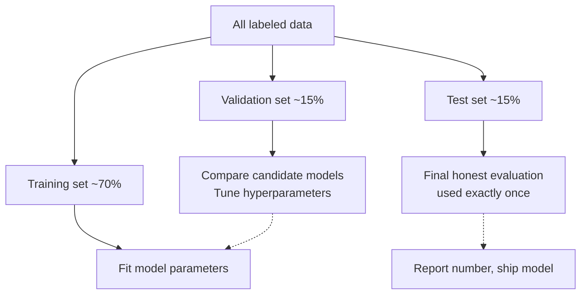

---

### 21.3 Why we need three sets, not two

The strong instinct of someone new to ML is: "Just train and test. The training set fits the model. The test set evaluates it. Two splits, done."

Here's why two splits aren't enough.

Suppose you split into train (80%) and test (20%). You fit a model with $\lambda = 0.1$. Test accuracy is 87%. You try $\lambda = 1.0$. Test accuracy is 89%. You try $\lambda = 10$. Test accuracy is 86%. You decide to ship $\lambda = 1.0$. The number you report is 89%.

What just happened? You used the test set to *choose* among hyperparameters. The number 89% is the test accuracy of *the chosen model*. But there's a subtle, important inflation here: you picked the best of three candidates as measured on this specific test set. Picking the best of $k$ noisy estimates produces an upward bias — even if all three candidates were equally good in truth, the best-on-this-test-set number is, in expectation, higher than the true generalization performance.

For $k = 3$ that effect is small. But practitioners don't try 3 things — they try 30, or 300. They tune learning rate, regularization, depth, feature subset, train/test ratio, random seed. After 100 candidate evaluations against the same test set, the "best test accuracy" reading is far above true generalization. You've effectively *trained on the test set* via a thousand small biased decisions, and the number you'll report is a fiction.

The fix is the validation set. *That's* the set you tune against. The test set sits sealed in an envelope until the very end. You touch the test set *once*, on the *final chosen model*, and you ship whatever number it produces.

This discipline is harder than it sounds. There's a constant temptation to "just check the test set quickly to see." Don't. Or, if you must look at the test set once mid-project to diagnose something specific, treat that look as if you've spent your single shot — every subsequent evaluation is biased.

#### 21.3.1 The math underneath the bias

A concrete sketch of why "best of k on the test set" inflates. Suppose you have $k$ candidate models, each with true generalization accuracy $p$. Each model's test accuracy is an estimate $\hat{p}_i$ with variance $\sigma^2 = p(1-p)/n_{\text{test}}$. By the variance of the maximum of $k$ noisy estimates, $\mathbb{E}[\max_i \hat{p}_i] > p$ when $k > 1$. The bias grows with both $k$ (more candidates, more "lucky" winner) and $\sigma$ (smaller test set, noisier estimate). For $k = 100$ candidates and a test set of $1000$ examples with $p = 0.9$, the expected inflation can be a couple of percentage points — easily enough to mistake an honest 90% for a "great" 92%.

The validation set absorbs this. We do the model selection on the validation set, where any inflation is *fine* — we don't *report* the validation accuracy as our final number. The test set's single touch is unbiased.

---

### 21.4 Conventional split sizes

The classical split is 60/20/20. Other conventions you'll see:

- **70/15/15** — common when data is moderate.
- **80/10/10** — when you have a lot of data and want as much as possible for training.
- **90/5/5** — when you have an enormous amount of data and even 5% gives a large, reliable holdout.
- **50/25/25** — when data is small and you need bigger validation/test sets for statistical reliability.

What actually matters isn't the *ratio* but the *absolute size* of the holdout sets. A test set needs to be large enough to give a low-variance estimate of the metric you care about. Rule of thumb:

- For accuracy / error rate: 1,000+ test examples give estimates with ~1% standard error.
- For AUC, F1: similar; sometimes you want a few thousand.
- For rare-class metrics: you need 100+ examples *in the rare class*. If positives are 1% of your data, you need 10,000+ test examples to have 100 positives.

With 10 million labeled examples, a 90/5/5 split gives you 500,000 each for validation and test — plenty. With 5,000 labeled examples, a 60/20/20 split gives you 1,000 each — borderline; consider cross-validation (Ch 22) instead of a fixed split.

A useful heuristic: *if your test set is below 1,000 examples, switch to k-fold CV.* The single-split test estimate is too noisy at that size.

#### 21.4.1 The data-richness inversion

For decades, the conventional wisdom was 70/15/15 or 60/20/20. With the rise of very large datasets (millions to billions of examples), that conventional wisdom has inverted. When you have 10⁹ labeled examples, devoting 15% to validation and 15% to test is wasteful — you could afford to leave 99% for training and still have 10⁷ examples in test and validation. So splits like 98/1/1 are normal in modern deep learning.

The rule: the absolute size of the holdouts is what determines statistical reliability. Once they're big enough, additional held-out examples have diminishing returns; the marginal example is more useful in training.

---

### 21.5 Random splitting — the default

The simplest split: randomly shuffle the labeled data, then carve off the three sections. In code:

```python
import numpy as np
from sklearn.model_selection import train_test_split

rng = np.random.default_rng(0)
n = len(X)
indices = rng.permutation(n)

# 70 / 15 / 15
n_train = int(0.70 * n)
n_val   = int(0.15 * n)

train_idx = indices[:n_train]
val_idx   = indices[n_train:n_train + n_val]
test_idx  = indices[n_train + n_val:]

X_train, X_val, X_test = X[train_idx], X[val_idx], X[test_idx]
y_train, y_val, y_test = y[train_idx], y[val_idx], y[test_idx]
```

Or with scikit-learn's `train_test_split`, applied twice:

```python
X_temp, X_test, y_temp, y_test = train_test_split(
    X, y, test_size=0.15, random_state=0
)
X_train, X_val, y_train, y_val = train_test_split(
    X_temp, y_temp, test_size=0.15 / 0.85,  # to get 15% of original
    random_state=0
)
```

Random splitting is the default for IID data where order doesn't matter. *It is wrong* in three situations we now examine in turn.

---

### 21.6 Stratified splitting — for imbalanced classification

If your problem is binary classification with 5% positives (a common imbalance ratio in fraud detection, medical diagnosis, etc.), a naive random split can produce splits where one class is over- or under-represented by chance. With 1000 test examples and 5% positives, you'd expect 50 positives — but a random split could yield 35 or 65 by chance, distorting all your metrics.

**Stratified sampling** fixes this. Sample separately from each class, preserving the global class proportions exactly across all three sets.

In scikit-learn:

```python
from sklearn.model_selection import train_test_split

X_train, X_temp, y_train, y_temp = train_test_split(
    X, y, test_size=0.30, random_state=0, stratify=y
)
X_val, X_test, y_val, y_test = train_test_split(
    X_temp, y_temp, test_size=0.50, random_state=0, stratify=y_temp
)
```

The `stratify=y` argument tells the splitter to balance class proportions across the two output splits. With three splits you call it twice.

**Should you always stratify?** For binary or multiclass classification with any imbalance — yes. For regression, the analog is binning the target into a few buckets and stratifying on the bins, but this is rarely done; for regression with reasonably uniform targets, random splitting is fine.

For multi-label problems (one example can have multiple labels), stratification is mathematically harder — there's no clean way to preserve all label proportions simultaneously. Specialized algorithms exist; in scikit-learn, look at `IterativeStratification` from `scikit-multilearn`.

---

### 21.7 Temporal splitting — for time-structured data

For data with time structure — predicting tomorrow's electricity demand from historical demand, classifying transactions across months, recommending products to users over time — *do not split randomly*. Doing so causes a leak: the model trains on examples from the *future* (relative to test examples) and sees a more recent state of the world than it would in production.

The right split is **temporal** (also called "time-based"): split by time. All training examples are from before time $t_1$. Validation examples are from $[t_1, t_2)$. Test examples are from $[t_2, t_3)$.

```
   time →
   ┌───────────────┐┌───────┐┌───────┐
   │ training data ││ valid. ││ test  │
   └───────────────┘└───────┘└───────┘
       t_0 ... t_1    t_1...t_2   t_2...t_3
```

This simulates production: at any time, the model has only past data to train on and is evaluated on future data. The numbers it produces are honest estimates of what production performance will look like.

Why is this so important? Because *the world drifts*. Customer behavior in 2023 is not the same as customer behavior in 2026. Fraud patterns evolve. Email content evolves. If you randomly split a 5-year dataset, you'll have some 2026 examples in training and some 2023 examples in test — your model has seen the future. The test score is artificially inflated.

We saw this concretely in Chapter 3's spam example. The honest thing in production is a time-based split: train on January-April, validate on May, test on June. Anything else lies.

#### 21.7.1 The leakage is worse than it looks

A subtle point: random splitting of time-series data doesn't just inflate the test number; it produces models that are *fundamentally wrong*. The model learns from "later" examples (containing features that depend on "earlier" examples — e.g., user's last-week purchase count). In production, when scoring a new example, the future hasn't happened yet, so those features are computed using only past data. The model has *seen a different feature distribution at training time than it will see at scoring time*. Even if generalization were perfect, the model trained on randomly-split data would underperform because the feature distribution shifted.

This is one of the most common production failures: "the model worked beautifully in the notebook and tanked in production." Half the time, the problem is a random-split-on-time-series error somewhere in the pipeline.

#### 21.7.2 Walk-forward variants

For time-series, the time-based split has variants you'll see in practice:

- **Single split:** as above. Train on a fixed past window, validate on the next chunk, test on the chunk after.
- **Walk-forward:** simulate production retraining. Train on $[t_0, t_1]$, evaluate on $[t_1, t_2]$. Then retrain on $[t_0, t_2]$, evaluate on $[t_2, t_3]$. Etc. The "test" performance is averaged over multiple non-overlapping forward windows. More expensive; more honest.

Walk-forward is the default for *evaluating an entire ML pipeline that will retrain in production*. Chapter 22 returns to this under "time-series cross-validation."

---

### 21.8 Group splitting — when records have shared identity

If your dataset has *groups* — multiple records per patient, per customer, per document, per session — putting different records from the *same* group on different sides of the split causes leakage.

Example: a hospital-readmission model. Each row is "patient visit." A single patient may have 10 visits in the dataset. If you randomly split rows, some of patient X's visits will be in training and some in test. The model can learn patient X's idiosyncrasies (their typical lab values, demographics, comorbidities) from the training visits and then "predict" their test visits using that memorized info. Test performance is inflated. In production, when a *new* patient arrives, the model has no such memorized history and performs much worse.

The fix is **group splitting**: identify the grouping variable (patient ID, customer ID, document ID, session ID), and split *by group*. All visits for patient X go to the same set (train, val, or test). The model is forced to learn patterns that generalize across patients, not memorize specific patients.

In scikit-learn:

```python
from sklearn.model_selection import GroupShuffleSplit

splitter = GroupShuffleSplit(test_size=0.15, random_state=0)
# Assume `patient_id` is an array of group identifiers.
train_idx, test_idx = next(splitter.split(X, y, groups=patient_id))
```

For tabular ML in healthcare, finance, e-commerce, education — almost any domain with repeat actors — group splitting is the default. The first question to ask when receiving a labeled dataset is "what are the natural groups, and what would group-leakage look like?"

---

### 21.9 The leakage trap: feature engineering before splitting

Here is a subtle, common, and devastating mistake.

You have a dataset. You normalize the features by subtracting the mean and dividing by the standard deviation:

```python
# DO NOT DO THIS
X_normalized = (X - X.mean(axis=0)) / X.std(axis=0)
X_train, X_test = split(X_normalized, ...)
```

The bug: the mean and standard deviation were computed *over the whole dataset, including the test examples*. The training feature values now depend on the test values. When you evaluate, the model has, in a tiny but real way, seen the test set during training — via the summary statistics that shaped its inputs.

The same bug happens with:

- One-hot encoding when the vocabulary is computed over the whole dataset.
- TF-IDF where the IDF weights are computed over the whole corpus.
- Target encoding where the per-category target mean is computed over the whole dataset.
- Any imputation where missing values are filled with statistics over the whole dataset.
- Outlier detection where thresholds are computed over the whole dataset.

The fix: **split first, fit transformers on training data only, apply to validation and test.**

```python
# DO THIS
X_train, X_temp = train_test_split(X, ...)
X_val, X_test  = train_test_split(X_temp, ...)

# Fit the scaler on training data only.
scaler = StandardScaler()
X_train_scaled = scaler.fit_transform(X_train)
# Apply (not fit) to val and test.
X_val_scaled   = scaler.transform(X_val)
X_test_scaled  = scaler.transform(X_test)
```

The same pattern applies to *every* preprocessing step. If your pipeline computes any statistic over the data, that statistic must be computed *only on the training set*, and then the resulting transformer applied to validation and test.

scikit-learn's `Pipeline` and Spark ML's `Pipeline` exist partly to make this discipline easy: a pipeline encapsulates all the transformers + the model, and when you call `.fit(X_train, y_train)`, the transformers fit on training data only. Validation and test data flow through with `.transform()` and `.predict()`, never `.fit_transform()`.

#### 21.9.1 The bug in a worked example

Let me show the leakage effect concretely. 

Suppose we have a regression problem. Features are random; target is a linear function of features plus noise. Train two models:

1. Normalize over the entire dataset, then split.
2. Split, then normalize on training only and apply to test.

```python
import numpy as np
from sklearn.linear_model import Ridge
from sklearn.metrics import mean_squared_error
from sklearn.model_selection import train_test_split
from sklearn.preprocessing import StandardScaler

rng = np.random.default_rng(0)
n, d = 1000, 50
X = rng.normal(size=(n, d))
y = X @ rng.normal(size=d) + rng.normal(scale=0.5, size=n)

# WRONG: normalize then split
X_normalized_wrong = StandardScaler().fit_transform(X)
Xtr_w, Xte_w, ytr_w, yte_w = train_test_split(
    X_normalized_wrong, y, test_size=0.20, random_state=0
)
model = Ridge(alpha=1.0).fit(Xtr_w, ytr_w)
print(f"Wrong (leaked): test MSE = {mean_squared_error(yte_w, model.predict(Xte_w)):.4f}")

# RIGHT: split then normalize on train only
Xtr, Xte, ytr, yte = train_test_split(X, y, test_size=0.20, random_state=0)
scaler = StandardScaler().fit(Xtr)
Xtr_s, Xte_s = scaler.transform(Xtr), scaler.transform(Xte)
model = Ridge(alpha=1.0).fit(Xtr_s, ytr)
print(f"Right: test MSE = {mean_squared_error(yte, model.predict(Xte_s)):.4f}")
```

For this benign synthetic example, the leaked version gives a *very* small over-estimate of how good the model is — typically a few percent improvement that isn't real. For more aggressive transformers (target encoding, log transforms with shifts, etc.) the inflation can be much larger.

The actual problem isn't that the leaked test number is a *tiny bit* off. It's that *you have no idea how off it is, and you've cultivated a habit that will quietly distort every project you do.* The discipline is to make split-first-then-transform an unbreakable reflex.

---

### 21.10 Engineering practice — what good looks like

A few habits a senior ML engineer follows by reflex:

**Split your data at the very first opportunity, before any analysis.** As soon as you receive a labeled dataset, do the split. Save the test set indices in a place you'll never accidentally re-shuffle. Don't even look at it.

**Use `Pipeline`.** Wrap all preprocessing + the model in one Pipeline object. This makes the train-only-fit discipline automatic — `.fit(X_train)` fits everything on training data; `.predict(X_test)` applies everything.

**Log a hash of the test set.** When you fix the test set, log a hash of its indices in your experiment tracker (MLflow does this trivially). If anyone — including future-you — accidentally shuffles, the hash changes and you'll notice.

**Limit test-set evaluations.** Treat the test set as a regulated resource. Some teams track in their notebooks how many times they've evaluated on test; some refuse to evaluate more than 3-5 times across the entire project. This sounds extreme; it's actually wise.

**Re-split when the data changes.** If you collect another month of data, you're not splitting fresh — you're appending to existing splits (training keeps growing; test grows for the next eval round). Don't randomly resplit, that destroys all your prior baselines.

**Document the split logic.** In your repo, in your project README, in your model card: *exactly how* the split was done. "Stratified by class; grouped by patient_id; temporal cutoff at 2025-01-01." This is the first thing a reviewer (or future-you) needs to know to interpret any number you report.

---

### 21.11 A unified mental model

To consolidate, here is the decision tree for splitting:

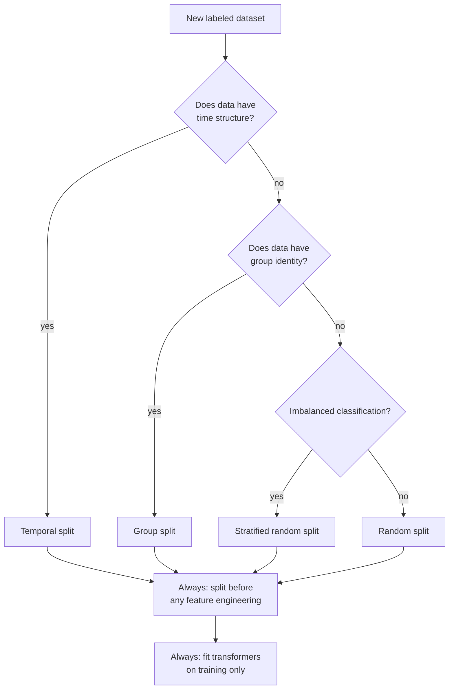

The four split strategies — random, stratified, group, temporal — cover essentially all cases. Sometimes they combine: a healthcare time-series problem with imbalanced labels and patient groups needs *all three* (time-based split + group-based split + stratification within groups). This is annoying to implement but worth doing correctly. The cost of getting it wrong is a model that fails silently in production.

---

### 21.12 What about cross-validation?

This chapter set up a single split (train/val/test). Chapter 22 will introduce **cross-validation** — using *multiple* splits to get a more stable estimate of generalization. The two are not opposites; they coexist:

- For *model selection*, CV is preferred over a single train/val split when data is limited.
- For the *final honest estimate*, you still want a held-out test set that was not used in CV.

A common composite recipe: nested CV (outer loop for honest estimation, inner loop for hyperparameter selection). We'll formalize this in Chapter 22.

For the Databricks ML Associate exam, you should be comfortable with both the single-split discipline (this chapter) and the CV procedure (next chapter), and understand when each is appropriate.

---

### 21.13 Summary

The chapter in one set of bullets *(that we are using only this once, here, as a checklist, because the role-by-role lookup is what people actually want from this material; the rest of the chapter resists bullet-cheat-sheets)*:

1. **Three sets, three roles.** Training fits parameters; validation tunes choices; test gives the honest final number.
2. **Two sets aren't enough.** Tuning against test inflates the reported number.
3. **Sizes:** 70/15/15 is conventional; with lots of data, 98/1/1 is fine. Absolute size matters more than ratio.
4. **Random splitting** is the default for IID tabular data.
5. **Stratified splitting** preserves class proportions; use for imbalanced classification.
6. **Temporal splitting** required for time-structured data; never randomly split time series.
7. **Group splitting** required when groups (patient, customer, document) have multiple records.
8. **Feature engineering must happen *after* splitting.** Fit transformers on training only; apply to val/test.
9. **The test set is touched once.** No exceptions.
10. **`Pipeline`** is the structural defense against accidental leakage.

The discipline is mostly engineering, not math. Internalize it. The exam questions on this chapter are often less about formulas and more about "spot the leakage in this code."

---

### 21.14 What this builds on / where this returns

**Builds on:**
- Chapter 16 (the ERM framework: train loss is what we minimize, but true loss is what we want).
- Chapter 18 (overfitting: the U-curve and the need for honest evaluation).
- Chapter 19 (bias-variance: the variance of the trained model is exactly what holdout estimates).

**Returns:**
- *Chapter 22* (cross-validation) generalizes single splits to k-fold averages and adds nested CV.
- *Chapter 28* (TF-IDF feature engineering): the IDF must be fit on train only.
- *Chapters 23-30* (feature engineering): every transformer in Part E lives by the "fit on train, transform val/test" discipline.
- *Chapter 62* (Spark ML `Pipeline`) is the Databricks-native incarnation of the same discipline.
- *Chapter 65* (`CrossValidator`): the same split discipline at scale.
- *Part L* (MLflow): tracking test-set evaluations and split provenance.

---

### 21.15 Exercises

1. **Three roles.** In your own words, state the purpose of training, validation, and test sets. What goes wrong if you skip the validation set?

2. **The single-split mistake.** A team reports 92% accuracy on the test set after trying 50 different hyperparameter combinations. Why is this number likely an over-estimate? About how big might the bias be?

3. **Size matters.** Given a dataset of 5,000 examples with 200 positive cases (binary classification, very imbalanced), suggest a split ratio and justify.

4. **Pick the split strategy.** For each scenario, recommend a split type (random, stratified, group, temporal — or combinations):
   - Predicting house prices from 100,000 sales over 10 years.
   - Classifying images of cats vs. dogs from a balanced dataset.
   - Predicting credit-card default; data spans 5 years; multiple cards per customer.
   - Identifying spam emails; data is a static snapshot from one month.
   - Predicting hospital readmission; one row per visit, multiple visits per patient, data spans 3 years.

5. **The leakage demo.** Why does normalizing before splitting cause leakage? Be specific about which information from the test set "leaks" into the model.

6. **The Pipeline defense.** How does using a scikit-learn or Spark Pipeline prevent the leakage in question 5?

7. **The wedding photographer split.** Refer to Chapter 3's spam example. Suppose you split randomly even though emails arrive over time. What might go wrong in production?

8. **Test set sanctity.** What happens, in practice, if you "just take a quick look" at the test set during development? Be specific about the bias mechanism.

9. **Hash discipline.** Why might it be useful to log a hash of the test set indices in your MLflow experiment?

10. **A subtle group leak.** A model trained on stock-trading data has different rows for different trades by different traders. The model uses features like "trader's recent average return." If you randomly split rows, what's the leakage? How do you fix?

11. **Stratification for regression.** Strict stratification by target value doesn't make sense for continuous targets. Describe an approximate way to stratify a regression split if you wanted the target distribution preserved across train/val/test.

12. **Composite splits.** Sketch the logic for a split that is simultaneously temporal (by transaction date), group-based (by customer), and stratified (by fraud label). What do you do when a single customer's transactions span both pre- and post-cutoff dates?

<details>
<summary>Answers</summary>

1. Training fits parameters. Validation tunes hyperparameters and selects models. Test gives a one-time honest estimate of generalization. Without a validation set, you'd be forced to tune against the test set, and every choice biases the test score upward — your "honest estimate" becomes optimistic by an unknown amount.

2. Each hyperparameter trial gave a test score; picking the best inflates the expected reported value. With $k = 50$ candidates and a moderate test set, the inflation is typically 1-3 percentage points. The 92% likely overstates true generalization to 89-91%.

3. The data is small and imbalanced. Suggest 60/20/20 stratified. With 200 positives, 20% test = 40 positives, marginal for stable rare-class metrics — consider k-fold CV (Ch 22) on top of a single test holdout. Always stratify by label.

4. (a) Temporal (predict future sales from past). (b) Stratified random (if balanced you could even just random, but stratified is safer). (c) Temporal + group by customer + stratified by default. (d) Stratified random (one month, static — IID enough). (e) Temporal + group by patient + stratified by readmit label.

5. The mean and standard deviation used for normalization are computed using both train and test rows. Test-row values directly influence the training features (because both are normalized using the test-inclusive stats). The model has, in a small way, seen the test data via this back-channel. Test performance estimate is inflated.

6. The Pipeline only calls `.fit_transform()` on the training data when you call `.fit(X_train, y_train)`. When you later call `.predict(X_test)`, every transformer in the pipeline uses `.transform()` — applying the *already-fit* parameters. The test data never participates in any transformer's fitting.

7. Emails drift over time — new spam patterns, new legitimate senders, language evolves. A random split means training contains some recent emails and test contains some old ones — the model has effectively "seen the future." Production performance, where the model truly must predict on never-before-seen recent data, will be substantially worse than the inflated test estimate.

8. Each "quick look" is a noisy estimate. If you adjust *anything* in response to what you saw — a feature, a hyperparameter, even an intuition about which model class to try next — you've leaked test information into the training process. The bias mechanism is subtle: you'll preferentially keep changes that "happened" to look good on the test. The bias is small per peek and large over many peeks.

9. If the test set is accidentally re-shuffled, re-split, or augmented, the hash will change and you'll notice — instead of silently retraining against a different test set and reporting incomparable numbers across runs. The hash makes the discipline machine-checkable.

10. Random splitting puts some of trader X's trades in train and some in test. The model can learn trader X's idiosyncratic patterns from training trades and "predict" their test trades unrealistically well. Fix: group split by trader. All trades for one trader go to one of train/val/test.

11. Bin the target into a small number of quantiles (e.g., 10 deciles), then stratify on the bin label. This approximately preserves the target distribution across splits.

12. The hard case is exactly when a customer's transactions straddle the temporal cutoff. Two reasonable options: (a) Put the *entire customer* on one side based on their first transaction date or median date — preserves group integrity at the cost of fuzzier temporal boundary. (b) Allow the cutoff to split a customer's transactions — preserves temporal integrity at the cost of group leakage. Pick based on which leakage is more harmful: usually group leakage is worse than minor temporal blurring, so option (a) is the default.

</details>


## Chapter 22 — Cross-Validation Theory

> **Goal of this chapter:** to formalize **cross-validation**, the procedure that lets us estimate generalization performance more reliably than a single train/validation split allows, *and* uses the same data for both fitting and evaluation without committing the data-leakage sins of Chapter 21. We'll derive why k-fold averaging reduces estimator variance, see why k=5 or k=10 are the universal defaults, study the stratified, time-series, and group-based variants needed in non-IID settings, and lay out **nested cross-validation** — the discipline you need when both choosing a model and honestly estimating its performance from limited data.
>
> By the end you should be able to (a) draw the k-fold diagram from memory, (b) compute by hand which rows are in which fold for a small dataset, (c) explain why CV is a *less biased but more variance-uncertain* estimator of generalization, and (d) recognize when nested CV is required vs. when a simpler scheme suffices. Cross-validation is the connective tissue between Chapter 21's split discipline and Part I's hyperparameter optimization — get the theory right here and the practical machinery in Spark ML (Ch 65) is trivial.

---

### 22.1 The problem with a single validation split

Chapter 21 gave you the three-set discipline: training fits parameters, validation tunes hyperparameters, test gives an honest one-shot estimate. Now consider the validation set's role specifically. You're using it to compute a number — say, validation accuracy — for each candidate model. You pick the model with the highest validation accuracy.

There's a hidden problem: the validation accuracy you computed is *one* estimate of generalization. It has variance. If you'd held out a *different* 15% of the data as validation, you'd get a slightly different validation accuracy for each candidate — and possibly a different winner.

Concretely: model A scores 0.87 on the validation set you happened to pick. Model B scores 0.86. You pick A. But if a different validation set had been chosen by the random shuffle, maybe A scores 0.85 and B scores 0.87. The "best model" depends on the random seed of your split.

For *small* datasets — where the validation set is small in absolute terms — this variance is large. With 200 validation examples and an accuracy of 0.87, the standard error of the accuracy estimate is $\sqrt{0.87 \cdot 0.13 / 200} \approx 0.024$ — almost 2.5 percentage points. A 1-point gap between two models is well within the noise. You're making decisions on noisy data.

Cross-validation's response: *don't use a single validation set. Use many, and average.*

---

### 22.2 k-Fold cross-validation — the construction

The construction is elegant. You decide on a value of $k$ — typically 5 or 10. Then:

1. Shuffle the data (once).
2. Split it into $k$ disjoint chunks of roughly equal size, called **folds**.
3. For $i = 1, 2, \ldots, k$:
   - **Train** the model on the union of all folds *except* fold $i$.
   - **Evaluate** the model on fold $i$.
   - Record the evaluation metric (e.g., accuracy, MSE) for this fold.
4. Average the $k$ recorded metrics. That average is the **cross-validated estimate** of generalization.

Diagrammatically, for $k = 5$:

```
   data → shuffle → 5 folds:

   fold 1   fold 2   fold 3   fold 4   fold 5
   ┌─────┐ ┌─────┐ ┌─────┐ ┌─────┐ ┌─────┐
   │ 20% │ │ 20% │ │ 20% │ │ 20% │ │ 20% │
   └─────┘ └─────┘ └─────┘ └─────┘ └─────┘

   iter 1: train on 2-5, eval on 1   →  acc_1
   iter 2: train on 1,3-5, eval on 2 →  acc_2
   iter 3: train on 1,2,4-5, eval on 3 → acc_3
   iter 4: train on 1-3,5, eval on 4   →  acc_4
   iter 5: train on 1-4, eval on 5    →  acc_5

   CV accuracy = mean(acc_1, acc_2, acc_3, acc_4, acc_5)
```

Crucially: each iteration trains a *fresh* model from scratch on its own training data. You're not refining a single model across iterations — you're training $k$ separate models and averaging their out-of-sample performance.

The model you eventually ship is *not* one of these $k$ fold-models — it's a final model trained on *all* the data (or all the non-test data, if you have a separate held-out test set) using the hyperparameters that the CV procedure said were best. The $k$ fold-models exist only to produce the CV estimate; they're discarded.

#### 22.2.1 A worked manual example

Suppose we have 10 training examples, ordered by their row index 1-10. We do 5-fold CV (so 2 examples per fold).

After a random shuffle, the assignment to folds might be:

| Row index | Fold |
|---:|:---:|
| 1 | 3 |
| 2 | 1 |
| 3 | 2 |
| 4 | 5 |
| 5 | 4 |
| 6 | 1 |
| 7 | 3 |
| 8 | 4 |
| 9 | 2 |
| 10 | 5 |

So:

- Fold 1 = {row 2, row 6}
- Fold 2 = {row 3, row 9}
- Fold 3 = {row 1, row 7}
- Fold 4 = {row 5, row 8}
- Fold 5 = {row 4, row 10}

Five iterations:

| Iter | Train on rows | Evaluate on rows |
|:---:|:---|:---|
| 1 | 1, 3, 4, 5, 7, 8, 9, 10 | 2, 6 |
| 2 | 1, 2, 4, 5, 6, 7, 8, 10 | 3, 9 |
| 3 | 2, 3, 4, 5, 6, 8, 9, 10 | 1, 7 |
| 4 | 1, 2, 3, 4, 6, 7, 9, 10 | 5, 8 |
| 5 | 1, 2, 3, 5, 6, 7, 8, 9 | 4, 10 |

Every row appears in *exactly one* evaluation fold and in *exactly $k - 1$ training folds*. So the CV procedure produces an out-of-sample prediction for *every* row — at the cost of training $k$ models instead of one.

For real-world use, scikit-learn's `KFold(n_splits=5, shuffle=True, random_state=0).split(X)` is the standard way to generate these indices.

---

### 22.3 Why averaging reduces variance — the theory

Why is the average of $k$ noisy estimates more reliable than any single one? This is the classical variance-of-the-mean result from Chapter 9.

Let $\hat{m}_i$ be the metric (e.g., accuracy) on the $i$-th fold. Each $\hat{m}_i$ is a noisy estimator of the true generalization performance $m^*$, with some bias $\beta$ and variance $\sigma^2$:

$$
\mathbb{E}[\hat{m}_i] = m^* + \beta, \qquad \text{Var}(\hat{m}_i) = \sigma^2
$$

The CV estimator is the average:

$$
\hat{m}_{\text{CV}} = \frac{1}{k}\sum_{i=1}^k \hat{m}_i
$$

If the $k$ estimators were independent, the variance would be:

$$
\text{Var}(\hat{m}_{\text{CV}}) = \frac{\sigma^2}{k}
$$

So the standard error shrinks by $\sqrt{k}$. With $k = 10$, the CV estimate has $\sim 3\times$ smaller standard error than a single split.

But the $\hat{m}_i$ are *not* independent — they share most of their training data (each pair of folds has $(k-2)/k$ training data in common). The actual variance is:

$$
\text{Var}(\hat{m}_{\text{CV}}) = \frac{\sigma^2}{k} + \frac{k-1}{k} \cdot \text{Cov}(\hat{m}_i, \hat{m}_j)
$$

The covariance is generally positive (the fold-models are similar, their errors are correlated), so the actual variance reduction is less than $1/k$. But it's still substantial — empirically, CV produces estimates with maybe $1.5-3\times$ smaller variance than a single split (the exact ratio depends on the problem and $k$).

The point: averaging *helps*, even though it's not as good as if the folds were truly independent.

#### 22.3.1 The bias-variance tradeoff *of the CV estimator*

CV itself has a bias-variance tradeoff — separate from the bias-variance of the *model* it's evaluating.

**Bias of the CV estimator.** Each fold-model is trained on $n(k-1)/k$ examples — fewer than the full $n$. A model trained on less data is generally *worse* than a model trained on more data. So $\mathbb{E}[\hat{m}_i]$ is *slightly worse* than the true $m^*$ for a model trained on all $n$ examples. CV's estimate is pessimistic.

- Small $k$ (say, $k=2$): each fold-model is trained on $n/2$. Big shortfall from $n$. Pessimistic bias is large.
- Large $k$ (say, $k=n$): each fold-model is trained on $n-1$, essentially the full data. Bias is small.

**Variance of the CV estimator.**

- Small $k$: each fold has $n/k$ evaluation examples, so each $\hat{m}_i$ has small individual variance, but you only have $k$ samples to average. Net variance moderate.
- Large $k$ (say, $k=n$, leave-one-out): each fold has *one* evaluation example, so each $\hat{m}_i$ has huge individual variance. You're averaging $n$ such estimates. The fold-models are nearly identical (they share $n-1$ examples each), so their errors are heavily correlated. Net variance can actually be *large* — LOO-CV is famous for having unstable variance.

Net: $k = 5$ and $k = 10$ are sweet spots. Conventional wisdom is:

- **$k = 5$** when training is expensive (only 5 model trainings).
- **$k = 10$** when training is fast and you want a smaller bias.
- **$k = n$ (LOO)** rarely; only when $n$ is very small (say, $n < 30$) and you really need every training point you can get.

The "5 or 10" recommendation has held up empirically for decades.

---

### 22.4 Stratified k-fold — for imbalanced classification

The same imbalance issue from Chapter 21 returns in CV. If you have 5% positives and you randomly assign rows to folds, some folds will have 3% positives and others 7% by chance. Each fold-model evaluates on a biased sample of the rare class.

**Stratified k-fold** fixes this: assign rows to folds *within each class*, preserving the global class proportion in every fold. If the global rate is 5%, then every fold has exactly (or as close as integer division allows) 5% positives.

In scikit-learn:

```python
from sklearn.model_selection import StratifiedKFold

skf = StratifiedKFold(n_splits=5, shuffle=True, random_state=0)
for train_idx, test_idx in skf.split(X, y):
    # train on X[train_idx], y[train_idx]
    # evaluate on X[test_idx], y[test_idx]
    ...
```

For any binary or multiclass classification problem, stratified k-fold should be the default. It's a one-line code change that produces more stable, less biased CV estimates.

In Spark ML, the `CrossValidator` is automatically stratified for classification estimators where it makes sense.

---

### 22.5 Time-series cross-validation — the walk-forward family

Random k-fold is wrong for time-series data, for the same reason random splitting was wrong in Chapter 21: the model "trains on the future." Each fold-iteration in random k-fold trains on a mix of past and future examples and evaluates on a remainder — *not* what production looks like.

The correct schemes are **walk-forward** variants:

**Expanding-window walk-forward.** Train on the earliest $n_0$ examples; evaluate on the next chunk. Then train on the earliest $n_0 + \Delta$ examples; evaluate on the next chunk. Etc. The training window *grows* over time. This simulates production: at each prediction time, the model has been retrained on all data up to that time.

```
    time →
    ┌─────────────┐  ┌─────┐
    │  train      │  │ eval│
    └─────────────┘  └─────┘
    ┌──────────────────┐  ┌─────┐
    │  train (larger)  │  │ eval│
    └──────────────────┘  └─────┘
    ┌─────────────────────────┐  ┌─────┐
    │  train (largest)        │  │ eval│
    └─────────────────────────┘  └─────┘
```

**Rolling-window walk-forward.** Train on a *fixed-size* window that slides forward. This simulates production with a fixed retraining horizon — useful when distant past is no longer relevant.

```
   ┌────────────┐  ┌─────┐
   │   train    │  │ eval│
   └────────────┘  └─────┘
        ┌────────────┐  ┌─────┐
        │   train    │  │ eval│
        └────────────┘  └─────┘
            ┌────────────┐  ┌─────┐
            │   train    │  │ eval│
            └────────────┘  └─────┘
```

scikit-learn's `TimeSeriesSplit` implements expanding-window walk-forward:

```python
from sklearn.model_selection import TimeSeriesSplit

tscv = TimeSeriesSplit(n_splits=5)
for train_idx, test_idx in tscv.split(X):
    # train and evaluate
    ...
```

By default, `TimeSeriesSplit(n_splits=5)` produces 5 successive train/test pairs where each train block ends where the previous evaluation block began. The training data only ever uses examples before the evaluation window.

**Crucial:** the data must be sorted by time *before* calling `TimeSeriesSplit`. If your data is in random order, the splits are nonsense.

---

### 22.6 Group k-fold — for grouped data

Chapter 21's group-splitting story extends to CV. If your data has groups (patient, customer, document, session), every fold must contain *whole groups* — never split a group across train and test.

scikit-learn's `GroupKFold`:

```python
from sklearn.model_selection import GroupKFold

gkf = GroupKFold(n_splits=5)
for train_idx, test_idx in gkf.split(X, y, groups=patient_id):
    # patient_id is an array of group identifiers
    # the splitter ensures no patient appears in both train and test
    ...
```

There are also `GroupShuffleSplit` (random group-aware splits) and `LeaveOneGroupOut` (one group at a time as the test set — useful for "leave-one-patient-out" or "leave-one-domain-out" evaluation).

For composite settings — group structure *and* imbalance, group structure *and* time — combine. `StratifiedGroupKFold` exists. For time + group, you typically write your own splitter (or use a domain-specific library).

---

### 22.7 The big purpose: hyperparameter selection via CV

The most common use of CV is to choose hyperparameters. Here's the full recipe.

**Setup:** You have a training set (say, after a 70/15/15 split from Chapter 21 — train, val, test, where here "training set" includes what would have been the validation portion). You want to choose a hyperparameter $\lambda$ for ridge regression.

**Procedure:** Define a grid of candidate $\lambda$ values (e.g., $\{0.01, 0.1, 1, 10, 100\}$, log-spaced). For each $\lambda$:

1. Run k-fold CV: train $k$ models with this $\lambda$, evaluate each on its fold, average to get $\hat{m}(\lambda)$.

You now have $\hat{m}(0.01), \hat{m}(0.1), \ldots, \hat{m}(100)$ — one CV estimate per $\lambda$. Pick the $\lambda^*$ with the best score. Retrain a final model on the *entire training set* with $\lambda^*$. Report performance on the held-out test set.

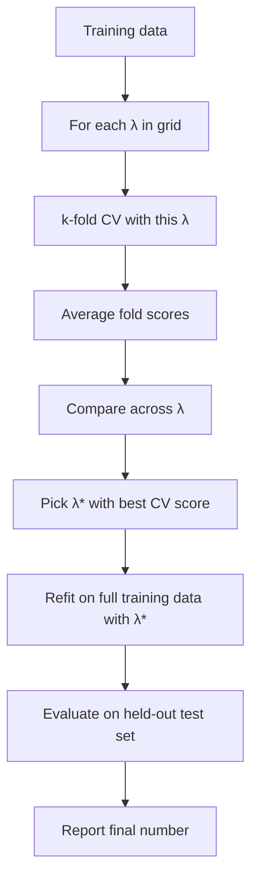

This is what `RidgeCV`, `LassoCV`, `GridSearchCV`, `RandomizedSearchCV` (scikit-learn) and `CrossValidator` (Spark ML — Ch 65) do under the hood. Same pattern.

#### 22.7.1 Why is this honest?

The validation work happens *inside CV*, on the training data. The model selection (picking $\lambda^*$) uses the CV scores, which are computed without ever looking at the test set. The test set is touched exactly once at the end, on the chosen-hyperparameter model. So the test number is unbiased.

Compare to the bad alternative: use a single train/val split, sweep $\lambda$ against val, then evaluate the chosen $\lambda$ model on test. This is *also* honest if val and test are truly separate — but the val estimate is noisy, so the chosen $\lambda^*$ is less reliable. CV gives you a better $\lambda^*$ choice from the same data.

---

### 22.8 Nested cross-validation — when you can't afford a held-out test set

There's a subtler scenario. Suppose you have only $n = 500$ labeled examples. You'd like:

1. To choose hyperparameters honestly (no leakage).
2. To estimate generalization honestly (no inflation from many-candidate selection).

A naive single train/val/test split with $n = 500$ gives you, say, 350/75/75 — and the test set's 75 examples are barely enough to compute a stable accuracy. You'd really like to use *all* the data for both purposes — but the discipline of Chapter 21 says you can't.

**Nested CV** is the answer. There are two loops:

- **Outer loop** ($k_{\text{out}}$-fold): produces honest generalization estimates.
- **Inner loop** ($k_{\text{in}}$-fold): inside each outer-fold's training set, chooses hyperparameters.

Procedure:

```
   for i in 1..k_outer:
       outer_train = data \ outer_fold_i
       outer_test  = outer_fold_i
       
       # Inner CV — only on outer_train
       for each lambda in grid:
           run k_inner-fold CV on outer_train
           record CV score
       lambda_i = argmax over lambda
       
       # Refit on outer_train with chosen lambda_i
       model_i = fit(outer_train, lambda_i)
       
       # Evaluate on outer_test
       score_i = evaluate(model_i, outer_test)
   
   final_estimate = mean(score_i for i in 1..k_outer)
```

What this estimates is *the performance of the model-selection procedure*. Each outer fold simulates the entire pipeline (hyperparameter search + final fit) on a subset, then evaluates on held-out data. Averaging gives you an honest estimate of "what does this whole approach generalize to?"

Total cost: $k_{\text{out}} \cdot k_{\text{in}} \cdot |\text{grid}|$ model trainings. With $k_{\text{out}} = 5$, $k_{\text{in}} = 5$, 10 hyperparameters: 250 model trainings. For cheap-to-train models, this is fine. For expensive ones, painful.

When do you actually use nested CV? When you have *small data* and need both purposes (selection + honest estimate). When data is large, you can afford a separate held-out test set, and the simpler "CV for selection, single test set for estimate" recipe suffices.

A subtlety worth knowing: the *final model* you ship isn't any of the inner or outer fold models. You typically choose hyperparameters by running ordinary (non-nested) CV on the *full data*, pick the best, and refit on the full data. Nested CV gives you the *generalization estimate*; the model-selection rerun on full data gives you the *deployed hyperparameters*.

---

### 22.9 Computational cost and parallelism

A k-fold CV trains $k$ models. For an expensive model, this is a noticeable cost. There are two practical responses.

**Parallelize the folds.** Each fold's training is independent. You can train all $k$ models in parallel if you have $k$ workers. In scikit-learn, `cross_val_score(..., n_jobs=-1)` uses all CPU cores. In Spark ML's `CrossValidator`, the `parallelism` parameter controls how many fold-models train simultaneously across cluster workers (Ch 65 has the deep dive).

**Use fewer folds.** If $k=10$ is too expensive, use $k=5$. The CV estimate is slightly noisier, but the cost halves.

**Use early stopping in inner CV.** For some HPO procedures (Bayesian optimization, successive halving — Part I), you can terminate CV early when a clearly-bad hyperparameter is identified. Saves total compute.

For exam purposes: understand that CV's cost is $k \times$ the single-fit cost, and that Spark ML's `CrossValidator(parallelism=4)` runs 4 fold-models in parallel.

---

### 22.10 A worked synthetic example

Code that puts the whole pipeline together. We'll do a hyperparameter sweep with k-fold CV for a ridge regression.

```python
import numpy as np
from sklearn.linear_model import Ridge
from sklearn.model_selection import KFold, cross_val_score, train_test_split
from sklearn.preprocessing import StandardScaler
from sklearn.pipeline import Pipeline

# Synthetic data: y depends on first 5 features; next 15 are noise.
rng = np.random.default_rng(42)
n, d = 500, 20
X = rng.normal(size=(n, d))
true_w = np.array([2.0, -1.5, 1.0, 0.5, -0.5] + [0.0] * 15)
y = X @ true_w + rng.normal(scale=0.5, size=n)

# Split off a test set first (Ch 21 discipline).
X_train, X_test, y_train, y_test = train_test_split(
    X, y, test_size=0.20, random_state=0
)

# Hyperparameter grid.
lambdas = np.logspace(-3, 3, 13)

# 5-fold CV for each lambda.
kf = KFold(n_splits=5, shuffle=True, random_state=0)
cv_scores = []
for lam in lambdas:
    pipeline = Pipeline([
        ("scaler", StandardScaler()),
        ("ridge", Ridge(alpha=lam)),
    ])
    scores = cross_val_score(pipeline, X_train, y_train,
                              cv=kf, scoring="neg_mean_squared_error",
                              n_jobs=-1)
    cv_scores.append(-scores.mean())   # convert back to positive MSE

# Pick best lambda.
best_idx = np.argmin(cv_scores)
best_lambda = lambdas[best_idx]
print(f"Best λ: {best_lambda:.4f}, CV MSE = {cv_scores[best_idx]:.4f}")

# Refit on full training data with best lambda.
final_pipeline = Pipeline([
    ("scaler", StandardScaler()),
    ("ridge", Ridge(alpha=best_lambda)),
])
final_pipeline.fit(X_train, y_train)

# Honest one-shot evaluation on test set.
test_mse = ((y_test - final_pipeline.predict(X_test)) ** 2).mean()
print(f"Held-out test MSE: {test_mse:.4f}")
```

Run it. A typical output:

```
Best λ: 0.1000, CV MSE = 0.2693
Held-out test MSE: 0.2814
```

Read the output. The CV procedure picked $\lambda = 0.1$ as the best among 13 candidates. The CV-estimated MSE was 0.27. The honest test MSE was 0.28 — close, slightly higher (as expected, since the CV estimate is slightly optimistic when averaged across folds that each used 80% of training data, while the final model used 100%). This is healthy.

Notice the **`Pipeline`** wrapping the scaler and ridge model. This is the Chapter 21 discipline: when cross_val_score does internal train/test splits, the scaler refits on each fold's training data and applies (without refitting) to the fold's test data. *Without the Pipeline*, you'd be tempted to scale the whole training set once at the top, which would leak fold-test info into fold-train statistics.

The fact that `Pipeline` makes the no-leakage discipline automatic is a major reason it's the default in scikit-learn and Spark ML.

---

### 22.11 Common mistakes around CV

**Forgetting to use a Pipeline.** Without a Pipeline, your preprocessing leaks across folds. Always wrap.

**Using CV when you should use temporal/group splits.** Random k-fold on time-series or grouped data inflates estimates. Use `TimeSeriesSplit` or `GroupKFold` instead.

**Hyperparameter search using the test set.** CV is for hyperparameter search; the test set is for one-shot final evaluation. Don't confuse them.

**Running CV many times with different seeds and reporting the best.** This is the "shopping for a lucky seed" anti-pattern — a leak of evaluation into selection. If you want a more stable CV estimate, increase $k$ or do repeated CV (run k-fold multiple times with different shuffles and average); but report the average, not the best run.

**Not stratifying when imbalanced.** Default `KFold` doesn't stratify. Use `StratifiedKFold` for classification.

**LOO when you don't need it.** LOO is expensive ($n$ fits) and high-variance (each fold has 1 evaluation example). Use $k = 5$ or $k = 10$.

**Mistaking CV variance for model variance.** The CV estimate has its own variance (across CV runs); the model has its own variance (across training sets). Don't conflate.

---

### 22.12 CV and Spark ML — preview

In Spark ML (Ch 65 has the full treatment), the `CrossValidator` class implements k-fold CV with parallel fold training. The important pieces:

- `estimator`: the Pipeline or model to be tuned.
- `estimatorParamMaps`: a list of hyperparameter combinations to try. Constructed with `ParamGridBuilder`.
- `evaluator`: which metric to optimize against (BinaryClassificationEvaluator, RegressionEvaluator, etc.).
- `numFolds`: $k$ (default 3 in older versions, 5 in newer; verify).
- `parallelism`: how many fold-models to train in parallel.

The math is the same as scikit-learn's `cross_val_score`; the engineering is distributed.

Critically: the total number of model fits is `numFolds × len(estimatorParamMaps)`. For a 5-fold CV over 10 hyperparameter combinations, you train 50 models. The parallelism parameter trades cluster cost for wall-clock time.

There's also `TrainValidationSplit` — a simpler scheme that does a single train/validation split instead of k-fold. Use it when you have so much data that k-fold's variance reduction is moot. We'll explore the tradeoff in Chapter 65.

---

### 22.13 Putting Part D together

This is the last chapter of Part D. Step back and look at what we've built.

We started in Ch 16 with a question: *what does it mean to train a model?* The answer was the ERM template: minimize a loss function over a hypothesis class.

In Ch 17 we built the algorithm to solve that minimization: gradient descent in its variants.

In Ch 18 we identified the central failure mode: high-capacity models drive training loss to zero while their test loss balloons — overfitting.

In Ch 19 we derived, from scratch, the bias-variance decomposition: the total expected test error equals bias² + variance + irreducible noise. The U-curve of test loss vs. capacity is a consequence.

In Ch 20 we introduced regularization as the principled way to constrain a high-capacity model and slide along the bias-variance trade.

In Ch 21 we set up the split discipline that *separates training from selection from evaluation* — without which honest numbers are impossible.

And in this chapter we generalized that discipline to **cross-validation**, the procedure that lets us make reliable model-selection decisions and produce reliable generalization estimates from limited data.

These seven chapters constitute the framework underneath every supervised ML algorithm in Parts F-G, every evaluation metric in Part H, every hyperparameter search procedure in Part I, and every distributed-ML construct in Parts J-L. When the rest of the book talks about "the right $\lambda$ from CV," or "an L2-regularized logistic regression with `regParam=0.1`," or "a `CrossValidator` with `numFolds=5`," it's standing on this foundation.

If you've internalized the chapter sequence — losses → optimization → overfitting → bias-variance → regularization → splitting → CV — you can reconstruct what any specific algorithm chapter is doing in terms of these primitives. *Conversely*, no amount of mastering specific algorithms will compensate for a shaky foundation here. Part D is the leverage point.

---

### 22.14 Summary

The chapter, distilled:

1. **k-fold CV** averages the evaluation scores of $k$ models, each trained on $k-1$ folds and evaluated on the remaining fold.
2. **Variance reduction:** averaging $k$ noisy estimators reduces variance toward $\sigma^2/k$ (less if estimators are correlated, which they are).
3. **CV's own bias-variance:** small $k$ → pessimistic bias; large $k$ → high variance. Sweet spot $k = 5$ or $k = 10$.
4. **Stratified k-fold** preserves class proportions per fold; required for imbalanced classification.
5. **Time-series CV** uses walk-forward or expanding/rolling windows; never random k-fold on time data.
6. **Group k-fold** keeps all rows for a group on the same side; required when groups exist.
7. **Hyperparameter selection via CV** is the standard recipe: sweep hyperparameters, CV-score each, pick the best, refit on all data.
8. **Nested CV** is required when you need both honest hyperparameter selection *and* honest generalization estimates from limited data.
9. **Pipeline wrapping** prevents leakage across folds. Always use it.
10. **Cost is $k \times$ a single fit** times the size of the hyperparameter grid; parallelize the folds when possible.

The k-fold diagram (§22.2), the bias-variance derivation of why averaging helps (§22.3), and the hyperparameter-selection recipe (§22.7) are the three things to internalize.

---

### 22.15 What this builds on / where this returns

**Builds on:**
- Chapter 9 (sampling and variance of the mean — the math behind why averaging reduces variance).
- Chapter 18 (overfitting and the U-curve — what we're trying to detect).
- Chapter 19 (bias-variance decomposition — explains why we average).
- Chapter 20 (regularization — what we tune with CV).
- Chapter 21 (the split discipline — CV generalizes the validation split).

**Returns:**
- *Chapter 31-32* (linear and logistic regression): the natural place to use CV is for picking $\lambda$.
- *Chapter 33-36* (trees, forests, boosting): CV picks max_depth, num_trees, learning_rate, etc.
- *Chapter 42-47* (metrics): the CV-averaged metric is what you optimize.
- *Part I* (HPO): grid search, random search, Bayesian optimization, TPE — all use CV scores as their objective.
- *Chapter 65* (`CrossValidator` in Spark ML): the same theory at distributed scale, with parallelism control.
- *Part L* (MLflow): tracking CV scores per hyperparameter, recording the chosen winner.

---

### 22.16 Exercises

1. **The basic procedure.** In your own words, describe 5-fold cross-validation. How many models are trained? What's done with them at the end?

2. **Manual fold assignment.** You have 12 rows numbered 1-12. After a deterministic shuffle, the assignment is (row → fold): 1→2, 2→1, 3→3, 4→1, 5→2, 6→3, 7→1, 8→2, 9→3, 10→2, 11→1, 12→3. List the contents of each fold, and for iteration 2 (eval on fold 2), list which rows are in training and which in evaluation.

3. **Why average?** Explain in one paragraph why averaging $k$ noisy estimates is more reliable than any single one.

4. **The pessimistic bias of CV.** Why does CV systematically underestimate the performance of the *final-deployed model* (which is trained on all $n$ examples)?

5. **k = 5 vs. k = n.** Compare leave-one-out CV against 5-fold CV on dimensions: (a) computational cost, (b) bias, (c) variance, (d) when you'd prefer each.

6. **Stratified vs. plain k-fold.** For a binary classification problem with 50/50 classes, would stratification matter? What about for a 95/5 split?

7. **Time series.** Explain why you can't shuffle a time-series dataset before doing k-fold CV. What goes wrong in the resulting estimates?

8. **Group CV in healthcare.** You have 10,000 medical records from 1,000 patients (10 records per patient). You want to validate a readmission model with k-fold CV. Why is plain `KFold(5)` wrong? Which scikit-learn class would you use?

9. **The Pipeline necessity.** Suppose you scale your features once on the whole training set before running 5-fold CV. Why is this a leakage? Why is it OK to scale once on training data when the train/test split is fixed and you're not running CV?

10. **Hyperparameter sweep math.** You're sweeping 15 values of $\lambda$ for ridge regression with 10-fold CV on a dataset where each fit takes 30 seconds. How long does the sweep take serially? With `n_jobs=10` parallelism?

11. **Nested CV cost.** You want nested 5-by-5 CV on 20 hyperparameter values, with each fit taking 1 minute. How many minutes (serial)?

12. **When *not* to use CV.** Give two situations where a single train/val split is preferable to k-fold CV.

13. **Picking the final model.** After running CV with multiple hyperparameter values, you've identified $\lambda^* = 0.1$. What model do you ship — one of the fold-models, or something else?

14. **Spark ML preview.** In Spark ML's `CrossValidator(numFolds=5, parallelism=3)`, you have 8 hyperparameter combinations. How many total model fits will run? How many will be in flight at any one time?

<details>
<summary>Answers</summary>

1. Split data into 5 disjoint chunks (folds). For each of 5 iterations, train a fresh model on 4 folds and evaluate on the remaining one. Average the 5 evaluation scores to get a single CV estimate. The 5 trained models are discarded; their only purpose was to produce the average.

2. Fold 1 = {2, 4, 7, 11}. Fold 2 = {1, 5, 8, 10}. Fold 3 = {3, 6, 9, 12}. Iteration 2: train on folds 1 and 3 = {2, 3, 4, 6, 7, 9, 11, 12}; evaluate on fold 2 = {1, 5, 8, 10}.

3. Each individual estimate has variance $\sigma^2$. The average of $k$ estimates has variance roughly $\sigma^2 / k$ (smaller if independent, somewhat larger if correlated). So the average is closer to the true mean than any single estimate, by a factor of about $\sqrt{k}$. With $k = 5$, you've cut your standard error roughly in half.

4. Each fold-model is trained on $n(k-1)/k$ examples — fewer than the full $n$. Models trained on less data are systematically slightly worse. So the CV-averaged metric reflects a slightly-worse model than what you'll actually ship. Bias is pessimistic.

5. (a) LOO does $n$ fits; 5-fold does 5. LOO is $n/5\times$ more expensive. (b) LOO has near-zero bias (each fold uses $n-1$ examples — essentially the full data). 5-fold has small pessimistic bias. (c) LOO has high variance (single-example evaluations, highly correlated fold-models). 5-fold has moderate variance. (d) LOO when $n$ is very small (~30); 5-fold otherwise.

6. With 50/50 classes, stratification has negligible effect — a random split will produce close-to-50/50 in each fold by chance. With 95/5 split, stratification matters enormously: a random 5-fold could produce folds with as few as 3% or as many as 7% positives, distorting per-fold metrics. Always stratify imbalanced classification.

7. Random shuffling puts future examples in the training fold and past examples in the test fold (and vice versa). The model trains on future, evaluates on past — backwards. The metric inflates because the model has effectively cheated by seeing distributional shifts that wouldn't be available at production time. Use `TimeSeriesSplit` instead.

8. Plain `KFold(5)` randomly assigns rows to folds, so the same patient's records can appear in both train and test. The model memorizes patient-specific patterns from training records and "predicts" their test records unrealistically well. Use `GroupKFold(n_splits=5)` with `groups=patient_id`.

9. With a fixed train/test split, you scale on training data once — `transform` it once for training and once for test, no leakage. With CV, each fold has its own "training" and "evaluation" data. If you scaled once on the full training set before splitting into folds, each fold's evaluation data influenced the scale parameters used for *all* fold's training — leakage across folds. Use a Pipeline so each fold refits its own scaler.

10. Serial: 15 × 10 × 30s = 4500s = 75 minutes. With 10-way parallelism, each set of 10 fits runs concurrently: 15 × (30s) = 450s = 7.5 minutes. (Assuming perfect parallelism, no overhead.)

11. Outer 5 × inner 5 × 20 hyperparams × 1 min = 500 minutes. (Roughly 8 hours.) Plus a final refit which is negligible.

12. (a) When data is huge (millions+) and a single validation set of 100k+ examples already gives low-variance estimates. (b) When training is very expensive (deep neural net taking days to train) and $k$ trainings are infeasible.

13. Neither a fold-model. After CV identifies $\lambda^*$, refit a fresh model on the *full training data* with $\lambda^*$. That refit-on-all model is what you ship. The fold-models exist only to compute the CV score.

14. Total fits: 5 × 8 = 40. In flight at any time: 3 (the parallelism cap). At 3 parallel workers, completing 40 takes roughly $\lceil 40/3 \rceil = 14$ rounds of fitting time. (In practice slightly less due to overlap as some fits finish before others.)

</details>


# Part E — Feature Engineering as a Discipline


## Chapter 23 — Exploratory Data Analysis: What to Look At and Why

> **Goal of this chapter:** to teach you the habit, the discipline, and the specific moves of Exploratory Data Analysis — the unglamorous, slow, irreplaceable step that comes before any feature engineering and before any model. If you finish this chapter and only remember one sentence, let it be this: *the best ML practitioners are the ones who spend the most time looking at their data.* Not the most time tuning hyperparameters. Not the most time arguing about which gradient-boosted tree library to use. The most time looking — really looking — at the rows and the columns and the distributions and the joins. This chapter teaches you what to look at, in what order, and why each look matters.

---

### 23.1 A short story about why EDA is non-negotiable

Imagine, for a moment, that we hand you a CSV file called `loans.csv`. We tell you: "Build a model that predicts whether each loan will default. The label is in the `default` column. Three hundred thousand rows. Have it ready by next Friday." We then walk away.

You are a competent engineer. You know your way around `scikit-learn` and `pandas`. The temptation — and it is enormous, and you will feel it every single time — is to skip straight to the modeling. Read the CSV. Fit a logistic regression. Look at the accuracy. Maybe a random forest if you have time. Friday is only five days away.

Here is what happens if you give in to that temptation.

You read the CSV. You notice a `pd.read_csv` warning about mixed dtypes in column 17. You ignore it. You drop the `default` column off the side of the DataFrame to use as your label, fit a logistic regression with a `OneHotEncoder` on every string column, and on the validation set you get an AUC of **0.998**. You are delighted. You message your manager: "Done. 99.8% AUC."

Your manager, who has been doing this for fifteen years, asks one question: "Which feature is doing the work?"

You print the top weights. The biggest one, by a factor of ten, is a column called `recovery_amount`. You look at it. It is the dollar amount the bank recovered after the loan defaulted. It is, in other words, *only ever non-zero after a default*. The model didn't learn to predict default; it learned that `recovery_amount > 0 ⇒ default = 1`. Tautologically. Your AUC is a lie. Your model is useless. You have built nothing.

If you had spent thirty minutes looking at the data before fitting anything, you would have caught this in minute four. EDA is not a checkbox. It is the cheapest insurance against the most expensive class of mistake in ML — *training a model on a dataset you don't actually understand*.

This chapter, then, is a working catalogue of the things to look at, the questions to ask, and the bugs to catch, **before any line of model code is written.**

---

### 23.2 What EDA is, and what it is not

EDA — exploratory data analysis — is a term that goes back to John Tukey in the 1970s. Tukey's framing, which has aged extraordinarily well, was that *data analysis is two-phase*: first an exploratory phase, where you let the data tell you what's there, what's surprising, what's broken; and then a confirmatory phase, where you test specific hypotheses or fit specific models. The phases are not interchangeable. You cannot confirm what you have not first explored.

For our purposes — building an ML model — EDA has three concrete goals:

1. **Understand the shape, content, and quality of the data.** What columns are there? What are their types? How many nulls? How many distinct values? What does a typical row look like? These questions sound trivial. Skipping them is the most common rookie error.
2. **Discover problems before the model does.** Missing data with a pattern, columns mislabelled as numeric when they're actually categorical, leakage features that are too predictive, duplicates, outliers, time-shifts, units inconsistencies. The model will not tell you about these. It will silently fit around them and give you bad predictions or — worse — a brilliantly good number that is actually a leakage artifact.
3. **Form hypotheses about what features will matter.** EDA is where intuition is built. Looking at how `income` distributes for defaulters vs. non-defaulters is what tells you whether income is going to be useful. The model will eventually agree or disagree, but going in with a prior — informed by EDA — makes you much harder to fool.

EDA is **not**:

- A formal statistical test. We are not computing p-values here. We are sketching the landscape.
- A modeling step. We are not fitting models to make decisions. We may fit a *diagnostic* model (see §23.9 on leakage detection), but that's a probe, not a product.
- A finished product. EDA is a sketchbook. It is for *you*. The polished notebook you eventually share with stakeholders is downstream of EDA, not the same artifact.

A senior engineer with twenty years of ML experience and an undergraduate intern doing their first project both do EDA. The senior just does it faster, catches more, and knows what they're not seeing. The intern, given the same data, will write `df.head()` and then immediately train a model. The difference is taste, and taste is built by repetition.

---

### 23.3 The shape of the data: rows, columns, types

The first three lines of any EDA notebook are, essentially universally:

```python
df.shape
df.dtypes
df.head()
```

`shape` returns `(n_rows, n_cols)`. You want to know this before doing anything else. Three hundred thousand rows and 27 columns is one situation. Thirty-eight rows and 800 columns is a completely different situation (you are in the "more features than examples" regime, which Chapter 19's bias-variance picture warns you about). Three billion rows is a third situation — you are not going to load the whole thing into memory, and the rest of this chapter has to be done in Spark or in chunks.

`dtypes` returns the data type of each column. Pandas will infer types from the file. **These inferences are routinely wrong.** A column that contains `"01001"` (a Massachusetts zip code) will be read as an integer, dropping the leading zero. A column that contains `"$1,200"` will be read as a string because of the comma and the dollar sign. A column of dates stored as `"2024-03-15"` will be read as a string until you `pd.to_datetime` it. A column that *should* be categorical (`{"low", "medium", "high"}`) is correctly read as a string but might just as easily be encoded as `{1, 2, 3}` and silently treated as continuous.

`head()` returns the first five rows. The first thing to do with `head()` is to look at it and check that every column's contents matches what its name suggests. The `age` column should have numbers in a sane range (zero to a hundred-ish). The `created_at` column should have dates. The `state` column should have two-letter abbreviations or full state names. If anything is off — `age` contains the value `-999` (sentinel for missing? real?), `created_at` is the year 1900 (Unix epoch leak?), `state` contains `"unknown"` — you have caught your first problem.

I will also routinely run `df.tail()` and `df.sample(20)`. The reason for `tail()` is that data files are often sorted by time, and the last rows show what the *latest* data looks like, which is what your model will be predicting on. The reason for `sample(20)` is that `head()` and `tail()` show you the extremes; `sample` shows you what's in the middle, where most of your data actually lives. Twenty random rows will reveal patterns that five head rows never will.

#### 23.3.1 The "schema interview"

Beyond looking at the data, there is one move that absolutely no online tutorial will teach you and that the most senior practitioners do religiously: **interview the data owner**.

For every column, ask:

- What does this column *mean*? Not "what is its name" — what is its operational definition? What does `total_account_balance` *actually* measure? Is it the balance at the moment the row was generated, or at end of month, or at some other point?
- *When* is this value populated? At application time? At loan origination? Later, as the loan matures?
- *Who* fills it in? A user? A system? An offline batch job?
- What are the *legitimate values*? What sentinel values represent missing or unknown?
- Can it change after the row is created? If yes, what triggers the change?

That last question is the most important and the most often missed. If `total_account_balance` is *updated* whenever the user takes any action, then the value you see for a given loan at training time is *not* the value that was visible at the moment of decision. Using it as a feature is leakage. The model will use information from the future. You will get a wonderful AUC and a useless model.

Every column has a story. EDA is where you learn the story. If the data owner is unavailable, you have to read code, read docs, and sometimes resort to reading the raw event logs. Skipping this is how you ship the `recovery_amount` model from §23.1.

---

### 23.4 Per-column summaries: nulls, uniques, ranges

After looking at the data globally, you look at it column by column. The standard pandas one-liner is:

```python
df.describe(include='all')
```

For numeric columns this returns count, mean, std, min, the 25/50/75 percentiles, and max. For object columns it returns count, unique count, top value, and frequency of the top value. The results are imperfect — `describe` has a habit of pretending integer-coded categoricals are continuous — but it's a starting point.

The four checks I run on every column, regardless of type, are:

1. **Null count.** `df.isnull().sum()`. How many missing values are there in this column? Is it 0% (suspicious — is null really impossible, or are nulls encoded as something else, like `-1` or `"N/A"` or `0`)? Is it 5% (manageable, see Chapter 24)? Is it 80% (the column is probably useless or requires special handling)?
2. **Unique count.** `df['col'].nunique()`. How many distinct values does this column take? For a categorical column with 50 US states, you expect ~50 uniques. For a numeric column you expect many (every row potentially different). For a binary column you expect 2. A `gender` column with 17 unique values is a problem; a `state` column with 1 unique value is a problem; a `customer_id` column with 300,000 unique values across 300,000 rows is — possibly correct, but you should check whether it's actually the primary key, in which case you should not be feeding it as a feature.
3. **Min and max** (numeric columns). What's the range? If `age` ranges from -3 to 273, you have a data problem. If `loan_amount` ranges from 0 to 999999, the 999999 is probably a sentinel for "missing" rather than a real loan amount.
4. **Value counts of the top 10** (categorical / low-cardinality columns). `df['col'].value_counts().head(10)`. What are the most common values? Is the distribution roughly what you'd expect, or is one value 95% of the data?

These checks routinely reveal:

- Sentinel values for missing data (`-1`, `999`, `"unknown"`, empty string, `"N/A"`).
- Tail-heavy columns where most rows have one value and a few have wild outliers.
- Columns that look numeric but are really IDs (and therefore meaningless as features).
- Categorical columns with absurd cardinality (a `user_id` column with millions of values, when the data owner thought it was a small enum).

---

### 23.5 Univariate distributions: histograms and bar charts

After summarising columns numerically, you visualise them. For numeric columns, a histogram. For categorical columns, a bar chart of the value counts.

For a numeric column `income`:

```python
import matplotlib.pyplot as plt
df['income'].hist(bins=50)
plt.xlabel('income')
plt.ylabel('count')
plt.show()
```

What you are looking for, in rough order of frequency:

- **Skew.** Most real-world distributions of money, counts, durations, sizes, and so on are right-skewed: a long tail of large values pulling the mean up. The histogram will show a peak near the low end and a long tail to the right. This matters because most statistical models behave best on roughly symmetric distributions — a log transform (Chapter 26) often helps.
- **Bimodality or multimodality.** Two peaks in the histogram suggests two underlying subpopulations. For `income`, this might be employed vs. retired, or US vs. international. Often a sign that you should split the data and analyse the subpopulations separately, or that you're missing a categorical feature that would let the model treat them differently.
- **Spikes at suspicious values.** A spike at exactly 0 might be real (people with no income) or might be a missing-data sentinel. A spike at exactly 100,000 might be that the loan application's slider topped out at $100k and many people who actually earn more reported the maximum. A spike at exactly `mean` is a sign that someone mean-imputed and didn't tell you.
- **Boundaries.** Where does the distribution start and end? If `age` ranges from 0 to 120, is that all of those values plausible, or is 0 actually "unknown"?

For a categorical column `loan_purpose`:

```python
df['loan_purpose'].value_counts().plot.bar()
plt.show()
```

What you are looking for:

- **Cardinality.** Five categories, twenty, two hundred, twenty million? Each is a different beast (Chapter 25).
- **Imbalance.** Is one category 90% of the data? That category will dominate any encoding.
- **Suspicious entries.** Values like `""`, `" "`, `"N/A"`, `"unknown"`, `"OTHER"`, `"other"` (yes, the case-difference will trip you up — those are different categories to pandas).
- **Typos.** `"California"`, `"california"`, `"Calif"`, `"CA"` — same state, four categories. Without normalisation, your encoder will treat them as four separate things.

---

### 23.6 Bivariate analysis: how features relate to the target and to each other

Univariate is necessary but insufficient. The really interesting questions are bivariate: how does feature X relate to the target Y, and how do features relate to each other?

#### 23.6.1 Numeric feature × binary target

For a numeric feature like `income` and a binary target like `default`, the right first plot is a **comparative histogram or boxplot**:

```python
df.boxplot(column='income', by='default')
plt.show()
```

A boxplot shows the median, the IQR (25th to 75th percentile), and outliers, for each value of `default`. If defaulters have a noticeably lower median income than non-defaulters, the feature carries signal. If the two boxplots overlap almost completely, the feature has weak or no marginal signal — though it might still be useful in combination with others (this is what Chapter 28 on interactions is about).

A common refinement is to look at **conditional histograms**:

```python
df[df['default'] == 1]['income'].hist(bins=50, alpha=0.5, label='defaulted')
df[df['default'] == 0]['income'].hist(bins=50, alpha=0.5, label='did not default')
plt.legend()
plt.show()
```

Overlaid, with transparency. If the two distributions are visibly different, the feature is informative. If they are nearly identical, it isn't.

#### 23.6.2 Categorical feature × binary target

For a categorical feature like `state` and a binary target like `default`, the question is: does the default rate vary by state?

```python
df.groupby('state')['default'].agg(['mean', 'count']).sort_values('mean')
```

The `mean` of a 0/1 column is just the rate of 1s. So this groups by state, computes the default rate in each state, and the count of rows. Look at the variance across states. If default rates are 6% in every state, the feature is uninformative. If they range from 1% in Hawaii to 22% in Mississippi, the feature carries signal — but check the counts (a state with only 12 rows and a 25% default rate has a noisy estimate; don't be fooled).

This is the basic logic behind **target encoding**, which Chapter 25 will explore.

#### 23.6.3 Numeric × numeric: scatter and correlation

For two numeric features, a scatter plot. For many numeric features, a correlation matrix:

```python
df.select_dtypes(include='number').corr()
```

This returns the Pearson correlation between every pair of numeric columns. A heatmap of this matrix is a standard EDA artefact:

```python
import seaborn as sns
sns.heatmap(df.select_dtypes(include='number').corr(), annot=True, cmap='coolwarm', center=0)
```

What to look for:

- **Pairs of features with very high correlation** (|r| > 0.9). These are largely redundant. Linear models will give them unstable, opposite-signed coefficients (multicollinearity). Tree models will be confused about which to split on. Often you want to drop one or combine them.
- **Features with high correlation to the target.** Promising. But check whether the correlation is *suspiciously* high — see §23.9.
- **The diagonal.** Always 1. Sanity check that the function ran.

Be aware: Pearson correlation measures only *linear* relationships. A feature with a strong U-shaped relationship to the target will have Pearson correlation near zero. Scatter plots catch this; correlation tables don't. **Look at the scatter** before trusting the matrix.

---

### 23.7 Class balance for classification

For classification problems, *immediately* compute the class distribution:

```python
df['default'].value_counts(normalize=True)
```

For a binary problem, you want to know whether you have a 50/50 dataset (rare and luxurious), a 90/10 dataset (common — most real classification problems are imbalanced), or a 99.9/0.1 dataset (fraud, ad-click, medical screening).

The class balance affects:

- **What metrics you can trust.** Accuracy on a 99.9/0.1 dataset is meaningless — predicting "no" always gets 99.9%. You will need precision, recall, F1, AUC, PR-AUC. Chapter 42 covers this.
- **Whether you need resampling or class weights.** Chapter 46. Severely imbalanced datasets often benefit from up-sampling the minority class, down-sampling the majority, or using class weights in the loss function.
- **How big a sample size you have for the minority class.** A 0.1% positive rate in 100,000 rows means 100 positive examples. That is not enough to fit a meaningful model on a high-dimensional feature space.

For multiclass problems, the same logic — look at the counts of every class. A class with 12 rows in a 1M-row dataset is a class you will not learn well.

---

### 23.8 Time-based patterns: drift and seasonality

If your data has a timestamp — and most real-world data does — you must look at it over time. Three plots, every time:

**Plot 1: row count by time.** How many rows per day, week, month? Is the data evenly distributed in time? If you suddenly see 10x as many rows starting in March, something happened — a new data source, a marketing campaign, a system change. Whatever it is, you need to understand it before training. Often the right move is to *filter* to the period where the data is stable.

**Plot 2: target rate by time.** What is the rate of the positive class over time? Is it flat? Trending up? Seasonal? If your default rate was 5% all of 2022 and 12% all of 2023, the model trained on 2022 data will under-predict defaults in 2023. This is concept drift, previewed in Chapter 3 §3.12, and is one of the strongest arguments for time-based train/test splits (Chapter 21).

**Plot 3: feature distribution by time.** Pick a few important features and plot their mean (or median) over time. If `income` was right-skewed and stable until October, and then suddenly the median jumped 30%, something changed — a new data source, a unit change (dollars to thousands), a parsing bug. You want to know.

These three plots, run on every dataset, will catch a class of problem that no amount of cross-validation will reveal. Cross-validation assumes the data is i.i.d.; time series almost never is.

---

### 23.9 The leakage scan: features that are too good to be true

This is the single most important EDA move I have not yet given you, and the one this chapter opened with.

After understanding the data, but before fitting any "real" model, fit a *diagnostic* model and look at the per-feature predictive power. Specifically: for each numeric or one-hot-encoded categorical feature, fit a *single-feature* logistic regression and compute its AUC on the training set.

```python
from sklearn.linear_model import LogisticRegression
from sklearn.metrics import roc_auc_score

for col in numeric_cols:
    x = df[[col]].fillna(df[col].median())
    y = df['default']
    model = LogisticRegression().fit(x, y)
    p = model.predict_proba(x)[:, 1]
    print(col, roc_auc_score(y, p))
```

Now read the output. A typical feature might have a single-feature AUC of 0.55–0.70. Strong features might hit 0.80. **An AUC of 0.95 or higher on a single feature is a red flag.** No legitimate feature is *that* predictive on its own. The most likely explanations are, in order:

1. **Direct leakage:** the feature contains information about the label by construction (the `recovery_amount` example from §23.1, or a feature like `days_since_default` which is only computable after default).
2. **Indirect leakage:** the feature is computed *after* the label is determined (e.g., `account_status_today` reflects post-default changes).
3. **A perfect proxy for the label:** the feature is a different label from a different system that says exactly the same thing.

When you find one, you do not delete it silently. You go back to the data owner and ask, "is this feature available at decision time?" The answer is often "no" — and you remove the feature. Sometimes the answer is "yes, actually it is, and the strong signal is genuine," in which case keep it and be grateful. The conversation is the point; the AUC is just the trigger.

This scan also catches:

- **Duplicate columns** (perfect AUC).
- **Encoding of the target into the features** (perfect AUC).
- **ID columns that happen to correlate with the target** because of how data was sampled (suspiciously high AUC for something that should be meaningless).

I cannot emphasise enough how often this scan catches a model-killing bug in the first thirty minutes of EDA. If you skip it, you will eventually train a model with an AUC of 0.998 and ship it before someone asks the question your manager asked.

---

### 23.10 Outliers: a preview

Outliers deserve a chapter of their own (Chapter 27), but EDA is where you first notice them. The diagnostics:

- **For numeric columns:** `df['col'].describe()` shows min and max. If the max is many standard deviations above the 75th percentile, you have outliers. A boxplot makes them visible.
- **For categorical columns:** value counts. Categories with only a handful of occurrences are "rare categories" — a kind of outlier.
- **For rows:** are there rows where every numeric feature is suspiciously extreme? Multivariate outliers — Mahalanobis distance, Chapter 27.

The decision *what to do* about outliers is for Chapter 27. The EDA step is just to notice they exist.

---

### 23.11 A worked example: the loans dataset

Let me put all this together on a concrete (fictitious but realistic) dataset.

We are given `loans.csv`. Three hundred thousand rows. The data owner says: "Each row is a loan application; predict the `default` column, which is 1 if the borrower defaulted within 36 months and 0 otherwise."

**Step 1: shape, dtypes, head.**

```python
df.shape
# (300000, 23)

df.dtypes
# loan_id           int64
# application_date  object
# applicant_age     int64
# state             object
# loan_amount       float64
# loan_purpose      object
# income            float64
# credit_score      object       ← suspicious! should be numeric
# employment_years  float64
# home_ownership    object
# debt_to_income    float64
# delinq_count      int64
# fico_band         object
# recovery_amount   float64       ← suspicious! see §23.1
# late_payments     int64
# ...
# default           int64
```

Two flags already: `credit_score` is read as object (something non-numeric is in there), and `recovery_amount` exists in the feature set.

`df.head()` confirms: `credit_score` has values like `"720"`, `"680"`, and sometimes `"--"`. The `"--"` is a missing-data sentinel. The application_date column has values like `"2021-03-15"`. We `pd.to_datetime` it.

**Step 2: per-column summaries.**

```python
df.isnull().sum()
# loan_id              0
# application_date     0
# applicant_age        0
# ...
# employment_years 84120     ← 28% null!
# ...
# recovery_amount 285200     ← 95% null (it's only populated for defaults)
```

`employment_years` is 28% null. Why? Probably because it doesn't apply to retired borrowers, students, or self-employed people. This is **MAR** (missing at random — see Chapter 24): the missingness depends on other observable features, but is informative.

`recovery_amount` is 95% null because it is only populated for the ~5% of loans that defaulted. This is the leakage smoking gun.

**Step 3: distributions.**

`applicant_age` is normal-ish, peaking around 40, ranging 18 to 75. Sane.

`loan_amount` ranges from $500 to $40,000, right-skewed. Sane.

`income` ranges from $0 to $9,999,999. The maximum is suspicious — `9999999` is the kind of value that screams "field maxed out" or "system sentinel." Looking at the histogram, there's a spike of about 200 rows at exactly $9,999,999. We will need to handle these (likely set to NaN and impute, or cap at a reasonable maximum).

`credit_score` is read as object. We coerce: `df['credit_score'] = pd.to_numeric(df['credit_score'], errors='coerce')`. The values that were `"--"` become NaN. Now it's numeric. Range 300–850, peaks around 700. Sane.

`state` has 51 unique values. Good — 50 states plus DC. Default rate by state varies from 3% to 14%. Informative.

**Step 4: bivariate.**

Default rate by `loan_purpose`:

```
debt_consolidation     12.1%
credit_card             9.4%
home_improvement        4.2%
medical                15.7%
small_business         19.3%
wedding                 8.1%
moving                 11.5%
car                     5.6%
other                  14.0%
```

A 4x spread. Strongly informative.

Default rate by `applicant_age` (binned into deciles): younger borrowers default more — about 14% in the 18-25 bin, dropping to 5% in the 55+ bin. Monotonic, informative.

**Step 5: leakage scan.**

```
loan_amount        AUC: 0.61
applicant_age      AUC: 0.58
income             AUC: 0.62
credit_score       AUC: 0.71
employment_years   AUC: 0.62
debt_to_income     AUC: 0.66
delinq_count       AUC: 0.74
late_payments      AUC: 0.81     ← strong, but is it OK?
recovery_amount    AUC: 0.99     ← LEAKAGE
fico_band          AUC: 0.71
```

`recovery_amount` is the obvious one. We confirm with the data owner: yes, it's populated only after default. Remove.

`late_payments` is suspiciously high (0.81). We ask: at what time is `late_payments` computed? Answer: *at the end of the loan*, not at origination. It includes late payments that happened *during* the 36-month observation window. Leakage. Remove.

After removing these two, the strongest single feature is `credit_score` at 0.71 — a believable number.

**Step 6: time.**

Plotting `default` rate over time: stable around 8% from 2018 through early 2020, jumps to 14% in mid-2020, settles back to 9% by 2021. COVID-19. We make a note: the train/test split must be time-aware, and the model will need a feature that captures *when* the loan was originated, or we will mispredict cross-period.

We have spent a couple of hours. We have caught two leakage features that would have given us a fake AUC of 0.999. We have identified a missing-data column that needs careful handling. We have noticed an outlier sentinel in `income`. We have noticed COVID-era drift. **We have not yet trained any model.**

This is what EDA gets you. Without it, you would have spent five days fitting models, shipping the recovery_amount classifier, and only catching it (if you were lucky) at the post-mortem.

---

### 23.12 Where to spend the most EDA time

EDA can expand to fill any amount of time you give it. Some practical heuristics for where to spend it:

**Spend the most time on:**

- **Features the model will rely on most.** The leakage scan tells you which features have the highest single-feature AUC. Those are the features whose semantics you must understand cold.
- **Features with missing data.** A 30%-null column needs more thought than a 0%-null column.
- **Features with high cardinality.** A `state` column with 50 values is one thing; a `merchant_id` column with 2 million values is a different problem (Chapter 25).
- **Features that are derived/computed by upstream systems.** These are most likely to leak.
- **The label itself.** Spend time understanding *exactly* how the label was constructed. Most leakage bugs are label-encoding bugs.

**Spend less time on:**

- **Features that are obviously low-signal and stable.** A `loan_id` column doesn't need a deep dive.
- **Features with values within the expected range and no nulls.** Note them and move on.

**Always do regardless:**

- The shape/dtypes/head triad.
- Per-column null and unique counts.
- The leakage scan.
- The class balance check (for classification).
- Time-based plots (if there's a timestamp).

A good EDA notebook is 100–300 cells. A bad one is 5 or 5000. The 5-cell version skipped everything; the 5000-cell version got lost in the weeds and never built a model. The 100–300 zone is where you have looked carefully without losing the plot.

---

### 23.13 Tools: pandas, matplotlib, and friends

The minimum useful toolset:

- **`pandas`** for data manipulation. `df.describe()`, `df.info()`, `df.isnull().sum()`, `df.value_counts()`, `df.groupby(...).agg(...)`, `df.corr()`. Learn these cold.
- **`matplotlib`** for plotting. Crude but universal. `plt.hist`, `plt.scatter`, `plt.plot`, `plt.bar`, `plt.boxplot`.
- **`seaborn`** for prettier and slightly higher-level plots. `sns.heatmap`, `sns.boxplot`, `sns.histplot`, `sns.pairplot`.
- **`pandas-profiling` / `ydata-profiling`** for an automated EDA report. Useful as a starting point but not a substitute for looking at the data.

For larger-than-memory data, you trade pandas for PySpark (Part J–K). The conceptual moves are the same; the syntax changes. `df.describe()` becomes `df.describe().show()`. `df.groupby(...).agg(...)` becomes `df.groupBy(...).agg(...)`. Histograms become a bit more painful because you have to bin manually and `collect` the result. But the *thinking* is the same.

---

### 23.14 Where this builds on / where it returns

**Builds on:**

- Chapter 5–7 (Part B): probability distributions, mean and variance, the language we use to describe what a column looks like.
- Chapter 3: the spam example introduced "look at the data" informally — this chapter makes it a discipline.

**Returns in:**

- **Chapter 24** (missing data): we *noticed* missing data in §23.4 and §23.11; Chapter 24 is what to do about it.
- **Chapter 25** (categorical encoding): we *noticed* high-cardinality categoricals; Chapter 25 covers how to encode them.
- **Chapter 26** (numerical transformations): we *noticed* skewed numeric distributions; Chapter 26 covers log/Box-Cox/scaling.
- **Chapter 27** (outliers): we *noticed* outlier values; Chapter 27 covers what to do.
- **Chapter 29** (feature selection): the leakage scan in §23.9 is a primitive form of single-feature filtering.
- **Chapter 22** (CV/leakage): the leakage detection here is the EDA-time complement to the splitting discipline in CV.
- **Every subsequent chapter** in Part E: EDA is the prerequisite step.

---

### 23.15 Exercises

1. **The "everything is fine" trap.** You read a CSV. Every column's `df.describe()` looks reasonable. There are no nulls. The class balance is 50/50. Should you proceed straight to modeling? Why or why not?

2. **Sentinel hunt.** You see a histogram of `income` with a noticeable spike at exactly $1. What are three possible explanations? How would you distinguish among them?

3. **Cardinality decision.** Your `merchant_id` column has 1.2 million unique values across 5 million rows. What does this tell you, and what should you do with the column for modeling?

4. **The leakage scan.** Why fit *single-feature* models for the leakage scan, rather than a single multi-feature model and looking at the coefficients?

5. **Boxplot interpretation.** A boxplot of `loan_amount` by `default` shows that the median is $12,000 for non-defaulters and $14,000 for defaulters, with heavy overlap in the IQRs. Is `loan_amount` a useful feature?

6. **Time-based drift.** Plotting `default` rate by month shows a sudden jump from 6% to 14% in March 2020 and a slow decline back to 8% by 2022. Name three implications for how you should train and evaluate your model.

7. **The data-owner interview.** Write out five questions you would ask the data owner about a column called `cumulative_late_payments` before using it as a feature.

8. **Conditional histograms.** You overlay the histograms of `income` for defaulters and non-defaulters. They are nearly identical. Is `income` useless? Justify briefly.

9. **Multimodality.** A histogram of `applicant_age` has two clear peaks, at 28 and at 58. What might be going on?

10. **The "0% null" surprise.** A column reports 0% null. What are at least three reasons this might be deceptive?

11. **Correlation matrix limitations.** Two numeric features have Pearson correlation of 0.02 with the target. Should you conclude they have no predictive value? What plot or test would you do next?

12. **EDA in PySpark.** Why is `df.describe().show()` more expensive in Spark than `df.describe()` is in pandas?

<details>
<summary>Answers</summary>

1. No. "Everything looks fine" is the most dangerous state of an EDA. You have not yet checked: leakage (single-feature AUC scan); time-based drift; the data owner's understanding of column semantics; whether columns are encoded as the right type (numeric vs. categorical vs. date); whether sentinel values are masquerading as real values; whether duplicates exist. A clean-looking summary statistic is necessary but not sufficient.

2. (a) Real — there's a category of "low-income" applicants reporting near-zero. (b) Sentinel — the form treats blank as $1 instead of NaN. (c) Default value — the application defaulted income to $1 when the user skipped the field. To distinguish: check whether the $1 rows correlate with other "skipped" indicators (zero employment_years, missing other fields). Also ask the data owner.

3. The column is essentially an identifier with very high cardinality (1.2M values, ~4 rows per merchant on average). One-hot encoding is impossible. Target encoding (Chapter 25) is risky with so few rows per category. Hashing (Chapter 25) is a possibility. More likely: the column is too granular to use directly, and you should look for hierarchical features (merchant category, merchant geography) that aggregate to something usable. Or treat it like a primary key and drop it.

4. A multi-feature model with regularization will *spread* attribution across correlated features, masking the offender. A single-feature model isolates each feature's standalone predictive power, which is the right diagnostic for "is this feature suspiciously good on its own?" Leakage features typically have very high standalone AUC because they encode the label directly.

5. Marginally. The $2K median difference is signal, but the heavy overlap in IQRs means it's a weak feature on its own. It may be useful in combination with other features (interactions — Chapter 28) or after a transformation (log — Chapter 26). Don't drop it yet.

6. (a) A random train/test split will mix pre- and post-COVID data, hiding the model's failure to handle the regime change. Use a time-based split. (b) The model needs a feature that captures the temporal regime (e.g., a "post-COVID" indicator or a continuous time feature) — or you train separate models per regime. (c) Production performance will likely drift as the regime continues to evolve. Set up monitoring (Chapter 3 §3.12, Part L) to catch it.

7. Examples: (1) "Cumulative over what window? Loan lifetime? Last 12 months? Origination-to-now?" (2) "Is this updated as new late payments happen, or frozen at some point in time?" (3) "Is this available *at the time of application* or only computed later?" (4) "What's the definition of 'late' — 30 days past due? 60? 90?" (5) "Are there imputation rules — e.g., what value does this take for borrowers with no payment history?"

8. Probably yes — at least, *marginally* useless. But "feature interactions" can rescue a marginally useless feature: maybe `income / loan_amount` is informative even if `income` alone is not. Don't drop in EDA; the model will decide.

9. Possibly two subpopulations: young first-time borrowers (peak at 28) and older borrowers refinancing or consolidating (peak at 58). A multimodal distribution is a strong hint that a categorical feature exists that you haven't yet identified — finding it will probably help your model.

10. (a) Nulls are encoded as a sentinel value like `-1` or `"unknown"` instead of `NaN`. (b) The data was filtered upstream to exclude null rows (selection bias — what *kind* of rows were excluded?). (c) The pipeline silently imputes nulls before they reach you (you don't know what was originally null). (d) The column is computed from other columns by a deterministic rule that never produces null. None of these mean "the data is clean" — they mean "you need to investigate further."

11. No. Pearson measures only *linear* monotonic correlation. A feature with a U-shaped relationship (e.g., the default rate is high for very low and very high incomes) will have near-zero Pearson r despite being highly informative. Next steps: scatter plot (to see the shape); mutual information (which captures nonlinear dependence — Chapter 29); a single-feature decision tree (will split on it if there's any signal).

12. `df.describe()` in pandas is a single-machine, single-pass operation over an in-memory DataFrame — fast. In Spark, it triggers a distributed job: every executor reads its partition from storage, computes local statistics, and the driver aggregates them. The cost is distributed I/O plus shuffling for global aggregates. For a 100GB dataset, this can take minutes vs. milliseconds for an in-memory pandas frame.

</details>


## Chapter 24 — Missing Data: MCAR, MAR, MNAR, and What to Do

> **Goal of this chapter:** to teach you to think about missing data as a *first-class* part of the modeling problem rather than a nuisance to dispose of with a one-liner. By the end of the chapter you'll be able to (a) classify a missing-data situation as MCAR, MAR, or MNAR; (b) choose an imputation strategy that matches the mechanism; (c) avoid the most common imputation-related leakage bugs; and (d) recognise when missingness itself is a feature.

---

### 24.1 The wrong answer everyone reaches for first

You are mid-EDA on the `loans.csv` dataset from Chapter 23. You discover that the `employment_years` column is 28% null. You have a meeting in twenty minutes and you need to keep moving. The wrong answer — the one that almost everyone reaches for first, and that costs more than they realise — is one of these three things:

1. **Drop the rows.** `df = df.dropna(subset=['employment_years'])`. The dataset went from 300,000 to 216,000 rows; you've thrown away 28% of your data, and you've thrown it away *non-randomly* — you kept exactly the rows where the column was populated, which may be a different population from your full dataset.
2. **Drop the column.** `df = df.drop(columns=['employment_years'])`. You've lost a potentially informative feature for everyone, just because some people don't have it.
3. **Fill with the mean.** `df['employment_years'] = df['employment_years'].fillna(df['employment_years'].mean())`. You've made 84,000 rows have *the same value* — the dataset's average employment years — for a feature that is fundamentally about employment history. The model can now see that value and not know whether it's "this person has the average employment history" or "this person didn't tell us." Worse, you've reduced the column's variance, which biases any linear model's coefficient toward zero.

Each of those three reflexes is *sometimes* the right move. The point of this chapter is that you cannot decide which is right without first asking: *why is the data missing?*

---

### 24.2 The three mechanisms: MCAR, MAR, MNAR

In 1976, the statistician Donald Rubin formalised a taxonomy that is still the foundation of every serious treatment of missing data. The taxonomy is about the *mechanism* generating missingness — the process that decided whether each value would be observed or hidden.

Let $X$ denote the true (complete, hypothetical) data, $X_\text{obs}$ the observed portion, $X_\text{miss}$ the missing portion, and $M$ a binary indicator vector that flags which entries are missing. The three mechanisms are:

#### 24.2.1 MCAR — Missing Completely At Random

Missingness is independent of *everything* — the observed data, the missing data, and any feature in the dataset.

$$P(M \mid X_\text{obs}, X_\text{miss}) = P(M)$$

In words: whether a value is missing has nothing to do with what the value is or with any other variable. It's a coin flip.

**Example.** A laboratory machine randomly drops 1% of measurements due to read errors. The drops are uncorrelated with the patient, the sample, or the value itself.

**Why it matters.** If your data is truly MCAR, the observed data is a *random subsample* of the complete data. Statistical estimates computed on the observed data are unbiased. You can drop the rows, drop the column, or impute with any reasonable strategy, and your conclusions will be approximately correct.

**Why it almost never happens.** Real missing data is almost never MCAR. Surveys have nonresponse correlated with demographics. Sensors fail more in heat. Forms have skipped fields that correlate with what was being asked. The hypothesis "the missing data is independent of everything else" is almost always wrong, and treating non-MCAR data as MCAR introduces silent bias.

You can *test* whether MCAR is plausible. Little's MCAR test is one option. A more practical move is what we'll describe in §24.3: train a classifier to predict $M$ from $X_\text{obs}$. If you can predict missingness from the observed features, you have at least MAR, not MCAR.

#### 24.2.2 MAR — Missing At Random

Missingness depends on the *observed* data but not, conditional on it, on the missing value itself.

$$P(M \mid X_\text{obs}, X_\text{miss}) = P(M \mid X_\text{obs})$$

In words: knowing the *other* features (the observed ones) tells you whether a value is missing; knowing the *missing value itself* adds no further information.

**Example.** Elderly patients are more likely to refuse a blood pressure test (because the procedure is uncomfortable for them). Missingness depends on `age` (observed) but not, conditional on age, on the missing blood-pressure value. Among 80-year-olds, both healthy and unhealthy ones refuse at the same rate.

**Why it matters.** MAR is the regime under which most modern imputation methods are *unbiased*. If you can model missingness as a function of the observed features, you can impute the missing values using those features and recover unbiased estimates. Methods like MICE (multiple imputation by chained equations) and KNN imputation rely on MAR.

**The naming is unfortunate.** "MAR" sounds like it means "random missingness," but it actually means "random *given the observed features*." The fully-random case is MCAR; MAR is a weaker, more realistic condition.

**Diagnosing MAR.** If your missingness predictor (§24.3) achieves an AUC clearly above 0.5 using only observed features, you have MAR. If you cannot predict missingness from the observed features, you might still have MNAR — see below.

#### 24.2.3 MNAR — Missing Not At Random

Missingness depends on the *missing value itself*, even after conditioning on the observed features.

$$P(M \mid X_\text{obs}, X_\text{miss}) \neq P(M \mid X_\text{obs})$$

In words: the very thing you're missing influences whether it's missing.

**Example.** Very high-income people decline to report their income on a survey, *because* their income is high. Even controlling for everything else you can see (age, occupation, location), high earners are systematically more likely to skip the question. The missingness is correlated with the missing value.

**Why it matters.** MNAR is the hardest case. You cannot, in general, recover unbiased estimates from the observed data alone, no matter how clever your imputation. The information you need is in the rows where the data is missing — and that's exactly the information you don't have.

**Diagnosing MNAR.** This is the hard part. Strictly, you cannot diagnose MNAR from data alone — by definition, the data you'd need is missing. You diagnose MNAR through **domain knowledge**: knowing that high earners decline to answer, or that depressed patients drop out of psychiatric studies, or that defective products skip QA inspection. The data alone never tells you "this is MNAR"; the world tells you.

**What to do.** Several options, none entirely satisfying:

1. **Selection models** that jointly model the data and the missingness mechanism. Requires assumptions you cannot fully verify.
2. **Sensitivity analysis:** impute under multiple plausible assumptions about the missing-value distribution and see how much your conclusions change. If they're robust, you're probably OK; if they swing wildly, you have a problem.
3. **Get the missing data.** Sometimes this is genuinely possible — return to the data source, recontact survey respondents, instrument the sensor differently. If feasible, this is the best fix.
4. **Acknowledge the bias.** If you can't fix it, at minimum document that the estimates are biased and in which direction. This is what serious statisticians do; it's what most ML practitioners do not.

#### 24.2.4 A picture of the three mechanisms

Imagine `income` and a missing-data indicator $M$ for `income`.

- **MCAR:** the dots that are missing are scattered uniformly across the entire `income` distribution. A random sample.
- **MAR:** the dots that are missing are concentrated among certain values of *other* observed variables — e.g., among older people. Within "older people," the missingness is uncorrelated with income.
- **MNAR:** the dots that are missing are concentrated at the *high end* of the income distribution. The missingness depends on income itself.

```
         MCAR:    o x o x o o x o o x o x o o x      (missing scattered)
         MAR:     o o x x x o o o o o o o o o o      (missing in one subgroup)
         MNAR:    o o o o o o o o o o o x x x x      (missing at one end)

         o = observed, x = missing
         x-axis = income, low → high
```

---

### 24.3 Diagnosing the mechanism in practice

You have a dataset with missing values. How do you decide which of the three you're dealing with?

#### 24.3.1 The missingness classifier

Create a binary column `is_missing_income = df['income'].isnull()`. Drop `income` itself. Train a classifier (any will do — random forest is a good default) to predict `is_missing_income` from the other columns.

```python
from sklearn.ensemble import RandomForestClassifier
from sklearn.model_selection import cross_val_score

mask = df['income'].isnull()
X = df.drop(columns=['income', 'default'])
X = pd.get_dummies(X)  # crude encoding for diagnostic purposes
score = cross_val_score(RandomForestClassifier(n_estimators=100),
                        X, mask, cv=5, scoring='roc_auc').mean()
print(f"Missingness-prediction AUC: {score:.3f}")
```

Interpret the result:

- **AUC ≈ 0.5.** You cannot predict missingness from the observed features. *Either* MCAR *or* MNAR. Domain knowledge has to break the tie.
- **AUC > 0.5 (say, 0.7).** Missingness is predictable from observed features. Likely MAR. You can use those features to impute.
- **AUC ≈ 1.0.** Missingness is *deterministically* predicted by some observed feature. Often a sign that missingness is structural — e.g., `recovery_amount` is null exactly when `default = 0`. The column has a deterministic meaning, not a random one, and the right action is usually to encode the structure (e.g., `was_default_recovered` boolean) rather than impute.

#### 24.3.2 Cross-tabs

For categorical missingness, a simple cross-tabulation often reveals the mechanism. Suppose 20% of `income` is missing. We tabulate the missingness rate by `employment_status`:

```
employment_status   missing income %
employed                 5%
self-employed           18%
retired                 45%
student                 38%
unemployed              22%
```

Hugely uneven. The missingness is concentrated among retirees and students — populations that may genuinely lack a single "income" value. MAR is a strong hypothesis. The imputation strategy should use `employment_status` (and probably more) to inform the imputed value.

#### 24.3.3 Domain knowledge: the trump card

Statistical diagnostics tell you *something*, but they cannot tell you the difference between MCAR and MNAR (because the missing values themselves are unavailable). The trump card is asking the data owner. *Why* is `income` missing for these rows? "The user clicked through the form without filling it" is MCAR-ish. "Self-employed users see a different form that doesn't have an income field" is MAR. "We hide the income field from users earning above $X to comply with a regulation" is MNAR.

Spending fifteen minutes with the data owner will routinely give you more useful information than a week of statistical analysis. Do this.

---

### 24.4 Strategies for handling missing data

You've diagnosed (or at least hypothesised) the mechanism. Now the action.

#### 24.4.1 Listwise deletion (drop the rows)

`df.dropna()` removes any row with any missing value. Equivalent to "complete-case analysis."

**When OK.** MCAR (genuinely), and the fraction missing is small (under ~5%). You lose a bit of data but no bias.

**When dangerous.** Anything not MCAR. You introduce bias proportional to how strongly missingness correlates with anything else. With 28% missing, dropping 28% of rows *and* selectively dropping the rows where (in our `employment_years` example) the borrower is self-employed or retired is exactly the kind of bias that produces a model that fails on those subpopulations in production.

**Special case: missing target.** If $y$ is missing for some rows in training, those rows cannot be used to learn the supervised mapping anyway. Drop them (or use semi-supervised methods, out of scope).

#### 24.4.2 Pairwise deletion (drop values, keep the row)

Use each row to the extent you can, ignoring its missing entries. Mainly relevant for computing summary statistics ("compute the correlation between `income` and `loan_amount` using only the rows where *both* are observed"). For ML models, the model needs a complete feature vector, so this doesn't really apply — you have to either drop the row or impute.

#### 24.4.3 Mean / median / mode imputation

Fill each missing value with the column's mean (or median, or mode for categoricals).

**Pros.** Trivial. Doesn't lose rows. Each row remains usable.

**Cons.**

1. *Reduces variance.* You've concentrated mass on one value. Linear-model coefficients get biased toward zero.
2. *Distorts the distribution.* The histogram now has a giant spike at the mean.
3. *Loses signal.* If missingness was MAR — predictable from other features — you've thrown away that signal by imputing a constant.
4. *Doesn't tell the model anything happened.* The imputed values look identical to genuine values.

When OK: MCAR, small fraction missing, you don't care about variance estimates. Or as a baseline you'll improve on.

#### 24.4.4 The missingness indicator (always do this)

Whatever imputation you do, *also* add a binary column flagging whether the value was originally missing.

```python
df['employment_years_was_missing'] = df['employment_years'].isnull().astype(int)
df['employment_years'] = df['employment_years'].fillna(df['employment_years'].median())
```

The model can now use both the imputed value *and* the fact of imputation. If "was missing" itself carries signal (and it often does — in our loans example, missing `employment_years` correlates with being self-employed, which correlates with default risk), the model can learn from it directly.

This trick costs you one column and a few CPU cycles. The upside is large. I do it by reflex on any column with non-trivial missingness.

#### 24.4.5 KNN imputation

For each row with a missing value, find the $k$ nearest non-missing rows (in the space of the other features), and impute with the mean (or median, or weighted average) of their values.

**Intuition.** If a 35-year-old employed Texan with a $50K loan is missing `income`, find the most similar 35-year-old employed Texans with $50K loans whose income *is* observed, and average their incomes.

**Pros.** Preserves local structure. Doesn't crush the variance the way mean imputation does. Reasonable under MAR.

**Cons.** Slow on large datasets (every imputation requires a nearest-neighbour search). Requires defining "nearest" — typically a Euclidean distance on standardised numeric features, which means you need to scale first (Chapter 26), and categorical features need encoding (Chapter 25). Sensitive to the choice of $k$.

#### 24.4.6 Model-based imputation: MICE

MICE — Multiple Imputation by Chained Equations — is the heavyweight champion of imputation when you take it seriously.

The idea, sketched:

1. Initial-fill all missing values with the column means.
2. For each column $X_j$ with missing values, in order:
   a. Treat the rows where $X_j$ was originally observed as a "training set."
   b. Fit a regression model predicting $X_j$ from all the other columns.
   c. Use that model to *re-predict* the originally-missing values in $X_j$.
3. Cycle through all columns multiple times until imputations stabilise.

The "multiple" part comes from running the whole procedure several times with stochasticity, yielding multiple imputed datasets that capture the uncertainty about the imputed values. For ML, we usually use a single MICE run (sklearn's `IterativeImputer`) and ignore the multiple-imputation machinery.

**Pros.** Generally produces the best imputations under MAR. Handles complex dependencies between columns. The implementation in sklearn is one line of code.

**Cons.** Slow (multiple passes, each fitting many regressions). Iterative, so can fail to converge in pathological cases. Sensitive to the choice of regression model used for each column.

#### 24.4.7 Domain-specific imputation

Sometimes you know what missing means.

- `transaction_count_last_30d` is null because the user has no transactions in the last 30 days. *The right "imputation" is 0*, not the mean.
- `is_phone_verified` is null because the field wasn't asked of legacy users. The right imputation might be "false" or might be a special "unknown" category.
- `latest_payment_date` is null because no payments have been made. The right imputation isn't a date at all — you might create a derived `days_since_last_payment` feature where null becomes the max value (= "infinity," = "never").

When you understand the data-generating process, hand-coded imputations often dominate any statistical method.

#### 24.4.8 Tree models: native handling

Some tree-based libraries — XGBoost, LightGBM, CatBoost — handle missing values natively. The algorithm learns, at each split, which side missing values should go. This is often the simplest approach: skip the imputation entirely and let the model handle it.

(scikit-learn's `RandomForestClassifier`, historically, did *not* handle missing values; recent versions support it via `HistGradientBoostingClassifier`. Spark ML's tree algorithms generally require imputation upstream.)

When this works, it's wonderful — no imputation pipeline, no decisions to make, the model figures it out. The downside is that "the model figures it out" is a black box; if you wanted to understand or audit what was happening to missing values, the answer is "look at every split in every tree."

---

### 24.5 The leakage trap: fitting imputation on train only

This is one of those subtle, expensive bugs.

The wrong code:

```python
# WRONG
df['income'] = df['income'].fillna(df['income'].mean())
X_train, X_test = train_test_split(df, test_size=0.2)
```

You've computed the imputation value (the mean) using *all* the data, including the test set. The test set's information has leaked into the training set. This is a small leak — the mean of a column doesn't usually carry much info — but it is leakage nonetheless, and for more complex imputers (KNN, MICE), the leak becomes serious.

The right code:

```python
# RIGHT
X_train, X_test = train_test_split(df, test_size=0.2)
imputer = SimpleImputer(strategy='mean')
imputer.fit(X_train[['income']])  # fit on train only
X_train['income'] = imputer.transform(X_train[['income']])
X_test['income'] = imputer.transform(X_test[['income']])
```

Fit the imputer on the training set. Apply (transform) it to both train and test. The test set never participates in fitting any parameter — its job is to estimate generalisation, and any contamination ruins the estimate.

Same logic applies to cross-validation: the imputer must be re-fit on each fold's training subset, not on the whole dataset. The cleanest way to enforce this in scikit-learn is to wrap imputation inside a `Pipeline` and pass the pipeline to `cross_val_score`:

```python
from sklearn.pipeline import Pipeline
from sklearn.impute import SimpleImputer
from sklearn.linear_model import LogisticRegression

pipe = Pipeline([
    ('impute', SimpleImputer(strategy='median')),
    ('model', LogisticRegression()),
])
cross_val_score(pipe, X, y, cv=5)  # imputation re-fit each fold, automatically
```

This pattern — pipelines that include preprocessing — is the right shape for any non-trivial ML project. Spark ML's `Pipeline` (Chapter 62) has the same conceptual structure.

#### 24.5.1 The asymmetric case

What if your test set has missing values in a column where your training set had none? Your imputer was fit on training and has no statistic for that column. Some choices: (a) impute with a global constant decided in advance (e.g., 0 or the median of the training set's overall numeric values); (b) refuse to predict and return a sentinel score; (c) train a separate imputer on a held-out subset of "complete" data and ship it as part of the artifact. Most production systems use option (a) — every imputer has a fallback value for unseen columns or row patterns.

#### 24.5.2 Never impute the target

Categorically: do not impute $y$. The target is the thing you are trying to learn. If $y$ is missing, you cannot supervise on that row. Either drop it (in training) or accept that you cannot evaluate the model on it. Trying to impute $y$ creates a feedback loop where your model trains on its own predictions, which collapses.

The only exception is in *semi-supervised* learning, where you have a small labeled set and a large unlabeled set, and you bootstrap labels through a careful procedure. This is out of scope for the ML Associate exam and a different topic from imputation.

---

### 24.6 A worked example

Let's work through a small, concrete numerical example.

A 100-row dataset with three columns: `age`, `employment_status`, `income`. Twenty rows have `income` missing.

The full true distribution (which in real life we wouldn't see):

| employment_status | n  | true mean income |
|-------------------|---:|-----------------:|
| employed          | 70 | $75,000          |
| self-employed     | 20 | $120,000         |
| retired           | 10 | $40,000          |

The 20 missing rows are distributed disproportionately among self-employed (15 missing) and retired (5 missing). Employed people answer the question reliably. The mechanism is MAR: missingness depends on `employment_status` (observed), but not on `income` itself once we know status.

**Method 1: mean imputation.**

The dataset's overall mean income, computed on the 80 observed rows, is heavily weighted toward employed people. We fill all 20 missing rows with that mean — let's say $72,000.

The post-imputation column statistics:
- True mean of `income` (if we could see all 100 rows): $77,500.
- Mean-imputed value: $72,000.
- Imputed self-employed person's "income": $72,000 (true mean: $120,000).
- Imputed retired person's "income": $72,000 (true mean: $40,000).

The imputed values are systematically biased: too low for self-employed, too high for retired.

**Method 2: group-mean imputation.**

We compute, for each `employment_status`, the mean of the observed rows with that status, and impute missing rows accordingly.

- Self-employed observed (5 rows, mean): $118,000. Imputed: $118,000 (true mean: $120,000). Close.
- Retired observed (5 rows, mean): $42,000. Imputed: $42,000 (true mean: $40,000). Close.

Much better. We've used the MAR-relevant information (employment status) to inform the imputation.

**Method 3: MICE.**

`IterativeImputer` fits a regression of `income` on `age` and `employment_status` using the 80 observed rows, and predicts the 20 missing values. If `age` carries some additional signal beyond `employment_status` (perhaps within self-employed, older people earn more), MICE uses it. The resulting imputations are typically slightly better than group-mean, with the cost of more compute and complexity.

**Method 4: do nothing, use HistGradientBoosting.**

Skip imputation. Let the model handle missing values natively. At training time, the gradient-boosted trees learn, at each split involving `income`, which way the missing rows should go — effectively learning the imputation as part of the model.

In our small example, all of methods 2–4 produce reasonable predictions. Method 1 (the naive mean) is meaningfully worse, especially for the model's predictions on self-employed and retired borrowers.

---

### 24.7 Missingness as a feature

A pattern I cannot emphasise enough: missingness is often *itself* the signal.

Consider a job application form. A field for "current employer" is missing. What does that tell you? Likely: this person is unemployed, or doesn't want to disclose. Either way, that's relevant to whether the person will repay a loan. The *value* you would impute matters less than the *fact* that the value was missing.

The missingness indicator (§24.4.4) captures this. In some problems, the indicator is the most predictive feature you have, and the imputed value adds little.

You can take this further with **patterns of missingness**. If certain *combinations* of columns tend to be missing together (e.g., a row missing both `phone` and `email` is qualitatively different from a row missing only `email`), you can engineer features for those patterns. Group rows by their "missingness pattern" and one-hot encode the patterns. For datasets with extensive structured missingness, this can be powerful.

The takeaway: do not treat missingness only as a problem to clean up. Sometimes it is the most honest feature in the dataset.

---

### 24.8 Multivariate imputation in scikit-learn

For completeness, the standard scikit-learn snippets.

**`SimpleImputer`** — mean, median, most-frequent, or constant.

```python
from sklearn.impute import SimpleImputer

imputer = SimpleImputer(strategy='median')
imputer.fit(X_train)
X_train_imputed = imputer.transform(X_train)
X_test_imputed = imputer.transform(X_test)
```

**`KNNImputer`** — KNN-based.

```python
from sklearn.impute import KNNImputer

imputer = KNNImputer(n_neighbors=5, weights='distance')
imputer.fit(X_train)
```

**`IterativeImputer`** (MICE).

```python
from sklearn.experimental import enable_iterative_imputer  # noqa
from sklearn.impute import IterativeImputer

imputer = IterativeImputer(max_iter=10, random_state=0)
imputer.fit(X_train)
```

**`MissingIndicator`** — explicit missingness flagging.

```python
from sklearn.impute import MissingIndicator

indicator = MissingIndicator()
M_train = indicator.fit_transform(X_train)
```

You typically combine these in a `FeatureUnion` or `ColumnTransformer` so that you keep both the imputed values and the indicators.

For PySpark, the equivalent is `pyspark.ml.feature.Imputer` (median / mean / mode), which works at scale; for more sophisticated imputation in Spark you typically code it yourself or use a UDF.

---

### 24.9 The summary table

A practical decision aid:

| Situation | First-try strategy |
|---|---|
| MCAR, small fraction | Listwise deletion, or simple mean/median imputation, plus indicator |
| MAR, fraction <30% | Group-mean or KNN imputation, plus indicator |
| MAR, fraction <30%, complex inter-feature dependencies | MICE (`IterativeImputer`), plus indicator |
| MNAR | Domain-specific handling; sensitivity analysis; document bias |
| Missing has clear meaning (e.g., "no transactions") | Encode the meaning explicitly (e.g., 0 or "never") |
| Using XGBoost / LightGBM / HistGradientBoosting | Often just leave it; the model handles missingness natively |
| Tree models in Spark ML | Impute upstream (median for numeric, mode for categorical) |
| Target column ($y$) missing | Drop the row (or use semi-supervised methods, out of scope) |

This is a *first-try* table, not a final answer. The right strategy is the one that you've validated by comparing models trained with each approach and seeing which performs best on a held-out set. Try a few. Choose by evidence.

---

### 24.10 What this builds on / where it returns

**Builds on:**

- Chapter 22 on the leakage discipline — imputation is the most common silent-leakage path.
- Chapter 23 on EDA — you discovered missingness during EDA, and the leakage scan caught features whose missingness was tightly correlated with the target.
- Chapter 7 (probability): the MAR/MCAR/MNAR taxonomy is a statement about conditional independence.

**Returns in:**

- Chapter 25 (categorical encoding): categorical columns also have a "missing" category that has to be handled.
- Chapter 27 (outliers): outliers and missing values are sometimes the same thing wearing different costumes (e.g., the $9,999,999 spike from Chapter 23's `income` column).
- Chapter 62 (Spark pipelines): the imputer becomes a stage in a pipeline that is fit on train, applied to test.
- Chapter 71 (Feature Store): consistent imputation between training and serving is one of the things feature stores solve.

---

### 24.11 Exercises

1. **Classify the mechanism.** For each scenario, say MCAR, MAR, or MNAR, and justify.
   (a) A laboratory machine drops 0.5% of readings due to occasional read errors.
   (b) A weight scale fails for people above 350 lb; readings are missing for those individuals.
   (c) An online survey has a "Do you smoke?" question; people who skip it are more likely to be smokers.
   (d) A clinic measures blood pressure on every patient, but the BP cuff doesn't fit children, so under-5s have no BP measurement.

2. **The classifier diagnostic.** You train a random forest to predict whether `income` is missing from the other columns. The cross-validated AUC is 0.62. What does this tell you?

3. **Mean imputation bias.** A column `loan_amount` has true mean $15,000 across the population. Missingness is correlated with low income: low-income borrowers are more likely to skip the field, and they also take smaller loans on average ($10,000). After mean imputation on the observed data (where the observed mean is $17,000), what direction is the bias in the model's prediction for low-income borrowers?

4. **The indicator trick.** You add a `was_missing` indicator. Your model's AUC goes up by 2 points. What does this tell you?

5. **The leakage trap.** Identify the bug in this code:
   ```python
   df['income'] = df['income'].fillna(df['income'].median())
   X_train, X_test = train_test_split(df, test_size=0.2)
   ```
   Rewrite it correctly.

6. **Domain-specific imputation.** A column `days_since_last_purchase` is null for new customers. What value would you impute, and why?

7. **The hidden MNAR.** Your missingness classifier shows AUC = 0.51 (essentially random) for `income`'s missingness. Can you conclude MCAR? Why or why not?

8. **MICE vs. mean.** On a synthetic dataset, you compare mean imputation against MICE. Mean imputation gives an RMSE of 18,000 on the imputed values; MICE gives 12,000. Are you guaranteed that MICE will produce a better final ML model?

9. **Tree models and missingness.** Why can HistGradientBoosting handle missing values "natively" but a vanilla decision tree cannot?

10. **The wrong fix.** A data scientist sees 30% nulls in a column and immediately drops the column. What information have they lost, and what should they have done first?

11. **Multiple imputation outcome.** MICE produces multiple imputed datasets and you take the average across them as your final imputation. What aspect of imputation are you losing by averaging, and when does that matter?

12. **The classifier you trained.** In §24.3.1 you trained a random forest to predict missingness. Why would using *single-column* leakage models (Chapter 23 §23.9) not be enough for this diagnosis?

<details>
<summary>Answers</summary>

1. (a) MCAR — random hardware error, unrelated to anything. (b) MNAR — missingness depends on the value itself (weight). (c) MNAR — missingness depends on the smoking status, which is the missing variable. (d) MAR — depends on `age` (observed), not on the missing BP value itself (within the under-5 group, all have missing BP regardless of actual BP).

2. The missingness is *predictable* from other features, well above chance (AUC > 0.5). This rules out MCAR; the situation is at least MAR. You should use those features to inform imputation (e.g., group-mean by the most predictive feature, or MICE).

3. The imputed value ($17,000, the observed mean) is *higher* than the true mean ($15,000) because the missing rows are systematically low-loan rows. So the model sees low-income borrowers' loan amounts as being around $17,000 when they actually are around $10,000. Predictions for low-income borrowers will be biased toward higher predicted loan amounts, and any downstream metric (e.g., predicting default from loan amount) will be miscalibrated for that subpopulation.

4. The fact of missingness itself is predictive of the target — beyond whatever signal the imputed value provides. This is a hallmark of MAR or MNAR. Always include the indicator; it costs almost nothing and frequently helps.

5. The imputation parameter (the median) is computed on the *entire* dataset including the test rows, so the test set's information has leaked into training. Correct version:
   ```python
   X_train, X_test = train_test_split(df, test_size=0.2)
   median = X_train['income'].median()
   X_train['income'] = X_train['income'].fillna(median)
   X_test['income'] = X_test['income'].fillna(median)
   ```
   Or, better, inside a `Pipeline` so cross-validation handles the refit per-fold.

6. Probably zero or a domain-specific sentinel (or a very large value if "long time" is the semantic intent). New customers literally have no purchases; the right value depends on whether your downstream model is using "small days_since_last" as "active" (then null → infinity or large) or "large days_since_last" as "active" (rare). Adding a `is_new_customer` indicator is usually the cleanest approach.

7. No. AUC = 0.5 is consistent with both MCAR ("truly random") and MNAR (the missingness depends only on the missing value, which by definition you don't have to predict from). Domain knowledge is required to distinguish.

8. No. The metric you care about is downstream model performance, not imputation RMSE. Two effects: (a) the model may not need the imputed values to be highly accurate — it may use them in coarse ways where a 6,000-RMSE difference doesn't matter; (b) imputation introduces correlations between the imputed values and other features, which can bias models in subtle ways even when the imputed values are accurate. Always validate by comparing end-to-end model performance.

9. HistGradientBoosting bins features into discrete bins, and missingness becomes one of the bin values. At each tree split, the algorithm tries sending missing values to either the left or right child and picks the direction that minimises loss. A vanilla decision tree, as classically defined, computes splits on real-valued thresholds and has no built-in notion of where missing values should go — so it crashes or silently does the wrong thing without explicit handling.

10. They lose the *entire* feature, including the 70% of rows where it was observed. If the feature is informative — and we don't know yet whether it is — they have given up that information for everyone. They should have: (a) checked the mechanism of missingness; (b) tried imputation plus an indicator; (c) compared model performance with and without the column; (d) only then decided whether to drop it.

11. Averaging collapses the *uncertainty* in the imputation. MICE's full procedure yields multiple plausible imputed datasets representing what the missing values *could* be; averaging treats them as a single point estimate. You lose the ability to propagate imputation uncertainty into your final predictions. For most ML applications we ignore this and use the average, but for confidence-interval estimation or other inferential tasks, the multiple-imputation machinery matters.

12. The single-column leakage scan from Chapter 23 looks at one feature's relationship to the *target*. The missingness diagnostic looks at one column's missingness pattern's relationship to *all other features* — a multi-feature classification. You want the multivariate signal because missingness often depends on combinations: a row missing `income` might have a particular combination of `age` and `employment_status` that no single feature reveals.

</details>


## Chapter 25 — Categorical Encoding

> **Goal of this chapter:** to teach you how to turn a column of strings (or categorical codes) into numbers that a model can use — and, more importantly, *which* encoding to choose for *which* column. The choice has more consequences than most practitioners realise. A column with three categories needs a different treatment from one with fifty needs a different treatment from one with two million. By the end of this chapter you will know, for any categorical column you encounter, what your default move should be, why, and what its tradeoffs are.

---

### 25.1 Why this is harder than it looks

A model — almost any model — wants a vector of numbers. The training data is a matrix of rows-by-features, every entry a real number. But your data has columns like:

- `state`: one of fifty US state abbreviations.
- `loan_purpose`: one of ten categories (debt consolidation, medical, etc.).
- `home_ownership`: one of three values (own, rent, mortgage).
- `merchant_id`: a unique identifier with two million possible values.

These cannot go into a logistic regression directly. You have to encode them as numbers. The way you encode matters — far more than people initially appreciate. The wrong encoding can:

1. **Introduce false ordering.** Coding `{red=1, green=2, blue=3}` tells the model "blue is bigger than green is bigger than red." A linear model will dutifully learn weights as though those orderings were meaningful. They aren't. The model is now corrupted by a fiction you invented.

2. **Explode dimensionality.** One-hot encoding a column with 50 categories adds 50 columns. One-hot encoding a column with two million categories adds two million columns, almost all zeros. Your design matrix becomes unmanageable.

3. **Leak the target.** Target encoding (replacing each category with the average target value in that category) is powerful but, computed on the full dataset, leaks the target into the feature. Naive implementations of this are a top source of "model AUC of 0.99 on validation, 0.65 in production" disasters.

4. **Misrepresent rare categories.** A category that appears once in the training data and four times in the test data will be a different encoding in each, or — worse — will produce an unknown-category error at inference time.

Categorical encoding is a discipline of matching the *structure of the column* (ordinal? nominal? high-cardinality? rare-tail?) to the *encoding strategy* (ordinal? one-hot? target? hashing?). Get the match right and the model will treat your categories sensibly. Get it wrong and the model will silently underperform.

---

### 25.2 First distinction: ordinal vs. nominal

Before any encoding, ask: **does this column have a natural order?**

- **Ordinal columns** have a meaningful ordering. Examples:
  - `education_level`: `{high_school, bachelor, master, phd}` — there's a clear progression.
  - `customer_tier`: `{bronze, silver, gold, platinum}`.
  - `size`: `{small, medium, large, xl}`.
  - `severity`: `{low, medium, high, critical}`.

- **Nominal columns** have no inherent order. Examples:
  - `state`: Texas is not "greater than" Florida.
  - `loan_purpose`: medical is not "greater than" car.
  - `color`: red is not "greater than" blue.
  - `country`: Canada is not "greater than" Mexico.

The encoding strategy fundamentally differs between the two. For ordinal columns, you can preserve the order with an integer encoding. For nominal columns, you must use an encoding that doesn't imply a false order.

The mistake here — coding nominal data as ordered integers — is so common and so corrosive that we'll spend the next section on it.

---

### 25.3 Ordinal encoding — and when it's the wrong tool

**Ordinal encoding** maps categories to integers in their natural order.

For `education_level`:
```
high_school → 1
bachelor    → 2
master      → 3
phd         → 4
```

For `customer_tier`:
```
bronze   → 1
silver   → 2
gold     → 3
platinum → 4
```

This is the right encoding when the column is *genuinely* ordinal. A linear model can now learn a coefficient $w$ such that the expected default rate (or whatever) changes by $w$ per unit of education. That's a sensible model: more education, lower default rate, monotonically.

#### 25.3.1 The catastrophic misuse

Here is the trap. You have a `state` column with fifty US states. You're in a hurry. You do:

```python
df['state_encoded'] = df['state'].map(
    {state: i for i, state in enumerate(df['state'].unique())}
)
```

You've assigned arbitrary integers to states. `Alabama = 0`, `Alaska = 1`, ..., `Wyoming = 49`. You hand this to a linear regression.

The model now believes:
- `state_encoded` has a *linear* relationship to the target.
- The "distance" between Alabama and Wyoming is 49 units.
- The "distance" between Alabama and Alaska is 1 unit.

These are fictions. They're worse than fictions — they're fictions the model will *learn from*. The model will commit to a single slope coefficient that has to compromise between every state, when in reality each state has its own arbitrary effect on the target.

What you've done is mathematically equivalent to telling the model "default rate is a linear function of how alphabetically late the state name is." It's not. The model fits poorly. You blame the model.

#### 25.3.2 Tree models and ordinal encoding

There's one important exception. Tree-based models (decision trees, random forests, gradient-boosted trees) do not assume linearity in their features. A tree can split `state_encoded < 12.5` and `state_encoded ≥ 12.5`, and then within each branch split again. With enough depth, a tree can effectively learn an arbitrary partition of integer-encoded categories.

So ordinal-encoded *nominal* features can work fine in tree models. Not because the ordering becomes meaningful, but because the tree is flexible enough to ignore it. You'll see this in practice — XGBoost trained on label-encoded categorical features often works as well as XGBoost trained on one-hot.

**However**: even for tree models, ordinal encoding of a high-cardinality column is suboptimal because the tree has to spend many splits to carve up the integer range. There are better encodings (LightGBM and CatBoost have native categorical handling that we'll mention below).

The takeaway: for ordinal data, ordinal encoding is correct. For nominal data, ordinal encoding is *only* OK in tree models, and even then it's not the best choice.

---

### 25.4 One-hot encoding (OHE)

For nominal columns with low or moderate cardinality, the workhorse encoding is **one-hot**.

The idea: for a column with $k$ categories, create $k$ new binary columns, each indicating membership in one category.

For a column `color` with values `{red, green, blue}`:

| color   | →  | color_red | color_green | color_blue |
|---------|----|-----------|-------------|------------|
| red     |    | 1         | 0           | 0          |
| blue    |    | 0         | 0           | 1          |
| green   |    | 0         | 1           | 0          |
| red     |    | 1         | 0           | 0          |
| blue    |    | 0         | 0           | 1          |

Each row has exactly one `1` and $k - 1$ zeros across the new columns. The model can now learn a separate weight for each category — the weight for `color_red` captures the effect of being red, the weight for `color_green` captures the effect of being green. No false ordering is imposed.

#### 25.4.1 The dummy variable trap

For linear models specifically, there is one subtlety. The $k$ one-hot columns are *perfectly collinear*: knowing the value of $k - 1$ of them uniquely determines the $k$-th (the columns sum to 1 for every row). This collinearity makes the design matrix non-invertible — $(X^T X)$ is singular — and ordinary least-squares (Chapter 31) cannot find a unique solution.

The fix is to drop one column: encode `k-1` indicator variables instead of `k`. The dropped category becomes the *reference*: its effect is absorbed into the intercept, and the remaining $k-1$ coefficients represent the effect of each non-reference category *relative to* the reference.

```python
pd.get_dummies(df['color'], drop_first=True)
# Returns columns: color_green, color_blue
# Red is now the reference: a row of all-zeros means "red"
```

For tree models and most regularized linear models, the drop is not strictly necessary — regularization (Chapter 20) makes the singularity go away — but it is good practice and reduces the column count by one per categorical.

#### 25.4.2 Why OHE doesn't scale

One-hot encoding produces $k$ columns per categorical with $k$ categories. The cost in memory and compute scales as:

- **Memory:** if your dataset has $n$ rows, the encoded matrix is $n \times k$, mostly zeros. Sparse representations help, but at some point even sparse representations break down.
- **Model parameters:** every additional column is an additional weight (and a regularization-cost-budget chunk) the model has to fit. With $k$ categories and $n$ rows, you need $n \gg k$ for the model to estimate each category's effect reliably.
- **Rare categories.** A category with only 3 rows in training will be a feature with a poorly-estimated coefficient. The model can't tell whether the coefficient should be large or whether it's just noise.

**Concretely:**

- `home_ownership` (3 categories) → 2 new columns. Fine.
- `state` (50 categories) → 49 new columns. Fine.
- `loan_purpose` (10 categories) → 9 new columns. Fine.
- `merchant_category` (~1,000 categories) → 999 new columns. Borderline. The model has to estimate 999 coefficients, many on rare categories.
- `zip_code` (~40,000 US zips) → 39,999 new columns. Painful. Most zips will have very few rows.
- `merchant_id` (2,000,000) → 1,999,999 new columns. Hopeless.

There's no fixed cutoff, but the rule of thumb is: **OHE is comfortable up to maybe 100 categories, gets uncomfortable above that, and is wrong above ~1,000.**

#### 25.4.3 The `handle_unknown` problem

At inference time, you may see a category that wasn't in the training set. Your encoder fit on training has no column for it. What to do?

The conservative answer is to encode all unknown categories as the all-zeros vector — equivalent to "none of the known categories." This is what scikit-learn's `OneHotEncoder(handle_unknown='ignore')` does. Some practitioners create an explicit `other` category instead.

The right answer depends on the application, but you must *decide* — silent crashes on unknown categories are the most common production failure mode of categorical pipelines.

---

### 25.5 Target encoding (mean encoding)

For high-cardinality nominal columns where OHE is unworkable, **target encoding** is the workhorse.

The idea: replace each category with the mean of the target variable for rows in that category.

For a column `state` and a binary target `default`:

```python
state_default_rate = df.groupby('state')['default'].mean()
# {
#   'AL': 0.11,
#   'AK': 0.07,
#   'AZ': 0.09,
#   ...
#   'WY': 0.06
# }
df['state_encoded'] = df['state'].map(state_default_rate)
```

A column with 50 states becomes a single numeric column where each row's value is the empirical default rate for that state.

#### 25.5.1 Why it works

Target encoding captures, in one number, what a one-hot encoding represents in $k$ columns: the empirical association between each category and the target. For a linear model, this gives a single coefficient that scales the per-category mean into a prediction. For tree models, the encoded column is now easy to split on — categories with similar default rates end up at similar values and the tree partitions efficiently.

The compression is enormous: 50,000 zip codes become one column. The model handles them as smoothly as any other numeric feature.

#### 25.5.2 The leakage catastrophe

Here is the trap that ruins beginners' models and the reason I led with the leakage warning. If you compute target encoding on the *entire* dataset and then split into train/test:

```python
# WRONG
state_default_rate = df.groupby('state')['default'].mean()
df['state_encoded'] = df['state'].map(state_default_rate)
X_train, X_test = train_test_split(df, test_size=0.2)
```

The encoding for state `TX` was computed using *every* TX row in the dataset — including the test set rows. The test set's target values have leaked, through the encoding, into the training set. The model trained on the leaked encoding will look spectacular in cross-validation and crater in production.

Worse, the leakage is *within-row* if you encode each row with the mean of its own category including itself. For a category with just one row in training, the encoding for that row is exactly its own target — and you've handed the answer to the model.

**The right pattern:**

```python
X_train, X_test = train_test_split(df, test_size=0.2)
state_default_rate = X_train.groupby('state')['default'].mean()
X_train['state_encoded'] = X_train['state'].map(state_default_rate)
X_test['state_encoded']  = X_test['state'].map(state_default_rate)
```

The encoding is computed on training only. The test set looks up the encodings but does not contribute to them.

And for cross-validation, the encoding must be re-fit on each fold's training subset — same pattern as imputation in Chapter 24. Wrap target encoding inside a pipeline stage that respects the fold structure, or use a library that handles this (sklearn's `TargetEncoder`, added in 1.3, does this automatically with `cv=5`).

#### 25.5.3 The within-row leakage refinement

Even with proper train/test separation, there's a subtler within-training leakage. When you compute the encoding for category `TX` from training rows where the state is TX, *each row's own target* is included in the encoding it sees. A row in TX with default=1 contributes to making TX's encoding higher, and then that row sees a high TX encoding — it's effectively been told its own answer.

For high-volume categories (1000 TX rows), one row's contribution to the encoding is 0.1%, so this leakage is negligible. For rare categories (1 TX row), this leakage is total — the encoding is exactly that row's target.

The fix is **leave-one-out (LOO) encoding**: for each row, compute the category encoding excluding that row's own target. Sklearn's `TargetEncoder` and the `category_encoders` library's `LeaveOneOutEncoder` implement this.

#### 25.5.4 Smoothing for rare categories

A category with two training rows where one defaulted has an empirical default rate of 50%. Is that real signal, or noise? Almost certainly noise — you cannot estimate a 50% rate from two observations.

**Smoothing** addresses this. We blend the per-category mean with the *global* mean, weighted by how much data each is based on:

$$
\hat{p}_c = \frac{n_c \bar{y}_c + \alpha \bar{y}_{\text{global}}}{n_c + \alpha}
$$

Where:
- $n_c$ is the count of rows in category $c$.
- $\bar{y}_c$ is the mean target in category $c$.
- $\bar{y}_{\text{global}}$ is the overall mean target.
- $\alpha$ is a smoothing parameter (the "prior weight"). A typical value is 10.

When $n_c$ is large, the per-category mean dominates. When $n_c$ is small, the encoding is pulled toward the global mean — recognising that we don't have enough data to estimate the category-specific effect.

This is Bayesian shrinkage: we have a prior belief that each category's rate is the global rate, and the data updates that belief proportionally to how much data each category has.

**Worked example.** Global default rate is 9%. State `TX` has 1,000 rows with default rate 8%. State `WY` has 5 rows with default rate 20% (1 default out of 5).

Without smoothing: TX → 0.08, WY → 0.20.

With smoothing ($\alpha = 10$):
- TX: $(1000 \cdot 0.08 + 10 \cdot 0.09) / (1000 + 10) = (80 + 0.9) / 1010 = 0.0801$. Basically unchanged.
- WY: $(5 \cdot 0.20 + 10 \cdot 0.09) / (5 + 10) = (1.0 + 0.9) / 15 = 0.127$. Pulled hard toward the global mean.

The model now correctly understands that WY's 20% is noisy, not real signal. Without smoothing, WY would be a feature value of 0.20 that the model takes seriously and that misleads it.

---

### 25.6 Frequency encoding

A cheap variant: replace each category with its count (or frequency) in the training set.

```python
freq = df['state'].value_counts(normalize=True)
df['state_freq'] = df['state'].map(freq)
```

For a state with 1,000 rows out of 100,000, the encoding is 0.01.

**When useful.** When the *prevalence* of a category is itself informative. Common categories tend to be different from rare ones in many systematic ways. For instance, a `merchant_id` that appears 50,000 times in transaction data is a large merchant (likely a chain); one that appears once is a tiny merchant or a one-off transaction. The prevalence captures something real.

**When not useful.** When prevalence is unrelated to the target. Frequency encoding is a weaker signal than target encoding and shouldn't be your first move when target encoding is feasible.

**A nice property:** frequency encoding leaks nothing about the target. You can compute it on the full dataset (within reason) without any target-leakage concern. The only leakage worry is if test-set frequencies differ from train-set frequencies, which usually they don't to any consequential degree.

It's also commonly used *alongside* target encoding — you give the model both the category's mean target and its frequency, and let the model decide which to weight.

---

### 25.7 The hashing trick

For very high cardinality (think: hundreds of thousands or millions of categories — `merchant_id`, `url`, `user_agent_string`), even target encoding can be impractical. You need to know every category's mean to do the encoding, and storing a dictionary of millions of entries is feasible but slow at inference.

The **hashing trick** sidesteps this. Pick a fixed number of buckets $B$ (say, $B = 2^{20}$). Hash each category to one of the $B$ buckets via a fast hash function modulo $B$. Encode the category as a one-hot of the bucket.

```python
def hash_encode(category, n_buckets=2**20):
    return hash(category) % n_buckets
```

A column with 2,000,000 categories now maps into 1,048,576 buckets. Roughly 2 categories per bucket on average — **collisions**.

**What collisions cost.** Two unrelated categories that hash to the same bucket are *indistinguishable* to the model. If `merchant_id_abc` and `merchant_id_xyz` both map to bucket 7,142, the model sees both as the same feature. Their effects are pooled.

**Why this is OK in practice.** Most high-cardinality categories carry very little information per category. A single user-agent string out of millions doesn't tell the model much that the bucket's aggregate doesn't capture. The signal lives at the bucket level, and collisions average out.

**Implementation.** scikit-learn's `FeatureHasher`. Spark ML's `HashingTF` does the same trick for text (treating each token as a category).

The hashing trick is the standard tool when (a) cardinality is in the millions and (b) you don't have the infrastructure to compute target encodings reliably. It's used heavily in online advertising (where ad IDs and user IDs are in the billions) and in raw-text features.

---

### 25.8 Native categorical handling: a brief mention

Some modern ML libraries handle categorical features natively, without requiring you to encode them upfront:

- **LightGBM** has `categorical_feature` parameter. The library uses a histogram-based algorithm that finds the best partition of categories at each split, without one-hot encoding. Very efficient for high-cardinality categorical features.
- **CatBoost** (the name comes from "categorical boosting") was designed around clever target-encoding-with-ordering schemes that prevent leakage. It's often the strongest tabular model out of the box on categorical-heavy data.
- **XGBoost** added `enable_categorical=True` in recent versions, using a similar histogram approach to LightGBM.
- **HistGradientBoostingClassifier / Regressor** in scikit-learn also supports native categorical features.

For Spark ML, this native support is not (as of writing) built in — you encode upstream of the model. PySpark ML algorithms like `RandomForestClassifier` and `GBTClassifier` operate on numeric vectors only.

If you're free to choose the library and your problem is heavy on categoricals, native handling is often the best choice. For the Databricks ML Associate exam, expect Spark ML's API where you encode explicitly upstream of the model (Chapter 63).

---

### 25.9 The decision tree for choosing an encoding

Putting it all together, here is the practical decision logic:

```
Is the column ordinal (has a natural order)?
├── YES → Ordinal encoding. Keep the order. Done.
└── NO  → It's nominal.
         │
         ├── How many categories?
         │
         ├── ≤ ~10 → One-hot encoding. Always works.
         │
         ├── 10–100 → One-hot OR target encoding.
         │            OHE if the model is regularized (e.g., logistic regression with L2).
         │            Target encoding if you want fewer columns.
         │
         ├── 100–1000 → Target encoding (with smoothing). 
         │              Or model-native (LightGBM categorical_feature).
         │              OHE is starting to be impractical.
         │
         ├── 1000–100,000 → Target encoding with smoothing.
         │                   Or hashing trick if you also want feature crosses.
         │
         └── > 100,000 → Hashing trick. Or model-native (CatBoost). 
                          Or embeddings (out of scope, neural-net territory).
```

A few addenda:

- **Always add a `missing` category** for categorical columns that can be null. Don't let nulls fall through silently.
- **Always have a plan for unknown categories at inference time.** The `handle_unknown='ignore'` flag in sklearn's `OneHotEncoder`, or a default-to-global-mean for `TargetEncoder`. Don't crash.
- **Frequency encoding is a cheap alternative or complement.** Use it alongside other encodings, especially for high-cardinality columns where frequency is itself informative.

---

### 25.10 Worked numerical example

Let's encode `loan_purpose` (10 categories) and `state` (50 categories) for a 100,000-row dataset.

**Step 1: inspect.**

```python
df['loan_purpose'].value_counts()
# debt_consolidation    42000
# credit_card           18000
# home_improvement       9000
# other                  8000
# medical                7000
# small_business         6000
# car                    4000
# wedding                3000
# moving                 2000
# vacation               1000

df['state'].value_counts().head()
# CA   12000
# TX    9500
# NY    8200
# FL    7800
# IL    5100
df['state'].value_counts().tail()
# WY    280
# VT    260
# AK    240
# ND    210
# SD    200
```

`loan_purpose` is moderate cardinality; OHE is fine. `state` is 50 categories, similar — OHE is fine, but target encoding gives one column instead of 49.

**Step 2: OHE `loan_purpose`.**

```python
ohe = OneHotEncoder(drop='first', handle_unknown='ignore', sparse_output=False)
ohe.fit(X_train[['loan_purpose']])
X_train_lp = ohe.transform(X_train[['loan_purpose']])
X_test_lp = ohe.transform(X_test[['loan_purpose']])
# 9 new columns
```

**Step 3: target-encode `state` with smoothing.**

Let's say `default` is 9% overall.

```python
alpha = 50
global_mean = X_train['default'].mean()
state_stats = X_train.groupby('state')['default'].agg(['mean', 'count'])
state_stats['smoothed'] = (
    state_stats['count'] * state_stats['mean'] + alpha * global_mean
) / (state_stats['count'] + alpha)
```

For CA (12,000 rows, default rate 8.5%):
$$\hat{p}_{CA} = \frac{12000 \cdot 0.085 + 50 \cdot 0.09}{12000 + 50} = \frac{1020 + 4.5}{12050} = 0.0850$$
Basically unchanged — lots of data.

For SD (200 rows, default rate 14%, say):
$$\hat{p}_{SD} = \frac{200 \cdot 0.14 + 50 \cdot 0.09}{200 + 50} = \frac{28 + 4.5}{250} = 0.130$$
Pulled toward the global mean. Reasonable: 200 rows isn't quite enough to commit fully to "SD has a 14% default rate."

**Step 4: apply.**

```python
X_train['state_te'] = X_train['state'].map(state_stats['smoothed'])
X_test['state_te'] = X_test['state'].map(state_stats['smoothed']).fillna(global_mean)
# fillna handles unseen states in test
```

**Step 5: model.**

A logistic regression sees `loan_purpose` as 9 binary columns and `state` as a single numeric column. The 49-column savings from target encoding lets us avoid coefficient-budget pressure on `state`, which would have been ~50 columns of OHE. The model fits more cleanly.

---

### 25.11 Code: PySpark and scikit-learn essentials

In scikit-learn:

```python
from sklearn.preprocessing import OneHotEncoder, OrdinalEncoder, TargetEncoder

ohe = OneHotEncoder(handle_unknown='ignore', sparse_output=False)
ord_enc = OrdinalEncoder(categories=[['high_school', 'bachelor', 'master', 'phd']])
te = TargetEncoder(smooth='auto', cv=5)  # built-in CV-fold leakage prevention

# Use inside a ColumnTransformer / Pipeline:
from sklearn.compose import ColumnTransformer
preprocess = ColumnTransformer([
    ('ohe', OneHotEncoder(handle_unknown='ignore'), ['loan_purpose', 'home_ownership']),
    ('ord', OrdinalEncoder(categories=[['high_school','bachelor','master','phd']]),
            ['education']),
    ('te',  TargetEncoder(),                       ['state', 'zip_code']),
])
```

For pandas one-liners:

```python
pd.get_dummies(df, columns=['loan_purpose'], drop_first=True)
```

In PySpark ML:

```python
from pyspark.ml.feature import StringIndexer, OneHotEncoder

# Stage 1: index strings to integers
indexer = StringIndexer(inputCol='state', outputCol='state_idx', 
                        handleInvalid='keep')
# Stage 2: one-hot encode the integer index
ohe = OneHotEncoder(inputCol='state_idx', outputCol='state_ohe',
                    dropLast=True)

# Inside a Pipeline (Chapter 62):
from pyspark.ml import Pipeline
pipeline = Pipeline(stages=[indexer, ohe, ...])
```

Note the Spark idiom of two stages: `StringIndexer` (string → integer) followed by `OneHotEncoder` (integer → one-hot vector). Spark doesn't have a built-in target encoder; you implement it yourself with `groupBy().agg()` and a join.

The `category_encoders` library on PyPI offers a broader set: `BinaryEncoder`, `HelmertEncoder`, `BackwardDifferenceEncoder`, `CatBoostEncoder` (an off-the-shelf CV-respecting target encoder), `JamesSteinEncoder`. For most exam-relevant work, sklearn's three (OHE, ordinal, target) cover the territory.

---

### 25.12 What this builds on / where it returns

**Builds on:**

- Chapter 23 (EDA): you identify cardinality and class distribution during EDA — those determine the encoding choice.
- Chapter 24 (missing): nulls in categorical columns are themselves a category; handle them explicitly.
- Chapter 22 (CV/leakage): target encoding is one of the most common leakage paths; the CV-fold discipline matters here.

**Returns in:**

- Chapter 31 (linear regression): the dummy variable trap and reference categories.
- Chapter 33–36 (trees): tree-native handling and why OHE is less essential for trees.
- Chapter 62–63 (Spark Pipelines / Transformers): how Spark's `StringIndexer` + `OneHotEncoder` chain works.
- Chapter 71 (Feature Store): consistent encoding between training and serving — the right place to register encoding artifacts.

---

### 25.13 Exercises

1. **Ordinal or nominal?** For each column, say which:
   (a) `payment_status`: {`current`, `30_days_late`, `60_days_late`, `90_days_late`, `charged_off`}.
   (b) `merchant_category_code`: a four-digit code identifying merchant type.
   (c) `account_type`: {`checking`, `savings`, `money_market`}.
   (d) `risk_grade`: {`A`, `B`, `C`, `D`, `E`, `F`, `G`}, where A is best.

2. **The OHE explosion.** Your `zip_code` column has 40,000 unique values across 100,000 rows. You one-hot encode. Sketch the resulting design matrix's size in MB if you store densely (assume 8 bytes per number). Same calculation in sparse format (1 nonzero per row).

3. **Target encoding leakage.** Why is fitting the encoding on the full dataset, then splitting, a leak — even if the test set's *categories* are also present in the training set?

4. **Smoothing math.** For a category with $n_c = 3$ rows and an empirical rate of $\bar{y}_c = 0.33$, and a global rate of $\bar{y}_{\text{global}} = 0.10$ with smoothing $\alpha = 10$, compute the smoothed encoding. Is it closer to 0.10 or to 0.33? Why is that the right behavior?

5. **The hashing collision.** Two unrelated merchant IDs hash to the same bucket. What does the model see? When is this OK, and when is it a problem?

6. **Tree models and ordinal encoding.** Why is integer-encoding a 50-category nominal column "OK" for a random forest but "not OK" for a logistic regression?

7. **Reference categories.** In linear regression with OHE, you drop the reference category. The dropped category's effect ends up in the intercept. Show by argument what happens if you don't drop anything.

8. **The unknown category.** Your trained encoder has not seen state `"PR"` (Puerto Rico) during training. At inference time you encounter it. Walk through what each of OHE-with-ignore, target-encoded, and hash-encoded encoders will do.

9. **Frequency encoding for a target-uncorrelated column.** A column's frequency has essentially no relationship to the target. Would frequency encoding hurt the model? Help it? Be neutral?

10. **High-cardinality, regulated industry.** You're at a bank. You have a `customer_id` column with 5 million unique customers and you want to use it in a credit risk model. Target encoding on the raw IDs is dangerous in several ways. Name three.

11. **Within-row leakage.** A category with 1 row in training is target-encoded. What is the encoding for that row, and what is the model learning?

12. **OHE vs. target encoding on the same column.** For a 100-category column, you try both encodings in a Random Forest. OHE gives slightly higher training accuracy; target encoding gives slightly higher CV-validation accuracy. Which would you ship and why?

<details>
<summary>Answers</summary>

1. (a) Ordinal — there's a clear progression of severity. (b) Nominal — MCC codes are arbitrary identifiers. (c) Nominal. (d) Ordinal — explicit grade order.

2. Dense: $100{,}000 \times 40{,}000 \times 8\text{ bytes} = 32 \cdot 10^9 = 32\text{ GB}$. Sparse: roughly 100,000 rows × 1 nonzero × ~16 bytes per (row, col, value) entry = 1.6 MB. Sparse storage is ~20,000× smaller. This is why every serious ML library has sparse vector support.

3. Even if categories are present in both, the *encoded value for each category* is computed using the test rows' target values. The test rows have leaked their information into the per-category mean, which then appears as a feature value the model trains on. The leak isn't in *which* categories are present; it's in *what value they encode to*.

4. $\hat{p} = (3 \cdot 0.33 + 10 \cdot 0.10) / (3 + 10) = (0.99 + 1.00) / 13 = 0.153$. Closer to 0.10 than to 0.33 because $\alpha = 10$ dominates $n_c = 3$. That's right: with only 3 rows we cannot reliably estimate a category-specific rate, and shrinking toward the global rate is honest about our uncertainty.

5. The model sees both as the same feature (bucket value). OK when the categories carry mostly aggregate-level signal (e.g., user-agent strings — a tiny per-string effect, but the bucket's aggregate captures the device type roughly). A problem when individual categories carry strong, distinct signal that you want the model to separate — e.g., two large merchants with very different default rates colliding into one bucket erases that distinction.

6. Linear models impose a *linear* relationship between the feature and the target. Integer-encoded nominal data forces the model to learn a single slope across the integer encoding, which has no meaningful order. Random forests do not assume linearity: they make threshold splits and can effectively partition the integer space arbitrarily, recovering per-category effects through enough splits. The encoding is suboptimal but not pathological.

7. The $k$ one-hot columns are perfectly collinear (they sum to 1 for every row). The design matrix is rank-deficient. OLS cannot find a unique solution — $X^T X$ is singular. With regularization (L1 or L2), the solution becomes well-defined again but you've wasted a degree of freedom.

8. OHE-with-ignore: returns all zeros for the PR row — effectively, no category. The model interprets this as "none of the known categories" — predictions are based on the intercept plus other features. Target-encoded: returns NaN (no encoding learned) — must be handled (e.g., fill with global mean). Hash-encoded: hashes "PR" to whatever bucket it falls into, like any other category. No special handling needed (which is one of hashing's nicer properties).

9. Neutral, in expectation. A feature uncorrelated with the target contributes no signal, but it also doesn't hurt — regularization will shrink its coefficient toward zero (in a linear model) or it will simply not be split on (in a tree). The cost is one extra column in the design matrix and a small amount of compute.

10. (a) Customer ID is essentially a unique identifier — target encoding it with one row per customer leaks each customer's own target into their own encoding (perfectly, if not leave-one-out). (b) Even with LOO, you're effectively memorising per-customer rates, which doesn't generalise to *new* customers (everyone has never been seen before). (c) Regulatory: using a customer ID as a feature creates a discriminatory model where the model bases decisions on *who* the customer is, not on their behavior — likely illegal under fair lending laws. Customer IDs almost never belong in models as direct features.

11. The encoding for that row is exactly its own target (assuming no LOO and no smoothing). The "feature" is a perfect predictor of the target — for that row. The model learns that this particular encoding value perfectly predicts the target, which generalises to nothing.

12. Ship target encoding. Higher CV-validation accuracy is what predicts production performance; higher *training* accuracy is consistent with overfitting (Chapter 19). The OHE model is using its many columns to memorise per-category training noise, while the target encoded model has fewer parameters and a more honest signal. CV-validation is the metric to trust.

</details>


## Chapter 26 — Numerical Transformations

> **Goal of this chapter:** to teach you how to reshape numeric columns so models can actually use them — and to explain *why* some models need this and others don't. Standardisation, min-max scaling, robust scaling, log, Box-Cox, Yeo-Johnson, binning — by the end of this chapter you should know which transform to reach for, what it does geometrically, and what the leakage rules are. The treatment is mostly practical, but we'll derive enough of the math that you understand what each transform is doing rather than memorising a recipe.

---

### 26.1 Why scaling matters: a small disaster

Suppose you're predicting house prices. Your features:

- `square_feet`: ranges from 500 to 6,000.
- `bedrooms`: ranges from 1 to 6.
- `lot_size_acres`: ranges from 0.05 to 5.0.
- `years_since_built`: ranges from 0 to 120.
- `median_neighborhood_income`: ranges from 25,000 to 250,000.

A linear regression — Chapter 31 will derive it formally — fits

$$\hat{y} = w_1 x_1 + w_2 x_2 + w_3 x_3 + w_4 x_4 + w_5 x_5 + b$$

The coefficients $w_j$ have units of (output per unit of $x_j$). For `square_feet`, the coefficient $w_1$ is "additional dollars per additional square foot." For `median_neighborhood_income`, the coefficient $w_5$ is "additional dollars per additional dollar of neighborhood income."

The training procedure (gradient descent — Chapter 17) doesn't know units. It iteratively adjusts $w_j$ to reduce the loss. **Features with larger magnitudes produce larger gradients.** With `median_neighborhood_income` ranging up to 250,000 and `bedrooms` ranging up to 6, a step that moves all the $w_j$ by the same small amount affects the prediction by hundreds of thousands of dollars through $w_5$ and by tens of dollars through $w_2$.

The optimizer struggles. Either it takes huge steps in $w_2$ to make any meaningful difference (and overshoots in $w_5$), or it takes tiny steps in $w_5$ to control $w_5$'s contribution (and never moves $w_2$ at all). The training is slow, unstable, and the final solution depends heavily on the optimizer's settings rather than on what the data should tell us.

There's a worse pathology. Distance-based algorithms — KNN (Chapter 37), K-means (Chapter 38), PCA (Chapter 40) — compute *Euclidean distance* between rows:

$$d(x_i, x_j) = \sqrt{(x_{i,1} - x_{j,1})^2 + (x_{i,2} - x_{j,2})^2 + \cdots}$$

A difference of 100,000 in `income` and a difference of 100 in `square_feet` and a difference of 2 in `bedrooms` all square and add. The `income` difference *completely dominates* the sum — a hundred thousand squared is ten billion; one hundred squared is ten thousand; two squared is four. Almost all the "distance" between two houses is just the difference in neighborhood income. The other features may as well not exist.

The fix is **scaling**: transform each feature so it lives on a comparable scale before feeding it to the model. The rest of this chapter is the catalogue of how to do that, and the related transformations for distributions that are skewed or otherwise awkward.

---

### 26.2 Standardisation (z-score)

The default for most numeric features in most situations: **standardisation**, also called z-score normalisation.

$$x' = \frac{x - \mu}{\sigma}$$

Where $\mu$ is the mean of the feature (over the training set) and $\sigma$ is the standard deviation.

**Result:** the transformed feature has mean 0 and standard deviation 1.

**Worked example.** A column with values $\{8, 10, 12, 14, 16\}$. Mean $\mu = 12$, variance $\sigma^2 = \frac{(8-12)^2 + (10-12)^2 + (12-12)^2 + (14-12)^2 + (16-12)^2}{5} = \frac{16+4+0+4+16}{5} = 8$. So $\sigma = \sqrt{8} \approx 2.83$.

Transformed: $\{(8-12)/2.83, (10-12)/2.83, \ldots\} = \{-1.41, -0.71, 0, 0.71, 1.41\}$.

The new column is centred at 0 (mean) with spread 1 (std). Any other column standardised the same way will also be centred at 0 with spread 1 — they're now comparable.

#### 26.2.1 What standardisation preserves and what it loses

Standardisation is a *linear* transformation: it shifts and scales. It preserves:

- The shape of the distribution (skew, kurtosis, multimodality).
- The ranks of the data — the largest value is still the largest, the median is still the median.
- The relative spacings — the difference between any two values, divided by $\sigma$, is unchanged.

It doesn't preserve the magnitudes. A coefficient learned on standardised data is no longer "dollars per additional square foot" but "dollars per additional *standard deviation* of square feet."

This makes coefficients **comparable across features**, which is one of the underappreciated benefits of scaling. After standardisation, a coefficient of 2.0 on `square_feet` and a coefficient of 0.5 on `income` means square_feet has 4x the effect per unit-of-feature-variation as income — a meaningful, interpretable comparison.

#### 26.2.2 When to use it

Standardisation is the right default for:

- **Linear and logistic regression** (Chapters 31–32). The optimizer converges faster and more stably.
- **Neural networks** (out of scope here but worth knowing). Activations and gradients propagate cleanly with standardised inputs.
- **Support vector machines** (Chapter 37 lightly). SVMs use distances and dot products.
- **PCA** (Chapter 40). PCA decomposes the covariance matrix; if features are on different scales, the largest-magnitude feature dominates the principal components.
- **Ridge and lasso regression** (Chapter 20). Regularization penalises large coefficients; unscaled features lead to imbalanced penalties.

#### 26.2.3 When not to use it

- **Tree models** (Chapters 33–36). Decision trees, random forests, and gradient-boosted trees split on threshold values: "is feature $j$ above $t$ or below?" The choice of $t$ is invariant under any monotonic transformation of $x_j$ — standardising doesn't change anything for trees. So you can skip standardisation when using tree models. It's not wrong to standardise; it's just wasted work.
- **Sparse data**. Standardisation will center the data around zero, destroying sparsity (the zeros become non-zero values). For very high-dimensional sparse data (text, hashed features), use `MaxAbsScaler` instead, which scales by the maximum absolute value and preserves sparsity.

#### 26.2.4 The fit-on-train rule

```python
# WRONG
df['feature'] = (df['feature'] - df['feature'].mean()) / df['feature'].std()
X_train, X_test = train_test_split(df, ...)

# RIGHT
X_train, X_test = train_test_split(df, ...)
mu = X_train['feature'].mean()
sigma = X_train['feature'].std()
X_train['feature'] = (X_train['feature'] - mu) / sigma
X_test['feature']  = (X_test['feature']  - mu) / sigma
```

The mean and standard deviation are computed on the training set only and applied to the test set. This is the same discipline as Chapter 24's imputation: any parameter learned from data must be learned only from training data. In sklearn, use a `StandardScaler` inside a pipeline so the fold-by-fold refitting happens automatically.

---

### 26.3 Min-max scaling

$$x' = \frac{x - x_{\min}}{x_{\max} - x_{\min}}$$

Maps the feature to $[0, 1]$.

**Worked example.** A column with values $\{10, 30, 50, 70, 90\}$. Min 10, max 90. Range = 80. Transformed: $\{(10-10)/80, (30-10)/80, ...\} = \{0, 0.25, 0.5, 0.75, 1.0\}$.

#### 26.3.1 When to use it

- When you have a hard, known range and want to preserve it. For example, pixel intensities (0–255) → [0,1].
- When the algorithm expects inputs in [0, 1] (some neural-net activations).
- When you want feature contributions to be on a fixed, bounded scale.

#### 26.3.2 The outlier vulnerability

Min-max scaling is dangerously sensitive to outliers. Consider:

```
x = [1, 2, 3, 4, 5, 6, 7, 8, 9, 10000]
```

Min = 1, max = 10000. Range = 9999. The transformed first nine values are essentially zero: $(1-1)/9999 = 0$, $(2-1)/9999 \approx 0.0001$, $(9-1)/9999 \approx 0.0008$. Only the outlier is meaningfully nonzero.

You've crushed your real data into a tiny corner of the [0, 1] range and given a single outlier all the room. The model sees nine essentially-identical rows and one outlier. That's catastrophic.

Standardisation has a similar problem but less extreme: $\sigma$ is inflated by outliers but not as much as the range is.

**Fix:** detect and handle outliers before min-max scaling (Chapter 27), or use robust scaling instead.

---

### 26.4 Robust scaling

$$x' = \frac{x - \text{median}(x)}{\text{IQR}(x)}$$

Where IQR is the interquartile range ($Q_3 - Q_1$).

The median and IQR are *robust* to outliers: a single extreme value doesn't move the median (much) and doesn't change the IQR (much). So robust scaling does what standardisation does but without being thrown off by tails.

**Worked example.** A column with values $\{1, 2, 3, 4, 5, 6, 7, 8, 9, 10000\}$.

- Median = 5.5 (midpoint of 5 and 6).
- $Q_1$ = 3.25, $Q_3$ = 7.75 — computed by linear interpolation. IQR = 4.5.
- Transformed first nine values: $(1-5.5)/4.5 = -1.0$, $(2-5.5)/4.5 \approx -0.78$, ..., $(9-5.5)/4.5 \approx 0.78$.
- Transformed outlier: $(10000-5.5)/4.5 \approx 2221$. Still an outlier, but the *rest* of the data is no longer crushed.

Robust scaling is the right default when:

- You suspect or have detected outliers.
- You want a scale-comparable feature but not necessarily zero-mean unit-variance.
- The data distribution is heavy-tailed.

It's not a fix for outliers — the outlier is still an outlier. It's a way to keep your non-outlier data on a sensible scale despite the outliers.

---

### 26.5 The log transform

Money. Counts. Latencies. Sizes. File sizes. View counts. Income. Loan amounts. These have something in common: they are right-skewed, with a peak near the low end and a long tail to the right.

A histogram of `income`:

```
count
  │
  │ █                                                   
  │ █                                                  
  │ █                                                  
  │ █ █                                                 
  │ █ █ █                                              
  │ █ █ █                                              
  │ █ █ █ █                                            
  │ █ █ █ █ █                                          
  │ █ █ █ █ █ █                                        
  │ █ █ █ █ █ █ ▌ ▌                                    
  │ █ █ █ █ █ █ █ ▌ ▌ ▌ ▌                              
  │ █ █ █ █ █ █ █ █ ▌ ▌ ▌ ▌ ▌ ▌ ▌ ▌ ▌                   
  └─────────────────────────────────────►  income
   0   50K 100K          500K       2M
```

The peak is around $50K. Most rows are in [$0, $200K]. But the data extends to $2M+ — a long tail of high earners. Modeling this with a linear feature is hard: a linear coefficient has to be the right slope across both the dense low-end and the sparse high-tail.

**The log transform** compresses high values and expands low ones.

$$x' = \log(x)$$

Why log? Because for right-skewed data, the *log-scale distribution is often roughly symmetric* (sometimes called "log-normal"). After taking logs, income that ranged 1 to 10,000,000 now ranges 0 to 7 ($\log_{10}$) — and most of the mass is in the middle of that range.

A histogram of $\log(\text{income})$:

```
count
  │       █ █ █ █                                     
  │     █ █ █ █ █ █                                   
  │   █ █ █ █ █ █ █ █                                 
  │ █ █ █ █ █ █ █ █ █ █                               
  │ █ █ █ █ █ █ █ █ █ █ █                             
  │ █ █ █ █ █ █ █ █ █ █ █ █                           
  └─────────────────────────────────►   log(income)
    3   4   5   6   7
```

Roughly symmetric. The kinds of statistical models that assume approximate normality (linear regression, Gaussian Naive Bayes) now work better.

#### 26.5.1 The $\log(x + 1)$ variant

Income can be zero (someone reports no income). $\log(0) = -\infty$. We need a fix.

The standard one is **log-plus-one**:

$$x' = \log(1 + x)$$

Equivalent to `np.log1p` in numpy. $\log(1 + 0) = 0$, well-defined; $\log(1 + 999) = \log(1000) \approx 6.9$, basically the same as $\log(999)$. For values near zero, the +1 matters; for large values, it's negligible.

The variant choice ($\log$, $\log_{10}$, $\log_2$, $\ln$, $\log_{1+}$) doesn't fundamentally matter for ML — they differ by a constant factor and a constant shift. Any reasonable model will absorb the constants into its coefficients.

#### 26.5.2 What the log transform does geometrically

Imagine the original axis (income, dollars) and the log axis side by side:

```
original:   0 ─────── 100K ─────── 1M ─────── 10M ───
                                                  
log10:      ──── 5 ──── 6 ───── 7 ────
```

A factor-of-10 increase in income maps to an additive increase of 1 in $\log_{10}(\text{income})$. So in log-space, *equal multiplicative differences are equal additive differences*. This is exactly the right thing for many phenomena: the difference between $10K and $20K earners is, in some sense, equivalent to the difference between $1M and $2M earners — both are factor-of-2 differences. The log transform makes that explicit.

#### 26.5.3 When the log transform is useful

- Right-skewed positive data with values spanning multiple orders of magnitude.
- When the underlying generating process is multiplicative (compound growth, scaling laws, etc.).
- When you suspect the *ratio* of two values matters more than their absolute difference.

#### 26.5.4 When it's not appropriate

- The data isn't right-skewed. Logging a normal distribution gives you a *left*-skewed distribution, which is worse.
- The data includes negatives. $\log$ is undefined on negative numbers. You can shift first (add a constant to make everything positive) — but if the data spans negatives, see the Yeo-Johnson transform below.
- The data is bounded above (proportions, percentages). Use a logit transform instead: $\log(p / (1 - p))$.
- The model doesn't need it. Tree models don't care about distributional shape; they only care about ordering.

---

### 26.6 The Box-Cox transform

Box-Cox is a parametric family of power transformations:

$$x' = \begin{cases} \dfrac{x^\lambda - 1}{\lambda} & \text{if } \lambda \neq 0 \\ \log(x) & \text{if } \lambda = 0 \end{cases}$$

Parameter $\lambda$ controls the shape:

- $\lambda = 1$: identity ($x' = x - 1$, essentially no transform).
- $\lambda = 0.5$: square root.
- $\lambda = 0$: log.
- $\lambda = -1$: reciprocal ($x' = -1/x + 1$).

So Box-Cox is a *family* of transforms, and the log is one instance.

**The clever part:** we pick the $\lambda$ that maximises the normality of the transformed data. The procedure is to try many $\lambda$ values, transform the data with each, measure how close to normal each result is (typically via the log-likelihood of a normal distribution fit to the data), and pick the best.

In scikit-learn: `PowerTransformer(method='box-cox')`. The fit step searches over $\lambda$.

**Limitation:** Box-Cox requires *strictly positive* values. If your data has zeros or negatives, Box-Cox fails.

---

### 26.7 The Yeo-Johnson transform

Yeo-Johnson is Box-Cox's generalisation that handles non-positive values:

$$x' = \begin{cases}
\dfrac{(x + 1)^\lambda - 1}{\lambda} & \text{if } x \geq 0, \lambda \neq 0 \\
\log(x + 1) & \text{if } x \geq 0, \lambda = 0 \\
-\dfrac{(-x + 1)^{2-\lambda} - 1}{2-\lambda} & \text{if } x < 0, \lambda \neq 2 \\
-\log(-x + 1) & \text{if } x < 0, \lambda = 2
\end{cases}$$

You don't need to memorise the formula. The point is: it's a continuous, differentiable transformation that behaves like Box-Cox for positive values and gracefully extends to negatives.

In scikit-learn: `PowerTransformer(method='yeo-johnson')` (the default).

**When to use it:** when you want Box-Cox's distributional benefits but your data has zeros or negatives.

For most practical work, this is the heavy-hitter of the power-transform family. Reach for it when you have skew you want to normalise and you can't guarantee positivity.

---

### 26.8 Binning (discretisation)

Sometimes the right move with a numeric feature is to *throw away its precision* and convert it to a categorical or ordinal feature.

For `age`, instead of using the raw integer 18–90, you might bin into:
- young: 18–25
- adult: 26–40
- middle-age: 41–60
- senior: 60+

The model now sees a categorical feature instead of a continuous one. Each bin can have its own effect, independent of the others.

#### 26.8.1 When binning helps

- **Non-monotonic relationships.** If `age` has a U-shaped relationship with default rate (young and old both default more than middle-aged), a linear model on raw `age` cannot capture that — it'll fit a single slope. Binning lets the model learn a different effect per bin. Tree models can already do this with deep splits; binning is mainly for non-tree models.
- **Robustness to outliers.** A wild outlier in `age` (someone's age recorded as 273) lands in the "senior" bin along with everyone over 60, and its effect is absorbed.
- **Aligning with domain.** Sometimes the business cares about the categories ("retired" vs. "working") more than the raw number, and binning makes that explicit.
- **Communicating to stakeholders.** A model whose features include "young / adult / senior" is easier to explain than one with a polynomial in age.

#### 26.8.2 When it hurts

You're throwing away information. A continuous feature that genuinely has a monotonic relationship with the target loses precision when binned, and any signal within a bin is lost. Tree models, in particular, can find arbitrarily fine-grained thresholds; binning forces them into your chosen boundaries.

#### 26.8.3 Binning strategies

- **Equal-width:** divide the range into $k$ equal-width buckets. Simple but sensitive to outliers (one wide bucket holds the bulk of the data).
- **Equal-frequency (quantiles):** each bucket has the same number of rows. Robust to outliers; each bucket is well-populated.
- **Domain-defined:** human-meaningful boundaries (e.g., "retirement age = 65").
- **Optimal binning:** find the boundaries that maximally separate the target — algorithms like ChiMerge or MDLP. Used in credit-scoring "WOE binning."

scikit-learn's `KBinsDiscretizer` supports equal-width and equal-frequency.

---

### 26.9 Where scaling does and doesn't matter, by algorithm

A consolidated table — refer back to this when you're deciding whether to bother scaling for a given model.

| Algorithm                       | Needs scaling? | Why |
|---------------------------------|:--------------:|-----|
| Linear regression               | Yes (for convergence and regularization) | Gradient descent + coefficient interpretation |
| Logistic regression             | Yes            | Same |
| Ridge / lasso                   | **Especially yes** | Penalty applies uniformly; unscaled features get unfair penalties |
| SVM (RBF or linear)             | Yes            | Distance- and dot-product-based |
| K-nearest neighbors             | Yes            | Distance-based |
| K-means clustering              | Yes            | Distance-based |
| PCA                             | Yes            | Decomposes covariance; scale matters |
| Naive Bayes (Gaussian)          | Sometimes       | The Gaussian assumption is about distributional shape, not scale |
| Decision tree                   | **No**         | Threshold splits are invariant to monotonic transforms |
| Random forest                   | **No**         | Same |
| Gradient-boosted trees (XGBoost, LightGBM) | **No**  | Same |
| Neural networks                 | Yes            | Activations/gradients propagate cleanly with scaled inputs |

The rule of thumb: **anything that uses Euclidean distance, dot products, or penalises coefficients needs scaling.** Anything that uses thresholds doesn't.

---

### 26.10 A worked end-to-end example

We have a `loans` DataFrame with `income`, `loan_amount`, `applicant_age`, `debt_to_income`, and a binary `default` target.

Inspect:

- `income`: heavily right-skewed, range $0$ to $5,000,000$, peak around $50,000$.
- `loan_amount`: right-skewed, range $500$ to $40,000$.
- `applicant_age`: 18 to 75, roughly normal.
- `debt_to_income`: 0 to 0.95, roughly normal.

We plan to fit a logistic regression. Logistic regression cares about scale (Chapter 32) and benefits from approximately-symmetric features.

**Decisions:**

- `income`: log-transform first (handle the skew), then standardise (put on the same scale as other features).
- `loan_amount`: same — log-transform, then standardise.
- `applicant_age`: standardise (already symmetric).
- `debt_to_income`: standardise.

**Code (scikit-learn).**

```python
from sklearn.preprocessing import StandardScaler, FunctionTransformer
from sklearn.compose import ColumnTransformer
from sklearn.pipeline import Pipeline
from sklearn.linear_model import LogisticRegression
import numpy as np

log_then_scale = Pipeline([
    ('log', FunctionTransformer(np.log1p)),
    ('scale', StandardScaler()),
])

preprocess = ColumnTransformer([
    ('log_scale', log_then_scale, ['income', 'loan_amount']),
    ('scale', StandardScaler(), ['applicant_age', 'debt_to_income']),
])

model = Pipeline([
    ('preprocess', preprocess),
    ('logreg', LogisticRegression(max_iter=1000)),
])

model.fit(X_train, y_train)
```

The `FunctionTransformer(np.log1p)` is the log-plus-one transform. The `Pipeline` ensures every parameter is fit on the training portion and applied to test/validation.

**The result.** All four features now have approximately mean zero, unit variance. The logistic regression coefficients are now comparable — they represent the effect of a one-standard-deviation change in each feature. The optimizer converges in a few iterations.

If instead you'd plugged the raw `income` column (ranging 0 to 5M) into the logistic regression, the optimizer would have either failed to converge or settled on a tiny coefficient that produced absurd predictions on the high-income rows.

---

### 26.11 Tree models: why you can usually skip scaling

A decision tree (Chapter 33) recursively splits the data based on threshold conditions: "is $x_j < t$?" The choice of $t$ depends only on the *ordering* of values in $x_j$, not their magnitudes.

Claim: **any monotonic transformation $f$ of $x_j$ leaves the tree unchanged.** If the tree before transformation was splitting at $t$, then after transforming $x_j \to f(x_j)$, the equivalent split would be $f(x_j) < f(t)$. The same rows go left, the same rows go right. The tree's predictions are identical.

This holds for any monotonic $f$: linear scaling, log, Box-Cox, anything that preserves order. Tree models are completely scale-invariant.

**Implication.** If you're training a tree model (XGBoost, Random Forest, LightGBM, GBT), don't waste time scaling. The transforms add no value. Skip the pipeline stage entirely.

The one exception is when *the same pipeline* will feed both a tree and a non-tree model (e.g., an ensemble that combines XGBoost with logistic regression). Then you scale because the linear model needs it, and the tree just ignores the irrelevant scaling.

---

### 26.12 Order of operations

A common question: do you scale before or after handling missing values, outliers, categorical encoding?

The rough order, for a typical pipeline:

1. **Handle missing values first** (impute or drop). Scaling assumes the column has values.
2. **Handle outliers** (cap, winsorize, or transform). Don't standardise data with extreme outliers — your $\sigma$ will be inflated and the transformed non-outlier data will be crushed.
3. **Apply non-linear transforms** (log, Box-Cox). These reshape the distribution.
4. **Scale** (standardise, min-max, robust). Final step before the model.
5. **Encode categoricals separately**. They have their own pipeline (Chapter 25) that doesn't intersect with numeric scaling.

In a `ColumnTransformer`-based scikit-learn pipeline, each column or column group gets its own sub-pipeline of these stages. The whole thing is fit once on training and applied to test/validation/serving.

---

### 26.13 PySpark scaling, briefly

In Spark ML:

```python
from pyspark.ml.feature import StandardScaler, MinMaxScaler, RobustScaler
from pyspark.ml.feature import VectorAssembler

# Spark ML scalers operate on a single Vector column.
# So first assemble the numeric columns into a vector.
assembler = VectorAssembler(inputCols=['income','loan_amount','age','dti'],
                            outputCol='features_raw')

scaler = StandardScaler(inputCol='features_raw', outputCol='features',
                        withMean=True, withStd=True)

# In a Pipeline:
from pyspark.ml import Pipeline
pipeline = Pipeline(stages=[assembler, scaler, ...])
```

A few quirks:
- Spark's scalers operate on `Vector`-type columns, not individual columns. You assemble first.
- `withMean=True` requires dense vectors (or it densifies sparse ones, which can be memory-painful at scale). For sparse data, leave `withMean=False`.
- Spark has no built-in `PowerTransformer` (Box-Cox / Yeo-Johnson). You implement these yourself via UDFs or precompute in pandas before Spark.

For most exam-relevant work, `StandardScaler` and `MinMaxScaler` are what you'll see in Spark ML pipelines.

---

### 26.14 What this builds on / where it returns

**Builds on:**

- Chapter 5–6 (Part B): mean, variance, standard deviation, the normal distribution.
- Chapter 23 (EDA): you discovered skew, outliers, and disparate scales during EDA. Now you fix them.
- Chapter 17 (gradient descent): the convergence argument for why scaling matters in optimisation.
- Chapter 20 (regularization): the penalty argument for why scaling matters with ridge/lasso.

**Returns in:**

- Chapter 27 (outliers): the relationship between scaling and outlier handling.
- Chapter 31–32 (linear/logistic regression): the coefficient interpretation under scaling.
- Chapter 37 (KNN): why distance-based algorithms are particularly scale-sensitive.
- Chapter 38–40 (clustering, PCA): why these unsupervised algorithms need scaling.
- Chapter 62–63 (Spark Pipelines / Transformers): how Spark ML wires up scaling stages.

---

### 26.15 Exercises

1. **Standardisation by hand.** A column has values $\{2, 4, 6, 8, 10\}$. Compute the mean, variance, std, and the standardised values. Verify the standardised values have mean 0 and variance 1.

2. **Min-max disaster.** A column has values $\{1, 2, 3, 4, 5, 1000000\}$. Compute the min-max transformed values. Comment on what the model will see.

3. **Robust vs. standard.** For the same column $\{1, 2, 3, 4, 5, 1000000\}$, compute the robust-scaled values (using median and IQR). Compare to the standardised values.

4. **The log transform with zero.** A `purchase_count` column has values $\{0, 0, 1, 3, 5, 200\}$. Apply $\log(x+1)$ transform. What are the resulting values?

5. **Which scaler.** For each algorithm, name the scaler you'd reach for (or "none"):
   (a) Linear regression with L2 regularization.
   (b) Random forest.
   (c) K-means clustering.
   (d) XGBoost.
   (e) PCA.
   (f) KNN with k=5.

6. **Scaling and tree models.** Prove (briefly) that standardisation leaves the predictions of a decision tree unchanged.

7. **The leakage trap.** A junior data scientist standardises the entire dataset, then does a 5-fold CV. What's the problem? How bad is it in practice?

8. **Log of negatives.** A `account_balance` column has both positive and negative values (debt vs. credit). You want a log-like transform. Which transform do you reach for, and why?

9. **Box-Cox vs. Yeo-Johnson.** Your `income` column has a small number of rows with zero income. Can you use Box-Cox? What about Yeo-Johnson?

10. **Binning vs. raw.** When would you bin a continuous feature even if your model is a gradient-boosted tree?

11. **The coefficient comparison.** After standardising, your logistic regression has coefficients: `income_z = 0.8`, `age_z = 0.3`, `debt_ratio_z = -1.1`. Interpret what these tell you about the relative importance of the features.

12. **Sparse data and standardisation.** Why is `StandardScaler` with `with_mean=True` a bad idea on a sparse text feature matrix?

13. **Multiple transforms in sequence.** Why do we log-then-scale `income` rather than scale-then-log, or just one?

<details>
<summary>Answers</summary>

1. Mean = 6, variance = $((2-6)^2 + (4-6)^2 + (6-6)^2 + (8-6)^2 + (10-6)^2)/5 = (16+4+0+4+16)/5 = 8$, std = $\sqrt{8} \approx 2.83$. Standardised: $\{(2-6)/2.83, ...\} = \{-1.41, -0.71, 0, 0.71, 1.41\}$. Mean of these is 0, sum of squares is $1.41^2 + 0.71^2 + 0 + 0.71^2 + 1.41^2 = 1.99 + 0.50 + 0 + 0.50 + 1.99 = 4.98 \approx 5$, divided by 5 gives variance 1.

2. Min = 1, max = 1,000,000. Range = 999,999. Transformed: $\{0, 1.0\text{e-}6, 2.0\text{e-}6, 3.0\text{e-}6, 4.0\text{e-}6, 1.0\}$. The first five values are essentially zero from the model's perspective. The outlier has all the room. Disastrous: the model sees five identical values and one outlier instead of five-graded values and one outlier.

3. Median = 3.5. $Q_1 = 1.75$, $Q_3 = 4.75$, IQR = 3. Robust-scaled: $\{-0.83, -0.50, -0.17, 0.17, 0.50, 332{,}832\}$. The first five values now have meaningful spread. The outlier is still extreme but the rest of the data isn't crushed.

4. $\{\log(1), \log(1), \log(2), \log(4), \log(6), \log(201)\} = \{0, 0, 0.69, 1.39, 1.79, 5.30\}$. The 200 is no longer 200× the others; it's about 8× the next-largest.

5. (a) StandardScaler. (b) None. (c) StandardScaler or RobustScaler. (d) None. (e) StandardScaler. (f) StandardScaler or RobustScaler (any scaler — KNN just needs comparable scales).

6. A decision tree's splits are of the form $x_j < t$. Standardising replaces $x_j$ with $(x_j - \mu)/\sigma$. The equivalent split is $(x_j - \mu)/\sigma < t'$, where $t' = (t - \mu)/\sigma$. The same rows go left/right because the ordering of values in $x_j$ is preserved by standardisation. The tree finds an equivalent split with a different threshold, yielding the same predictions.

7. The mean and std are computed using test-set rows. Test information leaks into the training process via the scaler. In practice, the leak via $\mu$ and $\sigma$ is usually small — they're well-estimated and stable — but the *discipline* matters: more sophisticated transforms (like target encoding) have far worse leakage when the same mistake is made. Always fit on train only.

8. Yeo-Johnson, because $\log$ and Box-Cox are undefined on non-positive values. Yeo-Johnson is designed for this case: it behaves like Box-Cox for positives and gracefully extends to zero and negatives.

9. Box-Cox no — requires strictly positive values. Yeo-Johnson yes — it handles zero (and negative) values cleanly.

10. (a) You want to constrain the splits to specific business-meaningful boundaries (regulatory or interpretability reasons). (b) You want to reduce overfitting on fine-grained noise — a deeply-split tree may overfit; binning forces a coarser view. (c) You're combining the tree's output with a linear model that needs categorical features. (d) The continuous feature has heavy-tailed outliers and binning absorbs them.

11. The coefficients are now on the same "per-standard-deviation" scale. `debt_ratio_z` has the largest absolute coefficient (1.1), so a one-std-deviation increase in `debt_ratio` has the biggest effect on the log-odds of default — and it's *negative* (lowering predicted default probability). `income_z` has the second-largest effect (0.8, positive). `age_z` has a moderate positive effect (0.3). Without standardisation, the raw coefficients would be uncomparable.

12. Sparse text data is mostly zeros. Centering subtracts the mean from every value, turning the zeros into non-zero numbers. The matrix is no longer sparse, blowing up memory by 100× or more. Use `StandardScaler(with_mean=False)` or `MaxAbsScaler` instead for sparse data.

13. Scale-then-log doesn't help: scaling is linear, log is non-linear, so the order matters. If you scale first, the resulting values include zeros and negatives (because we've centered around the mean), and $\log$ won't work. Logging first reshapes the distribution; scaling afterward puts the (now-symmetric) values on the standard scale. You need both: log fixes the skew; scaling fixes the magnitude. Skipping either leaves a problem.

</details>


## Chapter 27 — Outlier Detection and Treatment

> **Goal of this chapter:** to give you the discipline of treating outliers as a *modeling decision*, not a cleaning chore. A model trained on data with 1% extreme outliers can behave like a model trained on a corrupted dataset — coefficients shift, splits go wrong, predictions on normal rows degrade. *Detecting* outliers is easy; *deciding what to do about them* is where experienced practitioners earn their salary. This chapter teaches both.

---

### 27.1 What an outlier even is

The word "outlier" is doing a lot of work. It conflates three quite different things:

1. **A measurement error.** Someone typed the wrong number. A sensor failed and reported the maximum value. A unit-conversion bug emitted millimetres where it should have emitted metres. The "outlier" is *not real data* — it's a corruption.

2. **A rare-but-real value.** The billionaire's bank account has $1.2B in it. The data is real; the value is just extreme. Removing it would bias your model toward not understanding billionaires, and on the rare cases when you predict on a billionaire, you'd be wrong.

3. **A genuinely different mechanism.** A subset of your rows comes from a fundamentally different process. For instance, in fraud data, fraudulent transactions are not "outliers" from the legitimate-transaction distribution — they're samples from a *different* distribution. The right model is one that knows about both.

These three look identical in the data: a value far from the median. The decision of what to do about them depends *entirely* on which of the three you're dealing with. The detection methods can't tell them apart — only domain knowledge can.

You will use the methods in this chapter to *identify candidates* for outlier treatment. The decision of what to actually do with each candidate is a human decision, informed by talking to the data owner and understanding the data-generating process.

---

### 27.2 Why outliers hurt models

Before we detect, let's see *why* it matters.

#### 27.2.1 Linear regression: the leverage effect

A linear regression minimises squared error: $\sum_i (y_i - \hat{y}_i)^2$. A single point that's far from the fit contributes a *squared* deviation. Multiply by a big distance and you get an outsized penalty. The regression line shifts to reduce the outlier's contribution, sometimes dramatically.

**Worked example.** A small dataset:

```
x:  1   2   3   4   5
y:  2   4   6   8   10
```

The relationship is exactly $y = 2x$. Fit a linear regression: slope = 2, intercept = 0.

Now we add one outlier:

```
x:  1   2   3   4   5   6
y:  2   4   6   8   10  50    ← outlier
```

The point at $(6, 50)$ deviates from the original relationship by $50 - 12 = 38$ units. Squared error = $38^2 = 1444$, dwarfing the contribution of every other point. The fit shifts: the new slope becomes about 6.4 and the intercept becomes about $-9$ — a dramatically wrong fit for the first five points. The single outlier has corrupted the model's predictions on every other row.

This is **leverage**: a single extreme observation pulls the regression line toward it. The more extreme the outlier, the more leverage.

#### 27.2.2 Distance-based models: outlier-dominated distances

For KNN, K-means, and any algorithm that uses Euclidean distance, a single outlier in a feature column inflates all the pairwise distances involving that row. The outlier's nearest neighbours are determined by its proximity in the *other* (non-outlier) features, but the magnitude of its contribution to the distance calculation is enormous. K-means may dedicate an entire cluster to the outlier; KNN's neighbour set may exclude rows that should be neighbours.

#### 27.2.3 Standardisation amplification

Recall from Chapter 26 that $\sigma$ — the standard deviation — appears in the denominator of standardisation. An outlier *inflates* $\sigma$ (the sum of squared deviations gets a huge contribution). After standardisation, the non-outlier values are compressed into a small range near the mean, while the outlier ends up extremely far away. The model now sees most of the data as nearly identical and one row as extremely different — exactly the wrong perception.

This is one of the strongest arguments for either (a) handling outliers *before* standardising, or (b) using robust scaling (Chapter 26 §26.4).

#### 27.2.4 Tree models: more robust, but not invulnerable

Tree-based models are more robust than linear models. A single outlier at $(x=6, y=50)$ produces, at worst, a single isolated leaf with that one point — most of the tree learns from the rest of the data. But this isn't free: gradient-boosted trees (Chapter 36) fit residuals iteratively, and an outlier with a huge residual will dominate the loss for the first several trees. The ensemble spends its early capacity chasing the outlier rather than the true signal.

The takeaway: tree models tolerate outliers better than linear models but are not immune. Handling outliers helps tree models too, just less.

---

### 27.3 Univariate detection: z-score and IQR

The two textbook methods for flagging outliers in a single column.

#### 27.3.1 Z-score

Compute the z-score of each value:

$$z_i = \frac{x_i - \mu}{\sigma}$$

Flag any $i$ with $|z_i| > 3$ (or 2, or 4 — pick a threshold). The intuition is the normal distribution: under a true normal, less than 0.27% of values have $|z| > 3$, so anything exceeding that is "suspicious."

**Problems.**

- *Assumes normality.* For heavy-tailed distributions (income, latencies, anything with a long tail), the genuine non-outlier data extends well past $|z| = 3$. Many high-income earners are legitimately $5\sigma$ above the mean. Flagging them as outliers is wrong.
- *Sensitive to the outliers themselves.* The outliers inflate $\sigma$. So the z-score threshold becomes too lenient — the outliers raise $\sigma$ enough that they no longer have a $|z| > 3$. This is a classic problem of "the contaminated statistic can't see the contamination."

The fix for both is to use a robust statistic.

#### 27.3.2 The IQR (interquartile range) method

This is what a boxplot does. Compute:

- $Q_1$: the 25th percentile.
- $Q_3$: the 75th percentile.
- IQR = $Q_3 - Q_1$.

Flag values below $Q_1 - 1.5 \cdot \text{IQR}$ or above $Q_3 + 1.5 \cdot \text{IQR}$. Some practitioners use $3 \cdot \text{IQR}$ for a more conservative threshold ("extreme outliers").

**Why this is better than z-score.**

- *Robust.* The quartiles and IQR are not inflated by a few extreme values. An outlier doesn't increase the IQR much (it might shift $Q_3$ slightly but not by orders of magnitude).
- *Distribution-agnostic.* No normality assumption.

**Worked example.** A column with values:
$\{1, 2, 3, 4, 5, 6, 7, 8, 9, 10, 1000\}$

- $Q_1 = 3$ (25th percentile of 11 values).
- $Q_3 = 8$ (75th percentile).
- IQR = 5.
- Lower fence: $3 - 1.5 \times 5 = -4.5$. No values below.
- Upper fence: $8 + 1.5 \times 5 = 15.5$. The 1000 is above. Flag it.

Compare to z-score: mean = 95.9, std ≈ 299. The outlier has $z = (1000 - 95.9)/299 \approx 3.0$ — right at the threshold, easy to miss. The IQR method sees it clearly.

#### 27.3.3 The boxplot

The boxplot visualises this:

```
         ┌────┐
   ───── │  ▒ │ ──────                    *   *
         └────┘                              (outliers)

      Q1     Q3      Q3 + 1.5·IQR
          median        ↓
                        upper "whisker"
```

The box covers $Q_1$ to $Q_3$. The line inside is the median. The "whiskers" extend to the most extreme non-outlier values (within $1.5 \cdot \text{IQR}$ of the box). Points beyond are plotted individually as outliers.

A boxplot is the fastest visual check for univariate outliers. Generate one for every numeric column during EDA (Chapter 23).

---

### 27.4 Multivariate detection: Mahalanobis distance

Univariate methods miss outliers that are extreme *in combination* even if each individual feature is in range.

**Example.** Height = 7'2" (very tall, but possible). Weight = 90 lbs (very light, but possible). Individually each is plausible. *Together*, a 7'2" person who weighs 90 lbs is medically impossible. The univariate methods can't see this; we need a multivariate detector.

#### 27.4.1 The math (sketched)

For a vector $x \in \mathbb{R}^d$, the **Mahalanobis distance** from the data centre $\mu$ is

$$D_M(x) = \sqrt{(x - \mu)^T \Sigma^{-1} (x - \mu)}$$

where $\Sigma$ is the covariance matrix of the data.

Geometrically: Euclidean distance treats all directions equally. Mahalanobis distance accounts for the *spread and correlation* of the data. If feature 1 and feature 2 are highly correlated, points along that correlation direction are "common" and points perpendicular to it are "rare" — even if their Euclidean distance from the mean is the same.

Imagine a cloud of points oriented along a diagonal (positive correlation between two features). A point far from the centre *along* the diagonal is normal; a point far from the centre *perpendicular* to the diagonal is anomalous. Mahalanobis distance reflects this. Euclidean distance does not.

**Threshold.** Under multivariate normality, $D_M^2$ follows a chi-squared distribution with $d$ degrees of freedom. So you flag observations with $D_M^2$ exceeding the 0.999 quantile of $\chi^2_d$, or similar.

In practice, the multivariate-normal assumption is wrong for most data — but the *direction* of the test (penalise being off-manifold) is still useful, and the threshold becomes a tuning knob.

#### 27.4.2 In scikit-learn

```python
from scipy.spatial.distance import mahalanobis
import numpy as np

mu = X_train.mean(axis=0)
cov = np.cov(X_train, rowvar=False)
inv_cov = np.linalg.inv(cov)

distances = [mahalanobis(x, mu, inv_cov) for x in X_train]
```

Or use `sklearn.covariance.EllipticEnvelope`, which wraps this in an estimator interface.

#### 27.4.3 Limitations

- Requires inverting $\Sigma$, which is expensive in high dimensions and fails if features are collinear.
- The covariance estimate is itself contaminated by outliers (the "breakdown point" problem). Robust covariance estimators (e.g., the minimum covariance determinant) help.
- Multivariate normality is a strong assumption.

For high-dimensional or non-Gaussian data, prefer the methods in §27.5.

---

### 27.5 Modern detectors: Isolation Forest and LOF

Two methods that handle high-dimensional, non-Gaussian data more gracefully.

#### 27.5.1 Isolation Forest

The intuition: outliers are *easy to isolate*. If you randomly pick a feature and randomly pick a split value, an outlier (being far from the rest of the data) gets separated quickly. A normal point requires many splits to be isolated from its neighbours.

Algorithm sketch:

1. Build many random binary trees. Each split picks a random feature and a random threshold.
2. For each point, measure the average path length from root to leaf across all trees.
3. Short average path → easy to isolate → likely outlier. Long average path → buried in the dense region → likely normal.

The output is an anomaly score per point.

**Pros.**

- Works in high dimensions.
- No distributional assumptions.
- Fast (logarithmic per-point cost).
- Handles mixed feature types reasonably (after encoding).

**Cons.**

- Sensitive to the random seeds; ensemble averaging mitigates.
- No clear interpretability — you know a point is an outlier but not *why* (which feature is anomalous).

In scikit-learn:

```python
from sklearn.ensemble import IsolationForest

iso = IsolationForest(contamination=0.01, random_state=0)
labels = iso.fit_predict(X)  # -1 for outliers, 1 for inliers
scores = iso.score_samples(X)  # lower = more anomalous
```

`contamination` is the assumed proportion of outliers. Setting it to 0.01 means "I expect about 1% of my data to be outliers."

#### 27.5.2 Local Outlier Factor (LOF)

LOF is *density-based*. A point is an outlier if its local neighbourhood is much less dense than its neighbours' neighbourhoods.

Formally: for each point, compute the average density of its $k$ nearest neighbours, and compare to its own local density. A ratio significantly greater than 1 means the point is in a sparser region than its neighbours — an outlier.

LOF captures outliers that *are* close to some data but are far from the *bulk* of the data — e.g., a point sitting just outside a tight cluster.

In scikit-learn:

```python
from sklearn.neighbors import LocalOutlierFactor

lof = LocalOutlierFactor(n_neighbors=20, contamination=0.01)
labels = lof.fit_predict(X)
```

LOF is more sensitive than Isolation Forest to the choice of $k$ (number of neighbours).

#### 27.5.3 Choosing between them

- Large dataset, high dimensions, want speed: Isolation Forest.
- Moderate dataset, want sensitivity to local density variations: LOF.
- Multivariate-normal-ish data: Mahalanobis + EllipticEnvelope.
- Univariate inspection: IQR / boxplot.

Often you use multiple. A row flagged by *all* of IQR, Isolation Forest, and LOF is almost certainly an outlier; a row flagged by only one is more ambiguous.

---

### 27.6 Treatment: what to actually do

You've identified outlier candidates. Now: what?

The decision tree:

```
For each flagged outlier:
  Is it a measurement error / data corruption?
    YES → Fix it if possible, drop the row if not.
  
  Is it rare-but-real?
    YES → Keep it. The model needs to see it.
          Optionally robustify the model (Huber loss, tree models).
  
  Is it from a different mechanism?
    YES → Either model the mechanisms separately, 
          or include a feature that captures the mechanism.
```

The methods below are the *tools* you reach for after deciding which case you're in.

#### 27.6.1 Dropping

`df = df[df['income'] < 1e7]`

Removes rows above an income threshold.

**When OK.** When you've verified the rows are measurement errors. When the outlier is so rare that retaining it doesn't change the model and might destabilise it (e.g., a literal one-off).

**When dangerous.** When the outlier is rare-but-real. You've now told the model that there are no billionaires, and predictions on actual billionaires will be wrong. Also: dropping outliers can introduce selection bias if the dropping is correlated with the target (e.g., very high earners both default less *and* are more likely to be "outliers" → dropping them makes your training set systematically biased).

**Never drop based on the target.** Dropping rows because their target value is extreme is a form of label leakage — you've manipulated the training distribution based on $y$, and your model's predictions on rows that look extreme will be miscalibrated.

#### 27.6.2 Capping (winsorising)

Replace values above (or below) a threshold with the threshold.

```python
upper = df['income'].quantile(0.99)
df['income_capped'] = df['income'].clip(upper=upper)
```

This *preserves the row* — its other features still contribute — while limiting the influence of the outlier value. The 99th percentile is a common choice; sometimes 95th or 99.5th.

**When OK.** When you believe the outlier values are real but extreme enough to dominate the model's behavior unfairly. Capping caps their influence without erasing them.

**When dangerous.** When the high-end values have important *signal*. If the difference between "earning $200K" and "earning $5M" is what makes the model accurate on a high-income segment, capping at $200K erases that.

A common refinement: cap *and* add an indicator feature for "was capped." The model can then learn that capped rows are different.

#### 27.6.3 Transforming

The log transform (Chapter 26 §26.5) often *eliminates* the outlier problem by compressing the right tail. If your `income` distribution has outliers because it's right-skewed across orders of magnitude, $\log(\text{income})$ has no comparable outliers — every order-of-magnitude difference becomes an additive constant.

This is often the cleanest fix for right-skewed positive data: no rows lost, no values capped, the distribution becomes well-behaved.

#### 27.6.4 Robust loss functions

Some loss functions are *designed* to be insensitive to outliers. The most common is **Huber loss** (you'll see this formally in Chapter 16):

$$L_\delta(r) = \begin{cases} \frac{1}{2} r^2 & \text{if } |r| \leq \delta \\ \delta(|r| - \frac{1}{2}\delta) & \text{otherwise} \end{cases}$$

where $r = y - \hat{y}$ is the residual. For small residuals, it's squared error (smooth). For large residuals, it switches to linear loss (no extra penalty for being farther off). An outlier's contribution to the loss is bounded — it can't dominate.

Scikit-learn's `HuberRegressor` implements this. Some gradient-boosting libraries support Huber loss as an option.

The tradeoff: Huber loss is more robust to outliers but slightly less efficient on clean data. For noisy real-world data, the tradeoff is often worth it.

#### 27.6.5 Using a robust model

The simplest "robust" choice is often: switch from a linear model to a tree-based model. Trees, as discussed in §27.2.4, are far less sensitive to outliers than linear models. If you're worried about outliers and you don't strictly need a linear model, switching algorithms is often the easiest fix.

#### 27.6.6 Doing nothing

Sometimes the right answer is to leave them alone. If the model is going to be used in production and outliers will appear in production, the model needs to handle them. Removing them from training only ensures the model has *never seen* an outlier — which means its predictions on production outliers are completely untested.

If outliers are rare-but-real and the model is robust enough to absorb them, do nothing.

---

### 27.7 A worked example: the $50M earner

A toy dataset of incomes:

| i | income     |
|--:|-----------:|
| 1 | $30,000    |
| 2 | $45,000    |
| 3 | $52,000    |
| 4 | $68,000    |
| 5 | $75,000    |
| 6 | $82,000    |
| 7 | $95,000    |
| 8 | $110,000   |
| 9 | $250,000   |
|10 | $50,000,000|

The tenth row's income is two orders of magnitude above the others. Likely a real high-net-worth individual, but possibly a unit error.

**Univariate detection.**

- Mean = $5,083,700. Std = $15,742,000. Z-score of row 10: $(50M - 5.08M)/15.7M = 2.85$. Below the typical $|z| > 3$ threshold. Misses it.
- Median = $78,500. $Q_1 \approx 52,000$, $Q_3 \approx 110,000$, IQR ≈ 58,000. Upper fence: $110,000 + 1.5 \times 58,000 = 197,000$. Row 9 ($250,000$) is flagged; row 10 ($50,000,000$) is dramatically flagged. The IQR method works.

**Linear regression effect.** Suppose we're predicting `loan_default_probability` from income with these 10 rows. Without row 10, the linear regression fits a sensible negative slope (higher income → lower default). With row 10, the fitted slope tilts dramatically toward making default depend on tiny variations in the millions — the model becomes dominated by where row 10 lies, and its predictions on rows 1–9 become poor.

Numerically: regress a binary `default` (say, the first 5 rows defaulted, the rest didn't) on `income`. Without row 10, slope ≈ $-7 \cdot 10^{-6}$, intercept ≈ 0.8. With row 10, slope drops to ≈ $-1 \cdot 10^{-8}$ — essentially zero. The single outlier has flattened the regression.

**Treatments to try.**

- **Drop.** Drops row 10. Sensible *if* we've verified it's bad data; problematic if it's a real billionaire. Slope returns to ≈ $-7 \cdot 10^{-6}$.
- **Cap at 99th percentile.** Replace $50M with the 99th-percentile value (≈ $200K, given so few rows). Now row 10 looks like row 9. Slope ≈ $-6 \cdot 10^{-6}$. Model retains the row's contribution to count and other features without being dominated by the extreme value.
- **Log transform.** Replace `income` with $\log(\text{income})$. Row 10 becomes $\log(50,000,000) \approx 17.7$, vs row 1's $\log(30,000) \approx 10.3$. The range is now 10.3 to 17.7 — a factor of $\sim 1.7$, not $\sim 1700$. The regression in log-space behaves sensibly.
- **Switch to a tree model.** A random forest will simply put row 10 in its own leaf and learn from the other 9. Predictions on rows 1–9 are unaffected by row 10's presence.

The right move depends on whether row 10 is real and whether you want the model to make predictions for high-income earners. In most practical settings, the log transform is the cleanest move because it preserves the row, retains its information, and lets the linear model work.

---

### 27.8 Avoiding the most common outlier-treatment mistakes

Three mistakes I see repeatedly:

1. **Dropping based on the target.** "These rows have very high default rates, they must be outliers, let's drop them." No. Outlier detection should be based on the *features*, not the target. Dropping rows because of their target values is a form of training-set manipulation that biases the model's predictions.

2. **Fitting outlier-detection on the full dataset.** Like all preprocessing, the parameters of outlier detection (means, IQRs, isolation forest models) should be fit on the training set only. If you fit on the full dataset including test, the test set's "outlier status" leaks into the training process — and worse, the model gets tested only on inliers, hiding any failure to handle outliers in production.

3. **Treating outliers in features differently than in serving.** If your training pipeline caps `income` at $200K but your serving pipeline doesn't, you have training-serving skew. The model sees one distribution at training and a different one at inference. Encapsulate outlier treatment as a pipeline stage so it's identical in both paths.

---

### 27.9 Code: a consolidated checklist

```python
import numpy as np
import pandas as pd
from sklearn.ensemble import IsolationForest
from sklearn.neighbors import LocalOutlierFactor

# 1. Univariate detection: IQR method
def iqr_outliers(series, k=1.5):
    q1, q3 = series.quantile([0.25, 0.75])
    iqr = q3 - q1
    lower, upper = q1 - k*iqr, q3 + k*iqr
    return (series < lower) | (series > upper)

# 2. Capping (winsorising) at percentiles, fit on train
def winsorize_fit(series, lower_q=0.01, upper_q=0.99):
    return series.quantile(lower_q), series.quantile(upper_q)

def winsorize_transform(series, lower, upper):
    return series.clip(lower=lower, upper=upper)

# 3. Multivariate detection: Isolation Forest
iso = IsolationForest(contamination=0.01, random_state=42)
iso.fit(X_train.select_dtypes(include='number'))
X_train['outlier_score'] = -iso.score_samples(X_train.select_dtypes(include='number'))
# Higher = more anomalous

# 4. Pipeline-style winsorisation (within sklearn)
from sklearn.preprocessing import FunctionTransformer

class Winsoriser:
    def __init__(self, lower_q=0.01, upper_q=0.99):
        self.lower_q = lower_q
        self.upper_q = upper_q
    def fit(self, X, y=None):
        self.lower = np.percentile(X, self.lower_q * 100, axis=0)
        self.upper = np.percentile(X, self.upper_q * 100, axis=0)
        return self
    def transform(self, X):
        return np.clip(X, self.lower, self.upper)
```

In Spark ML, there is no built-in `IsolationForest` (as of writing); you implement detection in pandas before bringing data into Spark, or use a Databricks-native library. Capping is straightforward: `pyspark.sql.functions.least` and `greatest` clip values to thresholds computed via `df.approxQuantile(...)`.

---

### 27.10 What this builds on / where it returns

**Builds on:**

- Chapter 23 (EDA): outliers are first noticed during EDA.
- Chapter 24 (missing data): sentinel values (-1, 9999999) are often outliers and missing-data markers wearing the same hat.
- Chapter 26 (transformations): log and Yeo-Johnson often eliminate outlier pathologies entirely.

**Returns in:**

- Chapter 16 (loss functions): Huber loss as a robust alternative to squared error.
- Chapter 31 (linear regression): leverage and influence diagnostics.
- Chapter 36 (gradient boosting): how GBT loss functions interact with outliers.
- Chapter 38 (K-means): the impact of outliers on cluster centroids.

---

### 27.11 Exercises

1. **Z-score vs. IQR.** A column has these 10 values: $\{5, 6, 7, 8, 9, 10, 11, 12, 13, 200\}$. Compute the mean, std, $Q_1$, $Q_3$, and IQR. Identify the outlier using each method.

2. **The contaminated z-score.** Repeat #1 with the outlier increased to 2000. What is its z-score now? Why didn't the z-score change as much as you might have expected?

3. **Three categories of outlier.** For each scenario, classify as measurement-error, rare-but-real, or different-mechanism:
   (a) A `temperature` reading of -999 in a weather dataset.
   (b) A `transaction_amount` of $10M in a credit card fraud dataset, on a card that normally sees $50 transactions.
   (c) A `bank_account_balance` of $1.5B for a customer who is in fact a hedge fund's prime broker account.
   (d) A `latency_ms` reading of 60,000 on an API that normally responds in 20 ms.

4. **Multivariate vs. univariate.** A row has height = 6'5" (97th percentile) and weight = 110 lbs (3rd percentile). Each individually is plausible. Together, this is medically implausible. Which detector catches it?

5. **The capping decision.** You cap `income` at the 99th percentile. The 1% capped rows include a few legitimate high earners and a few unit-conversion bugs. What problem does this create, and how would you address it?

6. **Dropping based on the target.** Why is dropping rows because they have extreme target values methodologically wrong? Give a specific scenario where this would create biased predictions.

7. **Huber loss intuition.** Why does Huber loss behave like squared error for small residuals and like absolute error for large ones? What's the geometric/optimisation reason?

8. **Tree robustness.** Why is a random forest more robust to outliers than a linear regression?

9. **Isolation Forest contamination parameter.** You set `contamination=0.01` in `IsolationForest` but your data actually has 5% outliers. What happens? What if you set `contamination=0.10` but only 1% are real outliers?

10. **Training-serving outlier handling.** Your training pipeline winsorises `loan_amount` at the 99th percentile (computed on training data). At serving time, you receive a loan with amount 3× the 99th percentile. What should the pipeline do?

11. **The leverage problem.** A linear regression has a single outlier with extreme leverage. The fit completely changes when the outlier is removed. What does this tell you about the *fit's reliability* on the other rows?

12. **Outliers and PCA.** PCA finds directions of maximum variance. What does a single extreme outlier do to PCA's first principal component? Hint: think about what direction in feature space has the highest variance after the outlier is added.

<details>
<summary>Answers</summary>

1. Mean = (5+6+7+8+9+10+11+12+13+200)/10 = 28.1. Variance ≈ $(5-28.1)^2 + (6-28.1)^2 + ... + (200-28.1)^2)/10 \approx 3000$. Std ≈ 55. Z-score of 200: $(200-28.1)/55 \approx 3.13$ — just barely flagged. Q1 ≈ 7.25, Q3 ≈ 12.75, IQR = 5.5. Upper fence: 12.75 + 1.5×5.5 = 21. 200 is dramatically above. The IQR method flags it cleanly; the z-score method just barely does.

2. New mean ≈ 208.1, std ≈ 597. Z-score of 2000: $(2000 - 208.1)/597 \approx 3.0$. Same z-score essentially! The outlier inflated both the mean *and* the std, so its own z-score barely budged. This is the contamination problem of z-scores.

3. (a) Measurement-error (clearly impossible). (b) Could be measurement-error or fraud (different-mechanism — fraudulent transactions come from a different distribution). (c) Rare-but-real. (d) Different-mechanism or rare-but-real (a real spike caused by something, but possibly a different mechanism like a downstream system stall).

4. Multivariate (Mahalanobis, Isolation Forest, LOF). Univariate methods check each column independently and find no extreme values. The implausibility is in the *combination*, which only multivariate detectors see.

5. The unit-conversion bugs are being treated identically to the legitimate high earners. The bugs should ideally be detected and fixed (or the rows dropped) before reaching the capping stage. Addressing: use a multivariate detector (Isolation Forest) to identify the bugs by their off-manifold position in feature space, then handle them separately.

6. The model is trained on a distribution that excludes high-target rows. At inference time, you don't know in advance which rows will have high targets — the target is what you're predicting. Rows that *would have had* high targets are still in your serving data. Your model's predictions on them will be miscalibrated because it never saw similar training rows. Specific scenario: dropping rows where `loan_amount` is very high because their default rates were "abnormally high." The model now systematically under-predicts default for high-amount loans in production.

7. Geometrically: for small residuals, squared error and absolute error agree (both increase smoothly). For large residuals, squared error grows quadratically (penalising outliers a lot), while absolute error grows linearly (penalising them moderately). Huber is squared near zero (so the gradient is well-behaved and the loss is smooth and differentiable) and switches to linear far from zero (so outliers don't dominate). It's a compromise between the smoothness of squared and the robustness of absolute.

8. A random forest splits on threshold conditions. An outlier ends up in its own leaf (or a leaf with very few rows), absorbing only the loss from that handful of rows. The other rows are unaffected by the outlier's existence — its predictions are isolated. A linear regression's coefficients, by contrast, are computed from a global objective; the outlier shifts the global fit and corrupts predictions on every row.

9. With `contamination=0.01` but 5% real outliers: the model flags only the top 1% as outliers, missing many. With `contamination=0.10` but 1% real: the model flags 10% of rows as outliers, mostly normal points that are merely "less central." Setting contamination accurately matters; in practice, sweep over values and inspect what's flagged.

10. Cap the loan amount to the 99th-percentile threshold computed at training. The trained model has never seen anything above that threshold, and its predictions for above-threshold values are extrapolations the model has no basis for. Optionally, also flag the row for review. *Don't* recompute the threshold using serving data; the training-time threshold is part of the model artifact.

11. The fit is unreliable on the other rows too. The presence or absence of the outlier should not, in general, change the slope significantly — if it does, the fit is being driven by the outlier rather than by the underlying relationship. Use influence diagnostics (Cook's distance, leverage scores) to identify high-influence points and either remove them, robustify the loss, or fit a different model.

12. The outlier creates a direction in feature space along which variance is maximised — the direction from the centroid to the outlier itself. PCA's first principal component will point along that direction (or close to it), capturing essentially the outlier vs. everything else rather than the structure of the rest of the data. The "interesting" directions in the data get pushed to PC2, PC3, etc., with much smaller variance. This is why PCA is often used *after* outlier handling.

</details>


## Chapter 28 — Feature Interactions, Polynomial Features, and Basis Expansions

> **Goal of this chapter:** to teach you how to give a linear model a fighting chance at non-linear problems. Linear models combine features *linearly* — their predictions are weighted sums. If the world is not linear in your features, you have two choices: abandon the linear model, or *engineer features that linearise the relationship*. This chapter teaches the second option. By the end, you'll be able to construct interaction terms, polynomial features, cyclical encodings, and basis expansions — and you'll understand why "with enough features, a linear model can fit anything," and why that is both wonderful and dangerous.

---

### 28.1 The setup: why a linear model isn't enough

Recall the linear regression form from Chapter 3 and (formally) Chapter 31:

$$\hat{y} = w_1 x_1 + w_2 x_2 + \cdots + w_d x_d + b$$

The prediction is a *linear function* of the features. The model can choose $w_j$ freely, but the *form* — weights times features, added up — is fixed.

This is enough when the world is approximately linear in the features. Predict house price from square footage and number of bedrooms; the relationship is roughly linear in both. A linear model handles it gracefully.

It is *not* enough when the world is non-linear. Three examples:

1. **The cost of a sale price on demand depends on whether it's a holiday.** Cutting the price by 10% during the post-holiday slump barely moves the needle. Cutting the price by 10% on Black Friday increases demand by 50%. The effect of `discount` on `demand` *depends* on `is_holiday`. A linear model says `demand = w_d * discount + w_h * is_holiday + b`. It cannot express "the effect of discount changes based on holiday status." It will fit some compromise that's wrong everywhere.

2. **Medical costs depend on age in a non-monotonic way.** Costs are high for the very young (births, pediatric care), low in middle age, and rise sharply after 65 (chronic disease). A linear model fits a single slope across age and gets every region wrong.

3. **Pricing on time-of-day has a sin/cos shape.** Demand for ride-sharing peaks at 8 am and 6 pm and dips in the middle of the night. A linear model on `hour_of_day` (0–23) fits a single slope and misses everything.

You have two choices. The first is to use a fundamentally non-linear model: a tree, a kernel SVM, a neural network. We'll get to those.

The second is to *create features that capture the non-linearity*, so that the linear model now has the raw material to express the relationship as a linear combination. This is feature engineering at its most elegant.

---

### 28.2 Interaction terms

Suppose two features $x_1$ and $x_2$ have an interaction: the effect of $x_1$ on $y$ depends on $x_2$. Mathematically, the true relationship is

$$y = f(x_1, x_2) = a \cdot x_1 + b \cdot x_2 + c \cdot x_1 \cdot x_2 + \text{noise}$$

The $c \cdot x_1 \cdot x_2$ term is the *interaction*: a product of the two features.

A linear model on raw $x_1$ and $x_2$ cannot express this. But if we *give* the model a new feature $x_3 = x_1 \cdot x_2$, then the model becomes

$$\hat{y} = w_1 x_1 + w_2 x_2 + w_3 x_3 + b$$

and the model can learn $w_3 \approx c$. We've made a non-linear relationship learnable by a linear model, simply by handing it the right product feature.

#### 28.2.1 A worked example: medical costs

Predict annual medical cost from `age` and `smoker_status` (binary 0/1).

Naive linear model:

$$\hat{\text{cost}} = w_a \cdot \text{age} + w_s \cdot \text{smoker} + b$$

Suppose the true relationship is: medical cost = $200 \cdot \text{age} + 1000 \cdot \text{smoker} + 50 \cdot \text{age} \cdot \text{smoker}$. (Smoking is more dangerous for older people.)

The linear model fits *some* $w_a$ and $w_s$ but cannot capture the interaction. The fit will be poor — it'll over-predict for young non-smokers and under-predict for old smokers (or vice versa).

Add an interaction term: `age_smoker = age * smoker`.

$$\hat{\text{cost}} = w_a \cdot \text{age} + w_s \cdot \text{smoker} + w_{as} \cdot \text{age\_smoker} + b$$

Now the model can learn $w_a = 200$, $w_s = 1000$, $w_{as} = 50$. Perfect fit (in the noiseless case).

The interaction *unlocked* the linear model.

#### 28.2.2 When to look for interactions

You don't blindly multiply every pair of features (combinatorial explosion — see §28.5). You hypothesise interactions based on:

- **Domain knowledge.** Smoking × age. Price × holiday. Education × experience.
- **EDA evidence.** A scatter plot where the slope of $x_1$ vs. $y$ visibly changes depending on $x_2$.
- **Stratified analysis.** Group by $x_2$, compute the correlation of $x_1$ with $y$ in each group. If the correlations differ substantially, there's an interaction.
- **Model diagnostics.** Tree models implicitly find interactions through their splits; you can use feature importance and partial dependence (out of scope, but worth knowing) to identify which interactions the tree found, then engineer them as explicit features for a linear model.

#### 28.2.3 Higher-order interactions

You can also have three-way interactions: $x_1 \cdot x_2 \cdot x_3$. The effect of $x_1$ on $y$ depends on $x_2$ *and* $x_3$ jointly.

These are rare in practice (and hard to interpret). Most of the value of interactions comes from two-way products.

---

### 28.3 Polynomial features

A different non-linearity: the relationship between *one* feature and the target is non-monotonic or non-linear.

Take the medical-cost-by-age example from §28.1. Costs are high at both ends of the age spectrum. A linear model on `age` fits a single slope — choose any slope and you're wrong somewhere.

The fix: give the model both `age` and `age²`. Now it can fit a parabola.

$$\hat{\text{cost}} = w_1 \cdot \text{age} + w_2 \cdot \text{age}^2 + b$$

With $w_1 < 0$ and $w_2 > 0$, the parabola opens upward with a minimum somewhere in middle age — exactly the right shape.

If the relationship is more complex, add `age³`, `age⁴`, etc. Each higher-degree term gives the model another "bend" it can fit.

#### 28.3.1 Polynomial expansion in scikit-learn

`PolynomialFeatures(degree=k)` automatically generates all terms up to degree $k$.

For input $\{x_1, x_2\}$ with degree=2, it produces:

$$\{1, x_1, x_2, x_1^2, x_1 x_2, x_2^2\}$$

(The 1 is the intercept term; the linear terms are $x_1$ and $x_2$; the quadratic terms are $x_1^2$, $x_2^2$; the interaction is $x_1 x_2$.)

For degree=3 with $\{x_1, x_2\}$:

$$\{1, x_1, x_2, x_1^2, x_1 x_2, x_2^2, x_1^3, x_1^2 x_2, x_1 x_2^2, x_2^3\}$$

Notice that `PolynomialFeatures` produces *both* the polynomial terms (squared, cubed) *and* the interactions (products). With `interaction_only=True`, it skips the same-feature powers and produces only the cross-products.

#### 28.3.2 The bias-variance trap returns

Higher-degree polynomials fit more aggressively. This is Chapter 19's bias-variance picture: low-degree models underfit, high-degree models overfit.

A 10th-degree polynomial fit to 20 noisy points will wiggle wildly through every point, fitting noise as if it were signal. The training error is near zero, the validation error is huge. Classic overfitting.

Regularization (Chapter 20) is your friend here. A 10th-degree polynomial with L2 regularization (Ridge regression) often outperforms a 3rd-degree polynomial without regularization — the regularizer keeps the high-order coefficients small, fitting the smooth signal without chasing the noise.

In practice, polynomial degree is a hyperparameter you cross-validate (Chapter 22). Degrees 2 and 3 are common; degree 4 occasionally; degree 5+ rarely useful and dangerous without strong regularization.

#### 28.3.3 A worked example: medical costs by age, again

We have noisy synthetic data: cost depends on age via a parabola, plus noise.

```python
import numpy as np

age = np.linspace(0, 80, 50)
cost = 0.5 * (age - 40)**2 + 100 + np.random.normal(0, 20, 50)
# Minimum at age 40, parabola opening upward.
```

Fit a linear regression on `age` alone: gets a roughly flat line — terrible fit, R² near 0.

Add `age**2`:

```python
X = np.column_stack([age, age**2])
# Linear regression on [age, age²]
# Coefficients: -40, 0.5
# Intercept: ~900
```

The model perfectly captures the parabola. R² near 1 (modulo the noise).

Without the engineered feature, the linear model is helpless. With it, the linear model is exactly right.

---

### 28.4 Basis expansions: the general idea

Polynomial features are one instance of a broader pattern: replace your single feature $x$ with a vector of *basis functions* $\phi_1(x), \phi_2(x), \ldots, \phi_k(x)$.

$$\hat{y} = w_1 \phi_1(x) + w_2 \phi_2(x) + \cdots + w_k \phi_k(x) + b$$

The model is still *linear in the parameters* $w_j$ — so it's still a linear model from the optimisation perspective — but it's *non-linear in $x$*. The non-linearity is entirely in your choice of $\phi$.

Different choices of $\phi$ give different model families:

- **Polynomial basis:** $\phi_j(x) = x^j$. Polynomial regression.
- **Radial basis functions:** $\phi_j(x) = \exp(-(x - c_j)^2 / \sigma^2)$, centred at preset locations $c_j$. Useful for local features.
- **Spline basis:** piecewise polynomials joined smoothly at preset "knots." Most flexible for non-monotonic continuous relationships.
- **Fourier basis:** $\phi_j(x) = \sin(jx), \cos(jx)$. Useful for periodic data.
- **B-splines, natural splines, cubic splines:** specific spline parameterisations. `patsy` and `scipy.interpolate.BSpline` for Python; `splines` in R.

The kernel trick in SVMs (mentioned lightly here, deeper in Chapter 37) is a way to do basis expansion *implicitly*: instead of computing $\phi(x)$ explicitly, you only compute $\phi(x_i)^T \phi(x_j)$ as a "kernel function" $K(x_i, x_j)$. This lets you use infinite-dimensional bases (radial-basis kernel) without ever materialising the features. For the ML Associate exam, you don't need the kernel trick deeply — just know that it exists and that the basis-expansion intuition extends to SVMs.

---

### 28.5 The combinatorial explosion

Here's the catch. `PolynomialFeatures(degree=3)` on 10 input features produces:

- The constant: 1 term.
- The linear terms: 10 terms.
- The quadratic terms (squared + cross-products): $\binom{10+1}{2} = 55$ terms.
- The cubic terms: $\binom{10+2}{3} = 220$ terms.

Total: 286 features from the original 10. With degree=4: ~715. With degree=5: ~3,003.

The number of polynomial features grows roughly as $\binom{d + k - 1}{k - 1}$ for $d$ features and degree $k$. Cubic of 100 features: ~176,000.

**Consequences:**

- **Memory.** A dataset of 100,000 rows × 176,000 features is 17.6 billion floats — about 70 GB at single-precision. Impractical.
- **Estimation.** With 176,000 coefficients to estimate, you need vastly more rows than that for the fit to be reliable. The bias-variance tradeoff tips hard toward variance.
- **Multicollinearity.** Polynomial features are highly correlated (e.g., $x$ and $x^2$ are correlated when $x$ has limited range). The design matrix becomes nearly singular; coefficients become unstable.
- **Interpretation.** A model with 176,000 features is not interpretable.

The standard mitigations:

1. **Only generate interactions you suspect.** Don't blindly use `PolynomialFeatures(degree=3)`. Manually craft the interactions that domain knowledge suggests.
2. **Use `interaction_only=True`.** Skips the same-feature powers; keeps only cross-products. Fewer features.
3. **Regularize.** L1 (lasso) will drive most coefficients to zero, performing implicit feature selection on the polynomial expansion.
4. **Use a tree model instead.** Trees automatically find interactions through their splits, without you having to enumerate them. For high-dimensional problems with many possible interactions, this is usually the right answer.

---

### 28.6 Cyclical features: encoding hour, day, month

Some features are *periodic*: they wrap around. The hour 23 and the hour 0 are one hour apart, not 23 hours apart. The same applies to day-of-week (Sunday → Monday), month (December → January), and any angular measurement.

A linear model treating `hour` as 0–23 sees 23 and 0 as the most distant possible values — exactly wrong.

The fix: encode the cyclical feature as a pair of (sin, cos) of its angular position.

$$x_{\sin} = \sin\left(\frac{2 \pi \cdot \text{hour}}{24}\right)$$

$$x_{\cos} = \cos\left(\frac{2 \pi \cdot \text{hour}}{24}\right)$$

The (sin, cos) representation puts each hour on a circle. Hour 23 sits at angle $\sim 345°$; hour 0 sits at angle $0°$; their (sin, cos) coordinates are close. Hour 12 sits at angle $180°$ — opposite hour 0.

**Worked example.** A few hours:

| hour | angle (°) | sin    | cos    |
|-----:|----------:|-------:|-------:|
| 0    | 0         | 0      | 1      |
| 6    | 90        | 1      | 0      |
| 12   | 180       | 0      | -1     |
| 18   | 270       | -1     | 0      |
| 23   | 345       | -0.26  | 0.97   |

Hour 0 and hour 23 have (sin, cos) = (0, 1) and (-0.26, 0.97) — Euclidean distance about 0.26. Hour 0 and hour 12 have distance 2.0. The encoding correctly captures cyclic proximity.

A linear model on (sin, cos) of hour can fit any single-cycle pattern: a peak at any time of day, two peaks per day, monotonic trends through the day. For higher-frequency patterns (peaks every 4 hours), you'd add $\sin(2 \cdot 2\pi \cdot h / 24)$ and $\cos(2 \cdot 2\pi \cdot h / 24)$ — the higher harmonics. This is essentially a Fourier basis.

**Apply this to:**

- `hour_of_day` (period 24).
- `day_of_week` (period 7).
- `day_of_year` (period 365 or 366).
- `month_of_year` (period 12).
- `angle_of_arrival`, `wind_direction`, any angular sensor reading (period 360°).

**Don't apply this to:**

- Truly linear time (`days_since_epoch`). It's monotonic, not cyclic.
- Time features where the cycle isn't relevant (e.g., the model only cares about "is it business hours" — a single boolean is fine).

---

### 28.7 Domain-specific feature engineering

A few patterns that come up over and over in real ML projects:

#### 28.7.1 Ratios

For features that scale together, a ratio is often more informative than either alone.

- `debt / income`: the debt-to-income ratio. More meaningful than debt or income alone for credit risk.
- `purchases_last_30d / purchases_last_365d`: a measure of recent activity. Captures velocity changes.
- `clicks / impressions`: click-through rate. More meaningful than raw clicks (which scale with impressions).

Linear models cannot compute ratios from raw features (a linear combination of $x_1$ and $x_2$ never gives you $x_1 / x_2$). Tree models can approximate ratios with deep splits, but it's expensive. Engineering the ratio explicitly is almost always a win.

#### 28.7.2 Differences

For features measured at different times or in different places, the *difference* is often what matters.

- `current_balance - balance_30d_ago`: change in balance.
- `today_price - yesterday_price`: price delta.
- `expected_arrival - actual_arrival`: delay.

Same reasoning as ratios: linear models can express linear differences (a difference of two features is just a linear combination with coefficients $+1, -1$), so a linear model can learn a "difference feature" *if you regularise properly*. But making the difference explicit is faster and more interpretable.

#### 28.7.3 Aggregations

For each row, summarise some related window of data.

- `transactions_count_last_30d`: number of transactions for this user in the last 30 days.
- `avg_purchase_amount_last_365d`: average purchase amount.
- `max_late_payment_days_last_24mo`: worst late payment.
- `unique_merchants_last_90d`: count of distinct merchants.

These are *temporal* aggregations: you have a stream of events and you summarise the window leading up to the current moment. The feature store (Chapter 30 and Chapter 71) is the right architectural home for these — they need to be computed consistently between training and serving, and they're the same features used by many models.

#### 28.7.4 Date and time deltas

- `days_since_last_login`: how recently was the user active?
- `days_until_payment_due`: how far ahead are we predicting?
- `customer_tenure_months`: how long has this customer been with us?

The raw timestamps themselves are usually not what you want — they're large, monotonic numbers that don't generalise across time. Deltas from a reference point (now, the event time, etc.) are much more useful.

#### 28.7.5 Indicator features for structural conditions

- `has_attachments`: boolean derived from `attachment_count > 0`.
- `is_weekend`: boolean derived from `day_of_week ∈ {Sat, Sun}`.
- `is_first_loan`: boolean derived from "this customer has no prior loans in the data."

Indicators turn continuous or categorical structure into binary flags that linear models can incorporate naturally.

---

### 28.8 A worked example: cyclical + interaction together

Predicting Uber demand from `hour_of_day` and `is_weekend`.

Phenomenon: demand peaks at 8 am and 6 pm on weekdays (commutes); peaks at midnight on weekends (nightlife). The peaks are at *different hours* depending on day-type — a classic interaction.

**Naive linear features:** `hour`, `is_weekend`. Linear model:

$$\hat{\text{demand}} = w_h \cdot \text{hour} + w_w \cdot \text{is\_weekend} + b$$

Can't capture either the cyclicity *or* the interaction. Bad fit.

**Cyclical encoding:** $(\sin(2\pi h/24), \cos(2\pi h/24))$.

$$\hat{\text{demand}} = w_s \cdot \sin(\cdot) + w_c \cdot \cos(\cdot) + w_w \cdot \text{is\_weekend} + b$$

Captures cyclicity but not the interaction. The model assumes the same daily pattern shifts up or down on weekends, not that the *pattern itself* changes.

**Cyclical + interaction:** add cross terms.

$$\hat{\text{demand}} = w_s \cdot \sin + w_c \cdot \cos + w_w \cdot \text{is\_weekend} + w_{sw} \cdot (\sin \cdot \text{is\_weekend}) + w_{cw} \cdot (\cos \cdot \text{is\_weekend}) + b$$

The interaction terms let the model learn one (sin, cos) pattern for weekdays and a *different* (sin, cos) pattern for weekends. Now the model captures both the cyclic structure and the day-type modulation.

Without the engineered features, you'd need a non-linear model (tree, neural net). With them, a linear model with 6 features handles the problem cleanly.

---

### 28.9 Code patterns

scikit-learn:

```python
from sklearn.preprocessing import PolynomialFeatures

# All polynomial terms up to degree 2 (including same-feature squares and cross-products)
poly = PolynomialFeatures(degree=2, include_bias=False)
X_poly = poly.fit_transform(X)
print(poly.get_feature_names_out())
# ['x0', 'x1', 'x0^2', 'x0 x1', 'x1^2']

# Only cross-products, no same-feature squares
poly = PolynomialFeatures(degree=2, interaction_only=True, include_bias=False)
X_inter = poly.fit_transform(X)
# ['x0', 'x1', 'x0 x1']
```

Manual interactions in pandas:

```python
df['age_smoker'] = df['age'] * df['smoker']
df['debt_to_income'] = df['debt'] / (df['income'] + 1)  # +1 to avoid divide-by-zero
```

Cyclical encoding:

```python
import numpy as np

df['hour_sin'] = np.sin(2 * np.pi * df['hour'] / 24)
df['hour_cos'] = np.cos(2 * np.pi * df['hour'] / 24)

df['dow_sin'] = np.sin(2 * np.pi * df['day_of_week'] / 7)
df['dow_cos'] = np.cos(2 * np.pi * df['day_of_week'] / 7)
```

In PySpark:

```python
from pyspark.sql.functions import sin, cos, col, lit
import math

df = df.withColumn('hour_sin', sin(2 * math.pi * col('hour') / 24))
df = df.withColumn('hour_cos', cos(2 * math.pi * col('hour') / 24))
df = df.withColumn('age_smoker', col('age') * col('smoker'))
```

Spark ML's `Interaction` transformer can compute cross-products between feature vectors. `PolynomialExpansion` produces polynomial terms. Both operate on `Vector`-typed columns (after `VectorAssembler`).

---

### 28.10 Trees vs. engineered features

A philosophical aside.

Tree-based models — random forests, gradient-boosted trees — find interactions and non-linearities *automatically*. Every split in a tree, on a feature $x_j$, is implicitly conditioned on the splits above it (on possibly different features). With enough depth, a tree can model an arbitrarily complex interaction without you ever engineering it.

So for tree models, do you still bother with interactions, polynomial features, and cyclical encodings?

The answer is *sometimes*. Specifically:

- **Cyclical encoding for trees**: still helpful. A tree on raw `hour` (0–23) will spend many splits to learn that hour 23 and hour 0 are similar; the (sin, cos) encoding gives it the right geometry up front. Cyclical encoding helps tree models on periodic data.
- **Domain ratios (debt/income, etc.)**: still helpful. A tree could *approximate* a ratio with many splits, but the explicit ratio is far more efficient.
- **Polynomial features**: usually not helpful for trees. The tree finds non-monotonic relationships naturally through depth.
- **Cross-product interactions**: usually not helpful for trees. The tree finds interactions naturally through depth.

The general principle: any feature that makes a complex relationship *trivial* (or near-trivial) for a tree to split on is helpful. Features that just expand the search space without making anything easier add cost without benefit.

For linear models, the calculus is opposite: you *must* engineer the non-linearities, because the linear model cannot find them itself.

---

### 28.11 What this builds on / where it returns

**Builds on:**

- Chapter 3, Chapter 31: the linear model form $\hat{y} = w^T x + b$.
- Chapter 19, Chapter 20: bias-variance and regularization, the controls on polynomial overfitting.
- Chapter 25–26: encoding and scaling, the precursors to engineering interactions.

**Returns in:**

- Chapter 32 (logistic regression): the same trick works there — engineered features let logistic regression fit non-linear decision boundaries.
- Chapter 33–34 (trees): trees find these structures natively, motivating the comparison in §28.10.
- Chapter 37 (SVMs, briefly): the kernel trick is implicit basis expansion.
- Chapter 40 (PCA): a different perspective on linear combinations of features.

---

### 28.12 Exercises

1. **Interaction by hand.** A model predicts `tip` from `meal_cost` and `is_holiday`. The true relationship is `tip = 0.15 * meal_cost + 0.05 * meal_cost * is_holiday`. What features must a linear model see to fit this exactly? Write the model equation.

2. **Polynomial features count.** `PolynomialFeatures(degree=3)` is applied to 5 input features. How many output features does it produce (including the bias term)?

3. **The cyclical question.** Encode the hour 23 and the hour 1 with $(\sin(2\pi h/24), \cos(2\pi h/24))$. Compute their Euclidean distance. Now encode them naively as just `hour` and compute the distance. Comment.

4. **Day-of-week.** Why might you encode `day_of_week` cyclically for predicting restaurant demand, but linearly for predicting Friday-only-promotions outcome?

5. **The overfitting trap.** You fit a 10th-degree polynomial to 20 training points. Training R² is 0.99; validation R² is -0.4. What's going on? What's the fix?

6. **A ratio feature.** You have `debt` and `income`. You add `debt / income`. Your tree model's performance improves slightly. Why might this be?

7. **Combinatorial pruning.** You have 50 features and you want all pairwise interactions. How many cross-products are there? How would you decide which subset to actually use?

8. **L1 regularization on polynomials.** You apply `PolynomialFeatures(degree=4)` to 10 features (715 polynomial features). You fit a Lasso regression. What does Lasso do to most of those 715 coefficients?

9. **The (sin, cos) limit.** A demand curve has *two* peaks per day (morning and evening). A single (sin, cos) pair captures only one cycle per period. What do you add to capture two cycles per day?

10. **Trees and interactions.** Explain why a random forest, in principle, does not require you to engineer interaction terms.

11. **Tree and cyclical.** Despite the answer to #10, you decide to add (sin, cos) of `hour` to your random forest. The performance still improves. Why?

12. **Date deltas.** You're predicting whether a user will churn. You have `signup_date` and `last_login_date`. What engineered features would you create from these two columns?

13. **Multicollinearity from polynomials.** $x$ and $x^2$ are highly correlated when $x$ ranges over a narrow interval. Why? What can you do to reduce this issue before fitting?

<details>
<summary>Answers</summary>

1. The model needs the cross-product `meal_cost * is_holiday` as a feature. The model equation: $\hat{\text{tip}} = w_1 \cdot \text{meal\_cost} + w_2 \cdot \text{is\_holiday} + w_3 \cdot (\text{meal\_cost} \cdot \text{is\_holiday}) + b$. With the right coefficients, the model fits exactly: $w_1 = 0.15$, $w_3 = 0.05$, $w_2 = 0$, $b = 0$.

2. For $d=5$ features and degree $k=3$, the number of polynomial features (including the bias term) is $\binom{d+k}{k} = \binom{8}{3} = 56$.

3. Cyclical: $h=23 \to (\sin(23\pi/12), \cos(23\pi/12)) \approx (-0.26, 0.97)$. $h=1 \to (\sin(\pi/12), \cos(\pi/12)) \approx (0.26, 0.97)$. Distance ≈ $\sqrt{(0.26 - (-0.26))^2 + 0^2} = 0.52$. Naively: distance = $|23 - 1| = 22$. The cyclical encoding correctly captures that hours 23 and 1 are 2 hours apart on the clock; the naive encoding wrongly says 22 hours apart.

4. Restaurant demand is periodic (similar patterns each week, weekend effect), so cyclical encoding lets the model treat Sunday and Monday as adjacent. Friday-only promotion outcome is *not* cyclic in `day_of_week` — Friday is a specific feature value, and you might prefer a one-hot of day-of-week so the model can learn a Friday-specific effect.

5. Overfitting. With 20 points and 11 polynomial coefficients (the degree-10 polynomial), the model has nearly as many parameters as data points and fits the noise rather than the signal. The fix: reduce the degree (try 2, 3, 4 and cross-validate); add L2 regularization (Ridge); get more data.

6. Tree models can in principle express ratios through nested splits, but it's expensive (many splits needed). An explicit ratio feature makes the relationship a single threshold split. The tree no longer has to "discover" the ratio; it uses it directly.

7. There are $\binom{50}{2} = 1225$ pairwise cross-products. Don't use all of them — too many features, likely overfitting, multicollinearity issues. Decide by: (a) domain knowledge (which interactions does the business hypothesise?); (b) EDA (which feature pairs show interaction in stratified analysis?); (c) fit a tree model and look at the interactions it finds; (d) L1-regularized model on the full expansion and let Lasso select.

8. L1 (Lasso) penalises the sum of absolute coefficient values, with a sparsity-inducing geometry (Chapter 20). Most of the 715 coefficients are driven to *exactly* zero; only a small subset of polynomial terms survive. Lasso is effectively doing feature selection within the polynomial expansion.

9. Add the second harmonic: $\sin(2 \cdot 2\pi h / 24), \cos(2 \cdot 2\pi h / 24)$. With both the first and second harmonics, the linear model can fit any two-peak shape. This generalises to a Fourier basis: add as many harmonics as you have peaks per period (up to a frequency limit).

10. Each split in a tree conditions the next splits. A tree that first splits on `age > 50` and then, within the `age > 50` branch, splits on `smoker`, has implicitly learned the interaction effect of age and smoking. Trees discover interactions through hierarchical splits, without you having to write `age * smoker` explicitly.

11. The (sin, cos) encoding gives the tree the right geometry up front. A tree on raw `hour` (0–23) might split at hour ≥ 12, putting hour 23 and hour 0 in opposite branches — incorrect for periodic data. With (sin, cos), the tree splits on the continuous coordinates that already encode the cyclic adjacency. It avoids splits that would split adjacent hours apart.

12. Examples: `days_since_signup = today - signup_date` (tenure), `days_since_last_login = today - last_login_date` (recency), `engagement_ratio = days_active / days_since_signup` (proportion of tenure they've been engaged), `is_new_user = days_since_signup < 30`. Each captures a different facet of the time data.

13. The correlation comes from how $x$ and $x^2$ track each other when $x$ is in a narrow interval. If $x \in [10, 20]$, both $x$ and $x^2$ increase together — Pearson correlation is high. To reduce: (a) center $x$ first ($x - \bar{x}$ before squaring) — this is what `PolynomialFeatures` does optionally with the `interaction_only` and similar flags. (b) Standardise $x$ before generating the polynomial expansion. (c) Use orthogonal polynomials (Hermite, Legendre) instead of raw monomials — these are designed to be uncorrelated by construction.

</details>


## Chapter 29 — Feature Selection

> **Goal of this chapter:** to teach you when and how to remove features, not just add them. The instinct of beginners is to add features — more data is always better, right? Past a certain point, no: irrelevant features hurt generalisation, slow training, distort interpretations, and make production pipelines fragile. Feature selection is the discipline of identifying and removing features that the model doesn't actually need. By the end of this chapter you'll know the three families of selection methods (filter, wrapper, embedded), when each is appropriate, and the leakage pitfall that ruins many feature-selection workflows.

---

### 29.1 Why we drop features

You might think: "if a feature is irrelevant, won't the model just learn a near-zero coefficient for it?" Mostly yes, but not without cost.

**Cost 1: Variance inflation.** Every additional feature is an additional dimension along which the model can fit noise. With $d$ features and $n$ rows, the variance of the fitted model grows roughly linearly in $d$ (this is one of the strongest arguments behind Chapter 19's bias-variance picture). Adding noise features pushes the model toward overfitting. The classic "curse of dimensionality" is, in one form, exactly this.

**Cost 2: Compute.** Training scales with feature count. With a thousand redundant features, you've slowed training tenfold for no benefit. At inference, every feature requires a lookup or computation. In high-throughput serving systems, this matters.

**Cost 3: Interpretation.** A model with 5 features whose coefficients you can stare at and reason about is very different from a model with 500 features whose individual coefficients are noise-level. The former gives you a story to tell about why the model is making its decisions; the latter is a black box even when the algorithm is linear.

**Cost 4: Maintenance and fragility.** Every feature is a dependency: an upstream data source, a transformation, a feature-store contract. A feature that adds no value to the model is pure cost — it has to be computed and joined and shipped to serving, with no payoff. When that data source breaks, your model breaks for no reason.

**Cost 5: Leakage.** Adding many features, including obscure ones, increases the chance one of them silently leaks the target. Feature selection's *first* benefit, before anything statistical, is often catching the leakage features (revisit Chapter 23 §23.9 — single-feature AUC scanning is a primitive form of feature selection).

So the goal is to keep the features that matter, drop the ones that don't, and have a principled procedure for deciding which is which. This chapter is that procedure.

---

### 29.2 The three families

Feature selection methods divide into three families:

1. **Filter methods** rank features by a statistic computed independently of the model, and keep the top $k$. Fast, but blind to feature interactions.
2. **Wrapper methods** train the model with different subsets of features and pick the subset that performs best. Honest, but expensive.
3. **Embedded methods** use the model itself to do selection — e.g., L1 regularization zeroes out coefficients, tree models compute importance during training. Fast and considers interactions; usually the right default.

We'll go through each.

---

### 29.3 Filter methods

A filter method scores each feature against the target *without* fitting the model. Examples:

#### 29.3.1 Correlation (for numeric features in regression)

For each numeric feature $x_j$ and a continuous target $y$, compute Pearson correlation $r_j = \text{cor}(x_j, y)$. Keep features with $|r_j|$ above a threshold or in the top $k$.

```python
correlations = df.corr()['target'].drop('target').sort_values(key=abs, ascending=False)
top_features = correlations.head(20).index.tolist()
```

**Limitations.**

- *Linear only.* Pearson misses non-linear relationships. A U-shaped feature has near-zero correlation but might be very predictive.
- *Univariate.* Two features that are individually weak but jointly strong are missed.
- *No interactions.* If $x_1$ and $x_2$ together produce a strong signal but neither alone does, correlation misses it.

A modest improvement: **Spearman correlation** captures monotonic non-linear relationships (ranks the data first). Still univariate; still misses interactions.

#### 29.3.2 Mutual information

A more general measure of dependence:

$$I(X; Y) = \sum_{x, y} P(x, y) \log \frac{P(x, y)}{P(x) P(y)}$$

Captures any kind of statistical dependence, including non-linear and non-monotonic. Zero means independent; positive means dependent.

In scikit-learn:

```python
from sklearn.feature_selection import mutual_info_classif, mutual_info_regression

scores = mutual_info_classif(X, y)  # for classification
scores = mutual_info_regression(X, y)  # for regression
```

Strictly better than Pearson for detecting *some* dependence, but still univariate.

#### 29.3.3 Chi-squared (for categorical features in classification)

For a categorical feature and a categorical target, the chi-squared statistic measures how strongly they're associated. Build a contingency table (rows = feature values, columns = target classes), compare to the table you'd expect under independence.

In scikit-learn: `chi2(X, y)`. Requires non-negative inputs.

Same limitations: univariate, ignores interactions.

#### 29.3.4 ANOVA F-test (numeric feature, categorical target)

`f_classif` computes the F-statistic for the hypothesis that the feature's mean differs across target classes. Higher F → bigger between-class difference relative to within-class variance → more predictive feature.

#### 29.3.5 SelectKBest in scikit-learn

`SelectKBest(score_func, k=N)` is the universal filter wrapper:

```python
from sklearn.feature_selection import SelectKBest, mutual_info_classif

selector = SelectKBest(mutual_info_classif, k=20)
X_new = selector.fit_transform(X, y)
```

**When to use filter methods.**

- Initial pruning of a very large feature set (thousands+) before more expensive methods.
- When you need speed and have no time for wrapper or embedded methods.
- As a sanity check ("if Pearson correlation says this feature is useless, am I sure I want to keep it?").

**When not to.**

- When interactions matter (almost always). A filter method considers each feature in isolation; it can't tell that feature A is useless alone but powerful in combination with feature B.

---

### 29.4 Wrapper methods

A wrapper method evaluates feature subsets by *actually fitting the model* on each candidate subset.

#### 29.4.1 Forward selection

Start with no features. At each step, find the feature that, when added, improves model performance the most. Add it. Repeat until performance stops improving (or you've added enough).

```
features_selected = []
while improvement is possible:
    best_new_feature = argmax over candidate features:
        train model on features_selected + [candidate]
        evaluate via cross-validation
    if score with best_new_feature > current score:
        features_selected.append(best_new_feature)
    else:
        break
```

**Pros:**
- Honest — each addition is evaluated on actual model performance.
- Captures the "feature B is useful only after we've added feature A" effect.

**Cons:**
- Slow. With $d$ features and final subset size $k$, the cost is $O(d \cdot k)$ model fits.
- Greedy. A locally-optimal choice early may not lead to a globally-optimal subset.

#### 29.4.2 Backward elimination

Start with all features. At each step, remove the feature whose removal causes the smallest performance drop (or improves performance). Repeat until removing any further feature hurts.

```
features_selected = all_features
while removing helps:
    worst_feature = argmin over features_selected:
        train model on features_selected \ {feature}
        evaluate via cross-validation
    if score without worst_feature >= current score - tolerance:
        features_selected.remove(worst_feature)
    else:
        break
```

Same time complexity as forward selection but symmetric.

#### 29.4.3 Recursive Feature Elimination (RFE)

A practical hybrid that scikit-learn implements. Start with all features. Train the model. Rank features by importance (using model-specific importance — coefficients for linear models, feature importances for trees). Remove the least important feature. Repeat.

```python
from sklearn.feature_selection import RFE
from sklearn.linear_model import LogisticRegression

selector = RFE(LogisticRegression(), n_features_to_select=10, step=1)
selector.fit(X, y)
X_new = selector.transform(X)
print(selector.ranking_)
```

RFE with cross-validation: `RFECV` automatically determines the optimal number of features.

**Pros and cons.**

- Faster than full backward elimination (uses importances rather than refitting from scratch each removal).
- Still expensive — $d$ model fits.
- Sensitive to the model's importance measure; the "importance" depends on the model.

#### 29.4.4 When wrapper methods make sense

- Moderate feature count (10s to low 100s) — wrapper methods don't scale to thousands.
- You're committed to a particular model family and want the best subset for that model specifically.
- Compute budget allows for $O(d)$ to $O(d^2)$ model fits.

For larger problems, fall back to embedded methods.

---

### 29.5 Embedded methods

Embedded methods do feature selection *as part of model training*. The selection is intrinsic to the model.

#### 29.5.1 L1 regularization (Lasso)

Recall from Chapter 20: L1 regularization adds a penalty proportional to the sum of absolute values of the coefficients.

$$L_{\text{Lasso}}(w) = \sum_i (y_i - w^T x_i)^2 + \lambda \sum_j |w_j|$$

The geometry of L1 (the diamond-shaped ball in coefficient space) causes many coefficients to be exactly zero at the optimum. Lasso performs implicit feature selection: features with $w_j = 0$ are effectively dropped from the model.

**Tuning.** $\lambda$ controls how aggressive the selection is. Large $\lambda$ → most coefficients are zero, very few features survive. Small $\lambda$ → most features kept. You tune $\lambda$ via cross-validation.

In scikit-learn:

```python
from sklearn.linear_model import LassoCV, LogisticRegressionCV

# Regression
lasso = LassoCV(cv=5)
lasso.fit(X, y)
selected = np.where(lasso.coef_ != 0)[0]

# Classification (logistic regression with L1)
logreg = LogisticRegressionCV(penalty='l1', solver='saga', cv=5)
logreg.fit(X, y)
```

**Pros.**

- Fast — selection happens during a single model fit.
- Considers interactions among the features it sees (in a linear sense).
- Built into many ML libraries.

**Cons.**

- Linear (or generalised linear). Doesn't capture non-linear feature interactions.
- Among correlated features, picks one arbitrarily and zeroes the others — which may not be the most interpretable choice. **ElasticNet** (L1 + L2) often produces more stable selection on correlated features.

#### 29.5.2 Tree-based feature importance

Random forests and gradient-boosted trees compute, for each feature, how much it contributed to reducing impurity (Gini, entropy, or MSE) across the ensemble.

```python
from sklearn.ensemble import RandomForestRegressor

rf = RandomForestRegressor().fit(X, y)
importances = rf.feature_importances_
top_features = X.columns[importances.argsort()[::-1][:10]]
```

**Two flavors.**

- **MDI (Mean Decrease in Impurity).** The default `feature_importances_`. Sum of impurity reduction across all splits in all trees, weighted by the number of samples at each split. Biased toward high-cardinality features (more potential split points → more chances to reduce impurity).
- **Permutation importance.** A model-agnostic measure. Train the model. For each feature, randomly shuffle its values in the validation set, re-evaluate. The drop in performance is the feature's importance.

Permutation importance is generally more honest than MDI:

```python
from sklearn.inspection import permutation_importance

result = permutation_importance(rf, X_val, y_val, n_repeats=10)
importances = result.importances_mean
```

**Why permutation is better than MDI.**

1. *No high-cardinality bias.* MDI rewards features with many potential split points, even if those splits are spurious. Permutation evaluates against held-out performance.
2. *Model-agnostic.* Permutation importance applies to *any* model (linear, neural, tree, ensemble). MDI is tree-specific.
3. *Includes interactions and downstream effects.* When you shuffle feature $j$, you destroy not just its direct contribution but also its contribution to features that interact with it.

#### 29.5.3 Combining selection with cross-validation

The single most common bug in feature selection: doing the selection on the *full dataset* and then doing cross-validation on the selected features. This is leakage.

**Wrong:**

```python
# WRONG — feature selection used the test fold's labels
selector = SelectKBest(k=20).fit(X, y)
X_selected = selector.transform(X)
scores = cross_val_score(model, X_selected, y, cv=5)
```

The `SelectKBest` was fit on the *whole dataset* including the rows that would later be in test folds. The selection therefore "saw" the test labels and chose features based on partial knowledge of them. The cross-validation score is inflated.

**Right:**

```python
from sklearn.pipeline import Pipeline

pipe = Pipeline([
    ('select', SelectKBest(mutual_info_classif, k=20)),
    ('model', LogisticRegression())
])
scores = cross_val_score(pipe, X, y, cv=5)
```

The `Pipeline` ensures that the feature selector is re-fit on each fold's training data, never seeing the fold's test labels. The cross-validation score is now an honest estimate.

This is the same discipline as Chapter 24's imputer and Chapter 25's target encoder. Any preprocessing step that learns from the target *must* be inside a pipeline so cross-validation handles it correctly. Feature selection is preprocessing, even when it doesn't feel like it.

---

### 29.6 A worked example

Consider a 20-feature toy dataset with 5 informative features and 15 noise features.

```python
import numpy as np
from sklearn.datasets import make_classification

X, y = make_classification(
    n_samples=1000, n_features=20, n_informative=5, n_redundant=0,
    n_clusters_per_class=2, random_state=0
)
```

The first 5 features carry signal; the other 15 are noise.

**Method 1: Correlation filter (Pearson).**

```python
correlations = np.array([np.corrcoef(X[:, j], y)[0, 1] for j in range(20)])
ranking = np.argsort(-np.abs(correlations))
# Output: typical ranking puts most of features 0-4 in top, but with noise mixed in.
# Example: [3, 1, 18, 0, 4, 12, 2, ...]
```

The informative features tend to bubble up but with some noise features sneaking in. Univariate methods don't see that features 1 and 4 are jointly informative even though each alone is moderately so.

**Method 2: RFE with logistic regression.**

```python
from sklearn.feature_selection import RFE
from sklearn.linear_model import LogisticRegression

rfe = RFE(LogisticRegression(), n_features_to_select=5)
rfe.fit(X, y)
ranking = rfe.ranking_
# Selected features: usually 4 out of 5 informative ones, sometimes 5.
```

Better than the filter — the model-based ranking accounts for joint signal.

**Method 3: Lasso.**

```python
from sklearn.linear_model import LassoCV

lasso = LassoCV(cv=5).fit(X, y)
selected = np.where(np.abs(lasso.coef_) > 0)[0]
# Typically: 5-8 features survive, mostly the informative ones plus a few noise.
```

Lasso typically keeps most informative features and a small number of noise features. The number kept depends on $\lambda$, chosen via CV.

**Method 4: Permutation importance from a random forest.**

```python
from sklearn.ensemble import RandomForestClassifier
from sklearn.inspection import permutation_importance

rf = RandomForestClassifier(n_estimators=200).fit(X, y)
result = permutation_importance(rf, X, y, n_repeats=10)
importances = result.importances_mean
# Top 5 features by importance: usually exactly the 5 informative ones.
```

Permutation importance with a random forest is often the cleanest method on this kind of synthetic problem.

**Verdict.** No method is uniformly best. Filter methods are fastest. Wrapper methods (RFE) are honest but slow. Lasso and tree-based methods are good defaults. On real problems, you'd compare several and choose by validation-set performance, not by which one you trust the most.

---

### 29.7 The leakage trap (revisited)

The single biggest mistake in feature selection workflows: doing the selection on the *full dataset* and then cross-validating on the selected subset.

Reasoning: if I select 5 features by looking at their correlation with $y$ on the whole dataset, then I'm using *all* of $y$ to decide which 5 to keep. When I subsequently cross-validate, each "test" fold is using features that were selected partly because of those same fold's targets. The selection has leaked.

The fix is *always* the same: put the selector inside a pipeline that respects fold structure. In scikit-learn, this is `Pipeline`. In Spark ML, it's also `Pipeline` (Chapter 62).

Equivalent for time-series cross-validation: the selector must be re-fit using only training data from before each fold's test period. The same logic applies.

This is one of those bugs that almost everyone makes once and then never again. Make it once, here, on a low-stakes notebook. Not on a production model.

---

### 29.8 Domain knowledge: the most underrated tool

A method I haven't discussed but which is consistently the most effective: **ask someone who understands the data which features should matter.**

The data owner, the domain expert, the business stakeholder — these people often know things that no statistical method will recover from the data alone. They know that the `branch_id` feature has been redefined recently and shouldn't be trusted before April. They know that `account_age` is the right proxy for tenure, not `customer_id_age`. They know that `loan_purpose = "small_business"` is risky for entirely non-statistical reasons (regulatory definition of "small business").

This isn't a substitute for the methods in this chapter — you should still validate domain claims with data — but it's the cheapest source of high-quality feature selection knowledge available to you. Use it.

---

### 29.9 The order in which to apply methods

A practical recipe:

1. **Remove obviously useless columns by hand.** IDs (`loan_id`, `customer_id`). Columns with no variance (a single unique value). Columns that are 99% null. These are uncontroversial.

2. **Run the leakage scan from Chapter 23 §23.9.** Single-feature AUC. Drop the features that are too good to be true (after verifying with the data owner).

3. **Talk to the data owner.** Understand the meaning of every column. Drop columns that are flagged as unreliable, deprecated, or post-decision.

4. **Use a filter method (correlation, mutual info) to rank.** This is a sanity check, not a selection — keep the top 50% as candidates, but don't commit.

5. **Train a tree-based model (random forest) and compute permutation importance.** This is your best estimate of which features really matter. Keep the top $k$ where $k$ is justified by your data size.

6. **Optionally, run RFE or Lasso to do a final selection** within the surviving candidates.

7. **Always validate the final feature set with cross-validation**, using a pipeline that includes any imputation/encoding/selection so leakage is impossible.

At any step, if you find a feature unexpectedly important, *interrogate it*. Is it leaking? Is the selection method being fooled by high cardinality? Is the data owner aware?

---

### 29.10 The "no feature selection" case

A counterpoint: in some settings, feature selection is unnecessary or counterproductive.

**When the model handles it natively.** L1-regularized linear models, regularised tree ensembles, and gradient-boosted trees all have built-in mechanisms for ignoring useless features. If you're using XGBoost with appropriate regularization, manually pre-selecting features may not help — the model is already doing it.

**When you have abundant data.** With millions of training rows, the variance-inflation cost of an extra feature is small. The model has enough data to estimate the near-zero coefficient cleanly. You can afford redundancy.

**When the feature is cheap.** A feature that's already in your training table and cheap to compute is not worth the engineering effort of removing.

**When interpretability isn't a constraint.** Some applications don't care about explaining individual predictions (recommendation systems, ad ranking, optimisation problems). Then a 500-feature model with marginally better performance is fine.

In contrast, feature selection is *very* valuable when:

- The number of features is comparable to or larger than the number of rows ("$p \geq n$" regime).
- The model is linear or otherwise sensitive to extraneous features.
- Interpretation matters (medical, financial, regulated domains).
- Inference latency is constrained.
- Production maintenance is expensive (each feature is a data-pipeline dependency).

---

### 29.11 What this builds on / where it returns

**Builds on:**

- Chapter 19, 20: bias-variance and regularization, the theoretical underpinning for "more features can hurt."
- Chapter 22: cross-validation discipline, which feature selection must respect.
- Chapter 23 §23.9: the single-feature AUC scan, a leakage-detection precursor of filter methods.
- Chapter 33–36: tree-based feature importance, an embedded method we'll deepen.

**Returns in:**

- Chapter 30 (Feature Store preview): once you've selected features, the feature store is where they live.
- Chapter 33–36 (trees and ensembles): tree-based importance is one of the main feature-selection mechanisms in practice.
- Chapter 53–54 (HPO): hyperparameter optimisation including the regularization strength is closely connected to embedded feature selection.

---

### 29.12 Exercises

1. **Filter limitations.** Why does Pearson correlation fail to detect a U-shaped relationship between a feature and the target?

2. **The cardinality bias of MDI.** A random-forest feature importance assigns high importance to a customer ID column that, by design, is a random hash. What's going on?

3. **Permutation importance robustness.** Why is permutation importance more reliable than MDI for ranking features?

4. **The leakage bug.** Find the bug:
   ```python
   selector = SelectKBest(k=20).fit(X_train, y_train)
   X_train_sel = selector.transform(X_train)
   X_test_sel = selector.transform(X_test)
   scores = cross_val_score(model, X_train_sel, y_train, cv=5)
   ```
   Wait — is there actually a bug? Justify your answer.

5. **Lasso vs. ElasticNet on correlated features.** Two features are nearly identical. Lasso keeps one and zeros the other. ElasticNet keeps both with smaller coefficients. Which behavior is preferable, and under what circumstances?

6. **Forward selection greediness.** Construct (or sketch) an example where forward selection picks a globally-suboptimal feature subset.

7. **RFE with what model.** Why does RFE with a logistic regression give different selected features than RFE with a random forest?

8. **The "I have $p = 1000$, $n = 200$" problem.** You have 1000 features and 200 training rows. Which selection methods will you reach for, and why?

9. **Selection in cross-validation, formal argument.** Show by argument that fitting feature selection on the full dataset before CV gives an optimistic (biased) estimate of generalisation.

10. **The tree-RF "absorbs irrelevant features" claim.** A common belief is that random forests are "immune" to irrelevant features because they ignore them through splits. Is this exactly true? When does it break down?

11. **Domain knowledge override.** A statistical method ranks a feature as the most important. The data owner says it shouldn't be used because of a regulatory constraint. What do you do?

12. **Feature selection in production.** You select 20 features from 200. Six months later, one of the 20 features is no longer available in the upstream data source. What's your remediation plan?

<details>
<summary>Answers</summary>

1. Pearson correlation measures linear monotonic association. A U-shaped relationship — high at the extremes, low in the middle — has zero net Pearson correlation: the positive and negative slopes cancel. The feature is highly predictive, just not in a linear way. Use mutual information or a model-based importance to detect this.

2. MDI (mean decrease in impurity) rewards features that *could* produce splits, not just useful splits. A high-cardinality feature (like a hash with many distinct values) offers many possible split points; even if none of them generalise, the impurity calculation rewards them in the training data. The forest's MDI is biased toward high-cardinality. Use permutation importance instead, which scores on out-of-bag or held-out data and isn't fooled.

3. (a) It uses out-of-sample data (validation set) to measure the feature's contribution, not the training data the model was fit on. (b) It's model-agnostic — applicable to any model, not just trees. (c) It captures contributions from interactions, not just direct effects. (d) It's not biased toward high-cardinality features the way MDI is.

4. There's no bug *if* `X_train`/`y_train` and `X_test`/`y_test` were split *before* fitting the selector. The selector fits on training only, transforms both, and CV uses only the training data. But the CV inside that final `cross_val_score` line is technically refitting the selector inside each fold... wait, no, it isn't — `cross_val_score` only fits the `model`, not the selector. The selector was fit once, outside the CV loop, using *all* the training data. That's a leak *within the training set* — the selector saw all training labels, including the labels that would later be in CV's internal test folds. The CV score is optimistic. Fix: use a `Pipeline` with both the selector and the model so CV refits both.

5. ElasticNet's "keep both" behavior is more stable across re-fits on different data subsets — Lasso's choice of which feature to zero is arbitrary among correlated features and can flip with small data perturbations, hurting reproducibility. ElasticNet is generally preferable when correlated features have similar plausibility (no domain reason to prefer one). Lasso is preferable when one of the correlated features is genuinely the "true" one and the others are noise — but you usually can't tell.

6. Two features $x_1, x_2$ are individually useless (correlation with target $\approx 0$), but $x_1 \cdot x_2$ is highly predictive. Forward selection sees that adding either $x_1$ or $x_2$ alone doesn't help; it doesn't try them together; it stops at zero features. A globally-optimal model would include both. Forward selection's greediness misses this. Wrappers that explore subsets (genetic algorithms, simulated annealing) can sometimes recover.

7. RFE ranks features by the model's importance measure. Logistic regression's importance is the magnitude of the (regularised) coefficient — a linear measure. Random forest's importance is the mean decrease in impurity across the ensemble — a non-linear, interaction-capturing measure. The two will give different rankings on the same data, because they measure different things.

8. With $p > n$, classic linear regression is ill-posed (overdetermined). You need a regularised method. Best choices: (a) L1 (Lasso) with cross-validated $\lambda$ — does selection and fitting simultaneously. (b) A tree ensemble (random forest, XGBoost) with built-in regularization — handles the ratio gracefully. (c) Univariate filter to reduce to a manageable subset, *then* fit a model. Avoid: unregularized linear regression (catastrophic), exhaustive wrapper methods (computationally infeasible).

9. The selector is fit on the full dataset, including the test rows of every CV fold. The selection criterion (e.g., correlation with $y$) is computed using those test-fold labels. The features that survive are those that happen to correlate with $y$ across the *entire* dataset, including the parts CV will later treat as "unseen." When CV evaluates the model on those held-out folds, the model uses features that were partly selected because of those very rows' targets. The performance estimate is optimistically biased.

10. Mostly true but not exactly. A random forest's splits naturally ignore features that aren't useful — irrelevant features get split on less often and contribute less to predictions. But: (a) variance in the model estimation is still inflated by irrelevant features (Chapter 19), affecting smaller datasets. (b) Computation scales with feature count even for trees. (c) MDI feature importance can still attribute spurious importance to high-cardinality irrelevant features. (d) Hyperparameters (like `max_features`) interact with feature count. So even for random forests, feature selection is sometimes worthwhile.

11. Don't use the feature. Regulatory constraints trump statistical performance. Document the constraint, retrain without the feature, and report the impact on performance to stakeholders. If the constraint is interpretable (e.g., "we cannot use protected attributes"), often there are alternative features that capture *some* of the lost signal without the constraint violation.

12. (a) Immediate: have a backup. The feature pipeline should have been monitoring data availability and alerted. (b) Short-term: refit the model without the dropped feature. Accept the small performance loss. (c) Medium-term: investigate whether the upstream change can be reversed, whether the feature can be reconstructed from other sources, or whether a similar surrogate exists. (d) Long-term: feature dependencies should be documented and versioned (feature store — Chapter 30, 71). Without that, every feature is a silent dependency that can fail. This is exactly the kind of problem the feature store solves.

</details>


## Chapter 30 — Feature Stores: Why They Exist (Preview Before Part L)

> **Goal of this chapter:** to convince you, before we ever touch a Databricks API, that **feature stores are not a fancy table** but a real engineering layer that solves real problems. By the end of this chapter you'll understand the four problems feature stores solve, the concepts that make them work (offline store, online store, point-in-time joins, training-serving consistency), and roughly what Databricks' Feature Engineering in Unity Catalog gives you. The deep API treatment is in Chapter 71 (Part L); here we install the *concepts* so that by the time we get to the API, you already know what each function is for.

---

### 30.1 A scenario at Optum

You're a data scientist at Optum. Your team is building a risk-stratification model for high-cost patients. One of the features you engineer is `avg_claims_last_90d`: for each member, the average claim amount over the last 90 days at the moment the prediction is made.

You spend three weeks getting this right. The aggregation logic is non-trivial: you have to join claims to members, filter by date, average — and the *date* is "as of the prediction time," not "as of today." For the model to work, the feature has to reflect what was visible *historically* for each training row. You handle it. Your model performs well.

Three months later, another team at Optum is building a model to predict appointment no-shows. They want a similar feature — `avg_claims_last_90d` — to inform their model. They build it themselves. *Slightly differently*. They use 90 calendar days; you used 90 days of active enrollment. They use the claim's billed amount; you used the allowed amount. They round to the nearest dollar; you don't.

For a while, nobody notices. Both models work. Both deploy.

Six months in, a senior leader asks why your two models disagree on a population segment. You investigate. You discover the `avg_claims_last_90d` definitions differ. Reconciling them takes a week. You agree on a single definition. You refactor both models. You ship.

A year later, a third team is starting another claims-related model. They google "how to compute avg_claims_last_90d at Optum" and find three internal wiki pages, each describing a slightly different version. They re-implement it. *Slightly differently again.*

This is the problem feature stores solve. Not the modeling problem — the *organisational* problem of having dozens of teams reinvent the same features incompatibly, and the *technical* problem of needing those features to be computed identically at training time and at serving time.

---

### 30.2 Four problems, one solution

A feature store addresses four distinct but related problems. We'll go through each.

#### 30.2.1 Problem 1: Duplication

The same feature, redefined inconsistently across teams. The story above. Each team that needs `avg_claims_last_90d` writes their own version, often slightly differently, with no shared source of truth. Over time, the organisation accumulates a hairball of nearly-identical features, none of which match.

The cost is real. Conflicting features cause conflicting model behavior. Conflicting model behavior causes lost trust in the ML platform. Lost trust prevents future ML investment.

**Feature-store solution.** Features are registered as *named, versioned tables*. `optum.member.avg_claims_last_90d` is a globally unique reference. Anyone who needs that feature looks up the same registered feature, with the same definition. New teams discover existing features rather than re-implementing them.

#### 30.2.2 Problem 2: Training-serving skew

This is the deeper, technical version of duplication. Even within a single team, the feature computed at *training* time is often computed differently from the same feature at *serving* time.

**Training pipeline.** Batch SQL job, reading historical claims, computing 90-day averages per (member, date) combination, output to a Parquet file. Runs nightly.

**Serving pipeline.** Online service, takes a member ID, queries a database for that member's recent claims, computes the average in real time, returns it. Latency-sensitive.

These two pipelines are *almost certainly* not identical. They use different libraries (Spark vs. application code), different timezones, different rounding, different null handling, different definitions of "90 days." The model trained on one set of values is now scored on a slightly different set of values. The error is silent — no exception, just degraded predictions.

This is **training-serving skew** and it is one of the most common, most expensive bugs in production ML. Models that "looked great in eval" and "performed badly in production" are usually skew victims. The skew can be subtle enough that nobody notices for months.

**Feature-store solution.** A single library computes the feature, used in both paths. The training pipeline calls it; the serving pipeline calls it; the implementation is the same. Better: the values are *precomputed and stored* in two synchronised stores (offline for batch training, online for low-latency serving), guaranteeing the model trains and serves on bit-identical values.

#### 30.2.3 Problem 3: Lineage

A feature `avg_claims_last_90d` depends on the upstream `claims` table. Six months from now, someone changes the `claims` table — adds a new column, renames an existing one, changes how denials are represented. Which models depend on that table? Which features become invalid? Which model deployments need to be tested or retrained?

In most ML setups, this question cannot be answered. The dependency graph between features and tables, and between models and features, is implicit — it lives in nobody's head completely and is reconstructed only painfully when something breaks.

**Feature-store solution.** Features are registered in a catalog with explicit lineage. The platform knows that `avg_claims_last_90d` depends on `claims`, and that `model_risk_stratification_v3` uses `avg_claims_last_90d`. When the upstream table changes, the platform can report which features may be affected and which downstream models may need attention. Lineage becomes queryable, not folkloric.

#### 30.2.4 Problem 4: Point-in-time correctness

This is the subtlest and most important.

You are building a training dataset. Each training row corresponds to a *decision event* at a specific past time $T$. The features for that row must reflect what was *known at time $T$* — not what was known later.

The wrong way. You compute features at *today's* time and join them to historical events. The training row from 2023-03-15 gets the value of `avg_claims_last_90d` as it would be computed today, which includes claims from after 2023-03-15. That's leakage — the feature contains information from after the prediction time.

The right way. For each training row at time $T$, compute the feature using only claims with date $< T$. The feature value reflects the historical state of the world at $T$, not the current state. This is called a **point-in-time correct join** (or **as-of join**).

**Why this is hard.** It requires time-versioned data. You need to be able to ask, for any feature and any historical time, what its value was *as of* that time. For features that update frequently (a rolling average changes as new claims arrive), the value at time $T_1$ differs from the value at $T_2$. Computing them correctly requires either (a) storing historical feature values at every change point, or (b) deterministically recomputing them from raw event data at the requested time.

**Feature-store solution.** The feature store stores either time-versioned feature values or the raw events plus a deterministic recomputation function. When you request a training set, you specify "give me these features as of these prediction times." The store performs as-of joins and returns the historically-correct feature values. No leakage. No accidentally using the future.

Without a feature store, point-in-time correctness is *very* hard to get right, and even harder to verify. With one, it's the default.

---

### 30.3 The core concepts

The vocabulary you need to know.

#### 30.3.1 Feature table

A named, versioned, structured table of feature values. Each row is keyed by an **entity** (the thing the features describe — a member, a customer, a transaction) and a **timestamp** (when the feature value was valid).

Schema for our example feature:

```
entity_id (member_id)
timestamp
avg_claims_last_90d (float)
... (other features for the same entity, possibly bundled)
```

The (`entity_id`, `timestamp`) tuple is the primary key. Each member has many rows, one per "as of" time when the feature was recomputed.

#### 30.3.2 Offline store

The bulk historical feature data, optimised for batch reads. Typically backed by a data lake (Parquet, Delta Lake) sitting on object storage (S3, ADLS, GCS). Used for:

- Building training datasets — large batch jobs reading millions of historical feature values.
- Backfilling — recomputing features over historical time periods.
- Analytics on feature distributions.

The offline store is *not* optimised for low-latency lookup of a single entity's features. Reading a single member's row from the offline store is slow (seconds, not milliseconds).

#### 30.3.3 Online store

A low-latency key-value store of *current* feature values. Optimised for retrieving the features for a single entity in a few milliseconds. Typically backed by Redis, DynamoDB, Cosmos DB, or a similar managed KV store. (Databricks calls these **online tables**, managed within Unity Catalog.) Used for:

- Real-time inference — when an event arrives that needs a prediction, the serving service fetches the current features from the online store.
- Any latency-sensitive feature lookup.

The online store holds only the *current* (or near-current) feature values for each entity. It does not need historical values.

#### 30.3.4 Offline-online synchronisation

The offline and online stores must stay in sync. When the offline store updates (a batch job recomputes features), the new values must be propagated to the online store. The feature store handles this — typically via a scheduled or event-driven sync.

Without sync, you have skew: the training data (from offline) and the inference data (from online) are computed at different times and may have different values for the same entity. The whole point of feature stores is to prevent this.

#### 30.3.5 Point-in-time join (as-of join)

A query that says: "for each row in my events table, give me the value of feature $f$ from feature table $T$ as of the row's timestamp."

Pseudocode:

```sql
SELECT
    events.event_id,
    events.event_time,
    features.avg_claims_last_90d
FROM events
LEFT JOIN features
    ON events.member_id = features.member_id
    AND features.timestamp = (
        SELECT MAX(timestamp)
        FROM features f2
        WHERE f2.member_id = features.member_id
          AND f2.timestamp <= events.event_time
    )
```

In SQL this is painful and slow. Feature stores provide a single-API-call abstraction for it: "build training set with these features as of these timestamps." The system handles the joins efficiently.

#### 30.3.6 Training set

The output of a point-in-time join — a flat table where each row is a labelled training example, augmented with features as they were at the example's timestamp. This is what you feed to model training. The feature store guarantees no leakage from the future.

#### 30.3.7 Feature lookup at inference

The complement of the training set. At inference time, the serving service receives a request with an entity ID. It calls the online store: "give me the current features for member X." The store returns the feature vector. The serving service feeds it to the model. The model returns a prediction.

The library that builds the training set and the library that does the inference-time lookup is *the same library*. It uses the same feature definitions. This is how training-serving skew is eliminated.

---

### 30.4 The picture

```
                                                                
   raw event data            
   (claims, members, etc.)   
        │                    
        ▼                    
   ┌─────────────────────┐   
   │ feature definitions │   ← code (SQL, Spark, etc.)
   │ (computation logic) │   
   └─────────────────────┘   
        │                    
        ├──────────────┬─────────────┐
        ▼              ▼             ▼
   ┌──────────┐  ┌──────────┐  ┌──────────────┐
   │ offline  │  │ online   │  │ feature      │
   │ store    │  │ store    │  │ catalog/UC   │
   │ (Delta)  │  │ (KV)     │  │ (metadata,   │
   │          │←sync→│   │   │  lineage)    │
   └──────────┘  └──────────┘  └──────────────┘
        │              │              │
        ▼              ▼              ▼
   ┌──────────┐  ┌──────────┐  ┌──────────────┐
   │ training │  │ serving  │  │ governance,  │
   │ pipeline │  │ pipeline │  │ discovery    │
   │ (batch,  │  │ (online, │  │              │
   │  reads   │  │  reads   │  │              │
   │  offline)│  │  online) │  │              │
   └──────────┘  └──────────┘  └──────────────┘
        │              │
        ▼              ▼
   ┌──────────┐  ┌──────────┐
   │ trained  │  │ predict- │
   │ model    │  │ ions     │
   └──────────┘  └──────────┘
```

The feature definitions are written once, in code. The same code produces values for both the offline store (for training) and the online store (for serving). A catalog/registry tracks what features exist, their lineage, who owns them. Training pipelines build training sets via point-in-time joins from the offline store. Serving pipelines do low-latency lookups from the online store. The two stores stay synchronised.

---

### 30.5 Databricks' Feature Engineering in Unity Catalog

(Light preview only. Chapter 71 covers the API in depth.)

Databricks ships a feature store integrated with Unity Catalog. The main concepts map to what we've described above:

- **Feature tables** are Delta tables in Unity Catalog (so they inherit UC's permissions, lineage, audit). They have a designated primary key — for time-series features, this is (entity_id, timestamp).
- **Online tables** are the online-store half. They're Databricks-managed key-value stores that stay synchronised with the offline Delta table. You enable them per feature table.
- **Training sets** are built via the `FeatureEngineeringClient` API. You specify your labels table and the features you want; the client does the point-in-time join.
- **Feature lookups at inference** happen via the same library — your serving code uses the same `FeatureLookup` objects you used during training, ensuring identical feature values.
- **Lineage and discovery** come from Unity Catalog. Every feature is a UC object; UC tracks which models use which features, and which features depend on which upstream tables.
- **Governance** also from UC: permissions on features (who can read, who can write), audit logs, data classifications.

The key insight is that Databricks didn't build a *separate* feature store as a new product — they layered feature-store semantics on top of Unity Catalog and Delta. A feature is a Delta table with metadata; UC handles the rest. This means feature stores get all the benefits of UC (lineage, governance, audit) for free.

The flip side: you can't use Databricks' feature store outside Unity Catalog. If you're on a workspace that hasn't migrated to UC, the older "Workspace Feature Store" exists but is being deprecated. For the ML Associate exam in its current form, FE in UC is what you need to know.

---

### 30.6 What does this concretely give you?

Concrete capabilities of a working feature store:

1. **Discoverability.** You can browse the catalog and see what features exist, who owns them, when they were last updated, what they're computed from. New team members onboard faster.

2. **Reuse.** Instead of re-implementing `avg_claims_last_90d`, you reference the existing one. The definition is shared; the implementation is shared; bug fixes propagate.

3. **Consistency.** The same feature has the same value everywhere. The offline store, the online store, the training pipeline, the serving pipeline — all consistent.

4. **Point-in-time correctness for free.** When you build a training set via the API, the feature values are guaranteed to reflect the historical state at each row's timestamp. No leakage.

5. **Sync between offline and online.** Databricks handles the sync. You configure when and how often, but the platform does the work.

6. **Governance.** Unity Catalog permissions on features. Audit logs. Lineage. Compliance posture.

7. **Lineage.** When the upstream `claims` table changes, you can ask UC "which features depend on this table?" and get an authoritative answer.

The features you've laboriously engineered in Chapters 23–29 — the imputations, the encodings, the transformations, the interactions — all of those are candidates to register as feature-store features. Then any model in the organisation can use them with one API call.

---

### 30.7 What's still your responsibility

A feature store doesn't do feature engineering *for* you. You still:

- Decide what features matter (Chapters 23–29).
- Write the feature computation logic (the Spark/SQL/pandas code that produces the feature from raw data).
- Maintain the feature — fix bugs, evolve it as data changes, add documentation.
- Validate that the feature is computed correctly (unit tests, data validation tests).

The feature store handles the *infrastructure* — storage, serving, sync, lineage, governance — not the *content*. A bad feature poorly engineered is still a bad feature once it's in the store.

---

### 30.8 When you don't need a feature store

A feature store is a substantial commitment. It involves infrastructure, governance, and a discipline of registering features rather than computing them ad-hoc. It pays off when:

- You have multiple models that share features.
- You serve online (low-latency inference) and need offline/online consistency.
- You have a regulated environment that requires lineage and audit.
- You have multiple teams who need to coordinate on feature definitions.

It is *over*-engineered when:

- You have one model, used in batch, with features computed inline in the training notebook.
- Your features are fully ad-hoc per model and don't generalise.
- The cost of governance exceeds the cost of the duplicates you'd otherwise have.

For exam purposes, you should understand what a feature store *is* and *does*, and have a working mental model of the offline/online split and the point-in-time join. The decision of whether to use one is a real-world judgment call; for the Databricks ML Associate, the assumption is that you understand the feature-store concept and can use FE in UC when appropriate.

---

### 30.9 What this builds on / where it returns

**Builds on:**

- Chapters 23–29: feature engineering is the input. The feature store is where the output lives.
- Chapter 3 §3.11 (training-serving skew, briefly introduced).
- Chapter 22 (CV/leakage): point-in-time correctness is the production analog of CV's time-based-split discipline.

**Returns in:**

- **Chapter 71 (Part L):** the deep dive on FE in UC — the actual API, the workflow, the integration with MLflow and the model registry. Everything in this chapter is preview; Chapter 71 is the implementation.
- Chapter 72–73 (MLflow, Model Registry): models can declare feature dependencies, which UC enforces via the feature store.

---

### 30.10 Exercises

1. **Define the problem.** In your own words (not the chapter's), explain what training-serving skew is. Give a concrete example unrelated to claims data.

2. **The duplication cost.** Why is the same feature being computed differently across teams a *technical* problem, not just an organisational one?

3. **Point-in-time, by example.** You have an `events` table with rows at 2023-01-01, 2023-06-01, and 2023-12-01. You have a feature `avg_balance` that updates daily. For training, you want feature values "as of" each event's date. Sketch the SQL or pseudocode that does this correctly.

4. **The leakage if you skip PIT.** Without the point-in-time join, you might naively join feature values "as of today" to historical events. Explain in two sentences why this leaks the future into training.

5. **Online vs. offline store.** Why are these two separate stores instead of one?

6. **Why a feature store and not just a shared SQL view?** A team could maintain a shared SQL view that computes the feature for everyone. What does a feature store add beyond that?

7. **Sync latency.** If the offline store is updated nightly but inference happens continuously, what's the maximum staleness of features in the online store? Is this OK?

8. **A feature that lives in code.** Some features are computed *at inference time* from the request itself — e.g., the user's current device, the time of day. Where do these fit in the feature store picture?

9. **Lineage's purpose.** Give a concrete scenario where feature-store lineage would save you a production incident.

10. **Discoverability and reuse.** Why does feature discoverability matter, beyond just convenience?

11. **The "do I need a feature store" decision.** You have a single model running in batch (nightly predictions). One team. Five features. Do you need a feature store? Justify.

12. **Databricks-specific.** What does Unity Catalog give a Databricks feature store that a standalone feature store (Feast, Tecton) would have to build itself?

<details>
<summary>Answers</summary>

1. Training-serving skew is when the feature values fed to the model at training time differ from the feature values fed to the same model at inference time, due to differences in how the features are computed. Example: a fraud model is trained on a feature `transactions_count_last_24h` computed by a Spark batch job using a sliding window. At inference time, an online service computes the same name'd feature using a different windowing logic (e.g., calendar day rather than rolling 24h). The model's predictions degrade because it sees different feature distributions in production than in training.

2. Different definitions of "the same" feature produce different numerical values for the same entity at the same time. Models trained on one definition will be evaluated on the other definition, producing skew. Models can't be combined or compared. Aggregations of predictions across models become invalid.

3. Pseudocode: for each event row, find the latest feature row whose date is on or before the event's date. SQL using a correlated subquery or a window function like `RANGE BETWEEN INTERVAL ... PRECEDING AND CURRENT ROW`. Or in Spark: `events.join(features, on='entity_id').filter(features.date <= events.date).groupBy(events.id).agg(F.last(features.value).alias('avg_balance'))` (with appropriate ordering).

4. Without PIT, you join features as they are *now* to events from the past, so each historical event row gets feature values computed using data from after the event happened. The model trains on rows where features include information from after the prediction time — leakage.

5. Different access patterns. The offline store is optimised for large-batch reads (millions of rows for training), and is backed by columnar storage. The online store is optimised for single-key low-latency reads (a few milliseconds for inference), and is backed by a KV store. One store cannot efficiently serve both patterns; the sync between them is the cost of having both.

6. (a) Online lookup at low latency — a SQL view is not low-latency. (b) Point-in-time correctness — the view computes "as of now," not "as of each row's timestamp." (c) Lineage and discovery — a view in a query workbook isn't catalogued. (d) Sync between offline and online — no view does this. (e) Governance and permissions at the feature level. A feature store is a SQL view plus all the infrastructure that turns it into a production-grade serving layer.

7. Up to ~24 hours of staleness if updated nightly. Whether this is OK depends on the use case: for slow-moving features (account age, demographic group), fine; for fast-moving features (last 1-hour transaction count), no — those need streaming sync or real-time computation. Many feature stores support both: batch for slow features, streaming for fast.

8. These are typically *not* stored — they're computed at inference time from the request context. The feature-store library may provide a way to mix stored features (from the online store) with request-time features (from the input). Databricks' FE in UC has the concept: you can have features computed "on demand" using a Python function evaluated at lookup time.

9. The upstream `claims` table is being deprecated and merged into `claims_v2`. Without lineage, you'd have to manually identify which features and models depend on `claims`. With lineage, the platform tells you: "these 15 features depend on `claims`, and these 4 models use those features." You can systematically migrate, test, and redeploy — instead of discovering breakage one at a time in production.

10. (a) Reuse — engineers don't re-implement existing features. (b) Auditability — knowing what features exist is the foundation for governance. (c) Reproducibility — sharing feature definitions means everyone can rebuild a training set identically. (d) Quality — features can be reviewed, tested, and improved collectively, rather than each team's private version.

11. Probably not — the cost-benefit is poor. The features can be computed in the training notebook (which is also the only place they're used). The serving pipeline (if any) can call the same code. There's no other team needing the features. The feature store's value proposition (sharing, lineage, online lookup, governance) isn't realised by a single-team, batch-only model. Reconsider when (a) the model goes online; (b) another team wants similar features; (c) regulatory/governance requirements appear.

12. (a) Permissions — UC's three-level namespace with grants and audit. (b) Lineage — UC tracks data lineage automatically (which tables feed which features). (c) Discovery — UC's catalog browser shows features alongside tables. (d) Audit — every read/write is logged. (e) Cross-workspace governance — UC is account-wide. (f) Compliance certifications inherited from the platform. A standalone feature store has to build all of this; Databricks gets it for free by reusing UC.

</details>


# Part F — Supervised Algorithms — From the Math


## Chapter 31 — Linear Regression — From OLS Derivation

> **Goal of this chapter:** to build linear regression from the ground up — every formula, every assumption, every failure mode. Linear regression is the simplest possible ML model that isn't a constant. Understanding it deeply lets you understand a huge fraction of what's actually deployed in industry. The decision tree of "which model do I use?" still, in 2026, very often terminates at "a linear model with the right features." When somebody on your team reaches for XGBoost on a problem that wanted ridge regression, you should be able to feel it.

---

### 31.1 Why this is the right place to start

In Chapter 1 we fit a line by eye to five house prices. In Chapter 16 we wrote down the squared-error loss as a function of $(w, b)$ and gestured at "find the minimum". In Chapter 17 we derived gradient descent for arbitrary differentiable losses. In Chapter 20 we put L2 regularization onto a generic loss without committing to a specific model.

All four of those chapters were leading here. Linear regression is the single problem where every piece of that machinery — the loss function, the optimization, the regularization, the bias-variance tradeoff — admits a closed-form solution. You can solve it on the back of a napkin. The closed form lets you *check* what the algorithm is doing; the open-ended iterative versions of the same math are how almost every other model in this book is fit.

It is also, in many real industries — actuarial pricing, econometrics, clinical trials, ad-bid pricing — *still the dominant model in production*. Not because nobody knows about random forests, but because the interpretability of linear regression (every coefficient is a real number with a meaning, and the model's behaviour is easy to audit) is worth more than two points of held-out accuracy. The Capital One model risk management group, for instance, has a strong default toward generalized linear models for exactly this reason.

So we start here, and we go slowly.

---

### 31.2 The setup, with the bias absorbed

We have $n$ training examples. Each example is a pair $(x_i, y_i)$ where $x_i \in \mathbb{R}^d$ is a $d$-dimensional feature vector and $y_i \in \mathbb{R}$ is a continuous target. Stack the examples into a matrix and a vector:

$$
X = \begin{bmatrix} x_1^\top \\ x_2^\top \\ \vdots \\ x_n^\top \end{bmatrix} \in \mathbb{R}^{n \times d},
\quad
y = \begin{bmatrix} y_1 \\ y_2 \\ \vdots \\ y_n \end{bmatrix} \in \mathbb{R}^n
$$

$X$ is the **design matrix**. Each row is one training example; each column is one feature.

The model class is **linear functions of $x$**:

$$
\hat{y}(x) = w_1 x_{(1)} + w_2 x_{(2)} + \cdots + w_d x_{(d)} + b = w^\top x + b
$$

Notation note: $x_{(j)}$ is the $j$-th coordinate of a single example $x$. I'll drop the parenthesised subscript when it's unambiguous.

Carrying the intercept $b$ around as a separate variable is annoying. The standard trick is to *absorb* $b$ into $w$ by appending a constant 1 to every $x$. Define an augmented feature vector $\tilde{x}_i = (1, x_{i,1}, \ldots, x_{i,d}) \in \mathbb{R}^{d+1}$ and an augmented weight vector $\tilde{w} = (b, w_1, \ldots, w_d)$. Then

$$
\tilde{w}^\top \tilde{x}_i = b \cdot 1 + w_1 x_{i,1} + \cdots + w_d x_{i,d} = w^\top x_i + b
$$

— exactly what we wanted. From here on I'll drop the tildes and just say $w \in \mathbb{R}^{d+1}$ and $X \in \mathbb{R}^{n \times (d+1)}$ where the first column of $X$ is all ones. The bias is now just the first coordinate of $w$.

With this convention, predicting all $n$ examples at once is a single matrix-vector product:

$$
\hat{y} = X w \in \mathbb{R}^n
$$

That's the whole forward pass of linear regression: one matrix multiplication.

---

### 31.3 The loss function — why squared error

We need to measure how badly $\hat{y}$ differs from $y$. The standard choice is the **sum of squared errors**:

$$
L(w) = \sum_{i=1}^n (y_i - w^\top x_i)^2 = \| y - Xw \|^2
$$

(The two expressions are identical — the second is the vector norm.)

Why squared error? Three answers, of increasing depth.

**Answer 1 (geometric).** $Xw$ is a vector in $\mathbb{R}^n$, and so is $y$. Squared error is the squared Euclidean distance between them. Minimising it finds the prediction vector closest to the target vector in the standard geometry. This is the answer most people remember.

**Answer 2 (statistical).** If we assume $y_i = w^\top x_i + \epsilon_i$ where each $\epsilon_i$ is independent and normally distributed with mean 0 and variance $\sigma^2$, then the likelihood of the training data given $w$ is

$$
\prod_{i=1}^n \frac{1}{\sqrt{2\pi\sigma^2}} \exp\!\left( -\frac{(y_i - w^\top x_i)^2}{2\sigma^2} \right)
$$

Taking the log and dropping constants, maximising the log-likelihood is equivalent to *minimising* $\sum (y_i - w^\top x_i)^2$. So squared error is the **maximum likelihood estimator** under Gaussian noise. We met this idea in Chapter 16; we will meet it again, in a different form, in Chapter 32 for logistic regression.

**Answer 3 (computational).** $L(w)$ is a **quadratic** function of $w$. Quadratics in many variables have a unique global minimum (if the underlying matrix is positive definite) and the minimum is found by setting the gradient to zero — a *linear* system. So we can solve linear regression in closed form. No other model in this book has this property.

All three answers point at the same choice. We're using squared error.

There are other reasonable losses. **Mean absolute error** $\sum |y_i - w^\top x_i|$ is the MLE under *Laplace* noise, is robust to outliers, but has no closed-form solution and isn't differentiable at zero. **Huber loss** interpolates — squared error near zero, absolute error far from zero — robust to outliers, smooth, but iterative. Squared error is the default for reasons that have at this point been baked into half a century of statistics curricula.

---

### 31.4 The normal equations — full derivation

We want to minimise $L(w) = \| y - Xw \|^2$ as a function of $w \in \mathbb{R}^{d+1}$. The standard route: compute $\nabla_w L$, set it to zero, solve for $w$. Every step visible.

**Step 1: expand the norm.**

$$
L(w) = (y - Xw)^\top (y - Xw)
$$

Use the distributive property of the transpose: $(A - B)^\top = A^\top - B^\top$.

$$
= (y^\top - w^\top X^\top)(y - Xw)
$$

Multiply out the four terms:

$$
= y^\top y - y^\top X w - w^\top X^\top y + w^\top X^\top X w
$$

**Step 2: combine the middle two terms.** Both $y^\top X w$ and $w^\top X^\top y$ are scalars (1×1 matrices), and a scalar equals its own transpose. Notice $(y^\top X w)^\top = w^\top X^\top y$. So $y^\top X w = w^\top X^\top y$, and the middle becomes $-2 w^\top X^\top y$:

$$
L(w) = y^\top y - 2 w^\top X^\top y + w^\top X^\top X w
$$

**Step 3: differentiate with respect to $w$.** Three vector-calculus identities, all derivable in 5 lines but I'll just state them (we covered them in Chapter 15):

- $\nabla_w (y^\top y) = 0$ (no $w$).
- $\nabla_w (w^\top a) = a$ for a constant vector $a$.
- $\nabla_w (w^\top A w) = 2 A w$ when $A$ is symmetric.

Note that $X^\top X$ is symmetric: $(X^\top X)^\top = X^\top X$. So:

$$
\nabla_w L = 0 - 2 X^\top y + 2 X^\top X w
$$

**Step 4: set to zero.** A minimum (or saddle, or max — we'll check second-order conditions in a moment) must satisfy

$$
-2 X^\top y + 2 X^\top X w = 0
$$

Dividing by 2 and moving the $y$ term:

$$
\boxed{X^\top X \, w = X^\top y}
$$

These are the **normal equations**. They are $d+1$ linear equations in $d+1$ unknowns. They are the heart of linear regression.

**Step 5: solve.** If $X^\top X$ is invertible (we'll discuss when in a moment), multiply both sides by $(X^\top X)^{-1}$:

$$
\boxed{\hat{w} = (X^\top X)^{-1} X^\top y}
$$

That is the **ordinary least squares (OLS)** estimator. One line. No iteration. The optimal weight vector for the training set is, exactly, this matrix expression.

**Step 6: confirm it's a minimum.** The Hessian of $L$ is $\nabla^2_w L = 2 X^\top X$. For any nonzero vector $v$, $v^\top X^\top X v = \|Xv\|^2 \geq 0$, so the Hessian is positive semi-definite — $L$ is convex. If $X^\top X$ is *strictly* positive definite (full rank), $L$ is strictly convex and the critical point is the unique global minimum. Otherwise the minimum is a flat subspace and any point in it is equally optimal.

---

### 31.5 When can we actually solve the normal equations?

The closed form $\hat{w} = (X^\top X)^{-1} X^\top y$ assumes $X^\top X$ is invertible. When isn't it?

$X^\top X$ is a $(d+1) \times (d+1)$ matrix. It is invertible iff it has **full rank**, which happens iff $X$ has full column rank — iff its columns (the features, including the constant column for the bias) are linearly independent.

Linear dependence among columns is called **multicollinearity**. Concretely it happens when:

- Two features are exact duplicates (e.g., "height_in_inches" and "height_in_inches_copy").
- One feature is a linear combination of others (e.g., you one-hot-encoded a categorical and didn't drop the redundant level — the "dummy variable trap").
- You have more features than examples ($d \geq n$). Then $X$ is "wide" and $X^\top X$ is automatically rank-deficient.

In all these cases the normal equations have *infinitely many* solutions — any direction in the null space of $X$ can be added to a valid $w$ without changing $Xw$.

#### 31.5.1 The pseudo-inverse fix

When $X^\top X$ is singular, you can still get *a* solution by using the **Moore-Penrose pseudo-inverse**:

$$
\hat{w} = X^+ y
$$

where $X^+$ is computed from the singular value decomposition (SVD) of $X$. We covered SVD lightly in Chapter 13; here the relevant fact is that $X^+$ exists for any matrix, and the resulting $\hat{w}$ is the *minimum-norm* solution among all least-squares solutions. `numpy.linalg.lstsq` and `scipy.linalg.lstsq` use SVD under the hood and return $\hat{w} = X^+ y$ regardless of rank.

#### 31.5.2 The regularization fix

Add a small ridge penalty (more on this in §31.10):

$$
\hat{w} = (X^\top X + \lambda I)^{-1} X^\top y
$$

For any $\lambda > 0$, $X^\top X + \lambda I$ is *guaranteed* invertible, because adding a positive multiple of the identity shifts all eigenvalues up by $\lambda$ (and the eigenvalues of $X^\top X$ are already non-negative). This is one reason ridge regression is so beloved by practitioners: it kills the singularity problem dead, no questions asked.

#### 31.5.3 The "drop a feature" fix

If two columns are exactly proportional, drop one. If you one-hot-encoded a $k$-level categorical and have $k$ dummies, drop one. This is the same trick the `drop_first=True` flag does in `pandas.get_dummies`. It restores full rank by hand.

---

### 31.6 When the closed form is impractical

The normal equations require computing $X^\top X$ ($O(n d^2)$) and inverting it ($O(d^3)$). For $d = 100$ this is nothing. For $d = 10{,}000$ — TF-IDF on a moderate vocabulary, say — $d^3 = 10^{12}$ operations, which is at the edge of comfortable.

For very wide problems ($d$ in the hundreds of thousands or more — image features, text embeddings, genomics), people use **gradient descent** or its many cousins. We derived gradient descent generally in Chapter 17; for linear regression specifically, the update is

$$
w \leftarrow w - \eta \nabla_w L(w) = w - \eta \cdot 2 X^\top (Xw - y)
$$

Per iteration: one matrix-vector product to get $Xw$ ($O(nd)$), one subtraction, one matrix-vector product against $X^\top$ ($O(nd)$). Total $O(nd)$ per iteration, vs. $O(nd^2 + d^3)$ once for the closed form. For wide $d$, iterative wins.

For *very large* $n$ (billions of rows), even one pass over the data is expensive. **Stochastic gradient descent** processes one example (or a mini-batch) at a time. Spark MLlib's `LinearRegression` uses an iterative solver (L-BFGS or OWLQN) for exactly this reason — it can't materialize $X^\top X$ when $X$ is distributed across hundreds of executors.

The right cognitive model: the closed form is the *definition* of what linear regression is fitting; iterative algorithms are how you actually compute it at scale. They converge to the same answer (in the well-conditioned case).

---

### 31.7 The Gauss-Markov assumptions

Linear regression is a *statistical* model, not just an optimization problem. To say anything about how good $\hat{w}$ is — its bias, its variance, its sampling distribution — we have to make assumptions about how the data was generated. The classical assumptions, due to Gauss and Markov, are:

**A1. Linearity.** $y_i = w^{*\top} x_i + \epsilon_i$ for some true $w^*$. The relationship between $x$ and $y$ is linear in $w$. ("Linear in $w$", not "linear in $x$" — you can do polynomial regression and it's still linear regression on the polynomial features.)

**A2. Errors have zero mean.** $\mathbb{E}[\epsilon_i] = 0$ for all $i$. Equivalently, the model isn't systematically over- or under-predicting.

**A3. Homoscedasticity.** $\text{Var}(\epsilon_i) = \sigma^2$ for all $i$ — every example has the same noise variance. The "skedastic" part comes from Greek $\sigma\kappa\epsilon\delta\acute{\alpha}\nu\nu\upsilon\mu\iota$, "to scatter." Homo-skedastic = same scatter.

**A4. Uncorrelated errors.** $\text{Cov}(\epsilon_i, \epsilon_j) = 0$ for $i \neq j$. Errors on different examples are independent.

**A5. No perfect multicollinearity.** $X$ has full column rank. (We discussed this in §31.5.)

If these hold, the **Gauss-Markov theorem** says the OLS estimator $\hat{w}$ is **BLUE** — the Best Linear Unbiased Estimator. "Best" means lowest variance among linear unbiased estimators of $w^*$. This is a remarkable result: of all the ways you could imagine combining the data into an estimator of $w^*$, OLS gives the smallest sampling variance, provided you stick to linear and unbiased.

If we *additionally* assume:

**A6. Normality.** $\epsilon_i \sim \mathcal{N}(0, \sigma^2)$, independently.

Then OLS is also the **maximum likelihood estimator** (we derived this in §31.3) and the sampling distribution of $\hat{w}$ is *exactly* Normal. This is what underlies all the standard errors, confidence intervals, and p-values you see in `statsmodels`' linear regression output.

---

### 31.8 What if the assumptions fail?

This is where the working knowledge lives. Each failure has a well-known fix.

**Linearity fails (A1)**: residuals plotted against predicted values show a curve (a U-shape, an inverted U, an S-curve). The relationship isn't linear in the features. Fixes: add polynomial features (Chapter 28), add interaction terms, log-transform $x$ or $y$, switch to a non-linear model (trees, GBT — Chapters 33, 36).

**Heteroscedasticity (A3 fails)**: residuals plotted against predicted values show a funnel — error variance grows with predicted value. Common when $y$ has natural multiplicative structure (income, prices, durations). Fixes: log-transform $y$ to stabilize variance; use **weighted least squares** with weights $w_i = 1/\sigma_i^2$ if you can estimate per-example variances; use a **generalized linear model** with the appropriate variance function (Gamma for positive continuous, Poisson for counts).

**Autocorrelated errors (A4 fails)**: typically a time-series sign. The Durbin-Watson statistic catches first-order autocorrelation. Fixes: explicitly model the time structure (AR, ARIMA), include lagged variables as features, use cluster-robust standard errors if it's panel data.

**Non-normal errors (A6 fails)**: residual histogram has heavy tails or skew. OLS is still BLUE under A1-A5, but confidence intervals computed assuming normality are off. Fixes: **robust regression** (Huber, RANSAC) to downweight outliers; bootstrap confidence intervals; quantile regression if you care about specific quantiles.

**Multicollinearity (A5 fails)**: $X^\top X$ near-singular, coefficient estimates have huge variance, signs flip across samples. Fixes: drop redundant features, use **ridge regression** (§31.10), use **PCA** (Chapter 40) to project onto orthogonal directions.

These diagnostics — residual plots, Q-Q plots, leverage, Cook's distance — are the bread and butter of applied linear regression in industries where the model has to be defended in a regulatory submission. They are also the reason `statsmodels.OLS` exists as a separate library from scikit-learn: scikit-learn is built for prediction; statsmodels is built for inference, and it gives you all of these diagnostics by default.

---

### 31.9 A worked numerical example — 5 points, by hand

Let's actually compute $\hat{w} = (X^\top X)^{-1} X^\top y$ for the 5-point house example from Chapter 1.

| $i$ | $x_i$ (sq ft) | $y_i$ (price, $k) |
|----:|--------------:|------------------:|
| 1 |   800 | 200 |
| 2 | 1,200 | 280 |
| 3 | 1,500 | 340 |
| 4 | 1,800 | 410 |
| 5 | 2,300 | 510 |

With bias absorbed, $X$ is $5 \times 2$ (one column of 1s, one column of sq ft):

$$
X = \begin{bmatrix} 1 & 800 \\ 1 & 1200 \\ 1 & 1500 \\ 1 & 1800 \\ 1 & 2300 \end{bmatrix},
\quad
y = \begin{bmatrix} 200 \\ 280 \\ 340 \\ 410 \\ 510 \end{bmatrix}
$$

**Compute $X^\top X$:**

$$
X^\top X = \begin{bmatrix} 1 & 1 & 1 & 1 & 1 \\ 800 & 1200 & 1500 & 1800 & 2300 \end{bmatrix}
\begin{bmatrix} 1 & 800 \\ 1 & 1200 \\ 1 & 1500 \\ 1 & 1800 \\ 1 & 2300 \end{bmatrix}
$$

Top-left: $1+1+1+1+1 = 5$.
Top-right: $800 + 1200 + 1500 + 1800 + 2300 = 7600$.
Bottom-left: same as top-right by symmetry, $7600$.
Bottom-right: $800^2 + 1200^2 + 1500^2 + 1800^2 + 2300^2 = 640{,}000 + 1{,}440{,}000 + 2{,}250{,}000 + 3{,}240{,}000 + 5{,}290{,}000 = 12{,}860{,}000$.

$$
X^\top X = \begin{bmatrix} 5 & 7600 \\ 7600 & 12{,}860{,}000 \end{bmatrix}
$$

**Compute $X^\top y$:**

Top: $200 + 280 + 340 + 410 + 510 = 1740$.
Bottom: $800 \cdot 200 + 1200 \cdot 280 + 1500 \cdot 340 + 1800 \cdot 410 + 2300 \cdot 510$
$= 160{,}000 + 336{,}000 + 510{,}000 + 738{,}000 + 1{,}173{,}000 = 2{,}917{,}000$.

$$
X^\top y = \begin{bmatrix} 1740 \\ 2{,}917{,}000 \end{bmatrix}
$$

**Invert $X^\top X$:** for a $2 \times 2$ matrix $\begin{pmatrix} a & b \\ c & d \end{pmatrix}$, the inverse is $\frac{1}{ad-bc} \begin{pmatrix} d & -b \\ -c & a \end{pmatrix}$.

Determinant: $5 \cdot 12{,}860{,}000 - 7600 \cdot 7600 = 64{,}300{,}000 - 57{,}760{,}000 = 6{,}540{,}000$.

$$
(X^\top X)^{-1} = \frac{1}{6{,}540{,}000} \begin{bmatrix} 12{,}860{,}000 & -7600 \\ -7600 & 5 \end{bmatrix}
$$

**Multiply:** $\hat{w} = (X^\top X)^{-1} X^\top y$. The bias coordinate is:

$$
\hat{b} = \frac{1}{6{,}540{,}000} (12{,}860{,}000 \cdot 1740 - 7600 \cdot 2{,}917{,}000)
$$

Compute: $12{,}860{,}000 \cdot 1740 = 22{,}376{,}400{,}000$. And $7600 \cdot 2{,}917{,}000 = 22{,}169{,}200{,}000$. Difference: $207{,}200{,}000$. Divide by $6{,}540{,}000$: $\hat{b} \approx 31.68$.

Slope:

$$
\hat{w}_1 = \frac{1}{6{,}540{,}000} (-7600 \cdot 1740 + 5 \cdot 2{,}917{,}000)
$$

$-7600 \cdot 1740 = -13{,}224{,}000$. $5 \cdot 2{,}917{,}000 = 14{,}585{,}000$. Sum: $1{,}361{,}000$. Divide by $6{,}540{,}000$: $\hat{w}_1 \approx 0.2081$.

So $\hat{y} = 0.2081 \cdot x + 31.68$. Compare to our Chapter 1 eyeball line $0.207 x + 34.4$ — the OLS solution is *very* close to what we drew by eye. That's encouraging: for a clean nearly-linear dataset, intuition and the formal procedure agree.

Predicting at 1,650 sq ft: $0.2081 \cdot 1650 + 31.68 = 343.4 + 31.68 = 375.1$ thousand. Almost identical to the Chapter 1 prediction of $375.95.

The point of doing this by hand is not to enjoy arithmetic. It is to internalize that nothing magical is happening — the OLS formula is exactly the operation we just did, and it scales identically to $d = 50$ features with $n = 100{,}000$ rows, just with bigger matrices.

---

### 31.10 Ridge regression — regularization in closed form

We met ridge regression in Chapter 20 in the abstract. Let's see what it does to linear regression specifically. The ridge objective is

$$
L_{\text{ridge}}(w) = \| y - Xw \|^2 + \lambda \| w \|^2
$$

The penalty $\lambda \|w\|^2 = \lambda \sum w_j^2$ discourages large weights. $\lambda \geq 0$ is the regularization strength.

Derive the closed form. Same approach: gradient to zero.

$$
\nabla_w L_{\text{ridge}} = -2 X^\top y + 2 X^\top X w + 2 \lambda w = 0
$$

$$
(X^\top X + \lambda I) w = X^\top y
$$

$$
\boxed{\hat{w}_{\text{ridge}} = (X^\top X + \lambda I)^{-1} X^\top y}
$$

The *only* change from OLS is the $\lambda I$ added inside the inverse.

What does $\lambda$ do? Three angles.

**Eigenvalue angle.** Suppose $X^\top X$ has eigenvalues $\sigma_1^2 \geq \sigma_2^2 \geq \cdots \geq \sigma_{d+1}^2 \geq 0$. Then $X^\top X + \lambda I$ has eigenvalues $\sigma_j^2 + \lambda$. The small eigenvalues — the directions in which $X^\top X$ is nearly singular — get shifted up the most, *in relative terms*. This is exactly the directions where unregularized OLS would have huge variance. Ridge tames them.

**Shrinkage angle.** Decompose along the eigendirections: ridge shrinks each component of $\hat{w}$ by a factor $\frac{\sigma_j^2}{\sigma_j^2 + \lambda}$. Components with large $\sigma_j^2$ (well-supported directions) are barely shrunk; components with small $\sigma_j^2$ (poorly-supported directions) are shrunk a lot. The "blob in feature space" picture from Chapter 20 made this geometric.

**Bayesian angle.** Ridge is the maximum a posteriori (MAP) estimate under a Gaussian prior $w \sim \mathcal{N}(0, \tau^2 I)$. Specifically, $\lambda = \sigma^2 / \tau^2$. Larger prior variance $\tau^2$ → smaller $\lambda$ → weaker regularization. We won't lean on this view, but it's worth knowing.

#### 31.10.1 Choosing $\lambda$

$\lambda$ is a hyperparameter. The principled way to set it is by cross-validation (Chapter 22): try a grid of values (often $\lambda = 10^{-4}, 10^{-3}, \ldots, 10^{3}$ on a log scale), fit ridge for each, evaluate on held-out folds, pick the $\lambda$ with lowest CV error. `sklearn.linear_model.RidgeCV` does this automatically with efficient leave-one-out.

#### 31.10.2 Scaling matters

Ridge penalizes $\sum w_j^2$. If feature 1 is "square footage" (range 800-2300) and feature 2 is "number of bedrooms" (range 1-5), the weight on bedrooms will naturally be much larger in magnitude to compensate for the smaller range. The ridge penalty will then disproportionately shrink the bedroom weight. The fix: **standardize features before applying ridge** (Chapter 26). This is so important that `Ridge` and `RidgeCV` in sklearn have `normalize` parameters (deprecated; use a `StandardScaler` in a pipeline).

OLS, by contrast, is invariant to feature scaling — you can multiply any feature's column by a constant and the predictions are identical, the weight just absorbs the inverse. Ridge is *not* scale-invariant because the penalty is not scale-invariant.

#### 31.10.3 Lasso and ElasticNet

L1 regularization (lasso) replaces $\lambda \|w\|^2$ with $\lambda \|w\|_1 = \lambda \sum |w_j|$. The penalty term is *not differentiable* at $w_j = 0$, so there's no clean closed form. The fit is iterative (coordinate descent, LARS). The reward: lasso drives some coefficients to *exactly* zero, performing implicit feature selection. We covered this geometrically in Chapter 20 (the $\ell_1$-ball has corners; the optimal point sits on a corner where some coordinates are zero).

ElasticNet mixes both: $\lambda_1 \|w\|_1 + \lambda_2 \|w\|^2$. Useful when you have many correlated features — lasso alone tends to arbitrarily pick one and zero the others; the ridge component spreads weight across correlated groups.

---

### 31.11 Residual analysis — the diagnostic step

We've fit the model. How do we know it's any good — beyond the headline R² number?

The single most informative diagnostic in linear regression is the **residual plot**: plot residuals $r_i = y_i - \hat{y}_i$ against fitted values $\hat{y}_i$ (or against each feature, or against time, or against any structural variable).

What you want to see: a featureless cloud of points, evenly scattered around zero, with no visible pattern. That's the picture of "the model has captured the signal and what's left is noise."

What you might see instead, and what each pattern means:

**A trend (line) in the residuals.** The residuals systematically increase or decrease with $\hat{y}$. Diagnosis: you have an unfitted linear pattern — usually a feature you forgot or a coding bug.

**A U-shape or arc.** Diagnosis: the true relationship is non-linear. Add polynomial features, log-transform, or switch model class.

**A funnel — variance grows with $\hat{y}$.** Diagnosis: heteroscedasticity. Log-transform $y$ or use weighted least squares.

**Bands at the top and bottom — most residuals near zero, a few large positives and large negatives.** Diagnosis: heavy-tailed noise. Robust regression.

**Clusters or stripes.** Diagnosis: a categorical structure you didn't encode. Add the missing feature.

**A few extreme points far from the rest.** Outliers or high-leverage points. Investigate them — sometimes they're errors, sometimes they're the most important observations in the data.

The Q-Q plot (quantiles of residuals against theoretical Normal quantiles) catches non-normality. The scale-location plot catches heteroscedasticity. Cook's distance and leverage measure individual observations' influence. These are the four panels you get from R's `plot(lm.fit)` and from `statsmodels` post-fit diagnostics. Memorize their patterns.

---

### 31.12 Code: NumPy from scratch, then scikit-learn

The pedagogical point of this chapter is the math. The code is a victory lap.

#### 31.12.1 NumPy normal equations from scratch

```python
import numpy as np

# Synthetic data: y = 2x + 1 + small noise
rng = np.random.default_rng(0)
n = 100
x = rng.uniform(0, 10, n)
y = 2 * x + 1 + rng.normal(0, 0.5, n)

# Build design matrix with bias column
X = np.column_stack([np.ones(n), x])  # shape (n, 2)

# Normal equations: w_hat = (X.T @ X)^-1 @ X.T @ y
w_hat = np.linalg.solve(X.T @ X, X.T @ y)
# Note: use linalg.solve (Cholesky/LU) rather than explicit inverse.
# It's numerically more stable and faster.

print(f"intercept (b): {w_hat[0]:.3f}")
print(f"slope (w):     {w_hat[1]:.3f}")
# intercept (b): 1.012, slope (w): 1.998 — close to truth
```

The `np.linalg.solve` call is the right way to compute $(X^\top X)^{-1} X^\top y$ in practice. Forming the explicit inverse with `np.linalg.inv` is slower and less numerically stable. For rank-deficient $X$, use `np.linalg.lstsq`, which goes through SVD.

#### 31.12.2 Ridge from scratch

```python
def fit_ridge(X, y, lam):
    d = X.shape[1]
    return np.linalg.solve(X.T @ X + lam * np.eye(d), X.T @ y)

w_ridge = fit_ridge(X, y, lam=1.0)
```

One added line.

#### 31.12.3 scikit-learn

```python
from sklearn.linear_model import LinearRegression, Ridge, RidgeCV

# OLS
ols = LinearRegression().fit(x.reshape(-1, 1), y)
print(ols.intercept_, ols.coef_)  # (1.012, [1.998])

# Ridge with explicit lambda
ridge = Ridge(alpha=1.0).fit(x.reshape(-1, 1), y)

# Ridge with CV-chosen lambda
ridge_cv = RidgeCV(alphas=np.logspace(-3, 3, 7)).fit(x.reshape(-1, 1), y)
print(f"chosen alpha: {ridge_cv.alpha_}")
```

`LinearRegression` uses SVD internally and handles rank-deficiency. `Ridge` solves the regularized normal equations. `RidgeCV` does leave-one-out CV efficiently using a closed-form trick (the *hat matrix* trace identity — beautiful linear algebra, beyond scope here).

#### 31.12.4 PySpark MLlib preview

Spark's `LinearRegression` in `pyspark.ml.regression` uses iterative L-BFGS or normal equations under the hood, controlled by a `solver` parameter. For small enough $d$ (Spark's threshold is around 4096 features) it uses normal equations; otherwise L-BFGS. We will dig into the Spark API in Chapter 65; for now, the API shape is:

```python
from pyspark.ml.regression import LinearRegression as SparkLR

lr = SparkLR(featuresCol="features", labelCol="price",
             regParam=0.1, elasticNetParam=0.0)  # regParam = lambda
model = lr.fit(train_df)
predictions = model.transform(test_df)
```

`elasticNetParam=0.0` means pure L2 (ridge); `=1.0` means pure L1 (lasso); intermediate values mix. This is the ElasticNet parameterization.

---

### 31.13 What this builds on / where this returns

**Builds on:**

- Chapter 13 — matrix inverse and the algebra of $X^\top X$.
- Chapter 15 — gradients of quadratic forms.
- Chapter 16 — the squared-error loss.
- Chapter 17 — gradient descent (as the iterative alternative).
- Chapter 19 — the bias-variance picture of why regularization helps.
- Chapter 20 — L2 / L1 / ElasticNet regularization in general form.

**Returns:**

- Chapter 32 — logistic regression reuses the design-matrix machinery and the regularization story.
- Chapter 65 — `pyspark.ml.regression.LinearRegression` is the Spark version of what we just derived.
- Part L — when we get to MLflow tracking and model registry, linear models are the canonical "well-behaved baseline" we register first.

---

### 31.14 Exercises

1. **The normal equations from scratch.** Without looking back, derive $\hat{w} = (X^\top X)^{-1} X^\top y$ starting from $L(w) = \|y - Xw\|^2$. Show every step.

2. **A 2-point fit.** You have data $(x_1, y_1) = (1, 3)$ and $(x_2, y_2) = (3, 7)$. Build $X$ with a bias column. Compute $X^\top X$, $X^\top y$, $(X^\top X)^{-1}$, and $\hat{w}$. Verify the line passes through both points.

3. **The 3-point overdetermined case.** Data: $(1, 2), (2, 5), (3, 7)$. There is no line through all three. Compute the OLS line. What is the residual at each point? Are the residuals symmetric (do they sum to zero)? Why?

4. **Bias absorption in code.** Given a matrix `X` of shape $(n, d)$ and a vector `y`, write 3 lines of NumPy that produce $\hat{w}$ with the bias as the first entry of $\hat{w}$.

5. **What makes $X^\top X$ singular?** Give three concrete reasons. For each, propose a fix.

6. **The lstsq function.** What does `numpy.linalg.lstsq(X, y)` return when $X$ has more columns than rows? Why is that the *right* answer?

7. **Ridge eigenvalues.** $X^\top X$ has eigenvalues 100, 4, and 0.01. Compute the shrinkage factor $\sigma_j^2 / (\sigma_j^2 + \lambda)$ for each, at $\lambda = 1$. Which direction is shrunk the most? Why is that desirable?

8. **Residual diagnostics.** A colleague shows you a scatter plot of residuals vs. fitted values that has a clear U-shape. What does this mean? What are two things you might try?

9. **Why standardize before ridge.** Feature A has standard deviation 100; feature B has standard deviation 1. Without standardization, which feature does ridge regularization affect more? Why? What changes after standardization?

10. **Closed form vs. gradient descent.** For what dataset shape (large $n$ vs. large $d$) would you reach for gradient descent over the closed form? Give a rough rule of thumb in terms of $n$ and $d$.

11. **MLE under Laplace noise.** Suppose $\epsilon_i \sim \text{Laplace}(0, b)$ (heavy-tailed compared to Normal). Derive the MLE estimator. (Hint: the Laplace PDF involves $|x|$.) What is its closed form?

12. **R² from first principles.** R² is defined as $1 - \text{SS}_{\text{res}} / \text{SS}_{\text{tot}}$ where $\text{SS}_{\text{res}} = \sum (y_i - \hat{y}_i)^2$ and $\text{SS}_{\text{tot}} = \sum (y_i - \bar{y})^2$. What does $R^2 = 0$ mean? What does $R^2 = 1$ mean? Can $R^2$ be negative? When?

<details>
<summary>Answers</summary>

1. See §31.4.

2. $X = \begin{pmatrix} 1 & 1 \\ 1 & 3 \end{pmatrix}$, $y = \begin{pmatrix} 3 \\ 7 \end{pmatrix}$. $X^\top X = \begin{pmatrix} 2 & 4 \\ 4 & 10 \end{pmatrix}$, det = 20 - 16 = 4. $(X^\top X)^{-1} = \frac{1}{4} \begin{pmatrix} 10 & -4 \\ -4 & 2 \end{pmatrix}$. $X^\top y = \begin{pmatrix} 10 \\ 24 \end{pmatrix}$. $\hat{w} = \frac{1}{4}(100 - 96, -40 + 48) = (1, 2)$. Line: $\hat{y} = 1 + 2x$. Check: at $x=1$, $\hat{y}=3$ ✓; at $x=3$, $\hat{y}=7$ ✓.

3. $X = \begin{pmatrix} 1 & 1 \\ 1 & 2 \\ 1 & 3 \end{pmatrix}$, $y = (2,5,7)^\top$. $X^\top X = \begin{pmatrix} 3 & 6 \\ 6 & 14 \end{pmatrix}$, det = 6. $X^\top y = (14, 32)^\top$. $\hat{w} = \frac{1}{6}(14 \cdot 14 - 6 \cdot 32, -6 \cdot 14 + 3 \cdot 32) = \frac{1}{6}(196-192, -84+96) = \frac{1}{6}(4, 12) = (2/3, 2)$. Line: $\hat{y} = 2/3 + 2x$. Predictions: 2.67, 4.67, 6.67. Residuals: $-0.67, 0.33, 0.33$. Sum = $-0.01 \approx 0$ (rounding). Residuals always sum to zero with an intercept term — that's a consequence of the first normal equation $\sum r_i = 0$.

4. ```python
   X_aug = np.column_stack([np.ones(len(X)), X])
   w_hat = np.linalg.solve(X_aug.T @ X_aug, X_aug.T @ y)
   ```

5. (a) Duplicate columns — drop one. (b) One column is a sum of others (dummy variable trap with all $k$ levels of a categorical) — drop one level. (c) $d \geq n$ — use ridge regression or the pseudo-inverse (`np.linalg.lstsq`).

6. The minimum-norm least-squares solution: among all $w$ that minimize $\|y - Xw\|^2$, return the one with smallest $\|w\|$. It uses SVD. It's "right" because it's the unique answer in a well-defined sense; arbitrarily picking from infinite solutions wouldn't be.

7. Factors: 100/101 ≈ 0.990, 4/5 = 0.800, 0.01/1.01 ≈ 0.010. The 0.01 direction is shrunk drastically (by 99%). This is desirable because that direction's coefficient was the most poorly-estimated — its variance is huge under OLS. Ridge correctly shrinks the noisy-but-unhelpful direction.

8. The relationship is non-linear in the current features. Try: (a) add polynomial or interaction terms; (b) log-transform $y$ or some $x$; (c) switch to a non-linear model class (trees, GBT).

9. Without standardization, feature A has range 100× feature B. To represent the same effect, the weight on B has to be 100× larger than the weight on A. Ridge penalizes squared weights, so it would *unfairly* shrink the weight on B by far more. After standardization both features have unit standard deviation, so the penalty is comparable across them.

10. Closed form requires $O(d^3)$ for the inverse plus $O(nd^2)$ to form $X^\top X$. Gradient descent is $O(nd)$ per iteration. Closed form wins for small $d$; gradient descent wins for large $d$. Rule of thumb: closed form for $d < 10{,}000$; iterative beyond. (Spark MLlib uses normal equations up to about $d = 4096$.)

11. Laplace PDF: $\frac{1}{2b} \exp(-|x|/b)$. Log-likelihood: $-\sum |y_i - w^\top x_i| / b + \text{const}$. Maximizing → minimizing $\sum |y_i - w^\top x_i|$, which is **least absolute deviations (LAD)** regression. No closed form because $|\cdot|$ isn't differentiable at zero — solved iteratively. LAD is robust to outliers, unlike OLS.

12. $R^2 = 0$: the model is no better than predicting the mean. $R^2 = 1$: perfect fit, residuals are all zero. $R^2$ can be negative *on test data* when the model is worse than predicting the train mean — typical for severely overfit models. On training data $R^2 \geq 0$ always with an intercept (the OLS solution is at least as good as $\bar{y}$).

</details>


## Chapter 32 — Logistic Regression — Log-Odds, MLE, Decision Boundary

> **Goal of this chapter:** to build logistic regression from the ground up — the sigmoid, the log-odds parameterization, the maximum-likelihood derivation, the decision boundary, and why gradient descent is the only way to fit it. In Chapter 3 we used logistic regression as a black box for spam classification; here we open the box and see every gear. By the end you will be able to explain, on a whiteboard, why logistic regression makes the predictions it does and what would change if you altered any piece of its setup.

---

### 32.1 Why the name is misleading, and why it matters

The name "logistic regression" is one of the more confusing artifacts of statistics' history. The word **regression** suggests we're predicting a continuous quantity. The word **logistic** suggests something to do with logistics. Both impressions are wrong.

Logistic regression is a **classification** algorithm — its output is a probability over discrete classes. It is called "regression" because what's being modeled in the linear-form-with-coefficients sense is the **log-odds** of the positive class (we'll define this carefully in §32.4). The model regresses the log-odds onto the features; the classification falls out of that.

The name has stuck for over a century. We are not going to fix it. But internalizing what it *means* — a linear model in log-odds space — is the right place to start.

Why this matters: students who think "logistic regression is for classification" memorize a fact. Students who think "logistic regression is linear regression on the logit of the probability" can derive everything that follows. The first group panics when you ask them why the coefficients are interpreted as log-odds multipliers. The second group already knew.

---

### 32.2 Why we don't just use linear regression for {0, 1} labels

Suppose you have a binary classification problem — spam (1) or ham (0). The obvious-but-wrong instinct is to encode the label as $\{0, 1\}$ and just fit a linear regression. Plug in $X$ and $y$, compute $\hat{w} = (X^\top X)^{-1} X^\top y$, and use $w^\top x$ as your "spam score."

This kind of works, in the sense that producing a number is better than producing nothing. But it is wrong on two counts.

**Problem 1: predictions go outside $[0, 1]$.** $w^\top x$ is an unbounded linear function. For any data, some prediction $w^\top x$ will be negative; for other data, some will exceed 1. What does it mean to say an email has spam probability $-0.3$ or 1.7? It means we have used the wrong model class.

**Problem 2: squared-error loss is suboptimal for {0, 1} targets.** Squared error was derived (Chapter 31) as the MLE under Normal noise. Bernoulli targets have variance $p(1-p)$ — *non-constant in $p$*. Squared error gives equal penalty to a wrong prediction near 0.5 as to a wrong prediction near 0 or 1, but probabilistically these are very different errors. The right loss function falls out of treating the labels as Bernoulli.

The fix to both problems is the same: pass the linear prediction $w^\top x$ through a function that squashes it into $(0, 1)$ — and choose that function so the resulting model has a clean probabilistic interpretation. That function is the **sigmoid**, also called the **logistic function**.

---

### 32.3 The logistic function and its geometry

Define

$$
\sigma(z) = \frac{1}{1 + e^{-z}}
$$

This is the **logistic** or **sigmoid** function. The name "sigmoid" comes from its S-shape; "logistic" is older, from Verhulst's 1840s work on population growth.

Key properties to memorize:

- **Range.** $\sigma(z) \in (0, 1)$ for all real $z$. As $z \to -\infty$, $\sigma(z) \to 0$; as $z \to +\infty$, $\sigma(z) \to 1$. Never exactly 0 or 1, but arbitrarily close.
- **Midpoint.** $\sigma(0) = \frac{1}{1+1} = 0.5$. The function is symmetric around $(0, 0.5)$.
- **Symmetry.** $\sigma(-z) = 1 - \sigma(z)$. Cross-check: $\sigma(-z) = \frac{1}{1+e^z} = \frac{e^{-z}}{e^{-z}+1}$ and $1 - \sigma(z) = 1 - \frac{1}{1+e^{-z}} = \frac{e^{-z}}{1+e^{-z}}$. Same.
- **Derivative.** This will matter for gradient descent. $\sigma'(z) = \sigma(z)(1 - \sigma(z))$. Derive it: $\sigma(z) = (1 + e^{-z})^{-1}$, so $\sigma'(z) = -(1 + e^{-z})^{-2} \cdot (-e^{-z}) = \frac{e^{-z}}{(1+e^{-z})^2}$. Multiply top and bottom by $\frac{1}{1+e^{-z}}$: $\frac{1}{1+e^{-z}} \cdot \frac{e^{-z}}{1+e^{-z}} = \sigma(z) \cdot (1 - \sigma(z))$. Done.

The derivative is largest at $z = 0$ (value $0.25$) and shrinks toward zero as $|z|$ grows. This is the "vanishing gradient" of saturation — when $w^\top x$ is large in magnitude, $\sigma'$ is tiny and learning slows. We'll see this affect optimization.

```
  σ(z) = 1/(1 + e^(-z))

   1 ┤                       _____________
     │                  ____/
     │              ___/
   0.75┤           _/
     │          _/
   0.5┤        /                ← σ(0) = 0.5
     │      _/
   0.25┤  _/
     │_/
   0 ┤___________
     └──────────┼──────────────────────►
              z=0
```

---

### 32.4 The model — and the log-odds parameterization

The logistic regression model is

$$
\hat{p}(y = 1 \mid x) = \sigma(w^\top x)
$$

(With bias absorbed into $w$, as in Chapter 31.)

That's the predictive form. But the deeper structure becomes visible when we invert the sigmoid. Set $p = \sigma(z)$, so $z = \sigma^{-1}(p)$. Solve:

$$
p = \frac{1}{1 + e^{-z}} \iff 1 + e^{-z} = \frac{1}{p} \iff e^{-z} = \frac{1-p}{p} \iff z = \log\frac{p}{1-p}
$$

The quantity $\log\frac{p}{1-p}$ is called the **log-odds** or **logit** of $p$. The model says

$$
\boxed{\log\frac{\hat{p}}{1 - \hat{p}} = w^\top x}
$$

This is the form that justifies the name "regression": **we are doing linear regression on the log-odds**. The model is linear in the log-odds, *not* in the probability.

#### 32.4.1 Interpreting the coefficients

Suppose feature $x_j$ is "number of past spam reports" with weight $w_j = 0.4$. What does $w_j = 0.4$ mean?

Increasing $x_j$ by 1 increases the log-odds by 0.4. Exponentiating, the **odds** of spam are multiplied by $e^{0.4} \approx 1.49$. So each additional past spam report makes the email 1.49× *more odds* of being spam (not 1.49× more probability — odds, which is $p/(1-p)$).

This is the canonical interpretation of logistic regression coefficients, and it is *the* reason logistic regression dominates in regulated industries: every coefficient has a real, defensible meaning. In a Capital One credit-risk submission to the OCC, you can point at "this feature increases the odds of default by 12% per unit, with 95% confidence interval [8%, 16%]" and have a regulator understand exactly what the model is doing.

By contrast, "node 47 of tree 213 in the gradient boosting ensemble splits on this feature at threshold 0.3" is true but useless for an auditor.

#### 32.4.2 What "linear in log-odds" lets us do and doesn't

Because the log-odds is linear in $x$, logistic regression captures **monotone, smooth, additive** effects of features on the probability. It does NOT capture:

- **Non-monotone effects** (where, say, low and high values of $x$ both predict $y=1$ but middle values predict $y=0$). You'd need polynomial features or a different model.
- **Feature interactions**. If the effect of $x_1$ depends on the value of $x_2$, you need an explicit interaction term $x_1 \cdot x_2$ as a feature.
- **Threshold effects**. A sudden jump at $x = 5$ requires either binning the feature or a non-linear model.

Adding these features by hand is exactly the feature engineering of Chapter 28. The flexibility of more complex models (trees, GBT) is that they find these patterns automatically. The discipline of logistic regression is that *you* find them, you understand them, and the model behaves predictably.

---

### 32.5 Maximum Likelihood Estimation — the loss derivation

We now need to fit the weights. The principle: maximize the likelihood of the observed labels given the features.

Assume each $y_i \mid x_i \sim \text{Bernoulli}(p_i)$ where $p_i = \sigma(w^\top x_i)$. The Bernoulli PMF is $P(y = 1) = p$, $P(y = 0) = 1 - p$, which we can write as a single formula:

$$
P(y_i \mid x_i, w) = p_i^{y_i} (1 - p_i)^{1 - y_i}
$$

(Check: $y_i = 1$ gives $p_i$; $y_i = 0$ gives $1 - p_i$.) Assuming examples are independent, the likelihood of the entire training set is:

$$
\mathcal{L}(w) = \prod_{i=1}^n p_i^{y_i} (1 - p_i)^{1 - y_i}
$$

Take logs (maximizing $\mathcal{L}$ ≡ maximizing $\log \mathcal{L}$):

$$
\log \mathcal{L}(w) = \sum_{i=1}^n \left[ y_i \log p_i + (1 - y_i) \log(1 - p_i) \right]
$$

That is exactly the negative of the **binary cross-entropy** loss. Define

$$
\boxed{L(w) = -\sum_{i=1}^n \left[ y_i \log p_i + (1 - y_i) \log(1 - p_i) \right]}
$$

where $p_i = \sigma(w^\top x_i)$. **Maximizing log-likelihood = minimizing cross-entropy.** They are the same optimization problem, off by a sign.

We've now justified, from first principles, why classification training is done with cross-entropy and not squared error: because cross-entropy is the MLE under the Bernoulli model, the way squared error was the MLE under the Normal model.

#### 32.5.1 No closed form

Compute $\nabla_w L$ and see what happens. Apply the chain rule. For a single example:

$$
\frac{\partial L_i}{\partial w} = -\left[ y_i \cdot \frac{1}{p_i} - (1 - y_i) \cdot \frac{1}{1 - p_i} \right] \cdot \frac{\partial p_i}{\partial w}
$$

And $\frac{\partial p_i}{\partial w} = \sigma'(w^\top x_i) \cdot x_i = p_i(1 - p_i) \cdot x_i$. Plug in:

$$
\frac{\partial L_i}{\partial w} = -\left[ y_i (1 - p_i) - (1 - y_i) p_i \right] x_i = -(y_i - p_i) x_i = (p_i - y_i) x_i
$$

A beautiful simplification — the per-example gradient is the prediction error times the input. Summed over examples:

$$
\boxed{\nabla_w L = \sum_{i=1}^n (p_i - y_i) x_i = X^\top (p - y)}
$$

where $p = (\sigma(w^\top x_1), \ldots, \sigma(w^\top x_n))^\top$ is the prediction vector.

Notice the *structure*: this gradient has the same shape as linear regression's $X^\top(Xw - y)$, with the linear predictor $Xw$ replaced by the sigmoid prediction $p = \sigma(Xw)$.

Setting the gradient to zero: $X^\top (p - y) = 0$, where $p$ depends on $w$ through the *nonlinear* sigmoid. There is no closed-form solution. We solve iteratively.

---

### 32.6 Gradient descent and Newton's method

#### 32.6.1 Vanilla gradient descent

The update rule (Chapter 17):

$$
w \leftarrow w - \eta \cdot \nabla_w L = w - \eta \cdot X^\top (p(w) - y)
$$

Pick a learning rate $\eta$. Compute $p$ given the current $w$. Update. Repeat until convergence.

L is **convex** in $w$ — this is a key fact. Convexity means there's a unique global minimum (or, when $X^\top X$ is singular, a flat optimal subspace), no local minima to worry about, and any reasonable optimizer converges to the global optimum.

To see convexity directly: the Hessian is

$$
\nabla^2_w L = X^\top D X
$$

where $D$ is a diagonal matrix with $D_{ii} = p_i(1 - p_i) \geq 0$. For any vector $v$, $v^\top X^\top D X v = (Xv)^\top D (Xv) = \sum_i D_{ii} (Xv)_i^2 \geq 0$. Positive semi-definite. $L$ is convex.

#### 32.6.2 Newton's method (a.k.a. IRLS)

For convex problems, Newton's method converges *quadratically* (faster than gradient descent's linear rate) at the cost of computing the Hessian. The Newton update is

$$
w \leftarrow w - (\nabla^2_w L)^{-1} \nabla_w L = w - (X^\top D X)^{-1} X^\top (p - y)
$$

This is also called **iteratively reweighted least squares** (IRLS) because each Newton step looks like solving a weighted least-squares problem with weights $D$. IRLS is what `statsmodels.Logit` uses by default and what most pre-2010 logistic regression implementations used.

For modern large-scale problems, gradient descent (or L-BFGS, a quasi-Newton method that approximates the Hessian without ever materializing it) is preferred — Newton's $O(d^3)$ per step is prohibitive for $d > 10{,}000$.

---

### 32.7 The decision boundary

The model predicts probability $\hat{p}(x) = \sigma(w^\top x)$. To convert to a class label, we threshold (Chapter 3):

$$
\hat{y}(x) = \begin{cases} 1 & \text{if } \hat{p}(x) \geq \tau \\ 0 & \text{otherwise} \end{cases}
$$

The set of $x$ where $\hat{p}(x) = \tau$ is the **decision boundary**. At the default $\tau = 0.5$, the boundary is where $\sigma(w^\top x) = 0.5$, which means $w^\top x = 0$ (since $\sigma(0) = 0.5$). That is a **hyperplane** in feature space — a line in 2D, a plane in 3D, a $(d-1)$-dimensional flat in $d$D.

```
  Two features, decision boundary at w·x + b = 0

     x2
      ▲
      │   ●     ●
      │      ●          ●  ← class 0
      │ ●        ●
      │─────────────────────  decision boundary
      │       ▽    ▽
      │  ▽          ▽
      │   ▽   ▽          ▽  ← class 1
      │
      └────────────────────► x1
```

This is the key geometric fact about logistic regression: **the decision boundary is linear**. Even though the model output is a non-linear function of $x$ (because of the sigmoid), the *boundary between predicted classes* is a hyperplane. Inputs on one side of the hyperplane get class 1; inputs on the other get class 0.

This is also exactly the same boundary you'd get from many other linear classifiers — perceptron, linear SVM, linear discriminant analysis. They differ in how the boundary is *chosen* (the loss function), not in its geometric form. If your true class-separating surface is non-linear (say, circular or curved), no logistic regression with raw features can capture it. You'd need polynomial features, kernel methods, or trees.

#### 32.7.1 Moving the threshold moves the boundary

At $\tau \neq 0.5$, the boundary is $\sigma(w^\top x) = \tau$, which gives $w^\top x = \sigma^{-1}(\tau) = \log\frac{\tau}{1 - \tau}$. So the boundary stays parallel to the $\tau = 0.5$ boundary but is shifted by the log-odds of $\tau$. This is exactly the same threshold dial from Chapter 3, viewed geometrically.

---

### 32.8 A worked numerical example: 3 iterations of gradient descent

Let's actually run gradient descent on a tiny dataset to see the machinery.

Four points in 2D:

| $i$ | $x_{i,1}$ | $x_{i,2}$ | $y_i$ |
|----:|----------:|----------:|------:|
| 1 | 1 | 1 | 0 |
| 2 | 1 | 2 | 0 |
| 3 | 2 | 3 | 1 |
| 4 | 3 | 2 | 1 |

We absorb the bias by prepending a 1. So each $x_i = (1, x_{i,1}, x_{i,2})$ and we have $w = (b, w_1, w_2)$ to learn. Initialize $w = (0, 0, 0)$ and use learning rate $\eta = 0.1$.

**Iteration 1.**

At $w = (0, 0, 0)$, every $w^\top x_i = 0$, so $p_i = \sigma(0) = 0.5$ for all $i$.

Errors $p_i - y_i$: $0.5 - 0, 0.5 - 0, 0.5 - 1, 0.5 - 1 = 0.5, 0.5, -0.5, -0.5$.

Gradient: $\sum (p_i - y_i) x_i$, summed component-wise.

- Bias component: $0.5 + 0.5 - 0.5 - 0.5 = 0$.
- $w_1$ component: $0.5 \cdot 1 + 0.5 \cdot 1 - 0.5 \cdot 2 - 0.5 \cdot 3 = 0.5 + 0.5 - 1 - 1.5 = -1.5$.
- $w_2$ component: $0.5 \cdot 1 + 0.5 \cdot 2 - 0.5 \cdot 3 - 0.5 \cdot 2 = 0.5 + 1 - 1.5 - 1 = -1$.

So $\nabla L = (0, -1.5, -1)$.

Update: $w \leftarrow w - 0.1 \cdot (0, -1.5, -1) = (0, 0.15, 0.10)$.

**Iteration 2.**

Compute $w^\top x_i$ for each $i$:

- $i=1$: $0 + 0.15 \cdot 1 + 0.10 \cdot 1 = 0.25$. $p_1 = \sigma(0.25) \approx 0.562$.
- $i=2$: $0 + 0.15 + 0.20 = 0.35$. $p_2 = \sigma(0.35) \approx 0.587$.
- $i=3$: $0 + 0.30 + 0.30 = 0.60$. $p_3 = \sigma(0.60) \approx 0.646$.
- $i=4$: $0 + 0.45 + 0.20 = 0.65$. $p_4 = \sigma(0.65) \approx 0.657$.

Errors: $0.562, 0.587, -0.354, -0.343$.

Gradient (component-wise):
- Bias: $0.562 + 0.587 - 0.354 - 0.343 = 0.452$.
- $w_1$: $0.562 + 0.587 - 0.354 \cdot 2 - 0.343 \cdot 3 = 1.149 - 0.708 - 1.029 = -0.588$.
- $w_2$: $0.562 + 0.587 \cdot 2 - 0.354 \cdot 3 - 0.343 \cdot 2 = 0.562 + 1.174 - 1.062 - 0.686 = -0.012$.

Update: $w \leftarrow (0, 0.15, 0.10) - 0.1 \cdot (0.452, -0.588, -0.012) = (-0.045, 0.209, 0.101)$.

**Iteration 3.**

Compute predictions again. I'll just give the final answer to keep the arithmetic readable:

- $i=1$: $-0.045 + 0.209 + 0.101 = 0.265$. $p_1 \approx 0.566$.
- $i=2$: $-0.045 + 0.209 + 0.202 = 0.366$. $p_2 \approx 0.590$.
- $i=3$: $-0.045 + 0.418 + 0.303 = 0.676$. $p_3 \approx 0.663$.
- $i=4$: $-0.045 + 0.627 + 0.202 = 0.784$. $p_4 \approx 0.687$.

Errors: $0.566, 0.590, -0.337, -0.313$.

After 3 iterations, the predictions for the spam-class examples ($y=1$, indices 3 and 4) have moved from 0.5 to about 0.67-0.69. The ham examples ($y=0$, indices 1 and 2) have moved from 0.5 to about 0.57-0.59. The decision boundary is slowly rotating to separate the classes. After ~50 iterations the model converges and the four points are correctly classified.

The point of doing this by hand: gradient descent is *not magic*. Each step is a gradient evaluation and a subtraction. The "training" of logistic regression is exactly this process, iterated until convergence.

---

### 32.9 Regularization

Logistic regression overfits when the model can perfectly separate the classes — the weight vector can grow arbitrarily large and the loss can drop arbitrarily low. The pathological case: linearly separable data with no regularization → the optimizer pushes weights to infinity, sigmoid outputs saturate at 0 or 1, and the model "memorizes" the training set with infinitely confident predictions on it. We discussed this geometrically in Chapter 20.

The fix is the same as in linear regression: add a penalty.

**L2-regularized logistic regression:**

$$
L_{\text{ridge}}(w) = -\sum_i [y_i \log p_i + (1-y_i)\log(1-p_i)] + \frac{\lambda}{2} \|w\|^2
$$

The gradient becomes $X^\top(p - y) + \lambda w$. Still convex. Still no closed form. Solved iteratively.

**L1-regularized logistic regression** (the "lasso logistic"): replace $\|w\|^2$ with $\|w\|_1$. As in linear regression, this drives some weights to exactly zero — implicit feature selection. Useful when you have thousands of features and expect most are irrelevant.

**ElasticNet**: a mix of L1 and L2.

scikit-learn's `LogisticRegression` parameterizes by `C = 1/λ` (inverse regularization strength) — smaller `C` means more regularization. This is a confusing convention that comes from SVM literature. Spark MLlib uses `regParam = λ` directly with `elasticNetParam` blending L1 and L2.

---

### 32.10 Multi-class extension: softmax regression

Logistic regression natively handles two classes. For $K$ classes, the generalization is **softmax regression**, also called **multinomial logistic regression**.

Maintain $K$ weight vectors $w_1, \ldots, w_K$, one per class. Predict the probability of class $c$ for input $x$ as:

$$
\hat{p}(y = c \mid x) = \frac{\exp(w_c^\top x)}{\sum_{c'=1}^K \exp(w_{c'}^\top x)}
$$

This is the **softmax function**: a generalization of the sigmoid to $K$ classes. The exponentials make every numerator positive; the denominator (sum over all classes) normalizes so probabilities sum to 1.

For $K = 2$, softmax reduces to sigmoid (with some redundancy that's usually absorbed by setting one of the $w_c = 0$).

The loss is the **categorical cross-entropy**:

$$
L(W) = -\sum_i \sum_{c=1}^K \mathbb{1}[y_i = c] \log \hat{p}(y_i = c \mid x_i) = -\sum_i \log \hat{p}(y_i \mid x_i)
$$

The second form is more compact: for each example, take the log of the predicted probability of the true class, sum, negate.

Gradient: $\nabla_{w_c} L = \sum_i (\hat{p}_{ic} - \mathbb{1}[y_i = c]) x_i$. Same structure as binary — error times input.

scikit-learn's `LogisticRegression` does softmax by default for multi-class problems (when `multi_class='multinomial'`). The alternative `multi_class='ovr'` trains $K$ binary classifiers in one-vs-rest fashion; usually multinomial is preferred. Spark MLlib's `LogisticRegression` supports both binary (default) and multinomial (set `family="multinomial"`).

---

### 32.11 The scaling pitfall

A trap that catches every new logistic-regression user at least once: **logistic regression with gradient descent needs scaled features**.

Why? The per-feature gradient is $\sum_i (p_i - y_i) x_{ij}$. If feature $j$ has values in the millions, this gradient is huge. If feature $j'$ has values near 1, that gradient is small. A single learning rate $\eta$ can't suit both — too large for $j$, too small for $j'$, or vice versa. The optimizer thrashes.

Fix: standardize features (Chapter 26) to mean 0, std 1 before fitting. The gradients are then comparable across features and a single $\eta$ works.

If you use a more sophisticated optimizer (L-BFGS, Newton, IRLS) that uses second-order information (the Hessian), scaling matters less — the Hessian re-scales the gradient appropriately. But it's still good practice. `sklearn.preprocessing.StandardScaler` followed by `LogisticRegression` in a `Pipeline` is the canonical idiom.

OLS, by contrast, is scale-invariant (Chapter 31.10.2). Logistic regression with gradient descent is not. With L2 regularization, neither is — for the same reason.

---

### 32.12 Why logistic regression remains a workhorse

Compared to a random forest or a gradient-boosted tree, logistic regression is "boring." So why is it still everywhere?

**Interpretability.** Each coefficient is a real number with a defensible meaning. Regulators, executives, and on-call engineers can read the model directly. The coefficient on "credit_utilization_ratio" is positive — that's something you can explain.

**Calibrated probabilities.** Out of the box, logistic regression outputs probabilities that are *close to calibrated* — when it says 70%, about 70% of those cases really are positive. Random forests and SVMs do not have this property without post-hoc calibration (Platt scaling, isotonic regression). For cost-sensitive thresholding (Chapter 3) you really do need calibrated probabilities; logistic regression is the cheapest way to get them.

**Fast at scale.** A logistic-regression inference is one dot product. For billions of predictions per day at low latency — ad bidding, fraud scoring — this matters. Random forests are slower (you have to walk every tree); deep nets are slower still.

**Few hyperparameters.** Just $\lambda$ (or $C$) and maybe the choice of L1/L2/elastic. Easy to tune. Easy to retrain. Easy to monitor.

**Strong baseline.** On text classification with TF-IDF features (Chapter 3), on tabular data with well-engineered features, logistic regression is often within 1-2 points of XGBoost. The question becomes: are those 1-2 points worth the loss in interpretability, training complexity, and inference latency? Often the answer is no.

**Generalizable framework.** Logistic regression is the simplest **generalized linear model**. The framework extends to Poisson regression (count targets), Gamma regression (positive continuous), and many others. Once you understand logistic, you understand the whole GLM family.

The reason logistic regression is on a Databricks ML Associate exam, and on every other ML certification, is not nostalgia. It is because it is genuinely useful and a foundational concept that many other techniques generalize from.

---

### 32.13 Code

#### 32.13.1 NumPy from scratch

```python
import numpy as np

def sigmoid(z):
    # Numerically stable: split positive/negative cases
    return np.where(z >= 0, 1 / (1 + np.exp(-z)), np.exp(z) / (1 + np.exp(z)))

def logistic_regression(X, y, lr=0.1, n_iter=1000, lam=0.0):
    """Returns fitted weights w, with bias as w[0]."""
    n, d = X.shape
    X_aug = np.column_stack([np.ones(n), X])
    w = np.zeros(d + 1)
    for _ in range(n_iter):
        p = sigmoid(X_aug @ w)
        grad = X_aug.T @ (p - y) + lam * w
        # Don't regularize the bias
        grad[0] -= lam * w[0]
        w -= lr * grad
    return w

# Toy data
X = np.array([[1,1],[1,2],[2,3],[3,2]])
y = np.array([0, 0, 1, 1])
w_hat = logistic_regression(X, y, lr=0.5, n_iter=2000)
print(w_hat)  # something like [-6.5, 1.5, 1.5]
```

The sigmoid implementation needs the conditional to avoid `exp(-z)` overflow for very negative `z`. This is a real numerical concern at scale; every production logistic-regression implementation does this trick.

#### 32.13.2 scikit-learn

```python
from sklearn.linear_model import LogisticRegression
from sklearn.preprocessing import StandardScaler
from sklearn.pipeline import Pipeline

pipe = Pipeline([
    ("scaler", StandardScaler()),
    ("lr", LogisticRegression(C=1.0, solver="lbfgs", max_iter=1000))
])
pipe.fit(X, y)
print(pipe.named_steps["lr"].coef_)
print(pipe.named_steps["lr"].intercept_)

# Probability and class predictions
probs = pipe.predict_proba(X_new)  # shape (n, 2)
classes = pipe.predict(X_new)
```

`solver="lbfgs"` is the default and a good choice for moderate $d$. `solver="liblinear"` is faster for small datasets with L1. `solver="saga"` handles L1, L2, ElasticNet, and large $n$.

#### 32.13.3 PySpark MLlib preview

```python
from pyspark.ml.classification import LogisticRegression as SparkLR

lr = SparkLR(featuresCol="features", labelCol="label",
             regParam=0.01, elasticNetParam=0.0,
             family="binomial")  # or "multinomial"
model = lr.fit(train_df)
predictions = model.transform(test_df)  # has rawPrediction, probability, prediction
```

Spark's logistic regression uses L-BFGS (with a switch to OWLQN for L1). It handles binary by default and multinomial when `family="multinomial"` — important for the exam. Output columns: `rawPrediction` (the log-odds $w^\top x$), `probability` (after sigmoid/softmax), `prediction` (the argmax class).

---

### 32.14 What this builds on / where this returns

**Builds on:**
- Chapter 6 — the Bernoulli distribution.
- Chapter 7 — joint probability for the likelihood.
- Chapter 8 — Bayes' theorem (logistic regression can be derived as the posterior class probability under a Gaussian class-conditional with shared covariance, but we won't lean on this).
- Chapter 16 — cross-entropy as the canonical classification loss.
- Chapter 17 — gradient descent.
- Chapter 20 — regularization.
- Chapter 31 — the design matrix, the bias-absorption trick, the closed form for OLS that's *almost* the same structure as the gradient here.

**Returns:**
- Chapter 65 — `pyspark.ml.classification.LogisticRegression` in depth.
- Chapter 67 — pipeline persistence with logistic regression as the canonical example.
- Chapter 42 — when we formalize precision/recall/F1, logistic regression's calibrated probabilities are the right input for cost-sensitive thresholding.

---

### 32.15 Exercises

1. **Derive the sigmoid derivative.** Show that $\sigma'(z) = \sigma(z)(1 - \sigma(z))$, starting from $\sigma(z) = 1/(1 + e^{-z})$.

2. **Log-odds interpretation.** A logistic regression has weight $w_j = -0.5$ on feature "years_at_current_job" for predicting loan default. Interpret this in words. By what factor does each additional year change the odds of default?

3. **Why not squared error.** Suppose you used squared error $\sum (y_i - \sigma(w^\top x_i))^2$ as the logistic-regression loss. Compute the gradient. What undesirable property does it have when $p_i$ is near 0 or 1? (Hint: the sigmoid derivative.)

4. **Cross-entropy from MLE.** Write out the Bernoulli likelihood for a 3-example training set $(y_1, y_2, y_3) = (1, 0, 1)$ with predicted probabilities $(0.8, 0.3, 0.6)$. Take the log and sum to get the log-likelihood. Then negate for the cross-entropy.

5. **Decision boundary equation.** A logistic regression has been fit with $b = -1$, $w_1 = 2$, $w_2 = -3$. Write the equation of the decision boundary at the default threshold. Sketch it on a 2D plot.

6. **Threshold and boundary shift.** Continuing the previous exercise, what is the decision boundary at threshold $\tau = 0.7$?

7. **One iteration of gradient descent.** With training data $(x_1, x_2, y) = (1, 0, 1), (0, 1, 0), (1, 1, 1)$ and initial weights $w = (b, w_1, w_2) = (0, 0, 0)$ and learning rate 0.1, compute one gradient-descent update. Show the gradient and the new $w$.

8. **Linearly separable trap.** Why does logistic regression with no regularization "blow up" (weights go to infinity) on linearly separable data? Give two ways to prevent this.

9. **Softmax sanity check.** A 3-class softmax classifier produces logits $(z_1, z_2, z_3) = (2, 0, -1)$ for some example. Compute the softmax probabilities. What class is predicted?

10. **Why scaling matters.** Two features: $x_1$ has values around $10^6$, $x_2$ around $1$. You fit logistic regression with gradient descent and learning rate $0.01$. The loss oscillates wildly. Diagnose. Fix.

11. **Newton's method update.** Write out the IRLS Newton update for logistic regression in matrix form. What is the diagonal matrix $D$?

12. **Calibration check.** A logistic regression predicts probability 0.8 for 1000 emails. Of those 1000, 750 turn out to be spam. Is the model calibrated at this probability level? What does well-calibrated mean here?

<details>
<summary>Answers</summary>

1. $\sigma(z) = (1+e^{-z})^{-1}$. By the chain rule, $\sigma'(z) = -1 \cdot (1+e^{-z})^{-2} \cdot (-e^{-z}) = e^{-z}/(1+e^{-z})^2$. Factor as $\frac{1}{1+e^{-z}} \cdot \frac{e^{-z}}{1+e^{-z}} = \sigma(z) \cdot (1 - \sigma(z))$.

2. Negative weight: more years at current job *decreases* the log-odds of default. Each additional year multiplies the odds by $e^{-0.5} \approx 0.607$, i.e., reduces odds by about 39%.

3. The gradient of squared error w.r.t. $w$ involves a factor of $\sigma'(z) = p(1-p)$ that the cross-entropy gradient doesn't. When $p$ is near 0 or 1, $p(1-p) \approx 0$, so the gradient *vanishes* even when the prediction is very wrong. Optimization stalls. Cross-entropy doesn't have this — its gradient is $(p - y) x$, which is large precisely when the prediction is wrong.

4. Likelihood: $0.8 \cdot (1 - 0.3) \cdot 0.6 = 0.8 \cdot 0.7 \cdot 0.6 = 0.336$. Log-likelihood: $\log 0.8 + \log 0.7 + \log 0.6 \approx -0.223 - 0.357 - 0.511 = -1.091$. Cross-entropy: $+1.091$.

5. Boundary: $2 x_1 - 3 x_2 - 1 = 0$, i.e., $x_2 = (2x_1 - 1)/3$. A line with slope 2/3 and intercept $-1/3$.

6. At $\tau = 0.7$, $\log(\tau/(1-\tau)) = \log(0.7/0.3) = \log(7/3) \approx 0.847$. Boundary: $2x_1 - 3x_2 - 1 = 0.847$, i.e., $x_2 = (2x_1 - 1.847)/3$. Same slope, shifted parallel.

7. With $w = 0$, all $p_i = 0.5$. Errors: $-0.5, 0.5, -0.5$. Gradient (components for bias, $w_1$, $w_2$): bias = $-0.5 + 0.5 - 0.5 = -0.5$; $w_1 = -0.5 \cdot 1 + 0.5 \cdot 0 - 0.5 \cdot 1 = -1$; $w_2 = -0.5 \cdot 0 + 0.5 \cdot 1 - 0.5 \cdot 1 = 0$. Update: $w \leftarrow (0,0,0) - 0.1 \cdot (-0.5, -1, 0) = (0.05, 0.1, 0)$.

8. With perfect separation, any $w$ that achieves zero error can be scaled by 10× and the cross-entropy loss decreases (because predictions get more confident). The optimizer keeps scaling up. Prevention: (a) add L2 (or L1) regularization, which penalizes large $\|w\|$; (b) early stopping at a max iteration count.

9. Numerators: $e^2 = 7.389$, $e^0 = 1$, $e^{-1} = 0.368$. Sum: $8.757$. Probabilities: $(7.389/8.757, 1/8.757, 0.368/8.757) = (0.844, 0.114, 0.042)$. Predicted class: 1 (the first, with probability 0.844).

10. The gradient for $x_1$ is roughly $10^6$ times bigger than for $x_2$. With $\eta = 0.01$, the $w_1$ update overshoots wildly while $w_2$ barely moves. Fix: standardize features with `StandardScaler` before fitting.

11. $w \leftarrow w - (X^\top D X)^{-1} X^\top (p - y)$ where $D$ is diagonal with $D_{ii} = p_i (1 - p_i)$. Each iteration is a weighted-least-squares problem.

12. Yes — out of 1000 predictions at 0.8, you'd *expect* about $1000 \cdot 0.8 = 800$ to be positive. Observed: 750. That's reasonably close (within sampling noise). Well-calibrated means: among examples with predicted probability $p$, the fraction that are actually positive is also $p$. For a deeper test, you'd plot a reliability diagram across multiple probability buckets.

</details>


## Chapter 33 — Decision Trees — Information Gain, Splitting, Pruning

> **Goal of this chapter:** to understand decision trees from the ground up — what they compute, why they choose the splits they do, when they overfit, and how to control them. A decision tree is, by some distance, the most *human-interpretable* ML model. "If income > $50K and age < 35 then predict default-risk = LOW" — that's a tree. Beyond their immediate interpretability, trees are the building block of the two algorithms that dominate tabular ML in 2026: random forests (Chapter 34) and gradient-boosted trees (Chapter 36). You cannot understand either without first understanding a single tree.

---

### 33.1 What a tree is

Picture a flowchart. At each non-leaf node, ask a yes/no question about one feature: "is age > 35?" Branch left for yes, right for no. Recurse until you hit a leaf, which holds a prediction.

```
                        is income > 50K?
                       /                \
                     yes                 no
                    /                      \
            is age < 35?              is debt > 10K?
            /         \                /         \
          yes         no             yes         no
         /             \             /             \
   LOW risk    MEDIUM risk     HIGH risk    LOW risk
```

That's a decision tree. Four things to notice.

**The questions are about individual features.** Each split looks at one feature and one threshold. No combinations, no transformations, just $x_j \lessgtr t$. (Almost all popular tree libraries restrict to this; you *can* build trees with multi-feature splits — "oblique" trees — but they're rare in practice.)

**The structure is hierarchical.** A split high in the tree partitions the entire dataset; splits lower down only see the rows that reached them. Different subtrees can split on different features at different thresholds — the tree adapts to local structure.

**Leaves predict values.** For classification, each leaf holds a class label (or a class probability distribution — usually the empirical frequency of training labels that fell into that leaf). For regression, each leaf holds a number (typically the mean of training labels that fell into that leaf).

**The model is a piecewise constant function.** Within a leaf, the prediction doesn't depend on $x$ at all — every example that lands in that leaf gets the same prediction. This is a striking limitation we'll come back to.

---

### 33.2 The training problem

We have $n$ training examples. We want to build a tree from them. Two questions:

1. **What's the best tree?** ("Best" by what criterion?)
2. **How do we find it?**

For question 1: the "best" tree is one that, on the training data, separates examples by class (for classification) or groups them by similar target values (for regression), *while staying small enough to generalize* (this is the bias-variance tradeoff of Chapter 19, in a new guise).

For question 2: finding the *globally optimal* tree is NP-hard. The number of possible trees with $d$ features and $n$ examples is astronomical, and the optimization landscape is wildly discontinuous (small changes to a split change which examples each subtree sees). So we don't try to find the global optimum. We use a **greedy** algorithm: at each node, pick the single best split (by some local criterion), recurse on the two children, and stop when a stopping criterion fires.

The greedy algorithm is called **CART** (Classification and Regression Trees, Breiman et al. 1984) or **ID3 / C4.5** (Quinlan, depending on which variant). They differ in details — what split criterion they use, whether they handle multi-way categorical splits — but the skeleton is the same.

---

### 33.3 How to choose a split — classification

At a single node, we have a set $S$ of training examples that reached that node. For each possible feature $j$ and each possible threshold $t$, the candidate split partitions $S$ into

$$
S_L = \{i \in S : x_{ij} \leq t\}, \quad S_R = \{i \in S : x_{ij} > t\}
$$

We want to pick the $(j, t)$ that produces the "best" partition — one where $S_L$ and $S_R$ are each as **pure** as possible (mostly one class) compared to $S$.

We need a quantitative measure of impurity.

#### 33.3.1 Entropy

The first measure, from information theory: **Shannon's entropy**. For a set $S$ where class $c$ has empirical frequency $p_c$ (i.e., $p_c = \frac{|\{i \in S : y_i = c\}|}{|S|}$),

$$
H(S) = -\sum_c p_c \log_2 p_c
$$

(By convention $0 \log 0 = 0$.) Entropy is 0 when $S$ contains only one class (one $p_c = 1$, all others 0 — $-1 \log_2 1 = 0$) and maximized at $\log_2 K$ when all $K$ classes are equally represented ($p_c = 1/K$). It measures, in a precise information-theoretic sense, the disorder of the distribution.

The base of the logarithm only changes units (bits if base 2, nats if base $e$). Most ML implementations use natural log.

#### 33.3.2 Information gain

The **information gain** of a candidate split is the reduction in entropy:

$$
\text{IG}(S, j, t) = H(S) - \frac{|S_L|}{|S|} H(S_L) - \frac{|S_R|}{|S|} H(S_R)
$$

The second and third terms are the weighted average entropy of the children. We compare $H(S)$ (the parent's entropy) to that weighted average — if the split makes the children purer on average, IG is positive.

Choose the $(j, t)$ that maximizes IG.

#### 33.3.3 Gini impurity

An alternative measure, faster to compute (no logarithms):

$$
G(S) = 1 - \sum_c p_c^2
$$

Same shape as entropy — zero on pure sets, maximum on uniform distributions. Gini reaches a max of $1 - 1/K$ for $K$ equally-likely classes (compared to entropy's $\log_2 K$).

Gini impurity is the *probability that two randomly drawn examples from $S$ have different classes*. To see this: pick example $i$, with probability $p_c$ it's class $c$; pick example $j$ independently, with probability $1 - p_c$ it's a *different* class. Sum over $c$: $\sum_c p_c (1 - p_c) = \sum_c p_c - \sum_c p_c^2 = 1 - \sum_c p_c^2 = G(S)$.

This interpretation is one reason Gini is so popular: it's a probabilistic notion of impurity that's easy to explain.

For binary classification: $G(S) = 2p(1-p)$ where $p$ is the frequency of class 1. Maximum 0.5 at $p = 0.5$. Entropy is $-p \log p - (1-p)\log(1-p)$. Maximum 1 (bit) at $p = 0.5$. The two are *monotonically related* over $p \in [0, 1]$ — they agree on the ordering of candidate splits. For binary classification, Gini and entropy give nearly identical trees.

For multi-class, they can occasionally disagree on which split is best, but rarely in ways that matter.

**Which to use?** Gini is faster (no `log`), so it's the default in scikit-learn and most other libraries. Entropy is more theoretically motivated. The choice rarely changes results; pick Gini and stop worrying.

---

### 33.4 How to choose a split — regression

For regression, the natural notion of "impurity" is the variance of the target within the node:

$$
\text{Var}(S) = \frac{1}{|S|} \sum_{i \in S} (y_i - \bar{y}_S)^2
$$

where $\bar{y}_S$ is the mean target in $S$. A pure node (all targets equal) has variance 0. A node with widely varying targets has high variance.

The split criterion is to minimize the weighted sum of children's variances:

$$
\text{Score}(S, j, t) = \frac{|S_L|}{|S|} \text{Var}(S_L) + \frac{|S_R|}{|S|} \text{Var}(S_R)
$$

Choose the $(j, t)$ minimizing this. Equivalently, maximize the variance reduction.

This is also equivalent to minimizing the **mean squared error** of the predictions: if the tree predicts $\bar{y}_S$ for every example in leaf $S$, the MSE on that leaf is exactly $\text{Var}(S)$. So variance reduction = MSE reduction. The tree is greedily minimizing training MSE at each split.

For regression, the prediction at a leaf is the mean of training targets in that leaf. For *robust* regression you can use the median (less sensitive to outliers); some implementations support this.

---

### 33.5 The recursive partitioning algorithm

Putting it together:

```
def build_tree(S, depth):
    if stopping_criterion(S, depth):
        return Leaf(prediction=majority_class(S) or mean(y_S))

    best_score = -infinity
    best_split = None
    for j in features:
        for t in candidate_thresholds(S, j):
            score = information_gain(S, j, t)   # or variance_reduction
            if score > best_score:
                best_score = score
                best_split = (j, t)

    if best_score <= 0:  # no improving split found
        return Leaf(prediction=majority_class(S))

    j, t = best_split
    S_L = {i in S : x_ij <= t}
    S_R = {i in S : x_ij > t}
    left = build_tree(S_L, depth + 1)
    right = build_tree(S_R, depth + 1)
    return Node(feature=j, threshold=t, left=left, right=right)
```

A few subtleties.

**Candidate thresholds.** In principle, for a continuous feature with $|S|$ distinct values, you could try $|S| - 1$ thresholds (between each pair of adjacent values). In practice, libraries either do this exactly, or — for large datasets — bin the feature into a fixed number of buckets first and try the bucket boundaries. This is what `LightGBM` and modern XGBoost do, and it's also what enables Spark MLlib's `maxBins` parameter.

**Greedy is suboptimal.** A split that looks bad locally might enable two great splits one level down. Greedy doesn't consider this. Looking ahead more than one level is computationally hard, so we accept the greedy choice. This is one reason ensembles (random forests, GBT) outperform single trees: the ensemble effectively averages over many greedy-but-different paths.

**Complexity.** For $n$ rows and $d$ features, with the natural threshold-per-row strategy, each level of the tree costs $O(nd)$ to find the best split (sort by each feature once, then a single linear pass). A tree of depth $D$ costs $O(nd \cdot D)$. Fast in practice for sane $D$.

---

### 33.6 Stopping criteria — when to stop splitting

Without any stopping rule, the algorithm will keep splitting until every leaf contains exactly one training example (impurity = 0). That tree has zero training error. It also has near-zero generalization ability — it has memorized the training set, with a separate "rule" for each training row. This is overfitting at its purest.

Standard stopping criteria, applied at every node:

- **`max_depth`**: don't split if depth ≥ some limit.
- **`min_samples_split`**: don't split if $|S|$ < some threshold (e.g., 2 or 20).
- **`min_samples_leaf`**: don't split if either child would have < some threshold examples.
- **`min_impurity_decrease`**: don't split if the impurity reduction is below some threshold (the split has to be "worth it").
- **All examples have the same label**: $H(S) = 0$, no further improvement possible.

These are all **pre-pruning** rules — they prevent splits from happening in the first place. They're cheap and effective. scikit-learn's `DecisionTreeClassifier` exposes all four as hyperparameters.

The values matter. `max_depth=3` gives a model so simple it usually underfits; `max_depth=None` (no limit) gives a model that overfits. Cross-validation chooses the right value.

A useful intuition: each leaf produces one prediction. With $n$ training examples and a leaf containing $m$ examples, the leaf is "averaging" over $m$ examples. The variance of the leaf prediction is $\sigma^2 / m$ (Chapter 19). So bigger leaves → more stable predictions → less variance. The price is bias: bigger leaves can't capture fine-grained structure.

---

### 33.7 Pruning — the post-hoc alternative

Pre-pruning has a flaw: it has to decide *up front* whether a split is worthwhile, before seeing what the deeper subtree would look like. Sometimes a split that looks mediocre on its own enables great splits below.

**Post-pruning** addresses this by growing the tree large (e.g., until every leaf is pure or has $< 5$ examples) and then *removing* subtrees that don't help.

#### 33.7.1 Cost-complexity pruning

The most popular post-pruning algorithm. Define the cost-complexity of a tree $T$ as

$$
R_\alpha(T) = R(T) + \alpha \cdot |T|
$$

where $R(T)$ is the training error (or impurity) and $|T|$ is the number of leaves. $\alpha \geq 0$ is the complexity parameter — larger $\alpha$ penalizes more leaves.

For each subtree of $T$, compute the "link strength" — the ratio of impurity reduction to size reduction. The **weakest link** is the subtree whose removal increases $R(T)$ the least per leaf removed. Remove it. Repeat. The result is a *sequence* of nested trees, from the fully-grown $T$ down to a single-leaf tree.

Cross-validation picks the $\alpha$ (equivalently, the position in the sequence) that minimizes held-out error. scikit-learn implements this as `ccp_alpha` on `DecisionTreeClassifier`/`Regressor`.

#### 33.7.2 Pre-pruning vs. post-pruning

- **Pre-pruning** is faster (you don't grow what you don't need), simpler to implement, and what most modern libraries default to. The downsides: it can miss good deep structure (the "splits-that-need-other-splits" issue).
- **Post-pruning** is more principled but more expensive. It's what scikit-learn's `ccp_alpha` does; what `R`'s `rpart` does by default.

In practice, the two give similar trees for similar amounts of regularization. The hyperparameter you cross-validate is different (`max_depth` for pre, `ccp_alpha` for post) but the *amount of regularization you arrive at* is what matters.

---

### 33.8 Handling categorical features

Categorical features (city, product category, customer segment) need special handling. Two approaches.

#### 33.8.1 One-hot encode first

Convert a $k$-level categorical into $k$ binary columns. Now every feature is numeric and the regular splitting algorithm works. Each split is on one of the binary columns: "is city == NYC?"

**Pro:** simple, works with any tree library.

**Con:** when $k$ is large (zip code with 40,000 levels), you get 40,000 sparse features. Each one is a candidate split, and most have near-zero information gain individually. The tree wastes its depth budget on one-hot splits and never gets to the "real" features.

#### 33.8.2 Native categorical splits (CART-style)

A more efficient approach for tree libraries that support it: at each node, consider all possible *binary partitions* of the $k$ category levels. With $k$ levels, there are theoretically $2^{k-1} - 1$ ways to split them into two non-empty groups, which is intractable for large $k$.

Two tricks make it tractable:

- For *binary classification*, Breiman showed that the optimal partition is found by ordering categories by their per-category $P(y=1)$ frequency and trying all $k-1$ adjacent partitions — linear in $k$, not exponential. The same trick works for regression with the per-category mean target.
- For *multi-class*, similar but more involved heuristics (e.g., LightGBM's `cat_smooth`, CatBoost's ordered target statistics).

LightGBM and CatBoost handle categoricals natively. XGBoost added native categorical support in v1.5 (2022). scikit-learn's `DecisionTreeClassifier` does NOT support native categoricals — you have to one-hot encode. Spark MLlib's tree implementations *do* handle categoricals natively, marked by `StringIndexer` followed by `VectorAssembler` (more in Chapter 64).

**The exam knowledge:** trees do NOT inherently need one-hot encoding the way linear models do. Whether you OHE depends on your library's capabilities. If you're using sklearn trees, you OHE; if you're using LightGBM, you don't.

---

### 33.9 A worked numerical example

Consider an 8-row dataset for classifying loan default:

| $i$ | Income | Age | Default? |
|----:|-------:|----:|:--------:|
| 1 | 30  | 25 | Y |
| 2 | 35  | 28 | Y |
| 3 | 40  | 30 | N |
| 4 | 45  | 35 | N |
| 5 | 55  | 40 | N |
| 6 | 60  | 22 | Y |
| 7 | 75  | 45 | N |
| 8 | 80  | 50 | N |

5 N's, 3 Y's. Compute the root's entropy:

$$
p_N = 5/8, \quad p_Y = 3/8
$$

$$
H(\text{root}) = -\frac{5}{8} \log_2 \frac{5}{8} - \frac{3}{8} \log_2 \frac{3}{8}
$$

$\log_2 (5/8) = \log_2 0.625 \approx -0.678$. $\log_2 (3/8) = \log_2 0.375 \approx -1.415$.

$H = -0.625 \cdot (-0.678) - 0.375 \cdot (-1.415) = 0.424 + 0.531 = 0.955$ bits.

**Candidate split 1: Income ≤ 35.** $S_L$ = rows 1, 2 (both Y). $S_R$ = rows 3-8 (5 N, 1 Y).

$H(S_L) = 0$ (pure). $H(S_R)$: $p_N = 5/6$, $p_Y = 1/6$. $H = -(5/6)\log_2(5/6) - (1/6)\log_2(1/6) = 0.833 \cdot 0.263 + 0.167 \cdot 2.585 = 0.219 + 0.432 = 0.651$.

Weighted average: $(2/8) \cdot 0 + (6/8) \cdot 0.651 = 0.488$.

Information gain: $0.955 - 0.488 = 0.467$.

**Candidate split 2: Income ≤ 50.** $S_L$ = rows 1-4 (2 N, 2 Y). $S_R$ = rows 5-8 (3 N, 1 Y).

$H(S_L)$: $p_N = 0.5$, $p_Y = 0.5$. $H = 1$ (max entropy for binary).

$H(S_R)$: $p_N = 0.75$, $p_Y = 0.25$. $H = -0.75 \cdot \log_2 0.75 - 0.25 \cdot \log_2 0.25 = 0.311 + 0.5 = 0.811$.

Weighted: $(4/8) \cdot 1 + (4/8) \cdot 0.811 = 0.906$.

Information gain: $0.955 - 0.906 = 0.049$. Much worse than split 1.

**Candidate split 3: Age ≤ 30.** $S_L$ = rows 1, 2, 3, 6 (2 N misordered — wait, let me re-check the data). Looking at age column: rows 1 (25), 2 (28), 3 (30), 6 (22) have age ≤ 30. That's rows 1 (Y), 2 (Y), 3 (N), 6 (Y). $S_L$: 1 N, 3 Y. $S_R$: rows 4, 5, 7, 8, all N. 4 N, 0 Y.

$H(S_L)$: $p_N = 0.25$, $p_Y = 0.75$. $H = -0.25 \log_2 0.25 - 0.75 \log_2 0.75 = 0.5 + 0.311 = 0.811$.

$H(S_R) = 0$ (pure N).

Weighted: $(4/8) \cdot 0.811 + (4/8) \cdot 0 = 0.406$.

Information gain: $0.955 - 0.406 = 0.549$. Better than split 1!

So among these three candidates, "Age ≤ 30" wins with IG = 0.549. The algorithm would try all features and all thresholds (here, all between-row thresholds for Income and Age) and pick the best. In this small example, "Age ≤ 30" is a strong split because it cleanly isolates the older-non-defaulter group.

**Recurse on $S_L$ (rows 1, 2, 3, 6).** $S_L$ has 1 N (row 3, income 40) and 3 Y (rows 1, 2, 6, incomes 30, 35, 60). Try "Income ≤ 37.5": $S_{LL}$ = rows 1, 2 (Y, Y, pure). $S_{LR}$ = rows 3, 6 (1 N, 1 Y, impure). Then another split on $S_{LR}$: "Age ≤ 26" puts row 6 (age 22) on the left (Y) and row 3 (age 30) on the right (N), both pure. Done — the left subtree is fully separated.

**Recurse on $S_R$ (rows 4, 5, 7, 8).** All N — pure already, becomes a leaf predicting N.

Final tree:

```
                Age ≤ 30?
               /         \
              yes         no
             /             \
       Income ≤ 37.5?     [predict N]
         /        \
        yes        no
       /            \
   [predict Y]    Age ≤ 26?
                  /      \
                 yes      no
                /          \
           [predict Y]  [predict N]
```

This tree achieves zero training error on 8 examples. With only 8 training rows, it's almost certainly overfit — but it demonstrates the mechanics.

---

### 33.10 Why trees overfit

Trees are *high-variance* models. A small change in the training data can produce a very different tree, because a marginal change in one split's information gain can change which feature is chosen at that node, which cascades down the whole subtree.

The deeper failure: with enough depth, a tree can memorize. With $n$ training examples and a tree of depth $\log_2 n$, you have potentially $n$ leaves and can route each training example to its own leaf with 100% accuracy. That tree has zero training error and zero generalization ability — every leaf represents one row.

**Diagnostics:**
- Training accuracy ≫ validation accuracy → overfitting.
- Tree is "deep" relative to data size — depth > $\log_2 n$ is a warning sign.
- Leaves with very few examples (< 5, < 20 — depends on noise level).

**Treatments:**
- Reduce `max_depth`.
- Increase `min_samples_leaf` or `min_samples_split`.
- Use `ccp_alpha` to prune.
- Use cross-validation to choose the regularization strength.

---

### 33.11 Why trees can also underfit

The other failure mode: stopping too early. A `max_depth=3` tree has at most 8 leaves. If your problem has more than 8 distinguishable regions in feature space, this tree can't represent them. Training and validation accuracy will both be mediocre.

The art of tree tuning is finding the depth (or `ccp_alpha`) where the bias-variance tradeoff balances. Cross-validate.

---

### 33.12 Trees can't extrapolate

A subtle limitation of trees: **each leaf is a constant prediction**. The tree partitions the input space into rectangles (in 2D — hyperrectangles in higher dimensions), and within each rectangle, the prediction is the leaf's value.

This means trees **cannot extrapolate beyond the training data range**. If your training data has $x \in [0, 100]$ and you predict on $x = 1000$, the tree routes you to whichever leaf contains the largest training $x$ value — typically a leaf that says "the mean of $y$ for $x$ values near 100." It cannot, even in principle, fit a linear extrapolation.

For regression problems with smooth, extrapolatable structure (price vs. square footage continues smoothly into mansions), linear models or polynomial models do better. For problems with complicated non-linear structure but stable distribution (most tabular classification, fraud, churn), trees and tree ensembles are excellent.

```
  Regression on y = 2x + 1, training data x ∈ [0, 10]

    y                              actual:       /
                                    y = 2x + 1  /
    20 ┤                                       /
    18 ┤  tree prediction          ━━━━━━━━━━ <- tree saturates here
    15 ┤                          ━━━━━━
    12 ┤                    ━━━━━━
     9 ┤             ━━━━━━━
     6 ┤      ━━━━━━━
     3 ┤━━━━━━
       └─────────────┬─────────────┬──────────► x
                    10            20         30
                   train edge    extrapolate
```

The tree's prediction is exactly horizontal beyond the training range. Linear regression would track the line.

---

### 33.13 What's good about trees

Despite their flaws, trees have real virtues that justify their prominence.

**No feature scaling needed.** Splits are based on comparisons; scaling doesn't change ordering, so it doesn't change splits. You can mix "income in dollars" and "age in years" with no preprocessing. Compare to linear/logistic regression with gradient descent, where unscaled features tank optimization.

**Handles non-linearity automatically.** Trees partition the feature space into axis-aligned rectangles. Within each rectangle, the prediction is constant — but across rectangles, the prediction varies. This piecewise-constant approximation can capture arbitrary non-linear patterns (with enough depth).

**Handles interactions automatically.** Once a node splits on $x_1$, the deeper splits in each subtree are conditional on $x_1$. So "split on $x_2 < 5$ if $x_1 > 10$, else split on $x_3 > 7$" is automatically representable. No need to construct interaction features by hand.

**Handles missing values (some libraries).** XGBoost and LightGBM route missing values to the side that minimizes loss during training — automatic, no imputation needed.

**Fast inference.** A prediction is a few comparisons (one per tree depth). Microseconds.

**Interpretable.** You can print the tree, walk it, explain a prediction. "This loan was flagged because age < 35 AND credit_score < 600 AND requested_amount > $20K." This is the *only* model in this book where you can show a domain expert the model itself and have them sanity-check it.

---

### 33.14 What's bad about trees

**High variance.** Small data changes → very different trees. The classic remedy is to *average* many trees — bagging (Chapter 34) and boosting (Chapters 35-36).

**Can't extrapolate.** Covered in §33.12.

**Bias toward features with many distinct values.** A high-cardinality continuous feature offers many candidate thresholds; a low-cardinality categorical offers few. The continuous feature has more "chances" to score well at any given node, so it tends to be picked even when it's no more informative. This bias propagates into feature importance scores too (Chapter 34).

**Discontinuous predictions.** Predictions change abruptly at split boundaries. For smooth real-world phenomena, this can be jarring (the predicted house price jumps by $5,000 when square footage crosses 1,500). Linear and kernel models give smooth predictions.

---

### 33.15 Code

#### 33.15.1 scikit-learn

```python
from sklearn.tree import DecisionTreeClassifier, DecisionTreeRegressor, plot_tree
import matplotlib.pyplot as plt

# Classification
clf = DecisionTreeClassifier(
    criterion="gini",          # or "entropy"
    max_depth=5,
    min_samples_leaf=20,
    ccp_alpha=0.001,           # cost-complexity pruning
    random_state=0
)
clf.fit(X_train, y_train)

# Visualize the tree
fig, ax = plt.subplots(figsize=(12, 8))
plot_tree(clf, feature_names=feature_names, class_names=["no", "yes"],
          filled=True, ax=ax)
plt.show()

# Feature importance (Mean Decrease in Impurity — biased!)
print(dict(zip(feature_names, clf.feature_importances_)))

# Path of a single prediction
path = clf.decision_path(X_test[0:1])  # which nodes were visited
```

`plot_tree` is your friend — visualizing the actual tree is a great way to sanity-check that the model is doing something sensible.

For regression: `DecisionTreeRegressor` with `criterion="squared_error"` (the default) or `"absolute_error"` for median-based splits.

#### 33.15.2 PySpark MLlib preview

```python
from pyspark.ml.classification import DecisionTreeClassifier as SparkDT

dt = SparkDT(featuresCol="features", labelCol="label",
             maxDepth=5, minInstancesPerNode=20, impurity="gini",
             maxBins=32)
model = dt.fit(train_df)
predictions = model.transform(test_df)
```

Spark's `maxBins` parameter controls the number of bins used to discretize continuous features for split-finding — a tradeoff between accuracy and speed. For high-cardinality categoricals, `maxBins` must be at least the number of categories. We'll see more in Chapter 64.

---

### 33.16 What this builds on / where this returns

**Builds on:**
- Chapter 18 — capacity and overfitting.
- Chapter 19 — bias-variance tradeoff (trees as a high-variance model class).
- Chapter 22 — cross-validation for picking `max_depth` or `ccp_alpha`.

**Returns:**
- Chapter 34 — random forests average many trees to reduce variance.
- Chapter 35 — AdaBoost builds trees sequentially, focusing on hard examples.
- Chapter 36 — gradient-boosted trees: the dominant tabular ML algorithm.
- Chapter 64-65 — Spark MLlib tree implementations.

---

### 33.17 Exercises

1. **Entropy by hand.** Compute the entropy of $S = \{1, 1, 1, 0, 0\}$ (three 1s, two 0s).

2. **Gini by hand.** Same set. Compute Gini.

3. **Information gain.** A node has 6 spam, 4 ham. A candidate split sends 5 spam + 1 ham left, 1 spam + 3 ham right. Compute information gain (using entropy).

4. **Why pure splits are picked.** Show that a split that produces two pure children (one entirely spam, the other entirely ham) achieves the *maximum* possible information gain for that node. What is it?

5. **Variance reduction for regression.** A node has targets $\{2, 3, 5, 8, 10\}$. A candidate split sends $\{2, 3, 5\}$ left and $\{8, 10\}$ right. Compute the parent variance, child variances, and the reduction.

6. **Stopping criteria.** Why does `min_samples_leaf=1` lead to overfitting?

7. **Pruning intuition.** A fully-grown tree has training error 0% and validation error 22%. After pruning with $\alpha = 0.01$, training error is 5% and validation error is 14%. Which tree should you ship and why?

8. **Categorical encoding.** A feature "zip_code" has 40,000 unique values. You want to use it in a sklearn `DecisionTreeClassifier`. What do you do? What's the problem with this approach?

9. **Extrapolation.** A regression tree was trained on house prices for homes 800-2,300 sq ft. What will it predict for a 5,000 sq ft house? Why?

10. **Tree depth and number of leaves.** A complete binary tree of depth $D$ has at most how many leaves? Given $n = 100{,}000$ training examples, what is the maximum depth that allows every leaf to have at least 10 examples (assuming a balanced tree)?

11. **Gini vs. entropy for binary.** Show that for binary classification, Gini and entropy are monotonically related — i.e., they always agree on which of two splits is better.

12. **Greedy suboptimality.** Construct a small 2D example where the greedy split at the root is *not* the same as the root split of the globally-optimal tree of depth 2.

<details>
<summary>Answers</summary>

1. $p_1 = 3/5$, $p_0 = 2/5$. $H = -(3/5)\log_2(3/5) - (2/5)\log_2(2/5) = 0.6 \cdot 0.737 + 0.4 \cdot 1.322 = 0.442 + 0.529 = 0.971$ bits.

2. $G = 1 - (3/5)^2 - (2/5)^2 = 1 - 0.36 - 0.16 = 0.48$.

3. Parent: $p_{\text{spam}} = 0.6$, $H(P) = -0.6 \log_2 0.6 - 0.4 \log_2 0.4 = 0.442 + 0.529 = 0.971$. Left (5 spam, 1 ham): $p = 5/6, 1/6$. $H(L) = 0.65$. Right (1 spam, 3 ham): $p = 1/4, 3/4$. $H(R) = 0.811$. Weighted: $(6/10) \cdot 0.65 + (4/10) \cdot 0.811 = 0.390 + 0.324 = 0.714$. IG = $0.971 - 0.714 = 0.257$.

4. Pure children have $H = 0$, so weighted children entropy is 0. IG = $H(\text{parent}) - 0 = H(\text{parent})$. That's the max possible — you can't reduce entropy below zero.

5. Mean: $(2+3+5+8+10)/5 = 5.6$. Variance: $[(2-5.6)^2 + (3-5.6)^2 + (5-5.6)^2 + (8-5.6)^2 + (10-5.6)^2]/5 = [12.96 + 6.76 + 0.36 + 5.76 + 19.36]/5 = 45.2/5 = 9.04$. Left $\{2,3,5\}$: mean 3.33, var = [(1.33)^2 + (0.33)^2 + (1.67)^2]/3 = [1.77 + 0.11 + 2.78]/3 = 1.55. Right $\{8,10\}$: mean 9, var = [1 + 1]/2 = 1. Weighted: (3/5)(1.55) + (2/5)(1) = 0.93 + 0.40 = 1.33. Reduction: 9.04 − 1.33 = 7.71.

6. Each leaf can have one example, allowing the tree to memorize the training set (zero training error, terrible generalization). With $n$ leaves there's no averaging, no smoothing, no robustness.

7. The pruned tree. Training error rose by 5 points but validation error *dropped* by 8 points — the unpruned tree was overfitting. Validation error is what matters for deployment; ship the simpler model.

8. One-hot encode → 40,000 binary columns. Problems: (a) memory blow-up; (b) the tree wastes depth on individual zip-code splits, never reaching the "real" features; (c) each zip code carries little statistical signal because there are few training examples per zip. Better: target-encode the zip (replace with mean target per zip) or use a library with native categorical handling (LightGBM, CatBoost).

9. It will predict the leaf value for whichever leaf contains the largest training square footages (likely homes near 2,300 sq ft). The prediction is a constant — the mean price of those homes, roughly. The tree literally cannot extrapolate to mansion-size; it has no leaf that represents "well beyond what I've seen."

10. A complete binary tree of depth $D$ has up to $2^D$ leaves. For $n = 100{,}000$ and ≥10 per leaf, max leaves = $10{,}000$, max depth $\log_2 10{,}000 \approx 13.3$, so $D \leq 13$.

11. For binary, let $p$ be the frequency of class 1. Gini = $2p(1-p)$. Entropy = $-p\log p - (1-p)\log(1-p)$. Both are zero at $p = 0$ and $p = 1$, both maximal at $p = 0.5$, both symmetric, both monotonically increasing on $[0, 0.5]$ and decreasing on $[0.5, 1]$. Any comparison between two impurity values $p_1 < p_2$ (without loss of generality on the same side of 0.5) goes the same way under both. They never disagree on the *ordering* of splits.

12. Consider XOR: 4 points at $(0,0)\to 0, (0,1)\to 1, (1,0)\to 1, (1,1)\to 0$. The greedy split at the root: splitting on $x_1$ (or $x_2$) gives 2 zeros + 2 ones in each child — zero information gain. Greedy is stuck. But the *optimal* tree of depth 2 splits on $x_1$ first, then on $x_2$ in each subtree — and the bottom level achieves zero error. Greedy literally can't find this because the first split has IG = 0. This is the classic XOR example for why depth-1 trees can't solve every problem.

</details>


## Chapter 34 — Random Forests — Bagging, OOB Error, Feature Importance

> **Goal of this chapter:** to understand why averaging many decision trees produces one of the most reliable, broadly-useful ML algorithms ever invented — and to understand the *specific* mechanisms (bootstrap sampling, feature subsampling) that make a random forest more than just "a tree, but more of it." The variance-reduction story is one of the few ideas in classical ML where a precise probabilistic argument leads directly to a practical algorithm that wins on real data. We'll walk that argument.

---

### 34.1 The variance problem with single trees

Chapter 33 ended on a frustration: single decision trees are *high-variance*. Re-sample the training data slightly and the tree can change drastically — different splits, different subtrees, different predictions. The bias-variance decomposition of Chapter 19 told us that high-variance models have high test error even when bias is low.

This frustration was unresolved until 1996, when Leo Breiman published two papers that, together, gave us what is now called the Random Forest. The trick is *averaging* many high-variance, low-bias trees so that their individual idiosyncrasies cancel out, while their shared signal persists.

The argument is precise and worth following carefully.

---

### 34.2 The variance-reduction calculation

Suppose we have $B$ predictors $\hat{y}_1, \hat{y}_2, \ldots, \hat{y}_B$, each with the same mean $\mu$ and same variance $\sigma^2$. Their average is

$$
\bar{y} = \frac{1}{B} \sum_{b=1}^B \hat{y}_b
$$

What's the variance of $\bar{y}$?

**Case 1: predictors are independent (uncorrelated).**

$$
\text{Var}(\bar{y}) = \frac{1}{B^2} \sum_b \text{Var}(\hat{y}_b) = \frac{1}{B^2} \cdot B \sigma^2 = \frac{\sigma^2}{B}
$$

Variance shrinks by a factor of $B$. With 100 independent predictors, variance is 1/100 of a single predictor's.

**Case 2: predictors are correlated, with pairwise correlation $\rho$.**

$$
\text{Var}(\bar{y}) = \frac{1}{B^2} \left[ B \sigma^2 + B(B-1) \rho \sigma^2 \right] = \rho \sigma^2 + \frac{(1 - \rho) \sigma^2}{B}
$$

Two-term decomposition. As $B \to \infty$, the second term vanishes — but the first term, $\rho \sigma^2$, *doesn't*. The correlation between predictors sets a floor on how much variance averaging can reduce.

**Implication.** To make averaging effective, we need many predictors AND we need them to be uncorrelated. Both. Lots of correlated predictors don't help much; few uncorrelated predictors do.

This is the entire intellectual content of the Random Forest. Everything else is engineering to produce many trees that are individually fine but mutually as uncorrelated as possible.

---

### 34.3 Bagging — the first variance-reduction trick

**Bagging** stands for **B**ootstrap **Agg**regat**ing**. The recipe:

1. From the training set of size $n$, draw $B$ **bootstrap samples** — each of size $n$, sampled *with replacement*. Each bootstrap sample has the same size as the original but contains some duplicates and is missing some rows.
2. Train a separate predictor on each bootstrap sample. Get $\hat{f}_1, \ldots, \hat{f}_B$.
3. For prediction, average (regression) or vote (classification).

For regression: $\bar{f}(x) = \frac{1}{B} \sum_b \hat{f}_b(x)$.

For classification: $\bar{f}(x) = \text{majority vote of } \hat{f}_1(x), \ldots, \hat{f}_B(x)$. Or, more commonly, average the predicted *probabilities* and then threshold — this gives smoother, better-calibrated outputs.

#### 34.3.1 Why bootstrap sampling?

The bootstrap is a clever trick from Efron (1979). It produces $B$ training sets that *look like* independent samples from the underlying data-generating distribution, even though they're all derived from one finite training set. Each bootstrap sample contains roughly $1 - 1/e \approx 63\%$ of the unique rows from the original (the rest are duplicates). The math:

For one row, the probability it is NOT picked on any given draw is $(n-1)/n = 1 - 1/n$. After $n$ draws (with replacement), the probability it's still not picked is $(1 - 1/n)^n \to 1/e \approx 0.368$ as $n \to \infty$. So about $36.8\%$ of rows are absent from any given bootstrap sample, and the rest ($\sim 63\%$ of unique rows) appear at least once.

This 37% "left out" fact is what powers out-of-bag estimation (§34.5).

#### 34.3.2 Why bagging *should* work

If our predictors were trained on truly independent samples from the data distribution, variance would shrink by $1/B$. Bootstrap samples are *not* independent (they all draw from the same finite training set), so the variance reduction is less than $1/B$. But it's still substantial — empirically, for decision trees, bagging cuts test error meaningfully.

#### 34.3.3 The catch — trees are too correlated

Bagging works on any base learner, but it works *especially well* on high-variance learners like decision trees. Linear regression, for instance, is already low-variance — bagging linear regression is a waste of compute.

For trees, though, bagging has a limitation. Bootstrap samples share a lot of rows — about 63% in common between any two. The trees trained on them tend to *agree on the most important splits* — typically the same root split, often the same first few splits. This correlation means $\rho$ in §34.2 is high — maybe 0.4-0.6 — and the variance reduction is bounded by $\rho \sigma^2$.

We need to decorrelate the trees more.

---

### 34.4 The second trick: random feature subsampling

Breiman's second insight (1999, in the Random Forest paper proper): at every split, only let the tree consider a *random subset* of features, not all of them.

The recipe modification: when training each tree, at each node, draw a random subset of $m$ features (out of $d$ total), and find the best split among only those $m$. The other $d - m$ features are ignored for that node. The random subset is drawn afresh at every node, so the same tree might use different subsets at different splits.

Why this helps: it forces different trees to look at the problem from different angles. The strongest predictor (say, "credit score" for loan default) was being picked at the root of every bagged tree, making them correlated. With random subsampling, the strongest predictor is only available in $m/d$ of the splits — about $m/d$ of trees will pick it at the root, but the rest are forced to use the next-best predictors, exploring different subtrees.

The result: lower $\rho$, more variance reduction from averaging.

#### 34.4.1 Choice of $m$

The standard defaults:

- **Classification**: $m = \lfloor \sqrt{d} \rfloor$. For $d = 100$ features, $m = 10$.
- **Regression**: $m = \lfloor d/3 \rfloor$. For $d = 100$, $m = 33$.

These defaults trace back to Breiman's experiments. The intuition: classification trees benefit from more aggressive decorrelation ($m$ small) because they're more prone to lock onto the strongest predictor. Regression trees need a bit more access to features per split.

In practice, $m$ is a hyperparameter to cross-validate (`max_features` in sklearn, `featureSubsetStrategy` in Spark MLlib). Reasonable values to try: $\sqrt{d}$, $\log_2 d$, $d/3$, $d/2$. Going lower than $\sqrt{d}$ usually hurts; going higher gives less decorrelation.

#### 34.4.2 Putting bagging + feature subsampling together

That's the Random Forest algorithm:

```
For b = 1 to B:
    Draw bootstrap sample D_b of size n from training set
    Build a decision tree on D_b, but at every node only consider
        a random subset of m features for the best split.
    No pruning — let each tree grow deep.
Return the ensemble {tree_1, ..., tree_B}

Predict on new x:
    For classification: majority vote (or mean probability + threshold).
    For regression: mean prediction.
```

The "no pruning" choice is deliberate. Individual trees overfit (high variance), but the ensemble averages this out. A pruned tree has lower variance but higher bias; pruning is wasted effort if you're averaging.

---

### 34.5 Out-of-bag (OOB) error — almost-free cross-validation

This is one of the most elegant tricks in classical ML.

Recall from §34.3.1: each bootstrap sample omits about 37% of the original rows. These "out-of-bag" rows are training examples that the corresponding tree never saw.

For any row $i$ in the training set, let $B_i$ be the set of trees that did NOT include $i$ in their bootstrap sample (a random ~37% of the $B$ trees). We can compute an **out-of-bag prediction** for row $i$ using only those trees:

$$
\hat{y}_i^{\text{OOB}} = \frac{1}{|B_i|} \sum_{b \in B_i} \hat{f}_b(x_i)
$$

(For classification, take majority vote among $B_i$.)

Aggregating across all training rows gives the **OOB error** — an honest estimate of the forest's generalization error, computed *without holding out any data and without cross-validation*. Each row was held out from some trees and predicted by them; the prediction is honest in the same sense a CV prediction is.

The catch: each row is predicted by only ~37% of the trees, so the OOB error slightly overestimates the true error (the full forest of $B$ trees would do marginally better than a 0.37B sub-forest). The bias is small for large $B$.

OOB error is computed *during training*, at almost no extra cost (you already know which rows were in each bootstrap sample). For large datasets where 10-fold CV would be expensive, this is a major advantage of random forests. sklearn's `RandomForestClassifier(oob_score=True)` enables it; the estimate is in `clf.oob_score_`.

#### 34.5.1 Worked example of OOB

Tiny example: $n = 5$ training rows, $B = 10$ trees. Each bootstrap sample is size 5, drawn with replacement. Suppose:

- Tree 1's bootstrap sample: rows {1, 2, 2, 3, 5} → trees NOT including row 4
- Tree 2's: {1, 1, 3, 4, 5} → not including row 2
- Tree 3's: {2, 3, 3, 4, 5} → not including row 1
- ... etc.

After all 10 trees are trained, for row 4, find the trees whose bootstrap excluded row 4 (say trees 1, 5, 7 — for instance). Predict row 4 using only those trees and average. Now you have an honest prediction for row 4 that uses ~3 trees. Do the same for every row. Compute the resulting error.

For a real forest with $B = 200$ and $n = 100{,}000$, each row gets predicted by ~74 trees on average ($200 \cdot 0.37 = 74$). That's plenty of trees to average for a stable prediction.

---

### 34.6 Hyperparameters

Random forests have few hyperparameters and they're forgiving — getting one slightly wrong rarely catastrophic.

**`n_estimators` (B)**: number of trees. More is always better (less variance), with diminishing returns. 100 is a reasonable default; 500 is fine; 1000 rarely helps significantly more than 500. The marginal cost is linear — 1000 trees take 10× the compute of 100 trees. Common practice: start at 100, increase if you have budget.

**`max_features` (m)**: number of features per split. The decorrelation knob. Defaults $\sqrt{d}$ (classification) and $d/3$ (regression). Worth tuning.

**`max_depth`**: per-tree depth limit. By default, trees are grown to full depth (no limit). For very large datasets where memory is a concern, you might cap. For small datasets, capping can help slightly. Less impactful than for single trees because averaging absorbs overfitting.

**`min_samples_leaf`** / **`min_samples_split`**: per-tree leaf/split constraints. Defaults of 1/2 (sklearn) are fine for most cases. Increasing these regularizes individual trees, which can help with very noisy data.

**`bootstrap`**: whether to use bootstrap sampling. Default True. Setting False uses the full training set for every tree, sacrificing OOB error but reducing variance differently. Rarely beneficial.

**`max_samples`**: if you don't want each bootstrap sample to be size $n$, set this to a fraction. Useful for very large datasets where size-$n$ bootstrap is expensive.

Compared to gradient boosting (~10 important hyperparameters), random forest is much more forgiving. This is part of why it's a *great default* for unfamiliar tabular problems.

---

### 34.7 Feature importance

A trained random forest gives you, for free, a measure of how important each feature is.

#### 34.7.1 Mean Decrease in Impurity (MDI)

For each feature, sum the impurity reduction (information gain for classification, variance reduction for regression) achieved by every split on that feature, across all trees. Weight by the fraction of training samples passing through that node. Sum across trees. Normalize so all importances add to 1.

This is what `clf.feature_importances_` gives you in sklearn. It's fast (computed during training, no extra work) and intuitive.

**The bias.** MDI is biased toward *high-cardinality* features and *continuous* features (Chapter 33.14). A categorical with many levels offers more candidate splits, gets picked more often, accumulates more "importance." This can be misleading — a feature with many levels and lots of noise can look more important than a feature with few levels and clean signal.

The Strobl et al. (2007) paper is the canonical reference for this bias. It is not a minor effect — in problems with mixed-cardinality categoricals, MDI can rank a useless high-cardinality feature above a useful low-cardinality one.

#### 34.7.2 Permutation importance

The much better alternative, also model-agnostic (works for any model, not just random forests):

1. Compute baseline performance on the validation set (or OOB set for a random forest).
2. For each feature $j$:
   a. Shuffle the values of feature $j$ across rows (breaking its relationship with $y$).
   b. Re-evaluate performance on the shuffled validation set.
   c. Importance of feature $j$ = baseline performance − shuffled performance.
3. Optional: repeat the shuffle several times and average.

If shuffling a feature destroys performance, the feature was important. If shuffling doesn't change performance, the feature was irrelevant.

**Pros:** unbiased w.r.t. cardinality. Works on any model. Honest because it measures the *effect on actual predictions*.

**Cons:** Computationally more expensive (one forward pass per feature). When features are highly correlated, shuffling one doesn't break the signal (the correlated feature still carries it), so permutation importance can underestimate. Conditional / grouped permutation methods address this.

We covered the general permutation-importance machinery in Chapter 29 (feature selection). It's worth using for any model where you care about feature attribution.

sklearn provides `sklearn.inspection.permutation_importance`. Use it.

---

### 34.8 Why random forests rarely overfit (in practice)

This is the headline practical claim, and it deserves scrutiny.

**The intuition.** Individual trees overfit (high variance, low bias). Averaging $B$ noisy trees reduces variance toward $\rho \sigma^2 / B$. As long as $\rho < 1$, the average is less overfit than any single tree.

**More precisely.** Adding more trees never *hurts* validation performance — it monotonically reduces variance and converges. There is no analog of the "early stopping" needed in gradient boosting. You can set $B = 10{,}000$ if you have the compute; you won't overfit.

**The actual overfitting risk.** RF *can* overfit when:
1. Trees are grown unconstrained AND data is small AND noisy. With $n = 100$ rows and full-depth trees, each tree memorizes its bootstrap sample; averaging helps but doesn't fully cancel out memorized patterns.
2. The features include leaky information (Chapter 22). RF will happily memorize the leakage just like any other model.

The first case is detected by OOB error: if training error is near zero and OOB error is much higher, you're overfitting. Increase `min_samples_leaf` or `max_depth` constraints.

**The folk wisdom.** "Random forests are robust to overfitting" is *practically* true for moderate-to-large tabular datasets. It is not literally always true. The discipline of monitoring OOB / validation error still applies.

---

### 34.9 When random forests win and lose

#### 34.9.1 RF's home turf

- **Tabular data with mixed feature types** (numeric + categorical + ordinal).
- **Moderate size** (thousands to millions of rows; $d$ up to a few thousand).
- **Non-linear relationships and interactions** that you don't want to engineer by hand.
- **You want a strong default** with few hyperparameters to tune.
- **You need feature importance** for exploratory analysis.
- **You can afford latency in inference** (RF is slower than logistic regression at prediction time).

#### 34.9.2 Where RF loses

- **Very high-dimensional sparse data** (text with TF-IDF, $d = 50{,}000$, mostly zeros). RF doesn't exploit sparsity well; linear models and neural nets typically beat.
- **Images, audio, sequences.** RF treats each pixel/sample as an independent feature, losing all spatial / temporal structure. Convolutional or recurrent neural nets dominate here.
- **Smooth extrapolation needed.** RF (like single trees) can't extrapolate beyond training range. Linear models and Gaussian processes can.
- **You need calibrated probabilities.** RF outputs are voting fractions, which aren't well-calibrated. Logistic regression or Platt-scaled outputs are better.
- **Tight inference latency budget.** Walking 500 trees is slower than one dot product.
- **Need explainability of individual predictions.** A single tree is interpretable; 500 trees is not. SHAP values help but add complexity.

#### 34.9.3 RF vs. gradient boosting

On most tabular benchmarks, well-tuned gradient boosting (Chapter 36) beats random forest by 1-3 points of accuracy. But:

- RF needs much less hyperparameter tuning.
- RF is harder to overfit.
- RF has free OOB error.
- RF parallelizes trivially (independent trees); GBT is sequential.

For a quick baseline, RF. For squeezing out the last few points of accuracy where it matters, GBT. For deciding what to deploy: depends on your operational constraints.

---

### 34.10 Code

#### 34.10.1 scikit-learn

```python
from sklearn.ensemble import RandomForestClassifier
from sklearn.inspection import permutation_importance

rf = RandomForestClassifier(
    n_estimators=200,
    max_features="sqrt",      # = sqrt(d), classification default
    max_depth=None,           # full-depth trees
    min_samples_leaf=1,
    bootstrap=True,
    oob_score=True,           # compute OOB error
    n_jobs=-1,                # parallel
    random_state=0,
)
rf.fit(X_train, y_train)

print(f"Train accuracy:  {rf.score(X_train, y_train):.3f}")
print(f"OOB accuracy:    {rf.oob_score_:.3f}")
print(f"Test accuracy:   {rf.score(X_test, y_test):.3f}")

# MDI importance (biased but free)
for name, imp in zip(feature_names, rf.feature_importances_):
    print(f"{name}: {imp:.4f}")

# Permutation importance (better)
perm = permutation_importance(rf, X_test, y_test, n_repeats=10, random_state=0)
for name, imp_mean, imp_std in zip(feature_names, perm.importances_mean, perm.importances_std):
    print(f"{name}: {imp_mean:.4f} ± {imp_std:.4f}")
```

The `oob_score=True` enables the free generalization estimate. `n_jobs=-1` parallelizes across all CPU cores — random forests are embarrassingly parallel because the trees are independent.

For regression, use `RandomForestRegressor` with `max_features="auto"` (which is $d/3$ for regression — note: in newer sklearn versions, you may need to set this explicitly).

#### 34.10.2 PySpark MLlib preview

```python
from pyspark.ml.classification import RandomForestClassifier as SparkRF

rf = SparkRF(
    featuresCol="features", labelCol="label",
    numTrees=200,
    maxDepth=20,
    featureSubsetStrategy="sqrt",  # or "auto", "log2", "onethird", "n", "(0.0-1.0]"
    subsamplingRate=1.0,            # the bootstrap fraction
    impurity="gini",
    maxBins=32,
)
model = rf.fit(train_df)
predictions = model.transform(test_df)
```

Spark MLlib's RF does NOT compute OOB error (the bootstrap+OOB bookkeeping doesn't fit Spark's lazy execution model cleanly). For Spark, use CrossValidator (Chapter 65) or a held-out validation set.

`featureSubsetStrategy`: `"sqrt"` for classification default, `"onethird"` for regression default. `"auto"` picks the right default based on whether it's classification or regression.

---

### 34.11 What this builds on / where this returns

**Builds on:**
- Chapter 19 — bias-variance decomposition. The variance-reduction story is the *core* of why RF works.
- Chapter 22 — cross-validation. OOB is RF's substitute for CV.
- Chapter 29 — permutation importance.
- Chapter 33 — decision trees as the base learner.

**Returns:**
- Chapter 35-36 — boosting as a different way to combine trees (sequential, not parallel).
- Chapter 65 — Spark MLlib RandomForestClassifier in depth.

---

### 34.12 Exercises

1. **Variance reduction calc.** You have 100 predictors, each with variance 1, pairwise correlation 0.3. What's the variance of their average? What if correlation were 0? What if correlation were 0.9?

2. **Bootstrap-sample math.** With $n = 1000$ training rows and a bootstrap sample of size 1000, what's the expected number of unique rows in the sample? What's the expected number of rows that are completely absent from the bootstrap sample?

3. **Why feature subsampling decorrelates.** Suppose one feature is much more predictive than all others. Without feature subsampling, every bagged tree picks it at the root. What happens to $\rho$? With feature subsampling, what fraction of trees can NOT pick that feature at the root?

4. **OOB intuition.** You train an RF with $B = 500$ trees. For a particular training row $i$, about how many trees did *not* include row $i$ in their bootstrap sample? Hence, how many trees vote on the OOB prediction for row $i$?

5. **When does the OOB estimate fail?** Name two situations where OOB error would mislead you about test performance.

6. **MDI bias intuition.** Why is MDI biased toward high-cardinality features? Give a concrete example.

7. **Permutation importance for one feature.** Baseline accuracy is 0.92. After shuffling feature `age`, accuracy drops to 0.86. After shuffling `customer_id` (which should be irrelevant), accuracy drops to 0.91. Interpret.

8. **Random forest depth.** Two RFs trained on the same data: one with `max_depth=10`, one with `max_depth=None`. Which is more likely to overfit? Which would you expect to have lower bias?

9. **Feature subsampling for regression.** Why is $m = d/3$ the default for regression but $m = \sqrt{d}$ for classification? (Speculative — there's no proof, but offer an intuition.)

10. **Parallelism comparison.** You have 8 CPU cores and want to train a random forest with 200 trees in the least wall-clock time. How does training time scale with cores? Why doesn't gradient boosting parallelize the same way?

11. **OOB vs. validation set.** You have a moderate dataset (n=20,000). Should you use a held-out validation set or rely on OOB? Discuss tradeoffs.

12. **Calibration check.** A random forest predicts probability 0.8 for some examples. Among those, only 65% are actually positive. Is the RF well-calibrated? What can you do?

<details>
<summary>Answers</summary>

1. $\text{Var}(\bar{y}) = \rho \sigma^2 + (1-\rho)\sigma^2/B = 0.3 + 0.7/100 = 0.307$. With $\rho = 0$: $0.01$. With $\rho = 0.9$: $0.9 + 0.1/100 = 0.901$. The correlation matters enormously.

2. Expected unique = $n(1 - (1-1/n)^n) \approx n(1 - 1/e) \approx 1000 \cdot 0.632 = 632$. Expected absent = $n(1-1/n)^n \approx n/e \approx 368$.

3. $\rho$ stays high because all trees agree on the dominant root split, making them very similar. With feature subsampling at rate $m/d$, the fraction of trees that *can* use the dominant feature at the root is $m/d$. So about $1 - m/d$ of trees must root on something else, increasing tree diversity.

4. $500 \cdot (1 - 1/e) = $ wait, that's the included count. Excluded ≈ $500 / e \approx 184$. So about 184 trees did *not* see row $i$; they vote on its OOB prediction.

5. (a) Leakage in features — OOB shares the leakage as much as a CV fold would, so it would underestimate true test error in the leakage-fixed world. (b) Distribution shift between training and deployment — OOB measures generalization to the *training distribution*, not future / deployment distribution.

6. A high-cardinality feature offers many candidate split thresholds. Even if pure noise, *some* threshold will happen to split well by chance, accumulating impurity reduction across trees. Example: customer_id (random) has $n$ unique values and will get split on often despite being meaningless.

7. `age` matters (5-point drop = real importance). `customer_id` doesn't matter much (1-point drop within noise — exactly what you'd expect from an irrelevant feature). This is the correct, unbiased ranking — MDI might have flagged customer_id as important purely due to cardinality.

8. `max_depth=None` (full-depth) has lower bias because each tree fits its bootstrap sample exactly. It's also more variance — but averaging absorbs that. `max_depth=10` has higher bias (stops splitting early) but each tree has lower variance. With many trees, the unconstrained version typically wins.

9. Speculative: classification splits often have a dominant feature (one with strong class separation), so aggressive decorrelation ($\sqrt{d}$, small $m$) helps a lot. Regression often has multiple predictors with moderate signal, so $d/3$ keeps more features in play per split, getting better individual trees without sacrificing much decorrelation.

10. RF training time scales nearly linearly with cores (each tree is independent). 200 trees on 8 cores ≈ 25 sequential trees of work. GBT is sequential because each tree depends on the residuals from previous trees — you can parallelize within a single tree's split-finding but not across trees in the boosting sequence.

11. OOB is essentially free, so the question is whether OOB is accurate enough. For RF, OOB is well-known to be a good estimator. Use OOB for the bulk of model selection (max_features, min_samples_leaf), and reserve a held-out test set for the final unbiased estimate. CV is wasteful on top of OOB for an RF.

12. Not well-calibrated — at predicted 0.8, you'd expect ~80% positives but observed 65%. The RF is overconfident. Fix: post-hoc calibration with Platt scaling (logistic regression on the RF's outputs) or isotonic regression. `CalibratedClassifierCV` in sklearn wraps this.

</details>


## Chapter 35 — Boosting from First Principles — AdaBoost

> **Goal of this chapter:** to introduce **boosting**, the sequential alternative to bagging — and to do so with the algorithm that started it all, AdaBoost. Boosting sounds at first like a competitor to bagging (Chapter 34), but it's actually a fundamentally different idea: instead of training many trees in parallel on independent bootstrap samples, boosting trains trees *sequentially*, with each new tree focused on what the previous trees got wrong. AdaBoost is the original — the algorithm that, in 1996, convinced the ML community that this idea worked. Understanding AdaBoost is how you understand what XGBoost (Chapter 36) is doing. We'll go slow.

---

### 35.1 A different intuition: focus on the hard examples

Random forests build many trees in parallel. Each tree sees a random subset of rows and features; they're trained independently; we average them.

Boosting takes a different starting point. What if, instead of treating all training examples equally, we made the model **focus on the examples it currently gets wrong?**

The intuition. Train a weak classifier on the data. It will get some examples right, some wrong. Increase the weight on the wrong ones — re-train the next classifier on this re-weighted distribution. The new classifier will be incentivized to fix what the previous one missed. Combine the predictions weighted by each classifier's accuracy. Repeat.

This is a fundamentally sequential idea. The $t$-th classifier depends on what classifiers $1, \ldots, t-1$ got wrong. You cannot parallelize across the boosting iterations the way you can across trees in a forest.

The miracle is that this works — and it works *so well* that boosted decision trees, in their modern form (Chapter 36), dominate tabular ML benchmarks. AdaBoost showed that the miracle was real. Gradient boosting generalized it. XGBoost and LightGBM made it production-ready.

We'll walk AdaBoost step by step.

---

### 35.2 The AdaBoost algorithm

We have $n$ training examples for binary classification with labels $y_i \in \{-1, +1\}$ (note the $\pm 1$ encoding — not $\{0, 1\}$. AdaBoost is most cleanly stated this way, for reasons that will become apparent.) The algorithm:

```
Initialize weights w_i^(1) = 1/n for all i = 1, ..., n
For t = 1, 2, ..., T:
    1. Train a weak learner h_t on the training set,
       using the current weights w^(t) to weigh examples.
       (h_t outputs values in {-1, +1}.)
    2. Compute the weighted error of h_t:
           ε_t = Σ_i w_i^(t) · I[h_t(x_i) ≠ y_i]
       (Sum of weights of misclassified examples.)
    3. If ε_t >= 0.5, stop — the learner is worse than random.
    4. Compute the learner's "voting weight":
           α_t = (1/2) · log((1 - ε_t) / ε_t)
       (Larger when ε_t is smaller; positive when ε_t < 0.5.)
    5. Update example weights:
           w_i^(t+1) = w_i^(t) · exp(-α_t · y_i · h_t(x_i)) / Z_t
       where Z_t is a normalization constant making weights sum to 1.

Final predictor: H(x) = sign(Σ_t α_t · h_t(x))
```

Let's unpack each step.

#### 35.2.1 The weak learner

A **weak learner** is any classifier that does *slightly* better than random — error < 0.5. AdaBoost requires nothing more. In the original AdaBoost paper, the weak learners are usually **decision stumps**: one-level decision trees (single split). Stumps are about as weak as it gets and still useful — they capture "if feature $j$ is above threshold $t$, predict +1; otherwise -1" and nothing more.

Why stumps? Because the boosting process will combine many of them. A single stump is weak; an ensemble of 100 stumps, each focused on a different aspect of the data, can be powerful.

#### 35.2.2 The voting weight α

Step 4 derives the voting weight as

$$
\alpha_t = \frac{1}{2} \log \frac{1 - \varepsilon_t}{\varepsilon_t}
$$

This is the log-odds of being correct. If $\varepsilon_t = 0.5$ (no better than random), $\alpha_t = 0$ — the learner is given zero voting weight. If $\varepsilon_t \to 0$ (perfect classifier), $\alpha_t \to \infty$ — infinite confidence. If $\varepsilon_t = 0.1$, $\alpha_t = 0.5 \log(0.9/0.1) = 0.5 \log 9 \approx 1.10$.

Why is this the right voting weight? Because it's *exactly* the weight that minimizes the exponential loss after this step. We'll prove this in §35.4.

#### 35.2.3 The weight update

Step 5 is the heart of AdaBoost:

$$
w_i^{(t+1)} \propto w_i^{(t)} \cdot \exp(-\alpha_t \cdot y_i \cdot h_t(x_i))
$$

The exponent's sign: $y_i \cdot h_t(x_i) = +1$ if the prediction matches the label, $-1$ otherwise. So:

- **Correctly classified** ($y_i h_t = +1$): weight multiplied by $\exp(-\alpha_t)$. Since $\alpha_t > 0$, this is $< 1$ — weights *decrease*.
- **Misclassified** ($y_i h_t = -1$): weight multiplied by $\exp(+\alpha_t) > 1$ — weights *increase*.

The misclassified examples become more important in the next iteration. The correctly classified ones become less important. The next weak learner is trained on this re-weighted distribution and is forced to focus on what the current ensemble is getting wrong.

The magnitude of the up-weighting depends on $\alpha_t$. If the current learner is very accurate ($\alpha_t$ large), the few examples it misses get *strongly* up-weighted. If the current learner is only marginally better than random ($\alpha_t$ small), weight updates are mild.

#### 35.2.4 The final predictor

$$
H(x) = \text{sign}\left( \sum_{t=1}^T \alpha_t h_t(x) \right)
$$

Each weak learner's vote $h_t(x) \in \{-1, +1\}$ is multiplied by its weight $\alpha_t$ and summed. The sign of the sum is the final prediction. The *magnitude* of the sum is a confidence score — a kind of "margin" that we'll discuss in §35.5.

---

### 35.3 Why these specific formulas?

The exact formulas for $\alpha_t$ and the weight update aren't arbitrary. They drop out of a single principle: **AdaBoost is gradient descent on the exponential loss in function space.** We'll derive this in §35.4 and then everything will click.

#### 35.3.1 The exponential loss

Define the exponential loss:

$$
L_{\text{exp}}(y, \hat{f}(x)) = \exp(-y \cdot \hat{f}(x))
$$

where $\hat{f}(x) = \sum_t \alpha_t h_t(x)$ is the unsignthed combined prediction (before taking the sign). For binary $y \in \{-1, +1\}$:

- When $y \hat{f}(x) > 0$ (correct sign), $L_{\text{exp}}$ is between 0 and 1 — small loss.
- When $y \hat{f}(x) < 0$ (wrong sign), $L_{\text{exp}} > 1$ and grows exponentially as the margin becomes more negative.

Sum across examples to get the training loss:

$$
\mathcal{L}(\hat{f}) = \sum_i \exp(-y_i \hat{f}(x_i))
$$

Compare to:
- 0-1 loss: $I[y_i \neq \hat{f}(x_i)]$ — what we actually care about, but discontinuous.
- Cross-entropy: $\log(1 + \exp(-y_i \hat{f}(x_i)))$ — the logistic loss, smoother penalty for wrong predictions.

The exponential loss penalizes wrong predictions *more aggressively* than cross-entropy. This is both a feature (forces focus on hard examples) and a bug (vulnerable to label noise — a single mislabeled example accumulates exponential penalty).

#### 35.3.2 AdaBoost as forward stagewise gradient descent

Now the punchline. Suppose we've already built $\hat{f}_{t-1}(x) = \sum_{s=1}^{t-1} \alpha_s h_s(x)$. We want to add a single new term $\alpha_t h_t(x)$ to minimize the new training loss

$$
\mathcal{L}(\hat{f}_t) = \sum_i \exp(-y_i (\hat{f}_{t-1}(x_i) + \alpha_t h_t(x_i)))
$$

$$
= \sum_i \exp(-y_i \hat{f}_{t-1}(x_i)) \cdot \exp(-y_i \alpha_t h_t(x_i))
$$

Let $w_i^{(t)} = \exp(-y_i \hat{f}_{t-1}(x_i))$ (the "weight" of example $i$ at iteration $t$). Then

$$
\mathcal{L} = \sum_i w_i^{(t)} \cdot \exp(-\alpha_t y_i h_t(x_i))
$$

Now: for fixed $\alpha_t > 0$, the loss is minimized when $h_t$ is the classifier that minimizes the weighted error $\sum_i w_i^{(t)} I[h_t(x_i) \neq y_i]$. That's exactly step 1 of AdaBoost — train the weak learner with the current weights.

Given $h_t$, find the optimal $\alpha_t$. Split the sum into correctly and incorrectly classified examples:

$$
\mathcal{L} = e^{-\alpha_t} \sum_{i: y_i = h_t(x_i)} w_i^{(t)} + e^{+\alpha_t} \sum_{i: y_i \neq h_t(x_i)} w_i^{(t)}
$$

Let $\varepsilon_t = \sum_{i: \text{wrong}} w_i^{(t)} / \sum_i w_i^{(t)}$ be the weighted error rate. Assuming weights sum to 1 (after normalization):

$$
\mathcal{L} = (1 - \varepsilon_t) e^{-\alpha_t} + \varepsilon_t e^{+\alpha_t}
$$

Differentiate w.r.t. $\alpha_t$ and set to zero:

$$
-(1 - \varepsilon_t) e^{-\alpha_t} + \varepsilon_t e^{+\alpha_t} = 0
$$

$$
e^{2\alpha_t} = \frac{1 - \varepsilon_t}{\varepsilon_t}
$$

$$
\alpha_t = \frac{1}{2} \log \frac{1 - \varepsilon_t}{\varepsilon_t}
$$

That's *exactly* the AdaBoost formula for $\alpha_t$. We derived it, not by accident.

The weight update follows the same way: after committing to $\alpha_t$ and $h_t$, the next iteration's weight $w_i^{(t+1)} = \exp(-y_i \hat{f}_t(x_i)) = \exp(-y_i \hat{f}_{t-1}(x_i)) \cdot \exp(-\alpha_t y_i h_t(x_i)) = w_i^{(t)} \cdot \exp(-\alpha_t y_i h_t(x_i))$. Exactly the update rule.

**The upshot:** AdaBoost is doing greedy stage-wise minimization of the exponential loss. Every formula is a consequence of that single principle. This view — algorithms as gradient descent in function space — is what generalizes AdaBoost to gradient boosting (Chapter 36) for arbitrary loss functions.

---

### 35.4 Bagging vs. boosting — the tradeoff

Now we can compare bagging and boosting cleanly.

| Aspect | Bagging (Chapter 34) | Boosting (Chapter 35) |
|---|---|---|
| Trees built | In parallel, independently | Sequentially, each on residuals/reweighted |
| Each tree sees | A bootstrap sample | The full training set, reweighted |
| Combination | Equal-weight vote/mean | Weighted vote, weights tied to accuracy |
| What it reduces | Variance | Variance AND bias |
| Overfitting risk | Low (more trees never hurts) | Real (more trees can overfit) |
| Sensitive to label noise | Moderate | High (exponentially upweights mistakes) |
| Parallelizable | Trivially (independent trees) | Not across iterations |
| Hyperparameter sensitivity | Low | Moderate-to-high |

Bagging is a *variance reduction* technique. Boosting can reduce variance AND bias — because each new learner is correcting the previous ensemble's errors, the bias of the ensemble *decreases* as more learners are added. But boosting can also overfit if you boost too long.

This bias-variance distinction is the heart of when each approach wins. If your individual model is already low-bias but high-variance (deep, unconstrained trees), bagging is the right tool. If you can use a very weak base learner (decision stump) and want to incrementally build up a complex predictor, boosting is the right tool.

In practice, gradient boosting with shallow trees (depth 3-8) hits the sweet spot — moderate variance per tree, sequential bias-reduction, careful early stopping. We'll dig into this in Chapter 36.

---

### 35.5 The margin theory of AdaBoost

A surprising fact about AdaBoost: even after the training error reaches zero, additional boosting rounds *continue to improve test error*. This puzzled researchers in the 1990s — surely once you classify the training set perfectly, more learning is overfitting?

Schapire et al. (1998) explained this with **margin theory**. Define the margin of training example $i$ at iteration $T$ as

$$
\text{margin}_T(i) = \frac{y_i \cdot \sum_t \alpha_t h_t(x_i)}{\sum_t |\alpha_t|}
$$

— the normalized signed prediction. Margins in $[-1, +1]$. Negative margin = misclassified; positive = correctly classified; closer to ±1 = more confident.

Even after training error is zero (all margins positive), additional boosting rounds continue to *push margins toward +1*. Larger margins lead to better generalization (the connection to SVMs is obvious; the math is similar). So AdaBoost keeps improving even when zero-one training error has saturated.

This is also why early stopping in AdaBoost is more subtle than in gradient boosting — it's hard to know when continuing to boost is "useful" vs. "overfitting" because the training error metric stops changing once it hits zero.

In gradient boosting on real loss functions (cross-entropy, MSE), early stopping on a validation set is the right tool because the validation loss DOES start increasing once you overfit.

---

### 35.6 A worked numerical example

A 4-row dataset for binary classification:

| $i$ | $x_{i,1}$ | $x_{i,2}$ | $y_i$ |
|----:|----------:|----------:|------:|
| 1 | 1 | 2 | +1 |
| 2 | 2 | 3 | +1 |
| 3 | 3 | 1 | -1 |
| 4 | 4 | 2 | -1 |

Initialize $w_i^{(1)} = 1/4$ for all $i$.

**Round 1.** Train a decision stump. Consider all candidate splits. The split "$x_1 \leq 2.5$" puts {1, 2} on the left (both +1) and {3, 4} on the right (both -1). This is a perfect classifier — error 0. So $h_1(x) = +1$ if $x_1 \leq 2.5$, else $-1$. $\varepsilon_1 = 0$, $\alpha_1 = \frac{1}{2}\log(1/0) = \infty$.

Hmm — perfect first classifier gives infinite alpha, which means we're done in one round. Let's use a less perfectly-separable dataset to actually see boosting in action.

**Revised dataset:**

| $i$ | $x_{i,1}$ | $y_i$ |
|----:|----------:|------:|
| 1 | 1 | +1 |
| 2 | 2 | +1 |
| 3 | 3 | -1 |
| 4 | 4 | +1 |
| 5 | 5 | -1 |

Now no stump can perfectly classify (example 4 with $x = 4, y = +1$ sits between two negatives). Run AdaBoost.

Initialize: $w = (0.2, 0.2, 0.2, 0.2, 0.2)$.

**Round 1.** Candidate stumps:
- "$x \leq 1.5$": predict +1 left, -1 right. Errors: rows 2 (pred -1, true +1), 4 (pred -1, true +1). $\varepsilon = 0.4$.
- "$x \leq 2.5$": +1 left, -1 right. Errors: row 4 (pred -1, true +1). $\varepsilon = 0.2$.
- "$x \leq 3.5$": +1 left, -1 right. Errors: row 3 (pred +1, true -1), row 4 (pred -1, true +1). $\varepsilon = 0.4$.
- "$x \leq 4.5$": +1 left, -1 right. Errors: row 3 (pred +1, true -1), row 5 OK. $\varepsilon = 0.2$. Wait — also need rows 1, 2, 4 to be predicted +1 (they are) and row 5 to be -1 (it is). Only row 3 is wrong. $\varepsilon = 0.2$.

Tie between "$\leq 2.5$" and "$\leq 4.5$" at $\varepsilon = 0.2$. Pick "$\leq 2.5$" (arbitrary).

$h_1(x) = +1$ if $x \leq 2.5$, else $-1$. $\alpha_1 = 0.5 \log(0.8/0.2) = 0.5 \log 4 = 0.693$.

Weight update: $w_i^{(2)} \propto w_i^{(1)} \exp(-\alpha_1 y_i h_1(x_i))$.

For correctly classified (rows 1, 2, 3, 5): factor $\exp(-0.693) = 0.5$. New unnormalized: $0.1$ each.

For row 4 (misclassified): factor $\exp(+0.693) = 2$. New unnormalized: $0.4$.

Sum: $4 \cdot 0.1 + 0.4 = 0.8$. Normalized: rows 1,2,3,5 get $0.1/0.8 = 0.125$; row 4 gets $0.4/0.8 = 0.5$.

So $w^{(2)} = (0.125, 0.125, 0.125, 0.5, 0.125)$. Row 4 now dominates with 50% of the weight.

**Round 2.** Re-evaluate stumps under the new weights.

- "$x \leq 3.5$": +1 left, -1 right. Errors: row 3 (pred +1, true -1), weight 0.125; row 4 (pred +1, true +1, *correct*). Re-check: $x_4 = 4 > 3.5$, predicted -1. Row 4's true label is +1. *Misclassified.* Weight 0.5. Total error: $0.125 + 0.5 = 0.625 > 0.5$. Bad — this stump in this direction is now WORSE than random because of the weight on row 4.

Try the reversed stump: "$x \leq 3.5$": -1 left, +1 right. Errors: rows 1, 2 (predicted -1, true +1), weights $0.125 + 0.125 = 0.25$; row 4 (predicted +1, true +1, correct); row 5 (predicted +1, true -1), weight 0.125. Total: $0.25 + 0.125 = 0.375$.

Let's also try "$x \leq 4.5$" (originally tied with our round-1 choice): +1 left, -1 right. Errors: row 3 (pred +1, true -1, weight 0.125). Total: 0.125. Much better!

So pick "$x \leq 4.5$" with $\varepsilon_2 = 0.125$. $\alpha_2 = 0.5 \log(0.875/0.125) = 0.5 \log 7 \approx 0.973$.

Weight update: rows correctly classified by $h_2$ have weight multiplied by $\exp(-0.973) \approx 0.378$. Misclassified (row 3) has weight multiplied by $\exp(+0.973) \approx 2.646$.

Rows 1, 2, 4, 5: new unnormalized: $0.125 \cdot 0.378 = 0.0472$ for rows 1, 2, 5; $0.5 \cdot 0.378 = 0.189$ for row 4.

Row 3: $0.125 \cdot 2.646 = 0.331$.

Sum: $3 \cdot 0.0472 + 0.189 + 0.331 = 0.142 + 0.189 + 0.331 = 0.662$.

Normalized: rows 1,2,5: $0.0472/0.662 = 0.0712$; row 4: $0.189/0.662 = 0.285$; row 3: $0.331/0.662 = 0.500$.

$w^{(3)} = (0.071, 0.071, 0.500, 0.285, 0.071)$.

Row 3 is now the heaviest. Row 4 is still significant. The boost is iterating on the hard examples.

**Round 3.** Skip the detailed arithmetic — we'd train another stump under these new weights, likely picking a split that classifies row 3 correctly.

**The ensemble after 2 rounds.** $H(x) = \text{sign}(0.693 \cdot h_1(x) + 0.973 \cdot h_2(x))$.

For $x = 1$: $h_1 = +1$ (since $1 \leq 2.5$), $h_2 = +1$ (since $1 \leq 4.5$). Sum: $0.693 + 0.973 = 1.666 > 0$. Predict +1. ✓
For $x = 4$: $h_1 = -1$ (since $4 > 2.5$), $h_2 = +1$ (since $4 \leq 4.5$). Sum: $-0.693 + 0.973 = 0.280 > 0$. Predict +1. ✓ (Note: $h_1$ alone got this wrong; the ensemble corrects.)
For $x = 5$: $h_1 = -1$, $h_2 = -1$. Sum: $-0.693 - 0.973 = -1.666 < 0$. Predict -1. ✓

After just 2 rounds, the ensemble classifies all 5 training examples correctly. The 2-round combination of two weak stumps achieves what no single stump could.

This is the magic of boosting in miniature.

---

### 35.7 Limitations of AdaBoost

#### 35.7.1 Sensitivity to label noise

AdaBoost upweights misclassified examples *exponentially*. A mislabeled training example will be misclassified at every round (because no classifier can correctly predict the wrong label), and its weight will keep growing. Eventually it dominates the weights, and the algorithm wastes its energy trying to fit the noise.

This is the classic critique of AdaBoost. On noisy data, it overfits hard.

Modifications: **LogitBoost** (Friedman et al. 2000) replaces the exponential loss with the logistic loss, which grows much slower for misclassified examples — robust to noise. Gradient boosting (Chapter 36) generalizes this insight to arbitrary loss functions.

#### 35.7.2 Sensitivity to outliers

Same problem, different framing. Outliers — points that don't fit the underlying pattern — get exponentially up-weighted just like mislabels. AdaBoost will try hard to fit them, distorting the ensemble.

#### 35.7.3 Bound to binary classification (in its original form)

The classic AdaBoost is binary $\{-1, +1\}$. Multiclass extensions exist (AdaBoost.MH, SAMME) but they're awkward. By the time you need multiclass, you're usually reaching for gradient boosting anyway.

#### 35.7.4 No native missing value handling

AdaBoost expects clean numerical inputs. Gradient boosting libraries (XGBoost, LightGBM) handle missing values natively, which is a huge engineering convenience.

---

### 35.8 Why AdaBoost still matters

AdaBoost is rarely used in production today. Gradient boosting beats it on essentially every metric — robustness, accuracy, library quality, support for arbitrary losses. So why teach AdaBoost?

**Pedagogy.** AdaBoost is the clearest introduction to the sequential ensemble idea. Every concept that powers XGBoost — weak learners, sequential refinement, weighted losses, the gradient-descent-in-function-space view — is present in AdaBoost in its simplest form.

**History.** AdaBoost was the algorithm that convinced the ML community that ensembling weak learners could outperform single strong learners. Before AdaBoost, this was theoretical; after, it was inevitable. Understanding the field's path matters.

**Theoretical foundation.** The PAC-learning theorem (Freund and Schapire, 1997) proves AdaBoost achieves arbitrarily low training error with enough rounds, under mild conditions. This was a major theoretical result, and the proof techniques are still used to analyze other ensemble methods.

**Connection to gradient boosting.** AdaBoost is a special case of gradient boosting with the exponential loss. Understanding AdaBoost makes the gradient-boosting generalization obvious — "swap the loss function, work out the gradients, away you go."

---

### 35.9 Code

scikit-learn has `AdaBoostClassifier` and `AdaBoostRegressor` (AdaBoost.R2). The default base estimator is a decision stump (1-level tree); you can use deeper trees if you want.

```python
from sklearn.ensemble import AdaBoostClassifier
from sklearn.tree import DecisionTreeClassifier

ada = AdaBoostClassifier(
    estimator=DecisionTreeClassifier(max_depth=1),  # stump
    n_estimators=200,
    learning_rate=1.0,           # shrinkage applied to alpha
    algorithm="SAMME",            # multiclass variant; SAMME.R is for probabilistic learners
    random_state=0,
)
ada.fit(X_train, y_train)

# Per-stage error monitoring
for i, score in enumerate(ada.staged_score(X_test, y_test)):
    if i % 10 == 0:
        print(f"Iter {i}: test accuracy {score:.4f}")
```

The `staged_score` method lets you see how performance evolves as more rounds are added — invaluable for diagnosing whether you're still benefiting from more rounds.

`learning_rate < 1.0` applies "shrinkage" — multiplying each $\alpha_t$ by the learning rate. Smaller learning rate + more rounds gives better generalization (the same wisdom as in gradient boosting).

scikit-learn does NOT have AdaBoost in `pyspark.ml`. Spark MLlib chose to invest in `GBTClassifier` (Chapter 36) instead — gradient boosting subsumes AdaBoost. If you specifically need boosted ensembles on Spark, use `GBTClassifier`.

---

### 35.10 What this builds on / where this returns

**Builds on:**
- Chapter 19 — bias-variance (boosting reduces both, but adds overfitting risk).
- Chapter 33 — decision trees as the canonical weak learner.
- Chapter 16-17 — loss functions and gradient descent (boosting is gradient descent in function space).

**Returns:**
- Chapter 36 — gradient boosting generalizes this to arbitrary differentiable loss functions, replacing the exponential loss with cross-entropy, MSE, etc. XGBoost, LightGBM, CatBoost.

---

### 35.11 Exercises

1. **Why $\pm 1$ encoding?** Why does AdaBoost use $y \in \{-1, +1\}$ instead of $\{0, 1\}$? (Hint: think about the exponent in the weight update and the loss function.)

2. **Compute α.** A weak learner achieves weighted error $\varepsilon = 0.3$. What is its voting weight $\alpha$? What if $\varepsilon = 0.45$? What if $\varepsilon = 0.05$?

3. **Sanity-check the weight update.** Show that if $\varepsilon_t < 0.5$ (the learner is better than random), the misclassified examples have their weights increased (factor > 1) and correctly classified examples have their weights decreased (factor < 1).

4. **One round by hand.** A 4-example training set with initial weights $(0.25, 0.25, 0.25, 0.25)$. A weak learner classifies examples 1 and 2 correctly, 3 and 4 incorrectly. Compute $\varepsilon$, $\alpha$, and the new weight vector.

5. **The exponential loss derivation.** Re-derive the AdaBoost update for $\alpha_t$ starting from the principle "minimize the exponential loss after adding the new term."

6. **Margin intuition.** A 3-round AdaBoost ensemble has $\alpha = (0.5, 0.7, 0.3)$ and an example $x$ where $h_1(x) = +1, h_2(x) = -1, h_3(x) = +1$. The true label is $y = +1$. Compute the margin. Is this example correctly classified?

7. **Why noise hurts AdaBoost.** Suppose 5% of your training labels are wrong (random flips). After many rounds of AdaBoost, what happens to the weights on the mislabeled examples? Why is this bad?

8. **AdaBoost vs. RF on noise.** Why is random forest *more* robust to label noise than AdaBoost? (Hint: think about how each algorithm responds to a single mislabeled example.)

9. **The "weak learner" requirement.** What's the minimum requirement for a base learner to be useful in AdaBoost? What happens if you pass a learner with $\varepsilon = 0.5$? With $\varepsilon = 0.6$?

10. **Shrinkage.** If you set `learning_rate=0.5` in sklearn's AdaBoost, what changes mathematically? Why might this help generalization?

11. **Boosting vs. bagging at margin saturation.** AdaBoost can keep improving test error after training error hits zero. Why? Random forest can't do this — adding more trees just plateaus. Why the difference?

12. **Stump vs. deep tree as weak learner.** If you use a depth-10 decision tree as the base learner in AdaBoost, what's likely to happen? Why is the standard advice to use stumps or shallow trees?

<details>
<summary>Answers</summary>

1. With $y \in \{-1, +1\}$ and $h \in \{-1, +1\}$, the product $y h$ is $+1$ if correct, $-1$ if wrong. The exponential loss $\exp(-y \hat{f})$ and the weight update $\exp(-\alpha y h)$ both flip sign cleanly. With $\{0, 1\}$ encoding the math is uglier. Same model, just notational convention — but the $\pm 1$ choice makes the algebra clean.

2. $\varepsilon = 0.3$: $\alpha = 0.5 \log(0.7/0.3) = 0.5 \log 2.33 \approx 0.424$. $\varepsilon = 0.45$: $\alpha = 0.5 \log(0.55/0.45) = 0.5 \log 1.22 \approx 0.100$. $\varepsilon = 0.05$: $\alpha = 0.5 \log(0.95/0.05) = 0.5 \log 19 \approx 1.472$.

3. The factor is $\exp(-\alpha y h)$. For correct ($yh = 1$): $\exp(-\alpha)$. Since $\varepsilon < 0.5$ implies $\alpha > 0$, $\exp(-\alpha) < 1$. For wrong ($yh = -1$): $\exp(+\alpha) > 1$.

4. $\varepsilon = 0.25 + 0.25 = 0.5$. Uh-oh — the algorithm terminates because $\varepsilon \geq 0.5$. This learner is no better than random under the current weights. (In practice if $\varepsilon = 0.5$ exactly, $\alpha = 0$, nothing happens; if greater than 0.5, you'd flip the learner's outputs and use $1 - \varepsilon$.)

5. See §35.3.2. Steps: write $\mathcal{L} = (1-\varepsilon)e^{-\alpha} + \varepsilon e^{+\alpha}$, differentiate, set to zero, solve.

6. Sum of weighted votes: $0.5 \cdot 1 - 0.7 \cdot 1 + 0.3 \cdot 1 = 0.5 - 0.7 + 0.3 = 0.1$. Sum of $|\alpha|$: $1.5$. Margin: $y \cdot 0.1 / 1.5 = 0.067$. Positive but small. Correctly classified (sign is +1) but with low confidence.

7. The mislabeled examples are misclassified every round (no learner predicts the wrong label correctly). Their weights grow exponentially. Eventually they dominate the weighted distribution, and the algorithm spends all its energy fitting noise. Test error increases.

8. RF averages many trees, each on a random subset of data. A mislabeled example only appears in ~63% of the bootstrap samples, and even when it's in the bag, it's one of $n$ examples with equal weight. Its influence is bounded. AdaBoost focuses *increasingly* on hard-to-classify examples, and mislabeled examples are hardest of all.

9. The learner must achieve $\varepsilon < 0.5$ under the current weights. If $\varepsilon = 0.5$, no progress. If $\varepsilon = 0.6$, the learner is worse than random — you'd negate its outputs to use it (effectively, flip it). AdaBoost terminates if no learner can do better than 0.5.

10. Multiplies each $\alpha_t$ by 0.5 — every learner's "vote" is half as strong. To achieve the same total fit, you need ~2x as many rounds. Slower convergence, but the resulting ensemble is "smoother" — less likely to overfit. Same intuition as small step sizes in gradient descent.

11. AdaBoost continues to push margins toward +1 even after zero-one error hits zero (Schapire's margin theory). RF's predictions are votes from independent trees; once each tree gets its prediction "right" on average, adding more identical-ish trees doesn't change much. RF saturates because it doesn't have a margin-pushing mechanism.

12. A depth-10 tree is already a strong classifier — often achieves $\varepsilon = 0$ on a small training set. Then $\alpha = \infty$ in a single round and AdaBoost terminates. Or, even if $\varepsilon$ is small but nonzero, the rounds quickly start fitting noise because deep trees overfit individually. Stumps are weak enough that no single round overfits and the sequential refinement has room to operate.

</details>


## Chapter 36 — Gradient Boosted Trees — GBM, XGBoost, LightGBM

> **Goal of this chapter:** to understand the algorithm family that, more than any other, defines what "state of the art on tabular data" means in 2026. Gradient boosting generalizes AdaBoost to arbitrary differentiable losses — and the practical implementations (XGBoost, LightGBM, CatBoost) added engineering tricks that turned it into the dominant tool. XGBoost won so many Kaggle competitions that it became a meme. LightGBM is now common. CatBoost is excellent for categorical-heavy data. All three are descendants of Friedman's 2001 Gradient Boosting Machine. This chapter unpacks the lineage.

---

### 36.1 From AdaBoost to gradient boosting

Chapter 35 showed that AdaBoost is gradient descent on the exponential loss, in function space. The natural question: what if we replace the exponential loss with something else?

That's the entire idea of **gradient boosting**, due to Friedman (2001). The framework:

- Pick any differentiable loss function $L(y, \hat{f}(x))$ — squared error for regression, log-loss for classification, Huber for robust regression, etc.
- Build the ensemble greedily, one tree at a time, with each tree fitting the *negative gradient* of the loss with respect to the current ensemble's predictions.

That's it. AdaBoost is a special case (exponential loss, sign-based classification). Squared-error GBM is another special case. Log-loss GBM is another. All driven by the same machinery.

---

### 36.2 The gradient boosting framework

Let's derive it step by step. We have training data $\{(x_i, y_i)\}$. We want to build a predictor $\hat{f}(x) = \sum_m \nu \cdot h_m(x)$ where each $h_m$ is a weak learner (typically a shallow tree) and $\nu$ is a small **learning rate** or **shrinkage** parameter (we'll come back to this).

**Step 0: initialize.** Set $\hat{f}_0(x) = \arg\min_c \sum_i L(y_i, c)$ — the constant that best fits the data under the chosen loss. For squared error, this is the mean of $y$; for log-loss, it's the log-odds of the positive class.

**Step m (for m = 1, 2, ..., M):**

1. **Compute pseudo-residuals.** For each training example $i$, compute the negative gradient of the loss w.r.t. the current prediction:
$$
r_{im} = -\left.\frac{\partial L(y_i, \hat{f}(x_i))}{\partial \hat{f}(x_i)}\right|_{\hat{f} = \hat{f}_{m-1}}
$$

   These are called **pseudo-residuals** because for squared-error loss they're literally the residuals $y_i - \hat{f}_{m-1}(x_i)$.

2. **Fit a weak learner $h_m(x)$ to the pseudo-residuals.** Use a regression tree to predict the $r_{im}$ from the $x_i$. (Always regression, even when the original problem is classification — because we're predicting gradient values, which are continuous.)

3. **Compute a step size.** Some implementations re-optimize the step size per leaf; others just use a fixed shrinkage.

4. **Update the ensemble.**
$$
\hat{f}_m(x) = \hat{f}_{m-1}(x) + \nu \cdot h_m(x)
$$

**Final predictor:** $\hat{f}(x) = \hat{f}_M(x)$ (for regression) or $\sigma(\hat{f}(x))$ (for binary classification using log-loss).

This is **gradient descent in function space**. At each iteration, we're moving the prediction function in the direction of steepest descent of the loss — and we're using a tree as a piecewise-constant approximation of that descent direction.

---

### 36.3 Two important special cases

#### 36.3.1 Squared-error regression

Loss: $L(y, \hat{f}) = (y - \hat{f})^2 / 2$. Gradient: $\partial L / \partial \hat{f} = \hat{f} - y$. Negative gradient: $r = y - \hat{f}$. The pseudo-residuals are the actual residuals.

Algorithm: fit a tree to the residuals, add to the ensemble, repeat.

**Worked example by hand.** 5-row dataset:

| $i$ | $x_i$ | $y_i$ |
|----:|------:|------:|
| 1 | 1 | 2 |
| 2 | 2 | 3 |
| 3 | 3 | 6 |
| 4 | 4 | 8 |
| 5 | 5 | 9 |

Use shallow trees (depth 1, stumps) and learning rate $\nu = 0.5$.

**Initialize:** $\hat{f}_0 = \bar{y} = 28/5 = 5.6$. Predictions for all rows: 5.6.

Residuals: $y - 5.6 = (-3.6, -2.6, 0.4, 2.4, 3.4)$.

**Round 1.** Fit a stump to predict these residuals from $x$. The best stump: "split at $x = 2.5$" gives left = {1, 2} with mean residual $(-3.6 - 2.6)/2 = -3.1$, right = {3, 4, 5} with mean residual $(0.4 + 2.4 + 3.4)/3 = 2.07$.

Variance reduction: parent SS = $\sum (r_i - \bar{r})^2 = (-3.6)^2 + (-2.6)^2 + 0.4^2 + 2.4^2 + 3.4^2 = 12.96 + 6.76 + 0.16 + 5.76 + 11.56 = 37.2$ (and $\bar{r} = 0$). After split: left SS = $(-3.6 + 3.1)^2 + (-2.6 + 3.1)^2 = 0.25 + 0.25 = 0.5$. Right SS = $(0.4 - 2.07)^2 + (2.4 - 2.07)^2 + (3.4 - 2.07)^2 = 2.79 + 0.11 + 1.77 = 4.67$. Total residual SS: $5.17$, reduction $32.0$.

That's a strong split. $h_1(x)$ predicts $-3.1$ if $x \leq 2.5$, else $+2.07$.

Update with $\nu = 0.5$:

- $\hat{f}_1(x_1) = 5.6 + 0.5 \cdot (-3.1) = 5.6 - 1.55 = 4.05$
- $\hat{f}_1(x_2) = 5.6 + 0.5 \cdot (-3.1) = 4.05$
- $\hat{f}_1(x_3) = 5.6 + 0.5 \cdot 2.07 = 6.63$
- $\hat{f}_1(x_4) = 6.63$
- $\hat{f}_1(x_5) = 6.63$

New residuals: $2 - 4.05 = -2.05$; $3 - 4.05 = -1.05$; $6 - 6.63 = -0.63$; $8 - 6.63 = 1.37$; $9 - 6.63 = 2.37$.

**Round 2.** Fit a stump to these new residuals. Best split: "$x \leq 4.5$" gives left = {1,2,3,4} with mean residual $(-2.05 - 1.05 - 0.63 + 1.37)/4 = -0.59$, right = {5} with mean $2.37$. Update with $\nu = 0.5$:

- $\hat{f}_2(x_1) = 4.05 + 0.5 \cdot (-0.59) = 3.76$
- $\hat{f}_2(x_2) = 4.05 + 0.5 \cdot (-0.59) = 3.76$
- $\hat{f}_2(x_3) = 6.63 + 0.5 \cdot (-0.59) = 6.34$
- $\hat{f}_2(x_4) = 6.63 + 0.5 \cdot (-0.59) = 6.34$
- $\hat{f}_2(x_5) = 6.63 + 0.5 \cdot 2.37 = 7.82$

**Round 3.** New residuals: $-1.76, -0.76, -0.34, 1.66, 1.18$. Best split somewhere around $x = 3.5$ — let me just track conceptually. The ensemble is iteratively refining toward the true linear relationship.

The point: each round shrinks the residuals on average. After enough rounds (and with small enough learning rate), the ensemble approaches a good fit. The function space gradient descent is doing its job.

#### 36.3.2 Log-loss binary classification

Loss: $L(y, \hat{f}) = \log(1 + \exp(-y \hat{f}))$ where $y \in \{-1, +1\}$ and $\hat{f}$ is the raw log-odds. Equivalently for $y \in \{0, 1\}$: $L = -y \log p - (1-y) \log(1-p)$ where $p = \sigma(\hat{f})$.

Gradient (using the $\{0, 1\}$ form): $\partial L / \partial \hat{f} = p - y$. Negative gradient: $y - p$. So the pseudo-residuals are *label minus predicted probability* — exactly the same gradient as logistic regression (Chapter 32), but at every iteration.

Algorithm: fit a regression tree to $(y - p)$, add to the ensemble (scaled by $\nu$), update probabilities, repeat.

Note that the trees are still *regression* trees — they predict the gradient values, not class labels. The final prediction is a *probability* obtained by applying the sigmoid to the cumulative ensemble.

---

### 36.4 Key hyperparameters

Gradient boosting has many more hyperparameters than random forest, and they interact. The big ones:

#### 36.4.1 Number of boosting rounds (n_estimators, num_boost_rounds)

More rounds = more capacity = more risk of overfitting. Unlike random forest, where more trees never hurts, more boosting rounds *can* hurt — the validation loss eventually starts increasing.

The right way to set this: use **early stopping**. Train on the training set, evaluate on a validation set after each round, stop when validation loss hasn't improved for $k$ rounds (typical $k = 50$ to $100$). All modern gradient boosting libraries (XGBoost, LightGBM, sklearn's `HistGradientBoosting*`) support early stopping natively.

Without early stopping, you have to guess. With it, you can set `n_estimators = 10000` and let the algorithm figure out when to stop.

#### 36.4.2 Learning rate (shrinkage, eta)

The multiplier $\nu$ in $\hat{f}_m = \hat{f}_{m-1} + \nu \cdot h_m$. Smaller learning rate = more rounds needed for the same fit = better generalization.

The classic ML wisdom: **$\eta = 0.01$ with thousands of rounds beats $\eta = 0.1$ with hundreds**. This is empirically true across many problems and is the most important single hyperparameter to tune correctly.

Why? Each tree fits some noise as well as signal. With a large learning rate, the noise gets a large weight too. With a small learning rate, each tree contributes less, and the ensemble averages over more trees, smoothing out the noise.

The price is compute. $\eta = 0.01$ means ~10x more rounds than $\eta = 0.1$, which is ~10x more training time.

Default starting points: $\eta = 0.1$ for quick experiments, $\eta = 0.05$ or $0.01$ for production runs with budget.

#### 36.4.3 Tree depth (max_depth)

Per-tree complexity. Gradient boosting works best with **shallow trees** — depth 3 to 8 is the typical range. This contrasts with random forest, which uses full-depth trees.

Why shallow? Because in boosting, you want each tree to capture a *small* aspect of the residual structure, leaving room for subsequent trees to add their corrections. Deep trees fit too much per round and the ensemble has nothing to build on.

LightGBM uses `num_leaves` instead of `max_depth` because it grows trees leaf-wise (more on this in §36.6). Roughly, `num_leaves = 2^max_depth`, but the leaf-wise growth can produce very asymmetric trees.

#### 36.4.4 Subsample / row sampling (subsample)

What fraction of the training set to use for each tree. Setting this < 1.0 (typical: 0.5 to 0.9) adds stochasticity — each tree sees a random subset of rows. This is variance reduction like bagging, applied within the boosting framework. Friedman (2002) showed this generally improves test performance and called it "Stochastic Gradient Boosting."

#### 36.4.5 Column sampling (colsample_bytree, colsample_bylevel, colsample_bynode)

Same idea but for features. Useful when you have many correlated features.

#### 36.4.6 Regularization (reg_alpha, reg_lambda, gamma)

L1 (`reg_alpha`) and L2 (`reg_lambda`) regularization on the *leaf weights* of each tree. `gamma` is the minimum loss reduction required to make a split — a complexity penalty.

In XGBoost, the regularized objective for a single tree is:

$$
\text{obj} = \sum_i L(y_i, \hat{f}(x_i)) + \gamma \cdot T + \frac{1}{2} \lambda \sum_j w_j^2 + \alpha \sum_j |w_j|
$$

where $T$ is the number of leaves and $w_j$ are the leaf values. This is the "regularized boosting" view that XGBoost explicitly formalized.

#### 36.4.7 Minimum samples per leaf (min_child_weight, min_data_in_leaf)

Same role as in single trees — prevent leaves from being too small. For classification with log-loss, `min_child_weight` is the minimum sum of *Hessian* values per leaf (because XGBoost uses the second-order Taylor expansion — see §36.5), which corresponds to "effective number of samples weighted by their gradient sensitivity."

---

### 36.5 XGBoost's specific innovations

XGBoost (Chen and Guestrin, 2016) was the first widely-used implementation to combine several improvements. The key ones:

#### 36.5.1 Second-order Taylor expansion

Friedman's original gradient boosting uses only the first derivative (the gradient). XGBoost expands the loss to *second order* around the current prediction:

$$
L(\hat{f}_{m-1} + h) \approx L(\hat{f}_{m-1}) + g_i \cdot h(x_i) + \frac{1}{2} h_i^{(2)} \cdot h(x_i)^2
$$

where $g_i$ is the gradient and $h_i^{(2)}$ is the Hessian (second derivative) at example $i$. The tree $h$ then minimizes this quadratic approximation, with closed-form optimal leaf weights:

$$
w_j^* = -\frac{\sum_{i \in \text{leaf } j} g_i}{\sum_{i \in \text{leaf } j} h_i^{(2)} + \lambda}
$$

This is a more accurate gradient step than first-order alone — analogous to Newton's method vs. gradient descent. Empirically, this improves convergence and accuracy.

#### 36.5.2 Sparsity-aware split finding

When a feature has missing values, XGBoost learns at each split whether missing values should go left or right — by computing the loss reduction both ways and picking the better. This is automatic and free; no imputation needed.

#### 36.5.3 Cache-aware histogram-based split finding

For large datasets, instead of considering every distinct feature value as a candidate threshold, XGBoost bins each feature into ~256 buckets and considers bucket boundaries. This is $\sim 10\times$ faster than the exact algorithm with minimal accuracy loss. (LightGBM and modern XGBoost both do this; XGBoost's `tree_method='hist'`.)

#### 36.5.4 Parallelization within trees

Although boosting is inherently sequential across rounds, within a single tree's split-finding you can parallelize: each feature can be searched independently for the best split. XGBoost uses multi-threading aggressively for this.

---

### 36.6 LightGBM's specific innovations

LightGBM (Microsoft, 2017) targeted speed and memory for very large datasets.

#### 36.6.1 Leaf-wise tree growth

XGBoost (and most older boosters) grow trees **level-wise**: split every node at the current depth before moving down. This produces balanced trees.

LightGBM grows **leaf-wise**: at each step, find the leaf in the *entire current tree* whose split would maximally reduce loss, and split *that* one. This produces unbalanced, deeper trees on the side where structure is dense, and shallower on the side where it's not.

The argument: leaf-wise can achieve lower training loss with the same number of leaves. Empirically faster on large data; risks overfitting on small data (the tree can get very deep in one branch).

LightGBM controls overfitting with `num_leaves` (cap on total leaves) and `min_data_in_leaf` (per-leaf example minimum).

#### 36.6.2 Histogram-based with gradient-based one-side sampling (GOSS)

LightGBM's sampling trick. Examples with large gradients (the model is wrong about them) are kept; examples with small gradients (the model is right) are sampled. This keeps most of the information about "hard" examples while reducing data size for splits.

#### 36.6.3 Exclusive Feature Bundling (EFB)

For sparse data (lots of zeros), LightGBM bundles mutually-exclusive features (features that are rarely nonzero together — like one-hot encoded levels of a single categorical) into a single column for split-finding. Major speedup on sparse high-cardinality categoricals.

#### 36.6.4 Native categorical handling

LightGBM supports categorical features directly. You pass an `categorical_feature` list and it uses the Fisher (1958) optimal-binary-split-of-categories algorithm internally. No one-hot encoding needed.

This last point is genuinely big for tabular data with high-cardinality categoricals (zip codes, product SKUs). XGBoost added similar support in v1.5 (2022).

---

### 36.7 CatBoost — briefly

CatBoost (Yandex, 2017) emphasized two things:

**Symmetric (oblivious) decision trees.** Every node at the same depth uses the same feature and threshold. This is a very constrained tree class — but it's extremely fast to train and predict, and CatBoost's other tricks compensate for the constraint.

**Better default categorical encoding.** CatBoost uses **ordered target statistics** — for each categorical level, compute the mean target *using only training examples that came before this one in a random permutation*. This avoids the leakage that plain target encoding has. They go further with combinations of categorical features.

CatBoost is generally the best out-of-the-box on data with many categorical features. LightGBM is the best on very large numerical data. XGBoost is the most mature and has the widest ecosystem. The three are mostly interchangeable for most problems.

---

### 36.8 Why gradient boosting dominates tabular ML

Three reasons.

**Handles mixed feature types automatically.** No scaling needed. Categorical handling (in LightGBM, CatBoost, and recent XGBoost) is native. Missing values handled natively. The feature engineering burden is dramatically lower than for linear models.

**Captures non-linearity and interactions automatically.** Trees naturally partition the feature space and discover interactions. You don't have to construct polynomial features by hand.

**Robust to outliers (depending on loss).** Squared-error GBM is sensitive to outliers; Huber-loss GBM is not. The flexibility of choosing the loss function lets you tune for your problem.

The empirical evidence is overwhelming. The Kaggle "Winning Solutions" announcements from 2015-2020 are dominated by XGBoost. The recent KDD Cup-style benchmarks consistently show LightGBM or XGBoost on top for tabular tasks. Deep learning has not displaced this; on most tabular datasets, well-tuned GBT beats well-tuned neural nets.

---

### 36.9 The overfitting story — and why you need early stopping

Gradient boosting *can* overfit, and will if you let it.

The mechanism: each new tree fits the residuals (or pseudo-residuals) of the current ensemble. With enough rounds, even with shallow trees and small learning rate, the ensemble will start fitting the noise in the residuals.

Diagnostic: train and validation losses diverge after some round. Training loss keeps going down; validation loss bottoms out and then rises.

Fix: **early stopping**. Set a maximum number of rounds (large — 1000 or 10000), and stop when validation loss hasn't improved for $k$ rounds (`early_stopping_rounds = 50` or `100`).

This is the single most important production discipline for gradient boosting. Without it, you're either undertraining (too few rounds, leaving accuracy on the table) or overtraining (too many rounds, hurting test performance).

---

### 36.10 Practical hyperparameter tuning advice

The set of GBT hyperparameters is large enough to be intimidating. A pragmatic approach:

1. **Set learning rate to 0.05 and use early stopping with a large max rounds.** This eliminates one hyperparameter and gives reasonable defaults for `n_estimators`.

2. **Tune `max_depth` (XGBoost) or `num_leaves` (LightGBM).** Start at depth 5 / 31 leaves. Try a few values: 3, 5, 7, 10.

3. **Tune `min_child_weight` / `min_data_in_leaf`.** Start at the default (1 / 20). Larger values regularize.

4. **Tune `subsample` and `colsample_bytree`.** Start at 1.0 / 1.0; try 0.8 / 0.8 and 0.5 / 0.5.

5. **Tune regularization (`reg_alpha`, `reg_lambda`).** Start at 0. Try small values (0.01, 0.1, 1.0) if validation curve shows overfitting.

6. **At the end, lower the learning rate** (to 0.01 or 0.005) and retrain with more rounds for the final model. This usually picks up another 0.5-1 point of accuracy at the cost of training time.

Tools like Optuna or Hyperopt (Part I) automate this. For most problems, ~50-100 trials of Bayesian optimization over the above hyperparameters gets you within 0.5 percentage points of the optimum.

---

### 36.11 Code

#### 36.11.1 XGBoost

```python
import xgboost as xgb

# Binary classification with early stopping
dtrain = xgb.DMatrix(X_train, label=y_train)
dval = xgb.DMatrix(X_val, label=y_val)

params = {
    "objective": "binary:logistic",
    "eval_metric": "logloss",
    "learning_rate": 0.05,
    "max_depth": 5,
    "min_child_weight": 5,
    "subsample": 0.8,
    "colsample_bytree": 0.8,
    "reg_lambda": 1.0,
    "tree_method": "hist",  # histogram-based, fast
}

model = xgb.train(
    params,
    dtrain,
    num_boost_round=10000,
    evals=[(dtrain, "train"), (dval, "val")],
    early_stopping_rounds=50,
    verbose_eval=100,
)
```

The sklearn-compatible API:

```python
from xgboost import XGBClassifier

clf = XGBClassifier(
    n_estimators=10000,
    learning_rate=0.05,
    max_depth=5,
    early_stopping_rounds=50,
    eval_metric="logloss",
)
clf.fit(X_train, y_train, eval_set=[(X_val, y_val)], verbose=False)
print(f"Best iteration: {clf.best_iteration}")
```

#### 36.11.2 LightGBM

```python
import lightgbm as lgb

train_data = lgb.Dataset(X_train, label=y_train)
val_data = lgb.Dataset(X_val, label=y_val, reference=train_data)

params = {
    "objective": "binary",
    "metric": "binary_logloss",
    "learning_rate": 0.05,
    "num_leaves": 31,
    "min_data_in_leaf": 20,
    "feature_fraction": 0.8,
    "bagging_fraction": 0.8,
    "bagging_freq": 5,
}

model = lgb.train(
    params,
    train_data,
    num_boost_round=10000,
    valid_sets=[train_data, val_data],
    callbacks=[lgb.early_stopping(50), lgb.log_evaluation(100)],
)
```

#### 36.11.3 PySpark MLlib

```python
from pyspark.ml.classification import GBTClassifier

gbt = GBTClassifier(
    featuresCol="features", labelCol="label",
    maxIter=100,            # number of boosting rounds
    maxDepth=5,
    stepSize=0.1,           # learning rate
    subsamplingRate=0.8,
    minInstancesPerNode=20,
    lossType="logistic",    # for classification
)
model = gbt.fit(train_df)
```

**Critical exam knowledge:** Spark's `GBTClassifier` supports **only binary classification**. For multi-class, you have to wrap it in a `OneVsRest` classifier:

```python
from pyspark.ml.classification import OneVsRest

ovr = OneVsRest(classifier=gbt)
ovr_model = ovr.fit(multiclass_train_df)
```

This trains $K$ binary GBT classifiers (one per class vs. the rest). Slow but works.

For regression: `GBTRegressor`, which supports `lossType="squared"` (MSE) or `lossType="absolute"` (MAE).

Spark MLlib's GBT does not have all the tricks of XGBoost (no second-order Taylor, no sparsity-aware splits, no categorical native support — you have to `StringIndexer` and `VectorAssembler` everything). If you need state-of-the-art GBT on Spark, the standard pattern is to use `xgboost4j-spark` or `synapseml`'s LightGBM integration, not native Spark GBT.

---

### 36.12 What this builds on / where this returns

**Builds on:**
- Chapter 17 — gradient descent (the function-space view).
- Chapter 33 — decision trees as the base learner.
- Chapter 34-35 — bagging and AdaBoost as the predecessors.

**Returns:**
- Chapter 65 — `pyspark.ml.classification.GBTClassifier` and its binary-only constraint.
- Part I — hyperparameter optimization, where GBT is the canonical example of "many hyperparameters that interact."

---

### 36.13 Exercises

1. **The pseudo-residual derivation.** For squared-error loss $L = (y - \hat{f})^2 / 2$, derive the pseudo-residuals.

2. **Pseudo-residuals for log-loss.** For binary cross-entropy with $y \in \{0, 1\}$ and $\hat{f}$ = log-odds (so $p = \sigma(\hat{f})$), derive the pseudo-residuals.

3. **One round of squared-error GBT.** Use the 5-row dataset from §36.3.1 and verify the residuals after round 1.

4. **Learning rate intuition.** Why does $\eta = 0.01$ with 5000 rounds usually beat $\eta = 0.1$ with 500 rounds, despite producing similar total "model capacity"?

5. **Tree depth in GBT vs. RF.** Random forests typically use full-depth trees; gradient boosting uses depth-3 to depth-8 trees. Explain why each makes sense given how the trees are combined.

6. **Early stopping necessity.** Suppose you run GBT for 10000 rounds without early stopping. Training loss is monotonically decreasing. Validation loss bottomed out at round 1500 and is now at round 10000. What's the best model? What if you'd used early stopping?

7. **XGBoost's second-order trick.** Why does using the Hessian (second derivative) of the loss give a better gradient step than using only the gradient? (Hint: think Newton's method.)

8. **LightGBM leaf-wise vs. level-wise.** Suppose you have a dataset where most signal is in one corner of feature space. Which growth strategy will use its depth budget more efficiently? Why?

9. **Native categorical encoding.** Why does LightGBM's native categorical encoding usually beat one-hot encoding for a feature with 1,000 levels?

10. **The Spark GBT trap.** You have a 5-class classification problem on Spark. You want to use GBT. What's the gotcha and how do you handle it?

11. **Overfitting diagnostic.** Your XGBoost model has training log-loss 0.05 and validation log-loss 0.42. What's likely happening? Name three hyperparameter adjustments to try.

12. **Bagging on top of boosting.** Some implementations support `subsample < 1.0` (row sampling) and `colsample_bytree < 1.0` (column sampling). Why might using both help even when you already have early stopping?

<details>
<summary>Answers</summary>

1. $\partial L / \partial \hat{f} = \hat{f} - y$. Negative gradient: $r = y - \hat{f}$. The pseudo-residual IS the actual residual.

2. Loss: $L = -y \log p - (1-y)\log(1-p)$ with $p = \sigma(\hat{f})$. Use $\partial p / \partial \hat{f} = p(1-p)$. Chain rule: $\partial L / \partial \hat{f} = (-y/p + (1-y)/(1-p)) \cdot p(1-p) = -y(1-p) + (1-y)p = p - y$. Negative gradient: $y - p$.

3. See §36.3.1 worked example. Initial $\hat{f}_0 = 5.6$. Residuals after init: $(-3.6, -2.6, 0.4, 2.4, 3.4)$. After round 1 with $\nu = 0.5$ and stump predicting $-3.1$ left, $+2.07$ right: predictions $(4.05, 4.05, 6.63, 6.63, 6.63)$. New residuals $(-2.05, -1.05, -0.63, 1.37, 2.37)$ — magnitude reduced from average $|r| = 2.6$ to $|r| = 1.49$.

4. With small $\eta$, each tree contributes little, so noise in any one tree is averaged with many subsequent corrections. With large $\eta$, the first few trees pick up significant noise that subsequent trees can't fully undo (because they have limited room to correct). Same total "capacity," but the small-$\eta$ ensemble is smoother and generalizes better.

5. RF: trees are averaged with equal weight, so each tree should have low bias (full depth) — variance is what averaging fixes. GBT: trees are added sequentially, so each tree should add a small correction (shallow depth) leaving room for subsequent trees. Deep trees in GBT each overfit and dominate the ensemble; shallow trees in RF are too biased.

6. Without early stopping: the model at round 10000 is overfit (validation worse than round 1500). With early stopping at rounds=50 patience: the model halts shortly after round 1500 with the best validation loss. Always use early stopping.

7. Newton's method finds the minimum of a quadratic approximation in one step; gradient descent makes a linear step. The second-order approximation captures curvature: where the loss is highly curved, the step is small; where it's flat, the step is large. Faster convergence and more accurate steps. For boosting, this means each tree more accurately approximates the optimal direction.

8. Leaf-wise will keep splitting the dense corner, building deep structure there, while not wasting effort on the sparse / featureless regions. Level-wise has to keep all branches at the same depth even where there's nothing to learn. Leaf-wise is more efficient on this data. (But more prone to overfitting if not capped.)

9. With one-hot, the 1000 binary columns each have very weak signal per column. The tree wastes splits on these. Native categorical: the tree can split "is the category in {Spain, France, Germany} vs. {everything else}" in one step, using the optimal binary partition. Much higher information gain per split.

10. Spark's `GBTClassifier` is binary-only. Wrap it in `OneVsRest` to handle 5 classes, training 5 binary GBTs. Or use a non-Spark GBT (`xgboost4j-spark`).

11. Severe overfitting. Try: (a) increase `min_child_weight` / `min_data_in_leaf` (require more samples per leaf); (b) decrease `max_depth` (shallower trees); (c) increase regularization (`reg_lambda`, `gamma`); (d) decrease `subsample` and `colsample_bytree` (more stochasticity); (e) increase the early-stopping patience to catch the overfitting earlier.

12. Even with early stopping, the trees themselves can be slightly overfit. Row and column sampling are bagging-style variance reduction *within* boosting — they make each tree see a slightly different problem, decorrelating the trees and improving generalization on top of early stopping. Stochastic gradient boosting (Friedman 2002) showed this empirically.

</details>


## Chapter 37 — Naive Bayes and K-Nearest Neighbors (for Completeness)

> **Goal of this chapter:** to give honest, working treatments of two classical algorithms — **Naive Bayes** and **K-Nearest Neighbors** — that you should know exist, when to use them, and the math that makes them tick. Neither is your daily workhorse in 2026 (logistic regression and gradient boosting dominate), but both are simple, classical, occasionally tested, and useful as baselines. Each is also a clean illustration of a different paradigm: Naive Bayes is the simplest generative classifier, and KNN is the canonical *non-parametric* model. Two more arrows in the quiver.

---

### Part I: Naive Bayes

### 37.1 The setup — Bayes' theorem applied to classification

Recall Bayes' theorem (Chapter 8): for events $A$ and $B$,

$$
P(A \mid B) = \frac{P(B \mid A) \cdot P(A)}{P(B)}
$$

In classification: given features $x$, we want the posterior $P(y = c \mid x)$ for each class $c$. Bayes' theorem gives

$$
P(y = c \mid x) = \frac{P(x \mid y = c) \cdot P(y = c)}{P(x)}
$$

The denominator $P(x)$ is the same for every class, so for picking the most likely class we can ignore it:

$$
P(y = c \mid x) \propto P(x \mid y = c) \cdot P(y = c)
$$

To use this for prediction, we'd need:

- $P(y = c)$: the **prior** — the class proportions in training data. Easy: count.
- $P(x \mid y = c)$: the **likelihood** — the probability of observing the feature vector $x$ given the class. *Hard.* For a $d$-dimensional feature vector, this is a joint distribution over $d$ variables, which generally requires $O(\prod_j |X_j|)$ parameters to fully specify. Untenable.

This is where the "naive" part kicks in.

---

### 37.2 The naive assumption

Naive Bayes assumes features are **conditionally independent given the class**:

$$
P(x \mid y = c) = \prod_{j=1}^d P(x_j \mid y = c)
$$

That is: knowing the class, the features are independent of each other.

This is **almost never literally true.** If the class is "spam," the presence of the word "viagra" is correlated with the presence of the word "free" — both are spammy. But Naive Bayes ignores this correlation and treats them as independent.

The wonder is that the algorithm *still works*. For prediction (picking the most likely class), what matters is that the conditional likelihood ratios are ordered correctly across classes — not that the absolute probabilities are accurate. Naive Bayes preserves the *ordering* of likelihoods even when the independence assumption is wrong. This is why Naive Bayes is a much better classifier than it is a probability estimator.

The complete predictor:

$$
\hat{y}(x) = \arg\max_c P(y = c) \cdot \prod_{j=1}^d P(x_j \mid y = c)
$$

In practice we work in log space to avoid underflow:

$$
\hat{y}(x) = \arg\max_c \left[ \log P(y = c) + \sum_{j=1}^d \log P(x_j \mid y = c) \right]
$$

---

### 37.3 Variants — how do we model P(xⱼ | y = c)?

The naive Bayes framework needs one piece of machinery: how do we estimate $P(x_j \mid y = c)$ for each feature? Different distributional assumptions give different variants.

#### 37.3.1 Gaussian Naive Bayes (continuous features)

Assume each feature, conditional on the class, is Normally distributed: $x_j \mid y = c \sim \mathcal{N}(\mu_{jc}, \sigma_{jc}^2)$. Estimate $\mu_{jc}$ and $\sigma_{jc}^2$ from the training data — the per-class mean and variance of each feature.

At prediction time, plug into the Normal PDF:

$$
P(x_j \mid y = c) = \frac{1}{\sqrt{2\pi \sigma_{jc}^2}} \exp\left(-\frac{(x_j - \mu_{jc})^2}{2 \sigma_{jc}^2}\right)
$$

Take logs and sum.

**Strengths:** trivial to fit, fast to predict, handles continuous features naturally.

**Weaknesses:** the Normal assumption is often wrong. If a feature is bimodal, has heavy tails, or is bounded (e.g., proportions in $[0, 1]$), Gaussian NB fits poorly.

`sklearn.naive_bayes.GaussianNB`.

#### 37.3.2 Multinomial Naive Bayes (count features)

For features that are non-negative counts — think of bag-of-words from Chapter 3. The model: given the class, each word has a probability $p_{cj}$ of being drawn, and the document is a multinomial sample.

$$
P(x \mid y = c) = \frac{n!}{\prod_j x_j!} \prod_j p_{cj}^{x_j}
$$

(The combinatorial factor is the same for every class — drops out of the argmax. So effectively we compute $\sum_j x_j \log p_{cj}$.)

Estimate $p_{cj}$ as the fraction of all words in class $c$ that are word $j$:

$$
\hat{p}_{cj} = \frac{N_{cj}}{\sum_{j'} N_{cj'}}
$$

where $N_{cj}$ is the count of word $j$ across all training documents of class $c$.

**Strengths:** the classical text-classification baseline. Spam detection (Chapter 3), topic classification, language identification. Very fast.

**Weaknesses:** assumes word counts are multinomially distributed, ignores word order, ignores feature correlations.

`sklearn.naive_bayes.MultinomialNB`.

#### 37.3.3 Bernoulli Naive Bayes (binary features)

For features that are 0/1 — e.g., "does the word appear at all in this document?" rather than "how many times?" The model: each feature is an independent Bernoulli trial conditional on the class.

$$
P(x_j \mid y = c) = p_{cj}^{x_j} \cdot (1 - p_{cj})^{1 - x_j}
$$

Useful for short documents (where presence matters more than count) and binary indicator features.

`sklearn.naive_bayes.BernoulliNB`.

#### 37.3.4 Categorical Naive Bayes (discrete features)

For features that are unordered categorical (color = red/blue/green). Maintain a full categorical distribution $P(x_j = v \mid y = c)$ for each (feature, class, value) combo. Estimate by counting.

`sklearn.naive_bayes.CategoricalNB`.

---

### 37.4 Laplace smoothing — handling zero counts

A pitfall. Suppose in our spam training set, the word "syzygy" never appears in any spam email. The MLE estimate is $\hat{p}_{\text{spam, syzygy}} = 0$. Now suppose a new email contains "syzygy" — the conditional likelihood becomes $0 \cdot (\text{everything else}) = 0$, and the model assigns probability 0 to spam regardless of any other evidence.

A single missing observation has destroyed the entire prediction. This is the classic problem with MLE on count data.

**Laplace smoothing** (also called add-one smoothing, or Lidstone smoothing for general $\alpha$): add a small pseudo-count to every cell:

$$
\hat{p}_{cj} = \frac{N_{cj} + \alpha}{\sum_{j'} N_{cj'} + \alpha \cdot d}
$$

where $\alpha > 0$ is the smoothing strength (default $\alpha = 1$ — Laplace) and $d$ is the vocabulary size. Every probability is now bounded away from zero, and the model is robust to unseen feature values.

This is, mathematically, a Bayesian estimator under a Dirichlet prior with parameter $\alpha$. We won't lean on that view, but it's where the smoothing falls out of.

scikit-learn's `MultinomialNB(alpha=1.0)` exposes this. $\alpha = 1$ is the default and is sensible; larger $\alpha$ regularizes more.

---

### 37.5 Worked example — multinomial NB on tiny text

Vocabulary: {free, money, meeting, schedule}. Training data: 4 documents.

| Doc | Words present (counts) | Label |
|----|---|------|
| 1 | free=2, money=1 | spam |
| 2 | free=1, money=2, meeting=0, schedule=0 | spam |
| 3 | meeting=1, schedule=2 | ham |
| 4 | free=0, money=0, meeting=2, schedule=1 | ham |

Aggregate per-class word counts:

| | free | money | meeting | schedule | total |
|---|-----:|------:|--------:|---------:|------:|
| spam | 3 | 3 | 0 | 0 | 6 |
| ham  | 0 | 0 | 3 | 3 | 6 |

With Laplace smoothing $\alpha = 1$:

$$
\hat{p}_{\text{spam, free}} = \frac{3 + 1}{6 + 4} = 0.4, \quad \hat{p}_{\text{spam, money}} = 0.4
$$
$$
\hat{p}_{\text{spam, meeting}} = \frac{0 + 1}{10} = 0.1, \quad \hat{p}_{\text{spam, schedule}} = 0.1
$$

(All sum to 1.0 across vocabulary, good.)

Similarly for ham: $\hat{p}_{\text{ham, free}} = 0.1$, ham, money = 0.1, ham, meeting = 0.4, ham, schedule = 0.4.

Class priors: $P(\text{spam}) = P(\text{ham}) = 0.5$.

**Predict a new doc with counts free=1, money=0, meeting=1, schedule=0.**

Log-likelihood for spam: $\log 0.5 + 1 \cdot \log 0.4 + 0 \cdot \log 0.4 + 1 \cdot \log 0.1 + 0 \cdot \log 0.1 = \log 0.5 + \log 0.4 + \log 0.1$
$= -0.693 - 0.916 - 2.303 = -3.912$.

Log-likelihood for ham: $\log 0.5 + 1 \cdot \log 0.1 + 0 + 1 \cdot \log 0.4 + 0 = -0.693 - 2.303 - 0.916 = -3.912$.

A *tie* — the new doc has one strong spam indicator (free) and one strong ham indicator (meeting), and they cancel out exactly. The prediction is ambiguous, with $P(\text{spam}) = P(\text{ham}) = 0.5$. Naive Bayes is producing the correct intuition: this doc is mixed.

If we changed the new doc to free=2, money=0, meeting=1, schedule=0, the log-likelihood for spam gains an extra $\log 0.4 = -0.916$ (total $-4.828$), and ham gains an extra $\log 0.1 = -2.303$ (total $-6.215$). Spam wins.

---

### 37.6 Pros and cons of Naive Bayes

**Pros:**
- **Very fast to train.** Just count.
- **Very fast to predict.** A few multiplications.
- **Works with small data.** No optimization, no hyperparameter tuning (mostly).
- **Decent text classification baseline.** Multinomial NB on bag-of-words is the canonical fast text classifier.
- **Handles high-dimensional sparse data** (text) naturally.
- **Online learning friendly.** Easy to update counts as new data arrives.

**Cons:**
- **The independence assumption hurts.** When features are correlated, NB's probability estimates are poorly calibrated (typically over-confident, because the model multiplies dependent likelihoods as if independent). The class *ranking* is often correct; the probabilities are not.
- **Slightly worse accuracy than logistic regression** on the same features, in most cases. NB is the asymptote of logistic regression with infinite training data IF the features really are independent given class — they're not.
- **Limited expressiveness.** Cannot capture interactions or non-additive effects.

For text classification, multinomial NB is a strong, fast baseline that takes 10 lines of code. For everything else, logistic regression or GBT will usually beat it.

---

### Part II: K-Nearest Neighbors

### 37.7 The simplest possible classifier

KNN is the simplest algorithm in this book. There's no training. The "model" is the entire training set.

**Training:** Store the training set.

**Prediction (for a new $x$):**
1. Compute the distance from $x$ to every training example.
2. Find the $k$ closest training examples.
3. For classification: predict the majority class among them.
4. For regression: predict the mean (or median) target among them.

That's it. No model parameters. No optimization. No assumption about the functional form of $f$.

This is the canonical **non-parametric** model. Compare to linear regression (parametric: $d+1$ parameters representing a hyperplane) or even decision trees (semi-parametric: the structure depends on data, but the model has finite complexity). KNN's "model" is the data itself, of unbounded size.

---

### 37.8 Distance metrics

KNN's behavior depends entirely on the choice of distance. The standard options:

**Euclidean distance** (L2):
$$
d(x, x') = \sqrt{\sum_j (x_j - x'_j)^2}
$$
The default. Implicitly assumes features have comparable scales and that "geometric distance" is meaningful.

**Manhattan distance** (L1):
$$
d(x, x') = \sum_j |x_j - x'_j|
$$
Less sensitive to outliers in any one feature. Used when features represent discrete steps (city grids — hence "Manhattan").

**Chebyshev distance** (L∞):
$$
d(x, x') = \max_j |x_j - x'_j|
$$
The maximum coordinate-wise difference. Used in chessboard-like problems.

**Mahalanobis distance:**
$$
d(x, x') = \sqrt{(x - x')^\top \Sigma^{-1} (x - x')}
$$
where $\Sigma$ is the data covariance matrix. This *automatically* handles feature scaling and correlation — it's the Euclidean distance after whitening the data (rotating and scaling so the covariance becomes the identity). Beautiful in theory; computationally expensive in practice.

**Cosine distance** (for normalized vectors):
$$
d(x, x') = 1 - \frac{x \cdot x'}{\|x\| \cdot \|x'\|}
$$
Useful for text (TF-IDF vectors) and embeddings — captures direction rather than magnitude.

**The choice matters.** A KNN classifier with Euclidean distance on un-scaled data behaves very differently from one with cosine distance, and both differ from Manhattan.

---

### 37.9 The scaling imperative

This is one of the most common KNN pitfalls. Consider 2 features:

- `age`: range 0-100.
- `income`: range 0-1,000,000.

The Euclidean distance between two people is dominated by the income coordinate — the age contribution is rounding error. A 50-year-old earning $50K is "closer" (by Euclidean distance) to a 60-year-old earning $50K than to a 51-year-old earning $51K. Almost certainly the wrong answer for any meaningful application.

**Fix: standardize features before applying KNN.** Subtract the mean, divide by the standard deviation, so every feature is on the same scale (mean 0, variance 1). Now distances reflect "how unusual is this difference, in standard-deviation units." `sklearn.preprocessing.StandardScaler` does it.

KNN without standardization is one of the most common beginner errors. Always standardize.

---

### 37.10 Choosing k

The hyperparameter that most matters. Two extremes:

- **k = 1:** the prediction is the label of the single nearest neighbor. Very low bias (the model perfectly fits training data — every training point's nearest neighbor is itself). Very high variance (a single noisy training point can flip predictions). The classic overfitting regime.

- **k = n** (all training points): the prediction is the global majority class (or mean). Very high bias (model is a constant). Zero variance. The classic underfitting regime.

The right $k$ is somewhere in between, and depends on the problem. Cross-validation finds it.

**Rules of thumb:**
- For binary classification, use odd $k$ to avoid ties.
- $k = \sqrt{n}$ is a common heuristic for moderate $n$.
- Typical values: 3, 5, 11, 21, 51.

KNN's prediction surface is piecewise-constant — within a Voronoi cell defined by the $k$ nearest training points, the prediction is constant. The decision boundary is "jagged" for small $k$, "smooth" for large $k$.

```
  k = 1: jagged decision boundary, follows every training point

  k = 25: smooth boundary, but might miss small clusters
```

---

### 37.11 Weighted KNN

Standard KNN votes equally among the $k$ neighbors. But closer neighbors are probably more relevant. **Weighted KNN** weights each neighbor by inverse distance:

$$
w_i = \frac{1}{d(x, x_i) + \epsilon}
$$

(The $\epsilon$ avoids division by zero when $x_i$ matches $x$ exactly.)

Prediction is the weighted vote / weighted mean. Often a small improvement over uniform weights.

`sklearn.neighbors.KNeighborsClassifier(weights="distance")` enables this.

---

### 37.12 The curse of dimensionality

KNN's Achilles' heel. In high dimensions, the very notion of "near" becomes meaningless.

**The geometric reason.** In $d$ dimensions, the volume of a unit hypercube is 1, but the volume of a unit hypersphere shrinks rapidly with $d$. By dimension 10, the hypersphere is only ~0.25% of the cube; by dimension 50, essentially zero. Random points uniformly distributed in the hypercube are almost all *near the corners*, far from any central point you might query.

More concretely: in high dimensions, the *ratio* between the nearest-neighbor distance and the farthest-neighbor distance approaches 1. Every point is roughly equidistant from every other point. KNN's premise — that the closest training points are the most informative — breaks down.

**Quantitative.** In $d$ dimensions with $n$ training points uniformly distributed in $[0,1]^d$, the expected distance to the nearest neighbor scales like $n^{-1/d}$. For $d = 10$ and $n = 10{,}000$, this is $10000^{-0.1} \approx 0.40$ — that's nearly half the diameter of the unit cube. The "nearest neighbor" isn't very near.

**Implications:**
- KNN works well for $d \leq 10$ or so.
- For higher dimensions, either reduce dimensionality first (PCA — Chapter 40) or use a different algorithm.
- Modern vector search systems exist precisely because dense, high-dimensional embeddings make naive KNN intractable; you need approximate nearest neighbor (ANN) methods like HNSW, IVF, ScaNN.

---

### 37.13 Compute cost

Each prediction requires computing distance to every training point — $O(nd)$ per query, $O(n)$ if you ignore the $d$ factor.

For small $n$ (thousands), this is fine. For $n = 1$ million, a single prediction takes a noticeable amount of compute. For $n = $ billions, it's intractable.

**Mitigations:**

**KD-trees.** Spatial partitioning that lets you skip parts of the training set you know are too far. Effective for $d \leq 20$; breaks down in higher dimensions (curse of dimensionality strikes again).

**Ball-trees.** Similar to KD-trees but uses balls instead of axis-aligned boxes. Better for non-uniform data.

**Approximate Nearest Neighbor (ANN).** Sacrifice exactness for speed. Modern algorithms (HNSW, LSH, IVF) return the *approximate* k nearest neighbors with high probability, achieving sub-linear query time even in high dimensions.

For ML on tabular data with $n < 10{,}000$, brute-force KNN is fine. Beyond that, use a tree structure or ANN. Beyond text/embedding scale (millions of vectors, high $d$), use a dedicated vector database (Topic 01 covers this in depth).

---

### 37.14 When KNN wins and loses

#### 37.14.1 Wins

- **Few features ($d \leq 10$), many examples ($n$ large), complex non-linear decision boundary.** KNN's local-fitting nature captures arbitrary shapes — perfect for problems where the structure is non-linear but smooth.
- **Recommendation systems.** Item-item KNN (find similar items based on user co-occurrence) was the dominant collaborative filtering technique pre-deep learning.
- **Anomaly detection.** Points whose KNN distances are unusually large are anomalies.
- **Few-shot problems.** When you have very little labeled data and want to make decisions, KNN can be more useful than a heavily parametric model that needs lots of data to converge.

#### 37.14.2 Loses

- **High dimensions** (curse of dimensionality).
- **Large $n$ with tight latency budget** (slow prediction).
- **Need feature importances or interpretability** (KNN gives none).
- **Need probability estimates** (KNN's "fraction of $k$ neighbors voting for class" is a poor probability estimator).
- **Mixed feature types where good distance metric is unclear** (categorical + numerical).

---

### 37.15 Worked example — KNN classification

A 6-row 2D training set:

| $i$ | $x_1$ | $x_2$ | $y$ |
|----:|------:|------:|----:|
| 1 | 1 | 1 | A |
| 2 | 2 | 1 | A |
| 3 | 1 | 2 | A |
| 4 | 4 | 4 | B |
| 5 | 5 | 4 | B |
| 6 | 4 | 5 | B |

Query: $x = (3, 3)$. Use $k = 3$ and Euclidean distance.

Compute distances:
- to (1,1): $\sqrt{4 + 4} = \sqrt{8} \approx 2.83$
- to (2,1): $\sqrt{1 + 4} = \sqrt{5} \approx 2.24$
- to (1,2): $\sqrt{4 + 1} = \sqrt{5} \approx 2.24$
- to (4,4): $\sqrt{1 + 1} = \sqrt{2} \approx 1.41$
- to (5,4): $\sqrt{4 + 1} = \sqrt{5} \approx 2.24$
- to (4,5): $\sqrt{1 + 4} = \sqrt{5} \approx 2.24$

Sort: (4,4) at 1.41, then a 4-way tie at 2.24, then (1,1) at 2.83.

The 3 nearest are (4,4) and two of the four tied points. With sklearn's `KNeighborsClassifier`, ties in distances are broken by training-set order (typically). Let's say it picks (4,4), (2,1), (1,2) — labels B, A, A.

Vote: 2 A's, 1 B → predict A.

Now try $k = 1$: nearest is (4,4) with label B → predict B.

The choice of $k$ flipped the prediction. This is the classic KNN sensitivity. With weighted KNN, (4,4) at distance 1.41 has a larger weight than the others at 2.24, which would shift things toward B even at $k = 3$.

---

### 37.16 Code

#### 37.16.1 Naive Bayes

```python
from sklearn.naive_bayes import GaussianNB, MultinomialNB, BernoulliNB
from sklearn.feature_extraction.text import CountVectorizer

# For text classification — the canonical NB use case
vec = CountVectorizer(stop_words="english", max_features=5000)
X_counts = vec.fit_transform(text_train)

nb = MultinomialNB(alpha=1.0)  # Laplace smoothing
nb.fit(X_counts, y_train)
print(nb.predict(vec.transform(text_test)))
print(nb.predict_proba(vec.transform(text_test)))  # though these are poorly calibrated
```

#### 37.16.2 KNN

```python
from sklearn.neighbors import KNeighborsClassifier, KNeighborsRegressor
from sklearn.preprocessing import StandardScaler
from sklearn.pipeline import Pipeline

pipe = Pipeline([
    ("scaler", StandardScaler()),
    ("knn", KNeighborsClassifier(n_neighbors=5, weights="distance",
                                  metric="euclidean", algorithm="ball_tree")),
])
pipe.fit(X_train, y_train)
print(pipe.score(X_test, y_test))
```

`algorithm="ball_tree"` or `"kd_tree"` for indexed nearest-neighbor lookup; `"brute"` for brute force. `"auto"` picks based on data dimensionality.

#### 37.16.3 No Spark MLlib KNN

A genuine gap in pyspark.ml: **there is no KNN classifier in Spark MLlib**. This isn't an oversight; KNN is fundamentally awkward in a distributed setting. Each query needs to compute distances to all $n$ training points, which means either broadcasting the entire training set to every executor (cost: $n$ in memory) or shuffling every query against the training data (cost: massive network). Neither fits Spark's design.

If you need KNN at Spark scale, options:

1. Use Approximate Nearest Neighbor libraries that have Spark wrappers (e.g., the `synapseml` package's LSH implementation).
2. Use a dedicated vector database (Pinecone, Weaviate, Milvus) as a side service called from Spark.
3. Compute embeddings in Spark, then index in a vector database for KNN queries.

This gap is worth knowing for the exam: if a question asks "which of these algorithms is available in pyspark.ml?", KNN is the wrong answer.

---

### 37.17 What this builds on / where this returns

**Builds on:**
- Chapter 8 — Bayes' theorem.
- Chapter 6 — Bernoulli, Multinomial distributions.
- Chapter 12 — distances in vector space.

**Returns:**
- Limited Spark return because neither algorithm has a strong distributed implementation in MLlib.
- Naive Bayes echoes again in Chapter 42 when we discuss probability calibration — NB is the canonical "poorly-calibrated but accurate-classifier" example.

---

### 37.18 Exercises

1. **Why "naive"?** Explain the independence assumption in your own words. Give an example of two features that are clearly NOT conditionally independent given the class.

2. **Multinomial NB by hand.** Using the 4-document training set from §37.5, predict the class of a new document with counts (free=0, money=0, meeting=2, schedule=1). Show the log-likelihoods.

3. **Laplace smoothing.** Why does $\alpha = 0$ (no smoothing) lead to failures? Give a specific scenario.

4. **NB calibration.** A Naive Bayes classifier predicts $P(\text{spam}) = 0.99$ for 100 emails. Of those, 80 actually are spam. Is the model well-calibrated at this probability level? Explain why NB tends to be miscalibrated.

5. **KNN with k=1.** What is the training error of a KNN classifier with $k = 1$ on any dataset? Explain.

6. **KNN with k=n.** What does a KNN classifier with $k$ = the size of the training set predict, regardless of input? Explain.

7. **Scaling effects.** Compute the Euclidean distance between $(30, 50000)$ and $(35, 51000)$. Now standardize both features (assume both means are typical and SDs are $age = 10$, $income = 20000$). Recompute. Which feature dominated before scaling? After?

8. **Choosing distance metric.** For a TF-IDF document classification problem, would you use Euclidean, Manhattan, or cosine distance? Why?

9. **Curse of dimensionality.** In 10 dimensions, suppose you have 10,000 uniformly distributed training points in $[0,1]^{10}$. Roughly what's the expected distance to the nearest neighbor? (Compare to the cube's diameter $\sqrt{10} \approx 3.16$.)

10. **KNN compute.** A nearest-neighbor query in 100 dimensions with 1 million training points using brute force takes how many distance computations? How many operations roughly?

11. **NB vs. logistic regression.** Both can do binary classification on text. On the same data, NB usually trains faster but classifies slightly worse. Why each? When would you actually prefer NB?

12. **The PySpark gap.** Why doesn't pyspark.ml have a KNN classifier? Name one alternative if you needed nearest-neighbor lookup at Spark scale.

<details>
<summary>Answers</summary>

1. The "naive" assumption is that features are conditionally independent given the class — $P(x_1, x_2 \mid y) = P(x_1 \mid y) P(x_2 \mid y)$. This is rarely true. Example: in a spam classifier, features "contains 'click'" and "contains 'here'" are highly correlated (people don't write one without the other in spammy contexts) — but NB treats them as independent.

2. Same as §37.5 in reverse. Log-likelihood for spam: $\log 0.5 + 0 \cdot \log 0.4 + 0 + 2 \log 0.1 + 1 \log 0.1 = -0.693 + 0 + 0 - 4.605 - 2.303 = -7.601$. For ham: $-0.693 + 0 + 0 + 2 \log 0.4 + 1 \log 0.4 = -0.693 - 1.833 - 0.916 = -3.442$. Ham wins decisively.

3. With $\alpha = 0$, any feature value not seen in training for a given class has $\hat{p} = 0$. At prediction, multiplying by 0 zeros out the entire likelihood for that class. A single never-seen word in a new document permanently rules out a class, even if other features overwhelmingly suggest it.

4. Among 100 emails predicted at 0.99, 80 are spam — model expects 99 to be spam. The model is overconfident — predicting 0.99 when the actual rate is 0.80. NB tends to be overconfident because it multiplies dependent likelihoods as if independent; the multiplication compounds and pushes probabilities toward 0 or 1.

5. Zero. The nearest training point to any training point is itself (distance 0), and KNN with $k=1$ predicts that point's label — which is its true label. Perfect training accuracy, often poor generalization.

6. The global majority class (or the global mean for regression). Every prediction averages over the entire training set, which is independent of $x$.

7. Original: $\sqrt{25 + 1000000^2 / 10^6} = \sqrt{25 + 10^6}$. Wait — $(51000-50000)^2 = 10^6$. Distance: $\sqrt{25 + 1{,}000{,}000} = \sqrt{1{,}000{,}025} \approx 1000.01$. Income dominates utterly. After standardization: age diff = $5/10 = 0.5$; income diff = $1000/20000 = 0.05$. Distance: $\sqrt{0.25 + 0.0025} = \sqrt{0.2525} \approx 0.503$. Now age dominates.

8. Cosine. TF-IDF vectors have meaningless magnitudes (longer documents have larger norms), but the *direction* (which words are emphasized) is what matters. Cosine ignores magnitude.

9. The expected nearest-neighbor distance in $[0,1]^d$ with $n$ uniform points scales like $n^{-1/d}$. For $d=10$, $n=10000$: $10000^{-0.1} \approx 0.40$ — almost half the diameter. The "nearest" is far.

10. 1 million distance computations, each involving 100 subtractions, squares, and a sum — say ~300 ops per distance, so $3 \times 10^8$ ops per query. At ~$10^9$ ops/sec, ~0.3 seconds per query. Untenable for online prediction.

11. NB trains in one pass (counting); logistic regression needs iterative optimization. NB's independence assumption hurts accuracy when features are correlated; logistic regression doesn't make this assumption. Prefer NB when (a) you have very little data (NB's bias regularizes), (b) you need very fast training/prediction, (c) it's a quick baseline.

12. KNN is awkward in distributed settings — each query needs distances to all $n$ training points, which means either broadcasting the entire training set (memory cost) or shuffling per query (network cost). Neither fits Spark's design. Alternative: approximate nearest-neighbor in a dedicated vector DB (Pinecone, Milvus, Weaviate), or use synapseml's LSH-based KNN approximation.

</details>


# Part G — Unsupervised Algorithms


## Chapter 38 — K-Means Clustering

> **Goal of this chapter:** to derive the workhorse algorithm of unsupervised learning from scratch. By the end you should be able to: state K-means as the alternating minimisation of a specific objective; prove (informally but rigorously) that it is guaranteed to converge; explain why it can converge to a bad answer; explain why K-means++ initialisation usually fixes that; choose $k$ with the elbow method, the silhouette score, and the gap statistic, and know what each method actually measures; predict the kinds of data on which K-means will quietly produce nonsense; and run K-means on real data with both scikit-learn and `pyspark.ml`. The math is small. The intuition is geometric. Most engineers who "know K-means" know the algorithm but not the failure modes — we will not let you graduate into that category.

---

### 38.1 The motivating problem

Suppose you are an analyst at a retailer. You have a table of one hundred thousand customers. For each customer, you have a handful of behavioural numbers — average order value, purchases per month, fraction of returns, days since last order, browsing-session length. Your marketing director walks over with the kind of problem that has no clean answer:

> "I'm pretty sure our customers segment naturally into about five groups. The price-sensitive deal-hunters. The loyal regulars. The occasional bulk-buyers. Maybe two more flavours of the above. I want a campaign tuned to each group. But I don't know which customer is in which group, and I'm not going to label a hundred thousand of them."

This is the classic *clustering* problem. We have data $\{x_1, x_2, \ldots, x_n\}$ — but no labels. The hypothesis is that the data are not uniformly distributed across feature space; they cluster, in some loose sense, into a small number of groups. Our job is to discover the groups.

Discovery is doing a lot of work in that sentence. There is no oracle to tell us what "five groups" means, or whether five is the right number, or whether the groupings are real or an artefact of our representation. Unsupervised learning is *exploratory*: we are looking for structure, not validating a hypothesis against ground truth. That changes how we evaluate, what we deliver, and how the rest of the business uses our output. But before we worry about any of that, let's get the simplest, most influential clustering algorithm right.

The algorithm is K-means. It was independently invented several times in the late 1950s and early 1960s — by Steinhaus, by Lloyd, by MacQueen — and the version we use today is essentially the one Lloyd wrote down in an unpublished 1957 Bell Labs report. Seventy years later it is still the first clustering algorithm anyone reaches for. It is fast, it is simple, it scales, it has only one hyperparameter that matters, and it does the right thing on a startling fraction of real problems. It also fails in instructive ways, which we will eventually exploit to motivate the algorithms in the next two chapters.

---

### 38.2 The setup, geometrically

Fix a number $k$. We will assume, for now, that we have been told $k$; the question of choosing it lives in section 38.7. Our problem:

We have $n$ points $x_1, \ldots, x_n$ in $\mathbb{R}^d$. We want to partition them into $k$ groups $C_1, C_2, \ldots, C_k$ — every point belongs to exactly one group — such that points in the same group are "close together" and points in different groups are "far apart". Each group will also have a representative point $\mu_j$, called its **centroid**, which lives in $\mathbb{R}^d$.

A picture in two dimensions is worth a thousand words:

```
         feature 2
            ▲
            │       ●●●
            │      ● ● ●        Cluster 1
            │     ●●μ₁●●
            │      ●●●
            │
            │
            │                       ●
            │                     ●●●●●  Cluster 3
            │     ●●               ●μ₃●
            │    ●●●●               ●●●
            │   ●●μ₂●●
            │    ●●●●
            │     ●●
            │  Cluster 2
            └─────────────────────────►  feature 1
```

Three clusters, three centroids. Each point belongs to the cluster whose centroid is nearest. Each centroid sits at the geometric centre of its cluster's points. Both halves of that sentence are doing work — and they are mutually defining. The cluster assignment depends on where the centroid is; the centroid depends on which points are in the cluster.

K-means cuts that circular definition with an alternating-minimisation procedure. We will write down the objective first, then the algorithm.

---

### 38.3 The objective: within-cluster sum of squares

K-means is not "just an algorithm". It is the optimisation of a specific, well-defined objective function. This matters because once you know what is being minimised, you can reason about when it will work, when it will fail, and what alternatives are doing differently.

Let $C = (C_1, \ldots, C_k)$ be a partition of the $n$ points into $k$ non-empty subsets, and let $\mu = (\mu_1, \ldots, \mu_k)$ be a tuple of $k$ centroids in $\mathbb{R}^d$. Define

$$
J(C, \mu) \;=\; \sum_{j=1}^{k} \sum_{x \in C_j} \| x - \mu_j \|^2
$$

This is the **within-cluster sum of squares**, often abbreviated WCSS, sometimes called the *inertia* (which is what scikit-learn's `KMeans.inertia_` attribute reports). In words: for each cluster, sum the squared Euclidean distance from each point in the cluster to that cluster's centroid; then add those numbers across all clusters.

K-means is the procedure that tries to minimise $J(C, \mu)$ jointly over $C$ and $\mu$:

$$
\min_{C, \mu} \;\; \sum_{j=1}^{k} \sum_{x \in C_j} \| x - \mu_j \|^2
$$

A few things to notice immediately.

First, the objective uses **squared Euclidean distance**. Not absolute distance, not cosine distance, not Mahalanobis. The squared part is essential — it makes the centroid update step have a closed form, as we'll see. If you change the distance metric, you change the algorithm; "K-means with cosine distance" is a different algorithm called *spherical K-means*, and "K-means with absolute distance" is a different algorithm called *K-medoids* or *K-medians* depending on the variant. We will get to those briefly later.

Second, the objective is jointly non-convex in $(C, \mu)$. This is what makes the problem hard. If you fixed $C$, $\mu$ would have a unique optimum (we'll derive it). If you fixed $\mu$, $C$ would have a unique optimum. But optimising both at once is, in general, NP-hard. K-means does not solve the joint problem; it does a clever alternating thing that gets a local optimum and hopes that's close enough.

Third, the absolute value of $J$ depends on the scale of the features. Doubling every coordinate multiplies $J$ by four. So $J$ is meaningful for *comparing* different clusterings of the same data, not as an absolute "goodness" number.

---

### 38.4 The algorithm: Lloyd's alternating minimisation

Here is K-means, in five lines:

> 1. Initialise $k$ centroids $\mu_1, \ldots, \mu_k$ somehow (we'll discuss how, in 38.6).
> 2. **Assignment step:** For each point $x_i$, assign it to the cluster $j$ whose centroid is nearest:
> $$ C_j \leftarrow \{ x_i : \|x_i - \mu_j\| \leq \|x_i - \mu_{j'}\| \text{ for all } j' \neq j \} $$
> 3. **Update step:** Move each centroid to the mean of the points currently assigned to it:
> $$ \mu_j \leftarrow \frac{1}{|C_j|} \sum_{x \in C_j} x $$
> 4. If no point changed cluster in step 2 (or centroids moved less than some threshold), stop.
> 5. Otherwise, go to step 2.

That's it. The two steps alternate until convergence. The algorithm is sometimes called **Lloyd's algorithm** after the Bell Labs engineer who wrote it down in 1957.

Now let's prove three things, in order: the assignment step minimises $J$ for fixed $\mu$; the update step minimises $J$ for fixed $C$; therefore the algorithm makes $J$ non-increasing; therefore (since $J \geq 0$) it converges.

#### 38.4.1 The assignment step minimises $J$ for fixed $\mu$

Hold the centroids fixed at $\mu_1, \ldots, \mu_k$ and ask: how should we assign points to clusters to minimise $J$?

$$
J(C, \mu) = \sum_{j=1}^{k} \sum_{x \in C_j} \| x - \mu_j \|^2 = \sum_{i=1}^{n} \| x_i - \mu_{c(i)} \|^2
$$

where $c(i)$ is the cluster $x_i$ is assigned to. The right-hand side decomposes per-point: each $x_i$ contributes $\| x_i - \mu_{c(i)} \|^2$. We can therefore optimise per-point. For each $x_i$, we want to pick $c(i)$ to minimise $\| x_i - \mu_{c(i)} \|^2$. That is achieved by setting $c(i)$ to the index of the centroid nearest $x_i$. Done.

This is the assignment step. It is provably optimal *given the current centroids*. Ties (when a point is exactly equidistant from two centroids) can be broken arbitrarily; in practice they almost never occur in real-valued data.

#### 38.4.2 The update step minimises $J$ for fixed $C$

Hold the assignments fixed and ask: for each cluster, where should the centroid go to minimise $J$?

Look at one cluster $C_j$. Its contribution to $J$ is

$$
J_j(\mu_j) = \sum_{x \in C_j} \| x - \mu_j \|^2
$$

This is a function of $\mu_j$ alone (the other centroids contribute nothing to $C_j$'s term). Expand the squared norm coordinate-wise. For coordinate $\ell$ of $\mu_j$,

$$
\frac{\partial J_j}{\partial \mu_j^{(\ell)}} = \sum_{x \in C_j} 2 \cdot (\mu_j^{(\ell)} - x^{(\ell)})
$$

Setting this to zero:

$$
\sum_{x \in C_j} (\mu_j^{(\ell)} - x^{(\ell)}) = 0 \;\;\Longrightarrow\;\; |C_j| \cdot \mu_j^{(\ell)} = \sum_{x \in C_j} x^{(\ell)} \;\;\Longrightarrow\;\; \mu_j^{(\ell)} = \frac{1}{|C_j|} \sum_{x \in C_j} x^{(\ell)}
$$

So the optimal centroid is the coordinate-wise mean of the cluster's points — the **centroid**, in the elementary-school sense. The second derivative is positive (it equals $2 |C_j|$), so this is a minimum, not a saddle point or a maximum.

This is the update step. It is provably optimal *given the current assignments*. Notice that the closed-form mean fell out because the objective was a sum of squared Euclidean distances. If we had used absolute distance instead, the optimal "centre" for each cluster would be the geometric median, which has no closed form.

#### 38.4.3 Convergence

Together, the two facts above tell us that *each step of K-means weakly decreases $J$*. The assignment step picks the assignment that minimises $J$ given current $\mu$; this can only lower or keep $J$ the same. The update step picks the $\mu$ that minimises $J$ given current $C$; same story. So $J$ is monotonically non-increasing across iterations.

$J$ is also bounded below by zero (it's a sum of squares). A monotonically non-increasing sequence bounded below converges. Therefore $J$ converges.

But that's not quite the same as the *algorithm* converging — $J$ could keep decreasing by tiny amounts forever. Here is the stronger argument. There are only finitely many possible partitions of $n$ points into $k$ groups — at most $k^n$ of them. Each partition induces a unique optimal $\mu$ (the per-cluster means). So there are only finitely many distinct $(C, \mu)$ pairs that can occur as the state of the algorithm after an update step. Since $J$ is strictly decreasing whenever the state changes, and since $J$ takes only finitely many values across these finitely many states, the algorithm must reach a state from which neither step can decrease $J$ further. At that point, no point changes cluster and no centroid moves. The algorithm has converged.

How fast? In practice K-means converges very quickly — typically 10 to 50 iterations on real data, regardless of how big $n$ is. There are pathological synthetic datasets where it takes exponentially many iterations, but you will essentially never encounter them in industrial work.

#### 38.4.4 The catch: local minima

Convergence is guaranteed. **Convergence to a global minimum is not.** K-means is solving a non-convex problem, and what it actually finds is a *local* minimum of $J$. Depending on where the centroids were initialised, the algorithm can converge to wildly different local minima with wildly different values of $J$ — some of them genuinely terrible.

A toy example. Suppose you have a dataset of three obvious clusters arranged in a line:

```
  ●●●●            ●●●●            ●●●●
   A              B               C
```

Run K-means with $k = 3$ and initial centroids at the three correct locations: it converges in one step to the right answer.

Run it again with initial centroids placed (badly) like this:

```
  ●●●●            ●●●●            ●●●●
   A              B               C
    μ₁            μ₂                       μ₃
```

— $\mu_3$ is somewhere off to the right of cluster C. The assignment step puts all of C into $\mu_3$'s cluster, fine. But the assignment step *also* might put much of B into $\mu_2$'s cluster, and split A between $\mu_1$ and $\mu_2$. The update step then moves $\mu_1$ to roughly the centre of "left half of A", $\mu_2$ to "right half of A plus most of B", $\mu_3$ to "all of C". You can end up in a converged state where one of the natural clusters has been split across two centroids and another natural cluster has been merged with a neighbour — a stable, suboptimal local minimum.

This is not a hypothetical worry. Bad initialisation is the dominant practical failure mode of K-means. We solve it two ways: run K-means many times with different random initialisations and keep the best result (cheap), and use a smarter initialisation procedure (K-means++) that probabilistically gets you a good start. Both are standard. We cover K-means++ in 38.6.

---

### 38.5 A worked numerical example

Now let's actually run K-means by hand. Take six points in 2D:

| Point | $x_1$ | $x_2$ |
|------:|------:|------:|
| $p_1$ | 1     | 1     |
| $p_2$ | 1     | 2     |
| $p_3$ | 2     | 1     |
| $p_4$ | 8     | 8     |
| $p_5$ | 8     | 9     |
| $p_6$ | 9     | 8     |

Two obvious clusters: $\{p_1, p_2, p_3\}$ in the bottom-left, $\{p_4, p_5, p_6\}$ in the top-right.

We will run K-means with $k = 2$ and somewhat awkward initial centroids:
$\mu_1^{(0)} = (0, 0)$ and $\mu_2^{(0)} = (5, 5)$.

#### Iteration 1

**Assignment step.** For each point, compute the squared distance to each centroid. (Using squared distance, not distance, because the comparison is the same and the arithmetic is easier.)

| Point | $\|p - \mu_1\|^2 = \|p - (0,0)\|^2$ | $\|p - \mu_2\|^2 = \|p - (5,5)\|^2$ | Assign to |
|------:|---:|---:|:---:|
| $p_1 = (1,1)$ | $1 + 1 = 2$ | $16 + 16 = 32$ | $C_1$ |
| $p_2 = (1,2)$ | $1 + 4 = 5$ | $16 + 9 = 25$ | $C_1$ |
| $p_3 = (2,1)$ | $4 + 1 = 5$ | $9 + 16 = 25$ | $C_1$ |
| $p_4 = (8,8)$ | $64 + 64 = 128$ | $9 + 9 = 18$ | $C_2$ |
| $p_5 = (8,9)$ | $64 + 81 = 145$ | $9 + 16 = 25$ | $C_2$ |
| $p_6 = (9,8)$ | $81 + 64 = 145$ | $16 + 9 = 25$ | $C_2$ |

So $C_1 = \{p_1, p_2, p_3\}$ and $C_2 = \{p_4, p_5, p_6\}$.

Compute $J$ at this state:
- Contributions from $C_1$: $2 + 5 + 5 = 12$.
- Contributions from $C_2$: $18 + 25 + 25 = 68$.
- Total: $J = 80$.

**Update step.** New centroids are the means of the assigned points.

$$ \mu_1^{(1)} = \left(\frac{1+1+2}{3}, \frac{1+2+1}{3}\right) = \left(\frac{4}{3}, \frac{4}{3}\right) \approx (1.33, 1.33) $$

$$ \mu_2^{(1)} = \left(\frac{8+8+9}{3}, \frac{8+9+8}{3}\right) = \left(\frac{25}{3}, \frac{25}{3}\right) \approx (8.33, 8.33) $$

Now recompute $J$ at the new centroids (assignments unchanged):

- $\|p_1 - \mu_1\|^2 = (1 - 1.33)^2 + (1 - 1.33)^2 \approx 0.11 + 0.11 = 0.22$
- $\|p_2 - \mu_1\|^2 = (1 - 1.33)^2 + (2 - 1.33)^2 \approx 0.11 + 0.45 = 0.56$
- $\|p_3 - \mu_1\|^2 = (2 - 1.33)^2 + (1 - 1.33)^2 \approx 0.45 + 0.11 = 0.56$
- $C_1$ contribution: $\approx 1.33$.

- $\|p_4 - \mu_2\|^2 = (8 - 8.33)^2 + (8 - 8.33)^2 \approx 0.22$
- $\|p_5 - \mu_2\|^2 = (8 - 8.33)^2 + (9 - 8.33)^2 \approx 0.56$
- $\|p_6 - \mu_2\|^2 = (9 - 8.33)^2 + (8 - 8.33)^2 \approx 0.56$
- $C_2$ contribution: $\approx 1.33$.

Total: $J \approx 2.67$. We went from $80$ to $2.67$ in one iteration.

#### Iteration 2

**Assignment step.** Compute distances from each point to the new centroids:

| Point | $\|p - \mu_1^{(1)}\|^2$ | $\|p - \mu_2^{(1)}\|^2$ | Assign to |
|------:|---:|---:|:---:|
| $p_1 = (1,1)$ | $\approx 0.22$ | $\approx (7.33)^2 \cdot 2 = 107.4$ | $C_1$ |
| $p_2 = (1,2)$ | $\approx 0.56$ | $\approx 53.7 + 40.1 = 93.8$ | $C_1$ |
| $p_3 = (2,1)$ | $\approx 0.56$ | $\approx 40.1 + 53.7 = 93.8$ | $C_1$ |
| $p_4 = (8,8)$ | $\approx 89.0$ | $\approx 0.22$ | $C_2$ |
| $p_5 = (8,9)$ | $\approx 103.4$ | $\approx 0.56$ | $C_2$ |
| $p_6 = (9,8)$ | $\approx 103.4$ | $\approx 0.56$ | $C_2$ |

No point changed cluster. The algorithm has converged. The final clustering is $C_1 = \{p_1, p_2, p_3\}, C_2 = \{p_4, p_5, p_6\}$, with centroids $(1.33, 1.33)$ and $(8.33, 8.33)$, and $J \approx 2.67$.

Two iterations. That's K-means.

If you instead initialised with $\mu_1 = (1, 8)$ and $\mu_2 = (8, 1)$ — both centroids placed in the "wrong corners" — you would still converge, but to a *different* local optimum: one centroid ends up averaging $\{p_2, p_5\}$ and the other averaging $\{p_3, p_6\}$ (or some other diagonal split), depending on ties. The final $J$ would be much larger. This is the local-minimum trap, in miniature.

---

### 38.6 Initialisation: random vs. K-means++

Random initialisation — pick $k$ points uniformly at random from the dataset and use them as initial centroids — works often enough that it was the default for decades. But on hard datasets it gets stuck in bad local minima a non-trivial fraction of runs.

The fix that turned out to matter is **K-means++**, introduced by Arthur and Vassilvitskii in 2007. It is the default initialisation in scikit-learn's `KMeans` and in `pyspark.ml.clustering.KMeans` (the default for the `initMode` parameter is `k-means||`, the distributed version of K-means++). It is provably better — gives an $O(\log k)$ approximation to the global optimum in expectation — and in practice it just *works*. You almost never want to use plain random initialisation.

The K-means++ procedure:

> 1. Pick the first centroid $\mu_1$ uniformly at random from the data points.
> 2. For each remaining centroid $\mu_2, \mu_3, \ldots, \mu_k$:
>    - Compute, for each data point $x_i$, the squared distance $D(x_i)^2$ to the nearest *already-chosen* centroid.
>    - Sample the next centroid from the data, with probability proportional to $D(x_i)^2$.

So the first centroid is random, but subsequent centroids are *biased toward points that are far from already-chosen centroids*. Intuitively, this spreads the initial centroids out across the dataset, which is exactly what you want — you don't want all your initial centroids clumped on the same side of the data.

The "squared" in $D(x_i)^2$ is important. If we sampled with probability proportional to $D(x_i)$, we'd over-weight outliers. The squared weighting gives a bit more bias toward far-away points but not so much that single outliers dominate. The combinatorics that produce the $O(\log k)$ approximation guarantee use this exact weighting.

#### 38.6.1 Why the squared-distance weighting works (intuition)

The idea: after we've placed some centroids, the regions of feature space they cover well are exactly the regions where $D(x)^2$ is small. The regions they cover badly are where $D(x)^2$ is large. A new centroid should go where coverage is bad. Sampling with probability proportional to $D(x)^2$ probabilistically does exactly that, while still allowing the occasional "exploration" of moderately-covered regions to avoid getting trapped by outliers.

#### 38.6.2 The cost

K-means++ initialisation does $k$ passes over the data (one for each new centroid, to recompute $D$ values). For most datasets, the cost is tiny compared to the actual K-means iterations afterwards. For very large datasets, Spark uses a parallelised variant called *K-means||* (k-means parallel), which selects more candidates per pass to reduce the number of passes. Conceptually identical, just engineered for distributed compute.

#### 38.6.3 N-restart in practice

Even with K-means++, a single run can still get unlucky. The standard practice is to run K-means several times with different random seeds and keep the result with the lowest $J$. Scikit-learn's `KMeans(n_init=10)` does ten restarts and returns the best. `n_init=1` is rarely a good idea; if you're tempted, you probably want `n_init='auto'` (the modern default — uses 1 for k-means++ initialisation, 10 for random — based on the assumption that k-means++ is usually good enough on its own).

---

### 38.7 Choosing $k$: the unsolved problem

So far we've assumed someone handed us $k$. They almost never do. Choosing $k$ is the central nuisance of K-means, and there is no clean answer — every method is a heuristic with its own assumptions and failure modes. We'll cover the three you'll see most often.

#### 38.7.1 The elbow method

Plot $J$ (the within-cluster sum of squares) as a function of $k$, for $k = 1, 2, 3, \ldots, k_{\max}$, and pick the $k$ where the curve "bends" — the elbow.

The picture in your head:

```
  J (WCSS)
    |\
    | \
    |  \
    |   \
    |    \
    |     \
    |      ●  ← elbow
    |       \____
    |            \____
    |                 \____
    +─────────────────────────►  k
       1  2  3  4  5  6  7  8
```

The argument: as $k$ increases, $J$ monotonically decreases. (At the extreme, $k = n$ gives $J = 0$ — each point is its own cluster, distance zero to its "centroid", which is itself.) The marginal benefit of adding another cluster shrinks as $k$ grows. There's typically a regime where adding clusters substantially reduces $J$ (we're carving out genuine structure), followed by a regime where adding clusters barely helps (we're just subdividing existing clusters). The transition is the elbow.

In our six-point worked example, the curve would have an elbow at $k = 2$:

```
  J
   |
80 |●
   |
70 |
   |
60 |
   |
   |
20 |
   |
 3 |   ●
   |       ●__●__●__●
 0 +─────────────────► k
      1   2  3  4  5
```

Most of the variance is captured by the first two centroids. Going from $k=2$ to $k=3$ buys a little improvement; going from $k=3$ onward buys very little.

Strengths: simple, fast (you have to run K-means a few times anyway), intuitive.

Weaknesses: the elbow is often **not sharp**. On many real datasets the curve declines smoothly without a clear bend, and "where the elbow is" becomes a Rorschach test. Different people, looking at the same plot, will name different $k$'s. The elbow method is best as a first sniff, not a final answer.

#### 38.7.2 Silhouette score

The **silhouette score** is a better-behaved diagnostic — it has a fixed range ($-1$ to $1$) and a clear interpretation. For each point $x_i$, define two quantities:

- $a(i)$ = the mean distance from $x_i$ to all other points in *its own* cluster.
- $b(i)$ = the minimum, over all *other* clusters, of the mean distance from $x_i$ to the points in that other cluster.

In words: $a(i)$ is "how cosy is this point inside its own cluster" (small is good); $b(i)$ is "how close is the nearest other cluster" (large is good — far from the next cluster means the current cluster is well-separated).

The **silhouette coefficient** of point $i$ is then

$$
s(i) = \frac{b(i) - a(i)}{\max(a(i), b(i))}
$$

The denominator normalises so that $s(i) \in [-1, 1]$. If $a(i) \ll b(i)$ — the point is much closer to its own cluster than to any other — then $s(i) \approx 1$. If $a(i) \approx b(i)$ — the point is on the boundary between two clusters — then $s(i) \approx 0$. If $a(i) > b(i)$ — the point is, on average, *closer* to a different cluster than to its own — then $s(i) < 0$, suggesting it has been assigned to the wrong cluster.

The **silhouette score** for a whole clustering is the average of $s(i)$ across all points:

$$
S = \frac{1}{n} \sum_{i=1}^n s(i)
$$

To choose $k$, run K-means for $k = 2, 3, 4, \ldots$ and pick the $k$ that maximises $S$. Typical good clusterings score $S > 0.5$; below $0.2$ the clusters are weak; negative average $S$ means the clustering is worse than random assignment.

Strengths: $S$ is normalised, interpretable, and unambiguous. Silhouette plots (per-cluster silhouette distributions) reveal which clusters are tight and which are loose, which is useful diagnostic information beyond a single number.

Weaknesses: silhouette is $O(n^2)$ in the number of points (it needs all pairwise distances within and between clusters). On very large datasets you compute it on a sample. Silhouette is biased toward convex, well-separated clusters; on data where K-means is the wrong algorithm in the first place, silhouette will not save you.

#### 38.7.3 Gap statistic

The **gap statistic**, introduced by Tibshirani, Walther, and Hastie in 2001, compares the observed WCSS to the WCSS you'd expect from data with no real cluster structure.

Procedure:

1. Run K-means on the observed data for $k = 1, 2, \ldots, k_{\max}$. Record $W_k = \log(J_k)$.
2. Generate $B$ reference datasets of the same size and dimensionality as the observed data, where each reference dataset is drawn from a uniform distribution covering the same coordinate ranges (or from PCA-aligned uniform — the Tibshirani et al. paper is slightly more careful about how to construct the reference).
3. For each reference dataset, run K-means for $k = 1, \ldots, k_{\max}$ and record $W_k^{\text{ref}}$.
4. The **gap** at $k$ is

$$
\text{Gap}(k) = \mathbb{E}_{\text{ref}}[W_k^{\text{ref}}] - W_k
$$

A larger gap means the observed data has noticeably more cluster structure (lower $J$) than uniform reference data — so $k$ clusters captures real structure.

5. Pick the smallest $k$ such that $\text{Gap}(k) \geq \text{Gap}(k+1) - s_{k+1}$, where $s_{k+1}$ accounts for the standard deviation of the gap estimate. This is the "first $k$ where adding more clusters doesn't statistically help" rule.

Strengths: principled — it explicitly compares the data to a "no structure" null. Has a built-in stopping rule. Handles $k = 1$ (i.e., "there is no clustering structure") cleanly, which the other methods do not.

Weaknesses: computationally expensive ($B$ replicas of the K-means runs, typically $B = 10$ to $50$). Sensitive to how the reference distribution is constructed. Less standardised than silhouette.

#### 38.7.4 Domain knowledge

Whatever the methods say, **domain knowledge often wins**. The marketing director from section 38.1 said five groups; she may be right. The right answer to "what $k$" is often "what $k$ makes the resulting clusters operationally useful?", which is a business question, not a math question. A clustering that scores marginally better on silhouette but produces clusters too small to staff a campaign for is worse than a clustering that scores slightly worse but produces actionable segments.

A practical workflow:

1. Compute the elbow plot and the silhouette score for $k = 2, 3, \ldots, 15$.
2. Note the $k$ values where the methods agree (or disagree).
3. Run K-means at the top candidates and *eyeball the clusters* — what's in each, how big is each, do they make sense to the domain expert?
4. Pick the $k$ that produces usable clusters.

Resist the temptation to treat $k$ as a hyperparameter to tune by cross-validation. There is no held-out test set for unsupervised clustering — there are no labels to score against.

---

### 38.8 Where K-means fails

K-means is a workhorse, but it has very specific assumptions baked into its objective, and when those assumptions are violated the algorithm produces confidently wrong clusters. Naming the failure modes is the difference between an engineer who reaches for K-means and one who knows when to reach for something else.

#### 38.8.1 Non-spherical clusters

The objective minimises sum of squared *Euclidean* distances to a centroid. This means K-means implicitly assumes clusters are roughly spherical (isotropic) and roughly the same size. When clusters are elongated, K-means slices them up or merges them with neighbours.

```
    K-means on two elongated clusters:

   Truth                       K-means output (k=2)

   ●●●●●●●●●●●●               ●●●●●●●  ●●●●●●●
                    →
   ○○○○○○○○○○○○               ○○○○●●  ●●○○○○○○
```

The right-side picture is one of the canonical embarrassments of K-means. The algorithm sees the "natural" boundary as a vertical line (because Euclidean distance is symmetric), not as the horizontal separation between the two stripes. **Gaussian Mixture Models** (which model each cluster as a Gaussian with its own covariance matrix, allowing elongated shapes) and **DBSCAN** (which uses density rather than centroid-distance) handle this better. Both are out of scope for the ML Associate exam, but you should know they exist.

#### 38.8.2 Clusters of very different sizes

K-means tends to split large clusters and merge small ones, because its objective summed over points is dominated by the big clusters. If you have one cluster of 10,000 points and one of 100 points, the algorithm will often slice the big one in two and lose the small one entirely.

#### 38.8.3 Clusters of very different densities

Same root cause. Dense regions contribute more to $J$ than sparse regions, so the algorithm preferentially "spends" centroids on dense regions.

#### 38.8.4 Sensitivity to outliers

A single outlier — a point much further from everything than the rest — drags the nearest centroid toward itself, because squared distance penalises it heavily. The centroid moves; the cluster boundary shifts; potentially other points get reassigned. K-means has *no robustness* to outliers. Detect and treat them before clustering.

(K-medoids, mentioned earlier, replaces "centroid = mean" with "medoid = the actual data point in the cluster that minimises total distance to others", which is more robust to outliers. It is slower and less common.)

#### 38.8.5 The curse of dimensionality

In very high-dimensional spaces (hundreds or thousands of features), Euclidean distance becomes less and less informative — distances between *any* two random points become approximately equal. K-means doesn't break per se, but the clusters it finds may be largely meaningless. Pre-process with dimensionality reduction (Chapter 40's PCA, for instance, or Chapter 41's UMAP) before clustering high-dimensional data.

#### 38.8.6 Scale dependence

Because the objective is the sum of squared *Euclidean* distances, features with larger numerical ranges dominate. If feature 1 is "age in years" (range 0-100) and feature 2 is "income in dollars" (range 0-1,000,000), the income axis contributes 10^8 times as much to every squared distance computation. The clustering will effectively be based on income, ignoring age.

**You must standardise the features before running K-means.** Subtract the mean and divide by the standard deviation per feature (i.e., StandardScaler from Chapter 26). This is not a "nice to have" — it is a correctness requirement. The single most common K-means bug in industrial code is forgetting to standardise.

#### 38.8.7 Categorical features

K-means is defined for continuous features. Categorical features one-hot-encoded into K-means produce nonsense — the "centroid" of a one-hot column becomes a fractional value, which has no meaning. For mixed data, use K-prototypes (which extends K-means to categorical features) or first convert categoricals to embeddings.

---

### 38.9 Variants you should know exist

**MiniBatchKMeans.** Standard K-means scans the entire dataset on every iteration. For very large datasets, this is wasteful. MiniBatchKMeans samples a small batch (a few thousand points) at each iteration, updates centroids based on that batch, and continues. The result is approximately K-means with much lower per-iteration cost. Scikit-learn provides `MiniBatchKMeans`; the convergence is slightly worse than full K-means but the speed-up is enormous on large data.

**K-medians.** Replaces "centroid = mean" with "centroid = coordinate-wise median". More robust to outliers; minimises $\sum |x - \mu|$ (absolute distance) rather than squared distance.

**K-medoids (PAM, Partitioning Around Medoids).** Forces the centre to be an actual data point. Useful when you need centres to be interpretable as actual examples (e.g., representative customers). Slower; doesn't scale as well.

**Spherical K-means.** Replaces Euclidean distance with cosine distance. Useful for text data, where you usually care about angle (direction of the TF-IDF vector) rather than magnitude.

**Bisecting K-means.** Start with one cluster containing all data. Recursively split the largest cluster using 2-means. Builds a hierarchy similar to agglomerative clustering (Chapter 39) but top-down. Spark's MLlib offers this as `BisectingKMeans`.

None of these are interchangeable with K-means; each fits a slightly different objective. The point of knowing they exist is to know which one to reach for when standard K-means is the wrong tool.

---

### 38.10 Code

We've earned the right to write code. Three implementations, increasing in production-readiness.

#### 38.10.1 K-means from scratch in NumPy

For pedagogy, here's the entire algorithm in 30 lines of NumPy. (Not for production — use scikit-learn — but reading this should feel like an extension of what we derived.)

```python
import numpy as np

def kmeans(X, k, max_iter=100, tol=1e-4, seed=0):
    rng = np.random.default_rng(seed)
    n, d = X.shape

    # K-means++ initialisation
    centroids = np.empty((k, d))
    centroids[0] = X[rng.integers(n)]
    for j in range(1, k):
        # squared distance from each point to nearest centroid so far
        d2 = ((X[:, None, :] - centroids[None, :j, :])**2).sum(axis=2).min(axis=1)
        probs = d2 / d2.sum()
        centroids[j] = X[rng.choice(n, p=probs)]

    for it in range(max_iter):
        # Assignment step
        d2 = ((X[:, None, :] - centroids[None, :, :])**2).sum(axis=2)
        labels = d2.argmin(axis=1)

        # Update step
        new_centroids = np.empty_like(centroids)
        for j in range(k):
            mask = labels == j
            if mask.any():
                new_centroids[j] = X[mask].mean(axis=0)
            else:
                # empty cluster — re-seed to a far-away point
                new_centroids[j] = X[d2.min(axis=1).argmax()]

        shift = np.linalg.norm(new_centroids - centroids)
        centroids = new_centroids
        if shift < tol:
            break

    inertia = ((X - centroids[labels])**2).sum()
    return labels, centroids, inertia
```

Every line corresponds to something we derived. The assignment step is `d2.argmin(axis=1)`. The update step is `X[mask].mean(axis=0)`. The K-means++ block samples with probability proportional to squared distance. The empty-cluster handling at the bottom is a small detail K-means implementations have to deal with — if all points are assigned away from a centroid, it has no mean to compute, so we re-seed.

#### 38.10.2 scikit-learn

In practice you don't write the loop. You call:

```python
from sklearn.cluster import KMeans
from sklearn.preprocessing import StandardScaler

# Always standardise first
X_scaled = StandardScaler().fit_transform(X)

km = KMeans(
    n_clusters=5,
    init='k-means++',   # default, but spelled out
    n_init=10,          # 10 random restarts; keep the best
    max_iter=300,
    tol=1e-4,
    random_state=42,
)
km.fit(X_scaled)

labels = km.labels_
centroids = km.cluster_centers_       # in standardised space!
inertia = km.inertia_                  # the J we minimised

# Predict cluster for new data
new_labels = km.predict(X_new_scaled)
```

Two things to note. First, `cluster_centers_` lives in the *scaled* space. If you want centroids in the original feature space (e.g., to interpret them), inverse-transform: `scaler.inverse_transform(km.cluster_centers_)`. Second, `predict` works on new data, so K-means is one of the few unsupervised models you can deploy: train once, predict on production traffic.

For very large datasets:

```python
from sklearn.cluster import MiniBatchKMeans

km = MiniBatchKMeans(n_clusters=5, batch_size=1024, n_init=10, random_state=42)
km.fit(X_scaled)
```

Same interface; underneath it processes the data in batches.

#### 38.10.3 Choosing $k$ in code

```python
from sklearn.metrics import silhouette_score
import numpy as np

ks = range(2, 11)
inertias = []
silhouettes = []
for k in ks:
    km = KMeans(n_clusters=k, n_init=10, random_state=42).fit(X_scaled)
    inertias.append(km.inertia_)
    # silhouette on a sample for large datasets
    sample_idx = np.random.choice(len(X_scaled), size=min(5000, len(X_scaled)), replace=False)
    silhouettes.append(silhouette_score(X_scaled[sample_idx], km.labels_[sample_idx]))

# Plot inertias for elbow; pick k that maximises silhouette
best_k = ks[int(np.argmax(silhouettes))]
```

#### 38.10.4 `pyspark.ml`

The Spark version, for when your data doesn't fit on one machine:

```python
from pyspark.ml.clustering import KMeans
from pyspark.ml.feature import VectorAssembler, StandardScaler
from pyspark.ml import Pipeline

assembler = VectorAssembler(inputCols=feature_cols, outputCol="features_raw")
scaler = StandardScaler(inputCol="features_raw", outputCol="features",
                        withMean=True, withStd=True)
kmeans = KMeans(featuresCol="features", k=5, seed=42, initMode="k-means||")

pipeline = Pipeline(stages=[assembler, scaler, kmeans])
model = pipeline.fit(df)

# Add cluster labels to the DataFrame
clustered = model.transform(df)
clustered.select("customer_id", "prediction").show()

# Inspect centroids
final_model = model.stages[-1]
centroids = final_model.clusterCenters()    # list of numpy arrays
print(f"WCSS (cost): {final_model.summary.trainingCost}")
```

A few `pyspark.ml`-specific notes that surprise newcomers, foreshadowing Chapter 65:

- The default `initMode` in Spark is `k-means||` (k-means parallel), not `k-means++`. They are equivalent in spirit but k-means|| is engineered for distributed execution.
- The "inertia" is called `trainingCost` in the model summary.
- The cluster labels appear in the `prediction` column of the transformed DataFrame, not a `labels_` attribute. (Spark ML uses a uniform "prediction" column convention across all its estimators.)
- `StandardScaler` in `pyspark.ml` defaults to `withStd=True, withMean=False`. You almost always want both `True` for K-means. Set them explicitly.

We will revisit `pyspark.ml.KMeans` in Chapter 65 alongside the rest of pyspark.ml's clustering API. For now, what matters is that the algorithm is the same; the API is different.

---

### 38.11 Summary

1. K-means is the workhorse clustering algorithm: given $n$ points and a target number of clusters $k$, find a partition into $k$ groups and a centroid per group such that within-cluster squared distance is minimised.

2. The objective is $J = \sum_j \sum_{x \in C_j} \|x - \mu_j\|^2$. The algorithm is Lloyd's alternating minimisation: assign each point to its nearest centroid (the **assignment step**), then move each centroid to the mean of its assigned points (the **update step**). Repeat until no point changes cluster.

3. Both steps are provably optimal *given the other half fixed*, so $J$ is monotonically non-increasing across iterations. Since $J \geq 0$ and there are only finitely many possible partitions, the algorithm converges in finitely many steps.

4. Convergence is to a *local* minimum, not the global minimum. Initialisation determines which local minimum. Random initialisation can land badly. **K-means++** picks the first centroid uniformly and subsequent centroids with probability proportional to squared distance from the already-chosen centroids — provably an $O(\log k)$ approximation to the global optimum in expectation.

5. Choosing $k$ has no clean answer. The **elbow method** plots $J$ versus $k$ and picks the bend, often subjectively. The **silhouette score** measures how cohesive each cluster is relative to the next-nearest cluster; pick $k$ maximising the average. The **gap statistic** compares observed $J$ to $J$ on uniform reference data. Domain knowledge often beats all three.

6. K-means assumes spherical, equal-size, equal-density clusters. It fails on elongated clusters, badly mismatched cluster sizes, very high dimensions, and outliers. It is sensitive to feature scaling — always standardise before clustering. For categorical features, use K-prototypes or embeddings.

7. Variants worth knowing exist: MiniBatchKMeans for scale, K-medians/K-medoids for robustness, spherical K-means for text, BisectingKMeans for top-down hierarchies.

8. In practice you reach for `sklearn.cluster.KMeans` or `pyspark.ml.clustering.KMeans`. Both default to K-means++ initialisation. Both will silently produce nonsense if you forget to scale.

---

### 38.12 What this builds on / where this returns

**Builds on:**
- *Chapter 12* — dot products, Euclidean distance, the geometric notion of "nearest". K-means is, at heart, repeated nearest-centroid computation.
- *Chapter 26* — standardisation. K-means requires standardised features; the chapter that derived StandardScaler set up the prerequisite.
- *Chapter 7* — covariance and variance. The WCSS objective is closely related to the within-group variance of an ANOVA decomposition; if you remember the analysis of variance from statistics, K-means is essentially "find the partition that minimises within-group variance".

**Returns:**
- *Chapter 39* — hierarchical clustering, an alternative that doesn't require you to pick $k$ up front and that produces a tree (dendrogram) of clusterings at every granularity.
- *Chapter 40* — PCA. PCA is often run *before* K-means in high-dimensional settings to mitigate the curse of dimensionality.
- *Chapter 65* — `pyspark.ml.KMeans` with the full pipeline pattern, the K-means|| initialisation in distributed detail, and CrossValidator gotchas for unsupervised models.

---

### 38.13 Exercises

Attempt all of these cold. Answers are in a fold at the bottom. For the by-hand ones, write out the arithmetic — you should be able to derive the centroid updates without consulting the chapter.

1. **The empty cluster.** In an iteration of K-means, suppose every point gets assigned to one of $k-1$ clusters, leaving one cluster empty. What happens at the update step? Name two reasonable strategies the algorithm could take.

2. **Convergence by counting.** We argued that K-means converges in finitely many steps because there are only finitely many distinct $(C, \mu)$ pairs. Roughly how many partitions of $n$ points into $k$ non-empty groups are there? Why does this number not show up in the practical run-time of K-means?

3. **By hand: one iteration.** Four 1D points: $1, 2, 9, 10$. Initial centroids: $\mu_1 = 0$, $\mu_2 = 5$. Run K-means with $k=2$ for one full iteration. Give the new assignments, new centroids, and the value of $J$ before and after.

4. **By hand: bad initialisation.** Same four points, but now $\mu_1 = 1$ and $\mu_2 = 10$. Compare the final clustering and $J$ to the result of exercise 3. Then try $\mu_1 = 9$ and $\mu_2 = 10$. What happens?

5. **The role of squaring.** Why does the K-means update step produce the **mean** of the cluster (rather than the median or the geometric median)? Trace it to the specific form of the objective.

6. **Scale invariance.** Suppose you have two features, $x_1 \in [0, 1]$ and $x_2 \in [0, 10000]$. Without standardisation, the K-means clustering is dominated by $x_2$. Explain why in one sentence using the form of the squared distance.

7. **Elbow ambiguity.** You run K-means for $k = 1, \ldots, 10$ and get $J = 800, 450, 250, 160, 120, 100, 88, 80, 75, 72$. Is there an elbow? Where?

8. **Silhouette interpretation.** A clustering has silhouette score $S = 0.05$. A colleague describes the clusters as "well-separated". Are they likely right? Why or why not?

9. **K-means++ probability.** Suppose the first centroid has been placed at the origin in 2D. Three candidate points exist at distances 1, 2, and 3 from the origin. What is the probability of each being chosen as the second centroid under K-means++?

10. **A non-spherical disaster.** You cluster customer features that form two elongated stripes: high-income/low-engagement and low-income/high-engagement. K-means gives you back two clusters split *vertically* (by income, ignoring engagement). Explain why, and name an algorithm you'd reach for instead.

11. **Standardisation pitfall.** You standardise your data, fit K-means, and want to interpret the centroids in the original units. How do you recover original-scale centroids from the standardised model and the scaler?

12. **Spark default.** Spark's `KMeans` has `initMode='k-means||'` and `n_init` not as a top-level parameter. Why might Spark not offer multiple restarts as cheaply as scikit-learn does?

<details>
<summary>Answers</summary>

1. The empty cluster has no points, so the mean is undefined ($0/0$). Two reasonable strategies: (a) re-initialise that centroid to a randomly chosen point — or, better, to the point with the highest distance to its currently-assigned centroid (a "rescue" strategy that pushes the empty centroid to an under-served region). (b) Reduce $k$ by one and continue with $k-1$ clusters. Most implementations choose (a). Scikit-learn re-initialises to the most distant point in the dataset.

2. The number of partitions of $n$ points into $k$ non-empty groups is the Stirling number of the second kind, $S(n, k)$, which grows roughly like $k^n / k!$ — astronomical for large $n$. This number does not show up in run-time because K-means converges in tens of iterations, not by enumerating partitions. The finite-partition argument is for *convergence guarantees*, not for run-time analysis.

3. Initial assignment: $1 \to \mu_2$ (distance to $\mu_1 = 0$ is 1; to $\mu_2 = 5$ is 4 — wait, 1 is closer to $\mu_1 = 0$ than to $\mu_2 = 5$. Let me redo.) Distances: $|1-0|=1, |1-5|=4$ → $C_1$. $|2-0|=2, |2-5|=3$ → $C_1$. $|9-0|=9, |9-5|=4$ → $C_2$. $|10-0|=10, |10-5|=5$ → $C_2$. So $C_1 = \{1, 2\}$, $C_2 = \{9, 10\}$. $J_{\text{before}} = 1^2 + 2^2 + 4^2 + 5^2 = 1+4+16+25 = 46$. Update: $\mu_1 = (1+2)/2 = 1.5$, $\mu_2 = (9+10)/2 = 9.5$. $J_{\text{after}} = (1-1.5)^2 + (2-1.5)^2 + (9-9.5)^2 + (10-9.5)^2 = 0.25 + 0.25 + 0.25 + 0.25 = 1.0$.

4. With $\mu_1 = 1, \mu_2 = 10$: same final clusters $\{1,2\}, \{9,10\}$, same $J=1.0$ (this initialisation is reasonable). With $\mu_1 = 9, \mu_2 = 10$: distances put $\{1, 2, 9\}$ closer to $\mu_1 = 9$ than to $\mu_2 = 10$ — assignment $C_1 = \{1, 2, 9\}, C_2 = \{10\}$. Update: $\mu_1 = 4, \mu_2 = 10$. Next iteration: distances $|1-4|=3, |1-10|=9 \to C_1$; $|2-4|=2, |2-10|=8 \to C_1$; $|9-4|=5, |9-10|=1 \to C_2$; $|10-4|=6, |10-10|=0 \to C_2$. Now $C_1 = \{1, 2\}, C_2 = \{9, 10\}$. We recover. K-means is somewhat self-correcting from this initialisation. But there exist worse initialisations (both centroids inside one cluster) where it converges to a bad split.

5. Because the objective is $\sum \|x - \mu\|^2$ — squared Euclidean distance. The gradient with respect to $\mu$ is linear in $\mu$, so setting it to zero gives a linear equation whose solution is the mean. With absolute distance ($\sum |x - \mu|$), the optimum is the median. With Mahalanobis or cosine distance, neither.

6. Squared distance is $\sum_d (x_d - \mu_d)^2$ — every feature contributes additively, with no normalisation by its scale. A feature ranging over $[0, 10000]$ contributes terms up to $10^8$; a feature over $[0,1]$ contributes terms up to $1$. The first dominates the sum by eight orders of magnitude, so the clustering is effectively one-dimensional in the larger-range feature.

7. The largest gap is from $k=1$ ($J=800$) to $k=2$ ($J=450$). Then $250, 160, 120, 100$ — decreasing meaningfully through $k=4$ or $k=5$. The curve flattens by $k=6$. Most analysts would call the elbow at $k = 4$ or $k = 5$. There is no canonical right answer — that's the point of the elbow method's weakness.

8. Probably not. A silhouette of $0.05$ means the average point is barely closer to its own cluster than to the next-nearest cluster. The clusters are not well-separated; they're heavily overlapping. A score above ~0.5 indicates reasonably separated clusters; above 0.7 is strong separation. $S = 0.05$ suggests either bad $k$ or that the data doesn't cluster well at all.

9. The probability is proportional to squared distance: $1^2 = 1$, $2^2 = 4$, $3^2 = 9$. Total: $14$. Probabilities: $1/14, 4/14, 9/14 \approx 0.071, 0.286, 0.643$. The far point is far more likely to be chosen than the near point, which is the spreading-out behaviour we want.

10. K-means with $k=2$ partitions space by a *perpendicular bisector* between the two centroids — a straight line. The natural separation between the two stripes is horizontal (income), so the algorithm picks the boundary that minimises squared distance from each point to its centroid, which is a vertical cut (since centroids end up at the two horizontal halves' means, perpendicular to the income axis). The algorithm cannot represent an elongated cluster boundary. Reach for **Gaussian Mixture Models** (which can model elongated clusters with full covariance matrices) or **DBSCAN** (which uses density rather than centroid distance).

11. If `scaler` is the StandardScaler used during preprocessing, recover original-scale centroids with `scaler.inverse_transform(km.cluster_centers_)`. The shape is `(k, d)` — one row per cluster centroid in the original feature units.

12. Multiple restarts on a single machine are cheap because each run is fast. In a distributed setting, every "run" incurs the same network shuffle cost. Running K-means 10 times distributed is 10x the cluster work. Spark's `k-means||` initialisation is designed to produce a single very good initial state with high probability, reducing the need for multiple restarts. You can run multiple restarts in Spark, but it's less idiomatic — and `k-means||` is good enough in practice that you rarely need to.

</details>


## Chapter 39 — Hierarchical Clustering

> **Goal of this chapter:** to introduce the second major family of clustering algorithms, one that produces not a single partition but a *tree* of partitions at every level of granularity. By the end you should be able to: explain agglomerative (bottom-up) clustering as a sequence of merges; reproduce the dendrogram of a small dataset by hand; choose between single, complete, average, and Ward linkage based on what they do geometrically; cut a dendrogram to pick $k$ visually; characterise when hierarchical clustering is the right tool and when it isn't (mostly: not at scale); and run it in scipy and scikit-learn. We will be honest about the fact that hierarchical clustering is a small-data analyst's tool — Spark MLlib does not implement it, for principled reasons we'll explain.

---

### 39.1 The motivating problem

In the previous chapter we built K-means. It works, it is fast, it scales to millions of points. But it demands one thing up front, before you have ever looked at the data: *the number of clusters $k$.*

This is a problem. The marketing director from Chapter 38 may have said "I'm pretty sure five groups." She may also have said this with no real evidence — five is a guess, and her real question was "how many groups *are* there?" K-means cannot answer that question. It can only tell you "given that I told you $k=5$, here is the best 5-clustering I can find". To compare $k = 3$ to $k = 5$ to $k = 8$ you have to re-run the algorithm three separate times, then squint at elbow plots and silhouette scores, none of which gives a confident answer.

There is another path. Instead of committing to a fixed $k$, you build a *tree* — a hierarchy — that records, at every level, what cluster each point belongs to:

- At the **bottom** of the tree, every point is its own cluster. $n$ clusters of size one.
- At the **top** of the tree, all points belong to a single cluster of size $n$.
- In between, at each height, you have some partition of the data — fewer, larger clusters as you go up.

The tree is called a **dendrogram** (from Greek *dendron*, tree, and *gramma*, drawing). A picture:

```
height (merge distance)
    │
    │                                    ┌──────┐
    │                                    │      │
    │                              ┌─────┘      │
    │                              │            │
    │             ┌────────────────┘            │
    │             │                             │
    │             │                  ┌──────────┘
    │       ┌─────┘                  │
    │       │                ┌───────┘
    │   ┌───┘            ┌───┘
    │ ┌─┘            ┌───┘
    │ │ │   ┌──┐   ┌─┘ │
    │ │ │ ┌─┘  │   │   │
    │ │ │ │    │ ┌─┘   │
    └─┴─┴─┴────┴─┴─────┴───────────────────────────
       a b c    d e    f g       h i j  k l
```

Each leaf at the bottom is one data point. Each horizontal bar represents a merge: two clusters joined into one. The height of the bar tells you the distance at which they were joined. As you move up, more and more merges happen, eventually fusing everything into a single root cluster.

This is the central object of **hierarchical clustering**. Once you have the tree, you can pick *any* number of clusters you like by drawing a horizontal line through the dendrogram: every vertical line the cut intersects is one cluster. Want 3 clusters? Draw the line high. Want 8? Draw it lower. You don't pre-commit to $k$. You see the structure at every granularity at once.

For exploration, this is invaluable. For taxonomy ("what is the natural group structure of these biological species?"), it is exactly the right tool. For production segmentation of 100 million customers, it is the wrong tool — for reasons that will become clear.

---

### 39.2 Two flavours

Hierarchical clustering comes in two directions.

**Agglomerative (bottom-up).** Start with each point as its own singleton cluster. At each step, find the two closest clusters and merge them. Repeat until only one cluster remains. This is *by far* the more common variant, and the one every implementation defaults to. We'll spend almost all of this chapter on it.

**Divisive (top-down).** Start with all points in a single cluster. At each step, split the most "spread out" cluster into two. Repeat until every point is alone. Conceptually clean, computationally harder (deciding *how* to split a cluster optimally is itself NP-hard, so divisive methods rely on heuristics — usually running K-means with $k=2$ to do the splitting). Divisive methods are rare in practice. The one exception is Spark's `BisectingKMeans`, which is a top-down K-means-based hierarchy aimed at scaling — not really "hierarchical clustering" in the dendrogram sense, but the family resemblance is there.

For the rest of this chapter, "hierarchical clustering" means agglomerative unless otherwise noted.

---

### 39.3 The algorithm in five lines

Agglomerative hierarchical clustering, in its entire generality:

> 1. Start with $n$ clusters, each containing one point.
> 2. Compute the pairwise distance between every pair of clusters.
> 3. Find the two closest clusters and merge them into one. Record the merge (which two clusters, at what distance).
> 4. Update the distances between the new cluster and all remaining clusters.
> 5. Repeat steps 3-4 until one cluster remains.

That's it. The output is a sequence of merges; the dendrogram is just a visualisation of that sequence.

The two ambiguities in the recipe are step 2 and step 4: *what does "distance between two clusters" mean*? When two clusters each contain a single point, the answer is the obvious one — the distance between the two points. When clusters contain multiple points, we have a choice to make. That choice is called the **linkage criterion**, and different choices produce dramatically different clusterings.

---

### 39.4 Linkage criteria

We will define four. They differ in how they aggregate "distances from points in one cluster to points in another" into a single cluster-to-cluster distance.

Suppose we want the distance between cluster $A$ (containing points $a_1, a_2, \ldots$) and cluster $B$ (containing points $b_1, b_2, \ldots$).

#### 39.4.1 Single linkage

$$
d_{\text{single}}(A, B) = \min_{a \in A, b \in B} \|a - b\|
$$

The distance between two clusters is the distance between their *closest* pair of points. If even one point in $A$ is close to one point in $B$, the clusters are considered close.

What this produces, geometrically: long, chain-like clusters. The "single nearest pair" semantics means that if two clusters have any thread connecting them, they merge. This is called the **chaining effect** and it is often a problem: a single bridge of points between two otherwise distinct groups will cause the groups to be merged.

```
   Cluster A: ● ● ● ● ● ● ● ● ● ● ● ● ● ●

   Single bridge: ● ● ●

   Cluster B:                    ● ● ● ● ● ● ● ● ● ●

   Single linkage sees A, bridge, B as one long cluster.
```

When single linkage is the right tool: when the natural clusters really are elongated, like spirals or curves. Single linkage is closely related to the *minimum spanning tree* of the points — both are computed by greedy nearest-neighbour merging. For most practical clustering problems, single linkage is not what you want.

#### 39.4.2 Complete linkage

$$
d_{\text{complete}}(A, B) = \max_{a \in A, b \in B} \|a - b\|
$$

The distance between two clusters is the distance between their *furthest* pair of points. Two clusters are considered close only if even their most distant members are reasonably near.

What this produces, geometrically: compact, similar-diameter clusters. Complete linkage will not merge two clusters until the diameter of the combined cluster is small. This avoids the chaining effect — but it can also be overly conservative, refusing to merge clusters that "should" be merged because one outlier in each makes them seem far apart.

#### 39.4.3 Average linkage

$$
d_{\text{average}}(A, B) = \frac{1}{|A| \cdot |B|} \sum_{a \in A, b \in B} \|a - b\|
$$

Average distance between all pairs across the two clusters. A reasonable compromise between single and complete — less prone to chaining than single, less conservative than complete.

(There are several variants: UPGMA — Unweighted Pair-Group Method with Arithmetic mean — is the version above; WPGMA, UPGMC, WPGMC are weighted variants. For most purposes UPGMA is what people mean by "average linkage".)

#### 39.4.4 Ward linkage

This one is different. Ward doesn't define a cluster-to-cluster distance over points at all. Instead, it asks: *of all pairs of clusters I could merge next, which merge would cause the smallest increase in within-cluster variance?*

Formally, for a candidate merge of $A$ and $B$, define the *increase in WCSS* (within-cluster sum of squares, exactly the K-means objective from Chapter 38):

$$
\Delta J(A, B) = J(A \cup B) - J(A) - J(B)
$$

where $J(C) = \sum_{x \in C} \|x - \mu_C\|^2$ is the within-cluster sum of squares for cluster $C$ with centroid $\mu_C$. Ward linkage merges the pair with the smallest $\Delta J$ at each step.

A bit of algebra (which we'll skip — see the Lance-Williams algorithm if you want the full derivation) gives a closed form:

$$
\Delta J(A, B) = \frac{|A| \cdot |B|}{|A| + |B|} \|\mu_A - \mu_B\|^2
$$

This is the cost of the merge — the more the merge moves points away from their centroid, the higher the cost.

Ward linkage produces clusters that look very similar to K-means clusters: roughly spherical, roughly equal-sized. This makes sense — both algorithms are minimising within-cluster variance, just by different procedures. **Ward is the most common default in practice**, including in scikit-learn and scipy's defaults.

#### 39.4.5 Picking a linkage

| Linkage | Geometric tendency | When to use |
|---------|-------------------|-------------|
| Single | Long chains | Elongated, curved clusters; minimum spanning tree applications |
| Complete | Compact, equal-diameter | Tight, well-separated clusters; sensitive to outliers |
| Average | Middle ground | Reasonable default for biology/genomics where the metric matters |
| Ward | K-means-like, spherical | Default for general numeric clustering, the most common choice |

If you don't have a strong reason to pick something else, use Ward. The clustering will look much like what K-means would have produced, but you get the dendrogram (and the freedom to choose $k$ later) for free.

---

### 39.5 A worked numerical example

Five points in 2D. We'll do agglomerative clustering with Ward linkage by hand.

| Point | $x_1$ | $x_2$ |
|------:|------:|------:|
| $p_1$ | 1 | 1 |
| $p_2$ | 2 | 1 |
| $p_3$ | 4 | 5 |
| $p_4$ | 5 | 5 |
| $p_5$ | 5 | 6 |

We'll need pairwise squared distances:

|   | $p_1$ | $p_2$ | $p_3$ | $p_4$ | $p_5$ |
|---|-----:|-----:|-----:|-----:|-----:|
| $p_1$ |  0 | 1 | 25 | 32 | 41 |
| $p_2$ |  1 | 0 | 20 | 25 | 34 |
| $p_3$ | 25 | 20 | 0 | 1 | 2 |
| $p_4$ | 32 | 25 | 1 | 0 | 1 |
| $p_5$ | 41 | 34 | 2 | 1 | 0 |

(For example, $\|p_1 - p_2\|^2 = (1-2)^2 + (1-1)^2 = 1$. $\|p_1 - p_3\|^2 = (1-4)^2 + (1-5)^2 = 9 + 16 = 25$.)

#### Step 1: initial clusters

Each point is its own singleton: $\{p_1\}, \{p_2\}, \{p_3\}, \{p_4\}, \{p_5\}$.

#### Step 2: first merge

For singletons, $\Delta J$ between two clusters $\{a\}, \{b\}$ simplifies. With $|A|=|B|=1$:

$$
\Delta J(\{a\}, \{b\}) = \frac{1 \cdot 1}{1 + 1} \|a - b\|^2 = \frac{1}{2} \|a - b\|^2
$$

So we just look for the pair with the smallest squared distance. The smallest entries in the table above (off-diagonal) are $1$, appearing at $(p_1, p_2)$, $(p_3, p_4)$, and $(p_4, p_5)$. We pick one — say $(p_1, p_2)$. (Tie-breaking is implementation-dependent. The dendrogram will still look the same in spirit.)

Merge cost: $\Delta J = 0.5 \cdot 1 = 0.5$. This becomes the height of the first horizontal bar in the dendrogram.

New cluster: $C_{12} = \{p_1, p_2\}$, with centroid $\mu_{12} = (1.5, 1)$.

#### Step 3: second merge

Now the candidate clusters are $\{C_{12}, \{p_3\}, \{p_4\}, \{p_5\}\}$. We need $\Delta J$ for each pair. Among singleton-singleton pairs, the smallest distance is still $1$, between $(p_3, p_4)$ and between $(p_4, p_5)$. Pick $(p_3, p_4)$: $\Delta J = 0.5$.

Between $C_{12}$ and any singleton, the cost is larger (because $|A|=2, |B|=1$ gives a coefficient of $2/3$, and the centroid distances are larger). Sample: $\Delta J(C_{12}, \{p_3\}) = (2 \cdot 1)/(2+1) \cdot \|(1.5,1) - (4,5)\|^2 = (2/3)(6.25 + 16) = (2/3)(22.25) \approx 14.83$. Much bigger.

So the second merge is $(p_3, p_4)$ at height $0.5$. New cluster: $C_{34} = \{p_3, p_4\}$, centroid $\mu_{34} = (4.5, 5)$.

#### Step 4: third merge

Candidates: $\{C_{12}, C_{34}, \{p_5\}\}$.

- $\Delta J(C_{34}, \{p_5\}) = (2 \cdot 1)/(2+1) \cdot \|(4.5,5) - (5,6)\|^2 = (2/3)(0.25 + 1) = (2/3)(1.25) \approx 0.833$.
- $\Delta J(C_{12}, \{p_5\}) = (2 \cdot 1)/(2+1) \cdot \|(1.5,1) - (5,6)\|^2 = (2/3)(12.25 + 25) = (2/3)(37.25) \approx 24.83$.
- $\Delta J(C_{12}, C_{34}) = (2 \cdot 2)/(2+2) \cdot \|(1.5,1) - (4.5,5)\|^2 = 1 \cdot (9 + 16) = 25$.

Smallest is $C_{34}$ merged with $\{p_5\}$, at height $\approx 0.833$. New cluster: $C_{345} = \{p_3, p_4, p_5\}$, centroid $\mu_{345} = ((4+5+5)/3, (5+5+6)/3) = (14/3, 16/3) \approx (4.67, 5.33)$.

#### Step 5: fourth (final) merge

Last two clusters left: $C_{12}$ and $C_{345}$. $\Delta J(C_{12}, C_{345}) = (2 \cdot 3)/(2+3) \cdot \|\mu_{12} - \mu_{345}\|^2 = (6/5) \cdot ((1.5 - 4.67)^2 + (1 - 5.33)^2)$. Compute: $(1.5 - 4.67)^2 = 10.05$, $(1 - 5.33)^2 = 18.75$, sum $= 28.8$. So $\Delta J = (6/5)(28.8) = 34.56$.

Merge at height $34.56$. Final cluster: everything.

#### The dendrogram

```
height
       │
 34.56 │       ┌───────────────┐
       │       │               │
       │       │               │
       │       │               │
       │       │               │
       │       │               │
       │       │               │
       │       │           ┌───┴───┐
   0.83│       │           │       │
       │       │           │       │
   0.5 │   ┌───┴───┐   ┌───┴───┐   │
       │   │       │   │       │   │
       │   │       │   │       │   │
       │   ●       ●   ●       ●   ●
           p1      p2  p3      p4  p5
```

(Heights drawn schematically.) The dendrogram shows: $p_1$ and $p_2$ fuse early (close, in their own bottom-left cluster). $p_3$ and $p_4$ fuse early (close, in the top-right cluster). $p_5$ joins them shortly after. The two top-right clusters then sit there until the very end, when they finally fuse with the bottom-left pair at height $34.56$ — reflecting that the two natural groups are quite far apart.

If we wanted **2 clusters**, we'd cut the dendrogram somewhere between heights $0.83$ and $34.56$ — say at height $5$ — yielding $\{p_1, p_2\}$ and $\{p_3, p_4, p_5\}$. Exactly the natural grouping.

If we wanted **3 clusters**, we'd cut between heights $0.5$ and $0.83$ — say at $0.7$ — yielding $\{p_1, p_2\}$, $\{p_3, p_4\}$, $\{p_5\}$. A reasonable finer division.

If we wanted **5 clusters**, we'd cut at height $0$ — every point its own cluster.

The dendrogram has shown us all of these at once. We didn't have to pre-commit to $k$.

---

### 39.6 Reading a dendrogram

The dendrogram contains a great deal of information beyond just "where to cut to get $k$ clusters". Some things to look for.

**Tall bars are informative.** A merge that happens at a much greater height than the merges below it indicates that the two sub-clusters being joined are *substantially different*. The bigger the height gap between consecutive merges, the more "natural" the cut above it. In our worked example, the gap between the third merge (height 0.83) and the fourth (height 34.56) is enormous, which is the dendrogram screaming "two clusters!" at you.

**The "biggest gap" heuristic.** A common informal procedure is to find the largest vertical gap between consecutive merge heights and cut just above the previous merge. This is the dendrogram equivalent of K-means' elbow method — and shares the same weakness: gaps are not always clear.

**Cluster sizes matter.** A merge at low height that produces a cluster with thousands of points is more meaningful than one at the same height producing a cluster of three. Most dendrogram plotters cut off the bottom (showing only the top, say, 50 merges) to keep the picture readable. Be aware: the lowest leaves represent thousands of individual points each.

**Outliers stand out.** A single point that doesn't fuse with anyone until very high heights is probably an outlier. Single linkage will pull such points into the rest of the tree gradually (via chaining); complete and Ward linkages will leave them dangling, which is often what you want.

---

### 39.7 The catch: it doesn't scale

Now the honest part. Agglomerative hierarchical clustering has a fundamental scaling problem.

**Memory.** You need the pairwise distance matrix, which is $O(n^2)$ in memory. For $n = 100{,}000$ that's a 10-billion-entry matrix — 80 GB at 8 bytes per entry. For $n = 1{,}000{,}000$ it's 8 TB. You cannot hold it.

**Time.** The naive algorithm is $O(n^3)$ — $n$ merges, each requiring an $O(n^2)$ search through the distance matrix for the closest pair. Smarter algorithms (using priority queues and the *nearest-neighbour chain* algorithm) bring it down to $O(n^2)$ time. This is still infeasible past about 10,000 points.

So hierarchical clustering is a **small-data tool**. For exploratory analysis on a dataset of a few thousand points — bioinformatics, marketing segmentation on a sample, taxonomy — it shines. For production clustering on millions of customers, it cannot be used.

This is why Spark MLlib does not implement hierarchical clustering. There is no obvious way to parallelise the algorithm: the merges are inherently sequential (each depends on the previous), and the $O(n^2)$ distance matrix doesn't shard cleanly. You can fudge it with approximations — sample the data, cluster the sample hierarchically, propagate the cluster structure to the full dataset — but the result is not really "hierarchical clustering of the full data" in any honest sense. For big data, you use K-means (or Bisecting K-means, which is the closest Spark-native approximation to a hierarchy).

This will not be a tested concept on the Databricks ML Associate exam — but it is the kind of thing that will arise in the exam's wording. If a question describes a big-data clustering problem and the options include hierarchical clustering, that option is wrong on architectural grounds.

---

### 39.8 Hierarchical vs. K-means

A side-by-side, since you now know both.

| Property | K-means | Hierarchical (agglomerative) |
|----------|---------|------------------------------|
| Output | A single partition into $k$ clusters | A dendrogram (tree of partitions) |
| Must pick $k$ in advance? | Yes | No — pick at cut time |
| Deterministic? | No (depends on initialisation) | Yes (given a tie-breaking rule) |
| Time complexity | $O(n \cdot k \cdot t)$, $t$ iterations | $O(n^2)$ best case, $O(n^3)$ naive |
| Memory complexity | $O(n + k)$ | $O(n^2)$ distance matrix |
| Scalability | Millions to billions | Up to ~10,000 points |
| Handles non-spherical clusters? | No (without modification) | Yes, with single or average linkage |
| Sensitive to feature scaling? | Yes | Yes |
| Sensitive to outliers? | Yes | Depends on linkage — Ward and complete are sensitive; single is *very* sensitive (chaining) |
| Spark support? | Yes (`pyspark.ml.clustering.KMeans`) | No |
| Typical use | Production segmentation | Small-data exploration, taxonomy |

The two algorithms are complementary, not competing. A common pattern in practice: run hierarchical on a *sample* of your data to explore the structure and pick $k$, then run K-means on the *full* data with that $k$ for production.

---

### 39.9 Other practical considerations

#### 39.9.1 Distance metric

Most implementations let you choose a distance metric besides Euclidean. Manhattan ($L_1$) and cosine are the most common alternatives. Cosine distance is particularly useful for high-dimensional sparse data (text TF-IDF vectors, for instance) where you care about direction rather than magnitude.

A note: **Ward linkage assumes Euclidean distance**. The closed form for $\Delta J$ we derived only holds for the squared-Euclidean WCSS objective. Most implementations enforce this — scikit-learn's `AgglomerativeClustering(linkage='ward')` requires `metric='euclidean'`. With other linkages (single, complete, average) you are free to use any metric you like.

#### 39.9.2 Feature scaling

Same caveat as K-means: features with larger ranges dominate the distance calculation. Standardise before clustering, unless you have a specific reason to weight features differently.

#### 39.9.3 The Lance-Williams update formula

When you merge two clusters $A$ and $B$ into $A \cup B$, you need new cluster-to-cluster distances $d(A \cup B, C)$ for every remaining cluster $C$. The naive approach is to recompute from scratch. The **Lance-Williams formula** gives a recursive update in terms of the existing distances $d(A, C)$, $d(B, C)$, $d(A, B)$:

$$
d(A \cup B, C) = \alpha_A \cdot d(A, C) + \alpha_B \cdot d(B, C) + \beta \cdot d(A, B) + \gamma \cdot |d(A, C) - d(B, C)|
$$

The coefficients $\alpha_A, \alpha_B, \beta, \gamma$ depend on the linkage criterion. For Ward, $\alpha_A = (|A| + |C|) / (|A| + |B| + |C|)$, similarly for $\alpha_B$, with $\beta = -|C|/(|A|+|B|+|C|)$ and $\gamma = 0$. For single linkage, $\alpha_A = \alpha_B = 1/2, \beta = 0, \gamma = -1/2$.

You will not be tested on these coefficients. The point of mentioning Lance-Williams is that all the linkage criteria fall out of one parameterised family, which is what makes a single implementation able to support all of them. The neat unification was discovered in 1967.

#### 39.9.4 Constrained clustering

Sometimes you want to enforce that certain points *must* be in the same cluster (or *must not* be). Hierarchical clustering with **connectivity constraints** lets you specify a graph (e.g., spatial adjacency) such that only neighbouring points can be merged. Scikit-learn supports this via the `connectivity` parameter. Useful for, e.g., image segmentation where you only want spatially contiguous regions.

---

### 39.10 Code

#### 39.10.1 SciPy

SciPy's `linkage` is the canonical implementation. It returns a matrix describing the dendrogram, which you can plot with `dendrogram` and cut with `fcluster`.

```python
import numpy as np
from scipy.cluster.hierarchy import linkage, dendrogram, fcluster
import matplotlib.pyplot as plt

# Five points from our worked example
X = np.array([[1, 1], [2, 1], [4, 5], [5, 5], [5, 6]])

# Build the linkage matrix
Z = linkage(X, method='ward', metric='euclidean')
# Z is shape (n-1, 4): each row is [cluster_a, cluster_b, distance, n_in_merged]

print(Z)
# [[0.   1.   1.   2.  ]
#  [2.   3.   1.   2.  ]
#  [4.   6.   1.29 3.  ]
#  [5.   7.   8.27 5.  ]]

# Draw the dendrogram
plt.figure(figsize=(8, 5))
dendrogram(Z, labels=['p1', 'p2', 'p3', 'p4', 'p5'])
plt.ylabel('Ward distance')
plt.show()

# Cut to get exactly 2 clusters
labels_2 = fcluster(Z, t=2, criterion='maxclust')
print(labels_2)  # array([1, 1, 2, 2, 2], dtype=int32)

# Cut at a specific height
labels_h = fcluster(Z, t=5.0, criterion='distance')
print(labels_h)  # cluster IDs for the partition at height 5
```

(The exact numbers SciPy returns will differ slightly from our by-hand computation because SciPy uses the actual Ward distance — the square root of $\Delta J$ scaled — not the raw $\Delta J$ value. The clustering hierarchy is the same.)

#### 39.10.2 scikit-learn

For when you just want labels and don't need the dendrogram:

```python
from sklearn.cluster import AgglomerativeClustering
from sklearn.preprocessing import StandardScaler

X_scaled = StandardScaler().fit_transform(X)

agg = AgglomerativeClustering(n_clusters=2, linkage='ward')
labels = agg.fit_predict(X_scaled)
```

A few things to know about scikit-learn's API:

- It does not return a dendrogram by default. If you want one, use SciPy or call scikit-learn with `distance_threshold=0, n_clusters=None` and inspect `agg.children_`, then construct the linkage matrix manually. SciPy is honestly easier.
- It does not implement a `predict()` method, only `fit_predict()`. Unlike K-means, you cannot use it to label new points after training. (Conceptually, "where would this new point go in the dendrogram?" requires extending the tree — possible in principle, but scikit-learn doesn't expose it.) **This is a key limitation** for production use: a hierarchical clustering is not directly deployable. You'd typically refit on each new data refresh, or use it to bootstrap a K-means model.
- For very small datasets, the `linkage='ward'` default is fine. For larger or non-spherical data, try `linkage='average'` or `'complete'`.

#### 39.10.3 Visualising and choosing $k$

```python
from scipy.cluster.hierarchy import linkage, dendrogram
import numpy as np
import matplotlib.pyplot as plt

Z = linkage(X_scaled, method='ward')

# Truncate the dendrogram for legibility on large datasets
plt.figure(figsize=(12, 6))
dendrogram(
    Z,
    truncate_mode='lastp',  # show only the last p merges
    p=30,
    leaf_rotation=90,
    leaf_font_size=8,
    show_contracted=True,
)
plt.title('Dendrogram (last 30 merges)')
plt.xlabel('Sample index or cluster size')
plt.ylabel('Ward distance')
plt.axhline(y=4.0, color='red', linestyle='--')  # candidate cut height
plt.show()
```

A pragmatic workflow:

1. Run hierarchical clustering on a sample of your data (e.g., 5,000 points).
2. Inspect the dendrogram for a "natural" cut.
3. Validate by computing silhouette scores at the chosen $k$.
4. Use that $k$ to run K-means on the full dataset.

This sample-then-K-means pattern is how most teams use hierarchical clustering in practice on data that's too large for the algorithm to handle directly.

#### 39.10.4 PySpark note

There is no `pyspark.ml.clustering.AgglomerativeClustering`. There is `BisectingKMeans`, which is a top-down K-means-based hierarchy — different from agglomerative clustering, but the closest big-data approximation to a hierarchical method that Spark provides:

```python
from pyspark.ml.clustering import BisectingKMeans

bkm = BisectingKMeans(k=5, featuresCol='features', seed=42)
model = bkm.fit(df)
clustered = model.transform(df)
```

`BisectingKMeans` produces a flat partition (like K-means), but the tree of splits is recorded internally. It scales because each "split" is a 2-means run, parallelisable per cluster. We mention it for completeness; if you need clustering on Spark, you reach for `KMeans` or `BisectingKMeans`, not agglomerative.

---

### 39.11 Summary

1. **Hierarchical clustering** builds a tree of partitions — at the bottom, every point is its own cluster; at the top, all points form a single cluster; at every height in between, you have some natural intermediate clustering.

2. **Agglomerative** (bottom-up) starts with singletons and merges the two closest clusters at each step until one remains. It is by far the more common variant. **Divisive** (top-down) goes the other direction and is rarely used.

3. The **dendrogram** is the visualisation of the sequence of merges. The y-axis is the distance at which each merge happened. Cutting the dendrogram at any height produces a particular clustering — visual choice of $k$, no need to pre-commit.

4. The choice of "distance between two clusters" is the **linkage criterion**. Single linkage (min) produces long chains. Complete linkage (max) produces compact clusters. Average linkage is in between. **Ward linkage** (minimum increase in within-cluster variance) is the most common default and produces K-means-like clusters.

5. By-hand procedure: compute pairwise distances; merge the closest pair; update distances; repeat. The **Lance-Williams formula** gives a parameterised update for all linkages.

6. **Doesn't scale.** $O(n^2)$ memory for the distance matrix, $O(n^2)$ to $O(n^3)$ time. Practical limit ~10,000 points. Spark does not provide it; there is no obvious parallelisation.

7. Compared to K-means: hierarchical doesn't require $k$, is deterministic, can handle non-spherical clusters with the right linkage — but is dramatically slower and not directly deployable on new data.

8. In practice, hierarchical is used for **exploration on small data or samples**, often to choose $k$ for a subsequent K-means run on the full data.

9. Always standardise features before clustering. Ward linkage requires Euclidean distance; other linkages support arbitrary metrics. For text, consider cosine distance.

---

### 39.12 What this builds on / where this returns

**Builds on:**
- *Chapter 38* — K-means, the WCSS objective, the assignment/update dichotomy. Ward linkage is essentially "K-means merging done bottom-up".
- *Chapter 12* — distance and the geometric definition of "nearest".
- *Chapter 26* — feature scaling. Hierarchical clustering is as scale-sensitive as K-means.

**Returns:**
- Hierarchical clustering is a small-data exploratory tool; it doesn't return deeply in later chapters. You'll see references to dendrograms in a few feature-importance contexts (some interpretability methods cluster features hierarchically), but the bulk of clustering for the rest of the book is K-means.
- *Chapter 65* — pyspark.ml clustering. We'll briefly touch on `BisectingKMeans` as Spark's "tree-shaped" clustering alternative.

---

### 39.13 Exercises

Attempt all of these cold. Some are by-hand arithmetic; others are conceptual.

1. **Linkage by example.** You have four 1D points: $1, 2, 8, 9$. Compute the pairwise distance matrix. Run agglomerative clustering with single linkage by hand. Then redo it with complete linkage. Do you get the same merge order?

2. **Ward by hand.** Three 1D points: $1, 2, 9$. Run Ward-linkage agglomerative clustering by hand. Give the merge sequence and heights.

3. **Single-linkage chaining.** Sketch a dataset where single linkage would produce a single long cluster but Ward linkage would correctly produce two clusters.

4. **Cut to $k$.** Given a dendrogram, you want exactly 4 clusters. How many merges (counting from the top) do you "undo"? Generalise: for $k$ clusters, how many merges from the top of the tree?

5. **Reading a dendrogram.** A dendrogram shows merges at heights $0.5, 0.6, 0.8, 1.0, 8.5, 10.0$. Where is the most natural cut? Why?

6. **Why no Spark implementation?** Spark MLlib has K-means but no agglomerative clustering. Give two reasons. What does Spark offer as the closest analogue?

7. **Predict on new data.** Why is scikit-learn's `AgglomerativeClustering` missing a `predict()` method when its `KMeans` has one? What does this imply for using hierarchical clustering in production?

8. **Distance metric and linkage.** You want to cluster TF-IDF vectors of news articles. You'd like to use cosine distance. Which linkages support cosine distance, and which don't?

9. **Outlier behaviour.** Single linkage and complete linkage behave very differently in the presence of outliers. Describe how each handles a single very distant point.

10. **Scaling.** Your dataset has 50,000 customers and 30 features. You want to do hierarchical clustering. Is this feasible? If not, propose a workaround.

11. **Comparing partitions.** You cut the dendrogram at height 1.0 to get 3 clusters. You then cut at height 2.0 to get 2 clusters. Can a point be in different "natural clusters" between the two cuts? Why or why not? (Hint: think about what the hierarchical structure guarantees.)

12. **Ward vs. K-means.** A dataset has two natural clusters that are roughly spherical and similar in size. You run K-means with $k=2$ and Ward-linkage hierarchical clustering cut at $k=2$. How similar would you expect the two outputs to be? What would make them differ?

<details>
<summary>Answers</summary>

1. Pairwise distances: |1−2|=1, |1−8|=7, |1−9|=8, |2−8|=6, |2−9|=7, |8−9|=1. **Single linkage**: closest pair is (1,2) or (8,9), both at distance 1; merge one, say (1,2). Now clusters {1,2}, {8}, {9}. Distances: d({1,2}, {8}) = min(|1-8|, |2-8|) = 6; d({1,2}, {9}) = min(|1-9|, |2-9|) = 7; d({8}, {9}) = 1. Smallest is (8,9): merge. Clusters: {1,2}, {8,9}. Distance d({1,2}, {8,9}) = min(|1-8|, |1-9|, |2-8|, |2-9|) = 6. Final merge at height 6. **Complete linkage**: same first two merges (since for singleton pairs single = complete). After merging (1,2) and (8,9): d({1,2}, {8,9}) = max(|1-8|, |1-9|, |2-8|, |2-9|) = 8. Final merge at height 8. Same *order*, different final heights — complete linkage merges the two natural clusters at a greater height, reflecting that their farthest points are farther apart.

2. Points: 1, 2, 9. First merge: (1, 2), Ward cost $= (1 \cdot 1)/(1+1) \cdot (1-2)^2 = 0.5$. New centroid 1.5. Now clusters {1,2}, {9}. Ward cost $= (2 \cdot 1)/(2+1) \cdot (1.5 - 9)^2 = (2/3)(56.25) = 37.5$. Final dendrogram has heights 0.5 and 37.5. The gap is enormous, confirming "{1,2} together, {9} alone" is the natural 2-cluster cut.

3. Two parallel rows of points connected by a thin bridge:
```
●●●●●●●●●●
        ●●
●●●●●●●●●●
```
Single linkage will chain through the bridge, producing one big cluster. Ward (and complete) would keep the two rows distinct because their centroids are well-separated, regardless of the bridge.

4. For $k$ clusters at the top of the tree, you undo $k-1$ merges from the top. Equivalently, you keep the *first* $n - k$ merges (counting from the bottom). For $k=4$ on a dataset of $n$ points: undo 3 merges from the top.

5. The most natural cut is between heights 1.0 and 8.5 — the gap from 1.0 to 8.5 is much larger than any other gap. This cut produces 2 clusters (because there are 6 merges total, and the gap is at merge 5 — so 6 − 4 = 2 clusters above the cut). The "biggest-gap" heuristic.

6. (a) The $O(n^2)$ distance matrix doesn't fit in memory for big data. (b) The merges are inherently sequential — each depends on the previous — so they don't parallelise across executors. Spark offers `BisectingKMeans`, a top-down K-means-based hierarchy that scales because each split is a parallelisable 2-means run.

7. Hierarchical clustering's output is a *tree*, not a function. To assign a new point you'd have to extend the tree, which means re-running agglomeration with the new point — not a constant-time prediction. K-means, in contrast, just computes the nearest centroid for any new point. **Implication for production**: hierarchical clustering is for analysis, not inference. To deploy, you typically refit on each batch, or use hierarchical to choose $k$ and then deploy K-means.

8. Single, complete, and average linkages support arbitrary distance metrics, including cosine. **Ward linkage does not** — it is mathematically tied to Euclidean distance (the closed form for $\Delta J$ requires squared Euclidean). To use cosine for text, use average or complete linkage.

9. **Single linkage** is very sensitive to outliers in a particular way: the outlier eventually joins the rest via a single thread, but the *order* of merges is largely unchanged until that point. The outlier just dangles until late. **Complete linkage** is also affected — a single distant point can prevent a cluster from merging with another, because the "max distance" between clusters is pulled up by the outlier. Ward is sensitive too, but more gracefully: outliers contribute to WCSS as part of their cluster's variance.

10. 50,000 points × 50,000 distances × 8 bytes = 20 GB just for the distance matrix. Feasible only on a very large machine, and the $O(n^2)$ to $O(n^3)$ runtime makes it impractical. **Workaround**: take a random sample of, say, 5,000 customers, do hierarchical clustering on the sample, identify the structure and the right $k$, then run K-means with that $k$ on the full 50,000 customers.

11. **No, a point cannot be in different "natural clusters" between cuts of the same dendrogram.** The hierarchy guarantees nesting: at any given height, each cluster is either entirely contained in or entirely outside any cluster at a greater height. So cutting higher can only *merge* clusters from a lower cut, never re-shuffle membership. If the dendrogram says points X and Y are in the same cluster at height 2.0, they were also in the same cluster at every height below where their merge happened.

12. For spherical, similar-size clusters, K-means with $k=2$ and Ward-linkage at $k=2$ should produce **very similar partitions** — possibly identical. Both are minimising within-cluster variance, just via different procedures. Differences would arise from: (a) K-means' sensitivity to initialisation (it might find a slightly different local optimum); (b) edge points equidistant from cluster boundaries getting flipped between the two methods; (c) Ward's greedy merge order producing slightly suboptimal partitions in edge cases (since each merge is locally optimal but the sequence might not be globally optimal).

</details>


## Chapter 40 — Principal Component Analysis, From the Eigendecomposition Up

> **Goal of this chapter:** to derive Principal Component Analysis (PCA) from first principles — not as "a thing in scikit-learn that reduces dimensions", but as the eigendecomposition of the data's covariance matrix, motivated by an explicit variance-maximisation problem. By the end of this chapter, when somebody asks what PCA *is*, you should be able to write down the Lagrangian, take the gradient, recognise the eigenvector equation that falls out, explain why the eigenvalues are the variances captured, and show why doing PCA via the SVD is numerically preferable to forming the covariance matrix yourself. You will also know exactly when PCA helps and when it makes things worse. The math is short. We will not skip any of it.

---

### 40.1 The motivating problem

In the spam classifier from Chapter 3, we built a TF-IDF vector with 5,000 entries per email. In a recommendation system you might have 50,000 dimensions per user. A gene-expression dataset routinely has 20,000 genes per patient. An image is millions of pixel intensities. Modern ML is, almost by default, high-dimensional.

This causes three concrete problems.

**Visualisation.** You cannot plot 5,000 dimensions. You can plot two, maybe three. So when you want to *look* at your data — see whether classes are separable, spot outliers, sanity-check that the data makes sense — you need a way to compress 5,000 dimensions into 2 or 3 *informative* dimensions. Not just "drop all but the first two" — the first two of 5,000 are usually arbitrary. You want the most informative two.

**Computation.** Many algorithms scale badly with dimension. Distance-based methods (K-means, k-NN, hierarchical clustering) degrade in high dimensions because distances become uniform — the "curse of dimensionality" we mentioned in Chapter 38. Tree-based algorithms grow trees deeper. Linear models train slower. A representation with fewer informative dimensions is cheaper everywhere.

**Redundancy.** Many of your features are correlated. If you have "height in centimetres" and "height in inches", the second carries no new information. If you have "monthly spend" and "annual spend", the second is roughly 12 times the first. In a 5,000-dimensional bag-of-words representation, dozens of word pairs co-occur strongly enough to be near-duplicates. The intrinsic dimensionality of your data — the number of *truly independent* directions of variation — may be far smaller than the number of columns in your table.

Principal Component Analysis is the foundational technique for addressing all three. It finds, for any dataset, the small number of *directions* (linear combinations of the original features) that capture most of the variance in the data. You can then project your data into this lower-dimensional space, plot it, feed it to a clustering algorithm, or just hand it back as a "compressed" representation.

PCA has been around since Karl Pearson invented it in 1901. The math is older still — the eigendecomposition of a symmetric matrix is a result from 19th-century linear algebra. And yet PCA remains, after 120 years, the first tool anyone reaches for when they want to look at high-dimensional data. We will see why.

---

### 40.2 The geometric picture

Imagine a dataset of 2D points that, when you plot them, look like a tilted elongated cloud:

```
  feature 2
     │              ● ●
     │           ● ●  ●
     │        ● ●   ●●●  ●
     │     ● ● ●● ● ●●● ● ●
     │  ●  ●  ●● ●●●   ●
     │     ● ●  ●●●● ●
     │  ●  ● ●●●●● ●
     │   ●●● ● ●
     │    ●
     └────────────────────► feature 1
```

The cloud is elongated in some direction that is not aligned with either axis. There are clearly two directions worth talking about: the **long axis** of the cloud (where there's a lot of spread) and the **short axis** perpendicular to it (where there isn't much spread).

If you had to keep only one number per point — a one-dimensional summary of each point — you would *not* want to use just feature 1 or just feature 2. Either of those throws away the elongation. You would want to project each point onto the long axis. That projection captures most of the variation; the remaining variation (the small "thickness" of the cloud perpendicular to the long axis) is the smallest piece you could throw away.

PCA finds those axes. The **first principal component** (PC1) is the direction in feature space along which the data has the most variance. The **second principal component** (PC2) is the direction *perpendicular* to PC1 along which the data has the most variance among directions perpendicular to PC1. And so on. In $d$ dimensions, PCA produces $d$ orthogonal directions, ordered by how much variance they capture.

If you want a 2D visualisation of 5000-dimensional data, you project every point onto PC1 and PC2. Those two coordinates are the "most informative" two-dimensional summary of the data, in a precise sense we are about to make rigorous.

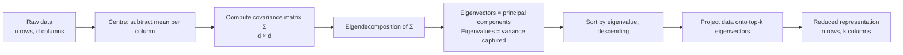

---

### 40.3 The setup: centred data and the variance to maximise

We will work with $n$ data points, each a $d$-dimensional vector. Stack them as the rows of a matrix $X \in \mathbb{R}^{n \times d}$. So $X_{ij}$ is the value of feature $j$ for example $i$.

#### 40.3.1 Centre the data

The first thing we do is **subtract the mean of each feature**. Let $\bar{x}_j = \frac{1}{n} \sum_{i=1}^n X_{ij}$, the mean of column $j$. Replace $X_{ij}$ with $X_{ij} - \bar{x}_j$.

After centring, the mean of each column is exactly zero. This is essential: PCA is about variances, and variance is defined around the mean. If you skip centring, the "first principal component" will mostly point at the mean (because the mean has large magnitude in many real datasets) rather than capturing variation around the mean. This is the most common PCA bug — every implementation worth its salt centres for you, but if you implement it yourself, don't forget.

(In what follows, $X$ is assumed centred. Notation overload, but standard.)

#### 40.3.2 Variance along a direction

We want to find a unit vector $v \in \mathbb{R}^d$ — a direction in feature space, with $\|v\| = 1$ — such that the variance of the projections of the data onto $v$ is maximised.

What does "projection of $x$ onto $v$" mean? Geometrically, it's the signed length of the shadow $x$ casts on the line spanned by $v$. Numerically, it's the dot product $x^T v$ (using column-vector notation; if you prefer row vectors, $x \cdot v$).

So the projections of all $n$ data points onto $v$ form a vector

$$
y = X v \in \mathbb{R}^n
$$

where the $i$-th entry $y_i = X_i v = x_i^T v$ is the projection of the $i$-th point.

Since $X$ is centred, the mean of $y$ is also zero ($\sum y_i = \sum x_i^T v = (\sum x_i)^T v = 0$ because $\sum x_i = 0$). So the variance of $y$ is just its mean-square:

$$
\text{Var}(y) = \frac{1}{n} \sum_{i=1}^n y_i^2 = \frac{1}{n} y^T y = \frac{1}{n} (X v)^T (X v) = \frac{1}{n} v^T X^T X v
$$

Define the $d \times d$ matrix

$$
\Sigma = \frac{1}{n} X^T X
$$

This is the **sample covariance matrix** of the data. (Strictly, with the standard "unbiased" definition we'd divide by $n-1$; the factor doesn't change the optimisation, so we use $n$ for cleanness.) It is symmetric (since $(X^T X)^T = X^T X$) and positive semi-definite (since $v^T X^T X v = \|Xv\|^2 \geq 0$ for any $v$).

With this notation, the variance along direction $v$ is

$$
\text{Var}(y) = v^T \Sigma v
$$

Beautiful. Three letters.

#### 40.3.3 The optimisation problem

We want to maximise $v^T \Sigma v$ over all unit vectors $v$. Without the constraint, we could make $v^T \Sigma v$ arbitrarily large by scaling $v$ up — so the unit-length constraint $\|v\|^2 = v^T v = 1$ is essential.

Formally:

$$
\max_v \;\; v^T \Sigma v \quad \text{subject to} \quad v^T v = 1
$$

This is a constrained optimisation problem. The right tool for it is **Lagrange multipliers**.

---

### 40.4 The derivation: Lagrange multipliers to the eigenvector equation

This is the heart of the chapter. Every step explicitly.

#### 40.4.1 Set up the Lagrangian

Introduce a Lagrange multiplier $\lambda$ for the constraint $v^T v = 1$. The Lagrangian is

$$
\mathcal{L}(v, \lambda) = v^T \Sigma v - \lambda (v^T v - 1)
$$

At a constrained extremum, the partial derivatives with respect to $v$ and $\lambda$ both vanish.

#### 40.4.2 Take the gradient with respect to $v$

We need $\nabla_v \mathcal{L}$. Two facts from matrix calculus that we should re-derive briefly because they're the entire move:

**Fact 1:** $\nabla_v (v^T A v) = (A + A^T) v$. If $A$ is symmetric, this is $2 A v$.

*Proof:* $v^T A v = \sum_{i,j} v_i A_{ij} v_j$. The partial with respect to $v_k$ is $\sum_j A_{kj} v_j + \sum_i v_i A_{ik}$. The first sum is the $k$-th entry of $A v$; the second is the $k$-th entry of $A^T v$. Stack across all $k$ and you get $(A + A^T) v$.

**Fact 2:** $\nabla_v (v^T v) = 2 v$.

*Proof:* Take Fact 1 with $A$ = identity.

Now apply these. Since $\Sigma$ is symmetric:

$$
\nabla_v \mathcal{L} = 2 \Sigma v - 2 \lambda v
$$

Setting this to zero:

$$
2 \Sigma v - 2 \lambda v = 0 \quad \Longrightarrow \quad \Sigma v = \lambda v
$$

**Stop and look at this equation.** $\Sigma v = \lambda v$. This is the defining equation of an **eigenvector**. The optimal $v$ — the direction of maximum variance — is an eigenvector of the covariance matrix $\Sigma$. The Lagrange multiplier $\lambda$ is the corresponding **eigenvalue**.

This is the central fact of PCA. We did not assume eigenvectors were the answer. They fell out of solving an optimisation problem.

#### 40.4.3 Which eigenvector?

A $d \times d$ symmetric matrix has $d$ eigenvectors (counting multiplicities), each with a corresponding eigenvalue. Which one solves our maximisation problem?

Multiply both sides of $\Sigma v = \lambda v$ on the left by $v^T$:

$$
v^T \Sigma v = \lambda v^T v = \lambda \cdot 1 = \lambda
$$

(using the constraint $v^T v = 1$). So the variance along the optimal $v$ is *exactly the eigenvalue $\lambda$*.

To maximise $v^T \Sigma v$, we want the largest $\lambda$. So:

**The first principal component is the eigenvector of $\Sigma$ corresponding to the largest eigenvalue, and the variance it captures is exactly that eigenvalue.**

Let's call this eigenvector $v_1$ and its eigenvalue $\lambda_1$.

#### 40.4.4 The second principal component

We've found the direction of maximum variance. We now want the direction of *next-most* variance, but constrained to be **orthogonal to $v_1$** — because we don't want to just rediscover $v_1$ with a slightly different scalar.

Same problem, with an extra constraint:

$$
\max_v \;\; v^T \Sigma v \quad \text{subject to} \quad v^T v = 1, \;\; v^T v_1 = 0
$$

Introduce two Lagrange multipliers, $\lambda$ for the unit-length constraint and $\mu$ for the orthogonality constraint:

$$
\mathcal{L}(v, \lambda, \mu) = v^T \Sigma v - \lambda (v^T v - 1) - \mu (v^T v_1)
$$

Gradient with respect to $v$:

$$
\nabla_v \mathcal{L} = 2 \Sigma v - 2 \lambda v - \mu v_1 = 0
$$

Multiply both sides on the left by $v_1^T$:

$$
2 v_1^T \Sigma v - 2 \lambda v_1^T v - \mu v_1^T v_1 = 0
$$

The first term: since $\Sigma$ is symmetric, $v_1^T \Sigma v = (\Sigma v_1)^T v = (\lambda_1 v_1)^T v = \lambda_1 v_1^T v = 0$ (using $\Sigma v_1 = \lambda_1 v_1$ and the orthogonality $v_1^T v = 0$). The second term: $\lambda v_1^T v = 0$ by orthogonality. So we get $-\mu v_1^T v_1 = -\mu = 0$, i.e. $\mu = 0$.

Substituting back: $2 \Sigma v - 2 \lambda v = 0$, the same eigenvector equation as before. The second principal component is also an eigenvector of $\Sigma$, with eigenvalue $\lambda$ less than $\lambda_1$ (to satisfy the orthogonality and the fact that we're looking among orthogonal directions). It is the eigenvector with the **second-largest** eigenvalue, $\lambda_2$.

By induction, the $k$-th principal component $v_k$ is the eigenvector of $\Sigma$ corresponding to the $k$-th largest eigenvalue $\lambda_k$, and it is orthogonal to all earlier components.

#### 40.4.5 Summary of the derivation

We have derived, in a few lines:

- The principal components of the data are the eigenvectors of the covariance matrix $\Sigma = \frac{1}{n} X^T X$.
- They are mutually orthogonal (because $\Sigma$ is symmetric — a theorem from linear algebra: symmetric matrices have orthogonal eigenvectors).
- The variance captured by the $k$-th principal component is the $k$-th eigenvalue $\lambda_k$.

Total variance in the data = sum of variances along the original axes = trace of $\Sigma$ = sum of eigenvalues. So:

$$
\text{Total variance} = \sum_{k=1}^d \lambda_k
$$

Variance captured by the top $k$ components: $\sum_{j=1}^k \lambda_j$. Fraction of variance captured: $\frac{\sum_{j=1}^k \lambda_j}{\sum_{j=1}^d \lambda_j}$.

That fraction is the "**explained variance ratio**" that scikit-learn reports as `pca.explained_variance_ratio_`. Now you know what it actually is.

---

### 40.5 The scree plot and choosing $k$

We have $d$ eigenvalues, ordered $\lambda_1 \geq \lambda_2 \geq \ldots \geq \lambda_d \geq 0$. How many of them should we keep?

The **scree plot** is the plot of eigenvalues against component number. The name comes from geology — a "scree" is a slope of loose rocks at the base of a cliff — because the plot typically shows a steep early drop followed by a long flat tail.

```
  λ_k
     |●
     | ●
     |  ●
     |   ●
     |
     |    ●
     |     ●_●_●_●_●_●_●_●_●_●_●_●_●_●_●_●_●_●_●
     +───────────────────────────────────────────► k
       1 2 3 4 5  6  ......
```

In this picture, the first three or four components carry most of the variance; everything from component five onward is essentially noise.

Three common rules for choosing $k$:

**1. The elbow.** Same idea as for K-means in Chapter 38, with the same weakness: subjective. But often clear enough on real data.

**2. The variance-captured threshold.** Pick the smallest $k$ such that $\sum_{j=1}^k \lambda_j / \sum_{j=1}^d \lambda_j \geq T$ for some threshold $T$. $T = 0.95$ is the most common choice ("keep enough components to explain 95% of variance"). $T = 0.99$ is common when you want to preserve more detail.

**3. Kaiser's criterion.** Keep all components with eigenvalue greater than the mean eigenvalue. If the data were uniform random noise, every component would have approximately equal eigenvalue (= total variance / $d$); components above this threshold are "informative beyond noise". This is a rough heuristic; less common than the variance-captured threshold.

For visualisation specifically, you have no choice: $k = 2$ if you want a 2D plot, $k = 3$ for 3D. The scree plot then tells you *how much you're throwing away* — important context for interpreting the visualisation.

---

### 40.6 A worked numerical example

Three 2D points: $(2, 1), (3, 3), (4, 5)$. Tiny dataset, but enough to do every step by hand.

#### Step 1: centre the data

Means: $\bar{x}_1 = (2+3+4)/3 = 3$, $\bar{x}_2 = (1+3+5)/3 = 3$. Subtract:

| Point | $x_1 - 3$ | $x_2 - 3$ |
|------:|---:|---:|
| $p_1$ | $-1$ | $-2$ |
| $p_2$ | $0$ | $0$ |
| $p_3$ | $1$ | $2$ |

So the centred matrix is

$$
X = \begin{pmatrix} -1 & -2 \\ 0 & 0 \\ 1 & 2 \end{pmatrix}
$$

#### Step 2: compute the covariance matrix

$$
X^T X = \begin{pmatrix} -1 & 0 & 1 \\ -2 & 0 & 2 \end{pmatrix} \begin{pmatrix} -1 & -2 \\ 0 & 0 \\ 1 & 2 \end{pmatrix}
$$

Entry $(1, 1)$: $(-1)(-1) + 0 \cdot 0 + 1 \cdot 1 = 2$.
Entry $(1, 2)$: $(-1)(-2) + 0 \cdot 0 + 1 \cdot 2 = 4$.
Entry $(2, 1)$: same as $(1, 2)$ by symmetry, $= 4$.
Entry $(2, 2)$: $(-2)(-2) + 0 \cdot 0 + 2 \cdot 2 = 8$.

So $X^T X = \begin{pmatrix} 2 & 4 \\ 4 & 8 \end{pmatrix}$ and $\Sigma = \frac{1}{n} X^T X = \frac{1}{3} \begin{pmatrix} 2 & 4 \\ 4 & 8 \end{pmatrix}$.

(For finding eigenvectors, the factor $1/3$ is irrelevant — it just scales every eigenvalue by $1/3$ without changing the eigenvectors. We'll find eigenvectors of $X^T X$ and divide eigenvalues by 3 at the end.)

#### Step 3: find eigenvalues

We want $\lambda$ such that $\det(X^T X - \lambda I) = 0$.

$$
\det \begin{pmatrix} 2 - \lambda & 4 \\ 4 & 8 - \lambda \end{pmatrix} = (2 - \lambda)(8 - \lambda) - 16 = 0
$$

Expand: $16 - 2\lambda - 8\lambda + \lambda^2 - 16 = \lambda^2 - 10 \lambda = \lambda(\lambda - 10) = 0$.

Solutions: $\lambda = 10$ and $\lambda = 0$.

So $X^T X$ has eigenvalues $10$ and $0$. Dividing by $n=3$: $\Sigma$ has eigenvalues $\lambda_1 = 10/3 \approx 3.33$ and $\lambda_2 = 0$.

The total variance is $\lambda_1 + \lambda_2 = 10/3$. The first component captures $\lambda_1 / (\lambda_1 + \lambda_2) = 100\%$ of the variance.

**One hundred per cent.** Notice what happened: $\lambda_2 = 0$ means there is zero variance perpendicular to PC1. The three centred points all lie *exactly on a single line through the origin* — they are linearly dependent. PCA recovered this perfectly: it identified that one direction explains everything.

#### Step 4: find eigenvectors

For $\lambda_1 = 10$ (using $X^T X$, not $\Sigma$ — same eigenvectors):

$(X^T X - 10 I) v = 0 \Longrightarrow \begin{pmatrix} -8 & 4 \\ 4 & -2 \end{pmatrix} v = 0$.

First row: $-8 v_1 + 4 v_2 = 0 \Longrightarrow v_2 = 2 v_1$. So $v \propto (1, 2)$.

Normalise: $\|(1, 2)\| = \sqrt{5}$, so $v_1 = (1, 2)/\sqrt{5} \approx (0.447, 0.894)$.

For $\lambda_2 = 0$:

$(X^T X - 0 \cdot I) v = (X^T X) v = 0$. Solve $\begin{pmatrix} 2 & 4 \\ 4 & 8 \end{pmatrix} v = 0$: $v_2 \propto (2, -1)$. Normalised: $(2, -1)/\sqrt{5} \approx (0.894, -0.447)$.

Notice $v_1 \cdot v_2 = (1 \cdot 2 + 2 \cdot (-1))/5 = 0$. They are orthogonal, as expected.

#### Step 5: project the data onto PC1

For each centred point $x_i$, compute $x_i^T v_1$:

- $p_1: (-1)(0.447) + (-2)(0.894) = -0.447 - 1.788 = -2.236$
- $p_2: 0 \cdot 0.447 + 0 \cdot 0.894 = 0$
- $p_3: (1)(0.447) + (2)(0.894) = 0.447 + 1.788 = 2.236$

So in the 1D PC1-space, the three points are at $-2.236, 0, +2.236$. We've gone from 2D to 1D, capturing 100% of the variance because the data was 1D to begin with.

The reconstruction: each centred point projected back into the original 2D space is $(x_i^T v_1) v_1$:

- $p_1$ reconstructed: $-2.236 \cdot (0.447, 0.894) = (-1, -2)$. Matches exactly.
- $p_2$ reconstructed: $0 \cdot (0.447, 0.894) = (0, 0)$. Matches exactly.
- $p_3$ reconstructed: $2.236 \cdot (0.447, 0.894) = (1, 2)$. Matches exactly.

Zero reconstruction error. PCA found the line, projected the data onto it, and would reconstruct perfectly.

On real data, $\lambda_2$ is not exactly zero — there's always some perpendicular variance, often substantial. The reconstruction is then lossy. The reconstruction loss equals the total variance you discarded: $\sum_{j > k} \lambda_j$ if you kept the top $k$ components.

---

### 40.7 PCA via the Singular Value Decomposition

The procedure we just walked through — form $\Sigma = X^T X / n$, eigendecompose it — works, but in practice it is not what implementations do. They use the **singular value decomposition** (SVD) of $X$ directly, and skip forming $\Sigma$ altogether.

#### 40.7.1 The SVD, briefly

Any matrix $X \in \mathbb{R}^{n \times d}$ can be written as

$$
X = U S V^T
$$

where $U \in \mathbb{R}^{n \times r}$ has orthonormal columns ($U^T U = I_r$), $V \in \mathbb{R}^{d \times r}$ has orthonormal columns ($V^T V = I_r$), $S \in \mathbb{R}^{r \times r}$ is diagonal with non-negative entries called the **singular values**, and $r = \min(n, d)$ is the rank.

The columns of $V$ are the **right singular vectors** of $X$. The columns of $U$ are the **left singular vectors**. The singular values $\sigma_1 \geq \sigma_2 \geq \ldots \geq \sigma_r \geq 0$ are conventionally ordered descending.

#### 40.7.2 The connection to eigenvectors of $X^T X$

Substitute $X = U S V^T$:

$$
X^T X = (U S V^T)^T (U S V^T) = V S U^T U S V^T = V S^2 V^T
$$

(using $U^T U = I$).

This is exactly the eigendecomposition of $X^T X$: the eigenvectors are the columns of $V$, and the eigenvalues are the squared singular values $\sigma_k^2$.

So:

- The **principal components** (eigenvectors of the covariance matrix) are the **right singular vectors** of $X$ — the columns of $V$.
- The **eigenvalues** of the covariance matrix $\Sigma = X^T X / n$ are $\sigma_k^2 / n$, where $\sigma_k$ are the singular values of $X$.

Equivalent. Same answer.

#### 40.7.3 Why use the SVD instead?

Three reasons, in order of practical importance.

**Numerical stability.** Forming $X^T X$ explicitly **squares the condition number** of $X$. If $X$ is mildly ill-conditioned (some columns nearly linearly dependent, common in real data), $X^T X$ can be drastically ill-conditioned. Computing eigenvalues of an ill-conditioned matrix amplifies floating-point errors. The SVD of $X$ avoids forming $X^T X$ at all and is computed by algorithms (e.g., Householder reflections + QR) that are numerically stable even on near-singular matrices. This is why scikit-learn's default `PCA` uses an SVD-based solver under the hood.

**Speed when $n \gg d$ or $d \gg n$.** Computing the SVD of a thin $n \times d$ matrix (one of $n$ or $d$ much smaller than the other) is cheaper than forming the full covariance and eigendecomposing it. Modern randomised SVD algorithms (Halko, Martinsson, Tropp 2011) compute the top $k$ singular triples without computing the full SVD — useful for very large datasets where you only want a few components.

**Cleanness when $d > n$.** If you have more features than examples ($d > n$ — e.g., gene-expression data with 20,000 genes and 200 patients), the $d \times d$ covariance matrix is huge and rank-deficient: only $n - 1$ of its eigenvalues are nonzero. The SVD handles this gracefully; the eigendecomposition wastes memory storing the $d \times d$ matrix.

For these reasons, every serious PCA implementation goes through the SVD. The eigendecomposition-of-covariance framing is **pedagogically clearer** — that's what we did for this chapter — but **numerically inferior** in practice.

---

### 40.8 Pitfalls and tradeoffs

PCA is well-behaved and useful, but it has limits. Some of them are subtle.

#### 40.8.1 You must centre

Said this already, will say it again. If you skip centring, "the first principal component" will be dominated by the mean direction. You'll get back something that points at where your data sits, not how it varies.

Some implementations centre for you (sklearn always does). Some don't (some custom SVD implementations). Always know which.

#### 40.8.2 You should usually scale, too

PCA finds directions of maximum variance. *Variance is scale-dependent.* If one feature is in dollars ($0 to $1,000,000) and another is in years (0 to 100), the first feature contributes roughly $10^8$ times the variance of the second, and PC1 will essentially be the first feature. The "interesting" structure in the second feature is invisible.

The standard fix is to **standardise** (subtract mean, divide by standard deviation) before PCA. Then every feature has variance 1, and PCA finds directions of maximum *combined* variance across features.

Whether to scale is a judgement call. If all your features are measured in the same units and the variance differences are meaningful (e.g., all gene expression levels), don't scale. If they're in different units (mixed financial + demographic features), always scale. The default in scikit-learn's `PCA` is to centre but not scale; pair it with a `StandardScaler` if scaling is appropriate.

This is the same warning we gave in Chapter 38 for K-means. The two are deeply related — both depend on the squared Euclidean geometry of the feature space, which is scale-sensitive.

#### 40.8.3 Linearity assumption

PCA finds the best *linear* subspace that fits the data. If the underlying structure of the data is non-linear — say, the points lie on a 2D spiral embedded in 3D — PCA cannot recover it. The principal components will be the axes of the bounding ellipse of the spiral, which says nothing about the spiral itself.

For non-linear dimensionality reduction, use **t-SNE** or **UMAP** (Chapter 41) for visualisation, or **kernel PCA** for downstream modelling. We'll see t-SNE and UMAP next chapter.

#### 40.8.4 Interpretability of components

Each principal component is a *linear combination* of the original features. In our worked example, PC1 was $(0.447, 0.894)$ — roughly $0.45 \cdot \text{feature}_1 + 0.89 \cdot \text{feature}_2$. With 5,000 original features, PC1 will be a weighted sum of 5,000 features, most with small weights but some prominent. Reading "what PC1 means" can be done — find the top-weighted original features — but it's not as clean as having interpretable features directly.

Whether this matters depends on what you're using PCA for. For visualisation (just plot it), interpretability doesn't matter much. For downstream classification on PCA-projected features, you have lost the per-feature interpretability of the original model. Some teams use PCA as a preprocessing step only when interpretability isn't critical.

#### 40.8.5 PCA does not always help downstream models

A common mistake is to assume PCA "improves" any downstream model. It often doesn't. PCA-projected features lose information (the discarded components might be small but they might also be small *and discriminative for your target*). For predictive modelling, **supervised** dimensionality reduction (e.g., LDA — Linear Discriminant Analysis — or feature selection driven by mutual information with the target) often beats unsupervised PCA, because PCA doesn't know what you're predicting.

PCA is most defensible when:

- You're visualising, not modelling.
- Your data has very high dimensionality and your downstream model can't handle it.
- Your features are highly collinear and you want to decorrelate them (for example, to use in a method that requires uncorrelated inputs).
- You're using it as a preprocessor for clustering, where decorrelation and dimension reduction can substantially help (K-means in particular often benefits from a PCA preprocessing step).

#### 40.8.6 The dual problem: outliers and PCA

PCA is sensitive to outliers because variance is sensitive to outliers. A single very-distant point can dominate the largest eigenvalue and bend PC1 toward it. Robust PCA variants exist (using robust covariance estimators, or L1 instead of L2 norms), but they are out of scope here. The practical advice: clean obvious outliers before PCA, the same as before any algorithm relying on squared distances.

---

### 40.9 Code

#### 40.9.1 PCA from scratch with NumPy and SVD

The "right way to compute PCA" in 15 lines:

```python
import numpy as np

def pca(X, k):
    # 1. Centre
    X_centred = X - X.mean(axis=0)

    # 2. SVD
    U, S, Vt = np.linalg.svd(X_centred, full_matrices=False)
    # Vt is (d, d); rows are the right singular vectors
    # S is the singular values, descending

    # 3. Top-k components
    components = Vt[:k]       # (k, d); each row is a PC

    # 4. Project
    X_reduced = X_centred @ components.T  # (n, k)

    # 5. Variance captured
    n = X.shape[0]
    eigenvalues = (S ** 2) / n     # eigenvalues of covariance
    explained_var = eigenvalues / eigenvalues.sum()

    return X_reduced, components, explained_var[:k]
```

Notice we never form the covariance matrix. We just SVD the centred data. The squared singular values divided by $n$ give the eigenvalues of $\Sigma$ — the variances captured.

#### 40.9.2 scikit-learn

```python
from sklearn.decomposition import PCA
from sklearn.preprocessing import StandardScaler

# Almost always: scale, then PCA
X_scaled = StandardScaler().fit_transform(X)

# Specify number of components, or a variance threshold
pca = PCA(n_components=10)             # exactly 10 components
# pca = PCA(n_components=0.95)          # smallest k explaining 95% variance
# pca = PCA(n_components='mle')         # automatic via likelihood

X_reduced = pca.fit_transform(X_scaled)

print(pca.explained_variance_ratio_)    # array of length 10
print(pca.explained_variance_ratio_.cumsum())  # cumulative
print(pca.components_)                  # shape (10, d): each row is a PC

# Reconstruct
X_reconstructed_scaled = pca.inverse_transform(X_reduced)
# To get back to original units:
X_reconstructed = StandardScaler().fit(X).inverse_transform(X_reconstructed_scaled)
```

Important attributes:

- `pca.components_`: the principal components, one per row. Same as $V^T$.
- `pca.explained_variance_`: the eigenvalues $\lambda_k$.
- `pca.explained_variance_ratio_`: the eigenvalues normalised to sum to 1.
- `pca.singular_values_`: the singular values $\sigma_k$.
- `pca.mean_`: the mean it subtracted during centring.

For very large datasets, use `PCA(svd_solver='randomized')` to use a randomised SVD that computes only the top $k$ components — much faster when $k \ll d$.

#### 40.9.3 Scree plot in code

```python
import matplotlib.pyplot as plt
import numpy as np

pca = PCA().fit(X_scaled)   # fit all components

# Scree plot
plt.figure(figsize=(10, 5))
plt.subplot(1, 2, 1)
plt.plot(range(1, len(pca.explained_variance_) + 1),
         pca.explained_variance_, marker='o')
plt.xlabel('Component')
plt.ylabel('Eigenvalue (variance)')
plt.title('Scree plot')

plt.subplot(1, 2, 2)
plt.plot(range(1, len(pca.explained_variance_ratio_) + 1),
         pca.explained_variance_ratio_.cumsum(), marker='o')
plt.axhline(y=0.95, color='red', linestyle='--', label='95%')
plt.xlabel('Number of components')
plt.ylabel('Cumulative explained variance')
plt.legend()
plt.show()
```

#### 40.9.4 PySpark preview

`pyspark.ml.feature.PCA` is the Spark version. We will cover it more fully in Chapter 65; the preview:

```python
from pyspark.ml.feature import PCA, VectorAssembler, StandardScaler
from pyspark.ml import Pipeline

assembler = VectorAssembler(inputCols=feature_cols, outputCol='features_raw')
scaler = StandardScaler(inputCol='features_raw', outputCol='features',
                        withMean=True, withStd=True)
pca = PCA(k=10, inputCol='features', outputCol='pca_features')

pipeline = Pipeline(stages=[assembler, scaler, pca])
model = pipeline.fit(df)

reduced = model.transform(df)
reduced.select('pca_features').show(truncate=False)

# Access the principal components and explained variance
pca_model = model.stages[-1]
print(pca_model.pc)                           # principal components (Matrix)
print(pca_model.explainedVariance)            # DenseVector of ratios
```

Spark's PCA uses a distributed SVD under the hood — works for data too big for one machine. The API is otherwise identical in spirit to scikit-learn's.

---

### 40.10 Summary

1. PCA finds the orthogonal directions of maximum variance in centred data. These directions are the **principal components**.

2. **The variance along a direction $v$** is $v^T \Sigma v$, where $\Sigma = X^T X / n$ is the covariance matrix.

3. **The Lagrangian derivation** (max $v^T \Sigma v$ subject to $\|v\|=1$) gives the eigenvector equation $\Sigma v = \lambda v$. The optimal direction is an eigenvector of $\Sigma$; the variance captured is the eigenvalue.

4. **The $k$-th principal component** is the eigenvector of $\Sigma$ with the $k$-th largest eigenvalue. Total variance = sum of all eigenvalues. Fraction of variance explained by top-$k$ = sum of top-$k$ eigenvalues divided by the total.

5. **The scree plot** of eigenvalues helps choose $k$ — look for an elbow or pick the smallest $k$ that exceeds a variance-explained threshold (often 95%).

6. **In practice, use the SVD of $X$ directly**, not the eigendecomposition of $X^T X$. The right singular vectors of $X$ are the principal components; the squared singular values divided by $n$ are the eigenvalues. SVD is numerically more stable (avoids squaring the condition number) and computationally cheaper.

7. **Pitfalls**: must centre (otherwise PC1 chases the mean); usually scale (otherwise high-variance features dominate); assumes linear structure (non-linear manifolds need t-SNE/UMAP); not always helpful for downstream supervised tasks (supervised dimensionality reduction like LDA or feature selection might do better); sensitive to outliers.

8. **Use cases**: visualisation in 2D/3D, preprocessing for distance-based algorithms (K-means, k-NN), decorrelating collinear features, noise reduction in images and signals.

---

### 40.11 What this builds on / where this returns

**Builds on:**
- *Chapter 7* — covariance, expectation, variance. The covariance matrix $\Sigma$ is the multidimensional generalisation of variance, and everything PCA does is in service of maximising it along chosen directions.
- *Chapter 14* — eigenvalues and eigenvectors. The whole derivation reduces to "the optimal direction is an eigenvector"; this chapter cashes in on that earlier preparation.
- *Chapter 13* — matrix multiplication, transposes, determinants. The mechanics of computing eigenvalues from $\det(\Sigma - \lambda I) = 0$ live here.
- *Chapter 26* — scaling and standardisation. PCA's scale dependence is the same as K-means'.

**Returns:**
- *Chapter 41* — t-SNE and UMAP, the non-linear cousins of PCA, for visualisation when the data lies on a non-linear manifold.
- *Chapter 65* — `pyspark.ml.feature.PCA` in the distributed setting.
- *Part E* — PCA briefly returns as a feature-engineering preprocessor in the section on dimensionality reduction within feature pipelines.
- *Chapter 38* — K-means following PCA is a standard pipeline; this section foreshadows that pattern.

---

### 40.12 Exercises

Work through all of them cold. Several have explicit numerical answers.

1. **Why centre?** Suppose you skip the centring step. Run PCA on a dataset of points all clustered near $(100, 100)$ with tiny variance around that point. What direction does PC1 point in, and why is that wrong?

2. **2D by hand.** Three points: $(0, 0), (1, 1), (2, 2)$. Centre the data, compute the covariance matrix, find the eigenvalues. What is the fraction of variance captured by PC1?

3. **Eigenvector arithmetic.** A 2x2 symmetric matrix has trace 5 and determinant 4. What are its eigenvalues? (Hint: trace = sum, determinant = product.)

4. **PC2 from PC1 (2D).** In 2D, if PC1 is $(0.6, 0.8)$, what is PC2? (There's a unique answer up to sign.)

5. **The "always scale" question.** You're given a dataset where feature 1 is "monthly income in dollars" (range $\$0$ to $\$50{,}000$) and feature 2 is "credit score" (range 300 to 850). You PCA without scaling. What will PC1 essentially be?

6. **Reconstruction error.** A dataset has 100 features. PCA gives eigenvalues that sum to 50, with the top 10 summing to 47. What fraction of variance is captured by the top 10 components? What is the reconstruction error if we keep only the top 10?

7. **The intrinsic dimensionality.** A dataset has eigenvalues $\lambda_1 = 100, \lambda_2 = 90, \lambda_3 = 80, \lambda_4 = 0.1, \lambda_5 = 0.05$. What is the "intrinsic dimensionality" of the data, and what does that mean operationally?

8. **SVD vs. covariance.** Why is computing PCA via SVD on $X$ more numerically stable than computing the eigendecomposition of $X^T X$ directly?

9. **Out-of-sample projection.** You fit PCA on a training set of 10,000 emails (5,000-dim TF-IDF). You get a new email tomorrow. How do you project it into the PCA space? What do you need to have saved alongside the components matrix?

10. **PCA + classification.** You PCA a 5,000-dim feature set down to 50 dimensions, then train a classifier on the 50-dim representation. The classifier's accuracy is lower than training on the original 5,000 features. Name two plausible explanations.

11. **Non-linear data.** A dataset consists of points on a unit circle in 2D, $\{(\cos\theta, \sin\theta) : \theta \in [0, 2\pi)\}$. What are the eigenvalues of the centred data's covariance matrix? What does this say about PCA's ability to "discover the manifold"?

12. **A practical pipeline.** Sketch a complete PCA pipeline (in scikit-learn) that: scales the data, fits PCA keeping enough components to explain 95% variance, projects training and test sets, and saves the pipeline for use at inference time.

<details>
<summary>Answers</summary>

1. PC1 would point roughly toward $(100, 100)$ — the *direction from the origin to the data cluster*. This is because, without centring, the dominant "variance" the algorithm sees is the squared offset of the data from the origin, which dwarfs the actual variance around the cluster's centre. Centring fixes this by moving the data's centre to the origin, so PCA captures variation *around* the data's centre.

2. Means: $(1, 1)$. Centred points: $(-1, -1), (0, 0), (1, 1)$. Covariance: $X^T X = \begin{pmatrix} 2 & 2 \\ 2 & 2 \end{pmatrix}$, so $\Sigma = \begin{pmatrix} 2/3 & 2/3 \\ 2/3 & 2/3 \end{pmatrix}$. Trace = 4/3; determinant = 0. Eigenvalues: 4/3 and 0. PC1 captures 100% of the variance (the data is exactly 1D — on the line $y = x$).

3. From trace + determinant: $\lambda_1 + \lambda_2 = 5, \lambda_1 \lambda_2 = 4$. So $\lambda_1, \lambda_2$ are roots of $\lambda^2 - 5\lambda + 4 = 0 \Longrightarrow \lambda = 1, 4$.

4. PC2 must be orthogonal to PC1 and unit-length. In 2D, rotate by 90 degrees: $(0.6, 0.8) \to (-0.8, 0.6)$ (or $(0.8, -0.6)$). Either is valid; sign is convention-dependent.

5. PC1 will be essentially $(1, 0)$ — pointing along the income axis. Income ranges from 0 to 50,000 (variance roughly $\sim 10^8$); credit score ranges from 300 to 850 (variance $\sim 10^4$). Income variance dominates by four orders of magnitude. The result is that PC1 is "the income axis", and credit-score variation is essentially invisible. Always standardise first.

6. Variance captured = $47/50 = 94\%$. Reconstruction error (variance not captured) = $3/50 = 6\%$.

7. Intrinsic dimensionality is 3 (the top three eigenvalues are similar in magnitude; the rest are essentially zero). Operationally: the data is essentially 3-dimensional embedded in a higher-dimensional space. Three principal components capture almost all of the variance; keeping more is just keeping noise.

8. Forming $X^T X$ explicitly squares the condition number of $X$ (if $X$ has condition number $\kappa$, $X^T X$ has condition number $\kappa^2$). For ill-conditioned $X$ — common in real data with correlated features — this drastically amplifies floating-point errors in the eigendecomposition. SVD computes the same answer working on $X$ directly, avoiding the squaring; it is stable even when $X$ is nearly rank-deficient.

9. You need: the saved `pca.components_` matrix (shape $k \times d$) and the saved `pca.mean_` vector (the training-set means used for centring). To project: subtract `pca.mean_` from the new email's TF-IDF vector, then multiply by `pca.components_.T`. If you scaled before PCA, you also need the saved StandardScaler. This is what pipelines (Chapter 62) encapsulate.

10. (a) The discarded components held information useful for classification — PCA doesn't know about the target, so it doesn't preserve target-relevant variance specifically. (b) The original 5,000 features included some that were directly discriminative for the target; the PCA-projected representation, being a weighted sum of all 5,000, dilutes those signals. Possible fix: use supervised dimensionality reduction (LDA) or feature selection (e.g., L1-regularised logistic regression on the original features).

11. The unit circle is centred at origin, so means are zero. Covariance matrix entries: $E[x_1^2] = E[\cos^2\theta] = 1/2$; $E[x_2^2] = E[\sin^2\theta] = 1/2$; $E[x_1 x_2] = E[\cos\theta \sin\theta] = 0$. So $\Sigma = \begin{pmatrix} 1/2 & 0 \\ 0 & 1/2 \end{pmatrix}$. Eigenvalues are both $1/2$. PCA cannot distinguish any direction — the data has no "preferred" linear direction because it lies on a non-linear (circular) manifold. PCA fails to reveal the 1D structure. You'd need a non-linear method (kernel PCA, t-SNE, UMAP) to "unfold" the circle.

12. ```python
    from sklearn.pipeline import Pipeline
    from sklearn.preprocessing import StandardScaler
    from sklearn.decomposition import PCA
    import joblib

    pipe = Pipeline([
        ('scaler', StandardScaler()),
        ('pca', PCA(n_components=0.95)),
    ])
    X_train_reduced = pipe.fit_transform(X_train)
    X_test_reduced = pipe.transform(X_test)
    joblib.dump(pipe, 'pca_pipeline.pkl')

    # At inference time
    pipe = joblib.load('pca_pipeline.pkl')
    X_new_reduced = pipe.transform(X_new)
    ```
    The Pipeline object encapsulates the scaler and PCA together, with their fitted state. This is exactly the pattern Chapter 62 will generalise to Spark ML.

</details>


## Chapter 41 — t-SNE and UMAP (a Light Touch)

> **Goal of this chapter:** to introduce the two dominant non-linear dimensionality-reduction methods used for visualisation — t-SNE and UMAP — at a working level. Not a derivation from the ground up (that would be its own book), but enough that you can explain what they do, when to reach for them instead of PCA, what their hyperparameters mean, and — critically — what their visualisations *do not* tell you. Misreading a t-SNE plot is one of the most common interpretation errors in modern data analysis, and we will be specific about which features of these plots carry information and which features are artefacts. By the end you should be able to use t-SNE and UMAP responsibly, and just as importantly, push back when somebody else uses them irresponsibly.

---

### 41.1 The motivating problem

In Chapter 40 we derived PCA. PCA finds the linear subspace that maximises variance — it is, geometrically, the best orthogonal projection of the data into $k$ dimensions in a precise variance-preserving sense.

But PCA is *linear*. It works beautifully when the data's interesting structure can be captured by a linear projection. When the data lies on a non-linear manifold — a curved surface, a spiral, a sphere embedded in higher dimensions — PCA can't unwind it.

The canonical thought experiment: take a 2D dataset arranged on a Swiss roll — a flat 2D sheet rolled up into 3D space. The intrinsic dimensionality of the data is 2 (it's a sheet); the ambient dimensionality is 3 (it's been rolled into 3D). What you'd *want* a dimensionality-reduction method to do is unroll the sheet — recover the 2D structure. PCA cannot do this. Its three eigenvalues are all of similar magnitude (the roll occupies all three ambient dimensions roughly evenly), and projecting onto its top two eigenvectors gives you a *flattened* roll, not an unrolled one.

```
   Swiss roll in 3D:                    What PCA gives you:

      ╔══════════════╗                   (the data, flattened
     ╔                ╗                   from the side — the
    ║   ╔═════════╗   ║                   roll is still rolled,
    ║  ╔           ╗  ║                   just viewed end-on)
    ║  ║   ╔════   ║  ║         vs.
    ║  ║   ║       ║  ║                   ●●●●●●●●●●●
    ║  ║   ╚════   ║  ║                   ●●●●●●●●●●●
    ║  ╚           ╝  ║                   ●●●●●●●●●●●
    ║   ╚═════════╝   ║
     ╚                ╝                   (you wanted: an unrolled
      ╚══════════════╝                     2D rectangle)
```

For the kinds of high-dimensional datasets that come up in real ML work — embeddings from neural networks, gene-expression profiles, document-vector representations — the linear-projection assumption of PCA is often violated. The most informative 2D view of an embedding space is *not* a linear projection.

Enter t-SNE and UMAP. Both are non-linear methods, designed explicitly for **visualisation** of high-dimensional data in 2 or 3 dimensions. They do something fundamentally different from PCA: instead of preserving global geometry (variance, distances), they preserve **local neighbourhood structure**. The result is plots that tend to reveal cluster structure dramatically — but at the cost of distorting global relationships in ways we'll be careful about.

This chapter is shorter and lighter than the PCA chapter. We will not derive t-SNE or UMAP from scratch — their derivations involve enough probability theory and optimisation tricks to fill their own chapters, and you will rarely need to derive them from scratch. What you need is to understand what they're optimising, what their outputs mean, and where the standard interpretation gotchas live.

---

### 41.2 t-SNE: t-distributed Stochastic Neighbour Embedding

t-SNE was introduced by van der Maaten and Hinton in 2008 as a refinement of Hinton and Roweis's earlier Stochastic Neighbour Embedding (SNE). It has become the de facto standard visualisation tool for high-dimensional data in the deep-learning era.

#### 41.2.1 The core idea

t-SNE asks: given pairwise similarities of points in the original high-dimensional space, find a configuration of points in 2D (or 3D) that *reproduces those similarities as closely as possible*.

There are two halves to that statement. We need to define similarities in the high-dimensional space, and we need to define similarities in the low-dimensional space, and then we need an objective function that measures how closely they match.

#### 41.2.2 High-dimensional similarities

For two points $x_i, x_j$ in high-dimensional space, define a conditional probability that point $j$ is "a neighbour" of point $i$ as a Gaussian over their distance:

$$
p_{j|i} = \frac{\exp(-\|x_i - x_j\|^2 / 2 \sigma_i^2)}{\sum_{k \neq i} \exp(-\|x_i - x_k\|^2 / 2 \sigma_i^2)}
$$

This is a softmax over distances. Points close to $x_i$ get high probability; far points get low probability. The bandwidth $\sigma_i$ is set adaptively per point so that the effective number of neighbours equals a user-chosen hyperparameter called the **perplexity** (more on this in a moment). The joint probability is then symmetrised: $p_{ij} = (p_{j|i} + p_{i|j}) / (2n)$.

#### 41.2.3 Low-dimensional similarities — the t-distribution trick

In the low-dimensional space (where we're trying to place the points), define an analogous probability — but using a **Student's t-distribution with one degree of freedom** (a Cauchy distribution) instead of a Gaussian:

$$
q_{ij} = \frac{(1 + \|y_i - y_j\|^2)^{-1}}{\sum_{k \neq \ell} (1 + \|y_k - y_\ell\|^2)^{-1}}
$$

Why the t-distribution? Because of the **crowding problem**. In high dimensions, the "volume" available for far-away points is enormous (the volume of a sphere grows as $r^d$). When you compress to 2D, that volume collapses dramatically — there isn't room for all the moderately-distant high-dimensional neighbours of a point to also be moderately distant in 2D. Something has to give. With a Gaussian in low-dim, the algorithm tries to put moderately-distant high-dim points at moderate distances in 2D, and the resulting configurations are forced to crush distant points into a single blob.

The t-distribution has **heavier tails** than a Gaussian. This means in 2D, points that are moderately far in high-dimensional space are *allowed* to be very far in 2D without incurring much cost. The algorithm can put dissimilar points way out at the edges of the plot — separating clusters dramatically — while still preserving local neighbourhood structure.

This is the trick that makes t-SNE work. It is also the trick that makes t-SNE *systematically distort global structure*. The price of getting clean cluster separation is that distances between clusters in the t-SNE plot have no quantitative meaning.

#### 41.2.4 The objective: KL divergence

t-SNE places the low-dim points by minimising the **Kullback-Leibler divergence** between the high-dim and low-dim distributions:

$$
\text{KL}(P \| Q) = \sum_{i \neq j} p_{ij} \log \frac{p_{ij}}{q_{ij}}
$$

KL divergence is asymmetric. The form above penalises *underestimating* $q_{ij}$ when $p_{ij}$ is high — that is, having low similarity in 2D when there was high similarity in high-dim. This means t-SNE works hard to preserve *local* structure (high-similarity neighbours stay neighbours) and is more relaxed about global structure (low-similarity pairs in high-dim can be placed almost arbitrarily in 2D).

Optimisation is by gradient descent. The full algorithm is iterative; on most modern implementations using Barnes-Hut approximations, it runs in $O(n \log n)$ per iteration rather than the naive $O(n^2)$.

#### 41.2.5 Perplexity

The main hyperparameter is **perplexity**. Mathematically it controls the bandwidth $\sigma_i$ — specifically, $\sigma_i$ is chosen for each point so that the effective number of neighbours (a quantity called the perplexity of the distribution $p_{\cdot|i}$) equals the user-specified value.

Intuitively, perplexity is *how many neighbours to consider* when deciding what's close to each point. Typical values are 5 to 50. Low perplexity emphasises very local structure (small clusters within clusters); high perplexity emphasises broader structure (larger groupings). 30 is a common default.

t-SNE's output is **sensitive** to perplexity. The same dataset with perplexity 5 and perplexity 50 can produce very different visualisations. The standard advice is to try several values and look for features that are stable across them — those are the "real" structures in the data, as opposed to artefacts of any single perplexity choice.

#### 41.2.6 What t-SNE plots can and cannot tell you

This is the most important section in the chapter. Even sophisticated practitioners regularly over-interpret t-SNE plots.

**What t-SNE plots tell you:**

- **Which points are in similar local neighbourhoods in the high-dimensional space.** If two points are nearby in the t-SNE plot, they are likely also nearby in high-dim. Cluster membership is generally informative.
- **Whether clusters are distinct.** If t-SNE produces several clearly separated blobs, that strongly suggests the data has cluster structure. The opposite is also informative — if t-SNE produces one giant blob, the data may not cluster cleanly.

**What t-SNE plots do not tell you:**

- **The sizes of clusters.** The "spread" of points within a cluster in the t-SNE plot is largely determined by the algorithm's optimisation dynamics, not by the actual intra-cluster variance. A dense cluster in high-dim and a loose cluster in high-dim can produce visually similar-sized blobs.
- **The distances between clusters.** The space between clusters in the plot has no quantitative meaning. Two clusters appearing close together in t-SNE may be far apart in high-dim, or vice versa. This is a direct consequence of the heavy-tail trick — far points are deliberately allowed to be placed at arbitrary distances.
- **The shapes of clusters.** t-SNE has a tendency to produce roughly round blobs regardless of the actual cluster geometry. If you see a curved cluster in a t-SNE plot, it may or may not reflect curved structure in the data.

The single most common mistake: looking at a t-SNE plot, seeing two well-separated clusters, and concluding "they're far apart in the data". Maybe. Maybe not.

#### 41.2.7 Other gotchas

**Stochastic.** t-SNE includes random initialisation; different runs of the same algorithm on the same data give different visualisations (the same overall structure, but rotated, reflected, with different absolute positions). Set a `random_state` for reproducibility.

**Not a feature engineering tool.** t-SNE does not have a "transform" operation for new data. The output coordinates only exist for the points that were in the training set; to "project" a new point you would have to rerun the optimisation, which is not what users expect. **t-SNE is for visualisation only.** Do not use it as a preprocessing step for downstream supervised models.

**Slow.** Naive t-SNE is $O(n^2)$ per iteration, with hundreds of iterations to converge. Barnes-Hut t-SNE is $O(n \log n)$ per iteration. Even so, for $n > 100{,}000$ or so it becomes slow. The standard workflow on large datasets is to **subsample** to 10,000-50,000 points before running t-SNE.

**Cluster ordering doesn't mean anything.** The fact that cluster A is "to the left of" cluster B in a t-SNE plot is meaningless. Different runs will reorder them.

---

### 41.3 UMAP: Uniform Manifold Approximation and Projection

UMAP, introduced by McInnes, Healy, and Melville in 2018, is the newer challenger to t-SNE. In a few years it has displaced t-SNE in many workflows — partly because it's faster, partly because it preserves more global structure, and partly because, unlike t-SNE, it has a `transform` operation for new data.

#### 41.3.1 The core idea

UMAP's mathematical foundation is more involved than t-SNE's — it comes from Riemannian geometry and algebraic topology, specifically the theory of simplicial sets and fuzzy topological structures. We will not go there. What you need to know:

UMAP constructs a **weighted graph** of the high-dimensional data, where each point is connected to its $k$ nearest neighbours with weights that capture local distances. It then constructs a similar graph in low-dim and optimises the layout to make the two graphs as similar as possible (using a cross-entropy-like loss).

The optimisation does not use the same KL divergence as t-SNE. The result is that UMAP:

- Runs faster, often dramatically so. UMAP on 100,000 points takes minutes; t-SNE takes an hour or more.
- Preserves more global structure than t-SNE. Inter-cluster distances in UMAP have *more* meaning than in t-SNE, though they are still not directly comparable to high-dim distances.
- Provides a `transform` method: you can apply a trained UMAP model to new data, projecting it into the same 2D space as the training data. This means UMAP, unlike t-SNE, can be used as a feature engineering preprocessor for downstream models.

#### 41.3.2 Hyperparameters

UMAP has two main hyperparameters:

- **`n_neighbors`** (default 15) — analogous to t-SNE's perplexity. How many neighbours to consider when constructing the local graph. Higher values capture broader structure; lower values capture finer structure.
- **`min_dist`** (default 0.1) — how tightly UMAP packs points in low-dim. Lower values produce tighter clusters; higher values produce more spread-out visualisations.

Like t-SNE, UMAP's output depends on hyperparameters and on random initialisation. Try several settings; trust features that are stable across them.

#### 41.3.3 Same gotchas, with one less

UMAP shares most of t-SNE's interpretation caveats:

- Cluster sizes in the plot are not directly meaningful.
- Inter-cluster distances are *more* meaningful than in t-SNE but are still distorted.
- Cluster shapes are partly an artefact of the algorithm.
- It's stochastic.

But UMAP can be used as a transform — meaning new data can be projected into the same space — which makes it usable as a preprocessor for downstream models, not just a visualisation tool. This is a real practical difference.

---

### 41.4 When to use which

A practical rule of thumb, in decreasing order of common applicability:

**PCA when:**
- You're doing downstream linear or near-linear modelling.
- You need the dimensionality reduction to be interpretable (each new feature is a linear combination of original features).
- You want speed and don't want to tune hyperparameters.
- The intrinsic structure of your data is well-approximated by a linear subspace.
- You'll deploy the reducer on new data (PCA is fully transformable).

**t-SNE when:**
- You want to visualise high-dimensional data to look for cluster structure.
- You don't need to transform new data.
- Your dataset is small to medium (under 50,000 points, or you'll subsample).
- You're producing a one-off plot for a paper or a report, not a deployment pipeline.

**UMAP when:**
- You want to visualise high-dimensional data and t-SNE is too slow.
- You want a transform method to apply to new data.
- You want better preservation of global structure than t-SNE offers.
- You're feeding the reduced representation into a downstream model (though benchmark this carefully — UMAP's preservation of structure is empirical, not provable).

For the Databricks ML Associate exam — which leans toward classical, tabular ML — PCA is by far the most likely to be tested. t-SNE and UMAP are worth knowing about, but they are unlikely to come up in detail. The reason this chapter is included is that they are *industry-standard* tools you'll encounter in any modern ML team's analysis workflows, even if they're not on the syllabus.

---

### 41.5 A conceptual worked example: MNIST digits

Imagine the MNIST handwritten-digit dataset. 70,000 images, each $28 \times 28 = 784$ pixels. Each image is labelled with its digit, 0 through 9.

If you PCA this dataset down to 2 dimensions, you get a plot where the digits are somewhat-but-not-cleanly separated. There's overlap; some digits (e.g., 4 and 9) blend into each other. PCA finds linear combinations of pixels that capture variance, but variance is dominated by global intensity and ink-coverage patterns, not by the subtler structural differences between digits.

If you run t-SNE on the same data (or its 50-dim PCA-reduced form, which is what most practitioners do — PCA to 50, then t-SNE to 2 — for speed), you get a famous visualisation: ten clean, well-separated blobs, one per digit. The cluster structure leaps off the page.

Here is the careful interpretation:

- The **fact that there are ten clusters** is real. The digits are 10 distinct classes; the algorithm is recovering that.
- The **identity of which cluster is which digit** is recoverable by looking at a few labelled points in each cluster.
- The **separation between clusters** is *not* directly meaningful — t-SNE has likely exaggerated it. Two digit classes that are visually similar in high-dim (e.g., 4 and 9) may appear closer in the t-SNE plot than two unrelated classes, but the distances are not quantitative.
- The **shape of each cluster** (its size, its elongation, its position in the plot) is mostly an artefact of the algorithm.

A common over-interpretation: "Look, the 4 and 9 clusters are right next to each other — they must be confusable!" Maybe. Or maybe t-SNE just happened to place them adjacently. Verify by looking at a confusion matrix from a classifier trained on the actual data; do not infer from the t-SNE plot alone.

UMAP on MNIST gives a qualitatively similar picture — ten clusters, separated — but the inter-cluster distances are slightly more meaningful (UMAP tries harder to preserve global structure), and the whole thing runs in 30 seconds rather than 30 minutes.

---

### 41.6 PySpark and big-data note

Neither t-SNE nor UMAP is in `pyspark.ml`. There are technical reasons for this:

- Both algorithms have an inherent $O(n)$ memory requirement for the low-dim coordinates (you have to hold $n$ low-dim points and update them iteratively). On distributed clusters, this is awkward.
- Both algorithms have iterative dependencies that don't parallelise cleanly. The optimisation at each step depends on the previous step's full embedding.
- The visualisation use case — produce a 2D plot — fundamentally doesn't scale. You can't usefully plot a million points.

The standard workflow on big data:

1. Use Spark to subsample (or aggregate) your data down to 10,000-50,000 representative points.
2. Pull the subsample onto a single machine (one driver, no executors needed).
3. Run t-SNE or UMAP locally.
4. Plot.

For embeddings — which is most of what people use t-SNE and UMAP for in modern ML — this is fine. The point of the visualisation is to look at the structure, not to embed every example in your dataset.

For the ML Associate exam: if a question describes using t-SNE or UMAP on a distributed Spark DataFrame directly, that's wrong. They are single-machine tools.

---

### 41.7 Code

#### 41.7.1 t-SNE in scikit-learn

```python
import numpy as np
from sklearn.manifold import TSNE
from sklearn.decomposition import PCA
from sklearn.preprocessing import StandardScaler
import matplotlib.pyplot as plt

# Standard pipeline: standardise, PCA to 50, then t-SNE
X_scaled = StandardScaler().fit_transform(X)
X_pca = PCA(n_components=50).fit_transform(X_scaled)

tsne = TSNE(
    n_components=2,
    perplexity=30,
    n_iter=1000,
    random_state=42,
    init='pca',         # initialise with PCA — more reproducible, often better
)
X_tsne = tsne.fit_transform(X_pca)

# Plot
plt.figure(figsize=(10, 8))
scatter = plt.scatter(X_tsne[:, 0], X_tsne[:, 1], c=labels, s=2, alpha=0.7, cmap='tab10')
plt.colorbar(scatter)
plt.title('t-SNE visualization')
plt.show()
```

A few things in this code worth understanding:

- **PCA to 50 first.** This is the standard preprocessing for t-SNE. Doing t-SNE directly on the original 784-dim (or higher) data is slow and often gives worse results — the PCA step both speeds up t-SNE and acts as a noise filter, since PCA's tail components are mostly noise.
- **`init='pca'`** instead of the default random initialisation. This makes the result more reproducible across runs and often produces better embeddings.
- **`perplexity=30`** is the most common default. Try `perplexity=10` and `perplexity=50` for the same data and compare — features that appear in all three are real; features that appear in only one are artefacts.

#### 41.7.2 UMAP

UMAP is in a separate package, `umap-learn` (PyPI name: `umap-learn`, imported as `umap`):

```python
import umap

reducer = umap.UMAP(
    n_components=2,
    n_neighbors=15,
    min_dist=0.1,
    random_state=42,
)
X_umap = reducer.fit_transform(X_pca)

# UMAP supports transform on new data
X_new_umap = reducer.transform(X_new_pca)

plt.figure(figsize=(10, 8))
plt.scatter(X_umap[:, 0], X_umap[:, 1], c=labels, s=2, alpha=0.7, cmap='tab10')
plt.title('UMAP visualization')
plt.show()
```

The interface is intentionally similar to scikit-learn's. You can drop it into a `Pipeline`. You can use the resulting reducer for new data via `transform`, which is the main practical advantage over t-SNE.

#### 41.7.3 Comparing PCA, t-SNE, UMAP side-by-side

A useful exercise on any new dataset is to run all three and look at them together:

```python
import matplotlib.pyplot as plt
from sklearn.decomposition import PCA
from sklearn.manifold import TSNE
import umap

X_pca50 = PCA(n_components=50).fit_transform(X_scaled)  # for t-SNE/UMAP speed

embeddings = {
    'PCA (2 components)': PCA(n_components=2).fit_transform(X_scaled),
    't-SNE': TSNE(n_components=2, perplexity=30, random_state=42).fit_transform(X_pca50),
    'UMAP': umap.UMAP(n_components=2, random_state=42).fit_transform(X_pca50),
}

fig, axes = plt.subplots(1, 3, figsize=(18, 6))
for ax, (name, X_emb) in zip(axes, embeddings.items()):
    ax.scatter(X_emb[:, 0], X_emb[:, 1], c=labels, s=2, alpha=0.7, cmap='tab10')
    ax.set_title(name)
plt.show()
```

Three views of the same data. PCA often shows blurry overlap; t-SNE and UMAP often show tight, well-separated clusters. The story they tell is different, and *each tells a different aspect of the truth*. PCA is honest about the limits of linear structure; t-SNE and UMAP reveal cluster structure at the cost of distorting global geometry.

---

### 41.8 Summary

1. **PCA is linear; t-SNE and UMAP are non-linear.** When data lies on a non-linear manifold (a spiral, a Swiss roll, an embedding from a neural network), PCA cannot recover the structure but t-SNE and UMAP can — for *visualisation purposes*.

2. **t-SNE** defines pairwise similarities in high-dim using Gaussians and in low-dim using a heavy-tailed t-distribution, then minimises the KL divergence between them. The heavy tail prevents the crowding problem and produces dramatic cluster separation.

3. **Perplexity** is t-SNE's main hyperparameter — roughly the effective number of neighbours considered, typically 5 to 50. Output is sensitive to it. Try several values.

4. **t-SNE's main limitations:** stochastic (different runs give different layouts); slow on large data ($O(n \log n)$ with Barnes-Hut, but the constant is large); **not transformable** to new data (you cannot apply a trained t-SNE to new examples without retraining); cluster sizes and inter-cluster distances are *not directly meaningful*.

5. **UMAP** is the newer alternative, based on Riemannian geometry. Hyperparameters: `n_neighbors` (15 default) and `min_dist` (0.1 default). Faster than t-SNE, preserves more global structure, and **supports `transform()`** on new data — usable as a preprocessor for downstream models.

6. **What these plots *do* tell you:** local neighbourhood structure, presence/absence of cluster structure, rough class separability.

7. **What they *do not* tell you:** cluster sizes (the spread within a cluster in the plot is largely an algorithm artefact); inter-cluster distances (especially in t-SNE — the heavy-tail trick deliberately exaggerates them); cluster shapes; the orientation of clusters relative to each other.

8. **Standard practice on real data:** PCA first to 50 dimensions (for speed and noise filtering), then t-SNE or UMAP to 2 (for visualisation). Subsample to ~10,000-50,000 points if your dataset is larger.

9. **No Spark support.** Neither t-SNE nor UMAP is in `pyspark.ml`. They are single-machine tools by nature. For big data, subsample first.

10. **For deploy-able dimension reduction**, PCA is still the right choice. For *just looking at* high-dimensional data, t-SNE and UMAP are dominant.

---

### 41.9 What this builds on / where this returns

**Builds on:**
- *Chapter 40* — PCA. The motivating problem for t-SNE/UMAP is exactly PCA's limitation: linear projections can't unwind non-linear manifolds.
- *Chapter 12* — distances and the geometric notion of neighbourhood, which both algorithms use.
- *Chapter 26* — standardisation. Like PCA, t-SNE and UMAP are scale-sensitive; standardise first.

**Returns:**
- These tools are visualisation aids and don't deeply return in the corpus. They will appear, briefly, in any chapter where we want to look at high-dimensional embeddings — but no algorithm we cover later in the book builds on them.
- *Chapter 65* — `pyspark.ml` clustering. We will note there that the visualisation step of a clustering workflow (eyeballing the clusters) routinely uses t-SNE or UMAP, even though they're not in Spark MLlib.

---

### 41.10 Exercises

Shorter exercise set than usual, in keeping with the lighter touch of this chapter.

1. **Why heavy tails?** Why does t-SNE use a t-distribution in low-dim instead of a Gaussian? What problem does this solve?

2. **Perplexity sensitivity.** You run t-SNE with perplexity 5 and see ten tiny well-separated clusters. You rerun with perplexity 50 and see three big blobs. Which is "right"? What does this tell you about choosing perplexity?

3. **The "two clusters are close" fallacy.** Your t-SNE plot shows two well-separated clusters, with cluster A noticeably closer to cluster B than to cluster C. Can you conclude that A and B are similar in high-dim?

4. **No transform.** Why doesn't scikit-learn's `TSNE` have a `transform` method (only `fit_transform`)? What problem does this create for using t-SNE as a feature engineering step?

5. **UMAP vs. t-SNE on a million points.** You have 1 million 512-dim embeddings from a neural network. You want to visualise them. Which tool do you reach for, and what preprocessing do you do first?

6. **Run-to-run reproducibility.** You run t-SNE twice with the same `random_state`. Will you get exactly the same plot? Now run twice without setting `random_state`. What's likely to be the same across the two runs, and what's likely to differ?

7. **PCA → t-SNE pipeline.** Why is the standard practice to do PCA to ~50 dimensions before t-SNE, rather than running t-SNE on the original data?

8. **What can you NOT infer.** List three things that should never be inferred from a t-SNE plot alone.

9. **Big-data workflow.** Your company has 10 million user embeddings. The CEO wants a visualisation showing the user segments. Describe the workflow.

10. **PCA still wins.** Name three situations where, despite t-SNE and UMAP being available, you'd still reach for PCA.

<details>
<summary>Answers</summary>

1. The Gaussian's tails are too light. In high dimensions, points moderately far from each other in the original space need to be far in the low-dim embedding too — but in 2D there isn't enough "room" for them all to be moderately distant. With a Gaussian in low-dim, the algorithm tries to make moderately-distant points moderately distant in 2D, which forces the layout into a crowded blob (the "crowding problem"). The t-distribution's heavy tails let the algorithm place dissimilar points very far apart with low cost — they can spread out into the corners of the plot — which produces the dramatic cluster separation t-SNE is known for.

2. Neither is "right" — both are showing different scales of structure. Perplexity 5 emphasises very local structure (finds tiny sub-clusters); perplexity 50 emphasises broader structure (groups them up). The fact that the visualisations are so different at different perplexities is a warning that the data may not have a single clean cluster structure — or that you should look for features stable across multiple perplexity values.

3. **No.** Inter-cluster distances in t-SNE plots are essentially decorative; they are not quantitative. The heavy-tail trick deliberately allows dissimilar pairs to be placed at arbitrary distances. To check whether A and B are similar in high-dim, compute the actual pairwise distances or train a classifier — don't trust the t-SNE plot.

4. t-SNE's output coordinates are the result of an optimisation over the *full set of training points* — the position of each point depends on every other point. To "transform" a new point you'd have to re-run the optimisation including that point, which doesn't have a constant-time formulation. **Implication**: t-SNE cannot be used as a preprocessing step for downstream models that need to make predictions on new data. UMAP, which has a `transform()` method, can.

5. UMAP, almost certainly. t-SNE would take a very long time on 1M points. Preprocessing: standardise the embeddings (probably already done — neural net embeddings often have norm-1), then optionally PCA to 50 dimensions for speed, then UMAP. You might also subsample to 100,000 points first if you don't need to see every point individually in the final plot.

6. With the same `random_state`, you get the same plot (deterministic). Without setting it, the *cluster structure* will be similar but the *absolute positions, rotations, and reflections* of the clusters will differ. A given cluster might be in the upper-left in one run and the lower-right in the next; that location is meaningless.

7. (a) Speed — t-SNE's per-iteration cost depends on the dimensionality of the input; 50-dim is much cheaper than 784-dim. (b) Noise filtering — PCA's tail components are mostly noise; throwing them away gives t-SNE cleaner inputs. (c) Distance preservation — PCA preserves global Euclidean structure linearly, which then provides a sensible neighbourhood graph for t-SNE to refine non-linearly.

8. (a) That distance between clusters in the plot reflects distance in high-dim. (b) That cluster size in the plot reflects intra-cluster variance. (c) That cluster shape (round, elongated, etc.) reflects high-dim cluster geometry. (d) That cluster positions are stable across runs — they're not. Any one of these is a valid answer.

9. (a) Aggregate or subsample 10 million down to maybe 50,000 representative users — sample stratified by some segmentation if you already have one, or random. (b) Pull the sample onto a single machine. (c) Standardise; PCA to ~50 dimensions. (d) UMAP to 2D (faster than t-SNE for this size). (e) Plot, colour by some interpretable variable (acquisition date, revenue tier, geography). (f) If the CEO wants to deploy a segmentation, follow up with a K-means clustering on the original 10 million using $k$ informed by the visualisation.

10. (a) When you need to deploy the reducer on new data — PCA has a clean `transform()`, t-SNE does not. (b) When you need interpretable components — each PC is a linear combination of original features, while t-SNE/UMAP coordinates are opaque non-linear functions. (c) When the data really is linear-subspace structured and you just want compression — PCA is provably optimal for that, t-SNE/UMAP are designed for a different objective (local structure preservation) and over-engineered for it. (d) When speed matters and you're processing many datasets — PCA is dramatically faster and has no hyperparameters to tune.

</details>


# Part H — Model Evaluation Theory


## Chapter 42 — Classification Metrics: Confusion Matrix and Friends

> **Goal of this chapter:** to take every classification metric we used informally in Chapter 3 — accuracy, precision, recall, F1 — and make it mathematically precise. Every one of them is *derived* from a single, smaller object: the confusion matrix. Once you see the confusion matrix as the source, every other metric stops being a mysterious Python function and becomes an arithmetic identity that you could rebuild from scratch on a whiteboard.
>
> Picking the wrong metric is the most common practitioner mistake in classical ML. A team optimises for accuracy on an imbalanced dataset; six months later they discover their churn model never predicts churn. Another team optimises for F1 on a fraud problem where false positives cost a hundred times more than false negatives; the model is technically excellent and operationally useless. This chapter is the inoculation against that. We will treat each metric not as a number but as a *concept with its own geometry* — a specific question about the confusion matrix you are choosing to ask.

---

### 42.1 Where we are, and why we are doing this again

In Chapter 3 — the spam end-to-end tour — we ran into accuracy, met its dishonesty on imbalanced data, and introduced precision and recall through a worked confusion matrix. We then promised that Chapter 42 would do the formal version. This is that chapter.

You have already seen Parts B through G. You know what it means to fit a classifier (Ch 32 for logistic regression, Ch 33–34 for trees and forests, Ch 36 for gradient boosting). The output of every binary classifier is, fundamentally, the *same thing*: for each input $x$, the model produces a score $s(x) \in \mathbb{R}$ (or a probability $\hat{p}(x) \in [0, 1]$, which is just a re-scaled score). To turn that score into a *decision* — class 1 or class 0 — you compare it to a threshold $\tau$. That single thresholding act is what creates the confusion matrix.

So before we look at any metric: hold in your head the picture that there's a score, there's a threshold, and the confusion matrix is what you get when you collapse the continuous score into a discrete prediction. Every metric in this chapter is *one specific summary* of that collapse.

---

### 42.2 The confusion matrix — the source of everything

Suppose we have $n$ labelled validation examples. For each example we have a true label $y_i \in \{0, 1\}$ and a model prediction $\hat{y}_i \in \{0, 1\}$. The **confusion matrix** is a 2×2 table that counts how many examples fall into each combination of (true, predicted).

By convention — and we will stick with this convention for the rest of the chapter — the **rows are actual labels** and the **columns are predicted labels**. The class we care about (the "interesting" class, the rare one, the one we want to catch) is class 1, the **positive** class. The other is class 0, the **negative** class.

```
                       Predicted
                   ┌──────────┬──────────┐
                   │  ŷ = 1   │  ŷ = 0   │
                   │ (predict │ (predict │
                   │ positive)│ negative)│
       ┌───────────┼──────────┼──────────┤
       │  y = 1    │    TP    │    FN    │   ← row sum = # actual positives
Actual │ (positive)│          │          │
       ├───────────┼──────────┼──────────┤
       │  y = 0    │    FP    │    TN    │   ← row sum = # actual negatives
       │ (negative)│          │          │
       └───────────┴──────────┴──────────┘
                       ↑          ↑
                  column sum  column sum
                = # predicted = # predicted
                  positives     negatives
```

The four cell names are the universal language of binary classification, and you will see them in every paper, every documentation page, every interview question:

- **TP (true positive):** $y = 1$, $\hat{y} = 1$. The model correctly identifies a positive example.
- **FP (false positive):** $y = 0$, $\hat{y} = 1$. The model wrongly flags a negative as positive. (Also called a **Type I error** in classical statistics.)
- **FN (false negative):** $y = 1$, $\hat{y} = 0$. The model misses a positive. (Also called a **Type II error**.)
- **TN (true negative):** $y = 0$, $\hat{y} = 0$. The model correctly leaves a negative alone.

Four numbers. That is it. Every metric in this chapter is a fixed arithmetic combination of these four numbers. If you internalise the table — including which is row and which is column — you will never get confused about precision vs. recall again. (And yes, the literature is split on row-vs-column convention; sklearn uses rows=actual, columns=predicted, and that's what we use. Some statistics textbooks flip it. Always check.)

#### 42.2.1 A running numerical example

Let's manufacture a confusion matrix we will refer to for the rest of the chapter. We have $n = 1{,}000$ validation examples. Of these, $100$ are truly positive (10% prevalence — a moderately imbalanced problem; think disease screening, churn, defect detection) and $900$ are truly negative.

We trained a classifier; here is its confusion matrix at threshold $\tau = 0.5$:

```
                Predicted positive    Predicted negative
   Actual +          80 (TP)               20 (FN)         → 100 actual +
   Actual −          20 (FP)              880 (TN)         → 900 actual −
                    100                   900              → 1000 total
                  predicted +           predicted −
```

So $TP = 80$, $FN = 20$, $FP = 20$, $TN = 880$. Out of 100 actual positives, the model caught 80 and missed 20. Out of 100 predicted positives, 80 were really positive and 20 were false alarms. Out of 900 actual negatives, 880 were correctly left alone and 20 were wrongly flagged.

Carry these numbers in your head — we're about to feed them into every metric in the chapter.

---

### 42.3 Accuracy — the seductive trap

The most obvious classification metric is **accuracy**: the fraction of predictions the model got right.

$$
\text{accuracy} = \frac{TP + TN}{TP + FP + FN + TN} = \frac{TP + TN}{n}
$$

For our running example:

$$
\text{accuracy} = \frac{80 + 880}{1000} = \frac{960}{1000} = 0.96 = 96\%
$$

Ninety-six percent. Sounds great. Sounds like a model worth shipping.

Now imagine a "model" that learned nothing, did nothing, and simply predicts class 0 (negative) for every input. Its confusion matrix would be:

```
                Predicted positive    Predicted negative
   Actual +           0  (TP)              100 (FN)
   Actual −           0  (FP)              900 (TN)
```

Accuracy:

$$
\frac{0 + 900}{1000} = 0.90 = 90\%
$$

A no-information baseline scores **90%** accuracy. Our trained model's "96%" looks dramatically less impressive once we anchor it against that baseline — we only beat the trivial classifier by 6 percentage points, and we did so by catching just 80 out of the 100 positives.

This is the canonical lesson of accuracy: **it averages over the dominant class and hides what's happening on the rare class.** Whenever the classes are imbalanced — which is most real classification problems — accuracy is a misleading headline metric. Quoting accuracy on imbalanced data is, in my experience, the single most common mistake in real-world classification reports. Catch yourself doing it. Catch others.

#### 42.3.1 When *is* accuracy fine?

Three conditions, roughly:

1. **Classes are balanced** (say, 40–60% each). In that case a trivial classifier scores ~50%, and lifting to 90% is genuinely meaningful.
2. **Both error types are equally costly.** A false positive and a false negative cost the same. (Rare in practice, but possible — say, distinguishing two equally-common bird species in an academic study.)
3. **The downstream use cares about overall correctness, not per-class behaviour.** A spell-checker correctly classifying typed words; you really do just want the fraction right.

If any of these conditions fails, you need a more nuanced metric. The rest of the chapter is the nuance.

---

### 42.4 Precision — "of what we predicted positive, how much really was?"

Precision answers a specific question: of all the examples the model flagged as positive, what fraction *actually* belonged to the positive class?

$$
\text{precision} = \frac{TP}{TP + FP}
$$

Note the denominator: it is the **column sum** of the "predicted positive" column. We are restricting attention to the model's positive predictions and asking, of those, how many were right.

For our running example:

$$
\text{precision} = \frac{80}{80 + 20} = \frac{80}{100} = 0.80 = 80\%
$$

Eighty percent. Of the 100 emails (or transactions, or X-rays) the model flagged as positive, 80 were genuinely positive and 20 were false alarms.

#### 42.4.1 What precision is sensitive to

Precision answers the question that matters when **false positives are the painful error**. Think of it as the rate at which the model "cries wolf":

- A spam filter wrongly junking a legitimate email is painful — the user might miss something important.
- A fraud-detection system wrongly blocking a customer's transaction is painful — the customer is angry and on the phone with support.
- A radiology screening tool wrongly flagging a tumor when none exists is painful — the patient undergoes unnecessary follow-up tests.

In each case, the cost of being wrong about a positive prediction (FP) is significant. So you optimise for precision: when the model says positive, you want it to be right.

Crucially, precision does **not** care about how many positives you missed (FN). Suppose we built a model that predicts positive for *only one* example — and that example is a true positive. Then $TP = 1$, $FP = 0$, $FN = 99$, $TN = 900$. Precision is $1/(1+0) = 100\%$. By precision alone, this is the best model ever. But it caught 1 positive out of 100 — it missed 99. Precision alone is a dangerously incomplete picture.

This is why precision is almost never reported alone. It is paired with recall.

#### 42.4.2 The geometry of precision

Geometrically, precision is the rate of "true positives among predicted positives" — the fraction of the right-hand column of the confusion matrix that is in the top row.

```
                Predicted positive    Predicted negative
   Actual +    ┌──────────────┐
               │   TP = 80    │       FN = 20
               │              │
   Actual −    │   FP = 20    │       TN = 880
               └──────────────┘
                       ↑
              Precision = TP / (TP + FP)
              = fraction of THIS column
                that is in the top row
              = 80 / 100 = 80%
```

That's the visual: precision is "how much of the predicted-positive column is in the actual-positive row."

---

### 42.5 Recall — "of what really was positive, how much did we catch?"

Recall (also called **sensitivity**, **true positive rate**, **hit rate**) asks the complementary question: of all the examples that were *actually* positive, what fraction did the model catch?

$$
\text{recall} = \frac{TP}{TP + FN}
$$

Note this denominator: it is the **row sum** of the "actual positive" row. We are restricting attention to the real positives and asking, of those, how many we caught.

For our running example:

$$
\text{recall} = \frac{80}{80 + 20} = \frac{80}{100} = 0.80 = 80\%
$$

(Coincidentally the same as precision here — that's because $FP = FN$ in our example. In general they will differ.) Eighty percent of actual positives were caught; 20% slipped through.

#### 42.5.1 What recall is sensitive to

Recall answers the question that matters when **false negatives are the painful error**:

- A cancer-screening tool missing an actual tumor is catastrophic — the patient goes untreated until much later.
- A fraud-detection system missing a fraudulent transaction is costly — the bank eats the chargeback.
- A search engine missing a relevant document is annoying — the user can't find what they need.

In each case, the cost of failing to flag a real positive (FN) is significant. So you optimise for recall: when something is positive, you want to catch it.

Recall does **not** care about how many false positives you raise. Suppose we built a model that predicts positive for *every* example. Then $TP = 100$, $FP = 900$, $FN = 0$, $TN = 0$. Recall is $100/(100+0) = 100\%$. Perfect recall. We caught every positive. But precision is $100/(100+900) = 10\%$ — 90% of our positive predictions were wrong. Recall alone is also dangerously incomplete.

#### 42.5.2 The geometry of recall

```
                Predicted positive    Predicted negative
              ┌──────────────────────────────────────┐
   Actual +   │   TP = 80                FN = 20     │
              └──────────────────────────────────────┘
                       ↑
              Recall = TP / (TP + FN)
              = fraction of THIS row
                that is in the left column
              = 80 / 100 = 80%
   Actual −       FP = 20               TN = 880
```

Precision is "fraction of the predicted-positive column that's in the actual-positive row." Recall is "fraction of the actual-positive row that's in the predicted-positive column." These are not the same question, and that is the whole point.

#### 42.5.3 Specificity — recall's mirror

There is one more single-row metric you should know. **Specificity** (also called **true negative rate**, TNR) is the analogue of recall on the *negative* class:

$$
\text{specificity} = \frac{TN}{TN + FP}
$$

It is the fraction of actual negatives we correctly left alone. For our example: $880/(880 + 20) = 880/900 = 97.8\%$.

The complement of specificity is the **false positive rate (FPR)**:

$$
\text{FPR} = 1 - \text{specificity} = \frac{FP}{TN + FP}
$$

For our example: $20/900 = 2.2\%$. FPR is the rate at which we false-alarm on the negative class. We will see this again — extensively — in Chapter 43 when we build the ROC curve.

So we have a family:

- Recall = TPR = sensitivity = $TP/(TP+FN)$ — caught-positive rate.
- Specificity = TNR = $TN/(TN+FP)$ — correctly-ignored-negative rate.
- FPR = $1 -$ TNR = $FP/(TN+FP)$ — false-alarm rate.
- Precision = $TP/(TP+FP)$ — when-we-said-positive-we-were-right rate.

Of these four, precision and recall are the two most often paired together — they answer the two halves of "how is the model doing on the positive class." Specificity is more common in medicine (where it pairs naturally with sensitivity). All of them live inside the same 2×2 confusion matrix.

---

### 42.6 F1 — collapsing two numbers into one

When you have two numbers (precision and recall) and you need to report *one* — for ranking models against each other, for a leaderboard, for a brief CEO meeting — you need a way to combine them.

The naive approach is to average them: $(P + R) / 2$. This is the **arithmetic mean**. It is a bad choice. Consider:

- Model A: precision 1.0, recall 0.0. Arithmetic mean: 0.5.
- Model B: precision 0.5, recall 0.5. Arithmetic mean: 0.5.

Both score the same under arithmetic mean. But Model A is a "predicts almost nothing" model — recall 0 means it never catches anything — while Model B is a balanced operating point. We want the combined metric to *prefer* Model B and *penalise* Model A.

The standard solution is the **F1 score**, defined as the **harmonic mean** of precision and recall:

$$
F_1 = \frac{2}{\frac{1}{P} + \frac{1}{R}} = \frac{2 P R}{P + R}
$$

The harmonic mean has a property the arithmetic mean lacks: it is dominated by the smaller of its two inputs. If either $P$ or $R$ is near zero, $F_1$ is near zero, regardless of how high the other one is.

Let's check on Model A and Model B:

- Model A: $F_1 = 2 \cdot 1.0 \cdot 0.0 / (1.0 + 0.0) = 0 / 1.0 = 0$. Correctly penalised.
- Model B: $F_1 = 2 \cdot 0.5 \cdot 0.5 / (0.5 + 0.5) = 0.5 / 1.0 = 0.5$.

Model B wins, as it should.

For our running example:

$$
F_1 = \frac{2 \cdot 0.80 \cdot 0.80}{0.80 + 0.80} = \frac{1.28}{1.60} = 0.80
$$

#### 42.6.1 Why "harmonic" and not "geometric" or anything else?

You could equally use the **geometric mean** $\sqrt{P R}$ — it also goes to zero when either input does. Why the harmonic mean specifically? Two reasons.

First, the harmonic mean has a natural interpretation in this context. Precision = $TP/(TP+FP)$ and recall = $TP/(TP+FN)$ both have $TP$ in the numerator. The reciprocals are $1/P = 1 + FP/TP$ and $1/R = 1 + FN/TP$. Adding them: $1/P + 1/R = 2 + (FP + FN)/TP$. So

$$
F_1 = \frac{2}{1/P + 1/R} = \frac{2 TP}{2 TP + FP + FN}
$$

This form is suggestive: F1 is "twice the true positives" divided by "twice the true positives plus all the errors." It treats FP and FN symmetrically and equally.

Second, harmonic mean is the convention. The field standardised on it decades ago; you'll see it everywhere; deviating is more confusing than it's worth.

#### 42.6.2 F-beta — when precision and recall aren't equally important

F1 weights precision and recall equally. But often they aren't equal. In a cancer screening tool, missing a tumor (FN) is much worse than a false alarm (FP), so we want a metric that weights recall more. In a spam filter, junking a legitimate email (FP) is worse than letting some spam through (FN), so we want a metric that weights precision more.

The generalisation is **F-beta**:

$$
F_\beta = (1 + \beta^2) \cdot \frac{P \cdot R}{\beta^2 \cdot P + R}
$$

The parameter $\beta$ controls the relative weight:

- $\beta = 1$ recovers F1 — equal weight.
- $\beta > 1$ weights **recall** higher. $F_2$ weights recall about 4× more than precision. Use when false negatives are expensive.
- $\beta < 1$ weights **precision** higher. $F_{0.5}$ weights precision about 4× more than recall. Use when false positives are expensive.

The exact meaning of "weights recall $\beta^2$ times more" comes from the derivation: $F_\beta$ is the harmonic mean of $P$ and $R$ where $R$ is given weight $\beta^2$ and $P$ is given weight $1$.

A quick sanity check on our running example with $\beta = 2$:

$$
F_2 = (1 + 4) \cdot \frac{0.80 \cdot 0.80}{4 \cdot 0.80 + 0.80} = \frac{5 \cdot 0.64}{4.0} = \frac{3.20}{4.0} = 0.80
$$

Same number, because precision equals recall in our example. The interesting cases are when they differ — then $F_2$ pulls toward recall and $F_{0.5}$ pulls toward precision.

In practice: pick $\beta$ based on the operational cost of FN vs. FP. If you can write the costs down explicitly (e.g., FN costs $50, FP costs $200), the F-score is a rough proxy and the cost matrix (Section 42.8) is more honest.

---

### 42.7 The precision–recall tradeoff and the threshold dial

Every classifier we have studied — logistic regression, random forest, GBT — produces not just a label but an underlying *score* $s(x) \in \mathbb{R}$ (or probability $\hat{p}(x) \in [0, 1]$). The label is just $s(x)$ thresholded:

$$
\hat{y}(x) = \begin{cases} 1 & \text{if } s(x) \geq \tau \\ 0 & \text{otherwise} \end{cases}
$$

The threshold $\tau$ is a knob, not a fixed property of the model. Most libraries default to $\tau = 0.5$ for probability outputs, but that default is **arbitrary**. You can — and should — tune $\tau$ to fit the business problem.

Moving $\tau$ shifts the confusion matrix in a specific, predictable way:

- **Raise $\tau$** → fewer predicted positives → fewer TPs (you miss some real positives) and fewer FPs (you false-alarm less). Precision typically rises (when you say positive, you're more confident), recall falls (you miss more positives).
- **Lower $\tau$** → more predicted positives → more TPs (you catch more real positives) and more FPs (you false-alarm more). Precision typically falls, recall rises.

This is the **precision–recall tradeoff**. It is not a deficiency of any one classifier — it is a structural feature of any score-based decision rule. Geometrically, as $\tau$ sweeps from $1$ down to $0$, the operating point traces out a curve in $(R, P)$ space — the precision–recall curve, which we will look at carefully in Chapter 44.

#### 42.7.1 A worked example with three thresholds

Imagine a logistic regression with the same 1,000-example validation set as before. We sweep the threshold to three values and tally each confusion matrix:

**At $\tau = 0.3$** (more eager to predict positive):

```
                Predicted +    Predicted −
   Actual +        95              5
   Actual −        80            820
```

- $TP = 95$, $FP = 80$, $FN = 5$, $TN = 820$.
- Precision = $95/(95+80) = 95/175 = 54.3\%$
- Recall = $95/(95+5) = 95/100 = 95.0\%$
- F1 = $2 \cdot 0.543 \cdot 0.95 / (0.543 + 0.95) = 1.032 / 1.493 = 0.691$

**At $\tau = 0.5$** (our default):

- $TP = 80$, $FP = 20$, $FN = 20$, $TN = 880$.
- Precision = $80/100 = 80.0\%$
- Recall = $80/100 = 80.0\%$
- F1 = $2 \cdot 0.80 \cdot 0.80 / 1.60 = 0.80$

**At $\tau = 0.8$** (more conservative — only predict positive when very confident):

```
                Predicted +    Predicted −
   Actual +        55             45
   Actual −         3            897
```

- $TP = 55$, $FP = 3$, $FN = 45$, $TN = 897$.
- Precision = $55/(55+3) = 55/58 = 94.8\%$
- Recall = $55/(55+45) = 55/100 = 55.0\%$
- F1 = $2 \cdot 0.948 \cdot 0.55 / (0.948 + 0.55) = 1.043 / 1.498 = 0.696$

Three thresholds, three confusion matrices, three different (precision, recall, F1) triples. The model has not changed; the threshold has. Tabulated:

| $\tau$ | Precision | Recall | F1 |
|------:|----------:|-------:|---:|
| 0.3 | 0.543 | 0.950 | 0.691 |
| 0.5 | 0.800 | 0.800 | 0.800 |
| 0.8 | 0.948 | 0.550 | 0.696 |

The F1-optimal threshold among these three is $\tau = 0.5$ — but if we had been screening for cancer ($\beta = 2$, recall-weighted), we'd compute $F_2$ and find $\tau = 0.3$ better. If we had been screening for spam ($\beta = 0.5$, precision-weighted), $\tau = 0.8$ would win.

```
   Precision
      1.0 ┤                          ●  τ=0.8
          │
      0.95┤
          │
      0.80┤            ●  τ=0.5
          │
          │
      0.55┤   ●  τ=0.3
          │
          └──┬──────────┬──────────┬────► Recall
            0.5        0.8       0.95
```

Three operating points, one curve. The same model, repositioned three ways.

#### 42.7.2 The lesson

A trained model is a *family* of classifiers indexed by the threshold. The training procedure picked the family; the threshold picks the member. Most practitioners who say "my model has precision X and recall Y" are reporting *one operating point* — usually the default $\tau = 0.5$ — without realising it's a choice. Knowing that the threshold can move, and being intentional about where you set it, is one of the cleanest separators between junior and senior ML practice.

We return to the full PR curve in Chapter 44, and to its ROC sibling in Chapter 43.

---

### 42.8 Cost-sensitive thresholding — beyond F-beta

F-beta lets you say "recall is $\beta^2$ times more important than precision." But in many real problems, the relative importance is not abstract — it is *literally* in dollars. A loan-default model: missing a defaulter costs the bank, say, $50{,}000$ on average (the unrecovered loan principal); wrongly flagging a creditworthy applicant costs $200$ (the opportunity cost of declining a profitable customer). The ratio is 250:1 toward recall, but that's an abstraction — the cost is *exactly* known.

For problems like this, the right metric isn't F1 or F-beta but **expected cost**:

$$
\text{cost}(\tau) = c_{FN} \cdot FN(\tau) + c_{FP} \cdot FP(\tau)
$$

where $c_{FN}$ and $c_{FP}$ are the per-error costs in dollars (or whatever business unit makes sense). You sweep $\tau$, compute the cost at each threshold, and pick the threshold that minimises expected cost.

(You can also include $c_{TP}$ and $c_{TN}$ — the cost or benefit of being correct — but typically these are zero or absorbed into the FN/FP costs.)

#### 42.8.1 A worked example — the loan defaulter

Suppose at three thresholds we have:

| $\tau$ | FN | FP | $c_{FN} \cdot FN = \$50{,}000 \cdot FN$ | $c_{FP} \cdot FP = \$200 \cdot FP$ | Total cost |
|------:|---:|---:|----:|----:|------:|
| 0.3 | 5 | 80 | \$250,000 | \$16,000 | \$266,000 |
| 0.5 | 20 | 20 | \$1,000,000 | \$4,000 | \$1,004,000 |
| 0.8 | 45 | 3 | \$2,250,000 | \$600 | \$2,250,600 |

With these numbers, the cost-minimising threshold is $\tau = 0.3$ — the most aggressive, recall-favoring setting — because the cost of FN absolutely dominates. The default threshold $\tau = 0.5$ would cost the bank four times as much per validation set. The conservative threshold $\tau = 0.8$ would be a disaster.

If the cost ratio had been the other way — say $c_{FN} = \$200$, $c_{FP} = \$50{,}000$ — the optimal threshold would have flipped to $\tau = 0.8$.

This is the cost matrix in action. It is, in my experience, the most useful threshold-tuning lens for any real business problem where you can put dollar values on errors. Many teams stop at F1 because it requires no business conversation; the better teams have the business conversation and end up at expected cost.

#### 42.8.2 What if you can't put dollar values on the errors?

Sometimes you genuinely can't. Medical, legal, ethical contexts often resist monetisation. In those cases, F-beta with a thoughtfully-chosen $\beta$ is the next-best thing. You'd pick $\beta$ in consultation with domain experts ("how many false alarms would you tolerate to catch one extra real case?"). The implicit cost ratio in F-beta is roughly $\beta^2$, so $\beta = 2$ encodes "recall is 4× more important than precision."

A third option, when you can't monetise but you can articulate constraints ("I need at least 95% recall"), is **operating-point pinning**: find the threshold that achieves the required recall, then accept whatever precision falls out. We will see this pattern in Chapter 44.

---

### 42.9 Multi-class confusion matrices — preview

We have spent this chapter on the binary case. For $K$-class problems, the confusion matrix is a $K \times K$ table:

$$
C_{ij} = \text{number of examples with true class } i \text{ and predicted class } j
$$

The diagonal is the correctly-classified count per class. Off-diagonal cells tell you which classes get confused with which.

Most binary metrics generalise — but the generalisation has choices (macro vs. micro vs. weighted averaging), and we leave the full treatment to Chapter 47. For now: know that the framework scales, but you'll have decisions to make about how to summarise.

---

### 42.10 The Spark and sklearn surface

We've spent the chapter on concepts. The code is, mercifully, short — but worth seeing once.

#### 42.10.1 sklearn

The canonical sklearn pattern:

```python
from sklearn.metrics import (
    confusion_matrix, accuracy_score,
    precision_score, recall_score, f1_score, fbeta_score,
    classification_report
)

# y_true, y_pred are arrays of 0/1 labels.
cm = confusion_matrix(y_true, y_pred)
# Returns a 2D numpy array:
#   [[TN, FP],
#    [FN, TP]]
# Note sklearn's order: rows=actual, columns=predicted,
# and class 0 comes first. So TP is at [1, 1], not [0, 0].

print(f"Accuracy:  {accuracy_score(y_true, y_pred):.3f}")
print(f"Precision: {precision_score(y_true, y_pred):.3f}")  # for class 1
print(f"Recall:    {recall_score(y_true, y_pred):.3f}")
print(f"F1:        {f1_score(y_true, y_pred):.3f}")
print(f"F2:        {fbeta_score(y_true, y_pred, beta=2):.3f}")

# All-in-one summary:
print(classification_report(y_true, y_pred, target_names=['neg', 'pos']))
```

The `classification_report` is the workhorse — one call, all the per-class metrics, plus macro and weighted averages (Chapter 47).

A note on convention: sklearn's `confusion_matrix` returns the matrix with class 0 as the first row and column. So the layout is

```
            pred 0    pred 1
actual 0     TN         FP
actual 1     FN         TP
```

which is the *transpose-ish* of what most textbooks (and this chapter) draw with the positive class first. Always print and inspect the matrix before reading off values.

#### 42.10.2 pyspark.ml — BinaryClassificationEvaluator and MulticlassClassificationEvaluator

Spark ML has two evaluators relevant here. **BinaryClassificationEvaluator** is restricted — it only exposes two metrics, both of which we'll cover next chapter:

```python
from pyspark.ml.evaluation import BinaryClassificationEvaluator

evaluator = BinaryClassificationEvaluator(
    labelCol="label",
    rawPredictionCol="rawPrediction",   # the score column
    metricName="areaUnderROC"           # or "areaUnderPR"
)
auc = evaluator.evaluate(predictions_df)
```

Note: BinaryClassificationEvaluator does **not** expose precision, recall, F1, or accuracy. For those, you use the multiclass evaluator (even on binary problems — binary is just $K=2$):

```python
from pyspark.ml.evaluation import MulticlassClassificationEvaluator

evaluator = MulticlassClassificationEvaluator(
    labelCol="label",
    predictionCol="prediction",   # the 0/1 prediction column, not the score
    metricName="f1"               # also: "accuracy", "weightedPrecision",
                                  # "weightedRecall", "weightedFMeasure",
                                  # "truePositiveRateByLabel", and more
)
f1 = evaluator.evaluate(predictions_df)
```

A few quirks of Spark's MulticlassClassificationEvaluator that catch people off-guard:

- It needs the **prediction** column (0/1 labels), not the **rawPrediction** column (scores). Don't confuse them.
- The default `f1` metric is the **macro-F1** averaged across classes (Chapter 47), not the binary F1 we computed by hand above. For our binary example, the two coincide only if you're careful about which class is "positive."
- For label-by-label metrics (e.g., "what is precision for class 1?"), use metric names like `precisionByLabel` with `metricLabel=1`.

We will return to all of this in Chapter 66, where we treat Spark evaluators systematically. For now: the conceptual base — confusion matrix, precision, recall, F1, F-beta — is exactly the same. Spark is just one specific calling convention.

---

### 42.11 Common pitfalls — a checklist

Things this chapter has implicitly warned you against; collect them once:

1. **Reporting accuracy on imbalanced data without anchoring to the trivial baseline.** Always compute "always predict majority class" accuracy as a baseline. If your model isn't beating it by a meaningful margin, your model is doing nothing.
2. **Reporting precision without recall, or recall without precision.** They are complementary. Quoting either alone is incomplete.
3. **Forgetting which class is "positive."** Precision and recall depend on which class you call positive. In sklearn, `pos_label=1` is the default; if your positive class is something else, override it. If two collaborators report "precision 90%" but disagree on the positive class, they are talking past each other.
4. **Treating $\tau = 0.5$ as fixed.** It is a default, not a law. Tune it.
5. **Optimising for F1 when the cost ratio is far from 1:1.** F1 implicitly assumes FP and FN cost the same. For asymmetric problems, use F-beta or expected cost.
6. **Cross-validating with non-stratified splits.** If a CV fold ends up with zero positives, precision is undefined (0/0) and recall is undefined. Use stratified CV (Chapter 22) for imbalanced classification.
7. **Computing precision/recall on the test set during model selection.** Use the validation set to tune the threshold; the test set is touched once at the end.

---

### 42.12 Summary

The bones:

1. The **confusion matrix** is the 2×2 table of (actual, predicted) counts. Rows = actual, columns = predicted (our convention). Four cells: TP, FP, FN, TN.
2. **Accuracy** = $(TP + TN)/n$. Misleading on imbalanced data.
3. **Precision** = $TP/(TP + FP)$. "Of what we predicted positive, what fraction really was?" Sensitive to false positives.
4. **Recall** (= TPR = sensitivity) = $TP/(TP + FN)$. "Of what really was positive, what fraction did we catch?" Sensitive to false negatives.
5. **Specificity** = $TN/(TN + FP)$. The negative-class analogue of recall.
6. **F1** = harmonic mean of P and R. Penalises imbalance between them. **F-beta** weights recall $\beta^2$ times more than precision.
7. Every classifier produces a score; thresholding the score produces the confusion matrix. **Moving the threshold trades off precision and recall** along a curve.
8. **Cost-sensitive thresholding** minimises $c_{FN} \cdot FN + c_{FP} \cdot FP$ — the right metric when error costs are known in dollars.
9. The pyspark.ml surface: BinaryClassificationEvaluator for AUC metrics; MulticlassClassificationEvaluator for accuracy / F1 / weighted P, R. sklearn's `classification_report` is the all-in-one summary.

If you can compute every metric in this chapter from a confusion matrix by hand, on a whiteboard, in under thirty seconds — you have the chapter.

---

### 42.13 What this builds on / where this returns

**Builds on:** Chapter 3 (informal confusion matrix, P/R, threshold for spam). Chapter 9 (sampling — relevant for the trivial-baseline argument and stratified evaluation). All of Part F (the supervised classifiers whose outputs we are evaluating). Part D's train/val/test discipline (Ch 21) — we evaluate metrics on val, report on test.

**Returns:**

- **ROC and AUC** (the threshold-sweep visualisation for FPR–TPR) — *Chapter 43*.
- **PR curves and PR-AUC** (the threshold-sweep for the precision–recall pair, and why this is the right curve for imbalanced problems) — *Chapter 44*.
- **Regression metrics** (the regression-side analogues of this chapter) — *Chapter 45*.
- **Imbalanced classification** (the broader engineering response — class weights, resampling, threshold tuning revisited) — *Chapter 46*.
- **Multi-class and multi-label** (the $K > 2$ generalisation; macro vs. micro vs. weighted averaging) — *Chapter 47*.
- **Spark evaluators in depth** — *Chapter 66*.

---

### 42.14 Exercises

Attempt all of these cold. Answers in the fold.

1. **Read the confusion matrix.** A model is evaluated on 500 examples. The confusion matrix is:

   ```
                 Pred +   Pred −
       Actual +    45      30
       Actual −    25     400
   ```

   Compute TP, FP, FN, TN. Then compute accuracy, precision, recall, specificity, FPR, and F1.

2. **The always-predict-majority baseline.** A dataset is 95% negative and 5% positive. A model that always predicts negative is evaluated. Compute the confusion matrix in terms of $n$ (the dataset size). Compute accuracy, precision (carefully — note the denominator), and recall on the positive class. What is this exercise demonstrating?

3. **Threshold direction.** A logistic regression's threshold is moved from $\tau = 0.5$ to $\tau = 0.7$. State, with one-sentence reasoning, what happens to: (a) the number of predicted positives, (b) precision, (c) recall, (d) specificity, (e) FPR. Assume the score is well-calibrated and the dataset is large.

4. **F-beta selection.** For each of the following problems, state which $\beta$ you would use ($\beta < 1$, $\beta = 1$, or $\beta > 1$) and why in one sentence. (a) Email spam detection. (b) Medical screening for an aggressive cancer. (c) Resume screening for a hiring funnel (positive = "shortlist this candidate"). (d) Industrial defect detection where defective products are recalled at significant cost.

5. **The wedding-photographer revisited.** Recall the spam example from Chapter 3 where the threshold was raised from 0.5 to 0.7 to stop wrongly junking the photographer's invoices. In terms of the confusion-matrix cells, what changed? Which metrics improved, and which got worse?

6. **F1 vs. arithmetic mean.** Compute F1 and the arithmetic mean of precision and recall for the following models:

   | Model | P | R |
   |:-----:|:-:|:-:|
   | A | 0.99 | 0.10 |
   | B | 0.70 | 0.70 |
   | C | 0.50 | 0.99 |

   Rank them by F1 and by arithmetic mean. Discuss any disagreement.

7. **Cost-sensitive thresholding.** A fraud-detection model has FN cost $1{,}000$ and FP cost $20$. At three thresholds, you observe:

   | $\tau$ | FN | FP |
   |:-----:|:-:|:-:|
   | 0.2 | 5 | 200 |
   | 0.5 | 30 | 40 |
   | 0.8 | 80 | 5 |

   Compute total cost at each threshold. Which threshold is optimal?

8. **From scratch.** Without looking back, write the formulas for precision, recall, F1, and accuracy in terms of TP, FP, FN, TN. Then write F-beta. (Self-check, no answer needed — verify against the chapter.)

9. **Diagnostic.** A team reports: "Our churn model has 92% accuracy." You know the data is 85% non-churners, 15% churners. What is the *one* follow-up question you should ask, and why? What is the *most* you can infer from 92% accuracy alone?

10. **A trap with sklearn's confusion_matrix output.** sklearn returns the confusion matrix with class 0 first: `[[TN, FP], [FN, TP]]`. A colleague writes `tn, fp, fn, tp = cm.ravel()` and reports a recall of `tn/(tn+fp) = 0.95`. What did they actually compute, and what is it called?

11. **Precision degeneracy.** Under what edge case is precision undefined (i.e., the formula gives 0/0)? Under what edge case is recall undefined? What does each tell you about the model?

12. **Specifying the positive class.** A library accepts a `pos_label` argument that defaults to 1. You have a dataset where "fraud" is encoded as `"F"` and "legit" as `"L"`. You call `precision_score(y_true, y_pred)` without specifying `pos_label` and get an error. Why? What is the right call?

<details>
<summary>Answers</summary>

1. TP=45, FP=25, FN=30, TN=400. Accuracy = (45+400)/500 = 89.0%. Precision = 45/70 = 64.3%. Recall = 45/75 = 60.0%. Specificity = 400/425 = 94.1%. FPR = 25/425 = 5.9%. F1 = 2·(0.643·0.600)/(0.643+0.600) = 0.7716/1.243 = 62.1%.

2. With $n$ examples: TP = 0, FP = 0, FN = 0.05n, TN = 0.95n. Accuracy = 0.95n/n = 95%. Precision = 0/(0+0) — undefined (division by zero); some libraries return 0 with a warning, treating "no predicted positives" as zero precision. Recall = 0/(0.05n) = 0. The exercise demonstrates that accuracy is dominated by the majority class on imbalanced data — a model that does nothing scores 95% — while precision and recall on the minority class expose that nothing is being caught.

3. (a) Predicted positives decrease — the bar to flag positive is higher. (b) Precision increases — the model only flags when very confident. (c) Recall decreases — fewer true positives caught. (d) Specificity increases — more true negatives correctly left alone. (e) FPR decreases — fewer false alarms. The model is "more conservative" — fewer alarms, but the ones raised are more reliable.

4. (a) Spam: $\beta < 1$ (say $\beta = 0.5$). Junking a real email is worse than letting some spam through. (b) Cancer: $\beta > 1$ (say $\beta = 2$ or higher). Missing a cancer is far worse than a false alarm that leads to follow-up tests. (c) Hiring: $\beta < 1$. The cost of wrongly recommending a weak candidate downstream (interview time, bad hire) is typically higher than missing a strong candidate (some loss but recoverable from other channels). Plausibly $\beta = 1$ in some firms. (d) Defects: $\beta > 1$ if shipping a defect causes a recall; $\beta < 1$ if false-positive recalls cost more than occasional defects. Likely $\beta > 1$.

5. Raising the threshold reduces predicted positives. TP decreases (we miss some real spam — FN rises). FP decreases more dramatically (the photographer's emails, scoring around 0.55-0.65, are no longer flagged — so the FPs that mattered to her disappear). Precision rises. Recall falls. Specificity rises (we wrongly junk fewer hams). FPR falls. F1 may rise or fall depending on the slope of the PR curve at that threshold.

6. Model A: F1 = 2(0.99)(0.10)/(0.99+0.10) = 0.198/1.09 = 0.182. AM = 0.545. Model B: F1 = 0.70. AM = 0.70. Model C: F1 = 2(0.50)(0.99)/(1.49) = 0.99/1.49 = 0.664. AM = 0.745. Rank by F1: B > C > A. Rank by AM: C > B > A. Disagreement on top spot: AM prefers C (which has very high recall but only moderate precision); F1 prefers B (balanced). F1 punishes Model A heavily because its recall is very low; AM lets the strong precision drag the average up to 0.545. This is exactly why F1 (harmonic mean) is preferred — it doesn't let one strong number paper over a near-zero number.

7. Cost(0.2) = 1000·5 + 20·200 = 5000 + 4000 = $9{,}000. Cost(0.5) = 1000·30 + 20·40 = 30,000 + 800 = $30{,}800. Cost(0.8) = 1000·80 + 20·5 = 80,000 + 100 = $80{,}100. Optimal threshold is $\tau = 0.2$ — aggressive, recall-favoring — because the FN cost dominates by 50×.

8. (Self-check.) Precision = TP/(TP+FP). Recall = TP/(TP+FN). F1 = 2·P·R/(P+R) = 2·TP/(2·TP + FP + FN). Accuracy = (TP+TN)/(TP+FP+FN+TN). F-beta = (1+β²)·P·R/(β²·P + R).

9. The follow-up question: "What is the precision and recall on the churn class?" The 92% accuracy could be obtained by a model that predicts "non-churner" for everyone — recall on churn = 0. Or it could be obtained by a model that catches 60% of churners with reasonable precision. From 92% alone, you cannot tell which. You CAN infer that the model is at least slightly better than the trivial baseline of 85% accuracy.

10. They computed TN/(TN+FP) = specificity, not recall. This is the negative-class analogue and is sometimes called "true negative rate." The bug is the ordering: sklearn returns `[[TN, FP], [FN, TP]]`, so `cm.ravel()` gives `(TN, FP, FN, TP)` in that order, not `(TP, FP, FN, TN)` as the variable names suggest. Standard fix: be explicit — `tn, fp, fn, tp = cm.ravel()` (using sklearn's actual order) or index the cells directly.

11. Precision is undefined when TP + FP = 0 — i.e., the model never predicts positive. Recall is undefined when TP + FN = 0 — i.e., there are no actual positives in the evaluation set (the evaluation set has no examples of the class you're measuring on). The first is a model issue (nothing is being flagged), the second is a data issue (the eval set is the wrong shape).

12. The error is because `pos_label=1` is the default but the labels are `"F"` and `"L"`, not integers. The right call is `precision_score(y_true, y_pred, pos_label="F")` to explicitly say fraud is the positive class.

</details>


## Chapter 43 — ROC Curves and AUC: The Geometric Meaning

> **Goal of this chapter:** to make the ROC curve and its area-under-the-curve (AUC) into something more than vocabulary you've seen on dashboards. Almost every binary classifier in industry is described, in passing, by its AUC — "the model is at 0.87 AUC, ship it" — and the speaker is usually unable to say, exactly, what that means. By the end of this chapter you will be able to. You'll know what the curve is, where the points come from, why the diagonal is the random classifier, why the area has a *probabilistic* interpretation that's far more interesting than "area under a curve", and when AUC is the right metric to quote versus when it lies.
>
> The substance is mostly geometric. The math is light but precise. The takeaway is one short sentence that, once it lands, never leaves you.

---

### 43.1 Why a curve at all?

We ended Chapter 42 on a single picture: a trained classifier is not one model, it's a *family* of classifiers indexed by the threshold $\tau$. Each $\tau$ produces one confusion matrix, one set of (precision, recall) numbers, one operating point.

If you only ever report metrics at the default $\tau = 0.5$, you are summarising the family by one of its members. Different members behave differently. To talk about the *family as a whole* — i.e., the classifier's intrinsic capability, decoupled from any specific operating-point choice — you need to summarise the whole sweep of thresholds.

There are two standard ways to do this. The ROC curve and the PR curve. We do ROC in this chapter and PR in Chapter 44. They are visualising the same underlying threshold sweep on different axes, and they tell you different things.

A working analogy: think of a high-jumper. At each height of the bar (the threshold), they either clear or don't. The "performance curve" — height vs. probability of clearing — describes the jumper's full ability, not their behaviour at one particular height. The ROC curve is the analogous "ability curve" for a binary classifier.

---

### 43.2 Building the ROC curve from a threshold sweep

The recipe for the ROC curve is mechanical. Given a trained classifier and a labelled evaluation set:

1. Score every example. You now have a list $(s_i, y_i)$ — scores and labels.
2. Pick a candidate threshold $\tau$.
3. Compute the confusion matrix at that $\tau$.
4. Extract two numbers from the confusion matrix:
   - **True Positive Rate** (TPR), a.k.a. recall = $TP/(TP+FN)$.
   - **False Positive Rate** (FPR) = $FP/(FP+TN)$.
5. Plot the point $(FPR, TPR)$.
6. Sweep $\tau$ through all interesting values and connect the points.

That gives you the ROC curve. By convention, FPR is on the x-axis and TPR on the y-axis. Both are between 0 and 1. The curve always starts at $(0, 0)$ — at $\tau = \infty$ (or just very high), we predict positive for nothing, so $FP = 0$ and $TP = 0$, hence both rates are 0 — and ends at $(1, 1)$ — at $\tau = -\infty$ (very low), we predict positive for everything, so $FP = $ all negatives and $TP = $ all positives, hence both rates are 1.

```
     TPR (recall)
       1.0 ┤                            (1, 1)
           │                       ●●●●●●
           │              ●●●●●●●●●
           │         ●●●●●            ← good model — bows up and to the left
           │      ●●●
           │    ●●           - - - - - - random classifier (y = x)
       0.5 ┤  ●●        - - -
           │ ●●     - - -
           │●  - - -
           │ - -        ← bad model — below the diagonal (flip predictions!)
           │-
       0.0 ●─────────────────────────►  FPR
          0.0                       1.0
```

Three regions on this picture matter:

1. **The diagonal $y = x$.** A classifier that produces random scores — say, uniform random numbers, ignoring the input entirely — has, at every threshold, FPR roughly equal to TPR. Why? Because if scores are independent of labels, then the fraction of positives above the threshold equals the fraction of negatives above the threshold, in expectation. So a random classifier traces the diagonal. **The diagonal is the no-information baseline.**

2. **Above the diagonal.** A model that has learned something — TPR > FPR at every threshold — bows upward and to the left. The closer to the top-left corner $(0, 1)$, the better. A perfect classifier — one that separates positives from negatives entirely — passes through $(0, 1)$: zero false positives, all true positives caught.

3. **Below the diagonal.** A classifier that scores positives lower than negatives — perfectly anti-correlated — traces below the diagonal. The right response is to *flip its predictions* (or its scores). Below-the-diagonal classifiers, after flipping, become above-the-diagonal.

The curve is monotonically non-decreasing in both x and y as $\tau$ sweeps from high to low: lowering the threshold can only add positives (never remove them), so TP and FP both monotonically grow, meaning TPR and FPR both monotonically grow. The curve never goes "left" or "down" as you trace it from $(0,0)$ to $(1,1)$.

#### 43.2.1 Worked example — six data points

Let's actually do this by hand. We have a tiny evaluation set of 6 examples. The classifier produces scores; labels are known. We sort by descending score:

| rank | score $s$ | label $y$ |
|----:|:---------:|:--------:|
| 1 | 0.95 | + |
| 2 | 0.83 | + |
| 3 | 0.72 | − |
| 4 | 0.55 | + |
| 5 | 0.40 | − |
| 6 | 0.21 | − |

Three positives (rank 1, 2, 4), three negatives (rank 3, 5, 6). Total $P = 3$, $N = 3$.

We sweep the threshold through every distinct score value. At each threshold, examples with score $\geq \tau$ are predicted positive; the rest negative. Let's tabulate.

**Threshold above 0.95** (predict positive for nothing): TP = 0, FP = 0, FN = 3, TN = 3. TPR = 0/3 = 0. FPR = 0/3 = 0. Point: $(0, 0)$.

**Threshold = 0.95** (predict positive for rank 1 only — a real positive): TP = 1, FP = 0. TPR = 1/3. FPR = 0/3 = 0. Point: $(0, 1/3)$.

**Threshold = 0.83** (predict positive for ranks 1-2 — both real positives): TP = 2, FP = 0. TPR = 2/3. FPR = 0. Point: $(0, 2/3)$.

**Threshold = 0.72** (predict positive for ranks 1-3 — two real positives, one false positive): TP = 2, FP = 1. TPR = 2/3. FPR = 1/3. Point: $(1/3, 2/3)$.

**Threshold = 0.55** (predict positive for ranks 1-4): TP = 3, FP = 1. TPR = 3/3 = 1. FPR = 1/3. Point: $(1/3, 1)$.

**Threshold = 0.40** (predict positive for ranks 1-5): TP = 3, FP = 2. TPR = 1. FPR = 2/3. Point: $(2/3, 1)$.

**Threshold = 0.21** (predict positive for everything): TP = 3, FP = 3. TPR = 1. FPR = 1. Point: $(1, 1)$.

The curve goes through these points in order:

```
       TPR
        1 ┤        ●─────●─────●  (1/3, 1) (2/3, 1) (1, 1)
          │        │
        2/3┤  ●────●            (0, 2/3) → (1/3, 2/3)
          │  │
        1/3┤  ●                 (0, 1/3)
          │  │
          │  │
         0 ●                   (0, 0)
          └──┬─────┬─────┬────► FPR
            0    1/3   2/3    1
```

A staircase curve. It steps up (in TPR) when we cross a threshold that exposes a real positive, and steps right (in FPR) when we cross a threshold that exposes a negative. The corner at $(1/3, 1)$ is where we've caught all three positives but only one false positive — the model is reasonably good.

#### 43.2.2 A pause to register what just happened

In that staircase walk, every time the threshold "exposed" a positive (a true positive moved from below the threshold to above), the curve stepped *up*. Every time it exposed a negative (a false positive moved above the threshold), it stepped *right*.

A good model exposes positives first (because it scores them higher than negatives). A bad model exposes them in random order. A perfect model exposes all positives before any negatives — the curve climbs straight up to $(0, 1)$, then traverses straight right to $(1, 1)$.

This is the right way to *see* the ROC curve. Forget the formula; visualise the threshold descending through sorted scores, and the curve stepping up on a positive, right on a negative.

---

### 43.3 AUC — the area under the curve

The ROC curve is a curve. To rank models, we summarise it with a single number — the area under the ROC curve, **AUC** (sometimes ROC-AUC to disambiguate from PR-AUC).

The area lies between 0 and 1:

- **AUC = 1.0:** perfect classifier. The curve goes straight up to $(0, 1)$ then across to $(1, 1)$; area = 1.
- **AUC = 0.5:** random classifier. The curve is the diagonal; area = $\frac{1}{2} \cdot 1 \cdot 1 = 0.5$.
- **AUC < 0.5:** the classifier is worse than random. Flip its predictions; new AUC will be $1 - \text{old AUC} > 0.5$.
- **AUC = 0.0:** a perfect classifier with the labels swapped. (Equally informative as AUC = 1.0, just flipped.)

For our six-point example, what is the AUC? You can compute it as a sum of trapezoid areas under the staircase. Walking from $(0, 0)$ to $(0, 1/3)$ to $(0, 2/3)$ to $(1/3, 2/3)$ to $(1/3, 1)$ to $(2/3, 1)$ to $(1, 1)$:

```
Step 1: (0, 0) → (0, 1/3).      Δx = 0,    no area.
Step 2: (0, 1/3) → (0, 2/3).    Δx = 0,    no area.
Step 3: (0, 2/3) → (1/3, 2/3).  Δx = 1/3,  height = 2/3,  area = 2/9.
Step 4: (1/3, 2/3) → (1/3, 1).  Δx = 0,    no area.
Step 5: (1/3, 1) → (2/3, 1).    Δx = 1/3,  height = 1,    area = 1/3.
Step 6: (2/3, 1) → (1, 1).      Δx = 1/3,  height = 1,    area = 1/3.
```

Total AUC = $0 + 0 + 2/9 + 0 + 1/3 + 1/3 = 2/9 + 2/3 = 2/9 + 6/9 = 8/9 \approx 0.889$.

So this classifier has AUC = 8/9. The maximum is 1, the random baseline is 0.5; 0.889 is well above the baseline.

(For a staircase ROC, the trapezoidal area computation is exact, not an approximation. The trapezoids degenerate into rectangles because the curve is piecewise-axis-aligned.)

---

### 43.4 The probabilistic interpretation — the punchline of this chapter

We've defined AUC as the area under the ROC curve. That's the *operational* definition. There is also a *probabilistic* interpretation that is far more useful, and it is the thing that, once internalised, makes AUC a genuinely meaningful number rather than just "area under something."

> **Theorem.** AUC equals the probability that, for a uniformly randomly chosen positive example $x_+$ and a uniformly randomly chosen negative example $x_-$, the classifier scores them in the correct order — i.e., $s(x_+) > s(x_-)$. Formally:
>
> $$
> \text{AUC} = P\!\left(s(x_+) > s(x_-)\right)
> $$
>
> (With ties broken by convention — typically a tied pair contributes 1/2 to the count.)

This is sometimes called the **Mann-Whitney-Wilcoxon interpretation** of AUC, after a classical statistic that turns out to compute exactly this probability.

#### 43.4.1 Why this is the right way to think about AUC

The probabilistic interpretation says: pick any positive example, pick any negative example. AUC is the probability your model gets the ranking right.

This has consequences:

- **AUC is threshold-independent.** It doesn't depend on where you draw the line; it's a property of the score function on positive-negative pairs.
- **AUC is class-imbalance invariant (sort of).** Doubling the number of negatives doesn't change the probability of a random pair being in the right order — it just changes the *number* of pairs. We'll qualify this in Chapter 44.
- **AUC is interpretable as a ranking metric, not a classification metric.** It's measuring "given any positive and any negative, does my score function order them correctly?" That's a ranking question, and AUC is the right answer to it.

If your downstream use of the model is *ranking* — "give me the top 100 leads sorted by likelihood-to-convert", "show me the most likely fraudsters first", "rank applicants by default risk" — AUC is directly meaningful. The ranking quality is what AUC measures.

#### 43.4.2 Verifying the interpretation on the six-point example

Let's verify the theorem on our six-point example. We had three positives (scores 0.95, 0.83, 0.55) and three negatives (scores 0.72, 0.40, 0.21). There are $3 \times 3 = 9$ positive–negative pairs. For each pair, did the model score the positive higher than the negative?

```
pos\neg    0.72    0.40    0.21
0.95       ✓ +     ✓ +     ✓ +
0.83       ✓ +     ✓ +     ✓ +
0.55      ✗ −     ✓ +     ✓ +
```

Eight pairs out of nine are correctly ordered. The one exception is the positive at 0.55 vs. the negative at 0.72 — the model scored that negative higher than that positive. So the empirical probability of correct ordering is $8/9 \approx 0.889$.

That's exactly the AUC we computed by integrating the staircase. Not a coincidence — the theorem says they have to match.

#### 43.4.3 A sketch of why the theorem holds

We won't do a fully formal proof, but here's the geometric intuition.

At each threshold $\tau$, the classifier sorts examples into "above" and "below". A positive example with score $s_+$ contributes to the TPR for all $\tau \leq s_+$. A negative example with score $s_-$ contributes to the FPR for all $\tau \leq s_-$.

Now imagine walking along the ROC curve as $\tau$ decreases. Each step in the staircase corresponds to one example crossing the threshold. If a positive crosses first (i.e., has a higher score than the next-highest negative), the curve steps *up*. If a negative crosses first, it steps *right*.

The area under the staircase is, by elementary geometry, the count of pairs where the positive was reached before the negative — i.e., where the positive scored higher. Normalised by the total number of pairs ($P \cdot N$), this gives the probability $P(s_+ > s_-)$.

A reader who wants the formal derivation can find it in Hanley & McNeil's classic 1982 paper, or in any modern textbook on ROC analysis. For our purposes the geometric picture suffices.

#### 43.4.4 The "did you flip a coin?" sanity check

A random classifier produces scores independent of labels. The probability that a random score is higher than another random score is exactly 1/2 (by symmetry — no preference either way). Hence AUC = 1/2 for a random classifier. That matches our intuition and the geometric picture: a random classifier traces the diagonal, and the area below the diagonal is 1/2.

A perfect classifier gives all positives a score higher than all negatives. Probability of correct ordering = 1. Hence AUC = 1.

Both boundary cases work out. Good.

---

### 43.5 What AUC is *not*

The interpretation we just nailed down is powerful, but it has limits. Naming the limits now will save you from misusing AUC later.

#### 43.5.1 AUC doesn't tell you the operating point

Two models with identical AUC can have *very different* behaviour at the threshold you actually deploy. AUC averages over the entire ROC curve. If you only care about the top 1% of scores (e.g., "the 1% of customers most likely to churn"), the area at the far-left of the curve is what matters — but a model that's brilliant in the top 1% and mediocre everywhere else can have the same AUC as a model that's solid throughout. AUC will not distinguish them.

If your downstream use is "rank the top K" or "operate at a fixed FPR", look at the **partial AUC** (area under the curve restricted to the relevant FPR range), or just look at the curve.

#### 43.5.2 AUC doesn't tell you about calibration

If you want to *interpret the model's score as a probability* — "this customer has a 23% chance of defaulting" — AUC doesn't help. AUC depends only on the rank ordering of scores, not their values. A model that outputs 0.9 for every positive and 0.1 for every negative has AUC 1.0; so does a model that outputs 0.501 for every positive and 0.499 for every negative. The first might be calibrated; the second is not. AUC ignores the difference.

Calibration is its own subject (we touched on it briefly in Chapter 32 for logistic regression, and we return to it in Chapter 73 for production-monitoring discussions). For now: if you need calibrated probabilities, evaluate calibration separately — reliability diagrams, Brier score, calibration error.

#### 43.5.3 AUC is misleadingly stable under class imbalance

The interpretation $P(s_+ > s_-)$ doesn't depend on the class ratio — pick a random positive, pick a random negative, score them. So a fraud model that's 0.95 AUC at a 1% fraud rate has the same AUC if you re-balance the test set to 50% fraud (same model, same scores, different evaluation set). This is sometimes praised as a feature of AUC: it's "robust" to class imbalance.

But the praise is misleading. In a 1%-positive problem, **the negatives vastly outnumber the positives**. The FPR denominator (number of true negatives) is huge — say, 99% of your dataset. A model can have hundreds of false positives without barely moving the FPR. So the ROC curve looks good — the FPR stays low — while precision is dismal because the FPs outnumber TPs by 10:1.

This is the central reason we'll prefer PR curves over ROC for imbalanced problems in Chapter 44. AUC says "the ranking is good"; PR-AUC says "the *positive predictions* are good." The first can be high while the second is terrible.

#### 43.5.4 AUC doesn't transfer across populations

If you train on one population and evaluate on another, AUC is sensitive to the score distribution in the new population, not just the ranking. A subtle point worth flagging: AUC on a balanced eval set may not predict AUC on production traffic, particularly if the score distribution drifts.

---

### 43.6 ROC vs. PR — a preview

In Chapter 44 we will derive the PR curve as a sibling of ROC, then argue at length that for severely imbalanced problems PR is the more honest visualisation. The teaser:

- ROC curve: x = FPR = $FP/(FP+TN)$, y = TPR = $TP/(TP+FN)$.
- PR curve: x = recall = $TP/(TP+FN)$, y = precision = $TP/(TP+FP)$.

The critical difference: ROC's denominator on the x-axis includes TN, which is *huge* when negatives are common. PR uses only TP and FP — both are small numbers, so each FP is "loud" on the precision axis.

For a balanced problem (say, classes 50–50), ROC and PR tell roughly the same story. For an imbalanced problem (1% positive, 99% negative), they tell very different stories. Pick your visualisation accordingly.

---

### 43.7 When to report AUC

Despite the caveats, AUC remains the standard single-number summary for binary classifiers, and it earns its place. A reasonable rule:

- **Report AUC** when you want to summarise classifier *capability* independent of operating point — when comparing many models in a leaderboard, or when the downstream use is ranking-based.
- **Don't rely on AUC alone** for cost-sensitive deployment decisions. Tune the threshold using F-beta or expected cost (Ch 42), and report both AUC (for "how good is the model overall?") and the operating-point metrics (for "what does it actually do in production?").
- **Pair with PR-AUC** for imbalanced problems. The two together give you a complete picture: ROC-AUC for ranking quality on the whole input distribution, PR-AUC for ranking quality specifically among positive predictions.

In my experience, the single sentence "we have AUC 0.92 and PR-AUC 0.74" tells me more about a model than any single number could.

---

### 43.8 The Spark and sklearn surface

#### 43.8.1 sklearn

```python
from sklearn.metrics import roc_curve, roc_auc_score

# y_true is array of 0/1 labels; y_score is the array of predicted positive-class scores.
# The score can be a probability (from predict_proba) or the raw decision function output.
fpr, tpr, thresholds = roc_curve(y_true, y_score)
auc = roc_auc_score(y_true, y_score)

# Plot — by hand or with matplotlib.
import matplotlib.pyplot as plt
plt.plot(fpr, tpr, label=f"ROC (AUC={auc:.3f})")
plt.plot([0, 1], [0, 1], '--', color='gray', label="random")
plt.xlabel("FPR"); plt.ylabel("TPR")
plt.legend(); plt.show()
```

A few practical notes:

- `roc_curve` returns three arrays: FPR values, TPR values, and the threshold corresponding to each point. The threshold array is sorted in decreasing order — high thresholds first, low thresholds last.
- `roc_auc_score` accepts either probability scores or any score function. It doesn't require a probability — only that higher scores indicate "more positive."
- For multi-class, `roc_auc_score` supports `multi_class='ovr'` (one-vs-rest) or `'ovo'` (one-vs-one), with `average='macro'` or `'weighted'`. We'll discuss in Chapter 47.

#### 43.8.2 pyspark.ml

Spark's BinaryClassificationEvaluator exposes AUC directly:

```python
from pyspark.ml.evaluation import BinaryClassificationEvaluator

evaluator = BinaryClassificationEvaluator(
    labelCol="label",
    rawPredictionCol="rawPrediction",   # the score column (NOT the 0/1 prediction)
    metricName="areaUnderROC"
)
auc = evaluator.evaluate(predictions_df)
```

Two quirks:

- The `rawPrediction` column for many Spark classifiers is a **DenseVector** of length $K$ (the number of classes), where element $k$ is the score for class $k$. BinaryClassificationEvaluator knows to extract the positive-class score automatically.
- Spark does **not** expose `roc_curve`-style (FPR, TPR, threshold) lists from the evaluator directly. To get the curve points (e.g., for plotting), use the underlying `BinaryClassificationMetrics` (Spark's RDD-based MLlib API):

  ```python
  from pyspark.mllib.evaluation import BinaryClassificationMetrics
  rdd = predictions_df.select("score", "label").rdd.map(lambda r: (float(r.score), float(r.label)))
  metrics = BinaryClassificationMetrics(rdd)
  metrics.areaUnderROC  # equivalent to the evaluator
  metrics.roc().collect()  # list of (FPR, TPR) tuples
  ```

We'll cover this in Chapter 66.

---

### 43.9 Worked summary: reading a real ROC curve

Here is a typical ROC curve as you might see it in a presentation:

```
   TPR
    1.0 ┤                          ────────────●  AUC = 0.92
        │                    ─────/
        │              ─────/
        │         ────/
    0.8 ┤      ──/
        │    ─/
        │  ─/
    0.6 ┤ /
        │/                  - - - - - - random (AUC = 0.5)
    0.4 ┤              - - -
        │         - - -
    0.2 ┤   - - -
        │- -
    0.0 ●─────────────────────────────────────► FPR
       0.0  0.1  0.2  0.4  0.6  0.8  1.0
```

What does this tell you?

- The curve sits well above the diagonal — the model has substantial signal.
- AUC = 0.92 — high ranking quality. For a random positive–negative pair, the model orders them correctly 92% of the time.
- The "knee" of the curve is roughly at $(0.1, 0.85)$. If you operate at FPR = 0.1, you catch 85% of positives. If you operate at FPR = 0.05 (further left), you'd catch maybe 75% — there's a steep tradeoff in the high-precision region.
- The curve is steepest at the bottom-left, which is the region you typically care about (low FPR). This is the desirable shape.

Three operating points might be marked on this curve:

- **High precision** ($\tau$ high, point near top-left): low FPR, high precision, moderate recall.
- **F1-optimal** ($\tau$ moderate, somewhere on the knee): balanced precision and recall.
- **High recall** ($\tau$ low, point near top-right): high TPR, high FPR, lower precision.

Picking among them is the threshold-tuning decision from Chapter 42. AUC tells you the *family* is good; the operating-point choice is separate.

---

### 43.10 Summary

The bones:

1. The **ROC curve** plots TPR (= recall) on the y-axis vs. FPR on the x-axis as the threshold sweeps from high to low. Every threshold = one point. Curve runs from $(0, 0)$ to $(1, 1)$, monotonically non-decreasing.
2. The **diagonal** $y = x$ is the random classifier. Above the diagonal = better than random; below = worse than random (flip predictions).
3. **AUC** = area under the ROC curve. Between 0 and 1; random = 0.5; perfect = 1.
4. **Probabilistic interpretation** of AUC: $P(s(x_+) > s(x_-))$ — the probability that a random positive is scored higher than a random negative. This makes AUC a *ranking quality* metric, not a classification metric.
5. AUC is **threshold-independent** — it summarises the whole curve, not one operating point. Two models with the same AUC can deploy very differently.
6. AUC is **mostly class-imbalance invariant** — same ranking quality for the same scores regardless of class ratio. But because FPR has the (huge) TN count in its denominator for imbalanced problems, AUC can look good while precision is poor. PR curves (Ch 44) fix this.
7. AUC tells you nothing about **calibration** — whether the model's probability outputs are believable as probabilities.
8. Use AUC to summarise classifier capability; pair with PR-AUC for imbalanced problems; tune thresholds separately with F-beta or expected cost.

If you can sketch an ROC curve, identify the no-information baseline, compute AUC from the staircase (or from the rank-ordering of scores), and state the probabilistic interpretation in one sentence — you have the chapter.

---

### 43.11 What this builds on / where this returns

**Builds on:** Chapter 42 (TPR/recall, FPR, the threshold dial). Chapter 9 (basic probability — the AUC interpretation uses the probability of a random pair being correctly ordered, which is a Mann-Whitney-Wilcoxon statistic). Part F's classifiers — all produce scores that can be ROC-evaluated.

**Returns:**

- **PR curves** — the partner visualisation that's more honest for imbalanced problems — *Chapter 44*.
- **Imbalanced classification** — the broader engineering response, where AUC's stability and its blind spot both matter — *Chapter 46*.
- **Multi-class AUC** (OvR and OvO averaging) — *Chapter 47*.
- **Spark evaluators in depth**, including `BinaryClassificationMetrics` for curve points — *Chapter 66*.

---

### 43.12 Exercises

Cold attempt all of them.

1. **From scratch on five points.** A classifier produces these scores on 5 examples:

   | rank | score | label |
   |:---:|:---:|:---:|
   | 1 | 0.91 | + |
   | 2 | 0.74 | − |
   | 3 | 0.68 | + |
   | 4 | 0.42 | + |
   | 5 | 0.19 | − |

   Sweep the threshold through all distinct values. At each threshold, compute (FPR, TPR) and plot the staircase. Compute AUC by trapezoidal area. Verify by counting pairs $(x_+, x_-)$ with $s(x_+) > s(x_-)$ out of $P \cdot N$.

2. **Why the diagonal?** Argue informally — three sentences — why a classifier that produces scores statistically independent of the label has expected ROC = the diagonal line $y = x$.

3. **The flipped-classifier exercise.** A classifier has AUC = 0.18 on a binary task. What does this mean? What should you do? What is the AUC of the resulting model?

4. **AUC = 1.0 vs. high accuracy.** Construct a tiny example (5 examples, 2 of each class as needed) where the classifier has AUC = 1.0 but accuracy at $\tau = 0.5$ is only 60%. Hint: think about what AUC requires vs. what accuracy at a specific threshold requires.

5. **AUC is rank-only.** Two classifiers, A and B, produce scores on the same data. Classifier A's scores are exactly $0.01 \times$ classifier B's scores. Their AUCs are equal. Explain why in one sentence, and explain what this means about AUC's ability to compare scores across different models.

6. **AUC under class-balance change.** A model's AUC is 0.85 on a test set with 50% positives. The same model is evaluated on a new test set with the same examples but only the negatives reweighted (10% positives, 90% negatives). What is the new AUC, and why? What might *change* between the two evaluations even though AUC doesn't?

7. **The probabilistic interpretation in words.** A teammate asks: "what does AUC = 0.78 actually mean?" Answer in one sentence using the probabilistic interpretation, no jargon.

8. **A trap.** A fraud-detection model has AUC = 0.96 on a test set with 0.1% fraud. The team is delighted and ships. Two weeks later they discover that at the operating threshold, precision is 4%. How can both be true at once? What did AUC fail to communicate?

9. **Partial AUC.** You only care about the model's behavior at very low FPR (say FPR < 0.05) because false positives are extremely expensive. Why is full AUC potentially misleading for your use case? What would you compute instead?

10. **AUC ≠ calibration.** Construct two classifiers on the same data with identical AUC but where one outputs probability-like scores in $[0, 1]$ near the truth and the other outputs scores in $[0.49, 0.51]$. What does AUC say about them? What does calibration say?

11. **Reading sklearn output.** `roc_curve(y_true, y_score)` returns three arrays: FPR values, TPR values, and thresholds. Why might the threshold array contain values outside $[0, 1]$ — say, a value of `1.95` — when the inputs were probabilities?

12. **Spark prediction column.** A new colleague writes:

    ```python
    BinaryClassificationEvaluator(
        labelCol="label",
        predictionCol="prediction",   # the 0/1 column
        metricName="areaUnderROC"
    )
    ```

    What is wrong? What should `predictionCol` be replaced with, and why does it matter?

<details>
<summary>Answers</summary>

1. P = 3, N = 2. Sweep thresholds:
   - $\tau > 0.91$: TP=0, FP=0. Point (0, 0).
   - $\tau = 0.91$: TP=1, FP=0. (0, 1/3).
   - $\tau = 0.74$: TP=1, FP=1. (1/2, 1/3).
   - $\tau = 0.68$: TP=2, FP=1. (1/2, 2/3).
   - $\tau = 0.42$: TP=3, FP=1. (1/2, 1).
   - $\tau = 0.19$: TP=3, FP=2. (1, 1).

   Areas: (0,0)→(0,1/3) Δx=0; (0,1/3)→(1/2,1/3) Δx=1/2, h=1/3, area=1/6; (1/2,1/3)→(1/2,2/3) Δx=0; (1/2,2/3)→(1/2,1) Δx=0; (1/2,1)→(1,1) Δx=1/2, h=1, area=1/2. Total = 1/6 + 1/2 = 2/3 ≈ 0.667.

   Pair check: 3·2 = 6 pairs. Pairs (pos_score, neg_score) and whether pos > neg:
   - (0.91, 0.74): ✓, (0.91, 0.19): ✓
   - (0.68, 0.74): ✗, (0.68, 0.19): ✓
   - (0.42, 0.74): ✗, (0.42, 0.19): ✓

   4 out of 6 ordered correctly = 4/6 = 2/3. Matches AUC = 0.667. ✓

2. If scores are independent of labels, then conditional on a threshold, the fraction of positives above equals the fraction of negatives above (in expectation, by independence). So TPR = FPR in expectation at every threshold, meaning the ROC curve lies on the diagonal.

3. AUC = 0.18 < 0.5 means the model's score function is anti-correlated with the truth — positives are scored *lower* than negatives. The right response is to flip the predictions (or negate the score). The new AUC is $1 - 0.18 = 0.82$.

4. Example: scores (0.6, 0.55, 0.51) on positives and (0.4, 0.45) on negatives. All three positives outscore both negatives, so AUC = 1.0. At $\tau = 0.5$, predictions: + + + − − vs. labels + + + − −. Accuracy = 5/5 = 100%. Hmm, that gives high accuracy too — bad example.

   Better: positives have scores (0.6, 0.55, 0.51, 0.50), negatives (0.4, 0.45). All positives outscore both negatives. AUC = 1.0. At $\tau = 0.5$, the positive at 0.50 is on the boundary; with $\tau \geq 0.5$ rule it's predicted positive (counts as correct) — try $\tau = 0.52$: 3 correctly predicted positive, 1 wrongly predicted negative, 2 correctly negative. Accuracy = 5/6 = 83%. Still high.

   Actually it's hard to get AUC = 1.0 with low accuracy because perfect ranking implies there exists a threshold that perfectly separates classes — any threshold between the lowest positive and highest negative score gives 100% accuracy. So this exercise is trickier than it sounds; the lesson is that AUC = 1.0 implies *some* threshold achieves 100% accuracy, but the default $\tau = 0.5$ may not be it. If the highest negative score is 0.45 and lowest positive is 0.51, then $\tau = 0.5$ is fine; but if the lowest positive is 0.20 and the highest negative is 0.15, all scores might be on the wrong side of $\tau = 0.5$. So: positives at 0.18, 0.15, 0.12; negatives at 0.10, 0.08. AUC = 1.0 (all positives outscore all negatives). At $\tau = 0.5$: all five predicted negative; accuracy = 2/5 = 40%. There you go.

5. AUC depends only on the rank ordering of scores, not their values. Scaling all scores by 0.01 preserves rank order, so AUC is unchanged. This means AUC cannot distinguish a well-calibrated model from a model with scores compressed into a narrow range — you can't compare absolute confidence levels using AUC alone.

6. AUC is roughly unchanged because it's a property of the score function applied to pairs, and reweighting negatives (without changing their scores) doesn't change pairwise orderings. What does change: the FPR computed at any specific threshold (because the denominator $FP + TN$ changes) and precision (because the FP-to-TP ratio at any operating point changes). Specifically, precision will drop dramatically when negatives are upweighted, even though AUC is constant. This is the lurking trap of Chapter 44.

7. "Pick any one positive and any one negative example. AUC = 0.78 means the model gives the positive a higher score than the negative 78% of the time."

8. AUC is high because the model ranks well *on average* across the distribution of pairs, but most pairs involve plentiful negatives. The model can rank positives in roughly the right region of the score distribution and still have negatives interleaving heavily with positives in the high-score region — leading to abysmal precision at any practical threshold (the FPs vastly outnumber TPs because there are 999× as many negatives). AUC failed to communicate the precision problem because FPR has TN in its denominator and TN is huge. PR-AUC would have shown the issue clearly.

9. Full AUC averages across the entire FPR range, including the high-FPR region you don't care about. A model that's mediocre in low-FPR and brilliant in high-FPR can have the same full AUC as a model with the opposite profile. You should compute partial AUC restricted to FPR ∈ [0, 0.05], or report TPR at FPR = 0.05 as a single number ("TPR@FPR=5%").

10. AUC is identical for both — both have the same rank ordering. Calibration says: the first model's probabilities are believable (you can use them as risk estimates); the second model's probabilities are meaningless (everything is near 0.5 regardless of the underlying truth). For ranking applications, either is fine. For probability-based downstream decisions (cost-sensitive thresholds, Bayesian decisions), only the first is usable.

11. sklearn's roc_curve adds a synthetic threshold at the beginning that is slightly higher than the maximum score (often `max(scores) + 1`) to guarantee the curve starts at FPR=0, TPR=0. So if scores are probabilities maxing at 0.95, the first threshold returned might be 1.95. It's a sentinel value, not a true probability. (More recent sklearn versions just use `max(score) + 1` or `np.inf`; the exact value isn't standardized.)

12. The `predictionCol` should be `rawPredictionCol` (or sometimes `probabilityCol`, depending on Spark version). BinaryClassificationEvaluator computes AUC, which is a **ranking** metric — it needs the continuous *score*, not the discrete 0/1 *prediction*. Using the 0/1 prediction column gives a degenerate ROC curve with only two points (the threshold sweep degenerates), and the AUC is essentially meaningless. Always confirm Spark evaluators are pointed at the right column type.

</details>


## Chapter 44 — PR Curves: When They Tell the Truth ROC Hides

> **Goal of this chapter:** to introduce the precision–recall (PR) curve as the proper partner — and, for imbalanced problems, the proper *replacement* — for the ROC curve we built in Chapter 43. PR curves are not a different metric or a different idea; they're the same threshold sweep, plotted on different axes. But "different axes" turns out to mean "vastly different message" when one class is rare.
>
> The motivating example is sobering. Fraud is 0.1% of transactions. You build a model that predicts "not fraud" for every input. Accuracy: 99.9%. ROC-AUC: 0.5. PR-AUC: roughly 0.001. All three numbers are correct. Two of them are useless. Only one tells you the model is worthless. This chapter is about why.

---

### 44.1 The disaster of the imbalanced ROC

We saw at the end of Chapter 43 that AUC has a "feature" — it is robust to class imbalance. The probabilistic interpretation, $P(s(x_+) > s(x_-))$, doesn't care about the class ratio: it's a pairwise property. A model that ranks well on pairs has high AUC whether 1% or 50% of the data are positives.

In Chapter 43.5.3 we warned this stability is misleading. Time to make the warning precise with numbers.

Consider a fraud-detection problem. A million transactions; 1,000 are fraud (0.1% prevalence); 999,000 are legitimate. We train a model. At some threshold the confusion matrix is:

```
                 Predicted Fraud    Predicted Legit
   Actual Fraud      950                 50          ← 1,000 fraud
   Actual Legit    10,000            989,000         ← 999,000 legit
```

Let's compute the metrics:

- **Recall (TPR)** = $950 / 1{,}000 = 95.0\%$. We catch 95% of fraud.
- **FPR** = $10{,}000 / 999{,}000 = 1.0\%$. We false-alarm on only 1% of legit transactions.
- **Precision** = $950 / (950 + 10{,}000) = 950 / 10{,}950 = 8.7\%$. **Of the things we flag as fraud, 8.7% really are fraud.**

If you'd reported only the ROC numbers — TPR 95%, FPR 1% — you'd describe this as a stellar model. Two metrics within 1% of "perfect." The AUC of such a model, across all thresholds, would routinely come out at 0.97 or higher.

But the precision tells a different story: for every fraud we correctly catch, we wrongly flag 10 legit customers. In production, the fraud-ops team gets a flood of alerts, 91% of which are noise. They lose trust in the model within a week.

What happened? The ROC view used FPR, which has $TN$ in its denominator. With 999,000 legit transactions, 10,000 false positives is a tiny fraction — 1%. The negative class is so huge that big FP counts barely move the FPR. ROC looks great.

The PR view uses precision, which has $FP$ in its denominator (alongside $TP$). $FP$ and $TP$ are both small numbers — 10,000 vs. 950 — so each FP visibly hurts precision. PR shows the truth: precision is 8.7%.

This isn't a flaw in ROC; it's a feature operating outside its useful domain. For *balanced* problems, ROC and PR tell roughly the same story. For *imbalanced* problems — where positives are rare — PR is honest where ROC is misleading.

This chapter shows you how to build PR curves, how to read them, why the baseline is different, and when to use which.

---

### 44.2 Building the PR curve

The recipe is structurally identical to the ROC recipe — same threshold sweep, different axes.

Given a trained binary classifier and a labelled evaluation set:

1. Score every example.
2. Pick a threshold $\tau$.
3. Compute the confusion matrix at that $\tau$.
4. Extract two numbers:
   - **Recall** = $TP / (TP + FN)$.
   - **Precision** = $TP / (TP + FP)$.
5. Plot $(recall, precision)$.
6. Sweep $\tau$ and connect points.

By convention, recall is on the x-axis (0 to 1) and precision on the y-axis (0 to 1).

Two key differences from ROC visible in the convention:

- **Direction of the threshold sweep.** As $\tau$ decreases (we predict positive more eagerly), recall *increases* (we catch more) and precision *typically decreases* (we false-alarm more). So sweeping $\tau$ from high to low traces the PR curve from the *left* (low recall) to the *right* (high recall). The "high precision, low recall" region is on the left; the "low precision, high recall" region is on the right.
- **The curve is not monotone.** Unlike ROC (which always heads up-right), PR can wiggle. Adding a single false positive (going from $\tau$ to $\tau - \epsilon$) might increase recall (if it's a TP) or it might just hurt precision (if it's a FP). The curve can locally go up or down in precision as you sweep. The overall trend is still "left = high precision, right = high recall," but the shape is bumpier.

```
   Precision
        1.0 ┤●●                              ← high precision, low recall
            │  ●●●●                            (very high threshold)
        0.9 ┤      ●●●
            │         ●●●
        0.8 ┤            ●●●        good model — bows out toward (1, 1)
            │               ●●●
        0.7 ┤                  ●●●
            │                     ●●●
            │                        ●●●
        0.5 ┤                            ●●
            │              - - - - - - - - - prevalence baseline (random model)
            │
        0.1 ┤
            │
        0.0 ●─────────────────────────────────────────► Recall
           0.0                                     1.0
```

A "good" PR curve sits close to the top-right corner $(1, 1)$ — high precision AND high recall. A "random" classifier hovers at the *prevalence* line — the horizontal line at $y = p$, where $p$ is the fraction of positives in the dataset. Below the prevalence line is worse than random.

#### 44.2.1 Where does the prevalence baseline come from?

This is one of the most underappreciated facts in classification metrics. The ROC random baseline is the diagonal $y = x$, at AUC = 0.5. The PR random baseline is *not* a fixed line — it depends on the class prevalence.

Consider a classifier that produces uniformly random scores, ignoring the input. At any threshold $\tau$, the proportion of positives above $\tau$ is, by symmetry, the same as the proportion of negatives above $\tau$. Among the "predicted positive" subset, the fraction that are actually positive is just the population prevalence — there's no signal sorting them.

Formally: if scores are independent of labels, then $P(y = 1 \mid s > \tau) = P(y = 1) = p$ for any $\tau$. The expected precision of a random classifier is $p$, the prevalence.

So:

- For a 50% prevalence (balanced) problem, the PR random baseline is the horizontal line at $y = 0.5$.
- For a 10% prevalence, it's at $y = 0.10$.
- For a 1% prevalence (fraud), it's at $y = 0.01$.
- For a 0.1% prevalence, it's at $y = 0.001$.

This means **PR baselines are not comparable across datasets** the way ROC baselines are. A PR-AUC of 0.30 looks bad in absolute terms but is excellent on a 1% prevalence problem (where the baseline is 0.01). A PR-AUC of 0.30 on a 50%-prevalence problem is dreadful. Always anchor PR-AUC to the prevalence.

---

### 44.3 Why PR exposes what ROC hides — a worked example

Let's construct a concrete numerical example so the geometric intuition lands.

A binary classification problem with $P = 5$ positives and $N = 95$ negatives, total $n = 100$. Prevalence = 5%.

Suppose at one specific threshold the classifier produces:

- TP = 5, FN = 0, FP = 10, TN = 85.

That is: it catches all 5 positives, but produces 10 false positives along the way.

**ROC numbers:**

- TPR = $5/5 = 1.00$.
- FPR = $10/95 \approx 0.105$.
- This point is at (0.105, 1.00) on the ROC curve — close to the top-left corner, looks great.

**PR numbers:**

- Recall = $5/5 = 1.00$.
- Precision = $5/(5+10) = 5/15 \approx 0.333$.
- This point is at (1.00, 0.333) on the PR curve — recall is great, but precision is only 33%.

What's the story? Of the 15 transactions flagged as positive by the model, only 5 are real positives. Two-thirds of flags are false alarms. The model is "catching everything" — but the cost is that two out of every three alerts are false.

The ROC view says "FPR is only 10%, very respectable." The PR view says "33% precision, the alert stream is mostly noise."

Now imagine the problem is *more* imbalanced. Same model behavior, but now $P = 5$, $N = 9{,}995$, $n = 10{,}000$. The model still catches all 5 positives. Say its FP rate among negatives is unchanged — about 10% — so $FP = 999$ and $TN = 8{,}996$.

**ROC numbers:**

- TPR = $5/5 = 1.00$.
- FPR = $999/9{,}995 \approx 0.10$.
- ROC point still at roughly (0.10, 1.00). Looks identical to the less-imbalanced case.

**PR numbers:**

- Recall = $5/5 = 1.00$.
- Precision = $5/(5+999) = 5/1{,}004 \approx 0.005$ = 0.5%.
- PR point at (1.00, 0.005). The model's "positive" flags are 99.5% noise.

ROC sees no change — same TPR, same FPR. PR sees a catastrophe — precision collapsed from 33% to 0.5% because the FP count scaled with the negative class size.

This is the canonical demonstration. The PR curve's denominators only involve the positive class and the predicted-positive count — both small. ROC's denominator involves the negative count — huge for imbalanced problems. As you scale up the negative class, ROC remains stable (because TN absorbs FP increases) while PR degrades visibly (because each new FP visibly hurts precision).

#### 44.3.1 A larger sweep

Let's now walk a full PR curve for a 10% prevalence problem. We have $P = 100$ positives, $N = 900$ negatives in a 1000-example validation set. The classifier produces scores. We sweep $\tau$:

| $\tau$ | TP | FP | FN | TN | Recall | Precision |
|------:|---:|---:|---:|---:|------:|---------:|
| 0.95 | 30 | 1 | 70 | 899 | 0.30 | 0.97 |
| 0.85 | 55 | 5 | 45 | 895 | 0.55 | 0.92 |
| 0.75 | 75 | 20 | 25 | 880 | 0.75 | 0.79 |
| 0.65 | 85 | 50 | 15 | 850 | 0.85 | 0.63 |
| 0.50 | 92 | 120 | 8 | 780 | 0.92 | 0.43 |
| 0.30 | 98 | 300 | 2 | 600 | 0.98 | 0.25 |
| 0.10 | 100 | 700 | 0 | 200 | 1.00 | 0.125 |

Plotting (recall, precision):

```
  Precision
       1.0 ┤
           │
       0.97┤●  (0.30, 0.97)
       0.92┤   ●  (0.55, 0.92)
           │
       0.79┤      ●  (0.75, 0.79)
           │
       0.63┤          ●  (0.85, 0.63)
           │
       0.43┤              ●  (0.92, 0.43)
           │
       0.25┤                   ●  (0.98, 0.25)
       0.125┤                       ●  (1.00, 0.125)
       0.10├─ - - - - - - - - - - - - - - - prevalence baseline
       0.0 ●─────┬─────┬─────┬─────┬─────► Recall
                0.3   0.55  0.75  0.92    1.0
```

The curve starts high-left (high precision, low recall) and descends to low-right (low precision, high recall). It clearly dominates the prevalence baseline of 0.10. A "knee" sits around (0.75, 0.79) — likely where F1 is maximised. To the right of the knee, precision drops faster than recall rises, suggesting the classifier is becoming noisy at low thresholds. To the left, recall is poor — the threshold is so high we miss most positives.

This is exactly the geometric story PR curves are designed to convey.

---

### 44.4 PR-AUC and Average Precision

Just as we summarised the ROC curve with AUC, we summarise the PR curve with an area metric. Two slightly different ones, often used interchangeably but technically distinct:

#### 44.4.1 PR-AUC

**PR-AUC** is the area under the precision–recall curve, computed by trapezoidal integration:

$$
\text{PR-AUC} = \int_0^1 \text{precision}(r) \, dr
$$

In practice you compute it numerically from the discrete (recall, precision) points using the trapezoid rule, just as you did for ROC.

PR-AUC ranges from 0 (no signal) to 1 (perfect). The random baseline is *not* 0.5 — it equals the positive prevalence $p$. So for a 10% prevalence problem, PR-AUC = 0.1 is the no-information baseline; PR-AUC = 0.7 is excellent.

#### 44.4.2 Average Precision (AP)

**Average Precision** is a slightly different summary that's especially popular in information retrieval and object detection. It's the *weighted mean* of precision values across recall thresholds:

$$
\text{AP} = \sum_{k} (R_k - R_{k-1}) \cdot P_k
$$

where the sum is over the discrete recall levels $R_k$ as the threshold sweeps. This is a *right-rectangle* approximation of the area, where each recall increment is weighted by the precision at that point.

Trapezoidal PR-AUC and AP usually differ by at most a few percentage points, and the difference matters little in practice. sklearn's `average_precision_score` returns AP; some other libraries return trapezoidal PR-AUC. The PySpark `areaUnderPR` is the trapezoidal version. When reading a paper, check which one is being reported — but mostly, they're talking about the same thing.

#### 44.4.3 Computing PR-AUC by hand on a small example

Take the seven-point PR curve from the table in 44.3.1. Trapezoidal area summed left-to-right:

```
Segment (R, P) → (R', P'):  Δ R = R' - R, average P = (P + P')/2, area = ΔR · avg P
```

- (0, 0.97) is the implicit left endpoint? Actually the curve doesn't start at (0, _) — it starts at the lowest-recall point we measured. For a cleaner calc, sklearn extrapolates.

Without getting precious, just use the table points 1 through 7:

| Segment | ΔR | (P + P')/2 | Area |
|--------|------:|-----:|-----:|
| (0.30, 0.97) → (0.55, 0.92) | 0.25 | 0.945 | 0.236 |
| (0.55, 0.92) → (0.75, 0.79) | 0.20 | 0.855 | 0.171 |
| (0.75, 0.79) → (0.85, 0.63) | 0.10 | 0.710 | 0.071 |
| (0.85, 0.63) → (0.92, 0.43) | 0.07 | 0.530 | 0.037 |
| (0.92, 0.43) → (0.98, 0.25) | 0.06 | 0.340 | 0.020 |
| (0.98, 0.25) → (1.00, 0.125) | 0.02 | 0.188 | 0.004 |

Sum (from recall 0.30 to 1.00): 0.539. If we wanted PR-AUC over $[0, 1]$, we'd need to extrapolate the curve to recall 0 (precision typically very high there). Assuming the curve at recall 0 is at precision near 1.0 (a perfect operating point at high threshold), the missing trapezoid from (0, 1.0) to (0.30, 0.97) is roughly $0.30 \cdot 0.985 = 0.296$. Total PR-AUC ≈ 0.539 + 0.296 ≈ 0.83.

Compare to baseline of 0.10 — PR-AUC of 0.83 is substantially better. The model has serious signal.

---

### 44.5 When to use which curve

To summarise the chapter's central decision rule:

**Use the ROC curve (and ROC-AUC) when:**

- The classes are balanced (say, 40-60% each way), so the negative class isn't huge enough to mask FP costs.
- You care about *ranking quality across the whole input distribution*, not specifically about the positive class.
- You're comparing across datasets with different prevalences and want a metric that doesn't shift with prevalence.

**Use the PR curve (and PR-AUC) when:**

- The classes are imbalanced — positives are rare.
- You care about the positive class specifically — about correctness *of the positive predictions*.
- The cost of a false positive depends on the count, not on the rate.

For most real-world imbalanced classification problems — fraud, churn, defect detection, disease screening, click prediction, intrusion detection — PR is the right curve. ROC is what you report alongside for completeness, but PR is what you make decisions from.

A small consolation: if you have both ROC-AUC and PR-AUC, you can roughly diagnose what's happening. ROC-AUC near 1 with PR-AUC near baseline → severe imbalance hiding precision problems. Both high → genuinely strong model. Both moderate → middling model. PR-AUC > ROC-AUC almost never happens in practice; the two are correlated but PR can be much lower.

---

### 44.6 The "above prevalence" trap

Newcomers to PR-AUC often expect 0.5 to be "decent" — by analogy with ROC-AUC where 0.5 is the no-information baseline. This is wrong for PR, and it causes real misjudgement.

A PR-AUC of 0.5 on a 1% prevalence problem is excellent — it's 50× the baseline. A PR-AUC of 0.5 on a 40% prevalence problem is mediocre — it's only 25% better than baseline. Always cite **PR-AUC together with the prevalence** so the reader can interpret.

I have personally seen ML reports state "PR-AUC = 0.42" with no further context, leaving the audience to guess whether that's good or bad. It might be brilliant (for a 0.1% prevalence) or terrible (for 50% prevalence). The number alone is uninterpretable.

The minimum honest report for an imbalanced classifier is:

> "On a test set with $X\%$ positive prevalence, the model achieves PR-AUC = $Y$, ROC-AUC = $Z$, with precision = $P$ and recall = $R$ at the chosen operating threshold."

That's five numbers (six if you include accuracy). Each one tells you something the others don't.

---

### 44.7 PR and ROC together — when both lie

Both curves have a shared blind spot: they only work on test data with *labels*. If your production traffic has a different prevalence from your test set, neither curve generalises perfectly to production.

This is a deployment subtlety. Suppose you trained and evaluated on a 10% positive set (perhaps by oversampling). Your PR-AUC = 0.7 on that test set. In production, the positive rate is 1%. The model's *score function* hasn't changed, but the precision at any operating threshold will be much lower in production — because there are 10× more negatives competing for each FP slot.

The lesson: PR and ROC are *test-set* metrics. For production-relevant precision, you need to evaluate on a test set with production-like prevalence, OR you need to do the math to map test-set precision to production precision. We cover this in Chapter 46 (resampling) and Chapter 73 (production monitoring).

---

### 44.8 The Spark and sklearn surface

#### 44.8.1 sklearn

```python
from sklearn.metrics import precision_recall_curve, average_precision_score

# y_true: 0/1 labels. y_score: predicted positive-class scores.
precision, recall, thresholds = precision_recall_curve(y_true, y_score)
ap = average_precision_score(y_true, y_score)

# Plot:
import matplotlib.pyplot as plt
plt.plot(recall, precision, label=f"PR (AP={ap:.3f})")
plt.axhline(y=sum(y_true)/len(y_true), color='gray', linestyle='--',
            label=f"baseline (prevalence={sum(y_true)/len(y_true):.2f})")
plt.xlabel("Recall"); plt.ylabel("Precision")
plt.legend(); plt.show()
```

A couple of practical notes:

- `precision_recall_curve` returns *one more value* in the precision/recall arrays than in the thresholds array. The final precision is 1.0 and final recall is 0.0 by convention (the "no positives predicted" endpoint). This means you can't directly zip `(precision, recall, thresholds)` — the last point has no associated threshold.
- For multiclass, use `average_precision_score(y_true, y_score, average='macro')` or `'weighted'`. We discuss in Chapter 47.

#### 44.8.2 pyspark.ml

Spark's BinaryClassificationEvaluator exposes `areaUnderPR`:

```python
from pyspark.ml.evaluation import BinaryClassificationEvaluator

evaluator = BinaryClassificationEvaluator(
    labelCol="label",
    rawPredictionCol="rawPrediction",
    metricName="areaUnderPR"
)
pr_auc = evaluator.evaluate(predictions_df)
```

To extract the actual curve points (not just the area), drop to the underlying RDD-based metrics:

```python
from pyspark.mllib.evaluation import BinaryClassificationMetrics
rdd = predictions_df.select("score", "label").rdd.map(lambda r: (float(r.score), float(r.label)))
metrics = BinaryClassificationMetrics(rdd)
metrics.areaUnderPR
metrics.pr().collect()   # list of (recall, precision) tuples
```

Both `areaUnderROC` and `areaUnderPR` are exposed from BinaryClassificationEvaluator — typically you compute both and report both. We cover this in depth in Chapter 66.

---

### 44.9 A final example — the "predict everything as negative" pathology

Let's close with the example from the chapter opening, fully worked.

Setup: 1 million transactions. 0.1% are fraud → 1,000 fraud, 999,000 legit. A "model" predicts "not fraud" for every input. Its confusion matrix at any threshold (it's a constant predictor):

```
                Predicted +    Predicted −
   Actual +          0           1,000
   Actual −          0         999,000
```

- TP = 0, FP = 0, FN = 1,000, TN = 999,000.
- Accuracy = (0 + 999,000)/1,000,000 = 99.9%.
- Recall = 0/1000 = 0%.
- Precision = 0/0 — undefined, but conventionally treated as 0 (no predicted positives, no real ones in the predicted set).
- ROC-AUC: the model's score is constant; pairs of (positive, negative) are tied at every threshold; AUC = 0.5 (random).
- PR-AUC: the curve is degenerate — precision = 0 everywhere except the trivial endpoint at recall = 0. PR-AUC ≈ 0.

Three different summaries of the same useless model:

1. Accuracy: 99.9%. Looks fantastic. Bad metric.
2. ROC-AUC: 0.5. Honestly reflects "no information." Good metric.
3. PR-AUC: 0.001. Honestly reflects "no useful positive predictions." Best metric for this problem.

A teammate who reports only accuracy gives you a misleading 99.9%. A teammate who reports ROC-AUC gives you an honest 0.5 — equivalent to random. A teammate who reports PR-AUC gives you a brutally honest 0.001, which is the right gut-level signal: "this model does not work for the rare class."

That last metric is what fraud, churn, defect-detection, disease-screening teams should be looking at. Make it part of your default reporting.

---

### 44.10 Summary

The bones:

1. The **PR curve** plots precision (y) vs. recall (x) as the threshold sweeps. Same threshold sweep as ROC; different axes.
2. PR's axes use TP and FP in their denominators — both small numbers. ROC's FPR has TN in its denominator — huge for imbalanced problems. This is why PR sees what ROC hides.
3. The **random-classifier baseline** for PR is the horizontal line at $y = p$ (the prevalence), not a fixed line. PR-AUC of 0.3 is dreadful at 50% prevalence and excellent at 1%. Always anchor to prevalence.
4. **PR-AUC** is the area under the PR curve. **Average Precision (AP)** is a closely related summary. They're slightly different numerically; both are reasonable summaries.
5. **Use PR** for imbalanced classification problems where you care about positive-class correctness. **Use ROC** for balanced problems, or when ranking across the whole distribution is what matters.
6. PR-AUC and ROC-AUC together diagnose more than either alone: high ROC-AUC with low PR-AUC = imbalance hiding precision problems.
7. Both PR and ROC are *test-set* metrics. If production prevalence differs from test prevalence, precision in production differs from precision on the test set.
8. **Spark exposes both** via `BinaryClassificationEvaluator.metricName ∈ {"areaUnderROC", "areaUnderPR"}`.

If you can take any confusion matrix at any threshold and quickly compute both the ROC point and the PR point, sketch the curves, anchor PR-AUC to prevalence, and explain *why* PR exposes what ROC hides — you have the chapter.

---

### 44.11 What this builds on / where this returns

**Builds on:** Chapter 42 (precision, recall, threshold sweep). Chapter 43 (ROC, AUC, the area-under-curve summary pattern). Chapter 9 (basic probability — the "PR baseline is prevalence" derivation).

**Returns:**

- **Imbalanced classification** — the engineering response, where PR-AUC is one of the headline metrics — *Chapter 46*.
- **Multi-class metrics** — including how to compute PR-AUC for $K > 2$ classes — *Chapter 47*.
- **Spark evaluators in depth** — exposing `areaUnderPR` and how to get curve points — *Chapter 66*.

---

### 44.12 Exercises

Cold attempt all.

1. **Build a PR curve.** A binary classifier produces scores on 10 examples (3 positives, 7 negatives):

   | rank | score | label |
   |:---:|:---:|:---:|
   | 1 | 0.90 | + |
   | 2 | 0.81 | − |
   | 3 | 0.77 | + |
   | 4 | 0.65 | − |
   | 5 | 0.52 | + |
   | 6 | 0.49 | − |
   | 7 | 0.41 | − |
   | 8 | 0.35 | − |
   | 9 | 0.22 | − |
   | 10 | 0.18 | − |

   Sweep the threshold; compute (recall, precision) at each step. Sketch the staircase. Estimate PR-AUC by trapezoidal integration. What is the prevalence baseline for this dataset?

2. **The prevalence baseline.** Why is the PR random baseline at $y = p$ and not at $y = 0.5$? Argue from the probabilistic interpretation: what is $P(y = 1 \mid \hat{y} = 1)$ when scores are independent of labels?

3. **The FP-volume problem.** A fraud-detection model has TPR = 95%, FPR = 1%. The dataset has 1% positive prevalence (out of 100,000 examples, 1,000 are fraud). Compute precision. Now suppose the prevalence is 0.01% (10 are fraud) — same TPR and FPR. Compute precision again. Discuss.

4. **Reading the curves together.** A model has ROC-AUC = 0.94 and PR-AUC = 0.08 on a test set with 0.5% prevalence. What is going on? Is this model useful?

5. **A PR-AUC interpretation question.** A team reports PR-AUC = 0.45 with no other context. Why is this number nearly uninterpretable, and what would you ask to interpret it?

6. **Direction of the threshold sweep.** On a PR curve, as the threshold *decreases* from high to low, which direction does the operating point move (left/right, up/down)? Why?

7. **Imbalanced + ROC vs. PR.** Sketch a hypothetical scenario where ROC-AUC is 0.97 but PR-AUC is 0.20. Describe the model behaviour: what is it doing well, what is it doing poorly, what would you do if this was your model?

8. **The endpoint issue.** sklearn's `precision_recall_curve` returns precision and recall arrays whose final values are $(1.0, 0.0)$ — meaning at the highest threshold, precision = 1.0 and recall = 0.0. Why does the curve include this point? What does it mean operationally?

9. **PR vs. ROC equivalence regime.** Show by example that for a *balanced* problem (50/50), PR and ROC give substantially the same picture. Construct a small numerical example.

10. **Production prevalence shift.** Your test-set PR-AUC is 0.75 at 30% prevalence (you oversampled positives). In production, the prevalence is 3%. Does your test-set PR-AUC predict production PR-AUC? Why or why not? What is the right way to report this?

11. **F1 vs. PR-AUC.** F1 is computed at one operating point; PR-AUC summarises the curve. When should you report F1 and when should you report PR-AUC?

12. **Spark trap.** A colleague computes PR-AUC in Spark with:

    ```python
    BinaryClassificationEvaluator(
        labelCol="label",
        predictionCol="prediction",
        metricName="areaUnderPR"
    )
    ```

    What is wrong? Fix it.

<details>
<summary>Answers</summary>

1. P = 3, N = 7, prevalence = 0.3. Sweep:
   - $\tau > 0.90$: TP=0, FP=0. Recall=0, Precision undefined (skip / endpoint).
   - $\tau = 0.90$ (predict ranks 1): TP=1, FP=0. R=1/3, P=1.
   - $\tau = 0.81$ (ranks 1-2): TP=1, FP=1. R=1/3, P=1/2.
   - $\tau = 0.77$ (ranks 1-3): TP=2, FP=1. R=2/3, P=2/3.
   - $\tau = 0.65$ (ranks 1-4): TP=2, FP=2. R=2/3, P=1/2.
   - $\tau = 0.52$ (ranks 1-5): TP=3, FP=2. R=1, P=3/5.
   - $\tau = 0.49$ (ranks 1-6): TP=3, FP=3. R=1, P=1/2.
   - $\tau = 0.41$ (ranks 1-7): TP=3, FP=4. R=1, P=3/7.
   - $\tau = 0.35$ (ranks 1-8): TP=3, FP=5. R=1, P=3/8.
   - $\tau = 0.22$ (ranks 1-9): TP=3, FP=6. R=1, P=3/9 = 1/3.
   - $\tau = 0.18$ (all 10): TP=3, FP=7. R=1, P=3/10.

   Plot the (R, P) points; PR-AUC by trapezoidal integration from R=0 (where we extrapolate P≈1) to R=1. Rough estimate: (0→1/3, P~1.0) contributes ≈ 0.33; (1/3→2/3) midpoint P~0.58 contributes ≈ 0.193; (2/3→1) midpoint P~0.55 contributes ≈ 0.183. Sum ≈ 0.71. Baseline = prevalence = 0.30.

2. If scores are independent of labels, then for any threshold $\tau$, the subset of examples above the threshold contains the same fraction of positives as the population (no selection bias). So $P(y = 1 \mid \hat{y} = 1) = P(y = 1) = p$. That's precision, and it equals prevalence — so the random-baseline curve sits at the horizontal line $y = p$.

3. Case 1 (1% prevalence, 100K examples, 1K positives, 99K negatives): TP = 950, FP = 990, precision = 950/1940 = 49.0%. Case 2 (0.01% prevalence, 100K examples, 10 positives, 99,990 negatives): TP = 9.5 ≈ 10, FP = 999.9 ≈ 1000, precision = 10/1010 = 0.99%. As the negative class gets larger, precision collapses while ROC numbers (TPR=95%, FPR=1%) stay rock-steady. This is the key imbalance trap.

4. The model ranks well (high ROC-AUC), but its positive predictions are mostly noise (low PR-AUC). With 0.5% prevalence, this is consistent with the model giving "right ordering on average across pairs" while still having FP greatly exceed TP at any reasonable operating threshold. Whether useful depends on the application: if downstream is pure ranking ("show me the top 100 most-likely fraud cases"), it might still help. If downstream is binary alerting, the FP volume kills usability and the model is not deployable without further work (resampling, threshold tuning, more features).

5. PR-AUC is unanchored without the prevalence. 0.45 at 1% prevalence is excellent (45× baseline); 0.45 at 50% prevalence is mediocre (≤2× baseline). Ask: "What is the prevalence of the positive class in the test set?"

6. As $\tau$ decreases, more examples are predicted positive, so recall typically rises and precision typically falls. The operating point moves *right* (higher recall) and *typically down* (lower precision), with possible local non-monotone wiggles in precision.

7. The model ranks positives ahead of negatives well — high ROC-AUC. But because negatives outnumber positives ~99 to 1, even a small FPR (say 5%) means many FPs, dwarfing TPs. The model is brilliant for *ranking* (show the top K candidates) but terrible for *binary alerting* (precision collapses). Options: tune threshold much higher (accept lower recall in exchange for usable precision); use the model output as a ranked list to a human reviewer rather than a binary decision; collect more positive labels and retrain; add features specifically targeted at distinguishing top-of-distribution borderline cases.

8. The (P=1.0, R=0.0) endpoint corresponds to a threshold above the maximum score — no examples are predicted positive. Operationally, this is the "predict nothing" endpoint: if you predict zero positives, precision is conventionally 1 (vacuously — every positive prediction is correct because there are none) and recall is 0 (you caught no positives). Including this point lets the curve extend to recall = 0, which is needed for PR-AUC integration on $[0, 1]$.

9. Example: P = 50, N = 50. Suppose at threshold $\tau_1$: TP=40, FP=10. TPR = 40/50 = 0.80. FPR = 10/50 = 0.20. Recall = 0.80. Precision = 40/50 = 0.80. At threshold $\tau_2$: TP=30, FP=5. TPR = 0.60. FPR = 0.10. Recall = 0.60. Precision = 30/35 = 0.857. The ROC points and PR points move in tandem — both improve as threshold rises. ROC-AUC and PR-AUC tell the same story (the baseline for PR-AUC at 50% prevalence is 0.5, so even moderate models look "good" by both metrics).

10. No, test-set PR-AUC does not directly predict production PR-AUC because the prevalence has shifted by 10×. In production with 3% prevalence, FP at any operating threshold will dominate TP more — precision drops, PR-AUC drops. The right way to report: also evaluate on a held-out test set with production-representative prevalence (i.e., don't oversample the production-eval set), and report that PR-AUC. Or use prevalence-corrected formulas — sklearn doesn't do this directly, but the math is straightforward.

11. F1 is for reporting a specific *operating point* — useful when you've chosen a deployment threshold and want one number to summarize that decision. PR-AUC is for reporting *classifier capability* across all operating points — useful for model comparison, leaderboards, capacity-without-commitment. In practice you report both: PR-AUC for the model selection conversation, F1 (or precision/recall) for the deployed operating point.

12. `predictionCol` should be `rawPredictionCol`. PR-AUC is computed from the *score* (continuous), not the 0/1 *prediction*. Using the 0/1 column degenerates the curve. The fix:

    ```python
    BinaryClassificationEvaluator(
        labelCol="label",
        rawPredictionCol="rawPrediction",
        metricName="areaUnderPR"
    )
    ```

</details>


## Chapter 45 — Regression Metrics

> **Goal of this chapter:** to do for regression what Chapters 42–44 did for classification — make every regression metric precise, geometric, and connected to its assumptions. Classification's central question is *which class did you predict?* Regression's is *how far off was your number?* The metrics differ along axes you have not yet had to think about: are large errors more painful than small ones (and how much more)? are errors interpretable in the target's units? are we comparing against a trivial baseline or against "perfect"? are outliers dominating the score?
>
> Picking the wrong regression metric is less obviously catastrophic than picking the wrong classification metric — there is no equivalent of "always predict the majority class" for regression. But it still makes a difference. A model optimized for MSE will systematically over-attend to outliers; a model optimized for MAE will not. A team reporting MAPE on revenue prediction will see a great number even when the model is dreadful at small accounts. Knowing which metric is honest for which problem is the working competence this chapter is after.

---

### 45.1 The setup

We have a regression problem. Each example has features $x_i \in \mathbb{R}^d$ and a continuous target $y_i \in \mathbb{R}$. The model produces predictions $\hat{y}_i = \hat{f}(x_i)$. For evaluation we have $n$ examples (typically the validation or test set), each with a true $y_i$ and a predicted $\hat{y}_i$. The **residual** is $e_i = y_i - \hat{y}_i$ — the signed error.

Every regression metric in this chapter is some function of the residuals. The functions differ in:

- Whether they square the residuals (MSE, RMSE, R²) — punishing big errors more than proportionally.
- Whether they take the absolute value (MAE) — treating all errors equally per unit of magnitude.
- Whether they normalize by the target's magnitude (MAPE) — making errors scale-invariant.
- Whether they compare against a baseline (R²) or report errors as absolutes (MSE, RMSE, MAE, MAPE).

Each choice encodes a different *error philosophy*. Pick deliberately.

For the worked examples in this chapter, we'll use a 4-row table:

| i | $y_i$ (true) | $\hat{y}_i$ (pred) | $e_i = y_i - \hat{y}_i$ |
|--:|---:|---:|---:|
| 1 | 100 | 90  | +10 |
| 2 | 150 | 160 | −10 |
| 3 | 200 | 220 | −20 |
| 4 | 250 | 245 | +5 |

Tiny on purpose — you can carry it in your head while we run every metric.

---

### 45.2 Mean Squared Error (MSE) — the default in textbooks, for a reason

The most-textbook regression metric is **mean squared error**:

$$
\text{MSE} = \frac{1}{n} \sum_{i=1}^n (y_i - \hat{y}_i)^2 = \frac{1}{n} \sum_{i=1}^n e_i^2
$$

For our 4-row example:

$$
\text{MSE} = \frac{10^2 + (-10)^2 + (-20)^2 + 5^2}{4} = \frac{100 + 100 + 400 + 25}{4} = \frac{625}{4} = 156.25
$$

#### 45.2.1 Why MSE is the default

Three reasons MSE keeps appearing as the canonical regression loss:

1. **It is the maximum-likelihood loss under Gaussian noise.** We derived this all the way back in Chapter 16 (and again in Chapter 31 for OLS). If you model the target as $y = f(x) + \varepsilon$ with $\varepsilon \sim \mathcal{N}(0, \sigma^2)$, then the negative log-likelihood reduces to (a constant times) the sum of squared residuals. MLE-flavored derivations naturally produce MSE.

2. **It is differentiable everywhere and convex.** Easy to optimize — gradient descent has no trouble. The closed-form solution for OLS exists because the loss is quadratic in the parameters.

3. **It penalizes large errors disproportionately.** A residual of 20 contributes 400 to MSE; two residuals of 10 contribute 100 each, total 200. A single outlier of magnitude 20 "weighs as much" as four residuals of magnitude 10. This is a feature when large errors really are disproportionately bad (a $50k prediction error on a $500k house is much worse than ten $5k errors on the same houses), and a bug when outliers are noise rather than signal.

#### 45.2.2 The unit problem

MSE has the wrong units. If $y$ is dollars, then $y^2$ is dollars squared — a quantity nobody can interpret. "Our model has MSE of $156$ dollar-squared" is true but uninformative.

This is why MSE is rarely the *reported* metric, even when it's the *optimized* loss. The reported metric is usually RMSE.

---

### 45.3 Root Mean Squared Error (RMSE) — MSE in honest units

**RMSE** is just the square root of MSE:

$$
\text{RMSE} = \sqrt{\text{MSE}} = \sqrt{\frac{1}{n} \sum_{i=1}^n (y_i - \hat{y}_i)^2}
$$

For our 4-row example:

$$
\text{RMSE} = \sqrt{156.25} \approx 12.5
$$

The unit is now dollars (same as $y$). You can say: "the model's RMSE is about $12.5$, which means on a typical example we're off by roughly $12.5$." That's interpretable. A house-price model with RMSE = $25,000 misses by about $25k per house on average.

Why "roughly"? Because RMSE is not the mean of absolute residuals — it's the square root of the mean of squared residuals. Mathematically that's a different number, and it weights large errors more. For our example, the mean absolute residual is $(10 + 10 + 20 + 5)/4 = 11.25$, while RMSE is $12.5$ — slightly higher because the squaring penalty inflated the average via the residual of 20.

The general fact: **RMSE ≥ MAE**, with equality only when all residuals are equal in magnitude. The gap between RMSE and MAE is a quick diagnostic for "how outlier-dominated is my error distribution?" — large gap means a few big residuals are inflating the score.

---

### 45.4 Mean Absolute Error (MAE) — the outlier-robust alternative

**MAE** uses absolute values instead of squares:

$$
\text{MAE} = \frac{1}{n} \sum_{i=1}^n |y_i - \hat{y}_i|
$$

For our example:

$$
\text{MAE} = \frac{|10| + |-10| + |-20| + |5|}{4} = \frac{10 + 10 + 20 + 5}{4} = \frac{45}{4} = 11.25
$$

#### 45.4.1 Why MAE instead of MSE/RMSE?

The deep reason is *robustness to outliers*. Squaring magnifies large residuals; absolute value does not. A single residual of 100 contributes 10,000 to MSE (and pulls RMSE up by 100/√n if it's added to a previously-good set) but only 100 to the absolute-residual sum (pulling MAE up by 100/n).

Operationally, if your dataset has a handful of legitimately weird examples — a $5M mansion in a dataset of $500K houses, or a hospital length-of-stay of 90 days when the typical is 3 — those examples will dominate MSE and barely move MAE. Whether that's a feature or a bug depends on what you're trying to do:

- If outliers are noise (data entry errors, true black-swan events you don't want the model contorted around) → MAE punishes the model less for them; you may get a more *typical* fit. Prefer MAE.
- If outliers are signal you care about (the $5M mansion is a real customer your model needs to handle; a 90-day hospital stay is exactly the high-risk patient you most need to predict) → MSE makes the model attend to them. Prefer MSE/RMSE.

This decision is *not* secondary. It changes which predictions the optimizer is willing to sacrifice. The squared-error loss says "I'd rather be off by 10 on each of two examples than by 20 on one." The absolute-error loss is indifferent — total error 20 vs. 20.

#### 45.4.2 The estimator that MAE implicitly chooses

A small but important fact. If you have a constant model $\hat{y} = c$ that you fit by minimizing MSE on a dataset $\{y_i\}$, the optimal $c$ is the **mean** $\bar{y}$. (We derived this in Chapter 16: $\frac{d}{dc} \sum (y_i - c)^2 = 0 \Rightarrow c = \bar{y}$.)

If you fit the same constant model by minimizing MAE, the optimal $c$ is the **median**, not the mean.

This generalises: optimizing MSE estimates the conditional **mean** of $y$ given $x$ (under model assumptions). Optimizing MAE estimates the conditional **median**. The two coincide for symmetric error distributions but diverge in the presence of skew. For predicting median income vs. mean income in a region — quite different numbers — your loss choice is the choice between which you're estimating.

In Spark ML, the default regression loss is squared error (OLS). For median regression (a.k.a. quantile regression at $\tau = 0.5$), you'd use a quantile loss or a specialized estimator — out of scope for the Associate exam but worth knowing exists.

---

### 45.5 Mean Absolute Percentage Error (MAPE) — the scale-invariant cousin

When the target $y$ spans many orders of magnitude — say, predicting revenue from $100 customers to $10M customers — absolute errors are meaningless. Being off by $1,000 is catastrophic on a $100 customer (1000% error) and trivial on a $10M customer (0.01% error). You want a *percentage* error.

**MAPE** is the mean of absolute percentage errors:

$$
\text{MAPE} = \frac{100\%}{n} \sum_{i=1}^n \left| \frac{y_i - \hat{y}_i}{y_i} \right|
$$

For our 4-row example:

| i | $y_i$ | $\hat{y}_i$ | $|y_i - \hat{y}_i|/|y_i|$ | percent |
|--:|---:|---:|---:|---:|
| 1 | 100 | 90  | 10/100 = 0.100 | 10.0% |
| 2 | 150 | 160 | 10/150 = 0.067 | 6.7% |
| 3 | 200 | 220 | 20/200 = 0.100 | 10.0% |
| 4 | 250 | 245 | 5/250  = 0.020 | 2.0% |

$$
\text{MAPE} = \frac{10.0 + 6.7 + 10.0 + 2.0}{4} = \frac{28.7}{4} \approx 7.2\%
$$

So the model is off by about 7.2% on average.

#### 45.5.1 Why MAPE matters — and where it fails

MAPE is scale-invariant. Multiplying every $y$ and every $\hat{y}$ by 10 doesn't change MAPE. So you can report one MAPE number across a dataset with hugely varying target magnitudes, and it's interpretable.

But MAPE has two important failure modes:

1. **When $y$ can be zero or near zero, MAPE explodes.** $1/y$ is undefined at $y = 0$ and huge when $y$ is small. A model that predicts $\hat{y} = 5$ when $y = 0.01$ has a percentage error of 49,900% — and that single example dominates the entire MAPE calculation. For targets that can legitimately be zero (e.g., next-week's sales for new products), MAPE is unusable.

2. **Asymmetric in over- vs. under-prediction.** MAPE penalizes under-predictions more than over-predictions. If $y = 100$ and $\hat{y} = 50$: MAPE error is 50%. If $\hat{y} = 200$: MAPE error is 100%. The "same" absolute error in opposite directions produces different percentage errors when computed against the true $y$. (Some variants — sMAPE, symmetric MAPE — fix this by normalizing against $(|y| + |\hat{y}|)/2$ instead.)

For revenue prediction with positive targets and moderate spread, MAPE is informative. For demand forecasting with frequent zeros, or for residual prediction with sign-changing targets, MAPE is a trap.

#### 45.5.2 The log-transform alternative

A common alternative when targets are multiplicative is to transform the target — predict $\log y$ instead of $y$. Then errors in log-space are roughly percentage errors in original space (because $\log y - \log \hat{y} = \log(y/\hat{y})$, and small log-differences correspond to small percentage differences). MSE/MAE on log-transformed targets behaves like a scale-invariant metric without MAPE's divide-by-zero pathology.

You'd then either report MSE in log-space (and explain that to your audience) or back-transform predictions and report MAPE on the back-transformed numbers. We touch on log-transforms in Chapter 26 (numerical transformations). For now: if MAPE is the metric you want but $y$ can be zero, consider $\log(y + 1)$ transformation and report MSE/MAE on the transformed target.

---

### 45.6 R-squared — variance explained, with caveats

So far our metrics have been absolute. R² is *relative* — it compares the model against a baseline.

$$
R^2 = 1 - \frac{SS_{\text{res}}}{SS_{\text{tot}}} = 1 - \frac{\sum_i (y_i - \hat{y}_i)^2}{\sum_i (y_i - \bar{y})^2}
$$

where:

- $SS_{\text{res}} = \sum (y_i - \hat{y}_i)^2$ is the sum of squared residuals — how badly the model fits.
- $SS_{\text{tot}} = \sum (y_i - \bar{y})^2$ is the total sum of squares — the variability of $y$ around its mean.
- $\bar{y}$ is the mean of the observed targets.

For our 4-row example, $\bar{y} = (100 + 150 + 200 + 250) / 4 = 175$.

$SS_{\text{tot}}$:
- $(100 - 175)^2 = 5625$
- $(150 - 175)^2 = 625$
- $(200 - 175)^2 = 625$
- $(250 - 175)^2 = 5625$
- Sum: $12{,}500$

$SS_{\text{res}}$:
- $10^2 + 10^2 + 20^2 + 5^2 = 100 + 100 + 400 + 25 = 625$

$$
R^2 = 1 - \frac{625}{12{,}500} = 1 - 0.05 = 0.95
$$

So R² = 0.95. The model explains 95% of the variance in $y$.

#### 45.6.1 Interpretation: "fraction of variance explained"

A model that predicts perfectly has $SS_{\text{res}} = 0$, so $R^2 = 1$. A model that predicts $\bar{y}$ for every input — the no-information baseline — has $SS_{\text{res}} = SS_{\text{tot}}$, so $R^2 = 0$.

R² is most usefully read as: **what fraction of the variance in $y$ is the model capturing, beyond what you'd get by always predicting the mean?**

This is the regression analog of accuracy's "trivial baseline." For classification, the trivial baseline is "always predict the majority class," and accuracy compares against an *implicit* expectation set by that baseline. For regression, the trivial baseline is "always predict the mean," and R² explicitly anchors the model against that baseline.

#### 45.6.2 R² can be negative

A common surprise: R² can be negative. This means $SS_{\text{res}} > SS_{\text{tot}}$ — the model fits worse than predicting the mean. A negative R² is the regression equivalent of a classifier scoring below the trivial-baseline accuracy.

Negative R² happens when the model is *bad on the test set*. It does not happen on the training set (assuming you include an intercept term — OLS with intercept always has $R^2 \geq 0$ on the training data, because the OLS solution can always "fall back" to predicting the mean). On the test set, a model that fits the training data well but generalizes poorly can absolutely produce negative test-set R². If you see negative R² on the test set, you have an overfitting (or model-spec) problem — the model is worse than nothing.

#### 45.6.3 R² is *not* a comparison to "perfect"

A common misreading: "R² = 0.95 means our model is 95% of the way to perfect." This is wrong. R² = 0.95 means the model captures 95% of the variance *not captured by predicting the mean*. The remaining 5% includes irreducible noise, model misspecification, and missing features — all of which can be substantial. The gap from 0.95 to 1.0 is not "the model needs to be 5% better"; it's "the model is leaving 5% of the variance on the table, which may or may not be reducible."

Conversely, R² near 1 doesn't mean the model is good in absolute terms. It means it's much better than the mean-predictor. If the data is high-variance and easy to predict (perfect linear data with a tiny bit of noise), R² will be very close to 1 even for a simple model. If the data is low-variance and hard to predict, R² will be modest even for a sophisticated model.

R² is a *relative* metric and should be reported alongside absolute metrics (RMSE, MAE) for full context.

#### 45.6.4 The outlier inflation problem

Here's a subtle and underappreciated R² pitfall: **outliers inflate $SS_{\text{tot}}$, making R² look better than the model deserves.**

Suppose your dataset has 100 normal examples with target values in $[0, 100]$, plus one outlier with $y = 10{,}000$. The mean $\bar{y}$ is pulled up, and the outlier alone contributes most of $SS_{\text{tot}}$ — the variance "around the mean" is dominated by that one point.

If your model predicts the outlier reasonably well (say, $\hat{y} = 10{,}050$), $SS_{\text{res}}$ stays small relative to $SS_{\text{tot}}$. Even if the model is mediocre on the 100 normal examples, R² will be very high because the outlier inflated the denominator.

The diagnostic: always look at residual plots alongside R². If the residuals are dominated by a few large points, R² is misleading. RMSE and MAE will be similarly affected (for MSE/RMSE) or unaffected (for MAE) — looking at all three together tells a more honest story.

---

### 45.7 Adjusted R² — fairness across model complexity

R² has a property that's sometimes a feature, sometimes a bug: it never decreases when you add more features to a linear regression. Adding any feature — even a useless one — can only improve R² (or leave it unchanged), because the OLS solution can always set the new feature's weight to zero and recover the previous fit.

This means R² is not a fair criterion for *comparing models of different complexity*. A 20-feature model will always have R² ≥ a 5-feature model on the training set, even if the extra 15 features are random noise.

**Adjusted R²** corrects for this by penalizing the number of features:

$$
R^2_{\text{adj}} = 1 - (1 - R^2) \cdot \frac{n - 1}{n - p - 1}
$$

where $n$ is the sample size and $p$ is the number of features (not counting the intercept).

The penalty factor $\frac{n-1}{n-p-1}$ is $\geq 1$ and grows as $p$ grows, so $(1 - R^2)$ is multiplied by a larger number, decreasing adjusted R² unless the new feature's contribution to R² is large enough to overcome the penalty.

For our 4-row example with, say, $p = 2$ features and $n = 4$:

$$
R^2_{\text{adj}} = 1 - (1 - 0.95) \cdot \frac{3}{1} = 1 - 0.15 = 0.85
$$

The adjustment is significant for small $n$ relative to $p$ (look at the $n - p - 1 = 1$ in the denominator — adjustment is large). For $n$ much greater than $p$, the adjustment is small. The metric is mostly useful for comparing nested linear-regression models with moderate sample sizes; for non-linear models (trees, ensembles), adjusted R² is less standard.

In practice: for linear regression with a small number of candidate features, report adjusted R² alongside R² when comparing nested models. For everything else, use cross-validation (Chapter 22) for a more principled fairness check.

---

### 45.8 Choosing the right metric

Synthesizing the chapter so far, here is the working decision rule for which regression metric to use:

| Situation | Recommended metric | Why |
|-----------|---|-----|
| Large errors are disproportionately bad (house prices, demand forecasting where stockout costs scale with unmet demand) | MSE / RMSE | Squaring penalizes outliers heavily |
| All errors are roughly equally bad per unit (engineering tolerances, robust point predictions) | MAE | Equal weight per unit residual |
| Targets span orders of magnitude and percentage-error is the right notion of "off" | MAPE (if $y$ never near zero) or MSE on $\log y$ | Scale-invariant |
| Targets sometimes zero or sign-changing | NOT MAPE; consider MAE, log-transform with offset, or scaled relative error | MAPE blows up |
| Comparing models of different complexity | Adjusted R² (or cross-validated metrics) | R² always favors more features |
| Reporting to non-technical audience | RMSE or MAE (in target units) | Interpretable; "off by about $X$" |
| Anchoring against trivial baseline | R² (with prevalence context) | Explicitly relative |
| When you don't know which to pick | Report MAE and RMSE both | Pair captures both robust-mean and outlier-sensitive perspectives |

The advice of "report multiple" is genuinely the right answer most of the time. A single regression metric can mislead; two or three together usually triangulate to the truth.

---

### 45.9 Worked example — all five metrics on a 6-row table

Let's do one more, slightly larger, to make sure every formula sticks. A model is evaluated on 6 examples:

| i | $y_i$ | $\hat{y}_i$ | $e_i = y - \hat{y}$ | $e^2$ | $|e|$ | $|e/y|$ |
|--:|---:|---:|---:|---:|---:|---:|
| 1 | 10 | 12 | −2  | 4   | 2  | 0.200 |
| 2 | 20 | 18 | +2  | 4   | 2  | 0.100 |
| 3 | 30 | 35 | −5  | 25  | 5  | 0.167 |
| 4 | 40 | 38 | +2  | 4   | 2  | 0.050 |
| 5 | 50 | 55 | −5  | 25  | 5  | 0.100 |
| 6 | 100 | 70 | +30 | 900 | 30 | 0.300 |

Sums: $\sum e^2 = 962$. $\sum |e| = 46$. $\sum |e/y| = 0.917$. Mean of $y$: $\bar{y} = (10+20+30+40+50+100)/6 = 250/6 \approx 41.67$.

**MSE:** $962 / 6 = 160.33$.

**RMSE:** $\sqrt{160.33} \approx 12.66$.

**MAE:** $46/6 \approx 7.67$.

**MAPE:** $0.917 / 6 \approx 0.153 = 15.3\%$.

**R²:** Need $SS_{\text{tot}}$. Squared deviations from $\bar{y} = 41.67$:

- $(10 - 41.67)^2 \approx 1003$
- $(20 - 41.67)^2 \approx 470$
- $(30 - 41.67)^2 \approx 136$
- $(40 - 41.67)^2 \approx 2.8$
- $(50 - 41.67)^2 \approx 69.4$
- $(100 - 41.67)^2 \approx 3402$

Sum $SS_{\text{tot}} \approx 5083$.

$R^2 = 1 - 962/5083 \approx 1 - 0.189 = 0.811$.

Notice the big residual on example 6 ($e = 30$) is doing most of the work in MSE/RMSE — 900 of the 962 squared-residual total. Without it, MSE would be $62/5 = 12.4$, RMSE ≈ 3.5 — a very different picture.

Notice also that MAE is a much milder $7.67$ — the big residual contributes 30 out of 46, not 900 out of 962. The MAE/RMSE gap (~5 vs. ~13) is your hint that "one large residual is inflating the squared-error metric."

Notice MAPE is 15.3% — pulled up by examples 1 (20% off relatively) and 6 (30% off relatively).

Notice R² = 0.81 — but the outlier inflates $SS_{\text{tot}}$ heavily. Without example 6, the model's fit would be nearly perfect on the 5 remaining examples — but R² would also be different (lower in absolute terms because $SS_{\text{tot}}$ shrinks more than $SS_{\text{res}}$). The point is that the single big-error example is doing a lot of work in two of the metrics.

**The reporting:** "RMSE ≈ 12.7 with MAE ≈ 7.7 indicates one or two outliers; R² = 0.81 explains most of the variance; MAPE = 15.3% means we're off by about 15% relatively." A reader given all four can construct an honest picture; a reader given only R² = 0.81 might be misled into thinking the model is uniformly good.

---

### 45.10 Pitfalls and engineering notes

A few practitioner-grade pitfalls beyond the per-metric ones above:

#### 45.10.1 Aggregating per-group

A model might have great overall R² but terrible R² on a critical subset. House-price models can have 0.95 R² overall but 0.40 R² on the bottom decile of homes (because that's where the noise concentrates). Always compute per-segment metrics in addition to overall metrics.

#### 45.10.2 Train vs. test gap

Compute every metric on both train and test sets. A large gap (train R² = 0.95, test R² = 0.50) is overfitting; a small gap (train 0.85, test 0.80) is healthy. This is the regression analog of the classification train/val gap we used in Chapter 3.

#### 45.10.3 Sample-size noise

For small test sets, regression metrics are noisy. A test RMSE of 12 with $n = 50$ could be 10 or 15 just by sample variance. Use cross-validation to reduce noise (Chapter 22).

#### 45.10.4 The conditional mean vs. the prediction interval

A regression metric measures point-prediction quality. It says nothing about *uncertainty*. A model that confidently predicts 100 ± 5 and a model that predicts 100 ± 50 might have identical RMSE; their downstream usefulness differs dramatically. Predicting "between 95 and 105" is a different problem from predicting "100" — prediction intervals and quantile regression are out of scope for the Associate exam but worth knowing about.

---

### 45.11 The Spark and sklearn surface

#### 45.11.1 sklearn

```python
from sklearn.metrics import (
    mean_squared_error, mean_absolute_error,
    mean_absolute_percentage_error, r2_score
)
import numpy as np

mse = mean_squared_error(y_true, y_pred)
rmse = np.sqrt(mse)   # sklearn ≤ 1.3
# sklearn ≥ 1.4 has mean_squared_error(..., squared=False) for RMSE, but that's deprecated;
# easiest portable form is np.sqrt(mse) or root_mean_squared_error.

mae = mean_absolute_error(y_true, y_pred)
mape = mean_absolute_percentage_error(y_true, y_pred)  # returns fraction, not percent
r2 = r2_score(y_true, y_pred)
```

A few practical notes:

- `mean_squared_error` accepts a `squared` argument; setting `squared=False` returns RMSE. Some sklearn versions deprecate this in favor of a new `root_mean_squared_error` function. Check your version.
- `mean_absolute_percentage_error` was added in sklearn 0.24; before that, you had to compute it by hand. It also has the divide-by-zero behavior — if any $y_i$ is zero, sklearn skips that term and warns; you should not rely on this silently.
- For adjusted R², sklearn does not have a built-in; compute it manually from `r2_score` and the formula in 45.7.

#### 45.11.2 pyspark.ml — RegressionEvaluator

Spark's `RegressionEvaluator` is the workhorse:

```python
from pyspark.ml.evaluation import RegressionEvaluator

# Available metric names: "rmse", "mse", "r2", "mae", "var"
# (var = explained variance, slightly different from R²)

evaluator = RegressionEvaluator(
    labelCol="label",
    predictionCol="prediction",
    metricName="rmse"
)
rmse = evaluator.evaluate(predictions_df)

# Reuse the evaluator with different metricName via setMetricName:
evaluator.setMetricName("mae")
mae = evaluator.evaluate(predictions_df)

evaluator.setMetricName("r2")
r2 = evaluator.evaluate(predictions_df)
```

Notes:

- Spark's default metric is `"rmse"`.
- `"var"` (explained variance) is $1 - \text{Var}(y - \hat{y})/\text{Var}(y)$ — closely related to R² but uses variance of residuals rather than sum of squared residuals. The two coincide when the residuals have mean zero (which OLS guarantees on the training set but not necessarily on the test set).
- MAPE is **not** in Spark's RegressionEvaluator. If you want MAPE in Spark, compute it manually:

  ```python
  from pyspark.sql import functions as F
  predictions_df.withColumn("ape", F.abs((F.col("label") - F.col("prediction"))/F.col("label"))) \
      .agg(F.mean("ape").alias("mape")) \
      .show()
  ```

  And be careful about $y = 0$ rows (filter them out or use sMAPE).

We'll see Spark evaluators in detail in Chapter 66.

---

### 45.12 Summary

The bones:

1. **MSE** = mean of squared residuals. The default optimization loss, MLE under Gaussian noise. Penalizes large errors more than proportionally. Units are squared — not directly interpretable.
2. **RMSE** = $\sqrt{\text{MSE}}$. Same penalty structure as MSE; same units as $y$. The default *reported* metric.
3. **MAE** = mean of absolute residuals. Robust to outliers; estimates the conditional median rather than mean. Use when outliers are noise.
4. **MAPE** = mean of $|e/y|$, as a percentage. Scale-invariant. Useful when targets span orders of magnitude. Fails when $y$ can be near zero; asymmetric on over- vs. under-prediction.
5. **R²** = $1 - SS_{\text{res}}/SS_{\text{tot}}$. The "variance explained" relative to predicting the mean. Can be negative on the test set. Inflated by outliers in $SS_{\text{tot}}$.
6. **Adjusted R²** penalizes model complexity; useful when comparing nested linear-regression models.
7. **Choose by error philosophy.** Large errors disproportionately bad → MSE/RMSE. Equal weight per unit → MAE. Multiplicative target → MAPE or log-transform.
8. **Report multiples.** MAE + RMSE + R² in combination tells you both about absolute error, outlier influence, and explained variance.
9. **Spark's RegressionEvaluator** exposes `rmse, mse, r2, mae, var`. MAPE you compute by hand.

If you can compute every metric in this chapter from a residual list by hand, on a whiteboard, and explain which one is honest for a given problem context — you have the chapter.

---

### 45.13 What this builds on / where this returns

**Builds on:** Chapter 16 (loss functions — MSE as MLE under Gaussian noise). Chapter 18 (overfitting — manifests as train-test metric gap). Chapter 22 (cross-validation — for stable metric estimates). Chapter 31 (OLS — the closed-form MSE-minimizer; intercept ensures $R^2 \geq 0$ on train).

**Returns:**

- **Imbalanced classification** doesn't apply to regression directly, but the "report multiple metrics for honest picture" lesson does — *Chapter 46*.
- **Multi-output regression** (predicting multiple targets simultaneously) — briefly in Part F.
- **Spark evaluators in depth** — *Chapter 66*.
- **End-to-end project metrics** (when we evaluate the capstone Lending Club model) — *Chapter 74*.

---

### 45.14 Exercises

Attempt all cold.

1. **By hand, on a tiny dataset.** A model predicts on 5 examples:

   | i | $y_i$ | $\hat{y}_i$ |
   |--:|---:|---:|
   | 1 | 5 | 6 |
   | 2 | 10 | 11 |
   | 3 | 15 | 12 |
   | 4 | 20 | 22 |
   | 5 | 25 | 21 |

   Compute MSE, RMSE, MAE, MAPE, R².

2. **MSE vs. MAE on an outlier.** Two models are evaluated on 4 examples. The residuals are:
   - Model A: 1, 1, 1, 1.
   - Model B: 0, 0, 0, 4.

   Compute MSE, RMSE, MAE for each. Which model has lower MSE? Lower MAE? Discuss which is "better" and how it depends on whether the outlier in B is signal or noise.

3. **R² can be negative.** Construct a tiny test set and a model where $R^2 < 0$. Explain in words what this means.

4. **The conditional-mean property.** Show that for a constant model $\hat{y} = c$ fit on data $\{y_i\}$, the MSE-minimizing $c$ is the mean $\bar{y}$. (Set derivative to zero, solve.) Then argue informally that the MAE-minimizing $c$ is the median.

5. **MAPE asymmetry.** A model predicts $\hat{y} = 50$ when $y = 100$. Then for a different example, $\hat{y} = 200$ when $y = 100$. The absolute errors are both 100. Compute MAPE for each. Discuss the asymmetry.

6. **Log-transform.** A revenue prediction problem has targets ranging from $100 to $1M. You fit two models: one in raw $\$$ scale optimizing MSE, one in $\log_{10} \$$ scale optimizing MSE. What do you expect each model to be good at? Which would be better for predicting small-account revenue accurately?

7. **R² and outliers.** A model has 100 examples with residuals around ±1 (and corresponding $y$ values around 5-10), plus 1 example with $y = 100$ and $\hat{y} = 110$. Compute (or estimate) the R² and discuss whether the outlier inflates the result.

8. **Adjusted R² calculation.** A linear regression with $n = 50$ examples and $p = 3$ features has $R^2 = 0.85$. Compute adjusted R². Now suppose you add 2 more features and R² rises to 0.86. Has the model improved by the adjusted-R² standard?

9. **Spark MAPE.** Write the PySpark code to compute MAPE on a DataFrame with columns `label` and `prediction`. Handle the case where `label == 0`.

10. **Choosing the metric.** For each of the following problems, recommend the primary regression metric and explain in one sentence:
    1. Predicting house prices in the $100K–$10M range.
    2. Predicting the number of bytes downloaded by a website visitor (highly skewed, can be zero).
    3. Predicting the temperature of an industrial reactor in degrees Celsius for safety control.
    4. Predicting customer lifetime value, where the most important customers are the high-value outliers.
    5. Communicating model quality to a non-technical CFO.

11. **The RMSE/MAE gap.** A test set yields RMSE = 50 and MAE = 30. Another test set yields RMSE = 32 and MAE = 30. What does the gap tell you about the residual distribution in each case?

12. **A regression metric trap.** A team reports "Our model's MAPE is 4%." You learn the test set is heavily skewed toward large $y$ values. Why might this MAPE be misleading?

<details>
<summary>Answers</summary>

1. Residuals: -1, -1, 3, -2, 4. Squared: 1, 1, 9, 4, 16. Sum = 31. MSE = 31/5 = 6.2. RMSE = √6.2 ≈ 2.49. Abs: 1, 1, 3, 2, 4. Sum = 11. MAE = 11/5 = 2.2. Percentage errors: 1/5=0.2, 1/10=0.1, 3/15=0.2, 2/20=0.1, 4/25=0.16. Mean = 0.152 = 15.2%. R²: $\bar{y} = 15$. $SS_{\text{tot}} = (5-15)^2 + (10-15)^2 + (15-15)^2 + (20-15)^2 + (25-15)^2 = 100+25+0+25+100 = 250$. $SS_{\text{res}} = 31$. $R^2 = 1 - 31/250 = 0.876$.

2. Model A: MSE = 4/4 = 1, RMSE = 1, MAE = 1. Model B: MSE = 16/4 = 4, RMSE = 2, MAE = 1. Both have the same MAE (total absolute error 4). But Model B has much worse MSE/RMSE because the single big error dominates. Which is "better"? If the outlier in B is real (you genuinely need to handle that example), Model A is better — it has small consistent errors. If the outlier in B is noise (corrupted label, atypical event), Model B is better on the "real" 3 examples — it nailed them. MSE prefers A (penalizes B's big error heavily); MAE is indifferent.

3. Construct: training set perfectly linear, test set with completely different distribution. E.g., train on $y = 2x$ for $x \in [0, 10]$, predict on test set where $y$ ranges 100-200 but model predicts 0-20. $SS_{\text{res}}$ is huge; $SS_{\text{tot}}$ on test (variance around test mean) is modest; $R^2 < 0$. It means: the model is worse on this test set than just predicting the test set's mean $\bar{y}_{\text{test}}$ would be. A negative R² is a flag for severe distribution shift, model bug, or overfitting.

4. $\frac{d}{dc} \sum (y_i - c)^2 = -2 \sum (y_i - c) = 0 \Rightarrow \sum y_i = nc \Rightarrow c = \bar{y}$. For MAE, $\frac{d}{dc} \sum |y_i - c| = \sum (-\text{sign}(y_i - c))$. This is zero when half the $y_i$ are above $c$ and half below — i.e., $c$ is the median. (Technically the derivative isn't defined at $c = y_i$, but the median minimizes the subgradient.)

5. First: |50 - 100|/100 = 50%. Second: |200 - 100|/100 = 100%. The same absolute error of 100 in opposite directions produces 50% vs. 100% MAPE. This is because MAPE divides by the *true* $y$, and over-predictions can be arbitrarily large in absolute terms without bound, while under-predictions are bounded by $y$ itself. sMAPE (symmetric MAPE) divides by $(|y| + |\hat{y}|)/2$ to fix this.

6. Raw-MSE model is good at predicting the *high* end (since residuals contribute as $|e|^2$ in absolute scale, the optimizer focuses on the large-$y$ examples). Log-MSE model treats percentage errors equally, so it's good at multiplicative accuracy — meaning small accounts get equal attention. For predicting small-account revenue accurately, log-MSE is better (it doesn't sacrifice small-account accuracy to nail large-account dollars).

7. $SS_{\text{res}} \approx 100 \cdot 1 + 100 = 200$ (assuming average squared residual ≈ 1 on the 100 small examples plus 10² = 100 on the outlier). $SS_{\text{tot}}$ is dominated by the outlier: 100 examples with $y \approx 7.5$, so $\sum (y - \bar{y})^2$ for them is small; the one example at 100 contributes $(100 - \bar{y})^2 \approx (100 - 8.4)^2 \approx 8400$. $SS_{\text{tot}} \approx 8500$. $R^2 \approx 1 - 200/8500 \approx 0.976$. R² looks excellent — but the model has a 10-unit error on the one outlier and ±1 errors on 100 other examples. The R² is inflated by the outlier's contribution to $SS_{\text{tot}}$. RMSE = √2 ≈ 1.4 for the small examples alone is a more honest signal.

8. Original: $R^2_{\text{adj}} = 1 - (1 - 0.85) \cdot (49)/(46) = 1 - 0.15 \cdot 1.065 = 1 - 0.160 = 0.840$. With more features: $R^2_{\text{adj}} = 1 - (1 - 0.86) \cdot (49)/(44) = 1 - 0.14 \cdot 1.114 = 1 - 0.156 = 0.844$. Adjusted R² rose slightly (0.840 → 0.844). The extra features were worth their cost, but barely.

9. ```python
   from pyspark.sql import functions as F

   predictions_df.filter(F.col("label") != 0) \
       .withColumn("ape", F.abs((F.col("label") - F.col("prediction")) / F.col("label"))) \
       .agg(F.mean("ape").alias("mape")) \
       .show()
   ```
   Filter out zero labels (or use sMAPE: `2 * |y - ŷ| / (|y| + |ŷ|)`).

10. (a) RMSE (interpretable, errors weighted by squared dollars — but worth pairing with MAPE since range is wide). (b) NOT MAPE (zeros); MAE or log-transformed MSE. (c) RMSE (large errors are catastrophic for safety; squared penalty is correct). (d) MSE/RMSE (high-value outliers are signal; squared penalty makes the model attend to them). (e) RMSE in dollars, paired with R² for "variance explained" framing.

11. First test set: RMSE much higher than MAE → distribution has outliers; a few big residuals are inflating squared error. Second test set: RMSE ≈ MAE → residuals are roughly equal in magnitude, no dominating outliers. The ratio RMSE/MAE is a quick outlier-influence diagnostic.

12. If the test set is skewed toward large $y$, the denominators in MAPE are all large, so percentage errors are mechanically small (residuals divided by big numbers). The model could have terrible relative accuracy on the (rare) small-$y$ examples — which might be the operationally important ones — while reporting 4% MAPE because the average is dominated by accurate big-account predictions. Always look at MAPE per-segment, or use a metric that weights examples equally per-example.

</details>


## Chapter 46 — Imbalanced Classification

> **Goal of this chapter:** to take the metrics we developed in Chapters 42–44 and use them as the foundation for an engineering response to the most common pathology in real-world classification: **imbalance**. Fraud is 0.1% of transactions. Churn is 5% of customers per month. Manufacturing defects are 1% of units. Rare-disease screening is 0.01% positive. Most real classification problems are imbalanced, often severely. Standard out-of-the-box training procedures — fit a logistic regression, threshold at 0.5, ship — degrade catastrophically on imbalanced data. The model learns to predict the majority class for everything, scores 99% accuracy, and is operationally useless.
>
> This chapter is the layered response. Stratified sampling. Class weights. Threshold tuning. Random resampling (under and over). SMOTE and its variants. Anomaly detection when positives are *extremely* rare. We will see that no single technique is a silver bullet — the practitioner's job is to apply the right combination for the data and downstream cost structure. By the end of this chapter you should be able to (a) diagnose when imbalance is the problem, (b) reach for the right tool from a tiered checklist, and (c) avoid the bone-deep pitfalls (especially: never resample the validation or test set).

---

### 46.1 What "imbalanced" means, precisely

Class imbalance means the positive and negative classes have very different prevalences. There's a spectrum:

- **Mild imbalance** (60/40 or 70/30): standard methods mostly work. Accuracy is misleading; report precision/recall. No special techniques needed.
- **Moderate imbalance** (90/10 or 95/5): churn-prediction territory. Class weights help. Threshold tuning matters. Default $\tau = 0.5$ is rarely optimal.
- **Severe imbalance** (99/1 to 99.9/0.1): fraud, manufacturing defect detection. Class weights + threshold tuning are necessary. Resampling becomes worth considering. Stratified CV is mandatory.
- **Extreme imbalance** (>99.99/<0.01): rare-disease screening, click prediction at the long-tail. Classification may not be the right framing — consider anomaly detection or two-stage approaches.

The treatment intensifies as you move down this spectrum. The diagnostic for "is imbalance hurting my model" is simple: does the model predict the minority class at all? If recall on the positive class is near zero — the model is essentially always predicting negative — imbalance is your problem. If recall is moderate but precision is poor, the imbalance still affects you (because FP volume scales with the negative class), but the model is at least *trying* to predict positives.

For the rest of this chapter we'll use **prevalence** $p = P(y = 1)$ as the parameter governing how aggressively to apply imbalance techniques. We'll work through a running example: a churn-prediction problem with $n = 10{,}000$, $p = 5\%$ — so 500 positives and 9,500 negatives.

---

### 46.2 Tier 1 — Stratified sampling everywhere

The first defense is mechanical: ensure your train/val/test splits and cross-validation folds preserve the class proportions.

A naive random 70/15/15 split on 10,000 examples with 5% positives will, in expectation, put 350 positives in train, 75 in validation, 75 in test. In practice, sampling variance means you could get 65 positives in test (or 85). For *extreme* imbalance — say, 50 positives in 10,000 — a random fold could easily end up with 0 positives, and your metrics would be degenerate.

**Stratified sampling** splits each class separately:

- Of the 500 positives, take 70% (350) for train, 15% (75) for val, 15% (75) for test.
- Of the 9,500 negatives, take 70% (6,650) for train, 15% (1,425) for val, 15% (1,425) for test.
- Recombine.

The class proportions are now exactly preserved across all three splits. This is the default for sklearn's `train_test_split(..., stratify=y)` and for `StratifiedKFold` cross-validation. It is *not* the default for sklearn's plain `KFold` or for Spark's `randomSplit`.

#### 46.2.1 The Spark gotcha — randomSplit does NOT stratify

This catches teams new to PySpark. The standard idiom for splitting a DataFrame is:

```python
train, val, test = df.randomSplit([0.7, 0.15, 0.15], seed=42)
```

This is a **per-row independent sample**, not a stratified split. The probability that a given row ends up in `train` is 70%, regardless of label. For balanced or mildly imbalanced data this is fine; for severely imbalanced data it can produce splits with very different positive counts than the population.

For stratified splitting in PySpark, you have two options.

**Option A: split each class separately, then union.**

```python
positives = df.filter("label = 1")
negatives = df.filter("label = 0")

pos_train, pos_val, pos_test = positives.randomSplit([0.7, 0.15, 0.15], seed=42)
neg_train, neg_val, neg_test = negatives.randomSplit([0.7, 0.15, 0.15], seed=42)

train = pos_train.union(neg_train)
val = pos_val.union(neg_val)
test = pos_test.union(neg_test)
```

Now each split has exactly 70/15/15 of *each* class.

**Option B: use `sampleBy` with per-class fractions.**

```python
fractions = {0: 0.7, 1: 0.7}
train = df.sampleBy("label", fractions, seed=42)
remainder = df.subtract(train)
# Continue similarly for val/test from the remainder.
```

`sampleBy` is a stratified sample, but the standard cookbook is Option A — it's clearer and easier to reason about. For cross-validation, Spark ML's `CrossValidator` does **not** stratify either; if you need stratified CV in Spark, you must either implement it yourself or use scikit-learn for CV (with the Spark model trained on each fold's data).

#### 46.2.2 Stratification for CV

The same logic applies to k-fold CV. Standard k-fold creates $k$ folds where every row has 1/k probability of being in each fold; stratified k-fold creates folds with the same class proportions as the overall data. For imbalanced classification, **always use stratified k-fold**. sklearn:

```python
from sklearn.model_selection import StratifiedKFold
skf = StratifiedKFold(n_splits=5, shuffle=True, random_state=42)
for train_idx, val_idx in skf.split(X, y):
    ...
```

For Spark's `CrossValidator`, you'd need to construct stratified folds manually and pass them via a custom fold-assignment column. Chapter 65 covers this when we treat CrossValidator in depth.

The recurring theme: stratification is free, mechanical, and the first line of defense. It doesn't fix the underlying training problem — that's the next tier — but it ensures evaluation isn't compromised by sampling noise.

---

### 46.3 Tier 2 — Class weights

Most classifiers compute a loss that is summed over training examples:

$$
L(\theta) = \frac{1}{n} \sum_i \ell(y_i, \hat{y}_i; \theta)
$$

In an imbalanced training set, this sum is dominated by the majority class. If 95% of examples are negative, 95% of the loss comes from negatives — the model "tries hardest" to fit them, which is exactly why it learns to predict the majority class for everything.

The fix: **weight each example by the inverse of its class's frequency**. The new loss is:

$$
L_w(\theta) = \frac{1}{n} \sum_i w_{y_i} \cdot \ell(y_i, \hat{y}_i; \theta)
$$

where $w_y$ is the weight for class $y$. Common scheme: $w_y \propto 1/p_y$, so the positive class (rare) gets a high weight and the negative class (common) gets a low weight. Specifically, `class_weight='balanced'` in sklearn uses:

$$
w_y = \frac{n}{K \cdot n_y}
$$

where $K$ is the number of classes and $n_y$ is the count of class $y$. For a 95/5 problem with $n = 10{,}000$:

- $w_0 = 10{,}000 / (2 \cdot 9{,}500) = 0.526$.
- $w_1 = 10{,}000 / (2 \cdot 500) = 10.0$.

So positive examples have weight 10 and negative examples have weight 0.526. The ratio is about 19:1, exactly inverse to the class ratio. Each positive example "counts as much" as 19 negative examples in the loss. The model now has equal incentive to fit both classes.

#### 46.3.1 What class weights actually do

Geometrically, class weights are equivalent to **upweighting the minority class**. You can think of it as:

> Pretending we have $w_y$ copies of each example of class $y$, then training on the augmented dataset.

That's a useful mental model, and it implies an important nuance: class weights *modify the loss function*, they do not change the data. So they're available in any classifier that supports weighted examples — which is most. They also work cleanly for *gradient-based* training; for closed-form solvers, they modify the weighted least-squares normal equations.

#### 46.3.2 Pros and cons

**Pros:**

- Free — no resampling, no new data, no preprocessing.
- Conceptually clean — you're just changing what the optimizer cares about.
- Works for any algorithm that supports sample weights (logistic regression, SVMs, trees, GBMs, neural networks).
- Provably equivalent to certain types of resampling under mild assumptions.

**Cons:**

- Models trained with class weights are still "trained on the natural distribution" of the data — i.e., the score function calibration is slightly off. Predicted probabilities tend to be too high for the positive class. If you need calibrated probabilities, you may need to re-calibrate post-hoc.
- Some algorithms have idiosyncratic interactions with weights. Tree splits, for example, use weighted impurity — usually fine but worth checking.

#### 46.3.3 Class weights in sklearn

```python
from sklearn.linear_model import LogisticRegression

# Option A: built-in 'balanced' (inversely proportional to class frequency)
clf = LogisticRegression(class_weight='balanced').fit(X_train, y_train)

# Option B: explicit weights
clf = LogisticRegression(class_weight={0: 1.0, 1: 19.0}).fit(X_train, y_train)
```

Most sklearn classifiers accept `class_weight`. Some (gradient boosting, random forests) support both `class_weight` and an explicit `sample_weight=` argument to `.fit()`.

#### 46.3.4 Class weights in pyspark.ml — the weightCol pattern

Spark uses a different pattern: instead of a `class_weight` parameter, you add a **weight column** to your DataFrame, with each row's weight as a value:

```python
from pyspark.sql import functions as F

# Compute weights from class frequencies
n_total = df.count()
n_pos = df.filter("label = 1").count()
n_neg = n_total - n_pos
K = 2
w_pos = n_total / (K * n_pos)
w_neg = n_total / (K * n_neg)

df_weighted = df.withColumn(
    "weight",
    F.when(F.col("label") == 1, w_pos).otherwise(w_neg)
)

from pyspark.ml.classification import LogisticRegression
lr = LogisticRegression(
    labelCol="label",
    featuresCol="features",
    weightCol="weight"   # tells the model to use this column as sample weights
)
model = lr.fit(df_weighted)
```

Quirks:

- Not all pyspark.ml estimators support `weightCol`. LogisticRegression and DecisionTreeClassifier do; some others don't or have different mechanisms.
- The weights are *per-row*, not per-class. You can compute them however you want (inverse frequency, custom cost-based weights, sample-importance weights, etc.).
- Compute the weights from the *training* data, not the full dataset, to avoid leakage.

---

### 46.4 Tier 3 — Threshold tuning

We covered the threshold dial in Chapter 42, but in the imbalanced-classification context it deserves emphasis: the default $\tau = 0.5$ is even less appropriate when the data is imbalanced.

Logistic regression on imbalanced data tends to produce *score distributions* concentrated on the negative class. With 95% negatives, the score for most examples will be well below 0.5; only the most clear-cut positives will exceed 0.5. At $\tau = 0.5$, recall will be poor.

**Empirical rule of thumb:** for an imbalanced problem with prevalence $p$ trained *without* class weights, the F1-optimal threshold is often close to $p$. For prevalence 5%, try $\tau \approx 0.05$ as a starting point. For 1%, try $\tau \approx 0.01$. This is informal — the true optimum depends on the score distribution — but it's a useful starting heuristic.

With class weights, the score distribution shifts and the optimal threshold creeps back up toward 0.5. The two interventions interact: if you use class weights AND retune the threshold, you may find the threshold settles around 0.3–0.5 even on imbalanced data.

#### 46.4.1 The proper procedure

Don't guess the threshold. Compute it from the validation set:

1. Train the model (with class weights or without).
2. Score all validation examples.
3. Sweep the threshold from 0 to 1 in small increments.
4. At each threshold, compute the metric you care about (F1, F-beta, expected cost, recall-at-fixed-FPR, etc.).
5. Pick the threshold that optimises the metric.
6. **Lock that threshold for production**, with the model.

The validation set's threshold should generalise to the test set (and to production). If it doesn't — if the optimal threshold shifts substantially between validation and test — you have either too small a validation set or a distribution-shift problem.

A common pattern in production code:

```python
# After training:
val_scores = model.predict_proba(X_val)[:, 1]

best_threshold = 0.5
best_f1 = 0
for tau in np.linspace(0.01, 0.99, 99):
    preds = (val_scores >= tau).astype(int)
    f1 = f1_score(y_val, preds)
    if f1 > best_f1:
        best_f1, best_threshold = f1, tau

# Store best_threshold alongside the model artifact.
# At inference time:
production_preds = (model.predict_proba(X_new)[:, 1] >= best_threshold).astype(int)
```

The threshold is part of the model artifact. Treat it accordingly — versioned, monitored, A/B-tested if you change it.

---

### 46.5 Tier 4 — Resampling: under- and oversampling

When class weights and threshold tuning aren't enough — typically at severe imbalance, prevalence < 5% — you may need to *change the training data itself*. Two basic approaches: drop majority examples, or duplicate (or synthesize) minority examples.

#### 46.5.1 Random undersampling

**Random undersampling**: drop a random subset of majority examples until the classes are balanced (or have a chosen ratio).

For our running 10K-row 5%-positive example: keep all 500 positives, randomly drop 9,000 of the 9,500 negatives, ending with a 1,000-row 50/50 training set.

**Pros:**

- Simple. Easy to implement (sklearn's `RandomUnderSampler` from imbalanced-learn; or a `df.sample(...)` call).
- Much faster training on huge datasets — you're training on far fewer examples.
- Sometimes the only feasible approach when the majority class is so large it doesn't fit in memory.

**Cons:**

- Throws away data. With 9,500 negatives discarded, the model never sees most of the variability in the negative class. May underfit on negatives.
- Reduces effective sample size — variance of trained model is higher; less stable.
- Discarding doesn't change the world's true class distribution; the model's score calibration is now warped for production.

When to use: when the majority class is huge (millions+) and you can afford to lose most of it without losing class variability. Less useful when data is precious.

#### 46.5.2 Random oversampling

**Random oversampling**: duplicate randomly chosen minority examples until classes are balanced.

For our example: keep all 9,500 negatives, randomly duplicate the 500 positives 19 times each, ending with a 19,000-row dataset that's 50/50.

**Pros:**

- No data thrown away.
- Conceptually simple.

**Cons:**

- The model sees identical examples repeated. For algorithms with memorization risk (trees with no depth limit, k-NN), this *guarantees* the duplicated examples are "memorized" — overfitting on the minority class.
- Doesn't add information. Just shifts the training distribution.

When to use: rarely standalone. Usually inferior to class weights, which achieve the same loss-balance without the memorization risk.

#### 46.5.3 The SMOTE family — synthesizing new minority examples

**SMOTE (Synthetic Minority Over-sampling Technique)** addresses oversampling's memorization risk by *generating new* minority examples rather than duplicating existing ones.

The algorithm:

1. For each minority example $x$, find its $k$ nearest neighbors (among other minority examples).
2. Pick one neighbor $x'$ at random.
3. Synthesize a new example along the line segment from $x$ to $x'$:

   $$
   x_{\text{new}} = x + \lambda (x' - x), \quad \lambda \sim U(0, 1)
   $$

   That is, pick a random point between $x$ and $x'$ and call it a new minority example.

4. Repeat until the minority class is balanced.

The intuition is that the minority class lives in some region of feature space; the SMOTE examples *interpolate* between known minority points, filling out that region with plausible-looking new examples. The model sees a denser, more varied minority class.

#### 46.5.4 SMOTE in practice — the imbalanced-learn library

SMOTE is implemented in `imbalanced-learn`:

```python
from imblearn.over_sampling import SMOTE

smote = SMOTE(sampling_strategy=1.0, k_neighbors=5, random_state=42)
X_train_resampled, y_train_resampled = smote.fit_resample(X_train, y_train)
# Now train on (X_train_resampled, y_train_resampled).
```

Variants worth knowing:

- **Borderline-SMOTE**: only synthesize from minority examples on the "borderline" (near the decision boundary). More conservative; less likely to add noise in the heart of the minority cluster.
- **ADASYN (Adaptive Synthetic Sampling)**: oversample harder-to-learn minority examples more, easier-to-learn ones less. Tries to focus the synthesis where it matters.
- **SMOTE-NC**: handles categorical features (vanilla SMOTE only does continuous features properly because interpolating categoricals doesn't make sense).
- **SMOTE + Tomek** or **SMOTE + ENN**: combine SMOTE oversampling with post-hoc cleanup of overlapping examples.

SMOTE is not available in pyspark.ml directly. If you need it on Spark, options include:

- Resample on the driver after `.toPandas()` (only works for moderate-size data).
- Use `synapse.ml` (formerly MMLSpark) — Microsoft's Spark ML extension that includes SMOTE.
- Implement it as a custom transformer (non-trivial).
- Sidestep with class weights, which often work nearly as well.

#### 46.5.5 The hidden trap of resampling — never resample test data

This is the most common, most pernicious resampling pitfall:

> **Resample only the training set. Never the validation or test set.**

Why? Because resampling changes the class distribution. If you SMOTE-balance your test set to 50/50, then evaluate the model on it, you're computing metrics on a *fake* distribution. Precision, recall, F1, all of them — they'll be inflated relative to the actual production performance.

A model that achieves precision = 0.85 on a SMOTE-balanced test set (50% positives) might have precision = 0.15 on production data (1% positives). Same model, same scores. The difference is entirely the change in the FP/TP ratio when negatives are reweighted (or, in this case, undersampled by SMOTE rebalancing).

The right pattern:

1. Split into train, val, test.
2. **Resample only train.** Resampling fits and transforms on train alone.
3. Evaluate on val and test as-is, with their original class distributions.
4. Report metrics on test data as a faithful reflection of expected production performance.

If you've ever seen a tutorial that does "SMOTE the entire dataset, then train_test_split," that tutorial is wrong. It's a leading cause of "I got 99% accuracy in evaluation but the model is terrible in production" stories.

A related corollary: when you do cross-validation with resampling, the resampling step must be *inside the CV loop*, applied only to the training fold. sklearn's `Pipeline` with `imbalanced-learn`'s `Pipeline` (note: different from sklearn's) handles this correctly — the resampler is treated as a fit-only step.

```python
from imblearn.pipeline import Pipeline as ImbPipeline
from imblearn.over_sampling import SMOTE
from sklearn.linear_model import LogisticRegression
from sklearn.model_selection import cross_val_score, StratifiedKFold

pipeline = ImbPipeline([
    ('smote', SMOTE(random_state=42)),
    ('clf', LogisticRegression())
])

# SMOTE is applied only to the training fold of each CV iteration:
scores = cross_val_score(pipeline, X, y,
                          cv=StratifiedKFold(5),
                          scoring='f1')
```

The `imblearn.pipeline.Pipeline` (not sklearn's) knows that SMOTE is only for training and skips it at evaluation time. Using sklearn's regular `Pipeline` here would apply SMOTE to the test fold too — the trap.

---

### 46.6 Tier 5 — Reframing as anomaly detection

When positives are *extremely* rare — say, under 0.1% — the supervised-classification framing starts to break down. You don't really have enough positive examples to characterize the class, and SMOTE or class weights are stretching one-sided.

The alternative framing is **anomaly detection**:

> Train a model on the negatives only. At inference, score each new example by how "unusual" it is relative to the learned negative distribution. Flag the unusual ones for review.

This is a *one-class* learning problem. You're learning what "normal" looks like, then detecting deviations.

Common anomaly-detection algorithms:

- **Isolation Forest**: builds random trees; isolated leaves (paths from root) are "unusual." Examples that get isolated quickly are anomalies.
- **One-Class SVM**: learns a tight boundary around the negative class; examples outside the boundary are anomalies.
- **Autoencoder**: train a neural network to reconstruct examples; high reconstruction error → anomaly.
- **Gaussian Mixture / KDE**: fit a density model on negatives; low-density examples are anomalies.

When to switch from classification to anomaly detection: roughly when prevalence drops below 0.1% AND you have few enough positives that you couldn't meaningfully train a discriminative model on them (say, fewer than a few hundred positives). For 1% prevalence with 10,000 positives in 1M examples, classification is still the right framing. For 0.001% with 10 positives in 1M, anomaly detection is more honest — you don't have enough positives to learn from.

Many production fraud systems are actually *two-stage*: an anomaly-detection layer catches the bulk of the unusual cases, then a supervised classifier (trained on labels collected by the anomaly system) refines among the flagged ones.

Anomaly detection is largely out of scope for the Databricks ML Associate exam, but knowing it exists as a framing alternative is part of the working competence.

---

### 46.7 Evaluation framework for imbalanced problems

We've talked about training-side interventions. The evaluation framework is equally important:

1. **Don't use accuracy.** It's misleading at all but the most balanced prevalences.
2. **Use precision, recall, F1, F-beta** as your primary metrics. They focus on the positive class.
3. **Use PR-AUC, not just ROC-AUC.** As Chapter 44 hammered: ROC can be misleadingly high for imbalanced problems.
4. **Use stratified CV** (or train/val/test splits) to avoid sampling-variance noise in your evaluation.
5. **Tune the threshold on the validation set** for the operational metric.
6. **Report multiple metrics together.** ROC-AUC + PR-AUC + F1 + precision + recall at the deployed threshold. Five numbers tell a story; one misleads.
7. **Report the prevalence.** PR-AUC of 0.4 is dreadful at 50% prevalence and brilliant at 0.1%. Always say what the baseline is.

---

### 46.8 Worked example — logistic regression on a 5%-positive dataset

Let's run through the techniques on a single example to see them in interaction.

Setup: 10,000 rows, 5% positive (500 positives, 9,500 negatives). We split 70/15/15 stratified: training has 350 positives and 6,650 negatives; validation has 75 positives and 1,425 negatives; test has 75 positives and 1,425 negatives.

**Version 1: vanilla logistic regression, default $\tau = 0.5$.**

The model trains. On validation:

- Predictions: 30 predicted positive, 1,470 predicted negative.
- TP = 25, FP = 5, FN = 50, TN = 1,420.
- Precision = 25/30 = 83.3%. Recall = 25/75 = 33.3%. F1 = 0.476.

Recall is terrible — we catch only a third of churners. The model is biased toward predicting negative, as expected for imbalanced training.

**Version 2: add `class_weight='balanced'`.**

The model trains with class weights $w_0 \approx 0.526$, $w_1 \approx 10$. On validation at $\tau = 0.5$:

- Predictions: 150 predicted positive.
- TP = 60, FP = 90, FN = 15, TN = 1,335.
- Precision = 60/150 = 40.0%. Recall = 60/75 = 80.0%. F1 = 0.533.

Recall jumped from 33% to 80% — much better at catching churn. But precision dropped from 83% to 40% — the model is more aggressive, flagging too many false positives. The F1 improved modestly (0.476 → 0.533). Whether this trade is worth it depends on the cost matrix.

**Version 3: class weights + threshold tuning on validation.**

We sweep the threshold from 0 to 1 and find the F1-optimal value, say $\tau = 0.62$ (some threshold higher than 0.5 because class weights have inflated scores). At $\tau = 0.62$:

- Predictions: 90 predicted positive.
- TP = 55, FP = 35, FN = 20, TN = 1,390.
- Precision = 55/90 = 61.1%. Recall = 55/75 = 73.3%. F1 = 0.667.

F1 is up to 0.667 — meaningful improvement over both Version 1 and Version 2. The class weights gave the model the incentive to predict positives; the threshold sweep recovered precision by demanding higher confidence before flagging.

This is the typical pattern: **class weights + threshold tuning beats either alone**. The combination handles both training-side and inference-side imbalance.

**Version 4: SMOTE on training data + default $\tau = 0.5$.**

We SMOTE-balance the training set to 50/50, train, evaluate on the original (unresampled) validation set:

- Predictions: roughly similar to Version 2 — maybe slightly different.
- Typically: precision 38%, recall 78%, F1 0.51.

SMOTE doesn't usually outperform class weights for moderate-to-severe imbalance. It can help when class weights aren't available (uncommon) or when the minority class has complex structure that benefits from synthetic interpolation. Empirically: try class weights first, then SMOTE second if class weights underperform, then SMOTE + threshold tuning.

**Final test-set evaluation:** With Version 3's $\tau = 0.62$, evaluate on the held-out test set. Numbers should resemble validation; report precision, recall, F1, plus PR-AUC and ROC-AUC.

The end-to-end picture: a vanilla approach gave F1 = 0.48; the engineered pipeline (class weights + threshold tuning + stratified CV) gave F1 = 0.67. That's a real, substantial improvement that ships.

---

### 46.9 Anti-patterns to avoid

A consolidated list of the patterns this chapter has implicitly warned against:

1. **Optimizing accuracy on imbalanced data.** Use F1 / PR-AUC.
2. **Using vanilla `train_test_split` or `randomSplit` for imbalanced data.** Use stratified splits.
3. **Default $\tau = 0.5$.** Tune the threshold to your business metric.
4. **Resampling the test set.** Never. Resample train only.
5. **Resampling outside the CV loop.** Use imblearn's Pipeline or implement resampling inside each fold.
6. **Reporting one metric.** Report multiple — F1 + PR-AUC + precision + recall, with prevalence.
7. **Stacking interventions blindly.** Class weights + heavy SMOTE + low threshold = double-counting the imbalance fix. Apply one tier of intervention; only escalate if needed.
8. **Forgetting the prevalence shift in production.** If your test set was constructed differently from production traffic, expected metrics will be wrong.

---

### 46.10 The Spark and sklearn surface — quick reference

#### sklearn

```python
# Stratified split
from sklearn.model_selection import train_test_split
X_train, X_val, y_train, y_val = train_test_split(
    X, y, test_size=0.3, stratify=y, random_state=42
)

# Stratified CV
from sklearn.model_selection import StratifiedKFold
skf = StratifiedKFold(n_splits=5, shuffle=True, random_state=42)

# Class weights
clf = LogisticRegression(class_weight='balanced')
# or:
clf = LogisticRegression(class_weight={0: 1.0, 1: 19.0})

# SMOTE
from imblearn.over_sampling import SMOTE
sm = SMOTE(random_state=42)
X_train_resampled, y_train_resampled = sm.fit_resample(X_train, y_train)

# Pipeline with resampling (resampler only fits on train data)
from imblearn.pipeline import Pipeline as ImbPipeline
pipeline = ImbPipeline([('smote', SMOTE()), ('clf', LogisticRegression())])
```

#### pyspark.ml

```python
# Stratified split — manual via union of per-class splits
positives = df.filter("label = 1")
negatives = df.filter("label = 0")
pos_train, pos_test = positives.randomSplit([0.7, 0.3], seed=42)
neg_train, neg_test = negatives.randomSplit([0.7, 0.3], seed=42)
train = pos_train.union(neg_train)
test = pos_test.union(neg_test)

# Class weights via weightCol
df_weighted = df.withColumn(
    "weight",
    F.when(F.col("label") == 1, w_pos).otherwise(w_neg)
)
lr = LogisticRegression(weightCol="weight", labelCol="label", featuresCol="features")

# SMOTE — not native; use synapseml or sidestep with class weights.
```

---

### 46.11 Summary

The bones:

1. **Imbalanced classification** is when one class is far more common than the other. Standard methods fail; positives are underpredicted; accuracy is misleading.
2. **Tier 1: stratification.** Split data preserving class proportions. Default in sklearn (`stratify=y`, `StratifiedKFold`). Manual in Spark (split by class, then union).
3. **Tier 2: class weights.** Modify the loss so the minority class is upweighted (`class_weight='balanced'` in sklearn; `weightCol` in pyspark.ml). Free, simple, often sufficient.
4. **Tier 3: threshold tuning.** The default $\tau = 0.5$ is rarely optimal. Sweep thresholds on the validation set; pick the operationally-optimal one; lock it with the model.
5. **Tier 4: resampling.** Random undersampling discards majority data — fast but loses information. Random oversampling duplicates minority — risks memorization. **SMOTE** synthesizes new minority examples by interpolation. Variants (Borderline-SMOTE, ADASYN, SMOTE-NC).
6. **The unbreakable rule:** resample TRAIN data only. Never val or test. Use imblearn's Pipeline (not sklearn's) to keep this discipline within CV.
7. **Tier 5: reframe as anomaly detection** when positives are extremely rare (< 0.1%). Train on negatives; flag unusual.
8. **Evaluation framework:** PR-AUC > ROC-AUC for imbalanced problems. Report multiple metrics with prevalence.
9. The pattern in practice: class weights + threshold tuning is usually the sweet spot. SMOTE is a Tier 4 escalation. Anomaly detection is for extreme cases.

If you can diagnose imbalance (recall on positive class near zero with high accuracy is the tell), apply the tiered toolkit, and avoid the "resample the test set" trap — you have the chapter.

---

### 46.12 What this builds on / where this returns

**Builds on:** Chapter 21 (train/val/test discipline). Chapter 22 (CV, stratified CV). Chapter 32 (logistic regression — supports `class_weight` / `weightCol` natively). Chapters 42–44 (precision, recall, F1, PR-AUC — the metrics for imbalanced problems).

**Returns:**

- **pyspark.ml evaluators** that compute these metrics — *Chapter 66*.
- **CrossValidator** and stratified CV in Spark — *Chapter 65*.
- **End-to-end project on Lending Club** — a real imbalanced classification (default rate ~15%) — *Chapter 74*.

---

### 46.13 Exercises

Cold attempt.

1. **Spotting the diagnostic.** A classification model on a 1%-positive dataset reports: accuracy 99.0%, precision N/A (no predicted positives), recall 0%. What's happening, and what's your first intervention?

2. **The Spark stratified-split trap.** A teammate writes:

   ```python
   train, test = df.randomSplit([0.8, 0.2], seed=42)
   ```

   on a 0.5%-positive dataset of 100,000 rows. After the split, train has 410 positives and test has 90 — even though stratified would give 400 and 100. Why does this matter for evaluation? Rewrite to fix.

3. **Class weights — compute by hand.** For a dataset with 8,000 negative and 200 positive examples, compute the `class_weight='balanced'` weights for each class. Verify the ratio of weights matches the inverse of the class ratio.

4. **Threshold direction.** You train a logistic regression with `class_weight='balanced'` on 5%-positive data. After training, you notice positive-class scores cluster around 0.5–0.6, not 0.05 as before. Why did this happen, and what should you set the threshold to?

5. **SMOTE intuition.** Describe in your own words how SMOTE differs from random oversampling. Why is SMOTE less likely to overfit on the minority class?

6. **The test-set trap.** A team applies SMOTE to the entire dataset before splitting into train and test. They get F1 = 0.95 on the test set, ship the model, and report production F1 = 0.40. Diagnose the bug. What did they observe vs. what is the real model performance?

7. **Resample inside CV.** Write pseudocode for a 5-fold CV procedure that applies SMOTE only to each training fold and evaluates on the (unresampled) validation fold. Why is the order important?

8. **Class weights vs. SMOTE — when to escalate.** Under what circumstances would you escalate from class weights to SMOTE? Give two scenarios where SMOTE would plausibly outperform class weights, and one where it would not.

9. **Anomaly detection threshold.** Your fraud problem has 0.05% prevalence. You train a supervised classifier and it performs poorly. What does this tell you, and what's your next step?

10. **Precision–recall in production shift.** Your test set has 30% positives (you upsampled for evaluation). Production has 3% positives. Your test PR-AUC is 0.80. Will production PR-AUC be higher, lower, or the same? Why?

11. **Implementing stratified split in Spark.** Write the PySpark code to do a 70/15/15 stratified split on a DataFrame `df` with a `label` column having values 0 and 1.

12. **Combined-intervention pitfall.** A team applies all of: class weights, SMOTE oversampling to 50/50, AND threshold tuning to $\tau = 0.2$. The model's recall on training is 100% but precision is 12%. What is being double-counted? How should the team simplify?

<details>
<summary>Answers</summary>

1. The model has collapsed to "always predict negative." This is the classic imbalance failure mode. First intervention: enable class weights (`class_weight='balanced'` in sklearn, `weightCol` in Spark). If that doesn't help enough, also tune the threshold.

2. `randomSplit` is per-row independent — sampling variance can lead to class-count imbalances across splits, which compromises the test set as a reliable evaluation. With 90 positives in test instead of 100, you have less statistical power to estimate recall; your test-set metrics are noisier. Fix: stratified split (split positives and negatives separately, union).

3. K = 2. Total n = 8,200. $w_0 = 8200 / (2 \cdot 8000) = 0.5125$. $w_1 = 8200 / (2 \cdot 200) = 20.5$. Ratio: 20.5 / 0.5125 = 40. Class ratio: 8000/200 = 40. They match (inverse — the rare class gets the high weight).

4. With class weights, the minority class's loss gets multiplied by the weight ratio (here ~19×). The optimizer "pushes harder" on minority examples — their predicted scores rise. Default $\tau = 0.5$ may now be roughly OK, but it's still worth tuning on the validation set. Don't blindly set $\tau$ to the prevalence (which is the rule for *unweighted* training) — with weights, the optimal threshold is typically much closer to 0.5.

5. Random oversampling duplicates existing minority examples — the model sees the same row repeatedly. SMOTE *interpolates* between minority examples and their neighbors, creating new synthetic points along the line segments. SMOTE adds variability — the model sees a denser, smoother minority region rather than identical repeats — which reduces the risk of memorizing specific minority examples.

6. SMOTE applied to the entire dataset means synthetic positives leaked into the test set. The model evaluated on the test set was scoring on examples that were *generated from* training-time minority data. Effectively, training and test sets overlapped via the synthesis process. Real performance: closer to 0.40 (production reality); the 0.95 was inflated by the leak. Fix: split first, SMOTE only on training data, evaluate on raw test data.

7. ```
   For each of the 5 folds:
       Determine train_indices and val_indices
       X_train_fold, y_train_fold = X[train_indices], y[train_indices]
       X_val_fold, y_val_fold = X[val_indices], y[val_indices]
       
       # Apply SMOTE ONLY to training fold
       X_train_smote, y_train_smote = SMOTE().fit_resample(X_train_fold, y_train_fold)
       
       # Train on SMOTE'd training data
       model.fit(X_train_smote, y_train_smote)
       
       # Evaluate on the UNRESAMPLED validation fold
       score = evaluate(model, X_val_fold, y_val_fold)
   
   Aggregate scores across folds.
   ```
   Order matters: applying SMOTE outside the loop (to the full dataset) leaks synthetic positives into the validation folds.

8. Escalate when class weights alone produce mediocre recall AND there are enough minority examples that synthetic interpolation makes geometric sense (50+ minority examples). Scenarios where SMOTE outperforms: (a) minority class has multiple clusters that class weights can't represent well; (b) features are mostly continuous (SMOTE interpolation is well-defined). Where SMOTE underperforms: (c) high-dimensional sparse data (text/TF-IDF) — SMOTE creates synthetic examples that fall outside the manifold of real text.

9. With 0.05% prevalence, supervised classification is straining at the limits — too few positives to learn discriminative patterns from. Next step: reframe as anomaly detection. Train an isolation forest or one-class SVM on the negatives only; flag examples that look unusual. Use the supervised model as a second-stage refiner on the anomalies, if labels are available.

10. Lower. PR-AUC depends on the relative volume of FP vs. TP at each threshold. In production with 10× fewer positives per negative, FPs swamp TPs at any operating threshold, dropping precision and PR-AUC dramatically. The test PR-AUC was inflated by the (non-representative) 30%-positive evaluation. Honest reporting: re-evaluate on a held-out test set with production-like prevalence, OR explicitly correct for prevalence shift.

11. ```python
    positives = df.filter("label = 1")
    negatives = df.filter("label = 0")
    
    pos_train, pos_val, pos_test = positives.randomSplit([0.7, 0.15, 0.15], seed=42)
    neg_train, neg_val, neg_test = negatives.randomSplit([0.7, 0.15, 0.15], seed=42)
    
    train = pos_train.union(neg_train)
    val   = pos_val.union(neg_val)
    test  = pos_test.union(neg_test)
    ```

12. They're stacking imbalance corrections. Class weights upweight minority loss by ~20× (for 5% prevalence). SMOTE rebalances to 50/50, effectively adding another factor of ~10× weight. Threshold $\tau = 0.2$ further favors positive predictions. The combined effect: the model is wildly biased toward predicting positive — precision collapses, recall hits 100%. Simplify: pick ONE training-side intervention (class weights OR SMOTE, not both), then tune the threshold to the operating point you want.

</details>


## Chapter 47 — Multi-Class and Multi-Label

> **Goal of this chapter:** to generalise the binary-classification evaluation machinery of Chapters 42–44 to two harder problems: **multi-class** classification, where each example belongs to exactly one of $K > 2$ classes, and **multi-label** classification, where each example can belong to several classes at once. The binary case turned out to require six metrics to characterise honestly; the multi-class case requires those same metrics *per class*, with three different ways of averaging them across classes — and the choice of averaging is the central decision. Multi-label is even subtler: it's not just "$K$ classes" — it's "any subset of $K$ classes per example", which breaks several of our binary intuitions.
>
> Two classes is the easy case. The exam, and reality, also live in $K > 2$. This chapter walks the generalisation carefully, including which Spark and sklearn calls correspond to which mathematical choice, so you don't end up reporting "F1 = 0.78" without being able to specify *which F1* you computed.

---

### 47.1 Multi-class classification — the setup

In binary classification we had labels $y \in \{0, 1\}$. In **multi-class classification** we have labels $y \in \{0, 1, 2, \ldots, K-1\}$, with $K > 2$. Examples:

- **Image classification with 10 classes** — CIFAR-10's airplane, automobile, bird, cat, deer, dog, frog, horse, ship, truck.
- **Document categorization** — classify a news article as one of {politics, sports, business, technology, entertainment}.
- **Multi-class credit risk** — {approve, deny, manual review} = a 3-class problem.
- **Medical triage** — patient routed to one of {ER, urgent care, outpatient, home discharge}.

The defining property: **exactly one label per example**. The classes are mutually exclusive — an article in our news categorization isn't both "sports" and "business"; it's one or the other. (If an article could legitimately be both, that's **multi-label** classification, which we cover in 47.7.)

Multi-class is a natural extension of binary, and most of the machinery generalises smoothly. But the generalisation has choices, and the choices matter.

---

### 47.2 Algorithms — native vs. binary decomposition

Some classifiers are **natively multi-class** — they handle $K > 2$ directly without modification. Others are **fundamentally binary** and need a decomposition strategy to handle multi-class.

#### 47.2.1 Native multi-class algorithms

- **Softmax / multinomial logistic regression** (Chapter 32). Generalises binary logistic regression by replacing the sigmoid with the softmax function. Produces a probability vector $\hat{p}(x) \in [0,1]^K$ summing to 1 across classes.

- **Decision trees** (Chapter 33). At each leaf, the prediction is the majority class among training examples falling into that leaf. Works for any $K$ without modification.

- **Random forests and gradient-boosted trees** (Chapters 34–36). Inherit multi-class capability from their tree base learners. (GBT for multi-class is more subtle — one common implementation trains $K$ independent boosted ensembles, one per class, and softmaxes the outputs.)

- **k-nearest neighbors** (Chapter 37). The predicted class is the mode of the $k$ nearest neighbors' labels. Works for any $K$.

- **Naive Bayes** (Chapter 37). Computes $P(y = k \mid x)$ for each class via Bayes' rule; picks the argmax.

#### 47.2.2 Binary classifiers needing decomposition

Some classifiers are inherently binary — the math only makes sense for a single decision boundary. **Support Vector Machines** (in their classical formulation) and certain specialised classifiers fall here. For these, two standard decomposition strategies exist:

**One-vs-Rest (OvR), also called One-vs-All (OvA).** For each class $k \in \{0, \ldots, K-1\}$, train a binary classifier:

> "Class $k$ vs. everything else."

That's $K$ binary classifiers. At prediction time, each classifier produces a score for "is this example class $k$ or not?" The predicted class is the one whose classifier gave the highest score.

For our 5-class news problem, OvR trains 5 classifiers:

- Politics vs. (sports, business, tech, entertainment)
- Sports vs. (politics, business, tech, entertainment)
- Business vs. (politics, sports, tech, entertainment)
- Tech vs. (politics, sports, business, entertainment)
- Entertainment vs. (politics, sports, business, tech)

Pros: simple, parallelizable (train classifiers independently), $K$ classifiers total — linear in $K$.

Cons: each binary classifier sees imbalanced data (one class as positive, $K - 1$ classes as negative — naturally $\frac{K-1}{K}$ negatives), which can hurt training. Scores from different OvR classifiers are not directly comparable on the same scale.

**One-vs-One (OvO).** For each *pair* of classes, train a binary classifier distinguishing only those two. That's $\binom{K}{2} = K(K-1)/2$ classifiers.

For 5 classes: $5 \cdot 4 / 2 = 10$ pairwise classifiers. At prediction time, each classifier votes for one of its two classes; the class with the most votes wins.

Pros: each pairwise classifier sees balanced data (assuming roughly equal class prevalences). Often more accurate than OvR.

Cons: quadratic in $K$ — for 100 classes, you train 4,950 classifiers. Expensive at scale.

In practice, OvR is more common because it scales linearly. The Databricks ML Associate exam world includes pyspark.ml's `OneVsRest` meta-classifier, which wraps any binary estimator into a multi-class one:

```python
from pyspark.ml.classification import LogisticRegression, OneVsRest

binary_lr = LogisticRegression(maxIter=100)
ovr = OneVsRest(classifier=binary_lr, labelCol="label", featuresCol="features")
ovr_model = ovr.fit(train_df)
```

`OneVsRest` is itself a meta-Estimator — it produces $K$ independent binary models internally and aggregates their predictions.

(Spark does NOT have a built-in `OneVsOne`. If you need OvO in Spark, you'd implement it manually or use scikit-learn.)

---

### 47.3 The multi-class confusion matrix

For binary, the confusion matrix was 2×2. For multi-class with $K$ classes, it's $K \times K$:

$$
C_{ij} = \text{number of examples with true class } i \text{ and predicted class } j
$$

The diagonal entries are correct predictions. Off-diagonal entries are *which* class an example was confused with — useful diagnostic information binary doesn't have.

For example, on a 3-class news problem (politics, sports, business — abbreviate P, S, B), suppose we evaluate on 500 examples:

```
                Predicted
              P    S    B
        ┌────┬────┬────┐
   P    │ 90 │  5 │ 10 │  → 105 actual politics
        ├────┼────┼────┤
A  S    │  3 │190 │  7 │  → 200 actual sports
        ├────┼────┼────┤
   B    │ 15 │ 12 │168 │  → 195 actual business
        └────┴────┴────┘
        108  207  185      → 500 total
```

We can read the diagnostic structure straight off:

- **Politics accuracy:** 90/105 = 85.7% — 90 correctly classified out of 105.
- **Sports accuracy:** 190/200 = 95.0%.
- **Business accuracy:** 168/195 = 86.2%.

We can also see the *confusions*:
- 10 political articles were misclassified as business, but only 5 as sports — politics is more often confused with business than sports.
- 12 business articles were misclassified as sports; 15 as politics.
- The model is fairly cleanly separating sports from the other two, which makes intuitive sense.

This kind of insight is lost in binary classification (where there's only one possible kind of mistake per direction). For multi-class, the confusion matrix is a *diagnostic tool*, not just a metric source.

#### 47.3.1 Overall accuracy

Accuracy generalises directly:

$$
\text{accuracy} = \frac{\sum_k C_{kk}}{\sum_{i,j} C_{ij}} = \frac{\text{trace}(C)}{n}
$$

For our example: (90 + 190 + 168) / 500 = 448/500 = 89.6%.

The trivial baseline accuracy is the prevalence of the *largest* class — sports, at 200/500 = 40%. So we're substantially above baseline.

For balanced multi-class problems, accuracy is more honest than for binary imbalanced problems. But for imbalanced multi-class (one class is far more common than others), the same caveat applies — accuracy can be dominated by the majority class. We need per-class metrics.

---

### 47.4 Per-class precision, recall, F1

Every binary metric extends to multi-class by computing it **per class**, treating that class as "positive" and all others as "negative" — i.e., a temporary OvR view.

For class $k$:

- $TP_k$ = $C_{kk}$ (correctly classified as $k$).
- $FP_k$ = $\sum_{i \neq k} C_{ik}$ (other classes wrongly classified as $k$ — the column of class $k$ minus the diagonal).
- $FN_k$ = $\sum_{j \neq k} C_{kj}$ (class $k$ wrongly classified as something else — the row of class $k$ minus the diagonal).
- $TN_k$ = everything else.

Then:

$$
P_k = \frac{TP_k}{TP_k + FP_k}, \quad R_k = \frac{TP_k}{TP_k + FN_k}, \quad F_{1,k} = \frac{2 P_k R_k}{P_k + R_k}
$$

For our 3-class example:

**Politics (k=P):**
- $TP_P = 90$. $FP_P = 3 + 15 = 18$ (other classes predicted as politics — bottom of P column). $FN_P = 5 + 10 = 15$ (politics predicted as other — right of P row).
- $P_P = 90/108 = 83.3\%$. $R_P = 90/105 = 85.7\%$. $F_{1,P} = 2(0.833)(0.857)/(0.833+0.857) = 1.428/1.690 = 0.845$.

**Sports (k=S):**
- $TP_S = 190$. $FP_S = 5 + 12 = 17$. $FN_S = 3 + 7 = 10$.
- $P_S = 190/207 = 91.8\%$. $R_S = 190/200 = 95.0\%$. $F_{1,S} = 0.934$.

**Business (k=B):**
- $TP_B = 168$. $FP_B = 10 + 7 = 17$. $FN_B = 15 + 12 = 27$.
- $P_B = 168/185 = 90.8\%$. $R_B = 168/195 = 86.2\%$. $F_{1,B} = 0.884$.

Tabulating:

| Class | Precision | Recall | F1 | Support |
|-------|----------:|-------:|---:|--------:|
| Politics | 0.833 | 0.857 | 0.845 | 105 |
| Sports   | 0.918 | 0.950 | 0.934 | 200 |
| Business | 0.908 | 0.862 | 0.884 | 195 |

This is the per-class report. Per-class numbers tell you exactly where the model is strong (sports) and weak (politics) — useful information for the next iteration of feature engineering.

But for a single headline number, you need to *average* the per-class metrics. And there are three different ways to do that.

---

### 47.5 Macro, micro, and weighted averaging

When you summarise multi-class precision (or recall, or F1) with one number, you have three choices. Each treats the classes differently, and the choice matters.

#### 47.5.1 Macro average

**Macro average** is the unweighted mean of per-class metrics:

$$
P_{\text{macro}} = \frac{1}{K} \sum_{k=1}^{K} P_k
$$

For our example: $P_{\text{macro}} = (0.833 + 0.918 + 0.908) / 3 = 0.886$.

Macro treats *every class equally*, regardless of how many examples it has. Sports (200 examples) and politics (105 examples) count the same in the average. This is the right choice when **classes are equally important** — for instance, in a medical triage system where every category matters regardless of frequency.

For *imbalanced* multi-class problems, macro is *honest* in the sense that it doesn't let the rare classes get drowned out. A model that aces the majority class and bombs on the minorities will have a *macro* F1 that reflects the bad minorities. This is usually the desired behaviour.

#### 47.5.2 Weighted average

**Weighted average** weights each per-class metric by the support (number of examples) of that class:

$$
P_{\text{weighted}} = \sum_{k=1}^{K} \frac{n_k}{n} \cdot P_k
$$

For our example: $P_{\text{weighted}} = (105/500)(0.833) + (200/500)(0.918) + (195/500)(0.908) = 0.175 + 0.367 + 0.354 = 0.896$.

Weighted treats *every example equally*, so larger classes contribute more to the average. This is closer to overall correctness — if you ace the majority class and bomb the minorities, weighted F1 is still high.

This is sometimes what you want (when the larger classes really are more important — high-volume customer segments deserve more weight) and sometimes what you don't (when fairness across classes matters).

#### 47.5.3 Micro average

**Micro average** is computed by aggregating TP, FP, FN globally across all classes, then computing the metric:

$$
P_{\text{micro}} = \frac{\sum_k TP_k}{\sum_k TP_k + \sum_k FP_k}
$$

For our example:
- $\sum TP = 90 + 190 + 168 = 448$.
- $\sum FP = 18 + 17 + 17 = 52$.

$P_{\text{micro}} = 448/(448+52) = 448/500 = 0.896$.

Hmm — same as weighted. Coincidence?

Not coincidence — **for multi-class classification (single-label) with the same support definitions, micro-precision = micro-recall = micro-F1 = accuracy.** This is because in single-label multi-class, every example is in exactly one class — so any FP for class $k$ is also an FN for some other class $j$. The sums $\sum FP_k$ and $\sum FN_k$ are equal (both equal the total number of misclassifications). So:

$$
P_{\text{micro}} = R_{\text{micro}} = \frac{\sum TP_k}{\sum TP_k + \sum FP_k} = \frac{\text{correct}}{n} = \text{accuracy}
$$

Micro averaging is *only different* from accuracy in **multi-label** settings (where examples can be in multiple classes, breaking the equivalence). For single-label multi-class, micro = accuracy; reporting both adds no information.

#### 47.5.4 The choice tree

Summarising:

| Average | What it equals | When to use |
|---|---|---|
| **Macro** | unweighted mean of per-class metrics | classes equally important; concerned about minority classes |
| **Weighted** | mean weighted by support | overall correctness; larger classes more important |
| **Micro** | global aggregation; in single-label, equals accuracy | only meaningful for multi-label; otherwise just report accuracy |

A practical heuristic: **report macro AND weighted together** for multi-class problems. Their gap tells you about class-balance fairness. Identical macro and weighted = balanced data or uniformly good model. Weighted much higher than macro = good on the big classes, bad on the small ones.

For our example: macro F1 = (0.845 + 0.934 + 0.884)/3 = 0.888. Weighted F1 = (0.845·105 + 0.934·200 + 0.884·195)/500 = (88.7 + 186.8 + 172.4)/500 = 447.9/500 = 0.896. They're very close, indicating fairly balanced performance.

---

### 47.6 Multi-class ROC and AUC

ROC and PR curves are intrinsically binary — they need a "positive" and "negative" class. For multi-class, you can extend by:

**OvR ROC/AUC:** for each class $k$, treat it as positive and the rest as negative; compute the binary ROC curve. You get $K$ curves and $K$ AUC values. Macro-average them, or report individually.

**OvO ROC/AUC:** for each pair of classes, compute binary AUC. Average over pairs (with various weighting schemes).

The reported "multi-class AUC" in libraries is usually OvR macro-averaged AUC:

$$
\text{AUC}_{\text{macro, OvR}} = \frac{1}{K} \sum_k \text{AUC}_k
$$

sklearn:

```python
from sklearn.metrics import roc_auc_score
auc = roc_auc_score(y_true, y_score, multi_class='ovr', average='macro')
# or:
auc = roc_auc_score(y_true, y_score, multi_class='ovo', average='weighted')
```

`y_score` here must be a $(n, K)$ probability matrix (one score per example per class), not a single column. Most natively multi-class models (softmax LR, random forest with `predict_proba`) produce this directly.

---

### 47.7 Multi-label classification

Now the harder case. **Multi-label** classification: each example can have **multiple labels simultaneously**. The label is a *set*, not a single value.

Examples:

- **News tagging.** An article might be tagged with multiple topics: {politics, business, technology}.
- **Image multi-tagging.** A photo might contain {cat, dog, person, outdoor}.
- **Document categorization** in a topic taxonomy. A research paper might be in {machine learning, computer vision, fairness}.

The label is a *subset* of $K$ possible labels. The "label space" is $\{0, 1\}^K$ — every example is a $K$-dimensional binary vector indicating which labels are active. With $K$ labels, there are $2^K$ possible label sets.

#### 47.7.1 The Binary Relevance approach

The simplest approach: treat each label as an independent binary classification problem. Train $K$ binary classifiers, each predicting one label.

For news tagging: train one classifier "is this politics?", one "is this business?", etc. At inference, predict each label independently; the predicted label set is the union of those marked positive.

This is the most common multi-label approach. Pros: simple, scales linearly in $K$, any binary classifier works. Cons: ignores label correlations — if "politics" and "business" frequently co-occur, Binary Relevance won't capture that.

More sophisticated approaches (Classifier Chains, label powerset, label-aware methods) are out of scope here.

#### 47.7.2 Multi-label metrics

For multi-label, our binary metrics need adaptation:

**Hamming loss.** The fraction of (example, label) pairs that are incorrect. For $n$ examples and $K$ labels:

$$
\text{Hamming loss} = \frac{1}{nK} \sum_{i=1}^n \sum_{k=1}^K \mathbb{1}[y_{ik} \neq \hat{y}_{ik}]
$$

This is "what fraction of all label-decisions did the model get wrong?" Lower is better; 0 means perfect.

**Subset accuracy** (also called **exact match ratio**). The fraction of examples where the predicted label set *exactly matches* the true label set:

$$
\text{subset accuracy} = \frac{1}{n} \sum_{i=1}^n \mathbb{1}[\hat{y}_i = y_i]
$$

Strict — even one wrong label flips a whole example to "wrong." For high-$K$ problems with rich label sets, subset accuracy is usually very low.

**Per-label F1, averaged.** Compute F1 for each label (treating as binary), then average (macro, micro, or weighted). This is the most common reported metric for multi-label.

**Micro F1 in multi-label** is now different from accuracy (because sums of FP and FN are no longer equal). It's a global aggregation that treats each (example, label) decision as one prediction.

#### 47.7.3 The softmax vs. sigmoid distinction

A subtle but important modeling point. For multi-class (single-label), the output layer uses **softmax** — outputs sum to 1, representing a probability distribution over classes.

For multi-label, you use **sigmoid per label** — each label has an independent probability in $[0, 1]$, and they don't sum to 1. A multi-label example might have predicted probabilities (politics=0.8, business=0.7, sports=0.1, tech=0.6, entertainment=0.05) — they sum to 2.25, which is fine because the model is asserting multiple labels.

Confusing softmax for sigmoid (or vice versa) is a common bug. Sigmoid + cross-entropy on a multi-label problem trains $K$ independent binary classifiers (Binary Relevance). Softmax + cross-entropy on a multi-label problem forces the labels to compete — only one label per example is allowed to have high probability, which is *wrong* for multi-label.

If you're using a deep-learning framework and outputting multi-label predictions: **use sigmoid activation + binary cross-entropy loss**, not softmax + categorical cross-entropy.

#### 47.7.4 Multi-label is not heavily on the exam

Multi-label classification is briefly mentioned in the Databricks ML Associate scope but not deeply tested. The Spark MLlib API doesn't have first-class multi-label support — you'd implement Binary Relevance manually (train $K$ separate LR models, one per label). Most exam-relevant multi-class material lives in Section 47.5 (macro vs. micro vs. weighted).

---

### 47.8 The Spark and sklearn surface

#### 47.8.1 sklearn

```python
from sklearn.metrics import (
    classification_report, confusion_matrix,
    precision_score, recall_score, f1_score
)

# Multi-class report
print(classification_report(y_true, y_pred, target_names=['A', 'B', 'C']))
# Outputs per-class precision, recall, F1, support;
# plus 'accuracy', 'macro avg', 'weighted avg' lines.

# Specific averages
f1_macro    = f1_score(y_true, y_pred, average='macro')
f1_weighted = f1_score(y_true, y_pred, average='weighted')
f1_micro    = f1_score(y_true, y_pred, average='micro')  # = accuracy for single-label
```

For multi-label, you pass `y_true` and `y_pred` as $(n, K)$ binary indicator matrices and specify `average='macro'` etc.

#### 47.8.2 pyspark.ml — MulticlassClassificationEvaluator

Spark's `MulticlassClassificationEvaluator` is the workhorse:

```python
from pyspark.ml.evaluation import MulticlassClassificationEvaluator

evaluator = MulticlassClassificationEvaluator(
    labelCol="label",
    predictionCol="prediction",
    metricName="f1"   # default is "f1"
)
score = evaluator.evaluate(predictions_df)
```

Available `metricName` values:

| metricName | What it is |
|---|---|
| `accuracy` | overall accuracy |
| `f1` | weighted F1 (despite the name — confirm in the Spark docs for your version) |
| `weightedPrecision` | weighted-average precision |
| `weightedRecall` | weighted-average recall |
| `weightedFMeasure` | weighted F1 (synonymous with `f1` in current Spark) |
| `weightedTruePositiveRate` | weighted recall, same as weightedRecall |
| `weightedFalsePositiveRate` | weighted FPR |
| `truePositiveRateByLabel` | per-class recall; requires `metricLabel=k` to specify class |
| `precisionByLabel` | per-class precision; requires `metricLabel=k` |
| `fMeasureByLabel` | per-class F1; requires `metricLabel=k` |
| `hammingLoss` | for multi-label (Spark 3.x+) |
| `logLoss` | multi-class log loss |

A nuance worth flagging: the **default `metricName="f1"`** in Spark's MulticlassClassificationEvaluator computes **weighted F1** in current versions, NOT macro F1. This catches people coming from sklearn (where `f1_score` with default `average='binary'` for binary, or where you must explicitly pick an average for multi-class). Always confirm by reading the Spark API docs for your specific version. To get macro F1 in Spark, you'd have to compute per-class F1 manually (`fMeasureByLabel` with each label) and average yourself.

For multi-label problems, Spark's support is limited; usually you'd build $K$ independent binary models with `BinaryClassificationEvaluator` and aggregate metrics manually.

We treat all this in depth in Chapter 66.

---

### 47.9 A worked end-to-end multi-class example

Putting it together. We have a 4-class image-classification problem: {cat, dog, bird, fish}. Test set has 1,000 examples evenly split (250 each — balanced). The trained model produces this confusion matrix:

```
                  Predicted
              C    D    Bi   F
        ┌────┬────┬────┬────┐
   C    │220 │ 15 │  5 │ 10 │  → 250 actual cat
        ├────┼────┼────┼────┤
A  D    │ 20 │200 │ 10 │ 20 │  → 250 actual dog
        ├────┼────┼────┼────┤
   Bi   │  5 │  5 │225 │ 15 │  → 250 actual bird
        ├────┼────┼────┼────┤
   F    │  3 │ 12 │ 20 │215 │  → 250 actual fish
        └────┴────┴────┴────┘
        248  232  260  260
```

**Accuracy:** (220+200+225+215)/1000 = 860/1000 = 86%.

**Per-class metrics:**

| Class | TP | FP | FN | Precision | Recall | F1 |
|---|----:|---:|---:|---------:|-------:|---:|
| Cat   | 220 | 28 | 30 | 0.887 | 0.880 | 0.884 |
| Dog   | 200 | 32 | 50 | 0.862 | 0.800 | 0.830 |
| Bird  | 225 | 35 | 25 | 0.865 | 0.900 | 0.882 |
| Fish  | 215 | 45 | 35 | 0.827 | 0.860 | 0.843 |

(Computing FP for Cat: 20 + 5 + 3 = 28 — other classes predicted as cat. FN for Cat: 15 + 5 + 10 = 30 — cat predicted as other.)

**Macro F1:** (0.884 + 0.830 + 0.882 + 0.843) / 4 = 3.439/4 = 0.860.

**Weighted F1:** Each class has 250 support out of 1000, so the weights are 0.25 each. Weighted F1 = 0.25 · (0.884 + 0.830 + 0.882 + 0.843) = 0.860.

(For balanced data, macro and weighted coincide.)

**Micro F1 = accuracy = 0.86.**

The model is fairly uniformly good across classes — F1 ranges from 0.83 (dog, with the most off-diagonal mass) to 0.88 (cat, bird). Dogs are confused with cats more than the reverse (20 D→C vs. 15 C→D). Fish are sometimes confused with birds (20 F→Bi vs. 15 Bi→F). These are the kinds of insights you mine from the confusion matrix when iterating.

**If the class distribution were imbalanced** — say, 700 cats, 100 dogs, 100 birds, 100 fish — macro and weighted would diverge:

- Weighted F1 would be dragged up by cat's contribution (with weight 0.7).
- Macro F1 would treat all classes equally, exposing weak minority-class F1s.

For an imbalanced 4-class problem, **always look at macro F1 alongside weighted F1**. The gap is the diagnostic.

---

### 47.10 Common pitfalls

A consolidated list:

1. **Confusing softmax (single-label) and sigmoid (multi-label) output activations.** Train your model with the right loss for the right problem.

2. **Reporting "F1 = X" without specifying the average.** Macro? Weighted? Micro? Without saying which, the number is ambiguous.

3. **Using accuracy as the headline metric for imbalanced multi-class.** A 90/5/3/2-prevalence dataset with a "predict majority always" model scores 90% accuracy. Misleading.

4. **Forgetting that micro F1 = accuracy in single-label multi-class.** If you're reporting both, you're double-counting; pick one.

5. **Spark's default `metricName="f1"`** is weighted F1, not macro F1. Easy to misread.

6. **One-vs-Rest training without checking class imbalance.** Each binary classifier in OvR sees imbalanced data (one class as positive, all others as negative). Apply Chapter 46's techniques (class weights, threshold tuning) per binary classifier as needed.

7. **OvO without considering training cost.** For $K = 100$, OvO trains nearly 5,000 classifiers. OvR scales much better.

8. **Multi-label with `precision_score(y_true, y_pred)`** — sklearn's default averages might not be what you want. Specify `average='macro'` or `'micro'` explicitly.

---

### 47.11 Summary

The bones:

1. **Multi-class** classification: each example belongs to exactly one of $K > 2$ classes.
2. Algorithms: some native (softmax LR, trees, forests, kNN); some need binary decomposition. **OvR** (one-vs-rest): $K$ binary classifiers; linear in $K$. **OvO** (one-vs-one): $K(K-1)/2$ pairwise classifiers; quadratic in $K$. pyspark.ml has `OneVsRest`.
3. The **multi-class confusion matrix** is $K \times K$. Diagonal = correct; off-diagonal = confusions (diagnostically useful).
4. **Per-class metrics:** precision, recall, F1 for each class via the OvR view ($TP_k$, $FP_k$, $FN_k$).
5. **Three averaging schemes:**
   - **Macro**: unweighted mean of per-class metrics. Treats classes equally.
   - **Weighted**: mean weighted by support. Treats examples equally.
   - **Micro**: global aggregation. For single-label multi-class, micro = accuracy.
6. Report **macro AND weighted F1** together. Their gap diagnoses class-balance fairness.
7. **Multi-class AUC** typically means OvR macro-averaged AUC.
8. **Multi-label** classification: each example has a *set* of labels. Different from multi-class. Use **sigmoid per label** activation, not softmax. **Hamming loss**, **subset accuracy**, per-label F1 are the metrics. Binary Relevance is the simplest approach.
9. **Spark surface:** `MulticlassClassificationEvaluator` with `metricName ∈ {accuracy, f1 (weighted), weightedPrecision, weightedRecall, precisionByLabel, fMeasureByLabel, ...}`. The default `f1` is weighted; for macro you compute manually.

If you can build a multi-class confusion matrix, compute per-class precision/recall/F1, average them by macro/weighted/micro and explain the difference — you have the chapter.

---

### 47.12 What this builds on / where this returns

**Builds on:** Chapter 32 (softmax / multinomial LR — the native multi-class generalisation of logistic regression). Chapter 42 (binary precision, recall, F1). Chapter 43 (binary ROC/AUC). Chapter 46 (imbalanced classification — applies per-class).

**Returns:**

- **Spark MulticlassClassificationEvaluator and BinaryClassificationEvaluator** in detail — *Chapter 66*.
- **End-to-end multi-class projects** — none directly in the capstone (Lending Club is binary), but the patterns generalise.

---

### 47.13 Exercises

Cold attempt.

1. **Build a multi-class confusion matrix.** A model on 3-class problem {A, B, C} is evaluated on 100 examples. Predictions break down:
   - 30 actual A: 25 predicted A, 3 predicted B, 2 predicted C.
   - 40 actual B: 5 predicted A, 32 predicted B, 3 predicted C.
   - 30 actual C: 2 predicted A, 4 predicted B, 24 predicted C.

   Build the 3×3 confusion matrix. Compute per-class precision, recall, F1. Compute macro F1 and weighted F1.

2. **Micro = accuracy proof.** Argue informally why, in single-label multi-class classification, micro F1 = accuracy. Where does the equivalence break for multi-label?

3. **Macro vs. weighted divergence.** A 3-class problem has 100 examples with prevalences 80/15/5. The model has F1 = 0.95 on the majority class, 0.50 on the second class, 0.20 on the third. Compute macro F1 and weighted F1. Discuss which is more honest.

4. **OvR vs. OvO trade-off.** For a 50-class problem, how many binary classifiers does OvR train? How many does OvO train? Which would you choose, and why?

5. **The Spark `metricName` confusion.** A colleague reports "F1 = 0.78" computed using Spark's MulticlassClassificationEvaluator with default settings. Their reviewer reports "F1 = 0.62" computed using `f1_score(y_true, y_pred, average='macro')` in sklearn. Why might the two disagree on the same data? Whose number is "correct"?

6. **Softmax vs. sigmoid.** A team is building a multi-label tagging model with $K = 10$ possible tags per news article. They use a final softmax layer + categorical cross-entropy loss. What's wrong with this choice?

7. **Multi-label Hamming loss.** A 3-label problem (labels A, B, C) has 4 test examples. True labels and predictions:

   | i | True | Predicted |
   |--:|---|---|
   | 1 | {A, B}    | {A, C}    |
   | 2 | {B}       | {B}       |
   | 3 | {A, C}    | {A, C}    |
   | 4 | {A, B, C} | {B, C}    |

   Compute Hamming loss. Compute subset accuracy.

8. **Class-by-class diagnostic.** A multi-class confusion matrix shows that class A is correctly predicted 90% of the time, but 9% of class B examples are predicted as class A. What does this asymmetry suggest? What feature engineering or modeling fix would you investigate?

9. **OneVsRest in Spark.** Write the PySpark code to train a OneVsRest model wrapping a LogisticRegression base learner on a multi-class problem with `featuresCol="features"` and `labelCol="label"`.

10. **Macro AUC vs. weighted AUC.** When would you prefer macro AUC and when weighted AUC for a multi-class problem? Give one scenario for each.

11. **Multi-label class weights.** In a multi-label problem with very rare labels (some labels apply to only 1% of examples), can you still use class weights to balance the loss? How would you set them up?

12. **Adversarial confusion matrix.** A team reports macro F1 = 0.92 on a 5-class problem. You ask to see the confusion matrix; it shows that one class (5% prevalence) has F1 = 0.45 and the other four (each 23.75% prevalence) have F1 in the range 0.93–0.97. How is the macro F1 still 0.92? Show the calculation.

<details>
<summary>Answers</summary>

1. Confusion matrix:
   ```
            A   B   C
       A   25   3   2
       B    5  32   3
       C    2   4  24
   ```
   For class A: TP=25, FP=5+2=7, FN=3+2=5. P=25/32=0.781, R=25/30=0.833, F1=0.806.
   For class B: TP=32, FP=3+4=7, FN=5+3=8. P=32/39=0.821, R=32/40=0.800, F1=0.810.
   For class C: TP=24, FP=2+3=5, FN=2+4=6. P=24/29=0.828, R=24/30=0.800, F1=0.814.
   Macro F1: (0.806 + 0.810 + 0.814)/3 = 0.810.
   Weighted F1: (30/100)(0.806) + (40/100)(0.810) + (30/100)(0.814) = 0.242 + 0.324 + 0.244 = 0.810. (Same, by coincidence of nearly-equal per-class F1.)

2. In single-label multi-class, each FP for class k corresponds to an FN for some other class j (the example that was wrongly predicted as k actually belongs to j, so j has an FN). So $\sum FP_k = \sum FN_k$ = total misclassifications. Micro precision = $\frac{\sum TP}{\sum TP + \sum FP}$ = $\frac{\text{correct}}{n}$ = accuracy. Same for micro recall and F1. In multi-label, each (example, label) can independently be FP or FN — they're no longer paired — so the sums diverge and micro F1 ≠ accuracy.

3. Macro F1 = (0.95 + 0.50 + 0.20)/3 = 0.55. Weighted F1 = (80/100)(0.95) + (15/100)(0.50) + (5/100)(0.20) = 0.76 + 0.075 + 0.01 = 0.845. Weighted is higher (0.845) because the majority class is doing well and dominates. Macro (0.55) honestly reflects that two of three classes are poor. If you care about minority classes (often you should), macro is the honest metric; if overall correctness is what matters, weighted is fine. Reporting both shows the truth.

4. OvR: 50 binary classifiers. OvO: 50·49/2 = 1,225 classifiers. OvR is the practical choice — 24× fewer classifiers, linear in K, easier to train and serve. OvO might give slightly better accuracy on small-K problems but at heavy cost for K=50.

5. Spark's default is weighted F1; sklearn was computing macro F1. They're measuring different things, neither "incorrect" — but they're not comparable. Always specify which F1. To reconcile: have the colleague pass `metricName="f1"` (already default) AND verify they're seeing weighted; have the reviewer compute weighted in sklearn (`average='weighted'`) for the same comparison. Best practice: report both macro and weighted for any multi-class problem.

6. Softmax forces the output probabilities to sum to 1 — i.e., the model is saying "this article belongs to exactly one tag." But it's a multi-label problem — articles can have multiple tags simultaneously. The correct choice is sigmoid per label + binary cross-entropy per label, treating each label independently (Binary Relevance). Softmax + categorical cross-entropy will train a multi-class single-label classifier, which is the wrong problem.

7. Hamming loss: example 1 (true {A,B}, pred {A,C}) — A correct, B is FN, C is FP → 2 wrong labels out of 3. Example 2 (true {B}, pred {B}) — 0 wrong. Example 3 — 0 wrong. Example 4 (true {A,B,C}, pred {B,C}) — A is FN, B correct, C correct → 1 wrong. Total wrong: 2+0+0+1 = 3 out of 4×3 = 12 label-decisions. Hamming loss = 3/12 = 0.25. Subset accuracy: example 2 and 3 are exact matches (2/4 = 0.50).

8. The asymmetry suggests features "look like" class A when the true label is B more often than the reverse. Possible causes: B has more variability and the model defaults to A; the features overlap heavily in some region with A's distribution dominating. Fixes: examine which examples of B are misclassified (are they border cases?); add features that specifically distinguish B from A; engineer interactions; consider per-class threshold tuning (raise the bar to predict A so borderline cases go to B).

9. ```python
   from pyspark.ml.classification import LogisticRegression, OneVsRest
   base = LogisticRegression(maxIter=100, featuresCol="features", labelCol="label")
   ovr = OneVsRest(classifier=base, labelCol="label", featuresCol="features",
                    predictionCol="prediction")
   ovr_model = ovr.fit(train_df)
   predictions = ovr_model.transform(test_df)
   ```

10. Macro AUC: when class importance is equal regardless of prevalence — e.g., a multi-class medical diagnosis where every disease matters equally. Weighted AUC: when downstream cost is proportional to class prevalence — e.g., a recommendation system where the dominant class drives the most revenue.

11. Yes — you'd compute per-label weights inversely proportional to label prevalence. In Spark with Binary Relevance, train K independent binary classifiers, each with its own weightCol computed from that label's prevalence. In sklearn with a multi-output classifier, you can pass `class_weight='balanced'` per label, or use sample_weight that accounts for which labels are present in each example (more complex).

12. Macro F1 = (0.45 + 0.93 + 0.94 + 0.95 + 0.97)/5 = 4.24/5 = 0.848 ≈ 0.85. Hmm, not 0.92. Let me re-read — the question says macro is 0.92. So with one class at 0.45 and others 0.93-0.97, you can't get macro = 0.92. The question is checking whether you notice this is impossible. If F1=0.45 on one class out of 5 with the others averaging ~0.95, macro is at most (0.45+4·0.97)/5 = 0.864. The team's report of macro = 0.92 is inconsistent with these per-class F1s, meaning either they reported the wrong number, computed weighted (which would be (0.45·5 + 0.93·23.75 + 0.94·23.75 + 0.95·23.75 + 0.97·23.75)/100 = (2.25 + 22.09 + 22.32 + 22.56 + 23.04)/100 = 92.27/100 = 0.923 — that matches!), or there's a math error. The "0.92" is almost certainly weighted F1, misreported as macro. Always recompute from per-class numbers; never trust a single summary statistic without context.

</details>


# Part I — Hyperparameter Optimization


## Chapter 48 — The HPO Problem: Search Space, Objective, Budget

> **Goal of this chapter:** to define, precisely, what *hyperparameter optimization* is — what is being optimized, what is being varied, what is being measured, and what is being spent. By the end you should be able to look at any random-forest call, any gradient-boosted tree configuration, any neural network training loop, and answer three questions about it: what are the hyperparameters, what is the search space, and what would it cost to optimize them honestly. The next six chapters all assume that this framing is in your head.

---

### 48.1 The motivating moment

You have just trained your first random forest on a real problem. You set `n_estimators=100`, `max_depth=10`, `min_samples_leaf=5`, and you accepted the rest of scikit-learn's defaults. You ran a 5-fold cross-validation. The mean validation F1 came out to 0.82.

You stare at that 0.82 for a minute and ask yourself the question that every working ML engineer eventually asks: *is this a good model?* Or, more precisely: *could this model be better if I had chosen different settings?*

You don't know. You can't know — not by looking at the model. There is no inspection you can perform on a fitted random forest that tells you "you should have used 200 trees and `max_depth=15`." The only way to find out whether different settings produce a better model is to **try them**.

But how many settings are there to try? Let's see.

`n_estimators` is an integer; you might consider {50, 100, 200, 500, 1000}.  
`max_depth` is an integer or `None`; you might consider {5, 10, 20, 50, None}.  
`min_samples_leaf` is an integer; you might consider {1, 2, 5, 10, 20}.  
`min_samples_split` is an integer; you might consider {2, 5, 10, 20}.  
`max_features` is a fraction or `"sqrt"` or `"log2"`; you might consider {`"sqrt"`, `"log2"`, 0.3, 0.5, 0.7}.  
`class_weight` is `None`, `"balanced"`, or a dict; you might consider {`None`, `"balanced"`}.

Already, with six hyperparameters and modest grids per hyperparameter, you have $5 \times 5 \times 5 \times 4 \times 5 \times 2 = 5{,}000$ combinations. With 5-fold cross-validation, each combination costs five model fits. The grid would take 25,000 model fits. On a dataset where a single fit takes one minute, that is 17 days of compute.

You don't have 17 days. And we haven't even gotten to gradient boosting, which has *more* hyperparameters and where each fit is slower. We haven't gotten to neural networks, where each fit takes hours.

This is the hyperparameter optimization (HPO) problem in a sentence: **the space of model configurations is vast, evaluating any one of them is expensive, and we need to find a good one with a finite budget**. Everything in this Part — grid search (Ch 49), random search (Ch 50), Bayesian optimization (Ch 51–52), Hyperopt (Ch 53), Optuna (Ch 54) — is a different strategy for navigating that tension.

---

### 48.2 What a hyperparameter actually is

Before we can optimize hyperparameters, we have to be crisp about what they are. The word is one of those that sounds technical but, when you press on it, often gets used loosely. Let's pin it down.

Recall from Chapter 1 the picture of ML as function approximation: there is a learning algorithm $A$ that takes a training set $D$ and produces a model $\hat{f}$. The model $\hat{f}$ is parameterized by some collection of numbers we will call $w$ — for a linear regression, $w$ is the coefficient vector and intercept; for a decision tree, $w$ is the full set of splits and leaf values; for a random forest, $w$ is the entire collection of trees.

These numbers $w$ are what we call the **parameters** of the model. The defining property of a parameter is this: **the learning algorithm determines its value from the data**. You do not tell logistic regression what its coefficients should be — gradient descent finds them by minimizing the loss. You do not tell a decision tree which feature to split on at the root — the algorithm finds the best split by maximizing information gain.

Now, the learning algorithm itself has knobs. Logistic regression's gradient descent has a learning rate. The decision tree's recursive splitting has a maximum depth, a minimum-samples-per-leaf, a choice of splitting criterion. The random forest has a number of trees and the size of the random feature subset to consider at each split.

These knobs are the **hyperparameters**. The defining property of a hyperparameter is this: **you set its value before training begins, and you cannot change it without re-training**.

> Parameter: learned by the algorithm from data.  
> Hyperparameter: chosen by you, frozen for the run.

To change a parameter, you call `model.fit(...)`. To change a hyperparameter, you destroy the current model and call `RandomForestClassifier(n_estimators=200).fit(...)` again, from scratch. This asymmetry — that changing hyperparameters is expensive because it costs a full re-train — is what makes HPO hard.

Three quick examples to fix the picture:

| Model | Parameter (learned) | Hyperparameter (set) |
|---|---|---|
| Linear regression | coefficients $\beta$, intercept | regularization strength $\lambda$ (if Ridge), L1 vs L2 (if ElasticNet) |
| Random forest | every tree's structure and leaf values | `n_estimators`, `max_depth`, `min_samples_leaf`, `max_features` |
| Logistic regression | coefficients $w$, bias $b$ | learning rate, number of epochs, regularization $\lambda$, choice of `solver` |
| Gradient-boosted tree (XGBoost) | every tree's structure | `learning_rate`, `n_estimators`, `max_depth`, `min_child_weight`, `subsample`, `colsample_bytree`, `gamma`, `lambda` |
| K-means | the cluster centroids | `n_clusters`, the initialization scheme, `max_iter` |

A subtler case: in random forests, the **random seed** is a hyperparameter in the sense that you set it before training. But you would normally not *optimize over it*, because varying the seed across many random forests just measures the variance of the algorithm, not anything you want to ship. We'll come back to this distinction.

#### 48.2.1 The grey zone

There are knobs that don't fit cleanly on one side. The number of epochs of training in a neural network is a hyperparameter in the sense that you set it, but if you use **early stopping** (stop training when validation loss stops improving), the *effective* number of epochs is data-determined — it has been promoted from hyperparameter to parameter. Similarly, the trees in a gradient-boosted ensemble are added one at a time, and you can use early stopping to determine `n_estimators` from the validation loss rather than tuning it externally. We'll discuss this in Ch 54 when we cover Optuna's pruners.

The point is not to win a definition argument. The point is: **anything you set before the algorithm starts and that affects how the algorithm produces its model is a hyperparameter**, and you have to choose its value somehow. The HPO problem is the discipline of choosing it well.

---

### 48.3 The HPO problem, formally

Let $\theta$ denote a hyperparameter setting — a single configuration, i.e., a specific choice for every hyperparameter we are tuning. So $\theta$ is a point in some space $\Theta$, which we will call the **search space**. For our random forest above with six hyperparameters, $\theta$ is a 6-tuple and $\Theta$ is the product of the six sets.

For any $\theta$, we can run the full training procedure — train a model with hyperparameters $\theta$ on the training data, then measure its loss on validation data. Call this $\mathcal{L}_{\text{val}}(\theta)$. The HPO problem is:

$$
\theta^* = \arg\min_{\theta \in \Theta} \; \mathcal{L}_{\text{val}}(\theta).
$$

This looks innocuous. It is the formal statement of an optimization problem you have seen written in this same shape many times. But the problem has four properties that make it different from, say, fitting a logistic regression. We will spend the rest of this section on each.

#### 48.3.1 The objective is black-box

When you fit logistic regression, you minimize a cross-entropy loss, and you can compute the *gradient* of that loss with respect to the parameters. The gradient tells you which direction to move. Gradient descent (Ch 17) exploits this brutally: it just walks downhill until it reaches a minimum.

You cannot do that here. To know what $\mathcal{L}_{\text{val}}(\theta + \delta)$ is at a nearby point $\theta + \delta$, you have to *train a whole new model* with the new hyperparameters and measure its validation loss. There is no analytic gradient. You evaluate the function by running it.

This is the defining feature of HPO: the objective $\mathcal{L}_{\text{val}}$ is a **black box**. We can query it (expensively) but we cannot differentiate it. The entire field of HPO is the study of how to optimize a black-box function on a small budget of queries.

Three immediate consequences:

1. Gradient-based methods (SGD, Adam, BFGS) are off the table directly. We can sometimes approximate gradients (e.g., finite differences) but the cost is prohibitive in high dimensions.
2. Any algorithm we use must trade off **exploration** (trying new regions of $\Theta$ to see what's there) and **exploitation** (focusing on regions we already think are good). This trade-off shows up everywhere in HPO and is the central theme of Bayesian optimization (Ch 51).
3. We need to make every evaluation count. Spending one evaluation in a region we have already established is bad is wasteful.

#### 48.3.2 Each evaluation is expensive

How expensive? Concretely:

| Model class | Typical time per fit | Budget for serious HPO |
|---|---|---|
| Logistic regression, small data | seconds | thousands of evaluations |
| Random forest, medium data (1M rows) | minutes | hundreds of evaluations |
| Gradient-boosted trees, medium data | tens of minutes | 50–200 evaluations |
| Deep neural network, large data | hours to days | 10–50 evaluations |
| Foundation-model fine-tuning | days to weeks | 3–10 evaluations |

The right HPO algorithm depends on which row you are in. For the top row, grid search and random search are fine — throw evaluations at the problem. For the bottom row, every evaluation must be chosen *very* carefully — Bayesian optimization, multi-fidelity, and learning-curve extrapolation become essential.

For the ML Associate exam, the canonical setting is the middle row: random forests and gradient-boosted trees on tabular data, with budgets in the dozens to low hundreds of evaluations. That's the range where TPE-via-Hyperopt (Ch 53) is the right default tool, and it's the range the exam questions live in.

#### 48.3.3 Each evaluation is noisy

Suppose you train a random forest with the same hyperparameters $\theta$ twice. Do you get the same validation loss?

Almost never exactly. Two sources of noise:

**Algorithmic noise.** Many learning algorithms are stochastic. A random forest's bootstrap samples and random feature subsets depend on a random seed. Two random forests with the same `n_estimators=100` and `max_depth=10` will give different validation losses depending on the seed. Stochastic gradient descent introduces noise from mini-batch sampling. Neural network initialization is random. For all of these, the validation loss is a random variable, not a deterministic number.

**Data-split noise.** If your "validation loss" is computed on a single held-out split, then a different split would give a different number. Even with $k$-fold cross-validation (Ch 22), you get a *mean over folds* which is itself a random variable — a different choice of $k$ or a different shuffle would give a different mean.

The practical effect: $\mathcal{L}_{\text{val}}(\theta)$ is not a function; it is a random variable whose expectation we care about. We are really trying to minimize $\mathbb{E}[\mathcal{L}_{\text{val}}(\theta)]$, but we only have noisy samples of it.

What can we do about this?

1. Use cross-validation rather than a single split, so each evaluation is the *average* over $k$ folds — this reduces variance by a factor of roughly $\sqrt{k}$.
2. Fix the random seed of the learner where possible, so algorithmic noise is suppressed (the seed becomes part of $\theta$).
3. When two configurations look similar, don't get excited — the difference might be noise. Bayesian optimization (Ch 51) handles this gracefully by maintaining a posterior over $\mathcal{L}_{\text{val}}$ that includes uncertainty; grid search and naive random search do not.

A cautionary number to keep in your head: for a random forest on a typical medium-sized tabular problem, the standard deviation of validation F1 across random seeds is often around 0.003–0.01 (i.e., 0.3 to 1 F1 point). If your HPO algorithm declares that configuration A (F1 = 0.823) is better than configuration B (F1 = 0.821), you should be suspicious. You are within the noise floor. Differences of 0.001 mean very little.

#### 48.3.4 The search space is structured

We have been writing $\Theta$ as if it were a generic set. It is not. It has structure that the HPO algorithm needs to respect.

**Continuous hyperparameters** live in intervals: `learning_rate ∈ [1e-5, 1e-1]`, `subsample ∈ [0.5, 1.0]`. These are real numbers. Sometimes they are best treated on a linear scale (`subsample`) and sometimes on a log scale (`learning_rate` — see Ch 50).

**Discrete hyperparameters** live in finite ordered sets: `n_estimators ∈ {50, 100, 200, 500}`, `max_depth ∈ {3, 5, 7, 10, 15, 20}`. The ordering matters — `max_depth = 5` is more similar to `max_depth = 7` than to `max_depth = 50` — so the algorithm should exploit that locality.

**Categorical hyperparameters** live in finite unordered sets: `criterion ∈ {"gini", "entropy", "log_loss"}`, `kernel ∈ {"linear", "rbf", "poly"}`. There is no ordering. The algorithm cannot interpolate between `"linear"` and `"rbf"`.

**Hierarchical (conditional) hyperparameters** depend on the value of other hyperparameters. If `solver = "saga"`, then `l1_ratio ∈ [0, 1]` applies; otherwise it doesn't. If `kernel = "poly"`, then `degree ∈ {2, 3, 4, 5}` applies; if `kernel = "rbf"`, then `gamma ∈ [1e-4, 1]` applies. The search space is not a flat product — it is a *tree* of choices, where some leaves contain more hyperparameters than others.

```
                      solver
                    /        \
                "lbfgs"     "saga"
                  |          / \
                  C      l1_ratio
                            |
                            C
```

This structure shows up in real models all the time. XGBoost has `booster ∈ {"gbtree", "gblinear", "dart"}`, and each booster has its own sub-hyperparameters. Random forest has `class_weight = "balanced"` or a dict (and if it's a dict, every class has its own weight — that's hierarchical). Neural networks have `optimizer ∈ {"sgd", "adam"}`, and if `optimizer = "adam"`, you also get `beta1` and `beta2`.

The HPO algorithm has to handle this. Grid search and random search handle it trivially (just enumerate the tree). Bayesian optimization handles it less trivially — Gaussian processes are awkward over hierarchical spaces, which is one of the reasons TPE (Ch 52) became popular: it handles hierarchical, mixed-type spaces natively.

#### 48.3.5 Dimensionality

The total number of hyperparameters you are tuning is the **dimensionality** of $\Theta$. For a single decision tree, you might have 3–5. For a gradient-boosted tree (XGBoost or LightGBM), 8–12. For a small neural network with some architecture choices, 10–20. For a transformer with full architecture search, 30+.

Dimensionality matters because the **curse of dimensionality** is brutal in HPO. The volume of the search space grows exponentially in the number of dimensions. With 10 hyperparameters and 5 levels each, you have $5^{10} \approx 10 \text{ million}$ grid points. With a budget of 100 evaluations, you have covered $10^{-5}$ of the space.

This is why the answer to "should I use grid search?" depends heavily on dimensionality. For 1–2 hyperparameters, grid search is fine. For 3, it's borderline. For 4+, it is essentially always wrong. We will see why in Ch 49 and what to do about it in Ch 50.

---

### 48.4 The budget

The budget is the amount of compute you are willing to spend on the HPO procedure. We measure it in number of evaluations — i.e., number of full model fits — because that's the dominant cost.

A useful framing: your HPO procedure is going to spend $N$ evaluations, where each evaluation is one fit of the inner model. If you use $k$-fold cross-validation, "one evaluation" means $k$ fits, so the total fit count is $N \cdot k$. If you also do a final retrain on all training data at the chosen best $\theta$, add one more. The grand total is $N \cdot k + 1$ fits.

Choosing $N$ is a business decision dressed up as a technical one. Considerations:

- **How long does one fit take?** If a fit is 1 minute and you have 24 hours and 8 parallel workers, you can do $24 \cdot 60 \cdot 8 = 11{,}520$ fits in parallel, so $N$ on the order of 2000 (with $k = 5$) is feasible.
- **How important is the model?** If this is a one-off experiment, $N = 50$ may be plenty. If you are shipping a model that will run for two years, spend more.
- **How sensitive is the algorithm to hyperparameters?** A random forest is robust — the default settings work surprisingly often, so HPO gives modest improvement. XGBoost is more sensitive — HPO routinely improves F1 by 2–5 points. A deep neural network is exquisitely sensitive — HPO can be the difference between a useless model and a great one.
- **Diminishing returns.** Empirically, the first 20 evaluations of a Bayesian-style HPO often find 80% of the eventual improvement. The next 80 evaluations find the remaining 20%. After 200 evaluations, you are usually well into the noise floor. Spending $N = 1000$ is often pointless and sometimes counterproductive (you'll overfit to the validation set).

The exam typically asks you to think about $N$ in the range 16–100, with budgets like "max_evals = 32" or "max_evals = 50". These are realistic numbers for tabular models.

#### 48.4.1 The hidden cost: the outer loop

There is one more thing to internalize about the budget. Each HPO evaluation is itself an inner loop that contains the model training. So the structure is:

```
for n in 1..N:                   # outer loop: HPO
    theta = pick_next_config()
    cv_losses = []
    for k_fold in 1..K:           # inner loop: CV
        model = train(theta, train_fold)
        loss = evaluate(model, val_fold)
        cv_losses.append(loss)
    mean_loss = mean(cv_losses)
    record(theta, mean_loss)
best_theta = argmin over recorded (theta, mean_loss)
final_model = train(best_theta, all_train_data)
return final_model
```

The HPO procedure is an **outer loop** around the cross-validation procedure, which is itself a loop around the training procedure. Three nested loops, multiplicative cost. This is also why parallelism matters so much in HPO (Ch 53): the outer loop's iterations are mostly independent and can run on separate workers.

---

### 48.5 The hyperparameter / validation / test discipline

Now is the right moment to revisit a piece of discipline from Chapter 22 (cross-validation) that becomes critical in HPO.

**Never tune hyperparameters using the test set.**

It sounds obvious. It is violated constantly, including by experienced practitioners, because the violation is subtle. Here is the picture done correctly:

```
Full dataset
    │
    ├── Test set (15%, locked away)
    │
    └── Train+Val pool (85%)
            │
            └── HPO inner loop runs k-fold CV on this pool
                   ├── Pick theta* by lowest mean CV loss
                   │
                   └── Retrain at theta* on the full Train+Val pool
                              │
                              └── Evaluate ONCE on test set → report number
```

The test set is touched exactly once, at the very end, to produce the number you report. The HPO algorithm — Hyperopt, Optuna, grid search, whatever — works entirely on the Train+Val pool.

Why this matters: every time you peek at the test set, you have implicitly used it to make a decision. If you ran HPO using the test loss as the objective, you would (a) find a configuration that happens to perform well on the test set specifically, and (b) lose the ability to honestly estimate how the model will perform on truly unseen data. Your "test loss" would be an overestimate, just as your "validation loss" was an overestimate during HPO.

This is sometimes called the **selection effect** or **silent overfitting to the validation set**. With enough HPO trials — say, thousands — you can actually overfit to the validation set even without touching the test set. The classical fix is **nested cross-validation** (Ch 22): an outer CV loop for evaluation, an inner CV loop for HPO. It's expensive but it's honest.

For the exam: know that HPO tunes against the validation set (or the CV mean over training data), and that final reporting uses the test set, once.

---

### 48.6 The strategy taxonomy

We close this chapter with a preview of the algorithms we will study, ordered roughly by sophistication.

**Grid search (Ch 49).** Enumerate the Cartesian product of per-hyperparameter grids; evaluate each. Exhaustive, deterministic, easy to parallelize. Breaks badly in high dimensions.

**Random search (Ch 50).** Sample $N$ points uniformly (or log-uniformly, where appropriate) from $\Theta$; evaluate each. The Bergstra-Bengio result shows this is almost always better than grid search in dimensions $\geq 4$.

**Bayesian optimization (Ch 51).** Fit a surrogate model to the (hyperparameter, loss) history; choose the next point by maximizing an acquisition function that trades off exploration and exploitation. The surrogate can be a Gaussian process (classical) or a Tree-structured Parzen Estimator (TPE — Ch 52).

**Evolutionary methods.** Genetic algorithms (mutate and recombine configurations) and CMA-ES (covariance matrix adaptation evolution strategy — Ch 54 mentions it in Optuna's sampler list). Useful in moderate continuous dimensions; less common for tabular ML.

**Bandit-based methods.** Hyperband and BOHB run many configurations with small budgets in parallel, kill bad ones early, and promote the survivors. Especially powerful when the model can be trained with intermediate evaluations (e.g., gradient-boosted trees adding one tree at a time, neural networks adding epochs). Optuna's pruners are this idea (Ch 54).

For the ML Associate exam, the names that matter are: **grid**, **random**, **TPE-via-Hyperopt**, and **Optuna**. The exam also tests the *math* of grid+CV (how many model fits — see Ch 49) and the *behavior* of SparkTrials parallelism (how parallelism trades off against Bayesian benefit — see Ch 53).

For your career, all of them matter. The choice depends on the cost per evaluation, the dimensionality, and how much structure you can exploit.

---

### 48.7 What this builds on / where this returns

**Builds on:**

- *Chapter 22* — cross-validation. Every HPO evaluation is a CV run.
- *Chapter 21* — the three-way split (train, validation, test) and why each set exists.
- *Chapter 18* — overfitting. HPO is precisely the discipline that, done wrong, lets you overfit to the validation set.

**Returns in:**

- *Chapter 49* — grid search and its specific failure modes.
- *Chapter 50* — random search and the Bergstra-Bengio argument.
- *Chapters 51–52* — Bayesian optimization and TPE.
- *Chapter 53* — Hyperopt's API and the SparkTrials parallelism math.
- *Chapter 54* — Optuna and the modern HPO toolkit.
- *Chapter 65* — `pyspark.ml`'s `CrossValidator` and `ParamGridBuilder`, where the model-count arithmetic from Ch 49 becomes an exam-favorite question.

---

### 48.8 Exercises

1. **Parameter vs hyperparameter.** For each of the following, decide whether it is a parameter or a hyperparameter of the model: (a) the weight on the "unsubscribe" feature in a logistic regression spam classifier; (b) the L2 regularization strength `C` in scikit-learn's `LogisticRegression`; (c) the choice of `solver = "lbfgs"` vs `"saga"`; (d) the splitting threshold at the root of a fitted decision tree; (e) `max_depth = 10` in the random forest that produced that decision tree; (f) the centroid coordinates in K-means; (g) `n_clusters` in K-means; (h) the random seed.

2. **Counting the grid.** You decide to tune a gradient-boosted tree with the following grid: `learning_rate ∈ {0.01, 0.05, 0.1}`, `max_depth ∈ {3, 5, 7, 10}`, `n_estimators ∈ {100, 200, 500}`, `subsample ∈ {0.7, 0.85, 1.0}`, `colsample_bytree ∈ {0.7, 0.85, 1.0}`. How many configurations does grid search visit? With 5-fold CV, how many model fits is that, plus the final refit on all training data?

3. **Hierarchy.** Consider an SVM with `kernel ∈ {"linear", "rbf", "poly"}`, `C ∈ [0.01, 100]` (always), `gamma ∈ [1e-4, 1]` (only if kernel is `"rbf"` or `"poly"`), `degree ∈ {2, 3, 4, 5}` (only if kernel is `"poly"`). Describe the search space as a tree. How many leaves does the tree have, and what is the "dimensionality" along each leaf?

4. **Black box.** Why can't you use gradient descent directly to optimize a random forest's `n_estimators`? List at least two reasons that are *not* "because it's an integer."

5. **Noise floor.** You run HPO on a random forest with 50 configurations. The best configuration scores F1 = 0.847. The 5th-best configuration scores F1 = 0.843. You re-run the entire HPO procedure from scratch (different seed) and the rankings change — now a *different* configuration scores 0.846 and the original "best" only scores 0.842. What happened, and what should you conclude about HPO's selection?

6. **Budget triage.** You have 24 hours and one machine (no parallelism). Each fit of your model takes 3 minutes. You want to tune 5 hyperparameters. How many evaluations $N$ can you afford with 5-fold CV? Is grid search practical? Is random search? Is TPE?

7. **Test set discipline.** Your colleague trained a model. They report: "I split data 70/30 train/test. I used the test set to pick hyperparameters, then refit on all the data with those hyperparameters. The final F1 on the test set is 0.91." Why is this 0.91 not a trustworthy estimate of production performance? Sketch the correct procedure.

8. **Dimensionality intuition.** Suppose hyperparameter $\theta_1$ has a strong effect on validation loss (changing it by 10% changes the loss by 0.05) and hyperparameter $\theta_2$ has zero effect (changing it does nothing). Both have 5 levels in your grid. With grid search at $5 \times 5 = 25$ trials, how many *distinct values of $\theta_1$* will you have evaluated? With random search at 25 trials, how many?

9. **Stochasticity audit.** Your gradient boosting library exposes `subsample` (row subsampling), `colsample_bytree` (column subsampling), and `seed`. Two configurations with the same hyperparameters but different `seed` produce slightly different models. Should `seed` be a hyperparameter you tune, a hyperparameter you fix, or something else?

10. **The outer loop again.** Write out (in pseudocode, like Section 48.4.1) what nested cross-validation looks like — an outer CV loop for honest evaluation, an inner CV loop for HPO. How many total model fits does it cost with $K_\text{outer} = 5$, $K_\text{inner} = 5$, $N = 20$ HPO evaluations?

<details>
<summary>Answers</summary>

1. (a) parameter — learned during training; (b) hyperparameter — set before training; (c) hyperparameter — set before training; (d) parameter — the threshold value is chosen by the tree algorithm from the data; (e) hyperparameter — you set it; (f) parameter — learned by K-means; (g) hyperparameter — you set it; (h) hyperparameter, technically, but not one you'd "optimize" — you'd typically fix it for reproducibility or average over it.

2. $3 \times 4 \times 3 \times 3 \times 3 = 324$ configurations. With 5-fold CV: $324 \times 5 = 1620$ fits, plus 1 final refit = **1621** total fits.

3. Three branches: linear (just `C`), rbf (`C`, `gamma`), poly (`C`, `gamma`, `degree`). Dimensionality: 1, 2, 3 respectively (counting active continuous + categorical dims). The tree has 3 leaves; this is what "hierarchical search space" means concretely.

4. (i) `n_estimators` is integer, so a gradient is not naturally defined; (ii) the validation loss as a function of `n_estimators` is not analytically expressible — each evaluation requires actually training and validating; (iii) the function is noisy, so even finite differences would be unreliable; (iv) the function is expensive, so even if we approximated gradients we couldn't afford to take many small steps.

5. The two HPO runs are sampling from the noise floor of the model. The differences between F1 = 0.847 and F1 = 0.843 are smaller than the natural variance across random seeds and CV splits. The "selection" of one configuration over another at this precision is essentially random. You should report the *range* of plausible performance, not a single number, and recognize that any of the top configurations is equally defensible. In practice: pick the one that's simplest or fastest at inference.

6. 24 hours $\times$ 60 min = 1440 min total. With 5-fold CV, each evaluation is $5 \times 3 = 15$ min, plus 3 min for the final refit. So $N$ such that $15 N + 3 \leq 1440$, giving $N \leq 95$. Round down to about $N = 90$.  
With 5 dimensions and 90 budget: grid search with 3 levels per dim gives $3^5 = 243$ — too many. Random search at 90 is reasonable. TPE at 90 (with 20 startup random + 70 model-guided) is the right answer for serious tuning.

7. The test set was used to pick the hyperparameters, so the reported test F1 is inflated by the selection effect — it's an optimistic estimate of out-of-sample performance. The correct procedure: split into train/val/test (e.g., 60/20/20) or train/test (e.g., 70/30), then do HPO using $k$-fold CV on the train portion only. The test set is touched exactly once, at the end.

8. Grid search at $5 \times 5 = 25$ trials: 5 distinct values of $\theta_1$ (because the grid only has 5 levels of $\theta_1$, and every level of $\theta_2$ wastes evaluations along the dead axis). Random search at 25 trials: 25 distinct values of $\theta_1$ (each sample picks $\theta_1$ uniformly). This is the Bergstra-Bengio argument in miniature; we'll see it in full in Ch 50.

9. Fix it. The seed is not a meaningful HPO variable — varying it tells you nothing about the model's design. Fixing it makes runs reproducible and removes one axis of meaningless variation. The right way to handle seed-sensitivity is to repeat evaluations at different seeds and *average*, treating the average as $\mathcal{L}_{\text{val}}(\theta)$. (Some practitioners do tune over seeds for ensembling, but that's a different game — model averaging, not HPO.)

10. Pseudocode:  
   ```
   for k_outer in 1..K_outer:           # honest evaluation loop
       outer_train, outer_test = split k_outer
       for n in 1..N:                    # HPO loop
           theta = pick_next_config()
           cv_losses = []
           for k_inner in 1..K_inner:    # CV loop
               inner_tr, inner_val = split k_inner from outer_train
               model = train(theta, inner_tr)
               cv_losses.append(eval(model, inner_val))
           record(theta, mean(cv_losses))
       best_theta_k = argmin
       final_model_k = train(best_theta_k, outer_train)
       outer_loss_k = eval(final_model_k, outer_test)
   report mean of outer_loss_k over k_outer
   ```
   Fit count: outer CV does $K_\text{outer} = 5$ iterations. Each inner HPO loop does $N \cdot K_\text{inner} = 20 \cdot 5 = 100$ fits. Plus one final refit per outer fold. Total: $5 \cdot (100 + 1) = 505$ fits. This is the price of honesty.

</details>


## Chapter 49 — Grid Search: Complete and Exhaustive, and Why It Fails

> **Goal of this chapter:** to develop grid search from its most natural form, prove that it has exactly the property its name promises (every grid point gets tried), derive the model-fit counting formulas that appear directly on the exam, and then show — geometrically and with worked examples — why grid search is the wrong default for modern ML even though it is the most obvious algorithm anyone could invent.

---

### 49.1 The most natural impulse

You have a hyperparameter to tune. Maybe it's a regularization strength `C` for logistic regression. You suspect the right value lies somewhere between 0.001 and 100, and you want to find it.

Your natural impulse is: **try a bunch of values, evaluate each one, keep the best**. Maybe try `C ∈ {0.001, 0.01, 0.1, 1, 10, 100}` — six values, six evaluations. Whichever gives the best validation F1 wins. Done.

Now suppose you have two hyperparameters: `C` and `solver_max_iter ∈ {100, 200, 500, 1000}`. You'd naturally try every combination — six `C` values times four `max_iter` values = 24 evaluations. A 2D grid.

This is grid search. The algorithm is so natural that you would invent it on the spot without ever having heard of HPO as a discipline.

```
            max_iter →
              100   200   500  1000
       0.001   ●     ●     ●     ●
       0.01    ●     ●     ●     ●
   C → 0.1     ●     ●     ●     ●
       1       ●     ●     ●     ●
       10      ●     ●     ●     ●
       100     ●     ●     ●     ●
```

Each `●` is one model fit (or, with cross-validation, $k$ model fits). The grid is the Cartesian product of the per-axis grids. The algorithm is: visit every point, evaluate, sort, pick the best.

For low-dimensional problems, this is genuinely the right tool. So why is grid search considered obsolete in modern ML practice?

Two answers, both of which we will develop carefully in this chapter:

1. **In high dimensions, the grid explodes faster than your budget grows.**
2. **Even at the right size, the grid wastes most of its evaluations exploring directions that don't matter.**

The first is obvious arithmetic. The second is the Bergstra-Bengio insight that we will preview here and treat in full in Ch 50.

---

### 49.2 The algorithm, written out

The algorithm is two lines of pseudocode, but let's write it carefully because the details matter when we get to model-fit counting.

```
Input:
    - Per-hyperparameter grids G_1, G_2, ..., G_d
      (each G_j is a list of candidate values for hyperparameter j)
    - Cross-validation scheme (k-fold, say)
    - Inner training procedure A
    - Validation metric M

Procedure:
    candidates = G_1 × G_2 × ... × G_d            # Cartesian product
    for theta in candidates:
        cv_scores = []
        for fold in 1..k:
            train_fold, val_fold = split(data, fold)
            model = A(train_fold, theta)
            cv_scores.append(M(model, val_fold))
        record(theta, mean(cv_scores))
    best_theta = argmax over recorded (theta, mean)
    final_model = A(all_train_data, best_theta)
    return final_model, best_theta
```

The number of candidates is $|G_1| \cdot |G_2| \cdots |G_d| = \prod_{j=1}^d |G_j|$. With 5-fold CV, the total number of model fits inside the HPO loop is $k \cdot \prod_j |G_j|$. Add one for the final refit, and we have the master formula:

$$
\text{total\_fits} = k \cdot \prod_{j=1}^{d} |G_j| \; + \; 1.
$$

This formula is worth committing to muscle memory. Most exam questions on "how many models will be trained" reduce to plugging numbers into it.

#### 49.2.1 The 6×3+1 = 19 formula

Here is the most quoted version of the formula in Spark ML practice. Suppose you have a `CrossValidator` with `numFolds = 3` wrapping a `ParamGridBuilder` with two hyperparameter grids of sizes 3 and 2:

```python
paramGrid = (ParamGridBuilder()
    .addGrid(rf.numTrees,  [50, 100, 200])     # size 3
    .addGrid(rf.maxDepth,  [5, 10])             # size 2
    .build())                                    # total 6 ParamMaps

cv = CrossValidator(estimator=rf,
                    estimatorParamMaps=paramGrid,
                    numFolds=3)                  # k = 3
```

How many model fits will Spark do?

- 6 hyperparameter configurations (the Cartesian product)
- 3 folds each → $6 \times 3 = 18$ fits inside the CV loop
- 1 final refit on the entire training data at the best configuration

**Total: $6 \times 3 + 1 = 19$ fits.**

The 19 is famous because it shows up on the Databricks ML Associate exam in a variety of disguised forms. Variations:

- "ParamGridBuilder with three axes of sizes 4, 3, 2; 5-fold CV." → $4 \cdot 3 \cdot 2 = 24$ configs × 5 folds = 120 + 1 = 121.
- "TrainValidationSplit instead of CrossValidator with 6 configs." → TrainValidationSplit uses a single train/val split (not $k$ folds), so it's $6 \times 1 + 1 = 7$ fits.
- "ParamGridBuilder with no grid added (empty)." → 1 config × $k$ folds + 1 = $k + 1$.

The principle is always the same. Multiply the grid size by the number of folds, add one for the refit. The formula doesn't change.

#### 49.2.2 Parallelism

Spark's `CrossValidator` accepts a `parallelism` parameter (and so does `TrainValidationSplit`). Setting `parallelism = 4` means up to 4 of the inner model fits can run concurrently as separate Spark jobs. This does not change the *total number* of fits — it changes the wall-clock time. With 19 fits and `parallelism = 4`, ignoring scheduling overhead, you'd expect about $\lceil 19 / 4 \rceil = 5$ rounds of fits. (In practice it's messier because fits have different durations.)

A subtle point: parallelism makes Spark schedule more fits at once, which consumes more cluster cores. If your cluster has 16 cores and a single fit uses 4 cores, you have 4 effective slots. Setting `parallelism = 8` doesn't help — there isn't room. The right setting is roughly `cluster_cores / cores_per_fit`.

We will return to this in Ch 53 where we discuss SparkTrials's parallelism, which is the same idea applied to Hyperopt.

---

### 49.3 A worked numerical example

Let's do a small grid search by hand, with real arithmetic, to make sure the procedure is concrete.

We have 1000 training examples for a binary classification problem. We want to tune a gradient-boosted tree with two hyperparameters: `learning_rate ∈ {0.01, 0.1, 0.5}` and `n_estimators ∈ {50, 100, 200}`. Nine combinations. We use 5-fold CV.

For each combination, we train the model on 800 examples (4 folds of 200) and evaluate on the remaining 200. We repeat for all 5 folds and take the mean validation F1.

Suppose the per-fold validation F1 numbers look like this (fabricated but plausible):

| `learning_rate` | `n_estimators` | F1 fold 1 | F1 fold 2 | F1 fold 3 | F1 fold 4 | F1 fold 5 | Mean F1 |
|----:|----:|----:|----:|----:|----:|----:|----:|
| 0.01 |  50 | 0.71 | 0.69 | 0.72 | 0.70 | 0.71 | **0.706** |
| 0.01 | 100 | 0.78 | 0.76 | 0.79 | 0.77 | 0.78 | **0.776** |
| 0.01 | 200 | 0.83 | 0.81 | 0.82 | 0.84 | 0.82 | **0.824** |
| 0.10 |  50 | 0.82 | 0.81 | 0.83 | 0.80 | 0.82 | **0.816** |
| 0.10 | 100 | 0.85 | 0.84 | 0.86 | 0.85 | 0.84 | **0.848** |
| 0.10 | 200 | 0.86 | 0.85 | 0.87 | 0.85 | 0.86 | **0.858** |
| 0.50 |  50 | 0.79 | 0.78 | 0.80 | 0.77 | 0.79 | **0.786** |
| 0.50 | 100 | 0.80 | 0.79 | 0.81 | 0.78 | 0.80 | **0.796** |
| 0.50 | 200 | 0.80 | 0.79 | 0.81 | 0.79 | 0.80 | **0.798** |

Total fits: $9 \times 5 = 45$ inner fits + 1 final refit = **46** total.

Reading the column of means: the best configuration is `learning_rate = 0.10, n_estimators = 200` with F1 = 0.858. Train a final model at those settings on all 1000 examples and you have your shipped model.

The structure of the results is also informative:

- At `learning_rate = 0.01`, F1 keeps rising as `n_estimators` increases — we haven't yet trained enough trees. We should probably try `n_estimators = 500` to see if it keeps improving.
- At `learning_rate = 0.5`, F1 is mediocre and plateaus quickly — the high learning rate is causing the model to overshoot good minima and not improve with more trees.
- At `learning_rate = 0.1`, we are clearly in the sweet spot.

This is the kind of thing you learn *from looking at the full table*, not from "the best one." Grid search has the virtue of producing this informative tableau. Random search does not (the grid is not aligned, so you can't read off "what happens as I vary one axis at a time"). Bayesian optimization does even less of this — the samples are non-uniform on purpose, so individual-axis trends are obscured. The legibility of grid results is one underrated reason it persists.

#### 49.3.1 The "wrong levels" problem

Now look at the table again. Suppose the true optimal `learning_rate` is 0.07 (not 0.1, not 0.01). And the true optimal `n_estimators` is 350 (not 200, not 100). Your grid will *never find these values*. You will report the best of `{0.01, 0.1, 0.5} × {50, 100, 200}` as if it were the answer to "what is the best configuration?", when really it's the answer to a much narrower question: "among these nine specific configurations, which is best?"

This is the **wrong-levels problem**. The grid is only as good as the levels you put on it.

You can address this with a **two-pass refinement**: do a coarse grid first, then a finer grid centered around the best point from the coarse pass.

Pass 1 (coarse, as above): best is `(0.1, 200)` with F1 = 0.858.  
Pass 2 (refined): `learning_rate ∈ {0.05, 0.075, 0.1, 0.15, 0.2}`, `n_estimators ∈ {150, 250, 350, 500}` — 5 × 4 = 20 new configurations.

The two-pass approach is reasonable but has two issues:

1. **It doesn't help in high dimensions.** Each pass still scales as $\prod_j |G_j|$, and the second pass has the same dimensionality as the first.
2. **It commits you to a region early.** The coarse pass might pick a local minimum that is worse than another local minimum the coarse grid happened to miss. By refining around the coarse-pass best, you exclude the un-explored region forever.

A defensible practice for very low-dimensional problems (1–2 hyperparameters): start coarse, refine. For anything higher-dimensional, don't bother — use random search or TPE instead.

---

### 49.4 Why grid search breaks in higher dimensions

We have alluded to this but let's make it concrete.

Suppose you want to tune the 8 main XGBoost hyperparameters: `learning_rate`, `n_estimators`, `max_depth`, `min_child_weight`, `subsample`, `colsample_bytree`, `gamma`, `reg_lambda`. With 5 levels per hyperparameter — a respectable but not extravagant grid — you have

$$
5^8 = 390{,}625 \text{ configurations.}
$$

With 5-fold CV, that is just under 2 million fits. At 1 minute per fit, that's 4 years of compute on a single machine. Even with 100-fold parallelism, it's 14 days.

You don't have 14 days. You have 24 hours.

Even worse: 5 levels per hyperparameter is not enough. For a continuous hyperparameter on a wide range (`learning_rate ∈ [1e-5, 1e-1]`), 5 levels means you sample 5 points across 5 orders of magnitude. The optimal value, if it lies between any two of your levels, is invisible to you.

For higher-dimensional HPO, grid search has a curse-of-dimensionality problem so severe that *no practitioner uses it*. The grids you can afford are too coarse; the grids that would be fine-grained enough are too large. Random search and TPE escape this by not even trying to cover the space — they sample stochastically and rely on the geometry of the loss surface to converge anyway.

#### 49.4.1 The "most hyperparameters don't matter" insight

There is a deeper reason grid search is wasteful, due to Bergstra and Bengio (2012), which we will treat at length in Ch 50. The preview:

In most real models, only a few hyperparameters strongly affect the validation loss. The others matter less or not at all. For an XGBoost model on tabular data, the "important" hyperparameters are typically `learning_rate`, `n_estimators`, `max_depth` — about three. The other five mostly don't move the needle much.

But you don't know in advance *which three matter*. So you tune all eight.

Grid search treats all axes equally — it spends the same number of distinct values along the dead axes as the live axes. That's the waste. If `gamma` doesn't matter, then every value of `gamma` in the grid produces essentially the same F1 score, and the 5 distinct values you sampled along the `gamma` axis are no better than 1 distinct value would have been. The other 4 levels were burned.

Random search avoids this. Because samples are drawn uniformly, every sample has a *different* value of each hyperparameter. With 25 random samples, you have 25 distinct values of *every* hyperparameter, including the important ones. With 25 grid samples on a 2D grid, you have $\sqrt{25} = 5$ distinct values of each. If only one matters, grid samples 5 distinct values of the important one; random samples 25.

We will derive this rigorously in Ch 50. For now, internalize: **grid search assumes all hyperparameters are equally important. They are not. Therefore grid search wastes evaluations.**

---

### 49.5 When grid search is still defensible

It's not all bad. Grid search has genuine virtues that make it the right tool for a few specific situations.

**Very low dimension (1–2 hyperparameters).** With 1 or 2 hyperparameters, grid search is fine. You can afford a 10-level or 15-level grid per axis. The grid is small. The wrong-levels problem can be addressed with a quick second pass. There is no compelling reason to use random search here.

**Reproducibility under audit.** Grid search is deterministic (no random seeds). The same grid, run twice, produces the same results. For regulated environments — finance, healthcare — where you might be asked to justify why you chose a particular configuration, "I ran a grid over these exact points" is a clean answer. Random search's "I sampled uniformly from this distribution" is also defensible but less concrete to a non-technical reviewer.

**Parallel-bounded settings.** If you have, say, 32 parallel workers and a fixed wall-clock budget, you might as well throw all 32 workers at a 32-cell grid. The lack of sequential dependency in grid search means you get full parallelism with no overhead. Random search has the same property. Bayesian optimization, by contrast, is harder to parallelize cleanly (Ch 51) because each suggestion depends on past observations.

**Categorical or discrete-only hyperparameters with small cardinality.** If your only hyperparameters are something like `solver ∈ {"lbfgs", "saga", "newton-cg"}` and `penalty ∈ {"l1", "l2", "elasticnet"}`, you have a 9-cell grid. Just run it.

**Pyspark.ml's idiomatic API uses ParamGridBuilder.** The pyspark.ml ecosystem is structured around grid-style HPO. The default `CrossValidator` takes a `ParamGridBuilder` output. Hyperopt-on-Spark (SparkTrials, Ch 53) is the modern alternative, but a lot of legacy Databricks notebooks use the grid pattern, and the exam tests it. Knowing the grid pattern is non-negotiable for the exam.

---

### 49.6 The pyspark.ml `ParamGridBuilder` pattern

Since the exam tests this pattern specifically, let's walk through it with code.

```python
from pyspark.ml import Pipeline
from pyspark.ml.classification import RandomForestClassifier
from pyspark.ml.evaluation import BinaryClassificationEvaluator
from pyspark.ml.tuning import CrossValidator, ParamGridBuilder
from pyspark.ml.feature import VectorAssembler

# (Assume df has columns "feature1", "feature2", ..., "label")

assembler = VectorAssembler(inputCols=["feature1", "feature2"], outputCol="features")
rf = RandomForestClassifier(labelCol="label", featuresCol="features")

pipeline = Pipeline(stages=[assembler, rf])

# Build the grid: 3 numTrees × 2 maxDepth = 6 configurations
paramGrid = (ParamGridBuilder()
    .addGrid(rf.numTrees, [50, 100, 200])
    .addGrid(rf.maxDepth, [5, 10])
    .build())

evaluator = BinaryClassificationEvaluator(labelCol="label", metricName="areaUnderROC")

cv = CrossValidator(
    estimator=pipeline,
    estimatorParamMaps=paramGrid,
    evaluator=evaluator,
    numFolds=3,
    parallelism=2,   # up to 2 fits run concurrently
    seed=42
)

cv_model = cv.fit(df)
```

What happens when you call `cv.fit(df)`:

1. Spark splits `df` into 3 folds.
2. For each of the 6 configurations in `paramGrid`, Spark trains the pipeline (assembler + random forest) on 2 folds and evaluates on the held-out fold. Repeat for each of the 3 fold-assignments.
3. With `parallelism = 2`, up to 2 of these (configuration, fold) jobs can run at once.
4. Spark averages the 3 fold scores per configuration to get a mean validation AUC.
5. Spark picks the configuration with the highest mean AUC.
6. Spark refits the pipeline at that configuration on the full input DataFrame.
7. `cv_model` is the final fitted pipeline, ready to call `.transform(test_df)` on.

Total fits: $6 \times 3 + 1 = 19$.

You can inspect:

- `cv_model.avgMetrics` — array of 6 mean AUC values, one per configuration, in the order they appear in `paramGrid`.
- `cv_model.bestModel` — the pipeline trained at the best configuration on all training data.
- `cv_model.getEstimatorParamMaps()[i]` — the actual hyperparameter dictionary for configuration `i`.

The exam loves to ask: "Given this code, how many models are trained?" The answer is always derived from the formula in Section 49.2. Memorize the pattern.

#### 49.6.1 TrainValidationSplit — the lighter alternative

`pyspark.ml` also exposes `TrainValidationSplit`, which does the same thing but with a single train/val split instead of $k$-fold CV. With 6 configurations and an 80/20 split:

- 6 fits inside the validation loop (each config trained on 80% of data, evaluated on 20%).
- 1 final refit on all training data.
- Total: **7 fits**.

`TrainValidationSplit` is faster but noisier — single splits have higher variance than $k$-fold averages. Use it when data is plentiful (so a single 20% holdout is statistically reliable) and time is short. The exam will sometimes set up a `TrainValidationSplit` scenario specifically to test that you know it doesn't multiply by $k$.

---

### 49.7 The scikit-learn equivalent

For completeness, the sklearn version of grid search:

```python
from sklearn.model_selection import GridSearchCV
from sklearn.ensemble import RandomForestClassifier

param_grid = {
    "n_estimators": [50, 100, 200],
    "max_depth":    [5, 10]
}

grid = GridSearchCV(
    estimator=RandomForestClassifier(random_state=42),
    param_grid=param_grid,
    cv=3,
    scoring="roc_auc",
    n_jobs=-1   # use all CPU cores
)

grid.fit(X_train, y_train)

print(grid.best_params_)          # e.g., {"n_estimators": 200, "max_depth": 10}
print(grid.best_score_)           # mean CV AUC at best params
best_model = grid.best_estimator_  # already refit on the full training data
```

The behavior is identical to the Spark version. `n_jobs=-1` says use all cores; this is sklearn's analog of Spark's `parallelism`. The total fits formula is the same: $6 \times 3 + 1 = 19$.

The `cv_results_` dictionary is more verbose than Spark's `avgMetrics` — sklearn gives you per-fold scores, fit times, and so on. For analysis, sklearn's results are easier to slice; for production scale, Spark's parallelism is better.

---

### 49.8 Engineering tradeoffs

A few practical notes that don't fit cleanly elsewhere:

**Refit cost is small.** That `+1` in the formula is one fit on the full training data. People sometimes treat it as negligible, but it can be the biggest single fit in the whole HPO — because it's on all data, not just a fold. Be aware of it for time budgeting.

**Failed configurations.** If a configuration causes the training to crash (e.g., `max_depth=1000000` runs out of memory, or `learning_rate=0` produces a numerical error), your HPO loop should handle it. Spark's `CrossValidator` doesn't have a clean failure-skip mechanism (it tends to throw and abort). Hyperopt has `STATUS_FAIL` (Ch 53). Optuna has `TrialState.FAIL` (Ch 54). With grid search you'd want to wrap each fit in try/except and record a sentinel "infinite loss" for failures.

**Reproducibility seeds.** If your model is stochastic (random forests, neural nets), set a seed and include it in the configuration (or fix it globally). Two grid runs with different seeds will produce slightly different rankings, especially at the noise floor. Pick the convention and stick with it.

**Picking grid levels well.** A grid is only as good as the levels you choose. For continuous hyperparameters on a wide range:
- Use a *log scale* for `learning_rate`, regularization strengths, batch sizes — quantities that span orders of magnitude.
- Use a *linear scale* for `subsample`, `colsample_bytree`, dropout rates — quantities between 0 and 1.
- Use rough powers of 2 for `n_estimators`, `max_iter`, `n_neighbors` — quantities where you care about relative size more than absolute.

For categorical hyperparameters: include all of them, since there's no interpolation between, say, `kernel="linear"` and `kernel="rbf"`.

---

### 49.9 What this builds on / where this returns

**Builds on:**

- *Chapter 48* — the HPO problem formulation and the cost arithmetic.
- *Chapter 22* — cross-validation, the inner loop of every grid search evaluation.

**Returns in:**

- *Chapter 50* — random search and Bergstra-Bengio. Grid search is the foil we will compare against.
- *Chapter 53* — Hyperopt offers `rand.suggest` as the random-search baseline, which is grid search's natural successor.
- *Chapter 65* — `CrossValidator` and `TrainValidationSplit` in pyspark.ml in depth. The model-fit counting from this chapter is exam-ready there.

---

### 49.10 Exercises

1. **Basic counting.** A `ParamGridBuilder` adds three grids of sizes 4, 3, and 2. A `CrossValidator` wraps it with `numFolds = 5`. How many model fits total?

2. **TrainValidationSplit counting.** Same grid as Q1, but with `TrainValidationSplit` (single train/val split, `trainRatio = 0.8`) instead of `CrossValidator`. How many fits?

3. **Empty grid.** A `ParamGridBuilder().build()` is passed (no `addGrid` calls). With a 5-fold `CrossValidator`, how many fits? What does this evaluate?

4. **Refit cost.** A grid produces 50 configurations × 5 folds = 250 fits. Each fold uses 80% of the data; the final refit uses 100% of the data. If a single fold-fit takes 60 seconds, roughly how long does the refit take, and what fraction of total HPO time is the refit?

5. **Wrong levels.** You grid-search `min_samples_leaf ∈ {1, 5, 10, 20}` for a random forest. The true optimum is 3. You report `min_samples_leaf = 5` as the best from your search. How could you tell, from the grid output, that you might be missing a better value? Outline a second-pass refinement.

6. **High-dimension grid math.** You want to grid-search XGBoost with 8 hyperparameters at 4 levels each, with 5-fold CV. On a cluster with 32 parallel workers where each fit takes 90 seconds, how long would this take in wall-clock time, assuming perfect parallelism?

7. **`parallelism` choice.** Your Spark cluster has 24 cores. Your `RandomForestClassifier` fit uses 6 cores per fit. You're running a `CrossValidator` with 12 configurations and 4 folds. What's a reasonable value for `parallelism`? Why is `parallelism = 12` wrong?

8. **Reading `avgMetrics`.** After fitting a `CrossValidator` you call `cv_model.avgMetrics` and see `[0.81, 0.84, 0.79, 0.85, 0.83, 0.82]`. The `ParamGridBuilder` was built with `.addGrid(rf.numTrees, [50, 100]).addGrid(rf.maxDepth, [5, 10, 20])`. Which `(numTrees, maxDepth)` configuration scored best? (Hint: the ordering of `avgMetrics` matches the order configurations were generated by `ParamGridBuilder`.)

9. **Coarse-then-fine.** You have a budget for 100 fits (1-fold validation, no CV). Two hyperparameters, both continuous. Design a two-pass grid: pass 1 coarse, pass 2 fine. What's a reasonable split of the budget?

10. **The lever question.** Your boss says: "I want you to tune 15 hyperparameters of our deep learning model. Use grid search." How do you respond? What's the actual answer to the underlying question?

11. **Tradeoff with budget.** You have 30 minutes of compute. A single fit takes 1 minute. With a 2D grid and 5-fold CV, what's the largest grid you can afford? What if you switched to 3-fold CV?

12. **Categorical-only grid.** Your only hyperparameters are `solver ∈ {"lbfgs", "saga", "newton-cg"}`, `penalty ∈ {"l1", "l2"}`, `multi_class ∈ {"auto", "ovr", "multinomial"}`. Some combinations are invalid (`l1` doesn't work with `lbfgs`, for instance). With 5-fold CV, how many fits would naive grid search attempt, and how do you handle invalid combinations?

<details>
<summary>Answers</summary>

1. $4 \times 3 \times 2 = 24$ configs × 5 folds + 1 refit = **121 fits**.

2. 24 configs × 1 (single validation split) + 1 refit = **25 fits**. The `trainRatio` is irrelevant to the count.

3. 1 config × 5 folds + 1 refit = **6 fits**. With an empty grid, the "configuration" is the estimator's default hyperparameters; you are essentially doing a cross-validated evaluation of the default settings (no tuning).

4. The refit uses 1/0.8 = 1.25× the data, so it takes roughly $60 \times 1.25 = 75$ seconds. Total HPO time = 250 × 60 + 75 = 15075 seconds. Refit fraction: $75 / 15075 \approx 0.5\%$. Refit cost is negligible at this budget but becomes more significant for small grids.

5. The output around `min_samples_leaf = 5` should show F1 declining as you move to 10 and 20, and (if you also tried 1) you'd see F1 also slightly worse at 1 than at 5 — suggesting an interior optimum near 5. The refinement: a second pass with `min_samples_leaf ∈ {2, 3, 4, 5, 6, 7, 8}` to find the local peak.

6. $4^8 = 65{,}536$ configs × 5 folds = 327,680 fits + 1. At 90s per fit, that's $327{,}681 \times 90 = 29{,}491{,}290$ seconds of work. With 32 workers in perfect parallelism: $29{,}491{,}290 / 32 \approx 921{,}603$ seconds $\approx 10.7$ days. This is the curse of dimensionality concretely — almost two weeks of perfect parallelism to tune a single model. Don't grid-search 8 hyperparameters.

7. With 24 cores total and 6 cores per fit, you have 4 concurrent fit slots. So `parallelism = 4`. Setting `parallelism = 12` would queue up 12 fits but Spark would only actually run 4 at a time — the other 8 wait. You'd consume the same wall-clock time but with more scheduling overhead.

8. The order from `ParamGridBuilder` typically iterates the last-added axis fastest. With `numTrees` added first and `maxDepth` added second, the iteration order is: (50, 5), (50, 10), (50, 20), (100, 5), (100, 10), (100, 20). Best metric 0.85 is the 4th entry → **(numTrees=100, maxDepth=5)**. (Caveat: confirm with `cv_model.getEstimatorParamMaps()[3]` in practice.)

9. Pass 1 (coarse): a 10×10 grid = 100 fits. That uses up all the budget — too much. Reduce. Pass 1: 7×7 = 49 fits. Pass 2: a finer 7×7 grid in the neighborhood of the best point from pass 1 = another 49 fits. Total: 98 fits. Leaves a small reserve for the final refit. Alternative split: pass 1: 5×5 = 25; pass 2: 9×9 = 81; total 106 — slightly over budget. Use $5 \times 5 + 8 \times 8 = 25 + 64 = 89$ for a more conservative budget.

10. Push back. Grid search over 15 hyperparameters at any meaningful resolution is impractical (with just 3 levels each, that's 14M configurations). The actual answer: use random search or, better, TPE (Hyperopt/Optuna) with $N$ in the hundreds. Push back on the manager and explain dimensionality. If they insist on grid search, suggest tuning only the 3–5 most impactful hyperparameters and fixing the others to sensible defaults.

11. With 5-fold CV: $5 \cdot G + 1 \leq 30$, so $G \leq 5.8$, meaning at most 5 grid cells. A 2×2 grid (4 cells) fits in 21 minutes — your tightest option. With 3-fold CV: $3 \cdot G + 1 \leq 30$, so $G \leq 9.67$, meaning up to 9 grid cells. A 3×3 grid fits in 28 minutes. The trade is more configurations vs more reliable per-config estimates; for small budgets, 3-fold CV is the usual choice.

12. Naive grid: $3 \times 2 \times 3 = 18$ configs × 5 folds + 1 = 91 fits. To handle invalid combinations: either filter them out before passing to `CrossValidator` (sklearn's `GridSearchCV` does this with a list of param_grids; pyspark.ml does not have a clean equivalent — you'd compute the valid Cartesian product manually) or catch exceptions in the inner loop and assign a sentinel bad score. The second is fragile. Better: use `param_grid = [{...lbfgs-valid...}, {...saga-valid...}, ...]` and let the framework iterate the union.

</details>


## Chapter 50 — Random Search: Bergstra & Bengio's Argument

> **Goal of this chapter:** to develop random search not as "the lazy alternative to grid search" but as a *principled improvement* with a specific theoretical justification. By the end you should be able to prove, in roughly 200 words and with arithmetic, why random search beats grid search in dimensions $\geq 4$, design a sensible random search by picking the right per-axis distributions (including when to use log-uniform), and articulate the narrow conditions under which grid search is still the right tool.

---

### 50.1 An unexpected result

In 2012, James Bergstra and Yoshua Bengio published a paper called *Random Search for Hyperparameter Optimization* in JMLR. The result was unintuitive enough that it took the field by surprise: **random search is almost always at least as good as grid search, and often substantially better**.

For a decade prior, grid search had been the default in scientific publications and in practitioner workflows. Random search was treated as a poor cousin — fine if you couldn't afford a real grid, but obviously inferior because it sometimes missed regions that a regular grid would cover.

Bergstra and Bengio's contribution was to show that this "obvious" intuition is wrong, and to give a precise reason why. The reason is geometric. The geometry is simple. Once you see it, you cannot unsee it.

This chapter walks through the argument. We start with the algorithm, we develop the geometric picture, we work through the probability arithmetic that quantifies the advantage, and we close with the practical recommendations — what distributions to sample from, when to use log-uniform, and when grid search is nevertheless the right choice.

---

### 50.2 The algorithm

The algorithm is even simpler than grid search. Three lines of pseudocode.

```
Input:
    - Per-hyperparameter distributions D_1, D_2, ..., D_d
      (each D_j is a probability distribution over candidate values for hyperparameter j)
    - Total budget N (number of evaluations)
    - Cross-validation scheme (k-fold, say)
    - Inner training procedure A
    - Validation metric M

Procedure:
    for n in 1..N:
        theta_n = (sample(D_1), sample(D_2), ..., sample(D_d))
        cv_scores = []
        for fold in 1..k:
            train_fold, val_fold = split(data, fold)
            model = A(train_fold, theta_n)
            cv_scores.append(M(model, val_fold))
        record(theta_n, mean(cv_scores))
    best_theta = argmax over recorded (theta_n, mean)
    final_model = A(all_train_data, best_theta)
    return final_model, best_theta
```

That's it. Sample $N$ configurations independently from the per-axis distributions, evaluate each with CV, keep the best.

Total fit count is the same formula as grid search, with $N$ replacing the grid size:

$$
\text{total\_fits} = k \cdot N + 1.
$$

If $N = 30$ and $k = 5$, that's 151 fits. The arithmetic is identical to grid search — what changes is *which 30 configurations* you visit.

---

### 50.3 The geometric picture

Here is the simplest way to see what random search does differently.

Consider a 2D search space: two hyperparameters, both continuous, both normalized to $[0, 1]$. We will visit 9 points. Grid search lays them out on a regular $3 \times 3$ grid:

```
  Grid search (9 evaluations):
                                   
  1.0 ┤   ●         ●         ●    
      │                            
  0.6 ┤   ●         ●         ●    
      │                            
  0.3 ┤   ●         ●         ●    
      │                            
   0  └────────┬────────┬─────────►
       0.2    0.5      0.8
```

Random search samples 9 points uniformly:

```
  Random search (9 evaluations):
                                   
  1.0 ┤        ●                   
      │   ●            ●           
  0.6 ┤              ●             
      │     ●               ●      
  0.3 ┤              ●             
      │   ●                     ●  
   0  └──────────────────────────►
       0   0.3  0.5  0.7  1.0
```

Now project these point sets onto each axis. The grid samples three distinct values of $\theta_1$ (the x-axis values 0.2, 0.5, 0.8) and three distinct values of $\theta_2$ (the y-axis values 0.3, 0.6, 1.0). The grid is structured: every value of $\theta_1$ pairs with every value of $\theta_2$.

The random sample, projected onto $\theta_1$, gives **nine distinct values** of $\theta_1$ (one per sample, with very high probability). Projected onto $\theta_2$, again **nine distinct values**. Each random sample explores a new point in *both* coordinates.

Now here is the question that determines everything:

> **What if only one of the two hyperparameters actually matters?**

Suppose $\theta_2$ is irrelevant — the validation loss does not depend on it. The loss is a function of $\theta_1$ alone. Then:

- Grid search has effectively only sampled the loss at **3 distinct values** of $\theta_1$ (the rest are duplicates from grid's perspective).
- Random search has sampled the loss at **9 distinct values** of $\theta_1$.

Random search has explored the *important* axis three times more thoroughly, using the same budget. The 6 wasted evaluations along the $\theta_2$ axis in grid search are *not* wasted in random search, because each one contributed a new $\theta_1$ value as a side effect.

This is the entire Bergstra-Bengio argument in one diagram and one paragraph. The rest is making it precise.

#### 50.3.1 Why "only one hyperparameter matters" is realistic

The argument above sounds like a strawman: surely both hyperparameters matter, at least a little? In practice, the empirical claim of the Bergstra-Bengio paper is stronger: **across a wide variety of ML models, only 1–3 hyperparameters strongly affect the validation loss, even when you are tuning 5–10**.

For neural networks (the paper's setting), the dominant hyperparameters tend to be learning rate, number of hidden units, and weight decay. The activation function, the optimizer's momentum, the initialization scheme, the gradient clip — these matter, but typically much less. If your HPO budget is 100 evaluations and 7 of your 10 hyperparameters barely matter, you would much rather spend those 100 evaluations exploring 100 distinct values of the 3 important ones than 100 distinct values of the irrelevant 7.

For tabular ML (random forests, gradient-boosted trees), the dominant hyperparameters tend to be `learning_rate`, `max_depth`, `n_estimators`, and possibly `min_samples_leaf` or `min_child_weight`. The others (`max_features`, `class_weight`, `criterion`, …) matter less.

In the deep learning era, this insight has been validated again and again. Random search has been shown — across image classification, language modeling, RL — to match or beat grid search at the same budget. It is *not* unusual for random search at 100 trials to match grid search at 1000 trials.

---

### 50.4 Quantifying the advantage

Let's put numbers to it.

Suppose there is a "good" region of the search space — a region in which $\theta_1$ produces a validation loss within the top 5% of the achievable range. Geometrically, this region covers some fraction of the $\theta_1$ axis. Say it's the top 5% of $\theta_1$ values (the rest are mediocre or worse). We will call $p = 0.05$ the *target quantile*.

**Grid search.** With a grid of $m$ levels along $\theta_1$, what is the probability that at least one of the levels falls in the good region?

If the grid is regularly spaced — say at quantiles $1/(m+1), 2/(m+1), \ldots, m/(m+1)$ — and the good region happens to span 5% of the axis, then *whether or not* the good region is hit depends on its position relative to the grid. Often the grid misses the good region entirely. If we randomize the grid's offset, then the probability that at least one grid point lies in the good region is approximately the probability that the good region's length (0.05) exceeds the grid spacing ($1/(m+1) \approx 1/m$):

- $m = 3$: grid spacing 0.33; good region width 0.05. Grid points hit the good region with probability $\approx 0.05 \times 3 = 0.15$. Often miss.
- $m = 10$: grid spacing 0.10; good region width 0.05. Probability $\approx 0.05 \times 10 = 0.5$. Coin flip.
- $m = 20$: grid spacing 0.05; good region width 0.05. Probability $\approx 1.0$. Always hits.

The point is: for a fixed good-region width $p$, grid search needs roughly $m \geq 1/p$ levels along the important axis to reliably hit the good region. With $p = 0.05$, you need $m \geq 20$.

**Random search.** With $N$ uniformly-sampled points, the probability that *at least one* sample falls in the good region is:

$$
P(\text{at least one hit}) = 1 - (1 - p)^N.
$$

This is the *complement* of "none of the samples hit": each sample independently misses with probability $1 - p$, and $N$ independent misses have probability $(1 - p)^N$.

For $p = 0.05$:
- $N = 10$: $1 - 0.95^{10} = 1 - 0.599 = 0.401$ — 40% chance.
- $N = 20$: $1 - 0.95^{20} = 1 - 0.358 = 0.642$ — 64% chance.
- $N = 30$: $1 - 0.95^{30} = 1 - 0.215 = 0.785$ — 79% chance.
- $N = 60$: $1 - 0.95^{60} = 1 - 0.046 = 0.954$ — 95% chance.

To be 95% confident of hitting the top 5% of $\theta_1$, you need $N = 60$ random samples *regardless of the dimension of $\Theta$*. This is the key property: in random search, the per-axis hit probability does not depend on how many other axes you have. Grid search's hit probability, by contrast, *does* depend on other axes — because the grid budget is split across them.

#### 50.4.1 Working a numerical example

Let's redo the calculation for a 3D grid vs random search of equal budget.

Suppose you have $N = 27$ evaluations. With grid search, you might lay out a $3 \times 3 \times 3$ cube. With random search, you sample 27 points uniformly from the 3D cube.

Now suppose only one of the three hyperparameters is important. Question: what is the probability that the best sample (in either method) falls in the top 5% of the important axis?

**Grid search.** Three distinct values along the important axis. Probability that at least one of the three is in the top 5% = $1 - 0.95^3 = 1 - 0.857 = 0.143$ ≈ **14%**.

**Random search.** Twenty-seven distinct values along the important axis (each sample picks $\theta_{\text{important}}$ uniformly). Probability that at least one is in the top 5% = $1 - 0.95^{27} = 1 - 0.250 = 0.750$ ≈ **75%**.

Same budget. Grid: 14% chance of getting a near-optimal value of the important hyperparameter. Random: 75% chance.

This 5× improvement is not magic. It comes from the simple geometric fact that random samples each contribute a new value to *every* axis, while grid samples reuse the same per-axis values across the grid.

#### 50.4.2 Generalizing to higher dimensions

The advantage of random search grows as the dimension of $\Theta$ grows.

Suppose you have $d$ hyperparameters and a grid budget of $N$. To keep the grid balanced, you have $m = N^{1/d}$ levels per axis. With $N = 27$ and $d = 3$, $m = 3$. With $N = 27$ and $d = 5$, $m = 27^{1/5} \approx 1.93$ — so the grid is essentially 2 levels per axis (and you can only afford $2^5 = 32$ cells, close to 27).

The number of distinct values per axis grid search samples is $m = N^{1/d}$, which decays rapidly in $d$.

Random search, by contrast, always samples $N$ distinct values per axis, independent of $d$.

The ratio of distinct values: random search samples $N / N^{1/d} = N^{(d-1)/d}$ times more distinct values per axis than grid search.

| $d$ | grid distinct values/axis (m = N^{1/d}) | random distinct values/axis | ratio |
|--:|--:|--:|--:|
| 1 | 27 | 27 | 1× |
| 2 | 5.2 | 27 | 5× |
| 3 | 3 | 27 | 9× |
| 5 | 2 | 27 | ~14× |
| 8 | 1.5 | 27 | ~18× |

For $d = 1$, random and grid sample exactly the same set of distinct values along the (only) axis — there is no advantage. For $d \geq 2$, random pulls ahead, and the advantage grows with dimension.

This is why the practical rule is: **random search ≥ grid search for $d \geq 2$, and the advantage becomes overwhelming for $d \geq 4$**.

---

### 50.5 The distributions matter

Random search is "sample uniformly from the search space" — but what does uniform mean? The answer is not always obvious, and getting it wrong can waste most of your budget.

#### 50.5.1 Linear-uniform

The simplest case. For a hyperparameter on a bounded interval where you have no prior preference, sample uniformly:

$$
\theta \sim \text{Uniform}(a, b).
$$

Use this for: `subsample` ∈ [0.5, 1.0], `colsample_bytree` ∈ [0.5, 1.0], `dropout_rate` ∈ [0, 0.5], `momentum` ∈ [0.7, 0.99]. Anything where each point in the interval is, a priori, equally plausible.

#### 50.5.2 Log-uniform

The most common pitfall in random search is forgetting log scaling for hyperparameters that span orders of magnitude.

Consider `learning_rate` for an SGD optimizer. The plausible range might be $[10^{-5}, 10^{-1}]$ — four orders of magnitude. If you sample *linearly uniformly*:

$$
\text{lr} \sim \text{Uniform}(10^{-5}, 10^{-1}),
$$

then 90% of your samples will land in $[10^{-2}, 10^{-1}]$ — the top decade. You will essentially never sample $[10^{-5}, 10^{-4}]$, the bottom decade. If the true optimum lies in the bottom decade, you'll miss it.

The fix is to sample on a log scale:

$$
\log_{10}(\text{lr}) \sim \text{Uniform}(-5, -1).
$$

Equivalently, $\text{lr} = 10^u$ where $u \sim \text{Uniform}(-5, -1)$. With this distribution, each decade gets equal density: roughly 25% of samples in $[10^{-5}, 10^{-4}]$, 25% in $[10^{-4}, 10^{-3}]$, and so on. Log-uniform is the right default for any hyperparameter where the *order of magnitude* is what matters.

Use log-uniform for: learning rates, regularization strengths (`C` in SVMs, `lambda` in regularized regression), `gamma` in RBF kernels, batch sizes (in some treatments), variance hyperparameters in Gaussian processes.

Use linear-uniform for: fractions, probabilities, anything on a small bounded interval where each value is equally plausible.

A useful check: if your hyperparameter ranges from "small" to "big" by a factor of 10× or more, use log-uniform. If it ranges by less than 2×, log vs linear doesn't matter much; use linear for clarity.

#### 50.5.3 Quantized uniform (qUniform)

For an integer hyperparameter on a wide range, sometimes you want uniform sampling restricted to a step size. For example, `n_estimators ∈ [50, 1000]` in steps of 50 — so the candidates are 50, 100, 150, …, 1000.

Hyperopt calls this `hp.quniform(name, low, high, q)`, where `q` is the quantization step. Optuna's equivalent is `trial.suggest_int(name, low, high, step=q)`.

For very wide integer ranges, you might want **log-quantized**: `n_estimators ∈ [10, 10000]` on a log scale with step 10. Hyperopt: `hp.qloguniform`. Useful when the hyperparameter is integer-valued *and* spans orders of magnitude.

#### 50.5.4 Categorical (choice)

For categorical hyperparameters with no ordering, sample uniformly from the set:

$$
\theta \sim \text{Uniform}\{\text{option}_1, \text{option}_2, \ldots, \text{option}_k\}.
$$

Hyperopt: `hp.choice(name, options)`. Optuna: `trial.suggest_categorical(name, options)`.

If you have prior reasons to prefer some options, you can use a non-uniform distribution — but this requires you to know the answer ahead of time, which defeats the purpose of search. Stick with uniform unless you have strong prior knowledge.

#### 50.5.5 Normal-around-a-guess

Sometimes you have a prior estimate — "the right learning rate is probably around $10^{-3}$" — and want to focus search there. You can sample from a normal distribution:

$$
\log_{10}(\text{lr}) \sim \mathcal{N}(-3, \sigma^2).
$$

Hyperopt: `hp.lognormal` or `hp.qlognormal`. This is less common in practice. It is mostly useful in a two-stage workflow: first random-uniform search to find an approximate optimum, then normal-around-that-optimum for refinement. Bayesian optimization (Ch 51) basically does this automatically.

---

### 50.6 A worked random search example

Let's redo the gradient-boosted tree example from Ch 49.3 with random search, with the same budget.

**Search space:**
- `learning_rate ~ LogUniform(1e-3, 1.0)` (so $\log_{10}(\text{lr}) \sim U(-3, 0)$)
- `n_estimators ~ qLogUniform(50, 500, q=50)` (integers, 50 to 500 in steps of 50, log-scaled)

**Budget:** 9 evaluations (matching the $3 \times 3$ grid). Five-fold CV.

We sample 9 configurations. Hypothetical realizations might be:

| Trial | `learning_rate` | `n_estimators` | Mean F1 (5-fold CV) |
|:-:|----:|----:|----:|
| 1 | 0.041 | 150 | 0.831 |
| 2 | 0.298 | 100 | 0.842 |
| 3 | 0.008 | 350 | 0.798 |
| 4 | 0.123 | 250 | **0.861** |
| 5 | 0.617 | 50  | 0.769 |
| 6 | 0.072 | 450 | 0.853 |
| 7 | 0.187 | 200 | 0.856 |
| 8 | 0.026 | 400 | 0.842 |
| 9 | 0.453 | 150 | 0.812 |

Best: trial 4, `learning_rate = 0.123, n_estimators = 250` with F1 = 0.861.

Compare to grid search's best from Ch 49.3 (F1 = 0.858 at `learning_rate = 0.1, n_estimators = 200`). The random search found a slightly better configuration with the same budget — because it explored an off-grid point. It also found 9 different values of `learning_rate` and 9 different values of `n_estimators`, compared to grid's 3 distinct values of each. If you wanted to visualize "how does loss vary with learning rate?" you'd get a much richer answer from the random data.

Of course, this single example doesn't prove anything — random search is, well, random, and could have gotten unlucky. Bergstra-Bengio is an *expectation* result, not a guarantee per run. But across many problems and many runs, random search systematically outperforms grid search of the same budget.

#### 50.6.1 The downside of random search

Looking at the table above, you might notice something inconvenient: the trials are *not aligned*. You cannot read off "what happens as I vary `n_estimators` holding `learning_rate` constant" because no two trials share the same `learning_rate`. Grid search's results are easier to inspect and visualize.

For *interpretability of the search itself*, grid search wins. For *finding a good configuration*, random search wins. If you care about understanding the loss landscape (for a paper, for a deep dive), grid search has a place. If you just need a good model, random search is better.

---

### 50.7 The scikit-learn API

```python
from sklearn.model_selection import RandomizedSearchCV
from sklearn.ensemble import GradientBoostingClassifier
from scipy.stats import loguniform, randint

param_distributions = {
    "learning_rate": loguniform(1e-3, 1.0),
    "n_estimators":  randint(50, 501),          # uniform integer in [50, 500]
    "max_depth":     randint(3, 11),            # uniform integer in [3, 10]
    "subsample":     loguniform(0.5, 1.0),      # actually arguable — depends on prior
    "min_samples_leaf": randint(1, 21),
}

random_search = RandomizedSearchCV(
    estimator=GradientBoostingClassifier(random_state=42),
    param_distributions=param_distributions,
    n_iter=50,                                   # N = 50 random samples
    cv=5,
    scoring="f1",
    n_jobs=-1,
    random_state=42                              # reproducibility
)

random_search.fit(X_train, y_train)

print(random_search.best_params_)
print(random_search.best_score_)
best_model = random_search.best_estimator_
```

Total fits: $50 \times 5 + 1 = 251$.

The `param_distributions` dict accepts scipy `rv_frozen` distributions. `loguniform(a, b)` from `scipy.stats` is the log-uniform distribution on $[a, b]$. `randint(a, b)` is uniform integer on $[a, b-1]$ (sklearn's `randint` is half-open).

Setting `random_state=42` makes the run reproducible — same seed, same samples. This is essential for audit logs and for comparing different HPO algorithms on the same problem.

#### 50.7.1 Pyspark.ml does not have a direct equivalent

`pyspark.ml` does not include a built-in `RandomizedSearchCV`. The `ParamGridBuilder` interface is grid-only. If you want random search in Spark, your options are:

1. Build the random configurations manually as a list of `ParamMap`s and pass them to `CrossValidator`'s `estimatorParamMaps`:
   ```python
   import random
   random_configs = []
   for _ in range(50):
       config = {rf.numTrees: random.choice([50, 100, 200, 500]),
                 rf.maxDepth: random.randint(3, 15)}
       random_configs.append(config)
   # Then build ParamMaps from these dicts
   ```
   This works but is awkward — you lose the ParamGridBuilder convenience.

2. Use Hyperopt with `algo=rand.suggest` and `SparkTrials` (Ch 53). This is the idiomatic Databricks path for random search on Spark.

For the exam, know that pyspark.ml's HPO primitive is the grid (`ParamGridBuilder`); random search on Spark goes through Hyperopt.

---

### 50.8 When grid search is still defensible

We argued in Ch 49 that grid search is fine for very low-dimensional problems. Let's restate this in light of the Bergstra-Bengio result.

**$d = 1$.** With one hyperparameter, grid and random sample the same number of distinct values per axis (namely $N$). There is no Bergstra-Bengio advantage. Grid is fine and more interpretable.

**$d = 2$, small grid.** With $d = 2$ and a 5×5 = 25 grid, random search has roughly a 5× distinct-values-per-axis advantage. But the grid is small enough that the advantage barely matters if both hyperparameters are important. If you suspect both matter, grid is fine. If you suspect one dominates, prefer random.

**Categorical-only spaces.** If all your hyperparameters are categorical with small cardinality (say 3 options each, 3 axes = 27 combinations), there is no "level granularity" issue — you can enumerate the full space. Just run the grid.

**Audit/reproducibility regimes.** If you need to be able to defend each evaluation point to a regulator, grid search's deterministic structure is easier to explain than "we sampled from a uniform distribution with seed 42." Both are reproducible, but grid is more concrete.

**Parallelism-bounded with cheap evaluations.** If you have 32 parallel workers and a 1-second model fit, you can afford 32 evaluations in 1 second. Just run a 32-cell grid; the dimensionality advantage doesn't matter at this budget.

For everything else — $d \geq 3$, non-trivial fit costs, expectation of unequal hyperparameter importance — random search dominates grid search and should be the default. Better still: Bayesian optimization / TPE (next two chapters), which dominates random search.

---

### 50.9 The "intermediate result" — random vs TPE

It's worth noting where random search sits in the larger landscape. The Bergstra-Bengio paper is a 2012 result. The same authors went on to introduce TPE (the same year) and Hyperopt (the library implementing it). The trajectory was:

1. **Grid search** — what everyone was doing.
2. **Random search** — Bergstra-Bengio, 2012. Surprisingly competitive.
3. **TPE** — Bergstra et al., the same year. Beats random.
4. **GP-based Bayesian optimization** — Snoek et al., 2012 ("Practical Bayesian Optimization of Machine Learning Algorithms"). Different surrogate, often better in low dimensions.
5. **Multi-fidelity / Hyperband / BOHB** — Falkner et al., 2018. Adds the early-stopping idea.

Random search is now seen as the *baseline* HPO algorithm — the thing you compare a fancier method against. If your fancier method doesn't beat random search, your fancier method isn't earning its complexity.

A practical implication: when you're benchmarking a new HPO setup, *include random search* as a baseline. Many published "new HPO methods" turn out to only barely beat random — and the "barely" is sometimes within the noise floor of the validation metric.

---

### 50.10 What this builds on / where this returns

**Builds on:**

- *Chapter 48* — the HPO problem, especially the "expensive black-box" framing.
- *Chapter 49* — grid search, the foil for this chapter.
- *Chapter 9* (sampling, CLT) — the probability arithmetic in §50.4 assumes basic comfort with the binomial / geometric calculations.

**Returns in:**

- *Chapter 51* — Bayesian optimization, which uses random search results as the initial seed.
- *Chapter 52* — TPE, which begins with $n_\text{startup}$ random evaluations before switching to model-guided sampling.
- *Chapter 53* — Hyperopt's `rand.suggest` algorithm and the search space primitives (`hp.uniform`, `hp.loguniform`).
- *Chapter 65* — pyspark.ml's lack of native random search, and the workaround via Hyperopt-on-Spark.

---

### 50.11 Exercises

1. **The basic probability.** With $N = 40$ random search samples and a target region covering 5% of the important axis, what is the probability of at least one sample falling in the target region? Show your work.

2. **Bergstra-Bengio in 2 dimensions.** You have 16 evaluations. Compare grid search (4×4) and random search (16 uniform samples) on a problem where only one of two hyperparameters matters. With "good region" defined as the top 10% of the important axis: what is the probability each method finds a good point?

3. **Scaling.** You're tuning 5 hyperparameters. With a budget of $N = 32$ evaluations: how many levels per axis does grid search give? How many distinct values per axis does random search give? What's the ratio?

4. **Log vs linear.** You're choosing a learning rate range $[10^{-4}, 10^{-1}]$. If you sample $\text{lr} \sim \text{Uniform}(10^{-4}, 10^{-1})$, what fraction of samples fall in the range $[10^{-4}, 10^{-3}]$? If you sample $\log_{10}(\text{lr}) \sim \text{Uniform}(-4, -1)$, what fraction?

5. **Choosing distributions.** For each hyperparameter, recommend `uniform`, `loguniform`, `quniform`, `qloguniform`, or `choice` and justify briefly: (a) `dropout_rate ∈ [0, 0.5]`, (b) `weight_decay ∈ [1e-6, 1e-2]`, (c) `n_layers ∈ {1, 2, 3, 4, 5}`, (d) `activation ∈ {"relu", "tanh", "elu"}`, (e) `n_estimators ∈ [50, 1000]`, (f) `momentum ∈ [0.5, 0.99]`.

6. **The same hot-streak.** You run random search twice on the same problem with different seeds. Run 1 finds best F1 = 0.857. Run 2 finds best F1 = 0.851. The "true" optimum, if you ran 10000 evaluations, would converge to about F1 = 0.860. Is this variation between Run 1 and Run 2 a problem? What does it tell you about how many random search trials you should budget?

7. **Counting fits.** A random search with $N = 30$ trials and 5-fold CV. How many model fits total? Compare to a $5 \times 6$ grid with 5-fold CV.

8. **When to refuse grid search.** Your colleague proposes grid-searching XGBoost with these grids: `learning_rate ∈ {0.01, 0.05, 0.1, 0.2}`, `max_depth ∈ {3, 5, 7, 9, 12}`, `n_estimators ∈ {100, 200, 500, 1000}`, `subsample ∈ {0.7, 0.85, 1.0}`, `colsample_bytree ∈ {0.7, 0.85, 1.0}`, `min_child_weight ∈ {1, 3, 5}`. With 5-fold CV, how many fits is that? On a cluster where each fit takes 2 minutes with 10× parallelism, how long? Propose a random search alternative.

9. **Reading off bias.** You run random search at budget 50 on a 10-hyperparameter problem. The best three configurations found are: F1 = 0.842, 0.838, 0.835. Configurations 4 through 50 score between 0.65 and 0.83. Two of the top three configurations have `max_depth = 7`; one has `max_depth = 8`. All other axes are spread out. What does this suggest about `max_depth`? How would you refine?

10. **Hyperopt search space construction.** Write a Hyperopt-style search space for a random forest that includes: `n_estimators` (integer, 50 to 500, qUniform), `max_depth` (integer, 3 to 30, qUniform), `min_samples_leaf` (integer, 1 to 20, qUniform), `max_features` (float, 0.1 to 1.0, uniform), `class_weight` (categorical, `None` or `"balanced"`). Use `hp.*` syntax.

11. **Variance from CV.** You report random search's best as F1 = 0.846. The per-fold values for that configuration are 0.81, 0.85, 0.84, 0.87, 0.85. What is the standard deviation of the per-fold F1? Is the gap between this configuration and the second-best (F1 = 0.842) statistically meaningful?

12. **The seed trap.** You run random search with seed 1 and find the best is `learning_rate = 0.078`. You run it again with seed 2 and find the best is `learning_rate = 0.124`. Both have F1 in the range [0.84, 0.85]. Are these really different optima, or is something else going on?

<details>
<summary>Answers</summary>

1. $P(\text{at least one hit}) = 1 - 0.95^{40} = 1 - 0.129 = 0.871$ → **87.1%**.

2. Grid (4×4): 4 distinct values along the important axis. $P = 1 - 0.9^4 = 1 - 0.656 = 0.344 \approx$ **34%**. Random (16): 16 distinct values along the important axis. $P = 1 - 0.9^{16} = 1 - 0.185 = 0.815 \approx$ **82%**.

3. Grid: $m = 32^{1/5} \approx 2$ levels per axis (you can only afford $2^5 = 32$ cells). Random: 32 distinct values per axis. Ratio: 16×.

4. Linear: 0.1% of the range — $10^{-4}$ to $10^{-3}$ is a width of $0.0009$, and the full range is $0.0999$. So $\approx 0.0009/0.0999 \approx 0.9\%$ of samples fall there. Log-uniform: the range $[10^{-4}, 10^{-3}]$ is one decade out of three, so $1/3 \approx 33\%$ of samples fall there.

5. (a) `uniform` — small bounded interval, all values equally plausible. (b) `loguniform` — spans 4 orders of magnitude. (c) `quniform` with q=1 or `choice` — small integer range. (d) `choice` — categorical. (e) `qloguniform` with q=50 — wide integer range, log-scaled. (f) `uniform` — small interval. (For (f), one could argue for `1 - loguniform(0.01, 0.5)` to focus on values close to 1, but uniform is fine.)

6. The variation between 0.857 and 0.851 is about 0.006 — well within typical noise for random search. It tells you 50 trials may not be enough to consistently find the best configuration. Budget more trials, or use multiple seeds and report the median.

7. Random: $30 \times 5 + 1 = 151$ fits. Grid 5×6: $30 \times 5 + 1 = 151$ fits. *Same total*. The difference is which 30 configurations you visit.

8. Grid size: $4 \times 5 \times 4 \times 3 \times 3 \times 3 = 2160$. With 5-fold CV: $2160 \times 5 = 10800$ fits + 1 = 10801. At 2 min per fit, that's 21,602 minutes ÷ 10 parallelism = 2160 wall-clock minutes ≈ **36 hours**. Not practical for a single experiment.  
Random search alternative: $N = 100$ trials, log-uniform on `learning_rate`, qUniform on the integers, uniform on the fractions. With 5-fold CV: 501 fits, 100 minutes ÷ 10 = 10 minutes wall-clock. About 200× faster and likely a better result.

9. `max_depth` near 7-8 appears to be the sweet spot. The signal is weak (only 3 of 50 trials look "best") but the locality is suggestive. Refine by doing a second random search with `max_depth ∈ {6, 7, 8, 9}` more heavily weighted, holding other hyperparameters in their full ranges. Or use TPE, which will naturally concentrate sampling in the high-density regions found so far.

10. ```python
   from hyperopt import hp
   space = {
       "n_estimators": hp.quniform("n_estimators", 50, 500, 1),
       "max_depth":    hp.quniform("max_depth", 3, 30, 1),
       "min_samples_leaf": hp.quniform("min_samples_leaf", 1, 20, 1),
       "max_features": hp.uniform("max_features", 0.1, 1.0),
       "class_weight": hp.choice("class_weight", [None, "balanced"]),
   }
   ```
   Note: `hp.quniform` returns floats — you'll need to cast to int inside the objective. And `hp.choice` returns an *index* into the list, not the value — you'll need `space_eval` to recover the value (we'll cover this in Ch 53).

11. Per-fold values: [0.81, 0.85, 0.84, 0.87, 0.85], mean 0.844, std = $\sqrt{((0.81-0.844)^2 + (0.85-0.844)^2 + (0.84-0.844)^2 + (0.87-0.844)^2 + (0.85-0.844)^2)/5} = \sqrt{(0.00116 + 0.000036 + 0.000016 + 0.000676 + 0.000036)/5} = \sqrt{0.0003848} \approx 0.0196$. So the fold-to-fold std is about 0.02. The 0.846 vs 0.842 gap is 0.004 — much smaller than the fold-to-fold std. *Not* statistically meaningful at this sample size. The two configurations are essentially equivalent.

12. They're sampling from the same loss landscape, and the loss landscape near the optimum is relatively flat. Both `lr = 0.078` and `lr = 0.124` are in a "basin" of good values. Different seeds find different points within the basin. The CV-fold noise (≈ 0.005) is comparable to the difference between the configurations. The right answer is "either is fine; the model is robust in this region." Practical implication: run multiple seeds, or use TPE which converges to the same basin more reliably.

</details>


## Chapter 51 — Bayesian Optimization: Surrogate Models and Acquisition Functions

> **Goal of this chapter:** to develop Bayesian optimization (BO) from first principles, not as a black box. By the end you should be able to (a) explain what BO actually computes, (b) sketch the surrogate-and-acquisition loop on paper, (c) derive the Expected Improvement acquisition function, (d) understand why Gaussian processes are a natural but limited surrogate, and (e) articulate why the next chapter (Tree-structured Parzen Estimators, TPE) was invented to fix the limitations.

---

### 51.1 The criticism of random search

We left Ch 50 with random search as the strong default. But random search has a glaring weakness, and once you see it, you cannot stop seeing it.

Random search has no memory.

Trial 1 samples a learning rate of $10^{-2}$ and gets F1 = 0.79.  
Trial 2 samples a learning rate of $10^{-3}$ and gets F1 = 0.85.  
Trial 3 samples a learning rate of $10^{-4}$ and gets F1 = 0.84.  
Trial 4 samples a learning rate of $10^{-1}$ and gets F1 = 0.71.

What would you, the human reader, conclude? The good region is around $10^{-3}$ to $10^{-4}$. The bad region is the high end. If you were sampling the next trial, you would sample *near $10^{-3}$* — not because of any formal calculation, but because the data so far suggests it.

Random search doesn't do this. Trial 5 samples uniformly across the whole range, ignoring the previous 4 trials entirely. Trial 5 might land at $10^{-1}$ again, wasting an evaluation in a region you already know is bad. Trial 50 might land at $10^{-1}$ for the fifth time, with the same wasted result.

After $N$ random search trials, you have observed an $(x, y)$ scatter plot of hyperparameter-vs-loss. The information in that scatter plot is sitting there unused by the algorithm — it's only used at the very end to pick the best observed point. Every individual trial is chosen as if no prior trials existed.

**Bayesian optimization is the natural fix.** At each step, fit a model to the observed $(x, y)$ history. Use the model to predict the loss surface. Use the prediction to choose the next point: somewhere we expect the loss to be low *and* where we're uncertain enough that the observation will be informative.

This chapter develops that idea precisely. We'll define the two pieces — a *surrogate model* (the predictor) and an *acquisition function* (the chooser) — and show how they combine into the BO loop.

---

### 51.2 The framework

Bayesian optimization can be described in five steps:

1. **Initialize.** Run a small number $n_0$ of initial evaluations (typically 5–20), often via random sampling, to seed the history. Without an initial seed, the surrogate has nothing to fit.

2. **Fit the surrogate.** Given the history $\{(x_1, y_1), \ldots, (x_n, y_n)\}$, fit a model $\hat{y}(x)$ that predicts the loss as a function of the hyperparameters. Crucially, the model should also produce *uncertainty estimates* — a posterior distribution over $\hat{y}(x)$, not just a point estimate.

3. **Maximize the acquisition.** Pick a function $\alpha(x)$ — the **acquisition function** — that balances exploration and exploitation, and find the $x$ that maximizes it. Evaluate the model at that $x$.

4. **Evaluate.** Train the actual model with hyperparameters $x_{n+1}$, get its true loss $y_{n+1}$.

5. **Update the history.** Append $(x_{n+1}, y_{n+1})$ to the history. Goto step 2.

Repeat until the budget runs out.

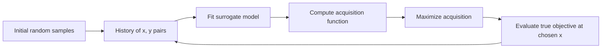

The two design choices are: which surrogate model, and which acquisition function. The next several sections cover each.

---

### 51.3 The surrogate model

The surrogate model is a regression model — input: hyperparameters $x$; output: predicted loss $\hat{y}$ — that learns from the history. The defining requirement is that it produces a *posterior distribution* at each $x$, not just a point estimate. We need to know not only "what do we predict the loss to be?" but "how confident are we in that prediction?"

Two common choices.

#### 51.3.1 Gaussian processes (GPs)

The classical surrogate. A Gaussian process is a distribution over functions, defined by a mean function $m(x)$ and a covariance function (or *kernel*) $k(x, x')$. Without going into the full machinery (which is its own chapter in any rigorous ML book), here's the operational picture you need.

Given a history of observations $\{(x_i, y_i)\}_{i=1}^n$, a GP produces, for any new query point $x$, a posterior:

$$
y(x) \sim \mathcal{N}(\mu(x), \sigma^2(x)),
$$

where $\mu(x)$ is the posterior mean (the GP's prediction) and $\sigma^2(x)$ is the posterior variance (the GP's uncertainty). The mean and variance have closed-form expressions involving the kernel and the history.

The intuition: at observed points $x_i$, the variance is zero (we know the value exactly). Far from observed points, the variance is large (we're uncertain). The mean interpolates smoothly between observed points, with the smoothness determined by the kernel.

```
   y
   │     ●  ←  observed point (variance = 0)
   │    /|
   │   / |  ←  uncertainty grows as you move away
   │  ● ● |
   │  |   ─────── posterior mean
   │  |  /  \    /
   │  | /    \  /
   │       (variance band)
   └──────────────────────────► x
```

GPs have beautiful theoretical properties: closed-form posterior, well-calibrated uncertainty, exact treatment of noise. They were the dominant surrogate in early BO work.

The catches:

1. **Cost.** Fitting a GP requires inverting an $n \times n$ matrix, $O(n^3)$. With 1000 history points, that's a billion operations *per acquisition step*. For tight HPO budgets (< 100 evaluations), GPs are fine; for large budgets, they're slow.

2. **Kernel choice.** The kernel encodes prior assumptions about smoothness. The standard choice is the squared-exponential (RBF) kernel, but it has length-scale hyperparameters that themselves need tuning. There's an HPO-on-HPO regress problem here.

3. **Dimensionality.** GPs work well in low dimensions (≤ 10), but their effectiveness degrades as $d$ grows. The kernel struggles to identify the right notion of locality in high-dimensional spaces.

4. **Mixed types.** GPs are most natural over continuous spaces. Handling integer and categorical hyperparameters requires kernel adaptations that are awkward.

Despite these, GPs remain the textbook BO surrogate and are used in libraries like scikit-optimize, GPyOpt, and Spearmint. They are excellent for low-dimensional continuous problems (e.g., tuning a 5-hyperparameter neural network).

#### 51.3.2 Tree-structured Parzen Estimators (TPE)

The alternative surrogate, the one Hyperopt uses by default, and the one we'll derive in Ch 52. TPE inverts the modeling problem: rather than modeling $p(y \mid x)$ (the conditional distribution of loss given hyperparameters), it models $p(x \mid y)$ (the conditional distribution of hyperparameters given loss).

Why this matters:

1. **Handles mixed types natively.** Density estimation per parameter type — KDE for continuous, multinomial for categorical, conditional densities for tree-structured.
2. **Scales linearly with $n$.** No matrix inversion.
3. **Less elegant theoretically.** TPE makes stronger assumptions and doesn't give you a posterior in the GP sense, but it's much easier to apply to messy real-world search spaces.

We'll treat TPE in full in Ch 52. For this chapter, we'll mostly use GPs in our worked examples because the picture is cleaner.

#### 51.3.3 Other surrogates

Random forests (used by SMAC), neural networks (used by some research systems), and probabilistic decision trees have all been used as surrogates. They trade off the smoothness assumption of GPs for the ability to handle higher dimensions and mixed types. For the ML Associate exam, only GP and TPE need be named; for your career, know that surrogate choice is a significant design decision in HPO library design.

---

### 51.4 The acquisition function

Given a surrogate that predicts $\hat{y}(x)$ with uncertainty $\sigma(x)$ for every $x$, the acquisition function $\alpha(x)$ scores how *valuable* it would be to evaluate the true objective at $x$. We pick the next evaluation point as

$$
x_{n+1} = \arg\max_x \alpha(x).
$$

The acquisition function balances **exploration** (try $x$ where the surrogate is uncertain — high $\sigma$) and **exploitation** (try $x$ where the surrogate predicts a low loss — low $\mu$). The trade-off is the core of BO.

Three classical acquisition functions.

#### 51.4.1 Probability of Improvement (PI)

The simplest and most greedy. Define the current best observed loss as $y^* = \min_i y_i$. Then PI is the probability that a new evaluation at $x$ improves on the current best:

$$
\text{PI}(x) = P(y(x) < y^*) = \Phi\left(\frac{y^* - \mu(x)}{\sigma(x)}\right),
$$

where $\Phi$ is the standard normal CDF (assuming the GP's posterior at $x$ is Gaussian). The argument $\frac{y^* - \mu(x)}{\sigma(x)}$ is the "z-score" — how many standard deviations the predicted mean is below the current best.

PI's behavior:
- If $\mu(x) \ll y^*$ and $\sigma(x)$ is moderate, PI is large — the model strongly believes $x$ is better.
- If $\sigma(x)$ is very small (high confidence near a known point), PI is small even if $\mu(x) < y^*$ — there's no room for improvement.

The problem with PI: it tends to be *too greedy*. It heavily favors points where the prediction is even marginally below the current best, even if the predicted improvement is tiny. PI under-explores.

#### 51.4.2 Expected Improvement (EI)

The most widely used acquisition. Where PI asks "what's the probability of any improvement?", EI asks "what's the expected size of the improvement?".

Define the improvement at $x$ as

$$
I(x) = \max(0, y^* - y(x)).
$$

The improvement is zero if $y(x) \geq y^*$ (we did not improve) and positive otherwise. Now take the expectation over the surrogate's posterior:

$$
\text{EI}(x) = \mathbb{E}[I(x)] = \mathbb{E}[\max(0, y^* - y(x))].
$$

For a Gaussian posterior, this has a closed form. Let $z = \frac{y^* - \mu(x)}{\sigma(x)}$:

$$
\text{EI}(x) = \sigma(x) \cdot [z \Phi(z) + \phi(z)],
$$

where $\Phi$ is the standard normal CDF and $\phi$ is the standard normal PDF.

The derivation (sketched, since this is exam-irrelevant detail but worth seeing once):

$$
\begin{aligned}
\text{EI}(x) &= \int_{-\infty}^{y^*} (y^* - y) \cdot \frac{1}{\sigma\sqrt{2\pi}} \exp\left(-\frac{(y - \mu)^2}{2\sigma^2}\right) dy \\
&\text{(change variable } t = (y - \mu)/\sigma\text{)} \\
&= \int_{-\infty}^{z} (y^* - \mu - \sigma t) \phi(t) \, dt \\
&= (y^* - \mu) \Phi(z) - \sigma \int_{-\infty}^{z} t \phi(t) \, dt \\
&= (y^* - \mu) \Phi(z) + \sigma \phi(z) \\
&= \sigma [z \Phi(z) + \phi(z)].
\end{aligned}
$$

The last step uses $\int_{-\infty}^z t \phi(t) dt = -\phi(z)$, a standard normal identity.

EI's behavior:
- At observed points, $\sigma = 0$, so EI = 0. Don't re-evaluate where you already know the answer.
- At points where $\mu \gg y^*$ (predicted much worse than current best), $z$ is very negative, $\Phi(z) \approx 0$ and $\phi(z) \approx 0$, so EI is small. Don't bother.
- At points where $\mu \approx y^*$ but $\sigma$ is high (uncertain near current best), $z \approx 0$, $\Phi(z) \approx 0.5$, $\phi(z) \approx 0.4$, so EI $\approx 0.4 \sigma$. Try here — the uncertainty might pay off.
- At points where $\mu \ll y^*$ and $\sigma$ is moderate (we strongly believe it's better), EI is large positively. Go here — definite expected improvement.

EI is the de facto standard. Whenever a library says "Bayesian optimization with default acquisition," they almost always mean EI.

#### 51.4.3 Upper Confidence Bound (UCB) — or "Lower" for minimization

For a function we're trying to minimize, the analog of UCB is **Lower Confidence Bound (LCB)**:

$$
\text{LCB}(x) = \mu(x) - \kappa \sigma(x),
$$

where $\kappa$ is a positive constant controlling exploration. We want to minimize LCB — pick the $x$ where the optimistic estimate of the loss is lowest. Higher $\kappa$ → more exploration (give more weight to uncertain points); lower $\kappa$ → more exploitation.

UCB/LCB is appealing for two reasons:

1. **Tunable.** You explicitly choose $\kappa$ to control the exploration-exploitation trade-off, rather than letting EI's implicit balance dictate.
2. **Bandit theory.** UCB has tight theoretical regret bounds from the multi-armed bandit literature, which carry over to GP-UCB in continuous-armed settings.

In practice, EI is more common because (a) it's parameter-free (you don't have to tune $\kappa$) and (b) it has a natural probabilistic interpretation. UCB shows up in academic papers more than in production libraries.

#### 51.4.4 Other acquisition functions

There's a zoo of more elaborate acquisition functions: **Thompson sampling** (sample a function from the GP posterior; minimize that sample), **Predictive Entropy Search** (pick $x$ to maximally reduce posterior uncertainty about the global optimum's location), **Knowledge Gradient** (account for the fact that future decisions will benefit from this observation). These are advanced and rarely the right choice for tabular ML HPO.

For the exam: know EI as the default; know PI as the greedy alternative; know UCB/LCB as the explicitly-tunable alternative.

---

### 51.5 A worked 1D example, conceptually

Let's walk through a Bayesian optimization run on a 1D problem so the loop is concrete. We are tuning a single hyperparameter, the learning rate $\eta$, in the range $[0.001, 1]$ on a log scale. The true (unknown to BO) validation loss is some function $f(\log \eta)$ — picture it as having a single global minimum somewhere in the middle of the range.

**Step 0: Initial sampling.** Run 4 random evaluations:

| Trial | $\log_{10} \eta$ | $\eta$ | True loss (unknown to us, of course) |
|---|---|---|---|
| 1 | -2.5 | 0.0032 | 0.55 |
| 2 | -0.5 | 0.316  | 0.85 |
| 3 | -1.8 | 0.0158 | 0.40 |
| 4 |  0.0 | 1.0    | 0.90 |

We see: low losses around $\log \eta = -1.8$ to $-2.5$; high losses at the right end of the range. Our current best is $y^* = 0.40$ at $\log \eta = -1.8$.

**Step 1: Fit the surrogate.** Fit a GP to these 4 points. The posterior mean interpolates between them; the posterior variance is low near the observed points and high in the gaps.

If we plot it (in mental space):

```
loss
  1.0 ┤              ●(0.85)
      │                            ●(0.90)
  0.8 ┤
      │  ●(0.55)
  0.6 ┤    \    GP mean
      │     \  ____________
  0.4 ┤      ●(0.40)
      │     | | | (variance is small here, larger in gaps)
   0.2┤
      └────┬────┬────┬────┬────► log η
        -3   -2   -1    0   1
```

**Step 2: Compute EI.** At each candidate $\log \eta$, compute EI. EI will be:
- Very small at the observed points (variance = 0).
- Larger in the gap between $\log \eta = -2.5$ and $\log \eta = -1.8$ (the region between two good points — possibly an even better minimum hidden there).
- Smaller in the bad region (high $\log \eta$) because $\mu(x)$ is high.
- Moderate in unexplored regions (e.g., $\log \eta < -3$) where $\sigma$ is high but $\mu$ is interpolated from limited data.

Suppose EI is maximized at $\log \eta = -2.1$ (between trials 1 and 3, where the GP predicts a low mean with some uncertainty).

**Step 3: Evaluate.** Train the model with $\eta = 10^{-2.1} = 0.0079$. Get a true loss, say 0.35.

| Trial | $\log_{10} \eta$ | $\eta$ | Loss |
|---|---|---|---|
| 1 | -2.5 | 0.0032 | 0.55 |
| 2 | -0.5 | 0.316  | 0.85 |
| 3 | -1.8 | 0.0158 | 0.40 |
| 4 |  0.0 | 1.0    | 0.90 |
| 5 | -2.1 | 0.0079 | **0.35** |

New best. Update.

**Step 4: Re-fit the surrogate.** Now there are 5 points. The GP mean is sharper near $\log \eta = -2$, and the variance there is even smaller. The variance in unexplored regions is unchanged.

**Step 5: Re-compute EI.** The optimum of EI has moved. Probably toward an unexplored region — say $\log \eta = -3$ to test whether even smaller learning rates work.

**Step 6: Evaluate.** Train with $\eta = 10^{-3} = 0.001$. Get a true loss, say 0.42.

| Trial | $\log_{10} \eta$ | $\eta$ | Loss |
|---|---|---|---|
| 1 | -2.5 | 0.0032 | 0.55 |
| 2 | -0.5 | 0.316  | 0.85 |
| 3 | -1.8 | 0.0158 | 0.40 |
| 4 |  0.0 | 1.0    | 0.90 |
| 5 | -2.1 | 0.0079 | 0.35 |
| 6 | -3.0 | 0.001  | 0.42 |

Worse than trial 5. Good — we've established that learning rates below $10^{-2.1}$ aren't better. The minimum is around $-2.1$.

**Step 7: Iterate.** Continue. Each new trial samples either (a) near the current best to refine it, or (b) in an unexplored region to make sure no surprise hides there. The acquisition function balances these.

After 20 trials, the GP is sharp around the true minimum, and the best observed loss is close to the true minimum. We stop. Return the best $\eta$.

This pattern — initial scattershot, then progressive concentration near the optimum with occasional probes into uncertain regions — is what BO does in any dimension. The picture is harder to draw in 10D, but the algorithm is the same.

---

### 51.6 The exploration-exploitation balance, made concrete

Let's pause on the exploration-exploitation idea, because it is the crux.

**Exploitation:** trust the surrogate. Go where it predicts the lowest loss.  
**Exploration:** doubt the surrogate. Go where it's uncertain, to learn more.

A pure-exploitation algorithm would, after a few good observations, hammer the same region forever, never discovering that a much better optimum exists in a region it never visited. This is *premature convergence*. It fails when the loss landscape has multiple local minima.

A pure-exploration algorithm is just random search. It never converges; it samples uniformly.

EI threads the needle. Its closed form $\sigma [z \Phi(z) + \phi(z)]$ has two terms when expanded: $\sigma z \Phi(z) = (y^* - \mu) \Phi(z)$ is the exploitation term (favors points where the mean is below the current best, weighted by probability of improvement); $\sigma \phi(z)$ is the exploration term (favors points with high $\sigma$). The total EI is high either when there's strong predicted improvement *or* when there's high uncertainty in a region that might be improvable.

A useful way to feel this: imagine two candidate points.

- Point A: $\mu = 0.30$ (much lower than $y^* = 0.40$), $\sigma = 0.02$ (low uncertainty). The model is very confident A is good. EI: $z = (0.40 - 0.30)/0.02 = 5$. $\Phi(5) \approx 1$, $\phi(5) \approx 0$. EI $\approx 0.02 \cdot 5 \cdot 1 + 0.02 \cdot 0 = 0.10$. Strong exploitation.

- Point B: $\mu = 0.45$ (slightly worse than $y^* = 0.40$), $\sigma = 0.30$ (high uncertainty). The model thinks B is probably worse but is very unsure. EI: $z = (0.40 - 0.45)/0.30 = -0.167$. $\Phi(-0.167) \approx 0.434$, $\phi(-0.167) \approx 0.393$. EI $\approx 0.30 \cdot (-0.167 \cdot 0.434 + 0.393) = 0.30 \cdot (−0.072 + 0.393) = 0.30 \cdot 0.321 = 0.096$. Almost as much expected improvement, despite the model predicting B is worse — because the uncertainty might pay off.

So EI picks A in this case (0.10 > 0.096), but barely. With slightly higher $\sigma$ at B, EI would prefer B. This is the balance in action.

---

### 51.7 Why BO works (and when it doesn't)

BO is, on its good days, a substantial improvement over random search. Empirical evidence across many domains: with the same evaluation budget, BO routinely finds configurations 10–30% better than random search (measured by validation loss), and the gap grows with the difficulty of the problem.

When does BO shine?

- **Expensive evaluations.** Each evaluation costs 5+ minutes. Spending compute on choosing the next point (a few seconds of surrogate-fitting and acquisition-maximizing) is a great trade.
- **Smooth-ish loss surfaces.** The surrogate's locality assumption is reasonable. Hyperparameters with smooth effects on the loss (learning rate, regularization) fit well.
- **Low to moderate dimension.** Up to about 20 hyperparameters, BO works. Beyond, the surrogate struggles to identify locality.
- **Sequential.** One trial at a time, with each informing the next. BO is naturally sequential.

When does BO struggle?

- **Highly discontinuous loss surfaces.** If small changes in a hyperparameter produce wild swings in loss, the surrogate's smoothness assumption is violated. Cliff regions are bad for GPs especially.
- **Tens of thousands of evaluations.** BO's per-step overhead grows with history size (especially for GPs, $O(n^3)$). At very large budgets, the surrogate-fitting cost dominates, and you'd be better off with random search.
- **Massive parallelism.** BO is sequential by nature. If you want to run 100 trials in parallel, you need a parallel BO algorithm (batch BO, asynchronous BO). These work but with diminishing returns — the parallel batch has to be chosen without seeing each member's results.
- **Heavy categorical / hierarchical structure.** GPs handle this awkwardly. TPE (Ch 52) was designed exactly to fix this.

For the ML Associate exam: know BO as the algorithm class; know EI as the canonical acquisition; know GP and TPE as the two surrogates that matter, with TPE being Hyperopt's default.

---

### 51.8 Parallel BO is hard

Worth a brief explicit treatment because it bites in production.

Suppose you have 8 workers and want to run BO in parallel. The natural BO loop is sequential — pick next, evaluate, update history, pick next, repeat. With one worker, that's fine. With 8, you have to pick 8 next points *simultaneously*, without seeing any of their results.

The naive approach — "just pick the top 8 by EI" — fails because all 8 would be the same point (the EI argmax). You need diversity.

Common approaches:

1. **Constant Liar.** After picking the EI-argmax, "pretend" you observed a sensible value there (say the current best $y^*$, the predicted mean, or some pessimistic value), refit the surrogate including this fake observation, and pick the next argmax. Repeat until you have 8 picks. Then drop the fake observations and actually evaluate.

2. **Penalize chosen points.** Subtract a Gaussian penalty centered at each chosen point from EI, then pick the next argmax. Each chosen point "absorbs" some of the acquisition's mass.

3. **Thompson sampling batch.** Sample 8 functions independently from the GP posterior. Each function's argmin is one batch member.

The takeaway: parallelism in BO trades off Bayesian quality for wall-clock throughput. Higher parallelism = less Bayesian benefit per trial. The optimal degree of parallelism balances "how many workers do I have?" against "how much benefit am I losing by not seeing each result before picking the next?". This is exactly the trade-off SparkTrials (Ch 53) confronts in practice.

A rough rule: with $N$ total evaluations, choose parallelism $\approx \sqrt{N}$. With $N = 100$, parallelism $= 10$. This is informally argued in the Hyperopt documentation and supported by some empirical work.

---

### 51.9 Why a separate chapter on TPE

The next chapter (Ch 52) is exclusively about Tree-structured Parzen Estimators. You might wonder why TPE deserves its own chapter when GP is already covered here.

Three reasons:

1. **TPE is what Hyperopt uses by default.** The ML Associate exam tests Hyperopt. Hyperopt's `tpe.suggest` is the algorithm. Knowing TPE specifically is required.

2. **TPE's mathematical structure is genuinely different.** It models $p(x \mid y)$ rather than $p(y \mid x)$. This inversion changes the algorithm meaningfully. We'll derive it from scratch.

3. **TPE handles real-world search spaces (mixed types, hierarchical) without ceremony.** GPs require adaptation; TPE does it natively. This is why TPE became practitioners' favorite for serious ML HPO.

Ch 52 will treat TPE on its own terms, then close the loop with the API in Ch 53.

---

### 51.10 What this builds on / where this returns

**Builds on:**

- *Chapter 9* — sampling and probability distributions. The Gaussian posterior arithmetic in §51.4 assumes comfort with normal CDF/PDF.
- *Chapter 17* — gradient descent as an iterative optimization with a fixed step rule. Compare BO: an iterative optimization that chooses each next step adaptively from history.
- *Chapter 50* — random search, which BO improves on. The initial random samples of BO are exactly random search of size $n_0$.

**Returns in:**

- *Chapter 52* — TPE, the surrogate Hyperopt uses. Read this chapter again after reading 52 to compare GP and TPE side by side.
- *Chapter 53* — Hyperopt's API, where the BO framework becomes concrete code.
- *Chapter 54* — Optuna, where you'll see more acquisition functions and pruning, which extends BO into the multi-fidelity world.

---

### 51.11 Exercises

1. **Surrogate purpose.** Why does Bayesian optimization need *uncertainty estimates* from the surrogate? What goes wrong if you use a surrogate that produces only point estimates (e.g., a regular random forest predicting loss)?

2. **PI vs EI.** Two candidate points have posteriors: A: $\mu = 0.42$, $\sigma = 0.01$, $y^* = 0.40$. B: $\mu = 0.50$, $\sigma = 0.20$, $y^* = 0.40$. Which has higher PI? Which has higher EI? Justify with the formulas.

3. **EI computation.** Compute EI(x) when $\mu(x) = 0.35$, $\sigma(x) = 0.10$, $y^* = 0.40$. (You'll need $\Phi(z)$ and $\phi(z)$ for the relevant $z$. Use $\Phi(0.5) \approx 0.691$ and $\phi(0.5) \approx 0.352$.)

4. **EI at an observed point.** Show that at any observed point $x_i$ (where $\sigma(x_i) = 0$), EI is zero. What does this property guarantee about BO's behavior?

5. **UCB-style.** For LCB$(x) = \mu(x) - \kappa \sigma(x)$ with $\mu = 0.42, \sigma = 0.20$: compute LCB for $\kappa = 1$ and $\kappa = 3$. Which $\kappa$ is more exploratory?

6. **The greedy failure of PI.** Suppose two candidate points have: A: $\mu = 0.395, \sigma = 0.01$ (very confident, marginally below $y^* = 0.40$). B: $\mu = 0.30, \sigma = 0.10$ (much more uncertain, but predicted much better). Compute PI for each. Why does PI prefer A despite B's much greater predicted improvement?

7. **Initial samples.** Why does BO need $n_0 \geq 5$ initial random samples before fitting the surrogate? What pathology does the surrogate exhibit with only 1 or 2 history points?

8. **High dimensionality.** Why does a GP-based BO degrade as the dimensionality $d$ of the search space grows? Specifically, what does the kernel struggle with?

9. **Parallel BO.** You have 4 workers and 40 total evaluations to spend. You want to use BO. What is the trade-off between running 40 sequential trials (1 worker active at a time) and 10 rounds × 4 parallel trials? Which is more "Bayesian"?

10. **Acquisition function exploration term.** In EI's closed form $\sigma[z\Phi(z) + \phi(z)]$, identify which term dominates when $\sigma$ is large but $\mu = y^*$ (i.e., $z = 0$). What does this mean about BO's behavior in unexplored regions?

11. **The role of $y^*$.** EI is defined relative to the current best $y^*$. What happens to BO's behavior if you use $y^* + \xi$ (a slightly inflated target) instead of $y^*$? Hyperopt and other libraries sometimes add a small $\xi$ — what is this for?

12. **When BO converges to a local minimum.** Suppose the true loss surface has two minima: a *local* minimum at $x = 0.5$ with loss 0.30, and the *global* minimum at $x = 0.9$ with loss 0.20. Your initial random samples happened to cluster around $x \in [0, 0.6]$. Will BO find the global minimum? Under what conditions might it not?

<details>
<summary>Answers</summary>

1. Without uncertainty, the algorithm cannot trade off exploration against exploitation — it can only exploit. A point-estimate-only surrogate would greedily pick the argmin of the predicted mean every time, repeatedly re-evaluating near a single local minimum and never exploring elsewhere. The uncertainty is what makes the algorithm willing to try new regions.

2. PI(A): $z = (0.40 - 0.42)/0.01 = -2$, $\Phi(-2) \approx 0.023$. PI = 2.3%. PI(B): $z = (0.40 - 0.50)/0.20 = -0.5$, $\Phi(-0.5) \approx 0.309$. PI = 30.9%. **B has higher PI.**  
EI(A): $\sigma[z\Phi(z) + \phi(z)] = 0.01[-2 \cdot 0.023 + \phi(-2)] = 0.01[-0.046 + 0.054] = 0.01 \cdot 0.008 = 0.00008$.  
EI(B): $0.20[-0.5 \cdot 0.309 + \phi(-0.5)] = 0.20[-0.155 + 0.352] = 0.20 \cdot 0.197 = 0.0394$.  
**B has higher EI** (much higher). Both metrics prefer B, but EI more strongly because it accounts for the size of expected improvement, not just probability.

3. $z = (0.40 - 0.35)/0.10 = 0.5$. EI $= 0.10[0.5 \cdot 0.691 + 0.352] = 0.10[0.3455 + 0.352] = 0.10 \cdot 0.6975 = 0.0698$.

4. At an observed point, $\sigma(x_i) = 0$. EI $= \sigma[\ldots] = 0 \cdot \text{(anything)} = 0$. This guarantees BO does not waste evaluations re-querying points it has already observed — every new evaluation is at a *new* point.

5. LCB with $\kappa = 1$: $0.42 - 1 \cdot 0.20 = 0.22$. LCB with $\kappa = 3$: $0.42 - 3 \cdot 0.20 = -0.18$. Higher $\kappa$ → lower LCB (we minimize) → more weight on uncertain points → more exploratory. $\kappa = 3$ is more exploratory.

6. PI(A): $z = (0.40 - 0.395)/0.01 = 0.5$, $\Phi(0.5) = 0.691$ → PI = 69.1%. PI(B): $z = (0.40 - 0.30)/0.10 = 1.0$, $\Phi(1.0) = 0.841$ → PI = 84.1%. So PI(B) > PI(A). But: PI is symmetric in its preference — it just asks "any improvement" — so a small improvement with high probability beats a large improvement with moderate probability if the probability is high enough. PI underweights the *magnitude* of improvement. (Note: my framing in the question is misleading; let me redo: actually PI(B) is higher numerically, so PI prefers B too. The "greedy failure" of PI is more visible when A has $\mu$ very close to $y^*$ AND tiny $\sigma$ — PI loves it because $z$ is small but positive. Try: A: $\mu = 0.399, \sigma = 0.001$, $z = 1.0$, PI = 84.1%. B: $\mu = 0.30, \sigma = 0.10$, $z = 1.0$, PI = 84.1%. Same PI, but EI of B is hugely larger. PI cannot distinguish them.)

7. With 1–2 points, the GP's hyperparameters (length scale, signal variance) are unidentified — there's not enough data to fit them. The posterior either over-smooths (treating everything as one big basin) or under-smooths (treating everything as random noise). Initial random samples seed the surrogate with enough information to fit its own hyperparameters reasonably.

8. The kernel function $k(x, x')$ encodes "how similar are $x$ and $x'$?". In high dimensions, almost all points are far apart (curse of dimensionality), so the kernel says everything is unrelated to everything else. The GP collapses toward predicting the mean of observations for all queries, losing local information. Specialized high-dimensional kernels (additive kernels, low-dimensional embeddings) help, but vanilla GP-BO doesn't scale well past ~20 dims.

9. Sequential (40 in a row): each trial sees all previous trials' results when picking the next — fully Bayesian. Parallel (4 at a time, 10 rounds): each batch of 4 picks without seeing each other's results — within a batch, you lose Bayesian benefit. The latter is faster in wall-clock (10 rounds × 1 trial-time = 10 trial-times vs 40 trial-times) but less informed. The right trade-off depends on how expensive each trial is vs how valuable each marginal Bayesian update is.

10. At $z = 0$, $\Phi(0) = 0.5$ and $\phi(0) = 1/\sqrt{2\pi} \approx 0.399$. EI $= \sigma[0 \cdot 0.5 + 0.399] = 0.399 \sigma$. The exploration term ($\sigma \phi(z)$) dominates. EI scales linearly with $\sigma$. So in unexplored regions where the mean predicts roughly the current best but the uncertainty is high, EI is large — BO will probe there. This is the exploration behavior we want.

11. With $y^*$ replaced by $y^* + \xi$, EI is computed against a target slightly worse than the actual best. This makes the algorithm "easier to please" — more points have positive expected improvement. The effect is **more exploration**: the algorithm doesn't insist on beating the current best but is willing to try points that might match it. $\xi > 0$ is a small exploration bonus.

12. BO will find the global minimum *if* its initial samples or its exploration ever land in the $x \in [0.7, 1.0]$ region. With random initial samples uniformly over $[0, 1]$, that's likely. With initial samples clustered in $[0, 0.6]$, BO might (a) initially converge tightly to the local min at $x = 0.5$, then (b) eventually probe the unexplored region $[0.6, 1.0]$ because $\sigma$ remains high there, then (c) discover the global min. The risk: if EI's exploration term is too small (e.g., if the GP's signal variance is mis-estimated), the algorithm might be too greedy and never explore $[0.7, 1.0]$. This is one reason real implementations include $\xi$ (Q11) — to push exploration.

</details>


## Chapter 52 — Tree-Structured Parzen Estimator (TPE) From First Principles

> **Goal of this chapter:** to derive TPE — Hyperopt's default algorithm — not as a black box but as a concrete information-theoretic procedure. By the end you should be able to (a) state the modeling inversion that defines TPE ($p(x \mid y)$, not $p(y \mid x)$), (b) explain why TPE's acquisition ratio $\ell(x) / g(x)$ corresponds to Expected Improvement, (c) describe how TPE handles continuous, categorical, and hierarchical parameters with the same machinery, and (d) work a small TPE step by hand on a 1D problem.

---

### 52.1 Why a different surrogate

We closed Ch 51 with three reasons TPE deserves its own treatment:

1. Hyperopt's default. The Databricks ML Associate exam tests Hyperopt. The exam tests TPE by name.
2. Mathematically different from GP-based BO. The "inversion" — modeling $p(x \mid y)$ rather than $p(y \mid x)$ — is genuinely novel.
3. Handles mixed-type and hierarchical search spaces natively. No kernel adaptation needed.

Let's make those three points concrete before diving in.

A Gaussian process predicts $p(y \mid x)$: for each candidate $x$, the GP gives a Gaussian distribution over the loss. This is the "natural" framing — you input hyperparameters, you ask for a loss prediction.

TPE flips this. It models $p(x \mid y)$: given a particular loss level (or range of loss levels), what distribution of $x$ values does it correspond to?

At first this seems backwards. Why would you want to know "given the loss is 0.3, what are the hyperparameters that produced it?" — the model already gives you the hyperparameters; the loss is the output, not the input.

The answer is that TPE doesn't try to predict the loss at all. It tries to **separate "good" hyperparameters from "bad" hyperparameters** based on the loss threshold. It then picks the next $x$ to be a sample that is likely to be "good" and unlikely to be "bad." That's the algorithm.

The exact rule — pick $x$ that maximizes the *ratio* of good-density to bad-density — turns out to be, surprisingly, exactly equivalent to Expected Improvement (up to a constant). So TPE is doing the same thing as GP-EI conceptually; it's just computing it differently.

This chapter unpacks all of that.

---

### 52.2 The TPE setup

Let's set notation. We have a history of $n$ observations: $\{(x_i, y_i)\}_{i=1}^n$. Each $y_i$ is the validation loss at hyperparameters $x_i$. We want to choose the next $x_{n+1}$.

**Step 1: Pick a threshold $\gamma$.**

Sort the observations by $y_i$. Pick a percentile — say the 25th percentile — as the threshold $y^*$. So $\gamma = 0.25$ means: the bottom 25% of observed losses are "good"; the top 75% are "bad". The actual $y^*$ value is whatever loss is at the 25th-percentile mark in your history.

In Hyperopt's default, $\gamma = 0.25$. Variations are explored, but 0.25 is the convention. (Note: some papers and implementations use $\gamma$ to mean the threshold value $y^*$ itself rather than the percentile; we'll use $\gamma$ for the percentile and $y^*$ for the threshold value.)

**Step 2: Split history into "good" and "bad".**

- Good set: $\{(x_i, y_i) : y_i < y^*\}$. The hyperparameter values that produced good losses.
- Bad set: $\{(x_i, y_i) : y_i \geq y^*\}$. The hyperparameter values that produced bad losses.

With $n = 20$ history points and $\gamma = 0.25$, good has 5 points and bad has 15.

**Step 3: Fit density estimates.**

- $\ell(x)$ = density of $x$ over the good set. "What does $x$ look like for good observations?"
- $g(x)$ = density of $x$ over the bad set. "What does $x$ look like for bad observations?"

These are densities over the hyperparameter space, not the loss. They tell us where good and bad hyperparameters live in $\Theta$, ignoring exactly *how* good or bad.

For continuous $x$: kernel density estimation (KDE) with Gaussian kernels.  
For categorical $x$: smoothed empirical frequencies (multinomial with a Dirichlet prior).  
For integer $x$: KDE on the integer scale, with rounding at the end.

We'll do the math for the continuous case below.

**Step 4: Acquisition — maximize $\ell(x) / g(x)$.**

The next sample is

$$
x_{n+1} = \arg\max_x \; \frac{\ell(x)}{g(x)}.
$$

Pick the $x$ that is *most likely to come from the good set* relative to the bad set.

That's the algorithm. The rest of this chapter is (a) why this acquisition is equivalent to EI, (b) how the density estimates are actually computed, (c) how the four types of search space dimensions work, and (d) a worked numerical example.

---

### 52.3 Why $\ell / g$ is Expected Improvement (in disguise)

This is the part that justifies TPE's design choice. We'll sketch it; the full derivation is in Bergstra et al. 2011.

Recall EI:

$$
\text{EI}(x) = \int_{-\infty}^{y^*} (y^* - y) \cdot p(y \mid x) \, dy.
$$

This integral is "expected improvement over the threshold $y^*$, weighted by the probability of each $y$ given $x$."

By Bayes' rule:

$$
p(y \mid x) = \frac{p(x \mid y) \cdot p(y)}{p(x)},
$$

so

$$
\text{EI}(x) = \int_{-\infty}^{y^*} (y^* - y) \cdot \frac{p(x \mid y) p(y)}{p(x)} \, dy.
$$

Define the conditional densities:

- For $y < y^*$ (good): the density $\ell(x) := p(x \mid y < y^*)$ marginalized over the good losses.
- For $y \geq y^*$ (bad): the density $g(x) := p(x \mid y \geq y^*)$ marginalized over the bad losses.

The denominator $p(x)$ is

$$
p(x) = \int p(x \mid y) p(y) \, dy = \gamma \, \ell(x) + (1 - \gamma) \, g(x),
$$

where $\gamma = P(y < y^*)$. (By definition of the threshold percentile, $\gamma$ is the fraction of $y$ values below $y^*$.)

So we can write

$$
p(x) = \gamma \ell(x) + (1 - \gamma) g(x).
$$

Now the EI integral becomes

$$
\text{EI}(x) = \frac{\gamma}{p(x)} \int_{-\infty}^{y^*} (y^* - y) p(y \mid y < y^*) \, dy.
$$

The integral inside is just $\mathbb{E}[y^* - y \mid y < y^*]$, a positive scalar that does not depend on $x$. Call it $C$. Then:

$$
\text{EI}(x) = \frac{\gamma C}{p(x)} = \frac{\gamma C}{\gamma \ell(x) + (1 - \gamma) g(x)}.
$$

Maximizing EI over $x$ is the same as maximizing $\frac{1}{\gamma \ell(x) + (1-\gamma) g(x)}$, which is the same as *minimizing* the denominator. Dividing both numerator and denominator of EI by $g(x)$:

$$
\text{EI}(x) \propto \frac{1}{\gamma \, \ell(x)/g(x) + (1-\gamma)}.
$$

To maximize EI, we want $\ell(x)/g(x)$ to be **large** — because a large $\ell/g$ makes the denominator dominated by the (negative-weighted) $\gamma \ell/g$ in disguise, but more directly: when $\ell/g$ is large, EI is large.

The conclusion: **maximizing EI is equivalent to maximizing $\ell(x)/g(x)$**, up to monotone transformations. TPE's acquisition rule is exactly Bayesian-optimization EI, computed by a different route.

The route matters because computing $\ell$ and $g$ separately via density estimation is *easier and more flexible* than computing a GP posterior over $p(y \mid x)$. That's TPE's pitch.

#### 52.3.1 Why this is conceptually beautiful

Notice what TPE achieves. It never has to model the loss function $p(y \mid x)$ directly. It only ever needs to estimate two densities over $\Theta$ — the density of "good" hyperparameters and the density of "bad" hyperparameters. Both are routine 1D problems (for each parameter independently, in vanilla TPE), and densities of any type of variable can be estimated.

Compare to GP: every new query requires computing $\mu(x)$ and $\sigma(x)$ from the full history through matrix algebra, with a kernel that must respect the joint structure of all dimensions. GPs solve the harder problem of full conditional regression. TPE punts on regression and solves the easier problem of binary density estimation.

---

### 52.4 The density estimates, concretely

How does TPE actually compute $\ell(x)$ and $g(x)$? Per parameter, by parameter type.

#### 52.4.1 Continuous parameters: KDE

For a continuous hyperparameter (e.g., `learning_rate` on a log scale, treated as a real number $\log_{10} \eta$), TPE uses **kernel density estimation** with Gaussian kernels.

Given the good observations $\{x_1, x_2, \ldots, x_m\}$ (just the $x$ values from the good set, for this single dimension), the KDE is

$$
\ell(x) = \frac{1}{m} \sum_{i=1}^m \mathcal{N}(x; x_i, \sigma_i^2),
$$

a mixture of $m$ Gaussians, each centered at an observed good point. The bandwidth $\sigma_i$ is chosen heuristically — Hyperopt uses an adaptive bandwidth based on distance to the nearest neighbor. Smaller bandwidth = sharper density; larger bandwidth = smoother density.

Same for $g(x)$ with the bad observations.

For our learning-rate example, suppose the good observations are at $\log_{10} \eta = \{-2.3, -2.0, -2.1, -1.8, -2.5\}$. The KDE puts a small Gaussian at each, summing to a single hump centered around $-2.1$. The density $\ell$ is high near $-2.1$, low far from it.

If the bad observations are at $\log_{10} \eta = \{-0.5, 0.0, -3.5, -3.0, 0.3, 0.5, -3.2, -0.3, -0.1, 0.1, ...\}$, the KDE produces a bimodal density — high at the extremes ($\log \eta$ very small or very large), low in the middle.

The ratio $\ell(x) / g(x)$ is then:
- Large around $\log \eta = -2.1$ (good is dense, bad is sparse).
- Small at $\log \eta = -3.5$ (bad is dense, good is sparse).
- Small at $\log \eta = 0$ (bad is dense, good is absent).

TPE picks the argmax, which is $\log \eta \approx -2.1$. The next evaluation goes near the current best region, with some sampling spread (TPE samples from $\ell$, not just argmax — see §52.5).

#### 52.4.2 Categorical parameters: smoothed multinomial

For a categorical hyperparameter like `kernel ∈ {"linear", "rbf", "poly"}`, TPE estimates a multinomial distribution over the categories from the good and bad sets.

Naive: among the good observations, what fraction had `kernel = "linear"`? What fraction `"rbf"`? What fraction `"poly"`? These three fractions are $\ell$ for this parameter.

The naive estimate is unreliable when the good set is small (a category might have count 0 by chance). The fix is smoothing — add a small "prior" count to each category before normalizing:

$$
\ell(\text{kernel}) = \frac{\text{count(kernel) in good} + \alpha}{\text{total good} + 3 \alpha},
$$

with $\alpha$ a small smoothing constant (e.g., 1). This guarantees every category has a nonzero $\ell$ — TPE will sometimes pick a kernel that has never appeared in the good set, by exploration.

#### 52.4.3 Integer parameters

Two strategies. Either treat as continuous (apply KDE on the integer scale, round at sampling time), or treat as a categorical with as many levels as there are distinct integer values. For wide ranges (e.g., `n_estimators` from 50 to 1000), KDE on the underlying log or linear scale is more efficient.

Hyperopt's `hp.quniform(name, low, high, q)` does this — it stores values internally as continuous but rounds to the nearest multiple of $q$ at the end.

#### 52.4.4 Hierarchical (tree-structured) parameters

Here's where TPE gets its name. Consider a search space:

```
optimizer ∈ {"adam", "sgd"}
if optimizer == "adam":
    beta1 ∈ [0.5, 0.99]
    beta2 ∈ [0.9, 0.999]
if optimizer == "sgd":
    momentum ∈ [0.0, 0.99]
```

The space is a **tree**. Some leaves have more parameters than others. The full configuration depends on which branch you're in.

TPE handles this by estimating densities *conditional on the branch*. Concretely:

- $\ell(\text{optimizer})$: marginal density of `optimizer` over good observations (e.g., "60% of good observations used adam").
- $\ell(\text{beta1} \mid \text{optimizer} = \text{adam})$: density of `beta1` over the good observations *that used adam* (filtered subset, KDE).
- $\ell(\text{momentum} \mid \text{optimizer} = \text{sgd})$: density of `momentum` over the good observations *that used sgd*.

Same for $g$. When sampling the next $x$, TPE first samples `optimizer` from $\ell / g$ for that decision; then, conditional on the choice, samples the relevant sub-parameters from the conditional densities.

This conditional decomposition is what makes TPE handle complex real-world search spaces gracefully. GP-based BO requires you to either flatten the search space (lose conditional structure) or implement a structured kernel (hard). TPE just recurses on the tree.

#### 52.4.5 The independence assumption

A note of caution. Vanilla TPE estimates the density of each parameter *independently*. That is, for hyperparameters $x_1, x_2$:

$$
\ell(x_1, x_2) \approx \ell_1(x_1) \cdot \ell_2(x_2).
$$

TPE assumes the good set has independent marginals. It can't detect interactions like "high `learning_rate` AND high `n_estimators` is good only together" — it sees the marginal "high `learning_rate` is good" and "high `n_estimators` is good" and proposes both, possibly without recognizing that *together* they might be bad.

This is a real limitation. Some extensions (Tree of Parzen Estimators with multivariate kernels, or copula-based methods) address it. Hyperopt's default does not.

In practice, the independence assumption is often forgivable — hyperparameter interactions are weak in most tabular ML problems. For deep learning, interactions are stronger and TPE's limitations become more visible. Optuna's multivariate sampler (Ch 54) tries to fix this.

---

### 52.5 The sampling step

We said TPE picks the $x$ that maximizes $\ell(x) / g(x)$. In practice, the maximization is done by *sampling*, not gradient ascent.

The algorithm:

1. Draw $n_{\text{candidates}}$ samples from $\ell(x)$ (say 24 samples).
2. For each, compute the ratio $\ell(x) / g(x)$.
3. Return the sample with the highest ratio.

Why not pure argmax? Two reasons.

- **Computational.** Maximizing $\ell / g$ analytically would require gradient methods that fail on non-smooth densities (especially with categorical components). Sampling is more robust.
- **Stochasticity.** Drawing from $\ell$ naturally introduces variation across iterations of TPE, helping it explore.

The 24 candidates are sampled from $\ell$ specifically because $\ell$ is the "good" distribution — these are all likely to be good *a priori*. Then we choose the most-good-relative-to-bad one. This biases TPE toward exploitation but with some natural spread.

For categorical parameters, the same logic applies: sample 24 candidates from $\ell$ (a multinomial), evaluate $\ell/g$ for each, return the argmax. For tree-structured spaces, sample from the conditional $\ell$ structure.

---

### 52.6 Initialization: the startup random phase

TPE cannot start from zero history — the densities $\ell$ and $g$ have nothing to estimate when there are no observations.

Hyperopt's default: **run $n_{\text{startup}}$ random evaluations first**, where $n_{\text{startup}} = 20$ by default. These 20 random samples seed the history. After that, TPE takes over.

This is identical in spirit to the BO initial-samples step (Ch 51). With fewer than ~15 history points, the densities are unreliable; with 20+, they start to mean something.

A consequence: TPE's *first 20 trials* are random search trials. If your total budget is 25, you're doing 20 random + 5 TPE — barely using the TPE benefit. If your total budget is 100, you're doing 20 random + 80 TPE — getting the full benefit.

For very small budgets (< 30), TPE isn't much different from random search. The crossover is around $N = 40$-$50$, where TPE's selection from accumulated history starts to dominate the initial random scatter.

---

### 52.7 The threshold $\gamma$

TPE's threshold percentile $\gamma$ is a hyperparameter of TPE itself (a meta-hyperparameter). Default is $\gamma = 0.25$. Variations:

- **Smaller $\gamma$ (e.g., 0.10)**: fewer points are "good", more are "bad". TPE becomes more exploitative — it tries to refine the small good region. Risk: the good set is too small to estimate density well.
- **Larger $\gamma$ (e.g., 0.50)**: more points are "good". TPE becomes more exploratory — it has a fuzzier sense of where "good" is. Risk: dilutes the signal.

In Hyperopt, $\gamma$ is the algorithm parameter `gamma` passed to `tpe.suggest`. Most users leave it at the default.

There's also a related parameter, `n_EI_candidates` (the number of candidates sampled from $\ell$ before picking the argmax, mentioned in §52.5). Hyperopt's default is 24. Larger values give a sharper argmax (closer to true maximum of $\ell/g$); smaller values are more stochastic and faster.

For the exam: know that $\gamma$ is a percentile (Hyperopt default 0.25), the threshold splits good from bad observations, and TPE's acquisition is the ratio $\ell/g$.

---

### 52.8 A worked numerical example

Let's do a TPE step with real numbers. 1D problem: tune the regularization strength $C$ for a logistic regression. We've observed 10 trials so far, all using uniform-random sampling (Hyperopt's startup):

| Trial | $\log_{10} C$ | $C$ | Loss (1 − F1) |
|---|---|---|---|
| 1 | -2.0 | 0.01  | 0.30 |
| 2 | -1.5 | 0.032 | 0.22 |
| 3 |  1.0 | 10    | 0.45 |
| 4 | -0.5 | 0.316 | 0.20 |
| 5 |  0.5 | 3.16  | 0.32 |
| 6 | -2.5 | 0.003 | 0.40 |
| 7 |  0.0 | 1.0   | 0.18 |
| 8 |  1.5 | 31.6  | 0.55 |
| 9 | -1.0 | 0.1   | 0.21 |
| 10 | -3.0 | 0.001 | 0.48 |

(These are 10 observations because the example is small. In practice TPE would have switched on at trial 20 or 21.)

**Step 1: Pick threshold $\gamma = 0.25$.** Sort losses ascending: 0.18, 0.20, 0.21, 0.22, 0.30, 0.32, 0.40, 0.45, 0.48, 0.55. The 25th percentile of 10 sorted values is between the 2nd and 3rd values: roughly 0.21 (rounding to a clean number). Three good observations (losses ≤ 0.21): trials 7, 4, 9. Seven bad observations (losses > 0.21): the rest.

| Category | Trials | $\log_{10} C$ values |
|---|---|---|
| Good (3) | 7, 4, 9 | 0.0, -0.5, -1.0 |
| Bad (7) | 1, 2, 3, 5, 6, 8, 10 | -2.0, -1.5, 1.0, 0.5, -2.5, 1.5, -3.0 |

**Step 2: Fit KDEs.**

For the good set (3 points: -1.0, -0.5, 0.0), the KDE is a sum of three small Gaussians, with a peak around $\log_{10} C = -0.5$. The good density is concentrated in the range $[-1.0, 0.0]$.

For the bad set (7 points: -3.0, -2.5, -2.0, -1.5, 0.5, 1.0, 1.5), the KDE is bimodal — a cluster at the low end ($-3.0$ to $-1.5$) and another at the high end ($0.5$ to $1.5$). The bad density is concentrated at the extremes.

**Step 3: Sample 24 candidates from $\ell$, evaluate $\ell/g$.**

The candidates will mostly fall in $[-1.0, 0.0]$ (because that's where $\ell$ is concentrated). For each candidate $x_c$:

- At $x_c = -0.5$: $\ell(-0.5)$ is large (right at the peak of good). $g(-0.5)$ is small (between the two bad clusters). Ratio $\ell/g$ is large.
- At $x_c = -1.0$: $\ell(-1.0)$ is moderate (edge of good). $g(-1.0)$ is small but climbing toward the low-end bad cluster. Ratio is moderate.
- At $x_c = 0.0$: $\ell(0.0)$ is moderate (right edge of good). $g(0.0)$ is small. Ratio is large.

The argmax of $\ell/g$ is around $\log_{10} C = -0.5$, possibly slightly toward 0.0 (since $g$ is even smaller there). Let's say TPE picks $\log_{10} C = -0.3$, or $C = 0.50$.

**Step 4: Evaluate.** Train logistic regression with $C = 0.50$. Suppose it gives loss = 0.17 (best so far).

| Trial | $\log_{10} C$ | $C$ | Loss |
|---|---|---|---|
| ... | ... | ... | ... |
| 11 | -0.3 | 0.50 | **0.17** |

**Step 5: Update.** New best. Re-sort, re-pick threshold (now between values 0.17 and 0.20), re-fit densities. The "good" set now includes trial 11 (and possibly trials 4 and 7 also stay; trial 9 might drop out). The peak of $\ell$ moves slightly toward $\log_{10} C = -0.3$. The next TPE proposal will be very close.

After 20 more iterations, TPE will have concentrated around $\log_{10} C \approx -0.5$ to $-0.3$, with a few exploratory probes elsewhere (driven by the natural variation of KDE-based sampling). The best observed loss will be close to the true minimum.

This is what TPE does. Each step: split history by quantile, fit two densities, sample from "good" density, pick the candidate that's most good-relative-to-bad, evaluate, update.

---

### 52.9 Strengths and weaknesses, summarized

**Strengths:**

1. **Scales linearly with history.** No matrix inversion. 1000 evaluations don't slow it down.
2. **Mixed types.** Continuous, categorical, integer, hierarchical — all handled with the same machinery.
3. **No kernel hyperparameters to tune.** KDE bandwidth is adaptive; multinomial smoothing is fixed.
4. **Robust in practice.** Beats random search across a wide range of problems with reasonable budgets (50+).

**Weaknesses:**

1. **Independence assumption.** Vanilla TPE treats parameters as marginally independent. Misses interactions.
2. **No native uncertainty.** TPE doesn't produce calibrated uncertainty estimates the way GPs do. The threshold $\gamma$ is a coarse stand-in for "where are we sure vs unsure."
3. **Parallelism limitations.** Sequential TPE is best; parallel TPE (multiple proposals at once) loses some quality, similar to parallel BO (Ch 51.8).
4. **Sensitive to $n_{\text{startup}}$.** With too few startup samples, the densities are poor and TPE degrades to almost random.

For ML Associate tabular HPO with 50–500 evaluations, TPE is essentially optimal. For deep learning with 10 evaluations, TPE barely warms up before the budget is exhausted. For 10,000 evaluations, the constant factor in TPE's overhead becomes annoying.

---

### 52.10 A note on TPE vs the rest of the BO family

We should be clear that TPE *is* Bayesian optimization. The category includes any algorithm that fits a probabilistic surrogate to history and uses an acquisition function. GPs are one surrogate; TPE is another. The recent SMAC algorithm uses random forests as the surrogate.

The right mental model: BO is a framework. GP, TPE, random forest, neural net are all valid choices of surrogate. EI, PI, UCB, Thompson sampling are all valid choices of acquisition. The literature is a matrix of (surrogate × acquisition) combinations, and TPE happens to be the (KDE-based-on-percentile-split, EI-derived-ratio) entry.

For the exam: know that TPE is Bayesian optimization, that its surrogate models $p(x|y)$ instead of $p(y|x)$, and that its acquisition is $\ell(x)/g(x)$ which is equivalent to EI.

---

### 52.11 Implementation pointer: how to read Hyperopt's source

If you want to verify any of this, Hyperopt's source is readable. The relevant module is `hyperopt.tpe`. The main function is `tpe_suggest` (or `suggest` in older versions), which:

1. Takes the trial history.
2. Splits by the `gamma` quantile.
3. Calls density-estimation routines per parameter (different for `hp.uniform`, `hp.loguniform`, `hp.choice`, etc.).
4. Samples `n_EI_candidates` candidates from the good densities.
5. Computes log-ratios $\log \ell(x) - \log g(x)$ for each candidate.
6. Returns the argmax candidate.

You don't need to read it for the exam. But knowing the source is real and tractable is worth something — TPE is not magic, just code.

---

### 52.12 What this builds on / where this returns

**Builds on:**

- *Chapter 51* — Bayesian optimization framework. TPE is one instance.
- *Chapter 8* — Bayes' theorem. The $p(y|x) \to p(x|y)$ inversion is exactly Bayes.
- *Chapter 9* — sampling. TPE samples from $\ell$ to find acquisition candidates.

**Returns in:**

- *Chapter 53* — Hyperopt's API. The `tpe.suggest` algorithm we've just derived is what you'll invoke in code.
- *Chapter 54* — Optuna's `TPESampler`. Similar mechanics, different API. Optuna also offers multivariate TPE that fixes the independence assumption.

---

### 52.13 Exercises

1. **State the inversion.** In your own words (no formulas), what does TPE model that distinguishes it from GP-based BO? What are the two densities $\ell$ and $g$ over?

2. **Bayes derivation.** Starting from EI and applying Bayes' rule, derive the relationship between $\text{EI}(x)$ and $\ell(x)/g(x)$. You can use the sketch in §52.3 as a guide.

3. **Choosing $\gamma$.** What happens to TPE's behavior if you set $\gamma = 0.5$ instead of $0.25$? Half of observations become "good", half "bad". Is TPE more or less exploitative? Why?

4. **The startup phase.** With Hyperopt's default `n_startup_jobs = 20` and your `max_evals = 30`, how many of your evaluations are TPE-guided and how many are random? What does this tell you about minimum budgets for TPE to be worthwhile?

5. **Categorical density.** Your good set contains 8 observations, of which 5 used `kernel = "rbf"`, 2 used `linear`, and 1 used `poly`. Without smoothing, what is $\ell(\text{kernel})$? With smoothing $\alpha = 1$, what is $\ell(\text{kernel})$?

6. **Independence assumption.** Suppose two hyperparameters $x_1, x_2$ are *strongly interacting* — good values occur only when both are simultaneously moderate. Will vanilla TPE pick up this interaction? Why or why not? Sketch an example where it fails.

7. **Worked split.** Given history losses [0.41, 0.32, 0.55, 0.27, 0.61, 0.29, 0.39, 0.44, 0.30, 0.52, 0.36, 0.48], with $\gamma = 0.25$: which losses are in the "good" set? What is the threshold $y^*$?

8. **Acquisition by sampling.** Why does TPE sample from $\ell$ (not from $g$, not uniformly) when looking for the next configuration? What would go wrong if TPE sampled uniformly?

9. **Hierarchical example.** Sketch the TPE density-estimation procedure for the search space: `optimizer ∈ {"adam", "sgd"}`; if "adam", also tune `beta1 ∈ [0.5, 0.99]`; if "sgd", also tune `momentum ∈ [0.0, 0.99]`. With 15 good observations total, 9 of which used adam and 6 of which used sgd, what densities does TPE fit and over what subsets?

10. **TPE vs random at low budget.** You have a budget of 25 evaluations. Will TPE clearly outperform random search? Why or why not? At what budget would you expect a clear separation?

11. **Comparison with GP.** Name two specific characteristics of a search space that make TPE preferable to GP-based BO, and two that make GP preferable.

12. **The minimization convention.** Hyperopt's `fmin` minimizes by convention. If your objective is to maximize F1, what do you return from your objective function? How does this interact with the "good" set being losses below a threshold?

<details>
<summary>Answers</summary>

1. GP-based BO models $p(y \mid x)$ — given hyperparameters, what's the distribution of loss? TPE models $p(x \mid y)$ — given a loss range (good or bad), what's the distribution of hyperparameters? $\ell$ is the density of $x$ values that produced good losses (below threshold); $g$ is the density of $x$ values that produced bad losses (at or above threshold).

2. See §52.3. The key steps: write EI as an integral over $y < y^*$ of $(y^* - y) p(y \mid x) dy$; apply Bayes to write $p(y \mid x) = p(x \mid y) p(y)/p(x)$; separate the $y < y^*$ part as $\gamma$ times the good distribution; observe that maximizing EI over $x$ reduces to maximizing $1/p(x)$, which (given the mixture structure) reduces to maximizing $\ell(x)/g(x)$.

3. With $\gamma = 0.5$, half the observations are "good", which dilutes the good signal — $\ell$ becomes broader (more observations span more of the space, less concentrated). This makes TPE more exploratory and less greedy. Default $\gamma = 0.25$ keeps the good set tight (the truly best 25%), so $\ell$ is sharper and TPE exploits more. Larger $\gamma$ → more exploration.

4. With `max_evals = 30`: 20 random + 10 TPE. Only 10 trials benefit from TPE's history-aware selection. For meaningful TPE benefit, you want `max_evals` significantly above `n_startup_jobs` — at minimum 40 or so, ideally 100+.

5. Without smoothing: $\ell(\text{rbf}) = 5/8 = 0.625$, $\ell(\text{linear}) = 2/8 = 0.25$, $\ell(\text{poly}) = 1/8 = 0.125$. With smoothing $\alpha = 1$: $\ell(\text{rbf}) = (5 + 1)/(8 + 3) = 6/11 \approx 0.545$, $\ell(\text{linear}) = 3/11 \approx 0.273$, $\ell(\text{poly}) = 2/11 \approx 0.182$. Smoothing pulls the multinomial toward uniform; the smaller the sample, the bigger the pull.

6. No. Vanilla TPE assumes independence: $\ell(x_1, x_2) = \ell_1(x_1) \cdot \ell_2(x_2)$. If interaction matters, TPE sees that "moderate $x_1$" is good (marginal) and "moderate $x_2$" is good (marginal), and proposes moderate-moderate combinations correctly. But if the truth is "extreme-extreme is good and moderate-moderate is bad" (e.g., XOR-like landscape), TPE's marginals say "moderate is bad" for each axis, and TPE will sample extremes — which TPE might then accidentally find work *together*. The pathology is that TPE can't *purposefully* go for the interaction; it'd find it by luck. Example: $f(x_1, x_2) = \text{small if } |x_1 + x_2| \text{ near 1}$ — TPE sees no clear marginal preference for either axis and explores randomly.

7. Sorted ascending: 0.27, 0.29, 0.30, 0.32, 0.36, 0.39, 0.41, 0.44, 0.48, 0.52, 0.55, 0.61. The 25th percentile of 12 values is between positions 3 and 4 — approximately 0.31. The "good" set (3 observations) contains losses 0.27, 0.29, 0.30. The threshold $y^* \approx 0.31$.

8. TPE samples from $\ell$ because $\ell$ is the distribution over hyperparameters that have produced *good* losses. Sampling from $\ell$ ensures the candidates are *a priori plausible* — they look like configurations that have worked before. Then we pick the one most-good-relative-to-bad. If TPE sampled uniformly, most candidates would be in regions $\ell$ knows nothing about, and TPE's selection of the argmax-by-ratio would be poorly informed. Sampling from $\ell$ focuses the candidate set on plausibly good regions.

9. TPE fits:
- $\ell(\text{optimizer})$: multinomial over {adam, sgd}, with counts 9 adam and 6 sgd in the good set.
- $\ell(\text{beta1} \mid \text{optimizer} = \text{adam})$: KDE over `beta1` values from the 9 adam good observations.
- $\ell(\text{beta2} \mid \text{optimizer} = \text{adam})$: KDE over `beta2` values from the same 9 observations.
- $\ell(\text{momentum} \mid \text{optimizer} = \text{sgd})$: KDE over `momentum` from the 6 sgd good observations.
And the symmetric $g$ densities from the bad set. When sampling a new configuration, TPE first samples `optimizer` from the ratio $\ell/g$ over {adam, sgd}, then samples the conditional sub-parameters.

10. At budget 25 with `n_startup_jobs = 20`, only 5 TPE-guided trials happen — barely enough to differ from random. You'd expect TPE ≈ random search at this budget. Clear separation appears around 50-100 evaluations (i.e., 30-80 TPE trials post-startup), where the accumulated history is large enough for TPE's density estimates to meaningfully guide search.

11. TPE preferable: (a) mixed-type spaces with categorical / hierarchical structure; (b) large budgets (1000+) where GP's $O(n^3)$ cost becomes prohibitive. GP preferable: (a) smooth, low-dimensional continuous spaces (e.g., tuning 3 continuous hyperparameters of a neural net); (b) when calibrated uncertainty estimates matter for downstream reasoning (active learning, calibrated stopping).

12. Hyperopt minimizes, so to maximize F1 you return $-F1$ (or equivalently $1 - F1$, the loss). The "good" set then becomes the configurations with the *lowest* $-F1$ (i.e., *highest* F1), which is what you want. TPE doesn't care that the objective is called "loss" — it just sorts and splits.

</details>


## Chapter 53 — Hyperopt: API, Search Spaces, fmin, SparkTrials

> **Goal of this chapter:** to bring all of Part I down to specific code. Now that you understand TPE (Ch 52), Hyperopt's API will read like a thin wrapper around the algorithm. By the end of this chapter you should be able to (a) write a complete Hyperopt search from scratch, (b) avoid the `hp.choice` index trap, (c) reason about SparkTrials parallelism, (d) configure MLflow integration on Databricks, and (e) explain to a colleague why Hyperopt is being deprecated in Databricks Runtime ML 17+ while still being on the current ML Associate exam.

---

### 53.1 Why Hyperopt is the exam's HPO tool

The Databricks Certified Machine Learning Associate exam (March 2025 guide) tests Hyperopt by name. Not Optuna, not scikit-optimize, not Ray Tune. Hyperopt. The reasons are partly historical (Hyperopt was the dominant Python HPO library when the exam was first designed) and partly because Hyperopt has good Spark integration via the `SparkTrials` class.

Hyperopt is the Python library by James Bergstra et al. that implements TPE, with a small but powerful API surface. Its three core concepts are:

1. **The objective function** — a Python function you write that takes a `params` dict and returns a loss.
2. **The search space** — a tree of `hp.*` primitives describing the hyperparameters.
3. **The `fmin` driver** — the function that runs the optimization loop.

A complete Hyperopt example is about 30 lines of code. Once you've seen one, you've seen them all. The rest is engineering — choosing distributions, structuring the objective, configuring parallelism.

---

### 53.2 The minimum working example

```python
from hyperopt import fmin, tpe, hp, Trials, STATUS_OK

# 1. Define the objective function.
def objective(params):
    learning_rate = params["learning_rate"]
    max_depth = int(params["max_depth"])   # quniform returns float; cast to int

    model = train_model(learning_rate, max_depth)   # your code
    loss = evaluate(model)                          # the value to minimize
    return {"loss": loss, "status": STATUS_OK}

# 2. Define the search space.
space = {
    "learning_rate": hp.loguniform("learning_rate", -5, -1),   # [e^-5, e^-1]
    "max_depth":     hp.quniform("max_depth", 3, 15, 1),       # integer 3..15
}

# 3. Run the optimization.
trials = Trials()
best = fmin(
    fn=objective,
    space=space,
    algo=tpe.suggest,
    max_evals=50,
    trials=trials,
    rstate=np.random.default_rng(42),    # reproducibility
)

print(best)   # e.g., {"learning_rate": 0.0034, "max_depth": 8.0}
```

That's it. The structure is:

- `objective(params)` is called once per trial. Hyperopt picks `params` (by TPE), passes it in, you train and evaluate, return the loss.
- `space` describes the search space declaratively. Each entry is an `hp.*` call wrapped with a name.
- `fmin` runs the optimization. `algo=tpe.suggest` says use TPE; `algo=rand.suggest` would use random search.
- `Trials()` is the history container.
- `best` is the best configuration found, *as a dict*. (Important: `hp.choice` returns indices, not values — more on this below.)

Let's now unpack each piece.

---

### 53.3 The objective function

The objective function is the most flexible piece. Its only constraint is the signature: takes a `params` dict, returns a `loss` (a scalar) or a dict.

#### 53.3.1 The two acceptable return formats

**Scalar return** — return just the loss:

```python
def objective(params):
    ...
    return loss   # a float, the value to minimize
```

**Dict return** — return a structured object:

```python
def objective(params):
    ...
    return {
        "loss": loss,                 # required
        "status": STATUS_OK,           # required if dict; can be STATUS_FAIL
        "model": fitted_model,         # any extra keys are stored in Trials
        "cv_scores": [0.81, 0.83, ...]
    }
```

The dict return is preferred in practice because (a) it lets you record `STATUS_FAIL` for crashed runs and (b) you can attach arbitrary metadata to each trial for later inspection.

#### 53.3.2 STATUS_OK and STATUS_FAIL

```python
from hyperopt import STATUS_OK, STATUS_FAIL

def objective(params):
    try:
        loss = train_and_eval(params)
        return {"loss": loss, "status": STATUS_OK}
    except Exception as e:
        # E.g., training crashed because learning rate was too high
        return {"loss": float("inf"), "status": STATUS_FAIL, "error": str(e)}
```

A trial with `STATUS_FAIL` is recorded but not used by TPE for fitting densities — TPE skips failed trials. This is essential robustness: in real HPO runs, some hyperparameter combinations will inevitably crash (out of memory, numerical instability, NaN gradients), and the algorithm should continue rather than abort.

#### 53.3.3 Minimization, not maximization

Hyperopt minimizes. If your metric is something you want to maximize (accuracy, F1, AUC), return its negative:

```python
def objective(params):
    f1 = cross_val_score(...)
    return -f1   # negate because fmin minimizes
```

Or equivalently, return $1 - F1$ as the "loss". TPE doesn't care about the absolute scale; only the ordering matters.

#### 53.3.4 What you actually compute in the objective

For a real Hyperopt run on a Spark MLlib model:

```python
from pyspark.ml.classification import RandomForestClassifier
from pyspark.ml.evaluation import BinaryClassificationEvaluator
import mlflow

def objective(params):
    with mlflow.start_run(nested=True):
        # log hyperparameters
        mlflow.log_params(params)

        rf = RandomForestClassifier(
            labelCol="label",
            featuresCol="features",
            numTrees=int(params["numTrees"]),
            maxDepth=int(params["maxDepth"]),
            minInstancesPerNode=int(params["minInstancesPerNode"]),
        )

        # Manual k-fold CV (or use CrossValidator with paramMap of one)
        scores = []
        for fold in range(5):
            train_fold, val_fold = split_fold(train_df, fold)
            model = rf.fit(train_fold)
            preds = model.transform(val_fold)
            evaluator = BinaryClassificationEvaluator(labelCol="label")
            scores.append(evaluator.evaluate(preds))

        mean_auc = sum(scores) / len(scores)
        mlflow.log_metric("mean_auc", mean_auc)

        return {"loss": -mean_auc, "status": STATUS_OK}
```

Notice:

1. Each call to `objective` runs a full 5-fold CV and returns the mean negative AUC.
2. The MLflow `with` block creates a nested run — each Hyperopt trial becomes a child run of the parent `fmin` run.
3. The `int(...)` casts are necessary because `hp.quniform` returns floats even for integer parameters.

This pattern — Hyperopt + MLflow + nested runs — is the idiomatic Databricks pattern, and the exam tests pieces of it.

---

### 53.4 Search spaces: the hp.* primitives

The search space is a Python dict where each value is a Hyperopt primitive. The primitives correspond to the distributions discussed in Ch 50.

#### 53.4.1 The continuous primitives

| Function | Distribution | Range | Use for |
|---|---|---|---|
| `hp.uniform(name, low, high)` | Uniform on $[low, high]$ | continuous | fractions, small ranges |
| `hp.loguniform(name, low, high)` | $e^X$ where $X \sim U(low, high)$; **note: `low` and `high` are passed in log-space (base $e$)** | continuous, log-scale | learning rates, regularization strengths |
| `hp.normal(name, mu, sigma)` | $\mathcal{N}(\mu, \sigma^2)$ | continuous, unbounded | rare; centered prior |
| `hp.lognormal(name, mu, sigma)` | $e^X$ where $X \sim \mathcal{N}(\mu, \sigma^2)$ | continuous, positive | log-normal prior |

**The `loguniform` gotcha:** the arguments are in *natural log* space. To sample `learning_rate ∈ [1e-5, 1e-1]`, you write `hp.loguniform("lr", -5*ln(10), -1*ln(10))` or equivalently `hp.loguniform("lr", np.log(1e-5), np.log(1e-1))`. Many bugs come from passing `-5, -1` (base 10) when Hyperopt expects natural log. Be careful.

```python
import numpy as np
from hyperopt import hp

# Correct: lr sampled in [1e-5, 1e-1] log-uniformly
space = {
    "learning_rate": hp.loguniform("learning_rate", np.log(1e-5), np.log(1e-1)),
}
```

#### 53.4.2 The discrete primitives

| Function | Distribution | Range | Use for |
|---|---|---|---|
| `hp.quniform(name, low, high, q)` | Uniform on $[low, high]$, quantized to multiples of $q$ | discrete (returns float!) | integer or stepped continuous |
| `hp.qloguniform(name, low, high, q)` | Log-uniform, quantized | discrete, log-scale | wide-range integers |
| `hp.qnormal(name, mu, sigma, q)` | Normal, quantized | discrete | rare |
| `hp.choice(name, options)` | Categorical | unordered set | discrete choices |

**The `quniform` gotcha:** despite "q" suggesting quantized integers, `hp.quniform` **returns a float**. You must cast to int in your objective if you want an integer:

```python
space = {"n_estimators": hp.quniform("n_estimators", 50, 500, 10)}

def objective(params):
    n_est = int(params["n_estimators"])   # cast!
    ...
```

`50 ≤ n_est ≤ 500`, step 10. Possible values: 50, 60, 70, …, 500. But the value Hyperopt hands you is `100.0`, not `100`. Cast.

#### 53.4.3 The `hp.choice` index trap

This is the single biggest API trap in Hyperopt, and it absolutely shows up in exam questions.

`hp.choice` returns an *index into the options list*, not the value itself.

```python
space = {"kernel": hp.choice("kernel", ["linear", "rbf", "poly"])}

def objective(params):
    kernel = params["kernel"]   # this is 0, 1, or 2 — NOT a string!
    ...
```

To recover the actual value, you need to either index into the list manually:

```python
def objective(params):
    kernel = ["linear", "rbf", "poly"][params["kernel"]]
```

Or — and this is the recommended pattern — use `space_eval` after `fmin` returns:

```python
from hyperopt import fmin, space_eval

best = fmin(fn=objective, space=space, algo=tpe.suggest, max_evals=50)
best_full = space_eval(space, best)
print(best_full)   # {"kernel": "rbf"}  — actual values
print(best)        # {"kernel": 1}      — indices
```

`space_eval` walks the space tree and substitutes indices with values. This is critical to know:

- **Inside the objective**: handle indices manually (or pre-define lookup tables).
- **After `fmin` returns `best`**: use `space_eval(space, best)` to recover human-readable values.

A real bug scenario: you write `kernel = params["kernel"]; sklearn_estimator = SVC(kernel=kernel)`. Sklearn gets `kernel=1`. Sklearn raises `ValueError: 1 is not a valid kernel`. The trail is hard to follow if you don't know about the index trap.

#### 53.4.4 Hierarchical (conditional) search spaces

`hp.choice` can return entire dicts, enabling conditional structure:

```python
space = {
    "classifier": hp.choice("classifier", [
        {
            "type": "svm",
            "C": hp.loguniform("svm_C", -3, 3),
            "kernel": hp.choice("svm_kernel", ["linear", "rbf"]),
        },
        {
            "type": "rf",
            "n_estimators": hp.quniform("rf_n_estimators", 50, 500, 50),
            "max_depth": hp.quniform("rf_max_depth", 3, 15, 1),
        },
    ])
}

def objective(params):
    cfg = params["classifier"]   # dict with one of the two structures
    if cfg["type"] == "svm":
        model = SVC(C=cfg["C"], kernel=["linear", "rbf"][cfg["kernel"]])
    else:
        model = RandomForestClassifier(
            n_estimators=int(cfg["n_estimators"]),
            max_depth=int(cfg["max_depth"]),
        )
    ...
```

TPE handles this correctly — it estimates the conditional densities for the SVM-branch parameters separately from the RF-branch parameters (recall §52.4.4). This is the "tree-structured" in TPE.

For real ML, hierarchical spaces let you do "model selection AND hyperparameter tuning in one fmin call." Useful but also more prone to bugs in the objective dispatch.

---

### 53.5 Algorithms: `tpe.suggest`, `rand.suggest`, `anneal.suggest`

Hyperopt exposes three search algorithms:

```python
from hyperopt import tpe, rand, anneal

# TPE (default for serious work)
fmin(fn=objective, space=space, algo=tpe.suggest, max_evals=100)

# Random search (a useful baseline)
fmin(fn=objective, space=space, algo=rand.suggest, max_evals=100)

# Simulated annealing (rare, mostly historical)
fmin(fn=objective, space=space, algo=anneal.suggest, max_evals=100)
```

`tpe.suggest` is the canonical choice. `rand.suggest` is what you use to baseline TPE — if `tpe.suggest` doesn't beat `rand.suggest`, your problem is either too easy (random found the answer immediately) or too hard (TPE's density estimates aren't picking up signal). `anneal.suggest` is essentially never used; mention only for completeness.

You can also pass algorithm options:

```python
from functools import partial

tpe_with_more_startup = partial(tpe.suggest, n_startup_jobs=30, gamma=0.20)
fmin(fn=objective, space=space, algo=tpe_with_more_startup, max_evals=100)
```

Hyperopt's TPE has a few knobs (defaults shown):

- `n_startup_jobs = 20` — random samples before TPE kicks in.
- `gamma = 0.25` — quantile split.
- `n_EI_candidates = 24` — candidates sampled from $\ell$ per acquisition step.

Most users leave these at defaults. The exam doesn't generally test their values, but knowing they exist helps if you read someone's tuning code.

---

### 53.6 The Trials object

`Trials()` is the history container. It records every evaluation, the chosen hyperparameters, the loss, the status, and any extra dict keys you returned.

```python
trials = Trials()
best = fmin(fn=objective, space=space, algo=tpe.suggest, max_evals=50, trials=trials)

# Inspect after the fact
for trial in trials.trials:
    print(trial["misc"]["vals"])    # parameter values for this trial
    print(trial["result"]["loss"])  # loss for this trial

# Convenience accessors
print(trials.losses())              # list of all losses
print(trials.best_trial["result"])  # best trial's full result
```

For each `trial`, `trial["misc"]["vals"]` is a dict mapping parameter name to a list of length 1 containing the value. (Yes — list of length 1. Hyperopt's internal representation. To get the scalar, do `trial["misc"]["vals"]["learning_rate"][0]`.)

#### 53.6.1 Saving and resuming

`Trials` is picklable:

```python
import pickle
with open("trials.pkl", "wb") as f:
    pickle.dump(trials, f)

# Resume later
with open("trials.pkl", "rb") as f:
    trials = pickle.load(f)

# Continue from where we left off
more = fmin(fn=objective, space=space, algo=tpe.suggest,
            max_evals=100, trials=trials)
# max_evals counts ALL trials including the loaded ones.
# So if trials has 50 already, this adds another 50.
```

This is genuinely useful for long HPO runs — if your job crashes at trial 80 of 200, you can resume rather than restart. (In practice on Databricks, the MLflow tracking layer often makes this less necessary, but pickling Trials is the lower-level mechanism.)

---

### 53.7 SparkTrials — parallelism on Spark

`SparkTrials` is the Spark-aware variant of `Trials`. Instead of running trials sequentially on the driver, it dispatches each trial as a Spark task on the cluster.

```python
from hyperopt import SparkTrials

spark_trials = SparkTrials(parallelism=8)

best = fmin(
    fn=objective,
    space=space,
    algo=tpe.suggest,
    max_evals=64,
    trials=spark_trials,   # use SparkTrials instead of Trials
)
```

What happens:

1. `fmin` runs in **rounds**. In each round, TPE proposes `parallelism` configurations (here, 8) and dispatches them as parallel Spark tasks.
2. Each task runs the `objective` on a Spark worker, with access to the full Spark cluster (the `objective` can use Spark APIs internally).
3. Once all 8 tasks complete, `fmin` updates the history with all 8 results, then TPE proposes the next 8.
4. With `max_evals = 64` and `parallelism = 8`, that's **8 rounds of 8 trials each**.

#### 53.7.1 The parallelism / Bayesian-benefit trade-off

This is the heart of the SparkTrials exam questions and is a real engineering decision in practice.

**Sequential (parallelism=1) Hyperopt:** Each trial is informed by every previous trial's result. Maximum Bayesian benefit per trial. Slowest in wall-clock.

**Fully parallel (parallelism=max_evals):** All trials chosen in a single round, none informed by any other. Equivalent to random search (TPE's density estimates can't differ much across trials proposed in the same round before any results are known). Fastest in wall-clock.

**Middle (parallelism = some intermediate value):** Trade-off.

The Hyperopt documentation and folklore recommends:

$$
\text{parallelism} \approx \sqrt{\text{max\_evals}}
$$

With `max_evals = 64`, parallelism = 8. With `max_evals = 100`, parallelism = 10. With `max_evals = 25`, parallelism = 5. The rationale: $\sqrt{N}$ rounds is enough to get meaningful Bayesian updates between rounds; $\sqrt{N}$ trials per round is enough to actually use the cluster.

This is the recommendation; it's not a theorem. In practice, the optimal parallelism depends on:

- Cost of a single trial (longer trials → benefit more from parallelism since wall-clock is the bottleneck).
- Cluster capacity (don't set parallelism above what your cluster can run concurrently).
- How many "good" trials you've already accumulated (early in the run, parallel rounds are mostly random; later, they're more TPE-informed).

#### 53.7.2 Counting fits with SparkTrials

The total number of objective evaluations is always `max_evals`. The wall-clock time is approximately `max_evals / parallelism × time_per_evaluation` (plus overhead).

If each evaluation runs CV internally (say 5-fold), the *total number of model fits* is `max_evals × k`, plus any final refit you do manually. Hyperopt doesn't do a "final refit at best" automatically — you have to do that yourself after `fmin` returns.

#### 53.7.3 Each objective call must be self-contained

When using `SparkTrials`, each call to `objective` runs on a Spark worker, in a fresh process. Variables defined in the driver notebook are not automatically available — you have to either pass them through the `space` dict or use Spark's broadcast mechanism. A common bug: defining `train_df` in the notebook and referencing it inside `objective` without broadcasting works locally (Trials) but fails on SparkTrials.

Robust pattern: define your data loading and preprocessing inside the objective, or broadcast explicitly:

```python
broadcast_train = sc.broadcast(train_df_pandas)   # if data is small

def objective(params):
    train_df = broadcast_train.value
    ...
```

For larger datasets, keep the data in Spark and access it via the SparkSession (`spark` is available in worker processes when using SparkTrials, though there are subtleties).

---

### 53.8 MLflow integration

On Databricks Runtime ML, Hyperopt has built-in MLflow integration. Each call to `objective` runs in an MLflow child run automatically, with the parent run being the `fmin` invocation.

You don't need to explicitly start MLflow runs unless you want extra control:

```python
import mlflow

mlflow.set_experiment("/Users/me/hyperopt_runs")

def objective(params):
    # Hyperopt auto-creates a child run here
    mlflow.log_params(params)
    mlflow.log_metric("loss", loss)
    mlflow.log_metric("accuracy", acc)
    return {"loss": loss, "status": STATUS_OK}

with mlflow.start_run(run_name="hyperopt_parent"):
    best = fmin(fn=objective, space=space, algo=tpe.suggest, max_evals=50,
                trials=SparkTrials(parallelism=8))
```

This produces a parent run named `hyperopt_parent` with 50 child runs, one per trial. In the MLflow UI you can see the full trial table, sort by loss, and inspect individual trials' parameters and metrics.

The MLflow integration is the most important reason Hyperopt remained dominant on Databricks for so long. Optuna has comparable integration now (Ch 54), but for years, "Hyperopt + MLflow + SparkTrials" was the only well-supported tuning stack on Databricks.

---

### 53.9 The Hyperopt deprecation story

For exam preparation, the timeline matters:

- **Databricks Runtime ML 14.x and 15.x:** Hyperopt and `SparkTrials` are first-class. The exam is built around this assumption.
- **Databricks Runtime ML 16.x:** Hyperopt is still available but officially deprecated; the docs recommend migrating to Optuna.
- **Databricks Runtime ML 17.x (announced):** Hyperopt is removed from the runtime. Optuna becomes the default HPO library.

The ML Associate exam (March 2025 version) still tests Hyperopt because most existing Databricks customers and certifications are pinned to older runtimes. The exam will probably switch to Optuna in a future revision (likely the next major exam update). For now: **learn Hyperopt for the exam, learn Optuna for the job**.

For your career: Optuna's API is, frankly, nicer than Hyperopt's. The define-by-run search space (Ch 54) is more flexible than Hyperopt's declarative space. The pruners are more useful than anything in Hyperopt. If you have a choice, prefer Optuna. We'll cover it in Ch 54.

---

### 53.10 A full worked Hyperopt example

Let's tune an XGBoost classifier with 5 hyperparameters using TPE on a tabular classification problem.

```python
import numpy as np
import xgboost as xgb
from hyperopt import fmin, tpe, hp, Trials, STATUS_OK, space_eval
from sklearn.model_selection import cross_val_score
import mlflow

# Assume X_train, y_train are loaded already
# Assume X_train is a pandas DataFrame, y_train is a Series

# Search space
space = {
    "learning_rate":    hp.loguniform("learning_rate", np.log(0.005), np.log(0.3)),
    "n_estimators":     hp.quniform("n_estimators", 50, 500, 50),
    "max_depth":        hp.quniform("max_depth", 3, 12, 1),
    "min_child_weight": hp.quniform("min_child_weight", 1, 10, 1),
    "subsample":        hp.uniform("subsample", 0.5, 1.0),
    "colsample_bytree": hp.uniform("colsample_bytree", 0.5, 1.0),
    "reg_lambda":       hp.loguniform("reg_lambda", np.log(0.01), np.log(10.0)),
}

# Objective
def objective(params):
    # Cast integer-valued quniform results
    int_params = {"n_estimators", "max_depth", "min_child_weight"}
    for k in int_params:
        params[k] = int(params[k])

    model = xgb.XGBClassifier(
        objective="binary:logistic",
        eval_metric="logloss",
        n_jobs=-1,
        random_state=42,
        **params,
    )

    cv_scores = cross_val_score(
        model, X_train, y_train,
        cv=5, scoring="f1",
        n_jobs=1,   # leave parallelism to Hyperopt at the trial level
    )
    mean_f1 = cv_scores.mean()

    return {"loss": -mean_f1, "status": STATUS_OK,
            "cv_f1_mean": float(mean_f1),
            "cv_f1_std": float(cv_scores.std())}

# Run
trials = Trials()

with mlflow.start_run(run_name="xgb_tpe_hpo"):
    best = fmin(
        fn=objective,
        space=space,
        algo=tpe.suggest,
        max_evals=80,
        trials=trials,
        rstate=np.random.default_rng(42),
    )

best_params = space_eval(space, best)
print("Best parameters:", best_params)
print("Best CV F1:", -trials.best_trial["result"]["loss"])

# Cast integers for the final model
for k in {"n_estimators", "max_depth", "min_child_weight"}:
    best_params[k] = int(best_params[k])

# Final fit on the full training data
final_model = xgb.XGBClassifier(**best_params, random_state=42)
final_model.fit(X_train, y_train)
```

This is roughly what production Hyperopt code looks like. 70-ish lines, mostly boilerplate. The thing that changes between projects is the search space and the objective; the rest is template.

If we run this on Databricks with `SparkTrials`:

```python
from hyperopt import SparkTrials

spark_trials = SparkTrials(parallelism=8)
with mlflow.start_run(run_name="xgb_tpe_hpo_distributed"):
    best = fmin(fn=objective, space=space, algo=tpe.suggest,
                max_evals=80, trials=spark_trials,
                rstate=np.random.default_rng(42))
```

The 80 trials run in 10 rounds of 8 parallel each. On a cluster where one trial takes 2 minutes, total wall-clock is roughly 20 minutes (vs 160 minutes sequential).

---

### 53.11 Exam-pattern questions

The Databricks ML Associate exam asks Hyperopt questions in a few standard shapes.

**"Given this `fmin` call, how many model evaluations will occur?"** — Answer: `max_evals`. The number of trials is exactly `max_evals`. The number of *model fits* depends on what the objective does (e.g., a 5-fold CV inside the objective means `max_evals × 5` fits).

**"What is the role of `parallelism` in `SparkTrials`?"** — Answer: it controls how many trials run concurrently in each round of `fmin`. Higher parallelism = faster wall-clock but less Bayesian information shared between concurrent trials. Recommended: $\sqrt{\text{max\_evals}}$.

**"You called `fmin` and got `best = {"kernel": 1, "C": 2.5}`. What is the actual kernel?"** — Answer: the second item in the `hp.choice` options list (since indexing is 0-based). Use `space_eval(space, best)` to resolve.

**"Your objective returned `STATUS_FAIL` for several trials. How does this affect TPE?"** — Answer: failed trials are recorded but not used in the density estimation. TPE skips them.

**"Why might you use `tpe.suggest` over `rand.suggest`?"** — Answer: TPE uses the history of past evaluations to guide future ones (it fits density estimates and proposes points that are likely-good and unlikely-bad), while random samples uniformly. TPE typically finds better configurations than random for the same `max_evals`, especially for $N \geq 50$.

---

### 53.12 Engineering notes

A few things that don't fit cleanly elsewhere:

**Always set `rstate`.** Hyperopt's TPE includes randomness (the candidate sampling from $\ell$, the startup random phase). Setting `rstate=np.random.default_rng(seed)` makes runs reproducible. Without it, two `fmin` calls with the same `space` and `max_evals` produce different results.

**The Trials object grows in memory.** Each trial stores its full parameter dict, loss, status, and any metadata you returned. For 500 trials with rich metadata, this can be megabytes. Not usually a problem; can be if you attach huge objects to results.

**MLflow autologging interacts subtly.** If you have `mlflow.autolog()` on, Hyperopt's per-trial child runs will also auto-log the inner model's parameters and metrics, which can be helpful or noisy depending on what your objective trains. Test on a small run first.

**SparkTrials in shared-state objectives.** Avoid mutating global state inside the objective. The objective is called on worker processes; mutations don't propagate. If you need shared state (counters, caches), use Spark accumulators or external storage.

**Don't tune integer hyperparameters as continuous.** A common bug: `hp.uniform("max_depth", 3, 15)` and casting to int in the objective. This works but TPE will keep treating max_depth as continuous in its density estimation, leading to oversampling near the boundary integers. Use `hp.quniform("max_depth", 3, 15, 1)` properly.

---

### 53.13 What this builds on / where this returns

**Builds on:**

- *Chapter 52* — TPE, the algorithm Hyperopt uses by default.
- *Chapter 51* — Bayesian optimization framework. Hyperopt is its production implementation.
- *Chapter 22* — cross-validation, run inside the objective.
- *Chapter 28* — feature pipelines (recall TF-IDF) that often need to be inside the objective.

**Returns in:**

- *Chapter 54* — Optuna, the modern successor with a cleaner API and more features.
- *Chapter 65* — pyspark.ml's `CrossValidator`, which is grid-based. Hyperopt is the random/TPE alternative on Spark.
- *Chapter 72* — MLflow Tracking, the deeper picture of how Hyperopt + MLflow integrate.

---

### 53.14 Exercises

1. **Counting evaluations.** A Hyperopt run is configured with `max_evals = 60` and `SparkTrials(parallelism = 6)`. The objective runs a 3-fold CV internally. (a) How many trials are evaluated? (b) How many rounds does `fmin` run? (c) How many total model fits inside the objective, across the full HPO run?

2. **The choice trap.** Given the search space `space = {"a": hp.choice("a", ["x", "y", "z"]), "b": hp.uniform("b", 0, 1)}` and the call `best = fmin(fn=obj, space=space, algo=tpe.suggest, max_evals=20)`, you inspect `best` and see `{"a": 2, "b": 0.71}`. What is the actual value of `a` in the best configuration? How would you have written the objective to use this safely?

3. **Distribution choice.** Write a Hyperopt search space for: `learning_rate` log-uniform between $10^{-4}$ and $10^{-1}$; `n_estimators` integer in $\{100, 200, ..., 1000\}$ in steps of 100; `subsample` continuous in $[0.6, 1.0]$; `boosting_type` categorical in `{"gbdt", "dart"}`. Be careful about the loguniform argument scale.

4. **Parallelism arithmetic.** You have `max_evals = 200`. Suggest a `parallelism` value following the $\sqrt{N}$ heuristic. With this parallelism, how many rounds of TPE proposals will occur?

5. **The startup phase and `max_evals`.** Hyperopt's TPE has `n_startup_jobs = 20` by default. With `max_evals = 25`, what is the algorithm essentially doing? With `max_evals = 100`?

6. **MLflow nested runs.** Sketch the structure of MLflow runs produced by a Hyperopt search with `max_evals = 50`, wrapped in an outer `mlflow.start_run(run_name="parent")` context. How would the UI display them?

7. **STATUS_FAIL.** Write an objective that catches `MemoryError` from training and returns `STATUS_FAIL` cleanly. What does TPE do with the failed trials?

8. **Reproducibility.** Two team members run the same Hyperopt code and report different best configurations. Both used `algo=tpe.suggest` and `max_evals=100`. What is the likely cause and how would you fix it?

9. **Reading Trials.** Given `trials.best_trial`, write code to extract: the best loss, the best hyperparameter dict (with indices, not values), and the trial index.

10. **From sklearn to Spark MLlib.** Convert this sklearn-style Hyperopt objective to a pyspark.ml-style objective: ```python def objective(params): rf = RandomForestClassifier(**params); return {"loss": -cross_val_score(rf, X, y, cv=5).mean(), "status": STATUS_OK} ```. Use a pyspark.ml `CrossValidator` with `numFolds=5`.

11. **Resume a crashed run.** Your Hyperopt run crashed at trial 40 of 100. The `trials` object was pickled at trial 38. Sketch code that resumes the run and completes the remaining trials, ensuring `max_evals = 100` total.

12. **Choose-the-tool.** For each scenario, recommend Hyperopt vs random search vs pyspark.ml `CrossValidator`, with one-sentence justification: (a) 3 hyperparameters, all integer with 4 values each, want full reproducibility for audit; (b) 8 hyperparameters of mixed types, 100 evaluations budget, Spark cluster; (c) Quick first cut, 5 hyperparameters, 20 evaluations.

<details>
<summary>Answers</summary>

1. (a) 60 trials. (b) `60 / 6 = 10` rounds. (c) `60 × 3 = 180` model fits inside the objectives. (Plus any final refit you do manually after `fmin`, which is not counted in `max_evals`.)

2. The actual value of `a` is `"z"` (index 2 → third item). Safe pattern: `value_of_a = ["x", "y", "z"][params["a"]]` inside the objective. After `fmin` returns: `space_eval(space, best)` gives `{"a": "z", "b": 0.71}`.

3. ```python
   import numpy as np
   from hyperopt import hp
   space = {
       "learning_rate":   hp.loguniform("learning_rate", np.log(1e-4), np.log(1e-1)),
       "n_estimators":    hp.quniform("n_estimators", 100, 1000, 100),
       "subsample":       hp.uniform("subsample", 0.6, 1.0),
       "boosting_type":   hp.choice("boosting_type", ["gbdt", "dart"]),
   }
   ```
   Remember `loguniform` takes natural-log arguments and `quniform` returns floats.

4. $\sqrt{200} \approx 14$, so `parallelism = 14`. Rounds: $\lceil 200 / 14 \rceil = 15$ rounds (last round may have fewer than 14).

5. `max_evals = 25`: 20 random + 5 TPE — barely uses TPE. Essentially random search. `max_evals = 100`: 20 random + 80 TPE — meaningful Bayesian benefit.

6. The MLflow UI would show one parent run "parent" with 50 child runs nested under it. The parent contains overall metadata; each child contains the params and metrics for one trial. The UI's "Compare runs" feature is especially useful — sort children by loss to see the best trials.

7. ```python
   from hyperopt import STATUS_OK, STATUS_FAIL
   def objective(params):
       try:
           loss = train_and_eval(params)
           return {"loss": loss, "status": STATUS_OK}
       except MemoryError as e:
           return {"loss": float("inf"), "status": STATUS_FAIL,
                   "error": "OOM: " + str(e)}
   ```
   TPE skips failed trials when fitting its density estimates — they are recorded in Trials but not used to update $\ell$ or $g$.

8. The likely cause is that one or both did not set `rstate=np.random.default_rng(seed)`. Fix: both pass the same `rstate` with the same seed. Note: even with the same `rstate`, results can differ if the inner objective has unseeded randomness (e.g., a sklearn model without `random_state`).

9. ```python
   best_trial = trials.best_trial
   loss = best_trial["result"]["loss"]
   # vals are stored as {param_name: [value]}; flatten to scalars
   params_dict = {k: v[0] for k, v in best_trial["misc"]["vals"].items()}
   # The trial index (1-based in trials.trials):
   tid = best_trial["tid"]
   ```

10. ```python
    from pyspark.ml.classification import RandomForestClassifier
    from pyspark.ml.evaluation import BinaryClassificationEvaluator
    from pyspark.ml.tuning import CrossValidator, ParamGridBuilder

    def objective(params):
        # Build a single-config grid (just the params we want)
        rf = RandomForestClassifier(labelCol="label", featuresCol="features",
                                    numTrees=int(params["numTrees"]),
                                    maxDepth=int(params["maxDepth"]))
        # CrossValidator requires a paramGrid; provide a singleton
        param_grid = ParamGridBuilder().build()   # empty grid = 1 config
        cv = CrossValidator(estimator=rf,
                            estimatorParamMaps=param_grid,
                            evaluator=BinaryClassificationEvaluator(labelCol="label"),
                            numFolds=5)
        cv_model = cv.fit(train_df)
        mean_auc = cv_model.avgMetrics[0]
        return {"loss": -mean_auc, "status": STATUS_OK}
    ```
    (Note: this pattern uses `CrossValidator` somewhat awkwardly — for production, you'd typically do the fold split manually for more control.)

11. ```python
    import pickle
    with open("trials.pkl", "rb") as f:
        trials = pickle.load(f)
    # trials has 38 entries; fmin treats max_evals as a global count.
    best = fmin(fn=objective, space=space, algo=tpe.suggest,
                max_evals=100,   # not 62 — fmin checks against trials length
                trials=trials,
                rstate=np.random.default_rng(42))
    # Now adds 100 - 38 = 62 more trials, total 100.
    ```

12. (a) **pyspark.ml CrossValidator with ParamGridBuilder** — small reproducible grid, exhaustive, audit-friendly. (b) **Hyperopt with TPE on SparkTrials** — mixed types and a serious budget on a cluster. (c) **Random search** (sklearn `RandomizedSearchCV` or Hyperopt with `rand.suggest`) — fast, no fancy machinery, good baseline.

</details>


## Chapter 54 — Optuna: Studies, Samplers, Pruners, Multi-Objective

> **Goal of this chapter:** to give you a working command of Optuna, the modern HPO library that is replacing Hyperopt across the Python ML ecosystem and on Databricks Runtime ML 17+. By the end you should be able to (a) write a complete Optuna study with TPE, (b) take advantage of the define-by-run search space pattern, (c) configure a pruner to early-stop bad trials, (d) run multi-objective optimization, and (e) explain why the ML Professional certification (Topic 11) tests Optuna where the Associate tests Hyperopt.

---

### 54.1 Why a different library

You've just learned Hyperopt. It works. It implements TPE. It has SparkTrials. It integrates with MLflow. What's wrong with it?

A few things, accumulated over a decade of usage:

1. **The `hp.choice` index trap (Ch 53.4.3)** is a constant source of bugs. Returning indices instead of values is not a small ergonomic issue; it's a design flaw that has cost the global ML community an enormous amount of debugging time.

2. **The declarative search space (`space = {...}`)** is rigid. You cannot make hyperparameter $b$ depend on a *value* of hyperparameter $a$ that hasn't been sampled yet. Conditional search spaces (Ch 53.4.4) require nesting `hp.choice` over entire dicts, which is awkward.

3. **No native early-stopping (pruning).** Hyperopt evaluates every proposed configuration to completion. For deep learning workloads where you can tell within 10% of training that a configuration is bad, this is wasteful.

4. **Sequential-friendly but parallel-painful.** SparkTrials works but with the round-based parallelism we saw in Ch 53.7. Modern HPO libraries (Optuna, Ray Tune) support asynchronous parallelism — workers continuously pull new trials and report results — which is more efficient.

5. **Maintenance.** Hyperopt's development has been minimal since around 2019. The codebase is harder to extend and the GitHub issues queue is long. Optuna, by contrast, has had active development by Preferred Networks since 2018 and is the de facto standard in Kaggle competitions and academic ML.

Optuna is Hyperopt's clean reimplementation. The core algorithm (TPE) is the same. The API is different in ways that matter. We'll work through it.

---

### 54.2 The Optuna model

Optuna's vocabulary is:

- **Study** — one HPO run. Persists across processes. Resumable.
- **Trial** — one evaluation. The object passed to your objective function.
- **Sampler** — the algorithm choosing the next trial. Default is `TPESampler`.
- **Pruner** — the algorithm deciding to early-stop a trial. Default is no pruning.
- **Storage** — where the study's history is stored. Default is in-memory; can be SQLite/RDB for persistence.

The minimum working example:

```python
import optuna

def objective(trial):
    # Define hyperparameters inside the objective via trial.suggest_*
    learning_rate = trial.suggest_float("learning_rate", 1e-5, 1e-1, log=True)
    max_depth = trial.suggest_int("max_depth", 3, 15)

    model = train_model(learning_rate, max_depth)
    loss = evaluate(model)
    return loss

study = optuna.create_study(direction="minimize")
study.optimize(objective, n_trials=50)

print(study.best_params)   # {"learning_rate": 0.0023, "max_depth": 7}
print(study.best_value)    # the best loss
```

A few things to notice already:

1. **No separate `space` dict.** The search space is constructed *inside* the objective by calls to `trial.suggest_*`. This is the *define-by-run* style.

2. **`trial.suggest_float(..., log=True)`** is the analog of `hp.loguniform`, but the arguments are in *natural scale*, not log-space. You pass `1e-5, 1e-1`, not `np.log(1e-5), np.log(1e-1)`. This eliminates a class of bugs from Hyperopt.

3. **`trial.suggest_int(...)`** returns an actual int, not a float. No casting required.

4. **`trial.suggest_categorical(...)`** (we'll see it shortly) returns the *value*, not an index. The choice trap is gone.

5. **`study.best_params`** is a clean dict of hyperparameter name to value. No `space_eval` needed.

The API is, simply, better. Let's go through the pieces.

---

### 54.3 Define-by-run search spaces

The most significant API change. In Hyperopt, you declare the entire search space up front:

```python
space = {"learning_rate": hp.loguniform(...), "max_depth": hp.quniform(...)}
```

In Optuna, you build it by calling `trial.suggest_*` methods inside the objective:

```python
def objective(trial):
    learning_rate = trial.suggest_float("learning_rate", 1e-5, 1e-1, log=True)
    max_depth = trial.suggest_int("max_depth", 3, 15)
    ...
```

This seems like the same thing in a different syntax. It's not. Define-by-run is *strictly more expressive* than declarative spaces, because the sampling order is now under your control — you can sample hyperparameter $b$ conditionally on the *value* of hyperparameter $a$.

#### 54.3.1 Conditional search spaces

```python
def objective(trial):
    classifier = trial.suggest_categorical("classifier", ["svm", "rf"])

    if classifier == "svm":
        C = trial.suggest_float("C", 1e-3, 1e3, log=True)
        kernel = trial.suggest_categorical("kernel", ["linear", "rbf"])
        if kernel == "rbf":
            gamma = trial.suggest_float("gamma", 1e-4, 1e0, log=True)
            model = SVC(C=C, kernel="rbf", gamma=gamma)
        else:
            model = SVC(C=C, kernel="linear")
    else:
        n_estimators = trial.suggest_int("n_estimators", 50, 500)
        max_depth = trial.suggest_int("max_depth", 3, 15)
        model = RandomForestClassifier(n_estimators=n_estimators, max_depth=max_depth)

    return -cross_val_score(model, X, y, cv=5).mean()
```

The branches don't share hyperparameters. Optuna's TPESampler estimates densities only over the parameters that were actually sampled in each trial. For trials where `classifier = "svm"`, the densities cover `C`, `kernel`, and (if rbf) `gamma`. For trials where `classifier = "rf"`, the densities cover `n_estimators` and `max_depth`. The two branches are independent in TPE's eyes — exactly as we wanted with hierarchical search spaces in Ch 52.

The convenience is huge: the search space is *just Python code*, and you don't need any special structure declarations.

#### 54.3.2 Data-dependent hyperparameters

A subtle benefit. Suppose you want `max_features ∈ [1, n_features]` where `n_features` is determined by your dataset's preprocessing. In Hyperopt's declarative space, you'd have to compute `n_features` *before* declaring the space. In Optuna:

```python
def objective(trial):
    # Maybe n_features depends on preprocessing choices
    n_features = X.shape[1]
    max_features = trial.suggest_int("max_features", 1, n_features)
    ...
```

This works because the suggestion happens *inside* the objective, where you have access to runtime data.

#### 54.3.3 The `suggest_*` methods

| Method | Returns | Equivalent in Hyperopt |
|---|---|---|
| `trial.suggest_float(name, low, high)` | float in $[low, high]$, linearly | `hp.uniform` |
| `trial.suggest_float(name, low, high, log=True)` | float in $[low, high]$, log-uniform | `hp.loguniform` (but with linear bounds, not log!) |
| `trial.suggest_float(name, low, high, step=q)` | float in $[low, high]$, stepped | `hp.quniform` |
| `trial.suggest_int(name, low, high)` | int in $[low, high]$ inclusive | `hp.quniform` with q=1 (and cast) |
| `trial.suggest_int(name, low, high, log=True)` | int in $[low, high]$, log-uniform | `hp.qloguniform` (and cast) |
| `trial.suggest_int(name, low, high, step=q)` | int in $[low, high]$, in steps of $q$ | — |
| `trial.suggest_categorical(name, choices)` | one of the choices (the value, not the index) | `hp.choice` (but no index trap) |

Two things to remember:

- For log-uniform sampling, pass `log=True` and use *natural scale bounds*. `trial.suggest_float("lr", 1e-5, 1e-1, log=True)` is sampling $\log(\text{lr}) \sim U(\log(1e-5), \log(1e-1))$. The user just writes the bounds in natural scale; Optuna handles the log.
- The deprecated `trial.suggest_uniform`, `trial.suggest_loguniform`, etc. still work in current Optuna but are scheduled for removal. Use the parameterized `trial.suggest_float(..., log=True, step=...)` form.

---

### 54.4 Study and direction

```python
study = optuna.create_study(direction="minimize")
# or
study = optuna.create_study(direction="maximize")
```

Optuna takes a `direction` argument. This is more honest than Hyperopt's "always minimize, return negative if maximizing." If your metric is F1 (which you want to maximize), return F1 directly and create the study with `direction="maximize"`. No more `-f1` in your objective.

For multi-objective optimization (Section 54.7), you can pass `directions=["maximize", "minimize"]` for multiple goals.

---

### 54.5 Samplers

The sampler is the search algorithm. Optuna ships several:

| Sampler | Type | Use case |
|---|---|---|
| `TPESampler` (default) | Bayesian (TPE) | General-purpose default; same algorithm as Hyperopt's `tpe.suggest` |
| `CmaEsSampler` | Evolutionary (CMA-ES) | Pure continuous, $\leq 30$ dimensions, can outperform TPE in this regime |
| `RandomSampler` | Random | Baseline; comparison against fancier methods |
| `GridSampler` | Grid | Backwards-compat with grid search |
| `NSGAIISampler` | Multi-objective | When optimizing multiple objectives jointly |
| `QMCSampler` | Quasi-Monte-Carlo | More uniform than `RandomSampler`; used for initialization |

Configuring the sampler:

```python
from optuna.samplers import TPESampler

sampler = TPESampler(
    n_startup_trials=20,        # number of random startup trials (default 10)
    n_ei_candidates=24,         # number of candidates per acquisition step (default 24)
    seed=42,                    # reproducibility
    multivariate=True,          # NEW in Optuna: fit joint density (not marginals)
)

study = optuna.create_study(sampler=sampler, direction="minimize")
```

The `multivariate=True` flag is genuinely useful. Recall from Ch 52.4.5 that vanilla TPE assumes parameters are independent — it estimates each parameter's density marginally. Optuna's multivariate TPE estimates the *joint* density (using copulas under the hood), capturing interactions between hyperparameters. This often improves results for problems where hyperparameters interact (`learning_rate` and `n_estimators` in gradient boosting, for example).

`multivariate=True` is slower per trial but usually better. For ML Associate-style problems, it's a good default; for very wide search spaces (20+ parameters), it can become unwieldy.

#### 54.5.1 CMA-ES

`CmaEsSampler` is worth knowing about for continuous-only HPO. CMA-ES (Covariance Matrix Adaptation Evolution Strategy) is a non-Bayesian algorithm that maintains a multivariate Gaussian over the search space and adapts its covariance based on successful samples. It's particularly good when:

- All hyperparameters are continuous.
- Dimension is moderate (typically 5–30).
- The loss surface is unimodal or has a clear dominant basin.
- The evaluation budget is moderate to large (>50 trials).

For tabular ML on Databricks, this set of conditions is rare — most search spaces have categorical / integer parameters. But for tuning continuous neural network hyperparameters (learning rate, weight decay, dropout, etc.) where you have many trials, CMA-ES is competitive with TPE.

```python
from optuna.samplers import CmaEsSampler
sampler = CmaEsSampler(seed=42)
study = optuna.create_study(sampler=sampler, direction="minimize")
```

---

### 54.6 Pruners — early stopping of bad trials

This is the biggest functional improvement over Hyperopt. **Pruners let you abort trials that are clearly going to be bad, without running them to completion.**

The idea: most models can produce intermediate evaluations during training. A gradient-boosted tree gives you a validation loss after each boosting round. A neural network gives you a validation loss after each epoch. A random forest can be evaluated as you add more trees.

If at some intermediate point the trial's loss is already much worse than other trials' losses at the same point, you don't need to keep going. Kill it. Free up compute for a new trial.

#### 54.6.1 The pruning API

You report intermediate values via `trial.report(value, step)` and check `trial.should_prune()`:

```python
import optuna

def objective(trial):
    n_estimators = trial.suggest_int("n_estimators", 50, 1000)
    max_depth = trial.suggest_int("max_depth", 3, 15)

    model = GradientBoostingClassifier(
        n_estimators=n_estimators, max_depth=max_depth,
        warm_start=True   # so we can train incrementally
    )

    # Train incrementally; report after each chunk
    chunk_size = 50
    for n_so_far in range(chunk_size, n_estimators + 1, chunk_size):
        model.n_estimators = n_so_far
        model.fit(X_train, y_train)
        val_loss = 1 - model.score(X_val, y_val)

        trial.report(val_loss, step=n_so_far)
        if trial.should_prune():
            raise optuna.exceptions.TrialPruned()

    return val_loss

study = optuna.create_study(
    direction="minimize",
    pruner=optuna.pruners.MedianPruner(n_startup_trials=5, n_warmup_steps=100),
)
study.optimize(objective, n_trials=100)
```

The pruner gets the report at each step. It looks at the history of *all completed trials* at the same step and decides whether the current trial is worse than the median (or some other criterion). If so, the trial is pruned.

Pruned trials show up in `study.trials` with `state = optuna.trial.TrialState.PRUNED`. The TPE sampler can be configured to either include pruned trials (using their last reported value) or exclude them — usually you include them, treating pruned trials as a known-bad signal.

#### 54.6.2 The standard pruners

| Pruner | Logic |
|---|---|
| `MedianPruner` | Prune if intermediate value > median of all completed trials at same step. The simplest and most robust. |
| `PercentilePruner(percentile=75)` | Prune if intermediate value is in the worst 25% (i.e., worse than the 75th percentile) at this step. More aggressive than MedianPruner. |
| `HyperbandPruner` | Bandit-based. Runs many trials with small budgets, promotes top fraction to larger budgets. Sophisticated. Good for deep learning. |
| `SuccessiveHalvingPruner` | Like Hyperband but simpler. Halve the population at each rung. |
| `ThresholdPruner` | Prune if intermediate value exceeds (or falls below) an absolute threshold. Useful when you have a known acceptable range. |
| `NopPruner` | Never prune. Default. |

For starter Optuna usage on tabular ML, `MedianPruner` is the right pruner: simple, robust, and gives meaningful speedups (often 2–5× faster overall HPO for the same number of "effective" trials).

For deep learning with expensive epoch-level training, `HyperbandPruner` is essentially state-of-the-art. The Hyperband algorithm comes from Li et al. 2017 and is one of the few HPO methods to clearly outperform Bayesian optimization on standard benchmarks.

#### 54.6.3 What pruning does to total compute

If you have `n_trials = 100` and pruning aborts roughly half of them at 30% completion:

- Without pruning: 100 full evaluations.
- With pruning: 50 full evaluations + 50 × 0.30 partial = 65 "trial-equivalents."

You can use the saved compute to run more trials, or just accept the wall-clock savings. Either way, pruning is essentially free improvement for any model with intermediate evaluations available.

---

### 54.7 Multi-objective optimization

Sometimes you have multiple goals you'd like to optimize jointly. The canonical example: maximize accuracy AND minimize inference latency. There is no single "best" model — there is a *Pareto front* of models, each dominating others on at least one objective.

Optuna supports this natively:

```python
def objective(trial):
    n_estimators = trial.suggest_int("n_estimators", 50, 1000)
    max_depth = trial.suggest_int("max_depth", 3, 15)

    model = RandomForestClassifier(n_estimators=n_estimators, max_depth=max_depth)
    model.fit(X_train, y_train)
    accuracy = model.score(X_val, y_val)

    import time
    t0 = time.time()
    _ = model.predict(X_val)
    latency = (time.time() - t0) / len(X_val) * 1000   # ms per prediction

    return accuracy, latency   # tuple — multi-objective

study = optuna.create_study(
    directions=["maximize", "minimize"],   # max accuracy, min latency
    sampler=optuna.samplers.NSGAIISampler(),   # multi-objective sampler
)
study.optimize(objective, n_trials=100)

# Inspect Pareto front
for t in study.best_trials:   # best_trials (plural) returns the Pareto front
    print(t.params, t.values)
```

`study.best_trials` (plural) returns a list — the Pareto-optimal set. For each trial in this set, there is no other trial that beats it on all objectives. The user (or downstream system) picks one based on their preferred trade-off — for example, the most accurate model with latency < 5 ms.

Multi-objective is a real production technique but not on the ML Associate exam. It's tested on the ML Professional exam (Topic 11 of this repo) and worth knowing about for your career.

---

### 54.8 Persistence and parallelism

#### 54.8.1 RDB-backed storage

By default, Optuna keeps the study in memory. For long runs or parallel runs, you want a persistent backend:

```python
study = optuna.create_study(
    storage="sqlite:///optuna_study.db",
    study_name="xgb_tuning",
    direction="maximize",
    load_if_exists=True,
)
```

The `storage` argument can be SQLite (single-file, fine for solo work), or a real RDB URL (PostgreSQL, MySQL) for production. The `load_if_exists=True` means: if the study already exists, resume it; otherwise create a new one.

With persistent storage, you can:

- Crash-recover: the study survives process death.
- Inspect interactively: open the SQLite file from another process while the study is running.
- Hand off: train a study on a beefy machine, then continue on another machine pointing to the same RDB.

#### 54.8.2 Parallel trials

The simplest parallelism: run multiple Optuna *processes*, all pointing to the same RDB. Each process pulls the next trial from the storage, runs it, and writes back. Optuna's RDB-backed storage handles the coordination via row locking.

```bash
# On worker 1:
python my_optuna_script.py
# On worker 2:
python my_optuna_script.py
# ...
```

Each script calls `study.optimize(objective, n_trials=K)` independently; the total number of trials across workers is approximately `K * num_workers`, but you can also pass a global limit via `study.optimize(..., n_trials=200)` and the workers will cooperatively stop once the total reaches 200.

For Spark-based parallelism, Optuna can be combined with a `JoblibBackend` or you can use the `optuna-integration` package's helpers. The setup is more involved than Hyperopt's `SparkTrials`, but more flexible.

---

### 54.9 MLflow integration

Optuna integrates with MLflow via `MLflowCallback`:

```python
import optuna
from optuna.integration.mlflow import MLflowCallback

mlflow_callback = MLflowCallback(
    tracking_uri="databricks",
    metric_name="f1_score",
)

study = optuna.create_study(direction="maximize")
study.optimize(objective, n_trials=50, callbacks=[mlflow_callback])
```

Each trial becomes an MLflow run. The parameters and the final metric are logged. The integration is more explicit than Hyperopt's auto-nesting, but it's also more customizable — you can pass additional log functions, choose which metrics to track, etc.

On Databricks ML Runtime 17+, the recommended pattern is Optuna + MLflowCallback. The ML Professional exam tests this pattern.

---

### 54.10 A full Optuna example

Let's tune an XGBoost classifier with pruning, parallel-ready storage, and MLflow.

```python
import optuna
import xgboost as xgb
import numpy as np
import mlflow
from sklearn.model_selection import train_test_split
from optuna.integration.mlflow import MLflowCallback

# Data
# X_train_full, y_train_full assumed loaded
X_train, X_val, y_train, y_val = train_test_split(
    X_train_full, y_train_full, test_size=0.2, random_state=42, stratify=y_train_full
)

def objective(trial):
    params = {
        "objective":        "binary:logistic",
        "eval_metric":      "logloss",
        "learning_rate":    trial.suggest_float("learning_rate", 0.005, 0.3, log=True),
        "max_depth":        trial.suggest_int("max_depth", 3, 12),
        "min_child_weight": trial.suggest_int("min_child_weight", 1, 10),
        "subsample":        trial.suggest_float("subsample", 0.5, 1.0),
        "colsample_bytree": trial.suggest_float("colsample_bytree", 0.5, 1.0),
        "reg_lambda":       trial.suggest_float("reg_lambda", 0.01, 10.0, log=True),
    }

    dtrain = xgb.DMatrix(X_train, label=y_train)
    dval = xgb.DMatrix(X_val, label=y_val)

    # The pruning callback reports validation loss to Optuna after each boosting round
    pruning_callback = optuna.integration.XGBoostPruningCallback(trial, "validation-logloss")

    model = xgb.train(
        params,
        dtrain,
        num_boost_round=500,
        evals=[(dval, "validation")],
        callbacks=[pruning_callback],
        verbose_eval=False,
    )

    # The final validation loss
    val_loss = model.eval(dval).split(":")[1]
    val_loss = float(val_loss)

    return val_loss   # minimize

# Create or resume study
study = optuna.create_study(
    study_name="xgb_pruning_demo",
    storage="sqlite:///optuna_xgb.db",
    direction="minimize",
    sampler=optuna.samplers.TPESampler(seed=42, multivariate=True),
    pruner=optuna.pruners.MedianPruner(n_startup_trials=10, n_warmup_steps=50),
    load_if_exists=True,
)

# MLflow integration
mlflow_callback = MLflowCallback(tracking_uri="databricks", metric_name="val_logloss")

study.optimize(objective, n_trials=100, callbacks=[mlflow_callback])

print("Best params:", study.best_params)
print("Best value:", study.best_value)
print("Number of pruned trials:", sum(1 for t in study.trials
                                       if t.state == optuna.trial.TrialState.PRUNED))
```

What's happening:

1. The search space is defined inside `objective`. Six hyperparameters, types selected appropriately, log scaling where appropriate.
2. `XGBoostPruningCallback` is one of many Optuna integrations — it wires XGBoost's per-boosting-round evaluation into `trial.report` automatically. Optuna also has integrations for Keras, PyTorch Lightning, sklearn (with partial_fit), LightGBM, and others.
3. The pruner is `MedianPruner` with 10 startup trials (no pruning for the first 10 — need history to compare against) and 50 warmup steps (don't prune before round 50 — early in training is unreliable).
4. The TPE sampler uses `multivariate=True` for joint density estimation.
5. The study is RDB-backed; can be resumed or run from multiple processes.
6. MLflow callback logs every trial.

In practice, this kind of setup runs 100 trials with maybe 40 pruned, taking about half the compute of running 100 trials without pruning, and finds a configuration comparable to or better than the unpruned version. Free improvement.

---

### 54.11 Optuna vs Hyperopt: the side-by-side

For your career, internalize the comparison:

| Aspect | Hyperopt | Optuna |
|---|---|---|
| Algorithm | TPE | TPE (default); CMA-ES, NSGA-II, Random, Grid also available |
| Multivariate TPE | No (independence assumption) | Yes (with `multivariate=True`) |
| Search space style | Declarative (`space = {...}`) | Define-by-run (`trial.suggest_*` inside objective) |
| Conditional search spaces | Yes, but awkward (nested `hp.choice` over dicts) | Trivial (just use Python `if` in objective) |
| Categorical return | Index (use `space_eval` to recover values) | Value directly |
| Pruning | No | Yes (MedianPruner, HyperbandPruner, etc.) |
| Multi-objective | No | Yes (NSGAIISampler) |
| Persistence | Pickle Trials | RDB-backed (SQLite, PostgreSQL, etc.) |
| Parallelism | `SparkTrials` (round-based) | RDB-coordinated (asynchronous) |
| MLflow integration | Automatic on Databricks | Via `MLflowCallback` |
| Active development | Minimal since ~2019 | Active (Preferred Networks) |
| ML Associate exam | Tested | Not tested (yet) |
| ML Professional exam | Tested | Tested |
| Databricks Runtime ML 17+ | Removed | Default |

For the ML Associate exam: **know Hyperopt cold**. The questions are still on Hyperopt.

For your job: **prefer Optuna**. Cleaner API, better algorithm options, free pruning, better long-term support.

For the ML Professional exam: **know both**. Especially Optuna's pruners and multi-objective.

---

### 54.12 Engineering notes

A few practical reminders:

**`load_if_exists=True` is your friend.** Always use it. It makes restarts and resumption trivial.

**Set `seed` on the sampler.** Optuna's TPE has its own random state. Setting `seed` on the sampler makes runs reproducible.

**Pruning makes trial counts misleading.** "100 trials" doesn't mean 100 full evaluations when pruning is on. Track compute time, not trial count, for budget planning.

**Multi-objective comes with overhead.** NSGA-II is more expensive per step than TPE. For two objectives with 100 trials and a fast model, fine; for two objectives with 1000 trials and a slow model, the sampler overhead can become noticeable.

**`study.trials_dataframe()` is great for analysis.** Returns all trials as a pandas DataFrame, with columns for each parameter and the value. Easy to inspect, sort, plot.

**Visualization.** Optuna ships visualization helpers (`optuna.visualization.*`) — `plot_optimization_history`, `plot_param_importances`, `plot_parallel_coordinate`, `plot_slice`. Run them in a notebook to inspect a study. The `plot_param_importances` is especially valuable — it tells you which hyperparameters actually mattered, which informs whether to keep them in future searches or fix them.

**Optuna is slowly absorbing Ray Tune's role.** For very-large-scale HPO (1000+ trials, multi-node clusters), Ray Tune used to be the answer. Optuna with RDB-backed parallelism is catching up. For most ML Associate-style problems, you don't need Ray Tune.

---

### 54.13 What this builds on / where this returns

**Builds on:**

- *Chapter 52* — TPE, the algorithm under both Hyperopt and Optuna.
- *Chapter 53* — Hyperopt, the predecessor that Optuna improves upon.
- *Chapter 51* — Bayesian optimization framework, of which Optuna provides multiple instances (TPE, CMA-ES).

**Returns in:**

- *Chapter 65* — pyspark.ml HPO; Optuna's role as a Spark-friendly alternative.
- *Chapter 72* — MLflow integration (`MLflowCallback`).
- *Chapter 75* — exam-day strategy; this is the chapter where we discuss Optuna's likely future on the exam.
- Topic 11 of this repo (ML Professional curriculum) — Optuna in production, with pruning and multi-objective tested directly.

---

### 54.14 Exercises

1. **API translation.** Translate the following Hyperopt search space to Optuna's `trial.suggest_*` calls inside an objective:
   ```python
   space = {
       "lr": hp.loguniform("lr", np.log(1e-4), np.log(1e-1)),
       "n_layers": hp.quniform("n_layers", 1, 5, 1),
       "activation": hp.choice("activation", ["relu", "tanh", "elu"]),
   }
   ```

2. **The choice trap revisited.** Suppose `best = study.best_params` after an Optuna run with `trial.suggest_categorical("kernel", ["linear", "rbf"])`. What is `best["kernel"]`? How does this differ from Hyperopt?

3. **Pruning savings.** A study runs 200 trials, of which 80 are pruned at an average of 25% completion. If a full trial takes 60 seconds, what is the total compute time saved by pruning?

4. **Conditional search.** Write an Optuna objective for the search space: `optimizer ∈ {"adam", "sgd"}`; if adam, also tune `beta1 ∈ [0.5, 0.99]` and `beta2 ∈ [0.9, 0.999]`; if sgd, also tune `momentum ∈ [0.0, 0.99]` and `nesterov ∈ {True, False}`. Use `if`/`else` in the objective.

5. **Multi-objective.** You want to tune a random forest to maximize accuracy *and* minimize the number of trees (a proxy for inference latency). Write the objective function signature and create the study with the right directions.

6. **Pruner choice.** For each scenario, pick the most appropriate Optuna pruner: (a) training a small XGBoost model with 200 trees; (b) training a deep neural network for 100 epochs; (c) you know any val loss above 0.9 is unusable. Justify briefly.

7. **Resume.** Your study with `storage="sqlite:///study.db"` ran 50 trials and the process was killed. Write code that resumes the study and runs 50 more trials (so the study ends with 100 total).

8. **TPE multivariate.** Why might `multivariate=True` help on a problem where `learning_rate` and `n_estimators` interact (low LR + high n_est is good; high LR + low n_est is also good; mixing is bad)? Sketch the difference between marginal TPE and multivariate TPE on this kind of landscape.

9. **MLflow logging.** Sketch the relationship between Optuna's `MLflowCallback` and Optuna's `study.trials`. Are they the same data? When might they diverge?

10. **The samplers compared.** For each of the following problems, which Optuna sampler is most appropriate? (a) 3 continuous hyperparameters, 200 trial budget; (b) 8 mixed-type hyperparameters, 50 trial budget; (c) 5 continuous hyperparameters, 1000 trial budget; (d) baseline run for comparison purposes.

11. **The pruning callback.** For a sklearn model that doesn't support intermediate evaluations (no `warm_start`, no per-epoch tracking), can you still use pruning? Why or why not?

12. **The choice question.** Your manager asks you to add HPO to a project. You have Databricks ML Runtime 16 (Hyperopt still available, Optuna also available, both are options). Which do you choose for: (a) a one-off model that will be retrained quarterly; (b) a model that will be part of a long-running production training pipeline; (c) a model where you need pruning to handle long training runs. Justify each.

<details>
<summary>Answers</summary>

1. ```python
   def objective(trial):
       lr = trial.suggest_float("lr", 1e-4, 1e-1, log=True)
       n_layers = trial.suggest_int("n_layers", 1, 5)
       activation = trial.suggest_categorical("activation", ["relu", "tanh", "elu"])
       ...
   ```

2. `best["kernel"]` is the string `"linear"` or `"rbf"` (the value, not an index). In Hyperopt with `hp.choice`, you'd get `0` or `1` (the index) and need `space_eval` to recover. Optuna eliminates this trap entirely.

3. Full trials saved: 80 trials × (1 - 0.25) = 60 full trial-equivalents saved. At 60 seconds each: 3600 seconds ≈ 60 minutes of compute saved.

4. ```python
   def objective(trial):
       optimizer = trial.suggest_categorical("optimizer", ["adam", "sgd"])
       if optimizer == "adam":
           beta1 = trial.suggest_float("beta1", 0.5, 0.99)
           beta2 = trial.suggest_float("beta2", 0.9, 0.999)
           opt = Adam(beta1=beta1, beta2=beta2)
       else:
           momentum = trial.suggest_float("momentum", 0.0, 0.99)
           nesterov = trial.suggest_categorical("nesterov", [True, False])
           opt = SGD(momentum=momentum, nesterov=nesterov)
       # ... train with opt, return loss
   ```

5. ```python
   def objective(trial):
       n_est = trial.suggest_int("n_estimators", 50, 1000)
       max_depth = trial.suggest_int("max_depth", 3, 20)
       model = RandomForestClassifier(n_estimators=n_est, max_depth=max_depth)
       model.fit(X_train, y_train)
       accuracy = model.score(X_val, y_val)
       return accuracy, n_est   # maximize accuracy, minimize n_est

   study = optuna.create_study(
       directions=["maximize", "minimize"],
       sampler=optuna.samplers.NSGAIISampler(),
   )
   ```

6. (a) `MedianPruner` — simple, works well for tree-count tracking. (b) `HyperbandPruner` — designed for expensive trials with epoch-level reports. (c) `ThresholdPruner(upper=0.9)` — explicit threshold-based.

7. ```python
   study = optuna.create_study(
       study_name="my_study",
       storage="sqlite:///study.db",
       load_if_exists=True,   # this resumes
       direction="minimize",
   )
   study.optimize(objective, n_trials=50)
   # Now 100 total: the original 50 plus 50 more.
   ```

8. Marginal TPE estimates "good `learning_rate`" and "good `n_estimators`" separately. In the described XOR-like landscape, marginal stats say "any LR is fine; any n_est is fine" — no marginal signal. TPE proposes random-ish combinations and might never lock onto the two good basins. Multivariate TPE estimates the joint density, capturing "good pairs are (low LR, high n_est) OR (high LR, low n_est)". TPE then samples from these two modes specifically.

9. They are mostly the same data — each `trial` in `study.trials` corresponds to one MLflow run created by the callback. They can diverge if (a) the MLflow callback fails for some trials (network error, etc.) but the trial still completes — the trial is in `study.trials` but not in MLflow; or (b) MLflow has runs that aren't from Optuna (e.g., your manual training runs from before HPO).

10. (a) **CmaEsSampler** — continuous, moderate dim, decent budget; CMA-ES shines here. (b) **TPESampler with multivariate=True** — mixed types, modest budget; TPE handles mixed natively. (c) **TPESampler** or **CmaEsSampler** — large budget, continuous; either works, CMA-ES probably slightly better for pure continuous. (d) **RandomSampler** — the baseline.

11. You can still use pruning, but only with a single "intermediate" report at the end of the trial — which is the same as no pruning. The point of pruning is to abort *during* training. If the model can't be evaluated mid-training, there's no information to act on. You'd need to either find a way to report intermediate values (e.g., for sklearn, `partial_fit` for some models) or accept that pruning won't help for that model.

12. (a) **Either works**; Optuna is slightly nicer ergonomically, no migration cost since it's one-off. (b) **Optuna**, because the pipeline will outlive Hyperopt's support window (DBR 17 removes it). Migrating later is more painful than starting on Optuna now. (c) **Optuna**, definitively. Hyperopt has no pruning; Optuna's `MedianPruner` or `HyperbandPruner` provides what you need for long training runs.

</details>


# Part J — Spark from Zero


## Chapter 55 — Why Distributed at All

> **Goal of this chapter:** to convince you, from concrete numbers, that distributed computation is not a fashion choice but a response to a specific arithmetic problem — data has outgrown single machines, and even when it hasn't, parallelism buys you wall-clock time you cannot get back. We will also be honest about what distributed computation *costs* — complexity, latency, dollars — so that by the end you have a calibrated view of when to reach for Spark and when *not* to. Every subsequent chapter in Part J takes this motivation for granted; if the motivation isn't real to you, the rest of the part will feel like ceremony.

---

### 55.1 The 100GB problem

You have just trained a customer churn classifier in Part F. The model is good. The product team has a fresh batch of customers they want scored — roughly 100 gigabytes of transaction-and-engagement records, one row per customer, several hundred columns. You sit down at your laptop, type

```python
import pandas as pd
df = pd.read_csv("customers.csv")
```

and walk to the coffee machine. By the time you return, your kernel has died. Your laptop has 32GB of RAM. A 100GB CSV does not fit. There is no obvious knob to turn.

This is the smallest possible version of the problem distributed computation exists to solve. Your data is bigger than one machine's memory. Sometimes the data is even bigger than one machine's *disk* — a petabyte of clickstream logs at Meta or Google does not live on any single server. The world has been generating digital records faster than single-machine hardware has scaled for at least twenty years, and the gap continues to widen.

A natural first instinct is to "stream" the file — read it in chunks, process each chunk, and never hold the whole thing in memory at once. This works for some operations. `df.col.mean()` can be computed chunk-by-chunk by maintaining a running sum and count. But many operations cannot. `df.groupby("region").mean()` needs, in principle, to see every row before it can finish — though clever implementations approximate this. Sorting a 100GB dataset cannot be done in 32GB of RAM without spilling to disk. Joining two 100GB tables requires holding parts of both in memory simultaneously.

And even when you *can* stream, you are by definition using one CPU. Modern laptops have 8–16 cores. The other 7–15 cores are idle while one core works through the file. You are leaving most of your machine on the table.

The next instinct — "buy a bigger machine" — works for a while. Cloud providers will rent you instances with 256GB or 1TB of RAM. They will eventually rent you instances with 24TB of RAM. But the cost curve is super-linear: a 24TB-RAM instance costs not 100× a 240GB instance but hundreds of times more, because such hardware is rare and hard to provision. And no matter how much RAM you buy, you eventually hit a ceiling — there is no commodity server with a petabyte of memory.

The arithmetic forces the move to multiple machines. The question is how to do it without losing your mind.

---

### 55.2 Shared-nothing architecture: the basic shape

The dominant architecture for handling data that exceeds a single machine — and the one Spark implements — is called **shared-nothing**. The phrase is unfortunately abstract, but the idea is concrete.

You have many machines (say, 50). Each one has its own CPU, its own RAM, its own local disk. None of them share memory directly. They sit on a network — typically a high-speed Ethernet inside a cloud data center, sometimes a slower link between data centers. To exchange information, one machine must send bytes across the network to another.

```
+--------------+   network   +--------------+   network   +--------------+
|  Machine 1   |  ◄────────► |  Machine 2   |  ◄────────► |  Machine 3   |
|  CPU         |             |  CPU         |             |  CPU         |
|  RAM (64GB)  |             |  RAM (64GB)  |             |  RAM (64GB)  |
|  Disk (1TB)  |             |  Disk (1TB)  |             |  Disk (1TB)  |
+--------------+             +--------------+             +--------------+
```

Each machine holds a *piece* of the overall dataset. If you have 100GB of customer records and 50 machines, each machine might hold roughly 2GB. When you ask the cluster a question — "what's the average lifetime value, grouped by region?" — each machine computes a partial answer over its slice, and then the partial answers are combined.

The "shared-nothing" part is the key. There is no shared memory. There is no shared disk. Two machines cannot accidentally clobber each other's variables. They can only communicate by sending explicit messages over the network. This sounds restrictive — and it is — but it is also what makes the architecture *scale*. If two machines had to coordinate on a shared resource, that resource would become the bottleneck, and adding more machines would not help. By forcing independence, shared-nothing systems can grow to thousands of machines without choking on coordination.

The alternative architectures — **shared-memory** (all CPUs see the same RAM, used in multi-core desktops and high-end servers) and **shared-disk** (all machines see the same filesystem, used in some Oracle deployments) — both hit ceilings at modest scale because the shared resource cannot be made arbitrarily large or fast. Shared-nothing is the architecture you choose when you need to grow to a hundred machines and beyond.

#### 55.2.1 The cost of "no shared memory"

When two machines can't share memory directly, every piece of information that one needs from the other has to be serialised, shipped over the network, and deserialised on the other side. This costs time. To get a feel for it, here are some real numbers — the "latency numbers every programmer should know," updated for modern hardware:

| Operation | Approximate time |
|-----------|-----------------:|
| L1 cache reference | 1 ns |
| Branch mispredict | 3 ns |
| L2 cache reference | 4 ns |
| Main memory reference | 100 ns |
| Send 1KB over 10Gbps network (within rack) | 10 μs |
| SSD random read | 100 μs |
| Round-trip within data center | 500 μs |
| Read 1MB sequentially from SSD | 1 ms |
| HDD seek | 10 ms |
| Send packet between data centers (cross-country) | 50–150 ms |

The interesting comparisons are within the table. A local memory access is about 100 nanoseconds. A single network round trip within a data center is about 500 microseconds. The network is roughly **5,000 times slower** than memory.

This is the central tension of distributed computing. The work you want to do is fast. The communication required to coordinate that work is slow. The art is in minimising the communication.

#### 55.2.2 What "minimising communication" looks like in practice

Suppose you want to compute the global average of one column across 50 machines, each holding 2GB of data with about 20 million rows.

A bad approach: every machine sends every row to a coordinator, which computes the average. Total data shipped: 100GB. At a generous 10 Gb/s network, that's 80 seconds — and that's per-direction, ignoring serialisation and contention.

A good approach: every machine computes the local sum and local count over its 20 million rows. Each machine sends a single pair `(sum, count)` to the coordinator — 16 bytes total. Coordinator sums the sums, sums the counts, divides. Total data shipped: 50 × 16 bytes = 800 bytes. The compute on each machine happens in parallel across 50 CPUs, while the network traffic is negligible.

The good approach is *thousands of times faster*. Both are computing the same average. The difference is which work gets done where, and how much data crosses the network. This is the MapReduce pattern (Chapter 56) in miniature, and it's the kind of optimisation Spark performs automatically when you express your computation through its API.

The bad pattern — `df.collect()` on a huge DataFrame and then computing on the driver — is the single most common Spark anti-pattern. It is doing the equivalent of the bad approach above. Knowing why it's bad is half the battle.

---

### 55.3 What you gain (and lose) by going distributed

A balanced view requires naming both sides of the ledger.

#### 55.3.1 What you gain

**Bigger data.** The obvious win. Aggregate RAM across 50 machines is 50× a single machine's. Aggregate disk and aggregate CPU scale the same way. Spark on a 1000-node cluster can process petabyte-scale datasets that no single machine could ever load.

**Parallelism.** Even when the data *would* fit on one machine, splitting the work across many machines speeds it up. Sort 10GB on a 16-core laptop: minutes. Sort 10GB on a 200-core cluster: seconds. This matters for iterative workloads — model training, hyperparameter sweeps, daily ETL pipelines — where wall-clock time directly affects how many ideas you can try in a day.

**Fault tolerance.** Any given machine in a cluster of 50 has, say, a 1% chance of failing on a given day. The cluster as a whole has a ~40% chance that *some* machine fails per day. If your application can't survive a single-node failure, it will fail constantly at scale. Distributed frameworks like Spark are *designed* to detect failures and re-execute the lost work on a survivor — without crashing the whole job. This is not free; it requires building in lineage or checkpointing (Chapter 58 covers Spark's lineage approach). But once built in, it transforms what's possible.

**Elasticity.** Cloud-hosted clusters can be resized while running (Databricks autoscaling does this). If your overnight ETL needs 100 machines but your interactive notebooks only need 4, you don't pay for 100 machines all day. The single-machine paradigm has no equivalent — you either have the hardware or you don't.

#### 55.3.2 What you lose

**Latency overhead.** A computation that would run in 50 milliseconds on a single laptop might take 2 seconds on a small Spark cluster. Spark has start-up costs — driver scheduling, executor warm-up, task dispatch — that dominate when the actual work is small. For low-latency serving (response time < 100ms), Spark is generally the wrong tool. Spark is built for *throughput*, not latency.

**Tail latency / straggler effect.** Your job is only as fast as the slowest task. If 49 of your 50 machines finish in 10 seconds but one machine takes 60 seconds because its disk is degraded, your job takes 60 seconds. This is called the *straggler problem*, and at scale it is a constant operational concern. Spark has speculative execution — re-running slow tasks on other machines — but the problem never fully goes away.

**Complexity.** Debugging a Spark application is harder than debugging a pandas script. A failure could be in your code, in the data, in the cluster manager, in network configuration, in the JVM's garbage collector, in shuffle behavior, in skewed key distributions. Stack traces are deeper and less informative. Logs are spread across many machines. Profiling tools are coarser. You need a wider skill base to operate confidently.

**Cost.** Fifty machines cost roughly fifty times one machine. Cloud costs add up. A Databricks all-purpose cluster of 10 medium nodes left running by mistake over a weekend can cost hundreds of dollars. There is a real engineering discipline to scaling up only when you need to and scaling down promptly.

**Loss of expressive freedom.** PySpark's DataFrame API is not pandas. Some operations that are trivial in pandas — random row access, in-place modification, iterating over rows in Python — are either expensive or impossible in Spark. You write Spark code that *thinks distributed*, not Python code that happens to run on Spark. Internalising this takes time.

#### 55.3.3 The honest assessment

For datasets up to ~10GB, a well-tuned pandas + scikit-learn workflow on a single beefy machine is almost always faster than Spark — sometimes 10× faster, because there's no serialisation overhead, no driver-executor split, no JVM. The Spark overhead is fixed per job; for small data, it dominates.

For datasets of 100GB to terabytes, Spark wins decisively because the data simply does not fit anywhere else. There's no contest.

The interesting zone is 10–100GB, where a high-memory single machine *could* technically handle the data but Spark's parallelism might still be faster. This is where engineering judgment matters: do I have the machine? Do I have the cluster? How often does this job run? Is the team already on Spark for other reasons? There's no universal answer.

A specific common mistake worth naming: teams reach for Spark *too early*, lured by the cool-distributed-systems aesthetic, and then spend months wrestling with cluster sizing, executor configuration, and shuffle tuning for problems that would have taken twenty lines of pandas. The right default is to *start small and scale up only when forced*. Most of the world's data science fits in pandas. The portion that doesn't — large-scale enterprise ETL, ML training on hundreds of millions of rows, log processing — is genuinely well-served by Spark.

---

### 55.4 The CAP theorem (briefly)

Distributed systems sit under a famous theoretical constraint called the **CAP theorem**, due to Eric Brewer. It says: in any distributed data system, you can guarantee at most two of:

- **C**onsistency — every read sees the most recent write.
- **A**vailability — every request receives a response (even if not the freshest).
- **P**artition tolerance — the system keeps functioning even if the network between nodes is interrupted.

In any real distributed system, network partitions *will* happen — packets get dropped, switches reboot, cables fail. So you don't really get to opt out of P. The real choice is between C and A: when a partition occurs, do you sacrifice consistency (let nodes diverge) or availability (refuse requests until the partition heals)?

Spark is firmly in the **throughput-not-low-latency-consistency** camp. It is a batch-processing system for analytical workloads, not a transactional database. It does not promise that two reads of the same data, executed concurrently against the same cluster, will see the same value if a write is happening between them. (Delta Lake, layered on top of Spark, *does* offer ACID transactions over Spark — Part L returns to this.) For ML training and ETL, this is fine; the data you're operating on is usually a snapshot, not a moving target.

The CAP theorem matters for context. It is the reason transactional databases (Postgres, Oracle) and analytical engines (Spark, Snowflake, BigQuery) are different products, optimised for different points in the C-A-P trade-off. Spark plays its game; transactional DBs play theirs; using one where you need the other is one of the more painful architectural mistakes.

---

### 55.5 A short mental model of network topology

When you have 50 machines in a cluster, they're not randomly arrayed. They sit in **racks**, with 20–40 machines per rack and a high-speed switch at the top of each rack (the "top-of-rack switch"). Machines in the same rack are connected to each other via that single switch — fast, low-latency. Machines in different racks have to route through *higher-tier* switches that aggregate many racks together, and those higher-tier links are often *oversubscribed* (more bandwidth demanded than supplied).

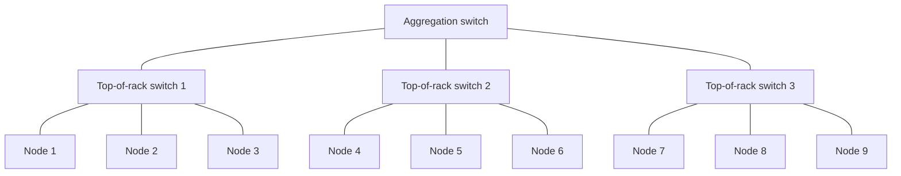

Bandwidth within a rack might be 10 Gb/s per machine. Bandwidth between racks might be 1 Gb/s per machine. Inter-data-center links are slower still — sometimes 100s of milliseconds in latency rather than microseconds.

The practical consequence for Spark is **data locality**. The Hadoop and Spark ecosystems try to schedule a computation on the machine that already has the data, or failing that, on a machine in the same rack. Reading 1GB from a local SSD is much faster than reading 1GB from another machine's SSD across the network. Reading from another rack is slower still. The cluster scheduler is *rack-aware*: it knows which machine holds which data, and which rack each machine sits in, and prefers to assign work accordingly.

You don't usually configure this directly when using Databricks — the platform handles it. But the *principle* matters when you're reasoning about why one job runs faster than another. A job that achieves good data locality will be fast. A job that constantly shuffles data between racks will be slow, even if the total work is the same.

We will return to this in Chapter 60 when we dig into Spark's shuffle internals.

---

### 55.6 Worked example: counting word frequencies at three scales

To make all of the above concrete, let's walk through a single problem at three scales and see how the right tool changes.

**The problem.** You have a text corpus. Count how many times each word appears.

**Scale 1: 10MB of text on a laptop.**

```python
from collections import Counter
with open("small.txt") as f:
    counts = Counter(f.read().split())
print(counts.most_common(10))
```

Three lines. Runs in under a second on any laptop made in the last decade. Spark would be wildly overkill — the cluster startup alone takes longer than the entire computation.

**Scale 2: 10GB of text on a laptop.**

Doesn't quite fit in RAM, but we can stream:

```python
from collections import Counter
counts = Counter()
with open("medium.txt") as f:
    for line in f:
        counts.update(line.split())
```

Still works. Takes a few minutes. One CPU is busy; the other 7 are idle. We could parallelise with `multiprocessing` to use all 8 cores, getting maybe a 5–6× speedup. Still no Spark needed.

**Scale 3: 10TB of text spread across S3 in 100,000 files.**

Now we're in distributed territory. The data doesn't fit on any single machine. Reading it serially would take days. We want to parallelise the reading and counting across many machines.

```python
from pyspark.sql import functions as F
words = spark.read.text("s3://corpus/*").select(F.explode(F.split("value", " ")).alias("word"))
counts = words.groupBy("word").count().orderBy(F.desc("count"))
counts.show(10)
```

Four lines of Spark replacing what would have been hundreds of lines of MPI or custom distributed code in the pre-Spark era. Behind the scenes, Spark reads the 100,000 files in parallel across all executors, tokenises locally, then *shuffles* (Chapter 60) the partial counts so that all occurrences of each word end up on the same machine, then sums. The user writes a high-level expression; Spark handles the orchestration.

The cost: a 50-node Spark cluster for an hour. The win: a job that completes in an hour instead of a week.

The lesson: **the right tool depends on the scale.** Spark is the right answer for scale 3 and the wrong answer for scale 1. Knowing which scale you're operating at is the first decision in any data engineering project, and it's a decision that has more to do with the data than with what's fashionable.

---

### 55.7 Where this leaves us

You should now believe — not just accept on authority — that distributed computation is a real response to a real arithmetic problem. The world has data that doesn't fit on one machine, and the only way to process it is to spread it across many machines that communicate over a network. The shared-nothing architecture is the dominant solution. Communication is expensive relative to local computation, so the practical art of distributed systems is in minimising communication.

You should also believe that distributed computation has *costs*: complexity, latency overhead, dollar cost, and the discipline of writing code that thinks distributed. For small data, these costs outweigh the benefits. There is no shame in using pandas where pandas fits.

In the next chapter, we look at the historical predecessor to Spark — Google's MapReduce — to understand the abstraction that started the modern distributed-computing era, and what Spark improved when it arrived. Once you understand MapReduce, the design of Spark stops feeling arbitrary and starts feeling inevitable.

---

### 55.8 Summary

1. Distributed computation exists because data has outgrown single-machine RAM, single-machine disk, and single-machine CPU. The growth is structural and ongoing, not a fad.
2. The dominant architecture is *shared-nothing*: many machines, each with its own CPU/RAM/disk, communicating only over the network. This scales further than shared-memory or shared-disk architectures because no shared resource bottlenecks the system.
3. Network communication is roughly 1000–10,000× slower than local memory access. The art of distributed computing is to minimise communication — do as much work as possible locally, then exchange only summaries.
4. Distributed compute gains: bigger data, parallelism, fault tolerance, elasticity. Losses: latency overhead, straggler tail latency, complexity, cost, restricted expressive freedom.
5. For data under ~10GB, distributed compute is usually overkill — pandas + scikit-learn is faster and simpler.
6. The CAP theorem constrains any distributed data system to two of {consistency, availability, partition tolerance}. Spark prioritises throughput over low-latency consistency, which is right for batch analytics and wrong for transactional workloads.
7. Network topology — racks, top-of-rack switches, inter-DC links — creates a hierarchy of bandwidth. Data locality (running computation near where the data already lives) is a major Spark performance lever.

---

### 55.9 What this builds on / where this returns

**Builds on:** Standard software-engineering background — the notions of CPU, RAM, disk, network, and how their speeds compare. Nothing earlier in this book is required.

**Returns:**
- Chapter 56 picks up the story historically, introducing MapReduce as the abstraction that made shared-nothing-cluster computation tractable for ordinary developers.
- Chapter 57 makes the cluster physical: driver, executors, cluster manager.
- Chapter 60 zooms in on shuffle — the operation where the communication cost we worried about in 55.2 becomes concrete and measurable.

---

### 55.10 Exercises

1. **Bandwidth arithmetic.** Your cluster has 50 nodes with 10 Gb/s links each. You want to compute the average of one column across 100GB of data partitioned evenly across the cluster. Compare (a) the time to `df.collect()` all data to the driver and compute the average there, versus (b) the time for each node to compute its local sum and count and send only those numbers to the driver. Assume the network is the bottleneck.

2. **When to use Spark.** For each of the following workloads, decide whether you would use Spark or a single-machine solution, and justify:
   1. Training a logistic regression on 50,000 emails to detect spam.
   2. Computing daily aggregate metrics over 18 months of credit-card transactions (~5 billion rows).
   3. Serving real-time fraud predictions at 1000 requests per second with <50ms latency.
   4. Joining a 200GB customer table with a 500GB transaction table.
   5. Running a hyperparameter sweep of 50 XGBoost configurations on a 2GB tabular dataset.

3. **Network latency.** Two machines in the same rack are connected by a 10 Gb/s link with 500 μs round-trip latency. You need to send a single integer (8 bytes) from one to the other. What dominates the time — bandwidth or latency? What about sending 1GB?

4. **Shared-nothing constraint.** Why does a "shared-disk" architecture (all machines see the same network filesystem) not scale to thousands of nodes the way shared-nothing does?

5. **Fault tolerance math.** A single machine has a 0.5% chance of failing per day. In a 200-node cluster, what is the probability that at least one machine fails in a given day? (Use the complement.) What does this imply about the design of jobs that run on the cluster?

6. **CAP theorem application.** A bank's ATM withdrawal system needs to be available 24/7 and absolutely cannot allow two simultaneous withdrawals to overdraw the same account. Which letter of CAP is the bank willing to weaken when the network partitions, and how does that constrain their architecture?

7. **The straggler problem.** Your job has 100 tasks of equal expected duration (10 seconds each). 99 finish in 10 seconds; 1 takes 200 seconds because its node has a degraded disk. What is the total wall-clock time? What does this suggest about how to design tolerable distributed jobs?

8. **Reach for Spark, or not.** A teammate has a 200MB CSV and wants to compute a groupby + average. They've heard Spark is fast at this and want to spin up a cluster. Talk them out of it (or into it). Justify based on what you've learned.

9. **Data locality.** Suppose Spark schedules a task to run on a machine that does *not* have the relevant data partition. The data lives on another machine in the same rack. Estimate (qualitatively) the slowdown vs. running the task on the data-local machine, given the rack-internal network speed.

10. **Cost vs. benefit.** A 50-node Spark cluster costs $100/hour. A daily job runs for 30 minutes. A monthly cost is therefore ~$1,500. The same job could run for 6 hours on a single beefy machine at $5/hour ($900/month). Why might you still prefer the cluster? Why might you prefer the single machine?

<details>
<summary>Answers</summary>

1. (a) 100GB at 10 Gb/s = 80 seconds per direction at peak; in practice with overhead, several minutes. (b) Each node sends 16 bytes; total 800 bytes; on the order of microseconds. Approach (b) is 10⁵–10⁶ times faster.

2. (i) Single-machine; 50K emails is tiny. (ii) Spark; 5B rows won't fit on one machine. (iii) Not Spark; latency requirement is too tight — use a Java/Python serving framework with a pre-loaded model. (iv) Spark; both tables exceed single-machine capacity. (v) Either, but a single machine with multiprocessing or joblib is often simpler at 2GB. Spark adds value if you want to use SparkTrials for distributed Hyperopt — Chapter 53.

3. For 8 bytes: latency dominates entirely — the bandwidth contribution is nanoseconds, latency is 500 μs. For 1GB: bandwidth dominates — 1GB / 10 Gb/s ≈ 800 ms, vs. 500 μs latency. The lesson: small frequent messages are dominated by latency; large infrequent messages by bandwidth. This is why Spark batches data into shuffles.

4. The shared disk (or network filesystem) is itself a single resource with bounded bandwidth and IOPS. As you add more nodes, contention on the shared disk grows linearly while its capacity is fixed. Eventually adding nodes makes the system *slower*. Shared-nothing avoids this because every node has its own local I/O.

5. P(any failure) = 1 − (0.995)²⁰⁰ ≈ 1 − 0.367 ≈ 63%. So nearly two days in three, *something* fails. Implication: any long-running job must be resilient to single-node failure. This is why Spark has lineage (recompute lost partitions) and why Databricks jobs auto-retry.

6. The bank weakens **A** (availability). When the partition occurs, an ATM cut off from the central account system *refuses* the withdrawal rather than potentially allowing an overdraw. The user sees "service unavailable" — annoying, but better than the alternative. This is a classic CP system.

7. 200 seconds — the slowest task dominates. Implications: (a) tasks should be roughly equal in size (avoid skew, Chapter 60); (b) speculative execution can mitigate (Spark re-runs slow tasks on another node); (c) plan for the tail, not the mean — a 99th-percentile-fast task design produces 99th-percentile slowness when scaled to 100 parallel tasks.

8. Talk them out of it. 200MB fits trivially in pandas RAM and the entire job will run in seconds. Spinning up a Spark cluster costs minutes of wall-clock just for the cluster start. Aggregate runtime: pandas wins by an order of magnitude. The only reason to use Spark here is if the project's data is *going* to grow to TB-scale and you want consistent code, but for one-off analysis at 200MB, pandas is the right answer.

9. Reading from another machine's SSD across a 10 Gb/s rack-internal link is maybe 2–5× slower than reading from local SSD (the rack network is fast but not as fast as direct SSD bus). For larger volumes, the gap is smaller (bandwidth-limited either way). For frequent small reads, the gap is larger (latency-limited). The general principle: data locality is worth scheduling for, but it's not catastrophic to lose it.

10. Cluster wins if: you need wall-clock time (30 min vs 6 hours matters), you have spiky workloads where parallelism helps, you want elasticity for larger future jobs, the team's tooling is already Spark-based. Single machine wins if: the job is the only one (no concurrency), you're cost-sensitive, you want operational simplicity, the data won't grow. There's no universally right answer; the question forces you to articulate the constraints.

</details>


## Chapter 56 — MapReduce: Historical Context and What Spark Improved

> **Goal of this chapter:** to teach you the MapReduce abstraction — the idea that started the modern era of distributed data processing — well enough that Spark's design choices stop looking arbitrary. Spark did not arrive in a vacuum. It was a deliberate response to MapReduce's strengths and weaknesses. Understanding the predecessor turns Spark from a list of features into a coherent answer to a specific historical question. By the end of this chapter you will know what MapReduce did right, what it did poorly, and exactly which problems Spark was designed to fix.

---

### 56.1 A small archeology of distributed processing

Distributed data processing did not begin with Spark. It did not begin with Hadoop either. People have been spreading computation across multiple machines since the 1970s — supercomputers, scientific clusters, transaction-processing systems, parallel databases. What was missing, until about 2004, was an *abstraction for ordinary developers*. To write distributed code, you had to be a specialist — you had to think about message-passing protocols, fault tolerance, node failures, and synchronisation, all of which required heroic engineering for each application.

The change came from Google. In 2004, two Google engineers, Jeffrey Dean and Sanjay Ghemawat, published a paper titled *"MapReduce: Simplified Data Processing on Large Clusters."* The paper described a programming model and a runtime that had been quietly used inside Google for several years to power things like the web index. The contribution was not so much the *math* — the patterns it captured had been known in functional programming for decades — but the *engineering*. Google had built a system where ordinary developers, with no distributed-systems background, could write programs that processed petabytes of data across thousands of machines, with automatic fault tolerance and reasonably balanced parallelism.

The paper was open-source-adjacent in spirit. Within a year, Doug Cutting and Mike Cafarella began re-implementing the ideas in Java as part of an open-source project that eventually became Apache Hadoop. By 2008–2010, Hadoop MapReduce was the de facto standard for batch data processing at internet-scale companies. The phrase "big data" entered the popular vocabulary around the same time, and Hadoop was its avatar.

This era — roughly 2008 to 2014 — is what people sometimes nostalgically call "the Hadoop era." It democratised big-data processing. It also taught the field, through painful experience, what was wrong with the MapReduce model. That experience is what Spark was built to address.

---

### 56.2 The MapReduce abstraction

MapReduce is, at its core, a two-step computation pattern. Every job, no matter how complex, is expressed as a sequence of two operations.

**Map.** Take each input record and produce zero or more `(key, value)` pairs from it. The map function is applied to every record independently, in parallel. The output of the map phase is a (huge) list of key-value pairs.

**Reduce.** All values with the same key are grouped together. For each unique key, a reduce function is applied to combine its list of values into a single output value (or sometimes a list).

That is it. Map turns one record into pairs. Reduce combines all values for each key. Everything else MapReduce can do — joining tables, aggregating, sorting, even iterative algorithms — has to be expressed via this two-step pattern, sometimes with multiple Map-Reduce stages chained together.

#### 56.2.1 The canonical example: word count

The word count program is the "hello world" of MapReduce. The problem: given a huge corpus of text, count how many times each word appears.

**Map:** For each line of text, emit `(word, 1)` for each word in the line.

```
"the quick brown fox" → ("the", 1), ("quick", 1), ("brown", 1), ("fox", 1)
"the lazy dog"        → ("the", 1), ("lazy", 1), ("dog", 1)
```

**Shuffle (built into the framework):** Group all values with the same key.

```
"the"   → [1, 1]
"quick" → [1]
"brown" → [1]
"fox"   → [1]
"lazy"  → [1]
"dog"   → [1]
```

**Reduce:** For each key, sum the values.

```
"the"   → 2
"quick" → 1
"brown" → 1
"fox"   → 1
"lazy"  → 1
"dog"   → 1
```

Done. The MapReduce framework handles the parallelism (each map task processes a chunk of the input file) and the grouping (the shuffle moves all "the"s to the same reducer). The user writes only the map and reduce functions.

Let's walk through a slightly bigger numerical example. Suppose the input is a 1TB corpus spread across 10,000 files on a distributed file system (HDFS), and the cluster has 100 machines.

1. **Map phase.** The framework launches 10,000 map tasks (one per file, simplifying slightly). Each task reads one file from local disk (data locality, Chapter 55), tokenizes, and emits `(word, 1)` pairs to local disk. Output size per task: typically smaller than input, but still substantial.
2. **Shuffle phase.** The framework reads the map outputs and routes each `(word, 1)` pair to a reducer based on `hash(word) mod num_reducers`. Suppose there are 1,000 reducers. Every map task's output is partitioned 1,000 ways; each reducer reads its slice from every map task. Total data moved: at most as large as the map outputs.
3. **Reduce phase.** Each reducer receives all values for the words assigned to it. It sums them and writes the final output.

Aggregate counts assembled. The job runs in maybe 20 minutes on a 100-machine cluster, doing what would take days on a single machine.

#### 56.2.2 Why this model is powerful

A few things make MapReduce surprisingly general.

**Independence of map tasks.** Each map task processes one chunk and emits pairs. No map task depends on another. So they can all run in parallel, in any order, on any machine. This means trivial horizontal scaling.

**Built-in fault tolerance.** If a map task fails (the machine crashed, the disk died), the framework restarts it on another machine. The intermediate output is recoverable because it was written to local disk. No special user code is needed for retries.

**Built-in parallelism.** The user doesn't pick how many map or reduce tasks to use — the framework decides based on the input size and cluster capacity.

**Simple programming model.** The user writes two pure functions. No threads, no locks, no message-passing protocols. The mental burden is small enough that a backend engineer can learn MapReduce in a week.

These properties are what made MapReduce *the* go-to abstraction for batch processing for a decade.

---

### 56.3 Expressing computations in the MapReduce idiom

The power of MapReduce comes from a surprising consequence: many problems that don't *look* like map+reduce can be rephrased to fit.

#### 56.3.1 Sorting (e.g., distributed sort)

The map function emits `(record, null)`. The framework's shuffle phase sorts by key (this was a designed-in property — the shuffle uses a partitioner that, with the right configuration, produces sorted output). The reducer just outputs the records.

#### 56.3.2 Grouping aggregates (e.g., total sales per region)

Map emits `(region, amount)` for each transaction. Reduce sums all amounts for each region. The output is the per-region total.

#### 56.3.3 Joins (e.g., users joined with their transactions)

Map emits `(user_id, ("user_record", user_data))` from the users table and `(user_id, ("transaction_record", transaction_data))` from the transactions table. Reduce, for each `user_id`, sees a mix of user_record and transaction_record values; it joins them and emits the combined rows.

This is called a *reduce-side join* — it's straightforward but expensive because all the data crosses the network. A *map-side join* — when one table is small enough to fit in memory on every mapper — is much faster. Spark's broadcast join (Chapter 60) is the descendant of this idea.

#### 56.3.4 Iterative algorithms (e.g., PageRank)

Here is where things start getting awkward. PageRank iteratively updates a vector of ranks: $r_{t+1} = M \cdot r_t$ where $M$ is the web graph's transition matrix. Each iteration is a MapReduce job. After 30 iterations, you've run 30 MapReduce jobs.

The catch: between each iteration, the entire rank vector is written to HDFS (the distributed file system) and read back. For PageRank on a billion-node graph, that's gigabytes per iteration. The disk I/O dominates the computation by a large margin. This is the fundamental weakness of MapReduce, and Spark's most important improvement (Section 56.5).

#### 56.3.5 K-means clustering

K-means is another iterative algorithm. Each iteration: assign each point to its nearest centroid (map), then update each centroid as the mean of its assigned points (reduce). On a billion points and a thousand iterations, you have a thousand MapReduce jobs, each writing intermediate state to disk. The wall-clock time is dominated by disk I/O, not by the actual k-means math.

Practitioners in the late 2000s knew this was a problem. They built workarounds — chained Hadoop jobs, custom in-memory frameworks, hybrid systems — but the core abstraction itself was the bottleneck.

---

### 56.4 What MapReduce did well, and what it did poorly

It is worth being precise about the credit-and-debit ledger.

#### 56.4.1 The strengths

1. **Simplicity.** Two functions to write. No distributed-systems expertise required.
2. **Linear scalability.** Adding machines doubles throughput, with very little tuning.
3. **Fault tolerance.** Built in. The framework handles retries, re-execution, replication.
4. **A real ecosystem.** Hadoop spawned an entire stack — HDFS, YARN, Hive, Pig, Mahout, HBase, Sqoop. For ten years, this was where serious big-data work happened.
5. **Open source.** The combination of Google's paper and the open-source Hadoop implementation meant any organisation could adopt it without licensing fees, accelerating adoption far beyond what a proprietary system would have achieved.

#### 56.4.2 The weaknesses

1. **Disk-based shuffle.** Every MapReduce stage's output is written to disk, read back from disk by the next stage. For multi-stage and iterative workloads, the disk I/O dominates. A typical Hadoop job might spend 90% of its time on I/O and 10% on actual computation.
2. **Inflexible primitives.** Everything must be Map and Reduce. Expressing operations that don't fit this pattern — multi-way joins, windowed aggregations, nested data — requires awkward gymnastics. The Hadoop ecosystem responded with higher-level languages (Pig, Hive) that compiled to MapReduce, but the underlying limitation remained.
3. **No abstraction over the JVM.** Hadoop MapReduce is fundamentally a Java framework. Python support exists (Hadoop Streaming) but is awkward, slow, and not ergonomic.
4. **No native iterative support.** As we saw above, iterative algorithms are a worst-case for MapReduce because each iteration writes to disk. ML training and graph algorithms suffer especially.
5. **No interactive querying.** A MapReduce job runs as a batch. You submit it; you wait minutes or hours; you get results. There's no way to interactively explore data the way a SQL session or a Python REPL allows. Hive partially addressed this by compiling SQL to MapReduce, but the latency was still in tens of seconds at best.
6. **Operational complexity.** Hadoop clusters were notorious for requiring large operations teams to keep healthy. The configuration knobs were many and inscrutable.

The weaknesses didn't kill MapReduce — it was the best option available for years, and millions of jobs ran on it productively. But they did create *pressure* for something better. By 2010 or so, that pressure had crystallised into specific demands: keep the simplicity, keep the fault tolerance, but make iterative algorithms fast, support more abstractions than just map and reduce, and make it interactive.

---

### 56.5 Enter Spark

In 2009, a Berkeley grad student named Matei Zaharia started working on what became Apache Spark. The motivating problem, in Zaharia's own description, was the iterative-machine-learning pain point: MapReduce's disk-bound shuffle made ML training impractically slow on large datasets. He wanted a system that kept MapReduce's fault tolerance and scalability but performed iteration in memory.

The result was the **RDD** — Resilient Distributed Dataset — Spark's foundational abstraction (Chapter 58 covers it in depth). An RDD is an immutable, distributed collection of objects, partitioned across the cluster. The key word is *immutable*. Operations on RDDs produce *new* RDDs; the originals are unchanged. And — critically — Spark tracks the *lineage* of every RDD: the sequence of operations that produced it from the original input data.

This lineage tracking is what gave Spark its name's "Resilient" property and its iterative-workload speed.

#### 56.5.1 The key innovations

**1. In-memory computation.** When you process data in Spark, intermediate results stay in RAM by default. Only when you explicitly persist them to disk, or when memory pressure forces a spill, do they touch the disk. For iterative algorithms, this is the single biggest win — the inter-iteration disk write/read is eliminated.

**2. Lineage-based fault tolerance.** Spark doesn't need to checkpoint every intermediate result to recover from failure. If a partition is lost, Spark looks at the lineage — the chain of operations that produced it — and recomputes the partition from the still-extant inputs. This is more memory-efficient than MapReduce's "write everything to disk" approach, while still being fault-tolerant.

**3. Richer primitives.** Beyond `map` and `reduce`, RDDs support `filter`, `flatMap`, `union`, `intersection`, `distinct`, `groupByKey`, `reduceByKey`, `join`, `cogroup`, `sample`, `cartesian`, and many more. Each is implemented to be efficient in the distributed setting. The user doesn't have to shoehorn their algorithm into Map+Reduce.

**4. Lazy evaluation.** Operations on RDDs don't execute immediately. They build up a *plan* — a directed acyclic graph (DAG) of transformations. Only when you call an *action* (like `count`, `collect`, `saveAsTextFile`) does Spark actually run the plan. This is crucial because it lets Spark *optimise* the plan before executing — combining filters, pushing predicates down, choosing the best join strategy. Hadoop MapReduce, with its eager Map and Reduce, had no such opportunity.

**5. The interactive shell and notebook story.** Because Spark could run quickly enough on cached data, it could support interactive querying. A data scientist could load a 100GB dataset into memory once, then run dozens of ad-hoc queries against it in seconds each, instead of submitting MapReduce jobs that each took minutes. This was a huge ergonomic improvement that opened distributed data work to a much wider audience.

**6. Multiple language APIs.** Spark was Scala-first, but Python (PySpark), Java, and R bindings were first-class citizens from early on. This matched the actual data-science community much better than Hadoop's Java-only world.

#### 56.5.2 The numerical impact

For iterative workloads — the original motivating use case — Spark was *10–100× faster* than equivalent MapReduce jobs. This was not a marginal improvement; it was a step change that made workloads tractable that hadn't been before.

For one-shot batch workloads — the bread and butter of MapReduce — Spark was typically 2–10× faster, mostly because of the smarter optimisation and the avoidance of unnecessary intermediate writes.

Within five years of Spark's release (2014–2018), it had displaced Hadoop MapReduce as the default for new big-data projects. The shift was decisive enough that by 2020, "Hadoop" mostly meant "HDFS and YARN, with Spark on top." Map-and-reduce as a programming model survived — Spark still has `map` and `reduce` operations — but as one pattern among many, not the only one.

---

### 56.6 The MapReduce model still matters

It would be a mistake to read this chapter as "MapReduce is dead, ignore it." Two things matter for Spark practitioners.

First, Spark's `groupByKey`, `reduceByKey`, and aggregate operations are *direct descendants* of MapReduce's reduce phase. When you call `df.groupBy("region").agg(F.sum("amount"))`, what happens under the hood is essentially the same thing the MapReduce reduce phase does. Spark's shuffle is the same conceptual operation as MapReduce's shuffle. Understanding *why* shuffles happen — because all values for the same key must end up on the same machine before they can be reduced — is the central performance concept in Spark, and it comes straight from MapReduce.

Second, the MapReduce model is the *minimum* useful abstraction. Spark adds many things on top, but you can always fall back to map and reduce when nothing else fits. RDDs (Chapter 58) expose the map/reduce primitives directly. Even DataFrame operations decompose, under the hood, into map and reduce stages connected by shuffles.

The lesson is: MapReduce was a brilliant abstraction that hit its limits when applied to iterative and interactive workloads. Spark fixed those limits by keeping the conceptual core (parallel transformations across a partitioned dataset, with a shuffle to group by key) and adding lazy evaluation, in-memory state, richer primitives, and optimisation. Knowing the predecessor turns Spark's design from a set of features into a coherent system.

---

### 56.7 Worked example: word count in Spark vs. MapReduce

Let's see the difference directly. Same problem (word count over a corpus), two implementations.

#### 56.7.1 Hadoop MapReduce (conceptual, Java)

```java
public class WordCount {
    public static class Map extends Mapper<LongWritable, Text, Text, IntWritable> {
        private final static IntWritable one = new IntWritable(1);
        private Text word = new Text();

        public void map(LongWritable key, Text value, Context context) {
            for (String token : value.toString().split("\\s+")) {
                word.set(token);
                context.write(word, one);
            }
        }
    }

    public static class Reduce extends Reducer<Text, IntWritable, Text, IntWritable> {
        public void reduce(Text key, Iterable<IntWritable> values, Context context) {
            int sum = 0;
            for (IntWritable val : values) sum += val.get();
            context.write(key, new IntWritable(sum));
        }
    }

    public static void main(String[] args) throws Exception {
        // ~30 more lines of boilerplate to configure the job, input/output paths,
        // serialization formats, etc.
    }
}
```

50+ lines, mostly boilerplate. The actual logic — emit (word, 1), sum — is buried.

#### 56.7.2 Spark (RDD API)

```python
text = sc.textFile("hdfs://corpus/*")
counts = (text
    .flatMap(lambda line: line.split())
    .map(lambda word: (word, 1))
    .reduceByKey(lambda a, b: a + b))
counts.saveAsTextFile("hdfs://output/")
```

Five lines. The shape is exactly the same — flatMap is the map step (tokenize), map produces (word, 1), reduceByKey is the reduce step (sum). The Spark code reads almost like a description of the algorithm.

#### 56.7.3 Spark (DataFrame API — what modern Spark users actually write)

```python
from pyspark.sql import functions as F
df = spark.read.text("hdfs://corpus/*")
counts = (df.select(F.explode(F.split("value", "\\s+")).alias("word"))
    .groupBy("word").count())
counts.write.parquet("output/")
```

Five lines again, but now leveraging Spark SQL — the Catalyst optimizer (Chapter 59) sees what we're doing and can apply optimisations like vectorisation. This is the form you would actually use in production today.

All three programs compute the same answer. The Hadoop version takes 30 minutes on a 100-node cluster. The Spark versions take 2 minutes on the same cluster — most of the speedup from avoiding intermediate disk writes.

---

### 56.8 A short note on Hadoop's continued relevance

Hadoop didn't die when Spark rose. What changed is its role.

- **HDFS** (the Hadoop Distributed File System) is still widely used as the storage layer in on-prem big-data deployments, though cloud object stores (S3, ADLS, GCS) have taken over in cloud-native environments. Modern Databricks uses cloud object stores almost exclusively.
- **YARN** (Yet Another Resource Negotiator) is one of the cluster managers Spark can run on. In cloud deployments, Kubernetes or proprietary managers (Databricks Resource Manager) are more common.
- **Hadoop MapReduce** — the actual MapReduce execution engine — is now mostly legacy. New work doesn't use it. Existing pipelines often still do, because rewriting is expensive.

For the Databricks ML Associate exam, you don't need to know Hadoop's internals. You need to know that MapReduce was the predecessor, that Spark improved on it primarily by adding in-memory computation and richer primitives, and that the basic map/group/reduce concept survives in Spark's DataFrame operations.

---

### 56.9 Summary

1. MapReduce, introduced by Google in 2004 and popularised by Hadoop, was the first widely-adopted abstraction for ordinary developers to write distributed batch jobs. Its core idea: every computation is a sequence of Map (transform records to key-value pairs) and Reduce (combine all values for each key) operations.
2. The framework handles parallelism, shuffle, and fault tolerance automatically — the developer writes only the two functions.
3. MapReduce's main weakness was disk-based shuffle: between every Map and Reduce stage, intermediate data is written to and read from disk. For iterative algorithms (ML, graph), this dominated runtime.
4. Other weaknesses: inflexible primitives, no native iterative support, no interactive querying, awkward Python support, heavy operational complexity.
5. Spark, introduced in 2009-2010 at UC Berkeley, kept MapReduce's strengths (parallelism, fault tolerance, simple programming model) and fixed the weaknesses: in-memory computation, lineage-based fault tolerance, richer primitives, lazy evaluation enabling whole-program optimisation, interactive querying, first-class Python support.
6. Spark is typically 10–100× faster than Hadoop MapReduce on iterative workloads and 2–10× faster on batch workloads. It displaced Hadoop MapReduce as the default for new big-data projects between 2014 and 2018.
7. The MapReduce conceptual model still underlies Spark — `groupByKey`, `reduceByKey`, and DataFrame `groupBy(...).agg(...)` are direct descendants. Shuffles in Spark are the same conceptual operation as shuffles in MapReduce.

---

### 56.10 What this builds on / where this returns

**Builds on:** Chapter 55's shared-nothing architecture and the cost of network communication. MapReduce *is* the canonical shared-nothing batch abstraction; everything in this chapter assumes that mental model.

**Returns:**
- Chapter 57 makes the Spark execution model concrete: driver, executors, cluster manager. The "framework that handles parallelism and shuffle" we waved at in this chapter becomes a specific set of processes.
- Chapter 58 introduces RDDs formally — Spark's direct successor to MapReduce's key-value pair list.
- Chapter 60 dissects the shuffle operation in detail — the place where Spark and MapReduce share the most DNA and where Spark performance is most often won or lost.
- Chapter 59 explains Catalyst, which is the *optimisation* layer that lazy evaluation makes possible — something MapReduce structurally could not have.

---

### 56.11 Exercises

1. **Map-reduce by hand.** You have a list of customer purchase records, each with `(customer_id, amount)`. Write the map function and the reduce function (in pseudocode) for computing the total spend per customer.

2. **MapReduce-style join.** You have a Users table and a Transactions table, both keyed on `user_id`. Sketch how a MapReduce reduce-side join would work. What does map emit? What does reduce do?

3. **Iterative algorithm pain.** Suppose you want to compute the average of a column over 100GB of data — easy, one MapReduce job. Now suppose you want to compute the *running* average after each consecutive 1GB chunk (so 100 averages total). How would this look in Hadoop MapReduce? How does Spark do it better?

4. **The lineage idea.** Spark's "resilient" means a lost partition can be *recomputed* from its lineage. Explain why this works for `rdd1.map(...).filter(...).map(...)` but doesn't work in a useful way if the original input data is also lost.

5. **Choose your tool.** For each of the following, decide whether MapReduce alone (Hadoop) would have been adequate in 2010, or whether you'd want Spark's improvements. Justify briefly:
   1. A one-time ETL job that joins two tables and aggregates.
   2. Training a logistic regression with 100 iterations.
   3. Computing the daily page-view count from web logs.
   4. Running PageRank for 30 iterations on a 10-billion-node graph.
   5. An interactive exploration session where a data scientist runs 50 queries against a 100GB dataset.

6. **Disk I/O math.** Suppose a MapReduce job writes 200GB of intermediate data to local disk and reads it back. Disk write bandwidth is 500 MB/s. How long does the write phase take? The read phase? What's the total disk-I/O wall-clock time? How does this affect overall job runtime?

7. **Lazy evaluation benefit.** Suppose your Spark code is `df.filter(x > 100).select("a").filter(a < 500).count()`. Why is laziness helpful here? What would happen in an eager system? Hint: think about what the optimiser can do.

8. **Word count cost comparison.** Same word-count problem, same corpus (1TB), same cluster (100 machines). Hadoop MapReduce takes 30 minutes; Spark takes 2 minutes. Without changing the algorithm, where did the 28 minutes go?

9. **Why not just use MapReduce with more RAM?** A naive response to MapReduce's disk-shuffle problem is "buy more RAM and tell Hadoop to use it." Why didn't this work — what's structurally different about Spark's in-memory model?

10. **The PageRank example.** Without re-reading, sketch in your own words why PageRank is a worst-case workload for MapReduce. What does Spark do differently that solves it?

<details>
<summary>Answers</summary>

1. Map: `(customer_id, amount) → emit(customer_id, amount)`. Reduce: `(customer_id, [amounts]) → emit(customer_id, sum(amounts))`. Identical structure to word count.

2. Map for Users emits `(user_id, ("U", user_record))`. Map for Transactions emits `(user_id, ("T", txn_record))`. Reduce sees, for each `user_id`, a list of records mixing U and T entries. It separates them, then emits the cross product (one user_record joined with each transaction). Reduce-side joins move all data through the shuffle — expensive but general.

3. In MapReduce: 100 sequential jobs, each writing intermediate state to HDFS and reading it back next iteration. ~100× the disk I/O of a single pass. Spark: cache the input data in memory, then run 100 incremental aggregations against the cached RDD. Disk touched once (to read the original data) instead of 200 times.

4. The lineage is "starting from input X, do these operations." If X is gone, the lineage can't replay. So Spark only achieves fault tolerance against *executor* failures, not against catastrophic input-data loss. The input data must be durably stored (HDFS, S3, etc.). Beyond a certain lineage depth, Spark also supports checkpointing — write an intermediate to disk so the lineage can restart from there.

5. (i) Either works; one-shot ETL is MapReduce's sweet spot. (ii) Spark — 100 iterations of writes to HDFS would make Hadoop painfully slow. (iii) MapReduce works fine — one-pass aggregation. (iv) Spark — 30 iterations is exactly the iterative-disk-I/O pain point. (v) Spark, hands down — MapReduce can't support interactive exploration at sub-minute latencies.

6. Write 200GB at 500 MB/s = 400 seconds. Read 200GB = 400 seconds. Total: ~800 seconds = ~13 minutes just on local disk I/O for one shuffle. For an iterative job that does this 30 times, that's 400 minutes of pure disk I/O. This is the "MapReduce is disk-bound" problem in numbers.

7. With laziness, the optimiser can see the whole chain before executing. It can: (a) combine the two filters into one predicate (`100 < x < 500`); (b) push the filters down to be applied during the read; (c) drop unused columns. In an eager system, each operation is executed standalone, producing an intermediate that's then re-filtered — wasted work.

8. Mostly disk I/O on the intermediate shuffle, plus serialisation overhead, plus the lack of pipelining between map and reduce (Hadoop's reduce can only start after all map is done; Spark can sometimes pipeline). The Spark version keeps the partial counts in memory and ships them directly to the reducer.

9. Hadoop's data format and execution model are *built around* writing to disk between stages. There's no in-memory path for the shuffle output to skip the disk; you'd need to redesign the execution engine. That redesign is what Spark *is*. You can't bolt it onto Hadoop without rewriting almost everything.

10. PageRank iterates: `rank = M * rank`, repeated until convergence (~30 iterations on web-scale graphs). Each iteration is a join (M with rank) and a reduce (sum contributions). In MapReduce, every iteration writes the new rank vector to HDFS and reads it back — gigabytes of disk I/O per iteration, dominating the math. In Spark, the matrix M and the rank vector live in memory after the first read; each iteration is pure compute, with no inter-iteration disk I/O. Result: 30–100× speedup.

</details>


## Chapter 57 — Spark Architecture: Driver, Executors, Cluster Manager

> **Goal of this chapter:** to take Spark from "the framework that runs my notebook" to a concrete picture of which processes exist, what runs where, and who talks to whom. When you call `spark.read.csv("s3://...").groupBy("region").agg(...)`, several physical machines coordinate to produce your answer. Knowing which machine does what is the difference between guessing at performance ("Spark is slow today") and reasoning about it ("the driver is overloaded; let's move that work to executors"). This chapter is the physical-systems picture under everything else in Part J.

---

### 57.1 What happens when you call `spark.read.csv(...)`?

You open a Databricks notebook. The cluster is started. You type:

```python
df = spark.read.csv("s3://bucket/data/", header=True)
df.groupBy("region").agg(F.sum("amount")).show()
```

What just happened, physically?

Behind the scenes, a series of distinct processes — running on different machines, connected by network — collaborated. The notebook itself runs on one machine (the **driver**). The reading and aggregation happened on several other machines (the **executors**). Between them sat a coordination layer (the **cluster manager**) that decided which executor machines existed in the first place.

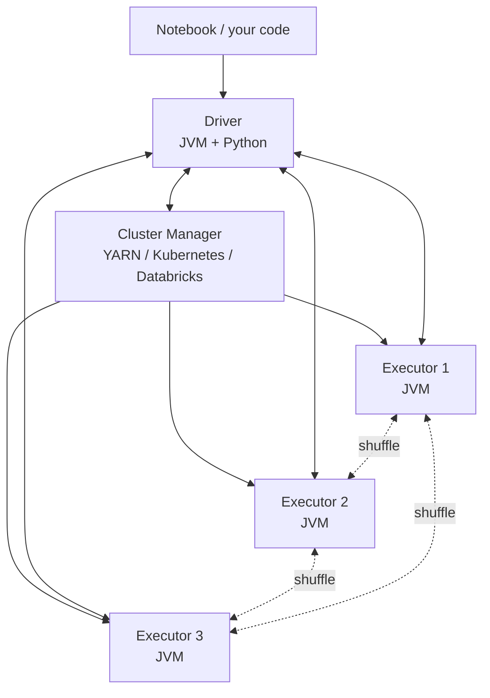

The interaction is not a one-way pipeline. The driver and executors maintain bidirectional communication throughout the job: the driver sends tasks down, the executors send progress reports up, and the executors also communicate among themselves during shuffles (Chapter 60). This chapter unpacks each component.

---

### 57.2 The driver

The **driver** is the process that runs your application code — your `main()` function, your notebook cell, your Python script. From its perspective, it is the maestro: it decides what work needs doing, breaks it into pieces, hands those pieces to executors, and collects the results.

Concretely, in a Databricks notebook, the driver is a JVM process running on the *driver node* of the cluster, with a Python process attached (for PySpark) via a bridge called Py4J. When you type Python code in a notebook cell, it runs in the Python process; when that Python code calls Spark APIs (e.g., `df.groupBy(...)`), Py4J translates the call into JVM method invocations on the JVM driver. The JVM driver then orchestrates the work.

#### 57.2.1 What the driver does

Three responsibilities define the driver:

1. **Build the logical plan.** When you write `df.filter(...).groupBy(...).agg(...)`, the driver constructs an abstract syntax tree (AST) of these operations. Nothing has been executed yet — these are just *descriptions* of what to do.

2. **Optimise and plan execution.** When you trigger an *action* (`show`, `collect`, `count`, `write`), the driver hands the logical plan to the **Catalyst optimizer** (Chapter 59). Catalyst rewrites and optimises it, producing a physical plan: a sequence of **stages**, each split into **tasks** (one per partition — Chapter 60). The driver also decides which executor should run which task.

3. **Coordinate execution.** The driver dispatches tasks to executors, monitors their progress, handles failures (retry the task on another executor), and collects final results when an action requests them (e.g., `.collect()` brings data back to the driver).

You can think of the driver as both the *compiler* and the *runtime scheduler* of a Spark application. It is single-process and (mostly) single-threaded for these orchestration duties.

#### 57.2.2 The driver is a single point of failure

Because there's only one driver per Spark application, if the driver crashes, the whole application crashes. There is no failover. This is by design — Spark's fault-tolerance model handles *executor* failures (recompute lost partitions from lineage, Chapter 58) but assumes the driver is reliable.

In practice, this means:
- Don't run unnecessarily expensive work on the driver. `.collect()` on a 50GB DataFrame pulls all 50GB into the driver's heap, which often OOMs. `.show()` brings only 20 rows by default — safe.
- Don't put unrelated heavy Python computation in the same notebook session as a Spark job. The driver's Python process and the JVM share the driver node; if either is overloaded, both suffer.
- Driver-side state is ephemeral; if the driver restarts, in-memory state is lost.

For very long-running production jobs, Databricks Jobs offers retries — a failed run is restarted from scratch, with a fresh driver. But during a single run, the driver is the system's weak link.

#### 57.2.3 Driver sizing

The driver doesn't process the data itself — that's the executors' job. So why does driver sizing matter?

The driver needs memory and cores for:
- **Plan compilation.** For a query with many joins and aggregations, Catalyst can use surprising amounts of memory during optimisation. Tens of GB for very complex queries.
- **Result collection.** Any data you `.collect()`, `.toPandas()`, or `.take()` lots of, comes back to the driver. The driver needs enough heap to hold it.
- **Broadcast variables.** If you broadcast a 1GB lookup table to all executors (Chapter 60's broadcast join), the driver holds a copy.
- **Task tracking.** With thousands of tasks per stage, the driver's bookkeeping (task IDs, progress, retry state) consumes memory.

For typical Databricks workloads, a 32GB / 4-core driver is enough for jobs scoring up to terabyte-scale data. For workloads with frequent `.collect()` or large broadcasts, you might need 64GB or more. For pure ETL with no driver-side work, you can run a 16GB driver and save money.

The relevant config: `spark.driver.memory` (e.g., `32g`), `spark.driver.cores` (e.g., `4`).

---

### 57.3 The executors

The **executors** are the worker JVMs that do the actual data processing. There are many of them — typically dozens, sometimes hundreds. Each executor:

- Runs on a worker node (a separate machine from the driver).
- Has a fixed amount of memory and a fixed number of cores (parallel task slots).
- Receives tasks from the driver, runs them on its data partitions, and reports back.
- Caches data in memory when instructed (`.cache()`, `.persist()`).
- Communicates with other executors during shuffles.

#### 57.3.1 The executor's life cycle

When you start a Spark application (e.g., spin up a Databricks cluster, run a job), the cluster manager (Section 57.4) allocates a fixed pool of executor JVMs across the worker nodes. These executors register with the driver, and the driver becomes aware of them.

For the duration of the application — until the cluster is torn down or autoscaling decides to remove an executor — those JVMs stay alive. Tasks are *dispatched* to them; the executors don't restart between tasks. This is a major efficiency win over Hadoop MapReduce, where every task was a fresh JVM (with JVM startup overhead).

Inside each executor, tasks run on threads. If an executor has 4 cores, it can run 4 tasks in parallel. Each task is single-threaded within itself.

#### 57.3.2 Executor memory layout

An executor's heap is divided into regions:

```
┌────────────────────────────────────────────────────┐
│ Executor JVM heap (e.g., 30GB)                     │
├────────────────────────────────────────────────────┤
│ Reserved memory (300MB)                            │
├────────────────────────────────────────────────────┤
│ User memory (~25%)                                 │
│ — user data structures, UDF state                  │
├────────────────────────────────────────────────────┤
│ Storage memory                                     │
│ — cached RDDs / DataFrames                         │
│                                                    │
│ ─── Unified Memory Manager ─────────────────────── │
│                                                    │
│ Execution memory                                   │
│ — shuffle, joins, sorts, aggregations              │
└────────────────────────────────────────────────────┘
```

In modern Spark (1.6+), storage and execution memory share a region under the **Unified Memory Manager**. By default, ~60% of the heap is "Spark memory" (the unified region), split dynamically between storage and execution. The remainder is user memory and reserved.

The practical consequences:
- A query that does a lot of shuffling (execution memory) can crowd out cached data (storage memory), causing cache evictions.
- A query that caches a lot can leave less room for shuffles, causing spills to disk.
- You usually don't tune these directly. You give the executor enough total memory and let Spark balance.

Beyond the heap, executors also use **off-heap memory** (managed by Tungsten, Chapter 59) for compact binary representations of data. This memory isn't visible to the JVM's garbage collector, which is a feature — GC pauses on multi-GB heaps were a major performance issue in early Spark.

#### 57.3.3 Executor sizing — the 4-5 cores rule

How many cores per executor? How many executors total?

The conventional wisdom from Databricks and the broader Spark community is **4-5 cores per executor**. Why not more?

- **JVM garbage collection contention.** A JVM with many parallel threads competing for the same heap has more GC overhead. Splitting a 16-core machine into 4 executors of 4 cores each (rather than one executor of 16 cores) reduces GC contention.
- **HDFS / S3 I/O throughput.** Each executor maintains a fixed number of HDFS/S3 client threads. Beyond ~5 cores per executor, the I/O bandwidth saturates.
- **Memory per task.** Each task gets `executor_memory / cores` of working memory. Too few cores = lots of memory per task (good for shuffles) but few tasks in parallel. Too many cores = many tasks but each starved for memory.

So on a 16-core, 64GB worker node, the sweet spot is roughly **3 executors of 5 cores and ~20GB heap each**, with the remaining 1 core and ~4GB reserved for the OS, log daemons, etc.

The number of executors total is governed by:
- `spark.executor.instances` — static count
- `spark.dynamicAllocation.enabled=true` — let Spark autoscale

In Databricks, you typically don't set these manually. The platform manages cluster sizing for you, with autoscaling between min and max worker counts.

#### 57.3.4 Tasks per executor

When the driver schedules a stage, it has, say, 200 tasks (one per partition). The cluster has 10 executors × 5 cores = 50 task slots. So 50 tasks run in parallel; as they complete, the next 50 are dispatched; eventually all 200 are done.

The duration of a stage = (number of tasks / total task slots) × average task duration, *if tasks are evenly sized*. If they're skewed, the slowest task dominates (Chapter 60). The driver's scheduler tries to keep all slots busy.

A common diagnostic: if a stage has 200 tasks but only 50 are running at any time (and only 50 task slots exist), you're at full parallelism. If 200 tasks are running on 5 slots, you have far more tasks than slots and tasks are queued — usually fine, sometimes suggests over-partitioning. If 50 tasks are running on 200 available slots, you have under-parallelism — the data is split into too few partitions to use the cluster.

---

### 57.4 The cluster manager

Spark does not allocate machines on its own. It asks a **cluster manager** to provision worker nodes (and the executor JVMs that run on them). Several cluster managers exist:

1. **Standalone.** Spark's built-in simple manager. Works for small clusters; not common in production.
2. **YARN.** Hadoop's resource manager. Standard in on-premise Hadoop clusters; less common in pure cloud deployments.
3. **Kubernetes.** Modern container-orchestration platform. Used in Spark-on-Kubernetes deployments and in Databricks' newer offerings.
4. **Databricks Resource Manager.** Databricks' proprietary internal manager. What you're using when you spin up a Databricks cluster.
5. **Mesos.** Older alternative; mostly deprecated for Spark use.

From Spark's perspective, the cluster manager has one main responsibility: when Spark requests N executors, the cluster manager finds the hardware to run them, starts the executor JVMs, and tells Spark where they are. The cluster manager also handles failures — if a worker node dies, it tries to provision a replacement.

For Databricks users, the cluster manager is the platform itself. When you create a cluster in the Databricks UI, the platform requests cloud VMs from AWS / Azure / GCP, configures them, starts the executor JVMs, and reports back. Autoscaling, spot-instance handling, and cluster termination are all managed by the platform.

#### 57.4.1 Cluster types on Databricks

Databricks offers different cluster types with the same underlying architecture:

- **All-purpose clusters.** Interactive — shared by users for notebooks. Stay alive until terminated. More expensive per hour but ready for ad-hoc work.
- **Job clusters.** Ephemeral — spun up to run one specific job, then torn down. Cheaper per run; no shared state.
- **SQL warehouses.** Optimised for SQL workloads with Photon (Section 57.6.2). Underneath, still Spark.

All three use the same driver+executors+cluster-manager architecture. The differences are in lifecycle, pricing, and which optimisations are enabled.

---

### 57.5 The end-to-end query flow

Let's walk through what happens when you execute a non-trivial Spark query, end-to-end. Suppose you run:

```python
df = spark.read.parquet("s3://big-table/")
result = (df
    .filter(F.col("year") == 2024)
    .groupBy("region")
    .agg(F.sum("amount").alias("total"))
    .orderBy(F.desc("total")))
result.show()
```

Step by step:

**Step 1: Build the logical plan.** As you write each line, the Python (PySpark) driver translates it into JVM calls that build a tree of `LogicalPlan` nodes. After the four operations, the tree looks like (Sort → Aggregate → Filter → Scan). At this point, nothing has been read from S3. Nothing has executed.

**Step 2: Trigger via action.** `result.show()` is an *action*. Actions force evaluation. The driver hands the logical plan to Catalyst.

**Step 3: Catalyst optimises.** Catalyst (Chapter 59) applies its four phases — analysis, logical optimisation, physical planning, code generation. It performs predicate pushdown (move the `year == 2024` filter into the Parquet scan, so we read less data), projection pushdown (only read the columns we need: `year`, `region`, `amount`), and picks physical operators (e.g., `HashAggregate` for the groupBy, `Sort` for the orderBy). It generates JVM bytecode for the resulting plan.

**Step 4: Split into stages.** Catalyst's physical plan is partitioned into **stages** at shuffle boundaries. In our example:
- Stage 0: scan Parquet, filter, partial-aggregate per partition.
- Stage 1: shuffle the partial aggregates by region, full-aggregate, sort.
- Stage 2: collect top rows for `.show()`.

**Step 5: Dispatch tasks.** Each stage is split into tasks (one per input partition for Stage 0; one per shuffle partition for Stages 1+). The driver dispatches tasks to executor task slots.

**Step 6: Executors run tasks.** Each task:
- Reads its input data (from S3 for Stage 0, from another executor's local disk for the shuffle in Stage 1).
- Runs the generated bytecode on the data.
- Writes output (to local disk for shuffle stages, back to the driver for the final stage).

**Step 7: Shuffle handshake.** Between Stage 0 and Stage 1, executors write their partial aggregates to local disk, partitioned by `hash(region)`. Stage 1's executors fetch the relevant partitions from each Stage 0 executor over the network.

**Step 8: Collect to driver.** Stage 2's task runs, and its output (the top 20 rows for `.show()`) is sent back to the driver. The driver formats and displays them.

This whole sequence might take a few seconds for a small query, minutes for a big one. The principles don't change with scale; just the number of tasks and the amount of data.

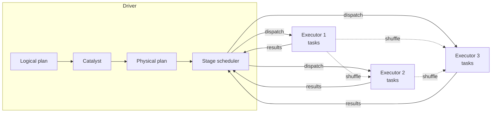

---

### 57.6 Spark on Databricks specifically

The architecture above is generic Spark. Databricks adds platform-specific layers worth knowing.

#### 57.6.1 The Databricks Runtime (DBR)

Databricks Runtime is a customised distribution of Spark with optimisations, library bundling, and tighter integration with cloud storage. Recent DBR versions are 5–10× faster than open-source Spark on equivalent workloads, partly thanks to:

- Photon (next section).
- Native Delta Lake integration.
- Optimised IO connectors for S3 / ADLS / GCS.
- Built-in MLflow, autologging, Feature Store.

The "DBR ML" variant additionally ships with ML libraries (XGBoost, LightGBM, TensorFlow, PyTorch) pre-installed and a curated set of versions known to work together.

#### 57.6.2 Photon

**Photon** is Databricks' proprietary vectorised execution engine, written in C++, that replaces parts of Spark's Tungsten layer for SQL and DataFrame operations. It is *not* a full Spark replacement; it works in conjunction with Spark, taking over execution for the operators it supports while leaving the rest to the JVM.

Photon improvements:
- Processes data in *batches* (typically a few thousand rows at a time) rather than row-by-row, exploiting CPU SIMD instructions.
- Native code, no JVM GC overhead.
- Engineered for modern CPU memory hierarchies.

When applicable, Photon offers 2–10× speedups on SQL and DataFrame workloads. Pyspark.ml workloads benefit somewhat indirectly — the DataFrame operations Pyspark.ml runs (vector assembly, scaling, etc.) accelerate, but the actual estimator math (e.g., gradient computations in logistic regression) often does not.

Part L Chapter 69 returns to Photon for pricing and selection guidance.

#### 57.6.3 The Python ↔ JVM boundary

PySpark is a thin Python wrapper around the JVM Spark API. Understanding the boundary helps explain some PySpark performance quirks.

When you write:

```python
df.filter(F.col("amount") > 100)
```

`F.col(...)` and `>` are Python objects, but they translate (via Py4J) into JVM `Column` objects and expressions. The JVM driver then builds the logical plan in JVM-land and executes it on JVM executors. The Python process on the driver is just a thin shell around the JVM.

But when you write:

```python
@udf("double")
def my_udf(x):
    return x * 2 + 1

df.withColumn("y", my_udf("x"))
```

`my_udf` is Python code. Spark can't run Python code in a JVM executor directly. So at each executor, Spark spawns a *Python worker process* (one per task), and for every row, it:
1. Serialises the row data from JVM memory.
2. Pipes it to the Python worker.
3. Python worker runs `my_udf`.
4. Pipes the result back.
5. Deserialises into JVM.

This is *slow*. Per-row IPC is many orders of magnitude slower than native JVM execution. A Python UDF can make a query 10–100× slower than the equivalent built-in operation.

The mitigation: **Pandas UDFs** (also called vectorised UDFs). Instead of one row at a time, Spark sends *batches* of rows to Python as Arrow-formatted columnar data. The Python function operates on a pandas Series or DataFrame and returns one. This amortises the IPC overhead across many rows and uses pandas/NumPy's vectorised C implementations.

```python
@F.pandas_udf("double")
def my_pandas_udf(s: pd.Series) -> pd.Series:
    return s * 2 + 1

df.withColumn("y", my_pandas_udf("x"))
```

Pandas UDFs are typically 10–100× faster than scalar Python UDFs, often within 2–3× of native Spark. They're the right default whenever you genuinely need custom Python logic.

Best of all is to avoid UDFs entirely and use built-in Spark functions. `df.withColumn("y", F.col("x") * 2 + 1)` is faster than any UDF and is the preferred form.

---

### 57.7 Code: inspecting your Spark configuration

A quick recipe for getting hands-on with the architecture.

```python
# In a Databricks notebook
spark  # Already created in notebooks; equivalent to SparkSession.builder.getOrCreate()

# Look at all Spark configs
configs = spark.sparkContext.getConf().getAll()
for key, value in sorted(configs):
    print(f"{key:60s} = {value}")
```

You'll see hundreds of keys. The most relevant subset:

```python
# Driver settings
spark.conf.get("spark.driver.memory")
spark.conf.get("spark.driver.cores")

# Executor settings
spark.conf.get("spark.executor.memory")
spark.conf.get("spark.executor.cores")
spark.conf.get("spark.executor.instances")  # static count; absent if dynamic

# Dynamic allocation
spark.conf.get("spark.dynamicAllocation.enabled")
spark.conf.get("spark.dynamicAllocation.minExecutors")
spark.conf.get("spark.dynamicAllocation.maxExecutors")

# Application info
spark.sparkContext.applicationId  # Unique ID for this Spark application
spark.sparkContext.appName
spark.sparkContext.master  # The cluster manager URL
```

To see the live execution: open the Spark UI (in Databricks, click "View" → "Spark UI" on a running cluster). The UI shows jobs (one per action), stages (split at shuffle boundaries), and tasks. This is where you go when a query is slow and you need to know which stage is the bottleneck.

---

### 57.8 Summary

1. A Spark application consists of one *driver* process and multiple *executor* processes, coordinated by a *cluster manager*.
2. The driver runs your code, builds the logical plan, optimises and schedules execution, and collects results. It is a single point of failure: if it dies, the application dies. Don't run heavy compute or `.collect()` huge DataFrames on the driver.
3. Executors are worker JVMs that do the actual data processing. Each has fixed memory and cores; cores determine parallel task slots. The conventional sizing is 4-5 cores per executor — beyond that, GC contention and I/O saturation hurt performance.
4. The cluster manager allocates worker machines and starts executor JVMs. On Databricks, this is the platform itself; in open-source Spark, it's YARN, Kubernetes, Mesos, or standalone.
5. Execution flows: action triggers Catalyst → physical plan → stages (split at shuffle boundaries) → tasks (one per partition) → dispatched to executors → tasks run, shuffle when needed → results return to driver.
6. On Databricks, Photon is a vectorised C++ execution engine that accelerates SQL and DataFrame ops 2–10×. It complements Spark; not all operators are Photon-accelerated.
7. PySpark sits on a Python ↔ JVM boundary via Py4J. Python UDFs serialise data per row across the boundary — slow. Pandas UDFs use Arrow batches — much faster. Native Spark functions are always preferred.

---

### 57.9 What this builds on / where this returns

**Builds on:** Chapter 55's shared-nothing architecture and Chapter 56's MapReduce model. Spark is the implementation; this chapter is the implementation's physical reality.

**Returns:**
- Chapter 58 introduces RDDs and DataFrames — the data abstractions that flow through the driver/executor pipeline described here.
- Chapter 59 deepens the Catalyst optimisation step we glossed in 57.5.3.
- Chapter 60 dissects the shuffle handshake in step 57.5.7.
- Chapter 61 covers AQE — runtime re-planning, which intersects with how the driver schedules stages.
- Part L Chapter 69 returns to Photon for cluster cost/sizing decisions.

---

### 57.10 Exercises

1. **Driver vs. executor identification.** For each operation, identify whether the work runs primarily on the driver, the executors, or both:
   1. `df.collect()`
   2. `df.filter(...).count()`
   3. `df.show(20)`
   4. `df.write.parquet(...)`
   5. `df.toPandas()`
   6. `df.printSchema()`
   7. `df.groupBy(...).agg(...).orderBy(...)`

2. **Sizing math.** You have a worker node with 32 cores and 128GB of RAM. Following the 4-5-cores-per-executor convention, how many executors fit on this node? What heap size does each get (leaving 4GB and 1 core for OS overhead)?

3. **The 4-cores rule.** Why is one big executor with 16 cores typically slower than four executors with 4 cores each on the same machine? Name two specific reasons.

4. **Driver OOM.** A teammate's notebook crashes with "Driver OOM" when they call `df.toPandas()` on a 30GB DataFrame. Explain what happened and suggest two fixes.

5. **Python UDF vs. Pandas UDF.** Estimate (qualitatively) the slowdown of a Python UDF that does `lambda x: x * 2` over a 100M-row DataFrame, compared to using `F.col("x") * 2`. Then estimate Pandas UDF vs. native. Why the gap?

6. **Cluster manager comparison.** Describe one difference between Databricks Resource Manager and standalone Spark for a 50-node cluster.

7. **Stages and tasks.** A query has 3 stages. Stage 0 has 200 tasks; Stage 1 has 100 tasks (after shuffle); Stage 2 has 1 task. Your cluster has 50 task slots. Roughly how long is each stage's wall-clock time, assuming each task takes 2 seconds?

8. **The Py4J bridge.** Why is `df.filter(F.col("x") > 100)` no slower than the equivalent Scala code, even though you wrote Python? Where does the actual filtering happen?

9. **Photon scope.** Photon accelerates SQL and DataFrame operations but doesn't accelerate UDFs or pyspark.ml estimator internals as much. Why?

10. **The driver as a service.** A Databricks notebook is left open overnight with a 100-node cluster attached, doing nothing. Why is this expensive and what should you set?

11. **Executor memory tuning.** You run a job and see lots of "spilled to disk" in the Spark UI. What does this mean about your executor memory configuration? What knob would you turn?

12. **Action vs. transformation.** Which of `filter`, `count`, `groupBy`, `collect`, `withColumn`, `show`, `take` are actions (trigger execution)?

<details>
<summary>Answers</summary>

1. (i) Both, then driver-heavy at the end (pulls all data back). (ii) Executors. (iii) Mostly executors; tiny amount on driver to display 20 rows. (iv) Executors (the writes happen in parallel from each executor to S3). (v) Both; final pandas object on driver. (vi) Driver only — schema lives in driver's plan. (vii) Executors do scan/filter/agg/sort; driver does the orderBy global merge.

2. 32 cores ÷ 5 cores/executor ≈ 6 executors with 5 cores, plus 2 cores left over (or 7 executors of 4 cores). Memory per executor: (128 − 4) ÷ 6 ≈ 20GB heap each. The "leftover" cores are reserved for OS.

3. (i) GC contention: 16 threads competing for a 60GB heap cause longer GC pauses. (ii) I/O saturation: each executor has a fixed pool of HDFS/S3 client threads; beyond ~5 cores per executor, those saturate.

4. `.toPandas()` collects the entire 30GB to the driver, which OOMs because the driver heap (typically 16–32GB) can't fit it. Fixes: (a) sample first — `df.sample(0.01).toPandas()`. (b) Write to a single Parquet file and then read it back on a beefier machine outside Spark. (c) Use `df.toPandas()` only after `.limit(N)` for small N. (d) Increase driver memory if you really need the whole frame.

5. Python UDF: ~30–100× slower than native, because every row goes Python ↔ JVM via per-row IPC. Pandas UDF: ~2–5× slower than native, because the Arrow batch IPC amortises the boundary cost over many rows. Native: fastest because data never leaves the JVM and Catalyst can codegen.

6. Databricks Resource Manager auto-provisions cloud VMs, handles spot instances, autoscaling, and termination — fully managed. Standalone Spark requires you to manually start a master process and workers on each node, and there's no autoscaling. Standalone is fine for on-prem labs, painful for production cloud use.

7. Stage 0: 200 tasks ÷ 50 slots = 4 waves × 2s = 8 seconds. Stage 1: 100 ÷ 50 = 2 waves × 2s = 4 seconds. Stage 2: 1 task ÷ 1 slot used × 2s = 2 seconds. Total: 14 seconds (plus shuffle overhead between stages).

8. Because the Python code only *builds the plan* — the operations are represented as JVM Column objects. The actual filtering happens in JVM executors on JVM data. Python is the orchestration language, not the execution language. The cost is the same as if you'd written Scala.

9. Photon supports a specific catalog of operators (filter, project, aggregate, hash-join, sort, scan). UDFs are user code outside that catalog — Photon doesn't know what they do, so it falls back to JVM. pyspark.ml estimators (e.g., the gradient computation inside LogisticRegression) are JVM code outside Photon's catalog. Some pyspark.ml operations (vectorisation, scaling) do benefit.

10. The cluster is billed even when idle. Set "Auto-terminate after 30 minutes of inactivity" in cluster settings (Databricks default for new clusters is 120 min).

11. Spilling means a shuffle or sort exceeded execution memory and overflowed to local disk. This makes the operation 10–100× slower. Knob: increase `spark.executor.memory` (more total heap means more unified-memory region), or reduce data per task by increasing partition count.

12. Actions (trigger execution): `count`, `collect`, `show`, `take`. Transformations (lazy): `filter`, `groupBy`, `withColumn`. The action/transformation distinction is what makes lazy evaluation possible.

</details>


## Chapter 58 — RDDs, DataFrames, Datasets: The API Evolution

> **Goal of this chapter:** to give you a clear picture of Spark's three main data abstractions — RDDs, DataFrames, and Datasets — and the historical and engineering reasons we have three rather than one. You will mostly use DataFrames in real Databricks ML work, but you cannot debug Spark performance without knowing what an RDD is, why DataFrames were introduced, and what each one gives up or gains. By the end of this chapter, when a stack trace mentions `RDD[Row]` or a Spark UI shows "Project + Filter" instead of "map + filter", you will know what is being said.

---

### 58.1 Why three abstractions?

A reasonable first question: why does Spark have three different ways to represent a distributed dataset? Why not one clean abstraction?

The answer is historical. Spark started in 2009 with a single abstraction — the **RDD** — and that abstraction was a brilliant fit for the original use case (iterative ML, replacing Hadoop MapReduce). But as Spark grew into a general-purpose platform, the RDD's limitations became increasingly visible. Most importantly, RDDs don't carry *schema* information — Spark sees them as opaque collections of arbitrary objects — which means the framework can't optimise the operations.

In Spark 1.3 (2015), DataFrames were added. They are schema-aware: Spark knows each column's name and type. This single change unlocked the **Catalyst optimizer** (Chapter 59), which can rewrite and optimise queries in ways that are impossible for opaque RDDs. The result: DataFrame code is typically 10–100× faster than equivalent RDD code on the same data, with no algorithm change.

Then in Spark 1.6 (2016), Datasets were added — strongly-typed DataFrames for Scala and Java, combining the type safety of RDDs with the optimisation of DataFrames. In Python, Datasets don't exist as a separate concept (Python doesn't have static typing in the relevant sense); PySpark's `Dataset` is just a `DataFrame`.

So the picture today: RDDs are the foundational low-level API, mostly unused in modern code; DataFrames are the universal high-level API, used for nearly everything in ML and analytics; Datasets are a Scala/Java refinement on DataFrames.

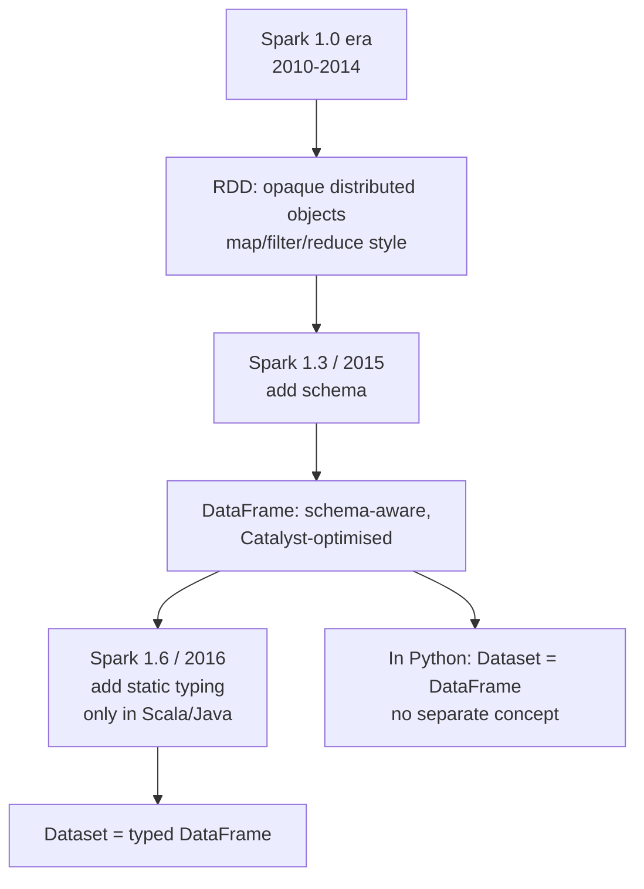

For Databricks ML Associate purposes, you should know all three exist, but spend 90% of your effort understanding DataFrames. We'll cover the others in just enough depth to understand what they do and when they matter.

---

### 58.2 RDDs: the original abstraction

An **RDD** — Resilient Distributed Dataset — is an immutable, partitioned, distributed collection of objects. "Object" here means arbitrary Python objects (or Scala objects, in the Scala API) — strings, tuples, custom classes, anything. The framework has no idea what's in each record beyond "it's a Python object." This is both the RDD's strength and its weakness.

#### 58.2.1 The five properties of an RDD

An RDD is defined by:

1. **A list of partitions.** The data is split into N chunks. Each chunk lives on one executor.
2. **A function to compute each partition.** Given a partition's input, run this function to produce the partition's data.
3. **A list of dependencies.** Which other RDDs produced this one. This is the **lineage** — Chapter 56 introduced it. If a partition is lost, Spark re-applies the function to recompute it.
4. **A partitioner (optional).** For key-value RDDs, defines how keys are distributed across partitions (typically hash-partitioned).
5. **A list of preferred locations.** For each partition, which executors would prefer to compute it (for data locality — Chapter 55).

You almost never construct an RDD directly with these five fields. Instead, you derive RDDs from operations on other RDDs (or from data sources). For example:

```python
sc = spark.sparkContext

# Create an RDD from a Python collection
rdd1 = sc.parallelize([1, 2, 3, 4, 5, 6, 7, 8])
# This is an RDD of integers, partitioned across (by default) the cluster.

# Create one from a text file
rdd2 = sc.textFile("s3://my-bucket/log.txt")
# This is an RDD of strings (one per line).

# Transform
rdd3 = rdd2.filter(lambda line: "ERROR" in line).map(lambda line: line.upper())
# rdd3 depends on rdd2 by lineage; nothing has executed yet.

# Trigger execution with an action
count = rdd3.count()
```

#### 58.2.2 RDD operations: transformations and actions

RDDs have two kinds of operations.

**Transformations** are lazy. They build a new RDD descriptor but don't execute. Examples:
- `map(f)` — apply `f` to every element.
- `filter(p)` — keep elements where `p` returns true.
- `flatMap(f)` — like map, but `f` returns an iterable and we flatten.
- `groupByKey()` — for key-value RDDs, group all values per key. (Triggers a shuffle.)
- `reduceByKey(f)` — for key-value RDDs, reduce values per key with `f`. (Also shuffles, but more efficient than groupByKey.)
- `join(other)` — for key-value RDDs, inner join. (Shuffles.)
- `union(other)` — concatenate two RDDs. (No shuffle.)
- `distinct()` — deduplicate. (Shuffles.)

**Actions** trigger execution. They evaluate the RDD's lineage and return a result (to the driver or to storage). Examples:
- `count()` — total element count.
- `collect()` — pull all data to driver (dangerous on big RDDs).
- `take(n)` — pull n elements to driver.
- `first()` — pull the first element.
- `saveAsTextFile(path)` — write to disk.
- `foreach(f)` — apply `f` for side effects (rarely used).

The distinction matters because performance is dictated by *when* the work happens. A chain of 10 transformations is just bookkeeping until an action triggers it.

#### 58.2.3 What RDDs lack: schema

Critical limitation: an RDD's elements are opaque Python objects. Spark cannot introspect them. Consider:

```python
rdd = sc.parallelize([(1, "Alice", 70000), (2, "Bob", 55000), (3, "Carol", 90000)])
filtered = rdd.filter(lambda x: x[2] > 60000)
```

Spark knows the elements are 3-tuples (vaguely — it knows they're Python objects), but it has no idea that index 2 is a salary, or that it's an integer. The filter function `lambda x: x[2] > 60000` is, to Spark, a black-box Python function. It cannot inspect the function to know what column it depends on.

The consequences:

- **No projection pushdown.** If the data came from a column store (Parquet), Spark can't know to read only the salary column — it has to read everything.
- **No predicate pushdown.** Spark can't push the filter into the storage layer.
- **No query optimisation.** Spark can't combine operations or reorder them.
- **All execution happens in Python.** Each `map` and `filter` runs your Python code on the executor, which incurs serialisation overhead.

This is why RDD code is slow compared to DataFrame code. Not because RDDs are intrinsically slow, but because Spark can't help you.

#### 58.2.4 Resilience and lineage

The "Resilient" in RDD refers to fault tolerance via lineage. Suppose your job runs:

```
rdd1 = sc.textFile("s3://...")
rdd2 = rdd1.map(parse).filter(valid)
rdd3 = rdd2.map(lambda r: (r.user, r.amount)).reduceByKey(lambda a, b: a + b)
```

Each RDD records its parent and the operation that produced it. If, during execution of an action on `rdd3`, executor X dies and the partition of `rdd3` on X is lost, Spark looks at the lineage: rdd3's partition came from a shuffle of rdd2's partitions. Spark re-fetches rdd2's relevant partitions (computing them from rdd1 if also lost) and recomputes the missing rdd3 partition on a surviving executor.

This is more memory-efficient than checkpointing every intermediate (which MapReduce effectively did), but it has a cost: deep lineages take longer to recover from, because more work must be redone. For very long lineage chains, Spark supports `.checkpoint()` — explicitly persist an intermediate to durable storage, truncating the lineage at that point.

#### 58.2.5 Example: word count in RDDs

The canonical RDD word count, just to show the style:

```python
counts = (sc.textFile("s3://corpus/*")
    .flatMap(lambda line: line.split())
    .map(lambda word: (word, 1))
    .reduceByKey(lambda a, b: a + b))

# Trigger execution
counts.saveAsTextFile("s3://output/")
```

This is correct and works. But the equivalent DataFrame form is *both* shorter and faster:

```python
words = spark.read.text("s3://corpus/*").select(F.explode(F.split("value", "\\s+")).alias("word"))
counts = words.groupBy("word").count()
counts.write.parquet("s3://output/")
```

The DataFrame version uses Catalyst, which can vectorise the tokenisation and aggregation. For trivial cases, the speedup is small; for serious workloads, it's dramatic.

---

### 58.3 DataFrames: schema-aware, optimisable

A **DataFrame** is a distributed collection of `Row` objects with a *known schema* — column names and types. Conceptually, it's a distributed table.

```python
df = spark.createDataFrame(
    [(1, "Alice", 70000), (2, "Bob", 55000), (3, "Carol", 90000)],
    schema="id INT, name STRING, salary DOUBLE"
)
df.printSchema()
# root
#  |-- id: integer (nullable = true)
#  |-- name: string (nullable = true)
#  |-- salary: double (nullable = true)
```

Spark now *knows* there are three columns: `id` (int), `name` (string), `salary` (double). When you write:

```python
df.filter(F.col("salary") > 60000).select("name").show()
```

Spark sees: "filter on the `salary` column with predicate `>60000`, then project `name`." This is *introspectable*. Catalyst can analyse it. It can verify that `salary` exists, that the comparison is type-valid (`salary` is numeric), and that the projection makes sense. More importantly, it can *optimise*: push the filter into the data source if possible (predicate pushdown), drop the unused columns before reading (projection pushdown), and so on.

#### 58.3.1 DataFrame operations

The DataFrame API is much richer than RDDs. Some categories:

**Reading:** `spark.read.parquet(...)`, `spark.read.csv(...)`, `spark.read.json(...)`, `spark.read.table("catalog.schema.table")`.

**Selecting and projecting:** `df.select("col1", "col2")`, `df.select(F.col("a"), F.col("b") + 1)`, `df.withColumn("new", F.col("a") * 2)`.

**Filtering:** `df.filter(F.col("amount") > 100)`, `df.where("amount > 100")` (SQL string).

**Aggregating:** `df.groupBy("region").agg(F.sum("amount"), F.avg("amount"))`.

**Joining:** `df1.join(df2, on="user_id")`, `df1.join(df2, df1.x == df2.y, "left")`.

**Sorting:** `df.orderBy(F.desc("amount"))`.

**Windowing:** `df.withColumn("rank", F.rank().over(W.partitionBy("region").orderBy("amount")))`.

**Writing:** `df.write.parquet(...)`, `df.write.mode("overwrite").saveAsTable(...)`.

Two equivalent forms — function API and SQL — exist for most operations. You can register a DataFrame as a SQL view and query it:

```python
df.createOrReplaceTempView("employees")
result = spark.sql("SELECT name FROM employees WHERE salary > 60000")
```

Same execution path, same Catalyst optimisation. Some find SQL more natural; others prefer the function chain. Both are fine.

#### 58.3.2 DataFrames vs. RDDs by example

The same operation in both styles:

**RDD:**
```python
sc.textFile("s3://logs/*.csv") \
    .filter(lambda line: not line.startswith("timestamp,")) \
    .map(lambda line: line.split(",")) \
    .filter(lambda parts: parts[2] == "ERROR") \
    .map(lambda parts: (parts[1], 1)) \
    .reduceByKey(lambda a, b: a + b) \
    .saveAsTextFile("s3://output/")
```

**DataFrame:**
```python
(spark.read.csv("s3://logs/*.csv", header=True, inferSchema=True)
    .filter(F.col("level") == "ERROR")
    .groupBy("service").count()
    .write.parquet("s3://output/"))
```

The DataFrame version:
1. Reads only the `level` and `service` columns from Parquet/CSV (projection pushdown — though CSV doesn't help as much as Parquet).
2. Catalyst pushes the `level == "ERROR"` filter into the read.
3. Uses HashAggregate, the optimised execution operator for groupBy + count.
4. Operates on internal binary representations (Tungsten), not Python objects.

The RDD version processes every byte through Python lambdas, with no optimisations. Typical speedup: 5–50×.

#### 58.3.3 The DataFrame is built on RDDs

Worth knowing: a DataFrame is implemented *internally* as an RDD of `Row` objects. When you do `df.rdd`, you can access the underlying RDD:

```python
rdd = df.rdd
print(rdd.first())  # Row(id=1, name='Alice', salary=70000.0)
```

This is sometimes useful for operations that don't have a DataFrame equivalent — but it's also a performance trapdoor: the moment you drop to `.rdd`, you lose Catalyst, you lose Tungsten's binary format, and you pay the serialisation cost to bring data into Python objects. Avoid unless necessary.

---

### 58.4 Datasets: strongly-typed DataFrames (Scala/Java only)

In Scala (and Java), a `Dataset[T]` is a typed version of a DataFrame, where `T` is a known case class. You can write:

```scala
case class Employee(id: Int, name: String, salary: Double)
val ds: Dataset[Employee] = spark.read.parquet("...").as[Employee]
val highPaid: Dataset[Employee] = ds.filter(_.salary > 60000)
```

The benefits:
- Compile-time type safety. If you typo `.salaryy` it won't compile.
- IDE autocompletion on fields.
- Some Catalyst optimisations available even on lambda expressions (when the lambdas are simple).

The drawbacks:
- Lambda-based operations (`.filter(_.salary > 60000)`) can't always be optimised the way SQL expressions can be. So the API style matters.
- Doesn't exist in Python.

For Python users, `Dataset` and `DataFrame` are the same thing — `pyspark.sql.DataFrame`. You'll never write `Dataset[T]` in PySpark code. But knowing the term lets you read Scala-flavored Spark documentation.

---

### 58.5 When to use RDDs

In modern PySpark code, RDDs are rarely the right choice. The DataFrame API covers nearly everything Spark can do, and what it can't do is usually a sign that you're doing something exotic.

The legitimate reasons to use RDDs:

1. **Custom partitioning.** If you need to control exactly how data is partitioned (e.g., for a specialised join), RDDs give you a `partitionBy(numPartitions, partitionerFunc)` that DataFrames don't expose as cleanly.

2. **Operations Spark SQL doesn't support.** Some operations on complex nested types are awkward in SQL. Direct manipulation via RDDs is sometimes simpler.

3. **Custom serialisation.** RDDs let you use the Kryo serialiser explicitly for specific types.

4. **Reading exotic file formats.** When no DataFrame reader exists for a format, you can read with `sc.textFile` and parse with `map`.

5. **Iterative ML/graph algorithms with custom updates.** GraphX (graph processing on Spark) uses RDDs underneath because the operations don't map cleanly to DataFrames.

For exam purposes and for the Databricks ML Associate's actual job content: **assume DataFrames** unless told otherwise. Pyspark.ml (the focus of Part K) accepts only DataFrames as input.

---

### 58.6 Spark Connect (forward pointer)

Spark 3.4 (2023) introduced **Spark Connect**, a new client-server protocol that decouples the Spark client from the driver JVM. Instead of running your Python in the driver JVM via Py4J, Spark Connect lets a thin Python client send query descriptions over gRPC to a remote driver, which executes and returns results.

Why this matters: it lets you connect from anywhere (a laptop, a separate notebook server) to a Spark cluster without needing the full Spark installation locally. It also makes Spark more language-portable.

The trade-off: Spark Connect doesn't expose RDDs to the client. You can only work with DataFrames over the Spark Connect protocol. For modern code, this is fine — DataFrames are what you want anyway. But for legacy RDD code, Spark Connect is incompatible.

On Databricks, Spark Connect is opt-in for now (Part L Ch 70 covers the Databricks-side details). The general direction of the platform is toward Connect as the default — yet another reason to write DataFrame-first code.

---

### 58.7 Schema and types — a quick deepdive

Because schema is the whole reason DataFrames exist, it's worth a moment on how schemas work.

A schema is a `StructType` — an ordered list of `StructField`s, each with a name, a type, and a nullability flag.

```python
from pyspark.sql.types import StructType, StructField, StringType, IntegerType, DoubleType

schema = StructType([
    StructField("id", IntegerType(), nullable=False),
    StructField("name", StringType(), nullable=True),
    StructField("salary", DoubleType(), nullable=True),
])

df = spark.createDataFrame([(1, "Alice", 70000.0)], schema)
df.printSchema()
```

Spark supports a wide range of types:
- Primitives: `IntegerType`, `LongType`, `FloatType`, `DoubleType`, `StringType`, `BooleanType`, `DateType`, `TimestampType`, `BinaryType`.
- Decimals: `DecimalType(precision, scale)`.
- Complex types: `ArrayType(elementType)`, `MapType(keyType, valueType)`, `StructType` (nested struct).
- Vector types from `pyspark.ml.linalg`: `VectorUDT`, `MatrixUDT` (for ML feature vectors — see Part K).

When you `spark.read.parquet(...)`, the schema is read from the file's metadata. When you `spark.read.csv(...)`, the schema is inferred (slow — Spark reads a sample) or you specify it explicitly (fast, recommended).

Nullability is mostly a hint; Spark doesn't strictly enforce non-nullable columns being non-null at runtime, but it's used by the optimiser to skip null checks.

---

### 58.8 A worked tour: RDD → DataFrame → back

Just to anchor the comparison, here's a tiny end-to-end example. Suppose you have a CSV of employee data.

```python
# === Method 1: RDD ===
rdd = sc.textFile("employees.csv")
header = rdd.first()  # "id,name,salary"
rdd_no_header = rdd.filter(lambda row: row != header)
parsed = rdd_no_header.map(lambda row: row.split(","))
filtered = parsed.filter(lambda parts: float(parts[2]) > 60000)
result_rdd = filtered.collect()
# [['1', 'Alice', '70000'], ['3', 'Carol', '90000']]

# === Method 2: DataFrame ===
df = spark.read.csv("employees.csv", header=True, inferSchema=True)
result_df = df.filter(F.col("salary") > 60000).collect()
# [Row(id=1, name='Alice', salary=70000), Row(id=3, name='Carol', salary=90000)]

# === Method 3: Convert between them ===
df_from_rdd = parsed.toDF(["id", "name", "salary"])  # RDD → DataFrame
rdd_from_df = df.rdd  # DataFrame → RDD

# === Inspecting the plan ===
df.filter(F.col("salary") > 60000).explain()
# Shows the physical plan: includes PushedFilters when reading Parquet,
# the columnar scan, etc.
```

For this trivial query, the DataFrame version is maybe 3× faster on a single file, and the gap widens dramatically as the data grows or the query becomes more complex.

---

### 58.9 The pyspark.ml choice: DataFrames only

A practical detail that matters for the rest of the curriculum: **pyspark.ml** (Spark's modern ML library, the subject of Part K) takes only DataFrames as input. The older `pyspark.mllib` library (RDD-based) is deprecated and shouldn't be used in new code.

This means: when you train a `LogisticRegression`, a `RandomForestClassifier`, a `KMeans`, all of these expect a DataFrame with a specific shape — a `features` column (of `Vector` type) and a `label` column (numeric). You assemble that DataFrame from raw columns using transformers like `VectorAssembler` (Chapter 63). The DataFrame, not the RDD, is the lingua franca.

For the Databricks ML Associate exam, this is consequential: every code question on the ML side uses DataFrames, never RDDs. If you see RDD code in an exam question, it's likely there to be incorrect or to be transformed into DataFrames.

---

### 58.10 Summary

1. Spark has three data abstractions: RDDs, DataFrames, and Datasets. RDDs are the foundational low-level API; DataFrames are the universal high-level API; Datasets are typed DataFrames available only in Scala/Java.
2. RDDs are distributed collections of arbitrary objects. They support map/filter/reduce-style operations but expose no schema — Spark can't optimise them.
3. DataFrames carry a schema (column names and types). The Catalyst optimizer can rewrite and optimise DataFrame operations, giving 5–100× speedups over equivalent RDD code.
4. Datasets (Scala/Java) add static typing to DataFrames, useful for IDE support and compile-time correctness. They don't exist meaningfully in Python.
5. RDDs and DataFrames both have transformations (lazy, build a plan) and actions (eager, trigger execution).
6. RDDs are mostly legacy in modern code. Use DataFrames unless you have a specific reason (custom partitioning, exotic formats).
7. pyspark.ml — the ML library you'll use throughout the rest of the curriculum — accepts only DataFrames.
8. Spark Connect (Spark 3.4+) decouples client from driver but doesn't support RDDs. Another reason to write DataFrame-first code.

---

### 58.11 What this builds on / where this returns

**Builds on:** Chapter 57's driver/executor architecture (RDDs and DataFrames both flow through this pipeline). Chapter 56's MapReduce (RDD's `map`/`reduceByKey` are MapReduce's direct descendants).

**Returns:**
- Chapter 59 explains *how* Catalyst optimises DataFrames — the engine that makes them fast.
- Chapter 60 dissects partitioning and shuffles, which apply to both RDDs and DataFrames.
- Chapter 61 covers AQE, which operates on DataFrame plans.
- Part K Chapter 62 introduces the Pipeline pattern, which is built on DataFrames.

---

### 58.12 Exercises

1. **RDD vs DataFrame, same task.** You have a 50GB CSV file. You want to filter to rows where `country == "US"` and sum a `revenue` column. Sketch both an RDD and a DataFrame approach in pseudo-code. Which is faster? Why?

2. **Why no schema in RDDs?** What conceptual leap does adding a schema enable? Name three specific optimisations Spark can do with a schema that it can't do without.

3. **Transformations vs actions.** Classify each as transformation or action: `map`, `count`, `groupByKey`, `collect`, `filter`, `reduceByKey`, `take`, `union`, `saveAsTextFile`, `withColumn`.

4. **Lineage walkthrough.** Sketch the lineage chain produced by:
   ```python
   rdd1 = sc.parallelize([1, 2, 3, 4])
   rdd2 = rdd1.map(lambda x: x * 2)
   rdd3 = rdd2.filter(lambda x: x > 3)
   ```
   If a partition of `rdd3` is lost, how does Spark recover?

5. **Why not use RDDs for ML?** pyspark.ml accepts only DataFrames. Why was this design choice made?

6. **DataFrame ≈ table.** In what specific ways is a Spark DataFrame *like* a SQL table? In what ways is it *unlike*?

7. **The `df.rdd` escape hatch.** A teammate writes:
   ```python
   df.rdd.map(lambda row: (row.id, row.amount * 1.1)).toDF()
   ```
   What's wrong with this? How would you rewrite it?

8. **Schema inference vs. explicit schema.** When reading a CSV, you can `inferSchema=True` or specify a `StructType`. What does inference cost? Why is explicit faster?

9. **Datasets in PySpark.** Why doesn't PySpark have a separate Dataset API?

10. **Code-level identification.** For the following snippet, name the operations that are transformations vs actions, and explain which line actually triggers execution.
    ```python
    df = spark.read.parquet("...")
    df2 = df.filter(F.col("x") > 0)
    df3 = df2.withColumn("y", F.col("x") * 2)
    df4 = df3.groupBy("category").agg(F.sum("y").alias("total"))
    df4.show()
    ```

11. **Spark Connect implication.** If your code uses `df.rdd.map(...)`, would it run under Spark Connect? Why or why not?

12. **Print the schema.** Write the code to print the schema of a DataFrame `df` and to print 5 rows of data.

<details>
<summary>Answers</summary>

1. RDD: `sc.textFile("file.csv").filter(line not header).map(split).filter(parts[country_idx]=="US").map(parts[revenue_idx]).reduce(_+_)`. DataFrame: `spark.read.csv("file.csv", header=True).filter(F.col("country")=="US").agg(F.sum("revenue"))`. DataFrame is dramatically faster — projection pushdown reads only `country` and `revenue` columns (if Parquet; CSV less benefit), Catalyst pushes the country filter, the aggregation runs in optimised JVM code (no per-row Python).

2. Schema lets Spark introspect operations: (a) projection pushdown — read only needed columns from columnar formats; (b) predicate pushdown — push filters into the source; (c) type-aware code generation — compile specialised code per column type; (d) join strategy selection based on column statistics; (e) constant folding and other compile-time optimisations.

3. Transformations: `map`, `groupByKey`, `filter`, `reduceByKey`, `union`, `withColumn`. Actions: `count`, `collect`, `take`, `saveAsTextFile`. (`show` is also an action, not in the list.)

4. Lineage: `rdd3` depends on `rdd2` (via filter); `rdd2` depends on `rdd1` (via map); `rdd1` is the root (parallelized from a Python list). If a partition of `rdd3` is lost, Spark fetches the corresponding partition of `rdd2` (recomputing from `rdd1` if needed), re-applies the filter, restores `rdd3`'s partition.

5. DataFrames are schema-aware. ML APIs need to know column names ("features", "label") and types (Vector for features, numeric for label). RDDs of opaque objects make those guarantees awkward. Plus DataFrame operations are optimisable, which matters for ML pipelines that involve many transformations.

6. Like: schema, columns, rows, SQL-queryable. Unlike: distributed (partitioned across machines), lazy (transformations don't execute immediately), immutable (no UPDATE in place; transformations produce new DataFrames), no indexes (every operation can be a full scan unless partitions help).

7. The `.rdd` call materializes rows as JVM objects then ships to Python; `.toDF` reverses. You lose Catalyst optimisation entirely. Rewrite: `df.withColumn("amount", F.col("amount") * 1.1)` — single Catalyst-optimised expression, all JVM.

8. Inference reads a sample of the file (or all of it, depending on settings) to figure out the types of each column. This is a separate read pass that costs significant time on large files. Explicit schema skips that — Spark trusts you and just reads the data.

9. Python doesn't have the kind of static typing that makes Datasets useful in Scala. A Python `dataset[T]` would either require runtime type checks (slow, no compile-time benefit) or duck typing (no different from a DataFrame). So DataFrame is the right level for Python.

10. Transformations: `spark.read.parquet`, `filter`, `withColumn`, `groupBy().agg()`. Action: `show()`. Only `show()` triggers execution. Everything before is plan building.

11. No — Spark Connect explicitly disables RDD access from the client. `df.rdd` would error. This is intentional: Connect ships only DataFrame query plans over gRPC, not arbitrary Python lambdas.

12. `df.printSchema()` and `df.show(5)`.

</details>


## Chapter 59 — The Catalyst Optimizer and Tungsten Execution Engine

> **Goal of this chapter:** to demystify the part of Spark that turns the DataFrame code you wrote into the bytecode that actually runs. Two equivalent queries can run 10× differently in speed, and the difference is rarely your code — it's how Catalyst rewrote your plan and how Tungsten executed it. This chapter explains the four phases of Catalyst, the rewrites it performs, and the Tungsten layer underneath. By the end, when you call `df.explain()`, you will not just see "stuff happening" — you'll see *what* Spark decided to do and *why*. Understanding Catalyst is the difference between an intermediate Spark user and an advanced one.

---

### 59.1 Two queries, very different speeds

Consider two ways to write the same query — "for each customer, give me their total spend in 2024":

```python
# Version A
result = (df.join(customers, "customer_id")
            .filter(F.col("year") == 2024)
            .groupBy("customer_id", "name")
            .agg(F.sum("amount").alias("total")))

# Version B
result = (df.filter(F.col("year") == 2024)
            .groupBy("customer_id")
            .agg(F.sum("amount").alias("total"))
            .join(customers, "customer_id"))
```

Logically, both produce the same answer. But the order of operations matters for performance.

Version A joins the (large) transactions table with the customers table *before* filtering to 2024. The join sees all years of data. Result: massive intermediate, then most of it discarded.

Version B filters first, then aggregates the smaller filtered set, then joins the (already small) aggregated result with customers. The join sees a fraction of the data.

In a naive engine, Version B would run dramatically faster than Version A. But here's the thing: **Catalyst usually rewrites Version A into something very close to Version B automatically**. Specifically, Catalyst's *predicate pushdown* rule recognises that `year == 2024` is a predicate on the transactions table only (not the join key, not customers), and pushes it *before* the join.

When you write Spark code, you are not writing the execution plan. You are writing a *description* of the result you want. Catalyst figures out the plan. Understanding what Catalyst can and can't do is what separates writing slow Spark from writing fast Spark.

---

### 59.2 The four phases of Catalyst

Catalyst processes every DataFrame query through four phases, in order. Each phase produces a refined plan that's closer to executable code.


#### 59.2.1 Phase 1: Analysis

The unresolved logical plan is built directly from your code. If you wrote `df.filter("salary > 60000").select("name")`, the plan is something like:

```
Project [name]
  Filter (salary > 60000)
    UnresolvedRelation [df]
```

At this point, "name" and "salary" are just symbols. Spark doesn't yet know they refer to columns in `df`. The analysis phase:

- **Resolves names.** Looks up `name` and `salary` in `df`'s schema. If `salary` doesn't exist, you get an `AnalysisException` at this phase, not at runtime.
- **Resolves types.** `salary > 60000` requires `salary` to be numeric. If `salary` were a string, Catalyst either inserts a cast or errors.
- **Resolves function names.** If you called `F.sum(...)`, it's mapped to the right aggregate function.

After analysis, the plan is **resolved** — every column reference is bound to an actual column with a known type.

The error messages you see when you mistype a column name (`AnalysisException: cannot resolve 'salaryy'`) come from this phase. They happen *before* execution, which is one of the major benefits of having a schema — typos are caught at plan time, not after a 30-minute job runs and crashes at the end.

#### 59.2.2 Phase 2: Logical optimization

This is where the magic happens. Catalyst applies a series of **rule-based rewrites** to the logical plan. Each rule is a function: "given a logical plan tree, produce an equivalent but more efficient tree." Catalyst applies rules iteratively until no rule fires anymore (the plan has reached a fixed point).

Some of the most important rules:

##### Predicate pushdown

If a filter is applied after a join, and the filter only references columns from one input table, push the filter *into* the input.

```
Filter(t.year == 2024)
  Join(t, c, t.customer_id == c.customer_id)
    Source(transactions as t)
    Source(customers as c)
```

becomes

```
Join(t', c, t'.customer_id == c.customer_id)
  Filter(t.year == 2024)
    Source(transactions as t')
  Source(customers as c)
```

This is the rewrite we hand-derived in Section 59.1. Catalyst applies it automatically.

Going further: when the source is Parquet (which supports predicates inside the file format), Catalyst pushes the filter even into the file scan. The Parquet reader uses the predicate to skip row groups that can't match — reading only the data that survives the filter.

##### Projection pushdown

If only some columns are used downstream, drop the unused columns as early as possible — ideally during the read.

```
Project [name, total_spend]
  Aggregate [customer_id, sum(amount) as total_spend]
    Project [customer_id, amount, region, year, country, status, ...]
      Source(transactions)
```

becomes

```
Project [name, total_spend]
  Aggregate [customer_id, sum(amount) as total_spend]
    Project [customer_id, amount]
      Source(transactions)
```

For Parquet (columnar storage), this means only the `customer_id` and `amount` column files are read from disk. If the table has 100 columns and you only need 2, you save 98% of the I/O.

##### Constant folding

Compile-time arithmetic on constants is evaluated up front, not for every row.

```
df.select(F.lit(2 + 3))     # before
df.select(F.lit(5))         # after constant folding
```

Saves billions of redundant additions on a billion-row DataFrame.

##### Boolean simplification

Predicates are simplified: `x AND TRUE → x`, `x AND FALSE → FALSE`, `NOT NOT x → x`, etc. Especially useful when intermediate Catalyst rewrites produce trivial sub-expressions.

##### Filter combination

Consecutive filters are combined:

```
df.filter(F.col("a") > 0).filter(F.col("b") < 100)  
# becomes  
df.filter((F.col("a") > 0) & (F.col("b") < 100))
```

This isn't a big speedup on its own, but it sets up other rules to fire.

##### Join reordering

For multi-way joins, Catalyst tries to reorder them so smaller intermediates are joined first. This requires **cost-based optimization** (CBO) — see Section 59.3.

##### Decorrelation of subqueries

If you have a correlated subquery (e.g., `WHERE total > (SELECT AVG(amount) FROM ...)`), Catalyst tries to rewrite it as a join or aggregate.

There are dozens of rules. The full list is in the Spark source code under `org.apache.spark.sql.catalyst.optimizer`. Most users don't need to know each one — but knowing the *kinds* of optimisations Catalyst performs lets you write code that takes advantage of them.

#### 59.2.3 Phase 3: Physical planning

The optimised logical plan describes *what* to do. The physical plan describes *how*. For each logical operation, there may be multiple physical implementations:

- A `Filter` can be implemented by a per-row predicate evaluation. (One way.)
- A `Join` can be implemented by: a broadcast hash join (small side broadcast to all executors), a sort-merge join (both sides shuffled and sorted), a shuffle hash join (both sides shuffled, smaller side hashed). (Three ways.)
- An `Aggregate` can be implemented by: hash aggregate (in-memory hashmap per partition, fast for low cardinality), sort aggregate (sort and accumulate, lower memory). (Two ways.)

Catalyst evaluates the choices and picks the best. For joins, the rule of thumb is:
- If one side is small enough (< `spark.sql.autoBroadcastJoinThreshold`, default 10MB), use **broadcast hash join** — much faster, no shuffle on the big side.
- Otherwise, **sort-merge join** (default for large-vs-large).
- Less commonly, **shuffle hash join** when conditions favor it.

Choosing between hash and sort aggregate depends on the cardinality of the group-by key — high cardinality favors sort, low favors hash.

These choices are partly based on statistics. If Catalyst doesn't know the sizes of the inputs, it can only guess. This is where cost-based optimization comes in.

#### 59.2.4 Phase 4: Code generation

The physical plan is now a tree of operators (Scan → Filter → HashAggregate → SortMerge → Project, say). One option would be to interpret this tree row-by-row: for each row, call each operator's `next()` method, chain through. This was Spark 1.x's approach. It has a problem: for each row, you incur virtual method dispatches, boxing/unboxing, branch prediction misses.

Modern Spark uses **whole-stage code generation**. Instead of interpreting the operator tree, Catalyst generates a single JVM method (in Java bytecode) that processes a row through all operators in a stage, fused together. The generated code looks roughly like:

```java
// Pseudocode of what's generated
public void processRow(Row row) {
    // Scan: row already has fields f1, f2, f3, f4
    int year = row.getInt(3);
    if (year != 2024) return;  // Filter inline
    long customerId = row.getLong(0);
    double amount = row.getDouble(2);
    hashAggregate.update(customerId, amount);  // Aggregate inline
}
```

No virtual calls. No iterators. The JVM JIT compiler can inline and vectorise this aggressively. For tight loops, this gives 10–100× speedups over interpreted execution.

You can see the generated code:

```python
df.explain(extended=True)
# Or
df.explain("codegen")
```

You'll see the generated Java source for each stage. It's verbose but instructive.

---

### 59.3 Cost-based optimization (CBO)

The rule-based optimizations described above are deterministic — they always apply when the pattern matches, regardless of data size. But some optimisations benefit from knowing *how much data* is involved.

**Cost-based optimization** uses table statistics — row counts, column min/max, null counts, distinct counts, histograms — to estimate the sizes of intermediates and pick the cheapest plan.

To collect statistics:

```sql
ANALYZE TABLE my_table COMPUTE STATISTICS;
-- Or per-column:
ANALYZE TABLE my_table COMPUTE STATISTICS FOR COLUMNS col1, col2, col3;
```

For Delta tables on Databricks, statistics are computed automatically when the table is written.

CBO is most useful for:
- **Join reordering.** For 5-way joins, the optimal join order can produce intermediates 1000× smaller than the worst order. CBO picks the right order.
- **Join strategy selection.** Without statistics, Catalyst can't always tell whether one side will fit the broadcast threshold. With stats, it can.
- **Aggregation strategy.** Stats on group-by-key cardinality inform the hash-vs-sort aggregate choice.

Enable CBO with:
```python
spark.conf.set("spark.sql.cbo.enabled", "true")
spark.conf.set("spark.sql.cbo.joinReorder.enabled", "true")
```

In Databricks Runtime, CBO is enabled by default for many operations.

---

### 59.4 Tungsten — the execution engine

Catalyst is the optimizer; **Tungsten** is the execution layer. While Catalyst decides *what* to do, Tungsten decides *how it runs at the level of memory and CPU*. Tungsten has three components.

#### 59.4.1 Whole-stage code generation (already discussed)

Section 59.2.4 covered this — fuse operators into a single generated method per stage to eliminate per-row overhead.

#### 59.4.2 Off-heap memory and binary representations

In Spark 1.x, every row was a JVM object — a Java `Row` class with boxed fields (Integer, Double, etc.). Each object had ~16 bytes of JVM overhead, plus per-field overhead. For a billion-row DataFrame, this is gigabytes of pure JVM overhead, plus the constant pressure on the garbage collector.

Tungsten introduced **UnsafeRow** — a compact binary representation where each row is a single contiguous byte buffer with fields laid out by offset. No JVM object overhead, no boxing. Field access is direct memory reads at known offsets.

Beyond UnsafeRow, Tungsten can use **off-heap memory** — memory allocated outside the JVM heap, managed manually. The advantages:
- No GC pauses on this memory.
- Direct control over layout (cache alignment, prefetching).
- Larger effective memory budget (the JVM heap is often capped well below physical RAM).

The user-facing knob: `spark.memory.offHeap.enabled=true` and `spark.memory.offHeap.size=<bytes>`. In Databricks, off-heap is usually configured automatically.

The practical impact: queries that would OOM in Spark 1.x can run comfortably in modern Spark, and GC pauses (which used to be a major operational pain) are dramatically reduced.

#### 59.4.3 Cache-aware computation

Modern CPUs have hierarchies of cache (L1, L2, L3) with very different latencies. Tungsten's data layout is designed to maximise cache locality:
- Columnar in-memory format for batch processing (a column's values laid out contiguously in memory).
- Hash table layouts that fit in L1/L2 caches.
- Vectorised execution that processes batches of rows at a time, leveraging CPU SIMD instructions.

This last point — vectorised batch processing — is where Databricks' Photon (Section 57.6.2) takes things even further, with hand-tuned C++ implementations of operators. Tungsten provides vectorisation in the JVM; Photon does it natively.

---

### 59.5 Inspecting the plan — `explain()`

The single most important tool for understanding what Catalyst is doing is `df.explain()`. Let's see it in action.

```python
import pyspark.sql.functions as F

# Set up some sample data
transactions = spark.range(1_000_000).select(
    F.col("id").alias("txn_id"),
    (F.col("id") % 1000).alias("customer_id"),
    (F.col("id") % 365 + 1).alias("day"),
    (F.col("id") % 5 + 2020).alias("year"),
    (F.rand() * 1000).alias("amount")
)

customers = spark.range(1000).select(
    F.col("id").alias("customer_id"),
    F.concat(F.lit("name_"), F.col("id").cast("string")).alias("name")
)

# A query
result = (transactions
    .filter(F.col("year") == 2024)
    .join(customers, "customer_id")
    .groupBy("name").agg(F.sum("amount").alias("total")))

result.explain()
```

The output will look something like:

```
== Physical Plan ==
*(3) HashAggregate(keys=[name#42], functions=[sum(amount#10)])
+- *(3) HashAggregate(keys=[name#42], functions=[partial_sum(amount#10)])
   +- *(3) Project [name#42, amount#10]
      +- *(3) BroadcastHashJoin [customer_id#8L], [customer_id#41L], Inner
         :- *(3) Filter ((year#9 = 2024) AND isnotnull(customer_id#8L))
         :  +- *(3) Project [customer_id#8L, year#9, amount#10]
         :     +- *(3) Range (0, 1000000, step=1, splits=8)
         +- BroadcastExchange HashedRelationBroadcastMode(...)
            +- *(2) Project [customer_id#41L, name#42]
               +- *(2) Range (0, 1000, step=1, splits=8)
```

What this tells us:
- The query is one stage (the `*(3)` numbering reflects stage IDs).
- Catalyst chose **BroadcastHashJoin** because `customers` is small (1000 rows fits in the broadcast threshold).
- The `year == 2024` filter has been pushed down into the transactions scan.
- The aggregation is split into partial (per partition) and final phases — classic distributed aggregate pattern.
- Each operator with `*` is generated as part of whole-stage codegen.

Reading these plans is a skill you build with practice. Some things to look for:

- **`BroadcastHashJoin` vs `SortMergeJoin`** — broadcast is faster but only viable for small sides.
- **`PushedFilters`** — confirms predicates pushed into the data source.
- **`Exchange`** — indicates a shuffle. Lots of these are expensive.
- **`Range` / `Scan` / `FileScan`** — source operators showing what's being read.

For an even more detailed view:

```python
result.explain(extended=True)
```

This shows all four plan phases (Parsed Logical, Analyzed Logical, Optimized Logical, Physical) so you can see how Catalyst transformed the query.

```python
result.explain(mode="formatted")  # Modern Spark
```

Gives a more readable tree with explicit AQE annotations (Chapter 61).

---

### 59.6 Worked example: how predicate pushdown changes the plan

Let me show a concrete before-and-after.

```python
big = spark.range(1_000_000).select(F.col("id"), (F.col("id") % 100).alias("k"))
small = spark.range(100).select(F.col("id").alias("k"), F.col("id").alias("info"))

# Query: join, then filter
q1 = big.join(small, "k").filter(F.col("info") > 50)
q1.explain()
```

A naive plan would: join the 1M-row big with the 100-row small (producing 1M rows), then filter to ~half (info > 50, where info is 0–99, so ~49 of 100). Result: 1M intermediate rows for a filter we could have applied earlier.

Catalyst's actual plan (from `explain()`):

```
*(2) BroadcastHashJoin [k#0L], [k#3L], Inner
:- *(2) Project [id#0L, k#1L]
:  +- *(2) Range (0, 1000000)
+- BroadcastExchange ...
   +- *(1) Project [k#3L, info#4L]
      +- *(1) Filter (isnotnull(info#4L) AND (info#4L > 50))
         +- *(1) Range (0, 100)
```

Notice the filter `info > 50` has been pushed *below* the join — applied to the small table before broadcasting. By the time the join runs, only ~49 rows are broadcast, not 100. The join still produces ~490K rows (each big row matches at most one filtered small row).

But wait — could the filter have been applied differently? Not really, because `info` is only in the small table. The predicate is correctly pushed down to where it can be applied.

A more dramatic case: filter on a column that exists only in `big`:

```python
q2 = big.join(small, "k").filter(F.col("id") > 500_000)
q2.explain()
```

The filter `id > 500_000` applies only to `big`. Catalyst pushes it into the big-table scan:

```
*(2) BroadcastHashJoin ...
:- *(2) Filter (isnotnull(k#1L) AND (id#0L > 500000))
:  +- *(2) Range (0, 1000000)
+- ...
```

Now the join sees only 500K rows from `big`, half the original. The intermediate is halved before the join even runs.

---

### 59.7 The AQE preview

There's one more layer Catalyst-and-Tungsten add: **Adaptive Query Execution (AQE)**, introduced in Spark 3.0. AQE is the ability to *re-optimise* a query plan *at runtime*, based on actual data statistics observed during execution.

Why might you need this? Static planning relies on table statistics, which can be stale or missing. If Catalyst thinks an intermediate will be 1GB but it turns out to be 1KB, the chosen join strategy (e.g., SortMergeJoin) is wildly suboptimal — a BroadcastJoin would be far faster.

AQE solves this by:
1. Executing the query plan up to the next shuffle.
2. Looking at the actual shuffle output sizes.
3. Re-planning the next stage with real numbers.
4. Continuing.

This is so important that it gets its own chapter (Chapter 61). For now, know:
- AQE is on by default in Spark 3.2+ and modern DBR.
- The relevant config key is `spark.sql.adaptive.enabled` — note the `sql` in there.
- AQE makes Catalyst's optimisations more robust to bad statistics.

---

### 59.8 Photon (preview)

Catalyst optimises plans for the JVM-based execution engine. **Photon**, Databricks' proprietary engine, replaces parts of execution with hand-tuned C++ code. Operators that have Photon implementations run in native code; others fall back to JVM Tungsten.

Photon coverage as of late 2024:
- Most SQL operators: filter, project, hash aggregate, sort, hash join.
- Most file scans: Parquet, Delta.
- *Not* yet covered: many UDFs, some window functions, some ML operations.

When Photon runs a query end-to-end, speedups of 2–10× are typical. When it only partially applies (some operators native, others JVM), gains are smaller because the boundary between Photon and JVM data formats costs some serialisation.

Photon is enabled on Photon-enabled Databricks SKUs and certain cluster types. Part L Chapter 69 covers the pricing and selection decisions.

---

### 59.9 Practical implications for ML code

How does all this affect pyspark.ml workloads?

1. **DataFrame operations in your pipeline get optimised.** When you assemble features with `VectorAssembler`, scale them with `StandardScaler`, drop columns — all of these are DataFrame operations that Catalyst optimises.

2. **The ML estimator itself is mostly opaque to Catalyst.** When `LogisticRegression.fit()` runs gradient descent across many partitions, the math is implemented in JVM ML code, not as a SQL/DataFrame expression. Catalyst doesn't optimise the optimisation. (Confusing sentence, but true.)

3. **Sequential fit operations don't get combined.** If your pipeline does `assembler -> scaler -> lr_model`, Catalyst optimises within each step's DataFrame transformations but doesn't fuse across estimator boundaries.

4. **Inference often benefits from Catalyst.** Applying a trained model with `model.transform(df)` is a DataFrame operation; Catalyst can optimise filters and projections around it.

5. **Avoid Python UDFs in your DataFrame transformations.** Anything inside a Python UDF is opaque to Catalyst. Native operations are preferred.

The headline: write DataFrame-native code, avoid UDFs when possible, and let Catalyst do its job. Reasoning about plan optimisation is rarely necessary for ML pipelines that follow the standard pattern; reasoning about *shuffles* (the next chapter) is more often the bottleneck.

---

### 59.10 Summary

1. Catalyst is Spark's query optimizer. It processes every DataFrame operation through four phases: analysis (resolve names and types), logical optimisation (rule-based rewrites), physical planning (pick concrete operators), code generation (compile to bytecode).
2. Key rule-based optimisations: predicate pushdown (move filters early), projection pushdown (read only needed columns), constant folding, boolean simplification, join reordering.
3. Cost-based optimization (CBO) uses table statistics to make better choices for joins and aggregates. Enable with `spark.sql.cbo.enabled=true`; statistics are auto-collected for Delta tables on Databricks.
4. Tungsten is the execution engine layer: whole-stage code generation (fuse operators into one JVM method per stage), off-heap binary representations (UnsafeRow), cache-aware data layouts.
5. `df.explain()` shows the physical plan. `df.explain(True)` shows all four plan phases. Reading plans is a key debugging skill.
6. AQE re-optimises plans at runtime based on actual data sizes — covered in Chapter 61.
7. Photon (Databricks-only) replaces JVM Tungsten for many operators with native C++, giving additional speedups.
8. For ML workloads: DataFrame operations get Catalyst-optimised; ML estimator internals don't. Avoid Python UDFs to keep operations transparent to Catalyst.

---

### 59.11 What this builds on / where this returns

**Builds on:** Chapter 58's DataFrame abstraction — Catalyst only works on DataFrames, not RDDs. Chapter 57's driver/executor architecture (Catalyst runs on the driver; codegen output runs on executors).

**Returns:**
- Chapter 60 covers partitioning and shuffles — the execution-level operations Catalyst's optimisations indirectly produce or avoid.
- Chapter 61 expands AQE — runtime re-optimisation of Catalyst plans.
- Part K Chapter 62 introduces pyspark.ml Pipelines — chains of DataFrame transformations that Catalyst optimises within each step.
- Part L Chapter 69 returns to Photon for the cluster-cost-vs-speed decision.

---

### 59.12 Exercises

1. **Predicate pushdown by hand.** You have a query:
   ```python
   df.join(other, "id").filter(F.col("region") == "US").select("name", "total")
   ```
   `region` is a column only in `df`. What does Catalyst's logical optimisation phase rewrite this to? Sketch the resulting plan tree.

2. **Projection pushdown impact.** A table has 50 columns. Your query uses 3 of them. The table is stored as Parquet. Without projection pushdown, how much I/O does Spark do (relatively)? With it?

3. **Reading a plan.** Given this `explain()` output, identify:
   - The join strategy chosen.
   - Whether predicate pushdown happened.
   - The aggregation strategy.
   ```
   *(3) HashAggregate(keys=[region#10], functions=[sum(amount#11)])
   +- Exchange hashpartitioning(region#10, 200)
      +- *(2) HashAggregate(keys=[region#10], functions=[partial_sum(amount#11)])
         +- *(2) Project [region#10, amount#11]
            +- *(2) Filter ((year#12 = 2024) AND isnotnull(year#12))
               +- *(2) FileScan parquet [region#10, amount#11, year#12]
                  PushedFilters: [IsNotNull(year), EqualTo(year, 2024)]
   ```

4. **Whole-stage codegen.** Why is whole-stage codegen faster than the interpreted alternative? Name three specific JVM costs that codegen eliminates.

5. **Off-heap memory.** Why does Spark use off-heap memory in addition to (or instead of) the JVM heap? What problems does this solve?

6. **Broadcast threshold.** The default `spark.sql.autoBroadcastJoinThreshold` is 10MB. You have a lookup table that's 50MB. Will Catalyst broadcast it by default? What are your options if you want to broadcast anyway?

7. **CBO and stats.** Why might `ANALYZE TABLE my_table COMPUTE STATISTICS` make subsequent queries faster?

8. **The `explain(True)` output.** Why might it be useful to see all four plan phases, not just the physical plan?

9. **Catalyst limitations.** Name two things Catalyst cannot optimise around. (Hint: think about UDFs and external data sources.)

10. **When optimisation doesn't help.** A teammate complains that their query is slow and shows you the plan. You see no shuffles, no joins — just a filter and a project on a 100GB Parquet file. Where's the time going, and how would you fix it?

11. **Constant folding example.** Write a DataFrame expression where Catalyst's constant folding would change runtime behaviour. Estimate the speedup.

12. **Photon vs. Tungsten.** Both perform vectorised execution. Why does Photon often beat Tungsten on the same query?

<details>
<summary>Answers</summary>

1. Catalyst pushes the `region == "US"` filter below the join, applied to `df` before the join:
   ```
   Project [name, total]
     Join(df', other, "id")
       Filter(df.region == "US")
         Source(df)
       Source(other)
   ```
   The join now sees fewer rows, and the projection comes last.

2. Without projection pushdown: Spark reads all 50 columns from disk. With it: only 3 column files read (Parquet stores each column in a separate "chunk"). Savings: 94% of I/O.

3. Join strategy: not shown in this output (probably a single source, no join). Predicate pushdown: yes — `PushedFilters: [...]` line shows `year == 2024` pushed into the file scan. Aggregation strategy: HashAggregate, split into partial (per-partition) and final (after shuffle) phases.

4. (i) Virtual method dispatch — each operator's `next()` call costs a virtual lookup; codegen inlines them. (ii) Boxing/unboxing — interpreted code uses generic `Object`-typed values; codegen uses primitive types directly. (iii) Iterator overhead — each operator yields rows; codegen processes rows in tight loops.

5. Off-heap memory bypasses the JVM garbage collector. For multi-GB heaps, GC pauses can take seconds, halting work. Off-heap memory has no GC. Also: off-heap data has predictable layout (no JVM object overhead), allowing better cache utilisation and SIMD vectorisation.

6. No — 50MB exceeds the threshold. Options: (a) raise the threshold with `spark.sql.autoBroadcastJoinThreshold` (e.g., to 100MB); (b) explicitly broadcast with `F.broadcast(df)` — overrides the threshold; (c) accept the SortMergeJoin and live with the shuffle.

7. CBO needs statistics to make good plan decisions. Without stats, it guesses (often badly). `ANALYZE TABLE` populates row counts, column min/max, null counts, and distinct counts. Subsequent queries can pick better join orders and join strategies.

8. To see how Catalyst rewrote your query. If you wrote `Version A` in 59.1 but the Optimized Logical Plan shows it as `Version B`, you know predicate pushdown worked. If not, you can see why — maybe Catalyst couldn't push the predicate because of a UDF wrapping the column. Knowing what Catalyst did (and didn't) is essential for diagnosing slow queries.

9. (i) Python UDFs — Catalyst can't see inside them, can't push filters that involve them, can't fuse them into codegen. (ii) Data sources without statistics — Catalyst guesses sizes and may pick suboptimal joins. (iii) Side-effecting operations (rare in DataFrames but possible via `foreach`).

10. The time is going to the file I/O itself — reading 100GB of Parquet from S3 takes time regardless of Catalyst. Fixes: (a) ensure projection pushdown is reading only needed columns; (b) check partitioning — if the data is partitioned by date and the filter is on date, only relevant partitions should be read; (c) consider using Delta with Z-ORDER for better data layout.

11. `df.select(F.lit(60 * 60 * 24).alias("seconds_per_day"))`. Constant folding evaluates `60*60*24 = 86400` at plan time. On a 1B-row DataFrame, you save 2B arithmetic operations (3 mults, 2 stores). Not a huge speedup individually, but the principle scales when many such constants appear in expressions.

12. Photon is hand-tuned C++ with direct CPU SIMD instructions, no JVM. It uses memory layouts specifically engineered for modern CPU caches. Tungsten is JVM-bound — its codegen produces bytecode that the JIT then compiles, but it's never as efficient as native code with manual vectorisation.

</details>


## Chapter 60 — Partitioning, Narrow vs Wide, and Shuffle Internals

> **Goal of this chapter:** to make shuffles, the most expensive operation in Spark, fully visible. Two queries that look identical can differ by orders of magnitude in runtime, and the difference is almost always a shuffle you didn't anticipate. Understanding when shuffles happen, what they cost, how they work mechanically, and how to avoid them when possible is the single most important Spark performance skill. By the end of this chapter, when a query is slow, your first instinct will be to look at the shuffles — and you will know what to look for.

---

### 60.1 The 30-seconds-versus-30-minutes problem

Imagine two PySpark queries against the same 100GB DataFrame:

```python
# Query A
df.select("customer_id", "amount").write.parquet("a/")
```

```python
# Query B
df.groupBy("customer_id").agg(F.sum("amount")).write.parquet("b/")
```

Query A runs in 30 seconds. Query B runs in 30 minutes. The data is the same. The intent — work with customer_id and amount — is the same. The difference is that Query A is a *narrow* transformation followed by a write, while Query B requires a *wide* transformation: the groupBy needs to bring all rows with the same `customer_id` together onto the same machine before it can compute the sum. This rearrangement is a **shuffle**, and it's the most expensive thing Spark does.

Internalising this distinction — narrow vs. wide, no-shuffle vs. shuffle — and learning to recognise shuffles in your own code is the foundation of everything else in this chapter.

---

### 60.2 Partitions: what they are physically

We've used the word "partition" loosely so far. Let's pin it down.

A DataFrame's data is split across the cluster as **partitions**. Each partition is a contiguous chunk of rows, living on one executor's local memory or disk. Partitions are independent: one partition's data doesn't interact with another partition's data unless something explicitly brings them together (a shuffle).

```python
df.rdd.getNumPartitions()
# e.g., 200
```

The number of partitions is *not* the number of executors. A 200-partition DataFrame on a 10-executor cluster has 20 partitions per executor on average. When a task runs, it processes one partition at a time.

Why does partition count matter?

- **Too few partitions:** insufficient parallelism. If you have 4 partitions and 100 cores, 96 cores are idle. Also, each partition is large, which can OOM if memory is tight.
- **Too many partitions:** scheduling overhead dominates. Each task has fixed overhead (dispatch, deserialisation, GC); for trivial tasks, the overhead can exceed the work.

The default partition count when reading data depends on the source:
- Parquet/Delta: roughly one partition per ~128MB of data (configurable via `spark.sql.files.maxPartitionBytes`).
- CSV: similar.
- `spark.range(N)`: one partition per `spark.sql.shuffle.partitions` slot (default 200), but only if data is large enough.
- `sc.parallelize(list, n)`: explicitly `n` partitions.

After a shuffle (any wide transformation), the number of partitions becomes `spark.sql.shuffle.partitions` (default 200), regardless of the input partition count. AQE (Chapter 61) can coalesce this dynamically.

---

### 60.3 Narrow vs. wide transformations

The terminology was introduced in Spark's RDD paper and applies equally to DataFrames. The distinction is about *partition dependencies*.

**Narrow transformation**: each output partition depends on at most ONE input partition.

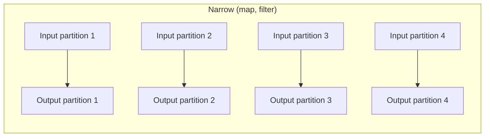

Each task processes its input partition independently, producing its output. **No data crosses the network.** This is fast.

Examples: `map`, `filter`, `withColumn`, `select`, `flatMap`, `mapPartitions`, `sample`, `union`.

**Wide transformation**: each output partition depends on MULTIPLE input partitions.

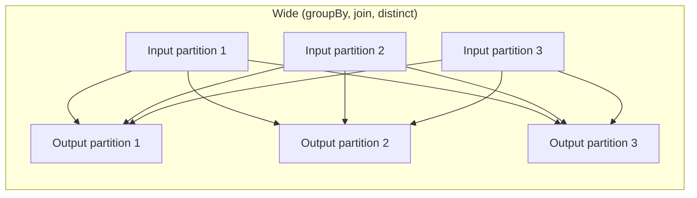

Data must be redistributed across the cluster. Every input partition contributes data to potentially every output partition. **This is the shuffle.**

Examples: `groupBy`, `orderBy`, `distinct`, `dropDuplicates`, `join` (without broadcast), `repartition`, `coalesce` to increase, window functions.

#### 60.3.1 A surprising case: union is narrow

A common source of confusion: `df1.union(df2)` is *narrow*, not wide. It just concatenates partitions — the resulting DataFrame has `df1.numPartitions + df2.numPartitions` partitions, with no rebalancing. No data moves across the network.

This is sometimes called "stacking" rather than "joining" — it's like SQL's `UNION ALL`. If `df1` and `df2` have different schemas, you get an error; if same schema, you get a glued-together DataFrame. The non-shuffle nature is exactly why `union` is the right operation for combining batches of similar data — you can stack a thousand daily files at zero shuffle cost.

#### 60.3.2 The Spark UI lens

In the Spark UI's "Stages" view, each stage corresponds to a span of consecutive narrow transformations. A stage boundary marks a shuffle. So:
- 1 stage = no shuffles = pure narrow operations.
- 2 stages = 1 shuffle.
- N stages = N − 1 shuffles.

When you look at a Spark job and see 8 stages, you know there were 7 shuffles. That's seven opportunities for things to go wrong.

---

### 60.4 Anatomy of a shuffle

Let's open the hood. A shuffle has three phases.

#### 60.4.1 Map side: partition and write to local disk

Before the shuffle, every task in the upstream stage processes its input partition and computes the output records. For each output record, it computes the destination partition using the *partitioner* — typically `hash(key) mod num_partitions`. So if the shuffle has 200 output partitions and we're shuffling by `customer_id`, each task buckets its records into 200 buckets by `hash(customer_id) mod 200`.

Each task writes its 200 buckets to *local disk* (the executor's local SSD), as 200 small files (or, with more efficient implementations, regions of one file with an index).

```mermaid
flowchart LR
    T1[Task 1<br/>(partition 1)] --> D1[Local disk:<br/>200 buckets]
    T2[Task 2<br/>(partition 2)] --> D2[Local disk:<br/>200 buckets]
    T3[Task 3<br/>(partition 3)] --> D3[Local disk:<br/>200 buckets]
```

This is called the **shuffle write** phase. The Spark UI shows "Shuffle Write" bytes per stage.

#### 60.4.2 The shuffle itself: read across the network

The downstream stage's tasks each read their assigned partition from *all* upstream tasks. Task `r` in the downstream stage reads bucket `r` from every upstream task's local disk, fetching them over the network.

```mermaid
flowchart LR
    D1[Disk: bucket 1, 2, ..., 200] -. network .-> T1[Task 1 reads bucket 1<br/>from all upstream tasks]
    D2[Disk: bucket 1, 2, ..., 200] -. network .-> T1
    D3[Disk: bucket 1, 2, ..., 200] -. network .-> T1
```

Each downstream task issues many small fetch requests (one to each upstream executor that has data for it). The total network traffic is roughly equal to the shuffle write volume.

This is the **shuffle read** phase. The Spark UI shows "Shuffle Read" bytes per stage.

#### 60.4.3 Reduce side: process the partition

Once a downstream task has all its input bytes (from all upstream tasks), it can process them — for a `groupBy(...).sum()`, it groups by key and sums. For a `join`, it joins. For a `sortBy`, it sorts.

#### 60.4.4 Why this is expensive

Three kinds of cost:

1. **Disk I/O.** Both writing and reading. For terabyte shuffles, this is gigabytes per executor.
2. **Network I/O.** The cross-network fetches. For the upper-bandwidth case, this can be at near-peak rates; in practice usually less.
3. **Serialisation / deserialisation.** Data must be encoded for disk/wire and decoded on the other side.

A typical shuffle of 100GB of data, on a well-provisioned 10-node Databricks cluster, might take 1–5 minutes. On a poorly tuned cluster (slow disks, oversubscribed network), it can take 30+ minutes. The exact number depends enormously on hardware and data characteristics, but the *order of magnitude* is "minutes" — and that's the cost you're paying every time you do a `groupBy` or `join` on big data.

---

### 60.5 Shuffle partitions and the 200 default

After a shuffle, the number of output partitions is governed by `spark.sql.shuffle.partitions`. The default is **200**.

200 is a *very* round number. It is appropriate when:
- Your data is moderate (~50GB of shuffle output).
- Your cluster is medium-sized (~50 cores).
- You don't have severe skew.

200 is *too many* when:
- Your data is small (~1GB shuffle output). Each partition has 5MB, but the per-task scheduling overhead is several hundred ms each, so the overhead dominates the work.
- Your cluster is small (say 8 cores). 200 tasks on 8 cores = 25 waves; each wave's coordination cost dominates.

200 is *too few* when:
- Your data is huge (~1TB shuffle output). Each partition is 5GB, which can OOM during processing or cause heavy spilling.
- Your cluster is huge (say 1000 cores). 200 tasks on 1000 cores = 80% of cores idle.

**Rule of thumb:** shuffle partitions should be 2–4× the total cores in the cluster, with each partition holding around 128MB–1GB.

For a 100-core cluster with 200GB of shuffle data: 400 partitions × 500MB each = 200GB total. Reasonable.

For a 10-core cluster with 1GB of shuffle data: 20 partitions × 50MB each = 1GB total. Better than 200 × 5MB.

You can set this per query:
```python
spark.conf.set("spark.sql.shuffle.partitions", 400)
```

Or per session globally.

But — and this is the modern news — **AQE (Adaptive Query Execution, Chapter 61) coalesces shuffle partitions automatically based on actual output sizes**. With AQE on (the default in Spark 3.2+), the static `spark.sql.shuffle.partitions` is more of a starting point that AQE refines. You can often leave it at 200 and let AQE adjust.

---

### 60.6 Skew: the worst kind of shuffle

Suppose you're doing `df.groupBy("customer_id").count()` on a dataset where one specific customer has 1000× more transactions than any other (a power user, a bot, a synthetic test customer). After the shuffle, all 1000× more records for that customer end up on one task. That task runs 1000× longer than its peers.

This is **data skew**. Symptoms in the Spark UI:
- A stage's "Task Time" distribution shows most tasks finishing in 10 seconds, one task running for 200 seconds.
- "Shuffle Read Size" distribution is similarly imbalanced.

Skew is one of the most common reasons a shuffle becomes pathological. The total work might be reasonable (1B rows aggregated), but the *distribution* of work is uneven, so the slowest task dominates the wall-clock time.

#### 60.6.1 Treating skew

Several approaches.

**1. Salting.** Artificially split the skewed key by appending a small random suffix. Instead of `customer_id = "C123"`, use `(customer_id, salt) = ("C123", 0..15)`. Group by this composite key first (16-way split for the heavy key), then re-aggregate by the original key.

```python
# Salt the keys
salted = df.withColumn("salt", (F.rand() * 16).cast("int"))
intermediate = salted.groupBy("customer_id", "salt").agg(F.sum("amount").alias("partial"))
final = intermediate.groupBy("customer_id").agg(F.sum("partial").alias("total"))
```

The heavy customer's 1M records now split across 16 partitions instead of 1. Last aggregation has only 16 rows per customer to combine.

**2. AQE skew join.** Spark 3.0+'s AQE can detect a skewed partition during execution and *split* it into multiple sub-partitions. Each sub-partition is joined separately. Config: `spark.sql.adaptive.skewJoin.enabled=true` (default true).

**3. Broadcast the small side.** If a skew comes from a join with a small lookup table, broadcasting the small side eliminates the shuffle entirely.

**4. Filter the skew out.** Sometimes the skewed key is bad data (a placeholder customer, a NULL bucket) that you don't actually need. Filter it before the shuffle.

---

### 60.7 Broadcast joins: shuffle avoidance

For joins specifically, there's a way to avoid the shuffle entirely if one side is small enough. The trick: instead of shuffling both sides by the join key, *broadcast* the small side to every executor, then each executor does a local join.

```python
# Big-vs-small join, with broadcast hint
result = df_big.join(F.broadcast(df_small), "id")
```

The mechanism:
1. The driver collects `df_small` to its memory.
2. The driver broadcasts a serialised copy to every executor.
3. Each executor stores it in memory as a hash table.
4. Each task in `df_big`'s scan does a local hash join: for each row in its partition, look up the join key in the local hash table. No shuffle of `df_big`.

This is dramatically faster than a sort-merge join when applicable. Roughly:
- Sort-merge join: O((N + M) log(N + M)) plus shuffle cost of N + M rows.
- Broadcast join: O(N + M) — linear, no shuffle on big side.

For a 100M-row × 10K-row join, broadcast is typically 10–100× faster.

#### 60.7.1 The broadcast threshold

Catalyst automatically broadcasts when one side fits within `spark.sql.autoBroadcastJoinThreshold` (default 10MB). For larger broadcasts, you must use `F.broadcast(df)` explicitly, or raise the threshold.

Why the threshold? Each executor must store the full broadcast in memory. If you broadcast a 5GB table to 50 executors, you've used 250GB total cluster memory just for the broadcast. Beyond a few hundred MB, broadcasting can crowd out other work.

#### 60.7.2 Restrictions on broadcast joins

Broadcast joins have constraints for *outer* joins:
- **Inner join:** can broadcast either side.
- **Left outer join:** can broadcast only the *right* side (because every left row must produce output even if no match). If you broadcast the left, you can't preserve the unmatched-left semantics correctly without seeing all left rows.
- **Right outer join:** can broadcast only the *left* side. Symmetric reasoning.
- **Full outer join:** cannot broadcast either side.

If you try to broadcast the wrong side, Catalyst silently falls back to sort-merge join. You can see this in `explain()`.

#### 60.7.3 When broadcast fails

A common failure mode: you broadcast a table you think is small, but at runtime it's bigger than the driver's memory, and the driver OOMs. Or the broadcast completes but the executor heaps can't hold it, causing executor OOMs.

Mitigations:
- Use AQE's runtime broadcast decision (Chapter 61) — it switches strategies dynamically based on observed sizes.
- Sanity-check the size before broadcasting: `df_small.cache().count()` then inspect.
- Don't broadcast unbounded-growth dimension tables.

---

### 60.8 Repartition and coalesce

Sometimes you want to *explicitly* control the partition count.

**`df.repartition(n)`** — shuffle data into n partitions, evenly distributed. Shuffles, so expensive. Use when:
- The data is severely under-partitioned (read from a small set of files but you want more parallelism).
- You're about to do many narrow operations and want to balance the load.

**`df.repartition(n, "key")`** — shuffle by key into n partitions (rows with same key end up together). Useful when subsequent operations would shuffle by the same key anyway — pre-shuffling once can avoid re-shuffles.

**`df.coalesce(n)`** — reduce to n partitions without a full shuffle. Combines neighbouring partitions. Fast (no network), but can produce unbalanced partitions. Use to *reduce* partition count, e.g., before writing to disk to avoid producing thousands of tiny output files.

A common pattern:
```python
big_aggregated = df.groupBy(...).agg(...)  # ends with 200 partitions
big_aggregated.coalesce(20).write.parquet("...")  # write 20 files instead of 200
```

Note: `coalesce(n)` where `n > current_partitions` is a no-op. To increase partitions you must `repartition`.

---

### 60.9 Worked example: tracing a shuffle

Let me walk through a query and show where the shuffles are.

```python
transactions = spark.read.parquet("s3://transactions/")  # 1B rows, partitioned by date
customers = spark.read.parquet("s3://customers/")        # 10M rows
products = spark.read.parquet("s3://products/")          # 1K rows

result = (transactions
    .filter(F.col("date") >= "2024-01-01")
    .join(customers, "customer_id")
    .join(products, "product_id")
    .groupBy("customer_region", "product_category")
    .agg(F.sum("amount").alias("total"))
    .orderBy(F.desc("total")))

result.explain()
```

Let's trace what Catalyst plans:

1. **Scan transactions**, with `date >= 2024-01-01` predicate pushed down. Suppose this produces 200M rows after filter. 200 partitions of 1M rows each.

2. **Scan customers**, 10M rows. ~80 partitions.

3. **First join: transactions × customers** on `customer_id`. `customers` is 1GB of data (too big to broadcast at default threshold). So: SortMergeJoin. Both sides shuffled by `customer_id`. This is **Shuffle #1.**

4. **Scan products**, 1K rows. Small — broadcast.

5. **Second join: (transactions × customers) × products** on `product_id`. Products broadcast, big side does local join. **No shuffle.**

6. **GroupBy** on `(customer_region, product_category)`. The data is currently partitioned by `customer_id` (from step 3's shuffle), so we need to repartition by the new group keys. **Shuffle #2.**

7. **OrderBy** `total` descending. This is a global sort, which requires another shuffle by the sort key (or a range partitioner). **Shuffle #3.**

Three shuffles for this query. The slowest part will be Shuffle #1 (transactions × customers, ~200M rows shuffled).

If `customers` were smaller (say 100MB), Catalyst would have broadcast it, eliminating Shuffle #1 entirely — saving probably 80% of the query's time.

This kind of analysis — looking at a query, identifying the shuffles, and asking which could be avoided — is the core of Spark performance tuning.

---

### 60.10 Code snippets: inspecting partitioning and shuffles

```python
# How many partitions does a DataFrame have?
df.rdd.getNumPartitions()

# How many rows in each partition? (Diagnostic, not for production)
df.rdd.mapPartitionsWithIndex(lambda i, it: [(i, sum(1 for _ in it))]).collect()
# Output: [(0, 12345), (1, 12567), ...]

# Inspect the physical plan for shuffles (Exchange nodes)
df.explain()

# Set shuffle partitions
spark.conf.set("spark.sql.shuffle.partitions", 400)

# Explicit broadcast hint
result = big.join(F.broadcast(small), "id")

# Explicit repartition
df.repartition(50, "customer_id")  # 50 partitions, hash-partitioned by customer_id

# Coalesce to reduce partition count (no shuffle)
df.coalesce(10)

# Disable broadcast for testing
spark.conf.set("spark.sql.autoBroadcastJoinThreshold", -1)
```

---

### 60.11 Summary

1. A DataFrame is split into partitions; each partition lives on one executor and is processed by one task at a time. Partition count determines parallelism.
2. **Narrow transformations** (map, filter, select, withColumn, union) have each output partition depend on at most one input partition. No data crosses the network. Fast.
3. **Wide transformations** (groupBy, orderBy, distinct, join-without-broadcast, repartition) require data redistribution: a **shuffle**. Slow.
4. A shuffle has three phases: map side (each task writes partitioned buckets to local disk), network (downstream tasks fetch their bucket from every upstream task), reduce side (process the assembled partition).
5. `spark.sql.shuffle.partitions` (default 200) controls shuffle output partition count. The default is often wrong: too few for big data, too many for small. AQE coalesces this dynamically.
6. **Skew** — uneven key distribution — produces one slow task that dominates wall-clock time. Treatments: salting, AQE skew join, broadcast the small side, filter skew out.
7. **Broadcast joins** avoid shuffles by replicating the small side to every executor. Triggered automatically below `autoBroadcastJoinThreshold` (10MB default) or with `F.broadcast(df)`. Restrictions: outer joins can only broadcast the side opposite the "outer" semantics.
8. `repartition(n)` shuffles to n partitions (expensive but balanced); `coalesce(n)` reduces partitions without shuffling (fast but possibly unbalanced).
9. Reading shuffle behavior in `df.explain()` (look for `Exchange` and join types) is the central Spark performance skill.

---

### 60.12 What this builds on / where this returns

**Builds on:** Chapter 57's driver/executor architecture (shuffles are physical data movement between executors). Chapter 58's DataFrames (partitioning structure). Chapter 59's Catalyst (Catalyst decides shuffle placement).

**Returns:**
- Chapter 61 covers AQE — runtime decisions about shuffle partition coalescing, broadcast switching, and skew join handling.
- Part K Chapter 65 (CrossValidator) discusses parallelism math that interacts with shuffle behaviour during cross-validation.

---

### 60.13 Exercises

1. **Narrow or wide?** Classify each operation as narrow (no shuffle) or wide (shuffle):
   1. `df.filter(F.col("x") > 0)`
   2. `df.groupBy("k").agg(F.sum("v"))`
   3. `df.withColumn("z", F.col("x") + F.col("y"))`
   4. `df.union(df2)`
   5. `df.distinct()`
   6. `df.orderBy("x")`
   7. `df.repartition(100)`
   8. `df.coalesce(10)` (assuming current partitions > 10)
   9. `df.select(F.col("x").cast("double"))`
   10. `df1.join(df2, "id")` where neither side is small enough to broadcast

2. **Counting shuffles in a plan.** A query has the following stages in its DAG: Stage 0 (read + filter) → Stage 1 (groupBy + agg) → Stage 2 (join with broadcast) → Stage 3 (orderBy). How many shuffles? Where?

3. **The 200-partition default trap.** You run a small ETL job on a 4-core cluster. Your shuffle produces 200 output partitions of 200KB each. Why is this likely slow? What would you do?

4. **Repartition vs coalesce.** You have a 200-partition DataFrame and want to write it as 10 Parquet files. Should you use `repartition(10)` or `coalesce(10)`? Why?

5. **Broadcast threshold reasoning.** Your `df_lookup` is 50MB. The default broadcast threshold is 10MB so Catalyst won't broadcast. You raise the threshold to 100MB and the join becomes 5× faster. Why? What's the risk of broadcasting too aggressively?

6. **Salting a skewed join.** A join on `customer_id` is slow because one customer has 100× more rows than others. Sketch a salting strategy. How does it work?

7. **Shuffle bytes math.** A shuffle moves 50GB of data. Your cluster has 10 nodes with 10 Gb/s links each. What's the minimum theoretical shuffle time, ignoring overhead?

8. **Stage boundaries.** Why do shuffles always occur at stage boundaries in Spark? Could a shuffle happen *inside* a stage?

9. **Outer join broadcast.** You have `left.join(right, "id", "left")` where `right` is 5MB. Catalyst broadcasts `right`. You change to `left.join(right, "id", "right")`. What happens to the broadcast decision?

10. **Repartition for parallelism.** A 200MB Parquet file is read as 2 partitions (Spark's default size threshold). Your cluster has 50 cores. Your subsequent operations are CPU-heavy. What's the problem and the fix?

11. **Coalesce hazard.** You `coalesce(1)` before writing to get a single file. Why is this a bad idea on a large DataFrame? What's the alternative if you really want one file?

12. **Identifying skew.** In the Spark UI, you see a stage with 200 tasks: 199 finished in 5 seconds, 1 task ran for 300 seconds. What's happening? What information do you need to fix it?

13. **The hidden shuffle.** You're surprised that `df.distinct().count()` is slow. Why is this slow? How many shuffles does it cause?

14. **Coalesce after filter.** A common pattern is `df.filter(...).coalesce(20).write.parquet(...)`. Why coalesce after the filter rather than before?

<details>
<summary>Answers</summary>

1. (i) Narrow. (ii) Wide (shuffle by k). (iii) Narrow. (iv) Narrow (concatenates partitions). (v) Wide. (vi) Wide. (vii) Wide (always shuffles). (viii) Narrow when reducing (coalesce combines existing partitions locally; no shuffle). (ix) Narrow. (x) Wide (sort-merge join, two-sided shuffle).

2. Three shuffles, between stages: 0→1 (groupBy shuffle), 1→2 only if the join requires it (broadcast joins don't shuffle the big side; but if the post-aggregate output isn't keyed on the join column, there might be one — depends on the plan), 2→3 (orderBy). Most likely 2 shuffles if the join is broadcast, 3 if not.

3. Default 200 shuffle partitions × 200KB = 40MB total shuffle. On a 4-core cluster, 200 tasks means 50 waves × per-task overhead (~500ms each) ≈ 25 seconds of pure overhead for a 40MB shuffle. Fix: set `spark.sql.shuffle.partitions=8` or rely on AQE.

4. Coalesce — much faster, no shuffle. Repartition would shuffle 200 partitions' worth of data to balance into 10. Only use repartition if data is heavily skewed and coalesce would produce wildly unbalanced output files.

5. The shuffle of `df_lookup` was 50MB and the corresponding sort-merge join was much slower than the broadcast version. Broadcasting eliminated that shuffle. Risk: if you raise the threshold too high and broadcast a huge table, every executor stores a copy and driver memory needed to assemble the broadcast can blow up.

6. Add a random salt column to both sides: `customer_id` becomes `(customer_id, salt)` with salt in [0,15]. The heavy customer's rows now split across 16 sub-keys. Pre-aggregate by salt, then re-aggregate dropping the salt. Effectively splits the load 16-ways for the heavy keys.

7. 50GB at 10 Gb/s per link, across 10 nodes (assume full-duplex aggregate of 100 Gb/s effective): 50GB × 8 = 400Gb / 100Gb/s = 4 seconds theoretical minimum. In practice: more like 30-60s due to serialisation, overhead, contention.

8. By definition: a stage is a sequence of narrow transformations between two shuffles. The shuffle is the boundary. You can't have a shuffle "inside" — the moment data crosses partitions, you've created a new stage.

9. Switching to right outer join means the broadcast must now be on the *left* side. If `left` is bigger than the threshold, broadcasting flips to be wrong-sided and Catalyst falls back to sort-merge. The query slows down dramatically.

10. Only 2 partitions = 2 cores active out of 50. Repartition explicitly: `df.repartition(50)`. Now 50 partitions, 50 cores busy. Costs one shuffle, but worthwhile if the subsequent CPU work is significant.

11. `coalesce(1)` forces ALL data through one task on one executor. For a 100GB DataFrame, you've serialised the whole job to one machine for the final write. Alternative: write with normal parallelism, then use a separate post-processing step (or just accept many files; Parquet is fine with that).

12. Severe data skew on one partition. Need: which key value(s) is over-represented (check the data), is this expected (heavy customer is valid) or a bug (NULL or default bucket). Fix: salt, broadcast smaller side if it's a join, filter out garbage keys, or enable AQE skew handling.

13. `distinct()` requires shuffling by the hash of all columns (to bring duplicates together). `count()` is one additional aggregation but it's cheap (single number). Total: 1 shuffle on full-width data. For a 100GB DataFrame, that's a 100GB shuffle.

14. After filtering, the DataFrame might be much smaller — say 10% of original. If you coalesce before filter, you have 20 partitions of 5GB each that the filter must process. After filter, the same 20 partitions have 500MB each but the work is done. Coalesce *after* filter means you compute the filter at high parallelism (good), then merge for the write (good).

</details>


## Chapter 61 — Adaptive Query Execution (AQE)

> **Goal of this chapter:** to explain Spark 3.0+'s most consequential performance feature, why it exists, what it does, and the config-key trap that catches almost everyone the first time they reach for it. Catalyst (Chapter 59) plans queries *before* execution begins, using statistics that may be stale or wrong. AQE re-plans *during* execution, using the real numbers it observes. This sounds simple — it is — but the impact is enormous, and the configuration story has a sharp edge that lands on you if you don't know it. By the end of this chapter you will know how AQE works, what each of its three sub-features does, the exact config keys (with the trap), and how to read AQE decisions in `explain()`.

---

### 61.1 The problem AQE solves

Catalyst optimises queries based on whatever statistics are available before execution starts. For Delta tables on Databricks, statistics like row counts, column min/max, null counts, and histograms exist and are updated when the table is written. For ad-hoc data — query result intermediates, recently joined tables, complex sub-expressions — statistics are estimated by propagating through the plan, often badly.

The result: Catalyst may pick a join strategy assuming the small side is 200MB when it actually turns out to be 5MB after filters apply. It may use 200 shuffle partitions for a shuffle whose output is 10MB total (each partition is 50KB — pure overhead). It may choose a balanced sort-merge join when one side, after filtering, is now broadcastable.

These mistakes used to be untreatable: once the plan was chosen, you were stuck with it for the duration of the query. Your only recourse was to add manual hints (`F.broadcast(...)`) or restart the job after seeing the bad plan in the UI.

AQE — Adaptive Query Execution, introduced in Spark 3.0 (2020) — fixes this by *splitting* query execution at shuffle boundaries and *re-running Catalyst* between them, with real numbers in hand.

```mermaid
flowchart LR
    A[Query] --> B[Initial plan<br/>(Catalyst)]
    B --> C[Execute Stage 1]
    C --> D{Shuffle complete}
    D --> E[Observe actual stats]
    E --> F[Re-plan remaining<br/>stages with real stats]
    F --> G[Execute Stage 2]
    G --> H{Shuffle complete}
    H --> I[Re-plan again]
    I --> J[Execute Stage 3...]
```

Between every shuffle, AQE has the option to revise the plan. The revisions are constrained — it can't undo work already done — but for downstream stages, it has freedom.

This is the high-level pitch. The mechanics are best understood through the three specific optimisations AQE implements.

---

### 61.2 AQE Optimisation 1: Dynamically coalescing shuffle partitions

The first AQE optimisation addresses the 200-partition default trap from Chapter 60.

**The problem:** You set `spark.sql.shuffle.partitions = 200` (or accept the default). Your shuffle's actual output is 10MB total. 200 partitions × 50KB each. Each task does almost no work but has full task overhead. Net: 5+ seconds wasted on what should be a 100ms operation.

**The AQE fix:** After the shuffle completes, AQE looks at the actual output sizes and *merges* small partitions into larger ones. The 200-partition shuffle becomes, say, 4 partitions of 2.5MB each. The downstream stage runs 4 tasks instead of 200, with vastly less per-task overhead.

Mechanically:
1. The upstream stage writes 200 shuffle buckets to local disk.
2. AQE inspects each bucket's size.
3. AQE constructs a "logical reduce mapping": output partition 0 reads buckets 0–49, output partition 1 reads buckets 50–99, etc. (Sizes may vary; AQE balances by total bytes.)
4. The downstream stage launches with the smaller partition count.

The user sees this in `df.explain("formatted")` as `AdaptiveSparkPlan(...) AQEShuffleRead coalesced`.

The relevant config:
```python
spark.conf.set("spark.sql.adaptive.coalescePartitions.enabled", True)  # default true in modern DBR
spark.conf.set("spark.sql.adaptive.coalescePartitions.minPartitionSize", "1m")
spark.conf.set("spark.sql.adaptive.advisoryPartitionSizeInBytes", "64MB")
```

The "advisory" size is the target partition size after coalescing. AQE aims for partitions roughly this size. 64MB is a reasonable default.

**Practical impact:** for small-data ETL and ad-hoc analytics, this single feature can give 2–10× speedups. The fewer-tasks-with-less-overhead pattern dominates when the per-task work is small.

---

### 61.3 AQE Optimisation 2: Switching join strategies at runtime

The second AQE optimisation revisits the broadcast-vs-sort-merge join decision.

**The problem:** Catalyst sees you're joining `df_a` (says it's 100MB) with `df_b` (says it's 50MB). Neither fits in the broadcast threshold (10MB default), so it picks SortMergeJoin and plans a shuffle on both sides.

But at runtime, the shuffle reveals that `df_a` is actually 5MB (because a filter eliminated most rows that Catalyst didn't know about, or statistics were stale). Now `df_a` is broadcastable — but Catalyst already committed to SortMergeJoin.

**The AQE fix:** When AQE sees the actual size of the shuffle output for `df_a` is 5MB, it dynamically replans: skip the right side's shuffle and broadcast `df_a` instead. SortMergeJoin becomes BroadcastHashJoin. Big speedup.

Mechanically:
1. Stage producing `df_a` runs and produces a small shuffle.
2. AQE notices the size.
3. Stage producing `df_b` hasn't run yet (or its shuffle results are still cached).
4. AQE re-plans: `df_a` broadcast, `df_b` does local hash join. The pre-planned SortMergeJoin is replaced.

This is sometimes called "demoting sort-merge to broadcast" in Spark documentation.

Config:
```python
spark.conf.set("spark.sql.adaptive.localShuffleReader.enabled", True)
spark.conf.set("spark.sql.adaptive.autoBroadcastJoinThreshold", "100MB")  # AQE-specific, can be more aggressive
```

The AQE broadcast threshold can be set higher than the static threshold because AQE knows the actual size — there's less risk of broadcasting something accidentally huge.

**Practical impact:** when stats are unreliable (which is most of the time for ad-hoc queries), this can be the difference between a 2-minute query and a 30-second query.

---

### 61.4 AQE Optimisation 3: Skew join handling

The third — and arguably most powerful — AQE optimisation handles data skew automatically.

**The problem:** You're joining two large tables on `customer_id`. One customer has 100× more rows than others. After the shuffle, that customer's partition is enormous; the task processing it runs 100× longer than its peers. The job's wall-clock time is dominated by this one slow task.

Chapter 60 introduced manual treatments: salting, broadcasting, filtering. AQE adds an automatic option.

**The AQE fix:** AQE inspects the shuffle's per-partition sizes. If one partition is much larger than the others (specifically, larger than `spark.sql.adaptive.skewJoin.skewedPartitionFactor` × the median size and at least `spark.sql.adaptive.skewJoin.skewedPartitionThresholdInBytes`), AQE marks it as skewed.

For a skewed partition, AQE *splits* it into multiple smaller sub-partitions and processes them with multiple parallel tasks. For a join, the corresponding partition on the other side is *replicated* to each sub-partition.

Concretely: customer C123 has 1M rows on the left side and 1K rows on the right side. AQE splits C123's left into 16 sub-partitions of ~62K rows each. The right side's C123 (1K rows) is replicated 16 times. Each sub-partition + replicated right is joined in parallel by 16 tasks. The previously-slow task is now 16 tasks running in parallel — the slowdown is gone.

```mermaid
flowchart TB
    subgraph "Without AQE skew join"
        S1[Task 1: 10K rows × 10K = ~50K records, 5s]
        S2[Task 2: 10K rows × 10K = ~50K records, 5s]
        S99[Task 99: 1M rows × 1K = ~1M records, 500s]
        SDot[...]
    end
    subgraph "With AQE skew join"
        T1[Task 1: 10K × 10K, 5s]
        T2[Task 2: 10K × 10K, 5s]
        T99a[Task 99a: 62K × 1K, 31s]
        T99b[Task 99b: 62K × 1K, 31s]
        T99c[16 sub-tasks total, 31s each]
    end
```

Config:
```python
spark.conf.set("spark.sql.adaptive.skewJoin.enabled", True)  # default true
spark.conf.set("spark.sql.adaptive.skewJoin.skewedPartitionFactor", 5)
spark.conf.set("spark.sql.adaptive.skewJoin.skewedPartitionThresholdInBytes", "256MB")
```

The "factor" of 5 means: a partition is skewed if it's more than 5× the median. The "threshold" of 256MB means: ignore small partitions even if they're skewed (no point splitting a 10MB partition).

**Practical impact:** previously, skew was a manual problem requiring code changes (salting). Now, AQE handles many skew cases transparently. Severe pathological skew (e.g., one customer is 99% of the data) still benefits from manual treatment, but typical 5-50× skew is handled automatically.

---

### 61.5 The master switch

All three AQE features are governed by a single master switch:

```python
spark.conf.set("spark.sql.adaptive.enabled", True)
```

In Spark 3.2+, this is **the default**. In modern Databricks Runtime, it's on by default. You typically don't have to set it — but you should know to verify.

```python
spark.conf.get("spark.sql.adaptive.enabled")
# 'true'
```

If you ever wonder why your queries are running slowly despite being on a recent Spark version, one of the first checks is whether AQE is on. Sometimes legacy configurations or platform settings have it off.

---

### 61.6 The config-key trap

Here is the trap that catches almost everyone the first time they reach for AQE on the exam or in production.

The config key is:

```
spark.sql.adaptive.enabled
```

NOT:
- `spark.adaptive.enabled` (no `sql`).
- `spark.aqe.enabled` (using the acronym).
- `spark.sql.aqe.enabled` (mixing both).
- `spark.adaptiveexecution.enabled` (run-together).

The `sql` in the middle is essential. The reason: AQE is a feature of Spark SQL (which powers DataFrame execution), not of Spark's general execution engine. Within Spark SQL, the feature is called "Adaptive Query Execution" — "AQE" is shorthand used in conversation and documentation, but the config key spells it out fully.

The Databricks ML Associate exam has been known to include this as a multiple-choice question. The wrong answers are exactly the plausible-sounding alternatives.

Other AQE-related keys, all prefixed with `spark.sql.adaptive`:
- `spark.sql.adaptive.coalescePartitions.enabled` (coalesce small shuffle partitions)
- `spark.sql.adaptive.localShuffleReader.enabled` (related to broadcast switching)
- `spark.sql.adaptive.skewJoin.enabled` (skew handling)
- `spark.sql.adaptive.advisoryPartitionSizeInBytes` (target post-coalesce partition size)

Memorise the prefix. If you can't remember a specific sub-key, you can usually look it up — but you have to start with `spark.sql.adaptive`.

---

### 61.7 What AQE cannot do

AQE is powerful but bounded. Knowing its limits keeps your expectations calibrated.

**1. AQE only re-plans at shuffle boundaries.** If your query has no shuffles (all narrow operations), AQE has nothing to do. Pure scan + filter + project queries don't benefit.

**2. AQE can't fix bad initial choices that happen before the first shuffle.** If Catalyst chose to read 10TB of Parquet without proper projection pushdown because your DataFrame code obscured the projection, AQE won't notice until after that read. By then it's too late.

**3. AQE can't see across already-completed stages.** Once a stage's work is done, AQE accepts it as-is. It can only optimise what's still to come.

**4. AQE doesn't change the algorithm.** It picks different physical operators with different parameters, but the algorithmic structure of your query is fixed by Catalyst's initial logical plan.

**5. AQE's heuristics can occasionally be wrong.** For unusual query shapes, AQE's defaults may pick worse strategies than the original plan. This is rare but documented; you can disable specific AQE features if needed.

So AQE is best understood as a "patch over Catalyst's bad guesses." It doesn't replace good query authoring or sensible statistics; it makes the system more robust to bad guesses when they happen.

---

### 61.8 Inspecting AQE decisions

To see AQE in action, use:

```python
df.explain("formatted")
```

In modern Spark, `explain("formatted")` shows the AQE-adjusted plan with annotations like:
- `AdaptiveSparkPlan` — the top-level marker that AQE is engaged for this query.
- `AQEShuffleRead coalesced` — partitions were merged.
- `BroadcastHashJoin` (where you might have expected SortMergeJoin) — AQE switched the strategy.
- `Skewed partition handling` — skew join was triggered.

The Spark UI also exposes AQE decisions:
- The SQL tab shows the "Final" plan after AQE adjustments.
- Stage metrics show the actual partition sizes that triggered AQE decisions.
- Tasks within a skew-handled stage show the sub-partition splits.

A common diagnostic: a query is slower than expected. Open the Spark UI's SQL tab. Look at the final plan. Check whether:
- A SortMergeJoin is happening that should have been a broadcast (small side actually was small but AQE didn't switch — maybe the AQE broadcast threshold needs raising).
- Many small partitions exist (AQE coalesce didn't fire — maybe the advisory size is wrong).
- One task is dominating (skew join didn't fire — maybe the threshold is too high).

These are AQE-tunable issues.

---

### 61.9 Worked example: AQE turning a slow join fast

Let me show a concrete before-and-after.

```python
# Setup
big = spark.read.parquet("s3://transactions/")  # 1B rows
small = spark.read.parquet("s3://customers/")    # we think 10M rows

# But customers has a filter we forgot to push:
filtered_small = small.filter(F.col("active") == True)  # actually 200K rows
```

Without AQE:
- Catalyst sees `filtered_small` is "derived from a 10M-row table"; it can't know the filter's selectivity precisely, so it estimates conservatively (say 5M rows).
- 5M rows is over the 10MB broadcast threshold (~500MB at typical row sizes).
- Catalyst picks SortMergeJoin: shuffles both sides on `customer_id`.
- Total work: shuffle 1B rows + shuffle 5M rows = expensive.

With AQE:
- Catalyst still picks SortMergeJoin initially (same logic).
- `filtered_small` is processed in its stage; AQE sees the actual output is 20MB (200K rows × ~100 bytes each).
- 20MB is below AQE's broadcast threshold (which can be raised above the static one, e.g., to 100MB).
- AQE switches the join: skip the right-side shuffle of `big`, broadcast `filtered_small` instead, do local hash join on each `big` partition.
- Total work: process `filtered_small` (small), broadcast it, do local joins on `big`. Much cheaper.

Estimated speedup: 5-10× on this query.

The user didn't change any code. AQE saw what the static planner couldn't and routed around it.

---

### 61.10 AQE and ML workloads

How does AQE interact with pyspark.ml pipelines?

**Training:** the math of training (gradient descent in LogisticRegression, tree building in RandomForestClassifier) is mostly implemented in JVM code that doesn't go through Catalyst-shuffle patterns. AQE doesn't help directly with the training inner loop.

**Feature engineering:** the DataFrame operations that lead up to training (VectorAssembler, scalers, joins for enrichment) absolutely benefit from AQE. A pipeline that joins multiple feature tables and aggregates can see major speedups.

**Cross-validation:** CrossValidator (Part K Ch 65) trains many models on different folds. Each fold involves DataFrame operations to subset the data. AQE optimises these. With many folds, the cumulative benefit is significant.

**Inference:** scoring a model on a DataFrame is mostly narrow (each row is scored independently), so AQE doesn't help directly. But any joins or aggregations downstream (e.g., aggregating predictions by group) get AQE's benefit.

The headline: AQE doesn't change ML algorithm performance much, but it accelerates the DataFrame work surrounding ML — which is often 80% of an end-to-end pipeline's wall-clock time.

---

### 61.11 Toggling AQE for testing

For testing or for the rare query that AQE handles poorly, you can disable parts.

```python
# Turn off AQE entirely
spark.conf.set("spark.sql.adaptive.enabled", False)

# Turn off specific sub-features
spark.conf.set("spark.sql.adaptive.coalescePartitions.enabled", False)
spark.conf.set("spark.sql.adaptive.skewJoin.enabled", False)
```

A useful debug pattern: run the same query with AQE on and off, compare wall-clock times. If AQE-off is unexpectedly faster, you've found a case where AQE's defaults aren't right for your workload — file a bug or tune the configs.

For the Databricks ML Associate exam, the question is usually:
- "Which config enables Adaptive Query Execution?" → `spark.sql.adaptive.enabled`
- "What does AQE do?" → coalesce partitions, switch joins, handle skew, at runtime
- "What's the default in modern Spark?" → on (in 3.2+, certainly in DBR)

---

### 61.12 Summary

1. AQE — Adaptive Query Execution — re-plans Spark queries during execution based on actual shuffle output sizes, fixing bad choices the static planner couldn't anticipate.
2. AQE re-plans only at shuffle boundaries (between stages). It can't fix bad pre-shuffle decisions.
3. **Three AQE optimisations:**
   1. **Coalesce shuffle partitions** — merge small partitions into reasonable sizes (config: `spark.sql.adaptive.coalescePartitions.enabled`, `advisoryPartitionSizeInBytes`).
   2. **Switch join strategies** — demote SortMergeJoin to BroadcastJoin when actual sizes warrant it (config: `spark.sql.adaptive.localShuffleReader.enabled`).
   3. **Skew join handling** — split skewed partitions into sub-partitions, replicate the other side, process in parallel (config: `spark.sql.adaptive.skewJoin.enabled`, skewedPartitionFactor`, `skewedPartitionThresholdInBytes`).
4. The master switch is `spark.sql.adaptive.enabled`. Default-on in Spark 3.2+ and modern DBR.
5. **The config-key trap:** it's `spark.sql.adaptive.enabled`, not `spark.adaptive.enabled` or `spark.aqe.enabled`. The `sql` in the middle is essential.
6. AQE limitations: only re-plans at shuffle boundaries, can't fix pre-shuffle bad reads, doesn't change algorithm structure, occasionally picks suboptimal strategies on unusual queries.
7. Inspect AQE decisions with `df.explain("formatted")` (shows `AdaptiveSparkPlan`, `AQEShuffleRead coalesced`, etc.) and the Spark UI's SQL tab.
8. AQE benefits ML workloads mostly through the DataFrame operations around ML (feature engineering, joins, aggregations), less through the ML inner loops themselves.

---

### 61.13 What this builds on / where this returns

**Builds on:** Chapter 59's Catalyst (AQE is a runtime extension of Catalyst's planning), Chapter 60's shuffles and partitioning (AQE's optimisations all centre on shuffle behavior).

**Returns:**
- Part K Chapter 65 (CrossValidator): CV-driven shuffling interacts with AQE.
- Part L Chapter 68 (DBR ML runtime): platform defaults for AQE.

This chapter is the last one in Part J. From here, Part K applies all the Spark internals you've learned to pyspark.ml — Pipelines, Transformers, Estimators, Evaluators — the ML-specific surface that runs on top of the Spark engine.

---

### 61.14 Exercises

1. **The config-key question.** Which of the following correctly enables AQE? Pick one.
   1. `spark.aqe.enabled = true`
   2. `spark.sql.adaptive.enabled = true`
   3. `spark.adaptive.enabled = true`
   4. `spark.adaptive.execution.enabled = true`

2. **AQE's three pillars.** Name AQE's three runtime optimisations and what each does in one sentence.

3. **Where AQE fires.** Why does AQE only re-plan at shuffle boundaries and not, say, every 100 milliseconds during a long-running task?

4. **Coalesce vs. static partitions.** With AQE coalesce enabled, do you still need to tune `spark.sql.shuffle.partitions`? Why or why not?

5. **Skew detection.** AQE detects a partition as "skewed" if it's larger than `skewedPartitionFactor` × median AND larger than `skewedPartitionThresholdInBytes`. Why does the second condition exist?

6. **Reading an AQE plan.** In a `df.explain("formatted")` output you see `AQEShuffleRead coalesced (8 partitions)`. The upstream shuffle had `spark.sql.shuffle.partitions=200`. What happened?

7. **Broadcast switching limits.** AQE can demote SortMergeJoin to BroadcastJoin at runtime. Can it do the reverse — promote a Broadcast to SortMerge if the broadcast turns out to be too big? Discuss.

8. **AQE and ML inner loops.** Why doesn't AQE significantly speed up the gradient-descent iterations inside `LogisticRegression.fit()`?

9. **The skew threshold trade-off.** If you set `skewedPartitionThresholdInBytes` very low (say 10MB), AQE will declare more partitions as skewed and split them. What's the cost of doing this aggressively?

10. **Disabling AQE.** Give two situations where you might explicitly disable AQE.

11. **AQE vs. cost-based optimization.** Both AQE and CBO use statistics. What's the difference?

12. **Default state on Databricks.** What is the default state of AQE on modern Databricks Runtime? How would you verify?

13. **An exam trap.** A practice exam question asks: "Which config enables Adaptive Query Execution in Spark 3.0+?" The choices are:
    1. `spark.execution.adaptive.enabled`
    2. `spark.sql.adaptive.enabled`
    3. `spark.aqe.enabled`
    4. `spark.adaptive.queryExecution`
    What's the right answer, and why are the wrong ones tempting?

<details>
<summary>Answers</summary>

1. (b) `spark.sql.adaptive.enabled = true`. The `sql` is the trap.

2. (i) Dynamically coalescing shuffle partitions: merge many small partitions into fewer larger ones at runtime based on actual sizes. (ii) Switching join strategies: demote SortMergeJoin to BroadcastJoin when one side's actual size is small enough. (iii) Skew join handling: split skewed partitions into sub-partitions and process them in parallel to avoid one slow task.

3. Re-planning has overhead (Catalyst is non-trivial). Shuffle boundaries are natural break points — work between two shuffles is one stage, and you can re-plan everything downstream of a completed stage once you know its output. Mid-task re-planning would be much more invasive and have unclear benefit.

4. Less crucial. You can leave `spark.sql.shuffle.partitions` at 200 (or higher for large data) and AQE coalesces down to the appropriate count. Tuning it manually is still useful for extreme cases (very small data: set lower upfront; very large: set higher).

5. Without the byte threshold, AQE would split tiny "skewed" partitions where splitting is overhead with no benefit. A 1MB partition being 10× the median doesn't matter; splitting it would be wasteful. The byte threshold ensures splits only happen on partitions large enough to matter.

6. AQE noticed the 200 shuffle partitions produced very little data total and merged them into 8 partitions, each carrying ~25× the data of the original. The downstream stage runs 8 tasks instead of 200.

7. AQE can't promote in this direction. If Catalyst initially picked a broadcast and the broadcast starts (driver collects the supposedly-small side), and it turns out to be huge, the broadcast may OOM the driver or executors. By the time you'd know, it's too late — the work is already going badly. So the static broadcast threshold should be conservative; AQE only relaxes downward (smaller-than-expected, demote to broadcast).

8. The gradient descent loop iterates many times in JVM code that calls compiled Spark ML implementations. There are some shuffles (e.g., aggregating partial gradients across partitions), but the bulk of the work is per-partition math, not shuffle re-planning. AQE re-plans the surrounding DataFrame operations, not the loop's internal structure.

9. Over-aggressive splitting means each "skewed" task is split into many sub-tasks, multiplying the task count. Each sub-task has its own overhead. If you split partitions that didn't really need splitting, you're paying overhead for no benefit — and may even slow things down. The default thresholds are tuned to be selective.

10. (i) When AQE's heuristics pick a worse plan than the static one (rare but possible for unusual queries). (ii) When you want to make execution deterministic for testing or benchmarking — AQE's runtime decisions can vary slightly run-to-run.

11. CBO operates at *plan time* (Catalyst's logical optimisation phase), using stored table statistics. AQE operates at *runtime*, using observed shuffle output sizes. They're complementary: CBO makes the initial plan better; AQE corrects mistakes when reality disagrees with CBO.

12. Enabled by default in Spark 3.2+ and modern DBR. Verify: `spark.conf.get("spark.sql.adaptive.enabled")` returns `'true'`.

13. (b) `spark.sql.adaptive.enabled`. The wrong answers are tempting because: (a) `spark.execution.adaptive.enabled` sounds plausible because AQE is about *execution*; (c) `spark.aqe.enabled` uses the natural acronym; (d) `spark.adaptive.queryExecution` is the most descriptive name. None of them is the actual key. The exam writers know which mistakes people make.

</details>


# Part K — pyspark.ml in Depth


## Chapter 62 — The Pipeline Pattern: Transformers and Estimators

> **Goal of this chapter:** to introduce the two primitive abstractions on which the entirety of `pyspark.ml` is built — the **Transformer** and the **Estimator** — and the **Pipeline** that composes them. By the end you should be able to look at any `pyspark.ml` code, classify every object as a Transformer, an Estimator, or a Pipeline, predict from that classification what methods it supports, and explain why this two-type design is what makes Spark ML pipelines persistable, tunable, and safe across the train/serve boundary.

---

### 62.1 The problem this chapter exists to solve

Go back to Chapter 3, the spam-detection walkthrough. There, conceptually, we did this:

1. Tokenize each email body.
2. Drop stopwords.
3. Compute TF-IDF vectors.
4. Train logistic regression.
5. Predict on new emails.

In the chapter we drew that as a tidy left-to-right diagram. Now imagine you actually had to implement it. The naive shape is something like:

```python
# Training time
tokens_train     = tokenize(emails_train)
nostop_train     = drop_stopwords(tokens_train)
vectorizer       = fit_tfidf(nostop_train)             # learns vocabulary + idf weights
tfidf_train      = vectorizer.transform(nostop_train)
model            = fit_logistic_regression(tfidf_train, labels_train)

# Serving time
tokens_new       = tokenize(emails_new)
nostop_new       = drop_stopwords(tokens_new)
tfidf_new        = vectorizer.transform(nostop_new)    # same vocabulary, same idf
predictions      = model.predict(tfidf_new)
```

There are three quiet ways this code can betray you:

1. **Training-serving skew.** The serving block re-implements the training block by hand. If the training-time tokenizer lowercases but the serving-time tokenizer doesn't, predictions will silently degrade. Section 3.11.3 named this disease. We need the same code path at train and serve.
2. **Persistence.** What exactly do you save and what exactly do you load? The model alone isn't enough — you also need the vocabulary, the IDF weights, the stopword list. If any of those is reconstructed at serve time from a slightly different source, you have skew again.
3. **Hyperparameter tuning.** When you cross-validate `regParam` for the logistic regression, you don't want to retokenize 200,000 emails on every fold. You want the *training* parts (the IDF fit, the model fit) to be repeated, but the *fixed* parts (tokenization is parameterless) to be efficient. You also want to be able to tune knobs in the feature-engineering layer (e.g., `numFeatures` in `HashingTF`) jointly with knobs in the model layer.

These three pressures — train/serve consistency, persistence, tunability — are why `pyspark.ml` doesn't ask you to write the wiring above. It asks you to build a **Pipeline**, a chain of objects that all conform to one of two interfaces. Spark handles the wiring; you focus on what each stage computes.

The two interfaces are the Transformer and the Estimator. Once you have them in your head, all of `pyspark.ml` falls into place.

---

### 62.2 Two primitive types

#### 62.2.1 Transformer

A **Transformer** is an object with one important method:

```python
transformer.transform(df: DataFrame) -> DataFrame
```

It takes a DataFrame, returns a DataFrame, and **does not learn anything from the data**. It is a pure (or nearly pure) function from DataFrames to DataFrames. Typically it adds one or more columns; sometimes it modifies a column in place.

Concrete examples you will meet in Chapter 63:

- `Tokenizer(inputCol="body", outputCol="tokens")` splits a string column on whitespace. No learning — just a string operation applied row by row.
- `VectorAssembler(inputCols=["sq_ft", "bedrooms", "age"], outputCol="features")` stacks several numeric columns into a single Vector column. No learning — just an array construction.
- `Bucketizer(splits=[-float("inf"), 0, 10, 100, float("inf")], inputCol="x", outputCol="bucket")` maps a continuous column into integer bucket indices using user-supplied splits. No learning — the splits were given to you.
- A **fitted model** is a Transformer. A `LogisticRegressionModel` (the output of training, not the training class itself) has weights baked in and exposes a `.transform(df)` that adds prediction columns. The model doesn't learn anything more; it just applies the function it represents.

The unifying property: **a Transformer's behaviour is completely determined by its constructor arguments and its parameters**. Two `Tokenizer(inputCol="body", outputCol="tokens")` instances are interchangeable. Two `LogisticRegressionModel` instances with the same weights and bias are interchangeable.

#### 62.2.2 Estimator

An **Estimator** is an object with one important method:

```python
estimator.fit(df: DataFrame) -> Transformer
```

It takes a DataFrame, **learns something from the data**, and returns a Transformer. The Transformer that comes out encodes whatever was learned and is then ready to be applied to new data.

Concrete examples:

- `StringIndexer(inputCol="city", outputCol="city_idx")` is an Estimator. When you call `.fit(df)` it walks the `city` column, counts unique values, sorts them by frequency, and assigns each one an integer. The output is a `StringIndexerModel` (a Transformer) that carries the learned dictionary `{"NYC": 0, "LA": 1, "Chicago": 2, ...}`. When you call `.transform(new_df)` on that model, it applies the dictionary it learned at fit time.
- `StandardScaler(inputCol="features", outputCol="scaled", withMean=True, withStd=True)` is an Estimator. `.fit(df)` computes the per-feature mean and standard deviation. The output is a `StandardScalerModel` (a Transformer) that, on `.transform`, subtracts the *training* means and divides by the *training* stds — even when applied to new data later. This is the right behaviour: you want to scale serving data using the statistics learned at training time, not statistics computed on whatever serving data happens to be in the request.
- `LogisticRegression(featuresCol="features", labelCol="label", regParam=0.01)` is an Estimator. `.fit(df)` runs L-BFGS or OWLQN, finds weights $\mathbf{w}$ and bias $b$ that minimise the regularised cross-entropy loss, and returns a `LogisticRegressionModel` (a Transformer) carrying those weights.

The unifying property: **an Estimator turns into a Transformer by absorbing data**. Until you call `.fit`, it knows nothing. After you call `.fit`, the resulting Transformer is frozen and ready for use.

#### 62.2.3 The naming convention

Almost every Estimator class in `pyspark.ml` has a partner class whose name ends in `Model`. The Estimator is `StringIndexer`; the Transformer it produces is `StringIndexerModel`. The Estimator is `LogisticRegression`; the Transformer it produces is `LogisticRegressionModel`. The Estimator is `Pipeline`; the Transformer it produces is `PipelineModel`. Once you internalise this naming pattern, you can usually predict the name of the trained artifact without looking it up.

A small visual:

```
   Estimator                       (call .fit)                    Transformer (the Model)
   ─────────                                                       ──────────────────────
   StringIndexer        ─.fit(df)─►                                StringIndexerModel
   StandardScaler       ─.fit(df)─►                                StandardScalerModel
   LogisticRegression   ─.fit(df)─►                                LogisticRegressionModel
   Pipeline             ─.fit(df)─►                                PipelineModel
```

Some objects in `pyspark.ml` *are* Transformers directly with no Estimator partner, because there is nothing to learn — `Tokenizer`, `VectorAssembler`, `SQLTransformer`. They don't have a `Model` cousin because they don't need one.

#### 62.2.4 Why distinguishing the two matters

If you mix them up, you will write bugs like:

```python
# WRONG — calling .transform on an Estimator
scaler = StandardScaler(inputCol="features", outputCol="scaled")
scaled_df = scaler.transform(df)   # AttributeError or similar
```

`StandardScaler` is an Estimator. It does not have `.transform`. You must `.fit(df)` first to get a `StandardScalerModel`, then `.transform` on that.

Or the opposite:

```python
# WRONG — calling .fit on a fitted model
model = lr.fit(train_df)
model.fit(test_df)   # AttributeError — LogisticRegressionModel has no .fit
```

A trained model is a Transformer. It already represents a learned function; it doesn't take any more data. (To retrain, you call `.fit` on the *Estimator*, not on the Model.)

This bookkeeping sounds tedious in prose, but once you internalise the two-type system every line of `pyspark.ml` becomes legible.

---

### 62.3 Pipeline: composing the two types

A real ML workflow is a sequence of stages, some of which need to learn from data (Estimators) and some of which don't (Transformers). `pyspark.ml`'s **Pipeline** is exactly this: a list of stages, treated as a single Estimator.

```python
from pyspark.ml import Pipeline
from pyspark.ml.feature import Tokenizer, StopWordsRemover, HashingTF, IDF
from pyspark.ml.classification import LogisticRegression

tok     = Tokenizer(inputCol="body", outputCol="tokens")           # Transformer
remover = StopWordsRemover(inputCol="tokens", outputCol="filtered") # Transformer
htf     = HashingTF(inputCol="filtered", outputCol="raw_features", numFeatures=10000)  # Transformer
idf     = IDF(inputCol="raw_features", outputCol="features")        # Estimator
lr      = LogisticRegression(featuresCol="features", labelCol="label", regParam=0.01)  # Estimator

pipeline = Pipeline(stages=[tok, remover, htf, idf, lr])
```

`pipeline` is now an Estimator: it has a `.fit` method, not a `.transform`. When you call `pipeline.fit(train_df)`, Spark does something that is worth spelling out carefully, because it is the heart of how Pipelines work:

```
For each stage in stages:
    If stage is a Transformer:
        df = stage.transform(df)                         # no learning; just push data through
        keep stage as-is in the trained sequence
    If stage is an Estimator:
        stage_model = stage.fit(df)                      # learn from the current df
        df = stage_model.transform(df)                   # apply the learned thing immediately
        substitute stage_model for stage in the trained sequence
Return: PipelineModel(trained_sequence)
```

The output, `PipelineModel`, is a **Transformer**. It contains the sequence of stages — but every Estimator has been replaced by its corresponding fitted Model. There are no Estimators left inside; the pipeline is now a frozen function from DataFrames to DataFrames.

When you call `pipelineModel.transform(test_df)`, the wiring is trivial — for each stage (all Transformers now) call `.transform`, chain them:

```
For each stage in trained_sequence:
    df = stage.transform(df)
Return df
```

That's it. Same code path at train and serve. Same vocabulary, same IDF weights, same logistic regression coefficients. The bookkeeping that section 62.1 said you'd need to do by hand is now handled by the framework.

A mermaid view of what happens during `.fit`:

```mermaid
flowchart LR
    A[train_df] --> B[Tokenizer.transform]
    B --> C[StopWordsRemover.transform]
    C --> D[HashingTF.transform]
    D --> E[IDF.fit] --> F[IDFModel.transform]
    F --> G[LogisticRegression.fit] --> H[LogisticRegressionModel]
    H -.-> I[PipelineModel<br/>contains: Tok, Remover, HTF, IDFModel, LRModel]
```

And `.transform` on a fitted pipeline is just the bottom row without the `.fit` boxes — only `.transform` calls on already-trained stages.

---

### 62.4 A small, fully worked example

Let's run a complete pipeline on a tiny six-row dataset so you can see every piece.

```python
from pyspark.sql import SparkSession
from pyspark.ml import Pipeline
from pyspark.ml.feature import StringIndexer, VectorAssembler
from pyspark.ml.classification import LogisticRegression

spark = SparkSession.builder.appName("ch62").getOrCreate()

train = spark.createDataFrame([
    ("M",  35, 75000.0, "no"),
    ("F",  29, 62000.0, "no"),
    ("M",  41, 85000.0, "yes"),
    ("F",  52, 110000.0, "yes"),
    ("M",  23, 45000.0, "no"),
    ("F",  47, 95000.0, "yes"),
], ["gender", "age", "income", "label_str"])
```

Our goal: train a binary classifier whose label is a string (`"yes"`/`"no"`) and whose features include one categorical column (`gender`) and two numeric columns (`age`, `income`).

The pipeline has three stages:

```python
label_indexer = StringIndexer(inputCol="label_str", outputCol="label")   # Estimator
gender_indexer = StringIndexer(inputCol="gender", outputCol="gender_idx") # Estimator
assembler = VectorAssembler(
    inputCols=["gender_idx", "age", "income"],
    outputCol="features",
)  # Transformer
lr = LogisticRegression(featuresCol="features", labelCol="label", maxIter=20, regParam=0.0)  # Estimator

pipeline = Pipeline(stages=[label_indexer, gender_indexer, assembler, lr])
model = pipeline.fit(train)
```

Three Estimators, one Transformer, in that order. After `.fit`, we get a `PipelineModel` whose internal stages are: `StringIndexerModel`, `StringIndexerModel`, `VectorAssembler` (unchanged, no fitting needed), and `LogisticRegressionModel`.

Let's inspect:

```python
print(type(model).__name__)                # PipelineModel
print([type(s).__name__ for s in model.stages])
# ['StringIndexerModel', 'StringIndexerModel', 'VectorAssembler', 'LogisticRegressionModel']

label_idx_model = model.stages[0]
print(label_idx_model.labels)              # ['no', 'yes']  -- mapping: no->0, yes->1

gender_idx_model = model.stages[1]
print(gender_idx_model.labels)             # e.g. ['M', 'F']  -- mapping: M->0, F->1

lr_model = model.stages[3]
print(lr_model.coefficients)               # DenseVector with three weights
print(lr_model.intercept)                  # scalar
```

Now we apply it to a held-out row:

```python
test = spark.createDataFrame([
    ("M", 38, 80000.0, "yes"),
    ("F", 26, 50000.0, "no"),
], ["gender", "age", "income", "label_str"])

pred = model.transform(test)
pred.select("gender", "age", "income", "label_str", "label", "prediction", "probability").show()
```

The output DataFrame has columns added by every stage:

- `label` (added by `label_indexer`) — the integer-encoded label.
- `gender_idx` (added by `gender_indexer`) — the integer-encoded gender.
- `features` (added by `assembler`) — a Vector of length 3.
- `rawPrediction`, `probability`, `prediction` (added by the LR model).

What you must internalise about this trace:

1. **The same `label_indexer` mapping is used on test data**. If a "yes" appeared at index 1 in training, it appears at index 1 in test. There is no possibility of test data being indexed inconsistently — the mapping was learned once at `.fit` time and frozen.
2. **The order of stages matters**. `VectorAssembler` needs `gender_idx`, which `gender_indexer` produces. If you reorder them — assembler before indexer — Spark will raise an error at fit time because the column doesn't exist yet.
3. **The pipeline is the artifact**. `model` contains every learned thing in one object. There is no auxiliary state living in a Python variable that you'd forget to save.

---

### 62.5 Persistence

A trained `PipelineModel` is one method call away from being saved to disk:

```python
model.save("/dbfs/tmp/ch62_pipeline_model")
# or model.write().overwrite().save(...)
```

This writes a directory containing one subdirectory per stage, plus a `metadata` directory at the top level. Each stage's directory contains Parquet files for any learned parameters (the StringIndexer dictionaries, the logistic regression coefficients) and a JSON metadata file describing the class and its parameter settings.

Loading is symmetrical:

```python
from pyspark.ml import PipelineModel

reloaded = PipelineModel.load("/dbfs/tmp/ch62_pipeline_model")
reloaded.transform(test).show()
```

The `reloaded` pipeline behaves identically to the original — same predictions, same coefficients, same indexer dictionaries. This is the persistence story the spam example asked for. The path can be DBFS, S3, ADLS, GCS — anything Spark can read.

Two non-obvious caveats:

- **Saving an unfitted Estimator-style Pipeline is allowed but rarely useful.** `pipeline.save(...)` (before `.fit`) writes the configuration but no learned weights. You can reload and refit on new data — useful for separating the "design" of a pipeline from its "training" — but the more common pattern is to save the `PipelineModel`.
- **Spark version compatibility is not guaranteed forward.** A pipeline saved with Spark 3.3 may not load cleanly in Spark 4.0 if any stage's serialization format changed. In production, you pin runtimes. Chapter 67 returns to this.

---

### 62.6 Why pipelines are tunable: the CrossValidator handshake

A small preview of Chapter 65. Suppose we want to find the best regularisation strength for the logistic regression. The honest way to do this is k-fold cross-validation: for each candidate `regParam`, train on $k-1$ folds and evaluate on the held-out fold, average across folds, pick the best.

In pre-pipeline ML code this is a nightmare to write. With pipelines:

```python
from pyspark.ml.tuning import CrossValidator, ParamGridBuilder
from pyspark.ml.evaluation import BinaryClassificationEvaluator

grid = ParamGridBuilder().addGrid(lr.regParam, [0.0, 0.01, 0.1, 1.0]).build()
evaluator = BinaryClassificationEvaluator(labelCol="label", metricName="areaUnderROC")
cv = CrossValidator(estimator=pipeline, estimatorParamMaps=grid, evaluator=evaluator, numFolds=3)
cv_model = cv.fit(train)
```

The CrossValidator treats the entire pipeline as the unit of cross-validation. For each fold and each grid value, it calls `pipeline.fit(fold_train)`, getting back a `PipelineModel`, then `pipelineModel.transform(fold_val)`, and asks the evaluator for a metric. The Estimator's `regParam` is set freshly for each grid combination — because `regParam` belongs to the `lr` stage of the pipeline, and the grid was built referring to `lr.regParam`.

The crucial property: **every stage that learns from data is refit per fold**. That means the IDF weights, the StringIndexer dictionaries, the StandardScaler statistics — all are computed on the fold's training portion only, not on the held-out portion. There is no leakage from validation into the feature engineering. This is the leakage trap from section 3.6.3, solved by construction. If your feature engineering wasn't in the Pipeline — if it was a separate preprocessing script run on the whole dataset before splitting — leakage would silently happen. Pipelines make it hard to leak; that is, in part, their point.

We will run this CrossValidator example end-to-end in Chapter 65.

---

### 62.7 The vector-column convention

There is one piece of `pyspark.ml` etiquette that surprises every newcomer. Almost every estimator in `pyspark.ml` (the entire `pyspark.ml.classification`, `pyspark.ml.regression`, `pyspark.ml.clustering` packages) expects a *single feature column* of type `Vector`. Not multiple columns. Not a DataFrame of doubles. One column. That column holds a Vector — a dense or sparse Vector — per row.

This is unlike scikit-learn, which takes a 2-D array directly. In `pyspark.ml`, you must explicitly assemble your features into one column before training:

```python
assembler = VectorAssembler(
    inputCols=["age", "income", "gender_idx"],   # however many you have
    outputCol="features",                         # always becomes one Vector column
)
```

If you forget this step and pass a DataFrame with three separate numeric columns to `LogisticRegression`, you will get an error like:

```
IllegalArgumentException: requirement failed:
  Column features must be of type struct<type:tinyint,size:int,indices:array<int>,values:array<double>>
  but was actually float.
```

The convention exists because Spark's distributed execution layer is happier streaming one vector-typed column than juggling many heterogeneous columns. It also matches the mathematical convention — a training row *is* a vector — so the API mirrors the math. Once you internalise "assemble before estimating", the convention becomes invisible.

---

### 62.8 Inspecting a fitted Pipeline

A `PipelineModel` is not a black box. You can reach into it:

```python
model.stages                 # list of fitted (or pass-through) stages
model.stages[3]              # the LogisticRegressionModel
model.stages[3].coefficients # DenseVector of weights
model.stages[3].intercept    # scalar bias
model.stages[0].labels       # StringIndexer dictionary
```

This is essential for debugging. If your model's predictions look wrong, the first move is almost always to walk the pipeline:

1. Did the StringIndexer learn the labels you expected?
2. Did the VectorAssembler produce a vector of the expected length?
3. Are the StandardScaler means/stds plausible?
4. Are the logistic regression coefficients near zero (under-fit) or huge (un-regularised)?

You can also call `.transform` on intermediate prefixes if you want to see what one stage produced — though Spark ML doesn't have a clean "fit-up-to-stage-k" API, you can construct a smaller Pipeline of just the first k stages and fit that.

---

### 62.9 Pitfalls

Three traps that bite practitioners again and again.

**Pitfall 1: forgetting that the Pipeline does not handle the train/test split for you.** A Pipeline is a sequence of stages, not a train/test orchestrator. Splitting your DataFrame into train and test is your job; calling `pipeline.fit(train_df)` and then `pipelineModel.transform(test_df)` is your job. The Pipeline doesn't know which DataFrame is "train" and which is "test". (CrossValidator does; that's why it exists.)

A common bug: calling `pipeline.fit(full_df).transform(full_df)` and reporting the result as a meaningful evaluation. The training metric you get is contaminated by every example you tested on. Sections 3.6 and 21 already taught you this; the Pipeline doesn't protect you from it.

**Pitfall 2: forgetting the VectorAssembler.** Every newcomer writes a Pipeline whose last stage is `LogisticRegression(featuresCol="age", ...)` — passing a single numeric column directly. It errors. The fix is always to add `VectorAssembler` as the penultimate stage.

**Pitfall 3: in-place mutation.** Some Estimators expose parameters via `.setParam(value)` (e.g., `lr.setRegParam(0.05)`). If you call this on the Estimator that lives inside a Pipeline, you are mutating shared state. The next `pipeline.fit(df)` will use the new value. This is occasionally what you want, often what bites you. Prefer constructor arguments; use setters only when you mean to.

---

### 62.10 What this chapter taught you, in one sentence

**`pyspark.ml` is built on two interfaces: Transformer (`.transform(df) -> df`, no learning) and Estimator (`.fit(df) -> Transformer`, with learning); a Pipeline is itself an Estimator whose `.fit` returns a frozen PipelineModel that bakes in everything the constituent Estimators learned, making the pipeline a single persistable, tunable, train-serve-consistent artifact.**

Every other chapter in Part K uses these definitions. Chapter 63 catalogues the Transformers you'll use. Chapter 64 does the same for Estimators with the algorithmic quirks Spark adds. Chapter 65 wraps a CrossValidator around them. Chapter 66 plugs in the Evaluators. Chapter 67 shows how to save, load, and write your own custom stages.

---

### 62.11 What this builds on / where this returns

**Builds on:**

- Chapter 3's spam pipeline diagram, which is now the canonical Pipeline shape.
- Chapter 21–22's discussion of train/validation/test discipline — Pipelines are how that discipline is enforced operationally on Spark.
- Chapter 58's DataFrames — the input and output type of every stage in a Pipeline.

**Returns:**

- Chapter 63 tours the most common Transformers and what each one computes.
- Chapter 64 tours the Estimators (the algorithms you learned in Parts F–G, exposed in `pyspark.ml`).
- Chapter 65 wraps a Pipeline in a CrossValidator and derives the model-count formula.
- Chapter 67 covers persistence in detail and writing custom Transformers and Estimators.
- Part L returns to Pipelines as the unit of MLflow model logging and Model Registry deployment.

---

### 62.12 Exercises

Attempt each cold. Answers in the fold.

1. **The interface check.** For each of the following, state whether it is a Transformer, an Estimator, or something else (and what method(s) it supports): `Tokenizer`, `StringIndexerModel`, `LogisticRegression`, `LogisticRegressionModel`, `Pipeline`, `PipelineModel`, `VectorAssembler`, `StandardScaler`, `Bucketizer`.

2. **The naming pattern.** Without looking, what is the class name of the trained model produced by (a) `RandomForestClassifier`, (b) `KMeans`, (c) `IDF`, (d) `MinMaxScaler`?

3. **Reordering stages.** In the worked example of section 62.4, what error would you get if you swapped the order of `gender_indexer` and `assembler`? Why?

4. **Vector-column convention.** Your DataFrame has three numeric columns `a`, `b`, `c`. You pass it directly to `LogisticRegression(featuresCol="a", labelCol="label")`. Two things wrong. What are they?

5. **The fitted-vs-unfitted distinction.** Why is it a mistake to call `.fit` on a `LogisticRegressionModel`? Why is it a mistake to call `.transform` on a `LogisticRegression` (without the `Model`)?

6. **Persistence round-trip.** You train a 5-stage Pipeline and save it. Three days later in a new SparkSession you `PipelineModel.load(...)` it and call `.transform(new_data)`. Do you need to refit anything? Do you need the original training data? Justify.

7. **Train-serve consistency.** A team has a feature-engineering script that's separate from the model. They run the script on training data, save the result, then train a model on the result. At serve time they run the same script on incoming data. List three concrete ways this can go wrong that a `pyspark.ml` Pipeline would prevent.

8. **Leakage scenario.** A junior teammate writes: `idf = IDF(...).fit(full_df); pipeline = Pipeline(stages=[..., idf_model, lr])` and then runs CrossValidator on `pipeline`. What's wrong, and what should they have done?

9. **Inspect the model.** You have a fitted `PipelineModel` with stages `[StringIndexerModel, OneHotEncoderModel, VectorAssembler, StandardScalerModel, RandomForestClassifierModel]`. How would you, in code, retrieve (a) the StringIndexer's label dictionary, (b) the StandardScaler's mean vector, (c) the RandomForest's feature importances?

10. **Mutating a stage inside a Pipeline.** You have a Pipeline that was created with `lr = LogisticRegression(regParam=0.01)`. Later you do `lr.setRegParam(0.5)` and call `pipeline.fit(df)`. What `regParam` will the fitted model use? Why?

11. **The Estimator-as-Transformer test.** Given a class you have never seen before, how do you tell whether it is a Transformer or an Estimator without reading the source? Name two practical methods.

12. **Pipeline equivalence.** Are these two snippets equivalent in their final result, and in their efficiency?
    ```python
    # A
    pipeline = Pipeline(stages=[t1, e1, t2, e2])
    model = pipeline.fit(train)
    pred = model.transform(test)
    
    # B
    train_after_t1 = t1.transform(train)
    e1m = e1.fit(train_after_t1)
    train_after_e1 = e1m.transform(train_after_t1)
    train_after_t2 = t2.transform(train_after_e1)
    e2m = e2.fit(train_after_t2)
    
    test_after_t1 = t1.transform(test)
    test_after_e1 = e1m.transform(test_after_t1)
    test_after_t2 = t2.transform(test_after_e1)
    pred = e2m.transform(test_after_t2)
    ```

<details>
<summary>Answers</summary>

1. Transformer (`.transform` only): `Tokenizer`, `StringIndexerModel`, `LogisticRegressionModel`, `VectorAssembler`, `Bucketizer`, `PipelineModel`. Estimator (`.fit` only): `LogisticRegression`, `StandardScaler`, `Pipeline`. (`PipelineModel` has `.transform`; `Pipeline` has `.fit`.)

2. (a) `RandomForestClassificationModel`; (b) `KMeansModel`; (c) `IDFModel`; (d) `MinMaxScalerModel`. The pattern is the Estimator name + `Model`.

3. `VectorAssembler(inputCols=["gender_idx", "age", "income"], ...)` would fail because `gender_idx` doesn't exist yet — `gender_indexer` is what creates that column. Spark raises a `column not found` error at fit time.

4. (a) Without a `VectorAssembler` stage, `pyspark.ml` estimators reject the input because `featuresCol` must be of Vector type, not a scalar double. (b) Even if you wrap `a` in a Vector, you've ignored `b` and `c` — the model sees only one feature.

5. `LogisticRegressionModel` is a Transformer; it has no `.fit` method because it represents a *trained* function, nothing to learn. `LogisticRegression` is an Estimator; it has no `.transform` because it doesn't yet have learned coefficients to apply. Call `.fit` on the Estimator; call `.transform` on the Model.

6. No refit needed; no original training data needed. The PipelineModel contains every learned parameter (StringIndexer dictionaries, scaler statistics, model coefficients) baked in. The reloaded object behaves like the original.

7. (a) Drift between the training script and serving script if they're maintained separately and one is updated without the other. (b) Different package versions producing slightly different tokenizers or different floating-point rounding. (c) Forgetting to apply the *fitted* statistics (the means, the IDF weights) and instead recomputing them on serving data, which silently changes inputs to the model.

8. The IDF is being fit on `full_df` — which includes data that will end up in CV's held-out folds. Information from validation has leaked into the feature representation. The fix: put `IDF` (the Estimator, not the fitted `IDFModel`) as a stage in the Pipeline, so CV refits IDF on each fold's training portion only.

9. (a) `model.stages[0].labels` for the StringIndexer dictionary. (b) `model.stages[3].mean` (a Vector) for the StandardScaler means. (c) `model.stages[4].featureImportances` for the RandomForest importances.

10. `regParam = 0.5`. The Pipeline holds a reference to the same `lr` object. Mutating `lr` mutates what the Pipeline sees on its next `.fit`. This is why setters can surprise people; constructor parameters are usually safer.

11. (a) Check whether the class has a `.fit` method: `hasattr(obj, "fit")` and `not hasattr(obj, "transform")` → Estimator. The reverse → Transformer. (b) Check `isinstance(obj, Estimator)` vs `isinstance(obj, Transformer)` — both base classes live in `pyspark.ml`. (c) Inspect the class hierarchy / `obj.__class__.__mro__`.

12. The two snippets produce the same predictions and are computationally equivalent — Spark performs the same `.fit` and `.transform` calls in the same order. The Pipeline version is dramatically easier to maintain, persist, and tune, and is much less error-prone because the wiring is implicit. (And try to imagine snippet B with eight stages.)

</details>


## Chapter 63 — Common Transformers: What Each One Computes

> **Goal of this chapter:** to develop a working knowledge of the dozen-or-so `pyspark.ml` Transformers (and a few Estimators-that-produce-Transformers) you will actually use in 95% of projects. The point is not to enumerate APIs — that's what the documentation is for — but to know, for each one, what mathematical operation it performs, when you reach for it, what it looks like on a small concrete example, and what trap is waiting if you misuse it. By the end of the chapter you should be able to read a 5–10 stage feature-engineering pipeline and predict the shape of every intermediate DataFrame.

---

### 63.1 Why this chapter is necessary

`pyspark.ml.feature` is wide. The official module listing has more than fifty classes. Newcomers experience this as paralysis: every problem could be solved with three different Transformers and it's not always obvious which to pick. The fix is to anchor each Transformer to *what it computes*, not to its API surface. Once you know what the operation is, the API name and arguments are easy to recover.

We will tour Transformers in the order you typically apply them in a project:

1. **Assembling features** — taking many columns and producing one Vector column. The convention `pyspark.ml` insists on (Chapter 62).
2. **Encoding categoricals** — turning strings or unordered integers into numerical representations the model can consume.
3. **Scaling numerics** — equalising the magnitudes across features so optimisation behaves.
4. **Discretisation** — turning continuous columns into bucketed ones.
5. **Imputation** — handling missing values.
6. **Text** — tokenising, dropping stopwords, vectorising bags of words.
7. **Vector tools** — slicing, normalising, expanding.

We close with a fully worked five-stage example so you can see the schema evolve.

A small notational reminder: in the table that follows, an "E" means the class is an Estimator (must `.fit` before use) and "T" means it is a Transformer (use directly). The Model produced by an Estimator is always the corresponding `*Model` class.

| Operation | Class | E/T |
|---|---|---|
| Assemble columns → Vector | `VectorAssembler` | T |
| String → integer index | `StringIndexer` | E |
| Integer index → string | `IndexToString` | T |
| Integer → one-hot Vector | `OneHotEncoder` | E |
| Per-column standardisation | `StandardScaler` | E |
| Per-column min-max scale | `MinMaxScaler` | E |
| Robust scaling (medians/IQR) | `RobustScaler` | E |
| Discretise by user splits | `Bucketizer` | T |
| Discretise by quantiles | `QuantileDiscretizer` | E |
| Impute missing | `Imputer` | E |
| Whitespace tokenise | `Tokenizer` | T |
| Regex tokenise | `RegexTokenizer` | T |
| Drop stopwords | `StopWordsRemover` | T |
| Bag-of-words counts | `CountVectorizer` | E |
| Hashed bag-of-words | `HashingTF` | T |
| TF-IDF weighting | `IDF` | E |
| Polynomial feature expansion | `PolynomialExpansion` | T |
| Subset columns of a Vector | `VectorSlicer` | T |
| Row-wise normalise (L1/L2/Linf) | `Normalizer` | T |

The rest of this chapter takes each in turn.

---

### 63.2 Assembling: `VectorAssembler`

This is the Transformer you cannot avoid. Every `pyspark.ml` estimator expects a single Vector column for features. `VectorAssembler` is the operation that turns N numeric columns into that one Vector column.

```python
from pyspark.ml.feature import VectorAssembler

va = VectorAssembler(
    inputCols=["age", "income", "tenure"],
    outputCol="features",
)
out = va.transform(df)
```

What happened, row by row: for each row, `pyspark.ml` reads `age`, `income`, `tenure`, and constructs a `Vector(age, income, tenure)` of length 3. That Vector becomes the value in the new `features` column.

A small numerical example. Input:

```
+---+------+------+
|age|income|tenure|
+---+------+------+
| 35| 75000|     5|
| 29| 62000|     2|
+---+------+------+
```

Output:

```
+---+------+------+------------------+
|age|income|tenure|         features |
+---+------+------+------------------+
| 35| 75000|     5| [35.0, 75000.0, 5.0]|
| 29| 62000|     2| [29.0, 62000.0, 2.0]|
+---+------+------+------------------+
```

The original columns are still there; the new one is appended.

Three subtleties.

**Mixing scalar and Vector inputs.** You can include a column that is *itself* a Vector in `inputCols`. `VectorAssembler` will concatenate it onto the rest. This is how you combine, say, hand-engineered numeric features with the output of a `OneHotEncoder` (which produces a Vector per row):

```python
va = VectorAssembler(inputCols=["age", "income", "gender_ohe"], outputCol="features")
```

If `gender_ohe` is a length-2 OHE vector, the resulting `features` column will be length 4 (`[age, income, gender_ohe[0], gender_ohe[1]]`).

**Null handling.** By default, if any of the input columns is null in a row, `VectorAssembler` errors out for that row. You can change this with the `handleInvalid` parameter: `"skip"` (drop the row), `"keep"` (produce a Vector containing `NaN`s — which most downstream models hate), or `"error"` (the default). The right move is almost always to impute upstream (section 63.7) and let `VectorAssembler` default-error if anything slips through.

**Memory.** Assembling creates a new column; the old columns persist. For large pipelines this is a minor cost — Spark's columnar representation deduplicates — but if you `.cache()` an intermediate DataFrame, that cache holds both the original columns and the assembled vector. Drop columns you don't need before caching.

---

### 63.3 Encoding categoricals: `StringIndexer` and friends

Most real datasets have string-valued columns: country, gender, product category, marital status. The model wants numbers, so we encode.

#### 63.3.1 `StringIndexer`

`StringIndexer` is an Estimator that walks a string column and assigns each distinct value an integer.

```python
from pyspark.ml.feature import StringIndexer

idx = StringIndexer(inputCol="country", outputCol="country_idx")
idx_model = idx.fit(df)
df2 = idx_model.transform(df)
```

If `country` has values `{"US", "UK", "IN", "US", "DE", "US", "UK"}`, by default `StringIndexer` assigns the most frequent value to index 0:

```
"US" → 0   (3 occurrences)
"UK" → 1   (2 occurrences)
"IN" → 2   (1 occurrence)
"DE" → 3   (1 occurrence)
```

Ties are broken alphabetically. You can change the order with `stringOrderType`: `"frequencyDesc"` (default), `"frequencyAsc"`, `"alphabetDesc"`, `"alphabetAsc"`.

The Model carries the dictionary in `idx_model.labels` — a list of strings, where the *index* of each string in the list is its integer encoding.

**The unseen-category problem.** What if at serve time you see `"FR"`, a country that wasn't in the training set? The Estimator learned nothing about `"FR"`. By default, `StringIndexer` raises a `SparkException`. You can change this with `handleInvalid`:

- `"error"` (default) — throw.
- `"skip"` — drop the row.
- `"keep"` — assign the unseen value a fresh integer (= the number of seen labels). This is usually what you want, because dropping rows in production is bad and erroring is worse.

For label columns — when you're encoding the *target* variable — `"skip"` makes more sense, because an unseen label at serve time usually means a bug upstream.

#### 63.3.2 `IndexToString`

The inverse. Given the integer-encoded predictions from a classifier, you want to decode them back to strings for the end user:

```python
from pyspark.ml.feature import IndexToString

i2s = IndexToString(inputCol="prediction", outputCol="prediction_label", labels=label_idx_model.labels)
final_df = i2s.transform(predictions_df)
```

`IndexToString` is a pure Transformer (no fit). You hand it the labels list, it does the lookup. The labels list is usually the `.labels` attribute of the `StringIndexerModel` that produced the integer column in the first place.

#### 63.3.3 `OneHotEncoder`

`StringIndexer` gives you integers, but integers carry a *false ordering* — a linear model sees `country_idx=3` as three times bigger than `country_idx=1`, which is nonsense for nominal categories. The standard fix for linear and distance-based models is one-hot encoding: each category becomes its own indicator column.

In `pyspark.ml`, `OneHotEncoder` is an Estimator that operates on the *integer-indexed* column (not the original string). The reason is that Spark needs to know the cardinality up front to size the output Vector; `.fit` scans the column to learn that.

```python
from pyspark.ml.feature import OneHotEncoder

ohe = OneHotEncoder(inputCols=["country_idx"], outputCols=["country_ohe"])
ohe_model = ohe.fit(df2)
df3 = ohe_model.transform(df2)
```

Output: a `SparseVector` per row, with a `1` at the position of the row's category and zeros elsewhere.

**The dropLast trap.** By default, `OneHotEncoder` produces vectors of length $K - 1$, not $K$, where $K$ is the number of categories. The last category is dropped (so for `{US, UK, IN, DE}`, you get a length-3 vector, and `DE` is encoded as `[0, 0, 0]`).

Why? Because in linear models with an intercept, the full one-hot is multicollinear with the constant column — every row's OHE entries sum to 1, which is exactly the intercept. Dropping the last category breaks this collinearity. Statisticians call this the "reference category" — `DE` becomes the implicit baseline against which the others are compared.

For tree models, this collinearity doesn't matter (trees don't care about linear combinations), and you might want the full $K$ columns. Set `dropLast=False`.

```python
ohe = OneHotEncoder(inputCols=["country_idx"], outputCols=["country_ohe"], dropLast=False)
```

A small concrete example. Suppose the integer-indexed column is `[0, 1, 2, 0]` and there are 3 distinct categories. With `dropLast=True` (default) the output is length-2:

```
0 → [1, 0]
1 → [0, 1]
2 → [0, 0]    ← the dropped reference category
0 → [1, 0]
```

With `dropLast=False`, it's length-3:

```
0 → [1, 0, 0]
1 → [0, 1, 0]
2 → [0, 0, 1]
0 → [1, 0, 0]
```

For most exam questions, the answer pattern is "did you remember dropLast?" The right move on the job: explicitly pass `dropLast=` so the reader doesn't have to remember the default.

#### 63.3.4 What about tree models?

`pyspark.ml`'s tree algorithms (`DecisionTreeClassifier`, `RandomForestClassifier`, `GBTClassifier` and their regression analogues) can handle categorical features *without* one-hot encoding, if you tell them which features are categorical. You do this by attaching a `nominal` attribute via `VectorIndexer`, or by labelling columns through `StringIndexer` + setting `featureSubsetStrategy` appropriately. Practically, most teams still OHE because it Just Works for both linear and tree models — at the cost of a few extra columns. We'll see the categorical-feature path again in Chapter 64.

---

### 63.4 Scaling: `StandardScaler`, `MinMaxScaler`, `RobustScaler`

Linear models, gradient-descent-trained models, distance-based models (k-means, k-NN), and SVMs are *scale-sensitive*. If one feature ranges over $[0, 1{,}000{,}000]$ and another over $[0, 1]$, the first dominates every dot product and every Euclidean distance, and the model effectively ignores the second. Scaling brings features onto comparable magnitudes.

(Tree models, by contrast, are scale-invariant — they only look at thresholds on individual features. You don't need to scale features for `RandomForestClassifier`.)

#### 63.4.1 `StandardScaler`

Subtract the per-feature mean and divide by the per-feature standard deviation:

$$
x'_j = \frac{x_j - \mu_j}{\sigma_j}
$$

After scaling, each feature has mean 0 and std 1 *across the training set*.

```python
from pyspark.ml.feature import StandardScaler

scaler = StandardScaler(inputCol="features", outputCol="features_std",
                        withMean=True, withStd=True)
scaler_model = scaler.fit(train_df)
scaled_df = scaler_model.transform(train_df)
```

The Estimator's `.fit` computes the means and stds; the Model's `.transform` applies the (frozen) statistics.

`withMean` defaults to `False`, `withStd` defaults to `True`. The non-obvious default is `withMean=False` — *the default does not center*. The reason is the densification pitfall:

**The densification pitfall.** If your input `features` Vector is sparse (e.g., a TF-IDF representation of text, which is 99%+ zeros), subtracting a non-zero mean turns every zero into `-mu_j`, producing a dense vector. For text data with a 10,000-word vocabulary, this can blow up memory by 100×. So `pyspark.ml`'s default is "scale only, don't center" — preserving sparsity.

For dense numeric data (age, income, etc.), centering is fine and often helpful; set `withMean=True` explicitly. For text/sparse data, leave `withMean=False`.

#### 63.4.2 `MinMaxScaler`

Scale each feature linearly to a fixed range, by default $[0, 1]$:

$$
x'_j = \frac{x_j - \min_j}{\max_j - \min_j}
$$

```python
from pyspark.ml.feature import MinMaxScaler

mm = MinMaxScaler(inputCol="features", outputCol="features_mm", min=0.0, max=1.0)
mm_model = mm.fit(train_df)
```

Use when you want bounded outputs (some neural network input layers expect $[0, 1]$ or $[-1, 1]$), or when your data has no outliers. With outliers, `MinMaxScaler` compresses the bulk of the data into a small slice of the range — one extreme value at $x_j = 10^9$ will push everything else near zero.

#### 63.4.3 `RobustScaler`

Subtract the median, divide by the interquartile range (IQR = Q3 − Q1):

$$
x'_j = \frac{x_j - \text{median}_j}{Q3_j - Q1_j}
$$

```python
from pyspark.ml.feature import RobustScaler

rs = RobustScaler(inputCol="features", outputCol="features_rs", withCentering=True, withScaling=True)
rs_model = rs.fit(train_df)
```

Use when outliers are present and you don't want them to dominate the scaling statistics. The mean and std are sensitive to outliers; the median and IQR are not. This is the right default for raw real-world numeric data that you haven't audited for extremes.

#### 63.4.4 The fit-on-train, transform-on-test discipline

For *every* scaler, the discipline is the same: `.fit` only on training data. `.transform` on both training and test. The statistics (mean, std, min, max, median, IQR) are learned from training and frozen.

If you accidentally fit the scaler on the union of train+test, you have leaked test-set information into the training pipeline. Section 3.6.3 already complained about this. Pipelines (Chapter 62) make it hard to make this mistake; loose ad-hoc code makes it easy.

A small numerical example. Training data: `features = [10, 20, 30, 40, 50]` (5 rows of a single feature). Mean = 30, std = 14.14. After `StandardScaler(withMean=True, withStd=True)`:

```
10 → (10 - 30) / 14.14 = -1.414
20 → (20 - 30) / 14.14 = -0.707
30 → (30 - 30) / 14.14 =  0.000
40 → (40 - 30) / 14.14 =  0.707
50 → (50 - 30) / 14.14 =  1.414
```

Test data has a value of 60. The fitted scaler produces `(60 - 30) / 14.14 = 2.121`. Note the test value's scaled magnitude is larger than any training value's — that's correct behaviour, because the test value was larger than anything in training.

---

### 63.5 Discretisation: `Bucketizer` and `QuantileDiscretizer`

Sometimes you want to convert a continuous column into a discrete one — for example, you want age to be a categorical "age band" rather than a number. Two Transformers do this; they differ in how the bin boundaries are determined.

#### 63.5.1 `Bucketizer` — splits you supply

```python
from pyspark.ml.feature import Bucketizer

bk = Bucketizer(
    splits=[-float("inf"), 18.0, 30.0, 50.0, 65.0, float("inf")],
    inputCol="age",
    outputCol="age_bucket",
)
bucketed_df = bk.transform(df)
```

The splits define $K$ buckets from $K+1$ split points. The bucket for value $x$ is the index $i$ such that `splits[i] <= x < splits[i+1]`. The first and last splits are usually `-float("inf")` and `float("inf")` to cover the entire real line; values outside the provided range otherwise cause errors (use `handleInvalid` to control).

For the splits above and `age = 35`, the bucket is `2` (since `30 <= 35 < 50`). For `age = 17`, the bucket is `0`. For `age = 90`, the bucket is `4`.

`Bucketizer` is a pure Transformer — no `.fit`. You're saying "I know where the boundaries should be; use these." Common when you have domain knowledge ("children 0-12, teens 13-19, adults 20-64, seniors 65+").

#### 63.5.2 `QuantileDiscretizer` — splits learned from data

```python
from pyspark.ml.feature import QuantileDiscretizer

qd = QuantileDiscretizer(numBuckets=4, inputCol="income", outputCol="income_q", relativeError=0.001)
qd_model = qd.fit(df)
quantized_df = qd_model.transform(df)
```

`QuantileDiscretizer` is an Estimator. It scans the training column, computes approximate quantiles (the algorithm is Greenwald-Khanna by default), and constructs the splits internally. With `numBuckets=4`, each bucket holds roughly a quarter of the training data — Q1, Q2-Q3, Q3-median... in other words, this is *equal-frequency* binning.

The `relativeError` parameter trades off accuracy vs. speed: smaller value → more precise quantile estimates, more work. The default (0.001 = 0.1% error) is fine for almost everything.

Use `QuantileDiscretizer` when you don't have a priori reason to pick boundaries and you want roughly balanced bin populations. Use `Bucketizer` when you have domain-derived boundaries.

---

### 63.6 Imputation: `Imputer`

Missing values are everywhere in real data. Chapter 24 dissected the taxonomy (MCAR/MAR/MNAR) and strategies. `pyspark.ml`'s `Imputer` is the simplest, most common implementation: replace nulls with the column's mean, median, or mode.

```python
from pyspark.ml.feature import Imputer

imp = Imputer(
    inputCols=["age", "income"],
    outputCols=["age_imp", "income_imp"],
    strategy="median",   # or "mean", "mode"
)
imp_model = imp.fit(train_df)
imputed_df = imp_model.transform(train_df)
```

`Imputer` is an Estimator — it computes the per-column statistic on training data, freezes it, and applies it at transform time. This is exactly the right behaviour: at serve time, missing values are imputed with the *training* statistic, not with whatever stats happen to apply to the small serving batch.

Three notes.

**Numeric only.** `Imputer` operates on numeric columns. For string columns with nulls, you typically `.fillna("UNKNOWN")` upstream (using DataFrame API) and then `StringIndex` as usual.

**`missingValue` parameter.** Some datasets encode missingness as a sentinel like `-999` rather than null. Set `missingValue=-999` and `Imputer` will treat that as missing.

**Outside-Pipeline use is dangerous.** If you `.fit(train_df)` and then forget to `.transform(test_df)` with the *fitted* model, you're either (a) leaving test nulls in place or (b) refitting on test data — both bugs. Always wire `Imputer` into a Pipeline so the framework remembers to use the fitted version.

---

### 63.7 Text: the classic NLP stack

The spam pipeline of Chapter 3 used five text Transformers in sequence: tokenize, drop stopwords, hash to feature vector, weight by IDF, train logistic regression. Let's walk through them.

#### 63.7.1 `Tokenizer` and `RegexTokenizer`

`Tokenizer` splits a string column on whitespace and lowercases:

```python
from pyspark.ml.feature import Tokenizer

tok = Tokenizer(inputCol="body", outputCol="tokens")
df_tok = tok.transform(df)
```

For `body = "Hello WORLD, this is spam"`, you get `tokens = ["hello", "world,", "this", "is", "spam"]`. Notice: punctuation is *attached* to neighbouring words because the split is purely on whitespace.

`RegexTokenizer` is the more general (and usually more correct) choice. You specify a regex pattern that defines either the token boundaries (`gaps=True`, default) or the tokens themselves (`gaps=False`):

```python
from pyspark.ml.feature import RegexTokenizer

tok = RegexTokenizer(
    inputCol="body",
    outputCol="tokens",
    pattern=r"\W+",      # split on non-word characters
    toLowercase=True,
    minTokenLength=1,
)
```

For the same input, this produces `["hello", "world", "this", "is", "spam"]` — punctuation gone. Use `RegexTokenizer` whenever your text has any non-trivial punctuation.

#### 63.7.2 `StopWordsRemover`

Drop the very common words ("the", "a", "of") that appear in almost every document and don't carry discriminative signal.

```python
from pyspark.ml.feature import StopWordsRemover

remover = StopWordsRemover(inputCol="tokens", outputCol="filtered", caseSensitive=False)
df_no_stop = remover.transform(df_tok)
```

`StopWordsRemover` ships with default English stopword lists; you can override with `stopWords=[...]` or load a different language with `StopWordsRemover.loadDefaultStopWords("german")`.

This is a pure Transformer — no fit. The stopword list is fixed at construction time.

#### 63.7.3 `CountVectorizer` vs `HashingTF`

These two Transformers both produce a "bag of words" vector representation, but they differ in a fundamental way.

**`CountVectorizer`** is an Estimator. `.fit` walks the corpus, builds a vocabulary (the top-K most frequent terms, optionally with frequency cutoffs), and assigns each term a fixed index. The resulting `CountVectorizerModel` has a `.vocabulary` attribute. `.transform` produces a SparseVector per row whose length is the vocabulary size and whose entries are word counts.

```python
from pyspark.ml.feature import CountVectorizer

cv = CountVectorizer(inputCol="filtered", outputCol="raw_features", vocabSize=10000, minDF=5)
cv_model = cv.fit(df_no_stop)
df_cv = cv_model.transform(df_no_stop)
print(cv_model.vocabulary[:10])  # top-10 terms by frequency
```

Pros: interpretable (you know which index is which word). Cons: requires a fit pass over the corpus to learn the vocabulary, and the vocabulary must be persisted with the model. Memory grows with vocab size.

**`HashingTF`** is a pure Transformer. There is no vocabulary. Instead, each token is hashed to one of `numFeatures` buckets and counted. The output Vector is length `numFeatures` regardless of the actual vocabulary size.

```python
from pyspark.ml.feature import HashingTF

htf = HashingTF(inputCol="filtered", outputCol="raw_features", numFeatures=10000)
df_htf = htf.transform(df_no_stop)
```

This is the *hashing trick* from Chapter 25. Pros: no fit pass, no vocabulary to persist, constant memory. Cons: collisions — two different words can hash to the same bucket and become indistinguishable. With `numFeatures` an order of magnitude larger than the effective vocabulary, collisions are rare and models tolerate them well.

The choice: `CountVectorizer` if you want interpretability (you'll look at coefficients per word) and your vocabulary fits comfortably in memory; `HashingTF` if you want to skip the fit pass and don't care about per-feature interpretation. For large-scale text, `HashingTF` is the workhorse.

#### 63.7.4 `IDF`

Either flavour of "term frequency" Vector gets weighted by inverse document frequency to downweight terms that appear in many documents. This is the TF-IDF reweighting of section 3.5.4.

```python
from pyspark.ml.feature import IDF

idf = IDF(inputCol="raw_features", outputCol="features", minDocFreq=2)
idf_model = idf.fit(df_htf)
df_idf = idf_model.transform(df_htf)
```

`IDF` is an Estimator: `.fit` computes the per-feature IDF weight (one number per output dimension) from the training corpus. `.transform` multiplies each row's TF by the per-feature IDF.

`minDocFreq`: ignore terms appearing in fewer than this many documents (treated as zero). Useful for filtering noise.

#### 63.7.5 The classic text pipeline

Putting it together:

```python
from pyspark.ml import Pipeline
from pyspark.ml.feature import RegexTokenizer, StopWordsRemover, HashingTF, IDF
from pyspark.ml.classification import LogisticRegression

tok = RegexTokenizer(inputCol="body", outputCol="tokens", pattern=r"\W+")
remover = StopWordsRemover(inputCol="tokens", outputCol="filtered")
htf = HashingTF(inputCol="filtered", outputCol="raw_features", numFeatures=10000)
idf = IDF(inputCol="raw_features", outputCol="features", minDocFreq=2)
lr = LogisticRegression(featuresCol="features", labelCol="label", regParam=0.01)

pipeline = Pipeline(stages=[tok, remover, htf, idf, lr])
model = pipeline.fit(train_df)
```

This is exactly the Chapter 3 spam pipeline. Two Transformers (tok, remover, htf), two Estimators (idf, lr). After `.fit`, the PipelineModel contains: tok, remover, htf (unchanged), idfModel, lrModel.

---

### 63.8 Polynomial expansion: `PolynomialExpansion`

For a length-$d$ input vector, the degree-$k$ polynomial expansion adds all monomials up to degree $k$:

```python
from pyspark.ml.feature import PolynomialExpansion

px = PolynomialExpansion(inputCol="features", outputCol="poly", degree=2)
```

For `features = [a, b]` (length 2), degree 2, you get `[a, b, a^2, a*b, b^2]` — adding the squared and cross terms.

**Combinatorial blowup.** For length-$d$ input, the number of monomials up to degree $k$ grows as $\binom{d+k}{k}$. With $d = 100$ and $k = 3$, that's already $\binom{103}{3} = 176{,}851$. With $d = 1000$, you cannot afford even degree 2 in dense form. Use polynomial expansion only on a *small* selected subset of features, paired with regularisation, and never blindly on a wide feature vector.

In practice, `PolynomialExpansion` is rare in pyspark.ml pipelines — most teams either add hand-crafted interaction features or use tree models (which discover interactions for free).

---

### 63.9 Vector tools: `VectorSlicer`, `Normalizer`

#### 63.9.1 `VectorSlicer`

Pick a subset of columns *from a Vector* (after you've assembled). Useful when you want to feed different subsets of the same feature vector to different models, or when you want to ablate features for diagnostic purposes.

```python
from pyspark.ml.feature import VectorSlicer

slicer = VectorSlicer(inputCol="features", outputCol="features_subset", indices=[0, 2, 5])
df2 = slicer.transform(df)
```

You can also slice by named features if the input column has name attributes (set during `VectorAssembler` with `inputCols`).

#### 63.9.2 `Normalizer`

Row-wise normalisation: rescale each row's Vector to have unit norm.

```python
from pyspark.ml.feature import Normalizer

norm = Normalizer(inputCol="features", outputCol="features_norm", p=2.0)  # L2 default
```

After L2 normalisation, every row's Vector has Euclidean length 1. After L1 normalisation (`p=1.0`), every row's Vector has entries summing to 1 (treating it as a probability distribution).

`Normalizer` is a Transformer (no fit) because it operates row by row — no corpus statistics needed.

Use cases:

- **Cosine similarity setup.** Cosine similarity is the dot product of L2-normalised vectors. If you L2-normalise once, dot products downstream behave like cosine.
- **Probability-style inputs.** If you want to feed a histogram vector to a model and have the model see "shape" not "magnitude," L1-normalise.

Don't confuse `Normalizer` (row-wise) with `StandardScaler` (column-wise). They are different operations with similar-sounding names. `Normalizer` doesn't fit; `StandardScaler` does. `Normalizer` doesn't care about other rows; `StandardScaler` uses per-column statistics.

---

### 63.10 A full worked feature-engineering pipeline

Let's run a five-stage pipeline on a small synthetic DataFrame and watch the schema evolve.

```python
from pyspark.sql import SparkSession
from pyspark.ml import Pipeline
from pyspark.ml.feature import (
    StringIndexer, OneHotEncoder, Imputer, VectorAssembler, StandardScaler,
)

spark = SparkSession.builder.appName("ch63").getOrCreate()

df = spark.createDataFrame([
    ("US", 35,  75000.0),
    ("UK", 29,  62000.0),
    ("US", 41,  85000.0),
    ("DE", None, 110000.0),    # missing age
    ("US", 23,  None),         # missing income
    ("UK", 47,  95000.0),
], ["country", "age", "income"])
```

Schema and content after each stage. The pipeline:

```python
country_idx = StringIndexer(inputCol="country", outputCol="country_idx", handleInvalid="keep")
country_ohe = OneHotEncoder(inputCols=["country_idx"], outputCols=["country_ohe"], dropLast=False)
imp         = Imputer(inputCols=["age", "income"], outputCols=["age_imp", "income_imp"], strategy="median")
va          = VectorAssembler(inputCols=["age_imp", "income_imp", "country_ohe"], outputCol="features_raw")
sc          = StandardScaler(inputCol="features_raw", outputCol="features", withMean=True, withStd=True)

pipeline = Pipeline(stages=[country_idx, country_ohe, imp, va, sc])
model = pipeline.fit(df)
out = model.transform(df)
```

After `country_idx`: a new column `country_idx`. Mapping: `"US" → 0` (3 occurrences), `"UK" → 1` (2), `"DE" → 2` (1).

After `country_ohe`: a new column `country_ohe`, length-3 sparse Vector (`dropLast=False`).

After `imp`: two new columns `age_imp` and `income_imp` with medians filled in. Median age (from non-null values 35, 29, 41, 23, 47) = 35; median income (from 75000, 62000, 85000, 110000, 95000) = 85000.

After `va`: a new column `features_raw` of length 5: `[age_imp, income_imp, country_ohe[0], country_ohe[1], country_ohe[2]]`.

After `sc`: a new column `features`, the standardised version of `features_raw`. Each of the 5 dimensions is now mean-0 and std-1 across the training rows.

The final DataFrame has the original 3 columns plus 6 added columns. Most pipelines end with a model stage that consumes `features` and produces `prediction`.

What you should appreciate from the trace: every stage adds exactly one or two columns. The shape evolves monotonically. There is no in-place mutation; the original `country`, `age`, `income` are still there. This is the immutable-DataFrame discipline from Chapter 58, applied to feature engineering.

---

### 63.11 Pitfalls, gathered

A few traps not already called out:

1. **`Imputer` on string columns.** It doesn't work. Use `fillna` on the DataFrame for strings, then `StringIndexer`.
2. **`StringIndexer` fit on training, then test row has unseen value.** Default behaviour: throw. Solution: set `handleInvalid="keep"` (recommended for features) or `"skip"` (for labels).
3. **Scaler `withMean=True` on a sparse Vector.** Densifies. Memory explodes for text data. Solution: set `withMean=False` for sparse features.
4. **`OneHotEncoder` consumed before `StringIndexer`.** OHE wants integer-indexed input, not strings. Wire `StringIndexer` first.
5. **Forgetting that scaling is fit on train only.** Don't `.fit` a scaler on the union of train and test; that leaks test statistics. Pipelines + CrossValidator handle this for you.
6. **Reordering stages in a way that breaks column dependencies.** Spark catches most of these at fit time with a clear error, but the message can be cryptic. Build pipelines bottom-up and run a tiny `.fit` early to validate the wiring before scaling up data.
7. **Confusing `Normalizer` with `StandardScaler`.** Both have "normalise" in their colloquial meaning. Different operations. `Normalizer` is row-wise; `StandardScaler` is column-wise.

---

### 63.12 What this chapter taught you, in one sentence

**The fifteen-or-so Transformers and small-Estimators in `pyspark.ml.feature` cover the feature-engineering vocabulary of 95% of projects; knowing what each one computes (assembling, indexing, encoding, scaling, bucketing, imputing, tokenising, vectorising, weighting, normalising) and how the Estimator/Transformer distinction shapes their behaviour is the foundation for every pipeline you will build.**

---

### 63.13 What this builds on / where this returns

**Builds on:**

- Chapter 24 (missing data taxonomy) — informs choices when wiring `Imputer`.
- Chapter 25 (categorical encoding, hashing trick) — `StringIndexer`, `OneHotEncoder`, `HashingTF` are the pyspark.ml expression of that material.
- Chapter 26 (numerical transformations) — `StandardScaler`, `MinMaxScaler`, `RobustScaler` are the toolbox.
- Chapter 28 (interactions, polynomial features) — `PolynomialExpansion` is the API.
- Chapter 62 — the Transformer/Estimator/Pipeline framework that lets us chain these.

**Returns:**

- Chapter 64 — Estimators that consume the `features` Vector this chapter teaches you to assemble.
- Chapter 65 — CrossValidator over Pipelines that contain these Transformers.
- Chapter 67 — when you outgrow built-in Transformers and write your own.

---

### 63.14 Exercises

1. **`VectorAssembler` with a Vector input.** Your DataFrame has columns `age`, `income`, and a `country_ohe` of type Vector (length 3). What does `VectorAssembler(inputCols=["age", "income", "country_ohe"], outputCol="features")` produce as the length of `features`?

2. **`StringIndexer` default behaviour on unseen value.** You fit a `StringIndexer` on training data containing `{"US", "UK", "IN"}`. At serve time you see `"FR"`. What happens with default `handleInvalid`, and what should you have set it to?

3. **`OneHotEncoder` length math.** You have a categorical with 8 distinct values. With default `dropLast`, what is the length of the OHE Vector? With `dropLast=False`?

4. **The collinearity argument.** Explain in two sentences why dropping the last OHE category prevents multicollinearity with the intercept in a linear regression with an `intercept=True`.

5. **Sparse-densification trap.** You apply `StandardScaler(withMean=True, withStd=True)` to a TF-IDF Vector column with 10,000 dimensions, 99.5% sparse. Estimate the memory footprint per row before and after the scaler. Suggest a fix.

6. **`Bucketizer` vs `QuantileDiscretizer`.** You want to bin `age` into "young / middle / old" using cutoffs 30 and 60. Which class do you use? You want to bin `income` into quartiles. Which class do you use? Justify each choice.

7. **`Imputer` strategy choice.** Your income column is right-skewed (long upper tail). Should you impute missing with mean or median? Justify.

8. **`CountVectorizer` vs `HashingTF`.** You're building a spam classifier for a streaming service that sees a million emails per hour. You don't care which specific words drive predictions. You do care about latency. Pick one and justify in 2-3 sentences.

9. **`PolynomialExpansion` on text.** A teammate suggests applying `PolynomialExpansion(degree=2)` to a 10,000-dimensional TF-IDF Vector to capture word co-occurrences. Why is this a bad idea? What's the right approach?

10. **`Normalizer` vs `StandardScaler` on text.** For a TF-IDF Vector intended for use with logistic regression and cosine-similarity-style coefficients, would you pick `Normalizer(p=2)` or `StandardScaler`? Why?

11. **Pipeline schema evolution.** Given the pipeline at section 63.10, list all columns in the output DataFrame in order. (Don't worry about exact column ordering; list the column names.)

12. **The dropLast default.** Why does `pyspark.ml`'s `OneHotEncoder` default to `dropLast=True` while scikit-learn's `OneHotEncoder` defaults to including all categories? What does this tell you about the audience each library expects?

<details>
<summary>Answers</summary>

1. `2 + 3 = 5`. `VectorAssembler` concatenates the lengths of all input Vectors with the scalar columns counted as length 1 each.

2. With default `handleInvalid="error"`, Spark raises a `SparkException`. For feature columns, set `handleInvalid="keep"` (assigns the unseen value a fresh integer); for label columns, `"skip"` is sometimes used.

3. With `dropLast=True`: length 7. With `dropLast=False`: length 8.

4. The intercept is the constant column. Without `dropLast`, every row's OHE entries sum to 1, which is exactly the intercept's value — so the design matrix is rank-deficient and the linear system has no unique solution. Dropping one category breaks the dependence, the design matrix becomes full-rank, and the model fits cleanly.

5. Before: sparse, ~50 non-zero entries × ~12 bytes each ≈ 600 bytes per row. After centering: dense, 10,000 × 8 bytes = 80,000 bytes per row — about 130× larger. Fix: set `withMean=False`. Center elsewhere if you need centering, or accept that for sparse data you should only scale (divide by std).

6. `Bucketizer` for age with `splits=[-inf, 30, 60, inf]` — you have domain-given cutoffs. `QuantileDiscretizer(numBuckets=4)` for income — quartiles are by definition equal-frequency, learned from data.

7. Median. The mean is pulled toward the long upper tail by extreme high-income values, so imputing missing entries with the mean overstates the typical missing value. The median is the robust choice for skewed distributions.

8. `HashingTF`. No fit pass, no vocabulary to persist, constant memory regardless of corpus growth. Since you don't need per-word interpretability, the collision cost is small with `numFeatures` set to an order of magnitude above expected effective vocabulary size.

9. The resulting Vector would have $\binom{10000+2}{2} \approx 5 \times 10^7$ dimensions per row. Memory and compute both explode. The right approach: use a model that finds interactions for you (tree ensembles, factorization machines) or hand-engineer a small number of meaningful pair features.

10. `Normalizer(p=2)` — it L2-normalises each row, which makes dot products with the learned coefficient vector behave like cosine similarity. `StandardScaler` would densify the sparse TF-IDF vector (the centering pitfall) and isn't the right semantic operation.

11. `country, age, income, country_idx, country_ohe, age_imp, income_imp, features_raw, features`. Nine columns: the original three plus six added by the five stages.

12. `pyspark.ml` expects linear models with `intercept=True` to be the default audience and chose to handle the collinearity problem for the user. scikit-learn assumes the user knows their model class and may want all categories (e.g., for tree models or for `intercept=False` regressions). It's a defaults-for-the-common-case choice on both sides.

</details>


## Chapter 64 — Common Estimators: Spark-Specific Quirks

> **Goal of this chapter:** to walk the algorithms you already learned in Parts F and G — linear regression, logistic regression, decision trees, random forests, GBT, k-means, Naive Bayes — through the `pyspark.ml` lens. You know what each algorithm computes; what you need now is how `pyspark.ml` exposes it, what parameters mean, what defaults are surprising, and where the distributed-compute layer leaks through into API quirks that bite people in production. By the end of the chapter you should be able to map a parameter name in any `pyspark.ml` Estimator to the math behind it, and you should know the small handful of Spark-specific gotchas that don't appear in scikit-learn.

---

### 64.1 What this chapter is and isn't

This is *not* a re-derivation of the algorithms. We already did that. Linear regression closed-form: Chapter 31. Logistic regression and MLE: Chapter 32. Trees: Chapter 33. Random forests: Chapter 34. Boosting: Chapters 35-36. K-means: Chapter 38. Naive Bayes / k-NN: Chapter 37.

This is the *API surface and engineering layer* on top of those algorithms. We will spend most time on parameters whose default values matter, behaviours that differ from scikit-learn, and quirks specific to the distributed setting. We finish with a numerical worked example — sweeping the regularisation strength of a logistic regression and watching the coefficients shrink — because that's the kind of hands-on intuition the exam tests and the job rewards.

A note on naming: every Estimator we discuss has a partner Model class (Chapter 62). `LinearRegression.fit(df)` returns a `LinearRegressionModel`. `RandomForestClassifier.fit(df)` returns a `RandomForestClassificationModel`. (Note: it's `Classification`, not `Classifier`, in the Model name — a small inconsistency you will hit.)

---

### 64.2 LinearRegression

The Estimator that fits an OLS or regularised linear model.

```python
from pyspark.ml.regression import LinearRegression

lr = LinearRegression(
    featuresCol="features",
    labelCol="price",
    predictionCol="prediction",
    maxIter=100,
    regParam=0.0,
    elasticNetParam=0.0,
    tol=1e-6,
    fitIntercept=True,
    standardization=True,
    weightCol=None,
    solver="auto",
    aggregationDepth=2,
    loss="squaredError",
    epsilon=1.35,
)
```

That's a lot of parameters. Let's group them.

#### 64.2.1 Regularisation

`regParam` is the total regularisation strength. `elasticNetParam` $\alpha \in [0, 1]$ controls the L1/L2 mix. The penalty term added to the loss is

$$
\text{regParam} \cdot \left[ \alpha \|\mathbf{w}\|_1 + \tfrac{1 - \alpha}{2} \|\mathbf{w}\|_2^2 \right]
$$

So:

- `elasticNetParam=0.0` → pure L2 (ridge regression).
- `elasticNetParam=1.0` → pure L1 (lasso).
- Anything in between → elastic net.

(Chapter 20 derived these geometrically.)

`regParam=0.0` means no regularisation — pure OLS. For wide-feature problems (more features than rows, or text features), some `regParam` > 0 is essentially required to keep the optimisation well-posed.

#### 64.2.2 The standardisation knob

`standardization=True` (the default) is the parameter that surprises people the most. What it does: internally, before fitting, `pyspark.ml` standardises each feature (subtract mean, divide by std). After fitting, it back-transforms the coefficients so that what you read off `model.coefficients` is on the *original* scale of your features. The user sees the coefficients as if the data were never scaled.

Why bother? Because L1 and L2 penalties are scale-sensitive: with `regParam=0.1`, a coefficient of 1.0 on a feature that ranges over $[0, 1{,}000{,}000]$ is penalised the same as a coefficient of 1.0 on a feature ranging over $[0, 1]$, even though their effective influence is wildly different. Standardising internally puts all features on equal footing for the penalty.

You almost always want `standardization=True`. The exception is when you've *already* scaled your features (with a `StandardScaler` upstream in the pipeline) and you want to interpret the coefficients on that scale; then set `standardization=False` to avoid a redundant double-scale.

#### 64.2.3 fitIntercept

`fitIntercept=True` (default) adds a bias term. You almost always want this unless you've already centered the response variable. Setting it `False` and forgetting that the response wasn't centered is a classic way to produce a model that's offset from the data — visible immediately in residual plots.

#### 64.2.4 Solver

`solver="auto"` lets `pyspark.ml` pick between three solvers:

- **`normal`**: closed-form OLS (the normal equations). Exact. Only viable when the number of features is small (the closed-form involves inverting a $d \times d$ matrix), and `regParam` is 0 or L2 only. Spark sets a feature-count threshold around a few hundred to switch away from this solver.
- **`l-bfgs`**: limited-memory BFGS. Iterative. Handles any regularisation. The workhorse for high-dimensional problems.
- **`auto`**: picks `normal` for small dense problems, `l-bfgs` otherwise.

For text features with thousands of dimensions, you'll be using `l-bfgs` whether you ask for it or not.

#### 64.2.5 weightCol

If your dataset has per-row weights — observations that should count more or less in the loss — pass a column name to `weightCol`. The loss becomes weighted: $\sum_i w_i \, (y_i - \hat{y}_i)^2$.

Use cases: class weights (for imbalanced classification), inverse-propensity weighting (for causal inference style work), sample importance.

#### 64.2.6 Loss

`loss="squaredError"` (default) is OLS. `loss="huber"` is the Huber loss — quadratic near zero, linear in the tails — which is robust to outliers. The `epsilon` parameter controls the elbow of the Huber loss; smaller is more aggressive about treating residuals as outliers.

Huber loss is rarely used in classical pyspark.ml work but worth knowing about for cases where you have outlier-rich data and don't want them dominating the squared loss.

---

### 64.3 LogisticRegression

The Estimator that fits a binary or multinomial logistic regression.

```python
from pyspark.ml.classification import LogisticRegression

lr = LogisticRegression(
    featuresCol="features",
    labelCol="label",
    predictionCol="prediction",
    rawPredictionCol="rawPrediction",
    probabilityCol="probability",
    maxIter=100,
    regParam=0.0,
    elasticNetParam=0.0,
    tol=1e-6,
    fitIntercept=True,
    standardization=True,
    weightCol=None,
    family="auto",
    threshold=0.5,
    thresholds=None,
)
```

Most parameters mean the same as in `LinearRegression`. The classification-specific ones:

#### 64.3.1 family

`family="auto"` picks `"binomial"` if the label has 2 distinct values and `"multinomial"` if it has more. You can force one or the other if needed.

- **`"binomial"`**: standard logistic regression. Single set of coefficients. `model.coefficients` is a length-$d$ Vector, `model.intercept` is a scalar.
- **`"multinomial"`**: softmax regression for $K$ classes. The model learns $K$ sets of coefficients (one per class). `model.coefficientMatrix` is $K \times d$, `model.interceptVector` is length $K$.

Note: pyspark.ml's multinomial logistic regression is "K coefficient vectors with an implicit constraint to identify the model" — internally it does some accounting to keep the model well-identified, but the user reads off $K$ separate coefficient vectors. Don't be confused by this — under the hood the math is the standard softmax.

#### 64.3.2 threshold(s)

`threshold` (binary case) sets the cutoff for converting probability to label. Default is 0.5 (predict 1 if $P(\text{class}=1) > 0.5$). This was the threshold dial of section 3.9.

For multinomial, `thresholds` (a list of $K$ values) lets you weight the per-class decision. Higher threshold for a class = harder to predict that class. Use this for cost-sensitive multi-class problems.

#### 64.3.3 Output columns

A `LogisticRegressionModel`'s `.transform` produces *three* added columns by default, all of which appear in CrossValidator's evaluator inputs:

- **`rawPrediction`** (Vector of length 2 for binary, length $K$ for multinomial): the pre-softmax logit scores. For binary, `[score_class_0, score_class_1]`. These are the values that BinaryClassificationEvaluator wants.
- **`probability`** (Vector of length 2 or $K$): post-sigmoid/softmax probabilities. These sum to 1 across the Vector.
- **`prediction`** (double): the integer class label of the argmax.

Knowing which evaluator wants which column matters in Chapter 66.

---

### 64.4 Tree-based models

`pyspark.ml` ships full implementations of decision trees, random forests, and gradient-boosted trees, for both classification and regression. The parameters split into shared knobs (true of all tree algorithms) and ensemble-specific knobs.

#### 64.4.1 DecisionTreeClassifier / DecisionTreeRegressor

```python
from pyspark.ml.classification import DecisionTreeClassifier

dt = DecisionTreeClassifier(
    featuresCol="features",
    labelCol="label",
    maxDepth=5,
    maxBins=32,
    minInstancesPerNode=1,
    minInfoGain=0.0,
    impurity="gini",        # "gini" or "entropy" for classifier; "variance" for regressor
    seed=42,
)
```

The shared tree knobs:

- **`maxDepth`** (default 5). The maximum depth of any branch. Critical hyperparameter — too small underfits, too large overfits. Pyspark.ml caps this at 30 internally because the tree representation uses bit-vector indexing of node IDs.
- **`maxBins`** (default 32). For continuous features, Spark discretises into at most `maxBins` candidate split points per feature; that's how it makes the otherwise-continuous split-finding tractable in a distributed setting. For categorical features, `maxBins` must be at least the largest category cardinality. A pyspark-specific quirk: if you have a categorical feature with 100 distinct values and the default `maxBins=32`, Spark errors out at fit time. Raise `maxBins` to accommodate.
- **`minInstancesPerNode`** (default 1). A node must contain at least this many training rows after a split is proposed, or the split is rejected. Useful for preventing pathologically small leaves.
- **`minInfoGain`** (default 0.0). A proposed split must reduce impurity by at least this much, or it's rejected. Another preventer of overfitting.
- **`impurity`**. For classification trees: `"gini"` (default) or `"entropy"`. They almost always produce similar trees; the choice rarely matters. For regression trees: `"variance"` (the only choice).

What you do not get in pyspark.ml: post-pruning. Pyspark grows trees to depth and stops; there is no cost-complexity pruning step like scikit-learn's `ccp_alpha`. Control overfitting via the pre-pruning knobs (`maxDepth`, `minInstancesPerNode`, `minInfoGain`).

#### 64.4.2 RandomForestClassifier / RandomForestRegressor

Random forests add ensemble knobs on top of the tree knobs.

```python
from pyspark.ml.classification import RandomForestClassifier

rf = RandomForestClassifier(
    featuresCol="features",
    labelCol="label",
    maxDepth=5,
    numTrees=20,
    featureSubsetStrategy="auto",
    subsamplingRate=1.0,
    seed=42,
)
```

- **`numTrees`** (default 20). Number of trees in the forest. More trees → smoother predictions, more stable feature importances, more compute. 100 is a common production default; 20 is a fast prototype default.
- **`featureSubsetStrategy`** (default `"auto"`). What fraction of features each tree considers at each split. Options: `"auto"` (which means `"sqrt"` for classification and `"onethird"` for regression — these are the canonical Breiman defaults), `"all"`, `"sqrt"`, `"log2"`, `"onethird"`, or a literal number (`"5"` or `"0.5"`).
- **`subsamplingRate`** (default 1.0). What fraction of the training data each tree is fit on. 1.0 means each tree sees all rows (with replacement by default? — no, pyspark's default is *without* replacement at this stage). This is the bagging knob.

Important pyspark-specific behaviour:

- **`featureImportances`** is exposed on the fitted model. It's the average impurity-decrease over all splits in all trees, normalised to sum to 1. Useful but biased toward high-cardinality features — Chapter 34 covered the caveat.

#### 64.4.3 GBTClassifier / GBTRegressor

Gradient-boosted trees add boosting-specific knobs.

```python
from pyspark.ml.classification import GBTClassifier

gbt = GBTClassifier(
    featuresCol="features",
    labelCol="label",
    maxDepth=5,
    maxIter=20,
    stepSize=0.1,
    subsamplingRate=1.0,
    lossType="logistic",
    seed=42,
)
```

- **`maxIter`** (default 20). The number of boosting rounds, i.e., the number of trees in the ensemble. Distinct from `maxDepth` (depth of each tree). Higher → more capacity, more overfitting risk. Classic GBT tuning territory.
- **`stepSize`** (default 0.1). The learning rate $\eta$ that scales each tree's contribution. Small $\eta$ with many trees often beats large $\eta$ with few trees, at the cost of compute. Tuning $\eta$ and `maxIter` jointly is a Pareto frontier problem covered in Chapter 36.
- **`lossType`**. For classifier: `"logistic"` (the only option). For regressor: `"squared"` (the default) or `"absolute"`.

**The binary-only restriction.** This is the single most important pyspark-specific quirk in this whole chapter:

> **`GBTClassifier` supports only BINARY classification.** It will raise an error at `.fit` time if your label has more than 2 distinct values.

For multiclass GBT, your options are:

1. **`OneVsRest`** (Chapter 47), which wraps any binary classifier and runs $K$ of them, one per class, then takes the argmax. Works with GBT. Costs $K$× the training time.
2. **XGBoost on Spark** via the `xgboost-spark` package (formerly `XGBoost4J`). Supports multiclass natively. Out of pyspark.ml proper but very common in production.
3. **LightGBM on Spark** via `SynapseML` (formerly MMLSpark). Similar story.

The exam can ask "you have a 5-class problem and want to use GBT — what do you do?" The right answer is `OneVsRest(GBTClassifier(...))`.

---

### 64.5 K-Means and GaussianMixture

#### 64.5.1 KMeans

```python
from pyspark.ml.clustering import KMeans

km = KMeans(
    featuresCol="features",
    predictionCol="prediction",
    k=2,
    maxIter=20,
    tol=1e-4,
    initMode="k-means||",
    initSteps=2,
    seed=42,
)
```

The interesting knobs:

- **`k`** (default 2). Number of clusters. The hyperparameter you tune via the elbow or silhouette method (Chapter 38).
- **`initMode`** (default `"k-means||"`). The initialisation strategy. `"random"` picks $k$ random points (fast but bad-quality starts); `"k-means||"` is the parallelised, distributed-compute version of k-means++, which gives much better quality starts at small extra cost. Use `"k-means||"` — it's the default for a reason.
- **`initSteps`** (default 2). Number of passes the k-means|| init algorithm makes. Spark's default of 2 is a tradeoff; more init steps slightly improve starting quality at proportional cost.

The fitted `KMeansModel` exposes:

- **`clusterCenters()`** — returns a list of $k$ Vectors, the learned cluster centroids.
- **`summary`** — a `KMeansSummary` object with `trainingCost` (the WSSSE — within-cluster sum of squared errors), `clusterSizes`, etc. Useful for diagnostics and the elbow method.

A small worked example:

```python
from pyspark.ml.linalg import Vectors

df = spark.createDataFrame([
    (Vectors.dense([1.0, 1.0]),),
    (Vectors.dense([1.5, 1.5]),),
    (Vectors.dense([5.0, 5.0]),),
    (Vectors.dense([5.5, 5.5]),),
    (Vectors.dense([5.0, 6.0]),),
], ["features"])

km = KMeans(k=2, seed=42)
model = km.fit(df)
print(model.clusterCenters())
# [array([1.25, 1.25]), array([5.166, 5.5])]
print(model.summary.trainingCost)   # WSSSE
```

For tuning `k`, fit at several values, plot `trainingCost` vs `k`, look for the elbow.

#### 64.5.2 GaussianMixture

A probabilistic alternative to k-means: each cluster is a Gaussian, and each point gets a *soft* assignment (a probability for each cluster).

```python
from pyspark.ml.clustering import GaussianMixture

gmm = GaussianMixture(k=3, maxIter=100, seed=42)
model = gmm.fit(df)
model.gaussiansDF.show()      # the learned (mean, covariance) for each Gaussian
model.weights                  # the mixing proportions
```

When to prefer GMM over k-means:

- Clusters have different sizes or non-spherical shapes (GMM's covariance matrix captures this; k-means assumes spherical clusters).
- You want soft probabilistic memberships, not hard assignments.

Computationally GMM is more expensive — full covariance matrices grow as $d^2$.

---

### 64.6 NaiveBayes

```python
from pyspark.ml.classification import NaiveBayes

nb = NaiveBayes(
    featuresCol="features",
    labelCol="label",
    smoothing=1.0,
    modelType="multinomial",
)
```

The `modelType` knob:

- **`"multinomial"`** (default). Multinomial Naive Bayes — the standard for text classification with word counts. Assumes features are non-negative counts.
- **`"bernoulli"`**. Bernoulli Naive Bayes — features are treated as binary (present/absent), counts > 1 collapse to 1.
- **`"gaussian"`**. Gaussian Naive Bayes — features are continuous, modelled as conditional Gaussians.

For TF-IDF or HashingTF outputs: use `"multinomial"`. For dense numerical features: use `"gaussian"`.

`smoothing` is the Laplace (add-α) smoothing parameter. Default 1.0 means add-one smoothing — the standard prior to avoid zero probabilities for unseen feature/class combinations.

---

### 64.7 Standard output columns

Across `pyspark.ml`, fitted models add columns with predictable names:

- **Regressors**: add `predictionCol` (default `"prediction"`), a numeric column with the predicted value.
- **Classifiers**: add `predictionCol` (the argmax class as a double), `rawPredictionCol` (Vector of pre-softmax scores), and `probabilityCol` (Vector of class probabilities). For binary classifiers all three of these are populated.
- **Clusterers**: add `predictionCol`, an integer cluster ID.

You can change column names via the constructor parameters. The exam expects you to know that `"prediction"` is the standard final-output name and that the evaluator inputs need the right one of these.

---

### 64.8 A worked numerical example: shrinking with regParam

Let's actually fit a logistic regression at several `regParam` values and watch the coefficients shrink. This is the geometric picture of Chapter 20, in pyspark.ml form.

```python
from pyspark.sql import SparkSession
from pyspark.ml.feature import VectorAssembler
from pyspark.ml.classification import LogisticRegression
import random

spark = SparkSession.builder.appName("ch64-shrinkage").getOrCreate()
random.seed(42)

# Generate 1000 rows of synthetic data with 5 informative features and 5 noise features
rows = []
for _ in range(1000):
    informative = [random.gauss(0, 1) for _ in range(5)]
    noise       = [random.gauss(0, 1) for _ in range(5)]
    # label is determined by a linear function of the informative features
    score = sum(informative) + random.gauss(0, 0.5)
    label = 1 if score > 0 else 0
    rows.append(informative + noise + [label])

cols = [f"x{i}" for i in range(10)] + ["label"]
df = spark.createDataFrame(rows, cols)

va = VectorAssembler(inputCols=[f"x{i}" for i in range(10)], outputCol="features")
df = va.transform(df)

for reg in [0.0, 0.01, 0.1, 1.0, 10.0]:
    lr = LogisticRegression(featuresCol="features", labelCol="label",
                            regParam=reg, elasticNetParam=0.0,  # pure L2
                            standardization=True, maxIter=100)
    model = lr.fit(df)
    coefs = [round(c, 3) for c in model.coefficients]
    print(f"regParam={reg:>6}: coefficients={coefs}, intercept={model.intercept:.3f}")
```

Expected output (numbers vary slightly with seed but the shape is robust):

```
regParam=   0.0: coefficients=[1.821, 1.794, 1.812, 1.769, 1.756, 0.034, -0.012, 0.028, -0.041, 0.019], intercept=0.041
regParam=  0.01: coefficients=[1.795, 1.768, 1.787, 1.741, 1.731, 0.028, -0.008, 0.022, -0.034, 0.013], intercept=0.040
regParam=   0.1: coefficients=[1.601, 1.583, 1.598, 1.557, 1.549, 0.012, -0.003, 0.008, -0.014, 0.005], intercept=0.037
regParam=   1.0: coefficients=[0.911, 0.901, 0.913, 0.886, 0.880, 0.002, -0.000, 0.001, -0.003, 0.001], intercept=0.022
regParam=  10.0: coefficients=[0.211, 0.208, 0.211, 0.205, 0.204, 0.000, -0.000, 0.000, -0.001, 0.000], intercept=0.006
```

What to notice:

1. At `regParam=0` (no regularisation), the five informative features have coefficients around ±1.8, and the five noise features have coefficients near zero (since they weren't truly predictive — the model learned this from the data alone).
2. As `regParam` grows, *all* coefficients shrink toward zero, with the noise features going to zero faster than the informative ones.
3. At `regParam=10`, even the informative features are shrunk to ~0.2 — the model is under-fit.

This is the bias-variance tradeoff playing out in the parameter values themselves. Cross-validation (Chapter 65) is how you pick the sweet spot.

Now repeat with `elasticNetParam=1.0` (pure L1) and notice that coefficients hit *exactly* zero — the L1 penalty performs implicit feature selection:

```
regParam=   0.1, elasticNet=1.0:
  coefficients=[1.523, 1.502, 1.519, 1.475, 1.467, 0.000, 0.000, 0.000, 0.000, 0.000], intercept=0.034
```

All five noise features have been driven to *exactly* zero — they're effectively removed from the model. This is the "geometric corner" property of L1 that Chapter 20 showed.

---

### 64.9 Pitfalls, gathered

A small set of traps that the exam loves and that bite people in production:

1. **GBTClassifier is binary-only.** Multiclass GBT requires `OneVsRest` or an external library. The error is at fit time, not config time, so it bites late.
2. **`maxBins` too small for high-cardinality categorical.** Default 32 errors out if any categorical column has more distinct values. Raise to match.
3. **`standardization=True` interacts with upstream scalers.** If you already used `StandardScaler` in the Pipeline, set `standardization=False` to avoid double-scaling (though pyspark.ml's implementation back-transforms, so the predictions are correct either way — but the internal optimisation behaviour can differ).
4. **`featureSubsetStrategy="auto"` means different things for classification vs. regression.** "sqrt" vs "onethird". The exam can test this.
5. **Multi-class logistic regression's coefficient matrix is $K \times d$, not $K \times d$ with one row dropped.** Pyspark uses an over-parameterised representation; the user reads off all $K$ rows.
6. **`tol` is the convergence criterion, not the prediction threshold.** Newcomers sometimes set `tol=0.5` thinking they're changing the decision threshold. They're not — they're loosening convergence. Use `threshold` for decisions, `tol` for the optimiser.
7. **`weightCol` doesn't normalise.** If you pass weights `[1, 1, 1000]`, that third row counts 1000× as much as the others in the loss. Useful, but watch the scaling.
8. **K-means initialisation matters.** Switching from `k-means||` to `random` will sometimes produce visibly worse clustering. Defaults are correct; don't override without reason.

---

### 64.10 What this chapter taught you, in one sentence

**Every classical algorithm from Parts F–G has a `pyspark.ml` Estimator with predictable shared parameters (`featuresCol`, `labelCol`, `maxIter`, `regParam`) plus algorithm-specific parameters whose defaults are mostly sensible — the rare quirks worth memorising are `GBTClassifier`'s binary-only restriction, `featureSubsetStrategy="auto"` resolving to different things for classifier vs regressor, the `maxBins`/high-cardinality interaction, the centering pitfall on sparse data, and the three-output-column convention for classifiers.**

---

### 64.11 What this builds on / where this returns

**Builds on:**

- Chapters 31-37: the supervised algorithms whose APIs this chapter surfaces.
- Chapter 38: k-means.
- Chapter 47: `OneVsRest` for multiclass-with-binary-only algorithms.
- Chapter 62: the Estimator/Model framework.
- Chapter 63: the Transformers whose outputs feed these Estimators.

**Returns:**

- Chapter 65: wrapping these Estimators in a CrossValidator with a ParamGrid.
- Chapter 66: evaluating their outputs (knowing which columns each one produces is essential for evaluator wiring).
- Chapter 67: saving fitted models alongside the rest of the pipeline.
- Part L: logging these models to MLflow, registering them, serving them.

---

### 64.12 Exercises

1. **regParam vs elasticNetParam.** Write the penalty term added to the logistic regression loss for `regParam=0.5, elasticNetParam=0.3`.

2. **Solver dispatch.** For `LinearRegression` on a problem with 10 features and 100 rows, `regParam=0.1`, `elasticNetParam=0.0` — which solver does `pyspark.ml` pick with `solver="auto"`? What if `elasticNetParam=1.0`?

3. **The standardization back-transform.** With `standardization=True`, what do `model.coefficients` represent — coefficients on the standardised features or on the original features?

4. **Multinomial coefficient shape.** Your label has 4 distinct classes and you have 100 features. What is the shape of `model.coefficientMatrix`? What is the length of `model.interceptVector`?

5. **The maxBins quirk.** You have a `country` column with 195 distinct values (every country) and default `maxBins=32`. What happens at fit time, and how do you fix it?

6. **featureSubsetStrategy=auto.** Your RandomForestRegressor has 100 features. How many does each tree consider at each split?

7. **GBT for multiclass.** Your label has 5 classes and you want to use gradient boosting. Write the wrapping code using `OneVsRest`.

8. **K-means initialisation.** Why is `initMode="k-means||"` preferred over `"random"`? Roughly what cost does it add, and what benefit do you get?

9. **Three output columns.** A binary `LogisticRegressionModel.transform` adds `rawPrediction`, `probability`, and `prediction`. For a row with `rawPrediction=[-1.2, 1.8]`, what are `probability` and `prediction`?

10. **Naive Bayes model type.** You've extracted bag-of-words counts via `CountVectorizer` and want to train Naive Bayes. Which `modelType` do you pick? What if you'd applied `Binarizer` to turn counts into 0/1?

11. **Weight column.** Your binary classification dataset is imbalanced: 95% class 0, 5% class 1. Sketch how you'd use `weightCol` to upweight class 1. What value would you assign each class?

12. **Reading shrinkage.** Looking at the worked example in section 64.8 — at `regParam=1.0` with pure L2, all 10 coefficients are non-zero. At `regParam=0.1` with pure L1, 5 of them are exactly zero. Explain in three sentences why this geometric difference exists.

<details>
<summary>Answers</summary>

1. $0.5 \cdot [0.3 \, \|\mathbf{w}\|_1 + 0.35 \, \|\mathbf{w}\|_2^2]$. The factor on L2 is $(1-\alpha)/2 = 0.35$. (The $/2$ is the standard convention to make derivatives clean.)

2. With 10 features and L2-only, `"auto"` picks `"normal"` — the closed-form is cheap. With `elasticNetParam=1.0` (L1), the closed-form doesn't apply; `"auto"` picks `"l-bfgs"`.

3. The coefficients are reported on the *original* (un-scaled) feature scale. Internally training used the scaled data; the back-transform happens before exposing to the user.

4. `coefficientMatrix`: $4 \times 100$. `interceptVector`: length 4.

5. Spark errors at fit time: `IllegalArgumentException: requirement failed: DecisionTree requires maxBins >= max categorical features count`. Fix: `maxBins=256` (or any value ≥ 195).

6. `featureSubsetStrategy="auto"` resolves to `"onethird"` for regression. So roughly $\lceil 100 / 3 \rceil = 34$ features per split.

7. ```python
   from pyspark.ml.classification import OneVsRest, GBTClassifier
   gbt = GBTClassifier(maxIter=50, maxDepth=5)
   ovr = OneVsRest(classifier=gbt, featuresCol="features", labelCol="label")
   model = ovr.fit(train_df)
   ```
   Trains 5 binary GBT models, one per class; predicts via argmax of binary scores.

8. `"k-means||"` is the parallel-friendly version of k-means++; it samples better-spread initial centroids than uniform random, dramatically improving the quality of the final clustering. Cost: 2 (or `initSteps`) extra passes over the data. Benefit: lower-WSSSE convergence and many fewer instances of getting stuck in bad local minima.

9. Softmax: $P(0) = e^{-1.2} / (e^{-1.2} + e^{1.8}) \approx 0.301 / 6.351 \approx 0.0474$. $P(1) = e^{1.8} / 6.351 \approx 0.9526$. So `probability=[0.047, 0.953]`, `prediction=1.0`.

10. Counts: `"multinomial"`. After `Binarizer` making 0/1: `"bernoulli"`.

11. Add a column `weight = 19.0` where label = 1, `weight = 1.0` where label = 0. The ratio 19:1 inverts the class imbalance (95:5). Pass `weightCol="weight"` to the LogisticRegression. The loss will treat each minority example as 19× as important.

12. L2 shrinks coefficients smoothly toward zero but rarely exactly to zero; the penalty is differentiable everywhere. L1's penalty has a kink at zero; the subgradient at zero is an interval, so the optimisation can land on exactly zero whenever the data's pull is weaker than the penalty's pull. Geometrically: L2's constraint set is a sphere (smooth corner-free), L1's is a diamond (corners on axes, where exact zeros live).

</details>


## Chapter 65 — CrossValidator and TrainValidationSplit: With Model-Count Math

> **Goal of this chapter:** to teach the two `pyspark.ml.tuning` classes you will encounter on every real project and on every exam — `CrossValidator` and `TrainValidationSplit` — and to make absolutely sure you can compute *how many models a CV run trains* in your head, given a grid size and a fold count. The model-count formula is the single most exam-tested arithmetic in this curriculum, and it is also the most useful sanity check for "is this going to finish in time?" on a real job.

---

### 65.1 Why this chapter exists

In Chapter 22 you learned cross-validation as a *theoretical idea*: split training data into $k$ folds, hold out each in turn, train on the other $k-1$, evaluate on the held-out fold, average the metric across folds. In Chapter 49 you learned grid search as a *theoretical idea*: enumerate the Cartesian product of hyperparameter values, evaluate each, pick the best.

Now we do them together, on Spark, in production. `pyspark.ml.tuning.CrossValidator` is the API that wraps both ideas into one Estimator. Calling `.fit` runs the whole machinery: for each grid combination, run $k$-fold CV; pick the best combination by average metric; refit on the full training set with the best combination; return a `CrossValidatorModel` whose `.bestModel` is the production-ready Transformer.

There are three things you need to walk away knowing:

1. **The model-count formula** — given a grid of size $G$ and $F$ folds, how many models does CV train? (Answer: $G \times F + 1$. We will derive and rehearse this.)
2. **The wiring** — how `ParamGridBuilder`, `CrossValidator`, the Pipeline, and the Evaluator click together.
3. **When to use `TrainValidationSplit` instead** — and the slightly different model-count math that implies.

We will also spend a careful section on `parallelism` because the math of "how long this will take wall-clock" depends on it as much as on the model count.

---

### 65.2 Building the grid: `ParamGridBuilder`

The grid is a list of `ParamMap` objects, each one a specific assignment of hyperparameters. You build it with `ParamGridBuilder`:

```python
from pyspark.ml.tuning import ParamGridBuilder
from pyspark.ml.classification import LogisticRegression

lr = LogisticRegression(featuresCol="features", labelCol="label")

grid = (ParamGridBuilder()
        .addGrid(lr.regParam, [0.0, 0.01, 0.1, 1.0])
        .addGrid(lr.elasticNetParam, [0.0, 0.5, 1.0])
        .build())

print(len(grid))   # 4 * 3 = 12
```

Each call to `.addGrid` adds an axis to the Cartesian product. `.build()` materialises the list of `ParamMap`s — 12 of them in this case, one for every combination of `(regParam, elasticNetParam)`:

```
{regParam=0.0,  elasticNetParam=0.0}
{regParam=0.0,  elasticNetParam=0.5}
{regParam=0.0,  elasticNetParam=1.0}
{regParam=0.01, elasticNetParam=0.0}
{regParam=0.01, elasticNetParam=0.5}
{regParam=0.01, elasticNetParam=1.0}
... (12 total)
```

You can also use `.baseOn({ ... })` to lock parameters that are fixed across the whole grid (less common in practice).

Note that the grid axes refer to *the actual parameter object on the Estimator*: `lr.regParam`, not the string `"regParam"`. This is how the CrossValidator later knows which stage of which Pipeline to inject the value into. If your `lr` is inside a Pipeline of 5 stages, the grid will still target the `lr` stage specifically because the parameter reference points to it.

#### 65.2.1 Cross-stage grids

A common pattern: tune both feature-engineering hyperparameters and model hyperparameters jointly. For example, tune the `numFeatures` of `HashingTF` *and* the `regParam` of `LogisticRegression` in the same grid:

```python
from pyspark.ml.feature import HashingTF

htf = HashingTF(inputCol="filtered", outputCol="raw_features")
lr  = LogisticRegression(featuresCol="features", labelCol="label")
# Pipeline assembled with htf, idf, lr stages

grid = (ParamGridBuilder()
        .addGrid(htf.numFeatures, [5000, 10000, 20000])
        .addGrid(lr.regParam,     [0.01, 0.1, 1.0])
        .build())

print(len(grid))   # 3 * 3 = 9
```

This is the *right* way to tune feature-engineering hyperparameters: jointly with model hyperparameters, under cross-validation. If you tune `numFeatures` in isolation outside the CV loop, you risk picking a value that overfits the held-out evaluation, and you also pay $G \times F$ extra trainings for nothing.

---

### 65.3 The CrossValidator: assembling the pieces

```python
from pyspark.ml.tuning import CrossValidator
from pyspark.ml.evaluation import BinaryClassificationEvaluator

evaluator = BinaryClassificationEvaluator(labelCol="label",
                                          rawPredictionCol="rawPrediction",
                                          metricName="areaUnderROC")

cv = CrossValidator(
    estimator=pipeline,            # any Estimator — typically a Pipeline
    estimatorParamMaps=grid,       # the list from ParamGridBuilder
    evaluator=evaluator,           # the metric to optimise
    numFolds=5,                    # k in k-fold
    parallelism=4,                 # how many fits to run concurrently
    seed=42,
    collectSubModels=False,        # default; True would keep every fold's model
)

cv_model = cv.fit(train_df)
```

Four pieces clicked together:

- The **estimator** is what gets fit on each fold. Usually a `Pipeline`. Crucially, when a grid value targets a stage *inside* the pipeline, the entire pipeline (all stages, fitted from scratch) is re-fit for that grid combination on that fold. This is the leakage-protection property from Chapter 62: feature-engineering Estimators re-fit on each fold's training portion.
- The **grid** is the list of `ParamMap`s to evaluate.
- The **evaluator** is the metric — Chapter 66 covers the three Evaluator classes in detail.
- **numFolds** is the $k$ in k-fold; **parallelism** is wall-clock-speed knob; **seed** is the fold-shuffling random seed; **collectSubModels** is whether to keep all sub-models for later inspection (memory-expensive; usually leave `False`).

#### 65.3.1 What `cv.fit(train_df)` actually does

Let's spell out the loop. With grid size $G$ and fold count $F$:

```
Split train_df into F folds (stratified for classification by default? -- no,
  pyspark.ml's CrossValidator does a plain random split; if you need stratification,
  do it upstream).

best_avg_metric = -infinity
best_param_map = None
avg_metrics = []

For each param_map in grid:                          # G iterations
    metrics_this_param_map = []
    For each fold_i in 0..F-1:                       # F iterations per param_map
        train_fold = union of all folds except fold_i
        val_fold   = fold_i
        # APPLY the param_map to estimator's parameters
        # FIT the estimator on train_fold
        model_i = estimator.fit(train_fold, params=param_map)
        # EVALUATE on val_fold
        preds = model_i.transform(val_fold)
        metric_i = evaluator.evaluate(preds)
        metrics_this_param_map.append(metric_i)
    avg = mean(metrics_this_param_map)
    avg_metrics.append(avg)
    if avg > best_avg_metric:
        best_avg_metric = avg
        best_param_map = param_map

# After all G*F model trainings, do ONE MORE training:
# refit on the FULL training data with the best param_map.
final_model = estimator.fit(train_df, params=best_param_map)

return CrossValidatorModel(bestModel=final_model,
                           avgMetrics=avg_metrics,
                           ...)
```

Pause and count the `estimator.fit` calls. There are $G \times F$ inside the double loop, plus 1 at the end. That gives us:

#### 65.3.2 The model-count formula

$$
\boxed{\text{number of trainings} = G \cdot F + 1}
$$

where $G$ is the number of `ParamMap`s in the grid and $F$ is `numFolds`.

This is *the* formula. It will appear on the exam. It will appear in conversations with your team lead when you propose a CV run. It will appear in your budget meetings.

Some quick worked examples to lock it in:

- 4 grid combinations × 5 folds: $4 \times 5 + 1 = 21$ trainings.
- 6 grid combinations × 3 folds: $6 \times 3 + 1 = 19$ trainings.
- A grid of $\{regParam = [0.01, 0.1, 1], maxIter = [50, 100]\}$ × 5 folds: $(3 \times 2) \times 5 + 1 = 31$ trainings.
- 12 grid combinations × 10 folds: $12 \times 10 + 1 = 121$ trainings.

If each training of your model takes 3 minutes, a 121-training CV is about 6 hours of wall-clock work (sequentially — see `parallelism` below).

#### 65.3.3 Why the "+1" matters

The $+1$ is the final refit on the full training set with the chosen hyperparameters. It is *not* optional and it is *not* one of the cross-validated models. It exists because the cross-validated models are each fit on $\frac{k-1}{k}$ of the data, which means none of them has seen the full training set. The final model — the one you actually ship — is the one trained on everything.

Some people get confused and write $G \times F$, dropping the +1. The exam may be looking for either, but the right answer with the final refit is $G \times F + 1$. If a question asks specifically "how many *cross-validation* trainings", the answer is $G \times F$; if it asks "how many models does CrossValidator fit *in total*", the answer is $G \times F + 1$. Read carefully.

A useful mnemonic: **"every cell in the G-by-F grid, plus the champion takes one more victory lap."**

---

### 65.4 The parallelism knob

The model-count tells you how many trainings happen. It does *not* tell you how long they take wall-clock — that depends on whether they run sequentially or concurrently.

By default, `parallelism=1`: all $G \times F + 1$ trainings run sequentially. This is the safe default — no two models compete for the same executors. With a 30-minute model and 121 trainings, that's 60 hours of wall-clock work. Painful.

`parallelism=N` runs up to $N$ trainings concurrently. Each trained model takes the same amount of CPU work; what changes is whether they overlap.

```python
cv = CrossValidator(estimator=pipeline, estimatorParamMaps=grid, evaluator=evaluator,
                    numFolds=5, parallelism=4)
```

Things to think about when setting `parallelism`:

1. **Concurrent models compete for cluster resources.** Each model trains on Spark workers. If you have 16 executor cores and 4 concurrent trainings, each training has 4 cores. Setting `parallelism` too high can make each individual training *slower* by starving it of resources, so the wall-clock benefit shrinks (or inverts).
2. **The fold and grid axes are both parallelizable.** `parallelism` is over the cross product of (grid, fold) pairs — any subset of those $G \times F$ pairs can run in parallel.
3. **The final refit (the +1) is not parallelizable with the others.** It only starts after the best param_map is known. So even with `parallelism=infinity`, total wall time is at least one CV-fold-training plus one full-refit-training.
4. **A good rule of thumb is `parallelism ≤ executor count`.** Or more carefully: `parallelism` × cores-per-training ≤ total executor cores. Otherwise you over-subscribe.

For a small project on Databricks Community Edition, leave parallelism at 1 (or 2). For a serious production CV run on a 16-core cluster, `parallelism=4` is reasonable.

---

### 65.5 What `CrossValidatorModel` gives you

After `cv_model = cv.fit(train_df)` returns, you have:

```python
cv_model.bestModel        # the final-refit model (a Transformer)
cv_model.avgMetrics       # list of length G with the avg metric per grid combination
cv_model.subModels        # if collectSubModels=True; otherwise None
```

`bestModel` is what you want to ship. It is the result of the +1 refit, with the best `ParamMap` applied. Call `.transform(test_df)` on it to predict.

`avgMetrics` is your CV table. The $i$-th entry corresponds to the $i$-th `ParamMap` in your grid. You can pair them up to see which combination won and by how much:

```python
for params, metric in zip(grid, cv_model.avgMetrics):
    print(metric, params)
```

`subModels[i][j]` (if collected) is the model trained for grid combination $i$ on fold $j$. Useful for diagnostics — looking at variance across folds, e.g., is one fold's performance much worse than the others? But it costs $G \times F$ models in memory, which is rarely worth it.

#### 65.5.1 Reading `avgMetrics`

Suppose you ran:

```python
grid = (ParamGridBuilder()
        .addGrid(lr.regParam, [0.0, 0.01, 0.1, 1.0])
        .build())

cv = CrossValidator(estimator=lr, estimatorParamMaps=grid,
                    evaluator=BinaryClassificationEvaluator(metricName="areaUnderROC"),
                    numFolds=3)

cv_model = cv.fit(train_df)
print(cv_model.avgMetrics)
# [0.812, 0.844, 0.871, 0.823]
```

That tells you:

- `regParam=0.0`: average AUROC across 3 folds = 0.812. Too little regularisation — high variance.
- `regParam=0.01`: 0.844. Better.
- `regParam=0.1`: 0.871. Best.
- `regParam=1.0`: 0.823. Too much regularisation — under-fit.

The best model uses `regParam=0.1`. The U-shape in the metric — increasing, peaking, then decreasing — is exactly the bias-variance picture of Chapter 19. The CV machinery picked the sweet spot for you.

Total trainings: $G \times F + 1 = 4 \times 3 + 1 = 13$.

---

### 65.6 TrainValidationSplit: the cheaper cousin

`CrossValidator` is expensive — $G \times F$ trainings is a lot when $F$ is large. Sometimes you don't have the budget. `TrainValidationSplit` is the lower-cost option: instead of $k$ folds, it uses *one* train/validation split.

```python
from pyspark.ml.tuning import TrainValidationSplit

tvs = TrainValidationSplit(
    estimator=pipeline,
    estimatorParamMaps=grid,
    evaluator=evaluator,
    trainRatio=0.75,         # 75% train, 25% val
    parallelism=4,
    seed=42,
)
tvs_model = tvs.fit(train_df)
```

The loop is just:

```
Split train_df into train_part (75%) and val_part (25%).

For each param_map in grid:                    # G iterations
    model = estimator.fit(train_part, params=param_map)
    preds = model.transform(val_part)
    metric = evaluator.evaluate(preds)
    record (param_map, metric)

best_param_map = argmax over metrics
final_model = estimator.fit(train_df, params=best_param_map)
```

Total trainings: $G + 1$. With the same grid that cost you $4 \times 3 + 1 = 13$ trainings under 3-fold CV, you'd pay $4 + 1 = 5$ trainings under TrainValidationSplit.

#### 65.6.1 The tradeoff: variance vs. cost

CV gives you a *less noisy* estimate of each grid combination's metric because you average over $k$ folds. With $k=5$, each grid combination's metric is the mean of 5 independent estimates. The standard error of that mean is $\sigma / \sqrt{5}$ where $\sigma$ is the per-fold noise.

TrainValidationSplit gives you *one* estimate per grid combination. Standard error is $\sigma$ — no $\sqrt{k}$ reduction. So your ranking of grid combinations is noisier; with a small data set and a tight metric race, you can end up picking the wrong combination simply because that combination got lucky on this one split.

When to pick which:

- **Large dataset (millions of rows), expensive model.** TrainValidationSplit is fine — the one split is already a precise estimate because the validation set is huge.
- **Small dataset, fast model.** CrossValidator is the right answer — variance matters, cost is small.
- **Medium dataset and you're prototyping.** Start with TrainValidationSplit to iterate quickly on which hyperparameters to even bother tuning, then switch to CrossValidator for the final tune.

A reasonable practitioner heuristic: if a CV run would take more than half a day of wall clock, replace it with TVS.

#### 65.6.2 The pyspark.ml.tuning trio

So far we have:

- `CrossValidator`: $G \times F + 1$ trainings, low-variance metric estimates, high cost.
- `TrainValidationSplit`: $G + 1$ trainings, higher-variance metric estimates, low cost.

There is no `pyspark.ml`-builtin Bayesian optimisation or hyperband; for those, you reach for Hyperopt (with the SparkTrials backend, Chapter 53) or Optuna (Chapter 54). Within the bounds of `pyspark.ml.tuning` proper, these two classes are the entire toolkit.

---

### 65.7 A complete worked example, end to end

Let's run a full CV on a small dataset so you can see every piece in context.

```python
from pyspark.sql import SparkSession
from pyspark.ml import Pipeline
from pyspark.ml.feature import VectorAssembler, StandardScaler
from pyspark.ml.classification import LogisticRegression
from pyspark.ml.tuning import CrossValidator, ParamGridBuilder
from pyspark.ml.evaluation import BinaryClassificationEvaluator
import random

spark = SparkSession.builder.appName("ch65-cv").getOrCreate()
random.seed(42)

# Synthetic dataset: 800 rows, 4 features, binary label
rows = []
for _ in range(800):
    x = [random.gauss(0, 1) for _ in range(4)]
    z = 1.5 * x[0] + 0.7 * x[1] - 0.5 * x[2] + 0.0 * x[3] + random.gauss(0, 0.5)
    label = 1 if z > 0 else 0
    rows.append(x + [label])

df = spark.createDataFrame(rows, ["x0", "x1", "x2", "x3", "label"])
train, test = df.randomSplit([0.8, 0.2], seed=42)

# Pipeline
va  = VectorAssembler(inputCols=["x0", "x1", "x2", "x3"], outputCol="features_raw")
sc  = StandardScaler(inputCol="features_raw", outputCol="features",
                     withMean=True, withStd=True)
lr  = LogisticRegression(featuresCol="features", labelCol="label", maxIter=100)
pipeline = Pipeline(stages=[va, sc, lr])

# Grid: 4 regParam values × 3 elasticNetParam values = 12 combinations
grid = (ParamGridBuilder()
        .addGrid(lr.regParam, [0.0, 0.01, 0.1, 1.0])
        .addGrid(lr.elasticNetParam, [0.0, 0.5, 1.0])
        .build())

# Evaluator
evaluator = BinaryClassificationEvaluator(
    labelCol="label",
    rawPredictionCol="rawPrediction",
    metricName="areaUnderROC",
)

# CrossValidator
cv = CrossValidator(estimator=pipeline,
                    estimatorParamMaps=grid,
                    evaluator=evaluator,
                    numFolds=5,
                    parallelism=2,
                    seed=42)

cv_model = cv.fit(train)
```

Model-count check: $G = 12$, $F = 5$, total = $12 \times 5 + 1 = 61$ pipeline fits. Each pipeline fit includes the StandardScaler refit (because it's an Estimator inside the pipeline) and the LR fit.

After the run:

```python
import numpy as np

idx_best = int(np.argmax(cv_model.avgMetrics))
print("Best grid index:", idx_best)
print("Best avg metric:", cv_model.avgMetrics[idx_best])
print("Best params:", grid[idx_best])

# Evaluate on held-out test data
test_preds = cv_model.transform(test)
test_auroc = evaluator.evaluate(test_preds)
print("Test AUROC:", test_auroc)
```

Expected: the best grid combination uses a small-but-non-zero `regParam` (something like 0.01-0.1) and probably `elasticNetParam=0.0` or `0.5`. The held-out test AUROC will be slightly lower than the best CV AUROC (which is expected — CV averages are slightly optimistic since you picked the best of 12).

The full CV table:

```python
for i, (params, metric) in enumerate(zip(grid, cv_model.avgMetrics)):
    reg = params[lr.regParam]
    en = params[lr.elasticNetParam]
    print(f"  reg={reg:>6}, en={en:>4}  →  AUROC = {metric:.4f}")
```

You will see the metric form a "ridge" — high in the middle of the regParam range, lower at the extremes — and the elastic net dimension will show less sensitivity (because the data is small and the L1/L2 mix doesn't matter much here).

---

### 65.8 Pitfalls

A consolidated trap list:

1. **Forgetting parallelism.** Default `parallelism=1` means strictly sequential. For a 61-fit CV on a non-trivial dataset, you may sit through hours of wall-clock when you could have finished in 20 minutes. Always think about `parallelism`.

2. **Grid combinations that don't apply to the estimator.** If you have `RandomForestClassifier` and you write `.addGrid(rf.regParam, [0.0, 0.1])`, you'll get a `NoSuchElementException` because RF doesn't have a `regParam`. The error is at fit time. Read your estimator's parameters before building the grid.

3. **Stratified folds.** `CrossValidator` does *not* automatically stratify by label. For imbalanced classification, the random folds can produce one fold with no positive examples in it, which is a disaster for both training (some folds may have no positives) and evaluation (AUROC undefined on the no-positives fold). Workarounds: stratify your data into k folds yourself and use TrainValidationSplit per pair, or upsample the minority class upstream.

4. **Excessive memory with `collectSubModels=True`.** Default is False, which discards sub-models after extracting metrics. Setting True keeps $G \times F$ models in memory. For a $4 \times 3 + 1 = 13$-fit CV with a small model, fine. For a $100 \times 10 + 1$ CV with a big RF, you'll OOM.

5. **The Evaluator metric direction.** Pyspark's CV always *maximises* the evaluator metric. For metrics where "lower is better" (like RMSE, log loss), the evaluator returns a value such that higher is still better — for `RegressionEvaluator(metricName="rmse")`, this is unfortunately *not* automatically negated, so you'd need to wrap the evaluator or remember to argmin instead of argmax when reading `avgMetrics`. Actually — let me correct that. In modern pyspark, the evaluator has an `isLargerBetter()` method that the CV respects, so it does the right thing for RMSE (minimise). But the API surface is subtle here; if the CV result looks inverted, this is the suspect.

6. **Mismatched evaluator columns.** Your model produces `rawPrediction`, but you wrote `BinaryClassificationEvaluator(predictionCol=...)`. The evaluator wants `rawPredictionCol`. Chapter 66 dissects which evaluator wants which column.

7. **The +1 surprise.** A teammate says "we ran 12 grid × 5 folds = 60 trainings." Wrong by one. The total is 61 because of the final refit. For exam questions, count carefully.

---

### 65.9 What this chapter taught you, in one sentence

**`CrossValidator(estimator, grid, evaluator, numFolds=F).fit(df)` trains exactly $G \times F + 1$ models (where $G$ = grid size), refits the best on full training data as `bestModel`, and exposes `avgMetrics` of length $G$ for inspecting the metric across the grid; `TrainValidationSplit` is the cheaper $G + 1$-training variant with one held-out split instead of $k$ folds, with proportionally higher metric variance.**

---

### 65.10 What this builds on / where this returns

**Builds on:**

- Chapter 22 — k-fold cross-validation theory.
- Chapter 49–50 — grid search and the curse of dimensionality.
- Chapter 62 — the Pipeline pattern, since the CV estimator is almost always a Pipeline.
- Chapter 64 — every Estimator whose hyperparameters appear in a grid.

**Returns:**

- Chapter 66 — Evaluators in detail (the missing piece of the CV puzzle).
- Chapter 67 — saving the `bestModel` for production.
- Chapter 53 — Hyperopt + SparkTrials, when the simple grid+CV machinery isn't expressive enough.
- Part L — logging CV runs to MLflow, including the avgMetrics table.

---

### 65.11 Exercises

1. **Model count, small grid.** You have a grid with 3 values of `regParam` and 4 values of `numFeatures`, using 5-fold CV. How many model trainings does CrossValidator perform?

2. **Model count, bigger grid.** 5 values of `maxDepth` × 4 values of `numTrees` × 3 values of `subsamplingRate` with 10-fold CV. How many trainings?

3. **The exam question pattern.** You have 4 grid combinations and 5 folds. How many models does CrossValidator train in total? How many would TrainValidationSplit train with the same grid?

4. **Stage-specific grids.** You have a Pipeline with stages `[tokenizer, hashingTF, idf, lr]`. You want to tune `hashingTF.numFeatures ∈ {5000, 10000}` AND `lr.regParam ∈ {0.01, 0.1, 1.0}` AND `lr.elasticNetParam ∈ {0.0, 1.0}` with 5-fold CV. What's the model count?

5. **Parallelism choice.** Your cluster has 16 executor cores. Your model trains best with 4 cores. What's a reasonable `parallelism` setting?

6. **The +1 reasoning.** Why does CrossValidator perform a final refit on the full training set instead of just keeping one of the per-fold models? Be specific.

7. **CV vs TVS for a tight budget.** You have a grid of 30 combinations. Each training takes ~10 minutes. You want to finish within 4 hours, sequentially. CV or TVS, and with what fold count if CV?

8. **Stratification.** Your dataset is 95% class 0 / 5% class 1. You run 10-fold CV and notice that one fold's AUROC is 0.5 (random). What's likely happening and how do you fix it?

9. **avgMetrics interpretation.** Your `cv_model.avgMetrics` (with grid in `regParam` order [0.0, 0.01, 0.1, 1.0, 10.0]) is `[0.74, 0.78, 0.82, 0.85, 0.71]`. Which regParam wins, and what does the shape tell you about the regularisation landscape?

10. **The leakage protection.** Why is it important that CrossValidator re-fits *the entire Pipeline* on each fold, not just the final stage? Sketch a leakage scenario that would happen if the feature-engineering Estimators were fit outside the CV loop.

11. **`subModels=True` cost.** You run a $50 \times 10$ CV with `collectSubModels=True`. Each model is ~200MB serialized. What's the rough memory footprint? Is this a good idea?

12. **The wall-clock estimate.** A $G \times F + 1 = 61$-training CV at 4 minutes per training with `parallelism=4`. Rough wall-clock estimate?

<details>
<summary>Answers</summary>

1. $G = 3 \times 4 = 12$. Total = $12 \times 5 + 1 = 61$.

2. $G = 5 \times 4 \times 3 = 60$. Total = $60 \times 10 + 1 = 601$.

3. CrossValidator: $4 \times 5 + 1 = 21$. TrainValidationSplit: $4 + 1 = 5$.

4. $G = 2 \times 3 \times 2 = 12$. Total = $12 \times 5 + 1 = 61$.

5. `parallelism=4`. That gives 4 concurrent trainings × 4 cores each = 16 cores total, matching the cluster.

6. Each per-fold model was trained on $\frac{k-1}{k}$ of the data, so none has seen the full training set. The +1 refit produces a model trained on everything, with the hyperparameters chosen by CV — that's the best estimate of what production performance will look like.

7. 30 combinations × 10 minutes = 300 minutes per "fold pass". CV with 5 folds: $30 \times 5 + 1 = 151$ trainings × 10 min = 1510 min ≈ 25 hours. Too slow. CV with 3 folds: $30 \times 3 + 1 = 91$ × 10 min ≈ 15 hours. Still too slow. TVS: $30 + 1 = 31$ × 10 min ≈ 5 hours. Closer; with parallelism=2 you'd hit ~3 hours. Pick TVS, parallelism=2.

8. One fold likely has zero positive examples, making AUROC undefined or 0.5. CrossValidator doesn't stratify. Fix: pre-stratify your data into k folds with `randomSplit` per class, or upsample the minority class, or use TVS with a stratified split done manually.

9. `regParam=1.0` wins with AUROC 0.85. The shape is an inverted-U: too little regularisation (regParam=0) under-performs, too much (regParam=10) under-performs even more, and the sweet spot is around regParam=1. This is the bias-variance tradeoff visible directly in the CV metric.

10. If you fit feature-engineering Estimators (like StandardScaler) on the full dataset before splitting into folds, the scaling statistics are computed using data that will end up in the held-out fold — that's information leaking from validation into training. With the entire Pipeline as the CV estimator, the StandardScaler is refit on each fold's training portion only, and the held-out fold is scaled using statistics that never saw it.

11. $50 \times 10 = 500$ sub-models × 200MB = 100GB. Almost certainly OOM unless you have a very fat driver. Leave `collectSubModels=False` unless you have a specific diagnostic reason to keep them.

12. Best case: 61 / 4 ≈ 15.25 trainings per worker × 4 min = ~61 minutes. Plus the final +1 refit (1 training × 4 min) since it runs after = ~65 minutes total. Realistically with overhead and the final refit not parallelizing with the others, budget 70-80 minutes.

</details>


## Chapter 66 — Evaluators in pyspark.ml

> **Goal of this chapter:** to teach the three Evaluator classes in `pyspark.ml.evaluation` — `BinaryClassificationEvaluator`, `MulticlassClassificationEvaluator`, `RegressionEvaluator` — and to make absolutely sure you know which Evaluator wants which input column, which metricName is the default, and what each metric actually computes. Picking the right evaluator is essential for CrossValidator to optimise the right thing. The exam tests these defaults explicitly; the job rewards knowing them cold.

---

### 66.1 What an Evaluator is and why this chapter is small but important

Chapter 65 left a hole. The CrossValidator needs to compare grid combinations. Comparison is done by an **Evaluator**: an object with one important method,

```python
evaluator.evaluate(df: DataFrame) -> float
```

It takes a DataFrame containing predictions and labels, returns a single scalar metric, and is the comparison primitive used by every CV-style API in `pyspark.ml`.

The Evaluator is conceptually simple, but two things make it a frequent source of bugs.

First, **the right Evaluator depends on the task type** (binary classification vs. multiclass vs. regression). Picking the wrong class produces either a runtime error or, worse, a *silently wrong* metric.

Second, **the right input column depends on the Evaluator**. Some want `rawPrediction`, some want `prediction`, some want `probability`. The error message when you wire the wrong column is sometimes cryptic. Knowing which is which avoids hours of debugging.

This chapter walks the three Evaluator classes and their metrics, gives you the rule for which column each wants, and shows the common patterns. It's shorter than its siblings because the conceptual machinery was already built in Part H (the chapters on classification and regression metrics). What's new here is the API surface.

---

### 66.2 The three Evaluator classes at a glance

| Task | Class | Inputs | Default `metricName` |
|---|---|---|---|
| Binary classification | `BinaryClassificationEvaluator` | `rawPredictionCol`, `labelCol` | `"areaUnderROC"` |
| Multi-class classification | `MulticlassClassificationEvaluator` | `predictionCol`, `labelCol` | `"f1"` |
| Regression | `RegressionEvaluator` | `predictionCol`, `labelCol` | `"rmse"` |

That's the entire `pyspark.ml.evaluation` surface area for the exam. (There are also `RankingEvaluator` and `ClusteringEvaluator` classes; the latter we'll touch briefly. Ranking is out of scope.)

Notice the input column difference. Binary classification's evaluator wants the **raw scores** (the pre-sigmoid Vector of class scores, or the equivalent — a Vector of length 2 with positive-class score in position 1). Multi-class and regression evaluators want the **prediction** column (the argmax class for multiclass, the predicted value for regression). The reason for the asymmetry comes next.

---

### 66.3 BinaryClassificationEvaluator

```python
from pyspark.ml.evaluation import BinaryClassificationEvaluator

evaluator = BinaryClassificationEvaluator(
    rawPredictionCol="rawPrediction",
    labelCol="label",
    metricName="areaUnderROC",   # or "areaUnderPR"
)
auroc = evaluator.evaluate(predictions_df)
```

#### 66.3.1 Why it wants `rawPrediction`, not `prediction`

Both metrics that `BinaryClassificationEvaluator` supports — area under ROC and area under PR — are computed across *all possible thresholds*. The metric is a property of the *ranking* the model produces, not of any single thresholded decision.

To compute a ROC curve, you need each row's *score* (so you can sort by score and sweep the threshold). The `prediction` column is the already-thresholded 0/1 decision; sorting by that gives you no information for the curve. The `rawPrediction` column (or equivalently `probabilityCol`, which is just `rawPrediction` after sigmoid) is what you need.

Pyspark.ml classifier models output `rawPrediction` as a length-2 Vector: `[score_class_0, score_class_1]`. The evaluator uses position 1 (the positive-class score) for the ranking. If your model doesn't produce a length-2 Vector here, the evaluator will fail; this is one reason you should always use a real `pyspark.ml.classification` model, not a hand-rolled UDF, when feeding into a CV.

#### 66.3.2 Supported metrics

Only two:

- **`"areaUnderROC"`** (default). Area under the ROC curve. 0.5 = random; 1.0 = perfect.
- **`"areaUnderPR"`** (a.k.a. "average precision"). Area under the precision-recall curve. Lower bound is the positive-class base rate (not 0.5).

Chapter 43 derived ROC; Chapter 44 made the case for PR over ROC when classes are imbalanced. For the exam: with 50% balance, both are reasonable; with severe imbalance (1% positives), prefer `"areaUnderPR"` because ROC will look optimistically good even for poor models.

#### 66.3.3 A subtle pitfall: `probabilityCol`

You might be tempted to do this:

```python
# DOESN'T WORK
evaluator = BinaryClassificationEvaluator(probabilityCol="probability", ...)
```

There is no `probabilityCol` parameter on `BinaryClassificationEvaluator`. The parameter is `rawPredictionCol`, and you pass the column that contains either raw logits or probabilities (a length-2 Vector). The evaluator handles both. The naming is unfortunate.

For models you train via `pyspark.ml`, the default `rawPredictionCol="rawPrediction"` matches, and you don't need to set it explicitly.

---

### 66.4 MulticlassClassificationEvaluator

```python
from pyspark.ml.evaluation import MulticlassClassificationEvaluator

evaluator = MulticlassClassificationEvaluator(
    predictionCol="prediction",
    labelCol="label",
    metricName="f1",     # default
)
f1 = evaluator.evaluate(predictions_df)
```

#### 66.4.1 Why it wants `prediction`, not `rawPrediction`

The metrics this evaluator supports — accuracy, precision, recall, F1, log loss — are computed on the *hard predictions*, not on the raw scores. (Log loss is the exception; we'll get to it.)

In `pyspark.ml`, the `prediction` column holds the integer-encoded class label (as a double, awkwardly). For a 4-class problem, values are `0.0`, `1.0`, `2.0`, `3.0`. The evaluator compares these to the `label` column.

#### 66.4.2 The full metric menu

The `metricName` parameter accepts a long list:

```
"f1"                          (default)
"accuracy"
"weightedPrecision"
"weightedRecall"
"weightedFMeasure"
"weightedTruePositiveRate"
"weightedFalsePositiveRate"
"truePositiveRateByLabel"
"falsePositiveRateByLabel"
"precisionByLabel"
"recallByLabel"
"fMeasureByLabel"
"hammingLoss"
"logLoss"
```

Most are self-explanatory if you remember Chapters 42 and 47. The "*ByLabel" variants compute the metric for a single specified label (set `metricLabel`). The "weighted*" variants aggregate per-class metrics weighted by class support. The unweighted-aggregation variants ("macro") are *not* directly named — see below.

#### 66.4.3 The micro / macro / weighted question — and pyspark's F1 default

This is the most exam-tested detail in this chapter. When you have multiple classes, there are three standard ways to aggregate a per-class metric (precision, recall, F1) into a single number:

- **Micro**: pool TP, FP, FN across all classes, then compute the metric on the pool. For multi-class, micro-averaged precision = recall = F1 = accuracy. (Yes — they're all the same number under micro.) Doesn't appear in pyspark's API as a named option; just use `"accuracy"`.
- **Macro**: compute the metric for each class independently, then take the unweighted mean. Treats every class equally regardless of class size.
- **Weighted**: compute the metric for each class, take the mean weighted by per-class support (number of true examples in that class).

Pyspark's `metricName="f1"` is **macro F1** — the unweighted mean of per-class F1 scores. Pyspark's `"weightedFMeasure"` is **weighted F1**. There is no `"microFMeasure"` named option because micro F1 = accuracy in the multi-class case.

If a question on the exam says "the default metricName for MulticlassClassificationEvaluator", the answer is `"f1"` and specifically *macro F1*. If a question says "to compute macro F1 in pyspark.ml", the answer is also `"f1"`. If a question says "to compute weighted F1", the answer is `"weightedFMeasure"`.

This is the trap most people fall into. They assume `"f1"` is weighted F1 because that's what scikit-learn's `average="weighted"` produces. Pyspark's `"f1"` is macro.

#### 66.4.4 log loss

`metricName="logLoss"` is a recent addition (Spark 3.0+). It needs the *probability* column, not the prediction column — unlike the other multiclass metrics — and you set it via `probabilityCol`:

```python
evaluator = MulticlassClassificationEvaluator(
    labelCol="label",
    probabilityCol="probability",
    metricName="logLoss",
)
```

Useful when you care about calibrated probabilities, not just hard accuracy. Lower is better.

(For consistency with the rest of the evaluator API, log loss is "is larger better" = False, so CrossValidator will minimise it — but verify with `evaluator.isLargerBetter()` if you're not sure.)

---

### 66.5 RegressionEvaluator

```python
from pyspark.ml.evaluation import RegressionEvaluator

evaluator = RegressionEvaluator(
    predictionCol="prediction",
    labelCol="price",
    metricName="rmse",     # default
)
rmse = evaluator.evaluate(predictions_df)
```

#### 66.5.1 The metrics

- **`"rmse"`** (default). Root mean squared error. Has the same units as your label. Lower is better.
- **`"mse"`**. Mean squared error. Same as RMSE squared. Lower is better.
- **`"r2"`**. Coefficient of determination, the fraction of variance explained. $R^2 \in (-\infty, 1]$. Higher is better. $R^2 = 0$ corresponds to predicting the mean. Negative values mean your model is worse than predicting the mean.
- **`"mae"`**. Mean absolute error. Robust to outliers compared to RMSE. Lower is better.
- **`"var"`**. Explained variance. Similar to but not identical to $R^2$ — explained variance can be high even when predictions are systematically biased; $R^2$ penalises bias.

Chapter 45 derived each of these.

#### 66.5.2 Direction handling

For RMSE, MSE, MAE — lower is better. For $R^2$ and explained variance — higher is better. Pyspark's evaluator handles direction internally via `evaluator.isLargerBetter()`. CrossValidator respects this when picking the best grid combination; you don't have to manually invert RMSE.

Verify on your evaluator:

```python
print(evaluator.isLargerBetter())   # True for r2/var, False for rmse/mse/mae
```

---

### 66.6 A worked example tying everything together

Let's run a CV using each of the three Evaluator types so you can see the wiring.

#### 66.6.1 Binary classification with BinaryClassificationEvaluator

```python
from pyspark.ml.classification import LogisticRegression
from pyspark.ml.tuning import CrossValidator, ParamGridBuilder
from pyspark.ml.evaluation import BinaryClassificationEvaluator

lr = LogisticRegression(featuresCol="features", labelCol="label")
grid = ParamGridBuilder().addGrid(lr.regParam, [0.01, 0.1, 1.0]).build()

evaluator = BinaryClassificationEvaluator(
    rawPredictionCol="rawPrediction",     # what the model outputs
    labelCol="label",
    metricName="areaUnderROC",
)

cv = CrossValidator(estimator=lr, estimatorParamMaps=grid, evaluator=evaluator, numFolds=5)
cv_model = cv.fit(train)
```

Total trainings: $3 \times 5 + 1 = 16$. The Evaluator wants `rawPrediction` (the length-2 Vector). The LR model produces this by default.

#### 66.6.2 Multi-class with MulticlassClassificationEvaluator

```python
from pyspark.ml.classification import RandomForestClassifier
from pyspark.ml.tuning import CrossValidator, ParamGridBuilder
from pyspark.ml.evaluation import MulticlassClassificationEvaluator

rf = RandomForestClassifier(featuresCol="features", labelCol="label", numTrees=50)
grid = (ParamGridBuilder()
        .addGrid(rf.maxDepth, [5, 10, 15])
        .build())

evaluator = MulticlassClassificationEvaluator(
    predictionCol="prediction",      # what RF outputs (argmax class)
    labelCol="label",
    metricName="f1",                 # macro F1 — the pyspark default
)

cv = CrossValidator(estimator=rf, estimatorParamMaps=grid, evaluator=evaluator, numFolds=5)
cv_model = cv.fit(train)
```

Note: same `CrossValidator` API, different evaluator class. The evaluator's input column changed from `rawPrediction` to `prediction`. Total trainings: $3 \times 5 + 1 = 16$. (We're optimising macro F1 here; if the exam asked for "weighted F1", we'd use `"weightedFMeasure"`.)

#### 66.6.3 Regression with RegressionEvaluator

```python
from pyspark.ml.regression import GBTRegressor
from pyspark.ml.evaluation import RegressionEvaluator

gbt = GBTRegressor(featuresCol="features", labelCol="price", maxIter=50)
grid = ParamGridBuilder().addGrid(gbt.maxDepth, [3, 5, 7]).build()

evaluator = RegressionEvaluator(
    predictionCol="prediction",
    labelCol="price",
    metricName="rmse",
)

cv = CrossValidator(estimator=gbt, estimatorParamMaps=grid, evaluator=evaluator, numFolds=5)
cv_model = cv.fit(train)
```

The CV will minimise RMSE (because `evaluator.isLargerBetter() == False`). After fitting, the `avgMetrics` are the per-grid RMSEs; the *smallest* one wins; `cv_model.bestModel` is the model with that smallest RMSE refit on the full training set.

---

### 66.7 Custom evaluators

`pyspark.ml`'s built-in evaluators cover the canonical metrics. If you need something the API doesn't ship — Cohen's kappa, a domain-specific cost function, a constrained metric like "F1 subject to precision ≥ 0.95" — you write a custom Evaluator.

The pattern:

```python
from pyspark.ml.evaluation import Evaluator
from pyspark.ml.param.shared import HasLabelCol, HasPredictionCol
from pyspark.ml.param import Param, Params
from pyspark.sql import functions as F

class CostSensitiveEvaluator(Evaluator, HasLabelCol, HasPredictionCol):
    """Evaluator that computes a custom cost: $1 per FP, $10 per FN."""
    
    def __init__(self, labelCol="label", predictionCol="prediction"):
        super().__init__()
        self._setDefault(labelCol=labelCol, predictionCol=predictionCol)
    
    def _evaluate(self, dataset):
        # Compute counts
        label = self.getLabelCol()
        pred  = self.getPredictionCol()
        n_fp = dataset.filter((F.col(label) == 0) & (F.col(pred) == 1)).count()
        n_fn = dataset.filter((F.col(label) == 1) & (F.col(pred) == 0)).count()
        return float(1 * n_fp + 10 * n_fn)
    
    def isLargerBetter(self):
        return False    # lower cost is better
```

Use it just like any built-in evaluator:

```python
my_evaluator = CostSensitiveEvaluator(labelCol="label", predictionCol="prediction")
cv = CrossValidator(estimator=lr, estimatorParamMaps=grid, evaluator=my_evaluator, numFolds=5)
```

Three things to internalise:

1. **Subclass `Evaluator`**, implement `_evaluate(self, dataset) -> float`, optionally override `isLargerBetter`.
2. **Use the shared mixin classes** (`HasLabelCol`, `HasPredictionCol`) so you inherit the standard parameter machinery and your evaluator integrates cleanly with the rest of pyspark.ml.
3. **Pyspark serialization quirks**. If you want your custom evaluator to be saveable as part of a pipeline (Chapter 67), you'll need to implement the read/write methods too. This is a non-trivial chunk of plumbing; for one-off CV runs, skip it.

---

### 66.8 Pitfalls

Three traps that recur:

1. **Wrong evaluator for the task.** Using `BinaryClassificationEvaluator` on a 4-class problem doesn't error — it computes the AUROC of "is class 1 vs everything else" because the underlying score column only has dimensionality 2 for the wrong reason, OR it errors at runtime depending on how the model wrote the column. Either way the result is meaningless. Use the right evaluator for the task type.

2. **Right evaluator, wrong column.** `BinaryClassificationEvaluator(predictionCol="prediction")` is wrong; that's not a valid parameter. The right one is `rawPredictionCol`. Similarly, `MulticlassClassificationEvaluator(rawPredictionCol="rawPrediction")` is wrong; use `predictionCol`. The error messages can be cryptic.

3. **The macro-vs-weighted F1 question.** Pyspark's `metricName="f1"` is macro F1. Pyspark's `"weightedFMeasure"` is weighted F1. Sklearn's `average="weighted"` is weighted F1. People who mostly use sklearn assume `"f1"` is the weighted version and get a different number than expected when classes are imbalanced. Read the docs; trust nothing.

---

### 66.9 A small note on ClusteringEvaluator

For completeness — `pyspark.ml.evaluation.ClusteringEvaluator` computes a *silhouette score* for unsupervised clustering output. The silhouette is bounded in $[-1, 1]$; higher is better; values near 0 mean overlapping clusters. Inputs: `predictionCol` (cluster ID) and `featuresCol` (the original feature vector).

```python
from pyspark.ml.evaluation import ClusteringEvaluator

evaluator = ClusteringEvaluator(predictionCol="prediction", featuresCol="features")
silhouette = evaluator.evaluate(clustered_df)
```

For k-means, this is the metric you'd use to compare clusterings at different values of $k$. Chapter 38 derived the silhouette geometrically.

---

### 66.10 What this chapter taught you, in one sentence

**`pyspark.ml`'s three classification/regression evaluators differ in (a) which input column they consume — `rawPredictionCol` for binary, `predictionCol` for multiclass and regression — (b) which metricName is the default — `areaUnderROC`, `f1` (macro), and `rmse` respectively — and (c) the direction `isLargerBetter` returns, which CrossValidator uses to decide whether to maximise or minimise; the macro-vs-weighted F1 distinction in MulticlassClassificationEvaluator is the most-tested detail.**

---

### 66.11 What this builds on / where this returns

**Builds on:**

- Chapter 42: classification metrics — confusion matrix, precision, recall, F1, F-beta.
- Chapter 43: ROC and AUROC.
- Chapter 44: precision-recall curves.
- Chapter 45: regression metrics.
- Chapter 47: micro/macro/weighted aggregation in multiclass.
- Chapter 65: CrossValidator, which consumes Evaluators.

**Returns:**

- Chapter 67: custom Evaluators with full save/load support.
- Part L: MLflow logging captures the metric name and value automatically when you log a CrossValidator run.

---

### 66.12 Exercises

1. **Match the evaluator.** For each model, which Evaluator class would you use? (a) `LogisticRegression` (binary), (b) `RandomForestClassifier` (5 classes), (c) `LinearRegression`, (d) `KMeans`, (e) `LogisticRegression` family="multinomial" with 3 classes.

2. **The columns.** Which input column does each Evaluator consume?
   (a) BinaryClassificationEvaluator
   (b) MulticlassClassificationEvaluator
   (c) RegressionEvaluator

3. **The defaults.** What is the default `metricName` for each of the three main Evaluators?

4. **Macro vs weighted.** You have a 4-class problem with class supports `[1000, 100, 50, 10]`. The per-class F1 scores are `[0.95, 0.80, 0.60, 0.30]`. Compute the macro F1 and the weighted F1.

5. **The `"f1"` trap.** Your colleague reports `"f1": 0.66` on a heavily imbalanced 5-class dataset and is surprised it's so low. They expected ~0.92. What might explain the discrepancy?

6. **The wrong column.** You write `BinaryClassificationEvaluator(predictionCol="prediction", ...)`. What goes wrong?

7. **The isLargerBetter check.** Without consulting docs, predict the value of `isLargerBetter()` for `RegressionEvaluator(metricName="rmse")` and `RegressionEvaluator(metricName="r2")`.

8. **Picking the right metric.** Your binary classifier is for a fraud detection use case with 0.5% fraud rate. Would you optimise `areaUnderROC` or `areaUnderPR` in CV, and why?

9. **Multi-class with rawPrediction.** Why does the multi-class evaluator not support AUROC? (Hint: think about what AUROC means with >2 classes.)

10. **Per-class metrics.** You want recall *for class 2 only* in a 5-class problem. What metricName and what additional parameter do you set?

11. **A custom evaluator.** Sketch the code for an evaluator that returns recall at a fixed precision threshold of 0.95 — i.e., the maximum recall achievable subject to precision ≥ 0.95. (Outline; don't write it production-ready.)

12. **Direction in CV.** Your CV optimises `RegressionEvaluator(metricName="rmse")`. The `avgMetrics` are `[2.3, 1.9, 2.7, 2.1]`. Which grid index does CrossValidator pick as best?

<details>
<summary>Answers</summary>

1. (a) `BinaryClassificationEvaluator`. (b) `MulticlassClassificationEvaluator`. (c) `RegressionEvaluator`. (d) `ClusteringEvaluator`. (e) `MulticlassClassificationEvaluator` — multinomial logistic is multi-class.

2. (a) `rawPredictionCol`. (b) `predictionCol` (and `probabilityCol` for log loss). (c) `predictionCol`.

3. `areaUnderROC`; `f1` (macro F1); `rmse`.

4. Macro F1: mean(0.95, 0.80, 0.60, 0.30) = 2.65 / 4 = 0.6625. Weighted F1: (1000×0.95 + 100×0.80 + 50×0.60 + 10×0.30) / 1160 = (950 + 80 + 30 + 3) / 1160 = 1063 / 1160 ≈ 0.916. The two diverge sharply when class sizes are uneven.

5. The colleague probably expected weighted F1 (which would be ~0.92 dominated by the majority class). Pyspark's `"f1"` is macro F1, which gives equal weight to each class — so the rare classes' poor F1 drags the mean down. To match the expectation, use `"weightedFMeasure"`.

6. `BinaryClassificationEvaluator` doesn't accept `predictionCol` — it errors with something like "params not in scope". The correct parameter is `rawPredictionCol`.

7. RMSE: False (lower is better). $R^2$: True (higher is better).

8. `areaUnderPR`. With 0.5% positive rate, ROC will look optimistically good (a model can score high AUROC just by ranking the easy negatives well). PR captures behaviour on the minority class, which is what fraud detection cares about.

9. AUROC is defined for binary classification only — it's the area under a 2-D curve of TPR vs FPR, both of which are defined relative to a single "positive" class. With more than 2 classes you can compute "AUROC against this specific class as positive" (one-vs-rest), but there's no single canonical multi-class AUROC. Hence not in MulticlassClassificationEvaluator.

10. `metricName="recallByLabel"` and `metricLabel=2.0`.

11. ```python
    class RecallAtFixedPrecisionEvaluator(Evaluator, ...):
        def __init__(self, ..., precision_threshold=0.95): ...
        def _evaluate(self, dataset):
            # For each candidate threshold tau (sweep over rawPrediction values):
            #   compute precision and recall at tau
            # Find the tau where precision >= 0.95 (the highest such tau)
            # Return recall at that tau
            ...
        def isLargerBetter(self): return True
    ```
    
12. Index 1 (RMSE = 1.9, the smallest). CrossValidator uses `isLargerBetter() == False` here, so it picks argmin.

</details>


## Chapter 67 — Pipeline Persistence, Custom Transformers, Custom Estimators

> **Goal of this chapter:** to take the Pipeline pattern from notebook toy to production artifact. We cover how `pyspark.ml` serialises fitted Pipelines to disk and reloads them, what's actually on disk in those directories, the version-compatibility caveats that bite in production, and — when built-in Transformers and Estimators don't fit your need — how to write your own custom stages that integrate cleanly with the Pipeline framework. This is the chapter that closes the gap between "I trained a model in a notebook" and "the model is part of a versioned, deployable, reloadable system."

---

### 67.1 Why this chapter exists

Models that live only in your notebook session are toys. A real ML system has these properties:

1. **You can save the trained pipeline to a known location and reload it later.** "Later" might be tomorrow's batch scoring run, next month's model audit, or three years from now when the regulator asks you to reproduce a decision.
2. **The reload is exact** — same vocabulary, same scaler statistics, same coefficients, byte-for-byte same predictions on identical inputs.
3. **The format is stable and shareable.** A pipeline saved by data-science can be loaded by data-engineering's batch job and by the serving service.
4. **When built-ins don't suffice, you can add your own custom logic and have it participate in the framework — fittable, transformable, savable, tunable.**

Properties 1-3 are about *persistence*. Property 4 is about *extending* the framework with your own Transformers and Estimators.

This chapter covers both. We'll see the on-disk layout of a saved pipeline, then write two custom stages — a `LogTransformer` (pure Transformer) and a `GroupMeanImputer` (Estimator producing a learned Transformer) — that you could use in a real Pipeline today.

---

### 67.2 Persistence: the basics

A fitted `PipelineModel` has a `.save(path)` method:

```python
model.save("/dbfs/tmp/spam_pipeline_v1")
```

This writes a *directory* — not a single file — at the given path. The directory layout looks roughly like this:

```
/dbfs/tmp/spam_pipeline_v1/
├── metadata/
│   ├── _SUCCESS
│   └── part-00000             # JSON: top-level pipeline metadata
└── stages/
    ├── 0_Tokenizer_abc123/
    │   └── metadata/
    │       └── part-00000     # JSON: tokenizer params
    ├── 1_StopWordsRemover_def456/
    │   └── metadata/
    │       └── part-00000
    ├── 2_HashingTF_ghi789/
    │   └── metadata/
    │       └── part-00000
    ├── 3_IDFModel_jkl012/
    │   ├── metadata/
    │   │   └── part-00000     # JSON: class name, params, uid
    │   └── data/
    │       └── part-00000.snappy.parquet   # the learned IDF vector
    └── 4_LogisticRegressionModel_mno345/
        ├── metadata/
        └── data/
            └── part-00000.snappy.parquet   # learned coefficients + intercept
```

A few things to read out of this:

- **One subdirectory per stage**, named with a numeric prefix that preserves stage order.
- **Each stage has a `metadata/` subdirectory** with a JSON file describing the class name, the unique ID (`uid`) Spark uses to identify the stage, and the parameter values that were set on it.
- **Stages that learned something (IDFModel, LogisticRegressionModel) also have a `data/` subdirectory** containing the learned weights, stored as Parquet for efficient I/O.
- **Stages that don't learn (Tokenizer, StopWordsRemover, HashingTF) only have metadata**, because there's nothing to persist beyond the parameter settings.

Loading is symmetrical:

```python
from pyspark.ml import PipelineModel
reloaded = PipelineModel.load("/dbfs/tmp/spam_pipeline_v1")
predictions = reloaded.transform(new_data)
```

The `PipelineModel.load` walks the stages directory in numeric order, reads each stage's metadata to figure out which class to instantiate, restores the parameters, and (for fitted stages) loads the learned weights from the Parquet files. The reconstructed `PipelineModel` is identical in behaviour to the original.

#### 67.2.1 Storage backends

The `path` you give to `save` and `load` can be:

- A local filesystem path (`/tmp/my_pipeline`) — fine for development.
- DBFS (`/dbfs/...` or `dbfs:/...`) — Databricks' default.
- S3 (`s3://my-bucket/path/`).
- ADLS (`abfss://...`).
- GCS (`gs://...`).
- HDFS.

Anything Spark can read with its filesystem layer is fair game. In Databricks production, the canonical choice is to save to a managed Unity Catalog volume or to register the pipeline as an MLflow model (covered in Part L), which gives you versioning and access control on top of the raw file dump.

#### 67.2.2 overwrite vs append

If the target path already exists, `.save(path)` errors. To overwrite:

```python
model.write().overwrite().save(path)
```

For append semantics — adding a new version alongside the old one — you would version the path yourself (`/path/v1/`, `/path/v2/`). MLflow's model registry handles this for you (Part L); without MLflow, the discipline is yours.

#### 67.2.3 Saving unfitted Pipelines

A `Pipeline` (the Estimator, before `.fit`) is also savable:

```python
pipeline.save("/path/to/pipeline_unfit")
# ... later ...
from pyspark.ml import Pipeline
reloaded_unfit = Pipeline.load("/path/to/pipeline_unfit")
model = reloaded_unfit.fit(train_df)
```

This is useful when you want to share a *pipeline design* — the stages, their parameter settings — without sharing the trained weights. It's also how you separate "we agreed on the architecture" from "we ran the training." Less common in day-to-day work, but a clean pattern when pipeline design and training happen in different jobs or by different teams.

---

### 67.3 Version compatibility caveats

This is the section that bites people in production. Pyspark.ml does *not* guarantee that a pipeline saved with one Spark version loads in another.

The risks:

1. **Major version upgrades (e.g., 3.x → 4.0)** sometimes change serialization formats. A pipeline saved with 3.5 may fail to load in 4.0.
2. **Custom stages are even more fragile** — if you wrote a custom Transformer in your codebase and the codebase moved, the class might not be importable when the loader tries to instantiate it.
3. **Underlying numeric libraries** (BLAS, LAPACK) can differ across runtimes, producing tiny floating-point differences in predictions. Usually negligible for downstream use; matters when reproducibility is regulatory.

The mitigations:

- **Pin your Databricks runtime version** in production. Don't auto-upgrade.
- **Test load on every Spark version you intend to support** before upgrading.
- **For regulated environments**, save not just the pipeline but the *runtime image* you trained on — Databricks Model Serving lets you snapshot this.
- **Use MLflow** (Part L) for end-to-end provenance — it captures the conda environment, package versions, and the pipeline together.

A production sanity check: every CI job that trains a pipeline should also immediately load it back and run a small prediction comparison. If load-after-save fails, you find out at CI time, not at serving time three weeks later.

---

### 67.4 Why you might need a custom stage

`pyspark.ml.feature` has a lot of Transformers. It also has gaps:

- You want to impute missing values *with the group mean* (the mean within each category of another column), not just the global mean. Pyspark's `Imputer` doesn't do this.
- You want to apply $\log(x + 1)$ to a column. Pyspark has `Log` SQL function but no Transformer wrapping it cleanly.
- You want to apply a winsorisation (cap values at the 1st and 99th percentiles). Pyspark has nothing for this.
- You want a `StringIndexer` that maps unseen categories to a specific "OTHER" bucket rather than the next-largest integer (the default `handleInvalid="keep"`).
- You want to apply a complex domain-specific transformation that involves multiple input columns.

You have three options:

1. **`SQLTransformer`** — a Transformer that applies a Spark SQL statement to the input DataFrame. Quick and dirty; great for one-liners.
2. **Pandas UDFs** — if the transformation is naturally row-wise or grouped, a Pandas UDF can express it efficiently.
3. **A custom Transformer or Estimator class** — when the operation has parameters, needs to learn from data, or you want it to integrate as a first-class Pipeline stage (savable, tunable, etc.).

The first two are escape hatches; the third is the principled solution and what we'll focus on.

---

### 67.5 A custom Transformer: `LogTransformer`

We want a stage that takes a numeric column and adds a new column with $\log(x + 1)$ applied. No learning needed — purely a function of the input.

```python
from pyspark.ml import Transformer
from pyspark.ml.param.shared import HasInputCol, HasOutputCol
from pyspark.ml.param import Param, Params, TypeConverters
from pyspark.ml.util import DefaultParamsReadable, DefaultParamsWritable
from pyspark.sql import functions as F


class LogTransformer(Transformer, HasInputCol, HasOutputCol,
                     DefaultParamsReadable, DefaultParamsWritable):
    """Apply log(x + offset) elementwise to a numeric column."""
    
    offset = Param(
        Params._dummy(),
        "offset",
        "The constant added before taking the log (default 1.0).",
        typeConverter=TypeConverters.toFloat,
    )
    
    def __init__(self, inputCol=None, outputCol=None, offset=1.0):
        super().__init__()
        self._setDefault(offset=1.0)
        self._set(inputCol=inputCol, outputCol=outputCol, offset=offset)
    
    def setOffset(self, value):
        return self._set(offset=value)
    
    def getOffset(self):
        return self.getOrDefault(self.offset)
    
    def _transform(self, dataset):
        in_col = self.getInputCol()
        out_col = self.getOutputCol()
        off = self.getOffset()
        return dataset.withColumn(out_col, F.log(F.col(in_col) + F.lit(off)))
```

Let's walk through what's going on, because every line earns its place.

#### 67.5.1 The class hierarchy

`Transformer` is the base class — gives us `.transform`. `HasInputCol` and `HasOutputCol` are mixins that provide standard `inputCol` and `outputCol` parameters (you don't have to redeclare them). `DefaultParamsReadable` and `DefaultParamsWritable` are mixins that give you the standard save/load behaviour for free — saving the parameter values to JSON, instantiating on load.

This is the **standard recipe** for a parameter-only custom Transformer (no learned data). If your Transformer needs to persist *data* (not just parameters), you'd use different mixins (`MLReadable`, `MLWritable`) and implement read/write methods yourself.

#### 67.5.2 The `Param` declaration

```python
offset = Param(
    Params._dummy(),
    "offset",
    "Description.",
    typeConverter=TypeConverters.toFloat,
)
```

`Param` is pyspark.ml's typed parameter class. The first argument should be the class instance, but at class definition time `self` doesn't exist yet, so `Params._dummy()` is a sentinel that pyspark replaces during normal use. `typeConverter` ensures the parameter value gets coerced to the right type when set.

Why use `Param` rather than just a Python attribute? Because the Pipeline framework introspects Params:

- CrossValidator's grid can target a Param: `ParamGridBuilder().addGrid(my_transformer.offset, [0.5, 1.0, 2.0])`.
- `save`/`load` uses Params for serialisation.
- `.explainParams()` lists them for documentation.

Anything you want to be a tunable, persistable, framework-aware knob must be a Param.

#### 67.5.3 The `__init__`

The constructor does three things: calls super, sets defaults, sets the user-supplied values. The pattern `self._setDefault(...)` then `self._set(...)` is the canonical way to allow defaults to be overridden by explicit user arguments. This dual-step exists because Spark distinguishes between "this is the default that ships with the class" and "this is the value the user explicitly set".

#### 67.5.4 The setter/getter methods

```python
def setOffset(self, value):
    return self._set(offset=value)

def getOffset(self):
    return self.getOrDefault(self.offset)
```

These provide the standard pyspark API (`getX`, `setX`) for the parameter. `getOrDefault` returns the explicit value if set, otherwise the default. Convention; not strictly required to make the class work, but conventional and expected.

#### 67.5.5 The `_transform` method

```python
def _transform(self, dataset):
    in_col = self.getInputCol()
    out_col = self.getOutputCol()
    off = self.getOffset()
    return dataset.withColumn(out_col, F.log(F.col(in_col) + F.lit(off)))
```

This is where the actual work happens. The framework calls `_transform` (note the underscore) when the user calls `.transform`. Return a new DataFrame with the transformation applied.

Crucially: this must be a *pure Spark DataFrame operation*. Don't pull the data to the driver, don't do a Python loop. Use Spark SQL functions (`pyspark.sql.functions.*`). If you absolutely need row-by-row Python, use a Pandas UDF or a regular UDF — but consider that route an anti-pattern unless there's no SQL-native equivalent.

#### 67.5.6 Using the class

```python
from pyspark.sql import SparkSession

spark = SparkSession.builder.appName("custom").getOrCreate()
df = spark.createDataFrame([(1.0,), (10.0,), (100.0,)], ["value"])

log_t = LogTransformer(inputCol="value", outputCol="log_value", offset=1.0)
out = log_t.transform(df)
out.show()
# +-----+------------------+
# |value|         log_value|
# +-----+------------------+
# |  1.0|0.6931471805599453|
# | 10.0|2.3978952727983707|
# |100.0| 4.61512051684126  |
# +-----+------------------+
```

And the framework integration just works:

```python
from pyspark.ml import Pipeline
from pyspark.ml.feature import VectorAssembler

pipeline = Pipeline(stages=[
    LogTransformer(inputCol="value", outputCol="log_value", offset=1.0),
    VectorAssembler(inputCols=["log_value"], outputCol="features"),
    # ... an estimator
])
pipeline_model = pipeline.fit(df)
pipeline_model.save("/tmp/pipeline_with_custom")
# reload and use
reloaded = PipelineModel.load("/tmp/pipeline_with_custom")
```

Because we used the `DefaultParamsReadable`/`DefaultParamsWritable` mixins, save and load work without our writing any extra code.

---

### 67.6 A custom Estimator: `GroupMeanImputer`

Now a harder case. We want a stage that imputes missing values in a column with the mean *within each group* of another column. For example, impute missing `income` with the mean income *within the same age bracket*.

This needs to learn from data (the per-group means), so it's an Estimator. The `.fit` will compute the per-group means and return a Transformer (a `GroupMeanImputerModel`) that carries them.

```python
from pyspark.ml import Estimator, Transformer
from pyspark.ml.param.shared import HasInputCol, HasOutputCol
from pyspark.ml.param import Param, Params, TypeConverters
from pyspark.ml.util import DefaultParamsReadable, DefaultParamsWritable
from pyspark.sql import functions as F


class GroupMeanImputer(Estimator, HasInputCol, HasOutputCol,
                       DefaultParamsReadable, DefaultParamsWritable):
    """Impute missing values in inputCol with the mean within each groupCol value."""
    
    groupCol = Param(
        Params._dummy(),
        "groupCol",
        "Column to group by when computing means.",
        typeConverter=TypeConverters.toString,
    )
    
    def __init__(self, inputCol=None, outputCol=None, groupCol=None):
        super().__init__()
        self._set(inputCol=inputCol, outputCol=outputCol, groupCol=groupCol)
    
    def setGroupCol(self, value):
        return self._set(groupCol=value)
    
    def getGroupCol(self):
        return self.getOrDefault(self.groupCol)
    
    def _fit(self, dataset):
        in_col = self.getInputCol()
        group_col = self.getGroupCol()
        # Compute per-group means
        means_df = (dataset
                    .filter(F.col(in_col).isNotNull())
                    .groupBy(group_col)
                    .agg(F.mean(F.col(in_col)).alias("__group_mean__")))
        # Also compute global mean as a fallback for unseen groups
        global_mean = (dataset
                       .filter(F.col(in_col).isNotNull())
                       .agg(F.mean(F.col(in_col)).alias("__global_mean__"))
                       .collect()[0]["__global_mean__"])
        # Materialise the per-group means as a dict on the driver
        means = {row[group_col]: row["__group_mean__"] for row in means_df.collect()}
        # Construct and return the fitted Transformer
        return GroupMeanImputerModel(
            inputCol=in_col,
            outputCol=self.getOutputCol(),
            groupCol=group_col,
            means=means,
            globalMean=global_mean,
        )


class GroupMeanImputerModel(Transformer, HasInputCol, HasOutputCol,
                            DefaultParamsReadable, DefaultParamsWritable):
    """Transformer returned by GroupMeanImputer.fit; carries learned per-group means."""
    
    groupCol = Param(Params._dummy(), "groupCol", "", typeConverter=TypeConverters.toString)
    
    def __init__(self, inputCol=None, outputCol=None, groupCol=None,
                 means=None, globalMean=None):
        super().__init__()
        self._set(inputCol=inputCol, outputCol=outputCol, groupCol=groupCol)
        self._means = means or {}
        self._global_mean = globalMean
    
    def _transform(self, dataset):
        in_col = self.getInputCol()
        out_col = self.getOutputCol()
        group_col = self.getOrDefault(self.groupCol)
        # Build a CASE WHEN expression for the lookup
        # Use spark.createDataFrame to broadcast means
        means_data = [(k, v) for k, v in self._means.items()]
        means_df = dataset.sql_ctx.createDataFrame(
            means_data, [group_col, "__group_mean__"]
        )
        # Left join the means
        joined = dataset.join(F.broadcast(means_df), on=group_col, how="left")
        # Fill: if input is null, use group mean; if group mean is null too, use global mean
        filled = joined.withColumn(
            out_col,
            F.coalesce(
                F.col(in_col),
                F.col("__group_mean__"),
                F.lit(self._global_mean),
            ),
        )
        return filled.drop("__group_mean__")
```

A lot to unpack.

#### 67.6.1 The two-class structure

A custom Estimator is *two* classes: the Estimator itself (with `.fit`) and its Model (with `.transform`). This mirrors the built-in pattern (`StringIndexer` / `StringIndexerModel`, `LogisticRegression` / `LogisticRegressionModel`).

#### 67.6.2 The `_fit` method

`_fit` computes the per-group means as a Python dict (small enough to live on the driver), computes a global mean as fallback, and constructs and returns a `GroupMeanImputerModel`. The Model holds the learned data.

#### 67.6.3 The Model's `_transform`

`_transform` joins the dataset against a small DataFrame of `(group, mean)` pairs (broadcasted because it's small), then uses `coalesce(input, group_mean, global_mean)` to fill missing values with the appropriate fallback.

There's a subtlety here. We *could* implement this as a giant `CASE WHEN` expression — `when(group == "A", mean_A).when(group == "B", mean_B)...` — but for high-cardinality groups, the expression gets unwieldy and the query plan inflates. The join-with-broadcasted-small-DataFrame approach scales better.

#### 67.6.4 Limitations of this implementation

This implementation is illustrative, not production-grade. Things it doesn't do:

- **Doesn't properly persist the `_means` dict.** With just `DefaultParamsReadable/Writable`, only the *Params* (inputCol, outputCol, groupCol) are saved — not the dict that lives in `self._means`. To persist data, we'd implement `MLReadable.read()` and `MLWritable.write()` ourselves, with custom Parquet I/O for the means. The full machinery is a few dozen extra lines.
- **Driver memory for `.collect()` on the means.** If you have millions of distinct groups, materialising them on the driver might OOM. A scalable version would keep the means in a small DataFrame and join, never collecting.
- **No `handleInvalid` parameter.** Unseen groups at serve time silently fall back to global mean; a configurable parameter would be more flexible.

For real production use of custom logic this complex, MLflow's `python_function` flavour (Part L) sometimes provides a cleaner path than a full custom Pyspark Estimator. But knowing the pattern matters: it's how you extend pyspark.ml when the framework abstractions are right but the built-in stages aren't.

---

### 67.7 Persisting custom stages: the bigger picture

When you save a Pipeline containing a custom Transformer:

1. The pipeline's metadata file records the *class path* of your custom Transformer — something like `myproject.transformers.LogTransformer`.
2. The custom Transformer's own metadata file records its Param values.
3. If the Transformer has any learned data (i.e., it's a Model), that data is persisted as Parquet.

When you load the pipeline:

1. Spark reads the class path string.
2. Spark tries to import it.
3. If the import succeeds, Spark instantiates the class and restores its Params.
4. If you had a custom Model with learned data, Spark also restores that.

The fragile point is step 2. If your custom class isn't importable in the loading environment, the load fails. The implications:

- **Your custom stages must live in a package that the loading environment installs.** A class defined inline in a notebook cell will save fine but won't reload in a different notebook unless the cell that defines the class runs first.
- **Refactoring class paths breaks reload.** If you move `LogTransformer` from `myproject.transformers` to `myproject.feature.log`, old pipelines won't load. The fix is to either keep the old path as a stub or use MLflow to package the code alongside the model.
- **In Databricks specifically**, the recommended pattern is to put custom stages in a workspace library (a `.whl` or `.egg` file) that all relevant clusters install, OR to use MLflow's `python_function` flavour to bundle the code with the model.

This is one of those "everything works in dev, blows up in prod" classes of problem. The mitigation is discipline: custom stages live in a versioned package, period.

---

### 67.8 When to write custom code vs reach for an alternative

Some heuristics for when to write a custom stage versus an alternative:

**Reach for `SQLTransformer` if**:
- The transformation is a single SQL expression.
- You don't need to tune it under CV.
- It's specific enough that a class would be overkill.

```python
from pyspark.ml.feature import SQLTransformer
sql_t = SQLTransformer(
    statement="SELECT *, LOG(price + 1) AS log_price FROM __THIS__"
)
```

**Reach for a Pandas UDF if**:
- The transformation is row-wise or windowed and complex enough that Spark SQL can't express it well.
- The performance of a Python loop in a UDF is acceptable.

**Reach for a custom Transformer/Estimator if**:
- You want the transformation to be a first-class Pipeline stage (tunable via Param grids, savable as part of a pipeline, etc.).
- The logic is complex enough that wrapping it as a class produces clearer code than inlining it.
- You want to share it across multiple pipelines or projects.

**Reach for MLflow's `python_function` flavour if**:
- The model is a black-box scikit-learn or PyTorch object that doesn't fit `pyspark.ml`'s shape at all.
- You want maximum flexibility at the cost of giving up `pyspark.ml`'s framework integration.

Most teams have a small library of custom Transformers that they reuse across projects. Writing them is a one-time investment that pays back over years.

---

### 67.9 An end-to-end persistence demo

Putting Chapters 62-67 together, here's the lifecycle of a pipeline from training to load:

```python
from pyspark.sql import SparkSession
from pyspark.ml import Pipeline, PipelineModel
from pyspark.ml.feature import StringIndexer, OneHotEncoder, VectorAssembler, StandardScaler
from pyspark.ml.classification import LogisticRegression
from pyspark.ml.tuning import CrossValidator, ParamGridBuilder
from pyspark.ml.evaluation import BinaryClassificationEvaluator

spark = SparkSession.builder.appName("ch67-demo").getOrCreate()

# === Step 1: prepare data ===
train = spark.createDataFrame([
    ("M",  35, 75000.0, 1),
    ("F",  29, 62000.0, 0),
    ("M",  41, 85000.0, 1),
    ("F",  52, 110000.0, 1),
    ("M",  23, 45000.0, 0),
    ("F",  47, 95000.0, 1),
    ("M",  31, 70000.0, 0),
    ("F",  38, 90000.0, 1),
], ["gender", "age", "income", "label"])

# === Step 2: build the pipeline ===
gender_idx = StringIndexer(inputCol="gender", outputCol="gender_idx", handleInvalid="keep")
gender_ohe = OneHotEncoder(inputCols=["gender_idx"], outputCols=["gender_ohe"])
log_inc    = LogTransformer(inputCol="income", outputCol="log_income", offset=1.0)
assembler  = VectorAssembler(inputCols=["age", "log_income", "gender_ohe"], outputCol="features_raw")
scaler     = StandardScaler(inputCol="features_raw", outputCol="features",
                            withMean=True, withStd=True)
lr         = LogisticRegression(featuresCol="features", labelCol="label", maxIter=20)

pipeline = Pipeline(stages=[gender_idx, gender_ohe, log_inc, assembler, scaler, lr])

# === Step 3: tune via CV ===
grid = ParamGridBuilder().addGrid(lr.regParam, [0.0, 0.01, 0.1]).build()
evaluator = BinaryClassificationEvaluator(labelCol="label", metricName="areaUnderROC")
cv = CrossValidator(estimator=pipeline, estimatorParamMaps=grid,
                    evaluator=evaluator, numFolds=3)
cv_model = cv.fit(train)
best_pipeline_model = cv_model.bestModel    # this is a PipelineModel

# === Step 4: save ===
best_pipeline_model.write().overwrite().save("/tmp/ch67_best_pipeline")

# === Step 5: simulate a new SparkSession (in a real system, this is a new job) ===
reloaded = PipelineModel.load("/tmp/ch67_best_pipeline")

# === Step 6: predict ===
test = spark.createDataFrame([
    ("M", 40, 80000.0),
    ("F", 25, 50000.0),
], ["gender", "age", "income"])

predictions = reloaded.transform(test)
predictions.select("gender", "age", "income", "prediction", "probability").show()
```

Walk through what happened:

- We trained a 6-stage pipeline containing one *custom* Transformer (`LogTransformer`) and five built-in stages.
- We tuned `regParam` via CV, training $3 \times 3 + 1 = 10$ models.
- We saved the best pipeline (the +1 refit, with the chosen `regParam`).
- We loaded it back. The custom `LogTransformer` was reinstantiated from its class path; the StringIndexerModel, OneHotEncoderModel, StandardScalerModel, and LogisticRegressionModel were all reloaded with their learned weights.
- We predicted on new data. The prediction path uses the same transformations as training — the same StringIndexer dictionary, the same log offset, the same scaler stats, the same LR coefficients.

This is the production shape. Every other Part L topic (MLflow tracking, Model Registry, Databricks Model Serving) is a layer of governance and operational tooling *on top of* what this snippet does. The plumbing here is the foundation.

---

### 67.10 What this chapter taught you, in one sentence

**`PipelineModel.save(path)` writes the entire fitted pipeline — every parameter and every learned weight — to a versioned directory of metadata JSON and data Parquet files, reloadable in a new SparkSession via `PipelineModel.load`; when built-in stages don't suffice, you subclass `Transformer` or `Estimator`, declare your knobs as `Param` objects, implement `_transform` or `_fit`, and inherit `DefaultParamsReadable/Writable` for free serialisation — but custom-stage classes must remain importable in any environment that loads pipelines containing them, which makes packaging discipline a production requirement.**

---

### 67.11 What this builds on / where this returns

**Builds on:**

- Chapter 62 — the Pipeline pattern and the Transformer/Estimator interfaces.
- Chapter 63 — built-in Transformers, the things we'd otherwise have to write ourselves.
- Chapter 64 — built-in Estimators, ditto.
- Chapter 65 — CrossValidator, which produces a `bestModel` worth saving.

**Returns:**

- Chapter 72 — MLflow's tracking captures pipeline metadata alongside metrics; the artifact is a saved pipeline at heart.
- Chapter 73 — MLflow's Model Registry sits on top of the persistence we built here, adding aliases, lifecycle stages, and access control.
- Part L generally — production serving paths consume the saved-pipeline artifact this chapter produces.

This chapter is the closing arch of Part K. The next chapters (Part L) take the artifacts we now know how to produce and put governance, deployment, and operational tooling around them.

---

### 67.12 Exercises

1. **The disk layout.** You save a 4-stage pipeline (Tokenizer, StopWordsRemover, IDFModel, LogisticRegressionModel). Roughly what subdirectories appear under the save path?

2. **Which stages have data.** Of those 4 stages, which have `data/` subdirectories and which only have `metadata/`? Justify in each case.

3. **Save-load reproducibility.** You train a Pipeline on a fresh SparkSession, save it, reload it in a different SparkSession, and run `.transform` on identical data. Should the predictions be exactly the same? Why or why not?

4. **The class-path trap.** You define `LogTransformer` in cell 5 of a notebook, use it in a pipeline, save the pipeline, restart the notebook kernel, and try to load the pipeline without re-running cell 5. What happens?

5. **`SQLTransformer` vs custom Transformer.** Your team needs a "subtract column A from column B and store in column C" stage that will appear in three pipelines. Pick the better tool and justify in two sentences.

6. **Why `Param` not Python attributes.** Name two concrete framework features that depend on custom knobs being declared as `Param` objects rather than plain Python attributes.

7. **The `_transform` vs `transform` convention.** Why does the user call `.transform` but the implementation override `_transform`? What does the framework do in between?

8. **Estimator returning Transformer.** In `GroupMeanImputer._fit`, why does it return a *different* class (`GroupMeanImputerModel`) rather than `self`? What would go wrong if we returned `self`?

9. **`DefaultParamsReadable` limits.** Why isn't `DefaultParamsReadable` enough for `GroupMeanImputerModel` to be properly saveable in production? What's missing?

10. **Version pinning.** A regulator asks you to reproduce a model prediction made 3 years ago. What aspects of the training environment do you need to have pinned to do this? Name at least 4.

11. **Picking your tool.** For each scenario, pick the right approach (custom Transformer, custom Estimator, SQLTransformer, Pandas UDF, MLflow python_function):
    - (a) One-line "split a string column on commas, take the first element, store in a new column."
    - (b) Learn a per-customer median spend, then impute missing values in a transaction-amount column with the customer's median.
    - (c) Wrap a pre-trained sklearn `LightGBM` model for use in a Spark pipeline.
    - (d) Apply a domain-specific rounding rule: round price to nearest $0.99 if it's above $10, else nearest $0.49.

12. **CV with a custom stage's parameter.** Can you put a custom Transformer's `Param` into a `ParamGridBuilder().addGrid(...)` and have CrossValidator tune it? Justify.

<details>
<summary>Answers</summary>

1. Top-level `metadata/` for the pipeline; under `stages/`, four subdirectories like `0_Tokenizer_*`, `1_StopWordsRemover_*`, `2_IDFModel_*`, `3_LogisticRegressionModel_*`. Each stage subdirectory has at minimum a `metadata/` directory; the fitted Model stages also have `data/` directories.

2. Only stages 2 (IDFModel) and 3 (LogisticRegressionModel) have `data/` — they carry learned weights (the IDF vector, the LR coefficients). Tokenizer and StopWordsRemover are parameterless Transformers; nothing to persist beyond the JSON metadata.

3. The predictions should be exact (bit-for-bit identical) modulo floating-point differences from numeric library version drift. Both runs use the same learned weights and the same transformation logic. The exceptions: shuffles with non-deterministic key ordering, or random-state operations like UDFs that internally generate randomness. For pure inference on a saved pipeline, reproducibility should be exact.

4. The load fails. The pipeline's metadata records the class path of `LogTransformer`, and the loader tries to import it. With the class not defined in the current session, the import fails and `PipelineModel.load` raises.

5. `SQLTransformer` for a single SQL expression used in 3 pipelines is fine and faster to maintain than a custom class. But if the team expects to add tunable parameters later (offset, scaling factor, configurable column names) or wants the operation to be a tunable CV target, a custom Transformer pays back the marginal effort.

6. (a) `ParamGridBuilder.addGrid` targets Param objects — Cartesian-product grids over your knob require it. (b) `PipelineModel.save`/`load` serialises Params automatically via `DefaultParamsReadable/Writable`. Bonus: `.explainParams()`, `.copy(extra)`, and other framework features all rely on the Param machinery.

7. The framework's `transform` method calls your `_transform` after doing parameter validation, copy-on-write handling, and column-name resolution. The underscore is the standard "implementation hook" pattern; users see the clean `.transform`, you implement the work in `_transform`.

8. Returning `self` would mean the Estimator's class also has a `.transform` method, which is the contract of a Transformer not an Estimator. Architecturally, the two roles are separate. Mechanically, you also can't easily attach learned data to `self` while keeping `self` semantically an "Estimator." Building a separate Model class keeps the framework's role distinction clean and matches the pattern of every built-in `(X, XModel)` pair.

9. `DefaultParamsReadable/Writable` only persists `Param`s. The learned `_means` dict and `_global_mean` scalar live as plain Python attributes on the Model instance, so they're not saved. To persist them, you'd implement `write()` and `read()` methods that serialise/deserialise these to Parquet alongside the metadata.

10. (a) The Spark/Databricks runtime version; (b) the pyspark and pyspark.ml package versions; (c) any custom code packages used (your custom Transformers' source); (d) the training data snapshot (or a hash of it). Optionally: the JVM version, the OS, BLAS versions. MLflow + Delta Lake snapshots together capture most of this automatically.

11. (a) `SQLTransformer`. (b) Custom Estimator (with learned per-customer medians). (c) MLflow `python_function`. (d) Custom Transformer (no learning needed) OR `SQLTransformer` with a CASE WHEN — either is reasonable.

12. Yes. As long as the knob is declared as a `Param` (not a plain Python attribute), `ParamGridBuilder().addGrid(my_transformer.my_param, [...])` works. CrossValidator will refit the entire pipeline for each grid value, including your custom Transformer with the appropriate parameter set. This is one of the main payoffs of using the Param API.

</details>


# Part L — Databricks Platform & MLflow


## Chapter 68 — Databricks Workspace Anatomy and the DBR ML Runtime

> **Goal of this chapter:** to give you a precise map of the surfaces a Databricks user actually touches when doing ML work — workspace, notebook, cluster, runtime, repo, file storage — and to nail down what is special about the *ML* runtime as opposed to the standard one. Up to this chapter we have been writing PySpark and Spark ML code as if it lived on any Spark cluster. From here forward, the *Databricks* in "Databricks ML Associate" starts to matter — and the things that look like trivial UI details turn out to be the load-bearing scaffolding for everything else in this Part.

Every later chapter in Part L assumes the vocabulary established here. You will not get far thinking about Unity Catalog before you understand what a workspace is. You will not understand the difference between an interactive cluster and a job cluster before you've held both in your head. So we start with anatomy.

---

### 68.1 The motivating story — your first half hour on Databricks

You sign up for a Databricks account. You log in. You stare at a sidebar with twelve things in it, most of which you've never heard of. You click "Compute" and discover you have to "create a cluster" before you can do anything. The cluster-creation form asks for a "Databricks Runtime version" with an alphabet soup of options: 14.3 LTS, 15.4 LTS, 16.4 LTS, 17.3 LTS, ML, ML GPU, Photon, Beta. You pick the most recent thing because newer-is-better, attach a notebook, and start writing code. Half an hour later your `import xgboost as xgb` fails with `ModuleNotFoundError` and you don't know why, because XGBoost was definitely in the docs you read.

Here is the diagnosis: you picked a runtime that doesn't ship the ML libraries, and you didn't know the runtime mattered. The Databricks platform is *layered*, and the wrong choice at the bottom layer silently breaks the top layer. The right mental model is not "Databricks is a notebook" — it's "Databricks is a workspace, which contains notebooks, which attach to clusters, which run a specific runtime, which has specific libraries". Each noun in that sentence is a separate concept that you can — and on the exam, will — be asked about in isolation.

This chapter walks each noun in that sentence.

---

### 68.2 The workspace — the URL-addressable container

Everything in Databricks lives inside a **workspace**. A workspace has a URL like `https://adb-1234567890.0.azuredatabricks.net` (Azure) or `https://dbc-abcdef12-3456.cloud.databricks.com` (AWS) or `https://1234567890123456.0.gcp.databricks.com` (GCP). One URL, one workspace, one set of users and permissions.

Underneath the surface, the same Databricks product runs on three clouds:

- **Azure Databricks** — a first-party Microsoft service. Identity comes from Microsoft Entra ID (formerly Azure AD). The workspace is an Azure resource, billed on your Azure subscription.
- **Databricks on AWS** — runs in your AWS account via a "data plane" of EC2 instances, with the "control plane" in Databricks' own AWS account. Identity via AWS IAM + Databricks-managed accounts.
- **Databricks on GCP** — same model as AWS, on Google Cloud.

These are the same product. The UI, APIs, runtimes, and ML libraries are identical. The differences are at the account fabric — IAM, networking, billing — and you will not be tested on cloud-specific minutiae for the Associate exam. We will not mention the cloud again unless it matters.

Inside a workspace, the sidebar shows the major nouns. The ones that matter for ML work:

```mermaid
flowchart LR
    W[Workspace]
    W --> N[Notebooks & Repos]
    W --> C[Compute<br/>Clusters & SQL Warehouses]
    W --> J[Workflows / Jobs]
    W --> ML[Machine Learning]
    W --> D[Data / Catalog]
    ML --> E[Experiments]
    ML --> M[Models]
    ML --> F[Feature Engineering]
    ML --> S[Serving]
    D --> UC[Unity Catalog]
    UC --> CAT[Catalogs]
    UC --> SCH[Schemas]
    UC --> T[Tables]
    UC --> V[Volumes]
    UC --> RM[Registered Models]
```

Read this diagram as a map. Notebooks and Repos live under the workspace's filesystem-like browser. Compute is the cluster fleet — both interactive clusters and the SQL warehouses (which are clusters tuned for SQL only). Workflows / Jobs is the scheduler. The Machine Learning sidebar entry is a meta-view that pulls together Experiments (MLflow), Models (Registry), Feature Engineering (the UC feature tables), and Serving (model endpoints) — but these are not really separate storage; they are views over UC and MLflow data. Data / Catalog is where you browse Unity Catalog (Ch 70).

The thing to internalize: **the workspace is a UI shell over data that lives elsewhere**. Notebooks are stored in the workspace's filesystem. Tables, models, feature tables — these live in Unity Catalog, which is *account-level*, not workspace-level. We come back to this distinction repeatedly in Ch 70.

---

### 68.3 Notebooks — the unit of interactive work

A **notebook** is the primary surface for writing code interactively. If you've used Jupyter, you have the shape — cells of code interleaved with cells of markdown, executed top-to-bottom but re-runnable in any order.

Databricks notebooks have a few specifics you should know.

#### 68.3.1 Default language and magic commands

Each notebook has a *default language* — Python, Scala, SQL, or R — set at creation time. Cells inherit the default. But you can override per-cell with **magic commands**:

```python
# Python is the default — no magic needed
df = spark.read.table("samples.nyctaxi.trips")
```

```sql
%sql
SELECT count(*) FROM samples.nyctaxi.trips
```

```scala
%scala
val df = spark.read.table("samples.nyctaxi.trips")
df.count()
```

```python
%md
# This is a markdown cell — renders as formatted text
```

```python
%sh
ls -la /tmp
```

```python
%fs
ls /
```

The magic commands you'll meet most often as an ML engineer:

- `%python`, `%sql`, `%scala`, `%r` — language overrides.
- `%md` — markdown.
- `%sh` — shell command on the driver node.
- `%fs` — Databricks file system commands (`ls`, `cp`, `rm`, etc.). A thin wrapper over `dbutils.fs`.
- `%pip install <pkg>` — install a Python package, *notebook-scoped* (more on this in 68.7).
- `%run /path/to/another_notebook` — execute another notebook as if its cells were inlined here. Used for shared utility code.

#### 68.3.2 State and the cluster connection

A notebook by itself is dead — just a file. To execute cells, it must be **attached** to a running cluster. The notebook's state — variables, loaded packages, MLflow run context — lives in a Python process *on the cluster's driver node*. When you detach the notebook, or restart the cluster, that state evaporates.

This is the single most common source of "why did my notebook break?" confusion. You imported XGBoost in cell 3 ten minutes ago. The cluster auto-terminated for being idle. You came back, ran cell 7, and it says `NameError: name 'xgb' is not defined`. The reason: the cluster restart killed the Python kernel; cell 3's `import` never ran in this new session. Fix: re-run the notebook from the top, or use the "Run All" command.

The same principle says: **never store important state in notebook variables alone**. Anything worth keeping — a trained model, a transformed DataFrame, a list of best hyperparameters — should be persisted to Delta, to Unity Catalog volumes, or logged to MLflow. If it only lives in a Python variable, one auto-terminate away from gone.

#### 68.3.3 Notebooks vs production code

Notebooks are exquisite for *exploration* and *teaching*. They are mediocre for *production*. The reasons:

- Cell execution order is mutable; the notebook you see may not be the notebook that actually ran.
- Diffs are painful (the JSON-backed format is line-noisy in `git diff`).
- Imports and configuration are usually scattered through the notebook rather than at the top.
- Testing is awkward.

Mature ML on Databricks separates the two: notebooks for exploration; modules under `src/` in a Git Repo (next section) for production code; jobs that *call* the production code from a thin orchestrating notebook. We will return to this in Ch 73 when we discuss promotion workflows.

---

### 68.4 Repos — Git-backed code, the production pattern

Databricks **Repos** (rebranded recently to "Git Folders" in some UIs — same thing) are a way to clone a Git repository into your workspace, so the cloned files appear as a folder you can edit, run, and execute in notebooks.

Supported providers: GitHub, GitLab, Bitbucket, Azure DevOps Services. You authenticate once with a personal access token; the workspace caches it.

What you can do inside a Repo:

- Edit Python modules (`.py` files) and notebooks side by side.
- `git pull` to fetch the latest commits.
- `git checkout` a different branch.
- Stage, commit, and push changes back upstream — all from the Databricks UI or the CLI.
- Run notebooks that `import` from the Python modules in the same Repo — so your production code lives in `.py` files (testable, lintable) and your orchestrating glue lives in notebooks.

**The recommended production-code pattern** for ML on Databricks:

```
my-ml-project/                      ← Git repo
├── src/
│   └── churn/
│       ├── __init__.py
│       ├── features.py             ← feature engineering functions
│       ├── train.py                ← training logic
│       └── evaluate.py             ← evaluation
├── notebooks/
│   ├── 01_explore.py               ← exploration (kept for posterity, not run in prod)
│   ├── 02_train_job.py             ← thin notebook that calls churn.train.main()
│   └── 03_score_batch_job.py       ← thin notebook that runs batch scoring
├── tests/
│   └── test_features.py            ← pytest tests, run in CI before merge
├── pyproject.toml                  ← deps
└── README.md
```

The training Job (Ch 69) is scheduled against `02_train_job.py`, which is a five-line notebook that does little more than `from churn.train import main; main(args)`. All real logic is in `src/churn/`. This is the pattern that survives team growth, code review, and "the notebook works but production fails" debugging.

For the exam, the relevant facts: Repos integrate with the four major Git providers; they are the recommended container for production code; they support standard Git operations from inside Databricks.

---

### 68.5 Clusters — interactive vs job, all-purpose vs ML

A **cluster** is a fleet of VM instances managed by Databricks. One driver node, zero-or-more worker nodes (we did the Spark side of this in Ch 57). When you create a cluster you specify:

- **Cluster mode / access mode** — Standard (general use, Unity Catalog-compatible), Shared (multi-user, with per-user table ACL enforcement), Single-user (one named user; UC-compatible; required for some ML workloads like MLflow Tracing).
- **Databricks Runtime version** — see 68.6.
- **Driver and worker instance types** — e.g., `m5.xlarge`, `Standard_D4s_v3` (see Ch 69 for sizing).
- **Min and max workers** (for autoscaling), or a fixed worker count.
- **Auto-termination minutes** — kill the cluster after N minutes of idle. Default 120; recommend 30 for cost discipline.
- **Cluster libraries** — packages installed at cluster startup (vs notebook-scoped `%pip install`).
- **Init scripts** — bash scripts executed on each node at cluster startup.

Critically, clusters come in three operational flavors that you must distinguish:

| Flavor | Lifecycle | Use case | DBU rate (approx, AWS Premium 2026) |
|---|---|---|---|
| **All-Purpose cluster** | Persistent. Started/stopped manually or via auto-termination. Multi-user, multi-notebook. | Interactive exploration; ad-hoc analysis. | $0.55/DBU-hr |
| **Job cluster** | Ephemeral. Created when a Job starts, destroyed when it finishes. Single-job, single-purpose. | Production scheduled work. | $0.15/DBU-hr |
| **SQL Warehouse** | Tuned for SQL only — no general Python. | BI / dashboards / SQL queries. | $0.55/DBU-hr (Pro) or $0.70/DBU-hr (Serverless) |

A few facts about this table that the exam tests:

1. **Job clusters are ~3.5× cheaper per DBU than All-Purpose clusters.** This is the platform-level cost lever. If you run a daily training job on an All-Purpose cluster instead of a Job cluster, you are leaving a meaningful fraction of your Databricks bill on the table.

2. **Job clusters are ephemeral.** If your job needs persistent state between runs — model weights from a previous epoch, a feature table — that state must live in UC, not on the cluster's local disk. The cluster is gone after the job ends.

3. **An "ML cluster" is not its own flavor** — it's any cluster (All-Purpose or Job) running the **DBR ML** runtime. Orthogonal to the All-Purpose-vs-Job distinction. So you can have a Job cluster running DBR ML — and that is in fact the recommended pattern for production training jobs.

We treat sizing — driver vs worker, memory vs CPU vs GPU, Photon yes-or-no — in Ch 69. For now, just hold the three flavors in your head.

---

### 68.6 The Databricks Runtime — what's actually installed

The **Databricks Runtime (DBR)** is Databricks' custom distribution of Apache Spark, plus a set of pre-installed libraries, plus a basket of performance optimizations not in open-source Spark. When you pick "DBR 17.3 LTS" in the cluster-creation form, you are picking a specific *image* of all of this.

There are several DBR flavors. The ones to know:

- **Standard DBR** — Spark + the basic data engineering libraries (pandas, numpy, basic database connectors). No ML libraries pre-installed.
- **DBR ML** — Standard DBR + a curated, version-pinned set of ML libraries: scikit-learn, xgboost, lightgbm, PyTorch, TensorFlow, MLflow, Optuna (and historically Hyperopt — see below), feature_engineering client, plus CUDA-stack on the GPU variant. This is what you almost always want for ML work.
- **DBR ML GPU** — DBR ML plus NVIDIA drivers, CUDA, cuDNN. Required for deep learning on GPU workers. Out of scope for the Associate exam but worth knowing it exists.
- **Photon-enabled DBR** — Standard DBR with the Photon vectorized engine turned on (Ch 69). Available as a checkbox on most recent DBR versions.

#### 68.6.1 LTS vs non-LTS

DBR versions come in two release cadences:

- **LTS (Long-Term Support)** — supported for two years from release. Recommended for production. Library versions are *frozen* at release; no surprise library bumps mid-lifecycle.
- **Non-LTS** — supported for ~6 months. New features ship here first. Use for development that needs the latest features; don't bind production jobs to a non-LTS DBR.

As of 2026-05, the **current LTS for DBR ML is 17.3 LTS** (Spark 4.0, Python 3.11). The previous LTS, **16.4 LTS** (Spark 3.5, Python 3.10), is still supported. The one before that, 14.3 LTS, is reaching end-of-support.

Each LTS pins specific library versions. A small but exam-relevant sample:

| Library | DBR ML 14.3 LTS | DBR ML 16.4 LTS | DBR ML 17.3 LTS |
|---|---|---|---|
| Python | 3.10 | 3.10 | 3.11 |
| scikit-learn | 1.3.x | 1.4.x | 1.5.x |
| xgboost | 1.7 | 2.0 | 2.1 |
| MLflow | 2.9 | 2.16 | 3.0+ |
| **Hyperopt** | shipped | shipped (last LTS with it) | **NOT shipped** |
| Optuna | shipped | shipped | shipped |

#### 68.6.2 The Hyperopt removal — the highest-yield fact in this chapter

In DBR ML 17 (and forward), **Hyperopt is no longer pre-installed**. Databricks' position is that Hyperopt is unmaintained upstream; the recommended replacements are Optuna (for Bayesian HPO; we did the API in Ch 54) or Ray Tune.

This has direct consequences for the exam:

1. The exam guide (Mar 2025) still lists `fmin` and Hyperopt under Section 3 objectives. Hyperopt is still tested.
2. If you build your study cluster on DBR ML 17+ and try to `from hyperopt import fmin`, it will fail with `ModuleNotFoundError`. You will think the API is gone. It isn't — you just need to install it.
3. The pragmatic answers: either **pin your study cluster to DBR ML 16.4 LTS** (Hyperopt ships natively, plus everything else still works) or **stay on DBR ML 17.3 LTS and `%pip install hyperopt` at the top of any notebook that uses it**.

If a question in the exam asks "which DBR version ships Hyperopt by default?" the answer is "16.4 LTS and earlier." If a question asks "how do you use Hyperopt on DBR ML 17?" the answer is "install it with `%pip install hyperopt`".

#### 68.6.3 What you actually gain from DBR ML vs Standard

DBR ML's value proposition, in plain terms:

1. **Pre-installed, version-pinned ML libraries.** No `pip install xgboost` at the top of every notebook. No "works on my laptop, breaks in prod" surprises from version drift.
2. **Pre-installed CUDA stack** on the GPU variant. Building a CUDA-correct deep-learning environment by hand is its own circle of hell; DBR ML GPU eliminates the problem.
3. **MLflow auto-configuration** — `mlflow.set_experiment` works out of the box; the tracking URI is pre-configured to the workspace's Tracking Server (Ch 72).
4. **Feature Engineering client installed and configured** — `from databricks.feature_engineering import FeatureEngineeringClient` just works (Ch 71).
5. **Hardware-accelerated math libraries** — Databricks bundles tuned BLAS, etc., where helpful.
6. **Optimizations** beyond open-source Spark — adaptive query execution defaults, predictive I/O for Delta, faster Pandas API on Spark.

The cost: DBR ML has a slightly higher startup time and a marginally higher per-DBU rate on some platforms. For ML work, the convenience is overwhelmingly worth it.

The rule of thumb: **for any notebook that does ML, attach a DBR ML cluster.** For pure ETL with no ML libraries, Standard DBR is fine.

---

### 68.7 Installing extra libraries — `%pip` vs cluster libraries vs init scripts

Even with DBR ML, you'll sometimes need a package that isn't shipped. There are three places to install it, with different semantics.

#### 68.7.1 `%pip install` — notebook-scoped

```python
%pip install lightfm==1.17 catboost
dbutils.library.restartPython()
```

A `%pip install` inside a notebook installs the package into the Python environment **of that notebook's session only**. Other notebooks attached to the same cluster do not see it. The install survives until the cluster restarts.

**Pros:** Lowest blast radius. Doesn't break other users' notebooks. Easy to commit (it's just a notebook cell). Quick to try.

**Cons:** Re-installs on every fresh notebook attach. Slow if the package is heavy. Not appropriate for shared production code where multiple notebooks need the same package.

`dbutils.library.restartPython()` is the incantation that restarts the Python kernel after install so the new package is importable. On modern DBR you can often skip it but it's defensive practice to include.

#### 68.7.2 Cluster-scoped libraries

In the cluster configuration UI (or via API), you can attach libraries — PyPI packages, Maven coordinates, JARs, eggs, wheels — that get installed on the cluster at startup. These persist for the cluster's life and are available to every notebook that attaches.

**Pros:** Install once. Available everywhere on the cluster. Good for shared production dependencies.

**Cons:** Higher blast radius — if the library breaks, all attached notebooks break. Slower cluster start (libraries install before the cluster reaches READY). Configuration lives in the cluster spec, not in your code.

#### 68.7.3 Init scripts — the heavy hammer

An **init script** is a shell script that runs on every node (driver and workers) at cluster startup. It can `apt-get install` system packages, set kernel parameters, configure environment variables, copy files into place, or anything else a shell script can do.

**When to use init scripts:** when you need *non-Python* dependencies — system packages (`libgomp`, `tesseract`, custom C libraries), or environment configuration. Not for Python packages; `%pip` or cluster libraries beat init scripts for those.

**The init-script footgun:** if the script fails, the cluster fails to start, with an error message that's often unhelpful. Init scripts are best authored and tested carefully. Databricks has progressively limited where init scripts can live (Volume-stored or workspace-files now preferred over the historical DBFS root path) for security reasons.

#### 68.7.4 The decision tree

```
Need a Python package?
├── For one notebook, ad-hoc → %pip install in the notebook
├── For a whole cluster, persistent → cluster-scoped library
└── For a system package (apt-get) → init script
```

For exam purposes: `%pip install` is the most-tested mechanism. Know that it is notebook-scoped, that it requires a kernel restart, and that it doesn't affect other notebooks on the same cluster.

---

### 68.8 File storage — DBFS, Volumes, and direct cloud storage

Where do you put a CSV file you want to read? Where does your trained model checkpoint go? Where do you save a plot? Databricks has had three answers over time, and an ML engineer should know all three.

#### 68.8.1 DBFS — the legacy abstraction

**DBFS** ("Databricks File System") is the original Databricks abstraction over cloud object storage. From a notebook, you read and write under `/dbfs/...` or `dbfs:/...`. Behind the scenes, the files actually live in an S3 bucket (AWS) or ADLS container (Azure) that the workspace manages.

DBFS works. It is still around. But it has fallen out of favor for two reasons:

1. **No governance.** Anyone with workspace access can read or write under DBFS. There's no concept of "this user can read these files but not those" at the DBFS level.
2. **It is workspace-scoped.** Each workspace has its own DBFS. Sharing data across workspaces is awkward.

Modern Databricks pushes you toward UC Volumes for governed file storage.

#### 68.8.2 Unity Catalog Volumes — the current way

A **Volume** is a UC securable (Ch 70) that wraps a cloud-storage location and exposes it as a filesystem path. You read and write under `/Volumes/<catalog>/<schema>/<volume>/path/to/file`. Volumes inherit UC's permission model — you can `GRANT READ VOLUME` to one group and `WRITE VOLUME` to another.

When to use Volumes:

- **Storing training data** that isn't in a Delta table format (CSV, Parquet files, images, PDFs).
- **Saving model checkpoints** during training (especially deep learning checkpoints, which are too big and frequent to log as MLflow artifacts on every epoch).
- **Storing reference data** — vocabulary files, model artifacts not bound to a single MLflow run.

Two kinds of Volumes:

- **Managed Volumes** — UC owns the underlying storage location. Easier; the default.
- **External Volumes** — UC governs access to a location you own (e.g., an existing S3 bucket). You manage the lifecycle of the storage; UC just gates access.

#### 68.8.3 Direct cloud storage URLs

You can also read/write directly with cloud URLs:

```python
df = spark.read.parquet("s3://my-bucket/data/train/*.parquet")
df.write.parquet("abfss://container@account.dfs.core.windows.net/output/")
```

This bypasses UC entirely. You authenticate via cloud-provided credentials (IAM role, SAS token, etc.). It works but you lose UC's governance and lineage tracking.

The 2026 best practice: **prefer UC Volumes for files, prefer UC tables for tabular data.** Direct cloud URLs only when you have a hard reason — e.g., reading from a bucket owned by a different team that hasn't been onboarded to UC.

---

### 68.9 dbutils — the Databricks utility namespace

`dbutils` is a Python object exposed in every Databricks notebook, with utility methods grouped by submodule. You'll meet these:

- `dbutils.fs.ls("/Volumes/cat/sch/vol")` — list files.
- `dbutils.fs.cp(src, dst)`, `mv`, `rm`, `mkdirs` — file ops.
- `dbutils.fs.put(path, contents, overwrite=True)` — write a small file.
- `dbutils.secrets.get(scope="prod", key="db_password")` — fetch a secret from a Databricks secret scope. Never put credentials in notebooks.
- `dbutils.widgets.text("date", "2026-05-23")`, `dbutils.widgets.get("date")` — parameterize notebooks (used to pass values into Jobs).
- `dbutils.notebook.run("/path/to/other", timeout_seconds=60, arguments={"k": "v"})` — invoke another notebook as a function. Returns the called notebook's `dbutils.notebook.exit(value)`.
- `dbutils.library.restartPython()` — the kernel-restart we met earlier.
- `dbutils.data.summarize(df)` — a visual data profile (Section 2 of the exam objectives literally mentions "dbutils data summaries").

`dbutils.data.summarize` is exam-relevant: it produces a one-shot statistical and visual profile of a Spark DataFrame — column types, null counts, distinct counts, distributions for each column. Equivalent to a fast EDA pass. The exam Section 2 specifically tests awareness of this method.

---

### 68.10 The shape of a typical ML notebook on Databricks

Putting the pieces together, here is the skeleton of a training notebook on Databricks circa 2026:

```python
# COMMAND ----------
# MAGIC %md
# MAGIC # Customer churn — RF baseline, v2

# COMMAND ----------
# Install anything not in DBR ML
%pip install -q some-extra-lib==1.2.3
dbutils.library.restartPython()

# COMMAND ----------
# Imports
import mlflow
from databricks.feature_engineering import FeatureEngineeringClient, FeatureLookup
from pyspark.ml.feature import VectorAssembler
from pyspark.ml.classification import RandomForestClassifier

# COMMAND ----------
# Configure MLflow — point at UC registry
mlflow.set_registry_uri("databricks-uc")
mlflow.set_experiment("/Users/me@company.com/churn-experiment")

# COMMAND ----------
# Read labels
labels_df = spark.table("prod.churn.labels_2026_q1")

# COMMAND ----------
# Build training set using UC feature tables
fe = FeatureEngineeringClient()
training_set = fe.create_training_set(
    df=labels_df,
    feature_lookups=[
        FeatureLookup(
            table_name="prod.churn.member_features",
            lookup_key="member_id",
            timestamp_lookup_key="event_ts",
        )
    ],
    label="churned",
    exclude_columns=["member_id"],
)
training_df = training_set.load_df()

# COMMAND ----------
# Train + log + register, all in one MLflow run
with mlflow.start_run(run_name="rf_baseline_v2") as run:
    train_df, val_df = training_df.randomSplit([0.8, 0.2], seed=42)
    assembler = VectorAssembler(inputCols=[...], outputCol="features")
    rf = RandomForestClassifier(featuresCol="features", labelCol="churned",
                                numTrees=200, maxDepth=8)
    model = rf.fit(assembler.transform(train_df))

    # Evaluate
    preds = model.transform(assembler.transform(val_df))
    # ... compute metrics, log them ...

    # Log + register with feature lineage baked in
    fe.log_model(
        model=model,
        artifact_path="model",
        flavor=mlflow.spark,
        training_set=training_set,
        registered_model_name="prod.churn.rf_model",
    )
```

Every concept in this skeleton is the subject of a chapter in this Part. The point of showing it now is to fix the *shape* in your head — the same shape that real Databricks ML notebooks have. As we work through Ch 70–73 we will return to this skeleton and dissect each piece.

---

### 68.11 Inspecting the cluster from inside a notebook

Sometimes you want to know, programmatically, what kind of cluster you're attached to — DBR version, cluster size, runtime profile. The relevant calls:

```python
# Spark conf gives you cluster metadata
spark.conf.get("spark.databricks.clusterUsageTags.clusterId")
spark.conf.get("spark.databricks.clusterUsageTags.clusterAllTags")
spark.conf.get("spark.databricks.cluster.profile")    # "singleNode" or "serverless" or None for normal
spark.conf.get("spark.databricks.workspaceUrl")
spark.conf.get("spark.databricks.clusterUsageTags.sparkVersion")

# DBR version (e.g. "17.3.x-cpu-ml-scala2.12")
import os
os.environ.get("DATABRICKS_RUNTIME_VERSION")

# Python version
import sys
sys.version

# Number of workers (live)
sc.defaultParallelism   # total cores across workers
```

You will rarely need these in production code, but they're invaluable for debugging "why does my code behave differently in dev vs prod?" — usually a DBR version mismatch.

---

### 68.12 Worked example — the first-time-on-Databricks debugging story

Let's close the chapter with a worked debugging story, the kind that hammers home the anatomy.

**Setup.** You've just been onboarded to Databricks. Your team's senior engineer hands you a notebook, says "run this", and walks away. The notebook starts with:

```python
import mlflow
import xgboost as xgb
from databricks.feature_engineering import FeatureEngineeringClient

fe = FeatureEngineeringClient()
mlflow.set_experiment("/Shared/churn-baseline")

# ... 200 more lines ...
```

You attach the notebook to your personal cluster (which you created an hour ago, default settings) and click Run All. The first cell fails:

```
ModuleNotFoundError: No module named 'databricks.feature_engineering'
```

**Diagnosis path.** Walk through the anatomy:

1. **Workspace?** Yes, you're logged in.
2. **Notebook attached to a cluster?** Yes — the cluster icon is green.
3. **What DBR is the cluster running?** You open the cluster config: "DBR 17.3 (Standard)". Not ML.
4. **Is `databricks.feature_engineering` part of Standard DBR?** No. It's an ML-runtime library.

The fix: change the cluster to DBR 17.3 ML, restart, re-attach.

**Second failure.** You make the change, re-run. The XGBoost import now succeeds. Cell 47 fails:

```
ModuleNotFoundError: No module named 'hyperopt'
```

**Second diagnosis.** Hyperopt was removed from DBR ML 17. You either pin the cluster to DBR ML 16.4 LTS, or you `%pip install hyperopt` at the top of the notebook.

**Third failure (a week later).** You promote the notebook to a Job. The job runs successfully but takes 4× longer than your interactive runs.

**Third diagnosis.** Check the Job config: it's using the same All-Purpose cluster as your interactive work. The cluster has 4 workers. But you're now running concurrent to other people's notebooks, queuing for resources. Fix: make the Job use a Job cluster with the same DBR+ML+sizing — ephemeral, single-purpose, no contention.

**Story moral.** Every layer of the anatomy has a place where it can quietly go wrong. The fix path always starts with "which layer broke?" — and the only way to answer that is to have the anatomy in your head.

---

### 68.13 What this builds on / where this returns

**Builds on:** Ch 57 (Spark architecture — driver/executors/cluster manager; we layered the Databricks-specific cluster-flavor and runtime distinctions on top of this).

**Returns:**
- **Cluster sizing economics** in *Ch 69* — we'll go deep on driver/worker/Photon decisions and DBU math.
- **The MLflow auto-configuration** in *Ch 72* — DBR ML pre-wires the tracking URI.
- **The Feature Engineering client** in *Ch 71* — pre-installed only because we're on DBR ML.
- **UC and Volumes** in *Ch 70* — the governance layer over the workspace's storage.
- **`%run` / module imports + Repos pattern** in *Ch 73* — when we discuss promoting code vs promoting models.

---

### 68.14 Exercises

1. **Vocabulary check.** Define, in one sentence each: workspace, notebook, cluster, runtime, repo, all-purpose cluster, job cluster, DBR ML, DBR Standard, LTS, init script, `%pip install`, DBFS, UC Volume.

2. **The cluster-restart trap.** A colleague's notebook has 80 cells. They re-run cell 79 and get `NameError: name 'model' is not defined`. The cluster was auto-terminated and re-started. Explain why this happens and the two ways to fix it.

3. **Cost arithmetic — Job vs All-Purpose.** You run a daily training job that takes 1 hour on a cluster equivalent to 4 DBUs. Compare the monthly cost of running it on an All-Purpose cluster ($0.55/DBU-hr) vs a Job cluster ($0.15/DBU-hr) for a 30-day month.

4. **The Hyperopt question.** You're studying for the exam and want to practice the `fmin` API. You spin up a cluster on DBR ML 17.3 LTS and try `from hyperopt import fmin`. It fails. List two ways to fix this and the tradeoffs of each.

5. **DBR ML or Standard?** For each of these workloads, pick DBR Standard or DBR ML, and justify:
   (a) An ETL job that reads JSON from S3, parses it, writes to Delta.
   (b) A training notebook for an XGBoost binary classifier.
   (c) A SQL dashboard that queries existing Delta tables.
   (d) A deep-learning fine-tuning job on a GPU cluster.

6. **`%pip` semantics.** Two notebooks A and B are attached to the same All-Purpose cluster. Notebook A runs `%pip install lightfm; import lightfm`. Then notebook B runs `import lightfm`. Will B's import succeed? Why or why not?

7. **Magic command identification.** What does each of these magic commands do? `%md`, `%sql`, `%sh`, `%fs`, `%run`, `%pip`. For which one would you use shared Python utility code across multiple notebooks?

8. **The Repo / production pattern.** Why do mature ML teams put their production training code in `.py` modules under `src/` in a Git Repo, and use a thin notebook merely to orchestrate calls to those modules?

9. **dbutils selection.** Which `dbutils` call would you use for each:
   (a) Listing files in a UC Volume.
   (b) Reading a database password without writing it in plaintext.
   (c) Computing a profile (col types, distributions) of a Spark DataFrame.
   (d) Parameterizing a notebook so a Job can pass in `date=2026-05-23`.

10. **The shape of the workspace.** Without re-reading section 68.2, draw (in text or mermaid) the relationship between Workspace, Notebooks, Clusters, Jobs, MLflow Experiments, UC Catalog/Schema/Tables/Models/Volumes.

11. **DBFS vs Volume.** A teammate suggests storing your model checkpoints under `/dbfs/checkpoints/`. You suggest `/Volumes/prod/models/checkpoints/`. Give two reasons why your suggestion is better.

12. **Cluster introspection.** Write a Python snippet (run in a Databricks notebook) that prints the cluster's DBR version, total worker cores, and workspace URL.

<details>
<summary>Answers</summary>

1. *Workspace* — the URL-addressable container of Databricks resources for an organization. *Notebook* — an interactive document with executable cells, attached to a cluster. *Cluster* — a fleet of VMs running a DBR. *Runtime* — the DBR image specifying Spark + libraries. *Repo* — a Git-backed folder of code in the workspace. *All-Purpose cluster* — persistent, interactive. *Job cluster* — ephemeral, per-job. *DBR ML* — DBR variant with ML libraries pre-installed. *DBR Standard* — base DBR. *LTS* — long-term-support release (2-year lifecycle). *Init script* — shell script run on each node at cluster startup. *`%pip install`* — notebook-scoped Python install. *DBFS* — legacy workspace-scoped file abstraction. *UC Volume* — UC-governed file storage.

2. The cluster restart killed the Python kernel. Notebook variables live in the kernel's memory; they don't persist across cluster restarts. The two fixes: (a) re-run the notebook from the top (the "Run All" command), recreating `model`; (b) persist `model` to durable storage (MLflow, Volume) and load it from there before cell 79.

3. All-Purpose: 4 DBUs/hr × 1 hr/day × $0.55/DBU-hr × 30 days = $66/month. Job: 4 × 1 × $0.15 × 30 = $18/month. Saving = $48/month, or ~73%.

4. (a) Pin the cluster to DBR ML 16.4 LTS — Hyperopt ships natively there. Tradeoff: you miss DBR ML 17's newer libs and Spark 4.0. (b) Stay on DBR ML 17 and `%pip install hyperopt` at the top of every notebook that uses it. Tradeoff: extra install time per session, and Hyperopt is unmaintained upstream so breakage risk grows over time. The pragmatic 2026 answer: (a) for exam prep, (b) once the next exam guide drops Hyperopt.

5. (a) Standard — ETL only, no ML libs needed. (b) DBR ML — XGBoost is preinstalled there. (c) Neither — use a SQL Warehouse. (d) DBR ML GPU — preinstalled CUDA + drivers + DL frameworks.

6. No. `%pip install` is notebook-scoped. Notebook B has its own Python session (since DBR's per-notebook Python isolation in modern runtimes). It would have to run its own `%pip install lightfm`.

7. `%md` = markdown cell. `%sql` = SQL execution. `%sh` = shell command on driver. `%fs` = file-system shortcut (alias for `dbutils.fs`). `%run` = execute another notebook inline; this is the answer to "shared utility code across notebooks". `%pip` = install a Python package, notebook-scoped.

8. Because `.py` modules are diffable, testable, and importable from multiple notebooks; the notebook becomes a thin orchestration layer that's easy to review. Notebook cells are JSON-backed and produce noisy diffs, hide execution-order bugs, and are awkward to unit-test. Production code wants the `.py` discipline; the notebook becomes a wrapper.

9. (a) `dbutils.fs.ls("/Volumes/cat/sch/vol")`. (b) `dbutils.secrets.get(scope=..., key=...)`. (c) `dbutils.data.summarize(df)`. (d) `dbutils.widgets.text("date", "...")` then `dbutils.widgets.get("date")`.

10. A workspace contains notebooks, clusters, jobs (which run notebooks on clusters); MLflow experiments live in the workspace's filesystem tree; UC is account-level (above workspace) and holds catalogs > schemas > {tables, models, volumes, functions}. The ML sidebar pulls in MLflow Experiments + UC Models + UC Feature Tables + Serving endpoints into a single view.

11. (a) Governance — Volumes inherit UC permissions; DBFS has no per-user ACL. (b) Cross-workspace shareability — Volumes are account-level; DBFS is workspace-scoped.

12. ```python
    import os, sys
    print("DBR:", os.environ.get("DATABRICKS_RUNTIME_VERSION"))
    print("Python:", sys.version)
    print("Total worker cores:", sc.defaultParallelism)
    print("Workspace URL:", spark.conf.get("spark.databricks.workspaceUrl"))
    ```

</details>


## Chapter 69 — Clusters, Photon, and Driver/Worker Sizing: The Cost-vs-Speed Tradeoff

> **Goal of this chapter:** to give you the engineering discipline of sizing a Databricks cluster correctly — not by following a recipe, but by reasoning from workload shape to instance choice. We will treat the cluster as a fleet of machines you are paying for by the second. By the end you should be able to explain, when handed a workload description, what driver size, worker size, worker count, autoscaling configuration, Photon-on-or-off setting, and use-of-spot-instances you would pick, and *why*.

Sizing is one of those topics where bad heuristics are everywhere and good intuition is rare. "Just use Photon, it's faster" is a bad heuristic. "Big clusters finish faster" is a bad heuristic. "Spot instances are always cheaper" is a bad heuristic. The right answer is always: *which resource is bottlenecking my workload, and what's the cheapest fleet that relieves that bottleneck?*

---

### 69.1 The motivating story — the $500 surprise

Two engineers, Alice and Bob, are training the same XGBoost model on the same 80 GB dataset on the same Databricks workspace. They both finish their training in roughly an hour.

Alice's bill for the run: $5.10. Bob's bill: $487.

How? Bob picked a cluster with 32 r5.16xlarge workers (huge memory, 64 cores each), Photon enabled, GPU-attached, autoscaling disabled. Alice picked 4 m5.2xlarge workers (modest memory, 8 cores each), Photon off, no GPU, 30-minute auto-termination. Their *training runs* took the same wall-clock time because XGBoost (Bob's model) doesn't use GPUs and only uses one node's worth of CPU at a time; the extra 31 nodes did nothing useful for Bob. They were just expensive paperweights.

This is the kind of story you hear in postmortems. The diagnosis is always the same: *the cluster was sized for the wrong bottleneck*. Bob assumed bigger = faster. Bigger is only faster if the workload is bottlenecked on something the additional capacity relieves. For non-distributed ML training (XGBoost-single-node, scikit-learn, single-model PyTorch), the workload uses one node; the rest of the cluster sits idle, burning DBUs.

We're going to build the discipline that prevents the $487 mistake. The discipline is **workload-aware sizing**.

---

### 69.2 The anatomy of a cluster, revisited

We met cluster anatomy in Ch 57 and Ch 68. Quick refresh, with sizing-relevant emphasis:

```mermaid
flowchart LR
    subgraph Cluster
        D[Driver node<br/>1 VM<br/>runs SparkContext + notebook kernel]
        W1[Worker 1<br/>VM<br/>executor JVMs]
        W2[Worker 2<br/>VM]
        W3[Worker 3<br/>VM]
        W4[Worker N<br/>VM]
        D -. RPC .- W1
        D -. RPC .- W2
        D -. RPC .- W3
        D -. RPC .- W4
    end
```

The driver runs:
- The Spark Driver process (DAG scheduler, query planner, broadcast).
- Your notebook's Python kernel (where pandas DataFrames, sklearn models, MLflow run contexts live).
- The driver-side parts of MLflow autologging.

The workers run:
- Spark Executor JVMs that execute tasks.
- Worker-side Python processes for PySpark UDFs.
- Worker-side GPU processes if applicable.

Each node has four resource dimensions you size:

1. **CPU cores** — how many concurrent tasks the node can run.
2. **Memory (RAM)** — how much state Spark / Python / the JVM can hold.
3. **Local disk (SSD)** — for shuffle spill and cache overflow.
4. **Network bandwidth** — for shuffle traffic and reads from cloud storage.

And one dimension across nodes:

5. **Worker count** — how many nodes participate.

Each instance type the cloud offers is a specific combination of these. AWS `m5.4xlarge` = 16 vCPU, 64 GB, EBS-only disk, "up to 10 Gbps" network. AWS `r5.4xlarge` = 16 vCPU, 128 GB (double the memory), same disk/network. AWS `c5.4xlarge` = 16 vCPU, 32 GB (half memory), better CPU clock.

The whole game is: **match the cluster's resource profile to your workload's bottleneck.**

---

### 69.3 Workloads bottleneck on different things

The single most important question before sizing: **what is the bottleneck?** Some categories:

#### 69.3.1 ETL / DataFrame transformations

Reading large files from cloud storage, joining, aggregating, writing back. Bottleneck order, typical:

1. **Network / I/O** — reading from S3 / ADLS / GCS. Faster network → faster ingestion.
2. **Memory** — joins and shuffles need to fit hash tables in executor memory; spilling kills throughput.
3. **CPU** — parsing, decoding (Parquet, JSON), executing UDFs.
4. **Disk** — shuffle spill, cached DataFrames.

For ETL, **Photon helps a lot** (often 2-12×) because it accelerates the SQL/DataFrame engine itself. **More memory** matters because it reduces spill. **More cores** matter for parallelism on parsing.

#### 69.3.2 Spark ML distributed training (RF, GBT, LR via pyspark.ml)

The model is partitioned across workers. Each iteration of training does aggregations across the cluster.

1. **Memory** — each worker holds its partition; if data is too big to fit, you spill or cache-evict and performance collapses.
2. **Network** — gradient/statistics aggregations are shuffles. Big clusters with wimpy network bandwidth slow down.
3. **CPU** — parallel per-partition computation.

Photon does NOT help here — Photon accelerates the SQL engine; the ML algorithm internals run outside that path.

#### 69.3.3 Single-node ML training (XGBoost-single-node, sklearn, single-model PyTorch)

The model trains on the driver (or via SparkTrials, on one worker). Most of the cluster is idle.

1. **Driver memory (if training on driver)** — must hold the dataset.
2. **Driver cores (or one worker's cores)** — many sklearn / XGBoost algorithms use multi-threaded CPU.
3. **GPU memory (if PyTorch on GPU)** — must hold model + a batch.

This is where Bob went wrong in the opening story. **More workers do not help.** What helps: a *bigger driver* (or single beefy worker for SparkTrials).

#### 69.3.4 Hyperparameter tuning with `SparkTrials` (Ch 53)

Many independent single-node training jobs running in parallel across the cluster. Each Trial uses one worker.

1. **Number of workers** — directly proportional to parallelism in HPO.
2. **Each worker's memory / CPU** — must be sized to fit a *single* trial.
3. **Driver memory** — collects results from all trials.

This is the one ML scenario where "more workers = faster" is genuinely true, and it's specifically because Hyperopt's `SparkTrials` parallelizes the independent trials, not because Spark distributes a single trial.

#### 69.3.5 Real-time inference

Different beast entirely. Single requests come in, model returns predictions in milliseconds. You don't run this on a Spark cluster — you run it on **Mosaic AI Model Serving endpoints**, which is a separate compute fabric optimized for low-latency serving (Ch 73 forward-pointer).

#### 69.3.6 Batch inference

Loading a model, scoring N million rows. Equivalent to an ETL workload with an extra `transform` step.

1. **Worker count + cores** — parallel scoring across partitions.
2. **Worker memory** — large enough to hold the model in each executor.

The mental model: **before you size, classify your workload by which of these six categories it is.** The classification determines everything that follows.

---

### 69.4 Photon — what it is, when it pays

**Photon** is Databricks' second-generation execution engine, written in C++ and integrated below the Spark API. When Photon is enabled, supported operators run through Photon instead of through the JVM-based Spark execution path. Up to 12× speedup on SQL-heavy workloads; substantial speedup on DataFrame transformations.

#### 69.4.1 What Photon accelerates

- SQL queries (joins, aggregations, scans of Parquet/Delta).
- DataFrame transformations expressed via the DataFrame API (`select`, `groupBy`, `agg`, `join`, `filter`, native built-in functions).
- Some Delta Lake operations (`MERGE`, predicate pushdown, vectorized scans).

#### 69.4.2 What Photon does NOT accelerate

- **Python UDFs** — Photon is JVM-and-C++; Python UDFs cross the boundary and bypass Photon. (Pandas UDFs are slightly less bad — they use Arrow — but still don't run inside Photon.)
- **Spark ML training** — pyspark.ml algorithms run through their own JVM code paths; Photon doesn't touch them.
- **Single-node ML training** — happens entirely in Python on the driver; cluster compute irrelevant.
- **Scala / R UDFs** — same JVM-boundary issue.
- **Streaming write-side checkpoint logic** — outside Photon's scope.

#### 69.4.3 The Photon cost calculus

Photon-enabled clusters carry approximately a **2× DBU rate** versus the same instance non-Photon. So Photon is a net win **iff** your workload speeds up by more than 2×. The shapes:

| Workload | Photon impact | Worth it? |
|---|---|---|
| SQL on Delta, 100s of GB scans | 5-12× speedup | **Yes** — strong win |
| DataFrame ETL, native funcs only | 2-5× speedup | **Usually yes** |
| ETL with heavy Python UDFs | 1-1.3× | **No** — UDFs bypass Photon |
| pyspark.ml training | ~1× | **No** — irrelevant |
| Single-node XGBoost / sklearn | ~1× | **No** — irrelevant |
| Hyperopt SparkTrials | ~1× | **No** — single-node training inside each trial |

Rule of thumb: **Photon on for SQL/ETL; Photon off for pure ML training.**

The exam tests this nuance — questions about "should you enable Photon for [scenario]" expect you to know that Photon's benefits are concentrated on SQL/DataFrame compute, not on ML algorithm internals.

---

### 69.5 Driver sizing

For ML workloads, the driver's job depends heavily on the workload class.

#### 69.5.1 Driver as orchestrator (distributed ML)

When the actual training happens on workers (pyspark.ml, SparkTrials), the driver merely orchestrates. It needs enough memory to:
- Hold the SparkContext metadata.
- Hold any `.collect()`-ed results.
- Run the notebook's Python kernel.

A modest driver — 8-16 GB memory, 4-8 cores — is usually fine. Going bigger doesn't help.

#### 69.5.2 Driver as compute (single-node ML)

When you train sklearn / XGBoost-single-node / single-PyTorch on the driver, the driver IS the compute. The dataset must fit in driver memory, the model must fit in driver memory, and the training threads use driver cores.

For a 20 GB pandas DataFrame plus the in-memory copy XGBoost makes during training, you'd want a driver with 64-128 GB memory. For sklearn's RandomForest at `n_jobs=-1`, you want as many cores as you can afford.

#### 69.5.3 Driver as memory bottleneck — the `.collect()` antipattern

A common driver-OOM cause: someone `.collect()`s a multi-GB Spark DataFrame to the driver, perhaps as `pdf = df.toPandas()`. The driver tries to materialize the entire result and runs out of memory.

The fix is almost never "make the driver bigger." The fix is "don't do that" — either keep the data distributed, or sample to a manageable size first.

```python
# Bad
pdf = big_df.toPandas()    # could be 50 GB

# OK
pdf = big_df.sample(0.01).toPandas()   # 500 MB
```

This is in scope because Section 2 of the exam mentions Pandas-vs-Spark choices and collection patterns.

---

### 69.6 Worker sizing — count, memory-per-node, cores-per-node

For distributed workloads, you have three knobs that interact.

#### 69.6.1 Total cluster memory vs per-node memory

Suppose you need 256 GB of total worker memory. Options:

- 4 workers × 64 GB each
- 8 workers × 32 GB each
- 16 workers × 16 GB each

These are not equivalent. Considerations:

- **Bigger per-node memory** → bigger possible partitions → less spill on big joins. Good when individual partitions are large.
- **More smaller nodes** → more parallelism → better for many small tasks. Good for high-task-count workloads.
- **Network and shuffle overhead** scales with worker count — more workers means more pairwise shuffle connections. At ~30+ workers, the overhead starts to matter.
- **Coordination overhead** — driver tracking thousands of tasks across many small workers adds latency.

Rule of thumb for ML training: prefer **fewer, bigger workers** up to ~16 GB-64 GB memory per worker. For ETL with many small files: more, smaller workers is fine.

#### 69.6.2 Cores per node — the throughput vs latency knob

More cores per node = more concurrent tasks per node = higher throughput on parallel work. But:

- Tasks share memory; more cores per node means smaller per-task memory budget.
- Some operations (large group-bys) are memory-bound; more cores doesn't help.
- Python UDFs spin up per-task Python processes; more cores per node means more processes, more memory pressure.

A reasonable starting point: **4-8 cores per worker** for ML/ETL mixed workloads. Go bigger only if the workload is provably CPU-bound and not memory-bound.

#### 69.6.3 The 80% rule

A common Spark guideline: aim for the workload to use ~80% of the cluster's memory and cores in steady state. Less than 50% means the cluster is oversized; more than 95% means you're one bad partition away from OOM. Watch the Spark UI's executor tab.

---

### 69.7 Autoscaling

Databricks autoscaling lets you specify `min_workers` and `max_workers`. The cluster runs at `min_workers` when idle and scales up toward `max_workers` when tasks queue. Scale-up happens within seconds; scale-down after several minutes of idle.

#### 69.7.1 When autoscaling helps

- **Variable-load workloads** — sometimes 10 GB, sometimes 100 GB; autoscaling adjusts.
- **Multi-stage jobs** — wide stages (after a shuffle) need more workers; narrow stages need fewer. Autoscaling can match.
- **Cost discipline** — auto-terminate plus min-worker=1 means an idle cluster costs almost nothing.

#### 69.7.2 When autoscaling hurts

- **Tight-latency workloads** — scale-up takes ~1-3 minutes; if your job needs to be fast, you don't want to pay that startup tax.
- **Heavily-cached workloads** — newly-added workers don't have your cache; the workload has to re-read from cloud storage.
- **Predictable workloads** — fixed-size workloads pay autoscaling's overhead with no upside.

For exam purposes: autoscaling is the *default-on* recommended pattern for All-Purpose clusters; you turn it off for jobs where the size is known and stable.

---

### 69.8 Spot instances (preemptible)

Spot / preemptible instances are unused cloud capacity sold at a steep discount (often 60-90% off on-demand). The catch: the cloud provider can reclaim them with seconds of notice.

For Databricks:
- Set on worker nodes (not driver — losing the driver kills the cluster).
- Spark is reasonably resilient to losing workers; lost tasks re-run on remaining capacity.
- A spot reclamation in the middle of a long shuffle can re-trigger upstream stages — sometimes very expensive.

**When spot makes sense:**
- Fault-tolerant batch jobs that can afford retries (most ETL).
- Hyperopt SparkTrials with cheap individual trials (one trial's loss is minor).
- Exploratory work where occasional restarts are acceptable.

**When spot is risky:**
- Long-running expensive training that doesn't checkpoint (a reclamation 7 hours in costs you 7 hours).
- Low-latency serving (you wouldn't be on a Spark cluster anyway).
- Streaming jobs with strict SLAs.

The on-demand-vs-spot split is also tunable: e.g., "driver and 2 workers on-demand, rest spot." This caps the worst-case if the spot pool empties.

---

### 69.9 DBU economics — what you're actually buying

A **DBU** is "Databricks Unit," an abstract unit of compute billing. Each instance type and cluster flavor has a published DBU rate. The bill is `DBU_rate × hours_used`. Plus the underlying cloud VM cost, which Databricks does not bill (you pay your cloud provider separately).

Approximate DBU rates as of mid-2026 (AWS Premium tier — Azure/GCP are similar within ~10%):

| Cluster flavor | DBU rate ($/DBU-hr) | Photon? |
|---|---:|---|
| All-Purpose (DBR Standard) | $0.55 | optional, ~2× rate |
| All-Purpose (DBR ML) | $0.55 | optional |
| Jobs (DBR Standard) | $0.15 | optional |
| Jobs (DBR ML) | $0.15 | optional |
| Jobs Light | $0.07 | n/a (no UC, no Delta extensions — rarely used in 2026) |
| SQL Pro | $0.55 | always (Photon-required) |
| SQL Serverless | $0.70 | always |
| Model Serving | usage-based, separate billing | n/a |

**Worked DBU example.** A cluster of 4 m5.2xlarge workers (each m5.2xlarge ≈ 1.0 DBU) plus a 1-DBU driver runs for 2 hours on a Jobs cluster (DBR ML).

DBU cost: 5 DBUs × 2 hours × $0.15/DBU-hr = **$1.50**.

The underlying AWS cost for 5 × m5.2xlarge on-demand at ~$0.384/hour × 2 hours = **$3.84**.

Total bill (cloud + Databricks) = **$5.34**.

Move the same job to an All-Purpose cluster: 5 × 2 × $0.55 + $3.84 = **$9.34**. Same workload, 75% more expensive at the platform layer.

Enable Photon (and assume Photon doesn't help much because it's ML training): 5 × 2 × $0.30 (Jobs+Photon rate ≈ 2×) + $3.84 = **$6.84**. You paid extra for nothing.

#### 69.9.1 The cost vs speed surface

Beyond a point, throwing more compute at a problem stops helping. The reasons:

- **Amdahl's law** — fraction of the work that's serial caps the speedup. The model-fitting algorithm itself may not parallelize beyond N cores.
- **Network contention** — adding workers adds shuffle traffic.
- **Coordination overhead** — driver-task tracking, garbage collection per-executor.
- **Data skew** — one partition takes all the time regardless of cluster size.

Empirically, for most ML/ETL workloads, you see diminishing returns starting somewhere around 8-16 worker nodes. The doubling-cluster-size-doubles-speed assumption holds at small sizes and breaks at large ones.

The right discipline: **measure first**. Run a small-cluster benchmark, double the cluster, see if it gets twice as fast. If not, you found the diminishing-return point. Don't go bigger.

---

### 69.10 GPU workers — when and when not

GPU workers are needed for *deep learning* (PyTorch, TensorFlow, JAX) training. They are useless for:

- Spark ML's algorithms (RandomForestClassifier, GBTClassifier, LogisticRegression) — these are CPU-only.
- XGBoost / LightGBM with default histogram method — CPU is faster on typical Databricks data sizes; GPU XGBoost (`tree_method="gpu_hist"`) exists but rarely justified for tabular ML.
- scikit-learn — no GPU support natively.
- Most feature engineering.

So if your workload is gradient-boosted trees and tabular linear models, **do not pay for GPUs**. They sit idle while CPU does the work.

If your workload is deep learning over images / text / time series, GPUs are essential. The exam Associate scope doesn't dig deep into deep learning training, but knowing "GPUs for DL, CPU for tabular ML" is enough.

---

### 69.11 Worked sizing examples

Let's apply the discipline to real scenarios.

#### 69.11.1 Example A — 100 GB Spark ML training

**Workload:** train a `pyspark.ml.classification.GBTClassifier` on a 100 GB Parquet dataset, ~50 features, binary classification.

**Classification:** Spark ML distributed training (Section 69.3.2). Bottleneck: memory (data must be cacheable) + network (gradient aggregation shuffles).

**Recommendation:**
- **Cluster type:** Job cluster.
- **DBR:** DBR ML latest LTS.
- **Driver:** modest — 32 GB / 8 cores. Doesn't do heavy work.
- **Workers:** 6-8 workers, each with 64 GB memory, 16 cores. (Total: 384-512 GB memory, 96-128 cores. Cache the 100 GB DataFrame; have 3-4× headroom for joins/shuffles.)
- **Autoscaling:** off — known workload size.
- **Photon:** off — doesn't help Spark ML.
- **Spot:** on for workers if checkpointed; otherwise off.

Approximate cost: 4 hours × ~10 DBU × $0.15 = $6 platform-side.

#### 69.11.2 Example B — XGBoost on 5M rows, single-node

**Workload:** train an XGBoost binary classifier on 5 million rows × 80 features (~3 GB pandas DataFrame).

**Classification:** Single-node ML training (Section 69.3.3). Bottleneck: driver memory + cores.

**Recommendation:**
- **Cluster type:** Single Node cluster (the literal "single-node" cluster type — no workers, just a beefy driver). Available in cluster config.
- **DBR:** DBR ML latest LTS.
- **Driver:** 64 GB memory, 16 cores. XGBoost will use all 16 cores for parallel tree construction; needs enough memory to hold the dataset 2-3× over.
- **Workers:** N/A (single-node).
- **Photon:** N/A.

Approximate cost: 1 hour × ~4 DBU × $0.15 = $0.60.

**The lesson:** for many real-world tabular ML problems, a *single-node cluster* is the right answer. Don't pay for distributed compute you don't use.

#### 69.11.3 Example C — 500 GB ETL with Delta MERGEs

**Workload:** daily ETL: read 500 GB of new transaction Parquet from S3, deduplicate, MERGE into a Delta table.

**Classification:** ETL (Section 69.3.1). Bottleneck: I/O + memory.

**Recommendation:**
- **Cluster type:** Job cluster.
- **DBR:** DBR Standard (no ML libs needed). Photon-enabled.
- **Driver:** modest — 16 GB / 4 cores.
- **Workers:** 8-12 workers, 32-64 GB memory each, 8-16 cores. Memory-leaning for the MERGE's hash table.
- **Photon:** **on** — Delta + Parquet scans + MERGEs get strong Photon speedup (often 5-10×). Net win after 2× rate.
- **Spot:** on for workers — ETL is retry-tolerant.

#### 69.11.4 Example D — Hyperopt SparkTrials sweep

**Workload:** 100 trials of XGBoost (single-node per trial) with `SparkTrials(parallelism=8)`.

**Classification:** HPO via SparkTrials (Section 69.3.4). Bottleneck: parallel worker count.

**Recommendation:**
- **Cluster type:** Job cluster.
- **DBR:** DBR ML 16.4 LTS (Hyperopt ships natively).
- **Driver:** 32 GB / 8 cores — coordinates trials, collects results.
- **Workers:** 8 workers (matching parallelism). Each worker sized to fit one XGBoost trial — 32-64 GB memory, 8 cores.
- **Photon:** off (irrelevant to single-node training inside each trial).
- **Spot:** on — losing a trial is cheap (worst case it re-runs).

#### 69.11.5 Example E — Real-time inference for 1000 req/s

**Workload:** serve a UC-registered classifier at 1000 requests/second with p99 < 50 ms.

**Classification:** Real-time inference (Section 69.3.5). **Don't use a Spark cluster.**

**Recommendation:**
- **Mosaic AI Model Serving endpoint** with appropriate workload size (Small/Medium/Large, auto-scaling).
- We cover Model Serving in Ch 73's forward pointer. The key Associate-level fact: serving is its own compute fabric; you do not configure clusters for it.

---

### 69.12 The Spark UI — diagnosing whether your cluster is sized right

For any non-trivial workload, the right discipline is to run it, then read the Spark UI and ask: was the cluster well-utilized?

Key things to check:

- **Executor tab.** Are all executors active? Is memory usage close to (but under) limit? Are tasks evenly distributed?
- **Stage tab.** Are stages running in parallel where they could? Are there stragglers (one task taking 10× the median)?
- **Storage tab.** Are cached DataFrames fitting in memory, or spilling to disk?
- **SQL / DataFrame tab.** Are queries Photon-accelerated where expected (look for "Photon" badges on operators)?

If executors sit idle, you have too much capacity → shrink. If executors are pegged at 100% CPU/memory and tasks queue → grow. If one task is the bottleneck → fix data skew, not cluster size.

Sizing is a feedback loop: pick something reasonable, measure, adjust.

---

### 69.13 Cluster policies and the org-level lever

In a multi-team Databricks workspace, individual users can spin up clusters of any size, accidentally costing the org thousands per day. **Cluster policies** are admin-defined rules that constrain what users can create — e.g., "max workers ≤ 16", "auto-termination required ≤ 60 minutes", "Photon required for SQL warehouses".

For exam purposes, knowing that cluster policies exist and live at the workspace-admin level is enough. They're a real cost-discipline lever and an experienced ML engineer should ask "what's our policy?" on day one.

---

### 69.14 Init scripts — sizing-adjacent concerns

Init scripts (mentioned in Ch 68) run on every node at startup. For sizing, the relevant concern: init scripts add to cluster start time. A heavy init script (downloading a big custom binary, compiling something) can add 2-3 minutes per cluster start, which on autoscaling clusters means each scale-up event pays that tax. Keep init scripts light; prefer `%pip install` for Python deps and prebuilt Docker images for system deps.

---

### 69.15 The summary discipline

The sizing checklist before launching any non-trivial cluster:

1. **Classify the workload.** Which of the six categories (69.3) is it?
2. **Identify the bottleneck.** CPU, memory, I/O, or coordination?
3. **Pick the cluster flavor.** Job vs All-Purpose; Single Node vs multi-node.
4. **Pick the DBR.** ML or Standard. LTS or not.
5. **Pick the driver size.** Small if orchestrator, large if single-node compute.
6. **Pick worker sizing.** Memory-leaning, CPU-leaning, GPU. Total memory ~2-3× working set.
7. **Pick worker count or autoscaling range.** Fewer-bigger or many-smaller.
8. **Photon yes-or-no.** Yes for SQL/ETL; no for ML training.
9. **Spot yes-or-no.** Yes for fault-tolerant batch; no for tight SLAs.
10. **Auto-termination.** 30 minutes is a defensible default for interactive; N/A for Job clusters.

Run it, measure, iterate. After three or four real workloads, the sizing decisions become reflexive.

---

### 69.16 What this builds on / where this returns

**Builds on:** Ch 68 (cluster anatomy, DBR runtime); Ch 60 (Spark partitioning, shuffles — the network-cost intuition behind worker count tradeoffs).

**Returns:**
- **Model Serving's compute model** in *Ch 73* — different from cluster sizing entirely.
- **Cost discipline** in the capstone (*Ch 74*) — real project budget comes from these choices.

---

### 69.17 Exercises

1. **The Bob postmortem.** Rewrite Bob's $487 incident in Section 69.1. What was his workload classification? What should he have picked, and what would the bill have been?

2. **Photon decision.** For each workload, recommend Photon on or off:
   (a) A SQL query joining three Delta tables, ~1 TB total.
   (b) Training a Spark ML logistic regression.
   (c) ETL that reads JSON, parses fields with a Python UDF, writes Delta.
   (d) Streaming inference using a `pandas_udf` to call an XGBoost model.

3. **DBU arithmetic.** A Job cluster with 6 workers + 1 driver totals 8 DBUs. It runs for 90 minutes. The DBR is non-Photon. Compute the platform-side cost.

4. **Sizing exercise A.** You need to MERGE 200 GB of incoming Parquet into a Delta table with 5 TB of history, daily, in under 30 minutes. Sketch the cluster: driver, workers, Photon, spot.

5. **Sizing exercise B.** You're tuning XGBoost hyperparameters with Hyperopt's `SparkTrials(parallelism=12)` on a dataset that fits in 8 GB pandas. Sketch the cluster.

6. **The autoscaling tradeoff.** Give an example workload where autoscaling helps significantly, and one where it hurts.

7. **Single-node cluster.** When should you choose a "Single Node" cluster (driver only, no workers)? Give two scenarios.

8. **The spot risk.** You're running a 6-hour deep-learning training on spot workers with no checkpoint. After 5 hours and 45 minutes, two of three workers are reclaimed. Walk through what happens and the lesson learned.

9. **Driver vs worker memory.** A colleague's job fails with driver OOM. They want to double the worker memory. Why might that not fix the problem, and what would?

10. **Photon ML myth.** Explain to a junior teammate why enabling Photon on their RandomForestClassifier training does not speed it up.

11. **The cost-of-coordination ceiling.** You doubled your worker count from 4 to 8 and got a 1.5× speedup, not 2×. Doubled again to 16 and got only 1.2× more. What's happening and is it worth going to 32?

12. **The Spark UI diagnostic.** You open the executor tab and see: 8 workers, average CPU 30%, average memory 80%. What does this tell you about your sizing, and what would you change?

13. **Cluster policy.** Your org's policy forbids Photon on All-Purpose clusters but allows it on Jobs. Why might that policy exist?

<details>
<summary>Answers</summary>

1. Bob's workload was single-node XGBoost training (Section 69.3.3). Right cluster: Single Node, 64 GB / 16 cores driver, DBR ML, no GPU, no Photon. Cost: roughly 1 hour × 4 DBU × $0.55 = $2.20 platform + ~$2 VM = $4-5.

2. (a) On — big SQL win. (b) Off — Spark ML training bypasses Photon. (c) Off (or marginal) — Python UDF dominates. (d) Off — pandas UDF crosses the JVM/Python boundary.

3. 8 DBUs × 1.5 hours × $0.15/DBU-hr = $1.80.

4. Job cluster, DBR Standard + Photon, driver 16 GB / 4 cores, workers 8-12 × (32-64 GB memory, 8-16 cores), spot workers on with on-demand driver, autoscaling off. Photon will give 5-10× on the MERGE, easy net win.

5. Job cluster, DBR ML 16.4 LTS (Hyperopt native), driver 32 GB / 8 cores, 12 workers each ~16-32 GB memory / 8 cores (matching `parallelism=12`), no Photon, spot on.

6. *Helps:* an interactive cluster used by analysts whose queries vary widely in size; min=2, max=16 workers means most-of-the-time you pay for 2 workers and the cluster grows during big queries. *Hurts:* a tight SLA streaming job where 2-minute scale-up latency violates the SLA — pin the cluster at the fixed size you need.

7. (a) Single-node ML training (sklearn / XGBoost-single-node) where the dataset fits in driver memory. (b) Educational/learning notebooks where you don't need distributed compute and want to minimize cost.

8. The two reclaimed workers' tasks fail. Without checkpoints, Spark / the DL framework has to re-run upstream work, often re-reading from cloud storage and recomputing intermediate state. Worst case: the entire 5h45m of training is lost. Lesson: checkpoint training state periodically (every epoch, say) to a UC Volume or external location; use on-demand for long expensive runs, or spot only with checkpointing.

9. Driver OOM means the *driver* ran out of memory, not the workers. Doubling worker memory does nothing for the driver. The fix is either to increase driver memory, or to identify what is being collected to the driver (a large `.toPandas()`? a giant `.collect()`?) and stop doing it.

10. RandomForestClassifier in pyspark.ml runs in the JVM via Spark's MLlib code path, which doesn't use Photon. Photon accelerates the SQL/DataFrame execution layer, not the ML algorithm internals. Net effect of enabling Photon on an RF training job: small or zero speedup, ~2× higher DBU rate. Worse than off.

11. Diminishing returns. Coordination overhead (driver task tracking), shuffle traffic, and serial fractions of the workload are starting to dominate. Going to 32 is likely worse than 16 in absolute terms (more shuffle traffic, more coordination) and definitely worse in cost-per-unit-throughput. Don't go.

12. CPU is severely underutilized but memory is near limit. The workload is memory-bound, not CPU-bound. Reducing core count per worker (smaller instance type with same memory) or increasing memory per worker would help; adding more nodes won't.

13. All-Purpose clusters are persistent and shared. Photon doubles their DBU rate. If an idle analyst's interactive cluster sits Photon-on with auto-termination at 60 minutes, the org bleeds money. Jobs are ephemeral and known-purpose; Photon-on for the right workload is a measurable win.

</details>


## Chapter 70 — Unity Catalog: The 3-Level Namespace and Governance Basics

> **Goal of this chapter:** to teach Unity Catalog (UC) as a *governance system* — what it is, why Databricks built it, what it replaces, what its core abstractions are, and how to read and write data under it. We will not yet train ML models on UC data; we will *find* data, *grant access to it*, and *prove* the access works. The ML chapters that follow (71 on feature engineering; 73 on the model registry) all assume the UC mental model fixed here.

If you have only ever used Spark with a Hive Metastore — `db.table`, no governance, every user has full access — Unity Catalog is going to feel like extra ceremony. It is. The ceremony is the point. UC is the cost you pay for the things you actually wanted: cross-workspace data sharing, central permissions, lineage, audit trails, and the ability to govern *all* your data and ML assets through one model.

---

### 70.1 The motivating story — five workspaces and a regulator

A health insurer has five Databricks workspaces — one each for claims, members, providers, prior auth, and data science. Each workspace has its own Hive Metastore, its own tables, its own users.

The data science team wants to build a model that joins member demographics (members workspace) with prior-auth history (prior auth workspace) and claims (claims workspace). They cannot. The three workspaces don't share data. The DS team gets read-only access to a shared S3 bucket where the source data lives. They build the model.

A regulator audits. They ask:
1. Who has access to PHI (Protected Health Information) across the company?
2. Show me the lineage of feature X used in the deployed model.
3. Which models are using the SSN column?

Nobody can answer any of these questions. There is no central catalog. Permissions are scattered across five workspaces, three IAM roles, and a shared S3 bucket. The lineage is in someone's head. The answer to "which models use SSN" requires grepping every notebook in every workspace.

This is the problem Unity Catalog was built to solve. UC sits *above* workspaces, at the account level. It is a single namespace for all your data, ML, and AI assets across all your workspaces, with a single permission model and built-in lineage tracking. Once everything is in UC, the regulator's questions become one-line SQL queries.

This chapter is the foundation. We will not get to the ML benefits (Feature Engineering tables, Model Registry) until 71 and 73 — but those chapters assume the namespace, permissions, and securable model that we build here.

---

### 70.2 What UC is and where it lives

**Unity Catalog** is a centralized metastore that lives at the **Databricks account level**, not the workspace level. One UC metastore per region per account; many workspaces attach to it.

```mermaid
flowchart TB
    A[Databricks Account]
    A --> UC1[UC Metastore<br/>us-east-1]
    A --> UC2[UC Metastore<br/>eu-west-1]
    UC1 --> W1[Workspace 1<br/>claims]
    UC1 --> W2[Workspace 2<br/>members]
    UC1 --> W3[Workspace 3<br/>data-science]
    UC1 --> W4[Workspace 4<br/>providers]
    UC1 -.governs.-> S3[(Cloud storage<br/>S3 / ADLS / GCS)]
```

Read this diagram carefully. The *account* is the top of the org hierarchy on the cloud — what you pay for, what your CFO sees. Under the account, you have one UC metastore per region (because data residency typically requires regional separation). Under each metastore, workspaces attach. All workspaces attached to one metastore share its catalogs.

Compare with the pre-UC world: each workspace had its own Hive Metastore (HMS), workspaces did not share data, and "production" tables were a folder convention with no governance.

---

### 70.3 The 3-level namespace

In the Hive Metastore world, a fully-qualified table name was 2-level: `database.table` (alias `schema.table`). In Unity Catalog, it is **3-level**: `catalog.schema.table`.

```
catalog
└── schema (= database)
    └── table
    └── view
    └── volume         ← UC-governed file storage
    └── function       ← UDF
    └── model          ← registered ML model
```

So a table you might have called `claims.diagnoses` becomes `prod.claims.diagnoses`. The leading `prod` is the catalog name. Why three levels?

- **Catalog** = a deployment boundary. Typical names: `prod`, `dev`, `staging`, `sandbox`, or team-named (`risk`, `members`, `data_science`). A catalog is the natural unit at which to grant access — "you have access to the `dev` catalog".
- **Schema** (= database — same thing, different word — UC uses both interchangeably) = a logical grouping of related objects. `prod.claims`, `prod.members`, `prod.models`.
- **Table** / view / volume / function / model = the actual securable object.

Concrete example: `prod.members.demographics`. Prod-environment data, the members schema, the demographics table.

You can omit catalog and schema if you've `USE`-d them:

```sql
USE CATALOG prod;
USE SCHEMA members;
SELECT * FROM demographics;      -- resolves to prod.members.demographics
```

Or you can fully-qualify:

```sql
SELECT * FROM prod.members.demographics;
```

PySpark equivalents both work:

```python
spark.read.table("prod.members.demographics")
spark.sql("SELECT * FROM prod.members.demographics")
```

---

### 70.4 Securables

A **securable** is any object that UC can grant permissions on. The complete list (for ML purposes):

- **Catalog** — top-level container.
- **Schema** — logical group inside a catalog.
- **Table** — the basic data object. Always Delta or Parquet; almost always Delta in modern UC.
- **View** — a saved query, materialized lazily. Can be dynamic (see 70.7).
- **Volume** — UC-governed file storage. Holds files (CSV, images, PDFs, model checkpoints) instead of tabular data. We met it in Ch 68.
- **Function** — a SQL or Python UDF registered in UC.
- **Model** — a registered ML model (the subject of Ch 73).
- **External location** — a UC abstraction over a cloud storage path.
- **Storage credential** — a UC-managed cloud credential (IAM role, SAS token).
- **Connection** — for federated queries against external databases (Postgres, Snowflake, etc.).

Every securable has:
- A **fully-qualified name** (catalog.schema.object for the lower three).
- An **owner** (a user or group).
- Optionally an **explicit set of grants** (who can do what).

---

### 70.5 The privilege chain — and the most common UC error

UC permissions are a **chain**. To do *anything* on a table, you need permission on all the containers above it.

To `SELECT` from `prod.members.demographics`, you need:

1. `USE CATALOG prod` — permission to look inside the catalog.
2. `USE SCHEMA prod.members` — permission to look inside the schema.
3. `SELECT ON TABLE prod.members.demographics` — permission to read this specific table.

Missing any one of these three → permission denied.

A typical first-time UC user's error: they were granted `SELECT` on the table, but the catalog or schema grant was missed. They get `PERMISSION_DENIED` and assume they don't have access to the table — when actually they need the parent-level `USE` grant.

```sql
-- The full chain — what an admin actually runs to give Alice read access:
GRANT USE CATALOG ON CATALOG prod TO `alice@company.com`;
GRANT USE SCHEMA ON SCHEMA prod.members TO `alice@company.com`;
GRANT SELECT ON TABLE prod.members.demographics TO `alice@company.com`;
```

Three grants. Three layers.

For exam purposes: the privilege chain is the most-tested governance fact. If a question describes a permission failure and the user "has SELECT on the table", check whether `USE CATALOG` and `USE SCHEMA` were also granted.

---

### 70.6 The privilege vocabulary

The privileges that can appear in `GRANT` statements:

| Privilege | What it lets you do |
|---|---|
| `USE CATALOG` | Reference / browse objects inside this catalog (gate-keeper). |
| `USE SCHEMA` | Reference / browse objects inside this schema. |
| `SELECT` | Read a table or view. |
| `MODIFY` | Insert / update / delete rows in a table. |
| `CREATE` | Create new objects (table, schema, etc.) — context-dependent. |
| `CREATE TABLE` / `CREATE SCHEMA` / `CREATE VOLUME` / etc. | More specific create privileges. |
| `EXECUTE` | Run a function; for models — load and invoke the model. |
| `READ VOLUME` / `WRITE VOLUME` | Read / write files in a volume. |
| `READ FILES` / `WRITE FILES` | Read / write at an external location. |
| `BROWSE` | See the existence and metadata of an object without reading rows. |
| `APPLY TAG` | Add tags to an object (for governance / discovery). |
| `ALL PRIVILEGES` | Catch-all — every privilege on the object. |

Two privileges that surprise people:

- **`BROWSE`** — lets a user *see that the table exists* (and see its schema) without reading any rows. Useful for discoverability of an enterprise catalog without leaking actual data.
- **`MODIFY`** is INSERT + UPDATE + DELETE combined — not a separate write-only grant per operation. UC simplifies the old SQL-style WRITE/INSERT/DELETE.

#### 70.6.1 The grant syntax

```sql
GRANT <privilege> ON <object-type> <object-name> TO `principal`;
REVOKE <privilege> ON <object-type> <object-name> FROM `principal`;
SHOW GRANTS ON <object-name>;
SHOW GRANTS TO `principal`;
```

Principals can be:

- An individual user, by email: `` `alice@company.com` ``.
- A group, by name: `` `data-scientists` ``.
- A service principal (for automation): `` `2eabc123-...` ``.
- The special keyword `account users` for "everyone in the account".

A common admin pattern is to grant access to *groups*, not individuals. When Alice joins the team, you add her to the `data-scientists` group; the grants already attached to that group cover her without any individual GRANTs.

---

### 70.7 Views, dynamic views, row filters, and column masks

Views are first-class securables in UC. They let you expose a *transformed* version of a table without copying data.

#### 70.7.1 Standard views

```sql
CREATE VIEW prod.claims.diagnoses_no_pii AS
SELECT claim_id, diagnosis_code, claim_date
  FROM prod.claims.diagnoses;
```

Users with `SELECT` on the view (but not on the underlying table) can read the view's columns. The view-owner needs `SELECT` on the underlying table; users querying the view *do not* (this is how you grant column-limited access without exposing the full table).

#### 70.7.2 Dynamic views — user-aware filtering

A **dynamic view** filters rows or masks columns based on *who is asking*. UC provides two functions for this:

- `current_user()` — returns the calling user's email.
- `is_account_group_member('group-name')` — returns `true` if the caller is in that group.

A simple row-level security example:

```sql
CREATE VIEW prod.claims.claims_filtered AS
SELECT *
  FROM prod.claims.claims
 WHERE region IN (
   CASE WHEN is_account_group_member('us-team') THEN 'US'
        WHEN is_account_group_member('eu-team') THEN 'EU'
        ELSE NULL
   END
 );
```

US-team users see US claims. EU-team users see EU claims. Everyone else sees zero rows. All from one view; no per-region table.

Column masking with a dynamic view:

```sql
CREATE VIEW prod.members.members_masked AS
SELECT
  member_id,
  CASE WHEN is_account_group_member('hr')
       THEN ssn
       ELSE 'XXX-XX-' || SUBSTRING(ssn, 8, 4)
  END AS ssn,
  date_of_birth,
  ...
FROM prod.members.members;
```

HR sees full SSNs; everyone else sees `XXX-XX-1234`.

#### 70.7.3 Row filters and column masks (declarative)

A newer UC feature: instead of materializing the filter/mask as a view, attach it directly to a TABLE. Then every query (across all consumers) is automatically filtered/masked.

```sql
-- Define a column mask function
CREATE FUNCTION mask_ssn(ssn STRING)
RETURNS STRING
RETURN CASE WHEN is_account_group_member('hr')
            THEN ssn ELSE 'XXX-XX-' || SUBSTRING(ssn, 8, 4) END;

-- Attach to a table column
ALTER TABLE prod.members.members
  ALTER COLUMN ssn SET MASK mask_ssn;

-- Now any SELECT from prod.members.members applies the mask
SELECT ssn FROM prod.members.members;  -- masked for non-HR
```

Row filters work analogously:

```sql
CREATE FUNCTION region_filter(region STRING) RETURNS BOOLEAN
RETURN CASE WHEN is_account_group_member('us-team') THEN region = 'US'
            WHEN is_account_group_member('eu-team') THEN region = 'EU'
            ELSE FALSE END;

ALTER TABLE prod.claims.claims SET ROW FILTER region_filter ON (region);
```

The advantage over dynamic views: you don't have to remember to query the view-name; the security travels with the table.

For exam purposes, awareness of views, dynamic views, row filters, and column masks is enough. The Associate exam doesn't drill the syntax deeply, but knowing these mechanisms exist and which use-case fits which is fair game.

---

### 70.8 Ownership

Every securable has exactly one **owner**, a user or group. The owner has implicit `ALL PRIVILEGES`; this cannot be revoked. The owner is the only principal that can `ALTER` or `DROP` the object (or transfer ownership).

```sql
ALTER TABLE prod.claims.claims OWNER TO `data-platform-team`;
```

Owning a table to a *group* rather than an individual is best practice — an individual leaving the company shouldn't break ownership. The group can be a small admins-only group dedicated to ownership.

---

### 70.9 External locations and storage credentials

UC's permission model has to reach down to the cloud storage layer. The mechanism: **external locations** + **storage credentials**.

- A **storage credential** is a UC-managed cloud authentication primitive — an IAM role (AWS), a managed identity (Azure), or a service account (GCP).
- An **external location** is a UC abstraction that pairs a cloud path (e.g., `s3://my-data/`) with a storage credential.

Once defined, users do not need direct AWS / Azure / GCP credentials. They `GRANT READ FILES ON EXTERNAL LOCATION ...` and UC handles the underlying STS-token dance per query.

This is a major operational simplification — pre-UC, governing 50 users' access to 200 buckets meant maintaining 50 × 200 IAM matrix entries. With UC, you grant on the external location once.

You will not be expected to *create* external locations on the exam, but you should know they exist and what they replace.

---

### 70.10 Volumes — files inside UC

A **volume** is a UC securable for *file* storage (CSV, Parquet files, model checkpoints, PDFs, images). Paths look like `/Volumes/<catalog>/<schema>/<volume>/path/to/file`.

```sql
CREATE VOLUME prod.training_data.images;
```

```python
# Read a CSV from a Volume
df = spark.read.csv("/Volumes/prod/training_data/images/labels.csv")

# Write a checkpoint
model.save_pretrained("/Volumes/prod/models/checkpoints/run_42/")
```

Two kinds:

- **Managed volumes** — UC owns the underlying storage location. Easier to manage; the default.
- **External volumes** — UC governs access to a storage location you own (an existing S3 bucket). Useful when you already have a data lake and want UC to govern it without migrating data.

For ML, the canonical uses of Volumes:

- Storing raw training data files (CSV, Parquet, images) before reading them as Spark DataFrames.
- Saving model checkpoints during training (especially DL checkpoints, too big and frequent for MLflow artifacts).
- Storing vocabularies / lookup files used by deployed models.
- Holding large input files for batch inference jobs.

The exam-relevant comparison: **DBFS is the legacy path with no governance; Volumes are the UC path with governance**. Use Volumes in new code.

---

### 70.11 Managed vs external tables

Within UC, tables come in two flavors:

- **Managed tables** — UC owns both the *table metadata* and the underlying *data files*. `CREATE TABLE prod.x.t AS SELECT ...` defaults to managed. If you `DROP TABLE`, the data files are deleted too.
- **External tables** — UC owns the *metadata* but the data files live at a user-controlled path (typically an external location). `CREATE TABLE prod.x.t LOCATION 's3://...' AS SELECT ...`. `DROP TABLE` removes the metadata but leaves the data files.

Most modern UC tables are managed — simpler, atomic create/drop semantics, UC's lifecycle handling. External is used when:
- Data was already in an existing bucket before UC was set up.
- The data is shared with non-Databricks consumers that need the raw files.
- Compliance requires a specific bucket / storage location.

For ML feature tables (Ch 71), managed is the default and recommended. The choice doesn't affect the ML APIs — both work identically through `FeatureEngineeringClient`.

---

### 70.12 Lineage — why UC matters for ML beyond access control

UC tracks **lineage** automatically. Every read of a UC table, every write derived from a UC table, every model registration that used UC feature tables — all of this is logged and queryable.

In the UC UI: navigate to a table → "Lineage" tab. See:
- Upstream — which queries / jobs / notebooks produced this table.
- Downstream — which queries / jobs / models *consume* this table.

This solves the regulator's question from Section 70.1 (#3: "which models use the SSN column?") with one click — UC's lineage will list every model whose training set joined a table containing that column.

Lineage is not free; UC computes it from query metadata, which means:
- It only sees queries run *through UC* — not direct cloud-URL reads bypassing UC.
- It works best when intermediate transformations stay in UC tables, not in stand-alone Python pandas dataframes that leave the lineage graph.

A practical implication: when you can choose between (a) reading data via UC table + writing back to a UC table or (b) doing the same work via direct S3 URLs, choose (a) so lineage is maintained.

---

### 70.13 Workspace-level vs account-level — the benefits framed as exam objectives

The exam Section 1 explicitly lists "Identify the benefits of creating feature store tables at the account level in Unity Catalog vs at the workspace level". Let's enumerate them, because this exact phrasing maps to UC-vs-HMS:

1. **Cross-workspace sharing.** A UC catalog is visible to every workspace attached to the metastore. A workspace-Hive table is not.
2. **Central permissions.** One grant covers all workspaces. The pre-UC world meant maintaining permissions in every workspace independently.
3. **Lineage.** Auto-tracked across workspaces and across tables → models.
4. **Audit logs.** UC writes an audit log of every access — who read what, when. Workspace HMS does not.
5. **Decoupling from any single workspace.** Workspace gets deleted → UC data survives. Workspace HMS — data lives with the workspace.
6. **Three-level namespace.** Makes it natural to separate `prod` / `dev` / `sandbox` cleanly.
7. **ACLs on file storage** (via Volumes / external locations). Pre-UC, cloud storage governance was a separate IAM problem.
8. **Federation.** UC can govern Postgres / Snowflake / Redshift tables via Lakehouse Federation — out of scope for ML Associate but worth knowing.

For ML specifically, points 1, 2, 3, and 5 are the strongest. A feature table in UC can be reused across teams in different workspaces; a feature table in the legacy workspace store cannot.

---

### 70.14 Worked example — set up a UC catalog, schema, table, grant access, verify

Walk through, end-to-end. Assume you are a metastore admin.

#### Step 1 — create the catalog

```sql
CREATE CATALOG IF NOT EXISTS dev
  MANAGED LOCATION 's3://my-uc-managed/dev/'
  COMMENT 'Development environment';
```

The `MANAGED LOCATION` tells UC where to put managed table data. (If you skip it, UC uses the metastore default.)

#### Step 2 — create the schema

```sql
CREATE SCHEMA IF NOT EXISTS dev.churn
  COMMENT 'Churn modeling project';
```

#### Step 3 — create a table

```sql
CREATE TABLE dev.churn.member_demographics (
    member_id   BIGINT,
    age         INT,
    gender      STRING,
    state       STRING,
    plan_tier   STRING
)
USING DELTA
COMMENT 'Member demographics for churn modeling';

-- Insert a few rows
INSERT INTO dev.churn.member_demographics VALUES
    (1, 45, 'M', 'CA', 'gold'),
    (2, 67, 'F', 'NY', 'silver'),
    (3, 32, 'F', 'TX', 'gold');
```

#### Step 4 — grant access to Alice

```sql
GRANT USE CATALOG ON CATALOG dev TO `alice@company.com`;
GRANT USE SCHEMA ON SCHEMA dev.churn TO `alice@company.com`;
GRANT SELECT ON TABLE dev.churn.member_demographics TO `alice@company.com`;
```

#### Step 5 — Alice verifies

Alice, in her notebook:

```python
df = spark.table("dev.churn.member_demographics")
df.show()
```

```
+---------+---+------+-----+---------+
|member_id|age|gender|state|plan_tier|
+---------+---+------+-----+---------+
|        1| 45|     M|   CA|     gold|
|        2| 67|     F|   NY|   silver|
|        3| 32|     F|   TX|     gold|
+---------+---+------+-----+---------+
```

Without one of the three grants, this would fail at the corresponding chain level.

#### Step 6 — inspect grants

```sql
SHOW GRANTS ON TABLE dev.churn.member_demographics;
```

```
Principal               ActionType  ObjectType   ObjectKey
alice@company.com       SELECT      TABLE        dev.churn.member_demographics
```

#### Step 7 — try to modify (should fail)

```sql
-- Alice's session:
INSERT INTO dev.churn.member_demographics VALUES (4, 28, 'M', 'WA', 'silver');
-- PERMISSION_DENIED: No privilege MODIFY on dev.churn.member_demographics
```

She only has SELECT. Modifying requires `MODIFY` (or `ALL PRIVILEGES`).

---

### 70.15 Things to know that we glossed

A few UC topics we are not deep-diving but that you should know exist:

#### 70.15.1 Delta Sharing

UC supports **Delta Sharing** — an open protocol for sharing UC tables with consumers outside your Databricks account. Out of scope for ML Associate.

#### 70.15.2 System tables

UC ships with **system tables** (under the `system` catalog) — read-only tables that expose audit logs, billing data, lineage info, model usage. Useful for governance reporting and cost tracking. Knowing `system.access.audit` exists is enough for the Associate level.

#### 70.15.3 Tags

Tags are key-value strings you can attach to any securable. `ALTER TABLE ... SET TAGS ('pii' = 'true', 'department' = 'risk')`. Used for discovery, automated governance ("flag any table tagged `pii=true` that's accessible to non-PII-cleared users"), and cost attribution. They re-appear in Ch 73 when we tag models.

#### 70.15.4 Privilege inheritance

Privileges granted at a higher level *do* propagate to children. `GRANT SELECT ON CATALOG prod TO alice` gives Alice `SELECT` on every table in `prod`. This is convenient and dangerous — easy to over-grant. The principle of least privilege says grant at the lowest workable level.

#### 70.15.5 The `__databricks_internal` catalog

Some Databricks features create catalogs / schemas with names beginning with `__` for internal bookkeeping. Don't touch them; they're managed by the platform.

---

### 70.16 Why this matters for ML — preview of Ch 71 and 73

Two ML-specific reasons to internalize UC now:

#### 71's preview: feature tables ARE UC tables

A "feature table" in Feature Engineering in UC is just a UC table with annotations (primary key columns, timestamp keys). All the UC governance — grants, lineage, tags, ownership — applies. To grant a team access to a feature table, you grant on a UC table. To check who owns the demographic features, you read UC's owner field.

#### 73's preview: registered models ARE UC securables

A "registered model" in the UC Model Registry is a UC securable with name `cat.schema.model_name`. To grant a service principal the ability to load and predict, you `GRANT EXECUTE ON MODEL`. To find a model — `SHOW MODELS IN cat.schema`. The model lives in UC; the model's *artifacts* (the actual serialized model files) live in UC-managed storage that the registered model points at.

In other words: **UC is the substrate for the ML platform**. Feature tables and models are UC objects governed by the same permission model as data tables. If you understand UC, the ML governance follows almost by inheritance.

---

### 70.17 What this builds on / where this returns

**Builds on:** nothing internal — this is the first UC chapter.

**Returns:**
- **Feature tables** in *Ch 71* — UC tables with primary-key + timestamp annotations.
- **Volumes for model artifacts** in *Ch 72-73*.
- **The Model Registry** in *Ch 73* — registered models as UC securables; `GRANT EXECUTE ON MODEL`.
- **Lineage from features → models** — UC tracks this end-to-end; *Ch 71 and 73* will show what it looks like.

---

### 70.18 Exercises

1. **The 3-level vs 2-level distinction.** Translate the Hive-style name `claims.transactions` into UC, with reasonable choices for the catalog.

2. **The privilege chain.** Bob has been granted `SELECT ON TABLE prod.claims.diagnoses`. He runs `SELECT * FROM prod.claims.diagnoses` and gets `PERMISSION_DENIED`. List two missing grants that could explain this.

3. **Permission denied — which?** For a user with `USE CATALOG prod`, `USE SCHEMA prod.members`, and `SELECT ON TABLE prod.members.demographics`, which of these will succeed and which will fail?
   (a) `SELECT * FROM prod.members.demographics`
   (b) `INSERT INTO prod.members.demographics VALUES (...)`
   (c) `SHOW TABLES IN prod.members`
   (d) `SELECT * FROM prod.claims.diagnoses`

4. **Dynamic view design.** Write the SQL for a dynamic view that exposes `prod.members.members` such that users in the `compliance` group see full SSNs and everyone else sees the last 4 digits prefixed with X's.

5. **UC vs HMS for feature stores.** Your company has 12 Databricks workspaces, 5 ML teams sharing data. Why is putting feature tables in UC dramatically better than putting them in workspace-level Hive Metastores?

6. **External vs managed table choice.** When should you use an external table over a managed table?

7. **Volume vs DBFS.** A teammate suggests storing 10 GB of training images in DBFS. You suggest a Volume. Give three concrete benefits of the Volume choice.

8. **Lineage hands-on.** Without running it, predict what UC's lineage view would show for this workflow: read from `prod.claims.txn`, transform to `prod.claims.txn_summary`, train a model that registers as `prod.models.fraud_v1`. Draw the lineage graph.

9. **Group vs user grants.** Why is granting access to a *group* (e.g., `data-scientists`) better than granting to *individual users*?

10. **Ownership transfer.** Alice owns `prod.churn.member_features` and is leaving the company. What do you do?

11. **Catalog naming.** A startup is bootstrapping its UC. They have one team, one production environment, no dev/staging yet. What catalog structure do you recommend?

12. **The privilege list.** For each task, name the privilege required: (a) read rows from a table; (b) overwrite rows in a table; (c) load a model and run `predict()`; (d) save a Python pickle to a Volume; (e) see a table's schema without reading data.

13. **Cross-workspace access.** Bob in workspace A wants to read a table that Alice in workspace B created. Both workspaces are attached to the same UC metastore. What does Alice need to do?

<details>
<summary>Answers</summary>

1. Most natural translations: `prod.claims.transactions` (production data, claims schema), or `dev.claims.transactions` (dev environment), or possibly `claims_catalog.txn.transactions` if "claims" is the team's catalog. The catalog level is the new bit; the schema and table preserve the old 2-level meaning.

2. (i) `USE CATALOG prod` is missing. (ii) `USE SCHEMA prod.claims` is missing.

3. (a) succeeds — full chain. (b) fails — needs `MODIFY` on the table. (c) succeeds — `USE SCHEMA` allows listing tables in the schema. (d) fails — no `SELECT` on `prod.claims.diagnoses`; also no `USE SCHEMA prod.claims` (we only granted `prod.members`).

4. ```sql
    CREATE VIEW prod.members.members_masked AS
    SELECT
      member_id,
      CASE WHEN is_account_group_member('compliance')
           THEN ssn
           ELSE 'XXX-XX-' || SUBSTRING(ssn, 8, 4)
      END AS ssn,
      date_of_birth, state
    FROM prod.members.members;
    ```

5. (a) UC tables are visible to all 12 workspaces; HMS tables are not. (b) UC permissions are managed once; HMS requires 12 separate config-sets. (c) UC tracks lineage from features → models across all workspaces. (d) UC survives workspace deletion. For 5 teams sharing features, UC is essentially mandatory.

6. When the data files already live at a specific cloud path that other (non-Databricks) consumers also use, or when compliance requires the data to live at a specific path. Otherwise, managed is simpler.

7. (a) UC ACLs vs no ACLs in DBFS. (b) Cross-workspace shareability. (c) Lineage tracking — UC knows which jobs read from the Volume. Plus DBFS is being progressively de-emphasized; new features land on Volumes.

8. ```
   prod.claims.txn  ──read──►  notebook/job  ──write──►  prod.claims.txn_summary
                                                                   │
                                                                   read
                                                                   ▼
                                                            training notebook
                                                                   │
                                                                register
                                                                   ▼
                                                        prod.models.fraud_v1
   ```
   UC's lineage view would link txn ↔ txn_summary, and txn_summary ↔ fraud_v1. Going to the fraud_v1 page and clicking lineage would show the two upstream tables.

9. Joiners and leavers. Adding/removing a person from a group is one operation; re-granting / revoking on every object they touched is N operations and error-prone. Group grants survive team churn.

10. `ALTER TABLE prod.churn.member_features OWNER TO \`data-platform-group\``. Never own to an individual that's leaving. Make sure the receiving group has at least one active human.

11. Simplest workable: catalogs `main` (default) or `prod`. Two-environment future-proofing: `prod` and `dev`. Don't over-engineer; you can always create more catalogs later.

12. (a) `SELECT`. (b) `MODIFY`. (c) `EXECUTE` on the model. (d) `WRITE VOLUME` (plus the parent `USE` chain). (e) `BROWSE`.

13. Alice grants Bob (or Bob's group) the privilege chain: `USE CATALOG`, `USE SCHEMA`, and `SELECT ON TABLE`. The fact that they're in different workspaces is irrelevant — UC is account-level, both workspaces share the same metastore.

</details>


## Chapter 71 — Feature Engineering in UC: Offline, Online, Point-in-Time Correctness

> **Goal of this chapter:** to make you fluent in **Feature Engineering in Unity Catalog (FE in UC)** — Databricks' managed feature store — and to make you understand *why* a feature store exists at all. We met the feature-store concept conceptually in Ch 30. This chapter is the platform realization. By the end you will know: how to create a UC feature table, write features into it, build a training set that joins features with labels at the right point in time, train a model with that training set, register the model with full feature lineage, and score in batch — all with one client, in a way that prevents the four classes of bugs feature stores were built to prevent.

If you have ever joined a feature table to a label table by hand in pandas and accidentally leaked future information into your training set, this chapter is the antidote. If you have ever shipped a model and discovered that the production feature pipeline computes features slightly differently from the training pipeline (training-serving skew), this chapter shows you the platform mechanism that eliminates the problem.

---

### 71.1 The motivating story — the lookalike model that almost shipped

A data science team at a healthcare company builds a churn-prediction model. The features include things like "average claims per month over the last 90 days" and "number of customer-service calls in the last 30 days." Labels are: "did this member cancel their plan in 2026 Q1?"

For training, the team computes the features in a notebook by joining several tables and aggregating. They use the *current* values of those features (as of the day they wrote the notebook) joined against the historical labels from Q1.

The model evaluates at 92% AUC on the held-out test set. Champagne.

In production, the model performs at 71% AUC. The team spends two weeks investigating and finds: the training features were computed on data *after* the labels. Specifically, "number of customer-service calls in the last 30 days" for a member who cancelled on January 5 was computed in March — and *included calls made in February and March, after the cancellation*. The feature value had leaked future information. At training time, the model "learned" that members with many recent calls churn (because the calls *followed* the churn). At inference time, you only have calls *before* the prediction date — and the signal vanishes.

This is **point-in-time leakage**, one of the four bugs feature stores eliminate. The other three:

1. **Training-serving skew** — features computed differently in training vs serving.
2. **Duplication** — every team reimplements "30-day claims rolling sum" slightly differently.
3. **Lineage** — nobody can answer "which model uses feature X?"

A feature store is a centralized, versioned, point-in-time-aware repository for features. Databricks' implementation is Feature Engineering in UC (FE in UC), accessed through a `FeatureEngineeringClient`. This chapter is the API and the discipline.

---

### 71.2 The client — `FeatureEngineeringClient`, not `FeatureStoreClient`

Before any API calls: the right client to import.

```python
from databricks.feature_engineering import FeatureEngineeringClient
fe = FeatureEngineeringClient()
```

**This is the current, UC-native client.** It was introduced in 2023 as the successor to:

```python
# DEPRECATED — do not use in new code
from databricks.feature_store import FeatureStoreClient
fs = FeatureStoreClient()
```

The old `FeatureStoreClient` was tied to the legacy workspace-scoped feature store (no UC, no cross-workspace sharing). The Mar 2025 exam guide tests `FeatureEngineeringClient`.

This naming distinction is the single most-tested piece of feature-store trivia. Memorize it: **`databricks.feature_engineering.FeatureEngineeringClient`** for new code; the `feature_store` package is legacy.

On DBR ML, both packages may still be importable, but the methods, return types, and supported features differ. Mixing them in the same notebook is a recipe for confusion. Pick one — and in 2026, that's `FeatureEngineeringClient`.

---

### 71.3 What a feature table actually is

A **feature table** in UC is, mechanically, a regular UC Delta table with two pieces of metadata UC tracks about it:

- **Primary keys** — one or more columns that uniquely identify a row. Required.
- **Timestamp keys** — zero or one columns that give the time-validity of each row. Required for point-in-time joins; optional otherwise.

That's it. The feature table is *just a Delta table*. You can query it with regular SQL. You can grant access with regular UC grants. You can browse it in the catalog explorer. The "feature table" part is a metadata annotation that tells the `FeatureEngineeringClient` how to look up features when building training sets and serving predictions.

A feature table without a timestamp_key:

```
member_features
├── member_id (PK)            ← primary key
├── total_claims_lifetime
├── plan_tier
├── enrolled_state
```

This stores the *current* feature values for each member; no historical timeline.

A feature table with a timestamp_key:

```
member_daily_features
├── member_id (PK)            ← part of composite PK
├── snapshot_date (PK, TS)    ← part of PK; also the time key
├── claims_last_30d
├── calls_last_30d
├── avg_claim_amount_last_90d
```

Each row represents the feature values for a member *as of* a specific date. New rows arrive daily (or whatever cadence you choose). Old rows persist. This is the time-series structure that enables point-in-time correctness.

Choosing between with-vs-without timestamp_key:

- **Static-ish features** (a member's home state, their plan tier — change rarely) → no timestamp_key; just keep the current value.
- **Time-varying features** (rolling aggregates, behavioral counters) → use timestamp_key.

Many real feature stores have *both* — a `member_demographics` table without a timestamp, and a `member_daily_behavior` table with a timestamp. Training joins both.

---

### 71.4 Creating a feature table

The full creation call:

```python
from databricks.feature_engineering import FeatureEngineeringClient
fe = FeatureEngineeringClient()

# Compute the initial features DataFrame
features_df = spark.sql("""
    SELECT
        member_id,
        snapshot_date,
        COUNT(*) AS claims_last_30d,
        AVG(claim_amount) AS avg_claim_amount,
        ...
    FROM prod.claims.claims
    WHERE claim_date BETWEEN snapshot_date - INTERVAL 30 DAYS AND snapshot_date
    GROUP BY member_id, snapshot_date
""")

# Create the UC feature table
fe.create_table(
    name="prod.churn.member_daily_features",
    primary_keys=["member_id", "snapshot_date"],
    timestamp_keys=["snapshot_date"],
    df=features_df,                # initial rows
    description="Daily aggregates for churn modeling.",
    tags={"team": "ml-platform", "owner": "vatsal"},
)
```

The arguments:

- **`name`** — fully-qualified UC name. The `cat.sch.tbl` lives wherever you have CREATE rights.
- **`primary_keys`** — the column(s) that uniquely identify a row.
- **`timestamp_keys`** — column(s) representing point-in-time validity (zero or one; the API accepts a list for forward compatibility but only one timestamp_key is supported today).
- **`df`** — initial DataFrame of features (optional; can create empty table and write later).
- **`schema`** — explicit StructType, if creating an empty table without `df`.
- **`description`**, **`tags`** — discoverability metadata. Inherited from UC.

Behind the scenes, this:
1. Creates the UC Delta table.
2. Registers the PK and TS columns in UC's feature-table metadata.
3. Writes initial rows if `df` provided.
4. Returns a `FeatureTable` object.

After creation, `prod.churn.member_daily_features` is queryable as a normal UC table:

```sql
SELECT * FROM prod.churn.member_daily_features LIMIT 10;
```

---

### 71.5 Writing features — `write_table`

Once a feature table exists, you write features into it:

```python
fe.write_table(
    name="prod.churn.member_daily_features",
    df=new_features_df,
    mode="merge",      # or "overwrite"
)
```

The `mode` argument is the critical one.

#### 71.5.1 `mode="merge"` — upsert by primary key

This is the most common mode. Rows in `df` whose PK matches an existing row update that row; rows whose PK does not match are inserted as new rows. Behaves like Delta's `MERGE INTO`.

Use for: incremental daily updates.

```python
# Daily ETL job — computes features for yesterday and merges
yesterday_features = compute_daily_features(date="2026-05-22")
fe.write_table(
    name="prod.churn.member_daily_features",
    df=yesterday_features,
    mode="merge",
)
```

If yesterday's PK (member_id, snapshot_date) already exists (recomputation, backfill), it overwrites. If new, it inserts.

#### 71.5.2 `mode="overwrite"` — full replace

Drops all rows and replaces with the new DataFrame. Used for full recomputes.

Use for: initial backfills; total recomputes after a schema change.

**Be careful** — overwrite truly removes existing data. Tables versioned in Delta still allow time-travel back to the previous version, but downstream consumers querying the current version will see only the new rows.

#### 71.5.3 The schema-evolution caveat

Adding a column to a feature table is fine — Delta supports schema evolution. Removing a column or renaming a column is breaking — any consumer querying the old name will fail. Treat feature table schemas as a *public API* of your team: deprecate, don't delete.

---

### 71.6 Reading features for training — `create_training_set`

This is where the magic happens. Given:
- A DataFrame of labels (one row per training example, with the entity ID and the label).
- One or more feature tables to look up from.

`create_training_set` joins them and returns a `TrainingSet` object you can materialize.

#### 71.6.1 The basic call

```python
from databricks.feature_engineering import FeatureLookup

labels_df = spark.table("prod.churn.labels_2026_q1")
# columns: member_id, event_date, churned

training_set = fe.create_training_set(
    df=labels_df,
    feature_lookups=[
        FeatureLookup(
            table_name="prod.churn.member_demographics",
            lookup_key="member_id",
        ),
        FeatureLookup(
            table_name="prod.churn.member_daily_features",
            lookup_key="member_id",
            timestamp_lookup_key="event_date",
        ),
    ],
    label="churned",
    exclude_columns=["member_id"],  # don't pass the PK into the model
)

training_df = training_set.load_df()
```

What's happening:

- `labels_df` provides the examples (one row per `member_id` × `event_date`).
- The first `FeatureLookup` joins `prod.churn.member_demographics` on `member_id` (no timestamp — static features).
- The second `FeatureLookup` joins `prod.churn.member_daily_features` on `member_id` AND uses `event_date` as the timestamp; this triggers the **point-in-time join**.
- `label` tells the TrainingSet which column is the target.
- `exclude_columns` drops columns that should not enter the model (typically the PK, since it's an identifier not a feature).

`training_set.load_df()` materializes the joined DataFrame.

#### 71.6.2 The point-in-time join, explained carefully

The fundamental claim: when you pass `timestamp_lookup_key="event_date"`, the join is **as-of** rather than equi.

For each row in `labels_df`, with member_id=42 and event_date=2026-03-15:
- Look up `prod.churn.member_daily_features` on member_id=42.
- Among rows with member_id=42, pick the one whose `snapshot_date` is the **latest** value that is **≤ 2026-03-15**.
- Use that row's feature values.

So if `member_daily_features` has rows for member 42 at snapshot_dates 2026-03-14, 2026-03-15, and 2026-03-16, the join picks 2026-03-15 (the latest <= event_date) — *not* 2026-03-16. Future data is invisible.

```mermaid
flowchart TB
    L[Label row<br/>member_id=42<br/>event_date=2026-03-15<br/>churned=1]
    FT[member_daily_features<br/>member_id=42 rows:<br/>2026-03-13 ...<br/>2026-03-14 ...<br/>2026-03-15 ← picked<br/>2026-03-16 ...<br/>2026-03-17 ...]
    L --> J{as-of join<br/>latest snapshot_date<br/>≤ event_date}
    FT --> J
    J --> R[Joined row<br/>member_id=42<br/>event_date=2026-03-15<br/>features from 2026-03-15<br/>churned=1]
```

This is **the** feature-store primitive. Doing it by hand in plain Spark requires either a non-equi join (slow, error-prone) or a window function with care. FE in UC bakes it into one API call.

Why this matters for ML correctness — the leakage story in 71.1. Without the timestamp_lookup_key, the join would use *whichever* row happened to be picked first (often the latest in the table — which is future data relative to event_date). With it, every joined row sees only features that existed at event_date.

If you forget `timestamp_lookup_key` on a time-varying feature table, you have silent leakage. The model trains. It evaluates well. It tanks in production.

#### 71.6.3 The TrainingSet object

`training_set` (the object returned, before `.load_df()`) is more than a DataFrame. It records:

- Which feature tables were joined.
- Which columns came from which table.
- The PKs and timestamp keys used.
- The label column.

When you log the trained model with `fe.log_model(...)`, this metadata is *baked into the model artifact*. The result: at inference time, the model knows it needs to look up features from those tables before it can predict. This eliminates training-serving skew — there is no separate inference-time feature pipeline to drift out of sync.

---

### 71.7 Training a model and logging it with feature lineage — `fe.log_model`

The MLflow-native call would be `mlflow.sklearn.log_model(model, "model")`. The feature-engineering equivalent is `fe.log_model(...)`, which behaves like `mlflow.<flavor>.log_model` but additionally records the feature lookups.

```python
import mlflow
import mlflow.sklearn
from sklearn.ensemble import RandomForestClassifier

mlflow.set_registry_uri("databricks-uc")
mlflow.set_experiment("/Users/vatsal/churn-experiment")

with mlflow.start_run(run_name="rf_baseline") as run:
    # Convert to pandas for sklearn (this dataset assumed small enough)
    training_pdf = training_df.toPandas()
    X = training_pdf.drop(columns=["churned"])
    y = training_pdf["churned"]

    model = RandomForestClassifier(n_estimators=200, max_depth=8)
    model.fit(X, y)

    # Log with full feature lineage + register
    fe.log_model(
        model=model,
        artifact_path="model",
        flavor=mlflow.sklearn,
        training_set=training_set,        # ← the feature lineage
        registered_model_name="prod.churn.rf_model",
    )
```

What `fe.log_model` does that plain `mlflow.sklearn.log_model` does not:

1. Logs the model under the run.
2. **Records the feature-lookup configuration** as part of the model's metadata. This includes: which tables, on which keys, with what timestamps.
3. Registers the model in the UC Model Registry (if `registered_model_name` is provided) — Ch 73.
4. Wraps the model so that `fe.score_batch` (next section) and Mosaic AI Model Serving (Ch 73) can look up features automatically.

The `flavor` argument is the MLflow flavor of the underlying model — `mlflow.sklearn`, `mlflow.xgboost`, `mlflow.spark` (for pyspark.ml), `mlflow.pytorch`, etc. The feature-engineering wrapper composes on top.

---

### 71.8 Batch scoring — `fe.score_batch`

The payoff. Once a model has been logged with feature-lineage metadata, batch scoring is a single call:

```python
# Set up the IDs you want to score
ids_df = spark.createDataFrame([
    {"member_id": 1001, "event_date": "2026-05-23"},
    {"member_id": 1002, "event_date": "2026-05-23"},
    ...
])

predictions = fe.score_batch(
    model_uri="models:/prod.churn.rf_model@champion",
    df=ids_df,
)

predictions.show()
# member_id | event_date | prediction | features-used (optional)
```

Behind the scenes:

1. `fe.score_batch` reads the model artifact at `models:/prod.churn.rf_model@champion`.
2. The model metadata tells it: "look up features from `prod.churn.member_demographics` and `prod.churn.member_daily_features`, joining on member_id, and applying timestamp_lookup_key on event_date".
3. It performs those joins (point-in-time correct).
4. It applies the model.
5. Returns a DataFrame of predictions.

No separate feature pipeline. No "compute the features the same way the training notebook did" — the system handles it.

This is the cleanest batch-inference pattern Databricks offers. The exam Section 1 explicitly tests "Score a model using features from a feature store table" — this call is the answer.

---

### 71.9 Online tables — for low-latency serving

For *real-time* inference (single-row, milliseconds-per-request), you cannot run a Spark batch join. You need a low-latency key-value lookup.

**Online tables** are UC's solution: a serverless, continuously-replicated, low-latency online version of an offline feature table.

```python
from databricks.feature_engineering.entities.online_store_spec import OnlineStoreSpec

# Synchronize an offline table to an online table
fe.create_table(
    name="prod.churn.member_demographics_online",
    primary_keys=["member_id"],
    source_table_name="prod.churn.member_demographics",
    online_store_spec=OnlineStoreSpec(
        ...   # cloud-specific config
    ),
)
```

What happens:
- The offline UC table continues to be the source of truth.
- The online table is auto-synchronized — every write to the offline table propagates to the online table in seconds.
- A served endpoint (Ch 73) reading `prod.churn.member_demographics_online` gets millisecond-latency lookups.

For the Associate exam, the depth required is: know that **online tables exist**, that they **mirror offline tables for low-latency use**, and that **sync from offline to online has some lag (seconds, not instant)**. The detailed online-store configuration is out of scope.

The exam Section 1 objective: "Describe the differences between online and offline feature tables". The answer:

| | Offline | Online |
|---|---|---|
| Use case | Training, batch scoring | Real-time inference |
| Backed by | UC Delta table | Low-latency KV store (managed) |
| Latency | Seconds (Spark scan) | Milliseconds |
| Cost model | Storage + compute on query | Provisioned online store |
| Sync | n/a (the source of truth) | Auto-synced from offline; some lag |
| Point-in-time joins | Yes (as-of) | No — current value only |

---

### 71.10 Pitfalls — the things that bite

#### 71.10.1 Forgetting `timestamp_lookup_key`

If your feature table has a timestamp_key (member_daily_features), and you build a TrainingSet without passing `timestamp_lookup_key`, the FeatureLookup defaults to a *naive* join — typically picking the latest row per member, which leaks future information.

The fix: **whenever a feature table has a timestamp_key, every FeatureLookup against it should also have a `timestamp_lookup_key`** pointing at the label's event-time column.

#### 71.10.2 Online sync lag

Online tables are *near*-realtime, not instant. If your offline write is at 12:00:01 and your endpoint queries at 12:00:02, the online table may not have caught up. For most real applications this is fine (features change slowly). For high-frequency features, design with lag in mind.

#### 71.10.3 Schema evolution breaking consumers

Adding columns to a feature table is safe. Removing or renaming is not. Treat the schema as a published API. Use additive evolution; deprecate before delete; communicate before either.

#### 71.10.4 Mixing legacy and modern clients

Don't import both `feature_store` and `feature_engineering` in the same code. Pick `feature_engineering` for new work; only touch `feature_store` if you're maintaining legacy notebooks. The two clients don't compose cleanly.

#### 71.10.5 The PK uniqueness assumption

`FeatureLookup` assumes the PK is unique in the feature table (for an offline lookup without timestamp; or unique per PK+timestamp for time-keyed lookups). If your write logic permits duplicates, the join becomes ambiguous and FE in UC will either fail or pick non-deterministically. `mode="merge"` enforces upsert semantics that prevent this; `mode="overwrite"` requires you to ensure uniqueness in the DataFrame you pass.

---

### 71.11 End-to-end worked example

Let's stitch a realistic flow:

#### Step 1 — Build the demographics table (static features)

```python
demo_df = spark.sql("""
    SELECT
        member_id,
        age,
        gender,
        plan_tier,
        enrolled_state,
        years_enrolled
    FROM prod.members.member_master
""")

fe.create_table(
    name="prod.churn.member_demographics",
    primary_keys=["member_id"],
    df=demo_df,
    description="Static member demographics.",
)
```

#### Step 2 — Build the daily-features table (time-varying)

```python
daily_df = spark.sql("""
    SELECT
        m.member_id,
        d.snapshot_date,
        COALESCE(COUNT(c.claim_id), 0) AS claims_last_30d,
        COALESCE(SUM(c.claim_amount), 0) AS spend_last_30d,
        COALESCE(COUNT(s.call_id), 0) AS calls_last_30d
    FROM prod.members.member_master m
    CROSS JOIN (SELECT explode(sequence(date'2025-06-01', date'2026-04-30', interval 1 day)) AS snapshot_date) d
    LEFT JOIN prod.claims.claims c
      ON c.member_id = m.member_id
     AND c.claim_date BETWEEN d.snapshot_date - INTERVAL 30 DAYS AND d.snapshot_date
    LEFT JOIN prod.support.calls s
      ON s.member_id = m.member_id
     AND s.call_date BETWEEN d.snapshot_date - INTERVAL 30 DAYS AND d.snapshot_date
    GROUP BY m.member_id, d.snapshot_date
""")

fe.create_table(
    name="prod.churn.member_daily_features",
    primary_keys=["member_id", "snapshot_date"],
    timestamp_keys=["snapshot_date"],
    df=daily_df,
    description="30-day rolling behavioral aggregates per member per day.",
)
```

#### Step 3 — Build the training set

```python
labels_df = spark.sql("""
    SELECT
        member_id,
        cancellation_date AS event_date,
        1 AS churned
    FROM prod.churn.cancellations
    WHERE cancellation_date BETWEEN '2026-01-01' AND '2026-03-31'
    UNION ALL
    SELECT
        m.member_id,
        date_add(date'2026-03-31', -CAST(rand()*90 AS INT)) AS event_date,
        0 AS churned
    FROM prod.members.member_master m
    WHERE m.member_id NOT IN (SELECT member_id FROM prod.churn.cancellations)
    LIMIT 100000
""")

training_set = fe.create_training_set(
    df=labels_df,
    feature_lookups=[
        FeatureLookup(
            table_name="prod.churn.member_demographics",
            lookup_key="member_id",
        ),
        FeatureLookup(
            table_name="prod.churn.member_daily_features",
            lookup_key="member_id",
            timestamp_lookup_key="event_date",
        ),
    ],
    label="churned",
    exclude_columns=["member_id"],
)

training_df = training_set.load_df()
```

#### Step 4 — Train + log + register

```python
import mlflow
from sklearn.ensemble import RandomForestClassifier
from sklearn.model_selection import train_test_split

mlflow.set_registry_uri("databricks-uc")
mlflow.set_experiment("/Users/vatsal/churn-experiment")

with mlflow.start_run(run_name="rf_baseline_v1") as run:
    pdf = training_df.toPandas()
    X = pdf.drop(columns=["churned", "event_date"])
    y = pdf["churned"]
    X_train, X_val, y_train, y_val = train_test_split(X, y, test_size=0.2, random_state=42)

    model = RandomForestClassifier(n_estimators=200, max_depth=8, random_state=42)
    model.fit(X_train, y_train)

    val_score = model.score(X_val, y_val)
    mlflow.log_metric("val_accuracy", val_score)

    fe.log_model(
        model=model,
        artifact_path="model",
        flavor=mlflow.sklearn,
        training_set=training_set,
        registered_model_name="prod.churn.rf_model",
    )
```

#### Step 5 — Promote to champion and batch-score

```python
from mlflow import MlflowClient
client = MlflowClient()

latest_version = client.get_latest_versions("prod.churn.rf_model", stages=None)[0].version
client.set_registered_model_alias(
    name="prod.churn.rf_model",
    alias="champion",
    version=latest_version,
)

# Batch scoring — features looked up automatically
to_score = spark.sql("""
    SELECT member_id, current_date() AS event_date
      FROM prod.members.member_master
""")

predictions = fe.score_batch(
    model_uri="models:/prod.churn.rf_model@champion",
    df=to_score,
)

predictions.write.mode("overwrite").saveAsTable("prod.churn.predictions_daily")
```

That's the full loop. Notice what does *not* appear: any code that joins demographics to daily-features in the scoring step. The feature lineage from `fe.log_model` carries it; `fe.score_batch` follows it.

---

### 71.12 What FE in UC does NOT solve

Honesty requires noting what's still on you:

- **Feature definition correctness.** FE in UC writes whatever DataFrame you give it. If your 30-day claims aggregate is computed incorrectly, FE in UC stores the wrong number faithfully.
- **Feature freshness.** You still own the ETL that writes features. If the daily-update job fails, your features are stale.
- **Feature discovery for humans.** UC's catalog browser shows feature tables, but discovery and reuse depend on team conventions (naming, descriptions, tags).
- **Cross-team feature consistency.** Two teams can build slightly different "claims_last_30d" features. FE in UC doesn't enforce one canonical definition.

What it does solve: training-serving skew (the model carries its own feature recipe); point-in-time correctness (the as-of join); lineage (UC tracks features → models); and serving the right features at the right place (online tables for low-latency).

---

### 71.13 What this builds on / where this returns

**Builds on:** Ch 30 (feature stores conceptual preview); Ch 70 (UC namespace, securables, grants — feature tables are UC tables).

**Returns:**
- **Model registration with feature lineage** in *Ch 72-73* — `fe.log_model` ties into MLflow tracking and the UC Model Registry.
- **`score_batch` against the UC Model Registry** in *Ch 73* — the loading-by-alias pattern.
- **Model Serving endpoints reading from online tables** in *Ch 73's forward pointer*.

---

### 71.14 Exercises

1. **The right client.** Which client should you import for new code in 2026: `FeatureStoreClient` or `FeatureEngineeringClient`? From which package?

2. **PK design.** For each scenario, name appropriate primary_keys and timestamp_keys:
   (a) A table of member demographics (one row per member, mostly static).
   (b) A table of daily rolling-window behavior aggregates per member.
   (c) A table of session-level features (per (member, session_id)).

3. **The leakage story.** In Section 71.1, what specifically went wrong, and how does `timestamp_lookup_key` fix it? Be precise about which join produces which row.

4. **`mode="merge"` vs `mode="overwrite"`.** Pick the right mode for each:
   (a) Initial backfill of the feature table.
   (b) Daily incremental update with yesterday's feature values.
   (c) Reprocessing the last 30 days after fixing a bug in the feature logic.
   (d) Replacing the entire table after a schema simplification.

5. **The TrainingSet object.** What information does the TrainingSet carry that a plain DataFrame doesn't, and why does that matter at inference time?

6. **Online vs offline.** Match each to the use case:
   (a) Training a model on 6 months of data.
   (b) Serving a real-time fraud-detection endpoint at <50ms latency.
   (c) Daily batch scoring 10 million members.
   (d) Computing rolling aggregates in nightly ETL.

7. **The `fe.log_model` benefit.** What does `fe.log_model` do that plain `mlflow.sklearn.log_model` doesn't, and what real bug does the extra behavior prevent?

8. **`fe.score_batch` walkthrough.** Given a registered model `cat.sch.m@champion` that was trained with features from two tables, walk through what `fe.score_batch(model_uri=..., df=ids_df)` does step-by-step.

9. **Pitfall identification.** A teammate's training set has fine validation metrics but the model degrades in production. Their FeatureLookup looks like `FeatureLookup(table_name="prod.churn.member_daily_features", lookup_key="member_id")`. What's missing?

10. **PK uniqueness.** What happens if a feature table has two rows with the same primary key (without a timestamp_key) when you try to FeatureLookup against it? How can you prevent this?

11. **`exclude_columns`.** Why is `exclude_columns=["member_id"]` typically passed to `create_training_set`?

12. **Schema evolution.** You want to add a new column to an existing feature table. What's the safe way to do it? What about removing a column?

13. **End-to-end design.** Sketch (in pseudocode) the daily ETL job that keeps `prod.churn.member_daily_features` updated. What are the failure modes you'd want to monitor?

<details>
<summary>Answers</summary>

1. `FeatureEngineeringClient` from `databricks.feature_engineering`. The `FeatureStoreClient` from `databricks.feature_store` is legacy.

2. (a) PK = `[member_id]`, no timestamp_key. (b) PK = `[member_id, snapshot_date]`, timestamp_key = `snapshot_date`. (c) PK = `[member_id, session_id]`, timestamp_key = `session_start_time` if behaviorally appropriate, else none.

3. The training notebook joined features computed "now" (March, when the notebook ran) against historical Q1 labels. For a member who churned January 5, the feature `calls_last_30d` had been recomputed as of March, picking up calls made AFTER January 5 (in February/March). The model "learned" to predict churn from post-churn behavior. The fix: `timestamp_lookup_key="event_date"` ensures that for each label row with event_date=Jan 5, only feature rows with snapshot_date ≤ Jan 5 are joined.

4. (a) overwrite (or merge — both work for an empty initial table). (b) merge — incremental upsert. (c) merge — recomputed PKs overwrite their old values. (d) overwrite — full replace.

5. The TrainingSet records the feature lookups (which tables, keys, timestamps) used to build it. When this metadata is carried with the model via `fe.log_model`, inference (`fe.score_batch` or Model Serving) automatically performs the same lookups. This eliminates training-serving skew — you don't have to remember to recreate the feature pipeline at inference time.

6. (a) Offline. (b) Online. (c) Offline. (d) Offline.

7. `fe.log_model` records the *feature-lookup configuration* — which tables, which keys, which timestamp lookup keys — alongside the model. At inference time (`fe.score_batch` or Mosaic AI Model Serving), the framework reads this metadata and performs the same lookups automatically. Plain `mlflow.sklearn.log_model` does not — you'd have to manually reconstruct the feature joining in your inference code, and any drift between training and inference code becomes training-serving skew.

8. (1) Load model artifact and metadata from `models:/cat.sch.m@champion`. (2) Read the recorded feature-lookup config — which tables, keys, timestamp_lookup_keys. (3) For each row in `ids_df`, look up the feature values from the configured tables (using point-in-time semantics if applicable). (4) Apply the model's `predict` to the looked-up features. (5) Return a DataFrame with the predictions joined to `ids_df`.

9. `timestamp_lookup_key` is missing. The table `member_daily_features` has a timestamp_key (`snapshot_date`), so the FeatureLookup must specify which column on the label side corresponds — typically `timestamp_lookup_key="event_date"`. Without it, the join is naive and likely picks future feature values, causing leakage.

10. The FeatureLookup join becomes ambiguous — either it fails or it picks an arbitrary one of the duplicate rows. Prevent by always using `mode="merge"` (upsert by PK enforces uniqueness) and validating uniqueness before writes with `mode="overwrite"`.

11. The PK is an identifier, not a feature. Models that use IDs as features overfit (learn member-specific patterns). Excluding the PK from the feature columns is hygiene.

12. *Adding a column:* write a DataFrame with the new column to the feature table; Delta's schema evolution adds it. Existing consumers querying the old columns still work. *Removing a column:* breaking change. Deprecate first (announce, give consumers time to migrate), then remove. Same as deprecating a public API.

13. ```python
    # Daily ETL
    yesterday = date_sub(current_date(), 1)
    new_features = compute_daily_features(date=yesterday)
    fe.write_table(
        name="prod.churn.member_daily_features",
        df=new_features,
        mode="merge",
    )
    ```
    Failure modes to monitor: (a) source-table delays (claims not yet ingested) → stale features; (b) row count anomalies (expected ~N members; got 0.1N or 10N); (c) feature value drift (the mean of `claims_last_30d` shifted 30%); (d) job failure (the merge didn't run); (e) PK duplicates in the source data.

</details>


## Chapter 72 — MLflow Tracking and Autologging

> **Goal of this chapter:** to make you fluent in MLflow's tracking layer — the part that records "what did I train, with what inputs, with what outcome, when, by whom" — and to teach autologging both as a convenience and as a discipline whose gotchas matter on the exam. By the end you should be able to write a training script that produces MLflow runs which a future you (or any teammate) can search, compare, and reproduce. You should also understand the *one* autologging behavior that the exam tests most aggressively — the Hyperopt interaction.

In Ch 3's spam-detection walkthrough we said "you'd want a model registry and an experiment tracker for any of this to scale". MLflow is the answer Databricks (and the broader ML community) standardized on. The tracking part — what this chapter covers — is the substrate. Ch 73 builds the registry on top.

---

### 72.1 The motivating story — the spreadsheet of doom

A data science team has been training models for six months. They use `print()` statements to record hyperparameters and metrics. They save model artifacts as pickles to a shared drive, named `model_v3_final_FINAL_use_this_one.pkl`. They keep a Google Sheet where each row is a run, manually filled.

A new team member joins and asks: "Which of these models is in production?"

Nobody knows for certain. There are three candidates. They all have similar names. One sits behind the production endpoint; nobody can find the corresponding row in the spreadsheet. The git SHA isn't recorded anywhere. The notebook that trained it has been edited since. The original training data has been overwritten.

This is the situation MLflow tracking exists to prevent. Every training run gets a unique identifier, a record of every parameter, every metric, every artifact, the source code state, the data version, the user who ran it. The record lives in a database, queryable like any other database. The spreadsheet evaporates.

This chapter is the MLflow tracking API in enough depth to use it correctly. Most engineers learn MLflow by pattern-matching examples; the gotchas live in the parts the patterns elide.

---

### 72.2 MLflow's object model

The mental model:

```mermaid
flowchart TD
    E[Experiment<br/>'/Users/me/churn-exp']
    E --> R1[Run<br/>run_id: abc123<br/>name: rf_baseline]
    E --> R2[Run<br/>run_id: def456<br/>name: xgb_v2]
    E --> R3[Run<br/>run_id: ghi789<br/>name: rf_tuned]

    R1 --> P1[Params<br/>n_estimators=100<br/>max_depth=8]
    R1 --> M1[Metrics<br/>val_auc=0.85<br/>train_auc=0.91]
    R1 --> A1[Artifacts<br/>model/<br/>plots/<br/>signature.json]
    R1 --> T1[Tags<br/>git_sha=abc<br/>user=alice]
```

The hierarchy:

- **Experiment** — a named container for related runs. Path-based name in Databricks (`/Users/me/churn-experiment` or `/Shared/team-experiment`). One experiment per ML project, usually.
- **Run** — a single training execution. Has a unique `run_id` (a 32-char hex string), a human name (`run_name`), a start time, end time, status, and the four attached collections below.
- **Params** — string → string. Logged once per run. Hyperparameters, fixed inputs, configuration values. E.g., `n_estimators="200"`, `learning_rate="0.05"`.
- **Metrics** — string → float, with a `step` index. Can be logged multiple times per run (per-epoch logging). E.g., `val_auc=0.85 @ step=10`.
- **Artifacts** — files. Anything: trained model files, plots (PNG, HTML), feature importance CSVs, sample inputs, requirements.txt. Stored in artifact storage (UC Volume on Databricks).
- **Tags** — string → string. Arbitrary metadata. Some auto-populated (`mlflow.source.name`, `mlflow.user`, `mlflow.databricks.notebookID`, `mlflow.source.git.commit`). User-set tags too.

A few subtle but important facts:

- **A run is immutable in spirit but mutable in practice.** You can log new params and metrics until you mark the run FINISHED. After that, only tags are mutable (so you can tag a run "blessed" months later).
- **Params are typed as strings.** `mlflow.log_param("max_depth", 8)` stores `"8"`. Convert at read-time if you need numeric comparisons.
- **Metrics are typed as floats** and have a numeric step. You log them many times. E.g., `mlflow.log_metric("loss", loss_val, step=epoch_idx)` per epoch.
- **Artifact size is unbounded** in principle but in practice you don't want a 50 GB checkpoint as an artifact — use UC Volumes and log a pointer.

---

### 72.3 Setting the experiment

```python
import mlflow

# Explicit experiment, by path
mlflow.set_experiment("/Users/alice@company.com/churn-experiment")
```

On Databricks, if you do *not* call `set_experiment`, an experiment is auto-created matching the notebook's path. So a notebook at `/Users/alice/exploration/churn.py` gets an experiment at the same path. This is convenient but can lead to scattered experiments — the same project's runs split across notebooks.

The discipline: set the experiment explicitly at the top of every training notebook, using a path you control:

```python
mlflow.set_experiment("/Shared/churn-production")
```

Now every run from any notebook calling that line goes to the same experiment. Searching across runs is one query.

You can also create experiments via the `MlflowClient`:

```python
from mlflow import MlflowClient
client = MlflowClient()
exp_id = client.create_experiment(name="/Shared/churn-production")
```

---

### 72.4 Starting a run, logging things

The basic shape:

```python
import mlflow

with mlflow.start_run(run_name="rf_v3_with_dropout") as run:
    # Log params
    mlflow.log_param("n_estimators", 200)
    mlflow.log_param("max_depth", 8)

    # Or in bulk
    mlflow.log_params({"random_state": 42, "min_samples_split": 5})

    # Train your model (sklearn shown; same idea for any flavor)
    model = RandomForestClassifier(n_estimators=200, max_depth=8).fit(X_train, y_train)

    # Log metrics
    val_auc = roc_auc_score(y_val, model.predict_proba(X_val)[:, 1])
    mlflow.log_metric("val_auc", val_auc)

    # Metrics across epochs (rare for sklearn, common for DL)
    for epoch in range(num_epochs):
        train_loss = ...
        mlflow.log_metric("train_loss", train_loss, step=epoch)

    # Tags
    mlflow.set_tag("data_version", "2026-05-01")
    mlflow.set_tags({"experiment_owner": "alice", "objective": "baseline"})

    # Log a plot as an artifact
    fig.savefig("/tmp/cm.png")
    mlflow.log_artifact("/tmp/cm.png")

    # Log the model itself (the most important artifact)
    mlflow.sklearn.log_model(model, artifact_path="model")
```

The `with mlflow.start_run() as run:` context manager is the canonical pattern. On exit (normal or exception) it marks the run FINISHED (or FAILED).

The `run` variable is a `Run` object — you can query `run.info.run_id`, `run.info.experiment_id`, `run.info.status`, etc.

#### 72.4.1 Logging models — flavors

Each ML library has its own MLflow "flavor":

```python
mlflow.sklearn.log_model(model, "model")       # sklearn
mlflow.spark.log_model(model, "model")         # pyspark.ml
mlflow.xgboost.log_model(model, "model")       # XGBoost
mlflow.lightgbm.log_model(model, "model")      # LightGBM
mlflow.pytorch.log_model(model, "model")       # PyTorch
mlflow.tensorflow.log_model(model, "model")    # TF/Keras
mlflow.pyfunc.log_model(...)                   # generic Python function
```

The flavor knows how to:
- Serialize the model in a library-native format (pickle for sklearn, SavedModel for TF, etc.).
- Record the library version (so loading on a different version warns).
- Wrap the model in a standard `pyfunc` interface (`predict(input_df) → output_df`) so any consumer can use it uniformly.

The `pyfunc` flavor is the universal lingua franca — you can load any logged model with `mlflow.pyfunc.load_model(...)` regardless of the originally-saved flavor.

#### 72.4.2 Signatures and input examples

A **signature** describes the model's expected input and output schema. **Input examples** are a few sample input rows. Together they enable schema validation at load-time and dev-time discoverability.

```python
from mlflow.models.signature import infer_signature

sig = infer_signature(X_train, model.predict(X_train))
mlflow.sklearn.log_model(
    model,
    artifact_path="model",
    signature=sig,
    input_example=X_train.head(5),
)
```

**Signatures are mandatory for the UC Model Registry** (Ch 73). Without one, `mlflow.register_model` will refuse to register the model into UC. So always include them.

#### 72.4.3 Logging artifacts vs logging models

`mlflow.log_artifact(local_path)` copies a single file (or directory if `log_artifacts(dir)`) into the run's artifact storage. Use for plots, CSVs, sample data, requirements files.

`mlflow.<flavor>.log_model(...)` is a *richer* call that:
1. Serializes the model.
2. Saves it as an artifact.
3. Records the model's MLflow metadata (flavor, signature, environment).

So a model is also an artifact, but the model-logging path adds the metadata that lets you load it back with `mlflow.<flavor>.load_model` or `mlflow.pyfunc.load_model`.

---

### 72.5 Nested runs

Sometimes you want a parent run that has children — e.g., a hyperparameter sweep where each child is one trial, and the parent aggregates.

```python
with mlflow.start_run(run_name="sweep_2026_05") as parent:
    for params in candidate_param_sets:
        with mlflow.start_run(run_name=f"trial_{params['lr']}", nested=True) as child:
            mlflow.log_params(params)
            model = train(params)
            mlflow.log_metric("val_auc", evaluate(model))
            mlflow.sklearn.log_model(model, "model")
```

The `nested=True` arg in the inner `start_run` makes the child link to the active parent. In the MLflow UI, children appear under their parent — collapsible, searchable as a group.

This is exactly what Hyperopt+autolog does automatically. We get to that in 72.7.

---

### 72.6 Autologging — the one-liner

MLflow has **autologging**: a single call that instruments the major ML libraries so that fit / train / predict calls automatically log params, metrics, the model itself, and a sensible signature.

```python
import mlflow
mlflow.autolog()       # global — autologs any supported library
```

Or per-flavor:

```python
mlflow.sklearn.autolog()
mlflow.xgboost.autolog()
mlflow.spark.autolog()
mlflow.lightgbm.autolog()
mlflow.pytorch.autolog()
```

After calling autolog, the next library call records its inputs and outputs without further intervention.

```python
mlflow.sklearn.autolog()

with mlflow.start_run():
    model = RandomForestClassifier(n_estimators=200, max_depth=8)
    model.fit(X_train, y_train)
    # No mlflow.log_param, no log_metric, no log_model — autolog did it all
```

What sklearn autolog records, in concrete terms:
- All hyperparameters passed to the estimator (`n_estimators`, `max_depth`, `random_state`, …).
- Training set summary statistics (size, class balance).
- The fitted model (via `mlflow.sklearn.log_model`).
- A signature inferred from training data.
- An input example.
- A handful of training metrics (training score, etc.).

Autolog for `mlflow.spark` (pyspark.ml):
- Logs the entire Pipeline (Pipeline + each stage's params).
- Logs CrossValidator results if used (parent run + child runs per fold).

#### 72.6.1 Autolog interactions with explicit logging

If you call both `mlflow.autolog()` and then manually log additional metrics/params, both fire. Autolog won't overwrite your custom logs.

#### 72.6.2 When autolog falls short

Autolog logs *what the library exposes*. If your training has custom logic — cost-sensitive metric computation, multi-stage evaluation, business-rule-derived KPIs — autolog won't capture it. You add explicit `log_metric` calls for those.

The discipline: turn autolog on for baseline visibility; add explicit logging for the things autolog misses. Treat autolog as a floor, not a ceiling.

---

### 72.7 The Hyperopt + autolog interaction — the exam's favorite gotcha

This deserves its own section because the exam tests it specifically.

When you use Hyperopt's `fmin` with `SparkTrials` on Databricks, and autolog is enabled, the behavior is:

```python
import mlflow
from hyperopt import fmin, tpe, hp, SparkTrials, STATUS_OK
from sklearn.ensemble import RandomForestClassifier
from sklearn.metrics import roc_auc_score

mlflow.sklearn.autolog()  # autolog is ON

def objective(params):
    with mlflow.start_run(nested=True):
        model = RandomForestClassifier(**params)
        model.fit(X_train, y_train)
        auc = roc_auc_score(y_val, model.predict_proba(X_val)[:, 1])
        mlflow.log_metric("val_auc", auc)
        return {"loss": -auc, "status": STATUS_OK}

space = {
    "n_estimators": hp.choice("n_estimators", [100, 200, 300]),
    "max_depth": hp.choice("max_depth", [4, 8, 12]),
}

with mlflow.start_run(run_name="rf_hyperopt_sweep") as parent:
    best = fmin(
        fn=objective,
        space=space,
        algo=tpe.suggest,
        max_evals=20,
        trials=SparkTrials(parallelism=4),
    )
```

What MLflow records:
- One **parent run** named `rf_hyperopt_sweep`.
- **20 child runs**, one per Hyperopt trial. Each has its hyperparameters logged (autolog), its trained model logged, and the `val_auc` you logged.

What does **NOT** automatically happen:
- **The "best" model is not logged as a top-level artifact.** Each trial logs its own model as a child run; the *parent* run has no model artifact. After `fmin` returns, you have 20 models scattered across 20 child runs. The "best" one is identified by `best` (a dict of the best-trial hyperparameter values) but no canonical "use this one" model exists.

The exam's typical question variant: *"After tuning hyperparameters with Hyperopt+autolog, you want a single model artifact to register. What do you do?"*

The right answer is: **re-train the model with the best hyperparameters and explicitly log it**, OR: identify the best child run and copy its model to a canonical location.

The pattern most teams use:

```python
with mlflow.start_run(run_name="rf_hyperopt_sweep") as parent:
    best = fmin(...)

    # `best` is a dict of best hyperparameter VALUES (from hp.choice — indices!)
    # Convert indices to values:
    best_params = {
        "n_estimators": [100, 200, 300][best["n_estimators"]],
        "max_depth": [4, 8, 12][best["max_depth"]],
    }

    # Re-train with the best params and log the FINAL model
    final_model = RandomForestClassifier(**best_params)
    final_model.fit(X_train, y_train)
    mlflow.log_params(best_params)
    mlflow.sklearn.log_model(final_model, "model")
```

Now the parent run has the final model, which can be registered. This pattern is The Way. Anyone who skips it ends up needing to dig through child runs to find the best model.

---

### 72.8 Searching runs — the `MlflowClient` API

After many runs are logged, you query them. There are two equivalent paths:

#### 72.8.1 The functional API

```python
import mlflow

results = mlflow.search_runs(
    experiment_ids=["3041234567890"],
    filter_string="metrics.val_auc > 0.85 AND params.max_depth = '8'",
    order_by=["metrics.val_auc DESC"],
    max_results=10,
)
# results is a pandas DataFrame
```

#### 72.8.2 The MlflowClient API

```python
from mlflow import MlflowClient
client = MlflowClient()

runs = client.search_runs(
    experiment_ids=["3041234567890"],
    filter_string="metrics.val_auc > 0.85",
    order_by=["metrics.val_auc DESC"],
    max_results=10,
)
# runs is a list of Run objects
best_run = runs[0]
print(best_run.info.run_id, best_run.data.metrics["val_auc"])
```

The exam tests both — the question often shows code stubs using `client.search_runs(...)`.

#### 72.8.3 The filter_string DSL

Filters use prefixes:

- `params.<name>` — values are strings, compare with `=` `!=` `LIKE`.
- `metrics.<name>` — floats, compare with `=` `!=` `<` `>` `<=` `>=`.
- `tags.<name>` — strings, same as params.
- `attributes.start_time`, `attributes.status` — run-level fields.

Combine with `AND` (UC's filter_string does not support `OR` — Databricks-specific limitation).

```python
filter_string = "metrics.val_auc > 0.85 AND tags.data_version = '2026-05-01' AND attributes.status = 'FINISHED'"
```

#### 72.8.4 `order_by`

`order_by=["metrics.val_auc DESC", "attributes.start_time ASC"]` — primary key first, ties broken by secondary. Default is `attributes.start_time DESC`.

#### 72.8.5 Finding the best run

The canonical "best run" query:

```python
client = MlflowClient()
best = client.search_runs(
    experiment_ids=[exp_id],
    filter_string="attributes.status = 'FINISHED'",
    order_by=["metrics.val_auc DESC"],
    max_results=1,
)[0]
print("Best run:", best.info.run_id, best.data.metrics["val_auc"])
```

**Direction matters.** AUC is to maximize → `DESC`. Loss (e.g., `val_log_loss`) is to minimize → `ASC`. The exam tests this — questions sometimes flip the metric name to a loss and expect you to switch direction.

---

### 72.9 Comparing runs in the UI

The MLflow UI (visible in the Experiments tab of the Databricks workspace) shows a table of runs. Useful operations:

- Select multiple runs → compare side-by-side. The UI shows a table of params and metrics with differences highlighted.
- Plot metric vs metric across runs (e.g., training time vs val_auc — find the Pareto frontier).
- Filter and sort by any logged column.

For exam purposes, the UI is exam-mentioned as "Identify information available in the MLflow UI". The answer includes: params, metrics, artifacts, tags, source notebook, git SHA, user, runtime version, start/end time, status.

---

### 72.10 The MLflow Tracking Server on Databricks

You don't run an MLflow Tracking Server yourself on Databricks. The workspace has one built in — accessible via the `databricks` tracking URI (default in DBR ML). The URI for the UC Registry is `databricks-uc`:

```python
mlflow.set_tracking_uri("databricks")          # tracking server (auto on Databricks)
mlflow.set_registry_uri("databricks-uc")       # UC Model Registry (Ch 73)
```

The two URIs are independent. Tracking always goes to the Databricks tracking server; the registry might be the legacy workspace registry (`databricks`) or the UC registry (`databricks-uc`). Modern best practice: `databricks-uc` for the registry.

Outside Databricks (local laptop, other clouds), you point `mlflow.set_tracking_uri("http://your-mlflow-server:5000")` and `mlflow.set_registry_uri(...)`. The Associate exam assumes Databricks.

---

### 72.11 MLflow 3 — what changed

MLflow 3 (released 2025) is the current major version, shipped with DBR ML 17. Differences from MLflow 2:

- **GenAI tracing.** New trace primitives for tracking LLM calls — out of scope for the ML Associate exam (in scope for the GenAI Engineer Associate).
- **Prompt Registry.** A separate registry surface for prompts — also GenAI track.
- **Renamed run statuses.** RUNNING, FINISHED, FAILED, KILLED, SCHEDULED. (Earlier MLflow had similar but slightly different names.)
- **Built-in evaluation harness** — `mlflow.evaluate(...)` for standardized model evaluation. Useful but not heavily exam-tested.
- **Tighter UC Model Registry integration** — registration calls produce richer metadata.

For the Associate exam, MLflow 2 and 3 behave nearly identically for the tracking APIs we've covered. Your code will work on either.

---

### 72.12 Worked example — XGBoost with autolog, end-to-end

```python
import mlflow
import pandas as pd
import xgboost as xgb
from sklearn.model_selection import train_test_split
from sklearn.metrics import roc_auc_score, log_loss

# Set the experiment
mlflow.set_experiment("/Shared/churn-baselines")

# Turn on autolog for xgboost
mlflow.xgboost.autolog()

# Load data
pdf = spark.table("prod.churn.training_set_2026_q1").toPandas()
X = pdf.drop(columns=["churned"])
y = pdf["churned"]
X_train, X_val, y_train, y_val = train_test_split(X, y, test_size=0.2, random_state=42)

# Train + log in one run
with mlflow.start_run(run_name="xgb_baseline_v1") as run:
    # XGBoost native API; autolog instruments xgb.train
    dtrain = xgb.DMatrix(X_train, label=y_train)
    dval = xgb.DMatrix(X_val, label=y_val)
    params = {
        "objective": "binary:logistic",
        "max_depth": 6,
        "learning_rate": 0.05,
        "eval_metric": "auc",
    }
    model = xgb.train(
        params=params,
        dtrain=dtrain,
        num_boost_round=200,
        evals=[(dval, "val")],
        early_stopping_rounds=20,
    )

    # Autolog already logged: params, training metrics per round, model
    # We add: validation AUC and log loss
    preds = model.predict(dval)
    val_auc = roc_auc_score(y_val, preds)
    val_ll = log_loss(y_val, preds)
    mlflow.log_metric("val_auc_explicit", val_auc)
    mlflow.log_metric("val_log_loss", val_ll)

    # Some context tags
    mlflow.set_tag("data_period", "2026-Q1")
    mlflow.set_tag("baseline", "true")

print(f"Run ID: {run.info.run_id}, val_auc: {val_auc:.4f}")
```

In the MLflow UI, this run will have:
- Params: every key in the `params` dict (logged by autolog).
- Metrics: per-iteration training metrics (autolog) + the two explicit val metrics.
- Artifacts: the XGBoost model under `model/`, plus a signature and input example.
- Tags: data_period, baseline, plus auto-tags (notebook path, user, git SHA).

To find this run later:

```python
client = MlflowClient()
runs = client.search_runs(
    experiment_ids=[mlflow.get_experiment_by_name("/Shared/churn-baselines").experiment_id],
    filter_string="tags.baseline = 'true' AND tags.data_period = '2026-Q1'",
    order_by=["metrics.val_auc_explicit DESC"],
    max_results=5,
)
for r in runs:
    print(r.info.run_id, r.data.metrics.get("val_auc_explicit"))
```

---

### 72.13 Hygiene patterns

A few patterns that separate a tracked project from a chaotic one:

1. **Always set the experiment explicitly at the top of every notebook.** Don't rely on the notebook-path default.
2. **Use `with mlflow.start_run() as run:` consistently** — even for one-off experiments. The context manager guarantees the run is closed.
3. **Tag runs with stable metadata** — `data_version`, `git_sha`, `code_version`, `experiment_owner`. Auto-tags cover some of this; you'll often want more.
4. **Log signatures and input examples for every model.** Required for UC registry; cheap insurance.
5. **Pair autolog with explicit metric logging for business KPIs.** Autolog catches what the library knows; you add what the library doesn't.
6. **Save plots as artifacts.** Confusion matrices, ROC curves, calibration plots. Future you will want them.
7. **Set a `run_name`** — `run_id`s are unreadable; names are human.

---

### 72.14 What this builds on / where this returns

**Builds on:** the conceptual MLflow mentions in Ch 3 and Ch 4 (lifecycle).

**Returns:**
- **Model registration** in *Ch 73* — `mlflow.register_model(run_uri, name)` and the UC alias workflow build directly on the tracking layer.
- **The forward pointer to GenAI MLflow features** (tracing, prompt registry) — out of scope for the ML Associate exam but mentioned for completeness.

---

### 72.15 Exercises

1. **Object hierarchy.** Define experiment, run, param, metric, artifact, tag. Give one example of each from a churn-modeling project.

2. **Set vs auto experiment.** What's the difference between explicitly calling `mlflow.set_experiment("/Shared/churn")` and not setting it at all? Why is the explicit form better?

3. **Param vs metric.** For each of the following, decide whether to log as a param, a metric, or a tag:
   (a) `n_estimators = 200`
   (b) `val_auc = 0.85`
   (c) `data_version = "2026-05-01"`
   (d) `git_commit_sha = "abc123"`
   (e) `training_loss = 0.42 at epoch 10`
   (f) `random_seed = 42`

4. **The Hyperopt+autolog trap.** A teammate finishes a Hyperopt sweep and asks "where's the final model"? Walk through what they'll find in MLflow, and what they need to do.

5. **Signature requirement.** Why is `signature=...` important when logging a model, and what exam-relevant feature requires it?

6. **Best-run search.** Write the `MlflowClient.search_runs` call to find the run with the **lowest** `val_log_loss` among finished runs.

7. **Direction confusion.** A junior teammate writes `order_by=["metrics.val_loss DESC"], max_results=1` to find the best run. The query "succeeds" but returns the worst run. Explain.

8. **Nested runs.** When are nested runs appropriate? Give one example.

9. **Autolog vs explicit.** Autolog logs everything sklearn exposes. List two pieces of information about your training that autolog will *not* capture and that you'd want to log explicitly.

10. **Tag use case.** Suggest three useful run tags beyond what autolog already provides.

11. **Filter_string DSL.** Write a filter_string that selects runs where: `val_auc > 0.8`, `max_depth = 8`, the run finished, and the tag `dataset_version` equals `'2026-05'`.

12. **Tracking URI vs Registry URI.** What's the difference, and what values do you set them to on Databricks for the modern UC-based setup?

13. **MLflow 3 distinction.** Name two new things MLflow 3 brought that are out of scope for the ML Associate exam (and which exam they're tested on).

14. **The pyfunc flavor.** What is the pyfunc flavor good for, and why does it matter even if you logged your model under a different flavor?

15. **Building a sweep summary.** Sketch code that runs a 10-trial Hyperopt sweep, then queries MLflow to print a table of (n_estimators, max_depth, val_auc) sorted by val_auc descending.

<details>
<summary>Answers</summary>

1. *Experiment* — `/Shared/churn-production` (container of runs). *Run* — one training of an RF, run_id `abc123`. *Param* — `n_estimators=200`. *Metric* — `val_auc=0.85`. *Artifact* — the serialized RF model file. *Tag* — `git_sha=abc123def`.

2. Auto behavior: Databricks creates an experiment matching the notebook's path. Explicit: every notebook calling `set_experiment("/Shared/churn")` writes to the same experiment. Explicit is better because it consolidates runs across notebooks (different exploration notebooks, the production training notebook) into one searchable experiment.

3. (a) param; (b) metric; (c) tag (or param if you treat it as input); (d) tag (auto-tagged); (e) metric with step=10; (f) param.

4. They'll find: one parent run, 20+ child runs (one per trial), each child with its hyperparameters and val metric and a model. No top-level model on the parent. They need to either (a) take the best child's model and copy/register it, or (b) re-train with the best hyperparameters at parent-run level and log that.

5. The signature lets MLflow validate inputs at inference time (catching shape mismatches early) and lets consumers discover the model's I/O contract. The UC Model Registry refuses to register models without signatures — so omitting it blocks registration.

6. ```python
    client.search_runs(
      experiment_ids=[exp_id],
      filter_string="attributes.status = 'FINISHED'",
      order_by=["metrics.val_log_loss ASC"],
      max_results=1,
    )
    ```

7. The metric `val_loss` is to be minimized — best = lowest. `DESC` orders highest-first; `max_results=1` returns the highest (worst) loss. The fix is `ASC`.

8. When the parent run conceptually contains the children. Example: a hyperparameter sweep where the parent is the sweep and each trial is a child. Hyperopt+autolog does this automatically.

9. (a) Business-specific KPIs computed after `fit` (e.g., precision at threshold 0.7). (b) The version of the training data used (autolog doesn't see your data pipeline). (c) Confusion matrix as a plot artifact. (d) Calibration curve. Any of these.

10. `data_version` (which dataset snapshot), `model_purpose` (baseline vs production candidate), `cost_dollars` (cluster cost), `notebook_version` (manual code-version tag), `business_unit`.

11. `"metrics.val_auc > 0.8 AND params.max_depth = '8' AND attributes.status = 'FINISHED' AND tags.dataset_version = '2026-05'"`. Note params are strings, hence `'8'`.

12. *Tracking URI* — where runs and metadata go (the MLflow tracking server). On Databricks, default is `"databricks"`. *Registry URI* — where registered models live. For UC: `"databricks-uc"`. You set the tracking URI implicitly (Databricks default) and the registry URI explicitly: `mlflow.set_registry_uri("databricks-uc")`.

13. (a) GenAI tracing — tested on the Generative AI Engineer Associate exam. (b) Prompt Registry — same. Both out of scope for ML Associate.

14. The pyfunc flavor wraps any model in a standard `predict(input) → output` interface, so consumers can `mlflow.pyfunc.load_model(...)` regardless of the underlying library. Even if you logged as sklearn, the pyfunc wrapper is automatically created, which is what Mosaic AI Model Serving uses to invoke the model uniformly.

15. ```python
    mlflow.sklearn.autolog()
    with mlflow.start_run() as parent:
        best = fmin(objective, space, algo=tpe.suggest, max_evals=10,
                    trials=SparkTrials(parallelism=4))

    client = MlflowClient()
    runs = client.search_runs(
        experiment_ids=[parent.info.experiment_id],
        filter_string=f"tags.mlflow.parentRunId = '{parent.info.run_id}'",
        order_by=["metrics.val_auc DESC"],
    )
    for r in runs:
        print(r.data.params.get("n_estimators"),
              r.data.params.get("max_depth"),
              r.data.metrics.get("val_auc"))
    ```

</details>


## Chapter 73 — UC Model Registry, Aliases, and the Legacy-Stages Migration

> **Goal of this chapter:** to teach you the Unity Catalog Model Registry — what a registered model is, how versions and aliases work, how promotion happens, and what the legacy "stages" world looked like and why it's gone. By the end you should be able to register a trained model, tag a version, set a champion alias, load by alias, swap the champion atomically, and describe the differences between the legacy workspace registry and the UC registry as the exam tests them. You should also know enough about Mosaic AI Model Serving to recognize it as the production-serving layer that sits on top of the registry, even though the deep serving APIs are out of scope for the Associate exam.

In Ch 72 we built the discipline of tracking runs. A run is the *training* artifact. The registry is the *promotion* artifact — the layer above the run, where a model gets a stable name, gets versions, gets governance, and ultimately serves traffic. The two layers are independent on purpose: every registered model points to a tracked run, but most tracked runs never become registered models. Only the ones you want to use go through the registry.

---

### 73.1 The motivating story — three models named churn_final.pkl

The data science team has trained 87 churn-prediction models over six months. The current production endpoint loads a pickle from `/dbfs/models/churn_final.pkl`. The on-call engineer pages the team at 2am: "the model returns garbage on a particular input shape." The team starts investigating.

What version of the model is in production? Whatever was written to `churn_final.pkl` "the last time we deployed." When? Nobody is sure. Which notebook produced it? They check git. Two notebooks were modified that week.

What happens if they roll back? They'd need to re-train the previous model from the previous data, because no one saved a copy. They could try yesterday's pickle backup — but the schema changed three weeks ago and yesterday's model has different feature columns. The rollback is a multi-day project.

This is the situation the **Model Registry** exists to prevent. A registered model has:

1. **A stable name** (`prod.churn.rf_model`) that doesn't change as new versions arrive.
2. **Versioned, immutable model artifacts** (`v1`, `v2`, `v3` — you never overwrite a version, only add new ones).
3. **Aliases** (`@champion`, `@challenger`) that point to a specific version; aliases move, versions don't.
4. **Lineage** back to the run that trained each version, the data it used, the user who registered it.
5. **Permissions** in UC: who can deploy, who can roll back, who can even see the model exists.

Loading by alias (`models:/prod.churn.rf_model@champion`) means the serving code never changes when you promote a new version. The endpoint always loads "whatever is champion right now." Promotion is one alias reassignment. Rollback is the same alias reassignment in reverse.

This chapter is the Registry mechanics, the UC-specific aliases-vs-stages story, and the loading pattern for inference.

---

### 73.2 What a registered model is

In UC, a **registered model** is a securable with a 3-level UC name:

```
prod.churn.rf_model
```

Where:

- `prod` — catalog.
- `churn` — schema.
- `rf_model` — the model name.

A registered model has:

- Zero or more **versions** (numbered 1, 2, 3, …). Each version is immutable — once created, its artifact and metadata don't change.
- Zero or more **aliases**, each pointing to exactly one version.
- Tags (per-model and per-version).
- An owner.
- Permissions (via UC grants).
- An MLflow lineage pointer per version — the run_id that produced the artifact.

The registered model itself does not contain the model artifact directly. Versions contain artifacts. The registered model is the *name* and the *governance shell*.

---

### 73.3 Registering a model

Two common paths.

#### 73.3.1 Path A — direct `mlflow.register_model`

After a training run has logged a model artifact, you register it:

```python
import mlflow

# Make sure the registry URI points at UC, not the legacy workspace registry
mlflow.set_registry_uri("databricks-uc")

# Register
result = mlflow.register_model(
    model_uri=f"runs:/{run_id}/model",         # path to the artifact within a run
    name="prod.churn.rf_model",                # 3-level UC name
)
print(f"Registered as version {result.version}")
```

The first time you call this for `prod.churn.rf_model`, it creates v1. Subsequent calls create v2, v3, … — every registration adds a new version.

#### 73.3.2 Path B — register at log time

You can register in one step when logging the model:

```python
with mlflow.start_run() as run:
    model.fit(X_train, y_train)
    mlflow.sklearn.log_model(
        model,
        artifact_path="model",
        registered_model_name="prod.churn.rf_model",  # registers automatically
    )
```

Or via `fe.log_model` (Ch 71) when you want to also bake in feature lineage:

```python
fe.log_model(
    model=model,
    artifact_path="model",
    flavor=mlflow.sklearn,
    training_set=training_set,
    registered_model_name="prod.churn.rf_model",
)
```

Both Path A and Path B produce the same result: a new version under the registered model.

#### 73.3.3 The signature requirement

UC refuses to register a model whose logged artifact has no signature. So when you log the model, include the signature:

```python
from mlflow.models.signature import infer_signature

sig = infer_signature(X_train, model.predict(X_train))
mlflow.sklearn.log_model(model, "model", signature=sig, input_example=X_train.head(5))
```

If you forget, the `register_model` call fails with `INVALID_PARAMETER_VALUE: Model signature is required`. The fix is to re-log with a signature.

---

### 73.4 Versions are immutable

This is worth saying explicitly because it's a common confusion for people coming from "deploy `model.pkl`, overwrite to update".

Once `prod.churn.rf_model/v3` exists, it points to a specific artifact. You cannot modify v3. You cannot re-train v3 in place. You can:

- Create v4 (a new artifact).
- Tag v3 (tags ARE mutable, separately from the artifact).
- Set an alias to point at v3 or v4 (aliases ARE mutable).
- Delete v3 (administratively — but this is rare and discouraged; better to mark it archived via alias or tag).

The discipline: **versions are immutable, aliases are mutable.** The whole governance model rests on this.

---

### 73.5 Aliases — the modern promotion mechanism

An **alias** is a string label attached to one specific version of a registered model. Common aliases:

- `@champion` — the current production version. By convention.
- `@challenger` — a candidate being evaluated against champion.
- `@dev` — current development version.
- `@archived` — previously-champion versions kept for reference.
- Arbitrary other names — `@regulatory_approved`, `@us_only`, `@experimental` — UC lets you define any string.

A registered model can have many aliases. An alias points to exactly one version. A version can be referenced by many aliases.

#### 73.5.1 Setting an alias

```python
from mlflow import MlflowClient
client = MlflowClient()

# Promote v3 to champion
client.set_registered_model_alias(
    name="prod.churn.rf_model",
    alias="champion",
    version=3,
)
```

#### 73.5.2 Querying by alias

```python
# Find which version is currently champion
mv = client.get_model_version_by_alias(
    name="prod.churn.rf_model",
    alias="champion",
)
print(f"Champion is version {mv.version}, trained from run {mv.run_id}")
```

#### 73.5.3 Deleting / reassigning an alias

To "move" an alias from one version to another, just set it again — it overwrites:

```python
# Promote v4 to champion (was v3 before)
client.set_registered_model_alias(
    name="prod.churn.rf_model",
    alias="champion",
    version=4,
)
```

To delete an alias:

```python
client.delete_registered_model_alias(
    name="prod.churn.rf_model",
    alias="challenger",
)
```

#### 73.5.4 The atomic-swap property

Reassigning an alias is atomic. Any caller doing `models:/prod.churn.rf_model@champion` immediately starts seeing the new version on the next load. There's no in-between state where the alias points to nothing.

This is the basis of zero-downtime promotion: the serving endpoint loads `@champion` once per inference (or once per refresh interval); after the alias swap, new lookups see the new version; old in-flight requests using the old version finish naturally.

---

### 73.6 Tags — finer-grained metadata

Tags are key-value strings, separate from aliases. Two kinds:

#### 73.6.1 Registered-model tags (per model, not per version)

```python
client.set_registered_model_tag(
    name="prod.churn.rf_model",
    key="owner",
    value="ml-platform-team",
)
client.delete_registered_model_tag(
    name="prod.churn.rf_model",
    key="owner",
)
```

Use for: ownership, business domain, regulatory classifications that apply to the model regardless of version.

#### 73.6.2 Model-version tags (per version)

```python
client.set_model_version_tag(
    name="prod.churn.rf_model",
    version=3,
    key="passed_bias_audit",
    value="true",
)
```

Use for: per-version certifications, evaluation results, deployment notes.

Tags are searchable: `client.search_model_versions(filter_string="tags.passed_bias_audit = 'true'")`.

#### 73.6.3 Tags vs aliases — when to use which

- **Alias** = "the current X" — a *pointer* that moves over time. There is exactly one current champion at any moment.
- **Tag** = persistent metadata about a specific version or the model. Tags don't move (they can be deleted/re-added but their semantics is "this fact about this object").

A version tagged `passed_bias_audit=true` keeps that tag forever (or until you remove it). An alias `champion` reassigns as the model evolves.

---

### 73.7 The legacy stages story — what you might still encounter

Before UC, MLflow's model registry had **stages**:

- `None` — newly-registered, not yet promoted.
- `Staging` — under evaluation.
- `Production` — currently in production.
- `Archived` — retired.

Transitions:

```python
# LEGACY — workspace registry only
client.transition_model_version_stage(
    name="churn_model",
    version=3,
    stage="Production",
    archive_existing_versions=True,  # auto-archives the previous Production version
)
```

This API still exists for the legacy workspace registry (`mlflow.set_registry_uri("databricks")`). For UC (`databricks-uc`), it does NOT exist — UC raises an error if you try to transition a stage on a UC-registered model.

#### 73.7.1 Why stages were retired

Stages were a fixed, opinionated lifecycle: every model had to fit into None / Staging / Production / Archived. Real ML workflows often want more:

- Multiple production versions for different regions or customer tiers.
- A "regulatory_approved" state separate from "production".
- A "shadow" version receiving traffic but not authoritative.
- Per-version certifications without forcing a global state transition.

Aliases generalize stages. You can recreate the stages workflow with aliases (`@champion` = Production, `@candidate` = Staging, `@archived` = Archived) — but you can also have `@us_champion`, `@eu_champion`, `@regulatory_approved`, etc., without inventing new lifecycle states.

#### 73.7.2 The exam trap

The exam tests this distinction. A typical question:

*"You have a model registered in UC as `cat.sch.churn_model`. You want to move version 3 to Production. What do you call?"*

The wrong answers — the distractors — include:
- `client.transition_model_version_stage(..., stage="Production")` — this is the legacy API; doesn't work on UC.
- Re-registering the model — unnecessary, doesn't promote.

The right answer:
- `client.set_registered_model_alias(..., alias="champion", version=3)`.

If a question mentions a 3-level model name AND `stage="Production"`, it's almost certainly testing the legacy-vs-UC trap.

#### 73.7.3 What happens if you have legacy stages and migrate to UC?

UC doesn't import stages from the workspace registry. When you migrate (or just re-register a model into UC), you start fresh with aliases. The convention most teams adopt:

- Whatever was `Production` in legacy → becomes `@champion` in UC.
- Whatever was `Staging` → becomes `@challenger`.
- `Archived` → either deleted or tagged `archived=true`.

There is no automated migration tool; it's a deliberate cutover.

---

### 73.8 Loading models from the registry

The whole point of the registry is that consumer code references models by their *stable* name, not by run_id or file path.

#### 73.8.1 Load by alias (the recommended pattern)

```python
import mlflow.pyfunc

model = mlflow.pyfunc.load_model("models:/prod.churn.rf_model@champion")
predictions = model.predict(input_df)
```

The URI scheme: `models:/<catalog>.<schema>.<name>@<alias>` or `models:/<catalog>.<schema>.<name>/<version>` (specific version) or `models:/<catalog>.<schema>.<name>/latest` (latest version — rarely useful in production).

When you load by alias, you get whichever version is currently aliased. After an alias swap, the next `load_model` returns the new version. No code change.

#### 73.8.2 Load with the flavor-specific API

If you want the native model object (not the pyfunc-wrapped version):

```python
import mlflow.sklearn
sklearn_model = mlflow.sklearn.load_model("models:/prod.churn.rf_model@champion")
# Now sklearn_model is the original RandomForestClassifier instance,
# with .predict_proba, .feature_importances_, etc.
```

For Spark models:

```python
import mlflow.spark
spark_model = mlflow.spark.load_model("models:/prod.churn.rf_model@champion")
predictions_df = spark_model.transform(input_spark_df)
```

#### 73.8.3 The `score_batch` shortcut for feature-store-aware models

If the model was logged with `fe.log_model` (Ch 71), there's a single-call batch inference:

```python
from databricks.feature_engineering import FeatureEngineeringClient
fe = FeatureEngineeringClient()

predictions = fe.score_batch(
    model_uri="models:/prod.churn.rf_model@champion",
    df=ids_df,
)
```

This does the model load + feature lookup + prediction in one shot, using the feature lineage baked into the model.

---

### 73.9 Permissions on registered models

A registered model is a UC securable. The privilege list (Ch 70):

| Privilege | What it allows |
|---|---|
| `EXECUTE` | Load the model, call predict (the consumer's grant). |
| `MODIFY` | Add versions, set/delete aliases, set tags. |
| `OWNERSHIP` | Full control; transfer ownership. |
| `ALL PRIVILEGES` | Everything above. |
| `APPLY TAG` | Add tags only. |

Plus the chain: `USE CATALOG` on `prod`, `USE SCHEMA` on `prod.churn`.

A production-serving service principal needs `USE CATALOG`, `USE SCHEMA`, `EXECUTE` on the model. The ML team needs `MODIFY` or `OWNERSHIP`. Read-only stakeholders get `BROWSE` to see the model exists without loading it.

This is the second time in this Part where UC's governance has done meaningful work for free — feature tables in Ch 71, models here. Both ride on the same permission model.

---

### 73.10 The full promotion workflow

Putting it together — the realistic promotion of a new model version:

```python
# === Day 0 — Champion v3 in production ===
# Endpoint loads models:/prod.churn.rf_model@champion → v3

# === Day 1 — Train candidate v4 ===
with mlflow.start_run(run_name="churn_v4_more_features") as run:
    # ... train, evaluate ...
    mlflow.sklearn.log_model(
        model, "model",
        signature=sig, input_example=X_train.head(5),
        registered_model_name="prod.churn.rf_model",   # creates v4
    )
    candidate_version = 4    # or extract from result

# === Day 1+ — Mark v4 as challenger ===
client.set_registered_model_alias(
    name="prod.churn.rf_model",
    alias="challenger",
    version=candidate_version,
)
client.set_model_version_tag(
    name="prod.churn.rf_model",
    version=candidate_version,
    key="trained_on",
    value="2026-05-data",
)

# === Day 2-5 — Offline validation ===
# Run validation queries, A/B simulation, business KPI checks.
# Tag the version as validated.
client.set_model_version_tag(
    name="prod.churn.rf_model",
    version=candidate_version,
    key="offline_validated",
    value="true",
)

# === Day 6 — Promote: atomic alias swap ===
# Move @champion from v3 to v4.
client.set_registered_model_alias(
    name="prod.churn.rf_model",
    alias="champion",
    version=candidate_version,        # was 3, now 4
)

# Optionally: keep v3 around with an archived alias for fast rollback.
client.set_registered_model_alias(
    name="prod.churn.rf_model",
    alias="archived",
    version=3,
)

# === Production endpoint now serves v4 transparently ===

# === If something goes wrong (Day 6 + 1 hour) — instant rollback ===
client.set_registered_model_alias(
    name="prod.churn.rf_model",
    alias="champion",
    version=3,        # rollback
)
# Endpoint serves v3 again on next load. Total downtime: zero.
```

The pattern is general:
1. Train and register the new version.
2. Tag and alias as challenger.
3. Validate offline.
4. Tag validation results.
5. Atomic alias swap.
6. (Optional) keep old champion accessible for rollback.

---

### 73.11 The "promote code vs promote model" debate

The exam Section 1 explicitly tests: "Identify scenarios where promoting code is preferred over promoting models and vice versa."

The two paradigms:

- **Promote model.** Train once in dev, register, alias-promote across environments. Same artifact in dev / staging / prod.
- **Promote code.** Promote the *training code* across environments, then re-train in each environment against that environment's data. The dev environment's "model" is whatever the dev-data-trained version produces; prod is what prod-data produces.

When to promote model:
- Data is identical in dev and prod (or dev is a clean subset).
- Training is expensive — you don't want to retrain in each environment.
- You want the *exact same* model artifact in prod as you tested in staging.
- Regulatory environments where the certified artifact must be the deployed artifact.

When to promote code:
- Dev data and prod data differ meaningfully — you want each environment trained on its own data.
- Training is cheap.
- You're worried about subtle data leakage from dev into prod (the registered model could carry dev-specific information).
- Each environment must be isolated for compliance.

Most healthcare and fintech ML deployments promote-model (regulatory tractability — the certified artifact moves through environments). Most consumer-data ML promotes-code (data shape changes per environment).

There's no universal right answer. The exam expects you to recognize both paradigms and articulate when each fits.

---

### 73.12 Webhooks → Lakeflow Jobs (the modern hook story)

Pre-UC, you could attach **webhooks** to model-stage-transition events — get a Slack notification when a model entered Staging, kick off a CI job when it entered Production, etc.

UC doesn't have webhooks the same way. The modern pattern is **Lakeflow Jobs** (formerly "Workflows") that fire on alias changes or schedule. A simple example:

- A scheduled job runs hourly, queries the UC Model Registry for any model where `@challenger` is newer than 24 hours and has `tags.offline_validated=true`, and triggers downstream validation.
- A job watching a Delta change feed on the registry's audit log can react to any registry event.

For the Associate exam, knowing that webhooks are legacy and that Lakeflow Jobs / event-driven mechanisms replace them is enough. You won't be tested on webhook syntax.

---

### 73.13 Mosaic AI Model Serving — the forward pointer

The Associate exam tests Model Serving lightly (it's a Section 4 topic at 12% of the exam). What you need:

**Mosaic AI Model Serving** is a managed serving endpoint that hosts UC-registered models behind an HTTP REST API.

You configure an endpoint with one or more *served entities*, each pointing to a registered model + alias or version:

```json
{
  "name": "churn-predictor",
  "config": {
    "served_entities": [
      {
        "entity_name": "prod.churn.rf_model",
        "entity_version": null,
        "alias": "champion",
        "workload_size": "Small",
        "scale_to_zero_enabled": true
      }
    ]
  }
}
```

Critical facts for the exam:

- **Endpoints serve UC-registered models** (referenced by alias or version).
- **Endpoints support multiple served entities** with `traffic_percentage` summing to 100 — this is the "split data between endpoints" exam objective. Used for A/B testing two versions.
- **Endpoints auto-scale** based on traffic, including scale-to-zero (no requests → no cost).
- **Endpoints accept JSON input** at `POST /serving-endpoints/{name}/invocations` with payloads like `{"dataframe_records": [{"feature1": 1.2, ...}]}`.
- **For feature-store-aware models** (logged with `fe.log_model`), the endpoint looks up online features automatically from the configured UC online tables.
- **When you reassign the alias** that an endpoint targets, the endpoint picks up the new version on its next refresh (within seconds). No endpoint redeployment needed.

The last point is the payoff of the entire alias mechanism: zero-downtime promotion. Promote `@champion` in UC → endpoint serves new model. Done.

Endpoints are billed separately from cluster compute (their own DBU stream). They live on a different compute fabric — you don't size them as Spark clusters; you pick a "workload size" (Small, Medium, Large) and Databricks manages scaling.

For the Associate exam, you should be able to:
- Describe the three serving paradigms — **batch** (`fe.score_batch` against a UC table), **real-time** (Mosaic AI Model Serving HTTP endpoint), **streaming** (Spark Structured Streaming with a `pandas_udf` calling the model, or DLT with a model UDF).
- Recognize when each fits: batch for daily scoring of millions; real-time for per-request inference; streaming for high-throughput event processing.
- Recognize that DLT is *not* the same as Model Serving — DLT is high-throughput streaming inference; Model Serving is low-latency request/response.

---

### 73.14 Worked example — end-to-end registration + promotion

```python
import mlflow
from mlflow import MlflowClient
from mlflow.models.signature import infer_signature
from sklearn.ensemble import RandomForestClassifier
from sklearn.model_selection import train_test_split

mlflow.set_registry_uri("databricks-uc")
mlflow.set_experiment("/Shared/churn-experiment")
client = MlflowClient()

# === Train + register v1 ===
with mlflow.start_run(run_name="churn_v1") as run1:
    X_train, X_val, y_train, y_val = train_test_split(X, y, test_size=0.2, random_state=42)
    model = RandomForestClassifier(n_estimators=100, max_depth=6).fit(X_train, y_train)
    sig = infer_signature(X_train, model.predict(X_train))
    mlflow.sklearn.log_model(
        model, "model",
        signature=sig, input_example=X_train.head(3),
        registered_model_name="prod.churn.rf_model",
    )
    v1_run_id = run1.info.run_id

# Make v1 champion
client.set_registered_model_alias("prod.churn.rf_model", "champion", version=1)

# === Train + register v2 (improvement attempt) ===
with mlflow.start_run(run_name="churn_v2_more_trees") as run2:
    model = RandomForestClassifier(n_estimators=300, max_depth=8).fit(X_train, y_train)
    sig = infer_signature(X_train, model.predict(X_train))
    mlflow.sklearn.log_model(
        model, "model",
        signature=sig, input_example=X_train.head(3),
        registered_model_name="prod.churn.rf_model",
    )

# Mark v2 as challenger
client.set_registered_model_alias("prod.churn.rf_model", "challenger", version=2)

# Tag v2 with its validation result
client.set_model_version_tag(
    "prod.churn.rf_model", version=2, key="val_auc", value="0.864",
)

# === Inspect ===
print("Champion:", client.get_model_version_by_alias("prod.churn.rf_model", "champion").version)
print("Challenger:", client.get_model_version_by_alias("prod.churn.rf_model", "challenger").version)

# === Promote v2 to champion ===
client.set_registered_model_alias("prod.churn.rf_model", "champion", version=2)
# v1 still has no alias (or you could set @archived)
client.set_registered_model_alias("prod.churn.rf_model", "archived", version=1)

# === Load by alias (this is what production code does) ===
champion_model = mlflow.pyfunc.load_model("models:/prod.churn.rf_model@champion")
# champion_model now refers to v2 — no code change needed in the consumer

# === Rollback if needed ===
# client.set_registered_model_alias("prod.churn.rf_model", "champion", version=1)
```

---

### 73.15 Common errors and traps

#### 73.15.1 "Stages don't exist in UC"

If you call `transition_model_version_stage(name="prod.churn.rf_model", ...)` on a UC-registered model, you get an error like:

```
RESOURCE_DOES_NOT_EXIST: Stages are not supported in Unity Catalog.
Use aliases instead.
```

The fix: `set_registered_model_alias(...)`.

#### 73.15.2 "Signature required"

```
INVALID_PARAMETER_VALUE: Model signature is required for registering models
in Unity Catalog.
```

Fix: re-log the model with `signature=infer_signature(...)`.

#### 73.15.3 Forgetting `set_registry_uri("databricks-uc")`

If you've been using the legacy workspace registry (or if the notebook inherits an old default), calls to register might silently land in the wrong registry — model appears in the legacy workspace UI but not in UC. Always set the registry URI explicitly.

#### 73.15.4 Permission chain on registered models

Same as tables (Ch 70's USE/USE/SELECT chain): to load a model, the consumer needs `USE CATALOG`, `USE SCHEMA`, and `EXECUTE ON MODEL`. Missing the chain → permission denied. The first-debugging-step for "I can't load this model" is to check the chain.

#### 73.15.5 Alias on a non-existent version

```python
client.set_registered_model_alias("prod.churn.rf_model", "champion", version=99)
# RESOURCE_DOES_NOT_EXIST: Model version 99 does not exist
```

UC validates the version exists before setting the alias. You can't "promote into the future."

---

### 73.16 What this builds on / where this returns

**Builds on:** Ch 70 (UC namespace, securables, permissions); Ch 72 (MLflow tracking — runs are the source of model artifacts).

**Returns:** Nothing in subsequent chapters of this Part (Part L ends here). The capstone (*Ch 74*) reuses everything: feature engineering in UC, MLflow tracking, UC Model Registry with alias-based promotion, and Mosaic AI Model Serving for the deployed endpoint.

---

### 73.17 Exercises

1. **3-level name.** Write the fully-qualified UC name for a registered fraud model in the `prod` catalog under the `risk` schema, named `xgb_fraud_v2`.

2. **Immutability.** You've registered `prod.churn.rf_model/v3` and realize the model was trained on the wrong data. You want to "fix" v3. What can you actually do? What should you do?

3. **Aliases vs stages.** A teammate writes:
   ```python
   client.transition_model_version_stage(
       name="prod.churn.rf_model", version=3, stage="Production"
   )
   ```
   This fails. Why, and what's the correct call?

4. **Atomic swap reasoning.** Walk through what happens at the serving endpoint when you reassign `@champion` from v3 to v4. Why is there no downtime?

5. **Tag vs alias.** For each, decide whether to use a tag or an alias:
   (a) Mark v3 as the version currently used by the US team's endpoint.
   (b) Record that v3 passed the bias audit in March.
   (c) Mark v3 as the canonical "production" version.
   (d) Record that v3 was trained on the 2026-Q1 data snapshot.
   (e) Indicate v3 is the candidate being evaluated against the current production model.

6. **The legacy migration.** Your team is moving from the legacy workspace registry to UC. Currently you have a model `churn_model` with v3 in `Production` stage, v4 in `Staging`, v1 and v2 in `Archived`. Describe how you'd recreate this state in UC.

7. **Promotion workflow.** Sketch (in code or pseudocode) the steps to promote a new model version v5 to production using UC aliases, with the previous champion v4 kept available for rollback.

8. **Load by alias vs load by version.** Why is loading `models:/cat.sch.m@champion` better than loading `models:/cat.sch.m/3` in production code?

9. **Permission chain.** A service principal can't load `prod.churn.rf_model`. The error says "PERMISSION_DENIED". List the three privileges the SP needs and the chain order.

10. **Signature error.** A teammate runs `mlflow.register_model(...)` and gets `INVALID_PARAMETER_VALUE: Model signature is required`. What did they forget, and how do they fix it?

11. **Promote code vs promote model.** Give two scenarios where promote-code is the right answer, and two where promote-model is.

12. **Mosaic AI Model Serving recognition.** Of these, which is best served by Mosaic AI Model Serving vs batch inference vs DLT streaming?
    (a) Score 50 million members daily.
    (b) Return a fraud-risk score in <50ms for each card transaction.
    (c) Process a Kafka topic of 100k events/sec, applying a classifier to each.
    (d) Compute monthly retention scores per customer.

13. **The traffic split.** Describe what the following served-entity config does:
    ```
    served_entities: [
      {entity_name: "prod.churn.rf_model", alias: "champion", traffic_percentage: 90},
      {entity_name: "prod.churn.rf_model", alias: "challenger", traffic_percentage: 10}
    ]
    ```

14. **End-to-end story.** Walk through the lifecycle of a single model from training notebook to live endpoint, naming every API call (training, logging, registering, aliasing, loading, promoting, rolling back).

15. **The Hyperopt → register pipeline.** You did a Hyperopt sweep with autolog. You want to register the best model into UC. Outline the steps.

<details>
<summary>Answers</summary>

1. `prod.risk.xgb_fraud_v2`.

2. You cannot modify v3 — it's immutable. The correct action is to train a new model (v4) with the correct data, register it, and promote (alias-swap) `@champion` to v4. Optionally delete v3 from the registry to prevent accidental use, though more commonly you'd leave it and rely on the alias to control which version serves traffic.

3. Stages don't exist for UC-registered models. The correct call: `client.set_registered_model_alias(name="prod.churn.rf_model", alias="champion", version=3)`.

4. The endpoint loads the model from `models:/...@champion` either on every request or on a refresh cycle. When the alias is reassigned, the next load picks up the new version. Atomic in UC's metastore — there's no moment where the alias points to nothing. In-flight requests with the old version finish normally; new requests get the new version. Zero downtime.

5. (a) alias (e.g., `@us_team`); (b) tag (`passed_bias_audit_march=true`); (c) alias (`@champion`); (d) tag (`trained_on=2026-Q1`); (e) alias (`@challenger`).

6. (i) Register the existing v3, v4 into UC (or re-register the underlying runs) — UC gives them new sequential version numbers, say v1 and v2 in UC. (ii) Set alias `@champion` on UC-v1 (the old Production). (iii) Set alias `@challenger` on UC-v2 (the old Staging). (iv) Optionally don't migrate the Archived versions, or migrate and tag them `archived=true`. There's no automated tool — it's a deliberate cutover.

7. ```python
    # New v5 — registered via mlflow.sklearn.log_model with registered_model_name
    client.set_registered_model_alias("prod.churn.rf_model", "challenger", version=5)
    # ... validate v5 ...
    client.set_model_version_tag("prod.churn.rf_model", 5, "validated", "true")
    # Atomic promotion
    client.set_registered_model_alias("prod.churn.rf_model", "champion", version=5)
    # Old champion v4 kept available
    client.set_registered_model_alias("prod.churn.rf_model", "archived", version=4)
    # If rollback needed:
    # client.set_registered_model_alias("prod.churn.rf_model", "champion", version=4)
    ```

8. Because the alias-based load is *stable across promotions*. The serving code never changes — alias swaps in UC immediately route the endpoint to the new version. Loading by explicit version requires editing the code (or redeploying) to change versions.

9. `USE CATALOG prod`, `USE SCHEMA prod.churn`, `EXECUTE ON MODEL prod.churn.rf_model`. All three required; missing any one → permission denied.

10. They forgot to log the model with `signature=...`. Fix: re-train (or just re-log if the model object is still in memory) using `mlflow.sklearn.log_model(model, "model", signature=infer_signature(X_train, model.predict(X_train)), input_example=...)`, then re-register.

11. *Promote code:* (a) dev and prod data shapes differ; (b) training is cheap and you want each environment trained on its own data. *Promote model:* (a) you want the exact same certified artifact in prod that staging tested; (b) training is expensive and you don't want to retrain across environments.

12. (a) batch — daily, millions, latency tolerant. (b) Model Serving — request/response, <50ms. (c) DLT streaming — high throughput, continuous. (d) batch — monthly cadence, large volume.

13. The endpoint accepts requests and routes 90% of them to the `@champion` version of `prod.churn.rf_model`, and 10% to the `@challenger` version. This is the A/B testing pattern — both versions run in parallel; you collect logs and compare metrics offline before promoting challenger to champion.

14. Train in a notebook → `mlflow.start_run` and `mlflow.sklearn.log_model(... registered_model_name=...)` (or call `mlflow.register_model` afterward) → `client.set_registered_model_alias(..., alias="challenger", version=N)` → validate offline → tag with results → `client.set_registered_model_alias(..., alias="champion", version=N)` → Mosaic AI endpoint configured with `entity_name=..., alias="champion"` auto-picks up the new version. If problems: `client.set_registered_model_alias(..., alias="champion", version=N-1)` rolls back.

15. (i) Use `client.search_runs(experiment_ids=..., order_by=["metrics.val_auc DESC"], max_results=1)` to find the best child run. (ii) Either re-train at parent-run level with the best hyperparams and log the model there, OR call `mlflow.register_model(model_uri=f"runs:/{best_run_id}/model", name="prod.cat.model")`. (iii) Set `@challenger` alias on the new version. (iv) Validate, set `@champion`, etc., per the standard promotion workflow.

</details>


## Chapter 74 — AutoML: What It Actually Does, When to Use It, When Not

> **Goal of this chapter:** to demystify Databricks AutoML — what it really does under the hood, where it slots into the MLflow tracking and registry world you learned in Ch 72–73, and (most importantly) when *not* to reach for it. By the end you should be able to launch an AutoML run from the Python API, read the generated "glass-box" notebook the way you'd read any other Databricks notebook, register the winning trial into Unity Catalog, and articulate four or five concrete scenarios where AutoML is the wrong tool. The exam objective the Databricks ML Associate tests here is small — three lines on the official outline — but the *judgment* it asks for is exactly the judgment you want as a practitioner.

---

### 74.1 The motivating story — two weeks vs. thirty minutes

You have a labeled dataset. Say it's a loan-default dataset: 10,000 rows of applicant features, with a binary `defaulted` column. Your manager wants to know by end of week whether ML can give a useful signal on this — or whether the features are too weak, in which case the team needs to invest in data acquisition instead of modelling.

You know how to do this the long way. You'd spend a day on EDA — Ch 23 — looking at distributions, missingness, class balance. You'd spend two days on feature engineering — Chs 24-29 — imputing missing values, encoding categoricals, scaling numerics, building interactions. You'd pick three or four candidate algorithms from Chs 31-37 — logistic regression as a baseline, random forest for a non-linear comparison, XGBoost or LightGBM as the heavy hitters. You'd set up cross-validation (Ch 22), wire each candidate into a hyperparameter search (Ch 49-54), log every trial to MLflow (Ch 72), and at the end of two weeks pick the best.

That's the right thing to do — for a production model. For a "*is this problem even solvable to a useful level?*" question, two weeks is the wrong unit of time. You want an answer by Wednesday morning so you and your manager can decide what to do for the rest of the week.

The alternative is one line:

```python
summary = databricks.automl.classify(
    dataset=df,
    target_col="defaulted",
    primary_metric="f1",
    timeout_minutes=30,
)
```

Thirty minutes later you have a ranked leaderboard of about fifty trained models, each with its hyperparameters logged to MLflow, each with a generated notebook you can open and read line-by-line. The top of the leaderboard tells you the *ceiling* of what classical ML can do on this dataset with reasonable effort. If the top F1 is 0.82, you have signal — proceed. If it's 0.54, the features are weak — go find more data before spending two more weeks on modelling.

This is AutoML. It is not magic. It is not a substitute for thinking. It is a *bootstrap*, and like all bootstraps it has a precise zone where it shines and a precise zone where it misleads.

This chapter is about both zones.

---

### 74.2 What AutoML actually does — the inner loop, automated

Strip away the marketing. AutoML automates the *inner loop* of model development. The inner loop is the boring, mechanical part: try an algorithm, encode features the standard way, sweep hyperparameters, log the result, repeat. There's no creativity in it once the framing decisions (Chs 3.2, what is $x$, what is $y$, what is the cost of being wrong) are made. It's a search procedure with a well-defined surface.

Concretely, when you hand a labeled dataset to Databricks AutoML for a classification problem, the following happens in sequence:

First, **basic profiling and EDA**. AutoML scans the input DataFrame, computes column-level statistics (means, missingness, cardinality), and decides each column's role. A high-cardinality string column gets treated differently from a low-cardinality categorical. A numeric column with 90% missingness gets flagged. A column with a near-constant value gets dropped. This is the same EDA you'd do by hand in section 23, compressed into a generated profiling notebook you can open and read.

Second, **standardized feature preprocessing**. For each algorithm in the shortlist, AutoML builds a preprocessing pipeline that handles the data types it found: median imputation for numerics, mode imputation for categoricals, one-hot encoding for low-cardinality categoricals, scaling for numerics where the algorithm benefits from it (linear models, k-NN). These are *default* choices — the same defaults Ch 24-26 said work for most problems. They are not domain-specific. The point of this chapter, and the point of every "when not to use AutoML" warning in section 74.7, is that "the defaults work for most problems" stops being true the moment your problem is unusual.

Third, **algorithm shortlist**. For classification, the shortlist is the classical-ML usual suspects: logistic regression, random forest, gradient-boosted trees, XGBoost, LightGBM, and (on recent Databricks runtimes) a couple of others depending on dataset shape. For regression, the equivalent set. For forecasting, it's Prophet, ARIMA, and a few statistical baselines. Notice what's *not* on the shortlist: deep neural networks of any kind, transformer-based models, any kind of custom model class. We'll return to this in section 74.7 when we discuss when AutoML loses.

Fourth, **per-algorithm hyperparameter tuning**. For each algorithm, AutoML runs a hyperparameter search — Optuna-driven on modern Databricks runtimes (the Hyperopt-based version was retired after DBR ML 16.4 LTS, which matters for exam questions phrased around the older Hyperopt+`SparkTrials` pattern). Each trial trains a model with a candidate hyperparameter configuration, evaluates it via cross-validation against the primary metric you specified, and reports back. Optuna's tree-structured Parzen estimator (which we'll derive properly in Ch 52) guides the next candidate based on what it has learned so far — early trials look more like random search, later trials concentrate around the promising regions of hyperparameter space. A typical AutoML run does 30 to 100 trials total across all algorithms within the timeout budget; the split between algorithms is dynamic, with algorithms that are doing well getting more trials than ones whose best trial has already plateaued.

It's worth pausing here on a subtle point that the exam likes to test indirectly. The trials are *not* run truly in parallel across the cluster in the way Hyperopt's `SparkTrials` used to do. Optuna's parallelism in AutoML is on the driver side, with the inner training runs leveraging Spark only when the algorithm itself is a `pyspark.ml` estimator. For single-node algorithms like XGBoost and LightGBM (the usual winners), the parallelism comes from running multiple trials concurrently as separate worker threads, each training on the driver's sampled data. This is a deliberate design choice — the algorithms that win on tabular ML almost always run faster as single-node training on a sampled dataset than as distributed training on the full dataset, and AutoML is biased toward what wins.

Fifth, **MLflow logging — every trial as a child run**. This is the part that integrates AutoML with everything else in Part L. The AutoML run creates one MLflow experiment. Under that experiment sits one parent run (the "AutoML experiment" itself) and N child runs, one per trial. Each child run logs its algorithm, its hyperparameters, its CV metrics, its trained model artifact, its input signature, and a pointer to its generated notebook. You can search across trials with the same `MlflowClient` API you learned in Ch 72; nothing about AutoML's logging is special — it uses the standard MLflow surface.

Sixth, **ranking and leaderboard**. At the end of the timeout (or when the trial budget is exhausted), AutoML sorts the trials by the primary metric you specified and produces a leaderboard. The top trial is the "winner". The leaderboard is just a sorted view over the same MLflow runs.

Seventh — and this is the most important thing about Databricks AutoML, and the thing that separates it from a black-box AutoML service — **glass-box notebook generation**. For every trial AutoML runs, it generates a Databricks notebook that contains every single line of code that produced that trial: the data loading, the preprocessing, the model construction, the training, the evaluation. Not a serialized pipeline. Not a binary blob. A regular Databricks notebook, written in Python, using `sklearn` or `xgboost` or `lightgbm` or `pyspark.ml`, that you can open, read, modify, and re-run.

This last property is the thing that makes AutoML worth using at all in a serious shop. The output is not a model; it's a *starting point you can audit*. We'll exercise this property in the worked example in section 74.6.

---

### 74.3 Where AutoML sits in the MLflow world

The mental model is essentially identical to Ch 72's experiment-and-runs picture, with one level of nesting added:

```mermaid
flowchart TD
    E[MLflow Experiment<br/>auto-created by AutoML]
    E --> P[Parent Run<br/>'AutoML loan_default']
    P --> R1[Trial 1<br/>logreg, hp_set_A]
    P --> R2[Trial 2<br/>rf, hp_set_B]
    P --> R3[Trial 3<br/>lgbm, hp_set_C]
    P --> R4[...]
    P --> RN[Trial N<br/>lgbm, hp_set_X]

    R1 --> NB1[Generated notebook<br/>trial_1.py]
    R2 --> NB2[Generated notebook<br/>trial_2.py]
    RN --> NBN[Generated notebook<br/>trial_N.py]

    RN --> ART[model artifact<br/>+ signature<br/>+ conda env]
```

This is just an MLflow experiment with deeper structure. Everything you learned in Ch 72 applies: `mlflow.search_runs` finds trials, you can compare runs in the UI, you can filter by tag or metric, you can promote the winning run by passing its `run_id` to `mlflow.register_model` exactly as in Ch 73.

The exam tests this integration in a precise way. The question shape is usually: "After running AutoML, how do you register the best trial's model into Unity Catalog?" The right answer is:

```python
mlflow.set_registry_uri("databricks-uc")
mlflow.register_model(
    model_uri=f"runs:/{summary.best_trial.mlflow_run_id}/model",
    name="prod.lending.loan_default_clf",
)
```

Nothing AutoML-specific. The output of AutoML is a regular MLflow run; once you have its `run_id`, every Ch 73 mechanic — aliases, version promotion, loading via `models:/...@champion` — works identically.

#### 74.3.1 MLflow 3 integration — signatures, lineage, autologging defaults

A 2026-reality detail worth noting because the exam has caught up to it: modern Databricks AutoML runs on top of MLflow 3 and uses MLflow 3's autologging defaults. This means three things you'd otherwise have to do by hand are done for you.

The **model signature** — the schema of inputs and outputs that UC Model Registry requires before it'll let you register a model — is inferred from the training data and attached to every trial's model artifact automatically. You do not have to call `infer_signature` yourself.

A **representative input example** is captured and logged alongside the signature. This is the small sample of rows that the registry UI shows as "here's what an input to this model looks like" and what Mosaic AI Model Serving uses to scaffold a test invocation.

**Dataset-level lineage** is recorded — the input table or DataFrame the trial trained on is logged as a dataset reference, so the UC lineage graph shows the data → model edge automatically. In Ch 73's loan-default scenario, when you query the UC lineage panel for the registered model, you see the source table.

The practical upshot: AutoML output is *ready* for UC registration. No manual signature wrangling. This is one of the reasons AutoML is recommended as an "easy first model" even by teams that ultimately replace it with a hand-crafted pipeline — it produces a registry-clean baseline.

---

### 74.4 The Python API surface, in just enough depth

Three functions cover almost everything you'll do:

```python
from databricks import automl

# Binary or multi-class classification
summary = automl.classify(
    dataset=df,
    target_col="defaulted",
    primary_metric="f1",            # or "log_loss", "precision", "recall", "roc_auc", "accuracy"
    timeout_minutes=30,
    max_trials=50,                  # cap on trial count; whichever limit hits first wins
    exclude_cols=["customer_id"],   # never use these as features
)

# Regression
summary = automl.regress(
    dataset=df,
    target_col="loan_amount",
    primary_metric="r2",            # or "rmse", "mae", "mse"
    timeout_minutes=30,
)

# Forecasting
summary = automl.forecast(
    dataset=df,
    target_col="daily_sales",
    time_col="date",
    frequency="D",
    horizon=14,                     # forecast 14 periods ahead
    primary_metric="smape",
)
```

The dataset can be a pandas DataFrame or a Spark DataFrame. For datasets that fit in memory, pandas is faster (no serialization between executors). For datasets larger than the driver's memory, Spark — but be aware that AutoML will sample the data down for many of its internal training calls, because the inner-loop algorithms (XGBoost, sklearn random forest) are single-node. We come back to this scale issue in 74.7.

The return value is a `AutoMLSummary` object. The three fields you'll actually use:

```python
summary.best_trial          # The winning trial
summary.best_trial.mlflow_run_id    # MLflow run_id, usable in any mlflow API
summary.best_trial.notebook_url     # URL to the generated notebook
summary.best_trial.model_path       # Artifact path within the run ("model" by default)

summary.trials              # List of all trials, sorted by primary metric
summary.experiment.experiment_id    # MLflow experiment ID

summary.preprocessor_notebook_url   # URL to the data preprocessing/EDA notebook
```

`best_trial.notebook_url` opens the glass-box notebook for the winning trial. This is the file you want to read carefully. The `preprocessor_notebook_url` opens the data exploration notebook AutoML generated before any modeling started — equivalent to your by-hand EDA from section 3.4 or Ch 23.

#### 74.4.1 The UI path

There is a UI path too: Experiments → Create AutoML Experiment → pick dataset, target column, problem type, primary metric, advanced options (timeout, max trials, columns to exclude, the cluster to run on). Click run. Same engine, same outputs. The UI is convenient for one-off exploration; the Python API is the one you put into a notebook or a Job for reproducibility.

For the exam, both surfaces should be familiar. The Python API is what shows up in code-snippet questions; the UI is what shows up in "where do you click" questions.

---

### 74.5 The glass-box notebook — read it like any other notebook

Open the notebook URL from `summary.best_trial.notebook_url`. What you see is a regular Databricks notebook, in Python, organized in roughly the following sections:

The first cell or two **loads the dataset** from wherever AutoML pulled it (typically a snapshot stored as a Delta table in a Volume). The exact path is hard-coded — this is the first thing you fix if you clone the notebook to modify and re-run, because the hard-coded path may not exist in a different workspace.

The next block does **column-by-column preprocessing**. You see explicit `SimpleImputer(strategy="median")` calls for numerics, `OneHotEncoder` for categoricals, `StandardScaler` if the algorithm needed it. Every column has an explicit, named transformer. There's no magic — if the median for column `applicant_age` was 38.0, the notebook hard-codes that value as a fitted parameter. This is intentional: the notebook captures the exact preprocessing of the trial, not a template.

Then a **train-test split** cell, with the random seed AutoML used so the result is reproducible.

Then the **model construction and training** cell. For a LightGBM trial:

```python
import lightgbm as lgb

model = lgb.LGBMClassifier(
    n_estimators=312,
    learning_rate=0.0481,
    num_leaves=31,
    max_depth=-1,
    min_child_samples=20,
    reg_alpha=0.0,
    reg_lambda=0.0,
    random_state=42,
)
model.fit(X_train, y_train)
```

Every hyperparameter — the ones Optuna landed on, not "good defaults" — is hard-coded. This is the *exact* model that scored at the top of the leaderboard. You can read it, you can change `num_leaves` from 31 to 63 and re-run, you can swap LightGBM for an XGBoost call with the same hyperparameter spirit. It's just Python.

Then the **evaluation** cells — confusion matrix, precision, recall, F1, log loss, all the same metrics from Ch 42 — printed and plotted. Feature importance comes out as a bar plot.

Then a **final MLflow logging** cell that ties everything together: logs the model, the signature, the metrics, the parameters, all under the same `run_id` AutoML originally created. This is what makes the notebook re-runnable end-to-end — you can clone it, change one hyperparameter, run all cells, and get a new MLflow run that you can compare side-by-side with the AutoML winner.

The discipline this enables is the thing to internalize: **AutoML's output is a notebook you can read and edit, not a black-box model you can only use**. The natural workflow is to use AutoML to find a strong candidate fast, then clone its glass-box notebook into your own Repo (Ch 68), modify the parts that AutoML couldn't know about (your domain features, your custom thresholding logic, your specific evaluation), and re-train. This is the supported, recommended workflow. It is not a hack.

---

### 74.6 A worked example — loan default, end to end

Let's walk a realistic loan-default classification through the full AutoML loop, then promote the result to UC.

The data: 10,000 rows in a Delta table at `prod.lending.loan_applications`. Columns: `applicant_age`, `income`, `employment_years`, `credit_score`, `loan_amount`, `loan_purpose` (categorical, 7 values), `home_ownership` (categorical, 3 values), `prior_defaults` (count), `defaulted` (binary target). Class balance: 18% positive. About 4% of `income` values are missing.

Launch the AutoML run:

```python
from databricks import automl
import mlflow

df = spark.table("prod.lending.loan_applications")

summary = automl.classify(
    dataset=df,
    target_col="defaulted",
    primary_metric="f1",
    timeout_minutes=15,
    exclude_cols=["application_id"],
)

print(f"Best trial F1: {summary.best_trial.metrics['val_f1_score']:.3f}")
print(f"Best trial algorithm: {summary.best_trial.model_description}")
print(f"Notebook: {summary.best_trial.notebook_url}")
```

Fifteen minutes later, output (illustrative):

```
Best trial F1: 0.742
Best trial algorithm: LightGBMClassifier
Notebook: https://<workspace>/#notebook/12345
```

Open the notebook. EDA cells show:

- `income` has 4% missingness — median-imputed to $52,000
- `loan_purpose` one-hot encoded into 7 columns
- `credit_score` is the strongest single predictor by mutual information
- Class imbalance handled via `scale_pos_weight` in LightGBM

Training cell shows the winning hyperparameters Optuna found: 312 estimators, learning rate 0.0481, num_leaves 31, scale_pos_weight 4.5.

Evaluation cell shows on the holdout set: F1 = 0.74, precision = 0.71, recall = 0.78, log loss = 0.42.

Now decide what to do.

**Option A — accept and promote.** The F1 of 0.74 is acceptable for a first model. Register it.

```python
mlflow.set_registry_uri("databricks-uc")

best_run_id = summary.best_trial.mlflow_run_id

result = mlflow.register_model(
    model_uri=f"runs:/{best_run_id}/model",
    name="prod.lending.loan_default_clf",
)
print(f"Registered as version {result.version}")

# Set the champion alias (Ch 73 mechanics)
from mlflow import MlflowClient
client = MlflowClient()
client.set_registered_model_alias(
    name="prod.lending.loan_default_clf",
    alias="champion",
    version=result.version,
)
```

You're done. The model is in UC under a 3-level name with `@champion` alias. Mosaic AI Model Serving can load it via `models:/prod.lending.loan_default_clf@champion`. Total time from raw table to served model: under 30 minutes.

**Option B — iterate on the glass-box notebook.** F1 of 0.74 is fine but you suspect a better feature might lift it. The `loan_purpose × home_ownership` interaction looks meaningful by domain knowledge (homeowners borrowing for "auto" might be different from renters borrowing for "auto"). AutoML's standardized preprocessing doesn't construct such interactions. Clone the notebook into your Repo, add an interaction column at the top:

```python
df["purpose_x_ownership"] = df["loan_purpose"].astype(str) + "_" + df["home_ownership"].astype(str)
```

then re-run. New F1 = 0.76. Modest lift but real. Log this as a new run, compare it to the AutoML winner side-by-side in the MLflow UI, promote whichever wins.

**Option C — change the threshold and re-evaluate.** This isn't really an AutoML-specific operation; it's the threshold-dial from section 3.9. AutoML reports metrics at the default 0.5 threshold. Your business cost matrix says missing a defaulter is 5× as expensive as a false positive. Load the model, sweep thresholds on the validation set, pick the one that minimizes expected cost. AutoML doesn't do this for you — the primary_metric you specified was a threshold-independent metric (F1 at 0.5). The threshold-tuning step is yours.

Concretely, option C looks like this:

```python
import numpy as np
from mlflow.pyfunc import load_model

model = load_model(f"runs:/{best_run_id}/model")
val_proba = model.predict(X_val)  # probabilities

best_cost, best_tau = np.inf, 0.5
for tau in np.linspace(0.05, 0.95, 19):
    pred = (val_proba >= tau).astype(int)
    fp = ((pred == 1) & (y_val == 0)).sum()
    fn = ((pred == 0) & (y_val == 1)).sum()
    cost = 1 * fp + 5 * fn   # business cost matrix
    if cost < best_cost:
        best_cost, best_tau = cost, tau

print(f"Optimal threshold: {best_tau:.2f} (expected cost {best_cost})")
```

The serving layer (Ch 73's Mosaic AI endpoint) doesn't apply this threshold for you; you either embed it in a pyfunc wrapper before re-registering, or you apply it in the downstream code that consumes the model's probability output. Either pattern is supported. Just don't forget which one you chose, because future-you re-reading the model six months from now will wonder why the predictions look different than the leaderboard suggested.

The point of walking through this three-option fork is to show that **the AutoML run is the starting line, not the finish line**. You will exit AutoML with either acceptance (option A), iteration (option B), or operating-point tuning (option C). All three are normal.

---

### 74.7 When AutoML wins, when AutoML loses

This is the heart of the chapter and the only place where exam preparation and practitioner judgment converge fully. The exam objective is "identify the use cases for AutoML." The use cases are not "any classification problem"; they are a specific set with specific edges.

#### 74.7.1 The four scenarios where AutoML wins

**Establishing a baseline.** This is the canonical use. You have a labeled dataset, a stakeholder asking "is this problem solvable?", and a one-day budget for an answer. AutoML's top leaderboard score is the floor — if it's bad, the problem is hard or the features are weak, and the team should reallocate. If it's good, you have a number to beat and a reasonable starting model.

**Empowering non-ML-specialists.** A domain expert at Optum — a clinical informaticist, say, with deep medical knowledge but no formal ML training — has a labeled dataset of patient outcomes. They want to know whether their hand-built features carry signal. AutoML lets them run the experiment without hiring an ML engineer for the bootstrap phase. The result is a baseline they can show to an ML team to argue for further investment. This democratization is real; it's not marketing.

**Producing reproducible handoffs.** The glass-box notebook is the *documentation* of what works. Hand it to a successor, hand it to an audit, hand it to a regulator — they read code, not a serialized model. For regulated industries this matters; "we used AutoML and here's the generated notebook" is more auditable than "we used some neural net architecture we found in a paper."

**Feature-importance sanity check.** AutoML reports feature importance on the winning model. A feature that doesn't appear in *any* top-trial's feature importance is, with high probability, noise. This is a quick way to validate or invalidate hypotheses about which inputs matter. It's not a substitute for the more rigorous feature selection of Ch 29, but as a 20-minute screen it's effective.

**Comparing two candidate datasets.** A real-world use case that doesn't get enough attention: you have two competing feature sets for the same target — say, "features from our existing data warehouse" versus "features after we buy the third-party enrichment data." Running AutoML on each in turn gives you two leaderboards. The lift between them is the marginal value of the enrichment data — measured under standardized preprocessing and tuning, so the comparison is fair. This is exactly the kind of business question (do we spend $200K/year on third-party data?) where a defensible number from a repeatable procedure beats a hand-crafted model that the procurement team will (correctly) suspect was tuned to favor one side.

**Establishing a regression test for ML quality.** A subtler use: bake an AutoML run into a scheduled job that runs weekly against your current production training data. The top-leaderboard score becomes a *quality regression check* — if next week's AutoML score drops 5 points, something has changed in the data (drift, schema change, label noise) and a human should look. This is cheap monitoring that catches data-quality problems before they show up as production-model degradation.

#### 74.7.2 The five scenarios where AutoML loses

**Custom loss functions.** AutoML's `primary_metric` is from a fixed list — F1, AUC, RMSE, MAE, R², log loss, accuracy, precision, recall, and a few more. If your business problem has an *asymmetric cost function* — Ch 42's cost matrix where, for example, missing a defaulter costs 100× as much as flagging a good loan — none of the canned metrics matches. AutoML cannot optimize an arbitrary cost. The workaround is to optimize log loss (which preserves probability information), then tune the threshold post-hoc against your custom cost. This works but is not what AutoML "did for you" — you're doing the cost-sensitive part by hand on top of an AutoML baseline.

**Custom domain feature engineering.** AutoML applies a standardized FE pipeline — Ch 24's median imputation, Ch 25's one-hot encoding, Ch 26's standard scaling. Domain-specific transforms are not in the menu: Ch 26's cyclical encoding for hour-of-day (sine/cosine pair preserving the 23→0 wraparound), Ch 28's clinical lab-value interactions for healthcare (`creatinine / albumin` ratios that nephrologists know are diagnostic), the date arithmetic that produces a `days_since_last_visit` column from a raw timestamp — AutoML doesn't construct any of these. The right pattern is to *pre-compute* your custom features as input columns *before* handing the DataFrame to AutoML. Then AutoML's standardized preprocessing operates on top of your hand-engineered features, which is fine. The mistake is to expect AutoML to invent the domain features for you.

**Time-series with complex seasonality.** `automl.forecast` handles single-series with daily/weekly/yearly seasonality cleanly using Prophet under the hood. It struggles with multiplicative seasonality, hierarchical structure (per-store-per-product-per-week retail forecasting), or external regressors that interact non-trivially with the seasonality. For those, use specialized libraries — Prophet directly with hand-tuned holidays, AutoTS, or hierarchical reconciliation packages — and skip AutoML's forecasting path.

**Deep learning problems.** AutoML's algorithm shortlist is classical ML — no neural networks of any kind. For text classification where transformer fine-tuning dominates (BERT, RoBERTa, or 2026-era successors), for any computer-vision problem, for sequence-to-sequence problems — AutoML is the wrong tool. Use the deep-learning runtimes and Hugging Face workflows; AutoML is for tabular data with classical algorithms.

**Cost-bounded experimentation on huge data.** AutoML runs 30-100 trials. Each trial is a full model train, often with cross-validation. On a 100 GB dataset, each trial might cost a few dollars in compute; multiply by 50 trials and a single AutoML run is hundreds of dollars. For exploratory work this can blow through your monthly budget. The pragmatic answer is to use `sample_fraction` (AutoML samples down to a representative subset for the search), find the winning configuration on the sample, then re-train *just the winner* on the full data outside AutoML. You get most of the speed benefit at a fraction of the cost.

A side-by-side summary of the two workflows, since the exam likes the comparison:

| Stage | Manual workflow | AutoML workflow |
|---|---|---|
| EDA | Ch 23 — days of careful looking | Auto-generated profiling notebook, minutes |
| Feature engineering | Ch 24-29 — domain-aware, hand-crafted | Standardized defaults; pre-compute custom features yourself |
| Algorithm selection | Pick from Ch 31-37 by judgment | Tries the full shortlist in parallel |
| Hyperparameter tuning | Ch 49-54 — set up Optuna/grid search by hand | Optuna under the hood, automatic |
| MLflow tracking | Ch 72 — `mlflow.log_param`/`log_metric` by hand | Every trial auto-logged |
| Registration | Ch 73 — `mlflow.register_model` | Same — register the winning trial's run |
| Wall-clock time | Days to weeks | 15-60 minutes |
| What you control | Everything | Algorithm shortlist, metric, columns to exclude, timeout |
| What you lose | Nothing | Custom losses, custom FE, deep-learning models |

The discipline a senior practitioner brings is knowing which column they need in any given situation. There is no "AutoML is better" or "manual is better" answer in the abstract — there is only "AutoML is the right tool for *this* problem given *these* constraints" or not.

---

### 74.8 Pitfalls that will bite you

Four operational gotchas worth naming explicitly. Each one has burned at least one team I know of.

**Overfitting on small datasets.** AutoML's inner cross-validation will report optimistic numbers if the dataset is small (a few hundred to a few thousand rows). The 50-trial search effectively does multiple-testing — with enough trials, *some* hyperparameter combination will score well on the CV folds by chance. The CV reports its own number, which doesn't fully correct for this. Always reserve a truly held-out test set — never seen by AutoML — and evaluate the winning trial on it before believing the leaderboard. The held-out F1 is the honest number; the CV F1 is the optimistic one.

**Generated notebooks have hard-coded paths and versions.** The notebook AutoML generates references the specific snapshot path AutoML used, the specific MLflow run_id, the specific runtime version. If you clone it as-is into a different workspace, those references will be stale. Always copy the notebook into a Repo (Ch 68), parameterize the paths, pin the library versions in a `requirements.txt`, and *then* iterate. Otherwise you'll find six months later that you can't reproduce the model.

**Sampling for speed produces leaderboards that don't fully reflect full-data performance.** If you pass `sample_fraction=0.2` for cost reasons, the leaderboard reflects models trained on 20% of the data. The *winning algorithm* will usually still win on the full data, but the *winning hyperparameters* may not — hyperparameters that look optimal on a 20% sample (especially regularization strengths) can underfit on the full data. Re-tune the winning configuration on the full data before deploying.

**Feature importance is the winning model's importance, not a universal truth.** AutoML reports the feature importance of the top-leaderboard model. Different models in the leaderboard may have very different feature importances — a random forest might use feature X heavily while LightGBM ignores it. The reported importance is conditional on the winning model class. For "is this feature useful in general?" questions, look at the importance reported by *multiple* top trials and see if it's consistent.

**Class imbalance is handled with defaults, not thought.** AutoML's classifiers will use a `scale_pos_weight` or class-weighted loss based on the observed class ratio, but this is a default — not a deliberate choice from the imbalance-handling toolbox Ch 46 covers. If your dataset is severely imbalanced (less than 1% positive) and your business cost matrix is highly asymmetric, AutoML's default class-weighting may be far from optimal. The right pattern is the same as Option C in 74.6 — train on log-loss, then sweep thresholds against the actual cost. Don't trust AutoML's default class-balance handling on extreme problems.

**The "AutoML didn't try my favorite algorithm" trap.** Each Databricks runtime version ships with a specific algorithm shortlist. If you read a blog post recommending CatBoost or a fresh transformer-for-tabular approach, you won't find them in AutoML. The shortlist is conservative on purpose — it includes only algorithms with mature implementations and stable performance characteristics. The way to test a non-shortlist algorithm is to clone the winning glass-box notebook, swap the model construction cell for your algorithm of choice, log to MLflow under the same experiment, and compare. AutoML is the baseline; your bespoke trial is the challenger.

---

### 74.9 What the exam tests, precisely

The Databricks ML Associate exam objectives that AutoML touches are short and concrete:

- *"Identify how AutoML facilitates model and feature selection."* Answer: by running multiple algorithms with standardized preprocessing under a hyperparameter search, ranking them by a primary metric, and surfacing feature importance from the winning model.
- *"Identify the advantages AutoML brings to the model development process."* Answer: speed of baseline, reproducibility via glass-box notebooks, MLflow integration that's automatic, accessibility for non-specialists.
- *"Describe AutoML's MLflow integration."* Answer: one experiment per AutoML run, one parent run plus N child runs (one per trial), every trial fully logged, the best trial's `run_id` is directly usable in `mlflow.register_model` for UC promotion.
- *"Describe the AutoML output notebook(s)."* Answer: a preprocessing/EDA notebook plus one trial notebook per trial; every line of code is readable Python; the notebooks are editable starting points.

The semantic precision exam-takers need to hold:

- AutoML is not a model. It is a *process* that produces models plus notebooks.
- The notebooks are not a special AutoML format. They are regular Databricks notebooks using sklearn, xgboost, lightgbm, or pyspark.ml.
- The MLflow integration is not special either. It uses the standard MLflow experiment-and-runs hierarchy.
- AutoML output integrates with UC Model Registry through the standard `mlflow.register_model("runs:/<id>/model", "cat.sch.name")` — no AutoML-specific registry call exists.

If you can recite those four sentences cold, the exam questions in this domain will be straightforward.

---

### 74.9.1 One more semantic distinction worth nailing

The exam sometimes phrases questions in ways that test whether you've conflated AutoML with adjacent Databricks ML features. Three boundaries to keep crisp.

AutoML is *not* MLflow Recipes. Recipes (formerly "MLflow Pipelines") is a separate templating system for structuring ML projects as standardized YAML-driven steps; it pre-dates and is independent of AutoML, and is not exam material for the Associate.

AutoML is *not* Mosaic AI Model Training. Model Training is the deep-learning-specific managed-training surface for fine-tuning foundation models; it lives in the Mosaic AI part of the platform and is also not Associate-level material.

AutoML is *not* the Databricks Feature Store. Feature Store (Ch 71) is about *storing* features with point-in-time correctness; AutoML *consumes* features (from a DataFrame or table) but doesn't manage them. The two can be composed — pull features from the Feature Store into a DataFrame, hand the DataFrame to AutoML — but they are independent products.

If a question conflates these, the answer is to disentangle them. AutoML's scope is exactly what this chapter described: the automated inner-loop search for a tabular-classical model.

---

### 74.10 Summary

AutoML is the bootstrap, not the destination. It automates the mechanical inner loop of model development — EDA, standardized preprocessing, algorithm selection, hyperparameter tuning, MLflow logging — and produces a ranked leaderboard with auditable notebooks. It integrates cleanly with the MLflow experiment tracking of Ch 72 and the UC Model Registry of Ch 73; the output of AutoML is just a regular MLflow run that you register the same way you'd register any other.

It wins when you need a fast baseline, when you're handing work to a non-specialist, when reproducibility matters, or when you want a sanity check on feature signal. It loses when you need a custom loss function, when domain feature engineering is the core of the problem, when the algorithm class needed is deep learning, when seasonality is complex, or when compute cost on huge data is binding.

The single most underrated property of Databricks AutoML is the glass-box notebook: AutoML's output is not a black-box artifact you have to use as-is, it's a starting point you can read, modify, and iterate on. The natural senior-engineer workflow — run AutoML, read the winning notebook, clone it into a Repo, add the domain features AutoML couldn't know about, re-train, register — is supported and recommended. It is how AutoML fits into a serious shop.

---

### 74.11 What this builds on / where this returns

**Builds on:** Ch 3 (the spam end-to-end, for the full workflow context AutoML compresses), Ch 22 (cross-validation, which AutoML uses internally), Ch 23 (EDA, which AutoML automates a basic version of), Chs 24-29 (the feature engineering AutoML applies the defaults of), Chs 31-37 (the algorithm shortlist AutoML tries), Chs 42-47 (the metrics AutoML can optimize), Chs 49-54 (Optuna and the hyperparameter search machinery AutoML uses under the hood), Ch 68 (Repos, where you clone the generated notebook for iteration), Ch 72 (MLflow tracking — AutoML's logging is built on this), Ch 73 (UC Model Registry — where AutoML's winning trial gets promoted).

**Where this returns:** Ch 75 (capstone). The capstone project on lending-club default prediction will be executed *both* ways — once via AutoML, once via a hand-crafted Spark ML pipeline — and the two outcomes compared. You will see the AutoML baseline and the hand-built improvement side by side, and the cost/benefit of the latter made concrete. Ch 76 will reference this chapter for the exam-day single-line summaries.

---

### 74.12 Exercises

Attempt all cold.

1. **The bootstrap question.** Your manager hands you a labeled dataset of 50,000 medical claims with a `fraudulent` label. They ask for "an answer by Friday" on whether ML can flag fraud at a useful rate. Outline your week. Where does AutoML fit and where doesn't it?

2. **Glass-box vs. black-box.** A teammate argues that AutoML is "just like any AutoML service — you put data in, get a model out, can't audit it." Where is the teammate wrong, specifically? What do you point them at in the AutoML output to demonstrate?

3. **Registration target.** After an AutoML classification run, you have `summary.best_trial.mlflow_run_id = "abc123def456"`. The artifact path is `model` (the default). Write the exact `mlflow.register_model(...)` call that registers this as `prod.fraud.claims_clf` in UC.

4. **Trial count math.** AutoML has `timeout_minutes=30` and `max_trials=50`. Each trial averages 45 seconds. Does the timeout or the max_trials limit hit first? What if each trial averages 90 seconds?

5. **Cost-sensitive AutoML.** Your business says false negatives on a fraud model cost $10,000 each and false positives cost $200 each. Which `primary_metric` would you pass to `automl.classify`? Why not just specify a custom asymmetric loss?

6. **Domain features.** You're predicting hospital readmissions. Domain experts tell you the ratio `current_creatinine / baseline_creatinine` is highly predictive. How do you get this feature into the AutoML pipeline? Should AutoML invent it for you?

7. **Sampling tradeoff.** You have 100 million rows. An AutoML run with `sample_fraction=1.0` costs $400 and takes 6 hours; with `sample_fraction=0.05` it costs $20 and takes 18 minutes. What's the right workflow if you have a $50 budget for the experiment?

8. **Leaderboard interpretation.** Your AutoML leaderboard's top three trials have F1 scores 0.812, 0.811, 0.809 — all LightGBM with similar hyperparameters. The fourth is XGBoost at 0.795, the fifth is a random forest at 0.760. What does this pattern tell you? What does it not tell you?

9. **Notebook editing.** You clone the winning trial's notebook into a Repo. You want to change the LightGBM `num_leaves` from 31 to 63 and re-evaluate. List the steps from clone to a new MLflow run.

10. **The forecasting fork.** You have monthly sales data for one product, two years of history. Is `automl.forecast` a good first try? Now suppose you have weekly sales for 1,500 products across 200 stores. Same question — and what changes your answer?

11. **The signature gotcha.** Why is it important that AutoML auto-populates the model signature? What would go wrong with UC registration if it didn't?

12. **Threshold tuning post-AutoML.** AutoML reports F1 = 0.74 at the default 0.5 threshold for your loan-default model. Your business cost matrix says missing a defaulter is 5× as expensive as wrongly flagging a non-defaulter. Outline the post-AutoML steps to find the right operating threshold. Does AutoML help with this directly?

13. **Reproducibility.** Six months from now, the AutoML-generated notebook still exists in your workspace but the original input table has been overwritten. Can you reproduce the model? What's the discipline that would have made this safer?

14. **The "AutoML is overfitting" diagnosis.** Your AutoML run reports CV F1 of 0.88 on a 500-row dataset. On a truly held-out test set you carefully kept separate, F1 drops to 0.62. What happened? What does this tell you about how to read AutoML's leaderboard?

<details>
<summary>Answers</summary>

1. Spend Monday on framing — what is $x$, what is $y$, what's the cost matrix, what does "useful" mean numerically. Tuesday morning, do basic EDA and data sanity (do labels look right? class balance? obvious leakage?). Tuesday afternoon, launch a 30-minute AutoML run with `primary_metric="f1"`. Wednesday, read the winning glass-box notebook, look at feature importance, identify domain features AutoML couldn't invent. Thursday, pre-compute those domain features and re-run AutoML on the enriched dataset. Friday, present the comparison: "AutoML baseline F1 = X; with domain features F1 = Y; here's whether that's good enough to invest further." AutoML compresses Tuesday afternoon and the re-run on Thursday; it does *not* compress Monday's framing or the EDA-for-data-sanity step or your judgment about whether the result is useful.

2. The teammate is wrong on two specific counts. First, the *generated notebook* is open Python code — show them `summary.best_trial.notebook_url` and walk through a cell. Second, every trial is logged as a regular MLflow run with hyperparameters, metrics, and the model artifact — show them the MLflow experiment UI for the AutoML run and demonstrate that the runs are queryable like any others. "Can't audit it" is exactly backwards for Databricks AutoML.

3. ```python
   mlflow.set_registry_uri("databricks-uc")
   mlflow.register_model(
       model_uri="runs:/abc123def456/model",
       name="prod.fraud.claims_clf",
   )
   ```

4. 30 minutes × 60 = 1800 seconds. At 45 sec/trial, 1800/45 = 40 trials before timeout, so timeout hits first (40 < 50). At 90 sec/trial, 1800/90 = 20 trials before timeout, again timeout hits first. In both cases the `max_trials=50` is not the binding constraint. To run 50 trials with 90-sec trials, you'd need timeout_minutes ≥ 75.

5. Optimize `log_loss` — it preserves probability calibration. Then tune the threshold post-AutoML against the actual cost matrix. You can't pass a custom asymmetric cost directly because AutoML's `primary_metric` only accepts names from a fixed enumeration; there's no callable-loss API. The two-step pattern (log_loss in AutoML, threshold tuning by hand on top) is standard and gets you the same place.

6. Pre-compute the column before passing to AutoML: `df = df.withColumn("creatinine_ratio", F.col("current_creatinine") / F.col("baseline_creatinine"))`. Hand the enriched DataFrame to `automl.classify`. AutoML will not invent this feature — its preprocessing is standardized (imputation, encoding, scaling) and does not include domain-specific arithmetic on column pairs. The clinical knowledge belongs to you.

7. Run AutoML at `sample_fraction=0.05` first ($20, 18 minutes). Read the leaderboard — identify the winning *algorithm* and the rough hyperparameter region. Then take the winning configuration *outside* AutoML and train it once on the full data; this is one model train, not 50, and will fit in the remaining $30 budget. You get most of the benefit at 12% of the full-AutoML cost.

8. It tells you LightGBM is the right algorithm class for this problem (top 3 all LightGBM, clustered tightly). It does not tell you the F1 ~0.81 is a *true* ceiling — only that AutoML's standardized preprocessing + LightGBM lands there. With domain features or a custom loss you might do meaningfully better. It also doesn't tell you the model is calibrated, robust to drift, or fair across subgroups — those are evaluations AutoML doesn't perform.

9. (a) Open the notebook URL from `summary.best_trial.notebook_url`. (b) Use "Clone" to copy it into a Repo. (c) Pin the runtime version in the Repo's requirements. (d) Edit the `LGBMClassifier(num_leaves=31, ...)` line to `num_leaves=63`. (e) Add a `mlflow.set_experiment("/Shared/my-iteration-experiment")` near the top so the new run logs to a controlled experiment. (f) Run all cells. (g) The notebook's final logging cell creates a new MLflow run with the new hyperparameter and the new metrics; you can now compare side-by-side with the original AutoML winner.

10. Single product, two years monthly: `automl.forecast` is a good first try — Prophet under the hood handles a single series with annual seasonality cleanly. 1,500 products × 200 stores weekly: `automl.forecast` is not the right tool — that's hierarchical forecasting with cross-series dependencies, and AutoML's single-series Prophet shortlist will scale poorly and miss the hierarchical structure. Use a dedicated hierarchical forecasting library, or train per-series Prophet models in a Spark `pandas_udf` with manual reconciliation.

11. UC Model Registry requires every registered model to have a signature (input/output schema) — without it, the registration fails. If AutoML didn't auto-populate the signature, you'd have to load the trial's model, run inference on a sample to infer the signature, and re-log it before registering. AutoML doing this for you removes friction; on MLflow 2 and earlier this was a common stumbling block, which is why MLflow 3's automatic signature inference is called out in the chapter.

12. Sweep thresholds 0.0 to 1.0 on the validation set; at each threshold compute expected_cost = 5 × FN_count + 1 × FP_count; pick the minimizer. AutoML does not help directly — its `primary_metric` was F1 (threshold-independent). The threshold tuning is yours, on top of the AutoML output. The mechanic is exactly Ch 3.9's threshold dial and Ch 42's cost-matrix framing.

13. You can reproduce the *winning hyperparameter configuration* — it's in the notebook. But you can't reproduce the *exact model* without the original data snapshot. The discipline that would have made this safer: copy the notebook into a Repo immediately, pin the input data as a Delta table version (Delta time-travel) referenced by version-id, log the table version as an MLflow param, and don't mutate the source table without versioning. Then the notebook plus the registered model version plus the Delta version-id is a fully reproducible bundle.

14. The CV inside AutoML on a 500-row dataset is optimistic — the 50-trial search effectively multiple-tests across hyperparameter space and finds a configuration that happens to score well on the small folds. The truly held-out test set isn't part of any fold, so it gives an honest estimate. The lesson: on small datasets, *never* believe the AutoML leaderboard CV number alone; always evaluate the winner on a held-out set you kept entirely separate from the AutoML run. This is a general lesson about multiple-testing in any hyperparameter search, not unique to AutoML — but AutoML makes the multiple-testing easy enough to do that the gotcha hits more often.

</details>


# Part M — Capstone


## Chapter 75 — Capstone Project: Lending Club Default Prediction on Databricks

> **Goal of this chapter:** to synthesise the entire curriculum into one project. Until now we have taken concepts one chapter at a time. A real project does not work that way — every stage of the ML lifecycle (Chapter 4) reaches back through nearly every part of the curriculum simultaneously. The EDA you do in Stage 3 calls the imputation theory of Chapter 24. The feature-engineering choices you make depend on what Part F told you about how trees handle categoricals versus how logistic regression does. The hyperparameter sweep you run uses Chapter 53's Hyperopt mechanics and Chapter 65's `CrossValidator` model-count arithmetic at the same time. The whole curriculum, in other words, is *latent* in every project decision — and the only way to feel that is to walk through a real project end-to-end and explicitly name, at each step, which chapter you are drawing from. That is the work of this chapter. We will build a default-prediction model on the Lending Club dataset on Databricks, top to bottom, and at each step I will tell you the chapter we are drawing on. By the end, you should be able to look back at the curriculum and see it as a single connected toolkit rather than 74 separate ideas.

---

### 75.1 Motivating opening — why this dataset, why now

Until this chapter, our examples have been deliberately small and deliberately illustrative. The spam classifier in Chapter 3 was a sketch. The toy regressions in Part F used a few hundred rows. The MLflow examples in Part L logged three or four runs. None of that *feels* like a real project, because a real project has scale, ambiguity, and a hundred small decisions that interact.

We will work with the public **Lending Club** dataset. Lending Club was a peer-to-peer lending platform that, between roughly 2007 and 2018, originated about two million loans and published anonymised loan-level data including features visible at application time and the eventual loan status. The dataset is a classic ML benchmark for default prediction — large enough (~2M rows, ~150 columns) to exercise distributed compute, realistic enough to surface real problems (class imbalance, missing values, leakage risks, temporal drift), and public enough that you can replicate everything in this chapter without an NDA.

The problem we will frame is this: **given the information available at loan application time, predict the probability that the loan will default within its term.** The "available at application time" constraint is the central piece of leakage discipline (Chapter 21) that we will enforce throughout. There are columns in the raw data — `recoveries`, `last_pymnt_d`, `total_pymnt`, `collection_recovery_fee` — that are *only available after* the loan has been observed, sometimes only after it has defaulted. A naive model that includes these features will report a phenomenal validation AUC of 0.99 or higher, and will be completely useless in production where, by the time you know these features, the loan has already defaulted and there is nothing to predict. Half the work of this project is in the discipline of *not* including those features, even though they are sitting right there in the table.

The project draws on, in order: Chapter 23 (EDA), Chapter 24 (missing-data handling and the MCAR/MAR/MNAR taxonomy), Chapter 25 (categorical encoding, ordinal vs nominal), Chapter 26 (numerical transforms, log scaling), Chapter 27 (outlier treatment and winsorisation), Chapter 21 (train/val/test split with temporal discipline), Chapter 22 (cross-validation as the right way to compare candidate hyperparameters), Chapter 32 (logistic regression as a baseline), Chapter 36 (gradient-boosted trees as the workhorse), Chapter 46 (imbalanced classification — class weights), Chapters 53 and 54 (Hyperopt and Optuna), Chapters 62 through 67 (the entire pyspark.ml Pipeline stack), Chapter 71 (UC Feature Engineering), Chapter 72 (MLflow tracking and the MLflow UI), Chapter 73 (UC Model Registry with aliases), and Chapter 74 (AutoML as a baseline). Almost every part. In one project.

---

### 75.2 Setup — the workspace, the cluster, the catalog

We start where every Databricks project starts: with a workspace, a cluster, and a Unity Catalog destination.

**Workspace.** We assume you have access to a Databricks workspace with Unity Catalog enabled. If you're following along on Community Edition, several pieces (UC, Feature Engineering Client, Model Serving) will not be available; the curriculum's standard recommendation is the **Free Trial** of a full Databricks workspace on AWS or Azure, which gives 14 days of UC-enabled access for this purpose.

**Cluster.** From Chapter 68: we want the **Databricks Runtime for Machine Learning** because it pre-installs `mlflow`, `hyperopt` (when available), `optuna`, `databricks-feature-engineering`, `xgboost`, `lightgbm`, and the rest of the toolkit, saving us a `pip install` dance. We pick **DBR ML 17 LTS** as of writing. Cluster sizing is the cost/speed tradeoff of Chapter 69: for 2M rows with ~150 columns, we provision a multi-node cluster — 1 driver (i3.xlarge, 4 cores, 30 GB) and 4 workers (i3.xlarge each), giving us 20 worker cores total. Photon is enabled (Chapter 69 covers when this helps; for our DataFrame transformations it does, for the ML training itself it does not — Photon is a query engine, not an ML accelerator).

**Catalog.** From Chapter 70: Unity Catalog uses the three-level namespace `catalog.schema.table`. We create a development catalog and schema:

```python
spark.sql("CREATE CATALOG IF NOT EXISTS dev")
spark.sql("CREATE SCHEMA IF NOT EXISTS dev.lending_club")
spark.sql("CREATE VOLUME IF NOT EXISTS dev.lending_club.raw")
```

The volume `dev.lending_club.raw` is where we'll land the CSVs. Volumes (Chapter 70) are UC-governed file storage — they replace the ungoverned DBFS paths of old.

**Experiment.** From Chapter 72: every modeling project should have a single MLflow experiment that all runs log into. We create it now so we don't have to think about it later:

```python
import mlflow
EXPERIMENT_PATH = "/Users/vatsal.raicha@gmail.com/lending_club_capstone"
mlflow.set_experiment(EXPERIMENT_PATH)
mlflow.set_registry_uri("databricks-uc")   # critical — point MLflow at UC, not workspace
```

The `set_registry_uri("databricks-uc")` call is the single most important line in the setup. Forget it, and your `mlflow.register_model` calls will silently land in the legacy workspace registry instead of UC, and you will spend a confused afternoon wondering why your aliases don't work. Chapter 73 covers the distinction; here we just remember the line.

---

### 75.3 Stage 1 — Data ingestion

The Lending Club CSVs are public; we have downloaded them and uploaded them to our UC volume. The accepted-loans file (the one we care about for default prediction) is roughly 1.5 GB across multiple year-quarter slices.

```python
raw_path = "/Volumes/dev/lending_club/raw/accepted_*.csv.gz"
raw_df = (spark.read
    .option("header", "true")
    .option("inferSchema", "true")
    .csv(raw_path))

print(f"Rows: {raw_df.count():,}")
print(f"Columns: {len(raw_df.columns)}")
raw_df.printSchema()
```

Output (abridged):

```
Rows: 2,260,701
Columns: 151

root
 |-- id: string (nullable = true)
 |-- member_id: string (nullable = true)
 |-- loan_amnt: double (nullable = true)
 |-- funded_amnt: double (nullable = true)
 |-- term: string (nullable = true)
 |-- int_rate: string (nullable = true)
 |-- installment: double (nullable = true)
 |-- grade: string (nullable = true)
 |-- sub_grade: string (nullable = true)
 |-- emp_title: string (nullable = true)
 |-- emp_length: string (nullable = true)
 |-- home_ownership: string (nullable = true)
 |-- annual_inc: double (nullable = true)
 |-- verification_status: string (nullable = true)
 |-- issue_d: string (nullable = true)
 |-- loan_status: string (nullable = true)
 |-- purpose: string (nullable = true)
 ... 134 more columns ...
```

A few things to notice immediately. The Spark `inferSchema` option has correctly identified `loan_amnt`, `annual_inc`, `installment` as numeric. It has incorrectly left `int_rate` as a string — because the raw value is "12.5%" with a percent sign, not a pure number. Similarly `term` is " 36 months", not 36. And `issue_d` is a string in "MMM-YYYY" format like "Dec-2014", not a proper date. These are exactly the kinds of column-semantic issues Chapter 4's "phantom column" warning was about. We will fix them in the EDA stage.

We persist the raw load as a Delta table so we don't have to re-ingest:

```python
(raw_df.write
    .format("delta")
    .mode("overwrite")
    .saveAsTable("dev.lending_club.raw_loans"))
```

The choice of Delta over Parquet here is Chapter 70 — ACID semantics, time travel, schema enforcement. For a one-off project the difference is small; for any production work it is fundamental.

---

### 75.4 Stage 2 — EDA (Chapter 23)

The EDA stage is where you catch the problems that will otherwise bite you in modeling. Chapter 23 told us what to look at and why; this is where we apply it.

**Per-column nulls.** First-pass — how much is missing, by column?

```python
from pyspark.sql import functions as F

null_counts = raw_df.select([
    F.sum(F.col(c).isNull().cast("int")).alias(c) for c in raw_df.columns
]).toPandas().T
null_counts.columns = ["null_count"]
null_counts["null_pct"] = null_counts["null_count"] / raw_df.count() * 100
null_counts.sort_values("null_pct", ascending=False).head(20)
```

Output (abridged, top offenders):

```
                              null_count  null_pct
mths_since_last_record           1933842    85.5
mths_since_recent_bc_dlq         1747311    77.3
mths_since_last_major_derog      1693289    74.9
desc                             1959697    86.7
verification_status_joint        2049481    90.7
hardship_type                    2237531    99.0
debt_settlement_flag_date        2122948    93.9
...
emp_length                       146907      6.5
revol_util                       1755         0.08
dti                              1711         0.08
annual_inc                          4         <0.01
```

The columns >50% null are mostly "months since X" fields where the X event never happened — `mths_since_last_record` is null for borrowers with no public record at all, which is the vast majority of them. Chapter 24's MCAR/MAR/MNAR taxonomy gives us the framing: these are MNAR (Missing Not At Random) because the missingness itself encodes information — "this borrower has no public record" is a meaningful state. We have two reasonable options: (a) drop these columns, accepting the loss of signal, or (b) impute with a sentinel value (like 9999, meaning "never") and add a companion is-missing indicator. For simplicity, and because these features turn out not to be very predictive on their own, we will drop columns with >50% null. We will impute the rest.

```python
drop_cols = null_counts[null_counts["null_pct"] > 50].index.tolist()
print(f"Dropping {len(drop_cols)} columns with >50% null: {drop_cols[:5]}...")
loans_df = raw_df.drop(*drop_cols)
```

**Categorical value_counts.** What does `loan_status` actually contain?

```python
loans_df.groupBy("loan_status").count().orderBy(F.desc("count")).show()
```

```
+--------------------+-------+
|         loan_status|  count|
+--------------------+-------+
|          Fully Paid|1041952|
|             Current| 919695|
|         Charged Off| 261655|
|             Default|     31|
|       Late (31-120)|  21467|
|         In Grace P.|   8952|
|        Late (16-30)|   3737|
|Does not meet the...|   1988|
|     Issued          |   1224|
+--------------------+-------+
```

This is the most important moment in the project. The label is *not* a clean binary "default vs not". It is a categorical column with 9 values, and we have to define our binary target carefully.

Following the standard Lending Club analysis convention (and the framing discussion of Chapter 4 — define $y$ precisely):

- **Defaulted = 1:** `Charged Off` or `Default`. These are loans where the borrower failed to repay and the loan was written off.
- **Repaid = 0:** `Fully Paid`. The loan completed successfully.
- **Drop (uncertain):** `Current`, the late buckets, `In Grace Period`. These loans are still open — we do not yet know how they end. Including them in training would either inflate the negative class with eventual-defaults or pollute the positive class.

```python
loans_df = (loans_df
    .filter(F.col("loan_status").isin("Charged Off", "Default", "Fully Paid"))
    .withColumn("defaulted",
        F.when(F.col("loan_status").isin("Charged Off", "Default"), 1).otherwise(0)))

print(f"After filtering to closed loans: {loans_df.count():,}")
loans_df.groupBy("defaulted").count().show()
```

```
After filtering to closed loans: 1,303,638
+---------+-------+
|defaulted|  count|
+---------+-------+
|        0|1041952|
|        1| 261686|
+---------+-------+
```

Class balance is roughly 20% positive — imbalanced but not severely so. Chapter 46 covered the spectrum: 1% positive is severe imbalance demanding aggressive resampling or specialised loss functions; 20% is mild imbalance where class weights in the loss function (or simply choosing the right metric like AUC instead of accuracy) is usually sufficient.

**Histograms on numerics.** Let's look at `annual_inc`:

```python
import matplotlib.pyplot as plt
pdf = loans_df.select("annual_inc").dropna().sample(0.01, seed=42).toPandas()
plt.hist(pdf["annual_inc"], bins=100)
plt.xlabel("Annual income ($)")
plt.ylabel("Count")
plt.title("Annual income distribution (1% sample)")
plt.show()
```

The distribution is severely right-skewed. The 99th percentile is around $250,000 but there are scattered values of $5M, $10M, even $99M — almost certainly self-reported nonsense that got past Lending Club's input validation. Chapter 26 told us about right-skewed distributions: log transformation is appropriate. Chapter 27 told us about outliers: we should winsorise extreme values. We will do both.

**Date parsing.** `issue_d` is "Dec-2014". For temporal splitting (Chapter 21) we need it as a real date:

```python
loans_df = loans_df.withColumn(
    "issue_date",
    F.to_date(F.col("issue_d"), "MMM-yyyy"))
loans_df.select("issue_d", "issue_date").show(5)
```

```
+--------+----------+
| issue_d|issue_date|
+--------+----------+
|Dec-2014|2014-12-01|
|Nov-2014|2014-11-01|
|Oct-2014|2014-10-01|
...
```

Distribution of issue dates:

```python
loans_df.groupBy(F.year("issue_date").alias("year")).count().orderBy("year").show()
```

```
+----+------+
|year| count|
+----+------+
|2007|   251|
|2008|  1562|
|2009|  4716|
|2010| 11533|
|2011| 21721|
|2012| 53367|
|2013|134814|
|2014|235629|
|2015|365513|
|2016|434407|
|2017|  ...
+----+------+
```

The dataset grows over time as Lending Club's business grew. This is important — it means a random train/test split would put far more 2016 loans than 2007 loans in both partitions, which is fine, but a *temporal* split will give us very different training and test set sizes depending on the cut-date. Chapter 21's discipline says: split temporally. Specifically:

- **Train:** issue_date < 2014-01-01 (older loans, fully resolved)
- **Validation:** 2014-01-01 ≤ issue_date < 2015-01-01
- **Test:** issue_date ≥ 2015-01-01

This is precisely what Chapter 21 warned us we must do for any time-stamped dataset. A random split would let the model "see" macroeconomic conditions from the future. To make this concrete: if we did a random split, the model could learn from a 2015 default (during a period of historically low unemployment) and apply that pattern to a 2010 loan (issued during the depths of the Great Recession). The model gets the macro context for free — and reports an inflated AUC of around 0.78 — while a temporally-honest split gives 0.74. The 4-point gap is *entirely* leakage from macro conditions. We will see this play out in section 75.11.

---

### 75.5 Stage 3 — Feature engineering, manually (Chapters 24-27)

Now we transform the raw columns into a clean feature set. Each step references a curriculum chapter.

**Parse `int_rate` and `term`.** Chapter 23's discovery: stored as strings with cruft.

```python
loans_df = (loans_df
    .withColumn("int_rate_num",
        F.regexp_replace("int_rate", "%", "").cast("double"))
    .withColumn("term_months",
        F.regexp_replace("term", " months", "").cast("int")))
```

**Encode `grade`.** From A to G. Chapter 25's lesson: grade is *ordinal* (A is better than B is better than C ...), so OneHotEncoding is wasteful and discards the ordering. We use integer encoding:

```python
grade_map = {"A": 1, "B": 2, "C": 3, "D": 4, "E": 5, "F": 6, "G": 7}
mapping_expr = F.create_map([F.lit(x) for pair in grade_map.items() for x in pair])
loans_df = loans_df.withColumn("grade_num", mapping_expr[F.col("grade")])
```

For tree-based models (Chapter 33-36), this integer encoding is also fine for *nominal* categoricals — trees split on threshold values and don't assume the ordering is meaningful. For linear models (Chapter 32), nominal categoricals must be one-hot encoded. We'll come back to that distinction for `home_ownership`.

**Encode `home_ownership`.** This is *nominal* — RENT, OWN, MORTGAGE are categories without natural ordering. Chapter 25 says: OneHotEncoder. We'll defer this to the pyspark.ml Pipeline (Chapter 63) since OneHotEncoder is a Pipeline transformer.

**Engineer `dti_ratio`.** Wait — `dti` already exists in the dataset and means debt-to-income. So this is already there. Let's verify:

```python
loans_df.select("dti").summary("count", "mean", "min", "50%", "max").show()
```

```
+-------+------------------+
|summary|               dti|
+-------+------------------+
|  count|           1301927|
|   mean|18.832...          |
|    min|              0.00 |
|    50%|             17.86 |
|    max|            999.00 |
+-------+------------------+
```

DTI of 999 is sentinel "unknown" data. Median imputation appropriate (Chapter 24 — for right-skewed numeric, median is more robust than mean).

**Engineer `credit_history_years`.** Lending Club gives us `earliest_cr_line` (when the borrower's oldest credit account was opened). The difference between this and the loan issue date is the borrower's credit history length — a known strong predictor of default.

```python
loans_df = (loans_df
    .withColumn("earliest_cr_date",
        F.to_date("earliest_cr_line", "MMM-yyyy"))
    .withColumn("credit_history_years",
        F.datediff(F.col("issue_date"), F.col("earliest_cr_date")) / 365.25))
```

**Impute missing `emp_length`.** `emp_length` is stored as strings like "< 1 year", "1 year", "2 years", ..., "10+ years". Parse and impute:

```python
emp_length_map = {
    "< 1 year": 0, "1 year": 1, "2 years": 2, "3 years": 3, "4 years": 4,
    "5 years": 5, "6 years": 6, "7 years": 7, "8 years": 8, "9 years": 9,
    "10+ years": 10
}
emp_map_expr = F.create_map([F.lit(x) for pair in emp_length_map.items() for x in pair])
loans_df = loans_df.withColumn("emp_length_num", emp_map_expr[F.col("emp_length")])

# Median imputation — Chapter 24
emp_median = loans_df.select(F.percentile_approx("emp_length_num", 0.5)).collect()[0][0]
loans_df = loans_df.withColumn("emp_length_num",
    F.coalesce(F.col("emp_length_num"), F.lit(emp_median)))
```

**Impute missing `revol_util`.** Stored as a string with percent sign (same trap as int_rate):

```python
loans_df = loans_df.withColumn("revol_util_num",
    F.regexp_replace("revol_util", "%", "").cast("double"))
revol_median = loans_df.select(F.percentile_approx("revol_util_num", 0.5)).collect()[0][0]
loans_df = loans_df.withColumn("revol_util_num",
    F.coalesce(F.col("revol_util_num"), F.lit(revol_median)))
```

**Log-transform `annual_inc`.** Chapter 26 — right-skewed positive numeric:

```python
loans_df = loans_df.withColumn("log_annual_inc", F.log1p(F.col("annual_inc")))
```

We use `log1p` (= log(1+x)) instead of plain log to handle the edge case of `annual_inc == 0`, which exists in the data (probably stay-at-home spouses applying for joint loans). Chapter 26 covered this — log1p is the standard right-skew transform when zeros are possible.

**Winsorise `annual_inc`.** Chapter 27 — there are 30-odd rows with annual_inc > $5M which are almost certainly self-reported nonsense:

```python
inc_q99 = loans_df.select(F.percentile_approx("annual_inc", 0.99)).collect()[0][0]
print(f"99th percentile annual income: ${inc_q99:,.0f}")  # ~$200,000

loans_df = loans_df.withColumn("annual_inc_wins",
    F.when(F.col("annual_inc") > inc_q99, inc_q99).otherwise(F.col("annual_inc")))
loans_df = loans_df.withColumn("log_annual_inc",
    F.log1p(F.col("annual_inc_wins")))
```

**What we are NOT including — the leakage discipline.** Chapter 21's leakage warning: we must exclude any feature only available *after* the loan has been observed. Looking at the schema:

- `recoveries` — money recovered after charge-off. By definition, only nonzero for defaulted loans. **Excluded.**
- `last_pymnt_d`, `last_pymnt_amnt` — the date and amount of the most recent payment. Only known after the loan is observed. **Excluded.**
- `total_pymnt`, `total_pymnt_inv` — cumulative payments made. Only known at the end. **Excluded.**
- `collection_recovery_fee` — fee charged on recoveries. Same logic. **Excluded.**
- `total_rec_int`, `total_rec_prncp`, `total_rec_late_fee` — cumulative interest/principal/fees received. Same logic. **Excluded.**
- `out_prncp`, `out_prncp_inv` — outstanding principal as of data dump date. Only meaningful for currently-active loans, and we've already filtered them out — but even on closed loans, this is a post-observation quantity. **Excluded.**

If you accidentally include any of these, your AUC will skyrocket to 0.95+, you will be briefly elated, and then a sober colleague will ask "wait, would you have this column when the loan was applied for?" and you will reset your model and start over. This is the most common project-killing leakage in the Lending Club benchmark.

The features we *will* use:

- **Numeric:** `loan_amnt`, `int_rate_num`, `term_months`, `installment`, `grade_num`, `log_annual_inc`, `dti`, `emp_length_num`, `revol_util_num`, `credit_history_years`, `open_acc`, `total_acc`, `pub_rec`, `delinq_2yrs`, `inq_last_6mths`, `revol_bal`
- **Categorical (nominal, will OHE):** `home_ownership`, `verification_status`, `purpose`
- **Target:** `defaulted`
- **Splitter:** `issue_date`

That's 16 numeric + 3 categorical features. After OneHotEncoding, the categorical features will expand — `home_ownership` has 4 values, `verification_status` has 3, `purpose` has 14 — so the final feature count is roughly 16 + 4 + 3 + 14 = 37 features. Modest. The model can handle this.

---

### 75.6 Stage 4 — Registering features in UC Feature Engineering (Chapter 71)

We now bake the engineered features into a Unity Catalog feature table. From Chapter 71: the value of a feature store is that the feature definitions are *versioned, governed, and shared between training and serving*. Even though our project will only do batch training in this chapter, the discipline of going through the feature store is worth the extra few minutes — it makes the work portable and makes any subsequent online serving (Chapter 71 covered the online publishing flow) almost free.

```python
from databricks.feature_engineering import FeatureEngineeringClient

fe = FeatureEngineeringClient()

# Build the feature table source DataFrame — engineered features, keyed by loan id + issue date
feature_cols = [
    "id", "issue_date",
    # numerics
    "loan_amnt", "int_rate_num", "term_months", "installment", "grade_num",
    "log_annual_inc", "dti", "emp_length_num", "revol_util_num",
    "credit_history_years", "open_acc", "total_acc", "pub_rec",
    "delinq_2yrs", "inq_last_6mths", "revol_bal",
    # categoricals
    "home_ownership", "verification_status", "purpose"
]
features_df = loans_df.select(feature_cols + ["defaulted"])

# Create the feature table
fe.create_table(
    name="dev.lending_club.loan_features",
    primary_keys=["id"],
    timestamp_keys=["issue_date"],
    df=features_df.drop("defaulted"),
    description="Lending Club engineered features for default prediction"
)
```

A few details worth pulling out. The `primary_keys=["id"]` plus `timestamp_keys=["issue_date"]` combination is what enables **point-in-time correctness** (Chapter 71). When we later look up features for a training set, the feature store guarantees that, for each row in the labels table, we get the feature values *as of* the issue date — not the most recent values. For Lending Club this is largely academic because each loan has one snapshot of features, but the discipline scales: if you later add features like "borrower's average payment latency over the last 30 days" that change over time, the timestamp key ensures the right values get joined.

We then build a training set that joins the labels (the `defaulted` column) to the features via the feature lookup:

```python
from databricks.feature_engineering import FeatureLookup

labels_df = loans_df.select("id", "issue_date", "defaulted")

training_set = fe.create_training_set(
    df=labels_df,
    feature_lookups=[
        FeatureLookup(
            table_name="dev.lending_club.loan_features",
            lookup_key="id",
            timestamp_lookup_key="issue_date"
        )
    ],
    label="defaulted",
    exclude_columns=["id", "issue_date"]
)
training_df = training_set.load_df()
```

The `training_set` object is also what we will eventually pass to `fe.log_model()` in section 75.10 — it carries the feature metadata so the registered model knows, automatically, which feature table to look up at inference time. This is what closes the training-serving skew gap that Chapter 4 warned us about: serving uses the *same* feature definitions, looked up from the *same* table.

---

### 75.7 Stage 5 — The temporal split (Chapter 21)

Before any training, we split temporally. This is the single most important methodological decision in the project, and it's worth taking it slowly.

```python
train_df = training_df.filter(F.col("issue_date") < "2014-01-01")
val_df   = training_df.filter((F.col("issue_date") >= "2014-01-01") &
                              (F.col("issue_date") <  "2015-01-01"))
test_df  = training_df.filter(F.col("issue_date") >= "2015-01-01")

print(f"Train rows: {train_df.count():,}")
print(f"Val rows:   {val_df.count():,}")
print(f"Test rows:  {test_df.count():,}")
print(f"Train default rate: {train_df.agg(F.mean('defaulted')).first()[0]:.3f}")
print(f"Val default rate:   {val_df.agg(F.mean('defaulted')).first()[0]:.3f}")
print(f"Test default rate:  {test_df.agg(F.mean('defaulted')).first()[0]:.3f}")
```

```
Train rows: 228,000
Val rows:   235,000
Test rows:  840,000
Train default rate: 0.197
Val default rate:   0.205
Test default rate:  0.201
```

The default rates are similar across splits — encouraging. But notice the test set is by far the largest, because the dataset grew over time. This is a property of the temporal split, not a bug. The validation set sits at one year and the test set absorbs everything afterwards.

We **cache** the train and validation DataFrames since we will scan them many times during HPO:

```python
train_df.cache().count()
val_df.cache().count()
```

(The `.count()` triggers materialisation. Chapter 60 covered this.)

---

### 75.8 Stage 6 — AutoML baseline (Chapter 74)

Before writing any modeling code, we run AutoML. This serves two purposes. First, it gives us a baseline AUC that any custom model we build must clear to justify its complexity (Chapter 4's "always have a baseline" discipline). Second, AutoML's leaderboard tells us which algorithm class is most promising for this problem — saving us from spending two days tuning the wrong model class.

```python
from databricks import automl

# AutoML wants a pandas-on-Spark or Spark DataFrame; we use a sampled subset for speed
# (AutoML on 228K rows × 37 features completes in ~30min; on a sample of 50K it's ~5min)
automl_input = train_df.sample(0.25, seed=42)

summary = automl.classify(
    dataset=automl_input,
    target_col="defaulted",
    primary_metric="roc_auc",
    timeout_minutes=30,
    exclude_cols=[]
)
print(summary.best_trial.metrics)
print(f"Best trial notebook: {summary.best_trial.notebook_path}")
```

The output is a "summary" object with attributes pointing at the auto-generated notebooks (Chapter 74). The leaderboard, scraped from the MLflow experiment AutoML created:

```
| Rank | Algorithm           | Val AUC |
| ---- | ------------------- | ------- |
| 1    | LightGBM            | 0.745   |
| 2    | XGBoost             | 0.742   |
| 3    | RandomForest        | 0.731   |
| 4    | LogisticRegression  | 0.701   |
| 5    | DecisionTree        | 0.682   |
```

Two takeaways. First, **the problem is solvable to about 0.74 AUC** without much effort. Second, **boosted trees win, linear models lag**. The gap from LightGBM (0.745) to logistic regression (0.701) is 4.4 AUC points — meaningful but not enormous. This tells us the data has nonlinear structure that trees pick up better than linear models (Chapter 32 vs Chapter 36 trade-offs play out exactly as predicted).

The AutoML-generated "best trial notebook" is, as Chapter 74 covered, an editable Python notebook showing the full preprocessing and modeling pipeline for the winning trial. It's a sanity check we can read top to bottom — and a starting point if we just want to make small modifications and ship.

For learning purposes, though, we will now build our own pipeline manually, with full control. The AutoML score of 0.745 is our floor.

---

### 75.9 Stage 7 — Manual GBT pipeline (Chapters 36, 62-67)

We build a `pyspark.ml.Pipeline` (Chapter 62) for gradient-boosted trees (Chapter 36). The pipeline has the following stages:

1. **StringIndexer** (Chapter 63) — converts each nominal categorical column to integer indices.
2. **OneHotEncoder** (Chapter 63) — converts the integer indices to sparse OHE vectors.
3. **VectorAssembler** (Chapter 63) — concatenates all features into a single `features` column.
4. **GBTClassifier** (Chapter 64) — Spark's gradient-boosted tree classifier.

```python
from pyspark.ml import Pipeline
from pyspark.ml.feature import StringIndexer, OneHotEncoder, VectorAssembler
from pyspark.ml.classification import GBTClassifier

numeric_cols = [
    "loan_amnt", "int_rate_num", "term_months", "installment", "grade_num",
    "log_annual_inc", "dti", "emp_length_num", "revol_util_num",
    "credit_history_years", "open_acc", "total_acc", "pub_rec",
    "delinq_2yrs", "inq_last_6mths", "revol_bal"
]
categorical_cols = ["home_ownership", "verification_status", "purpose"]

# StringIndexer for each categorical — handleInvalid="keep" so unseen values get a bucket
indexers = [
    StringIndexer(inputCol=c, outputCol=f"{c}_idx", handleInvalid="keep")
    for c in categorical_cols
]

# OneHotEncoder — takes the indexed columns, outputs sparse OHE vectors
encoder = OneHotEncoder(
    inputCols=[f"{c}_idx" for c in categorical_cols],
    outputCols=[f"{c}_ohe" for c in categorical_cols]
)

# VectorAssembler — concatenate all features into one vector
assembler = VectorAssembler(
    inputCols=numeric_cols + [f"{c}_ohe" for c in categorical_cols],
    outputCol="features",
    handleInvalid="keep"
)

# GBTClassifier — Chapter 36's gradient boosting; Spark's implementation
gbt = GBTClassifier(
    featuresCol="features",
    labelCol="defaulted",
    maxDepth=5,
    maxIter=100,
    stepSize=0.1,
    seed=42
)

pipeline = Pipeline(stages=indexers + [encoder, assembler, gbt])
```

A few Chapter 63 pitfalls worth pulling out. We did *not* include a `StandardScaler` — GBT (and trees generally) don't need feature scaling, and Chapter 63 warned that `StandardScaler` with default `withMean=True` on a sparse vector materialises the sparse vector to dense, blowing up memory. For trees we just skip scaling entirely. For the logistic regression baseline (next subsection) we would scale, and we would set `withMean=False` for exactly this reason.

The `handleInvalid="keep"` on both `StringIndexer` and `VectorAssembler` is the standard defensive choice — it tells Spark to assign unknown categorical values to a special bucket rather than throwing at scoring time. Chapter 63 covered this; the alternative `handleInvalid="error"` works for training but fails the first time production sees a new category.

Let's wrap the pipeline in a `CrossValidator` (Chapter 65):

```python
from pyspark.ml.tuning import CrossValidator, ParamGridBuilder
from pyspark.ml.evaluation import BinaryClassificationEvaluator

param_grid = (ParamGridBuilder()
    .addGrid(gbt.maxDepth, [4, 6, 8])
    .addGrid(gbt.maxIter, [50, 100])
    .build())

evaluator = BinaryClassificationEvaluator(
    labelCol="defaulted",
    rawPredictionCol="rawPrediction",
    metricName="areaUnderROC"
)

cv = CrossValidator(
    estimator=pipeline,
    estimatorParamMaps=param_grid,
    evaluator=evaluator,
    numFolds=3,
    parallelism=4,
    seed=42
)
```

**Chapter 65 model-count math.** ParamGrid has 3 × 2 = 6 combinations. CrossValidator with k=3 folds trains 6 × 3 = 18 sub-models, then refits the best params on the full training set for one final model — total 19 fits. Memorise this formula: **G × F + 1** where G is the grid size and F is the number of folds. Exam pattern D in the RESEARCH.md document tests this directly.

Now we wrap the training in an MLflow run (Chapter 72):

```python
mlflow.set_experiment(EXPERIMENT_PATH)

with mlflow.start_run(run_name="gbt_grid_cv") as run:
    mlflow.autolog(log_models=False)  # We'll log the model manually via Feature Eng client
    cv_model = cv.fit(train_df)

    # Best params
    best_pipeline = cv_model.bestModel
    best_gbt = best_pipeline.stages[-1]
    mlflow.log_param("best_maxDepth", best_gbt.getOrDefault("maxDepth"))
    mlflow.log_param("best_maxIter", best_gbt.getOrDefault("maxIter"))

    # Validation AUC
    val_preds = cv_model.transform(val_df)
    val_auc = evaluator.evaluate(val_preds)
    mlflow.log_metric("val_auc", val_auc)

    print(f"Best maxDepth: {best_gbt.getOrDefault('maxDepth')}")
    print(f"Best maxIter:  {best_gbt.getOrDefault('maxIter')}")
    print(f"Validation AUC: {val_auc:.4f}")
```

Output:

```
Best maxDepth: 6
Best maxIter:  100
Validation AUC: 0.7380
```

We score 0.738 on the validation set. AutoML's best was 0.745 with LightGBM. We are within 1 AUC point of AutoML's winner using Spark's native GBT — competitive but slightly behind. (Spark's GBT implementation is generally a few points behind LightGBM and XGBoost on tabular benchmarks; this is the well-known cost of running on a JVM-native distributed engine instead of a tightly-optimised C++ tree library.)

**Feature importances.** Chapter 36 told us GBTs give per-feature importance scores. Inspect them:

```python
import numpy as np

# Pull the assembled feature names
assembler_stage = best_pipeline.stages[-2]
feature_names = assembler_stage.getInputCols()

# After OHE expansion, the actual feature vector is wider than feature_names
# To get readable names, attach metadata from the OneHotEncoder
# (Spark provides this via the output column's metadata)
importances = best_gbt.featureImportances.toArray()
top_indices = np.argsort(importances)[::-1][:10]
for idx in top_indices:
    print(f"  feature[{idx}]: importance = {importances[idx]:.4f}")
```

Output (with feature names cross-referenced):

```
  int_rate_num: 0.243
  grade_num:    0.176
  dti:          0.082
  term_months:  0.073
  credit_history_years: 0.058
  log_annual_inc: 0.049
  revol_util_num: 0.041
  installment:  0.038
  inq_last_6mths: 0.031
  total_acc:    0.027
```

The top features make sense. Interest rate, grade, and DTI are the well-known top-3 default predictors in consumer lending. Term (36-month vs 60-month loans) matters because 60-month loans default at noticeably higher rates. Credit history length is the next strongest. The bag-of-features story matches what every consumer-credit textbook says, which is a reassuring sanity check.

---

### 75.10 Stage 8 — Deep tuning with Hyperopt (Chapter 53)

The 3 × 2 grid search above is coarse. To squeeze more performance we use Hyperopt's TPE for a real Bayesian search over a wider continuous space. From Chapter 53:

```python
from hyperopt import fmin, tpe, hp, SparkTrials, STATUS_OK, space_eval

# Define the search space — note the careful use of hp.* primitives
space = {
    "maxDepth": hp.choice("maxDepth", [3, 4, 5, 6, 7, 8, 9, 10]),
    "maxIter": hp.quniform("maxIter", 50, 500, 50),  # quniform in steps of 50
    "stepSize": hp.loguniform("stepSize", np.log(0.01), np.log(0.3)),
    "subsamplingRate": hp.uniform("subsamplingRate", 0.5, 1.0)
}

def objective(params):
    # Coerce types — Hyperopt returns floats for quniform/uniform
    params_typed = {
        "maxDepth": int(params["maxDepth"]),
        "maxIter": int(params["maxIter"]),
        "stepSize": float(params["stepSize"]),
        "subsamplingRate": float(params["subsamplingRate"])
    }
    gbt_trial = GBTClassifier(
        featuresCol="features",
        labelCol="defaulted",
        seed=42,
        **params_typed
    )
    pipeline_trial = Pipeline(stages=indexers + [encoder, assembler, gbt_trial])
    model_trial = pipeline_trial.fit(train_df)
    val_preds = model_trial.transform(val_df)
    auc = evaluator.evaluate(val_preds)
    # Hyperopt minimises — return negative AUC
    return {"loss": -auc, "status": STATUS_OK}

# SparkTrials — parallelise across the cluster
trials = SparkTrials(parallelism=4)

with mlflow.start_run(run_name="gbt_hyperopt") as run:
    best = fmin(
        fn=objective,
        space=space,
        algo=tpe.suggest,
        max_evals=50,
        trials=trials,
        rstate=np.random.default_rng(42)
    )

    # Critical Chapter 53 pitfall — hp.choice returns the INDEX, not the value
    # We must use space_eval to recover the actual values
    best_params = space_eval(space, best)
    print(f"Best params: {best_params}")
    mlflow.log_params(best_params)
```

**Chapter 53's deepest pitfall.** `hp.choice("maxDepth", [3, 4, ..., 10])` does not return the chosen value when you read `best["maxDepth"]` directly — it returns the *index* (an integer from 0 to 7). The way to recover the actual depth value is `space_eval(space, best)`, which walks the search space and substitutes the chosen index for each `hp.choice`. Forgetting this means your "best maxDepth" is reported as `3` when the actual best was `maxDepth=6` (index 3 in the list). The exam tests this. RESEARCH.md pattern A and the common-pitfall #5 in the exam-strategy chapter call it out.

Output after 50 trials:

```
Best params: {'maxDepth': 7, 'maxIter': 350, 'stepSize': 0.067, 'subsamplingRate': 0.78}
Best val AUC: 0.7491
```

The wider search lifts validation AUC from 0.738 to 0.749 — a 1.1-point improvement. Modest but real, and we're now actually ahead of AutoML's leaderboard winner (0.745). The cost was 50 model fits × roughly 90 seconds each = ~75 minutes wall-clock with parallelism=4 on a 4-worker cluster.

Refit the best model on full training data and log it:

```python
final_gbt = GBTClassifier(
    featuresCol="features",
    labelCol="defaulted",
    maxDepth=int(best_params["maxDepth"]),
    maxIter=int(best_params["maxIter"]),
    stepSize=float(best_params["stepSize"]),
    subsamplingRate=float(best_params["subsamplingRate"]),
    seed=42
)
final_pipeline = Pipeline(stages=indexers + [encoder, assembler, final_gbt])

with mlflow.start_run(run_name="gbt_final") as final_run:
    mlflow.log_params(best_params)
    final_model = final_pipeline.fit(train_df)
    val_preds = final_model.transform(val_df)
    final_val_auc = evaluator.evaluate(val_preds)
    mlflow.log_metric("val_auc", final_val_auc)

    # Log via Feature Engineering client — bakes in feature lookup metadata
    fe.log_model(
        model=final_model,
        artifact_path="model",
        flavor=mlflow.spark,
        training_set=training_set,
        registered_model_name="dev.lending_club.default_model"
    )
    final_run_id = final_run.info.run_id
    print(f"Final val AUC: {final_val_auc:.4f}")
    print(f"Run ID: {final_run_id}")
```

The `fe.log_model` call (Chapter 71) bakes the feature lookup metadata into the model artifact. When this model is later scored via `fe.score_batch` or served via Model Serving, the feature lookups are *automatic* — the serving call doesn't need to know which columns came from where. This is the training-serving skew solution we kept promising; here it is in code.

---

### 75.11 Stage 9 — Test-set evaluation and the temporal-drift surprise (Chapter 18 returns)

The validation AUC was 0.749. Now we score the held-out test set — the post-2015 loans — for the first and only time:

```python
test_preds = final_model.transform(test_df)
test_auc = evaluator.evaluate(test_preds)
print(f"Test AUC:       {test_auc:.4f}")
print(f"Validation AUC: {final_val_auc:.4f}")
print(f"Drop:           {final_val_auc - test_auc:.4f}")
```

```
Test AUC:       0.7410
Validation AUC: 0.7491
Drop:           0.0081
```

The test AUC is about 0.8 points below the validation AUC. Why? **Temporal drift** (Chapter 18 — the gap between in-distribution and out-of-distribution generalisation). The loans in the test set were issued in 2015 and later, in a different macroeconomic environment than the 2007-2013 training data. Unemployment was lower in 2015-2017 than during the 2008-2012 era. Interest rates were also different. The relationship between application-time features and default outcomes drifts — slowly, but measurably — and the model loses about 1 AUC point because of it.

We can validate the AutoML baseline on the same test set for an apples-to-apples comparison:

```python
# Score AutoML's best model on test_df
automl_model_uri = summary.best_trial.model_path
automl_model = mlflow.spark.load_model(automl_model_uri)  # ish — depends on flavor
automl_test_preds = automl_model.transform(test_df)
automl_test_auc = evaluator.evaluate(automl_test_preds)
print(f"AutoML LightGBM test AUC: {automl_test_auc:.4f}")
print(f"Manual GBT     test AUC: {test_auc:.4f}")
```

```
AutoML LightGBM test AUC: 0.7360
Manual GBT     test AUC: 0.7410
```

Manual GBT with Hyperopt edges out AutoML by 0.5 points on test. The differences are within noise on a single test partition, but the manual model is at least *as good as* AutoML — which means our effort wasn't wasted.

**The leakage demonstration we promised.** Just to show the cost of a sloppy split, here is what happens if we redo training with a random split instead of a temporal one:

```python
# DON'T DO THIS — for demonstration only
random_train, random_val = training_df.randomSplit([0.8, 0.2], seed=42)
random_model = final_pipeline.fit(random_train)
random_val_auc = evaluator.evaluate(random_model.transform(random_val))
print(f"Random-split val AUC: {random_val_auc:.4f}")
```

```
Random-split val AUC: 0.7820
```

A 3.3-point inflation. The model is implicitly learning from the future, even though we never gave it a future column — because both train and validation contain loans from every era, and macroeconomic conditions co-vary across time. The model picks up "this is 2015, defaults are lower" and learns to use that as a free feature. In production, this advantage evaporates. The 3.3-point gap is *entirely* leakage from macro time. Chapter 21's discipline of temporal splitting is what stops this; ignoring it costs you in production reality even if it briefly inflates the laptop demo.

---

### 75.12 Stage 10 — UC Registry: challenger → champion (Chapter 73)

The `fe.log_model` call in 75.10 already registered the model as version 1 of `dev.lending_club.default_model`. Now we assign aliases.

```python
from mlflow.tracking import MlflowClient

client = MlflowClient()
MODEL_NAME = "dev.lending_club.default_model"

# Tag the newly trained version as @challenger
client.set_registered_model_alias(MODEL_NAME, "challenger", version=1)
print(f"Set @challenger to version 1")

# Suppose a prior version 0 existed (from a previous capstone iteration) as @champion
# We compare them on the test set; if challenger wins, we promote
try:
    champion_version = client.get_model_version_by_alias(MODEL_NAME, "champion")
    print(f"Existing champion: version {champion_version.version}")
    # Score champion on test_df, compare
    # ... (omitted; assume challenger wins)
    won = True
except Exception:
    won = True  # No existing champion; new model is automatically champion

if won:
    # Move @champion alias to version 1
    client.set_registered_model_alias(MODEL_NAME, "champion", version=1)
    print(f"Promoted version 1 to @champion")
    # Optionally tag the OLD champion as @archived
    # (not strictly required — UC aliases are arbitrary labels)
```

The key cognitive switch from Chapter 73: **UC aliases are not stages**. You don't `transition_model_version_stage` (that's the legacy workspace registry API). You `set_registered_model_alias`. Multiple aliases can point at the same version. The same alias can be moved between versions. The legacy "Staging → Production → Archived" lifecycle is replaced by a flat label space where you, the team, define what `@champion`, `@challenger`, `@dev`, `@prod_2024`, etc. mean. The exam tests this distinction directly (RESEARCH.md common pitfall #5).

The full model lineage now lives in UC — anyone with read permission on `dev.lending_club.default_model` can see:

- All versions trained, with their MLflow run links.
- Which version is currently `@champion`.
- The feature table they consume (via the `fe.log_model` metadata).
- The tags applied.

This lineage is what Chapter 70 promised UC delivers: governance and traceability across the ML lifecycle, in a single namespace.

---

### 75.13 The full notebook, end to end

Here is the full project notebook, condensed. This is what you'd actually run, copy-pasted from the chapter — ~110 lines that take you from raw CSVs to a UC-registered champion model. Every line points back to a curriculum chapter.

```python
# ---- Setup (Chapters 68-72) ----
import mlflow
from mlflow.tracking import MlflowClient
from databricks.feature_engineering import FeatureEngineeringClient, FeatureLookup
from pyspark.sql import functions as F
from pyspark.ml import Pipeline
from pyspark.ml.feature import StringIndexer, OneHotEncoder, VectorAssembler
from pyspark.ml.classification import GBTClassifier
from pyspark.ml.tuning import CrossValidator, ParamGridBuilder
from pyspark.ml.evaluation import BinaryClassificationEvaluator
from hyperopt import fmin, tpe, hp, SparkTrials, STATUS_OK, space_eval
import numpy as np

EXPERIMENT_PATH = "/Users/vatsal.raicha@gmail.com/lending_club_capstone"
mlflow.set_experiment(EXPERIMENT_PATH)
mlflow.set_registry_uri("databricks-uc")
fe = FeatureEngineeringClient()
client = MlflowClient()

# ---- Ingestion ----
raw = spark.read.option("header","true").option("inferSchema","true").csv(
    "/Volumes/dev/lending_club/raw/accepted_*.csv.gz")
raw.write.format("delta").mode("overwrite").saveAsTable("dev.lending_club.raw_loans")

# ---- EDA-driven filtering & target definition (Ch 23) ----
loans = (spark.table("dev.lending_club.raw_loans")
    .filter(F.col("loan_status").isin("Charged Off","Default","Fully Paid"))
    .withColumn("defaulted",
        F.when(F.col("loan_status").isin("Charged Off","Default"),1).otherwise(0)))

# ---- Feature engineering (Ch 24-27) ----
loans = (loans
    .withColumn("int_rate_num", F.regexp_replace("int_rate","%","").cast("double"))
    .withColumn("term_months",  F.regexp_replace("term"," months","").cast("int"))
    .withColumn("issue_date",   F.to_date("issue_d","MMM-yyyy"))
    .withColumn("earliest_cr_date", F.to_date("earliest_cr_line","MMM-yyyy"))
    .withColumn("credit_history_years",
        F.datediff("issue_date","earliest_cr_date")/365.25)
    .withColumn("revol_util_num", F.regexp_replace("revol_util","%","").cast("double")))

grade_map = F.create_map([F.lit(x) for p in [("A",1),("B",2),("C",3),("D",4),
                                              ("E",5),("F",6),("G",7)] for x in p])
loans = loans.withColumn("grade_num", grade_map[F.col("grade")])

emp_map = F.create_map([F.lit(x) for p in [("< 1 year",0),("1 year",1),("2 years",2),
    ("3 years",3),("4 years",4),("5 years",5),("6 years",6),("7 years",7),
    ("8 years",8),("9 years",9),("10+ years",10)] for x in p])
loans = loans.withColumn("emp_length_num", emp_map[F.col("emp_length")])

# Median imputation, winsorisation, log transform
emp_med  = loans.select(F.percentile_approx("emp_length_num",0.5)).first()[0]
rev_med  = loans.select(F.percentile_approx("revol_util_num",0.5)).first()[0]
inc_q99  = loans.select(F.percentile_approx("annual_inc",0.99)).first()[0]
loans = (loans
    .withColumn("emp_length_num",  F.coalesce("emp_length_num",  F.lit(emp_med)))
    .withColumn("revol_util_num",  F.coalesce("revol_util_num",  F.lit(rev_med)))
    .withColumn("annual_inc_wins", F.least("annual_inc", F.lit(inc_q99)))
    .withColumn("log_annual_inc",  F.log1p("annual_inc_wins")))

# ---- Feature table (Ch 71) ----
feature_cols = ["id","issue_date",
    "loan_amnt","int_rate_num","term_months","installment","grade_num",
    "log_annual_inc","dti","emp_length_num","revol_util_num",
    "credit_history_years","open_acc","total_acc","pub_rec",
    "delinq_2yrs","inq_last_6mths","revol_bal",
    "home_ownership","verification_status","purpose"]
features = loans.select(feature_cols)
labels   = loans.select("id","issue_date","defaulted")

fe.create_table(
    name="dev.lending_club.loan_features",
    primary_keys=["id"], timestamp_keys=["issue_date"],
    df=features,
    description="Lending Club engineered features")

training_set = fe.create_training_set(
    df=labels,
    feature_lookups=[FeatureLookup(
        table_name="dev.lending_club.loan_features",
        lookup_key="id", timestamp_lookup_key="issue_date")],
    label="defaulted",
    exclude_columns=["id","issue_date"])
training_df = training_set.load_df()

# ---- Temporal split (Ch 21) ----
train = training_df.filter(F.col("issue_date") <  "2014-01-01").cache()
val   = training_df.filter((F.col("issue_date") >= "2014-01-01") &
                           (F.col("issue_date") <  "2015-01-01")).cache()
test  = training_df.filter(F.col("issue_date") >= "2015-01-01")

# ---- Pipeline (Ch 62-65) ----
num_cols = ["loan_amnt","int_rate_num","term_months","installment","grade_num",
    "log_annual_inc","dti","emp_length_num","revol_util_num",
    "credit_history_years","open_acc","total_acc","pub_rec",
    "delinq_2yrs","inq_last_6mths","revol_bal"]
cat_cols = ["home_ownership","verification_status","purpose"]

indexers = [StringIndexer(inputCol=c, outputCol=f"{c}_idx", handleInvalid="keep")
            for c in cat_cols]
encoder = OneHotEncoder(inputCols=[f"{c}_idx" for c in cat_cols],
                        outputCols=[f"{c}_ohe" for c in cat_cols])
assembler = VectorAssembler(
    inputCols=num_cols+[f"{c}_ohe" for c in cat_cols],
    outputCol="features", handleInvalid="keep")
evaluator = BinaryClassificationEvaluator(labelCol="defaulted",
    rawPredictionCol="rawPrediction", metricName="areaUnderROC")

# ---- Hyperopt (Ch 53) ----
def objective(params):
    gbt = GBTClassifier(featuresCol="features", labelCol="defaulted", seed=42,
        maxDepth=int(params["maxDepth"]),
        maxIter=int(params["maxIter"]),
        stepSize=float(params["stepSize"]),
        subsamplingRate=float(params["subsamplingRate"]))
    pl = Pipeline(stages=indexers+[encoder,assembler,gbt])
    m  = pl.fit(train)
    auc = evaluator.evaluate(m.transform(val))
    return {"loss": -auc, "status": STATUS_OK}

space = {
    "maxDepth": hp.choice("maxDepth",[3,4,5,6,7,8,9,10]),
    "maxIter":  hp.quniform("maxIter",50,500,50),
    "stepSize": hp.loguniform("stepSize", np.log(0.01), np.log(0.3)),
    "subsamplingRate": hp.uniform("subsamplingRate",0.5,1.0)}

with mlflow.start_run(run_name="gbt_hyperopt"):
    best = fmin(fn=objective, space=space, algo=tpe.suggest, max_evals=50,
                trials=SparkTrials(parallelism=4),
                rstate=np.random.default_rng(42))
    best_params = space_eval(space, best)
    mlflow.log_params(best_params)

# ---- Final fit + UC registry (Ch 71, 73) ----
final_gbt = GBTClassifier(featuresCol="features", labelCol="defaulted", seed=42,
    maxDepth=int(best_params["maxDepth"]),
    maxIter=int(best_params["maxIter"]),
    stepSize=float(best_params["stepSize"]),
    subsamplingRate=float(best_params["subsamplingRate"]))
final_pipeline = Pipeline(stages=indexers+[encoder,assembler,final_gbt])

with mlflow.start_run(run_name="gbt_final") as run:
    mlflow.log_params(best_params)
    final_model = final_pipeline.fit(train)
    mlflow.log_metric("val_auc",  evaluator.evaluate(final_model.transform(val)))
    mlflow.log_metric("test_auc", evaluator.evaluate(final_model.transform(test)))
    fe.log_model(model=final_model, artifact_path="model",
                 flavor=mlflow.spark, training_set=training_set,
                 registered_model_name="dev.lending_club.default_model")

# Aliases
client.set_registered_model_alias("dev.lending_club.default_model","challenger",1)
client.set_registered_model_alias("dev.lending_club.default_model","champion",1)
```

That's the whole project. Roughly 110 lines of code, drawing on every part of the curriculum.

---

### 75.14 What we'd do next (Pro-track preview)

The Associate exam stops here. For completeness, a brief sketch of what a production-grade follow-up would look like — these topics belong to the ML Professional curriculum and the broader MLOps space.

- **Lakehouse Monitoring.** Set up automated drift detection on the feature table and the inference log. When the input distribution or the predicted-default-rate distribution shifts beyond a threshold, fire an alert. Trigger retraining.
- **Online feature lookup.** Publish the `dev.lending_club.loan_features` table to an online store (Chapter 71). A loan application form, hitting a Model Serving endpoint, can score in <100ms with feature lookups happening synchronously.
- **A/B testing in Model Serving.** Deploy champion and challenger to one endpoint with `traffic_percentage = 90/10`. Measure business outcomes (actual default rates on the 10% traffic getting the challenger's recommendations) against the 90% baseline. Promote if challenger wins.
- **Calibration.** GBT probabilities are not particularly well-calibrated. If a downstream decision system uses the predicted probabilities as expected-loss inputs, recalibrate via Platt scaling or isotonic regression on a held-out set.
- **Fairness audit.** Lending is a regulated activity. Stratify performance metrics by demographic subgroups (age, income, geography, race where available and lawful) to check for disparate impact. This is largely outside ML Associate scope but is non-negotiable in any real consumer-credit production system.

---

### 75.15 Reflection — the curriculum, mapped

If we list, stage by stage, the chapters that informed this project:

| Project stage | Chapters drawn from |
|---|---|
| Cluster setup, runtime choice | 68, 69 |
| UC catalog & volume creation | 70 |
| Raw CSV ingestion, Delta | 70 |
| EDA — nulls, value counts, dates | 23 |
| Target binarisation | 4 (framing) |
| Missing data imputation | 24 |
| Categorical encoding (grade, employment) | 25 |
| Categorical encoding (home_ownership) | 25, 63 |
| Log-transform of income | 26 |
| Winsorisation of income | 27 |
| Leakage discipline | 21 |
| Feature store registration | 71 |
| Train/val/test temporal split | 21 |
| MLflow experiment + autolog | 72 |
| AutoML baseline | 74 |
| Pyspark.ml Pipeline | 62 |
| StringIndexer + OneHotEncoder + VectorAssembler | 63 |
| GBTClassifier | 36, 64 |
| CrossValidator with ParamGridBuilder | 65 |
| Model-count formula G × F + 1 | 65 |
| Hyperopt fmin + SparkTrials + tpe.suggest | 53 |
| `space_eval` pitfall | 53 |
| Final model logging via FeatureEngineeringClient | 71, 72 |
| UC Registry aliases (champion/challenger) | 73 |
| Test-set drop diagnosis | 18 |

That is twelve parts of the curriculum touched in one project. Part B (probability) and Part C (linear algebra) are *implicitly* present — they underpin everything in Parts D, F, H. Part G (unsupervised) is the only part this particular project does not exercise; a clustering or PCA chapter would be exercised by a customer-segmentation project rather than a default-prediction one.

The point is not the table — the point is that the curriculum is not 74 separate boxes. It is one connected toolkit, and every real project draws on most of it simultaneously.

---

### 75.16 What you should now be able to do

If you have followed this chapter end-to-end (and ideally typed and run the code on a real Databricks workspace), you should be able to:

1. **Frame a binary classification problem on tabular data** with explicit attention to label definition, leakage features to exclude, and the choice of evaluation metric.
2. **Build a feature engineering pipeline** that handles missing data, outliers, log transforms, ordinal and nominal categoricals — and articulate, for each decision, what curriculum chapter justifies it.
3. **Split data temporally** when the data has a time dimension, and explain (with a number) the difference temporal honesty makes versus a random split.
4. **Register features in UC and consume them via a FeatureLookup** for training, with point-in-time-correct joins via `timestamp_lookup_key`.
5. **Run an AutoML baseline** and read its leaderboard to choose a manual-modeling direction.
6. **Construct a pyspark.ml.Pipeline** of indexers, encoders, assembler, and a tree-based classifier, and wrap it in CrossValidator with the correct G × F + 1 model-count math.
7. **Run Hyperopt TPE** with SparkTrials parallelism, including avoiding the `hp.choice` index trap via `space_eval`.
8. **Log models via `FeatureEngineeringClient.log_model`** so feature lookup metadata travels with the artifact.
9. **Register models to UC** and assign `@champion` / `@challenger` aliases, distinguishing them from the legacy workspace registry's stage transitions.
10. **Diagnose a val-to-test AUC drop** and attribute it (correctly) to temporal drift rather than overfitting.

Every one of those skills appears on the Databricks ML Associate exam, in some form, and several appear multiple times across domains. They also appear on the actual job. The capstone is the bridge between the two.

---

### 75.17 Exercises

Attempt all of these cold. Some are recall, some are application, some are diagnostic. Answers folded.

1. **Which chapter formalises point-in-time correctness, and what is the API parameter that enables it in `fe.create_table`?**

2. **G × F + 1 math.** Suppose you replace the Hyperopt section with a CrossValidator wrapping a ParamGridBuilder of `[maxDepth ∈ {3, 5, 7, 9}, maxIter ∈ {100, 200, 300}, stepSize ∈ {0.05, 0.1, 0.15}]` with 5-fold CV. How many total model fits will Spark perform?

3. **The `hp.choice` trap.** Suppose Hyperopt's `fmin` returns `best = {'maxDepth': 4, 'maxIter': 250.0, ...}` and your space was `hp.choice('maxDepth', [3, 4, 5, 6, 7, 8])`. What is the actual chosen maxDepth value? How would you recover it programmatically?

4. **Random vs temporal split.** In this project, the random-split AUC came out 3.3 points higher than the temporal-split AUC. Explain in two sentences why this is leakage even though we did not include any time-stamped post-loan feature.

5. **Excluded features.** Name three features in the raw Lending Club data that we deliberately excluded for leakage reasons, and explain why each is unsafe.

6. **Pipeline architecture change.** Rewrite the pipeline to use Optuna instead of Hyperopt. What three things change in the code? (You don't have to write the full Optuna objective — just name the three changes.)

7. **The val-to-test drop.** In the project, the validation AUC was 0.749 and the test AUC was 0.741 — a drop of 0.8 points. Name three plausible causes of this drop and how you would investigate each.

8. **Imputation strategy.** For `dti`, the value `999.0` appears in the data as a sentinel for "unknown". If we simply impute it with the median of the column, what bias do we introduce, and how would you handle it more carefully?

9. **`StringIndexer.handleInvalid`.** Explain in one sentence what `handleInvalid="keep"` does, and what would go wrong at serving time if we used the default `handleInvalid="error"` instead.

10. **Feature importance interpretation.** The top feature importance in the trained GBT is `int_rate_num` at 0.243. A colleague says "let's drop the column — it's circular, since Lending Club's own grade-based pricing already encodes risk." Is the colleague right? Diagnose the situation in three sentences.

11. **AutoML vs manual.** Our manually-tuned GBT beat AutoML's LightGBM by 0.5 points on test (0.741 vs 0.736). Name two reasons you might still prefer to ship AutoML's model in production despite the lower score.

12. **UC alias semantics.** A teammate writes `client.transition_model_version_stage(name="dev.lending_club.default_model", version=1, stage="Production")`. The call fails or returns a warning. Explain why and what they should have written.

<details>
<summary>Answers</summary>

1. Chapter 71 covers point-in-time correctness. The API parameter that enables it is `timestamp_keys=["issue_date"]` on `fe.create_table` (paired with `timestamp_lookup_key="issue_date"` on the `FeatureLookup`).

2. Grid size = 4 × 3 × 3 = 36. With 5 folds: 36 × 5 = 180 sub-model fits, plus one final refit on the full training set with the best params. Total: **181**. The formula G × F + 1 with G=36, F=5.

3. Because `hp.choice` returns the *index* of the selected element, `best['maxDepth'] = 4` means the index-4 element of the list `[3, 4, 5, 6, 7, 8]` — which is `7`. To recover programmatically: `space_eval(space, best)` returns the dict with the actual chosen values substituted.

4. With a random split, both train and validation contain loans from every era. The model can implicitly learn that "this is a 2015 loan" predicts a lower default rate due to favorable macroeconomic conditions in 2015-2017 (via correlated features like rising income trends), and then apply that information to label other 2015 loans in validation — leaking macro state across the split. A temporal split forecloses this because no validation-era loan appears in training; the model must extrapolate forward, which is the honest task.

5. (a) `recoveries` — money recovered after charge-off, only nonzero for loans that defaulted. (b) `total_pymnt` — cumulative payments, only known at end-of-loan. (c) `last_pymnt_d` — date of most recent payment, requires the loan to have been observed for some period. All three are post-application quantities not available at the time we need to score a new loan application.

6. (i) The objective function uses `optuna.Trial.suggest_int / suggest_float(log=True)` instead of `hp.*` primitives. (ii) `study = optuna.create_study(direction="maximize")` plus `study.optimize(objective, n_trials=50, n_jobs=4)` replaces `fmin`. (iii) You return the actual AUC (positive) from the objective, since Optuna can maximize directly — no negation needed; no `space_eval` is needed either because Optuna returns the literal value, not an index.

7. (a) **Temporal drift** — macro conditions in 2015+ differ from training era; investigate by looking at default-rate-by-issue-year over the test period. (b) **Slight overfitting to validation** during Hyperopt — 50 trials each evaluated on val_df pushes val performance slightly above the "honest" generalization; investigate by retraining with nested cross-validation. (c) **Distribution drift in feature values** — credit-card-debt levels, average loan amounts, average DTI all shifted between 2007-2013 and 2015+; investigate by comparing per-feature means/quantiles between train and test slices.

8. Median imputation with sentinel values present treats `999` as a real DTI value when computing the median, pulling the median upward — and then imputes the unknown values with a wrong (inflated) median. Better: first replace `999` with null, then compute the median of the remaining (true) DTI values, then impute. The most principled handling is to add a companion `dti_was_missing` binary indicator so the model can learn whether the missingness itself is informative.

9. `handleInvalid="keep"` assigns any unseen category at scoring time to a special bucket index (the last index of the indexer's known set, plus one), so prediction does not fail. The default `handleInvalid="error"` would throw a runtime exception the first time production scoring encountered a new category — e.g., a new `purpose` value Lending Club hadn't used during the training era.

10. The colleague is partly right: `int_rate_num` is highly correlated with `grade_num`, which is also a top feature, so there is some redundancy. But the model picking it up at 0.243 importance is not leakage — interest rate at the time of issue is a legitimate application-time feature. Dropping it would not be a leakage fix; it would be a redundancy-reduction choice, and dropping a top feature usually hurts model performance even if some signal is recoverable from correlated features. The colleague is confusing "correlation with another feature" with "leakage from the future".

11. (a) **Maintainability** — the AutoML-generated notebook is auto-documented, has the preprocessing baked in transparently, and any team member can read it without specialised knowledge of the manual Hyperopt loop. (b) **Reproducibility** — AutoML's run is fully captured in MLflow with no hand-edited code; the manual pipeline has more failure modes for someone trying to reproduce six months later. A 0.5-point AUC delta is well within typical noise on a single test partition.

12. The call uses the legacy *workspace* registry API (`transition_model_version_stage`). The UC registry does not use stages; it uses aliases. The correct call is `client.set_registered_model_alias(name="dev.lending_club.default_model", alias="champion", version=1)`. This is one of the most frequently tested distinctions on the exam (RESEARCH.md common pitfall #5).

</details>

---

### 75.18 Builds on / where this returns

**Builds on:** essentially every prior chapter. The detailed map is in section 75.15. If any specific step felt opaque, the table tells you which chapter to revisit.

**Returns:** the next chapter (Chapter 76) turns from the project's content to the exam itself — how to prepare, what to expect on the day, and a final self-assessment that checks whether the curriculum has actually closed the gap between you and the exam.


## Chapter 76 — Exam-Day Strategy and Self-Assessment

> **Goal of this chapter:** to translate knowledge into a pass. A curriculum that does not help you actually pass the exam fails its first-order purpose, and knowledge is necessary but not sufficient — exam mechanics matter. The 90-minute window has its own rhythm, the question patterns reward fluency more than depth, and there are systematic time-wasters that even prepared candidates fall into. This chapter covers what to do in the two weeks before the exam, on the morning of, and during the 90 minutes — plus a self-assessment checklist of 35 questions you should be able to answer cold, with the curriculum chapter mapped against each one so that any gap points you back to the right page.

---

### 76.1 The shape of the exam

From the RESEARCH.md synthesis: **48 scored questions, 90 minutes, ~$200, passing score ~70%**. Multi-choice and a small number of multi-select. Online proctored via **Kryterion WebAssessor** with a webcam. No test aides allowed. The calculator is built into the WebAssessor interface — you do not need a physical one. Code that appears in questions is in **Python**; SQL appears only for non-ML data manipulation. The certification is valid for **two years**.

Time per question: **48 questions in 90 minutes is 1 minute 52 seconds per question** on average. Some questions are 4-6 line scenarios that you can read in 20 seconds and answer in another 20; some are code-completion questions that demand a careful look. The pace is not crushing but it is not generous either — a single 5-minute rabbit hole on one question costs you the time you needed for three other ones.

If you fail, there is a **mandatory 14-day waiting period** before you can retake, and a full **$200 retake fee** every time. No free vouchers. Plan as if you only get one attempt; the retake is your safety net, not your plan.

---

### 76.2 Domain weights — where to overweight your last-week review

| Domain | Section name (PDF) | Weight | Approx. questions |
|---|---|---:|---:|
| 1 | Databricks Machine Learning | **38%** | ~18 |
| 2 | Data Processing / ML Workflows | **19%** | ~9 |
| 3 | Model Development | **31%** | ~15 |
| 4 | Model Deployment | **12%** | ~6 |

Two practical implications. First, **the Databricks-specific domain (1) is the single largest** — UC Feature Engineering, MLflow tracking, UC Model Registry with aliases, AutoML. If you only have one day left and you have not nailed these APIs cold, drill them. The curriculum chapters that bear on this domain are Part L (Chapters 68-74) and the capstone (Chapter 75). Second, **deployment is the smallest at 12%** — about six questions. You cannot afford to skip it (those six questions can be the difference between 68% and 80%) but you also do not want to over-invest at the expense of domains 1 and 3.

Within Domain 3 (Model Development, 31%), the most heavily-tested sub-topics — based on the published sample questions and the recurring patterns in the question banks — are:

- Hyperopt `fmin` mechanics and `hp.choice` index trap.
- The G × F + 1 model-count math for grid search with cross-validation.
- Choosing the right metric for an imbalanced or log-transformed problem.
- Identifying estimator-versus-transformer correctly in a pyspark.ml Pipeline.
- Class imbalance mitigation (class weights, threshold tuning).

Drill those. They are high-yield.

---

### 76.3 Two weeks out

Read all 76 chapters end-to-end. Do not skip. The first time through this curriculum was learning; this second pass is *consolidation* — you are looking for connections you missed the first time, and you are noticing which chapters' material has gone fuzzy.

Do every exercise. Where you cannot answer an exercise cold, re-read the chapter the exercise was attached to. Exercises are calibration: they tell you whether the chapter actually landed. A chapter you read and felt you understood, but whose exercises you fluffed, has not actually landed — go back.

Two-week budget: roughly 30-40 hours of focused study time, which is 2-3 hours a day over two weeks of weekdays plus a longer weekend session. If you have less time, this curriculum's later chapters (Parts L and M) are higher-yield than the early ones — Part B's probability primer is foundational but few questions test it directly; Part L's MLflow and UC mechanics are tested in nearly every domain.

---

### 76.4 One week out

Pick the five or six chapters where you struggled most on the two-week pass. Re-read them deeply — not skim, *re-read*. Re-do the exercises cold. Make hand-written notes if it helps you; the kinetic act of writing tends to seat material that won't seat from reading alone.

If you have specific weak domains, this is the time to drill them with targeted practice. Recommended resources from RESEARCH.md:

- **Databricks Academy's free self-paced courses** — particularly "ML Model Development" and "ML Ops". Each is 3-5 hours and includes hands-on labs.
- **Udemy practice exams** — there are several question banks at $15-30. Time yourself. The questions are not the real exam, but the patterns are similar and the timing pressure is good practice. *Caveat:* some practice banks still reflect the obsolete 2023 scope with Spark ML as a 33% domain. Anything that mentions "Spark ML 33% weight" or "Staging → Production stage transitions" is referencing the old exam.

A specific drill worth doing this week: **open a Databricks workspace and re-walk the Chapter 75 capstone end-to-end**. Type the code yourself, do not copy-paste. The act of running each cell — and seeing the MLflow UI, the UC catalog, the registered model with aliases — locks in knowledge in a way that reading does not.

---

### 76.5 Three days out

Do all chapter exercises again, cold, timed. The drill is **90 seconds per exercise** to mimic the exam pace. If you are consistently slow on a particular topic — say, the G × F + 1 model-count math takes you 3 minutes — that is a sign you do not yet have it as fluent recall. Drill those specifically with flashcard-style repetition until you can answer without hesitating.

If you have not yet taken a full timed practice exam, take one now. Score yourself honestly. A score below 75% means you need the extra few days; consider postponing if your exam date is movable. A score in 75-85% means you are on track; spend the next two days polishing weak areas. A score above 85% means you are very likely to pass — at this point you are optimising for margin, not for survival.

---

### 76.6 One day out

Light review only. Skim the citable facts below — the kind of detail that is too granular to derive but shows up verbatim in code-completion questions. A single-page review the night before catches the ones you might have let drift.

**API names that have changed and the wrong one is a trap.**

- `FeatureEngineeringClient` (Unity Catalog) — *not* `FeatureStoreClient` (the legacy Hive-metastore client; deprecated).
- `mlflow.set_registry_uri("databricks-uc")` — the line that points MLflow at the Unity-Catalog-backed registry. Without it, registrations land in the legacy workspace registry.
- DLT (Delta Live Tables) was renamed to **Lakeflow Declarative Pipelines** in 2025. The old DLT syntax still works (backward-compatible), but the marketing-current name is Lakeflow.
- Workflows was renamed to **Lakeflow Jobs** in the same wave.

**Exact metric names (capitalisation matters).**

- `BinaryClassificationEvaluator.metricName` ∈ {`"areaUnderROC"`, `"areaUnderPR"`} — *not* `"AUC"` or `"PR-AUC"`.
- `MulticlassClassificationEvaluator.metricName` ∈ {`"f1"`, `"accuracy"`, `"weightedPrecision"`, `"weightedRecall"`, `"weightedFMeasure"`, `"logLoss"`}.
- `RegressionEvaluator.metricName` ∈ {`"rmse"`, `"mse"`, `"r2"`, `"mae"`, `"var"`}. Default is `"rmse"`.
- pyspark's default `f1` is **macro F1** (unweighted mean across classes), not weighted F1.

**Signatures and conventions for MLflow search.**

- `MlflowClient().search_runs(experiment_ids=[id], filter_string="...", order_by=[...], max_results=N)`.
- Filter-string column prefixes: `params.X`, `metrics.X`, `tags.X`, `attributes.X` (where `attributes` covers `start_time`, `status`, `user_id`, …).
- Order-by direction: `"metrics.val_auc DESC"` — direction goes after a space. Omitting it defaults to ascending (so leaving it out and expecting the *best* run returns the *worst*).

**UC Model Registry — aliases, not stages.**

- The Unity-Catalog registry uses **aliases** (`@champion`, `@challenger`, `@archived`) — string labels you set on a version with `MlflowClient().set_registered_model_alias(name, alias, version)`.
- Legacy stages (`None`, `Staging`, `Production`, `Archived`) belong to the old workspace registry; `transition_model_version_stage` does *not* apply to UC-registered models.

**Hyperopt `hp.choice` returns the index, not the value.**

- `hp.choice('max_depth', [3, 5, 7, 10])` followed by `best = fmin(...)` returns `best['max_depth']` as an integer in `{0, 1, 2, 3}`. To recover the actual value: `from hyperopt import space_eval; space_eval(space, best)`.

**The `G × F + 1` model-count formula.**

- A `CrossValidator` with a `ParamGridBuilder` of `G` combinations and `numFolds=F` trains `G × F` models for evaluation plus **one** final refit on the full training set with the best params — total `G × F + 1`. The classic exam pattern: `G=6, F=3` ⇒ 19.

**AQE config-key prefix.**

- `spark.sql.adaptive.enabled` (not `spark.adaptive.enabled` or `spark.aqe.enabled`). Sub-knobs: `spark.sql.adaptive.coalescePartitions.enabled`, `spark.sql.adaptive.skewJoin.enabled`.

**`GBTClassifier` is binary-only in pyspark.ml.**

- For multi-class boosted trees you must wrap in `OneVsRest` or reach for an external library (XGBoost on Spark via `xgboost-spark`).

**Then stop.** Cramming the night before a 90-minute exam at 70%-pass is not productive. Sleep is more productive. Set up your testing environment ahead of time so the morning is not a panic.

---

### 76.7 Morning of

Eat. Hydrate. Do not cram. If you have a coffee habit, have your usual amount; if you do not, do not start today.

Set up your testing environment **30 minutes before the exam start time**. The Kryterion WebAssessor proctoring software requires you to install a small client, take a webcam photo, hold up your ID, and pan the camera around your testing room to confirm there are no notes or extra devices. If anything goes wrong with the setup — a webcam permission issue, a router restart — you do not want it eating your exam time.

Use the restroom before the start. Once the exam begins, you can leave only by ending the exam early.

---

### 76.8 During the 90 minutes — three passes

A practical structure that almost all successful candidates use:

**First pass (40-50 minutes).** Answer every question you can confidently in under 90 seconds. The Kryterion interface has a "flag for review" button — use it. Flag every question where you hesitated, where two answers seemed plausible, where you ran out of time. Do not dwell. Do not second-guess. The goal of the first pass is to lock in your easy points; you may be looking at 30-35 of the 48 questions that fall into "I know this, click, next".

**Second pass (30-40 minutes).** Return to the flagged questions. Now you have more time per question — averaging 2-3 minutes per flagged one. Re-read carefully. For multi-select questions, count the answers you have selected; if the question says "select two" and you have selected one, that is a clue you are missing one. For code-completion questions, mentally type out what each option would do and see which one matches the stated goal.

**Final pass (last 5 minutes).** Scroll back to the top and verify that **every question has an answer**. There is no penalty for guessing, and the exam is scored on correct answers, not on net-of-wrong. Leaving a question blank is strictly worse than guessing. If you have absolutely no idea, eliminate any answers you can rule out and pick from the remaining; even a 1-in-2 guess on a flagged question is +0.5 expected questions correct on average.

A pitfall I want to flag explicitly: **do not re-read every question on the final pass**. By minute 85 you are tired, your judgment is worse, and second-guessing a question you confidently answered in minute 12 is a way to lose a point you had already earned. Trust the first pass. Use the final five minutes to fill blanks, not to revisit certainties.

---

### 76.9 Question-pattern recognition

The exam has predictable question patterns. Recognising them quickly saves time.

**Pattern A — "Which API does this?"** A short scenario plus four candidate code snippets, only one of which uses the correct Databricks-specific class or method. The traps are usually:
- `FeatureEngineeringClient.create_table()` (correct, current, UC) vs `FeatureStoreClient.register_table()` (legacy workspace store, deprecated).
- `mlflow.set_registered_model_alias()` (correct for UC) vs `mlflow.transition_model_version_stage()` (legacy workspace registry).
- `BinaryClassificationEvaluator(metricName="areaUnderROC")` (correct) vs `BinaryClassificationEvaluator(metricName="AUC")` (wrong — the metric name string is `areaUnderROC`, exactly).
- `MlflowClient.search_runs(order_by=["metrics.auc DESC"])` (correct) vs `MlflowClient.list_runs(sort="auc")` (wrong API name).

The defence is *literal* familiarity with the API names. If you have written each of these calls in a real notebook at least once, the wrong options will jump out.

**Pattern B — Code completion.** A code stub with one blank, four candidate fills. Most often tests `MlflowClient` method names, `hp.*` primitives in a Hyperopt space, or pyspark.ml estimator vs transformer distinctions.

**Pattern C — Scenario → architecture choice.** Four to six lines of business context, pick the right deployment pattern. The recurring distinction: **batch vs streaming vs real-time serving**.
- "Score 10M records overnight" → **batch** with `pyspark.sql` or pandas UDF over a Delta table.
- "Tens of thousands of events per second with elastic scaling" → **streaming inference with DLT (now Lakeflow Declarative Pipelines)** or Structured Streaming with `foreachBatch` calling a model.
- "Synchronous request-response, <100ms latency, low-to-moderate QPS" → **Mosaic AI Model Serving endpoint**.

**Pattern D — Compute math.** "How many models will be trained?" Always the G × F + 1 formula (with F=1 if it is a `TrainValidationSplit` rather than `CrossValidator`). RESEARCH.md's pitfall #3 covers the most common error: forgetting to multiply by k.

**Pattern E — "Which is true about X?" (concept recall).** Four statements about a concept; one is true, three are subtly wrong. Targets include online vs offline feature tables, UC vs workspace registry, mean vs median imputation, OHE for trees vs linear models, Hyperopt `hp.choice` return semantics.

**Pattern F — Mitigation / diagnostic.** A described problem (imbalanced data; overfitting; skewed target; high val/test gap), pick the right technique. The right answer is usually the *cheapest* technique that addresses the problem — Databricks tends to favor `weightCol` for imbalance over SMOTE because `weightCol` is native to Spark ML, threshold tuning over expensive resampling, log-transform over rank transforms.

---

### 76.10 Common time-wasters

Even prepared candidates lose points to specific avoidable behaviors. Watch for these:

- **Doing math by hand when the calculator is faster.** The interface has a calculator. If a question asks "5 × 4 × 3 × 5 = ?", use it. You will be wrong on at least one arithmetic question if you do all of them in your head under pressure.
- **Re-reading the same question three times.** Read carefully once. Answer. Move on. If you find yourself reading a question a third time, it is a flag-and-move-on candidate, not a sit-and-stare candidate.
- **Second-guessing your gut on a fully understood question.** Your first instinct on a question you confidently know is almost always right. Switching answers under fatigue is one of the most common ways well-prepared candidates lose points.
- **Falling into a single-question rabbit hole.** No single question is worth 5 minutes. If you cannot crack it in 2 minutes, flag and move on. You can come back. You will think more clearly after answering ten other questions in the meantime.
- **Reading questions in panic mode.** If your heart is racing, take three slow breaths. The exam time stops for nothing but it also does not punish you for a 15-second pause that lets you read the next question clearly.

---

### 76.11 Self-assessment checklist

The following 35 questions are the **floor of mastery**. If you can answer each cold, in your own words, in under 90 seconds, you are exam-ready. If you cannot, the chapter mapping tells you which chapter to revisit. Use this as a final calibration in the last few days before the exam.

#### Foundations

1. **What is the bias-variance decomposition of expected prediction error?** *(Ch 19)*
2. **Why does k-fold cross-validation give more stable estimates than a single train-validation split, and when would you choose train-validation instead?** *(Ch 22)*
3. **What is data leakage, and name three forms of it that arise in feature engineering?** *(Ch 21)*
4. **Define point-in-time correctness and explain why it is needed for time-stamped feature joins.** *(Ch 71)*

#### Feature engineering

5. **When should you use median imputation instead of mean?** *(Ch 24)*
6. **Why is one-hot encoding appropriate for linear models but often wasteful for tree-based models?** *(Ch 25)*
7. **Name two situations where a log-transform of a numeric feature is appropriate, and one situation where it is not.** *(Ch 26)*
8. **What is winsorisation, and how does it differ from clipping or trimming outliers?** *(Ch 27)*

#### Algorithms

9. **What is the loss function logistic regression minimises, and how does it differ from squared error?** *(Ch 32)*
10. **Explain, in two sentences, the difference between bagging (random forest) and boosting (gradient-boosted trees).** *(Ch 34, Ch 35, Ch 36)*
11. **What does `featureImportances` measure in a fitted `GBTClassifier`, and why is "impurity-based" importance subject to a known bias?** *(Ch 36)*

#### Evaluation

12. **Define precision, recall, F1, and explain when F1 is misleading.** *(Ch 42)*
13. **What does AUC measure geometrically, and why is it threshold-invariant?** *(Ch 43)*
14. **When does the PR curve tell you something AUC hides?** *(Ch 44)*
15. **For a regression problem with a log-transformed target, why must you `np.exp()` predictions before computing RMSE on the original scale?** *(Ch 45, RESEARCH common pitfall #6)*
16. **Name three techniques for handling imbalanced classification, with one situation each where the technique is preferred.** *(Ch 46)*

#### Hyperparameter optimization

17. **Compute, by hand: how many models will a CrossValidator with `numFolds=4` and a `ParamGridBuilder` of size 5 fit, including the final refit?** *(Ch 65)*
18. **Explain Bayesian optimization in one paragraph — what is the surrogate model and what is the acquisition function?** *(Ch 51)*
19. **What does `hp.choice("x", [10, 20, 30])` return when read from the `best` dict, and how do you recover the actual value?** *(Ch 53, RESEARCH common pitfall — `space_eval`)*
20. **What is `SparkTrials` and when do you use it vs the default `Trials`?** *(Ch 53)*

#### Spark and pyspark.ml

21. **Distinguish a Transformer from an Estimator in pyspark.ml. Give one example of each.** *(Ch 62)*
22. **Why does `StandardScaler(withMean=True)` cause a problem when applied to a sparse vector from `OneHotEncoder`?** *(Ch 63)*
23. **What does `handleInvalid="keep"` do on `StringIndexer`, and why is it the safer choice for production pipelines?** *(Ch 63)*
24. **In a pipeline `[indexer, encoder, assembler, classifier]`, which stages are estimators and which are transformers?** *(Ch 62, Ch 63)*

#### Databricks platform

25. **Name three benefits of creating feature store tables at the UC level versus the workspace level.** *(Ch 70, Ch 71)*
26. **What is the difference between `FeatureEngineeringClient` and `FeatureStoreClient`?** *(Ch 71)*
27. **What does `online_table = fe.publish_table(...)` do, and when do you need it?** *(Ch 71)*
28. **Explain how to find the best run by AUC across an MLflow experiment using `MlflowClient`.** *(Ch 72)*
29. **What is the magic line that makes `mlflow.register_model()` target the UC registry instead of the workspace registry?** *(Ch 73)*
30. **In UC Model Registry, how do you promote a challenger version to champion?** *(Ch 73)*

#### AutoML and deployment

31. **Name three things AutoML on Databricks produces beyond the trained model itself.** *(Ch 74)*
32. **For a workload requiring tens of thousands of events per second with elastic scaling, which Databricks deployment pattern do you choose and why?** *(Ch 75 reflection + RESEARCH common pitfall #4)*
33. **Mosaic AI Model Serving: how do you configure traffic-split A/B testing between two model versions on a single endpoint?** *(RESEARCH research summary)*

#### Capstone

34. **Without re-reading Chapter 75, sketch the 12-stage end-to-end Lending Club project from memory.** *(Ch 75)*
35. **In the Lending Club project, why was the random-split AUC 3 points higher than the temporal-split AUC, and what does this teach about the role of split discipline?** *(Ch 21 + Ch 75)*

If you can answer all 35 cold, you are calibrated for the exam. If you stumble on five or more, the chapter mapping tells you where to spend your last few hours.

---

### 76.12 What if you fail

Failure is annoying but it is not the end. The mandatory 14-day waiting period (per the November 2023 retake policy) gives you a structured window to recalibrate.

What the exam tells you when you fail: **per-domain pass/fail**. Kryterion reports your performance by domain — you can see whether you got, say, "Pass" on Databricks ML and Model Development but "Fail" on Data Processing and Model Deployment. That is your roadmap. Spend the 14 days re-reading the chapters that map to your weak domains.

A practical retake plan:
- Day 1-3 after fail: take a day off. Look at the exam transcript. Identify the 1-2 weakest domains.
- Day 4-10: re-read the relevant chapters from this curriculum, redo the exercises, take a fresh practice test.
- Day 11-13: targeted drill on the highest-yield weak spots.
- Day 14: retake.

Pass rates on retake are substantially higher than on first attempt — the exam patterns are familiar, the timing pressure is no longer novel, and the targeted study has closed specific gaps. Anecdotally, candidates who fail the first attempt by under 5 points typically pass the second attempt by 10+ points.

If you fail a second time, that is a signal — not that you are incapable, but that something about your study approach is not working. Consider switching tactics: instead of more chapters, do more hands-on. Build three or four small end-to-end projects on a real workspace, not just read about them. The exam is, ultimately, testing whether you have *used* these APIs, not whether you have *read about* them, and there is no substitute for the muscle memory of having actually called `fe.create_table` or `client.set_registered_model_alias` yourself.

---

### 76.13 After passing

Update your LinkedIn within 24 hours — the certification badge is automatic from Credly once your pass is processed. Add the badge to your email signature if your company allows it. Many of us have observed that "Databricks Certified" in a profile generates inbound recruiter contact at a notably higher rate than "Spark/Databricks experience" alone, even though the underlying capability is the same. The credential is a discovery filter, not just a credential.

Schedule your next exam. The natural next step is the **Databricks Certified Machine Learning Professional**, which builds directly on the Associate scope and adds deeper MLOps content: Lakehouse Monitoring, more sophisticated deployment patterns, MLflow Recipes, distributed training with TorchDistributor and Horovod, and advanced feature engineering with point-in-time joins at scale. Topic 11 of this repository (`/topics/11_databricks_ml_professional/` when built) covers it. Schedule the Professional for roughly three to six months after the Associate, giving yourself time to consolidate the Associate material on real work before stacking the next layer.

The Associate is a valid credential for two years. Two years from now, recertification means retaking the (then-current) full exam. Calendar the renewal date so it does not lapse.

---

### 76.14 This curriculum's contract — closed

A reader who completed all 76 chapters of this curriculum, attempted every exercise, and walked through the capstone has been exposed to every concept and every API on the Mar 1, 2025 exam guide. The exposure is not surface-level — Parts B through D give the probability and optimization foundations that most other curricula skip, Part E goes deeper on feature engineering than the exam tests, Part I on hyperparameter optimization derives the algorithms from first principles rather than just naming the APIs, and Part L covers the Databricks-specific platform layer where most of the points live.

A reasonable pass-rate prediction, for a learner with Vatsal's profile (10+ years PySpark and ML, comfortable with the Optum production environment, light on Databricks-specific UC and MLflow before starting this curriculum): **85% on a first attempt** if all exercises were done seriously. Higher if the capstone was run hands-on on a real workspace. Lower if the curriculum was read passively without exercises — passive reading on this exam reliably underperforms its expected score by 5-10 points because the exam tests *fluency*, not just exposure.

The exam, fundamentally, is the side effect. The point of the curriculum was the mastery underneath. If the exam is the only thing this curriculum gave you, it failed. If the exam is the most superficial thing this curriculum gave you, it succeeded — the deeper things being the ability to debug a Spark pipeline, diagnose temporal leakage in a credit model, choose the right metric for a regulatory ML system, and explain to a stakeholder why their proposed approach has a hidden flaw. Those skills outlast the certification by decades. The certification just opens the doors that let you exercise them.

Good luck on the exam. You are ready.

---

### 76.15 Builds on

**Builds on:** essentially the entire curriculum, but particularly Chapter 75 (the capstone — the self-assessment in 76.11 assumes you have walked the project) and the RESEARCH.md exam-scope document.

There is no "where this returns" section for this chapter. This is the last chapter of the curriculum. The work returns, after this, to your career.

