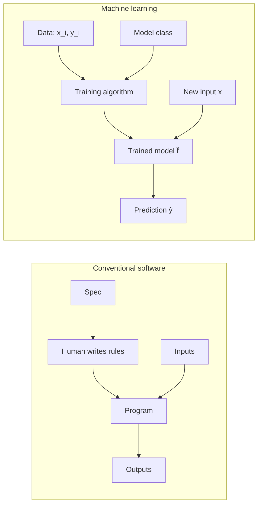
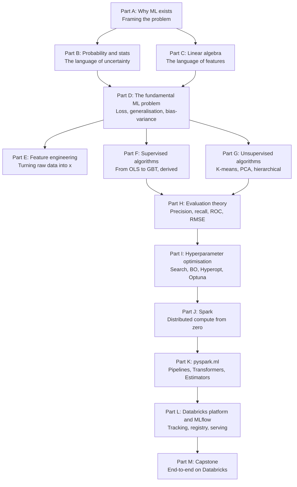

# Chapter 1 — What is Machine Learning?

> **Goal of this chapter:** to give you a sturdy, honest mental model of what machine learning *is*, what problem it was invented to solve, and — equally important — what it isn't. By the end of the chapter you should be able to explain ML to a non-technical stakeholder without resorting to mysticism, situate it correctly in the broader history of computing, and tell the difference between a problem that calls for ML and one that doesn't. Every later chapter in this book — the calculus in Part C, the loss functions in Part D, the Spark internals in Part J — is in service of this one idea, executed at scale.

---

## 1.1 A thought experiment: writing a credit-card fraud detector by hand

Imagine you have just joined the risk team at a mid-sized bank. Your first assignment, handed to you on day one, sounds simple: *catch fraudulent credit-card transactions.* The data team will pipe every transaction into your service, and your service has to return one of two answers — `fraud` or `legit` — in under fifty milliseconds.

You are a strong Python engineer. You have written services that handle harder problems than this before. So you do the natural thing: you sit down and start writing rules.

You read about fraud for a week. You talk to the fraud-ops team. You watch them work. You begin to encode what they know:

```python
def is_fraud(txn) -> bool:
    # Rule 1: transactions over $5,000 in a country the cardholder has
    # never visited are suspicious.
    if txn.amount > 5000 and txn.country not in cardholder.visited_countries:
        return True

    # Rule 2: more than five transactions in under one minute is suspicious.
    if recent_transactions(cardholder, window_sec=60) >= 5:
        return True

    # Rule 3: gas station + $1.00 charge followed by a large purchase
    # within ten minutes is a classic card-test pattern.
    if (txn.merchant_category == "gas" and txn.amount < 2.0 and
        next_txn_within(cardholder, window_sec=600).amount > 500):
        return True

    return False
```

You ship it. It works. For a week. Then the fraud team flags a wave of fraud you missed: a fraudster figured out that your rules trigger on *single* gas-station card tests, so they have started running ten tiny tests at different merchants instead. You add a rule. The fraudsters notice. They start using a different category of low-value merchant. You add a rule. They notice again. They split charges into a `$0.50` plus a `$0.50` instead of a `$1.00`. You add a rule.

Six months in, you have 487 rules. Three of them contradict each other. Two of them haven't fired in four months but nobody is brave enough to delete them in case they catch one fraudster a year. The on-call rotation now spends most of its time triaging false positives — a wedding photographer in Brooklyn keeps getting her card blocked when she travels to a destination wedding because rule #112 flags new cities. Your director asks you for a roadmap. You don't have one. You have a hairball.

This isn't a parable about bad engineering. This is what happens when you try to encode a moving, adversarial, high-dimensional pattern as a fixed list of `if` statements. The world has too many fraud patterns for one human to anticipate, and even the patterns you do catch shift faster than you can write code.

**The insight that will run through this entire book is this:** instead of writing the rules, you can collect examples of what fraud and non-fraud look like, and ask a computer to learn the rules from those examples. The computer will not produce a list of `if` statements — it will produce something subtler, a mathematical object that maps transactions to risk scores and that can be retrained next week when the fraudsters change tactics.

That mathematical object, the procedure for producing it, and the engineering discipline that supports it in production — that is machine learning. Everything else in this book is detail.

---

## 1.2 Machine learning as function approximation

Let's restate the fraud problem in slightly more abstract terms, because the abstraction is what generalises beyond fraud. Somewhere out in the world there is a *true* function

$$
f: \mathcal{X} \to \mathcal{Y}
$$

that maps a transaction $x \in \mathcal{X}$ — every input feature your service can see, from the amount and merchant to the time of day and the cardholder's history — to a label $y \in \mathcal{Y}$, in this case `{fraud, legit}`.

You cannot write $f$ down. Nobody can. The function lives in the joint behaviour of millions of cardholders and thousands of fraudsters and an entire payments ecosystem, and even if you somehow extracted it today, it would be different tomorrow because the underlying behaviour is shifting.

But you can collect *examples* that $f$ produced. Every cleared transaction, every chargeback, every fraud report your bank has logged in the last three years is a pair $(x_i, y_i)$ where $x_i$ is the transaction and $y_i$ is the eventual label (fraud or not). You have, say, 50 million such pairs.

From these pairs you can try to construct an approximation $\hat{f}$ — read "f-hat" — that produces the same outputs as $f$ on the examples you have, and, you hope, on examples you don't yet have. The "hope" in that last sentence is doing a great deal of work; we will come back to it many times in this book. For now, the picture is:

```
        examples (x_i, y_i)
                |
                v
        ┌────────────────┐
        │ learning       │
        │ algorithm      │   produces
        └────────────────┘  ─────────►   f̂   (an approximation of f)
                |
                v
        new input x   ──►   f̂(x)   ──►   prediction ŷ
```

That is it. That is machine learning, in one diagram. The rest is engineering.

Three things to notice immediately:

First, $\hat{f}$ is a *function*. It takes inputs, returns outputs. From the point of view of the system that consumes its predictions, $\hat{f}$ is just code that happens to have been generated by an algorithm rather than by you.

Second, $\hat{f}$ is *not* the true $f$. It is an approximation. It will be wrong sometimes. A huge fraction of the discipline of ML is measuring *how* wrong it is, in *what way* it is wrong, and *whether* that wrongness is acceptable for the business problem.

Third, the *quality* of $\hat{f}$ depends overwhelmingly on the quality of the examples you fed in. Garbage in, garbage out is the cliché. The more precise statement is: $\hat{f}$ can only ever capture patterns that are present in the examples. If your training data contains zero examples of fraud at gas stations because the fraud-ops team never labeled those, your model will be blind to gas-station fraud. We will come back to this, repeatedly, in Part E on feature engineering and Part D on evaluation.

### 1.2.1 The terminology, fixed once

A small vocabulary will pay for itself for the next 5,000 lines:

- $x$ is an **input**, a **feature vector**, or sometimes a **sample** or **instance**. In a fraud problem, one $x$ is one transaction's features.
- $y$ is the **target**, the **label**, the **output**, the **response variable**, the **dependent variable**, or the **ground truth**. All of these mean the same thing. Different fields drift toward different words; we will use mostly "label" for classification and "target" for regression.
- $\mathcal{X}$ is the **input space** — the set of all possible $x$. For our fraud problem, it's a very high-dimensional set: every plausible transaction.
- $\mathcal{Y}$ is the **output space**. For fraud, $\mathcal{Y} = \{\text{fraud}, \text{legit}\}$. For predicting tomorrow's temperature, $\mathcal{Y} = \mathbb{R}$ (the real numbers).
- $f$ is the **true function**, also called the **data-generating function** or the **oracle**. Idealised, unknowable, but real.
- $\hat{f}$ is the **learned function** or the **model**. Produced by the learning algorithm.
- $D = \{(x_1, y_1), (x_2, y_2), \ldots, (x_n, y_n)\}$ is the **training set** — the examples we have.

You will meet variations of this notation in every paper, every textbook, every codebase. The letters change. The structure does not.

---

## 1.3 Machine learning vs. rule-based programming

It is worth pausing to articulate exactly how ML differs from "regular" programming, because the difference is not always cleanly stated and because the difference shapes how you should think about every project.

In conventional programming, the engineer's job is to take a specification — "given these inputs, produce these outputs" — and write code that implements the spec. The code itself is the artifact. It is human-written, human-readable, and human-auditable. If it misbehaves, you can read it, debug it, fix it. If the spec changes, you change the code.

In machine learning, the engineer's job is to take a data set and pick a *family* of functions (the "model class" — linear functions, decision trees, neural networks…) and let an optimisation procedure search that family for a function that fits the data. The artifact is the *fitted* function — a set of numbers, the *parameters* — together with the architecture of the model class. It is partly opaque, only partially auditable, and changes whenever you retrain.



This shift sounds small. It is not. It changes how you debug (you don't read the model; you probe it with inputs), how you test (your test suite is a held-out dataset, not a pytest file), how you deploy (the model is a binary artifact that ships with metadata), how you monitor (you watch *output distributions*, not just error logs), and how you reason about failure (failures are statistical, not deterministic). Most of the engineering rigor in MLOps — which we will get to in Part L — exists to make this new style of programming tractable.

When should you reach for ML? A rough rule:

- If you can specify the rules cleanly and they don't change, **don't use ML**. Write the rules. Adding 100 if-statements has been a perfectly respectable engineering decision since 1965. A pizza-order validation system does not need a neural network.
- If you cannot specify the rules — because the pattern is too complex, too high-dimensional, or simply unknown to you — but you can collect examples of the desired behaviour, **ML is a candidate**.
- If you can specify the rules but they change frequently enough that maintenance kills you, **ML may be a candidate** — because re-training on new data is often cheaper than rewriting rules.

I have known several promising data-science projects to founder because the team chose ML for a problem that wanted three regex patterns. The reverse — using `if/else` where you needed a model — also happens. Knowing which is which is itself a skill, and one we will sharpen throughout this book.

---

## 1.4 What machine learning is *not*

This section will save you and the people who employ you a lot of grief. The single most career-limiting mistake an ML engineer can make is to over-promise what ML can do. The single most career-defining habit is calibrated honesty about its limits. So before we go any further, let's name those limits.

### 1.4.1 ML is not magic

When a model performs well, it is performing *interpolation* in a very high-dimensional space. It has seen many examples that resemble the new input it is being asked to predict, and it is — roughly — averaging or weighting those nearby examples to produce a prediction.

When a new input lies in a region of the input space that the training data covered well, the model is on solid ground. When the new input lies in a region the training data did not cover — when it has to *extrapolate* — the model is guessing. A well-engineered ML system flags these out-of-distribution inputs and routes them somewhere safer (a human, a fallback rule, a "we don't know" response). A naive ML system confidently extrapolates and produces nonsense. We will see in Part D, when we study generalisation, exactly why this is.

### 1.4.2 ML is not AGI

The word "AI" gets thrown around in ways that obscure what is actually happening under the hood. A logistic-regression spam classifier is, in a strict technical sense, "AI." So is a multi-billion-parameter language model. The two have essentially nothing to do with each other in terms of capability, training cost, deployment shape, or failure mode. When somebody — especially a stakeholder — uses the word "AI", your first job is to figure out which family of techniques they mean and what they expect the system to do.

For the work this book prepares you for — and for the Databricks ML Associate exam specifically — "ML" means classical, tabular, supervised, and unsupervised learning, with a passing glance at modern foundation models. We will be precise about what is and isn't in scope.

### 1.4.3 ML inherits the biases of its training data

If your training data contains every loan application your bank ever approved or denied for the last forty years, and if for thirty of those forty years your bank's loan officers were unwittingly steered by neighbourhood demographics, then a model trained on that data will reproduce that bias. The model is not racist in the human sense; it is doing what it was asked to do, which is to predict approvals that look like historical approvals. This is one of the most well-documented failure modes in real-world ML deployment, and it has cost organizations very large sums of money and reputation. We will not solve fairness in this book — it is a research area in its own right — but you should know from chapter 1 that the question exists and that competent ML engineers know it does.

### 1.4.4 ML is not free of operational cost

A model is not the deliverable. A *system that uses the model, monitors the model, retrains the model, versions the model, and rolls back the model when it misbehaves* — that is the deliverable. Building that system is the bulk of an ML engineer's job, and it is what MLflow, feature stores, model registries, and serving infrastructure exist to support. We will get into all of it in Part L. For now, internalise: the moment you put a model into production, you have signed up for a recurring operational obligation. The training notebook is the appetizer.

### 1.4.5 ML doesn't relieve you of having to think

A surprising number of ML projects fail because nobody asked, early enough, what *exactly* the model was supposed to predict, and what *exactly* would be done with the prediction. The model is trained to predict customer churn — but the business doesn't have a retention play to deploy when somebody is flagged as likely to churn, so the predictions go nowhere. The model is trained to predict revenue — but the column called "revenue" includes refunds, so the model is actually predicting net revenue, and the dashboard the CFO is staring at says gross. These are not ML problems. They are framing problems. ML amplifies whatever framing you give it, including the wrong framing. Chapter 4's discussion of the lifecycle will return to this at length.

---

## 1.5 A first taxonomy: regression vs. classification

The next few chapters will get more careful about ML's taxonomy. For now we will draw the most useful distinction, the one you will use almost every day on the job: *is the thing you are predicting continuous or discrete?*

### 1.5.1 Regression: predicting a continuous quantity

If $\mathcal{Y} = \mathbb{R}$ — that is, the label is a real number — we call the problem **regression**. The word is historical (Francis Galton, 1886, talking about heights of children "regressing" toward the mean) and somewhat unhelpful as terminology because it doesn't describe what's happening, but we are stuck with it.

Examples of regression problems:

- Given the square footage, number of bedrooms, school district, and ZIP code of a house, predict its sale price in dollars.
- Given the patient's age, lab values, and history, predict their hospital length-of-stay in days.
- Given a customer's purchase history, predict their next-twelve-month spend in dollars.
- Given the contents of an email, predict the response time of the recipient in hours.
- Given a city, day of year, and weather forecast, predict tomorrow's peak electricity demand in megawatts.

Notice that the predicted quantity is always a number on a continuous scale, and the question of "how wrong" makes intuitive sense — being off by $\$5{,}000$ on a house price is twice as bad as being off by $\$2{,}500$. (This intuition turns into the **mean squared error** and **mean absolute error** loss functions in Part D. The fact that we can talk about "how far off" is a regression-specific privilege; classification has its own machinery.)

### 1.5.2 Classification: predicting a discrete category

If $\mathcal{Y}$ is a finite, discrete set of labels — `{spam, ham}` or `{cat, dog, bird}` or `{approve, deny, review}` — we call the problem **classification**.

Examples of classification problems:

- Given an email's contents, classify it as spam or ham. (Binary classification — two classes.)
- Given an image, classify it as one of `{cat, dog, bird, fish}`. (Multiclass classification.)
- Given a CT scan, classify each pixel as `{tumor, healthy tissue, background}`. (Semantic segmentation — pixel-wise classification.)
- Given a transaction, classify it as fraud or legit.
- Given a credit application, classify it as `{approve, deny, manual review}`.

For classification, "how wrong" is more subtle. A prediction is either right or wrong; the gradations of wrongness are different (we will spend Chapter 42-44 dissecting precision, recall, ROC, PR curves, F1, F-beta). For now, hold the idea that classification metrics and regression metrics are fundamentally different beasts, because their outputs live in fundamentally different mathematical spaces.

### 1.5.3 Edge cases the taxonomy doesn't handle cleanly

Real problems sometimes don't fit neatly. A few honest cases:

- **Ordinal classification.** "Customer satisfaction rating: 1–5 stars." Discrete, but ordered. Treating it as classification loses the ordering. Treating it as regression pretends the gap from 1→2 equals the gap from 4→5, which it probably doesn't. There are dedicated ordinal-regression methods; mostly people fudge it and reach for regression.
- **Count regression.** "How many users will log in tomorrow?" The target is a non-negative integer. You can treat it as regression, but special-purpose models (Poisson regression, negative binomial) often do better.
- **Probability prediction.** "What is the probability of default?" The target is a number between 0 and 1, but it's really an estimate of a binary classification's probability. The distinction will matter when we get to logistic regression in Chapter 32.
- **Multi-label classification.** "Tag this article with all relevant topics: politics, economics, sports, tech." More than one label can apply to a single input. This is its own subfield. Chapter 47 visits it briefly.
- **Survival analysis.** "How long until this patient is readmitted?" Looks like regression, but the data is *censored* — some patients haven't been readmitted yet by the time you cut off your dataset, so you only know their time-so-far, not their final time. Treating censored data as plain regression underestimates badly. This is out of scope for the exam but extremely common in healthcare and finance.

These edge cases are mentioned to inoculate you against treating the taxonomy as exhaustive. For the exam — and for 80% of real industry problems — regression vs. classification is the working distinction.

---

## 1.6 Why now? A short historical detour

A reasonable question is: ML's core ideas are old. Why did the field explode after 2012? The answer is the joint maturation of three enablers — data, compute, and algorithms — and it is worth knowing the story.

### 1.6.1 The data enabler: digitisation since ~2000

Until the late 1990s, most of human activity was not digitally recorded. Retail transactions happened on paper. Medical records were on paper. Phone calls were not transcribed. Photographs lived in shoeboxes. ML algorithms existed, but the input — labelled examples — was extraordinarily expensive to come by.

Three waves changed this:

1. The web (1995–2010) created the first vast repository of digital text and images. Search engines like Google were the first companies for whom "petabytes of training data" became routine.
2. Smartphones (2007–) put a sensor-laden, network-connected device in every pocket. Click logs, location traces, photos, voice recordings — at scales no prior generation could have imagined.
3. Cloud storage (2006–) made it economically feasible to *keep* all that data instead of throwing it away.

By 2012, the constraint had flipped. Where the 1990s ML researcher was bottlenecked on data, the 2010s practitioner was bottlenecked on compute and on algorithms that could exploit the data.

### 1.6.2 The compute enabler: GPUs since ~2010

Modern ML — especially deep learning — is, mathematically, mostly matrix multiplications. It happens that graphics processing units, designed for rendering video games, are extraordinarily good at matrix multiplication. NVIDIA's CUDA platform, released in 2007, let researchers run general-purpose computation on GPUs. By 2012, training a deep neural network on a GPU was tens to hundreds of times faster than on a CPU.

This sounds like an incremental engineering win. It was not. There is a difference in *kind* between an experiment that takes three weeks and one that takes three hours: only the latter lets a researcher iterate on ideas. The GPU revolution turned ML from a months-per-experiment science to a hours-per-experiment one, and the field's progress accelerated correspondingly.

(For the classical-ML topics that dominate the Databricks ML Associate exam, GPUs are not strictly required — Spark MLlib and scikit-learn run perfectly well on CPUs. But the broader story matters because it explains why ML, as a *field*, looks the way it does.)

### 1.6.3 The algorithms enabler

Classical machine learning — linear regression, logistic regression, decision trees, random forests, support vector machines, k-means, principal components analysis — was substantially mature by the late 1990s. Most of what's on the Databricks ML Associate exam comes from this era. The names of the techniques and the math behind them have been stable for thirty years.

What's changed in the last decade is partly engineering — better libraries (scikit-learn since 2007, XGBoost since 2014, LightGBM since 2016), better distributed computation (Spark since 2014) — and partly the rise of deep learning, which is mostly out of scope for this exam but which has reshaped how ML practitioners think about model capacity, regularisation, and overfitting.

The takeaway: when you read about ML, distinguish "the algorithm" (often quite old) from "the engineering surface that makes it usable" (often quite new). Most of this book is about the former, executed on the latter.

---

## 1.7 A small worked example: linear regression by eye

Enough abstraction. Let's actually do ML on a tiny dataset, by hand, so you can feel the machinery.

You have data on five house sales in a neighbourhood. Each row is `(square_footage, sale_price_in_thousands)`:

| House | Square footage $x$ | Sale price $y$ (thousands) |
|------:|-------------------:|---------------------------:|
| 1 |   800 | 200 |
| 2 | 1,200 | 280 |
| 3 | 1,500 | 340 |
| 4 | 1,800 | 410 |
| 5 | 2,300 | 510 |

A friend is selling a house with 1,650 square feet and wants to know what to list it at. We want to predict its sale price.

### 1.7.1 Looking at the data

Let's plot it as a tiny ASCII chart. Square footage runs along the x-axis, price along the y-axis. Each `*` is a house:

```
 price ($k)
   |
 510|                                            *
   |
 410|                                  *
   |
 340|                       *
   |
 280|             *
   |
 200|   *
   |
   +----+-------+--------+--------+--------+------- sq ft
      800    1200      1500     1800     2300
```

Two things are visually obvious. First, price *increases with* square footage — they are positively correlated. Second, the relationship looks roughly *linear* — the points fall close to a straight line.

### 1.7.2 Fitting a line by eye

A line in two dimensions is determined by two numbers, conventionally written

$$
\hat{y} = w \cdot x + b
$$

where $w$ is the slope (how much price changes per square foot of size), and $b$ is the intercept (the predicted price when $x = 0$).

Look at the points. Between house 1 (800 sq ft, $200k) and house 5 (2,300 sq ft, $510k), the price went up by $510 - 200 = 310$k while the footage went up by $2{,}300 - 800 = 1{,}500$ square feet. So a reasonable slope is

$$
w \approx \frac{310}{1{,}500} = 0.207 \text{ thousand dollars per square foot}
$$

For the intercept, take house 1: if $\hat{y} = 0.207 \cdot 800 + b = 200$, then $b = 200 - 165.6 = 34.4$. Let's try that line.

$$
\hat{f}(x) = 0.207 \cdot x + 34.4
$$

Let's see what it predicts for the five houses we already have:

| House | $x$    | True $y$ | Predicted $\hat{y} = 0.207 x + 34.4$ | Error $y - \hat{y}$ |
|------:|-------:|---------:|-------------------------------------:|--------------------:|
| 1 |   800 | 200 | $0.207 \cdot 800 + 34.4 = 200.0$   |  0.0  |
| 2 | 1,200 | 280 | $0.207 \cdot 1{,}200 + 34.4 = 282.8$ | $-2.8$ |
| 3 | 1,500 | 340 | $0.207 \cdot 1{,}500 + 34.4 = 344.9$ | $-4.9$ |
| 4 | 1,800 | 410 | $0.207 \cdot 1{,}800 + 34.4 = 407.0$ |  3.0  |
| 5 | 2,300 | 510 | $0.207 \cdot 2{,}300 + 34.4 = 510.5$ | $-0.5$ |

The errors are small — at most a few thousand dollars on prices in the hundreds of thousands. The line is a decent fit.

### 1.7.3 Making the prediction

Our friend's house is 1,650 sq ft. Plug in:

$$
\hat{f}(1650) = 0.207 \cdot 1{,}650 + 34.4 = 341.55 + 34.4 = 375.95
$$

Recommend a list price around $376k. That's it. That's a complete ML pipeline. You collected data, you chose a model class (linear functions of one variable), you fit the model (by hand, eyeballing), and you used it to predict.

### 1.7.4 What we glossed over (everything)

This was the happiest possible case. Five data points, one feature, perfectly linear, no noise to speak of, no missing values, no categorical variables, no need to validate the model on data it hasn't seen, no production deployment, no monitoring. Everything else in this book is about the cases where one or more of these conditions fails.

To name a few previews:

- **Choosing $w$ and $b$ algorithmically rather than by eye.** When you have 100,000 houses and 50 features, you can't eyeball anything. You need an optimisation procedure. We will derive **ordinary least squares** in Chapter 31 and the general **gradient descent** in Chapter 17.
- **Choosing the model class.** Linear was right here because the data was linear. What if it isn't? Then you need polynomial features (Chapter 28), tree-based models (Chapters 33–36), or other model classes.
- **Multiple features.** Real estate prices depend on size, location, age, condition, schools, market timing… Most of Part E is about turning raw inputs into useful features.
- **Validating the model.** Our line fit the five training points well. Does it work on the *next* five houses? Maybe. The whole machinery of train/validation/test splits (Chapter 21) and cross-validation (Chapter 22) exists to answer this.
- **Quantifying uncertainty.** What's the *probability* the list price should be above $400k? Linear regression has a story for this; tree models have a different one; Bayesian methods a third. We touch on it lightly in Parts B and H.

For now, fix this picture in your head: ML at its core is *fitting a function to data, then using that function to predict*. The rest is mechanics.

---

## 1.8 Scaling up: when the eyeball fails

Imagine the same exercise but now you have 100,000 houses, each with 50 features: square footage, lot size, year built, year of last renovation, number of bedrooms, number of bathrooms, school district rating, distance to public transit, average commute time, ZIP-code-level median income, and so on.

You cannot draw this on a piece of paper. You cannot eyeball a 50-dimensional line. You need:

1. **A way to represent the data efficiently in memory.** This becomes a `pandas.DataFrame` or a Spark `DataFrame` — a table with 100,000 rows and 50 columns. We'll meet both, and the reasons one or the other is the right tool, throughout this book.
2. **A way to express "the best line in 50 dimensions."** This becomes a loss function $L(w, b)$ that, for any candidate $(w, b)$, returns a number measuring how badly the line fits. Smaller is better. Chapter 16.
3. **A way to find the $(w, b)$ that minimises that loss.** This becomes an optimisation algorithm — for linear regression, you can solve it in closed form (Chapter 31); for almost everything else, you use gradient descent (Chapter 17).
4. **A way to evaluate whether the result is good.** This becomes the train/validation/test split and the evaluation metrics (Chapters 21, 42–47).
5. **A way to run all of this on more data than fits on one machine.** This becomes Spark (Part J) and `pyspark.ml` (Part K).
6. **A way to track, version, and serve the result.** This becomes MLflow and the Databricks platform (Part L).

Every chapter in this book is, in some sense, an expansion of one of these six points. By the end, you will be able to do this 100,000-house exercise — and the 100-million-transaction fraud version, and the 50-million-image-and-text version — as routinely as you do any other engineering task.

---

## 1.9 What ML doesn't free you from: domain knowledge

A common misconception is that an ML model will figure out the domain for you. It won't. It will figure out *patterns* — which are not the same thing as understanding.

A model trained on real-estate data will discover that homes with more bedrooms tend to be more expensive. It will not, on its own, know that this is partly because more bedrooms means more square footage (the features are correlated) and partly because larger families have more buying power, and that these two effects are confounded by neighbourhood. A model trained on hospital data will discover that patients prescribed warfarin have higher mortality rates. It will not, on its own, know that this is because warfarin is prescribed to patients with serious cardiovascular conditions, not because warfarin causes deaths.

These are *causal* questions. The model is not making causal claims. It is making predictions, and predictions in correlational data are correct only as long as the same correlational structure holds. The moment the world changes — a new hospital protocol, a new neighbourhood gentrification pattern, a new fraudster tactic — the model's predictions can decay or invert.

The lesson: domain knowledge is your job. The model finds patterns in data; you decide which patterns are real, which are spurious, which are causally meaningful, which are merely correlational, and which are encoding bias. Throughout the rest of this book, we will return to this — particularly in Part E on feature engineering, where many of the most important decisions are domain-driven, not algorithmic.

---

## 1.10 A roadmap for the rest of the book

You now have the framing. Let's preview where each subsequent part takes us, and how each piece connects.



Part B equips you with the probability you need to make sense of likelihood-based methods (logistic regression, Naive Bayes, mixture models). Part C does the same for the linear algebra (matrix decompositions are the heart of PCA, the closed-form of OLS is a linear-algebra identity). Part D is the *theoretical core* of the book — loss functions, optimisation, generalisation, regularisation, cross-validation — and is where the rest of the book hangs its definitions. Parts E through I build on Part D, working up from feature engineering through algorithms and evaluation to hyperparameter tuning. Parts J and K take everything you've learned and rephrase it in the Spark and `pyspark.ml` vocabulary. Part L is the Databricks platform itself — MLflow, Unity Catalog, model serving. Part M is a capstone project that pulls it all together.

A reasonable reader can finish Part A in an afternoon. A serious reader does not finish Part D in an afternoon; the bias-variance derivation alone is worth a careful week. Pace yourself by chapter, not by part.

---

## 1.11 Summary

Strip everything in this chapter down to its bones:

1. ML exists because some problems cannot be solved by writing rules — the patterns are too complex, too high-dimensional, too adversarial, or too non-stationary. Instead, you collect labelled examples and let an algorithm fit a function to them.
2. Formally, ML is function approximation: there is an unknown true $f: \mathcal{X} \to \mathcal{Y}$, and from data $(x_i, y_i)$ we construct an approximation $\hat{f}$.
3. ML differs from regular software in that the artifact is *learned* rather than written, which changes everything downstream — testing, debugging, deployment, monitoring.
4. The most useful first cut on ML problems is regression (continuous $y$) vs. classification (discrete $y$).
5. The field's modern shape is the joint product of three enablers: data (digitisation since 2000), compute (GPUs since 2010), algorithms (deep learning since 2012 on top of classical ML mature since 1990s).
6. A one-feature linear regression done by eye is a complete ML pipeline in miniature. Everything else in the book scales this exercise to higher dimensions, more data, and production systems.
7. ML doesn't free you from thinking about the domain, the framing, or the operational obligations of a deployed model.

If you only remember one sentence from this chapter, make it this one: *Machine learning is the engineering discipline of producing good approximations to functions we cannot write down ourselves, from examples of their input-output behaviour.*

---

## 1.12 What this builds on / where this returns

**Builds on:** Nothing earlier in this book; this is Chapter 1. If you are coming in with software engineering experience, that helps: you already know what a function is, what a deployed service is, and what it means for code to misbehave in production.

**Returns:**

- The function-approximation framing is the spine of *Part D*'s formal treatment of loss and generalisation.
- The "compute, store, monitor" engineering picture sketched in 1.2.5 expands to all of *Part L* — MLflow, Unity Catalog, model serving, monitoring.
- The regression vs. classification taxonomy is sharpened in *Chapter 2* with the three paradigms.
- The 1.7 worked example becomes a formal closed-form derivation in *Chapter 31* (linear regression / OLS).
- The "ML is interpolation, not extrapolation" point recurs in *Chapter 18* (overfitting), *Chapter 19* (bias-variance), and *Part L*'s drift discussion.

---

## 1.13 Exercises

Attempt all of these cold. Answers are in a fold at the bottom; resist peeking until you've written something for every question. The goal is not to get them all right on the first pass — it is to find the gaps in your model and patch them by re-reading.

1. **In your own words**, explain to a non-technical stakeholder what machine learning is, in three sentences. Avoid the words "AI", "deep", "smart", and "data scientist". (No fixed answer; we will critique a sample.)

2. **Classify each of the following as regression, classification, both, or neither.** Justify briefly.
   1. Predicting next month's stock price.
   2. Predicting whether next month's stock price will be higher than this month's.
   3. Identifying which of five disease categories a CT scan shows.
   4. Counting the number of cars in a parking lot from an aerial image.
   5. Translating an English sentence into French.
   6. Computing the SHA-256 hash of a file.
   7. Recommending the next song for a user to listen to.

3. **The "data-too-complex-to-rule-on" criterion.** Give one example, from any domain you know well, of a problem where rule-based programming would work fine and ML would be overkill. Give one example where the reverse holds. Justify both.

4. **The hat in $\hat{f}$.** Why do we write the learned function as $\hat{f}$ rather than $f$? What conceptual mistake does this notation help us avoid?

5. **Worked example, by hand.** Given the four points $(1, 3), (2, 5), (3, 7), (4, 9)$, what line fits them perfectly? Find $w$ and $b$ in $\hat{y} = wx + b$. What is the error at each point? What does the model predict for $x = 5$ and $x = 10$? Do you trust both predictions equally? Why or why not?

6. **Out-of-distribution prediction.** In the house-price example, the training data covered houses from 800 to 2,300 square feet. Your model predicts $0.207x + 34.4$. What does it predict for a 12,000-square-foot mansion? Why might you not trust that prediction even if the arithmetic is correct?

7. **The historical "why now" story.** The classical algorithms underlying most of the ML Associate exam (linear regression, decision trees, k-means) were all developed before 2000. Why did "ML" as a job title and industry boom only after 2012? Give two reasons and one counterexample (something that was already large-scale before 2012).

8. **Concept-vs-code separation.** A friend says, "ML is just calling `sklearn.fit` and `sklearn.predict`." Without being dismissive, explain why this is missing most of the discipline. Aim for four to six sentences.

9. **Domain knowledge required.** You are asked to predict patient readmission within 30 days from electronic health records. You hand the data to a model with no domain consultation. Name three things that could go wrong because you skipped the conversation with clinicians.

10. **Self-assessment.** Without re-reading this chapter, write down: the formal definition of ML in your own words; the difference between $f$ and $\hat{f}$; one concrete example each of a regression and a classification problem; and the three historical enablers. If any of these stumbles, go back to the relevant section.

<details>
<summary>Answers</summary>

1. *Sample answer:* "Machine learning is the practice of letting a computer figure out the patterns in a problem by showing it lots of examples, instead of writing out the patterns ourselves. We use it when the rules are too complicated to write — for spotting credit-card fraud, recommending movies, or estimating house prices. The result is a piece of code that gives reasonable guesses on new examples it hasn't seen before, with some inevitable mistakes." Critique target: did you avoid jargon, name the data-driven nature, and admit it's imperfect?

2. (a) Regression — the price is a continuous number. (b) Classification — the outcome is binary (higher or not). (c) Classification — five discrete categories. (d) Regression-ish or count regression — discrete but ordered, a non-negative integer; could also be solved as a counting / detection problem in computer vision. (e) Neither in the simple sense — it's a sequence-to-sequence problem; it doesn't fit the chapter's two-bucket framing. (f) Neither — this is a deterministic computation; ML would be the wrong tool. (g) Either, depending on framing — ranking (which song scores highest?) is classification-ish; predicting how long the user will listen is regression. The point of this question is to feel the limits of the simple taxonomy.

3. Examples will vary. Rule-based example: validating that a date string is in ISO 8601 format. ML example: predicting whether a customer will churn next month. The first has crisp rules and is solved with a regex; the second has hundreds of weak signals and no clean rule, so we let an algorithm find the patterns.

4. The hat distinguishes the *estimate* from the truth. The true function $f$ is unknown and unknowable; $\hat{f}$ is what we produced from finite, noisy data, and it is approximate. Conflating them is what makes people over-trust models. The notational habit of writing $\hat{f}$ reminds you, every time, that the model is a guess.

5. The line is $\hat{y} = 2x + 1$. Errors at each training point are zero. Predictions: $\hat{y}(5) = 11$; $\hat{y}(10) = 21$. You should trust $x=5$ more than $x=10$ because the training data ran from $x=1$ to $x=4$ — predicting at $x=5$ is a small extrapolation, but $x=10$ is much further outside the observed range, and the linear assumption may not hold there. This is the same extrapolation caveat as in section 1.4.1.

6. $\hat{f}(12{,}000) = 0.207 \cdot 12{,}000 + 34.4 = 2{,}518.4$ thousand, i.e. $\$2.5M$. You may not trust it because (a) you have no training data at that footage; (b) at very large footages the price-per-square-foot relationship probably bends — luxury homes don't scale linearly with size; (c) the model has no idea about the discontinuity between "house" and "mansion".

7. Two reasons: data (the explosion of digital records since 2000 — the web, smartphones, cheap storage) and compute (GPUs made deep-learning-scale matrix math practical). One counterexample of pre-2012 large-scale ML: web search ranking at Google was an industrial-scale ML application by ~2005. Other reasonable counterexamples: spam filtering at major email providers, credit scoring at large banks.

8. The model itself is maybe 10% of the work. The other 90% includes: framing the business question correctly; understanding the data, including its biases and quirks; engineering features that capture what matters; choosing the right evaluation metric for the business cost; setting up train/validation/test splits that don't leak; iterating on the model when it's bad; deploying the model in a way that doesn't introduce serving skew; monitoring it after deployment; and retraining it as the world changes. `fit` and `predict` are 30 seconds of typing in the middle of months of work.

9. Examples: (a) the model might learn to use "discharge to skilled nursing facility" as a strong signal — but in your operational system, that field is only filled in *after* the patient is discharged, so it's not available at the time you want to predict (data leakage). (b) clinicians might tell you that ICD codes are heavily up-coded for billing reasons and don't reflect actual diagnoses, so models trained on them will pick up billing noise rather than clinical truth. (c) clinicians might tell you that the 30-day-readmission window is gameable — hospitals delay readmissions to day 31 — which means your "ground truth" labels are biased.

10. No fixed answer — this is a self-assessment. If anything feels uncertain, go back to that section. The terms to be able to define: ML as function approximation; $f$ vs. $\hat{f}$; regression vs. classification; data + compute + algorithms.

</details>

---

[^next]: Chapter 2 picks up immediately from here, generalising the "where do the $(x, y)$ pairs come from?" question into the three paradigms — supervised, unsupervised, reinforcement.
