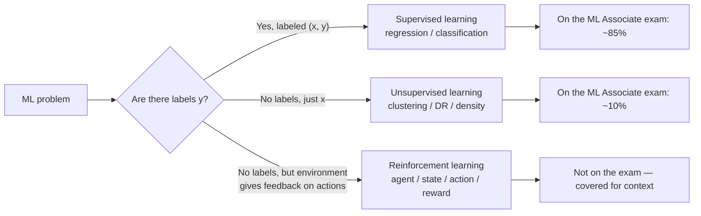
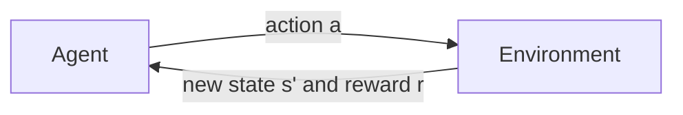
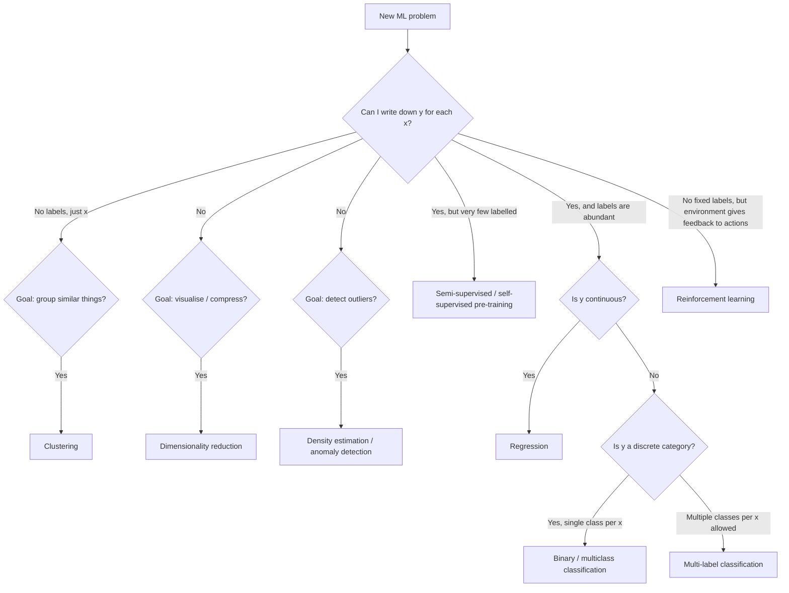

# Chapter 2 — The Three Paradigms: Supervised, Unsupervised, Reinforcement

> **Goal of this chapter:** to give you the conceptual map you need to look at any new ML problem and immediately know "what kind" it is. We'll spend most of the chapter on **supervised** learning, because that's where ~85% of the Databricks ML Associate exam lives and where ~80% of industry ML lives. We'll spend the next-largest chunk on **unsupervised** learning, then a brief tour of **reinforcement** learning for completeness and orientation. By the end, you should be able to take a vague business problem ("we want to do something with this data") and place it confidently in one of these three buckets — or recognize that the question hasn't been asked clearly enough to answer.

---

## 2.1 Where do the labels come from?

In Chapter 1 we framed ML as finding an approximation $\hat{f}$ to an unknown function $f: \mathcal{X} \to \mathcal{Y}$, given a dataset of examples $(x_i, y_i)$. But we breezed past a crucial question: *where do those $y_i$ come from?*

For the house-price example, the $y_i$ were obvious — they were the actual sale prices, recorded in the county clerk's office, available because real-estate transactions are public records. For the spam-detection example we'll build in Chapter 3, the $y_i$ are obvious too — they come from users clicking the "report spam" button, plus the historical labels produced by your existing spam filter.

Now consider these three problems instead:

1. *We have ten million customer purchase histories. Group customers into segments so we can target marketing differently to each group. We don't know what the right segments are — we want the data to tell us.*
2. *A robot has to learn to walk. We can't tell it the "right" foot-placement for every situation, because there are infinitely many situations and we don't know the right answer in most of them. But we can put the robot in a simulator, let it try things, and give it a reward when it stays upright and a penalty when it falls.*
3. *We want to classify medical images as benign or malignant. We have a million images but only ten thousand of them are labelled by radiologists, because each labelling costs $100 and takes ten minutes.*

The first has no labels at all. The second has no fixed labels — feedback comes from an environment as the agent acts. The third has labels on a small fraction and not on the rest. Each is a different paradigm, with different machinery, different evaluation, and a different mental model.

The first taxonomy any ML practitioner internalises is *the three paradigms*: supervised, unsupervised, and reinforcement learning. Most of the rest — semi-supervised, self-supervised, active learning, contrastive learning, weakly-supervised — are hybrids and refinements of these three.



We'll take each in turn.

---

## 2.2 Supervised learning

### 2.2.1 The teacher–student picture

Supervised learning is the paradigm of *learning from a teacher who knows the right answers.* You hand the learner a stack of flashcards, each with a question on the front (the features $x$) and the answer on the back (the label $y$). The learner studies the cards, internalizes whatever patterns it can, and then is tested on flashcards it has never seen before — graded by how often its answer matches the back of the new card.

The "teacher" is rarely a single human. More often the teacher is *the world that produced the labels* — every chargeback report, every approved loan, every medical chart, every user click. We treat this as a metaphorical teacher; what matters is that we have ground-truth $y$ values to point to.

The formal setup is exactly as in Chapter 1: data $D = \{(x_1, y_1), \ldots, (x_n, y_n)\}$, a model class (the family of candidate functions), a loss function (how to measure "wrong"), and an algorithm that searches the model class for the function that fits the data best.

### 2.2.2 The two flavours: classification and regression, sharpened

Chapter 1 introduced the distinction. Let's sharpen it.

**Classification** problems have a discrete output space. Within classification there are sub-flavors:

- **Binary classification.** $|\mathcal{Y}| = 2$. Fraud / not-fraud. Spam / ham. Default / no-default. Click / no-click. This is the most common case in industry and the simplest to reason about.
- **Multiclass classification.** $|\mathcal{Y}| = k$ for some $k > 2$, with the classes mutually exclusive — one and only one applies to each $x$. Handwritten digit recognition ($\mathcal{Y} = \{0, 1, \ldots, 9\}$). News topic categorization. ICD-10 code prediction.
- **Multi-label classification.** Each $x$ can have any subset of $k$ possible labels. "Tag this article" — an article can be both `politics` and `economics`. We touch this in Chapter 47.
- **Ordinal classification.** Classes have an order — "1 star, 2 star, …, 5 star" — and that order is informative. Special methods exist but most practitioners reach for regression.

**Regression** problems have a continuous output space. Sub-flavors:

- **Standard regression.** $\mathcal{Y} = \mathbb{R}$. Price, temperature, demand, lifetime value.
- **Bounded regression.** $\mathcal{Y} = [0, 1]$ — predict a probability, a percentage, a click-through rate. Care needed because the model class must respect the bounds.
- **Count regression.** $\mathcal{Y} = \{0, 1, 2, \ldots\}$. Predict the number of customer-support tickets tomorrow. Poisson or negative binomial regression is the principled choice; treating it as standard regression is common and usually fine.
- **Quantile regression.** Instead of predicting the mean $\mathbb{E}[y \mid x]$, predict the 10th, 50th, and 90th percentiles. Useful when you care about uncertainty — for inventory planning you might care more about the 90th percentile of demand than the average demand.

You do not need to memorise these sub-categories now. You need to know they exist so that when you meet a problem that doesn't fit the binary/multiclass/standard mould you don't panic.

### 2.2.3 The arithmetic of supervised data

Supervised learning's defining feature is that *somebody, or some process, has produced ground-truth labels*. This is its great strength and also its great cost. Let's see where labels actually come from, because this drives the economics of nearly every supervised ML project.

**Label sources, in roughly increasing order of expense:**

1. **Already-labeled by the business process.** This is the cheapest case. Every customer who churned was already labelled "churned" by your billing system. Every transaction that produced a chargeback was already labelled "fraud" by the chargeback. The label is a byproduct of operations. Cost per label: effectively zero.

2. **Labelled by users in passing.** Users click "spam" on emails; users click "thumbs up" on songs; users hit "block" on accounts. Cost per label: zero, but the label is *noisy* (users mark spam capriciously) and *biased* (only certain users click the buttons, only on certain content).

3. **Labelled by paid crowd workers.** Mechanical Turk, Scale AI, Surge AI. "Look at this image and label what it contains." Cost: a few cents per label for simple tasks, dollars for complex ones. Crowd labels have a typical error rate of ~5–15% on tasks that look easy and much higher on tasks that aren't. The standard mitigation is to have three workers label each item and take the majority vote.

4. **Labelled by domain experts.** Radiologists labelling scans. Lawyers labelling contracts. Compliance officers labelling transactions. Cost: $50–$500 per label. Quality: high but not perfect — radiologists disagree with each other ~10% of the time on borderline cases.

5. **Labelled by physical experiment.** A drug company synthesizes a candidate molecule and measures its binding affinity. Cost: thousands of dollars per label. This is rare in classical ML but common in scientific applications.

The cost picture shapes the project. A spam classifier can be retrained nightly on yesterday's user clicks — labels are free and abundant. A radiology classifier needs careful annotation of every training image — labels are slow and expensive, the dataset will be small, and the project will live or die on whether the small dataset is enough.

A useful heuristic: **the cost and quality of labels is, in most real projects, more important than the choice of algorithm.** A mediocre algorithm trained on a million clean labels almost always beats a sophisticated algorithm trained on a thousand noisy ones. This is one of the field's most reliable findings, and it shapes how you should triage projects.

### 2.2.4 Examples — vivid and concrete

Abstractions get nowhere without examples. Here are supervised problems from domains you'll likely encounter, sketched with enough detail to be useful.

**Healthcare — hospital readmission prediction.** A hospital wants to know, at the time of discharge, which patients are at high risk of being readmitted within 30 days. $x$ is the patient's record: age, diagnosis codes, medications, lab values, length of stay, discharge disposition. $y$ is binary: was this patient readmitted within 30 days? The label comes for free from the hospital's billing system, with a delay of ~30 days. Training data: a few years of historical discharges, perhaps a few hundred thousand. Why it matters: high-risk patients can be assigned to a nurse-driven transitional-care program. Why it's hard: readmissions have many causes (clinical, social, economic) and the data captures only some of them; labels are also subject to "gaming" — hospitals delay readmissions past day 30 to clean up their numbers.

**Finance — credit default prediction.** A consumer-lending company wants to predict, at the time of loan application, whether the applicant will default within 24 months. $x$ is the application data plus credit-bureau data: income, debt, credit utilization, payment history, length of credit. $y$ is binary: did they default? Label comes for free, with a delay of up to 24 months. Training data: tens to hundreds of thousands of historical loans. Why it matters: pricing the loan (higher predicted risk → higher interest rate) and approval/denial decisions. Why it's hard: regulatory constraints on which features you may use (no race, no ZIP code as a stand-in for race); concept drift as the economy changes; the labels you observe are biased — you only see defaults on loans you actually approved, not on loans you denied.

**E-commerce — click-through rate (CTR) prediction.** Given a user, a context (time of day, device, current page), and a candidate ad, predict the probability that the user will click the ad. $x$ is a large feature vector — user features, ad features, context features, sometimes hundreds or thousands of dimensions. $y$ is binary: did they click? Label is free and instantaneous. Training data: billions of historical impressions. Why it matters: ads are ranked by predicted CTR × bid, so a model that predicts CTR a few percent better can move millions of dollars in revenue. Why it's hard: extreme class imbalance (most ads aren't clicked), distribution shift (new ads appear constantly), feedback loops (the model influences which ads are shown, which influences future training data).

**Manufacturing — predictive maintenance.** Given the sensor readings from an industrial pump (vibration, temperature, pressure, current draw, all sampled at 1Hz), predict whether the pump will fail in the next 7 days. $x$ is a time-series window. $y$ is binary: did it fail? Labels come from work-order systems, with substantial delay and substantial noise (some failures are repaired without being recorded as failures). Training data: months to years of sensor logs across many pumps. Why it matters: replacing a pump on a scheduled maintenance window costs $5k; replacing a pump that just failed catastrophically and shut down a production line costs $500k. Why it's hard: failures are rare (huge class imbalance), labels are noisy, time-series features need careful engineering.

**Internal-tools — IT incident triage.** Given a new IT support ticket (free text), classify it as one of {hardware, software, account, network, other} and assign a priority {low, medium, high, urgent}. $x$ is text plus metadata. $y$ is multi-task: a class label *and* a priority label. Labels come from how human agents classified historical tickets — noisy, because different agents classify the same ticket differently. Training data: tens to hundreds of thousands of historical tickets. Why it matters: faster routing means faster resolution. Why it's hard: free text is messy; categories overlap; the population of incoming tickets shifts as new systems are introduced.

Notice a common thread: in every case, the *data engineering* (where labels come from, how clean they are, whether you can trust them) is at least as important as the *modelling*. We will return to this in every part of this book.

### 2.2.5 What can go wrong with supervised data

Even when you have a beautiful supervised dataset, there are characteristic failure modes:

- **Label leakage.** A feature in $x$ is downstream of $y$ — that is, it's only knowable after $y$ is known. Example: predicting hospital readmission and including "discharge to skilled-nursing facility" as a feature, when that field is only populated for patients who survive long enough to be discharged. Your model looks brilliant in training and falls apart in production. We dissect leakage in Chapter 22.
- **Label noise.** Some fraction of your $y_i$ are wrong. If 5% of Mechanical Turk labels are wrong, your model's ceiling is roughly 95% accuracy, no matter how clever the algorithm. Methods exist for learning under label noise; the most common is to ignore it and accept the ceiling.
- **Sampling bias.** Your training set is not representative of the data you'll see in production. The classic case: you train a credit-default model on past loans, but past loans are only the ones your bank approved — you have no data on what would have happened to the loans you denied. The model's predictions on borderline cases are extrapolations.
- **Concept drift.** $f$ itself changes over time. The fraudsters adapt; the economy shifts; user behavior evolves. Models decay. We'll see drift detection in Part L.
- **Class imbalance.** One class is vastly more common than the other. Fraud is rare; the failure of a fleet pump is rare; cancer in a screening population is rare. Naive models predict the majority class always and score 99% accuracy on uselessly imbalanced data. Chapter 46 is dedicated to this.

These are not edge cases. They are the bread and butter of an experienced ML engineer's debugging sessions.

### 2.2.6 Supervised learning algorithms, briefly previewed

You will meet each of these in depth in Part F. For now, the names and one-sentence intuitions:

- **Linear regression** (Chapter 31). For regression. Fit a hyperplane. Closed-form solution, fast, interpretable, weak when relationships are nonlinear.
- **Logistic regression** (Chapter 32). For classification. Fit a hyperplane in feature space; pass it through a sigmoid to get probabilities. Same machinery as linear regression with one extra step. Surprisingly powerful for high-dimensional sparse problems (text, ads).
- **Decision trees** (Chapter 33). Recursive partitioning of feature space along axis-aligned splits. Interpretable, handles mixed feature types, but a single tree overfits aggressively.
- **Random forests** (Chapter 34). An ensemble of many decision trees, each trained on a bootstrap sample and a random feature subset, predictions averaged. One of the most reliable workhorses in classical ML.
- **Gradient boosted trees** (Chapter 36). Sequentially fit trees, each correcting the errors of the previous ensemble. XGBoost, LightGBM, CatBoost. The reigning champion on tabular data.
- **Naive Bayes** (Chapter 37, lighter touch). A probabilistic classifier under a strong independence assumption. Fast, simple, surprisingly competitive on text.
- **k-Nearest Neighbours** (Chapter 37). No training; at prediction time, find the $k$ closest training examples and vote. Conceptually simple, expensive at scale.

These seven algorithms — plus their deep-learning cousins, which are out of scope here — cover the vast majority of supervised problems in industry. Part F derives each of them from the math.

---

## 2.3 Unsupervised learning

### 2.3.1 The motivation: structure without labels

There are situations where you have plenty of $x$'s but no $y$'s, and you still want to do something useful with the data. Sometimes the reason is economic — labels are too expensive. Sometimes it's conceptual — the question itself is "what's in this data?", a question that *has no fixed answer* but that admits useful partial answers.

Three concrete cases:

**Case 1: customer segmentation.** Your marketing team wants to send different campaigns to different "types" of customers. They don't know what the types are. They want you to look at the data — purchase history, demographics, browsing behaviour — and *find* meaningful groups. The right answer is not pre-specified; whether the groups you produce are useful is a judgment call by the marketing team.

**Case 2: dimensionality reduction for visualisation.** You have 100,000 patients, each described by 1,000 lab values. You want to plot them in two dimensions to see if there are obvious patterns. There is no "right" two-dimensional projection — but some are more informative than others.

**Case 3: anomaly detection.** You want to detect credit-card fraud, but instead of training on labelled fraud, you take the opposite tack: model what *normal* spending looks like, and flag anything that doesn't fit. You don't need fraud labels; you only need normal-behavior data, which is plentiful.

These are all unsupervised problems. The dataset is $D = \{x_1, x_2, \ldots, x_n\}$ — no labels.

### 2.3.2 Why "unsupervised" is harder than it looks

There is a temptation, especially among people new to ML, to think unsupervised learning is "easier" because there are no labels to worry about. The opposite is true. Without labels:

- There is no obvious way to measure whether your output is correct. You can't compute accuracy or RMSE — there's no ground truth.
- The "right" answer is often a judgment call. Are these the right customer segments? Ask the marketing team. They might say yes; they might say no. The success criterion is fuzzy.
- The number of possible groupings or projections is astronomical. Without supervision, there's no natural objective function pulling you toward "the" answer.

In practice, unsupervised methods come with their *own* objective functions — for clustering, "minimize within-cluster distance and maximize between-cluster distance"; for PCA, "find the axes that capture the most variance." But these objectives are surrogates. Optimizing them well doesn't guarantee the result is useful for your business problem; that's a separate question.

The upshot: unsupervised learning is best thought of as *exploratory*. You produce groupings or projections, then a human (you, the analyst, the domain expert) decides whether they make sense.

### 2.3.3 Clustering — putting examples into groups

Clustering is the canonical unsupervised task: given $n$ examples, partition them into $k$ groups such that examples within a group are similar to each other and examples across groups are dissimilar.

The geometric picture is worth carrying around. Imagine your data points scattered in some high-dimensional space. Clustering algorithms ask: "where are the natural clumps?" If the data happens to fall in five blob-like regions, clustering will find them. If the data is uniformly scattered with no natural structure, clustering will *still produce $k$ clusters* — but they'll be arbitrary, an artifact of where you happened to drop the centroids.

```
   Two-dimensional toy data, three natural clusters:

        ^
   y    |        * *
        |       *   *
        |        * *
        |
        |                *  *
        |               * **
        |                *  *
        |
        |    * *
        |   *   *
        |    * *
        +-------------------> x
```

Three clusters, visually obvious. A clustering algorithm — k-means with $k = 3$ — would recover them in microseconds. The same algorithm with $k = 7$ would *also* produce seven clusters, by splitting the natural ones. Choosing $k$ is part of the problem; Chapter 38 covers the elbow method, silhouette score, and gap statistic for doing it well.

Algorithms you'll meet in Part G:

- **k-means** (Chapter 38). The classic. Pick $k$ centroids, assign each point to the nearest, recompute centroids, repeat until convergence. Fast, scalable, but assumes spherical clusters of similar size.
- **Hierarchical / agglomerative clustering** (Chapter 39). Start with each point as its own cluster; repeatedly merge the two closest clusters until everything is in one. Produces a dendrogram (a tree of merges) that lets you choose $k$ post-hoc. Slow for large data but conceptually clean.
- **DBSCAN, OPTICS** (briefly mentioned in Part G). Density-based — groups dense regions, leaves sparse points as "noise." Handles non-spherical clusters but is harder to scale.

The exam tests k-means in depth and hierarchical clustering more briefly.

**Where clustering shows up in industry:**

- Customer segmentation for marketing.
- Document clustering for topic discovery in a news archive.
- Patient phenotyping in clinical data.
- Compression — quantizing colors in an image down to $k$ representative colors (which is k-means on RGB triples).
- Outlier detection — points far from all centroids are anomalous.

### 2.3.4 Dimensionality reduction — compressing features

The second canonical unsupervised task is **dimensionality reduction**: given examples in a high-dimensional space, project them into a lower-dimensional space while preserving as much of the structure as possible.

Why would you want to do this?

- **Visualisation.** Humans can see in two or three dimensions. To see the structure of 100-dimensional data, you need to project to 2D or 3D.
- **Compression.** A model fed 1000 features may be slow to train and prone to overfitting. A model fed the top 50 principal components may train faster and generalise better.
- **Noise reduction.** Many features are redundant or noisy. Dimensionality reduction often improves downstream supervised models by removing this noise.
- **Curse of dimensionality.** In very high dimensions, distances become uninformative and many algorithms degrade. Reducing dimensions first sometimes rescues them.

The canonical algorithm here is **principal components analysis (PCA)**, which Chapter 40 derives from scratch as an eigendecomposition of the covariance matrix. The intuition is geometric: find the directions in feature space along which the data varies the most, and project onto those directions. The first principal component is the direction of greatest variance; the second is the next-greatest direction orthogonal to the first; and so on.

```
  PCA on 2D data — finding the principal axis:

        ^
   y    |
        |              .  ←  PC1 direction
        |            .
        |     .    .       .
        |   .   .       .
        |  .      . . .
        | .   .      .
        |   .    .
        |
        +-------------------> x
```

The cloud of points is elongated diagonally. PC1 — the principal component — runs along the long axis of the cloud. PC2 runs perpendicular. If you project all the points onto PC1, you've gone from 2D to 1D and kept most of the variance.

**t-SNE and UMAP** (Chapter 41, lighter touch) are non-linear dimensionality-reduction methods used mainly for visualisation. They preserve local structure (nearby points stay nearby in the projection) at the cost of distorting global distances. They are very useful in practice for exploring data, but they have quirks (they're stochastic, they're sensitive to hyperparameters, the resulting axes are not interpretable). For the ML Associate exam, PCA is the focus and t-SNE/UMAP are mentioned only in passing.

### 2.3.5 Density estimation and anomaly detection

A third family of unsupervised problems: *model the probability density of the data*. Given $D = \{x_1, \ldots, x_n\}$, produce a function $\hat{p}(x)$ that estimates the probability density at any new point $x$.

Why? Because once you have $\hat{p}$, you can:

- **Detect anomalies.** A new point with very low $\hat{p}(x)$ is unusual — possibly fraudulent, possibly faulty, possibly a sensor error.
- **Generate new examples.** Sample from $\hat{p}$ to get new synthetic data that looks like the real thing. (This is what generative models like GANs and diffusion models do, in a non-classical setting.)
- **Detect drift.** If yesterday's data has a noticeably different density from today's, the world has shifted under your model.

Methods include Gaussian mixture models (GMMs), kernel density estimation (KDE), and the modern crop of generative models. For the ML Associate exam, density estimation is barely touched — it's good to know it exists.

### 2.3.6 The evaluation problem in unsupervised learning

We mentioned this above; it bears repeating. *Unsupervised learning has no inherent ground truth.* This shapes everything.

For clustering, common evaluation tactics are:

- **Internal metrics** — measure cluster quality based on the data alone. Silhouette score, Davies–Bouldin index, within-cluster sum of squares (WCSS). These tell you something but they don't tell you the result is *useful*.
- **External metrics** — if you happen to have *some* labels (say, you clustered customers and you also know who churned), you can check whether the clusters predict the labels. This is a sanity check, not a primary evaluation.
- **Human judgment** — show the clusters to a domain expert. Are they sensible? Are they actionable?

For dimensionality reduction, evaluation is similar: how much variance did you keep (PCA), how well does the lower-dimensional representation preserve neighbour relationships (t-SNE/UMAP), how does it affect downstream supervised performance.

The pragmatic posture: unsupervised methods are tools for *exploration and feature engineering*, not for end-to-end predictive systems. A typical industrial pipeline uses unsupervised methods to discover structure, then uses supervised methods to act on it. (Example: cluster customers to define segments, then train a supervised churn model with segment as a feature.)

---

## 2.4 Reinforcement learning

### 2.4.1 The setup

We owe you a tour of reinforcement learning (RL) for completeness, but it is the most distinct of the three paradigms, with its own ecosystem of algorithms, papers, and engineering practices. **RL is not on the ML Associate exam**, and you do not need to know its internals for this curriculum. We cover it here because it shows up in adjacent conversations and you should be able to recognise when somebody is talking about it.

The RL picture:

- An **agent** lives in an **environment**.
- The environment has a **state** $s$ — what the agent currently observes.
- The agent takes an **action** $a$.
- The environment responds with a new state $s'$ and a **reward** $r$.
- The agent's goal is to learn a **policy** $\pi(s) \to a$ that maximises the expected sum of future rewards.



There are no fixed $(x, y)$ pairs. There's a loop in which the agent acts, observes consequences, and updates its policy. RL is *online* in a way that supervised and unsupervised learning are not.

### 2.4.2 Examples

- **Game playing.** AlphaGo (Go), AlphaZero (chess, shogi, Go), OpenAI Five (Dota 2), AlphaStar (StarCraft II). The agent plays many games against itself, learns from outcomes.
- **Robotics.** A robot learns to walk, manipulate objects, navigate a room. The reward is something like "stay upright" or "move toward the target."
- **Recommendation systems framed as bandit problems.** Each recommendation is an action; the user clicks or doesn't; that's the reward. This frame is increasingly common at Netflix, YouTube, Spotify and others. Contextual bandits — a slim slice of RL — are particularly common.
- **Datacentre cooling, power-grid management, traffic-light control.** Long horizons, complex state, hard-to-specify rewards. Companies like DeepMind have made progress; deployment is hard.
- **Autonomous driving.** Partly RL, mostly supervised learning + planning; pure RL on real roads has been mostly limited to research because the cost of failure is too high to "explore."

### 2.4.3 Why RL is hard

RL's signature challenges, not because you'll be tested on them but so you understand why people who do RL look frazzled:

- **Credit assignment.** A reward arrives at step 100. Which of the 100 actions deserves credit (or blame)?
- **Exploration vs. exploitation.** Should the agent try a new action that might be better, or stick with the action it knows produces a decent reward?
- **Sample efficiency.** RL algorithms often need millions or billions of environment interactions. In a simulator, fine. In the real world (a robot, a real production system), prohibitive.
- **Reward shaping.** Specifying the right reward is hard. A reward like "deliver the package" doesn't say "without driving over the cat", and agents have a way of finding loopholes.
- **Distribution shift.** The policy changes as it learns, which changes the distribution of states it visits, which changes what it should be learning. Everything is non-stationary.

The classical-ML toolkit (the focus of this book and the exam) is fundamentally different from RL's toolkit. They share the umbrella term "ML" but in practice they have largely separate communities, libraries, and conferences. For our purposes: know that RL exists, know it's a third paradigm, know it's out of scope.

---

## 2.5 The hybrids: semi-supervised, self-supervised, active learning

The three-paradigm taxonomy is useful but not exhaustive. Several important variants live between or beside the canonical three. Quick tour:

### 2.5.1 Semi-supervised learning

You have $n_L$ labelled examples and $n_U$ unlabelled examples, with $n_U \gg n_L$. The radiology problem from section 2.1: ten thousand labelled scans, a million unlabelled. Can you do better than just training on the labelled ten thousand?

Yes, often. Strategies include:

- **Pseudo-labelling.** Train a model on the labelled data; use it to predict labels on the unlabelled data; retrain on the union, weighting the high-confidence pseudo-labels. Iterate.
- **Consistency regularisation.** Train a model so that its predictions on an unlabelled example $x$ are similar to its predictions on a perturbed version of $x$. The model is told "small input changes should produce small output changes" even without knowing the right label.
- **Graph-based methods.** Build a graph where edges connect similar examples; propagate labels from labelled to unlabelled nodes.

Semi-supervised methods are not on the ML Associate exam. They're worth knowing about because in many real projects, the labels-are-scarce situation is the situation.

### 2.5.2 Self-supervised learning

The breakthrough of the 2020s. Self-supervised learning generates "labels" from the data itself by inventing a pretext task.

Example: in text, take a sentence, hide one word, and train a model to predict the hidden word from the context. The "label" (the hidden word) is part of the original data — no external annotator needed. This is how BERT was trained. Vast amounts of unlabelled text become a training signal.

Other pretext tasks: predict the next image patch from previous patches (vision transformers); predict whether two crops of an image are from the same image (contrastive learning, SimCLR); predict the rotation angle of a randomly-rotated image.

Self-supervised pre-training followed by supervised fine-tuning on a small labelled dataset has become the dominant paradigm in deep learning. The foundation-model boom — GPT, BERT, CLIP, Stable Diffusion — is a self-supervised-pretrained-then-fine-tuned story.

For the ML Associate exam, self-supervised learning is not directly tested. For your career as an ML engineer in 2026, it is fundamental context.

### 2.5.3 Active learning

You have a large pool of unlabelled examples and a labelling budget. Which examples should you label?

Active learning algorithms try to pick the most informative examples — typically the ones the current model is least confident about, or the ones that would most reduce model uncertainty. In domains where labels cost $100 per example (radiology, legal), active learning can cut labelling budgets by 5–10×.

Not on the exam. Mention here for completeness.

---

## 2.6 A decision flowchart: picking the right paradigm

Given a new business problem, how do you place it in the right paradigm? A rough decision flow:



In practice the answer is usually clear within a few minutes of conversation with the stakeholder, *provided you ask the right questions*. The questions that get you there fastest:

1. **"What decision will be made based on the model's output?"** This tells you what $y$ is. (If they can't answer, you don't have a project yet.)
2. **"What does the historical data look like? Do you have records of those decisions, and the outcomes?"** This tells you whether labels exist.
3. **"How many examples do we have, and how clean are the labels?"** This shapes algorithm choice and project scope.
4. **"What does the decision cost when it's wrong?"** This shapes evaluation. Different costs for false-positive vs. false-negative drive different thresholds, different metrics, different model choices.

These are not algorithm questions. They are framing questions. A surprising number of ML projects skip them and pay for the skip later. Chapter 4's lifecycle treatment returns to this.

---

## 2.7 Scope on the Databricks ML Associate exam

Let's be concrete about what this means for the exam, since that is one of your goals.

The Databricks ML Associate exam is dominated by **supervised learning on tabular data**, with a smaller but real presence of **unsupervised learning** (specifically clustering and PCA), and effectively no reinforcement learning. Roughly:

- ~50% supervised classification (logistic regression, random forest, GBT, the binary metrics, ROC/AUC, F1).
- ~25% supervised regression (linear regression, regression metrics, RMSE/MAE/R²).
- ~10% feature engineering (encoding, scaling, imputation — all relevant to supervised pipelines).
- ~10% unsupervised (k-means, PCA, the elbow method, silhouette).
- ~5% MLflow plumbing and Databricks platform (where things live, how to log a run).

The remaining few percent are HPO (hyperopt/Optuna), Spark internals (just enough to understand `pyspark.ml` performance), and miscellany.

This is why this book devotes the entirety of Part F (seven chapters) to supervised algorithms, Part E (eight chapters) to feature engineering, Part H (six chapters) to evaluation metrics, and only Part G (four chapters) to unsupervised. The chapter weights mirror the field's weights, which mirror the exam's weights.

It is also why this chapter is the only place RL gets serious airtime — to make sure when you read about "AI" you can distinguish the kind that's on your exam from the kind that isn't.

---

## 2.8 Summary

The three paradigms in one sentence each:

- **Supervised learning:** find $\hat{f}: \mathcal{X} \to \mathcal{Y}$ from labelled examples $(x_i, y_i)$. Regression (continuous $y$) and classification (discrete $y$) are the two flavours.
- **Unsupervised learning:** find structure in unlabelled data $\{x_i\}$. Clustering (groupings), dimensionality reduction (compressed representations), and density estimation (probability of observation) are the three flavours.
- **Reinforcement learning:** learn a policy $\pi: \mathcal{S} \to \mathcal{A}$ by interacting with an environment that returns rewards. Not on the exam; mentioned to orient you among neighbouring paradigms.

The decision of which paradigm fits a problem is usually about *whether you have labels and whether the goal is prediction, structure-finding, or sequential decision-making*. The most common mistake is to skip this step and reach for a familiar algorithm before clarifying the problem.

Real industry projects use supervised learning the great majority of the time, with unsupervised methods appearing as exploratory or feature-engineering steps in the supervised pipeline. The exam reflects this. The book reflects this.

---

## 2.9 What this builds on / where this returns

**Builds on:** Chapter 1's framing of ML as function approximation. The vocabulary fixed there ($x, y, f, \hat{f}, \mathcal{X}, \mathcal{Y}, D$) is used freely here.

**Returns:**

- Supervised classification gets full treatment in Chapters 32 (logistic regression), 33–36 (trees, forests, boosting), and 42–47 (classification metrics).
- Supervised regression gets full treatment in Chapter 31 (linear regression) and 45 (regression metrics).
- Clustering returns in Chapters 38–39 (k-means, hierarchical) and dimensionality reduction in Chapter 40 (PCA).
- Label leakage, class imbalance, and concept drift — all mentioned in 2.2.5 — get dedicated treatment in Chapters 22, 46, and Part L respectively.
- The "picking a paradigm" framing is the foundation of Chapter 4's lifecycle treatment.

---

## 2.10 Exercises

Attempt cold. Answers in the fold.

1. **Paradigm classification.** For each problem, name the paradigm (supervised regression, supervised classification, unsupervised clustering, unsupervised DR, unsupervised anomaly detection, reinforcement learning) and justify in one sentence.
   1. Predict whether a credit-card transaction is fraudulent given features of the transaction.
   2. Given 1M transaction records, find groups of merchants with similar transaction patterns.
   3. Predict tomorrow's peak electricity load in MW.
   4. Given hundreds of sensor readings, project them onto two axes for a dashboard.
   5. Train a model to play chess via self-play.
   6. Given a stream of credit-card transactions, flag the ones that look very different from this cardholder's history.
   7. Given a dataset of MRI scans, find natural sub-types of brain tumors.
   8. Given email contents, decide whether to route the email to inbox, promotions, or spam.

2. **Where do the labels come from?** For each of these supervised problems, name the most likely source of the labels and one risk of that label source.
   1. Customer churn prediction.
   2. Loan default prediction.
   3. Image classification (cats vs. dogs).
   4. Hospital readmission prediction.
   5. Toxic-comment classification on a social network.

3. **A practical scoping question.** A product manager comes to you with: "We have a year of customer-support tickets. Can ML help?" Without committing to any algorithm yet, what three questions do you ask before you can even tell them what paradigm fits?

4. **Multi-label vs. multiclass.** Explain the difference in your own words, with an example of each. Why does the distinction matter when picking algorithms?

5. **The economics of labels.** You are asked to build a model that classifies legal contracts into 12 categories. You have 500 historical contracts already classified by lawyers. The product team wants 95% accuracy. Discuss, in one or two paragraphs: is this feasible? What constraints does the small labelled dataset put on what's possible? What would you propose as an approach?

6. **Why "unsupervised" is harder than it sounds.** A junior engineer says, "Let's just cluster the customers — it'll be quick because there are no labels to worry about." Why is this naive? Name two specific things that will be hard.

7. **Supervised + unsupervised together.** Describe a pipeline that uses unsupervised learning *as a step* inside a supervised problem. (Hint: feature engineering.)

8. **The exam's weight.** Looking at the exam-weight breakdown in section 2.7, which paradigm should you spend most of your study time on? Why is this the right allocation and not just a quirk of one exam?

9. **A trap question.** "If I have labels for 1% of my dataset and not the other 99%, isn't that just an unsupervised problem?" Disagree with this framing and explain why.

10. **RL placement.** A colleague says they're building an "AI" that learns to optimize a marketing-budget allocation in real time. Is this likely supervised, unsupervised, or RL? Why? What might the reward signal be?

<details>
<summary>Answers</summary>

1. (a) supervised classification — labelled fraud/legit. (b) unsupervised clustering — no labels, grouping. (c) supervised regression — continuous target. (d) unsupervised DR — projecting features. (e) reinforcement learning — agent, action, reward via game outcome. (f) anomaly detection — model normal behavior and flag outliers. (g) unsupervised clustering — looking for sub-types is grouping; if there were a small labelled set, you might also do semi-supervised. (h) supervised multiclass classification.

2. (a) Billing system records — risk: definition of "churn" may differ from product's intent. (b) Loan servicing system — risk: you only see outcomes for loans you approved, biased sample. (c) Crowd workers or scraping pre-tagged images — risk: label noise. (d) Hospital billing — risk: 30-day window is gameable; readmissions delayed to day 31. (e) Moderator decisions and user reports — risk: moderator bias and user reporting bias.

3. (1) What decision will be made based on the model? (2) Do we have historical examples of that decision and its outcome — i.e., are there labels? (3) How clean are those labels and how representative are they of what we'll see in production? Additional good questions: what does "wrong" cost in each direction, what's the timeline, what data systems do we already have.

4. Multiclass: each example has *exactly one* of $k$ labels (digit recognition: each image is exactly one digit). Multi-label: each example can have *any subset* of $k$ labels (a news article can be tagged with both "politics" and "economics"). It matters because the model architecture differs: multiclass uses a softmax over classes summing to 1; multi-label uses $k$ independent sigmoids, one per label. Evaluation differs too — multi-label uses subset accuracy or per-label metrics.

5. Feasibility is borderline. With only 500 examples across 12 categories you have ~42 examples per class on average — likely fewer for rare categories. Achieving 95% accuracy is unlikely with classical ML on a sparse, small, multi-class problem with that label count. Reasonable approaches: (1) use a pre-trained language model (BERT or similar) and fine-tune on the 500 examples — leverages self-supervised pre-training; (2) collect more labels — active learning to pick the highest-value contracts to label; (3) renegotiate the target with the PM — 95% might be unnecessary if a lower accuracy still provides business value; (4) reduce class count by collapsing similar categories if the business allows.

6. (a) There's no natural objective to know if your clusters are "good" — the algorithm will produce $k$ clusters whether the data has natural structure or not, and you'll need a human to judge whether they're useful. (b) Choosing $k$ is itself a non-trivial problem (elbow method, silhouette, business judgment). (c) Distance-based clustering on raw features can produce nonsense if the features are on different scales — you have to engineer features first.

7. Example pipeline: use PCA to reduce a 1000-feature dataset to 50 principal components, then feed those 50 components as features to a supervised classifier. Or: cluster customers into 5 segments with k-means, then add cluster-membership as a categorical feature to a churn model. The unsupervised step engineers features for the supervised step. This is extremely common.

8. Supervised learning, because that's where the majority of weight is (~75%) and because it builds the cognitive foundation that everything else hangs off — loss functions, train/val/test, generalisation, the bias-variance picture. It's the right allocation because supervised is also where industry spends most of its ML effort: it's the paradigm with the clearest business connection (predict → decide → act).

9. The framing is wrong because unsupervised is "no labels at all", not "labels for some." With labelled 1% you have a *semi-supervised* problem, and a competent approach uses both the labelled and the unlabelled data — pseudo-labelling, self-training, consistency regularisation, or pre-train+fine-tune. Treating the 1% as the only data wastes the 99%; treating it as unsupervised throws away the precious labels you do have.

10. Most likely reinforcement learning, possibly framed as a contextual bandit (a simpler slice of RL). The reward signal is something like attributable revenue or conversion. Could also be modelled as supervised learning if you have historical (allocation, outcome) pairs and you're not trying to *learn* the policy online. The distinguishing question: is the system *exploring* allocations and updating based on observed reward (RL/bandit) or is it being trained on a fixed historical dataset (supervised)?

</details>
