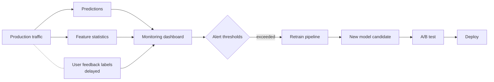

# Chapter 3 — A Worked Example: Spam Detection End-to-End

> **Goal of this chapter:** to walk through the full life of a single ML project, in enough detail that every term you'll encounter formally later in the book — features, labels, train, validate, test, accuracy, confusion matrix, precision, recall, threshold, overfitting, regularization, deployment, monitoring — appears here *first*, informally, in a concrete setting you can hold in your head. When Chapter 18 formally defines overfitting, you should be able to say "oh — that's what I saw in Chapter 3 when the model memorized the training emails." This chapter is the vocabulary spine of the rest of the book.
>
> We will build a binary spam classifier. We will use real-ish numbers throughout. We will treat the project as a working engineer treats it: framing, data, EDA, features, splits, model, evaluation, threshold tuning, debugging, deployment, monitoring. By the end you will not be able to *do* this from scratch — you'll need Parts D through K for that — but you will have the *shape* of the journey in your head, and the rest of the book is filling in the details.

---

## 3.1 The problem — and the obvious, wrong first instinct

You are a backend engineer at a mid-sized SaaS company that runs corporate email infrastructure. Your inbox handles 100,000 emails per hour across all your customers. Roughly 30% of them are spam — promotional newsletters somebody never subscribed to, phishing attacks, lottery scams, the entire pantheon. Spam volume has been climbing for a year and the customer-support team is fielding daily complaints. Your VP asks you to build a spam classifier that routes spam to a junk folder.

Your first instinct — and you would not be the first engineer to have it — is to write rules.

```python
def is_spam(email) -> bool:
    if "viagra" in email.body.lower():
        return True
    if "click here to claim your prize" in email.body.lower():
        return True
    if email.subject.isupper() and len(email.subject) > 10:
        return True
    if email.attachments_count > 5 and email.recipient_count > 50:
        return True
    return False
```

You'll catch some. You'll also catch the company's own marketing department, who legitimately send emails with "Click here" in them. You'll catch the legal team's all-caps subject lines about urgent compliance matters. You'll miss every spam email that uses "v1agra" or "Vi@gra" or any of the thousand other obfuscations that spammers have spent twenty years perfecting.

The same diagnosis as Chapter 1's fraud thought experiment applies. Spam is a high-dimensional, adversarial, non-stationary pattern. The rules are too many, they shift, and writing them by hand is a losing battle.

So we'll learn the rules from data. Specifically, we'll learn them from a labelled dataset of emails — some marked spam, some marked ham — and we'll let an algorithm work out which patterns of words and metadata correlate with each label.

This chapter walks every step. Strap in.

---

## 3.2 Step 1 — Framing the problem precisely

Before writing any code, we need to nail down what we are predicting and what we will do with the prediction. This sounds obvious. It is regularly skipped, with predictably bad consequences.

**What is $y$?**

The naive answer is "is this email spam?" — a binary label. But that's not quite precise enough. The actual decision we will make based on the model is *which folder to route the email to*. There are at least three options: inbox, promotions, junk. So the prediction we actually want is one of three classes — but for the first version, let's simplify to binary (junk or not-junk) and let the product team build the promotions tier later.

So $y \in \{spam, ham\}$. We will, by convention, encode spam as $1$ and ham as $0$. This convention is not universal — some codebases do it the other way — but the "interesting" class (the rare one, the one you want to catch) is almost always coded as $1$ because that lines up with how precision and recall are usually defined.

**What is $x$?**

For each email, we have access to:

- The subject (a string).
- The body (a string, possibly with HTML).
- The sender's email address.
- The recipient(s).
- A list of attachments (filenames and sizes).
- The arrival timestamp.
- Some routing metadata — DKIM/SPF results, IP address of the originating mail server.

Notice we have *raw, heterogeneous* data here. None of this is "features" yet. Feature engineering — the step where we turn this raw data into the numerical vector $x$ that the model can consume — is its own discipline, the subject of Part E. For this chapter we'll use one of the simplest possible representations, the bag of words.

**What is the cost of getting it wrong?**

This is the question most often skipped, and it shapes everything downstream. The two errors a spam classifier can make are:

1. **False positive:** label a legitimate email as spam, route it to junk. The user might never see it. If it was the wedding photographer's invoice, the user is annoyed. If it was the time-sensitive job offer, the user is *very* annoyed.
2. **False negative:** label a spam email as legitimate, route it to inbox. The user sees a few extra junk emails. Annoying but not catastrophic.

For most email systems, false positives are roughly 5–10x more painful than false negatives. Users tolerate a bit of spam in their inbox; they do not tolerate missing legitimate mail. This will shape how we set the threshold in section 3.9, and the framing here is exactly the kind of thing that has to be hashed out *before* you start training.

**What does "good" look like?**

In a perfect world we'd have a specific number: "catch 95% of spam with <0.5% false-positive rate on legitimate mail." In the real world, you negotiate with the product team. Plausible targets for a first-cut model:

- Recall on spam: > 85% — catch most of it.
- Precision on spam: > 99% — almost everything we route to junk really is junk.

We'll come back to these numbers in section 3.9 when we have a model to evaluate.

---

## 3.3 Step 2 — Getting the data

You walk over to the data engineering team and ask for a year of historical emails with labels. They look at you politely and explain three things:

First, *raw emails are sensitive*. You cannot just have a year of every email that flowed through your system; that's a privacy and regulatory minefield. You can have a sampled, de-identified subset where customer identifiers are hashed and the body text is pre-processed to remove obvious PII. This is a real constraint in any real organization and worth accepting up-front.

Second, *labels exist but are imperfect*. The labels you have come from two sources:

1. **User "mark as spam" actions** in the email UI. These are explicit user signals — high quality but sparse, and biased toward emails users actually noticed.
2. **The existing rules-based spam filter** that has been running for years. Anything it routed to junk is implicitly labelled spam; anything it routed to inbox is implicitly labelled ham.

The second source is much larger but is *exactly the thing we are trying to replace*. Training on its labels means we will learn to mimic it, including all its mistakes. Source 1 is purer but smaller.

A pragmatic compromise: use a union of both sources, *upweight* the user-marked labels, and accept that labels are noisy. We will see how this label noise sets a ceiling on achievable performance later.

Third, *the data is in S3, partitioned by day*. The schema is:

```
email_id (string)
timestamp (timestamp)
sender_domain (string, anonymized)
recipient_count (int)
subject_tokens (array<string>)     -- tokenized, lowercased
body_tokens (array<string>)        -- tokenized, lowercased
has_html (boolean)
attachment_count (int)
dkim_pass (boolean)
spf_pass (boolean)
label (string: "spam", "ham", or "unknown")
label_source (string: "user_marked", "rule_filter", "none")
```

We get back a sample of 200,000 emails for which `label != "unknown"`, spread over the last six months.

Quick sanity-check counts:

| Source | Count | Spam % |
|--------|------:|-------:|
| User-marked spam | 18,000 | 100% |
| User-marked ham (clicked "not spam") | 12,000 | 0% |
| Rule-filter spam (router sent to junk) | 30,000 | 100% |
| Rule-filter ham (router sent to inbox) | 140,000 | 0% |
| **Total** | **200,000** | **~24%** |

The 24% spam rate is roughly consistent with the 30% global rate we were told. Slightly low because the user-marked-ham category is over-represented in our sample. We'll keep going but note it.

---

## 3.4 Step 3 — Exploratory data analysis (EDA)

Before fitting any model, you spend a couple of hours looking at the data. This step is non-negotiable. Skipping EDA is how you end up training a model on a column where 80% of values are zero and only discovering it after a week of poor results.

### 3.4.1 Class balance

We already saw this above. ~24% spam, ~76% ham. Not severely imbalanced but worth keeping in mind. A model that always predicts "ham" would get 76% accuracy, which is why accuracy alone is going to lie to us in section 3.8.

### 3.4.2 Length distribution

Let's look at the distribution of `body_tokens` length, by class:

```
Body length (number of tokens), tiny ASCII histogram
(* = approximate count; one * = ~1000 emails)

  Tokens     Spam                   Ham
   0-50      ***********            ****
  51-100     ****************       ********
 101-200     ***********            ***************
 201-500     *****                  *****************
 501+        **                     ***********
```

Some informal but useful observations: spam emails skew shorter, ham emails skew longer. Not a clean separator on its own — there's plenty of overlap — but a feature that captures email length will probably be useful. We'll come back to this if needed.

### 3.4.3 Most distinctive words

What words appear much more frequently in spam than in ham? A useful summary is the *log ratio* of word frequency in spam to word frequency in ham:

$$
\text{score}(w) = \log \frac{P(w \mid \text{spam})}{P(w \mid \text{ham})}
$$

Positive scores → over-represented in spam. Negative scores → over-represented in ham. We compute this on a sample and look at the top of each list. (Don't worry about the formula; this is just EDA, not the model.)

Top 10 words over-represented in spam (made-up but realistic):

| Word | Score |
|------|------:|
| `unsubscribe` | 3.8 |
| `viagra`      | 5.2 |
| `meds`        | 4.1 |
| `click`       | 3.6 |
| `claim`       | 3.3 |
| `winner`      | 4.0 |
| `congrats`    | 2.9 |
| `prize`       | 3.9 |
| `free`        | 2.5 |
| `urgent`      | 2.1 |

Top 10 over-represented in ham:

| Word | Score |
|------|------:|
| `attached`   | -2.8 |
| `meeting`    | -3.1 |
| `regards`    | -3.5 |
| `tomorrow`   | -2.6 |
| `monday`     | -2.4 |
| `team`       | -2.8 |
| `discuss`    | -2.7 |
| `lunch`      | -3.0 |
| `update`     | -2.3 |
| `attached`   | -2.8 |

A model that just looked at these features would already do well. The "unsubscribe" appearing in *spam* might surprise you — but legitimate marketing lists also include unsubscribe links, and a high frequency of "unsubscribe" indicates the email is promotional. Models, lacking common sense, will happily pick up on this.

### 3.4.4 Class-conditioned attachment counts

Median attachment count for spam: 0. Median for ham: 0. 90th percentile for spam: 3. 90th percentile for ham: 1. Heavy attachments correlate weakly with spam (think: spam blasts with malicious payloads, often). Not a strong signal on its own; potentially useful in combination.

### 3.4.5 Time-of-day patterns

Spam volume peaks at 3am UTC (US-eastern off-hours). Ham volume peaks at 2pm UTC (US-eastern business hours). A weak signal but not nothing. If we engineer a "hour of day" feature it might help.

### 3.4.6 What we did not look at, and why it matters

We didn't look at: per-sender base rates, per-recipient base rates, the geographic distribution of senders, DKIM/SPF pass rates by class. We should have. We're glossing them here for compactness; a real EDA step would take a full day.

Crucially, EDA is where you *catch problems before they bite the model*. A few things we'd want to check that we haven't:

- Are there any features that are 100% predictive of the label? Probably leakage — they shouldn't exist.
- Are there features that are missing for one class but not the other? Probably mechanical artifacts of how data was collected.
- Are there duplicates — the same email appearing twice with different labels? Probably noise or a join bug.

We'll trust the data engineering team here, but in real life trust-but-verify is the watchword.

---

## 3.5 Step 4 — Feature engineering: the bag of words

We have email text. The model wants a numerical vector. We need to bridge the gap.

The simplest and one of the oldest representations of text in ML is the **bag of words** (BoW). We pick a vocabulary $V = \{w_1, w_2, \ldots, w_d\}$ — the $d$ most common words in the corpus, say — and represent each email as a vector $x \in \mathbb{R}^d$ where $x_j$ is the count of times word $w_j$ appears in that email.

That's it. No grammar, no word order, no syntactic structure. We have thrown away an enormous amount of information. We have also produced a representation that almost any classical ML algorithm can consume.

### 3.5.1 Building the vocabulary

We want the vocabulary to capture words that *discriminate*. Common functional words ("the", "a", "of") appear in everything; rare words ("syzygy", "narthex") barely appear at all. The standard approach is to:

1. Tokenize all the emails (the data engineering team has done this for us — `body_tokens` is the token list).
2. Count global word frequencies across the corpus.
3. Drop the top $K$ "stopwords" (the, a, and, of, to, in, …) — these are too common to discriminate.
4. Drop the long tail of words appearing in fewer than $M$ emails — too rare to be reliable.
5. Take the top $d$ remaining words by frequency. Let's say $d = 5000$.

For our corpus, the vocabulary is, say, words that appear in at least 100 emails but aren't in the standard 100-word English stopword list — about 5,000 words after filtering.

### 3.5.2 Building the feature vector

For an email with body `["meet", "tomorrow", "at", "lunch", "to", "discuss"]`, we look up each token in the vocabulary. Suppose the vocabulary indices are:

```
"meet"     -> index 1247
"tomorrow" -> index 893
"lunch"    -> index 2451
"discuss"  -> index 1188
```

(The words "at" and "to" are stopwords, dropped.) The feature vector for this email is a length-5000 vector that is zero everywhere except at those four indices, where it is 1.

In practice we don't store this as a dense vector — most of the 5000 entries would be zeros, which is a colossal waste of memory. We store it as a **sparse vector** — a list of `(index, count)` pairs. Spark ML's `SparseVector` and scikit-learn's `scipy.sparse` matrices are designed exactly for this.

### 3.5.3 What this representation throws away

It's worth naming explicitly what we lose:

- **Word order.** "John fired Mary" and "Mary fired John" produce the same vector. For some tasks this is catastrophic; for spam detection, it turns out to barely matter — the words alone carry most of the spam signal.
- **Sentence structure.** Subjects, verbs, modifiers — all flattened.
- **Compositional meaning.** "not free" produces a count for "not" and a count for "free", which look very similar to "free, but not now." We lose the negation.
- **Multi-word patterns.** "click here" is more informative than "click" + "here" separately. We can recover *some* of this with $n$-grams (pairs and triples of consecutive words) at the cost of much larger vocabularies.

For spam detection, BoW is a workhorse — for decades it was the dominant representation, and even now it's a strong baseline. For more nuanced text problems (sentiment analysis of subtle reviews, machine translation, question answering), BoW is grossly inadequate and you'd use word embeddings (word2vec, GloVe) or transformer-based representations (BERT, etc.). Those are out of scope here.

### 3.5.4 TF-IDF — a small but important refinement

Raw word counts have one annoying property: a long email naturally has more words, so its vector has larger magnitudes. We'd rather have a representation where short emails and long emails are comparable.

The standard fix is **TF-IDF** — term frequency times inverse document frequency. The idea:

- **Term frequency**: how often does word $w$ appear in this email, normalized by the email's length? This is just $\frac{\text{count}(w, \text{email})}{\text{total tokens in email}}$.
- **Inverse document frequency**: how rare is word $w$ across the whole corpus? Words that appear in every email (e.g., "the") have low IDF; words that appear in only a few emails have high IDF. Formally $\log \frac{N}{N_w}$ where $N$ is the corpus size and $N_w$ is the number of emails containing $w$.

Multiply them: $\text{tfidf}(w, \text{email}) = \text{tf}(w, \text{email}) \cdot \text{idf}(w)$. Words that are frequent in this email *and* rare across the corpus get high scores. Words that are common everywhere get low scores even if they're frequent in this email.

TF-IDF is not magical; it's a sensible weighting. It typically improves linear models on text by a few percentage points over raw counts. For this chapter we'll use TF-IDF.

---

## 3.6 Step 5 — Train / validation / test split

Here is where most engineers, untrained in ML, make their first big mistake. Let's set up the right pattern by first thinking through what could go wrong.

Suppose we trained the model on all 200,000 emails and then asked it "how well do you do?" by checking its predictions on those same 200,000 emails. The model could literally have memorized each email, returning the right label for each, and we'd report 100% accuracy. We'd ship it. In production, on emails it has never seen, it would fail. We'd be embarrassed.

The fix is to *hold out* some data. Specifically, we split the data into three parts:

- **Training set:** the data the model sees during training. It learns its parameters from this.
- **Validation set:** data the model never sees during training. We use it to compare candidate models, tune hyperparameters, decide which version to ship.
- **Test set:** data the model and you (the engineer) never look at until you've made all your decisions. We use it once, at the end, to get an honest estimate of how the model will perform in production.

A common split is 70% / 15% / 15%, though the exact percentages depend on dataset size. With 200,000 emails:

- Training: 140,000 emails
- Validation: 30,000 emails
- Test: 30,000 emails

### 3.6.1 Why three sets, not two?

A common naive approach is just "train" and "test." Why a separate validation set?

Because the moment you start using a held-out set to *choose between candidate models* — "model A scores 89%, model B scores 91%, ship B" — you have, in a subtle sense, "trained on" that set. You picked a model in part because of its score on the holdout. Repeat this enough times, with enough candidate models, and your "holdout" performance becomes an overestimate.

The validation set absorbs this hit. You make as many decisions as you need to using train + validation. The test set is touched *exactly once*, at the very end, to produce the number you report to the VP. This discipline is harder than it sounds — there's a constant temptation to peek at the test set "just to see." Resist.

### 3.6.2 How to split: random vs. stratified vs. time-based

A simple random split takes 70%/15%/15% uniformly. For a binary classification with even moderate imbalance, this can produce splits where, by chance, one class is over- or under-represented in one of the splits.

The fix is **stratified sampling**: split each class separately. Take 70% of the spam for training, 15% for validation, 15% for test; same for ham. The class proportions are preserved across all three splits. This is the default for binary classification.

For *time-series data* — and email is, in some sense, time-series — there's a subtler issue. If you randomly split, you'll have some emails from January in your training set and some emails from January in your test set, and the model can leak information across time. The honest split for time-aware data is to *split by time*: train on January–April, validate on May, test on June. This simulates what production looks like — you're predicting on data more recent than any data you trained on.

For our spam example, we'll do a stratified random split for simplicity. In a real production system, we'd absolutely do a time-based split because email content drifts and we want our evaluation to capture that drift. We'll come back to this in section 3.12.

### 3.6.3 The leakage trap

One more pitfall worth naming: **data leakage**. This happens when information from the validation or test set sneaks into the training process, inflating apparent performance.

For our spam example, two leakage paths to watch for:

1. **Duplicate emails.** Same email content appearing in both train and test sets. If a user receives the same newsletter twice and you don't dedupe, you can train on one copy and "test" on the other. Easy mistake to make; standard fix is to dedupe before splitting.
2. **Future information.** A feature computed on the *entire corpus* — like the TF-IDF weights themselves — uses information from the test set when building the vocabulary. The principled fix is to compute the vocabulary and IDF weights *only on the training set*, then apply them (frozen) to the validation and test sets. We'll do this.

Leakage is one of the most pernicious sources of "the model worked beautifully in evaluation and tanked in production." Chapter 22 dissects it formally. For now: be paranoid.

---

## 3.7 Step 6 — Pick an algorithm: logistic regression

We have features (TF-IDF vectors of length 5000). We have labels (spam or ham). We need an algorithm.

There are many choices. For a first pass on text classification with TF-IDF features, the standard recommendation is **logistic regression** — and the recommendation has held since the 1990s. Why?

- It is **fast** to train. Linear in the number of training examples and features.
- It is **interpretable**. Each word in the vocabulary gets a single weight; you can read the weights to see what the model has learned.
- It is **well-behaved on high-dimensional sparse data**. Text data is exactly that — 5000 features, mostly zero per example.
- It produces **calibrated probabilities** out of the box, which we'll need in section 3.9 when we tune the threshold.
- It is a **strong baseline**. Many fancier algorithms (random forests, gradient-boosted trees) struggle to beat logistic regression on this kind of data, and when they do beat it the margin is small.

We will derive logistic regression formally in Chapter 32. For now, accept the following high-level picture.

Logistic regression learns a weight $w_j$ for each feature (i.e., each word in the vocabulary) and a bias $b$. Given an email with feature vector $x$, it computes a score

$$
z = w_1 x_1 + w_2 x_2 + \cdots + w_d x_d + b = \mathbf{w} \cdot \mathbf{x} + b
$$

This $z$ can be any real number — positive, negative, large, small. To turn it into a probability between 0 and 1, we pass it through the **sigmoid function**:

$$
\sigma(z) = \frac{1}{1 + e^{-z}}
$$

When $z$ is very positive, $\sigma(z)$ is close to 1. When $z$ is very negative, $\sigma(z)$ is close to 0. When $z = 0$, $\sigma(z) = 0.5$.

```
  σ(z) = 1/(1 + e^(-z))

   1 ┤                  ___________
     │              ___/
     │           __/
   0.5┤         /
     │       _/
     │    __/
   0 ┤___/
     └────────┼────────────────────►
            z=0
```

So the model's prediction is $\hat{p}(\text{spam} \mid x) = \sigma(\mathbf{w} \cdot \mathbf{x} + b)$. A probability. The training procedure finds the $\mathbf{w}$ and $b$ that make this probability close to 1 on spam examples and close to 0 on ham examples in the training set. Mathematically, this is **maximum likelihood estimation** under the assumption that the labels are Bernoulli-distributed given the features; we derive the full thing in Chapter 32.

### 3.7.1 Interpretation: what the weights mean

After training, each word in the vocabulary has a weight. Words with large positive weights "vote for" spam; words with large negative weights "vote for" ham; words with weights near zero are uninformative.

If we sort the weights, we'd expect to see something like:

```
Top positive weights (vote for spam):
  viagra      +4.2
  prize       +3.8
  click       +3.5
  unsubscribe +3.1
  free        +2.8
  ...

Top negative weights (vote for ham):
  meeting     -3.6
  attached    -3.4
  regards     -3.2
  team        -2.9
  monday      -2.7
  ...

Near zero:
  the          0.02
  email       -0.01
  ...
```

This is *almost exactly* what our EDA showed in section 3.4.3. The model has, unsurprisingly, learned what the data already revealed. That's reassuring — and it's also why interpretability matters: if the model had assigned a giant positive weight to "monday", you'd want to know.

---

## 3.8 Step 7 — Training and first evaluation

We fit logistic regression on the 140,000 training emails. The training procedure — gradient descent on the cross-entropy loss, formally derived in Chapter 32 — runs in a few seconds on a single machine for this dataset size. We get back $\mathbf{w} \in \mathbb{R}^{5000}$ and $b$.

Now: how good is it?

### 3.8.1 The first metric to look at — accuracy — and why it lies

The simplest classification metric is **accuracy**: the fraction of validation examples on which the model's prediction matches the label. With a 0.5 threshold (predict spam if $\hat{p} > 0.5$, else ham), we measure accuracy on the 30,000-email validation set.

Suppose we get **93% accuracy**. Sounds great, right?

It is not nothing. But it is misleading, for one specific reason: the data is imbalanced. 76% of emails are ham. If we built a "model" that predicted ham for *every* email, no machine learning required, it would score 76% accuracy. Beating 76% is the bar; we beat it by 17 percentage points, which sounds decent — but the question is *how*. Did we catch most of the spam? Did we have too many false positives?

Accuracy aggregates these questions into one number. We need to disaggregate.

### 3.8.2 The confusion matrix

The right first step is the **confusion matrix**: a 2x2 table showing, for the validation set, how each prediction-label combination breaks down.

For our hypothetical 30,000-email validation set, with ~24% spam (= ~7,200 spam, ~22,800 ham), suppose the model predictions break down as:

```
                          Predicted
                    Spam        Ham
                +--------+--------+
       Spam     |  6300  |   900  |  ←  7,200 actual spam
Actual         +--------+--------+
       Ham     |   200  | 22600  |  ←  22,800 actual ham
                +--------+--------+
                  6500    23500
              (predicted   (predicted
                spam)        ham)
```

The four cells have standard names:

- **TP (true positive):** predicted spam, actually spam. 6,300. Spam emails we caught.
- **FP (false positive):** predicted spam, actually ham. 200. Legitimate emails we wrongly routed to junk. These are the *bad* errors.
- **FN (false negative):** predicted ham, actually spam. 900. Spam we let through.
- **TN (true negative):** predicted ham, actually ham. 22,600. Ham we correctly let through.

Total: 30,000.

Let's verify accuracy from this:

$$
\text{accuracy} = \frac{TP + TN}{\text{total}} = \frac{6300 + 22600}{30000} = \frac{28900}{30000} = 96.3\%
$$

Hmm, that's higher than the 93% I said earlier — I was using a different hypothetical model. Let's stick with 96.3% for this confusion matrix.

Already we know more than "accuracy = 96%". We know we caught 6,300 out of 7,200 spams, and we wrongly junked 200 out of 22,800 hams.

### 3.8.3 Precision and recall — derived from the confusion matrix

Two metrics that get computed from the confusion matrix and that you will see in every classification project for the rest of your career:

**Precision** (also called positive predictive value):

$$
\text{precision} = \frac{TP}{TP + FP} = \frac{6300}{6300 + 200} = \frac{6300}{6500} = 96.9\%
$$

In words: of all the emails we *predicted* as spam, what fraction *actually were* spam? High precision means few false positives — when we say spam, we're usually right.

**Recall** (also called sensitivity, hit rate, true positive rate):

$$
\text{recall} = \frac{TP}{TP + FN} = \frac{6300}{6300 + 900} = \frac{6300}{7200} = 87.5\%
$$

In words: of all the emails that *actually were* spam, what fraction did we *catch*? High recall means few false negatives — we missed little.

These two numbers, together with the underlying class balance, tell you almost everything about a binary classifier. Memorize them. Internalise them. They will show up on every ML evaluation conversation you have.

### 3.8.4 The tradeoff between them

In general, precision and recall trade off. You can almost always increase recall at the cost of precision (by being more eager to call things spam) and vice versa. The next section is entirely about this tradeoff.

Before we move on: notice that the recall and precision we computed depend on which class we treated as the "positive" class. We treated spam as positive. If we treated ham as positive instead, the numbers would flip. Always check which class is "positive" when reading someone else's evaluation.

### 3.8.5 F1 — a single number combining precision and recall

Sometimes you want one number that summarizes both. The **F1 score** is the harmonic mean of precision and recall:

$$
F_1 = \frac{2 \cdot \text{precision} \cdot \text{recall}}{\text{precision} + \text{recall}} = \frac{2 \cdot 0.969 \cdot 0.875}{0.969 + 0.875} = \frac{1.696}{1.844} = 0.92
$$

F1 is high only when both precision and recall are high. It penalizes models that achieve a great score in one by sacrificing the other.

If you care about precision and recall *unequally* — and we do; section 3.2 said false positives are worse — you can use **F-beta**:

$$
F_\beta = (1 + \beta^2) \cdot \frac{\text{precision} \cdot \text{recall}}{(\beta^2 \cdot \text{precision}) + \text{recall}}
$$

with $\beta < 1$ emphasizing precision and $\beta > 1$ emphasizing recall. For spam (false positives painful), $\beta = 0.5$ is sometimes used.

We'll come back to this family of metrics in deep formal detail in Chapter 42. For now, you have the working definitions.

---

## 3.9 Step 8 — The threshold dial

This is one of the most important and least taught ideas in classical ML. If you internalize one thing from this chapter, make it this one.

Logistic regression outputs a probability $\hat{p}(\text{spam} \mid x)$ between 0 and 1. To turn that into a *decision* — junk or inbox — you need a **threshold** $\tau$. The standard default is $\tau = 0.5$: predict spam if $\hat{p} \geq 0.5$, else ham.

But $0.5$ is arbitrary. Nothing in the math forces it.

You can choose any threshold. And changing the threshold trades off precision and recall in a specific, predictable way:

- **Higher threshold** (e.g., $\tau = 0.8$) means you only flag emails as spam when you're very confident. *Precision goes up; recall goes down.* Fewer false positives (good for spam) but more false negatives (more spam slipping into inbox).
- **Lower threshold** (e.g., $\tau = 0.3$) means you flag emails as spam even when only moderately confident. *Recall goes up; precision goes down.* More false positives (legitimate emails to junk) but more spam caught.

For our spam classifier, recall section 3.2: we said false positives are roughly 5–10x more painful than false negatives. So we should err on the side of *high precision* — a higher threshold. We're willing to let some spam through to avoid wrongly junking legitimate emails.

### 3.9.1 The precision-recall curve

Let's actually compute, for our trained model, what happens at different thresholds. We sweep $\tau$ from 0 to 1 and at each value, compute precision and recall:

| Threshold $\tau$ | Precision | Recall | TP   | FP    | FN   |
|----:|----:|----:|-----:|------:|-----:|
| 0.10 | 0.71 | 0.99 | 7128 | 2900  | 72   |
| 0.20 | 0.83 | 0.97 | 6984 | 1430  | 216  |
| 0.30 | 0.91 | 0.94 | 6768 | 670   | 432  |
| 0.40 | 0.95 | 0.91 | 6552 | 345   | 648  |
| **0.50** | **0.97** | **0.88** | **6300** | **200** | **900** |
| 0.60 | 0.98 | 0.83 | 5976 | 122   | 1224 |
| 0.70 | 0.99 | 0.77 | 5544 | 56    | 1656 |
| 0.80 | 0.995 | 0.68 | 4896 | 25   | 2304 |
| 0.90 | 0.998 | 0.52 | 3744 | 8    | 3456 |
| 0.95 | 0.999 | 0.39 | 2808 | 3    | 4392 |

(Numbers are illustrative but realistic for this kind of problem.)

Read the table. At $\tau = 0.5$, we have 97% precision and 88% recall. Pretty good. At $\tau = 0.7$, precision rises to 99% but recall drops to 77% — we miss 23% of spam. At $\tau = 0.3$, recall is 94% but precision drops to 91% — meaning 9% of the emails we junked were actually legitimate. With 30,000 emails, that's 670 false positives, which is *a lot* — that's 670 customers irate that their mail went to junk.

The **precision-recall curve** is just this table plotted, with recall on the x-axis and precision on the y-axis:

```
  precision
    1.0 ┤  ●●●● τ=0.9, 0.95
        │      ●●●  τ=0.7, 0.8
    0.97┤        ●  τ=0.5
        │         ●  τ=0.4
        │           ●  τ=0.3
    0.9 ┤            ●●
        │                ●  τ=0.2
    0.8 ┤
        │                    ●  τ=0.1
    0.7 ┤
        └──┬──┬──┬──┬──┬──┬──► recall
          0.4 0.5 0.7 0.8 0.9 1.0
```

The curve goes up and to the left — there's no operating point with both 100% precision and 100% recall (unless the problem is trivially separable, which spam never is).

### 3.9.2 Choosing the operating point

Given the PR curve, *where do you operate*? It depends on the cost matrix. Three reasonable choices for spam:

1. **High precision, target ~99%.** Set $\tau \approx 0.7$. Recall = 77%. We catch 77% of spam but only 1% of what we junk is legitimate.
2. **F1-optimal.** Find the threshold that maximizes $F_1$. From the table, that's around $\tau = 0.4$: precision 95%, recall 91%, $F_1 \approx 0.93$.
3. **Recall-first, target ~95%.** Set $\tau \approx 0.3$. Recall = 94%, but precision drops to 91% — 9% of junked emails are wrongly classified, which we said is too many.

For our scenario — false positives 5-10x more painful — option 1 is the right choice. We operate at $\tau \approx 0.7$, accept that we'll miss some spam, and feel comfortable knowing very little legitimate mail will be wrongly junked.

### 3.9.3 Why this idea is so important

If you read only the default-threshold metrics ($\tau = 0.5$), you would conclude that the model has 97% precision and 88% recall, period. Done. Ship it.

If you understand the threshold dial, you realize: that's just *one operating point on a curve*. By moving the threshold, the same model can be repositioned to fit different cost matrices. The model itself is a *family* of classifiers, indexed by $\tau$. The training picks the family; the threshold picks the member.

This insight is what unlocks a lot of real-world ML work:

- An A/B test reveals that the spam team wants higher precision. You ship a higher threshold, no retraining needed.
- The legal team gets nervous about false positives and requests precision >99%. Easy — raise the threshold.
- A regulatory ask forces you to catch ≥95% of fraud. Lower the threshold; accept the precision cost; communicate to ops.

Many junior data scientists will respond to "we need higher precision" with "let me retrain the model." Often, the right answer is just "let me move the threshold." Knowing the difference is a hallmark of an experienced practitioner.

---

## 3.10 Step 9 — The overfitting check

So far we've evaluated on the validation set. But how do we know the model isn't *just memorizing the training data* — performing well on the training set but poorly on anything new?

This phenomenon — great training-set performance, poor validation-set performance — is called **overfitting**. It's the central failure mode of supervised ML, and we'll spend Chapter 18 on it formally. For now, the diagnostic is simple: compare training and validation performance.

For our model:

| Metric    | Training set | Validation set |
|-----------|-------------:|---------------:|
| Accuracy  | 97.1%        | 96.3%          |
| Precision | 98%          | 96.9%          |
| Recall    | 89%          | 87.5%          |
| F1        | 0.93         | 0.92           |

Training and validation are *close*. The model performs only slightly better on the training set than on the validation set. This is healthy. The model has learned generalizable patterns, not specific training emails.

### 3.10.1 What overfitting would look like

Suppose, instead, the table looked like this:

| Metric    | Training set | Validation set |
|-----------|-------------:|---------------:|
| Accuracy  | 99.8%        | 87%            |
| Precision | 99.7%        | 80%            |
| Recall    | 99.9%        | 75%            |
| F1        | 0.998        | 0.77           |

That's overfitting. The model nails the training data — too well — and falls apart on anything else. The classic symptom: training set near-perfect, validation set substantially worse.

Why does this happen? Because the model has too much *capacity* — too many free parameters relative to the amount of training data. With 5,000 features and 140,000 training examples, the ratio is fine. But imagine you had a vocabulary of 500,000 features and only 1,000 training emails. The model has enough degrees of freedom to memorize every email exactly, weight-for-weight. It "learns" patterns that are really just noise. On new data, the noise patterns don't repeat, and the model collapses.

### 3.10.2 Treating overfitting (the preview)

If we had overfit, our options would be:

1. **Get more data.** Doubles or triples the training set. Almost always the best fix, often impractical.
2. **Reduce the model's capacity.** Use a smaller vocabulary; use a less expressive model class (e.g., switch from a deep tree ensemble to logistic regression). Fewer free parameters → less memorization potential.
3. **Regularize.** Add a penalty term to the training objective that discourages large weights. L1 regularization tends to drive weights to exactly zero (sparsity); L2 tends to shrink them toward zero. We'll derive both in Chapter 20.
4. **Use cross-validation to tune.** Not a fix itself, but a way to choose hyperparameters (like the regularization strength) honestly. Chapter 22.
5. **Add dropout / early stopping / data augmentation** in the neural-net world — but those are out of scope here.

For our spam model, we're not overfitting, so we don't need to treat it. But knowing the diagnosis and the treatments is essential.

### 3.10.3 The underfitting flip side

The opposite failure is **underfitting**: both training and validation performance are mediocre. The model isn't memorizing — it's failing to learn at all. Diagnostic: training accuracy is much lower than what a reasonable model should achieve.

For text classification with 5,000 features and 140,000 examples, achieving only 70% training accuracy would be a red flag — the model is too simple, or you have a bug. Fixes: use a more expressive model, add features, fix bugs.

The right amount of capacity is just-enough-to-fit-the-signal-without-fitting-the-noise. Finding this sweet spot is what Chapter 18's bias-variance picture is all about.

---

## 3.11 Step 10 — Deploying the model

The model is trained, evaluated, threshold-tuned. Now we deploy it.

"Deploying" means putting the model behind a service that scores incoming emails in real time. The shape:

```
Email arrives at SMTP gateway
       │
       ▼
   Feature extraction service
   ─ tokenize body
   ─ compute TF-IDF vector
   ─ load vocabulary and IDF weights (frozen at training time)
       │
       ▼
   Model service
   ─ load weights w and bias b
   ─ compute z = w · x + b
   ─ compute p = σ(z)
       │
       ▼
   Decision logic
   ─ if p >= threshold: route to junk
   ─ else: route to inbox
       │
       ▼
   Email delivered
```

Three engineering concerns dominate:

### 3.11.1 Latency

Email delivery has tight latency requirements. Spam-classification has to add no more than a few tens of milliseconds. For logistic regression on a 5,000-feature sparse input, this is easy — the dot product is a few thousand multiply-adds and runs in microseconds. For a deep neural network or a deep tree ensemble, you have to be more careful: model quantization, batching, GPU serving, edge deployment all become considerations. Out of scope here, but live problems in Part L.

### 3.11.2 Throughput

You have 100,000 emails per hour, or roughly 28 per second average and probably 200+ per second at peak. The service has to handle the peak. This is solved with standard service-engineering: stateless workers, horizontal scaling, load balancing.

### 3.11.3 Training-serving skew

This is the subtle one and the one that bites teams in practice. The feature extraction code in the training pipeline must produce *exactly* the same features as the feature extraction code in the serving pipeline. If training uses one tokenizer and serving uses a different tokenizer, the model will see different inputs at serving time than it ever saw during training, and predictions will degrade silently.

The standard fix is to *share the feature-extraction code* between training and serving. The tokenizer is one function, called from both places. The vocabulary is loaded from the same artifact. The IDF weights are the same numbers.

This is one of the things MLflow and feature stores exist to solve, and it's a major focus of Part L. For now, internalize: the model artifact alone is not enough to deploy. You ship the *model plus all the preprocessing*, as a single unit. Modern ML frameworks call this a **pipeline** — Chapter 62 covers Spark ML's Pipeline pattern in depth.

### 3.11.4 Versioning and rollback

What if your new model performs worse in production than the old one? You need to be able to roll back. Standard practice:

- Each trained model gets a version number and is registered in a model registry (MLflow Model Registry, AWS SageMaker, etc.).
- The serving service loads the *current production version*. Switching versions is a configuration change, not a code change.
- New models go through a staging phase: deployed alongside the production model, predictions compared, sometimes A/B-tested.
- If a new model misbehaves, switch the config back to the previous version. Seconds, not hours.

We cover MLflow Model Registry in Chapter 73. For now: never deploy a model without a rollback path.

---

## 3.12 Step 11 — Monitoring (the part that never ends)

You've deployed. The classifier is live. Are you done?

Absolutely not. Here is the part that distinguishes ML from regular software: **your model will get worse over time, even if you don't change anything**. The world changes. Spammers adapt their language. New phishing patterns emerge. The distribution of incoming emails drifts away from the distribution your model trained on.

This phenomenon is called **concept drift** (or data drift, or covariate shift, depending on what exactly is drifting). It is the operational reality of every production ML system.

The response is **monitoring**: track metrics on production data and trigger retraining when they degrade.

### 3.12.1 What to monitor

Three layers of monitoring:

**Layer 1: model performance metrics.** If you have labels in production (and for spam, you do — users mark emails as spam, click "not spam", etc.), you can compute precision and recall on a rolling window of production traffic. Watch for degradation.

**Layer 2: input distribution drift.** Even before you have labels, you can compute statistics on the features the model is being asked to predict on. Has the average email length changed? Has the vocabulary distribution shifted? Have new senders appeared? These are early warning signs.

**Layer 3: prediction distribution drift.** What fraction of incoming emails is the model classifying as spam? If yesterday it was 24% and today it's 38%, something has changed — possibly the world (a spam wave), possibly the model is malfunctioning. Either way, you want to know.



### 3.12.2 The retraining loop

When monitoring fires (or on a regular schedule — many teams retrain weekly regardless), the retraining loop runs:

1. Pull the latest production data, with labels.
2. Refit the model (same algorithm, fresh weights) on the new data.
3. Evaluate against the prior model on a recent test set.
4. If the new model is better, deploy.
5. If not, alert someone to investigate.

This loop should be *automated*. Doing it by hand is fine for the first month; by month six you should not be touching a notebook to retrain. MLOps platforms — Databricks Workflows, Airflow, Vertex AI Pipelines, SageMaker Pipelines — exist to automate this. We'll see Databricks' answer in Part L.

### 3.12.3 The recurring obligation

The picture to fix in your head: **a deployed model is a perishable artifact in an operational system**, not a one-time deliverable. Building the first model is the appetizer. Keeping it healthy for five years is the entrée. The bulk of an ML engineer's job, once the first model is shipped, is the monitoring-and-retraining cycle.

Most ML projects that fail in production fail at this stage, not at the modelling stage. The model worked initially; it slowly degraded; nobody noticed for six months; by the time someone did, the model was useless and the team had moved on. Avoiding this story is the whole reason MLOps exists.

---

## 3.13 Step 12 — Reflection: the vocabulary you've now seen

Let's pause and consolidate. Every term in the following glossary was used informally in this chapter and will be formalized later in the book. The point isn't to memorize the formalisms now — it's to recognise the words and have a sketch of their meaning.

**Feature** ($x_j$). One coordinate of the input vector. For our spam classifier, one feature is "count of the word 'unsubscribe'." For house price prediction, one feature is "square footage." Features are the model's view of an example.

**Feature engineering.** The process of turning raw data (emails, transactions, images) into the feature vectors the model consumes. TF-IDF on text is an example. So is one-hot encoding of categorical variables (Part E). So is computing the rolling 7-day average of a time series.

**Label** ($y$). The ground-truth answer for each example. Spam or ham. Default or not-default. Price in dollars.

**Training set / validation set / test set.** The three-way split. Train fits the model. Validation tunes choices. Test gives the final honest number.

**Training** (or "fitting"). The procedure that takes a training set and a model class and produces a specific fitted model. For logistic regression, training means running gradient descent (or a similar optimizer) on the cross-entropy loss.

**Inference** (or "prediction"). Applying the trained model to a new input to produce a prediction. The forward pass through the model.

**Loss function.** A function $L(\hat{y}, y)$ that measures how wrong a prediction is. For logistic regression we use cross-entropy; for linear regression we use squared error. Training minimises the average loss over the training set. Chapter 16 derives the connection.

**Overfitting.** The pathology where training-set performance is much better than validation-set performance. The model has memorized noise rather than learning signal. Diagnosed by comparing the two; treated with more data, less capacity, or regularization.

**Underfitting.** The pathology where both training and validation performance are mediocre. The model is too simple to capture the signal.

**Regularization.** A modification to the loss function that discourages large model weights. L1 (lasso) drives some weights to exactly zero, performing implicit feature selection. L2 (ridge) shrinks all weights toward zero. Both reduce overfitting at the cost of some training-set fit. Chapter 20.

**Accuracy.** Fraction of correct predictions. Useful only when classes are balanced.

**Confusion matrix.** The 2x2 table of (TP, FP, FN, TN). The summary from which precision, recall, F1, and most other classification metrics derive.

**Precision.** TP / (TP + FP). Of what we said was positive, what fraction really was?

**Recall.** TP / (TP + FN). Of what really was positive, what fraction did we catch?

**F1 score.** Harmonic mean of precision and recall. A single number when you want one. F-beta if you want to weight one direction more heavily.

**Threshold.** The probability cutoff that converts a model's probabilistic output into a categorical prediction. Movable post-training. Defines the model's operating point on the precision-recall curve.

**Precision-recall curve.** The locus of (precision, recall) points as the threshold sweeps from 0 to 1. The "shape" of a model's capability across operating points.

**ROC curve.** A different visualization — true positive rate vs. false positive rate as threshold varies. Equivalent information to PR curve, but easier to read in some cases. Chapter 43.

**Bag of words.** A simple text representation: vocabulary indices and counts. Loses word order; usable by most classical algorithms.

**TF-IDF.** A reweighting of bag-of-words that emphasizes words that are frequent in this document but rare in the corpus.

**Sparse vector.** A vector representation that stores only the non-zero entries. Essential for text and other very-high-dimensional, mostly-empty features.

**Logistic regression.** The default linear classifier. Computes a linear score, passes it through a sigmoid to get a probability. Chapter 32 derives it.

**Sigmoid function.** $\sigma(z) = 1/(1 + e^{-z})$. Maps any real number to $(0, 1)$. The bridge from "score" to "probability."

**Pipeline.** The full chain — preprocessing, feature engineering, model — packaged as one artifact for deployment. Chapter 62.

**Training-serving skew.** The bug where features computed at training time differ from features computed at inference time. Causes silent performance loss in production.

**Concept drift.** The pattern where the relationship between $x$ and $y$ changes over time. Demands monitoring and retraining.

**Class imbalance.** When one class is much more common than the other. Affects metric choice (accuracy is misleading) and training (resampling, class weights). Chapter 46.

If you can give a working informal definition of every term in that list, you have the vocabulary base for everything else in this book. You'll meet each term again, formally, but the second meeting will be much easier than if it were the first.

---

## 3.14 What we glossed over

Honesty requires us to enumerate what this chapter cheated on. The omissions point at what later chapters fill in.

1. **The math of logistic regression.** We accepted the sigmoid + dot-product formulation and said "training finds the right weights" without saying *how*. Chapter 32 derives it from maximum likelihood; Chapter 17 explains gradient descent.

2. **The choice of TF-IDF weighting.** We picked it without justification. Other weightings exist (BM25, raw counts, log-counts, …). The choice rarely matters much for spam classification; it matters more in other text problems. Part E covers feature engineering for text more broadly.

3. **Class weights and resampling.** With 24% spam, our class imbalance is mild but not nothing. We didn't adjust for it. Chapter 46 covers how to.

4. **Cross-validation.** We used a single train/validation split. With moderate data this is fine; with smaller data, $k$-fold cross-validation gives more stable estimates. Chapter 22.

5. **Hyperparameter tuning.** Logistic regression has hyperparameters — the regularization strength being the main one. We picked defaults. In practice you'd sweep them. Part I.

6. **Calibration.** Logistic regression's output probabilities are reasonably calibrated, but other models (random forests, neural networks) often are not. If you need to interpret probabilities as probabilities (e.g., for cost-sensitive thresholding), you may need to *calibrate* them post-hoc. Chapter 42–43.

7. **A/B testing in production.** We sketched "compare new model to old". Real A/B testing has its own statistical machinery — sample sizes, lift estimates, sequential analysis. Mostly out of scope, but worth knowing it exists.

8. **Adversarial robustness.** Spam is *adversarial* — spammers actively probe your filter and try to evade it. Adversarial robustness is its own subfield; we leaned on monitoring + retraining as the response but didn't engineer specifically for adversarial inputs.

9. **Production engineering specifics.** Service deployment, autoscaling, monitoring infrastructure — we sketched the shape but didn't dive in. Part L.

10. **Scale.** We assumed 200,000 labelled emails fit in memory on one machine. Industrial spam filters often train on hundreds of millions or billions of labelled examples. That requires distributed compute. Part J introduces Spark; Part K shows how `pyspark.ml` rephrases everything we did here for distributed data.

Each omission has a chapter waiting for it. You'll see them.

---

## 3.15 Summary

Stripped down, this is the shape of an ML project:

1. **Frame the problem.** Pin down $x$, $y$, and the cost of errors. Without this nothing else makes sense.
2. **Get the data.** Including labels, with all their imperfections.
3. **Explore.** Look at the data. Catch surprises before the model does.
4. **Engineer features.** Turn raw data into vectors. For text, BoW or TF-IDF; for tabular data, many other techniques (Part E).
5. **Split.** Train / validation / test. Stratified by class for imbalanced problems. Time-based if data has a temporal structure.
6. **Pick an algorithm and train.** Start simple. Logistic regression for binary classification is a fine first try.
7. **Evaluate.** Look at the confusion matrix. Look at precision, recall, F1. Don't trust accuracy alone.
8. **Tune the threshold.** Move it to match the cost matrix.
9. **Check for overfitting.** Train vs. validation gap. Treat with more data, less capacity, or regularization.
10. **Deploy.** As a pipeline, with rollback paths.
11. **Monitor.** Track performance, input drift, prediction drift. Set up alerts.
12. **Retrain.** Automate the loop. The model is perishable; the loop is the product.

If you can hold this twelve-step picture in your head and recite each step's purpose, you have the framing the rest of this book is going to extend.

---

## 3.16 What this builds on / where this returns

**Builds on:** Chapter 1's function-approximation framing ($f, \hat{f}, x, y$). Chapter 2's distinction between supervised and unsupervised, and the supervised classification case specifically.

**Returns:**

- The full **lifecycle** in section 3.2–3.12 gets the formal treatment in *Chapter 4*.
- **Feature engineering** (3.5) returns in *Part E* — TF-IDF appears formally in Chapter 28, and the general discipline in Chapters 23–30.
- **Train / validation / test** (3.6) returns in *Chapter 21*, with leakage and cross-validation in *Chapter 22*.
- **Logistic regression** (3.7) is derived from scratch in *Chapter 32*.
- **The sigmoid** as the canonical "score-to-probability" map shows up again in *Chapter 32*.
- **Confusion matrix, precision, recall, F1** (3.8) get full formal treatment in *Chapter 42*.
- **The threshold dial and the PR curve** (3.9) are the subject of *Chapters 42–44*.
- **Overfitting and underfitting** (3.10) become a formal bias-variance derivation in *Chapter 19*; regularization in *Chapter 20*.
- **Deployment** (3.11), **training-serving skew**, **pipelines** return in *Chapters 62 (Spark pipelines)* and *Part L* (Databricks platform).
- **Monitoring and concept drift** (3.12) get formal treatment in *Part L*.

---

## 3.17 Exercises

These should test every step. Attempt all of them cold.

1. **Reframe.** Suppose the product team changes the spec: instead of routing spam to junk, you should *flag* suspected spam in the inbox with a yellow warning banner, and the user decides whether to read or delete. How does this change your evaluation framework? What does it do to the false-positive vs. false-negative tradeoff?

2. **Label arithmetic.** Your dataset has 200,000 emails, 24% spam. You split 70/15/15 stratified. How many spam emails are in each of train, validation, test? How many ham?

3. **Confusion matrix exercise.** A spam classifier is evaluated on 10,000 emails. 2,000 are spam. The model predicts 1,900 emails as spam, of which 1,700 are correctly identified. Fill in the confusion matrix. Compute precision, recall, F1, and accuracy.

4. **Threshold reasoning.** A radiologist screening tool flags chest X-rays as "possible cancer / probably benign." False negatives can be fatal; false positives lead to an expensive but non-harmful follow-up biopsy. Which way should the threshold be set — high (favor precision) or low (favor recall)? Justify.

5. **The "always predict majority" baseline.** For an extremely imbalanced classification problem (99% ham, 1% spam), what accuracy does the "always predict ham" baseline achieve? What is its precision and recall on the spam class? What does this tell you about accuracy as a metric?

6. **TF-IDF computation.** Suppose word $w$ appears 4 times in an email of 100 tokens. The corpus has 10,000 emails and $w$ appears in 200 of them. Compute the TF, the IDF, and the TF-IDF score for $w$ in this email. (Use the natural log for IDF.)

7. **Overfitting diagnosis.** Two classmates train spam classifiers. Alice's: training accuracy 95%, validation accuracy 94%. Bob's: training accuracy 100%, validation accuracy 78%. Whose model is overfit? What would you suggest each of them try next?

8. **Sparse vs. dense storage.** Our vocabulary has $d = 5{,}000$ words; the average email has 80 unique words. Compare the memory footprint of dense storage (every email a length-5000 array) vs. sparse storage (a list of `(index, count)` pairs), for 200,000 emails, assuming 4 bytes per number.

9. **The wedding photographer.** Your spam classifier's threshold is set at $\tau = 0.5$. The wedding photographer keeps getting her invoices junked. Investigation reveals the classifier rates her invoices at around $\hat{p} = 0.55-0.65$. What are your options? Discuss at least two non-retraining and one retraining solution.

10. **Drift detection.** Two weeks after deployment, the spam classifier's daily predicted-spam rate jumps from 24% to 35%. Give at least three possible explanations. How would you investigate?

11. **Pipeline thinking.** Why is the *vocabulary* (the list of 5,000 words) something that has to be saved with the model and reused at inference time, rather than recomputed from the incoming email alone?

12. **A weak feature.** During EDA you notice that emails with `attachment_count > 5` are 90% spam, but only 0.5% of all emails have `attachment_count > 5`. Is this a strong feature, a weak feature, or both? What does it contribute to a model and how?

13. **Cost-sensitive threshold.** Suppose false positives cost the business $0.50 per occurrence (user complaints, support tickets) and false negatives cost $0.05 (slight user annoyance). Using the precision-recall table in section 3.9, which threshold minimises expected cost on 30,000 emails? Show your work.

14. **A simple ablation.** Suppose you retrain the model without the TF-IDF reweighting — just raw word counts. The validation F1 drops from 0.92 to 0.89. Is this a good or bad outcome? Discuss whether TF-IDF is "worth keeping" given that result.

15. **Sketch the lifecycle.** Without re-reading section 3.15, write down the twelve steps from memory. Compare. Note which ones you got wrong and re-read those sections.

<details>
<summary>Answers</summary>

1. The decision moves from automatic (route to junk) to advisory (user sees a warning). False positives become much less painful — the user just ignores the warning if their wedding-photographer invoice is wrongly flagged. False negatives are also less painful — even a missed-spam email is now no worse than the status quo. The threshold can shift toward higher recall. The metric the product cares about may shift toward F1 (balanced) or even recall-weighted metrics, since precision is no longer as critical.

2. Train: 70% × 24% × 200,000 = 33,600 spam; 70% × 76% × 200,000 = 106,400 ham. Validation: 7,200 spam; 22,800 ham. Test: 7,200 spam; 22,800 ham. (These should sum to 48,000 spam and 152,000 ham, total 200,000.)

3. TP = 1,700; FP = 1,900 - 1,700 = 200; FN = 2,000 - 1,700 = 300; TN = 10,000 - 1,700 - 200 - 300 = 7,800. Precision = 1700/1900 = 0.895. Recall = 1700/2000 = 0.85. F1 = 2(0.895)(0.85) / (0.895 + 0.85) = 1.5215 / 1.745 = 0.872. Accuracy = (1700 + 7800)/10000 = 0.95.

4. Low threshold — favor recall. A missed cancer is a much worse error than a wrongly flagged X-ray that leads to a benign biopsy. You want to catch as many positive cases as possible; the follow-up biopsy filters out the false positives. This is the canonical "medical screening" tradeoff and is the reason many cancer screening tools have notoriously low precision.

5. "Always predict ham" gets 99% accuracy. On the spam class: precision is undefined (0/0 — we never predict spam, so denominator is zero), recall is 0/100 = 0%. We catch no spam. This is the canonical demonstration that accuracy is a misleading metric for imbalanced classification — the trivial baseline scores 99% accuracy while being completely useless.

6. TF = 4/100 = 0.04. IDF = ln(10000/200) = ln(50) ≈ 3.912. TF-IDF = 0.04 × 3.912 ≈ 0.156.

7. Bob is overfitting (training near-perfect, validation much worse). Alice is healthy. Bob should try: more data, stronger regularization (e.g., raise L2 coefficient), smaller vocabulary, simpler model. Alice could try: stronger features, slightly larger model, hyperparameter tuning, but no immediate red flags.

8. Dense: 200,000 × 5,000 × 4 bytes = 4 × 10^9 bytes = 4 GB. Sparse: 200,000 × 80 × (4 + 4) bytes = 1.28 × 10^8 bytes = 128 MB. Sparse is ~30× smaller. This is why every serious ML library has sparse vector support.

9. Non-retraining: (a) raise the threshold to ~0.7 — the wedding photographer's emails at 0.55-0.65 now pass through; (b) add an allowlist — explicitly allow her domain. Retraining: (c) collect a few hundred legitimate-vendor emails and add them to the training set as ham; (d) engineer features that capture invoice-like content (presence of dollar amounts, the word "invoice", attachments with `.pdf` extensions) and retrain.

10. (a) An actual spam wave — the world has changed; (b) drift in the input feature distribution (new email sources, different lengths) that the model is responding to; (c) a bug introduced in the feature-extraction pipeline causing existing emails to score differently; (d) a change in how labels are produced upstream — though this wouldn't affect predictions directly. To investigate: look at the input distribution (lengths, common words, sender domains), look at recent users complaining, sample emails the model now flags that it wouldn't have before, check the feature pipeline for changes.

11. Because the model has been trained with each word in a specific position in the feature vector. "Unsubscribe" is at index 1247 in the vocabulary; the weight at index 1247 is the model's weight for "unsubscribe". If you recomputed the vocabulary on each new email, "unsubscribe" might end up at index 17 or wherever — and the model's weights would no longer correspond to the right words. Vocabulary is part of the trained artifact.

12. It's a strong-but-narrow feature: very predictive when it fires, but it fires rarely. It contributes high precision lift on a small subset of emails. It will appear as a high-weight feature in logistic regression and will be useful — but it won't move the overall metrics much because it only affects 0.5% of cases.

13. Total cost at threshold τ: cost(τ) = 0.5 × FP(τ) + 0.05 × FN(τ). At τ=0.5: 0.5 × 200 + 0.05 × 900 = 100 + 45 = 145. At τ=0.4: 0.5 × 345 + 0.05 × 648 = 172.5 + 32.4 = 204.9. At τ=0.6: 0.5 × 122 + 0.05 × 1224 = 61 + 61.2 = 122.2. At τ=0.7: 0.5 × 56 + 0.05 × 1656 = 28 + 82.8 = 110.8. At τ=0.8: 0.5 × 25 + 0.05 × 2304 = 12.5 + 115.2 = 127.7. Minimum is τ = 0.7 with cost 110.8. Given the 10× cost ratio of FP to FN, the optimal threshold sits well above the default 0.5.

14. A 3-point drop in F1 (from 0.92 to 0.89) is non-trivial but not enormous. Whether it's "worth keeping" depends on the cost of complexity vs. the value of the lift. TF-IDF is well-understood, easy to maintain, doesn't add latency, and gives a measurable improvement — keep it. The question is more interesting when the "feature" costs something (new data sources, more serving latency, more complexity in the training pipeline).

15. From memory: frame, get data, EDA, feature engineer, split, pick algorithm + train, evaluate, threshold-tune, overfit check, deploy, monitor, retrain. The exact wording can vary; the structure should match.

</details>
