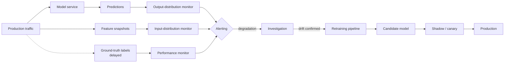
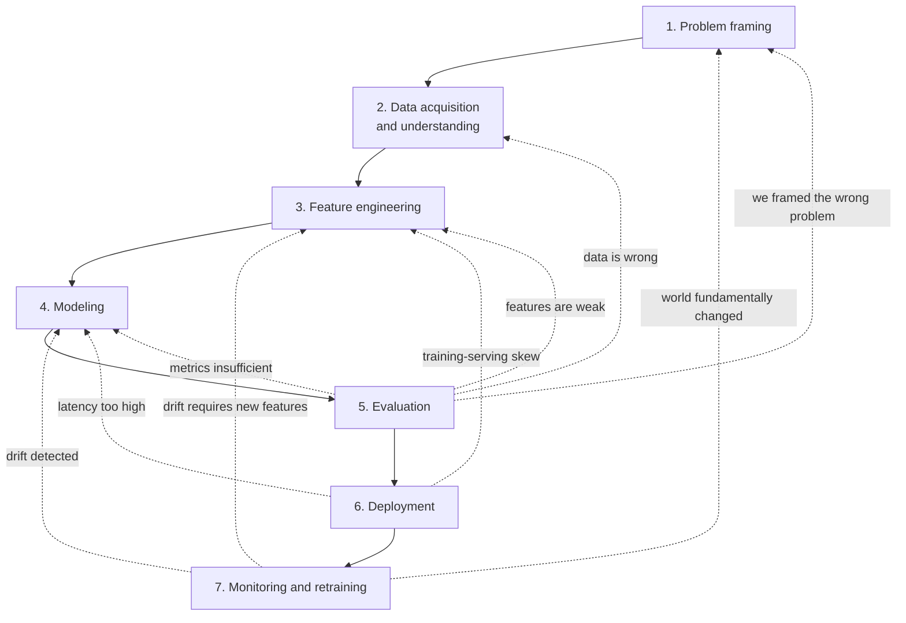

# Chapter 4 — The ML Workflow / Lifecycle

> **Goal of this chapter:** Chapter 3 walked, step by step, through a single spam-classifier project. The story moved cleanly from framing to deployment to monitoring, as if each step naturally led to the next. That tidiness was pedagogically convenient and operationally a lie. Real ML projects do not march in a straight line. They loop. Evaluation sends you back to feature engineering. Monitoring sends you back to data. Deployment surfaces problems that were latent in the original framing. The *lifecycle* — the named stages and the back-edges between them — is the vocabulary you need to communicate with teammates, plan a quarter, scope a deliverable, and recognise where you are stuck. This chapter gives you that vocabulary, the failure modes that wait at each stage, and a preview of where each stage lives on Databricks (which is the platform Parts J through L treat in depth).

---

## 4.1 Why projects look linear in books and crooked in practice

Open any introductory ML textbook and you will find a diagram that looks roughly like this: *frame the problem → collect data → engineer features → train a model → evaluate → deploy → monitor*. Seven boxes, six arrows, all pointing forward. The diagram is honest about the *names of the stages* and dishonest about the *flow between them*. In a real project, you spend a week on features, you train a first model, evaluation tells you something is wrong, and you go back two boxes to feature engineering — or sometimes all the way back to framing because evaluation has revealed that the question you set out to answer was not actually the question the business needed answered. The arrows go in every direction.

This is not a flaw in the diagram, exactly. The diagram is doing the same thing the diagram of the water cycle does in a fifth-grade textbook: showing the stations, but flattening the time. The water cycle never just goes evaporation-to-cloud-to-rain in one tidy pass either; the picture helps you name the stations so you can talk about them. The ML lifecycle diagram does the same job.

So in this chapter we will do two things that the chapter-3 walkthrough did not do explicitly. First, we will *name* each stage of the lifecycle and discuss, at some length, what can go wrong at that stage — not as abstract principles but as the kind of war story that has happened to every working ML team at some point. Second, we will draw the diagram with all its back-edges, so that you have an accurate map of *how iteration actually flows* through a project. By the end you should be able to look at a stuck project and say with some confidence "we are in the modeling stage but we need to go back to data acquisition" rather than the more common "I don't know, the model is bad, let me try a different algorithm".

A teacher's note before we start: the seven stages we are about to name are not unique to this book. They are the consensus terminology that has converged across the ML community over about twenty-five years, with minor variations in naming. Section 4.10 will discuss the historical antecedent — CRISP-DM, born in 1996 from a Special Interest Group of SPSS, NCR, DaimlerChrysler, and OHRA — that essentially set the template. Modern MLOps has added an engineering layer on top, but the underlying skeleton is roughly what CRISP-DM gave us. If you read papers or attend conferences and the speaker uses slightly different stage names ("data preparation" instead of "feature engineering", "modeling" instead of "training"), trust your taxonomy and translate; the substance is the same.

---

## 4.2 Stage 1 — Problem framing

The first stage is the one that looks free, and is the one that most often kills projects before any code is written. Problem framing is the act of deciding, precisely, *what you are predicting and what will be done with the prediction*. It sounds trivial. It is not.

Consider the following composite, which has happened in one form or another at every company I have worked at. A VP of marketing asks the data science team to "build a churn model." The team, eager to do its job, dives in. They identify a churn label — a customer is "churned" if they have not made a purchase in the last 90 days — and build a model that predicts, for each active customer, the probability of churning in the next 90 days. The model is good. Validation AUC is 0.87. The team presents to the VP. Three months later, nothing has happened with the model and the team is asked, in performance review season, what business impact their work had. The answer is none.

Why? Because nobody asked the second half of the question. *What will you do with the prediction?* It turns out the marketing team has exactly one retention play — a 10%-off coupon — and they only have budget to send it to 5,000 customers per quarter. So they don't actually need a "probability of churn" for every customer; they need a *ranking* of who to send the coupon to. And it turns out that the customers most likely to churn (the ones the model surfaces) are mostly already-disengaged customers for whom a coupon won't do much; the customers for whom a coupon is most *effective* are a different group entirely. The model answers the question "who is likely to churn" with high accuracy and answers the question "who should I send a coupon to" with no accuracy at all. The model is technically beautiful and operationally useless.

The framing failure here is sometimes called the "wrong target" trap. The team chose $y$ = "will this customer churn" when the question the business needed was $y$ = "will sending this customer a coupon change whether they churn." These are different problems — the second is a *causal*, *uplift-modeling* question, the first is a *predictive*, *correlational* question. The math is different. The data requirements are different. The deployment is different. The team built the wrong thing and didn't know.

Problem framing has a checklist that, run honestly, catches most of these failures up front:

- **What exactly is $y$?** Define it precisely enough that two independent data engineers, working from your definition, would produce the same labels. "Churn" is not a definition. "No purchase activity in the 90 days following the prediction date, excluding refunds and free-tier accounts" is a definition.
- **What exactly is $x$?** What information is available *at the time the prediction is made*? Not at the time the data was logged; at the time the prediction is needed. (We will return to this in Stage 3 when we discuss leakage.)
- **What decision will be made from $\hat{y}$?** And do you have, in fact, a way to make that decision? A churn model with no retention action is a dashboard, not a system.
- **What is the cost of each kind of error?** Section 3.2 hashed this out for spam. Every problem has its own cost ratio. Skipping this is how you end up tuning F1 when the business cares about recall.
- **What does success look like, quantitatively?** Some threshold of accuracy or business KPI, agreed up front, that defines "we shipped something that worked."

Run this checklist with the actual stakeholder, before any code. The conversation will surface contradictions that you will otherwise discover three months in.

The classic failure mode of problem framing, distilled: the data scientist trains a beautiful model that solves the wrong problem because the stakeholder could not articulate the business question, and the data scientist did not press hard enough to extract it. Both parties are at fault; the data scientist owns the consequence. This is the stage where ML projects most often go quietly wrong, and it is the cheapest to fix. A week of framing conversation can save six months of modeling effort.

A second, more subtle framing failure deserves naming: the *too-narrow target*. Consider a fraud team that asks for "a model to predict whether a transaction is fraud." Reasonable on its face. But "fraud" is not one thing — it covers card-not-present fraud, account takeover, friendly fraud (the cardholder claims fraud on a charge they actually made), merchant fraud, identity fraud, and several others. A single binary "fraud / not fraud" label collapses all of these into one bucket. The model that results is an average of patterns across all fraud types; for any specific subtype, it underperforms a specialised model. The framing question that would have caught this is "is the underlying problem really one problem, or several problems we should treat separately?" Sometimes one model is the right answer (when the subtypes have shared signals and you don't have enough data to train each separately); sometimes the right answer is several models, or a hierarchical model, or a separate routing step that decides which downstream model to consult. The framing stage is where you decide.

A third framing failure: the *un-actionable prediction*. You can predict customer satisfaction scores from product-usage data with high accuracy. Great. Now what? Unless the prediction is wired to a specific business action — a proactive support call, a UX experiment, a pricing adjustment — the prediction is just a number on a dashboard. Predictions that are not wired to actions tend not to survive a budget review. The framing question is "what business workflow will consume this prediction, and is that workflow ready to consume it?" If the answer is "we'll figure it out after the model is built", you have a framing problem.

---

## 4.3 Stage 2 — Data acquisition and understanding

You have a problem framed. Now you need data. This is rarely as simple as "query the table."

Real data acquisition involves at least four sub-tasks. *Finding* the data — which often means working out which of seventeen analytics warehouses, three transactional databases, two operational data stores, and a directory of dump CSV files actually contains the truth about, say, whether a customer purchased. *Getting access* — which means working with security, compliance, and platform teams, and which can take days to weeks depending on how regulated your industry is. *Understanding what each column actually means* — which means talking to the people who maintain the systems that produce the data. *Validating* — which means looking for the data-quality landmines that, if undetected, will silently poison everything downstream.

The "understanding what columns mean" sub-task is the one that catches everybody at least once. Let me give the canonical example. You join a retail-analytics team. The data warehouse has a table `transactions` with a column `revenue`. You build a model that predicts next-month revenue per customer, and it scores well. You ship it. Six months later, the finance team flags that the model's predictions are *systematically lower* than the gross revenue numbers in their Tableau dashboards by about 8%. After two weeks of investigation, you discover that the `revenue` column in `transactions` is computed *net of refunds*, with refunds being booked back into the same `revenue` field as a negative line item, while the finance dashboard computes gross revenue by filtering refunds out. The model is predicting net-of-refunds revenue but is presented to stakeholders as predicting gross revenue, and nobody — including you, when you started — realised the difference. The refunds happen to be small enough that the model still "looks right" to a casual eye, which is why it took six months to surface.

This is not a bug in the model. The model is doing exactly what it was trained to do. The bug is in the semantic gap between "the column is called `revenue`" and "we all think we know what `revenue` means." Bridging that gap is the data scientist's job, and the only way to bridge it is *to talk to the people who built and maintain the source data*. There is no shortcut. There is no doc page that tells you. You ask, in writing, "when a customer returns a product, what happens to the `revenue` column?" — and you write down the answer.

Other landmines in this stage that have bitten teams I have worked with:

- A `timestamp` column that, half the time, is in UTC and half the time is in the customer's local timezone, with no flag to tell them apart. Discovered when the model thought peak engagement was at 3am.
- A `country` column that uses ISO 3166-1 alpha-2 codes for most rows but contains free-text country names for rows that came in through a legacy import process. The model treats "US" and "United States" as different countries.
- A `customer_id` column that, due to a long-ago bug in a deduplication script, occasionally maps multiple physical customers to the same ID. The model learns weighted-average preferences for these conflated identities and is mysteriously wrong on them.
- A `transaction_amount` column that includes tax in some markets and excludes it in others, depending on which payment processor handled the transaction.

None of these are sophisticated problems. All of them are caught by talking to the data engineering team for a couple of hours before you start. None of them are caught by reading the schema.

The classic failure mode of data acquisition is sometimes called the "phantom column" — a column whose meaning you assumed but didn't verify, that diverges from its name in some semantically important way. The fix is paranoid documentation: when you start a project, for every column you intend to use, write a sentence about what it means and have a data engineer sign off. This is the data-equivalent of test coverage. It feels like make-work; it isn't.

A connected obligation is *understanding the data-generating process*. Data is not handed down from heaven. It is produced by some operational system — a web service, a point-of-sale terminal, an Excel sheet — and the quirks of that system bleed into the data. Click logs from a website are produced by JavaScript that fires on specific events; if the JavaScript was broken for a week, you have a blackout in your data, not zero clicks. Patient lab values in an EHR are recorded when a clinician orders the test; missing values are not random, they correlate with whether the clinician thought the test was relevant. Understanding the process that produced the data is what separates a data scientist from someone who runs `df.describe()` and assumes the rest.

A useful habit in this stage is to *write down the data lineage* for every feature you plan to use. For each candidate feature, answer: which raw table does it ultimately come from? Which ETL job populates that table? On what cadence? What happens when an upstream system is down? Who owns the upstream system? If any of these answers is "I don't know", that's the first thing to fix, because each unknown is a place where the model can silently degrade. Unity Catalog on Databricks tracks lineage automatically across notebook and pipeline boundaries; on other platforms you may need to maintain the lineage map by hand. Either way, the map is part of the deliverable.

One more obligation worth naming separately: *label quality*. The labels in your dataset are not the ground truth — they are *somebody's measurement of* the ground truth, and the measurement has its own errors. In Chapter 3 we saw this with spam labels (user-marked vs. rule-filter-marked, with the latter being exactly what we wanted to replace). The same is true in almost every domain. Medical diagnoses in EHR data are biased toward conditions that get coded for billing; "customer complaint" labels reflect what was actually surfaced to support, not what was actually felt; financial-default labels are precisely defined but only for the customers a bank actually extends credit to (selection bias). A model's quality is bounded above by the quality of its labels; understanding label noise is part of understanding the data.

---

## 4.4 Stage 3 — Feature engineering

You have data, and you understand what each column means. Now you need to transform that data into the numerical vectors a model can consume. This is feature engineering, the discipline of turning raw inputs into useful $x$ vectors. Part E of this book covers it at depth, including missing-value imputation, categorical encoding, scaling, interactions, and feature selection. Here we want to flag the lifecycle perspective on it and, especially, the single most pernicious failure mode that lives at this stage: data leakage.

Feature engineering, done casually, can take a few hours. Done seriously, it can take weeks. Senior practitioners often spend more time on features than on model selection — Andrew Ng's "data-centric AI" framing, which we will return to in Stage 4, is essentially the claim that engineering effort spent on data and features produces more lift than engineering effort spent on model architecture, for the vast majority of business problems. Hold that frame: most of the model's quality is going to come out of what you do *to the data* before the model ever sees it.

The failure mode that defines this stage is **data leakage** — accidentally including a feature in the training data that is only available *after the prediction is needed*. The model "cheats" on training (it can see, in some form, the answer it is being asked to predict), and so reports phenomenal validation scores, and then collapses in production where the cheat is no longer available.

Leakage is subtle. Let me give three real examples, each progressively harder to catch.

The easy case: a hospital wants to predict whether a patient currently being admitted will be readmitted within 30 days. The data science team builds a model that includes, as a feature, the patient's discharge disposition — "discharged home" vs. "discharged to skilled nursing facility" vs. "expired". The model scores 0.95 AUC on validation. The team is thrilled. Deployment goes badly: the predictions are made *at the time of admission*, when the discharge disposition is by definition unknown — it won't exist until the patient is discharged. The feature was available in the training data (where every row's hospitalisation is already complete) but not in the production data (where the prediction is needed *before* the hospitalisation is complete). The model collapses to about 0.62 AUC in production.

The medium case: a credit-card company wants to predict default in the next twelve months. The training table is built by joining the customer table to the transactions table to the chargeback table. One of the features the team uses is "average transaction amount in the last twelve months." Validation looks great. The problem: the training set's "last twelve months" was the year leading up to the default event, while the production model's "last twelve months" is the year leading up to today. For customers who have already defaulted, transactions stop several months before the default flag fires (because their card is frozen). The training feature, computed over the trailing 12 months, includes those low-transaction final months for defaulters and full-transaction histories for non-defaulters; the model learns to recognise the "transactions are dropping" pattern and uses it as a strong signal. In production, the model sees the trailing twelve months for *currently active* customers — most of whom have not yet started the transaction-drop pattern — and the signal is much weaker. The model degrades. The cause is *temporal leakage*: the training feature implicitly used information from the future relative to the label.

The hard case: a customer-support team wants to predict whether a ticket will be resolved within 24 hours. They include, as a feature, "is the customer enrolled in our premium support tier?" Validation is fine. The model launches. After three months, the resolution rate for premium-tier customers, mysteriously, *goes up*. The cause: the model is recommending escalation paths for tickets flagged as "likely slow", and the premium-tier flag drives the model's recommendations to higher-touch escalation paths. The premium feature was not strictly leaked in the temporal sense; it was leaked in a *feedback-loop* sense — the production system was changing the very behaviour the model was trained to predict. This is the hardest kind of leakage to catch because it's emergent, not present in the training data at all. The diagnosis here usually involves an A/B test where the model's actions are randomised against the existing process.

The defensive practice for leakage is to ask, for every candidate feature, *"is this value knowable at the time the prediction is needed, without using information from the future?"* If the answer is "yes" with no qualifications, the feature is safe. If the answer is "yes, but the value might differ between train and serve because we're computing it differently in the two pipelines", you have a *training-serving skew* problem (Stage 6). If the answer is "no, this feature uses information that wouldn't be available yet at prediction time", you have leakage and you must remove or restructure the feature.

A related stage-3 obligation: *making sure features are computable in production*. A feature like "the customer's cumulative spending in the trailing six months" sounds fine for training (you just compute it from the warehouse) and turns out to be expensive at prediction time, because you need to either pre-compute and store it (introducing freshness questions) or compute it on the fly (introducing latency questions). The handling of this — feature stores, online tables, point-in-time correctness — is a major topic in Part L and a major capability of Databricks' Feature Engineering in Unity Catalog.

A third stage-3 concern: *the feature explosion*. It is tempting, when starting on a new project, to engineer every feature you can think of — log transforms of every numeric column, one-hot encodings of every categorical, every plausible interaction, every rolling-window aggregate. The result is a feature matrix with thousands of columns, most of which carry little signal. This is not always a disaster — modern tree ensembles handle high-dimensional noisy features reasonably well — but it does inflate training time, complicate interpretation, and increase the surface area for leakage and skew. The professional discipline is to add features intentionally, measure their impact (held-out lift, feature importance, ablation), and remove the ones that don't pay for themselves. Part E's chapter on feature selection (Chapter 29) covers the formal techniques. The lifecycle lesson is that "more features" is not automatically "better model."

---

## 4.5 Stage 4 — Modeling

You have features. Now you fit a model.

This is the stage that ML courses spend 80% of their time on — pick an algorithm, tune the hyperparameters, compare model classes — and that, in real practice, takes roughly 10–20% of project time. The disconnect is one of the deepest in the field and worth understanding.

The reason ML curricula over-weight the modeling stage is partly historical (the algorithms were the academic contributions, so the textbooks foreground them) and partly that the modeling stage is the part you can do without a domain. You can study gradient boosting on the UCI Adult dataset without ever talking to a domain expert; you cannot do problem framing without one. The teachable parts of the discipline cluster at the modeling stage, which makes ML education look like it's mostly about models.

The reason the modeling stage takes a small fraction of project time in practice is that, *for any non-degenerate problem, three or four mainstream algorithms — logistic regression, random forest, gradient-boosted trees, perhaps an MLP — will produce models that are within a few percentage points of each other*. The differences between them are typically dwarfed by the differences between "good features" and "okay features", or between "well-framed problem" and "vaguely-framed problem." Spending two weeks tuning XGBoost when your data has a leakage problem is wasted effort.

This is the substance of Andrew Ng's "data-centric AI" framing. Ng has argued, repeatedly, that practitioners should invert the typical effort split: instead of 80% on the model and 20% on the data, invest 80% on the data (collection, cleaning, labeling, feature engineering) and 20% on the model. The argument is empirical: when teams do this, their projects produce more business value than when they do the reverse. For the classical-ML topics on the Databricks ML Associate exam, internalise the frame: the model is a relatively small lever; the data is the big one.

That said, the modeling stage does have its own failure modes. The most common is *picking the wrong model class for the data shape*. Linear models on highly nonlinear data — fine if you engineer the right interaction features, terrible if you don't. Deep neural networks on tabular data of moderate size — usually outperformed by gradient-boosted trees, sometimes by quite a lot. Random forests on data with a small number of strongly informative features and many noisy ones — fine, but a linear model with L1 regularization may match it and is easier to interpret. Knowing the rough fit between algorithm and data shape is a working ML engineer's bread and butter; we will develop it in Parts F and G.

A second modeling failure: *over-tuning hyperparameters on the validation set*. We hinted at this in Chapter 3 — the moment you use the validation set to choose between candidate models, you've burned some of its statistical purity. Run a hundred hyperparameter trials, pick the best, and the "best" is partly a winner of the hyperparameter sweep and partly a winner of the validation-set lottery. The honest fix is to hold out a separate test set that you do *not* use during hyperparameter tuning, or to use nested cross-validation (Chapter 22). The dishonest fix — peeking at the test set during tuning — is a story I've seen play out at multiple companies and it never ends well.

A third modeling failure: *not having a baseline*. If you train a gradient-boosted tree and report 87% accuracy, that's a number. Without a baseline, it's a meaningless number. Is 87% good? You'd need to know: what does the trivial "always predict majority class" baseline achieve (often surprisingly high in imbalanced problems)? What does a basic logistic regression achieve? What does the previous version of the system achieve? Without these reference points, "87%" is a number on a slide. Every modeling effort should start with the simplest possible baseline and measure improvement relative to it.

The classic failure of modeling, then, is engineering effort misallocation: spending 90% of project time fiddling with the model when the leverage is in the data. The corollary is that *modeling is the stage you should be willing to do quickly and roughly first*, then revisit only if the data work has been done well and you need to squeeze the last few points.

A practical heuristic: when starting a new project, give yourself one day to train a baseline model with the simplest reasonable algorithm and minimal feature engineering. Whatever metric this produces becomes your floor. From there, every subsequent change — new features, new algorithm, new hyperparameters — is measured against that floor. If a week of work doesn't move the metric meaningfully above the floor, that's a signal that the data or framing is the bottleneck, not the model. The discipline of always-having-a-baseline is one of the cheapest insurance policies a data scientist can buy, and it costs almost nothing to maintain.

---

## 4.6 Stage 5 — Evaluation

You've trained a model. Now you measure it.

If you read Chapter 3 closely, you already have most of the right instincts for this stage: don't trust accuracy on imbalanced data; look at the confusion matrix; understand the threshold dial; pick the metric your business cost actually maps onto; check for overfitting by comparing training and validation performance. Part H of this book covers evaluation in formal depth — confusion matrices, precision, recall, F1 and F-beta, ROC and AUC, PR curves, MSE and MAE for regression, multiclass extensions. Here we want to highlight the lifecycle perspective: *the evaluation stage is where you decide whether to ship, or to loop back*.

The failure mode that lives here is *optimising the wrong metric*. The case of accuracy on imbalanced data is the canonical version — you optimise accuracy, you ship a model that always predicts the majority class, you get 99% accuracy on a 1%-positive problem, and you catch zero positives. But there are subtler versions. You optimise RMSE on a regression problem where the business cares about MAE, and you end up with a model that handles outliers more aggressively than the business needs (RMSE penalises large errors quadratically; MAE penalises them linearly). You optimise F1 when the business cares about precision-at-fixed-recall (a common ask in fraud or healthcare). You optimise AUC when the business operates at a fixed threshold and only cares about performance in a narrow region of the ROC curve.

A practical example: a credit-default model team reports AUC of 0.85 to a risk committee. The risk committee asks "what does that mean for our loss rate?" The data scientist, who has never been forced to translate AUC into business terms, struggles. A better team would have, from day one, evaluated against the metric the risk committee cares about — the expected dollar loss across the loan portfolio under various default-rate scenarios — and reported AUC only as a technical sanity-check. Choosing the evaluation metric is part of problem framing; if you got the framing right, the evaluation metric follows.

Three other evaluation pitfalls worth flagging:

- **Confidence intervals.** A point estimate of "F1 = 0.84" is not the same as "F1 is between 0.83 and 0.85 with 95% confidence." On small validation sets, the confidence interval on a metric can be embarrassingly wide. If your validation set has 1,000 examples and you report 80% accuracy, the 95% CI is something like ±2.5 percentage points. A model at 80% and a model at 82% may be statistically indistinguishable. Always think about the variance of your evaluation, not just its mean.
- **Subgroup performance.** A model that scores 90% accuracy overall might score 95% on the majority subgroup and 70% on a minority subgroup. The aggregate metric hides the disparity. Stratified evaluation — measuring metrics per subgroup, where subgroups are defined by demographics, geography, or some other dimension the business cares about — is essential for any application where fairness matters or where subgroup performance has business consequences. (Part H touches on this; the broader fairness literature is out of scope but real.)
- **Calibration.** A binary classifier that says "this email is 80% likely to be spam" — does it mean that, among all emails it scored at 0.80, 80% really are spam? For some models (logistic regression, naive Bayes) the calibration is usually decent; for others (random forests, neural networks) it can be quite poor. If you use probabilities for cost-sensitive thresholding, calibrate first.

The evaluation stage is where the loop is most visible. Evaluation rarely fires a "ship it" signal on the first try. It fires "go back and look at the data" or "your features have leakage" or "your threshold is wrong" or "you don't have enough training data in the minority class". A working ML engineer treats each loop-back as expected, not as a failure of planning.

There's a final discipline that belongs at this stage: *error analysis*. After computing aggregate metrics, *look at specific examples the model got wrong*. Sample 50 false positives and 50 false negatives. Read them. Group them by hand into themes. The themes tell you where the model is weak in ways no aggregate metric can. Maybe 30 of your 50 false positives are emails from new senders the model has never seen — that's an "out-of-distribution" weakness that calls for a different mitigation than "the model is generally biased toward predicting spam". Maybe 20 of your 50 false negatives involve a particular obfuscation pattern (v1agra, Vi@gra) — that's a feature-engineering problem, not a modeling problem. Error analysis is the cheapest, most underused diagnostic technique in ML. It is also the one most likely to give you the next concrete thing to try.

---

## 4.7 Stage 6 — Deployment

You've trained a model, evaluated it, decided it's good enough. Now you put it into a production system that uses it.

Deployment is the stage where ML stops being a notebook activity and starts being a software-engineering activity. The model is no longer "a `pkl` file on the data scientist's laptop"; it is a versioned artifact loaded by a serving service that handles requests from real users with real latency budgets and real reliability requirements. Section 3.11 sketched this. Let's go deeper on the failure modes.

The most insidious deployment failure is **training-serving skew**. We named it in Chapter 3; let's understand why it's so sneaky.

Skew happens when the features computed at training time differ — even slightly — from the features computed at serving time. The model was trained on one distribution of inputs; it sees, in production, a subtly different distribution. The predictions degrade. The kicker is that the degradation can be silent: there is no error, no exception, no log line. The model is just *quietly worse* than it was in evaluation.

How does skew sneak in? A non-exhaustive tour:

- *Different code paths*. The training pipeline tokenises text using a notebook helper function; the serving service tokenises using a slightly different library version that splits on slightly different boundaries. The model sees tokens it never saw in training. The signal weakens.
- *Different feature freshness*. The training pipeline computes "user's session count in the last hour" using a SQL query against the warehouse, which is end-of-day delayed. The serving pipeline computes the same feature using a streaming Kafka consumer, which is up-to-the-second. In training, "session count in the last hour" is computed *as of the end of the day of the prediction*, so it includes the rest of that day's sessions; in serving, it's computed *as of right now*, so it excludes the rest of the day. The same feature name; different distributions.
- *Different defaults for missing values*. Training fills missing `age` with the median (37). Serving fills missing `age` with 0. The model has learned that low `age` correlates with one behaviour; it confidently and wrongly applies that learning to every record with missing age.
- *Different feature ordering*. The model expects features in a specific order — index 0 is age, index 1 is income, index 2 is tenure. The serving pipeline assembles the feature vector in a different order. The model "works" — no exception fires — but it's interpreting age as income and tenure as age. Disastrous, hard to spot.

The standard mitigations are all forms of "ship the feature-extraction code with the model, and use it identically in training and serving." Modern frameworks formalize this with the *pipeline* abstraction — Spark ML's `Pipeline` (Chapter 62), scikit-learn's `Pipeline`, MLflow's `pyfunc` flavor — where the model artifact includes the preprocessing logic. Even better is a *feature store*, which makes the feature definitions explicit, versioned, and shareable between training and serving. We will see Databricks Feature Engineering in Unity Catalog in Part L; it exists specifically to eliminate training-serving skew by making the feature computation the *same code* in both places.

A second deployment failure: *latency budgets*. Email classification at high throughput needs sub-millisecond inference. A 50-millisecond inference call from a 5,000-feature logistic regression is fine. The same 50ms from a deep tree ensemble may also be fine but if the upstream service has a strict 100ms budget for everything, you have to be precise about your share. The same model in a batch-scoring nightly job has no latency budget at all and you can use whatever model you want. *Knowing the latency envelope* is a deployment-stage decision that ripples back into modeling — sometimes the "best" model is the one you can serve in time.

A third deployment failure: *no rollback path*. You deploy version 5 of a model. It's worse than version 4 in production. Now you have to roll back. If your serving infrastructure ties model version to a deploy of the service binary, rolling back means a service redeploy, which takes 30 minutes and incurs risk. If your serving infrastructure decouples model version from service binary — the service loads the *currently active* model version from a registry, and switching versions is a config change — rolling back takes seconds and is low-risk. The latter is the standard MLOps pattern, and it's what MLflow Model Registry (Chapter 73) gives you on Databricks.

A fourth deployment concern: *gradual rollout*. Even if your model is better in offline evaluation, you don't want to flip all of production over to it at once. Standard practice: deploy alongside the existing model as a *shadow* (predictions made, not used), then as a *canary* (used for 1% of traffic), then ramped up. If anything goes wrong at any stage, roll back. This is sound software-engineering practice generally; ML inherits it.

The deployment stage is where ML engineering is most clearly a software-engineering discipline. You are now building a service. The model is a component of the service. The same things that make any other service robust — versioning, rollback, monitoring, gradual rollout, latency budgets — apply.

---

## 4.8 Stage 7 — Monitoring and retraining

You deployed. Predictions are flowing. Users are seeing the output. *You are not done.*

This is the stage that gets the least attention in ML courses and the most attention in real ML jobs. Section 3.12 sketched it; let's understand its shape more fully.

The defining fact about deployed ML systems is that *they degrade over time, even when nothing changes in the code*. The world drifts away from the world the model was trained on. New spam patterns emerge. New customer demographics enter the funnel. Inflation changes the meaning of "$500 transaction." Macro events shift the distribution of incoming queries. The model is a snapshot of a moving distribution, and the distribution doesn't stop moving once you deploy.

The failure mode that defines this stage is the *silent staleness* problem: a model that was trained six months ago, and that nobody has looked at since, that is now producing predictions that no longer reflect the world. The predictions look superficially fine — they're in the right range, they're not throwing errors — but they're drifting in ways that nobody is measuring. By the time someone notices, the model has been degrading for months and has accumulated a lot of operational debt.

Monitoring is the defense. Three layers:

**Model performance monitoring.** If you can observe ground truth in production (eventually) — users marking emails as spam, customers actually defaulting, fraud being confirmed by chargebacks — you can compute the model's actual precision and recall on production traffic. There's a delay (it takes weeks to know if a loan defaulted), but the signal is direct. Set alerts on degradation.

**Feature distribution monitoring (input drift).** Even before you have labels, you can monitor the *distribution of features* the model is seeing. If the average email length, the spam-word frequency, or the geographic distribution of senders shifts substantially, that's a leading indicator. Statistical tests for distributional shift (KL divergence, Population Stability Index, K-S test) live here.

**Prediction distribution monitoring (output drift).** What fraction of incoming records is the model classifying positive? If that number drifts substantially — yesterday 24%, today 38% — *something has changed*, and you need to know whether it's the world or the model. Output-distribution monitoring is the cheapest of the three to set up (you don't need labels, you don't need feature-level instrumentation) and often the earliest warning.

The retraining loop, once monitoring fires, is where the lifecycle truly becomes a *cycle*: you go back through the earlier stages — sometimes only Stage 4 (retrain on fresh data with the same features), sometimes back to Stage 3 (the world has changed enough that you need new features), occasionally back to Stage 1 (the business question itself has shifted). The discipline is making this loop *fast and automatic*. Doing it by hand for the first month is fine; doing it by hand for two years is malpractice. MLOps platforms — Databricks Workflows, Airflow, Vertex AI Pipelines, SageMaker Pipelines — exist to automate the retrain-evaluate-deploy cycle. We will see Databricks' answer in Part L.

A final note on this stage: the question "how often should we retrain?" has no universal answer. For a stable problem (predicting house prices in a quiet market), maybe quarterly. For a moderately drifty problem (spam classification, recommendation), maybe weekly. For an adversarial problem (real-time fraud), maybe daily or even continuously. The right cadence is whatever keeps the monitored metrics inside their alert thresholds, with margin for safety. Setting that cadence empirically — by deliberately *not* retraining for a controlled period and watching what happens — is one of the most useful things a team can do in the first few months after deployment.

One organisational reality worth mentioning: the monitoring stage is the one most often *neglected*. Building the first model is exciting; presenting it to stakeholders is gratifying; deploying it produces a milestone. Monitoring is the un-exciting recurring obligation that runs forever and only generates alerts when something is wrong. Teams that don't take it seriously discover, eighteen months in, that they have a production model nobody trusts because nobody is sure whether it still works. The professional discipline is to treat monitoring as a *first-class deliverable* of the project — the dashboards exist, the alerts are wired to a real on-call rotation, the retraining workflow is automated and tested — before declaring the project "done." A model without monitoring is not a deployed model; it's a model that's been left somewhere production-shaped and hoping for the best.

---

## 4.9 Why the lifecycle is not linear

We have now named all seven stages. Let's draw the diagram with all the back-edges, because *the back-edges are what make this a lifecycle rather than a list*.

Read the dotted lines. They are the iteration loops, and they are where most of the actual project time goes.

The most common loop is **evaluation → feature engineering**. You train a first model, evaluate it, it's not good enough, you go back to feature engineering and add interactions, fix encodings, engineer time-windowed aggregates. Re-train. Re-evaluate. The loop runs four or five times in a typical project. This is normal and expected.

The second most common loop is **evaluation → modeling**. Same features, different model class — try logistic regression, then random forest, then gradient-boosted trees, then maybe a neural net. Compare. Pick the best. Within each, tune hyperparameters.

The "evaluation → data acquisition" loop is rarer but more consequential. You evaluate and discover that, say, your minority class is underrepresented; you go back to data acquisition to get more examples of it. Or you discover that a feature you assumed was reliable is actually 30% missing for one customer segment; you go back to data acquisition to understand why.

The "evaluation → problem framing" loop is the rarest and the most painful. It means you spent weeks building the wrong thing. The first time it happens, you feel like a failure. The tenth time it happens, you realise it's just how the work goes; the framing was the team's best guess at the start, and evaluation revealed it was incomplete. The mature reaction is to re-frame and re-start, not to keep going with the wrong frame because you've already invested.

The deployment-stage back-edges are the most surprising to people new to ML. You spent a month building the model, you're ready to deploy, and the deployment itself surfaces problems — your feature pipeline is too slow, your feature extraction code can't be ported to the serving environment, the model's outputs aren't in a useful format for downstream systems. Each of these sends you back. This is also normal; nobody gets every detail right the first time, and deployment is the first time you find out about a lot of operational details that the notebook didn't surface.

The monitoring stage's back-edges are continuous, not one-shot. Monitoring is always running, and every meaningful drift detection is, in effect, a "loop back" — either to modeling (retrain), to feature engineering (drift requires new features), or all the way to framing (the world has changed enough that the problem is no longer the same problem).

If you take one thing from this chapter, take this: the lifecycle is a cycle, the cycle has many back-edges, and the back-edges are not failures — they are the work.

---

## 4.10 The CRISP-DM precedent

A short historical interlude, because the lifecycle vocabulary we just covered did not appear out of nowhere.

In 1996, a Special Interest Group composed of representatives from SPSS, NCR, DaimlerChrysler, and OHRA (a Dutch insurer) convened to standardise a methodology for data mining projects. The motivation was practical: each company had its own informal process, project failures were common, and there was no shared vocabulary across the field. The group's output, published in 1999, was the **Cross-Industry Standard Process for Data Mining**, or **CRISP-DM**.

CRISP-DM defined six phases:

1. **Business understanding** — the same idea as our "problem framing."
2. **Data understanding** — overlapping with our "data acquisition" plus parts of EDA.
3. **Data preparation** — overlapping with our "feature engineering."
4. **Modeling** — same name, same idea.
5. **Evaluation** — same name, with a stronger emphasis on the business-objective fit.
6. **Deployment** — same name, but with less depth than modern MLOps gives it.

CRISP-DM included an explicit recognition that the phases are not linear — its canonical diagram showed bidirectional arrows between phases, and an outer cycle indicating that projects often loop. It was the first widely-adopted methodology to formalise this.

Two things have changed since 1996. First, terminology has updated — "data preparation" became "feature engineering" as the field professionalised, "data mining" became "machine learning" as ML displaced traditional analytical statistics, and "business understanding" became "problem framing" as the field reckoned with its tendency to under-emphasise it. Second, and more importantly, *MLOps has been bolted on*. CRISP-DM's "deployment" stage was a fairly thin gesture toward putting models into production; modern ML adds an entire ongoing layer — model registries, feature stores, monitoring infrastructure, retraining pipelines, A/B testing — that CRISP-DM did not name.

But the bones are the same. If you map our seven stages onto CRISP-DM's six, you find that "monitoring and retraining" is the only one that didn't have a 1996 analogue at the same depth. Everything else is, in essence, CRISP-DM with sharper terminology and a few more decades of accumulated war stories. When you read older ML practitioners (or read papers from the early 2000s), you will often see them reach for CRISP-DM as a reference. It's worth knowing the lineage; the vocabulary you are learning is older than you think, and the failure modes are older still.

---

## 4.11 MLOps preview: engineering rigor at each stage

Each of the seven stages has, in production-grade ML, an engineering layer that imposes rigor. We have hinted at these throughout; let's collect them in one place, because the rest of this book — particularly Parts E and L — will fill them in.

- **Problem framing** → there's less engineering rigor here and more *process* rigor: written framing documents reviewed by stakeholders, agreed-upon success metrics, alignment on the decision-making process. Some teams use formal "ML PRD" templates that force the framing checklist to be filled in before any modeling work begins.
- **Data acquisition** → data contracts, schema validation, automated data quality checks, lineage tracking. Tools: dbt for transformations, Great Expectations or Soda for quality checks, Unity Catalog for lineage on Databricks.
- **Feature engineering** → *feature stores*. A feature store is a system that lets you define a feature once, computes it from raw data, makes it available in both batch (training) and online (serving) form with consistent semantics, and tracks versioning and lineage. Eliminates training-serving skew at the root. We cover Databricks Feature Engineering in UC in Part L.
- **Modeling** → *experiment tracking*. Every model training run logs its parameters, code, data version, metrics, and artifacts to a tracking server. Lets you compare runs, reproduce results, and answer "which version of the model is in production right now?" Tool: MLflow (Part L).
- **Evaluation** → automated evaluation pipelines, dashboards, statistical tests for model comparison. Often: champion-challenger frameworks where new models are evaluated against the current production model on a held-out set automatically.
- **Deployment** → CI/CD for models, model registries, version-controlled serving infrastructure, shadow deployments, canary rollouts, A/B testing. Tool: MLflow Model Registry (Chapter 73); Databricks Model Serving for the serving layer.
- **Monitoring and retraining** → drift detection systems, alerting, automated retraining triggers, retraining workflows. Tool: Lakehouse Monitoring on Databricks (mostly ML Pro exam content; we name it but go light).

This is a *preview*, not a deep dive. Each item above gets its own treatment later. The preview is here so you can begin to see *where the lifecycle stages live on a real platform* and not just as abstractions in a chapter.

---

## 4.12 Where each stage lives on Databricks

Since this book is, eventually, about the Databricks ML Associate exam, it's worth previewing — at a high level — where each stage maps to a Databricks component. *This is preview only.* Part L is where each of these gets the depth treatment.

| Stage | Databricks component | What it gives you |
|------|---------------------|-------------------|
| Data acquisition | Auto Loader, Unity Catalog tables, Delta Lake | Reliable ingestion, governed storage, ACID semantics |
| Feature engineering | Feature Engineering in UC, online tables | Versioned features with consistent batch/online semantics |
| Modeling (notebook work) | Databricks notebooks, MLflow tracking, AutoML | Interactive development; experiment tracking; AutoML for baselines |
| Modeling (distributed) | Spark MLlib, `pyspark.ml` | Distributed training for data that doesn't fit on one machine |
| Hyperparameter tuning | Hyperopt with SparkTrials, Optuna | Distributed HPO with the Spark cluster as the search engine |
| Deployment | Mosaic AI Model Serving, Model Registry in UC | Versioned model artifacts, serving endpoints with autoscaling |
| Monitoring | Lakehouse Monitoring | Drift detection on tables and inferred predictions; alerts |

Two warnings about this table. First, *the names change*. Databricks rebrands components every couple of years; "Mosaic AI Model Serving" was previously "Databricks Model Serving" and before that "MLflow Model Serving"; "Feature Engineering in UC" was previously "Feature Store." The names in the table reflect the 2025-2026 era. Second, the table is *preview only*: the goal here is to know that *something on Databricks owns each stage*, not yet to know how each works. We will go deep on every row of this table in Part L. For Stage 7 monitoring specifically: Lakehouse Monitoring is largely Pro-exam content rather than Associate-exam content, so the Associate exam will not press on it hard — but you should know it exists, because the lifecycle isn't complete without it.

---

## 4.13 Role distinctions: data scientist, ML engineer, ML researcher

A final orienting note. Readers often conflate three roles that, while overlapping, have meaningfully different centers of gravity. The lifecycle gives us a clean way to distinguish them.

A **data scientist**, in the contemporary sense of the title, lives mostly in stages 1 through 5: framing, data, features, modeling, evaluation. They are the ones who talk to stakeholders, build the first models in notebooks, and prove out the business value. They may or may not be involved in deployment; in many organizations, they hand off to a separate team for the production engineering. They tend to be hybrid statistics-and-engineering people, comfortable with both pandas and matplotlib and capable of presenting a story to a VP.

An **ML engineer** (sometimes called MLOps engineer) lives mostly in stages 6 and 7, with strong involvement in stages 3 and 4: deployment, monitoring, retraining, feature pipelines, model registries, serving infrastructure. They are software engineers who specialise in ML systems. The Databricks ML Associate exam, despite being titled around "machine learning", is really aimed at this role more than the data-scientist role — its emphasis on pipelines, MLflow, and Spark ML reflects the production-engineering perspective.

An **ML researcher** lives mostly in a narrow slice of stage 4: novel algorithms, new model architectures, new optimization techniques. They publish papers. They prototype on benchmark datasets. They typically do not own production systems and may not be expert in stages 1, 2, or 7. Most industry ML researchers work in dedicated research teams (Anthropic, OpenAI, DeepMind, FAIR, MSR) or in research arms of large companies. The role is much rarer than data scientist or ML engineer.

For most working ML practitioners — including the audience this book is aimed at — the relevant question is whether you are sliding toward the data scientist end (more domain, more stakeholder communication, more notebook work) or the ML engineer end (more production engineering, more infrastructure, more code in the serving path). The lifecycle gives you a way to think about which stages are your center of gravity. Knowing this affects how you allocate your learning time. A data scientist studying for the Databricks ML Associate should expect to push themselves on the engineering side; an ML engineer should expect to push themselves on the modeling and evaluation side.

---

## 4.14 Self-assessment

Before moving to the exercises, run yourself through these gates. If you stumble on any, re-read the relevant section.

- Can you list all seven stages of the lifecycle, in order, from memory?
- Can you give, for each stage, one realistic failure mode — the kind of failure that has actually killed projects, not just a textbook one?
- Can you explain, in your own words, why the lifecycle is not linear, and name at least three of the back-edge loops?
- Can you state the relationship between CRISP-DM and the modern ML lifecycle in one sentence?
- Can you name the Databricks component that owns each stage (or note that the stage is mostly process, not platform)?
- Can you distinguish, in one sentence each, between a data scientist, an ML engineer, and an ML researcher in terms of which stages they live in?

If you can do all of these cold, you have the framing this chapter set out to teach.

---

## 4.15 Summary

Stripped down:

1. ML projects have seven canonical stages: **problem framing**, **data acquisition and understanding**, **feature engineering**, **modeling**, **evaluation**, **deployment**, and **monitoring and retraining**.
2. Each stage has a characteristic failure mode: framing the wrong problem; misunderstanding data semantics; data leakage; misallocated effort; optimising the wrong metric; training-serving skew; silent staleness.
3. The lifecycle is *not linear*. Back-edges go from evaluation to features (most common), from evaluation to data, from evaluation to framing, from deployment to features, from monitoring to retraining (continuous). The back-edges are where most of the work lives.
4. The lifecycle is essentially CRISP-DM (1996) with sharper terminology and an MLOps layer bolted on. Knowing the lineage helps you read older literature and recognise the underlying skeleton.
5. Each stage has, in production-grade ML, an engineering rigor layer — feature stores, experiment tracking, model registries, monitoring infrastructure. On Databricks, each stage maps to a named component (Feature Engineering in UC, MLflow, Model Serving, Lakehouse Monitoring). Part L covers each in depth.
6. The roles — data scientist, ML engineer, ML researcher — differ primarily in which stages of the lifecycle they live in. Know which one you are sliding toward; let it inform your learning allocation.

If you remember one sentence from this chapter, make it this one: *the ML lifecycle is the named, cyclical structure that turns a one-off model into an ongoing system; the stages are the vocabulary, the back-edges are the work.*

---

## 4.16 What this builds on / where this returns

**Builds on:** Chapter 3, whose worked spam example walked through every one of these stages in one continuous narrative. Chapter 4 abstracts the lifecycle out of that narrative and names the parts.

**Returns:**

- **Feature engineering** as a discipline is *Part E* (Chapters 23–30). The stage-3 failure modes flagged here (leakage, training-serving skew at the feature layer) are formalised and worked there.
- **Modeling** — the algorithms themselves — is *Parts F and G* (supervised algorithms from logistic regression through gradient-boosted trees; unsupervised algorithms including k-means and PCA).
- **Evaluation** as a formal discipline is *Part H* (Chapters 42–47). Confusion matrices, precision/recall, ROC and PR curves, regression metrics, imbalanced and multiclass extensions.
- **Hyperparameter optimization** is *Part I* (Chapters 48–54). The "modeling stage" tuning we previewed here lives there.
- **Spark** — the distributed-compute substrate that makes all of this work on large data — is *Part J* (Chapters 55–61).
- **`pyspark.ml`** — the Spark ML pipeline pattern that operationalises the feature engineering + modeling stages on Databricks — is *Part K* (Chapters 62–67).
- **Databricks platform and MLflow** — the platform layer that owns the deployment and monitoring stages and the engineering rigor for feature engineering and modeling — is *Part L* (Chapters 68–73).
- **The capstone in Part M** (Chapters 74–75) is a full end-to-end project that exercises the whole lifecycle on Databricks — Lending Club default prediction — and is where every back-edge of the diagram in section 4.9 will be felt.

---

## 4.17 Exercises

Attempt all of these cold. Answers in the fold.

1. **Name the stages from memory.** Without re-reading, list the seven lifecycle stages in order. For each, name one common failure mode.

2. **Framing failure diagnosis.** A team is asked to "build a model to predict which customers will buy our new product." They train a classifier on existing customer features and the binary label "did the customer buy the new product within 30 days of launch?" The model scores 0.78 AUC on validation. After deployment, the marketing team reports that the model's recommendations don't seem to improve campaign ROI. What framing question, asked at the start, would most likely have caught this?

3. **The "phantom column" exercise.** You join a project mid-stream and inherit a feature pipeline. The pipeline uses a column called `last_login_timestamp`. Describe three different things that column could plausibly mean (i.e., three different interpretations a different team might have), and explain how you would verify which one is true.

4. **Leakage taxonomy.** Classify each of the following as (a) temporal leakage, (b) target leakage, (c) training-serving skew, or (d) not a leakage problem.
   1. Including the customer's age at the time the data was extracted, when training a model to predict purchase behavior six months ago.
   2. Tokenizing email text with NLTK in training and with regex in serving.
   3. Including a feature "number of fraud reports filed against this account" when predicting whether a transaction is fraudulent.
   4. Including the patient's most recent lab value, which was measured after the prediction was needed.
   5. Computing TF-IDF weights on the full corpus before train/test split.
   6. Using the customer's current ZIP code, which the model needs at serving time and which is available.

5. **The wrong metric.** A loan-default model team is asked to "maximise model accuracy." Default rate in the data is 2%. What does this incentive produce? What metric should the team have been asked to optimise instead, and why?

6. **The back-edges.** Without re-reading section 4.9, draw the lifecycle diagram and label at least four back-edges between stages. For each back-edge, give one concrete scenario that triggers it.

7. **CRISP-DM mapping.** List the six CRISP-DM phases and map each to one of our seven stages. Where do they differ in emphasis?

8. **In your own words.** Explain, in three sentences, why the modeling stage is *not* the most important stage in most real ML projects. Use Andrew Ng's data-centric AI framing.

9. **Monitoring decision.** You have just deployed a spam classifier. You can afford to set up monitoring for exactly one of the following: (a) input-feature distribution, (b) prediction distribution, (c) labeled performance metrics (delayed by user-feedback signal). Which would you choose first, and why? What does your choice fail to detect?

10. **Role placement.** For each of the following job duties, classify whether it's primarily data scientist, ML engineer, or ML researcher work.
    1. Designing a new attention mechanism for transformer models and writing a paper about it.
    2. Building the Kubernetes manifests that serve a fraud model.
    3. Interviewing the marketing team to understand which segmentation question they actually want answered.
    4. Setting up Lakehouse Monitoring on a production model.
    5. Tuning XGBoost hyperparameters for a credit-risk model.
    6. Writing a feature store table definition that's consumed by both training and serving.

11. **The retraining cadence.** Give an example each of an ML problem where: (a) yearly retraining is sufficient; (b) weekly retraining is needed; (c) continuous online retraining is appropriate. Justify briefly.

12. **The lifecycle as a tool for communication.** Suppose your manager asks "why is the project taking longer than estimated?" Use the lifecycle vocabulary to give a more informative answer than "ML is hard."

Answers

1. (1) Problem framing — wrong target / no decision attached to the prediction. (2) Data acquisition — phantom column / undocumented semantics. (3) Feature engineering — data leakage. (4) Modeling — effort misallocation (too much time on model, too little on data); no baseline. (5) Evaluation — wrong metric (accuracy on imbalanced data, RMSE when MAE is what matters). (6) Deployment — training-serving skew; no rollback path. (7) Monitoring and retraining — silent staleness from drift.

2. The framing question is "what decision will be made from the prediction?" In particular, the team predicted "will buy" without distinguishing "would have bought anyway" from "buys only because of campaign." The marketing campaign is not asking "who is likely to buy"; it's asking "who is the campaign going to influence?" The right model is an uplift / incremental-response model, not a propensity-to-buy model. The first model produces high AUC on a question the campaign team isn't asking.

3. Three interpretations: (a) the wall-clock timestamp of the user's most recent successful login; (b) the timestamp of the most recent session-token refresh, which can happen without a user action; (c) the timestamp the user's last login was *processed* by the analytics pipeline, which lags actual login by minutes to hours. Verify by: (1) asking the team that owns the source table, in writing, what event populates the column; (2) cross-checking a few specific user IDs by joining to the raw auth log; (3) checking for systematic gaps (timezones, batch boundaries) that would reveal interpretation (c).

4. (i) Not a leakage problem if "age at extraction time" is also computable at serving time; but probably skew if your serving pipeline uses age-at-prediction-time. (ii) Training-serving skew. (iii) Target leakage — the count of fraud reports is downstream of the fraud determination. (iv) Temporal leakage — the lab was measured after the prediction was needed; it would not be available in real production at prediction time. (v) Temporal/data leakage — IDF weights are leaking test-set information into training. (vi) Not a leakage problem; using current ZIP at serving time, available, is fine.

5. "Maximise accuracy" with a 2% positive rate produces a model that always predicts "no default" and reports 98% accuracy while catching zero defaulters — useless. The team should have been asked to optimise expected dollar loss across the loan portfolio, or precision-at-fixed-recall on the default class, or AUC at minimum (which at least respects the ranking). The accuracy metric is incompatible with the imbalanced problem structure.

6. Back-edges to label: eval→features (model underperforms; add interactions); eval→data (need more minority-class examples); eval→framing (built the wrong thing); deployment→features (extraction too slow or impossible in serving); deployment→modeling (latency budget exceeded; need a smaller model); monitoring→retraining (input drift detected, refit on recent data); monitoring→features (drift requires new features); monitoring→framing (world has changed enough that the problem has shifted). At least four with concrete scenarios is sufficient.

7. CRISP-DM phases: Business Understanding → our problem framing. Data Understanding → our data acquisition and understanding (plus parts of EDA which we treated in Chapter 3). Data Preparation → our feature engineering. Modeling → our modeling. Evaluation → our evaluation. Deployment → our deployment. CRISP-DM does not have an equivalent of our monitoring/retraining stage; that's the main differentiator and reflects the addition of MLOps over the last decade.

8. For most real business problems, three or four mainstream algorithms produce results within a few percentage points of each other when given the same features and data. The bulk of the lift comes from how the data is collected, cleaned, labeled, and engineered into features — not from the model architecture. Andrew Ng's "data-centric AI" frame: invert the typical effort split (80% model / 20% data) to 80% data / 20% model, and projects tend to produce more business value.

9. Choose (b) prediction distribution monitoring. It's the cheapest to set up (no labels required, no feature-level instrumentation), gives the earliest signal (drift shows up here before labeled metrics confirm it), and catches both genuine world-changes and model malfunctions. It fails to detect: (i) calibration drift where the predictions are still distributed correctly but their *meaning* has shifted (predicted probabilities no longer match actual rates); (ii) failures where the wrong inputs are being scored but the output distribution happens to remain stable; (iii) subgroup-level degradation that's masked by the aggregate. Ideally you set up all three; if forced to one, (b).

10. (i) ML researcher. (ii) ML engineer. (iii) Data scientist. (iv) ML engineer. (v) Data scientist (or ML engineer in production-facing teams). (vi) ML engineer, with data-scientist collaboration on feature definitions.

11. (a) Yearly: predicting a house's structural-quality score from building inspection data — the underlying physics doesn't change. (b) Weekly: spam classification or recommendation systems — content patterns shift on the scale of days to weeks. (c) Continuous online retraining: real-time fraud detection in a card network, where adversaries adapt within hours and even minutes of a new defense being deployed. The cadence is set by the rate at which the underlying distribution drifts; faster drift, faster retraining.

12. Sample answer: "We're in our third loop between evaluation and feature engineering. The first model surfaced two data-acquisition issues we hadn't caught — one column was net-of-refunds revenue instead of gross, and the timestamps were inconsistent across regions. We fixed those, retrained, and evaluation revealed the minority class is underrepresented, so we're going back to data acquisition for one more pass. We should be deploying by Q-end, with monitoring spinning up in the two weeks after that." This is informative because it locates the project precisely in the lifecycle and explains the specific loops, rather than gesturing vaguely at difficulty.

