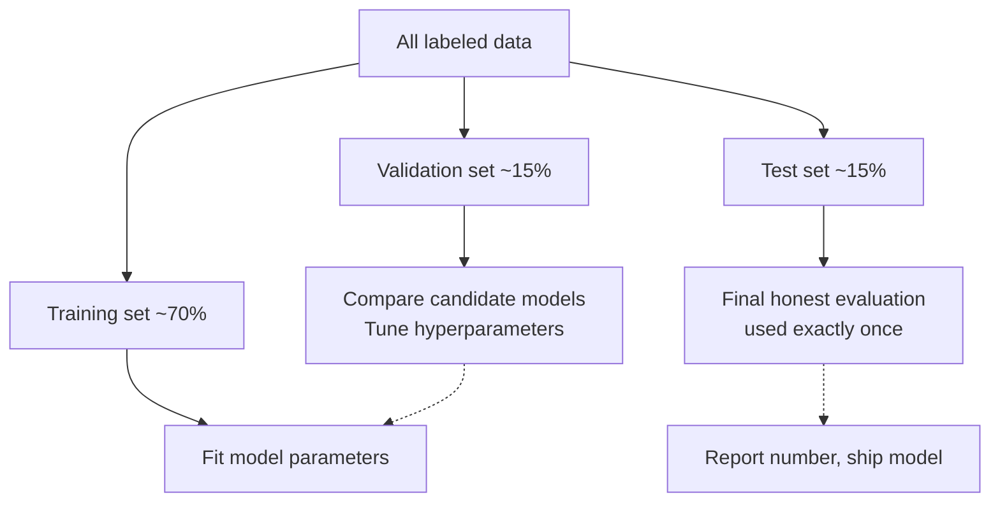
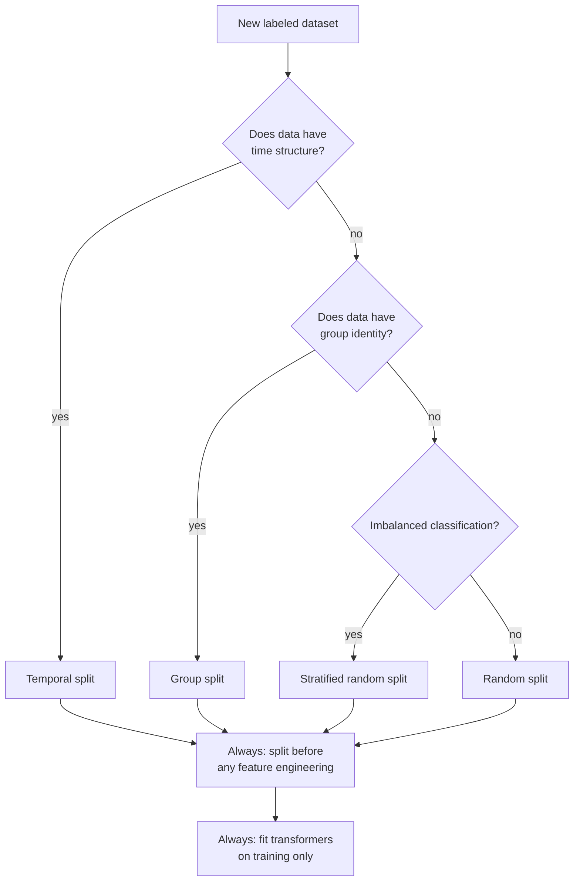

# Chapter 21 — Train / Validation / Test Splits: What Each Is For

> **Goal of this chapter:** to formalize the discipline of holding out data, which was previewed in Chapter 3 and assumed throughout Chapters 18-20. We will be precise about what each of the three subsets is for, why two splits aren't enough, why the test set must never be touched until the end, the conventional sizes, and — the part that bites teams in production — how to do the split correctly when your data has time structure, group structure, or feature-engineering steps that secretly leak information across the split.
>
> This chapter is short on math and long on engineering discipline. It is also one of the highest-leverage chapters in the book. The single most common reason real ML projects fail in production — not "fail to train", but "trained, deployed, then surprised everyone by underperforming" — is a split done wrong somewhere in the pipeline. We're going to make that mistake hard to commit by the time you finish.

---

## 21.1 The problem this chapter solves

You have 100,000 labeled examples and a learning algorithm. The algorithm will produce a model. Two questions remain:

1. **How well will this model perform on data it hasn't seen?** Customers want a number. The product team wants a number. You want a number. Whose number is honest?
2. **Among the many candidate models I could train — different hyperparameters, different model classes, different feature sets — which one should I ship?**

The naive answer to both: "evaluate on the training data." We saw in Chapter 18 why this is hopeless. A high-capacity model can drive training error to zero and still be useless. Training accuracy is a measurement of *memorization*, not generalization.

The fix is to hold data out. But *which* data, for *what purpose*, and *how often* you're allowed to look at it — those are the questions of this chapter.

---

## 21.2 The three roles, fixed once

We will use three disjoint subsets of the original labeled data:

**Training set.** The data the model *sees during training*. Parameters (weights, biases, tree splits) are fit on this set, and *only* on this set. Training loss is computed on this set. The optimizer (gradient descent, closed-form, greedy splitting) consumes this set to produce a fitted model.

**Validation set.** Data the model *does not see during training*. We use it for **model selection** — choosing among candidate models. That includes hyperparameter tuning ($\lambda$ from Chapter 20, learning rate from Chapter 17, max depth from Chapter 33), choosing the model class (linear vs. tree vs. ensemble), choosing the feature engineering pipeline, and any other decision where we need to compare two trained models. We evaluate each candidate on the validation set; we pick the best.

**Test set.** Data we use *exactly once*, at the very end, after every decision has been made, to produce a single number that *honestly* estimates production performance. We do not use it to choose anything. We do not retrain after looking at it. We look at it once, write down the number, and move on.

Some people use the term "development set" instead of "validation set" — same thing. Some use "holdout set" to mean validation. Some use "test set" for what we're calling validation. The terminology is, frankly, a mess in the literature. The *three roles* are what's stable; just be careful about which role someone's "test set" actually fills in any given paper or codebase.



---

## 21.3 Why we need three sets, not two

The strong instinct of someone new to ML is: "Just train and test. The training set fits the model. The test set evaluates it. Two splits, done."

Here's why two splits aren't enough.

Suppose you split into train (80%) and test (20%). You fit a model with $\lambda = 0.1$. Test accuracy is 87%. You try $\lambda = 1.0$. Test accuracy is 89%. You try $\lambda = 10$. Test accuracy is 86%. You decide to ship $\lambda = 1.0$. The number you report is 89%.

What just happened? You used the test set to *choose* among hyperparameters. The number 89% is the test accuracy of *the chosen model*. But there's a subtle, important inflation here: you picked the best of three candidates as measured on this specific test set. Picking the best of $k$ noisy estimates produces an upward bias — even if all three candidates were equally good in truth, the best-on-this-test-set number is, in expectation, higher than the true generalization performance.

For $k = 3$ that effect is small. But practitioners don't try 3 things — they try 30, or 300. They tune learning rate, regularization, depth, feature subset, train/test ratio, random seed. After 100 candidate evaluations against the same test set, the "best test accuracy" reading is far above true generalization. You've effectively *trained on the test set* via a thousand small biased decisions, and the number you'll report is a fiction.

The fix is the validation set. *That's* the set you tune against. The test set sits sealed in an envelope until the very end. You touch the test set *once*, on the *final chosen model*, and you ship whatever number it produces.

This discipline is harder than it sounds. There's a constant temptation to "just check the test set quickly to see." Don't. Or, if you must look at the test set once mid-project to diagnose something specific, treat that look as if you've spent your single shot — every subsequent evaluation is biased.

### 21.3.1 The math underneath the bias

A concrete sketch of why "best of k on the test set" inflates. Suppose you have $k$ candidate models, each with true generalization accuracy $p$. Each model's test accuracy is an estimate $\hat{p}_i$ with variance $\sigma^2 = p(1-p)/n_{\text{test}}$. By the variance of the maximum of $k$ noisy estimates, $\mathbb{E}[\max_i \hat{p}_i] > p$ when $k > 1$. The bias grows with both $k$ (more candidates, more "lucky" winner) and $\sigma$ (smaller test set, noisier estimate). For $k = 100$ candidates and a test set of $1000$ examples with $p = 0.9$, the expected inflation can be a couple of percentage points — easily enough to mistake an honest 90% for a "great" 92%.

The validation set absorbs this. We do the model selection on the validation set, where any inflation is *fine* — we don't *report* the validation accuracy as our final number. The test set's single touch is unbiased.

---

## 21.4 Conventional split sizes

The classical split is 60/20/20. Other conventions you'll see:

- **70/15/15** — common when data is moderate.
- **80/10/10** — when you have a lot of data and want as much as possible for training.
- **90/5/5** — when you have an enormous amount of data and even 5% gives a large, reliable holdout.
- **50/25/25** — when data is small and you need bigger validation/test sets for statistical reliability.

What actually matters isn't the *ratio* but the *absolute size* of the holdout sets. A test set needs to be large enough to give a low-variance estimate of the metric you care about. Rule of thumb:

- For accuracy / error rate: 1,000+ test examples give estimates with ~1% standard error.
- For AUC, F1: similar; sometimes you want a few thousand.
- For rare-class metrics: you need 100+ examples *in the rare class*. If positives are 1% of your data, you need 10,000+ test examples to have 100 positives.

With 10 million labeled examples, a 90/5/5 split gives you 500,000 each for validation and test — plenty. With 5,000 labeled examples, a 60/20/20 split gives you 1,000 each — borderline; consider cross-validation (Ch 22) instead of a fixed split.

A useful heuristic: *if your test set is below 1,000 examples, switch to k-fold CV.* The single-split test estimate is too noisy at that size.

### 21.4.1 The data-richness inversion

For decades, the conventional wisdom was 70/15/15 or 60/20/20. With the rise of very large datasets (millions to billions of examples), that conventional wisdom has inverted. When you have 10⁹ labeled examples, devoting 15% to validation and 15% to test is wasteful — you could afford to leave 99% for training and still have 10⁷ examples in test and validation. So splits like 98/1/1 are normal in modern deep learning.

The rule: the absolute size of the holdouts is what determines statistical reliability. Once they're big enough, additional held-out examples have diminishing returns; the marginal example is more useful in training.

---

## 21.5 Random splitting — the default

The simplest split: randomly shuffle the labeled data, then carve off the three sections. In code:

```python
import numpy as np
from sklearn.model_selection import train_test_split

rng = np.random.default_rng(0)
n = len(X)
indices = rng.permutation(n)

# 70 / 15 / 15
n_train = int(0.70 * n)
n_val   = int(0.15 * n)

train_idx = indices[:n_train]
val_idx   = indices[n_train:n_train + n_val]
test_idx  = indices[n_train + n_val:]

X_train, X_val, X_test = X[train_idx], X[val_idx], X[test_idx]
y_train, y_val, y_test = y[train_idx], y[val_idx], y[test_idx]
```

Or with scikit-learn's `train_test_split`, applied twice:

```python
X_temp, X_test, y_temp, y_test = train_test_split(
    X, y, test_size=0.15, random_state=0
)
X_train, X_val, y_train, y_val = train_test_split(
    X_temp, y_temp, test_size=0.15 / 0.85,  # to get 15% of original
    random_state=0
)
```

Random splitting is the default for IID data where order doesn't matter. *It is wrong* in three situations we now examine in turn.

---

## 21.6 Stratified splitting — for imbalanced classification

If your problem is binary classification with 5% positives (a common imbalance ratio in fraud detection, medical diagnosis, etc.), a naive random split can produce splits where one class is over- or under-represented by chance. With 1000 test examples and 5% positives, you'd expect 50 positives — but a random split could yield 35 or 65 by chance, distorting all your metrics.

**Stratified sampling** fixes this. Sample separately from each class, preserving the global class proportions exactly across all three sets.

In scikit-learn:

```python
from sklearn.model_selection import train_test_split

X_train, X_temp, y_train, y_temp = train_test_split(
    X, y, test_size=0.30, random_state=0, stratify=y
)
X_val, X_test, y_val, y_test = train_test_split(
    X_temp, y_temp, test_size=0.50, random_state=0, stratify=y_temp
)
```

The `stratify=y` argument tells the splitter to balance class proportions across the two output splits. With three splits you call it twice.

**Should you always stratify?** For binary or multiclass classification with any imbalance — yes. For regression, the analog is binning the target into a few buckets and stratifying on the bins, but this is rarely done; for regression with reasonably uniform targets, random splitting is fine.

For multi-label problems (one example can have multiple labels), stratification is mathematically harder — there's no clean way to preserve all label proportions simultaneously. Specialized algorithms exist; in scikit-learn, look at `IterativeStratification` from `scikit-multilearn`.

---

## 21.7 Temporal splitting — for time-structured data

For data with time structure — predicting tomorrow's electricity demand from historical demand, classifying transactions across months, recommending products to users over time — *do not split randomly*. Doing so causes a leak: the model trains on examples from the *future* (relative to test examples) and sees a more recent state of the world than it would in production.

The right split is **temporal** (also called "time-based"): split by time. All training examples are from before time $t_1$. Validation examples are from $[t_1, t_2)$. Test examples are from $[t_2, t_3)$.

```
   time →
   ┌───────────────┐┌───────┐┌───────┐
   │ training data ││ valid. ││ test  │
   └───────────────┘└───────┘└───────┘
       t_0 ... t_1    t_1...t_2   t_2...t_3
```

This simulates production: at any time, the model has only past data to train on and is evaluated on future data. The numbers it produces are honest estimates of what production performance will look like.

Why is this so important? Because *the world drifts*. Customer behavior in 2023 is not the same as customer behavior in 2026. Fraud patterns evolve. Email content evolves. If you randomly split a 5-year dataset, you'll have some 2026 examples in training and some 2023 examples in test — your model has seen the future. The test score is artificially inflated.

We saw this concretely in Chapter 3's spam example. The honest thing in production is a time-based split: train on January-April, validate on May, test on June. Anything else lies.

### 21.7.1 The leakage is worse than it looks

A subtle point: random splitting of time-series data doesn't just inflate the test number; it produces models that are *fundamentally wrong*. The model learns from "later" examples (containing features that depend on "earlier" examples — e.g., user's last-week purchase count). In production, when scoring a new example, the future hasn't happened yet, so those features are computed using only past data. The model has *seen a different feature distribution at training time than it will see at scoring time*. Even if generalization were perfect, the model trained on randomly-split data would underperform because the feature distribution shifted.

This is one of the most common production failures: "the model worked beautifully in the notebook and tanked in production." Half the time, the problem is a random-split-on-time-series error somewhere in the pipeline.

### 21.7.2 Walk-forward variants

For time-series, the time-based split has variants you'll see in practice:

- **Single split:** as above. Train on a fixed past window, validate on the next chunk, test on the chunk after.
- **Walk-forward:** simulate production retraining. Train on $[t_0, t_1]$, evaluate on $[t_1, t_2]$. Then retrain on $[t_0, t_2]$, evaluate on $[t_2, t_3]$. Etc. The "test" performance is averaged over multiple non-overlapping forward windows. More expensive; more honest.

Walk-forward is the default for *evaluating an entire ML pipeline that will retrain in production*. Chapter 22 returns to this under "time-series cross-validation."

---

## 21.8 Group splitting — when records have shared identity

If your dataset has *groups* — multiple records per patient, per customer, per document, per session — putting different records from the *same* group on different sides of the split causes leakage.

Example: a hospital-readmission model. Each row is "patient visit." A single patient may have 10 visits in the dataset. If you randomly split rows, some of patient X's visits will be in training and some in test. The model can learn patient X's idiosyncrasies (their typical lab values, demographics, comorbidities) from the training visits and then "predict" their test visits using that memorized info. Test performance is inflated. In production, when a *new* patient arrives, the model has no such memorized history and performs much worse.

The fix is **group splitting**: identify the grouping variable (patient ID, customer ID, document ID, session ID), and split *by group*. All visits for patient X go to the same set (train, val, or test). The model is forced to learn patterns that generalize across patients, not memorize specific patients.

In scikit-learn:

```python
from sklearn.model_selection import GroupShuffleSplit

splitter = GroupShuffleSplit(test_size=0.15, random_state=0)
# Assume `patient_id` is an array of group identifiers.
train_idx, test_idx = next(splitter.split(X, y, groups=patient_id))
```

For tabular ML in healthcare, finance, e-commerce, education — almost any domain with repeat actors — group splitting is the default. The first question to ask when receiving a labeled dataset is "what are the natural groups, and what would group-leakage look like?"

---

## 21.9 The leakage trap: feature engineering before splitting

Here is a subtle, common, and devastating mistake.

You have a dataset. You normalize the features by subtracting the mean and dividing by the standard deviation:

```python
# DO NOT DO THIS
X_normalized = (X - X.mean(axis=0)) / X.std(axis=0)
X_train, X_test = split(X_normalized, ...)
```

The bug: the mean and standard deviation were computed *over the whole dataset, including the test examples*. The training feature values now depend on the test values. When you evaluate, the model has, in a tiny but real way, seen the test set during training — via the summary statistics that shaped its inputs.

The same bug happens with:

- One-hot encoding when the vocabulary is computed over the whole dataset.
- TF-IDF where the IDF weights are computed over the whole corpus.
- Target encoding where the per-category target mean is computed over the whole dataset.
- Any imputation where missing values are filled with statistics over the whole dataset.
- Outlier detection where thresholds are computed over the whole dataset.

The fix: **split first, fit transformers on training data only, apply to validation and test.**

```python
# DO THIS
X_train, X_temp = train_test_split(X, ...)
X_val, X_test  = train_test_split(X_temp, ...)

# Fit the scaler on training data only.
scaler = StandardScaler()
X_train_scaled = scaler.fit_transform(X_train)
# Apply (not fit) to val and test.
X_val_scaled   = scaler.transform(X_val)
X_test_scaled  = scaler.transform(X_test)
```

The same pattern applies to *every* preprocessing step. If your pipeline computes any statistic over the data, that statistic must be computed *only on the training set*, and then the resulting transformer applied to validation and test.

scikit-learn's `Pipeline` and Spark ML's `Pipeline` exist partly to make this discipline easy: a pipeline encapsulates all the transformers + the model, and when you call `.fit(X_train, y_train)`, the transformers fit on training data only. Validation and test data flow through with `.transform()` and `.predict()`, never `.fit_transform()`.

### 21.9.1 The bug in a worked example

Let me show the leakage effect concretely. 

Suppose we have a regression problem. Features are random; target is a linear function of features plus noise. Train two models:

1. Normalize over the entire dataset, then split.
2. Split, then normalize on training only and apply to test.

```python
import numpy as np
from sklearn.linear_model import Ridge
from sklearn.metrics import mean_squared_error
from sklearn.model_selection import train_test_split
from sklearn.preprocessing import StandardScaler

rng = np.random.default_rng(0)
n, d = 1000, 50
X = rng.normal(size=(n, d))
y = X @ rng.normal(size=d) + rng.normal(scale=0.5, size=n)

# WRONG: normalize then split
X_normalized_wrong = StandardScaler().fit_transform(X)
Xtr_w, Xte_w, ytr_w, yte_w = train_test_split(
    X_normalized_wrong, y, test_size=0.20, random_state=0
)
model = Ridge(alpha=1.0).fit(Xtr_w, ytr_w)
print(f"Wrong (leaked): test MSE = {mean_squared_error(yte_w, model.predict(Xte_w)):.4f}")

# RIGHT: split then normalize on train only
Xtr, Xte, ytr, yte = train_test_split(X, y, test_size=0.20, random_state=0)
scaler = StandardScaler().fit(Xtr)
Xtr_s, Xte_s = scaler.transform(Xtr), scaler.transform(Xte)
model = Ridge(alpha=1.0).fit(Xtr_s, ytr)
print(f"Right: test MSE = {mean_squared_error(yte, model.predict(Xte_s)):.4f}")
```

For this benign synthetic example, the leaked version gives a *very* small over-estimate of how good the model is — typically a few percent improvement that isn't real. For more aggressive transformers (target encoding, log transforms with shifts, etc.) the inflation can be much larger.

The actual problem isn't that the leaked test number is a *tiny bit* off. It's that *you have no idea how off it is, and you've cultivated a habit that will quietly distort every project you do.* The discipline is to make split-first-then-transform an unbreakable reflex.

---

## 21.10 Engineering practice — what good looks like

A few habits a senior ML engineer follows by reflex:

**Split your data at the very first opportunity, before any analysis.** As soon as you receive a labeled dataset, do the split. Save the test set indices in a place you'll never accidentally re-shuffle. Don't even look at it.

**Use `Pipeline`.** Wrap all preprocessing + the model in one Pipeline object. This makes the train-only-fit discipline automatic — `.fit(X_train)` fits everything on training data; `.predict(X_test)` applies everything.

**Log a hash of the test set.** When you fix the test set, log a hash of its indices in your experiment tracker (MLflow does this trivially). If anyone — including future-you — accidentally shuffles, the hash changes and you'll notice.

**Limit test-set evaluations.** Treat the test set as a regulated resource. Some teams track in their notebooks how many times they've evaluated on test; some refuse to evaluate more than 3-5 times across the entire project. This sounds extreme; it's actually wise.

**Re-split when the data changes.** If you collect another month of data, you're not splitting fresh — you're appending to existing splits (training keeps growing; test grows for the next eval round). Don't randomly resplit, that destroys all your prior baselines.

**Document the split logic.** In your repo, in your project README, in your model card: *exactly how* the split was done. "Stratified by class; grouped by patient_id; temporal cutoff at 2025-01-01." This is the first thing a reviewer (or future-you) needs to know to interpret any number you report.

---

## 21.11 A unified mental model

To consolidate, here is the decision tree for splitting:



The four split strategies — random, stratified, group, temporal — cover essentially all cases. Sometimes they combine: a healthcare time-series problem with imbalanced labels and patient groups needs *all three* (time-based split + group-based split + stratification within groups). This is annoying to implement but worth doing correctly. The cost of getting it wrong is a model that fails silently in production.

---

## 21.12 What about cross-validation?

This chapter set up a single split (train/val/test). Chapter 22 will introduce **cross-validation** — using *multiple* splits to get a more stable estimate of generalization. The two are not opposites; they coexist:

- For *model selection*, CV is preferred over a single train/val split when data is limited.
- For the *final honest estimate*, you still want a held-out test set that was not used in CV.

A common composite recipe: nested CV (outer loop for honest estimation, inner loop for hyperparameter selection). We'll formalize this in Chapter 22.

For the Databricks ML Associate exam, you should be comfortable with both the single-split discipline (this chapter) and the CV procedure (next chapter), and understand when each is appropriate.

---

## 21.13 Summary

The chapter in one set of bullets *(that we are using only this once, here, as a checklist, because the role-by-role lookup is what people actually want from this material; the rest of the chapter resists bullet-cheat-sheets)*:

1. **Three sets, three roles.** Training fits parameters; validation tunes choices; test gives the honest final number.
2. **Two sets aren't enough.** Tuning against test inflates the reported number.
3. **Sizes:** 70/15/15 is conventional; with lots of data, 98/1/1 is fine. Absolute size matters more than ratio.
4. **Random splitting** is the default for IID tabular data.
5. **Stratified splitting** preserves class proportions; use for imbalanced classification.
6. **Temporal splitting** required for time-structured data; never randomly split time series.
7. **Group splitting** required when groups (patient, customer, document) have multiple records.
8. **Feature engineering must happen *after* splitting.** Fit transformers on training only; apply to val/test.
9. **The test set is touched once.** No exceptions.
10. **`Pipeline`** is the structural defense against accidental leakage.

The discipline is mostly engineering, not math. Internalize it. The exam questions on this chapter are often less about formulas and more about "spot the leakage in this code."

---

## 21.14 What this builds on / where this returns

**Builds on:**
- Chapter 16 (the ERM framework: train loss is what we minimize, but true loss is what we want).
- Chapter 18 (overfitting: the U-curve and the need for honest evaluation).
- Chapter 19 (bias-variance: the variance of the trained model is exactly what holdout estimates).

**Returns:**
- *Chapter 22* (cross-validation) generalizes single splits to k-fold averages and adds nested CV.
- *Chapter 28* (TF-IDF feature engineering): the IDF must be fit on train only.
- *Chapters 23-30* (feature engineering): every transformer in Part E lives by the "fit on train, transform val/test" discipline.
- *Chapter 62* (Spark ML `Pipeline`) is the Databricks-native incarnation of the same discipline.
- *Chapter 65* (`CrossValidator`): the same split discipline at scale.
- *Part L* (MLflow): tracking test-set evaluations and split provenance.

---

## 21.15 Exercises

1. **Three roles.** In your own words, state the purpose of training, validation, and test sets. What goes wrong if you skip the validation set?

2. **The single-split mistake.** A team reports 92% accuracy on the test set after trying 50 different hyperparameter combinations. Why is this number likely an over-estimate? About how big might the bias be?

3. **Size matters.** Given a dataset of 5,000 examples with 200 positive cases (binary classification, very imbalanced), suggest a split ratio and justify.

4. **Pick the split strategy.** For each scenario, recommend a split type (random, stratified, group, temporal — or combinations):
   - Predicting house prices from 100,000 sales over 10 years.
   - Classifying images of cats vs. dogs from a balanced dataset.
   - Predicting credit-card default; data spans 5 years; multiple cards per customer.
   - Identifying spam emails; data is a static snapshot from one month.
   - Predicting hospital readmission; one row per visit, multiple visits per patient, data spans 3 years.

5. **The leakage demo.** Why does normalizing before splitting cause leakage? Be specific about which information from the test set "leaks" into the model.

6. **The Pipeline defense.** How does using a scikit-learn or Spark Pipeline prevent the leakage in question 5?

7. **The wedding photographer split.** Refer to Chapter 3's spam example. Suppose you split randomly even though emails arrive over time. What might go wrong in production?

8. **Test set sanctity.** What happens, in practice, if you "just take a quick look" at the test set during development? Be specific about the bias mechanism.

9. **Hash discipline.** Why might it be useful to log a hash of the test set indices in your MLflow experiment?

10. **A subtle group leak.** A model trained on stock-trading data has different rows for different trades by different traders. The model uses features like "trader's recent average return." If you randomly split rows, what's the leakage? How do you fix?

11. **Stratification for regression.** Strict stratification by target value doesn't make sense for continuous targets. Describe an approximate way to stratify a regression split if you wanted the target distribution preserved across train/val/test.

12. **Composite splits.** Sketch the logic for a split that is simultaneously temporal (by transaction date), group-based (by customer), and stratified (by fraud label). What do you do when a single customer's transactions span both pre- and post-cutoff dates?

<details>
<summary>Answers</summary>

1. Training fits parameters. Validation tunes hyperparameters and selects models. Test gives a one-time honest estimate of generalization. Without a validation set, you'd be forced to tune against the test set, and every choice biases the test score upward — your "honest estimate" becomes optimistic by an unknown amount.

2. Each hyperparameter trial gave a test score; picking the best inflates the expected reported value. With $k = 50$ candidates and a moderate test set, the inflation is typically 1-3 percentage points. The 92% likely overstates true generalization to 89-91%.

3. The data is small and imbalanced. Suggest 60/20/20 stratified. With 200 positives, 20% test = 40 positives, marginal for stable rare-class metrics — consider k-fold CV (Ch 22) on top of a single test holdout. Always stratify by label.

4. (a) Temporal (predict future sales from past). (b) Stratified random (if balanced you could even just random, but stratified is safer). (c) Temporal + group by customer + stratified by default. (d) Stratified random (one month, static — IID enough). (e) Temporal + group by patient + stratified by readmit label.

5. The mean and standard deviation used for normalization are computed using both train and test rows. Test-row values directly influence the training features (because both are normalized using the test-inclusive stats). The model has, in a small way, seen the test data via this back-channel. Test performance estimate is inflated.

6. The Pipeline only calls `.fit_transform()` on the training data when you call `.fit(X_train, y_train)`. When you later call `.predict(X_test)`, every transformer in the pipeline uses `.transform()` — applying the *already-fit* parameters. The test data never participates in any transformer's fitting.

7. Emails drift over time — new spam patterns, new legitimate senders, language evolves. A random split means training contains some recent emails and test contains some old ones — the model has effectively "seen the future." Production performance, where the model truly must predict on never-before-seen recent data, will be substantially worse than the inflated test estimate.

8. Each "quick look" is a noisy estimate. If you adjust *anything* in response to what you saw — a feature, a hyperparameter, even an intuition about which model class to try next — you've leaked test information into the training process. The bias mechanism is subtle: you'll preferentially keep changes that "happened" to look good on the test. The bias is small per peek and large over many peeks.

9. If the test set is accidentally re-shuffled, re-split, or augmented, the hash will change and you'll notice — instead of silently retraining against a different test set and reporting incomparable numbers across runs. The hash makes the discipline machine-checkable.

10. Random splitting puts some of trader X's trades in train and some in test. The model can learn trader X's idiosyncratic patterns from training trades and "predict" their test trades unrealistically well. Fix: group split by trader. All trades for one trader go to one of train/val/test.

11. Bin the target into a small number of quantiles (e.g., 10 deciles), then stratify on the bin label. This approximately preserves the target distribution across splits.

12. The hard case is exactly when a customer's transactions straddle the temporal cutoff. Two reasonable options: (a) Put the *entire customer* on one side based on their first transaction date or median date — preserves group integrity at the cost of fuzzier temporal boundary. (b) Allow the cutoff to split a customer's transactions — preserves temporal integrity at the cost of group leakage. Pick based on which leakage is more harmful: usually group leakage is worse than minor temporal blurring, so option (a) is the default.

</details>
