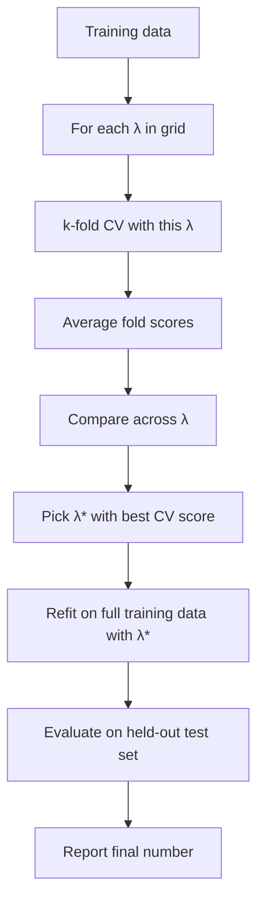

# Chapter 22 — Cross-Validation Theory

> **Goal of this chapter:** to formalize **cross-validation**, the procedure that lets us estimate generalization performance more reliably than a single train/validation split allows, *and* uses the same data for both fitting and evaluation without committing the data-leakage sins of Chapter 21. We'll derive why k-fold averaging reduces estimator variance, see why k=5 or k=10 are the universal defaults, study the stratified, time-series, and group-based variants needed in non-IID settings, and lay out **nested cross-validation** — the discipline you need when both choosing a model and honestly estimating its performance from limited data.
>
> By the end you should be able to (a) draw the k-fold diagram from memory, (b) compute by hand which rows are in which fold for a small dataset, (c) explain why CV is a *less biased but more variance-uncertain* estimator of generalization, and (d) recognize when nested CV is required vs. when a simpler scheme suffices. Cross-validation is the connective tissue between Chapter 21's split discipline and Part I's hyperparameter optimization — get the theory right here and the practical machinery in Spark ML (Ch 65) is trivial.

---

## 22.1 The problem with a single validation split

Chapter 21 gave you the three-set discipline: training fits parameters, validation tunes hyperparameters, test gives an honest one-shot estimate. Now consider the validation set's role specifically. You're using it to compute a number — say, validation accuracy — for each candidate model. You pick the model with the highest validation accuracy.

There's a hidden problem: the validation accuracy you computed is *one* estimate of generalization. It has variance. If you'd held out a *different* 15% of the data as validation, you'd get a slightly different validation accuracy for each candidate — and possibly a different winner.

Concretely: model A scores 0.87 on the validation set you happened to pick. Model B scores 0.86. You pick A. But if a different validation set had been chosen by the random shuffle, maybe A scores 0.85 and B scores 0.87. The "best model" depends on the random seed of your split.

For *small* datasets — where the validation set is small in absolute terms — this variance is large. With 200 validation examples and an accuracy of 0.87, the standard error of the accuracy estimate is $\sqrt{0.87 \cdot 0.13 / 200} \approx 0.024$ — almost 2.5 percentage points. A 1-point gap between two models is well within the noise. You're making decisions on noisy data.

Cross-validation's response: *don't use a single validation set. Use many, and average.*

---

## 22.2 k-Fold cross-validation — the construction

The construction is elegant. You decide on a value of $k$ — typically 5 or 10. Then:

1. Shuffle the data (once).
2. Split it into $k$ disjoint chunks of roughly equal size, called **folds**.
3. For $i = 1, 2, \ldots, k$:
   - **Train** the model on the union of all folds *except* fold $i$.
   - **Evaluate** the model on fold $i$.
   - Record the evaluation metric (e.g., accuracy, MSE) for this fold.
4. Average the $k$ recorded metrics. That average is the **cross-validated estimate** of generalization.

Diagrammatically, for $k = 5$:

```
   data → shuffle → 5 folds:

   fold 1   fold 2   fold 3   fold 4   fold 5
   ┌─────┐ ┌─────┐ ┌─────┐ ┌─────┐ ┌─────┐
   │ 20% │ │ 20% │ │ 20% │ │ 20% │ │ 20% │
   └─────┘ └─────┘ └─────┘ └─────┘ └─────┘

   iter 1: train on 2-5, eval on 1   →  acc_1
   iter 2: train on 1,3-5, eval on 2 →  acc_2
   iter 3: train on 1,2,4-5, eval on 3 → acc_3
   iter 4: train on 1-3,5, eval on 4   →  acc_4
   iter 5: train on 1-4, eval on 5    →  acc_5

   CV accuracy = mean(acc_1, acc_2, acc_3, acc_4, acc_5)
```

Crucially: each iteration trains a *fresh* model from scratch on its own training data. You're not refining a single model across iterations — you're training $k$ separate models and averaging their out-of-sample performance.

The model you eventually ship is *not* one of these $k$ fold-models — it's a final model trained on *all* the data (or all the non-test data, if you have a separate held-out test set) using the hyperparameters that the CV procedure said were best. The $k$ fold-models exist only to produce the CV estimate; they're discarded.

### 22.2.1 A worked manual example

Suppose we have 10 training examples, ordered by their row index 1-10. We do 5-fold CV (so 2 examples per fold).

After a random shuffle, the assignment to folds might be:

| Row index | Fold |
|---:|:---:|
| 1 | 3 |
| 2 | 1 |
| 3 | 2 |
| 4 | 5 |
| 5 | 4 |
| 6 | 1 |
| 7 | 3 |
| 8 | 4 |
| 9 | 2 |
| 10 | 5 |

So:

- Fold 1 = {row 2, row 6}
- Fold 2 = {row 3, row 9}
- Fold 3 = {row 1, row 7}
- Fold 4 = {row 5, row 8}
- Fold 5 = {row 4, row 10}

Five iterations:

| Iter | Train on rows | Evaluate on rows |
|:---:|:---|:---|
| 1 | 1, 3, 4, 5, 7, 8, 9, 10 | 2, 6 |
| 2 | 1, 2, 4, 5, 6, 7, 8, 10 | 3, 9 |
| 3 | 2, 3, 4, 5, 6, 8, 9, 10 | 1, 7 |
| 4 | 1, 2, 3, 4, 6, 7, 9, 10 | 5, 8 |
| 5 | 1, 2, 3, 5, 6, 7, 8, 9 | 4, 10 |

Every row appears in *exactly one* evaluation fold and in *exactly $k - 1$ training folds*. So the CV procedure produces an out-of-sample prediction for *every* row — at the cost of training $k$ models instead of one.

For real-world use, scikit-learn's `KFold(n_splits=5, shuffle=True, random_state=0).split(X)` is the standard way to generate these indices.

---

## 22.3 Why averaging reduces variance — the theory

Why is the average of $k$ noisy estimates more reliable than any single one? This is the classical variance-of-the-mean result from Chapter 9.

Let $\hat{m}_i$ be the metric (e.g., accuracy) on the $i$-th fold. Each $\hat{m}_i$ is a noisy estimator of the true generalization performance $m^*$, with some bias $\beta$ and variance $\sigma^2$:

$$
\mathbb{E}[\hat{m}_i] = m^* + \beta, \qquad \text{Var}(\hat{m}_i) = \sigma^2
$$

The CV estimator is the average:

$$
\hat{m}_{\text{CV}} = \frac{1}{k}\sum_{i=1}^k \hat{m}_i
$$

If the $k$ estimators were independent, the variance would be:

$$
\text{Var}(\hat{m}_{\text{CV}}) = \frac{\sigma^2}{k}
$$

So the standard error shrinks by $\sqrt{k}$. With $k = 10$, the CV estimate has $\sim 3\times$ smaller standard error than a single split.

But the $\hat{m}_i$ are *not* independent — they share most of their training data (each pair of folds has $(k-2)/k$ training data in common). The actual variance is:

$$
\text{Var}(\hat{m}_{\text{CV}}) = \frac{\sigma^2}{k} + \frac{k-1}{k} \cdot \text{Cov}(\hat{m}_i, \hat{m}_j)
$$

The covariance is generally positive (the fold-models are similar, their errors are correlated), so the actual variance reduction is less than $1/k$. But it's still substantial — empirically, CV produces estimates with maybe $1.5-3\times$ smaller variance than a single split (the exact ratio depends on the problem and $k$).

The point: averaging *helps*, even though it's not as good as if the folds were truly independent.

### 22.3.1 The bias-variance tradeoff *of the CV estimator*

CV itself has a bias-variance tradeoff — separate from the bias-variance of the *model* it's evaluating.

**Bias of the CV estimator.** Each fold-model is trained on $n(k-1)/k$ examples — fewer than the full $n$. A model trained on less data is generally *worse* than a model trained on more data. So $\mathbb{E}[\hat{m}_i]$ is *slightly worse* than the true $m^*$ for a model trained on all $n$ examples. CV's estimate is pessimistic.

- Small $k$ (say, $k=2$): each fold-model is trained on $n/2$. Big shortfall from $n$. Pessimistic bias is large.
- Large $k$ (say, $k=n$): each fold-model is trained on $n-1$, essentially the full data. Bias is small.

**Variance of the CV estimator.**

- Small $k$: each fold has $n/k$ evaluation examples, so each $\hat{m}_i$ has small individual variance, but you only have $k$ samples to average. Net variance moderate.
- Large $k$ (say, $k=n$, leave-one-out): each fold has *one* evaluation example, so each $\hat{m}_i$ has huge individual variance. You're averaging $n$ such estimates. The fold-models are nearly identical (they share $n-1$ examples each), so their errors are heavily correlated. Net variance can actually be *large* — LOO-CV is famous for having unstable variance.

Net: $k = 5$ and $k = 10$ are sweet spots. Conventional wisdom is:

- **$k = 5$** when training is expensive (only 5 model trainings).
- **$k = 10$** when training is fast and you want a smaller bias.
- **$k = n$ (LOO)** rarely; only when $n$ is very small (say, $n < 30$) and you really need every training point you can get.

The "5 or 10" recommendation has held up empirically for decades.

---

## 22.4 Stratified k-fold — for imbalanced classification

The same imbalance issue from Chapter 21 returns in CV. If you have 5% positives and you randomly assign rows to folds, some folds will have 3% positives and others 7% by chance. Each fold-model evaluates on a biased sample of the rare class.

**Stratified k-fold** fixes this: assign rows to folds *within each class*, preserving the global class proportion in every fold. If the global rate is 5%, then every fold has exactly (or as close as integer division allows) 5% positives.

In scikit-learn:

```python
from sklearn.model_selection import StratifiedKFold

skf = StratifiedKFold(n_splits=5, shuffle=True, random_state=0)
for train_idx, test_idx in skf.split(X, y):
    # train on X[train_idx], y[train_idx]
    # evaluate on X[test_idx], y[test_idx]
    ...
```

For any binary or multiclass classification problem, stratified k-fold should be the default. It's a one-line code change that produces more stable, less biased CV estimates.

In Spark ML, the `CrossValidator` is automatically stratified for classification estimators where it makes sense.

---

## 22.5 Time-series cross-validation — the walk-forward family

Random k-fold is wrong for time-series data, for the same reason random splitting was wrong in Chapter 21: the model "trains on the future." Each fold-iteration in random k-fold trains on a mix of past and future examples and evaluates on a remainder — *not* what production looks like.

The correct schemes are **walk-forward** variants:

**Expanding-window walk-forward.** Train on the earliest $n_0$ examples; evaluate on the next chunk. Then train on the earliest $n_0 + \Delta$ examples; evaluate on the next chunk. Etc. The training window *grows* over time. This simulates production: at each prediction time, the model has been retrained on all data up to that time.

```
    time →
    ┌─────────────┐  ┌─────┐
    │  train      │  │ eval│
    └─────────────┘  └─────┘
    ┌──────────────────┐  ┌─────┐
    │  train (larger)  │  │ eval│
    └──────────────────┘  └─────┘
    ┌─────────────────────────┐  ┌─────┐
    │  train (largest)        │  │ eval│
    └─────────────────────────┘  └─────┘
```

**Rolling-window walk-forward.** Train on a *fixed-size* window that slides forward. This simulates production with a fixed retraining horizon — useful when distant past is no longer relevant.

```
   ┌────────────┐  ┌─────┐
   │   train    │  │ eval│
   └────────────┘  └─────┘
        ┌────────────┐  ┌─────┐
        │   train    │  │ eval│
        └────────────┘  └─────┘
            ┌────────────┐  ┌─────┐
            │   train    │  │ eval│
            └────────────┘  └─────┘
```

scikit-learn's `TimeSeriesSplit` implements expanding-window walk-forward:

```python
from sklearn.model_selection import TimeSeriesSplit

tscv = TimeSeriesSplit(n_splits=5)
for train_idx, test_idx in tscv.split(X):
    # train and evaluate
    ...
```

By default, `TimeSeriesSplit(n_splits=5)` produces 5 successive train/test pairs where each train block ends where the previous evaluation block began. The training data only ever uses examples before the evaluation window.

**Crucial:** the data must be sorted by time *before* calling `TimeSeriesSplit`. If your data is in random order, the splits are nonsense.

---

## 22.6 Group k-fold — for grouped data

Chapter 21's group-splitting story extends to CV. If your data has groups (patient, customer, document, session), every fold must contain *whole groups* — never split a group across train and test.

scikit-learn's `GroupKFold`:

```python
from sklearn.model_selection import GroupKFold

gkf = GroupKFold(n_splits=5)
for train_idx, test_idx in gkf.split(X, y, groups=patient_id):
    # patient_id is an array of group identifiers
    # the splitter ensures no patient appears in both train and test
    ...
```

There are also `GroupShuffleSplit` (random group-aware splits) and `LeaveOneGroupOut` (one group at a time as the test set — useful for "leave-one-patient-out" or "leave-one-domain-out" evaluation).

For composite settings — group structure *and* imbalance, group structure *and* time — combine. `StratifiedGroupKFold` exists. For time + group, you typically write your own splitter (or use a domain-specific library).

---

## 22.7 The big purpose: hyperparameter selection via CV

The most common use of CV is to choose hyperparameters. Here's the full recipe.

**Setup:** You have a training set (say, after a 70/15/15 split from Chapter 21 — train, val, test, where here "training set" includes what would have been the validation portion). You want to choose a hyperparameter $\lambda$ for ridge regression.

**Procedure:** Define a grid of candidate $\lambda$ values (e.g., $\{0.01, 0.1, 1, 10, 100\}$, log-spaced). For each $\lambda$:

1. Run k-fold CV: train $k$ models with this $\lambda$, evaluate each on its fold, average to get $\hat{m}(\lambda)$.

You now have $\hat{m}(0.01), \hat{m}(0.1), \ldots, \hat{m}(100)$ — one CV estimate per $\lambda$. Pick the $\lambda^*$ with the best score. Retrain a final model on the *entire training set* with $\lambda^*$. Report performance on the held-out test set.



This is what `RidgeCV`, `LassoCV`, `GridSearchCV`, `RandomizedSearchCV` (scikit-learn) and `CrossValidator` (Spark ML — Ch 65) do under the hood. Same pattern.

### 22.7.1 Why is this honest?

The validation work happens *inside CV*, on the training data. The model selection (picking $\lambda^*$) uses the CV scores, which are computed without ever looking at the test set. The test set is touched exactly once at the end, on the chosen-hyperparameter model. So the test number is unbiased.

Compare to the bad alternative: use a single train/val split, sweep $\lambda$ against val, then evaluate the chosen $\lambda$ model on test. This is *also* honest if val and test are truly separate — but the val estimate is noisy, so the chosen $\lambda^*$ is less reliable. CV gives you a better $\lambda^*$ choice from the same data.

---

## 22.8 Nested cross-validation — when you can't afford a held-out test set

There's a subtler scenario. Suppose you have only $n = 500$ labeled examples. You'd like:

1. To choose hyperparameters honestly (no leakage).
2. To estimate generalization honestly (no inflation from many-candidate selection).

A naive single train/val/test split with $n = 500$ gives you, say, 350/75/75 — and the test set's 75 examples are barely enough to compute a stable accuracy. You'd really like to use *all* the data for both purposes — but the discipline of Chapter 21 says you can't.

**Nested CV** is the answer. There are two loops:

- **Outer loop** ($k_{\text{out}}$-fold): produces honest generalization estimates.
- **Inner loop** ($k_{\text{in}}$-fold): inside each outer-fold's training set, chooses hyperparameters.

Procedure:

```
   for i in 1..k_outer:
       outer_train = data \ outer_fold_i
       outer_test  = outer_fold_i
       
       # Inner CV — only on outer_train
       for each lambda in grid:
           run k_inner-fold CV on outer_train
           record CV score
       lambda_i = argmax over lambda
       
       # Refit on outer_train with chosen lambda_i
       model_i = fit(outer_train, lambda_i)
       
       # Evaluate on outer_test
       score_i = evaluate(model_i, outer_test)
   
   final_estimate = mean(score_i for i in 1..k_outer)
```

What this estimates is *the performance of the model-selection procedure*. Each outer fold simulates the entire pipeline (hyperparameter search + final fit) on a subset, then evaluates on held-out data. Averaging gives you an honest estimate of "what does this whole approach generalize to?"

Total cost: $k_{\text{out}} \cdot k_{\text{in}} \cdot |\text{grid}|$ model trainings. With $k_{\text{out}} = 5$, $k_{\text{in}} = 5$, 10 hyperparameters: 250 model trainings. For cheap-to-train models, this is fine. For expensive ones, painful.

When do you actually use nested CV? When you have *small data* and need both purposes (selection + honest estimate). When data is large, you can afford a separate held-out test set, and the simpler "CV for selection, single test set for estimate" recipe suffices.

A subtlety worth knowing: the *final model* you ship isn't any of the inner or outer fold models. You typically choose hyperparameters by running ordinary (non-nested) CV on the *full data*, pick the best, and refit on the full data. Nested CV gives you the *generalization estimate*; the model-selection rerun on full data gives you the *deployed hyperparameters*.

---

## 22.9 Computational cost and parallelism

A k-fold CV trains $k$ models. For an expensive model, this is a noticeable cost. There are two practical responses.

**Parallelize the folds.** Each fold's training is independent. You can train all $k$ models in parallel if you have $k$ workers. In scikit-learn, `cross_val_score(..., n_jobs=-1)` uses all CPU cores. In Spark ML's `CrossValidator`, the `parallelism` parameter controls how many fold-models train simultaneously across cluster workers (Ch 65 has the deep dive).

**Use fewer folds.** If $k=10$ is too expensive, use $k=5$. The CV estimate is slightly noisier, but the cost halves.

**Use early stopping in inner CV.** For some HPO procedures (Bayesian optimization, successive halving — Part I), you can terminate CV early when a clearly-bad hyperparameter is identified. Saves total compute.

For exam purposes: understand that CV's cost is $k \times$ the single-fit cost, and that Spark ML's `CrossValidator(parallelism=4)` runs 4 fold-models in parallel.

---

## 22.10 A worked synthetic example

Code that puts the whole pipeline together. We'll do a hyperparameter sweep with k-fold CV for a ridge regression.

```python
import numpy as np
from sklearn.linear_model import Ridge
from sklearn.model_selection import KFold, cross_val_score, train_test_split
from sklearn.preprocessing import StandardScaler
from sklearn.pipeline import Pipeline

# Synthetic data: y depends on first 5 features; next 15 are noise.
rng = np.random.default_rng(42)
n, d = 500, 20
X = rng.normal(size=(n, d))
true_w = np.array([2.0, -1.5, 1.0, 0.5, -0.5] + [0.0] * 15)
y = X @ true_w + rng.normal(scale=0.5, size=n)

# Split off a test set first (Ch 21 discipline).
X_train, X_test, y_train, y_test = train_test_split(
    X, y, test_size=0.20, random_state=0
)

# Hyperparameter grid.
lambdas = np.logspace(-3, 3, 13)

# 5-fold CV for each lambda.
kf = KFold(n_splits=5, shuffle=True, random_state=0)
cv_scores = []
for lam in lambdas:
    pipeline = Pipeline([
        ("scaler", StandardScaler()),
        ("ridge", Ridge(alpha=lam)),
    ])
    scores = cross_val_score(pipeline, X_train, y_train,
                              cv=kf, scoring="neg_mean_squared_error",
                              n_jobs=-1)
    cv_scores.append(-scores.mean())   # convert back to positive MSE

# Pick best lambda.
best_idx = np.argmin(cv_scores)
best_lambda = lambdas[best_idx]
print(f"Best λ: {best_lambda:.4f}, CV MSE = {cv_scores[best_idx]:.4f}")

# Refit on full training data with best lambda.
final_pipeline = Pipeline([
    ("scaler", StandardScaler()),
    ("ridge", Ridge(alpha=best_lambda)),
])
final_pipeline.fit(X_train, y_train)

# Honest one-shot evaluation on test set.
test_mse = ((y_test - final_pipeline.predict(X_test)) ** 2).mean()
print(f"Held-out test MSE: {test_mse:.4f}")
```

Run it. A typical output:

```
Best λ: 0.1000, CV MSE = 0.2693
Held-out test MSE: 0.2814
```

Read the output. The CV procedure picked $\lambda = 0.1$ as the best among 13 candidates. The CV-estimated MSE was 0.27. The honest test MSE was 0.28 — close, slightly higher (as expected, since the CV estimate is slightly optimistic when averaged across folds that each used 80% of training data, while the final model used 100%). This is healthy.

Notice the **`Pipeline`** wrapping the scaler and ridge model. This is the Chapter 21 discipline: when cross_val_score does internal train/test splits, the scaler refits on each fold's training data and applies (without refitting) to the fold's test data. *Without the Pipeline*, you'd be tempted to scale the whole training set once at the top, which would leak fold-test info into fold-train statistics.

The fact that `Pipeline` makes the no-leakage discipline automatic is a major reason it's the default in scikit-learn and Spark ML.

---

## 22.11 Common mistakes around CV

**Forgetting to use a Pipeline.** Without a Pipeline, your preprocessing leaks across folds. Always wrap.

**Using CV when you should use temporal/group splits.** Random k-fold on time-series or grouped data inflates estimates. Use `TimeSeriesSplit` or `GroupKFold` instead.

**Hyperparameter search using the test set.** CV is for hyperparameter search; the test set is for one-shot final evaluation. Don't confuse them.

**Running CV many times with different seeds and reporting the best.** This is the "shopping for a lucky seed" anti-pattern — a leak of evaluation into selection. If you want a more stable CV estimate, increase $k$ or do repeated CV (run k-fold multiple times with different shuffles and average); but report the average, not the best run.

**Not stratifying when imbalanced.** Default `KFold` doesn't stratify. Use `StratifiedKFold` for classification.

**LOO when you don't need it.** LOO is expensive ($n$ fits) and high-variance (each fold has 1 evaluation example). Use $k = 5$ or $k = 10$.

**Mistaking CV variance for model variance.** The CV estimate has its own variance (across CV runs); the model has its own variance (across training sets). Don't conflate.

---

## 22.12 CV and Spark ML — preview

In Spark ML (Ch 65 has the full treatment), the `CrossValidator` class implements k-fold CV with parallel fold training. The important pieces:

- `estimator`: the Pipeline or model to be tuned.
- `estimatorParamMaps`: a list of hyperparameter combinations to try. Constructed with `ParamGridBuilder`.
- `evaluator`: which metric to optimize against (BinaryClassificationEvaluator, RegressionEvaluator, etc.).
- `numFolds`: $k$ (default 3 in older versions, 5 in newer; verify).
- `parallelism`: how many fold-models to train in parallel.

The math is the same as scikit-learn's `cross_val_score`; the engineering is distributed.

Critically: the total number of model fits is `numFolds × len(estimatorParamMaps)`. For a 5-fold CV over 10 hyperparameter combinations, you train 50 models. The parallelism parameter trades cluster cost for wall-clock time.

There's also `TrainValidationSplit` — a simpler scheme that does a single train/validation split instead of k-fold. Use it when you have so much data that k-fold's variance reduction is moot. We'll explore the tradeoff in Chapter 65.

---

## 22.13 Putting Part D together

This is the last chapter of Part D. Step back and look at what we've built.

We started in Ch 16 with a question: *what does it mean to train a model?* The answer was the ERM template: minimize a loss function over a hypothesis class.

In Ch 17 we built the algorithm to solve that minimization: gradient descent in its variants.

In Ch 18 we identified the central failure mode: high-capacity models drive training loss to zero while their test loss balloons — overfitting.

In Ch 19 we derived, from scratch, the bias-variance decomposition: the total expected test error equals bias² + variance + irreducible noise. The U-curve of test loss vs. capacity is a consequence.

In Ch 20 we introduced regularization as the principled way to constrain a high-capacity model and slide along the bias-variance trade.

In Ch 21 we set up the split discipline that *separates training from selection from evaluation* — without which honest numbers are impossible.

And in this chapter we generalized that discipline to **cross-validation**, the procedure that lets us make reliable model-selection decisions and produce reliable generalization estimates from limited data.

These seven chapters constitute the framework underneath every supervised ML algorithm in Parts F-G, every evaluation metric in Part H, every hyperparameter search procedure in Part I, and every distributed-ML construct in Parts J-L. When the rest of the book talks about "the right $\lambda$ from CV," or "an L2-regularized logistic regression with `regParam=0.1`," or "a `CrossValidator` with `numFolds=5`," it's standing on this foundation.

If you've internalized the chapter sequence — losses → optimization → overfitting → bias-variance → regularization → splitting → CV — you can reconstruct what any specific algorithm chapter is doing in terms of these primitives. *Conversely*, no amount of mastering specific algorithms will compensate for a shaky foundation here. Part D is the leverage point.

---

## 22.14 Summary

The chapter, distilled:

1. **k-fold CV** averages the evaluation scores of $k$ models, each trained on $k-1$ folds and evaluated on the remaining fold.
2. **Variance reduction:** averaging $k$ noisy estimators reduces variance toward $\sigma^2/k$ (less if estimators are correlated, which they are).
3. **CV's own bias-variance:** small $k$ → pessimistic bias; large $k$ → high variance. Sweet spot $k = 5$ or $k = 10$.
4. **Stratified k-fold** preserves class proportions per fold; required for imbalanced classification.
5. **Time-series CV** uses walk-forward or expanding/rolling windows; never random k-fold on time data.
6. **Group k-fold** keeps all rows for a group on the same side; required when groups exist.
7. **Hyperparameter selection via CV** is the standard recipe: sweep hyperparameters, CV-score each, pick the best, refit on all data.
8. **Nested CV** is required when you need both honest hyperparameter selection *and* honest generalization estimates from limited data.
9. **Pipeline wrapping** prevents leakage across folds. Always use it.
10. **Cost is $k \times$ a single fit** times the size of the hyperparameter grid; parallelize the folds when possible.

The k-fold diagram (§22.2), the bias-variance derivation of why averaging helps (§22.3), and the hyperparameter-selection recipe (§22.7) are the three things to internalize.

---

## 22.15 What this builds on / where this returns

**Builds on:**
- Chapter 9 (sampling and variance of the mean — the math behind why averaging reduces variance).
- Chapter 18 (overfitting and the U-curve — what we're trying to detect).
- Chapter 19 (bias-variance decomposition — explains why we average).
- Chapter 20 (regularization — what we tune with CV).
- Chapter 21 (the split discipline — CV generalizes the validation split).

**Returns:**
- *Chapter 31-32* (linear and logistic regression): the natural place to use CV is for picking $\lambda$.
- *Chapter 33-36* (trees, forests, boosting): CV picks max_depth, num_trees, learning_rate, etc.
- *Chapter 42-47* (metrics): the CV-averaged metric is what you optimize.
- *Part I* (HPO): grid search, random search, Bayesian optimization, TPE — all use CV scores as their objective.
- *Chapter 65* (`CrossValidator` in Spark ML): the same theory at distributed scale, with parallelism control.
- *Part L* (MLflow): tracking CV scores per hyperparameter, recording the chosen winner.

---

## 22.16 Exercises

1. **The basic procedure.** In your own words, describe 5-fold cross-validation. How many models are trained? What's done with them at the end?

2. **Manual fold assignment.** You have 12 rows numbered 1-12. After a deterministic shuffle, the assignment is (row → fold): 1→2, 2→1, 3→3, 4→1, 5→2, 6→3, 7→1, 8→2, 9→3, 10→2, 11→1, 12→3. List the contents of each fold, and for iteration 2 (eval on fold 2), list which rows are in training and which in evaluation.

3. **Why average?** Explain in one paragraph why averaging $k$ noisy estimates is more reliable than any single one.

4. **The pessimistic bias of CV.** Why does CV systematically underestimate the performance of the *final-deployed model* (which is trained on all $n$ examples)?

5. **k = 5 vs. k = n.** Compare leave-one-out CV against 5-fold CV on dimensions: (a) computational cost, (b) bias, (c) variance, (d) when you'd prefer each.

6. **Stratified vs. plain k-fold.** For a binary classification problem with 50/50 classes, would stratification matter? What about for a 95/5 split?

7. **Time series.** Explain why you can't shuffle a time-series dataset before doing k-fold CV. What goes wrong in the resulting estimates?

8. **Group CV in healthcare.** You have 10,000 medical records from 1,000 patients (10 records per patient). You want to validate a readmission model with k-fold CV. Why is plain `KFold(5)` wrong? Which scikit-learn class would you use?

9. **The Pipeline necessity.** Suppose you scale your features once on the whole training set before running 5-fold CV. Why is this a leakage? Why is it OK to scale once on training data when the train/test split is fixed and you're not running CV?

10. **Hyperparameter sweep math.** You're sweeping 15 values of $\lambda$ for ridge regression with 10-fold CV on a dataset where each fit takes 30 seconds. How long does the sweep take serially? With `n_jobs=10` parallelism?

11. **Nested CV cost.** You want nested 5-by-5 CV on 20 hyperparameter values, with each fit taking 1 minute. How many minutes (serial)?

12. **When *not* to use CV.** Give two situations where a single train/val split is preferable to k-fold CV.

13. **Picking the final model.** After running CV with multiple hyperparameter values, you've identified $\lambda^* = 0.1$. What model do you ship — one of the fold-models, or something else?

14. **Spark ML preview.** In Spark ML's `CrossValidator(numFolds=5, parallelism=3)`, you have 8 hyperparameter combinations. How many total model fits will run? How many will be in flight at any one time?

<details>
<summary>Answers</summary>

1. Split data into 5 disjoint chunks (folds). For each of 5 iterations, train a fresh model on 4 folds and evaluate on the remaining one. Average the 5 evaluation scores to get a single CV estimate. The 5 trained models are discarded; their only purpose was to produce the average.

2. Fold 1 = {2, 4, 7, 11}. Fold 2 = {1, 5, 8, 10}. Fold 3 = {3, 6, 9, 12}. Iteration 2: train on folds 1 and 3 = {2, 3, 4, 6, 7, 9, 11, 12}; evaluate on fold 2 = {1, 5, 8, 10}.

3. Each individual estimate has variance $\sigma^2$. The average of $k$ estimates has variance roughly $\sigma^2 / k$ (smaller if independent, somewhat larger if correlated). So the average is closer to the true mean than any single estimate, by a factor of about $\sqrt{k}$. With $k = 5$, you've cut your standard error roughly in half.

4. Each fold-model is trained on $n(k-1)/k$ examples — fewer than the full $n$. Models trained on less data are systematically slightly worse. So the CV-averaged metric reflects a slightly-worse model than what you'll actually ship. Bias is pessimistic.

5. (a) LOO does $n$ fits; 5-fold does 5. LOO is $n/5\times$ more expensive. (b) LOO has near-zero bias (each fold uses $n-1$ examples — essentially the full data). 5-fold has small pessimistic bias. (c) LOO has high variance (single-example evaluations, highly correlated fold-models). 5-fold has moderate variance. (d) LOO when $n$ is very small (~30); 5-fold otherwise.

6. With 50/50 classes, stratification has negligible effect — a random split will produce close-to-50/50 in each fold by chance. With 95/5 split, stratification matters enormously: a random 5-fold could produce folds with as few as 3% or as many as 7% positives, distorting per-fold metrics. Always stratify imbalanced classification.

7. Random shuffling puts future examples in the training fold and past examples in the test fold (and vice versa). The model trains on future, evaluates on past — backwards. The metric inflates because the model has effectively cheated by seeing distributional shifts that wouldn't be available at production time. Use `TimeSeriesSplit` instead.

8. Plain `KFold(5)` randomly assigns rows to folds, so the same patient's records can appear in both train and test. The model memorizes patient-specific patterns from training records and "predicts" their test records unrealistically well. Use `GroupKFold(n_splits=5)` with `groups=patient_id`.

9. With a fixed train/test split, you scale on training data once — `transform` it once for training and once for test, no leakage. With CV, each fold has its own "training" and "evaluation" data. If you scaled once on the full training set before splitting into folds, each fold's evaluation data influenced the scale parameters used for *all* fold's training — leakage across folds. Use a Pipeline so each fold refits its own scaler.

10. Serial: 15 × 10 × 30s = 4500s = 75 minutes. With 10-way parallelism, each set of 10 fits runs concurrently: 15 × (30s) = 450s = 7.5 minutes. (Assuming perfect parallelism, no overhead.)

11. Outer 5 × inner 5 × 20 hyperparams × 1 min = 500 minutes. (Roughly 8 hours.) Plus a final refit which is negligible.

12. (a) When data is huge (millions+) and a single validation set of 100k+ examples already gives low-variance estimates. (b) When training is very expensive (deep neural net taking days to train) and $k$ trainings are infeasible.

13. Neither a fold-model. After CV identifies $\lambda^*$, refit a fresh model on the *full training data* with $\lambda^*$. That refit-on-all model is what you ship. The fold-models exist only to compute the CV score.

14. Total fits: 5 × 8 = 40. In flight at any time: 3 (the parallelism cap). At 3 parallel workers, completing 40 takes roughly $\lceil 40/3 \rceil = 14$ rounds of fitting time. (In practice slightly less due to overlap as some fits finish before others.)

</details>
