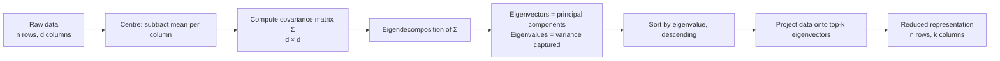

# Chapter 40 — Principal Component Analysis, From the Eigendecomposition Up

> **Goal of this chapter:** to derive Principal Component Analysis (PCA) from first principles — not as "a thing in scikit-learn that reduces dimensions", but as the eigendecomposition of the data's covariance matrix, motivated by an explicit variance-maximisation problem. By the end of this chapter, when somebody asks what PCA *is*, you should be able to write down the Lagrangian, take the gradient, recognise the eigenvector equation that falls out, explain why the eigenvalues are the variances captured, and show why doing PCA via the SVD is numerically preferable to forming the covariance matrix yourself. You will also know exactly when PCA helps and when it makes things worse. The math is short. We will not skip any of it.

---

## 40.1 The motivating problem

In the spam classifier from Chapter 3, we built a TF-IDF vector with 5,000 entries per email. In a recommendation system you might have 50,000 dimensions per user. A gene-expression dataset routinely has 20,000 genes per patient. An image is millions of pixel intensities. Modern ML is, almost by default, high-dimensional.

This causes three concrete problems.

**Visualisation.** You cannot plot 5,000 dimensions. You can plot two, maybe three. So when you want to *look* at your data — see whether classes are separable, spot outliers, sanity-check that the data makes sense — you need a way to compress 5,000 dimensions into 2 or 3 *informative* dimensions. Not just "drop all but the first two" — the first two of 5,000 are usually arbitrary. You want the most informative two.

**Computation.** Many algorithms scale badly with dimension. Distance-based methods (K-means, k-NN, hierarchical clustering) degrade in high dimensions because distances become uniform — the "curse of dimensionality" we mentioned in Chapter 38. Tree-based algorithms grow trees deeper. Linear models train slower. A representation with fewer informative dimensions is cheaper everywhere.

**Redundancy.** Many of your features are correlated. If you have "height in centimetres" and "height in inches", the second carries no new information. If you have "monthly spend" and "annual spend", the second is roughly 12 times the first. In a 5,000-dimensional bag-of-words representation, dozens of word pairs co-occur strongly enough to be near-duplicates. The intrinsic dimensionality of your data — the number of *truly independent* directions of variation — may be far smaller than the number of columns in your table.

Principal Component Analysis is the foundational technique for addressing all three. It finds, for any dataset, the small number of *directions* (linear combinations of the original features) that capture most of the variance in the data. You can then project your data into this lower-dimensional space, plot it, feed it to a clustering algorithm, or just hand it back as a "compressed" representation.

PCA has been around since Karl Pearson invented it in 1901. The math is older still — the eigendecomposition of a symmetric matrix is a result from 19th-century linear algebra. And yet PCA remains, after 120 years, the first tool anyone reaches for when they want to look at high-dimensional data. We will see why.

---

## 40.2 The geometric picture

Imagine a dataset of 2D points that, when you plot them, look like a tilted elongated cloud:

```
  feature 2
     │              ● ●
     │           ● ●  ●
     │        ● ●   ●●●  ●
     │     ● ● ●● ● ●●● ● ●
     │  ●  ●  ●● ●●●   ●
     │     ● ●  ●●●● ●
     │  ●  ● ●●●●● ●
     │   ●●● ● ●
     │    ●
     └────────────────────► feature 1
```

The cloud is elongated in some direction that is not aligned with either axis. There are clearly two directions worth talking about: the **long axis** of the cloud (where there's a lot of spread) and the **short axis** perpendicular to it (where there isn't much spread).

If you had to keep only one number per point — a one-dimensional summary of each point — you would *not* want to use just feature 1 or just feature 2. Either of those throws away the elongation. You would want to project each point onto the long axis. That projection captures most of the variation; the remaining variation (the small "thickness" of the cloud perpendicular to the long axis) is the smallest piece you could throw away.

PCA finds those axes. The **first principal component** (PC1) is the direction in feature space along which the data has the most variance. The **second principal component** (PC2) is the direction *perpendicular* to PC1 along which the data has the most variance among directions perpendicular to PC1. And so on. In $d$ dimensions, PCA produces $d$ orthogonal directions, ordered by how much variance they capture.

If you want a 2D visualisation of 5000-dimensional data, you project every point onto PC1 and PC2. Those two coordinates are the "most informative" two-dimensional summary of the data, in a precise sense we are about to make rigorous.



---

## 40.3 The setup: centred data and the variance to maximise

We will work with $n$ data points, each a $d$-dimensional vector. Stack them as the rows of a matrix $X \in \mathbb{R}^{n \times d}$. So $X_{ij}$ is the value of feature $j$ for example $i$.

### 40.3.1 Centre the data

The first thing we do is **subtract the mean of each feature**. Let $\bar{x}_j = \frac{1}{n} \sum_{i=1}^n X_{ij}$, the mean of column $j$. Replace $X_{ij}$ with $X_{ij} - \bar{x}_j$.

After centring, the mean of each column is exactly zero. This is essential: PCA is about variances, and variance is defined around the mean. If you skip centring, the "first principal component" will mostly point at the mean (because the mean has large magnitude in many real datasets) rather than capturing variation around the mean. This is the most common PCA bug — every implementation worth its salt centres for you, but if you implement it yourself, don't forget.

(In what follows, $X$ is assumed centred. Notation overload, but standard.)

### 40.3.2 Variance along a direction

We want to find a unit vector $v \in \mathbb{R}^d$ — a direction in feature space, with $\|v\| = 1$ — such that the variance of the projections of the data onto $v$ is maximised.

What does "projection of $x$ onto $v$" mean? Geometrically, it's the signed length of the shadow $x$ casts on the line spanned by $v$. Numerically, it's the dot product $x^T v$ (using column-vector notation; if you prefer row vectors, $x \cdot v$).

So the projections of all $n$ data points onto $v$ form a vector

$$
y = X v \in \mathbb{R}^n
$$

where the $i$-th entry $y_i = X_i v = x_i^T v$ is the projection of the $i$-th point.

Since $X$ is centred, the mean of $y$ is also zero ($\sum y_i = \sum x_i^T v = (\sum x_i)^T v = 0$ because $\sum x_i = 0$). So the variance of $y$ is just its mean-square:

$$
\text{Var}(y) = \frac{1}{n} \sum_{i=1}^n y_i^2 = \frac{1}{n} y^T y = \frac{1}{n} (X v)^T (X v) = \frac{1}{n} v^T X^T X v
$$

Define the $d \times d$ matrix

$$
\Sigma = \frac{1}{n} X^T X
$$

This is the **sample covariance matrix** of the data. (Strictly, with the standard "unbiased" definition we'd divide by $n-1$; the factor doesn't change the optimisation, so we use $n$ for cleanness.) It is symmetric (since $(X^T X)^T = X^T X$) and positive semi-definite (since $v^T X^T X v = \|Xv\|^2 \geq 0$ for any $v$).

With this notation, the variance along direction $v$ is

$$
\text{Var}(y) = v^T \Sigma v
$$

Beautiful. Three letters.

### 40.3.3 The optimisation problem

We want to maximise $v^T \Sigma v$ over all unit vectors $v$. Without the constraint, we could make $v^T \Sigma v$ arbitrarily large by scaling $v$ up — so the unit-length constraint $\|v\|^2 = v^T v = 1$ is essential.

Formally:

$$
\max_v \;\; v^T \Sigma v \quad \text{subject to} \quad v^T v = 1
$$

This is a constrained optimisation problem. The right tool for it is **Lagrange multipliers**.

---

## 40.4 The derivation: Lagrange multipliers to the eigenvector equation

This is the heart of the chapter. Every step explicitly.

### 40.4.1 Set up the Lagrangian

Introduce a Lagrange multiplier $\lambda$ for the constraint $v^T v = 1$. The Lagrangian is

$$
\mathcal{L}(v, \lambda) = v^T \Sigma v - \lambda (v^T v - 1)
$$

At a constrained extremum, the partial derivatives with respect to $v$ and $\lambda$ both vanish.

### 40.4.2 Take the gradient with respect to $v$

We need $\nabla_v \mathcal{L}$. Two facts from matrix calculus that we should re-derive briefly because they're the entire move:

**Fact 1:** $\nabla_v (v^T A v) = (A + A^T) v$. If $A$ is symmetric, this is $2 A v$.

*Proof:* $v^T A v = \sum_{i,j} v_i A_{ij} v_j$. The partial with respect to $v_k$ is $\sum_j A_{kj} v_j + \sum_i v_i A_{ik}$. The first sum is the $k$-th entry of $A v$; the second is the $k$-th entry of $A^T v$. Stack across all $k$ and you get $(A + A^T) v$.

**Fact 2:** $\nabla_v (v^T v) = 2 v$.

*Proof:* Take Fact 1 with $A$ = identity.

Now apply these. Since $\Sigma$ is symmetric:

$$
\nabla_v \mathcal{L} = 2 \Sigma v - 2 \lambda v
$$

Setting this to zero:

$$
2 \Sigma v - 2 \lambda v = 0 \quad \Longrightarrow \quad \Sigma v = \lambda v
$$

**Stop and look at this equation.** $\Sigma v = \lambda v$. This is the defining equation of an **eigenvector**. The optimal $v$ — the direction of maximum variance — is an eigenvector of the covariance matrix $\Sigma$. The Lagrange multiplier $\lambda$ is the corresponding **eigenvalue**.

This is the central fact of PCA. We did not assume eigenvectors were the answer. They fell out of solving an optimisation problem.

### 40.4.3 Which eigenvector?

A $d \times d$ symmetric matrix has $d$ eigenvectors (counting multiplicities), each with a corresponding eigenvalue. Which one solves our maximisation problem?

Multiply both sides of $\Sigma v = \lambda v$ on the left by $v^T$:

$$
v^T \Sigma v = \lambda v^T v = \lambda \cdot 1 = \lambda
$$

(using the constraint $v^T v = 1$). So the variance along the optimal $v$ is *exactly the eigenvalue $\lambda$*.

To maximise $v^T \Sigma v$, we want the largest $\lambda$. So:

**The first principal component is the eigenvector of $\Sigma$ corresponding to the largest eigenvalue, and the variance it captures is exactly that eigenvalue.**

Let's call this eigenvector $v_1$ and its eigenvalue $\lambda_1$.

### 40.4.4 The second principal component

We've found the direction of maximum variance. We now want the direction of *next-most* variance, but constrained to be **orthogonal to $v_1$** — because we don't want to just rediscover $v_1$ with a slightly different scalar.

Same problem, with an extra constraint:

$$
\max_v \;\; v^T \Sigma v \quad \text{subject to} \quad v^T v = 1, \;\; v^T v_1 = 0
$$

Introduce two Lagrange multipliers, $\lambda$ for the unit-length constraint and $\mu$ for the orthogonality constraint:

$$
\mathcal{L}(v, \lambda, \mu) = v^T \Sigma v - \lambda (v^T v - 1) - \mu (v^T v_1)
$$

Gradient with respect to $v$:

$$
\nabla_v \mathcal{L} = 2 \Sigma v - 2 \lambda v - \mu v_1 = 0
$$

Multiply both sides on the left by $v_1^T$:

$$
2 v_1^T \Sigma v - 2 \lambda v_1^T v - \mu v_1^T v_1 = 0
$$

The first term: since $\Sigma$ is symmetric, $v_1^T \Sigma v = (\Sigma v_1)^T v = (\lambda_1 v_1)^T v = \lambda_1 v_1^T v = 0$ (using $\Sigma v_1 = \lambda_1 v_1$ and the orthogonality $v_1^T v = 0$). The second term: $\lambda v_1^T v = 0$ by orthogonality. So we get $-\mu v_1^T v_1 = -\mu = 0$, i.e. $\mu = 0$.

Substituting back: $2 \Sigma v - 2 \lambda v = 0$, the same eigenvector equation as before. The second principal component is also an eigenvector of $\Sigma$, with eigenvalue $\lambda$ less than $\lambda_1$ (to satisfy the orthogonality and the fact that we're looking among orthogonal directions). It is the eigenvector with the **second-largest** eigenvalue, $\lambda_2$.

By induction, the $k$-th principal component $v_k$ is the eigenvector of $\Sigma$ corresponding to the $k$-th largest eigenvalue $\lambda_k$, and it is orthogonal to all earlier components.

### 40.4.5 Summary of the derivation

We have derived, in a few lines:

- The principal components of the data are the eigenvectors of the covariance matrix $\Sigma = \frac{1}{n} X^T X$.
- They are mutually orthogonal (because $\Sigma$ is symmetric — a theorem from linear algebra: symmetric matrices have orthogonal eigenvectors).
- The variance captured by the $k$-th principal component is the $k$-th eigenvalue $\lambda_k$.

Total variance in the data = sum of variances along the original axes = trace of $\Sigma$ = sum of eigenvalues. So:

$$
\text{Total variance} = \sum_{k=1}^d \lambda_k
$$

Variance captured by the top $k$ components: $\sum_{j=1}^k \lambda_j$. Fraction of variance captured: $\frac{\sum_{j=1}^k \lambda_j}{\sum_{j=1}^d \lambda_j}$.

That fraction is the "**explained variance ratio**" that scikit-learn reports as `pca.explained_variance_ratio_`. Now you know what it actually is.

---

## 40.5 The scree plot and choosing $k$

We have $d$ eigenvalues, ordered $\lambda_1 \geq \lambda_2 \geq \ldots \geq \lambda_d \geq 0$. How many of them should we keep?

The **scree plot** is the plot of eigenvalues against component number. The name comes from geology — a "scree" is a slope of loose rocks at the base of a cliff — because the plot typically shows a steep early drop followed by a long flat tail.

```
  λ_k
     |●
     | ●
     |  ●
     |   ●
     |
     |    ●
     |     ●_●_●_●_●_●_●_●_●_●_●_●_●_●_●_●_●_●_●
     +───────────────────────────────────────────► k
       1 2 3 4 5  6  ......
```

In this picture, the first three or four components carry most of the variance; everything from component five onward is essentially noise.

Three common rules for choosing $k$:

**1. The elbow.** Same idea as for K-means in Chapter 38, with the same weakness: subjective. But often clear enough on real data.

**2. The variance-captured threshold.** Pick the smallest $k$ such that $\sum_{j=1}^k \lambda_j / \sum_{j=1}^d \lambda_j \geq T$ for some threshold $T$. $T = 0.95$ is the most common choice ("keep enough components to explain 95% of variance"). $T = 0.99$ is common when you want to preserve more detail.

**3. Kaiser's criterion.** Keep all components with eigenvalue greater than the mean eigenvalue. If the data were uniform random noise, every component would have approximately equal eigenvalue (= total variance / $d$); components above this threshold are "informative beyond noise". This is a rough heuristic; less common than the variance-captured threshold.

For visualisation specifically, you have no choice: $k = 2$ if you want a 2D plot, $k = 3$ for 3D. The scree plot then tells you *how much you're throwing away* — important context for interpreting the visualisation.

---

## 40.6 A worked numerical example

Three 2D points: $(2, 1), (3, 3), (4, 5)$. Tiny dataset, but enough to do every step by hand.

### Step 1: centre the data

Means: $\bar{x}_1 = (2+3+4)/3 = 3$, $\bar{x}_2 = (1+3+5)/3 = 3$. Subtract:

| Point | $x_1 - 3$ | $x_2 - 3$ |
|------:|---:|---:|
| $p_1$ | $-1$ | $-2$ |
| $p_2$ | $0$ | $0$ |
| $p_3$ | $1$ | $2$ |

So the centred matrix is

$$
X = \begin{pmatrix} -1 & -2 \\ 0 & 0 \\ 1 & 2 \end{pmatrix}
$$

### Step 2: compute the covariance matrix

$$
X^T X = \begin{pmatrix} -1 & 0 & 1 \\ -2 & 0 & 2 \end{pmatrix} \begin{pmatrix} -1 & -2 \\ 0 & 0 \\ 1 & 2 \end{pmatrix}
$$

Entry $(1, 1)$: $(-1)(-1) + 0 \cdot 0 + 1 \cdot 1 = 2$.
Entry $(1, 2)$: $(-1)(-2) + 0 \cdot 0 + 1 \cdot 2 = 4$.
Entry $(2, 1)$: same as $(1, 2)$ by symmetry, $= 4$.
Entry $(2, 2)$: $(-2)(-2) + 0 \cdot 0 + 2 \cdot 2 = 8$.

So $X^T X = \begin{pmatrix} 2 & 4 \\ 4 & 8 \end{pmatrix}$ and $\Sigma = \frac{1}{n} X^T X = \frac{1}{3} \begin{pmatrix} 2 & 4 \\ 4 & 8 \end{pmatrix}$.

(For finding eigenvectors, the factor $1/3$ is irrelevant — it just scales every eigenvalue by $1/3$ without changing the eigenvectors. We'll find eigenvectors of $X^T X$ and divide eigenvalues by 3 at the end.)

### Step 3: find eigenvalues

We want $\lambda$ such that $\det(X^T X - \lambda I) = 0$.

$$
\det \begin{pmatrix} 2 - \lambda & 4 \\ 4 & 8 - \lambda \end{pmatrix} = (2 - \lambda)(8 - \lambda) - 16 = 0
$$

Expand: $16 - 2\lambda - 8\lambda + \lambda^2 - 16 = \lambda^2 - 10 \lambda = \lambda(\lambda - 10) = 0$.

Solutions: $\lambda = 10$ and $\lambda = 0$.

So $X^T X$ has eigenvalues $10$ and $0$. Dividing by $n=3$: $\Sigma$ has eigenvalues $\lambda_1 = 10/3 \approx 3.33$ and $\lambda_2 = 0$.

The total variance is $\lambda_1 + \lambda_2 = 10/3$. The first component captures $\lambda_1 / (\lambda_1 + \lambda_2) = 100\%$ of the variance.

**One hundred per cent.** Notice what happened: $\lambda_2 = 0$ means there is zero variance perpendicular to PC1. The three centred points all lie *exactly on a single line through the origin* — they are linearly dependent. PCA recovered this perfectly: it identified that one direction explains everything.

### Step 4: find eigenvectors

For $\lambda_1 = 10$ (using $X^T X$, not $\Sigma$ — same eigenvectors):

$(X^T X - 10 I) v = 0 \Longrightarrow \begin{pmatrix} -8 & 4 \\ 4 & -2 \end{pmatrix} v = 0$.

First row: $-8 v_1 + 4 v_2 = 0 \Longrightarrow v_2 = 2 v_1$. So $v \propto (1, 2)$.

Normalise: $\|(1, 2)\| = \sqrt{5}$, so $v_1 = (1, 2)/\sqrt{5} \approx (0.447, 0.894)$.

For $\lambda_2 = 0$:

$(X^T X - 0 \cdot I) v = (X^T X) v = 0$. Solve $\begin{pmatrix} 2 & 4 \\ 4 & 8 \end{pmatrix} v = 0$: $v_2 \propto (2, -1)$. Normalised: $(2, -1)/\sqrt{5} \approx (0.894, -0.447)$.

Notice $v_1 \cdot v_2 = (1 \cdot 2 + 2 \cdot (-1))/5 = 0$. They are orthogonal, as expected.

### Step 5: project the data onto PC1

For each centred point $x_i$, compute $x_i^T v_1$:

- $p_1: (-1)(0.447) + (-2)(0.894) = -0.447 - 1.788 = -2.236$
- $p_2: 0 \cdot 0.447 + 0 \cdot 0.894 = 0$
- $p_3: (1)(0.447) + (2)(0.894) = 0.447 + 1.788 = 2.236$

So in the 1D PC1-space, the three points are at $-2.236, 0, +2.236$. We've gone from 2D to 1D, capturing 100% of the variance because the data was 1D to begin with.

The reconstruction: each centred point projected back into the original 2D space is $(x_i^T v_1) v_1$:

- $p_1$ reconstructed: $-2.236 \cdot (0.447, 0.894) = (-1, -2)$. Matches exactly.
- $p_2$ reconstructed: $0 \cdot (0.447, 0.894) = (0, 0)$. Matches exactly.
- $p_3$ reconstructed: $2.236 \cdot (0.447, 0.894) = (1, 2)$. Matches exactly.

Zero reconstruction error. PCA found the line, projected the data onto it, and would reconstruct perfectly.

On real data, $\lambda_2$ is not exactly zero — there's always some perpendicular variance, often substantial. The reconstruction is then lossy. The reconstruction loss equals the total variance you discarded: $\sum_{j > k} \lambda_j$ if you kept the top $k$ components.

---

## 40.7 PCA via the Singular Value Decomposition

The procedure we just walked through — form $\Sigma = X^T X / n$, eigendecompose it — works, but in practice it is not what implementations do. They use the **singular value decomposition** (SVD) of $X$ directly, and skip forming $\Sigma$ altogether.

### 40.7.1 The SVD, briefly

Any matrix $X \in \mathbb{R}^{n \times d}$ can be written as

$$
X = U S V^T
$$

where $U \in \mathbb{R}^{n \times r}$ has orthonormal columns ($U^T U = I_r$), $V \in \mathbb{R}^{d \times r}$ has orthonormal columns ($V^T V = I_r$), $S \in \mathbb{R}^{r \times r}$ is diagonal with non-negative entries called the **singular values**, and $r = \min(n, d)$ is the rank.

The columns of $V$ are the **right singular vectors** of $X$. The columns of $U$ are the **left singular vectors**. The singular values $\sigma_1 \geq \sigma_2 \geq \ldots \geq \sigma_r \geq 0$ are conventionally ordered descending.

### 40.7.2 The connection to eigenvectors of $X^T X$

Substitute $X = U S V^T$:

$$
X^T X = (U S V^T)^T (U S V^T) = V S U^T U S V^T = V S^2 V^T
$$

(using $U^T U = I$).

This is exactly the eigendecomposition of $X^T X$: the eigenvectors are the columns of $V$, and the eigenvalues are the squared singular values $\sigma_k^2$.

So:

- The **principal components** (eigenvectors of the covariance matrix) are the **right singular vectors** of $X$ — the columns of $V$.
- The **eigenvalues** of the covariance matrix $\Sigma = X^T X / n$ are $\sigma_k^2 / n$, where $\sigma_k$ are the singular values of $X$.

Equivalent. Same answer.

### 40.7.3 Why use the SVD instead?

Three reasons, in order of practical importance.

**Numerical stability.** Forming $X^T X$ explicitly **squares the condition number** of $X$. If $X$ is mildly ill-conditioned (some columns nearly linearly dependent, common in real data), $X^T X$ can be drastically ill-conditioned. Computing eigenvalues of an ill-conditioned matrix amplifies floating-point errors. The SVD of $X$ avoids forming $X^T X$ at all and is computed by algorithms (e.g., Householder reflections + QR) that are numerically stable even on near-singular matrices. This is why scikit-learn's default `PCA` uses an SVD-based solver under the hood.

**Speed when $n \gg d$ or $d \gg n$.** Computing the SVD of a thin $n \times d$ matrix (one of $n$ or $d$ much smaller than the other) is cheaper than forming the full covariance and eigendecomposing it. Modern randomised SVD algorithms (Halko, Martinsson, Tropp 2011) compute the top $k$ singular triples without computing the full SVD — useful for very large datasets where you only want a few components.

**Cleanness when $d > n$.** If you have more features than examples ($d > n$ — e.g., gene-expression data with 20,000 genes and 200 patients), the $d \times d$ covariance matrix is huge and rank-deficient: only $n - 1$ of its eigenvalues are nonzero. The SVD handles this gracefully; the eigendecomposition wastes memory storing the $d \times d$ matrix.

For these reasons, every serious PCA implementation goes through the SVD. The eigendecomposition-of-covariance framing is **pedagogically clearer** — that's what we did for this chapter — but **numerically inferior** in practice.

---

## 40.8 Pitfalls and tradeoffs

PCA is well-behaved and useful, but it has limits. Some of them are subtle.

### 40.8.1 You must centre

Said this already, will say it again. If you skip centring, "the first principal component" will be dominated by the mean direction. You'll get back something that points at where your data sits, not how it varies.

Some implementations centre for you (sklearn always does). Some don't (some custom SVD implementations). Always know which.

### 40.8.2 You should usually scale, too

PCA finds directions of maximum variance. *Variance is scale-dependent.* If one feature is in dollars ($0 to $1,000,000) and another is in years (0 to 100), the first feature contributes roughly $10^8$ times the variance of the second, and PC1 will essentially be the first feature. The "interesting" structure in the second feature is invisible.

The standard fix is to **standardise** (subtract mean, divide by standard deviation) before PCA. Then every feature has variance 1, and PCA finds directions of maximum *combined* variance across features.

Whether to scale is a judgement call. If all your features are measured in the same units and the variance differences are meaningful (e.g., all gene expression levels), don't scale. If they're in different units (mixed financial + demographic features), always scale. The default in scikit-learn's `PCA` is to centre but not scale; pair it with a `StandardScaler` if scaling is appropriate.

This is the same warning we gave in Chapter 38 for K-means. The two are deeply related — both depend on the squared Euclidean geometry of the feature space, which is scale-sensitive.

### 40.8.3 Linearity assumption

PCA finds the best *linear* subspace that fits the data. If the underlying structure of the data is non-linear — say, the points lie on a 2D spiral embedded in 3D — PCA cannot recover it. The principal components will be the axes of the bounding ellipse of the spiral, which says nothing about the spiral itself.

For non-linear dimensionality reduction, use **t-SNE** or **UMAP** (Chapter 41) for visualisation, or **kernel PCA** for downstream modelling. We'll see t-SNE and UMAP next chapter.

### 40.8.4 Interpretability of components

Each principal component is a *linear combination* of the original features. In our worked example, PC1 was $(0.447, 0.894)$ — roughly $0.45 \cdot \text{feature}_1 + 0.89 \cdot \text{feature}_2$. With 5,000 original features, PC1 will be a weighted sum of 5,000 features, most with small weights but some prominent. Reading "what PC1 means" can be done — find the top-weighted original features — but it's not as clean as having interpretable features directly.

Whether this matters depends on what you're using PCA for. For visualisation (just plot it), interpretability doesn't matter much. For downstream classification on PCA-projected features, you have lost the per-feature interpretability of the original model. Some teams use PCA as a preprocessing step only when interpretability isn't critical.

### 40.8.5 PCA does not always help downstream models

A common mistake is to assume PCA "improves" any downstream model. It often doesn't. PCA-projected features lose information (the discarded components might be small but they might also be small *and discriminative for your target*). For predictive modelling, **supervised** dimensionality reduction (e.g., LDA — Linear Discriminant Analysis — or feature selection driven by mutual information with the target) often beats unsupervised PCA, because PCA doesn't know what you're predicting.

PCA is most defensible when:

- You're visualising, not modelling.
- Your data has very high dimensionality and your downstream model can't handle it.
- Your features are highly collinear and you want to decorrelate them (for example, to use in a method that requires uncorrelated inputs).
- You're using it as a preprocessor for clustering, where decorrelation and dimension reduction can substantially help (K-means in particular often benefits from a PCA preprocessing step).

### 40.8.6 The dual problem: outliers and PCA

PCA is sensitive to outliers because variance is sensitive to outliers. A single very-distant point can dominate the largest eigenvalue and bend PC1 toward it. Robust PCA variants exist (using robust covariance estimators, or L1 instead of L2 norms), but they are out of scope here. The practical advice: clean obvious outliers before PCA, the same as before any algorithm relying on squared distances.

---

## 40.9 Code

### 40.9.1 PCA from scratch with NumPy and SVD

The "right way to compute PCA" in 15 lines:

```python
import numpy as np

def pca(X, k):
    # 1. Centre
    X_centred = X - X.mean(axis=0)

    # 2. SVD
    U, S, Vt = np.linalg.svd(X_centred, full_matrices=False)
    # Vt is (d, d); rows are the right singular vectors
    # S is the singular values, descending

    # 3. Top-k components
    components = Vt[:k]       # (k, d); each row is a PC

    # 4. Project
    X_reduced = X_centred @ components.T  # (n, k)

    # 5. Variance captured
    n = X.shape[0]
    eigenvalues = (S ** 2) / n     # eigenvalues of covariance
    explained_var = eigenvalues / eigenvalues.sum()

    return X_reduced, components, explained_var[:k]
```

Notice we never form the covariance matrix. We just SVD the centred data. The squared singular values divided by $n$ give the eigenvalues of $\Sigma$ — the variances captured.

### 40.9.2 scikit-learn

```python
from sklearn.decomposition import PCA
from sklearn.preprocessing import StandardScaler

# Almost always: scale, then PCA
X_scaled = StandardScaler().fit_transform(X)

# Specify number of components, or a variance threshold
pca = PCA(n_components=10)             # exactly 10 components
# pca = PCA(n_components=0.95)          # smallest k explaining 95% variance
# pca = PCA(n_components='mle')         # automatic via likelihood

X_reduced = pca.fit_transform(X_scaled)

print(pca.explained_variance_ratio_)    # array of length 10
print(pca.explained_variance_ratio_.cumsum())  # cumulative
print(pca.components_)                  # shape (10, d): each row is a PC

# Reconstruct
X_reconstructed_scaled = pca.inverse_transform(X_reduced)
# To get back to original units:
X_reconstructed = StandardScaler().fit(X).inverse_transform(X_reconstructed_scaled)
```

Important attributes:

- `pca.components_`: the principal components, one per row. Same as $V^T$.
- `pca.explained_variance_`: the eigenvalues $\lambda_k$.
- `pca.explained_variance_ratio_`: the eigenvalues normalised to sum to 1.
- `pca.singular_values_`: the singular values $\sigma_k$.
- `pca.mean_`: the mean it subtracted during centring.

For very large datasets, use `PCA(svd_solver='randomized')` to use a randomised SVD that computes only the top $k$ components — much faster when $k \ll d$.

### 40.9.3 Scree plot in code

```python
import matplotlib.pyplot as plt
import numpy as np

pca = PCA().fit(X_scaled)   # fit all components

# Scree plot
plt.figure(figsize=(10, 5))
plt.subplot(1, 2, 1)
plt.plot(range(1, len(pca.explained_variance_) + 1),
         pca.explained_variance_, marker='o')
plt.xlabel('Component')
plt.ylabel('Eigenvalue (variance)')
plt.title('Scree plot')

plt.subplot(1, 2, 2)
plt.plot(range(1, len(pca.explained_variance_ratio_) + 1),
         pca.explained_variance_ratio_.cumsum(), marker='o')
plt.axhline(y=0.95, color='red', linestyle='--', label='95%')
plt.xlabel('Number of components')
plt.ylabel('Cumulative explained variance')
plt.legend()
plt.show()
```

### 40.9.4 PySpark preview

`pyspark.ml.feature.PCA` is the Spark version. We will cover it more fully in Chapter 65; the preview:

```python
from pyspark.ml.feature import PCA, VectorAssembler, StandardScaler
from pyspark.ml import Pipeline

assembler = VectorAssembler(inputCols=feature_cols, outputCol='features_raw')
scaler = StandardScaler(inputCol='features_raw', outputCol='features',
                        withMean=True, withStd=True)
pca = PCA(k=10, inputCol='features', outputCol='pca_features')

pipeline = Pipeline(stages=[assembler, scaler, pca])
model = pipeline.fit(df)

reduced = model.transform(df)
reduced.select('pca_features').show(truncate=False)

# Access the principal components and explained variance
pca_model = model.stages[-1]
print(pca_model.pc)                           # principal components (Matrix)
print(pca_model.explainedVariance)            # DenseVector of ratios
```

Spark's PCA uses a distributed SVD under the hood — works for data too big for one machine. The API is otherwise identical in spirit to scikit-learn's.

---

## 40.10 Summary

1. PCA finds the orthogonal directions of maximum variance in centred data. These directions are the **principal components**.

2. **The variance along a direction $v$** is $v^T \Sigma v$, where $\Sigma = X^T X / n$ is the covariance matrix.

3. **The Lagrangian derivation** (max $v^T \Sigma v$ subject to $\|v\|=1$) gives the eigenvector equation $\Sigma v = \lambda v$. The optimal direction is an eigenvector of $\Sigma$; the variance captured is the eigenvalue.

4. **The $k$-th principal component** is the eigenvector of $\Sigma$ with the $k$-th largest eigenvalue. Total variance = sum of all eigenvalues. Fraction of variance explained by top-$k$ = sum of top-$k$ eigenvalues divided by the total.

5. **The scree plot** of eigenvalues helps choose $k$ — look for an elbow or pick the smallest $k$ that exceeds a variance-explained threshold (often 95%).

6. **In practice, use the SVD of $X$ directly**, not the eigendecomposition of $X^T X$. The right singular vectors of $X$ are the principal components; the squared singular values divided by $n$ are the eigenvalues. SVD is numerically more stable (avoids squaring the condition number) and computationally cheaper.

7. **Pitfalls**: must centre (otherwise PC1 chases the mean); usually scale (otherwise high-variance features dominate); assumes linear structure (non-linear manifolds need t-SNE/UMAP); not always helpful for downstream supervised tasks (supervised dimensionality reduction like LDA or feature selection might do better); sensitive to outliers.

8. **Use cases**: visualisation in 2D/3D, preprocessing for distance-based algorithms (K-means, k-NN), decorrelating collinear features, noise reduction in images and signals.

---

## 40.11 What this builds on / where this returns

**Builds on:**
- *Chapter 7* — covariance, expectation, variance. The covariance matrix $\Sigma$ is the multidimensional generalisation of variance, and everything PCA does is in service of maximising it along chosen directions.
- *Chapter 14* — eigenvalues and eigenvectors. The whole derivation reduces to "the optimal direction is an eigenvector"; this chapter cashes in on that earlier preparation.
- *Chapter 13* — matrix multiplication, transposes, determinants. The mechanics of computing eigenvalues from $\det(\Sigma - \lambda I) = 0$ live here.
- *Chapter 26* — scaling and standardisation. PCA's scale dependence is the same as K-means'.

**Returns:**
- *Chapter 41* — t-SNE and UMAP, the non-linear cousins of PCA, for visualisation when the data lies on a non-linear manifold.
- *Chapter 65* — `pyspark.ml.feature.PCA` in the distributed setting.
- *Part E* — PCA briefly returns as a feature-engineering preprocessor in the section on dimensionality reduction within feature pipelines.
- *Chapter 38* — K-means following PCA is a standard pipeline; this section foreshadows that pattern.

---

## 40.12 Exercises

Work through all of them cold. Several have explicit numerical answers.

1. **Why centre?** Suppose you skip the centring step. Run PCA on a dataset of points all clustered near $(100, 100)$ with tiny variance around that point. What direction does PC1 point in, and why is that wrong?

2. **2D by hand.** Three points: $(0, 0), (1, 1), (2, 2)$. Centre the data, compute the covariance matrix, find the eigenvalues. What is the fraction of variance captured by PC1?

3. **Eigenvector arithmetic.** A 2x2 symmetric matrix has trace 5 and determinant 4. What are its eigenvalues? (Hint: trace = sum, determinant = product.)

4. **PC2 from PC1 (2D).** In 2D, if PC1 is $(0.6, 0.8)$, what is PC2? (There's a unique answer up to sign.)

5. **The "always scale" question.** You're given a dataset where feature 1 is "monthly income in dollars" (range $\$0$ to $\$50{,}000$) and feature 2 is "credit score" (range 300 to 850). You PCA without scaling. What will PC1 essentially be?

6. **Reconstruction error.** A dataset has 100 features. PCA gives eigenvalues that sum to 50, with the top 10 summing to 47. What fraction of variance is captured by the top 10 components? What is the reconstruction error if we keep only the top 10?

7. **The intrinsic dimensionality.** A dataset has eigenvalues $\lambda_1 = 100, \lambda_2 = 90, \lambda_3 = 80, \lambda_4 = 0.1, \lambda_5 = 0.05$. What is the "intrinsic dimensionality" of the data, and what does that mean operationally?

8. **SVD vs. covariance.** Why is computing PCA via SVD on $X$ more numerically stable than computing the eigendecomposition of $X^T X$ directly?

9. **Out-of-sample projection.** You fit PCA on a training set of 10,000 emails (5,000-dim TF-IDF). You get a new email tomorrow. How do you project it into the PCA space? What do you need to have saved alongside the components matrix?

10. **PCA + classification.** You PCA a 5,000-dim feature set down to 50 dimensions, then train a classifier on the 50-dim representation. The classifier's accuracy is lower than training on the original 5,000 features. Name two plausible explanations.

11. **Non-linear data.** A dataset consists of points on a unit circle in 2D, $\{(\cos\theta, \sin\theta) : \theta \in [0, 2\pi)\}$. What are the eigenvalues of the centred data's covariance matrix? What does this say about PCA's ability to "discover the manifold"?

12. **A practical pipeline.** Sketch a complete PCA pipeline (in scikit-learn) that: scales the data, fits PCA keeping enough components to explain 95% variance, projects training and test sets, and saves the pipeline for use at inference time.

<details>
<summary>Answers</summary>

1. PC1 would point roughly toward $(100, 100)$ — the *direction from the origin to the data cluster*. This is because, without centring, the dominant "variance" the algorithm sees is the squared offset of the data from the origin, which dwarfs the actual variance around the cluster's centre. Centring fixes this by moving the data's centre to the origin, so PCA captures variation *around* the data's centre.

2. Means: $(1, 1)$. Centred points: $(-1, -1), (0, 0), (1, 1)$. Covariance: $X^T X = \begin{pmatrix} 2 & 2 \\ 2 & 2 \end{pmatrix}$, so $\Sigma = \begin{pmatrix} 2/3 & 2/3 \\ 2/3 & 2/3 \end{pmatrix}$. Trace = 4/3; determinant = 0. Eigenvalues: 4/3 and 0. PC1 captures 100% of the variance (the data is exactly 1D — on the line $y = x$).

3. From trace + determinant: $\lambda_1 + \lambda_2 = 5, \lambda_1 \lambda_2 = 4$. So $\lambda_1, \lambda_2$ are roots of $\lambda^2 - 5\lambda + 4 = 0 \Longrightarrow \lambda = 1, 4$.

4. PC2 must be orthogonal to PC1 and unit-length. In 2D, rotate by 90 degrees: $(0.6, 0.8) \to (-0.8, 0.6)$ (or $(0.8, -0.6)$). Either is valid; sign is convention-dependent.

5. PC1 will be essentially $(1, 0)$ — pointing along the income axis. Income ranges from 0 to 50,000 (variance roughly $\sim 10^8$); credit score ranges from 300 to 850 (variance $\sim 10^4$). Income variance dominates by four orders of magnitude. The result is that PC1 is "the income axis", and credit-score variation is essentially invisible. Always standardise first.

6. Variance captured = $47/50 = 94\%$. Reconstruction error (variance not captured) = $3/50 = 6\%$.

7. Intrinsic dimensionality is 3 (the top three eigenvalues are similar in magnitude; the rest are essentially zero). Operationally: the data is essentially 3-dimensional embedded in a higher-dimensional space. Three principal components capture almost all of the variance; keeping more is just keeping noise.

8. Forming $X^T X$ explicitly squares the condition number of $X$ (if $X$ has condition number $\kappa$, $X^T X$ has condition number $\kappa^2$). For ill-conditioned $X$ — common in real data with correlated features — this drastically amplifies floating-point errors in the eigendecomposition. SVD computes the same answer working on $X$ directly, avoiding the squaring; it is stable even when $X$ is nearly rank-deficient.

9. You need: the saved `pca.components_` matrix (shape $k \times d$) and the saved `pca.mean_` vector (the training-set means used for centring). To project: subtract `pca.mean_` from the new email's TF-IDF vector, then multiply by `pca.components_.T`. If you scaled before PCA, you also need the saved StandardScaler. This is what pipelines (Chapter 62) encapsulate.

10. (a) The discarded components held information useful for classification — PCA doesn't know about the target, so it doesn't preserve target-relevant variance specifically. (b) The original 5,000 features included some that were directly discriminative for the target; the PCA-projected representation, being a weighted sum of all 5,000, dilutes those signals. Possible fix: use supervised dimensionality reduction (LDA) or feature selection (e.g., L1-regularised logistic regression on the original features).

11. The unit circle is centred at origin, so means are zero. Covariance matrix entries: $E[x_1^2] = E[\cos^2\theta] = 1/2$; $E[x_2^2] = E[\sin^2\theta] = 1/2$; $E[x_1 x_2] = E[\cos\theta \sin\theta] = 0$. So $\Sigma = \begin{pmatrix} 1/2 & 0 \\ 0 & 1/2 \end{pmatrix}$. Eigenvalues are both $1/2$. PCA cannot distinguish any direction — the data has no "preferred" linear direction because it lies on a non-linear (circular) manifold. PCA fails to reveal the 1D structure. You'd need a non-linear method (kernel PCA, t-SNE, UMAP) to "unfold" the circle.

12. ```python
    from sklearn.pipeline import Pipeline
    from sklearn.preprocessing import StandardScaler
    from sklearn.decomposition import PCA
    import joblib

    pipe = Pipeline([
        ('scaler', StandardScaler()),
        ('pca', PCA(n_components=0.95)),
    ])
    X_train_reduced = pipe.fit_transform(X_train)
    X_test_reduced = pipe.transform(X_test)
    joblib.dump(pipe, 'pca_pipeline.pkl')

    # At inference time
    pipe = joblib.load('pca_pipeline.pkl')
    X_new_reduced = pipe.transform(X_new)
    ```
    The Pipeline object encapsulates the scaler and PCA together, with their fitted state. This is exactly the pattern Chapter 62 will generalise to Spark ML.

</details>
