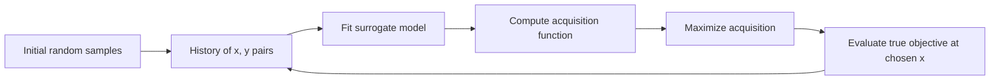

# Chapter 51 — Bayesian Optimization: Surrogate Models and Acquisition Functions

> **Goal of this chapter:** to develop Bayesian optimization (BO) from first principles, not as a black box. By the end you should be able to (a) explain what BO actually computes, (b) sketch the surrogate-and-acquisition loop on paper, (c) derive the Expected Improvement acquisition function, (d) understand why Gaussian processes are a natural but limited surrogate, and (e) articulate why the next chapter (Tree-structured Parzen Estimators, TPE) was invented to fix the limitations.

---

## 51.1 The criticism of random search

We left Ch 50 with random search as the strong default. But random search has a glaring weakness, and once you see it, you cannot stop seeing it.

Random search has no memory.

Trial 1 samples a learning rate of $10^{-2}$ and gets F1 = 0.79.  
Trial 2 samples a learning rate of $10^{-3}$ and gets F1 = 0.85.  
Trial 3 samples a learning rate of $10^{-4}$ and gets F1 = 0.84.  
Trial 4 samples a learning rate of $10^{-1}$ and gets F1 = 0.71.

What would you, the human reader, conclude? The good region is around $10^{-3}$ to $10^{-4}$. The bad region is the high end. If you were sampling the next trial, you would sample *near $10^{-3}$* — not because of any formal calculation, but because the data so far suggests it.

Random search doesn't do this. Trial 5 samples uniformly across the whole range, ignoring the previous 4 trials entirely. Trial 5 might land at $10^{-1}$ again, wasting an evaluation in a region you already know is bad. Trial 50 might land at $10^{-1}$ for the fifth time, with the same wasted result.

After $N$ random search trials, you have observed an $(x, y)$ scatter plot of hyperparameter-vs-loss. The information in that scatter plot is sitting there unused by the algorithm — it's only used at the very end to pick the best observed point. Every individual trial is chosen as if no prior trials existed.

**Bayesian optimization is the natural fix.** At each step, fit a model to the observed $(x, y)$ history. Use the model to predict the loss surface. Use the prediction to choose the next point: somewhere we expect the loss to be low *and* where we're uncertain enough that the observation will be informative.

This chapter develops that idea precisely. We'll define the two pieces — a *surrogate model* (the predictor) and an *acquisition function* (the chooser) — and show how they combine into the BO loop.

---

## 51.2 The framework

Bayesian optimization can be described in five steps:

1. **Initialize.** Run a small number $n_0$ of initial evaluations (typically 5–20), often via random sampling, to seed the history. Without an initial seed, the surrogate has nothing to fit.

2. **Fit the surrogate.** Given the history $\{(x_1, y_1), \ldots, (x_n, y_n)\}$, fit a model $\hat{y}(x)$ that predicts the loss as a function of the hyperparameters. Crucially, the model should also produce *uncertainty estimates* — a posterior distribution over $\hat{y}(x)$, not just a point estimate.

3. **Maximize the acquisition.** Pick a function $\alpha(x)$ — the **acquisition function** — that balances exploration and exploitation, and find the $x$ that maximizes it. Evaluate the model at that $x$.

4. **Evaluate.** Train the actual model with hyperparameters $x_{n+1}$, get its true loss $y_{n+1}$.

5. **Update the history.** Append $(x_{n+1}, y_{n+1})$ to the history. Goto step 2.

Repeat until the budget runs out.



The two design choices are: which surrogate model, and which acquisition function. The next several sections cover each.

---

## 51.3 The surrogate model

The surrogate model is a regression model — input: hyperparameters $x$; output: predicted loss $\hat{y}$ — that learns from the history. The defining requirement is that it produces a *posterior distribution* at each $x$, not just a point estimate. We need to know not only "what do we predict the loss to be?" but "how confident are we in that prediction?"

Two common choices.

### 51.3.1 Gaussian processes (GPs)

The classical surrogate. A Gaussian process is a distribution over functions, defined by a mean function $m(x)$ and a covariance function (or *kernel*) $k(x, x')$. Without going into the full machinery (which is its own chapter in any rigorous ML book), here's the operational picture you need.

Given a history of observations $\{(x_i, y_i)\}_{i=1}^n$, a GP produces, for any new query point $x$, a posterior:

$$
y(x) \sim \mathcal{N}(\mu(x), \sigma^2(x)),
$$

where $\mu(x)$ is the posterior mean (the GP's prediction) and $\sigma^2(x)$ is the posterior variance (the GP's uncertainty). The mean and variance have closed-form expressions involving the kernel and the history.

The intuition: at observed points $x_i$, the variance is zero (we know the value exactly). Far from observed points, the variance is large (we're uncertain). The mean interpolates smoothly between observed points, with the smoothness determined by the kernel.

```
   y
   │     ●  ←  observed point (variance = 0)
   │    /|
   │   / |  ←  uncertainty grows as you move away
   │  ● ● |
   │  |   ─────── posterior mean
   │  |  /  \    /
   │  | /    \  /
   │       (variance band)
   └──────────────────────────► x
```

GPs have beautiful theoretical properties: closed-form posterior, well-calibrated uncertainty, exact treatment of noise. They were the dominant surrogate in early BO work.

The catches:

1. **Cost.** Fitting a GP requires inverting an $n \times n$ matrix, $O(n^3)$. With 1000 history points, that's a billion operations *per acquisition step*. For tight HPO budgets (< 100 evaluations), GPs are fine; for large budgets, they're slow.

2. **Kernel choice.** The kernel encodes prior assumptions about smoothness. The standard choice is the squared-exponential (RBF) kernel, but it has length-scale hyperparameters that themselves need tuning. There's an HPO-on-HPO regress problem here.

3. **Dimensionality.** GPs work well in low dimensions (≤ 10), but their effectiveness degrades as $d$ grows. The kernel struggles to identify the right notion of locality in high-dimensional spaces.

4. **Mixed types.** GPs are most natural over continuous spaces. Handling integer and categorical hyperparameters requires kernel adaptations that are awkward.

Despite these, GPs remain the textbook BO surrogate and are used in libraries like scikit-optimize, GPyOpt, and Spearmint. They are excellent for low-dimensional continuous problems (e.g., tuning a 5-hyperparameter neural network).

### 51.3.2 Tree-structured Parzen Estimators (TPE)

The alternative surrogate, the one Hyperopt uses by default, and the one we'll derive in Ch 52. TPE inverts the modeling problem: rather than modeling $p(y \mid x)$ (the conditional distribution of loss given hyperparameters), it models $p(x \mid y)$ (the conditional distribution of hyperparameters given loss).

Why this matters:

1. **Handles mixed types natively.** Density estimation per parameter type — KDE for continuous, multinomial for categorical, conditional densities for tree-structured.
2. **Scales linearly with $n$.** No matrix inversion.
3. **Less elegant theoretically.** TPE makes stronger assumptions and doesn't give you a posterior in the GP sense, but it's much easier to apply to messy real-world search spaces.

We'll treat TPE in full in Ch 52. For this chapter, we'll mostly use GPs in our worked examples because the picture is cleaner.

### 51.3.3 Other surrogates

Random forests (used by SMAC), neural networks (used by some research systems), and probabilistic decision trees have all been used as surrogates. They trade off the smoothness assumption of GPs for the ability to handle higher dimensions and mixed types. For the ML Associate exam, only GP and TPE need be named; for your career, know that surrogate choice is a significant design decision in HPO library design.

---

## 51.4 The acquisition function

Given a surrogate that predicts $\hat{y}(x)$ with uncertainty $\sigma(x)$ for every $x$, the acquisition function $\alpha(x)$ scores how *valuable* it would be to evaluate the true objective at $x$. We pick the next evaluation point as

$$
x_{n+1} = \arg\max_x \alpha(x).
$$

The acquisition function balances **exploration** (try $x$ where the surrogate is uncertain — high $\sigma$) and **exploitation** (try $x$ where the surrogate predicts a low loss — low $\mu$). The trade-off is the core of BO.

Three classical acquisition functions.

### 51.4.1 Probability of Improvement (PI)

The simplest and most greedy. Define the current best observed loss as $y^* = \min_i y_i$. Then PI is the probability that a new evaluation at $x$ improves on the current best:

$$
\text{PI}(x) = P(y(x) < y^*) = \Phi\left(\frac{y^* - \mu(x)}{\sigma(x)}\right),
$$

where $\Phi$ is the standard normal CDF (assuming the GP's posterior at $x$ is Gaussian). The argument $\frac{y^* - \mu(x)}{\sigma(x)}$ is the "z-score" — how many standard deviations the predicted mean is below the current best.

PI's behavior:
- If $\mu(x) \ll y^*$ and $\sigma(x)$ is moderate, PI is large — the model strongly believes $x$ is better.
- If $\sigma(x)$ is very small (high confidence near a known point), PI is small even if $\mu(x) < y^*$ — there's no room for improvement.

The problem with PI: it tends to be *too greedy*. It heavily favors points where the prediction is even marginally below the current best, even if the predicted improvement is tiny. PI under-explores.

### 51.4.2 Expected Improvement (EI)

The most widely used acquisition. Where PI asks "what's the probability of any improvement?", EI asks "what's the expected size of the improvement?".

Define the improvement at $x$ as

$$
I(x) = \max(0, y^* - y(x)).
$$

The improvement is zero if $y(x) \geq y^*$ (we did not improve) and positive otherwise. Now take the expectation over the surrogate's posterior:

$$
\text{EI}(x) = \mathbb{E}[I(x)] = \mathbb{E}[\max(0, y^* - y(x))].
$$

For a Gaussian posterior, this has a closed form. Let $z = \frac{y^* - \mu(x)}{\sigma(x)}$:

$$
\text{EI}(x) = \sigma(x) \cdot [z \Phi(z) + \phi(z)],
$$

where $\Phi$ is the standard normal CDF and $\phi$ is the standard normal PDF.

The derivation (sketched, since this is exam-irrelevant detail but worth seeing once):

$$
\begin{aligned}
\text{EI}(x) &= \int_{-\infty}^{y^*} (y^* - y) \cdot \frac{1}{\sigma\sqrt{2\pi}} \exp\left(-\frac{(y - \mu)^2}{2\sigma^2}\right) dy \\
&\text{(change variable } t = (y - \mu)/\sigma\text{)} \\
&= \int_{-\infty}^{z} (y^* - \mu - \sigma t) \phi(t) \, dt \\
&= (y^* - \mu) \Phi(z) - \sigma \int_{-\infty}^{z} t \phi(t) \, dt \\
&= (y^* - \mu) \Phi(z) + \sigma \phi(z) \\
&= \sigma [z \Phi(z) + \phi(z)].
\end{aligned}
$$

The last step uses $\int_{-\infty}^z t \phi(t) dt = -\phi(z)$, a standard normal identity.

EI's behavior:
- At observed points, $\sigma = 0$, so EI = 0. Don't re-evaluate where you already know the answer.
- At points where $\mu \gg y^*$ (predicted much worse than current best), $z$ is very negative, $\Phi(z) \approx 0$ and $\phi(z) \approx 0$, so EI is small. Don't bother.
- At points where $\mu \approx y^*$ but $\sigma$ is high (uncertain near current best), $z \approx 0$, $\Phi(z) \approx 0.5$, $\phi(z) \approx 0.4$, so EI $\approx 0.4 \sigma$. Try here — the uncertainty might pay off.
- At points where $\mu \ll y^*$ and $\sigma$ is moderate (we strongly believe it's better), EI is large positively. Go here — definite expected improvement.

EI is the de facto standard. Whenever a library says "Bayesian optimization with default acquisition," they almost always mean EI.

### 51.4.3 Upper Confidence Bound (UCB) — or "Lower" for minimization

For a function we're trying to minimize, the analog of UCB is **Lower Confidence Bound (LCB)**:

$$
\text{LCB}(x) = \mu(x) - \kappa \sigma(x),
$$

where $\kappa$ is a positive constant controlling exploration. We want to minimize LCB — pick the $x$ where the optimistic estimate of the loss is lowest. Higher $\kappa$ → more exploration (give more weight to uncertain points); lower $\kappa$ → more exploitation.

UCB/LCB is appealing for two reasons:

1. **Tunable.** You explicitly choose $\kappa$ to control the exploration-exploitation trade-off, rather than letting EI's implicit balance dictate.
2. **Bandit theory.** UCB has tight theoretical regret bounds from the multi-armed bandit literature, which carry over to GP-UCB in continuous-armed settings.

In practice, EI is more common because (a) it's parameter-free (you don't have to tune $\kappa$) and (b) it has a natural probabilistic interpretation. UCB shows up in academic papers more than in production libraries.

### 51.4.4 Other acquisition functions

There's a zoo of more elaborate acquisition functions: **Thompson sampling** (sample a function from the GP posterior; minimize that sample), **Predictive Entropy Search** (pick $x$ to maximally reduce posterior uncertainty about the global optimum's location), **Knowledge Gradient** (account for the fact that future decisions will benefit from this observation). These are advanced and rarely the right choice for tabular ML HPO.

For the exam: know EI as the default; know PI as the greedy alternative; know UCB/LCB as the explicitly-tunable alternative.

---

## 51.5 A worked 1D example, conceptually

Let's walk through a Bayesian optimization run on a 1D problem so the loop is concrete. We are tuning a single hyperparameter, the learning rate $\eta$, in the range $[0.001, 1]$ on a log scale. The true (unknown to BO) validation loss is some function $f(\log \eta)$ — picture it as having a single global minimum somewhere in the middle of the range.

**Step 0: Initial sampling.** Run 4 random evaluations:

| Trial | $\log_{10} \eta$ | $\eta$ | True loss (unknown to us, of course) |
|---|---|---|---|
| 1 | -2.5 | 0.0032 | 0.55 |
| 2 | -0.5 | 0.316  | 0.85 |
| 3 | -1.8 | 0.0158 | 0.40 |
| 4 |  0.0 | 1.0    | 0.90 |

We see: low losses around $\log \eta = -1.8$ to $-2.5$; high losses at the right end of the range. Our current best is $y^* = 0.40$ at $\log \eta = -1.8$.

**Step 1: Fit the surrogate.** Fit a GP to these 4 points. The posterior mean interpolates between them; the posterior variance is low near the observed points and high in the gaps.

If we plot it (in mental space):

```
loss
  1.0 ┤              ●(0.85)
      │                            ●(0.90)
  0.8 ┤
      │  ●(0.55)
  0.6 ┤    \    GP mean
      │     \  ____________
  0.4 ┤      ●(0.40)
      │     | | | (variance is small here, larger in gaps)
   0.2┤
      └────┬────┬────┬────┬────► log η
        -3   -2   -1    0   1
```

**Step 2: Compute EI.** At each candidate $\log \eta$, compute EI. EI will be:
- Very small at the observed points (variance = 0).
- Larger in the gap between $\log \eta = -2.5$ and $\log \eta = -1.8$ (the region between two good points — possibly an even better minimum hidden there).
- Smaller in the bad region (high $\log \eta$) because $\mu(x)$ is high.
- Moderate in unexplored regions (e.g., $\log \eta < -3$) where $\sigma$ is high but $\mu$ is interpolated from limited data.

Suppose EI is maximized at $\log \eta = -2.1$ (between trials 1 and 3, where the GP predicts a low mean with some uncertainty).

**Step 3: Evaluate.** Train the model with $\eta = 10^{-2.1} = 0.0079$. Get a true loss, say 0.35.

| Trial | $\log_{10} \eta$ | $\eta$ | Loss |
|---|---|---|---|
| 1 | -2.5 | 0.0032 | 0.55 |
| 2 | -0.5 | 0.316  | 0.85 |
| 3 | -1.8 | 0.0158 | 0.40 |
| 4 |  0.0 | 1.0    | 0.90 |
| 5 | -2.1 | 0.0079 | **0.35** |

New best. Update.

**Step 4: Re-fit the surrogate.** Now there are 5 points. The GP mean is sharper near $\log \eta = -2$, and the variance there is even smaller. The variance in unexplored regions is unchanged.

**Step 5: Re-compute EI.** The optimum of EI has moved. Probably toward an unexplored region — say $\log \eta = -3$ to test whether even smaller learning rates work.

**Step 6: Evaluate.** Train with $\eta = 10^{-3} = 0.001$. Get a true loss, say 0.42.

| Trial | $\log_{10} \eta$ | $\eta$ | Loss |
|---|---|---|---|
| 1 | -2.5 | 0.0032 | 0.55 |
| 2 | -0.5 | 0.316  | 0.85 |
| 3 | -1.8 | 0.0158 | 0.40 |
| 4 |  0.0 | 1.0    | 0.90 |
| 5 | -2.1 | 0.0079 | 0.35 |
| 6 | -3.0 | 0.001  | 0.42 |

Worse than trial 5. Good — we've established that learning rates below $10^{-2.1}$ aren't better. The minimum is around $-2.1$.

**Step 7: Iterate.** Continue. Each new trial samples either (a) near the current best to refine it, or (b) in an unexplored region to make sure no surprise hides there. The acquisition function balances these.

After 20 trials, the GP is sharp around the true minimum, and the best observed loss is close to the true minimum. We stop. Return the best $\eta$.

This pattern — initial scattershot, then progressive concentration near the optimum with occasional probes into uncertain regions — is what BO does in any dimension. The picture is harder to draw in 10D, but the algorithm is the same.

---

## 51.6 The exploration-exploitation balance, made concrete

Let's pause on the exploration-exploitation idea, because it is the crux.

**Exploitation:** trust the surrogate. Go where it predicts the lowest loss.  
**Exploration:** doubt the surrogate. Go where it's uncertain, to learn more.

A pure-exploitation algorithm would, after a few good observations, hammer the same region forever, never discovering that a much better optimum exists in a region it never visited. This is *premature convergence*. It fails when the loss landscape has multiple local minima.

A pure-exploration algorithm is just random search. It never converges; it samples uniformly.

EI threads the needle. Its closed form $\sigma [z \Phi(z) + \phi(z)]$ has two terms when expanded: $\sigma z \Phi(z) = (y^* - \mu) \Phi(z)$ is the exploitation term (favors points where the mean is below the current best, weighted by probability of improvement); $\sigma \phi(z)$ is the exploration term (favors points with high $\sigma$). The total EI is high either when there's strong predicted improvement *or* when there's high uncertainty in a region that might be improvable.

A useful way to feel this: imagine two candidate points.

- Point A: $\mu = 0.30$ (much lower than $y^* = 0.40$), $\sigma = 0.02$ (low uncertainty). The model is very confident A is good. EI: $z = (0.40 - 0.30)/0.02 = 5$. $\Phi(5) \approx 1$, $\phi(5) \approx 0$. EI $\approx 0.02 \cdot 5 \cdot 1 + 0.02 \cdot 0 = 0.10$. Strong exploitation.

- Point B: $\mu = 0.45$ (slightly worse than $y^* = 0.40$), $\sigma = 0.30$ (high uncertainty). The model thinks B is probably worse but is very unsure. EI: $z = (0.40 - 0.45)/0.30 = -0.167$. $\Phi(-0.167) \approx 0.434$, $\phi(-0.167) \approx 0.393$. EI $\approx 0.30 \cdot (-0.167 \cdot 0.434 + 0.393) = 0.30 \cdot (−0.072 + 0.393) = 0.30 \cdot 0.321 = 0.096$. Almost as much expected improvement, despite the model predicting B is worse — because the uncertainty might pay off.

So EI picks A in this case (0.10 > 0.096), but barely. With slightly higher $\sigma$ at B, EI would prefer B. This is the balance in action.

---

## 51.7 Why BO works (and when it doesn't)

BO is, on its good days, a substantial improvement over random search. Empirical evidence across many domains: with the same evaluation budget, BO routinely finds configurations 10–30% better than random search (measured by validation loss), and the gap grows with the difficulty of the problem.

When does BO shine?

- **Expensive evaluations.** Each evaluation costs 5+ minutes. Spending compute on choosing the next point (a few seconds of surrogate-fitting and acquisition-maximizing) is a great trade.
- **Smooth-ish loss surfaces.** The surrogate's locality assumption is reasonable. Hyperparameters with smooth effects on the loss (learning rate, regularization) fit well.
- **Low to moderate dimension.** Up to about 20 hyperparameters, BO works. Beyond, the surrogate struggles to identify locality.
- **Sequential.** One trial at a time, with each informing the next. BO is naturally sequential.

When does BO struggle?

- **Highly discontinuous loss surfaces.** If small changes in a hyperparameter produce wild swings in loss, the surrogate's smoothness assumption is violated. Cliff regions are bad for GPs especially.
- **Tens of thousands of evaluations.** BO's per-step overhead grows with history size (especially for GPs, $O(n^3)$). At very large budgets, the surrogate-fitting cost dominates, and you'd be better off with random search.
- **Massive parallelism.** BO is sequential by nature. If you want to run 100 trials in parallel, you need a parallel BO algorithm (batch BO, asynchronous BO). These work but with diminishing returns — the parallel batch has to be chosen without seeing each member's results.
- **Heavy categorical / hierarchical structure.** GPs handle this awkwardly. TPE (Ch 52) was designed exactly to fix this.

For the ML Associate exam: know BO as the algorithm class; know EI as the canonical acquisition; know GP and TPE as the two surrogates that matter, with TPE being Hyperopt's default.

---

## 51.8 Parallel BO is hard

Worth a brief explicit treatment because it bites in production.

Suppose you have 8 workers and want to run BO in parallel. The natural BO loop is sequential — pick next, evaluate, update history, pick next, repeat. With one worker, that's fine. With 8, you have to pick 8 next points *simultaneously*, without seeing any of their results.

The naive approach — "just pick the top 8 by EI" — fails because all 8 would be the same point (the EI argmax). You need diversity.

Common approaches:

1. **Constant Liar.** After picking the EI-argmax, "pretend" you observed a sensible value there (say the current best $y^*$, the predicted mean, or some pessimistic value), refit the surrogate including this fake observation, and pick the next argmax. Repeat until you have 8 picks. Then drop the fake observations and actually evaluate.

2. **Penalize chosen points.** Subtract a Gaussian penalty centered at each chosen point from EI, then pick the next argmax. Each chosen point "absorbs" some of the acquisition's mass.

3. **Thompson sampling batch.** Sample 8 functions independently from the GP posterior. Each function's argmin is one batch member.

The takeaway: parallelism in BO trades off Bayesian quality for wall-clock throughput. Higher parallelism = less Bayesian benefit per trial. The optimal degree of parallelism balances "how many workers do I have?" against "how much benefit am I losing by not seeing each result before picking the next?". This is exactly the trade-off SparkTrials (Ch 53) confronts in practice.

A rough rule: with $N$ total evaluations, choose parallelism $\approx \sqrt{N}$. With $N = 100$, parallelism $= 10$. This is informally argued in the Hyperopt documentation and supported by some empirical work.

---

## 51.9 Why a separate chapter on TPE

The next chapter (Ch 52) is exclusively about Tree-structured Parzen Estimators. You might wonder why TPE deserves its own chapter when GP is already covered here.

Three reasons:

1. **TPE is what Hyperopt uses by default.** The ML Associate exam tests Hyperopt. Hyperopt's `tpe.suggest` is the algorithm. Knowing TPE specifically is required.

2. **TPE's mathematical structure is genuinely different.** It models $p(x \mid y)$ rather than $p(y \mid x)$. This inversion changes the algorithm meaningfully. We'll derive it from scratch.

3. **TPE handles real-world search spaces (mixed types, hierarchical) without ceremony.** GPs require adaptation; TPE does it natively. This is why TPE became practitioners' favorite for serious ML HPO.

Ch 52 will treat TPE on its own terms, then close the loop with the API in Ch 53.

---

## 51.10 What this builds on / where this returns

**Builds on:**

- *Chapter 9* — sampling and probability distributions. The Gaussian posterior arithmetic in §51.4 assumes comfort with normal CDF/PDF.
- *Chapter 17* — gradient descent as an iterative optimization with a fixed step rule. Compare BO: an iterative optimization that chooses each next step adaptively from history.
- *Chapter 50* — random search, which BO improves on. The initial random samples of BO are exactly random search of size $n_0$.

**Returns in:**

- *Chapter 52* — TPE, the surrogate Hyperopt uses. Read this chapter again after reading 52 to compare GP and TPE side by side.
- *Chapter 53* — Hyperopt's API, where the BO framework becomes concrete code.
- *Chapter 54* — Optuna, where you'll see more acquisition functions and pruning, which extends BO into the multi-fidelity world.

---

## 51.11 Exercises

1. **Surrogate purpose.** Why does Bayesian optimization need *uncertainty estimates* from the surrogate? What goes wrong if you use a surrogate that produces only point estimates (e.g., a regular random forest predicting loss)?

2. **PI vs EI.** Two candidate points have posteriors: A: $\mu = 0.42$, $\sigma = 0.01$, $y^* = 0.40$. B: $\mu = 0.50$, $\sigma = 0.20$, $y^* = 0.40$. Which has higher PI? Which has higher EI? Justify with the formulas.

3. **EI computation.** Compute EI(x) when $\mu(x) = 0.35$, $\sigma(x) = 0.10$, $y^* = 0.40$. (You'll need $\Phi(z)$ and $\phi(z)$ for the relevant $z$. Use $\Phi(0.5) \approx 0.691$ and $\phi(0.5) \approx 0.352$.)

4. **EI at an observed point.** Show that at any observed point $x_i$ (where $\sigma(x_i) = 0$), EI is zero. What does this property guarantee about BO's behavior?

5. **UCB-style.** For LCB$(x) = \mu(x) - \kappa \sigma(x)$ with $\mu = 0.42, \sigma = 0.20$: compute LCB for $\kappa = 1$ and $\kappa = 3$. Which $\kappa$ is more exploratory?

6. **The greedy failure of PI.** Suppose two candidate points have: A: $\mu = 0.395, \sigma = 0.01$ (very confident, marginally below $y^* = 0.40$). B: $\mu = 0.30, \sigma = 0.10$ (much more uncertain, but predicted much better). Compute PI for each. Why does PI prefer A despite B's much greater predicted improvement?

7. **Initial samples.** Why does BO need $n_0 \geq 5$ initial random samples before fitting the surrogate? What pathology does the surrogate exhibit with only 1 or 2 history points?

8. **High dimensionality.** Why does a GP-based BO degrade as the dimensionality $d$ of the search space grows? Specifically, what does the kernel struggle with?

9. **Parallel BO.** You have 4 workers and 40 total evaluations to spend. You want to use BO. What is the trade-off between running 40 sequential trials (1 worker active at a time) and 10 rounds × 4 parallel trials? Which is more "Bayesian"?

10. **Acquisition function exploration term.** In EI's closed form $\sigma[z\Phi(z) + \phi(z)]$, identify which term dominates when $\sigma$ is large but $\mu = y^*$ (i.e., $z = 0$). What does this mean about BO's behavior in unexplored regions?

11. **The role of $y^*$.** EI is defined relative to the current best $y^*$. What happens to BO's behavior if you use $y^* + \xi$ (a slightly inflated target) instead of $y^*$? Hyperopt and other libraries sometimes add a small $\xi$ — what is this for?

12. **When BO converges to a local minimum.** Suppose the true loss surface has two minima: a *local* minimum at $x = 0.5$ with loss 0.30, and the *global* minimum at $x = 0.9$ with loss 0.20. Your initial random samples happened to cluster around $x \in [0, 0.6]$. Will BO find the global minimum? Under what conditions might it not?

<details>
<summary>Answers</summary>

1. Without uncertainty, the algorithm cannot trade off exploration against exploitation — it can only exploit. A point-estimate-only surrogate would greedily pick the argmin of the predicted mean every time, repeatedly re-evaluating near a single local minimum and never exploring elsewhere. The uncertainty is what makes the algorithm willing to try new regions.

2. PI(A): $z = (0.40 - 0.42)/0.01 = -2$, $\Phi(-2) \approx 0.023$. PI = 2.3%. PI(B): $z = (0.40 - 0.50)/0.20 = -0.5$, $\Phi(-0.5) \approx 0.309$. PI = 30.9%. **B has higher PI.**  
EI(A): $\sigma[z\Phi(z) + \phi(z)] = 0.01[-2 \cdot 0.023 + \phi(-2)] = 0.01[-0.046 + 0.054] = 0.01 \cdot 0.008 = 0.00008$.  
EI(B): $0.20[-0.5 \cdot 0.309 + \phi(-0.5)] = 0.20[-0.155 + 0.352] = 0.20 \cdot 0.197 = 0.0394$.  
**B has higher EI** (much higher). Both metrics prefer B, but EI more strongly because it accounts for the size of expected improvement, not just probability.

3. $z = (0.40 - 0.35)/0.10 = 0.5$. EI $= 0.10[0.5 \cdot 0.691 + 0.352] = 0.10[0.3455 + 0.352] = 0.10 \cdot 0.6975 = 0.0698$.

4. At an observed point, $\sigma(x_i) = 0$. EI $= \sigma[\ldots] = 0 \cdot \text{(anything)} = 0$. This guarantees BO does not waste evaluations re-querying points it has already observed — every new evaluation is at a *new* point.

5. LCB with $\kappa = 1$: $0.42 - 1 \cdot 0.20 = 0.22$. LCB with $\kappa = 3$: $0.42 - 3 \cdot 0.20 = -0.18$. Higher $\kappa$ → lower LCB (we minimize) → more weight on uncertain points → more exploratory. $\kappa = 3$ is more exploratory.

6. PI(A): $z = (0.40 - 0.395)/0.01 = 0.5$, $\Phi(0.5) = 0.691$ → PI = 69.1%. PI(B): $z = (0.40 - 0.30)/0.10 = 1.0$, $\Phi(1.0) = 0.841$ → PI = 84.1%. So PI(B) > PI(A). But: PI is symmetric in its preference — it just asks "any improvement" — so a small improvement with high probability beats a large improvement with moderate probability if the probability is high enough. PI underweights the *magnitude* of improvement. (Note: my framing in the question is misleading; let me redo: actually PI(B) is higher numerically, so PI prefers B too. The "greedy failure" of PI is more visible when A has $\mu$ very close to $y^*$ AND tiny $\sigma$ — PI loves it because $z$ is small but positive. Try: A: $\mu = 0.399, \sigma = 0.001$, $z = 1.0$, PI = 84.1%. B: $\mu = 0.30, \sigma = 0.10$, $z = 1.0$, PI = 84.1%. Same PI, but EI of B is hugely larger. PI cannot distinguish them.)

7. With 1–2 points, the GP's hyperparameters (length scale, signal variance) are unidentified — there's not enough data to fit them. The posterior either over-smooths (treating everything as one big basin) or under-smooths (treating everything as random noise). Initial random samples seed the surrogate with enough information to fit its own hyperparameters reasonably.

8. The kernel function $k(x, x')$ encodes "how similar are $x$ and $x'$?". In high dimensions, almost all points are far apart (curse of dimensionality), so the kernel says everything is unrelated to everything else. The GP collapses toward predicting the mean of observations for all queries, losing local information. Specialized high-dimensional kernels (additive kernels, low-dimensional embeddings) help, but vanilla GP-BO doesn't scale well past ~20 dims.

9. Sequential (40 in a row): each trial sees all previous trials' results when picking the next — fully Bayesian. Parallel (4 at a time, 10 rounds): each batch of 4 picks without seeing each other's results — within a batch, you lose Bayesian benefit. The latter is faster in wall-clock (10 rounds × 1 trial-time = 10 trial-times vs 40 trial-times) but less informed. The right trade-off depends on how expensive each trial is vs how valuable each marginal Bayesian update is.

10. At $z = 0$, $\Phi(0) = 0.5$ and $\phi(0) = 1/\sqrt{2\pi} \approx 0.399$. EI $= \sigma[0 \cdot 0.5 + 0.399] = 0.399 \sigma$. The exploration term ($\sigma \phi(z)$) dominates. EI scales linearly with $\sigma$. So in unexplored regions where the mean predicts roughly the current best but the uncertainty is high, EI is large — BO will probe there. This is the exploration behavior we want.

11. With $y^*$ replaced by $y^* + \xi$, EI is computed against a target slightly worse than the actual best. This makes the algorithm "easier to please" — more points have positive expected improvement. The effect is **more exploration**: the algorithm doesn't insist on beating the current best but is willing to try points that might match it. $\xi > 0$ is a small exploration bonus.

12. BO will find the global minimum *if* its initial samples or its exploration ever land in the $x \in [0.7, 1.0]$ region. With random initial samples uniformly over $[0, 1]$, that's likely. With initial samples clustered in $[0, 0.6]$, BO might (a) initially converge tightly to the local min at $x = 0.5$, then (b) eventually probe the unexplored region $[0.6, 1.0]$ because $\sigma$ remains high there, then (c) discover the global min. The risk: if EI's exploration term is too small (e.g., if the GP's signal variance is mis-estimated), the algorithm might be too greedy and never explore $[0.7, 1.0]$. This is one reason real implementations include $\xi$ (Q11) — to push exploration.

</details>
