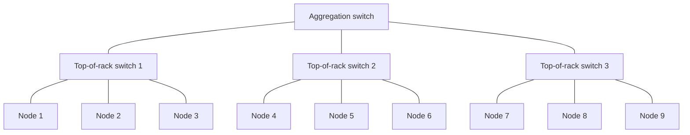

# Chapter 55 — Why Distributed at All

> **Goal of this chapter:** to convince you, from concrete numbers, that distributed computation is not a fashion choice but a response to a specific arithmetic problem — data has outgrown single machines, and even when it hasn't, parallelism buys you wall-clock time you cannot get back. We will also be honest about what distributed computation *costs* — complexity, latency, dollars — so that by the end you have a calibrated view of when to reach for Spark and when *not* to. Every subsequent chapter in Part J takes this motivation for granted; if the motivation isn't real to you, the rest of the part will feel like ceremony.

---

## 55.1 The 100GB problem

You have just trained a customer churn classifier in Part F. The model is good. The product team has a fresh batch of customers they want scored — roughly 100 gigabytes of transaction-and-engagement records, one row per customer, several hundred columns. You sit down at your laptop, type

```python
import pandas as pd
df = pd.read_csv("customers.csv")
```

and walk to the coffee machine. By the time you return, your kernel has died. Your laptop has 32GB of RAM. A 100GB CSV does not fit. There is no obvious knob to turn.

This is the smallest possible version of the problem distributed computation exists to solve. Your data is bigger than one machine's memory. Sometimes the data is even bigger than one machine's *disk* — a petabyte of clickstream logs at Meta or Google does not live on any single server. The world has been generating digital records faster than single-machine hardware has scaled for at least twenty years, and the gap continues to widen.

A natural first instinct is to "stream" the file — read it in chunks, process each chunk, and never hold the whole thing in memory at once. This works for some operations. `df.col.mean()` can be computed chunk-by-chunk by maintaining a running sum and count. But many operations cannot. `df.groupby("region").mean()` needs, in principle, to see every row before it can finish — though clever implementations approximate this. Sorting a 100GB dataset cannot be done in 32GB of RAM without spilling to disk. Joining two 100GB tables requires holding parts of both in memory simultaneously.

And even when you *can* stream, you are by definition using one CPU. Modern laptops have 8–16 cores. The other 7–15 cores are idle while one core works through the file. You are leaving most of your machine on the table.

The next instinct — "buy a bigger machine" — works for a while. Cloud providers will rent you instances with 256GB or 1TB of RAM. They will eventually rent you instances with 24TB of RAM. But the cost curve is super-linear: a 24TB-RAM instance costs not 100× a 240GB instance but hundreds of times more, because such hardware is rare and hard to provision. And no matter how much RAM you buy, you eventually hit a ceiling — there is no commodity server with a petabyte of memory.

The arithmetic forces the move to multiple machines. The question is how to do it without losing your mind.

---

## 55.2 Shared-nothing architecture: the basic shape

The dominant architecture for handling data that exceeds a single machine — and the one Spark implements — is called **shared-nothing**. The phrase is unfortunately abstract, but the idea is concrete.

You have many machines (say, 50). Each one has its own CPU, its own RAM, its own local disk. None of them share memory directly. They sit on a network — typically a high-speed Ethernet inside a cloud data center, sometimes a slower link between data centers. To exchange information, one machine must send bytes across the network to another.

```
+--------------+   network   +--------------+   network   +--------------+
|  Machine 1   |  ◄────────► |  Machine 2   |  ◄────────► |  Machine 3   |
|  CPU         |             |  CPU         |             |  CPU         |
|  RAM (64GB)  |             |  RAM (64GB)  |             |  RAM (64GB)  |
|  Disk (1TB)  |             |  Disk (1TB)  |             |  Disk (1TB)  |
+--------------+             +--------------+             +--------------+
```

Each machine holds a *piece* of the overall dataset. If you have 100GB of customer records and 50 machines, each machine might hold roughly 2GB. When you ask the cluster a question — "what's the average lifetime value, grouped by region?" — each machine computes a partial answer over its slice, and then the partial answers are combined.

The "shared-nothing" part is the key. There is no shared memory. There is no shared disk. Two machines cannot accidentally clobber each other's variables. They can only communicate by sending explicit messages over the network. This sounds restrictive — and it is — but it is also what makes the architecture *scale*. If two machines had to coordinate on a shared resource, that resource would become the bottleneck, and adding more machines would not help. By forcing independence, shared-nothing systems can grow to thousands of machines without choking on coordination.

The alternative architectures — **shared-memory** (all CPUs see the same RAM, used in multi-core desktops and high-end servers) and **shared-disk** (all machines see the same filesystem, used in some Oracle deployments) — both hit ceilings at modest scale because the shared resource cannot be made arbitrarily large or fast. Shared-nothing is the architecture you choose when you need to grow to a hundred machines and beyond.

### 55.2.1 The cost of "no shared memory"

When two machines can't share memory directly, every piece of information that one needs from the other has to be serialised, shipped over the network, and deserialised on the other side. This costs time. To get a feel for it, here are some real numbers — the "latency numbers every programmer should know," updated for modern hardware:

| Operation | Approximate time |
|-----------|-----------------:|
| L1 cache reference | 1 ns |
| Branch mispredict | 3 ns |
| L2 cache reference | 4 ns |
| Main memory reference | 100 ns |
| Send 1KB over 10Gbps network (within rack) | 10 μs |
| SSD random read | 100 μs |
| Round-trip within data center | 500 μs |
| Read 1MB sequentially from SSD | 1 ms |
| HDD seek | 10 ms |
| Send packet between data centers (cross-country) | 50–150 ms |

The interesting comparisons are within the table. A local memory access is about 100 nanoseconds. A single network round trip within a data center is about 500 microseconds. The network is roughly **5,000 times slower** than memory.

This is the central tension of distributed computing. The work you want to do is fast. The communication required to coordinate that work is slow. The art is in minimising the communication.

### 55.2.2 What "minimising communication" looks like in practice

Suppose you want to compute the global average of one column across 50 machines, each holding 2GB of data with about 20 million rows.

A bad approach: every machine sends every row to a coordinator, which computes the average. Total data shipped: 100GB. At a generous 10 Gb/s network, that's 80 seconds — and that's per-direction, ignoring serialisation and contention.

A good approach: every machine computes the local sum and local count over its 20 million rows. Each machine sends a single pair `(sum, count)` to the coordinator — 16 bytes total. Coordinator sums the sums, sums the counts, divides. Total data shipped: 50 × 16 bytes = 800 bytes. The compute on each machine happens in parallel across 50 CPUs, while the network traffic is negligible.

The good approach is *thousands of times faster*. Both are computing the same average. The difference is which work gets done where, and how much data crosses the network. This is the MapReduce pattern (Chapter 56) in miniature, and it's the kind of optimisation Spark performs automatically when you express your computation through its API.

The bad pattern — `df.collect()` on a huge DataFrame and then computing on the driver — is the single most common Spark anti-pattern. It is doing the equivalent of the bad approach above. Knowing why it's bad is half the battle.

---

## 55.3 What you gain (and lose) by going distributed

A balanced view requires naming both sides of the ledger.

### 55.3.1 What you gain

**Bigger data.** The obvious win. Aggregate RAM across 50 machines is 50× a single machine's. Aggregate disk and aggregate CPU scale the same way. Spark on a 1000-node cluster can process petabyte-scale datasets that no single machine could ever load.

**Parallelism.** Even when the data *would* fit on one machine, splitting the work across many machines speeds it up. Sort 10GB on a 16-core laptop: minutes. Sort 10GB on a 200-core cluster: seconds. This matters for iterative workloads — model training, hyperparameter sweeps, daily ETL pipelines — where wall-clock time directly affects how many ideas you can try in a day.

**Fault tolerance.** Any given machine in a cluster of 50 has, say, a 1% chance of failing on a given day. The cluster as a whole has a ~40% chance that *some* machine fails per day. If your application can't survive a single-node failure, it will fail constantly at scale. Distributed frameworks like Spark are *designed* to detect failures and re-execute the lost work on a survivor — without crashing the whole job. This is not free; it requires building in lineage or checkpointing (Chapter 58 covers Spark's lineage approach). But once built in, it transforms what's possible.

**Elasticity.** Cloud-hosted clusters can be resized while running (Databricks autoscaling does this). If your overnight ETL needs 100 machines but your interactive notebooks only need 4, you don't pay for 100 machines all day. The single-machine paradigm has no equivalent — you either have the hardware or you don't.

### 55.3.2 What you lose

**Latency overhead.** A computation that would run in 50 milliseconds on a single laptop might take 2 seconds on a small Spark cluster. Spark has start-up costs — driver scheduling, executor warm-up, task dispatch — that dominate when the actual work is small. For low-latency serving (response time < 100ms), Spark is generally the wrong tool. Spark is built for *throughput*, not latency.

**Tail latency / straggler effect.** Your job is only as fast as the slowest task. If 49 of your 50 machines finish in 10 seconds but one machine takes 60 seconds because its disk is degraded, your job takes 60 seconds. This is called the *straggler problem*, and at scale it is a constant operational concern. Spark has speculative execution — re-running slow tasks on other machines — but the problem never fully goes away.

**Complexity.** Debugging a Spark application is harder than debugging a pandas script. A failure could be in your code, in the data, in the cluster manager, in network configuration, in the JVM's garbage collector, in shuffle behavior, in skewed key distributions. Stack traces are deeper and less informative. Logs are spread across many machines. Profiling tools are coarser. You need a wider skill base to operate confidently.

**Cost.** Fifty machines cost roughly fifty times one machine. Cloud costs add up. A Databricks all-purpose cluster of 10 medium nodes left running by mistake over a weekend can cost hundreds of dollars. There is a real engineering discipline to scaling up only when you need to and scaling down promptly.

**Loss of expressive freedom.** PySpark's DataFrame API is not pandas. Some operations that are trivial in pandas — random row access, in-place modification, iterating over rows in Python — are either expensive or impossible in Spark. You write Spark code that *thinks distributed*, not Python code that happens to run on Spark. Internalising this takes time.

### 55.3.3 The honest assessment

For datasets up to ~10GB, a well-tuned pandas + scikit-learn workflow on a single beefy machine is almost always faster than Spark — sometimes 10× faster, because there's no serialisation overhead, no driver-executor split, no JVM. The Spark overhead is fixed per job; for small data, it dominates.

For datasets of 100GB to terabytes, Spark wins decisively because the data simply does not fit anywhere else. There's no contest.

The interesting zone is 10–100GB, where a high-memory single machine *could* technically handle the data but Spark's parallelism might still be faster. This is where engineering judgment matters: do I have the machine? Do I have the cluster? How often does this job run? Is the team already on Spark for other reasons? There's no universal answer.

A specific common mistake worth naming: teams reach for Spark *too early*, lured by the cool-distributed-systems aesthetic, and then spend months wrestling with cluster sizing, executor configuration, and shuffle tuning for problems that would have taken twenty lines of pandas. The right default is to *start small and scale up only when forced*. Most of the world's data science fits in pandas. The portion that doesn't — large-scale enterprise ETL, ML training on hundreds of millions of rows, log processing — is genuinely well-served by Spark.

---

## 55.4 The CAP theorem (briefly)

Distributed systems sit under a famous theoretical constraint called the **CAP theorem**, due to Eric Brewer. It says: in any distributed data system, you can guarantee at most two of:

- **C**onsistency — every read sees the most recent write.
- **A**vailability — every request receives a response (even if not the freshest).
- **P**artition tolerance — the system keeps functioning even if the network between nodes is interrupted.

In any real distributed system, network partitions *will* happen — packets get dropped, switches reboot, cables fail. So you don't really get to opt out of P. The real choice is between C and A: when a partition occurs, do you sacrifice consistency (let nodes diverge) or availability (refuse requests until the partition heals)?

Spark is firmly in the **throughput-not-low-latency-consistency** camp. It is a batch-processing system for analytical workloads, not a transactional database. It does not promise that two reads of the same data, executed concurrently against the same cluster, will see the same value if a write is happening between them. (Delta Lake, layered on top of Spark, *does* offer ACID transactions over Spark — Part L returns to this.) For ML training and ETL, this is fine; the data you're operating on is usually a snapshot, not a moving target.

The CAP theorem matters for context. It is the reason transactional databases (Postgres, Oracle) and analytical engines (Spark, Snowflake, BigQuery) are different products, optimised for different points in the C-A-P trade-off. Spark plays its game; transactional DBs play theirs; using one where you need the other is one of the more painful architectural mistakes.

---

## 55.5 A short mental model of network topology

When you have 50 machines in a cluster, they're not randomly arrayed. They sit in **racks**, with 20–40 machines per rack and a high-speed switch at the top of each rack (the "top-of-rack switch"). Machines in the same rack are connected to each other via that single switch — fast, low-latency. Machines in different racks have to route through *higher-tier* switches that aggregate many racks together, and those higher-tier links are often *oversubscribed* (more bandwidth demanded than supplied).



Bandwidth within a rack might be 10 Gb/s per machine. Bandwidth between racks might be 1 Gb/s per machine. Inter-data-center links are slower still — sometimes 100s of milliseconds in latency rather than microseconds.

The practical consequence for Spark is **data locality**. The Hadoop and Spark ecosystems try to schedule a computation on the machine that already has the data, or failing that, on a machine in the same rack. Reading 1GB from a local SSD is much faster than reading 1GB from another machine's SSD across the network. Reading from another rack is slower still. The cluster scheduler is *rack-aware*: it knows which machine holds which data, and which rack each machine sits in, and prefers to assign work accordingly.

You don't usually configure this directly when using Databricks — the platform handles it. But the *principle* matters when you're reasoning about why one job runs faster than another. A job that achieves good data locality will be fast. A job that constantly shuffles data between racks will be slow, even if the total work is the same.

We will return to this in Chapter 60 when we dig into Spark's shuffle internals.

---

## 55.6 Worked example: counting word frequencies at three scales

To make all of the above concrete, let's walk through a single problem at three scales and see how the right tool changes.

**The problem.** You have a text corpus. Count how many times each word appears.

**Scale 1: 10MB of text on a laptop.**

```python
from collections import Counter
with open("small.txt") as f:
    counts = Counter(f.read().split())
print(counts.most_common(10))
```

Three lines. Runs in under a second on any laptop made in the last decade. Spark would be wildly overkill — the cluster startup alone takes longer than the entire computation.

**Scale 2: 10GB of text on a laptop.**

Doesn't quite fit in RAM, but we can stream:

```python
from collections import Counter
counts = Counter()
with open("medium.txt") as f:
    for line in f:
        counts.update(line.split())
```

Still works. Takes a few minutes. One CPU is busy; the other 7 are idle. We could parallelise with `multiprocessing` to use all 8 cores, getting maybe a 5–6× speedup. Still no Spark needed.

**Scale 3: 10TB of text spread across S3 in 100,000 files.**

Now we're in distributed territory. The data doesn't fit on any single machine. Reading it serially would take days. We want to parallelise the reading and counting across many machines.

```python
from pyspark.sql import functions as F
words = spark.read.text("s3://corpus/*").select(F.explode(F.split("value", " ")).alias("word"))
counts = words.groupBy("word").count().orderBy(F.desc("count"))
counts.show(10)
```

Four lines of Spark replacing what would have been hundreds of lines of MPI or custom distributed code in the pre-Spark era. Behind the scenes, Spark reads the 100,000 files in parallel across all executors, tokenises locally, then *shuffles* (Chapter 60) the partial counts so that all occurrences of each word end up on the same machine, then sums. The user writes a high-level expression; Spark handles the orchestration.

The cost: a 50-node Spark cluster for an hour. The win: a job that completes in an hour instead of a week.

The lesson: **the right tool depends on the scale.** Spark is the right answer for scale 3 and the wrong answer for scale 1. Knowing which scale you're operating at is the first decision in any data engineering project, and it's a decision that has more to do with the data than with what's fashionable.

---

## 55.7 Where this leaves us

You should now believe — not just accept on authority — that distributed computation is a real response to a real arithmetic problem. The world has data that doesn't fit on one machine, and the only way to process it is to spread it across many machines that communicate over a network. The shared-nothing architecture is the dominant solution. Communication is expensive relative to local computation, so the practical art of distributed systems is in minimising communication.

You should also believe that distributed computation has *costs*: complexity, latency overhead, dollar cost, and the discipline of writing code that thinks distributed. For small data, these costs outweigh the benefits. There is no shame in using pandas where pandas fits.

In the next chapter, we look at the historical predecessor to Spark — Google's MapReduce — to understand the abstraction that started the modern distributed-computing era, and what Spark improved when it arrived. Once you understand MapReduce, the design of Spark stops feeling arbitrary and starts feeling inevitable.

---

## 55.8 Summary

1. Distributed computation exists because data has outgrown single-machine RAM, single-machine disk, and single-machine CPU. The growth is structural and ongoing, not a fad.
2. The dominant architecture is *shared-nothing*: many machines, each with its own CPU/RAM/disk, communicating only over the network. This scales further than shared-memory or shared-disk architectures because no shared resource bottlenecks the system.
3. Network communication is roughly 1000–10,000× slower than local memory access. The art of distributed computing is to minimise communication — do as much work as possible locally, then exchange only summaries.
4. Distributed compute gains: bigger data, parallelism, fault tolerance, elasticity. Losses: latency overhead, straggler tail latency, complexity, cost, restricted expressive freedom.
5. For data under ~10GB, distributed compute is usually overkill — pandas + scikit-learn is faster and simpler.
6. The CAP theorem constrains any distributed data system to two of {consistency, availability, partition tolerance}. Spark prioritises throughput over low-latency consistency, which is right for batch analytics and wrong for transactional workloads.
7. Network topology — racks, top-of-rack switches, inter-DC links — creates a hierarchy of bandwidth. Data locality (running computation near where the data already lives) is a major Spark performance lever.

---

## 55.9 What this builds on / where this returns

**Builds on:** Standard software-engineering background — the notions of CPU, RAM, disk, network, and how their speeds compare. Nothing earlier in this book is required.

**Returns:**
- Chapter 56 picks up the story historically, introducing MapReduce as the abstraction that made shared-nothing-cluster computation tractable for ordinary developers.
- Chapter 57 makes the cluster physical: driver, executors, cluster manager.
- Chapter 60 zooms in on shuffle — the operation where the communication cost we worried about in 55.2 becomes concrete and measurable.

---

## 55.10 Exercises

1. **Bandwidth arithmetic.** Your cluster has 50 nodes with 10 Gb/s links each. You want to compute the average of one column across 100GB of data partitioned evenly across the cluster. Compare (a) the time to `df.collect()` all data to the driver and compute the average there, versus (b) the time for each node to compute its local sum and count and send only those numbers to the driver. Assume the network is the bottleneck.

2. **When to use Spark.** For each of the following workloads, decide whether you would use Spark or a single-machine solution, and justify:
   1. Training a logistic regression on 50,000 emails to detect spam.
   2. Computing daily aggregate metrics over 18 months of credit-card transactions (~5 billion rows).
   3. Serving real-time fraud predictions at 1000 requests per second with <50ms latency.
   4. Joining a 200GB customer table with a 500GB transaction table.
   5. Running a hyperparameter sweep of 50 XGBoost configurations on a 2GB tabular dataset.

3. **Network latency.** Two machines in the same rack are connected by a 10 Gb/s link with 500 μs round-trip latency. You need to send a single integer (8 bytes) from one to the other. What dominates the time — bandwidth or latency? What about sending 1GB?

4. **Shared-nothing constraint.** Why does a "shared-disk" architecture (all machines see the same network filesystem) not scale to thousands of nodes the way shared-nothing does?

5. **Fault tolerance math.** A single machine has a 0.5% chance of failing per day. In a 200-node cluster, what is the probability that at least one machine fails in a given day? (Use the complement.) What does this imply about the design of jobs that run on the cluster?

6. **CAP theorem application.** A bank's ATM withdrawal system needs to be available 24/7 and absolutely cannot allow two simultaneous withdrawals to overdraw the same account. Which letter of CAP is the bank willing to weaken when the network partitions, and how does that constrain their architecture?

7. **The straggler problem.** Your job has 100 tasks of equal expected duration (10 seconds each). 99 finish in 10 seconds; 1 takes 200 seconds because its node has a degraded disk. What is the total wall-clock time? What does this suggest about how to design tolerable distributed jobs?

8. **Reach for Spark, or not.** A teammate has a 200MB CSV and wants to compute a groupby + average. They've heard Spark is fast at this and want to spin up a cluster. Talk them out of it (or into it). Justify based on what you've learned.

9. **Data locality.** Suppose Spark schedules a task to run on a machine that does *not* have the relevant data partition. The data lives on another machine in the same rack. Estimate (qualitatively) the slowdown vs. running the task on the data-local machine, given the rack-internal network speed.

10. **Cost vs. benefit.** A 50-node Spark cluster costs $100/hour. A daily job runs for 30 minutes. A monthly cost is therefore ~$1,500. The same job could run for 6 hours on a single beefy machine at $5/hour ($900/month). Why might you still prefer the cluster? Why might you prefer the single machine?

<details>
<summary>Answers</summary>

1. (a) 100GB at 10 Gb/s = 80 seconds per direction at peak; in practice with overhead, several minutes. (b) Each node sends 16 bytes; total 800 bytes; on the order of microseconds. Approach (b) is 10⁵–10⁶ times faster.

2. (i) Single-machine; 50K emails is tiny. (ii) Spark; 5B rows won't fit on one machine. (iii) Not Spark; latency requirement is too tight — use a Java/Python serving framework with a pre-loaded model. (iv) Spark; both tables exceed single-machine capacity. (v) Either, but a single machine with multiprocessing or joblib is often simpler at 2GB. Spark adds value if you want to use SparkTrials for distributed Hyperopt — Chapter 53.

3. For 8 bytes: latency dominates entirely — the bandwidth contribution is nanoseconds, latency is 500 μs. For 1GB: bandwidth dominates — 1GB / 10 Gb/s ≈ 800 ms, vs. 500 μs latency. The lesson: small frequent messages are dominated by latency; large infrequent messages by bandwidth. This is why Spark batches data into shuffles.

4. The shared disk (or network filesystem) is itself a single resource with bounded bandwidth and IOPS. As you add more nodes, contention on the shared disk grows linearly while its capacity is fixed. Eventually adding nodes makes the system *slower*. Shared-nothing avoids this because every node has its own local I/O.

5. P(any failure) = 1 − (0.995)²⁰⁰ ≈ 1 − 0.367 ≈ 63%. So nearly two days in three, *something* fails. Implication: any long-running job must be resilient to single-node failure. This is why Spark has lineage (recompute lost partitions) and why Databricks jobs auto-retry.

6. The bank weakens **A** (availability). When the partition occurs, an ATM cut off from the central account system *refuses* the withdrawal rather than potentially allowing an overdraw. The user sees "service unavailable" — annoying, but better than the alternative. This is a classic CP system.

7. 200 seconds — the slowest task dominates. Implications: (a) tasks should be roughly equal in size (avoid skew, Chapter 60); (b) speculative execution can mitigate (Spark re-runs slow tasks on another node); (c) plan for the tail, not the mean — a 99th-percentile-fast task design produces 99th-percentile slowness when scaled to 100 parallel tasks.

8. Talk them out of it. 200MB fits trivially in pandas RAM and the entire job will run in seconds. Spinning up a Spark cluster costs minutes of wall-clock just for the cluster start. Aggregate runtime: pandas wins by an order of magnitude. The only reason to use Spark here is if the project's data is *going* to grow to TB-scale and you want consistent code, but for one-off analysis at 200MB, pandas is the right answer.

9. Reading from another machine's SSD across a 10 Gb/s rack-internal link is maybe 2–5× slower than reading from local SSD (the rack network is fast but not as fast as direct SSD bus). For larger volumes, the gap is smaller (bandwidth-limited either way). For frequent small reads, the gap is larger (latency-limited). The general principle: data locality is worth scheduling for, but it's not catastrophic to lose it.

10. Cluster wins if: you need wall-clock time (30 min vs 6 hours matters), you have spiky workloads where parallelism helps, you want elasticity for larger future jobs, the team's tooling is already Spark-based. Single machine wins if: the job is the only one (no concurrency), you're cost-sensitive, you want operational simplicity, the data won't grow. There's no universally right answer; the question forces you to articulate the constraints.

</details>
