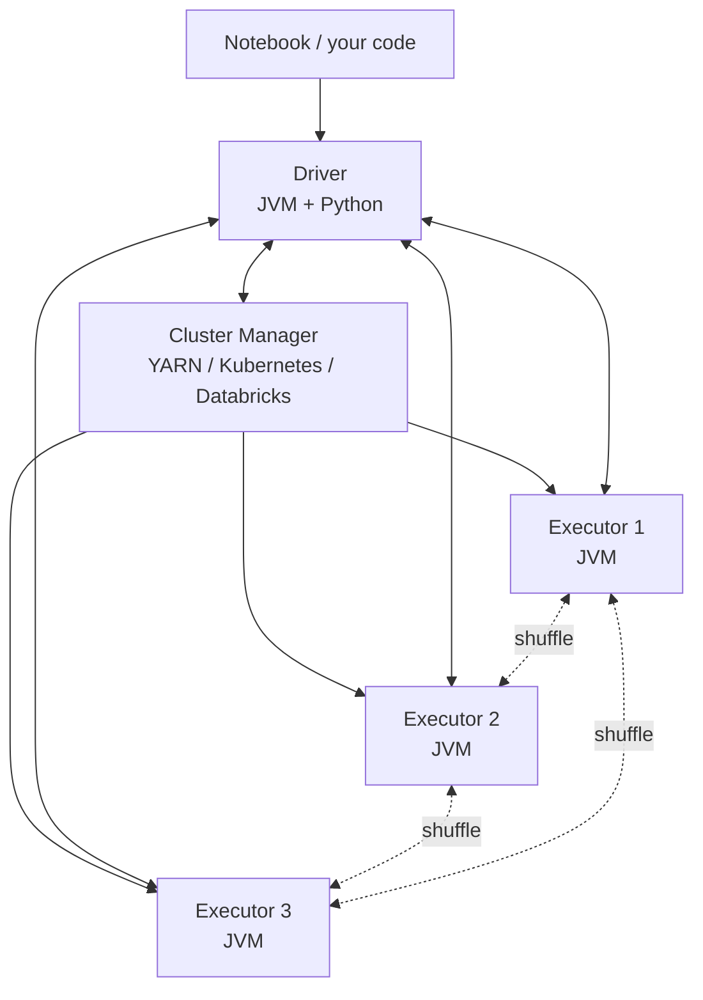
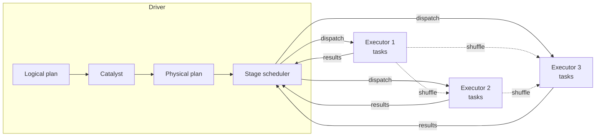

# Chapter 57 — Spark Architecture: Driver, Executors, Cluster Manager

> **Goal of this chapter:** to take Spark from "the framework that runs my notebook" to a concrete picture of which processes exist, what runs where, and who talks to whom. When you call `spark.read.csv("s3://...").groupBy("region").agg(...)`, several physical machines coordinate to produce your answer. Knowing which machine does what is the difference between guessing at performance ("Spark is slow today") and reasoning about it ("the driver is overloaded; let's move that work to executors"). This chapter is the physical-systems picture under everything else in Part J.

---

## 57.1 What happens when you call `spark.read.csv(...)`?

You open a Databricks notebook. The cluster is started. You type:

```python
df = spark.read.csv("s3://bucket/data/", header=True)
df.groupBy("region").agg(F.sum("amount")).show()
```

What just happened, physically?

Behind the scenes, a series of distinct processes — running on different machines, connected by network — collaborated. The notebook itself runs on one machine (the **driver**). The reading and aggregation happened on several other machines (the **executors**). Between them sat a coordination layer (the **cluster manager**) that decided which executor machines existed in the first place.



The interaction is not a one-way pipeline. The driver and executors maintain bidirectional communication throughout the job: the driver sends tasks down, the executors send progress reports up, and the executors also communicate among themselves during shuffles (Chapter 60). This chapter unpacks each component.

---

## 57.2 The driver

The **driver** is the process that runs your application code — your `main()` function, your notebook cell, your Python script. From its perspective, it is the maestro: it decides what work needs doing, breaks it into pieces, hands those pieces to executors, and collects the results.

Concretely, in a Databricks notebook, the driver is a JVM process running on the *driver node* of the cluster, with a Python process attached (for PySpark) via a bridge called Py4J. When you type Python code in a notebook cell, it runs in the Python process; when that Python code calls Spark APIs (e.g., `df.groupBy(...)`), Py4J translates the call into JVM method invocations on the JVM driver. The JVM driver then orchestrates the work.

### 57.2.1 What the driver does

Three responsibilities define the driver:

1. **Build the logical plan.** When you write `df.filter(...).groupBy(...).agg(...)`, the driver constructs an abstract syntax tree (AST) of these operations. Nothing has been executed yet — these are just *descriptions* of what to do.

2. **Optimise and plan execution.** When you trigger an *action* (`show`, `collect`, `count`, `write`), the driver hands the logical plan to the **Catalyst optimizer** (Chapter 59). Catalyst rewrites and optimises it, producing a physical plan: a sequence of **stages**, each split into **tasks** (one per partition — Chapter 60). The driver also decides which executor should run which task.

3. **Coordinate execution.** The driver dispatches tasks to executors, monitors their progress, handles failures (retry the task on another executor), and collects final results when an action requests them (e.g., `.collect()` brings data back to the driver).

You can think of the driver as both the *compiler* and the *runtime scheduler* of a Spark application. It is single-process and (mostly) single-threaded for these orchestration duties.

### 57.2.2 The driver is a single point of failure

Because there's only one driver per Spark application, if the driver crashes, the whole application crashes. There is no failover. This is by design — Spark's fault-tolerance model handles *executor* failures (recompute lost partitions from lineage, Chapter 58) but assumes the driver is reliable.

In practice, this means:
- Don't run unnecessarily expensive work on the driver. `.collect()` on a 50GB DataFrame pulls all 50GB into the driver's heap, which often OOMs. `.show()` brings only 20 rows by default — safe.
- Don't put unrelated heavy Python computation in the same notebook session as a Spark job. The driver's Python process and the JVM share the driver node; if either is overloaded, both suffer.
- Driver-side state is ephemeral; if the driver restarts, in-memory state is lost.

For very long-running production jobs, Databricks Jobs offers retries — a failed run is restarted from scratch, with a fresh driver. But during a single run, the driver is the system's weak link.

### 57.2.3 Driver sizing

The driver doesn't process the data itself — that's the executors' job. So why does driver sizing matter?

The driver needs memory and cores for:
- **Plan compilation.** For a query with many joins and aggregations, Catalyst can use surprising amounts of memory during optimisation. Tens of GB for very complex queries.
- **Result collection.** Any data you `.collect()`, `.toPandas()`, or `.take()` lots of, comes back to the driver. The driver needs enough heap to hold it.
- **Broadcast variables.** If you broadcast a 1GB lookup table to all executors (Chapter 60's broadcast join), the driver holds a copy.
- **Task tracking.** With thousands of tasks per stage, the driver's bookkeeping (task IDs, progress, retry state) consumes memory.

For typical Databricks workloads, a 32GB / 4-core driver is enough for jobs scoring up to terabyte-scale data. For workloads with frequent `.collect()` or large broadcasts, you might need 64GB or more. For pure ETL with no driver-side work, you can run a 16GB driver and save money.

The relevant config: `spark.driver.memory` (e.g., `32g`), `spark.driver.cores` (e.g., `4`).

---

## 57.3 The executors

The **executors** are the worker JVMs that do the actual data processing. There are many of them — typically dozens, sometimes hundreds. Each executor:

- Runs on a worker node (a separate machine from the driver).
- Has a fixed amount of memory and a fixed number of cores (parallel task slots).
- Receives tasks from the driver, runs them on its data partitions, and reports back.
- Caches data in memory when instructed (`.cache()`, `.persist()`).
- Communicates with other executors during shuffles.

### 57.3.1 The executor's life cycle

When you start a Spark application (e.g., spin up a Databricks cluster, run a job), the cluster manager (Section 57.4) allocates a fixed pool of executor JVMs across the worker nodes. These executors register with the driver, and the driver becomes aware of them.

For the duration of the application — until the cluster is torn down or autoscaling decides to remove an executor — those JVMs stay alive. Tasks are *dispatched* to them; the executors don't restart between tasks. This is a major efficiency win over Hadoop MapReduce, where every task was a fresh JVM (with JVM startup overhead).

Inside each executor, tasks run on threads. If an executor has 4 cores, it can run 4 tasks in parallel. Each task is single-threaded within itself.

### 57.3.2 Executor memory layout

An executor's heap is divided into regions:

```
┌────────────────────────────────────────────────────┐
│ Executor JVM heap (e.g., 30GB)                     │
├────────────────────────────────────────────────────┤
│ Reserved memory (300MB)                            │
├────────────────────────────────────────────────────┤
│ User memory (~25%)                                 │
│ — user data structures, UDF state                  │
├────────────────────────────────────────────────────┤
│ Storage memory                                     │
│ — cached RDDs / DataFrames                         │
│                                                    │
│ ─── Unified Memory Manager ─────────────────────── │
│                                                    │
│ Execution memory                                   │
│ — shuffle, joins, sorts, aggregations              │
└────────────────────────────────────────────────────┘
```

In modern Spark (1.6+), storage and execution memory share a region under the **Unified Memory Manager**. By default, ~60% of the heap is "Spark memory" (the unified region), split dynamically between storage and execution. The remainder is user memory and reserved.

The practical consequences:
- A query that does a lot of shuffling (execution memory) can crowd out cached data (storage memory), causing cache evictions.
- A query that caches a lot can leave less room for shuffles, causing spills to disk.
- You usually don't tune these directly. You give the executor enough total memory and let Spark balance.

Beyond the heap, executors also use **off-heap memory** (managed by Tungsten, Chapter 59) for compact binary representations of data. This memory isn't visible to the JVM's garbage collector, which is a feature — GC pauses on multi-GB heaps were a major performance issue in early Spark.

### 57.3.3 Executor sizing — the 4-5 cores rule

How many cores per executor? How many executors total?

The conventional wisdom from Databricks and the broader Spark community is **4-5 cores per executor**. Why not more?

- **JVM garbage collection contention.** A JVM with many parallel threads competing for the same heap has more GC overhead. Splitting a 16-core machine into 4 executors of 4 cores each (rather than one executor of 16 cores) reduces GC contention.
- **HDFS / S3 I/O throughput.** Each executor maintains a fixed number of HDFS/S3 client threads. Beyond ~5 cores per executor, the I/O bandwidth saturates.
- **Memory per task.** Each task gets `executor_memory / cores` of working memory. Too few cores = lots of memory per task (good for shuffles) but few tasks in parallel. Too many cores = many tasks but each starved for memory.

So on a 16-core, 64GB worker node, the sweet spot is roughly **3 executors of 5 cores and ~20GB heap each**, with the remaining 1 core and ~4GB reserved for the OS, log daemons, etc.

The number of executors total is governed by:
- `spark.executor.instances` — static count
- `spark.dynamicAllocation.enabled=true` — let Spark autoscale

In Databricks, you typically don't set these manually. The platform manages cluster sizing for you, with autoscaling between min and max worker counts.

### 57.3.4 Tasks per executor

When the driver schedules a stage, it has, say, 200 tasks (one per partition). The cluster has 10 executors × 5 cores = 50 task slots. So 50 tasks run in parallel; as they complete, the next 50 are dispatched; eventually all 200 are done.

The duration of a stage = (number of tasks / total task slots) × average task duration, *if tasks are evenly sized*. If they're skewed, the slowest task dominates (Chapter 60). The driver's scheduler tries to keep all slots busy.

A common diagnostic: if a stage has 200 tasks but only 50 are running at any time (and only 50 task slots exist), you're at full parallelism. If 200 tasks are running on 5 slots, you have far more tasks than slots and tasks are queued — usually fine, sometimes suggests over-partitioning. If 50 tasks are running on 200 available slots, you have under-parallelism — the data is split into too few partitions to use the cluster.

---

## 57.4 The cluster manager

Spark does not allocate machines on its own. It asks a **cluster manager** to provision worker nodes (and the executor JVMs that run on them). Several cluster managers exist:

1. **Standalone.** Spark's built-in simple manager. Works for small clusters; not common in production.
2. **YARN.** Hadoop's resource manager. Standard in on-premise Hadoop clusters; less common in pure cloud deployments.
3. **Kubernetes.** Modern container-orchestration platform. Used in Spark-on-Kubernetes deployments and in Databricks' newer offerings.
4. **Databricks Resource Manager.** Databricks' proprietary internal manager. What you're using when you spin up a Databricks cluster.
5. **Mesos.** Older alternative; mostly deprecated for Spark use.

From Spark's perspective, the cluster manager has one main responsibility: when Spark requests N executors, the cluster manager finds the hardware to run them, starts the executor JVMs, and tells Spark where they are. The cluster manager also handles failures — if a worker node dies, it tries to provision a replacement.

For Databricks users, the cluster manager is the platform itself. When you create a cluster in the Databricks UI, the platform requests cloud VMs from AWS / Azure / GCP, configures them, starts the executor JVMs, and reports back. Autoscaling, spot-instance handling, and cluster termination are all managed by the platform.

### 57.4.1 Cluster types on Databricks

Databricks offers different cluster types with the same underlying architecture:

- **All-purpose clusters.** Interactive — shared by users for notebooks. Stay alive until terminated. More expensive per hour but ready for ad-hoc work.
- **Job clusters.** Ephemeral — spun up to run one specific job, then torn down. Cheaper per run; no shared state.
- **SQL warehouses.** Optimised for SQL workloads with Photon (Section 57.6.2). Underneath, still Spark.

All three use the same driver+executors+cluster-manager architecture. The differences are in lifecycle, pricing, and which optimisations are enabled.

---

## 57.5 The end-to-end query flow

Let's walk through what happens when you execute a non-trivial Spark query, end-to-end. Suppose you run:

```python
df = spark.read.parquet("s3://big-table/")
result = (df
    .filter(F.col("year") == 2024)
    .groupBy("region")
    .agg(F.sum("amount").alias("total"))
    .orderBy(F.desc("total")))
result.show()
```

Step by step:

**Step 1: Build the logical plan.** As you write each line, the Python (PySpark) driver translates it into JVM calls that build a tree of `LogicalPlan` nodes. After the four operations, the tree looks like (Sort → Aggregate → Filter → Scan). At this point, nothing has been read from S3. Nothing has executed.

**Step 2: Trigger via action.** `result.show()` is an *action*. Actions force evaluation. The driver hands the logical plan to Catalyst.

**Step 3: Catalyst optimises.** Catalyst (Chapter 59) applies its four phases — analysis, logical optimisation, physical planning, code generation. It performs predicate pushdown (move the `year == 2024` filter into the Parquet scan, so we read less data), projection pushdown (only read the columns we need: `year`, `region`, `amount`), and picks physical operators (e.g., `HashAggregate` for the groupBy, `Sort` for the orderBy). It generates JVM bytecode for the resulting plan.

**Step 4: Split into stages.** Catalyst's physical plan is partitioned into **stages** at shuffle boundaries. In our example:
- Stage 0: scan Parquet, filter, partial-aggregate per partition.
- Stage 1: shuffle the partial aggregates by region, full-aggregate, sort.
- Stage 2: collect top rows for `.show()`.

**Step 5: Dispatch tasks.** Each stage is split into tasks (one per input partition for Stage 0; one per shuffle partition for Stages 1+). The driver dispatches tasks to executor task slots.

**Step 6: Executors run tasks.** Each task:
- Reads its input data (from S3 for Stage 0, from another executor's local disk for the shuffle in Stage 1).
- Runs the generated bytecode on the data.
- Writes output (to local disk for shuffle stages, back to the driver for the final stage).

**Step 7: Shuffle handshake.** Between Stage 0 and Stage 1, executors write their partial aggregates to local disk, partitioned by `hash(region)`. Stage 1's executors fetch the relevant partitions from each Stage 0 executor over the network.

**Step 8: Collect to driver.** Stage 2's task runs, and its output (the top 20 rows for `.show()`) is sent back to the driver. The driver formats and displays them.

This whole sequence might take a few seconds for a small query, minutes for a big one. The principles don't change with scale; just the number of tasks and the amount of data.



---

## 57.6 Spark on Databricks specifically

The architecture above is generic Spark. Databricks adds platform-specific layers worth knowing.

### 57.6.1 The Databricks Runtime (DBR)

Databricks Runtime is a customised distribution of Spark with optimisations, library bundling, and tighter integration with cloud storage. Recent DBR versions are 5–10× faster than open-source Spark on equivalent workloads, partly thanks to:

- Photon (next section).
- Native Delta Lake integration.
- Optimised IO connectors for S3 / ADLS / GCS.
- Built-in MLflow, autologging, Feature Store.

The "DBR ML" variant additionally ships with ML libraries (XGBoost, LightGBM, TensorFlow, PyTorch) pre-installed and a curated set of versions known to work together.

### 57.6.2 Photon

**Photon** is Databricks' proprietary vectorised execution engine, written in C++, that replaces parts of Spark's Tungsten layer for SQL and DataFrame operations. It is *not* a full Spark replacement; it works in conjunction with Spark, taking over execution for the operators it supports while leaving the rest to the JVM.

Photon improvements:
- Processes data in *batches* (typically a few thousand rows at a time) rather than row-by-row, exploiting CPU SIMD instructions.
- Native code, no JVM GC overhead.
- Engineered for modern CPU memory hierarchies.

When applicable, Photon offers 2–10× speedups on SQL and DataFrame workloads. Pyspark.ml workloads benefit somewhat indirectly — the DataFrame operations Pyspark.ml runs (vector assembly, scaling, etc.) accelerate, but the actual estimator math (e.g., gradient computations in logistic regression) often does not.

Part L Chapter 69 returns to Photon for pricing and selection guidance.

### 57.6.3 The Python ↔ JVM boundary

PySpark is a thin Python wrapper around the JVM Spark API. Understanding the boundary helps explain some PySpark performance quirks.

When you write:

```python
df.filter(F.col("amount") > 100)
```

`F.col(...)` and `>` are Python objects, but they translate (via Py4J) into JVM `Column` objects and expressions. The JVM driver then builds the logical plan in JVM-land and executes it on JVM executors. The Python process on the driver is just a thin shell around the JVM.

But when you write:

```python
@udf("double")
def my_udf(x):
    return x * 2 + 1

df.withColumn("y", my_udf("x"))
```

`my_udf` is Python code. Spark can't run Python code in a JVM executor directly. So at each executor, Spark spawns a *Python worker process* (one per task), and for every row, it:
1. Serialises the row data from JVM memory.
2. Pipes it to the Python worker.
3. Python worker runs `my_udf`.
4. Pipes the result back.
5. Deserialises into JVM.

This is *slow*. Per-row IPC is many orders of magnitude slower than native JVM execution. A Python UDF can make a query 10–100× slower than the equivalent built-in operation.

The mitigation: **Pandas UDFs** (also called vectorised UDFs). Instead of one row at a time, Spark sends *batches* of rows to Python as Arrow-formatted columnar data. The Python function operates on a pandas Series or DataFrame and returns one. This amortises the IPC overhead across many rows and uses pandas/NumPy's vectorised C implementations.

```python
@F.pandas_udf("double")
def my_pandas_udf(s: pd.Series) -> pd.Series:
    return s * 2 + 1

df.withColumn("y", my_pandas_udf("x"))
```

Pandas UDFs are typically 10–100× faster than scalar Python UDFs, often within 2–3× of native Spark. They're the right default whenever you genuinely need custom Python logic.

Best of all is to avoid UDFs entirely and use built-in Spark functions. `df.withColumn("y", F.col("x") * 2 + 1)` is faster than any UDF and is the preferred form.

---

## 57.7 Code: inspecting your Spark configuration

A quick recipe for getting hands-on with the architecture.

```python
# In a Databricks notebook
spark  # Already created in notebooks; equivalent to SparkSession.builder.getOrCreate()

# Look at all Spark configs
configs = spark.sparkContext.getConf().getAll()
for key, value in sorted(configs):
    print(f"{key:60s} = {value}")
```

You'll see hundreds of keys. The most relevant subset:

```python
# Driver settings
spark.conf.get("spark.driver.memory")
spark.conf.get("spark.driver.cores")

# Executor settings
spark.conf.get("spark.executor.memory")
spark.conf.get("spark.executor.cores")
spark.conf.get("spark.executor.instances")  # static count; absent if dynamic

# Dynamic allocation
spark.conf.get("spark.dynamicAllocation.enabled")
spark.conf.get("spark.dynamicAllocation.minExecutors")
spark.conf.get("spark.dynamicAllocation.maxExecutors")

# Application info
spark.sparkContext.applicationId  # Unique ID for this Spark application
spark.sparkContext.appName
spark.sparkContext.master  # The cluster manager URL
```

To see the live execution: open the Spark UI (in Databricks, click "View" → "Spark UI" on a running cluster). The UI shows jobs (one per action), stages (split at shuffle boundaries), and tasks. This is where you go when a query is slow and you need to know which stage is the bottleneck.

---

## 57.8 Summary

1. A Spark application consists of one *driver* process and multiple *executor* processes, coordinated by a *cluster manager*.
2. The driver runs your code, builds the logical plan, optimises and schedules execution, and collects results. It is a single point of failure: if it dies, the application dies. Don't run heavy compute or `.collect()` huge DataFrames on the driver.
3. Executors are worker JVMs that do the actual data processing. Each has fixed memory and cores; cores determine parallel task slots. The conventional sizing is 4-5 cores per executor — beyond that, GC contention and I/O saturation hurt performance.
4. The cluster manager allocates worker machines and starts executor JVMs. On Databricks, this is the platform itself; in open-source Spark, it's YARN, Kubernetes, Mesos, or standalone.
5. Execution flows: action triggers Catalyst → physical plan → stages (split at shuffle boundaries) → tasks (one per partition) → dispatched to executors → tasks run, shuffle when needed → results return to driver.
6. On Databricks, Photon is a vectorised C++ execution engine that accelerates SQL and DataFrame ops 2–10×. It complements Spark; not all operators are Photon-accelerated.
7. PySpark sits on a Python ↔ JVM boundary via Py4J. Python UDFs serialise data per row across the boundary — slow. Pandas UDFs use Arrow batches — much faster. Native Spark functions are always preferred.

---

## 57.9 What this builds on / where this returns

**Builds on:** Chapter 55's shared-nothing architecture and Chapter 56's MapReduce model. Spark is the implementation; this chapter is the implementation's physical reality.

**Returns:**
- Chapter 58 introduces RDDs and DataFrames — the data abstractions that flow through the driver/executor pipeline described here.
- Chapter 59 deepens the Catalyst optimisation step we glossed in 57.5.3.
- Chapter 60 dissects the shuffle handshake in step 57.5.7.
- Chapter 61 covers AQE — runtime re-planning, which intersects with how the driver schedules stages.
- Part L Chapter 69 returns to Photon for cluster cost/sizing decisions.

---

## 57.10 Exercises

1. **Driver vs. executor identification.** For each operation, identify whether the work runs primarily on the driver, the executors, or both:
   1. `df.collect()`
   2. `df.filter(...).count()`
   3. `df.show(20)`
   4. `df.write.parquet(...)`
   5. `df.toPandas()`
   6. `df.printSchema()`
   7. `df.groupBy(...).agg(...).orderBy(...)`

2. **Sizing math.** You have a worker node with 32 cores and 128GB of RAM. Following the 4-5-cores-per-executor convention, how many executors fit on this node? What heap size does each get (leaving 4GB and 1 core for OS overhead)?

3. **The 4-cores rule.** Why is one big executor with 16 cores typically slower than four executors with 4 cores each on the same machine? Name two specific reasons.

4. **Driver OOM.** A teammate's notebook crashes with "Driver OOM" when they call `df.toPandas()` on a 30GB DataFrame. Explain what happened and suggest two fixes.

5. **Python UDF vs. Pandas UDF.** Estimate (qualitatively) the slowdown of a Python UDF that does `lambda x: x * 2` over a 100M-row DataFrame, compared to using `F.col("x") * 2`. Then estimate Pandas UDF vs. native. Why the gap?

6. **Cluster manager comparison.** Describe one difference between Databricks Resource Manager and standalone Spark for a 50-node cluster.

7. **Stages and tasks.** A query has 3 stages. Stage 0 has 200 tasks; Stage 1 has 100 tasks (after shuffle); Stage 2 has 1 task. Your cluster has 50 task slots. Roughly how long is each stage's wall-clock time, assuming each task takes 2 seconds?

8. **The Py4J bridge.** Why is `df.filter(F.col("x") > 100)` no slower than the equivalent Scala code, even though you wrote Python? Where does the actual filtering happen?

9. **Photon scope.** Photon accelerates SQL and DataFrame operations but doesn't accelerate UDFs or pyspark.ml estimator internals as much. Why?

10. **The driver as a service.** A Databricks notebook is left open overnight with a 100-node cluster attached, doing nothing. Why is this expensive and what should you set?

11. **Executor memory tuning.** You run a job and see lots of "spilled to disk" in the Spark UI. What does this mean about your executor memory configuration? What knob would you turn?

12. **Action vs. transformation.** Which of `filter`, `count`, `groupBy`, `collect`, `withColumn`, `show`, `take` are actions (trigger execution)?

<details>
<summary>Answers</summary>

1. (i) Both, then driver-heavy at the end (pulls all data back). (ii) Executors. (iii) Mostly executors; tiny amount on driver to display 20 rows. (iv) Executors (the writes happen in parallel from each executor to S3). (v) Both; final pandas object on driver. (vi) Driver only — schema lives in driver's plan. (vii) Executors do scan/filter/agg/sort; driver does the orderBy global merge.

2. 32 cores ÷ 5 cores/executor ≈ 6 executors with 5 cores, plus 2 cores left over (or 7 executors of 4 cores). Memory per executor: (128 − 4) ÷ 6 ≈ 20GB heap each. The "leftover" cores are reserved for OS.

3. (i) GC contention: 16 threads competing for a 60GB heap cause longer GC pauses. (ii) I/O saturation: each executor has a fixed pool of HDFS/S3 client threads; beyond ~5 cores per executor, those saturate.

4. `.toPandas()` collects the entire 30GB to the driver, which OOMs because the driver heap (typically 16–32GB) can't fit it. Fixes: (a) sample first — `df.sample(0.01).toPandas()`. (b) Write to a single Parquet file and then read it back on a beefier machine outside Spark. (c) Use `df.toPandas()` only after `.limit(N)` for small N. (d) Increase driver memory if you really need the whole frame.

5. Python UDF: ~30–100× slower than native, because every row goes Python ↔ JVM via per-row IPC. Pandas UDF: ~2–5× slower than native, because the Arrow batch IPC amortises the boundary cost over many rows. Native: fastest because data never leaves the JVM and Catalyst can codegen.

6. Databricks Resource Manager auto-provisions cloud VMs, handles spot instances, autoscaling, and termination — fully managed. Standalone Spark requires you to manually start a master process and workers on each node, and there's no autoscaling. Standalone is fine for on-prem labs, painful for production cloud use.

7. Stage 0: 200 tasks ÷ 50 slots = 4 waves × 2s = 8 seconds. Stage 1: 100 ÷ 50 = 2 waves × 2s = 4 seconds. Stage 2: 1 task ÷ 1 slot used × 2s = 2 seconds. Total: 14 seconds (plus shuffle overhead between stages).

8. Because the Python code only *builds the plan* — the operations are represented as JVM Column objects. The actual filtering happens in JVM executors on JVM data. Python is the orchestration language, not the execution language. The cost is the same as if you'd written Scala.

9. Photon supports a specific catalog of operators (filter, project, aggregate, hash-join, sort, scan). UDFs are user code outside that catalog — Photon doesn't know what they do, so it falls back to JVM. pyspark.ml estimators (e.g., the gradient computation inside LogisticRegression) are JVM code outside Photon's catalog. Some pyspark.ml operations (vectorisation, scaling) do benefit.

10. The cluster is billed even when idle. Set "Auto-terminate after 30 minutes of inactivity" in cluster settings (Databricks default for new clusters is 120 min).

11. Spilling means a shuffle or sort exceeded execution memory and overflowed to local disk. This makes the operation 10–100× slower. Knob: increase `spark.executor.memory` (more total heap means more unified-memory region), or reduce data per task by increasing partition count.

12. Actions (trigger execution): `count`, `collect`, `show`, `take`. Transformations (lazy): `filter`, `groupBy`, `withColumn`. The action/transformation distinction is what makes lazy evaluation possible.

</details>
