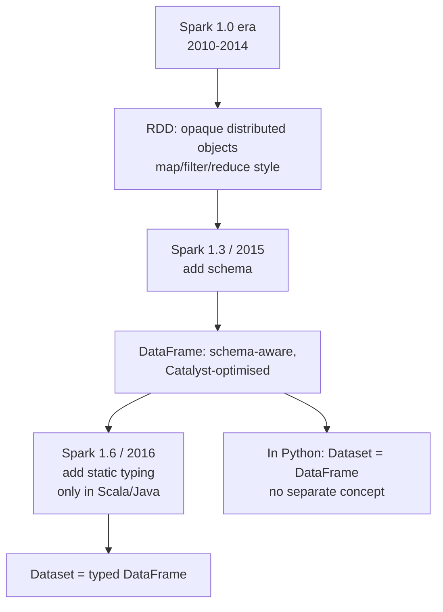

# Chapter 58 — RDDs, DataFrames, Datasets: The API Evolution

> **Goal of this chapter:** to give you a clear picture of Spark's three main data abstractions — RDDs, DataFrames, and Datasets — and the historical and engineering reasons we have three rather than one. You will mostly use DataFrames in real Databricks ML work, but you cannot debug Spark performance without knowing what an RDD is, why DataFrames were introduced, and what each one gives up or gains. By the end of this chapter, when a stack trace mentions `RDD[Row]` or a Spark UI shows "Project + Filter" instead of "map + filter", you will know what is being said.

---

## 58.1 Why three abstractions?

A reasonable first question: why does Spark have three different ways to represent a distributed dataset? Why not one clean abstraction?

The answer is historical. Spark started in 2009 with a single abstraction — the **RDD** — and that abstraction was a brilliant fit for the original use case (iterative ML, replacing Hadoop MapReduce). But as Spark grew into a general-purpose platform, the RDD's limitations became increasingly visible. Most importantly, RDDs don't carry *schema* information — Spark sees them as opaque collections of arbitrary objects — which means the framework can't optimise the operations.

In Spark 1.3 (2015), DataFrames were added. They are schema-aware: Spark knows each column's name and type. This single change unlocked the **Catalyst optimizer** (Chapter 59), which can rewrite and optimise queries in ways that are impossible for opaque RDDs. The result: DataFrame code is typically 10–100× faster than equivalent RDD code on the same data, with no algorithm change.

Then in Spark 1.6 (2016), Datasets were added — strongly-typed DataFrames for Scala and Java, combining the type safety of RDDs with the optimisation of DataFrames. In Python, Datasets don't exist as a separate concept (Python doesn't have static typing in the relevant sense); PySpark's `Dataset` is just a `DataFrame`.

So the picture today: RDDs are the foundational low-level API, mostly unused in modern code; DataFrames are the universal high-level API, used for nearly everything in ML and analytics; Datasets are a Scala/Java refinement on DataFrames.



For Databricks ML Associate purposes, you should know all three exist, but spend 90% of your effort understanding DataFrames. We'll cover the others in just enough depth to understand what they do and when they matter.

---

## 58.2 RDDs: the original abstraction

An **RDD** — Resilient Distributed Dataset — is an immutable, partitioned, distributed collection of objects. "Object" here means arbitrary Python objects (or Scala objects, in the Scala API) — strings, tuples, custom classes, anything. The framework has no idea what's in each record beyond "it's a Python object." This is both the RDD's strength and its weakness.

### 58.2.1 The five properties of an RDD

An RDD is defined by:

1. **A list of partitions.** The data is split into N chunks. Each chunk lives on one executor.
2. **A function to compute each partition.** Given a partition's input, run this function to produce the partition's data.
3. **A list of dependencies.** Which other RDDs produced this one. This is the **lineage** — Chapter 56 introduced it. If a partition is lost, Spark re-applies the function to recompute it.
4. **A partitioner (optional).** For key-value RDDs, defines how keys are distributed across partitions (typically hash-partitioned).
5. **A list of preferred locations.** For each partition, which executors would prefer to compute it (for data locality — Chapter 55).

You almost never construct an RDD directly with these five fields. Instead, you derive RDDs from operations on other RDDs (or from data sources). For example:

```python
sc = spark.sparkContext

# Create an RDD from a Python collection
rdd1 = sc.parallelize([1, 2, 3, 4, 5, 6, 7, 8])
# This is an RDD of integers, partitioned across (by default) the cluster.

# Create one from a text file
rdd2 = sc.textFile("s3://my-bucket/log.txt")
# This is an RDD of strings (one per line).

# Transform
rdd3 = rdd2.filter(lambda line: "ERROR" in line).map(lambda line: line.upper())
# rdd3 depends on rdd2 by lineage; nothing has executed yet.

# Trigger execution with an action
count = rdd3.count()
```

### 58.2.2 RDD operations: transformations and actions

RDDs have two kinds of operations.

**Transformations** are lazy. They build a new RDD descriptor but don't execute. Examples:
- `map(f)` — apply `f` to every element.
- `filter(p)` — keep elements where `p` returns true.
- `flatMap(f)` — like map, but `f` returns an iterable and we flatten.
- `groupByKey()` — for key-value RDDs, group all values per key. (Triggers a shuffle.)
- `reduceByKey(f)` — for key-value RDDs, reduce values per key with `f`. (Also shuffles, but more efficient than groupByKey.)
- `join(other)` — for key-value RDDs, inner join. (Shuffles.)
- `union(other)` — concatenate two RDDs. (No shuffle.)
- `distinct()` — deduplicate. (Shuffles.)

**Actions** trigger execution. They evaluate the RDD's lineage and return a result (to the driver or to storage). Examples:
- `count()` — total element count.
- `collect()` — pull all data to driver (dangerous on big RDDs).
- `take(n)` — pull n elements to driver.
- `first()` — pull the first element.
- `saveAsTextFile(path)` — write to disk.
- `foreach(f)` — apply `f` for side effects (rarely used).

The distinction matters because performance is dictated by *when* the work happens. A chain of 10 transformations is just bookkeeping until an action triggers it.

### 58.2.3 What RDDs lack: schema

Critical limitation: an RDD's elements are opaque Python objects. Spark cannot introspect them. Consider:

```python
rdd = sc.parallelize([(1, "Alice", 70000), (2, "Bob", 55000), (3, "Carol", 90000)])
filtered = rdd.filter(lambda x: x[2] > 60000)
```

Spark knows the elements are 3-tuples (vaguely — it knows they're Python objects), but it has no idea that index 2 is a salary, or that it's an integer. The filter function `lambda x: x[2] > 60000` is, to Spark, a black-box Python function. It cannot inspect the function to know what column it depends on.

The consequences:

- **No projection pushdown.** If the data came from a column store (Parquet), Spark can't know to read only the salary column — it has to read everything.
- **No predicate pushdown.** Spark can't push the filter into the storage layer.
- **No query optimisation.** Spark can't combine operations or reorder them.
- **All execution happens in Python.** Each `map` and `filter` runs your Python code on the executor, which incurs serialisation overhead.

This is why RDD code is slow compared to DataFrame code. Not because RDDs are intrinsically slow, but because Spark can't help you.

### 58.2.4 Resilience and lineage

The "Resilient" in RDD refers to fault tolerance via lineage. Suppose your job runs:

```
rdd1 = sc.textFile("s3://...")
rdd2 = rdd1.map(parse).filter(valid)
rdd3 = rdd2.map(lambda r: (r.user, r.amount)).reduceByKey(lambda a, b: a + b)
```

Each RDD records its parent and the operation that produced it. If, during execution of an action on `rdd3`, executor X dies and the partition of `rdd3` on X is lost, Spark looks at the lineage: rdd3's partition came from a shuffle of rdd2's partitions. Spark re-fetches rdd2's relevant partitions (computing them from rdd1 if also lost) and recomputes the missing rdd3 partition on a surviving executor.

This is more memory-efficient than checkpointing every intermediate (which MapReduce effectively did), but it has a cost: deep lineages take longer to recover from, because more work must be redone. For very long lineage chains, Spark supports `.checkpoint()` — explicitly persist an intermediate to durable storage, truncating the lineage at that point.

### 58.2.5 Example: word count in RDDs

The canonical RDD word count, just to show the style:

```python
counts = (sc.textFile("s3://corpus/*")
    .flatMap(lambda line: line.split())
    .map(lambda word: (word, 1))
    .reduceByKey(lambda a, b: a + b))

# Trigger execution
counts.saveAsTextFile("s3://output/")
```

This is correct and works. But the equivalent DataFrame form is *both* shorter and faster:

```python
words = spark.read.text("s3://corpus/*").select(F.explode(F.split("value", "\\s+")).alias("word"))
counts = words.groupBy("word").count()
counts.write.parquet("s3://output/")
```

The DataFrame version uses Catalyst, which can vectorise the tokenisation and aggregation. For trivial cases, the speedup is small; for serious workloads, it's dramatic.

---

## 58.3 DataFrames: schema-aware, optimisable

A **DataFrame** is a distributed collection of `Row` objects with a *known schema* — column names and types. Conceptually, it's a distributed table.

```python
df = spark.createDataFrame(
    [(1, "Alice", 70000), (2, "Bob", 55000), (3, "Carol", 90000)],
    schema="id INT, name STRING, salary DOUBLE"
)
df.printSchema()
# root
#  |-- id: integer (nullable = true)
#  |-- name: string (nullable = true)
#  |-- salary: double (nullable = true)
```

Spark now *knows* there are three columns: `id` (int), `name` (string), `salary` (double). When you write:

```python
df.filter(F.col("salary") > 60000).select("name").show()
```

Spark sees: "filter on the `salary` column with predicate `>60000`, then project `name`." This is *introspectable*. Catalyst can analyse it. It can verify that `salary` exists, that the comparison is type-valid (`salary` is numeric), and that the projection makes sense. More importantly, it can *optimise*: push the filter into the data source if possible (predicate pushdown), drop the unused columns before reading (projection pushdown), and so on.

### 58.3.1 DataFrame operations

The DataFrame API is much richer than RDDs. Some categories:

**Reading:** `spark.read.parquet(...)`, `spark.read.csv(...)`, `spark.read.json(...)`, `spark.read.table("catalog.schema.table")`.

**Selecting and projecting:** `df.select("col1", "col2")`, `df.select(F.col("a"), F.col("b") + 1)`, `df.withColumn("new", F.col("a") * 2)`.

**Filtering:** `df.filter(F.col("amount") > 100)`, `df.where("amount > 100")` (SQL string).

**Aggregating:** `df.groupBy("region").agg(F.sum("amount"), F.avg("amount"))`.

**Joining:** `df1.join(df2, on="user_id")`, `df1.join(df2, df1.x == df2.y, "left")`.

**Sorting:** `df.orderBy(F.desc("amount"))`.

**Windowing:** `df.withColumn("rank", F.rank().over(W.partitionBy("region").orderBy("amount")))`.

**Writing:** `df.write.parquet(...)`, `df.write.mode("overwrite").saveAsTable(...)`.

Two equivalent forms — function API and SQL — exist for most operations. You can register a DataFrame as a SQL view and query it:

```python
df.createOrReplaceTempView("employees")
result = spark.sql("SELECT name FROM employees WHERE salary > 60000")
```

Same execution path, same Catalyst optimisation. Some find SQL more natural; others prefer the function chain. Both are fine.

### 58.3.2 DataFrames vs. RDDs by example

The same operation in both styles:

**RDD:**
```python
sc.textFile("s3://logs/*.csv") \
    .filter(lambda line: not line.startswith("timestamp,")) \
    .map(lambda line: line.split(",")) \
    .filter(lambda parts: parts[2] == "ERROR") \
    .map(lambda parts: (parts[1], 1)) \
    .reduceByKey(lambda a, b: a + b) \
    .saveAsTextFile("s3://output/")
```

**DataFrame:**
```python
(spark.read.csv("s3://logs/*.csv", header=True, inferSchema=True)
    .filter(F.col("level") == "ERROR")
    .groupBy("service").count()
    .write.parquet("s3://output/"))
```

The DataFrame version:
1. Reads only the `level` and `service` columns from Parquet/CSV (projection pushdown — though CSV doesn't help as much as Parquet).
2. Catalyst pushes the `level == "ERROR"` filter into the read.
3. Uses HashAggregate, the optimised execution operator for groupBy + count.
4. Operates on internal binary representations (Tungsten), not Python objects.

The RDD version processes every byte through Python lambdas, with no optimisations. Typical speedup: 5–50×.

### 58.3.3 The DataFrame is built on RDDs

Worth knowing: a DataFrame is implemented *internally* as an RDD of `Row` objects. When you do `df.rdd`, you can access the underlying RDD:

```python
rdd = df.rdd
print(rdd.first())  # Row(id=1, name='Alice', salary=70000.0)
```

This is sometimes useful for operations that don't have a DataFrame equivalent — but it's also a performance trapdoor: the moment you drop to `.rdd`, you lose Catalyst, you lose Tungsten's binary format, and you pay the serialisation cost to bring data into Python objects. Avoid unless necessary.

---

## 58.4 Datasets: strongly-typed DataFrames (Scala/Java only)

In Scala (and Java), a `Dataset[T]` is a typed version of a DataFrame, where `T` is a known case class. You can write:

```scala
case class Employee(id: Int, name: String, salary: Double)
val ds: Dataset[Employee] = spark.read.parquet("...").as[Employee]
val highPaid: Dataset[Employee] = ds.filter(_.salary > 60000)
```

The benefits:
- Compile-time type safety. If you typo `.salaryy` it won't compile.
- IDE autocompletion on fields.
- Some Catalyst optimisations available even on lambda expressions (when the lambdas are simple).

The drawbacks:
- Lambda-based operations (`.filter(_.salary > 60000)`) can't always be optimised the way SQL expressions can be. So the API style matters.
- Doesn't exist in Python.

For Python users, `Dataset` and `DataFrame` are the same thing — `pyspark.sql.DataFrame`. You'll never write `Dataset[T]` in PySpark code. But knowing the term lets you read Scala-flavored Spark documentation.

---

## 58.5 When to use RDDs

In modern PySpark code, RDDs are rarely the right choice. The DataFrame API covers nearly everything Spark can do, and what it can't do is usually a sign that you're doing something exotic.

The legitimate reasons to use RDDs:

1. **Custom partitioning.** If you need to control exactly how data is partitioned (e.g., for a specialised join), RDDs give you a `partitionBy(numPartitions, partitionerFunc)` that DataFrames don't expose as cleanly.

2. **Operations Spark SQL doesn't support.** Some operations on complex nested types are awkward in SQL. Direct manipulation via RDDs is sometimes simpler.

3. **Custom serialisation.** RDDs let you use the Kryo serialiser explicitly for specific types.

4. **Reading exotic file formats.** When no DataFrame reader exists for a format, you can read with `sc.textFile` and parse with `map`.

5. **Iterative ML/graph algorithms with custom updates.** GraphX (graph processing on Spark) uses RDDs underneath because the operations don't map cleanly to DataFrames.

For exam purposes and for the Databricks ML Associate's actual job content: **assume DataFrames** unless told otherwise. Pyspark.ml (the focus of Part K) accepts only DataFrames as input.

---

## 58.6 Spark Connect (forward pointer)

Spark 3.4 (2023) introduced **Spark Connect**, a new client-server protocol that decouples the Spark client from the driver JVM. Instead of running your Python in the driver JVM via Py4J, Spark Connect lets a thin Python client send query descriptions over gRPC to a remote driver, which executes and returns results.

Why this matters: it lets you connect from anywhere (a laptop, a separate notebook server) to a Spark cluster without needing the full Spark installation locally. It also makes Spark more language-portable.

The trade-off: Spark Connect doesn't expose RDDs to the client. You can only work with DataFrames over the Spark Connect protocol. For modern code, this is fine — DataFrames are what you want anyway. But for legacy RDD code, Spark Connect is incompatible.

On Databricks, Spark Connect is opt-in for now (Part L Ch 70 covers the Databricks-side details). The general direction of the platform is toward Connect as the default — yet another reason to write DataFrame-first code.

---

## 58.7 Schema and types — a quick deepdive

Because schema is the whole reason DataFrames exist, it's worth a moment on how schemas work.

A schema is a `StructType` — an ordered list of `StructField`s, each with a name, a type, and a nullability flag.

```python
from pyspark.sql.types import StructType, StructField, StringType, IntegerType, DoubleType

schema = StructType([
    StructField("id", IntegerType(), nullable=False),
    StructField("name", StringType(), nullable=True),
    StructField("salary", DoubleType(), nullable=True),
])

df = spark.createDataFrame([(1, "Alice", 70000.0)], schema)
df.printSchema()
```

Spark supports a wide range of types:
- Primitives: `IntegerType`, `LongType`, `FloatType`, `DoubleType`, `StringType`, `BooleanType`, `DateType`, `TimestampType`, `BinaryType`.
- Decimals: `DecimalType(precision, scale)`.
- Complex types: `ArrayType(elementType)`, `MapType(keyType, valueType)`, `StructType` (nested struct).
- Vector types from `pyspark.ml.linalg`: `VectorUDT`, `MatrixUDT` (for ML feature vectors — see Part K).

When you `spark.read.parquet(...)`, the schema is read from the file's metadata. When you `spark.read.csv(...)`, the schema is inferred (slow — Spark reads a sample) or you specify it explicitly (fast, recommended).

Nullability is mostly a hint; Spark doesn't strictly enforce non-nullable columns being non-null at runtime, but it's used by the optimiser to skip null checks.

---

## 58.8 A worked tour: RDD → DataFrame → back

Just to anchor the comparison, here's a tiny end-to-end example. Suppose you have a CSV of employee data.

```python
# === Method 1: RDD ===
rdd = sc.textFile("employees.csv")
header = rdd.first()  # "id,name,salary"
rdd_no_header = rdd.filter(lambda row: row != header)
parsed = rdd_no_header.map(lambda row: row.split(","))
filtered = parsed.filter(lambda parts: float(parts[2]) > 60000)
result_rdd = filtered.collect()
# [['1', 'Alice', '70000'], ['3', 'Carol', '90000']]

# === Method 2: DataFrame ===
df = spark.read.csv("employees.csv", header=True, inferSchema=True)
result_df = df.filter(F.col("salary") > 60000).collect()
# [Row(id=1, name='Alice', salary=70000), Row(id=3, name='Carol', salary=90000)]

# === Method 3: Convert between them ===
df_from_rdd = parsed.toDF(["id", "name", "salary"])  # RDD → DataFrame
rdd_from_df = df.rdd  # DataFrame → RDD

# === Inspecting the plan ===
df.filter(F.col("salary") > 60000).explain()
# Shows the physical plan: includes PushedFilters when reading Parquet,
# the columnar scan, etc.
```

For this trivial query, the DataFrame version is maybe 3× faster on a single file, and the gap widens dramatically as the data grows or the query becomes more complex.

---

## 58.9 The pyspark.ml choice: DataFrames only

A practical detail that matters for the rest of the curriculum: **pyspark.ml** (Spark's modern ML library, the subject of Part K) takes only DataFrames as input. The older `pyspark.mllib` library (RDD-based) is deprecated and shouldn't be used in new code.

This means: when you train a `LogisticRegression`, a `RandomForestClassifier`, a `KMeans`, all of these expect a DataFrame with a specific shape — a `features` column (of `Vector` type) and a `label` column (numeric). You assemble that DataFrame from raw columns using transformers like `VectorAssembler` (Chapter 63). The DataFrame, not the RDD, is the lingua franca.

For the Databricks ML Associate exam, this is consequential: every code question on the ML side uses DataFrames, never RDDs. If you see RDD code in an exam question, it's likely there to be incorrect or to be transformed into DataFrames.

---

## 58.10 Summary

1. Spark has three data abstractions: RDDs, DataFrames, and Datasets. RDDs are the foundational low-level API; DataFrames are the universal high-level API; Datasets are typed DataFrames available only in Scala/Java.
2. RDDs are distributed collections of arbitrary objects. They support map/filter/reduce-style operations but expose no schema — Spark can't optimise them.
3. DataFrames carry a schema (column names and types). The Catalyst optimizer can rewrite and optimise DataFrame operations, giving 5–100× speedups over equivalent RDD code.
4. Datasets (Scala/Java) add static typing to DataFrames, useful for IDE support and compile-time correctness. They don't exist meaningfully in Python.
5. RDDs and DataFrames both have transformations (lazy, build a plan) and actions (eager, trigger execution).
6. RDDs are mostly legacy in modern code. Use DataFrames unless you have a specific reason (custom partitioning, exotic formats).
7. pyspark.ml — the ML library you'll use throughout the rest of the curriculum — accepts only DataFrames.
8. Spark Connect (Spark 3.4+) decouples client from driver but doesn't support RDDs. Another reason to write DataFrame-first code.

---

## 58.11 What this builds on / where this returns

**Builds on:** Chapter 57's driver/executor architecture (RDDs and DataFrames both flow through this pipeline). Chapter 56's MapReduce (RDD's `map`/`reduceByKey` are MapReduce's direct descendants).

**Returns:**
- Chapter 59 explains *how* Catalyst optimises DataFrames — the engine that makes them fast.
- Chapter 60 dissects partitioning and shuffles, which apply to both RDDs and DataFrames.
- Chapter 61 covers AQE, which operates on DataFrame plans.
- Part K Chapter 62 introduces the Pipeline pattern, which is built on DataFrames.

---

## 58.12 Exercises

1. **RDD vs DataFrame, same task.** You have a 50GB CSV file. You want to filter to rows where `country == "US"` and sum a `revenue` column. Sketch both an RDD and a DataFrame approach in pseudo-code. Which is faster? Why?

2. **Why no schema in RDDs?** What conceptual leap does adding a schema enable? Name three specific optimisations Spark can do with a schema that it can't do without.

3. **Transformations vs actions.** Classify each as transformation or action: `map`, `count`, `groupByKey`, `collect`, `filter`, `reduceByKey`, `take`, `union`, `saveAsTextFile`, `withColumn`.

4. **Lineage walkthrough.** Sketch the lineage chain produced by:
   ```python
   rdd1 = sc.parallelize([1, 2, 3, 4])
   rdd2 = rdd1.map(lambda x: x * 2)
   rdd3 = rdd2.filter(lambda x: x > 3)
   ```
   If a partition of `rdd3` is lost, how does Spark recover?

5. **Why not use RDDs for ML?** pyspark.ml accepts only DataFrames. Why was this design choice made?

6. **DataFrame ≈ table.** In what specific ways is a Spark DataFrame *like* a SQL table? In what ways is it *unlike*?

7. **The `df.rdd` escape hatch.** A teammate writes:
   ```python
   df.rdd.map(lambda row: (row.id, row.amount * 1.1)).toDF()
   ```
   What's wrong with this? How would you rewrite it?

8. **Schema inference vs. explicit schema.** When reading a CSV, you can `inferSchema=True` or specify a `StructType`. What does inference cost? Why is explicit faster?

9. **Datasets in PySpark.** Why doesn't PySpark have a separate Dataset API?

10. **Code-level identification.** For the following snippet, name the operations that are transformations vs actions, and explain which line actually triggers execution.
    ```python
    df = spark.read.parquet("...")
    df2 = df.filter(F.col("x") > 0)
    df3 = df2.withColumn("y", F.col("x") * 2)
    df4 = df3.groupBy("category").agg(F.sum("y").alias("total"))
    df4.show()
    ```

11. **Spark Connect implication.** If your code uses `df.rdd.map(...)`, would it run under Spark Connect? Why or why not?

12. **Print the schema.** Write the code to print the schema of a DataFrame `df` and to print 5 rows of data.

<details>
<summary>Answers</summary>

1. RDD: `sc.textFile("file.csv").filter(line not header).map(split).filter(parts[country_idx]=="US").map(parts[revenue_idx]).reduce(_+_)`. DataFrame: `spark.read.csv("file.csv", header=True).filter(F.col("country")=="US").agg(F.sum("revenue"))`. DataFrame is dramatically faster — projection pushdown reads only `country` and `revenue` columns (if Parquet; CSV less benefit), Catalyst pushes the country filter, the aggregation runs in optimised JVM code (no per-row Python).

2. Schema lets Spark introspect operations: (a) projection pushdown — read only needed columns from columnar formats; (b) predicate pushdown — push filters into the source; (c) type-aware code generation — compile specialised code per column type; (d) join strategy selection based on column statistics; (e) constant folding and other compile-time optimisations.

3. Transformations: `map`, `groupByKey`, `filter`, `reduceByKey`, `union`, `withColumn`. Actions: `count`, `collect`, `take`, `saveAsTextFile`. (`show` is also an action, not in the list.)

4. Lineage: `rdd3` depends on `rdd2` (via filter); `rdd2` depends on `rdd1` (via map); `rdd1` is the root (parallelized from a Python list). If a partition of `rdd3` is lost, Spark fetches the corresponding partition of `rdd2` (recomputing from `rdd1` if needed), re-applies the filter, restores `rdd3`'s partition.

5. DataFrames are schema-aware. ML APIs need to know column names ("features", "label") and types (Vector for features, numeric for label). RDDs of opaque objects make those guarantees awkward. Plus DataFrame operations are optimisable, which matters for ML pipelines that involve many transformations.

6. Like: schema, columns, rows, SQL-queryable. Unlike: distributed (partitioned across machines), lazy (transformations don't execute immediately), immutable (no UPDATE in place; transformations produce new DataFrames), no indexes (every operation can be a full scan unless partitions help).

7. The `.rdd` call materializes rows as JVM objects then ships to Python; `.toDF` reverses. You lose Catalyst optimisation entirely. Rewrite: `df.withColumn("amount", F.col("amount") * 1.1)` — single Catalyst-optimised expression, all JVM.

8. Inference reads a sample of the file (or all of it, depending on settings) to figure out the types of each column. This is a separate read pass that costs significant time on large files. Explicit schema skips that — Spark trusts you and just reads the data.

9. Python doesn't have the kind of static typing that makes Datasets useful in Scala. A Python `dataset[T]` would either require runtime type checks (slow, no compile-time benefit) or duck typing (no different from a DataFrame). So DataFrame is the right level for Python.

10. Transformations: `spark.read.parquet`, `filter`, `withColumn`, `groupBy().agg()`. Action: `show()`. Only `show()` triggers execution. Everything before is plan building.

11. No — Spark Connect explicitly disables RDD access from the client. `df.rdd` would error. This is intentional: Connect ships only DataFrame query plans over gRPC, not arbitrary Python lambdas.

12. `df.printSchema()` and `df.show(5)`.

</details>
