# Chapter 59 — The Catalyst Optimizer and Tungsten Execution Engine

> **Goal of this chapter:** to demystify the part of Spark that turns the DataFrame code you wrote into the bytecode that actually runs. Two equivalent queries can run 10× differently in speed, and the difference is rarely your code — it's how Catalyst rewrote your plan and how Tungsten executed it. This chapter explains the four phases of Catalyst, the rewrites it performs, and the Tungsten layer underneath. By the end, when you call `df.explain()`, you will not just see "stuff happening" — you'll see *what* Spark decided to do and *why*. Understanding Catalyst is the difference between an intermediate Spark user and an advanced one.

---

## 59.1 Two queries, very different speeds

Consider two ways to write the same query — "for each customer, give me their total spend in 2024":

```python
# Version A
result = (df.join(customers, "customer_id")
            .filter(F.col("year") == 2024)
            .groupBy("customer_id", "name")
            .agg(F.sum("amount").alias("total")))

# Version B
result = (df.filter(F.col("year") == 2024)
            .groupBy("customer_id")
            .agg(F.sum("amount").alias("total"))
            .join(customers, "customer_id"))
```

Logically, both produce the same answer. But the order of operations matters for performance.

Version A joins the (large) transactions table with the customers table *before* filtering to 2024. The join sees all years of data. Result: massive intermediate, then most of it discarded.

Version B filters first, then aggregates the smaller filtered set, then joins the (already small) aggregated result with customers. The join sees a fraction of the data.

In a naive engine, Version B would run dramatically faster than Version A. But here's the thing: **Catalyst usually rewrites Version A into something very close to Version B automatically**. Specifically, Catalyst's *predicate pushdown* rule recognises that `year == 2024` is a predicate on the transactions table only (not the join key, not customers), and pushes it *before* the join.

When you write Spark code, you are not writing the execution plan. You are writing a *description* of the result you want. Catalyst figures out the plan. Understanding what Catalyst can and can't do is what separates writing slow Spark from writing fast Spark.

---

## 59.2 The four phases of Catalyst

Catalyst processes every DataFrame query through four phases, in order. Each phase produces a refined plan that's closer to executable code.

```mermaid
flowchart LR
    A[Your DataFrame code] --> B[Unresolved Logical Plan]
    B --> P1[Phase 1: Analysis]
    P1 --> C[Resolved Logical Plan]
    C --> P2[Phase 2: Logical Optimization]
    P2 --> D[Optimized Logical Plan]
    D --> P3[Phase 3: Physical Planning]
    P3 --> E[Physical Plan]
    E --> P4[Phase 4: Code Generation]
    P4 --> F[Bytecode/RDDs to execute]
```



### 59.2.1 Phase 1: Analysis

The unresolved logical plan is built directly from your code. If you wrote `df.filter("salary > 60000").select("name")`, the plan is something like:

```
Project [name]
  Filter (salary > 60000)
    UnresolvedRelation [df]
```

At this point, "name" and "salary" are just symbols. Spark doesn't yet know they refer to columns in `df`. The analysis phase:

- **Resolves names.** Looks up `name` and `salary` in `df`'s schema. If `salary` doesn't exist, you get an `AnalysisException` at this phase, not at runtime.
- **Resolves types.** `salary > 60000` requires `salary` to be numeric. If `salary` were a string, Catalyst either inserts a cast or errors.
- **Resolves function names.** If you called `F.sum(...)`, it's mapped to the right aggregate function.

After analysis, the plan is **resolved** — every column reference is bound to an actual column with a known type.

The error messages you see when you mistype a column name (`AnalysisException: cannot resolve 'salaryy'`) come from this phase. They happen *before* execution, which is one of the major benefits of having a schema — typos are caught at plan time, not after a 30-minute job runs and crashes at the end.

### 59.2.2 Phase 2: Logical optimization

This is where the magic happens. Catalyst applies a series of **rule-based rewrites** to the logical plan. Each rule is a function: "given a logical plan tree, produce an equivalent but more efficient tree." Catalyst applies rules iteratively until no rule fires anymore (the plan has reached a fixed point).

Some of the most important rules:

#### Predicate pushdown

If a filter is applied after a join, and the filter only references columns from one input table, push the filter *into* the input.

```
Filter(t.year == 2024)
  Join(t, c, t.customer_id == c.customer_id)
    Source(transactions as t)
    Source(customers as c)
```

becomes

```
Join(t', c, t'.customer_id == c.customer_id)
  Filter(t.year == 2024)
    Source(transactions as t')
  Source(customers as c)
```

This is the rewrite we hand-derived in Section 59.1. Catalyst applies it automatically.

Going further: when the source is Parquet (which supports predicates inside the file format), Catalyst pushes the filter even into the file scan. The Parquet reader uses the predicate to skip row groups that can't match — reading only the data that survives the filter.

#### Projection pushdown

If only some columns are used downstream, drop the unused columns as early as possible — ideally during the read.

```
Project [name, total_spend]
  Aggregate [customer_id, sum(amount) as total_spend]
    Project [customer_id, amount, region, year, country, status, ...]
      Source(transactions)
```

becomes

```
Project [name, total_spend]
  Aggregate [customer_id, sum(amount) as total_spend]
    Project [customer_id, amount]
      Source(transactions)
```

For Parquet (columnar storage), this means only the `customer_id` and `amount` column files are read from disk. If the table has 100 columns and you only need 2, you save 98% of the I/O.

#### Constant folding

Compile-time arithmetic on constants is evaluated up front, not for every row.

```
df.select(F.lit(2 + 3))     # before
df.select(F.lit(5))         # after constant folding
```

Saves billions of redundant additions on a billion-row DataFrame.

#### Boolean simplification

Predicates are simplified: `x AND TRUE → x`, `x AND FALSE → FALSE`, `NOT NOT x → x`, etc. Especially useful when intermediate Catalyst rewrites produce trivial sub-expressions.

#### Filter combination

Consecutive filters are combined:

```
df.filter(F.col("a") > 0).filter(F.col("b") < 100)  
# becomes  
df.filter((F.col("a") > 0) & (F.col("b") < 100))
```

This isn't a big speedup on its own, but it sets up other rules to fire.

#### Join reordering

For multi-way joins, Catalyst tries to reorder them so smaller intermediates are joined first. This requires **cost-based optimization** (CBO) — see Section 59.3.

#### Decorrelation of subqueries

If you have a correlated subquery (e.g., `WHERE total > (SELECT AVG(amount) FROM ...)`), Catalyst tries to rewrite it as a join or aggregate.

There are dozens of rules. The full list is in the Spark source code under `org.apache.spark.sql.catalyst.optimizer`. Most users don't need to know each one — but knowing the *kinds* of optimisations Catalyst performs lets you write code that takes advantage of them.

### 59.2.3 Phase 3: Physical planning

The optimised logical plan describes *what* to do. The physical plan describes *how*. For each logical operation, there may be multiple physical implementations:

- A `Filter` can be implemented by a per-row predicate evaluation. (One way.)
- A `Join` can be implemented by: a broadcast hash join (small side broadcast to all executors), a sort-merge join (both sides shuffled and sorted), a shuffle hash join (both sides shuffled, smaller side hashed). (Three ways.)
- An `Aggregate` can be implemented by: hash aggregate (in-memory hashmap per partition, fast for low cardinality), sort aggregate (sort and accumulate, lower memory). (Two ways.)

Catalyst evaluates the choices and picks the best. For joins, the rule of thumb is:
- If one side is small enough (< `spark.sql.autoBroadcastJoinThreshold`, default 10MB), use **broadcast hash join** — much faster, no shuffle on the big side.
- Otherwise, **sort-merge join** (default for large-vs-large).
- Less commonly, **shuffle hash join** when conditions favor it.

Choosing between hash and sort aggregate depends on the cardinality of the group-by key — high cardinality favors sort, low favors hash.

These choices are partly based on statistics. If Catalyst doesn't know the sizes of the inputs, it can only guess. This is where cost-based optimization comes in.

### 59.2.4 Phase 4: Code generation

The physical plan is now a tree of operators (Scan → Filter → HashAggregate → SortMerge → Project, say). One option would be to interpret this tree row-by-row: for each row, call each operator's `next()` method, chain through. This was Spark 1.x's approach. It has a problem: for each row, you incur virtual method dispatches, boxing/unboxing, branch prediction misses.

Modern Spark uses **whole-stage code generation**. Instead of interpreting the operator tree, Catalyst generates a single JVM method (in Java bytecode) that processes a row through all operators in a stage, fused together. The generated code looks roughly like:

```java
// Pseudocode of what's generated
public void processRow(Row row) {
    // Scan: row already has fields f1, f2, f3, f4
    int year = row.getInt(3);
    if (year != 2024) return;  // Filter inline
    long customerId = row.getLong(0);
    double amount = row.getDouble(2);
    hashAggregate.update(customerId, amount);  // Aggregate inline
}
```

No virtual calls. No iterators. The JVM JIT compiler can inline and vectorise this aggressively. For tight loops, this gives 10–100× speedups over interpreted execution.

You can see the generated code:

```python
df.explain(extended=True)
# Or
df.explain("codegen")
```

You'll see the generated Java source for each stage. It's verbose but instructive.

---

## 59.3 Cost-based optimization (CBO)

The rule-based optimizations described above are deterministic — they always apply when the pattern matches, regardless of data size. But some optimisations benefit from knowing *how much data* is involved.

**Cost-based optimization** uses table statistics — row counts, column min/max, null counts, distinct counts, histograms — to estimate the sizes of intermediates and pick the cheapest plan.

To collect statistics:

```sql
ANALYZE TABLE my_table COMPUTE STATISTICS;
-- Or per-column:
ANALYZE TABLE my_table COMPUTE STATISTICS FOR COLUMNS col1, col2, col3;
```

For Delta tables on Databricks, statistics are computed automatically when the table is written.

CBO is most useful for:
- **Join reordering.** For 5-way joins, the optimal join order can produce intermediates 1000× smaller than the worst order. CBO picks the right order.
- **Join strategy selection.** Without statistics, Catalyst can't always tell whether one side will fit the broadcast threshold. With stats, it can.
- **Aggregation strategy.** Stats on group-by-key cardinality inform the hash-vs-sort aggregate choice.

Enable CBO with:
```python
spark.conf.set("spark.sql.cbo.enabled", "true")
spark.conf.set("spark.sql.cbo.joinReorder.enabled", "true")
```

In Databricks Runtime, CBO is enabled by default for many operations.

---

## 59.4 Tungsten — the execution engine

Catalyst is the optimizer; **Tungsten** is the execution layer. While Catalyst decides *what* to do, Tungsten decides *how it runs at the level of memory and CPU*. Tungsten has three components.

### 59.4.1 Whole-stage code generation (already discussed)

Section 59.2.4 covered this — fuse operators into a single generated method per stage to eliminate per-row overhead.

### 59.4.2 Off-heap memory and binary representations

In Spark 1.x, every row was a JVM object — a Java `Row` class with boxed fields (Integer, Double, etc.). Each object had ~16 bytes of JVM overhead, plus per-field overhead. For a billion-row DataFrame, this is gigabytes of pure JVM overhead, plus the constant pressure on the garbage collector.

Tungsten introduced **UnsafeRow** — a compact binary representation where each row is a single contiguous byte buffer with fields laid out by offset. No JVM object overhead, no boxing. Field access is direct memory reads at known offsets.

Beyond UnsafeRow, Tungsten can use **off-heap memory** — memory allocated outside the JVM heap, managed manually. The advantages:
- No GC pauses on this memory.
- Direct control over layout (cache alignment, prefetching).
- Larger effective memory budget (the JVM heap is often capped well below physical RAM).

The user-facing knob: `spark.memory.offHeap.enabled=true` and `spark.memory.offHeap.size=<bytes>`. In Databricks, off-heap is usually configured automatically.

The practical impact: queries that would OOM in Spark 1.x can run comfortably in modern Spark, and GC pauses (which used to be a major operational pain) are dramatically reduced.

### 59.4.3 Cache-aware computation

Modern CPUs have hierarchies of cache (L1, L2, L3) with very different latencies. Tungsten's data layout is designed to maximise cache locality:
- Columnar in-memory format for batch processing (a column's values laid out contiguously in memory).
- Hash table layouts that fit in L1/L2 caches.
- Vectorised execution that processes batches of rows at a time, leveraging CPU SIMD instructions.

This last point — vectorised batch processing — is where Databricks' Photon (Section 57.6.2) takes things even further, with hand-tuned C++ implementations of operators. Tungsten provides vectorisation in the JVM; Photon does it natively.

---

## 59.5 Inspecting the plan — `explain()`

The single most important tool for understanding what Catalyst is doing is `df.explain()`. Let's see it in action.

```python
import pyspark.sql.functions as F

# Set up some sample data
transactions = spark.range(1_000_000).select(
    F.col("id").alias("txn_id"),
    (F.col("id") % 1000).alias("customer_id"),
    (F.col("id") % 365 + 1).alias("day"),
    (F.col("id") % 5 + 2020).alias("year"),
    (F.rand() * 1000).alias("amount")
)

customers = spark.range(1000).select(
    F.col("id").alias("customer_id"),
    F.concat(F.lit("name_"), F.col("id").cast("string")).alias("name")
)

# A query
result = (transactions
    .filter(F.col("year") == 2024)
    .join(customers, "customer_id")
    .groupBy("name").agg(F.sum("amount").alias("total")))

result.explain()
```

The output will look something like:

```
== Physical Plan ==
*(3) HashAggregate(keys=[name#42], functions=[sum(amount#10)])
+- *(3) HashAggregate(keys=[name#42], functions=[partial_sum(amount#10)])
   +- *(3) Project [name#42, amount#10]
      +- *(3) BroadcastHashJoin [customer_id#8L], [customer_id#41L], Inner
         :- *(3) Filter ((year#9 = 2024) AND isnotnull(customer_id#8L))
         :  +- *(3) Project [customer_id#8L, year#9, amount#10]
         :     +- *(3) Range (0, 1000000, step=1, splits=8)
         +- BroadcastExchange HashedRelationBroadcastMode(...)
            +- *(2) Project [customer_id#41L, name#42]
               +- *(2) Range (0, 1000, step=1, splits=8)
```

What this tells us:
- The query is one stage (the `*(3)` numbering reflects stage IDs).
- Catalyst chose **BroadcastHashJoin** because `customers` is small (1000 rows fits in the broadcast threshold).
- The `year == 2024` filter has been pushed down into the transactions scan.
- The aggregation is split into partial (per partition) and final phases — classic distributed aggregate pattern.
- Each operator with `*` is generated as part of whole-stage codegen.

Reading these plans is a skill you build with practice. Some things to look for:

- **`BroadcastHashJoin` vs `SortMergeJoin`** — broadcast is faster but only viable for small sides.
- **`PushedFilters`** — confirms predicates pushed into the data source.
- **`Exchange`** — indicates a shuffle. Lots of these are expensive.
- **`Range` / `Scan` / `FileScan`** — source operators showing what's being read.

For an even more detailed view:

```python
result.explain(extended=True)
```

This shows all four plan phases (Parsed Logical, Analyzed Logical, Optimized Logical, Physical) so you can see how Catalyst transformed the query.

```python
result.explain(mode="formatted")  # Modern Spark
```

Gives a more readable tree with explicit AQE annotations (Chapter 61).

---

## 59.6 Worked example: how predicate pushdown changes the plan

Let me show a concrete before-and-after.

```python
big = spark.range(1_000_000).select(F.col("id"), (F.col("id") % 100).alias("k"))
small = spark.range(100).select(F.col("id").alias("k"), F.col("id").alias("info"))

# Query: join, then filter
q1 = big.join(small, "k").filter(F.col("info") > 50)
q1.explain()
```

A naive plan would: join the 1M-row big with the 100-row small (producing 1M rows), then filter to ~half (info > 50, where info is 0–99, so ~49 of 100). Result: 1M intermediate rows for a filter we could have applied earlier.

Catalyst's actual plan (from `explain()`):

```
*(2) BroadcastHashJoin [k#0L], [k#3L], Inner
:- *(2) Project [id#0L, k#1L]
:  +- *(2) Range (0, 1000000)
+- BroadcastExchange ...
   +- *(1) Project [k#3L, info#4L]
      +- *(1) Filter (isnotnull(info#4L) AND (info#4L > 50))
         +- *(1) Range (0, 100)
```

Notice the filter `info > 50` has been pushed *below* the join — applied to the small table before broadcasting. By the time the join runs, only ~49 rows are broadcast, not 100. The join still produces ~490K rows (each big row matches at most one filtered small row).

But wait — could the filter have been applied differently? Not really, because `info` is only in the small table. The predicate is correctly pushed down to where it can be applied.

A more dramatic case: filter on a column that exists only in `big`:

```python
q2 = big.join(small, "k").filter(F.col("id") > 500_000)
q2.explain()
```

The filter `id > 500_000` applies only to `big`. Catalyst pushes it into the big-table scan:

```
*(2) BroadcastHashJoin ...
:- *(2) Filter (isnotnull(k#1L) AND (id#0L > 500000))
:  +- *(2) Range (0, 1000000)
+- ...
```

Now the join sees only 500K rows from `big`, half the original. The intermediate is halved before the join even runs.

---

## 59.7 The AQE preview

There's one more layer Catalyst-and-Tungsten add: **Adaptive Query Execution (AQE)**, introduced in Spark 3.0. AQE is the ability to *re-optimise* a query plan *at runtime*, based on actual data statistics observed during execution.

Why might you need this? Static planning relies on table statistics, which can be stale or missing. If Catalyst thinks an intermediate will be 1GB but it turns out to be 1KB, the chosen join strategy (e.g., SortMergeJoin) is wildly suboptimal — a BroadcastJoin would be far faster.

AQE solves this by:
1. Executing the query plan up to the next shuffle.
2. Looking at the actual shuffle output sizes.
3. Re-planning the next stage with real numbers.
4. Continuing.

This is so important that it gets its own chapter (Chapter 61). For now, know:
- AQE is on by default in Spark 3.2+ and modern DBR.
- The relevant config key is `spark.sql.adaptive.enabled` — note the `sql` in there.
- AQE makes Catalyst's optimisations more robust to bad statistics.

---

## 59.8 Photon (preview)

Catalyst optimises plans for the JVM-based execution engine. **Photon**, Databricks' proprietary engine, replaces parts of execution with hand-tuned C++ code. Operators that have Photon implementations run in native code; others fall back to JVM Tungsten.

Photon coverage as of late 2024:
- Most SQL operators: filter, project, hash aggregate, sort, hash join.
- Most file scans: Parquet, Delta.
- *Not* yet covered: many UDFs, some window functions, some ML operations.

When Photon runs a query end-to-end, speedups of 2–10× are typical. When it only partially applies (some operators native, others JVM), gains are smaller because the boundary between Photon and JVM data formats costs some serialisation.

Photon is enabled on Photon-enabled Databricks SKUs and certain cluster types. Part L Chapter 69 covers the pricing and selection decisions.

---

## 59.9 Practical implications for ML code

How does all this affect pyspark.ml workloads?

1. **DataFrame operations in your pipeline get optimised.** When you assemble features with `VectorAssembler`, scale them with `StandardScaler`, drop columns — all of these are DataFrame operations that Catalyst optimises.

2. **The ML estimator itself is mostly opaque to Catalyst.** When `LogisticRegression.fit()` runs gradient descent across many partitions, the math is implemented in JVM ML code, not as a SQL/DataFrame expression. Catalyst doesn't optimise the optimisation. (Confusing sentence, but true.)

3. **Sequential fit operations don't get combined.** If your pipeline does `assembler -> scaler -> lr_model`, Catalyst optimises within each step's DataFrame transformations but doesn't fuse across estimator boundaries.

4. **Inference often benefits from Catalyst.** Applying a trained model with `model.transform(df)` is a DataFrame operation; Catalyst can optimise filters and projections around it.

5. **Avoid Python UDFs in your DataFrame transformations.** Anything inside a Python UDF is opaque to Catalyst. Native operations are preferred.

The headline: write DataFrame-native code, avoid UDFs when possible, and let Catalyst do its job. Reasoning about plan optimisation is rarely necessary for ML pipelines that follow the standard pattern; reasoning about *shuffles* (the next chapter) is more often the bottleneck.

---

## 59.10 Summary

1. Catalyst is Spark's query optimizer. It processes every DataFrame operation through four phases: analysis (resolve names and types), logical optimisation (rule-based rewrites), physical planning (pick concrete operators), code generation (compile to bytecode).
2. Key rule-based optimisations: predicate pushdown (move filters early), projection pushdown (read only needed columns), constant folding, boolean simplification, join reordering.
3. Cost-based optimization (CBO) uses table statistics to make better choices for joins and aggregates. Enable with `spark.sql.cbo.enabled=true`; statistics are auto-collected for Delta tables on Databricks.
4. Tungsten is the execution engine layer: whole-stage code generation (fuse operators into one JVM method per stage), off-heap binary representations (UnsafeRow), cache-aware data layouts.
5. `df.explain()` shows the physical plan. `df.explain(True)` shows all four plan phases. Reading plans is a key debugging skill.
6. AQE re-optimises plans at runtime based on actual data sizes — covered in Chapter 61.
7. Photon (Databricks-only) replaces JVM Tungsten for many operators with native C++, giving additional speedups.
8. For ML workloads: DataFrame operations get Catalyst-optimised; ML estimator internals don't. Avoid Python UDFs to keep operations transparent to Catalyst.

---

## 59.11 What this builds on / where this returns

**Builds on:** Chapter 58's DataFrame abstraction — Catalyst only works on DataFrames, not RDDs. Chapter 57's driver/executor architecture (Catalyst runs on the driver; codegen output runs on executors).

**Returns:**
- Chapter 60 covers partitioning and shuffles — the execution-level operations Catalyst's optimisations indirectly produce or avoid.
- Chapter 61 expands AQE — runtime re-optimisation of Catalyst plans.
- Part K Chapter 62 introduces pyspark.ml Pipelines — chains of DataFrame transformations that Catalyst optimises within each step.
- Part L Chapter 69 returns to Photon for the cluster-cost-vs-speed decision.

---

## 59.12 Exercises

1. **Predicate pushdown by hand.** You have a query:
   ```python
   df.join(other, "id").filter(F.col("region") == "US").select("name", "total")
   ```
   `region` is a column only in `df`. What does Catalyst's logical optimisation phase rewrite this to? Sketch the resulting plan tree.

2. **Projection pushdown impact.** A table has 50 columns. Your query uses 3 of them. The table is stored as Parquet. Without projection pushdown, how much I/O does Spark do (relatively)? With it?

3. **Reading a plan.** Given this `explain()` output, identify:
   - The join strategy chosen.
   - Whether predicate pushdown happened.
   - The aggregation strategy.
   ```
   *(3) HashAggregate(keys=[region#10], functions=[sum(amount#11)])
   +- Exchange hashpartitioning(region#10, 200)
      +- *(2) HashAggregate(keys=[region#10], functions=[partial_sum(amount#11)])
         +- *(2) Project [region#10, amount#11]
            +- *(2) Filter ((year#12 = 2024) AND isnotnull(year#12))
               +- *(2) FileScan parquet [region#10, amount#11, year#12]
                  PushedFilters: [IsNotNull(year), EqualTo(year, 2024)]
   ```

4. **Whole-stage codegen.** Why is whole-stage codegen faster than the interpreted alternative? Name three specific JVM costs that codegen eliminates.

5. **Off-heap memory.** Why does Spark use off-heap memory in addition to (or instead of) the JVM heap? What problems does this solve?

6. **Broadcast threshold.** The default `spark.sql.autoBroadcastJoinThreshold` is 10MB. You have a lookup table that's 50MB. Will Catalyst broadcast it by default? What are your options if you want to broadcast anyway?

7. **CBO and stats.** Why might `ANALYZE TABLE my_table COMPUTE STATISTICS` make subsequent queries faster?

8. **The `explain(True)` output.** Why might it be useful to see all four plan phases, not just the physical plan?

9. **Catalyst limitations.** Name two things Catalyst cannot optimise around. (Hint: think about UDFs and external data sources.)

10. **When optimisation doesn't help.** A teammate complains that their query is slow and shows you the plan. You see no shuffles, no joins — just a filter and a project on a 100GB Parquet file. Where's the time going, and how would you fix it?

11. **Constant folding example.** Write a DataFrame expression where Catalyst's constant folding would change runtime behaviour. Estimate the speedup.

12. **Photon vs. Tungsten.** Both perform vectorised execution. Why does Photon often beat Tungsten on the same query?

<details>
<summary>Answers</summary>

1. Catalyst pushes the `region == "US"` filter below the join, applied to `df` before the join:
   ```
   Project [name, total]
     Join(df', other, "id")
       Filter(df.region == "US")
         Source(df)
       Source(other)
   ```
   The join now sees fewer rows, and the projection comes last.

2. Without projection pushdown: Spark reads all 50 columns from disk. With it: only 3 column files read (Parquet stores each column in a separate "chunk"). Savings: 94% of I/O.

3. Join strategy: not shown in this output (probably a single source, no join). Predicate pushdown: yes — `PushedFilters: [...]` line shows `year == 2024` pushed into the file scan. Aggregation strategy: HashAggregate, split into partial (per-partition) and final (after shuffle) phases.

4. (i) Virtual method dispatch — each operator's `next()` call costs a virtual lookup; codegen inlines them. (ii) Boxing/unboxing — interpreted code uses generic `Object`-typed values; codegen uses primitive types directly. (iii) Iterator overhead — each operator yields rows; codegen processes rows in tight loops.

5. Off-heap memory bypasses the JVM garbage collector. For multi-GB heaps, GC pauses can take seconds, halting work. Off-heap memory has no GC. Also: off-heap data has predictable layout (no JVM object overhead), allowing better cache utilisation and SIMD vectorisation.

6. No — 50MB exceeds the threshold. Options: (a) raise the threshold with `spark.sql.autoBroadcastJoinThreshold` (e.g., to 100MB); (b) explicitly broadcast with `F.broadcast(df)` — overrides the threshold; (c) accept the SortMergeJoin and live with the shuffle.

7. CBO needs statistics to make good plan decisions. Without stats, it guesses (often badly). `ANALYZE TABLE` populates row counts, column min/max, null counts, and distinct counts. Subsequent queries can pick better join orders and join strategies.

8. To see how Catalyst rewrote your query. If you wrote `Version A` in 59.1 but the Optimized Logical Plan shows it as `Version B`, you know predicate pushdown worked. If not, you can see why — maybe Catalyst couldn't push the predicate because of a UDF wrapping the column. Knowing what Catalyst did (and didn't) is essential for diagnosing slow queries.

9. (i) Python UDFs — Catalyst can't see inside them, can't push filters that involve them, can't fuse them into codegen. (ii) Data sources without statistics — Catalyst guesses sizes and may pick suboptimal joins. (iii) Side-effecting operations (rare in DataFrames but possible via `foreach`).

10. The time is going to the file I/O itself — reading 100GB of Parquet from S3 takes time regardless of Catalyst. Fixes: (a) ensure projection pushdown is reading only needed columns; (b) check partitioning — if the data is partitioned by date and the filter is on date, only relevant partitions should be read; (c) consider using Delta with Z-ORDER for better data layout.

11. `df.select(F.lit(60 * 60 * 24).alias("seconds_per_day"))`. Constant folding evaluates `60*60*24 = 86400` at plan time. On a 1B-row DataFrame, you save 2B arithmetic operations (3 mults, 2 stores). Not a huge speedup individually, but the principle scales when many such constants appear in expressions.

12. Photon is hand-tuned C++ with direct CPU SIMD instructions, no JVM. It uses memory layouts specifically engineered for modern CPU caches. Tungsten is JVM-bound — its codegen produces bytecode that the JIT then compiles, but it's never as efficient as native code with manual vectorisation.

</details>
