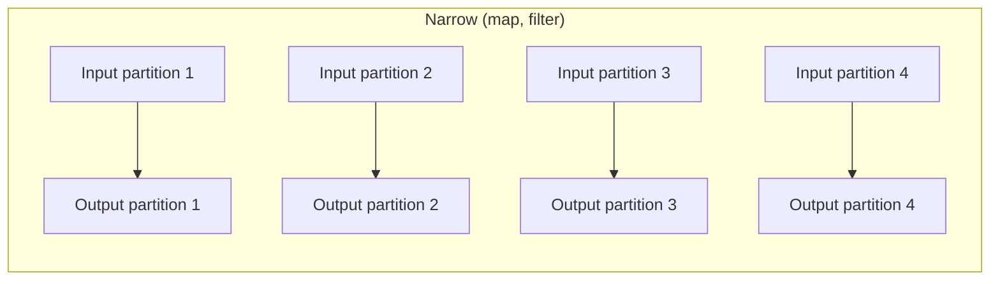
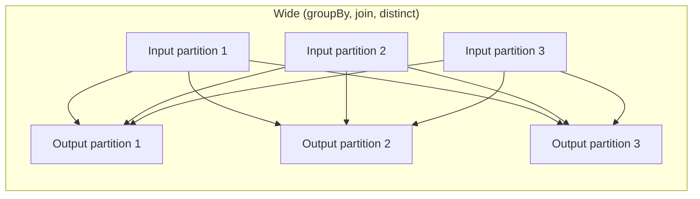
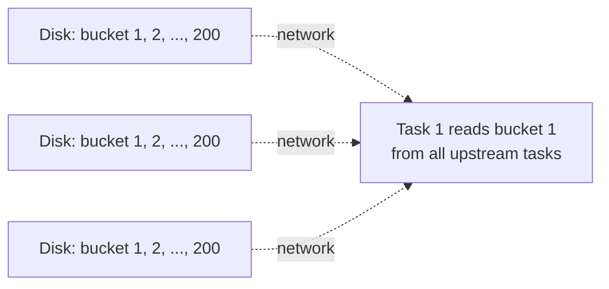

# Chapter 60 — Partitioning, Narrow vs Wide, and Shuffle Internals

> **Goal of this chapter:** to make shuffles, the most expensive operation in Spark, fully visible. Two queries that look identical can differ by orders of magnitude in runtime, and the difference is almost always a shuffle you didn't anticipate. Understanding when shuffles happen, what they cost, how they work mechanically, and how to avoid them when possible is the single most important Spark performance skill. By the end of this chapter, when a query is slow, your first instinct will be to look at the shuffles — and you will know what to look for.

---

## 60.1 The 30-seconds-versus-30-minutes problem

Imagine two PySpark queries against the same 100GB DataFrame:

```python
# Query A
df.select("customer_id", "amount").write.parquet("a/")
```

```python
# Query B
df.groupBy("customer_id").agg(F.sum("amount")).write.parquet("b/")
```

Query A runs in 30 seconds. Query B runs in 30 minutes. The data is the same. The intent — work with customer_id and amount — is the same. The difference is that Query A is a *narrow* transformation followed by a write, while Query B requires a *wide* transformation: the groupBy needs to bring all rows with the same `customer_id` together onto the same machine before it can compute the sum. This rearrangement is a **shuffle**, and it's the most expensive thing Spark does.

Internalising this distinction — narrow vs. wide, no-shuffle vs. shuffle — and learning to recognise shuffles in your own code is the foundation of everything else in this chapter.

---

## 60.2 Partitions: what they are physically

We've used the word "partition" loosely so far. Let's pin it down.

A DataFrame's data is split across the cluster as **partitions**. Each partition is a contiguous chunk of rows, living on one executor's local memory or disk. Partitions are independent: one partition's data doesn't interact with another partition's data unless something explicitly brings them together (a shuffle).

```python
df.rdd.getNumPartitions()
# e.g., 200
```

The number of partitions is *not* the number of executors. A 200-partition DataFrame on a 10-executor cluster has 20 partitions per executor on average. When a task runs, it processes one partition at a time.

Why does partition count matter?

- **Too few partitions:** insufficient parallelism. If you have 4 partitions and 100 cores, 96 cores are idle. Also, each partition is large, which can OOM if memory is tight.
- **Too many partitions:** scheduling overhead dominates. Each task has fixed overhead (dispatch, deserialisation, GC); for trivial tasks, the overhead can exceed the work.

The default partition count when reading data depends on the source:
- Parquet/Delta: roughly one partition per ~128MB of data (configurable via `spark.sql.files.maxPartitionBytes`).
- CSV: similar.
- `spark.range(N)`: one partition per `spark.sql.shuffle.partitions` slot (default 200), but only if data is large enough.
- `sc.parallelize(list, n)`: explicitly `n` partitions.

After a shuffle (any wide transformation), the number of partitions becomes `spark.sql.shuffle.partitions` (default 200), regardless of the input partition count. AQE (Chapter 61) can coalesce this dynamically.

---

## 60.3 Narrow vs. wide transformations

The terminology was introduced in Spark's RDD paper and applies equally to DataFrames. The distinction is about *partition dependencies*.

**Narrow transformation**: each output partition depends on at most ONE input partition.



Each task processes its input partition independently, producing its output. **No data crosses the network.** This is fast.

Examples: `map`, `filter`, `withColumn`, `select`, `flatMap`, `mapPartitions`, `sample`, `union`.

**Wide transformation**: each output partition depends on MULTIPLE input partitions.



Data must be redistributed across the cluster. Every input partition contributes data to potentially every output partition. **This is the shuffle.**

Examples: `groupBy`, `orderBy`, `distinct`, `dropDuplicates`, `join` (without broadcast), `repartition`, `coalesce` to increase, window functions.

### 60.3.1 A surprising case: union is narrow

A common source of confusion: `df1.union(df2)` is *narrow*, not wide. It just concatenates partitions — the resulting DataFrame has `df1.numPartitions + df2.numPartitions` partitions, with no rebalancing. No data moves across the network.

This is sometimes called "stacking" rather than "joining" — it's like SQL's `UNION ALL`. If `df1` and `df2` have different schemas, you get an error; if same schema, you get a glued-together DataFrame. The non-shuffle nature is exactly why `union` is the right operation for combining batches of similar data — you can stack a thousand daily files at zero shuffle cost.

### 60.3.2 The Spark UI lens

In the Spark UI's "Stages" view, each stage corresponds to a span of consecutive narrow transformations. A stage boundary marks a shuffle. So:
- 1 stage = no shuffles = pure narrow operations.
- 2 stages = 1 shuffle.
- N stages = N − 1 shuffles.

When you look at a Spark job and see 8 stages, you know there were 7 shuffles. That's seven opportunities for things to go wrong.

---

## 60.4 Anatomy of a shuffle

Let's open the hood. A shuffle has three phases.

### 60.4.1 Map side: partition and write to local disk

Before the shuffle, every task in the upstream stage processes its input partition and computes the output records. For each output record, it computes the destination partition using the *partitioner* — typically `hash(key) mod num_partitions`. So if the shuffle has 200 output partitions and we're shuffling by `customer_id`, each task buckets its records into 200 buckets by `hash(customer_id) mod 200`.

Each task writes its 200 buckets to *local disk* (the executor's local SSD), as 200 small files (or, with more efficient implementations, regions of one file with an index).

```mermaid
flowchart LR
    T1[Task 1<br/>(partition 1)] --> D1[Local disk:<br/>200 buckets]
    T2[Task 2<br/>(partition 2)] --> D2[Local disk:<br/>200 buckets]
    T3[Task 3<br/>(partition 3)] --> D3[Local disk:<br/>200 buckets]
```

This is called the **shuffle write** phase. The Spark UI shows "Shuffle Write" bytes per stage.

### 60.4.2 The shuffle itself: read across the network

The downstream stage's tasks each read their assigned partition from *all* upstream tasks. Task `r` in the downstream stage reads bucket `r` from every upstream task's local disk, fetching them over the network.



Each downstream task issues many small fetch requests (one to each upstream executor that has data for it). The total network traffic is roughly equal to the shuffle write volume.

This is the **shuffle read** phase. The Spark UI shows "Shuffle Read" bytes per stage.

### 60.4.3 Reduce side: process the partition

Once a downstream task has all its input bytes (from all upstream tasks), it can process them — for a `groupBy(...).sum()`, it groups by key and sums. For a `join`, it joins. For a `sortBy`, it sorts.

### 60.4.4 Why this is expensive

Three kinds of cost:

1. **Disk I/O.** Both writing and reading. For terabyte shuffles, this is gigabytes per executor.
2. **Network I/O.** The cross-network fetches. For the upper-bandwidth case, this can be at near-peak rates; in practice usually less.
3. **Serialisation / deserialisation.** Data must be encoded for disk/wire and decoded on the other side.

A typical shuffle of 100GB of data, on a well-provisioned 10-node Databricks cluster, might take 1–5 minutes. On a poorly tuned cluster (slow disks, oversubscribed network), it can take 30+ minutes. The exact number depends enormously on hardware and data characteristics, but the *order of magnitude* is "minutes" — and that's the cost you're paying every time you do a `groupBy` or `join` on big data.

---

## 60.5 Shuffle partitions and the 200 default

After a shuffle, the number of output partitions is governed by `spark.sql.shuffle.partitions`. The default is **200**.

200 is a *very* round number. It is appropriate when:
- Your data is moderate (~50GB of shuffle output).
- Your cluster is medium-sized (~50 cores).
- You don't have severe skew.

200 is *too many* when:
- Your data is small (~1GB shuffle output). Each partition has 5MB, but the per-task scheduling overhead is several hundred ms each, so the overhead dominates the work.
- Your cluster is small (say 8 cores). 200 tasks on 8 cores = 25 waves; each wave's coordination cost dominates.

200 is *too few* when:
- Your data is huge (~1TB shuffle output). Each partition is 5GB, which can OOM during processing or cause heavy spilling.
- Your cluster is huge (say 1000 cores). 200 tasks on 1000 cores = 80% of cores idle.

**Rule of thumb:** shuffle partitions should be 2–4× the total cores in the cluster, with each partition holding around 128MB–1GB.

For a 100-core cluster with 200GB of shuffle data: 400 partitions × 500MB each = 200GB total. Reasonable.

For a 10-core cluster with 1GB of shuffle data: 20 partitions × 50MB each = 1GB total. Better than 200 × 5MB.

You can set this per query:
```python
spark.conf.set("spark.sql.shuffle.partitions", 400)
```

Or per session globally.

But — and this is the modern news — **AQE (Adaptive Query Execution, Chapter 61) coalesces shuffle partitions automatically based on actual output sizes**. With AQE on (the default in Spark 3.2+), the static `spark.sql.shuffle.partitions` is more of a starting point that AQE refines. You can often leave it at 200 and let AQE adjust.

---

## 60.6 Skew: the worst kind of shuffle

Suppose you're doing `df.groupBy("customer_id").count()` on a dataset where one specific customer has 1000× more transactions than any other (a power user, a bot, a synthetic test customer). After the shuffle, all 1000× more records for that customer end up on one task. That task runs 1000× longer than its peers.

This is **data skew**. Symptoms in the Spark UI:
- A stage's "Task Time" distribution shows most tasks finishing in 10 seconds, one task running for 200 seconds.
- "Shuffle Read Size" distribution is similarly imbalanced.

Skew is one of the most common reasons a shuffle becomes pathological. The total work might be reasonable (1B rows aggregated), but the *distribution* of work is uneven, so the slowest task dominates the wall-clock time.

### 60.6.1 Treating skew

Several approaches.

**1. Salting.** Artificially split the skewed key by appending a small random suffix. Instead of `customer_id = "C123"`, use `(customer_id, salt) = ("C123", 0..15)`. Group by this composite key first (16-way split for the heavy key), then re-aggregate by the original key.

```python
# Salt the keys
salted = df.withColumn("salt", (F.rand() * 16).cast("int"))
intermediate = salted.groupBy("customer_id", "salt").agg(F.sum("amount").alias("partial"))
final = intermediate.groupBy("customer_id").agg(F.sum("partial").alias("total"))
```

The heavy customer's 1M records now split across 16 partitions instead of 1. Last aggregation has only 16 rows per customer to combine.

**2. AQE skew join.** Spark 3.0+'s AQE can detect a skewed partition during execution and *split* it into multiple sub-partitions. Each sub-partition is joined separately. Config: `spark.sql.adaptive.skewJoin.enabled=true` (default true).

**3. Broadcast the small side.** If a skew comes from a join with a small lookup table, broadcasting the small side eliminates the shuffle entirely.

**4. Filter the skew out.** Sometimes the skewed key is bad data (a placeholder customer, a NULL bucket) that you don't actually need. Filter it before the shuffle.

---

## 60.7 Broadcast joins: shuffle avoidance

For joins specifically, there's a way to avoid the shuffle entirely if one side is small enough. The trick: instead of shuffling both sides by the join key, *broadcast* the small side to every executor, then each executor does a local join.

```python
# Big-vs-small join, with broadcast hint
result = df_big.join(F.broadcast(df_small), "id")
```

The mechanism:
1. The driver collects `df_small` to its memory.
2. The driver broadcasts a serialised copy to every executor.
3. Each executor stores it in memory as a hash table.
4. Each task in `df_big`'s scan does a local hash join: for each row in its partition, look up the join key in the local hash table. No shuffle of `df_big`.

This is dramatically faster than a sort-merge join when applicable. Roughly:
- Sort-merge join: O((N + M) log(N + M)) plus shuffle cost of N + M rows.
- Broadcast join: O(N + M) — linear, no shuffle on big side.

For a 100M-row × 10K-row join, broadcast is typically 10–100× faster.

### 60.7.1 The broadcast threshold

Catalyst automatically broadcasts when one side fits within `spark.sql.autoBroadcastJoinThreshold` (default 10MB). For larger broadcasts, you must use `F.broadcast(df)` explicitly, or raise the threshold.

Why the threshold? Each executor must store the full broadcast in memory. If you broadcast a 5GB table to 50 executors, you've used 250GB total cluster memory just for the broadcast. Beyond a few hundred MB, broadcasting can crowd out other work.

### 60.7.2 Restrictions on broadcast joins

Broadcast joins have constraints for *outer* joins:
- **Inner join:** can broadcast either side.
- **Left outer join:** can broadcast only the *right* side (because every left row must produce output even if no match). If you broadcast the left, you can't preserve the unmatched-left semantics correctly without seeing all left rows.
- **Right outer join:** can broadcast only the *left* side. Symmetric reasoning.
- **Full outer join:** cannot broadcast either side.

If you try to broadcast the wrong side, Catalyst silently falls back to sort-merge join. You can see this in `explain()`.

### 60.7.3 When broadcast fails

A common failure mode: you broadcast a table you think is small, but at runtime it's bigger than the driver's memory, and the driver OOMs. Or the broadcast completes but the executor heaps can't hold it, causing executor OOMs.

Mitigations:
- Use AQE's runtime broadcast decision (Chapter 61) — it switches strategies dynamically based on observed sizes.
- Sanity-check the size before broadcasting: `df_small.cache().count()` then inspect.
- Don't broadcast unbounded-growth dimension tables.

---

## 60.8 Repartition and coalesce

Sometimes you want to *explicitly* control the partition count.

**`df.repartition(n)`** — shuffle data into n partitions, evenly distributed. Shuffles, so expensive. Use when:
- The data is severely under-partitioned (read from a small set of files but you want more parallelism).
- You're about to do many narrow operations and want to balance the load.

**`df.repartition(n, "key")`** — shuffle by key into n partitions (rows with same key end up together). Useful when subsequent operations would shuffle by the same key anyway — pre-shuffling once can avoid re-shuffles.

**`df.coalesce(n)`** — reduce to n partitions without a full shuffle. Combines neighbouring partitions. Fast (no network), but can produce unbalanced partitions. Use to *reduce* partition count, e.g., before writing to disk to avoid producing thousands of tiny output files.

A common pattern:
```python
big_aggregated = df.groupBy(...).agg(...)  # ends with 200 partitions
big_aggregated.coalesce(20).write.parquet("...")  # write 20 files instead of 200
```

Note: `coalesce(n)` where `n > current_partitions` is a no-op. To increase partitions you must `repartition`.

---

## 60.9 Worked example: tracing a shuffle

Let me walk through a query and show where the shuffles are.

```python
transactions = spark.read.parquet("s3://transactions/")  # 1B rows, partitioned by date
customers = spark.read.parquet("s3://customers/")        # 10M rows
products = spark.read.parquet("s3://products/")          # 1K rows

result = (transactions
    .filter(F.col("date") >= "2024-01-01")
    .join(customers, "customer_id")
    .join(products, "product_id")
    .groupBy("customer_region", "product_category")
    .agg(F.sum("amount").alias("total"))
    .orderBy(F.desc("total")))

result.explain()
```

Let's trace what Catalyst plans:

1. **Scan transactions**, with `date >= 2024-01-01` predicate pushed down. Suppose this produces 200M rows after filter. 200 partitions of 1M rows each.

2. **Scan customers**, 10M rows. ~80 partitions.

3. **First join: transactions × customers** on `customer_id`. `customers` is 1GB of data (too big to broadcast at default threshold). So: SortMergeJoin. Both sides shuffled by `customer_id`. This is **Shuffle #1.**

4. **Scan products**, 1K rows. Small — broadcast.

5. **Second join: (transactions × customers) × products** on `product_id`. Products broadcast, big side does local join. **No shuffle.**

6. **GroupBy** on `(customer_region, product_category)`. The data is currently partitioned by `customer_id` (from step 3's shuffle), so we need to repartition by the new group keys. **Shuffle #2.**

7. **OrderBy** `total` descending. This is a global sort, which requires another shuffle by the sort key (or a range partitioner). **Shuffle #3.**

Three shuffles for this query. The slowest part will be Shuffle #1 (transactions × customers, ~200M rows shuffled).

If `customers` were smaller (say 100MB), Catalyst would have broadcast it, eliminating Shuffle #1 entirely — saving probably 80% of the query's time.

This kind of analysis — looking at a query, identifying the shuffles, and asking which could be avoided — is the core of Spark performance tuning.

---

## 60.10 Code snippets: inspecting partitioning and shuffles

```python
# How many partitions does a DataFrame have?
df.rdd.getNumPartitions()

# How many rows in each partition? (Diagnostic, not for production)
df.rdd.mapPartitionsWithIndex(lambda i, it: [(i, sum(1 for _ in it))]).collect()
# Output: [(0, 12345), (1, 12567), ...]

# Inspect the physical plan for shuffles (Exchange nodes)
df.explain()

# Set shuffle partitions
spark.conf.set("spark.sql.shuffle.partitions", 400)

# Explicit broadcast hint
result = big.join(F.broadcast(small), "id")

# Explicit repartition
df.repartition(50, "customer_id")  # 50 partitions, hash-partitioned by customer_id

# Coalesce to reduce partition count (no shuffle)
df.coalesce(10)

# Disable broadcast for testing
spark.conf.set("spark.sql.autoBroadcastJoinThreshold", -1)
```

---

## 60.11 Summary

1. A DataFrame is split into partitions; each partition lives on one executor and is processed by one task at a time. Partition count determines parallelism.
2. **Narrow transformations** (map, filter, select, withColumn, union) have each output partition depend on at most one input partition. No data crosses the network. Fast.
3. **Wide transformations** (groupBy, orderBy, distinct, join-without-broadcast, repartition) require data redistribution: a **shuffle**. Slow.
4. A shuffle has three phases: map side (each task writes partitioned buckets to local disk), network (downstream tasks fetch their bucket from every upstream task), reduce side (process the assembled partition).
5. `spark.sql.shuffle.partitions` (default 200) controls shuffle output partition count. The default is often wrong: too few for big data, too many for small. AQE coalesces this dynamically.
6. **Skew** — uneven key distribution — produces one slow task that dominates wall-clock time. Treatments: salting, AQE skew join, broadcast the small side, filter skew out.
7. **Broadcast joins** avoid shuffles by replicating the small side to every executor. Triggered automatically below `autoBroadcastJoinThreshold` (10MB default) or with `F.broadcast(df)`. Restrictions: outer joins can only broadcast the side opposite the "outer" semantics.
8. `repartition(n)` shuffles to n partitions (expensive but balanced); `coalesce(n)` reduces partitions without shuffling (fast but possibly unbalanced).
9. Reading shuffle behavior in `df.explain()` (look for `Exchange` and join types) is the central Spark performance skill.

---

## 60.12 What this builds on / where this returns

**Builds on:** Chapter 57's driver/executor architecture (shuffles are physical data movement between executors). Chapter 58's DataFrames (partitioning structure). Chapter 59's Catalyst (Catalyst decides shuffle placement).

**Returns:**
- Chapter 61 covers AQE — runtime decisions about shuffle partition coalescing, broadcast switching, and skew join handling.
- Part K Chapter 65 (CrossValidator) discusses parallelism math that interacts with shuffle behaviour during cross-validation.

---

## 60.13 Exercises

1. **Narrow or wide?** Classify each operation as narrow (no shuffle) or wide (shuffle):
   1. `df.filter(F.col("x") > 0)`
   2. `df.groupBy("k").agg(F.sum("v"))`
   3. `df.withColumn("z", F.col("x") + F.col("y"))`
   4. `df.union(df2)`
   5. `df.distinct()`
   6. `df.orderBy("x")`
   7. `df.repartition(100)`
   8. `df.coalesce(10)` (assuming current partitions > 10)
   9. `df.select(F.col("x").cast("double"))`
   10. `df1.join(df2, "id")` where neither side is small enough to broadcast

2. **Counting shuffles in a plan.** A query has the following stages in its DAG: Stage 0 (read + filter) → Stage 1 (groupBy + agg) → Stage 2 (join with broadcast) → Stage 3 (orderBy). How many shuffles? Where?

3. **The 200-partition default trap.** You run a small ETL job on a 4-core cluster. Your shuffle produces 200 output partitions of 200KB each. Why is this likely slow? What would you do?

4. **Repartition vs coalesce.** You have a 200-partition DataFrame and want to write it as 10 Parquet files. Should you use `repartition(10)` or `coalesce(10)`? Why?

5. **Broadcast threshold reasoning.** Your `df_lookup` is 50MB. The default broadcast threshold is 10MB so Catalyst won't broadcast. You raise the threshold to 100MB and the join becomes 5× faster. Why? What's the risk of broadcasting too aggressively?

6. **Salting a skewed join.** A join on `customer_id` is slow because one customer has 100× more rows than others. Sketch a salting strategy. How does it work?

7. **Shuffle bytes math.** A shuffle moves 50GB of data. Your cluster has 10 nodes with 10 Gb/s links each. What's the minimum theoretical shuffle time, ignoring overhead?

8. **Stage boundaries.** Why do shuffles always occur at stage boundaries in Spark? Could a shuffle happen *inside* a stage?

9. **Outer join broadcast.** You have `left.join(right, "id", "left")` where `right` is 5MB. Catalyst broadcasts `right`. You change to `left.join(right, "id", "right")`. What happens to the broadcast decision?

10. **Repartition for parallelism.** A 200MB Parquet file is read as 2 partitions (Spark's default size threshold). Your cluster has 50 cores. Your subsequent operations are CPU-heavy. What's the problem and the fix?

11. **Coalesce hazard.** You `coalesce(1)` before writing to get a single file. Why is this a bad idea on a large DataFrame? What's the alternative if you really want one file?

12. **Identifying skew.** In the Spark UI, you see a stage with 200 tasks: 199 finished in 5 seconds, 1 task ran for 300 seconds. What's happening? What information do you need to fix it?

13. **The hidden shuffle.** You're surprised that `df.distinct().count()` is slow. Why is this slow? How many shuffles does it cause?

14. **Coalesce after filter.** A common pattern is `df.filter(...).coalesce(20).write.parquet(...)`. Why coalesce after the filter rather than before?

<details>
<summary>Answers</summary>

1. (i) Narrow. (ii) Wide (shuffle by k). (iii) Narrow. (iv) Narrow (concatenates partitions). (v) Wide. (vi) Wide. (vii) Wide (always shuffles). (viii) Narrow when reducing (coalesce combines existing partitions locally; no shuffle). (ix) Narrow. (x) Wide (sort-merge join, two-sided shuffle).

2. Three shuffles, between stages: 0→1 (groupBy shuffle), 1→2 only if the join requires it (broadcast joins don't shuffle the big side; but if the post-aggregate output isn't keyed on the join column, there might be one — depends on the plan), 2→3 (orderBy). Most likely 2 shuffles if the join is broadcast, 3 if not.

3. Default 200 shuffle partitions × 200KB = 40MB total shuffle. On a 4-core cluster, 200 tasks means 50 waves × per-task overhead (~500ms each) ≈ 25 seconds of pure overhead for a 40MB shuffle. Fix: set `spark.sql.shuffle.partitions=8` or rely on AQE.

4. Coalesce — much faster, no shuffle. Repartition would shuffle 200 partitions' worth of data to balance into 10. Only use repartition if data is heavily skewed and coalesce would produce wildly unbalanced output files.

5. The shuffle of `df_lookup` was 50MB and the corresponding sort-merge join was much slower than the broadcast version. Broadcasting eliminated that shuffle. Risk: if you raise the threshold too high and broadcast a huge table, every executor stores a copy and driver memory needed to assemble the broadcast can blow up.

6. Add a random salt column to both sides: `customer_id` becomes `(customer_id, salt)` with salt in [0,15]. The heavy customer's rows now split across 16 sub-keys. Pre-aggregate by salt, then re-aggregate dropping the salt. Effectively splits the load 16-ways for the heavy keys.

7. 50GB at 10 Gb/s per link, across 10 nodes (assume full-duplex aggregate of 100 Gb/s effective): 50GB × 8 = 400Gb / 100Gb/s = 4 seconds theoretical minimum. In practice: more like 30-60s due to serialisation, overhead, contention.

8. By definition: a stage is a sequence of narrow transformations between two shuffles. The shuffle is the boundary. You can't have a shuffle "inside" — the moment data crosses partitions, you've created a new stage.

9. Switching to right outer join means the broadcast must now be on the *left* side. If `left` is bigger than the threshold, broadcasting flips to be wrong-sided and Catalyst falls back to sort-merge. The query slows down dramatically.

10. Only 2 partitions = 2 cores active out of 50. Repartition explicitly: `df.repartition(50)`. Now 50 partitions, 50 cores busy. Costs one shuffle, but worthwhile if the subsequent CPU work is significant.

11. `coalesce(1)` forces ALL data through one task on one executor. For a 100GB DataFrame, you've serialised the whole job to one machine for the final write. Alternative: write with normal parallelism, then use a separate post-processing step (or just accept many files; Parquet is fine with that).

12. Severe data skew on one partition. Need: which key value(s) is over-represented (check the data), is this expected (heavy customer is valid) or a bug (NULL or default bucket). Fix: salt, broadcast smaller side if it's a join, filter out garbage keys, or enable AQE skew handling.

13. `distinct()` requires shuffling by the hash of all columns (to bring duplicates together). `count()` is one additional aggregation but it's cheap (single number). Total: 1 shuffle on full-width data. For a 100GB DataFrame, that's a 100GB shuffle.

14. After filtering, the DataFrame might be much smaller — say 10% of original. If you coalesce before filter, you have 20 partitions of 5GB each that the filter must process. After filter, the same 20 partitions have 500MB each but the work is done. Coalesce *after* filter means you compute the filter at high parallelism (good), then merge for the write (good).

</details>
