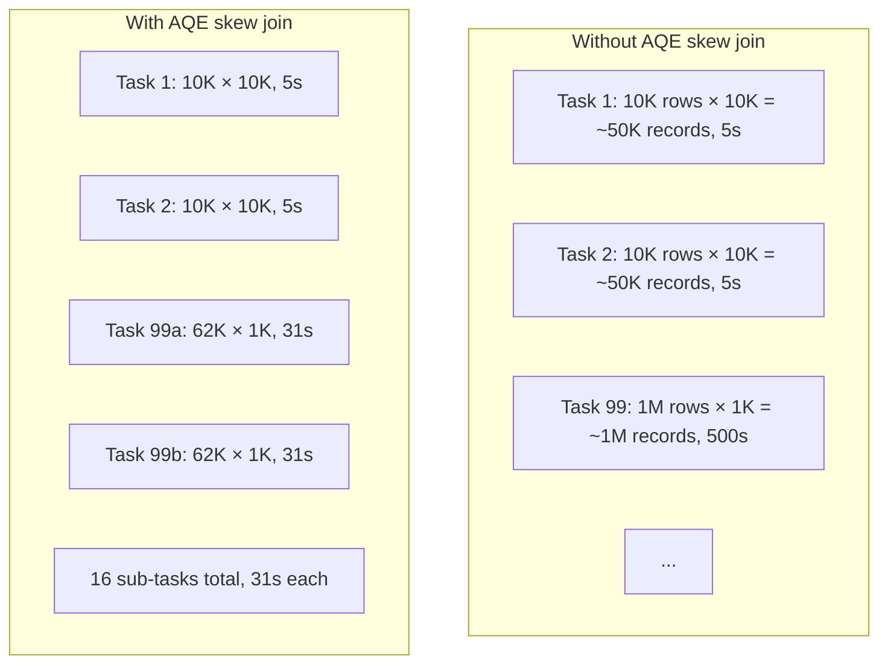

# Chapter 61 — Adaptive Query Execution (AQE)

> **Goal of this chapter:** to explain Spark 3.0+'s most consequential performance feature, why it exists, what it does, and the config-key trap that catches almost everyone the first time they reach for it. Catalyst (Chapter 59) plans queries *before* execution begins, using statistics that may be stale or wrong. AQE re-plans *during* execution, using the real numbers it observes. This sounds simple — it is — but the impact is enormous, and the configuration story has a sharp edge that lands on you if you don't know it. By the end of this chapter you will know how AQE works, what each of its three sub-features does, the exact config keys (with the trap), and how to read AQE decisions in `explain()`.

---

## 61.1 The problem AQE solves

Catalyst optimises queries based on whatever statistics are available before execution starts. For Delta tables on Databricks, statistics like row counts, column min/max, null counts, and histograms exist and are updated when the table is written. For ad-hoc data — query result intermediates, recently joined tables, complex sub-expressions — statistics are estimated by propagating through the plan, often badly.

The result: Catalyst may pick a join strategy assuming the small side is 200MB when it actually turns out to be 5MB after filters apply. It may use 200 shuffle partitions for a shuffle whose output is 10MB total (each partition is 50KB — pure overhead). It may choose a balanced sort-merge join when one side, after filtering, is now broadcastable.

These mistakes used to be untreatable: once the plan was chosen, you were stuck with it for the duration of the query. Your only recourse was to add manual hints (`F.broadcast(...)`) or restart the job after seeing the bad plan in the UI.

AQE — Adaptive Query Execution, introduced in Spark 3.0 (2020) — fixes this by *splitting* query execution at shuffle boundaries and *re-running Catalyst* between them, with real numbers in hand.

```mermaid
flowchart LR
    A[Query] --> B[Initial plan<br/>(Catalyst)]
    B --> C[Execute Stage 1]
    C --> D{Shuffle complete}
    D --> E[Observe actual stats]
    E --> F[Re-plan remaining<br/>stages with real stats]
    F --> G[Execute Stage 2]
    G --> H{Shuffle complete}
    H --> I[Re-plan again]
    I --> J[Execute Stage 3...]
```

Between every shuffle, AQE has the option to revise the plan. The revisions are constrained — it can't undo work already done — but for downstream stages, it has freedom.

This is the high-level pitch. The mechanics are best understood through the three specific optimisations AQE implements.

---

## 61.2 AQE Optimisation 1: Dynamically coalescing shuffle partitions

The first AQE optimisation addresses the 200-partition default trap from Chapter 60.

**The problem:** You set `spark.sql.shuffle.partitions = 200` (or accept the default). Your shuffle's actual output is 10MB total. 200 partitions × 50KB each. Each task does almost no work but has full task overhead. Net: 5+ seconds wasted on what should be a 100ms operation.

**The AQE fix:** After the shuffle completes, AQE looks at the actual output sizes and *merges* small partitions into larger ones. The 200-partition shuffle becomes, say, 4 partitions of 2.5MB each. The downstream stage runs 4 tasks instead of 200, with vastly less per-task overhead.

Mechanically:
1. The upstream stage writes 200 shuffle buckets to local disk.
2. AQE inspects each bucket's size.
3. AQE constructs a "logical reduce mapping": output partition 0 reads buckets 0–49, output partition 1 reads buckets 50–99, etc. (Sizes may vary; AQE balances by total bytes.)
4. The downstream stage launches with the smaller partition count.

The user sees this in `df.explain("formatted")` as `AdaptiveSparkPlan(...) AQEShuffleRead coalesced`.

The relevant config:
```python
spark.conf.set("spark.sql.adaptive.coalescePartitions.enabled", True)  # default true in modern DBR
spark.conf.set("spark.sql.adaptive.coalescePartitions.minPartitionSize", "1m")
spark.conf.set("spark.sql.adaptive.advisoryPartitionSizeInBytes", "64MB")
```

The "advisory" size is the target partition size after coalescing. AQE aims for partitions roughly this size. 64MB is a reasonable default.

**Practical impact:** for small-data ETL and ad-hoc analytics, this single feature can give 2–10× speedups. The fewer-tasks-with-less-overhead pattern dominates when the per-task work is small.

---

## 61.3 AQE Optimisation 2: Switching join strategies at runtime

The second AQE optimisation revisits the broadcast-vs-sort-merge join decision.

**The problem:** Catalyst sees you're joining `df_a` (says it's 100MB) with `df_b` (says it's 50MB). Neither fits in the broadcast threshold (10MB default), so it picks SortMergeJoin and plans a shuffle on both sides.

But at runtime, the shuffle reveals that `df_a` is actually 5MB (because a filter eliminated most rows that Catalyst didn't know about, or statistics were stale). Now `df_a` is broadcastable — but Catalyst already committed to SortMergeJoin.

**The AQE fix:** When AQE sees the actual size of the shuffle output for `df_a` is 5MB, it dynamically replans: skip the right side's shuffle and broadcast `df_a` instead. SortMergeJoin becomes BroadcastHashJoin. Big speedup.

Mechanically:
1. Stage producing `df_a` runs and produces a small shuffle.
2. AQE notices the size.
3. Stage producing `df_b` hasn't run yet (or its shuffle results are still cached).
4. AQE re-plans: `df_a` broadcast, `df_b` does local hash join. The pre-planned SortMergeJoin is replaced.

This is sometimes called "demoting sort-merge to broadcast" in Spark documentation.

Config:
```python
spark.conf.set("spark.sql.adaptive.localShuffleReader.enabled", True)
spark.conf.set("spark.sql.adaptive.autoBroadcastJoinThreshold", "100MB")  # AQE-specific, can be more aggressive
```

The AQE broadcast threshold can be set higher than the static threshold because AQE knows the actual size — there's less risk of broadcasting something accidentally huge.

**Practical impact:** when stats are unreliable (which is most of the time for ad-hoc queries), this can be the difference between a 2-minute query and a 30-second query.

---

## 61.4 AQE Optimisation 3: Skew join handling

The third — and arguably most powerful — AQE optimisation handles data skew automatically.

**The problem:** You're joining two large tables on `customer_id`. One customer has 100× more rows than others. After the shuffle, that customer's partition is enormous; the task processing it runs 100× longer than its peers. The job's wall-clock time is dominated by this one slow task.

Chapter 60 introduced manual treatments: salting, broadcasting, filtering. AQE adds an automatic option.

**The AQE fix:** AQE inspects the shuffle's per-partition sizes. If one partition is much larger than the others (specifically, larger than `spark.sql.adaptive.skewJoin.skewedPartitionFactor` × the median size and at least `spark.sql.adaptive.skewJoin.skewedPartitionThresholdInBytes`), AQE marks it as skewed.

For a skewed partition, AQE *splits* it into multiple smaller sub-partitions and processes them with multiple parallel tasks. For a join, the corresponding partition on the other side is *replicated* to each sub-partition.

Concretely: customer C123 has 1M rows on the left side and 1K rows on the right side. AQE splits C123's left into 16 sub-partitions of ~62K rows each. The right side's C123 (1K rows) is replicated 16 times. Each sub-partition + replicated right is joined in parallel by 16 tasks. The previously-slow task is now 16 tasks running in parallel — the slowdown is gone.



Config:
```python
spark.conf.set("spark.sql.adaptive.skewJoin.enabled", True)  # default true
spark.conf.set("spark.sql.adaptive.skewJoin.skewedPartitionFactor", 5)
spark.conf.set("spark.sql.adaptive.skewJoin.skewedPartitionThresholdInBytes", "256MB")
```

The "factor" of 5 means: a partition is skewed if it's more than 5× the median. The "threshold" of 256MB means: ignore small partitions even if they're skewed (no point splitting a 10MB partition).

**Practical impact:** previously, skew was a manual problem requiring code changes (salting). Now, AQE handles many skew cases transparently. Severe pathological skew (e.g., one customer is 99% of the data) still benefits from manual treatment, but typical 5-50× skew is handled automatically.

---

## 61.5 The master switch

All three AQE features are governed by a single master switch:

```python
spark.conf.set("spark.sql.adaptive.enabled", True)
```

In Spark 3.2+, this is **the default**. In modern Databricks Runtime, it's on by default. You typically don't have to set it — but you should know to verify.

```python
spark.conf.get("spark.sql.adaptive.enabled")
# 'true'
```

If you ever wonder why your queries are running slowly despite being on a recent Spark version, one of the first checks is whether AQE is on. Sometimes legacy configurations or platform settings have it off.

---

## 61.6 The config-key trap

Here is the trap that catches almost everyone the first time they reach for AQE on the exam or in production.

The config key is:

```
spark.sql.adaptive.enabled
```

NOT:
- `spark.adaptive.enabled` (no `sql`).
- `spark.aqe.enabled` (using the acronym).
- `spark.sql.aqe.enabled` (mixing both).
- `spark.adaptiveexecution.enabled` (run-together).

The `sql` in the middle is essential. The reason: AQE is a feature of Spark SQL (which powers DataFrame execution), not of Spark's general execution engine. Within Spark SQL, the feature is called "Adaptive Query Execution" — "AQE" is shorthand used in conversation and documentation, but the config key spells it out fully.

The Databricks ML Associate exam has been known to include this as a multiple-choice question. The wrong answers are exactly the plausible-sounding alternatives.

Other AQE-related keys, all prefixed with `spark.sql.adaptive`:
- `spark.sql.adaptive.coalescePartitions.enabled` (coalesce small shuffle partitions)
- `spark.sql.adaptive.localShuffleReader.enabled` (related to broadcast switching)
- `spark.sql.adaptive.skewJoin.enabled` (skew handling)
- `spark.sql.adaptive.advisoryPartitionSizeInBytes` (target post-coalesce partition size)

Memorise the prefix. If you can't remember a specific sub-key, you can usually look it up — but you have to start with `spark.sql.adaptive`.

---

## 61.7 What AQE cannot do

AQE is powerful but bounded. Knowing its limits keeps your expectations calibrated.

**1. AQE only re-plans at shuffle boundaries.** If your query has no shuffles (all narrow operations), AQE has nothing to do. Pure scan + filter + project queries don't benefit.

**2. AQE can't fix bad initial choices that happen before the first shuffle.** If Catalyst chose to read 10TB of Parquet without proper projection pushdown because your DataFrame code obscured the projection, AQE won't notice until after that read. By then it's too late.

**3. AQE can't see across already-completed stages.** Once a stage's work is done, AQE accepts it as-is. It can only optimise what's still to come.

**4. AQE doesn't change the algorithm.** It picks different physical operators with different parameters, but the algorithmic structure of your query is fixed by Catalyst's initial logical plan.

**5. AQE's heuristics can occasionally be wrong.** For unusual query shapes, AQE's defaults may pick worse strategies than the original plan. This is rare but documented; you can disable specific AQE features if needed.

So AQE is best understood as a "patch over Catalyst's bad guesses." It doesn't replace good query authoring or sensible statistics; it makes the system more robust to bad guesses when they happen.

---

## 61.8 Inspecting AQE decisions

To see AQE in action, use:

```python
df.explain("formatted")
```

In modern Spark, `explain("formatted")` shows the AQE-adjusted plan with annotations like:
- `AdaptiveSparkPlan` — the top-level marker that AQE is engaged for this query.
- `AQEShuffleRead coalesced` — partitions were merged.
- `BroadcastHashJoin` (where you might have expected SortMergeJoin) — AQE switched the strategy.
- `Skewed partition handling` — skew join was triggered.

The Spark UI also exposes AQE decisions:
- The SQL tab shows the "Final" plan after AQE adjustments.
- Stage metrics show the actual partition sizes that triggered AQE decisions.
- Tasks within a skew-handled stage show the sub-partition splits.

A common diagnostic: a query is slower than expected. Open the Spark UI's SQL tab. Look at the final plan. Check whether:
- A SortMergeJoin is happening that should have been a broadcast (small side actually was small but AQE didn't switch — maybe the AQE broadcast threshold needs raising).
- Many small partitions exist (AQE coalesce didn't fire — maybe the advisory size is wrong).
- One task is dominating (skew join didn't fire — maybe the threshold is too high).

These are AQE-tunable issues.

---

## 61.9 Worked example: AQE turning a slow join fast

Let me show a concrete before-and-after.

```python
# Setup
big = spark.read.parquet("s3://transactions/")  # 1B rows
small = spark.read.parquet("s3://customers/")    # we think 10M rows

# But customers has a filter we forgot to push:
filtered_small = small.filter(F.col("active") == True)  # actually 200K rows
```

Without AQE:
- Catalyst sees `filtered_small` is "derived from a 10M-row table"; it can't know the filter's selectivity precisely, so it estimates conservatively (say 5M rows).
- 5M rows is over the 10MB broadcast threshold (~500MB at typical row sizes).
- Catalyst picks SortMergeJoin: shuffles both sides on `customer_id`.
- Total work: shuffle 1B rows + shuffle 5M rows = expensive.

With AQE:
- Catalyst still picks SortMergeJoin initially (same logic).
- `filtered_small` is processed in its stage; AQE sees the actual output is 20MB (200K rows × ~100 bytes each).
- 20MB is below AQE's broadcast threshold (which can be raised above the static one, e.g., to 100MB).
- AQE switches the join: skip the right-side shuffle of `big`, broadcast `filtered_small` instead, do local hash join on each `big` partition.
- Total work: process `filtered_small` (small), broadcast it, do local joins on `big`. Much cheaper.

Estimated speedup: 5-10× on this query.

The user didn't change any code. AQE saw what the static planner couldn't and routed around it.

---

## 61.10 AQE and ML workloads

How does AQE interact with pyspark.ml pipelines?

**Training:** the math of training (gradient descent in LogisticRegression, tree building in RandomForestClassifier) is mostly implemented in JVM code that doesn't go through Catalyst-shuffle patterns. AQE doesn't help directly with the training inner loop.

**Feature engineering:** the DataFrame operations that lead up to training (VectorAssembler, scalers, joins for enrichment) absolutely benefit from AQE. A pipeline that joins multiple feature tables and aggregates can see major speedups.

**Cross-validation:** CrossValidator (Part K Ch 65) trains many models on different folds. Each fold involves DataFrame operations to subset the data. AQE optimises these. With many folds, the cumulative benefit is significant.

**Inference:** scoring a model on a DataFrame is mostly narrow (each row is scored independently), so AQE doesn't help directly. But any joins or aggregations downstream (e.g., aggregating predictions by group) get AQE's benefit.

The headline: AQE doesn't change ML algorithm performance much, but it accelerates the DataFrame work surrounding ML — which is often 80% of an end-to-end pipeline's wall-clock time.

---

## 61.11 Toggling AQE for testing

For testing or for the rare query that AQE handles poorly, you can disable parts.

```python
# Turn off AQE entirely
spark.conf.set("spark.sql.adaptive.enabled", False)

# Turn off specific sub-features
spark.conf.set("spark.sql.adaptive.coalescePartitions.enabled", False)
spark.conf.set("spark.sql.adaptive.skewJoin.enabled", False)
```

A useful debug pattern: run the same query with AQE on and off, compare wall-clock times. If AQE-off is unexpectedly faster, you've found a case where AQE's defaults aren't right for your workload — file a bug or tune the configs.

For the Databricks ML Associate exam, the question is usually:
- "Which config enables Adaptive Query Execution?" → `spark.sql.adaptive.enabled`
- "What does AQE do?" → coalesce partitions, switch joins, handle skew, at runtime
- "What's the default in modern Spark?" → on (in 3.2+, certainly in DBR)

---

## 61.12 Summary

1. AQE — Adaptive Query Execution — re-plans Spark queries during execution based on actual shuffle output sizes, fixing bad choices the static planner couldn't anticipate.
2. AQE re-plans only at shuffle boundaries (between stages). It can't fix bad pre-shuffle decisions.
3. **Three AQE optimisations:**
   1. **Coalesce shuffle partitions** — merge small partitions into reasonable sizes (config: `spark.sql.adaptive.coalescePartitions.enabled`, `advisoryPartitionSizeInBytes`).
   2. **Switch join strategies** — demote SortMergeJoin to BroadcastJoin when actual sizes warrant it (config: `spark.sql.adaptive.localShuffleReader.enabled`).
   3. **Skew join handling** — split skewed partitions into sub-partitions, replicate the other side, process in parallel (config: `spark.sql.adaptive.skewJoin.enabled`, skewedPartitionFactor`, `skewedPartitionThresholdInBytes`).
4. The master switch is `spark.sql.adaptive.enabled`. Default-on in Spark 3.2+ and modern DBR.
5. **The config-key trap:** it's `spark.sql.adaptive.enabled`, not `spark.adaptive.enabled` or `spark.aqe.enabled`. The `sql` in the middle is essential.
6. AQE limitations: only re-plans at shuffle boundaries, can't fix pre-shuffle bad reads, doesn't change algorithm structure, occasionally picks suboptimal strategies on unusual queries.
7. Inspect AQE decisions with `df.explain("formatted")` (shows `AdaptiveSparkPlan`, `AQEShuffleRead coalesced`, etc.) and the Spark UI's SQL tab.
8. AQE benefits ML workloads mostly through the DataFrame operations around ML (feature engineering, joins, aggregations), less through the ML inner loops themselves.

---

## 61.13 What this builds on / where this returns

**Builds on:** Chapter 59's Catalyst (AQE is a runtime extension of Catalyst's planning), Chapter 60's shuffles and partitioning (AQE's optimisations all centre on shuffle behavior).

**Returns:**
- Part K Chapter 65 (CrossValidator): CV-driven shuffling interacts with AQE.
- Part L Chapter 68 (DBR ML runtime): platform defaults for AQE.

This chapter is the last one in Part J. From here, Part K applies all the Spark internals you've learned to pyspark.ml — Pipelines, Transformers, Estimators, Evaluators — the ML-specific surface that runs on top of the Spark engine.

---

## 61.14 Exercises

1. **The config-key question.** Which of the following correctly enables AQE? Pick one.
   1. `spark.aqe.enabled = true`
   2. `spark.sql.adaptive.enabled = true`
   3. `spark.adaptive.enabled = true`
   4. `spark.adaptive.execution.enabled = true`

2. **AQE's three pillars.** Name AQE's three runtime optimisations and what each does in one sentence.

3. **Where AQE fires.** Why does AQE only re-plan at shuffle boundaries and not, say, every 100 milliseconds during a long-running task?

4. **Coalesce vs. static partitions.** With AQE coalesce enabled, do you still need to tune `spark.sql.shuffle.partitions`? Why or why not?

5. **Skew detection.** AQE detects a partition as "skewed" if it's larger than `skewedPartitionFactor` × median AND larger than `skewedPartitionThresholdInBytes`. Why does the second condition exist?

6. **Reading an AQE plan.** In a `df.explain("formatted")` output you see `AQEShuffleRead coalesced (8 partitions)`. The upstream shuffle had `spark.sql.shuffle.partitions=200`. What happened?

7. **Broadcast switching limits.** AQE can demote SortMergeJoin to BroadcastJoin at runtime. Can it do the reverse — promote a Broadcast to SortMerge if the broadcast turns out to be too big? Discuss.

8. **AQE and ML inner loops.** Why doesn't AQE significantly speed up the gradient-descent iterations inside `LogisticRegression.fit()`?

9. **The skew threshold trade-off.** If you set `skewedPartitionThresholdInBytes` very low (say 10MB), AQE will declare more partitions as skewed and split them. What's the cost of doing this aggressively?

10. **Disabling AQE.** Give two situations where you might explicitly disable AQE.

11. **AQE vs. cost-based optimization.** Both AQE and CBO use statistics. What's the difference?

12. **Default state on Databricks.** What is the default state of AQE on modern Databricks Runtime? How would you verify?

13. **An exam trap.** A practice exam question asks: "Which config enables Adaptive Query Execution in Spark 3.0+?" The choices are:
    1. `spark.execution.adaptive.enabled`
    2. `spark.sql.adaptive.enabled`
    3. `spark.aqe.enabled`
    4. `spark.adaptive.queryExecution`
    What's the right answer, and why are the wrong ones tempting?

<details>
<summary>Answers</summary>

1. (b) `spark.sql.adaptive.enabled = true`. The `sql` is the trap.

2. (i) Dynamically coalescing shuffle partitions: merge many small partitions into fewer larger ones at runtime based on actual sizes. (ii) Switching join strategies: demote SortMergeJoin to BroadcastJoin when one side's actual size is small enough. (iii) Skew join handling: split skewed partitions into sub-partitions and process them in parallel to avoid one slow task.

3. Re-planning has overhead (Catalyst is non-trivial). Shuffle boundaries are natural break points — work between two shuffles is one stage, and you can re-plan everything downstream of a completed stage once you know its output. Mid-task re-planning would be much more invasive and have unclear benefit.

4. Less crucial. You can leave `spark.sql.shuffle.partitions` at 200 (or higher for large data) and AQE coalesces down to the appropriate count. Tuning it manually is still useful for extreme cases (very small data: set lower upfront; very large: set higher).

5. Without the byte threshold, AQE would split tiny "skewed" partitions where splitting is overhead with no benefit. A 1MB partition being 10× the median doesn't matter; splitting it would be wasteful. The byte threshold ensures splits only happen on partitions large enough to matter.

6. AQE noticed the 200 shuffle partitions produced very little data total and merged them into 8 partitions, each carrying ~25× the data of the original. The downstream stage runs 8 tasks instead of 200.

7. AQE can't promote in this direction. If Catalyst initially picked a broadcast and the broadcast starts (driver collects the supposedly-small side), and it turns out to be huge, the broadcast may OOM the driver or executors. By the time you'd know, it's too late — the work is already going badly. So the static broadcast threshold should be conservative; AQE only relaxes downward (smaller-than-expected, demote to broadcast).

8. The gradient descent loop iterates many times in JVM code that calls compiled Spark ML implementations. There are some shuffles (e.g., aggregating partial gradients across partitions), but the bulk of the work is per-partition math, not shuffle re-planning. AQE re-plans the surrounding DataFrame operations, not the loop's internal structure.

9. Over-aggressive splitting means each "skewed" task is split into many sub-tasks, multiplying the task count. Each sub-task has its own overhead. If you split partitions that didn't really need splitting, you're paying overhead for no benefit — and may even slow things down. The default thresholds are tuned to be selective.

10. (i) When AQE's heuristics pick a worse plan than the static one (rare but possible for unusual queries). (ii) When you want to make execution deterministic for testing or benchmarking — AQE's runtime decisions can vary slightly run-to-run.

11. CBO operates at *plan time* (Catalyst's logical optimisation phase), using stored table statistics. AQE operates at *runtime*, using observed shuffle output sizes. They're complementary: CBO makes the initial plan better; AQE corrects mistakes when reality disagrees with CBO.

12. Enabled by default in Spark 3.2+ and modern DBR. Verify: `spark.conf.get("spark.sql.adaptive.enabled")` returns `'true'`.

13. (b) `spark.sql.adaptive.enabled`. The wrong answers are tempting because: (a) `spark.execution.adaptive.enabled` sounds plausible because AQE is about *execution*; (c) `spark.aqe.enabled` uses the natural acronym; (d) `spark.adaptive.queryExecution` is the most descriptive name. None of them is the actual key. The exam writers know which mistakes people make.

</details>
