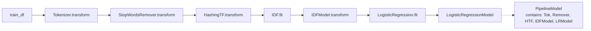

# Chapter 62 — The Pipeline Pattern: Transformers and Estimators

> **Goal of this chapter:** to introduce the two primitive abstractions on which the entirety of `pyspark.ml` is built — the **Transformer** and the **Estimator** — and the **Pipeline** that composes them. By the end you should be able to look at any `pyspark.ml` code, classify every object as a Transformer, an Estimator, or a Pipeline, predict from that classification what methods it supports, and explain why this two-type design is what makes Spark ML pipelines persistable, tunable, and safe across the train/serve boundary.

---

## 62.1 The problem this chapter exists to solve

Go back to Chapter 3, the spam-detection walkthrough. There, conceptually, we did this:

1. Tokenize each email body.
2. Drop stopwords.
3. Compute TF-IDF vectors.
4. Train logistic regression.
5. Predict on new emails.

In the chapter we drew that as a tidy left-to-right diagram. Now imagine you actually had to implement it. The naive shape is something like:

```python
# Training time
tokens_train     = tokenize(emails_train)
nostop_train     = drop_stopwords(tokens_train)
vectorizer       = fit_tfidf(nostop_train)             # learns vocabulary + idf weights
tfidf_train      = vectorizer.transform(nostop_train)
model            = fit_logistic_regression(tfidf_train, labels_train)

# Serving time
tokens_new       = tokenize(emails_new)
nostop_new       = drop_stopwords(tokens_new)
tfidf_new        = vectorizer.transform(nostop_new)    # same vocabulary, same idf
predictions      = model.predict(tfidf_new)
```

There are three quiet ways this code can betray you:

1. **Training-serving skew.** The serving block re-implements the training block by hand. If the training-time tokenizer lowercases but the serving-time tokenizer doesn't, predictions will silently degrade. Section 3.11.3 named this disease. We need the same code path at train and serve.
2. **Persistence.** What exactly do you save and what exactly do you load? The model alone isn't enough — you also need the vocabulary, the IDF weights, the stopword list. If any of those is reconstructed at serve time from a slightly different source, you have skew again.
3. **Hyperparameter tuning.** When you cross-validate `regParam` for the logistic regression, you don't want to retokenize 200,000 emails on every fold. You want the *training* parts (the IDF fit, the model fit) to be repeated, but the *fixed* parts (tokenization is parameterless) to be efficient. You also want to be able to tune knobs in the feature-engineering layer (e.g., `numFeatures` in `HashingTF`) jointly with knobs in the model layer.

These three pressures — train/serve consistency, persistence, tunability — are why `pyspark.ml` doesn't ask you to write the wiring above. It asks you to build a **Pipeline**, a chain of objects that all conform to one of two interfaces. Spark handles the wiring; you focus on what each stage computes.

The two interfaces are the Transformer and the Estimator. Once you have them in your head, all of `pyspark.ml` falls into place.

---

## 62.2 Two primitive types

### 62.2.1 Transformer

A **Transformer** is an object with one important method:

```python
transformer.transform(df: DataFrame) -> DataFrame
```

It takes a DataFrame, returns a DataFrame, and **does not learn anything from the data**. It is a pure (or nearly pure) function from DataFrames to DataFrames. Typically it adds one or more columns; sometimes it modifies a column in place.

Concrete examples you will meet in Chapter 63:

- `Tokenizer(inputCol="body", outputCol="tokens")` splits a string column on whitespace. No learning — just a string operation applied row by row.
- `VectorAssembler(inputCols=["sq_ft", "bedrooms", "age"], outputCol="features")` stacks several numeric columns into a single Vector column. No learning — just an array construction.
- `Bucketizer(splits=[-float("inf"), 0, 10, 100, float("inf")], inputCol="x", outputCol="bucket")` maps a continuous column into integer bucket indices using user-supplied splits. No learning — the splits were given to you.
- A **fitted model** is a Transformer. A `LogisticRegressionModel` (the output of training, not the training class itself) has weights baked in and exposes a `.transform(df)` that adds prediction columns. The model doesn't learn anything more; it just applies the function it represents.

The unifying property: **a Transformer's behaviour is completely determined by its constructor arguments and its parameters**. Two `Tokenizer(inputCol="body", outputCol="tokens")` instances are interchangeable. Two `LogisticRegressionModel` instances with the same weights and bias are interchangeable.

### 62.2.2 Estimator

An **Estimator** is an object with one important method:

```python
estimator.fit(df: DataFrame) -> Transformer
```

It takes a DataFrame, **learns something from the data**, and returns a Transformer. The Transformer that comes out encodes whatever was learned and is then ready to be applied to new data.

Concrete examples:

- `StringIndexer(inputCol="city", outputCol="city_idx")` is an Estimator. When you call `.fit(df)` it walks the `city` column, counts unique values, sorts them by frequency, and assigns each one an integer. The output is a `StringIndexerModel` (a Transformer) that carries the learned dictionary `{"NYC": 0, "LA": 1, "Chicago": 2, ...}`. When you call `.transform(new_df)` on that model, it applies the dictionary it learned at fit time.
- `StandardScaler(inputCol="features", outputCol="scaled", withMean=True, withStd=True)` is an Estimator. `.fit(df)` computes the per-feature mean and standard deviation. The output is a `StandardScalerModel` (a Transformer) that, on `.transform`, subtracts the *training* means and divides by the *training* stds — even when applied to new data later. This is the right behaviour: you want to scale serving data using the statistics learned at training time, not statistics computed on whatever serving data happens to be in the request.
- `LogisticRegression(featuresCol="features", labelCol="label", regParam=0.01)` is an Estimator. `.fit(df)` runs L-BFGS or OWLQN, finds weights $\mathbf{w}$ and bias $b$ that minimise the regularised cross-entropy loss, and returns a `LogisticRegressionModel` (a Transformer) carrying those weights.

The unifying property: **an Estimator turns into a Transformer by absorbing data**. Until you call `.fit`, it knows nothing. After you call `.fit`, the resulting Transformer is frozen and ready for use.

### 62.2.3 The naming convention

Almost every Estimator class in `pyspark.ml` has a partner class whose name ends in `Model`. The Estimator is `StringIndexer`; the Transformer it produces is `StringIndexerModel`. The Estimator is `LogisticRegression`; the Transformer it produces is `LogisticRegressionModel`. The Estimator is `Pipeline`; the Transformer it produces is `PipelineModel`. Once you internalise this naming pattern, you can usually predict the name of the trained artifact without looking it up.

A small visual:

```
   Estimator                       (call .fit)                    Transformer (the Model)
   ─────────                                                       ──────────────────────
   StringIndexer        ─.fit(df)─►                                StringIndexerModel
   StandardScaler       ─.fit(df)─►                                StandardScalerModel
   LogisticRegression   ─.fit(df)─►                                LogisticRegressionModel
   Pipeline             ─.fit(df)─►                                PipelineModel
```

Some objects in `pyspark.ml` *are* Transformers directly with no Estimator partner, because there is nothing to learn — `Tokenizer`, `VectorAssembler`, `SQLTransformer`. They don't have a `Model` cousin because they don't need one.

### 62.2.4 Why distinguishing the two matters

If you mix them up, you will write bugs like:

```python
# WRONG — calling .transform on an Estimator
scaler = StandardScaler(inputCol="features", outputCol="scaled")
scaled_df = scaler.transform(df)   # AttributeError or similar
```

`StandardScaler` is an Estimator. It does not have `.transform`. You must `.fit(df)` first to get a `StandardScalerModel`, then `.transform` on that.

Or the opposite:

```python
# WRONG — calling .fit on a fitted model
model = lr.fit(train_df)
model.fit(test_df)   # AttributeError — LogisticRegressionModel has no .fit
```

A trained model is a Transformer. It already represents a learned function; it doesn't take any more data. (To retrain, you call `.fit` on the *Estimator*, not on the Model.)

This bookkeeping sounds tedious in prose, but once you internalise the two-type system every line of `pyspark.ml` becomes legible.

---

## 62.3 Pipeline: composing the two types

A real ML workflow is a sequence of stages, some of which need to learn from data (Estimators) and some of which don't (Transformers). `pyspark.ml`'s **Pipeline** is exactly this: a list of stages, treated as a single Estimator.

```python
from pyspark.ml import Pipeline
from pyspark.ml.feature import Tokenizer, StopWordsRemover, HashingTF, IDF
from pyspark.ml.classification import LogisticRegression

tok     = Tokenizer(inputCol="body", outputCol="tokens")           # Transformer
remover = StopWordsRemover(inputCol="tokens", outputCol="filtered") # Transformer
htf     = HashingTF(inputCol="filtered", outputCol="raw_features", numFeatures=10000)  # Transformer
idf     = IDF(inputCol="raw_features", outputCol="features")        # Estimator
lr      = LogisticRegression(featuresCol="features", labelCol="label", regParam=0.01)  # Estimator

pipeline = Pipeline(stages=[tok, remover, htf, idf, lr])
```

`pipeline` is now an Estimator: it has a `.fit` method, not a `.transform`. When you call `pipeline.fit(train_df)`, Spark does something that is worth spelling out carefully, because it is the heart of how Pipelines work:

```
For each stage in stages:
    If stage is a Transformer:
        df = stage.transform(df)                         # no learning; just push data through
        keep stage as-is in the trained sequence
    If stage is an Estimator:
        stage_model = stage.fit(df)                      # learn from the current df
        df = stage_model.transform(df)                   # apply the learned thing immediately
        substitute stage_model for stage in the trained sequence
Return: PipelineModel(trained_sequence)
```

The output, `PipelineModel`, is a **Transformer**. It contains the sequence of stages — but every Estimator has been replaced by its corresponding fitted Model. There are no Estimators left inside; the pipeline is now a frozen function from DataFrames to DataFrames.

When you call `pipelineModel.transform(test_df)`, the wiring is trivial — for each stage (all Transformers now) call `.transform`, chain them:

```
For each stage in trained_sequence:
    df = stage.transform(df)
Return df
```

That's it. Same code path at train and serve. Same vocabulary, same IDF weights, same logistic regression coefficients. The bookkeeping that section 62.1 said you'd need to do by hand is now handled by the framework.

A mermaid view of what happens during `.fit`:



And `.transform` on a fitted pipeline is just the bottom row without the `.fit` boxes — only `.transform` calls on already-trained stages.

---

## 62.4 A small, fully worked example

Let's run a complete pipeline on a tiny six-row dataset so you can see every piece.

```python
from pyspark.sql import SparkSession
from pyspark.ml import Pipeline
from pyspark.ml.feature import StringIndexer, VectorAssembler
from pyspark.ml.classification import LogisticRegression

spark = SparkSession.builder.appName("ch62").getOrCreate()

train = spark.createDataFrame([
    ("M",  35, 75000.0, "no"),
    ("F",  29, 62000.0, "no"),
    ("M",  41, 85000.0, "yes"),
    ("F",  52, 110000.0, "yes"),
    ("M",  23, 45000.0, "no"),
    ("F",  47, 95000.0, "yes"),
], ["gender", "age", "income", "label_str"])
```

Our goal: train a binary classifier whose label is a string (`"yes"`/`"no"`) and whose features include one categorical column (`gender`) and two numeric columns (`age`, `income`).

The pipeline has three stages:

```python
label_indexer = StringIndexer(inputCol="label_str", outputCol="label")   # Estimator
gender_indexer = StringIndexer(inputCol="gender", outputCol="gender_idx") # Estimator
assembler = VectorAssembler(
    inputCols=["gender_idx", "age", "income"],
    outputCol="features",
)  # Transformer
lr = LogisticRegression(featuresCol="features", labelCol="label", maxIter=20, regParam=0.0)  # Estimator

pipeline = Pipeline(stages=[label_indexer, gender_indexer, assembler, lr])
model = pipeline.fit(train)
```

Three Estimators, one Transformer, in that order. After `.fit`, we get a `PipelineModel` whose internal stages are: `StringIndexerModel`, `StringIndexerModel`, `VectorAssembler` (unchanged, no fitting needed), and `LogisticRegressionModel`.

Let's inspect:

```python
print(type(model).__name__)                # PipelineModel
print([type(s).__name__ for s in model.stages])
# ['StringIndexerModel', 'StringIndexerModel', 'VectorAssembler', 'LogisticRegressionModel']

label_idx_model = model.stages[0]
print(label_idx_model.labels)              # ['no', 'yes']  -- mapping: no->0, yes->1

gender_idx_model = model.stages[1]
print(gender_idx_model.labels)             # e.g. ['M', 'F']  -- mapping: M->0, F->1

lr_model = model.stages[3]
print(lr_model.coefficients)               # DenseVector with three weights
print(lr_model.intercept)                  # scalar
```

Now we apply it to a held-out row:

```python
test = spark.createDataFrame([
    ("M", 38, 80000.0, "yes"),
    ("F", 26, 50000.0, "no"),
], ["gender", "age", "income", "label_str"])

pred = model.transform(test)
pred.select("gender", "age", "income", "label_str", "label", "prediction", "probability").show()
```

The output DataFrame has columns added by every stage:

- `label` (added by `label_indexer`) — the integer-encoded label.
- `gender_idx` (added by `gender_indexer`) — the integer-encoded gender.
- `features` (added by `assembler`) — a Vector of length 3.
- `rawPrediction`, `probability`, `prediction` (added by the LR model).

What you must internalise about this trace:

1. **The same `label_indexer` mapping is used on test data**. If a "yes" appeared at index 1 in training, it appears at index 1 in test. There is no possibility of test data being indexed inconsistently — the mapping was learned once at `.fit` time and frozen.
2. **The order of stages matters**. `VectorAssembler` needs `gender_idx`, which `gender_indexer` produces. If you reorder them — assembler before indexer — Spark will raise an error at fit time because the column doesn't exist yet.
3. **The pipeline is the artifact**. `model` contains every learned thing in one object. There is no auxiliary state living in a Python variable that you'd forget to save.

---

## 62.5 Persistence

A trained `PipelineModel` is one method call away from being saved to disk:

```python
model.save("/dbfs/tmp/ch62_pipeline_model")
# or model.write().overwrite().save(...)
```

This writes a directory containing one subdirectory per stage, plus a `metadata` directory at the top level. Each stage's directory contains Parquet files for any learned parameters (the StringIndexer dictionaries, the logistic regression coefficients) and a JSON metadata file describing the class and its parameter settings.

Loading is symmetrical:

```python
from pyspark.ml import PipelineModel

reloaded = PipelineModel.load("/dbfs/tmp/ch62_pipeline_model")
reloaded.transform(test).show()
```

The `reloaded` pipeline behaves identically to the original — same predictions, same coefficients, same indexer dictionaries. This is the persistence story the spam example asked for. The path can be DBFS, S3, ADLS, GCS — anything Spark can read.

Two non-obvious caveats:

- **Saving an unfitted Estimator-style Pipeline is allowed but rarely useful.** `pipeline.save(...)` (before `.fit`) writes the configuration but no learned weights. You can reload and refit on new data — useful for separating the "design" of a pipeline from its "training" — but the more common pattern is to save the `PipelineModel`.
- **Spark version compatibility is not guaranteed forward.** A pipeline saved with Spark 3.3 may not load cleanly in Spark 4.0 if any stage's serialization format changed. In production, you pin runtimes. Chapter 67 returns to this.

---

## 62.6 Why pipelines are tunable: the CrossValidator handshake

A small preview of Chapter 65. Suppose we want to find the best regularisation strength for the logistic regression. The honest way to do this is k-fold cross-validation: for each candidate `regParam`, train on $k-1$ folds and evaluate on the held-out fold, average across folds, pick the best.

In pre-pipeline ML code this is a nightmare to write. With pipelines:

```python
from pyspark.ml.tuning import CrossValidator, ParamGridBuilder
from pyspark.ml.evaluation import BinaryClassificationEvaluator

grid = ParamGridBuilder().addGrid(lr.regParam, [0.0, 0.01, 0.1, 1.0]).build()
evaluator = BinaryClassificationEvaluator(labelCol="label", metricName="areaUnderROC")
cv = CrossValidator(estimator=pipeline, estimatorParamMaps=grid, evaluator=evaluator, numFolds=3)
cv_model = cv.fit(train)
```

The CrossValidator treats the entire pipeline as the unit of cross-validation. For each fold and each grid value, it calls `pipeline.fit(fold_train)`, getting back a `PipelineModel`, then `pipelineModel.transform(fold_val)`, and asks the evaluator for a metric. The Estimator's `regParam` is set freshly for each grid combination — because `regParam` belongs to the `lr` stage of the pipeline, and the grid was built referring to `lr.regParam`.

The crucial property: **every stage that learns from data is refit per fold**. That means the IDF weights, the StringIndexer dictionaries, the StandardScaler statistics — all are computed on the fold's training portion only, not on the held-out portion. There is no leakage from validation into the feature engineering. This is the leakage trap from section 3.6.3, solved by construction. If your feature engineering wasn't in the Pipeline — if it was a separate preprocessing script run on the whole dataset before splitting — leakage would silently happen. Pipelines make it hard to leak; that is, in part, their point.

We will run this CrossValidator example end-to-end in Chapter 65.

---

## 62.7 The vector-column convention

There is one piece of `pyspark.ml` etiquette that surprises every newcomer. Almost every estimator in `pyspark.ml` (the entire `pyspark.ml.classification`, `pyspark.ml.regression`, `pyspark.ml.clustering` packages) expects a *single feature column* of type `Vector`. Not multiple columns. Not a DataFrame of doubles. One column. That column holds a Vector — a dense or sparse Vector — per row.

This is unlike scikit-learn, which takes a 2-D array directly. In `pyspark.ml`, you must explicitly assemble your features into one column before training:

```python
assembler = VectorAssembler(
    inputCols=["age", "income", "gender_idx"],   # however many you have
    outputCol="features",                         # always becomes one Vector column
)
```

If you forget this step and pass a DataFrame with three separate numeric columns to `LogisticRegression`, you will get an error like:

```
IllegalArgumentException: requirement failed:
  Column features must be of type struct<type:tinyint,size:int,indices:array<int>,values:array<double>>
  but was actually float.
```

The convention exists because Spark's distributed execution layer is happier streaming one vector-typed column than juggling many heterogeneous columns. It also matches the mathematical convention — a training row *is* a vector — so the API mirrors the math. Once you internalise "assemble before estimating", the convention becomes invisible.

---

## 62.8 Inspecting a fitted Pipeline

A `PipelineModel` is not a black box. You can reach into it:

```python
model.stages                 # list of fitted (or pass-through) stages
model.stages[3]              # the LogisticRegressionModel
model.stages[3].coefficients # DenseVector of weights
model.stages[3].intercept    # scalar bias
model.stages[0].labels       # StringIndexer dictionary
```

This is essential for debugging. If your model's predictions look wrong, the first move is almost always to walk the pipeline:

1. Did the StringIndexer learn the labels you expected?
2. Did the VectorAssembler produce a vector of the expected length?
3. Are the StandardScaler means/stds plausible?
4. Are the logistic regression coefficients near zero (under-fit) or huge (un-regularised)?

You can also call `.transform` on intermediate prefixes if you want to see what one stage produced — though Spark ML doesn't have a clean "fit-up-to-stage-k" API, you can construct a smaller Pipeline of just the first k stages and fit that.

---

## 62.9 Pitfalls

Three traps that bite practitioners again and again.

**Pitfall 1: forgetting that the Pipeline does not handle the train/test split for you.** A Pipeline is a sequence of stages, not a train/test orchestrator. Splitting your DataFrame into train and test is your job; calling `pipeline.fit(train_df)` and then `pipelineModel.transform(test_df)` is your job. The Pipeline doesn't know which DataFrame is "train" and which is "test". (CrossValidator does; that's why it exists.)

A common bug: calling `pipeline.fit(full_df).transform(full_df)` and reporting the result as a meaningful evaluation. The training metric you get is contaminated by every example you tested on. Sections 3.6 and 21 already taught you this; the Pipeline doesn't protect you from it.

**Pitfall 2: forgetting the VectorAssembler.** Every newcomer writes a Pipeline whose last stage is `LogisticRegression(featuresCol="age", ...)` — passing a single numeric column directly. It errors. The fix is always to add `VectorAssembler` as the penultimate stage.

**Pitfall 3: in-place mutation.** Some Estimators expose parameters via `.setParam(value)` (e.g., `lr.setRegParam(0.05)`). If you call this on the Estimator that lives inside a Pipeline, you are mutating shared state. The next `pipeline.fit(df)` will use the new value. This is occasionally what you want, often what bites you. Prefer constructor arguments; use setters only when you mean to.

---

## 62.10 What this chapter taught you, in one sentence

**`pyspark.ml` is built on two interfaces: Transformer (`.transform(df) -> df`, no learning) and Estimator (`.fit(df) -> Transformer`, with learning); a Pipeline is itself an Estimator whose `.fit` returns a frozen PipelineModel that bakes in everything the constituent Estimators learned, making the pipeline a single persistable, tunable, train-serve-consistent artifact.**

Every other chapter in Part K uses these definitions. Chapter 63 catalogues the Transformers you'll use. Chapter 64 does the same for Estimators with the algorithmic quirks Spark adds. Chapter 65 wraps a CrossValidator around them. Chapter 66 plugs in the Evaluators. Chapter 67 shows how to save, load, and write your own custom stages.

---

## 62.11 What this builds on / where this returns

**Builds on:**

- Chapter 3's spam pipeline diagram, which is now the canonical Pipeline shape.
- Chapter 21–22's discussion of train/validation/test discipline — Pipelines are how that discipline is enforced operationally on Spark.
- Chapter 58's DataFrames — the input and output type of every stage in a Pipeline.

**Returns:**

- Chapter 63 tours the most common Transformers and what each one computes.
- Chapter 64 tours the Estimators (the algorithms you learned in Parts F–G, exposed in `pyspark.ml`).
- Chapter 65 wraps a Pipeline in a CrossValidator and derives the model-count formula.
- Chapter 67 covers persistence in detail and writing custom Transformers and Estimators.
- Part L returns to Pipelines as the unit of MLflow model logging and Model Registry deployment.

---

## 62.12 Exercises

Attempt each cold. Answers in the fold.

1. **The interface check.** For each of the following, state whether it is a Transformer, an Estimator, or something else (and what method(s) it supports): `Tokenizer`, `StringIndexerModel`, `LogisticRegression`, `LogisticRegressionModel`, `Pipeline`, `PipelineModel`, `VectorAssembler`, `StandardScaler`, `Bucketizer`.

2. **The naming pattern.** Without looking, what is the class name of the trained model produced by (a) `RandomForestClassifier`, (b) `KMeans`, (c) `IDF`, (d) `MinMaxScaler`?

3. **Reordering stages.** In the worked example of section 62.4, what error would you get if you swapped the order of `gender_indexer` and `assembler`? Why?

4. **Vector-column convention.** Your DataFrame has three numeric columns `a`, `b`, `c`. You pass it directly to `LogisticRegression(featuresCol="a", labelCol="label")`. Two things wrong. What are they?

5. **The fitted-vs-unfitted distinction.** Why is it a mistake to call `.fit` on a `LogisticRegressionModel`? Why is it a mistake to call `.transform` on a `LogisticRegression` (without the `Model`)?

6. **Persistence round-trip.** You train a 5-stage Pipeline and save it. Three days later in a new SparkSession you `PipelineModel.load(...)` it and call `.transform(new_data)`. Do you need to refit anything? Do you need the original training data? Justify.

7. **Train-serve consistency.** A team has a feature-engineering script that's separate from the model. They run the script on training data, save the result, then train a model on the result. At serve time they run the same script on incoming data. List three concrete ways this can go wrong that a `pyspark.ml` Pipeline would prevent.

8. **Leakage scenario.** A junior teammate writes: `idf = IDF(...).fit(full_df); pipeline = Pipeline(stages=[..., idf_model, lr])` and then runs CrossValidator on `pipeline`. What's wrong, and what should they have done?

9. **Inspect the model.** You have a fitted `PipelineModel` with stages `[StringIndexerModel, OneHotEncoderModel, VectorAssembler, StandardScalerModel, RandomForestClassifierModel]`. How would you, in code, retrieve (a) the StringIndexer's label dictionary, (b) the StandardScaler's mean vector, (c) the RandomForest's feature importances?

10. **Mutating a stage inside a Pipeline.** You have a Pipeline that was created with `lr = LogisticRegression(regParam=0.01)`. Later you do `lr.setRegParam(0.5)` and call `pipeline.fit(df)`. What `regParam` will the fitted model use? Why?

11. **The Estimator-as-Transformer test.** Given a class you have never seen before, how do you tell whether it is a Transformer or an Estimator without reading the source? Name two practical methods.

12. **Pipeline equivalence.** Are these two snippets equivalent in their final result, and in their efficiency?
    ```python
    # A
    pipeline = Pipeline(stages=[t1, e1, t2, e2])
    model = pipeline.fit(train)
    pred = model.transform(test)
    
    # B
    train_after_t1 = t1.transform(train)
    e1m = e1.fit(train_after_t1)
    train_after_e1 = e1m.transform(train_after_t1)
    train_after_t2 = t2.transform(train_after_e1)
    e2m = e2.fit(train_after_t2)
    
    test_after_t1 = t1.transform(test)
    test_after_e1 = e1m.transform(test_after_t1)
    test_after_t2 = t2.transform(test_after_e1)
    pred = e2m.transform(test_after_t2)
    ```

<details>
<summary>Answers</summary>

1. Transformer (`.transform` only): `Tokenizer`, `StringIndexerModel`, `LogisticRegressionModel`, `VectorAssembler`, `Bucketizer`, `PipelineModel`. Estimator (`.fit` only): `LogisticRegression`, `StandardScaler`, `Pipeline`. (`PipelineModel` has `.transform`; `Pipeline` has `.fit`.)

2. (a) `RandomForestClassificationModel`; (b) `KMeansModel`; (c) `IDFModel`; (d) `MinMaxScalerModel`. The pattern is the Estimator name + `Model`.

3. `VectorAssembler(inputCols=["gender_idx", "age", "income"], ...)` would fail because `gender_idx` doesn't exist yet — `gender_indexer` is what creates that column. Spark raises a `column not found` error at fit time.

4. (a) Without a `VectorAssembler` stage, `pyspark.ml` estimators reject the input because `featuresCol` must be of Vector type, not a scalar double. (b) Even if you wrap `a` in a Vector, you've ignored `b` and `c` — the model sees only one feature.

5. `LogisticRegressionModel` is a Transformer; it has no `.fit` method because it represents a *trained* function, nothing to learn. `LogisticRegression` is an Estimator; it has no `.transform` because it doesn't yet have learned coefficients to apply. Call `.fit` on the Estimator; call `.transform` on the Model.

6. No refit needed; no original training data needed. The PipelineModel contains every learned parameter (StringIndexer dictionaries, scaler statistics, model coefficients) baked in. The reloaded object behaves like the original.

7. (a) Drift between the training script and serving script if they're maintained separately and one is updated without the other. (b) Different package versions producing slightly different tokenizers or different floating-point rounding. (c) Forgetting to apply the *fitted* statistics (the means, the IDF weights) and instead recomputing them on serving data, which silently changes inputs to the model.

8. The IDF is being fit on `full_df` — which includes data that will end up in CV's held-out folds. Information from validation has leaked into the feature representation. The fix: put `IDF` (the Estimator, not the fitted `IDFModel`) as a stage in the Pipeline, so CV refits IDF on each fold's training portion only.

9. (a) `model.stages[0].labels` for the StringIndexer dictionary. (b) `model.stages[3].mean` (a Vector) for the StandardScaler means. (c) `model.stages[4].featureImportances` for the RandomForest importances.

10. `regParam = 0.5`. The Pipeline holds a reference to the same `lr` object. Mutating `lr` mutates what the Pipeline sees on its next `.fit`. This is why setters can surprise people; constructor parameters are usually safer.

11. (a) Check whether the class has a `.fit` method: `hasattr(obj, "fit")` and `not hasattr(obj, "transform")` → Estimator. The reverse → Transformer. (b) Check `isinstance(obj, Estimator)` vs `isinstance(obj, Transformer)` — both base classes live in `pyspark.ml`. (c) Inspect the class hierarchy / `obj.__class__.__mro__`.

12. The two snippets produce the same predictions and are computationally equivalent — Spark performs the same `.fit` and `.transform` calls in the same order. The Pipeline version is dramatically easier to maintain, persist, and tune, and is much less error-prone because the wiring is implicit. (And try to imagine snippet B with eight stages.)

</details>
