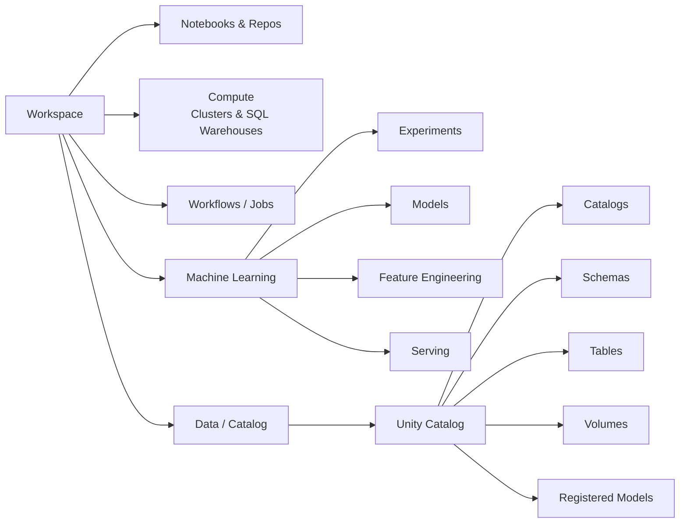

# Chapter 68 — Databricks Workspace Anatomy and the DBR ML Runtime

> **Goal of this chapter:** to give you a precise map of the surfaces a Databricks user actually touches when doing ML work — workspace, notebook, cluster, runtime, repo, file storage — and to nail down what is special about the *ML* runtime as opposed to the standard one. Up to this chapter we have been writing PySpark and Spark ML code as if it lived on any Spark cluster. From here forward, the *Databricks* in "Databricks ML Associate" starts to matter — and the things that look like trivial UI details turn out to be the load-bearing scaffolding for everything else in this Part.

Every later chapter in Part L assumes the vocabulary established here. You will not get far thinking about Unity Catalog before you understand what a workspace is. You will not understand the difference between an interactive cluster and a job cluster before you've held both in your head. So we start with anatomy.

---

## 68.1 The motivating story — your first half hour on Databricks

You sign up for a Databricks account. You log in. You stare at a sidebar with twelve things in it, most of which you've never heard of. You click "Compute" and discover you have to "create a cluster" before you can do anything. The cluster-creation form asks for a "Databricks Runtime version" with an alphabet soup of options: 14.3 LTS, 15.4 LTS, 16.4 LTS, 17.3 LTS, ML, ML GPU, Photon, Beta. You pick the most recent thing because newer-is-better, attach a notebook, and start writing code. Half an hour later your `import xgboost as xgb` fails with `ModuleNotFoundError` and you don't know why, because XGBoost was definitely in the docs you read.

Here is the diagnosis: you picked a runtime that doesn't ship the ML libraries, and you didn't know the runtime mattered. The Databricks platform is *layered*, and the wrong choice at the bottom layer silently breaks the top layer. The right mental model is not "Databricks is a notebook" — it's "Databricks is a workspace, which contains notebooks, which attach to clusters, which run a specific runtime, which has specific libraries". Each noun in that sentence is a separate concept that you can — and on the exam, will — be asked about in isolation.

This chapter walks each noun in that sentence.

---

## 68.2 The workspace — the URL-addressable container

Everything in Databricks lives inside a **workspace**. A workspace has a URL like `https://adb-1234567890.0.azuredatabricks.net` (Azure) or `https://dbc-abcdef12-3456.cloud.databricks.com` (AWS) or `https://1234567890123456.0.gcp.databricks.com` (GCP). One URL, one workspace, one set of users and permissions.

Underneath the surface, the same Databricks product runs on three clouds:

- **Azure Databricks** — a first-party Microsoft service. Identity comes from Microsoft Entra ID (formerly Azure AD). The workspace is an Azure resource, billed on your Azure subscription.
- **Databricks on AWS** — runs in your AWS account via a "data plane" of EC2 instances, with the "control plane" in Databricks' own AWS account. Identity via AWS IAM + Databricks-managed accounts.
- **Databricks on GCP** — same model as AWS, on Google Cloud.

These are the same product. The UI, APIs, runtimes, and ML libraries are identical. The differences are at the account fabric — IAM, networking, billing — and you will not be tested on cloud-specific minutiae for the Associate exam. We will not mention the cloud again unless it matters.

Inside a workspace, the sidebar shows the major nouns. The ones that matter for ML work:



Read this diagram as a map. Notebooks and Repos live under the workspace's filesystem-like browser. Compute is the cluster fleet — both interactive clusters and the SQL warehouses (which are clusters tuned for SQL only). Workflows / Jobs is the scheduler. The Machine Learning sidebar entry is a meta-view that pulls together Experiments (MLflow), Models (Registry), Feature Engineering (the UC feature tables), and Serving (model endpoints) — but these are not really separate storage; they are views over UC and MLflow data. Data / Catalog is where you browse Unity Catalog (Ch 70).

The thing to internalize: **the workspace is a UI shell over data that lives elsewhere**. Notebooks are stored in the workspace's filesystem. Tables, models, feature tables — these live in Unity Catalog, which is *account-level*, not workspace-level. We come back to this distinction repeatedly in Ch 70.

---

## 68.3 Notebooks — the unit of interactive work

A **notebook** is the primary surface for writing code interactively. If you've used Jupyter, you have the shape — cells of code interleaved with cells of markdown, executed top-to-bottom but re-runnable in any order.

Databricks notebooks have a few specifics you should know.

### 68.3.1 Default language and magic commands

Each notebook has a *default language* — Python, Scala, SQL, or R — set at creation time. Cells inherit the default. But you can override per-cell with **magic commands**:

```python
# Python is the default — no magic needed
df = spark.read.table("samples.nyctaxi.trips")
```

```sql
%sql
SELECT count(*) FROM samples.nyctaxi.trips
```

```scala
%scala
val df = spark.read.table("samples.nyctaxi.trips")
df.count()
```

```python
%md
# This is a markdown cell — renders as formatted text
```

```python
%sh
ls -la /tmp
```

```python
%fs
ls /
```

The magic commands you'll meet most often as an ML engineer:

- `%python`, `%sql`, `%scala`, `%r` — language overrides.
- `%md` — markdown.
- `%sh` — shell command on the driver node.
- `%fs` — Databricks file system commands (`ls`, `cp`, `rm`, etc.). A thin wrapper over `dbutils.fs`.
- `%pip install <pkg>` — install a Python package, *notebook-scoped* (more on this in 68.7).
- `%run /path/to/another_notebook` — execute another notebook as if its cells were inlined here. Used for shared utility code.

### 68.3.2 State and the cluster connection

A notebook by itself is dead — just a file. To execute cells, it must be **attached** to a running cluster. The notebook's state — variables, loaded packages, MLflow run context — lives in a Python process *on the cluster's driver node*. When you detach the notebook, or restart the cluster, that state evaporates.

This is the single most common source of "why did my notebook break?" confusion. You imported XGBoost in cell 3 ten minutes ago. The cluster auto-terminated for being idle. You came back, ran cell 7, and it says `NameError: name 'xgb' is not defined`. The reason: the cluster restart killed the Python kernel; cell 3's `import` never ran in this new session. Fix: re-run the notebook from the top, or use the "Run All" command.

The same principle says: **never store important state in notebook variables alone**. Anything worth keeping — a trained model, a transformed DataFrame, a list of best hyperparameters — should be persisted to Delta, to Unity Catalog volumes, or logged to MLflow. If it only lives in a Python variable, one auto-terminate away from gone.

### 68.3.3 Notebooks vs production code

Notebooks are exquisite for *exploration* and *teaching*. They are mediocre for *production*. The reasons:

- Cell execution order is mutable; the notebook you see may not be the notebook that actually ran.
- Diffs are painful (the JSON-backed format is line-noisy in `git diff`).
- Imports and configuration are usually scattered through the notebook rather than at the top.
- Testing is awkward.

Mature ML on Databricks separates the two: notebooks for exploration; modules under `src/` in a Git Repo (next section) for production code; jobs that *call* the production code from a thin orchestrating notebook. We will return to this in Ch 73 when we discuss promotion workflows.

---

## 68.4 Repos — Git-backed code, the production pattern

Databricks **Repos** (rebranded recently to "Git Folders" in some UIs — same thing) are a way to clone a Git repository into your workspace, so the cloned files appear as a folder you can edit, run, and execute in notebooks.

Supported providers: GitHub, GitLab, Bitbucket, Azure DevOps Services. You authenticate once with a personal access token; the workspace caches it.

What you can do inside a Repo:

- Edit Python modules (`.py` files) and notebooks side by side.
- `git pull` to fetch the latest commits.
- `git checkout` a different branch.
- Stage, commit, and push changes back upstream — all from the Databricks UI or the CLI.
- Run notebooks that `import` from the Python modules in the same Repo — so your production code lives in `.py` files (testable, lintable) and your orchestrating glue lives in notebooks.

**The recommended production-code pattern** for ML on Databricks:

```
my-ml-project/                      ← Git repo
├── src/
│   └── churn/
│       ├── __init__.py
│       ├── features.py             ← feature engineering functions
│       ├── train.py                ← training logic
│       └── evaluate.py             ← evaluation
├── notebooks/
│   ├── 01_explore.py               ← exploration (kept for posterity, not run in prod)
│   ├── 02_train_job.py             ← thin notebook that calls churn.train.main()
│   └── 03_score_batch_job.py       ← thin notebook that runs batch scoring
├── tests/
│   └── test_features.py            ← pytest tests, run in CI before merge
├── pyproject.toml                  ← deps
└── README.md
```

The training Job (Ch 69) is scheduled against `02_train_job.py`, which is a five-line notebook that does little more than `from churn.train import main; main(args)`. All real logic is in `src/churn/`. This is the pattern that survives team growth, code review, and "the notebook works but production fails" debugging.

For the exam, the relevant facts: Repos integrate with the four major Git providers; they are the recommended container for production code; they support standard Git operations from inside Databricks.

---

## 68.5 Clusters — interactive vs job, all-purpose vs ML

A **cluster** is a fleet of VM instances managed by Databricks. One driver node, zero-or-more worker nodes (we did the Spark side of this in Ch 57). When you create a cluster you specify:

- **Cluster mode / access mode** — Standard (general use, Unity Catalog-compatible), Shared (multi-user, with per-user table ACL enforcement), Single-user (one named user; UC-compatible; required for some ML workloads like MLflow Tracing).
- **Databricks Runtime version** — see 68.6.
- **Driver and worker instance types** — e.g., `m5.xlarge`, `Standard_D4s_v3` (see Ch 69 for sizing).
- **Min and max workers** (for autoscaling), or a fixed worker count.
- **Auto-termination minutes** — kill the cluster after N minutes of idle. Default 120; recommend 30 for cost discipline.
- **Cluster libraries** — packages installed at cluster startup (vs notebook-scoped `%pip install`).
- **Init scripts** — bash scripts executed on each node at cluster startup.

Critically, clusters come in three operational flavors that you must distinguish:

| Flavor | Lifecycle | Use case | DBU rate (approx, AWS Premium 2026) |
|---|---|---|---|
| **All-Purpose cluster** | Persistent. Started/stopped manually or via auto-termination. Multi-user, multi-notebook. | Interactive exploration; ad-hoc analysis. | $0.55/DBU-hr |
| **Job cluster** | Ephemeral. Created when a Job starts, destroyed when it finishes. Single-job, single-purpose. | Production scheduled work. | $0.15/DBU-hr |
| **SQL Warehouse** | Tuned for SQL only — no general Python. | BI / dashboards / SQL queries. | $0.55/DBU-hr (Pro) or $0.70/DBU-hr (Serverless) |

A few facts about this table that the exam tests:

1. **Job clusters are ~3.5× cheaper per DBU than All-Purpose clusters.** This is the platform-level cost lever. If you run a daily training job on an All-Purpose cluster instead of a Job cluster, you are leaving a meaningful fraction of your Databricks bill on the table.

2. **Job clusters are ephemeral.** If your job needs persistent state between runs — model weights from a previous epoch, a feature table — that state must live in UC, not on the cluster's local disk. The cluster is gone after the job ends.

3. **An "ML cluster" is not its own flavor** — it's any cluster (All-Purpose or Job) running the **DBR ML** runtime. Orthogonal to the All-Purpose-vs-Job distinction. So you can have a Job cluster running DBR ML — and that is in fact the recommended pattern for production training jobs.

We treat sizing — driver vs worker, memory vs CPU vs GPU, Photon yes-or-no — in Ch 69. For now, just hold the three flavors in your head.

---

## 68.6 The Databricks Runtime — what's actually installed

The **Databricks Runtime (DBR)** is Databricks' custom distribution of Apache Spark, plus a set of pre-installed libraries, plus a basket of performance optimizations not in open-source Spark. When you pick "DBR 17.3 LTS" in the cluster-creation form, you are picking a specific *image* of all of this.

There are several DBR flavors. The ones to know:

- **Standard DBR** — Spark + the basic data engineering libraries (pandas, numpy, basic database connectors). No ML libraries pre-installed.
- **DBR ML** — Standard DBR + a curated, version-pinned set of ML libraries: scikit-learn, xgboost, lightgbm, PyTorch, TensorFlow, MLflow, Optuna (and historically Hyperopt — see below), feature_engineering client, plus CUDA-stack on the GPU variant. This is what you almost always want for ML work.
- **DBR ML GPU** — DBR ML plus NVIDIA drivers, CUDA, cuDNN. Required for deep learning on GPU workers. Out of scope for the Associate exam but worth knowing it exists.
- **Photon-enabled DBR** — Standard DBR with the Photon vectorized engine turned on (Ch 69). Available as a checkbox on most recent DBR versions.

### 68.6.1 LTS vs non-LTS

DBR versions come in two release cadences:

- **LTS (Long-Term Support)** — supported for two years from release. Recommended for production. Library versions are *frozen* at release; no surprise library bumps mid-lifecycle.
- **Non-LTS** — supported for ~6 months. New features ship here first. Use for development that needs the latest features; don't bind production jobs to a non-LTS DBR.

As of 2026-05, the **current LTS for DBR ML is 17.3 LTS** (Spark 4.0, Python 3.11). The previous LTS, **16.4 LTS** (Spark 3.5, Python 3.10), is still supported. The one before that, 14.3 LTS, is reaching end-of-support.

Each LTS pins specific library versions. A small but exam-relevant sample:

| Library | DBR ML 14.3 LTS | DBR ML 16.4 LTS | DBR ML 17.3 LTS |
|---|---|---|---|
| Python | 3.10 | 3.10 | 3.11 |
| scikit-learn | 1.3.x | 1.4.x | 1.5.x |
| xgboost | 1.7 | 2.0 | 2.1 |
| MLflow | 2.9 | 2.16 | 3.0+ |
| **Hyperopt** | shipped | shipped (last LTS with it) | **NOT shipped** |
| Optuna | shipped | shipped | shipped |

### 68.6.2 The Hyperopt removal — the highest-yield fact in this chapter

In DBR ML 17 (and forward), **Hyperopt is no longer pre-installed**. Databricks' position is that Hyperopt is unmaintained upstream; the recommended replacements are Optuna (for Bayesian HPO; we did the API in Ch 54) or Ray Tune.

This has direct consequences for the exam:

1. The exam guide (Mar 2025) still lists `fmin` and Hyperopt under Section 3 objectives. Hyperopt is still tested.
2. If you build your study cluster on DBR ML 17+ and try to `from hyperopt import fmin`, it will fail with `ModuleNotFoundError`. You will think the API is gone. It isn't — you just need to install it.
3. The pragmatic answers: either **pin your study cluster to DBR ML 16.4 LTS** (Hyperopt ships natively, plus everything else still works) or **stay on DBR ML 17.3 LTS and `%pip install hyperopt` at the top of any notebook that uses it**.

If a question in the exam asks "which DBR version ships Hyperopt by default?" the answer is "16.4 LTS and earlier." If a question asks "how do you use Hyperopt on DBR ML 17?" the answer is "install it with `%pip install hyperopt`".

### 68.6.3 What you actually gain from DBR ML vs Standard

DBR ML's value proposition, in plain terms:

1. **Pre-installed, version-pinned ML libraries.** No `pip install xgboost` at the top of every notebook. No "works on my laptop, breaks in prod" surprises from version drift.
2. **Pre-installed CUDA stack** on the GPU variant. Building a CUDA-correct deep-learning environment by hand is its own circle of hell; DBR ML GPU eliminates the problem.
3. **MLflow auto-configuration** — `mlflow.set_experiment` works out of the box; the tracking URI is pre-configured to the workspace's Tracking Server (Ch 72).
4. **Feature Engineering client installed and configured** — `from databricks.feature_engineering import FeatureEngineeringClient` just works (Ch 71).
5. **Hardware-accelerated math libraries** — Databricks bundles tuned BLAS, etc., where helpful.
6. **Optimizations** beyond open-source Spark — adaptive query execution defaults, predictive I/O for Delta, faster Pandas API on Spark.

The cost: DBR ML has a slightly higher startup time and a marginally higher per-DBU rate on some platforms. For ML work, the convenience is overwhelmingly worth it.

The rule of thumb: **for any notebook that does ML, attach a DBR ML cluster.** For pure ETL with no ML libraries, Standard DBR is fine.

---

## 68.7 Installing extra libraries — `%pip` vs cluster libraries vs init scripts

Even with DBR ML, you'll sometimes need a package that isn't shipped. There are three places to install it, with different semantics.

### 68.7.1 `%pip install` — notebook-scoped

```python
%pip install lightfm==1.17 catboost
dbutils.library.restartPython()
```

A `%pip install` inside a notebook installs the package into the Python environment **of that notebook's session only**. Other notebooks attached to the same cluster do not see it. The install survives until the cluster restarts.

**Pros:** Lowest blast radius. Doesn't break other users' notebooks. Easy to commit (it's just a notebook cell). Quick to try.

**Cons:** Re-installs on every fresh notebook attach. Slow if the package is heavy. Not appropriate for shared production code where multiple notebooks need the same package.

`dbutils.library.restartPython()` is the incantation that restarts the Python kernel after install so the new package is importable. On modern DBR you can often skip it but it's defensive practice to include.

### 68.7.2 Cluster-scoped libraries

In the cluster configuration UI (or via API), you can attach libraries — PyPI packages, Maven coordinates, JARs, eggs, wheels — that get installed on the cluster at startup. These persist for the cluster's life and are available to every notebook that attaches.

**Pros:** Install once. Available everywhere on the cluster. Good for shared production dependencies.

**Cons:** Higher blast radius — if the library breaks, all attached notebooks break. Slower cluster start (libraries install before the cluster reaches READY). Configuration lives in the cluster spec, not in your code.

### 68.7.3 Init scripts — the heavy hammer

An **init script** is a shell script that runs on every node (driver and workers) at cluster startup. It can `apt-get install` system packages, set kernel parameters, configure environment variables, copy files into place, or anything else a shell script can do.

**When to use init scripts:** when you need *non-Python* dependencies — system packages (`libgomp`, `tesseract`, custom C libraries), or environment configuration. Not for Python packages; `%pip` or cluster libraries beat init scripts for those.

**The init-script footgun:** if the script fails, the cluster fails to start, with an error message that's often unhelpful. Init scripts are best authored and tested carefully. Databricks has progressively limited where init scripts can live (Volume-stored or workspace-files now preferred over the historical DBFS root path) for security reasons.

### 68.7.4 The decision tree

```
Need a Python package?
├── For one notebook, ad-hoc → %pip install in the notebook
├── For a whole cluster, persistent → cluster-scoped library
└── For a system package (apt-get) → init script
```

For exam purposes: `%pip install` is the most-tested mechanism. Know that it is notebook-scoped, that it requires a kernel restart, and that it doesn't affect other notebooks on the same cluster.

---

## 68.8 File storage — DBFS, Volumes, and direct cloud storage

Where do you put a CSV file you want to read? Where does your trained model checkpoint go? Where do you save a plot? Databricks has had three answers over time, and an ML engineer should know all three.

### 68.8.1 DBFS — the legacy abstraction

**DBFS** ("Databricks File System") is the original Databricks abstraction over cloud object storage. From a notebook, you read and write under `/dbfs/...` or `dbfs:/...`. Behind the scenes, the files actually live in an S3 bucket (AWS) or ADLS container (Azure) that the workspace manages.

DBFS works. It is still around. But it has fallen out of favor for two reasons:

1. **No governance.** Anyone with workspace access can read or write under DBFS. There's no concept of "this user can read these files but not those" at the DBFS level.
2. **It is workspace-scoped.** Each workspace has its own DBFS. Sharing data across workspaces is awkward.

Modern Databricks pushes you toward UC Volumes for governed file storage.

### 68.8.2 Unity Catalog Volumes — the current way

A **Volume** is a UC securable (Ch 70) that wraps a cloud-storage location and exposes it as a filesystem path. You read and write under `/Volumes/<catalog>/<schema>/<volume>/path/to/file`. Volumes inherit UC's permission model — you can `GRANT READ VOLUME` to one group and `WRITE VOLUME` to another.

When to use Volumes:

- **Storing training data** that isn't in a Delta table format (CSV, Parquet files, images, PDFs).
- **Saving model checkpoints** during training (especially deep learning checkpoints, which are too big and frequent to log as MLflow artifacts on every epoch).
- **Storing reference data** — vocabulary files, model artifacts not bound to a single MLflow run.

Two kinds of Volumes:

- **Managed Volumes** — UC owns the underlying storage location. Easier; the default.
- **External Volumes** — UC governs access to a location you own (e.g., an existing S3 bucket). You manage the lifecycle of the storage; UC just gates access.

### 68.8.3 Direct cloud storage URLs

You can also read/write directly with cloud URLs:

```python
df = spark.read.parquet("s3://my-bucket/data/train/*.parquet")
df.write.parquet("abfss://container@account.dfs.core.windows.net/output/")
```

This bypasses UC entirely. You authenticate via cloud-provided credentials (IAM role, SAS token, etc.). It works but you lose UC's governance and lineage tracking.

The 2026 best practice: **prefer UC Volumes for files, prefer UC tables for tabular data.** Direct cloud URLs only when you have a hard reason — e.g., reading from a bucket owned by a different team that hasn't been onboarded to UC.

---

## 68.9 dbutils — the Databricks utility namespace

`dbutils` is a Python object exposed in every Databricks notebook, with utility methods grouped by submodule. You'll meet these:

- `dbutils.fs.ls("/Volumes/cat/sch/vol")` — list files.
- `dbutils.fs.cp(src, dst)`, `mv`, `rm`, `mkdirs` — file ops.
- `dbutils.fs.put(path, contents, overwrite=True)` — write a small file.
- `dbutils.secrets.get(scope="prod", key="db_password")` — fetch a secret from a Databricks secret scope. Never put credentials in notebooks.
- `dbutils.widgets.text("date", "2026-05-23")`, `dbutils.widgets.get("date")` — parameterize notebooks (used to pass values into Jobs).
- `dbutils.notebook.run("/path/to/other", timeout_seconds=60, arguments={"k": "v"})` — invoke another notebook as a function. Returns the called notebook's `dbutils.notebook.exit(value)`.
- `dbutils.library.restartPython()` — the kernel-restart we met earlier.
- `dbutils.data.summarize(df)` — a visual data profile (Section 2 of the exam objectives literally mentions "dbutils data summaries").

`dbutils.data.summarize` is exam-relevant: it produces a one-shot statistical and visual profile of a Spark DataFrame — column types, null counts, distinct counts, distributions for each column. Equivalent to a fast EDA pass. The exam Section 2 specifically tests awareness of this method.

---

## 68.10 The shape of a typical ML notebook on Databricks

Putting the pieces together, here is the skeleton of a training notebook on Databricks circa 2026:

```python
# COMMAND ----------
# MAGIC %md
# MAGIC # Customer churn — RF baseline, v2

# COMMAND ----------
# Install anything not in DBR ML
%pip install -q some-extra-lib==1.2.3
dbutils.library.restartPython()

# COMMAND ----------
# Imports
import mlflow
from databricks.feature_engineering import FeatureEngineeringClient, FeatureLookup
from pyspark.ml.feature import VectorAssembler
from pyspark.ml.classification import RandomForestClassifier

# COMMAND ----------
# Configure MLflow — point at UC registry
mlflow.set_registry_uri("databricks-uc")
mlflow.set_experiment("/Users/me@company.com/churn-experiment")

# COMMAND ----------
# Read labels
labels_df = spark.table("prod.churn.labels_2026_q1")

# COMMAND ----------
# Build training set using UC feature tables
fe = FeatureEngineeringClient()
training_set = fe.create_training_set(
    df=labels_df,
    feature_lookups=[
        FeatureLookup(
            table_name="prod.churn.member_features",
            lookup_key="member_id",
            timestamp_lookup_key="event_ts",
        )
    ],
    label="churned",
    exclude_columns=["member_id"],
)
training_df = training_set.load_df()

# COMMAND ----------
# Train + log + register, all in one MLflow run
with mlflow.start_run(run_name="rf_baseline_v2") as run:
    train_df, val_df = training_df.randomSplit([0.8, 0.2], seed=42)
    assembler = VectorAssembler(inputCols=[...], outputCol="features")
    rf = RandomForestClassifier(featuresCol="features", labelCol="churned",
                                numTrees=200, maxDepth=8)
    model = rf.fit(assembler.transform(train_df))

    # Evaluate
    preds = model.transform(assembler.transform(val_df))
    # ... compute metrics, log them ...

    # Log + register with feature lineage baked in
    fe.log_model(
        model=model,
        artifact_path="model",
        flavor=mlflow.spark,
        training_set=training_set,
        registered_model_name="prod.churn.rf_model",
    )
```

Every concept in this skeleton is the subject of a chapter in this Part. The point of showing it now is to fix the *shape* in your head — the same shape that real Databricks ML notebooks have. As we work through Ch 70–73 we will return to this skeleton and dissect each piece.

---

## 68.11 Inspecting the cluster from inside a notebook

Sometimes you want to know, programmatically, what kind of cluster you're attached to — DBR version, cluster size, runtime profile. The relevant calls:

```python
# Spark conf gives you cluster metadata
spark.conf.get("spark.databricks.clusterUsageTags.clusterId")
spark.conf.get("spark.databricks.clusterUsageTags.clusterAllTags")
spark.conf.get("spark.databricks.cluster.profile")    # "singleNode" or "serverless" or None for normal
spark.conf.get("spark.databricks.workspaceUrl")
spark.conf.get("spark.databricks.clusterUsageTags.sparkVersion")

# DBR version (e.g. "17.3.x-cpu-ml-scala2.12")
import os
os.environ.get("DATABRICKS_RUNTIME_VERSION")

# Python version
import sys
sys.version

# Number of workers (live)
sc.defaultParallelism   # total cores across workers
```

You will rarely need these in production code, but they're invaluable for debugging "why does my code behave differently in dev vs prod?" — usually a DBR version mismatch.

---

## 68.12 Worked example — the first-time-on-Databricks debugging story

Let's close the chapter with a worked debugging story, the kind that hammers home the anatomy.

**Setup.** You've just been onboarded to Databricks. Your team's senior engineer hands you a notebook, says "run this", and walks away. The notebook starts with:

```python
import mlflow
import xgboost as xgb
from databricks.feature_engineering import FeatureEngineeringClient

fe = FeatureEngineeringClient()
mlflow.set_experiment("/Shared/churn-baseline")

# ... 200 more lines ...
```

You attach the notebook to your personal cluster (which you created an hour ago, default settings) and click Run All. The first cell fails:

```
ModuleNotFoundError: No module named 'databricks.feature_engineering'
```

**Diagnosis path.** Walk through the anatomy:

1. **Workspace?** Yes, you're logged in.
2. **Notebook attached to a cluster?** Yes — the cluster icon is green.
3. **What DBR is the cluster running?** You open the cluster config: "DBR 17.3 (Standard)". Not ML.
4. **Is `databricks.feature_engineering` part of Standard DBR?** No. It's an ML-runtime library.

The fix: change the cluster to DBR 17.3 ML, restart, re-attach.

**Second failure.** You make the change, re-run. The XGBoost import now succeeds. Cell 47 fails:

```
ModuleNotFoundError: No module named 'hyperopt'
```

**Second diagnosis.** Hyperopt was removed from DBR ML 17. You either pin the cluster to DBR ML 16.4 LTS, or you `%pip install hyperopt` at the top of the notebook.

**Third failure (a week later).** You promote the notebook to a Job. The job runs successfully but takes 4× longer than your interactive runs.

**Third diagnosis.** Check the Job config: it's using the same All-Purpose cluster as your interactive work. The cluster has 4 workers. But you're now running concurrent to other people's notebooks, queuing for resources. Fix: make the Job use a Job cluster with the same DBR+ML+sizing — ephemeral, single-purpose, no contention.

**Story moral.** Every layer of the anatomy has a place where it can quietly go wrong. The fix path always starts with "which layer broke?" — and the only way to answer that is to have the anatomy in your head.

---

## 68.13 What this builds on / where this returns

**Builds on:** Ch 57 (Spark architecture — driver/executors/cluster manager; we layered the Databricks-specific cluster-flavor and runtime distinctions on top of this).

**Returns:**
- **Cluster sizing economics** in *Ch 69* — we'll go deep on driver/worker/Photon decisions and DBU math.
- **The MLflow auto-configuration** in *Ch 72* — DBR ML pre-wires the tracking URI.
- **The Feature Engineering client** in *Ch 71* — pre-installed only because we're on DBR ML.
- **UC and Volumes** in *Ch 70* — the governance layer over the workspace's storage.
- **`%run` / module imports + Repos pattern** in *Ch 73* — when we discuss promoting code vs promoting models.

---

## 68.14 Exercises

1. **Vocabulary check.** Define, in one sentence each: workspace, notebook, cluster, runtime, repo, all-purpose cluster, job cluster, DBR ML, DBR Standard, LTS, init script, `%pip install`, DBFS, UC Volume.

2. **The cluster-restart trap.** A colleague's notebook has 80 cells. They re-run cell 79 and get `NameError: name 'model' is not defined`. The cluster was auto-terminated and re-started. Explain why this happens and the two ways to fix it.

3. **Cost arithmetic — Job vs All-Purpose.** You run a daily training job that takes 1 hour on a cluster equivalent to 4 DBUs. Compare the monthly cost of running it on an All-Purpose cluster ($0.55/DBU-hr) vs a Job cluster ($0.15/DBU-hr) for a 30-day month.

4. **The Hyperopt question.** You're studying for the exam and want to practice the `fmin` API. You spin up a cluster on DBR ML 17.3 LTS and try `from hyperopt import fmin`. It fails. List two ways to fix this and the tradeoffs of each.

5. **DBR ML or Standard?** For each of these workloads, pick DBR Standard or DBR ML, and justify:
   (a) An ETL job that reads JSON from S3, parses it, writes to Delta.
   (b) A training notebook for an XGBoost binary classifier.
   (c) A SQL dashboard that queries existing Delta tables.
   (d) A deep-learning fine-tuning job on a GPU cluster.

6. **`%pip` semantics.** Two notebooks A and B are attached to the same All-Purpose cluster. Notebook A runs `%pip install lightfm; import lightfm`. Then notebook B runs `import lightfm`. Will B's import succeed? Why or why not?

7. **Magic command identification.** What does each of these magic commands do? `%md`, `%sql`, `%sh`, `%fs`, `%run`, `%pip`. For which one would you use shared Python utility code across multiple notebooks?

8. **The Repo / production pattern.** Why do mature ML teams put their production training code in `.py` modules under `src/` in a Git Repo, and use a thin notebook merely to orchestrate calls to those modules?

9. **dbutils selection.** Which `dbutils` call would you use for each:
   (a) Listing files in a UC Volume.
   (b) Reading a database password without writing it in plaintext.
   (c) Computing a profile (col types, distributions) of a Spark DataFrame.
   (d) Parameterizing a notebook so a Job can pass in `date=2026-05-23`.

10. **The shape of the workspace.** Without re-reading section 68.2, draw (in text or mermaid) the relationship between Workspace, Notebooks, Clusters, Jobs, MLflow Experiments, UC Catalog/Schema/Tables/Models/Volumes.

11. **DBFS vs Volume.** A teammate suggests storing your model checkpoints under `/dbfs/checkpoints/`. You suggest `/Volumes/prod/models/checkpoints/`. Give two reasons why your suggestion is better.

12. **Cluster introspection.** Write a Python snippet (run in a Databricks notebook) that prints the cluster's DBR version, total worker cores, and workspace URL.

<details>
<summary>Answers</summary>

1. *Workspace* — the URL-addressable container of Databricks resources for an organization. *Notebook* — an interactive document with executable cells, attached to a cluster. *Cluster* — a fleet of VMs running a DBR. *Runtime* — the DBR image specifying Spark + libraries. *Repo* — a Git-backed folder of code in the workspace. *All-Purpose cluster* — persistent, interactive. *Job cluster* — ephemeral, per-job. *DBR ML* — DBR variant with ML libraries pre-installed. *DBR Standard* — base DBR. *LTS* — long-term-support release (2-year lifecycle). *Init script* — shell script run on each node at cluster startup. *`%pip install`* — notebook-scoped Python install. *DBFS* — legacy workspace-scoped file abstraction. *UC Volume* — UC-governed file storage.

2. The cluster restart killed the Python kernel. Notebook variables live in the kernel's memory; they don't persist across cluster restarts. The two fixes: (a) re-run the notebook from the top (the "Run All" command), recreating `model`; (b) persist `model` to durable storage (MLflow, Volume) and load it from there before cell 79.

3. All-Purpose: 4 DBUs/hr × 1 hr/day × $0.55/DBU-hr × 30 days = $66/month. Job: 4 × 1 × $0.15 × 30 = $18/month. Saving = $48/month, or ~73%.

4. (a) Pin the cluster to DBR ML 16.4 LTS — Hyperopt ships natively there. Tradeoff: you miss DBR ML 17's newer libs and Spark 4.0. (b) Stay on DBR ML 17 and `%pip install hyperopt` at the top of every notebook that uses it. Tradeoff: extra install time per session, and Hyperopt is unmaintained upstream so breakage risk grows over time. The pragmatic 2026 answer: (a) for exam prep, (b) once the next exam guide drops Hyperopt.

5. (a) Standard — ETL only, no ML libs needed. (b) DBR ML — XGBoost is preinstalled there. (c) Neither — use a SQL Warehouse. (d) DBR ML GPU — preinstalled CUDA + drivers + DL frameworks.

6. No. `%pip install` is notebook-scoped. Notebook B has its own Python session (since DBR's per-notebook Python isolation in modern runtimes). It would have to run its own `%pip install lightfm`.

7. `%md` = markdown cell. `%sql` = SQL execution. `%sh` = shell command on driver. `%fs` = file-system shortcut (alias for `dbutils.fs`). `%run` = execute another notebook inline; this is the answer to "shared utility code across notebooks". `%pip` = install a Python package, notebook-scoped.

8. Because `.py` modules are diffable, testable, and importable from multiple notebooks; the notebook becomes a thin orchestration layer that's easy to review. Notebook cells are JSON-backed and produce noisy diffs, hide execution-order bugs, and are awkward to unit-test. Production code wants the `.py` discipline; the notebook becomes a wrapper.

9. (a) `dbutils.fs.ls("/Volumes/cat/sch/vol")`. (b) `dbutils.secrets.get(scope=..., key=...)`. (c) `dbutils.data.summarize(df)`. (d) `dbutils.widgets.text("date", "...")` then `dbutils.widgets.get("date")`.

10. A workspace contains notebooks, clusters, jobs (which run notebooks on clusters); MLflow experiments live in the workspace's filesystem tree; UC is account-level (above workspace) and holds catalogs > schemas > {tables, models, volumes, functions}. The ML sidebar pulls in MLflow Experiments + UC Models + UC Feature Tables + Serving endpoints into a single view.

11. (a) Governance — Volumes inherit UC permissions; DBFS has no per-user ACL. (b) Cross-workspace shareability — Volumes are account-level; DBFS is workspace-scoped.

12. ```python
    import os, sys
    print("DBR:", os.environ.get("DATABRICKS_RUNTIME_VERSION"))
    print("Python:", sys.version)
    print("Total worker cores:", sc.defaultParallelism)
    print("Workspace URL:", spark.conf.get("spark.databricks.workspaceUrl"))
    ```

</details>
