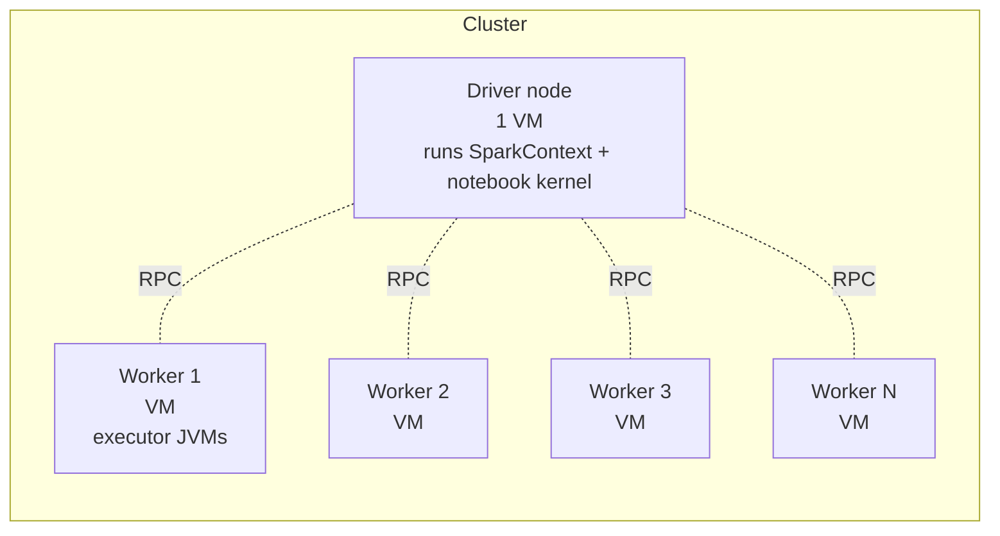

# Chapter 69 — Clusters, Photon, and Driver/Worker Sizing: The Cost-vs-Speed Tradeoff

> **Goal of this chapter:** to give you the engineering discipline of sizing a Databricks cluster correctly — not by following a recipe, but by reasoning from workload shape to instance choice. We will treat the cluster as a fleet of machines you are paying for by the second. By the end you should be able to explain, when handed a workload description, what driver size, worker size, worker count, autoscaling configuration, Photon-on-or-off setting, and use-of-spot-instances you would pick, and *why*.

Sizing is one of those topics where bad heuristics are everywhere and good intuition is rare. "Just use Photon, it's faster" is a bad heuristic. "Big clusters finish faster" is a bad heuristic. "Spot instances are always cheaper" is a bad heuristic. The right answer is always: *which resource is bottlenecking my workload, and what's the cheapest fleet that relieves that bottleneck?*

---

## 69.1 The motivating story — the $500 surprise

Two engineers, Alice and Bob, are training the same XGBoost model on the same 80 GB dataset on the same Databricks workspace. They both finish their training in roughly an hour.

Alice's bill for the run: $5.10. Bob's bill: $487.

How? Bob picked a cluster with 32 r5.16xlarge workers (huge memory, 64 cores each), Photon enabled, GPU-attached, autoscaling disabled. Alice picked 4 m5.2xlarge workers (modest memory, 8 cores each), Photon off, no GPU, 30-minute auto-termination. Their *training runs* took the same wall-clock time because XGBoost (Bob's model) doesn't use GPUs and only uses one node's worth of CPU at a time; the extra 31 nodes did nothing useful for Bob. They were just expensive paperweights.

This is the kind of story you hear in postmortems. The diagnosis is always the same: *the cluster was sized for the wrong bottleneck*. Bob assumed bigger = faster. Bigger is only faster if the workload is bottlenecked on something the additional capacity relieves. For non-distributed ML training (XGBoost-single-node, scikit-learn, single-model PyTorch), the workload uses one node; the rest of the cluster sits idle, burning DBUs.

We're going to build the discipline that prevents the $487 mistake. The discipline is **workload-aware sizing**.

---

## 69.2 The anatomy of a cluster, revisited

We met cluster anatomy in Ch 57 and Ch 68. Quick refresh, with sizing-relevant emphasis:



The driver runs:
- The Spark Driver process (DAG scheduler, query planner, broadcast).
- Your notebook's Python kernel (where pandas DataFrames, sklearn models, MLflow run contexts live).
- The driver-side parts of MLflow autologging.

The workers run:
- Spark Executor JVMs that execute tasks.
- Worker-side Python processes for PySpark UDFs.
- Worker-side GPU processes if applicable.

Each node has four resource dimensions you size:

1. **CPU cores** — how many concurrent tasks the node can run.
2. **Memory (RAM)** — how much state Spark / Python / the JVM can hold.
3. **Local disk (SSD)** — for shuffle spill and cache overflow.
4. **Network bandwidth** — for shuffle traffic and reads from cloud storage.

And one dimension across nodes:

5. **Worker count** — how many nodes participate.

Each instance type the cloud offers is a specific combination of these. AWS `m5.4xlarge` = 16 vCPU, 64 GB, EBS-only disk, "up to 10 Gbps" network. AWS `r5.4xlarge` = 16 vCPU, 128 GB (double the memory), same disk/network. AWS `c5.4xlarge` = 16 vCPU, 32 GB (half memory), better CPU clock.

The whole game is: **match the cluster's resource profile to your workload's bottleneck.**

---

## 69.3 Workloads bottleneck on different things

The single most important question before sizing: **what is the bottleneck?** Some categories:

### 69.3.1 ETL / DataFrame transformations

Reading large files from cloud storage, joining, aggregating, writing back. Bottleneck order, typical:

1. **Network / I/O** — reading from S3 / ADLS / GCS. Faster network → faster ingestion.
2. **Memory** — joins and shuffles need to fit hash tables in executor memory; spilling kills throughput.
3. **CPU** — parsing, decoding (Parquet, JSON), executing UDFs.
4. **Disk** — shuffle spill, cached DataFrames.

For ETL, **Photon helps a lot** (often 2-12×) because it accelerates the SQL/DataFrame engine itself. **More memory** matters because it reduces spill. **More cores** matter for parallelism on parsing.

### 69.3.2 Spark ML distributed training (RF, GBT, LR via pyspark.ml)

The model is partitioned across workers. Each iteration of training does aggregations across the cluster.

1. **Memory** — each worker holds its partition; if data is too big to fit, you spill or cache-evict and performance collapses.
2. **Network** — gradient/statistics aggregations are shuffles. Big clusters with wimpy network bandwidth slow down.
3. **CPU** — parallel per-partition computation.

Photon does NOT help here — Photon accelerates the SQL engine; the ML algorithm internals run outside that path.

### 69.3.3 Single-node ML training (XGBoost-single-node, sklearn, single-model PyTorch)

The model trains on the driver (or via SparkTrials, on one worker). Most of the cluster is idle.

1. **Driver memory (if training on driver)** — must hold the dataset.
2. **Driver cores (or one worker's cores)** — many sklearn / XGBoost algorithms use multi-threaded CPU.
3. **GPU memory (if PyTorch on GPU)** — must hold model + a batch.

This is where Bob went wrong in the opening story. **More workers do not help.** What helps: a *bigger driver* (or single beefy worker for SparkTrials).

### 69.3.4 Hyperparameter tuning with `SparkTrials` (Ch 53)

Many independent single-node training jobs running in parallel across the cluster. Each Trial uses one worker.

1. **Number of workers** — directly proportional to parallelism in HPO.
2. **Each worker's memory / CPU** — must be sized to fit a *single* trial.
3. **Driver memory** — collects results from all trials.

This is the one ML scenario where "more workers = faster" is genuinely true, and it's specifically because Hyperopt's `SparkTrials` parallelizes the independent trials, not because Spark distributes a single trial.

### 69.3.5 Real-time inference

Different beast entirely. Single requests come in, model returns predictions in milliseconds. You don't run this on a Spark cluster — you run it on **Mosaic AI Model Serving endpoints**, which is a separate compute fabric optimized for low-latency serving (Ch 73 forward-pointer).

### 69.3.6 Batch inference

Loading a model, scoring N million rows. Equivalent to an ETL workload with an extra `transform` step.

1. **Worker count + cores** — parallel scoring across partitions.
2. **Worker memory** — large enough to hold the model in each executor.

The mental model: **before you size, classify your workload by which of these six categories it is.** The classification determines everything that follows.

---

## 69.4 Photon — what it is, when it pays

**Photon** is Databricks' second-generation execution engine, written in C++ and integrated below the Spark API. When Photon is enabled, supported operators run through Photon instead of through the JVM-based Spark execution path. Up to 12× speedup on SQL-heavy workloads; substantial speedup on DataFrame transformations.

### 69.4.1 What Photon accelerates

- SQL queries (joins, aggregations, scans of Parquet/Delta).
- DataFrame transformations expressed via the DataFrame API (`select`, `groupBy`, `agg`, `join`, `filter`, native built-in functions).
- Some Delta Lake operations (`MERGE`, predicate pushdown, vectorized scans).

### 69.4.2 What Photon does NOT accelerate

- **Python UDFs** — Photon is JVM-and-C++; Python UDFs cross the boundary and bypass Photon. (Pandas UDFs are slightly less bad — they use Arrow — but still don't run inside Photon.)
- **Spark ML training** — pyspark.ml algorithms run through their own JVM code paths; Photon doesn't touch them.
- **Single-node ML training** — happens entirely in Python on the driver; cluster compute irrelevant.
- **Scala / R UDFs** — same JVM-boundary issue.
- **Streaming write-side checkpoint logic** — outside Photon's scope.

### 69.4.3 The Photon cost calculus

Photon-enabled clusters carry approximately a **2× DBU rate** versus the same instance non-Photon. So Photon is a net win **iff** your workload speeds up by more than 2×. The shapes:

| Workload | Photon impact | Worth it? |
|---|---|---|
| SQL on Delta, 100s of GB scans | 5-12× speedup | **Yes** — strong win |
| DataFrame ETL, native funcs only | 2-5× speedup | **Usually yes** |
| ETL with heavy Python UDFs | 1-1.3× | **No** — UDFs bypass Photon |
| pyspark.ml training | ~1× | **No** — irrelevant |
| Single-node XGBoost / sklearn | ~1× | **No** — irrelevant |
| Hyperopt SparkTrials | ~1× | **No** — single-node training inside each trial |

Rule of thumb: **Photon on for SQL/ETL; Photon off for pure ML training.**

The exam tests this nuance — questions about "should you enable Photon for [scenario]" expect you to know that Photon's benefits are concentrated on SQL/DataFrame compute, not on ML algorithm internals.

---

## 69.5 Driver sizing

For ML workloads, the driver's job depends heavily on the workload class.

### 69.5.1 Driver as orchestrator (distributed ML)

When the actual training happens on workers (pyspark.ml, SparkTrials), the driver merely orchestrates. It needs enough memory to:
- Hold the SparkContext metadata.
- Hold any `.collect()`-ed results.
- Run the notebook's Python kernel.

A modest driver — 8-16 GB memory, 4-8 cores — is usually fine. Going bigger doesn't help.

### 69.5.2 Driver as compute (single-node ML)

When you train sklearn / XGBoost-single-node / single-PyTorch on the driver, the driver IS the compute. The dataset must fit in driver memory, the model must fit in driver memory, and the training threads use driver cores.

For a 20 GB pandas DataFrame plus the in-memory copy XGBoost makes during training, you'd want a driver with 64-128 GB memory. For sklearn's RandomForest at `n_jobs=-1`, you want as many cores as you can afford.

### 69.5.3 Driver as memory bottleneck — the `.collect()` antipattern

A common driver-OOM cause: someone `.collect()`s a multi-GB Spark DataFrame to the driver, perhaps as `pdf = df.toPandas()`. The driver tries to materialize the entire result and runs out of memory.

The fix is almost never "make the driver bigger." The fix is "don't do that" — either keep the data distributed, or sample to a manageable size first.

```python
# Bad
pdf = big_df.toPandas()    # could be 50 GB

# OK
pdf = big_df.sample(0.01).toPandas()   # 500 MB
```

This is in scope because Section 2 of the exam mentions Pandas-vs-Spark choices and collection patterns.

---

## 69.6 Worker sizing — count, memory-per-node, cores-per-node

For distributed workloads, you have three knobs that interact.

### 69.6.1 Total cluster memory vs per-node memory

Suppose you need 256 GB of total worker memory. Options:

- 4 workers × 64 GB each
- 8 workers × 32 GB each
- 16 workers × 16 GB each

These are not equivalent. Considerations:

- **Bigger per-node memory** → bigger possible partitions → less spill on big joins. Good when individual partitions are large.
- **More smaller nodes** → more parallelism → better for many small tasks. Good for high-task-count workloads.
- **Network and shuffle overhead** scales with worker count — more workers means more pairwise shuffle connections. At ~30+ workers, the overhead starts to matter.
- **Coordination overhead** — driver tracking thousands of tasks across many small workers adds latency.

Rule of thumb for ML training: prefer **fewer, bigger workers** up to ~16 GB-64 GB memory per worker. For ETL with many small files: more, smaller workers is fine.

### 69.6.2 Cores per node — the throughput vs latency knob

More cores per node = more concurrent tasks per node = higher throughput on parallel work. But:

- Tasks share memory; more cores per node means smaller per-task memory budget.
- Some operations (large group-bys) are memory-bound; more cores doesn't help.
- Python UDFs spin up per-task Python processes; more cores per node means more processes, more memory pressure.

A reasonable starting point: **4-8 cores per worker** for ML/ETL mixed workloads. Go bigger only if the workload is provably CPU-bound and not memory-bound.

### 69.6.3 The 80% rule

A common Spark guideline: aim for the workload to use ~80% of the cluster's memory and cores in steady state. Less than 50% means the cluster is oversized; more than 95% means you're one bad partition away from OOM. Watch the Spark UI's executor tab.

---

## 69.7 Autoscaling

Databricks autoscaling lets you specify `min_workers` and `max_workers`. The cluster runs at `min_workers` when idle and scales up toward `max_workers` when tasks queue. Scale-up happens within seconds; scale-down after several minutes of idle.

### 69.7.1 When autoscaling helps

- **Variable-load workloads** — sometimes 10 GB, sometimes 100 GB; autoscaling adjusts.
- **Multi-stage jobs** — wide stages (after a shuffle) need more workers; narrow stages need fewer. Autoscaling can match.
- **Cost discipline** — auto-terminate plus min-worker=1 means an idle cluster costs almost nothing.

### 69.7.2 When autoscaling hurts

- **Tight-latency workloads** — scale-up takes ~1-3 minutes; if your job needs to be fast, you don't want to pay that startup tax.
- **Heavily-cached workloads** — newly-added workers don't have your cache; the workload has to re-read from cloud storage.
- **Predictable workloads** — fixed-size workloads pay autoscaling's overhead with no upside.

For exam purposes: autoscaling is the *default-on* recommended pattern for All-Purpose clusters; you turn it off for jobs where the size is known and stable.

---

## 69.8 Spot instances (preemptible)

Spot / preemptible instances are unused cloud capacity sold at a steep discount (often 60-90% off on-demand). The catch: the cloud provider can reclaim them with seconds of notice.

For Databricks:
- Set on worker nodes (not driver — losing the driver kills the cluster).
- Spark is reasonably resilient to losing workers; lost tasks re-run on remaining capacity.
- A spot reclamation in the middle of a long shuffle can re-trigger upstream stages — sometimes very expensive.

**When spot makes sense:**
- Fault-tolerant batch jobs that can afford retries (most ETL).
- Hyperopt SparkTrials with cheap individual trials (one trial's loss is minor).
- Exploratory work where occasional restarts are acceptable.

**When spot is risky:**
- Long-running expensive training that doesn't checkpoint (a reclamation 7 hours in costs you 7 hours).
- Low-latency serving (you wouldn't be on a Spark cluster anyway).
- Streaming jobs with strict SLAs.

The on-demand-vs-spot split is also tunable: e.g., "driver and 2 workers on-demand, rest spot." This caps the worst-case if the spot pool empties.

---

## 69.9 DBU economics — what you're actually buying

A **DBU** is "Databricks Unit," an abstract unit of compute billing. Each instance type and cluster flavor has a published DBU rate. The bill is `DBU_rate × hours_used`. Plus the underlying cloud VM cost, which Databricks does not bill (you pay your cloud provider separately).

Approximate DBU rates as of mid-2026 (AWS Premium tier — Azure/GCP are similar within ~10%):

| Cluster flavor | DBU rate ($/DBU-hr) | Photon? |
|---|---:|---|
| All-Purpose (DBR Standard) | $0.55 | optional, ~2× rate |
| All-Purpose (DBR ML) | $0.55 | optional |
| Jobs (DBR Standard) | $0.15 | optional |
| Jobs (DBR ML) | $0.15 | optional |
| Jobs Light | $0.07 | n/a (no UC, no Delta extensions — rarely used in 2026) |
| SQL Pro | $0.55 | always (Photon-required) |
| SQL Serverless | $0.70 | always |
| Model Serving | usage-based, separate billing | n/a |

**Worked DBU example.** A cluster of 4 m5.2xlarge workers (each m5.2xlarge ≈ 1.0 DBU) plus a 1-DBU driver runs for 2 hours on a Jobs cluster (DBR ML).

DBU cost: 5 DBUs × 2 hours × $0.15/DBU-hr = **$1.50**.

The underlying AWS cost for 5 × m5.2xlarge on-demand at ~$0.384/hour × 2 hours = **$3.84**.

Total bill (cloud + Databricks) = **$5.34**.

Move the same job to an All-Purpose cluster: 5 × 2 × $0.55 + $3.84 = **$9.34**. Same workload, 75% more expensive at the platform layer.

Enable Photon (and assume Photon doesn't help much because it's ML training): 5 × 2 × $0.30 (Jobs+Photon rate ≈ 2×) + $3.84 = **$6.84**. You paid extra for nothing.

### 69.9.1 The cost vs speed surface

Beyond a point, throwing more compute at a problem stops helping. The reasons:

- **Amdahl's law** — fraction of the work that's serial caps the speedup. The model-fitting algorithm itself may not parallelize beyond N cores.
- **Network contention** — adding workers adds shuffle traffic.
- **Coordination overhead** — driver-task tracking, garbage collection per-executor.
- **Data skew** — one partition takes all the time regardless of cluster size.

Empirically, for most ML/ETL workloads, you see diminishing returns starting somewhere around 8-16 worker nodes. The doubling-cluster-size-doubles-speed assumption holds at small sizes and breaks at large ones.

The right discipline: **measure first**. Run a small-cluster benchmark, double the cluster, see if it gets twice as fast. If not, you found the diminishing-return point. Don't go bigger.

---

## 69.10 GPU workers — when and when not

GPU workers are needed for *deep learning* (PyTorch, TensorFlow, JAX) training. They are useless for:

- Spark ML's algorithms (RandomForestClassifier, GBTClassifier, LogisticRegression) — these are CPU-only.
- XGBoost / LightGBM with default histogram method — CPU is faster on typical Databricks data sizes; GPU XGBoost (`tree_method="gpu_hist"`) exists but rarely justified for tabular ML.
- scikit-learn — no GPU support natively.
- Most feature engineering.

So if your workload is gradient-boosted trees and tabular linear models, **do not pay for GPUs**. They sit idle while CPU does the work.

If your workload is deep learning over images / text / time series, GPUs are essential. The exam Associate scope doesn't dig deep into deep learning training, but knowing "GPUs for DL, CPU for tabular ML" is enough.

---

## 69.11 Worked sizing examples

Let's apply the discipline to real scenarios.

### 69.11.1 Example A — 100 GB Spark ML training

**Workload:** train a `pyspark.ml.classification.GBTClassifier` on a 100 GB Parquet dataset, ~50 features, binary classification.

**Classification:** Spark ML distributed training (Section 69.3.2). Bottleneck: memory (data must be cacheable) + network (gradient aggregation shuffles).

**Recommendation:**
- **Cluster type:** Job cluster.
- **DBR:** DBR ML latest LTS.
- **Driver:** modest — 32 GB / 8 cores. Doesn't do heavy work.
- **Workers:** 6-8 workers, each with 64 GB memory, 16 cores. (Total: 384-512 GB memory, 96-128 cores. Cache the 100 GB DataFrame; have 3-4× headroom for joins/shuffles.)
- **Autoscaling:** off — known workload size.
- **Photon:** off — doesn't help Spark ML.
- **Spot:** on for workers if checkpointed; otherwise off.

Approximate cost: 4 hours × ~10 DBU × $0.15 = $6 platform-side.

### 69.11.2 Example B — XGBoost on 5M rows, single-node

**Workload:** train an XGBoost binary classifier on 5 million rows × 80 features (~3 GB pandas DataFrame).

**Classification:** Single-node ML training (Section 69.3.3). Bottleneck: driver memory + cores.

**Recommendation:**
- **Cluster type:** Single Node cluster (the literal "single-node" cluster type — no workers, just a beefy driver). Available in cluster config.
- **DBR:** DBR ML latest LTS.
- **Driver:** 64 GB memory, 16 cores. XGBoost will use all 16 cores for parallel tree construction; needs enough memory to hold the dataset 2-3× over.
- **Workers:** N/A (single-node).
- **Photon:** N/A.

Approximate cost: 1 hour × ~4 DBU × $0.15 = $0.60.

**The lesson:** for many real-world tabular ML problems, a *single-node cluster* is the right answer. Don't pay for distributed compute you don't use.

### 69.11.3 Example C — 500 GB ETL with Delta MERGEs

**Workload:** daily ETL: read 500 GB of new transaction Parquet from S3, deduplicate, MERGE into a Delta table.

**Classification:** ETL (Section 69.3.1). Bottleneck: I/O + memory.

**Recommendation:**
- **Cluster type:** Job cluster.
- **DBR:** DBR Standard (no ML libs needed). Photon-enabled.
- **Driver:** modest — 16 GB / 4 cores.
- **Workers:** 8-12 workers, 32-64 GB memory each, 8-16 cores. Memory-leaning for the MERGE's hash table.
- **Photon:** **on** — Delta + Parquet scans + MERGEs get strong Photon speedup (often 5-10×). Net win after 2× rate.
- **Spot:** on for workers — ETL is retry-tolerant.

### 69.11.4 Example D — Hyperopt SparkTrials sweep

**Workload:** 100 trials of XGBoost (single-node per trial) with `SparkTrials(parallelism=8)`.

**Classification:** HPO via SparkTrials (Section 69.3.4). Bottleneck: parallel worker count.

**Recommendation:**
- **Cluster type:** Job cluster.
- **DBR:** DBR ML 16.4 LTS (Hyperopt ships natively).
- **Driver:** 32 GB / 8 cores — coordinates trials, collects results.
- **Workers:** 8 workers (matching parallelism). Each worker sized to fit one XGBoost trial — 32-64 GB memory, 8 cores.
- **Photon:** off (irrelevant to single-node training inside each trial).
- **Spot:** on — losing a trial is cheap (worst case it re-runs).

### 69.11.5 Example E — Real-time inference for 1000 req/s

**Workload:** serve a UC-registered classifier at 1000 requests/second with p99 < 50 ms.

**Classification:** Real-time inference (Section 69.3.5). **Don't use a Spark cluster.**

**Recommendation:**
- **Mosaic AI Model Serving endpoint** with appropriate workload size (Small/Medium/Large, auto-scaling).
- We cover Model Serving in Ch 73's forward pointer. The key Associate-level fact: serving is its own compute fabric; you do not configure clusters for it.

---

## 69.12 The Spark UI — diagnosing whether your cluster is sized right

For any non-trivial workload, the right discipline is to run it, then read the Spark UI and ask: was the cluster well-utilized?

Key things to check:

- **Executor tab.** Are all executors active? Is memory usage close to (but under) limit? Are tasks evenly distributed?
- **Stage tab.** Are stages running in parallel where they could? Are there stragglers (one task taking 10× the median)?
- **Storage tab.** Are cached DataFrames fitting in memory, or spilling to disk?
- **SQL / DataFrame tab.** Are queries Photon-accelerated where expected (look for "Photon" badges on operators)?

If executors sit idle, you have too much capacity → shrink. If executors are pegged at 100% CPU/memory and tasks queue → grow. If one task is the bottleneck → fix data skew, not cluster size.

Sizing is a feedback loop: pick something reasonable, measure, adjust.

---

## 69.13 Cluster policies and the org-level lever

In a multi-team Databricks workspace, individual users can spin up clusters of any size, accidentally costing the org thousands per day. **Cluster policies** are admin-defined rules that constrain what users can create — e.g., "max workers ≤ 16", "auto-termination required ≤ 60 minutes", "Photon required for SQL warehouses".

For exam purposes, knowing that cluster policies exist and live at the workspace-admin level is enough. They're a real cost-discipline lever and an experienced ML engineer should ask "what's our policy?" on day one.

---

## 69.14 Init scripts — sizing-adjacent concerns

Init scripts (mentioned in Ch 68) run on every node at startup. For sizing, the relevant concern: init scripts add to cluster start time. A heavy init script (downloading a big custom binary, compiling something) can add 2-3 minutes per cluster start, which on autoscaling clusters means each scale-up event pays that tax. Keep init scripts light; prefer `%pip install` for Python deps and prebuilt Docker images for system deps.

---

## 69.15 The summary discipline

The sizing checklist before launching any non-trivial cluster:

1. **Classify the workload.** Which of the six categories (69.3) is it?
2. **Identify the bottleneck.** CPU, memory, I/O, or coordination?
3. **Pick the cluster flavor.** Job vs All-Purpose; Single Node vs multi-node.
4. **Pick the DBR.** ML or Standard. LTS or not.
5. **Pick the driver size.** Small if orchestrator, large if single-node compute.
6. **Pick worker sizing.** Memory-leaning, CPU-leaning, GPU. Total memory ~2-3× working set.
7. **Pick worker count or autoscaling range.** Fewer-bigger or many-smaller.
8. **Photon yes-or-no.** Yes for SQL/ETL; no for ML training.
9. **Spot yes-or-no.** Yes for fault-tolerant batch; no for tight SLAs.
10. **Auto-termination.** 30 minutes is a defensible default for interactive; N/A for Job clusters.

Run it, measure, iterate. After three or four real workloads, the sizing decisions become reflexive.

---

## 69.16 What this builds on / where this returns

**Builds on:** Ch 68 (cluster anatomy, DBR runtime); Ch 60 (Spark partitioning, shuffles — the network-cost intuition behind worker count tradeoffs).

**Returns:**
- **Model Serving's compute model** in *Ch 73* — different from cluster sizing entirely.
- **Cost discipline** in the capstone (*Ch 74*) — real project budget comes from these choices.

---

## 69.17 Exercises

1. **The Bob postmortem.** Rewrite Bob's $487 incident in Section 69.1. What was his workload classification? What should he have picked, and what would the bill have been?

2. **Photon decision.** For each workload, recommend Photon on or off:
   (a) A SQL query joining three Delta tables, ~1 TB total.
   (b) Training a Spark ML logistic regression.
   (c) ETL that reads JSON, parses fields with a Python UDF, writes Delta.
   (d) Streaming inference using a `pandas_udf` to call an XGBoost model.

3. **DBU arithmetic.** A Job cluster with 6 workers + 1 driver totals 8 DBUs. It runs for 90 minutes. The DBR is non-Photon. Compute the platform-side cost.

4. **Sizing exercise A.** You need to MERGE 200 GB of incoming Parquet into a Delta table with 5 TB of history, daily, in under 30 minutes. Sketch the cluster: driver, workers, Photon, spot.

5. **Sizing exercise B.** You're tuning XGBoost hyperparameters with Hyperopt's `SparkTrials(parallelism=12)` on a dataset that fits in 8 GB pandas. Sketch the cluster.

6. **The autoscaling tradeoff.** Give an example workload where autoscaling helps significantly, and one where it hurts.

7. **Single-node cluster.** When should you choose a "Single Node" cluster (driver only, no workers)? Give two scenarios.

8. **The spot risk.** You're running a 6-hour deep-learning training on spot workers with no checkpoint. After 5 hours and 45 minutes, two of three workers are reclaimed. Walk through what happens and the lesson learned.

9. **Driver vs worker memory.** A colleague's job fails with driver OOM. They want to double the worker memory. Why might that not fix the problem, and what would?

10. **Photon ML myth.** Explain to a junior teammate why enabling Photon on their RandomForestClassifier training does not speed it up.

11. **The cost-of-coordination ceiling.** You doubled your worker count from 4 to 8 and got a 1.5× speedup, not 2×. Doubled again to 16 and got only 1.2× more. What's happening and is it worth going to 32?

12. **The Spark UI diagnostic.** You open the executor tab and see: 8 workers, average CPU 30%, average memory 80%. What does this tell you about your sizing, and what would you change?

13. **Cluster policy.** Your org's policy forbids Photon on All-Purpose clusters but allows it on Jobs. Why might that policy exist?

<details>
<summary>Answers</summary>

1. Bob's workload was single-node XGBoost training (Section 69.3.3). Right cluster: Single Node, 64 GB / 16 cores driver, DBR ML, no GPU, no Photon. Cost: roughly 1 hour × 4 DBU × $0.55 = $2.20 platform + ~$2 VM = $4-5.

2. (a) On — big SQL win. (b) Off — Spark ML training bypasses Photon. (c) Off (or marginal) — Python UDF dominates. (d) Off — pandas UDF crosses the JVM/Python boundary.

3. 8 DBUs × 1.5 hours × $0.15/DBU-hr = $1.80.

4. Job cluster, DBR Standard + Photon, driver 16 GB / 4 cores, workers 8-12 × (32-64 GB memory, 8-16 cores), spot workers on with on-demand driver, autoscaling off. Photon will give 5-10× on the MERGE, easy net win.

5. Job cluster, DBR ML 16.4 LTS (Hyperopt native), driver 32 GB / 8 cores, 12 workers each ~16-32 GB memory / 8 cores (matching `parallelism=12`), no Photon, spot on.

6. *Helps:* an interactive cluster used by analysts whose queries vary widely in size; min=2, max=16 workers means most-of-the-time you pay for 2 workers and the cluster grows during big queries. *Hurts:* a tight SLA streaming job where 2-minute scale-up latency violates the SLA — pin the cluster at the fixed size you need.

7. (a) Single-node ML training (sklearn / XGBoost-single-node) where the dataset fits in driver memory. (b) Educational/learning notebooks where you don't need distributed compute and want to minimize cost.

8. The two reclaimed workers' tasks fail. Without checkpoints, Spark / the DL framework has to re-run upstream work, often re-reading from cloud storage and recomputing intermediate state. Worst case: the entire 5h45m of training is lost. Lesson: checkpoint training state periodically (every epoch, say) to a UC Volume or external location; use on-demand for long expensive runs, or spot only with checkpointing.

9. Driver OOM means the *driver* ran out of memory, not the workers. Doubling worker memory does nothing for the driver. The fix is either to increase driver memory, or to identify what is being collected to the driver (a large `.toPandas()`? a giant `.collect()`?) and stop doing it.

10. RandomForestClassifier in pyspark.ml runs in the JVM via Spark's MLlib code path, which doesn't use Photon. Photon accelerates the SQL/DataFrame execution layer, not the ML algorithm internals. Net effect of enabling Photon on an RF training job: small or zero speedup, ~2× higher DBU rate. Worse than off.

11. Diminishing returns. Coordination overhead (driver task tracking), shuffle traffic, and serial fractions of the workload are starting to dominate. Going to 32 is likely worse than 16 in absolute terms (more shuffle traffic, more coordination) and definitely worse in cost-per-unit-throughput. Don't go.

12. CPU is severely underutilized but memory is near limit. The workload is memory-bound, not CPU-bound. Reducing core count per worker (smaller instance type with same memory) or increasing memory per worker would help; adding more nodes won't.

13. All-Purpose clusters are persistent and shared. Photon doubles their DBU rate. If an idle analyst's interactive cluster sits Photon-on with auto-termination at 60 minutes, the org bleeds money. Jobs are ephemeral and known-purpose; Photon-on for the right workload is a measurable win.

</details>
