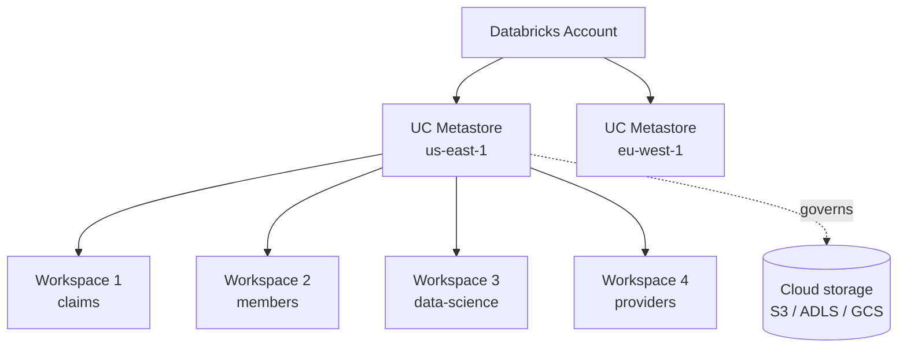

# Chapter 70 — Unity Catalog: The 3-Level Namespace and Governance Basics

> **Goal of this chapter:** to teach Unity Catalog (UC) as a *governance system* — what it is, why Databricks built it, what it replaces, what its core abstractions are, and how to read and write data under it. We will not yet train ML models on UC data; we will *find* data, *grant access to it*, and *prove* the access works. The ML chapters that follow (71 on feature engineering; 73 on the model registry) all assume the UC mental model fixed here.

If you have only ever used Spark with a Hive Metastore — `db.table`, no governance, every user has full access — Unity Catalog is going to feel like extra ceremony. It is. The ceremony is the point. UC is the cost you pay for the things you actually wanted: cross-workspace data sharing, central permissions, lineage, audit trails, and the ability to govern *all* your data and ML assets through one model.

---

## 70.1 The motivating story — five workspaces and a regulator

A health insurer has five Databricks workspaces — one each for claims, members, providers, prior auth, and data science. Each workspace has its own Hive Metastore, its own tables, its own users.

The data science team wants to build a model that joins member demographics (members workspace) with prior-auth history (prior auth workspace) and claims (claims workspace). They cannot. The three workspaces don't share data. The DS team gets read-only access to a shared S3 bucket where the source data lives. They build the model.

A regulator audits. They ask:
1. Who has access to PHI (Protected Health Information) across the company?
2. Show me the lineage of feature X used in the deployed model.
3. Which models are using the SSN column?

Nobody can answer any of these questions. There is no central catalog. Permissions are scattered across five workspaces, three IAM roles, and a shared S3 bucket. The lineage is in someone's head. The answer to "which models use SSN" requires grepping every notebook in every workspace.

This is the problem Unity Catalog was built to solve. UC sits *above* workspaces, at the account level. It is a single namespace for all your data, ML, and AI assets across all your workspaces, with a single permission model and built-in lineage tracking. Once everything is in UC, the regulator's questions become one-line SQL queries.

This chapter is the foundation. We will not get to the ML benefits (Feature Engineering tables, Model Registry) until 71 and 73 — but those chapters assume the namespace, permissions, and securable model that we build here.

---

## 70.2 What UC is and where it lives

**Unity Catalog** is a centralized metastore that lives at the **Databricks account level**, not the workspace level. One UC metastore per region per account; many workspaces attach to it.



Read this diagram carefully. The *account* is the top of the org hierarchy on the cloud — what you pay for, what your CFO sees. Under the account, you have one UC metastore per region (because data residency typically requires regional separation). Under each metastore, workspaces attach. All workspaces attached to one metastore share its catalogs.

Compare with the pre-UC world: each workspace had its own Hive Metastore (HMS), workspaces did not share data, and "production" tables were a folder convention with no governance.

---

## 70.3 The 3-level namespace

In the Hive Metastore world, a fully-qualified table name was 2-level: `database.table` (alias `schema.table`). In Unity Catalog, it is **3-level**: `catalog.schema.table`.

```
catalog
└── schema (= database)
    └── table
    └── view
    └── volume         ← UC-governed file storage
    └── function       ← UDF
    └── model          ← registered ML model
```

So a table you might have called `claims.diagnoses` becomes `prod.claims.diagnoses`. The leading `prod` is the catalog name. Why three levels?

- **Catalog** = a deployment boundary. Typical names: `prod`, `dev`, `staging`, `sandbox`, or team-named (`risk`, `members`, `data_science`). A catalog is the natural unit at which to grant access — "you have access to the `dev` catalog".
- **Schema** (= database — same thing, different word — UC uses both interchangeably) = a logical grouping of related objects. `prod.claims`, `prod.members`, `prod.models`.
- **Table** / view / volume / function / model = the actual securable object.

Concrete example: `prod.members.demographics`. Prod-environment data, the members schema, the demographics table.

You can omit catalog and schema if you've `USE`-d them:

```sql
USE CATALOG prod;
USE SCHEMA members;
SELECT * FROM demographics;      -- resolves to prod.members.demographics
```

Or you can fully-qualify:

```sql
SELECT * FROM prod.members.demographics;
```

PySpark equivalents both work:

```python
spark.read.table("prod.members.demographics")
spark.sql("SELECT * FROM prod.members.demographics")
```

---

## 70.4 Securables

A **securable** is any object that UC can grant permissions on. The complete list (for ML purposes):

- **Catalog** — top-level container.
- **Schema** — logical group inside a catalog.
- **Table** — the basic data object. Always Delta or Parquet; almost always Delta in modern UC.
- **View** — a saved query, materialized lazily. Can be dynamic (see 70.7).
- **Volume** — UC-governed file storage. Holds files (CSV, images, PDFs, model checkpoints) instead of tabular data. We met it in Ch 68.
- **Function** — a SQL or Python UDF registered in UC.
- **Model** — a registered ML model (the subject of Ch 73).
- **External location** — a UC abstraction over a cloud storage path.
- **Storage credential** — a UC-managed cloud credential (IAM role, SAS token).
- **Connection** — for federated queries against external databases (Postgres, Snowflake, etc.).

Every securable has:
- A **fully-qualified name** (catalog.schema.object for the lower three).
- An **owner** (a user or group).
- Optionally an **explicit set of grants** (who can do what).

---

## 70.5 The privilege chain — and the most common UC error

UC permissions are a **chain**. To do *anything* on a table, you need permission on all the containers above it.

To `SELECT` from `prod.members.demographics`, you need:

1. `USE CATALOG prod` — permission to look inside the catalog.
2. `USE SCHEMA prod.members` — permission to look inside the schema.
3. `SELECT ON TABLE prod.members.demographics` — permission to read this specific table.

Missing any one of these three → permission denied.

A typical first-time UC user's error: they were granted `SELECT` on the table, but the catalog or schema grant was missed. They get `PERMISSION_DENIED` and assume they don't have access to the table — when actually they need the parent-level `USE` grant.

```sql
-- The full chain — what an admin actually runs to give Alice read access:
GRANT USE CATALOG ON CATALOG prod TO `alice@company.com`;
GRANT USE SCHEMA ON SCHEMA prod.members TO `alice@company.com`;
GRANT SELECT ON TABLE prod.members.demographics TO `alice@company.com`;
```

Three grants. Three layers.

For exam purposes: the privilege chain is the most-tested governance fact. If a question describes a permission failure and the user "has SELECT on the table", check whether `USE CATALOG` and `USE SCHEMA` were also granted.

---

## 70.6 The privilege vocabulary

The privileges that can appear in `GRANT` statements:

| Privilege | What it lets you do |
|---|---|
| `USE CATALOG` | Reference / browse objects inside this catalog (gate-keeper). |
| `USE SCHEMA` | Reference / browse objects inside this schema. |
| `SELECT` | Read a table or view. |
| `MODIFY` | Insert / update / delete rows in a table. |
| `CREATE` | Create new objects (table, schema, etc.) — context-dependent. |
| `CREATE TABLE` / `CREATE SCHEMA` / `CREATE VOLUME` / etc. | More specific create privileges. |
| `EXECUTE` | Run a function; for models — load and invoke the model. |
| `READ VOLUME` / `WRITE VOLUME` | Read / write files in a volume. |
| `READ FILES` / `WRITE FILES` | Read / write at an external location. |
| `BROWSE` | See the existence and metadata of an object without reading rows. |
| `APPLY TAG` | Add tags to an object (for governance / discovery). |
| `ALL PRIVILEGES` | Catch-all — every privilege on the object. |

Two privileges that surprise people:

- **`BROWSE`** — lets a user *see that the table exists* (and see its schema) without reading any rows. Useful for discoverability of an enterprise catalog without leaking actual data.
- **`MODIFY`** is INSERT + UPDATE + DELETE combined — not a separate write-only grant per operation. UC simplifies the old SQL-style WRITE/INSERT/DELETE.

### 70.6.1 The grant syntax

```sql
GRANT <privilege> ON <object-type> <object-name> TO `principal`;
REVOKE <privilege> ON <object-type> <object-name> FROM `principal`;
SHOW GRANTS ON <object-name>;
SHOW GRANTS TO `principal`;
```

Principals can be:

- An individual user, by email: `` `alice@company.com` ``.
- A group, by name: `` `data-scientists` ``.
- A service principal (for automation): `` `2eabc123-...` ``.
- The special keyword `account users` for "everyone in the account".

A common admin pattern is to grant access to *groups*, not individuals. When Alice joins the team, you add her to the `data-scientists` group; the grants already attached to that group cover her without any individual GRANTs.

---

## 70.7 Views, dynamic views, row filters, and column masks

Views are first-class securables in UC. They let you expose a *transformed* version of a table without copying data.

### 70.7.1 Standard views

```sql
CREATE VIEW prod.claims.diagnoses_no_pii AS
SELECT claim_id, diagnosis_code, claim_date
  FROM prod.claims.diagnoses;
```

Users with `SELECT` on the view (but not on the underlying table) can read the view's columns. The view-owner needs `SELECT` on the underlying table; users querying the view *do not* (this is how you grant column-limited access without exposing the full table).

### 70.7.2 Dynamic views — user-aware filtering

A **dynamic view** filters rows or masks columns based on *who is asking*. UC provides two functions for this:

- `current_user()` — returns the calling user's email.
- `is_account_group_member('group-name')` — returns `true` if the caller is in that group.

A simple row-level security example:

```sql
CREATE VIEW prod.claims.claims_filtered AS
SELECT *
  FROM prod.claims.claims
 WHERE region IN (
   CASE WHEN is_account_group_member('us-team') THEN 'US'
        WHEN is_account_group_member('eu-team') THEN 'EU'
        ELSE NULL
   END
 );
```

US-team users see US claims. EU-team users see EU claims. Everyone else sees zero rows. All from one view; no per-region table.

Column masking with a dynamic view:

```sql
CREATE VIEW prod.members.members_masked AS
SELECT
  member_id,
  CASE WHEN is_account_group_member('hr')
       THEN ssn
       ELSE 'XXX-XX-' || SUBSTRING(ssn, 8, 4)
  END AS ssn,
  date_of_birth,
  ...
FROM prod.members.members;
```

HR sees full SSNs; everyone else sees `XXX-XX-1234`.

### 70.7.3 Row filters and column masks (declarative)

A newer UC feature: instead of materializing the filter/mask as a view, attach it directly to a TABLE. Then every query (across all consumers) is automatically filtered/masked.

```sql
-- Define a column mask function
CREATE FUNCTION mask_ssn(ssn STRING)
RETURNS STRING
RETURN CASE WHEN is_account_group_member('hr')
            THEN ssn ELSE 'XXX-XX-' || SUBSTRING(ssn, 8, 4) END;

-- Attach to a table column
ALTER TABLE prod.members.members
  ALTER COLUMN ssn SET MASK mask_ssn;

-- Now any SELECT from prod.members.members applies the mask
SELECT ssn FROM prod.members.members;  -- masked for non-HR
```

Row filters work analogously:

```sql
CREATE FUNCTION region_filter(region STRING) RETURNS BOOLEAN
RETURN CASE WHEN is_account_group_member('us-team') THEN region = 'US'
            WHEN is_account_group_member('eu-team') THEN region = 'EU'
            ELSE FALSE END;

ALTER TABLE prod.claims.claims SET ROW FILTER region_filter ON (region);
```

The advantage over dynamic views: you don't have to remember to query the view-name; the security travels with the table.

For exam purposes, awareness of views, dynamic views, row filters, and column masks is enough. The Associate exam doesn't drill the syntax deeply, but knowing these mechanisms exist and which use-case fits which is fair game.

---

## 70.8 Ownership

Every securable has exactly one **owner**, a user or group. The owner has implicit `ALL PRIVILEGES`; this cannot be revoked. The owner is the only principal that can `ALTER` or `DROP` the object (or transfer ownership).

```sql
ALTER TABLE prod.claims.claims OWNER TO `data-platform-team`;
```

Owning a table to a *group* rather than an individual is best practice — an individual leaving the company shouldn't break ownership. The group can be a small admins-only group dedicated to ownership.

---

## 70.9 External locations and storage credentials

UC's permission model has to reach down to the cloud storage layer. The mechanism: **external locations** + **storage credentials**.

- A **storage credential** is a UC-managed cloud authentication primitive — an IAM role (AWS), a managed identity (Azure), or a service account (GCP).
- An **external location** is a UC abstraction that pairs a cloud path (e.g., `s3://my-data/`) with a storage credential.

Once defined, users do not need direct AWS / Azure / GCP credentials. They `GRANT READ FILES ON EXTERNAL LOCATION ...` and UC handles the underlying STS-token dance per query.

This is a major operational simplification — pre-UC, governing 50 users' access to 200 buckets meant maintaining 50 × 200 IAM matrix entries. With UC, you grant on the external location once.

You will not be expected to *create* external locations on the exam, but you should know they exist and what they replace.

---

## 70.10 Volumes — files inside UC

A **volume** is a UC securable for *file* storage (CSV, Parquet files, model checkpoints, PDFs, images). Paths look like `/Volumes/<catalog>/<schema>/<volume>/path/to/file`.

```sql
CREATE VOLUME prod.training_data.images;
```

```python
# Read a CSV from a Volume
df = spark.read.csv("/Volumes/prod/training_data/images/labels.csv")

# Write a checkpoint
model.save_pretrained("/Volumes/prod/models/checkpoints/run_42/")
```

Two kinds:

- **Managed volumes** — UC owns the underlying storage location. Easier to manage; the default.
- **External volumes** — UC governs access to a storage location you own (an existing S3 bucket). Useful when you already have a data lake and want UC to govern it without migrating data.

For ML, the canonical uses of Volumes:

- Storing raw training data files (CSV, Parquet, images) before reading them as Spark DataFrames.
- Saving model checkpoints during training (especially DL checkpoints, too big and frequent for MLflow artifacts).
- Storing vocabularies / lookup files used by deployed models.
- Holding large input files for batch inference jobs.

The exam-relevant comparison: **DBFS is the legacy path with no governance; Volumes are the UC path with governance**. Use Volumes in new code.

---

## 70.11 Managed vs external tables

Within UC, tables come in two flavors:

- **Managed tables** — UC owns both the *table metadata* and the underlying *data files*. `CREATE TABLE prod.x.t AS SELECT ...` defaults to managed. If you `DROP TABLE`, the data files are deleted too.
- **External tables** — UC owns the *metadata* but the data files live at a user-controlled path (typically an external location). `CREATE TABLE prod.x.t LOCATION 's3://...' AS SELECT ...`. `DROP TABLE` removes the metadata but leaves the data files.

Most modern UC tables are managed — simpler, atomic create/drop semantics, UC's lifecycle handling. External is used when:
- Data was already in an existing bucket before UC was set up.
- The data is shared with non-Databricks consumers that need the raw files.
- Compliance requires a specific bucket / storage location.

For ML feature tables (Ch 71), managed is the default and recommended. The choice doesn't affect the ML APIs — both work identically through `FeatureEngineeringClient`.

---

## 70.12 Lineage — why UC matters for ML beyond access control

UC tracks **lineage** automatically. Every read of a UC table, every write derived from a UC table, every model registration that used UC feature tables — all of this is logged and queryable.

In the UC UI: navigate to a table → "Lineage" tab. See:
- Upstream — which queries / jobs / notebooks produced this table.
- Downstream — which queries / jobs / models *consume* this table.

This solves the regulator's question from Section 70.1 (#3: "which models use the SSN column?") with one click — UC's lineage will list every model whose training set joined a table containing that column.

Lineage is not free; UC computes it from query metadata, which means:
- It only sees queries run *through UC* — not direct cloud-URL reads bypassing UC.
- It works best when intermediate transformations stay in UC tables, not in stand-alone Python pandas dataframes that leave the lineage graph.

A practical implication: when you can choose between (a) reading data via UC table + writing back to a UC table or (b) doing the same work via direct S3 URLs, choose (a) so lineage is maintained.

---

## 70.13 Workspace-level vs account-level — the benefits framed as exam objectives

The exam Section 1 explicitly lists "Identify the benefits of creating feature store tables at the account level in Unity Catalog vs at the workspace level". Let's enumerate them, because this exact phrasing maps to UC-vs-HMS:

1. **Cross-workspace sharing.** A UC catalog is visible to every workspace attached to the metastore. A workspace-Hive table is not.
2. **Central permissions.** One grant covers all workspaces. The pre-UC world meant maintaining permissions in every workspace independently.
3. **Lineage.** Auto-tracked across workspaces and across tables → models.
4. **Audit logs.** UC writes an audit log of every access — who read what, when. Workspace HMS does not.
5. **Decoupling from any single workspace.** Workspace gets deleted → UC data survives. Workspace HMS — data lives with the workspace.
6. **Three-level namespace.** Makes it natural to separate `prod` / `dev` / `sandbox` cleanly.
7. **ACLs on file storage** (via Volumes / external locations). Pre-UC, cloud storage governance was a separate IAM problem.
8. **Federation.** UC can govern Postgres / Snowflake / Redshift tables via Lakehouse Federation — out of scope for ML Associate but worth knowing.

For ML specifically, points 1, 2, 3, and 5 are the strongest. A feature table in UC can be reused across teams in different workspaces; a feature table in the legacy workspace store cannot.

---

## 70.14 Worked example — set up a UC catalog, schema, table, grant access, verify

Walk through, end-to-end. Assume you are a metastore admin.

### Step 1 — create the catalog

```sql
CREATE CATALOG IF NOT EXISTS dev
  MANAGED LOCATION 's3://my-uc-managed/dev/'
  COMMENT 'Development environment';
```

The `MANAGED LOCATION` tells UC where to put managed table data. (If you skip it, UC uses the metastore default.)

### Step 2 — create the schema

```sql
CREATE SCHEMA IF NOT EXISTS dev.churn
  COMMENT 'Churn modeling project';
```

### Step 3 — create a table

```sql
CREATE TABLE dev.churn.member_demographics (
    member_id   BIGINT,
    age         INT,
    gender      STRING,
    state       STRING,
    plan_tier   STRING
)
USING DELTA
COMMENT 'Member demographics for churn modeling';

-- Insert a few rows
INSERT INTO dev.churn.member_demographics VALUES
    (1, 45, 'M', 'CA', 'gold'),
    (2, 67, 'F', 'NY', 'silver'),
    (3, 32, 'F', 'TX', 'gold');
```

### Step 4 — grant access to Alice

```sql
GRANT USE CATALOG ON CATALOG dev TO `alice@company.com`;
GRANT USE SCHEMA ON SCHEMA dev.churn TO `alice@company.com`;
GRANT SELECT ON TABLE dev.churn.member_demographics TO `alice@company.com`;
```

### Step 5 — Alice verifies

Alice, in her notebook:

```python
df = spark.table("dev.churn.member_demographics")
df.show()
```

```
+---------+---+------+-----+---------+
|member_id|age|gender|state|plan_tier|
+---------+---+------+-----+---------+
|        1| 45|     M|   CA|     gold|
|        2| 67|     F|   NY|   silver|
|        3| 32|     F|   TX|     gold|
+---------+---+------+-----+---------+
```

Without one of the three grants, this would fail at the corresponding chain level.

### Step 6 — inspect grants

```sql
SHOW GRANTS ON TABLE dev.churn.member_demographics;
```

```
Principal               ActionType  ObjectType   ObjectKey
alice@company.com       SELECT      TABLE        dev.churn.member_demographics
```

### Step 7 — try to modify (should fail)

```sql
-- Alice's session:
INSERT INTO dev.churn.member_demographics VALUES (4, 28, 'M', 'WA', 'silver');
-- PERMISSION_DENIED: No privilege MODIFY on dev.churn.member_demographics
```

She only has SELECT. Modifying requires `MODIFY` (or `ALL PRIVILEGES`).

---

## 70.15 Things to know that we glossed

A few UC topics we are not deep-diving but that you should know exist:

### 70.15.1 Delta Sharing

UC supports **Delta Sharing** — an open protocol for sharing UC tables with consumers outside your Databricks account. Out of scope for ML Associate.

### 70.15.2 System tables

UC ships with **system tables** (under the `system` catalog) — read-only tables that expose audit logs, billing data, lineage info, model usage. Useful for governance reporting and cost tracking. Knowing `system.access.audit` exists is enough for the Associate level.

### 70.15.3 Tags

Tags are key-value strings you can attach to any securable. `ALTER TABLE ... SET TAGS ('pii' = 'true', 'department' = 'risk')`. Used for discovery, automated governance ("flag any table tagged `pii=true` that's accessible to non-PII-cleared users"), and cost attribution. They re-appear in Ch 73 when we tag models.

### 70.15.4 Privilege inheritance

Privileges granted at a higher level *do* propagate to children. `GRANT SELECT ON CATALOG prod TO alice` gives Alice `SELECT` on every table in `prod`. This is convenient and dangerous — easy to over-grant. The principle of least privilege says grant at the lowest workable level.

### 70.15.5 The `__databricks_internal` catalog

Some Databricks features create catalogs / schemas with names beginning with `__` for internal bookkeeping. Don't touch them; they're managed by the platform.

---

## 70.16 Why this matters for ML — preview of Ch 71 and 73

Two ML-specific reasons to internalize UC now:

### 71's preview: feature tables ARE UC tables

A "feature table" in Feature Engineering in UC is just a UC table with annotations (primary key columns, timestamp keys). All the UC governance — grants, lineage, tags, ownership — applies. To grant a team access to a feature table, you grant on a UC table. To check who owns the demographic features, you read UC's owner field.

### 73's preview: registered models ARE UC securables

A "registered model" in the UC Model Registry is a UC securable with name `cat.schema.model_name`. To grant a service principal the ability to load and predict, you `GRANT EXECUTE ON MODEL`. To find a model — `SHOW MODELS IN cat.schema`. The model lives in UC; the model's *artifacts* (the actual serialized model files) live in UC-managed storage that the registered model points at.

In other words: **UC is the substrate for the ML platform**. Feature tables and models are UC objects governed by the same permission model as data tables. If you understand UC, the ML governance follows almost by inheritance.

---

## 70.17 What this builds on / where this returns

**Builds on:** nothing internal — this is the first UC chapter.

**Returns:**
- **Feature tables** in *Ch 71* — UC tables with primary-key + timestamp annotations.
- **Volumes for model artifacts** in *Ch 72-73*.
- **The Model Registry** in *Ch 73* — registered models as UC securables; `GRANT EXECUTE ON MODEL`.
- **Lineage from features → models** — UC tracks this end-to-end; *Ch 71 and 73* will show what it looks like.

---

## 70.18 Exercises

1. **The 3-level vs 2-level distinction.** Translate the Hive-style name `claims.transactions` into UC, with reasonable choices for the catalog.

2. **The privilege chain.** Bob has been granted `SELECT ON TABLE prod.claims.diagnoses`. He runs `SELECT * FROM prod.claims.diagnoses` and gets `PERMISSION_DENIED`. List two missing grants that could explain this.

3. **Permission denied — which?** For a user with `USE CATALOG prod`, `USE SCHEMA prod.members`, and `SELECT ON TABLE prod.members.demographics`, which of these will succeed and which will fail?
   (a) `SELECT * FROM prod.members.demographics`
   (b) `INSERT INTO prod.members.demographics VALUES (...)`
   (c) `SHOW TABLES IN prod.members`
   (d) `SELECT * FROM prod.claims.diagnoses`

4. **Dynamic view design.** Write the SQL for a dynamic view that exposes `prod.members.members` such that users in the `compliance` group see full SSNs and everyone else sees the last 4 digits prefixed with X's.

5. **UC vs HMS for feature stores.** Your company has 12 Databricks workspaces, 5 ML teams sharing data. Why is putting feature tables in UC dramatically better than putting them in workspace-level Hive Metastores?

6. **External vs managed table choice.** When should you use an external table over a managed table?

7. **Volume vs DBFS.** A teammate suggests storing 10 GB of training images in DBFS. You suggest a Volume. Give three concrete benefits of the Volume choice.

8. **Lineage hands-on.** Without running it, predict what UC's lineage view would show for this workflow: read from `prod.claims.txn`, transform to `prod.claims.txn_summary`, train a model that registers as `prod.models.fraud_v1`. Draw the lineage graph.

9. **Group vs user grants.** Why is granting access to a *group* (e.g., `data-scientists`) better than granting to *individual users*?

10. **Ownership transfer.** Alice owns `prod.churn.member_features` and is leaving the company. What do you do?

11. **Catalog naming.** A startup is bootstrapping its UC. They have one team, one production environment, no dev/staging yet. What catalog structure do you recommend?

12. **The privilege list.** For each task, name the privilege required: (a) read rows from a table; (b) overwrite rows in a table; (c) load a model and run `predict()`; (d) save a Python pickle to a Volume; (e) see a table's schema without reading data.

13. **Cross-workspace access.** Bob in workspace A wants to read a table that Alice in workspace B created. Both workspaces are attached to the same UC metastore. What does Alice need to do?

<details>
<summary>Answers</summary>

1. Most natural translations: `prod.claims.transactions` (production data, claims schema), or `dev.claims.transactions` (dev environment), or possibly `claims_catalog.txn.transactions` if "claims" is the team's catalog. The catalog level is the new bit; the schema and table preserve the old 2-level meaning.

2. (i) `USE CATALOG prod` is missing. (ii) `USE SCHEMA prod.claims` is missing.

3. (a) succeeds — full chain. (b) fails — needs `MODIFY` on the table. (c) succeeds — `USE SCHEMA` allows listing tables in the schema. (d) fails — no `SELECT` on `prod.claims.diagnoses`; also no `USE SCHEMA prod.claims` (we only granted `prod.members`).

4. ```sql
    CREATE VIEW prod.members.members_masked AS
    SELECT
      member_id,
      CASE WHEN is_account_group_member('compliance')
           THEN ssn
           ELSE 'XXX-XX-' || SUBSTRING(ssn, 8, 4)
      END AS ssn,
      date_of_birth, state
    FROM prod.members.members;
    ```

5. (a) UC tables are visible to all 12 workspaces; HMS tables are not. (b) UC permissions are managed once; HMS requires 12 separate config-sets. (c) UC tracks lineage from features → models across all workspaces. (d) UC survives workspace deletion. For 5 teams sharing features, UC is essentially mandatory.

6. When the data files already live at a specific cloud path that other (non-Databricks) consumers also use, or when compliance requires the data to live at a specific path. Otherwise, managed is simpler.

7. (a) UC ACLs vs no ACLs in DBFS. (b) Cross-workspace shareability. (c) Lineage tracking — UC knows which jobs read from the Volume. Plus DBFS is being progressively de-emphasized; new features land on Volumes.

8. ```
   prod.claims.txn  ──read──►  notebook/job  ──write──►  prod.claims.txn_summary
                                                                   │
                                                                   read
                                                                   ▼
                                                            training notebook
                                                                   │
                                                                register
                                                                   ▼
                                                        prod.models.fraud_v1
   ```
   UC's lineage view would link txn ↔ txn_summary, and txn_summary ↔ fraud_v1. Going to the fraud_v1 page and clicking lineage would show the two upstream tables.

9. Joiners and leavers. Adding/removing a person from a group is one operation; re-granting / revoking on every object they touched is N operations and error-prone. Group grants survive team churn.

10. `ALTER TABLE prod.churn.member_features OWNER TO \`data-platform-group\``. Never own to an individual that's leaving. Make sure the receiving group has at least one active human.

11. Simplest workable: catalogs `main` (default) or `prod`. Two-environment future-proofing: `prod` and `dev`. Don't over-engineer; you can always create more catalogs later.

12. (a) `SELECT`. (b) `MODIFY`. (c) `EXECUTE` on the model. (d) `WRITE VOLUME` (plus the parent `USE` chain). (e) `BROWSE`.

13. Alice grants Bob (or Bob's group) the privilege chain: `USE CATALOG`, `USE SCHEMA`, and `SELECT ON TABLE`. The fact that they're in different workspaces is irrelevant — UC is account-level, both workspaces share the same metastore.

</details>
