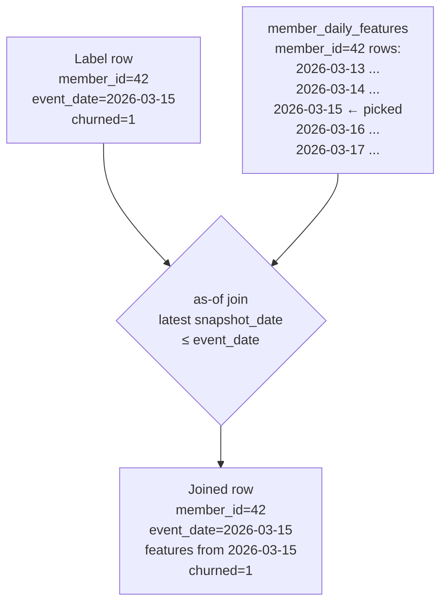

# Chapter 71 — Feature Engineering in UC: Offline, Online, Point-in-Time Correctness

> **Goal of this chapter:** to make you fluent in **Feature Engineering in Unity Catalog (FE in UC)** — Databricks' managed feature store — and to make you understand *why* a feature store exists at all. We met the feature-store concept conceptually in Ch 30. This chapter is the platform realization. By the end you will know: how to create a UC feature table, write features into it, build a training set that joins features with labels at the right point in time, train a model with that training set, register the model with full feature lineage, and score in batch — all with one client, in a way that prevents the four classes of bugs feature stores were built to prevent.

If you have ever joined a feature table to a label table by hand in pandas and accidentally leaked future information into your training set, this chapter is the antidote. If you have ever shipped a model and discovered that the production feature pipeline computes features slightly differently from the training pipeline (training-serving skew), this chapter shows you the platform mechanism that eliminates the problem.

---

## 71.1 The motivating story — the lookalike model that almost shipped

A data science team at a healthcare company builds a churn-prediction model. The features include things like "average claims per month over the last 90 days" and "number of customer-service calls in the last 30 days." Labels are: "did this member cancel their plan in 2026 Q1?"

For training, the team computes the features in a notebook by joining several tables and aggregating. They use the *current* values of those features (as of the day they wrote the notebook) joined against the historical labels from Q1.

The model evaluates at 92% AUC on the held-out test set. Champagne.

In production, the model performs at 71% AUC. The team spends two weeks investigating and finds: the training features were computed on data *after* the labels. Specifically, "number of customer-service calls in the last 30 days" for a member who cancelled on January 5 was computed in March — and *included calls made in February and March, after the cancellation*. The feature value had leaked future information. At training time, the model "learned" that members with many recent calls churn (because the calls *followed* the churn). At inference time, you only have calls *before* the prediction date — and the signal vanishes.

This is **point-in-time leakage**, one of the four bugs feature stores eliminate. The other three:

1. **Training-serving skew** — features computed differently in training vs serving.
2. **Duplication** — every team reimplements "30-day claims rolling sum" slightly differently.
3. **Lineage** — nobody can answer "which model uses feature X?"

A feature store is a centralized, versioned, point-in-time-aware repository for features. Databricks' implementation is Feature Engineering in UC (FE in UC), accessed through a `FeatureEngineeringClient`. This chapter is the API and the discipline.

---

## 71.2 The client — `FeatureEngineeringClient`, not `FeatureStoreClient`

Before any API calls: the right client to import.

```python
from databricks.feature_engineering import FeatureEngineeringClient
fe = FeatureEngineeringClient()
```

**This is the current, UC-native client.** It was introduced in 2023 as the successor to:

```python
# DEPRECATED — do not use in new code
from databricks.feature_store import FeatureStoreClient
fs = FeatureStoreClient()
```

The old `FeatureStoreClient` was tied to the legacy workspace-scoped feature store (no UC, no cross-workspace sharing). The Mar 2025 exam guide tests `FeatureEngineeringClient`.

This naming distinction is the single most-tested piece of feature-store trivia. Memorize it: **`databricks.feature_engineering.FeatureEngineeringClient`** for new code; the `feature_store` package is legacy.

On DBR ML, both packages may still be importable, but the methods, return types, and supported features differ. Mixing them in the same notebook is a recipe for confusion. Pick one — and in 2026, that's `FeatureEngineeringClient`.

---

## 71.3 What a feature table actually is

A **feature table** in UC is, mechanically, a regular UC Delta table with two pieces of metadata UC tracks about it:

- **Primary keys** — one or more columns that uniquely identify a row. Required.
- **Timestamp keys** — zero or one columns that give the time-validity of each row. Required for point-in-time joins; optional otherwise.

That's it. The feature table is *just a Delta table*. You can query it with regular SQL. You can grant access with regular UC grants. You can browse it in the catalog explorer. The "feature table" part is a metadata annotation that tells the `FeatureEngineeringClient` how to look up features when building training sets and serving predictions.

A feature table without a timestamp_key:

```
member_features
├── member_id (PK)            ← primary key
├── total_claims_lifetime
├── plan_tier
├── enrolled_state
```

This stores the *current* feature values for each member; no historical timeline.

A feature table with a timestamp_key:

```
member_daily_features
├── member_id (PK)            ← part of composite PK
├── snapshot_date (PK, TS)    ← part of PK; also the time key
├── claims_last_30d
├── calls_last_30d
├── avg_claim_amount_last_90d
```

Each row represents the feature values for a member *as of* a specific date. New rows arrive daily (or whatever cadence you choose). Old rows persist. This is the time-series structure that enables point-in-time correctness.

Choosing between with-vs-without timestamp_key:

- **Static-ish features** (a member's home state, their plan tier — change rarely) → no timestamp_key; just keep the current value.
- **Time-varying features** (rolling aggregates, behavioral counters) → use timestamp_key.

Many real feature stores have *both* — a `member_demographics` table without a timestamp, and a `member_daily_behavior` table with a timestamp. Training joins both.

---

## 71.4 Creating a feature table

The full creation call:

```python
from databricks.feature_engineering import FeatureEngineeringClient
fe = FeatureEngineeringClient()

# Compute the initial features DataFrame
features_df = spark.sql("""
    SELECT
        member_id,
        snapshot_date,
        COUNT(*) AS claims_last_30d,
        AVG(claim_amount) AS avg_claim_amount,
        ...
    FROM prod.claims.claims
    WHERE claim_date BETWEEN snapshot_date - INTERVAL 30 DAYS AND snapshot_date
    GROUP BY member_id, snapshot_date
""")

# Create the UC feature table
fe.create_table(
    name="prod.churn.member_daily_features",
    primary_keys=["member_id", "snapshot_date"],
    timestamp_keys=["snapshot_date"],
    df=features_df,                # initial rows
    description="Daily aggregates for churn modeling.",
    tags={"team": "ml-platform", "owner": "vatsal"},
)
```

The arguments:

- **`name`** — fully-qualified UC name. The `cat.sch.tbl` lives wherever you have CREATE rights.
- **`primary_keys`** — the column(s) that uniquely identify a row.
- **`timestamp_keys`** — column(s) representing point-in-time validity (zero or one; the API accepts a list for forward compatibility but only one timestamp_key is supported today).
- **`df`** — initial DataFrame of features (optional; can create empty table and write later).
- **`schema`** — explicit StructType, if creating an empty table without `df`.
- **`description`**, **`tags`** — discoverability metadata. Inherited from UC.

Behind the scenes, this:
1. Creates the UC Delta table.
2. Registers the PK and TS columns in UC's feature-table metadata.
3. Writes initial rows if `df` provided.
4. Returns a `FeatureTable` object.

After creation, `prod.churn.member_daily_features` is queryable as a normal UC table:

```sql
SELECT * FROM prod.churn.member_daily_features LIMIT 10;
```

---

## 71.5 Writing features — `write_table`

Once a feature table exists, you write features into it:

```python
fe.write_table(
    name="prod.churn.member_daily_features",
    df=new_features_df,
    mode="merge",      # or "overwrite"
)
```

The `mode` argument is the critical one.

### 71.5.1 `mode="merge"` — upsert by primary key

This is the most common mode. Rows in `df` whose PK matches an existing row update that row; rows whose PK does not match are inserted as new rows. Behaves like Delta's `MERGE INTO`.

Use for: incremental daily updates.

```python
# Daily ETL job — computes features for yesterday and merges
yesterday_features = compute_daily_features(date="2026-05-22")
fe.write_table(
    name="prod.churn.member_daily_features",
    df=yesterday_features,
    mode="merge",
)
```

If yesterday's PK (member_id, snapshot_date) already exists (recomputation, backfill), it overwrites. If new, it inserts.

### 71.5.2 `mode="overwrite"` — full replace

Drops all rows and replaces with the new DataFrame. Used for full recomputes.

Use for: initial backfills; total recomputes after a schema change.

**Be careful** — overwrite truly removes existing data. Tables versioned in Delta still allow time-travel back to the previous version, but downstream consumers querying the current version will see only the new rows.

### 71.5.3 The schema-evolution caveat

Adding a column to a feature table is fine — Delta supports schema evolution. Removing a column or renaming a column is breaking — any consumer querying the old name will fail. Treat feature table schemas as a *public API* of your team: deprecate, don't delete.

---

## 71.6 Reading features for training — `create_training_set`

This is where the magic happens. Given:
- A DataFrame of labels (one row per training example, with the entity ID and the label).
- One or more feature tables to look up from.

`create_training_set` joins them and returns a `TrainingSet` object you can materialize.

### 71.6.1 The basic call

```python
from databricks.feature_engineering import FeatureLookup

labels_df = spark.table("prod.churn.labels_2026_q1")
# columns: member_id, event_date, churned

training_set = fe.create_training_set(
    df=labels_df,
    feature_lookups=[
        FeatureLookup(
            table_name="prod.churn.member_demographics",
            lookup_key="member_id",
        ),
        FeatureLookup(
            table_name="prod.churn.member_daily_features",
            lookup_key="member_id",
            timestamp_lookup_key="event_date",
        ),
    ],
    label="churned",
    exclude_columns=["member_id"],  # don't pass the PK into the model
)

training_df = training_set.load_df()
```

What's happening:

- `labels_df` provides the examples (one row per `member_id` × `event_date`).
- The first `FeatureLookup` joins `prod.churn.member_demographics` on `member_id` (no timestamp — static features).
- The second `FeatureLookup` joins `prod.churn.member_daily_features` on `member_id` AND uses `event_date` as the timestamp; this triggers the **point-in-time join**.
- `label` tells the TrainingSet which column is the target.
- `exclude_columns` drops columns that should not enter the model (typically the PK, since it's an identifier not a feature).

`training_set.load_df()` materializes the joined DataFrame.

### 71.6.2 The point-in-time join, explained carefully

The fundamental claim: when you pass `timestamp_lookup_key="event_date"`, the join is **as-of** rather than equi.

For each row in `labels_df`, with member_id=42 and event_date=2026-03-15:
- Look up `prod.churn.member_daily_features` on member_id=42.
- Among rows with member_id=42, pick the one whose `snapshot_date` is the **latest** value that is **≤ 2026-03-15**.
- Use that row's feature values.

So if `member_daily_features` has rows for member 42 at snapshot_dates 2026-03-14, 2026-03-15, and 2026-03-16, the join picks 2026-03-15 (the latest <= event_date) — *not* 2026-03-16. Future data is invisible.



This is **the** feature-store primitive. Doing it by hand in plain Spark requires either a non-equi join (slow, error-prone) or a window function with care. FE in UC bakes it into one API call.

Why this matters for ML correctness — the leakage story in 71.1. Without the timestamp_lookup_key, the join would use *whichever* row happened to be picked first (often the latest in the table — which is future data relative to event_date). With it, every joined row sees only features that existed at event_date.

If you forget `timestamp_lookup_key` on a time-varying feature table, you have silent leakage. The model trains. It evaluates well. It tanks in production.

### 71.6.3 The TrainingSet object

`training_set` (the object returned, before `.load_df()`) is more than a DataFrame. It records:

- Which feature tables were joined.
- Which columns came from which table.
- The PKs and timestamp keys used.
- The label column.

When you log the trained model with `fe.log_model(...)`, this metadata is *baked into the model artifact*. The result: at inference time, the model knows it needs to look up features from those tables before it can predict. This eliminates training-serving skew — there is no separate inference-time feature pipeline to drift out of sync.

---

## 71.7 Training a model and logging it with feature lineage — `fe.log_model`

The MLflow-native call would be `mlflow.sklearn.log_model(model, "model")`. The feature-engineering equivalent is `fe.log_model(...)`, which behaves like `mlflow.<flavor>.log_model` but additionally records the feature lookups.

```python
import mlflow
import mlflow.sklearn
from sklearn.ensemble import RandomForestClassifier

mlflow.set_registry_uri("databricks-uc")
mlflow.set_experiment("/Users/vatsal/churn-experiment")

with mlflow.start_run(run_name="rf_baseline") as run:
    # Convert to pandas for sklearn (this dataset assumed small enough)
    training_pdf = training_df.toPandas()
    X = training_pdf.drop(columns=["churned"])
    y = training_pdf["churned"]

    model = RandomForestClassifier(n_estimators=200, max_depth=8)
    model.fit(X, y)

    # Log with full feature lineage + register
    fe.log_model(
        model=model,
        artifact_path="model",
        flavor=mlflow.sklearn,
        training_set=training_set,        # ← the feature lineage
        registered_model_name="prod.churn.rf_model",
    )
```

What `fe.log_model` does that plain `mlflow.sklearn.log_model` does not:

1. Logs the model under the run.
2. **Records the feature-lookup configuration** as part of the model's metadata. This includes: which tables, on which keys, with what timestamps.
3. Registers the model in the UC Model Registry (if `registered_model_name` is provided) — Ch 73.
4. Wraps the model so that `fe.score_batch` (next section) and Mosaic AI Model Serving (Ch 73) can look up features automatically.

The `flavor` argument is the MLflow flavor of the underlying model — `mlflow.sklearn`, `mlflow.xgboost`, `mlflow.spark` (for pyspark.ml), `mlflow.pytorch`, etc. The feature-engineering wrapper composes on top.

---

## 71.8 Batch scoring — `fe.score_batch`

The payoff. Once a model has been logged with feature-lineage metadata, batch scoring is a single call:

```python
# Set up the IDs you want to score
ids_df = spark.createDataFrame([
    {"member_id": 1001, "event_date": "2026-05-23"},
    {"member_id": 1002, "event_date": "2026-05-23"},
    ...
])

predictions = fe.score_batch(
    model_uri="models:/prod.churn.rf_model@champion",
    df=ids_df,
)

predictions.show()
# member_id | event_date | prediction | features-used (optional)
```

Behind the scenes:

1. `fe.score_batch` reads the model artifact at `models:/prod.churn.rf_model@champion`.
2. The model metadata tells it: "look up features from `prod.churn.member_demographics` and `prod.churn.member_daily_features`, joining on member_id, and applying timestamp_lookup_key on event_date".
3. It performs those joins (point-in-time correct).
4. It applies the model.
5. Returns a DataFrame of predictions.

No separate feature pipeline. No "compute the features the same way the training notebook did" — the system handles it.

This is the cleanest batch-inference pattern Databricks offers. The exam Section 1 explicitly tests "Score a model using features from a feature store table" — this call is the answer.

---

## 71.9 Online tables — for low-latency serving

For *real-time* inference (single-row, milliseconds-per-request), you cannot run a Spark batch join. You need a low-latency key-value lookup.

**Online tables** are UC's solution: a serverless, continuously-replicated, low-latency online version of an offline feature table.

```python
from databricks.feature_engineering.entities.online_store_spec import OnlineStoreSpec

# Synchronize an offline table to an online table
fe.create_table(
    name="prod.churn.member_demographics_online",
    primary_keys=["member_id"],
    source_table_name="prod.churn.member_demographics",
    online_store_spec=OnlineStoreSpec(
        ...   # cloud-specific config
    ),
)
```

What happens:
- The offline UC table continues to be the source of truth.
- The online table is auto-synchronized — every write to the offline table propagates to the online table in seconds.
- A served endpoint (Ch 73) reading `prod.churn.member_demographics_online` gets millisecond-latency lookups.

For the Associate exam, the depth required is: know that **online tables exist**, that they **mirror offline tables for low-latency use**, and that **sync from offline to online has some lag (seconds, not instant)**. The detailed online-store configuration is out of scope.

The exam Section 1 objective: "Describe the differences between online and offline feature tables". The answer:

| | Offline | Online |
|---|---|---|
| Use case | Training, batch scoring | Real-time inference |
| Backed by | UC Delta table | Low-latency KV store (managed) |
| Latency | Seconds (Spark scan) | Milliseconds |
| Cost model | Storage + compute on query | Provisioned online store |
| Sync | n/a (the source of truth) | Auto-synced from offline; some lag |
| Point-in-time joins | Yes (as-of) | No — current value only |

---

## 71.10 Pitfalls — the things that bite

### 71.10.1 Forgetting `timestamp_lookup_key`

If your feature table has a timestamp_key (member_daily_features), and you build a TrainingSet without passing `timestamp_lookup_key`, the FeatureLookup defaults to a *naive* join — typically picking the latest row per member, which leaks future information.

The fix: **whenever a feature table has a timestamp_key, every FeatureLookup against it should also have a `timestamp_lookup_key`** pointing at the label's event-time column.

### 71.10.2 Online sync lag

Online tables are *near*-realtime, not instant. If your offline write is at 12:00:01 and your endpoint queries at 12:00:02, the online table may not have caught up. For most real applications this is fine (features change slowly). For high-frequency features, design with lag in mind.

### 71.10.3 Schema evolution breaking consumers

Adding columns to a feature table is safe. Removing or renaming is not. Treat the schema as a published API. Use additive evolution; deprecate before delete; communicate before either.

### 71.10.4 Mixing legacy and modern clients

Don't import both `feature_store` and `feature_engineering` in the same code. Pick `feature_engineering` for new work; only touch `feature_store` if you're maintaining legacy notebooks. The two clients don't compose cleanly.

### 71.10.5 The PK uniqueness assumption

`FeatureLookup` assumes the PK is unique in the feature table (for an offline lookup without timestamp; or unique per PK+timestamp for time-keyed lookups). If your write logic permits duplicates, the join becomes ambiguous and FE in UC will either fail or pick non-deterministically. `mode="merge"` enforces upsert semantics that prevent this; `mode="overwrite"` requires you to ensure uniqueness in the DataFrame you pass.

---

## 71.11 End-to-end worked example

Let's stitch a realistic flow:

### Step 1 — Build the demographics table (static features)

```python
demo_df = spark.sql("""
    SELECT
        member_id,
        age,
        gender,
        plan_tier,
        enrolled_state,
        years_enrolled
    FROM prod.members.member_master
""")

fe.create_table(
    name="prod.churn.member_demographics",
    primary_keys=["member_id"],
    df=demo_df,
    description="Static member demographics.",
)
```

### Step 2 — Build the daily-features table (time-varying)

```python
daily_df = spark.sql("""
    SELECT
        m.member_id,
        d.snapshot_date,
        COALESCE(COUNT(c.claim_id), 0) AS claims_last_30d,
        COALESCE(SUM(c.claim_amount), 0) AS spend_last_30d,
        COALESCE(COUNT(s.call_id), 0) AS calls_last_30d
    FROM prod.members.member_master m
    CROSS JOIN (SELECT explode(sequence(date'2025-06-01', date'2026-04-30', interval 1 day)) AS snapshot_date) d
    LEFT JOIN prod.claims.claims c
      ON c.member_id = m.member_id
     AND c.claim_date BETWEEN d.snapshot_date - INTERVAL 30 DAYS AND d.snapshot_date
    LEFT JOIN prod.support.calls s
      ON s.member_id = m.member_id
     AND s.call_date BETWEEN d.snapshot_date - INTERVAL 30 DAYS AND d.snapshot_date
    GROUP BY m.member_id, d.snapshot_date
""")

fe.create_table(
    name="prod.churn.member_daily_features",
    primary_keys=["member_id", "snapshot_date"],
    timestamp_keys=["snapshot_date"],
    df=daily_df,
    description="30-day rolling behavioral aggregates per member per day.",
)
```

### Step 3 — Build the training set

```python
labels_df = spark.sql("""
    SELECT
        member_id,
        cancellation_date AS event_date,
        1 AS churned
    FROM prod.churn.cancellations
    WHERE cancellation_date BETWEEN '2026-01-01' AND '2026-03-31'
    UNION ALL
    SELECT
        m.member_id,
        date_add(date'2026-03-31', -CAST(rand()*90 AS INT)) AS event_date,
        0 AS churned
    FROM prod.members.member_master m
    WHERE m.member_id NOT IN (SELECT member_id FROM prod.churn.cancellations)
    LIMIT 100000
""")

training_set = fe.create_training_set(
    df=labels_df,
    feature_lookups=[
        FeatureLookup(
            table_name="prod.churn.member_demographics",
            lookup_key="member_id",
        ),
        FeatureLookup(
            table_name="prod.churn.member_daily_features",
            lookup_key="member_id",
            timestamp_lookup_key="event_date",
        ),
    ],
    label="churned",
    exclude_columns=["member_id"],
)

training_df = training_set.load_df()
```

### Step 4 — Train + log + register

```python
import mlflow
from sklearn.ensemble import RandomForestClassifier
from sklearn.model_selection import train_test_split

mlflow.set_registry_uri("databricks-uc")
mlflow.set_experiment("/Users/vatsal/churn-experiment")

with mlflow.start_run(run_name="rf_baseline_v1") as run:
    pdf = training_df.toPandas()
    X = pdf.drop(columns=["churned", "event_date"])
    y = pdf["churned"]
    X_train, X_val, y_train, y_val = train_test_split(X, y, test_size=0.2, random_state=42)

    model = RandomForestClassifier(n_estimators=200, max_depth=8, random_state=42)
    model.fit(X_train, y_train)

    val_score = model.score(X_val, y_val)
    mlflow.log_metric("val_accuracy", val_score)

    fe.log_model(
        model=model,
        artifact_path="model",
        flavor=mlflow.sklearn,
        training_set=training_set,
        registered_model_name="prod.churn.rf_model",
    )
```

### Step 5 — Promote to champion and batch-score

```python
from mlflow import MlflowClient
client = MlflowClient()

latest_version = client.get_latest_versions("prod.churn.rf_model", stages=None)[0].version
client.set_registered_model_alias(
    name="prod.churn.rf_model",
    alias="champion",
    version=latest_version,
)

# Batch scoring — features looked up automatically
to_score = spark.sql("""
    SELECT member_id, current_date() AS event_date
      FROM prod.members.member_master
""")

predictions = fe.score_batch(
    model_uri="models:/prod.churn.rf_model@champion",
    df=to_score,
)

predictions.write.mode("overwrite").saveAsTable("prod.churn.predictions_daily")
```

That's the full loop. Notice what does *not* appear: any code that joins demographics to daily-features in the scoring step. The feature lineage from `fe.log_model` carries it; `fe.score_batch` follows it.

---

## 71.12 What FE in UC does NOT solve

Honesty requires noting what's still on you:

- **Feature definition correctness.** FE in UC writes whatever DataFrame you give it. If your 30-day claims aggregate is computed incorrectly, FE in UC stores the wrong number faithfully.
- **Feature freshness.** You still own the ETL that writes features. If the daily-update job fails, your features are stale.
- **Feature discovery for humans.** UC's catalog browser shows feature tables, but discovery and reuse depend on team conventions (naming, descriptions, tags).
- **Cross-team feature consistency.** Two teams can build slightly different "claims_last_30d" features. FE in UC doesn't enforce one canonical definition.

What it does solve: training-serving skew (the model carries its own feature recipe); point-in-time correctness (the as-of join); lineage (UC tracks features → models); and serving the right features at the right place (online tables for low-latency).

---

## 71.13 What this builds on / where this returns

**Builds on:** Ch 30 (feature stores conceptual preview); Ch 70 (UC namespace, securables, grants — feature tables are UC tables).

**Returns:**
- **Model registration with feature lineage** in *Ch 72-73* — `fe.log_model` ties into MLflow tracking and the UC Model Registry.
- **`score_batch` against the UC Model Registry** in *Ch 73* — the loading-by-alias pattern.
- **Model Serving endpoints reading from online tables** in *Ch 73's forward pointer*.

---

## 71.14 Exercises

1. **The right client.** Which client should you import for new code in 2026: `FeatureStoreClient` or `FeatureEngineeringClient`? From which package?

2. **PK design.** For each scenario, name appropriate primary_keys and timestamp_keys:
   (a) A table of member demographics (one row per member, mostly static).
   (b) A table of daily rolling-window behavior aggregates per member.
   (c) A table of session-level features (per (member, session_id)).

3. **The leakage story.** In Section 71.1, what specifically went wrong, and how does `timestamp_lookup_key` fix it? Be precise about which join produces which row.

4. **`mode="merge"` vs `mode="overwrite"`.** Pick the right mode for each:
   (a) Initial backfill of the feature table.
   (b) Daily incremental update with yesterday's feature values.
   (c) Reprocessing the last 30 days after fixing a bug in the feature logic.
   (d) Replacing the entire table after a schema simplification.

5. **The TrainingSet object.** What information does the TrainingSet carry that a plain DataFrame doesn't, and why does that matter at inference time?

6. **Online vs offline.** Match each to the use case:
   (a) Training a model on 6 months of data.
   (b) Serving a real-time fraud-detection endpoint at <50ms latency.
   (c) Daily batch scoring 10 million members.
   (d) Computing rolling aggregates in nightly ETL.

7. **The `fe.log_model` benefit.** What does `fe.log_model` do that plain `mlflow.sklearn.log_model` doesn't, and what real bug does the extra behavior prevent?

8. **`fe.score_batch` walkthrough.** Given a registered model `cat.sch.m@champion` that was trained with features from two tables, walk through what `fe.score_batch(model_uri=..., df=ids_df)` does step-by-step.

9. **Pitfall identification.** A teammate's training set has fine validation metrics but the model degrades in production. Their FeatureLookup looks like `FeatureLookup(table_name="prod.churn.member_daily_features", lookup_key="member_id")`. What's missing?

10. **PK uniqueness.** What happens if a feature table has two rows with the same primary key (without a timestamp_key) when you try to FeatureLookup against it? How can you prevent this?

11. **`exclude_columns`.** Why is `exclude_columns=["member_id"]` typically passed to `create_training_set`?

12. **Schema evolution.** You want to add a new column to an existing feature table. What's the safe way to do it? What about removing a column?

13. **End-to-end design.** Sketch (in pseudocode) the daily ETL job that keeps `prod.churn.member_daily_features` updated. What are the failure modes you'd want to monitor?

<details>
<summary>Answers</summary>

1. `FeatureEngineeringClient` from `databricks.feature_engineering`. The `FeatureStoreClient` from `databricks.feature_store` is legacy.

2. (a) PK = `[member_id]`, no timestamp_key. (b) PK = `[member_id, snapshot_date]`, timestamp_key = `snapshot_date`. (c) PK = `[member_id, session_id]`, timestamp_key = `session_start_time` if behaviorally appropriate, else none.

3. The training notebook joined features computed "now" (March, when the notebook ran) against historical Q1 labels. For a member who churned January 5, the feature `calls_last_30d` had been recomputed as of March, picking up calls made AFTER January 5 (in February/March). The model "learned" to predict churn from post-churn behavior. The fix: `timestamp_lookup_key="event_date"` ensures that for each label row with event_date=Jan 5, only feature rows with snapshot_date ≤ Jan 5 are joined.

4. (a) overwrite (or merge — both work for an empty initial table). (b) merge — incremental upsert. (c) merge — recomputed PKs overwrite their old values. (d) overwrite — full replace.

5. The TrainingSet records the feature lookups (which tables, keys, timestamps) used to build it. When this metadata is carried with the model via `fe.log_model`, inference (`fe.score_batch` or Model Serving) automatically performs the same lookups. This eliminates training-serving skew — you don't have to remember to recreate the feature pipeline at inference time.

6. (a) Offline. (b) Online. (c) Offline. (d) Offline.

7. `fe.log_model` records the *feature-lookup configuration* — which tables, which keys, which timestamp lookup keys — alongside the model. At inference time (`fe.score_batch` or Mosaic AI Model Serving), the framework reads this metadata and performs the same lookups automatically. Plain `mlflow.sklearn.log_model` does not — you'd have to manually reconstruct the feature joining in your inference code, and any drift between training and inference code becomes training-serving skew.

8. (1) Load model artifact and metadata from `models:/cat.sch.m@champion`. (2) Read the recorded feature-lookup config — which tables, keys, timestamp_lookup_keys. (3) For each row in `ids_df`, look up the feature values from the configured tables (using point-in-time semantics if applicable). (4) Apply the model's `predict` to the looked-up features. (5) Return a DataFrame with the predictions joined to `ids_df`.

9. `timestamp_lookup_key` is missing. The table `member_daily_features` has a timestamp_key (`snapshot_date`), so the FeatureLookup must specify which column on the label side corresponds — typically `timestamp_lookup_key="event_date"`. Without it, the join is naive and likely picks future feature values, causing leakage.

10. The FeatureLookup join becomes ambiguous — either it fails or it picks an arbitrary one of the duplicate rows. Prevent by always using `mode="merge"` (upsert by PK enforces uniqueness) and validating uniqueness before writes with `mode="overwrite"`.

11. The PK is an identifier, not a feature. Models that use IDs as features overfit (learn member-specific patterns). Excluding the PK from the feature columns is hygiene.

12. *Adding a column:* write a DataFrame with the new column to the feature table; Delta's schema evolution adds it. Existing consumers querying the old columns still work. *Removing a column:* breaking change. Deprecate first (announce, give consumers time to migrate), then remove. Same as deprecating a public API.

13. ```python
    # Daily ETL
    yesterday = date_sub(current_date(), 1)
    new_features = compute_daily_features(date=yesterday)
    fe.write_table(
        name="prod.churn.member_daily_features",
        df=new_features,
        mode="merge",
    )
    ```
    Failure modes to monitor: (a) source-table delays (claims not yet ingested) → stale features; (b) row count anomalies (expected ~N members; got 0.1N or 10N); (c) feature value drift (the mean of `claims_last_30d` shifted 30%); (d) job failure (the merge didn't run); (e) PK duplicates in the source data.

</details>
