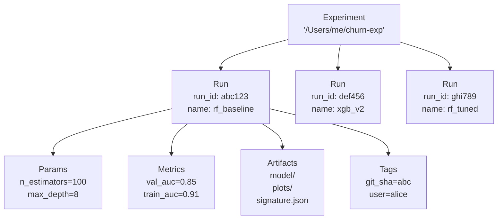

# Chapter 72 — MLflow Tracking and Autologging

> **Goal of this chapter:** to make you fluent in MLflow's tracking layer — the part that records "what did I train, with what inputs, with what outcome, when, by whom" — and to teach autologging both as a convenience and as a discipline whose gotchas matter on the exam. By the end you should be able to write a training script that produces MLflow runs which a future you (or any teammate) can search, compare, and reproduce. You should also understand the *one* autologging behavior that the exam tests most aggressively — the Hyperopt interaction.

In Ch 3's spam-detection walkthrough we said "you'd want a model registry and an experiment tracker for any of this to scale". MLflow is the answer Databricks (and the broader ML community) standardized on. The tracking part — what this chapter covers — is the substrate. Ch 73 builds the registry on top.

---

## 72.1 The motivating story — the spreadsheet of doom

A data science team has been training models for six months. They use `print()` statements to record hyperparameters and metrics. They save model artifacts as pickles to a shared drive, named `model_v3_final_FINAL_use_this_one.pkl`. They keep a Google Sheet where each row is a run, manually filled.

A new team member joins and asks: "Which of these models is in production?"

Nobody knows for certain. There are three candidates. They all have similar names. One sits behind the production endpoint; nobody can find the corresponding row in the spreadsheet. The git SHA isn't recorded anywhere. The notebook that trained it has been edited since. The original training data has been overwritten.

This is the situation MLflow tracking exists to prevent. Every training run gets a unique identifier, a record of every parameter, every metric, every artifact, the source code state, the data version, the user who ran it. The record lives in a database, queryable like any other database. The spreadsheet evaporates.

This chapter is the MLflow tracking API in enough depth to use it correctly. Most engineers learn MLflow by pattern-matching examples; the gotchas live in the parts the patterns elide.

---

## 72.2 MLflow's object model

The mental model:



The hierarchy:

- **Experiment** — a named container for related runs. Path-based name in Databricks (`/Users/me/churn-experiment` or `/Shared/team-experiment`). One experiment per ML project, usually.
- **Run** — a single training execution. Has a unique `run_id` (a 32-char hex string), a human name (`run_name`), a start time, end time, status, and the four attached collections below.
- **Params** — string → string. Logged once per run. Hyperparameters, fixed inputs, configuration values. E.g., `n_estimators="200"`, `learning_rate="0.05"`.
- **Metrics** — string → float, with a `step` index. Can be logged multiple times per run (per-epoch logging). E.g., `val_auc=0.85 @ step=10`.
- **Artifacts** — files. Anything: trained model files, plots (PNG, HTML), feature importance CSVs, sample inputs, requirements.txt. Stored in artifact storage (UC Volume on Databricks).
- **Tags** — string → string. Arbitrary metadata. Some auto-populated (`mlflow.source.name`, `mlflow.user`, `mlflow.databricks.notebookID`, `mlflow.source.git.commit`). User-set tags too.

A few subtle but important facts:

- **A run is immutable in spirit but mutable in practice.** You can log new params and metrics until you mark the run FINISHED. After that, only tags are mutable (so you can tag a run "blessed" months later).
- **Params are typed as strings.** `mlflow.log_param("max_depth", 8)` stores `"8"`. Convert at read-time if you need numeric comparisons.
- **Metrics are typed as floats** and have a numeric step. You log them many times. E.g., `mlflow.log_metric("loss", loss_val, step=epoch_idx)` per epoch.
- **Artifact size is unbounded** in principle but in practice you don't want a 50 GB checkpoint as an artifact — use UC Volumes and log a pointer.

---

## 72.3 Setting the experiment

```python
import mlflow

# Explicit experiment, by path
mlflow.set_experiment("/Users/alice@company.com/churn-experiment")
```

On Databricks, if you do *not* call `set_experiment`, an experiment is auto-created matching the notebook's path. So a notebook at `/Users/alice/exploration/churn.py` gets an experiment at the same path. This is convenient but can lead to scattered experiments — the same project's runs split across notebooks.

The discipline: set the experiment explicitly at the top of every training notebook, using a path you control:

```python
mlflow.set_experiment("/Shared/churn-production")
```

Now every run from any notebook calling that line goes to the same experiment. Searching across runs is one query.

You can also create experiments via the `MlflowClient`:

```python
from mlflow import MlflowClient
client = MlflowClient()
exp_id = client.create_experiment(name="/Shared/churn-production")
```

---

## 72.4 Starting a run, logging things

The basic shape:

```python
import mlflow

with mlflow.start_run(run_name="rf_v3_with_dropout") as run:
    # Log params
    mlflow.log_param("n_estimators", 200)
    mlflow.log_param("max_depth", 8)

    # Or in bulk
    mlflow.log_params({"random_state": 42, "min_samples_split": 5})

    # Train your model (sklearn shown; same idea for any flavor)
    model = RandomForestClassifier(n_estimators=200, max_depth=8).fit(X_train, y_train)

    # Log metrics
    val_auc = roc_auc_score(y_val, model.predict_proba(X_val)[:, 1])
    mlflow.log_metric("val_auc", val_auc)

    # Metrics across epochs (rare for sklearn, common for DL)
    for epoch in range(num_epochs):
        train_loss = ...
        mlflow.log_metric("train_loss", train_loss, step=epoch)

    # Tags
    mlflow.set_tag("data_version", "2026-05-01")
    mlflow.set_tags({"experiment_owner": "alice", "objective": "baseline"})

    # Log a plot as an artifact
    fig.savefig("/tmp/cm.png")
    mlflow.log_artifact("/tmp/cm.png")

    # Log the model itself (the most important artifact)
    mlflow.sklearn.log_model(model, artifact_path="model")
```

The `with mlflow.start_run() as run:` context manager is the canonical pattern. On exit (normal or exception) it marks the run FINISHED (or FAILED).

The `run` variable is a `Run` object — you can query `run.info.run_id`, `run.info.experiment_id`, `run.info.status`, etc.

### 72.4.1 Logging models — flavors

Each ML library has its own MLflow "flavor":

```python
mlflow.sklearn.log_model(model, "model")       # sklearn
mlflow.spark.log_model(model, "model")         # pyspark.ml
mlflow.xgboost.log_model(model, "model")       # XGBoost
mlflow.lightgbm.log_model(model, "model")      # LightGBM
mlflow.pytorch.log_model(model, "model")       # PyTorch
mlflow.tensorflow.log_model(model, "model")    # TF/Keras
mlflow.pyfunc.log_model(...)                   # generic Python function
```

The flavor knows how to:
- Serialize the model in a library-native format (pickle for sklearn, SavedModel for TF, etc.).
- Record the library version (so loading on a different version warns).
- Wrap the model in a standard `pyfunc` interface (`predict(input_df) → output_df`) so any consumer can use it uniformly.

The `pyfunc` flavor is the universal lingua franca — you can load any logged model with `mlflow.pyfunc.load_model(...)` regardless of the originally-saved flavor.

### 72.4.2 Signatures and input examples

A **signature** describes the model's expected input and output schema. **Input examples** are a few sample input rows. Together they enable schema validation at load-time and dev-time discoverability.

```python
from mlflow.models.signature import infer_signature

sig = infer_signature(X_train, model.predict(X_train))
mlflow.sklearn.log_model(
    model,
    artifact_path="model",
    signature=sig,
    input_example=X_train.head(5),
)
```

**Signatures are mandatory for the UC Model Registry** (Ch 73). Without one, `mlflow.register_model` will refuse to register the model into UC. So always include them.

### 72.4.3 Logging artifacts vs logging models

`mlflow.log_artifact(local_path)` copies a single file (or directory if `log_artifacts(dir)`) into the run's artifact storage. Use for plots, CSVs, sample data, requirements files.

`mlflow.<flavor>.log_model(...)` is a *richer* call that:
1. Serializes the model.
2. Saves it as an artifact.
3. Records the model's MLflow metadata (flavor, signature, environment).

So a model is also an artifact, but the model-logging path adds the metadata that lets you load it back with `mlflow.<flavor>.load_model` or `mlflow.pyfunc.load_model`.

---

## 72.5 Nested runs

Sometimes you want a parent run that has children — e.g., a hyperparameter sweep where each child is one trial, and the parent aggregates.

```python
with mlflow.start_run(run_name="sweep_2026_05") as parent:
    for params in candidate_param_sets:
        with mlflow.start_run(run_name=f"trial_{params['lr']}", nested=True) as child:
            mlflow.log_params(params)
            model = train(params)
            mlflow.log_metric("val_auc", evaluate(model))
            mlflow.sklearn.log_model(model, "model")
```

The `nested=True` arg in the inner `start_run` makes the child link to the active parent. In the MLflow UI, children appear under their parent — collapsible, searchable as a group.

This is exactly what Hyperopt+autolog does automatically. We get to that in 72.7.

---

## 72.6 Autologging — the one-liner

MLflow has **autologging**: a single call that instruments the major ML libraries so that fit / train / predict calls automatically log params, metrics, the model itself, and a sensible signature.

```python
import mlflow
mlflow.autolog()       # global — autologs any supported library
```

Or per-flavor:

```python
mlflow.sklearn.autolog()
mlflow.xgboost.autolog()
mlflow.spark.autolog()
mlflow.lightgbm.autolog()
mlflow.pytorch.autolog()
```

After calling autolog, the next library call records its inputs and outputs without further intervention.

```python
mlflow.sklearn.autolog()

with mlflow.start_run():
    model = RandomForestClassifier(n_estimators=200, max_depth=8)
    model.fit(X_train, y_train)
    # No mlflow.log_param, no log_metric, no log_model — autolog did it all
```

What sklearn autolog records, in concrete terms:
- All hyperparameters passed to the estimator (`n_estimators`, `max_depth`, `random_state`, …).
- Training set summary statistics (size, class balance).
- The fitted model (via `mlflow.sklearn.log_model`).
- A signature inferred from training data.
- An input example.
- A handful of training metrics (training score, etc.).

Autolog for `mlflow.spark` (pyspark.ml):
- Logs the entire Pipeline (Pipeline + each stage's params).
- Logs CrossValidator results if used (parent run + child runs per fold).

### 72.6.1 Autolog interactions with explicit logging

If you call both `mlflow.autolog()` and then manually log additional metrics/params, both fire. Autolog won't overwrite your custom logs.

### 72.6.2 When autolog falls short

Autolog logs *what the library exposes*. If your training has custom logic — cost-sensitive metric computation, multi-stage evaluation, business-rule-derived KPIs — autolog won't capture it. You add explicit `log_metric` calls for those.

The discipline: turn autolog on for baseline visibility; add explicit logging for the things autolog misses. Treat autolog as a floor, not a ceiling.

---

## 72.7 The Hyperopt + autolog interaction — the exam's favorite gotcha

This deserves its own section because the exam tests it specifically.

When you use Hyperopt's `fmin` with `SparkTrials` on Databricks, and autolog is enabled, the behavior is:

```python
import mlflow
from hyperopt import fmin, tpe, hp, SparkTrials, STATUS_OK
from sklearn.ensemble import RandomForestClassifier
from sklearn.metrics import roc_auc_score

mlflow.sklearn.autolog()  # autolog is ON

def objective(params):
    with mlflow.start_run(nested=True):
        model = RandomForestClassifier(**params)
        model.fit(X_train, y_train)
        auc = roc_auc_score(y_val, model.predict_proba(X_val)[:, 1])
        mlflow.log_metric("val_auc", auc)
        return {"loss": -auc, "status": STATUS_OK}

space = {
    "n_estimators": hp.choice("n_estimators", [100, 200, 300]),
    "max_depth": hp.choice("max_depth", [4, 8, 12]),
}

with mlflow.start_run(run_name="rf_hyperopt_sweep") as parent:
    best = fmin(
        fn=objective,
        space=space,
        algo=tpe.suggest,
        max_evals=20,
        trials=SparkTrials(parallelism=4),
    )
```

What MLflow records:
- One **parent run** named `rf_hyperopt_sweep`.
- **20 child runs**, one per Hyperopt trial. Each has its hyperparameters logged (autolog), its trained model logged, and the `val_auc` you logged.

What does **NOT** automatically happen:
- **The "best" model is not logged as a top-level artifact.** Each trial logs its own model as a child run; the *parent* run has no model artifact. After `fmin` returns, you have 20 models scattered across 20 child runs. The "best" one is identified by `best` (a dict of the best-trial hyperparameter values) but no canonical "use this one" model exists.

The exam's typical question variant: *"After tuning hyperparameters with Hyperopt+autolog, you want a single model artifact to register. What do you do?"*

The right answer is: **re-train the model with the best hyperparameters and explicitly log it**, OR: identify the best child run and copy its model to a canonical location.

The pattern most teams use:

```python
with mlflow.start_run(run_name="rf_hyperopt_sweep") as parent:
    best = fmin(...)

    # `best` is a dict of best hyperparameter VALUES (from hp.choice — indices!)
    # Convert indices to values:
    best_params = {
        "n_estimators": [100, 200, 300][best["n_estimators"]],
        "max_depth": [4, 8, 12][best["max_depth"]],
    }

    # Re-train with the best params and log the FINAL model
    final_model = RandomForestClassifier(**best_params)
    final_model.fit(X_train, y_train)
    mlflow.log_params(best_params)
    mlflow.sklearn.log_model(final_model, "model")
```

Now the parent run has the final model, which can be registered. This pattern is The Way. Anyone who skips it ends up needing to dig through child runs to find the best model.

---

## 72.8 Searching runs — the `MlflowClient` API

After many runs are logged, you query them. There are two equivalent paths:

### 72.8.1 The functional API

```python
import mlflow

results = mlflow.search_runs(
    experiment_ids=["3041234567890"],
    filter_string="metrics.val_auc > 0.85 AND params.max_depth = '8'",
    order_by=["metrics.val_auc DESC"],
    max_results=10,
)
# results is a pandas DataFrame
```

### 72.8.2 The MlflowClient API

```python
from mlflow import MlflowClient
client = MlflowClient()

runs = client.search_runs(
    experiment_ids=["3041234567890"],
    filter_string="metrics.val_auc > 0.85",
    order_by=["metrics.val_auc DESC"],
    max_results=10,
)
# runs is a list of Run objects
best_run = runs[0]
print(best_run.info.run_id, best_run.data.metrics["val_auc"])
```

The exam tests both — the question often shows code stubs using `client.search_runs(...)`.

### 72.8.3 The filter_string DSL

Filters use prefixes:

- `params.<name>` — values are strings, compare with `=` `!=` `LIKE`.
- `metrics.<name>` — floats, compare with `=` `!=` `<` `>` `<=` `>=`.
- `tags.<name>` — strings, same as params.
- `attributes.start_time`, `attributes.status` — run-level fields.

Combine with `AND` (UC's filter_string does not support `OR` — Databricks-specific limitation).

```python
filter_string = "metrics.val_auc > 0.85 AND tags.data_version = '2026-05-01' AND attributes.status = 'FINISHED'"
```

### 72.8.4 `order_by`

`order_by=["metrics.val_auc DESC", "attributes.start_time ASC"]` — primary key first, ties broken by secondary. Default is `attributes.start_time DESC`.

### 72.8.5 Finding the best run

The canonical "best run" query:

```python
client = MlflowClient()
best = client.search_runs(
    experiment_ids=[exp_id],
    filter_string="attributes.status = 'FINISHED'",
    order_by=["metrics.val_auc DESC"],
    max_results=1,
)[0]
print("Best run:", best.info.run_id, best.data.metrics["val_auc"])
```

**Direction matters.** AUC is to maximize → `DESC`. Loss (e.g., `val_log_loss`) is to minimize → `ASC`. The exam tests this — questions sometimes flip the metric name to a loss and expect you to switch direction.

---

## 72.9 Comparing runs in the UI

The MLflow UI (visible in the Experiments tab of the Databricks workspace) shows a table of runs. Useful operations:

- Select multiple runs → compare side-by-side. The UI shows a table of params and metrics with differences highlighted.
- Plot metric vs metric across runs (e.g., training time vs val_auc — find the Pareto frontier).
- Filter and sort by any logged column.

For exam purposes, the UI is exam-mentioned as "Identify information available in the MLflow UI". The answer includes: params, metrics, artifacts, tags, source notebook, git SHA, user, runtime version, start/end time, status.

---

## 72.10 The MLflow Tracking Server on Databricks

You don't run an MLflow Tracking Server yourself on Databricks. The workspace has one built in — accessible via the `databricks` tracking URI (default in DBR ML). The URI for the UC Registry is `databricks-uc`:

```python
mlflow.set_tracking_uri("databricks")          # tracking server (auto on Databricks)
mlflow.set_registry_uri("databricks-uc")       # UC Model Registry (Ch 73)
```

The two URIs are independent. Tracking always goes to the Databricks tracking server; the registry might be the legacy workspace registry (`databricks`) or the UC registry (`databricks-uc`). Modern best practice: `databricks-uc` for the registry.

Outside Databricks (local laptop, other clouds), you point `mlflow.set_tracking_uri("http://your-mlflow-server:5000")` and `mlflow.set_registry_uri(...)`. The Associate exam assumes Databricks.

---

## 72.11 MLflow 3 — what changed

MLflow 3 (released 2025) is the current major version, shipped with DBR ML 17. Differences from MLflow 2:

- **GenAI tracing.** New trace primitives for tracking LLM calls — out of scope for the ML Associate exam (in scope for the GenAI Engineer Associate).
- **Prompt Registry.** A separate registry surface for prompts — also GenAI track.
- **Renamed run statuses.** RUNNING, FINISHED, FAILED, KILLED, SCHEDULED. (Earlier MLflow had similar but slightly different names.)
- **Built-in evaluation harness** — `mlflow.evaluate(...)` for standardized model evaluation. Useful but not heavily exam-tested.
- **Tighter UC Model Registry integration** — registration calls produce richer metadata.

For the Associate exam, MLflow 2 and 3 behave nearly identically for the tracking APIs we've covered. Your code will work on either.

---

## 72.12 Worked example — XGBoost with autolog, end-to-end

```python
import mlflow
import pandas as pd
import xgboost as xgb
from sklearn.model_selection import train_test_split
from sklearn.metrics import roc_auc_score, log_loss

# Set the experiment
mlflow.set_experiment("/Shared/churn-baselines")

# Turn on autolog for xgboost
mlflow.xgboost.autolog()

# Load data
pdf = spark.table("prod.churn.training_set_2026_q1").toPandas()
X = pdf.drop(columns=["churned"])
y = pdf["churned"]
X_train, X_val, y_train, y_val = train_test_split(X, y, test_size=0.2, random_state=42)

# Train + log in one run
with mlflow.start_run(run_name="xgb_baseline_v1") as run:
    # XGBoost native API; autolog instruments xgb.train
    dtrain = xgb.DMatrix(X_train, label=y_train)
    dval = xgb.DMatrix(X_val, label=y_val)
    params = {
        "objective": "binary:logistic",
        "max_depth": 6,
        "learning_rate": 0.05,
        "eval_metric": "auc",
    }
    model = xgb.train(
        params=params,
        dtrain=dtrain,
        num_boost_round=200,
        evals=[(dval, "val")],
        early_stopping_rounds=20,
    )

    # Autolog already logged: params, training metrics per round, model
    # We add: validation AUC and log loss
    preds = model.predict(dval)
    val_auc = roc_auc_score(y_val, preds)
    val_ll = log_loss(y_val, preds)
    mlflow.log_metric("val_auc_explicit", val_auc)
    mlflow.log_metric("val_log_loss", val_ll)

    # Some context tags
    mlflow.set_tag("data_period", "2026-Q1")
    mlflow.set_tag("baseline", "true")

print(f"Run ID: {run.info.run_id}, val_auc: {val_auc:.4f}")
```

In the MLflow UI, this run will have:
- Params: every key in the `params` dict (logged by autolog).
- Metrics: per-iteration training metrics (autolog) + the two explicit val metrics.
- Artifacts: the XGBoost model under `model/`, plus a signature and input example.
- Tags: data_period, baseline, plus auto-tags (notebook path, user, git SHA).

To find this run later:

```python
client = MlflowClient()
runs = client.search_runs(
    experiment_ids=[mlflow.get_experiment_by_name("/Shared/churn-baselines").experiment_id],
    filter_string="tags.baseline = 'true' AND tags.data_period = '2026-Q1'",
    order_by=["metrics.val_auc_explicit DESC"],
    max_results=5,
)
for r in runs:
    print(r.info.run_id, r.data.metrics.get("val_auc_explicit"))
```

---

## 72.13 Hygiene patterns

A few patterns that separate a tracked project from a chaotic one:

1. **Always set the experiment explicitly at the top of every notebook.** Don't rely on the notebook-path default.
2. **Use `with mlflow.start_run() as run:` consistently** — even for one-off experiments. The context manager guarantees the run is closed.
3. **Tag runs with stable metadata** — `data_version`, `git_sha`, `code_version`, `experiment_owner`. Auto-tags cover some of this; you'll often want more.
4. **Log signatures and input examples for every model.** Required for UC registry; cheap insurance.
5. **Pair autolog with explicit metric logging for business KPIs.** Autolog catches what the library knows; you add what the library doesn't.
6. **Save plots as artifacts.** Confusion matrices, ROC curves, calibration plots. Future you will want them.
7. **Set a `run_name`** — `run_id`s are unreadable; names are human.

---

## 72.14 What this builds on / where this returns

**Builds on:** the conceptual MLflow mentions in Ch 3 and Ch 4 (lifecycle).

**Returns:**
- **Model registration** in *Ch 73* — `mlflow.register_model(run_uri, name)` and the UC alias workflow build directly on the tracking layer.
- **The forward pointer to GenAI MLflow features** (tracing, prompt registry) — out of scope for the ML Associate exam but mentioned for completeness.

---

## 72.15 Exercises

1. **Object hierarchy.** Define experiment, run, param, metric, artifact, tag. Give one example of each from a churn-modeling project.

2. **Set vs auto experiment.** What's the difference between explicitly calling `mlflow.set_experiment("/Shared/churn")` and not setting it at all? Why is the explicit form better?

3. **Param vs metric.** For each of the following, decide whether to log as a param, a metric, or a tag:
   (a) `n_estimators = 200`
   (b) `val_auc = 0.85`
   (c) `data_version = "2026-05-01"`
   (d) `git_commit_sha = "abc123"`
   (e) `training_loss = 0.42 at epoch 10`
   (f) `random_seed = 42`

4. **The Hyperopt+autolog trap.** A teammate finishes a Hyperopt sweep and asks "where's the final model"? Walk through what they'll find in MLflow, and what they need to do.

5. **Signature requirement.** Why is `signature=...` important when logging a model, and what exam-relevant feature requires it?

6. **Best-run search.** Write the `MlflowClient.search_runs` call to find the run with the **lowest** `val_log_loss` among finished runs.

7. **Direction confusion.** A junior teammate writes `order_by=["metrics.val_loss DESC"], max_results=1` to find the best run. The query "succeeds" but returns the worst run. Explain.

8. **Nested runs.** When are nested runs appropriate? Give one example.

9. **Autolog vs explicit.** Autolog logs everything sklearn exposes. List two pieces of information about your training that autolog will *not* capture and that you'd want to log explicitly.

10. **Tag use case.** Suggest three useful run tags beyond what autolog already provides.

11. **Filter_string DSL.** Write a filter_string that selects runs where: `val_auc > 0.8`, `max_depth = 8`, the run finished, and the tag `dataset_version` equals `'2026-05'`.

12. **Tracking URI vs Registry URI.** What's the difference, and what values do you set them to on Databricks for the modern UC-based setup?

13. **MLflow 3 distinction.** Name two new things MLflow 3 brought that are out of scope for the ML Associate exam (and which exam they're tested on).

14. **The pyfunc flavor.** What is the pyfunc flavor good for, and why does it matter even if you logged your model under a different flavor?

15. **Building a sweep summary.** Sketch code that runs a 10-trial Hyperopt sweep, then queries MLflow to print a table of (n_estimators, max_depth, val_auc) sorted by val_auc descending.

<details>
<summary>Answers</summary>

1. *Experiment* — `/Shared/churn-production` (container of runs). *Run* — one training of an RF, run_id `abc123`. *Param* — `n_estimators=200`. *Metric* — `val_auc=0.85`. *Artifact* — the serialized RF model file. *Tag* — `git_sha=abc123def`.

2. Auto behavior: Databricks creates an experiment matching the notebook's path. Explicit: every notebook calling `set_experiment("/Shared/churn")` writes to the same experiment. Explicit is better because it consolidates runs across notebooks (different exploration notebooks, the production training notebook) into one searchable experiment.

3. (a) param; (b) metric; (c) tag (or param if you treat it as input); (d) tag (auto-tagged); (e) metric with step=10; (f) param.

4. They'll find: one parent run, 20+ child runs (one per trial), each child with its hyperparameters and val metric and a model. No top-level model on the parent. They need to either (a) take the best child's model and copy/register it, or (b) re-train with the best hyperparameters at parent-run level and log that.

5. The signature lets MLflow validate inputs at inference time (catching shape mismatches early) and lets consumers discover the model's I/O contract. The UC Model Registry refuses to register models without signatures — so omitting it blocks registration.

6. ```python
    client.search_runs(
      experiment_ids=[exp_id],
      filter_string="attributes.status = 'FINISHED'",
      order_by=["metrics.val_log_loss ASC"],
      max_results=1,
    )
    ```

7. The metric `val_loss` is to be minimized — best = lowest. `DESC` orders highest-first; `max_results=1` returns the highest (worst) loss. The fix is `ASC`.

8. When the parent run conceptually contains the children. Example: a hyperparameter sweep where the parent is the sweep and each trial is a child. Hyperopt+autolog does this automatically.

9. (a) Business-specific KPIs computed after `fit` (e.g., precision at threshold 0.7). (b) The version of the training data used (autolog doesn't see your data pipeline). (c) Confusion matrix as a plot artifact. (d) Calibration curve. Any of these.

10. `data_version` (which dataset snapshot), `model_purpose` (baseline vs production candidate), `cost_dollars` (cluster cost), `notebook_version` (manual code-version tag), `business_unit`.

11. `"metrics.val_auc > 0.8 AND params.max_depth = '8' AND attributes.status = 'FINISHED' AND tags.dataset_version = '2026-05'"`. Note params are strings, hence `'8'`.

12. *Tracking URI* — where runs and metadata go (the MLflow tracking server). On Databricks, default is `"databricks"`. *Registry URI* — where registered models live. For UC: `"databricks-uc"`. You set the tracking URI implicitly (Databricks default) and the registry URI explicitly: `mlflow.set_registry_uri("databricks-uc")`.

13. (a) GenAI tracing — tested on the Generative AI Engineer Associate exam. (b) Prompt Registry — same. Both out of scope for ML Associate.

14. The pyfunc flavor wraps any model in a standard `predict(input) → output` interface, so consumers can `mlflow.pyfunc.load_model(...)` regardless of the underlying library. Even if you logged as sklearn, the pyfunc wrapper is automatically created, which is what Mosaic AI Model Serving uses to invoke the model uniformly.

15. ```python
    mlflow.sklearn.autolog()
    with mlflow.start_run() as parent:
        best = fmin(objective, space, algo=tpe.suggest, max_evals=10,
                    trials=SparkTrials(parallelism=4))

    client = MlflowClient()
    runs = client.search_runs(
        experiment_ids=[parent.info.experiment_id],
        filter_string=f"tags.mlflow.parentRunId = '{parent.info.run_id}'",
        order_by=["metrics.val_auc DESC"],
    )
    for r in runs:
        print(r.data.params.get("n_estimators"),
              r.data.params.get("max_depth"),
              r.data.metrics.get("val_auc"))
    ```

</details>
