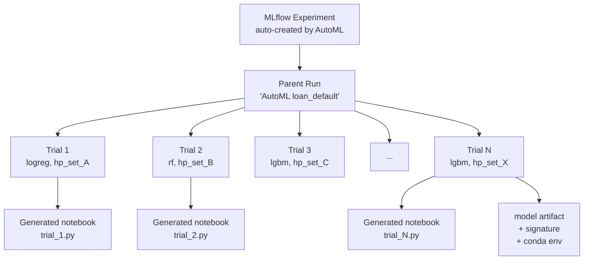

# Chapter 74 — AutoML: What It Actually Does, When to Use It, When Not

> **Goal of this chapter:** to demystify Databricks AutoML — what it really does under the hood, where it slots into the MLflow tracking and registry world you learned in Ch 72–73, and (most importantly) when *not* to reach for it. By the end you should be able to launch an AutoML run from the Python API, read the generated "glass-box" notebook the way you'd read any other Databricks notebook, register the winning trial into Unity Catalog, and articulate four or five concrete scenarios where AutoML is the wrong tool. The exam objective the Databricks ML Associate tests here is small — three lines on the official outline — but the *judgment* it asks for is exactly the judgment you want as a practitioner.

---

## 74.1 The motivating story — two weeks vs. thirty minutes

You have a labeled dataset. Say it's a loan-default dataset: 10,000 rows of applicant features, with a binary `defaulted` column. Your manager wants to know by end of week whether ML can give a useful signal on this — or whether the features are too weak, in which case the team needs to invest in data acquisition instead of modelling.

You know how to do this the long way. You'd spend a day on EDA — Ch 23 — looking at distributions, missingness, class balance. You'd spend two days on feature engineering — Chs 24-29 — imputing missing values, encoding categoricals, scaling numerics, building interactions. You'd pick three or four candidate algorithms from Chs 31-37 — logistic regression as a baseline, random forest for a non-linear comparison, XGBoost or LightGBM as the heavy hitters. You'd set up cross-validation (Ch 22), wire each candidate into a hyperparameter search (Ch 49-54), log every trial to MLflow (Ch 72), and at the end of two weeks pick the best.

That's the right thing to do — for a production model. For a "*is this problem even solvable to a useful level?*" question, two weeks is the wrong unit of time. You want an answer by Wednesday morning so you and your manager can decide what to do for the rest of the week.

The alternative is one line:

```python
summary = databricks.automl.classify(
    dataset=df,
    target_col="defaulted",
    primary_metric="f1",
    timeout_minutes=30,
)
```

Thirty minutes later you have a ranked leaderboard of about fifty trained models, each with its hyperparameters logged to MLflow, each with a generated notebook you can open and read line-by-line. The top of the leaderboard tells you the *ceiling* of what classical ML can do on this dataset with reasonable effort. If the top F1 is 0.82, you have signal — proceed. If it's 0.54, the features are weak — go find more data before spending two more weeks on modelling.

This is AutoML. It is not magic. It is not a substitute for thinking. It is a *bootstrap*, and like all bootstraps it has a precise zone where it shines and a precise zone where it misleads.

This chapter is about both zones.

---

## 74.2 What AutoML actually does — the inner loop, automated

Strip away the marketing. AutoML automates the *inner loop* of model development. The inner loop is the boring, mechanical part: try an algorithm, encode features the standard way, sweep hyperparameters, log the result, repeat. There's no creativity in it once the framing decisions (Chs 3.2, what is $x$, what is $y$, what is the cost of being wrong) are made. It's a search procedure with a well-defined surface.

Concretely, when you hand a labeled dataset to Databricks AutoML for a classification problem, the following happens in sequence:

First, **basic profiling and EDA**. AutoML scans the input DataFrame, computes column-level statistics (means, missingness, cardinality), and decides each column's role. A high-cardinality string column gets treated differently from a low-cardinality categorical. A numeric column with 90% missingness gets flagged. A column with a near-constant value gets dropped. This is the same EDA you'd do by hand in section 23, compressed into a generated profiling notebook you can open and read.

Second, **standardized feature preprocessing**. For each algorithm in the shortlist, AutoML builds a preprocessing pipeline that handles the data types it found: median imputation for numerics, mode imputation for categoricals, one-hot encoding for low-cardinality categoricals, scaling for numerics where the algorithm benefits from it (linear models, k-NN). These are *default* choices — the same defaults Ch 24-26 said work for most problems. They are not domain-specific. The point of this chapter, and the point of every "when not to use AutoML" warning in section 74.7, is that "the defaults work for most problems" stops being true the moment your problem is unusual.

Third, **algorithm shortlist**. For classification, the shortlist is the classical-ML usual suspects: logistic regression, random forest, gradient-boosted trees, XGBoost, LightGBM, and (on recent Databricks runtimes) a couple of others depending on dataset shape. For regression, the equivalent set. For forecasting, it's Prophet, ARIMA, and a few statistical baselines. Notice what's *not* on the shortlist: deep neural networks of any kind, transformer-based models, any kind of custom model class. We'll return to this in section 74.7 when we discuss when AutoML loses.

Fourth, **per-algorithm hyperparameter tuning**. For each algorithm, AutoML runs a hyperparameter search — Optuna-driven on modern Databricks runtimes (the Hyperopt-based version was retired after DBR ML 16.4 LTS, which matters for exam questions phrased around the older Hyperopt+`SparkTrials` pattern). Each trial trains a model with a candidate hyperparameter configuration, evaluates it via cross-validation against the primary metric you specified, and reports back. Optuna's tree-structured Parzen estimator (which we'll derive properly in Ch 52) guides the next candidate based on what it has learned so far — early trials look more like random search, later trials concentrate around the promising regions of hyperparameter space. A typical AutoML run does 30 to 100 trials total across all algorithms within the timeout budget; the split between algorithms is dynamic, with algorithms that are doing well getting more trials than ones whose best trial has already plateaued.

It's worth pausing here on a subtle point that the exam likes to test indirectly. The trials are *not* run truly in parallel across the cluster in the way Hyperopt's `SparkTrials` used to do. Optuna's parallelism in AutoML is on the driver side, with the inner training runs leveraging Spark only when the algorithm itself is a `pyspark.ml` estimator. For single-node algorithms like XGBoost and LightGBM (the usual winners), the parallelism comes from running multiple trials concurrently as separate worker threads, each training on the driver's sampled data. This is a deliberate design choice — the algorithms that win on tabular ML almost always run faster as single-node training on a sampled dataset than as distributed training on the full dataset, and AutoML is biased toward what wins.

Fifth, **MLflow logging — every trial as a child run**. This is the part that integrates AutoML with everything else in Part L. The AutoML run creates one MLflow experiment. Under that experiment sits one parent run (the "AutoML experiment" itself) and N child runs, one per trial. Each child run logs its algorithm, its hyperparameters, its CV metrics, its trained model artifact, its input signature, and a pointer to its generated notebook. You can search across trials with the same `MlflowClient` API you learned in Ch 72; nothing about AutoML's logging is special — it uses the standard MLflow surface.

Sixth, **ranking and leaderboard**. At the end of the timeout (or when the trial budget is exhausted), AutoML sorts the trials by the primary metric you specified and produces a leaderboard. The top trial is the "winner". The leaderboard is just a sorted view over the same MLflow runs.

Seventh — and this is the most important thing about Databricks AutoML, and the thing that separates it from a black-box AutoML service — **glass-box notebook generation**. For every trial AutoML runs, it generates a Databricks notebook that contains every single line of code that produced that trial: the data loading, the preprocessing, the model construction, the training, the evaluation. Not a serialized pipeline. Not a binary blob. A regular Databricks notebook, written in Python, using `sklearn` or `xgboost` or `lightgbm` or `pyspark.ml`, that you can open, read, modify, and re-run.

This last property is the thing that makes AutoML worth using at all in a serious shop. The output is not a model; it's a *starting point you can audit*. We'll exercise this property in the worked example in section 74.6.

---

## 74.3 Where AutoML sits in the MLflow world

The mental model is essentially identical to Ch 72's experiment-and-runs picture, with one level of nesting added:



This is just an MLflow experiment with deeper structure. Everything you learned in Ch 72 applies: `mlflow.search_runs` finds trials, you can compare runs in the UI, you can filter by tag or metric, you can promote the winning run by passing its `run_id` to `mlflow.register_model` exactly as in Ch 73.

The exam tests this integration in a precise way. The question shape is usually: "After running AutoML, how do you register the best trial's model into Unity Catalog?" The right answer is:

```python
mlflow.set_registry_uri("databricks-uc")
mlflow.register_model(
    model_uri=f"runs:/{summary.best_trial.mlflow_run_id}/model",
    name="prod.lending.loan_default_clf",
)
```

Nothing AutoML-specific. The output of AutoML is a regular MLflow run; once you have its `run_id`, every Ch 73 mechanic — aliases, version promotion, loading via `models:/...@champion` — works identically.

### 74.3.1 MLflow 3 integration — signatures, lineage, autologging defaults

A 2026-reality detail worth noting because the exam has caught up to it: modern Databricks AutoML runs on top of MLflow 3 and uses MLflow 3's autologging defaults. This means three things you'd otherwise have to do by hand are done for you.

The **model signature** — the schema of inputs and outputs that UC Model Registry requires before it'll let you register a model — is inferred from the training data and attached to every trial's model artifact automatically. You do not have to call `infer_signature` yourself.

A **representative input example** is captured and logged alongside the signature. This is the small sample of rows that the registry UI shows as "here's what an input to this model looks like" and what Mosaic AI Model Serving uses to scaffold a test invocation.

**Dataset-level lineage** is recorded — the input table or DataFrame the trial trained on is logged as a dataset reference, so the UC lineage graph shows the data → model edge automatically. In Ch 73's loan-default scenario, when you query the UC lineage panel for the registered model, you see the source table.

The practical upshot: AutoML output is *ready* for UC registration. No manual signature wrangling. This is one of the reasons AutoML is recommended as an "easy first model" even by teams that ultimately replace it with a hand-crafted pipeline — it produces a registry-clean baseline.

---

## 74.4 The Python API surface, in just enough depth

Three functions cover almost everything you'll do:

```python
from databricks import automl

# Binary or multi-class classification
summary = automl.classify(
    dataset=df,
    target_col="defaulted",
    primary_metric="f1",            # or "log_loss", "precision", "recall", "roc_auc", "accuracy"
    timeout_minutes=30,
    max_trials=50,                  # cap on trial count; whichever limit hits first wins
    exclude_cols=["customer_id"],   # never use these as features
)

# Regression
summary = automl.regress(
    dataset=df,
    target_col="loan_amount",
    primary_metric="r2",            # or "rmse", "mae", "mse"
    timeout_minutes=30,
)

# Forecasting
summary = automl.forecast(
    dataset=df,
    target_col="daily_sales",
    time_col="date",
    frequency="D",
    horizon=14,                     # forecast 14 periods ahead
    primary_metric="smape",
)
```

The dataset can be a pandas DataFrame or a Spark DataFrame. For datasets that fit in memory, pandas is faster (no serialization between executors). For datasets larger than the driver's memory, Spark — but be aware that AutoML will sample the data down for many of its internal training calls, because the inner-loop algorithms (XGBoost, sklearn random forest) are single-node. We come back to this scale issue in 74.7.

The return value is a `AutoMLSummary` object. The three fields you'll actually use:

```python
summary.best_trial          # The winning trial
summary.best_trial.mlflow_run_id    # MLflow run_id, usable in any mlflow API
summary.best_trial.notebook_url     # URL to the generated notebook
summary.best_trial.model_path       # Artifact path within the run ("model" by default)

summary.trials              # List of all trials, sorted by primary metric
summary.experiment.experiment_id    # MLflow experiment ID

summary.preprocessor_notebook_url   # URL to the data preprocessing/EDA notebook
```

`best_trial.notebook_url` opens the glass-box notebook for the winning trial. This is the file you want to read carefully. The `preprocessor_notebook_url` opens the data exploration notebook AutoML generated before any modeling started — equivalent to your by-hand EDA from section 3.4 or Ch 23.

### 74.4.1 The UI path

There is a UI path too: Experiments → Create AutoML Experiment → pick dataset, target column, problem type, primary metric, advanced options (timeout, max trials, columns to exclude, the cluster to run on). Click run. Same engine, same outputs. The UI is convenient for one-off exploration; the Python API is the one you put into a notebook or a Job for reproducibility.

For the exam, both surfaces should be familiar. The Python API is what shows up in code-snippet questions; the UI is what shows up in "where do you click" questions.

---

## 74.5 The glass-box notebook — read it like any other notebook

Open the notebook URL from `summary.best_trial.notebook_url`. What you see is a regular Databricks notebook, in Python, organized in roughly the following sections:

The first cell or two **loads the dataset** from wherever AutoML pulled it (typically a snapshot stored as a Delta table in a Volume). The exact path is hard-coded — this is the first thing you fix if you clone the notebook to modify and re-run, because the hard-coded path may not exist in a different workspace.

The next block does **column-by-column preprocessing**. You see explicit `SimpleImputer(strategy="median")` calls for numerics, `OneHotEncoder` for categoricals, `StandardScaler` if the algorithm needed it. Every column has an explicit, named transformer. There's no magic — if the median for column `applicant_age` was 38.0, the notebook hard-codes that value as a fitted parameter. This is intentional: the notebook captures the exact preprocessing of the trial, not a template.

Then a **train-test split** cell, with the random seed AutoML used so the result is reproducible.

Then the **model construction and training** cell. For a LightGBM trial:

```python
import lightgbm as lgb

model = lgb.LGBMClassifier(
    n_estimators=312,
    learning_rate=0.0481,
    num_leaves=31,
    max_depth=-1,
    min_child_samples=20,
    reg_alpha=0.0,
    reg_lambda=0.0,
    random_state=42,
)
model.fit(X_train, y_train)
```

Every hyperparameter — the ones Optuna landed on, not "good defaults" — is hard-coded. This is the *exact* model that scored at the top of the leaderboard. You can read it, you can change `num_leaves` from 31 to 63 and re-run, you can swap LightGBM for an XGBoost call with the same hyperparameter spirit. It's just Python.

Then the **evaluation** cells — confusion matrix, precision, recall, F1, log loss, all the same metrics from Ch 42 — printed and plotted. Feature importance comes out as a bar plot.

Then a **final MLflow logging** cell that ties everything together: logs the model, the signature, the metrics, the parameters, all under the same `run_id` AutoML originally created. This is what makes the notebook re-runnable end-to-end — you can clone it, change one hyperparameter, run all cells, and get a new MLflow run that you can compare side-by-side with the AutoML winner.

The discipline this enables is the thing to internalize: **AutoML's output is a notebook you can read and edit, not a black-box model you can only use**. The natural workflow is to use AutoML to find a strong candidate fast, then clone its glass-box notebook into your own Repo (Ch 68), modify the parts that AutoML couldn't know about (your domain features, your custom thresholding logic, your specific evaluation), and re-train. This is the supported, recommended workflow. It is not a hack.

---

## 74.6 A worked example — loan default, end to end

Let's walk a realistic loan-default classification through the full AutoML loop, then promote the result to UC.

The data: 10,000 rows in a Delta table at `prod.lending.loan_applications`. Columns: `applicant_age`, `income`, `employment_years`, `credit_score`, `loan_amount`, `loan_purpose` (categorical, 7 values), `home_ownership` (categorical, 3 values), `prior_defaults` (count), `defaulted` (binary target). Class balance: 18% positive. About 4% of `income` values are missing.

Launch the AutoML run:

```python
from databricks import automl
import mlflow

df = spark.table("prod.lending.loan_applications")

summary = automl.classify(
    dataset=df,
    target_col="defaulted",
    primary_metric="f1",
    timeout_minutes=15,
    exclude_cols=["application_id"],
)

print(f"Best trial F1: {summary.best_trial.metrics['val_f1_score']:.3f}")
print(f"Best trial algorithm: {summary.best_trial.model_description}")
print(f"Notebook: {summary.best_trial.notebook_url}")
```

Fifteen minutes later, output (illustrative):

```
Best trial F1: 0.742
Best trial algorithm: LightGBMClassifier
Notebook: https://<workspace>/#notebook/12345
```

Open the notebook. EDA cells show:

- `income` has 4% missingness — median-imputed to $52,000
- `loan_purpose` one-hot encoded into 7 columns
- `credit_score` is the strongest single predictor by mutual information
- Class imbalance handled via `scale_pos_weight` in LightGBM

Training cell shows the winning hyperparameters Optuna found: 312 estimators, learning rate 0.0481, num_leaves 31, scale_pos_weight 4.5.

Evaluation cell shows on the holdout set: F1 = 0.74, precision = 0.71, recall = 0.78, log loss = 0.42.

Now decide what to do.

**Option A — accept and promote.** The F1 of 0.74 is acceptable for a first model. Register it.

```python
mlflow.set_registry_uri("databricks-uc")

best_run_id = summary.best_trial.mlflow_run_id

result = mlflow.register_model(
    model_uri=f"runs:/{best_run_id}/model",
    name="prod.lending.loan_default_clf",
)
print(f"Registered as version {result.version}")

# Set the champion alias (Ch 73 mechanics)
from mlflow import MlflowClient
client = MlflowClient()
client.set_registered_model_alias(
    name="prod.lending.loan_default_clf",
    alias="champion",
    version=result.version,
)
```

You're done. The model is in UC under a 3-level name with `@champion` alias. Mosaic AI Model Serving can load it via `models:/prod.lending.loan_default_clf@champion`. Total time from raw table to served model: under 30 minutes.

**Option B — iterate on the glass-box notebook.** F1 of 0.74 is fine but you suspect a better feature might lift it. The `loan_purpose × home_ownership` interaction looks meaningful by domain knowledge (homeowners borrowing for "auto" might be different from renters borrowing for "auto"). AutoML's standardized preprocessing doesn't construct such interactions. Clone the notebook into your Repo, add an interaction column at the top:

```python
df["purpose_x_ownership"] = df["loan_purpose"].astype(str) + "_" + df["home_ownership"].astype(str)
```

then re-run. New F1 = 0.76. Modest lift but real. Log this as a new run, compare it to the AutoML winner side-by-side in the MLflow UI, promote whichever wins.

**Option C — change the threshold and re-evaluate.** This isn't really an AutoML-specific operation; it's the threshold-dial from section 3.9. AutoML reports metrics at the default 0.5 threshold. Your business cost matrix says missing a defaulter is 5× as expensive as a false positive. Load the model, sweep thresholds on the validation set, pick the one that minimizes expected cost. AutoML doesn't do this for you — the primary_metric you specified was a threshold-independent metric (F1 at 0.5). The threshold-tuning step is yours.

Concretely, option C looks like this:

```python
import numpy as np
from mlflow.pyfunc import load_model

model = load_model(f"runs:/{best_run_id}/model")
val_proba = model.predict(X_val)  # probabilities

best_cost, best_tau = np.inf, 0.5
for tau in np.linspace(0.05, 0.95, 19):
    pred = (val_proba >= tau).astype(int)
    fp = ((pred == 1) & (y_val == 0)).sum()
    fn = ((pred == 0) & (y_val == 1)).sum()
    cost = 1 * fp + 5 * fn   # business cost matrix
    if cost < best_cost:
        best_cost, best_tau = cost, tau

print(f"Optimal threshold: {best_tau:.2f} (expected cost {best_cost})")
```

The serving layer (Ch 73's Mosaic AI endpoint) doesn't apply this threshold for you; you either embed it in a pyfunc wrapper before re-registering, or you apply it in the downstream code that consumes the model's probability output. Either pattern is supported. Just don't forget which one you chose, because future-you re-reading the model six months from now will wonder why the predictions look different than the leaderboard suggested.

The point of walking through this three-option fork is to show that **the AutoML run is the starting line, not the finish line**. You will exit AutoML with either acceptance (option A), iteration (option B), or operating-point tuning (option C). All three are normal.

---

## 74.7 When AutoML wins, when AutoML loses

This is the heart of the chapter and the only place where exam preparation and practitioner judgment converge fully. The exam objective is "identify the use cases for AutoML." The use cases are not "any classification problem"; they are a specific set with specific edges.

### 74.7.1 The four scenarios where AutoML wins

**Establishing a baseline.** This is the canonical use. You have a labeled dataset, a stakeholder asking "is this problem solvable?", and a one-day budget for an answer. AutoML's top leaderboard score is the floor — if it's bad, the problem is hard or the features are weak, and the team should reallocate. If it's good, you have a number to beat and a reasonable starting model.

**Empowering non-ML-specialists.** A domain expert at Optum — a clinical informaticist, say, with deep medical knowledge but no formal ML training — has a labeled dataset of patient outcomes. They want to know whether their hand-built features carry signal. AutoML lets them run the experiment without hiring an ML engineer for the bootstrap phase. The result is a baseline they can show to an ML team to argue for further investment. This democratization is real; it's not marketing.

**Producing reproducible handoffs.** The glass-box notebook is the *documentation* of what works. Hand it to a successor, hand it to an audit, hand it to a regulator — they read code, not a serialized model. For regulated industries this matters; "we used AutoML and here's the generated notebook" is more auditable than "we used some neural net architecture we found in a paper."

**Feature-importance sanity check.** AutoML reports feature importance on the winning model. A feature that doesn't appear in *any* top-trial's feature importance is, with high probability, noise. This is a quick way to validate or invalidate hypotheses about which inputs matter. It's not a substitute for the more rigorous feature selection of Ch 29, but as a 20-minute screen it's effective.

**Comparing two candidate datasets.** A real-world use case that doesn't get enough attention: you have two competing feature sets for the same target — say, "features from our existing data warehouse" versus "features after we buy the third-party enrichment data." Running AutoML on each in turn gives you two leaderboards. The lift between them is the marginal value of the enrichment data — measured under standardized preprocessing and tuning, so the comparison is fair. This is exactly the kind of business question (do we spend $200K/year on third-party data?) where a defensible number from a repeatable procedure beats a hand-crafted model that the procurement team will (correctly) suspect was tuned to favor one side.

**Establishing a regression test for ML quality.** A subtler use: bake an AutoML run into a scheduled job that runs weekly against your current production training data. The top-leaderboard score becomes a *quality regression check* — if next week's AutoML score drops 5 points, something has changed in the data (drift, schema change, label noise) and a human should look. This is cheap monitoring that catches data-quality problems before they show up as production-model degradation.

### 74.7.2 The five scenarios where AutoML loses

**Custom loss functions.** AutoML's `primary_metric` is from a fixed list — F1, AUC, RMSE, MAE, R², log loss, accuracy, precision, recall, and a few more. If your business problem has an *asymmetric cost function* — Ch 42's cost matrix where, for example, missing a defaulter costs 100× as much as flagging a good loan — none of the canned metrics matches. AutoML cannot optimize an arbitrary cost. The workaround is to optimize log loss (which preserves probability information), then tune the threshold post-hoc against your custom cost. This works but is not what AutoML "did for you" — you're doing the cost-sensitive part by hand on top of an AutoML baseline.

**Custom domain feature engineering.** AutoML applies a standardized FE pipeline — Ch 24's median imputation, Ch 25's one-hot encoding, Ch 26's standard scaling. Domain-specific transforms are not in the menu: Ch 26's cyclical encoding for hour-of-day (sine/cosine pair preserving the 23→0 wraparound), Ch 28's clinical lab-value interactions for healthcare (`creatinine / albumin` ratios that nephrologists know are diagnostic), the date arithmetic that produces a `days_since_last_visit` column from a raw timestamp — AutoML doesn't construct any of these. The right pattern is to *pre-compute* your custom features as input columns *before* handing the DataFrame to AutoML. Then AutoML's standardized preprocessing operates on top of your hand-engineered features, which is fine. The mistake is to expect AutoML to invent the domain features for you.

**Time-series with complex seasonality.** `automl.forecast` handles single-series with daily/weekly/yearly seasonality cleanly using Prophet under the hood. It struggles with multiplicative seasonality, hierarchical structure (per-store-per-product-per-week retail forecasting), or external regressors that interact non-trivially with the seasonality. For those, use specialized libraries — Prophet directly with hand-tuned holidays, AutoTS, or hierarchical reconciliation packages — and skip AutoML's forecasting path.

**Deep learning problems.** AutoML's algorithm shortlist is classical ML — no neural networks of any kind. For text classification where transformer fine-tuning dominates (BERT, RoBERTa, or 2026-era successors), for any computer-vision problem, for sequence-to-sequence problems — AutoML is the wrong tool. Use the deep-learning runtimes and Hugging Face workflows; AutoML is for tabular data with classical algorithms.

**Cost-bounded experimentation on huge data.** AutoML runs 30-100 trials. Each trial is a full model train, often with cross-validation. On a 100 GB dataset, each trial might cost a few dollars in compute; multiply by 50 trials and a single AutoML run is hundreds of dollars. For exploratory work this can blow through your monthly budget. The pragmatic answer is to use `sample_fraction` (AutoML samples down to a representative subset for the search), find the winning configuration on the sample, then re-train *just the winner* on the full data outside AutoML. You get most of the speed benefit at a fraction of the cost.

A side-by-side summary of the two workflows, since the exam likes the comparison:

| Stage | Manual workflow | AutoML workflow |
|---|---|---|
| EDA | Ch 23 — days of careful looking | Auto-generated profiling notebook, minutes |
| Feature engineering | Ch 24-29 — domain-aware, hand-crafted | Standardized defaults; pre-compute custom features yourself |
| Algorithm selection | Pick from Ch 31-37 by judgment | Tries the full shortlist in parallel |
| Hyperparameter tuning | Ch 49-54 — set up Optuna/grid search by hand | Optuna under the hood, automatic |
| MLflow tracking | Ch 72 — `mlflow.log_param`/`log_metric` by hand | Every trial auto-logged |
| Registration | Ch 73 — `mlflow.register_model` | Same — register the winning trial's run |
| Wall-clock time | Days to weeks | 15-60 minutes |
| What you control | Everything | Algorithm shortlist, metric, columns to exclude, timeout |
| What you lose | Nothing | Custom losses, custom FE, deep-learning models |

The discipline a senior practitioner brings is knowing which column they need in any given situation. There is no "AutoML is better" or "manual is better" answer in the abstract — there is only "AutoML is the right tool for *this* problem given *these* constraints" or not.

---

## 74.8 Pitfalls that will bite you

Four operational gotchas worth naming explicitly. Each one has burned at least one team I know of.

**Overfitting on small datasets.** AutoML's inner cross-validation will report optimistic numbers if the dataset is small (a few hundred to a few thousand rows). The 50-trial search effectively does multiple-testing — with enough trials, *some* hyperparameter combination will score well on the CV folds by chance. The CV reports its own number, which doesn't fully correct for this. Always reserve a truly held-out test set — never seen by AutoML — and evaluate the winning trial on it before believing the leaderboard. The held-out F1 is the honest number; the CV F1 is the optimistic one.

**Generated notebooks have hard-coded paths and versions.** The notebook AutoML generates references the specific snapshot path AutoML used, the specific MLflow run_id, the specific runtime version. If you clone it as-is into a different workspace, those references will be stale. Always copy the notebook into a Repo (Ch 68), parameterize the paths, pin the library versions in a `requirements.txt`, and *then* iterate. Otherwise you'll find six months later that you can't reproduce the model.

**Sampling for speed produces leaderboards that don't fully reflect full-data performance.** If you pass `sample_fraction=0.2` for cost reasons, the leaderboard reflects models trained on 20% of the data. The *winning algorithm* will usually still win on the full data, but the *winning hyperparameters* may not — hyperparameters that look optimal on a 20% sample (especially regularization strengths) can underfit on the full data. Re-tune the winning configuration on the full data before deploying.

**Feature importance is the winning model's importance, not a universal truth.** AutoML reports the feature importance of the top-leaderboard model. Different models in the leaderboard may have very different feature importances — a random forest might use feature X heavily while LightGBM ignores it. The reported importance is conditional on the winning model class. For "is this feature useful in general?" questions, look at the importance reported by *multiple* top trials and see if it's consistent.

**Class imbalance is handled with defaults, not thought.** AutoML's classifiers will use a `scale_pos_weight` or class-weighted loss based on the observed class ratio, but this is a default — not a deliberate choice from the imbalance-handling toolbox Ch 46 covers. If your dataset is severely imbalanced (less than 1% positive) and your business cost matrix is highly asymmetric, AutoML's default class-weighting may be far from optimal. The right pattern is the same as Option C in 74.6 — train on log-loss, then sweep thresholds against the actual cost. Don't trust AutoML's default class-balance handling on extreme problems.

**The "AutoML didn't try my favorite algorithm" trap.** Each Databricks runtime version ships with a specific algorithm shortlist. If you read a blog post recommending CatBoost or a fresh transformer-for-tabular approach, you won't find them in AutoML. The shortlist is conservative on purpose — it includes only algorithms with mature implementations and stable performance characteristics. The way to test a non-shortlist algorithm is to clone the winning glass-box notebook, swap the model construction cell for your algorithm of choice, log to MLflow under the same experiment, and compare. AutoML is the baseline; your bespoke trial is the challenger.

---

## 74.9 What the exam tests, precisely

The Databricks ML Associate exam objectives that AutoML touches are short and concrete:

- *"Identify how AutoML facilitates model and feature selection."* Answer: by running multiple algorithms with standardized preprocessing under a hyperparameter search, ranking them by a primary metric, and surfacing feature importance from the winning model.
- *"Identify the advantages AutoML brings to the model development process."* Answer: speed of baseline, reproducibility via glass-box notebooks, MLflow integration that's automatic, accessibility for non-specialists.
- *"Describe AutoML's MLflow integration."* Answer: one experiment per AutoML run, one parent run plus N child runs (one per trial), every trial fully logged, the best trial's `run_id` is directly usable in `mlflow.register_model` for UC promotion.
- *"Describe the AutoML output notebook(s)."* Answer: a preprocessing/EDA notebook plus one trial notebook per trial; every line of code is readable Python; the notebooks are editable starting points.

The semantic precision exam-takers need to hold:

- AutoML is not a model. It is a *process* that produces models plus notebooks.
- The notebooks are not a special AutoML format. They are regular Databricks notebooks using sklearn, xgboost, lightgbm, or pyspark.ml.
- The MLflow integration is not special either. It uses the standard MLflow experiment-and-runs hierarchy.
- AutoML output integrates with UC Model Registry through the standard `mlflow.register_model("runs:/<id>/model", "cat.sch.name")` — no AutoML-specific registry call exists.

If you can recite those four sentences cold, the exam questions in this domain will be straightforward.

---

## 74.9.1 One more semantic distinction worth nailing

The exam sometimes phrases questions in ways that test whether you've conflated AutoML with adjacent Databricks ML features. Three boundaries to keep crisp.

AutoML is *not* MLflow Recipes. Recipes (formerly "MLflow Pipelines") is a separate templating system for structuring ML projects as standardized YAML-driven steps; it pre-dates and is independent of AutoML, and is not exam material for the Associate.

AutoML is *not* Mosaic AI Model Training. Model Training is the deep-learning-specific managed-training surface for fine-tuning foundation models; it lives in the Mosaic AI part of the platform and is also not Associate-level material.

AutoML is *not* the Databricks Feature Store. Feature Store (Ch 71) is about *storing* features with point-in-time correctness; AutoML *consumes* features (from a DataFrame or table) but doesn't manage them. The two can be composed — pull features from the Feature Store into a DataFrame, hand the DataFrame to AutoML — but they are independent products.

If a question conflates these, the answer is to disentangle them. AutoML's scope is exactly what this chapter described: the automated inner-loop search for a tabular-classical model.

---

## 74.10 Summary

AutoML is the bootstrap, not the destination. It automates the mechanical inner loop of model development — EDA, standardized preprocessing, algorithm selection, hyperparameter tuning, MLflow logging — and produces a ranked leaderboard with auditable notebooks. It integrates cleanly with the MLflow experiment tracking of Ch 72 and the UC Model Registry of Ch 73; the output of AutoML is just a regular MLflow run that you register the same way you'd register any other.

It wins when you need a fast baseline, when you're handing work to a non-specialist, when reproducibility matters, or when you want a sanity check on feature signal. It loses when you need a custom loss function, when domain feature engineering is the core of the problem, when the algorithm class needed is deep learning, when seasonality is complex, or when compute cost on huge data is binding.

The single most underrated property of Databricks AutoML is the glass-box notebook: AutoML's output is not a black-box artifact you have to use as-is, it's a starting point you can read, modify, and iterate on. The natural senior-engineer workflow — run AutoML, read the winning notebook, clone it into a Repo, add the domain features AutoML couldn't know about, re-train, register — is supported and recommended. It is how AutoML fits into a serious shop.

---

## 74.11 What this builds on / where this returns

**Builds on:** Ch 3 (the spam end-to-end, for the full workflow context AutoML compresses), Ch 22 (cross-validation, which AutoML uses internally), Ch 23 (EDA, which AutoML automates a basic version of), Chs 24-29 (the feature engineering AutoML applies the defaults of), Chs 31-37 (the algorithm shortlist AutoML tries), Chs 42-47 (the metrics AutoML can optimize), Chs 49-54 (Optuna and the hyperparameter search machinery AutoML uses under the hood), Ch 68 (Repos, where you clone the generated notebook for iteration), Ch 72 (MLflow tracking — AutoML's logging is built on this), Ch 73 (UC Model Registry — where AutoML's winning trial gets promoted).

**Where this returns:** Ch 75 (capstone). The capstone project on lending-club default prediction will be executed *both* ways — once via AutoML, once via a hand-crafted Spark ML pipeline — and the two outcomes compared. You will see the AutoML baseline and the hand-built improvement side by side, and the cost/benefit of the latter made concrete. Ch 76 will reference this chapter for the exam-day single-line summaries.

---

## 74.12 Exercises

Attempt all cold.

1. **The bootstrap question.** Your manager hands you a labeled dataset of 50,000 medical claims with a `fraudulent` label. They ask for "an answer by Friday" on whether ML can flag fraud at a useful rate. Outline your week. Where does AutoML fit and where doesn't it?

2. **Glass-box vs. black-box.** A teammate argues that AutoML is "just like any AutoML service — you put data in, get a model out, can't audit it." Where is the teammate wrong, specifically? What do you point them at in the AutoML output to demonstrate?

3. **Registration target.** After an AutoML classification run, you have `summary.best_trial.mlflow_run_id = "abc123def456"`. The artifact path is `model` (the default). Write the exact `mlflow.register_model(...)` call that registers this as `prod.fraud.claims_clf` in UC.

4. **Trial count math.** AutoML has `timeout_minutes=30` and `max_trials=50`. Each trial averages 45 seconds. Does the timeout or the max_trials limit hit first? What if each trial averages 90 seconds?

5. **Cost-sensitive AutoML.** Your business says false negatives on a fraud model cost $10,000 each and false positives cost $200 each. Which `primary_metric` would you pass to `automl.classify`? Why not just specify a custom asymmetric loss?

6. **Domain features.** You're predicting hospital readmissions. Domain experts tell you the ratio `current_creatinine / baseline_creatinine` is highly predictive. How do you get this feature into the AutoML pipeline? Should AutoML invent it for you?

7. **Sampling tradeoff.** You have 100 million rows. An AutoML run with `sample_fraction=1.0` costs $400 and takes 6 hours; with `sample_fraction=0.05` it costs $20 and takes 18 minutes. What's the right workflow if you have a $50 budget for the experiment?

8. **Leaderboard interpretation.** Your AutoML leaderboard's top three trials have F1 scores 0.812, 0.811, 0.809 — all LightGBM with similar hyperparameters. The fourth is XGBoost at 0.795, the fifth is a random forest at 0.760. What does this pattern tell you? What does it not tell you?

9. **Notebook editing.** You clone the winning trial's notebook into a Repo. You want to change the LightGBM `num_leaves` from 31 to 63 and re-evaluate. List the steps from clone to a new MLflow run.

10. **The forecasting fork.** You have monthly sales data for one product, two years of history. Is `automl.forecast` a good first try? Now suppose you have weekly sales for 1,500 products across 200 stores. Same question — and what changes your answer?

11. **The signature gotcha.** Why is it important that AutoML auto-populates the model signature? What would go wrong with UC registration if it didn't?

12. **Threshold tuning post-AutoML.** AutoML reports F1 = 0.74 at the default 0.5 threshold for your loan-default model. Your business cost matrix says missing a defaulter is 5× as expensive as wrongly flagging a non-defaulter. Outline the post-AutoML steps to find the right operating threshold. Does AutoML help with this directly?

13. **Reproducibility.** Six months from now, the AutoML-generated notebook still exists in your workspace but the original input table has been overwritten. Can you reproduce the model? What's the discipline that would have made this safer?

14. **The "AutoML is overfitting" diagnosis.** Your AutoML run reports CV F1 of 0.88 on a 500-row dataset. On a truly held-out test set you carefully kept separate, F1 drops to 0.62. What happened? What does this tell you about how to read AutoML's leaderboard?

<details>
<summary>Answers</summary>

1. Spend Monday on framing — what is $x$, what is $y$, what's the cost matrix, what does "useful" mean numerically. Tuesday morning, do basic EDA and data sanity (do labels look right? class balance? obvious leakage?). Tuesday afternoon, launch a 30-minute AutoML run with `primary_metric="f1"`. Wednesday, read the winning glass-box notebook, look at feature importance, identify domain features AutoML couldn't invent. Thursday, pre-compute those domain features and re-run AutoML on the enriched dataset. Friday, present the comparison: "AutoML baseline F1 = X; with domain features F1 = Y; here's whether that's good enough to invest further." AutoML compresses Tuesday afternoon and the re-run on Thursday; it does *not* compress Monday's framing or the EDA-for-data-sanity step or your judgment about whether the result is useful.

2. The teammate is wrong on two specific counts. First, the *generated notebook* is open Python code — show them `summary.best_trial.notebook_url` and walk through a cell. Second, every trial is logged as a regular MLflow run with hyperparameters, metrics, and the model artifact — show them the MLflow experiment UI for the AutoML run and demonstrate that the runs are queryable like any others. "Can't audit it" is exactly backwards for Databricks AutoML.

3. ```python
   mlflow.set_registry_uri("databricks-uc")
   mlflow.register_model(
       model_uri="runs:/abc123def456/model",
       name="prod.fraud.claims_clf",
   )
   ```

4. 30 minutes × 60 = 1800 seconds. At 45 sec/trial, 1800/45 = 40 trials before timeout, so timeout hits first (40 < 50). At 90 sec/trial, 1800/90 = 20 trials before timeout, again timeout hits first. In both cases the `max_trials=50` is not the binding constraint. To run 50 trials with 90-sec trials, you'd need timeout_minutes ≥ 75.

5. Optimize `log_loss` — it preserves probability calibration. Then tune the threshold post-AutoML against the actual cost matrix. You can't pass a custom asymmetric cost directly because AutoML's `primary_metric` only accepts names from a fixed enumeration; there's no callable-loss API. The two-step pattern (log_loss in AutoML, threshold tuning by hand on top) is standard and gets you the same place.

6. Pre-compute the column before passing to AutoML: `df = df.withColumn("creatinine_ratio", F.col("current_creatinine") / F.col("baseline_creatinine"))`. Hand the enriched DataFrame to `automl.classify`. AutoML will not invent this feature — its preprocessing is standardized (imputation, encoding, scaling) and does not include domain-specific arithmetic on column pairs. The clinical knowledge belongs to you.

7. Run AutoML at `sample_fraction=0.05` first ($20, 18 minutes). Read the leaderboard — identify the winning *algorithm* and the rough hyperparameter region. Then take the winning configuration *outside* AutoML and train it once on the full data; this is one model train, not 50, and will fit in the remaining $30 budget. You get most of the benefit at 12% of the full-AutoML cost.

8. It tells you LightGBM is the right algorithm class for this problem (top 3 all LightGBM, clustered tightly). It does not tell you the F1 ~0.81 is a *true* ceiling — only that AutoML's standardized preprocessing + LightGBM lands there. With domain features or a custom loss you might do meaningfully better. It also doesn't tell you the model is calibrated, robust to drift, or fair across subgroups — those are evaluations AutoML doesn't perform.

9. (a) Open the notebook URL from `summary.best_trial.notebook_url`. (b) Use "Clone" to copy it into a Repo. (c) Pin the runtime version in the Repo's requirements. (d) Edit the `LGBMClassifier(num_leaves=31, ...)` line to `num_leaves=63`. (e) Add a `mlflow.set_experiment("/Shared/my-iteration-experiment")` near the top so the new run logs to a controlled experiment. (f) Run all cells. (g) The notebook's final logging cell creates a new MLflow run with the new hyperparameter and the new metrics; you can now compare side-by-side with the original AutoML winner.

10. Single product, two years monthly: `automl.forecast` is a good first try — Prophet under the hood handles a single series with annual seasonality cleanly. 1,500 products × 200 stores weekly: `automl.forecast` is not the right tool — that's hierarchical forecasting with cross-series dependencies, and AutoML's single-series Prophet shortlist will scale poorly and miss the hierarchical structure. Use a dedicated hierarchical forecasting library, or train per-series Prophet models in a Spark `pandas_udf` with manual reconciliation.

11. UC Model Registry requires every registered model to have a signature (input/output schema) — without it, the registration fails. If AutoML didn't auto-populate the signature, you'd have to load the trial's model, run inference on a sample to infer the signature, and re-log it before registering. AutoML doing this for you removes friction; on MLflow 2 and earlier this was a common stumbling block, which is why MLflow 3's automatic signature inference is called out in the chapter.

12. Sweep thresholds 0.0 to 1.0 on the validation set; at each threshold compute expected_cost = 5 × FN_count + 1 × FP_count; pick the minimizer. AutoML does not help directly — its `primary_metric` was F1 (threshold-independent). The threshold tuning is yours, on top of the AutoML output. The mechanic is exactly Ch 3.9's threshold dial and Ch 42's cost-matrix framing.

13. You can reproduce the *winning hyperparameter configuration* — it's in the notebook. But you can't reproduce the *exact model* without the original data snapshot. The discipline that would have made this safer: copy the notebook into a Repo immediately, pin the input data as a Delta table version (Delta time-travel) referenced by version-id, log the table version as an MLflow param, and don't mutate the source table without versioning. Then the notebook plus the registered model version plus the Delta version-id is a fully reproducible bundle.

14. The CV inside AutoML on a 500-row dataset is optimistic — the 50-trial search effectively multiple-tests across hyperparameter space and finds a configuration that happens to score well on the small folds. The truly held-out test set isn't part of any fold, so it gives an honest estimate. The lesson: on small datasets, *never* believe the AutoML leaderboard CV number alone; always evaluate the winner on a held-out set you kept entirely separate from the AutoML run. This is a general lesson about multiple-testing in any hyperparameter search, not unique to AutoML — but AutoML makes the multiple-testing easy enough to do that the gotcha hits more often.

</details>
