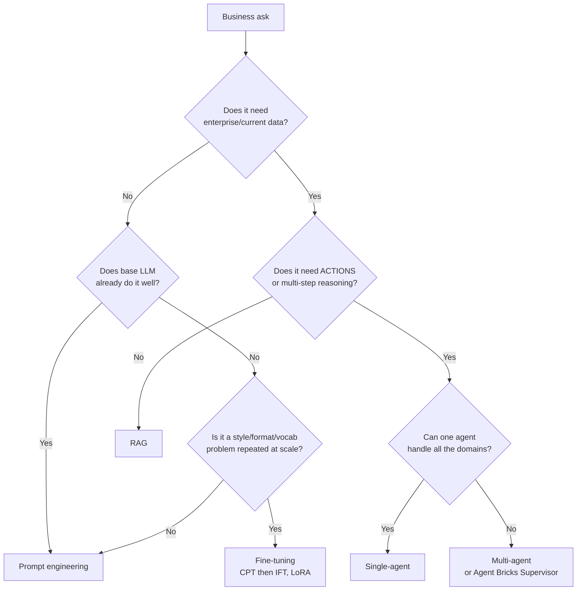
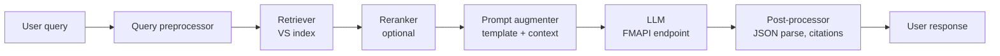
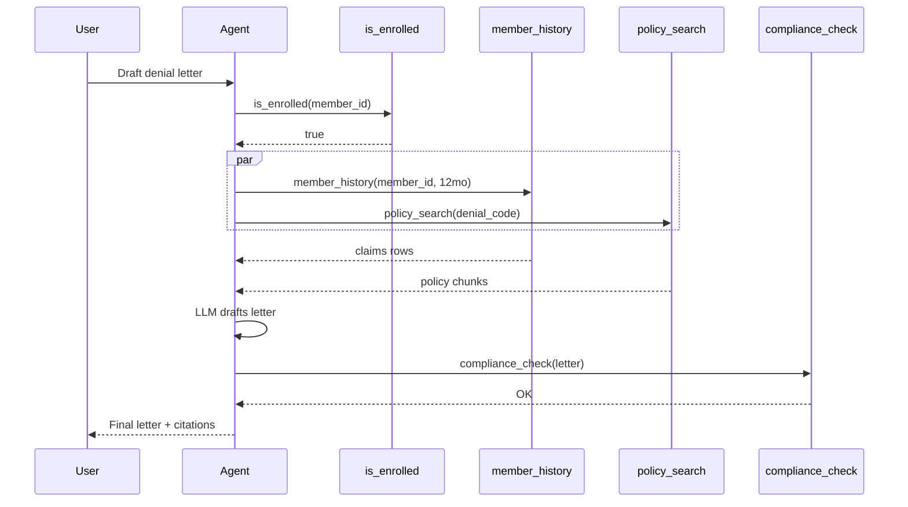
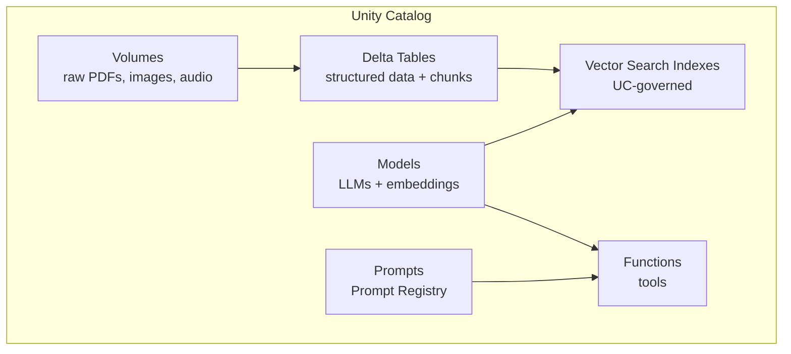

# Module 01 — GenAI Use-Case Design

> **Goal:** Choose the right GenAI pattern for a business ask, decompose the ask into pipeline I/O, and order the right tools for multi-stage reasoning. This is **Section 1, Objectives 1–5** of the exam (14% of the score, but it sets up every other section).
>
> **Assumes:** RAG fundamentals from [Topic 01](../01_rag_vector_db_reranking/). This module is about **picking the pattern**, not implementing it.

---

## Coverage map (verbatim Mar 18, 2026 objectives → section)

| Objective (Section 1) | Section in this module |
|---|---|
| 1. Design a prompt that elicits a specifically formatted response | "Objective 1 — Design prompts that elicit a specifically formatted response" |
| 2. Select model tasks to accomplish a given business requirement | "Objective 2 — Select the model task category" |
| 3. Select chain components for a desired model input and output | "Objective 3 — Select chain components for desired I/O" |
| 4. Translate business use case goals into a description of the desired inputs and outputs for the AI pipeline | "Objective 4 — Translate business case → pipeline I/O" |
| 5. Define and order tools that gather knowledge or take actions for multi-stage reasoning | "Objective 5 — Order tools for multi-stage reasoning" |
| 6. **[NEW Mar 2026]** Determine how and when to use Agent Bricks | "Objective 6 — Agent Bricks: when to pick which variant (NEW Mar 2026)" + [Module 09](09_agent_bricks.md) |

---

## The five patterns you must distinguish

Almost every Section 1 question is asking you to pick **one of these five** for a given business scenario. Memorize the decision rule.

| Pattern | When to pick | What it looks like |
|---------|--------------|--------------------|
| **Prompt engineering** | Task is well-known to a base LLM, single turn, no enterprise data needed | One LLM call with a templated prompt |
| **RAG** | Answer requires up-to-date / enterprise / domain-specific knowledge stored as text | Retrieve → augment prompt → generate |
| **Single-agent (tool-using)** | Task requires *actions* (function calls, SQL queries, API hits) or multi-step reasoning, but a single agent can coordinate | Agent loop: LLM picks tool → tool runs → LLM observes → repeats |
| **Multi-agent** | Task spans multiple domains/personas with different tools, prompts, or grounding | Supervisor agent routes to specialists |
| **Fine-tuning** (CPT/IFT/LoRA) | The base model can't do the *style*, *format*, or *domain vocabulary* even with a good prompt, and the task is high-volume / latency-critical / privacy-constrained | Custom model artifact, deployed as PT endpoint |

> ⚠️ **Exam trap:** People reach for fine-tuning because it sounds advanced. **It's almost always wrong** when the underlying need is "use current data." Dynamic per-record data → feature store / RAG. Sample Q2 was this exact trap.

---

## The decision flowchart



Practice running real scenarios through this flowchart. Examples:

| Scenario | Pattern | Why |
|----------|---------|-----|
| "Generate a one-line product description from a SKU's specs" | Prompt eng | Specs in prompt; no retrieval needed |
| "Answer policy questions from our 20,000-page benefits manual" | RAG | Up-to-date enterprise text |
| "Tell me the delivery date for transaction X" | Feature lookup + agent | Per-record dynamic; **NOT** fine-tuning (sample Q2) |
| "Diagnose a flaky pipeline by checking logs, querying status, and explaining" | Single agent w/ tools | Actions + reasoning |
| "Customer asks: 'why was my claim denied + show me the policy clause'" | Multi-agent (Genie SQL + RAG) | Two domains: structured claim DB + unstructured policy text |
| "Write outputs in the company's brand voice across 10M emails/day" | Fine-tune (LoRA on IFT) | Style problem at scale |

---

## Objective 1 — Design prompts that elicit a specifically formatted response

The exam will hand you a scenario like "Customer wants JSON output with these three fields." You pick the prompt design that yields it reliably.

### Levers, ranked by reliability

1. **Structured output API** (when the model supports it; Llama 3.3 70B and Claude do via Anthropic/Bedrock). Use Pydantic schema → JSON Schema. **Most reliable.**
2. **Function-calling / tool-use format** (some models reliably emit structured args).
3. **Few-shot examples** in the prompt showing exact output.
4. **Explicit format instruction + delimiter** (`Output only valid JSON between <output> and </output>`).
5. **System prompt persona + constraints**.

Format reliability decays as you go down the list. The exam usually rewards #1 / #2 over verbose #4 / #5.

### A concrete template

```python
SYSTEM_PROMPT = """You extract structured fields from medical claim text.
Output **only** a JSON object with these keys:
  - claim_id: string
  - denial_reason: string (one of: "coverage", "preauth", "documentation", "other")
  - appeal_recommended: boolean

Do not include any prose. Do not wrap in markdown."""

USER_PROMPT = """Claim text: {claim_text}"""
```

For maximum reliability on Databricks, pair with **`ai_extract`** when the use case is structured field extraction at batch scale — it returns a typed struct, no JSON parsing.

```sql
SELECT
  claim_id,
  ai_extract(
    claim_text,
    array('claim_id', 'denial_reason', 'appeal_recommended')
  ) AS extracted
FROM bronze.claims;
```

---

## Objective 2 — Select the model task category

The exam phrases this as "Which NLP task category fits this business need?"

| Task category | Recognition signal | Example |
|---------------|-------------------|---------|
| **Summarization** | "TL;DR", "executive summary", "boil down to N sentences" | Sample Q5 answer = Summarization for "5-sentence summary" |
| **Classification** | "label as X/Y/Z", "categorize", "is this spam?" | Triage incoming tickets to a department |
| **Extraction** | "pull out the {fields}", "structured data from text" | Invoice → line items |
| **Translation** | "X to Y language" | EN → JA |
| **Question Answering (extractive or generative)** | "answer the question given context" | Customer support over manuals |
| **Generation** | "write a new X" | Generate product description |
| **Sentence-level embedding / semantic search** | "find similar", "retrieve relevant" | Vector search step inside RAG |

> ⚠️ **Exam trap:** Don't conflate Summarization with Extraction. "Pull the three fields" = Extraction. "Give me a paragraph summary" = Summarization. The task category drives the model choice and the eval metric (ROUGE vs F1 vs exact match).

---

## Objective 3 — Select chain components for desired I/O

The chain is the **ordered pipeline** from user input to final output. Standard RAG chain has 5-7 components:



For an **agent**, swap "retriever" for a tool-calling loop and add a memory/state node.

The exam will hand you a scenario like "User asks question, system needs to cite source docs, output is JSON with quote + URL" and ask you to **pick the components in order**. Memorize this canonical chain.

### Component cheat sheet

| Component | Databricks primitive | Required for |
|-----------|---------------------|--------------|
| Query preprocessor | LangChain `Runnable`, Python | Query rewriting / HyDE / multi-query |
| Retriever | Mosaic AI Vector Search | RAG |
| Reranker | Cross-encoder served as endpoint, or `reranker=` query param | High-quality RAG |
| Prompt augmenter | LangChain `PromptTemplate`, Jinja2 | RAG, agents |
| LLM | FMAPI endpoint (PPT or PT) | Always |
| Post-processor | Pydantic validator, JSON parser | Structured output |
| Memory | Online Table, Delta, Lakebase | Multi-turn agents |
| Guardrail | AI Gateway PII/toxicity, Lakeguard | Production |
| Tools | UC Function (Python/SQL) | Agents only |

---

## Objective 4 — Translate business case → pipeline I/O

This is the **scenario decomposition** skill. Given a 2-paragraph business ask, write down:

1. **Input format** (what does the user send?)
2. **Required enrichment data** (which UC tables, which docs, which APIs?)
3. **Intermediate representations** (what does the retriever return? what does the LLM see?)
4. **Output format** (JSON schema? plain text? voice? structured row in a Delta table?)
5. **Latency budget** (real-time < 1s? batch < 10s? offline overnight?)
6. **Volume** (10 QPS? 10K/day? 10M rows once?)

These six answers dictate every Databricks choice downstream:
- Latency budget < 1s → Mosaic Serving + standard VS endpoint + smaller model.
- Volume "10M rows once" → `ai_query()` batch, not Serving.
- Output is a Delta row → `ai_extract` or `ai_query` in SQL pipeline.
- Memory required → Online Table or Lakebase.

### Worked example

**Ask:** "Our claims agents need a tool that, given a denial code and member history, drafts a defensible denial letter with citations to the policy manual."

| Field | Answer |
|-------|--------|
| Input | `{member_id, claim_id, denial_code}` |
| Enrichment | UC table `claims.bronze.member_history` + Vector Search index `policy.indexes.manual_v1` |
| Intermediate | Top-5 policy chunks (RAG) + last 12 mo of member claims (feature lookup) |
| Output | `{letter_text, cited_clauses: [{clause_id, quote, page}]}` JSON |
| Latency | < 5 s (claims agent waits) |
| Volume | ~ 1 QPS sustained, 5 QPS peak |

→ Standard VS endpoint + Online Table feature lookup + Llama 3.3 70B Instruct PPT + LangChain RAG chain + Pydantic post-processor. **Not** an agent (no actions). **Not** fine-tuned (style is satisfied by prompt).

---

## Objective 5 — Order tools for multi-stage reasoning

When the system **is** an agent, you must order the tools the agent has access to. The exam asks "which sequence of tool calls correctly answers this scenario?"

### Three ordering principles

1. **Cheap gating first.** If a SQL lookup can definitively answer, call it before the expensive LLM-with-RAG. (E.g., "is the customer enrolled?" → `is_enrolled(member_id)` first.)
2. **Validation last.** Run a validator tool (e.g., "policy compliance check") *after* the draft is generated, not before.
3. **Independent tools in parallel** when latency matters. Agent frameworks support parallel tool calls; the exam may ask which calls can run concurrently.

### Mermaid example



> ⚠️ **Exam trap:** Don't call expensive retrievers if a structured tool answers definitively. And don't put the validator *before* generation.

---

## Objective 6 — Agent Bricks: when to pick which variant (NEW Mar 2026)

Covered in depth in [Module 09](09_agent_bricks.md). Two-line summary for the design decision:

| Variant | One-liner |
|---------|-----------|
| **Knowledge Assistant** | "RAG-as-a-service over enterprise docs" |
| **Information Extraction** | "Unstructured doc → typed fields, auto-tuned" |
| **Multi-Agent Supervisor** | "Routes across multiple agents + Genie + MCP" |

**Pick Agent Bricks** if the prompt says *minimize maintenance, auto-optimize, domain-specific quality without manual tuning*.
**Pick Agent Framework** if the prompt says *custom chain, fine-grained control, specific orchestration framework, pyfunc with pre/post processing*.

---

## Lakehouse data assets for GenAI

GenAI applications on Databricks consume **five kinds of assets**, all governed by Unity Catalog:



| Asset | Purpose | Typical path |
|-------|---------|--------------|
| **Volumes** | Raw unstructured files | `/Volumes/cat/schema/vol/file.pdf` |
| **Delta Tables** | Structured features, chunked text | `cat.schema.table` |
| **Vector Search Indexes** | ANN + BM25 over chunks | `cat.schema.index` |
| **Models** | LLMs, embeddings, agents | `cat.schema.model` |
| **Functions** | Agent tools (Python/SQL UDF) | `cat.schema.function_name()` |
| **Prompts** | Versioned prompts with aliases | `cat.schema.prompt_name@production` |

> ⚠️ **Exam trap:** All six asset types live in the same UC three-level namespace. Some test questions ask "where is the prompt registered?" — answer is **Unity Catalog**, not git, not Delta, not the MLflow tracking server alone.

---

## Mini quiz

1. A user asks the system "what was my last cardiology visit's prescribed dosage?" The data lives in `clinical.silver.member_prescriptions`. Should you fine-tune, RAG, or feature-lookup-via-agent? Why?
2. Sample Q5 had a scenario "Customer wants a 5-sentence executive summary of a 20-page research paper." Which NLP task category?
3. You're told "Maximize ranking quality of retrieved chunks before the LLM sees them." Which two components do you add to a basic RAG chain?
4. The agent must run `validate_eligibility` and `fetch_history` independently before the LLM drafts. What sequencing matters? Which calls can be parallel?
5. The business says "must auto-optimize the agent's cost/quality, no team to maintain." Agent Framework or Agent Bricks?

### Answers

1. **Feature lookup via agent**, not RAG, not fine-tuning. The data is structured per-record. Build an Online Table on `member_prescriptions` keyed on `member_id`, expose as a UC function tool, agent calls it.
2. **Summarization.** Recognition signal: "executive summary" + length constraint.
3. **Reranker** (cross-encoder) and **hybrid search** (BM25 + ANN). Both lift retrieval quality.
4. The two tool calls have no data dependency on each other and can run in parallel. The LLM step is sequential after both complete. Validation (if needed) comes after the draft.
5. **Agent Bricks** — "auto-optimize, no maintenance" is the exam's hint phrase.

---

## Exam-trap recap

> ⚠️ Fine-tuning when the real need is *current data*. Almost always wrong.
> ⚠️ Picking Summarization when the ask is Extraction. Read the output schema, not the verbs.
> ⚠️ Running expensive retrieval before a cheap deterministic SQL/feature lookup could short-circuit.
> ⚠️ Putting Validator before Generator.
> ⚠️ Picking Agent Framework when the prompt says "auto-optimize / minimize maintenance" — that's Agent Bricks.

---

## Worked exam-question walkthroughs

### Walkthrough 1 — "Customer wants delivery date per transaction" (Sample Q2)

**Pattern:** Scenario describes per-record dynamic data (`transaction_id` → `expected_delivery_date` that updates daily). Options typically include: (A) fine-tune the LLM on transaction history, (B) feature store keyed on `transaction_id`, (C) RAG over transaction PDFs, (D) embed the catalog.

**Reasoning chain:**
1. Data is **structured** (rows in a table), not unstructured text → eliminate RAG (C).
2. Data **changes per record per day** → eliminate fine-tuning (A); training pipelines can't keep pace.
3. Embedding the whole catalog (D) wastes compute and still doesn't update per record.
4. Feature store keyed on `transaction_id` (B) — exact-key lookup, refreshes on each ETL — is the only pattern that satisfies "fresh per-record."

> 🎯 **How to recognize on the exam:** Words like "per-customer", "per-transaction", "delivery date", "balance", "status" + "current" or "latest" → **feature lookup** (Online Table + UC function tool), never fine-tuning.

**Answer:** B. **Distractor trap:** Fine-tuning sounds advanced; reject it whenever the underlying need is "current data per record."

### Walkthrough 2 — "5-sentence executive summary" (Sample Q5)

**Pattern:** Business ask is "boil down a 20-page paper into 5 sentences." Options usually offer all six NLP task categories.

**Reasoning chain:**
1. Output is fewer tokens than input — eliminate Generation, Translation.
2. No label set given → eliminate Classification.
3. No structured fields requested → eliminate Extraction.
4. Question isn't given → eliminate Question Answering.
5. **Summarization** is the textbook fit for "condense N tokens into M < N tokens of free-form text."

> 🎯 **How to recognize on the exam:** Verbs "TL;DR / boil down / executive summary / digest" → **Summarization**. Output length constraint with no label set is the giveaway.

**Answer:** Summarization. **Distractor trap:** "Generation" overlaps semantically but is for *new* text, not condensed source text.

### Walkthrough 3 — "Multi-stage tool order with parallel-safe calls"

**Pattern:** Agent must call `is_enrolled(member_id)` → `member_history(member_id, 12mo)` + `policy_search(denial_code)` → LLM draft → `compliance_check`. The exam asks for the right ordering or which calls can run in parallel.

**Reasoning chain:**
1. **Cheap gating first** — `is_enrolled` returns boolean; if false, every downstream tool is wasted. Run first, sequentially.
2. **Independent tools in parallel** — `member_history` (DB lookup keyed on member_id) and `policy_search` (RAG keyed on denial_code) share no inputs and don't update shared state. Run in parallel.
3. **Validator last** — `compliance_check` evaluates the *generated* letter. Must run after the LLM step.

> 🎯 **How to recognize on the exam:** "Which calls can run concurrently?" → look for tools that have no data dependency on each other's outputs. "Which order minimizes wasted work?" → gating tools (boolean / deterministic) before expensive tools (RAG, LLM).

**Answer:** `is_enrolled` → parallel(`member_history`, `policy_search`) → LLM draft → `compliance_check`.

### Walkthrough 4 — "Minimize maintenance / auto-optimize" — Agent Bricks vs Framework

**Pattern:** Two near-identical scenario descriptions — one says "team wants to focus on the data, not maintain prompts/chains" (auto-optimize wording), the other says "regulated agent with custom validation logic and SLA on every step."

**Reasoning chain:**
1. Scenario A keywords: "minimize maintenance", "auto-tune", "no team", "domain quality without manual tuning" → **Agent Bricks**.
2. Scenario B keywords: "regulated", "custom validation", "per-step audit", "specific chain", "pre/post processing" → **Agent Framework** (raw LangChain/LangGraph + `mlflow.pyfunc`).

> 🎯 **How to recognize on the exam:** The decision is verbal-trigger driven. Memorize the trigger-phrase tables in [Module 09](09_agent_bricks.md#decision-rule-agent-bricks-vs-agent-framework).

### Walkthrough 5 — "Aggregational query over claims" (Genie vs RAG)

**Pattern:** "How many claims were denied last week by denial reason?" Options: pure RAG, multi-query RAG, Genie Space, fine-tune.

**Reasoning chain:**
1. Output is a **count grouped by category** — RAG retrieves text chunks; it cannot reliably aggregate numbers.
2. Multi-query RAG just retrieves more text; same fundamental limitation.
3. Fine-tuning bakes in static data; aggregations of "last week" are dynamic.
4. **Genie Space** lets the agent translate NL → SQL → run on the warehouse → return rows. The only option that aggregates correctly.

> 🎯 **How to recognize on the exam:** Verbs "how many / sum / total / average / count by" + structured data → **Genie Space** (or a SQL UDF tool), never RAG.

---

## Output-prediction drills

### Drill 1 — Which pattern?

> "Translate the answer above into Spanish."

The output is a transformed version of a known input. Which NLP task category?

**Answer:** Translation. Don't be fooled by "answer above" — there's no retrieval or new generation; it's straight cross-lingual transform.

### Drill 2 — Order of tool calls

Given tools `verify_identity(token)` (boolean, 10ms), `fetch_account(token)` (~50ms), `search_policy(question)` (~300ms), `risk_score(account)` (50ms), what's the cost-optimal order for a customer support agent answering an account-policy question after identity check?

**Answer:**
1. `verify_identity` (gates everything; cheapest)
2. parallel(`fetch_account`, `search_policy`) — no shared inputs
3. `risk_score(account)` — depends on `fetch_account` output
4. LLM draft answer with account + policy + risk
Total wall-clock ≈ 10 + max(50, 300) + 50 + LLM ≈ ~360ms + LLM.

### Drill 3 — Pattern triage

> "Generate a personalized product recommendation for a returning user based on browsing history."

User-specific dynamic data + LLM generation. What pattern?

**Answer:** **Single agent with feature-store lookup + RAG**. Feature lookup pulls browse history (Online Table keyed on user_id); RAG over product catalog provides candidate items; LLM personalizes wording. **NOT** fine-tuning (per-user state changes daily). **NOT** pure RAG (you need user history, not just generic text). **NOT** pure feature lookup (still need natural-language generation).

### Drill 4 — Read the output schema

The downstream system expects:
```json
{"member_id": "M001", "summary": "...", "claims": [{"id": "...", "amount": 0.0}]}
```

What NLP task **categories** are involved, and what Databricks SQL function might cover this in one call?

**Answer:** Summarization (for `summary`) + Extraction (for `claims` array per item). Single-call SQL primitive: **`ai_extract`** (schema-aware extraction) for the structured fields; for summary either a second `ai_query` or an extended `ai_extract` schema including a `summary` field.

### Drill 5 — Multi-agent triggers

Scenario lists query mix:
- "What's my deductible?" → text from policy manual
- "Show my last 5 claims" → tabular DB
- "Was my claim denied?" → joins both
- "File an appeal for claim 123" → action (write)

Which Bricks variant or which Framework pattern?

**Answer:** **Multi-Agent Supervisor (Agent Bricks)** routes across a Knowledge Assistant (policy), a Genie Space (claims DB), and a custom action tool (`file_appeal` UC function). Single chat surface, routed by intent. If "regulated, custom audit per action" is added → **Agent Framework supervisor (LangGraph)** instead.

---

## End-to-end mini-scenario — decompose a real business ask

**Ask:** "Our member-services team handles 5K calls/day. Reps spend 4 min searching policy docs and claim history. Build a system that, given a member ID and the question, drafts a defensible policy-cited answer in < 3 seconds, with audit trail."

**Pipeline I/O decomposition (Obj 4):**

| Field | Decision |
|-------|----------|
| Input | `{member_id, question_text, rep_id}` |
| Enrichment | Member profile (Online Table on `member_id`), recent claims (UC function), policy chunks (VS index `cat.indexes.policy_v1`) |
| Intermediate | Top-5 policy chunks (hybrid + rerank), 12-mo claims rows, plan tier from profile |
| Output | `{answer_md, citations: [{source, page, quote}], confidence}` |
| Latency budget | < 3 s p95 (rep wait) → SOR for FMAPI PT + standard VS endpoint + 7B-class chunked LLM |
| Volume | ~5 QPS sustained, 30 QPS burst → PT sizing exercise |
| Compliance | HIPAA → PT model, BAA, UC PHI catalog, Inference Tables ON for audit |

**Pattern picks (Obj 1–6):**
- **Pattern:** Single agent (RAG + 2 tools), NOT Bricks (regulated audit) → Agent Framework with `ChatAgent`.
- **Task type** (Obj 2): Generative QA with extraction (citations field).
- **Chain order** (Obj 3): `verify_member_in_session` → parallel(`get_recent_claims`, `policy_rag_retrieve`) → augment prompt → LLM → Pydantic post-process → compliance check.
- **Prompt** (Obj 1): JSON schema + few-shot + "cite every claim" rule.
- **Tool order** (Obj 5): gate (verify) → parallel data calls → LLM → validator.
- **Bricks vs Framework** (Obj 6): regulated + audit + custom validator → **Framework**.

This is the spec a designer hands to engineering before any code is written. Modules 02–15 implement each row.
