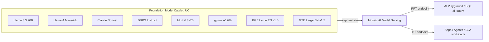

# Module 02 — Model Selection on Databricks

> **Goal:** Pick the right foundation model (or embedding model) for a given task, choose between Pay-per-token (PPT) and Provisioned Throughput (PT), and read model metadata / model cards critically. Covers **Sec 1 Obj 2**, **Sec 3 Obj 7–10**, **Sec 4 Obj 7**, and **Sec 6 Obj 1**.

---

## Coverage map (verbatim Mar 18, 2026 objectives → section)

| Objective | Section in this module |
|---|---|
| Sec 1 Obj 2 — Select model tasks to accomplish a given business requirement | "Picking by evaluation metrics" + "Picking an LLM — the 7 attributes" |
| Sec 3 Obj 7 — Select the best LLM based on the attributes of the application | "Picking an LLM — the 7 attributes" + "The decision rules" |
| Sec 3 Obj 8 — Select an embedding model context length | "Embedding model selection" + "Match chunk size to context length" |
| Sec 3 Obj 9 — Select from model hub/marketplace based on metadata/model cards | "Reading model cards" |
| Sec 3 Obj 10 — Select the best model based on common metrics generated in experiments | "Picking by evaluation metrics" |
| Sec 4 Obj 7 — Identify how to serve an LLM application leveraging Foundation Model APIs | "Foundation Model APIs — the two billing modes" + "FMAPI task types & served_entities shapes" |
| Sec 6 Obj 1 — Select an LLM choice (size and architecture) based on a set of quantitative evaluation metrics | "Picking by evaluation metrics" |

---

## Foundation Model APIs — the two billing modes

Every served LLM on Databricks runs as a **Model Serving** endpoint backed by one of two billing modes:

| Mode | When | Pricing | Compliance | Fine-tuned models |
|------|------|---------|------------|--------------------|
| **Pay-per-token (PPT)** | Prototyping, low/spiky traffic, AI Playground exploration, dev | Per token, no commitment | Standard | ❌ No |
| **Provisioned Throughput (PT)** | Production, performance guarantees, fine-tuned models | Hourly per PT unit, per-minute billing | **HIPAA**, FedRAMP, etc. | ✅ Yes |

> ⚠️ **Exam trap:** Fine-tuned models deploy **only** as PT, never PPT. If a scenario says "we fine-tuned a model", any answer mentioning PPT is wrong.

### Sizing PT capacity

PT capacity is measured in **PT units**, where 1 PT unit ≈ a fixed input+output token rate (model-specific). Use the **GenAI Calculator** in the Databricks workspace; provide:
- Concurrent users / QPS
- Average input tokens
- Average output tokens
- Peak/burst factor

Output: PT units needed and hourly cost.

> ⚠️ **Exam trap:** Input/output token mix dramatically affects PT sizing. A summarization workload (long input, short output) vs a generation workload (short input, long output) need different PT counts at the same QPS. Don't pick the answer that ignores token mix.

### Where each lives



---

## The model retirement lifecycle

Models in FMAPI follow a lifecycle:

1. **Preview** — limited region, no SLA.
2. **GA** — full SLA on supported regions.
3. **Deprecation announced** — Databricks announces a retirement date.
4. **PPT retirement** — typically earlier (e.g., Feb 15, 2026 for some 2024-era models).
5. **PT retirement** — typically later (e.g., May 15, 2026 for the same family).

> ⚠️ **Exam trap:** A retired model raises `MODEL_NOT_AVAILABLE` at inference time — your serving endpoint stops working. **Always re-check the retirement page before pinning a base model in production.** Pin model versions in code via `served_models[*].name` referencing a specific UC model version, not "latest."

The exam likely won't ask the **exact retirement date** of a specific model, but it may ask "which Databricks page tracks model lifecycle" (answer: the FMAPI docs retirement section, or the deprecated models doc).

---

## Picking an LLM — the 7 attributes

Section 3 Obj 7 asks you to "select the best LLM based on the attributes of the application." Seven attributes drive the choice:

| Attribute | Lever |
|-----------|-------|
| **Task type** | Summarize / classify / extract / generate / reason / code |
| **Context window required** | 4K / 32K / 128K / 1M (Llama 4) |
| **Latency budget** | TTFT + TPOT. Small models = fast. |
| **Cost ceiling** | $ per million tokens (PPT) or $ per hour (PT) |
| **Compliance** | HIPAA / FedRAMP / region residency |
| **Multimodal** | Text only? Image? Audio? Llama 4 Maverick supports images. |
| **Tool-calling reliability** | Some models do tool calling far more reliably (Claude > Llama generally) |

### The decision rules

| Scenario | Pick |
|----------|------|
| Fast PPT prototyping, simple summarization | **Llama 3.3 70B Instruct** (default workhorse) |
| Long context (> 32K tokens, e.g., whole-document Q&A) | **Llama 4** or **Claude Sonnet** |
| Tool-calling agent | **Claude Sonnet** or **Llama 3.3 70B** |
| Image + text reasoning | **Llama 4 Maverick** (multimodal) |
| Lowest-cost classification at scale | **Llama 3.1 8B Instruct** or smaller fine-tuned model |
| HIPAA production | Any model on **PT** (PPT generally not in HIPAA scope at announce) |
| Open-source self-hosted comparison | DBRX / Mixtral / GPT OSS via PT |

### Common gotcha questions

> ⚠️ "We need to summarize 80-page legal docs" → pick a long-context model (Llama 4 or Claude), NOT Llama 3.3 70B alone. The 70B base has 128K context but quality drops in the later half — most teams reduce input by chunking + map-reduce summarization.

> ⚠️ "We need image understanding" → multimodal model. The exam may list models without indicating modality; learn that **Llama 4 Maverick** is the in-catalog multimodal default.

---

## Embedding model selection (Sec 3 Obj 8)

The embedding model has three dimensions of choice:

| Knob | Lever |
|------|-------|
| **Context length** | Match to your maximum chunk size — no waste, no truncation |
| **Embedding dim** | 384 / 768 / 1024 / 1536. Higher dim = richer + more storage + slower search |
| **Quality vs cost** | Bigger models = better recall on hard queries, more compute |

### Decision table

| Constraint | Pick |
|-----------|------|
| Cost/latency > quality, 512-token chunks | **Small model: ctx 512, dim 384, ~0.13 GB** (sample Q4 answer A) |
| Quality dominates, mixed-length chunks | **BGE Large EN v1.5** (ctx 512, dim 1024) or **GTE Large** |
| Multilingual corpus | `multilingual-e5-large` or BGE-M3 |
| Long documents without chunking | Specialized long-ctx embedders (uncommon on FMAPI) |
| Cross-encoder reranking step | Separate model — see Module 04 |

> ⚠️ **Exam trap from Sample Q4:** When the question explicitly says cost/latency matters more than quality, **pick the smallest reasonable model** that still matches your chunk size. Don't reflexively reach for BGE Large.

### Match chunk size to context length

```
Chunk size 256 tokens → context length 384–512 model (a little headroom)
Chunk size 512 tokens → context length 512 model
Chunk size 1024 tokens → context length 1024 model (or chunk smaller)
```

Putting a 1024-token chunk into a 512-context embedder **truncates silently** — half your information is lost and you never see an error. This is one of the highest-impact mistakes.

---

## Reading model cards (Sec 3 Obj 9)

The exam may give you a **model card excerpt** and ask "is this model suitable for use case X?" Five things to look for:

1. **Training data cutoff** — does it know about events after your data?
2. **License** — MIT / Apache-2 / Llama Community License / custom.
3. **Intended use + out-of-scope use** — explicitly stated.
4. **Benchmarks** — what tasks was it eval'd on?
5. **Known biases / limitations** — language coverage, factuality scores.

### License gotchas (also Sec 5 Obj 3)

| License | Restriction |
|---------|-------------|
| **MIT / Apache-2** | Maximally permissive |
| **Llama Community License** | OK for most commercial uses; restriction triggers at 700M+ MAU |
| **CC-BY-NC** | **Non-commercial only** — cannot use for paid product features |
| **Custom enterprise (e.g., Claude via Anthropic)** | Subject to provider terms |
| **Research-only / OpenRAIL** | Usage restrictions on harm categories |

> ⚠️ **Exam trap:** A model marked "research-only" or "CC-BY-NC" cannot legally power a paid SaaS feature. The right exam answer is *use a different model*, not *use this one with a disclaimer*.

---

## Multimodal options (NEW emphasis 2026)

| Modality combo | In-catalog option | Use case |
|---------------|-------------------|----------|
| Text only | All FMAPI models | Default |
| Text + Image input | **Llama 4 Maverick / Scout** | Insurance claim photos, medical images, screenshots |
| Text + Audio input | External (OpenAI Whisper via partner endpoint) | Voice assistants — usually preprocess to text first |
| Text → Image output | External (Stable Diffusion, DALL-E via partner) | Product imagery — rare on FMAPI |
| OCR + Layout | `ai_parse_document` | PDFs with tables, forms, scanned docs |

> ⚠️ **Exam trap:** If a scenario shows "PDF with tables and figures, extract structured rows," the right answer is often **`ai_parse_document`** (which preserves spatial metadata), not a generic multimodal LLM.

---

## Picking by evaluation metrics (Sec 3 Obj 10, Sec 6 Obj 1)

Once you have candidate models, **how do you pick**? You eval on your own data with the right metrics.

| Task | Primary metric | Secondary |
|------|---------------|-----------|
| Summarization | ROUGE-L (with reference), `relevance` judge (no reference) | Length adherence, factuality |
| Classification | Accuracy, F1, macro-F1 | Confusion matrix per class |
| Extraction | Field-level F1, JSON validity | Per-field precision/recall |
| QA / RAG | `groundedness`, `relevance`, exact match (if extractive) | `chunk_relevance`, `retrieval_relevance` |
| Code generation | pass@k (unit-test execution), BLEU as weak baseline | Static-analysis hits |
| Translation | BLEU, chrF, COMET | Domain glossary adherence |

Run via `mlflow.genai.evaluate(data=eval_df, scorers=[judges])` — see [Module 14](14_genai_evaluation.md).

> ⚠️ **Exam trap:** Picking a model on a public benchmark (MMLU, HellaSwag) rather than on **your task data**. The right answer is always "evaluate candidates on a representative golden set of your data."

---

## Provisioned Throughput sizing — worked example

**Scenario:** Customer-facing chat agent. Concurrent peak 50 QPS. Avg input 800 tokens, avg output 200 tokens. SLA: p95 < 2s.

```
Total tokens/sec at peak = 50 × (800 + 200) = 50,000 tokens/sec
```

A PT unit on Llama 3.3 70B handles roughly 1,000–2,000 tokens/sec (varies by region and exact config; GenAI Calculator gives the exact number).

```
Required PT units ≈ 50,000 / 1,500 ≈ 34 PT units
```

At ~$X per PT-hour, hourly cost is `34 × X`. Compare to PPT estimate at 50 QPS sustained → PPT is usually cheaper at low QPS, **PT wins above some break-even** (around 10–20 QPS sustained, very rough).

> ⚠️ **Exam trap:** The break-even *exists* but exact crossover depends on model + region. The exam tests *that you reason about it*, not exact $ numbers.

---

## FMAPI task types & `served_entities` shapes (look-alike table)

When you create or call an FMAPI / served endpoint, the **`task`** field disambiguates what kind of API surface the endpoint speaks. The exam tests these because the wrong task → wrong client call signature.

| `task` string | Endpoint shape | Client call | Example UC model / FMAPI base |
|---|---|---|---|
| `llm/v1/chat` | OpenAI ChatCompletion (messages array, choices) | `serving_endpoints.query(messages=[...])` | `databricks-llama-3-3-70b-instruct`, Claude via external |
| `llm/v1/completions` | Plain prompt → completion (legacy) | `serving_endpoints.query(prompt="...")` | Older base models, fine-tuned IFT models |
| `llm/v1/embeddings` | Text → vector | `serving_endpoints.query(input=[...])` returns `data[i].embedding` | `databricks-bge-large-en`, `databricks-gte-large-en` |
| `agent/v1/chat` / `agent/v2/chat` | Agent endpoint, accepts `ChatAgent` schema | `serving_endpoints.query(messages=..., custom_inputs=...)` | Custom agents from Agent Framework |
| `agent/v1/responses` | `ResponsesAgent` schema | richer items array (tool_call, tool_result, text) | Custom agents using ResponsesAgent |

### Four families of served entity — pick the right `served_entities[*]` shape

| Family | When | `served_entities[*]` field set | Billing |
|---|---|---|---|
| **FMAPI Pay-per-token** | Use a Databricks-hosted base model directly | (none — query by endpoint name like `databricks-llama-3-3-70b-instruct`; you do NOT create the endpoint) | Per token |
| **FMAPI Provisioned Throughput** | Production base model or fine-tuned model | `entity_name="system.ai.llama-3-3-70b-instruct"` + `entity_version` + `min_provisioned_throughput`/`max_provisioned_throughput` | PT-unit hours |
| **Custom UC model** | Your `pyfunc` / LangChain / agent | `entity_name="cat.schema.my_agent"` + `entity_version="3"` + `workload_size` + `scale_to_zero_enabled` | DBU hours |
| **External model** | Anthropic, OpenAI, Bedrock, Cohere via gateway | `external_model={"name": ..., "provider": ..., "task": "llm/v1/chat", "<provider>_config": {"api_key": "{{secrets/...}}"}}` | Per-call passthrough |

> ⚠️ **Exam trap:** Pay-per-token base models are pre-served. You **query** them by their well-known endpoint name; you do not create them with `serving_endpoints.create()`. Custom models and PT base models you *do* create.

> 🎯 **How to recognize on the exam:** If the option includes `serving_endpoints.create(name="databricks-llama-3-3-70b-instruct", ...)` — that's wrong; FMAPI base PPT endpoints already exist.

---

## When to use a hosted partner model (Anthropic / OpenAI)

Databricks supports **external model endpoints** registered to UC. The endpoint forwards to Anthropic, OpenAI, Azure OpenAI, AWS Bedrock, etc.

| When to use external | When NOT to use |
|---------------------|-----------------|
| You need a model unavailable on FMAPI (Claude Opus, GPT-4o) | Data residency requires in-region (use FMAPI) |
| Your team has an existing API key & quota | HIPAA workload not BAA-covered by partner |
| You want quick fallback for SLA | Cost optimization (FMAPI usually cheaper at scale) |

External endpoints **still pass through AI Gateway** for governance — Inference Tables, rate limiting, PII guardrails work. This is testable.

---

## Mini quiz

1. A workload needs HIPAA compliance and fine-tuning. Which billing mode? Why is the other ruled out?
2. Your chunks are 512 tokens. Sample Q4 said the right embedding has context 512, dim 384, size 0.13GB **because cost/latency dominate**. What would you pick if quality dominated?
3. The team says "we need a model that can answer questions over 80-page legal contracts." Pick from Llama 3.1 8B / Llama 3.3 70B / Llama 4 Maverick.
4. The license on a candidate model is CC-BY-NC. Your product is a paid SaaS feature. What do you do?
5. A scenario shows a fine-tuned model on PPT. What's wrong?

### Answers

1. **Provisioned Throughput.** PPT does not host fine-tuned models, and HIPAA scope generally requires PT.
2. **BGE Large EN v1.5** (or GTE Large) — dim 1024, context 512, better recall.
3. **Llama 4 Maverick** (long-context, current) or as a fallback **Llama 3.3 70B** with map-reduce chunking. Llama 3.1 8B is undersized.
4. **Pick a different model** with a permissive license (Apache-2 / MIT / Llama Community License under the MAU threshold). CC-BY-NC blocks commercial use.
5. Fine-tuned models deploy **only** as Provisioned Throughput. This combination is impossible — the answer is wrong as stated.

---

## Exam-trap recap

> ⚠️ Fine-tuned + PPT — impossible.
> ⚠️ Ignoring input/output token mix when sizing PT.
> ⚠️ Mismatching chunk size and embedding context length (truncates silently).
> ⚠️ Picking BGE Large when cost/latency dominate (sample Q4).
> ⚠️ Picking on MMLU instead of on your task data.
> ⚠️ Using CC-BY-NC in a paid product.
> ⚠️ Pinning "latest" on a model that's near deprecation.

---

## Worked exam-question walkthroughs

### Walkthrough 1 — Embedding model selection under cost pressure (Sample Q4)

**Pattern:** "Cost and latency are more important than retrieval quality. Chunks are 512 tokens." Options A–D each show (context_length, dim, size_gb).
- A: ctx 512, dim 384, 0.13 GB
- B: ctx 8192, dim 1024, 1.34 GB
- C: ctx 512, dim 1024, 0.40 GB
- D: ctx 4096, dim 4096, 5.0 GB

**Reasoning chain:**
1. Chunk size 512 → minimum context length is 512. A, C qualify; B and D have headroom but at storage cost.
2. "Cost / latency > quality" → minimize dim (storage + ANN compute scale with dim).
3. dim 384 (A) < dim 1024 (C) < dim 4096 (D).
4. (A) is the **smallest model that fits chunk size with no truncation**. C wastes storage; B and D waste both storage and compute.

> 🎯 **How to recognize on the exam:** "cost/latency > quality" phrasing → smallest dim that fits chunk size. The biggest model is almost never right when the question explicitly downgrades quality.

**Answer:** A. **Distractor traps:** C looks plausible (same context length, same family) but doubles storage with no benefit when quality is deprioritized; B and D add context length you don't need.

### Walkthrough 2 — Fine-tuned model deployment

**Pattern:** "Team fine-tuned Llama 3.3 70B on policy data. Choose deployment mode."
- A: pay-per-token endpoint
- B: provisioned throughput endpoint
- C: AI Playground
- D: external endpoint

**Reasoning chain:**
1. Fine-tuned models cannot serve via PPT (only FMAPI base catalog).
2. AI Playground is a UI surface for PPT models — also blocked.
3. External endpoint is for third-party APIs (Anthropic/OpenAI), not your fine-tuned Llama.
4. **Provisioned Throughput** is the only path that supports fine-tuned UC models.

> 🎯 **How to recognize on the exam:** "fine-tuned" + serving mode → always **PT**. Any answer with PPT/Playground is wrong.

**Answer:** B.

### Walkthrough 3 — Long-context document Q&A

**Pattern:** Scenario describes Q&A over 80-page legal contracts (≈ 80K tokens per doc), real-time chat.
- A: Llama 3.1 8B (8K ctx)
- B: Llama 3.3 70B (128K ctx)
- C: Llama 4 Maverick (1M ctx, multimodal)
- D: BGE Large (embedding model)

**Reasoning chain:**
1. D is an embedding model, not a chat LLM. Eliminate.
2. A's context (8K) << 80K needed. Eliminate.
3. B fits 80K nominally but quality drops in later half.
4. C (Llama 4) has 1M context with reliable retention.

> 🎯 **How to recognize on the exam:** "long-context", "X-page document", "no chunking" → Llama 4 / Claude Sonnet. 8B-class models are usually wrong for this.

**Answer:** C. **Distractor trap:** B has the context window on paper but degraded quality past 64K.

### Walkthrough 4 — License gating

**Pattern:** Team wants to use a model labeled "CC-BY-NC 4.0" in a paid SaaS product.
- A: Use it, add an attribution footer.
- B: Use it, add a disclaimer.
- C: Pick a different model with Apache-2 / MIT / Llama Community License.
- D: Use it for internal-only deployment only.

**Reasoning chain:**
1. CC-BY-NC = **non-commercial**; a paid SaaS is commercial.
2. Attribution / disclaimer / "internal" don't transform commercial use into non-commercial — your business model is still paid.

> 🎯 **How to recognize on the exam:** "CC-BY-NC" + "paid / commercial / SaaS / revenue" → always **switch models**. Never argue the disclaimer.

**Answer:** C.

### Walkthrough 5 — Choose model by quantitative eval (Sec 6 Obj 1)

**Pattern:** Three models eval'd on golden set; results:
- Llama 8B: composite 0.79, $0.50 per 1K
- Llama 70B: composite 0.91, $5.00 per 1K
- Claude Sonnet: composite 0.92, $15.00 per 1K
- Quality bar: composite ≥ 0.85.

**Reasoning chain:**
1. 8B fails the bar (0.79 < 0.85). Eliminate.
2. Both 70B and Claude clear the bar.
3. **Smallest that clears bar** wins on cost. 70B at $5 << Claude at $15.

> 🎯 **How to recognize on the exam:** "select model size based on quantitative metrics" → pick the cheapest option that clears the quality threshold. Never default to the biggest "to be safe."

**Answer:** Llama 70B.

---

## Output-prediction drills

### Drill 1 — What does this return?

```python
w.serving_endpoints.query(
    name="databricks-bge-large-en",
    input=["claim denied for preauth"],
)
```

What's the shape of the response, and what would you do with it?

**Answer:** Returns `{"data": [{"embedding": [0.013, -0.27, ...], "index": 0}], "model": "...", "usage": {...}}`. A single 1024-dim vector. Use for ad-hoc query embedding (rare — Vector Search embeds server-side via `embedding_source_column`). The `task` shape is `llm/v1/embeddings`.

### Drill 2 — Predict the failure

```python
w.serving_endpoints.create(
    name="my-llama-ppt",
    config=EndpointCoreConfigInput(served_entities=[
        ServedEntityInput(
            entity_name="databricks-llama-3-3-70b-instruct",
            entity_version="1",
        )
    ])
)
```

Will this work?

**Answer:** **No.** The FMAPI PPT base models are pre-served by Databricks; you don't create them. The endpoint `databricks-llama-3-3-70b-instruct` already exists at workspace scope. Either query it directly, or create a **PT** endpoint pointing at the `system.ai.*` registered model.

### Drill 3 — PT sizing

Workload: 30 sustained QPS, avg 400 input + 100 output tokens. Llama 70B PT unit ≈ 1500 tokens/sec. Estimate PT units.

**Answer:** `30 × (400 + 100) = 15,000 tokens/s ÷ 1500 ≈ 10 PT units` baseline. Add headroom for bursts; round up to 12–15.

### Drill 4 — Chunk-size / context-length mismatch

You chunk at 1024 tokens; your embedding model has context length 512. Silent truncation will happen on **which half** of each chunk?

**Answer:** The **last 512 tokens** are dropped (most embedders truncate from the tail). Symptom: retrieval misses concepts that appear late in a chunk. Fix: reduce chunk to 512 or switch to a context-length-1024 (or 8192) embedder like `databricks-gte-large-en`.

### Drill 5 — External model config syntax

```python
ExternalModel(
    name="claude-3-5-sonnet-20241022",
    provider="anthropic",
    task="llm/v1/chat",
    anthropic_config={"anthropic_api_key": "sk-ant-..."},
)
```

What's the security flaw, and how do you fix it?

**Answer:** **API key inlined.** Fix: store in a Databricks Secret scope and use `"{{secrets/anthropic_scope/anthropic_api_key}}"`. The platform resolves the reference at runtime; nothing sensitive in code or logs.

---

## End-to-end mini-scenario — pick the model + serving mode for a regulated chat

**Ask:** "HIPAA-scoped patient-portal chat. ~5 sustained QPS, ~30 burst. Member's policy questions over 200-page benefits handbooks (chunked). Cite sources. Cost-sensitive."

**Pick reasoning:**

| Constraint | Selection |
|---|---|
| HIPAA scope | **Provisioned Throughput** (not PPT) |
| Cost-sensitive at 5 QPS | Smaller PT footprint, scale_to_zero=False for SLA |
| Citations + multi-step | LLM with tool-calling reliability — **Llama 3.3 70B Instruct** PT |
| 200-page handbook chunked | Chunk to 512 tokens → embedding model context ≥ 512 |
| Quality > cost on embed | `databricks-bge-large-en` (ctx 512, dim 1024) over GTE Small |
| Citations / structured output | LLM supports JSON schema; use Pydantic post-validator |
| Audit | AI Gateway Inference Tables ON |

```python
# Serving config
from databricks.sdk.service.serving import EndpointCoreConfigInput, ServedEntityInput

w.serving_endpoints.create(
    name="patient-portal-llm-pt",
    config=EndpointCoreConfigInput(
        served_entities=[ServedEntityInput(
            entity_name="system.ai.llama-3-3-70b-instruct",
            entity_version="1",
            min_provisioned_throughput=10,    # ~5 QPS sustained
            max_provisioned_throughput=30,    # burst headroom
            scale_to_zero_enabled=False,      # SLA — no cold starts
        )],
    ),
)

# Embed model — already pre-served as databricks-bge-large-en (PPT)
# In production at higher scale, also stand up a PT embedding endpoint.

# Cost knob: combine smaller PT footprint + caching + length cap on output.
```

This binds Section 1, 3, and 4 objectives together — the chain that follows in modules 04–10 plugs into this serving config.
