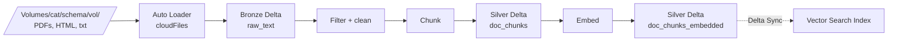

# Module 03 — Chunking Strategies

> **Goal:** Pick the right chunking strategy for a given document structure, decide chunk size + overlap math, and write chunked output to a Delta table in Unity Catalog. Covers **Sec 2 Obj 1, 2, 4, 7** and **Sec 3 Obj 3**.
>
> **Assumes:** You already understand *why* chunking matters from [Topic 01](../01_rag_vector_db_reranking/). This module is the **Databricks-specific** chunking layer.

---

## Coverage map (verbatim Mar 18, 2026 objectives → section)

| Objective | Section |
|---|---|
| Sec 2 Obj 1 — Apply a chunking strategy for a given document structure and model constraints | "The four chunking strategies" + "Choosing strategy by document structure" |
| Sec 2 Obj 2 — Filter extraneous content that degrades RAG | "Filtering extraneous content" |
| Sec 2 Obj 3 — Choose the appropriate Python package to extract document content | "Document extraction libraries" |
| Sec 2 Obj 4 — Operations + sequence to write chunked text into Delta tables in UC | "Writing chunks to Delta in Unity Catalog" |
| Sec 2 Obj 7 — Design retrieval systems using advanced chunking strategies | "Advanced chunking strategies" |
| Sec 2 Obj 8 — Explain the role of re-ranking | "The role of re-ranking" |
| Sec 3 Obj 3 — Select chunking strategy based on model & retrieval evaluation | "Picking strategy by retrieval evaluation" |

---

## The four chunking strategies

You will be asked to pick one for a given document type. Memorize the matrix.

| Strategy | How | Best for | Worst for |
|----------|-----|----------|-----------|
| **Fixed-window** | Slice every N tokens (with optional overlap) | Uniform documents, when you don't care about boundaries | Anything with structure (loses headers / lists) |
| **Recursive character / token** | Try splitting on `\n\n` → `\n` → `. ` → ` ` → char, until chunk fits | **Most documents.** Default. | Code, structured data |
| **Semantic** | Embed sentences, split where adjacent embeddings diverge most | High-quality RAG on prose | Cost + slow; tabular / structured |
| **Structure-aware** | Use Markdown headers / HTML tags / PDF layout to delimit | Wikis, manuals, FAQs, well-formatted PDFs | Free-form prose |

> ⚠️ **Exam trap:** "Default" doesn't mean "always best." Code → token-aware AST split. Tables → row-aware. Clinical notes → sentence/section boundaries. The exam loves to give you a non-prose doc and offer "recursive splitter" as a distractor.

### Sample-Q1 recap

The question asked "how to reduce total number of chunks while preserving quality?"

Answer: **(A) Increase chunk size** and **(B) Decrease overlap**. Both directly reduce chunk count. Other distractors (semantic vs fixed) don't change chunk count predictably.

> ⚠️ Memorize: **chunk count = N_tokens / (chunk_size − overlap)**, approximately. Bigger size, less overlap → fewer chunks.

---

## Chunk size + overlap math

You should be able to do this arithmetic in your head on the exam.

**Formulas:**
```
chunks ≈ ceil( total_tokens / (chunk_size − overlap) )
embedding_storage ≈ chunks × dim × 4 bytes  (float32; halve for float16, quarter for int8 quant)
```

### Worked example

```
Corpus: 50 docs, avg 8,000 tokens each → 400,000 tokens
Chunk size: 512 tokens
Overlap: 50 tokens
Effective step: 462 tokens

chunks ≈ ceil(400,000 / 462) ≈ 866 chunks

With BGE Large (dim 1024) at float32:
storage ≈ 866 × 1024 × 4 ≈ 3.55 MB
```

For a million-doc corpus the math scales linearly. Now flip the levers:

| Lever | Effect on quality | Effect on cost/latency |
|-------|-------------------|------------------------|
| ↑ chunk size | ↓ recall on narrow facts (dilution); ↑ context-rich answers | ↓ chunk count, ↓ index size |
| ↑ overlap | ↑ recall at chunk boundaries | ↑ chunk count, ↑ index size |
| ↓ chunk size | ↑ precision on facts; ↓ context | ↑ chunk count |
| ↓ overlap | ↓ duplication; risk of cut sentences | ↓ chunk count |

The exam will ask "you have constraint X — which knob?" Use this table.

---

## Choosing strategy by document structure (Sec 2 Obj 1)

| Document type | Best strategy | Why |
|---------------|--------------|-----|
| Long prose (research papers, books) | **Recursive** with paragraph priority | Respects natural boundaries |
| FAQs / Q&A pairs | **Structure-aware** with Q/A as one chunk | Keep Q + A together always |
| Markdown wiki | **Structure-aware** by header level | H1/H2 sections are natural units |
| Source code | **AST-aware split** (function/class) | Token splitters break logic |
| Tables (CSV, Excel) | **Row chunks** with header replicated per chunk | Preserve column context |
| Chat transcripts | **Turn-based** (one chunk per N turns) | Preserve speaker context |
| Clinical notes | **Section + sentence** | SOAP sections, code/text boundary |
| Legal contracts | **Clause-level** with hierarchical headers | Citations need clause IDs |
| PDFs with tables/figures | **`ai_parse_document`** then layout-aware | Spatial metadata preserved |
| Scanned PDFs/images | OCR (`pytesseract` or `ai_parse_document`) **then** recursive | Need text first |

> ⚠️ **Exam trap (Sample Q3):** When the source is **scanned PDFs / .jpeg / .png**, the right Python lib is **`pytesseract`** (OCR), not BeautifulSoup (HTML), Scrapy (crawler), or pyquery. Or use Databricks-native `ai_parse_document`.

---

## Document extraction libraries (Sec 2 Obj 3)

The exam will ask "given source format X, which Python package?"

| Source | Library |
|--------|---------|
| Text-based PDF | `pypdf` / `pdfplumber` / `unstructured` |
| **Scanned image / image-only PDF** | **`pytesseract`** |
| HTML page | `BeautifulSoup` (parse) / `requests` (fetch) |
| Web crawl at scale | `Scrapy` |
| `.docx` | `python-docx` |
| `.pptx` | `python-pptx` |
| `.xlsx` / `.csv` | `openpyxl` / `pandas` |
| `.eml` (email) | `email` stdlib + `policy.default` |
| `.epub` | `ebooklib` |
| **Databricks-native PDF + layout** | **`ai_parse_document()`** SQL/Python |

> ⚠️ Don't confuse `BeautifulSoup` (HTML parsing) with `Scrapy` (crawling framework). The exam may offer both. Pick by **task verb**: "extract from one page" → BeautifulSoup. "Crawl 10K pages" → Scrapy.

---

## Filtering extraneous content (Sec 2 Obj 2)

Before chunking, **strip** content that degrades RAG quality:
- Boilerplate footers / headers ("Page X of Y", "Confidential — do not distribute")
- Navigation menus from HTML
- Table-of-contents (duplicates real content)
- Ads / sidebars
- Copyright notices
- Repeated email signatures

Failure mode: top-K retrieval returns boilerplate chunks because they're semantically generic but lexically dense. Wastes context window. **Hurts groundedness.**

### Spark-based filter pattern

```python
from pyspark.sql import functions as F

cleaned = (
    raw_text
    .withColumn("text", F.regexp_replace("text", r"Page \d+ of \d+", ""))
    .withColumn("text", F.regexp_replace("text", r"CONFIDENTIAL.*", ""))
    .filter(F.length("text") > 100)  # drop tiny scraps
)
```

For HTML, parse with `BeautifulSoup` and remove `<nav>`, `<footer>`, `<aside>`, `<script>` first.

> ⚠️ **Exam trap:** Don't pick "embed everything and hope reranking saves you." Garbage in = garbage out. The right answer almost always includes a pre-chunk filter step.

---

## Writing chunks to Delta in Unity Catalog (Sec 2 Obj 4)

The canonical pipeline:



### Required columns

A chunk table that feeds Vector Search Delta Sync **must** have:

| Column | Type | Purpose |
|--------|------|---------|
| **Primary key** (e.g., `chunk_id`) | STRING | Required; must be UNIQUE; backed by enabled CDF |
| `text` | STRING | The chunk content |
| `embedding` | ARRAY<FLOAT> | The vector (if you compute it; otherwise let VS embed for you) |
| `source_doc` | STRING | For citations |
| `chunk_index` | INT | Position within doc |
| `metadata` columns | STRUCT or scalars | For filters (e.g., `member_id`, `created_at`) |

**Critical Delta config:**
```sql
ALTER TABLE cat.schema.doc_chunks
SET TBLPROPERTIES (delta.enableChangeDataFeed = true);
```

Without CDF enabled, Delta Sync **cannot incrementally update** the index. The exam tests this gotcha.

> ⚠️ **Exam trap:** Forgetting to enable Change Data Feed on the source Delta table. Symptom: index sync fails or only does full refresh. Always set `delta.enableChangeDataFeed = true` on the chunk table.

### Spark write pattern

```python
from pyspark.sql import functions as F
from langchain.text_splitter import RecursiveCharacterTextSplitter

@F.udf(returnType="array<string>")
def chunk_text(text):
    splitter = RecursiveCharacterTextSplitter(
        chunk_size=512,
        chunk_overlap=50,
        length_function=len,
    )
    return splitter.split_text(text)

chunked = (
    raw_text
    .withColumn("chunks", chunk_text("text"))
    .select(
        "doc_id",
        F.posexplode("chunks").alias("chunk_index", "text"),
    )
    .withColumn("chunk_id", F.expr("uuid()"))
)

(
    chunked.write
        .mode("append")
        .option("mergeSchema", "true")
        .saveAsTable("cat.silver.doc_chunks")
)

spark.sql("""
ALTER TABLE cat.silver.doc_chunks
SET TBLPROPERTIES (delta.enableChangeDataFeed = true)
""")
```

Better-performing alternative: use a `mapInPandas` or `applyInPandas` with the splitter on a Pandas iterator — UDFs are slow for heavy Python work. Or use Spark Connect with `withColumn(F.split(...))` for regex-only splits.

---

## Identifying source documents (Sec 2 Obj 5)

The exam will pose a business ask and ask which UC source(s) you need. The skill is **mapping the ask to data assets**.

| Ask | Likely source(s) |
|-----|------------------|
| "Answer policy questions" | Policy manual PDFs in a Volume |
| "Diagnose error" | Runbook docs + recent error logs |
| "Recommend product" | Product catalog table + reviews text |
| "Summarize last quarter's earnings call" | Transcripts (text) + slides (PDF) |
| "Pull claim denial reason from letter" | Claim denial letter PDFs |

The **wrong** answer pattern is including too much data ("ingest the entire data lake"). Right answer is narrow + relevant. Includes deciding **what NOT to index**.

---

## Advanced chunking strategies (Sec 2 Obj 7)

Beyond the four base strategies, the exam may test:

### 1. Parent-child / small-to-big

Index **small** chunks for precise retrieval, but **return the parent** (larger surrounding section) to the LLM. Best of both: precision in retrieval + context in generation.

### 2. Hypothetical questions (HyDE-style indexing)

For each chunk, ask an LLM to generate 3-5 hypothetical questions; embed the **questions**, link to the chunk. Retrieval matches user-question to indexed-question (same distribution).

### 3. Hierarchical / propositional indexing

Decompose paragraphs into atomic propositions (one fact per chunk). Increases retrieval precision dramatically; expensive to build.

### 4. Multi-vector per chunk

Store summary embedding + full-text embedding per chunk; query both, fuse results.

### 5. Late chunking

Embed the whole document into a long-context embedder, then derive chunk vectors by pooling token embeddings within chunk windows. Preserves cross-chunk context. Requires long-context embedder support.

> ⚠️ **Exam trap:** "Semantic chunking" is **boundary detection** by embedding similarity. "Hierarchical / propositional" is a different idea — *decompose into atomic facts*. Don't confuse them.

---

## The role of re-ranking (Sec 2 Obj 8)

Already covered in [Topic 01](../01_rag_vector_db_reranking/). One-paragraph refresher:

> A **bi-encoder** (ANN search) trades recall for speed. A **cross-encoder reranker** scores each (query, chunk) pair with joint attention — far higher precision but expensive. Standard pipeline: bi-encoder retrieve top-50 → cross-encoder rerank to top-5 → LLM. Mosaic AI Vector Search supports `reranker=` as a query parameter for this.

> ⚠️ **Exam trap:** Don't retrieve top-5 directly and call it done. The exam expects you to **over-retrieve then rerank**. Direct top-5 misses borderline-relevant chunks the reranker would have promoted.

---

## Picking strategy by retrieval evaluation (Sec 3 Obj 3)

Once you have a baseline chunking, run retrieval eval to decide if you need to change strategy.

| Symptom | Likely cause | Try |
|---------|--------------|-----|
| Low recall@K | Chunks too small / overlap too low / wrong strategy | ↑ chunk size, ↑ overlap, switch to recursive |
| Low precision@K | Chunks too large / boilerplate not filtered | ↓ chunk size, filter pre-chunk |
| Boundary cuts (truncated answers) | Overlap too low | ↑ overlap, switch to structure-aware |
| Specific codes/IDs missed | Pure dense; need lexical | Add BM25 / hybrid |
| Multi-hop questions fail | Single retrieval insufficient | Multi-query / parent-child / agent retrieval |

Always evaluate **on representative queries**. Topic 01 has the eval framework (Recall@K, MRR, NDCG, hit rate); reuse it.

---

## Mini quiz

1. You have 50 PDFs of clinical guidelines, mostly text but with embedded tables and figures. Best chunking + extraction pipeline?
2. Sample Q1 asked how to *reduce* chunk count. Which two levers and why?
3. You add chunks to `cat.silver.chunks` but Delta Sync index won't incrementally update. What's missing?
4. The exam offers four libs for "scanned medical referral letters as image-only PDFs": pypdf, BeautifulSoup, pytesseract, Scrapy. Which?
5. You see low precision@5 even though recall@20 is high. Which knob, and would you change chunking strategy?

### Answers

1. Use **`ai_parse_document()`** (preserves table/figure spatial metadata) → recursive/structure-aware chunking on the resulting text + a separate table-as-row chunk pass.
2. **Increase chunk size** (fewer chunks needed for same coverage) and **decrease overlap** (less duplication). Chunk count ≈ tokens / (size − overlap).
3. **Change Data Feed not enabled.** Run `ALTER TABLE ... SET TBLPROPERTIES (delta.enableChangeDataFeed = true)`.
4. **`pytesseract`** — only OCR option in the list. pypdf works only on text-layer PDFs; image-only PDFs need OCR.
5. Add a **reranker** (cross-encoder) — high recall + low precision is the textbook reranker use case. Don't change chunk strategy until rerank is exhausted.

---

## Exam-trap recap

> ⚠️ Forgetting `delta.enableChangeDataFeed = true` on the chunk table → Delta Sync doesn't work.
> ⚠️ Picking BeautifulSoup for scanned image PDFs. Image-only → `pytesseract` / `ai_parse_document`.
> ⚠️ Confusing semantic chunking (boundary detection) with propositional (atomic facts).
> ⚠️ Defaulting to "recursive splitter" for code or tables.
> ⚠️ Embedding 1024-token chunks into a 512-context embedder (silent truncation).
> ⚠️ Trusting top-5 ANN directly instead of retrieving top-50 + reranking.
> ⚠️ Skipping pre-chunk filtering — boilerplate dominates retrieval.

---

## Worked exam-question walkthroughs

### Walkthrough 1 — "Reduce chunk count, keep quality" (Sample Q1)

**Pattern:** Multi-select. "How would you reduce total number of chunks while preserving retrieval quality?"
- A: Increase chunk size
- B: Decrease overlap
- C: Switch to semantic chunking
- D: Increase overlap
- E: Use a smaller embedding model

**Reasoning chain:**
1. Recall `chunks ≈ tokens / (chunk_size − overlap)`. Reducing chunk count → either ↑ chunk_size or ↓ overlap (or both).
2. A: ↑ chunk_size → fewer chunks. ✓
3. B: ↓ overlap → larger effective step → fewer chunks. ✓
4. C: Semantic chunking *can* either increase or decrease counts; not deterministic. ✗
5. D: ↑ overlap → smaller effective step → more chunks. ✗
6. E: Embedding model size doesn't change chunk count, only embedding storage. ✗

> 🎯 **How to recognize on the exam:** Anything about chunk **count** is arithmetic on `tokens / (size − overlap)`. Anything about chunk **quality at constant count** is about strategy choice or overlap-as-glue.

**Answer:** A, B. **Distractor trap:** D is the inverse of B and tempting because "more overlap = more safety" — but it inflates count.

### Walkthrough 2 — "Scanned medical PDFs" (Sample Q3)

**Pattern:** Source: image-only scanned PDFs (.jpeg, .png embedded). Which Python lib?
- A: `pypdf` / `pdfplumber`
- B: `BeautifulSoup`
- C: **`pytesseract`**
- D: `Scrapy`
- E: `pyquery`

**Reasoning chain:**
1. Image-only PDF → text is *not in the file as text*, must be **OCR'd**.
2. `pypdf` reads only text-layer PDFs. ✗
3. `BeautifulSoup` parses HTML, not PDF/images. ✗
4. `Scrapy` is a web crawler. ✗
5. `pyquery` is jQuery-like HTML query. ✗
6. **`pytesseract`** wraps Tesseract OCR — only option that reads pixels. ✓

> 🎯 **How to recognize on the exam:** "scanned" / "image-only" / ".jpeg" / ".png" → **OCR** = `pytesseract` (or Databricks-native `ai_parse_document`).

**Answer:** C.

### Walkthrough 3 — "Delta Sync index won't update"

**Pattern:** "I added rows to the source Delta table but the Vector Search Delta Sync index row count is unchanged." Pick the most likely cause:
- A: Embedding model is down.
- B: CDF not enabled on source.
- C: Endpoint is storage-optimized.
- D: Primary key changed.

**Reasoning chain:**
1. A would cause embedding step failures, but would log errors and not silently stop syncing.
2. **B** — without CDF, Delta Sync has no change stream to follow. Silent failure mode; very common gotcha.
3. C — endpoint type doesn't block sync; storage-opt only blocks *continuous* mode.
4. D — PK change is rare and breaks schema, not silent.

> 🎯 **How to recognize on the exam:** "Index won't update" + "Delta Sync" → CDF first. Always check `delta.enableChangeDataFeed`.

**Answer:** B.

### Walkthrough 4 — Strategy by document type

**Pattern:** "Documents are FAQs (Q&A pairs); answers must always be returned with their question." Best strategy?
- A: Recursive 512 + 50 overlap
- B: Structure-aware: one chunk per Q&A pair
- C: Semantic boundary detection
- D: Fixed-window 1024

**Reasoning chain:**
1. Q&A integrity is the requirement; A, C, D may split the Q from the A → broken retrieval.
2. **B** keeps the Q–A unit intact regardless of length.

> 🎯 **How to recognize on the exam:** Structured docs (FAQs, contracts with clauses, code) → **structure-aware** strategy that respects natural units, not byte/token slicing.

**Answer:** B.

### Walkthrough 5 — Low precision, high recall

**Pattern:** Recall@20 = 0.95, Precision@5 = 0.30. Best next step?
- A: Reduce chunk size
- B: Add a cross-encoder reranker
- C: Increase chunk size
- D: Switch to semantic chunking

**Reasoning chain:**
1. High recall + low precision = relevant docs are *in* the candidate set, just not ranked highly.
2. The textbook fix is **reranking** — over-retrieve top-20, rerank to top-5.
3. A/C/D change retrieval candidates; they don't address ranking.

> 🎯 **How to recognize on the exam:** "High recall, low precision" → **reranker**, not chunking changes.

**Answer:** B.

---

## Output-prediction drills

### Drill 1 — chunk count math

Corpus = 1,200,000 tokens. Chunk size = 800. Overlap = 100. How many chunks?

**Answer:** `1,200,000 / (800 - 100) = 1,200,000 / 700 ≈ 1,715 chunks`.

### Drill 2 — embedding storage at scale

10M chunks, dim 1024, float32. Storage?

**Answer:** `10,000,000 × 1024 × 4 bytes = 40 GB` (plus index overhead from HNSW graph, typically 1.3–2× the raw vector storage).

### Drill 3 — chunk vs context

Chunk size = 1024 tokens. Embedding model context length = 512. What happens at index build, and how do you detect it?

**Answer:** **Silent tail truncation.** Embedding model receives only the first 512 tokens of each chunk; the rest contributes nothing to the vector. Detection: retrieval misses concepts known to appear late in chunks. Fix: cut chunk size to 512 or pick a long-context embedder (e.g., `databricks-gte-large-en` at ctx 8192).

### Drill 4 — what gets written

```python
chunked = raw.withColumn("chunks", chunk_text("text")) \
    .select("doc_id", F.posexplode("chunks").alias("idx", "text"))
```

If `chunk_text` returns 3 chunks for `doc_id="d1"`, what rows are produced?

**Answer:** Three rows: `(d1, 0, chunk0)`, `(d1, 1, chunk1)`, `(d1, 2, chunk2)`. `posexplode` emits `(index, value)` pairs per array element. Missing column: a unique `chunk_id` (often `uuid()` or `concat(doc_id, '_', idx)`) — required as the Vector Search PK.

### Drill 5 — CDF check

```sql
DESCRIBE EXTENDED cat.silver.doc_chunks;
```

What property are you looking for, and what value confirms Delta Sync can incrementally update the index?

**Answer:** Look for `delta.enableChangeDataFeed` in `TBLPROPERTIES`. Value must be `true`. Set via `ALTER TABLE ... SET TBLPROPERTIES (delta.enableChangeDataFeed = true)`.

---

## End-to-end mini-scenario — clinical PDFs to a Delta Sync-ready chunked table

**Ask:** "200 scanned clinical guideline PDFs in a UC Volume. Build a chunk table ready for a Vector Search Delta Sync index. Filter boilerplate. Use a recursive chunker. 512-token chunks, 50-token overlap."

```python
from pyspark.sql import functions as F
from pyspark.sql.types import ArrayType, StringType
from langchain.text_splitter import RecursiveCharacterTextSplitter

# 1. Extract: OCR via ai_parse_document (handles scanned PDFs + tables/figures)
spark.sql("""
CREATE OR REPLACE TABLE cat.bronze.guidelines_raw AS
SELECT
  path AS source_doc,
  ai_parse_document(content) AS parsed
FROM read_files('/Volumes/cat/raw/guidelines/', format => 'binaryFile')
""")

# 2. Filter boilerplate
cleaned = (
    spark.table("cat.bronze.guidelines_raw")
    .withColumn("text", F.col("parsed.text"))
    .withColumn("text", F.regexp_replace("text", r"Page \d+ of \d+", ""))
    .withColumn("text", F.regexp_replace("text", r"(?i)CONFIDENTIAL.*", ""))
    .filter(F.length("text") > 200)  # drop scraps
)

# 3. Recursive chunk via UDF
@F.udf(returnType=ArrayType(StringType()))
def chunk_text(text):
    splitter = RecursiveCharacterTextSplitter(
        chunk_size=512, chunk_overlap=50, length_function=len)
    return splitter.split_text(text)

chunked = (
    cleaned
    .withColumn("chunks", chunk_text("text"))
    .select("source_doc",
            F.posexplode("chunks").alias("chunk_index", "text"))
    .withColumn("chunk_id", F.expr("uuid()"))
    .withColumn("created_at", F.current_timestamp())
)

# 4. Write to silver as Delta + enable CDF
(chunked.write
    .mode("overwrite")
    .option("overwriteSchema", "true")
    .saveAsTable("cat.silver.guideline_chunks"))

spark.sql("""
ALTER TABLE cat.silver.guideline_chunks
SET TBLPROPERTIES (delta.enableChangeDataFeed = true)
""")

# 5. (Module 04) create Delta Sync index pointing at this table
```

Every step maps to a Sec 2 objective: extract (Obj 3), filter (Obj 2), chunk strategy (Obj 1 / Obj 7), Delta + CDF (Obj 4). Reranking enters at query time (Module 06).
