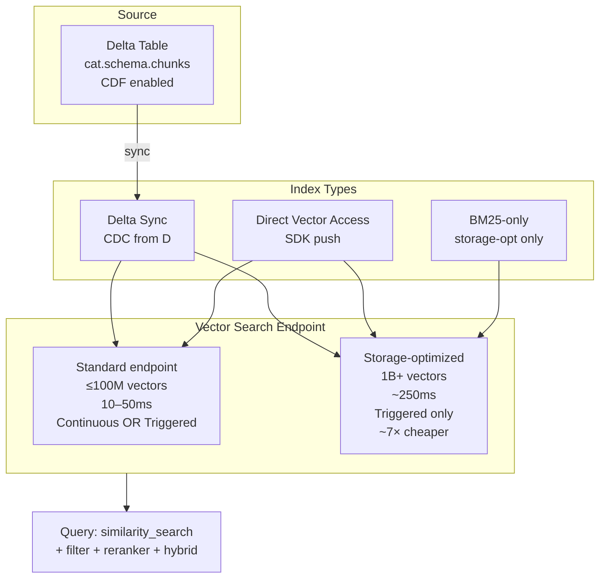
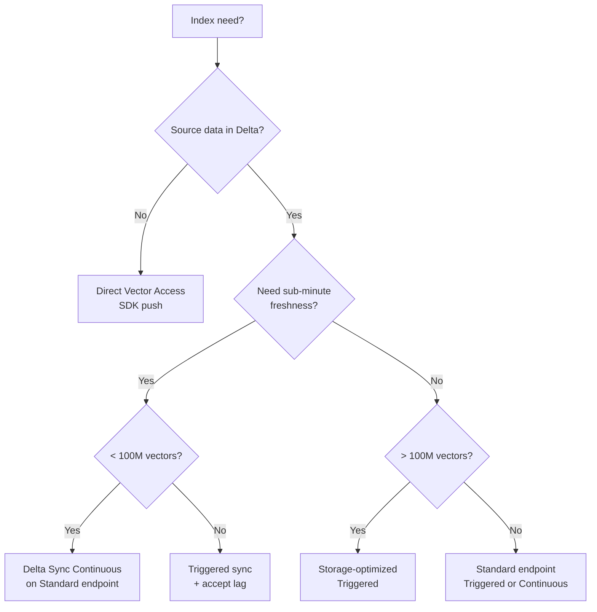

# Module 04 — Embeddings & Vector Search Indexing

> **Goal:** Pick an embedding model, choose between Vector Search index types (Delta Sync continuous / Delta Sync triggered / Direct Access), pick the right endpoint tier (standard vs storage-optimized), and configure for the scale + latency + freshness trade-off. Covers **Sec 2 Obj 6, 7, 8** and **Sec 4 Obj 6, 8, 10**.

---

## Coverage map (verbatim Mar 18, 2026 objectives → section)

| Objective | Section |
|---|---|
| Sec 2 Obj 6 — Use tools and metrics to evaluate retrieval performance | "Retrieval evaluation" |
| Sec 2 Obj 7 — Design retrieval systems using advanced chunking strategies | cross-ref [Module 03](03_chunking_strategies.md) |
| Sec 2 Obj 8 — Explain the role of re-ranking | "Reranking on Vector Search" + cross-ref [Module 06](06_mosaic_ai_vector_search.md) |
| Sec 3 Obj 8 — Select embedding model context length based on docs/queries/optimization strategy | "Embedding model on FMAPI" |
| Sec 4 Obj 6 — Create and query a Vector Search index | "Creating an index — full API surface" + "Querying — anatomy of `similarity_search`" |
| Sec 4 Obj 8 — Explain key concepts and components of Mosaic AI Vector Search | "Mosaic AI Vector Search architecture" + [Module 06](06_mosaic_ai_vector_search.md) |
| Sec 4 Obj 10 — Configure VS for # embeddings / update freq / latency / cost (incl. storage-optimized) | "Endpoint tier decision" + "Configure for the cost/latency/freshness/scale trade-off" |

---

## Mosaic AI Vector Search architecture in one diagram



---

## Endpoint tier decision (Sec 4 Obj 10) — the most-tested config

| Constraint | Standard | Storage-optimized |
|-----------|----------|--------------------|
| Vector count | ≤ 100M | **1B+ @ dim 768** |
| Indexing speed | Baseline | **10–20× faster** |
| Sync modes | Continuous + Triggered + Direct | **Triggered only** |
| Latency typical | **10–50 ms** | ~250 ms |
| Cost per vector | Higher | **~7× cheaper** |
| Hybrid search (BM25+ANN) | Yes | Yes |
| BM25-only (no embedding column) | No | **Yes** |
| Reranker support | Yes | Yes |

### Sample-Q6 walkthrough

> Scenario: 100M items, latency-critical, 80 QPS, hybrid search needed, with reranker.
> **Answer: storage-optimized endpoint + hybrid + rerank.**

Why: at 100M vectors you're at the standard ceiling and storage-opt is the only viable scale. The "latency-critical" hint is a distractor — storage-optimized's ~250ms is acceptable for "latency-critical" web requests; for sub-100ms you'd shard, but the question constrains scale + hybrid + rerank to one tier.

> ⚠️ **Exam trap:** Don't pick standard for > 100M vectors. The exam will offer "standard + hybrid + rerank" as a plausible-looking distractor when scale rules it out.

### When standard wins

- **< 100M vectors total.**
- **Continuous sync required** (data freshness measured in seconds).
- **Sub-50ms latency required** (real-time chat).
- **Cost is not the binding constraint.**

---

## Index types — the three flavors

| Index type | Source | When |
|-----------|--------|------|
| **Delta Sync (Continuous)** | Delta table CDC | Standard endpoint only. Lowest-latency freshness. |
| **Delta Sync (Triggered)** | Delta table, on-demand or scheduled | Both endpoint tiers. Required for storage-optimized. |
| **Direct Vector Access** | SDK `upsert` calls | When you have no source Delta table (streaming external) or want full control of ingestion pipeline. |
| **Full-text-only (BM25)** | Delta table, **no embedding column** | Storage-optimized only. Lexical-only retrieval at huge scale. |

### Decision flow



---

## Full `VectorSearchClient` API surface

The exam may name any of these methods. Memorize signatures and when each is used.

### Endpoint-level methods

| Method | Signature (key args) | Returns | When |
|---|---|---|---|
| `create_endpoint(name, endpoint_type)` | `endpoint_type ∈ {"STANDARD", "STORAGE_OPTIMIZED"}` | endpoint info | Initial setup |
| `get_endpoint(name)` | — | endpoint info incl. state | Check readiness |
| `list_endpoints()` | — | list | Discovery / idempotency check |
| `delete_endpoint(name)` | — | — | Cleanup; deletes all child indexes |

### Index-level methods

| Method | Key args | When |
|---|---|---|
| `create_delta_sync_index(endpoint_name, source_table_name, index_name, pipeline_type, primary_key, embedding_source_column / embedding_vector_column, embedding_model_endpoint_name?, embedding_dimension?, columns_to_sync?)` | builds CDC-backed index from a Delta table | Most common path |
| `create_direct_access_index(endpoint_name, index_name, primary_key, embedding_dimension, embedding_vector_column, schema)` | builds SDK-managed index, no source table | Streaming / external data sources |
| `get_index(index_name)` | — | get a handle to query / manage |
| `list_indexes(endpoint_name)` | — | enumerate indexes on an endpoint |
| `delete_index(index_name)` | — | drop the index |

### Index instance methods (returned by `get_index()`)

| Method | When |
|---|---|
| `.describe()` | Read schema, sync status, row count |
| `.sync()` | **Triggered mode only** — fire incremental sync immediately |
| `.similarity_search(query_text?, query_vector?, columns, num_results, filters?, query_type?, score_threshold?, reranker?)` | Query the index |
| `.upsert(rows)` | **Direct Access only** — push vectors |
| `.delete(primary_keys)` | **Direct Access only** — remove vectors |
| `.delete()` | Drop the index (same as client-level) |

### `create_delta_sync_index` parameter cheat-sheet

| Param | Required | Notes |
|---|---|---|
| `endpoint_name` | yes | Must exist; type drives sync-mode availability |
| `source_table_name` | yes | UC three-level; **must have CDF enabled** |
| `index_name` | yes | UC three-level — index is a UC object with its own ACLs |
| `pipeline_type` | yes | `"CONTINUOUS"` (standard endpoint only) or `"TRIGGERED"` |
| `primary_key` | yes | Must be UNIQUE on source table |
| `embedding_source_column` | one of two paths | Managed embedding — VS computes vectors |
| `embedding_model_endpoint_name` | with source_column | Endpoint name (e.g., `databricks-bge-large-en`) |
| `embedding_vector_column` | one of two paths | Self-managed embeddings precomputed in source |
| `embedding_dimension` | with vector_column | int, e.g., 1024 |
| `columns_to_sync` | optional | Project a subset of columns into the index for retrieval (default = all) |

> ⚠️ **Exam trap:** You must pick **either** `embedding_source_column` (+ `embedding_model_endpoint_name`) **OR** `embedding_vector_column` (+ `embedding_dimension`), never both. The exam phrases this as "managed embeddings vs self-managed."

### Look-alike comparison — Delta Sync vs Direct Access

| Concern | Delta Sync | Direct Access |
|---|---|---|
| Source | UC Delta table | SDK `upsert` calls |
| Schema | Inherited from source table | Declared at create time (`schema=...`) |
| Updates | CDC-driven (CONTINUOUS) or on-demand (`.sync()`) | Explicit `.upsert()` / `.delete()` |
| Streaming sources (Kafka, external API) | Indirect — write to Delta first | Native fit |
| Embedding paths | Managed (`embedding_source_column`) OR self-managed | Self-managed only (you push vectors) |
| Cost | Pays for sync compute | Pays for VS endpoint only |
| Endpoint tiers | Standard or Storage-opt | Standard or Storage-opt |

> 🎯 **How to recognize on the exam:** "We already chunk into a Delta table" → **Delta Sync**. "Source is a Kafka stream / live API" → **Direct Access** (or land in Delta first). Don't mix the two for the same logical dataset.

### Look-alike comparison — managed vs self-managed embeddings

| Concern | Managed (`embedding_source_column`) | Self-managed (`embedding_vector_column`) |
|---|---|---|
| Who computes vectors | VS sync service | You, before write |
| Embedding model choice | Any served endpoint (PPT or PT) | Any model anywhere (lets you bring offline-only embedders) |
| Re-embedding when model changes | Hot-swap not supported — must rebuild | Same — must rebuild |
| Storage cost | Higher (vector + source text) | Same — vector column in source |
| Op simplicity | Higher — one knob | Lower — you own the embedding pipeline |
| Streaming freshness | Tied to CONTINUOUS sync | Tied to your write cadence |

> 🎯 **How to recognize on the exam:** "Auto-sync embeddings as docs change" → managed. "We must use embeddings from our on-prem GPU cluster" → self-managed.

### Look-alike comparison — `endpoint_type` STANDARD vs STORAGE_OPTIMIZED

| Concern | STANDARD | STORAGE_OPTIMIZED |
|---|---|---|
| Max vectors | ~100M | 1B+ at dim 768 |
| Latency typical | 10–50 ms | ~250 ms |
| Sync modes | CONTINUOUS, TRIGGERED | TRIGGERED only |
| BM25-only indexes (no embedding column) | ✗ | ✓ |
| Cost per vector | Higher | **~7× cheaper** |
| Hybrid search support | ✓ | ✓ |
| Reranker support | ✓ | ✓ |
| Indexing speed | baseline | 10–20× faster |

> 🎯 **How to recognize on the exam:** > 100M vectors OR cost-driven → STORAGE_OPTIMIZED. < 50ms latency required → STANDARD. Continuous sync required → STANDARD.

---

## Creating an index — the canonical SDK call

```python
from databricks.vector_search.client import VectorSearchClient

vsc = VectorSearchClient()

# 1. Ensure endpoint exists (idempotent in practice via list+check)
vsc.create_endpoint(
    name="vs-prod",
    endpoint_type="STANDARD",  # or "STORAGE_OPTIMIZED"
)

# 2. Create the index — Delta Sync mode
vsc.create_delta_sync_index(
    endpoint_name="vs-prod",
    source_table_name="cat.silver.doc_chunks",
    index_name="cat.indexes.doc_chunks_v1",
    pipeline_type="CONTINUOUS",  # or "TRIGGERED"
    primary_key="chunk_id",
    embedding_source_column="text",       # let VS embed
    embedding_model_endpoint_name="databricks-bge-large-en",
    # OR: embedding_vector_column="embedding"  if you precomputed
)
```

Two ways to provide embeddings:

| Mode | When |
|------|------|
| `embedding_source_column=` + `embedding_model_endpoint_name=` | VS embeds on your behalf; cheaper to operate, simpler. |
| `embedding_vector_column=` | You precomputed embeddings in the Delta table. More control, can use any model. |

> ⚠️ **Exam trap:** If you supply both, the index creation fails. Pick exactly one path.

---

## Querying — anatomy of `similarity_search`

```python
results = vsc.get_index("cat.indexes.doc_chunks_v1").similarity_search(
    query_text="member appealed coverage denial",   # text -> embedded server-side
    # OR query_vector=[0.1, 0.2, ...]               # if you pre-embedded the query
    columns=["chunk_id", "text", "source_doc"],
    num_results=20,
    filters={"member_state": "NY"},                  # JSON; equality + AND/OR
    query_type="HYBRID",                             # or "ANN" or "FULL_TEXT"
    # 2025+ feature:
    # reranker="cross-encoder-endpoint-name"        # optional rerank step
)
```

Key levers:

| Param | Effect |
|-------|--------|
| `query_type` | `ANN` (default), `HYBRID` (BM25+ANN+RRF), `FULL_TEXT` (BM25 only) |
| `num_results` | Top-K; over-retrieve if you'll rerank |
| `filters` | Metadata pre-filter; **before** vector search, so applies to candidate pool |
| `reranker` | Cross-encoder rerank step (2025 feature) |

### Hybrid search — Reciprocal Rank Fusion

```
RRF_score(d) = Σ_i  1 / (k + rank_i(d))     where i ∈ {ANN, BM25}, k default 60
```

Both lists scored independently, then fused. Documents ranking well in **either** list bubble up. Lexically rare + semantically related codes (ICD-10 "I50.9") survive better than pure ANN.

> ⚠️ **Exam trap:** "When does hybrid beat pure dense?" — Whenever your corpus mixes prose and codes/IDs/jargon. ICD-10, CPT, SKU, error codes. Pure dense misses exact-token matches; pure BM25 misses paraphrases. Hybrid covers both.

---

## Reranking on Vector Search (Sec 2 Obj 8)

Two paths:

1. **Built-in `reranker=` parameter** (2025 GA on standard endpoints). Pass an endpoint name hosting a cross-encoder; VS applies it to top-K before returning.
2. **External rerank step.** Retrieve top-50, call your own reranker endpoint (BGE-reranker-large, Cohere Rerank served externally), reorder, take top-5.

```python
# Path 1: built-in
results = idx.similarity_search(
    query_text=q,
    num_results=50,
    reranker="cat.models.bge_reranker_large",
)
```

```python
# Path 2: external
candidates = idx.similarity_search(query_text=q, num_results=50)
reranked = call_reranker(q, candidates)  # your endpoint
top5 = reranked[:5]
```

> ⚠️ **Exam trap:** "Top-K=5 with no rerank" is almost always wrong on production-quality retrieval. Over-retrieve + rerank to a smaller K.

---

## Embedding model on FMAPI (Sec 3 Obj 8)

Already covered in [Module 02](02_model_selection.md#embedding-model-selection-sec-3-obj-8). Recap with index-side context:

| Model | dim | Context | When |
|-------|-----|---------|------|
| `databricks-gte-large-en` | 1024 | 8192 | Long chunks, high quality |
| `databricks-bge-large-en` | 1024 | 512 | Default high-quality, 512-token chunks |
| `databricks-gte-small-en` (3rd-party or HF) | 384 | 512 | Cost/latency prio (sample Q4 answer) |
| `text-embedding-3-small` (external) | 1536 | 8192 | If you must use OpenAI |
| Custom fine-tuned embedder on PT | varies | varies | Domain-specific quality lift |

Pick by:
1. **Context length ≥ chunk size** (or chunks get truncated).
2. **Dim ≤ quality budget** (1024 > 768 > 384 in recall, but 1024 doubles storage vs 512).
3. **Cost tier**: PPT for prototyping, PT for production embedding generation in batch.

---

## Configure for the cost / latency / freshness / scale trade-off (Sec 4 Obj 10)

The exam loves four-way trade-off questions. Here's a decision matrix:

| Constraint | Vector count cap | Update cadence | Latency budget | Cost target | Recommended config |
|-----------|------------------|----------------|----------------|-------------|---------------------|
| Dev / prototype | < 1M | Manual/daily | Any | Lowest | Standard + Triggered + GTE Small |
| Internal Q&A | 1–10M | Hourly | < 200ms | Medium | Standard + Continuous + BGE Large |
| Large catalog real-time chat | 50–100M | < 1 min | < 100ms | High | Standard + Continuous + BGE Large + rerank |
| Catalog / search at scale | 100M–1B | Hourly | < 500ms | Cost-sensitive | Storage-opt + Triggered + hybrid + rerank |
| Recommendation index | 100M–1B | Daily | < 100ms* | Cost-sensitive | Storage-opt + Triggered + ANN-only |
| Compliance/audit-only | Any | Weekly | Any | Lowest | Storage-opt + BM25-only |

*Latency budgets near 100ms on storage-opt require careful index sizing + caching at app layer.

---

## Retrieval evaluation (Sec 2 Obj 6)

Already in [Topic 01](../01_rag_vector_db_reranking/). Two-line refresher:

| Metric | Question it answers |
|--------|---------------------|
| **Recall@K** | Did we find the right chunk in our top-K? |
| **Precision@K** | Of the top-K, how many are actually relevant? |
| **MRR (Mean Reciprocal Rank)** | How high did the first relevant chunk rank? |
| **NDCG@K** | Did we rank more-relevant chunks higher? |
| **Hit rate** | Binary: was at least one relevant chunk in top-K? |
| `chunk_relevance` judge | LLM-judged per-chunk relevance |
| `retrieval_relevance` judge | LLM-judged overall retrieval quality |

You produce these by hand-curating a **golden set** of (query, relevant_chunk_ids) pairs, then running retrieval and computing metrics. Critical that this set covers **the failure modes** your retrieval is being asked to handle — not just easy queries.

---

## Common index-config gotchas

### CDF must be on

```sql
ALTER TABLE cat.silver.doc_chunks
SET TBLPROPERTIES (delta.enableChangeDataFeed = true);
```

Without it, Delta Sync does not work incrementally; index goes stale. **Tested.**

### Primary key must be UNIQUE

If your `chunk_id` has duplicates, index creation succeeds but sync silently fails or drops rows. Always enforce uniqueness pre-write (use `uuid()` or a deterministic hash).

### Don't change dim mid-life

If you change embedding model (and thus dim), you **must rebuild** the index from scratch. Hot-swapping embedding model on an existing index breaks search.

### Filter cardinality

High-cardinality filter on small candidate pool → low recall. The filter is **applied before** ANN search in Vector Search, narrowing the pool the ANN searches over.

### Hybrid is not free

Hybrid search has measurably higher latency (BM25 index + ANN index, fuse, return). For < 1M vectors and pure prose, plain ANN is faster and nearly as good.

---

## Worked architecture: 50M clinical chunks

**Constraints:**
- Vectors: 50M after chunking
- Update cadence: nightly (overnight ETL adds ~50K chunks)
- Latency budget: < 300ms
- Cost: medium
- Required: hybrid (ICD-10 codes mix in)

**Config:**
- **Endpoint:** Standard (50M < 100M cap), maybe storage-opt if cost is binding.
- **Index:** Delta Sync **Triggered** (nightly ETL means Continuous is overkill).
- **Embedding:** BGE Large EN v1.5 (dim 1024, ctx 512) via FMAPI PPT.
- **Query:** `query_type="HYBRID"`, top-50 retrieve, reranker top-5.
- **Filters:** by `clinical_specialty`, `created_year`.

---

## Mini quiz

1. You need to maintain a 250M-vector index updated every 6 hours, with < 300ms latency, hybrid search. Which endpoint tier, which sync mode?
2. Your source Delta table has the chunks but Delta Sync index is stuck on "schema unchanged" and not updating. Most likely cause?
3. You queried with `query_text=` AND `query_vector=`. What happens?
4. Why does hybrid search beat pure ANN for clinical notes that contain ICD-10 codes?
5. You switched embedding model from BGE Large (dim 1024) to GTE Small (dim 384) on an existing Delta Sync index. What do you do?

### Answers

1. **Storage-optimized + Triggered sync.** > 100M vectors rules out standard. Triggered is the only mode supported on storage-opt.
2. **Change Data Feed not enabled** on the source. `ALTER TABLE ... SET TBLPROPERTIES (delta.enableChangeDataFeed = true)`.
3. **Index creation/query fails** — exactly one path must be chosen. Pick `query_text` (server embeds) or `query_vector` (you embedded).
4. Pure ANN misses **exact-token matches** like "I50.9" (heart failure unspecified) because dense embeddings don't memorize rare code tokens. BM25 catches them. RRF fuses both lists so semantic relatives AND exact codes survive.
5. **Rebuild the index from scratch.** Dim change is breaking — you can't hot-swap. Drop the old index, create new with the new embedding endpoint, switch the reader code to point at the new index name (or use an index alias).

---

## Exam-trap recap

> ⚠️ Picking standard endpoint for > 100M vectors.
> ⚠️ Forgetting that storage-optimized supports **only** Triggered sync (no Continuous).
> ⚠️ Forgetting `delta.enableChangeDataFeed = true` on source table.
> ⚠️ Hot-swapping embedding model on a live index.
> ⚠️ Top-5 ANN with no rerank — over-retrieve + rerank is the production pattern.
> ⚠️ Hybrid search "always better" — not true at small scale on pure prose; adds latency.
> ⚠️ Setting both `embedding_source_column` and `embedding_vector_column` — choose one.

---

## Worked exam-question walkthroughs

### Walkthrough 1 — "100M items, latency-critical, hybrid + rerank" (Sample Q6)

**Pattern:** 100M items in catalog, expect 80 QPS, latency-critical, must support hybrid search with reranking.
- A: Standard endpoint + ANN-only
- B: Storage-optimized + hybrid + rerank
- C: Standard + hybrid + rerank
- D: Storage-optimized + BM25-only

**Reasoning chain:**
1. 100M is at the standard endpoint ceiling — risky to pick standard; storage-optimized is safer.
2. Hybrid + rerank required → eliminate ANN-only (A) and BM25-only (D).
3. Between B and C: standard at 100M may not have headroom; storage-opt scales to 1B+. "Latency-critical" doesn't strictly demand <50ms here — ~250ms storage-opt is acceptable for catalog search.

> 🎯 **How to recognize on the exam:** Vector count ≥ 100M + cost mention → STORAGE_OPTIMIZED. "Hybrid + rerank" is *modality*, not tier-restricted; both tiers support both.

**Answer:** B. **Distractor trap:** C is wrong because standard is at its ceiling and storage-opt offers ~7× cost savings at this scale.

### Walkthrough 2 — Continuous sync on storage-optimized

**Pattern:** "We need second-level freshness on a 500M-vector index." Pick one.
- A: Storage-optimized + Continuous sync
- B: Storage-optimized + Triggered sync (hourly job)
- C: Two standard endpoints sharded
- D: Direct Access + streaming

**Reasoning chain:**
1. A is **invalid** — storage-opt does not support Continuous sync.
2. B sacrifices freshness (hourly, not seconds) but is valid.
3. C is operationally complex; 500M doesn't fit cleanly across two standard (~100M each ceiling).
4. D works for a streaming source but adds embedding-pipeline ownership.

> 🎯 **How to recognize on the exam:** "Storage-optimized" + "Continuous" → invalid combination. Always one of these is the wrong distractor.

**Answer:** D if streaming source is fine; B if the org accepts hourly lag. The exam-correct answer depends on which trade-off the scenario explicitly accepts.

### Walkthrough 3 — Filter behavior

**Pattern:** "I set `filters={'tier': 'gold'}` and `num_results=5` over a 50M-vector index where ~50K rows are tier=gold. What happens?"
- A: ANN searches all 50M, filters after to find 5 gold rows.
- B: ANN searches only the 50K gold rows.
- C: Filter is ignored.
- D: Errors out.

**Reasoning chain:**
1. Mosaic AI Vector Search applies filters **before** ANN — pre-filter narrows the candidate pool.
2. Result: ANN searches over the 50K gold vectors; quality may actually *improve* on this subset.

> 🎯 **How to recognize on the exam:** "Pre-filter" vs "post-filter" — Mosaic AI is **pre-filter**. Don't pick the post-filter answer.

**Answer:** B.

### Walkthrough 4 — Hot-swap embedding model

**Pattern:** "We want to upgrade from BGE Large (dim 1024) to GTE Large (dim 1024). Same dim." Can we hot-swap on the existing Delta Sync index?

**Reasoning chain:**
1. Even at same dimension, embedding **space differs** between models — vectors are not interchangeable.
2. VS does not support changing embedding model on a live index.
3. **Must rebuild** — blue/green: new index, eval, swap.

> 🎯 **How to recognize on the exam:** "Change embedding model" + "existing index" → **blue/green rebuild**, regardless of dim parity.

**Answer:** No; build a new index, eval, switch agent's resource to the new index name.

### Walkthrough 5 — Managed vs self-managed embeddings

**Pattern:** Team has embeddings computed offline on their GPU cluster, stored as `array<float>` in a Delta column. Which `create_delta_sync_index` param?
- A: `embedding_source_column="text"` + `embedding_model_endpoint_name="..."`
- B: `embedding_vector_column="embedding"` + `embedding_dimension=1024`
- C: Both A and B
- D: Direct Access only

**Reasoning chain:**
1. They already have vectors → self-managed path.
2. Self-managed = `embedding_vector_column` + `embedding_dimension`.
3. Using both A and B fails creation.

> 🎯 **How to recognize on the exam:** "We already have vectors" / "offline embeddings" / "specific embedder not on FMAPI" → `embedding_vector_column`.

**Answer:** B.

---

## Output-prediction drills

### Drill 1 — What endpoint state should you see?

```python
vsc.get_endpoint("vs-prod")
```

Right after `create_endpoint`, what `endpoint_status.state` will it show, and when can you create indexes on it?

**Answer:** `PROVISIONING` initially, then `ONLINE`. You can call `create_*_index` only when `ONLINE`. Standard endpoints typically provision in a few minutes; storage-optimized takes longer.

### Drill 2 — Sync mode mismatch

```python
vsc.create_delta_sync_index(
    endpoint_name="vs-storage-opt",   # STORAGE_OPTIMIZED
    pipeline_type="CONTINUOUS",
    ...
)
```

What happens?

**Answer:** Fails with a validation error. Storage-optimized endpoints reject `CONTINUOUS`; only `TRIGGERED` is allowed. Fix: change to `"TRIGGERED"` and add a scheduled job that calls `idx.sync()`.

### Drill 3 — `.sync()` on a continuous index

```python
idx = vsc.get_index("cat.indexes.docs_v1")  # pipeline_type=CONTINUOUS
idx.sync()
```

**Answer:** Returns an error or is a no-op — `sync()` is for `TRIGGERED` indexes. Continuous indexes auto-sync from CDC.

### Drill 4 — Direct Access upsert shape

```python
direct_idx.upsert([
    {"event_id": "e1", "embedding": [0.1] * 1024, "user_id": "u1"},
])
```

If `embedding_dimension` was declared 768, what happens?

**Answer:** Upsert is rejected — dimension mismatch (1024 != 768). VS validates each row against the declared `embedding_dimension`.

### Drill 5 — Both embedding columns set

```python
vsc.create_delta_sync_index(
    ...,
    embedding_source_column="text",
    embedding_model_endpoint_name="databricks-bge-large-en",
    embedding_vector_column="embedding",
    embedding_dimension=1024,
)
```

**Answer:** Fails — you must pick exactly one path. Exam-common trap.

---

## End-to-end mini-scenario — full create + query for a 50M-chunk policy index

```python
from databricks.vector_search.client import VectorSearchClient
vsc = VectorSearchClient()

# 1. Endpoint (idempotent: list + maybe create)
existing = {e.name for e in vsc.list_endpoints().endpoints}
if "vs-prod" not in existing:
    vsc.create_endpoint(name="vs-prod", endpoint_type="STANDARD")

# 2. Confirm source table has CDF enabled
spark.sql("""
ALTER TABLE cat.silver.policy_chunks
SET TBLPROPERTIES (delta.enableChangeDataFeed = true)
""")

# 3. Create the index — managed embeddings via BGE Large
idx = vsc.create_delta_sync_index(
    endpoint_name="vs-prod",
    source_table_name="cat.silver.policy_chunks",
    index_name="cat.indexes.policy_chunks_v1",
    pipeline_type="CONTINUOUS",
    primary_key="chunk_id",
    embedding_source_column="text",
    embedding_model_endpoint_name="databricks-bge-large-en",
    columns_to_sync=["chunk_id", "text", "source_doc", "page_no", "member_state"],
)

# 4. Wait for ready, then query
idx = vsc.get_index("cat.indexes.policy_chunks_v1")
print(idx.describe())  # confirm READY

results = idx.similarity_search(
    query_text="member appealed coverage denial",
    columns=["chunk_id", "text", "source_doc", "page_no"],
    num_results=50,
    filters={"member_state": ["NY", "NJ"]},
    query_type="HYBRID",
    score_threshold=0.5,
    # Optional reranker
    # reranker="cat.models.bge_reranker_large",
)

for r in results["result"]["data_array"]:
    print(r)  # [chunk_id, text, source_doc, page_no, score]
```

Every Sec 4 Obj 6 (create + query), Obj 8 (concepts), Obj 10 (configure) lever is exercised here.
