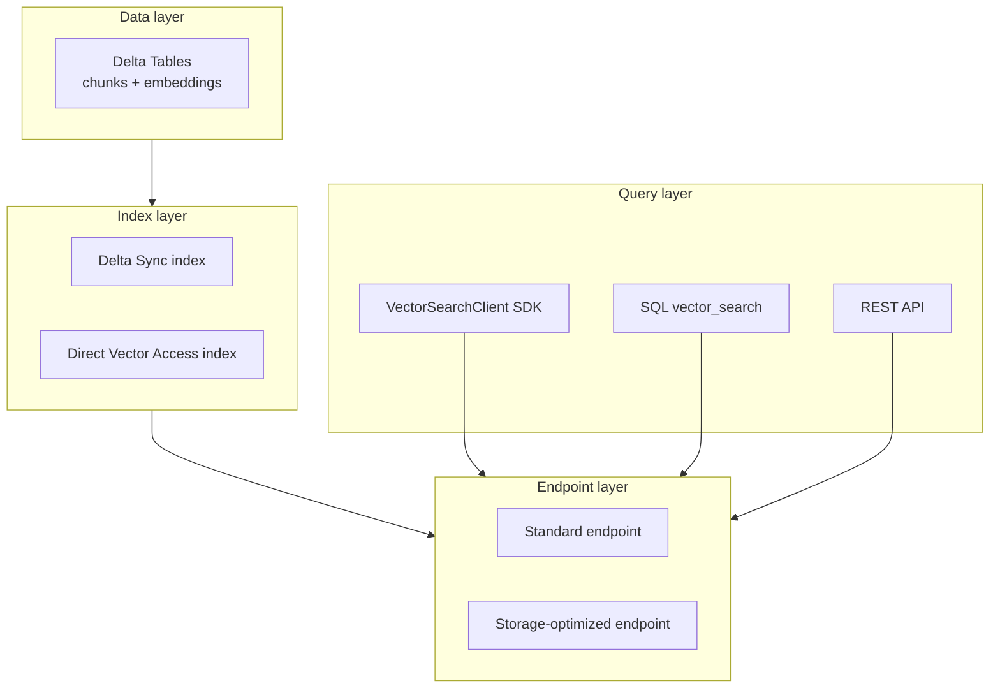
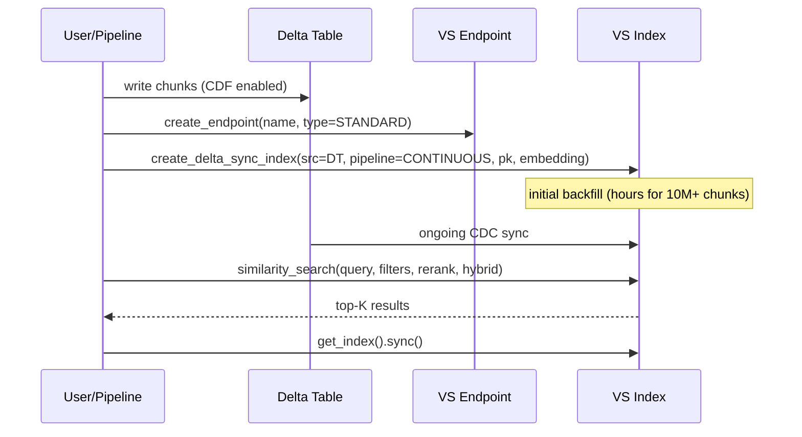
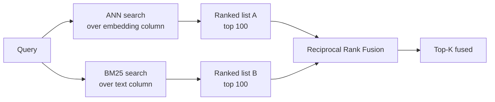
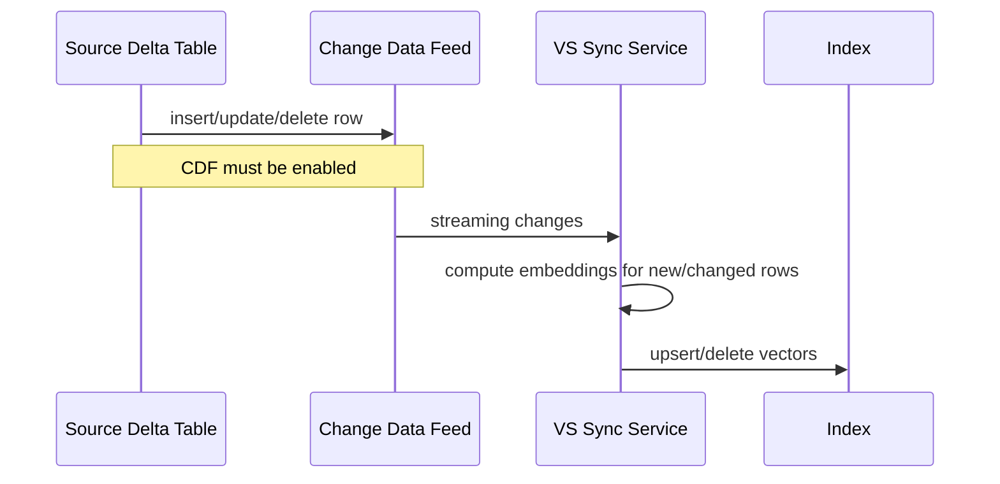

# Module 06 — Mosaic AI Vector Search Deep Dive

> **Goal:** Operate Mosaic AI Vector Search end-to-end: create an index, query (ANN / hybrid / full-text), filter, rerank, manage Delta Sync, and explain trade-offs. Covers **Sec 4 Obj 6, 8, 10** and **Sec 3 Obj 1** at the retrieval layer.
>
> **Assumes:** [Module 04](04_embeddings_indexing.md). This module goes deeper on lifecycle, query API, and operational gotchas.

---

## Coverage map (verbatim Mar 18, 2026 objectives → section)

| Objective | Section |
|---|---|
| Sec 4 Obj 6 — Create and query a Vector Search index | "Index lifecycle" + "Querying — every parameter you should know" |
| Sec 4 Obj 8 — Explain key concepts and components of Mosaic AI Vector Search | "Key concepts and components" + "Hybrid search anatomy" |
| Sec 4 Obj 10 — Configure VS for # embeddings / update frequency / latency / cost (incl. storage-optimized) | "Performance & cost honest numbers" + "Worked: configuring for 80 QPS, 100M items" |
| Sec 3 Obj 1 — Select LangChain/similar tools for use in a GenAI application (retrieval layer) | "SQL `vector_search` from a notebook" + cross-ref [Module 07](07_rag_chains.md) |
| Sec 2 Obj 8 — Explain the role of re-ranking | "Reranker integration" + cross-ref [Module 04](04_embeddings_indexing.md) |

---

## Key concepts and components (Sec 4 Obj 8)

Mosaic AI Vector Search has **four layers**:



Each lives in Unity Catalog as a governable asset.

| Layer | UC type | RBAC unit |
|-------|---------|-----------|
| Data | Delta table | Table grants |
| Endpoint | Vector Search Endpoint | Endpoint grants (`USE`, `MANAGE`) |
| Index | Vector Search Index | Index grants (`USE_INDEX`) |
| Model (embedding) | Registered model | Model grants |

> ⚠️ **Exam trap:** Granting `SELECT` on the source Delta table doesn't grant query access on the **index**. The index has its own ACL.

---

## Index lifecycle



### Lifecycle commands

```python
from databricks.vector_search.client import VectorSearchClient
vsc = VectorSearchClient()

# Endpoint
vsc.create_endpoint("vs-prod", endpoint_type="STANDARD")
vsc.list_endpoints()
vsc.get_endpoint("vs-prod")
vsc.delete_endpoint("vs-prod")

# Index
idx = vsc.create_delta_sync_index(
    endpoint_name="vs-prod",
    source_table_name="cat.silver.chunks",
    index_name="cat.indexes.chunks_v1",
    pipeline_type="CONTINUOUS",    # or TRIGGERED
    primary_key="chunk_id",
    embedding_source_column="text",
    embedding_model_endpoint_name="databricks-bge-large-en",
)

idx.describe()
idx.sync()                          # triggered-mode only
idx.delete()
```

---

## `similarity_search()` vs `query()` — look-alike API comparison

| Method | Where it lives | Signature highlights | When |
|---|---|---|---|
| `index.similarity_search(query_text?, query_vector?, columns, num_results, filters?, query_type?, score_threshold?, reranker?)` | `VectorSearchIndex` instance method | High-level retrieval API; most exam answers reference this | Standard agent / LangChain retriever path |
| `index.query(...)` | Lower-level REST passthrough; same semantics | Identical params; sometimes shown in REST samples | When SDK abstraction isn't desired |
| `SQL vector_search(...)` | SQL function (LATERAL VIEW) | Same params as keyword args; ergonomic for batch | SQL pipelines, Delta MERGE, `ai_query`-style flows |
| `langchain.DatabricksVectorSearch.as_retriever().get_relevant_documents(q)` | LangChain retriever wrapper | Wraps `similarity_search` under the hood | LangChain chains |

> ⚠️ **Exam trap:** All four converge on the same backend. Don't pick "use `query()` for hybrid" vs "use `similarity_search()` for ANN" — they're equivalent.

## Full `similarity_search()` parameter table

| Param | Type | Required | Notes / gotchas |
|---|---|---|---|
| `query_text` | str | one of two | If set, VS embeds it server-side using the index's embedding model |
| `query_vector` | list[float] | one of two | If set, you pre-embedded; **must match index dim** |
| `columns` | list[str] | yes | Which source columns to return alongside score; subset of indexed columns |
| `num_results` | int | yes | Top-K. Over-retrieve if you'll rerank (e.g., 50 → rerank to 5) |
| `filters` | dict | no | Metadata pre-filter; see syntax below |
| `query_type` | str | no | `"ANN"` (default), `"HYBRID"`, `"FULL_TEXT"` |
| `score_threshold` | float | no | Drop candidates below this score (interpretation depends on metric) |
| `reranker` | str | no | Endpoint name of a deployed cross-encoder |

> ⚠️ **Exam trap:** Passing **both** `query_text` and `query_vector` → error. Pick one. The exam asks "which is correct?" with both set as a distractor.

## Filter syntax — the exam-testable details

Filters are JSON-style dicts supporting:

| Operator form | Example | Semantics |
|---|---|---|
| Scalar equality | `{"state": "NY"}` | exact match |
| List = IN | `{"state": ["NY", "NJ"]}` | match any |
| Multi-key AND (implicit) | `{"state": "NY", "tier": "gold"}` | both must match |
| Explicit OR | `{"OR": [{"a": 1}, {"b": 2}]}` | any sub-filter matches |
| Explicit AND | `{"AND": [{"a": 1}, {"b": 2}]}` | all sub-filters match |
| NOT | `{"NOT": {"is_archived": True}}` | negate |
| Range (when supported) | `{"date": {">=": "2026-01-01", "<": "2026-06-01"}}` | range |

**Filter is a pre-filter:** Mosaic AI VS narrows the candidate pool before ANN. High-selectivity filters can hurt recall when the filtered pool is smaller than `num_results`.

## `query_type` — when each wins

| Mode | Algorithm | Score interpretation | Use when |
|---|---|---|---|
| `ANN` (default) | HNSW dense similarity | Cosine in [0, 1] typically (or dot/L2 depending on index) | Pure prose, paraphrase-tolerant |
| `HYBRID` | ANN + BM25 fused via Reciprocal Rank Fusion | RRF score (not directly comparable to cosine) | Corpora mixing prose + codes/IDs/jargon |
| `FULL_TEXT` | BM25 only | BM25 score (positive reals, higher = better) | Lexical-only at scale; storage-opt BM25-only indexes |

## Score interpretation by metric

| Index metric | Score range | Higher better? | Typical threshold for "likely relevant" |
|---|---|---|---|
| **Cosine** (default for most embedders) | [-1, 1], practically [0, 1] for normalized vectors | Yes | > 0.5 |
| **Dot product** | unbounded; depends on vector magnitudes | Yes | empirical, no fixed cutoff |
| **L2 (Euclidean)** | [0, ∞), 0 = identical | **No (lower better)** | < some threshold, embedder-specific |

> ⚠️ **Exam trap:** Setting `score_threshold=0.7` blindly without knowing the metric. Cosine threshold ≠ L2 threshold ≠ BM25/RRF. **Inspect the index config first.**

## Columns parameter — what you can return

`columns` must be a subset of:
- The `primary_key`
- Columns declared in `columns_to_sync` at index creation (or all source columns if not set)
- Implicit fields: `score` is always returned alongside the listed columns

You **cannot** return columns that weren't synced into the index — even if they exist in the source table. If you need a new column at query time, re-create the index with an expanded `columns_to_sync`.

---

## Querying — every parameter you should know

```python
results = vsc.get_index("cat.indexes.chunks_v1").similarity_search(
    query_text="member appealed denial",
    columns=["chunk_id", "text", "source_doc", "page_no"],
    num_results=20,                          # top-K
    filters={"member_state": ["NY", "NJ"]},  # equality / IN
    query_type="HYBRID",                     # ANN | HYBRID | FULL_TEXT
    score_threshold=0.65,                    # cosine score cutoff (filter low-confidence)
    # 2025+:
    reranker="cat.models.bge_reranker_large",
)
```

### `query_type` choices

| Mode | Algorithm | When |
|------|-----------|------|
| `ANN` | HNSW dense similarity | Pure prose, paraphrase-tolerant |
| `HYBRID` | ANN + BM25, RRF fused | Mixed prose + codes/IDs/jargon |
| `FULL_TEXT` | BM25 only | Exact-token lexical search at scale (storage-opt + BM25-only indexes) |

### Filters

JSON-style; supports equality, IN, AND, OR, NOT:

```python
filters={
    "member_state": ["NY", "NJ"],
    "created_year": 2026,
    "OR": [
        {"product_line": "medicare"},
        {"product_line": "medicaid"},
    ],
    "NOT": {"is_archived": True},
}
```

**Filter application:** Vector Search applies filters **before** the ANN step (pre-filter), narrowing the candidate pool. If your filter matches only 100 rows of 50M, ANN searches those 100.

> ⚠️ **Exam trap:** "Filters apply after search" is a common wrong answer. They are pre-filters in Mosaic AI Vector Search.

### `score_threshold`

Optional minimum similarity. Removes weak matches that ANN returns to fill top-K. Tune by examining your data; typical 0.5–0.75 for cosine.

---

## Hybrid search anatomy



RRF formula:
```
RRF_score(d) = 1/(k + rank_ANN(d)) + 1/(k + rank_BM25(d))
```
with `k = 60` by default. Documents top-ranked in **either** list bubble to the top of the fused list.

**Why hybrid wins on:**
- Acronyms & codes (CPT 99213, ICD-10 I50.9, NDC numbers) — BM25 catches exact tokens.
- Brand names, product SKUs.
- Rare medical / legal terminology.
- Domain jargon the embedding model wasn't trained on.

**Why hybrid doesn't always help:**
- Pure prose with paraphrased queries: ANN already handles semantics.
- Small corpora (< 1M vectors): both indexes are fast but you pay double indexing latency.

---

## Reranker integration

Two paths covered in [Module 04](04_embeddings_indexing.md#reranking-on-vector-search-sec-2-obj-8). Quick reference:

```python
# Built-in (2025 GA): the index calls the reranker endpoint internally
results = idx.similarity_search(
    query_text=q,
    num_results=50,
    reranker="cat.models.bge_reranker_large",  # served as a Mosaic AI endpoint
)
# results are reranked

# External: you call the reranker yourself
candidates = idx.similarity_search(query_text=q, num_results=50)
reranked = call_reranker_endpoint("cat.models.bge_reranker_large", q, candidates)
top5 = reranked[:5]
```

> ⚠️ **Exam trap:** The reranker must be **deployed as a Mosaic AI Model Serving endpoint** to use the `reranker=` parameter. You can't pass a model object inline.

---

## SQL `vector_search` from a notebook or DBSQL

```sql
SELECT
  c.member_id,
  c.claim_id,
  vs.text     AS retrieved_text,
  vs.chunk_id AS chunk_id,
  vs.score
FROM
  silver.claims c
  LATERAL VIEW vector_search(
    'cat.indexes.policy_chunks_v1',
    query_text => c.denial_code || ' ' || c.diagnosis_code,
    columns    => ARRAY('chunk_id', 'text'),
    num_results => 5,
    query_type  => 'HYBRID'
  ) vs
WHERE c.created_at > current_date() - 7;
```

This is the **batch retrieval** pattern — score retrieval against every row of an input table. Use case: precompute citations for nightly batches of claim letters.

---

## Delta Sync mechanics



### Continuous vs Triggered

| Mode | Latency to freshness | Cost | Endpoint support |
|------|---------------------|------|-------------------|
| **Continuous** | Seconds to minutes | Higher (always-on streaming) | Standard only |
| **Triggered** | When you call `.sync()` | Lower (on-demand compute) | Standard + Storage-opt |

### When sync stalls

| Symptom | Cause | Fix |
|---------|-------|-----|
| Index row count not updating | CDF disabled | `ALTER TABLE ... SET TBLPROPERTIES(delta.enableChangeDataFeed=true)` |
| Duplicate vector entries | PK not unique in source | Enforce unique PK; rebuild |
| Embedding model unavailable | Endpoint deleted / retired | Repoint to current model; rebuild |
| Schema change | Column dropped from source | Schema-evolve carefully; consider new index version |
| Permission denied | Service principal lost access | Grant `SELECT` on source + `USE_INDEX` on index |

---

## Direct Vector Access — when to use

Skip Delta Sync entirely; manage vectors yourself:

```python
direct_idx = vsc.create_direct_access_index(
    endpoint_name="vs-prod",
    index_name="cat.indexes.user_events_v1",
    primary_key="event_id",
    embedding_dimension=1024,
    embedding_vector_column="embedding",
    schema={
        "event_id": "string",
        "embedding": "array<float>",
        "user_id": "string",
        "event_type": "string",
    },
)

direct_idx.upsert([
    {"event_id": "e1", "embedding": [...], "user_id": "u123", "event_type": "click"},
])
direct_idx.delete(primary_keys=["e1"])
```

**Use Direct Access when:**
- Data source isn't Delta (Kafka, external API).
- You need fine-grained upsert control (e.g., real-time deletion for compliance).
- You're managing vectors as part of a streaming pipeline.

**Don't use Direct Access when:**
- Source is already a Delta table — Delta Sync is strictly easier and gives CDC for free.

---

## BM25-only indexes (storage-optimized)

A storage-optimized endpoint supports **Delta Sync indexes with no embedding column** — purely BM25 keyword index. Use cases:
- Audit-only search (find every doc mentioning X)
- Compliance e-discovery
- Lexical filtering as a preprocessing step before semantic search

```python
vsc.create_delta_sync_index(
    endpoint_name="vs-storage-opt",
    source_table_name="cat.silver.audit_logs",
    index_name="cat.indexes.audit_logs_bm25",
    pipeline_type="TRIGGERED",
    primary_key="log_id",
    # NO embedding_source_column, NO embedding_model_endpoint_name
)
```

> ⚠️ **Exam trap:** BM25-only indexes are storage-optimized **only**. Don't pick this for a standard endpoint.

---

## Performance & cost honest numbers

| Knob | Practical limit | Note |
|------|-----------------|------|
| Vectors per standard endpoint | ~100M | Quality degrades past this |
| Vectors per storage-optimized | 1B at dim 768 | Officially supported scale |
| QPS per VS unit | ~30 plateau beyond ~2M vectors (standard) | Shard or scale up units |
| Index build time (10M chunks) | Hours | Plan ETL accordingly |
| Hybrid latency vs ANN | +30–80ms typical | Worth it for code-heavy corpora |
| Reranker latency | +100–300ms for top-50 → top-5 | Use only when retrieval quality matters |

### Cost model

- **Endpoint hour** — flat hourly per endpoint type and size.
- **Vectors stored** — per million per month.
- **Query** — typically included in endpoint hour up to limits.
- **Embedding generation** — billed against the embedding model endpoint (PPT or PT).

> ⚠️ **Exam trap:** Choosing storage-optimized is **also** a cost decision, not just a scale one. ~7× cheaper per vector at scale.

---

## Worked: configuring for an 80 QPS, 100M-item, hybrid + rerank workload

This is sample Q6's scenario.

| Requirement | Choice |
|-------------|--------|
| 100M items | Storage-optimized (at standard ceiling; safer to go storage-opt) |
| 80 QPS sustained | Storage-opt + scale to multiple VS units / shards if needed |
| Hybrid (mix of codes + prose) | `query_type="HYBRID"` |
| Best retrieval quality | Rerank top-50 to top-5 via `reranker=` |
| Sync cadence (catalog updates) | Triggered, hourly via scheduled Job |

**Result:** Storage-optimized + Triggered + hybrid + reranker. Sample Q6 answer.

---

## Mini quiz

1. You set `filters={"customer_tier": "gold"}`, top-K=5, and the index has 100K gold rows. Vector Search applies the filter **before or after** ANN?
2. Why does pure ANN miss "I50.9" in clinical notes searches even though "heart failure unspecified" semantic match should work?
3. You created a Delta Sync index in `CONTINUOUS` mode but new rows added to source aren't appearing. Top three things to check?
4. The exam asks "which two settings minimize cost for a 500M-vector index updated nightly?" — pick two.
5. You want to query the VS index from a SQL `MERGE` statement to enrich every claim. Which function?

### Answers

1. **Before.** Pre-filter narrows the candidate pool ANN searches over. (Common wrong answer: "after".)
2. The embedding model didn't see enough ICD-10 codes in training to assign "I50.9" a meaningful vector. Hybrid search adds BM25 over the text column, which finds "I50.9" by exact match.
3. (a) CDF enabled on source? (b) Primary key unique? (c) Embedding endpoint healthy and reachable? Also: schema drift, ACLs, sync state in `describe()`.
4. (a) **Storage-optimized endpoint** (~7× cheaper per vector at this scale). (b) **Triggered sync** (cheaper than continuous when freshness can be deferred).
5. `vector_search()` SQL function in a LATERAL VIEW or as a subquery feeding the MERGE source.

---

## Exam-trap recap

> ⚠️ Filters applied after search — they're pre-filters.
> ⚠️ Continuous sync on a storage-optimized endpoint — not supported.
> ⚠️ Hot-swapping the embedding model (dim or model name) — rebuild required.
> ⚠️ Top-5 ANN with no rerank for production-quality retrieval.
> ⚠️ BM25-only index on standard endpoint — storage-opt only.
> ⚠️ Granting source-table SELECT without granting index USE_INDEX.
> ⚠️ Passing a Python reranker object inline — must be a Model Serving endpoint.

---

## Worked exam-question walkthroughs

### Walkthrough 1 — Hybrid vs ANN-only for code-heavy corpus

**Pattern:** Clinical notes mix prose with codes (ICD-10, CPT). User queries by exact code "I50.9" — pure ANN misses. Best query config?
- A: ANN with rerank
- B: HYBRID with rerank
- C: FULL_TEXT only
- D: Add more chunks

**Reasoning chain:**
1. Exact-token codes need lexical matching. ANN's embeddings don't memorize rare tokens.
2. FULL_TEXT alone misses paraphrased queries ("heart failure unspecified").
3. **HYBRID** fuses both via RRF — code AND paraphrase both surface.
4. Reranking on top is the production polish.

> 🎯 **How to recognize on the exam:** Corpus mixes "prose + codes/IDs/jargon" → HYBRID. Always.

**Answer:** B.

### Walkthrough 2 — Score threshold + metric

**Pattern:** Index uses L2 distance. Team sets `score_threshold=0.7`. Why are no results returned?

**Reasoning chain:**
1. With L2, lower = closer. A score of 0.7 means the candidate is *farther* than 0.7 — and you're keeping only candidates with score *above* 0.7 (i.e., farther away).
2. The threshold semantics are inverted vs cosine.

> 🎯 **How to recognize on the exam:** Score threshold + L2 → swap the inequality. Cosine 0.7 means "very similar"; L2 0.7 means "far apart."

**Answer:** Threshold semantics inverted. Either flip to "≤ 0.7" semantics if the SDK supports it, or rebuild the index with cosine.

### Walkthrough 3 — Columns not returned

**Pattern:** Created index with `columns_to_sync=["chunk_id", "text"]`. Query asks for `columns=["chunk_id", "text", "page_no"]`. Why empty `page_no`?

**Reasoning chain:**
1. `page_no` wasn't synced into the index, even though it exists in the source table.
2. The index only knows about columns it synced.

> 🎯 **How to recognize on the exam:** "Returns null / missing column" + Vector Search → check `columns_to_sync` at index creation. Recreate with expanded list.

**Answer:** Recreate the index with `page_no` added to `columns_to_sync` (or use default = all columns).

### Walkthrough 4 — Pre-filter wipes recall

**Pattern:** Filter `{"member_state": "WY"}` matches only 50 rows in 50M index. Top-K=20 returns 20, but quality is poor. Why?

**Reasoning chain:**
1. Pre-filter narrows ANN to a 50-row pool.
2. Even the worst matches in 50 will be returned as "top 20" if there are ≥ 20 — but they may all be poorly matched.
3. Need a broader filter (e.g., region instead of state) OR a fallback path when the filter is too selective.

> 🎯 **How to recognize on the exam:** "Filter very selective + low result quality" → broaden the filter or add a fallback.

**Answer:** Reduce filter selectivity (e.g., filter by region rather than state) and/or add a graceful no-result handler.

### Walkthrough 5 — Reranker as endpoint

**Pattern:** Team writes `reranker=BGEReranker()` passing a local Python object. Index call fails.

**Reasoning chain:**
1. The `reranker` parameter accepts an **endpoint name**, not a Python object.
2. Reranker must be deployed as a Mosaic AI Model Serving endpoint first.

> 🎯 **How to recognize on the exam:** "Reranker" arg + value is anything but a string endpoint name → fail.

**Answer:** Deploy the reranker model as a serving endpoint; pass its name string.

---

## Output-prediction drills

### Drill 1 — Filter syntax

```python
filters={"state": ["NY", "NJ"], "tier": "gold", "NOT": {"archived": True}}
```

What does this match?

**Answer:** Rows where `state ∈ {NY, NJ}` AND `tier == "gold"` AND `archived != True`. Implicit AND across top-level keys; explicit NOT inverts.

### Drill 2 — query_type behavior

```python
idx.similarity_search(query_text="I50.9 heart failure", query_type="ANN", num_results=10)
```

vs:

```python
idx.similarity_search(query_text="I50.9 heart failure", query_type="HYBRID", num_results=10)
```

Predict which is more likely to surface chunks containing the literal string `"I50.9"`.

**Answer:** HYBRID — because BM25's lexical match on `"I50.9"` boosts those chunks in the fused RRF ranking. Pure ANN may rank semantically related chunks ahead of exact-code chunks.

### Drill 3 — Score interpretation

A cosine-similarity index returns score=0.62 for the top result. Should you trust it?

**Answer:** Borderline. Cosine 0.62 on a normalized embedding model is "moderate" — likely on-topic but not a strong match. Inspect manually; consider `score_threshold=0.65` to drop weak candidates and add a reranker.

### Drill 4 — Continuous + storage-opt error

```python
vsc.create_delta_sync_index(
    endpoint_name="vs-storage-opt",
    pipeline_type="CONTINUOUS",
    ...
)
```

**Answer:** Fails validation. Storage-optimized supports only `TRIGGERED`. Fix: change to TRIGGERED + scheduled `.sync()`.

### Drill 5 — query_text + query_vector both set

```python
idx.similarity_search(
    query_text="cardiology coverage",
    query_vector=[0.1, 0.2, ...],
    num_results=5,
)
```

**Answer:** Error. Must pick exactly one. Pick `query_text` when the index embeds for you; pick `query_vector` when you embed query-side (rare).

---

## End-to-end mini-scenario — query with all knobs

```python
from databricks.vector_search.client import VectorSearchClient
vsc = VectorSearchClient()
idx = vsc.get_index("cat.indexes.policy_chunks_v1")

# Over-retrieve 50, hybrid for code-heavy clinical text, pre-filter to NY+NJ,
# pre-2026 docs, reranker to top-5
results = idx.similarity_search(
    query_text="prior authorization for cardiology imaging",
    columns=["chunk_id", "text", "source_doc", "page_no", "policy_year"],
    num_results=50,
    filters={
        "member_state": ["NY", "NJ"],
        "AND": [{"policy_year": {">=": 2025}}, {"NOT": {"is_archived": True}}],
    },
    query_type="HYBRID",
    score_threshold=0.5,
    reranker="cat.models.bge_reranker_large",
)

# Inspect
import pandas as pd
df = pd.DataFrame(
    results["result"]["data_array"],
    columns=[c["name"] for c in results["manifest"]["columns"]],
)
print(df.head())
# chunk_id, text, source_doc, page_no, policy_year, score
```

Every Sec 4 Obj 6 / 8 / 10 lever is exercised: filter, hybrid, threshold, reranker, multi-column return.
