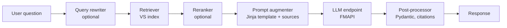
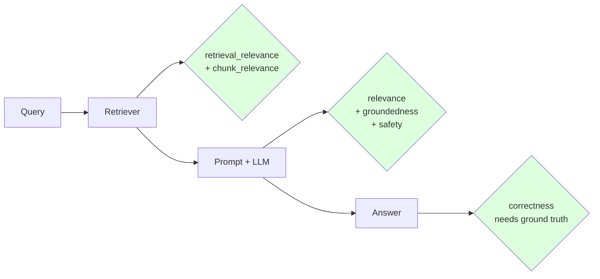

# Module 07 — RAG Chains on Databricks

> **Goal:** Build a complete RAG chain using LangChain on Databricks, log it as an MLflow PyFunc, register it to Unity Catalog, and deploy it. Covers **Sec 3 Obj 1, 4, 11** and **Sec 4 Obj 1, 3, 4, 5**.
>
> **Assumes:** [Modules 04, 06](04_embeddings_indexing.md) for the retriever and [Module 05](05_prompt_engineering.md) for prompt design.

---

## Coverage map (verbatim Mar 18, 2026 objectives → section)

| Objective | Section |
|---|---|
| Sec 3 Obj 1 — Select LangChain/similar tools for use in a GenAI application | "Selecting LangChain (or similar)" + "LangChain vs LlamaIndex vs LangGraph vs vanilla — look-alike" |
| Sec 3 Obj 4 — Augment a prompt with additional context from a user's input | "Anatomy of a simple LangChain RAG chain" + cross-ref [Module 05](05_prompt_engineering.md) |
| Sec 3 Obj 11 — Utilize MLflow and Agent Framework for developing agentic systems | "Wrapping the chain as a logged MLflow model" |
| Sec 4 Obj 1 — Code a chain using a pyfunc model with pre- and post-processing | "PyFunc with pre/post-processing" |
| Sec 4 Obj 3 — Code a simple chain according to requirements | "Coding a simple chain to requirements" |
| Sec 4 Obj 4 — Choose basic RAG elements: model flavor, embedding model, retriever, deps, input examples, model signature | "Required elements of a RAG application" |
| Sec 4 Obj 5 — Register the model to Unity Catalog using MLflow | "Registering the model to Unity Catalog" |

---

## The canonical RAG chain on Databricks



Three production decisions stack on top:

1. **Wrap as `mlflow.pyfunc.PythonModel`** so it can be logged, registered, and deployed.
2. **Add MLflow Tracing** so every step is observable.
3. **Register dependencies** (the VS index, embedding endpoint, LLM endpoint, prompt) as **`resources`** in the logged model — required for proper service-principal credentials at serving time.

---

## Selecting LangChain (or similar) for a GenAI app (Sec 3 Obj 1)

Three orchestration choices, on Databricks all first-class:

| Framework | Sweet spot | Trade-off |
|-----------|-----------|-----------|
| **LangChain** | Standard RAG, chains, retrievers, prompt templates | Mature, broad community; sometimes over-abstracted |
| **LangGraph** | Stateful agents, branching workflows, memory | More code, but cleaner state management |
| **LlamaIndex** | Document indexing & retrieval-heavy apps | Strong on indexing strategies, narrower agent story |
| **Vanilla Python + Databricks SDK** | Small, custom, low-dependency chains | More code, but no framework lock-in |

> ⚠️ **Exam trap:** Databricks' Agent Framework is **NOT** an alternative to LangChain — it's the **wrapper that logs/deploys/governs** your LangChain (or LangGraph, or vanilla) chain. They're complementary.

---

## LangChain vs LlamaIndex on Databricks — look-alike comparison

| Concern | LangChain | LlamaIndex |
|---|---|---|
| Sweet spot | Generic chains, RAG, agents, tool use | Document indexing/retrieval-heavy apps |
| Databricks integration | First-class via `langchain-databricks`, `databricks-langchain` | Available via community connectors; less Databricks-tested |
| MLflow flavor | `mlflow.langchain.log_model()` | `mlflow.pyfunc.log_model()` with custom wrapping |
| Tracing | `mlflow.langchain.autolog()` auto-captures | Manual `@mlflow.trace` decorators |
| Mosaic AI Agent Framework compatibility | Native | Wrap as `pyfunc.ChatAgent` |
| Exam coverage | Heavy | Light — mentioned as alternative |

> 🎯 **How to recognize on the exam:** "LangChain or similar" → LangChain is the default. LlamaIndex / LangGraph / vanilla Python are valid alternatives but rarely the answer for stock RAG.

## `DatabricksVectorSearch` retriever vs `DatabricksEmbeddings` — look-alike

| Class | Module | Purpose | When to use |
|---|---|---|---|
| `DatabricksVectorSearch` | `databricks_langchain` (or older `langchain_databricks`) | Vector store wrapper exposing `.as_retriever()` over a VS index | Standard RAG retrieval — the **retriever** in the chain |
| `DatabricksEmbeddings` | `databricks_langchain` | Embedding model wrapper over a served embedding endpoint | When you need to embed text outside the index (e.g., query rewriting that requires an explicit vector) |
| `ChatDatabricks` | `langchain_databricks` (or `databricks_langchain.ChatDatabricks`) | Chat LLM wrapper over a served chat endpoint | The **LLM** in the chain |

**Pattern:** `DatabricksVectorSearch(..., embedding=DatabricksEmbeddings(...))` ties an index to a query-side embedder. If the index is **managed-embeddings**, you don't strictly need to pass `embedding=` for retrieval — VS embeds the query server-side.

## Chain vs Runnable vs LCEL — look-alike

The exam may use any of these terms interchangeably for "the composed pipeline." They are:

| Term | Object type | How you build it |
|---|---|---|
| **Chain** (old) | `langchain.chains.Chain` subclass (e.g., `RetrievalQA`, `LLMChain`) | Class-based, deprecated for new code |
| **Runnable** | `langchain_core.runnables.Runnable` (`RunnablePassthrough`, `RunnableLambda`, `RunnableSequence`) | Modular building blocks composed with `|` |
| **LCEL** (LangChain Expression Language) | The composition syntax `a | b | c` over Runnables | Modern idiomatic style |

```python
# All three express the same pipeline; LCEL is preferred:
chain = {"context": retriever, "question": RunnablePassthrough()} | prompt | llm | StrOutputParser()
```

> ⚠️ **Exam trap:** "Chain" in the exam objective and "Runnable" in code both refer to the same concept. Don't pick the option that says "Chain is deprecated" — it's still standard exam terminology for the composed pipeline.

---

## Anatomy of a simple LangChain RAG chain on Databricks

```python
import mlflow
from langchain_core.prompts import PromptTemplate
from langchain_core.runnables import RunnablePassthrough, RunnableLambda
from langchain_core.output_parsers import StrOutputParser
from langchain_databricks import ChatDatabricks
from databricks_langchain import DatabricksVectorSearch
from databricks_langchain import DatabricksEmbeddings

# 1. LLM
llm = ChatDatabricks(
    endpoint="databricks-llama-3-3-70b-instruct",
    temperature=0.0,
    max_tokens=800,
)

# 2. Embedding (for query embedding if not server-side)
embeddings = DatabricksEmbeddings(endpoint="databricks-bge-large-en")

# 3. Retriever wrapping a VS index
vector_store = DatabricksVectorSearch(
    endpoint="vs-prod",
    index_name="cat.indexes.policy_chunks_v1",
    embedding=embeddings,
    text_column="text",
    columns=["chunk_id", "source_doc", "page_no"],
)
retriever = vector_store.as_retriever(search_kwargs={"k": 20, "query_type": "HYBRID"})

# 4. Prompt
prompt_template = PromptTemplate.from_template("""You answer benefits questions using ONLY the policy excerpts.
Cite each claim like [S1], [S2]. If sources lack the answer, say so.

<sources>

<source id="S{{ loop.index }}" doc="{{ c.metadata.source_doc }}">{{ c.page_content }}</source>

</sources>

Question: {question}

Answer:""", template_format="jinja2")

# 5. Chain
chain = (
    {"context": retriever, "question": RunnablePassthrough()}
    | prompt_template
    | llm
    | StrOutputParser()
)

# 6. Test
answer = chain.invoke("Is colonoscopy screening covered annually after age 45?")
```

### Add tracing

```python
mlflow.langchain.autolog()    # captures retriever, prompt, LLM, parser as spans
```

Every `chain.invoke()` now appears in the MLflow Experiment Tracing UI with timing per step.

---

## Multi-hop / multi-query retrieval

When a single retrieval misses, two patterns:

### Multi-query (parallel)

Generate N reformulations of the question, retrieve for each, union the results.

```python
from langchain.retrievers.multi_query import MultiQueryRetriever

multi_retriever = MultiQueryRetriever.from_llm(
    retriever=retriever,
    llm=llm,
    prompt=multi_query_prompt,
)
```

### Multi-hop (sequential)

The LLM first asks for a sub-question, retrieves, then asks the next sub-question conditioned on what it learned.

```python
# Hop 1: "Which formulary tier is drug X?"
# Hop 2: "What's the copay for tier Y in member's plan?"
```

Use **LangGraph** for clean multi-hop with state. Or build via an Agent (next module).

> ⚠️ **Exam trap:** Multi-hop is a kind of agent. If the question requires *reasoning across two retrievals*, the answer often shifts from "RAG chain" to "agent with retrieval tool."

---

## Sources & citations

The exam will ask "how does the model cite sources?" Two reliable patterns:

### Pattern A — Inline citations in prompt

The prompt explicitly labels each source `<source id="S1">...</source>`; the system prompt requires citations like `[S1]` after each claim.

### Pattern B — Structured output with citations field

Pydantic schema with `claims: List[Claim]` where `Claim = {text, supporting_chunk_ids}`.

```python
from pydantic import BaseModel
from typing import List

class Claim(BaseModel):
    text: str
    supporting_chunk_ids: List[str]

class Answer(BaseModel):
    summary: str
    claims: List[Claim]
```

Both surface citations the UI/API can render and the eval system can check (groundedness judge).

---

## Wrapping the chain as a logged MLflow model

This is the **most-tested deployment step** (Sec 4 Obj 1, 3, 5).

```python
import mlflow

with mlflow.start_run(run_name="rag_chain_v1"):
    mlflow.langchain.log_model(
        lc_model=chain,
        artifact_path="chain",
        registered_model_name="cat.schema.policy_rag_chain",
        # CRITICAL: declare every Databricks resource the chain touches
        resources=[
            mlflow.models.resources.DatabricksServingEndpoint(
                endpoint_name="databricks-llama-3-3-70b-instruct"
            ),
            mlflow.models.resources.DatabricksServingEndpoint(
                endpoint_name="databricks-bge-large-en"
            ),
            mlflow.models.resources.DatabricksVectorSearchIndex(
                index_name="cat.indexes.policy_chunks_v1"
            ),
        ],
        # Optional but recommended:
        input_example={"question": "What's my deductible?"},
        signature=mlflow.models.infer_signature(...)
    )
```

### Why `resources` matters

At serving time, Databricks generates **scoped, short-lived credentials** for each resource you declared. Without `resources`, the deployed endpoint **cannot authenticate** to the VS index or LLM endpoint. This is a frequent operational bug and a likely exam trap.

> ⚠️ **Exam trap:** Forgetting `resources` when logging. Symptom: chain works locally, fails in serving with PERMISSION_DENIED. The exam may ask "what's missing?"

---

## PyFunc with pre/post-processing (Sec 4 Obj 1)

When LangChain isn't enough — you need custom request validation, response shaping, or business logic — wrap as `mlflow.pyfunc.PythonModel`:

```python
import mlflow.pyfunc

class RagPyfunc(mlflow.pyfunc.PythonModel):
    def load_context(self, context):
        # Heavy init runs once per worker
        import langchain
        # ...build retriever, prompt, llm from artifacts...
        self.chain = build_chain()

    def predict(self, context, model_input):
        # Pre-processing
        q = self._sanitize(model_input["question"][0])
        # Invoke chain
        raw = self.chain.invoke(q)
        # Post-processing
        return self._format_response(raw)

    def _sanitize(self, q: str) -> str:
        return q.strip()[:1000]  # length cap

    def _format_response(self, raw):
        return {"answer": raw, "model_version": "v1"}
```

Log with:

```python
mlflow.pyfunc.log_model(
    artifact_path="chain",
    python_model=RagPyfunc(),
    registered_model_name="cat.schema.rag_pyfunc",
    pip_requirements=["langchain-databricks", "databricks-langchain", "pydantic"],
    resources=[...],
    input_example=pd.DataFrame({"question": ["test"]}),
)
```

### When PyFunc, when LangChain `log_model`?

| Use case | Logging method |
|----------|---------------|
| Pure LangChain chain, no custom logic | `mlflow.langchain.log_model` |
| Custom Python code wrapping LangChain | `mlflow.pyfunc.log_model` |
| Pure Python, no framework | `mlflow.pyfunc.log_model` |
| LangGraph stateful agent | `mlflow.pyfunc.log_model` (graph as artifact) |
| Custom **ChatAgent** / **ResponsesAgent** | `mlflow.pyfunc.log_model` with the right base class |

---

## Required elements of a RAG application (Sec 4 Obj 4)

Verbatim from the exam guide objective:

| Element | What |
|---------|------|
| **Model flavor** | `langchain` or `pyfunc` |
| **Embedding model** | Endpoint name (registered in UC) |
| **Retriever** | VS Index name + query params |
| **Dependencies** | `pip_requirements` or `conda_env` in `log_model` |
| **Input examples** | `input_example=` so model signature can be inferred |
| **Model signature** | Schema for input/output; auto-inferred from `input_example` |
| **Resources** | List of `DatabricksServingEndpoint`, `DatabricksVectorSearchIndex`, `DatabricksFunction`, etc. |

The exam will list 5–7 elements and ask "which are required?" The answer is **all of the above**, but the most-missed in distractors are `resources` and `input_example`.

---

## Registering the model to Unity Catalog (Sec 4 Obj 5)

```python
mlflow.set_registry_uri("databricks-uc")          # critical — points registry at UC

with mlflow.start_run():
    info = mlflow.pyfunc.log_model(
        artifact_path="chain",
        python_model=RagPyfunc(),
        registered_model_name="cat.schema.rag_pyfunc",  # 3-level UC namespace
        resources=[...],
    )
```

Three-level namespace `catalog.schema.model_name` is **required**; two-level Hive Metastore names are rejected when `databricks-uc` registry is set.

Promote across environments with **model aliases**:

```python
from mlflow.tracking import MlflowClient

client = MlflowClient()
client.set_registered_model_alias(
    name="cat.schema.rag_pyfunc",
    alias="staging",
    version=4,
)

# At inference:
loaded = mlflow.pyfunc.load_model("models:/cat.schema.rag_pyfunc@production")
```

---

## Coding a simple chain "to requirements" (Sec 4 Obj 3)

The exam pattern: spec written in prose, you pick the code that implements it. Spec example:

> "Build a chain that takes a question, retrieves top-10 chunks from `cat.indexes.x_v1` with hybrid search, applies the prompt template registered in MLflow as `cat.schema.faq_prompt@production`, and calls `databricks-llama-3-3-70b-instruct`."

```python
from databricks_langchain import DatabricksVectorSearch, DatabricksEmbeddings
from langchain_databricks import ChatDatabricks
from langchain_core.prompts import PromptTemplate
import mlflow

retriever = DatabricksVectorSearch(
    endpoint="vs-prod",
    index_name="cat.indexes.x_v1",
    embedding=DatabricksEmbeddings(endpoint="databricks-bge-large-en"),
).as_retriever(search_kwargs={"k": 10, "query_type": "HYBRID"})

prompt_str = mlflow.genai.load_prompt("cat.schema.faq_prompt@production").template
prompt = PromptTemplate.from_template(prompt_str)
llm = ChatDatabricks(endpoint="databricks-llama-3-3-70b-instruct")

chain = {"context": retriever, "question": RunnablePassthrough()} | prompt | llm
```

> ⚠️ **Exam trap:** Hard-coding the prompt string in your repo instead of loading from Prompt Registry. The exam-correct pattern is `load_prompt(name@alias)` for environment promotion.

---

## Evaluation hook points

Where to plug evaluation into the chain:



`mlflow.genai.evaluate()` runs all these against a golden dataset. See [Module 14](14_genai_evaluation.md).

---

## Mini quiz

1. You log a LangChain RAG chain but the deployed endpoint returns 403 when it tries to query the VS index. Most likely cause?
2. The exam says "register the model to Unity Catalog using MLflow." What two API calls / settings are required?
3. A user's question is multi-hop: "What's the formulary tier of my Lipitor prescription, and what's my copay for that tier?" Single-retrieval RAG fails. What pattern?
4. You want to swap prompt versions without redeploying the model. Which mechanism?
5. The chain uses Llama-3.3-70B and bge-large-en. You forget to list them in `resources`. What's the symptom?

### Answers

1. **`resources` not declared** in `log_model`. Without it, the served endpoint has no credentials for the VS index. Add `DatabricksVectorSearchIndex(...)` to the resources list and re-log.
2. (a) `mlflow.set_registry_uri("databricks-uc")` and (b) pass `registered_model_name="catalog.schema.model_name"` (3-level) to `log_model`.
3. **Multi-hop retrieval via an agent** (LangGraph or Agent Framework). One retrieval finds the tier, the agent then issues a second retrieval/lookup for the copay.
4. **MLflow Prompt Registry aliases.** Store the prompt as a registered prompt artifact; load by `@alias`; update alias to swap.
5. PERMISSION_DENIED or auth errors at serving time. The endpoint can't authenticate to the LLM/embedding/VS resources without scoped credentials, which Databricks issues only when resources are declared at log time.

---

## Exam-trap recap

> ⚠️ Forgetting `resources` in `log_model`.
> ⚠️ Forgetting `mlflow.set_registry_uri("databricks-uc")` — model goes to workspace registry, not UC.
> ⚠️ Two-level model name when UC requires three-level.
> ⚠️ Hard-coding prompt string instead of `load_prompt(@alias)`.
> ⚠️ Treating multi-hop as RAG; it's an agent pattern.
> ⚠️ Logging a LangGraph object via `mlflow.langchain.log_model` (use pyfunc + serialize the graph).
> ⚠️ Confusing Agent Framework with LangChain — the framework wraps LangChain, doesn't replace it.

---

## Worked exam-question walkthroughs

### Walkthrough 1 — "PERMISSION_DENIED on Vector Search index in prod"

**Pattern:** Locally the chain works; deployed endpoint returns PERMISSION_DENIED when calling the VS index. Most likely missing element at log time?
- A: `signature`
- B: `input_example`
- C: `resources`
- D: `pip_requirements`

**Reasoning chain:**
1. A and B affect schema/UI, not auth.
2. D affects which packages get installed at serving time, not auth.
3. **C is the auth story.** Without `resources=[DatabricksVectorSearchIndex(...)]` at log time, the platform doesn't issue scoped credentials to the serving endpoint's SP for that index.

> 🎯 **How to recognize on the exam:** "PERMISSION_DENIED at serving time" + "works locally" → `resources` was missing in `log_model`.

**Answer:** C.

### Walkthrough 2 — Registry URI not set

**Pattern:** Team calls `mlflow.pyfunc.log_model(..., registered_model_name="cat.schema.model")` but the model lands in workspace registry, not UC. Cause?

**Reasoning chain:**
1. MLflow defaults to workspace registry unless `set_registry_uri("databricks-uc")` is called.
2. Adding the call before logging routes to UC.

> 🎯 **How to recognize on the exam:** Three-level name + ends up in workspace registry → `set_registry_uri` missing.

**Answer:** Add `mlflow.set_registry_uri("databricks-uc")` before `log_model`.

### Walkthrough 3 — Multi-hop pattern recognition

**Pattern:** "User asks 'What's my Lipitor formulary tier and what's the copay for that tier in my plan?'" Single retrieval misses. Pick approach.
- A: Increase top-K in retrieval.
- B: Multi-query retrieval.
- C: Agent with retrieval tool (multi-hop).
- D: Larger context window.

**Reasoning chain:**
1. The question requires *sequential* reasoning: hop 1 (drug → tier), hop 2 (tier + plan → copay).
2. A, D give more context but don't sequence.
3. B parallelizes reformulations; doesn't solve the dependency.
4. **C is the multi-hop pattern** — agent observes hop 1 result before issuing hop 2.

> 🎯 **How to recognize on the exam:** "Reasoning across two retrievals" / "answer A informs query B" → **agent pattern**, not enhanced RAG.

**Answer:** C.

### Walkthrough 4 — pyfunc vs langchain log_model

**Pattern:** Team needs custom pre/post processing in their chain. Which logging path?
- A: `mlflow.langchain.log_model(lc_model=chain)`
- B: `mlflow.pyfunc.log_model(python_model=MyPyFuncWrappingChain())`
- C: `mlflow.sklearn.log_model`
- D: `mlflow.transformers.log_model`

**Reasoning chain:**
1. Sec 4 Obj 1 names "code a chain using a pyfunc model with pre- and post-processing." That's literal pyfunc.
2. A logs a pure LangChain object — no place for custom Python pre/post.
3. C/D are wrong flavors.

> 🎯 **How to recognize on the exam:** "Pre/post-processing" → `mlflow.pyfunc.log_model` with `python_model=` and `code_paths=`.

**Answer:** B.

### Walkthrough 5 — Required elements check (Sec 4 Obj 4)

**Pattern:** Question lists 8 elements and asks "which are required for a RAG application registration?"
- Model flavor ✓
- Embedding model ✓
- Retriever ✓
- Dependencies (`pip_requirements`) ✓
- Input examples ✓
- Model signature ✓
- Resources ✓
- ROC curve ✗

> 🎯 **How to recognize on the exam:** Required-elements lists almost always include `resources` (often forgotten) and `input_example` (often considered optional). ROC / classification artifacts are not RAG-relevant distractors.

**Answer:** All of the first seven; ROC curve is not required.

---

## Output-prediction drills

### Drill 1 — LCEL pipe order

```python
chain = {"context": retriever, "question": RunnablePassthrough()} | prompt | llm | StrOutputParser()
```

What does `chain.invoke("What is a deductible?")` do, step by step?

**Answer:**
1. Input `"What is a deductible?"` enters the dict-Runnable.
2. `retriever` runs on the input → list of `Document` chunks.
3. `RunnablePassthrough()` echoes the input as `question`.
4. The dict `{"context": [Docs], "question": "..."}` flows to `prompt`, which renders.
5. Rendered prompt → `llm.invoke()` → ChatMessage.
6. `StrOutputParser` extracts the text content.
7. Returns a string.

### Drill 2 — Resources list shape

```python
resources=[
    mlflow.models.resources.DatabricksServingEndpoint(endpoint_name="databricks-llama-3-3-70b-instruct"),
    mlflow.models.resources.DatabricksVectorSearchIndex(index_name="cat.indexes.policy_v1"),
    mlflow.models.resources.DatabricksFunction(function_name="cat.tools.get_member_eligibility"),
]
```

If the agent uses an LLM + 1 VS index + 2 UC function tools, how many entries in `resources`?

**Answer:** 4 (LLM endpoint + VS index + 2 UC functions). Each resource is named individually. Missing any one → PERMISSION_DENIED on that resource at serving.

### Drill 3 — Two-level model name

```python
mlflow.set_registry_uri("databricks-uc")
mlflow.pyfunc.log_model(..., registered_model_name="my_model")
```

**Answer:** Fails — UC requires three-level `catalog.schema.model_name`. Two-level (`schema.model`) and one-level (`model`) are Hive Metastore conventions; rejected under UC.

### Drill 4 — Alias vs version pin

The endpoint config has `entity_version="5"`. The team flips `@production` alias to version 7. Does the endpoint update?

**Answer:** **No** — the endpoint pin is by **version number**, not alias. Alias swaps update only the *pointer* in UC. The endpoint must be reconfigured to point at version 7 (or to resolve `@production` dynamically — supported in newer SDK paths but not the default).

### Drill 5 — autolog scope

```python
mlflow.langchain.autolog()
chain.invoke("test")
```

What spans appear in the MLflow trace?

**Answer:** Spans for the retriever, the prompt rendering, the LLM call, the parser — each as a child span under a root "chain" span. Latency and inputs/outputs per span. Useful for finding which step caused a slow response.

---

## End-to-end mini-scenario — full RAG chain logged + registered

```python
import mlflow
from langchain_core.prompts import PromptTemplate
from langchain_core.runnables import RunnablePassthrough
from langchain_core.output_parsers import StrOutputParser
from langchain_databricks import ChatDatabricks
from databricks_langchain import DatabricksVectorSearch, DatabricksEmbeddings
import pandas as pd

# 1. Build the chain
llm = ChatDatabricks(endpoint="databricks-llama-3-3-70b-instruct", temperature=0.0)
embeddings = DatabricksEmbeddings(endpoint="databricks-bge-large-en")

retriever = DatabricksVectorSearch(
    endpoint="vs-prod",
    index_name="cat.indexes.policy_chunks_v1",
    embedding=embeddings,
    text_column="text",
    columns=["chunk_id", "source_doc", "page_no"],
).as_retriever(search_kwargs={"k": 10, "query_type": "HYBRID"})

# Load prompt from Prompt Registry (Sec 4 Obj 14)
prompt_artifact = mlflow.genai.load_prompt("cat.prompts.policy_qa@production")
prompt = PromptTemplate.from_template(prompt_artifact.template, template_format="jinja2")

chain = (
    {"context": retriever, "question": RunnablePassthrough()}
    | prompt
    | llm
    | StrOutputParser()
)

# 2. Enable autotracing
mlflow.langchain.autolog()

# 3. Smoke test
print(chain.invoke("Is colonoscopy covered annually after 45?"))

# 4. Set UC registry and log
mlflow.set_registry_uri("databricks-uc")
with mlflow.start_run(run_name="policy_rag_v1"):
    info = mlflow.langchain.log_model(
        lc_model=chain,
        artifact_path="chain",
        registered_model_name="cat.agents.policy_rag",
        # Sec 4 Obj 4 — required elements
        resources=[
            mlflow.models.resources.DatabricksServingEndpoint(
                endpoint_name="databricks-llama-3-3-70b-instruct"),
            mlflow.models.resources.DatabricksServingEndpoint(
                endpoint_name="databricks-bge-large-en"),
            mlflow.models.resources.DatabricksVectorSearchIndex(
                index_name="cat.indexes.policy_chunks_v1"),
        ],
        input_example=pd.DataFrame({"question": ["What is my deductible?"]}),
        pip_requirements=["langchain-databricks", "databricks-langchain", "mlflow>=3.0"],
    )

# 5. Alias for staging
from mlflow.tracking import MlflowClient
MlflowClient().set_registered_model_alias(
    name="cat.agents.policy_rag",
    alias="staging",
    version=info.registered_model_version,
)
```

Every Sec 4 objective from 1 through 5 appears: pyfunc-compatible chain, register to UC, resources for permission, input_example for signature, prompt registry for Obj 14 governance.
