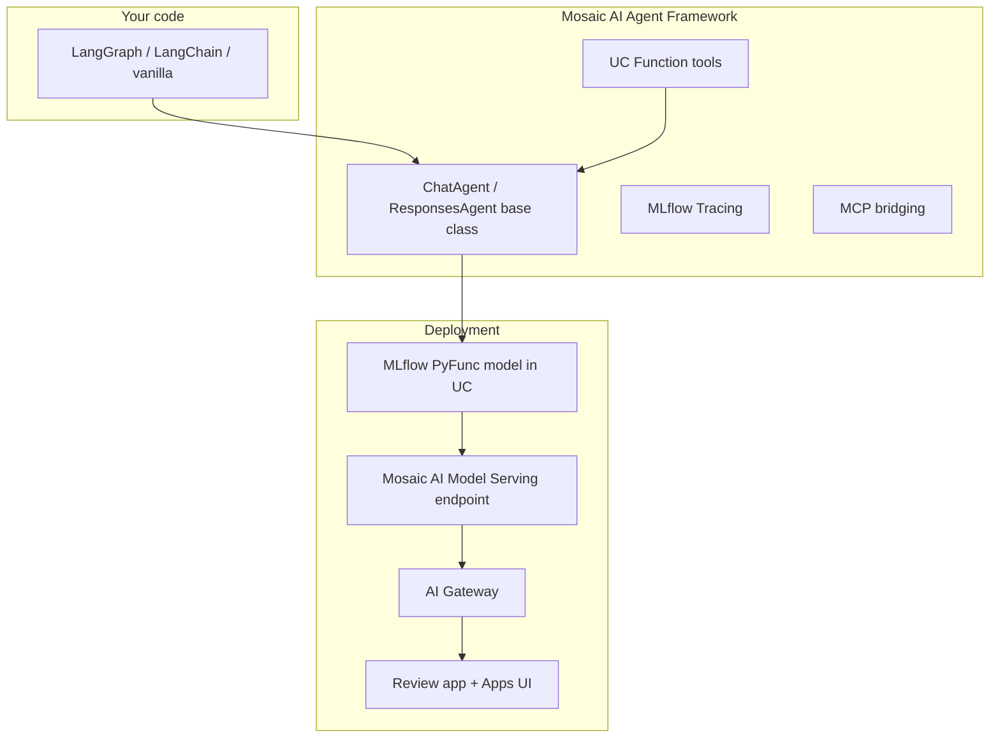
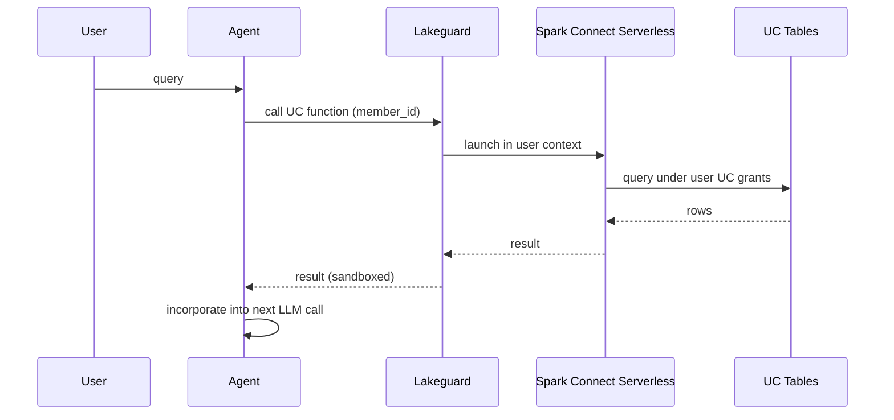
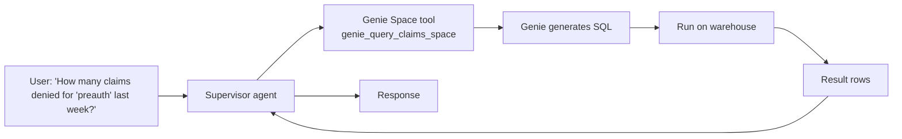

# Module 08 — Mosaic AI Agent Framework

> **Goal:** Build a tool-using agent on Databricks: define tools as Unity Catalog functions, use `ChatAgent` or `ResponsesAgent` interfaces, integrate Genie Spaces, capture MLflow traces, and deploy. Covers **Sec 1 Obj 5**, **Sec 3 Obj 11, 13**.

---

## Coverage map (verbatim Mar 18, 2026 objectives → section)

| Objective | Section |
|---|---|
| Sec 1 Obj 5 — Define and order tools that gather knowledge or take actions | "Tools as Unity Catalog functions" + "Tool ordering & multi-stage reasoning" + cross-ref [Module 01](01_genai_use_case_design.md) |
| Sec 3 Obj 11 — Utilize MLflow and Agent Framework for developing agentic systems | "ChatAgent vs ResponsesAgent" + "Full agent authoring + logging flow" + "Tracing every step" |
| Sec 3 Obj 13 (NEW Mar 2026) — Enable multi-agent systems to leverage Genie Spaces or conversational API | "Genie Spaces integration" |
| Sec 4 Obj 1 — Code a chain using a pyfunc model with pre/post-processing | "Full agent authoring + logging flow" |
| Sec 4 Obj 2 — Control access to resources from model serving endpoints | "`resources` param at log time — the big one" |
| Sec 4 Obj 11 (preview) — Configure a persistent datastore (agent memory) | "Memory / state in agents" + cross-ref [Module 11](11_ci_cd_for_agents.md) |

---

## What the Agent Framework is (and is not)

The Mosaic AI Agent Framework is **the governance + serving + tracing layer beneath** your agent code. It does NOT replace LangGraph, LangChain, AutoGen, or vanilla Python. You author the orchestration in any of those; the framework adds:

| Capability | What it brings |
|------------|----------------|
| **UC Functions as tools** | Python/SQL UDFs in UC become callable agent tools with RBAC + lineage |
| **Lakeguard execution** | Tools run on serverless generic compute, sandboxed per-user |
| **MCP server bridging** | Expose UC functions as MCP, consume external MCP servers |
| **MLflow tracing** | Auto-captured spans for retriever, tool, LLM calls |
| **Standard interfaces** | `ChatAgent` (chat-style) and `ResponsesAgent` (OpenAI Responses-API-style) |
| **`databricks.agents.deploy()`** | One-call deployment with review-app UI |
| **AI Gateway in front** | PII, toxicity, rate limiting, inference tables |



---

## ChatAgent vs ResponsesAgent — look-alike comparison

| Concern | `mlflow.pyfunc.ChatAgent` | `mlflow.pyfunc.ResponsesAgent` |
|---|---|---|
| Released | 2024 | Late 2025 |
| Input shape | `messages: list[ChatAgentMessage]` (role + content) | `messages` + richer multi-modal items |
| Output shape | `ChatAgentResponse(messages=[...])` | `ResponsesAgentResponse(output=[items])` where items include `text`, `tool_call`, `tool_result`, `reasoning` |
| Streaming | Supported | Supported, richer streamed item types |
| Tool calls | Embedded in `messages[].tool_calls` | First-class `tool_call` items in output stream |
| Multi-modal | Limited | Native (images, audio, etc.) |
| Compatible with Review app | ✓ | ✓ |
| Compatible with `databricks.agents.deploy()` | ✓ | ✓ |
| Best for | Existing chat UIs, conversational | Multi-step agents with explicit tool & reasoning items |

> 🎯 **How to recognize on the exam:** "Chat-style conversation" → `ChatAgent`. "Explicit multi-step tool reasoning, multi-modal, OpenAI Responses-API-shaped" → `ResponsesAgent`. Plain `mlflow.pyfunc.PythonModel` works but loses Review app + tracing alignment.

## UC Function tools vs Python tools — look-alike

| Concern | UC Function tool | Python tool (inline, e.g., LangChain `@tool`) |
|---|---|---|
| Definition | SQL `CREATE FUNCTION ... LANGUAGE PYTHON / SQL` | Python decorator on a function |
| Governance | UC grants (`EXECUTE`), lineage tracked | Owned by the chain/agent code only |
| Sandboxing | Lakeguard on serverless generic compute | Runs in serving container |
| Audit trail | UC audit logs every invocation | Inference tables only |
| Reusable across agents | Yes — register once, any agent can call | Bound to the agent code |
| Exam-preferred | **Yes** (UC governance is the Databricks-correct answer) | Allowed but not preferred |

> 🎯 **How to recognize on the exam:** "Governable / reusable tool" → UC Function. "Quick prototype" → inline. The exam-correct answer for production agents is UC Functions.

## `mlflow.pyfunc.log_model` parameters for agents — the big table

The exam tests this in detail. Memorize:

| Param | Required | What it controls |
|---|---|---|
| `python_model` | yes | Instance of `PythonModel` / `ChatAgent` / `ResponsesAgent` |
| `artifact_path` | yes | Path within the run (e.g., `"agent"`) |
| `registered_model_name` | yes (for UC) | Three-level `cat.schema.name` |
| `code_paths` | often | **List of local file/dir paths included as code artifacts** — needed when your `python_model` imports from other local modules |
| `pip_requirements` | yes | Explicit list, e.g., `["langchain-databricks", "databricks-langchain", "mlflow>=3"]` |
| `extra_pip_requirements` | alt to `pip_requirements` | Adds on top of inferred deps; use when you want auto-inference + a few extras |
| `resources` | **critical** | List of `DatabricksServingEndpoint`, `DatabricksVectorSearchIndex`, `DatabricksFunction`, `DatabricksGenieSpace`, etc. |
| `input_example` | yes | Auto-infers signature; needed for serving UI and validation |
| `signature` | optional | Explicit input/output schema; derived from `input_example` if absent |
| `metadata` | optional | Free-form dict, exam-irrelevant |

### `pip_requirements` vs `extra_pip_requirements` — look-alike

| Param | Behavior | When |
|---|---|---|
| `pip_requirements` | **Replaces** auto-inferred list — you state every package | Production agents (deterministic env) |
| `extra_pip_requirements` | **Adds** to auto-inferred list | Quick prototyping, when MLflow's inference + a few extras is fine |

Pick one, not both. Production-correct answer is usually `pip_requirements` (no surprises from MLflow's inference).

### `resources` param — the most-tested deployment knob

This is **the** big one on the Mar 2026 exam.

| Resource class | When | Example |
|---|---|---|
| `DatabricksServingEndpoint(endpoint_name=...)` | LLM, embedding, reranker, sub-agent endpoint | `endpoint_name="databricks-llama-3-3-70b-instruct"` |
| `DatabricksVectorSearchIndex(index_name=...)` | Every VS index queried | `index_name="cat.indexes.policy_v1"` |
| `DatabricksFunction(function_name=...)` | Every UC function tool | `function_name="cat.tools.get_member_eligibility"` |
| `DatabricksGenieSpace(genie_space_id=...)` | Genie Space tools | `genie_space_id="..."` |
| `DatabricksTable(table_name=...)` | Direct UC table reads | `table_name="cat.silver.members"` |
| `DatabricksSQLWarehouse(warehouse_id=...)` | If agent runs SQL via warehouse | id string |

**Why it matters:** at deployment, Databricks issues **scoped OBO credentials** for each listed resource. Without listing, the endpoint's SP has no auth to that resource → PERMISSION_DENIED at runtime. This **replaces** the old pattern of hardcoded PATs / secrets per resource.

> 🎯 **How to recognize on the exam:** "PERMISSION_DENIED" + "works locally" + "agent" → missing `resources` entry. List every endpoint, index, function, Genie space, table the agent touches.

---

## Full agent authoring + logging flow

```python
import mlflow
from mlflow.pyfunc import ChatAgent
from mlflow.types.agent import ChatAgentMessage, ChatAgentResponse
from mlflow.models.resources import (
    DatabricksServingEndpoint,
    DatabricksVectorSearchIndex,
    DatabricksFunction,
    DatabricksGenieSpace,
)
from typing import Optional, Any
import pandas as pd

# 1. Define agent (in agent.py, importable from logging code)
class ClaimsAgent(ChatAgent):
    def load_context(self, context):
        # Heavy init runs once per worker
        from langgraph.graph import StateGraph
        # build graph using tools defined in tools.py
        self.graph = build_graph()

    def predict(self, messages, context=None, custom_inputs=None) -> ChatAgentResponse:
        result = self.graph.invoke({"messages": messages})
        return ChatAgentResponse(messages=[
            ChatAgentMessage(role="assistant", content=result["final"])
        ])

# 2. Log with full resources declaration
mlflow.set_registry_uri("databricks-uc")
with mlflow.start_run(run_name="claims_agent_v1"):
    info = mlflow.pyfunc.log_model(
        artifact_path="agent",
        python_model=ClaimsAgent(),
        registered_model_name="cat.agents.claims_agent",
        code_paths=["./tools.py", "./graph.py", "./prompts/"],
        pip_requirements=[
            "mlflow>=3",
            "databricks-agents",
            "databricks-langchain",
            "langchain-databricks",
            "langgraph",
            "databricks-sdk",
        ],
        resources=[
            # LLM
            DatabricksServingEndpoint(endpoint_name="databricks-llama-3-3-70b-instruct"),
            # Embedding (for query rewriting)
            DatabricksServingEndpoint(endpoint_name="databricks-bge-large-en"),
            # VS index for policy RAG
            DatabricksVectorSearchIndex(index_name="cat.indexes.policy_v1"),
            # UC function tools
            DatabricksFunction(function_name="cat.tools.get_member_eligibility"),
            DatabricksFunction(function_name="cat.tools.get_recent_claims"),
            # Genie space for structured queries
            DatabricksGenieSpace(genie_space_id="abc-123-genie"),
        ],
        input_example={
            "messages": [{"role": "user", "content": "Was claim 12345 denied?"}]
        },
    )
```

**`code_paths`** ensures every local file the agent depends on (tool definitions, graph builder, prompt templates) is bundled into the model artifact and importable at serving time.

> ⚠️ **Exam trap:** Forgetting `code_paths` → ModuleNotFoundError at serving (your `tools.py` isn't there). Always list every local module the agent imports.

---

## ChatAgent vs ResponsesAgent (Sec 3 Obj 11)

Both are **PyFunc base classes** that standardize agent inputs/outputs.

| Class | Use when | Output shape |
|-------|----------|---------------|
| `mlflow.pyfunc.ChatAgent` | OpenAI ChatCompletion-style (messages list in, ChatAgent response out) | Streaming + tool calls in messages format |
| `mlflow.pyfunc.ResponsesAgent` | OpenAI Responses-API-style (richer, native to multi-turn + tool results) | Structured items: text, tool_call, tool_result, etc. |

`ResponsesAgent` is newer (late 2025) and better-aligned with multi-modal + multi-step. `ChatAgent` is simpler and matches existing chat UIs.

### Skeleton

```python
import mlflow
from mlflow.pyfunc import ChatAgent
from mlflow.types.agent import ChatAgentMessage, ChatAgentResponse, ChatContext
from typing import Any, Optional

class MyAgent(ChatAgent):
    def predict(
        self,
        messages: list[ChatAgentMessage],
        context: Optional[ChatContext] = None,
        custom_inputs: Optional[dict[str, Any]] = None,
    ) -> ChatAgentResponse:
        user_q = messages[-1].content
        # ... agent loop here ...
        return ChatAgentResponse(messages=[
            ChatAgentMessage(role="assistant", content="...")
        ])

# Log
import mlflow
mlflow.set_registry_uri("databricks-uc")
with mlflow.start_run():
    mlflow.pyfunc.log_model(
        artifact_path="agent",
        python_model=MyAgent(),
        registered_model_name="cat.schema.my_agent",
        resources=[...],
    )
```

> ⚠️ **Exam trap:** A plain `mlflow.pyfunc.PythonModel` works, but the exam expects `ChatAgent` or `ResponsesAgent` for **agents specifically** — they give you the right input/output schema, tracing, and review-app compatibility.

---

## Tools as Unity Catalog functions

Tools are **the fundamental building block**. On Databricks, every tool is a UC function — Python or SQL UDF — registered as a UC object.

### Defining a Python tool

```python
%sql
CREATE OR REPLACE FUNCTION cat.tools.get_member_eligibility(member_id STRING)
RETURNS STRUCT<is_active BOOLEAN, plan_id STRING, effective_date DATE>
LANGUAGE PYTHON
COMMENT 'Looks up member eligibility status. Use when the user asks about coverage start dates or active plans.'
AS $$
import os
from databricks import sql
# ... query the eligibility table ...
return {"is_active": True, "plan_id": "PLN-001", "effective_date": "2026-01-01"}
$$;
```

### Defining a SQL tool

```python
%sql
CREATE OR REPLACE FUNCTION cat.tools.get_recent_claims(member_id STRING, n_days INT DEFAULT 30)
RETURNS TABLE(claim_id STRING, dos DATE, amount DOUBLE, status STRING)
COMMENT 'Returns claims for a member in the last n_days. Default 30.'
RETURN
  SELECT claim_id, date_of_service, amount, status
  FROM cat.silver.claims
  WHERE member_id = get_recent_claims.member_id
    AND date_of_service >= current_date() - get_recent_claims.n_days;
```

### Wiring tools into the agent

With `databricks-langchain`:

```python
from databricks_langchain.uc_ai import UCFunctionToolkit

toolkit = UCFunctionToolkit(function_names=[
    "cat.tools.get_member_eligibility",
    "cat.tools.get_recent_claims",
])
tools = toolkit.tools  # List[StructuredTool] usable by LangChain agents
```

With `mlflow.pyfunc.ChatAgent` + manual tool dispatch:

```python
from databricks.sdk import WorkspaceClient

w = WorkspaceClient()
def call_uc_function(name, params):
    return w.serving_endpoints.query(
        # ... pass UC function args via the right SDK call ...
    )
```

> ⚠️ **Exam trap:** Tool **docstrings / `COMMENT` clauses are the description the LLM sees** when deciding whether to call the tool. Vague comments → agent picks the wrong tool. Always write **action-oriented descriptions**.

---

## Lakeguard — the tool security boundary

When a UC function is invoked as a tool:

1. Mosaic Serving calls the **Lakeguard executor**.
2. Lakeguard spins up (or reuses) **serverless generic compute** (Spark Connect serverless).
3. The function runs **under the calling user's identity**, with their UC grants.
4. CPU + memory + wall-clock limits applied.
5. No arbitrary `subprocess`, network egress, or filesystem writes outside the sandbox.



### The serverless compute gotcha

UC functions called as agent tools require **serverless generic compute**, NOT serverless SQL warehouses.

> ⚠️ **Exam trap:** Symptom `PERMISSION_DENIED: Cannot access Spark Connect`. Cause: the workspace doesn't have serverless generic compute enabled or the user doesn't have access. Fix is admin-level, not code-level.

---

## A minimal LangGraph agent on Databricks

```python
from langgraph.graph import StateGraph, END
from langgraph.prebuilt import ToolNode
from langchain_databricks import ChatDatabricks
from databricks_langchain.uc_ai import UCFunctionToolkit
from typing import TypedDict, Annotated, Sequence
from langchain_core.messages import BaseMessage
import operator

llm = ChatDatabricks(endpoint="databricks-llama-3-3-70b-instruct")

toolkit = UCFunctionToolkit(function_names=[
    "cat.tools.get_member_eligibility",
    "cat.tools.get_recent_claims",
])
tools = toolkit.tools
llm_with_tools = llm.bind_tools(tools)

class AgentState(TypedDict):
    messages: Annotated[Sequence[BaseMessage], operator.add]

def call_llm(state: AgentState):
    return {"messages": [llm_with_tools.invoke(state["messages"])]}

def should_continue(state: AgentState):
    last = state["messages"][-1]
    return "tools" if last.tool_calls else END

graph = StateGraph(AgentState)
graph.add_node("llm", call_llm)
graph.add_node("tools", ToolNode(tools))
graph.set_entry_point("llm")
graph.add_conditional_edges("llm", should_continue, {"tools": "tools", END: END})
graph.add_edge("tools", "llm")
agent = graph.compile()

# Trace via MLflow
mlflow.langchain.autolog()
```

Wrap as `ChatAgent` PyFunc, log, register, deploy.

---

## Tool ordering & multi-stage reasoning (Sec 1 Obj 5)

Already covered in [Module 01](01_genai_use_case_design.md#objective-5--order-tools-for-multi-stage-reasoning). Two principles for the agent context:

1. **Tool description quality** drives ordering. The LLM picks the next tool from the description, not the name.
2. **Tool composition** — pass output of one as input of next. The agent loop handles this naturally if descriptions chain logically.

> ⚠️ **Exam trap:** Tools where the description is just the function name (`get_data`) — the LLM has no idea when to call it. The exam may ask "why does the agent skip your tool?" Answer: bad description.

---

## Genie Spaces integration (NEW Mar 2026, Sec 3 Obj 13)

**Genie Spaces** = Databricks's text-to-SQL conversational interface over UC tables. Users ask questions in natural language; Genie writes and runs SQL, returns results.

An agent can call Genie for **structured-data retrieval** when the answer lives in tables (not docs).



### Why this matters

- Structured aggregations are notoriously hard for pure RAG (chunks don't aggregate).
- Genie is **already governed** by UC; it inherits ACLs.
- Lets a multi-agent supervisor pick between **structured (Genie) vs unstructured (RAG)** by query intent.

Pattern: Genie Space exposed as a tool → Supervisor agent routes between Genie and RAG based on whether the query is aggregational or narrative.

> ⚠️ **Exam trap:** The exam may ask "user asks for an aggregate metric over claims" — answer is Genie (or a SQL UDF tool), NOT RAG. RAG retrieves text; it doesn't aggregate numbers.

---

## Memory / state in agents (preview of Sec 4 Obj 11)

For multi-turn agents, state can live in:

| Layer | When | API |
|-------|------|-----|
| **In-process (LangGraph checkpoints)** | Single session, ephemeral | `MemorySaver()` |
| **Delta table** | Durable conversation log; append-only | `INSERT INTO cat.schema.agent_memory` |
| **Online Table** | Low-latency lookup of recent state, key-indexed | `CREATE ONLINE TABLE` |
| **Lakebase (Postgres)** | Relational state with transactions | psycopg2 / SDK |
| **VS index** | Semantic memory (find similar past sessions) | VS query |

Multi-turn pattern: agent persists messages to Delta after each turn; on next request, loads last N messages, embeds last few, queries VS for similar past sessions. Full detail in [Module 11](11_ci_cd_for_agents.md#persistent-agent-memory).

---

## Tracing every step

`mlflow.langchain.autolog()` covers LangChain / LangGraph automatically. For custom Python:

```python
import mlflow

@mlflow.trace(name="custom_tool_call")
def call_eligibility(member_id: str):
    # ...
    return result

with mlflow.start_span(name="retrieve") as span:
    span.set_inputs({"query": q})
    chunks = retriever.invoke(q)
    span.set_outputs({"n_chunks": len(chunks)})
```

Traces appear in the MLflow Experiment UI with full call graph. **`mlflow.start_span` is the exam-named primitive.**

---

## `databricks.agents.deploy()` — the one-call deployment

```python
from databricks import agents

deployment = agents.deploy(
    model_name="cat.schema.my_agent",
    model_version=5,
    scale_to_zero=True,
    environment_vars={
        "DATABRICKS_HOST": "...",
    },
    tags={"env": "prod", "team": "ai-platform"},
)
```

This creates a Model Serving endpoint, applies AI Gateway defaults, and provisions the review app URL for SME feedback.

### Review app

Auto-generated UI at `/ml/review/{deployment_id}` where SMEs can:
- Chat with the agent
- Annotate responses (good / bad / specific issue)
- Export annotations as a labeled dataset for `mlflow.genai.evaluate()`

This is **the SME feedback loop** the exam tests in Sec 6 Obj 10.

---

## End-to-end checklist

```mermaid
flowchart LR
    A[Define UC function tools] --> B[Author agent<br/>LangGraph or vanilla]
    B --> C[Wrap as ChatAgent /<br/>ResponsesAgent]
    C --> D[Add MLflow tracing]
    D --> E[Log with resources +<br/>signature + input_example]
    E --> F[Register to UC<br/>cat.schema.name]
    F --> G[Set alias @staging]
    G --> H[deploy via databricks.agents.deploy]
    H --> I[AI Gateway on endpoint]
    I --> J[Review app for SME feedback]
    J --> K[Eval with golden set +<br/>SME annotations]
    K --> L[Promote alias to @production]
```



Every step is testable. The exam loves "what's missing?" diff questions over this flow.

---

## Mini quiz

1. Your agent's `get_recent_claims` tool is never picked even when the user asks about recent claims. The function's `COMMENT` says "data". What's wrong?
2. The exam describes a query that needs to aggregate "count claims denied last week by reason." Pure RAG vs Genie integration vs SQL UDF tool — which?
3. Symptom: agent serves locally but production calls fail with `PERMISSION_DENIED: Cannot access Spark Connect`. Cause?
4. You want SME feedback that feeds into an eval dataset. Which Databricks surface?
5. You wrap your agent as plain `PythonModel`, log, deploy. Why might the exam prefer `ChatAgent`?

### Answers

1. **Bad tool description.** LLM picks tools by reading the comment/docstring. "Data" tells it nothing. Replace with action-oriented prose like "Returns claims for a member in the last N days; use when the user asks about recent activity."
2. **Genie Space tool** (or a SQL UDF that does the aggregation). RAG retrieves text chunks; it can't aggregate numbers reliably.
3. UC function tools require **serverless generic compute**, not SQL warehouses. The workspace likely lacks serverless generic enabled, or the agent's service principal doesn't have access. Admin fix.
4. **The auto-generated Review app** from `databricks.agents.deploy()`. Annotations export as a labeled dataset.
5. `ChatAgent` gives a **standard input/output schema** (compatible with chat UIs and Review apps), built-in tracing alignment, and the right structure for `databricks.agents.deploy()`. Plain `PythonModel` works but loses these affordances.

---

## Exam-trap recap

> ⚠️ Bad tool descriptions = agent never calls the tool.
> ⚠️ RAG for aggregational queries — use Genie or a SQL UDF.
> ⚠️ UC function tools require serverless generic compute, not SQL warehouses.
> ⚠️ Forgetting `resources` (LLM, VS, tools) in `log_model`.
> ⚠️ Using plain `PythonModel` when `ChatAgent` / `ResponsesAgent` is expected.
> ⚠️ Not enabling `mlflow.langchain.autolog()` for tracing — exam tests this.
> ⚠️ Using `LangChain` when the exam scenario calls for a multi-step stateful agent (use LangGraph).

---

## Worked exam-question walkthroughs

### Walkthrough 1 — Resources missing (Sec 4 Obj 2)

**Pattern:** Agent works locally, deployed endpoint returns PERMISSION_DENIED when calling a UC function. What's missing in `log_model`?
- A: `signature`
- B: `code_paths`
- C: `resources=[DatabricksFunction(function_name="...")]`
- D: `pip_requirements`

> 🎯 **How to recognize on the exam:** PERMISSION_DENIED at runtime on a UC resource → `resources` was incomplete. List every endpoint, index, function, Genie space.

**Answer:** C.

### Walkthrough 2 — Genie vs RAG for aggregation

**Pattern:** "How many claims were denied for 'preauth' last week, grouped by region?" Pick tool.
- A: RAG over claim PDFs
- B: Genie Space over claims warehouse
- C: SQL UDF `count_denied_by_reason()`
- D: Fine-tune

**Reasoning chain:**
1. Aggregation over rows → must run SQL.
2. B (Genie) auto-generates SQL from NL → great for ad-hoc grouped queries.
3. C (SQL UDF) is right when the aggregation is known and parameterized.
4. A and D can't aggregate.

> 🎯 **How to recognize on the exam:** "count / sum / by group" → Genie or SQL UDF. Never RAG.

**Answer:** B (or C if the SQL is parameterized and known).

### Walkthrough 3 — Tool description quality

**Pattern:** UC function COMMENT is `"data"`. Agent never picks it. Fix?

**Reasoning chain:**
1. LLMs choose tools by **reading descriptions**.
2. "data" tells nothing about *when* to call.
3. Rewrite as action-oriented: "Returns a member's claims in the last N days. Use this when the user asks about recent claim history or status updates."

> 🎯 **How to recognize on the exam:** Tool not invoked → description is vague.

**Answer:** Rewrite the `COMMENT` clause as an action-oriented description.

### Walkthrough 4 — Lakeguard compute requirement

**Pattern:** Symptom `PERMISSION_DENIED: Cannot access Spark Connect` when agent calls a UC function. Cause?
- A: Wrong UC catalog
- B: Workspace lacks serverless generic compute
- C: Function isn't registered
- D: Endpoint scaled to zero

**Reasoning chain:**
1. UC function tools execute in Lakeguard which requires **serverless generic compute** (Spark Connect serverless).
2. Serverless SQL warehouses are different and won't satisfy.

> 🎯 **How to recognize on the exam:** "Cannot access Spark Connect" → serverless generic compute missing. Admin-level fix.

**Answer:** B.

### Walkthrough 5 — Pyfunc plain vs ChatAgent

**Pattern:** Agent code uses `class MyAgent(mlflow.pyfunc.PythonModel)` and works but the Review app doesn't render conversations nicely. Best fix?
- A: Add a wrapper UI
- B: Subclass `ChatAgent` instead
- C: Add `predict_stream()` to PythonModel
- D: Switch to LangChain

**Reasoning chain:**
1. Review app + chat UI expects the `ChatAgent` (or `ResponsesAgent`) input/output schema.
2. Plain `PythonModel` has free-form I/O; the UI can't introspect.
3. Subclass `ChatAgent` for native compatibility.

> 🎯 **How to recognize on the exam:** "Review app / chat UI" + agent → `ChatAgent` (or `ResponsesAgent`).

**Answer:** B.

---

## Output-prediction drills

### Drill 1 — `resources` enumeration

Agent uses: 1 LLM endpoint, 2 VS indexes, 3 UC function tools, 1 Genie Space. How many `resources` entries?

**Answer:** 7 entries (1 + 2 + 3 + 1). Don't merge categories; each resource is individually listed.

### Drill 2 — Missing code_paths

```python
# in main.py
from tools import lookup_member
class MyAgent(ChatAgent): ...

mlflow.pyfunc.log_model(..., python_model=MyAgent(), code_paths=None)
```

Predict what happens at serving:

**Answer:** `ModuleNotFoundError: No module named 'tools'` when the agent loads. `tools.py` was not bundled. Fix: `code_paths=["./tools.py"]`.

### Drill 3 — extra vs pip_requirements

```python
mlflow.pyfunc.log_model(..., pip_requirements=["langgraph"], extra_pip_requirements=["pydantic"])
```

What's the issue?

**Answer:** Setting both is invalid — pick one. If you want a deterministic list, use only `pip_requirements`.

### Drill 4 — ChatAgent return shape

```python
class A(ChatAgent):
    def predict(self, messages, context=None, custom_inputs=None):
        return "hello"
```

Predict the error.

**Answer:** `ChatAgent.predict` must return a `ChatAgentResponse`, not a raw string. Fix: wrap in `ChatAgentResponse(messages=[ChatAgentMessage(role="assistant", content="hello")])`.

### Drill 5 — Trace tag missing

```python
def my_retriever(q):  # no @mlflow.trace
    return ...
```

You eval with `ChunkRelevance` judge — judge can't find retriever spans. Why?

**Answer:** Spans must be tagged with `span_type="RETRIEVER"` (via `@mlflow.trace(span_type="RETRIEVER")` or `start_span(span_type=...)`) for judges to recognize the retrieval step. Without the tag, judges that depend on retriever spans return no signal.

---

## End-to-end mini-scenario — full agent build, log, deploy

```python
# tools.py — UC function tool wrappers, plus any inline Python helpers
# graph.py — LangGraph orchestration
# agent.py — ChatAgent subclass

# log_agent.py
import mlflow
from mlflow.pyfunc import ChatAgent
from mlflow.models.resources import (
    DatabricksServingEndpoint, DatabricksVectorSearchIndex,
    DatabricksFunction, DatabricksGenieSpace,
)
from agent import ClaimsAgent  # from agent.py

mlflow.set_registry_uri("databricks-uc")

with mlflow.start_run(run_name="claims_agent_v1"):
    info = mlflow.pyfunc.log_model(
        artifact_path="agent",
        python_model=ClaimsAgent(),
        registered_model_name="cat.agents.claims_agent",
        code_paths=["./agent.py", "./graph.py", "./tools.py", "./prompts/"],
        pip_requirements=[
            "mlflow>=3", "databricks-agents>=0.5",
            "databricks-langchain", "langchain-databricks", "langgraph",
        ],
        resources=[
            DatabricksServingEndpoint(endpoint_name="databricks-llama-3-3-70b-instruct"),
            DatabricksServingEndpoint(endpoint_name="databricks-bge-large-en"),
            DatabricksVectorSearchIndex(index_name="cat.indexes.policy_v1"),
            DatabricksFunction(function_name="cat.tools.get_member_eligibility"),
            DatabricksFunction(function_name="cat.tools.get_recent_claims"),
            DatabricksGenieSpace(genie_space_id="abc-123-claims-space"),
        ],
        input_example={"messages": [{"role": "user", "content": "Was claim 12345 denied?"}]},
    )

# Deploy with one call
from databricks import agents
deployment = agents.deploy(
    model_name="cat.agents.claims_agent",
    model_version=info.registered_model_version,
    scale_to_zero=False,
    tags={"env": "staging"},
)
print(deployment.query_endpoint)    # call this to chat
print(deployment.review_app_url)    # SME annotation surface
```

Every Sec 4 obj 1, 2, 4, 5 and Sec 3 obj 11, 13 lever exercised: pyfunc, resources for auth, register to UC, deploy via Agent Framework helper, Genie tool, UC function tools, VS index, LLM + embeddings.
