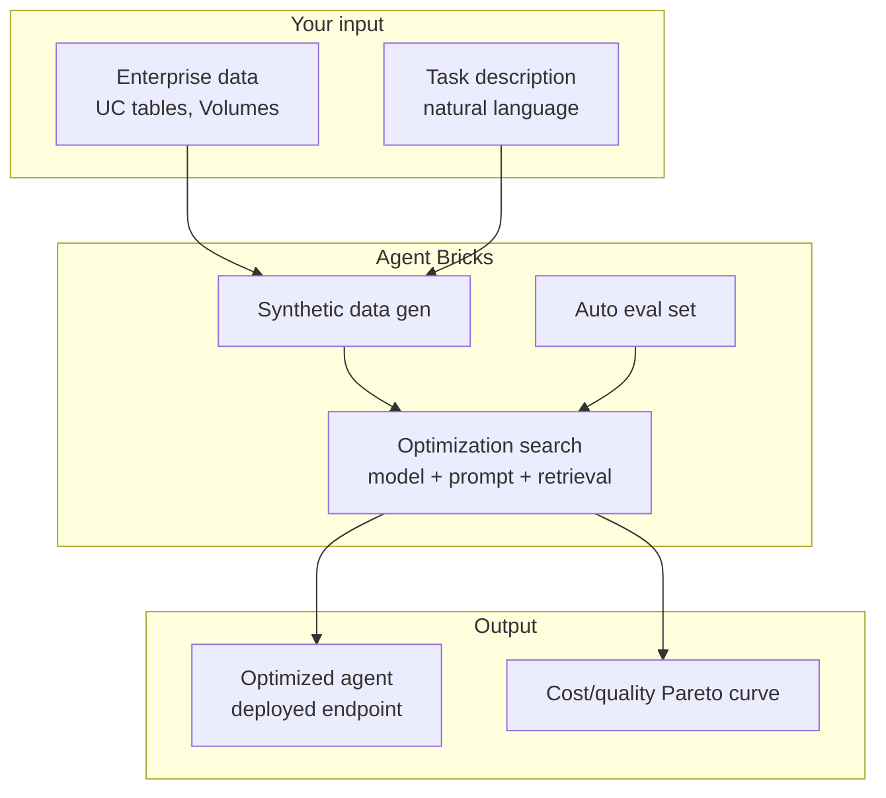
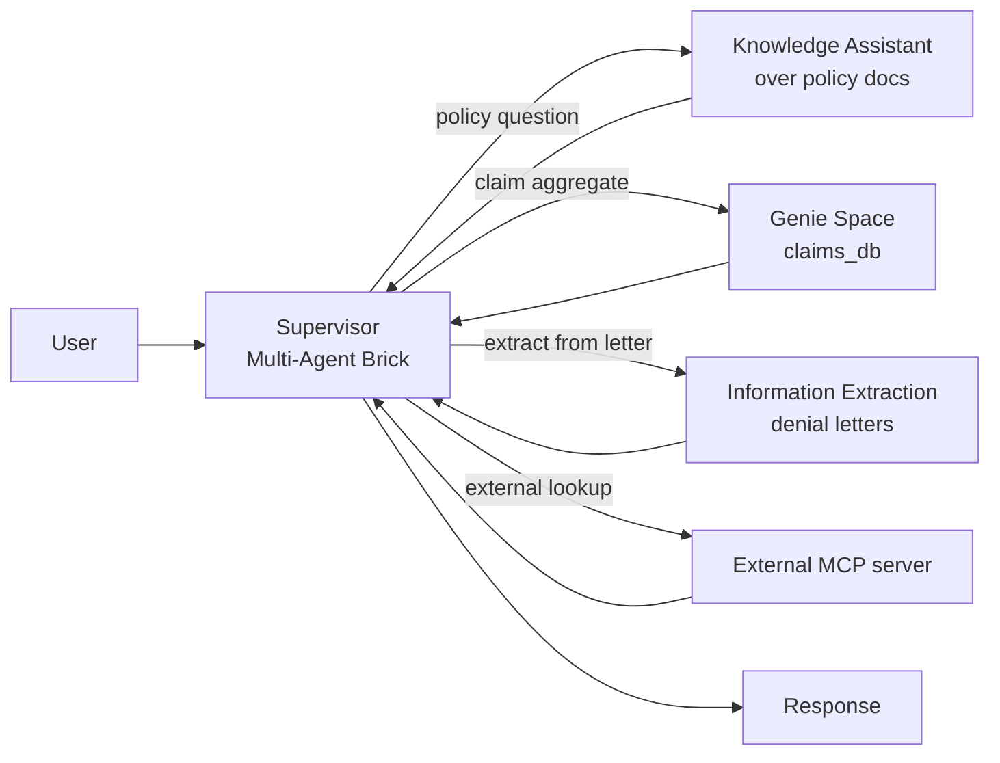

# Module 09 — Agent Bricks (NEW for Mar 2026)

> **Goal:** Know what Agent Bricks is, distinguish the three variants (Knowledge Assistant, Multi-Agent Supervisor, Information Extraction), and decide when to pick Agent Bricks vs Agent Framework. Covers **Sec 1 Obj 6** (and indirectly Sec 4 Obj 13 MCP routing).
>
> **Heavily tested as of Mar 2026.** Multiple exam questions can reference Agent Bricks; this module is essential.

---

## Coverage map (verbatim Mar 18, 2026 objectives → section)

| Objective | Section |
|---|---|
| Sec 1 Obj 6 (NEW) — Determine how and when to use Agent Bricks | "The three variants" + "Decision rule: Agent Bricks vs Agent Framework" |
| Sec 3 Obj 13 (NEW) — Multi-agent systems leveraging Genie / conversational API | "Multi-Agent Supervisor" (Genie routing) |
| Sec 4 Obj 13 (NEW) — Integrate MCP servers (managed/external/custom) | Multi-Agent Supervisor as MCP consumer; cross-ref [Module 11](11_ci_cd_for_agents.md#mcp-server-integration-sec-4-obj-13) |

---

## What Agent Bricks is

Agent Bricks is a **higher-level managed abstraction** that sits on top of the Mosaic AI Agent Framework. You describe the task in natural language, point at your enterprise data, and Databricks:

1. **Auto-generates synthetic training data** mimicking your data distribution.
2. **Auto-generates an evaluation set + LLM judges** for your task.
3. **Searches the optimization space** — chooses model, prompt, retrieval config, judge calibration.
4. **Returns an optimized agent** with a cost/quality Pareto frontier you can pick a point on.

GA in stages through 2025. Three variants currently shipped.



---

## The three variants — look-alike comparison

| Variant | One-line purpose | Input | Output | When to pick | Replaces |
|---|---|---|---|---|---|
| **Knowledge Assistant** | RAG-as-a-service over enterprise docs | UC table or Volume of docs; optional example Qs | Chat answers + citations + endpoint + Review app | Internal Q&A, FAQs, runbooks, manuals; minimal config; "we just want chat over our docs" | Custom LangChain RAG (Module 07) |
| **Information Extraction** | Pull structured fields from unstructured docs | Schema + sample docs (UC Volume) + optional gold labels | Typed JSON per doc + extraction endpoint + per-field F1 eval | PDFs/emails/reports → typed fields at scale; need eval + iteration | Hand-rolled `ai_extract` pipelines, custom prompt eng for structured extraction |
| **Multi-Agent Supervisor** | Route across sub-agents, Genie Spaces, MCP servers, tools | Set of sub-agents/Genie/MCP refs + routing intents | Routed response + trace showing which sub-agent answered | Mixed query types (structured + unstructured + actions) under one chat surface | Hand-rolled LangGraph supervisor + intent classifier |

## The three variants

### 1. Knowledge Assistant

**Purpose:** RAG-as-a-service over enterprise documents.

**When to pick:**
- Internal Q&A over a doc corpus (manuals, FAQs, policies, runbooks).
- Want minimal config and acceptable out-of-the-box quality.
- No fine-grained control needed over retrieval / prompt.

**What you provide:**
- A UC table or Volume of documents.
- Optionally: example questions, instructions on tone.

**What it gives you:**
- Auto chunking + embedding + index creation.
- Auto-tuned retrieval (chunk size, hybrid on/off, reranker).
- Auto-tuned prompt + grounding.
- A deployed agent endpoint + review app.

**Replaces:** Custom LangChain RAG chain (Module 07) for low-stakes / fast-iteration use cases.

---

### 2. Information Extraction

**Purpose:** Pull structured fields from unstructured documents.

**When to pick:**
- Source: PDFs, emails, reports.
- Target: typed fields (claim_id, denial_reason, dollar_amount, dates).
- Need schema enforcement at scale.
- Manual prompt iteration would be slow.

**What you provide:**
- A schema (Pydantic-like: field name + type + description).
- Example documents (UC Volume).
- Optionally: gold-labeled examples for calibration.

**What it gives you:**
- Auto-generated synthetic examples in your domain.
- Optimized extraction prompt + model.
- Eval set + judges measuring per-field F1.
- Production endpoint that returns typed JSON.

**Replaces:** Hand-rolled `ai_extract` pipelines + custom prompt engineering for structured extraction.

> ⚠️ **Exam trap:** Don't confuse with `ai_extract` (a single SQL function). Information Extraction Brick is a **full agent endpoint** with auto-tuned prompt + model + evaluation; `ai_extract` is the SQL-level building block.

---

### 3. Multi-Agent Supervisor

**Purpose:** Orchestrate multiple sub-agents + Genie Spaces + tools + MCP servers under a routing supervisor.

**When to pick:**
- Query may require **structured data (Genie/SQL)** or **unstructured (RAG)** or **actions (tools)** — supervisor decides.
- Multiple domains, multiple specialist agents.
- Want a managed router rather than hand-coded LangGraph.

**What you provide:**
- A set of sub-agents (Knowledge Assistant, Information Extraction, custom Agent Framework agents).
- Genie Spaces references.
- MCP server references.
- Routing intent descriptions per sub-component.

**What it gives you:**
- Auto-tuned supervisor LLM + routing prompt.
- Trace of which sub-agent answered.
- Cost/quality optimized supervisor.

**Replaces:** Hand-rolled LangGraph supervisor + intent classifier.



---

## Decision rule: Agent Bricks vs Agent Framework

The exam will test this directly. Memorize:

| Phrase in the scenario | Pick |
|------------------------|------|
| "minimize maintenance" | Agent Bricks |
| "auto-optimize cost/quality" | Agent Bricks |
| "domain-specific quality without manual tuning" | Agent Bricks |
| "no team to maintain" | Agent Bricks |
| "rapid PoC / fast iteration" | Agent Bricks |
| "fine control over chain" | Agent Framework |
| "custom tools" | Agent Framework |
| "specific LangChain / LangGraph / pyfunc" | Agent Framework |
| "pre/post processing" | Agent Framework |
| "regulated / auditable per-step behavior" | Agent Framework |
| "production critical with strict SLA" | Agent Framework |

> ⚠️ **Exam trap:** Don't over-pick Agent Bricks. If the scenario describes **custom logic** (e.g., bespoke validation, specific tool ordering, regulated output format), it's Agent Framework. Agent Bricks is for cases where the platform's defaults are good enough and you'd rather not maintain code.

---

## What's under the hood

Agent Bricks is **built on Agent Framework**. The output of any Bricks variant is:

- An MLflow model in Unity Catalog (`cat.schema.brick_name`)
- A Model Serving endpoint
- AI Gateway in front
- Review app for SME feedback

So once a Bricks agent is deployed, **you can govern it the same way as any other agent**: prompt registry, model versions/aliases, AI Gateway guardrails, Inference Tables, evaluation via `mlflow.genai.evaluate()`.

> ⚠️ **Exam trap:** You can't "export" an Agent Bricks agent to a hand-rolled LangChain repo. It's **managed**, not a code generator. If a scenario requires forking the agent's logic, you've outgrown Bricks.

---

## Synthetic data generation

For **Information Extraction** specifically, Bricks generates synthetic examples by:
1. Reading sample docs you provide.
2. LLM-generating fake docs that **match the structural distribution** (length, vocabulary, format).
3. LLM-labeling the synthetic docs with target schemas.
4. Eval'ing candidate prompts against this synthetic gold set.

This avoids the "we have 50 docs but need 5,000 to train" cold-start problem.

For **Knowledge Assistant**, Bricks generates **synthetic Q&A pairs** from your docs to evaluate retrieval and answer quality.

> ⚠️ **Exam trap:** Synthetic data is **for evaluation / prompt tuning**, NOT for fine-tuning the base model. Bricks doesn't fine-tune by default; it optimizes prompts + retrieval params.

---

## Worked: AstraZeneca-style information extraction

Public reference customer claim: AstraZeneca processed **400,000 clinical trial documents** for structured extraction in **< 60 minutes, no code**. This is the Bricks Information Extraction sweet spot.

Workflow:

1. Upload trial protocol PDFs to UC Volume.
2. In Databricks workspace, launch **Agent Bricks → Information Extraction**.
3. Define schema:
   ```
   trial_id: string
   primary_endpoint: string
   patient_count: int
   inclusion_criteria: list<string>
   exclusion_criteria: list<string>
   ```
4. Click "Auto-tune" — Bricks generates synthetic trials, picks the best model + prompt.
5. Review the optimized agent's outputs on a sample; promote.
6. Run on the full 400K corpus via the deployed endpoint (or `ai_query`-style batch).

**Reality check:** Real production extraction tasks usually need iteration on schema edge cases (e.g., a "patient_count" field is sometimes "N=120 (treatment) + N=120 (control)"). Bricks gets you to 80% fast; the last 20% is still engineering.

---

## When Bricks is NOT a fit

- **Strict latency SLAs.** Bricks chooses a model from its tested set; you can't force a specific small model.
- **Complex tool orchestration** with custom validation, retries, fallbacks.
- **Regulated production agents** where every prompt change must go through your compliance review (Bricks abstracts prompt mgmt).
- **Heavy custom pre/post-processing** logic in the chain.
- **Non-standard interfaces** (e.g., gRPC streaming, custom transport).

---

## Mini quiz

1. The business says "we have 12 internal teams, each with their own runbooks, and they want to chat with their docs without us building anything custom." Which Bricks variant?
2. Scenario: "We need to extract `vendor_name, invoice_date, total_amount` from 1M PDF invoices." Information Extraction Brick OR `ai_extract` SQL function — which is right? On what basis?
3. The customer query may need either policy doc context (RAG) or claims-database aggregates (SQL) depending on intent. Which Bricks variant?
4. Scenario: "Build a regulated patient-facing PHI agent with strict per-step audit trail and custom output validation." Bricks or Framework?
5. Bricks auto-generated synthetic Q&A pairs from your docs. Are those for fine-tuning the LLM?

### Answers

1. **Knowledge Assistant** (one per team) — RAG-as-a-service over their docs with minimal config. Or a Multi-Agent Supervisor if a single chat surface should route across teams.
2. **Either** — but **Information Extraction Brick** if you want auto-tuning + per-field F1 eval + production endpoint + ongoing optimization. **`ai_extract`** if it's a one-shot batch and you have a tight, well-defined schema. Bricks is better when you'll iterate on the schema and want eval feedback.
3. **Multi-Agent Supervisor** — routes between Knowledge Assistant (policy RAG) and a Genie Space (claims DB).
4. **Agent Framework.** "Regulated", "per-step audit", "custom validation" all point to fine-grained control which Bricks abstracts away.
5. **No.** Synthetic data is for **evaluation and prompt optimization**, not fine-tuning the base model. Bricks doesn't fine-tune by default.

---

## Exam-trap recap

> ⚠️ "auto-optimize / minimize maintenance" → Bricks. "custom / regulated / fine control" → Framework.
> ⚠️ Information Extraction Brick ≠ `ai_extract` SQL function. Brick = full managed agent endpoint.
> ⚠️ Multi-Agent Supervisor when query could route across structured + unstructured + actions.
> ⚠️ Bricks is built on Agent Framework — same governance applies (UC, AI Gateway, MLflow).
> ⚠️ Synthetic data from Bricks is for eval, not for fine-tuning.
> ⚠️ Bricks won't satisfy strict latency SLA or regulated audit requirements alone.

---

## Worked exam-question walkthroughs

### Walkthrough 1 — Trigger-phrase routing

**Pattern:** "Team needs a chat assistant over the IT runbook corpus. They don't have ML engineers and want minimal maintenance." Pick.
- A: Agent Framework + LangChain RAG
- B: Knowledge Assistant Brick
- C: Information Extraction Brick
- D: Multi-Agent Supervisor

**Reasoning chain:**
1. "No ML engineers / minimal maintenance" → Bricks (auto-tune).
2. "Chat over docs" → Knowledge Assistant specifically (RAG-as-a-service).
3. Not extraction; not multi-domain routing.

> 🎯 **How to recognize on the exam:** "Chat / Q&A over docs" + "minimize maintenance" → Knowledge Assistant.

**Answer:** B.

### Walkthrough 2 — Structured fields from PDFs

**Pattern:** "Extract `vendor_name, invoice_date, total_amount` from 1M PDFs with iteration on schema + per-field F1." Pick.
- A: `ai_extract` SQL function
- B: Information Extraction Brick
- C: Hand-rolled prompt
- D: Knowledge Assistant

**Reasoning chain:**
1. A is the SQL one-shot — fine if schema is fixed and small.
2. **B** gives auto-tuning + synthetic eval set + per-field F1 + ongoing optimization — wins when iteration matters and scale is high.
3. C is the wrong direction (manual work).
4. D is the wrong variant.

> 🎯 **How to recognize on the exam:** "Iterate on schema, per-field quality, scale" → **Information Extraction Brick**. "One-shot batch with fixed schema" → `ai_extract`.

**Answer:** B.

### Walkthrough 3 — Cross-domain routing

**Pattern:** "Customer chat must answer policy questions (text), claim-status aggregates (DB), and let users file an appeal (action)." Pick.
- A: Knowledge Assistant
- B: Information Extraction
- C: Multi-Agent Supervisor with Knowledge Assistant + Genie Space + custom action tool
- D: One giant LangChain chain

**Reasoning chain:**
1. Three distinct domains: unstructured (policy), structured (claims aggregates), action (file appeal).
2. **Multi-Agent Supervisor** routes between them under one chat surface.
3. KA alone misses aggregates and actions.

> 🎯 **How to recognize on the exam:** "Both structured and unstructured" / "RAG + Genie / SQL + action" → Multi-Agent Supervisor.

**Answer:** C.

### Walkthrough 4 — Regulated audit requirement

**Pattern:** "Patient-facing PHI agent with per-step audit + custom validator + strict SLA." Bricks or Framework?

**Reasoning chain:**
1. Bricks abstracts prompt + retrieval; per-step audit is hard.
2. Custom validators don't fit Bricks' managed shape.
3. Strict SLA limits Bricks' model choice.

> 🎯 **How to recognize on the exam:** "Regulated", "per-step audit", "custom validation", "specific SLA" → **Agent Framework**, never Bricks alone.

**Answer:** Agent Framework.

### Walkthrough 5 — Synthetic data purpose

**Pattern:** "Bricks generated 5,000 synthetic Q&A pairs from our docs. Are they used to fine-tune the LLM?"

**Reasoning chain:**
1. Bricks uses synthetic data for **eval + prompt optimization**, not weight updates.
2. Fine-tuning happens via Mosaic AI Model Training, separately.

> 🎯 **How to recognize on the exam:** Bricks + "synthetic data" → for eval / prompt tuning, NOT fine-tuning.

**Answer:** No — eval and prompt optimization only.

---

## Output-prediction drills

### Drill 1 — Pick the variant

> "We have 30 product runbooks. New hires ask the same 100 questions over and over. Build a chat answer system, no ML team."

**Answer:** Knowledge Assistant. RAG-as-a-service; minimal config; matches "no ML team" trigger.

### Drill 2 — Pick the variant

> "Underwriters get 500 PDF medical reports per day. They want extracted: patient_id, diagnosis_codes (list), procedures (list), encounter_date. Quality must improve over time."

**Answer:** Information Extraction Brick — typed schema, scale, iterative quality improvement.

### Drill 3 — Pick the variant

> "Member chat. Same user may ask 'show me my last 5 claims' (DB), 'why was claim 123 denied' (text + DB), and 'file an appeal' (action). One UI."

**Answer:** Multi-Agent Supervisor — routes Knowledge Assistant (policy), Genie Space (claims DB), and a custom `file_appeal` UC function tool.

### Drill 4 — Where governance applies

Bricks deploys a Knowledge Assistant. Does AI Gateway apply? Inference Tables? UC ACLs?

**Answer:** Yes to all. Bricks is built on Agent Framework — the output is a UC-registered MLflow model + Serving endpoint + AI Gateway. Govern it exactly like a hand-rolled agent.

### Drill 5 — Replacing Bricks

Team needs to fork the Brick's chain logic for a regulated audit. Can they export the chain code?

**Answer:** **No.** Bricks is managed; not a code generator. If you need to fork, you've outgrown Bricks → rebuild with Agent Framework.

---

## End-to-end mini-scenario — Multi-Agent Supervisor routing across three sources

```python
# Pseudo-config — Agent Bricks is largely UI-driven; this is the conceptual shape

from databricks.agents.bricks import MultiAgentSupervisor, KnowledgeAssistantRef, GenieSpaceRef, FunctionToolRef

supervisor = MultiAgentSupervisor(
    name="cat.agents.member_supervisor",
    description="Member services assistant. Routes to policy KB, claims warehouse, or action tools.",
    sub_agents=[
        KnowledgeAssistantRef(
            name="policy_kb",
            agent_endpoint="cat.agents.policy_kb_brick",
            routing_intent="Use for benefits, coverage, eligibility questions in plan documents.",
        ),
    ],
    genie_spaces=[
        GenieSpaceRef(
            space_id="claims-genie-001",
            routing_intent="Use for aggregations or queries over the claims warehouse (counts, statuses, dates).",
        ),
    ],
    tools=[
        FunctionToolRef(
            function_name="cat.tools.file_appeal",
            routing_intent="Use when the user wants to file or submit an appeal for a denied claim.",
        ),
    ],
)
supervisor.deploy()  # creates endpoint, review app, AI Gateway defaults
```

The supervisor selects the right surface per turn based on the routing intents (text descriptions act as the LLM's tool descriptions). Every component is UC-governed; the endpoint inherits AI Gateway features. This is the Mar 2026 exam-correct pattern for multi-domain conversational systems with minimal hand-coded orchestration.
