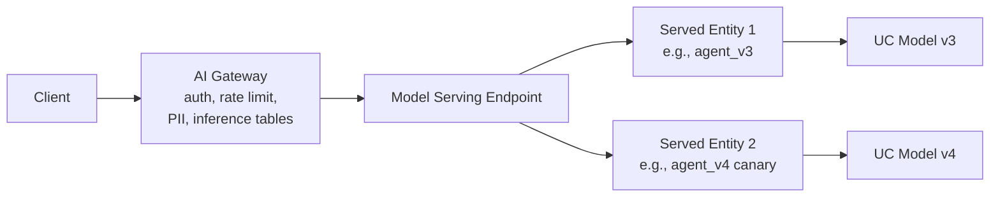
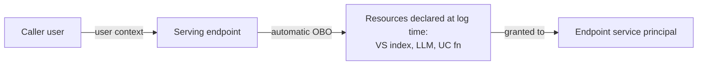

# Module 10 — Mosaic AI Model Serving Endpoints

> **Goal:** Configure and operate Model Serving endpoints — scale-to-zero, served entities vs served models, traffic config, environments, FMAPI serving, and `ai_query` batch. Covers **Sec 4 Obj 2, 7, 9** and parts of **Obj 6**.

---

## Coverage map (verbatim Mar 18, 2026 objectives → section)

| Objective | Section |
|---|---|
| Sec 4 Obj 2 — Control access to resources from model serving endpoints | "Controlling access to resources from endpoints" |
| Sec 4 Obj 7 — Identify how to serve an LLM application leveraging Foundation Model APIs | "Foundation Model APIs" |
| Sec 4 Obj 9 — Identify batch inference workloads and apply `ai_query()` appropriately | "`ai_query()` batch inference" |

---

## What Model Serving is

A managed REST endpoint that hosts:
- **Foundation models** (FMAPI: pay-per-token or provisioned throughput)
- **Custom models** (your MLflow PyFunc agents, RAG chains, embedders)
- **External models** (Anthropic / OpenAI / Bedrock via partner endpoints)

All endpoints sit behind **AI Gateway** for governance and observability.



---

## Endpoint anatomy

An endpoint has:

| Component | Description |
|-----------|-------------|
| **Name** | DNS-friendly identifier; used as `serving.endpoints.query("my-endpoint", ...)` |
| **Served entities** | One or more (model_uri, env_vars, compute config, scale config) bundles |
| **Traffic config** | How requests split across entities (e.g., 90/10 canary) |
| **AI Gateway config** | PII detection, rate limits, inference tables, usage tables, guardrails |
| **Tags** | `env=prod`, `team=...` |
| **Permissions** | UC-managed; grants for query / manage |

---

## `served_entities` vs `served_models` — look-alike

| Concept | Status | Where you see it | Notes |
|---|---|---|---|
| `served_entities` | **Modern, preferred** | `EndpointCoreConfigInput(served_entities=[...])` | Generalizes over UC models, FMAPI base, external providers, and PT base models |
| `served_models` | Legacy | Older API examples | Same idea, narrower (UC models only); avoid in new code |

> 🎯 **How to recognize on the exam:** Modern code → `served_entities`. If the exam shows both, prefer the `served_entities` answer.

## `compute_size` (`workload_size`) + `scale_to_zero_enabled` — look-alike

| Setting | Value | Effect |
|---|---|---|
| `workload_size="Small"` | ~4 vCPU / 15GB | Most PyFunc chains, lightweight |
| `workload_size="Medium"` | ~8 vCPU / 30GB | Heavier chains, embeddings |
| `workload_size="Large"` | ~16 vCPU / 60GB | Big models, multi-tool agents |
| `scale_to_zero_enabled=True` | Min replicas drop to zero when idle | Dev / spiky; cold-start latency on first req |
| `scale_to_zero_enabled=False` | Min replicas always ≥ 1 | Prod / SLA-critical; no cold starts |
| `min_provisioned_concurrency` / `max_provisioned_concurrency` | Concurrency caps | Tune for QPS shape |

> 🎯 **How to recognize on the exam:** "Cold-start latency" → scale-to-zero side effect. "Save cost when idle" → enable scale-to-zero, accept cold start.

## `route_optimized` and `auto_capture_config`

| Feature | What it does | When |
|---|---|---|
| `route_optimized=True` | Reduces request routing latency for FMAPI base PPT endpoints | High-QPS PPT consumers |
| `auto_capture_config` (legacy term for Inference Tables) | Captures every request/response to a Delta table | Audit, eval, retraining data — see Module 15 |

The exam more commonly uses **"Inference Tables"** (the AI Gateway concept) over the legacy `auto_capture_config` term, but the underlying capability is the same.

## Served entities vs served models

These are subtly different. The exam may test the distinction.

- **Served entity (newer term, preferred):** any deployable unit — UC model, external model, FMAPI base model. Has its own compute + env config.
- **Served model:** legacy term for the same concept when the entity is a UC-registered MLflow model.

Use **served_entities** in modern serving config:

```python
from databricks.sdk import WorkspaceClient
from databricks.sdk.service.serving import (
    EndpointCoreConfigInput,
    ServedEntityInput,
    TrafficConfig,
    Route,
)

w = WorkspaceClient()

w.serving_endpoints.create(
    name="claims-agent",
    config=EndpointCoreConfigInput(
        served_entities=[
            ServedEntityInput(
                name="agent_v3",
                entity_name="cat.schema.claims_agent",
                entity_version="3",
                workload_size="Small",          # Small | Medium | Large
                workload_type="CPU",            # CPU | GPU_*
                scale_to_zero_enabled=True,
                environment_vars={"LOG_LEVEL": "INFO"},
            ),
            ServedEntityInput(
                name="agent_v4_canary",
                entity_name="cat.schema.claims_agent",
                entity_version="4",
                workload_size="Small",
                scale_to_zero_enabled=True,
            ),
        ],
        traffic_config=TrafficConfig(routes=[
            Route(served_model_name="agent_v3", traffic_percentage=90),
            Route(served_model_name="agent_v4_canary", traffic_percentage=10),
        ]),
    ),
)
```

> ⚠️ **Exam trap:** `traffic_percentage` must sum to 100 across all routes, else config validation fails.

---

## Scale-to-zero

Endpoints can scale to **zero replicas** when idle. First request after idle pays a **cold-start latency** (10s–60s typically for custom PyFunc, faster for FMAPI base models).

| Setting | When |
|---------|------|
| `scale_to_zero_enabled=True` | Dev, internal tools, spiky traffic; willing to accept cold starts |
| `scale_to_zero_enabled=False` | Production, latency-critical, sustained traffic |
| Min replicas > 0 | Provisioned warm capacity |

> ⚠️ **Exam trap:** "Scale to zero saves cost" is true; "scale to zero has no downside" is wrong. Cold-start latency is the exam's standard gotcha.

---

## Workload size & type

| `workload_size` | Approx | Use |
|-----------------|--------|-----|
| **Small** | ~4 vCPU / 15GB | Most PyFunc chains, small LLMs |
| **Medium** | ~8 vCPU / 30GB | Heavier chains, larger embeddings |
| **Large** | ~16 vCPU / 60GB | Big models, multi-tool agents |

| `workload_type` | When |
|-----------------|------|
| CPU | Chains, retrievers, embedders, agents calling FMAPI |
| GPU_SMALL / MEDIUM / LARGE | Self-hosted LLM inference (Mistral, Llama loaded inline) |

In practice on Databricks, **GPU rarely needed for custom serving** — you call FMAPI endpoints from a CPU-served chain.

---

## Foundation Model APIs (Sec 4 Obj 7)

FMAPI base models are deployed by Databricks; you query them via Model Serving.

```python
from databricks.sdk import WorkspaceClient

w = WorkspaceClient()
resp = w.serving_endpoints.query(
    name="databricks-llama-3-3-70b-instruct",
    messages=[{"role": "user", "content": "What is a deductible?"}],
    max_tokens=500,
    temperature=0.0,
)
print(resp.choices[0].message.content)
```

Or via OpenAI-compatible SDK:

```python
from openai import OpenAI

client = OpenAI(
    base_url="https://<workspace>.cloud.databricks.com/serving-endpoints",
    api_key="<PAT>",
)
client.chat.completions.create(
    model="databricks-llama-3-3-70b-instruct",
    messages=[{"role": "user", "content": "..."}],
)
```

> ⚠️ **Exam trap:** You don't deploy FMAPI base models yourself; they're already served. You **just query** them. Confusing this with custom serving is common.

### PPT vs PT routing

- **Pay-per-token endpoints**: named like `databricks-llama-3-3-70b-instruct`. Shared, low/spiky traffic.
- **Provisioned Throughput endpoints**: you create one (`serving_endpoints.create`) with `provisioned_throughput` field, sized in PT units.

---

## `ai_query()` batch inference (Sec 4 Obj 9)

The single most-overlooked surface in the exam.

```sql
SELECT
  claim_id,
  ai_query(
    'databricks-llama-3-3-70b-instruct',
    concat('Summarize this denial letter in 2 sentences: ', letter_text),
    failOnError => false,
    modelParameters => named_struct('temperature', 0.0, 'max_tokens', 200)
  ) AS summary
FROM bronze.denial_letters;
```

**When `ai_query` is the right answer:**
- **Batch scoring** — N rows in a Delta table, N model calls.
- **One-shot** — not a sustained QPS workload.
- **Scale** — leverages Spark parallelism; Databricks handles concurrency to the endpoint.

**When NOT to use `ai_query`:**
- Real-time per-request — use Model Serving endpoint directly via SDK or REST.
- Multi-step agent loops — use Agent Framework with traces.

> ⚠️ **Exam trap:** Sample-question wording "score 10M rows in our claims table once" → **`ai_query`**, not Model Serving endpoint with a Python loop. The exam loves this distinction.

### `ai_query` performance knobs

| Knob | Effect |
|------|--------|
| `failOnError=false` | Continue on per-row errors; return null/error struct |
| `modelParameters` | Pass temperature, max_tokens, top_p, etc. |
| `responseFormat` | Force JSON output for structured tasks |
| `numOutputTokens` | Cap output size |
| Cluster size + parallelism | Throughput knob |

`ai_query` cost rolls up under `MODEL_SERVING` / `BATCH_INFERENCE` in `system.billing.usage` — billable per endpoint hit.

---

## Controlling access to resources from endpoints (Sec 4 Obj 2)

Endpoints authenticate to other Databricks resources (VS index, UC functions, other endpoints, tables) using **on-behalf-of-user (OBO) credentials** that the platform provisions automatically — **only if you declare them in `resources` at log time** (Module 07).

### Permission flow



The endpoint has its own **service principal**. Grants flow:
- Endpoint SP needs `USE_INDEX` on VS indexes referenced.
- Endpoint SP needs `EXECUTE` on UC functions used as tools.
- Endpoint SP needs `CAN_QUERY` on other Serving endpoints called.

> ⚠️ **Exam trap:** "Permission denied at runtime" usually means the endpoint's service principal doesn't have the right UC grant on a downstream resource. Don't grant the **user**; grant the **endpoint SP** (or use the `resources` declaration which Databricks uses to provision automatically).

---

## Environments — dev / staging / prod

The exam tests **promotion across environments**.

Pattern:
1. Develop in a dev workspace; log model to `dev.schema.model`.
2. Run evaluation; if it passes, register a version in `staging.schema.model` (or use aliases).
3. Promote to `prod.schema.model` once staging eval passes + stakeholder review.
4. Use **model aliases** (`@dev`, `@staging`, `@production`) to point endpoints at versions without redeploying.

Two namespace strategies (both valid):

| Strategy | Pros | Cons |
|----------|------|------|
| **Multiple catalogs** (`dev_cat`, `prod_cat`) | Strict isolation; different storage/keys | More setup; can't share intermediate artifacts |
| **One catalog with aliases** (`cat.schema.model@production`) | Single source of truth; alias swap is atomic | Workspace-level isolation needs care |

Databricks Asset Bundles (DABs) automate this — see [Module 11](11_ci_cd_for_agents.md).

---

## External models on Serving

External providers (Anthropic, OpenAI, Bedrock, Azure OpenAI) can be served behind a Databricks endpoint:

```python
from databricks.sdk.service.serving import (
    EndpointCoreConfigInput,
    ServedEntityInput,
    ExternalModel,
)

w.serving_endpoints.create(
    name="claude-sonnet-via-databricks",
    config=EndpointCoreConfigInput(
        served_entities=[
            ServedEntityInput(
                name="claude",
                external_model=ExternalModel(
                    name="claude-3-5-sonnet-20241022",
                    provider="anthropic",
                    task="llm/v1/chat",
                    anthropic_config={
                        "anthropic_api_key": "{{secrets/anthropic/key}}",
                    },
                ),
            )
        ]
    ),
)
```

Now your agent can call Claude through `serving.endpoints.query("claude-sonnet-via-databricks", ...)` and **AI Gateway features still apply** (inference tables, rate limits, PII guardrails).

> ⚠️ **Exam trap:** Hardcoding the API key in the config. **Use `{{secrets/scope/key}}`** to pull from Databricks Secrets.

---

## Monitoring endpoint health

Built-in metrics:
- Latency p50 / p95 / p99
- QPS
- Error rate
- Token usage (via Usage Tables)
- Cost (via Inference + Usage Tables)

Inference Tables log every (input, output, latency, status) row to a Delta table for **offline analysis + eval** (Module 15 covers this).

---

## Hardware + cost notes

| Workload | Typical billing |
|----------|----------------|
| FMAPI PPT call | Per-token |
| FMAPI PT endpoint | PT units × hourly rate |
| Custom CPU PyFunc | Workload-size DBU × hours |
| Custom GPU PyFunc | GPU instance hours × DBU |
| `ai_query` batch | Per token (PPT endpoints) or PT unit hours |

Cost roll-up appears in `system.billing.usage` with `usage_type=MODEL_SERVING`.

---

## Worked: an end-to-end deploy

```python
import mlflow
from databricks import agents

# 1. Already logged: cat.schema.claims_agent v3
# 2. Set alias
from mlflow.tracking import MlflowClient
client = MlflowClient()
client.set_registered_model_alias(
    name="cat.schema.claims_agent",
    alias="production",
    version=3,
)

# 3. Deploy via agents helper (auto-config)
deployment = agents.deploy(
    model_name="cat.schema.claims_agent",
    model_version=3,
    scale_to_zero=True,
    tags={"env": "prod"},
)
print(deployment.query_endpoint)   # URL
print(deployment.review_app_url)   # SME review UI
```

`agents.deploy()` auto-wires:
- AI Gateway with sensible defaults (inference table on, PII guardrail on).
- Review app for SME feedback.
- Service principal with grants on resources declared at log time.

For full control, use `serving_endpoints.create()` directly.

---

## Mini quiz

1. Your endpoint with `scale_to_zero_enabled=True` shows 30s latency on first request after 5 minutes idle. What's happening, and how to fix without losing scale-to-zero?
2. You need to score 50M rows in `bronze.claims` once. Model Serving endpoint with a Python loop or `ai_query`?
3. An endpoint queries `cat.indexes.policy_chunks_v1`. You get PERMISSION_DENIED in prod. The endpoint logged the index in `resources` at log time. What might still be wrong?
4. Two served entities `v3` (90%) and `v4_canary` (10%). The exam asks "what's this pattern called and what could go wrong?"
5. You want to use Anthropic Claude from a Databricks agent but don't want to expose the Anthropic API key in code. What's the pattern?

### Answers

1. **Cold start.** The endpoint scaled to zero after idle; first request waits for a replica to spin up. Options: (a) set a min-replica > 0 (more cost, no cold starts), or (b) keep scale-to-zero but add a warm-up keep-alive that pings the endpoint every N minutes during business hours.
2. **`ai_query`**. Batch + Delta table input + scale via Spark. A Python loop calling the endpoint is slower, cost-worse, and forfeits Spark parallelism.
3. The **endpoint's service principal** doesn't actually have `USE_INDEX` grant on the new index — perhaps the index was rebuilt under a new name and the resources list still references the old. Re-check both the resources declaration and explicit UC grants.
4. **Canary deployment** at 10% traffic. Risks: insufficient sample size for canary's metrics; bad output not caught at small percentage until enough volume; needs guardrails / monitoring + auto-rollback rule.
5. Use **Databricks Secrets** + an **external model endpoint** with `{{secrets/scope/key}}` interpolation in the config. The key is stored in a UC-governed secret scope; never in code.

---

## Exam-trap recap

> ⚠️ Scale-to-zero hides cold-start latency surprises.
> ⚠️ Confusing `ai_query` (batch SQL) with Serving endpoint (real-time per-request).
> ⚠️ Forgetting endpoint SP grants on downstream resources (and the role of `resources=` at log time).
> ⚠️ Canary at 10% with no rollback rule — fast bad-state propagation when promoted.
> ⚠️ Hardcoded API keys in external-model config. Use Databricks Secrets.
> ⚠️ Traffic config not summing to 100%.
> ⚠️ Treating FMAPI base models as something you deploy — they're already served by Databricks; you query.

---

## Worked exam-question walkthroughs

### Walkthrough 1 — Batch vs serving for 10M rows (Sec 4 Obj 9)

**Pattern:** "Score 10M rows in `bronze.claims` once. Choose."
- A: Python loop calling `serving_endpoints.query()` in pandas UDF
- B: `ai_query()` SQL in a Spark job
- C: Stand up a dedicated PT endpoint, call from Java client
- D: Export rows and call OpenAI

**Reasoning chain:**
1. Single-shot batch on Delta → SQL is the right surface.
2. **`ai_query`** parallelizes via Spark, leverages serving endpoint concurrency natively.
3. Python loop forfeits Spark parallelism.

> 🎯 **How to recognize on the exam:** "Score N rows in a Delta table once" → `ai_query()`, never Python loop.

**Answer:** B.

### Walkthrough 2 — Cold start

**Pattern:** Endpoint has `scale_to_zero_enabled=True`. After 10 min idle, first request takes 30 s. Best mitigation if you keep scale-to-zero?
- A: Set min_replicas=1
- B: Disable scale-to-zero
- C: Add a warm-up cron that pings the endpoint every 5 min during business hours
- D: Switch to PPT

**Reasoning chain:**
1. A and B drop scale-to-zero.
2. **C keeps cost savings** during off-hours while preventing cold starts when traffic resumes.
3. D is unrelated.

**Answer:** C.

### Walkthrough 3 — Traffic config sum

**Pattern:** Config has `Route(v3, 80)`, `Route(v4, 10)`. Why does deploy fail?

**Reasoning chain:** Traffic must sum to 100%. 80 + 10 = 90. Add a third route or rebalance to 90/10 or 80/20.

**Answer:** Sum to 100%.

### Walkthrough 4 — External model key in code

**Pattern:** Config:
```python
external_model=ExternalModel(
    ...,
    anthropic_config={"anthropic_api_key": "sk-ant-..."},
)
```

Issue?

**Answer:** Hardcoded API key in source/state. Fix: `"{{secrets/anthropic_scope/api_key}}"` — Databricks resolves at runtime; nothing sensitive in code or logs.

### Walkthrough 5 — FMAPI base model "deploy"

**Pattern:** Team writes `serving_endpoints.create(name="databricks-llama-3-3-70b-instruct", ...)`. Fails.

**Reasoning chain:** FMAPI base PPT endpoints are pre-served by Databricks; you don't create them. **You query the existing endpoint.** If you need a custom PT version, create with `entity_name="system.ai.llama-3-3-70b-instruct"` under your own endpoint name.

**Answer:** Don't try to create the pre-served endpoint; just query it. Or create a PT endpoint under a different name.

---

## Output-prediction drills

### Drill 1 — `ai_query` shape

```sql
SELECT claim_id, ai_query(
  'databricks-llama-3-3-70b-instruct',
  concat('Summarize: ', letter_text),
  modelParameters => named_struct('temperature', 0.0, 'max_tokens', 200)
) AS summary FROM bronze.denial_letters;
```

What's the type of `summary`?

**Answer:** STRING — the model's text completion. With `responseFormat => 'json'` (or JSON schema), you'd get a structured type.

### Drill 2 — Traffic split

Two entities at 50/50. After v4 is rolled to 100/0, when does v3 stop receiving traffic?

**Answer:** Immediately on config apply. Traffic config is atomic; no rolling drain by default. For graceful drain, do 90/10 → 50/50 → 10/90 → 0/100.

### Drill 3 — Endpoint SP grants

Endpoint config lists `resources=[DatabricksVectorSearchIndex("cat.indexes.policy_v1")]`. At deploy, what UC grant does Databricks issue to the endpoint SP?

**Answer:** `USE_INDEX` (or equivalent) on `cat.indexes.policy_v1`. The resource declaration triggers Databricks to auto-grant the endpoint SP just-enough access — short-lived, scoped.

### Drill 4 — Two entities, one model

Two `ServedEntityInput` both reference `cat.schema.claims_agent` versions 3 and 4. What's the use case?

**Answer:** Canary deployment — `v3` carries primary traffic; `v4` gets a small share for validation. Traffic config splits the percentages.

### Drill 5 — Endpoint scale_to_zero with min concurrency

```python
ServedEntityInput(..., scale_to_zero_enabled=True, min_provisioned_concurrency=2)
```

What's the conflict?

**Answer:** `min_provisioned_concurrency=2` prevents scale-to-zero (you've asked for ≥ 2 concurrency). Pick one approach: scale-to-zero with cold-start tolerance, OR min concurrency for SLA.

---

## End-to-end mini-scenario — endpoint with canary + AI Gateway + inference tables

```python
from databricks.sdk import WorkspaceClient
from databricks.sdk.service.serving import (
    EndpointCoreConfigInput, ServedEntityInput, TrafficConfig, Route,
    AiGatewayConfig, AiGatewayInferenceTableConfig, AiGatewayRateLimit,
    AiGatewayRateLimitKey, AiGatewayRateLimitRenewalPeriod,
)

w = WorkspaceClient()

w.serving_endpoints.create(
    name="claims-agent",
    config=EndpointCoreConfigInput(
        served_entities=[
            ServedEntityInput(
                name="v3",
                entity_name="cat.agents.claims_agent",
                entity_version="3",
                workload_size="Small",
                scale_to_zero_enabled=False,   # SLA-critical
            ),
            ServedEntityInput(
                name="v4_canary",
                entity_name="cat.agents.claims_agent",
                entity_version="4",
                workload_size="Small",
                scale_to_zero_enabled=True,    # canary; cheaper when not hit
            ),
        ],
        traffic_config=TrafficConfig(routes=[
            Route(served_model_name="v3", traffic_percentage=90),
            Route(served_model_name="v4_canary", traffic_percentage=10),
        ]),
    ),
    ai_gateway=AiGatewayConfig(
        inference_table_config=AiGatewayInferenceTableConfig(
            enabled=True,
            catalog_name="cat",
            schema_name="monitoring",
            table_name_prefix="claims_agent",
        ),
        rate_limits=[
            AiGatewayRateLimit(
                calls=1000,
                key=AiGatewayRateLimitKey.USER,
                renewal_period=AiGatewayRateLimitRenewalPeriod.MINUTE,
            ),
        ],
    ),
)
```

Every Sec 4 Obj 2 lever (resources-driven OBO auth at log time + endpoint config), Obj 7 (FMAPI), Obj 9 (`ai_query` for batch — call separately), plus monitoring foundations (Inference Tables, rate limit) used in Module 15.
