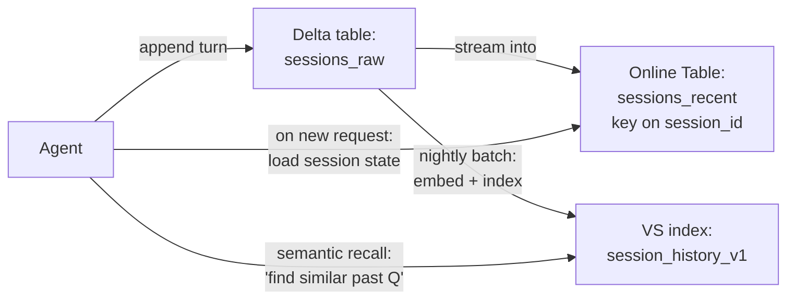
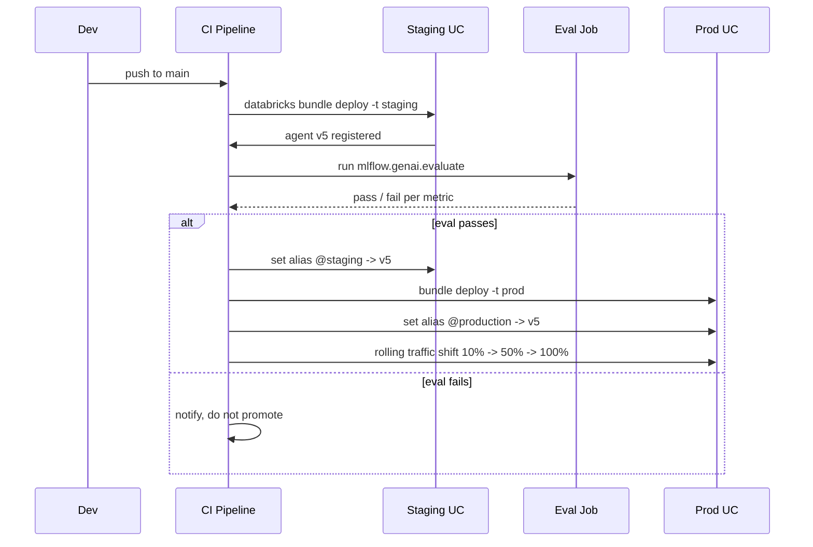

# Module 11 — CI/CD for Agents (NEW Mar 2026)

> **Goal:** Apply CI/CD best practices to GenAI agents — updating Vector Search indexes, promoting prompts and models across environments, testing individual components, persistent agent memory, and integrating MCP servers. Covers **Sec 4 Obj 11, 12, 13, 14**.

---

## Coverage map (verbatim Mar 18, 2026 objectives → section)

| Objective | Section |
|---|---|
| Sec 4 Obj 11 (NEW) — Configure a persistent datastore to store/retrieve intermediate memory | "Persistent agent memory / datastores" |
| Sec 4 Obj 12 (NEW) — CI/CD: updating VS index, promoting prompts, testing individual agent components | "Updating the Vector Search index" + "Testing individual agent components" |
| Sec 4 Obj 13 (NEW) — Integrate managed, external, and custom MCP servers | "MCP server integration" |
| Sec 4 Obj 14 (NEW) — Apply prompt version control and manage prompt lifecycle | "Prompt promotion with aliases" + cross-ref [Module 05](05_prompt_engineering.md) |

---

## Why agents need a different CI/CD pattern

A traditional ML model is a single artifact: train → register → deploy. An **agent** has at least six versionable surfaces:

| Artifact | Lives in |
|----------|----------|
| Prompt(s) | MLflow Prompt Registry (UC) |
| LLM endpoint | Model Serving endpoint name |
| Embedding model | Model Serving endpoint name |
| Vector Search index | UC Vector Search Index |
| UC function tools | UC functions (each its own version) |
| Agent model | UC registered MLflow model (PyFunc) |

Any of these can change. CI/CD must promote them **coherently** across dev → staging → prod.

```mermaid
flowchart LR
    subgraph DEV[Dev]
        P1[prompt@dev]
        M1[agent v1 @dev alias]
        I1[index_v1_dev]
    end
    subgraph STG[Staging]
        P2[prompt@staging]
        M2[agent v1 @staging alias]
        I2[index_v1_staging]
    end
    subgraph PROD[Prod]
        P3[prompt@production]
        M3[agent v1 @production alias]
        I3[index_v1_production]
    end
    P1 --> P2 --> P3
    M1 --> M2 --> M3
    I1 --> I2 --> I3
```

---

## DAB CLI — `bundle deploy` vs `bundle run` (look-alike)

| Command | What it does | When |
|---|---|---|
| `databricks bundle validate -t <target>` | Lints `databricks.yml` and resource files | Pre-deploy check; CI step |
| `databricks bundle deploy -t <target>` | **Materializes** workspace resources (jobs, models, endpoints, apps) per `targets.<target>` | Per env: dev / staging / prod |
| `databricks bundle run <resource_key> -t <target>` | **Triggers** an already-deployed job/pipeline | Run training, eval, indexing job |
| `databricks bundle destroy -t <target>` | Tears down the deployed resources | Cleanup |
| `databricks bundle sync -t <target>` | Syncs local files to workspace (no resource changes) | Iterative dev |

> 🎯 **How to recognize on the exam:** "Deploy resources to staging" → `bundle deploy -t staging`. "Run the training job" → `bundle run train_and_deploy_agent -t staging`. They are different verbs.

## `targets` for dev / staging / prod

| Field | Purpose |
|---|---|
| `targets.<name>.workspace.host` | Per-env workspace URL |
| `targets.<name>.variables` | Override default variable values per env |
| `targets.<name>.mode` | `development` (auto-prefixed names, run as user) or `production` (strict, run as SP) |
| `targets.<name>.resources` | Per-env resource overrides (e.g., production uses bigger workload sizes) |

> ⚠️ **Exam trap:** Production targets should usually use `mode: production` (runs as service principal, prevents users from accidentally redeploying with their own creds).

## DAB resource types for agents — look-alike

DAB defines workspace resources declaratively in `resources/*.yml`. The agent-relevant types:

| Resource type | Section in YAML | Use for |
|---|---|---|
| `jobs` | `resources.jobs.<key>` | Training, indexing, eval, scheduled syncs |
| `pipelines` | `resources.pipelines.<key>` | Delta Live Tables for chunking/ETL |
| `models` | `resources.models.<key>` | Registered UC models (alias mgmt is via API/CLI, not declarative) |
| `model_serving_endpoints` | `resources.model_serving_endpoints.<key>` | Agent endpoint with served_entities + AI Gateway config |
| `registered_models` | (alias of above for UC) | Same thing under different older names |
| `apps` | `resources.apps.<key>` | Databricks Apps as agent UI |
| `experiments` | `resources.experiments.<key>` | MLflow experiments |
| `schemas`, `volumes`, `catalogs` | UC structure | Pre-create UC scaffolding |

> 🎯 **How to recognize on the exam:** "Deploy agent + endpoint + UI declaratively" → DAB with `jobs`, `model_serving_endpoints`, `apps`. "Copy notebooks between workspaces" is **always** the wrong answer for production CI/CD.

## Databricks Asset Bundles (DABs)

DABs are the **declarative CI/CD primitive** for Databricks. A `databricks.yml` defines:

- Workspaces (dev / staging / prod)
- Jobs (training, indexing, eval)
- Models (registered names)
- Pipelines, dashboards, apps
- Variables per environment

```yaml
# databricks.yml
bundle:
  name: claims-agent

include:
  - resources/*.yml

variables:
  catalog:
    description: UC catalog per env
    default: dev_cat

targets:
  dev:
    workspace:
      host: https://dev.cloud.databricks.com
    variables:
      catalog: dev_cat
  staging:
    workspace:
      host: https://staging.cloud.databricks.com
    variables:
      catalog: staging_cat
  prod:
    workspace:
      host: https://prod.cloud.databricks.com
    variables:
      catalog: prod_cat
```

```yaml
# resources/agent_job.yml
resources:
  jobs:
    train_and_deploy_agent:
      name: "[${bundle.target}] Train + register agent"
      tasks:
        - task_key: ingest
          notebook_task:
            notebook_path: ../src/ingest.py
        - task_key: chunk_and_index
          depends_on: [{task_key: ingest}]
          notebook_task:
            notebook_path: ../src/index.py
            base_parameters:
              catalog: ${var.catalog}
        - task_key: log_agent
          depends_on: [{task_key: chunk_and_index}]
          notebook_task:
            notebook_path: ../src/log_agent.py
            base_parameters:
              catalog: ${var.catalog}
        - task_key: evaluate
          depends_on: [{task_key: log_agent}]
          notebook_task:
            notebook_path: ../src/eval.py
```

Deploy:
```bash
databricks bundle deploy -t staging
databricks bundle run train_and_deploy_agent -t staging
```

> ⚠️ **Exam trap:** DABs replace ad-hoc workspace notebooks. The exam-correct answer for "CI/CD across environments" is DABs (or Terraform), not "copy notebooks between workspaces."

---

## Prompt promotion with aliases (Sec 4 Obj 14)

**Sample Q7's answer.** The pattern is: prompt versions are registered in **MLflow Prompt Registry** (UC-governed); aliases point to specific versions for each environment.

```python
import mlflow

# 1. Register a new version
mlflow.genai.register_prompt(
    name="cat.prompts.claim_extraction",
    template=PROMPT_JINJA_SOURCE,
    commit_message="add evidence_quote field",
)
# -> creates version 8

# 2. Promote to staging
mlflow.genai.set_prompt_alias(
    name="cat.prompts.claim_extraction",
    alias="staging",
    version=8,
)

# 3. After eval passes, promote to prod
mlflow.genai.set_prompt_alias(
    name="cat.prompts.claim_extraction",
    alias="production",
    version=8,
)

# 4. Rollback if needed
mlflow.genai.set_prompt_alias(
    name="cat.prompts.claim_extraction",
    alias="production",
    version=7,
)
```

The agent code loads `cat.prompts.claim_extraction@production`; alias swap is **atomic** and **does not redeploy the model**.

> ⚠️ **Exam trap:** Hardcoding the prompt in code or storing it in a Delta table loses version history and the alias-based rollback story. Sample Q7 explicitly tests this.

---

## Model promotion with aliases

Mirror pattern for the agent model itself:

```python
from mlflow.tracking import MlflowClient
client = MlflowClient()

# After eval passes on agent v5
client.set_registered_model_alias(
    name="cat.agents.claims_agent",
    alias="staging",
    version=5,
)
# Eval passes in staging?
client.set_registered_model_alias(
    name="cat.agents.claims_agent",
    alias="production",
    version=5,
)
```

Endpoint config can reference `entity_version` directly or by alias. With aliases:

```python
ServedEntityInput(
    name="agent",
    entity_name="cat.agents.claims_agent",
    entity_version="5",  # explicit OR use alias-resolution pattern
)
```

Most teams pin **explicit version** in the endpoint config and use the alias as a **bookmark / promotion signal**, then update the endpoint config when ready.

---

## Updating the Vector Search index (Sec 4 Obj 12)

Three strategies:

| Strategy | When | Mechanism |
|----------|------|-----------|
| **In-place sync** | Same schema, same chunking strategy, just new/changed docs | Continuous or Triggered sync auto-handles |
| **Blue/green index swap** | Embedding model change, chunking change, dim change | Build new index, swap alias / agent config |
| **Versioned index names** | Long-term coexistence of multiple index versions | `cat.indexes.policy_v1`, `_v2`, etc. |

### Blue/green example

```python
# Build new index alongside old
vsc.create_delta_sync_index(
    endpoint_name="vs-prod",
    source_table_name="cat.silver.chunks_v2",  # new chunking strategy
    index_name="cat.indexes.policy_v2",
    pipeline_type="TRIGGERED",
    primary_key="chunk_id",
    embedding_source_column="text",
    embedding_model_endpoint_name="databricks-bge-large-en",
)

# Wait for sync to complete, eval new index
# When green, redeploy the agent referencing the new index
# Old index can be deleted after monitoring window
```

> ⚠️ **Exam trap:** Hot-swapping the embedding model on an existing index is **not supported**. You must build a new index.

---

## Testing individual agent components (Sec 4 Obj 12)

CI tests should cover each layer separately:

| Layer | Test type |
|-------|-----------|
| **Tools** (UC functions) | Unit tests on the Python/SQL function; mock the upstream tables |
| **Prompt** (template rendering) | Golden test on rendered output for known inputs |
| **Retriever** | Golden retrieval evaluation set; assert recall@K ≥ threshold |
| **Reranker** | Unit test on score ordering with known query/chunk pairs |
| **Chain end-to-end** | Integration test on full chain with mocked LLM (or recorded responses) |
| **Agent end-to-end** | `mlflow.genai.evaluate()` against golden dataset with judges |

A CI pipeline that runs only the end-to-end test is **slow and unhelpful** when a regression appears. Test each layer.

### Pytest pattern

```python
# tests/test_chain.py
def test_chunking_size():
    chunks = chunk_doc(SAMPLE_DOC, size=512, overlap=50)
    assert all(len(c) <= 512 for c in chunks)

def test_prompt_renders():
    rendered = render_prompt(question="x", chunks=[{"id":"1","text":"foo"}])
    assert "[S1]" in rendered

def test_retriever_recall(retriever):
    metrics = evaluate_retrieval(retriever, GOLDEN_SET)
    assert metrics["recall@10"] >= 0.85

def test_full_chain_smoke(chain):
    out = chain.invoke("What is a deductible?")
    assert isinstance(out, str)
    assert len(out) > 0
```

Run as part of the DAB job in dev/staging before promotion.

---

## Persistent agent memory / datastores (Sec 4 Obj 11)

Already foreshadowed in Module 08. Full picture:

| Layer | Latency | Use case | Schema |
|-------|---------|----------|--------|
| **Delta tables in UC** | seconds | Durable conversation log, audit | `(session_id, turn, role, content, ts)` |
| **Online Tables** | < 50 ms | Recent state lookup keyed on session_id or user_id | Delta source + key indexed for serving |
| **Lakebase** (Postgres-on-Databricks GA 2025) | < 10 ms | Relational state with transactions | Postgres tables |
| **VS index over past sessions** | 10–250 ms | Semantic memory — find similar past sessions | Chunked + embedded conversation turns |

### A typical hybrid memory architecture



Persisted memory is governed by UC like any other data. PHI in conversation logs **must** be in a HIPAA-scope catalog with appropriate ACLs and retention policies.

> ⚠️ **Exam trap:** Storing agent memory in an external Redis or app-managed store **defeats** Databricks governance. Exam-correct answer uses Delta / Online Tables / Lakebase / VS — all UC-governed.

---

## MCP server integration (Sec 4 Obj 13)

Model Context Protocol servers expose tools / data to agents in a standardized JSON-RPC schema.

Three integration types:

| Type | Where it runs | Auth |
|------|---------------|------|
| **Managed** | Databricks-hosted (UC tools, Vector Search, web browser, etc.) | Automatic via service principal |
| **External** | Third-party (Notion, Slack, Salesforce, GitHub MCP servers) | API key in **Databricks Secrets** |
| **Custom** | Your own Python MCP server | Deploy on Databricks Apps or external host; reference via URL |

### Sample-Q9 scenario

> Scenario: Two data sources — one is a Databricks-provided source (managed MCP available), the other a third-party SaaS that exposes its own MCP server (needs API key).

**Answer:** D + E = "use **managed MCP** for the Databricks-provided source" + "deploy the external MCP with **secrets stored in Databricks Secrets**." Don't wrap them into a custom MCP unless required.

### Wiring an MCP server into an agent

```python
from databricks.sdk import WorkspaceClient
from databricks.agents.tools import McpServerToolkit

# Managed MCP
mcp_managed = McpServerToolkit(
    server_url="databricks://mcp/uc-functions",
    server_type="managed",
)

# External MCP (Notion)
mcp_external = McpServerToolkit(
    server_url="https://mcp.notion.com/sse",
    server_type="external",
    auth={"api_key": "{{secrets/notion/api_key}}"},  # from Databricks Secrets
)

# Custom MCP (deployed as a Databricks App)
mcp_custom = McpServerToolkit(
    server_url="https://my-app.apps.databricks.com/mcp",
    server_type="custom",
)

agent_tools = mcp_managed.tools + mcp_external.tools + mcp_custom.tools
```

> ⚠️ **Exam trap:** Embedding the API key inline. **Use `{{secrets/scope/key}}`** referencing a Databricks Secret. Sample Q9 explicitly tests this.

---

## Deployment promotion choreography



Production deployment ideally includes:
- **Canary** traffic split (10% to new version).
- **Auto-rollback rule** based on Inference Table metrics (latency, error rate, judge scores).
- **SME review window** via the review app.
- **Alias swap** as the final promotion step.

---

## Versioning everything in code

A repo for a Databricks GenAI agent typically looks like:

```
agent-repo/
├── databricks.yml                  # DAB config
├── resources/
│   ├── agent_job.yml
│   ├── index_job.yml
│   └── eval_job.yml
├── src/
│   ├── chain.py                    # the LangChain / LangGraph code
│   ├── log_agent.py                # logs PyFunc + resources
│   ├── eval.py                     # mlflow.genai.evaluate
│   └── index.py                    # builds/updates VS index
├── prompts/
│   └── claim_extraction.jinja      # source for prompt registry
├── tools/
│   └── uc_functions.sql            # UC tool definitions
├── tests/
│   ├── test_prompts.py
│   ├── test_retrieval.py
│   └── test_chain.py
├── golden_set.jsonl                # eval data
└── pyproject.toml
```

CI on push runs: lint → unit tests → bundle deploy to dev → integration → eval → if pass, promote to staging.

---

## Mini quiz

1. The team wants to swap the prompt for the production agent at 2 AM with no redeploy. Which mechanism, and what API call?
2. You changed embedding from BGE Large (dim 1024) to GTE Small (dim 384). What's the agent CI step?
3. Sample Q9's scenario: Databricks-provided source with managed MCP, plus third-party SaaS with its own MCP needing API key. Answer?
4. Where do you store agent conversation history for a compliance-tracked agent? List two valid choices.
5. The CI agent build runs only `mlflow.genai.evaluate()` on the end-to-end agent. What's missing?

### Answers

1. **MLflow Prompt Registry + aliases.** `mlflow.genai.set_prompt_alias(name="cat.prompts.x", alias="production", version=N)`. The agent loads `@production` so the alias swap is picked up on the next request without redeploying.
2. **Blue/green index swap.** Build a new index with the new embedding endpoint, run retrieval eval, swap the agent's config to point at the new index, decommission the old. You can't hot-swap embedding on the same index.
3. **Managed MCP for the Databricks source** + **External MCP with key in Databricks Secrets** for the SaaS. Don't write a custom wrapper unless required.
4. **Delta tables in UC** (durable log) and/or **Online Tables** (low-latency lookup). Lakebase or VS for semantic memory are also valid. NOT external Redis or app-managed stores.
5. **Unit tests on each component** — chunking, prompt rendering, retriever, individual tools. End-to-end eval alone is slow and doesn't pinpoint regressions.

---

## Exam-trap recap

> ⚠️ Hard-coding prompts → no rollback / version history. Use Prompt Registry + aliases.
> ⚠️ Hot-swapping embedding on an existing VS index — not supported. Blue/green.
> ⚠️ Embedding API keys inline — use Databricks Secrets `{{secrets/scope/key}}`.
> ⚠️ External Redis for agent memory — defeats UC governance.
> ⚠️ End-to-end-only testing without per-component tests — slow + no signal.
> ⚠️ Treating DABs as optional — they're the CI/CD-correct answer for Databricks deployments.
> ⚠️ Custom MCP wrapper when managed MCP exists.

---

## Worked exam-question walkthroughs

### Walkthrough 1 — Prompt rollback (Sample Q7)

**Pattern:** Need version history + rollback + per-env promotion for prompts.
- A: Git branches
- B: MLflow Prompt Registry + aliases
- C: Delta table with timestamp
- D: Workspace files

**Answer:** B. Already covered in Module 05 walkthroughs. The exam-correct answer for prompt versioning is always Prompt Registry.

### Walkthrough 2 — Update VS index (Sec 4 Obj 12)

**Pattern:** Embedding model upgrade from BGE Large to GTE Large. Both dim 1024. Action?
- A: Hot-swap `embedding_model_endpoint_name`.
- B: Continuous sync will auto-pick up.
- C: Blue/green — build new index, eval, swap agent's resource config.
- D: Drop and recreate in place.

**Answer:** C. Hot-swap is unsupported even at same dim (embedding spaces differ). Build new, eval new, swap pointer.

> 🎯 **How to recognize on the exam:** "Embedding model change" → blue/green index swap. Always.

### Walkthrough 3 — MCP routing (Sample Q9)

**Pattern:** Two sources: one Databricks-provided (managed MCP available), one third-party SaaS with its own MCP needing API key. Multi-select:
- A: Write a custom MCP for both.
- B: Embed the API key in agent code.
- C: Use Python tool wrappers instead of MCP.
- D: Use managed MCP for the Databricks source.
- E: Deploy external MCP with API key stored in Databricks Secrets.

**Reasoning chain:**
1. D — managed MCP is the lowest-maintenance option when available.
2. E — external MCP keys must live in Databricks Secrets, never inline.
3. A is overkill; B is a security violation; C abandons MCP standardization.

**Answer:** D, E.

### Walkthrough 4 — Test pyramid

**Pattern:** CI runs only `mlflow.genai.evaluate()` end-to-end. Regression appears; root cause hard to localize. Best change?
- A: Add more golden questions.
- B: Add per-component unit tests (chunking, prompt render, retriever, tools, chain smoke).
- C: Skip eval entirely.
- D: Run end-to-end twice.

**Answer:** B. End-to-end eval is slow and broad. Per-component tests localize regressions to the right layer.

### Walkthrough 5 — Persistent memory storage

**Pattern:** Compliance requires durable conversation history with audit trail. Pick:
- A: Redis in another cloud account.
- B: Delta table in UC.
- C: In-memory only.
- D: Local file on the serving container.

**Answer:** B. UC-governed Delta tables; UC ACLs, retention, audit logs. External storage defeats governance.

---

## Output-prediction drills

### Drill 1 — `bundle deploy` vs `bundle run`

You ran `databricks bundle deploy -t staging`. Did the training job execute?

**Answer:** No — deploy only **creates/updates** workspace resources (job definitions, endpoints, etc.). Use `bundle run <job_key> -t staging` to trigger execution.

### Drill 2 — `set_prompt_alias` re-pointing

```python
mlflow.genai.set_prompt_alias(name="cat.prompts.x", alias="production", version=8)
# moments later
mlflow.genai.set_prompt_alias(name="cat.prompts.x", alias="production", version=7)
```

Effect?

**Answer:** Alias `@production` now points to version 7 — instant rollback. Any subsequent `load_prompt(...@production)` returns v7. No model redeploy needed.

### Drill 3 — VS embedding model change

You changed `embedding_model_endpoint_name` in your code but didn't touch the index. What's the symptom?

**Answer:** Confusion: VS index still embeds with the original endpoint (managed-embedding path is baked into the index config). Your query-side embeddings (if self-embed) drift from index space → retrieval quality collapses. Build a new index.

### Drill 4 — Targets resolution

```yaml
variables:
  catalog:
    default: dev_cat
targets:
  prod:
    variables:
      catalog: prod_cat
```

What's `${var.catalog}` when `bundle deploy -t prod`?

**Answer:** `prod_cat`. The target's variable override wins over default. Resource names like `${var.catalog}.schema.model` resolve per-env.

### Drill 5 — MCP secrets reference

```python
McpServerToolkit(
    server_url="https://mcp.notion.com/sse",
    server_type="external",
    auth={"api_key": "secret_xyz123"},
)
```

What's wrong?

**Answer:** Hardcoded secret. Replace with `auth={"api_key": "{{secrets/notion_scope/api_key}}"}` to resolve from Databricks Secrets at runtime.

---

## End-to-end mini-scenario — full agent CI/CD bundle

```yaml
# databricks.yml
bundle:
  name: claims-agent
variables:
  catalog: {default: dev_cat}
  llm_endpoint: {default: databricks-llama-3-3-70b-instruct}

targets:
  dev:
    workspace: {host: https://dev.cloud.databricks.com}
    mode: development
  staging:
    workspace: {host: https://staging.cloud.databricks.com}
    variables: {catalog: staging_cat}
  prod:
    workspace: {host: https://prod.cloud.databricks.com}
    mode: production
    variables: {catalog: prod_cat}

resources:
  jobs:
    train_eval_promote:
      name: "[${bundle.target}] Train + eval claims agent"
      tasks:
        - task_key: ingest_and_chunk
          notebook_task: {notebook_path: ../src/ingest.py}
        - task_key: build_or_sync_index
          depends_on: [{task_key: ingest_and_chunk}]
          notebook_task: {notebook_path: ../src/index.py}
          base_parameters: {catalog: ${var.catalog}}
        - task_key: log_agent
          depends_on: [{task_key: build_or_sync_index}]
          notebook_task: {notebook_path: ../src/log_agent.py}
          base_parameters: {catalog: ${var.catalog}, llm: ${var.llm_endpoint}}
        - task_key: evaluate
          depends_on: [{task_key: log_agent}]
          notebook_task: {notebook_path: ../src/eval.py}
        - task_key: promote_alias
          depends_on: [{task_key: evaluate}]
          notebook_task: {notebook_path: ../src/promote.py}

  model_serving_endpoints:
    claims_agent_endpoint:
      name: "claims-agent-${bundle.target}"
      config:
        served_entities:
          - name: agent
            entity_name: "${var.catalog}.agents.claims_agent"
            entity_version: "${resources.jobs.train_eval_promote.runs.0.tasks.log_agent.notebook_output.result}"
            workload_size: Small
            scale_to_zero_enabled: false
        traffic_config:
          routes:
            - served_model_name: agent
              traffic_percentage: 100

  apps:
    claims_assistant_ui:
      name: "claims-assistant-${bundle.target}"
      source_code_path: ../app
      resources:
        - name: agent
          serving_endpoint:
            name: "claims-agent-${bundle.target}"
            permission: CAN_QUERY
```

```bash
# CI pipeline
databricks bundle validate -t staging
databricks bundle deploy -t staging
databricks bundle run train_eval_promote -t staging
# After eval gate passes:
databricks bundle deploy -t prod
databricks bundle run train_eval_promote -t prod
```

One bundle, three targets, full pipeline: ingest → index → log agent → eval → promote alias → endpoint reconfig → app UI. Every Sec 4 obj 11–14 lever exercised: persistent memory (Delta tables created in `ingest.py`), CI/CD for VS index + prompts + components, MCP wired in `log_agent.py` resources, prompt aliases promoted in `promote.py`.
