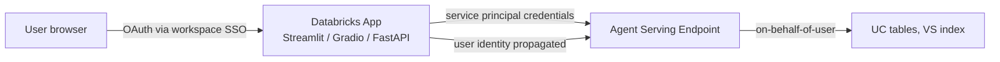
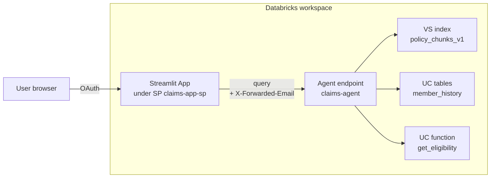

# Module 12 — Databricks Apps as Agent UIs (NEW Mar 2026)

> **Goal:** Build a user-facing UI for an agent using Databricks Apps (Streamlit / Gradio / Dash / FastAPI / Node), implement the correct auth pattern (app service principal + user OAuth), and integrate with Agent Serving endpoints. Covers **Sec 4 Obj 15**.

---

## Coverage map (verbatim Mar 18, 2026 objectives → section)

| Objective | Section |
|---|---|
| Sec 4 Obj 15 (NEW) — Develop an appropriate interactive user-facing interface for an agent (Databricks Apps, Slack, Teams, etc.) | "What Databricks Apps is" + "The security pattern (Sample Q8's answer)" + framework sections |

---

## What Databricks Apps is

Managed serverless app hosting **inside** the Databricks workspace. Supports:

- Python: **Streamlit**, **Gradio**, **Dash**, **FastAPI**, Flask
- JavaScript: **Node.js** (Next.js, plain Express)
- Static HTML

Each app:
- Runs on a workspace-scoped service principal.
- Is governed by Unity Catalog grants on referenced resources (endpoints, tables, secrets).
- Is served at a workspace-scoped URL like `https://app-name.apps.workspace.cloud.databricks.com`.
- Can be embedded in iframes, Slack, Teams, or accessed directly via browser.
- Inherits workspace OAuth/SSO for user authentication.



---

## The security pattern (Sample Q8's answer = A)

The exam tests **exactly this pattern**:

| Layer | Identity | Why |
|-------|---------|-----|
| **Browser → App** | User identity via workspace OAuth/SSO | No PAT in browser; CSRF + cookie security handled by platform |
| **App backend → Agent endpoint** | **App's service principal** | Stable, auditable, scoped grants |
| **App passes user context** | User principal flows via headers (`X-Databricks-User-Email` or via OBO token) | Per-user permission enforcement downstream |
| **Agent endpoint → resources** | On-behalf-of-user credentials | UC permissions check at the row level |

### Anti-patterns (all wrong on the exam)

- **PAT in browser JS:** anyone can lift it from devtools and impersonate the team.
- **Public endpoint with no auth:** anonymous access, no audit trail.
- **API key in frontend:** same problem; no per-user permissions.
- **Same PAT for all users:** loses per-user audit and ACL enforcement.
- **Use service principal as the user:** can't enforce per-user data access (e.g., member can only see their own records).

> ⚠️ **Exam trap:** Sample Q8 lists all four anti-patterns as B/C/D/E. The correct answer (A) describes the app backend pattern above.

---

## Streamlit example

```python
# app.py
import streamlit as st
from databricks.sdk import WorkspaceClient
import os

st.set_page_config(page_title="Claims Assistant", layout="wide")
st.title("Claims Assistant")

# App runs under its own service principal — the SDK picks it up automatically
w = WorkspaceClient()

# User context is in headers when accessed via Databricks Apps
user_email = st.context.headers.get("X-Forwarded-Email") or "unknown"
st.sidebar.caption(f"Logged in as: {user_email}")

# Chat history in session state
if "messages" not in st.session_state:
    st.session_state.messages = []

for m in st.session_state.messages:
    with st.chat_message(m["role"]):
        st.markdown(m["content"])

if user_q := st.chat_input("Ask about your claim..."):
    st.session_state.messages.append({"role": "user", "content": user_q})
    with st.chat_message("user"):
        st.markdown(user_q)

    with st.chat_message("assistant"):
        # Call the agent endpoint with app SP credentials,
        # passing user context for per-user enforcement
        resp = w.serving_endpoints.query(
            name="claims-agent",
            messages=[{"role": "user", "content": user_q}],
            extra_params={"user_email": user_email},
        )
        answer = resp.choices[0].message.content
        st.markdown(answer)
        st.session_state.messages.append({"role": "assistant", "content": answer})
```

### `app.yaml` config

```yaml
# app.yaml
command: ["streamlit", "run", "app.py"]
env:
  - name: AGENT_ENDPOINT
    value: claims-agent
```

Deploy:
```bash
databricks apps deploy --source-code-path ./app claims-assistant
```

---

## Gradio example

```python
# app.py
import gradio as gr
from databricks.sdk import WorkspaceClient

w = WorkspaceClient()

def chat(message, history, request: gr.Request):
    user_email = request.headers.get("x-forwarded-email", "unknown")
    resp = w.serving_endpoints.query(
        name="claims-agent",
        messages=[
            *[{"role": "user" if i%2==0 else "assistant", "content": m}
              for i, m in enumerate([t for pair in history for t in pair])],
            {"role": "user", "content": message},
        ],
        extra_params={"user_email": user_email},
    )
    return resp.choices[0].message.content

demo = gr.ChatInterface(fn=chat, title="Claims Assistant")
demo.launch(server_name="0.0.0.0", server_port=8080)
```

---

## When to use which framework

| Framework | Sweet spot |
|-----------|-----------|
| **Streamlit** | Internal tools, fast iteration, data-heavy UIs, sidebars |
| **Gradio** | Chat-first agent demos, file/image inputs, minimal layout work |
| **Dash** | Dashboards with rich graphs, multi-page apps |
| **FastAPI / Flask** | Embedding in another product, API-style backend |
| **Next.js / Node** | Full custom frontend with React; SSR; production-polished |

> ⚠️ **Exam trap:** The exam doesn't usually test framework choice depth, but it does test that **Databricks Apps supports all of these** — picking "you can't host Streamlit on Databricks" as an answer is wrong.

---

## Granting resources to the app

The app's service principal needs:
- `CAN_QUERY` on the agent serving endpoint.
- `USE_INDEX` on any VS indexes the app calls directly (rare — usually the agent does this).
- `SELECT` on tables the app reads directly.
- `EXECUTE` on UC functions.
- `READ` on secrets needed.

Configure via the app's resource page in workspace UI or via DAB:

```yaml
# resources/app.yml
resources:
  apps:
    claims_assistant:
      name: claims-assistant
      source_code_path: ../app
      resources:
        - name: agent_endpoint
          serving_endpoint:
            name: claims-agent
            permission: CAN_QUERY
```

---

## Passing user context securely

Databricks Apps forwards user identity via standard headers:
- `X-Forwarded-Email`
- `X-Forwarded-User`
- OBO (on-behalf-of) tokens for downstream calls

Your app reads these from `request.headers` (or framework-specific equivalent), then either:

1. **Passes user_email as a parameter** to the agent endpoint, where the agent uses it to filter retrieval (e.g., `member_state` filter on VS).
2. **Uses OBO tokens** to call downstream UC resources as the user — preserves row-level ACLs.

The OBO pattern is more secure (preserves true per-user identity end-to-end); the parameter pattern is simpler.

> ⚠️ **Exam trap:** Trusting a `user_id` value passed in the request body (not from a verified header) — a malicious user could spoof another member's ID. Always derive identity from the **verified workspace OAuth context**, not from request body.

---

## Slack / Teams as agent UI (briefly)

Mentioned in Obj 15 as alternative agent surfaces:

- **Slack bot:** Slack app calling a webhook on a Databricks endpoint (via FastAPI app or external service).
- **Teams bot:** Similar; Teams app integrated with a Databricks endpoint.

Pattern:
1. Slack/Teams sends event to a public webhook.
2. Webhook is an FastAPI Databricks App.
3. The app authenticates the request (Slack signing secret / Teams signed payload).
4. Calls the agent endpoint with the user's Slack/Teams identity propagated for personalization.

For HIPAA workloads, **prefer Databricks Apps** over Slack/Teams to keep PHI inside the workspace boundary.

---

## App lifecycle

| State | What |
|-------|------|
| **Deploying** | DAB push or workspace UI deploy |
| **Active** | Running, scaling per traffic |
| **Stopped** | Manually paused; no compute |
| **Failed** | Error in container start; check logs |

Apps scale automatically with traffic; idle apps can be configured to **stop** to save compute (similar to scale-to-zero).

---

## Worked: end-to-end agent + app



Grants:
- `claims-app-sp`: `CAN_QUERY` on `claims-agent` endpoint, `READ` on relevant secrets.
- Agent endpoint SP: `USE_INDEX` on `policy_chunks_v1`, `SELECT` on `member_history`, `EXECUTE` on `get_eligibility`.

Promotion via DAB across dev/staging/prod with workspace-specific URLs.

---

## Mini quiz

1. Sample Q8's scenario: corporate identity required, no long-lived tokens in browser, per-user permission enforcement. What is the right architecture?
2. Your Streamlit app reads `user_id` from a form field and passes to the agent. What's the vulnerability?
3. Streamlit, Gradio, Dash, FastAPI, Next.js — which can Databricks Apps host?
4. The app calls `claims-agent` endpoint. Where do you grant `CAN_QUERY` permission — on the user or on the app's service principal?
5. You're building a Slack bot for a PHI workload. Should it live as a Databricks App or a Vercel function?

### Answers

1. **App backend uses the app's service principal to call the agent endpoint**; user identity flows via workspace OAuth from browser to app; the app forwards verified user context to the agent for per-user filtering. **No PATs or API keys in the browser.** (Sample Q8 answer = A.)
2. **User-spoofing.** A user could change `user_id` in the form to access another member's data. Always derive identity from the verified workspace OAuth/Forwarded-Email header, not user-controlled input.
3. **All of them.** Databricks Apps supports Python (Streamlit, Gradio, Dash, FastAPI, Flask) and JavaScript (Node.js / Next.js).
4. **The app's service principal.** Apps don't run as users — the service principal is the runtime identity.
5. **Databricks App** (FastAPI) — keeps the request handling and PHI access inside the workspace boundary. A Vercel function would put PHI outside the BAA scope.

---

## Exam-trap recap

> ⚠️ PAT or API key in browser JS.
> ⚠️ Trusting user-controlled user_id from request body.
> ⚠️ Using service principal as the user (loses per-user ACL enforcement).
> ⚠️ "Databricks Apps doesn't support Gradio/Streamlit" — false; all major Python web frameworks supported.
> ⚠️ For PHI workloads, putting the UI on a non-BAA platform (Vercel/Netlify) breaks compliance scope.
> ⚠️ Granting CAN_QUERY to "the user" instead of the app's service principal.

---

## Worked exam-question walkthroughs

### Walkthrough 1 — Sample Q8 — the security pattern

**Pattern:** Corporate-identity requirement, per-user ACLs, no long-lived tokens. Pick:
- A: App backend with SP credentials; user identity flows via workspace OAuth → forwarded headers.
- B: PAT in browser JS.
- C: Anonymous public endpoint.
- D: Same PAT for all users.

**Reasoning chain:** B exposes the token; C and D drop per-user ACLs. A is the only pattern preserving auditability + ACL enforcement + no secrets in browser.

> 🎯 **How to recognize on the exam:** "Corporate identity", "no PAT in browser", "per-user permissions" → app backend + SP + OAuth-forwarded user context.

**Answer:** A.

### Walkthrough 2 — User spoofing via form input

**Pattern:** App reads `user_id` from a form field; passes to agent.
- A: Read user_id from verified `X-Forwarded-Email` header instead.
- B: Add CSRF token.
- C: Encrypt the user_id.
- D: Trust the user.

**Answer:** A. Always derive identity from the verified workspace OAuth context, not user-controlled input.

### Walkthrough 3 — Slack bot for PHI

**Pattern:** Need Slack interface for a PHI agent. Where does the webhook live?
- A: Vercel function
- B: AWS Lambda outside the BAA
- C: A FastAPI Databricks App
- D: A Slack-hosted runtime

**Answer:** C. For PHI, keep request handling inside the Databricks workspace BAA scope. External hosts can break compliance.

### Walkthrough 4 — Framework support

**Pattern:** Team claims "Databricks Apps doesn't support Gradio." Is that true?

**Answer:** False. Python apps: Streamlit, Gradio, Dash, FastAPI, Flask. JS: Node/Next.js. The framework choice rarely matters on the exam beyond knowing they're all supported.

### Walkthrough 5 — Grant target

**Pattern:** App calls agent endpoint. Grant `CAN_QUERY` on whom?
- A: The end user
- B: The app's service principal
- C: An admin group
- D: All authenticated users

**Answer:** B. The app runs as its own SP. End users access via app UI; their identity flows through, but the actual endpoint call is the SP.

---

## Output-prediction drills

### Drill 1 — Verified header

```python
user_email = st.context.headers.get("X-Forwarded-Email")
```

Is this trustworthy?

**Answer:** Yes — Databricks Apps sets `X-Forwarded-Email` from the verified workspace OAuth session. Browser cannot spoof this. (Don't trust headers in a generic web app; trust them only when the runtime guarantees them, which Databricks Apps does.)

### Drill 2 — Agent endpoint call from app

```python
w = WorkspaceClient()
resp = w.serving_endpoints.query(name="claims-agent", messages=[...])
```

Which identity authenticates the call?

**Answer:** The **app's service principal** (the `WorkspaceClient` picks up SDK credentials configured for the app runtime). End user identity is forwarded separately via `extra_params` or OBO.

### Drill 3 — Predict the failure

App grants are: `CAN_VIEW` on agent endpoint. User asks a question; app gets 403.

**Answer:** App SP needs `CAN_QUERY`, not `CAN_VIEW`. Different permission level. Fix the grant.

### Drill 4 — OBO vs parameter

Pattern A: app passes `user_email` to agent in custom params.
Pattern B: app passes OBO token; agent calls UC under user identity.

Which preserves row-level UC ACLs natively?

**Answer:** Pattern B (OBO). Pattern A relies on the agent code to enforce filters; OBO enforces at UC level for free.

### Drill 5 — App resource declaration

```yaml
resources:
  - name: agent
    serving_endpoint:
      name: claims-agent
      permission: CAN_QUERY
```

What does this configure?

**Answer:** Declares that the app needs `CAN_QUERY` on the `claims-agent` endpoint. The platform grants the app's SP this permission automatically at deploy.

---

## End-to-end mini-scenario — full Streamlit app + DAB

**`app/app.py`:**
```python
import streamlit as st
from databricks.sdk import WorkspaceClient

st.title("Claims Assistant")
w = WorkspaceClient()  # uses app SP credentials
user_email = st.context.headers.get("X-Forwarded-Email", "unknown")
st.sidebar.caption(f"Logged in as: {user_email}")

if "messages" not in st.session_state:
    st.session_state.messages = []

for m in st.session_state.messages:
    with st.chat_message(m["role"]):
        st.markdown(m["content"])

if q := st.chat_input("Ask about a claim..."):
    st.session_state.messages.append({"role": "user", "content": q})
    resp = w.serving_endpoints.query(
        name="claims-agent",
        messages=[{"role": "user", "content": q}],
        extra_params={"user_email": user_email},
    )
    a = resp.choices[0].message.content
    st.session_state.messages.append({"role": "assistant", "content": a})
    st.rerun()
```

**`app/app.yaml`:**
```yaml
command: ["streamlit", "run", "app.py", "--server.port=8080"]
```

**DAB:**
```yaml
resources:
  apps:
    claims_assistant:
      name: claims-assistant
      source_code_path: ../app
      resources:
        - name: agent
          serving_endpoint:
            name: claims-agent
            permission: CAN_QUERY
```

Deploy: `databricks bundle deploy -t prod`. App auto-grants `CAN_QUERY` on the claims-agent endpoint to its SP; end users access via workspace OAuth; PHI never leaves the workspace boundary.
