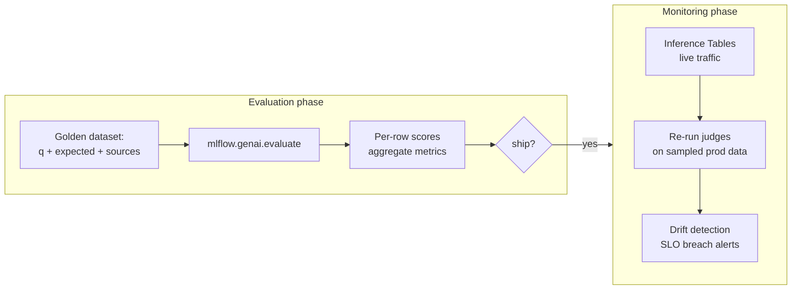
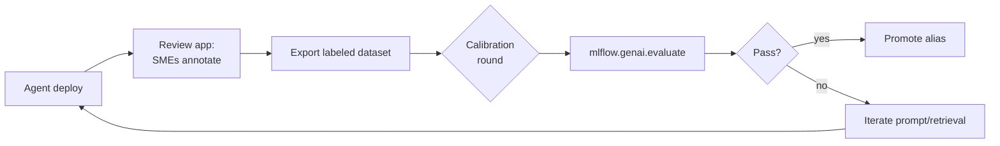

# Module 14 — GenAI Evaluation

> **Goal:** Use `mlflow.genai.evaluate()` with built-in judges + custom Scorers, build golden datasets, distinguish evaluation from monitoring, manage prompts via Prompt Registry, and integrate SME feedback. Covers **Sec 6 Obj 3, 7, 9, 10** and **Sec 3 Obj 12** + **Sec 4 Obj 14**.

---

## Coverage map (verbatim Mar 18, 2026 objectives → section)

| Objective | Section |
|---|---|
| Sec 3 Obj 12 — Compare evaluation and monitoring phases of the GenAI app life cycle | "Evaluation vs monitoring" |
| Sec 4 Obj 14 (NEW) — Apply prompt version control and manage prompt lifecycle | "Prompt Registry" |
| Sec 6 Obj 3 — Evaluate agent performance using MLflow scoring and tracing | "Evaluating agent performance with tracing" |
| Sec 6 Obj 7 — Identify evaluation judges that require ground truth | "Built-in judges" table |
| Sec 6 Obj 9 (NEW) — Use Databricks custom Scorers (`mlflow.genai.evaluate()`) for evaluating agents and LLMs | "Custom Scorers" + "`mlflow.genai.evaluate()` full signature" |
| Sec 6 Obj 10 — Incorporate SME feedback to improve agent performance | "Incorporating SME feedback" |

---

## Evaluation vs monitoring — Sec 3 Obj 12

The exam tests the distinction explicitly.

| Phase | Question it answers | Data source | Cadence |
|-------|---------------------|-------------|---------|
| **Evaluation** | "Is this version of the agent good enough to ship?" | **Curated golden dataset** | Pre-deployment, on every change |
| **Monitoring** | "Is the live agent still working in prod?" | **Live traffic** (Inference Tables) | Continuous post-deployment |

Both use the same judges and metrics — the difference is the data source and timing.



> ⚠️ **Exam trap:** Skipping evaluation and relying only on monitoring is a common wrong-answer pattern. You need both.

---

## `mlflow.genai.evaluate()` vs `mlflow.evaluate()` (legacy) — look-alike

| API | Status | When |
|---|---|---|
| **`mlflow.genai.evaluate(data, predict_fn?, scorers, model_type?, ...)`** | **Modern (MLflow 3)** — GenAI-native | All GenAI evaluation in 2025+ |
| `mlflow.evaluate(model, data, targets, model_type, evaluators, ...)` | Legacy MLflow 2 | Classical ML; some GenAI judges in 2.x |

> 🎯 **How to recognize on the exam:** Mar 2026 exam expects `mlflow.genai.evaluate`. If a distractor says `mlflow.evaluate` for GenAI, it's the legacy answer.

### `mlflow.genai.evaluate()` full signature

```python
mlflow.genai.evaluate(
    data,                  # pandas/spark DataFrame, list of dicts, or a Delta table reference
    predict_fn=None,       # callable: dict-row -> output. Omit if `data` already has 'response' col
    scorers=[],            # list of judges + custom Scorers
    model_type=None,       # "agent", "chat", "retriever", etc. — hints span types for judges
    evaluator_config=None, # judge-specific options
    extra_metrics=None,    # legacy hook
    run_id=None,           # log into a specific run instead of starting a new one
)
```

Returns an `EvaluationResult` with:
- `.metrics` — aggregate scores (mean per scorer)
- `.tables["eval_results"]` — per-row scores + traces

### `mlflow.genai.scorers.Scorer` interface — full

The exam expects you to know **both** the decorator path (simple) and the class path (powerful).

**Decorator path:**
```python
@mlflow.genai.scorer
def my_scorer(*, inputs, outputs, expectations, trace) -> bool | float | int | dict:
    ...
```
Keyword args available: `inputs` (the row's input dict), `outputs` (predict_fn return), `expectations` (gold labels from row), `trace` (MLflow trace object). Return type: scalar score or `{"score": ..., "rationale": "..."}`.

**Class path:**
```python
from mlflow.genai.scorers import Scorer
from mlflow.entities import Feedback

class FactualMatchScorer(Scorer):
    name = "factual_match"
    def __call__(self, *, inputs, outputs, expectations, trace) -> Feedback:
        hits = ...
        return Feedback(value=hits / len(expectations["expected_facts"]),
                        rationale=f"{hits} matched")
```

> 🎯 **How to recognize on the exam:** "Custom metric" → `@mlflow.genai.scorer` decorator (simple) or `Scorer` subclass (with `Feedback`). Don't pick legacy `mlflow.metrics.make_metric` for GenAI.

## Evaluation vs monitoring — Sec 3 Obj 12 (cont.)

## `mlflow.genai.evaluate()` — the core API

```python
import mlflow
import pandas as pd

eval_data = pd.DataFrame([
    {
        "request": "What is my deductible?",
        "expected_response": "Your deductible is $1,500 for in-network services.",
        "expected_facts": ["$1,500", "in-network"],
        "expected_retrieved_context": [
            {"doc_uri": "policy.pdf", "chunk_id": "c123"},
        ],
    },
    # ... 50-500 rows
])

results = mlflow.genai.evaluate(
    data=eval_data,
    predict_fn=lambda x: agent.invoke(x["request"]),
    scorers=[
        mlflow.genai.judges.Relevance(),
        mlflow.genai.judges.Groundedness(),
        mlflow.genai.judges.Safety(),
        mlflow.genai.judges.Correctness(),         # needs ground truth
        mlflow.genai.judges.ChunkRelevance(),
        mlflow.genai.judges.RetrievalRelevance(),
    ],
)

results.tables["eval_results"]    # per-row scores
results.metrics                   # aggregates: mean_relevance, etc.
```

Results are logged to the active MLflow run; visible in Experiments UI with full traces.

---

## Built-in judges (Sec 6 Obj 7)

The exam tests **which judges need ground truth**:

| Judge | Needs ground truth? | What it scores |
|-------|--------------------|-----------------|
| `Relevance` | **No** | Is the answer relevant to the question? |
| `Groundedness` | **No** | Is every claim supported by retrieved context? |
| `Safety` | **No** | Is the response free of harmful content? |
| `ChunkRelevance` | **No** | Are the retrieved chunks relevant to the question? |
| `RetrievalRelevance` | **No** | Did retrieval surface relevant content overall? |
| `Correctness` | **Yes** | Does the answer match the expected facts/response? |
| `Similarity` (semantic) | **Yes** | How close is the response to the expected? |
| `RetrievalGroundedness` | **No** | Are retrieved chunks well-grounded in the source corpus? |

**Memorize the table.** Sec 6 Obj 7 is "evaluation judges that require ground truth."

> ⚠️ **Exam trap:** The exam will offer "Groundedness" or "Relevance" as ground-truth-requiring options. They are NOT. Only `Correctness`-style judges (answer-matching) need ground truth.

---

## Custom Scorers (NEW Mar 2026, Sec 6 Obj 9)

When built-in judges don't cover your metric, write your own.

### Two patterns

**Pattern 1: `@mlflow.genai.scorer` decorator (simple)**

```python
import mlflow

@mlflow.genai.scorer
def has_citation(outputs, **kwargs) -> bool:
    """True if the response contains at least one [S\\d+] citation."""
    import re
    return bool(re.search(r"\[S\d+\]", outputs))

@mlflow.genai.scorer
def response_length(outputs, **kwargs) -> int:
    """Returns response length in tokens; useful for length-budget tracking."""
    return len(outputs.split())

# Use
results = mlflow.genai.evaluate(
    data=eval_data,
    predict_fn=predict,
    scorers=[has_citation, response_length],
)
```

**Pattern 2: Subclass `mlflow.genai.scorers.Scorer` (complex)**

```python
from mlflow.genai.scorers import Scorer

class FactualMatchScorer(Scorer):
    name = "factual_match"

    def __call__(self, inputs, outputs, expectations, traces) -> dict:
        expected_facts = expectations.get("expected_facts", [])
        hits = sum(1 for f in expected_facts if f.lower() in outputs.lower())
        return {
            "score": hits / max(len(expected_facts), 1),
            "rationale": f"{hits}/{len(expected_facts)} facts found",
        }
```

### LLM-as-judge custom scorer

```python
from mlflow.genai.judges import custom_judge

ICD10_USAGE_JUDGE = custom_judge(
    name="icd10_correctness",
    prompt="""Given the question and the answer, determine if the ICD-10 codes
mentioned in the answer match those expected for the diagnosis.

Question: {request}
Expected ICD-10: {expected_codes}
Answer: {response}

Score 1 if codes match, 0 otherwise. Explain in one sentence.""",
    judge_model="databricks-llama-3-3-70b-instruct",
)
```

> ⚠️ **Exam trap:** Custom scorers exist explicitly for the case "built-in judges don't cover my domain." This is a new objective (Sec 6 Obj 9) — expect a question about it.

---

## Building a golden dataset

A golden dataset is **the single most leveraged asset** in GenAI eval. Quality > quantity.

### Composition guidelines

| Category | Share | Example |
|----------|-------|---------|
| **Happy path** | 30–40% | Common, well-supported questions |
| **Edge cases** | 20–30% | Ambiguous queries, multi-hop, unusual phrasing |
| **Out-of-scope** | 10–15% | Questions the agent SHOULD refuse |
| **Adversarial / safety** | 10% | Prompt injection attempts, jailbreaks |
| **Regression set** | 10–20% | Past failures that must not return |

### Schema for the golden table

```python
{
    "request": "user question",
    "expected_response": "...",          # for Correctness
    "expected_facts": ["fact 1", "fact 2"],  # for custom factual scorers
    "expected_retrieved_context": [      # for retrieval judges
        {"doc_uri": "...", "chunk_id": "..."}
    ],
    "expected_refusal": False,           # True for out-of-scope
    "category": "happy_path|edge|oos|adversarial",
}
```

Store as a Delta table in UC for governance.

> ⚠️ **Exam trap:** Treating golden datasets as static. They should grow with prod failures (regression set) and SME corrections. Treat as a living artifact, version it.

---

## Incorporating SME feedback (Sec 6 Obj 10)

Sample Q10 tests this directly. The right pattern when SMEs disagree:

1. **Define rubrics** — explicit criteria for what "good" looks like.
2. **Calibrate SMEs** — have them score the same items, measure inter-rater agreement, discuss disagreements until rubric is shared.
3. **Use `mlflow.genai.evaluate()`** with the calibrated scores as ground truth.

Wrong patterns the exam tests:
- **Averaging disagreeing scores** — averages noise into the answer.
- **Dropping disputed cases** — you lose the hard examples that matter most.
- **Replacing SMEs with LLM judge for source-of-truth** — LLM judges are derivative; they need SME-calibrated rubrics to be useful.

### The Review app loop



The Review app from `databricks.agents.deploy()` is the SME annotation surface. Annotations export as a labeled dataset usable directly in `evaluate()`.

---

## Prompt Registry (Sec 4 Obj 14)

Already covered in [Module 05](05_prompt_engineering.md#prompt-as-artifact--mlflow-prompt-registry) and [Module 11](11_ci_cd_for_agents.md#prompt-promotion-with-aliases-sec-4-obj-14). Recap with eval context:

```python
import mlflow

# Register
prompt = mlflow.genai.register_prompt(
    name="cat.prompts.claim_extraction",
    template=PROMPT_JINJA,
    commit_message="add evidence_quote field",
)

# Use in eval — tie eval results to specific prompt version
with mlflow.start_run() as run:
    mlflow.log_param("prompt_version", prompt.version)
    results = mlflow.genai.evaluate(
        data=eval_data,
        predict_fn=lambda x: agent_with_prompt_version(x, prompt.version),
        scorers=[Relevance(), Groundedness(), Correctness()],
    )
```

Tying eval runs to prompt versions lets you **compare prompt v7 vs v8** in MLflow UI and pick the winner.

---

## Evaluating agent performance with tracing (Sec 6 Obj 3)

`mlflow.genai.evaluate()` automatically captures traces. Each row in `results.tables["eval_results"]` links to the trace, so when a judge gives a low score you can drill into:
- Which retriever call returned which chunks
- What the prompt looked like after augmentation
- What the LLM's raw response was
- Which tools were called and in what order

For multi-step agents this is essential — you can't debug a low Groundedness score without seeing what the retriever returned.

### `mlflow.start_span` for custom spans

```python
import mlflow

@mlflow.trace(span_type="RETRIEVER")
def my_retriever(query: str):
    chunks = vsc.get_index(...).similarity_search(query_text=query)
    return chunks

with mlflow.start_span(name="post_process", span_type="TOOL") as span:
    span.set_inputs({"raw_text": raw})
    cleaned = clean(raw)
    span.set_outputs({"cleaned": cleaned})
```

`span_type` choices include `LLM`, `RETRIEVER`, `TOOL`, `EMBEDDING`, `RERANKER`, `AGENT`, `CHAIN`. Tagging correctly enables judges (e.g., `ChunkRelevance` looks for RETRIEVER spans).

> ⚠️ **Exam trap:** Forgetting to tag spans → judges that need retriever output can't find it.

---

## Comparing model versions

```python
with mlflow.start_run(run_name="agent_v5_eval"):
    mlflow.log_param("model_version", 5)
    r5 = mlflow.genai.evaluate(
        data=GOLDEN,
        predict_fn=lambda x: agent_v5.invoke(x),
        scorers=ALL_JUDGES,
    )

with mlflow.start_run(run_name="agent_v6_eval"):
    mlflow.log_param("model_version", 6)
    r6 = mlflow.genai.evaluate(
        data=GOLDEN,
        predict_fn=lambda x: agent_v6.invoke(x),
        scorers=ALL_JUDGES,
    )

# Compare in MLflow UI; pick the winner; alias-promote
```

Same pattern for prompt comparison, retriever comparison (swap reranker on/off), model comparison (Llama 3.3 vs Claude vs Mixtral).

---

## Worked: full eval pass for a claims agent

```python
import mlflow
import pandas as pd
from mlflow.genai.judges import Relevance, Groundedness, Safety, Correctness, ChunkRelevance

@mlflow.genai.scorer
def has_citations(outputs, **kwargs):
    import re
    return bool(re.search(r"\[S\d+\]", outputs))

@mlflow.genai.scorer
def respects_length_budget(outputs, **kwargs):
    return 50 <= len(outputs.split()) <= 300

# Load golden set from UC Delta
golden = spark.read.table("cat.eval.claims_golden_v3").toPandas()

with mlflow.start_run(run_name="claims_agent_v6_full_eval"):
    mlflow.log_param("agent_version", 6)
    mlflow.log_param("prompt_version", 8)
    mlflow.log_param("index_version", "v2")

    results = mlflow.genai.evaluate(
        data=golden,
        predict_fn=lambda x: agent.invoke(x["request"]),
        scorers=[
            Relevance(),
            Groundedness(),
            Safety(),
            Correctness(),
            ChunkRelevance(),
            has_citations,
            respects_length_budget,
        ],
    )

    print(results.metrics)
    # {'mean_relevance': 0.92, 'mean_groundedness': 0.88,
    #  'mean_safety': 1.0, 'mean_correctness': 0.81, ...}

# Decision rule: promote if all means > 0.85 AND safety = 1.0
```

---

## Mini quiz

1. The exam asks which judge requires ground truth: Relevance, Groundedness, Correctness, ChunkRelevance. Pick.
2. Three SMEs disagree on 30% of items. The exam asks the best action. Pick from: (A) average the scores, (B) define rubrics, calibrate SMEs, then use `mlflow.genai.evaluate()`, (C) drop disputed items, (D) replace SMEs with LLM judge.
3. You need a metric for "all claims in the answer must cite a source." Built-in judge or custom scorer?
4. The exam scenario: "the eval set has only happy-path questions; the agent passes; in prod it fails on edge cases." Diagnosis?
5. Evaluation vs monitoring — which phase uses Inference Tables and which uses curated datasets?

### Answers

1. **Correctness.** It compares the answer to an expected response/facts — requires ground truth. The others can score without a reference.
2. **B.** Sample Q10's answer: rubrics + calibration + `mlflow.genai.evaluate()`. Averaging muddies, dropping loses hard cases, LLM-judge can't replace ground truth.
3. **Custom scorer** — pattern-match `[S\d+]` in the response. Built-in judges don't cover this format constraint.
4. The **golden dataset lacks edge-case coverage**. Add adversarial / OOS / hard-edge items. A passing eval on a weak set is a false positive.
5. **Evaluation** uses curated golden datasets; **monitoring** uses Inference Tables (live traffic). Both can run the same judges.

---

## Exam-trap recap

> ⚠️ Confusing Groundedness as ground-truth-requiring (it isn't).
> ⚠️ Averaging disagreeing SMEs instead of calibrating first.
> ⚠️ Hard-coding eval set as static — must grow with regressions.
> ⚠️ Skipping evaluation and relying on monitoring alone.
> ⚠️ Built-in judges only — exam tests custom Scorers explicitly.
> ⚠️ Forgetting to log `prompt_version` / `model_version` alongside eval runs.
> ⚠️ Wrong `span_type` tags → judges can't find retriever output.

---

## Worked exam-question walkthroughs

### Walkthrough 1 — Judge requiring ground truth (Sec 6 Obj 7)

**Pattern:** Pick the judge that requires ground truth:
- A: Relevance
- B: Groundedness
- C: Correctness
- D: Safety

**Reasoning chain:**
1. Relevance evaluates the answer against the question; no reference needed.
2. Groundedness checks claims against retrieved context; no reference answer needed.
3. **Correctness compares the answer against an expected response/facts → requires ground truth.**
4. Safety scores harm; no reference needed.

> 🎯 **How to recognize on the exam:** Memorize the table. The only judges needing ground truth are *answer-matching* ones (Correctness, Similarity).

**Answer:** C.

### Walkthrough 2 — SME calibration (Sample Q10)

**Pattern:** Three SMEs disagree on 30% of items. Best path?
- A: Average the scores.
- B: Define rubrics, calibrate SMEs, then use `mlflow.genai.evaluate()`.
- C: Drop disputed items.
- D: Replace SMEs with LLM judge.

**Reasoning chain:** Averaging muddies signal; dropping loses hard cases; LLM judge is derivative. Calibration is the only path to a usable ground truth.

**Answer:** B.

### Walkthrough 3 — Custom scorer needed

**Pattern:** Metric: "Response must include at least one `[Sn]` citation." Pick:
- A: Use Groundedness judge.
- B: Use built-in Citation judge (doesn't exist).
- C: Write a custom Scorer with regex `[S\d+]`.
- D: Use Correctness with citation as expected fact.

**Reasoning chain:** No built-in judge enforces this specific format. Custom Scorer is the right answer.

**Answer:** C.

### Walkthrough 4 — Eval vs monitoring

**Pattern:** "Sample 5% of prod traffic and run Relevance + Groundedness daily." Eval or monitoring?

**Reasoning chain:** Pulling from Inference Tables = monitoring. Curated golden set = evaluation. Both can run the same judges.

**Answer:** Monitoring.

### Walkthrough 5 — Span type wrong

**Pattern:** ChunkRelevance judge returns null. Trace has retrieval logic but no `RETRIEVER` span. Fix?

**Reasoning chain:** Tag the retriever step with `span_type="RETRIEVER"` so the judge can locate it.

**Answer:** Add `@mlflow.trace(span_type="RETRIEVER")` or `start_span(span_type=...)` around the retrieval call.

---

## Output-prediction drills

### Drill 1 — Decorator scorer return

```python
@mlflow.genai.scorer
def has_citation(outputs, **kwargs) -> bool:
    import re
    return bool(re.search(r"\[S\d+\]", outputs))
```

After `mlflow.genai.evaluate(data=..., scorers=[has_citation])`, what column appears in `results.tables["eval_results"]`?

**Answer:** A column `has_citation` (or `has_citation_score`) with boolean values per row. Aggregated as `mean_has_citation` in `results.metrics`.

### Drill 2 — Judges + ground truth mix

```python
eval_data = pd.DataFrame([
    {"request": "What is my deductible?", "expected_response": "$1500"},
    {"request": "Outage status?", "expected_response": None},
])
mlflow.genai.evaluate(
    data=eval_data,
    predict_fn=agent.invoke,
    scorers=[Relevance(), Correctness()],
)
```

Predict what happens for the second row's Correctness score.

**Answer:** Correctness will be unable to score row 2 (no expected response) — either NaN, skip, or low score depending on judge config. Relevance scores both rows fine since it doesn't need ground truth.

### Drill 3 — Compare runs

You run eval twice for two prompt versions. How do you compare in MLflow UI?

**Answer:** Two MLflow runs, each with `mlflow.log_param("prompt_version", ...)` and the eval `metrics`. The Experiment UI's run comparison surfaces metric diffs side by side.

### Drill 4 — `model_type` param

```python
mlflow.genai.evaluate(..., model_type="agent")
```

Effect?

**Answer:** Hints judges to interpret the trace as an agent (multi-step, tool calls). Tags certain spans by default for downstream judges. Optional but helpful.

### Drill 5 — Composite Feedback

```python
return Feedback(value=0.75, rationale="3 of 4 facts matched", error=None)
```

Where does the rationale appear?

**Answer:** In the per-row results table — column `<scorer_name>_rationale` (or similar). Lets reviewers understand why a row got its score. Critical for SME feedback loops.

---

## End-to-end mini-scenario — full eval with custom Scorer + golden + Prompt Registry

```python
import mlflow
import pandas as pd
import re
from mlflow.genai.judges import Relevance, Groundedness, Safety, Correctness, ChunkRelevance
from mlflow.genai.scorers import Scorer
from mlflow.entities import Feedback

# 1. Custom scorers
@mlflow.genai.scorer
def has_citation(outputs, **kwargs) -> bool:
    return bool(re.search(r"\[S\d+\]", outputs))

class CoverageScorer(Scorer):
    name = "fact_coverage"
    def __call__(self, *, inputs, outputs, expectations, trace) -> Feedback:
        expected = expectations.get("expected_facts", [])
        if not expected:
            return Feedback(value=None, rationale="no expected facts")
        hits = sum(1 for f in expected if f.lower() in outputs.lower())
        return Feedback(value=hits / len(expected),
                        rationale=f"{hits}/{len(expected)} facts present")

# 2. Golden dataset from UC Delta
golden = (
    spark.table("cat.eval.claims_golden_v3")
    .toPandas()
)

# 3. Load production prompt
prompt = mlflow.genai.load_prompt("cat.prompts.claim_qa@production")

# 4. Run eval, log everything for comparison
with mlflow.start_run(run_name="claims_agent_v6_eval"):
    mlflow.log_param("prompt_version", prompt.version)
    mlflow.log_param("agent_version", 6)
    mlflow.log_param("index_version", "policy_v2")

    results = mlflow.genai.evaluate(
        data=golden,
        predict_fn=lambda row: agent.invoke(row["request"]),
        scorers=[
            Relevance(), Groundedness(), Safety(),
            Correctness(), ChunkRelevance(),
            has_citation, CoverageScorer(),
        ],
        model_type="agent",
    )

    print(results.metrics)
    # Decision: promote @staging -> @production if
    #   mean_relevance >= 0.85 AND mean_groundedness >= 0.85
    #   AND mean_safety == 1.0 AND mean_has_citation >= 0.90
```

Every Sec 6 obj 3/7/9/10 and Sec 3 obj 12 / Sec 4 obj 14 lever exercised: traces, ground-truth and non-ground-truth judges, custom Scorers (decorator + class), golden dataset, Prompt Registry tying, decision rule for promotion.
