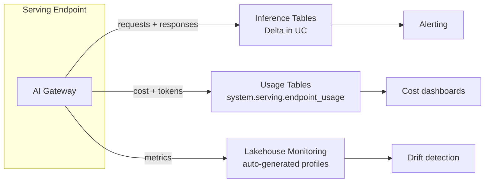
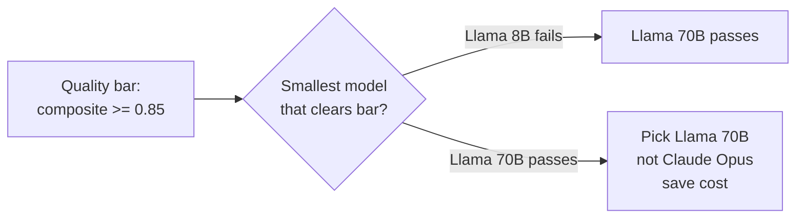
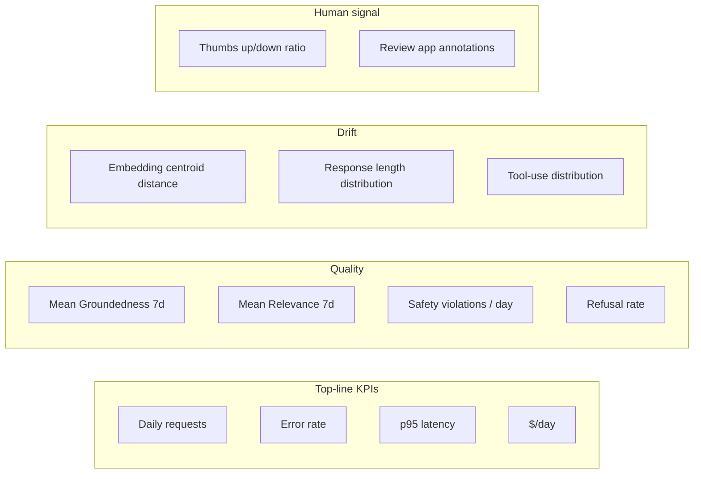

# Module 15 — Production Monitoring

> **Goal:** Track a live GenAI endpoint using AI Gateway Inference Tables, Usage Tables, and rate limiting; monitor cost, latency SLOs, and embedding drift; control LLM costs. Covers **Sec 6 Obj 2, 4, 5, 6, 8**.

---

## Coverage map (verbatim Mar 18, 2026 objectives → section)

| Objective | Section |
|---|---|
| Sec 6 Obj 1 — Select LLM choice based on quantitative evaluation metrics | "Selecting model size by quantitative metrics" + cross-ref [Module 02](02_model_selection.md) |
| Sec 6 Obj 2 — Select key metrics to monitor | "Key metrics to monitor" |
| Sec 6 Obj 4 — Use inference logging to assess deployed RAG performance | "Inference logging to assess RAG performance" |
| Sec 6 Obj 5 — Use Databricks features to control LLM costs | "Cost controls" |
| Sec 6 Obj 6 — Use inference tables and Agent Monitoring to track a live LLM endpoint | "AI Gateway Inference Tables" |
| Sec 6 Obj 8 (NEW) — Use AI Gateway (Inference Tables, Usage Tables, rate limiting) | "AI Gateway Inference Tables" + "Usage Tables" + "Rate limiting" |

---

## The three sources of monitoring truth



Three tables, three lenses:
- **Inference Tables**: every request/response — for auditing, retraining data, offline eval, debugging.
- **Usage Tables**: cost + token consumption — for FinOps, budget enforcement.
- **Lakehouse Monitoring (auto-generated)**: statistical profiles over time — for drift.

Sec 6 Obj 8 explicitly names **Inference Tables, Usage Tables, and rate limiting** as the AI Gateway features to know.

---

## AI Gateway Inference Tables (Sec 6 Obj 6, 8)

When enabled on an endpoint, every request and response is logged to a Delta table in UC.

### Configuration

```python
from databricks.sdk.service.serving import (
    AiGatewayConfig,
    AiGatewayInferenceTableConfig,
)

w.serving_endpoints.update_ai_gateway(
    name="claims-agent",
    inference_table_config=AiGatewayInferenceTableConfig(
        enabled=True,
        catalog_name="cat",
        schema_name="monitoring",
        table_name_prefix="claims_agent",
    ),
)
```

This auto-creates:
- `cat.monitoring.claims_agent_payload` — raw request/response JSON.
- `cat.monitoring.claims_agent_payload_processed` — flattened columns (latency, tokens, user, status).

### What's logged

| Column | Description |
|--------|-------------|
| `databricks_request_id` | Unique ID — join with logs |
| `client_request_id` | Client-supplied ID (if any) |
| `request_time` | Timestamp |
| `request_metadata.user` | Calling user / SP |
| `request.messages` | Input messages |
| `response.choices` | LLM output |
| `response_status_code` | HTTP status |
| `latency_ms` | End-to-end latency |
| `input_token_count` | Tokens in |
| `output_token_count` | Tokens out |
| `model_name` | Served entity |

### Use cases

1. **Offline eval on prod traffic.** Sample inference rows → run `mlflow.genai.evaluate()` with judges on prod outputs → get continuous quality signal.
2. **Audit.** Compliance asks "what did the agent say to member X on Tuesday?" → SQL query the inference table.
3. **Failure debugging.** Filter `response_status_code != 200` → root-cause.
4. **Retraining data.** Annotate prod inputs via Review app → use as eval / training data.
5. **Cost attribution.** Aggregate token counts by user / app / use case.

> ⚠️ **Exam trap:** Inference Tables = **AI Gateway feature** on the **endpoint**. Not configured at log-model time. Not in the chain code. Specifically a Gateway setting.

---

## Usage Tables

System-managed Delta tables under the `system.serving` schema:

```sql
SELECT
  endpoint_name,
  sum(input_token_count) AS input_tokens,
  sum(output_token_count) AS output_tokens,
  sum(dbu_consumption) AS dbus,
  count(*) AS requests
FROM system.serving.endpoint_usage
WHERE date_trunc('day', request_time) >= current_date() - 7
GROUP BY endpoint_name
ORDER BY dbus DESC;
```

Per-user, per-endpoint, per-day rollups. Pair with `system.billing.usage` for dollar cost.

> ⚠️ **Exam trap:** Usage Tables ≠ Inference Tables. **Usage** = aggregates for FinOps. **Inference** = raw records for audit/eval.

---

## Rate limiting (Sec 6 Obj 8)

Configurable per endpoint via AI Gateway:

```python
from databricks.sdk.service.serving import (
    AiGatewayRateLimit,
    AiGatewayRateLimitKey,
    AiGatewayRateLimitRenewalPeriod,
)

w.serving_endpoints.update_ai_gateway(
    name="claims-agent",
    rate_limits=[
        AiGatewayRateLimit(
            calls=1000,
            key=AiGatewayRateLimitKey.USER,
            renewal_period=AiGatewayRateLimitRenewalPeriod.MINUTE,
        ),
        AiGatewayRateLimit(
            calls=100_000,
            key=AiGatewayRateLimitKey.ENDPOINT,
            renewal_period=AiGatewayRateLimitRenewalPeriod.HOUR,
        ),
    ],
)
```

| Key | Granularity |
|-----|-------------|
| `USER` | Per-user QPS cap |
| `ENDPOINT` | Total endpoint QPS cap |

> ⚠️ **Exam trap:** Rate limiting isn't a guardrail on **content** — it's a guardrail on **traffic volume**. Use for DoS, runaway agent loops, budget enforcement.

---

## Inference logging to assess RAG performance (Sec 6 Obj 4)

Once Inference Tables are flowing, run continuous quality checks:

```python
import mlflow

# Pull last day's prod requests
prod_sample = spark.sql("""
  SELECT databricks_request_id, request, response,
         response_status_code, latency_ms
  FROM cat.monitoring.claims_agent_payload_processed
  WHERE date_trunc('day', request_time) = current_date() - 1
""").sample(0.05).toPandas()  # 5% sample

# Eval judges (no ground truth needed)
results = mlflow.genai.evaluate(
    data=prod_sample.rename(columns={"request": "request", "response": "response"}),
    scorers=[
        mlflow.genai.judges.Relevance(),
        mlflow.genai.judges.Groundedness(),
        mlflow.genai.judges.Safety(),
    ],
)
```

Track scores over time:

```sql
SELECT
  date_trunc('day', request_time) AS day,
  avg(relevance_score) AS mean_relevance,
  avg(groundedness_score) AS mean_groundedness
FROM cat.monitoring.claims_agent_judged
GROUP BY 1
ORDER BY 1;
```

Set SLOs: "Mean Groundedness ≥ 0.85 over rolling 7-day window."

---

## Key metrics to monitor (Sec 6 Obj 2)

| Metric | What it tells you | Source |
|--------|-------------------|--------|
| **p50 / p95 / p99 latency** | User experience | Inference table `latency_ms` |
| **Error rate** | Reliability | `response_status_code` |
| **QPS** | Load | Inference table count |
| **Tokens/sec in/out** | Cost driver | Usage tables |
| **Cost per request** | FinOps | Usage × billing |
| **Relevance / Groundedness / Safety** | Quality | Judge re-runs on samples |
| **Refusal rate** | Topic drift, attack signal | Pattern-match response or output safety judge |
| **Tool-use distribution** | Agent behavior shifts | Trace span analysis |
| **Embedding drift** | Retrieval degradation | Compare embedding distribution day-over-day |
| **User satisfaction** | Real-world impact | Thumbs up/down in app + Review app |

### Embedding drift

Approach:
1. Sample query embeddings from prod (or from a held-out canonical set re-embedded daily).
2. Compute statistical distance (KL divergence, MMD, or simple cosine to a centroid) between today's distribution and a baseline window.
3. Alert if distance exceeds threshold — indicates source content shift, embedding model change, or query population change.

Databricks Lakehouse Monitoring auto-generates statistical profiles on Delta tables; point it at the Inference Table to get distribution drift for free.

> ⚠️ **Exam trap:** "Monitor model accuracy in production" — GenAI doesn't have a single accuracy number. Track multiple judge scores + business KPIs (e.g., resolution rate for a support agent).

---

## Cost controls (Sec 6 Obj 5)

The exam expects you to know levers for **controlling LLM costs**:

### Cost-control levers

| Lever | Effect |
|-------|--------|
| **Smaller model where possible** | 10–50× cost reduction (Llama 8B vs 70B) |
| **Caching frequent queries** | Skip the LLM entirely for cache hits |
| **Provisioned Throughput at high QPS** | Cheaper than PPT above break-even |
| **Prompt compression** | Fewer input tokens, lower per-call cost |
| **Output length cap** (`max_tokens`) | Bounds expensive output tokens |
| **Rate limiting per user** | Prevents runaway abuse |
| **Scale-to-zero** | Idle endpoints cost nothing |
| **Batch via `ai_query`** | Cheaper than per-row Serving for offline workloads |
| **Storage-optimized Vector Search** | ~7× cheaper at scale |
| **Embedding cache** | Don't re-embed identical queries |

### `system.billing.usage` query

```sql
SELECT
  usage_metadata.endpoint_name AS endpoint,
  sum(usage_quantity) AS dbus,
  sum(usage_quantity * pricing_default.default_price) AS approximate_cost_usd
FROM system.billing.usage
LEFT JOIN system.billing.list_prices pricing
  ON usage.sku_name = pricing.sku_name
WHERE usage.usage_date >= current_date() - 30
  AND usage.usage_metadata.endpoint_name IS NOT NULL
GROUP BY 1
ORDER BY 2 DESC;
```

> ⚠️ **Exam trap:** Cost controls layered: smaller model + caching + length caps + rate limits. The exam-correct answer almost always **combines** levers, not a single one.

---

## Selecting model size by quantitative metrics (Sec 6 Obj 1)

Pick the **smallest** model that meets your quality bar.

Method:
1. Eval candidates (large, medium, small) on the golden set.
2. Plot quality (composite of Relevance / Groundedness / Correctness) vs cost-per-1K-requests.
3. Pick the leftmost (cheapest) point that's above your quality threshold.



> ⚠️ **Exam trap:** Picking the biggest model "to be safe." The exam-correct answer is **smallest that clears your quality bar**, evaluated on your data.

---

## SLO + alerting pattern

```yaml
# Example SLO
slo_name: claims_agent_quality
metric: mean_groundedness_24h
threshold: 0.85
window: 24h
action_below: page on-call + auto-rollback to last-good alias
```

Implementation:
- Job runs daily, computes mean Groundedness from previous day's Inference Table sample.
- Job writes result to a metrics Delta table.
- Databricks SQL Alert or Lakeflow alert fires if threshold breached.
- Webhook to incident management; optional auto-rollback by flipping the `@production` alias to the prior version.

---

## Drift detection patterns

| Drift type | Detection |
|------------|-----------|
| **Input drift** | Embedding centroid distance week-over-week |
| **Output drift** | Average response length, refusal rate, judge scores trending |
| **Retrieval drift** | Avg score of top-1, # of empty retrievals |
| **Tool-use drift** | Distribution of tool-call counts per request |
| **Cost drift** | DBU/request rising → model misuse or longer outputs |
| **User-satisfaction drift** | Thumbs-down rate |

Set baselines during pre-launch; auto-alert on deviation.

---

## Putting it all together — a monitoring dashboard



Each pane sourced from Inference Tables, Usage Tables, or Lakehouse Monitoring.

---

## Mini quiz

1. The exam asks which **AI Gateway features** track a live agent. List three.
2. You need to debug a specific user's failed request from yesterday. Which table do you query?
3. Cost spiked 3× this week. Which two tables do you join?
4. Sec 6 Obj 1: "select the LLM size based on quantitative metrics." Your method?
5. Rate limiting is set to 1000 calls/user/minute. User X is making 10K calls/min. What happens?

### Answers

1. **Inference Tables, Usage Tables, Rate Limiting.** (Other relevant: PII guardrails, topic moderation — but those are *governance* features, not strictly tracking.)
2. **The Inference Table** (`cat.monitoring.claims_agent_payload_processed`) — filter by `request_metadata.user` and time window. Inference Tables log every request/response with metadata.
3. **`system.serving.endpoint_usage`** (token + DBU per endpoint/user) joined with **`system.billing.usage`** (dollar cost). Identify the endpoint + user combination with the largest delta.
4. Eval candidate models (small, medium, large) on the golden set with multiple judges. Pick the **smallest model whose composite quality clears your bar** — not the biggest, for cost reasons.
5. Requests above the 1000/min cap are **rejected with a rate-limit error**. User must wait until the next minute window. The endpoint's other users are unaffected.

---

## Exam-trap recap

> ⚠️ Confusing Inference Tables (raw records) with Usage Tables (aggregates).
> ⚠️ "Monitor accuracy" — GenAI uses multiple judge scores + business KPIs, not a single accuracy number.
> ⚠️ Picking the biggest model when a smaller one clears the quality bar.
> ⚠️ Single cost-control lever — exam usually rewards combined levers.
> ⚠️ Treating rate limiting as a content guardrail (it's traffic volume).
> ⚠️ Skipping the trace-span tagging that judges depend on.
> ⚠️ Forgetting that Inference Tables need to be enabled on the endpoint's AI Gateway config explicitly.

---

## Look-alike comparison — Inference Tables vs Usage Tables vs system.billing

| Table | What | Use for | Where |
|---|---|---|---|
| **Inference Tables** (`cat.<schema>.<prefix>_payload[_processed]`) | Raw per-request rows: input, output, user, latency, tokens | Audit, eval-on-prod, debugging, retraining data | Per-endpoint Delta tables (you choose location) |
| **Usage Tables** (`system.serving.endpoint_usage`) | Aggregates: tokens, DBUs per user/endpoint/day | FinOps, budgeting | System schema (no setup) |
| **`system.billing.usage`** | Dollar-cost rollups across all DBU usage | Finance reporting | System schema (no setup) |
| **Lakehouse Monitoring** profile / drift tables | Statistical profiles on monitored tables | Drift detection, distribution alerts | Auto-generated when you point a monitor at a table |

> 🎯 **How to recognize on the exam:** "Which conversation did user X have on Tuesday?" → **Inference Tables**. "How many tokens did endpoint Y consume last week?" → **Usage Tables**. "Dollar cost of the agent fleet" → join `system.billing.usage`.

---

## Worked exam-question walkthroughs

### Walkthrough 1 — Three AI Gateway tracking features (Sec 6 Obj 8)

**Pattern:** Name three AI Gateway features for tracking a live agent.

**Answer:** **Inference Tables, Usage Tables, Rate Limits.** Sec 6 Obj 8 explicitly names these three.

### Walkthrough 2 — Audit query

**Pattern:** Compliance asks: "Show me every request user `alice@optum.com` made to `claims-agent` last Tuesday." Which table?

**Answer:** Inference Tables — filter `request_metadata.user = 'alice@optum.com'` and time window.

### Walkthrough 3 — Cost spike

**Pattern:** Cost rose 3× last week. Which two sources do you join?

**Answer:** `system.serving.endpoint_usage` (token + DBU by endpoint/user) + `system.billing.usage` (dollar cost) to identify the endpoint+user combination driving the spike.

### Walkthrough 4 — Smaller model selection

**Pattern:** Llama 8B fails quality bar 0.85; Llama 70B passes at 0.91; Claude Sonnet passes at 0.92. Pick.

**Answer:** Llama 70B (smallest that clears the bar; cost-optimal).

### Walkthrough 5 — Rate-limit semantics

**Pattern:** User X exceeds 1000 calls/minute cap. What happens?

**Answer:** Requests beyond 1000 return rate-limit error (HTTP 429-equivalent). Other users unaffected. User must wait until the next minute window.

---

## Output-prediction drills

### Drill 1 — Inference table schema query

```sql
SELECT request.messages[size(request.messages)-1].content AS last_user_msg,
       response.choices[0].message.content AS llm_answer,
       latency_ms, input_token_count, output_token_count
FROM cat.monitoring.claims_agent_payload_processed
WHERE request_time >= current_date() - 1
LIMIT 10;
```

What's the shape of `request.messages`?

**Answer:** Array of structs, each `{role: string, content: string}`. Last element is typically the user's question.

### Drill 2 — Continuous eval on prod sample

```python
prod = spark.sql("""SELECT request, response FROM cat.monitoring.x_payload_processed
                    WHERE request_time >= current_date() - 1""").sample(0.05).toPandas()
mlflow.genai.evaluate(data=prod, scorers=[Relevance(), Groundedness(), Safety()])
```

Why no `predict_fn`?

**Answer:** Data already contains `response` (from prod). `predict_fn` is needed only when scoring fresh predictions. When `response` is present, judges run directly on the existing rows.

### Drill 3 — Lakehouse Monitoring drift

You point a monitor at `cat.monitoring.claims_agent_payload_processed` with `input_token_count` as a metric. What's surfaced?

**Answer:** Distribution profile over time, with alerting on configurable thresholds (mean shift, percentile shift, divergence). Helps spot drift in prompt sizes / query complexity.

### Drill 4 — Cost-control combo

Endpoint cost is high. Which combination has the largest effect:
- A: Smaller model + caching + `max_tokens` cap
- B: Rate limit only
- C: Scale-to-zero only
- D: Switch all traffic to external model

**Answer:** A. Cost-control answers on the exam are almost always **combined levers**. Single levers are insufficient.

### Drill 5 — Cold start vs scale-to-zero with rate limit

Endpoint has `scale_to_zero=True` and a 1000-call/min user rate limit. First request after idle: cold start ~30s. Does the rate limit count this?

**Answer:** The rate-limit window starts at the request; cold start is latency, not throttling. The request counts as 1 against the cap regardless of how long it took to serve.

---

## End-to-end mini-scenario — full monitoring stack

```python
# Enable Inference Tables + Rate Limits on the endpoint (Module 13 covered guardrails)
from databricks.sdk import WorkspaceClient
from databricks.sdk.service.serving import (
    AiGatewayInferenceTableConfig, AiGatewayRateLimit,
    AiGatewayRateLimitKey, AiGatewayRateLimitRenewalPeriod,
)
w = WorkspaceClient()
w.serving_endpoints.update_ai_gateway(
    name="claims-agent",
    inference_table_config=AiGatewayInferenceTableConfig(
        enabled=True, catalog_name="cat", schema_name="monitoring",
        table_name_prefix="claims_agent",
    ),
    rate_limits=[
        AiGatewayRateLimit(calls=500, key=AiGatewayRateLimitKey.USER,
                           renewal_period=AiGatewayRateLimitRenewalPeriod.MINUTE),
    ],
)

# Daily judge re-run on a 5% prod sample
import mlflow
from mlflow.genai.judges import Relevance, Groundedness, Safety

prod = spark.sql("""
SELECT databricks_request_id,
       request.messages[size(request.messages)-1].content AS request,
       response.choices[0].message.content AS response,
       latency_ms, input_token_count, output_token_count, request_time
FROM cat.monitoring.claims_agent_payload_processed
WHERE date_trunc('day', request_time) = current_date() - 1
""").sample(0.05).toPandas()

with mlflow.start_run(run_name="daily_prod_eval"):
    results = mlflow.genai.evaluate(
        data=prod,
        scorers=[Relevance(), Groundedness(), Safety()],
    )
    # Write metrics to a Delta table for SLO alerting
    spark.createDataFrame([{
        "day": prod["request_time"].max(),
        "mean_relevance": results.metrics["mean_relevance"],
        "mean_groundedness": results.metrics["mean_groundedness"],
        "mean_safety": results.metrics["mean_safety"],
    }]).write.mode("append").saveAsTable("cat.monitoring.claims_agent_slo")

# SQL alert: page on-call if mean_groundedness drops below 0.85 over 24h
# Auto-rollback: flip @production alias to last-good if alert fires twice
```

Every Sec 6 obj 2/4/5/6/8 lever exercised: Inference Tables enabled, rate limits, continuous judge re-run, SLO Delta table, alerting and auto-rollback path.
