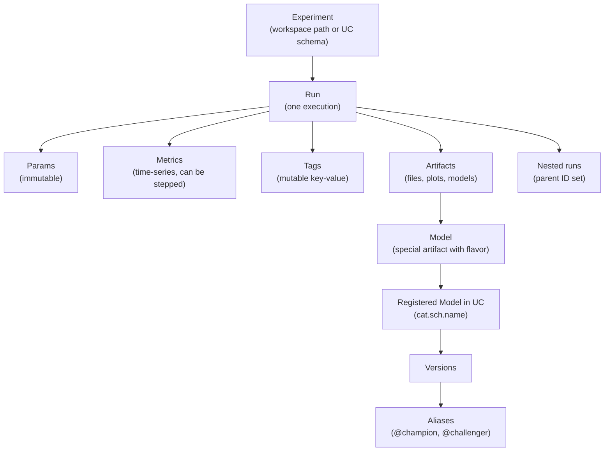

# Module 01 — Advanced MLflow Tracking

> **Goal of this module:** the MLflow surface that the Pro exam actually tests beyond Associate. **Nested runs, custom artifacts, signatures + input examples, autolog deep, search APIs, tags as governance**. The point is not "what is MLflow" — that's Associate territory — but the depth required to design and audit a real production tracking story.
>
> **Assumes:** Topic 09 (ML Associate) — you know what an experiment, a run, a parameter, a metric, an artifact is. You've used `mlflow.sklearn.log_model` casually. This module is the upgrade.

---

## Coverage map (verbatim Sept 30 2025 exam objectives → where taught)

| Verbatim objective | Section anchor |
|---|---|
| Utilize **nested runs** using MLflow for tracking complex experiments | "Nested runs — the canonical pattern" |
| Log custom metrics, parameters, and artifacts programmatically in MLflow | "Logging custom artifacts — what the exam tests" + "Code: the production pattern" |
| Create custom model objects using real-time feature engineering | Cross-link → Module 02 (PyFunc) + Module 04 (FE-in-UC `fe.log_model`) |

This module is the foundation under every other Section 1 module. Section 1 = ~45% of the exam.

> See Topic 09 → [Module 04 (MLflow tracking basics)](../09_databricks_ml_associate/04_mlflow_tracking_basics.md) for `MlflowClient.search_runs` prerequisites and Topic 09 → [Module 05 (registry basics)](../09_databricks_ml_associate/05_mlflow_registry.md) for the legacy stage-transition pattern that distractors recycle.

---

## Why this module sits first

Section 1 (Model Development) is ~45% of the exam. Inside Section 1, three subsections matter most:

1. **Advanced MLflow Usage** — three objectives (nested runs, custom artifacts, custom model objects with real-time FE).
2. **Advanced Feature Store** — five objectives (Module 04).
3. **SparkML** — seven objectives (Module 05).

Get MLflow right at depth and the rest of Section 1 follows naturally — every other module logs into MLflow, registers to UC, and uses signatures. **If you fumble nested runs or signatures here, you'll miss 4-6 Section 1 questions.**

---

## The MLflow object model — get this exactly right



**The two object boundaries the exam tests:**

1. **Run vs Registered Model.** A run is a tracking record (params, metrics, artifacts). A registered model is a governance object in UC. They link via the model artifact + registration call, but they have separate identities and ACLs.
2. **Nested runs vs separate runs.** Nested means the child's `parent_run_id` is set. UI groups them. They share an experiment but have independent metrics — you must explicitly aggregate.

---

## Nested runs — the canonical pattern

The exam test pattern: "You're doing K-fold CV with N hyperparameter sets. How should you structure the MLflow tracking?"

The canonical answer:

- **One parent run** for the full experiment (the search).
- **One child run per HP set**, logging the aggregated CV metric.
- **(Optional) grandchildren per fold** if you want fold-level metrics queryable.
- **The final retrained model** logged as either a new top-level run or a separate child of the parent (the exam accepts either; "separate run" is slightly preferred for cleaner re-deploy).

```python
import mlflow
import numpy as np
from sklearn.model_selection import KFold
from sklearn.ensemble import RandomForestClassifier
from sklearn.metrics import f1_score

mlflow.set_experiment("/Users/me@org/fraud_search")

hp_grid = [
    {"n_estimators": 100, "max_depth": 5},
    {"n_estimators": 200, "max_depth": 10},
    {"n_estimators": 500, "max_depth": 15},
]

with mlflow.start_run(run_name="fraud_search_v3") as parent:
    mlflow.set_tag("search_method", "manual_grid")
    mlflow.set_tag("data_version", "delta/prod/fraud_features@v42")
    parent_id = parent.info.run_id

    best_score, best_hp = -1, None
    for hp in hp_grid:
        with mlflow.start_run(run_name=f"hp_{hp}", nested=True) as child:
            mlflow.log_params(hp)
            kf = KFold(n_splits=5, shuffle=True, random_state=42)
            fold_scores = []
            for fold_idx, (train_idx, val_idx) in enumerate(kf.split(X)):
                model = RandomForestClassifier(**hp, random_state=42).fit(X[train_idx], y[train_idx])
                preds = model.predict(X[val_idx])
                score = f1_score(y[val_idx], preds)
                fold_scores.append(score)
                # Log step-indexed fold metric so the UI shows a series
                mlflow.log_metric("fold_f1", score, step=fold_idx)
            mean_score = float(np.mean(fold_scores))
            mlflow.log_metric("cv_f1_mean", mean_score)
            mlflow.log_metric("cv_f1_std", float(np.std(fold_scores)))
            if mean_score > best_score:
                best_score, best_hp = mean_score, hp

    # Log the aggregated best result on the parent
    mlflow.log_metric("best_cv_f1", best_score)
    mlflow.log_params({f"best_{k}": v for k, v in best_hp.items()})

# Retrain winner on full data — separate top-level run for clean deploy lineage
with mlflow.start_run(run_name="fraud_final", tags={"parent_search_run_id": parent_id}):
    final = RandomForestClassifier(**best_hp, random_state=42).fit(X, y)
    signature = mlflow.models.infer_signature(X, final.predict(X))
    mlflow.sklearn.log_model(
        sk_model=final,
        artifact_path="model",
        signature=signature,
        input_example=X[:5],
        registered_model_name="prod.ml.fraud_classifier",
    )
```

⚠️ **Exam trap:** the most common wrong answer is "log everything into a single flat run, store HPs as a JSON artifact." That destroys searchability — you can't `search_runs(filter_string="params.n_estimators = 500")` against a JSON blob. Always log each HP set as its own run (or child run).

⚠️ **Second exam trap:** logging the final retrained model as a third-level grandchild buried under the search. UI breadcrumbs get messy and CI scripts that look up the latest top-level run for deployment break. Top-level (or first-level child of the search) is canonical.

---

## Logging custom artifacts — what the exam tests

The exam includes one or two questions on **what to log and how**. Memorize these calls:

```python
# A single metric value
mlflow.log_metric("auc", 0.873)

# A time-series metric (UI plots a line)
for epoch in range(epochs):
    mlflow.log_metric("train_loss", loss_value, step=epoch)

# Parameters (immutable, string-coerced)
mlflow.log_param("optimizer", "adam")
mlflow.log_params({"lr": 0.001, "batch_size": 32})  # bulk version

# A tag (mutable, used for governance / search)
mlflow.set_tag("data_version", "delta@v42")
mlflow.set_tags({"team": "fraud", "phase": "training"})

# A Python dict as a JSON artifact (built-in helper, no manual file I/O)
mlflow.log_dict({"feature_names": feature_list, "schema_version": 3}, "metadata.json")

# A matplotlib figure as a PNG artifact
import matplotlib.pyplot as plt
fig, ax = plt.subplots()
ax.plot(history.history["loss"])
mlflow.log_figure(fig, "loss_curve.png")

# A pandas DataFrame as CSV or Parquet
mlflow.log_table(df.to_dict(orient="records"), "predictions.json")

# Any file path on local disk
mlflow.log_artifact("/tmp/shap_summary.png", artifact_path="explainability")

# A whole directory
mlflow.log_artifacts("/tmp/eval_outputs/", artifact_path="eval")
```

**The exam-correct mental model:**

- **Param** = an immutable knob (HP, code commit, dataset version label). String-typed.
- **Metric** = a number, potentially time-series via `step=`. Always queryable.
- **Tag** = a mutable annotation for grouping, governance, search. NOT for metric values.
- **Artifact** = a file. Models are a special kind of artifact (with a flavor + signature).

⚠️ **Exam trap:** logging accuracy as a tag. Tags are strings; metrics are numbers and queryable. `set_tag("auc", "0.87")` will haunt you when you try to `search_runs(filter_string="metrics.auc > 0.85")` and find nothing.

---

## Signatures + input examples — required for UC registration

A signature describes the input and output schemas of a model. Without one (or an inferred one), **UC registration fails**.

```python
from mlflow.models import infer_signature

# X_train: pandas DataFrame; preds: numpy array
signature = infer_signature(X_train, model.predict(X_train))

mlflow.sklearn.log_model(
    sk_model=model,
    artifact_path="model",
    signature=signature,
    input_example=X_train.iloc[:5],
    registered_model_name="prod.ml.fraud_classifier",
)
```

**What goes into a signature:**

- `inputs` — column names + types (or tensor shape + dtype for DL models).
- `outputs` — return type (single column or named).
- `params` (MLflow 3) — additional per-request parameters like `temperature`, `top_k` for LLMs.

**Input examples** are a few rows of representative input. They:

1. Auto-generate the Test request body in the Model Serving UI.
2. Let MLflow validate the signature against real data at log time.
3. Serve as a contract documentation for downstream consumers.

```python
# A signature with params (MLflow 3)
from mlflow.types.schema import Schema, ColSpec, ParamSchema, ParamSpec

input_schema = Schema([ColSpec("string", "prompt")])
output_schema = Schema([ColSpec("string", "completion")])
param_schema = ParamSchema([
    ParamSpec("temperature", "float", 0.7),
    ParamSpec("max_tokens", "integer", 256),
])
signature = ModelSignature(inputs=input_schema, outputs=output_schema, params=param_schema)
```

⚠️ **Exam trap:** the answer that says "signature is optional; skip it for fast logging." Wrong for UC. The exam's UC-flavored questions assume a signature is present.

---

## Autologging — what it does and what it doesn't

Autologging is the one-liner that hooks into a framework and automatically logs params, metrics, model artifacts. Per-framework calls:

```python
mlflow.sklearn.autolog()
mlflow.xgboost.autolog()
mlflow.lightgbm.autolog()
mlflow.tensorflow.autolog()
mlflow.pyspark.ml.autolog()  # SparkML pipelines

# Universal switch (turns on all detected libs)
mlflow.autolog()
```

**What autolog captures (sklearn example):**

- Estimator class name as a tag.
- All HP arguments as params.
- Default scoring metric (e.g., `training_score`) at fit time.
- The fitted model logged as an artifact under `model/`.
- Training metadata (rows, cols, dataset hash if input is a pandas DataFrame).

**What autolog does NOT do (memorize):**

- Does **NOT** auto-register to UC. You must pass `registered_model_name=` explicitly, or call `mlflow.register_model(...)` after.
- Does **NOT** log custom downstream metrics (e.g., business KPIs computed after `fit`).
- Does **NOT** log the best model from a hyperparameter search — only the model passed to `.fit()`. Hyperopt's `fmin` with `SparkTrials`, Optuna's `study.optimize`, sklearn's `GridSearchCV` — autolog logs each trial individually but does NOT identify and register the winner.

⚠️ **Exam trap #1: "Hyperopt autologging registers the best model."** Wrong. Autolog logs each trial as a child run with HPs + metric. You must manually re-fit on full data and `log_model` the winner.

⚠️ **Exam trap #2: "Disable autolog before custom logging."** Not required — autolog and manual `log_metric` calls coexist. The trap is in answer choices that suggest you must turn one off.

---

## Search APIs — programmatic experiment + run queries

The exam will ask "How do you find the best model across all runs in an experiment with X criteria?" Memorize these:

```python
# All experiments matching a name pattern
experiments = mlflow.search_experiments(
    filter_string="name LIKE '/Users/me/%fraud%'"
)

# All runs in an experiment, filtered + sorted
runs = mlflow.search_runs(
    experiment_ids=[exp.experiment_id],
    filter_string="metrics.cv_f1_mean > 0.85 AND params.model_type = 'xgboost' AND tags.team = 'fraud'",
    order_by=["metrics.cv_f1_mean DESC"],
    max_results=10,
)

# Returns a pandas DataFrame by default
top_run = runs.iloc[0]
top_run_id = top_run["run_id"]
top_model_uri = f"runs:/{top_run_id}/model"
```

Filter string syntax — the exam may surface this:

- `metrics.<name> <op> <number>` — `>`, `<`, `>=`, `<=`, `=`, `!=`.
- `params.<name> = '<string>'` — params are strings, always quoted.
- `tags.<name> = '<string>'` — same as params.
- `attributes.status = 'FINISHED'` — run attributes.
- `AND` only (no `OR`).

```python
# MlflowClient version — more verbose, more control
from mlflow.tracking import MlflowClient
client = MlflowClient()
top_runs = client.search_runs(
    experiment_ids=[exp.experiment_id],
    filter_string="metrics.auc > 0.9",
    order_by=["metrics.auc DESC"],
    max_results=5,
)
```

⚠️ **Exam trap:** `filter_string="metrics.auc > 0.9 OR metrics.f1 > 0.85"` — `OR` is unsupported in the MLflow query DSL. Wrong answer.

---

## Tags as governance — under-appreciated

Tags are mutable, queryable, free-text strings. They're the cheapest governance primitive in MLflow and the exam expects you to know the canonical tag patterns:

| Tag key | Purpose | Example |
|---|---|---|
| `data_version` | Data lineage | `delta@v42` or git SHA of the data prep code |
| `git_commit` | Code lineage | `a1b2c3d4` |
| `team` | Ownership | `fraud_ml` |
| `phase` | Lifecycle stage | `training`, `evaluation`, `production_replay` |
| `pii_scope` | Compliance | `none`, `phi_redacted`, `phi_full` |
| `parent_search_run_id` | Cross-run lineage | the id of the search that produced this final model |
| `validation_status` | Gate state | `pending`, `passed`, `failed` |

```python
# Set at run time
mlflow.set_tag("data_version", "delta@v42")

# Set after run via client (mutable!)
client = MlflowClient()
client.set_tag(run_id, "validation_status", "passed")
client.delete_tag(run_id, "phase")
```

⚠️ **Exam trap:** "Use a tag to store the final F1 score." Wrong — tags are strings and not queryable as numbers. Use a metric.

---

## Code: the production pattern — train, evaluate, register

```python
import mlflow
from mlflow.models import infer_signature
from sklearn.ensemble import GradientBoostingClassifier
from sklearn.metrics import roc_auc_score, log_loss
import matplotlib.pyplot as plt

mlflow.set_registry_uri("databricks-uc")  # MLflow 3: route registry to Unity Catalog
mlflow.set_experiment("/Users/me@org/fraud_classifier")

with mlflow.start_run(run_name="gb_v7") as run:
    # 1. Tags (governance)
    mlflow.set_tags({
        "team": "fraud_ml",
        "data_version": "main.silver.fraud_features@v42",
        "git_commit": git_sha(),
        "phase": "training",
        "pii_scope": "phi_redacted",
    })

    # 2. Params
    hp = {"n_estimators": 300, "max_depth": 5, "learning_rate": 0.05}
    mlflow.log_params(hp)

    # 3. Fit
    model = GradientBoostingClassifier(**hp).fit(X_train, y_train)

    # 4. Metrics
    y_proba = model.predict_proba(X_val)[:, 1]
    mlflow.log_metrics({
        "val_auc": roc_auc_score(y_val, y_proba),
        "val_log_loss": log_loss(y_val, y_proba),
    })

    # 5. Custom artifacts — feature importance plot
    fig, ax = plt.subplots(figsize=(8, 6))
    ax.barh(feature_names, model.feature_importances_)
    mlflow.log_figure(fig, "feature_importance.png")

    # 6. Feature catalog as JSON
    mlflow.log_dict({"features": feature_names}, "feature_catalog.json")

    # 7. Signature + input example + UC register in one call
    signature = infer_signature(X_train, model.predict(X_train))
    mlflow.sklearn.log_model(
        sk_model=model,
        artifact_path="model",
        signature=signature,
        input_example=X_train.iloc[:5],
        registered_model_name="prod.ml.fraud_classifier",
    )

    run_id = run.info.run_id

# 8. Set alias after log
from mlflow import MlflowClient
client = MlflowClient()
latest_version = client.get_registered_model("prod.ml.fraud_classifier").latest_versions[0].version
client.set_registered_model_alias(
    "prod.ml.fraud_classifier",
    alias="challenger",
    version=latest_version,
)
```

This is **the** template. Eight steps; you should be able to write it from memory by exam day.

---

## Look-alike API comparison — burn into memory

The exam packs answer choices with near-identical API calls. Memorize the distinguishing detail.

| Pair | Difference | Exam tell |
|---|---|---|
| `mlflow.log_metric("k", v)` vs `mlflow.log_metric("k", v, step=epoch)` | One scalar vs time-series with explicit X-axis | "track loss per epoch" → use `step=`. UI shows a line plot only with `step=` |
| `mlflow.start_run()` vs `mlflow.start_run(nested=True)` | Top-level run vs child of currently active parent | `nested=True` requires an already-active parent context. Without it, you get a top-level run; the UI tree will not group them |
| `mlflow.log_dict(d, "x.json")` vs `mlflow.log_artifact("/tmp/x.json")` vs `mlflow.log_text(s, "x.txt")` | `log_dict` = in-memory dict → JSON. `log_artifact` = file already on disk. `log_text` = string → text file | If the question shows code that already wrote a file, `log_artifact`. If a dict is in scope, `log_dict`. No manual `json.dumps` ever needed |
| `mlflow.log_figure(fig, "x.png")` vs `mlflow.log_artifact("/tmp/x.png")` | `log_figure` accepts a matplotlib Figure directly | If `fig, ax = plt.subplots()` is in scope, `log_figure` is the canonical answer |
| `mlflow.log_table(data, "preds.json")` vs `mlflow.log_artifact("preds.csv")` | `log_table` produces an MLflow-aware table (filterable in UI); `log_artifact` produces an opaque file | Eval tables → `log_table`. Raw artifacts → `log_artifact` |
| `mlflow.search_runs(...)` vs `MlflowClient().search_runs(...)` | Returns pandas DataFrame vs list of Run objects | `runs.iloc[0]["metrics.auc"]` → pandas. `runs[0].data.metrics["auc"]` → client |
| `mlflow.autolog()` vs `mlflow.sklearn.autolog()` vs `mlflow.xgboost.autolog()` | Universal autodetect vs flavor-specific with flavor-specific kwargs | If the question wants `log_input_examples=True` or other flavor knobs, the flavor-specific form is the right call |
| `mlflow.autolog(exclusive=True)` vs `exclusive=False` (default) | `True` blocks manual `mlflow.log_*` inside the autologged fit; `False` lets manual log calls coexist | "We want autolog to *only* log what it captures and nothing else" → `exclusive=True`. The exam favors `False` because most real pipelines blend |
| `mlflow.set_tag(k, v)` vs `mlflow.log_param(k, v)` | Tag = mutable string for governance; param = immutable HP | If the value changes after the run starts (e.g., `validation_status=passed`), it has to be a tag. If it's the model HP itself, param |
| `mlflow.set_tag` vs `mlflow.set_experiment_tag` | Tag the **run** vs the **experiment** | "tag every run in this experiment with team=fraud" → set on the experiment, all runs inherit |
| `client.transition_model_version_stage(...)` vs `client.set_registered_model_alias(...)` | Legacy Workspace registry vs UC | UC registry questions → **always** alias. Stage transitions are the wrong-answer trap |
| `mlflow.register_model(uri, name)` vs `mlflow.<flavor>.log_model(..., registered_model_name=...)` | Two-step (log first, register from URI later) vs one-shot | Both are correct; the one-shot is more common in the exam scenarios |

### Filter-string syntax — the 4 field prefixes you MUST recognize

| Prefix | Filters on | Example |
|---|---|---|
| `metrics.<name>` | Numeric metric | `metrics.val_auc > 0.85` |
| `params.<name>` | Param (string-typed) | `params.max_depth = "10"` (note quotes) |
| `tags.<name>` | Tag | `tags.team = "fraud_ml"` |
| `attributes.<field>` | Run attribute | `attributes.status = "FINISHED"` |

Combine only with `AND`. No `OR`. No nested parens for boolean logic.

> 🎯 **How to recognize a search-runs question on the exam:** the prompt always specifies (a) the metric to optimize, (b) a direction (max/min), and often (c) a filter constraint. Match the verb in the prompt — "find the best by AUC" → `order_by=["metrics.auc DESC"]`. "Lowest log loss" → `ASC`. The `DESC`/`ASC` confusion is the most-tested trap.

---

## Output-prediction drills

For each snippet, predict what the run record will contain (or what fails).

**Drill 1 — nested run counting:**
```python
with mlflow.start_run(run_name="parent"):
    for hp in [{"depth": 5}, {"depth": 10}, {"depth": 15}]:
        with mlflow.start_run(run_name=f"hp_{hp}", nested=True):
            mlflow.log_params(hp)
            mlflow.log_metric("cv_f1", 0.8)
```
Q: How many runs exist after this block? How many are top-level?
A: **4 runs total** (1 parent + 3 children). **1 top-level** (the parent). The UI groups the 3 children under the parent because their `parent_run_id` is set.

**Drill 2 — autolog + manual log:**
```python
mlflow.sklearn.autolog(exclusive=False)
with mlflow.start_run():
    model = RandomForestClassifier(n_estimators=200).fit(X, y)
    mlflow.log_metric("business_kpi", 0.42)
```
Q: What gets logged?
A: Autolog logs `n_estimators=200` (and all other RF defaults) as params, `training_score` as a metric, the fitted model under `model/`, plus the manual `business_kpi=0.42`. With `exclusive=True` the manual metric would be **dropped**.

**Drill 3 — params as strings:**
```python
mlflow.log_param("n_estimators", 200)
runs = mlflow.search_runs(filter_string="params.n_estimators = 200")
```
Q: How many runs match (assume one run logged the param)?
A: **Zero.** Params are stored as strings; the filter must be `params.n_estimators = "200"` (quoted). Unquoted ints fail.

**Drill 4 — OR in filter string:**
```python
mlflow.search_runs(filter_string="metrics.auc > 0.9 OR metrics.f1 > 0.85")
```
Q: What happens?
A: Raises an error. MLflow filter DSL supports only `AND`. Workaround: run two queries, union in pandas.

**Drill 5 — signature requirement:**
```python
mlflow.sklearn.log_model(model, "model", registered_model_name="prod.ml.fraud")
```
Q: With `mlflow.set_registry_uri("databricks-uc")` set, what happens?
A: **Registration fails** — UC requires a signature (or auto-inferred from `input_example`). The exam-correct fix is to pass `signature=infer_signature(X, model.predict(X))` and `input_example=X.iloc[:5]`.

---

## Decision rules — read the prompt, pick the API

> 🎯 **"Track CV across N HP combos" → nested runs.** One parent (the search), one child per HP combo. Final retrained winner = new top-level (or sibling) run with `registered_model_name=`.

> 🎯 **"Need queryable numeric value" → metric.** Tags are strings and not numerically queryable. If the value will appear in `filter_string="metrics.X > Y"`, it MUST be a metric.

> 🎯 **"Mutable annotation post-hoc" → tag via `MlflowClient.set_tag(run_id, ...)`.** Params are immutable once logged.

> 🎯 **"Search across runs for the best one" → `search_runs` with `order_by + DESC for max / ASC for min`.** If the question shows pandas indexing (`runs.iloc[0]`), use `mlflow.search_runs`. If it shows `run.info.run_id`, use `MlflowClient.search_runs`.

> 🎯 **"UC three-level name in the answer" → MLflow 3 + UC.** Set `mlflow.set_registry_uri("databricks-uc")` and the name must be `catalog.schema.model_name`. Two-level names fail in UC.

---

## End-to-end mini-scenario — nested CV + UC promotion

Scenario: you're tuning a fraud classifier with a 12-point HP grid and 5-fold CV. Build the full MLflow story.

```python
import mlflow
from mlflow.models import infer_signature
from mlflow import MlflowClient
import numpy as np
from sklearn.ensemble import GradientBoostingClassifier
from sklearn.model_selection import StratifiedKFold
from sklearn.metrics import f1_score

mlflow.set_registry_uri("databricks-uc")
mlflow.set_experiment("/Users/me@org/fraud_search_v4")

grid = [{"n_estimators": n, "max_depth": d, "learning_rate": lr}
        for n in [200, 400, 600] for d in [3, 5] for lr in [0.05, 0.1]]
assert len(grid) == 12

with mlflow.start_run(run_name="search_v4") as parent:
    mlflow.set_tags({
        "search_method": "manual_grid",
        "data_version": "main.silver.fraud_features@v42",
        "phase": "tuning",
    })
    best_score, best_hp = -1.0, None
    for hp in grid:
        with mlflow.start_run(run_name=f"hp_{hp}", nested=True):
            mlflow.log_params(hp)
            skf = StratifiedKFold(n_splits=5, shuffle=True, random_state=42)
            fold_scores = []
            for i, (tr, va) in enumerate(skf.split(X, y)):
                m = GradientBoostingClassifier(**hp, random_state=42).fit(X[tr], y[tr])
                s = f1_score(y[va], m.predict(X[va]))
                fold_scores.append(s)
                mlflow.log_metric("fold_f1", s, step=i)
            mean = float(np.mean(fold_scores))
            mlflow.log_metric("cv_f1_mean", mean)
            mlflow.log_metric("cv_f1_std", float(np.std(fold_scores)))
            if mean > best_score:
                best_score, best_hp = mean, hp
    mlflow.log_metric("best_cv_f1", best_score)
    mlflow.log_params({f"best_{k}": v for k, v in best_hp.items()})

# Retrain winner on full data — separate top-level run
with mlflow.start_run(run_name="final_v4", tags={"parent_search_run_id": parent.info.run_id}):
    final = GradientBoostingClassifier(**best_hp, random_state=42).fit(X, y)
    sig = infer_signature(X, final.predict(X))
    info = mlflow.sklearn.log_model(
        sk_model=final, artifact_path="model",
        signature=sig, input_example=X[:5],
        registered_model_name="prod.ml.fraud_classifier",
    )

# Promote as @challenger; @champion stays whoever it was — manual gate later
client = MlflowClient()
latest = client.get_registered_model("prod.ml.fraud_classifier").latest_versions[0].version
client.set_registered_model_alias("prod.ml.fraud_classifier", "challenger", latest)
```

Run-count audit (the exam's favorite question): 1 parent + 12 children + 1 final = **14 runs**. The final is intentionally top-level (not a 13th child) so the deploy pipeline picks it up by alias, not by tree traversal.

---

## Mini quiz (do this before moving on)

1. You're running a 5-fold CV with 3 HP sets. How many MLflow runs are created in the canonical nested-run pattern? Name the role of each.
2. What's the difference between `mlflow.log_param` and `mlflow.set_tag`?
3. Why does `mlflow.search_runs(filter_string="metrics.auc > 0.9 OR metrics.f1 > 0.85")` fail?
4. You called `mlflow.sklearn.autolog()`, then ran a `GridSearchCV` with 20 candidates. How many child runs get logged? Does the best model get registered?
5. What two things does an input example unlock that a signature alone does not?
6. You want to register a model to UC. What's the minimum API call signature you must use?

**Answers:**

1. 1 parent + 3 child = 4 minimum. If you also create grandchildren per fold: 1 parent + 3 children + 3×5 fold runs = 19. The exam-canonical "minimum" is 4. The final retrained model is typically a 5th top-level run.
2. `log_param` is immutable and intended for HPs / commits / dataset labels — once set on a run, it can't be changed. `set_tag` is mutable and intended for governance metadata (`validation_status`, `team`).
3. `OR` is unsupported in the MLflow filter DSL. Only `AND` is supported. Workaround: query twice and union in pandas.
4. Twenty child runs (one per candidate). The best model is NOT auto-registered — you must manually re-fit on full data and call `log_model` with `registered_model_name=`.
5. (a) The Model Serving Test UI gets a pre-filled request body. (b) MLflow validates the signature against real data at log time and warns about mismatches.
6. `mlflow.<flavor>.log_model(sk_model=model, artifact_path="model", signature=signature, registered_model_name="<catalog>.<schema>.<name>")` — the three-level UC name is mandatory; without a signature UC registration fails.

---

## Sanity check

- Could you write the nested-runs template from memory in under 5 minutes?
- Do you know which calls require a signature, which require an input example, and which require both?
- Can you list 5 canonical governance tags and what each means?
- Do you remember that the MLflow query DSL has `AND` but not `OR`?
- Can you explain why autolog does NOT register the best model after a search?

Move on to [Module 02 — Custom PyFunc Models](02_custom_pyfunc_models.md) when all five feel obvious.
