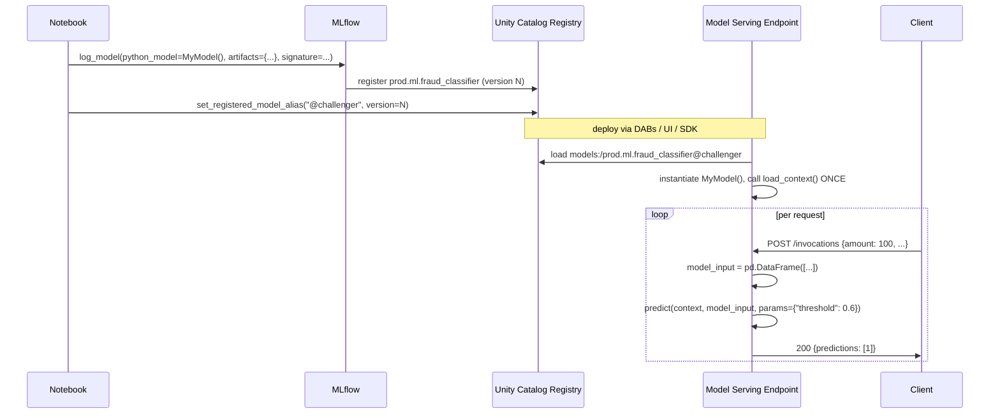

# Module 02 — Custom PyFunc Models

> **Goal of this module:** master `mlflow.pyfunc.PythonModel` — the universal MLflow wrapper. The exam has at least 2–3 questions on this; in production, this is the lever for everything from preprocessing-baked-into-the-model, to multi-model ensembles, to LLM-with-tool-routing.
>
> **Assumes:** Module 01 (you can register sklearn models to UC with signatures and aliases).

---

## Coverage map (verbatim Sept 30 2025 exam objectives → where taught)

| Verbatim objective | Section anchor |
|---|---|
| Create custom model objects using real-time feature engineering | "Real-time feature lookups — Section 1 objective" |
| Register a custom **PyFunc** model and log custom artifacts in **Unity Catalog** | "Logging the custom model — the full pattern" |
| Query custom models via **REST API** or **MLflow Deployments SDK** | "Querying via REST API" |
| Deploy custom model objects using MLflow Deployments SDK, REST API, or user interface | Cross-link → Module 14 (Serving blue-green & canary) |

> Cross-references: Module 04 (FE-in-UC `fe.log_model`) covers the platform-managed alternative to manual feature lookups inside `predict`. Module 06 covers ensembles built on top of this PyFunc contract.

---

## Why custom PyFunc matters

Native flavors (`mlflow.sklearn`, `mlflow.xgboost`, `mlflow.pytorch`) wrap one specific framework's model object. They're fine when the prediction is `model.predict(X)` and nothing else.

The moment you need any of these, **you must use `mlflow.pyfunc.PythonModel`**:

- Preprocessing baked into the artifact (so serving doesn't have to re-implement it).
- Postprocessing — calibration, threshold application, business-logic guardrails.
- **Multiple models** stitched together (ensemble, router, gate).
- External lookups — DB, vector store, online feature table.
- A custom framework not natively supported (XGBoost native booster + custom encoders, an in-house model class).
- **Real-time feature engineering** — Section 1 objective: "Create custom model objects using real-time feature engineering."

The Pro exam asks "which approach lets you ship preprocessing + model in one artifact?" The right answer is always **custom PyFunc**.

---

## The class contract

```python
import mlflow.pyfunc

class MyModel(mlflow.pyfunc.PythonModel):

    def load_context(self, context: mlflow.pyfunc.PythonModelContext):
        """Called ONCE at load time. Load artifacts here.

        `context.artifacts` is a dict mapping artifact name → local path.
        """
        ...

    def predict(self, context, model_input, params=None):
        """Called PER request. Must return a serializable result.

        `model_input` is typically a pandas DataFrame.
        `params` (MLflow 3) is a dict for per-request runtime params.
        """
        ...
```

Two methods. That's it. The exam can phrase it as "which method should you implement to load a vector store index?" — answer: `load_context`. "Where do you apply postprocessing thresholding?" — answer: `predict`.

⚠️ **Exam trap:** putting artifact loading inside `predict`. Every request would re-load — kills latency, hammers downstream services. `load_context` is one-time at endpoint init.

---

## Logging the custom model — the full pattern

```python
import mlflow
import mlflow.pyfunc
import joblib
from mlflow.models import infer_signature

# 1. Define the class
class CalibratedFraudModel(mlflow.pyfunc.PythonModel):

    def load_context(self, context):
        # Load each artifact by the name you used when logging
        self.model = joblib.load(context.artifacts["sklearn_model"])
        self.threshold = float(open(context.artifacts["threshold"]).read())

    def predict(self, context, model_input, params=None):
        # model_input is a pandas DataFrame
        proba = self.model.predict_proba(model_input)[:, 1]
        # Per-request threshold override
        thr = (params or {}).get("threshold", self.threshold)
        return (proba >= thr).astype(int)

# 2. Save the underlying sklearn model + threshold to local paths
joblib.dump(sklearn_model, "/tmp/skmodel.pkl")
with open("/tmp/threshold.txt", "w") as f:
    f.write("0.42")

# 3. Build a signature with the runtime param
from mlflow.types.schema import Schema, ColSpec, ParamSchema, ParamSpec
from mlflow.models.signature import ModelSignature
input_schema = Schema([ColSpec("double", "amount"), ColSpec("string", "merchant_category")])
output_schema = Schema([ColSpec("integer")])
param_schema = ParamSchema([ParamSpec("threshold", "float", 0.42)])
signature = ModelSignature(inputs=input_schema, outputs=output_schema, params=param_schema)

# 4. Log + register the PyFunc model
with mlflow.start_run(run_name="fraud_pyfunc_v3") as run:
    mlflow.pyfunc.log_model(
        artifact_path="model",
        python_model=CalibratedFraudModel(),
        artifacts={
            "sklearn_model": "/tmp/skmodel.pkl",
            "threshold": "/tmp/threshold.txt",
        },
        signature=signature,
        input_example=X_val.iloc[:5],
        pip_requirements=[
            "scikit-learn==1.4.2",
            "pandas==2.2.1",
            "joblib==1.3.2",
        ],
        registered_model_name="prod.ml.fraud_classifier_calibrated",
    )
```

**The five things to remember:**

1. **`artifacts={...}`** — a dict of artifact_name → local_path. Available at load time via `context.artifacts[name]`.
2. **`python_model=`** — an instance, not the class.
3. **`pip_requirements=`** (or `conda_env=`) — what to install in the serving environment. **The exam asks about this.**
4. **`signature=`** — required for UC registration.
5. **`registered_model_name=`** — the three-level UC name.

---

## Dependency packaging — pip vs conda

MLflow records environment metadata so serving can recreate it. Two ways to specify it:

### `pip_requirements` (preferred, simpler)

```python
mlflow.pyfunc.log_model(
    ...,
    pip_requirements=[
        "scikit-learn==1.4.2",
        "pandas==2.2.1",
        "numpy>=1.26,<2.0",
    ],
)
```

MLflow generates a `requirements.txt` artifact + a basic `conda.yaml` derived from those pins.

### `conda_env` (when you need conda packages or a specific Python version)

```python
conda_env = {
    "name": "fraud_env",
    "channels": ["conda-forge"],
    "dependencies": [
        "python=3.10.13",
        "pip",
        {"pip": [
            "scikit-learn==1.4.2",
            "pandas==2.2.1",
            "mlflow==3.0.0",
        ]},
    ],
}
mlflow.pyfunc.log_model(..., conda_env=conda_env)
```

### `extra_pip_requirements` (the "I just want to add one thing" escape hatch)

```python
mlflow.pyfunc.log_model(..., extra_pip_requirements=["shap==0.45.0"])
```

Adds to whatever MLflow would have inferred. Use sparingly; pinning everything explicitly via `pip_requirements` is the production discipline.

⚠️ **Exam trap:** answer choices that skip dependency specification. Without it, Model Serving may install latest versions at deploy time and break the model. Always pin.

⚠️ **Second trap:** `infer_pip_requirements()` (auto-detect from current env) sounds great but quietly captures dev-only packages (pytest, jupyter). Be explicit.

---

## Real-time feature lookups — Section 1 objective

The objective verbatim: *"Create custom model objects using real-time feature engineering."*

The pattern: at serving time, the model receives **only a key** (e.g., `customer_id`), looks up features from an online feature table, then predicts.

```python
import mlflow.pyfunc
from databricks.feature_engineering import FeatureEngineeringClient

class FraudModelWithOnlineLookup(mlflow.pyfunc.PythonModel):

    def load_context(self, context):
        import joblib
        self.model = joblib.load(context.artifacts["sklearn_model"])
        # The FE client is lightweight; init once
        self.fe = FeatureEngineeringClient()
        self.feature_table = "prod.fraud.customer_features_online"
        self.lookup_cols = ["customer_id"]

    def predict(self, context, model_input, params=None):
        # model_input is a DataFrame with only customer_id at serving time
        import pandas as pd
        # The FE client can read from the online table for low-latency
        feature_df = self.fe.read_table(name=self.feature_table)
        joined = pd.merge(model_input, feature_df, on="customer_id", how="left")
        # Drop the key, predict on feature columns only
        X = joined.drop(columns=self.lookup_cols)
        return self.model.predict_proba(X)[:, 1]
```

In practice on Databricks, you don't write this lookup logic by hand — **`FeatureEngineeringClient.log_model`** (Module 04) packages the feature lookup metadata into a model wrapper and Mosaic AI Model Serving handles the join automatically. But the exam tests both:

- The conceptual question: "How do you add real-time feature lookups to a model artifact?" — Custom PyFunc + `load_context` for the lookup client.
- The API question: "Which client method packages feature lookups into a model artifact for automatic serving-side joins?" — `FeatureEngineeringClient.log_model` with `training_set=`.

---

## Loading a custom PyFunc model

```python
import mlflow

# By URI — generic
model = mlflow.pyfunc.load_model("models:/prod.ml.fraud_classifier_calibrated@champion")

# Predict
predictions = model.predict(X_test)

# With per-request params (MLflow 3)
predictions = model.predict(X_test, params={"threshold": 0.6})
```

`mlflow.pyfunc.load_model` works for **any** MLflow model — native flavors, custom PyFunc, MLflow 3 LoggedModels. It returns a `PyFuncModel` whose `.predict()` accepts pandas / numpy / spark DataFrames depending on the input schema.

For a Spark batch inference:

```python
# Spark UDF — applies the model row-wise across a Spark DataFrame
spark_udf = mlflow.pyfunc.spark_udf(
    spark,
    model_uri="models:/prod.ml.fraud_classifier_calibrated@champion",
    result_type="double",
)
scored = features_df.withColumn("fraud_proba", spark_udf("amount", "merchant_category", ...))
```

⚠️ **Exam trap:** `spark_udf` arguments must be passed **as positional column references** in the order defined in the model signature. If the signature has `[amount, merchant_category]`, you call `spark_udf("amount", "merchant_category")` — not as a dict, not by name.

---

## Mermaid: PyFunc lifecycle



---

## Multi-model PyFunc — the ensemble pattern

When you need two models stitched together — say a classifier + a regressor, or a champion + a backup with fallback:

```python
class FraudEnsemble(mlflow.pyfunc.PythonModel):

    def load_context(self, context):
        import joblib
        self.fast_model = joblib.load(context.artifacts["fast"])
        self.slow_model = joblib.load(context.artifacts["slow"])

    def predict(self, context, model_input, params=None):
        params = params or {}
        # Fast model gives a quick probability
        fast_proba = self.fast_model.predict_proba(model_input)[:, 1]
        # Slow model only runs on borderline cases
        mask = (fast_proba > 0.3) & (fast_proba < 0.7)
        result = fast_proba.copy()
        if mask.any():
            slow_proba = self.slow_model.predict_proba(model_input[mask])[:, 1]
            result[mask] = slow_proba
        thr = params.get("threshold", 0.5)
        return (result >= thr).astype(int)

mlflow.pyfunc.log_model(
    artifact_path="ensemble",
    python_model=FraudEnsemble(),
    artifacts={
        "fast": "/tmp/fast.pkl",
        "slow": "/tmp/slow.pkl",
    },
    signature=signature,
    registered_model_name="prod.ml.fraud_ensemble",
    pip_requirements=["scikit-learn==1.4.2", "xgboost==2.0.3"],
)
```

This is the **Module 06 pattern (ensembles & stacking)** in microcosm — get comfortable with it here.

---

## Querying via REST API

For Model Serving endpoints exposing a PyFunc model:

```bash
# REST endpoint shape (Mosaic AI Model Serving)
curl -X POST "$ENDPOINT_URL/invocations" \
  -H "Authorization: Bearer $DATABRICKS_TOKEN" \
  -H "Content-Type: application/json" \
  -d '{
    "dataframe_records": [
      {"amount": 120.50, "merchant_category": "grocery"},
      {"amount": 4500.00, "merchant_category": "jewelry"}
    ],
    "params": {"threshold": 0.6}
  }'
```

```python
# Python via the MLflow Deployments SDK
from mlflow.deployments import get_deploy_client

client = get_deploy_client("databricks")
response = client.predict(
    endpoint="fraud-prod-endpoint",
    inputs={
        "dataframe_records": [
            {"amount": 120.50, "merchant_category": "grocery"},
            {"amount": 4500.00, "merchant_category": "jewelry"},
        ],
        "params": {"threshold": 0.6},
    },
)
```

Two payload shapes are accepted:

- **`dataframe_records`** — list of dicts (row-oriented; the most common).
- **`dataframe_split`** — `{"columns": [...], "data": [[...], [...]]}` (col-oriented; slightly more compact for large payloads).

⚠️ **Exam trap:** sending a raw JSON array `[{"amount": ...}, ...]` without the `dataframe_records` wrapper. Returns 400.

---

## Debugging PyFunc models — three common failures

1. **"FileNotFoundError" in `load_context`** — you referenced an artifact key that wasn't passed to `log_model`. Artifact names in `load_context` must match exactly the keys you logged.
2. **"PicklingError" at log time** — your `python_model` instance has a non-picklable attribute (e.g., a Spark session, an open DB connection). Make `load_context` do the lazy init.
3. **"ModuleNotFoundError" at serving time** — missing dependency. The model code imports a module that wasn't in `pip_requirements`. Always test load + predict in a clean env before logging.

```python
# Local sanity-check pattern
import mlflow.pyfunc
model_uri = f"runs:/{run_id}/model"
loaded = mlflow.pyfunc.load_model(model_uri)
preds = loaded.predict(X_val.iloc[:5])
print(preds)  # if this works, serving will work
```

---

## Look-alike API comparison — `mlflow.pyfunc.log_model` parameter table

The exam tests precise parameter knowledge of `mlflow.pyfunc.log_model`. Here is the full signature with the parameters you must recognize:

```python
mlflow.pyfunc.log_model(
    artifact_path="model",                  # subdirectory under the run; defaults vary by flavor
    python_model=MyModel(),                  # instance of mlflow.pyfunc.PythonModel
    artifacts={"name": "/local/path"},      # dict mapping artifact_name → local file/dir path
    code_paths=["/Workspace/repo/src/"],    # extra Python source dirs to package into the model
    signature=signature,                     # ModelSignature (REQUIRED for UC)
    input_example=X.iloc[:5],                # auto-unlocks Test UI + generates signature if absent
    conda_env=conda_dict,                    # full conda env (use for non-pip deps)
    pip_requirements=["scikit-learn==1.4.2"], # canonical: list of pinned pip pkgs
    extra_pip_requirements=["shap==0.45.0"], # escape hatch to add to whatever was inferred
    registered_model_name="cat.sch.name",   # one-shot UC registration
    metadata={"team": "fraud"},              # arbitrary key-value baked into the model
    await_registration_for=300,              # seconds to wait for UC registration to settle
)
```

| Look-alike | Difference | Exam tell |
|---|---|---|
| `mlflow.pyfunc.PythonModel` vs `mlflow.pyfunc.PythonModelContext` | The class you **subclass** vs the object **passed to** `load_context`/`predict` | You subclass `PythonModel`. You read `context.artifacts[...]` from `PythonModelContext` |
| `load_context(self, context)` vs `predict(self, context, model_input, params)` | Called once at endpoint init vs called per request | Loading model files, opening DB connections → `load_context`. Per-row prediction logic → `predict` |
| `python_model=MyModel()` vs `python_model=MyModel` | Instance vs class reference | Always pass an **instance** (with parens). The class form is silently wrong |
| `artifacts=` vs `code_paths=` | Files used at runtime via `context.artifacts[k]` vs extra Python source modules added to PYTHONPATH | A pickle / config file → `artifacts`. A shared `utils.py` that your model imports → `code_paths` |
| `pip_requirements=` vs `conda_env=` vs `extra_pip_requirements=` | Pip-only list vs full conda env spec vs additive pip overlay | Pure pip → `pip_requirements`. Need a non-pip pkg or specific Python version → `conda_env`. "Just add one more" → `extra_pip_requirements` |
| `pip_requirements=` vs `infer_pip_requirements()` | Explicit pinned list vs autodetect from current env | Production = explicit list. `infer_*` captures jupyter/pytest noise; avoid |
| `requirements.txt` vs `conda.yaml` vs `python_env.yaml` (artifacts MLflow writes) | `requirements.txt` = pip pins; `conda.yaml` = full conda env; `python_env.yaml` = Python interpreter version + pip deps (MLflow 3 default) | MLflow 3 deploys the model via `python_env.yaml`; `conda.yaml` is the older fallback |
| `mlflow.pyfunc.load_model(uri)` vs `mlflow.<flavor>.load_model(uri)` | Returns generic `PyFuncModel` with only `.predict` vs returns native object (sklearn estimator etc) | If the calling code only needs `.predict`, pyfunc. If it needs `.predict_proba`, `.feature_importances_`, etc., flavor load |
| `mlflow.pyfunc.spark_udf(spark, uri, result_type=)` vs `.predict(df)` | Spark UDF for Delta-table batch scoring vs in-process pandas predict | 50M-row Delta table → `spark_udf`. Per-row in a notebook → `.predict` |
| `dataframe_records` vs `dataframe_split` (REST payload) | Row-oriented list of dicts vs column-oriented `{columns, data}` | Most exam answer keys use `dataframe_records` |

> 🎯 **How to recognize this on the exam:** "model needs to look up features at request time" → custom PyFunc (or `FeatureEngineeringClient.log_model` if features come from a UC feature table — that path is in Module 04). "Model bundles preprocessing + threshold" → custom PyFunc. "Need to plug in a non-MLflow framework (an in-house C++ model)" → custom PyFunc.

---

## Output-prediction drills

**Drill 1 — `load_context` vs `predict` placement:**
```python
class M(mlflow.pyfunc.PythonModel):
    def predict(self, context, model_input, params=None):
        import joblib
        self.model = joblib.load(context.artifacts["m"])  # WRONG location
        return self.model.predict(model_input)
```
Q: What's the bug? What's the symptom on a 1000 RPS endpoint?
A: Model deserialization happens **per request**. p99 latency explodes (joblib.load can take 100ms+). Move the load to `load_context`.

**Drill 2 — artifact key mismatch:**
```python
mlflow.pyfunc.log_model(
    python_model=MyModel(),
    artifacts={"model_pkl": "/tmp/m.pkl"},
    ...,
)
# Inside MyModel.load_context:
joblib.load(context.artifacts["sklearn_model"])
```
Q: What happens at endpoint start?
A: `KeyError: 'sklearn_model'`. Artifact keys at log time must exactly match the keys you index in `load_context`.

**Drill 3 — dependency drift:**
```python
mlflow.pyfunc.log_model(python_model=MyModel(), artifacts={"m": "/tmp/m.pkl"},
                       pip_requirements=["scikit-learn"])  # no version pin
```
Q: What can break in 6 months?
A: At deploy time, latest sklearn is installed; if it has a breaking change (e.g., `predict_proba` shape change, deprecated API removed), the endpoint fails to start or returns subtly wrong results. **Always pin** (`scikit-learn==1.4.2`).

**Drill 4 — params at request time:**
```python
sig = ModelSignature(inputs=..., outputs=..., params=ParamSchema([ParamSpec("threshold","float",0.5)]))
mlflow.pyfunc.log_model(..., signature=sig)
# Client:
client.predict(endpoint="ep", inputs={"dataframe_records":[{"x":1}], "params":{"threshold":0.7}})
```
Q: How does `predict` receive the override?
A: As the `params` argument: `def predict(self, context, model_input, params=None)`. `params` is `{"threshold": 0.7}`. If you wrote `def predict(self, context, model_input)` (no params kwarg), MLflow silently passes the param dict but you can't access it.

**Drill 5 — REST payload shape:**
```bash
curl -X POST .../invocations -d '[{"x": 1}, {"x": 2}]'
```
Q: What does Mosaic AI Model Serving return?
A: **400 Bad Request.** The payload must be wrapped: `{"dataframe_records": [{"x":1},{"x":2}]}` or `{"dataframe_split": {"columns":["x"], "data":[[1],[2]]}}`. Raw arrays are not accepted.

---

## Decision rules

> 🎯 **"Bake preprocessing into the model" → custom PyFunc.** Preprocessing in a separate notebook fails serving (the endpoint only has the model, not the prep code). PyFunc bundles both.

> 🎯 **"Score a Delta table with this PyFunc model" → `mlflow.pyfunc.spark_udf`.** Don't do `df.toPandas()` then `.predict` — kills parallelism, OOMs on big tables.

> 🎯 **"Endpoint installs latest deps and breaks" → pin everything in `pip_requirements=`.** Never `infer_pip_requirements` in production.

> 🎯 **"Per-request override (threshold, top_k, temperature)" → declare in `ParamSchema` + accept in `predict(self, context, model_input, params=None)`.** Callers send via `"params"` block in REST payload.

> 🎯 **"Three model files in the artifact" → `artifacts={"name1": path1, "name2": path2, "name3": path3}`.** Don't smuggle them in via `code_paths`; that's for `.py` source, not pickles.

---

## End-to-end mini-scenario — PyFunc with feature lookup + threshold param + Spark batch scoring

Scenario: customer service needs to score the previous day's transactions every morning. The model does its own online-table lookup for customer features but the input row only has `customer_id, amount, ts`.

```python
import mlflow
import mlflow.pyfunc
import joblib
import pandas as pd
from databricks.feature_engineering import FeatureEngineeringClient
from mlflow.models import infer_signature
from mlflow.models.signature import ModelSignature
from mlflow.types.schema import Schema, ColSpec, ParamSchema, ParamSpec

class FraudPyFunc(mlflow.pyfunc.PythonModel):
    def load_context(self, context):
        self.model = joblib.load(context.artifacts["model"])
        self.fe = FeatureEngineeringClient()
        self.feature_table = "prod.fraud.customer_features"

    def predict(self, context, model_input: pd.DataFrame, params=None):
        params = params or {}
        thr = float(params.get("threshold", 0.5))
        # Lookup features by customer_id
        feats = self.fe.read_table(name=self.feature_table).toPandas()
        joined = model_input.merge(feats, on="customer_id", how="left").drop(columns=["customer_id", "ts"])
        proba = self.model.predict_proba(joined)[:, 1]
        return (proba >= thr).astype(int)

joblib.dump(sklearn_model, "/tmp/m.pkl")
input_schema = Schema([ColSpec("string","customer_id"), ColSpec("double","amount"), ColSpec("string","ts")])
output_schema = Schema([ColSpec("integer")])
param_schema = ParamSchema([ParamSpec("threshold","float",0.5)])
signature = ModelSignature(inputs=input_schema, outputs=output_schema, params=param_schema)

with mlflow.start_run(run_name="fraud_pyfunc_v1"):
    info = mlflow.pyfunc.log_model(
        artifact_path="model",
        python_model=FraudPyFunc(),
        artifacts={"model": "/tmp/m.pkl"},
        signature=signature,
        input_example=pd.DataFrame([{"customer_id":"c1","amount":42.0,"ts":"2026-05-23"}]),
        pip_requirements=[
            "scikit-learn==1.4.2", "pandas==2.2.1", "joblib==1.3.2",
            "databricks-feature-engineering>=0.2.0", "mlflow==3.0.0",
        ],
        registered_model_name="prod.ml.fraud_pyfunc",
    )

# Batch score yesterday's transactions
udf = mlflow.pyfunc.spark_udf(spark, "models:/prod.ml.fraud_pyfunc@champion", result_type="integer")
scored = (spark.table("prod.bronze.transactions")
          .where("ts = current_date() - INTERVAL 1 DAY")
          .withColumn("fraud_flag", udf("customer_id", "amount", "ts")))
scored.write.mode("overwrite").saveAsTable("prod.gold.fraud_predictions_yesterday")
```

This single artifact handles: feature lookup, prediction, threshold override per request, and batch scoring via Spark UDF — without duplicating any logic outside the model. **This is the exam-canonical pattern.**

---

## Mini quiz

1. Which method is called once at load time? Which is called per request?
2. You forget to pass `signature=` to `log_model`. What breaks?
3. Why is `infer_pip_requirements()` not recommended for production?
4. The endpoint is throwing `ModuleNotFoundError: shap`. What did you forget?
5. You want to score a 50M-row Delta table with a custom PyFunc model. Which API gives you parallelism for free?
6. A PyFunc model has signature `[amount, category]`. How do you call `spark_udf` correctly?
7. Why is putting `joblib.load(...)` inside `predict()` a bug?

**Answers:**

1. `load_context` runs once at load (endpoint init); `predict` runs per request.
2. UC registration fails. Workspace registry would accept it, but UC mandates signatures.
3. It captures the entire dev environment including pytest/jupyter/etc — bloated, slow to install, may pin packages incompatible with the serving runtime.
4. `shap` is imported in your model code but not in `pip_requirements=`. Add it.
5. `mlflow.pyfunc.spark_udf(spark, model_uri)` — returns a Spark UDF that parallelizes across the cluster automatically.
6. `spark_udf("amount", "category")` — positional column references in signature order.
7. `predict` is called per request; every request would deserialize the model from disk again. Massive latency hit. Do all loading in `load_context`.

---

## Sanity check

- Can you write the full `log_model` call (with artifacts, signature, pip_requirements, registered_model_name) from memory?
- Do you know when to choose custom PyFunc over a native flavor?
- Can you explain the difference between `pip_requirements`, `conda_env`, and `extra_pip_requirements`?
- Do you know two debugging patterns for "endpoint won't start"?

Move on to [Module 03 — Optuna + Ray distributed tuning](03_optuna_advanced.md).
