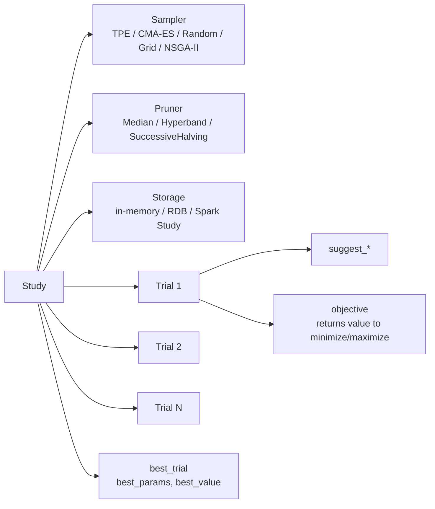

# Module 03 — Optuna + Ray Distributed Tuning

> **Goal of this module:** the **post-Sept-2025** answer to "How do you do hyperparameter search on Databricks?" — Optuna for the search algorithm, MLflowCallback for tracking, MLflowSparkStudy for Spark-distributed trials, and Ray Tune for everything Optuna can't express.
>
> ⚠️ **The biggest single change in the 2025 refresh:** **Hyperopt is OUT.** **Optuna is IN.** If you see Hyperopt + SparkTrials in an answer choice, it's almost always the wrong answer on the new exam. (Hyperopt still exists in the platform and you may still have legacy code using it; it's not banned. But the exam's correct-answer pattern is Optuna.)
>
> **Assumes:** Modules 01-02 (MLflow tracking, nested runs, signatures).

---

## Coverage map (verbatim Sept 30 2025 exam objectives → where taught)

| Verbatim objective | Section anchor |
|---|---|
| Perform distributed hyperparameter tuning using **Optuna** and integrate it with MLflow | "Distributing trials across the Spark cluster — `MLflowSparkStudy`" |
| Perform distributed hyperparameter tuning using **Ray** | "Ray on Databricks — when to reach for Ray instead" |
| Compare Ray and Spark for distributing ML training workloads | "Ray on Databricks" + "Spark vs Ray decision table" |
| Evaluate trade-offs between vertical and horizontal scaling for ML workloads | "Vertical vs horizontal scaling — exam objective" |
| Evaluate and select appropriate parallelization (model parallelism, data parallelism) for large-scale ML training | "Vertical vs horizontal" + "Pandas Function API" |
| Use the Pandas Function API to parallelize group-specific model training and inference | "Pandas Function API — parallel per-group training" |
| Scale distributed training pipelines using SparkML and pandas Function APIs/UDFs | This module + cross-link to Module 05 (SparkML pipelines) |

> Cross-references: Topic 09 → [Module 11 (Hyperopt — legacy)](../09_databricks_ml_associate/11_hyperopt_hyperparameter_tuning.md) for the legacy distractor pattern; Module 01 here for MLflow nested-runs prerequisite.

---

## Why Optuna replaced Hyperopt

The exam guide is explicit: *"Perform distributed hyperparameter tuning using **Optuna** and integrate it with MLflow."* and *"Perform distributed hyperparameter tuning using **Ray**."*

Why the switch in the exam:

- **Hyperopt is unmaintained.** Last meaningful release in 2021. SparkTrials was a Databricks-maintained add-on; it works but isn't getting attention.
- **Optuna is actively developed**, has a cleaner API, supports more samplers (TPE, CMA-ES, NSGA-II for multi-objective), proper pruners, and integrates with both Spark and Ray.
- **MLflow integration is first-class** via `MLflowCallback`.

For the exam, this means:

- Right answers include `Optuna`, `study.optimize(...)`, `MLflowCallback`, `MLflowSparkStudy`, `study.best_trial`, `optuna.samplers.TPESampler`.
- Wrong answers (distractors) include `Hyperopt`, `fmin`, `SparkTrials`, `hp.choice`, `tpe.suggest`.

---

## The Optuna mental model



A **Study** is the top-level object. It owns a **sampler** (which decides which HPs to try next), an optional **pruner** (which decides to abandon a trial early), and a **storage** backend.

A **Trial** is one execution of your objective function with a specific set of suggested HPs.

You define an **objective function**: `def objective(trial) -> float`. Inside, you call `trial.suggest_*` to get values for each HP, train the model, return a metric.

---

## The minimal pattern — single node, MLflow-integrated

```python
import optuna
from optuna.integration.mlflow import MLflowCallback
import mlflow
import lightgbm as lgb

mlflow.set_experiment("/Users/me@org/fraud_optuna")

mlflow_callback = MLflowCallback(
    tracking_uri=mlflow.get_tracking_uri(),
    metric_name="val_auc",
    create_experiment=False,  # use the one we set above
)

def objective(trial):
    hp = {
        "n_estimators": trial.suggest_int("n_estimators", 50, 500),
        "max_depth": trial.suggest_int("max_depth", 3, 12),
        "learning_rate": trial.suggest_float("learning_rate", 1e-3, 0.3, log=True),
        "num_leaves": trial.suggest_int("num_leaves", 8, 128),
        "min_child_samples": trial.suggest_int("min_child_samples", 5, 100),
    }
    model = lgb.LGBMClassifier(**hp, random_state=42).fit(X_train, y_train)
    proba = model.predict_proba(X_val)[:, 1]
    return float(roc_auc_score(y_val, proba))

study = optuna.create_study(
    direction="maximize",
    sampler=optuna.samplers.TPESampler(seed=42),
    pruner=optuna.pruners.MedianPruner(n_warmup_steps=5),
)
study.optimize(objective, n_trials=50, callbacks=[mlflow_callback])

print("Best:", study.best_trial.value, study.best_params)
```

**What `MLflowCallback` does:**

- For each trial: starts a child MLflow run, logs the suggested HPs as params, logs the returned metric.
- Tags the run with `optuna_trial_number`, `optuna_state` (COMPLETE / PRUNED / FAILED).
- Names the metric exactly what you pass in `metric_name=`.

**What it does NOT do (memorize for the exam):**

- Does **NOT** log the trained model artifact for each trial.
- Does **NOT** register the best model.
- Does **NOT** create a parent run automatically — if you want trials nested under a parent, wrap `study.optimize` in `with mlflow.start_run(): ...`.

⚠️ **Exam trap (recurring across all Module 03 questions):** "Optuna autologging registers the best model." Wrong. You must manually re-fit on full data and `log_model` the winner with `registered_model_name=`.

---

## Distributing trials across the Spark cluster — `MLflowSparkStudy`

For Spark-cluster-distributed Optuna, the canonical answer is **`MLflowSparkStudy`** (from the Optuna-Spark integration):

```python
from optuna.integration.mlflow import MLflowCallback
from optuna_integration import MLflowSparkStudy  # or optuna.integration depending on version

study = MLflowSparkStudy(
    study_name="fraud_search_v3",
    direction="maximize",
    storage="sqlite:///optuna.db",  # or a JDBC URL for shared storage
    sampler=optuna.samplers.TPESampler(seed=42),
    spark_session=spark,
    n_parallel_trials=8,  # how many trials to run concurrently across executors
)

study.optimize(
    objective,
    n_trials=100,
    callbacks=[MLflowCallback(metric_name="val_auc")],
)
```

What this does under the hood:

1. Each trial is wrapped and submitted to the Spark cluster as a task.
2. Executors run trials in parallel up to `n_parallel_trials`.
3. The TPE sampler shares state through the `storage` backend — later trials benefit from earlier results.
4. MLflow tracking happens from the driver, so the experiment isn't fragmented across executors.

⚠️ **Exam trap:** "Use `n_jobs=-1` in `study.optimize` for distribution." That's local-multiprocess (threads on the driver), NOT cluster-distributed. For Spark distribution use `MLflowSparkStudy`.

⚠️ **Exam trap 2:** "Use SparkTrials." That's Hyperopt's distribution layer. Wrong product on the new exam.

---

## Samplers — pick by problem shape

| Sampler | When to use | Trade-off |
|---|---|---|
| **TPESampler** (default) | General-purpose; medium-dim, mixed numeric + categorical | Bayesian-style; needs ~20+ trials to start being smart |
| **CmaEsSampler** | Continuous-only, low-to-medium dim | Strong on continuous; doesn't handle categorical |
| **RandomSampler** | Baseline / comparison; very low budget | No adaptation; useful to disprove that Bayesian helps |
| **GridSampler** | Small explicit search space | No adaptation; exhaustive |
| **NSGAIISampler** | **Multi-objective** (e.g., maximize AUC AND minimize latency) | Multi-objective only; returns a Pareto front |
| **QMCSampler** | Higher-dim continuous; better coverage than random | Quasi-random; no adaptation |

```python
# Multi-objective example
def objective(trial):
    hp = {...}
    model = ...
    auc = roc_auc_score(y_val, model.predict_proba(X_val)[:, 1])
    latency = time_one_prediction(model)
    return auc, latency  # tuple!

study = optuna.create_study(
    directions=["maximize", "minimize"],  # one per objective
    sampler=optuna.samplers.NSGAIISampler(seed=42),
)
study.optimize(objective, n_trials=100)

# Result: Pareto-front trials
for t in study.best_trials:
    print(t.values, t.params)
```

⚠️ **Exam trap:** confusing `direction=` (single-objective) with `directions=` (plural, multi-objective). The plural list of directions is required for multi-objective; passing `direction=` to a multi-objective study fails.

---

## Pruners — early-stop unpromising trials

Pruners look at intermediate values you report inside the trial via `trial.report(value, step=)` and decide whether to abandon.

```python
def objective(trial):
    hp = {...}
    model = lgb.LGBMClassifier(**hp, random_state=42)
    for step in range(10):
        # Train one chunk
        model.fit(X_train_chunks[step], y_train_chunks[step], init_model=model.booster_ if step else None)
        val_auc = roc_auc_score(y_val, model.predict_proba(X_val)[:, 1])
        trial.report(val_auc, step=step)
        if trial.should_prune():
            raise optuna.TrialPruned()
    return val_auc

study = optuna.create_study(
    direction="maximize",
    pruner=optuna.pruners.HyperbandPruner(),
)
```

| Pruner | Strategy |
|---|---|
| **MedianPruner** | Prune if a trial's current value is worse than the median of completed trials at the same step |
| **SuccessiveHalvingPruner** | Allocate budget in rungs; promote top half each rung |
| **HyperbandPruner** | Bandit + successive halving across multiple brackets — typically best |
| **PercentilePruner** | Prune if below Nth percentile of completed trials at the same step |

⚠️ **Exam trap:** trying to prune a trial that doesn't report intermediate values. Pruning requires `trial.report(...)` + `trial.should_prune()` inside the objective — the pruner is otherwise inactive.

---

## Ray on Databricks — when to reach for Ray instead

The exam objective: *"Perform distributed hyperparameter tuning using Ray"* and *"Compare Ray and Spark for distributing ML training workloads."*

| Use Ray when | Use Optuna+Spark when |
|---|---|
| Distributed deep learning (PyTorch DDP, Horovod) | Tabular scikit-learn / XGBoost / LightGBM |
| RL training (Ray RLlib) | Quick HP sweeps |
| Heterogeneous resources (GPU + CPU mixed) | Spark-native data loading already in pipeline |
| Search spaces Optuna can't express (population-based training) | TPE + pruners are sufficient |
| Pipeline of fit + serve in one runtime | One-off training jobs |

### Spinning up a Ray cluster on Databricks

```python
from ray.util.spark import setup_ray_cluster, shutdown_ray_cluster
import ray

# Provision a Ray cluster on top of Spark workers
setup_ray_cluster(
    num_worker_nodes=4,
    num_cpus_per_node=8,
    num_gpus_per_node=0,
    collect_log_to_path="/dbfs/tmp/ray_logs",
)
ray.init(ignore_reinit_error=True)
```

### Ray Tune for HP search

```python
from ray import tune
from ray.tune.search.optuna import OptunaSearch

def trainable(config):
    model = lgb.LGBMClassifier(**config).fit(X_train, y_train)
    auc = roc_auc_score(y_val, model.predict_proba(X_val)[:, 1])
    tune.report({"val_auc": auc})

search_space = {
    "n_estimators": tune.randint(50, 500),
    "max_depth": tune.randint(3, 12),
    "learning_rate": tune.loguniform(1e-3, 0.3),
}

tuner = tune.Tuner(
    trainable,
    param_space=search_space,
    tune_config=tune.TuneConfig(
        search_alg=OptunaSearch(metric="val_auc", mode="max"),
        num_samples=100,
        max_concurrent_trials=8,
    ),
)
results = tuner.fit()
best = results.get_best_result(metric="val_auc", mode="max")
```

Note: **OptunaSearch** wraps Optuna as the search algorithm inside Ray Tune. Best of both worlds — Optuna's TPE sampler, Ray's distribution. The exam can ask about this combination.

### Tearing down Ray

```python
shutdown_ray_cluster()
```

⚠️ **Exam trap:** Ray cluster left running after the job. Costs DBUs. Always call `shutdown_ray_cluster()` (or use a job that auto-terminates).

---

## Vertical vs horizontal scaling — exam objective

The objective verbatim: *"Evaluate trade-offs between vertical and horizontal scaling for ML workloads."*

| Dimension | Vertical (bigger node) | Horizontal (more nodes) |
|---|---|---|
| Data fits in single-node RAM | ✓ Best fit | Overkill |
| Algorithm is single-machine (sklearn, native XGBoost) | ✓ Best fit | Must use Pandas Function API or per-group |
| Algorithm is data-parallel-friendly (SparkML, DDP) | Diminishing returns | ✓ Best fit |
| Cost predictability | High (one box) | Per-node overhead, but elastic |
| Failure blast radius | Whole job dies | Single executor retry |
| Easy debugging | ✓ Local-style | Distributed logs |

The exam's pragmatic answer: **start vertical** when data fits in RAM and the algorithm is single-machine; switch to horizontal only when the workload demands it (data > RAM, model-parallel needed, or per-group fitting at scale).

---

## Pandas Function API — parallel per-group training

The Section 1 objective: *"Use the Pandas Function API to parallelize group-specific model training and inference."*

Use case: one model per `store_id` / `region` / `customer_segment`. You have 5000 stores. You can't loop in Python; you can't push to a single sklearn fit. **Pandas Function API + `applyInPandas`** is the answer.

```python
import pandas as pd
from pyspark.sql.types import StructType, StructField, StringType, DoubleType, BinaryType
import joblib
import io
from sklearn.ensemble import RandomForestClassifier

result_schema = StructType([
    StructField("store_id", StringType()),
    StructField("auc", DoubleType()),
    StructField("model_bytes", BinaryType()),
])

def train_one_store(pdf: pd.DataFrame) -> pd.DataFrame:
    store_id = pdf["store_id"].iloc[0]
    X = pdf.drop(columns=["store_id", "y"]).values
    y = pdf["y"].values
    model = RandomForestClassifier(n_estimators=100, random_state=42).fit(X, y)
    auc = roc_auc_score(y, model.predict_proba(X)[:, 1])
    buf = io.BytesIO()
    joblib.dump(model, buf)
    return pd.DataFrame([{"store_id": store_id, "auc": float(auc), "model_bytes": buf.getvalue()}])

models_df = (
    features_df
    .groupBy("store_id")
    .applyInPandas(train_one_store, schema=result_schema)
)
```

⚠️ **Exam trap (#1 distinction):** `applyInPandas` is **group-wise** (one DataFrame per group → one DataFrame out per group). `pandas_udf` is **column-wise** (Series in, Series out). The exam asks which to use for "train one model per store" — answer: `applyInPandas`.

---

## End-to-end exam-style scenario

> "You have 5M rows of training data, 30 features, mostly numeric with a few categorical. You need to find the best LightGBM HPs in under 4 hours, log every trial to MLflow, prune weak trials early, and register the best model to UC. The cluster is a Spark cluster with 8 worker nodes. What is the correct approach?"

The exam-correct setup:

1. **Optuna** with `TPESampler` (general-purpose, handles mixed types).
2. **`HyperbandPruner`** for early-stopping (best general-purpose pruner).
3. **`MLflowCallback`** for per-trial logging.
4. **`MLflowSparkStudy`** to distribute trials across the cluster.
5. **`n_parallel_trials=8`** (= worker count, one trial per worker concurrently).
6. After the study completes, **retrain on full data with `study.best_params`** and `mlflow.lightgbm.log_model(..., registered_model_name="prod.ml.lgbm")`.
7. **Set `@challenger` alias** on the new version.

Wrong-answer flavors to recognize:

- "Use Hyperopt + SparkTrials" → legacy.
- "Use `study.optimize(n_jobs=-1)`" → local-multiprocess only.
- "MLflowCallback registers the best model automatically" → no, manual re-fit required.
- "Use `GridSampler` for 5 HPs each with 10 values" → 100,000 combinations, 4-hour budget impossible; not the right sampler.

---

## Look-alike API comparison — Optuna study + samplers + pruners

| Pair | Difference | Exam tell |
|---|---|---|
| `optuna.create_study(direction=...)` vs `directions=[...]` | Singular = one objective; plural = multi-objective | Multi-objective MUST use `directions=` and objective must return a tuple |
| `TPESampler` vs `CmaEsSampler` vs `RandomSampler` vs `GridSampler` vs `NSGAIISampler` | Bayesian general / continuous-only / no-adapt baseline / exhaustive small space / multi-objective | Default = TPE. Continuous-only = CMA-ES. Multi-objective = NSGA-II |
| `MedianPruner` vs `HyperbandPruner` vs `SuccessiveHalvingPruner` vs `PercentilePruner` | Stop below-median / bandit-style / brackets / below-Nth-percentile | Generally best out-of-box = Hyperband. Median is fine when trials report consistently |
| `study.optimize(n_jobs=-1, ...)` vs `MLflowSparkStudy` | Driver-only multiprocess vs cluster-distributed Spark tasks | "Distribute across worker nodes" → `MLflowSparkStudy`. `n_jobs` is local only |
| `MLflowCallback` vs `mlflow.autolog()` | Per-trial callback wrapping Optuna trials vs framework-level autolog of the inner `.fit` | Use **both**: callback for trial HPs+metric; autolog for fit-internal metrics (eval-set per round in LightGBM/XGBoost) |
| `trial.suggest_int(low, high)` vs `suggest_float(low, high, log=True)` vs `suggest_categorical(["a","b"])` | Integer / float (optional log scale) / discrete categorical | `learning_rate` always wants `log=True`; tree depth wants `suggest_int`; optimizer name wants `suggest_categorical` |
| `trial.report(v, step)` + `trial.should_prune()` vs no reporting | Required for pruner to act | Pruner without `report` is silently inactive |
| Optuna `study.best_trial` vs `study.best_trials` (plural) | Single best (single-objective) vs Pareto front (multi-objective) | Plural = multi-objective study returns set, not one winner |
| `study.best_trial.value` vs `study.best_trial.values` | Single objective scalar vs multi-objective tuple | Plural for multi-objective |
| `MLflowSparkStudy` storage `sqlite:///` vs JDBC/Postgres URL | Local-only (single-driver) vs shared persistent storage | Production / restart-safe = JDBC. Quick demo = sqlite |
| `applyInPandas` vs `mapInPandas` vs `pandas_udf` | Group-wise (one pdf per group, returns pdf) / iterator of pdfs row-batched / columnar Series→Series | Per-group model fitting = `applyInPandas`. Vectorized column transform = `pandas_udf`. Streaming-batched processing = `mapInPandas` |

### `study.optimize` signature — parameters worth knowing

```python
study.optimize(
    func=objective,
    n_trials=100,         # how many trials total (None = use timeout)
    timeout=3600,          # wall-clock seconds budget (None = no limit)
    n_jobs=1,              # local concurrency (driver only). -1 = all CPU. NOT cluster
    callbacks=[MLflowCallback(metric_name="val_auc")],
    gc_after_trial=False,  # force gc.collect() after each trial — useful with PyTorch/Tf
    show_progress_bar=False,
    catch=(),              # exception types to catch and mark trial FAILED instead of bombing
)
```

> 🎯 **How to recognize this on the exam:** if the answer choice mentions `SparkTrials`, `fmin`, `tpe.suggest`, `hp.choice`, `hp.uniform` — that's the **Hyperopt** API. Wrong on the new exam. Optuna = `study`, `trial.suggest_*`, `objective`, `MLflowCallback`, `MLflowSparkStudy`.

---

## Output-prediction drills

**Drill 1 — pruner without report:**
```python
study = optuna.create_study(direction="maximize", pruner=optuna.pruners.HyperbandPruner())
def objective(trial):
    hp = {"depth": trial.suggest_int("depth", 3, 10)}
    model = train_full(hp)
    return val_auc(model)
study.optimize(objective, n_trials=100)
```
Q: How many trials get pruned?
A: **Zero.** The pruner needs `trial.report(value, step)` + `if trial.should_prune(): raise optuna.TrialPruned()` inside the objective. Without intermediate reports it has no signal.

**Drill 2 — `n_jobs` vs Spark study:**
```python
study = optuna.create_study(...)
study.optimize(objective, n_trials=100, n_jobs=-1)
```
Q: On a Spark cluster with 8 workers + 1 driver, how many trials run in parallel?
A: **As many CPU cores as the driver node has**, e.g. 16 if it's a 16-core driver. Workers are idle. Use `MLflowSparkStudy(spark_session=spark, n_parallel_trials=8)` to engage workers.

**Drill 3 — multi-objective return:**
```python
def objective(trial):
    auc = ...
    latency = ...
    return auc  # single value
study = optuna.create_study(directions=["maximize", "minimize"], sampler=NSGAIISampler())
study.optimize(objective, n_trials=50)
```
Q: What happens?
A: Optuna raises `ValueError`: `directions` has 2 entries but objective returned 1 value. Fix: `return auc, latency`.

**Drill 4 — `applyInPandas` schema mismatch:**
```python
schema = StructType([StructField("store_id", StringType()), StructField("auc", DoubleType())])
def train(pdf):
    return pd.DataFrame([{"store_id": pdf["store_id"].iloc[0], "auc": 0.87, "extra": 1}])
df.groupBy("store_id").applyInPandas(train, schema=schema)
```
Q: What happens?
A: The extra column is silently dropped (schema is the contract). If you instead omit `"auc"` from the returned DF, you get a `KeyError` or null. The returned columns must be a superset of the schema columns.

**Drill 5 — registering the best:**
```python
study = optuna.create_study(direction="maximize")
study.optimize(objective, n_trials=50, callbacks=[MLflowCallback(metric_name="val_auc")])
# Author intended to "deploy the best"
```
Q: After the loop, what must the author do to deploy?
A: Re-fit on full data with `study.best_params`, then `mlflow.lightgbm.log_model(model, "model", signature=..., registered_model_name="prod.ml.lgbm")`, then set `@challenger` alias. `MLflowCallback` does **not** auto-register.

---

## Decision rules

> 🎯 **"Tabular sklearn/XGBoost/LightGBM HP search" → Optuna + `MLflowCallback` + `MLflowSparkStudy`.** Don't reach for Ray for this.

> 🎯 **"Distributed deep learning (PyTorch DDP) + HP search" → Ray Tune (with `OptunaSearch` inside if you want TPE).** Optuna alone can't orchestrate DDP.

> 🎯 **"Train one model per group (store/region/tenant)" → `applyInPandas`.** Not `pandas_udf`. Not Optuna.

> 🎯 **"Data fits in single-node RAM + single-machine algorithm" → vertical scaling.** Big driver, no Spark fit. Spark adds shuffle overhead for nothing.

> 🎯 **"Multi-objective (e.g., AUC + latency)" → NSGA-II + `directions=`.** Single-objective Optuna can't do Pareto fronts.

> 🎯 **"Stop weak trials early to save budget" → pruner + `trial.report` inside the loop.** Pruner without report does nothing.

---

## Mini quiz

1. Why is Hyperopt the wrong answer on the post-Sept-2025 exam?
2. What does `MLflowCallback` log per trial? What does it NOT log?
3. Difference between `n_jobs=-1` in `study.optimize` and `MLflowSparkStudy`?
4. You want multi-objective optimization. Which sampler, and what's the API change?
5. When would you reach for Ray over Optuna+Spark?
6. `applyInPandas` vs `pandas_udf` — when to use each?
7. After the study finishes, what do you do to deploy the winner?

**Answers:**

1. Hyperopt + SparkTrials is the legacy answer. The Sept 2025 exam guide explicitly names Optuna for distributed HP tuning. Hyperopt isn't being maintained.
2. Logs: trial HPs as params, the returned metric, `optuna_trial_number` and `optuna_state` tags. Does NOT log: trained model artifact for each trial; the best model after the study.
3. `n_jobs=-1` is local multiprocess on the driver. `MLflowSparkStudy` distributes trials across the Spark cluster as Spark tasks.
4. `NSGAIISampler`. The API change is `directions=["maximize", "minimize"]` (plural list) instead of `direction="maximize"` (singular), and the objective must return a tuple.
5. Distributed deep learning (PyTorch DDP), RL, heterogeneous resources, or search spaces Optuna can't express (population-based training, schedule learning).
6. `applyInPandas` is group-wise — one DataFrame per group, return one DataFrame per group. Use for per-group model training. `pandas_udf` is column-wise — Series in, Series out. Use for vectorized columnar transforms.
7. Retrain on full data with `study.best_params`, `log_model(..., registered_model_name="<uc-name>")`, then `client.set_registered_model_alias(name, "challenger", version)`. Optionally promote to `@champion` after staging validation.

---

## Sanity check

- Could you set up `MLflowSparkStudy` + `MLflowCallback` + `HyperbandPruner` from memory?
- Do you know when Ray Tune is right vs Optuna+Spark?
- Could you write the `applyInPandas` per-store-training template?
- Do you remember "Optuna autologging does NOT register the best model" — manual step required?

Move on to [Module 04 — Feature Engineering in UC](04_feature_engineering_uc_deep.md).
