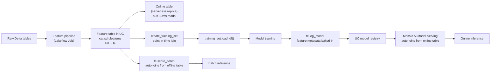

# Module 04 — Feature Engineering in Unity Catalog (Deep)

> **Goal of this module:** master **Feature Engineering in Unity Catalog (FE-in-UC)** — the post-Sept-2025 successor to the legacy Feature Store. Five exam objectives live here: feature tables, point-in-time correctness, online tables, streaming features, and on-demand features. Together they're ~15% of the Pro exam.
>
> ⚠️ **API rename you must internalize:** `FeatureStoreClient` is **legacy**. `FeatureEngineeringClient` is **current**. The legacy `databricks-feature-store` PyPI package is deprecated; the new package is **`databricks-feature-engineering`** (≥0.2.0).

---

## Coverage map (verbatim Sept 30 2025 exam objectives → where taught)

| Verbatim objective | Section anchor |
|---|---|
| Ensure **point-in-time correctness** in feature lookups to prevent data leakage during model training and inference | "Point-in-time correctness — the canonical pattern" |
| Build automated pipelines for feature computation using the **FeatureEngineering Client** | "Creating a feature table" + "Automated pipelines" |
| Configure **online tables** for low-latency applications using Databricks SDK | "Online tables — the serving path" |
| Design scalable solutions for ingesting and processing streaming data to generate features in real time | "Streaming features" |
| Develop **on-demand features** using feature serving for consistent use across training and production environments | "On-demand features" |

> Cross-references: Topic 09 → [Module 09 (Feature Store legacy)](../09_databricks_ml_associate/09_feature_store_introduction.md) for the legacy `FeatureStoreClient` distractor pattern; Module 02 here for the manual-lookup alternative.

---

## Why FE-in-UC matters

Feature engineering is the difference between an experiment and a production system. Without a shared feature platform you get:

- **Training/serving skew.** Code computing features in the training notebook differs from the inference Lambda. The model sees one distribution at train, another at serve.
- **Duplicate computation.** Five teams compute "30-day average transaction amount" five different ways with five subtle bugs.
- **No lineage.** Audit asks "what features fed this model?" — no answer.
- **No reuse.** New team starts from zero on the same features the last team already built.

FE-in-UC solves all four. The feature table is a **Delta table in UC** with a primary key (and optional timestamp key) registered as a feature table. The `FeatureEngineeringClient` is the read/write/lookup API.

---

## The object model



Five exam objectives live in this picture:

1. **Build automated pipelines for feature computation using the FeatureEngineering Client** — the green arrow from raw to feature table.
2. **Ensure point-in-time correctness** — the `create_training_set` step with `timestamp_lookup_key`.
3. **Configure online tables** — the offline → online replica.
4. **Streaming features** — the green arrow can be a Structured Streaming job.
5. **On-demand features** — runtime-computed features at serving time.

---

## The client

```python
from databricks.feature_engineering import FeatureEngineeringClient, FeatureLookup

fe = FeatureEngineeringClient()
```

That's it. No workspace URL, no token — it auto-detects on Databricks. **The class is `FeatureEngineeringClient`. Not `FeatureStoreClient`.** Re-read that until it sticks.

---

## Creating a feature table

```python
import pyspark.sql.functions as F

# 1. Compute features
features_df = (
    raw_transactions
    .groupBy("customer_id")
    .agg(
        F.avg("amount").alias("avg_amount_30d"),
        F.count("*").alias("txn_count_30d"),
        F.stddev("amount").alias("std_amount_30d"),
    )
    .withColumn("computed_at", F.current_timestamp())
)

# 2. Create the feature table
fe.create_table(
    name="prod.fraud.customer_features",
    primary_keys=["customer_id"],
    timestamp_keys=["computed_at"],  # optional — required for point-in-time
    df=features_df,
    description="Customer-level rolling 30-day features for fraud scoring",
    tags={"team": "fraud", "owner": "ml_platform"},
)

# 3. To append/update later
fe.write_table(
    name="prod.fraud.customer_features",
    df=new_features_df,
    mode="merge",  # or "overwrite"
)
```

**Argument semantics:**

| Arg | Meaning |
|---|---|
| `name` | Three-level UC name. Required. |
| `primary_keys` | List of columns uniquely identifying a feature row at a given timestamp. |
| `timestamp_keys` | Optional column(s) representing when the feature value is valid. Required for point-in-time lookups. |
| `df` | Initial DataFrame; the schema is captured. |
| `description` | Free-text shown in the UC UI. |
| `tags` | Key-value metadata. |

Modes for `write_table`:

- `"merge"` — upsert based on PK (most common for incremental updates).
- `"overwrite"` — replace the table.
- `"append"` — for time-series feature tables where each write is a new snapshot.

⚠️ **Exam trap:** answers that use Delta MERGE / INSERT directly to update a feature table. That works mechanically but **bypasses the feature engineering metadata** — lineage and discoverability break. Use `fe.write_table`.

---

## Point-in-time correctness — the #1 data leakage trap

The problem: you're training on historical events (transactions) and the features for each event must reflect what you would have known at that time, **not future values**.

A naive join (`features.customer_id = events.customer_id`) takes the **latest** feature value, which means future feature values leak into past training examples → model looks great offline, fails in prod.

The fix: a feature lookup with both a key and a timestamp key. The platform does an "as-of-time" join — for each event at time `T`, pick the feature row where the feature's `computed_at <= T` and is the most recent such row.

```python
from databricks.feature_engineering import FeatureLookup

# events_df has columns: event_id, customer_id, event_ts, label
feature_lookups = [
    FeatureLookup(
        table_name="prod.fraud.customer_features",
        lookup_key="customer_id",          # PK match
        timestamp_lookup_key="event_ts",   # as-of-time semantics
        feature_names=["avg_amount_30d", "txn_count_30d", "std_amount_30d"],
    ),
]

training_set = fe.create_training_set(
    df=events_df,
    feature_lookups=feature_lookups,
    label="label",
    exclude_columns=["event_id"],  # drop columns you don't want in training
)

training_df = training_set.load_df()  # materialized Spark DataFrame
```

What happens under the hood: for each row in `events_df`, the platform issues an as-of-time lookup on `prod.fraud.customer_features` where `customer_id` matches AND `computed_at <= event_ts`, picking the most recent such row. **No future feature values can leak.**

⚠️ **Exam trap:** a `FeatureLookup` without `timestamp_lookup_key`. That's a basic lookup (takes latest features). Wrong when training data has historical events.

⚠️ **Exam trap #2:** doing the join yourself in PySpark with `df.join(features, ...).filter(features.computed_at <= df.event_ts).window().rank()`. This works but isn't the canonical Databricks answer — and the exam wants the canonical answer.

---

## Training set → model logging with FE metadata

`fe.log_model` packages the feature lookup metadata into the model artifact. At inference time, callers don't need to know the features — they pass keys, and the platform looks up + joins.

```python
import mlflow
from sklearn.ensemble import GradientBoostingClassifier

# Train on the training set
training_df_pandas = training_set.load_df().toPandas()
X = training_df_pandas.drop(columns=["label"])
y = training_df_pandas["label"]
model = GradientBoostingClassifier(n_estimators=200, max_depth=5).fit(X, y)

# Log with FE — the training_set captures the feature lookup graph
with mlflow.start_run(run_name="fraud_v3"):
    fe.log_model(
        model=model,
        artifact_path="model",
        flavor=mlflow.sklearn,
        training_set=training_set,         # captures feature lookups
        registered_model_name="prod.fraud.classifier",
        infer_input_example=True,
    )
```

At inference time:

```python
# Batch — caller passes ONLY keys + label-free fields; features auto-join
scored = fe.score_batch(
    model_uri="models:/prod.fraud.classifier@champion",
    df=events_df.select("event_id", "customer_id", "event_ts"),  # no features needed
)
```

For online serving, the same model deployed to a Mosaic AI Model Serving endpoint will auto-join from the **online table** (next section).

⚠️ **Exam trap:** confusing `mlflow.<flavor>.log_model` with `fe.log_model`. The former logs the model without feature lookup metadata — inference callers must pass full feature vectors. The latter bakes in the feature lookup graph. **For real-time-feature use cases, use `fe.log_model`.**

---

## Online tables — sub-10ms feature reads

For real-time serving (a Model Serving endpoint scoring transactions as they happen), the feature table must be reachable in <10ms. Spark/Delta reads aren't fast enough. **Online tables** are UC-native, Databricks-managed serverless key-value replicas of an offline feature table.

```python
from databricks.sdk import WorkspaceClient
from databricks.sdk.service.catalog import OnlineTableSpec, OnlineTableSpecTriggeredSchedulingPolicy

w = WorkspaceClient()

w.online_tables.create(
    name="prod.fraud.customer_features_online",  # the online table's name
    spec=OnlineTableSpec(
        source_table_full_name="prod.fraud.customer_features",  # offline source
        primary_key_columns=["customer_id"],
        timeseries_key="computed_at",
        run_triggered=OnlineTableSpecTriggeredSchedulingPolicy(triggered=True),
        # Or run_continuously=OnlineTableSpecContinuousSchedulingPolicy()
    ),
)
```

**Key properties:**

- **Backed by a serverless store** — Databricks manages it; you don't see the cluster.
- **Replicates from the offline Delta table** — append/merge writes propagate automatically.
- **Sub-10ms reads** at the primary key (and timestamp, for time-series tables).
- **`run_triggered`** = manual refresh; **`run_continuously`** = streaming pipeline keeps the online table fresh.

⚠️ **Exam trap:** "Online Stores backed by DynamoDB or Cosmos DB." That's the **legacy** offering, deprecated. **Online Tables are the UC-native replacement.**

⚠️ **Exam trap 2:** writing directly to the online table. You don't. **You write to the offline Delta table; replication keeps the online copy in sync.**

---

## On-demand features — eliminate training/serving skew for runtime computations

Some features can only be computed at request time — e.g., "distance from the user's current location to the merchant" requires the user's current location which arrives in the request payload.

The naive approach (compute it in two places) creates skew. **On-demand features** are Python functions decorated with `@feature_function` that the platform runs at both training and serving time — same code, no skew.

```python
from databricks.feature_engineering import feature_function

@feature_function
def haversine_distance(lat1: float, lon1: float, lat2: float, lon2: float) -> float:
    """Compute haversine distance in km."""
    import math
    R = 6371.0
    phi1, phi2 = math.radians(lat1), math.radians(lat2)
    dphi = math.radians(lat2 - lat1)
    dlam = math.radians(lon2 - lon1)
    a = math.sin(dphi / 2) ** 2 + math.cos(phi1) * math.cos(phi2) * math.sin(dlam / 2) ** 2
    return 2 * R * math.asin(math.sqrt(a))
```

Reference it as a `FeatureFunction` in the training set:

```python
from databricks.feature_engineering import FeatureFunction

feature_lookups = [
    FeatureLookup(
        table_name="prod.fraud.merchant_features",
        lookup_key="merchant_id",
        feature_names=["merchant_lat", "merchant_lon"],
    ),
    FeatureFunction(
        udf_name="prod.fraud.haversine_distance",
        input_bindings={
            "lat1": "user_lat",            # from request
            "lon1": "user_lon",            # from request
            "lat2": "merchant_lat",        # from looked-up merchant_features
            "lon2": "merchant_lon",
        },
        output_name="distance_km",
    ),
]
```

At training time, the platform executes `haversine_distance` row-wise on the training DataFrame. At serving time, the **same function** runs inside the endpoint on each request. No skew possible.

⚠️ **Exam trap:** computing the on-demand feature in the model's `predict()` method. That works for inference but means training uses a different code path → skew. On-demand features unify both.

---

## Streaming features — real-time feature computation

Use case: you want a feature like "transactions in the last 5 minutes" to be fresh at inference time. Compute it in a Structured Streaming job that writes to the feature table.

```python
streaming_features = (
    spark.readStream
    .format("delta")
    .table("raw.transactions")
    .withWatermark("event_ts", "10 minutes")
    .groupBy(
        F.window("event_ts", "5 minutes"),
        "customer_id",
    )
    .agg(
        F.count("*").alias("txn_count_5m"),
        F.sum("amount").alias("amount_sum_5m"),
    )
    .withColumn("computed_at", F.col("window.end"))
    .drop("window")
)

# Write to the feature table
fe.write_table(
    name="prod.fraud.customer_features_streaming",
    df=streaming_features,
    mode="merge",  # upsert by (customer_id, computed_at)
    # For streaming, you must also configure checkpoint location via the trigger
    checkpoint_location="/dbfs/checkpoints/fraud_features_streaming",
    trigger={"processingTime": "30 seconds"},
)
```

Couple this with an **online table in continuous mode** (`run_continuously=...`) and inference latency stays low while features stay fresh.

⚠️ **Exam trap:** assuming `fe.write_table` with a streaming DataFrame "just works" without checkpoint + trigger config. Structured Streaming requires both.

---

## Automated feature pipelines — Section 1 objective

The objective: *"Build automated pipelines for feature computation using the FeatureEngineering Client."*

The canonical pattern is a **Lakeflow Job** (a scheduled DAG) where:

1. Task 1: read raw Delta tables.
2. Task 2: compute features (group-by, window functions, joins).
3. Task 3: `fe.write_table(..., mode="merge")` to the feature table.
4. Task 4 (optional): refresh dependent online tables.
5. Task 5 (optional): run Lakehouse Monitoring on the feature table to detect drift early.

Express this as a DAB resource (covered in Module 08) so the pipeline ships with code review and reproducible deploys.

---

## Lookup precedence and column collisions

When `create_training_set` combines a label DataFrame, feature lookups, and feature functions, columns must not collide. The platform's rules:

1. **Label DataFrame columns** are kept (except those in `exclude_columns`).
2. **FeatureLookup columns** come from the feature tables; renamed via `rename_outputs={"old": "new"}` if collision.
3. **FeatureFunction outputs** named via `output_name=`.
4. If both a label-df column and a lookup have the same name, the training set errors out — you must `exclude_columns` or rename.

```python
FeatureLookup(
    table_name="...",
    lookup_key="customer_id",
    feature_names=["score"],
    rename_outputs={"score": "customer_score"},
)
```

⚠️ **Exam trap:** assuming the platform silently resolves collisions in favor of the feature table (or the label df). It errors — be explicit.

---

## Look-alike API comparison — `FeatureEngineeringClient` surface

| Pair | Difference | Exam tell |
|---|---|---|
| `FeatureEngineeringClient` vs `FeatureStoreClient` | Current vs legacy | Sept 2025 exam always answers `FeatureEngineeringClient` |
| `fe.create_table(name, primary_keys, timestamp_keys=, df=)` vs `fe.create_feature_table(...)` (deprecated) | New vs old method name | The `create_feature_table` name was the legacy `FeatureStoreClient` form — wrong on the new exam |
| `fe.write_table(mode="merge")` vs `mode="overwrite")` vs `mode="append"` | Upsert on PK vs full replace vs append-only (allows duplicates) | Continuous updates from streaming → `merge`. Full daily rebuild → `overwrite`. Audit-style logs → `append` |
| `FeatureLookup(table_name, lookup_key, timestamp_lookup_key=)` vs without `timestamp_lookup_key` | Point-in-time as-of join vs latest-only join | Training on historical events → MUST include `timestamp_lookup_key`. Inference with current state → without is fine |
| `fe.create_training_set(...).load_df()` vs reading the feature table directly | Joins label DF with features by lookup (PIT-aware) vs raw read | Use `create_training_set` whenever the model has feature lookups; the metadata gets baked into the model |
| `fe.log_model(model, artifact_path, flavor=, training_set=, registered_model_name=)` vs `mlflow.sklearn.log_model(...)` | Packages feature lookup graph for auto-join at serve time vs plain MLflow log | If callers should pass only **keys** at inference, `fe.log_model`. If they pass features, plain MLflow log |
| `fe.score_batch(model_uri, df)` vs `fe.score_streaming(...)` vs Mosaic AI REST endpoint | Batch Spark scoring with auto feature join / streaming inference / real-time serving | Section 1 sample question pattern: "score 100M-row table" → `score_batch` |
| Online table modes: `Triggered` vs `Continuous` vs `Snapshot` (one-time copy) | On-demand refresh / streaming sync / one-time | Sub-second freshness → `Continuous`. Daily refresh → `Triggered`. Static lookup → `Snapshot` |
| `@feature_function` (on-demand feature) vs precomputed feature in the offline table | Computed at training-AND-serving time from inputs vs computed once and stored | If the input is only known at request time (haversine from user location), MUST be on-demand. Otherwise precomputed is cheaper |
| `OnlineTableSpec` + `WorkspaceClient.online_tables.create` vs UI | SDK programmatic vs manual creation | DAB-deployable → SDK |
| `fe.write_table(checkpoint_location=, trigger=)` (streaming) vs without (batch) | Structured Streaming write vs static write | Streaming DF requires both. Static DF rejects them |

### Full `fe.create_table` signature

```python
fe.create_table(
    name="cat.sch.tbl",
    primary_keys=["customer_id"],           # required; can be composite
    timestamp_keys=["computed_at"],         # optional; enables point-in-time lookups
    df=features_df,                          # optional; if omitted, creates an empty table
    schema=schema,                           # optional; required if df is None
    partition_columns=["region"],            # optional; for offline-table partitioning
    description="...",                       # for governance
    tags={"team": "fraud", "owner": "ml"},   # UC tags
)
```

> 🎯 **How to recognize this on the exam:** "training data leakage from future feature values" → `timestamp_lookup_key`. "Real-time inference requires features fresh in seconds" → online table in **continuous** mode. "Model artifact should auto-join features at scoring time" → `fe.log_model` with `training_set=`. "Compute haversine from user's current location at request time" → `@feature_function`.

---

## Output-prediction drills

**Drill 1 — PIT correctness:**
```python
# event at 2026-05-01 10:00
# feature table rows for customer_id=42:
#   2026-04-30 23:00  ->  avg_amount_30d = 100
#   2026-05-01 11:00  ->  avg_amount_30d = 250  (computed AFTER the event)
training_set = fe.create_training_set(
    df=events,
    feature_lookups=[FeatureLookup(
        table_name="prod.fraud.customer_features",
        lookup_key="customer_id",
        timestamp_lookup_key="event_ts",
    )],
    label="is_fraud",
)
```
Q: Which `avg_amount_30d` is joined to the event?
A: **100** (the 2026-04-30 23:00 row). PIT picks the most recent row with `computed_at <= event_ts`. The 2026-05-01 11:00 row would leak future info.

**Drill 2 — `timestamp_lookup_key` omitted:**
Same setup, but without `timestamp_lookup_key`. What gets joined?
A: The **latest** feature row available at training time — likely the 2026-05-01 11:00 row, which is **future data leakage** if the event is in the past. Classic training/serving skew bug.

**Drill 3 — online table write:**
```python
w.online_tables.create(name="prod.fraud.customer_features_online", spec=OnlineTableSpec(
    source_table_full_name="prod.fraud.customer_features",
    primary_key_columns=["customer_id"],
    perform_full_copy=True,
    run_continuously={},
))
fe.write_table(name="prod.fraud.customer_features_online", df=new_features, mode="merge")
```
Q: Does the write succeed?
A: **No.** Online tables are read-only replicas. Write to the **offline source** (`prod.fraud.customer_features`) and the continuous-mode replica syncs automatically.

**Drill 4 — `fe.log_model` consumer contract:**
```python
fe.log_model(model=sk_model, artifact_path="m", flavor=mlflow.sklearn,
             training_set=ts, registered_model_name="prod.ml.fraud")
# Caller:
client.predict(endpoint="ep", inputs={"dataframe_records": [{"customer_id": "c1"}]})
```
Q: What payload does the endpoint actually expect (just the keys, or the full feature row)?
A: **Just the keys** (and any non-lookup columns). The endpoint auto-joins features from the **online table** at request time. If you'd used `mlflow.sklearn.log_model` instead, the caller would have to pass all feature columns.

**Drill 5 — on-demand feature decorator:**
```python
from databricks.feature_engineering import feature_function
@feature_function
def haversine(user_lat: float, user_lon: float, merchant_lat: float, merchant_lon: float) -> float:
    ...
```
Q: When is this computed at training time vs inference time?
A: **Both**. The same Python function runs in the training pipeline (when `fe.create_training_set` includes it via `FeatureFunction(...)`) and at serving time (Mosaic AI Model Serving invokes it per-request). One code path, zero skew.

---

## Decision rules

> 🎯 **"Train on historical events, predict at current time" → `timestamp_lookup_key` is mandatory.** Without it you leak future feature values.

> 🎯 **"Sub-10ms feature read at serving time" → online table in continuous mode.** Offline-only Delta reads are too slow.

> 🎯 **"Feature is a function of request-time inputs (user location, request payload)" → on-demand feature via `@feature_function`.** Precomputed table can't capture it.

> 🎯 **"Caller passes only keys at inference" → `fe.log_model(training_set=)`.** This bakes the feature lookup graph into the artifact.

> 🎯 **"Batch score 100M rows with feature joins" → `fe.score_batch(model_uri, df)`.** Don't do `model.predict(df.toPandas())`.

> 🎯 **Distractor: any answer naming `FeatureStoreClient`, `databricks-feature-store`, `create_feature_table`** → legacy and wrong on the Sept 2025 exam.

---

## End-to-end mini-scenario — full FE-in-UC pipeline

Scenario: build a fraud feature pipeline with offline+online tables, on-demand haversine, point-in-time training, and serving-time auto-join.

```python
import pyspark.sql.functions as F
from databricks.feature_engineering import (
    FeatureEngineeringClient, FeatureLookup, FeatureFunction, feature_function,
)
from databricks.sdk import WorkspaceClient
from databricks.sdk.service.catalog import OnlineTableSpec, OnlineTableSpecContinuousSchedulingPolicy

fe = FeatureEngineeringClient()
w = WorkspaceClient()

# 1. Compute & create offline feature table
features = (spark.table("raw.transactions")
            .groupBy("customer_id")
            .agg(F.avg("amount").alias("avg_amount_30d"),
                 F.count("*").alias("txn_count_30d"))
            .withColumn("computed_at", F.current_timestamp()))
fe.create_table(name="prod.fraud.customer_features",
                primary_keys=["customer_id"],
                timestamp_keys=["computed_at"],
                df=features)

# 2. Provision online replica in continuous mode
w.online_tables.create(
    name="prod.fraud.customer_features_online",
    spec=OnlineTableSpec(
        source_table_full_name="prod.fraud.customer_features",
        primary_key_columns=["customer_id"],
        timeseries_key="computed_at",
        run_continuously=OnlineTableSpecContinuousSchedulingPolicy(),
    ),
)

# 3. On-demand feature
@feature_function
def haversine(user_lat: float, user_lon: float, merchant_lat: float, merchant_lon: float) -> float:
    from math import radians, cos, sin, asin, sqrt
    dlat, dlon = radians(merchant_lat - user_lat), radians(merchant_lon - user_lon)
    a = sin(dlat/2)**2 + cos(radians(user_lat))*cos(radians(merchant_lat))*sin(dlon/2)**2
    return 2 * 6371 * asin(sqrt(a))

# 4. PIT training set
events = spark.table("prod.bronze.fraud_events_labeled")  # has event_ts + lat/lon
training_set = fe.create_training_set(
    df=events,
    feature_lookups=[FeatureLookup(
        table_name="prod.fraud.customer_features",
        lookup_key="customer_id",
        timestamp_lookup_key="event_ts",  # ← PIT
    )],
    feature_functions=[FeatureFunction(
        udf_name="prod.fraud.haversine",
        input_bindings={"user_lat":"user_lat","user_lon":"user_lon",
                        "merchant_lat":"merchant_lat","merchant_lon":"merchant_lon"},
        output_name="distance_km",
    )],
    label="is_fraud",
    exclude_columns=["event_ts"],
)

training_pdf = training_set.load_df().toPandas()
X, y = training_pdf.drop(columns=["is_fraud"]), training_pdf["is_fraud"]
import lightgbm as lgb
model = lgb.LGBMClassifier().fit(X, y)

# 5. Log model with feature lookup metadata
fe.log_model(model=model, artifact_path="model", flavor=mlflow.lightgbm,
             training_set=training_set,
             registered_model_name="prod.ml.fraud_with_features")

# 6. At serving time callers only send keys + on-demand inputs:
#    {"customer_id": "c1", "user_lat": ..., "user_lon": ..., "merchant_lat": ..., "merchant_lon": ...}
#    Mosaic AI auto-joins avg_amount_30d, txn_count_30d from online table; haversine runs in-request.
```

This pattern eliminates training/serving skew, supports sub-10ms inference, and keeps a single source of truth for feature definitions. **This is the exam-canonical Section 1 FE story.**

---

## Mini quiz

1. What's the difference between `FeatureStoreClient` and `FeatureEngineeringClient`?
2. You're training on 6 months of historical events. What single argument prevents future feature values from leaking?
3. You need a sub-10ms feature lookup at serving time. What do you create?
4. Online table — do you write to it directly, or to its offline source?
5. When would you use a `@feature_function` decorator instead of just precomputing the feature?
6. `fe.log_model` vs `mlflow.sklearn.log_model` — when does the difference matter?
7. You have an event at `event_ts = 2026-05-01 10:00:00`. The feature table has rows at `computed_at = 2026-04-30 23:00:00` and `computed_at = 2026-05-01 11:00:00`. Which feature row is used?

**Answers:**

1. `FeatureStoreClient` is the **legacy** API from the deprecated `databricks-feature-store` package. `FeatureEngineeringClient` is the **current** API from `databricks-feature-engineering` (≥0.2.0). On the exam, `FeatureEngineeringClient` is always the right answer.
2. `timestamp_lookup_key="event_ts"` on the `FeatureLookup`. This enforces an as-of-time join.
3. An **online table** replicating the offline feature table, primary-keyed for fast lookup.
4. Write to the **offline source** Delta table. The online table is a managed replica; direct writes aren't supported. Streaming jobs in continuous mode or triggered refreshes keep the online copy in sync.
5. When the feature must be computed from data only available at request time (request-payload-derived features like haversine distance from a user's location). Computing only in training creates skew; computing only in serving means training can't see it. `@feature_function` unifies both paths.
6. When you want feature lookups baked into the model artifact so callers don't pass features (only keys). `fe.log_model` packages the feature lookup graph; `mlflow.sklearn.log_model` doesn't. Real-time serving with online tables relies on `fe.log_model`.
7. The row at `computed_at = 2026-04-30 23:00:00`. As-of-time semantics: pick the most recent feature row where `computed_at <= event_ts`. The 2026-05-01 11:00 row is in the future relative to the event and excluded.

---

## Sanity check

- Could you write `fe.create_table` + `fe.write_table(mode="merge")` from memory?
- Do you know the exact API for a point-in-time `FeatureLookup`?
- Can you explain why online tables replaced Online Stores (DynamoDB/Cosmos)?
- Do you remember that `@feature_function` runs the same code at training and serving?
- Can you sketch a streaming feature pipeline that keeps an online table fresh?

Move on to [Module 05 — Advanced Spark ML](05_advanced_spark_ml.md).
