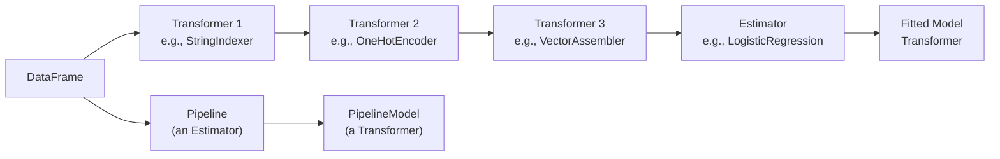

# Module 05 — Advanced Spark ML

> **Goal of this module:** the seven Spark ML objectives in Section 1 — when to use Spark ML at all, how to build pipelines, custom transformers/estimators, CrossValidator with parallelism, custom evaluators, and SparkML model selection for batch vs streaming vs real-time.
>
> **Assumes:** Topic 09 (Associate) — you know `VectorAssembler`, `LogisticRegression`, basic `Pipeline`. This module is what the Pro exam adds.

---

## Coverage map (verbatim Sept 30 2025 exam objectives → where taught)

| Verbatim objective | Section anchor |
|---|---|
| Identify when SparkML is recommended based on the data, model, and use case requirements | "When to use Spark ML — the gating question" |
| Construct an ML pipeline using SparkML | "The Pipeline / Estimator / Transformer trio" |
| Apply the appropriate estimator and/or transformer given a use case | "Estimator/transformer catalog" |
| Tune a SparkML model using MLlib | "CrossValidator + parallelism math" |
| Evaluate a SparkML model | "Evaluators" |
| Score a Spark ML model for a batch or streaming use case | "Batch and streaming inference with SparkML" |
| Select SparkML model or single node model for an inference based on type: batch, real-time, streaming | "SparkML vs single-node — inference-time decision" |

> Cross-references: Topic 09 → [Module 13 (Spark ML pipelines basics)](../09_databricks_ml_associate/13_spark_ml_basics.md); Module 03 here for the Pandas Function API alternative to SparkML when training one model per group.

---

## When to use Spark ML — the gating question

The exam objective: *"Identify when SparkML is recommended based on the data, model, and use case requirements."*

Spark ML is the right answer when **at least one of these** is true:

- Training data exceeds single-node RAM (typical threshold: > 50 GB).
- The dataset is already a Spark DataFrame from Delta and converting to pandas is wasteful.
- You need batch inference at scale and want to stay in PySpark all the way through.
- The algorithm is natively distributable (linear models, GBT, ALS, K-means) — not a deep network.

Spark ML is the **wrong answer** when:

- Data fits comfortably on one node — single-node sklearn / XGBoost / LightGBM is faster, has better APIs, and you avoid Spark overhead.
- You need a deep network — use PyTorch/Tensorflow + Ray Train / Horovod.
- You need cutting-edge boosting (sklearn-style XGBoost, LightGBM, CatBoost native APIs).

⚠️ **Exam trap:** answer choices that frame "10 GB of data, train a logistic regression" as a Spark ML use case. 10 GB easily fits on a `Standard_E32d_v5` (256 GB RAM). Single-node sklearn is faster.

---

## The Pipeline / Estimator / Transformer trio



- **Transformer** — has `.transform(df) -> df`. Either pre-fit or learned (e.g., `StringIndexerModel`).
- **Estimator** — has `.fit(df) -> Transformer`. Has learnable state.
- **Pipeline** — an estimator. Its `.fit` returns a `PipelineModel` (a transformer).

The exam tests whether you can identify which is which in code, and which APIs are valid:

```python
# Right: pipeline.fit returns a transformer
pipeline_model = pipeline.fit(train_df)
predictions = pipeline_model.transform(test_df)

# Wrong: pipeline.transform — Pipeline is an estimator, has no .transform
# pipeline.transform(test_df)  # AttributeError

# Right: persist the fitted pipeline
pipeline_model.write().overwrite().save("dbfs:/models/fraud_pipeline_v3")

# Right: load
from pyspark.ml import PipelineModel
loaded = PipelineModel.load("dbfs:/models/fraud_pipeline_v3")
```

⚠️ **Exam trap:** calling `.transform` on an unfit Pipeline, or `.fit` on a fitted PipelineModel. The exam can include both as distractors in the same question.

---

## Building an ML pipeline — Section 1 objective

```python
from pyspark.ml import Pipeline
from pyspark.ml.feature import StringIndexer, OneHotEncoder, VectorAssembler, StandardScaler
from pyspark.ml.classification import GBTClassifier

# Categorical: index then one-hot
cat_cols = ["merchant_category", "country_code"]
indexers = [
    StringIndexer(inputCol=c, outputCol=f"{c}_idx", handleInvalid="keep")
    for c in cat_cols
]
encoders = [
    OneHotEncoder(inputCols=[f"{c}_idx" for c in cat_cols],
                  outputCols=[f"{c}_oh" for c in cat_cols])
]

# Assemble all feature columns
num_cols = ["amount", "txn_count_30d", "avg_amount_30d"]
assembler = VectorAssembler(
    inputCols=num_cols + [f"{c}_oh" for c in cat_cols],
    outputCol="features_raw",
    handleInvalid="keep",
)
scaler = StandardScaler(inputCol="features_raw", outputCol="features", withMean=True, withStd=True)

# Estimator
gbt = GBTClassifier(
    featuresCol="features",
    labelCol="label",
    maxDepth=5,
    maxIter=100,
    stepSize=0.05,
    seed=42,
)

pipeline = Pipeline(stages=indexers + encoders + [assembler, scaler, gbt])
model = pipeline.fit(train_df)
predictions = model.transform(test_df)
```

**`handleInvalid` is exam-relevant.** Options:

- `"error"` (default for some, `"keep"` for others — check per-class) — throws on unseen categories at transform time.
- `"keep"` — assigns a "special" index for unseen.
- `"skip"` — drops rows.

For a production model that may encounter new categories at inference, `handleInvalid="keep"` on `StringIndexer` (and `handleInvalid="keep"` on `VectorAssembler` for nulls) is the safe choice.

⚠️ **Exam trap:** an answer that uses `handleInvalid="error"` for a production scoring pipeline. New categories will crash inference.

---

## Custom transformers and estimators

Sometimes built-in transformers aren't enough — you have a domain-specific feature (e.g., "winsorize at 99th percentile"). Custom transformers extend `Transformer` and implement `_transform`:

```python
from pyspark.ml import Transformer
from pyspark.ml.param.shared import HasInputCol, HasOutputCol
from pyspark.ml.util import DefaultParamsReadable, DefaultParamsWritable
from pyspark.sql import DataFrame
import pyspark.sql.functions as F

class Winsorizer(Transformer, HasInputCol, HasOutputCol, DefaultParamsReadable, DefaultParamsWritable):
    def __init__(self, inputCol=None, outputCol=None, p_low=0.01, p_high=0.99):
        super().__init__()
        self._setDefault(inputCol=None, outputCol=None)
        self.p_low = p_low
        self.p_high = p_high
        self._set(inputCol=inputCol, outputCol=outputCol)

    def _transform(self, df: DataFrame) -> DataFrame:
        in_col = self.getInputCol()
        out_col = self.getOutputCol()
        # Compute percentiles on the input column
        low, high = df.approxQuantile(in_col, [self.p_low, self.p_high], 0.001)
        return df.withColumn(
            out_col,
            F.when(F.col(in_col) < low, low)
             .when(F.col(in_col) > high, high)
             .otherwise(F.col(in_col)),
        )
```

For a custom **estimator** (something with learnable state), extend `Estimator` and implement `_fit` returning a fitted transformer:

```python
from pyspark.ml import Estimator, Model

class WinsorizerModel(Model, HasInputCol, HasOutputCol, DefaultParamsReadable, DefaultParamsWritable):
    def __init__(self, inputCol=None, outputCol=None, low=None, high=None):
        super().__init__()
        self.low = low
        self.high = high
        self._set(inputCol=inputCol, outputCol=outputCol)

    def _transform(self, df):
        in_col, out_col = self.getInputCol(), self.getOutputCol()
        return df.withColumn(
            out_col,
            F.when(F.col(in_col) < self.low, self.low)
             .when(F.col(in_col) > self.high, self.high)
             .otherwise(F.col(in_col)),
        )

class WinsorizerEstimator(Estimator, HasInputCol, HasOutputCol):
    def __init__(self, inputCol=None, outputCol=None, p_low=0.01, p_high=0.99):
        super().__init__()
        self.p_low, self.p_high = p_low, p_high
        self._set(inputCol=inputCol, outputCol=outputCol)

    def _fit(self, df):
        low, high = df.approxQuantile(self.getInputCol(), [self.p_low, self.p_high], 0.001)
        return WinsorizerModel(
            inputCol=self.getInputCol(),
            outputCol=self.getOutputCol(),
            low=low,
            high=high,
        )
```

**Why this matters for the exam:** *"Construct an ML pipeline using SparkML"* explicitly. Pipelines accept any `Transformer` or `Estimator` — including your custom ones.

`DefaultParamsReadable` and `DefaultParamsWritable` are the mixins that let your custom transformer serialize as part of a `PipelineModel`. Without them, you can't save the fitted pipeline.

⚠️ **Exam trap:** answer choices that say "custom transformers can't be saved." False — with `DefaultParamsReadable/Writable`, they can.

---

## CrossValidator with parallelism

Spark ML's HP tuning APIs:

- **`CrossValidator`** — K-fold CV across an HP grid.
- **`TrainValidationSplit`** — single train/val split across the grid (faster, less robust).

```python
from pyspark.ml.tuning import CrossValidator, ParamGridBuilder, TrainValidationSplit
from pyspark.ml.evaluation import BinaryClassificationEvaluator

evaluator = BinaryClassificationEvaluator(
    rawPredictionCol="rawPrediction",
    labelCol="label",
    metricName="areaUnderROC",
)

param_grid = (
    ParamGridBuilder()
    .addGrid(gbt.maxDepth, [3, 5, 7])
    .addGrid(gbt.maxIter, [50, 100, 200])
    .addGrid(gbt.stepSize, [0.05, 0.1])
    .build()
)

cv = CrossValidator(
    estimator=pipeline,
    estimatorParamMaps=param_grid,
    evaluator=evaluator,
    numFolds=3,
    parallelism=4,   # ← exam-relevant
    seed=42,
)
cv_model = cv.fit(train_df)
best_pipeline = cv_model.bestModel
```

**`parallelism=4`** — fit up to 4 models concurrently across the HP grid. The default is 1 (sequential).

When does `parallelism > 1` help?

- Cluster has enough idle resources (CPU/memory not saturated by a single training job).
- HP combinations are independent.

When does it hurt?

- Each training job already saturates the cluster (e.g., large GBT). Parallelism causes contention, slows everything.
- Driver memory bottleneck.

Rule of thumb: `parallelism = min(num_executors, 4)`. Higher rarely helps; on large pipelines, start at 2.

⚠️ **Exam trap:** "`parallelism=10` for a 3-fold CV with a 6-combination grid" — at most 18 models train, but 10× parallelism only helps if the cluster has 10× the resources of one job. Usually wrong on the exam unless the cluster is explicitly huge.

---

## Custom evaluators

Built-in evaluators:

- `BinaryClassificationEvaluator` — `areaUnderROC`, `areaUnderPR`.
- `MulticlassClassificationEvaluator` — `f1`, `weightedPrecision`, `accuracy`, `logLoss`.
- `RegressionEvaluator` — `rmse`, `mae`, `mse`, `r2`.
- `ClusteringEvaluator` — `silhouette`.

For domain-specific metrics, write a custom evaluator:

```python
from pyspark.ml.evaluation import Evaluator
from pyspark.ml.util import DefaultParamsReadable, DefaultParamsWritable
import pyspark.sql.functions as F

class CostSensitiveEvaluator(Evaluator, DefaultParamsReadable, DefaultParamsWritable):
    """Custom evaluator: total dollar cost of misclassifications.
    Lower is better."""
    def __init__(self, predictionCol="prediction", labelCol="label",
                 amountCol="amount", fn_cost_mult=1.0, fp_cost_mult=0.1):
        super().__init__()
        self.predictionCol = predictionCol
        self.labelCol = labelCol
        self.amountCol = amountCol
        self.fn_cost_mult = fn_cost_mult
        self.fp_cost_mult = fp_cost_mult

    def _evaluate(self, dataset):
        cost_expr = (
            F.when((F.col(self.labelCol) == 1) & (F.col(self.predictionCol) == 0),
                   F.col(self.amountCol) * self.fn_cost_mult)
             .when((F.col(self.labelCol) == 0) & (F.col(self.predictionCol) == 1),
                   F.col(self.amountCol) * self.fp_cost_mult)
             .otherwise(0.0)
        )
        return float(dataset.select(F.sum(cost_expr)).collect()[0][0] or 0.0)

    def isLargerBetter(self):
        return False  # lower cost is better
```

`isLargerBetter()` is consulted by `CrossValidator` to decide which HP set wins.

⚠️ **Exam trap:** forgetting `isLargerBetter()` for a "lower is better" custom evaluator. CrossValidator will pick the wrong "best" model.

---

## Batch vs streaming vs real-time — picking the right Spark ML path

Section 1 objective: *"Select SparkML model or single node model for an inference based on type: batch, real-time, streaming."*

| Inference type | Right choice | Why |
|---|---|---|
| **Batch** (nightly scoring of 100M rows) | SparkML or single-node-via-`spark_udf` | Spark distributes; data already in Delta |
| **Streaming** (Structured Streaming inference) | SparkML or `mlflow.pyfunc.spark_udf` | Streaming UDFs work seamlessly; per-microbatch latency in seconds |
| **Real-time** (synchronous, per-request, p50 < 100ms) | **Single-node model on Mosaic AI Model Serving** | Spark startup cost is too high; serving endpoints expect single-node |

**The exam-trap subtle one:** SparkML models can run on a single-node endpoint via the MLflow Spark flavor, but the runtime cost of loading a SparkSession on each replica is high. For real-time, prefer sklearn / XGBoost / LightGBM artifacts and use Spark only for batch and streaming.

```python
# Batch inference with a SparkML PipelineModel — natural fit
predictions = pipeline_model.transform(big_delta_df)

# Batch inference with a single-node sklearn model via spark_udf — also natural
spark_udf = mlflow.pyfunc.spark_udf(spark, "models:/prod.fraud.classifier@champion")
predictions = big_delta_df.withColumn("pred", spark_udf("amount", "category"))

# Streaming inference — same spark_udf works on streaming DataFrames
streaming_predictions = (
    spark.readStream.format("delta").table("events")
    .withColumn("pred", spark_udf("amount", "category"))
)
streaming_predictions.writeStream.format("delta").outputMode("append") \
    .toTable("scored_events")
```

⚠️ **Exam trap:** "Use SparkML for real-time low-latency inference." Wrong — Spark overhead dominates. Use single-node + Mosaic AI Model Serving.

---

## Scoring a Spark ML model — pitfalls

Saving and loading SparkML pipelines:

```python
# Save
pipeline_model.write().overwrite().save("dbfs:/models/fraud_pipeline_v3")
# Load
from pyspark.ml import PipelineModel
loaded = PipelineModel.load("dbfs:/models/fraud_pipeline_v3")
```

But the **MLflow-tracked** path is preferred:

```python
import mlflow.spark
with mlflow.start_run():
    mlflow.spark.log_model(
        spark_model=pipeline_model,
        artifact_path="model",
        signature=infer_signature(train_df, pipeline_model.transform(train_df)),
        registered_model_name="prod.fraud.spark_pipeline",
    )
```

The MLflow Spark flavor wraps the SparkML model and lets you load via `mlflow.spark.load_model("models:/...@champion")` or use `mlflow.pyfunc.spark_udf` for batch.

⚠️ **Exam trap:** saving a fitted SparkML PipelineModel and using `mlflow.sklearn.log_model` to wrap it. Wrong flavor.

---

## MLlib vs Spark ML — clarify the naming

- **`pyspark.ml`** — DataFrame-based API. The current Spark ML. Use this.
- **`pyspark.mllib`** — RDD-based API. Legacy, maintenance mode. Don't use it.

The exam says "MLlib" sometimes; in context, it means the modern DataFrame-based Spark ML. Don't be confused — the *RDD* MLlib is the legacy one, but the term MLlib still appears in marketing and the exam guide synonymously with `pyspark.ml`.

---

## Look-alike API comparison — Spark ML tuners and pipelines

| Pair | Difference | Exam tell |
|---|---|---|
| `CrossValidator` vs `TrainValidationSplit` | k-fold CV (trains `grid_size × k` models) vs single split (trains `grid_size` models) | Small dataset, robust HPO → CV. Large dataset, save compute → TVS |
| `CrossValidator(parallelism=N)` vs `parallelism=1` (default) | N grid points trained concurrently per fold vs sequential | Total models = `grid × k`; wall-clock divides by `min(N, grid × k)`. Memory scales with N |
| `Pipeline` (estimator) vs `PipelineModel` (transformer) | `.fit()` returns the model; the model has `.transform()` but no `.fit()` | Question asks "which can call `.transform`?" — `PipelineModel` |
| `pyspark.ml` (DataFrame-based) vs `pyspark.mllib` (RDD-based) | Current vs legacy | "MLlib" in the exam guide ≈ current `pyspark.ml`. RDD MLlib is the legacy distractor |
| `StringIndexer(handleInvalid="error")` vs `"skip"` vs `"keep"` | Crash on unseen / drop row / assign special index | Production inference sees unseen categories → `keep` is the safe answer |
| `OneHotEncoder` vs `OneHotEncoderModel` | Estimator vs the fitted output | Pipeline question: estimator goes into the Pipeline, model comes out of `.fit` |
| `VectorAssembler` vs `Vectors.dense(...)` | Combine multiple cols into one Vector col vs construct one Vector value | Always use `VectorAssembler` in pipelines |
| `Pipeline.save(path)` vs `Pipeline.write().overwrite().save(path)` | Default save (fails if exists) vs explicit overwrite | DAB-deployed re-train flow → `.write().overwrite().save(...)` |
| Custom Transformer (`HasInputCol`, `HasOutputCol`) vs Custom Estimator (with `_fit` method) | Stateless transform vs learns from data | Z-score with hardcoded params → Transformer. Z-score that learns mean/std → Estimator |
| `BinaryClassificationEvaluator` (`areaUnderROC`, `areaUnderPR`) vs `MulticlassClassificationEvaluator` (`f1`, `weightedPrecision`, `accuracy`) vs `RegressionEvaluator` (`rmse`, `mae`, `r2`) | Binary / multiclass / regression metric families | Always match evaluator type to label cardinality |
| Custom `Evaluator.isLargerBetter()` returning `True` vs `False` | Larger = better (AUC) vs smaller = better (loss, RMSE, cost) | Custom cost metric → `return False`; otherwise CrossValidator picks worst |

> 🎯 **How to recognize this on the exam:** if the answer choice uses `pyspark.mllib.regression.LinearRegressionWithSGD` — that's the legacy RDD API. Wrong. If it uses `pyspark.ml.regression.LinearRegression` — current. If `parallelism=` is shown without a `CrossValidator` or `TrainValidationSplit` context — wrong placement.

---

## Output-prediction drills

**Drill 1 — CV model count:**
```python
grid = ParamGridBuilder().addGrid(lr.regParam, [0.01, 0.1, 1.0]).addGrid(lr.elasticNetParam, [0.0, 0.5]).build()
cv = CrossValidator(estimator=pipeline, estimatorParamMaps=grid, evaluator=eval, numFolds=5, parallelism=4)
cv.fit(train_df)
```
Q: How many models are trained? With `parallelism=4`, what's the concurrent training count?
A: **`3 × 2 × 5 = 30 models`** total. Up to **4 trained concurrently**. After CV completes, one **final** model is refit on the full training data → 31 total fits.

**Drill 2 — handleInvalid trap:**
```python
indexer = StringIndexer(inputCol="merchant", outputCol="merchant_idx")  # default handleInvalid="error"
fitted = indexer.fit(train_df)
# at inference, new transaction has merchant="NEW_VENDOR_xyz"
fitted.transform(inference_df)
```
Q: What happens?
A: `SparkException: Unseen label NEW_VENDOR_xyz`. Production fix: refit with `handleInvalid="keep"` (unseen → max_index + 1) or `"skip"` (drop the row).

**Drill 3 — TVS vs CV math:**
Same grid (6 combos). `TrainValidationSplit(trainRatio=0.8)` vs `CrossValidator(numFolds=5)`.
Q: Model count for each?
A: TVS = **6** (one per combo, single split). CV = **30** (6 combos × 5 folds). Plus the final refit on full data in each case.

**Drill 4 — Pipeline save:**
```python
model = pipeline.fit(train_df)
model.save("/dbfs/models/v1")  # path exists from a previous run
```
Q: What happens?
A: `IOException: Path already exists`. Use `model.write().overwrite().save("/dbfs/models/v1")`.

**Drill 5 — custom evaluator direction:**
```python
class CostEvaluator(Evaluator):
    def _evaluate(self, dataset):
        return business_cost(dataset)
    def isLargerBetter(self):
        return True  # BUG: cost is "lower is better"
```
Q: How does this break CV?
A: CV picks the HP combo with the **highest** cost (worst), thinking that's best. Fix: `return False`.

---

## Decision rules

> 🎯 **"Data > driver RAM" or "Delta source, batch scoring" → SparkML.** "Small data + need cutting-edge boosting" → single-node XGBoost/LightGBM.

> 🎯 **"Real-time per-request inference" → never SparkML.** Mosaic AI Model Serving runs sklearn-style frameworks; Spark startup latency is a non-starter.

> 🎯 **"Robust HPO on a small dataset" → CrossValidator.** "Quick HPO on a huge dataset" → TrainValidationSplit.

> 🎯 **"Inference sees new categorical values" → `StringIndexer(handleInvalid="keep")`** at fit time.

> 🎯 **"Custom metric where lower is better" → `isLargerBetter()` returns `False`.**

> 🎯 **"Save a Pipeline that may already exist" → `.write().overwrite().save(path)`.**

---

## End-to-end mini-scenario — SparkML pipeline + CV + Spark UDF batch inference

```python
from pyspark.ml import Pipeline
from pyspark.ml.feature import StringIndexer, OneHotEncoder, VectorAssembler, StandardScaler
from pyspark.ml.classification import GBTClassifier
from pyspark.ml.evaluation import BinaryClassificationEvaluator
from pyspark.ml.tuning import CrossValidator, ParamGridBuilder
import mlflow.spark, mlflow

categorical_cols = ["merchant_category", "country"]
numeric_cols = ["amount", "hour_of_day"]

indexers = [StringIndexer(inputCol=c, outputCol=f"{c}_idx", handleInvalid="keep") for c in categorical_cols]
encoders = [OneHotEncoder(inputCol=f"{c}_idx", outputCol=f"{c}_oh") for c in categorical_cols]
assembler = VectorAssembler(inputCols=[f"{c}_oh" for c in categorical_cols] + numeric_cols, outputCol="raw_features")
scaler = StandardScaler(inputCol="raw_features", outputCol="features")
gbt = GBTClassifier(labelCol="is_fraud", featuresCol="features", seed=42)

pipeline = Pipeline(stages=indexers + encoders + [assembler, scaler, gbt])

grid = (ParamGridBuilder()
        .addGrid(gbt.maxDepth, [3, 5, 7])
        .addGrid(gbt.maxIter, [50, 100])
        .build())
cv = CrossValidator(
    estimator=pipeline, estimatorParamMaps=grid,
    evaluator=BinaryClassificationEvaluator(labelCol="is_fraud", metricName="areaUnderROC"),
    numFolds=5, parallelism=4, seed=42,
)

mlflow.set_registry_uri("databricks-uc")
mlflow.pyspark.ml.autolog()
with mlflow.start_run(run_name="fraud_sparkml_cv"):
    cv_model = cv.fit(train_df)
    best_pipeline = cv_model.bestModel
    mlflow.spark.log_model(
        spark_model=best_pipeline, artifact_path="model",
        signature=mlflow.models.infer_signature(train_df.drop("is_fraud"), best_pipeline.transform(train_df).select("prediction")),
        registered_model_name="prod.ml.fraud_sparkml",
    )

# Batch inference at scale via Spark UDF (pyfunc wraps the spark model for row-wise scoring)
udf = mlflow.pyfunc.spark_udf(spark, "models:/prod.ml.fraud_sparkml@champion", result_type="double")
scored = spark.table("prod.bronze.transactions").withColumn("fraud_score", udf(*categorical_cols, *numeric_cols))
scored.write.mode("overwrite").saveAsTable("prod.gold.fraud_predictions")
```

Model-count audit: `3 × 2 × 5 = 30` CV fits + `1` final refit = **31 model fits** for this CV setup.

---

## Mini quiz

1. You have 5 GB of training data and want to train a logistic regression. SparkML or sklearn? Why?
2. A `Pipeline` is an estimator. What does `.fit()` return?
3. What does `handleInvalid="keep"` do on `StringIndexer`? Why does it matter at inference?
4. In `CrossValidator(parallelism=4)`, what does the 4 mean?
5. Why is SparkML usually wrong for real-time per-request inference?
6. Your custom evaluator measures total cost (lower is better). What method must you override?
7. `pyspark.ml` vs `pyspark.mllib` — which is current?

**Answers:**

1. Single-node sklearn. 5 GB fits on a single beefy node; Spark startup cost dominates. The bar is roughly 50+ GB or "doesn't fit in driver RAM" before Spark ML becomes preferred.
2. A `PipelineModel` (a transformer). The fitted pipeline.
3. Assigns a special index for categories not seen during fit. Critical at inference — production data sees new categories and `handleInvalid="error"` (default for some classes) crashes.
4. Up to 4 models trained concurrently across the HP grid. Default is 1 (sequential).
5. Spark startup + SparkSession overhead per replica is high — p50 latency suffers. Mosaic AI Model Serving expects single-node frameworks (sklearn/XGB/LGB). Use Spark for batch and streaming.
6. `isLargerBetter()` returning `False`. Otherwise CrossValidator picks the highest cost as "best."
7. `pyspark.ml` (DataFrame-based) — current. `pyspark.mllib` (RDD-based) — legacy, maintenance mode.

---

## Sanity check

- Can you decide SparkML vs sklearn based on data size and inference type?
- Could you write a Pipeline with at least 3 transformers and an estimator from memory?
- Do you know when `handleInvalid="keep"` is essential?
- Can you explain `CrossValidator(parallelism=N)` and when N > 1 helps vs hurts?
- Do you remember `isLargerBetter()` for custom evaluators?

Move on to [Module 06 — Ensembles & Stacking](06_ensembles_stacking.md).
