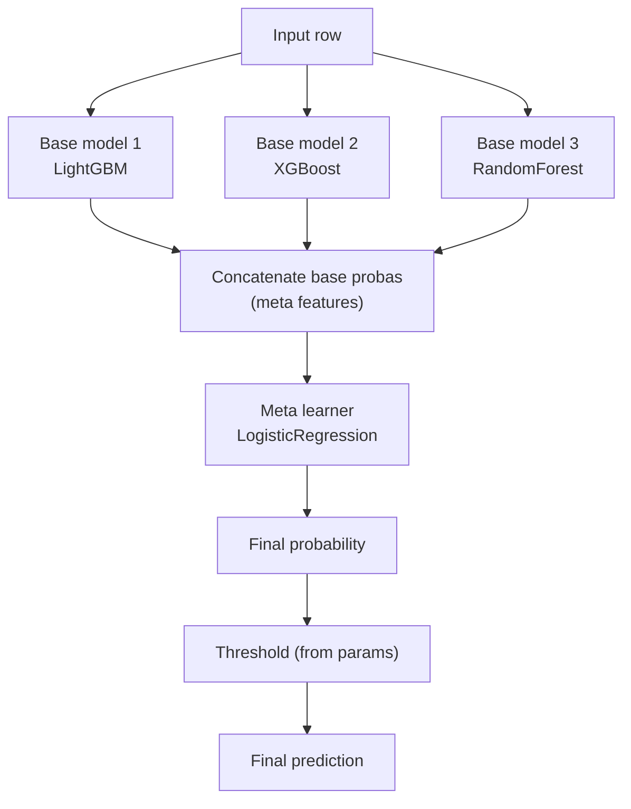

# Module 06 — Ensembles & Stacking via PyFunc

> **Goal of this module:** how to ship ensembles and stacking models on Databricks — voting, stacking, model-routing, champion-with-fallback — all as **custom PyFunc** artifacts that look like a single model to UC and Mosaic AI Model Serving.
>
> **Assumes:** Module 02 (PyFunc), Module 04 (FE-in-UC), Module 05 (Spark ML).
>
> **Exam weight:** smaller than 01–04 but the pattern is tested as a Section 1 Advanced MLflow objective ("Create custom model objects") and as a Section 3 deployment scenario ("how do we ship a 2-model ensemble?").

---

## Coverage map (verbatim Sept 30 2025 exam objectives → where taught)

| Verbatim objective | Section anchor |
|---|---|
| Create custom model objects using real-time feature engineering (Section 1) | All 5 patterns; especially Pattern 1 (Voting) and Pattern 3 (Champion+fallback) |
| Register a custom PyFunc model and log custom artifacts in UC (Section 3) | Each pattern's `mlflow.pyfunc.log_model(...)` call |
| Compare deployment strategies (e.g., blue-green and canary) — high-traffic suitability (Section 3) | "Sizing implications for serving" + cross-link Module 14 |

> Cross-references: Module 02 (PyFunc basics — class contract and `load_context`); Module 14 (deployment trade-offs for ensembles); Module 16 (latency observability — how p50/p99 reveals which pattern is active).

> 🎯 **Decision rules:**
> - **Multi-model "all opinions matter equally" → voting ensemble (Pattern 1).**
> - **Multi-model with learned combination → stacking (Pattern 2). Use OOF predictions for the meta-learner.**
> - **Fast-common-path / slow-rare-path → champion + fallback (Pattern 3).**
> - **Multi-tenant with shared infra → per-tenant router (Pattern 4).**
> - **Learned model + hard regulatory rule → guardrails (Pattern 5).**
> - **All five patterns ship as one UC artifact via custom PyFunc.** Don't fragment into N endpoints unless tenants require hard isolation.

---

## Why ensembles need custom PyFunc

You have two models — a fast `LightGBM` and a slow `XGBoost` calibrated for borderline cases. In native flavors, each gets its own UC model entry. Two artifacts means two endpoints means two latencies stacked client-side means caller logic duplicated everywhere. Not viable.

**The PyFunc wrapper pattern:** one UC artifact, two underlying models, the routing/voting logic lives in `predict`. Callers see one endpoint.

This is the Section 1 objective *"Create custom model objects using real-time feature engineering"* applied to a multi-model pattern.

---

## Pattern 1 — Voting ensemble

Simplest ensemble: N models, each predicts, the wrapper averages probabilities (or majority-votes for classification).

```python
import mlflow.pyfunc
import joblib
import numpy as np

class VotingEnsemble(mlflow.pyfunc.PythonModel):

    def load_context(self, context):
        self.models = []
        for name in ["lgb", "xgb", "rf"]:
            self.models.append(joblib.load(context.artifacts[name]))

    def predict(self, context, model_input, params=None):
        probas = np.stack([m.predict_proba(model_input)[:, 1] for m in self.models])
        avg_proba = probas.mean(axis=0)
        threshold = (params or {}).get("threshold", 0.5)
        return (avg_proba >= threshold).astype(int)

mlflow.pyfunc.log_model(
    artifact_path="voting_ensemble",
    python_model=VotingEnsemble(),
    artifacts={
        "lgb": "/tmp/lgb.pkl",
        "xgb": "/tmp/xgb.pkl",
        "rf":  "/tmp/rf.pkl",
    },
    signature=signature,
    input_example=X_val.iloc[:5],
    pip_requirements=[
        "scikit-learn==1.4.2",
        "lightgbm==4.3.0",
        "xgboost==2.0.3",
        "pandas==2.2.1",
        "numpy>=1.26,<2.0",
        "joblib==1.3.2",
    ],
    registered_model_name="prod.ml.fraud_voting",
)
```

⚠️ **Exam trap:** packaging the three models as three separate UC entries and "averaging client-side." The exam expects a single artifact with the ensemble logic baked in (lineage, audit, single endpoint). Voting client-side fragments observability and ACLs.

---

## Pattern 2 — Stacking with a meta-learner

A stacking ensemble has two layers: base models produce predictions, a meta-learner combines them.

```python
class StackingEnsemble(mlflow.pyfunc.PythonModel):

    def load_context(self, context):
        self.base_models = [joblib.load(context.artifacts[k]) for k in ["lgb", "xgb", "rf"]]
        self.meta = joblib.load(context.artifacts["meta"])

    def predict(self, context, model_input, params=None):
        # Layer 1: base model predictions become meta features
        base_probas = np.stack(
            [m.predict_proba(model_input)[:, 1] for m in self.base_models],
            axis=1,
        )  # shape: (n_rows, n_base_models)
        # Layer 2: meta learner uses base_probas as input
        meta_proba = self.meta.predict_proba(base_probas)[:, 1]
        threshold = (params or {}).get("threshold", 0.5)
        return (meta_proba >= threshold).astype(int)
```

**Training the meta-learner correctly:** use **out-of-fold (OOF) predictions** for the base models. If you train base models on the full training set and then train the meta on their training-set predictions, the meta-learner overfits to the base models' memorization. Use K-fold CV to produce OOF predictions for the meta's training data.

```python
from sklearn.model_selection import KFold

def make_oof_predictions(model_cls, params, X, y, n_splits=5):
    """Return shape (n_rows,) of OOF predictions."""
    oof = np.zeros(len(X))
    kf = KFold(n_splits=n_splits, shuffle=True, random_state=42)
    for tr, va in kf.split(X):
        m = model_cls(**params).fit(X[tr], y[tr])
        oof[va] = m.predict_proba(X[va])[:, 1]
    return oof
```

⚠️ **Exam trap:** training the meta-learner on the base models' training-set predictions (not OOF). The exam can ask "what's wrong with this stacking pipeline?" — answer: data leakage from in-sample base predictions.

---

## Pattern 3 — Champion + fallback (routing)

A common production pattern: a fast cheap model for the common case, an expensive slow model for hard cases. The PyFunc routes based on the fast model's confidence.

```python
class ChampionWithFallback(mlflow.pyfunc.PythonModel):

    def load_context(self, context):
        self.fast = joblib.load(context.artifacts["fast"])
        self.expensive = joblib.load(context.artifacts["expensive"])

    def predict(self, context, model_input, params=None):
        params = params or {}
        margin_low = params.get("margin_low", 0.3)
        margin_high = params.get("margin_high", 0.7)

        fast_proba = self.fast.predict_proba(model_input)[:, 1]
        result = fast_proba.copy()

        # Borderline rows go to the expensive model
        mask = (fast_proba >= margin_low) & (fast_proba <= margin_high)
        if mask.any():
            expensive_proba = self.expensive.predict_proba(model_input[mask])[:, 1]
            result[mask] = expensive_proba

        threshold = params.get("threshold", 0.5)
        return (result >= threshold).astype(int)
```

**Why this matters:** the SLA on the endpoint is set by the *worst-case* latency. If only 5% of traffic hits the expensive model, p95 is mostly fast-model latency, p99 reflects the slow path. Mosaic AI Model Serving observability (Module 16) captures this directly.

---

## Pattern 4 — Per-tenant routing

Multi-tenant scenario: different customer segments use different specialized models. The PyFunc routes by a categorical column.

```python
class PerTenantRouter(mlflow.pyfunc.PythonModel):

    def load_context(self, context):
        import json
        with open(context.artifacts["routing"]) as f:
            self.routing = json.load(f)  # {"enterprise": "ent.pkl", "smb": "smb.pkl", ...}
        self.models = {
            segment: joblib.load(context.artifacts[file_key])
            for segment, file_key in self.routing.items()
        }

    def predict(self, context, model_input, params=None):
        import pandas as pd
        # model_input has a 'segment' column
        results = np.zeros(len(model_input))
        for segment, m in self.models.items():
            mask = (model_input["segment"] == segment).values
            if mask.any():
                X = model_input[mask].drop(columns=["segment"])
                results[mask] = m.predict_proba(X)[:, 1]
        return results
```

This pattern collapses N endpoints into 1. **Saves cost** (one set of replicas instead of N) and **simplifies ops** (one UC entry, one observability surface).

⚠️ **Exam trap:** "Deploy N separate endpoints for N segments." Wrong when the segments share infrastructure cost-benefit. The PyFunc router is the canonical answer.

---

## Pattern 5 — Ensemble of an MLflow-registered model + a heuristic

Sometimes a small rule-based check augments a model — e.g., "always flag transactions over $10K regardless of the model's prediction." Ship the rule alongside the model in the PyFunc.

```python
class FraudWithGuardrails(mlflow.pyfunc.PythonModel):

    def load_context(self, context):
        self.model = joblib.load(context.artifacts["model"])
        self.HARD_AMOUNT_THRESHOLD = 10000.0

    def predict(self, context, model_input, params=None):
        proba = self.model.predict_proba(model_input)[:, 1]
        # Hard guardrail: large amounts always flag
        hard_flag = (model_input["amount"] >= self.HARD_AMOUNT_THRESHOLD).values
        threshold = (params or {}).get("threshold", 0.5)
        model_flag = (proba >= threshold)
        return (hard_flag | model_flag).astype(int)
```

The exam's framing is usually: *"You need to combine a learned model with a regulatory threshold. How do you ship this?"* — answer: custom PyFunc wraps both.

---

## Signature for ensembles

The signature should reflect the **input** the wrapper accepts (typically the union of features needed by all underlying models, or the lookup key if FE-in-UC handles features).

```python
from mlflow.types.schema import Schema, ColSpec, ParamSchema, ParamSpec
from mlflow.models.signature import ModelSignature

input_schema = Schema([
    ColSpec("double", "amount"),
    ColSpec("string", "merchant_category"),
    ColSpec("integer", "txn_count_30d"),
])
output_schema = Schema([ColSpec("integer")])
param_schema = ParamSchema([
    ParamSpec("threshold", "float", 0.5),
    ParamSpec("margin_low", "float", 0.3),
    ParamSpec("margin_high", "float", 0.7),
])
signature = ModelSignature(
    inputs=input_schema,
    outputs=output_schema,
    params=param_schema,
)
```

Per-request params let you tune thresholds at inference time without re-deploying — useful for A/B tests on the threshold.

---

## Sizing implications for serving

Voting / stacking → endpoint must hold **all** base models in memory. Plan for this:

| Pattern | Memory | Latency |
|---|---|---|
| Voting (N models) | Sum of all model memories | Sum of all model latencies (sequential) or max (parallel-in-predict) |
| Stacking | Sum of base + meta | Same as voting + meta forward pass |
| Routing | Sum of all routable models | One model latency |
| Champion + fallback | Sum of both | Fast-model latency on common path; expensive on rare path |

For Mosaic AI Model Serving:

- `workload_size="medium"` (8 GB RAM) handles a 3-model voting ensemble of typical tabular models (~500 MB each + overhead).
- Larger ensembles → `workload_size="large"` (16 GB).
- Plan replica memory for the **peak** sum, not the average.

⚠️ **Exam trap:** "Use `workload_size='small'` for cost savings on a 5-model ensemble." May OOM at load.

---

## Mermaid: stacking flow



---

## Mini quiz

1. Why ship a voting ensemble as a single PyFunc artifact instead of three UC models?
2. You train base models on the full training set, then train the meta on their training-set predictions. What's wrong?
3. In the champion+fallback pattern, which model dominates p50 latency? Which dominates p99?
4. What's the canonical answer to "deploy N models for N tenants" — N endpoints or 1 PyFunc router? Why?
5. You add a hard-coded "amount > $10K flags" rule. Where does it live?
6. The endpoint OOMs on a 5-model voting ensemble. What's the fix?

**Answers:**

1. One artifact, one UC entry, one endpoint, one ACL surface, one observability dashboard, one set of replicas. Three separate models means clients average client-side — fragmented observability and duplicated logic.
2. Data leakage. The meta-learner is fit to base-model predictions that were made on the same data the base models trained on; base models memorize, meta learns the memorization. Use **out-of-fold predictions** (K-fold CV) for the meta's training data.
3. Fast model dominates p50 (common path); expensive model dominates p99 (rare borderline path). Mosaic AI's p50/p95/p99 latency metrics surface this.
4. **1 PyFunc router** when segments share infrastructure cost-benefit. Collapses N endpoints into one — saves cost, simplifies ops, single UC entry. Exception: tenants with hard isolation requirements (HIPAA segregation between customer A and customer B).
5. In the PyFunc's `predict` method, applied after (or in parallel with) the model's predict. Logged as a regulatory artifact alongside the model.
6. `workload_size="large"` (16 GB) or larger; verify total model memory + overhead fits. Don't try to reduce model count without first re-validating the ensemble's metrics.

---

## Sanity check

- Could you write a 3-model voting PyFunc from memory?
- Do you know why stacking needs OOF predictions for the meta?
- Can you decide PyFunc-router vs N-endpoints for a multi-tenant scenario?
- Do you remember `workload_size` sizing for ensembles?

That closes Section 1. Move on to **Section 2 — MLOps** starting with [Module 07 — UC Model Registry Lifecycle](07_uc_model_registry_lifecycle.md).
