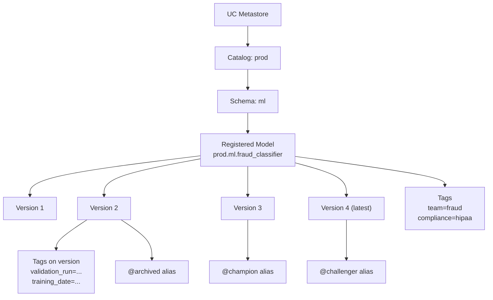

# Module 07 — Unity Catalog Model Registry Lifecycle

> **Goal of this module:** UC-native model lifecycle management — registered models, model versions, **aliases (`@champion`, `@challenger`, `@archived`)**, tags, transitions, webhooks. This module + Module 08 (DABs) is **where most Section 2 points live**.
>
> ⚠️ **The biggest single API change in the 2025 refresh:** **stage transitions are LEGACY.** `transition_model_version_stage(...)` is the wrong answer for any UC question. **Aliases** are the canonical promotion mechanism. Re-read that sentence.

---

## Coverage map (verbatim Sept 30 2025 exam objectives → where taught)

| Verbatim objective | Section anchor |
|---|---|
| Describe and implement architecture components of model lifecycle pipelines used to manage environment transitions in the **deploy-code strategy** | "The deploy-code strategy" + cross-link Module 09 |
| Map Databricks features to activities of the model lifecycle management process | "Object model" + "Aliases — the new promotion API" |
| Develop a strategy for selecting top-performing models during automated retraining (cross-listed under MLOps) | "Champion/challenger promotion patterns" |

> Cross-references: Module 08 (DABs encode registered models as resources); Module 09 (CI/CD promotion gates); Module 10 (drift alerts trigger registration of new challengers); Topic 09 → [Module 05 (registry basics, workspace stages)](../09_databricks_ml_associate/05_mlflow_registry.md) for the legacy distractor pattern.

---

## The UC model registry object model



Three identifiers you must keep straight:

| Concept | Example | Mutability |
|---|---|---|
| **Registered model name** | `prod.ml.fraud_classifier` (3-level) | Effectively immutable (rename = new registration) |
| **Version** | `4` (integer, auto-incremented per registration) | Immutable |
| **Alias** | `@champion` | Mutable; reassignable across versions |
| **Tag (on model)** | `team=fraud` | Mutable |
| **Tag (on version)** | `validation_run_id=abc123` | Mutable |

The **alias is the only mutable pointer to a version** that production endpoints follow. Endpoints load `models:/prod.ml.fraud_classifier@champion`; reassigning `@champion` to a new version reroutes inference traffic at endpoint reload time.

---

## Setting up UC as the registry target

```python
import mlflow
mlflow.set_registry_uri("databricks-uc")
```

This one line in MLflow 3 redirects all registry operations to UC. Without it, you might be writing to the legacy workspace registry by accident.

⚠️ **Exam trap:** answer choices that include `mlflow.set_tracking_uri("databricks")` but **not** `set_registry_uri("databricks-uc")`. The tracking URI controls where runs go; the registry URI controls where registered models go. For UC, both must be set.

---

## Registering a model

Two paths.

### Path A — register on log (recommended)

```python
with mlflow.start_run():
    mlflow.sklearn.log_model(
        sk_model=model,
        artifact_path="model",
        signature=signature,
        registered_model_name="prod.ml.fraud_classifier",  # ← three-level
    )
```

If the registered model doesn't exist, it's created. A new version is added.

### Path B — register after log

```python
with mlflow.start_run() as run:
    mlflow.sklearn.log_model(
        sk_model=model,
        artifact_path="model",
        signature=signature,
        # no registered_model_name
    )
    run_id = run.info.run_id

# Later, register
model_version = mlflow.register_model(
    model_uri=f"runs:/{run_id}/model",
    name="prod.ml.fraud_classifier",
)
```

When to use Path B: when registration is gated by a downstream test step or a different team.

⚠️ **Exam trap:** registering with a two-level name like `ml.fraud_classifier`. That targets the legacy workspace registry. **UC mandates three-level: `catalog.schema.name`.** Always.

⚠️ **Exam trap 2:** trying to register without a signature. UC rejects. Add `signature=` (or rely on autolog's inferred signature) before registration.

---

## Aliases — the new promotion API

```python
from mlflow import MlflowClient

client = MlflowClient()
NAME = "prod.ml.fraud_classifier"

# Set @challenger on version 4
client.set_registered_model_alias(NAME, alias="challenger", version=4)

# Promote: move @champion from 3 to 4 (which previously was @challenger)
client.set_registered_model_alias(NAME, alias="champion", version=4)

# Demote the old champion to archived
client.set_registered_model_alias(NAME, alias="archived", version=3)

# Delete an alias (rare — usually you reassign rather than delete)
client.delete_registered_model_alias(NAME, alias="challenger")

# Read
mv = client.get_model_version_by_alias(NAME, alias="champion")
print(mv.version, mv.tags, mv.run_id)
```

**The alias name has no inherent meaning to MLflow.** `@champion`, `@challenger`, `@archived`, `@canary`, `@hotfix` — they're all valid string keys. By **convention**:

- `@champion` — currently in production, receives 100% of standard traffic.
- `@challenger` — candidate undergoing evaluation, may receive canary traffic.
- `@archived` — superseded; kept for audit.

The exam uses these three terms canonically. Answers that name them differently (`@staging`, `@production`) are wrong-by-convention.

```python
# Loading by alias
model = mlflow.pyfunc.load_model("models:/prod.ml.fraud_classifier@champion")
```

The URI scheme `models:/<full-name>@<alias>` always resolves to the version currently aliased.

⚠️ **Exam trap:** loading via `models:/<name>/Production` — that's the legacy stage syntax. Wrong for UC.

---

## Tags — governance metadata

```python
# Tag on the registered model (applies to all versions)
client.set_registered_model_tag(NAME, key="team", value="fraud_ml")
client.set_registered_model_tag(NAME, key="compliance_scope", value="hipaa")

# Tag on a specific version
client.set_model_version_tag(NAME, version=4, key="validation_run_id", value="abc123")
client.set_model_version_tag(NAME, version=4, key="training_dataset", value="delta@v42")
client.set_model_version_tag(NAME, version=4, key="approved_by", value="ml-platform-team")
```

**Why tags matter:**

- **Searchability** — `client.search_model_versions(filter_string="tags.approved_by = 'ml-platform-team'")`.
- **Audit** — every approval action leaves a tag breadcrumb.
- **Automation** — CI jobs check for `tags.validation_status = 'passed'` before promoting.

Tags on models vs versions:

- **Model-level tags** describe the *artifact family* — team, compliance scope, business unit.
- **Version-level tags** describe *that specific build* — training data version, validation run id, approver, training date.

⚠️ **Exam trap:** putting validation-run-id as a model-level tag. It changes with each version; it belongs on the version.

---

## The legacy stages API (so you can identify it as wrong)

The pre-2025 workspace registry used stages:

```python
# DO NOT USE for UC questions on the exam
client.transition_model_version_stage(
    name="ml.fraud_classifier",     # 2-level (legacy)
    version=4,
    stage="Production",
    archive_existing_versions=True,
)
```

Stages: `None`, `Staging`, `Production`, `Archived`. The model URI was `models:/ml.fraud_classifier/Production`.

**Why it was replaced:**

- Only one version per stage at a time — no canary / blue-green semantics.
- No version-level granularity — `Production` is mutable but coarse.
- No alias names beyond the 4 fixed strings.
- No UC-level ACL integration.

On the exam, if you see `transition_model_version_stage`, `archive_existing_versions=True`, `models:/<name>/Production` — it's the legacy answer. Pick the alias-based one.

---

## Webhooks — the automation primitive (still tested)

Webhooks fire on registry events and call either a Databricks Job or an arbitrary HTTP endpoint. They predate UC; **they still work on UC** but the canonical UC pattern uses **DABs + Jobs as gates** rather than webhooks.

The exam still tests webhooks as a concept because they're the legacy automation lever and you need to recognize the pattern.

```python
import requests
import os

token = os.environ["DATABRICKS_TOKEN"]
host = os.environ["DATABRICKS_HOST"]

# Create a webhook that fires on MODEL_VERSION_CREATED and triggers a Job
requests.post(
    f"{host}/api/2.0/mlflow/registry-webhooks/create",
    headers={"Authorization": f"Bearer {token}"},
    json={
        "model_name": "prod.ml.fraud_classifier",
        "events": ["MODEL_VERSION_CREATED"],
        "description": "Run validation tests on new versions",
        "status": "ACTIVE",
        "job_spec": {
            "job_id": 12345,
            "workspace_url": host,
            "access_token": token,
        },
    },
)
```

Events you should recognize:

- `MODEL_VERSION_CREATED` — new version registered.
- `MODEL_VERSION_TRANSITIONED_STAGE` — legacy; fires on stage transition.
- `MODEL_VERSION_TRANSITIONED_TO_STAGING` / `MODEL_VERSION_TRANSITIONED_TO_PRODUCTION` — legacy variants.
- `REGISTERED_MODEL_CREATED` — new model registered (the first version).
- `COMMENT_CREATED` — a comment was added to a model version.

Alternative target: HTTP endpoint (Slack, PagerDuty).

```json
{
  "events": ["MODEL_VERSION_CREATED"],
  "http_url_spec": {
    "url": "https://hooks.slack.com/services/T00/B00/abc",
    "authorization": "Bearer ...",
    "enable_ssl_verification": true
  }
}
```

⚠️ **Exam trap:** "Webhooks are the only way to automate promotion in UC." Wrong — DABs + Jobs are the canonical UC pattern. Webhooks are *a* mechanism; the exam-correct architecture uses alias-based promotion in a CI/CD pipeline.

---

## The deploy-code strategy

Section 2 objective: *"Describe and implement architecture components of model lifecycle pipelines used to manage environment transitions in the deploy-code strategy."*

Two competing strategies; the exam tests that you know the right one.

| Strategy | What gets promoted | Pros | Cons |
|---|---|---|---|
| **Deploy-code** | Source code that produces the model | Each env retrains from controlled code; full reproducibility; the env can have different secrets/configs | Slow promotions (must train in each env); training cost in each env |
| **Deploy-model** | The model artifact itself | Fast promotion; only one training run | Harder to audit; artifact's training run lived in dev — staging/prod can't fully reproduce |

**Deploy-code is the exam-correct strategy** for regulated industries. Each environment (dev, staging, prod) has its own DAB target. Code is promoted via PR + merge. Each env trains its own model with env-appropriate data and registers it to that env's UC catalog.

```mermaid
graph LR
    A[Developer] -->|PR| B[main branch]
    B -->|GitHub Actions| C[bundle deploy -t staging]
    C --> D[Staging workspace]
    D --> E[Training job runs<br/>registers to staging UC]
    E --> F[Validation tests]
    F -->|pass| G[Manual gate]
    G -->|approved| H[bundle deploy -t prod]
    H --> I[Prod workspace]
    I --> J[Training job runs<br/>registers to prod UC]
    J --> K[Set @champion alias]
    K --> L[Endpoint reloads]
```



⚠️ **Exam trap:** the "deploy-model" answer described in regulated contexts. In regulated finance / healthcare, deploy-code is the audit-defensible choice. If the question mentions HIPAA / SOX / regulated, deploy-code.

---

## Permissions on registered models

UC permissions on registered models (separately from data permissions):

| Privilege | What it allows |
|---|---|
| `USE CATALOG` + `USE SCHEMA` | Prerequisite — see the namespace |
| `EXECUTE` (on registered model) | Load and use the model for inference |
| `APPLY TAG` | Set tags on the model or its versions |
| `MANAGE` | Full control including delete, alias changes, version ops |
| `ALL PRIVILEGES` | Sum of the above |

```sql
GRANT EXECUTE ON MODEL prod.ml.fraud_classifier TO `ml_inference_app`;
GRANT MANAGE  ON MODEL prod.ml.fraud_classifier TO `ml_platform_team`;
```

⚠️ **Exam trap:** "The model serving endpoint's service principal needs `MODIFY` on the model." There is no `MODIFY` privilege on UC models — it's `EXECUTE` (for inference) or `MANAGE` (for alias changes). The endpoint only needs `EXECUTE`.

---

## Lineage — UC tracks model → table

UC automatically captures lineage between models and the tables they read at training time (when training uses UC data sources). View in the UC UI under the Lineage tab, or query the system tables:

```sql
SELECT *
FROM system.access.table_lineage
WHERE target_type = 'MODEL_VERSION'
  AND target_table_full_name = 'prod.ml.fraud_classifier'
  AND event_time > current_date() - interval 30 days;
```

This is gold for audit — "what data did version 7 of the fraud classifier train on?" — one query.

⚠️ **Exam trap:** assuming lineage covers feature lookups. Native model→table lineage tracks tables *directly read by the training run*. For feature lookups via `FeatureEngineeringClient`, lineage is recorded **through** the feature table — the feature table's lineage shows its sources, but the model→table edge may be the feature table itself, not the underlying raw tables. Multi-hop lineage requires the UC lineage graph.

---

## Audit and history

```python
# All versions of a model
for mv in client.search_model_versions(filter_string="name = 'prod.ml.fraud_classifier'"):
    print(mv.version, mv.creation_timestamp, mv.aliases, mv.tags)

# Comments and update history (UC UI exposes this; API surface is evolving)
client.get_registered_model("prod.ml.fraud_classifier")
```

For change-history on aliases — who reassigned `@champion` and when — query the **audit log** (system.access.audit) for events with `action_name = 'setRegisteredModelAlias'`.

```sql
SELECT event_time, user_identity.email, action_name, request_params
FROM system.access.audit
WHERE service_name = 'unityCatalog'
  AND action_name IN (
    'setRegisteredModelAlias',
    'deleteRegisteredModelAlias',
    'setModelVersionTag'
  )
  AND request_params:full_name_arg = 'prod.ml.fraud_classifier'
ORDER BY event_time DESC;
```

⚠️ **Exam trap:** "Aliases are versioned and historical changes are queryable from `client.search_*` APIs." Not directly — alias change history is in the audit log, not the registry API.

---

## End-to-end exam scenario

> "A data scientist registers a new model version. CI tests should run automatically. If they pass, the version becomes `@challenger`. After a manual review, it should be promoted to `@champion` and the previous champion archived. The serving endpoint should pick up the new champion within minutes. Outline the architecture."

Exam-correct architecture:

1. **Registration event** — DS calls `mlflow.<flavor>.log_model(..., registered_model_name="prod.ml.fraud_classifier")` from a Databricks notebook or a CI training job.
2. **Trigger CI tests** — two options:
   - **Webhook on `MODEL_VERSION_CREATED`** triggering a Databricks Job (legacy-style but still valid).
   - **DABs + GitHub Actions** — training job on merge to main runs tests as a downstream task in the same Lakeflow Job (canonical 2025 answer).
3. **CI Job** runs unit + integration tests (Module 09), and on success sets `@challenger` via `client.set_registered_model_alias(NAME, "challenger", new_version)`.
4. **Manual review** — reviewer inspects metrics in MLflow, signs off in a PR / approval workflow.
5. **Promotion** — approver (or automation following a manual approval) calls:
   ```python
   client.set_registered_model_alias(NAME, "champion", new_version)
   client.set_registered_model_alias(NAME, "archived", old_champion_version)
   ```
6. **Endpoint reload** — Mosaic AI Model Serving endpoints configured with `models:/prod.ml.fraud_classifier@champion` reload the new version on the next refresh cycle (or on explicit `update_endpoint`).

---

## Look-alike API comparison — UC registry surface

| Pair | Difference | Exam tell |
|---|---|---|
| `client.set_registered_model_alias(name, alias, version)` vs `client.transition_model_version_stage(name, version, stage)` | UC alias (current) vs Workspace stage transition (legacy) | UC = alias. Stage transition is the wrong-answer trap on every UC question |
| `client.set_registered_model_alias` vs `client.set_model_version_tag` vs `client.set_registered_model_tag` | Mutable named pointer to one version / mutable tag on one version / mutable tag on the model itself | Promotion → alias. Per-build metadata → version tag. Family-level metadata (team, compliance) → model tag |
| `mlflow.register_model(model_uri, name)` vs `MlflowClient.create_model_version(name, source, run_id)` | High-level helper (creates registered model if absent, adds version) vs explicit version creation | Both work; helper is more common in exam scenarios |
| `mlflow.<flavor>.log_model(..., registered_model_name=)` vs two-step `log_model` + `register_model` | One-shot vs gated by a downstream check | One-shot for typical pipelines; two-step when CI runs validation between log and register |
| `models:/cat.sch.name@champion` vs `models:/cat.sch.name/4` vs `runs:/<run_id>/model` | Alias (mutable) vs version (immutable) vs run artifact (no registry) | Endpoint that auto-pulls latest prod → `@champion`. Pinned audit replay → `/4`. Pre-registration testing → `runs:/.../model` |
| 3-level UC name `prod.ml.fraud_classifier` vs 2-level legacy name `ml.fraud_classifier` | UC three-level requires catalog.schema.name | 2-level = legacy workspace registry → wrong on UC questions |
| `mlflow.set_registry_uri("databricks-uc")` vs `mlflow.set_tracking_uri("databricks")` | Where registered models live vs where runs live | Both must be set for full UC; only the tracking URI doesn't reroute the registry |
| `client.get_model_version_by_alias(name, "champion")` vs `client.get_latest_versions(name)` (legacy) | UC alias lookup vs Workspace stage-filtered lookup | UC → `get_model_version_by_alias`; `get_latest_versions(stages=...)` is legacy |
| `client.delete_registered_model_alias(name, alias)` vs `client.delete_model_version(name, version)` | Remove pointer (version remains) vs delete the version itself | Mostly: reassign rather than delete the alias. Delete the version only for true cleanup |

### `set_registered_model_alias` signature

```python
client.set_registered_model_alias(
    name: str,           # 3-level UC name: "catalog.schema.model"
    alias: str,          # alias name, e.g. "champion", "challenger", "archived"
    version: str | int,  # version to point at; later reassignment moves the pointer
)
```

> 🎯 **How to recognize on the exam:** any answer choice using `stage="Production"`, `stage="Staging"`, `stage="Archived"`, or `transition_model_version_stage` is the **legacy** distractor. UC = alias every time.

---

## Output-prediction drills

**Drill 1 — alias reassignment:**
Versions 1, 2, 3 exist; v2 has `@champion`. You run:
```python
client.set_registered_model_alias(NAME, "champion", 3)
```
Q: What is `@champion` pointing at now? Where is v2?
A: `@champion` → v3. v2 has no alias anymore (the alias is **moved**, not duplicated). v2 itself still exists; only the pointer changed.

**Drill 2 — wrong namespace:**
```python
mlflow.sklearn.log_model(model, "model", registered_model_name="fraud_classifier")  # one-level
```
With `mlflow.set_registry_uri("databricks-uc")`, what happens?
A: **Registration fails.** UC requires `catalog.schema.model_name`. A bare name targets the legacy workspace registry — which fails when the registry URI is UC.

**Drill 3 — endpoint follows alias:**
Endpoint config: `models:/prod.ml.fraud@champion`. You reassign `@champion` from v3 to v4.
Q: What does the endpoint do?
A: On its next reload (driven by `update_endpoint` or the endpoint's refresh cycle), it loads v4. The current in-flight v3 requests complete on v3 and new requests hit v4. **No restart of caller required.**

**Drill 4 — pinned version:**
Endpoint config: `models:/prod.ml.fraud/3`. You reassign `@champion` to v4.
Q: Does the endpoint reload?
A: **No.** The endpoint is pinned to v3. Aliases don't affect explicit version refs. Useful for incident pinning ("revert to v3 immediately").

**Drill 5 — privilege missing:**
Service principal has `USAGE` on the schema but not `EXECUTE` on the registered model.
Q: Endpoint behavior?
A: Endpoint fails to load the model: `permission denied: EXECUTE on registered model prod.ml.fraud`. Grant: `GRANT EXECUTE ON MODEL prod.ml.fraud TO <service-principal>`.

---

## Decision rules

> 🎯 **"Promote to production" in UC → `set_registered_model_alias(name, "champion", version)`.** Never `transition_model_version_stage`.

> 🎯 **"Endpoint auto-picks-up the new prod model" → alias-based URI (`@champion`).** Pinned `/N` won't change.

> 🎯 **"Tag that describes the model family (team, compliance scope)" → registered-model tag.** "Tag that describes a specific build (training run id, approver)" → version tag.

> 🎯 **"Deploy-code in regulated context" → bundle the code; each environment re-trains from its own controlled data and registers its own model versions.** Don't copy a prod model artifact from dev (deploy-model).

> 🎯 **"Audit who reassigned `@champion`" → system.access.audit, `action_name='setRegisteredModelAlias'`.** Not in MLflow APIs.

---

## Mini quiz

1. What is the new canonical mechanism for "promote to production" in UC?
2. You see `client.transition_model_version_stage(name="prod.ml.fraud", version=4, stage="Production")`. What's wrong on a UC exam question?
3. `models:/prod.ml.fraud@champion` vs `models:/prod.ml.fraud/4` — when do you use each?
4. Where do tags `team` and `compliance_scope` go — on the registered model or on the version? Why?
5. The deploy-code vs deploy-model debate — which is exam-correct for regulated industries?
6. The endpoint runs as a service principal. What UC privilege does it need on the model?
7. Where would you look for the history of who reassigned `@champion`?

**Answers:**

1. **Setting an alias** via `client.set_registered_model_alias(name, alias, version)`. Aliases are mutable pointers; reassigning `@champion` reroutes endpoints.
2. `transition_model_version_stage` is the **legacy workspace registry API**. UC uses aliases. Also, stages (`Production` etc.) don't exist in UC.
3. `@champion` (mutable alias) — for endpoints that should auto-pick-up the current production version. `/4` (immutable version) — for audit-replay, integration tests against a specific version, or pinning during incident investigation.
4. Both on the **registered model** because they describe the artifact family, not a specific build. Version-level tags are things that change per build: training data version, validation run id, approver.
5. **Deploy-code.** Each env retrains from controlled code with env-appropriate data. Audit-defensible.
6. `EXECUTE` on the model. (`USE CATALOG` and `USE SCHEMA` on the parent namespace are also required.) The endpoint doesn't need `MANAGE`.
7. The **audit log** — `system.access.audit` with `action_name = 'setRegisteredModelAlias'`. Alias change history is not in the MLflow registry API.

---

## Sanity check

- Could you write the alias-promotion sequence from memory?
- Do you know why stages are wrong for UC?
- Can you explain deploy-code vs deploy-model and pick the right one for regulated contexts?
- Do you know which UC privilege the serving endpoint needs?
- Could you query the audit log for alias-change history?

Move on to [Module 08 — Databricks Asset Bundles for ML](08_dabs_for_ml.md) — the largest new objective set.
