# Module 08 — Databricks Asset Bundles (DABs) for ML

> **Goal of this module:** Databricks Asset Bundles — infrastructure-as-code for Databricks. **Brand new exam content in the Sept 2025 refresh; heavily tested.** Most candidates have not written `databricks.yml` resources for ML assets (experiments, registered models, serving endpoints). This module fixes that.
>
> **Why it matters:** Section 2's "Environment Architectures" objective is explicit: *"Define and configure Databricks ML assets using DABs: model serving endpoints, MLflow experiments, ML registered models."* You will not pass without DABs fluency.

---

## Coverage map (verbatim Sept 30 2025 exam objectives → where taught)

| Verbatim objective | Section anchor |
|---|---|
| Design and implement scalable Databricks environments for ML projects | "Minimal `databricks.yml`" + "Variable substitution and built-ins" |
| Define and configure Databricks ML assets using **DABs**: model serving endpoints, MLflow experiments, ML registered models | "Resources — what you can declare" + per-resource YAML sections |
| Describe and implement architecture components of model lifecycle pipelines used to manage environment transitions in the **deploy-code strategy** | "Mermaid: the bundle lifecycle" + cross-link Module 09 |

> Cross-references: Module 09 (CI/CD with GitHub Actions); Module 07 (UC registered model resources); Module 10 (`quality_monitors` resource type); Module 14 (`model_serving_endpoints` resource).

---

## What DABs are (and aren't)

A **bundle** is a directory containing a `databricks.yml` file plus supporting code (notebooks, .py files, configs). The bundle describes Databricks resources — jobs, pipelines, experiments, registered models, serving endpoints, schemas — as YAML. The Databricks CLI deploys those resources to one or more workspaces.

**DABs sit alongside Terraform, not in opposition.** Terraform manages account-level resources (workspaces, metastores, networks); DABs manage **workspace-level resources** (jobs, models, endpoints) closer to ML code.

| | DABs | Terraform |
|---|---|---|
| Scope | Workspace-level Databricks resources | Cross-cloud + Databricks |
| Lives with | Application code (next to notebooks) | Platform/infra repo |
| State backend | Databricks-managed | Customer-managed (S3 + DynamoDB / Azure Storage) |
| Targets ML resources | ✓ Native (experiments, models, endpoints) | ✓ Via provider, but more verbose |
| Promotion model | `targets:` block — dev/staging/prod from one bundle | Workspaces × envs |

For ML on Databricks, **DABs is the right answer** to "how do I version-control my ML infrastructure?"

---

## The bundle directory layout

```
fraud-ml-bundle/
├── databricks.yml             # top-level bundle config
├── resources/                 # one yaml per resource type (optional split)
│   ├── jobs.yml
│   ├── models.yml
│   ├── endpoints.yml
│   └── experiments.yml
├── src/                       # python and notebooks
│   ├── train.py
│   ├── evaluate.py
│   └── deploy.py
├── tests/
│   ├── unit/
│   └── integration/
└── requirements.txt
```

You can put everything in one `databricks.yml` or split resources into `resources/*.yml` and `include:` them. The split scales better.

---

## Minimal `databricks.yml`

```yaml
bundle:
  name: fraud-ml

include:
  - resources/*.yml

variables:
  catalog:
    description: "UC catalog for ML artifacts"
    default: "dev_ml"
  notification_email:
    description: "Where alerts go"
    default: "ml-team@example.com"

targets:
  dev:
    mode: development
    default: true
    workspace:
      host: https://adb-dev.azuredatabricks.net
    variables:
      catalog: "dev_ml"

  staging:
    mode: production
    workspace:
      host: https://adb-staging.azuredatabricks.net
    variables:
      catalog: "staging_ml"

  prod:
    mode: production
    workspace:
      host: https://adb-prod.azuredatabricks.net
    variables:
      catalog: "prod_ml"
    run_as:
      service_principal_name: "ml-platform-prod-sp"
```

**Key concepts:**

- **`bundle.name`** — short identifier, used as a prefix in resource names when `mode: development`.
- **`include:`** — split YAML across files; globs supported.
- **`variables:`** — typed parameters. Reference as `${var.catalog}`.
- **`targets:`** — named environments. Each can override variables, workspace URL, and `run_as`.
- **`mode: development`** — resources get a username prefix (e.g., `[dev vatsal] fraud_train`), schedules are paused, no concurrent runs. Safe for personal iteration.
- **`mode: production`** — requires explicit names, schedules run, requires explicit `run_as`.
- **`run_as`** — the identity that owns deployed resources in prod (a service principal, not a user).

⚠️ **Exam trap:** `mode: production` with no `run_as`. Production targets require explicit `run_as` for security — bundles owned by a service principal, not a person who might leave the company.

---

## Resources — what you can declare

The exam-relevant resource types for ML:

| Resource type | What it is |
|---|---|
| `jobs` | Lakeflow Jobs (formerly Workflows) — DAGs of tasks |
| `pipelines` | Lakeflow Declarative Pipelines (formerly DLT) |
| `experiments` | MLflow experiments (workspace path) |
| `registered_models` | UC registered models |
| `model_serving_endpoints` | Mosaic AI Model Serving endpoints |
| `schemas` | UC schemas |
| `clusters` | All-purpose clusters (rare in ML bundles; prefer job clusters) |
| `volumes` | UC volumes |
| `quality_monitors` | Lakehouse Monitoring monitors (covered Module 10) |

### `resources/experiments.yml`

```yaml
resources:
  experiments:
    fraud_experiment:
      name: "/Shared/fraud_ml_experiments"
      description: "All fraud model training runs"
      tags:
        - key: "team"
          value: "fraud_ml"
        - key: "owner"
          value: ${var.notification_email}
```

After `databricks bundle deploy -t prod`, the experiment exists at `/Shared/fraud_ml_experiments`. Training code points at it via `mlflow.set_experiment("/Shared/fraud_ml_experiments")`.

### `resources/models.yml`

```yaml
resources:
  registered_models:
    fraud_classifier:
      name: fraud_classifier         # short name within the catalog/schema
      catalog_name: ${var.catalog}
      schema_name: ml
      comment: "Production fraud classifier"
      grants:
        - principal: "ml_inference_app"
          privileges:
            - EXECUTE
        - principal: "ml_platform_team"
          privileges:
            - MANAGE
```

This creates `${var.catalog}.ml.fraud_classifier` as a UC registered model with grants. Training code registers versions to this name.

### `resources/endpoints.yml`

```yaml
resources:
  model_serving_endpoints:
    fraud_endpoint:
      name: "fraud-${bundle.target}-endpoint"
      config:
        served_entities:
          - name: "champion"
            entity_name: "${var.catalog}.ml.fraud_classifier"
            entity_version: "1"            # or use entity_alias: champion (newer)
            workload_size: "Small"
            scale_to_zero_enabled: true
        traffic_config:
          routes:
            - served_model_name: "champion"
              traffic_percentage: 100
        auto_capture_config:                # enables inference tables
          catalog_name: ${var.catalog}
          schema_name: ml
          table_name_prefix: "fraud_endpoint"
          enabled: true
      tags:
        - key: "team"
          value: "fraud_ml"
        - key: "env"
          value: ${bundle.target}
```

`bundle.target` resolves to `dev` / `staging` / `prod` at deploy time. So the endpoint name varies by env automatically.

**`auto_capture_config`** enables **inference tables** (Module 13) — every request/response is logged to a Delta table for monitoring and audit.

### `resources/jobs.yml`

```yaml
resources:
  jobs:
    fraud_training_job:
      name: "fraud-${bundle.target}-training"
      tasks:
        - task_key: "prepare_data"
          notebook_task:
            notebook_path: ./src/prepare_data
          job_cluster_key: "job_cluster"

        - task_key: "train"
          depends_on:
            - task_key: "prepare_data"
          notebook_task:
            notebook_path: ./src/train
            base_parameters:
              catalog: ${var.catalog}
          job_cluster_key: "job_cluster"

        - task_key: "evaluate"
          depends_on:
            - task_key: "train"
          notebook_task:
            notebook_path: ./src/evaluate
          job_cluster_key: "job_cluster"

        - task_key: "register"
          depends_on:
            - task_key: "evaluate"
          notebook_task:
            notebook_path: ./src/register_and_alias
          job_cluster_key: "job_cluster"

      job_clusters:
        - job_cluster_key: "job_cluster"
          new_cluster:
            spark_version: "15.4.x-cpu-ml-scala2.12"
            node_type_id: "Standard_E8ds_v5"
            num_workers: 2
            data_security_mode: "SINGLE_USER"
            runtime_engine: "PHOTON"

      schedule:
        quartz_cron_expression: "0 0 4 * * ?"
        timezone_id: "UTC"
        pause_status: ${bundle.target == "prod" ? "UNPAUSED" : "PAUSED"}

      email_notifications:
        on_failure:
          - ${var.notification_email}

      max_concurrent_runs: 1
      tags:
        env: ${bundle.target}
```

Notice:

- **Job cluster** (`new_cluster`) — ephemeral, cheaper, isolated per run. **Preferred over all-purpose for ML training jobs.**
- **`depends_on`** — DAG edges between tasks.
- **`pause_status` template** — only the prod target runs on schedule; dev and staging deploy paused for manual runs.

⚠️ **Exam trap:** using an all-purpose cluster for production training jobs. Job clusters are cheaper, isolated, and audit-friendly. The exam-correct answer is always job clusters for scheduled ML pipelines.

---

## CLI commands you must memorize

```bash
# Validate the bundle (lint, type-check, render)
databricks bundle validate

# Validate against a specific target
databricks bundle validate -t prod

# Deploy
databricks bundle deploy -t prod

# Deploy with auto-approve (CI)
databricks bundle deploy -t prod --auto-approve

# Run a specific job from the bundle
databricks bundle run -t prod fraud_training_job

# Run with parameter override
databricks bundle run -t prod fraud_training_job --params '{"catalog": "prod_ml"}'

# Show the rendered config (post-variable-substitution)
databricks bundle summary -t prod

# Destroy (tear down all bundle-managed resources in the target)
databricks bundle destroy -t prod
```

⚠️ **Exam trap:** "`databricks bundle apply`" — no such command. It's `deploy`. (Terraform parlance confuses people.)

⚠️ **Exam trap:** running `bundle destroy` against prod without `--auto-approve` may still proceed if the user confirms. Combine with permission gates — prod destroy should require manual approval.

---

## Variable substitution and built-ins

| Pattern | Resolves to |
|---|---|
| `${var.catalog}` | The variable `catalog` from `variables:` (or CLI override) |
| `${bundle.target}` | The current target name (`dev`, `staging`, `prod`) |
| `${bundle.name}` | The bundle name from the top-level config |
| `${workspace.current_user.userName}` | Current user (in `mode: development`) |
| `${workspace.file_path}` | Path to bundle files in the workspace after deploy |
| `${resources.jobs.fraud_training_job.id}` | Reference another resource — auto-resolved after deploy |

Variable override at deploy time:

```bash
databricks bundle deploy -t prod --var "catalog=prod_ml_alt"
```

Or via env var:

```bash
export BUNDLE_VAR_catalog=prod_ml_alt
databricks bundle deploy -t prod
```

---

## Cross-resource references

DABs can reference one resource from another, useful for "deploy the endpoint that serves this model":

```yaml
resources:
  registered_models:
    fraud_classifier:
      name: fraud_classifier
      catalog_name: ${var.catalog}
      schema_name: ml

  model_serving_endpoints:
    fraud_endpoint:
      name: "fraud-${bundle.target}"
      config:
        served_entities:
          - name: "champion"
            entity_name: "${resources.registered_models.fraud_classifier.full_name}"  # auto-resolved
            workload_size: "Small"
```

`full_name` interpolates to `${var.catalog}.ml.fraud_classifier` once the model resource is processed.

⚠️ **Exam trap:** hard-coding the full UC name in the endpoint config and forgetting to update it when `catalog` changes per target. Use cross-references.

---

## Permissions on bundle resources

```yaml
resources:
  jobs:
    fraud_training_job:
      name: "fraud-${bundle.target}-training"
      tasks: [...]
      permissions:
        - level: CAN_VIEW
          group_name: "data-science-team"
        - level: CAN_MANAGE
          service_principal_name: "ml-platform-prod-sp"
```

Set at deploy time on each resource. Levels:

- `CAN_VIEW` — read-only on the resource.
- `CAN_MANAGE_RUN` — can trigger runs and edit run-related fields.
- `CAN_MANAGE` — full control.
- For UC models/schemas, use `grants:` (different syntax).

---

## ML-specific patterns

### Pattern: training job that registers + aliases atomically

The training job's last task sets the alias. The bundle declares the model resource; the job's code sets the alias post-training.

```python
# src/register_and_alias.py
import mlflow
from mlflow import MlflowClient

mlflow.set_registry_uri("databricks-uc")
catalog = dbutils.widgets.get("catalog")
NAME = f"{catalog}.ml.fraud_classifier"

# Find the latest model version (just registered by previous task)
client = MlflowClient()
latest = client.get_registered_model(NAME).latest_versions[0]

# CI gate: validation metric must beat current champion
champion = None
try:
    champion = client.get_model_version_by_alias(NAME, "champion")
except Exception:
    pass

new_auc = float(latest.tags.get("val_auc", 0.0))
if champion:
    champion_auc = float(champion.tags.get("val_auc", 0.0))
    if new_auc <= champion_auc:
        raise RuntimeError(f"New {new_auc} did not beat champion {champion_auc}")

# Set @challenger
client.set_registered_model_alias(NAME, "challenger", latest.version)
print(f"Set @challenger on version {latest.version}")
```

The "promotion to @champion" step lives in a **separate job** triggered manually after human review (or by a downstream gate). Don't auto-promote `@challenger → @champion` in the same run.

### Pattern: bundle deploys the monitor alongside the endpoint

```yaml
resources:
  quality_monitors:
    fraud_inference_monitor:
      table_name: "${var.catalog}.ml.fraud_endpoint_payload"  # the inference table
      assets_dir: "/Shared/lakehouse-monitoring/fraud"
      output_schema_name: "${var.catalog}.ml_monitoring"
      inference_log:
        timestamp_col: "timestamp_ms"
        granularities:
          - "5 minutes"
          - "1 hour"
          - "1 day"
        model_id_col: "model_version"
        prediction_col: "prediction"
        label_col: "label"
        problem_type: "PROBLEM_TYPE_CLASSIFICATION"
```

This ships the model, the endpoint, the inference table, and the monitor as a single coherent unit. The DAB-as-IaC story is "all the ML resources for this product, in one repo, deploy as one command."

---

## Targets — the promotion mechanism

```yaml
targets:
  dev:
    mode: development
    default: true
    workspace:
      host: https://adb-dev.azuredatabricks.net
    variables:
      catalog: "dev_ml"
    resources:
      jobs:
        fraud_training_job:
          schedule:
            pause_status: "PAUSED"   # never schedule in dev

  staging:
    mode: production
    workspace:
      host: https://adb-staging.azuredatabricks.net
    variables:
      catalog: "staging_ml"
    run_as:
      service_principal_name: "ml-platform-staging-sp"

  prod:
    mode: production
    workspace:
      host: https://adb-prod.azuredatabricks.net
    variables:
      catalog: "prod_ml"
    run_as:
      service_principal_name: "ml-platform-prod-sp"
    resources:
      model_serving_endpoints:
        fraud_endpoint:
          config:
            served_entities:
              - name: "champion"
                entity_name: "prod_ml.ml.fraud_classifier"
                workload_size: "Large"          # prod gets bigger replicas
                scale_to_zero_enabled: false    # always-on in prod
                workload_type: "CPU"
```

Per-target overrides let you keep one bundle and parameterize env-specific decisions.

---

## Lessons from production

- **Don't put secrets in `databricks.yml`.** Use Databricks Secrets (`spark.secrets.get(...)`), workspace-scoped variables, or env vars in CI. Variables in YAML are version-controlled — secrets in version control is a bad day at audit.
- **Pin DBR versions.** `spark_version: "15.4.x-cpu-ml-scala2.12"` — a wildcard like `latest` is the path to "it broke on Tuesday."
- **Job clusters > all-purpose.** Costs less, isolated per run, ephemeral. The exam's right answer.
- **`mode: development` for personal iteration.** Adds username prefix, pauses schedules, avoids name collisions when 10 devs deploy to the same workspace.
- **`run_as` in prod is non-negotiable.** Person-owned prod resources break when the person leaves.

---

## Mermaid: the bundle lifecycle

```mermaid
graph LR
    A[git repo<br/>databricks.yml + code] -->|bundle validate| B[Lint + render]
    B -->|bundle deploy -t dev| C[Dev workspace<br/>resources created]
    C -->|bundle run -t dev| D[Run job in dev]
    D -->|PR + review| E[main branch]
    E -->|GitHub Actions<br/>bundle deploy -t staging| F[Staging workspace]
    F -->|run integration tests| G[Pass]
    G -->|manual gate| H[bundle deploy -t prod]
    H --> I[Prod workspace]
```



---

## Look-alike comparison — `databricks.yml` keys + CLI + variable patterns

### Top-level keys of `databricks.yml`

| Key | Purpose | Required? |
|---|---|---|
| `bundle` | Bundle name + optional `git` block | Yes |
| `workspace` | Default workspace host + paths | Optional (usually set per-target) |
| `variables` | Typed parameters with defaults | Optional but heavily used |
| `resources` | Resource definitions (jobs, models, endpoints, ...) | Yes (somewhere — directly or via `include`) |
| `targets` | Named environments (dev/staging/prod) | Yes |
| `include` | Glob to merge other YAML files | Optional |
| `artifacts` | Built artifacts (wheels, JARs) referenced by resources | Optional |
| `presets` | Reusable `targets`-scoped settings | Optional |
| `sync` | Patterns to include/exclude when syncing files | Optional |
| `run_as` | Identity for deployed resources (per-target) | **Required in prod** |
| `permissions` | Workspace-level permissions block (per-target) | Optional |

### Resource types you must recognize

| Resource type | Purpose | Common ML use |
|---|---|---|
| `jobs` | Lakeflow Jobs (Workflows) | Training, evaluation, promotion DAGs |
| `pipelines` | Lakeflow Declarative Pipelines (formerly DLT) | Streaming feature pipelines |
| `experiments` | MLflow experiments | One per model family |
| `registered_models` | UC registered models | Output target for `log_model` |
| `model_serving_endpoints` | Mosaic AI Model Serving endpoints | Real-time inference |
| `schemas` | UC schemas | `prod.ml`, `prod.ml_monitoring` |
| `volumes` | UC volumes (managed file storage) | Model checkpoints, raw uploads |
| `quality_monitors` | Lakehouse Monitoring monitors | Drift + performance monitoring |
| `clusters` | All-purpose clusters | Rare in ML bundles — prefer job clusters |

### CLI command look-alikes

| Pair | Difference | Exam tell |
|---|---|---|
| `databricks bundle validate` vs `validate -t prod` | Default target vs explicit target | Validate per target to catch target-specific var refs |
| `databricks bundle deploy` vs `deploy -t prod` vs `deploy --auto-approve` | Default target / explicit target / skip confirm (CI) | CI = `--auto-approve` |
| `databricks bundle run -t prod fraud_training_job` vs `databricks jobs run-now <job-id>` | Bundle-aware run (resolves bundle-managed job by key) vs raw Jobs API | Bundle name in the answer → `bundle run` |
| `databricks bundle destroy` vs `terraform destroy` | DABs lifecycle vs Terraform | DABs-managed resources track in Databricks state |
| `databricks bundle summary -t prod` vs `validate` | Renders final config with all substitutions vs lint only | Debug "what does my var resolve to?" → `summary` |
| `--var "k=v"` vs `BUNDLE_VAR_k=v` env var | CLI override vs env var override | Both valid; CI typically uses env vars |
| **Not a command:** `databricks bundle apply` | Doesn't exist | Terraform muscle memory trap |

### Variable / substitution patterns

| Pattern | Resolves to |
|---|---|
| `${var.catalog}` | The `catalog` variable, default or CLI/env override |
| `${bundle.target}` | Current target name (`dev`/`staging`/`prod`) |
| `${bundle.name}` | Top-level bundle name |
| `${workspace.current_user.userName}` | Current user (mostly for `mode: development`) |
| `${workspace.file_path}` | Path to bundle files in the workspace after deploy |
| `${resources.jobs.fraud_training_job.id}` | Cross-resource reference resolved post-deploy |
| `${secrets.scope_name.secret_key}` | Look up a secret at deploy time (note: still version-controlled if put naively — see traps) |

### `complex_variables` (nested values)

```yaml
variables:
  endpoint_config:
    description: "Endpoint sizing"
    type: complex
    default:
      workload_size: "Small"
      scale_to_zero_enabled: true
      min_replicas: 1
      max_replicas: 4
  notification_channels:
    type: complex
    default:
      - email: "ml@example.com"
      - slack: "#ml-alerts"
```

Reference: `${var.endpoint_config.workload_size}`. Used when the same nested block varies across targets.

### `presets` (per-target reusable settings)

```yaml
presets:
  trigger_pause_status: "PAUSED"   # default for all targets
  jobs_max_concurrent_runs: 1

targets:
  prod:
    presets:
      trigger_pause_status: "UNPAUSED"
```

### `permissions` block per resource

```yaml
resources:
  jobs:
    fraud_training_job:
      permissions:
        - level: CAN_MANAGE
          service_principal_name: ml-platform-sp
        - level: CAN_VIEW
          group_name: ml-readers
```

### `mode: development` vs `mode: production`

| Attribute | `mode: development` | `mode: production` |
|---|---|---|
| Resource naming | Username prefix added (`[dev me] fraud_train`) | Exact name |
| Schedules | Paused | Run as defined |
| Concurrent runs | Capped at 1 | As defined |
| `run_as` requirement | Optional (defaults to user) | Required (service principal) |
| Used for | Personal iteration on shared workspace | Real deployment |

> 🎯 **How to recognize this on the exam:** the prompt's "we deploy this to all 3 environments from one repo" → `targets:` block. "Endpoint name should vary per env" → `${bundle.target}` interpolation. "Prod schedule active but dev paused" → preset + per-target override or template expression on `pause_status`. "Production deployment runs as a SP" → `run_as: { service_principal_name: ... }` on the prod target.

---

## Output-prediction drills

**Drill 1 — `mode: development` resource naming:**
```yaml
bundle: { name: fraud-ml }
targets:
  dev: { mode: development, default: true }
resources:
  jobs:
    training: { name: "fraud_train" }
```
Deployed by user `me@example.com`. Q: What is the deployed job's name in dev?
A: **`[dev me] fraud_train`** — `mode: development` adds a `[<target> <username>]` prefix to avoid collisions on shared workspaces. With `mode: production` it would be exactly `fraud_train`.

**Drill 2 — missing `run_as` in prod:**
```yaml
targets:
  prod:
    mode: production
    workspace: { host: ... }
    # no run_as
```
Q: What does `databricks bundle validate -t prod` report?
A: **Error.** `mode: production` requires explicit `run_as` (service principal name or user). The exam-canonical fix is `run_as: { service_principal_name: "ml-platform-prod-sp" }`.

**Drill 3 — variable resolution order:**
```yaml
variables:
  catalog: { default: "dev_ml" }
targets:
  prod:
    variables:
      catalog: "prod_ml"
```
Run as: `databricks bundle deploy -t prod --var "catalog=alt"`.
Q: What value of `${var.catalog}` is used?
A: **`alt`** — CLI/env var override > target var > default. The hierarchy is: `--var` / `BUNDLE_VAR_*` > `targets.<name>.variables` > `variables.<name>.default`.

**Drill 4 — endpoint per environment:**
```yaml
resources:
  model_serving_endpoints:
    ep:
      name: "fraud-${bundle.target}-endpoint"
      config:
        served_entities:
          - { name: "champion", entity_name: "${var.catalog}.ml.fraud", entity_version: "1", workload_size: "Small", scale_to_zero_enabled: true }
        traffic_config: { routes: [ { served_model_name: "champion", traffic_percentage: 100 } ] }
```
Deploy to `prod` with `${var.catalog}=prod_ml`.
Q: Endpoint name? Model loaded?
A: Endpoint name **`fraud-prod-endpoint`** loading **`prod_ml.ml.fraud` version 1** at 100%.

**Drill 5 — destroy in prod:**
```bash
databricks bundle destroy -t prod
```
Q: What gets removed?
A: All resources currently bundle-managed in the prod target: jobs, registered_models, model_serving_endpoints, experiments, quality_monitors created via the bundle. **Underlying data (Delta tables, model artifacts in the registry) is NOT auto-deleted** — registered model deletion only removes the registry entry; the artifact files persist until garbage collected. Audit-relevant: `bundle destroy` is destructive at the resource level but data-safe.

---

## Decision rules

> 🎯 **"Schedule prod, pause dev/staging" → `pause_status` template on the schedule (`${bundle.target == "prod" ? "UNPAUSED" : "PAUSED"}`) or a `presets`+target override.**

> 🎯 **"Endpoint name differs per env" → `${bundle.target}` in the resource name.**

> 🎯 **"Same `databricks.yml` deploys to dev/staging/prod" → one `targets:` block per env, `variables` overriding catalog + endpoint config.** The bundle is the same.

> 🎯 **"Production training compute" → job cluster (`new_cluster` inside `job_clusters`), not all-purpose.** Job clusters are ephemeral, cheaper, isolated.

> 🎯 **"Bundle owns the prod resources after the deployer leaves" → `run_as: { service_principal_name: ... }` on the prod target.**

> 🎯 **"Audit who deployed" → `bundle.git` block (auto-tags resources with the git commit) + CI logs.** Don't reinvent this with custom tags.

> 🎯 **Distractor: `databricks bundle apply`** — does not exist. The command is `deploy`.

---

## End-to-end mini-scenario — full ML bundle (`databricks.yml`)

```yaml
bundle:
  name: fraud-ml
  git:
    branch: main

include:
  - resources/*.yml

variables:
  catalog: { description: "UC catalog", default: "dev_ml" }
  notification_email: { default: "ml-team@example.com" }
  endpoint_workload_size: { default: "Small" }

presets:
  jobs_max_concurrent_runs: 1
  trigger_pause_status: "PAUSED"

targets:
  dev:
    mode: development
    default: true
    workspace: { host: https://adb-dev.azuredatabricks.net }
    variables: { catalog: "dev_ml" }

  staging:
    mode: production
    workspace: { host: https://adb-staging.azuredatabricks.net }
    variables: { catalog: "staging_ml" }
    run_as: { service_principal_name: "ml-staging-sp" }

  prod:
    mode: production
    workspace: { host: https://adb-prod.azuredatabricks.net }
    variables:
      catalog: "prod_ml"
      endpoint_workload_size: "Medium"
    run_as: { service_principal_name: "ml-prod-sp" }
    presets:
      trigger_pause_status: "UNPAUSED"
    permissions:
      - level: CAN_MANAGE
        service_principal_name: ml-prod-sp
      - level: CAN_VIEW
        group_name: ml-readers
```

```yaml
# resources/experiments.yml
resources:
  experiments:
    fraud_exp:
      name: "/Shared/fraud_${bundle.target}"
      tags:
        - { key: "team", value: "fraud_ml" }

# resources/models.yml
resources:
  registered_models:
    fraud_model:
      name: fraud_classifier
      catalog_name: ${var.catalog}
      schema_name: ml
      grants:
        - principal: ml-prod-sp
          privileges: [EXECUTE]

# resources/endpoints.yml
resources:
  model_serving_endpoints:
    fraud_ep:
      name: "fraud-${bundle.target}-endpoint"
      config:
        served_entities:
          - name: champion
            entity_name: "${var.catalog}.ml.fraud_classifier"
            entity_alias: champion
            workload_size: ${var.endpoint_workload_size}
            scale_to_zero_enabled: true
        traffic_config:
          routes:
            - { served_model_name: champion, traffic_percentage: 100 }
        auto_capture_config:
          catalog_name: ${var.catalog}
          schema_name: ml
          table_name_prefix: fraud_endpoint
          enabled: true

# resources/monitors.yml
resources:
  quality_monitors:
    fraud_monitor:
      table_name: "${var.catalog}.ml.fraud_endpoint_payload"
      assets_dir: "/Shared/lakehouse-monitoring/fraud-${bundle.target}"
      output_schema_name: "${var.catalog}.ml_monitoring"
      inference_log:
        timestamp_col: timestamp_ms
        granularities: ["1 hour", "1 day"]
        prediction_col: prediction
        model_id_col: model_version
        problem_type: PROBLEM_TYPE_CLASSIFICATION

# resources/jobs.yml
resources:
  jobs:
    fraud_training_job:
      name: "fraud-${bundle.target}-training"
      tasks:
        - task_key: train
          notebook_task: { notebook_path: ./src/train, base_parameters: { catalog: "${var.catalog}" } }
          job_cluster_key: job_cluster
        - task_key: register
          depends_on: [{ task_key: train }]
          notebook_task: { notebook_path: ./src/register_and_alias }
          job_cluster_key: job_cluster
      job_clusters:
        - job_cluster_key: job_cluster
          new_cluster:
            spark_version: "15.4.x-cpu-ml-scala2.12"
            node_type_id: Standard_E8ds_v5
            num_workers: 2
      schedule:
        quartz_cron_expression: "0 0 4 * * ?"
        timezone_id: UTC
      email_notifications: { on_failure: [ "${var.notification_email}" ] }
```

Deploy chain:
```bash
databricks bundle validate -t prod
databricks bundle deploy -t prod --auto-approve
databricks bundle run -t prod fraud_training_job
```

This is the **exam-canonical ML bundle**. Endpoint, monitor, job, model, experiment — all five Section 2 ML resource types are in one bundle, all parameterized by `${var.catalog}` and `${bundle.target}`.

---

## Mini quiz

1. Why is `mode: development` the default for personal iteration, and what does it change?
2. What's the difference between a `targets:`-level resource override and a top-level resource definition?
3. The exam's right answer for "the compute for a production training job" — job cluster or all-purpose? Why?
4. `${var.catalog}` vs `${bundle.target}` — what does each resolve to?
5. Where do secrets go — `variables:`, `databricks.yml`, or somewhere else?
6. What does `auto_capture_config` on a serving endpoint do?
7. What command runs the bundle's job after deploy?

**Answers:**

1. Resources get a username prefix (`[dev me] fraud_train`), schedules pause, no concurrent runs. Lets multiple devs deploy to the same workspace without collisions and prevents accidental scheduled runs.
2. The top-level definition is the base; the target-level block overrides specific fields per environment. Example: `workload_size` is `Small` in dev/staging but `Large` only in prod.
3. **Job cluster.** Ephemeral, cheaper, isolated per run, audit-friendly. All-purpose clusters are for interactive notebook work; using them for production jobs costs more and entangles workloads.
4. `${var.catalog}` resolves to the value of the `catalog` variable (overridable per target). `${bundle.target}` resolves to the current target name (`dev` / `staging` / `prod`).
5. **Not in `databricks.yml`.** Use Databricks Secrets, workspace-scoped service principal tokens, or CI env vars. Variables in YAML are version-controlled.
6. Enables **inference tables** — every request and response to the endpoint logged to a Delta table. Foundation for Lakehouse Monitoring (Module 10) and audit.
7. `databricks bundle run -t <target> <job_name>`. After `bundle deploy`.

---

## Sanity check

- Could you write a minimal `databricks.yml` with `bundle`, `variables`, `targets` from memory?
- Do you know the four ML-relevant resource types (experiments, registered_models, model_serving_endpoints, jobs)?
- Can you explain when `mode: development` vs `mode: production` is right?
- Do you remember the CLI: `validate`, `deploy`, `run`, `destroy`?
- Could you write a job cluster spec with `spark_version` pinned?

Move on to [Module 09 — CI/CD with DABs](09_ci_cd_with_dabs.md).
