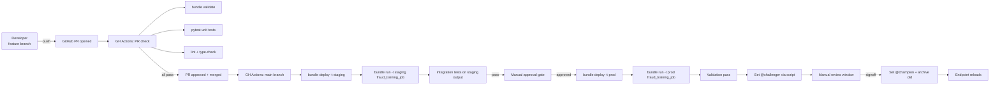

# Module 09 — CI/CD with DABs + GitHub Actions

> **Goal of this module:** the **deploy-code strategy in practice** — GitHub Actions running `databricks bundle deploy` and `bundle run`, environment promotion gates, unit and integration testing of ML pipelines. Section 2 has four objectives on validation testing alone.
>
> **Assumes:** Module 08 (DABs).

---

## Coverage map (verbatim Sept 30 2025 exam objectives → where taught)

| Verbatim objective | Section anchor |
|---|---|
| Implement **unit tests** for individual functions in Databricks notebooks | "Unit tests in notebooks (pytest)" |
| Identify types of testing performed (unit and integration) in various environment stages (dev, test, prod) | "Test pyramid by environment" |
| Design an **integration test** for ML systems incorporating: feature engineering, training, evaluation, deployment, inference | "Integration test design" |
| Compare benefits and challenges of approaches for organizing functions and unit tests | "Unit-test patterns" |
| Implement automated retraining workflows triggered by data drift detection or performance degradation alerts | "Drift-triggered retraining" + cross-link Module 10 |
| Develop a strategy for selecting top-performing models during automated retraining | "Champion selection logic" |

> Cross-references: Module 08 (DABs config); Module 07 (alias-based promotion); Module 10 (alert that triggers retraining); Module 11 (drift test selection).

---

## The full pipeline



Five environments / states:

1. **Feature branch** — dev, unrestricted iteration.
2. **PR check** — validation + unit tests in CI.
3. **Staging** — full integration test on real cluster against staging data.
4. **Prod (challenger)** — model exists in prod UC with `@challenger` alias; endpoint isn't routed to it yet.
5. **Prod (champion)** — `@champion` reassigned; endpoint reloads; rollback = reassign alias back.

---

## GitHub Actions skeleton

`.github/workflows/ml-cicd.yml`:

```yaml
name: ML CI/CD

on:
  pull_request:
    branches: [main]
  push:
    branches: [main]

env:
  DATABRICKS_HOST_DEV: ${{ secrets.DATABRICKS_HOST_DEV }}
  DATABRICKS_HOST_STAGING: ${{ secrets.DATABRICKS_HOST_STAGING }}
  DATABRICKS_HOST_PROD: ${{ secrets.DATABRICKS_HOST_PROD }}

jobs:
  pr-check:
    if: github.event_name == 'pull_request'
    runs-on: ubuntu-latest
    steps:
      - uses: actions/checkout@v4
      - uses: actions/setup-python@v5
        with: { python-version: "3.10" }
      - name: Install Databricks CLI
        run: |
          curl -fsSL https://raw.githubusercontent.com/databricks/setup-cli/main/install.sh | sh
      - name: Install Python deps
        run: pip install -r requirements.txt -r requirements-dev.txt
      - name: Lint
        run: ruff check src/ tests/
      - name: Bundle validate (dev)
        run: databricks bundle validate -t dev
        env:
          DATABRICKS_HOST: ${{ env.DATABRICKS_HOST_DEV }}
          DATABRICKS_TOKEN: ${{ secrets.DATABRICKS_TOKEN_DEV }}
      - name: Unit tests
        run: pytest tests/unit/ -v

  deploy-staging:
    needs: pr-check
    if: github.event_name == 'push' && github.ref == 'refs/heads/main'
    runs-on: ubuntu-latest
    environment: staging
    steps:
      - uses: actions/checkout@v4
      - name: Install CLI
        run: curl -fsSL https://raw.githubusercontent.com/databricks/setup-cli/main/install.sh | sh
      - name: Bundle deploy staging
        env:
          DATABRICKS_HOST: ${{ env.DATABRICKS_HOST_STAGING }}
          DATABRICKS_TOKEN: ${{ secrets.DATABRICKS_TOKEN_STAGING }}
        run: databricks bundle deploy -t staging --auto-approve
      - name: Run training job
        env:
          DATABRICKS_HOST: ${{ env.DATABRICKS_HOST_STAGING }}
          DATABRICKS_TOKEN: ${{ secrets.DATABRICKS_TOKEN_STAGING }}
        run: databricks bundle run -t staging fraud_training_job
      - name: Integration tests
        env:
          DATABRICKS_HOST: ${{ env.DATABRICKS_HOST_STAGING }}
          DATABRICKS_TOKEN: ${{ secrets.DATABRICKS_TOKEN_STAGING }}
        run: pytest tests/integration/ -v

  deploy-prod:
    needs: deploy-staging
    runs-on: ubuntu-latest
    environment:
      name: production
      url: ${{ env.DATABRICKS_HOST_PROD }}
    steps:
      - uses: actions/checkout@v4
      - name: Install CLI
        run: curl -fsSL https://raw.githubusercontent.com/databricks/setup-cli/main/install.sh | sh
      - name: Bundle deploy prod
        env:
          DATABRICKS_HOST: ${{ env.DATABRICKS_HOST_PROD }}
          DATABRICKS_TOKEN: ${{ secrets.DATABRICKS_TOKEN_PROD }}
        run: databricks bundle deploy -t prod --auto-approve
      - name: Run training job
        env:
          DATABRICKS_HOST: ${{ env.DATABRICKS_HOST_PROD }}
          DATABRICKS_TOKEN: ${{ secrets.DATABRICKS_TOKEN_PROD }}
        run: databricks bundle run -t prod fraud_training_job
```

The `environment: production` block in GitHub Actions enables **required reviewers** — a manual approval gate before the prod job runs. This is the deploy-code strategy's "human in the loop" between staging and prod.

⚠️ **Exam trap:** auto-promoting from staging straight to prod with no manual gate. In regulated industries that's the wrong answer.

---

## Unit testing — Section 2 objective

Objective: *"Implement unit tests for individual functions in Databricks notebooks."*

The trick with notebooks: they're not naturally `pytest`-able. The fix: **move logic out of notebooks into `.py` modules**, then test the modules. Notebooks become thin orchestration wrappers.

```python
# src/feature_pipeline.py
import pandas as pd

def compute_rolling_avg(df: pd.DataFrame, col: str, window: int = 30) -> pd.Series:
    """Compute rolling average of `col` over `window` rows.

    Returns a Series aligned to df's index, with NaN where window incomplete.
    """
    return df[col].rolling(window=window, min_periods=1).mean()


def clip_amount(value: float, min_val: float = 0.0, max_val: float = 1e6) -> float:
    """Clip a transaction amount to [min_val, max_val]."""
    if value < min_val:
        return min_val
    if value > max_val:
        return max_val
    return value
```

```python
# tests/unit/test_feature_pipeline.py
import pandas as pd
import pytest
from src.feature_pipeline import compute_rolling_avg, clip_amount


def test_clip_amount_within_range():
    assert clip_amount(100.0) == 100.0


def test_clip_amount_below_min():
    assert clip_amount(-5.0) == 0.0


def test_clip_amount_above_max():
    assert clip_amount(1.5e6) == 1e6


def test_rolling_avg_simple():
    df = pd.DataFrame({"amount": [1.0, 2.0, 3.0, 4.0, 5.0]})
    result = compute_rolling_avg(df, "amount", window=3)
    assert result.iloc[2] == pytest.approx(2.0)  # (1+2+3)/3
    assert result.iloc[4] == pytest.approx(4.0)  # (3+4+5)/3
```

**Notebook → module** is the canonical refactor. Then:

```python
# notebooks/train.py (Databricks notebook)
# MAGIC %pip install -r ../requirements.txt
# MAGIC %restart_python
from src.feature_pipeline import compute_rolling_avg, clip_amount
# ... pipeline logic uses the imported functions
```

Tests run in CI in a standard Python env (no Databricks workspace needed). Fast feedback.

⚠️ **Exam trap:** "Run unit tests inside the Databricks notebook by calling `dbutils.notebook.run('test_notebook')`." That's slow and conflates orchestration with testing. The exam-correct pattern is module + pytest in CI.

---

## Integration testing — the next objective

Objective: *"Design an integration test for ML systems incorporating: feature engineering, training, evaluation, deployment, inference."*

An integration test exercises the **entire pipeline end-to-end** on a small but realistic dataset, on a real Databricks cluster:

```python
# tests/integration/test_fraud_pipeline.py
import os
import time
import requests
from databricks.sdk import WorkspaceClient
from mlflow import MlflowClient

w = WorkspaceClient()
mlflow_client = MlflowClient()

CATALOG = os.environ["TEST_CATALOG"]              # e.g., "staging_ml"
MODEL_NAME = f"{CATALOG}.ml.fraud_classifier"


def test_end_to_end_pipeline_in_staging():
    # 1. Trigger the training job (which is also a bundle resource)
    run = w.jobs.run_now(
        job_id=int(os.environ["FRAUD_TRAINING_JOB_ID"]),
        notebook_params={"catalog": CATALOG, "limit_rows": "10000"},
    )
    # 2. Wait for completion
    while True:
        status = w.jobs.get_run(run.run_id)
        if status.state.life_cycle_state in {"TERMINATED", "INTERNAL_ERROR"}:
            break
        time.sleep(30)
    assert status.state.result_state == "SUCCESS"

    # 3. Verify a new model version was registered
    versions = mlflow_client.search_model_versions(filter_string=f"name = '{MODEL_NAME}'")
    assert len(versions) > 0
    latest = max(versions, key=lambda v: int(v.version))

    # 4. Verify validation metric on the new version
    assert float(latest.tags.get("val_auc", 0.0)) > 0.80

    # 5. Verify @challenger alias was set
    challenger = mlflow_client.get_model_version_by_alias(MODEL_NAME, "challenger")
    assert challenger.version == latest.version

    # 6. Smoke-test inference via the serving endpoint (if it exists in staging)
    endpoint_url = f"{os.environ['DATABRICKS_HOST']}/serving-endpoints/fraud-staging-endpoint/invocations"
    response = requests.post(
        endpoint_url,
        headers={"Authorization": f"Bearer {os.environ['DATABRICKS_TOKEN']}"},
        json={"dataframe_records": [{"amount": 100.0, "merchant_category": "grocery"}]},
    )
    assert response.status_code == 200
    assert "predictions" in response.json()
```

This single test exercises: feature engineering (inside the training job), training, evaluation, registration, aliasing, and inference. **The exam asks "which stages should an integration test cover?" — answer: all of them, end-to-end.**

⚠️ **Exam trap:** integration tests that mock the cluster. Defeats the purpose. Integration runs against a real Databricks workspace (typically a dedicated staging workspace).

---

## Environment-specific testing strategy

Section 2 objective: *"Identify types of testing performed (unit and integration) in various environment stages (dev, test, prod)."*

| Environment | What runs | What's tested |
|---|---|---|
| **Dev** | Unit tests in CI (PR check); ad-hoc notebooks in workspace | Logic correctness of pure functions |
| **Staging** | Integration test end-to-end on real cluster; bundle-deployed training job; downstream tests | The pipeline behaves correctly on realistic data |
| **Prod** | Same training job (deploy-code) but on prod data; validation gates before alias change; ongoing monitoring | The promotion criteria hold; the model meets thresholds on prod data |

⚠️ **Exam trap:** running integration tests only in prod. Wrong — integration tests in staging *prevent* bad code from reaching prod.

⚠️ **Exam trap 2:** running unit tests in prod. They belong in CI, before any deploy. Prod runs the actual workload, not test functions.

---

## Organizing tests — Section 2 objective

Objective: *"Compare benefits and challenges of approaches for organizing functions and unit tests."*

The two patterns the exam contrasts:

| Approach | Pros | Cons |
|---|---|---|
| **One test file per source module** (`src/foo.py` ↔ `tests/unit/test_foo.py`) | 1:1 mapping; easy to find tests; clear coverage | More files; some test code duplicated across files |
| **One test file per feature/scenario** (`tests/unit/test_clipping_behavior.py` covers `clip_amount` + `clip_outliers` + `clip_negatives`) | Scenarios read like specifications; closer to behavior | Harder to find "what tests does function X have?"; coupling to multiple modules |

In practice, **one test file per source module** is the standard pytest convention and the exam-correct default. Use scenario-based organization for higher-level integration tests.

---

## Repair runs — Lakeflow Jobs feature exam-tested

If a multi-task ML job fails on task 3, you don't want to re-run tasks 1 and 2. **Repair runs** re-execute only the failed task and its downstream dependencies, reusing successful task outputs.

```bash
# CLI
databricks jobs repair-run --run-id <id> --rerun-tasks task3,task4
```

```python
# SDK
from databricks.sdk import WorkspaceClient
w = WorkspaceClient()
w.jobs.repair_run(
    run_id=12345,
    rerun_tasks=["evaluate", "register"],
)
```

This is critical for expensive ML training pipelines — if `evaluate` fails because of a flaky downstream service, you don't pay for `train` again.

⚠️ **Exam trap:** "Re-run the whole job after a transient failure." Wrong when only one task failed. Repair the run.

---

## Secrets in CI

**Never** commit:

- Databricks tokens or service principal secrets.
- API keys for external services.
- Database credentials.

**Do** use:

- GitHub Actions Secrets (`${{ secrets.DATABRICKS_TOKEN_PROD }}`).
- Databricks Secrets (referenced from notebooks via `dbutils.secrets.get(scope, key)`).
- OIDC federation for keyless auth between GitHub and Databricks (modern best practice).

```yaml
# OIDC federation example — no long-lived tokens
- name: Federate via OIDC
  uses: databricks/setup-cli@main
  with:
    federated-auth: true
    workspace-id: ${{ secrets.WORKSPACE_ID }}
```

⚠️ **Exam trap:** "Embed the token in `databricks.yml` per target." Tokens in version control are a compromise away from a catastrophe. CI secrets only.

---

## The five testing levels (memorize)

| Level | What | Where | Speed |
|---|---|---|---|
| 1. Type / lint check | `ruff`, `mypy`, `ruff format` | PR check (CI) | <10s |
| 2. Unit tests | pure function tests with pytest | PR check (CI) | <2 min |
| 3. Bundle validate | `databricks bundle validate -t <target>` | PR check + deploy | <30s |
| 4. Integration tests | end-to-end on real cluster | After deploy to staging | 5-30 min |
| 5. Smoke / canary | tiny percentage of prod traffic on new version | Post-prod-deploy | hours |

Level 5 is canary — Module 14 covers it in detail.

---

## Look-alike comparison — CI/CD specifics

| Pair | Difference | Exam tell |
|---|---|---|
| `databricks bundle validate` vs `deploy` vs `run` vs `destroy` | Lint/render / push resources / run a job / tear down | PR check = `validate`. Push to staging = `deploy`. Trigger train job = `run`. Cleanup = `destroy` |
| `--target prod` vs `--profile prod` | Bundle target (env in YAML) vs CLI auth profile (in `~/.databrickscfg`) | They're independent. `--target` selects env config; `--profile` selects credentials |
| `--var "k=v"` (CLI) vs `BUNDLE_VAR_k=v` (env) vs `${var.k}` (yaml default + target override) | Precedence: CLI > env > target > default | CI typically sets via env var from a secret |
| Unit tests in `.py` modules vs in a notebook | Pure functions pytest-able vs cluster-dependent | Refactor logic to `.py` for unit testability |
| Integration test on staging vs unit test on PR check | End-to-end on real cluster + data vs pure functions | Integration needs cluster + UC; unit needs only pip-installed deps |
| `databricks jobs repair-run` vs `databricks jobs run-now` | Re-run failed tasks (partial) vs new run from scratch | After task 4/5 fail → `repair-run`. Fresh end-to-end → `run-now` |
| `gh workflow run` vs `databricks bundle run` | GH Actions workflow trigger vs Databricks job trigger | Trigger CI from outside = `gh`. Trigger the Databricks job (after deploy) = `bundle run` |
| OIDC federation vs PAT-in-secrets | Short-lived workspace credential issued via cloud IAM vs long-lived stored token | Modern / audit-friendly = OIDC. PAT in secrets works but rotates rarely |

> 🎯 **How to recognize on the exam:** "tests fail before reaching the cluster" → run them in CI (GitHub Actions) on pure Python, not in the notebook. "Pipeline failed on the last task; re-run only that part" → `databricks jobs repair-run`. "Promotion to prod from CI" → manual gate (workflow_dispatch with environment protection). "Same code different environment" → `targets:` with `--target <env>`.

---

## Output-prediction drills

**Drill 1 — variable precedence:**
```yaml
variables: { catalog: { default: "dev_ml" } }
targets:
  staging: { variables: { catalog: "stg_ml" } }
```
Run: `BUNDLE_VAR_catalog=alt_ml databricks bundle deploy -t staging`.
Q: What is `${var.catalog}`?
A: **`alt_ml`** — env var overrides target var overrides default.

**Drill 2 — `mode: development` collision:**
Two developers `alice` and `bob` deploy the same bundle to the same dev workspace at the same time, both with `mode: development`.
Q: Do their jobs collide?
A: **No.** Each gets a username-prefixed name: `[dev alice] training`, `[dev bob] training`. The dev-mode naming convention prevents collisions.

**Drill 3 — drift-triggered retraining wiring:**
A DBSQL alert fires on `_drift_metrics`. You want it to start the training job.
Q: What's the canonical wiring?
A: Alert notification destination → **webhook → Databricks Job API `runs/now`** (or a Lakeflow Job triggered on a file/SQL signal). The job runs `bundle run -t prod fraud_training_job` style logic. Output: new model version, `@challenger` alias set; **human gate then flips `@champion`**.

**Drill 4 — repair-run vs run-now:**
Job has 5 tasks. Task 3 succeeded, task 4 failed, task 5 was skipped.
- Q1: `databricks jobs run-now --job-id N` does what?
- Q2: `databricks jobs repair-run --run-id <last> --rerun-tasks task4,task5` does what?
A1: Full new run; tasks 1-5 all re-execute.
A2: Re-runs task 4 (using task 3's output via `--rerun-from-failed-tasks` is also common) and task 5. Tasks 1-3 outputs are reused.

**Drill 5 — bundle in CI without DATABRICKS_HOST:**
GitHub Actions workflow runs `databricks bundle deploy -t staging` without setting `DATABRICKS_HOST` or `DATABRICKS_TOKEN`.
Q: What happens?
A: **Auth failure** — the CLI has no credentials. Fix: either set `DATABRICKS_HOST` + `DATABRICKS_TOKEN` (from GH secrets) or use OIDC federation (`databricks/setup-cli@v1` with workload identity).

---

## Decision rules

> 🎯 **"Unit-test ML code" → factor pure logic into `.py` modules, pytest in CI.** Don't run pytest in the notebook on the cluster — slow + flaky.

> 🎯 **"Integration test that covers FE → train → eval → register → infer" → end-to-end test on staging cluster with `bundle run -t staging`.** Hits real UC, real Spark, real model serving.

> 🎯 **"Promote staging → prod" → manual gate.** In regulated context, never auto-promote. `workflow_dispatch` with `environment: prod` protection requires reviewer approval.

> 🎯 **"Re-run only failed tasks" → `databricks jobs repair-run`.** Save compute, preserve upstream outputs.

> 🎯 **"Drift alert triggers retraining" → DBSQL alert → webhook → Job → register new version + set `@challenger` → human gates `@champion`.**

> 🎯 **"CI deploys to multi-env" → `databricks bundle deploy -t <target>` parameterized by branch / approval step.**

> 🎯 **Secrets:** GH Actions secrets or OIDC. **Never** in `databricks.yml`, never in env vars on a shared runner without scoping.

---

## Mini quiz

1. The exam's right answer for "where do unit tests run" — inside a Databricks notebook or in GitHub Actions?
2. How do you make a notebook unit-testable?
3. An integration test should cover which stages?
4. Why is auto-promoting from staging to prod with no manual gate the wrong answer in regulated industries?
5. A 5-task training job failed on task 4. You want to re-run only task 4 + downstream. Which command?
6. Where do Databricks tokens belong — in `databricks.yml`, GitHub Actions secrets, or environment-variables-on-the-runner?

**Answers:**

1. **GitHub Actions (CI runner with pytest).** Tests run in a clean Python env, fast feedback. Running them inside a notebook conflates orchestration with testing and adds Databricks cluster latency.
2. Move logic out of the notebook into `.py` modules. Notebook becomes a thin wrapper that imports and calls the module functions. Tests target the module.
3. Feature engineering, training, evaluation, registration, alias assignment, deployment, and inference smoke. End-to-end.
4. The deploy-code strategy requires a human gate. Audit defensibility: in HIPAA / SOX / regulated finance, no model reaches prod without explicit signoff from a controller. CI alone cannot be that signoff.
5. `databricks jobs repair-run --run-id <id> --rerun-tasks task4,...`. Reuses outputs from tasks 1-3; doesn't re-run successful tasks.
6. **GitHub Actions secrets** (or OIDC federation). Never in `databricks.yml`. Environment variables on a shared runner are leakage-prone.

---

## Sanity check

- Could you write a 4-job GitHub Actions YAML (pr-check / deploy-staging / deploy-prod / promotion) from memory?
- Do you know how to refactor a notebook so it's unit-testable?
- Can you list the seven stages an integration test should cover?
- Do you remember `databricks jobs repair-run` for partial failure recovery?
- Could you explain when each of the 5 testing levels runs?

Move on to [Module 10 — Lakehouse Monitoring Deep](10_lakehouse_monitoring_deep.md) — the largest module of the corpus.
