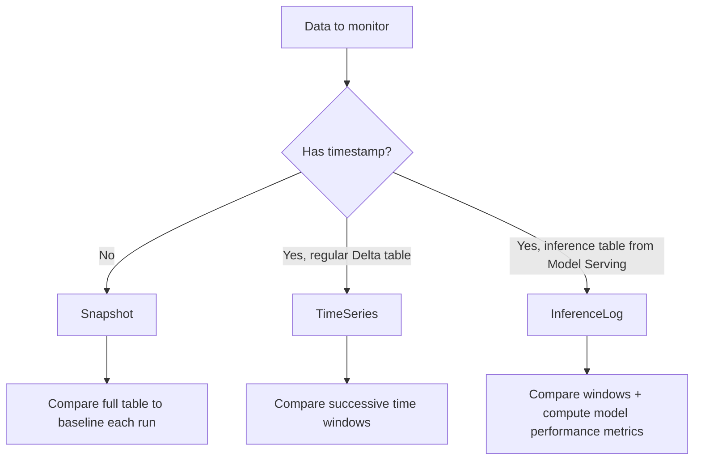

# Module 10 — Lakehouse Monitoring (Deep)

> **Goal of this module:** Databricks **Lakehouse Monitoring** — the platform-native data + model monitoring product. **10 objectives are mapped here** — the largest single subsection of the exam.
>
> Read this module twice.
>
> **Assumes:** Modules 07-09 (UC, DABs, CI/CD). Topic 02 Module 09 (Unity Catalog) for permissions.

---

## Coverage map (verbatim Sept 30 2025 exam objectives → where taught) — 10 objectives, the largest single subsection

| Verbatim objective | Section anchor |
|---|---|
| Apply any statistical tests from the drift metrics table in Lakehouse Monitoring to detect drift in numerical and categorical data | "Statistical tests — the mapping that the exam grills" |
| Identify the data table type and Lakehouse Monitoring feature that resolves a use case need and explain why | "The three monitor profile types" |
| Build a monitor for a **snapshot, time series, or inference table** using Lakehouse Monitoring | "Creating a monitor — the canonical API" (all three profile types) |
| Identify the key components of common monitoring pipelines: logging, drift detection, model performance, model health | "Monitoring pipelines — the key components" |
| Design and configure alerting mechanisms when drift metrics exceed thresholds | "Alerts — Section 2 objective" |
| Detect data drift by comparing current data distributions to a known baseline or between successive time windows | "Baselines — two modes" |
| Evaluate model performance trends over time using an inference table | "Output tables — `_profile_metrics`" + "InferenceLog monitor" |
| Define custom metrics in Lakehouse Monitoring metrics tables | "Custom metrics — Section 2 objective" |
| Evaluate metrics based on different data granularities and feature slicing | "Slicing — Section 2 objective" + `granularities=` |
| Monitor endpoint health by tracking infrastructure metrics: latency, request rate, error rate, CPU usage, memory usage | "Monitoring pipelines" pillar 4 + cross-link Module 16 |

> Cross-references: Module 11 (statistical test selection deep dive); Module 13 (inference tables — the foundation for InferenceLog); Module 16 (endpoint observability for pillar 4).

---

## Why Lakehouse Monitoring matters

Pre-2025, drift detection was ad-hoc: write a notebook computing statistics on yesterday's data, compare to baseline, alert if a threshold is exceeded. Worked, but every team rolled their own. Inconsistent. Not lineage-aware. Not UC-integrated.

**Lakehouse Monitoring** is the platform-native, UC-integrated, declarative monitoring layer. You attach a monitor to a Delta table or an inference table. It produces:

- A **profile metrics table** — descriptive stats per column per slice per window.
- A **drift metrics table** — drift test statistics per column per window vs baseline / previous window.
- A **dashboard** — auto-generated DBSQL dashboard from the metrics tables.
- **Alerts** — DBSQL Alerts on the metrics tables, fire email / Slack / webhook on threshold breach.

The exam's 10 objectives in this area break down into:

1. Apply statistical tests by data type (KS / Chi-sq / JS / Wasserstein / TVD).
2. Identify the right data table type + monitoring feature for a use case.
3. Build a Snapshot / TimeSeries / InferenceLog monitor.
4. Identify the key components of monitoring pipelines (logging, drift, performance, health).
5. Design alerting mechanisms for threshold breaches.
6. Detect drift between current and baseline distributions.
7. Evaluate model performance trends over time using an inference table.
8. Define custom metrics in metrics tables.
9. Evaluate metrics with different data granularities and feature slicing.
10. Monitor endpoint health (latency, request rate, error rate, CPU/memory).

Objective 10 spans into Module 16 (serving observability); we cover it here as a concept and again there for endpoint specifics.

---

## The three monitor profile types



| Profile type | Use case | Required fields |
|---|---|---|
| **Snapshot** | Reference table / static lookup (e.g., a feature snapshot, a customer master) | None beyond the table itself |
| **TimeSeries** | Regular Delta tables with a timestamp (events, transactions) | `timestamp_col` |
| **InferenceLog** | Inference tables auto-created by Model Serving | `timestamp_col`, `prediction_col`, `model_id_col`, optional `label_col` |

The exam will give a scenario and ask which monitor type fits. Memorize the decision tree.

⚠️ **Exam trap:** picking TimeSeries for inference data. InferenceLog is the **specialized** profile for inference tables; it adds model performance metrics (accuracy, RMSE, etc.) on top of drift. TimeSeries would compute drift but not link to model versions or performance.

⚠️ **Exam trap 2:** picking Snapshot for a streaming event table. The right answer is TimeSeries — Snapshot would re-evaluate the entire table each run (cost), and miss the time-based drift story.

---

## Creating a monitor — the canonical API

### Snapshot monitor

```python
from databricks.sdk import WorkspaceClient
from databricks.sdk.service.catalog import (
    MonitorSnapshot, MonitorInfoStatus, MonitorCronSchedule
)

w = WorkspaceClient()

w.quality_monitors.create(
    table_name="prod.fraud.customer_master",  # the table being monitored
    assets_dir="/Shared/lakehouse-monitoring/customer_master",
    output_schema_name="prod.ml_monitoring",  # where _profile and _drift tables land
    snapshot=MonitorSnapshot(),
    slicing_exprs=["region", "customer_tier"],
    schedule=MonitorCronSchedule(
        quartz_cron_expression="0 0 6 * * ?",  # 6 AM UTC daily
        timezone_id="UTC",
    ),
)
```

### TimeSeries monitor

```python
from databricks.sdk.service.catalog import MonitorTimeSeries

w.quality_monitors.create(
    table_name="prod.fraud.transactions",
    assets_dir="/Shared/lakehouse-monitoring/transactions",
    output_schema_name="prod.ml_monitoring",
    time_series=MonitorTimeSeries(
        timestamp_col="event_ts",
        granularities=["5 minutes", "1 hour", "1 day"],
    ),
    slicing_exprs=["country", "merchant_category"],
    schedule=MonitorCronSchedule(
        quartz_cron_expression="0 0 * * * ?",  # hourly
        timezone_id="UTC",
    ),
)
```

### InferenceLog monitor

```python
from databricks.sdk.service.catalog import MonitorInferenceLog

w.quality_monitors.create(
    table_name="prod.ml.fraud_endpoint_payload",  # the inference table
    assets_dir="/Shared/lakehouse-monitoring/fraud",
    output_schema_name="prod.ml_monitoring",
    inference_log=MonitorInferenceLog(
        timestamp_col="timestamp_ms",
        granularities=["5 minutes", "1 hour", "1 day"],
        model_id_col="model_version",
        prediction_col="prediction",
        label_col="label",                     # joined-in later from ground truth
        problem_type="PROBLEM_TYPE_CLASSIFICATION",  # or _REGRESSION
    ),
    slicing_exprs=["region", "customer_segment"],
    schedule=MonitorCronSchedule(
        quartz_cron_expression="0 */15 * * * ?",  # every 15 min
        timezone_id="UTC",
    ),
)
```

**`granularities`** is exam-relevant. Each granularity means "compute metrics aggregated to this time bucket." Common combos: `["1 hour", "1 day"]` for transactional data; `["5 minutes", "1 hour"]` for high-frequency endpoints.

⚠️ **Exam trap:** providing the inference log's `label_col` but the actual table doesn't have it joined yet. The monitor will run but performance metrics will be NULL. The right pattern: a separate Lakeflow Job joins ground-truth labels into the inference table on a delayed schedule; the monitor then sees them on the next run.

---

## Output tables

Every monitor produces two output Delta tables in the `output_schema_name`:

### `<table>_profile_metrics`

One row per (window × slice × column × log_type). Columns include:

- `window` (StructType with `start`, `end`).
- `granularity` (e.g., `"1 hour"`).
- `slice_key`, `slice_value` (e.g., `region`, `"US"`; null for full-table).
- `log_type` — `"INPUT"`, `"PREDICTION"`, or `"BASELINE"`.
- `column_name`.
- Numeric metrics: `count`, `num_nulls`, `null_proportion`, `distinct_count`, `min`, `max`, `mean`, `stddev`, `percentile_25`, `percentile_50` (median), `percentile_75`, `percentile_95`, `percentile_99`.
- For InferenceLog with labels: `accuracy_score`, `precision`, `recall`, `f1`, `confusion_matrix` (struct).

### `<table>_drift_metrics`

One row per (window × slice × column × drift_type) where `drift_type` is `BASELINE` (vs baseline table) or `CONSECUTIVE` (vs the previous window).

- `chi_squared_test` (struct: `statistic`, `pvalue`) — categorical.
- `ks_test` (struct: `statistic`, `pvalue`) — numerical.
- `js_distance` — Jensen-Shannon distance.
- `tv_distance` — total variation distance.
- `wasserstein_distance` — Wasserstein.
- `population_stability_index` — PSI (binned KL divergence).

### Querying for drift

```sql
SELECT
  window.start AS window_start,
  slice_key,
  slice_value,
  column_name,
  ks_test.statistic AS ks_stat,
  ks_test.pvalue AS ks_p,
  js_distance,
  drift_type
FROM prod.ml_monitoring.fraud_endpoint_payload_drift_metrics
WHERE drift_type = 'CONSECUTIVE'
  AND window.start > current_timestamp() - INTERVAL 7 DAYS
  AND (ks_test.pvalue < 0.01 OR js_distance > 0.1)
ORDER BY window.start DESC;
```

---

## Statistical tests — the mapping that the exam grills

The Section 2 objective: *"Apply any statistical tests from the drift metrics table in Lakehouse Monitoring to detect drift in numerical and categorical data."*

| Test | Data type | What it measures | Decision rule |
|---|---|---|---|
| **Kolmogorov-Smirnov (KS)** | Numerical / continuous | Max absolute difference between empirical CDFs | `pvalue < α` (e.g., 0.01) → drift |
| **Chi-square** | Categorical | Frequency-table divergence | `pvalue < α` → drift |
| **Jensen-Shannon (JS)** | Categorical or binned numerical | Symmetric KL; bounded [0, log 2] | `js_distance > threshold` (e.g., 0.1) → drift |
| **Wasserstein (Earth Mover's)** | Numerical | Distance between distributions, shape-aware | `wasserstein > threshold` (domain-specific) → drift |
| **Total Variation Distance (TVD)** | Categorical | Max-abs PMF difference | `tv_distance > threshold` (e.g., 0.1) → drift |
| **Population Stability Index (PSI)** | Binned numerical or categorical | Sum of (P_i − Q_i) ln(P_i/Q_i) over bins | `PSI > 0.1` significant; `>0.25` major |

**Critical mapping mistakes the exam exploits:**

- **KS on categorical data** is wrong (KS uses CDFs; categorical has no meaningful CDF without ordering).
- **Chi-sq on continuous data** is wrong (it expects discrete buckets; binning first works but then it's binned-categorical, not continuous).
- **Wasserstein on categorical data** is wrong (no distance metric between unordered categories).
- **JS works for both** if the data is properly discretized (categorical naturally, numerical via binning).

⚠️ **Exam trap:** any answer that uses KS for a `merchant_category` column or Chi-sq for an `amount` column. Always wrong.

---

## Drift type taxonomy — the four types

Section 2 objective: *"Detect data drift by comparing current data distributions to a known baseline or between successive time windows."*

| Drift type | What changes | Detectable from |
|---|---|---|
| **Feature drift / covariate shift** | P(X) — input distribution | Input columns alone (KS, Chi-sq, etc.) |
| **Label drift / prior shift** | P(Y) — label distribution | Label column (requires ground truth) |
| **Prediction drift** | P(Ŷ) — model output distribution | Prediction column in inference table (no labels needed; **early-warning signal**) |
| **Concept drift** | P(Y\|X) — relationship between features and label | Joint analysis of features + labels; **cannot detect from features alone** |

⚠️ **Exam trap (recurring):** "Detect concept drift by running KS tests on input features." **Always wrong.** Concept drift requires labels — you need to compare the conditional distribution.

**Why prediction drift is gold:** labels are slow (ground-truth for a fraud transaction comes back from chargebacks weeks later). Predictions are immediate. A sudden shift in prediction distribution is an actionable early signal even if you can't yet measure label drift or concept drift.

---

## Baselines — two modes

A monitor can compare to:

1. **A baseline table** — a fixed reference Delta table (typically the training data snapshot). Pass `baseline_table_name=` when creating the monitor.
2. **Previous time windows** — TimeSeries and InferenceLog monitors automatically compute window-over-window drift (`drift_type='CONSECUTIVE'`).

```python
w.quality_monitors.create(
    table_name="prod.fraud.transactions",
    baseline_table_name="prod.fraud.training_snapshot_v3",  # ← key parameter
    time_series=MonitorTimeSeries(...),
    ...
)
```

**When to use baseline:** when you want absolute "is this drifting from what we trained on?" detection. Useful at model release time.

**When to use consecutive windows:** when you want "is something changing right now?" — robust to slow distribution evolution that's expected.

⚠️ **Exam trap:** assuming a monitor automatically uses the training data as baseline. It does **not** — you must declare the baseline table explicitly. Without it, you only get consecutive-window drift.

---

## Slicing — Section 2 objective

Objective: *"Evaluate metrics based on different data granularities and feature slicing."*

Slicing computes metrics per slice value, in addition to per-table.

```python
slicing_exprs=[
    "region",                                  # categorical slice on `region`
    "customer_segment",                        # another
    "amount > 1000",                           # boolean slice (true/false)
    "case when score > 0.8 then 'high' else 'low' end",  # derived slice
]
```

Each slice expression contributes rows to the metrics tables with `slice_key` + `slice_value` populated. Querying:

```sql
SELECT
  slice_key,
  slice_value,
  column_name,
  ks_test.pvalue
FROM prod.ml_monitoring.transactions_drift_metrics
WHERE slice_key = 'region'
  AND ks_test.pvalue < 0.01
ORDER BY window.start DESC;
```

**Why slicing matters:** an overall drift test might say "no drift" but the US-only or enterprise-customer slice could be drifting heavily — the masking effect. **Per-slice analysis is the canonical way to catch sub-population drift.**

⚠️ **Exam trap:** assuming the monitor only computes overall stats. With `slicing_exprs=`, it computes per-slice; without, only overall. The exam scenario will hint at "we need to detect drift per region" → you must add the slice.

---

## Custom metrics — Section 2 objective

Objective: *"Define custom metrics in Lakehouse Monitoring metrics tables."*

Beyond the built-in stats, you can compute custom metrics — per-slice F1 against joined labels, business KPIs, domain-specific scores.

```python
from databricks.sdk.service.catalog import (
    MonitorMetric, MonitorMetricType,
)

custom_metrics = [
    MonitorMetric(
        type=MonitorMetricType.CUSTOM_METRIC_TYPE_AGGREGATE,
        name="approval_rate",
        input_columns=["prediction"],
        definition="avg(case when prediction = 1 then 1.0 else 0.0 end)",
        output_data_type="DOUBLE",
    ),
    MonitorMetric(
        type=MonitorMetricType.CUSTOM_METRIC_TYPE_DERIVED,
        name="error_rate",
        input_columns=["prediction", "label"],
        definition="avg(case when prediction != label then 1.0 else 0.0 end)",
        output_data_type="DOUBLE",
    ),
    MonitorMetric(
        type=MonitorMetricType.CUSTOM_METRIC_TYPE_DRIFT,
        name="approval_rate_drift",
        input_columns=["prediction"],
        definition="abs(avg(case when prediction = 1 then 1.0 else 0.0 end) - avg_baseline)",
        output_data_type="DOUBLE",
    ),
]

w.quality_monitors.create(
    ...
    custom_metrics=custom_metrics,
)
```

Three custom-metric types:

- **AGGREGATE** — a per-window stat (e.g., approval rate). Appears in profile metrics table.
- **DERIVED** — same window, multi-column (e.g., error rate from prediction + label).
- **DRIFT** — compares the metric across windows or against baseline. Appears in drift metrics table.

⚠️ **Exam trap:** an answer that defines a custom metric without specifying the type. The type determines where the metric lands (profile vs drift table).

---

## Refreshes

A monitor's `schedule` defines when it runs automatically. You can also trigger manually:

```python
w.quality_monitors.run_refresh(table_name="prod.fraud.transactions")
```

Wait for completion:

```python
refresh = w.quality_monitors.list_refreshes(table_name="prod.fraud.transactions")
for r in refresh:
    if r.state == "RUNNING":
        # poll until done
        ...
```

In a Lakeflow Job, you can chain: training → register → manual monitor refresh → check metrics.

---

## Alerts — Section 2 objective

Objective: *"Design and configure alerting mechanisms when drift metrics exceed thresholds."*

The canonical pattern: **Databricks SQL Alert** on a SQL query against the `_drift_metrics` table.

```sql
-- The query backing the alert
SELECT COUNT(*) AS drift_rows
FROM prod.ml_monitoring.fraud_endpoint_payload_drift_metrics
WHERE window.start > current_timestamp() - INTERVAL 1 HOUR
  AND drift_type = 'CONSECUTIVE'
  AND (
    ks_test.pvalue < 0.001                          -- numerical column drift
    OR chi_squared_test.pvalue < 0.001              -- categorical column drift
    OR js_distance > 0.15                           -- JS divergence breach
  );
```

Configure the alert: trigger when `drift_rows > 0`. Notify a Slack webhook, an email distribution list, or PagerDuty.

```python
from databricks.sdk.service.sql import (
    Alert, AlertCondition, AlertOperand,
)

# Create via SDK (simplified)
alert = w.alerts_v2.create(
    display_name="Fraud Endpoint Drift Alert",
    parent_path="/Users/me@org",
    query_text="SELECT COUNT(*) AS drift_rows FROM prod.ml_monitoring.fraud_endpoint_payload_drift_metrics WHERE ...",
    condition=AlertCondition(
        operand=AlertOperand(column="drift_rows", op=">", threshold=0),
    ),
    notify=[
        # Slack webhook destination, or email, or PagerDuty
    ],
)
```

**Alert → automated retraining:**

The Section 2 objective: *"Implement automated retraining workflows triggered by data drift detection or performance degradation alerts."*

The full chain:

```mermaid
graph LR
    A[Inference table grows] --> B[Monitor refresh<br/>every 15 min]
    B --> C[Drift metrics table updated]
    C --> D[DBSQL Alert evaluates query]
    D -->|threshold breached| E[Webhook fires]
    E --> F[Triggers retraining Job]
    F --> G[New model version]
    G --> H[Set @challenger]
    H --> I[Manual review]
    I --> J[Promote to @champion]
```



⚠️ **Exam trap:** auto-promoting `@challenger → @champion` from a drift alert without human gate. In regulated industries, alerts trigger *retraining*; promotion requires manual approval.

---

## Monitoring pipelines — the key components

Section 2 objective: *"Identify the key components of common monitoring pipelines: logging, drift detection, model performance, model health."*

The four pillars:

| Pillar | What | Where it lives |
|---|---|---|
| **Logging** | Capture every inference request + response | Inference tables (auto-enabled on endpoint) |
| **Drift detection** | Compare current data to baseline / previous window | Lakehouse Monitoring `_drift_metrics` table |
| **Model performance** | Accuracy / AUC / F1 over time | InferenceLog profile metrics with `label_col` joined |
| **Model health** | Latency, request rate, error rate, CPU / memory | Endpoint metrics (Module 16) |

The exam asks "design a monitoring pipeline" — these four must be present. Missing any one is the wrong answer.

---

## Permissions

Lakehouse Monitoring metric tables are regular UC tables in the `output_schema_name`. Grant `SELECT` to whoever needs to query.

```sql
GRANT USAGE ON SCHEMA prod.ml_monitoring TO `ml-platform-team`;
GRANT SELECT ON SCHEMA prod.ml_monitoring TO `ml-platform-team`;
```

The monitor itself has a separate permission model — `EDITOR`, `VIEWER` — set via the SDK.

---

## Mermaid: the full monitoring picture

```mermaid
graph TD
    A[Mosaic AI Model Serving Endpoint] -->|auto_capture_config| B[Inference Table<br/>prod.ml.fraud_endpoint_payload]
    C[Ground-truth label pipeline<br/>Lakeflow Job, delayed] -->|join| B
    B -->|InferenceLog Monitor| D[_profile_metrics]
    B -->|InferenceLog Monitor| E[_drift_metrics]
    D --> F[DBSQL Dashboard<br/>auto-generated]
    E --> F
    E -->|SQL Alert query| G[Alert evaluator]
    G -->|threshold breach| H[Webhook → Retraining Job]
    H --> I[New model version]
    I -->|@challenger| J[Manual review]
    J --> K[@champion]
    A -.->|reload on alias change| K
    A --> L[Endpoint metrics<br/>latency, error rate]
    L --> M[Alert on p99 > 500ms]
```

---

## Look-alike API comparison — `quality_monitors.create` surface

### Full `CreateMonitor` parameter table

| Parameter | Purpose | Required? |
|---|---|---|
| `table_name` | UC three-level name of the table being monitored | Yes |
| `assets_dir` | Workspace path for the monitor dashboard + assets (e.g. `/Shared/lakehouse-monitoring/<name>`) | Yes |
| `output_schema_name` | UC schema where `_profile_metrics` + `_drift_metrics` tables land | Yes |
| `snapshot` / `time_series` / `inference_log` | The profile type — exactly one | Yes (exactly one) |
| `baseline_table_name` | Fixed reference table for "baseline" drift comparisons | Optional; without it you only get consecutive-window drift |
| `slicing_exprs` | List of SQL expressions; metrics computed per slice | Optional |
| `custom_metrics` | List of `MonitorMetric(...)` | Optional |
| `schedule` | `MonitorCronSchedule` for automatic refresh | Optional (manual otherwise) |
| `notifications` | `MonitorNotifications(on_failure=, on_new_classification_tag_detected=)` | Optional |
| `data_classification_config` | PII classification scanning | Optional |
| `skip_builtin_dashboard` | If `True`, no auto-generated dashboard | Optional |

### Profile-type sub-spec look-alikes

| Profile | Fields | Required field |
|---|---|---|
| `MonitorSnapshot()` | (no fields) | — |
| `MonitorTimeSeries(timestamp_col=, granularities=)` | `timestamp_col` (required), `granularities` (list of strings like `"5 minutes"`, `"1 hour"`, `"1 day"`) | `timestamp_col` |
| `MonitorInferenceLog(timestamp_col=, granularities=, model_id_col=, prediction_col=, label_col=, problem_type=)` | `timestamp_col`, `granularities`, `model_id_col`, `prediction_col`, **`problem_type` (PROBLEM_TYPE_CLASSIFICATION or PROBLEM_TYPE_REGRESSION)** required; `label_col` optional but no perf metrics without it | `timestamp_col`, `prediction_col`, `model_id_col`, `problem_type` |

### Profile-type decision look-alikes

| Pair | Difference | Exam tell |
|---|---|---|
| `MonitorSnapshot()` vs `MonitorTimeSeries(timestamp_col=)` | Stateless full-table-vs-baseline vs window-over-window comparison | "table has no timestamp / refreshed wholesale daily" → Snapshot. "events with `event_ts`" → TimeSeries |
| `MonitorTimeSeries` vs `MonitorInferenceLog` | Generic time-series Delta table vs Mosaic AI inference table with model perf metrics | Inference table (auto-captured by serving endpoint) → InferenceLog. TimeSeries gives drift only, not performance metrics |
| `baseline_table_name=` set vs unset | Baseline (fixed reference) drift vs consecutive-window-only drift | "Compare to training data snapshot" → set baseline. "Detect change vs last hour" → unset |
| `granularities=["1 hour"]` vs `["1 hour","1 day"]` | One bucket size vs multiple bucket sizes | Multi-granularity = metrics at each level. Costs more storage but reveals both short and long trends |
| `slicing_exprs=["region"]` vs unset | Per-slice metrics vs overall only | "Detect drift per region" → slicing required. Without it, EU drift can be masked by global average |

### Custom metric types

| Type | Goes to | Use case |
|---|---|---|
| `CUSTOM_METRIC_TYPE_AGGREGATE` | `_profile_metrics` | One-window aggregate (e.g., approval rate) |
| `CUSTOM_METRIC_TYPE_DERIVED` | `_profile_metrics` | Multi-column same-window (e.g., error rate from pred + label) |
| `CUSTOM_METRIC_TYPE_DRIFT` | `_drift_metrics` | Window-vs-baseline / window-vs-window comparison |

### Output tables look-alikes

| Table | Granularity | Use for |
|---|---|---|
| `<table>_profile_metrics` | One row per (window × slice × column × log_type) | Distribution stats, model performance metrics |
| `<table>_drift_metrics` | One row per (window × slice × column × drift_type) | KS / chi-square / JS / Wasserstein / TVD / PSI |

`log_type` values for InferenceLog: `INPUT` (features), `PREDICTION` (model output), `BASELINE` (from baseline_table).
`drift_type` values: `BASELINE` (vs baseline_table) or `CONSECUTIVE` (vs previous window).

> 🎯 **How to recognize a Lakehouse Monitoring question on the exam:** the prompt names a table + a context (with/without timestamp, with/without labels, from a serving endpoint or not). Map: no timestamp → Snapshot. With timestamp + Mosaic AI inference table → InferenceLog. With timestamp but regular Delta table → TimeSeries. "Per-region drift" → `slicing_exprs`. "Performance trend over time" → InferenceLog with `label_col` (and a side pipeline that joins labels in later).

---

## Output-prediction drills

**Drill 1 — wrong profile for inference data:**
```python
w.quality_monitors.create(
    table_name="prod.ml.fraud_endpoint_payload",
    time_series=MonitorTimeSeries(timestamp_col="timestamp_ms", granularities=["1 hour"]),
    ...,
)
```
Q: What's lost vs using `InferenceLog`?
A: **Model performance metrics** (accuracy, precision, recall, F1, confusion matrix for classification; RMSE/MAE/R² for regression). TimeSeries gives drift stats only. The exam-correct profile for inference tables is `MonitorInferenceLog`.

**Drill 2 — `problem_type` mismatch:**
```python
MonitorInferenceLog(
    timestamp_col="ts", prediction_col="pred", model_id_col="model_v",
    problem_type="PROBLEM_TYPE_CLASSIFICATION",  # but pred is a float regression output
    label_col="label", granularities=["1 hour"],
)
```
Q: What happens?
A: The monitor runs but computes classification metrics on regression outputs → meaningless metrics (e.g., "accuracy" on continuous predictions). Always match `problem_type` to the model.

**Drill 3 — missing baseline:**
```python
w.quality_monitors.create(
    table_name="prod.fraud.transactions",
    time_series=MonitorTimeSeries(timestamp_col="event_ts", granularities=["1 hour"]),
    # no baseline_table_name
    ...,
)
```
Q: What's in `_drift_metrics`?
A: Only `drift_type='CONSECUTIVE'` rows (window-vs-previous-window). No `drift_type='BASELINE'` rows. If the exam asks "compare to training data," you'd need `baseline_table_name=` set.

**Drill 4 — slicing requirement:**
Overall drift test = "no drift," but EU region's `amount` distribution shifted heavily.
Q: What did the monitor configuration miss?
A: `slicing_exprs=["region"]`. The overall average masks the EU shift. Add the slice expr to surface per-region drift rows.

**Drill 5 — custom metric type confusion:**
```python
MonitorMetric(
    type=MonitorMetricType.CUSTOM_METRIC_TYPE_AGGREGATE,
    name="error_rate", input_columns=["prediction"],
    definition="avg(case when prediction != label then 1.0 else 0.0 end)",
    output_data_type="DOUBLE",
)
```
Q: Bug?
A: Uses `label` in the definition but only `prediction` is listed in `input_columns`. For multi-column metrics that depend on prediction + label, use `CUSTOM_METRIC_TYPE_DERIVED` and list both: `input_columns=["prediction","label"]`.

**Drill 6 — granularities cost:**
Comparing `granularities=["5 minutes","1 hour","1 day"]` vs `["1 day"]`.
Q: Storage/compute impact?
A: The 3-granularity setup computes ~288× more rows per day (5-min buckets) + 24× (hourly) + 1× (daily). Each bucket × each slice × each column = profile/drift row. Storage and refresh-cost grow proportionally. Pick the minimum granularity set the use case actually needs.

**Drill 7 — drift detected, what next?**
DBSQL alert fires: `ks_test.pvalue < 0.001` on `amount` column for the past hour.
Q: Exam-correct response chain?
A: Webhook → triggers retraining Job → new model version registered → `@challenger` alias set → **manual gate** → `@champion` reassigned if challenger validates. Don't auto-promote to `@champion` in a regulated context.

---

## Decision rules

> 🎯 **"Inference table from Model Serving" → `MonitorInferenceLog`.** Never TimeSeries on an inference table (loses model perf).

> 🎯 **"Table has no timestamp / replaced wholesale" → `MonitorSnapshot`.** A timestamp-less table can only be compared full-table to baseline.

> 🎯 **"Compare to training distribution" → set `baseline_table_name=`.** Without it, only consecutive-window drift is computed.

> 🎯 **"Detect drift per slice (region/segment)" → `slicing_exprs=[...]`.** Without it, slice drift gets masked.

> 🎯 **"Sub-hour buckets needed" → add `"5 minutes"` (or smaller) to `granularities`.** Default day-only buckets hide intra-day shifts.

> 🎯 **"Per-window business KPI like approval rate" → `CUSTOM_METRIC_TYPE_AGGREGATE`.** Multi-column (e.g., error rate using pred + label) → `CUSTOM_METRIC_TYPE_DERIVED`. Custom drift comparison → `CUSTOM_METRIC_TYPE_DRIFT`.

> 🎯 **"Concept drift" → labels required.** Cannot be inferred from features. Set `label_col=` on InferenceLog and run a label-join pipeline.

> 🎯 **"Drift alert → retraining" → DBSQL Alert on `_drift_metrics` → webhook → Job → `@challenger`. Never auto-`@champion`.**

> 🎯 **"Endpoint health (latency/error rate/CPU/RAM)" → endpoint metrics in Module 16, not Lakehouse Monitoring.** Lakehouse Monitoring covers data + model performance; endpoint infra metrics are a separate surface.

---

## End-to-end mini-scenario — full monitoring pipeline for a fraud serving endpoint

```python
from databricks.sdk import WorkspaceClient
from databricks.sdk.service.catalog import (
    MonitorInferenceLog, MonitorCronSchedule, MonitorMetric, MonitorMetricType,
)

w = WorkspaceClient()

# 1. Endpoint already configured (Module 14) with auto_capture_config to produce
#    inference table at: prod.ml.fraud_endpoint_payload
#    (columns: timestamp_ms, request, response.prediction, model_version, ...)

# 2. Side pipeline (Lakeflow Job) joins ground-truth chargeback labels into the
#    inference table on a 24-hour delay → adds `label` column.

# 3. Create the InferenceLog monitor
w.quality_monitors.create(
    table_name="prod.ml.fraud_endpoint_payload",
    assets_dir="/Shared/lakehouse-monitoring/fraud-prod",
    output_schema_name="prod.ml_monitoring",
    inference_log=MonitorInferenceLog(
        timestamp_col="timestamp_ms",
        granularities=["1 hour", "1 day"],
        prediction_col="response.prediction",
        model_id_col="model_version",
        label_col="label",
        problem_type="PROBLEM_TYPE_CLASSIFICATION",
    ),
    baseline_table_name="prod.fraud.training_snapshot_v3",  # so we get BASELINE drift type
    slicing_exprs=["region", "customer_segment", "amount > 1000"],
    custom_metrics=[
        MonitorMetric(
            type=MonitorMetricType.CUSTOM_METRIC_TYPE_AGGREGATE,
            name="approval_rate",
            input_columns=["response.prediction"],
            definition="avg(case when `response.prediction` = 1 then 1.0 else 0.0 end)",
            output_data_type="DOUBLE",
        ),
        MonitorMetric(
            type=MonitorMetricType.CUSTOM_METRIC_TYPE_DERIVED,
            name="false_negative_rate",
            input_columns=["response.prediction", "label"],
            definition="sum(case when `response.prediction`=0 and label=1 then 1.0 else 0.0 end)/nullif(sum(case when label=1 then 1.0 else 0.0 end),0)",
            output_data_type="DOUBLE",
        ),
    ],
    schedule=MonitorCronSchedule(quartz_cron_expression="0 0 * * * ?", timezone_id="UTC"),
)

# 4. DBSQL Alert on _drift_metrics
ALERT_SQL = """
SELECT COUNT(*) AS drift_rows
FROM prod.ml_monitoring.fraud_endpoint_payload_drift_metrics
WHERE window.start > current_timestamp() - INTERVAL 1 HOUR
  AND drift_type = 'CONSECUTIVE'
  AND (
    (column_name IN ('amount','txn_count_30d') AND ks_test.pvalue < 0.001)
    OR (column_name IN ('country','merchant_category') AND chi_squared_test.pvalue < 0.001)
    OR js_distance > 0.15
  )
"""
# Alert fires → webhook → Databricks Job that:
#   (a) retrains a challenger
#   (b) registers it as a new version
#   (c) sets @challenger alias
#   (d) waits for human gate before flipping @champion
```

Pillar audit (per the exam objective on "key components of monitoring pipelines"):

1. **Logging:** inference table via `auto_capture_config` on endpoint (Module 14).
2. **Drift detection:** `_drift_metrics` table populated by the monitor above.
3. **Model performance:** `_profile_metrics` accuracy/precision/recall via `label_col`.
4. **Model health:** endpoint metrics (latency, error rate, CPU, RAM) via Mosaic AI's endpoint metrics surface (Module 16) — **not** Lakehouse Monitoring.

All four pillars present = exam-correct monitoring pipeline. Missing any one = wrong answer.

---

## Mini quiz

1. You're monitoring a table of customer master records — no timestamp, periodically replaced. Which profile type?
2. A serving endpoint logs predictions and is later joined with chargeback labels. Which profile type?
3. Drift on `amount` (continuous) — which test? Drift on `country_code` (categorical) — which test?
4. Can you detect concept drift from input features alone? Why or why not?
5. Where do `_profile_metrics` and `_drift_metrics` tables go?
6. You want hourly buckets and daily summaries. How do you specify this?
7. The monitor's overall drift test says "no drift" but a stakeholder reports the EU region behavior changed. What did you forget?
8. Without a baseline table, what comparisons can the monitor still do?
9. The four pillars of a monitoring pipeline?
10. Alert fires on drift. What's the exam-correct next step in a regulated industry?

**Answers:**

1. **Snapshot.** No timestamp; compare full table to baseline each run.
2. **InferenceLog.** Specialized for inference tables; computes performance metrics on top of drift when `label_col` is provided.
3. KS for `amount` (numerical continuous). Chi-square for `country_code` (categorical). (JS or TVD also valid for categorical.)
4. **No.** Concept drift = P(Y|X) change. Requires labels (Y). Input features alone show only P(X) — feature drift, not concept drift.
5. In the `output_schema_name` UC schema you specified when creating the monitor (e.g., `prod.ml_monitoring`).
6. `granularities=["1 hour", "1 day"]` — the monitor computes per-bucket metrics at both granularities.
7. **Slicing.** `slicing_exprs=["region"]` would have computed per-region drift; without it, the EU drift was masked by the overall average. Add the slice expression.
8. Consecutive-window drift (`drift_type='CONSECUTIVE'`) — window-over-window comparison. You still get profile metrics for the current window.
9. **Logging** (inference table) + **drift detection** (drift metrics) + **model performance** (profile metrics with labels) + **model health** (endpoint latency / error rate).
10. **Trigger automated retraining** to produce a new `@challenger`. **Do not auto-promote to `@champion`** — promotion requires manual review/approval in regulated contexts.

---

## Sanity check

- Could you write a TimeSeries monitor and an InferenceLog monitor from memory?
- Do you know the exact tests-by-data-type mapping (KS / Chi-sq / JS / Wasserstein / TVD)?
- Could you explain why concept drift can't be detected from features alone?
- Do you know what `slicing_exprs` does and when it's required?
- Could you design the alert → retraining → challenger → manual gate → champion chain?

This is **the most-tested module of the exam.** If anything above feels uncertain, re-read before moving on.

Move on to [Module 11 — Drift Detection (deep)](11_drift_detection.md) for more on the statistical side.
